cola Report for Hierarchical Partitioning - 'BaronPancreas_mouse'
==================

**Date**: 2021-07-26 10:42:14 CEST, **cola version**: 1.9.4

----------------------------------------------------------------

<style type='text/css'>

body, td, th {
   font-family: Arial,Helvetica,sans-serif;
   background-color: white;
   font-size: 13px;
  max-width: 800px;
  margin: auto;
  margin-left:210px;
  padding: 0px 10px 0px 10px;
  border-left: 1px solid #EEEEEE;
  line-height: 150%;
}

tt, code, pre {
   font-family: 'DejaVu Sans Mono', 'Droid Sans Mono', 'Lucida Console', Consolas, Monaco, 

monospace;
}

h1 {
   font-size:2.2em;
}

h2 {
   font-size:1.8em;
}

h3 {
   font-size:1.4em;
}

h4 {
   font-size:1.0em;
}

h5 {
   font-size:0.9em;
}

h6 {
   font-size:0.8em;
}

a {
  text-decoration: none;
  color: #0366d6;
}

a:hover {
  text-decoration: underline;
}

a:visited {
   color: #0366d6;
}

pre, img {
  max-width: 100%;
}
pre {
  overflow-x: auto;
}
pre code {
   display: block; padding: 0.5em;
}

code {
  font-size: 92%;
  border: 1px solid #ccc;
}

code[class] {
  background-color: #F8F8F8;
}

table, td, th {
  border: 1px solid #ccc;
}

blockquote {
   color:#666666;
   margin:0;
   padding-left: 1em;
   border-left: 0.5em #EEE solid;
}

hr {
   height: 0px;
   border-bottom: none;
   border-top-width: thin;
   border-top-style: dotted;
   border-top-color: #999999;
}

@media print {
   * {
      background: transparent !important;
      color: black !important;
      filter:none !important;
      -ms-filter: none !important;
   }

   body {
      font-size:12pt;
      max-width:100%;
   }

   a, a:visited {
      text-decoration: underline;
   }

   hr {
      visibility: hidden;
      page-break-before: always;
   }

   pre, blockquote {
      padding-right: 1em;
      page-break-inside: avoid;
   }

   tr, img {
      page-break-inside: avoid;
   }

   img {
      max-width: 100% !important;
   }

   @page :left {
      margin: 15mm 20mm 15mm 10mm;
   }

   @page :right {
      margin: 15mm 10mm 15mm 20mm;
   }

   p, h2, h3 {
      orphans: 3; widows: 3;
   }

   h2, h3 {
      page-break-after: avoid;
   }
}
</style>


## Summary


First the variable is renamed to `res_rh`.


```r
res_rh = rh
```


The partition hierarchy and all available functions which can be applied to `res_rh` object.


```r
res_rh
```

```
#> A 'HierarchicalPartition' object with 'ATC:skmeans' method.
#>   On a matrix with 7364 rows and 1886 columns.
#>   Performed in total 7800 partitions.
#>   There are 32 groups under the following parameters:
#>     - min_samples: 19
#>     - mean_silhouette_cutoff: 0.9
#>     - min_n_signatures: 152 (signatures are selected based on:)
#>       - fdr_cutoff: 0.05
#>       - group_diff (scaled values): 0.5
#> 
#> Hierarchy of the partition:
#>   0, 1886 cols
#>   |-- 01, 833 cols, 1190 signatures
#>   |   |-- 011, 244 cols, 82 signatures (c)
#>   |   |-- 012, 203 cols, 512 signatures
#>   |   |   |-- 0121, 108 cols, 237 signatures
#>   |   |   |   |-- 01211, 69 cols, 58 signatures (c)
#>   |   |   |   `-- 01212, 39 cols, 12 signatures (c)
#>   |   |   `-- 0122, 95 cols, 477 signatures
#>   |   |       |-- 01221, 40 cols, 40 signatures (c)
#>   |   |       |-- 01222, 27 cols (b)
#>   |   |       `-- 01223, 28 cols (b)
#>   |   |-- 013, 221 cols (a)
#>   |   `-- 014, 165 cols, 154 signatures
#>   |       |-- 0141, 98 cols (a)
#>   |       `-- 0142, 67 cols (a)
#>   |-- 02, 705 cols, 1087 signatures
#>   |   |-- 021, 400 cols, 1249 signatures
#>   |   |   |-- 0211, 144 cols, 714 signatures
#>   |   |   |   |-- 02111, 64 cols, 75 signatures (c)
#>   |   |   |   `-- 02112, 80 cols, 168 signatures
#>   |   |   |       |-- 021121, 29 cols (b)
#>   |   |   |       |-- 021122, 29 cols (b)
#>   |   |   |       `-- 021123, 22 cols (b)
#>   |   |   |-- 0212, 141 cols, 334 signatures
#>   |   |   |   |-- 02121, 72 cols, 44 signatures (c)
#>   |   |   |   `-- 02122, 69 cols, 13 signatures (c)
#>   |   |   `-- 0213, 115 cols, 199 signatures
#>   |   |       |-- 02131, 61 cols, 35 signatures (c)
#>   |   |       `-- 02132, 54 cols (a)
#>   |   `-- 022, 305 cols, 923 signatures
#>   |       |-- 0221, 171 cols, 138 signatures (c)
#>   |       `-- 0222, 134 cols, 424 signatures
#>   |           |-- 02221, 63 cols, 4 signatures (c)
#>   |           `-- 02222, 71 cols, 162 signatures
#>   |               |-- 022221, 50 cols, 2 signatures (c)
#>   |               `-- 022222, 21 cols (b)
#>   `-- 03, 348 cols, 3433 signatures
#>       |-- 031, 92 cols, 954 signatures
#>       |   |-- 0311, 38 cols, 88 signatures (c)
#>       |   |-- 0312, 32 cols (b)
#>       |   `-- 0313, 22 cols (b)
#>       |-- 032, 113 cols, 976 signatures
#>       |   |-- 0321, 65 cols, 51 signatures (c)
#>       |   `-- 0322, 48 cols, 199 signatures
#>       |       |-- 03221, 24 cols (b)
#>       |       |-- 03222, 16 cols (b)
#>       |       `-- 03223, 8 cols (b)
#>       |-- 033, 94 cols, 433 signatures
#>       |   |-- 0331, 43 cols, 0 signatures (c)
#>       |   |-- 0332, 34 cols (b)
#>       |   `-- 0333, 17 cols (b)
#>       `-- 034, 49 cols, 45 signatures (c)
#> Stop reason:
#>   a) Mean silhouette score was too small
#>   b) Subgroup had too few columns.
#>   c) There were too few signatures.
#> 
#> Following methods can be applied to this 'HierarchicalPartition' object:
#>  [1] "all_leaves"            "all_nodes"             "cola_report"           "collect_classes"      
#>  [5] "colnames"              "compare_signatures"    "dimension_reduction"   "functional_enrichment"
#>  [9] "get_anno_col"          "get_anno"              "get_children_nodes"    "get_classes"          
#> [13] "get_matrix"            "get_signatures"        "is_leaf_node"          "max_depth"            
#> [17] "merge_node"            "ncol"                  "node_info"             "node_level"           
#> [21] "nrow"                  "rownames"              "show"                  "split_node"           
#> [25] "suggest_best_k"        "test_to_known_factors" "top_rows_heatmap"      "top_rows_overlap"     
#> 
#> You can get result for a single node by e.g. object["01"]
```

The call of `hierarchical_partition()` was:


```
#> hierarchical_partition(data = lt$mat, anno = lt$anno, subset = 500, cores = 4)
```

Dimension of the input matrix:


```r
mat = get_matrix(res_rh)
dim(mat)
```

```
#> [1] 7364 1886
```

All the methods that were tried:


```r
res_rh@param$combination_method
```

```
#> [[1]]
#> [1] "ATC"     "skmeans"
```

### Density distribution

The density distribution for each sample is visualized as one column in the following heatmap.
The clustering is based on the distance which is the Kolmogorov-Smirnov statistic between two distributions.


```r
library(ComplexHeatmap)
densityHeatmap(mat, ylab = "value", cluster_columns = TRUE, show_column_names = FALSE,
    mc.cores = 1)
```


Some values about the hierarchy:


```r
all_nodes(res_rh)
```

```
#>  [1] "0"      "01"     "011"    "012"    "0121"   "01211"  "01212"  "0122"   "01221"  "01222" 
#> [11] "01223"  "013"    "014"    "0141"   "0142"   "02"     "021"    "0211"   "02111"  "02112" 
#> [21] "021121" "021122" "021123" "0212"   "02121"  "02122"  "0213"   "02131"  "02132"  "022"   
#> [31] "0221"   "0222"   "02221"  "02222"  "022221" "022222" "03"     "031"    "0311"   "0312"  
#> [41] "0313"   "032"    "0321"   "0322"   "03221"  "03222"  "03223"  "033"    "0331"   "0332"  
#> [51] "0333"   "034"
```

```r
all_leaves(res_rh)
```

```
#>  [1] "011"    "01211"  "01212"  "01221"  "01222"  "01223"  "013"    "0141"   "0142"   "02111" 
#> [11] "021121" "021122" "021123" "02121"  "02122"  "02131"  "02132"  "0221"   "02221"  "022221"
#> [21] "022222" "0311"   "0312"   "0313"   "0321"   "03221"  "03222"  "03223"  "0331"   "0332"  
#> [31] "0333"   "034"
```

```r
node_info(res_rh)
```

```
#>        id best_method depth best_k n_columns n_signatures p_signatures is_leaf
#> 1       0 ATC:skmeans     1      3      1886         3050     0.414177   FALSE
#> 2      01 ATC:skmeans     2      4       833         1190     0.161597   FALSE
#> 3     011 ATC:skmeans     3      2       244           82     0.011135    TRUE
#> 4     012 ATC:skmeans     3      2       203          512     0.069527   FALSE
#> 5    0121 ATC:skmeans     4      2       108          237     0.032184   FALSE
#> 6   01211 ATC:skmeans     5      2        69           58     0.007876    TRUE
#> 7   01212 ATC:skmeans     5      2        39           12     0.001630    TRUE
#> 8    0122 ATC:skmeans     4      3        95          477     0.064775   FALSE
#> 9   01221 ATC:skmeans     5      3        40           40     0.005432    TRUE
#> 10  01222 not applied     5     NA        27           NA           NA    TRUE
#> 11  01223 not applied     5     NA        28           NA           NA    TRUE
#> 12    013 ATC:skmeans     3      4       221           NA           NA    TRUE
#> 13    014 ATC:skmeans     3      2       165          154     0.020913   FALSE
#> 14   0141 ATC:skmeans     4      2        98           NA           NA    TRUE
#> 15   0142 ATC:skmeans     4      2        67           NA           NA    TRUE
#> 16     02 ATC:skmeans     2      2       705         1087     0.147610   FALSE
#> 17    021 ATC:skmeans     3      3       400         1249     0.169609   FALSE
#> 18   0211 ATC:skmeans     4      2       144          714     0.096958   FALSE
#> 19  02111 ATC:skmeans     5      2        64           75     0.010185    TRUE
#> 20  02112 ATC:skmeans     5      3        80          168     0.022814   FALSE
#> 21 021121 not applied     6     NA        29           NA           NA    TRUE
#> 22 021122 not applied     6     NA        29           NA           NA    TRUE
#> 23 021123 not applied     6     NA        22           NA           NA    TRUE
#> 24   0212 ATC:skmeans     4      2       141          334     0.045356   FALSE
#> 25  02121 ATC:skmeans     5      2        72           44     0.005975    TRUE
#> 26  02122 ATC:skmeans     5      2        69           13     0.001765    TRUE
#> 27   0213 ATC:skmeans     4      2       115          199     0.027023   FALSE
#> 28  02131 ATC:skmeans     5      2        61           35     0.004753    TRUE
#> 29  02132 ATC:skmeans     5      2        54           NA           NA    TRUE
#> 30    022 ATC:skmeans     3      2       305          923     0.125339   FALSE
#> 31   0221 ATC:skmeans     4      2       171          138     0.018740    TRUE
#> 32   0222 ATC:skmeans     4      2       134          424     0.057577   FALSE
#> 33  02221 ATC:skmeans     5      2        63            4     0.000543    TRUE
#> 34  02222 ATC:skmeans     5      2        71          162     0.021999   FALSE
#> 35 022221 ATC:skmeans     6      2        50            2     0.000272    TRUE
#> 36 022222 not applied     6     NA        21           NA           NA    TRUE
#> 37     03 ATC:skmeans     2      4       348         3433     0.466187   FALSE
#> 38    031 ATC:skmeans     3      3        92          954     0.129549   FALSE
#> 39   0311 ATC:skmeans     4      2        38           88     0.011950    TRUE
#> 40   0312 not applied     4     NA        32           NA           NA    TRUE
#> 41   0313 not applied     4     NA        22           NA           NA    TRUE
#> 42    032 ATC:skmeans     3      2       113          976     0.132537   FALSE
#> 43   0321 ATC:skmeans     4      2        65           51     0.006926    TRUE
#> 44   0322 ATC:skmeans     4      3        48          199     0.027023   FALSE
#> 45  03221 not applied     5     NA        24           NA           NA    TRUE
#> 46  03222 not applied     5     NA        16           NA           NA    TRUE
#> 47  03223 not applied     5     NA         8           NA           NA    TRUE
#> 48    033 ATC:skmeans     3      3        94          433     0.058800   FALSE
#> 49   0331 ATC:skmeans     4      2        43            0     0.000000    TRUE
#> 50   0332 not applied     4     NA        34           NA           NA    TRUE
#> 51   0333 not applied     4     NA        17           NA           NA    TRUE
#> 52    034 ATC:skmeans     3      2        49           45     0.006111    TRUE
```

In the output from `node_info()`, there are the following columns:

- `id`: The node id.
- `best_method`: The best method selected.
- `depth`: Depth of the node in the hierarchy.
- `best_k`: Best number of groups of the partition on that node.
- `n_columns`: Number of columns in the submatrix.
- `n_signatures`: Number of signatures with the `best_k`.
- `p_signatures`: Proportion of hte signatures in total number of rows in the matrix.
- `is_leaf`: Whether the node is a leaf.

Labels of nodes are encoded in a special way. The number of digits
correspond to the depth of the node in the hierarchy and the value of the
digits correspond to the index of the subgroup in the current node, E.g. a label
of “012” means the node is the second subgroup of the partition which is the
first subgroup of the root node.

### Suggest the best k


Following table shows the best `k` (number of partitions) for each node in the
partition hierarchy. Clicking on the node name in the table goes to the
corresponding section for the partitioning on that node.

[The cola vignette](https://jokergoo.github.io/cola_vignettes/cola.html#toc_13)
explains the definition of the metrics used for determining the best
number of partitions.


```r
suggest_best_k(res_rh)
```


|Node                    |Best method                                         |Is leaf   |Best k |1-PAC |Mean silhouette |Concordance | #samples|   |
|:-----------------------|:---------------------------------------------------|:---------|:------|:-----|:---------------|:-----------|--------:|:--|
|[Node0](#Node0)         |ATC:skmeans                                         |          |4      |0.98  |0.95            |0.97        |     1886|** |
|[Node01](#Node01)       |ATC:skmeans                                         |          |4      |0.99  |0.95            |0.98        |      833|** |
|Node011-leaf            |ATC:skmeans                                         |✓ (&#99;) |2      |1.00  |1.00            |1.00        |      244|** |
|[Node012](#Node012)     |ATC:skmeans                                         |          |3      |0.92  |0.95            |0.96        |      203|*  |
|[Node0121](#Node0121)   |ATC:skmeans                                         |          |2      |0.90  |0.93            |0.97        |      108|*  |
|Node01211-leaf          |ATC:skmeans                                         |✓ (&#99;) |3      |0.96  |0.94            |0.97        |       69|** |
|Node01212-leaf          |ATC:skmeans                                         |✓ (&#99;) |2      |1.00  |0.99            |1.00        |       39|** |
|[Node0122](#Node0122)   |ATC:skmeans                                         |          |4      |0.91  |0.87            |0.94        |       95|*  |
|Node01221-leaf          |ATC:skmeans                                         |✓ (&#99;) |3      |0.85  |0.90            |0.96        |       40|   |
|Node01222-leaf          |<span style='color:grey;'><i>not applied</i></span> |✓ (b)     |       |      |                |            |       27|   |
|Node01223-leaf          |<span style='color:grey;'><i>not applied</i></span> |✓ (b)     |       |      |                |            |       28|   |
|Node013-leaf            |ATC:skmeans                                         |✓ (a)     |4      |0.78  |0.82            |0.92        |      221|   |
|[Node014](#Node014)     |ATC:skmeans                                         |          |2      |0.89  |0.92            |0.97        |      165|   |
|Node0141-leaf           |ATC:skmeans                                         |✓ (a)     |2      |0.73  |0.84            |0.93        |       98|   |
|Node0142-leaf           |ATC:skmeans                                         |✓ (a)     |2      |0.76  |0.85            |0.94        |       67|   |
|[Node02](#Node02)       |ATC:skmeans                                         |          |4      |0.92  |0.93            |0.96        |      705|*  |
|[Node021](#Node021)     |ATC:skmeans                                         |          |3      |0.99  |0.96            |0.98        |      400|** |
|[Node0211](#Node0211)   |ATC:skmeans                                         |          |4      |0.92  |0.92            |0.96        |      144|*  |
|Node02111-leaf          |ATC:skmeans                                         |✓ (&#99;) |2      |1.00  |0.96            |0.98        |       64|** |
|[Node02112](#Node02112) |ATC:skmeans                                         |          |3      |0.87  |0.93            |0.96        |       80|   |
|Node021121-leaf         |<span style='color:grey;'><i>not applied</i></span> |✓ (b)     |       |      |                |            |       29|   |
|Node021122-leaf         |<span style='color:grey;'><i>not applied</i></span> |✓ (b)     |       |      |                |            |       29|   |
|Node021123-leaf         |<span style='color:grey;'><i>not applied</i></span> |✓ (b)     |       |      |                |            |       22|   |
|[Node0212](#Node0212)   |ATC:skmeans                                         |          |2      |0.91  |0.93            |0.97        |      141|*  |
|Node02121-leaf          |ATC:skmeans                                         |✓ (&#99;) |2      |0.97  |0.95            |0.98        |       72|** |
|Node02122-leaf          |ATC:skmeans                                         |✓ (&#99;) |2      |1.00  |0.95            |0.98        |       69|** |
|[Node0213](#Node0213)   |ATC:skmeans                                         |          |2      |1.00  |0.97            |0.99        |      115|** |
|Node02131-leaf          |ATC:skmeans                                         |✓ (&#99;) |2      |0.93  |0.95            |0.98        |       61|*  |
|Node02132-leaf          |ATC:skmeans                                         |✓ (a)     |2      |0.77  |0.87            |0.95        |       54|   |
|[Node022](#Node022)     |ATC:skmeans                                         |          |2      |0.96  |0.94            |0.98        |      305|** |
|Node0221-leaf           |ATC:skmeans                                         |✓ (&#99;) |2      |0.97  |0.97            |0.98        |      171|** |
|[Node0222](#Node0222)   |ATC:skmeans                                         |          |2      |0.95  |0.94            |0.97        |      134|** |
|Node02221-leaf          |ATC:skmeans                                         |✓ (&#99;) |2      |0.90  |0.93            |0.97        |       63|   |
|[Node02222](#Node02222) |ATC:skmeans                                         |          |3      |1.00  |0.95            |0.98        |       71|** |
|Node022221-leaf         |ATC:skmeans                                         |✓ (&#99;) |2      |0.84  |0.93            |0.97        |       50|   |
|Node022222-leaf         |<span style='color:grey;'><i>not applied</i></span> |✓ (b)     |       |      |                |            |       21|   |
|[Node03](#Node03)       |ATC:skmeans                                         |          |4      |1.00  |0.97            |0.98        |      348|** |
|[Node031](#Node031)     |ATC:skmeans                                         |          |4      |1.00  |0.97            |0.98        |       92|** |
|Node0311-leaf           |ATC:skmeans                                         |✓ (&#99;) |2      |1.00  |0.99            |1.00        |       38|** |
|Node0312-leaf           |<span style='color:grey;'><i>not applied</i></span> |✓ (b)     |       |      |                |            |       32|   |
|Node0313-leaf           |<span style='color:grey;'><i>not applied</i></span> |✓ (b)     |       |      |                |            |       22|   |
|[Node032](#Node032)     |ATC:skmeans                                         |          |2      |1.00  |0.99            |0.99        |      113|** |
|Node0321-leaf           |ATC:skmeans                                         |✓ (&#99;) |2      |0.90  |0.92            |0.97        |       65|*  |
|[Node0322](#Node0322)   |ATC:skmeans                                         |          |3      |1.00  |0.97            |0.99        |       48|** |
|Node03221-leaf          |<span style='color:grey;'><i>not applied</i></span> |✓ (b)     |       |      |                |            |       24|   |
|Node03222-leaf          |<span style='color:grey;'><i>not applied</i></span> |✓ (b)     |       |      |                |            |       16|   |
|Node03223-leaf          |<span style='color:grey;'><i>not applied</i></span> |✓ (b)     |       |      |                |            |        8|   |
|[Node033](#Node033)     |ATC:skmeans                                         |          |3      |0.99  |0.97            |0.99        |       94|** |
|Node0331-leaf           |ATC:skmeans                                         |✓ (&#99;) |2      |1.00  |0.94            |0.97        |       43|** |
|Node0332-leaf           |<span style='color:grey;'><i>not applied</i></span> |✓ (b)     |       |      |                |            |       34|   |
|Node0333-leaf           |<span style='color:grey;'><i>not applied</i></span> |✓ (b)     |       |      |                |            |       17|   |
|Node034-leaf            |ATC:skmeans                                         |✓ (&#99;) |2      |1.00  |0.99            |1.00        |       49|** |


Stop reason: a) Mean silhouette score was too small b) Subgroup had too few columns. c) There were too few signatures. 

\*\*: 1-PAC > 0.95, \*: 1-PAC > 0.9


### Partition hierarchy

The nodes of the hierarchy can be merged by setting the `merge_node` parameters. Here we 
control the hierarchy with the `min_n_signatures` parameter. The value of `min_n_signatures` is
from `node_info()`.


<style type='text/css'>


.ui-helper-hidden {
	display: none;
}
.ui-helper-hidden-accessible {
	border: 0;
	clip: rect(0 0 0 0);
	height: 1px;
	margin: -1px;
	overflow: hidden;
	padding: 0;
	position: absolute;
	width: 1px;
}
.ui-helper-reset {
	margin: 0;
	padding: 0;
	border: 0;
	outline: 0;
	line-height: 1.3;
	text-decoration: none;
	font-size: 100%;
	list-style: none;
}
.ui-helper-clearfix:before,
.ui-helper-clearfix:after {
	content: "";
	display: table;
	border-collapse: collapse;
}
.ui-helper-clearfix:after {
	clear: both;
}
.ui-helper-zfix {
	width: 100%;
	height: 100%;
	top: 0;
	left: 0;
	position: absolute;
	opacity: 0;
	filter:Alpha(Opacity=0); 
}

.ui-front {
	z-index: 100;
}


.ui-state-disabled {
	cursor: default !important;
	pointer-events: none;
}


.ui-icon {
	display: inline-block;
	vertical-align: middle;
	margin-top: -.25em;
	position: relative;
	text-indent: -99999px;
	overflow: hidden;
	background-repeat: no-repeat;
}

.ui-widget-icon-block {
	left: 50%;
	margin-left: -8px;
	display: block;
}


.ui-widget-overlay {
	position: fixed;
	top: 0;
	left: 0;
	width: 100%;
	height: 100%;
}
.ui-accordion .ui-accordion-header {
	display: block;
	cursor: pointer;
	position: relative;
	margin: 2px 0 0 0;
	padding: .5em .5em .5em .7em;
	font-size: 100%;
}
.ui-accordion .ui-accordion-content {
	padding: 1em 2.2em;
	border-top: 0;
	overflow: auto;
}
.ui-autocomplete {
	position: absolute;
	top: 0;
	left: 0;
	cursor: default;
}
.ui-menu {
	list-style: none;
	padding: 0;
	margin: 0;
	display: block;
	outline: 0;
}
.ui-menu .ui-menu {
	position: absolute;
}
.ui-menu .ui-menu-item {
	margin: 0;
	cursor: pointer;
	
	list-style-image: url("data:image/gif;base64,R0lGODlhAQABAIAAAAAAAP///yH5BAEAAAAALAAAAAABAAEAAAIBRAA7");
}
.ui-menu .ui-menu-item-wrapper {
	position: relative;
	padding: 3px 1em 3px .4em;
}
.ui-menu .ui-menu-divider {
	margin: 5px 0;
	height: 0;
	font-size: 0;
	line-height: 0;
	border-width: 1px 0 0 0;
}
.ui-menu .ui-state-focus,
.ui-menu .ui-state-active {
	margin: -1px;
}


.ui-menu-icons {
	position: relative;
}
.ui-menu-icons .ui-menu-item-wrapper {
	padding-left: 2em;
}


.ui-menu .ui-icon {
	position: absolute;
	top: 0;
	bottom: 0;
	left: .2em;
	margin: auto 0;
}


.ui-menu .ui-menu-icon {
	left: auto;
	right: 0;
}
.ui-button {
	padding: .4em 1em;
	display: inline-block;
	position: relative;
	line-height: normal;
	margin-right: .1em;
	cursor: pointer;
	vertical-align: middle;
	text-align: center;
	-webkit-user-select: none;
	-moz-user-select: none;
	-ms-user-select: none;
	user-select: none;

	
	overflow: visible;
}

.ui-button,
.ui-button:link,
.ui-button:visited,
.ui-button:hover,
.ui-button:active {
	text-decoration: none;
}


.ui-button-icon-only {
	width: 2em;
	box-sizing: border-box;
	text-indent: -9999px;
	white-space: nowrap;
}


input.ui-button.ui-button-icon-only {
	text-indent: 0;
}


.ui-button-icon-only .ui-icon {
	position: absolute;
	top: 50%;
	left: 50%;
	margin-top: -8px;
	margin-left: -8px;
}

.ui-button.ui-icon-notext .ui-icon {
	padding: 0;
	width: 2.1em;
	height: 2.1em;
	text-indent: -9999px;
	white-space: nowrap;

}

input.ui-button.ui-icon-notext .ui-icon {
	width: auto;
	height: auto;
	text-indent: 0;
	white-space: normal;
	padding: .4em 1em;
}


input.ui-button::-moz-focus-inner,
button.ui-button::-moz-focus-inner {
	border: 0;
	padding: 0;
}
.ui-controlgroup {
	vertical-align: middle;
	display: inline-block;
}
.ui-controlgroup > .ui-controlgroup-item {
	float: left;
	margin-left: 0;
	margin-right: 0;
}
.ui-controlgroup > .ui-controlgroup-item:focus,
.ui-controlgroup > .ui-controlgroup-item.ui-visual-focus {
	z-index: 9999;
}
.ui-controlgroup-vertical > .ui-controlgroup-item {
	display: block;
	float: none;
	width: 100%;
	margin-top: 0;
	margin-bottom: 0;
	text-align: left;
}
.ui-controlgroup-vertical .ui-controlgroup-item {
	box-sizing: border-box;
}
.ui-controlgroup .ui-controlgroup-label {
	padding: .4em 1em;
}
.ui-controlgroup .ui-controlgroup-label span {
	font-size: 80%;
}
.ui-controlgroup-horizontal .ui-controlgroup-label + .ui-controlgroup-item {
	border-left: none;
}
.ui-controlgroup-vertical .ui-controlgroup-label + .ui-controlgroup-item {
	border-top: none;
}
.ui-controlgroup-horizontal .ui-controlgroup-label.ui-widget-content {
	border-right: none;
}
.ui-controlgroup-vertical .ui-controlgroup-label.ui-widget-content {
	border-bottom: none;
}


.ui-controlgroup-vertical .ui-spinner-input {

	
	width: 75%;
	width: calc( 100% - 2.4em );
}
.ui-controlgroup-vertical .ui-spinner .ui-spinner-up {
	border-top-style: solid;
}

.ui-checkboxradio-label .ui-icon-background {
	box-shadow: inset 1px 1px 1px #ccc;
	border-radius: .12em;
	border: none;
}
.ui-checkboxradio-radio-label .ui-icon-background {
	width: 16px;
	height: 16px;
	border-radius: 1em;
	overflow: visible;
	border: none;
}
.ui-checkboxradio-radio-label.ui-checkboxradio-checked .ui-icon,
.ui-checkboxradio-radio-label.ui-checkboxradio-checked:hover .ui-icon {
	background-image: none;
	width: 8px;
	height: 8px;
	border-width: 4px;
	border-style: solid;
}
.ui-checkboxradio-disabled {
	pointer-events: none;
}
.ui-datepicker {
	width: 17em;
	padding: .2em .2em 0;
	display: none;
}
.ui-datepicker .ui-datepicker-header {
	position: relative;
	padding: .2em 0;
}
.ui-datepicker .ui-datepicker-prev,
.ui-datepicker .ui-datepicker-next {
	position: absolute;
	top: 2px;
	width: 1.8em;
	height: 1.8em;
}
.ui-datepicker .ui-datepicker-prev-hover,
.ui-datepicker .ui-datepicker-next-hover {
	top: 1px;
}
.ui-datepicker .ui-datepicker-prev {
	left: 2px;
}
.ui-datepicker .ui-datepicker-next {
	right: 2px;
}
.ui-datepicker .ui-datepicker-prev-hover {
	left: 1px;
}
.ui-datepicker .ui-datepicker-next-hover {
	right: 1px;
}
.ui-datepicker .ui-datepicker-prev span,
.ui-datepicker .ui-datepicker-next span {
	display: block;
	position: absolute;
	left: 50%;
	margin-left: -8px;
	top: 50%;
	margin-top: -8px;
}
.ui-datepicker .ui-datepicker-title {
	margin: 0 2.3em;
	line-height: 1.8em;
	text-align: center;
}
.ui-datepicker .ui-datepicker-title select {
	font-size: 1em;
	margin: 1px 0;
}
.ui-datepicker select.ui-datepicker-month,
.ui-datepicker select.ui-datepicker-year {
	width: 45%;
}
.ui-datepicker table {
	width: 100%;
	font-size: .9em;
	border-collapse: collapse;
	margin: 0 0 .4em;
}
.ui-datepicker th {
	padding: .7em .3em;
	text-align: center;
	font-weight: bold;
	border: 0;
}
.ui-datepicker td {
	border: 0;
	padding: 1px;
}
.ui-datepicker td span,
.ui-datepicker td a {
	display: block;
	padding: .2em;
	text-align: right;
	text-decoration: none;
}
.ui-datepicker .ui-datepicker-buttonpane {
	background-image: none;
	margin: .7em 0 0 0;
	padding: 0 .2em;
	border-left: 0;
	border-right: 0;
	border-bottom: 0;
}
.ui-datepicker .ui-datepicker-buttonpane button {
	float: right;
	margin: .5em .2em .4em;
	cursor: pointer;
	padding: .2em .6em .3em .6em;
	width: auto;
	overflow: visible;
}
.ui-datepicker .ui-datepicker-buttonpane button.ui-datepicker-current {
	float: left;
}


.ui-datepicker.ui-datepicker-multi {
	width: auto;
}
.ui-datepicker-multi .ui-datepicker-group {
	float: left;
}
.ui-datepicker-multi .ui-datepicker-group table {
	width: 95%;
	margin: 0 auto .4em;
}
.ui-datepicker-multi-2 .ui-datepicker-group {
	width: 50%;
}
.ui-datepicker-multi-3 .ui-datepicker-group {
	width: 33.3%;
}
.ui-datepicker-multi-4 .ui-datepicker-group {
	width: 25%;
}
.ui-datepicker-multi .ui-datepicker-group-last .ui-datepicker-header,
.ui-datepicker-multi .ui-datepicker-group-middle .ui-datepicker-header {
	border-left-width: 0;
}
.ui-datepicker-multi .ui-datepicker-buttonpane {
	clear: left;
}
.ui-datepicker-row-break {
	clear: both;
	width: 100%;
	font-size: 0;
}


.ui-datepicker-rtl {
	direction: rtl;
}
.ui-datepicker-rtl .ui-datepicker-prev {
	right: 2px;
	left: auto;
}
.ui-datepicker-rtl .ui-datepicker-next {
	left: 2px;
	right: auto;
}
.ui-datepicker-rtl .ui-datepicker-prev:hover {
	right: 1px;
	left: auto;
}
.ui-datepicker-rtl .ui-datepicker-next:hover {
	left: 1px;
	right: auto;
}
.ui-datepicker-rtl .ui-datepicker-buttonpane {
	clear: right;
}
.ui-datepicker-rtl .ui-datepicker-buttonpane button {
	float: left;
}
.ui-datepicker-rtl .ui-datepicker-buttonpane button.ui-datepicker-current,
.ui-datepicker-rtl .ui-datepicker-group {
	float: right;
}
.ui-datepicker-rtl .ui-datepicker-group-last .ui-datepicker-header,
.ui-datepicker-rtl .ui-datepicker-group-middle .ui-datepicker-header {
	border-right-width: 0;
	border-left-width: 1px;
}


.ui-datepicker .ui-icon {
	display: block;
	text-indent: -99999px;
	overflow: hidden;
	background-repeat: no-repeat;
	left: .5em;
	top: .3em;
}
.ui-dialog {
	position: absolute;
	top: 0;
	left: 0;
	padding: .2em;
	outline: 0;
}
.ui-dialog .ui-dialog-titlebar {
	padding: .4em 1em;
	position: relative;
}
.ui-dialog .ui-dialog-title {
	float: left;
	margin: .1em 0;
	white-space: nowrap;
	width: 90%;
	overflow: hidden;
	text-overflow: ellipsis;
}
.ui-dialog .ui-dialog-titlebar-close {
	position: absolute;
	right: .3em;
	top: 50%;
	width: 20px;
	margin: -10px 0 0 0;
	padding: 1px;
	height: 20px;
}
.ui-dialog .ui-dialog-content {
	position: relative;
	border: 0;
	padding: .5em 1em;
	background: none;
	overflow: auto;
}
.ui-dialog .ui-dialog-buttonpane {
	text-align: left;
	border-width: 1px 0 0 0;
	background-image: none;
	margin-top: .5em;
	padding: .3em 1em .5em .4em;
}
.ui-dialog .ui-dialog-buttonpane .ui-dialog-buttonset {
	float: right;
}
.ui-dialog .ui-dialog-buttonpane button {
	margin: .5em .4em .5em 0;
	cursor: pointer;
}
.ui-dialog .ui-resizable-n {
	height: 2px;
	top: 0;
}
.ui-dialog .ui-resizable-e {
	width: 2px;
	right: 0;
}
.ui-dialog .ui-resizable-s {
	height: 2px;
	bottom: 0;
}
.ui-dialog .ui-resizable-w {
	width: 2px;
	left: 0;
}
.ui-dialog .ui-resizable-se,
.ui-dialog .ui-resizable-sw,
.ui-dialog .ui-resizable-ne,
.ui-dialog .ui-resizable-nw {
	width: 7px;
	height: 7px;
}
.ui-dialog .ui-resizable-se {
	right: 0;
	bottom: 0;
}
.ui-dialog .ui-resizable-sw {
	left: 0;
	bottom: 0;
}
.ui-dialog .ui-resizable-ne {
	right: 0;
	top: 0;
}
.ui-dialog .ui-resizable-nw {
	left: 0;
	top: 0;
}
.ui-draggable .ui-dialog-titlebar {
	cursor: move;
}
.ui-draggable-handle {
	-ms-touch-action: none;
	touch-action: none;
}
.ui-resizable {
	position: relative;
}
.ui-resizable-handle {
	position: absolute;
	font-size: 0.1px;
	display: block;
	-ms-touch-action: none;
	touch-action: none;
}
.ui-resizable-disabled .ui-resizable-handle,
.ui-resizable-autohide .ui-resizable-handle {
	display: none;
}
.ui-resizable-n {
	cursor: n-resize;
	height: 7px;
	width: 100%;
	top: -5px;
	left: 0;
}
.ui-resizable-s {
	cursor: s-resize;
	height: 7px;
	width: 100%;
	bottom: -5px;
	left: 0;
}
.ui-resizable-e {
	cursor: e-resize;
	width: 7px;
	right: -5px;
	top: 0;
	height: 100%;
}
.ui-resizable-w {
	cursor: w-resize;
	width: 7px;
	left: -5px;
	top: 0;
	height: 100%;
}
.ui-resizable-se {
	cursor: se-resize;
	width: 12px;
	height: 12px;
	right: 1px;
	bottom: 1px;
}
.ui-resizable-sw {
	cursor: sw-resize;
	width: 9px;
	height: 9px;
	left: -5px;
	bottom: -5px;
}
.ui-resizable-nw {
	cursor: nw-resize;
	width: 9px;
	height: 9px;
	left: -5px;
	top: -5px;
}
.ui-resizable-ne {
	cursor: ne-resize;
	width: 9px;
	height: 9px;
	right: -5px;
	top: -5px;
}
.ui-progressbar {
	height: 2em;
	text-align: left;
	overflow: hidden;
}
.ui-progressbar .ui-progressbar-value {
	margin: -1px;
	height: 100%;
}
.ui-progressbar .ui-progressbar-overlay {
	background: url("data:image/gif;base64,R0lGODlhKAAoAIABAAAAAP///yH/C05FVFNDQVBFMi4wAwEAAAAh+QQJAQABACwAAAAAKAAoAAACkYwNqXrdC52DS06a7MFZI+4FHBCKoDeWKXqymPqGqxvJrXZbMx7Ttc+w9XgU2FB3lOyQRWET2IFGiU9m1frDVpxZZc6bfHwv4c1YXP6k1Vdy292Fb6UkuvFtXpvWSzA+HycXJHUXiGYIiMg2R6W459gnWGfHNdjIqDWVqemH2ekpObkpOlppWUqZiqr6edqqWQAAIfkECQEAAQAsAAAAACgAKAAAApSMgZnGfaqcg1E2uuzDmmHUBR8Qil95hiPKqWn3aqtLsS18y7G1SzNeowWBENtQd+T1JktP05nzPTdJZlR6vUxNWWjV+vUWhWNkWFwxl9VpZRedYcflIOLafaa28XdsH/ynlcc1uPVDZxQIR0K25+cICCmoqCe5mGhZOfeYSUh5yJcJyrkZWWpaR8doJ2o4NYq62lAAACH5BAkBAAEALAAAAAAoACgAAAKVDI4Yy22ZnINRNqosw0Bv7i1gyHUkFj7oSaWlu3ovC8GxNso5fluz3qLVhBVeT/Lz7ZTHyxL5dDalQWPVOsQWtRnuwXaFTj9jVVh8pma9JjZ4zYSj5ZOyma7uuolffh+IR5aW97cHuBUXKGKXlKjn+DiHWMcYJah4N0lYCMlJOXipGRr5qdgoSTrqWSq6WFl2ypoaUAAAIfkECQEAAQAsAAAAACgAKAAAApaEb6HLgd/iO7FNWtcFWe+ufODGjRfoiJ2akShbueb0wtI50zm02pbvwfWEMWBQ1zKGlLIhskiEPm9R6vRXxV4ZzWT2yHOGpWMyorblKlNp8HmHEb/lCXjcW7bmtXP8Xt229OVWR1fod2eWqNfHuMjXCPkIGNileOiImVmCOEmoSfn3yXlJWmoHGhqp6ilYuWYpmTqKUgAAIfkECQEAAQAsAAAAACgAKAAAApiEH6kb58biQ3FNWtMFWW3eNVcojuFGfqnZqSebuS06w5V80/X02pKe8zFwP6EFWOT1lDFk8rGERh1TTNOocQ61Hm4Xm2VexUHpzjymViHrFbiELsefVrn6XKfnt2Q9G/+Xdie499XHd2g4h7ioOGhXGJboGAnXSBnoBwKYyfioubZJ2Hn0RuRZaflZOil56Zp6iioKSXpUAAAh+QQJAQABACwAAAAAKAAoAAACkoQRqRvnxuI7kU1a1UU5bd5tnSeOZXhmn5lWK3qNTWvRdQxP8qvaC+/yaYQzXO7BMvaUEmJRd3TsiMAgswmNYrSgZdYrTX6tSHGZO73ezuAw2uxuQ+BbeZfMxsexY35+/Qe4J1inV0g4x3WHuMhIl2jXOKT2Q+VU5fgoSUI52VfZyfkJGkha6jmY+aaYdirq+lQAACH5BAkBAAEALAAAAAAoACgAAAKWBIKpYe0L3YNKToqswUlvznigd4wiR4KhZrKt9Upqip61i9E3vMvxRdHlbEFiEXfk9YARYxOZZD6VQ2pUunBmtRXo1Lf8hMVVcNl8JafV38aM2/Fu5V16Bn63r6xt97j09+MXSFi4BniGFae3hzbH9+hYBzkpuUh5aZmHuanZOZgIuvbGiNeomCnaxxap2upaCZsq+1kAACH5BAkBAAEALAAAAAAoACgAAAKXjI8By5zf4kOxTVrXNVlv1X0d8IGZGKLnNpYtm8Lr9cqVeuOSvfOW79D9aDHizNhDJidFZhNydEahOaDH6nomtJjp1tutKoNWkvA6JqfRVLHU/QUfau9l2x7G54d1fl995xcIGAdXqMfBNadoYrhH+Mg2KBlpVpbluCiXmMnZ2Sh4GBqJ+ckIOqqJ6LmKSllZmsoq6wpQAAAh+QQJAQABACwAAAAAKAAoAAAClYx/oLvoxuJDkU1a1YUZbJ59nSd2ZXhWqbRa2/gF8Gu2DY3iqs7yrq+xBYEkYvFSM8aSSObE+ZgRl1BHFZNr7pRCavZ5BW2142hY3AN/zWtsmf12p9XxxFl2lpLn1rseztfXZjdIWIf2s5dItwjYKBgo9yg5pHgzJXTEeGlZuenpyPmpGQoKOWkYmSpaSnqKileI2FAAACH5BAkBAAEALAAAAAAoACgAAAKVjB+gu+jG4kORTVrVhRlsnn2dJ3ZleFaptFrb+CXmO9OozeL5VfP99HvAWhpiUdcwkpBH3825AwYdU8xTqlLGhtCosArKMpvfa1mMRae9VvWZfeB2XfPkeLmm18lUcBj+p5dnN8jXZ3YIGEhYuOUn45aoCDkp16hl5IjYJvjWKcnoGQpqyPlpOhr3aElaqrq56Bq7VAAAOw==");
	height: 100%;
	filter: alpha(opacity=25); 
	opacity: 0.25;
}
.ui-progressbar-indeterminate .ui-progressbar-value {
	background-image: none;
}
.ui-selectable {
	-ms-touch-action: none;
	touch-action: none;
}
.ui-selectable-helper {
	position: absolute;
	z-index: 100;
	border: 1px dotted black;
}
.ui-selectmenu-menu {
	padding: 0;
	margin: 0;
	position: absolute;
	top: 0;
	left: 0;
	display: none;
}
.ui-selectmenu-menu .ui-menu {
	overflow: auto;
	overflow-x: hidden;
	padding-bottom: 1px;
}
.ui-selectmenu-menu .ui-menu .ui-selectmenu-optgroup {
	font-size: 1em;
	font-weight: bold;
	line-height: 1.5;
	padding: 2px 0.4em;
	margin: 0.5em 0 0 0;
	height: auto;
	border: 0;
}
.ui-selectmenu-open {
	display: block;
}
.ui-selectmenu-text {
	display: block;
	margin-right: 20px;
	overflow: hidden;
	text-overflow: ellipsis;
}
.ui-selectmenu-button.ui-button {
	text-align: left;
	white-space: nowrap;
	width: 14em;
}
.ui-selectmenu-icon.ui-icon {
	float: right;
	margin-top: 0;
}
.ui-slider {
	position: relative;
	text-align: left;
}
.ui-slider .ui-slider-handle {
	position: absolute;
	z-index: 2;
	width: 1.2em;
	height: 1.2em;
	cursor: default;
	-ms-touch-action: none;
	touch-action: none;
}
.ui-slider .ui-slider-range {
	position: absolute;
	z-index: 1;
	font-size: .7em;
	display: block;
	border: 0;
	background-position: 0 0;
}


.ui-slider.ui-state-disabled .ui-slider-handle,
.ui-slider.ui-state-disabled .ui-slider-range {
	filter: inherit;
}

.ui-slider-horizontal {
	height: .8em;
}
.ui-slider-horizontal .ui-slider-handle {
	top: -.3em;
	margin-left: -.6em;
}
.ui-slider-horizontal .ui-slider-range {
	top: 0;
	height: 100%;
}
.ui-slider-horizontal .ui-slider-range-min {
	left: 0;
}
.ui-slider-horizontal .ui-slider-range-max {
	right: 0;
}

.ui-slider-vertical {
	width: .8em;
	height: 100px;
}
.ui-slider-vertical .ui-slider-handle {
	left: -.3em;
	margin-left: 0;
	margin-bottom: -.6em;
}
.ui-slider-vertical .ui-slider-range {
	left: 0;
	width: 100%;
}
.ui-slider-vertical .ui-slider-range-min {
	bottom: 0;
}
.ui-slider-vertical .ui-slider-range-max {
	top: 0;
}
.ui-sortable-handle {
	-ms-touch-action: none;
	touch-action: none;
}
.ui-spinner {
	position: relative;
	display: inline-block;
	overflow: hidden;
	padding: 0;
	vertical-align: middle;
}
.ui-spinner-input {
	border: none;
	background: none;
	color: inherit;
	padding: .222em 0;
	margin: .2em 0;
	vertical-align: middle;
	margin-left: .4em;
	margin-right: 2em;
}
.ui-spinner-button {
	width: 1.6em;
	height: 50%;
	font-size: .5em;
	padding: 0;
	margin: 0;
	text-align: center;
	position: absolute;
	cursor: default;
	display: block;
	overflow: hidden;
	right: 0;
}

.ui-spinner a.ui-spinner-button {
	border-top-style: none;
	border-bottom-style: none;
	border-right-style: none;
}
.ui-spinner-up {
	top: 0;
}
.ui-spinner-down {
	bottom: 0;
}
.ui-tabs {
	position: relative;
	padding: .2em;
}
.ui-tabs .ui-tabs-nav {
	margin: 0;
	padding: .2em .2em 0;
}
.ui-tabs .ui-tabs-nav li {
	list-style: none;
	float: left;
	position: relative;
	top: 0;
	margin: 1px .2em 0 0;
	border-bottom-width: 0;
	padding: 0;
	white-space: nowrap;
}
.ui-tabs .ui-tabs-nav .ui-tabs-anchor {
	float: left;
	padding: .5em 1em;
	text-decoration: none;
}
.ui-tabs .ui-tabs-nav li.ui-tabs-active {
	margin-bottom: -1px;
	padding-bottom: 1px;
}
.ui-tabs .ui-tabs-nav li.ui-tabs-active .ui-tabs-anchor,
.ui-tabs .ui-tabs-nav li.ui-state-disabled .ui-tabs-anchor,
.ui-tabs .ui-tabs-nav li.ui-tabs-loading .ui-tabs-anchor {
	cursor: text;
}
.ui-tabs-collapsible .ui-tabs-nav li.ui-tabs-active .ui-tabs-anchor {
	cursor: pointer;
}
.ui-tabs .ui-tabs-panel {
	display: block;
	border-width: 0;
	padding: 1em 1.4em;
	background: none;
}
.ui-tooltip {
	padding: 8px;
	position: absolute;
	z-index: 9999;
	max-width: 300px;
}
body .ui-tooltip {
	border-width: 2px;
}

.ui-widget {
	font-family: Arial,Helvetica,sans-serif;
	font-size: 1em;
}
.ui-widget .ui-widget {
	font-size: 1em;
}
.ui-widget input,
.ui-widget select,
.ui-widget textarea,
.ui-widget button {
	font-family: Arial,Helvetica,sans-serif;
	font-size: 1em;
}
.ui-widget.ui-widget-content {
	border: 1px solid #c5c5c5;
}
.ui-widget-content {
	border: 1px solid #dddddd;
	background: #ffffff;
	color: #333333;
}
.ui-widget-content a {
	color: #333333;
}
.ui-widget-header {
	border: 1px solid #dddddd;
	background: #e9e9e9;
	color: #333333;
	font-weight: bold;
}
.ui-widget-header a {
	color: #333333;
}


.ui-state-default,
.ui-widget-content .ui-state-default,
.ui-widget-header .ui-state-default,
.ui-button,


html .ui-button.ui-state-disabled:hover,
html .ui-button.ui-state-disabled:active {
	border: 1px solid #c5c5c5;
	background: #f6f6f6;
	font-weight: normal;
	color: #454545;
}
.ui-state-default a,
.ui-state-default a:link,
.ui-state-default a:visited,
a.ui-button,
a:link.ui-button,
a:visited.ui-button,
.ui-button {
	color: #454545;
	text-decoration: none;
}
.ui-state-hover,
.ui-widget-content .ui-state-hover,
.ui-widget-header .ui-state-hover,
.ui-state-focus,
.ui-widget-content .ui-state-focus,
.ui-widget-header .ui-state-focus,
.ui-button:hover,
.ui-button:focus {
	border: 1px solid #cccccc;
	background: #ededed;
	font-weight: normal;
	color: #2b2b2b;
}
.ui-state-hover a,
.ui-state-hover a:hover,
.ui-state-hover a:link,
.ui-state-hover a:visited,
.ui-state-focus a,
.ui-state-focus a:hover,
.ui-state-focus a:link,
.ui-state-focus a:visited,
a.ui-button:hover,
a.ui-button:focus {
	color: #2b2b2b;
	text-decoration: none;
}

.ui-visual-focus {
	box-shadow: 0 0 3px 1px rgb(94, 158, 214);
}
.ui-state-active,
.ui-widget-content .ui-state-active,
.ui-widget-header .ui-state-active,
a.ui-button:active,
.ui-button:active,
.ui-button.ui-state-active:hover {
	border: 1px solid #003eff;
	background: #007fff;
	font-weight: normal;
	color: #ffffff;
}
.ui-icon-background,
.ui-state-active .ui-icon-background {
	border: #003eff;
	background-color: #ffffff;
}
.ui-state-active a,
.ui-state-active a:link,
.ui-state-active a:visited {
	color: #ffffff;
	text-decoration: none;
}


.ui-state-highlight,
.ui-widget-content .ui-state-highlight,
.ui-widget-header .ui-state-highlight {
	border: 1px solid #dad55e;
	background: #fffa90;
	color: #777620;
}
.ui-state-checked {
	border: 1px solid #dad55e;
	background: #fffa90;
}
.ui-state-highlight a,
.ui-widget-content .ui-state-highlight a,
.ui-widget-header .ui-state-highlight a {
	color: #777620;
}
.ui-state-error,
.ui-widget-content .ui-state-error,
.ui-widget-header .ui-state-error {
	border: 1px solid #f1a899;
	background: #fddfdf;
	color: #5f3f3f;
}
.ui-state-error a,
.ui-widget-content .ui-state-error a,
.ui-widget-header .ui-state-error a {
	color: #5f3f3f;
}
.ui-state-error-text,
.ui-widget-content .ui-state-error-text,
.ui-widget-header .ui-state-error-text {
	color: #5f3f3f;
}
.ui-priority-primary,
.ui-widget-content .ui-priority-primary,
.ui-widget-header .ui-priority-primary {
	font-weight: bold;
}
.ui-priority-secondary,
.ui-widget-content .ui-priority-secondary,
.ui-widget-header .ui-priority-secondary {
	opacity: .7;
	filter:Alpha(Opacity=70); 
	font-weight: normal;
}
.ui-state-disabled,
.ui-widget-content .ui-state-disabled,
.ui-widget-header .ui-state-disabled {
	opacity: .35;
	filter:Alpha(Opacity=35); 
	background-image: none;
}
.ui-state-disabled .ui-icon {
	filter:Alpha(Opacity=35); 
}


.ui-icon {
	width: 16px;
	height: 16px;
}
.ui-icon,
.ui-widget-content .ui-icon {
	background-image: url("images/ui-icons_444444_256x240.png");
}
.ui-widget-header .ui-icon {
	background-image: url("images/ui-icons_444444_256x240.png");
}
.ui-state-hover .ui-icon,
.ui-state-focus .ui-icon,
.ui-button:hover .ui-icon,
.ui-button:focus .ui-icon {
	background-image: url("images/ui-icons_555555_256x240.png");
}
.ui-state-active .ui-icon,
.ui-button:active .ui-icon {
	background-image: url("images/ui-icons_ffffff_256x240.png");
}
.ui-state-highlight .ui-icon,
.ui-button .ui-state-highlight.ui-icon {
	background-image: url("images/ui-icons_777620_256x240.png");
}
.ui-state-error .ui-icon,
.ui-state-error-text .ui-icon {
	background-image: url("images/ui-icons_cc0000_256x240.png");
}
.ui-button .ui-icon {
	background-image: url("images/ui-icons_777777_256x240.png");
}


.ui-icon-blank { background-position: 16px 16px; }
.ui-icon-caret-1-n { background-position: 0 0; }
.ui-icon-caret-1-ne { background-position: -16px 0; }
.ui-icon-caret-1-e { background-position: -32px 0; }
.ui-icon-caret-1-se { background-position: -48px 0; }
.ui-icon-caret-1-s { background-position: -65px 0; }
.ui-icon-caret-1-sw { background-position: -80px 0; }
.ui-icon-caret-1-w { background-position: -96px 0; }
.ui-icon-caret-1-nw { background-position: -112px 0; }
.ui-icon-caret-2-n-s { background-position: -128px 0; }
.ui-icon-caret-2-e-w { background-position: -144px 0; }
.ui-icon-triangle-1-n { background-position: 0 -16px; }
.ui-icon-triangle-1-ne { background-position: -16px -16px; }
.ui-icon-triangle-1-e { background-position: -32px -16px; }
.ui-icon-triangle-1-se { background-position: -48px -16px; }
.ui-icon-triangle-1-s { background-position: -65px -16px; }
.ui-icon-triangle-1-sw { background-position: -80px -16px; }
.ui-icon-triangle-1-w { background-position: -96px -16px; }
.ui-icon-triangle-1-nw { background-position: -112px -16px; }
.ui-icon-triangle-2-n-s { background-position: -128px -16px; }
.ui-icon-triangle-2-e-w { background-position: -144px -16px; }
.ui-icon-arrow-1-n { background-position: 0 -32px; }
.ui-icon-arrow-1-ne { background-position: -16px -32px; }
.ui-icon-arrow-1-e { background-position: -32px -32px; }
.ui-icon-arrow-1-se { background-position: -48px -32px; }
.ui-icon-arrow-1-s { background-position: -65px -32px; }
.ui-icon-arrow-1-sw { background-position: -80px -32px; }
.ui-icon-arrow-1-w { background-position: -96px -32px; }
.ui-icon-arrow-1-nw { background-position: -112px -32px; }
.ui-icon-arrow-2-n-s { background-position: -128px -32px; }
.ui-icon-arrow-2-ne-sw { background-position: -144px -32px; }
.ui-icon-arrow-2-e-w { background-position: -160px -32px; }
.ui-icon-arrow-2-se-nw { background-position: -176px -32px; }
.ui-icon-arrowstop-1-n { background-position: -192px -32px; }
.ui-icon-arrowstop-1-e { background-position: -208px -32px; }
.ui-icon-arrowstop-1-s { background-position: -224px -32px; }
.ui-icon-arrowstop-1-w { background-position: -240px -32px; }
.ui-icon-arrowthick-1-n { background-position: 1px -48px; }
.ui-icon-arrowthick-1-ne { background-position: -16px -48px; }
.ui-icon-arrowthick-1-e { background-position: -32px -48px; }
.ui-icon-arrowthick-1-se { background-position: -48px -48px; }
.ui-icon-arrowthick-1-s { background-position: -64px -48px; }
.ui-icon-arrowthick-1-sw { background-position: -80px -48px; }
.ui-icon-arrowthick-1-w { background-position: -96px -48px; }
.ui-icon-arrowthick-1-nw { background-position: -112px -48px; }
.ui-icon-arrowthick-2-n-s { background-position: -128px -48px; }
.ui-icon-arrowthick-2-ne-sw { background-position: -144px -48px; }
.ui-icon-arrowthick-2-e-w { background-position: -160px -48px; }
.ui-icon-arrowthick-2-se-nw { background-position: -176px -48px; }
.ui-icon-arrowthickstop-1-n { background-position: -192px -48px; }
.ui-icon-arrowthickstop-1-e { background-position: -208px -48px; }
.ui-icon-arrowthickstop-1-s { background-position: -224px -48px; }
.ui-icon-arrowthickstop-1-w { background-position: -240px -48px; }
.ui-icon-arrowreturnthick-1-w { background-position: 0 -64px; }
.ui-icon-arrowreturnthick-1-n { background-position: -16px -64px; }
.ui-icon-arrowreturnthick-1-e { background-position: -32px -64px; }
.ui-icon-arrowreturnthick-1-s { background-position: -48px -64px; }
.ui-icon-arrowreturn-1-w { background-position: -64px -64px; }
.ui-icon-arrowreturn-1-n { background-position: -80px -64px; }
.ui-icon-arrowreturn-1-e { background-position: -96px -64px; }
.ui-icon-arrowreturn-1-s { background-position: -112px -64px; }
.ui-icon-arrowrefresh-1-w { background-position: -128px -64px; }
.ui-icon-arrowrefresh-1-n { background-position: -144px -64px; }
.ui-icon-arrowrefresh-1-e { background-position: -160px -64px; }
.ui-icon-arrowrefresh-1-s { background-position: -176px -64px; }
.ui-icon-arrow-4 { background-position: 0 -80px; }
.ui-icon-arrow-4-diag { background-position: -16px -80px; }
.ui-icon-extlink { background-position: -32px -80px; }
.ui-icon-newwin { background-position: -48px -80px; }
.ui-icon-refresh { background-position: -64px -80px; }
.ui-icon-shuffle { background-position: -80px -80px; }
.ui-icon-transfer-e-w { background-position: -96px -80px; }
.ui-icon-transferthick-e-w { background-position: -112px -80px; }
.ui-icon-folder-collapsed { background-position: 0 -96px; }
.ui-icon-folder-open { background-position: -16px -96px; }
.ui-icon-document { background-position: -32px -96px; }
.ui-icon-document-b { background-position: -48px -96px; }
.ui-icon-note { background-position: -64px -96px; }
.ui-icon-mail-closed { background-position: -80px -96px; }
.ui-icon-mail-open { background-position: -96px -96px; }
.ui-icon-suitcase { background-position: -112px -96px; }
.ui-icon-comment { background-position: -128px -96px; }
.ui-icon-person { background-position: -144px -96px; }
.ui-icon-print { background-position: -160px -96px; }
.ui-icon-trash { background-position: -176px -96px; }
.ui-icon-locked { background-position: -192px -96px; }
.ui-icon-unlocked { background-position: -208px -96px; }
.ui-icon-bookmark { background-position: -224px -96px; }
.ui-icon-tag { background-position: -240px -96px; }
.ui-icon-home { background-position: 0 -112px; }
.ui-icon-flag { background-position: -16px -112px; }
.ui-icon-calendar { background-position: -32px -112px; }
.ui-icon-cart { background-position: -48px -112px; }
.ui-icon-pencil { background-position: -64px -112px; }
.ui-icon-clock { background-position: -80px -112px; }
.ui-icon-disk { background-position: -96px -112px; }
.ui-icon-calculator { background-position: -112px -112px; }
.ui-icon-zoomin { background-position: -128px -112px; }
.ui-icon-zoomout { background-position: -144px -112px; }
.ui-icon-search { background-position: -160px -112px; }
.ui-icon-wrench { background-position: -176px -112px; }
.ui-icon-gear { background-position: -192px -112px; }
.ui-icon-heart { background-position: -208px -112px; }
.ui-icon-star { background-position: -224px -112px; }
.ui-icon-link { background-position: -240px -112px; }
.ui-icon-cancel { background-position: 0 -128px; }
.ui-icon-plus { background-position: -16px -128px; }
.ui-icon-plusthick { background-position: -32px -128px; }
.ui-icon-minus { background-position: -48px -128px; }
.ui-icon-minusthick { background-position: -64px -128px; }
.ui-icon-close { background-position: -80px -128px; }
.ui-icon-closethick { background-position: -96px -128px; }
.ui-icon-key { background-position: -112px -128px; }
.ui-icon-lightbulb { background-position: -128px -128px; }
.ui-icon-scissors { background-position: -144px -128px; }
.ui-icon-clipboard { background-position: -160px -128px; }
.ui-icon-copy { background-position: -176px -128px; }
.ui-icon-contact { background-position: -192px -128px; }
.ui-icon-image { background-position: -208px -128px; }
.ui-icon-video { background-position: -224px -128px; }
.ui-icon-script { background-position: -240px -128px; }
.ui-icon-alert { background-position: 0 -144px; }
.ui-icon-info { background-position: -16px -144px; }
.ui-icon-notice { background-position: -32px -144px; }
.ui-icon-help { background-position: -48px -144px; }
.ui-icon-check { background-position: -64px -144px; }
.ui-icon-bullet { background-position: -80px -144px; }
.ui-icon-radio-on { background-position: -96px -144px; }
.ui-icon-radio-off { background-position: -112px -144px; }
.ui-icon-pin-w { background-position: -128px -144px; }
.ui-icon-pin-s { background-position: -144px -144px; }
.ui-icon-play { background-position: 0 -160px; }
.ui-icon-pause { background-position: -16px -160px; }
.ui-icon-seek-next { background-position: -32px -160px; }
.ui-icon-seek-prev { background-position: -48px -160px; }
.ui-icon-seek-end { background-position: -64px -160px; }
.ui-icon-seek-start { background-position: -80px -160px; }

.ui-icon-seek-first { background-position: -80px -160px; }
.ui-icon-stop { background-position: -96px -160px; }
.ui-icon-eject { background-position: -112px -160px; }
.ui-icon-volume-off { background-position: -128px -160px; }
.ui-icon-volume-on { background-position: -144px -160px; }
.ui-icon-power { background-position: 0 -176px; }
.ui-icon-signal-diag { background-position: -16px -176px; }
.ui-icon-signal { background-position: -32px -176px; }
.ui-icon-battery-0 { background-position: -48px -176px; }
.ui-icon-battery-1 { background-position: -64px -176px; }
.ui-icon-battery-2 { background-position: -80px -176px; }
.ui-icon-battery-3 { background-position: -96px -176px; }
.ui-icon-circle-plus { background-position: 0 -192px; }
.ui-icon-circle-minus { background-position: -16px -192px; }
.ui-icon-circle-close { background-position: -32px -192px; }
.ui-icon-circle-triangle-e { background-position: -48px -192px; }
.ui-icon-circle-triangle-s { background-position: -64px -192px; }
.ui-icon-circle-triangle-w { background-position: -80px -192px; }
.ui-icon-circle-triangle-n { background-position: -96px -192px; }
.ui-icon-circle-arrow-e { background-position: -112px -192px; }
.ui-icon-circle-arrow-s { background-position: -128px -192px; }
.ui-icon-circle-arrow-w { background-position: -144px -192px; }
.ui-icon-circle-arrow-n { background-position: -160px -192px; }
.ui-icon-circle-zoomin { background-position: -176px -192px; }
.ui-icon-circle-zoomout { background-position: -192px -192px; }
.ui-icon-circle-check { background-position: -208px -192px; }
.ui-icon-circlesmall-plus { background-position: 0 -208px; }
.ui-icon-circlesmall-minus { background-position: -16px -208px; }
.ui-icon-circlesmall-close { background-position: -32px -208px; }
.ui-icon-squaresmall-plus { background-position: -48px -208px; }
.ui-icon-squaresmall-minus { background-position: -64px -208px; }
.ui-icon-squaresmall-close { background-position: -80px -208px; }
.ui-icon-grip-dotted-vertical { background-position: 0 -224px; }
.ui-icon-grip-dotted-horizontal { background-position: -16px -224px; }
.ui-icon-grip-solid-vertical { background-position: -32px -224px; }
.ui-icon-grip-solid-horizontal { background-position: -48px -224px; }
.ui-icon-gripsmall-diagonal-se { background-position: -64px -224px; }
.ui-icon-grip-diagonal-se { background-position: -80px -224px; }


.ui-corner-all,
.ui-corner-top,
.ui-corner-left,
.ui-corner-tl {
	border-top-left-radius: 3px;
}
.ui-corner-all,
.ui-corner-top,
.ui-corner-right,
.ui-corner-tr {
	border-top-right-radius: 3px;
}
.ui-corner-all,
.ui-corner-bottom,
.ui-corner-left,
.ui-corner-bl {
	border-bottom-left-radius: 3px;
}
.ui-corner-all,
.ui-corner-bottom,
.ui-corner-right,
.ui-corner-br {
	border-bottom-right-radius: 3px;
}


.ui-widget-overlay {
	background: #aaaaaa;
	opacity: .3;
	filter: Alpha(Opacity=30); 
}
.ui-widget-shadow {
	-webkit-box-shadow: 0px 0px 5px #666666;
	box-shadow: 0px 0px 5px #666666;
} 
</style>
<script src='js/jquery-1.12.4.js'></script>
<script src='js/jquery-ui.js'></script>

<script>
$( function() {
	$( '#tabs-collect-classes-from-hierarchical-partition' ).tabs();
} );
</script>
<div id='tabs-collect-classes-from-hierarchical-partition'>
<ul>
<li><a href='#tab-collect-classes-from-hierarchical-partition-1'>n_signatures ≥ 154</a></li>
<li><a href='#tab-collect-classes-from-hierarchical-partition-2'>n_signatures ≥ 162</a></li>
<li><a href='#tab-collect-classes-from-hierarchical-partition-3'>n_signatures ≥ 168</a></li>
<li><a href='#tab-collect-classes-from-hierarchical-partition-4'>n_signatures ≥ 199</a></li>
<li><a href='#tab-collect-classes-from-hierarchical-partition-5'>n_signatures ≥ 199</a></li>
<li><a href='#tab-collect-classes-from-hierarchical-partition-6'>n_signatures ≥ 237</a></li>
<li><a href='#tab-collect-classes-from-hierarchical-partition-7'>n_signatures ≥ 334</a></li>
<li><a href='#tab-collect-classes-from-hierarchical-partition-8'>n_signatures ≥ 424</a></li>
<li><a href='#tab-collect-classes-from-hierarchical-partition-9'>n_signatures ≥ 433</a></li>
<li><a href='#tab-collect-classes-from-hierarchical-partition-10'>n_signatures ≥ 477</a></li>
<li><a href='#tab-collect-classes-from-hierarchical-partition-11'>n_signatures ≥ 512</a></li>
<li><a href='#tab-collect-classes-from-hierarchical-partition-12'>n_signatures ≥ 714</a></li>
<li><a href='#tab-collect-classes-from-hierarchical-partition-13'>n_signatures ≥ 923</a></li>
<li><a href='#tab-collect-classes-from-hierarchical-partition-14'>n_signatures ≥ 954</a></li>
<li><a href='#tab-collect-classes-from-hierarchical-partition-15'>n_signatures ≥ 976</a></li>
<li><a href='#tab-collect-classes-from-hierarchical-partition-16'>n_signatures ≥ 1087</a></li>
<li><a href='#tab-collect-classes-from-hierarchical-partition-17'>n_signatures ≥ 1190</a></li>
<li><a href='#tab-collect-classes-from-hierarchical-partition-18'>n_signatures ≥ 1249</a></li>
<li><a href='#tab-collect-classes-from-hierarchical-partition-19'>n_signatures ≥ 3050</a></li>
<li><a href='#tab-collect-classes-from-hierarchical-partition-20'>n_signatures ≥ 3433</a></li>
</ul>
<div id='tab-collect-classes-from-hierarchical-partition-1'>
<pre><code class="r">collect_classes(res_rh, merge_node = merge_node_param(min_n_signatures = 154))
</code></pre>

<p></p>

</div>
<div id='tab-collect-classes-from-hierarchical-partition-2'>
<pre><code class="r">collect_classes(res_rh, merge_node = merge_node_param(min_n_signatures = 162))
</code></pre>

<p></p>

</div>
<div id='tab-collect-classes-from-hierarchical-partition-3'>
<pre><code class="r">collect_classes(res_rh, merge_node = merge_node_param(min_n_signatures = 168))
</code></pre>

<p></p>

</div>
<div id='tab-collect-classes-from-hierarchical-partition-4'>
<pre><code class="r">collect_classes(res_rh, merge_node = merge_node_param(min_n_signatures = 199))
</code></pre>

<p></p>

</div>
<div id='tab-collect-classes-from-hierarchical-partition-5'>
<pre><code class="r">collect_classes(res_rh, merge_node = merge_node_param(min_n_signatures = 199))
</code></pre>

<p></p>

</div>
<div id='tab-collect-classes-from-hierarchical-partition-6'>
<pre><code class="r">collect_classes(res_rh, merge_node = merge_node_param(min_n_signatures = 237))
</code></pre>

<p></p>

</div>
<div id='tab-collect-classes-from-hierarchical-partition-7'>
<pre><code class="r">collect_classes(res_rh, merge_node = merge_node_param(min_n_signatures = 334))
</code></pre>

<p></p>

</div>
<div id='tab-collect-classes-from-hierarchical-partition-8'>
<pre><code class="r">collect_classes(res_rh, merge_node = merge_node_param(min_n_signatures = 424))
</code></pre>

<p></p>

</div>
<div id='tab-collect-classes-from-hierarchical-partition-9'>
<pre><code class="r">collect_classes(res_rh, merge_node = merge_node_param(min_n_signatures = 433))
</code></pre>

<p></p>

</div>
<div id='tab-collect-classes-from-hierarchical-partition-10'>
<pre><code class="r">collect_classes(res_rh, merge_node = merge_node_param(min_n_signatures = 477))
</code></pre>

<p></p>

</div>
<div id='tab-collect-classes-from-hierarchical-partition-11'>
<pre><code class="r">collect_classes(res_rh, merge_node = merge_node_param(min_n_signatures = 512))
</code></pre>

<p></p>

</div>
<div id='tab-collect-classes-from-hierarchical-partition-12'>
<pre><code class="r">collect_classes(res_rh, merge_node = merge_node_param(min_n_signatures = 714))
</code></pre>

<p></p>

</div>
<div id='tab-collect-classes-from-hierarchical-partition-13'>
<pre><code class="r">collect_classes(res_rh, merge_node = merge_node_param(min_n_signatures = 923))
</code></pre>

<p></p>

</div>
<div id='tab-collect-classes-from-hierarchical-partition-14'>
<pre><code class="r">collect_classes(res_rh, merge_node = merge_node_param(min_n_signatures = 954))
</code></pre>

<p></p>

</div>
<div id='tab-collect-classes-from-hierarchical-partition-15'>
<pre><code class="r">collect_classes(res_rh, merge_node = merge_node_param(min_n_signatures = 976))
</code></pre>

<p></p>

</div>
<div id='tab-collect-classes-from-hierarchical-partition-16'>
<pre><code class="r">collect_classes(res_rh, merge_node = merge_node_param(min_n_signatures = 1087))
</code></pre>

<p></p>

</div>
<div id='tab-collect-classes-from-hierarchical-partition-17'>
<pre><code class="r">collect_classes(res_rh, merge_node = merge_node_param(min_n_signatures = 1190))
</code></pre>

<p></p>

</div>
<div id='tab-collect-classes-from-hierarchical-partition-18'>
<pre><code class="r">collect_classes(res_rh, merge_node = merge_node_param(min_n_signatures = 1249))
</code></pre>

<p></p>

</div>
<div id='tab-collect-classes-from-hierarchical-partition-19'>
<pre><code class="r">collect_classes(res_rh, merge_node = merge_node_param(min_n_signatures = 3050))
</code></pre>

<p></p>

</div>
<div id='tab-collect-classes-from-hierarchical-partition-20'>
<pre><code class="r">collect_classes(res_rh, merge_node = merge_node_param(min_n_signatures = 3433))
</code></pre>

<pre><code>#&gt; Error in max(children_height): invalid &#39;type&#39; (list) of argument
</code></pre>

</div>
</div>

Following shows the table of the partitions (You need to click the **show/hide
code output** link to see it).


<script>
$( function() {
	$( '#tabs-get-classes-from-hierarchical-partition' ).tabs();
} );
</script>
<div id='tabs-get-classes-from-hierarchical-partition'>
<ul>
<li><a href='#tab-get-classes-from-hierarchical-partition-1'>n_signatures ≥ 154</a></li>
<li><a href='#tab-get-classes-from-hierarchical-partition-2'>n_signatures ≥ 162</a></li>
<li><a href='#tab-get-classes-from-hierarchical-partition-3'>n_signatures ≥ 168</a></li>
<li><a href='#tab-get-classes-from-hierarchical-partition-4'>n_signatures ≥ 199</a></li>
<li><a href='#tab-get-classes-from-hierarchical-partition-5'>n_signatures ≥ 199</a></li>
<li><a href='#tab-get-classes-from-hierarchical-partition-6'>n_signatures ≥ 237</a></li>
<li><a href='#tab-get-classes-from-hierarchical-partition-7'>n_signatures ≥ 334</a></li>
<li><a href='#tab-get-classes-from-hierarchical-partition-8'>n_signatures ≥ 424</a></li>
<li><a href='#tab-get-classes-from-hierarchical-partition-9'>n_signatures ≥ 433</a></li>
<li><a href='#tab-get-classes-from-hierarchical-partition-10'>n_signatures ≥ 477</a></li>
<li><a href='#tab-get-classes-from-hierarchical-partition-11'>n_signatures ≥ 512</a></li>
<li><a href='#tab-get-classes-from-hierarchical-partition-12'>n_signatures ≥ 714</a></li>
<li><a href='#tab-get-classes-from-hierarchical-partition-13'>n_signatures ≥ 923</a></li>
<li><a href='#tab-get-classes-from-hierarchical-partition-14'>n_signatures ≥ 954</a></li>
<li><a href='#tab-get-classes-from-hierarchical-partition-15'>n_signatures ≥ 976</a></li>
<li><a href='#tab-get-classes-from-hierarchical-partition-16'>n_signatures ≥ 1087</a></li>
<li><a href='#tab-get-classes-from-hierarchical-partition-17'>n_signatures ≥ 1190</a></li>
<li><a href='#tab-get-classes-from-hierarchical-partition-18'>n_signatures ≥ 1249</a></li>
<li><a href='#tab-get-classes-from-hierarchical-partition-19'>n_signatures ≥ 3050</a></li>
<li><a href='#tab-get-classes-from-hierarchical-partition-20'>n_signatures ≥ 3433</a></li>
</ul>

<div id='tab-get-classes-from-hierarchical-partition-1'>
<p><a id='tab-get-classes-from-hierarchical-partition-1-a' style='color:#0366d6' href='#'>show/hide code output</a></p>
<pre><code class="r">get_classes(res_rh, merge_node = merge_node_param(min_n_signatures = 154))
</code></pre>

<pre><code>#&gt; mouse1_lib1.final_cell_0001 mouse1_lib1.final_cell_0002 mouse1_lib1.final_cell_0003 
#&gt;                     &quot;02221&quot;                     &quot;03222&quot;                     &quot;02132&quot; 
#&gt; mouse1_lib1.final_cell_0004 mouse1_lib1.final_cell_0005 mouse1_lib1.final_cell_0006 
#&gt;                     &quot;03223&quot;                     &quot;02132&quot;                     &quot;02221&quot; 
#&gt; mouse1_lib1.final_cell_0007 mouse1_lib1.final_cell_0008 mouse1_lib1.final_cell_0009 
#&gt;                    &quot;022221&quot;                    &quot;022221&quot;                     &quot;02221&quot; 
#&gt; mouse1_lib1.final_cell_0010 mouse1_lib1.final_cell_0011 mouse1_lib1.final_cell_0012 
#&gt;                     &quot;03221&quot;                     &quot;03221&quot;                      &quot;0221&quot; 
#&gt; mouse1_lib1.final_cell_0013 mouse1_lib1.final_cell_0014 mouse1_lib1.final_cell_0015 
#&gt;                      &quot;0221&quot;                     &quot;02131&quot;                     &quot;02111&quot; 
#&gt; mouse1_lib1.final_cell_0016 mouse1_lib1.final_cell_0017 mouse1_lib1.final_cell_0018 
#&gt;                      &quot;0321&quot;                     &quot;02111&quot;                      &quot;0332&quot; 
#&gt; mouse1_lib1.final_cell_0019 mouse1_lib1.final_cell_0020 mouse1_lib1.final_cell_0021 
#&gt;                      &quot;0321&quot;                     &quot;03221&quot;                     &quot;02111&quot; 
#&gt; mouse1_lib1.final_cell_0022 mouse1_lib1.final_cell_0023 mouse1_lib1.final_cell_0024 
#&gt;                    &quot;022221&quot;                     &quot;02111&quot;                     &quot;02131&quot; 
#&gt; mouse1_lib1.final_cell_0025 mouse1_lib1.final_cell_0026 mouse1_lib1.final_cell_0027 
#&gt;                      &quot;0312&quot;                      &quot;0332&quot;                     &quot;03221&quot; 
#&gt; mouse1_lib1.final_cell_0028 mouse1_lib1.final_cell_0029 mouse1_lib1.final_cell_0030 
#&gt;                     &quot;03221&quot;                     &quot;02111&quot;                      &quot;0321&quot; 
#&gt; mouse1_lib1.final_cell_0031 mouse1_lib1.final_cell_0032 mouse1_lib1.final_cell_0033 
#&gt;                      &quot;0321&quot;                     &quot;03221&quot;                     &quot;02122&quot; 
#&gt; mouse1_lib1.final_cell_0034 mouse1_lib1.final_cell_0035 mouse1_lib1.final_cell_0036 
#&gt;                      &quot;0142&quot;                      &quot;0142&quot;                     &quot;03221&quot; 
#&gt; mouse1_lib1.final_cell_0037 mouse1_lib1.final_cell_0038 mouse1_lib1.final_cell_0039 
#&gt;                      &quot;0321&quot;                      &quot;0321&quot;                     &quot;02132&quot; 
#&gt; mouse1_lib1.final_cell_0040 mouse1_lib1.final_cell_0041 mouse1_lib1.final_cell_0042 
#&gt;                     &quot;02111&quot;                     &quot;02111&quot;                      &quot;0321&quot; 
#&gt; mouse1_lib1.final_cell_0043 mouse1_lib1.final_cell_0044 mouse1_lib1.final_cell_0045 
#&gt;                     &quot;02131&quot;                      &quot;0332&quot;                     &quot;02111&quot; 
#&gt; mouse1_lib1.final_cell_0046 mouse1_lib1.final_cell_0047 mouse1_lib1.final_cell_0048 
#&gt;                      &quot;0142&quot;                       &quot;011&quot;                      &quot;0321&quot; 
#&gt; mouse1_lib1.final_cell_0049 mouse1_lib1.final_cell_0050 mouse1_lib1.final_cell_0051 
#&gt;                      &quot;0142&quot;                      &quot;0321&quot;                       &quot;013&quot; 
#&gt; mouse1_lib1.final_cell_0052 mouse1_lib1.final_cell_0053 mouse1_lib1.final_cell_0054 
#&gt;                      &quot;0142&quot;                      &quot;0321&quot;                      &quot;0321&quot; 
#&gt; mouse1_lib1.final_cell_0055 mouse1_lib1.final_cell_0056 mouse1_lib1.final_cell_0057 
#&gt;                      &quot;0321&quot;                       &quot;011&quot;                      &quot;0321&quot; 
#&gt; mouse1_lib1.final_cell_0058 mouse1_lib1.final_cell_0059 mouse1_lib1.final_cell_0060 
#&gt;                      &quot;0332&quot;                       &quot;034&quot;                      &quot;0141&quot; 
#&gt; mouse1_lib1.final_cell_0061 mouse1_lib1.final_cell_0062 mouse1_lib1.final_cell_0063 
#&gt;                     &quot;02111&quot;                      &quot;0321&quot;                      &quot;0321&quot; 
#&gt; mouse1_lib1.final_cell_0064 mouse1_lib1.final_cell_0065 mouse1_lib1.final_cell_0066 
#&gt;                      &quot;0332&quot;                      &quot;0142&quot;                      &quot;0142&quot; 
#&gt; mouse1_lib1.final_cell_0067 mouse1_lib1.final_cell_0068 mouse1_lib1.final_cell_0069 
#&gt;                       &quot;034&quot;                      &quot;0142&quot;                      &quot;0331&quot; 
#&gt; mouse1_lib1.final_cell_0070 mouse1_lib1.final_cell_0071 mouse1_lib1.final_cell_0072 
#&gt;                       &quot;034&quot;                     &quot;02111&quot;                     &quot;02111&quot; 
#&gt; mouse1_lib1.final_cell_0073 mouse1_lib1.final_cell_0074 mouse1_lib1.final_cell_0075 
#&gt;                      &quot;0331&quot;                       &quot;011&quot;                      &quot;0142&quot; 
#&gt; mouse1_lib1.final_cell_0076 mouse1_lib1.final_cell_0077 mouse1_lib1.final_cell_0078 
#&gt;                       &quot;034&quot;                      &quot;0142&quot;                      &quot;0321&quot; 
#&gt; mouse1_lib1.final_cell_0079 mouse1_lib1.final_cell_0080 mouse1_lib1.final_cell_0081 
#&gt;                      &quot;0312&quot;                      &quot;0141&quot;                       &quot;034&quot; 
#&gt; mouse1_lib1.final_cell_0082 mouse1_lib1.final_cell_0083 mouse1_lib1.final_cell_0084 
#&gt;                       &quot;034&quot;                       &quot;011&quot;                     &quot;02122&quot; 
#&gt; mouse1_lib1.final_cell_0085 mouse1_lib1.final_cell_0086 mouse1_lib1.final_cell_0087 
#&gt;                       &quot;034&quot;                     &quot;02111&quot;                       &quot;034&quot; 
#&gt; mouse1_lib1.final_cell_0088 mouse1_lib1.final_cell_0089 mouse1_lib1.final_cell_0090 
#&gt;                       &quot;034&quot;                      &quot;0142&quot;                       &quot;034&quot; 
#&gt; mouse1_lib1.final_cell_0091 mouse1_lib1.final_cell_0092 mouse1_lib1.final_cell_0093 
#&gt;                     &quot;02131&quot;                      &quot;0331&quot;                      &quot;0141&quot; 
#&gt; mouse1_lib1.final_cell_0094 mouse1_lib1.final_cell_0095 mouse1_lib1.final_cell_0096 
#&gt;                     &quot;02111&quot;                       &quot;034&quot;                       &quot;013&quot; 
#&gt; mouse1_lib1.final_cell_0097 mouse1_lib1.final_cell_0098 mouse1_lib1.final_cell_0099 
#&gt;                      &quot;0142&quot;                       &quot;034&quot;                       &quot;034&quot; 
#&gt; mouse1_lib1.final_cell_0100 mouse1_lib1.final_cell_0101 mouse1_lib1.final_cell_0102 
#&gt;                      &quot;0333&quot;                      &quot;0141&quot;                      &quot;0331&quot; 
#&gt; mouse1_lib1.final_cell_0103 mouse1_lib1.final_cell_0104 mouse1_lib1.final_cell_0105 
#&gt;                       &quot;011&quot;                       &quot;034&quot;                      &quot;0312&quot; 
#&gt; mouse1_lib1.final_cell_0106 mouse1_lib1.final_cell_0107 mouse1_lib1.final_cell_0108 
#&gt;                      &quot;0141&quot;                      &quot;0312&quot;                       &quot;011&quot; 
#&gt; mouse1_lib1.final_cell_0109 mouse1_lib1.final_cell_0110 mouse1_lib1.final_cell_0111 
#&gt;                      &quot;0141&quot;                      &quot;0333&quot;                      &quot;0311&quot; 
#&gt; mouse1_lib1.final_cell_0112 mouse1_lib1.final_cell_0113 mouse1_lib1.final_cell_0114 
#&gt;                      &quot;0313&quot;                     &quot;02111&quot;                       &quot;011&quot; 
#&gt; mouse1_lib1.final_cell_0115 mouse1_lib1.final_cell_0116 mouse1_lib1.final_cell_0117 
#&gt;                      &quot;0331&quot;                     &quot;01222&quot;                       &quot;011&quot; 
#&gt; mouse1_lib1.final_cell_0118 mouse1_lib1.final_cell_0119 mouse1_lib1.final_cell_0120 
#&gt;                      &quot;0141&quot;                      &quot;0141&quot;                      &quot;0332&quot; 
#&gt; mouse1_lib1.final_cell_0121 mouse1_lib1.final_cell_0122 mouse1_lib1.final_cell_0123 
#&gt;                       &quot;013&quot;                     &quot;02111&quot;                       &quot;013&quot; 
#&gt; mouse1_lib1.final_cell_0124 mouse1_lib1.final_cell_0125 mouse1_lib1.final_cell_0126 
#&gt;                      &quot;0313&quot;                      &quot;0141&quot;                      &quot;0312&quot; 
#&gt; mouse1_lib1.final_cell_0127 mouse1_lib1.final_cell_0128 mouse1_lib1.final_cell_0129 
#&gt;                       &quot;034&quot;                      &quot;0141&quot;                       &quot;011&quot; 
#&gt; mouse1_lib1.final_cell_0130 mouse1_lib1.final_cell_0131 mouse1_lib1.final_cell_0132 
#&gt;                      &quot;0141&quot;                       &quot;011&quot;                      &quot;0142&quot; 
#&gt; mouse1_lib1.final_cell_0133 mouse1_lib1.final_cell_0134 mouse1_lib1.final_cell_0135 
#&gt;                       &quot;034&quot;                       &quot;013&quot;                       &quot;034&quot; 
#&gt; mouse1_lib1.final_cell_0136 mouse1_lib1.final_cell_0137 mouse1_lib1.final_cell_0138 
#&gt;                       &quot;011&quot;                       &quot;013&quot;                      &quot;0141&quot; 
#&gt; mouse1_lib1.final_cell_0139 mouse1_lib1.final_cell_0140 mouse1_lib1.final_cell_0141 
#&gt;                       &quot;011&quot;                       &quot;034&quot;                       &quot;011&quot; 
#&gt; mouse1_lib1.final_cell_0142 mouse1_lib1.final_cell_0143 mouse1_lib1.final_cell_0144 
#&gt;                      &quot;0141&quot;                      &quot;0141&quot;                     &quot;02111&quot; 
#&gt; mouse1_lib1.final_cell_0145 mouse1_lib1.final_cell_0146 mouse1_lib1.final_cell_0147 
#&gt;                      &quot;0331&quot;                       &quot;011&quot;                       &quot;011&quot; 
#&gt; mouse1_lib1.final_cell_0148 mouse1_lib1.final_cell_0149 mouse1_lib1.final_cell_0150 
#&gt;                       &quot;011&quot;                       &quot;011&quot;                      &quot;0141&quot; 
#&gt; mouse1_lib1.final_cell_0151 mouse1_lib1.final_cell_0152 mouse1_lib1.final_cell_0153 
#&gt;                     &quot;01212&quot;                       &quot;013&quot;                       &quot;034&quot; 
#&gt; mouse1_lib1.final_cell_0154 mouse1_lib1.final_cell_0155 mouse1_lib1.final_cell_0156 
#&gt;                       &quot;011&quot;                       &quot;034&quot;                       &quot;011&quot; 
#&gt; mouse1_lib1.final_cell_0157 mouse1_lib1.final_cell_0158 mouse1_lib1.final_cell_0159 
#&gt;                      &quot;0331&quot;                       &quot;011&quot;                     &quot;01211&quot; 
#&gt; mouse1_lib1.final_cell_0160 mouse1_lib1.final_cell_0161 mouse1_lib1.final_cell_0162 
#&gt;                      &quot;0313&quot;                       &quot;011&quot;                     &quot;01222&quot; 
#&gt; mouse1_lib1.final_cell_0163 mouse1_lib1.final_cell_0164 mouse1_lib1.final_cell_0165 
#&gt;                      &quot;0141&quot;                       &quot;011&quot;                     &quot;01212&quot; 
#&gt; mouse1_lib1.final_cell_0166 mouse1_lib1.final_cell_0167 mouse1_lib1.final_cell_0168 
#&gt;                       &quot;013&quot;                       &quot;011&quot;                       &quot;011&quot; 
#&gt; mouse1_lib1.final_cell_0169 mouse1_lib1.final_cell_0170 mouse1_lib1.final_cell_0171 
#&gt;                       &quot;011&quot;                      &quot;0141&quot;                      &quot;0141&quot; 
#&gt; mouse1_lib1.final_cell_0172 mouse1_lib1.final_cell_0173 mouse1_lib1.final_cell_0174 
#&gt;                       &quot;013&quot;                       &quot;013&quot;                       &quot;011&quot; 
#&gt; mouse1_lib1.final_cell_0175 mouse1_lib1.final_cell_0176 mouse1_lib1.final_cell_0177 
#&gt;                       &quot;034&quot;                       &quot;034&quot;                       &quot;011&quot; 
#&gt; mouse1_lib1.final_cell_0178 mouse1_lib1.final_cell_0179 mouse1_lib1.final_cell_0180 
#&gt;                     &quot;01211&quot;                      &quot;0141&quot;                      &quot;0141&quot; 
#&gt; mouse1_lib1.final_cell_0181 mouse1_lib1.final_cell_0182 mouse1_lib1.final_cell_0183 
#&gt;                       &quot;011&quot;                      &quot;0331&quot;                     &quot;01212&quot; 
#&gt; mouse1_lib1.final_cell_0184 mouse1_lib1.final_cell_0185 mouse1_lib1.final_cell_0186 
#&gt;                     &quot;01212&quot;                     &quot;01212&quot;                       &quot;011&quot; 
#&gt; mouse1_lib1.final_cell_0187 mouse1_lib1.final_cell_0188 mouse1_lib1.final_cell_0189 
#&gt;                      &quot;0331&quot;                      &quot;0331&quot;                       &quot;011&quot; 
#&gt; mouse1_lib1.final_cell_0190 mouse1_lib1.final_cell_0191 mouse1_lib1.final_cell_0192 
#&gt;                      &quot;0141&quot;                     &quot;02111&quot;                     &quot;01212&quot; 
#&gt; mouse1_lib1.final_cell_0193 mouse1_lib1.final_cell_0194 mouse1_lib1.final_cell_0195 
#&gt;                     &quot;01211&quot;                     &quot;01212&quot;                      &quot;0312&quot; 
#&gt; mouse1_lib1.final_cell_0196 mouse1_lib1.final_cell_0197 mouse1_lib1.final_cell_0198 
#&gt;                       &quot;011&quot;                      &quot;0141&quot;                       &quot;011&quot; 
#&gt; mouse1_lib1.final_cell_0199 mouse1_lib1.final_cell_0200 mouse1_lib1.final_cell_0201 
#&gt;                      &quot;0141&quot;                     &quot;01211&quot;                     &quot;01212&quot; 
#&gt; mouse1_lib1.final_cell_0202 mouse1_lib1.final_cell_0203 mouse1_lib1.final_cell_0204 
#&gt;                     &quot;01211&quot;                     &quot;01221&quot;                      &quot;0331&quot; 
#&gt; mouse1_lib1.final_cell_0205 mouse1_lib1.final_cell_0206 mouse1_lib1.final_cell_0207 
#&gt;                       &quot;011&quot;                       &quot;011&quot;                      &quot;0312&quot; 
#&gt; mouse1_lib1.final_cell_0208 mouse1_lib1.final_cell_0209 mouse1_lib1.final_cell_0210 
#&gt;                      &quot;0331&quot;                       &quot;011&quot;                     &quot;01211&quot; 
#&gt; mouse1_lib1.final_cell_0211 mouse1_lib1.final_cell_0212 mouse1_lib1.final_cell_0213 
#&gt;                       &quot;011&quot;                       &quot;011&quot;                      &quot;0141&quot; 
#&gt; mouse1_lib1.final_cell_0214 mouse1_lib1.final_cell_0215 mouse1_lib1.final_cell_0216 
#&gt;                       &quot;011&quot;                     &quot;01212&quot;                       &quot;011&quot; 
#&gt; mouse1_lib1.final_cell_0217 mouse1_lib1.final_cell_0218 mouse1_lib1.final_cell_0219 
#&gt;                       &quot;011&quot;                       &quot;013&quot;                       &quot;011&quot; 
#&gt; mouse1_lib1.final_cell_0220 mouse1_lib1.final_cell_0221 mouse1_lib1.final_cell_0222 
#&gt;                       &quot;011&quot;                     &quot;01211&quot;                     &quot;01223&quot; 
#&gt; mouse1_lib1.final_cell_0223 mouse1_lib1.final_cell_0224 mouse1_lib1.final_cell_0225 
#&gt;                       &quot;011&quot;                      &quot;0141&quot;                       &quot;011&quot; 
#&gt; mouse1_lib1.final_cell_0226 mouse1_lib1.final_cell_0227 mouse1_lib1.final_cell_0228 
#&gt;                       &quot;011&quot;                     &quot;01211&quot;                       &quot;011&quot; 
#&gt; mouse1_lib1.final_cell_0229 mouse1_lib1.final_cell_0230 mouse1_lib1.final_cell_0231 
#&gt;                       &quot;013&quot;                       &quot;013&quot;                       &quot;011&quot; 
#&gt; mouse1_lib1.final_cell_0232 mouse1_lib1.final_cell_0233 mouse1_lib1.final_cell_0234 
#&gt;                       &quot;034&quot;                      &quot;0331&quot;                      &quot;0312&quot; 
#&gt; mouse1_lib1.final_cell_0235 mouse1_lib1.final_cell_0236 mouse1_lib1.final_cell_0237 
#&gt;                     &quot;01221&quot;                     &quot;01211&quot;                       &quot;013&quot; 
#&gt; mouse1_lib1.final_cell_0238 mouse1_lib1.final_cell_0239 mouse1_lib1.final_cell_0240 
#&gt;                       &quot;034&quot;                     &quot;01211&quot;                       &quot;011&quot; 
#&gt; mouse1_lib1.final_cell_0241 mouse1_lib1.final_cell_0242 mouse1_lib1.final_cell_0243 
#&gt;                       &quot;013&quot;                       &quot;011&quot;                       &quot;011&quot; 
#&gt; mouse1_lib1.final_cell_0244 mouse1_lib1.final_cell_0245 mouse1_lib1.final_cell_0246 
#&gt;                     &quot;01211&quot;                       &quot;011&quot;                       &quot;011&quot; 
#&gt; mouse1_lib1.final_cell_0247 mouse1_lib1.final_cell_0248 mouse1_lib1.final_cell_0249 
#&gt;                       &quot;011&quot;                       &quot;011&quot;                     &quot;01212&quot; 
#&gt; mouse1_lib1.final_cell_0250 mouse1_lib1.final_cell_0251 mouse1_lib1.final_cell_0252 
#&gt;                     &quot;01212&quot;                     &quot;01221&quot;                       &quot;011&quot; 
#&gt; mouse1_lib1.final_cell_0253 mouse1_lib1.final_cell_0254 mouse1_lib1.final_cell_0255 
#&gt;                     &quot;01223&quot;                       &quot;011&quot;                     &quot;01211&quot; 
#&gt; mouse1_lib1.final_cell_0256 mouse1_lib1.final_cell_0257 mouse1_lib1.final_cell_0258 
#&gt;                     &quot;01211&quot;                       &quot;011&quot;                     &quot;01211&quot; 
#&gt; mouse1_lib1.final_cell_0259 mouse1_lib1.final_cell_0260 mouse1_lib1.final_cell_0261 
#&gt;                      &quot;0141&quot;                     &quot;01211&quot;                     &quot;01211&quot; 
#&gt; mouse1_lib1.final_cell_0262 mouse1_lib1.final_cell_0263 mouse1_lib1.final_cell_0264 
#&gt;                     &quot;01211&quot;                       &quot;013&quot;                     &quot;01211&quot; 
#&gt; mouse1_lib1.final_cell_0265 mouse1_lib1.final_cell_0266 mouse1_lib1.final_cell_0267 
#&gt;                       &quot;013&quot;                     &quot;01211&quot;                      &quot;0311&quot; 
#&gt; mouse1_lib1.final_cell_0268 mouse1_lib1.final_cell_0269 mouse1_lib1.final_cell_0270 
#&gt;                       &quot;011&quot;                     &quot;01211&quot;                       &quot;013&quot; 
#&gt; mouse1_lib1.final_cell_0271 mouse1_lib1.final_cell_0272 mouse1_lib1.final_cell_0273 
#&gt;                      &quot;0311&quot;                     &quot;01211&quot;                     &quot;01211&quot; 
#&gt; mouse1_lib1.final_cell_0274 mouse1_lib1.final_cell_0275 mouse1_lib1.final_cell_0276 
#&gt;                     &quot;01211&quot;                     &quot;01221&quot;                     &quot;01221&quot; 
#&gt; mouse1_lib1.final_cell_0277 mouse1_lib2.final_cell_0001 mouse1_lib2.final_cell_0002 
#&gt;                     &quot;01211&quot;                     &quot;02221&quot;                     &quot;03223&quot; 
#&gt; mouse1_lib2.final_cell_0003 mouse1_lib2.final_cell_0004 mouse1_lib2.final_cell_0005 
#&gt;                    &quot;022222&quot;                     &quot;02122&quot;                     &quot;02221&quot; 
#&gt; mouse1_lib2.final_cell_0006 mouse1_lib2.final_cell_0007 mouse1_lib2.final_cell_0008 
#&gt;                    &quot;022221&quot;                     &quot;03222&quot;                     &quot;02221&quot; 
#&gt; mouse1_lib2.final_cell_0009 mouse1_lib2.final_cell_0010 mouse1_lib2.final_cell_0011 
#&gt;                     &quot;02122&quot;                     &quot;03223&quot;                     &quot;03222&quot; 
#&gt; mouse1_lib2.final_cell_0012 mouse1_lib2.final_cell_0013 mouse1_lib2.final_cell_0014 
#&gt;                     &quot;03222&quot;                     &quot;03222&quot;                     &quot;02122&quot; 
#&gt; mouse1_lib2.final_cell_0015 mouse1_lib2.final_cell_0016 mouse1_lib2.final_cell_0017 
#&gt;                    &quot;021122&quot;                     &quot;03222&quot;                     &quot;03222&quot; 
#&gt; mouse1_lib2.final_cell_0018 mouse1_lib2.final_cell_0019 mouse1_lib2.final_cell_0020 
#&gt;                      &quot;0332&quot;                      &quot;0142&quot;                     &quot;03222&quot; 
#&gt; mouse1_lib2.final_cell_0021 mouse1_lib2.final_cell_0022 mouse1_lib2.final_cell_0023 
#&gt;                     &quot;03221&quot;                     &quot;03221&quot;                      &quot;0321&quot; 
#&gt; mouse1_lib2.final_cell_0024 mouse1_lib2.final_cell_0025 mouse1_lib2.final_cell_0026 
#&gt;                     &quot;03222&quot;                      &quot;0221&quot;                      &quot;0321&quot; 
#&gt; mouse1_lib2.final_cell_0027 mouse1_lib2.final_cell_0028 mouse1_lib2.final_cell_0029 
#&gt;                     &quot;03221&quot;                      &quot;0321&quot;                      &quot;0321&quot; 
#&gt; mouse1_lib2.final_cell_0030 mouse1_lib2.final_cell_0031 mouse1_lib2.final_cell_0032 
#&gt;                      &quot;0321&quot;                      &quot;0332&quot;                     &quot;02111&quot; 
#&gt; mouse1_lib2.final_cell_0033 mouse1_lib2.final_cell_0034 mouse1_lib2.final_cell_0035 
#&gt;                     &quot;02111&quot;                      &quot;0142&quot;                      &quot;0332&quot; 
#&gt; mouse1_lib2.final_cell_0036 mouse1_lib2.final_cell_0037 mouse1_lib2.final_cell_0038 
#&gt;                      &quot;0321&quot;                    &quot;022221&quot;                     &quot;02111&quot; 
#&gt; mouse1_lib2.final_cell_0039 mouse1_lib2.final_cell_0040 mouse1_lib2.final_cell_0041 
#&gt;                     &quot;02111&quot;                     &quot;03221&quot;                     &quot;02111&quot; 
#&gt; mouse1_lib2.final_cell_0042 mouse1_lib2.final_cell_0043 mouse1_lib2.final_cell_0044 
#&gt;                      &quot;0142&quot;                      &quot;0321&quot;                     &quot;02111&quot; 
#&gt; mouse1_lib2.final_cell_0045 mouse1_lib2.final_cell_0046 mouse1_lib2.final_cell_0047 
#&gt;                     &quot;03221&quot;                      &quot;0332&quot;                     &quot;03221&quot; 
#&gt; mouse1_lib2.final_cell_0048 mouse1_lib2.final_cell_0049 mouse1_lib2.final_cell_0050 
#&gt;                      &quot;0332&quot;                      &quot;0142&quot;                      &quot;0332&quot; 
#&gt; mouse1_lib2.final_cell_0051 mouse1_lib2.final_cell_0052 mouse1_lib2.final_cell_0053 
#&gt;                      &quot;0321&quot;                      &quot;0321&quot;                      &quot;0141&quot; 
#&gt; mouse1_lib2.final_cell_0054 mouse1_lib2.final_cell_0055 mouse1_lib2.final_cell_0056 
#&gt;                      &quot;0321&quot;                      &quot;0332&quot;                      &quot;0332&quot; 
#&gt; mouse1_lib2.final_cell_0057 mouse1_lib2.final_cell_0058 mouse1_lib2.final_cell_0059 
#&gt;                      &quot;0313&quot;                      &quot;0142&quot;                      &quot;0321&quot; 
#&gt; mouse1_lib2.final_cell_0060 mouse1_lib2.final_cell_0061 mouse1_lib2.final_cell_0062 
#&gt;                      &quot;0142&quot;                      &quot;0142&quot;                    &quot;021122&quot; 
#&gt; mouse1_lib2.final_cell_0063 mouse1_lib2.final_cell_0064 mouse1_lib2.final_cell_0065 
#&gt;                      &quot;0142&quot;                     &quot;02132&quot;                      &quot;0142&quot; 
#&gt; mouse1_lib2.final_cell_0066 mouse1_lib2.final_cell_0067 mouse1_lib2.final_cell_0068 
#&gt;                     &quot;03221&quot;                      &quot;0142&quot;                      &quot;0321&quot; 
#&gt; mouse1_lib2.final_cell_0069 mouse1_lib2.final_cell_0070 mouse1_lib2.final_cell_0071 
#&gt;                      &quot;0332&quot;                     &quot;02111&quot;                       &quot;034&quot; 
#&gt; mouse1_lib2.final_cell_0072 mouse1_lib2.final_cell_0073 mouse1_lib2.final_cell_0074 
#&gt;                      &quot;0321&quot;                      &quot;0142&quot;                      &quot;0141&quot; 
#&gt; mouse1_lib2.final_cell_0075 mouse1_lib2.final_cell_0076 mouse1_lib2.final_cell_0077 
#&gt;                      &quot;0141&quot;                     &quot;02111&quot;                       &quot;034&quot; 
#&gt; mouse1_lib2.final_cell_0078 mouse1_lib2.final_cell_0079 mouse1_lib2.final_cell_0080 
#&gt;                      &quot;0332&quot;                      &quot;0313&quot;                      &quot;0142&quot; 
#&gt; mouse1_lib2.final_cell_0081 mouse1_lib2.final_cell_0082 mouse1_lib2.final_cell_0083 
#&gt;                       &quot;034&quot;                      &quot;0142&quot;                       &quot;034&quot; 
#&gt; mouse1_lib2.final_cell_0084 mouse1_lib2.final_cell_0085 mouse1_lib2.final_cell_0086 
#&gt;                      &quot;0141&quot;                       &quot;011&quot;                     &quot;02131&quot; 
#&gt; mouse1_lib2.final_cell_0087 mouse1_lib2.final_cell_0088 mouse1_lib2.final_cell_0089 
#&gt;                      &quot;0141&quot;                      &quot;0313&quot;                       &quot;011&quot; 
#&gt; mouse1_lib2.final_cell_0090 mouse1_lib2.final_cell_0091 mouse1_lib2.final_cell_0092 
#&gt;                     &quot;02111&quot;                       &quot;011&quot;                       &quot;011&quot; 
#&gt; mouse1_lib2.final_cell_0093 mouse1_lib2.final_cell_0094 mouse1_lib2.final_cell_0095 
#&gt;                      &quot;0312&quot;                      &quot;0141&quot;                      &quot;0331&quot; 
#&gt; mouse1_lib2.final_cell_0096 mouse1_lib2.final_cell_0097 mouse1_lib2.final_cell_0098 
#&gt;                     &quot;02111&quot;                      &quot;0142&quot;                     &quot;02111&quot; 
#&gt; mouse1_lib2.final_cell_0099 mouse1_lib2.final_cell_0100 mouse1_lib2.final_cell_0101 
#&gt;                      &quot;0313&quot;                     &quot;01212&quot;                      &quot;0141&quot; 
#&gt; mouse1_lib2.final_cell_0102 mouse1_lib2.final_cell_0103 mouse1_lib2.final_cell_0104 
#&gt;                      &quot;0333&quot;                      &quot;0142&quot;                      &quot;0142&quot; 
#&gt; mouse1_lib2.final_cell_0105 mouse1_lib2.final_cell_0106 mouse1_lib2.final_cell_0107 
#&gt;                     &quot;02131&quot;                      &quot;0313&quot;                      &quot;0142&quot; 
#&gt; mouse1_lib2.final_cell_0108 mouse1_lib2.final_cell_0109 mouse1_lib2.final_cell_0110 
#&gt;                     &quot;02111&quot;                      &quot;0142&quot;                     &quot;01212&quot; 
#&gt; mouse1_lib2.final_cell_0111 mouse1_lib2.final_cell_0112 mouse1_lib2.final_cell_0113 
#&gt;                       &quot;011&quot;                     &quot;02111&quot;                     &quot;02131&quot; 
#&gt; mouse1_lib2.final_cell_0114 mouse1_lib2.final_cell_0115 mouse1_lib2.final_cell_0116 
#&gt;                      &quot;0312&quot;                      &quot;0141&quot;                      &quot;0142&quot; 
#&gt; mouse1_lib2.final_cell_0117 mouse1_lib2.final_cell_0118 mouse1_lib2.final_cell_0119 
#&gt;                       &quot;034&quot;                      &quot;0141&quot;                      &quot;0332&quot; 
#&gt; mouse1_lib2.final_cell_0120 mouse1_lib2.final_cell_0121 mouse1_lib2.final_cell_0122 
#&gt;                     &quot;02111&quot;                       &quot;011&quot;                      &quot;0141&quot; 
#&gt; mouse1_lib2.final_cell_0123 mouse1_lib2.final_cell_0124 mouse1_lib2.final_cell_0125 
#&gt;                       &quot;011&quot;                      &quot;0332&quot;                      &quot;0142&quot; 
#&gt; mouse1_lib2.final_cell_0126 mouse1_lib2.final_cell_0127 mouse1_lib2.final_cell_0128 
#&gt;                       &quot;011&quot;                       &quot;034&quot;                       &quot;011&quot; 
#&gt; mouse1_lib2.final_cell_0129 mouse1_lib2.final_cell_0130 mouse1_lib2.final_cell_0131 
#&gt;                       &quot;011&quot;                     &quot;01212&quot;                       &quot;011&quot; 
#&gt; mouse1_lib2.final_cell_0132 mouse1_lib2.final_cell_0133 mouse1_lib2.final_cell_0134 
#&gt;                      &quot;0331&quot;                      &quot;0141&quot;                      &quot;0141&quot; 
#&gt; mouse1_lib2.final_cell_0135 mouse1_lib2.final_cell_0136 mouse1_lib2.final_cell_0137 
#&gt;                       &quot;011&quot;                     &quot;01212&quot;                      &quot;0142&quot; 
#&gt; mouse1_lib2.final_cell_0138 mouse1_lib2.final_cell_0139 mouse1_lib2.final_cell_0140 
#&gt;                       &quot;011&quot;                      &quot;0331&quot;                       &quot;011&quot; 
#&gt; mouse1_lib2.final_cell_0141 mouse1_lib2.final_cell_0142 mouse1_lib2.final_cell_0143 
#&gt;                     &quot;01212&quot;                      &quot;0313&quot;                      &quot;0312&quot; 
#&gt; mouse1_lib2.final_cell_0144 mouse1_lib2.final_cell_0145 mouse1_lib2.final_cell_0146 
#&gt;                     &quot;01212&quot;                     &quot;02111&quot;                      &quot;0141&quot; 
#&gt; mouse1_lib2.final_cell_0147 mouse1_lib2.final_cell_0148 mouse1_lib2.final_cell_0149 
#&gt;                     &quot;02111&quot;                     &quot;02111&quot;                      &quot;0141&quot; 
#&gt; mouse1_lib2.final_cell_0150 mouse1_lib2.final_cell_0151 mouse1_lib2.final_cell_0152 
#&gt;                       &quot;011&quot;                     &quot;01212&quot;                       &quot;011&quot; 
#&gt; mouse1_lib2.final_cell_0153 mouse1_lib2.final_cell_0154 mouse1_lib2.final_cell_0155 
#&gt;                      &quot;0321&quot;                       &quot;011&quot;                       &quot;011&quot; 
#&gt; mouse1_lib2.final_cell_0156 mouse1_lib2.final_cell_0157 mouse1_lib2.final_cell_0158 
#&gt;                      &quot;0141&quot;                      &quot;0142&quot;                      &quot;0331&quot; 
#&gt; mouse1_lib2.final_cell_0159 mouse1_lib2.final_cell_0160 mouse1_lib2.final_cell_0161 
#&gt;                      &quot;0141&quot;                       &quot;011&quot;                      &quot;0142&quot; 
#&gt; mouse1_lib2.final_cell_0162 mouse1_lib2.final_cell_0163 mouse1_lib2.final_cell_0164 
#&gt;                       &quot;011&quot;                       &quot;011&quot;                       &quot;011&quot; 
#&gt; mouse1_lib2.final_cell_0165 mouse1_lib2.final_cell_0166 mouse1_lib2.final_cell_0167 
#&gt;                      &quot;0311&quot;                      &quot;0142&quot;                      &quot;0312&quot; 
#&gt; mouse1_lib2.final_cell_0168 mouse1_lib2.final_cell_0169 mouse1_lib2.final_cell_0170 
#&gt;                     &quot;01212&quot;                     &quot;02111&quot;                      &quot;0331&quot; 
#&gt; mouse1_lib2.final_cell_0171 mouse1_lib2.final_cell_0172 mouse1_lib2.final_cell_0173 
#&gt;                      &quot;0321&quot;                       &quot;011&quot;                      &quot;0141&quot; 
#&gt; mouse1_lib2.final_cell_0174 mouse1_lib2.final_cell_0175 mouse1_lib2.final_cell_0176 
#&gt;                       &quot;011&quot;                       &quot;011&quot;                       &quot;013&quot; 
#&gt; mouse1_lib2.final_cell_0177 mouse1_lib2.final_cell_0178 mouse1_lib2.final_cell_0179 
#&gt;                      &quot;0141&quot;                      &quot;0141&quot;                      &quot;0331&quot; 
#&gt; mouse1_lib2.final_cell_0180 mouse1_lib2.final_cell_0181 mouse1_lib2.final_cell_0182 
#&gt;                      &quot;0141&quot;                     &quot;01212&quot;                       &quot;013&quot; 
#&gt; mouse1_lib2.final_cell_0183 mouse1_lib2.final_cell_0184 mouse1_lib2.final_cell_0185 
#&gt;                     &quot;01221&quot;                       &quot;011&quot;                      &quot;0142&quot; 
#&gt; mouse1_lib2.final_cell_0186 mouse1_lib2.final_cell_0187 mouse1_lib2.final_cell_0188 
#&gt;                      &quot;0313&quot;                      &quot;0141&quot;                       &quot;011&quot; 
#&gt; mouse1_lib2.final_cell_0189 mouse1_lib2.final_cell_0190 mouse1_lib2.final_cell_0191 
#&gt;                      &quot;0141&quot;                       &quot;011&quot;                      &quot;0141&quot; 
#&gt; mouse1_lib2.final_cell_0192 mouse1_lib2.final_cell_0193 mouse1_lib2.final_cell_0194 
#&gt;                      &quot;0142&quot;                       &quot;011&quot;                     &quot;01212&quot; 
#&gt; mouse1_lib2.final_cell_0195 mouse1_lib2.final_cell_0196 mouse1_lib2.final_cell_0197 
#&gt;                       &quot;011&quot;                       &quot;011&quot;                       &quot;011&quot; 
#&gt; mouse1_lib2.final_cell_0198 mouse1_lib2.final_cell_0199 mouse1_lib2.final_cell_0200 
#&gt;                       &quot;011&quot;                       &quot;011&quot;                      &quot;0331&quot; 
#&gt; mouse1_lib2.final_cell_0201 mouse1_lib2.final_cell_0202 mouse1_lib2.final_cell_0203 
#&gt;                     &quot;01222&quot;                     &quot;01221&quot;                      &quot;0142&quot; 
#&gt; mouse1_lib2.final_cell_0204 mouse1_lib2.final_cell_0205 mouse1_lib2.final_cell_0206 
#&gt;                       &quot;011&quot;                     &quot;01211&quot;                      &quot;0331&quot; 
#&gt; mouse1_lib2.final_cell_0207 mouse1_lib2.final_cell_0208 mouse1_lib2.final_cell_0209 
#&gt;                       &quot;011&quot;                       &quot;013&quot;                       &quot;011&quot; 
#&gt; mouse1_lib2.final_cell_0210 mouse1_lib2.final_cell_0211 mouse1_lib2.final_cell_0212 
#&gt;                       &quot;011&quot;                       &quot;013&quot;                      &quot;0312&quot; 
#&gt; mouse1_lib2.final_cell_0213 mouse1_lib2.final_cell_0214 mouse1_lib2.final_cell_0215 
#&gt;                       &quot;011&quot;                       &quot;011&quot;                       &quot;013&quot; 
#&gt; mouse1_lib2.final_cell_0216 mouse1_lib2.final_cell_0217 mouse1_lib2.final_cell_0218 
#&gt;                       &quot;011&quot;                     &quot;01223&quot;                       &quot;011&quot; 
#&gt; mouse1_lib2.final_cell_0219 mouse1_lib2.final_cell_0220 mouse1_lib2.final_cell_0221 
#&gt;                     &quot;01212&quot;                     &quot;01211&quot;                       &quot;013&quot; 
#&gt; mouse1_lib2.final_cell_0222 mouse1_lib2.final_cell_0223 mouse1_lib2.final_cell_0224 
#&gt;                      &quot;0142&quot;                     &quot;01221&quot;                       &quot;011&quot; 
#&gt; mouse1_lib2.final_cell_0225 mouse1_lib2.final_cell_0226 mouse1_lib2.final_cell_0227 
#&gt;                       &quot;011&quot;                       &quot;011&quot;                      &quot;0312&quot; 
#&gt; mouse1_lib2.final_cell_0228 mouse1_lib2.final_cell_0229 mouse1_lib2.final_cell_0230 
#&gt;                       &quot;011&quot;                       &quot;011&quot;                       &quot;013&quot; 
#&gt; mouse1_lib2.final_cell_0231 mouse1_lib2.final_cell_0232 mouse1_lib2.final_cell_0233 
#&gt;                       &quot;011&quot;                       &quot;011&quot;                     &quot;01212&quot; 
#&gt; mouse1_lib2.final_cell_0234 mouse1_lib2.final_cell_0235 mouse1_lib2.final_cell_0236 
#&gt;                     &quot;01212&quot;                       &quot;011&quot;                       &quot;011&quot; 
#&gt; mouse1_lib2.final_cell_0237 mouse1_lib2.final_cell_0238 mouse1_lib2.final_cell_0239 
#&gt;                       &quot;011&quot;                     &quot;02111&quot;                     &quot;01221&quot; 
#&gt; mouse1_lib2.final_cell_0240 mouse1_lib2.final_cell_0241 mouse1_lib2.final_cell_0242 
#&gt;                       &quot;011&quot;                       &quot;011&quot;                       &quot;011&quot; 
#&gt; mouse1_lib2.final_cell_0243 mouse1_lib2.final_cell_0244 mouse1_lib2.final_cell_0245 
#&gt;                       &quot;011&quot;                       &quot;013&quot;                      &quot;0312&quot; 
#&gt; mouse1_lib2.final_cell_0246 mouse1_lib2.final_cell_0247 mouse1_lib2.final_cell_0248 
#&gt;                       &quot;011&quot;                       &quot;011&quot;                     &quot;01221&quot; 
#&gt; mouse1_lib2.final_cell_0249 mouse1_lib2.final_cell_0250 mouse1_lib2.final_cell_0251 
#&gt;                       &quot;011&quot;                     &quot;01211&quot;                     &quot;01211&quot; 
#&gt; mouse1_lib2.final_cell_0252 mouse1_lib2.final_cell_0253 mouse1_lib2.final_cell_0254 
#&gt;                     &quot;02111&quot;                       &quot;011&quot;                       &quot;011&quot; 
#&gt; mouse1_lib2.final_cell_0255 mouse1_lib2.final_cell_0256 mouse1_lib2.final_cell_0257 
#&gt;                       &quot;011&quot;                       &quot;011&quot;                     &quot;01211&quot; 
#&gt; mouse1_lib2.final_cell_0258 mouse1_lib2.final_cell_0259 mouse1_lib2.final_cell_0260 
#&gt;                     &quot;01221&quot;                     &quot;01221&quot;                     &quot;01211&quot; 
#&gt; mouse1_lib2.final_cell_0261 mouse1_lib2.final_cell_0262 mouse1_lib2.final_cell_0263 
#&gt;                       &quot;011&quot;                       &quot;011&quot;                       &quot;011&quot; 
#&gt; mouse1_lib2.final_cell_0264 mouse1_lib2.final_cell_0265 mouse1_lib2.final_cell_0266 
#&gt;                       &quot;013&quot;                       &quot;013&quot;                     &quot;01221&quot; 
#&gt; mouse1_lib2.final_cell_0267 mouse1_lib2.final_cell_0268 mouse1_lib2.final_cell_0269 
#&gt;                       &quot;011&quot;                       &quot;011&quot;                     &quot;01223&quot; 
#&gt; mouse1_lib2.final_cell_0270 mouse1_lib2.final_cell_0271 mouse1_lib2.final_cell_0272 
#&gt;                       &quot;011&quot;                     &quot;01212&quot;                     &quot;01222&quot; 
#&gt; mouse1_lib2.final_cell_0273 mouse1_lib2.final_cell_0274 mouse1_lib2.final_cell_0275 
#&gt;                       &quot;011&quot;                       &quot;011&quot;                       &quot;011&quot; 
#&gt; mouse1_lib2.final_cell_0276 mouse1_lib2.final_cell_0277 mouse1_lib2.final_cell_0278 
#&gt;                       &quot;013&quot;                       &quot;013&quot;                       &quot;011&quot; 
#&gt; mouse1_lib2.final_cell_0279 mouse1_lib2.final_cell_0280 mouse1_lib2.final_cell_0281 
#&gt;                     &quot;01211&quot;                     &quot;01211&quot;                     &quot;01211&quot; 
#&gt; mouse1_lib2.final_cell_0282 mouse1_lib2.final_cell_0283 mouse1_lib2.final_cell_0284 
#&gt;                     &quot;01211&quot;                     &quot;01211&quot;                     &quot;01211&quot; 
#&gt; mouse1_lib2.final_cell_0285 mouse1_lib2.final_cell_0286 mouse1_lib2.final_cell_0287 
#&gt;                     &quot;01211&quot;                     &quot;01211&quot;                     &quot;01223&quot; 
#&gt; mouse1_lib2.final_cell_0288 mouse1_lib2.final_cell_0289 mouse1_lib2.final_cell_0290 
#&gt;                       &quot;011&quot;                     &quot;01221&quot;                     &quot;01211&quot; 
#&gt; mouse1_lib2.final_cell_0291 mouse1_lib3.final_cell_0001 mouse1_lib3.final_cell_0002 
#&gt;                     &quot;01221&quot;                     &quot;02221&quot;                     &quot;02221&quot; 
#&gt; mouse1_lib3.final_cell_0003 mouse1_lib3.final_cell_0004 mouse1_lib3.final_cell_0005 
#&gt;                     &quot;03222&quot;                     &quot;02111&quot;                     &quot;02121&quot; 
#&gt; mouse1_lib3.final_cell_0006 mouse1_lib3.final_cell_0007 mouse1_lib3.final_cell_0008 
#&gt;                      &quot;0332&quot;                      &quot;0221&quot;                     &quot;03222&quot; 
#&gt; mouse1_lib3.final_cell_0009 mouse1_lib3.final_cell_0010 mouse1_lib3.final_cell_0011 
#&gt;                    &quot;021122&quot;                     &quot;03221&quot;                     &quot;03221&quot; 
#&gt; mouse1_lib3.final_cell_0012 mouse1_lib3.final_cell_0013 mouse1_lib3.final_cell_0014 
#&gt;                     &quot;03221&quot;                      &quot;0321&quot;                     &quot;03221&quot; 
#&gt; mouse1_lib3.final_cell_0015 mouse1_lib3.final_cell_0016 mouse1_lib3.final_cell_0017 
#&gt;                      &quot;0321&quot;                     &quot;03221&quot;                      &quot;0321&quot; 
#&gt; mouse1_lib3.final_cell_0018 mouse1_lib3.final_cell_0019 mouse1_lib3.final_cell_0020 
#&gt;                    &quot;022221&quot;                     &quot;03222&quot;                     &quot;02131&quot; 
#&gt; mouse1_lib3.final_cell_0021 mouse1_lib3.final_cell_0022 mouse1_lib3.final_cell_0023 
#&gt;                     &quot;02132&quot;                    &quot;021122&quot;                      &quot;0142&quot; 
#&gt; mouse1_lib3.final_cell_0024 mouse1_lib3.final_cell_0025 mouse1_lib3.final_cell_0026 
#&gt;                     &quot;02131&quot;                     &quot;03221&quot;                     &quot;02131&quot; 
#&gt; mouse1_lib3.final_cell_0027 mouse1_lib3.final_cell_0028 mouse1_lib3.final_cell_0029 
#&gt;                      &quot;0312&quot;                      &quot;0321&quot;                      &quot;0321&quot; 
#&gt; mouse1_lib3.final_cell_0030 mouse1_lib3.final_cell_0031 mouse1_lib3.final_cell_0032 
#&gt;                      &quot;0332&quot;                      &quot;0321&quot;                     &quot;02111&quot; 
#&gt; mouse1_lib3.final_cell_0033 mouse1_lib3.final_cell_0034 mouse1_lib3.final_cell_0035 
#&gt;                     &quot;03221&quot;                      &quot;0321&quot;                      &quot;0321&quot; 
#&gt; mouse1_lib3.final_cell_0036 mouse1_lib3.final_cell_0037 mouse1_lib3.final_cell_0038 
#&gt;                       &quot;034&quot;                      &quot;0321&quot;                     &quot;02131&quot; 
#&gt; mouse1_lib3.final_cell_0039 mouse1_lib3.final_cell_0040 mouse1_lib3.final_cell_0041 
#&gt;                      &quot;0141&quot;                      &quot;0142&quot;                      &quot;0321&quot; 
#&gt; mouse1_lib3.final_cell_0042 mouse1_lib3.final_cell_0043 mouse1_lib3.final_cell_0044 
#&gt;                      &quot;0332&quot;                      &quot;0332&quot;                     &quot;02131&quot; 
#&gt; mouse1_lib3.final_cell_0045 mouse1_lib3.final_cell_0046 mouse1_lib3.final_cell_0047 
#&gt;                      &quot;0142&quot;                       &quot;034&quot;                     &quot;02111&quot; 
#&gt; mouse1_lib3.final_cell_0048 mouse1_lib3.final_cell_0049 mouse1_lib3.final_cell_0050 
#&gt;                      &quot;0141&quot;                      &quot;0141&quot;                     &quot;02132&quot; 
#&gt; mouse1_lib3.final_cell_0051 mouse1_lib3.final_cell_0052 mouse1_lib3.final_cell_0053 
#&gt;                      &quot;0141&quot;                      &quot;0141&quot;                      &quot;0142&quot; 
#&gt; mouse1_lib3.final_cell_0054 mouse1_lib3.final_cell_0055 mouse1_lib3.final_cell_0056 
#&gt;                      &quot;0333&quot;                      &quot;0332&quot;                      &quot;0321&quot; 
#&gt; mouse1_lib3.final_cell_0057 mouse1_lib3.final_cell_0058 mouse1_lib3.final_cell_0059 
#&gt;                      &quot;0312&quot;                      &quot;0141&quot;                      &quot;0142&quot; 
#&gt; mouse1_lib3.final_cell_0060 mouse1_lib3.final_cell_0061 mouse1_lib3.final_cell_0062 
#&gt;                     &quot;02111&quot;                      &quot;0141&quot;                       &quot;011&quot; 
#&gt; mouse1_lib3.final_cell_0063 mouse1_lib3.final_cell_0064 mouse1_lib3.final_cell_0065 
#&gt;                      &quot;0321&quot;                      &quot;0321&quot;                      &quot;0142&quot; 
#&gt; mouse1_lib3.final_cell_0066 mouse1_lib3.final_cell_0067 mouse1_lib3.final_cell_0068 
#&gt;                     &quot;02111&quot;                      &quot;0321&quot;                      &quot;0142&quot; 
#&gt; mouse1_lib3.final_cell_0069 mouse1_lib3.final_cell_0070 mouse1_lib3.final_cell_0071 
#&gt;                      &quot;0142&quot;                       &quot;034&quot;                       &quot;034&quot; 
#&gt; mouse1_lib3.final_cell_0072 mouse1_lib3.final_cell_0073 mouse1_lib3.final_cell_0074 
#&gt;                      &quot;0321&quot;                     &quot;01212&quot;                      &quot;0141&quot; 
#&gt; mouse1_lib3.final_cell_0075 mouse1_lib3.final_cell_0076 mouse1_lib3.final_cell_0077 
#&gt;                      &quot;0142&quot;                      &quot;0321&quot;                       &quot;011&quot; 
#&gt; mouse1_lib3.final_cell_0078 mouse1_lib3.final_cell_0079 mouse1_lib3.final_cell_0080 
#&gt;                      &quot;0312&quot;                      &quot;0313&quot;                       &quot;011&quot; 
#&gt; mouse1_lib3.final_cell_0081 mouse1_lib3.final_cell_0082 mouse1_lib3.final_cell_0083 
#&gt;                     &quot;02111&quot;                       &quot;034&quot;                     &quot;02111&quot; 
#&gt; mouse1_lib3.final_cell_0084 mouse1_lib3.final_cell_0085 mouse1_lib3.final_cell_0086 
#&gt;                      &quot;0141&quot;                      &quot;0312&quot;                       &quot;034&quot; 
#&gt; mouse1_lib3.final_cell_0087 mouse1_lib3.final_cell_0088 mouse1_lib3.final_cell_0089 
#&gt;                       &quot;034&quot;                     &quot;02131&quot;                       &quot;034&quot; 
#&gt; mouse1_lib3.final_cell_0090 mouse1_lib3.final_cell_0091 mouse1_lib3.final_cell_0092 
#&gt;                      &quot;0321&quot;                       &quot;034&quot;                      &quot;0141&quot; 
#&gt; mouse1_lib3.final_cell_0093 mouse1_lib3.final_cell_0094 mouse1_lib3.final_cell_0095 
#&gt;                      &quot;0141&quot;                       &quot;011&quot;                      &quot;0312&quot; 
#&gt; mouse1_lib3.final_cell_0096 mouse1_lib3.final_cell_0097 mouse1_lib3.final_cell_0098 
#&gt;                     &quot;01221&quot;                     &quot;01222&quot;                      &quot;0142&quot; 
#&gt; mouse1_lib3.final_cell_0099 mouse1_lib3.final_cell_0100 mouse1_lib3.final_cell_0101 
#&gt;                      &quot;0311&quot;                     &quot;02111&quot;                      &quot;0333&quot; 
#&gt; mouse1_lib3.final_cell_0102 mouse1_lib3.final_cell_0103 mouse1_lib3.final_cell_0104 
#&gt;                       &quot;011&quot;                       &quot;011&quot;                     &quot;01221&quot; 
#&gt; mouse1_lib3.final_cell_0105 mouse1_lib3.final_cell_0106 mouse1_lib3.final_cell_0107 
#&gt;                      &quot;0141&quot;                       &quot;011&quot;                     &quot;02111&quot; 
#&gt; mouse1_lib3.final_cell_0108 mouse1_lib3.final_cell_0109 mouse1_lib3.final_cell_0110 
#&gt;                       &quot;011&quot;                       &quot;013&quot;                       &quot;013&quot; 
#&gt; mouse1_lib3.final_cell_0111 mouse1_lib3.final_cell_0112 mouse1_lib3.final_cell_0113 
#&gt;                     &quot;02111&quot;                       &quot;011&quot;                      &quot;0141&quot; 
#&gt; mouse1_lib3.final_cell_0114 mouse1_lib3.final_cell_0115 mouse1_lib3.final_cell_0116 
#&gt;                       &quot;013&quot;                      &quot;0142&quot;                      &quot;0331&quot; 
#&gt; mouse1_lib3.final_cell_0117 mouse1_lib3.final_cell_0118 mouse1_lib3.final_cell_0119 
#&gt;                      &quot;0141&quot;                      &quot;0142&quot;                      &quot;0321&quot; 
#&gt; mouse1_lib3.final_cell_0120 mouse1_lib3.final_cell_0121 mouse1_lib3.final_cell_0122 
#&gt;                       &quot;011&quot;                       &quot;011&quot;                       &quot;011&quot; 
#&gt; mouse1_lib3.final_cell_0123 mouse1_lib3.final_cell_0124 mouse1_lib3.final_cell_0125 
#&gt;                     &quot;02131&quot;                      &quot;0141&quot;                      &quot;0333&quot; 
#&gt; mouse1_lib3.final_cell_0126 mouse1_lib3.final_cell_0127 mouse1_lib3.final_cell_0128 
#&gt;                       &quot;011&quot;                     &quot;01212&quot;                     &quot;01221&quot; 
#&gt; mouse1_lib3.final_cell_0129 mouse1_lib3.final_cell_0130 mouse1_lib3.final_cell_0131 
#&gt;                      &quot;0141&quot;                      &quot;0141&quot;                      &quot;0141&quot; 
#&gt; mouse1_lib3.final_cell_0132 mouse1_lib3.final_cell_0133 mouse1_lib3.final_cell_0134 
#&gt;                      &quot;0141&quot;                       &quot;011&quot;                     &quot;01212&quot; 
#&gt; mouse1_lib3.final_cell_0135 mouse1_lib3.final_cell_0136 mouse1_lib3.final_cell_0137 
#&gt;                      &quot;0141&quot;                       &quot;011&quot;                      &quot;0142&quot; 
#&gt; mouse1_lib3.final_cell_0138 mouse1_lib3.final_cell_0139 mouse1_lib3.final_cell_0140 
#&gt;                       &quot;011&quot;                      &quot;0141&quot;                      &quot;0141&quot; 
#&gt; mouse1_lib3.final_cell_0141 mouse1_lib3.final_cell_0142 mouse1_lib3.final_cell_0143 
#&gt;                       &quot;011&quot;                       &quot;011&quot;                       &quot;011&quot; 
#&gt; mouse1_lib3.final_cell_0144 mouse1_lib3.final_cell_0145 mouse1_lib3.final_cell_0146 
#&gt;                       &quot;011&quot;                     &quot;01211&quot;                       &quot;011&quot; 
#&gt; mouse1_lib3.final_cell_0147 mouse1_lib3.final_cell_0148 mouse1_lib3.final_cell_0149 
#&gt;                      &quot;0141&quot;                      &quot;0312&quot;                     &quot;01212&quot; 
#&gt; mouse1_lib3.final_cell_0150 mouse1_lib3.final_cell_0151 mouse1_lib3.final_cell_0152 
#&gt;                       &quot;011&quot;                      &quot;0141&quot;                      &quot;0141&quot; 
#&gt; mouse1_lib3.final_cell_0153 mouse1_lib3.final_cell_0154 mouse1_lib3.final_cell_0155 
#&gt;                       &quot;013&quot;                     &quot;01212&quot;                       &quot;011&quot; 
#&gt; mouse1_lib3.final_cell_0156 mouse1_lib3.final_cell_0157 mouse1_lib3.final_cell_0158 
#&gt;                       &quot;034&quot;                       &quot;034&quot;                     &quot;01212&quot; 
#&gt; mouse1_lib3.final_cell_0159 mouse1_lib3.final_cell_0160 mouse1_lib3.final_cell_0161 
#&gt;                       &quot;011&quot;                       &quot;011&quot;                     &quot;01211&quot; 
#&gt; mouse1_lib3.final_cell_0162 mouse1_lib3.final_cell_0163 mouse1_lib3.final_cell_0164 
#&gt;                       &quot;013&quot;                     &quot;01221&quot;                       &quot;034&quot; 
#&gt; mouse1_lib3.final_cell_0165 mouse1_lib3.final_cell_0166 mouse1_lib3.final_cell_0167 
#&gt;                       &quot;011&quot;                     &quot;01212&quot;                      &quot;0311&quot; 
#&gt; mouse1_lib3.final_cell_0168 mouse1_lib3.final_cell_0169 mouse1_lib3.final_cell_0170 
#&gt;                       &quot;011&quot;                      &quot;0312&quot;                     &quot;01221&quot; 
#&gt; mouse1_lib3.final_cell_0171 mouse1_lib3.final_cell_0172 mouse1_lib3.final_cell_0173 
#&gt;                       &quot;011&quot;                       &quot;011&quot;                       &quot;011&quot; 
#&gt; mouse1_lib3.final_cell_0174 mouse1_lib3.final_cell_0175 mouse1_lib3.final_cell_0176 
#&gt;                       &quot;034&quot;                     &quot;01212&quot;                       &quot;011&quot; 
#&gt; mouse1_lib3.final_cell_0177 mouse1_lib3.final_cell_0178 mouse1_lib3.final_cell_0179 
#&gt;                       &quot;011&quot;                      &quot;0141&quot;                      &quot;0311&quot; 
#&gt; mouse1_lib3.final_cell_0180 mouse1_lib3.final_cell_0181 mouse1_lib3.final_cell_0182 
#&gt;                     &quot;01212&quot;                       &quot;011&quot;                      &quot;0142&quot; 
#&gt; mouse1_lib3.final_cell_0183 mouse1_lib3.final_cell_0184 mouse1_lib3.final_cell_0185 
#&gt;                       &quot;011&quot;                     &quot;01221&quot;                     &quot;01212&quot; 
#&gt; mouse1_lib3.final_cell_0186 mouse1_lib3.final_cell_0187 mouse1_lib3.final_cell_0188 
#&gt;                       &quot;011&quot;                     &quot;01222&quot;                       &quot;011&quot; 
#&gt; mouse1_lib3.final_cell_0189 mouse1_lib3.final_cell_0190 mouse1_lib3.final_cell_0191 
#&gt;                       &quot;011&quot;                     &quot;01212&quot;                      &quot;0141&quot; 
#&gt; mouse1_lib3.final_cell_0192 mouse1_lib3.final_cell_0193 mouse1_lib3.final_cell_0194 
#&gt;                      &quot;0141&quot;                      &quot;0141&quot;                       &quot;013&quot; 
#&gt; mouse1_lib3.final_cell_0195 mouse1_lib3.final_cell_0196 mouse1_lib3.final_cell_0197 
#&gt;                     &quot;02111&quot;                       &quot;013&quot;                       &quot;034&quot; 
#&gt; mouse1_lib3.final_cell_0198 mouse1_lib3.final_cell_0199 mouse1_lib3.final_cell_0200 
#&gt;                       &quot;011&quot;                       &quot;011&quot;                     &quot;01222&quot; 
#&gt; mouse1_lib3.final_cell_0201 mouse1_lib3.final_cell_0202 mouse1_lib3.final_cell_0203 
#&gt;                       &quot;011&quot;                     &quot;01222&quot;                      &quot;0312&quot; 
#&gt; mouse1_lib3.final_cell_0204 mouse1_lib3.final_cell_0205 mouse1_lib3.final_cell_0206 
#&gt;                      &quot;0311&quot;                       &quot;011&quot;                       &quot;011&quot; 
#&gt; mouse1_lib3.final_cell_0207 mouse1_lib3.final_cell_0208 mouse1_lib3.final_cell_0209 
#&gt;                      &quot;0311&quot;                       &quot;011&quot;                     &quot;01211&quot; 
#&gt; mouse1_lib3.final_cell_0210 mouse1_lib3.final_cell_0211 mouse1_lib3.final_cell_0212 
#&gt;                       &quot;013&quot;                       &quot;011&quot;                       &quot;011&quot; 
#&gt; mouse1_lib3.final_cell_0213 mouse1_lib3.final_cell_0214 mouse1_lib3.final_cell_0215 
#&gt;                       &quot;011&quot;                     &quot;01211&quot;                       &quot;034&quot; 
#&gt; mouse1_lib3.final_cell_0216 mouse1_lib3.final_cell_0217 mouse1_lib3.final_cell_0218 
#&gt;                     &quot;01223&quot;                     &quot;01211&quot;                     &quot;01212&quot; 
#&gt; mouse1_lib3.final_cell_0219 mouse1_lib3.final_cell_0220 mouse1_lib3.final_cell_0221 
#&gt;                      &quot;0141&quot;                      &quot;0311&quot;                     &quot;01212&quot; 
#&gt; mouse1_lib3.final_cell_0222 mouse1_lib3.final_cell_0223 mouse1_lib3.final_cell_0224 
#&gt;                     &quot;01222&quot;                       &quot;011&quot;                       &quot;013&quot; 
#&gt; mouse1_lib3.final_cell_0225 mouse1_lib3.final_cell_0226 mouse1_lib3.final_cell_0227 
#&gt;                     &quot;01222&quot;                       &quot;011&quot;                      &quot;0141&quot; 
#&gt; mouse1_lib3.final_cell_0228 mouse1_lib3.final_cell_0229 mouse1_lib3.final_cell_0230 
#&gt;                     &quot;01211&quot;                     &quot;01211&quot;                     &quot;01222&quot; 
#&gt; mouse1_lib3.final_cell_0231 mouse1_lib3.final_cell_0232 mouse1_lib3.final_cell_0233 
#&gt;                     &quot;01211&quot;                     &quot;01211&quot;                       &quot;013&quot; 
#&gt; mouse1_lib3.final_cell_0234 mouse1_lib3.final_cell_0235 mouse1_lib3.final_cell_0236 
#&gt;                     &quot;01211&quot;                     &quot;01211&quot;                     &quot;01211&quot; 
#&gt; mouse1_lib3.final_cell_0237 mouse1_lib3.final_cell_0238 mouse1_lib3.final_cell_0239 
#&gt;                     &quot;01211&quot;                       &quot;011&quot;                     &quot;01211&quot; 
#&gt; mouse1_lib3.final_cell_0240 mouse1_lib3.final_cell_0241 mouse1_lib3.final_cell_0242 
#&gt;                     &quot;01211&quot;                     &quot;01211&quot;                       &quot;011&quot; 
#&gt; mouse1_lib3.final_cell_0243 mouse1_lib3.final_cell_0244 mouse1_lib3.final_cell_0245 
#&gt;                     &quot;01211&quot;                     &quot;01211&quot;                       &quot;011&quot; 
#&gt; mouse1_lib3.final_cell_0246 mouse1_lib3.final_cell_0247 mouse1_lib3.final_cell_0248 
#&gt;                       &quot;011&quot;                     &quot;01212&quot;                     &quot;01221&quot; 
#&gt; mouse1_lib3.final_cell_0249 mouse1_lib3.final_cell_0250 mouse1_lib3.final_cell_0251 
#&gt;                     &quot;01211&quot;                     &quot;01223&quot;                     &quot;01211&quot; 
#&gt; mouse1_lib3.final_cell_0252 mouse1_lib3.final_cell_0253 mouse1_lib3.final_cell_0254 
#&gt;                     &quot;01211&quot;                     &quot;01223&quot;                     &quot;01211&quot; 
#&gt; mouse2_lib1.final_cell_0001 mouse2_lib1.final_cell_0002 mouse2_lib1.final_cell_0003 
#&gt;                     &quot;02221&quot;                     &quot;02221&quot;                     &quot;02221&quot; 
#&gt; mouse2_lib1.final_cell_0004 mouse2_lib1.final_cell_0005 mouse2_lib1.final_cell_0006 
#&gt;                     &quot;03222&quot;                    &quot;022221&quot;                     &quot;02221&quot; 
#&gt; mouse2_lib1.final_cell_0007 mouse2_lib1.final_cell_0008 mouse2_lib1.final_cell_0009 
#&gt;                     &quot;02221&quot;                    &quot;022221&quot;                    &quot;022222&quot; 
#&gt; mouse2_lib1.final_cell_0010 mouse2_lib1.final_cell_0011 mouse2_lib1.final_cell_0012 
#&gt;                     &quot;02221&quot;                    &quot;022221&quot;                    &quot;022221&quot; 
#&gt; mouse2_lib1.final_cell_0013 mouse2_lib1.final_cell_0014 mouse2_lib1.final_cell_0015 
#&gt;                     &quot;02122&quot;                    &quot;022222&quot;                     &quot;02221&quot; 
#&gt; mouse2_lib1.final_cell_0016 mouse2_lib1.final_cell_0017 mouse2_lib1.final_cell_0018 
#&gt;                     &quot;02221&quot;                     &quot;02221&quot;                     &quot;02221&quot; 
#&gt; mouse2_lib1.final_cell_0019 mouse2_lib1.final_cell_0020 mouse2_lib1.final_cell_0021 
#&gt;                     &quot;02221&quot;                    &quot;022221&quot;                    &quot;022221&quot; 
#&gt; mouse2_lib1.final_cell_0022 mouse2_lib1.final_cell_0023 mouse2_lib1.final_cell_0024 
#&gt;                      &quot;0221&quot;                      &quot;0221&quot;                     &quot;02122&quot; 
#&gt; mouse2_lib1.final_cell_0025 mouse2_lib1.final_cell_0026 mouse2_lib1.final_cell_0027 
#&gt;                    &quot;022221&quot;                     &quot;02221&quot;                     &quot;02221&quot; 
#&gt; mouse2_lib1.final_cell_0028 mouse2_lib1.final_cell_0029 mouse2_lib1.final_cell_0030 
#&gt;                    &quot;022221&quot;                     &quot;02221&quot;                     &quot;03222&quot; 
#&gt; mouse2_lib1.final_cell_0031 mouse2_lib1.final_cell_0032 mouse2_lib1.final_cell_0033 
#&gt;                    &quot;022221&quot;                    &quot;022221&quot;                    &quot;022222&quot; 
#&gt; mouse2_lib1.final_cell_0034 mouse2_lib1.final_cell_0035 mouse2_lib1.final_cell_0036 
#&gt;                      &quot;0221&quot;                     &quot;02122&quot;                    &quot;022221&quot; 
#&gt; mouse2_lib1.final_cell_0037 mouse2_lib1.final_cell_0038 mouse2_lib1.final_cell_0039 
#&gt;                     &quot;02122&quot;                    &quot;022221&quot;                     &quot;02122&quot; 
#&gt; mouse2_lib1.final_cell_0040 mouse2_lib1.final_cell_0041 mouse2_lib1.final_cell_0042 
#&gt;                     &quot;02132&quot;                    &quot;022222&quot;                     &quot;02132&quot; 
#&gt; mouse2_lib1.final_cell_0043 mouse2_lib1.final_cell_0044 mouse2_lib1.final_cell_0045 
#&gt;                      &quot;0221&quot;                    &quot;022222&quot;                    &quot;022222&quot; 
#&gt; mouse2_lib1.final_cell_0046 mouse2_lib1.final_cell_0047 mouse2_lib1.final_cell_0048 
#&gt;                      &quot;0221&quot;                    &quot;022221&quot;                     &quot;02122&quot; 
#&gt; mouse2_lib1.final_cell_0049 mouse2_lib1.final_cell_0050 mouse2_lib1.final_cell_0051 
#&gt;                     &quot;02221&quot;                      &quot;0221&quot;                      &quot;0221&quot; 
#&gt; mouse2_lib1.final_cell_0052 mouse2_lib1.final_cell_0053 mouse2_lib1.final_cell_0054 
#&gt;                      &quot;0221&quot;                     &quot;02122&quot;                      &quot;0221&quot; 
#&gt; mouse2_lib1.final_cell_0055 mouse2_lib1.final_cell_0056 mouse2_lib1.final_cell_0057 
#&gt;                      &quot;0221&quot;                     &quot;02122&quot;                    &quot;022221&quot; 
#&gt; mouse2_lib1.final_cell_0058 mouse2_lib1.final_cell_0059 mouse2_lib1.final_cell_0060 
#&gt;                      &quot;0221&quot;                     &quot;02131&quot;                     &quot;02132&quot; 
#&gt; mouse2_lib1.final_cell_0061 mouse2_lib1.final_cell_0062 mouse2_lib1.final_cell_0063 
#&gt;                    &quot;021122&quot;                     &quot;02122&quot;                      &quot;0321&quot; 
#&gt; mouse2_lib1.final_cell_0064 mouse2_lib1.final_cell_0065 mouse2_lib1.final_cell_0066 
#&gt;                     &quot;02132&quot;                      &quot;0221&quot;                      &quot;0221&quot; 
#&gt; mouse2_lib1.final_cell_0067 mouse2_lib1.final_cell_0068 mouse2_lib1.final_cell_0069 
#&gt;                     &quot;02122&quot;                     &quot;02122&quot;                    &quot;021122&quot; 
#&gt; mouse2_lib1.final_cell_0070 mouse2_lib1.final_cell_0071 mouse2_lib1.final_cell_0072 
#&gt;                     &quot;02122&quot;                     &quot;02122&quot;                     &quot;02122&quot; 
#&gt; mouse2_lib1.final_cell_0073 mouse2_lib1.final_cell_0074 mouse2_lib1.final_cell_0075 
#&gt;                      &quot;0221&quot;                      &quot;0221&quot;                      &quot;0221&quot; 
#&gt; mouse2_lib1.final_cell_0076 mouse2_lib1.final_cell_0077 mouse2_lib1.final_cell_0078 
#&gt;                     &quot;02121&quot;                     &quot;02221&quot;                      &quot;0332&quot; 
#&gt; mouse2_lib1.final_cell_0079 mouse2_lib1.final_cell_0080 mouse2_lib1.final_cell_0081 
#&gt;                      &quot;0221&quot;                      &quot;0221&quot;                      &quot;0221&quot; 
#&gt; mouse2_lib1.final_cell_0082 mouse2_lib1.final_cell_0083 mouse2_lib1.final_cell_0084 
#&gt;                      &quot;0221&quot;                      &quot;0313&quot;                     &quot;02122&quot; 
#&gt; mouse2_lib1.final_cell_0085 mouse2_lib1.final_cell_0086 mouse2_lib1.final_cell_0087 
#&gt;                     &quot;02121&quot;                      &quot;0321&quot;                      &quot;0221&quot; 
#&gt; mouse2_lib1.final_cell_0088 mouse2_lib1.final_cell_0089 mouse2_lib1.final_cell_0090 
#&gt;                    &quot;022221&quot;                    &quot;022221&quot;                      &quot;0221&quot; 
#&gt; mouse2_lib1.final_cell_0091 mouse2_lib1.final_cell_0092 mouse2_lib1.final_cell_0093 
#&gt;                     &quot;02131&quot;                     &quot;02121&quot;                      &quot;0221&quot; 
#&gt; mouse2_lib1.final_cell_0094 mouse2_lib1.final_cell_0095 mouse2_lib1.final_cell_0096 
#&gt;                      &quot;0221&quot;                      &quot;0221&quot;                      &quot;0221&quot; 
#&gt; mouse2_lib1.final_cell_0097 mouse2_lib1.final_cell_0098 mouse2_lib1.final_cell_0099 
#&gt;                     &quot;02132&quot;                     &quot;02131&quot;                     &quot;02132&quot; 
#&gt; mouse2_lib1.final_cell_0100 mouse2_lib1.final_cell_0101 mouse2_lib1.final_cell_0102 
#&gt;                     &quot;02132&quot;                    &quot;021121&quot;                      &quot;0221&quot; 
#&gt; mouse2_lib1.final_cell_0103 mouse2_lib1.final_cell_0104 mouse2_lib1.final_cell_0105 
#&gt;                      &quot;0221&quot;                     &quot;02132&quot;                     &quot;02111&quot; 
#&gt; mouse2_lib1.final_cell_0106 mouse2_lib1.final_cell_0107 mouse2_lib1.final_cell_0108 
#&gt;                      &quot;0221&quot;                     &quot;02121&quot;                      &quot;0221&quot; 
#&gt; mouse2_lib1.final_cell_0109 mouse2_lib1.final_cell_0110 mouse2_lib1.final_cell_0111 
#&gt;                     &quot;02131&quot;                     &quot;02122&quot;                      &quot;0221&quot; 
#&gt; mouse2_lib1.final_cell_0112 mouse2_lib1.final_cell_0113 mouse2_lib1.final_cell_0114 
#&gt;                     &quot;02131&quot;                      &quot;0221&quot;                      &quot;0221&quot; 
#&gt; mouse2_lib1.final_cell_0115 mouse2_lib1.final_cell_0116 mouse2_lib1.final_cell_0117 
#&gt;                      &quot;0221&quot;                     &quot;02132&quot;                    &quot;021122&quot; 
#&gt; mouse2_lib1.final_cell_0118 mouse2_lib1.final_cell_0119 mouse2_lib1.final_cell_0120 
#&gt;                     &quot;02132&quot;                     &quot;02131&quot;                      &quot;0321&quot; 
#&gt; mouse2_lib1.final_cell_0121 mouse2_lib1.final_cell_0122 mouse2_lib1.final_cell_0123 
#&gt;                      &quot;0221&quot;                    &quot;021123&quot;                    &quot;021123&quot; 
#&gt; mouse2_lib1.final_cell_0124 mouse2_lib1.final_cell_0125 mouse2_lib1.final_cell_0126 
#&gt;                      &quot;0221&quot;                      &quot;0221&quot;                      &quot;0221&quot; 
#&gt; mouse2_lib1.final_cell_0127 mouse2_lib1.final_cell_0128 mouse2_lib1.final_cell_0129 
#&gt;                     &quot;02122&quot;                     &quot;02122&quot;                      &quot;0333&quot; 
#&gt; mouse2_lib1.final_cell_0130 mouse2_lib1.final_cell_0131 mouse2_lib1.final_cell_0132 
#&gt;                      &quot;0221&quot;                      &quot;0221&quot;                      &quot;0221&quot; 
#&gt; mouse2_lib1.final_cell_0133 mouse2_lib1.final_cell_0134 mouse2_lib1.final_cell_0135 
#&gt;                      &quot;0221&quot;                    &quot;021121&quot;                      &quot;0221&quot; 
#&gt; mouse2_lib1.final_cell_0136 mouse2_lib1.final_cell_0137 mouse2_lib1.final_cell_0138 
#&gt;                      &quot;0221&quot;                    &quot;021123&quot;                     &quot;02121&quot; 
#&gt; mouse2_lib1.final_cell_0139 mouse2_lib1.final_cell_0140 mouse2_lib1.final_cell_0141 
#&gt;                    &quot;021122&quot;                      &quot;0221&quot;                      &quot;0321&quot; 
#&gt; mouse2_lib1.final_cell_0142 mouse2_lib1.final_cell_0143 mouse2_lib1.final_cell_0144 
#&gt;                      &quot;0321&quot;                     &quot;02131&quot;                     &quot;02131&quot; 
#&gt; mouse2_lib1.final_cell_0145 mouse2_lib1.final_cell_0146 mouse2_lib1.final_cell_0147 
#&gt;                     &quot;02132&quot;                     &quot;02131&quot;                      &quot;0221&quot; 
#&gt; mouse2_lib1.final_cell_0148 mouse2_lib1.final_cell_0149 mouse2_lib1.final_cell_0150 
#&gt;                     &quot;02121&quot;                      &quot;0311&quot;                      &quot;0221&quot; 
#&gt; mouse2_lib1.final_cell_0151 mouse2_lib1.final_cell_0152 mouse2_lib1.final_cell_0153 
#&gt;                      &quot;0221&quot;                     &quot;03221&quot;                     &quot;02121&quot; 
#&gt; mouse2_lib1.final_cell_0154 mouse2_lib1.final_cell_0155 mouse2_lib1.final_cell_0156 
#&gt;                     &quot;02131&quot;                    &quot;021123&quot;                     &quot;02122&quot; 
#&gt; mouse2_lib1.final_cell_0157 mouse2_lib1.final_cell_0158 mouse2_lib1.final_cell_0159 
#&gt;                     &quot;02122&quot;                     &quot;02121&quot;                      &quot;0142&quot; 
#&gt; mouse2_lib1.final_cell_0160 mouse2_lib1.final_cell_0161 mouse2_lib1.final_cell_0162 
#&gt;                    &quot;021122&quot;                      &quot;0221&quot;                     &quot;02122&quot; 
#&gt; mouse2_lib1.final_cell_0163 mouse2_lib1.final_cell_0164 mouse2_lib1.final_cell_0165 
#&gt;                     &quot;02131&quot;                      &quot;0142&quot;                      &quot;0311&quot; 
#&gt; mouse2_lib1.final_cell_0166 mouse2_lib1.final_cell_0167 mouse2_lib1.final_cell_0168 
#&gt;                      &quot;0221&quot;                     &quot;02131&quot;                    &quot;021121&quot; 
#&gt; mouse2_lib1.final_cell_0169 mouse2_lib1.final_cell_0170 mouse2_lib1.final_cell_0171 
#&gt;                     &quot;02131&quot;                    &quot;021122&quot;                     &quot;02121&quot; 
#&gt; mouse2_lib1.final_cell_0172 mouse2_lib1.final_cell_0173 mouse2_lib1.final_cell_0174 
#&gt;                      &quot;0142&quot;                     &quot;02132&quot;                    &quot;021121&quot; 
#&gt; mouse2_lib1.final_cell_0175 mouse2_lib1.final_cell_0176 mouse2_lib1.final_cell_0177 
#&gt;                     &quot;02122&quot;                      &quot;0221&quot;                     &quot;02131&quot; 
#&gt; mouse2_lib1.final_cell_0178 mouse2_lib1.final_cell_0179 mouse2_lib1.final_cell_0180 
#&gt;                     &quot;02122&quot;                    &quot;021123&quot;                    &quot;021123&quot; 
#&gt; mouse2_lib1.final_cell_0181 mouse2_lib1.final_cell_0182 mouse2_lib1.final_cell_0183 
#&gt;                      &quot;0311&quot;                      &quot;0311&quot;                      &quot;0142&quot; 
#&gt; mouse2_lib1.final_cell_0184 mouse2_lib1.final_cell_0185 mouse2_lib1.final_cell_0186 
#&gt;                     &quot;02122&quot;                      &quot;0221&quot;                      &quot;0311&quot; 
#&gt; mouse2_lib1.final_cell_0187 mouse2_lib1.final_cell_0188 mouse2_lib1.final_cell_0189 
#&gt;                     &quot;02121&quot;                      &quot;0141&quot;                     &quot;02121&quot; 
#&gt; mouse2_lib1.final_cell_0190 mouse2_lib1.final_cell_0191 mouse2_lib1.final_cell_0192 
#&gt;                    &quot;021123&quot;                       &quot;013&quot;                      &quot;0142&quot; 
#&gt; mouse2_lib1.final_cell_0193 mouse2_lib1.final_cell_0194 mouse2_lib1.final_cell_0195 
#&gt;                    &quot;021122&quot;                     &quot;02122&quot;                      &quot;0221&quot; 
#&gt; mouse2_lib1.final_cell_0196 mouse2_lib1.final_cell_0197 mouse2_lib1.final_cell_0198 
#&gt;                     &quot;02121&quot;                      &quot;0221&quot;                      &quot;0313&quot; 
#&gt; mouse2_lib1.final_cell_0199 mouse2_lib1.final_cell_0200 mouse2_lib1.final_cell_0201 
#&gt;                      &quot;0311&quot;                      &quot;0221&quot;                    &quot;021122&quot; 
#&gt; mouse2_lib1.final_cell_0202 mouse2_lib1.final_cell_0203 mouse2_lib1.final_cell_0204 
#&gt;                     &quot;02131&quot;                     &quot;02131&quot;                      &quot;0311&quot; 
#&gt; mouse2_lib1.final_cell_0205 mouse2_lib1.final_cell_0206 mouse2_lib1.final_cell_0207 
#&gt;                     &quot;01222&quot;                     &quot;02121&quot;                    &quot;021121&quot; 
#&gt; mouse2_lib1.final_cell_0208 mouse2_lib1.final_cell_0209 mouse2_lib1.final_cell_0210 
#&gt;                      &quot;0313&quot;                      &quot;0311&quot;                     &quot;02121&quot; 
#&gt; mouse2_lib1.final_cell_0211 mouse2_lib1.final_cell_0212 mouse2_lib1.final_cell_0213 
#&gt;                    &quot;021121&quot;                       &quot;011&quot;                      &quot;0331&quot; 
#&gt; mouse2_lib1.final_cell_0214 mouse2_lib1.final_cell_0215 mouse2_lib1.final_cell_0216 
#&gt;                    &quot;021121&quot;                    &quot;021121&quot;                     &quot;02131&quot; 
#&gt; mouse2_lib1.final_cell_0217 mouse2_lib1.final_cell_0218 mouse2_lib1.final_cell_0219 
#&gt;                     &quot;02121&quot;                       &quot;013&quot;                      &quot;0141&quot; 
#&gt; mouse2_lib1.final_cell_0220 mouse2_lib1.final_cell_0221 mouse2_lib1.final_cell_0222 
#&gt;                      &quot;0313&quot;                      &quot;0141&quot;                     &quot;02131&quot; 
#&gt; mouse2_lib1.final_cell_0223 mouse2_lib1.final_cell_0224 mouse2_lib1.final_cell_0225 
#&gt;                    &quot;021121&quot;                       &quot;013&quot;                      &quot;0141&quot; 
#&gt; mouse2_lib1.final_cell_0226 mouse2_lib1.final_cell_0227 mouse2_lib1.final_cell_0228 
#&gt;                      &quot;0142&quot;                    &quot;021123&quot;                    &quot;021123&quot; 
#&gt; mouse2_lib1.final_cell_0229 mouse2_lib1.final_cell_0230 mouse2_lib1.final_cell_0231 
#&gt;                     &quot;02122&quot;                       &quot;013&quot;                       &quot;013&quot; 
#&gt; mouse2_lib1.final_cell_0232 mouse2_lib1.final_cell_0233 mouse2_lib1.final_cell_0234 
#&gt;                     &quot;01222&quot;                       &quot;013&quot;                       &quot;011&quot; 
#&gt; mouse2_lib1.final_cell_0235 mouse2_lib1.final_cell_0236 mouse2_lib1.final_cell_0237 
#&gt;                       &quot;013&quot;                     &quot;02111&quot;                      &quot;0312&quot; 
#&gt; mouse2_lib1.final_cell_0238 mouse2_lib1.final_cell_0239 mouse2_lib1.final_cell_0240 
#&gt;                       &quot;013&quot;                    &quot;021122&quot;                      &quot;0333&quot; 
#&gt; mouse2_lib1.final_cell_0241 mouse2_lib1.final_cell_0242 mouse2_lib1.final_cell_0243 
#&gt;                      &quot;0141&quot;                    &quot;021121&quot;                    &quot;021121&quot; 
#&gt; mouse2_lib1.final_cell_0244 mouse2_lib1.final_cell_0245 mouse2_lib1.final_cell_0246 
#&gt;                     &quot;02111&quot;                      &quot;0221&quot;                      &quot;0331&quot; 
#&gt; mouse2_lib1.final_cell_0247 mouse2_lib1.final_cell_0248 mouse2_lib1.final_cell_0249 
#&gt;                     &quot;02121&quot;                       &quot;013&quot;                      &quot;0311&quot; 
#&gt; mouse2_lib1.final_cell_0250 mouse2_lib1.final_cell_0251 mouse2_lib1.final_cell_0252 
#&gt;                       &quot;013&quot;                     &quot;01222&quot;                      &quot;0313&quot; 
#&gt; mouse2_lib1.final_cell_0253 mouse2_lib1.final_cell_0254 mouse2_lib1.final_cell_0255 
#&gt;                       &quot;011&quot;                       &quot;013&quot;                       &quot;011&quot; 
#&gt; mouse2_lib1.final_cell_0256 mouse2_lib1.final_cell_0257 mouse2_lib1.final_cell_0258 
#&gt;                       &quot;013&quot;                      &quot;0141&quot;                      &quot;0141&quot; 
#&gt; mouse2_lib1.final_cell_0259 mouse2_lib1.final_cell_0260 mouse2_lib1.final_cell_0261 
#&gt;                       &quot;013&quot;                       &quot;013&quot;                       &quot;011&quot; 
#&gt; mouse2_lib1.final_cell_0262 mouse2_lib1.final_cell_0263 mouse2_lib1.final_cell_0264 
#&gt;                       &quot;011&quot;                      &quot;0331&quot;                       &quot;013&quot; 
#&gt; mouse2_lib1.final_cell_0265 mouse2_lib1.final_cell_0266 mouse2_lib1.final_cell_0267 
#&gt;                       &quot;011&quot;                       &quot;013&quot;                       &quot;034&quot; 
#&gt; mouse2_lib1.final_cell_0268 mouse2_lib1.final_cell_0269 mouse2_lib1.final_cell_0270 
#&gt;                     &quot;01211&quot;                       &quot;011&quot;                      &quot;0331&quot; 
#&gt; mouse2_lib1.final_cell_0271 mouse2_lib1.final_cell_0272 mouse2_lib1.final_cell_0273 
#&gt;                       &quot;013&quot;                     &quot;02121&quot;                       &quot;013&quot; 
#&gt; mouse2_lib1.final_cell_0274 mouse2_lib1.final_cell_0275 mouse2_lib1.final_cell_0276 
#&gt;                     &quot;01221&quot;                       &quot;013&quot;                       &quot;013&quot; 
#&gt; mouse2_lib1.final_cell_0277 mouse2_lib1.final_cell_0278 mouse2_lib1.final_cell_0279 
#&gt;                       &quot;011&quot;                      &quot;0141&quot;                       &quot;011&quot; 
#&gt; mouse2_lib1.final_cell_0280 mouse2_lib1.final_cell_0281 mouse2_lib1.final_cell_0282 
#&gt;                       &quot;013&quot;                       &quot;013&quot;                     &quot;01223&quot; 
#&gt; mouse2_lib1.final_cell_0283 mouse2_lib1.final_cell_0284 mouse2_lib1.final_cell_0285 
#&gt;                       &quot;013&quot;                       &quot;013&quot;                      &quot;0312&quot; 
#&gt; mouse2_lib1.final_cell_0286 mouse2_lib1.final_cell_0287 mouse2_lib1.final_cell_0288 
#&gt;                      &quot;0331&quot;                       &quot;013&quot;                       &quot;011&quot; 
#&gt; mouse2_lib1.final_cell_0289 mouse2_lib1.final_cell_0290 mouse2_lib1.final_cell_0291 
#&gt;                       &quot;013&quot;                     &quot;01221&quot;                       &quot;011&quot; 
#&gt; mouse2_lib1.final_cell_0292 mouse2_lib1.final_cell_0293 mouse2_lib1.final_cell_0294 
#&gt;                      &quot;0312&quot;                       &quot;013&quot;                     &quot;01223&quot; 
#&gt; mouse2_lib1.final_cell_0295 mouse2_lib1.final_cell_0296 mouse2_lib1.final_cell_0297 
#&gt;                       &quot;013&quot;                       &quot;013&quot;                       &quot;013&quot; 
#&gt; mouse2_lib1.final_cell_0298 mouse2_lib1.final_cell_0299 mouse2_lib1.final_cell_0300 
#&gt;                     &quot;01221&quot;                       &quot;013&quot;                       &quot;011&quot; 
#&gt; mouse2_lib1.final_cell_0301 mouse2_lib1.final_cell_0302 mouse2_lib1.final_cell_0303 
#&gt;                       &quot;013&quot;                     &quot;01223&quot;                     &quot;01222&quot; 
#&gt; mouse2_lib1.final_cell_0304 mouse2_lib1.final_cell_0305 mouse2_lib1.final_cell_0306 
#&gt;                       &quot;013&quot;                     &quot;01221&quot;                     &quot;01222&quot; 
#&gt; mouse2_lib1.final_cell_0307 mouse2_lib1.final_cell_0308 mouse2_lib1.final_cell_0309 
#&gt;                       &quot;011&quot;                       &quot;013&quot;                       &quot;011&quot; 
#&gt; mouse2_lib1.final_cell_0310 mouse2_lib1.final_cell_0311 mouse2_lib1.final_cell_0312 
#&gt;                       &quot;013&quot;                       &quot;013&quot;                       &quot;013&quot; 
#&gt; mouse2_lib1.final_cell_0313 mouse2_lib1.final_cell_0314 mouse2_lib1.final_cell_0315 
#&gt;                       &quot;011&quot;                       &quot;013&quot;                       &quot;011&quot; 
#&gt; mouse2_lib1.final_cell_0316 mouse2_lib1.final_cell_0317 mouse2_lib1.final_cell_0318 
#&gt;                       &quot;011&quot;                     &quot;01223&quot;                       &quot;013&quot; 
#&gt; mouse2_lib1.final_cell_0319 mouse2_lib1.final_cell_0320 mouse2_lib2.final_cell_0001 
#&gt;                     &quot;01221&quot;                     &quot;01221&quot;                     &quot;02221&quot; 
#&gt; mouse2_lib2.final_cell_0002 mouse2_lib2.final_cell_0003 mouse2_lib2.final_cell_0004 
#&gt;                     &quot;02221&quot;                     &quot;02221&quot;                    &quot;022222&quot; 
#&gt; mouse2_lib2.final_cell_0005 mouse2_lib2.final_cell_0006 mouse2_lib2.final_cell_0007 
#&gt;                     &quot;02221&quot;                     &quot;02221&quot;                     &quot;03222&quot; 
#&gt; mouse2_lib2.final_cell_0008 mouse2_lib2.final_cell_0009 mouse2_lib2.final_cell_0010 
#&gt;                     &quot;02221&quot;                     &quot;02221&quot;                    &quot;022222&quot; 
#&gt; mouse2_lib2.final_cell_0011 mouse2_lib2.final_cell_0012 mouse2_lib2.final_cell_0013 
#&gt;                     &quot;02221&quot;                     &quot;02221&quot;                     &quot;02122&quot; 
#&gt; mouse2_lib2.final_cell_0014 mouse2_lib2.final_cell_0015 mouse2_lib2.final_cell_0016 
#&gt;                     &quot;02221&quot;                    &quot;022222&quot;                    &quot;022222&quot; 
#&gt; mouse2_lib2.final_cell_0017 mouse2_lib2.final_cell_0018 mouse2_lib2.final_cell_0019 
#&gt;                     &quot;02221&quot;                    &quot;022221&quot;                     &quot;02221&quot; 
#&gt; mouse2_lib2.final_cell_0020 mouse2_lib2.final_cell_0021 mouse2_lib2.final_cell_0022 
#&gt;                     &quot;02221&quot;                     &quot;03222&quot;                     &quot;02121&quot; 
#&gt; mouse2_lib2.final_cell_0023 mouse2_lib2.final_cell_0024 mouse2_lib2.final_cell_0025 
#&gt;                     &quot;02122&quot;                      &quot;0221&quot;                     &quot;02122&quot; 
#&gt; mouse2_lib2.final_cell_0026 mouse2_lib2.final_cell_0027 mouse2_lib2.final_cell_0028 
#&gt;                    &quot;022222&quot;                    &quot;022222&quot;                     &quot;02122&quot; 
#&gt; mouse2_lib2.final_cell_0029 mouse2_lib2.final_cell_0030 mouse2_lib2.final_cell_0031 
#&gt;                      &quot;0221&quot;                      &quot;0221&quot;                     &quot;02121&quot; 
#&gt; mouse2_lib2.final_cell_0032 mouse2_lib2.final_cell_0033 mouse2_lib2.final_cell_0034 
#&gt;                     &quot;02221&quot;                    &quot;022221&quot;                     &quot;02122&quot; 
#&gt; mouse2_lib2.final_cell_0035 mouse2_lib2.final_cell_0036 mouse2_lib2.final_cell_0037 
#&gt;                     &quot;02131&quot;                     &quot;02122&quot;                      &quot;0221&quot; 
#&gt; mouse2_lib2.final_cell_0038 mouse2_lib2.final_cell_0039 mouse2_lib2.final_cell_0040 
#&gt;                    &quot;022221&quot;                    &quot;022221&quot;                     &quot;02121&quot; 
#&gt; mouse2_lib2.final_cell_0041 mouse2_lib2.final_cell_0042 mouse2_lib2.final_cell_0043 
#&gt;                     &quot;02132&quot;                     &quot;02221&quot;                    &quot;021122&quot; 
#&gt; mouse2_lib2.final_cell_0044 mouse2_lib2.final_cell_0045 mouse2_lib2.final_cell_0046 
#&gt;                     &quot;02221&quot;                      &quot;0221&quot;                     &quot;02132&quot; 
#&gt; mouse2_lib2.final_cell_0047 mouse2_lib2.final_cell_0048 mouse2_lib2.final_cell_0049 
#&gt;                     &quot;02221&quot;                     &quot;02122&quot;                    &quot;022221&quot; 
#&gt; mouse2_lib2.final_cell_0050 mouse2_lib2.final_cell_0051 mouse2_lib2.final_cell_0052 
#&gt;                     &quot;02122&quot;                     &quot;02121&quot;                     &quot;02122&quot; 
#&gt; mouse2_lib2.final_cell_0053 mouse2_lib2.final_cell_0054 mouse2_lib2.final_cell_0055 
#&gt;                    &quot;022221&quot;                     &quot;02132&quot;                     &quot;02132&quot; 
#&gt; mouse2_lib2.final_cell_0056 mouse2_lib2.final_cell_0057 mouse2_lib2.final_cell_0058 
#&gt;                     &quot;02221&quot;                     &quot;02221&quot;                      &quot;0221&quot; 
#&gt; mouse2_lib2.final_cell_0059 mouse2_lib2.final_cell_0060 mouse2_lib2.final_cell_0061 
#&gt;                    &quot;022221&quot;                      &quot;0221&quot;                    &quot;022221&quot; 
#&gt; mouse2_lib2.final_cell_0062 mouse2_lib2.final_cell_0063 mouse2_lib2.final_cell_0064 
#&gt;                    &quot;022222&quot;                    &quot;022221&quot;                      &quot;0221&quot; 
#&gt; mouse2_lib2.final_cell_0065 mouse2_lib2.final_cell_0066 mouse2_lib2.final_cell_0067 
#&gt;                      &quot;0221&quot;                      &quot;0221&quot;                     &quot;02121&quot; 
#&gt; mouse2_lib2.final_cell_0068 mouse2_lib2.final_cell_0069 mouse2_lib2.final_cell_0070 
#&gt;                     &quot;02132&quot;                      &quot;0221&quot;                     &quot;02132&quot; 
#&gt; mouse2_lib2.final_cell_0071 mouse2_lib2.final_cell_0072 mouse2_lib2.final_cell_0073 
#&gt;                    &quot;022221&quot;                      &quot;0221&quot;                      &quot;0221&quot; 
#&gt; mouse2_lib2.final_cell_0074 mouse2_lib2.final_cell_0075 mouse2_lib2.final_cell_0076 
#&gt;                     &quot;02221&quot;                      &quot;0221&quot;                     &quot;02132&quot; 
#&gt; mouse2_lib2.final_cell_0077 mouse2_lib2.final_cell_0078 mouse2_lib2.final_cell_0079 
#&gt;                      &quot;0221&quot;                      &quot;0221&quot;                     &quot;02132&quot; 
#&gt; mouse2_lib2.final_cell_0080 mouse2_lib2.final_cell_0081 mouse2_lib2.final_cell_0082 
#&gt;                     &quot;03223&quot;                     &quot;02132&quot;                     &quot;02122&quot; 
#&gt; mouse2_lib2.final_cell_0083 mouse2_lib2.final_cell_0084 mouse2_lib2.final_cell_0085 
#&gt;                     &quot;02132&quot;                    &quot;021122&quot;                     &quot;02132&quot; 
#&gt; mouse2_lib2.final_cell_0086 mouse2_lib2.final_cell_0087 mouse2_lib2.final_cell_0088 
#&gt;                     &quot;02132&quot;                      &quot;0221&quot;                      &quot;0221&quot; 
#&gt; mouse2_lib2.final_cell_0089 mouse2_lib2.final_cell_0090 mouse2_lib2.final_cell_0091 
#&gt;                     &quot;02131&quot;                      &quot;0221&quot;                      &quot;0311&quot; 
#&gt; mouse2_lib2.final_cell_0092 mouse2_lib2.final_cell_0093 mouse2_lib2.final_cell_0094 
#&gt;                      &quot;0221&quot;                     &quot;02122&quot;                      &quot;0311&quot; 
#&gt; mouse2_lib2.final_cell_0095 mouse2_lib2.final_cell_0096 mouse2_lib2.final_cell_0097 
#&gt;                      &quot;0221&quot;                     &quot;02121&quot;                      &quot;0221&quot; 
#&gt; mouse2_lib2.final_cell_0098 mouse2_lib2.final_cell_0099 mouse2_lib2.final_cell_0100 
#&gt;                     &quot;02132&quot;                      &quot;0221&quot;                     &quot;02221&quot; 
#&gt; mouse2_lib2.final_cell_0101 mouse2_lib2.final_cell_0102 mouse2_lib2.final_cell_0103 
#&gt;                    &quot;022221&quot;                     &quot;02131&quot;                    &quot;021122&quot; 
#&gt; mouse2_lib2.final_cell_0104 mouse2_lib2.final_cell_0105 mouse2_lib2.final_cell_0106 
#&gt;                      &quot;0221&quot;                     &quot;02221&quot;                      &quot;0221&quot; 
#&gt; mouse2_lib2.final_cell_0107 mouse2_lib2.final_cell_0108 mouse2_lib2.final_cell_0109 
#&gt;                      &quot;0221&quot;                     &quot;03221&quot;                      &quot;0221&quot; 
#&gt; mouse2_lib2.final_cell_0110 mouse2_lib2.final_cell_0111 mouse2_lib2.final_cell_0112 
#&gt;                     &quot;02111&quot;                     &quot;02132&quot;                     &quot;02122&quot; 
#&gt; mouse2_lib2.final_cell_0113 mouse2_lib2.final_cell_0114 mouse2_lib2.final_cell_0115 
#&gt;                      &quot;0311&quot;                      &quot;0221&quot;                      &quot;0332&quot; 
#&gt; mouse2_lib2.final_cell_0116 mouse2_lib2.final_cell_0117 mouse2_lib2.final_cell_0118 
#&gt;                     &quot;02121&quot;                     &quot;02131&quot;                      &quot;0221&quot; 
#&gt; mouse2_lib2.final_cell_0119 mouse2_lib2.final_cell_0120 mouse2_lib2.final_cell_0121 
#&gt;                      &quot;0221&quot;                      &quot;0221&quot;                      &quot;0221&quot; 
#&gt; mouse2_lib2.final_cell_0122 mouse2_lib2.final_cell_0123 mouse2_lib2.final_cell_0124 
#&gt;                     &quot;02132&quot;                      &quot;0221&quot;                     &quot;02122&quot; 
#&gt; mouse2_lib2.final_cell_0125 mouse2_lib2.final_cell_0126 mouse2_lib2.final_cell_0127 
#&gt;                     &quot;02111&quot;                      &quot;0221&quot;                      &quot;0221&quot; 
#&gt; mouse2_lib2.final_cell_0128 mouse2_lib2.final_cell_0129 mouse2_lib2.final_cell_0130 
#&gt;                      &quot;0221&quot;                    &quot;021122&quot;                     &quot;02122&quot; 
#&gt; mouse2_lib2.final_cell_0131 mouse2_lib2.final_cell_0132 mouse2_lib2.final_cell_0133 
#&gt;                     &quot;02121&quot;                      &quot;0221&quot;                      &quot;0221&quot; 
#&gt; mouse2_lib2.final_cell_0134 mouse2_lib2.final_cell_0135 mouse2_lib2.final_cell_0136 
#&gt;                    &quot;021123&quot;                     &quot;02121&quot;                    &quot;022221&quot; 
#&gt; mouse2_lib2.final_cell_0137 mouse2_lib2.final_cell_0138 mouse2_lib2.final_cell_0139 
#&gt;                      &quot;0221&quot;                     &quot;02132&quot;                      &quot;0221&quot; 
#&gt; mouse2_lib2.final_cell_0140 mouse2_lib2.final_cell_0141 mouse2_lib2.final_cell_0142 
#&gt;                      &quot;0313&quot;                      &quot;0221&quot;                     &quot;02121&quot; 
#&gt; mouse2_lib2.final_cell_0143 mouse2_lib2.final_cell_0144 mouse2_lib2.final_cell_0145 
#&gt;                     &quot;02121&quot;                    &quot;021121&quot;                     &quot;02132&quot; 
#&gt; mouse2_lib2.final_cell_0146 mouse2_lib2.final_cell_0147 mouse2_lib2.final_cell_0148 
#&gt;                      &quot;0221&quot;                      &quot;0333&quot;                      &quot;0332&quot; 
#&gt; mouse2_lib2.final_cell_0149 mouse2_lib2.final_cell_0150 mouse2_lib2.final_cell_0151 
#&gt;                      &quot;0221&quot;                     &quot;02121&quot;                    &quot;021123&quot; 
#&gt; mouse2_lib2.final_cell_0152 mouse2_lib2.final_cell_0153 mouse2_lib2.final_cell_0154 
#&gt;                     &quot;02111&quot;                      &quot;0221&quot;                    &quot;021122&quot; 
#&gt; mouse2_lib2.final_cell_0155 mouse2_lib2.final_cell_0156 mouse2_lib2.final_cell_0157 
#&gt;                    &quot;021123&quot;                    &quot;021122&quot;                      &quot;0141&quot; 
#&gt; mouse2_lib2.final_cell_0158 mouse2_lib2.final_cell_0159 mouse2_lib2.final_cell_0160 
#&gt;                      &quot;0221&quot;                     &quot;02122&quot;                      &quot;0221&quot; 
#&gt; mouse2_lib2.final_cell_0161 mouse2_lib2.final_cell_0162 mouse2_lib2.final_cell_0163 
#&gt;                      &quot;0221&quot;                     &quot;02121&quot;                     &quot;02132&quot; 
#&gt; mouse2_lib2.final_cell_0164 mouse2_lib2.final_cell_0165 mouse2_lib2.final_cell_0166 
#&gt;                      &quot;0221&quot;                     &quot;02132&quot;                    &quot;021121&quot; 
#&gt; mouse2_lib2.final_cell_0167 mouse2_lib2.final_cell_0168 mouse2_lib2.final_cell_0169 
#&gt;                      &quot;0332&quot;                     &quot;02131&quot;                     &quot;02122&quot; 
#&gt; mouse2_lib2.final_cell_0170 mouse2_lib2.final_cell_0171 mouse2_lib2.final_cell_0172 
#&gt;                     &quot;02131&quot;                     &quot;02131&quot;                      &quot;0221&quot; 
#&gt; mouse2_lib2.final_cell_0173 mouse2_lib2.final_cell_0174 mouse2_lib2.final_cell_0175 
#&gt;                      &quot;0221&quot;                     &quot;02132&quot;                     &quot;02121&quot; 
#&gt; mouse2_lib2.final_cell_0176 mouse2_lib2.final_cell_0177 mouse2_lib2.final_cell_0178 
#&gt;                     &quot;02111&quot;                     &quot;02131&quot;                      &quot;0221&quot; 
#&gt; mouse2_lib2.final_cell_0179 mouse2_lib2.final_cell_0180 mouse2_lib2.final_cell_0181 
#&gt;                    &quot;021122&quot;                     &quot;02121&quot;                    &quot;021123&quot; 
#&gt; mouse2_lib2.final_cell_0182 mouse2_lib2.final_cell_0183 mouse2_lib2.final_cell_0184 
#&gt;                     &quot;02132&quot;                    &quot;021121&quot;                     &quot;02121&quot; 
#&gt; mouse2_lib2.final_cell_0185 mouse2_lib2.final_cell_0186 mouse2_lib2.final_cell_0187 
#&gt;                     &quot;02132&quot;                      &quot;0332&quot;                     &quot;02131&quot; 
#&gt; mouse2_lib2.final_cell_0188 mouse2_lib2.final_cell_0189 mouse2_lib2.final_cell_0190 
#&gt;                      &quot;0321&quot;                      &quot;0221&quot;                    &quot;021123&quot; 
#&gt; mouse2_lib2.final_cell_0191 mouse2_lib2.final_cell_0192 mouse2_lib2.final_cell_0193 
#&gt;                     &quot;02132&quot;                     &quot;02121&quot;                      &quot;0142&quot; 
#&gt; mouse2_lib2.final_cell_0194 mouse2_lib2.final_cell_0195 mouse2_lib2.final_cell_0196 
#&gt;                      &quot;0221&quot;                       &quot;013&quot;                      &quot;0332&quot; 
#&gt; mouse2_lib2.final_cell_0197 mouse2_lib2.final_cell_0198 mouse2_lib2.final_cell_0199 
#&gt;                    &quot;021122&quot;                      &quot;0221&quot;                      &quot;0331&quot; 
#&gt; mouse2_lib2.final_cell_0200 mouse2_lib2.final_cell_0201 mouse2_lib2.final_cell_0202 
#&gt;                      &quot;0221&quot;                      &quot;0221&quot;                      &quot;0311&quot; 
#&gt; mouse2_lib2.final_cell_0203 mouse2_lib2.final_cell_0204 mouse2_lib2.final_cell_0205 
#&gt;                     &quot;02121&quot;                     &quot;03223&quot;                    &quot;021122&quot; 
#&gt; mouse2_lib2.final_cell_0206 mouse2_lib2.final_cell_0207 mouse2_lib2.final_cell_0208 
#&gt;                     &quot;02121&quot;                      &quot;0221&quot;                      &quot;0321&quot; 
#&gt; mouse2_lib2.final_cell_0209 mouse2_lib2.final_cell_0210 mouse2_lib2.final_cell_0211 
#&gt;                      &quot;0141&quot;                      &quot;0142&quot;                    &quot;021121&quot; 
#&gt; mouse2_lib2.final_cell_0212 mouse2_lib2.final_cell_0213 mouse2_lib2.final_cell_0214 
#&gt;                      &quot;0332&quot;                      &quot;0333&quot;                     &quot;02111&quot; 
#&gt; mouse2_lib2.final_cell_0215 mouse2_lib2.final_cell_0216 mouse2_lib2.final_cell_0217 
#&gt;                     &quot;02121&quot;                      &quot;0142&quot;                      &quot;0332&quot; 
#&gt; mouse2_lib2.final_cell_0218 mouse2_lib2.final_cell_0219 mouse2_lib2.final_cell_0220 
#&gt;                    &quot;021123&quot;                       &quot;013&quot;                    &quot;021122&quot; 
#&gt; mouse2_lib2.final_cell_0221 mouse2_lib2.final_cell_0222 mouse2_lib2.final_cell_0223 
#&gt;                    &quot;021123&quot;                     &quot;02131&quot;                      &quot;0321&quot; 
#&gt; mouse2_lib2.final_cell_0224 mouse2_lib2.final_cell_0225 mouse2_lib2.final_cell_0226 
#&gt;                    &quot;021121&quot;                       &quot;013&quot;                     &quot;02122&quot; 
#&gt; mouse2_lib2.final_cell_0227 mouse2_lib2.final_cell_0228 mouse2_lib2.final_cell_0229 
#&gt;                    &quot;021121&quot;                     &quot;02121&quot;                     &quot;02121&quot; 
#&gt; mouse2_lib2.final_cell_0230 mouse2_lib2.final_cell_0231 mouse2_lib2.final_cell_0232 
#&gt;                      &quot;0142&quot;                    &quot;021122&quot;                     &quot;01222&quot; 
#&gt; mouse2_lib2.final_cell_0233 mouse2_lib2.final_cell_0234 mouse2_lib2.final_cell_0235 
#&gt;                       &quot;013&quot;                    &quot;021121&quot;                      &quot;0321&quot; 
#&gt; mouse2_lib2.final_cell_0236 mouse2_lib2.final_cell_0237 mouse2_lib2.final_cell_0238 
#&gt;                     &quot;02121&quot;                      &quot;0313&quot;                     &quot;02131&quot; 
#&gt; mouse2_lib2.final_cell_0239 mouse2_lib2.final_cell_0240 mouse2_lib2.final_cell_0241 
#&gt;                      &quot;0331&quot;                     &quot;02121&quot;                     &quot;02121&quot; 
#&gt; mouse2_lib2.final_cell_0242 mouse2_lib2.final_cell_0243 mouse2_lib2.final_cell_0244 
#&gt;                     &quot;02131&quot;                       &quot;013&quot;                     &quot;02121&quot; 
#&gt; mouse2_lib2.final_cell_0245 mouse2_lib2.final_cell_0246 mouse2_lib2.final_cell_0247 
#&gt;                       &quot;011&quot;                     &quot;02131&quot;                      &quot;0332&quot; 
#&gt; mouse2_lib2.final_cell_0248 mouse2_lib2.final_cell_0249 mouse2_lib2.final_cell_0250 
#&gt;                       &quot;011&quot;                      &quot;0312&quot;                       &quot;013&quot; 
#&gt; mouse2_lib2.final_cell_0251 mouse2_lib2.final_cell_0252 mouse2_lib2.final_cell_0253 
#&gt;                      &quot;0333&quot;                      &quot;0312&quot;                       &quot;013&quot; 
#&gt; mouse2_lib2.final_cell_0254 mouse2_lib2.final_cell_0255 mouse2_lib2.final_cell_0256 
#&gt;                       &quot;013&quot;                      &quot;0311&quot;                     &quot;02131&quot; 
#&gt; mouse2_lib2.final_cell_0257 mouse2_lib2.final_cell_0258 mouse2_lib2.final_cell_0259 
#&gt;                       &quot;011&quot;                    &quot;021121&quot;                       &quot;011&quot; 
#&gt; mouse2_lib2.final_cell_0260 mouse2_lib2.final_cell_0261 mouse2_lib2.final_cell_0262 
#&gt;                      &quot;0311&quot;                       &quot;013&quot;                       &quot;013&quot; 
#&gt; mouse2_lib2.final_cell_0263 mouse2_lib2.final_cell_0264 mouse2_lib2.final_cell_0265 
#&gt;                      &quot;0321&quot;                      &quot;0313&quot;                      &quot;0141&quot; 
#&gt; mouse2_lib2.final_cell_0266 mouse2_lib2.final_cell_0267 mouse2_lib2.final_cell_0268 
#&gt;                       &quot;013&quot;                      &quot;0313&quot;                      &quot;0141&quot; 
#&gt; mouse2_lib2.final_cell_0269 mouse2_lib2.final_cell_0270 mouse2_lib2.final_cell_0271 
#&gt;                      &quot;0331&quot;                      &quot;0331&quot;                      &quot;0333&quot; 
#&gt; mouse2_lib2.final_cell_0272 mouse2_lib2.final_cell_0273 mouse2_lib2.final_cell_0274 
#&gt;                     &quot;02121&quot;                       &quot;013&quot;                    &quot;021123&quot; 
#&gt; mouse2_lib2.final_cell_0275 mouse2_lib2.final_cell_0276 mouse2_lib2.final_cell_0277 
#&gt;                       &quot;013&quot;                       &quot;013&quot;                      &quot;0331&quot; 
#&gt; mouse2_lib2.final_cell_0278 mouse2_lib2.final_cell_0279 mouse2_lib2.final_cell_0280 
#&gt;                      &quot;0141&quot;                      &quot;0311&quot;                       &quot;011&quot; 
#&gt; mouse2_lib2.final_cell_0281 mouse2_lib2.final_cell_0282 mouse2_lib2.final_cell_0283 
#&gt;                      &quot;0331&quot;                      &quot;0311&quot;                       &quot;013&quot; 
#&gt; mouse2_lib2.final_cell_0284 mouse2_lib2.final_cell_0285 mouse2_lib2.final_cell_0286 
#&gt;                      &quot;0331&quot;                       &quot;011&quot;                     &quot;02111&quot; 
#&gt; mouse2_lib2.final_cell_0287 mouse2_lib2.final_cell_0288 mouse2_lib2.final_cell_0289 
#&gt;                       &quot;011&quot;                     &quot;02111&quot;                       &quot;011&quot; 
#&gt; mouse2_lib2.final_cell_0290 mouse2_lib2.final_cell_0291 mouse2_lib2.final_cell_0292 
#&gt;                       &quot;013&quot;                     &quot;01223&quot;                       &quot;013&quot; 
#&gt; mouse2_lib2.final_cell_0293 mouse2_lib2.final_cell_0294 mouse2_lib2.final_cell_0295 
#&gt;                       &quot;013&quot;                      &quot;0333&quot;                       &quot;034&quot; 
#&gt; mouse2_lib2.final_cell_0296 mouse2_lib2.final_cell_0297 mouse2_lib2.final_cell_0298 
#&gt;                       &quot;011&quot;                       &quot;013&quot;                      &quot;0311&quot; 
#&gt; mouse2_lib2.final_cell_0299 mouse2_lib2.final_cell_0300 mouse2_lib2.final_cell_0301 
#&gt;                      &quot;0331&quot;                       &quot;011&quot;                      &quot;0311&quot; 
#&gt; mouse2_lib2.final_cell_0302 mouse2_lib2.final_cell_0303 mouse2_lib2.final_cell_0304 
#&gt;                     &quot;01222&quot;                     &quot;01222&quot;                      &quot;0312&quot; 
#&gt; mouse2_lib2.final_cell_0305 mouse2_lib2.final_cell_0306 mouse2_lib2.final_cell_0307 
#&gt;                       &quot;013&quot;                       &quot;013&quot;                       &quot;013&quot; 
#&gt; mouse2_lib2.final_cell_0308 mouse2_lib2.final_cell_0309 mouse2_lib2.final_cell_0310 
#&gt;                       &quot;013&quot;                      &quot;0333&quot;                       &quot;013&quot; 
#&gt; mouse2_lib2.final_cell_0311 mouse2_lib2.final_cell_0312 mouse2_lib2.final_cell_0313 
#&gt;                       &quot;013&quot;                       &quot;013&quot;                       &quot;013&quot; 
#&gt; mouse2_lib2.final_cell_0314 mouse2_lib2.final_cell_0315 mouse2_lib2.final_cell_0316 
#&gt;                       &quot;011&quot;                       &quot;011&quot;                       &quot;011&quot; 
#&gt; mouse2_lib2.final_cell_0317 mouse2_lib2.final_cell_0318 mouse2_lib2.final_cell_0319 
#&gt;                       &quot;011&quot;                       &quot;013&quot;                       &quot;013&quot; 
#&gt; mouse2_lib2.final_cell_0320 mouse2_lib2.final_cell_0321 mouse2_lib2.final_cell_0322 
#&gt;                       &quot;013&quot;                       &quot;013&quot;                       &quot;013&quot; 
#&gt; mouse2_lib2.final_cell_0323 mouse2_lib2.final_cell_0324 mouse2_lib2.final_cell_0325 
#&gt;                     &quot;01222&quot;                       &quot;013&quot;                       &quot;013&quot; 
#&gt; mouse2_lib2.final_cell_0326 mouse2_lib2.final_cell_0327 mouse2_lib2.final_cell_0328 
#&gt;                       &quot;011&quot;                       &quot;013&quot;                     &quot;01223&quot; 
#&gt; mouse2_lib2.final_cell_0329 mouse2_lib2.final_cell_0330 mouse2_lib2.final_cell_0331 
#&gt;                     &quot;01223&quot;                       &quot;013&quot;                       &quot;011&quot; 
#&gt; mouse2_lib2.final_cell_0332 mouse2_lib2.final_cell_0333 mouse2_lib2.final_cell_0334 
#&gt;                       &quot;013&quot;                       &quot;013&quot;                     &quot;01223&quot; 
#&gt; mouse2_lib2.final_cell_0335 mouse2_lib2.final_cell_0336 mouse2_lib2.final_cell_0337 
#&gt;                       &quot;013&quot;                     &quot;01223&quot;                       &quot;013&quot; 
#&gt; mouse2_lib2.final_cell_0338 mouse2_lib2.final_cell_0339 mouse2_lib2.final_cell_0340 
#&gt;                       &quot;013&quot;                       &quot;013&quot;                     &quot;01211&quot; 
#&gt; mouse2_lib2.final_cell_0341 mouse2_lib2.final_cell_0342 mouse2_lib2.final_cell_0343 
#&gt;                       &quot;011&quot;                       &quot;013&quot;                       &quot;013&quot; 
#&gt; mouse2_lib2.final_cell_0344 mouse2_lib2.final_cell_0345 mouse2_lib2.final_cell_0346 
#&gt;                       &quot;013&quot;                       &quot;013&quot;                       &quot;011&quot; 
#&gt; mouse2_lib2.final_cell_0347 mouse2_lib2.final_cell_0348 mouse2_lib2.final_cell_0349 
#&gt;                       &quot;011&quot;                     &quot;01223&quot;                     &quot;01221&quot; 
#&gt; mouse2_lib3.final_cell_0001 mouse2_lib3.final_cell_0002 mouse2_lib3.final_cell_0003 
#&gt;                     &quot;02221&quot;                     &quot;02221&quot;                     &quot;02221&quot; 
#&gt; mouse2_lib3.final_cell_0004 mouse2_lib3.final_cell_0005 mouse2_lib3.final_cell_0006 
#&gt;                     &quot;02221&quot;                     &quot;02221&quot;                     &quot;02221&quot; 
#&gt; mouse2_lib3.final_cell_0007 mouse2_lib3.final_cell_0008 mouse2_lib3.final_cell_0009 
#&gt;                      &quot;0221&quot;                     &quot;02221&quot;                     &quot;02221&quot; 
#&gt; mouse2_lib3.final_cell_0010 mouse2_lib3.final_cell_0011 mouse2_lib3.final_cell_0012 
#&gt;                     &quot;02221&quot;                     &quot;02221&quot;                    &quot;022222&quot; 
#&gt; mouse2_lib3.final_cell_0013 mouse2_lib3.final_cell_0014 mouse2_lib3.final_cell_0015 
#&gt;                    &quot;022222&quot;                     &quot;02132&quot;                     &quot;02221&quot; 
#&gt; mouse2_lib3.final_cell_0016 mouse2_lib3.final_cell_0017 mouse2_lib3.final_cell_0018 
#&gt;                     &quot;03223&quot;                    &quot;022222&quot;                    &quot;022221&quot; 
#&gt; mouse2_lib3.final_cell_0019 mouse2_lib3.final_cell_0020 mouse2_lib3.final_cell_0021 
#&gt;                    &quot;022221&quot;                     &quot;02122&quot;                     &quot;02122&quot; 
#&gt; mouse2_lib3.final_cell_0022 mouse2_lib3.final_cell_0023 mouse2_lib3.final_cell_0024 
#&gt;                    &quot;022221&quot;                    &quot;022221&quot;                    &quot;022222&quot; 
#&gt; mouse2_lib3.final_cell_0025 mouse2_lib3.final_cell_0026 mouse2_lib3.final_cell_0027 
#&gt;                     &quot;02221&quot;                     &quot;02122&quot;                    &quot;022221&quot; 
#&gt; mouse2_lib3.final_cell_0028 mouse2_lib3.final_cell_0029 mouse2_lib3.final_cell_0030 
#&gt;                    &quot;022221&quot;                     &quot;02221&quot;                     &quot;02122&quot; 
#&gt; mouse2_lib3.final_cell_0031 mouse2_lib3.final_cell_0032 mouse2_lib3.final_cell_0033 
#&gt;                     &quot;02221&quot;                     &quot;02221&quot;                     &quot;02132&quot; 
#&gt; mouse2_lib3.final_cell_0034 mouse2_lib3.final_cell_0035 mouse2_lib3.final_cell_0036 
#&gt;                     &quot;03223&quot;                     &quot;02221&quot;                    &quot;022221&quot; 
#&gt; mouse2_lib3.final_cell_0037 mouse2_lib3.final_cell_0038 mouse2_lib3.final_cell_0039 
#&gt;                      &quot;0221&quot;                      &quot;0221&quot;                     &quot;02132&quot; 
#&gt; mouse2_lib3.final_cell_0040 mouse2_lib3.final_cell_0041 mouse2_lib3.final_cell_0042 
#&gt;                      &quot;0221&quot;                     &quot;02132&quot;                      &quot;0221&quot; 
#&gt; mouse2_lib3.final_cell_0043 mouse2_lib3.final_cell_0044 mouse2_lib3.final_cell_0045 
#&gt;                    &quot;022221&quot;                    &quot;022221&quot;                    &quot;021121&quot; 
#&gt; mouse2_lib3.final_cell_0046 mouse2_lib3.final_cell_0047 mouse2_lib3.final_cell_0048 
#&gt;                      &quot;0221&quot;                     &quot;02132&quot;                     &quot;02132&quot; 
#&gt; mouse2_lib3.final_cell_0049 mouse2_lib3.final_cell_0050 mouse2_lib3.final_cell_0051 
#&gt;                    &quot;022221&quot;                     &quot;02122&quot;                    &quot;021122&quot; 
#&gt; mouse2_lib3.final_cell_0052 mouse2_lib3.final_cell_0053 mouse2_lib3.final_cell_0054 
#&gt;                      &quot;0221&quot;                    &quot;022221&quot;                      &quot;0221&quot; 
#&gt; mouse2_lib3.final_cell_0055 mouse2_lib3.final_cell_0056 mouse2_lib3.final_cell_0057 
#&gt;                      &quot;0221&quot;                      &quot;0221&quot;                    &quot;021123&quot; 
#&gt; mouse2_lib3.final_cell_0058 mouse2_lib3.final_cell_0059 mouse2_lib3.final_cell_0060 
#&gt;                      &quot;0221&quot;                      &quot;0221&quot;                    &quot;022222&quot; 
#&gt; mouse2_lib3.final_cell_0061 mouse2_lib3.final_cell_0062 mouse2_lib3.final_cell_0063 
#&gt;                     &quot;03221&quot;                    &quot;022222&quot;                     &quot;02122&quot; 
#&gt; mouse2_lib3.final_cell_0064 mouse2_lib3.final_cell_0065 mouse2_lib3.final_cell_0066 
#&gt;                     &quot;02122&quot;                     &quot;03223&quot;                     &quot;02121&quot; 
#&gt; mouse2_lib3.final_cell_0067 mouse2_lib3.final_cell_0068 mouse2_lib3.final_cell_0069 
#&gt;                      &quot;0221&quot;                     &quot;02221&quot;                      &quot;0321&quot; 
#&gt; mouse2_lib3.final_cell_0070 mouse2_lib3.final_cell_0071 mouse2_lib3.final_cell_0072 
#&gt;                     &quot;02122&quot;                      &quot;0221&quot;                     &quot;02131&quot; 
#&gt; mouse2_lib3.final_cell_0073 mouse2_lib3.final_cell_0074 mouse2_lib3.final_cell_0075 
#&gt;                     &quot;02122&quot;                     &quot;02132&quot;                     &quot;02132&quot; 
#&gt; mouse2_lib3.final_cell_0076 mouse2_lib3.final_cell_0077 mouse2_lib3.final_cell_0078 
#&gt;                     &quot;02122&quot;                      &quot;0221&quot;                     &quot;02122&quot; 
#&gt; mouse2_lib3.final_cell_0079 mouse2_lib3.final_cell_0080 mouse2_lib3.final_cell_0081 
#&gt;                    &quot;022222&quot;                      &quot;0221&quot;                     &quot;02131&quot; 
#&gt; mouse2_lib3.final_cell_0082 mouse2_lib3.final_cell_0083 mouse2_lib3.final_cell_0084 
#&gt;                     &quot;02122&quot;                    &quot;022221&quot;                    &quot;022221&quot; 
#&gt; mouse2_lib3.final_cell_0085 mouse2_lib3.final_cell_0086 mouse2_lib3.final_cell_0087 
#&gt;                     &quot;02131&quot;                     &quot;02121&quot;                     &quot;02121&quot; 
#&gt; mouse2_lib3.final_cell_0088 mouse2_lib3.final_cell_0089 mouse2_lib3.final_cell_0090 
#&gt;                      &quot;0221&quot;                      &quot;0221&quot;                      &quot;0221&quot; 
#&gt; mouse2_lib3.final_cell_0091 mouse2_lib3.final_cell_0092 mouse2_lib3.final_cell_0093 
#&gt;                     &quot;02121&quot;                      &quot;0221&quot;                     &quot;02121&quot; 
#&gt; mouse2_lib3.final_cell_0094 mouse2_lib3.final_cell_0095 mouse2_lib3.final_cell_0096 
#&gt;                     &quot;02122&quot;                     &quot;02121&quot;                    &quot;021123&quot; 
#&gt; mouse2_lib3.final_cell_0097 mouse2_lib3.final_cell_0098 mouse2_lib3.final_cell_0099 
#&gt;                     &quot;02132&quot;                     &quot;02131&quot;                      &quot;0221&quot; 
#&gt; mouse2_lib3.final_cell_0100 mouse2_lib3.final_cell_0101 mouse2_lib3.final_cell_0102 
#&gt;                     &quot;02121&quot;                      &quot;0221&quot;                      &quot;0221&quot; 
#&gt; mouse2_lib3.final_cell_0103 mouse2_lib3.final_cell_0104 mouse2_lib3.final_cell_0105 
#&gt;                      &quot;0221&quot;                     &quot;02111&quot;                     &quot;02132&quot; 
#&gt; mouse2_lib3.final_cell_0106 mouse2_lib3.final_cell_0107 mouse2_lib3.final_cell_0108 
#&gt;                     &quot;02121&quot;                      &quot;0221&quot;                     &quot;02122&quot; 
#&gt; mouse2_lib3.final_cell_0109 mouse2_lib3.final_cell_0110 mouse2_lib3.final_cell_0111 
#&gt;                     &quot;02121&quot;                      &quot;0221&quot;                      &quot;0221&quot; 
#&gt; mouse2_lib3.final_cell_0112 mouse2_lib3.final_cell_0113 mouse2_lib3.final_cell_0114 
#&gt;                     &quot;02122&quot;                      &quot;0221&quot;                      &quot;0221&quot; 
#&gt; mouse2_lib3.final_cell_0115 mouse2_lib3.final_cell_0116 mouse2_lib3.final_cell_0117 
#&gt;                     &quot;02121&quot;                     &quot;02132&quot;                      &quot;0221&quot; 
#&gt; mouse2_lib3.final_cell_0118 mouse2_lib3.final_cell_0119 mouse2_lib3.final_cell_0120 
#&gt;                     &quot;02121&quot;                    &quot;021123&quot;                      &quot;0221&quot; 
#&gt; mouse2_lib3.final_cell_0121 mouse2_lib3.final_cell_0122 mouse2_lib3.final_cell_0123 
#&gt;                      &quot;0221&quot;                      &quot;0221&quot;                      &quot;0221&quot; 
#&gt; mouse2_lib3.final_cell_0124 mouse2_lib3.final_cell_0125 mouse2_lib3.final_cell_0126 
#&gt;                    &quot;022221&quot;                     &quot;02131&quot;                      &quot;0221&quot; 
#&gt; mouse2_lib3.final_cell_0127 mouse2_lib3.final_cell_0128 mouse2_lib3.final_cell_0129 
#&gt;                    &quot;021122&quot;                    &quot;022221&quot;                    &quot;022221&quot; 
#&gt; mouse2_lib3.final_cell_0130 mouse2_lib3.final_cell_0131 mouse2_lib3.final_cell_0132 
#&gt;                     &quot;02121&quot;                      &quot;0321&quot;                    &quot;021122&quot; 
#&gt; mouse2_lib3.final_cell_0133 mouse2_lib3.final_cell_0134 mouse2_lib3.final_cell_0135 
#&gt;                      &quot;0221&quot;                    &quot;021122&quot;                     &quot;02132&quot; 
#&gt; mouse2_lib3.final_cell_0136 mouse2_lib3.final_cell_0137 mouse2_lib3.final_cell_0138 
#&gt;                      &quot;0221&quot;                      &quot;0221&quot;                      &quot;0221&quot; 
#&gt; mouse2_lib3.final_cell_0139 mouse2_lib3.final_cell_0140 mouse2_lib3.final_cell_0141 
#&gt;                      &quot;0221&quot;                     &quot;02131&quot;                      &quot;0221&quot; 
#&gt; mouse2_lib3.final_cell_0142 mouse2_lib3.final_cell_0143 mouse2_lib3.final_cell_0144 
#&gt;                     &quot;02121&quot;                      &quot;0221&quot;                     &quot;02131&quot; 
#&gt; mouse2_lib3.final_cell_0145 mouse2_lib3.final_cell_0146 mouse2_lib3.final_cell_0147 
#&gt;                     &quot;02121&quot;                      &quot;0313&quot;                      &quot;0221&quot; 
#&gt; mouse2_lib3.final_cell_0148 mouse2_lib3.final_cell_0149 mouse2_lib3.final_cell_0150 
#&gt;                     &quot;02121&quot;                       &quot;013&quot;                      &quot;0221&quot; 
#&gt; mouse2_lib3.final_cell_0151 mouse2_lib3.final_cell_0152 mouse2_lib3.final_cell_0153 
#&gt;                     &quot;02122&quot;                     &quot;02131&quot;                     &quot;02121&quot; 
#&gt; mouse2_lib3.final_cell_0154 mouse2_lib3.final_cell_0155 mouse2_lib3.final_cell_0156 
#&gt;                      &quot;0221&quot;                     &quot;02122&quot;                      &quot;0221&quot; 
#&gt; mouse2_lib3.final_cell_0157 mouse2_lib3.final_cell_0158 mouse2_lib3.final_cell_0159 
#&gt;                     &quot;02122&quot;                       &quot;013&quot;                    &quot;021121&quot; 
#&gt; mouse2_lib3.final_cell_0160 mouse2_lib3.final_cell_0161 mouse2_lib3.final_cell_0162 
#&gt;                     &quot;02122&quot;                    &quot;021122&quot;                      &quot;0221&quot; 
#&gt; mouse2_lib3.final_cell_0163 mouse2_lib3.final_cell_0164 mouse2_lib3.final_cell_0165 
#&gt;                     &quot;02121&quot;                      &quot;0221&quot;                      &quot;0313&quot; 
#&gt; mouse2_lib3.final_cell_0166 mouse2_lib3.final_cell_0167 mouse2_lib3.final_cell_0168 
#&gt;                     &quot;02131&quot;                      &quot;0142&quot;                     &quot;02121&quot; 
#&gt; mouse2_lib3.final_cell_0169 mouse2_lib3.final_cell_0170 mouse2_lib3.final_cell_0171 
#&gt;                    &quot;021123&quot;                      &quot;0221&quot;                      &quot;0321&quot; 
#&gt; mouse2_lib3.final_cell_0172 mouse2_lib3.final_cell_0173 mouse2_lib3.final_cell_0174 
#&gt;                     &quot;02122&quot;                     &quot;02131&quot;                      &quot;0311&quot; 
#&gt; mouse2_lib3.final_cell_0175 mouse2_lib3.final_cell_0176 mouse2_lib3.final_cell_0177 
#&gt;                     &quot;02131&quot;                      &quot;0221&quot;                    &quot;021121&quot; 
#&gt; mouse2_lib3.final_cell_0178 mouse2_lib3.final_cell_0179 mouse2_lib3.final_cell_0180 
#&gt;                     &quot;02131&quot;                      &quot;0221&quot;                     &quot;02131&quot; 
#&gt; mouse2_lib3.final_cell_0181 mouse2_lib3.final_cell_0182 mouse2_lib3.final_cell_0183 
#&gt;                      &quot;0332&quot;                     &quot;02121&quot;                       &quot;011&quot; 
#&gt; mouse2_lib3.final_cell_0184 mouse2_lib3.final_cell_0185 mouse2_lib3.final_cell_0186 
#&gt;                      &quot;0311&quot;                     &quot;02122&quot;                      &quot;0221&quot; 
#&gt; mouse2_lib3.final_cell_0187 mouse2_lib3.final_cell_0188 mouse2_lib3.final_cell_0189 
#&gt;                      &quot;0221&quot;                       &quot;011&quot;                       &quot;013&quot; 
#&gt; mouse2_lib3.final_cell_0190 mouse2_lib3.final_cell_0191 mouse2_lib3.final_cell_0192 
#&gt;                     &quot;02111&quot;                      &quot;0221&quot;                      &quot;0332&quot; 
#&gt; mouse2_lib3.final_cell_0193 mouse2_lib3.final_cell_0194 mouse2_lib3.final_cell_0195 
#&gt;                     &quot;02121&quot;                     &quot;02121&quot;                       &quot;011&quot; 
#&gt; mouse2_lib3.final_cell_0196 mouse2_lib3.final_cell_0197 mouse2_lib3.final_cell_0198 
#&gt;                      &quot;0141&quot;                     &quot;02121&quot;                     &quot;02131&quot; 
#&gt; mouse2_lib3.final_cell_0199 mouse2_lib3.final_cell_0200 mouse2_lib3.final_cell_0201 
#&gt;                       &quot;034&quot;                       &quot;011&quot;                       &quot;013&quot; 
#&gt; mouse2_lib3.final_cell_0202 mouse2_lib3.final_cell_0203 mouse2_lib3.final_cell_0204 
#&gt;                    &quot;021121&quot;                       &quot;013&quot;                      &quot;0321&quot; 
#&gt; mouse2_lib3.final_cell_0205 mouse2_lib3.final_cell_0206 mouse2_lib3.final_cell_0207 
#&gt;                      &quot;0311&quot;                    &quot;021121&quot;                     &quot;02121&quot; 
#&gt; mouse2_lib3.final_cell_0208 mouse2_lib3.final_cell_0209 mouse2_lib3.final_cell_0210 
#&gt;                       &quot;011&quot;                     &quot;02121&quot;                     &quot;02121&quot; 
#&gt; mouse2_lib3.final_cell_0211 mouse2_lib3.final_cell_0212 mouse2_lib3.final_cell_0213 
#&gt;                     &quot;01211&quot;                     &quot;02132&quot;                     &quot;02131&quot; 
#&gt; mouse2_lib3.final_cell_0214 mouse2_lib3.final_cell_0215 mouse2_lib3.final_cell_0216 
#&gt;                      &quot;0321&quot;                       &quot;013&quot;                       &quot;011&quot; 
#&gt; mouse2_lib3.final_cell_0217 mouse2_lib3.final_cell_0218 mouse2_lib3.final_cell_0219 
#&gt;                     &quot;02111&quot;                       &quot;013&quot;                    &quot;021121&quot; 
#&gt; mouse2_lib3.final_cell_0220 mouse2_lib3.final_cell_0221 mouse2_lib3.final_cell_0222 
#&gt;                       &quot;013&quot;                       &quot;011&quot;                     &quot;02111&quot; 
#&gt; mouse2_lib3.final_cell_0223 mouse2_lib3.final_cell_0224 mouse2_lib3.final_cell_0225 
#&gt;                       &quot;013&quot;                      &quot;0331&quot;                      &quot;0321&quot; 
#&gt; mouse2_lib3.final_cell_0226 mouse2_lib3.final_cell_0227 mouse2_lib3.final_cell_0228 
#&gt;                     &quot;02111&quot;                      &quot;0311&quot;                       &quot;013&quot; 
#&gt; mouse2_lib3.final_cell_0229 mouse2_lib3.final_cell_0230 mouse2_lib3.final_cell_0231 
#&gt;                       &quot;013&quot;                      &quot;0142&quot;                       &quot;013&quot; 
#&gt; mouse2_lib3.final_cell_0232 mouse2_lib3.final_cell_0233 mouse2_lib3.final_cell_0234 
#&gt;                     &quot;01222&quot;                     &quot;01222&quot;                       &quot;013&quot; 
#&gt; mouse2_lib3.final_cell_0235 mouse2_lib3.final_cell_0236 mouse2_lib3.final_cell_0237 
#&gt;                       &quot;013&quot;                       &quot;013&quot;                      &quot;0312&quot; 
#&gt; mouse2_lib3.final_cell_0238 mouse2_lib3.final_cell_0239 mouse2_lib3.final_cell_0240 
#&gt;                     &quot;02121&quot;                    &quot;021121&quot;                     &quot;01221&quot; 
#&gt; mouse2_lib3.final_cell_0241 mouse2_lib3.final_cell_0242 mouse2_lib3.final_cell_0243 
#&gt;                       &quot;013&quot;                      &quot;0331&quot;                    &quot;021123&quot; 
#&gt; mouse2_lib3.final_cell_0244 mouse2_lib3.final_cell_0245 mouse2_lib3.final_cell_0246 
#&gt;                       &quot;013&quot;                    &quot;021121&quot;                       &quot;011&quot; 
#&gt; mouse2_lib3.final_cell_0247 mouse2_lib3.final_cell_0248 mouse2_lib3.final_cell_0249 
#&gt;                       &quot;011&quot;                     &quot;02111&quot;                     &quot;02121&quot; 
#&gt; mouse2_lib3.final_cell_0250 mouse2_lib3.final_cell_0251 mouse2_lib3.final_cell_0252 
#&gt;                       &quot;013&quot;                      &quot;0331&quot;                       &quot;013&quot; 
#&gt; mouse2_lib3.final_cell_0253 mouse2_lib3.final_cell_0254 mouse2_lib3.final_cell_0255 
#&gt;                      &quot;0333&quot;                      &quot;0141&quot;                       &quot;013&quot; 
#&gt; mouse2_lib3.final_cell_0256 mouse2_lib3.final_cell_0257 mouse2_lib3.final_cell_0258 
#&gt;                    &quot;021121&quot;                       &quot;013&quot;                       &quot;013&quot; 
#&gt; mouse2_lib3.final_cell_0259 mouse2_lib3.final_cell_0260 mouse2_lib3.final_cell_0261 
#&gt;                    &quot;021121&quot;                       &quot;013&quot;                       &quot;013&quot; 
#&gt; mouse2_lib3.final_cell_0262 mouse2_lib3.final_cell_0263 mouse2_lib3.final_cell_0264 
#&gt;                      &quot;0331&quot;                      &quot;0141&quot;                      &quot;0331&quot; 
#&gt; mouse2_lib3.final_cell_0265 mouse2_lib3.final_cell_0266 mouse2_lib3.final_cell_0267 
#&gt;                       &quot;013&quot;                       &quot;013&quot;                       &quot;011&quot; 
#&gt; mouse2_lib3.final_cell_0268 mouse2_lib3.final_cell_0269 mouse2_lib3.final_cell_0270 
#&gt;                       &quot;013&quot;                       &quot;013&quot;                       &quot;011&quot; 
#&gt; mouse2_lib3.final_cell_0271 mouse2_lib3.final_cell_0272 mouse2_lib3.final_cell_0273 
#&gt;                       &quot;013&quot;                       &quot;013&quot;                       &quot;034&quot; 
#&gt; mouse2_lib3.final_cell_0274 mouse2_lib3.final_cell_0275 mouse2_lib3.final_cell_0276 
#&gt;                      &quot;0312&quot;                       &quot;013&quot;                       &quot;013&quot; 
#&gt; mouse2_lib3.final_cell_0277 mouse2_lib3.final_cell_0278 mouse2_lib3.final_cell_0279 
#&gt;                       &quot;013&quot;                       &quot;011&quot;                       &quot;013&quot; 
#&gt; mouse2_lib3.final_cell_0280 mouse2_lib3.final_cell_0281 mouse2_lib3.final_cell_0282 
#&gt;                       &quot;013&quot;                      &quot;0311&quot;                       &quot;013&quot; 
#&gt; mouse2_lib3.final_cell_0283 mouse2_lib3.final_cell_0284 mouse2_lib3.final_cell_0285 
#&gt;                       &quot;013&quot;                      &quot;0333&quot;                       &quot;013&quot; 
#&gt; mouse2_lib3.final_cell_0286 mouse2_lib3.final_cell_0287 mouse2_lib3.final_cell_0288 
#&gt;                       &quot;013&quot;                      &quot;0141&quot;                      &quot;0141&quot; 
#&gt; mouse2_lib3.final_cell_0289 mouse2_lib3.final_cell_0290 mouse2_lib3.final_cell_0291 
#&gt;                       &quot;013&quot;                      &quot;0311&quot;                       &quot;011&quot; 
#&gt; mouse2_lib3.final_cell_0292 mouse2_lib3.final_cell_0293 mouse2_lib3.final_cell_0294 
#&gt;                     &quot;01221&quot;                      &quot;0311&quot;                       &quot;013&quot; 
#&gt; mouse2_lib3.final_cell_0295 mouse2_lib3.final_cell_0296 mouse2_lib3.final_cell_0297 
#&gt;                       &quot;013&quot;                     &quot;01221&quot;                      &quot;0331&quot; 
#&gt; mouse2_lib3.final_cell_0298 mouse2_lib3.final_cell_0299 mouse2_lib3.final_cell_0300 
#&gt;                       &quot;013&quot;                       &quot;011&quot;                       &quot;013&quot; 
#&gt; mouse2_lib3.final_cell_0301 mouse2_lib3.final_cell_0302 mouse2_lib3.final_cell_0303 
#&gt;                       &quot;013&quot;                       &quot;013&quot;                       &quot;013&quot; 
#&gt; mouse2_lib3.final_cell_0304 mouse2_lib3.final_cell_0305 mouse2_lib3.final_cell_0306 
#&gt;                       &quot;013&quot;                     &quot;01221&quot;                       &quot;013&quot; 
#&gt; mouse2_lib3.final_cell_0307 mouse2_lib3.final_cell_0308 mouse2_lib3.final_cell_0309 
#&gt;                     &quot;01223&quot;                     &quot;01221&quot;                       &quot;013&quot; 
#&gt; mouse2_lib3.final_cell_0310 mouse2_lib3.final_cell_0311 mouse2_lib3.final_cell_0312 
#&gt;                     &quot;01222&quot;                       &quot;013&quot;                       &quot;013&quot; 
#&gt; mouse2_lib3.final_cell_0313 mouse2_lib3.final_cell_0314 mouse2_lib3.final_cell_0315 
#&gt;                       &quot;013&quot;                     &quot;01221&quot;                     &quot;01223&quot; 
#&gt; mouse2_lib3.final_cell_0316 mouse2_lib3.final_cell_0317 mouse2_lib3.final_cell_0318 
#&gt;                      &quot;0331&quot;                      &quot;0333&quot;                       &quot;013&quot; 
#&gt; mouse2_lib3.final_cell_0319 mouse2_lib3.final_cell_0320 mouse2_lib3.final_cell_0321 
#&gt;                       &quot;013&quot;                     &quot;01222&quot;                       &quot;013&quot; 
#&gt; mouse2_lib3.final_cell_0322 mouse2_lib3.final_cell_0323 mouse2_lib3.final_cell_0324 
#&gt;                       &quot;013&quot;                       &quot;013&quot;                       &quot;013&quot; 
#&gt; mouse2_lib3.final_cell_0325 mouse2_lib3.final_cell_0326 mouse2_lib3.final_cell_0327 
#&gt;                      &quot;0331&quot;                       &quot;013&quot;                       &quot;013&quot; 
#&gt; mouse2_lib3.final_cell_0328 mouse2_lib3.final_cell_0329 mouse2_lib3.final_cell_0330 
#&gt;                       &quot;011&quot;                     &quot;01222&quot;                       &quot;011&quot; 
#&gt; mouse2_lib3.final_cell_0331 mouse2_lib3.final_cell_0332 mouse2_lib3.final_cell_0333 
#&gt;                      &quot;0311&quot;                       &quot;013&quot;                       &quot;013&quot; 
#&gt; mouse2_lib3.final_cell_0334 mouse2_lib3.final_cell_0335 mouse2_lib3.final_cell_0336 
#&gt;                       &quot;013&quot;                       &quot;013&quot;                      &quot;0311&quot; 
#&gt; mouse2_lib3.final_cell_0337 mouse2_lib3.final_cell_0338 mouse2_lib3.final_cell_0339 
#&gt;                       &quot;013&quot;                      &quot;0312&quot;                       &quot;013&quot; 
#&gt; mouse2_lib3.final_cell_0340 mouse2_lib3.final_cell_0341 mouse2_lib3.final_cell_0342 
#&gt;                     &quot;01221&quot;                       &quot;013&quot;                       &quot;013&quot; 
#&gt; mouse2_lib3.final_cell_0343 mouse2_lib3.final_cell_0344 mouse2_lib3.final_cell_0345 
#&gt;                       &quot;011&quot;                       &quot;013&quot;                       &quot;013&quot; 
#&gt; mouse2_lib3.final_cell_0346 mouse2_lib3.final_cell_0347 mouse2_lib3.final_cell_0348 
#&gt;                       &quot;013&quot;                     &quot;01223&quot;                       &quot;013&quot; 
#&gt; mouse2_lib3.final_cell_0349 mouse2_lib3.final_cell_0350 mouse2_lib3.final_cell_0351 
#&gt;                       &quot;011&quot;                       &quot;011&quot;                       &quot;013&quot; 
#&gt; mouse2_lib3.final_cell_0352 mouse2_lib3.final_cell_0353 mouse2_lib3.final_cell_0354 
#&gt;                       &quot;013&quot;                     &quot;01223&quot;                     &quot;01221&quot; 
#&gt; mouse2_lib3.final_cell_0355 mouse2_lib3.final_cell_0356 mouse2_lib3.final_cell_0357 
#&gt;                       &quot;013&quot;                       &quot;013&quot;                       &quot;013&quot; 
#&gt; mouse2_lib3.final_cell_0358 mouse2_lib3.final_cell_0359 mouse2_lib3.final_cell_0360 
#&gt;                     &quot;01211&quot;                     &quot;01223&quot;                     &quot;01211&quot; 
#&gt; mouse2_lib3.final_cell_0361 mouse2_lib3.final_cell_0362 mouse2_lib3.final_cell_0363 
#&gt;                       &quot;013&quot;                       &quot;013&quot;                       &quot;013&quot; 
#&gt; mouse2_lib3.final_cell_0364 mouse2_lib3.final_cell_0365 mouse2_lib3.final_cell_0366 
#&gt;                       &quot;013&quot;                       &quot;013&quot;                     &quot;01221&quot; 
#&gt; mouse2_lib3.final_cell_0367 mouse2_lib3.final_cell_0368 mouse2_lib3.final_cell_0369 
#&gt;                       &quot;013&quot;                     &quot;01222&quot;                     &quot;01221&quot; 
#&gt; mouse2_lib3.final_cell_0370 mouse2_lib3.final_cell_0371 mouse2_lib3.final_cell_0372 
#&gt;                       &quot;013&quot;                       &quot;013&quot;                     &quot;01221&quot; 
#&gt; mouse2_lib3.final_cell_0373 mouse2_lib3.final_cell_0374 mouse2_lib3.final_cell_0375 
#&gt;                     &quot;01223&quot;                       &quot;013&quot;                       &quot;013&quot; 
#&gt; mouse2_lib3.final_cell_0376 mouse2_lib3.final_cell_0377 mouse2_lib3.final_cell_0378 
#&gt;                       &quot;011&quot;                       &quot;013&quot;                       &quot;013&quot; 
#&gt; mouse2_lib3.final_cell_0379 mouse2_lib3.final_cell_0380 mouse2_lib3.final_cell_0381 
#&gt;                     &quot;01211&quot;                     &quot;01223&quot;                       &quot;013&quot; 
#&gt; mouse2_lib3.final_cell_0382 mouse2_lib3.final_cell_0383 mouse2_lib3.final_cell_0384 
#&gt;                       &quot;011&quot;                     &quot;01222&quot;                       &quot;013&quot; 
#&gt; mouse2_lib3.final_cell_0385 mouse2_lib3.final_cell_0386 mouse2_lib3.final_cell_0387 
#&gt;                       &quot;013&quot;                       &quot;011&quot;                       &quot;011&quot; 
#&gt; mouse2_lib3.final_cell_0388 mouse2_lib3.final_cell_0389 mouse2_lib3.final_cell_0390 
#&gt;                       &quot;013&quot;                     &quot;01223&quot;                     &quot;01223&quot; 
#&gt; mouse2_lib3.final_cell_0391 mouse2_lib3.final_cell_0392 mouse2_lib3.final_cell_0393 
#&gt;                       &quot;013&quot;                       &quot;013&quot;                     &quot;01211&quot; 
#&gt; mouse2_lib3.final_cell_0394 mouse2_lib3.final_cell_0395 
#&gt;                     &quot;01223&quot;                     &quot;01211&quot;
</code></pre>

<script>
$('#tab-get-classes-from-hierarchical-partition-1-a').parent().next().next().hide();
$('#tab-get-classes-from-hierarchical-partition-1-a').click(function(){
  $('#tab-get-classes-from-hierarchical-partition-1-a').parent().next().next().toggle();
  return(false);
});
</script>
</div>

<div id='tab-get-classes-from-hierarchical-partition-2'>
<p><a id='tab-get-classes-from-hierarchical-partition-2-a' style='color:#0366d6' href='#'>show/hide code output</a></p>
<pre><code class="r">get_classes(res_rh, merge_node = merge_node_param(min_n_signatures = 162))
</code></pre>

<pre><code>#&gt; mouse1_lib1.final_cell_0001 mouse1_lib1.final_cell_0002 mouse1_lib1.final_cell_0003 
#&gt;                     &quot;02221&quot;                     &quot;03222&quot;                     &quot;02132&quot; 
#&gt; mouse1_lib1.final_cell_0004 mouse1_lib1.final_cell_0005 mouse1_lib1.final_cell_0006 
#&gt;                     &quot;03223&quot;                     &quot;02132&quot;                     &quot;02221&quot; 
#&gt; mouse1_lib1.final_cell_0007 mouse1_lib1.final_cell_0008 mouse1_lib1.final_cell_0009 
#&gt;                    &quot;022221&quot;                    &quot;022221&quot;                     &quot;02221&quot; 
#&gt; mouse1_lib1.final_cell_0010 mouse1_lib1.final_cell_0011 mouse1_lib1.final_cell_0012 
#&gt;                     &quot;03221&quot;                     &quot;03221&quot;                      &quot;0221&quot; 
#&gt; mouse1_lib1.final_cell_0013 mouse1_lib1.final_cell_0014 mouse1_lib1.final_cell_0015 
#&gt;                      &quot;0221&quot;                     &quot;02131&quot;                     &quot;02111&quot; 
#&gt; mouse1_lib1.final_cell_0016 mouse1_lib1.final_cell_0017 mouse1_lib1.final_cell_0018 
#&gt;                      &quot;0321&quot;                     &quot;02111&quot;                      &quot;0332&quot; 
#&gt; mouse1_lib1.final_cell_0019 mouse1_lib1.final_cell_0020 mouse1_lib1.final_cell_0021 
#&gt;                      &quot;0321&quot;                     &quot;03221&quot;                     &quot;02111&quot; 
#&gt; mouse1_lib1.final_cell_0022 mouse1_lib1.final_cell_0023 mouse1_lib1.final_cell_0024 
#&gt;                    &quot;022221&quot;                     &quot;02111&quot;                     &quot;02131&quot; 
#&gt; mouse1_lib1.final_cell_0025 mouse1_lib1.final_cell_0026 mouse1_lib1.final_cell_0027 
#&gt;                      &quot;0312&quot;                      &quot;0332&quot;                     &quot;03221&quot; 
#&gt; mouse1_lib1.final_cell_0028 mouse1_lib1.final_cell_0029 mouse1_lib1.final_cell_0030 
#&gt;                     &quot;03221&quot;                     &quot;02111&quot;                      &quot;0321&quot; 
#&gt; mouse1_lib1.final_cell_0031 mouse1_lib1.final_cell_0032 mouse1_lib1.final_cell_0033 
#&gt;                      &quot;0321&quot;                     &quot;03221&quot;                     &quot;02122&quot; 
#&gt; mouse1_lib1.final_cell_0034 mouse1_lib1.final_cell_0035 mouse1_lib1.final_cell_0036 
#&gt;                       &quot;014&quot;                       &quot;014&quot;                     &quot;03221&quot; 
#&gt; mouse1_lib1.final_cell_0037 mouse1_lib1.final_cell_0038 mouse1_lib1.final_cell_0039 
#&gt;                      &quot;0321&quot;                      &quot;0321&quot;                     &quot;02132&quot; 
#&gt; mouse1_lib1.final_cell_0040 mouse1_lib1.final_cell_0041 mouse1_lib1.final_cell_0042 
#&gt;                     &quot;02111&quot;                     &quot;02111&quot;                      &quot;0321&quot; 
#&gt; mouse1_lib1.final_cell_0043 mouse1_lib1.final_cell_0044 mouse1_lib1.final_cell_0045 
#&gt;                     &quot;02131&quot;                      &quot;0332&quot;                     &quot;02111&quot; 
#&gt; mouse1_lib1.final_cell_0046 mouse1_lib1.final_cell_0047 mouse1_lib1.final_cell_0048 
#&gt;                       &quot;014&quot;                       &quot;011&quot;                      &quot;0321&quot; 
#&gt; mouse1_lib1.final_cell_0049 mouse1_lib1.final_cell_0050 mouse1_lib1.final_cell_0051 
#&gt;                       &quot;014&quot;                      &quot;0321&quot;                       &quot;013&quot; 
#&gt; mouse1_lib1.final_cell_0052 mouse1_lib1.final_cell_0053 mouse1_lib1.final_cell_0054 
#&gt;                       &quot;014&quot;                      &quot;0321&quot;                      &quot;0321&quot; 
#&gt; mouse1_lib1.final_cell_0055 mouse1_lib1.final_cell_0056 mouse1_lib1.final_cell_0057 
#&gt;                      &quot;0321&quot;                       &quot;011&quot;                      &quot;0321&quot; 
#&gt; mouse1_lib1.final_cell_0058 mouse1_lib1.final_cell_0059 mouse1_lib1.final_cell_0060 
#&gt;                      &quot;0332&quot;                       &quot;034&quot;                       &quot;014&quot; 
#&gt; mouse1_lib1.final_cell_0061 mouse1_lib1.final_cell_0062 mouse1_lib1.final_cell_0063 
#&gt;                     &quot;02111&quot;                      &quot;0321&quot;                      &quot;0321&quot; 
#&gt; mouse1_lib1.final_cell_0064 mouse1_lib1.final_cell_0065 mouse1_lib1.final_cell_0066 
#&gt;                      &quot;0332&quot;                       &quot;014&quot;                       &quot;014&quot; 
#&gt; mouse1_lib1.final_cell_0067 mouse1_lib1.final_cell_0068 mouse1_lib1.final_cell_0069 
#&gt;                       &quot;034&quot;                       &quot;014&quot;                      &quot;0331&quot; 
#&gt; mouse1_lib1.final_cell_0070 mouse1_lib1.final_cell_0071 mouse1_lib1.final_cell_0072 
#&gt;                       &quot;034&quot;                     &quot;02111&quot;                     &quot;02111&quot; 
#&gt; mouse1_lib1.final_cell_0073 mouse1_lib1.final_cell_0074 mouse1_lib1.final_cell_0075 
#&gt;                      &quot;0331&quot;                       &quot;011&quot;                       &quot;014&quot; 
#&gt; mouse1_lib1.final_cell_0076 mouse1_lib1.final_cell_0077 mouse1_lib1.final_cell_0078 
#&gt;                       &quot;034&quot;                       &quot;014&quot;                      &quot;0321&quot; 
#&gt; mouse1_lib1.final_cell_0079 mouse1_lib1.final_cell_0080 mouse1_lib1.final_cell_0081 
#&gt;                      &quot;0312&quot;                       &quot;014&quot;                       &quot;034&quot; 
#&gt; mouse1_lib1.final_cell_0082 mouse1_lib1.final_cell_0083 mouse1_lib1.final_cell_0084 
#&gt;                       &quot;034&quot;                       &quot;011&quot;                     &quot;02122&quot; 
#&gt; mouse1_lib1.final_cell_0085 mouse1_lib1.final_cell_0086 mouse1_lib1.final_cell_0087 
#&gt;                       &quot;034&quot;                     &quot;02111&quot;                       &quot;034&quot; 
#&gt; mouse1_lib1.final_cell_0088 mouse1_lib1.final_cell_0089 mouse1_lib1.final_cell_0090 
#&gt;                       &quot;034&quot;                       &quot;014&quot;                       &quot;034&quot; 
#&gt; mouse1_lib1.final_cell_0091 mouse1_lib1.final_cell_0092 mouse1_lib1.final_cell_0093 
#&gt;                     &quot;02131&quot;                      &quot;0331&quot;                       &quot;014&quot; 
#&gt; mouse1_lib1.final_cell_0094 mouse1_lib1.final_cell_0095 mouse1_lib1.final_cell_0096 
#&gt;                     &quot;02111&quot;                       &quot;034&quot;                       &quot;013&quot; 
#&gt; mouse1_lib1.final_cell_0097 mouse1_lib1.final_cell_0098 mouse1_lib1.final_cell_0099 
#&gt;                       &quot;014&quot;                       &quot;034&quot;                       &quot;034&quot; 
#&gt; mouse1_lib1.final_cell_0100 mouse1_lib1.final_cell_0101 mouse1_lib1.final_cell_0102 
#&gt;                      &quot;0333&quot;                       &quot;014&quot;                      &quot;0331&quot; 
#&gt; mouse1_lib1.final_cell_0103 mouse1_lib1.final_cell_0104 mouse1_lib1.final_cell_0105 
#&gt;                       &quot;011&quot;                       &quot;034&quot;                      &quot;0312&quot; 
#&gt; mouse1_lib1.final_cell_0106 mouse1_lib1.final_cell_0107 mouse1_lib1.final_cell_0108 
#&gt;                       &quot;014&quot;                      &quot;0312&quot;                       &quot;011&quot; 
#&gt; mouse1_lib1.final_cell_0109 mouse1_lib1.final_cell_0110 mouse1_lib1.final_cell_0111 
#&gt;                       &quot;014&quot;                      &quot;0333&quot;                      &quot;0311&quot; 
#&gt; mouse1_lib1.final_cell_0112 mouse1_lib1.final_cell_0113 mouse1_lib1.final_cell_0114 
#&gt;                      &quot;0313&quot;                     &quot;02111&quot;                       &quot;011&quot; 
#&gt; mouse1_lib1.final_cell_0115 mouse1_lib1.final_cell_0116 mouse1_lib1.final_cell_0117 
#&gt;                      &quot;0331&quot;                     &quot;01222&quot;                       &quot;011&quot; 
#&gt; mouse1_lib1.final_cell_0118 mouse1_lib1.final_cell_0119 mouse1_lib1.final_cell_0120 
#&gt;                       &quot;014&quot;                       &quot;014&quot;                      &quot;0332&quot; 
#&gt; mouse1_lib1.final_cell_0121 mouse1_lib1.final_cell_0122 mouse1_lib1.final_cell_0123 
#&gt;                       &quot;013&quot;                     &quot;02111&quot;                       &quot;013&quot; 
#&gt; mouse1_lib1.final_cell_0124 mouse1_lib1.final_cell_0125 mouse1_lib1.final_cell_0126 
#&gt;                      &quot;0313&quot;                       &quot;014&quot;                      &quot;0312&quot; 
#&gt; mouse1_lib1.final_cell_0127 mouse1_lib1.final_cell_0128 mouse1_lib1.final_cell_0129 
#&gt;                       &quot;034&quot;                       &quot;014&quot;                       &quot;011&quot; 
#&gt; mouse1_lib1.final_cell_0130 mouse1_lib1.final_cell_0131 mouse1_lib1.final_cell_0132 
#&gt;                       &quot;014&quot;                       &quot;011&quot;                       &quot;014&quot; 
#&gt; mouse1_lib1.final_cell_0133 mouse1_lib1.final_cell_0134 mouse1_lib1.final_cell_0135 
#&gt;                       &quot;034&quot;                       &quot;013&quot;                       &quot;034&quot; 
#&gt; mouse1_lib1.final_cell_0136 mouse1_lib1.final_cell_0137 mouse1_lib1.final_cell_0138 
#&gt;                       &quot;011&quot;                       &quot;013&quot;                       &quot;014&quot; 
#&gt; mouse1_lib1.final_cell_0139 mouse1_lib1.final_cell_0140 mouse1_lib1.final_cell_0141 
#&gt;                       &quot;011&quot;                       &quot;034&quot;                       &quot;011&quot; 
#&gt; mouse1_lib1.final_cell_0142 mouse1_lib1.final_cell_0143 mouse1_lib1.final_cell_0144 
#&gt;                       &quot;014&quot;                       &quot;014&quot;                     &quot;02111&quot; 
#&gt; mouse1_lib1.final_cell_0145 mouse1_lib1.final_cell_0146 mouse1_lib1.final_cell_0147 
#&gt;                      &quot;0331&quot;                       &quot;011&quot;                       &quot;011&quot; 
#&gt; mouse1_lib1.final_cell_0148 mouse1_lib1.final_cell_0149 mouse1_lib1.final_cell_0150 
#&gt;                       &quot;011&quot;                       &quot;011&quot;                       &quot;014&quot; 
#&gt; mouse1_lib1.final_cell_0151 mouse1_lib1.final_cell_0152 mouse1_lib1.final_cell_0153 
#&gt;                     &quot;01212&quot;                       &quot;013&quot;                       &quot;034&quot; 
#&gt; mouse1_lib1.final_cell_0154 mouse1_lib1.final_cell_0155 mouse1_lib1.final_cell_0156 
#&gt;                       &quot;011&quot;                       &quot;034&quot;                       &quot;011&quot; 
#&gt; mouse1_lib1.final_cell_0157 mouse1_lib1.final_cell_0158 mouse1_lib1.final_cell_0159 
#&gt;                      &quot;0331&quot;                       &quot;011&quot;                     &quot;01211&quot; 
#&gt; mouse1_lib1.final_cell_0160 mouse1_lib1.final_cell_0161 mouse1_lib1.final_cell_0162 
#&gt;                      &quot;0313&quot;                       &quot;011&quot;                     &quot;01222&quot; 
#&gt; mouse1_lib1.final_cell_0163 mouse1_lib1.final_cell_0164 mouse1_lib1.final_cell_0165 
#&gt;                       &quot;014&quot;                       &quot;011&quot;                     &quot;01212&quot; 
#&gt; mouse1_lib1.final_cell_0166 mouse1_lib1.final_cell_0167 mouse1_lib1.final_cell_0168 
#&gt;                       &quot;013&quot;                       &quot;011&quot;                       &quot;011&quot; 
#&gt; mouse1_lib1.final_cell_0169 mouse1_lib1.final_cell_0170 mouse1_lib1.final_cell_0171 
#&gt;                       &quot;011&quot;                       &quot;014&quot;                       &quot;014&quot; 
#&gt; mouse1_lib1.final_cell_0172 mouse1_lib1.final_cell_0173 mouse1_lib1.final_cell_0174 
#&gt;                       &quot;013&quot;                       &quot;013&quot;                       &quot;011&quot; 
#&gt; mouse1_lib1.final_cell_0175 mouse1_lib1.final_cell_0176 mouse1_lib1.final_cell_0177 
#&gt;                       &quot;034&quot;                       &quot;034&quot;                       &quot;011&quot; 
#&gt; mouse1_lib1.final_cell_0178 mouse1_lib1.final_cell_0179 mouse1_lib1.final_cell_0180 
#&gt;                     &quot;01211&quot;                       &quot;014&quot;                       &quot;014&quot; 
#&gt; mouse1_lib1.final_cell_0181 mouse1_lib1.final_cell_0182 mouse1_lib1.final_cell_0183 
#&gt;                       &quot;011&quot;                      &quot;0331&quot;                     &quot;01212&quot; 
#&gt; mouse1_lib1.final_cell_0184 mouse1_lib1.final_cell_0185 mouse1_lib1.final_cell_0186 
#&gt;                     &quot;01212&quot;                     &quot;01212&quot;                       &quot;011&quot; 
#&gt; mouse1_lib1.final_cell_0187 mouse1_lib1.final_cell_0188 mouse1_lib1.final_cell_0189 
#&gt;                      &quot;0331&quot;                      &quot;0331&quot;                       &quot;011&quot; 
#&gt; mouse1_lib1.final_cell_0190 mouse1_lib1.final_cell_0191 mouse1_lib1.final_cell_0192 
#&gt;                       &quot;014&quot;                     &quot;02111&quot;                     &quot;01212&quot; 
#&gt; mouse1_lib1.final_cell_0193 mouse1_lib1.final_cell_0194 mouse1_lib1.final_cell_0195 
#&gt;                     &quot;01211&quot;                     &quot;01212&quot;                      &quot;0312&quot; 
#&gt; mouse1_lib1.final_cell_0196 mouse1_lib1.final_cell_0197 mouse1_lib1.final_cell_0198 
#&gt;                       &quot;011&quot;                       &quot;014&quot;                       &quot;011&quot; 
#&gt; mouse1_lib1.final_cell_0199 mouse1_lib1.final_cell_0200 mouse1_lib1.final_cell_0201 
#&gt;                       &quot;014&quot;                     &quot;01211&quot;                     &quot;01212&quot; 
#&gt; mouse1_lib1.final_cell_0202 mouse1_lib1.final_cell_0203 mouse1_lib1.final_cell_0204 
#&gt;                     &quot;01211&quot;                     &quot;01221&quot;                      &quot;0331&quot; 
#&gt; mouse1_lib1.final_cell_0205 mouse1_lib1.final_cell_0206 mouse1_lib1.final_cell_0207 
#&gt;                       &quot;011&quot;                       &quot;011&quot;                      &quot;0312&quot; 
#&gt; mouse1_lib1.final_cell_0208 mouse1_lib1.final_cell_0209 mouse1_lib1.final_cell_0210 
#&gt;                      &quot;0331&quot;                       &quot;011&quot;                     &quot;01211&quot; 
#&gt; mouse1_lib1.final_cell_0211 mouse1_lib1.final_cell_0212 mouse1_lib1.final_cell_0213 
#&gt;                       &quot;011&quot;                       &quot;011&quot;                       &quot;014&quot; 
#&gt; mouse1_lib1.final_cell_0214 mouse1_lib1.final_cell_0215 mouse1_lib1.final_cell_0216 
#&gt;                       &quot;011&quot;                     &quot;01212&quot;                       &quot;011&quot; 
#&gt; mouse1_lib1.final_cell_0217 mouse1_lib1.final_cell_0218 mouse1_lib1.final_cell_0219 
#&gt;                       &quot;011&quot;                       &quot;013&quot;                       &quot;011&quot; 
#&gt; mouse1_lib1.final_cell_0220 mouse1_lib1.final_cell_0221 mouse1_lib1.final_cell_0222 
#&gt;                       &quot;011&quot;                     &quot;01211&quot;                     &quot;01223&quot; 
#&gt; mouse1_lib1.final_cell_0223 mouse1_lib1.final_cell_0224 mouse1_lib1.final_cell_0225 
#&gt;                       &quot;011&quot;                       &quot;014&quot;                       &quot;011&quot; 
#&gt; mouse1_lib1.final_cell_0226 mouse1_lib1.final_cell_0227 mouse1_lib1.final_cell_0228 
#&gt;                       &quot;011&quot;                     &quot;01211&quot;                       &quot;011&quot; 
#&gt; mouse1_lib1.final_cell_0229 mouse1_lib1.final_cell_0230 mouse1_lib1.final_cell_0231 
#&gt;                       &quot;013&quot;                       &quot;013&quot;                       &quot;011&quot; 
#&gt; mouse1_lib1.final_cell_0232 mouse1_lib1.final_cell_0233 mouse1_lib1.final_cell_0234 
#&gt;                       &quot;034&quot;                      &quot;0331&quot;                      &quot;0312&quot; 
#&gt; mouse1_lib1.final_cell_0235 mouse1_lib1.final_cell_0236 mouse1_lib1.final_cell_0237 
#&gt;                     &quot;01221&quot;                     &quot;01211&quot;                       &quot;013&quot; 
#&gt; mouse1_lib1.final_cell_0238 mouse1_lib1.final_cell_0239 mouse1_lib1.final_cell_0240 
#&gt;                       &quot;034&quot;                     &quot;01211&quot;                       &quot;011&quot; 
#&gt; mouse1_lib1.final_cell_0241 mouse1_lib1.final_cell_0242 mouse1_lib1.final_cell_0243 
#&gt;                       &quot;013&quot;                       &quot;011&quot;                       &quot;011&quot; 
#&gt; mouse1_lib1.final_cell_0244 mouse1_lib1.final_cell_0245 mouse1_lib1.final_cell_0246 
#&gt;                     &quot;01211&quot;                       &quot;011&quot;                       &quot;011&quot; 
#&gt; mouse1_lib1.final_cell_0247 mouse1_lib1.final_cell_0248 mouse1_lib1.final_cell_0249 
#&gt;                       &quot;011&quot;                       &quot;011&quot;                     &quot;01212&quot; 
#&gt; mouse1_lib1.final_cell_0250 mouse1_lib1.final_cell_0251 mouse1_lib1.final_cell_0252 
#&gt;                     &quot;01212&quot;                     &quot;01221&quot;                       &quot;011&quot; 
#&gt; mouse1_lib1.final_cell_0253 mouse1_lib1.final_cell_0254 mouse1_lib1.final_cell_0255 
#&gt;                     &quot;01223&quot;                       &quot;011&quot;                     &quot;01211&quot; 
#&gt; mouse1_lib1.final_cell_0256 mouse1_lib1.final_cell_0257 mouse1_lib1.final_cell_0258 
#&gt;                     &quot;01211&quot;                       &quot;011&quot;                     &quot;01211&quot; 
#&gt; mouse1_lib1.final_cell_0259 mouse1_lib1.final_cell_0260 mouse1_lib1.final_cell_0261 
#&gt;                       &quot;014&quot;                     &quot;01211&quot;                     &quot;01211&quot; 
#&gt; mouse1_lib1.final_cell_0262 mouse1_lib1.final_cell_0263 mouse1_lib1.final_cell_0264 
#&gt;                     &quot;01211&quot;                       &quot;013&quot;                     &quot;01211&quot; 
#&gt; mouse1_lib1.final_cell_0265 mouse1_lib1.final_cell_0266 mouse1_lib1.final_cell_0267 
#&gt;                       &quot;013&quot;                     &quot;01211&quot;                      &quot;0311&quot; 
#&gt; mouse1_lib1.final_cell_0268 mouse1_lib1.final_cell_0269 mouse1_lib1.final_cell_0270 
#&gt;                       &quot;011&quot;                     &quot;01211&quot;                       &quot;013&quot; 
#&gt; mouse1_lib1.final_cell_0271 mouse1_lib1.final_cell_0272 mouse1_lib1.final_cell_0273 
#&gt;                      &quot;0311&quot;                     &quot;01211&quot;                     &quot;01211&quot; 
#&gt; mouse1_lib1.final_cell_0274 mouse1_lib1.final_cell_0275 mouse1_lib1.final_cell_0276 
#&gt;                     &quot;01211&quot;                     &quot;01221&quot;                     &quot;01221&quot; 
#&gt; mouse1_lib1.final_cell_0277 mouse1_lib2.final_cell_0001 mouse1_lib2.final_cell_0002 
#&gt;                     &quot;01211&quot;                     &quot;02221&quot;                     &quot;03223&quot; 
#&gt; mouse1_lib2.final_cell_0003 mouse1_lib2.final_cell_0004 mouse1_lib2.final_cell_0005 
#&gt;                    &quot;022222&quot;                     &quot;02122&quot;                     &quot;02221&quot; 
#&gt; mouse1_lib2.final_cell_0006 mouse1_lib2.final_cell_0007 mouse1_lib2.final_cell_0008 
#&gt;                    &quot;022221&quot;                     &quot;03222&quot;                     &quot;02221&quot; 
#&gt; mouse1_lib2.final_cell_0009 mouse1_lib2.final_cell_0010 mouse1_lib2.final_cell_0011 
#&gt;                     &quot;02122&quot;                     &quot;03223&quot;                     &quot;03222&quot; 
#&gt; mouse1_lib2.final_cell_0012 mouse1_lib2.final_cell_0013 mouse1_lib2.final_cell_0014 
#&gt;                     &quot;03222&quot;                     &quot;03222&quot;                     &quot;02122&quot; 
#&gt; mouse1_lib2.final_cell_0015 mouse1_lib2.final_cell_0016 mouse1_lib2.final_cell_0017 
#&gt;                    &quot;021122&quot;                     &quot;03222&quot;                     &quot;03222&quot; 
#&gt; mouse1_lib2.final_cell_0018 mouse1_lib2.final_cell_0019 mouse1_lib2.final_cell_0020 
#&gt;                      &quot;0332&quot;                       &quot;014&quot;                     &quot;03222&quot; 
#&gt; mouse1_lib2.final_cell_0021 mouse1_lib2.final_cell_0022 mouse1_lib2.final_cell_0023 
#&gt;                     &quot;03221&quot;                     &quot;03221&quot;                      &quot;0321&quot; 
#&gt; mouse1_lib2.final_cell_0024 mouse1_lib2.final_cell_0025 mouse1_lib2.final_cell_0026 
#&gt;                     &quot;03222&quot;                      &quot;0221&quot;                      &quot;0321&quot; 
#&gt; mouse1_lib2.final_cell_0027 mouse1_lib2.final_cell_0028 mouse1_lib2.final_cell_0029 
#&gt;                     &quot;03221&quot;                      &quot;0321&quot;                      &quot;0321&quot; 
#&gt; mouse1_lib2.final_cell_0030 mouse1_lib2.final_cell_0031 mouse1_lib2.final_cell_0032 
#&gt;                      &quot;0321&quot;                      &quot;0332&quot;                     &quot;02111&quot; 
#&gt; mouse1_lib2.final_cell_0033 mouse1_lib2.final_cell_0034 mouse1_lib2.final_cell_0035 
#&gt;                     &quot;02111&quot;                       &quot;014&quot;                      &quot;0332&quot; 
#&gt; mouse1_lib2.final_cell_0036 mouse1_lib2.final_cell_0037 mouse1_lib2.final_cell_0038 
#&gt;                      &quot;0321&quot;                    &quot;022221&quot;                     &quot;02111&quot; 
#&gt; mouse1_lib2.final_cell_0039 mouse1_lib2.final_cell_0040 mouse1_lib2.final_cell_0041 
#&gt;                     &quot;02111&quot;                     &quot;03221&quot;                     &quot;02111&quot; 
#&gt; mouse1_lib2.final_cell_0042 mouse1_lib2.final_cell_0043 mouse1_lib2.final_cell_0044 
#&gt;                       &quot;014&quot;                      &quot;0321&quot;                     &quot;02111&quot; 
#&gt; mouse1_lib2.final_cell_0045 mouse1_lib2.final_cell_0046 mouse1_lib2.final_cell_0047 
#&gt;                     &quot;03221&quot;                      &quot;0332&quot;                     &quot;03221&quot; 
#&gt; mouse1_lib2.final_cell_0048 mouse1_lib2.final_cell_0049 mouse1_lib2.final_cell_0050 
#&gt;                      &quot;0332&quot;                       &quot;014&quot;                      &quot;0332&quot; 
#&gt; mouse1_lib2.final_cell_0051 mouse1_lib2.final_cell_0052 mouse1_lib2.final_cell_0053 
#&gt;                      &quot;0321&quot;                      &quot;0321&quot;                       &quot;014&quot; 
#&gt; mouse1_lib2.final_cell_0054 mouse1_lib2.final_cell_0055 mouse1_lib2.final_cell_0056 
#&gt;                      &quot;0321&quot;                      &quot;0332&quot;                      &quot;0332&quot; 
#&gt; mouse1_lib2.final_cell_0057 mouse1_lib2.final_cell_0058 mouse1_lib2.final_cell_0059 
#&gt;                      &quot;0313&quot;                       &quot;014&quot;                      &quot;0321&quot; 
#&gt; mouse1_lib2.final_cell_0060 mouse1_lib2.final_cell_0061 mouse1_lib2.final_cell_0062 
#&gt;                       &quot;014&quot;                       &quot;014&quot;                    &quot;021122&quot; 
#&gt; mouse1_lib2.final_cell_0063 mouse1_lib2.final_cell_0064 mouse1_lib2.final_cell_0065 
#&gt;                       &quot;014&quot;                     &quot;02132&quot;                       &quot;014&quot; 
#&gt; mouse1_lib2.final_cell_0066 mouse1_lib2.final_cell_0067 mouse1_lib2.final_cell_0068 
#&gt;                     &quot;03221&quot;                       &quot;014&quot;                      &quot;0321&quot; 
#&gt; mouse1_lib2.final_cell_0069 mouse1_lib2.final_cell_0070 mouse1_lib2.final_cell_0071 
#&gt;                      &quot;0332&quot;                     &quot;02111&quot;                       &quot;034&quot; 
#&gt; mouse1_lib2.final_cell_0072 mouse1_lib2.final_cell_0073 mouse1_lib2.final_cell_0074 
#&gt;                      &quot;0321&quot;                       &quot;014&quot;                       &quot;014&quot; 
#&gt; mouse1_lib2.final_cell_0075 mouse1_lib2.final_cell_0076 mouse1_lib2.final_cell_0077 
#&gt;                       &quot;014&quot;                     &quot;02111&quot;                       &quot;034&quot; 
#&gt; mouse1_lib2.final_cell_0078 mouse1_lib2.final_cell_0079 mouse1_lib2.final_cell_0080 
#&gt;                      &quot;0332&quot;                      &quot;0313&quot;                       &quot;014&quot; 
#&gt; mouse1_lib2.final_cell_0081 mouse1_lib2.final_cell_0082 mouse1_lib2.final_cell_0083 
#&gt;                       &quot;034&quot;                       &quot;014&quot;                       &quot;034&quot; 
#&gt; mouse1_lib2.final_cell_0084 mouse1_lib2.final_cell_0085 mouse1_lib2.final_cell_0086 
#&gt;                       &quot;014&quot;                       &quot;011&quot;                     &quot;02131&quot; 
#&gt; mouse1_lib2.final_cell_0087 mouse1_lib2.final_cell_0088 mouse1_lib2.final_cell_0089 
#&gt;                       &quot;014&quot;                      &quot;0313&quot;                       &quot;011&quot; 
#&gt; mouse1_lib2.final_cell_0090 mouse1_lib2.final_cell_0091 mouse1_lib2.final_cell_0092 
#&gt;                     &quot;02111&quot;                       &quot;011&quot;                       &quot;011&quot; 
#&gt; mouse1_lib2.final_cell_0093 mouse1_lib2.final_cell_0094 mouse1_lib2.final_cell_0095 
#&gt;                      &quot;0312&quot;                       &quot;014&quot;                      &quot;0331&quot; 
#&gt; mouse1_lib2.final_cell_0096 mouse1_lib2.final_cell_0097 mouse1_lib2.final_cell_0098 
#&gt;                     &quot;02111&quot;                       &quot;014&quot;                     &quot;02111&quot; 
#&gt; mouse1_lib2.final_cell_0099 mouse1_lib2.final_cell_0100 mouse1_lib2.final_cell_0101 
#&gt;                      &quot;0313&quot;                     &quot;01212&quot;                       &quot;014&quot; 
#&gt; mouse1_lib2.final_cell_0102 mouse1_lib2.final_cell_0103 mouse1_lib2.final_cell_0104 
#&gt;                      &quot;0333&quot;                       &quot;014&quot;                       &quot;014&quot; 
#&gt; mouse1_lib2.final_cell_0105 mouse1_lib2.final_cell_0106 mouse1_lib2.final_cell_0107 
#&gt;                     &quot;02131&quot;                      &quot;0313&quot;                       &quot;014&quot; 
#&gt; mouse1_lib2.final_cell_0108 mouse1_lib2.final_cell_0109 mouse1_lib2.final_cell_0110 
#&gt;                     &quot;02111&quot;                       &quot;014&quot;                     &quot;01212&quot; 
#&gt; mouse1_lib2.final_cell_0111 mouse1_lib2.final_cell_0112 mouse1_lib2.final_cell_0113 
#&gt;                       &quot;011&quot;                     &quot;02111&quot;                     &quot;02131&quot; 
#&gt; mouse1_lib2.final_cell_0114 mouse1_lib2.final_cell_0115 mouse1_lib2.final_cell_0116 
#&gt;                      &quot;0312&quot;                       &quot;014&quot;                       &quot;014&quot; 
#&gt; mouse1_lib2.final_cell_0117 mouse1_lib2.final_cell_0118 mouse1_lib2.final_cell_0119 
#&gt;                       &quot;034&quot;                       &quot;014&quot;                      &quot;0332&quot; 
#&gt; mouse1_lib2.final_cell_0120 mouse1_lib2.final_cell_0121 mouse1_lib2.final_cell_0122 
#&gt;                     &quot;02111&quot;                       &quot;011&quot;                       &quot;014&quot; 
#&gt; mouse1_lib2.final_cell_0123 mouse1_lib2.final_cell_0124 mouse1_lib2.final_cell_0125 
#&gt;                       &quot;011&quot;                      &quot;0332&quot;                       &quot;014&quot; 
#&gt; mouse1_lib2.final_cell_0126 mouse1_lib2.final_cell_0127 mouse1_lib2.final_cell_0128 
#&gt;                       &quot;011&quot;                       &quot;034&quot;                       &quot;011&quot; 
#&gt; mouse1_lib2.final_cell_0129 mouse1_lib2.final_cell_0130 mouse1_lib2.final_cell_0131 
#&gt;                       &quot;011&quot;                     &quot;01212&quot;                       &quot;011&quot; 
#&gt; mouse1_lib2.final_cell_0132 mouse1_lib2.final_cell_0133 mouse1_lib2.final_cell_0134 
#&gt;                      &quot;0331&quot;                       &quot;014&quot;                       &quot;014&quot; 
#&gt; mouse1_lib2.final_cell_0135 mouse1_lib2.final_cell_0136 mouse1_lib2.final_cell_0137 
#&gt;                       &quot;011&quot;                     &quot;01212&quot;                       &quot;014&quot; 
#&gt; mouse1_lib2.final_cell_0138 mouse1_lib2.final_cell_0139 mouse1_lib2.final_cell_0140 
#&gt;                       &quot;011&quot;                      &quot;0331&quot;                       &quot;011&quot; 
#&gt; mouse1_lib2.final_cell_0141 mouse1_lib2.final_cell_0142 mouse1_lib2.final_cell_0143 
#&gt;                     &quot;01212&quot;                      &quot;0313&quot;                      &quot;0312&quot; 
#&gt; mouse1_lib2.final_cell_0144 mouse1_lib2.final_cell_0145 mouse1_lib2.final_cell_0146 
#&gt;                     &quot;01212&quot;                     &quot;02111&quot;                       &quot;014&quot; 
#&gt; mouse1_lib2.final_cell_0147 mouse1_lib2.final_cell_0148 mouse1_lib2.final_cell_0149 
#&gt;                     &quot;02111&quot;                     &quot;02111&quot;                       &quot;014&quot; 
#&gt; mouse1_lib2.final_cell_0150 mouse1_lib2.final_cell_0151 mouse1_lib2.final_cell_0152 
#&gt;                       &quot;011&quot;                     &quot;01212&quot;                       &quot;011&quot; 
#&gt; mouse1_lib2.final_cell_0153 mouse1_lib2.final_cell_0154 mouse1_lib2.final_cell_0155 
#&gt;                      &quot;0321&quot;                       &quot;011&quot;                       &quot;011&quot; 
#&gt; mouse1_lib2.final_cell_0156 mouse1_lib2.final_cell_0157 mouse1_lib2.final_cell_0158 
#&gt;                       &quot;014&quot;                       &quot;014&quot;                      &quot;0331&quot; 
#&gt; mouse1_lib2.final_cell_0159 mouse1_lib2.final_cell_0160 mouse1_lib2.final_cell_0161 
#&gt;                       &quot;014&quot;                       &quot;011&quot;                       &quot;014&quot; 
#&gt; mouse1_lib2.final_cell_0162 mouse1_lib2.final_cell_0163 mouse1_lib2.final_cell_0164 
#&gt;                       &quot;011&quot;                       &quot;011&quot;                       &quot;011&quot; 
#&gt; mouse1_lib2.final_cell_0165 mouse1_lib2.final_cell_0166 mouse1_lib2.final_cell_0167 
#&gt;                      &quot;0311&quot;                       &quot;014&quot;                      &quot;0312&quot; 
#&gt; mouse1_lib2.final_cell_0168 mouse1_lib2.final_cell_0169 mouse1_lib2.final_cell_0170 
#&gt;                     &quot;01212&quot;                     &quot;02111&quot;                      &quot;0331&quot; 
#&gt; mouse1_lib2.final_cell_0171 mouse1_lib2.final_cell_0172 mouse1_lib2.final_cell_0173 
#&gt;                      &quot;0321&quot;                       &quot;011&quot;                       &quot;014&quot; 
#&gt; mouse1_lib2.final_cell_0174 mouse1_lib2.final_cell_0175 mouse1_lib2.final_cell_0176 
#&gt;                       &quot;011&quot;                       &quot;011&quot;                       &quot;013&quot; 
#&gt; mouse1_lib2.final_cell_0177 mouse1_lib2.final_cell_0178 mouse1_lib2.final_cell_0179 
#&gt;                       &quot;014&quot;                       &quot;014&quot;                      &quot;0331&quot; 
#&gt; mouse1_lib2.final_cell_0180 mouse1_lib2.final_cell_0181 mouse1_lib2.final_cell_0182 
#&gt;                       &quot;014&quot;                     &quot;01212&quot;                       &quot;013&quot; 
#&gt; mouse1_lib2.final_cell_0183 mouse1_lib2.final_cell_0184 mouse1_lib2.final_cell_0185 
#&gt;                     &quot;01221&quot;                       &quot;011&quot;                       &quot;014&quot; 
#&gt; mouse1_lib2.final_cell_0186 mouse1_lib2.final_cell_0187 mouse1_lib2.final_cell_0188 
#&gt;                      &quot;0313&quot;                       &quot;014&quot;                       &quot;011&quot; 
#&gt; mouse1_lib2.final_cell_0189 mouse1_lib2.final_cell_0190 mouse1_lib2.final_cell_0191 
#&gt;                       &quot;014&quot;                       &quot;011&quot;                       &quot;014&quot; 
#&gt; mouse1_lib2.final_cell_0192 mouse1_lib2.final_cell_0193 mouse1_lib2.final_cell_0194 
#&gt;                       &quot;014&quot;                       &quot;011&quot;                     &quot;01212&quot; 
#&gt; mouse1_lib2.final_cell_0195 mouse1_lib2.final_cell_0196 mouse1_lib2.final_cell_0197 
#&gt;                       &quot;011&quot;                       &quot;011&quot;                       &quot;011&quot; 
#&gt; mouse1_lib2.final_cell_0198 mouse1_lib2.final_cell_0199 mouse1_lib2.final_cell_0200 
#&gt;                       &quot;011&quot;                       &quot;011&quot;                      &quot;0331&quot; 
#&gt; mouse1_lib2.final_cell_0201 mouse1_lib2.final_cell_0202 mouse1_lib2.final_cell_0203 
#&gt;                     &quot;01222&quot;                     &quot;01221&quot;                       &quot;014&quot; 
#&gt; mouse1_lib2.final_cell_0204 mouse1_lib2.final_cell_0205 mouse1_lib2.final_cell_0206 
#&gt;                       &quot;011&quot;                     &quot;01211&quot;                      &quot;0331&quot; 
#&gt; mouse1_lib2.final_cell_0207 mouse1_lib2.final_cell_0208 mouse1_lib2.final_cell_0209 
#&gt;                       &quot;011&quot;                       &quot;013&quot;                       &quot;011&quot; 
#&gt; mouse1_lib2.final_cell_0210 mouse1_lib2.final_cell_0211 mouse1_lib2.final_cell_0212 
#&gt;                       &quot;011&quot;                       &quot;013&quot;                      &quot;0312&quot; 
#&gt; mouse1_lib2.final_cell_0213 mouse1_lib2.final_cell_0214 mouse1_lib2.final_cell_0215 
#&gt;                       &quot;011&quot;                       &quot;011&quot;                       &quot;013&quot; 
#&gt; mouse1_lib2.final_cell_0216 mouse1_lib2.final_cell_0217 mouse1_lib2.final_cell_0218 
#&gt;                       &quot;011&quot;                     &quot;01223&quot;                       &quot;011&quot; 
#&gt; mouse1_lib2.final_cell_0219 mouse1_lib2.final_cell_0220 mouse1_lib2.final_cell_0221 
#&gt;                     &quot;01212&quot;                     &quot;01211&quot;                       &quot;013&quot; 
#&gt; mouse1_lib2.final_cell_0222 mouse1_lib2.final_cell_0223 mouse1_lib2.final_cell_0224 
#&gt;                       &quot;014&quot;                     &quot;01221&quot;                       &quot;011&quot; 
#&gt; mouse1_lib2.final_cell_0225 mouse1_lib2.final_cell_0226 mouse1_lib2.final_cell_0227 
#&gt;                       &quot;011&quot;                       &quot;011&quot;                      &quot;0312&quot; 
#&gt; mouse1_lib2.final_cell_0228 mouse1_lib2.final_cell_0229 mouse1_lib2.final_cell_0230 
#&gt;                       &quot;011&quot;                       &quot;011&quot;                       &quot;013&quot; 
#&gt; mouse1_lib2.final_cell_0231 mouse1_lib2.final_cell_0232 mouse1_lib2.final_cell_0233 
#&gt;                       &quot;011&quot;                       &quot;011&quot;                     &quot;01212&quot; 
#&gt; mouse1_lib2.final_cell_0234 mouse1_lib2.final_cell_0235 mouse1_lib2.final_cell_0236 
#&gt;                     &quot;01212&quot;                       &quot;011&quot;                       &quot;011&quot; 
#&gt; mouse1_lib2.final_cell_0237 mouse1_lib2.final_cell_0238 mouse1_lib2.final_cell_0239 
#&gt;                       &quot;011&quot;                     &quot;02111&quot;                     &quot;01221&quot; 
#&gt; mouse1_lib2.final_cell_0240 mouse1_lib2.final_cell_0241 mouse1_lib2.final_cell_0242 
#&gt;                       &quot;011&quot;                       &quot;011&quot;                       &quot;011&quot; 
#&gt; mouse1_lib2.final_cell_0243 mouse1_lib2.final_cell_0244 mouse1_lib2.final_cell_0245 
#&gt;                       &quot;011&quot;                       &quot;013&quot;                      &quot;0312&quot; 
#&gt; mouse1_lib2.final_cell_0246 mouse1_lib2.final_cell_0247 mouse1_lib2.final_cell_0248 
#&gt;                       &quot;011&quot;                       &quot;011&quot;                     &quot;01221&quot; 
#&gt; mouse1_lib2.final_cell_0249 mouse1_lib2.final_cell_0250 mouse1_lib2.final_cell_0251 
#&gt;                       &quot;011&quot;                     &quot;01211&quot;                     &quot;01211&quot; 
#&gt; mouse1_lib2.final_cell_0252 mouse1_lib2.final_cell_0253 mouse1_lib2.final_cell_0254 
#&gt;                     &quot;02111&quot;                       &quot;011&quot;                       &quot;011&quot; 
#&gt; mouse1_lib2.final_cell_0255 mouse1_lib2.final_cell_0256 mouse1_lib2.final_cell_0257 
#&gt;                       &quot;011&quot;                       &quot;011&quot;                     &quot;01211&quot; 
#&gt; mouse1_lib2.final_cell_0258 mouse1_lib2.final_cell_0259 mouse1_lib2.final_cell_0260 
#&gt;                     &quot;01221&quot;                     &quot;01221&quot;                     &quot;01211&quot; 
#&gt; mouse1_lib2.final_cell_0261 mouse1_lib2.final_cell_0262 mouse1_lib2.final_cell_0263 
#&gt;                       &quot;011&quot;                       &quot;011&quot;                       &quot;011&quot; 
#&gt; mouse1_lib2.final_cell_0264 mouse1_lib2.final_cell_0265 mouse1_lib2.final_cell_0266 
#&gt;                       &quot;013&quot;                       &quot;013&quot;                     &quot;01221&quot; 
#&gt; mouse1_lib2.final_cell_0267 mouse1_lib2.final_cell_0268 mouse1_lib2.final_cell_0269 
#&gt;                       &quot;011&quot;                       &quot;011&quot;                     &quot;01223&quot; 
#&gt; mouse1_lib2.final_cell_0270 mouse1_lib2.final_cell_0271 mouse1_lib2.final_cell_0272 
#&gt;                       &quot;011&quot;                     &quot;01212&quot;                     &quot;01222&quot; 
#&gt; mouse1_lib2.final_cell_0273 mouse1_lib2.final_cell_0274 mouse1_lib2.final_cell_0275 
#&gt;                       &quot;011&quot;                       &quot;011&quot;                       &quot;011&quot; 
#&gt; mouse1_lib2.final_cell_0276 mouse1_lib2.final_cell_0277 mouse1_lib2.final_cell_0278 
#&gt;                       &quot;013&quot;                       &quot;013&quot;                       &quot;011&quot; 
#&gt; mouse1_lib2.final_cell_0279 mouse1_lib2.final_cell_0280 mouse1_lib2.final_cell_0281 
#&gt;                     &quot;01211&quot;                     &quot;01211&quot;                     &quot;01211&quot; 
#&gt; mouse1_lib2.final_cell_0282 mouse1_lib2.final_cell_0283 mouse1_lib2.final_cell_0284 
#&gt;                     &quot;01211&quot;                     &quot;01211&quot;                     &quot;01211&quot; 
#&gt; mouse1_lib2.final_cell_0285 mouse1_lib2.final_cell_0286 mouse1_lib2.final_cell_0287 
#&gt;                     &quot;01211&quot;                     &quot;01211&quot;                     &quot;01223&quot; 
#&gt; mouse1_lib2.final_cell_0288 mouse1_lib2.final_cell_0289 mouse1_lib2.final_cell_0290 
#&gt;                       &quot;011&quot;                     &quot;01221&quot;                     &quot;01211&quot; 
#&gt; mouse1_lib2.final_cell_0291 mouse1_lib3.final_cell_0001 mouse1_lib3.final_cell_0002 
#&gt;                     &quot;01221&quot;                     &quot;02221&quot;                     &quot;02221&quot; 
#&gt; mouse1_lib3.final_cell_0003 mouse1_lib3.final_cell_0004 mouse1_lib3.final_cell_0005 
#&gt;                     &quot;03222&quot;                     &quot;02111&quot;                     &quot;02121&quot; 
#&gt; mouse1_lib3.final_cell_0006 mouse1_lib3.final_cell_0007 mouse1_lib3.final_cell_0008 
#&gt;                      &quot;0332&quot;                      &quot;0221&quot;                     &quot;03222&quot; 
#&gt; mouse1_lib3.final_cell_0009 mouse1_lib3.final_cell_0010 mouse1_lib3.final_cell_0011 
#&gt;                    &quot;021122&quot;                     &quot;03221&quot;                     &quot;03221&quot; 
#&gt; mouse1_lib3.final_cell_0012 mouse1_lib3.final_cell_0013 mouse1_lib3.final_cell_0014 
#&gt;                     &quot;03221&quot;                      &quot;0321&quot;                     &quot;03221&quot; 
#&gt; mouse1_lib3.final_cell_0015 mouse1_lib3.final_cell_0016 mouse1_lib3.final_cell_0017 
#&gt;                      &quot;0321&quot;                     &quot;03221&quot;                      &quot;0321&quot; 
#&gt; mouse1_lib3.final_cell_0018 mouse1_lib3.final_cell_0019 mouse1_lib3.final_cell_0020 
#&gt;                    &quot;022221&quot;                     &quot;03222&quot;                     &quot;02131&quot; 
#&gt; mouse1_lib3.final_cell_0021 mouse1_lib3.final_cell_0022 mouse1_lib3.final_cell_0023 
#&gt;                     &quot;02132&quot;                    &quot;021122&quot;                       &quot;014&quot; 
#&gt; mouse1_lib3.final_cell_0024 mouse1_lib3.final_cell_0025 mouse1_lib3.final_cell_0026 
#&gt;                     &quot;02131&quot;                     &quot;03221&quot;                     &quot;02131&quot; 
#&gt; mouse1_lib3.final_cell_0027 mouse1_lib3.final_cell_0028 mouse1_lib3.final_cell_0029 
#&gt;                      &quot;0312&quot;                      &quot;0321&quot;                      &quot;0321&quot; 
#&gt; mouse1_lib3.final_cell_0030 mouse1_lib3.final_cell_0031 mouse1_lib3.final_cell_0032 
#&gt;                      &quot;0332&quot;                      &quot;0321&quot;                     &quot;02111&quot; 
#&gt; mouse1_lib3.final_cell_0033 mouse1_lib3.final_cell_0034 mouse1_lib3.final_cell_0035 
#&gt;                     &quot;03221&quot;                      &quot;0321&quot;                      &quot;0321&quot; 
#&gt; mouse1_lib3.final_cell_0036 mouse1_lib3.final_cell_0037 mouse1_lib3.final_cell_0038 
#&gt;                       &quot;034&quot;                      &quot;0321&quot;                     &quot;02131&quot; 
#&gt; mouse1_lib3.final_cell_0039 mouse1_lib3.final_cell_0040 mouse1_lib3.final_cell_0041 
#&gt;                       &quot;014&quot;                       &quot;014&quot;                      &quot;0321&quot; 
#&gt; mouse1_lib3.final_cell_0042 mouse1_lib3.final_cell_0043 mouse1_lib3.final_cell_0044 
#&gt;                      &quot;0332&quot;                      &quot;0332&quot;                     &quot;02131&quot; 
#&gt; mouse1_lib3.final_cell_0045 mouse1_lib3.final_cell_0046 mouse1_lib3.final_cell_0047 
#&gt;                       &quot;014&quot;                       &quot;034&quot;                     &quot;02111&quot; 
#&gt; mouse1_lib3.final_cell_0048 mouse1_lib3.final_cell_0049 mouse1_lib3.final_cell_0050 
#&gt;                       &quot;014&quot;                       &quot;014&quot;                     &quot;02132&quot; 
#&gt; mouse1_lib3.final_cell_0051 mouse1_lib3.final_cell_0052 mouse1_lib3.final_cell_0053 
#&gt;                       &quot;014&quot;                       &quot;014&quot;                       &quot;014&quot; 
#&gt; mouse1_lib3.final_cell_0054 mouse1_lib3.final_cell_0055 mouse1_lib3.final_cell_0056 
#&gt;                      &quot;0333&quot;                      &quot;0332&quot;                      &quot;0321&quot; 
#&gt; mouse1_lib3.final_cell_0057 mouse1_lib3.final_cell_0058 mouse1_lib3.final_cell_0059 
#&gt;                      &quot;0312&quot;                       &quot;014&quot;                       &quot;014&quot; 
#&gt; mouse1_lib3.final_cell_0060 mouse1_lib3.final_cell_0061 mouse1_lib3.final_cell_0062 
#&gt;                     &quot;02111&quot;                       &quot;014&quot;                       &quot;011&quot; 
#&gt; mouse1_lib3.final_cell_0063 mouse1_lib3.final_cell_0064 mouse1_lib3.final_cell_0065 
#&gt;                      &quot;0321&quot;                      &quot;0321&quot;                       &quot;014&quot; 
#&gt; mouse1_lib3.final_cell_0066 mouse1_lib3.final_cell_0067 mouse1_lib3.final_cell_0068 
#&gt;                     &quot;02111&quot;                      &quot;0321&quot;                       &quot;014&quot; 
#&gt; mouse1_lib3.final_cell_0069 mouse1_lib3.final_cell_0070 mouse1_lib3.final_cell_0071 
#&gt;                       &quot;014&quot;                       &quot;034&quot;                       &quot;034&quot; 
#&gt; mouse1_lib3.final_cell_0072 mouse1_lib3.final_cell_0073 mouse1_lib3.final_cell_0074 
#&gt;                      &quot;0321&quot;                     &quot;01212&quot;                       &quot;014&quot; 
#&gt; mouse1_lib3.final_cell_0075 mouse1_lib3.final_cell_0076 mouse1_lib3.final_cell_0077 
#&gt;                       &quot;014&quot;                      &quot;0321&quot;                       &quot;011&quot; 
#&gt; mouse1_lib3.final_cell_0078 mouse1_lib3.final_cell_0079 mouse1_lib3.final_cell_0080 
#&gt;                      &quot;0312&quot;                      &quot;0313&quot;                       &quot;011&quot; 
#&gt; mouse1_lib3.final_cell_0081 mouse1_lib3.final_cell_0082 mouse1_lib3.final_cell_0083 
#&gt;                     &quot;02111&quot;                       &quot;034&quot;                     &quot;02111&quot; 
#&gt; mouse1_lib3.final_cell_0084 mouse1_lib3.final_cell_0085 mouse1_lib3.final_cell_0086 
#&gt;                       &quot;014&quot;                      &quot;0312&quot;                       &quot;034&quot; 
#&gt; mouse1_lib3.final_cell_0087 mouse1_lib3.final_cell_0088 mouse1_lib3.final_cell_0089 
#&gt;                       &quot;034&quot;                     &quot;02131&quot;                       &quot;034&quot; 
#&gt; mouse1_lib3.final_cell_0090 mouse1_lib3.final_cell_0091 mouse1_lib3.final_cell_0092 
#&gt;                      &quot;0321&quot;                       &quot;034&quot;                       &quot;014&quot; 
#&gt; mouse1_lib3.final_cell_0093 mouse1_lib3.final_cell_0094 mouse1_lib3.final_cell_0095 
#&gt;                       &quot;014&quot;                       &quot;011&quot;                      &quot;0312&quot; 
#&gt; mouse1_lib3.final_cell_0096 mouse1_lib3.final_cell_0097 mouse1_lib3.final_cell_0098 
#&gt;                     &quot;01221&quot;                     &quot;01222&quot;                       &quot;014&quot; 
#&gt; mouse1_lib3.final_cell_0099 mouse1_lib3.final_cell_0100 mouse1_lib3.final_cell_0101 
#&gt;                      &quot;0311&quot;                     &quot;02111&quot;                      &quot;0333&quot; 
#&gt; mouse1_lib3.final_cell_0102 mouse1_lib3.final_cell_0103 mouse1_lib3.final_cell_0104 
#&gt;                       &quot;011&quot;                       &quot;011&quot;                     &quot;01221&quot; 
#&gt; mouse1_lib3.final_cell_0105 mouse1_lib3.final_cell_0106 mouse1_lib3.final_cell_0107 
#&gt;                       &quot;014&quot;                       &quot;011&quot;                     &quot;02111&quot; 
#&gt; mouse1_lib3.final_cell_0108 mouse1_lib3.final_cell_0109 mouse1_lib3.final_cell_0110 
#&gt;                       &quot;011&quot;                       &quot;013&quot;                       &quot;013&quot; 
#&gt; mouse1_lib3.final_cell_0111 mouse1_lib3.final_cell_0112 mouse1_lib3.final_cell_0113 
#&gt;                     &quot;02111&quot;                       &quot;011&quot;                       &quot;014&quot; 
#&gt; mouse1_lib3.final_cell_0114 mouse1_lib3.final_cell_0115 mouse1_lib3.final_cell_0116 
#&gt;                       &quot;013&quot;                       &quot;014&quot;                      &quot;0331&quot; 
#&gt; mouse1_lib3.final_cell_0117 mouse1_lib3.final_cell_0118 mouse1_lib3.final_cell_0119 
#&gt;                       &quot;014&quot;                       &quot;014&quot;                      &quot;0321&quot; 
#&gt; mouse1_lib3.final_cell_0120 mouse1_lib3.final_cell_0121 mouse1_lib3.final_cell_0122 
#&gt;                       &quot;011&quot;                       &quot;011&quot;                       &quot;011&quot; 
#&gt; mouse1_lib3.final_cell_0123 mouse1_lib3.final_cell_0124 mouse1_lib3.final_cell_0125 
#&gt;                     &quot;02131&quot;                       &quot;014&quot;                      &quot;0333&quot; 
#&gt; mouse1_lib3.final_cell_0126 mouse1_lib3.final_cell_0127 mouse1_lib3.final_cell_0128 
#&gt;                       &quot;011&quot;                     &quot;01212&quot;                     &quot;01221&quot; 
#&gt; mouse1_lib3.final_cell_0129 mouse1_lib3.final_cell_0130 mouse1_lib3.final_cell_0131 
#&gt;                       &quot;014&quot;                       &quot;014&quot;                       &quot;014&quot; 
#&gt; mouse1_lib3.final_cell_0132 mouse1_lib3.final_cell_0133 mouse1_lib3.final_cell_0134 
#&gt;                       &quot;014&quot;                       &quot;011&quot;                     &quot;01212&quot; 
#&gt; mouse1_lib3.final_cell_0135 mouse1_lib3.final_cell_0136 mouse1_lib3.final_cell_0137 
#&gt;                       &quot;014&quot;                       &quot;011&quot;                       &quot;014&quot; 
#&gt; mouse1_lib3.final_cell_0138 mouse1_lib3.final_cell_0139 mouse1_lib3.final_cell_0140 
#&gt;                       &quot;011&quot;                       &quot;014&quot;                       &quot;014&quot; 
#&gt; mouse1_lib3.final_cell_0141 mouse1_lib3.final_cell_0142 mouse1_lib3.final_cell_0143 
#&gt;                       &quot;011&quot;                       &quot;011&quot;                       &quot;011&quot; 
#&gt; mouse1_lib3.final_cell_0144 mouse1_lib3.final_cell_0145 mouse1_lib3.final_cell_0146 
#&gt;                       &quot;011&quot;                     &quot;01211&quot;                       &quot;011&quot; 
#&gt; mouse1_lib3.final_cell_0147 mouse1_lib3.final_cell_0148 mouse1_lib3.final_cell_0149 
#&gt;                       &quot;014&quot;                      &quot;0312&quot;                     &quot;01212&quot; 
#&gt; mouse1_lib3.final_cell_0150 mouse1_lib3.final_cell_0151 mouse1_lib3.final_cell_0152 
#&gt;                       &quot;011&quot;                       &quot;014&quot;                       &quot;014&quot; 
#&gt; mouse1_lib3.final_cell_0153 mouse1_lib3.final_cell_0154 mouse1_lib3.final_cell_0155 
#&gt;                       &quot;013&quot;                     &quot;01212&quot;                       &quot;011&quot; 
#&gt; mouse1_lib3.final_cell_0156 mouse1_lib3.final_cell_0157 mouse1_lib3.final_cell_0158 
#&gt;                       &quot;034&quot;                       &quot;034&quot;                     &quot;01212&quot; 
#&gt; mouse1_lib3.final_cell_0159 mouse1_lib3.final_cell_0160 mouse1_lib3.final_cell_0161 
#&gt;                       &quot;011&quot;                       &quot;011&quot;                     &quot;01211&quot; 
#&gt; mouse1_lib3.final_cell_0162 mouse1_lib3.final_cell_0163 mouse1_lib3.final_cell_0164 
#&gt;                       &quot;013&quot;                     &quot;01221&quot;                       &quot;034&quot; 
#&gt; mouse1_lib3.final_cell_0165 mouse1_lib3.final_cell_0166 mouse1_lib3.final_cell_0167 
#&gt;                       &quot;011&quot;                     &quot;01212&quot;                      &quot;0311&quot; 
#&gt; mouse1_lib3.final_cell_0168 mouse1_lib3.final_cell_0169 mouse1_lib3.final_cell_0170 
#&gt;                       &quot;011&quot;                      &quot;0312&quot;                     &quot;01221&quot; 
#&gt; mouse1_lib3.final_cell_0171 mouse1_lib3.final_cell_0172 mouse1_lib3.final_cell_0173 
#&gt;                       &quot;011&quot;                       &quot;011&quot;                       &quot;011&quot; 
#&gt; mouse1_lib3.final_cell_0174 mouse1_lib3.final_cell_0175 mouse1_lib3.final_cell_0176 
#&gt;                       &quot;034&quot;                     &quot;01212&quot;                       &quot;011&quot; 
#&gt; mouse1_lib3.final_cell_0177 mouse1_lib3.final_cell_0178 mouse1_lib3.final_cell_0179 
#&gt;                       &quot;011&quot;                       &quot;014&quot;                      &quot;0311&quot; 
#&gt; mouse1_lib3.final_cell_0180 mouse1_lib3.final_cell_0181 mouse1_lib3.final_cell_0182 
#&gt;                     &quot;01212&quot;                       &quot;011&quot;                       &quot;014&quot; 
#&gt; mouse1_lib3.final_cell_0183 mouse1_lib3.final_cell_0184 mouse1_lib3.final_cell_0185 
#&gt;                       &quot;011&quot;                     &quot;01221&quot;                     &quot;01212&quot; 
#&gt; mouse1_lib3.final_cell_0186 mouse1_lib3.final_cell_0187 mouse1_lib3.final_cell_0188 
#&gt;                       &quot;011&quot;                     &quot;01222&quot;                       &quot;011&quot; 
#&gt; mouse1_lib3.final_cell_0189 mouse1_lib3.final_cell_0190 mouse1_lib3.final_cell_0191 
#&gt;                       &quot;011&quot;                     &quot;01212&quot;                       &quot;014&quot; 
#&gt; mouse1_lib3.final_cell_0192 mouse1_lib3.final_cell_0193 mouse1_lib3.final_cell_0194 
#&gt;                       &quot;014&quot;                       &quot;014&quot;                       &quot;013&quot; 
#&gt; mouse1_lib3.final_cell_0195 mouse1_lib3.final_cell_0196 mouse1_lib3.final_cell_0197 
#&gt;                     &quot;02111&quot;                       &quot;013&quot;                       &quot;034&quot; 
#&gt; mouse1_lib3.final_cell_0198 mouse1_lib3.final_cell_0199 mouse1_lib3.final_cell_0200 
#&gt;                       &quot;011&quot;                       &quot;011&quot;                     &quot;01222&quot; 
#&gt; mouse1_lib3.final_cell_0201 mouse1_lib3.final_cell_0202 mouse1_lib3.final_cell_0203 
#&gt;                       &quot;011&quot;                     &quot;01222&quot;                      &quot;0312&quot; 
#&gt; mouse1_lib3.final_cell_0204 mouse1_lib3.final_cell_0205 mouse1_lib3.final_cell_0206 
#&gt;                      &quot;0311&quot;                       &quot;011&quot;                       &quot;011&quot; 
#&gt; mouse1_lib3.final_cell_0207 mouse1_lib3.final_cell_0208 mouse1_lib3.final_cell_0209 
#&gt;                      &quot;0311&quot;                       &quot;011&quot;                     &quot;01211&quot; 
#&gt; mouse1_lib3.final_cell_0210 mouse1_lib3.final_cell_0211 mouse1_lib3.final_cell_0212 
#&gt;                       &quot;013&quot;                       &quot;011&quot;                       &quot;011&quot; 
#&gt; mouse1_lib3.final_cell_0213 mouse1_lib3.final_cell_0214 mouse1_lib3.final_cell_0215 
#&gt;                       &quot;011&quot;                     &quot;01211&quot;                       &quot;034&quot; 
#&gt; mouse1_lib3.final_cell_0216 mouse1_lib3.final_cell_0217 mouse1_lib3.final_cell_0218 
#&gt;                     &quot;01223&quot;                     &quot;01211&quot;                     &quot;01212&quot; 
#&gt; mouse1_lib3.final_cell_0219 mouse1_lib3.final_cell_0220 mouse1_lib3.final_cell_0221 
#&gt;                       &quot;014&quot;                      &quot;0311&quot;                     &quot;01212&quot; 
#&gt; mouse1_lib3.final_cell_0222 mouse1_lib3.final_cell_0223 mouse1_lib3.final_cell_0224 
#&gt;                     &quot;01222&quot;                       &quot;011&quot;                       &quot;013&quot; 
#&gt; mouse1_lib3.final_cell_0225 mouse1_lib3.final_cell_0226 mouse1_lib3.final_cell_0227 
#&gt;                     &quot;01222&quot;                       &quot;011&quot;                       &quot;014&quot; 
#&gt; mouse1_lib3.final_cell_0228 mouse1_lib3.final_cell_0229 mouse1_lib3.final_cell_0230 
#&gt;                     &quot;01211&quot;                     &quot;01211&quot;                     &quot;01222&quot; 
#&gt; mouse1_lib3.final_cell_0231 mouse1_lib3.final_cell_0232 mouse1_lib3.final_cell_0233 
#&gt;                     &quot;01211&quot;                     &quot;01211&quot;                       &quot;013&quot; 
#&gt; mouse1_lib3.final_cell_0234 mouse1_lib3.final_cell_0235 mouse1_lib3.final_cell_0236 
#&gt;                     &quot;01211&quot;                     &quot;01211&quot;                     &quot;01211&quot; 
#&gt; mouse1_lib3.final_cell_0237 mouse1_lib3.final_cell_0238 mouse1_lib3.final_cell_0239 
#&gt;                     &quot;01211&quot;                       &quot;011&quot;                     &quot;01211&quot; 
#&gt; mouse1_lib3.final_cell_0240 mouse1_lib3.final_cell_0241 mouse1_lib3.final_cell_0242 
#&gt;                     &quot;01211&quot;                     &quot;01211&quot;                       &quot;011&quot; 
#&gt; mouse1_lib3.final_cell_0243 mouse1_lib3.final_cell_0244 mouse1_lib3.final_cell_0245 
#&gt;                     &quot;01211&quot;                     &quot;01211&quot;                       &quot;011&quot; 
#&gt; mouse1_lib3.final_cell_0246 mouse1_lib3.final_cell_0247 mouse1_lib3.final_cell_0248 
#&gt;                       &quot;011&quot;                     &quot;01212&quot;                     &quot;01221&quot; 
#&gt; mouse1_lib3.final_cell_0249 mouse1_lib3.final_cell_0250 mouse1_lib3.final_cell_0251 
#&gt;                     &quot;01211&quot;                     &quot;01223&quot;                     &quot;01211&quot; 
#&gt; mouse1_lib3.final_cell_0252 mouse1_lib3.final_cell_0253 mouse1_lib3.final_cell_0254 
#&gt;                     &quot;01211&quot;                     &quot;01223&quot;                     &quot;01211&quot; 
#&gt; mouse2_lib1.final_cell_0001 mouse2_lib1.final_cell_0002 mouse2_lib1.final_cell_0003 
#&gt;                     &quot;02221&quot;                     &quot;02221&quot;                     &quot;02221&quot; 
#&gt; mouse2_lib1.final_cell_0004 mouse2_lib1.final_cell_0005 mouse2_lib1.final_cell_0006 
#&gt;                     &quot;03222&quot;                    &quot;022221&quot;                     &quot;02221&quot; 
#&gt; mouse2_lib1.final_cell_0007 mouse2_lib1.final_cell_0008 mouse2_lib1.final_cell_0009 
#&gt;                     &quot;02221&quot;                    &quot;022221&quot;                    &quot;022222&quot; 
#&gt; mouse2_lib1.final_cell_0010 mouse2_lib1.final_cell_0011 mouse2_lib1.final_cell_0012 
#&gt;                     &quot;02221&quot;                    &quot;022221&quot;                    &quot;022221&quot; 
#&gt; mouse2_lib1.final_cell_0013 mouse2_lib1.final_cell_0014 mouse2_lib1.final_cell_0015 
#&gt;                     &quot;02122&quot;                    &quot;022222&quot;                     &quot;02221&quot; 
#&gt; mouse2_lib1.final_cell_0016 mouse2_lib1.final_cell_0017 mouse2_lib1.final_cell_0018 
#&gt;                     &quot;02221&quot;                     &quot;02221&quot;                     &quot;02221&quot; 
#&gt; mouse2_lib1.final_cell_0019 mouse2_lib1.final_cell_0020 mouse2_lib1.final_cell_0021 
#&gt;                     &quot;02221&quot;                    &quot;022221&quot;                    &quot;022221&quot; 
#&gt; mouse2_lib1.final_cell_0022 mouse2_lib1.final_cell_0023 mouse2_lib1.final_cell_0024 
#&gt;                      &quot;0221&quot;                      &quot;0221&quot;                     &quot;02122&quot; 
#&gt; mouse2_lib1.final_cell_0025 mouse2_lib1.final_cell_0026 mouse2_lib1.final_cell_0027 
#&gt;                    &quot;022221&quot;                     &quot;02221&quot;                     &quot;02221&quot; 
#&gt; mouse2_lib1.final_cell_0028 mouse2_lib1.final_cell_0029 mouse2_lib1.final_cell_0030 
#&gt;                    &quot;022221&quot;                     &quot;02221&quot;                     &quot;03222&quot; 
#&gt; mouse2_lib1.final_cell_0031 mouse2_lib1.final_cell_0032 mouse2_lib1.final_cell_0033 
#&gt;                    &quot;022221&quot;                    &quot;022221&quot;                    &quot;022222&quot; 
#&gt; mouse2_lib1.final_cell_0034 mouse2_lib1.final_cell_0035 mouse2_lib1.final_cell_0036 
#&gt;                      &quot;0221&quot;                     &quot;02122&quot;                    &quot;022221&quot; 
#&gt; mouse2_lib1.final_cell_0037 mouse2_lib1.final_cell_0038 mouse2_lib1.final_cell_0039 
#&gt;                     &quot;02122&quot;                    &quot;022221&quot;                     &quot;02122&quot; 
#&gt; mouse2_lib1.final_cell_0040 mouse2_lib1.final_cell_0041 mouse2_lib1.final_cell_0042 
#&gt;                     &quot;02132&quot;                    &quot;022222&quot;                     &quot;02132&quot; 
#&gt; mouse2_lib1.final_cell_0043 mouse2_lib1.final_cell_0044 mouse2_lib1.final_cell_0045 
#&gt;                      &quot;0221&quot;                    &quot;022222&quot;                    &quot;022222&quot; 
#&gt; mouse2_lib1.final_cell_0046 mouse2_lib1.final_cell_0047 mouse2_lib1.final_cell_0048 
#&gt;                      &quot;0221&quot;                    &quot;022221&quot;                     &quot;02122&quot; 
#&gt; mouse2_lib1.final_cell_0049 mouse2_lib1.final_cell_0050 mouse2_lib1.final_cell_0051 
#&gt;                     &quot;02221&quot;                      &quot;0221&quot;                      &quot;0221&quot; 
#&gt; mouse2_lib1.final_cell_0052 mouse2_lib1.final_cell_0053 mouse2_lib1.final_cell_0054 
#&gt;                      &quot;0221&quot;                     &quot;02122&quot;                      &quot;0221&quot; 
#&gt; mouse2_lib1.final_cell_0055 mouse2_lib1.final_cell_0056 mouse2_lib1.final_cell_0057 
#&gt;                      &quot;0221&quot;                     &quot;02122&quot;                    &quot;022221&quot; 
#&gt; mouse2_lib1.final_cell_0058 mouse2_lib1.final_cell_0059 mouse2_lib1.final_cell_0060 
#&gt;                      &quot;0221&quot;                     &quot;02131&quot;                     &quot;02132&quot; 
#&gt; mouse2_lib1.final_cell_0061 mouse2_lib1.final_cell_0062 mouse2_lib1.final_cell_0063 
#&gt;                    &quot;021122&quot;                     &quot;02122&quot;                      &quot;0321&quot; 
#&gt; mouse2_lib1.final_cell_0064 mouse2_lib1.final_cell_0065 mouse2_lib1.final_cell_0066 
#&gt;                     &quot;02132&quot;                      &quot;0221&quot;                      &quot;0221&quot; 
#&gt; mouse2_lib1.final_cell_0067 mouse2_lib1.final_cell_0068 mouse2_lib1.final_cell_0069 
#&gt;                     &quot;02122&quot;                     &quot;02122&quot;                    &quot;021122&quot; 
#&gt; mouse2_lib1.final_cell_0070 mouse2_lib1.final_cell_0071 mouse2_lib1.final_cell_0072 
#&gt;                     &quot;02122&quot;                     &quot;02122&quot;                     &quot;02122&quot; 
#&gt; mouse2_lib1.final_cell_0073 mouse2_lib1.final_cell_0074 mouse2_lib1.final_cell_0075 
#&gt;                      &quot;0221&quot;                      &quot;0221&quot;                      &quot;0221&quot; 
#&gt; mouse2_lib1.final_cell_0076 mouse2_lib1.final_cell_0077 mouse2_lib1.final_cell_0078 
#&gt;                     &quot;02121&quot;                     &quot;02221&quot;                      &quot;0332&quot; 
#&gt; mouse2_lib1.final_cell_0079 mouse2_lib1.final_cell_0080 mouse2_lib1.final_cell_0081 
#&gt;                      &quot;0221&quot;                      &quot;0221&quot;                      &quot;0221&quot; 
#&gt; mouse2_lib1.final_cell_0082 mouse2_lib1.final_cell_0083 mouse2_lib1.final_cell_0084 
#&gt;                      &quot;0221&quot;                      &quot;0313&quot;                     &quot;02122&quot; 
#&gt; mouse2_lib1.final_cell_0085 mouse2_lib1.final_cell_0086 mouse2_lib1.final_cell_0087 
#&gt;                     &quot;02121&quot;                      &quot;0321&quot;                      &quot;0221&quot; 
#&gt; mouse2_lib1.final_cell_0088 mouse2_lib1.final_cell_0089 mouse2_lib1.final_cell_0090 
#&gt;                    &quot;022221&quot;                    &quot;022221&quot;                      &quot;0221&quot; 
#&gt; mouse2_lib1.final_cell_0091 mouse2_lib1.final_cell_0092 mouse2_lib1.final_cell_0093 
#&gt;                     &quot;02131&quot;                     &quot;02121&quot;                      &quot;0221&quot; 
#&gt; mouse2_lib1.final_cell_0094 mouse2_lib1.final_cell_0095 mouse2_lib1.final_cell_0096 
#&gt;                      &quot;0221&quot;                      &quot;0221&quot;                      &quot;0221&quot; 
#&gt; mouse2_lib1.final_cell_0097 mouse2_lib1.final_cell_0098 mouse2_lib1.final_cell_0099 
#&gt;                     &quot;02132&quot;                     &quot;02131&quot;                     &quot;02132&quot; 
#&gt; mouse2_lib1.final_cell_0100 mouse2_lib1.final_cell_0101 mouse2_lib1.final_cell_0102 
#&gt;                     &quot;02132&quot;                    &quot;021121&quot;                      &quot;0221&quot; 
#&gt; mouse2_lib1.final_cell_0103 mouse2_lib1.final_cell_0104 mouse2_lib1.final_cell_0105 
#&gt;                      &quot;0221&quot;                     &quot;02132&quot;                     &quot;02111&quot; 
#&gt; mouse2_lib1.final_cell_0106 mouse2_lib1.final_cell_0107 mouse2_lib1.final_cell_0108 
#&gt;                      &quot;0221&quot;                     &quot;02121&quot;                      &quot;0221&quot; 
#&gt; mouse2_lib1.final_cell_0109 mouse2_lib1.final_cell_0110 mouse2_lib1.final_cell_0111 
#&gt;                     &quot;02131&quot;                     &quot;02122&quot;                      &quot;0221&quot; 
#&gt; mouse2_lib1.final_cell_0112 mouse2_lib1.final_cell_0113 mouse2_lib1.final_cell_0114 
#&gt;                     &quot;02131&quot;                      &quot;0221&quot;                      &quot;0221&quot; 
#&gt; mouse2_lib1.final_cell_0115 mouse2_lib1.final_cell_0116 mouse2_lib1.final_cell_0117 
#&gt;                      &quot;0221&quot;                     &quot;02132&quot;                    &quot;021122&quot; 
#&gt; mouse2_lib1.final_cell_0118 mouse2_lib1.final_cell_0119 mouse2_lib1.final_cell_0120 
#&gt;                     &quot;02132&quot;                     &quot;02131&quot;                      &quot;0321&quot; 
#&gt; mouse2_lib1.final_cell_0121 mouse2_lib1.final_cell_0122 mouse2_lib1.final_cell_0123 
#&gt;                      &quot;0221&quot;                    &quot;021123&quot;                    &quot;021123&quot; 
#&gt; mouse2_lib1.final_cell_0124 mouse2_lib1.final_cell_0125 mouse2_lib1.final_cell_0126 
#&gt;                      &quot;0221&quot;                      &quot;0221&quot;                      &quot;0221&quot; 
#&gt; mouse2_lib1.final_cell_0127 mouse2_lib1.final_cell_0128 mouse2_lib1.final_cell_0129 
#&gt;                     &quot;02122&quot;                     &quot;02122&quot;                      &quot;0333&quot; 
#&gt; mouse2_lib1.final_cell_0130 mouse2_lib1.final_cell_0131 mouse2_lib1.final_cell_0132 
#&gt;                      &quot;0221&quot;                      &quot;0221&quot;                      &quot;0221&quot; 
#&gt; mouse2_lib1.final_cell_0133 mouse2_lib1.final_cell_0134 mouse2_lib1.final_cell_0135 
#&gt;                      &quot;0221&quot;                    &quot;021121&quot;                      &quot;0221&quot; 
#&gt; mouse2_lib1.final_cell_0136 mouse2_lib1.final_cell_0137 mouse2_lib1.final_cell_0138 
#&gt;                      &quot;0221&quot;                    &quot;021123&quot;                     &quot;02121&quot; 
#&gt; mouse2_lib1.final_cell_0139 mouse2_lib1.final_cell_0140 mouse2_lib1.final_cell_0141 
#&gt;                    &quot;021122&quot;                      &quot;0221&quot;                      &quot;0321&quot; 
#&gt; mouse2_lib1.final_cell_0142 mouse2_lib1.final_cell_0143 mouse2_lib1.final_cell_0144 
#&gt;                      &quot;0321&quot;                     &quot;02131&quot;                     &quot;02131&quot; 
#&gt; mouse2_lib1.final_cell_0145 mouse2_lib1.final_cell_0146 mouse2_lib1.final_cell_0147 
#&gt;                     &quot;02132&quot;                     &quot;02131&quot;                      &quot;0221&quot; 
#&gt; mouse2_lib1.final_cell_0148 mouse2_lib1.final_cell_0149 mouse2_lib1.final_cell_0150 
#&gt;                     &quot;02121&quot;                      &quot;0311&quot;                      &quot;0221&quot; 
#&gt; mouse2_lib1.final_cell_0151 mouse2_lib1.final_cell_0152 mouse2_lib1.final_cell_0153 
#&gt;                      &quot;0221&quot;                     &quot;03221&quot;                     &quot;02121&quot; 
#&gt; mouse2_lib1.final_cell_0154 mouse2_lib1.final_cell_0155 mouse2_lib1.final_cell_0156 
#&gt;                     &quot;02131&quot;                    &quot;021123&quot;                     &quot;02122&quot; 
#&gt; mouse2_lib1.final_cell_0157 mouse2_lib1.final_cell_0158 mouse2_lib1.final_cell_0159 
#&gt;                     &quot;02122&quot;                     &quot;02121&quot;                       &quot;014&quot; 
#&gt; mouse2_lib1.final_cell_0160 mouse2_lib1.final_cell_0161 mouse2_lib1.final_cell_0162 
#&gt;                    &quot;021122&quot;                      &quot;0221&quot;                     &quot;02122&quot; 
#&gt; mouse2_lib1.final_cell_0163 mouse2_lib1.final_cell_0164 mouse2_lib1.final_cell_0165 
#&gt;                     &quot;02131&quot;                       &quot;014&quot;                      &quot;0311&quot; 
#&gt; mouse2_lib1.final_cell_0166 mouse2_lib1.final_cell_0167 mouse2_lib1.final_cell_0168 
#&gt;                      &quot;0221&quot;                     &quot;02131&quot;                    &quot;021121&quot; 
#&gt; mouse2_lib1.final_cell_0169 mouse2_lib1.final_cell_0170 mouse2_lib1.final_cell_0171 
#&gt;                     &quot;02131&quot;                    &quot;021122&quot;                     &quot;02121&quot; 
#&gt; mouse2_lib1.final_cell_0172 mouse2_lib1.final_cell_0173 mouse2_lib1.final_cell_0174 
#&gt;                       &quot;014&quot;                     &quot;02132&quot;                    &quot;021121&quot; 
#&gt; mouse2_lib1.final_cell_0175 mouse2_lib1.final_cell_0176 mouse2_lib1.final_cell_0177 
#&gt;                     &quot;02122&quot;                      &quot;0221&quot;                     &quot;02131&quot; 
#&gt; mouse2_lib1.final_cell_0178 mouse2_lib1.final_cell_0179 mouse2_lib1.final_cell_0180 
#&gt;                     &quot;02122&quot;                    &quot;021123&quot;                    &quot;021123&quot; 
#&gt; mouse2_lib1.final_cell_0181 mouse2_lib1.final_cell_0182 mouse2_lib1.final_cell_0183 
#&gt;                      &quot;0311&quot;                      &quot;0311&quot;                       &quot;014&quot; 
#&gt; mouse2_lib1.final_cell_0184 mouse2_lib1.final_cell_0185 mouse2_lib1.final_cell_0186 
#&gt;                     &quot;02122&quot;                      &quot;0221&quot;                      &quot;0311&quot; 
#&gt; mouse2_lib1.final_cell_0187 mouse2_lib1.final_cell_0188 mouse2_lib1.final_cell_0189 
#&gt;                     &quot;02121&quot;                       &quot;014&quot;                     &quot;02121&quot; 
#&gt; mouse2_lib1.final_cell_0190 mouse2_lib1.final_cell_0191 mouse2_lib1.final_cell_0192 
#&gt;                    &quot;021123&quot;                       &quot;013&quot;                       &quot;014&quot; 
#&gt; mouse2_lib1.final_cell_0193 mouse2_lib1.final_cell_0194 mouse2_lib1.final_cell_0195 
#&gt;                    &quot;021122&quot;                     &quot;02122&quot;                      &quot;0221&quot; 
#&gt; mouse2_lib1.final_cell_0196 mouse2_lib1.final_cell_0197 mouse2_lib1.final_cell_0198 
#&gt;                     &quot;02121&quot;                      &quot;0221&quot;                      &quot;0313&quot; 
#&gt; mouse2_lib1.final_cell_0199 mouse2_lib1.final_cell_0200 mouse2_lib1.final_cell_0201 
#&gt;                      &quot;0311&quot;                      &quot;0221&quot;                    &quot;021122&quot; 
#&gt; mouse2_lib1.final_cell_0202 mouse2_lib1.final_cell_0203 mouse2_lib1.final_cell_0204 
#&gt;                     &quot;02131&quot;                     &quot;02131&quot;                      &quot;0311&quot; 
#&gt; mouse2_lib1.final_cell_0205 mouse2_lib1.final_cell_0206 mouse2_lib1.final_cell_0207 
#&gt;                     &quot;01222&quot;                     &quot;02121&quot;                    &quot;021121&quot; 
#&gt; mouse2_lib1.final_cell_0208 mouse2_lib1.final_cell_0209 mouse2_lib1.final_cell_0210 
#&gt;                      &quot;0313&quot;                      &quot;0311&quot;                     &quot;02121&quot; 
#&gt; mouse2_lib1.final_cell_0211 mouse2_lib1.final_cell_0212 mouse2_lib1.final_cell_0213 
#&gt;                    &quot;021121&quot;                       &quot;011&quot;                      &quot;0331&quot; 
#&gt; mouse2_lib1.final_cell_0214 mouse2_lib1.final_cell_0215 mouse2_lib1.final_cell_0216 
#&gt;                    &quot;021121&quot;                    &quot;021121&quot;                     &quot;02131&quot; 
#&gt; mouse2_lib1.final_cell_0217 mouse2_lib1.final_cell_0218 mouse2_lib1.final_cell_0219 
#&gt;                     &quot;02121&quot;                       &quot;013&quot;                       &quot;014&quot; 
#&gt; mouse2_lib1.final_cell_0220 mouse2_lib1.final_cell_0221 mouse2_lib1.final_cell_0222 
#&gt;                      &quot;0313&quot;                       &quot;014&quot;                     &quot;02131&quot; 
#&gt; mouse2_lib1.final_cell_0223 mouse2_lib1.final_cell_0224 mouse2_lib1.final_cell_0225 
#&gt;                    &quot;021121&quot;                       &quot;013&quot;                       &quot;014&quot; 
#&gt; mouse2_lib1.final_cell_0226 mouse2_lib1.final_cell_0227 mouse2_lib1.final_cell_0228 
#&gt;                       &quot;014&quot;                    &quot;021123&quot;                    &quot;021123&quot; 
#&gt; mouse2_lib1.final_cell_0229 mouse2_lib1.final_cell_0230 mouse2_lib1.final_cell_0231 
#&gt;                     &quot;02122&quot;                       &quot;013&quot;                       &quot;013&quot; 
#&gt; mouse2_lib1.final_cell_0232 mouse2_lib1.final_cell_0233 mouse2_lib1.final_cell_0234 
#&gt;                     &quot;01222&quot;                       &quot;013&quot;                       &quot;011&quot; 
#&gt; mouse2_lib1.final_cell_0235 mouse2_lib1.final_cell_0236 mouse2_lib1.final_cell_0237 
#&gt;                       &quot;013&quot;                     &quot;02111&quot;                      &quot;0312&quot; 
#&gt; mouse2_lib1.final_cell_0238 mouse2_lib1.final_cell_0239 mouse2_lib1.final_cell_0240 
#&gt;                       &quot;013&quot;                    &quot;021122&quot;                      &quot;0333&quot; 
#&gt; mouse2_lib1.final_cell_0241 mouse2_lib1.final_cell_0242 mouse2_lib1.final_cell_0243 
#&gt;                       &quot;014&quot;                    &quot;021121&quot;                    &quot;021121&quot; 
#&gt; mouse2_lib1.final_cell_0244 mouse2_lib1.final_cell_0245 mouse2_lib1.final_cell_0246 
#&gt;                     &quot;02111&quot;                      &quot;0221&quot;                      &quot;0331&quot; 
#&gt; mouse2_lib1.final_cell_0247 mouse2_lib1.final_cell_0248 mouse2_lib1.final_cell_0249 
#&gt;                     &quot;02121&quot;                       &quot;013&quot;                      &quot;0311&quot; 
#&gt; mouse2_lib1.final_cell_0250 mouse2_lib1.final_cell_0251 mouse2_lib1.final_cell_0252 
#&gt;                       &quot;013&quot;                     &quot;01222&quot;                      &quot;0313&quot; 
#&gt; mouse2_lib1.final_cell_0253 mouse2_lib1.final_cell_0254 mouse2_lib1.final_cell_0255 
#&gt;                       &quot;011&quot;                       &quot;013&quot;                       &quot;011&quot; 
#&gt; mouse2_lib1.final_cell_0256 mouse2_lib1.final_cell_0257 mouse2_lib1.final_cell_0258 
#&gt;                       &quot;013&quot;                       &quot;014&quot;                       &quot;014&quot; 
#&gt; mouse2_lib1.final_cell_0259 mouse2_lib1.final_cell_0260 mouse2_lib1.final_cell_0261 
#&gt;                       &quot;013&quot;                       &quot;013&quot;                       &quot;011&quot; 
#&gt; mouse2_lib1.final_cell_0262 mouse2_lib1.final_cell_0263 mouse2_lib1.final_cell_0264 
#&gt;                       &quot;011&quot;                      &quot;0331&quot;                       &quot;013&quot; 
#&gt; mouse2_lib1.final_cell_0265 mouse2_lib1.final_cell_0266 mouse2_lib1.final_cell_0267 
#&gt;                       &quot;011&quot;                       &quot;013&quot;                       &quot;034&quot; 
#&gt; mouse2_lib1.final_cell_0268 mouse2_lib1.final_cell_0269 mouse2_lib1.final_cell_0270 
#&gt;                     &quot;01211&quot;                       &quot;011&quot;                      &quot;0331&quot; 
#&gt; mouse2_lib1.final_cell_0271 mouse2_lib1.final_cell_0272 mouse2_lib1.final_cell_0273 
#&gt;                       &quot;013&quot;                     &quot;02121&quot;                       &quot;013&quot; 
#&gt; mouse2_lib1.final_cell_0274 mouse2_lib1.final_cell_0275 mouse2_lib1.final_cell_0276 
#&gt;                     &quot;01221&quot;                       &quot;013&quot;                       &quot;013&quot; 
#&gt; mouse2_lib1.final_cell_0277 mouse2_lib1.final_cell_0278 mouse2_lib1.final_cell_0279 
#&gt;                       &quot;011&quot;                       &quot;014&quot;                       &quot;011&quot; 
#&gt; mouse2_lib1.final_cell_0280 mouse2_lib1.final_cell_0281 mouse2_lib1.final_cell_0282 
#&gt;                       &quot;013&quot;                       &quot;013&quot;                     &quot;01223&quot; 
#&gt; mouse2_lib1.final_cell_0283 mouse2_lib1.final_cell_0284 mouse2_lib1.final_cell_0285 
#&gt;                       &quot;013&quot;                       &quot;013&quot;                      &quot;0312&quot; 
#&gt; mouse2_lib1.final_cell_0286 mouse2_lib1.final_cell_0287 mouse2_lib1.final_cell_0288 
#&gt;                      &quot;0331&quot;                       &quot;013&quot;                       &quot;011&quot; 
#&gt; mouse2_lib1.final_cell_0289 mouse2_lib1.final_cell_0290 mouse2_lib1.final_cell_0291 
#&gt;                       &quot;013&quot;                     &quot;01221&quot;                       &quot;011&quot; 
#&gt; mouse2_lib1.final_cell_0292 mouse2_lib1.final_cell_0293 mouse2_lib1.final_cell_0294 
#&gt;                      &quot;0312&quot;                       &quot;013&quot;                     &quot;01223&quot; 
#&gt; mouse2_lib1.final_cell_0295 mouse2_lib1.final_cell_0296 mouse2_lib1.final_cell_0297 
#&gt;                       &quot;013&quot;                       &quot;013&quot;                       &quot;013&quot; 
#&gt; mouse2_lib1.final_cell_0298 mouse2_lib1.final_cell_0299 mouse2_lib1.final_cell_0300 
#&gt;                     &quot;01221&quot;                       &quot;013&quot;                       &quot;011&quot; 
#&gt; mouse2_lib1.final_cell_0301 mouse2_lib1.final_cell_0302 mouse2_lib1.final_cell_0303 
#&gt;                       &quot;013&quot;                     &quot;01223&quot;                     &quot;01222&quot; 
#&gt; mouse2_lib1.final_cell_0304 mouse2_lib1.final_cell_0305 mouse2_lib1.final_cell_0306 
#&gt;                       &quot;013&quot;                     &quot;01221&quot;                     &quot;01222&quot; 
#&gt; mouse2_lib1.final_cell_0307 mouse2_lib1.final_cell_0308 mouse2_lib1.final_cell_0309 
#&gt;                       &quot;011&quot;                       &quot;013&quot;                       &quot;011&quot; 
#&gt; mouse2_lib1.final_cell_0310 mouse2_lib1.final_cell_0311 mouse2_lib1.final_cell_0312 
#&gt;                       &quot;013&quot;                       &quot;013&quot;                       &quot;013&quot; 
#&gt; mouse2_lib1.final_cell_0313 mouse2_lib1.final_cell_0314 mouse2_lib1.final_cell_0315 
#&gt;                       &quot;011&quot;                       &quot;013&quot;                       &quot;011&quot; 
#&gt; mouse2_lib1.final_cell_0316 mouse2_lib1.final_cell_0317 mouse2_lib1.final_cell_0318 
#&gt;                       &quot;011&quot;                     &quot;01223&quot;                       &quot;013&quot; 
#&gt; mouse2_lib1.final_cell_0319 mouse2_lib1.final_cell_0320 mouse2_lib2.final_cell_0001 
#&gt;                     &quot;01221&quot;                     &quot;01221&quot;                     &quot;02221&quot; 
#&gt; mouse2_lib2.final_cell_0002 mouse2_lib2.final_cell_0003 mouse2_lib2.final_cell_0004 
#&gt;                     &quot;02221&quot;                     &quot;02221&quot;                    &quot;022222&quot; 
#&gt; mouse2_lib2.final_cell_0005 mouse2_lib2.final_cell_0006 mouse2_lib2.final_cell_0007 
#&gt;                     &quot;02221&quot;                     &quot;02221&quot;                     &quot;03222&quot; 
#&gt; mouse2_lib2.final_cell_0008 mouse2_lib2.final_cell_0009 mouse2_lib2.final_cell_0010 
#&gt;                     &quot;02221&quot;                     &quot;02221&quot;                    &quot;022222&quot; 
#&gt; mouse2_lib2.final_cell_0011 mouse2_lib2.final_cell_0012 mouse2_lib2.final_cell_0013 
#&gt;                     &quot;02221&quot;                     &quot;02221&quot;                     &quot;02122&quot; 
#&gt; mouse2_lib2.final_cell_0014 mouse2_lib2.final_cell_0015 mouse2_lib2.final_cell_0016 
#&gt;                     &quot;02221&quot;                    &quot;022222&quot;                    &quot;022222&quot; 
#&gt; mouse2_lib2.final_cell_0017 mouse2_lib2.final_cell_0018 mouse2_lib2.final_cell_0019 
#&gt;                     &quot;02221&quot;                    &quot;022221&quot;                     &quot;02221&quot; 
#&gt; mouse2_lib2.final_cell_0020 mouse2_lib2.final_cell_0021 mouse2_lib2.final_cell_0022 
#&gt;                     &quot;02221&quot;                     &quot;03222&quot;                     &quot;02121&quot; 
#&gt; mouse2_lib2.final_cell_0023 mouse2_lib2.final_cell_0024 mouse2_lib2.final_cell_0025 
#&gt;                     &quot;02122&quot;                      &quot;0221&quot;                     &quot;02122&quot; 
#&gt; mouse2_lib2.final_cell_0026 mouse2_lib2.final_cell_0027 mouse2_lib2.final_cell_0028 
#&gt;                    &quot;022222&quot;                    &quot;022222&quot;                     &quot;02122&quot; 
#&gt; mouse2_lib2.final_cell_0029 mouse2_lib2.final_cell_0030 mouse2_lib2.final_cell_0031 
#&gt;                      &quot;0221&quot;                      &quot;0221&quot;                     &quot;02121&quot; 
#&gt; mouse2_lib2.final_cell_0032 mouse2_lib2.final_cell_0033 mouse2_lib2.final_cell_0034 
#&gt;                     &quot;02221&quot;                    &quot;022221&quot;                     &quot;02122&quot; 
#&gt; mouse2_lib2.final_cell_0035 mouse2_lib2.final_cell_0036 mouse2_lib2.final_cell_0037 
#&gt;                     &quot;02131&quot;                     &quot;02122&quot;                      &quot;0221&quot; 
#&gt; mouse2_lib2.final_cell_0038 mouse2_lib2.final_cell_0039 mouse2_lib2.final_cell_0040 
#&gt;                    &quot;022221&quot;                    &quot;022221&quot;                     &quot;02121&quot; 
#&gt; mouse2_lib2.final_cell_0041 mouse2_lib2.final_cell_0042 mouse2_lib2.final_cell_0043 
#&gt;                     &quot;02132&quot;                     &quot;02221&quot;                    &quot;021122&quot; 
#&gt; mouse2_lib2.final_cell_0044 mouse2_lib2.final_cell_0045 mouse2_lib2.final_cell_0046 
#&gt;                     &quot;02221&quot;                      &quot;0221&quot;                     &quot;02132&quot; 
#&gt; mouse2_lib2.final_cell_0047 mouse2_lib2.final_cell_0048 mouse2_lib2.final_cell_0049 
#&gt;                     &quot;02221&quot;                     &quot;02122&quot;                    &quot;022221&quot; 
#&gt; mouse2_lib2.final_cell_0050 mouse2_lib2.final_cell_0051 mouse2_lib2.final_cell_0052 
#&gt;                     &quot;02122&quot;                     &quot;02121&quot;                     &quot;02122&quot; 
#&gt; mouse2_lib2.final_cell_0053 mouse2_lib2.final_cell_0054 mouse2_lib2.final_cell_0055 
#&gt;                    &quot;022221&quot;                     &quot;02132&quot;                     &quot;02132&quot; 
#&gt; mouse2_lib2.final_cell_0056 mouse2_lib2.final_cell_0057 mouse2_lib2.final_cell_0058 
#&gt;                     &quot;02221&quot;                     &quot;02221&quot;                      &quot;0221&quot; 
#&gt; mouse2_lib2.final_cell_0059 mouse2_lib2.final_cell_0060 mouse2_lib2.final_cell_0061 
#&gt;                    &quot;022221&quot;                      &quot;0221&quot;                    &quot;022221&quot; 
#&gt; mouse2_lib2.final_cell_0062 mouse2_lib2.final_cell_0063 mouse2_lib2.final_cell_0064 
#&gt;                    &quot;022222&quot;                    &quot;022221&quot;                      &quot;0221&quot; 
#&gt; mouse2_lib2.final_cell_0065 mouse2_lib2.final_cell_0066 mouse2_lib2.final_cell_0067 
#&gt;                      &quot;0221&quot;                      &quot;0221&quot;                     &quot;02121&quot; 
#&gt; mouse2_lib2.final_cell_0068 mouse2_lib2.final_cell_0069 mouse2_lib2.final_cell_0070 
#&gt;                     &quot;02132&quot;                      &quot;0221&quot;                     &quot;02132&quot; 
#&gt; mouse2_lib2.final_cell_0071 mouse2_lib2.final_cell_0072 mouse2_lib2.final_cell_0073 
#&gt;                    &quot;022221&quot;                      &quot;0221&quot;                      &quot;0221&quot; 
#&gt; mouse2_lib2.final_cell_0074 mouse2_lib2.final_cell_0075 mouse2_lib2.final_cell_0076 
#&gt;                     &quot;02221&quot;                      &quot;0221&quot;                     &quot;02132&quot; 
#&gt; mouse2_lib2.final_cell_0077 mouse2_lib2.final_cell_0078 mouse2_lib2.final_cell_0079 
#&gt;                      &quot;0221&quot;                      &quot;0221&quot;                     &quot;02132&quot; 
#&gt; mouse2_lib2.final_cell_0080 mouse2_lib2.final_cell_0081 mouse2_lib2.final_cell_0082 
#&gt;                     &quot;03223&quot;                     &quot;02132&quot;                     &quot;02122&quot; 
#&gt; mouse2_lib2.final_cell_0083 mouse2_lib2.final_cell_0084 mouse2_lib2.final_cell_0085 
#&gt;                     &quot;02132&quot;                    &quot;021122&quot;                     &quot;02132&quot; 
#&gt; mouse2_lib2.final_cell_0086 mouse2_lib2.final_cell_0087 mouse2_lib2.final_cell_0088 
#&gt;                     &quot;02132&quot;                      &quot;0221&quot;                      &quot;0221&quot; 
#&gt; mouse2_lib2.final_cell_0089 mouse2_lib2.final_cell_0090 mouse2_lib2.final_cell_0091 
#&gt;                     &quot;02131&quot;                      &quot;0221&quot;                      &quot;0311&quot; 
#&gt; mouse2_lib2.final_cell_0092 mouse2_lib2.final_cell_0093 mouse2_lib2.final_cell_0094 
#&gt;                      &quot;0221&quot;                     &quot;02122&quot;                      &quot;0311&quot; 
#&gt; mouse2_lib2.final_cell_0095 mouse2_lib2.final_cell_0096 mouse2_lib2.final_cell_0097 
#&gt;                      &quot;0221&quot;                     &quot;02121&quot;                      &quot;0221&quot; 
#&gt; mouse2_lib2.final_cell_0098 mouse2_lib2.final_cell_0099 mouse2_lib2.final_cell_0100 
#&gt;                     &quot;02132&quot;                      &quot;0221&quot;                     &quot;02221&quot; 
#&gt; mouse2_lib2.final_cell_0101 mouse2_lib2.final_cell_0102 mouse2_lib2.final_cell_0103 
#&gt;                    &quot;022221&quot;                     &quot;02131&quot;                    &quot;021122&quot; 
#&gt; mouse2_lib2.final_cell_0104 mouse2_lib2.final_cell_0105 mouse2_lib2.final_cell_0106 
#&gt;                      &quot;0221&quot;                     &quot;02221&quot;                      &quot;0221&quot; 
#&gt; mouse2_lib2.final_cell_0107 mouse2_lib2.final_cell_0108 mouse2_lib2.final_cell_0109 
#&gt;                      &quot;0221&quot;                     &quot;03221&quot;                      &quot;0221&quot; 
#&gt; mouse2_lib2.final_cell_0110 mouse2_lib2.final_cell_0111 mouse2_lib2.final_cell_0112 
#&gt;                     &quot;02111&quot;                     &quot;02132&quot;                     &quot;02122&quot; 
#&gt; mouse2_lib2.final_cell_0113 mouse2_lib2.final_cell_0114 mouse2_lib2.final_cell_0115 
#&gt;                      &quot;0311&quot;                      &quot;0221&quot;                      &quot;0332&quot; 
#&gt; mouse2_lib2.final_cell_0116 mouse2_lib2.final_cell_0117 mouse2_lib2.final_cell_0118 
#&gt;                     &quot;02121&quot;                     &quot;02131&quot;                      &quot;0221&quot; 
#&gt; mouse2_lib2.final_cell_0119 mouse2_lib2.final_cell_0120 mouse2_lib2.final_cell_0121 
#&gt;                      &quot;0221&quot;                      &quot;0221&quot;                      &quot;0221&quot; 
#&gt; mouse2_lib2.final_cell_0122 mouse2_lib2.final_cell_0123 mouse2_lib2.final_cell_0124 
#&gt;                     &quot;02132&quot;                      &quot;0221&quot;                     &quot;02122&quot; 
#&gt; mouse2_lib2.final_cell_0125 mouse2_lib2.final_cell_0126 mouse2_lib2.final_cell_0127 
#&gt;                     &quot;02111&quot;                      &quot;0221&quot;                      &quot;0221&quot; 
#&gt; mouse2_lib2.final_cell_0128 mouse2_lib2.final_cell_0129 mouse2_lib2.final_cell_0130 
#&gt;                      &quot;0221&quot;                    &quot;021122&quot;                     &quot;02122&quot; 
#&gt; mouse2_lib2.final_cell_0131 mouse2_lib2.final_cell_0132 mouse2_lib2.final_cell_0133 
#&gt;                     &quot;02121&quot;                      &quot;0221&quot;                      &quot;0221&quot; 
#&gt; mouse2_lib2.final_cell_0134 mouse2_lib2.final_cell_0135 mouse2_lib2.final_cell_0136 
#&gt;                    &quot;021123&quot;                     &quot;02121&quot;                    &quot;022221&quot; 
#&gt; mouse2_lib2.final_cell_0137 mouse2_lib2.final_cell_0138 mouse2_lib2.final_cell_0139 
#&gt;                      &quot;0221&quot;                     &quot;02132&quot;                      &quot;0221&quot; 
#&gt; mouse2_lib2.final_cell_0140 mouse2_lib2.final_cell_0141 mouse2_lib2.final_cell_0142 
#&gt;                      &quot;0313&quot;                      &quot;0221&quot;                     &quot;02121&quot; 
#&gt; mouse2_lib2.final_cell_0143 mouse2_lib2.final_cell_0144 mouse2_lib2.final_cell_0145 
#&gt;                     &quot;02121&quot;                    &quot;021121&quot;                     &quot;02132&quot; 
#&gt; mouse2_lib2.final_cell_0146 mouse2_lib2.final_cell_0147 mouse2_lib2.final_cell_0148 
#&gt;                      &quot;0221&quot;                      &quot;0333&quot;                      &quot;0332&quot; 
#&gt; mouse2_lib2.final_cell_0149 mouse2_lib2.final_cell_0150 mouse2_lib2.final_cell_0151 
#&gt;                      &quot;0221&quot;                     &quot;02121&quot;                    &quot;021123&quot; 
#&gt; mouse2_lib2.final_cell_0152 mouse2_lib2.final_cell_0153 mouse2_lib2.final_cell_0154 
#&gt;                     &quot;02111&quot;                      &quot;0221&quot;                    &quot;021122&quot; 
#&gt; mouse2_lib2.final_cell_0155 mouse2_lib2.final_cell_0156 mouse2_lib2.final_cell_0157 
#&gt;                    &quot;021123&quot;                    &quot;021122&quot;                       &quot;014&quot; 
#&gt; mouse2_lib2.final_cell_0158 mouse2_lib2.final_cell_0159 mouse2_lib2.final_cell_0160 
#&gt;                      &quot;0221&quot;                     &quot;02122&quot;                      &quot;0221&quot; 
#&gt; mouse2_lib2.final_cell_0161 mouse2_lib2.final_cell_0162 mouse2_lib2.final_cell_0163 
#&gt;                      &quot;0221&quot;                     &quot;02121&quot;                     &quot;02132&quot; 
#&gt; mouse2_lib2.final_cell_0164 mouse2_lib2.final_cell_0165 mouse2_lib2.final_cell_0166 
#&gt;                      &quot;0221&quot;                     &quot;02132&quot;                    &quot;021121&quot; 
#&gt; mouse2_lib2.final_cell_0167 mouse2_lib2.final_cell_0168 mouse2_lib2.final_cell_0169 
#&gt;                      &quot;0332&quot;                     &quot;02131&quot;                     &quot;02122&quot; 
#&gt; mouse2_lib2.final_cell_0170 mouse2_lib2.final_cell_0171 mouse2_lib2.final_cell_0172 
#&gt;                     &quot;02131&quot;                     &quot;02131&quot;                      &quot;0221&quot; 
#&gt; mouse2_lib2.final_cell_0173 mouse2_lib2.final_cell_0174 mouse2_lib2.final_cell_0175 
#&gt;                      &quot;0221&quot;                     &quot;02132&quot;                     &quot;02121&quot; 
#&gt; mouse2_lib2.final_cell_0176 mouse2_lib2.final_cell_0177 mouse2_lib2.final_cell_0178 
#&gt;                     &quot;02111&quot;                     &quot;02131&quot;                      &quot;0221&quot; 
#&gt; mouse2_lib2.final_cell_0179 mouse2_lib2.final_cell_0180 mouse2_lib2.final_cell_0181 
#&gt;                    &quot;021122&quot;                     &quot;02121&quot;                    &quot;021123&quot; 
#&gt; mouse2_lib2.final_cell_0182 mouse2_lib2.final_cell_0183 mouse2_lib2.final_cell_0184 
#&gt;                     &quot;02132&quot;                    &quot;021121&quot;                     &quot;02121&quot; 
#&gt; mouse2_lib2.final_cell_0185 mouse2_lib2.final_cell_0186 mouse2_lib2.final_cell_0187 
#&gt;                     &quot;02132&quot;                      &quot;0332&quot;                     &quot;02131&quot; 
#&gt; mouse2_lib2.final_cell_0188 mouse2_lib2.final_cell_0189 mouse2_lib2.final_cell_0190 
#&gt;                      &quot;0321&quot;                      &quot;0221&quot;                    &quot;021123&quot; 
#&gt; mouse2_lib2.final_cell_0191 mouse2_lib2.final_cell_0192 mouse2_lib2.final_cell_0193 
#&gt;                     &quot;02132&quot;                     &quot;02121&quot;                       &quot;014&quot; 
#&gt; mouse2_lib2.final_cell_0194 mouse2_lib2.final_cell_0195 mouse2_lib2.final_cell_0196 
#&gt;                      &quot;0221&quot;                       &quot;013&quot;                      &quot;0332&quot; 
#&gt; mouse2_lib2.final_cell_0197 mouse2_lib2.final_cell_0198 mouse2_lib2.final_cell_0199 
#&gt;                    &quot;021122&quot;                      &quot;0221&quot;                      &quot;0331&quot; 
#&gt; mouse2_lib2.final_cell_0200 mouse2_lib2.final_cell_0201 mouse2_lib2.final_cell_0202 
#&gt;                      &quot;0221&quot;                      &quot;0221&quot;                      &quot;0311&quot; 
#&gt; mouse2_lib2.final_cell_0203 mouse2_lib2.final_cell_0204 mouse2_lib2.final_cell_0205 
#&gt;                     &quot;02121&quot;                     &quot;03223&quot;                    &quot;021122&quot; 
#&gt; mouse2_lib2.final_cell_0206 mouse2_lib2.final_cell_0207 mouse2_lib2.final_cell_0208 
#&gt;                     &quot;02121&quot;                      &quot;0221&quot;                      &quot;0321&quot; 
#&gt; mouse2_lib2.final_cell_0209 mouse2_lib2.final_cell_0210 mouse2_lib2.final_cell_0211 
#&gt;                       &quot;014&quot;                       &quot;014&quot;                    &quot;021121&quot; 
#&gt; mouse2_lib2.final_cell_0212 mouse2_lib2.final_cell_0213 mouse2_lib2.final_cell_0214 
#&gt;                      &quot;0332&quot;                      &quot;0333&quot;                     &quot;02111&quot; 
#&gt; mouse2_lib2.final_cell_0215 mouse2_lib2.final_cell_0216 mouse2_lib2.final_cell_0217 
#&gt;                     &quot;02121&quot;                       &quot;014&quot;                      &quot;0332&quot; 
#&gt; mouse2_lib2.final_cell_0218 mouse2_lib2.final_cell_0219 mouse2_lib2.final_cell_0220 
#&gt;                    &quot;021123&quot;                       &quot;013&quot;                    &quot;021122&quot; 
#&gt; mouse2_lib2.final_cell_0221 mouse2_lib2.final_cell_0222 mouse2_lib2.final_cell_0223 
#&gt;                    &quot;021123&quot;                     &quot;02131&quot;                      &quot;0321&quot; 
#&gt; mouse2_lib2.final_cell_0224 mouse2_lib2.final_cell_0225 mouse2_lib2.final_cell_0226 
#&gt;                    &quot;021121&quot;                       &quot;013&quot;                     &quot;02122&quot; 
#&gt; mouse2_lib2.final_cell_0227 mouse2_lib2.final_cell_0228 mouse2_lib2.final_cell_0229 
#&gt;                    &quot;021121&quot;                     &quot;02121&quot;                     &quot;02121&quot; 
#&gt; mouse2_lib2.final_cell_0230 mouse2_lib2.final_cell_0231 mouse2_lib2.final_cell_0232 
#&gt;                       &quot;014&quot;                    &quot;021122&quot;                     &quot;01222&quot; 
#&gt; mouse2_lib2.final_cell_0233 mouse2_lib2.final_cell_0234 mouse2_lib2.final_cell_0235 
#&gt;                       &quot;013&quot;                    &quot;021121&quot;                      &quot;0321&quot; 
#&gt; mouse2_lib2.final_cell_0236 mouse2_lib2.final_cell_0237 mouse2_lib2.final_cell_0238 
#&gt;                     &quot;02121&quot;                      &quot;0313&quot;                     &quot;02131&quot; 
#&gt; mouse2_lib2.final_cell_0239 mouse2_lib2.final_cell_0240 mouse2_lib2.final_cell_0241 
#&gt;                      &quot;0331&quot;                     &quot;02121&quot;                     &quot;02121&quot; 
#&gt; mouse2_lib2.final_cell_0242 mouse2_lib2.final_cell_0243 mouse2_lib2.final_cell_0244 
#&gt;                     &quot;02131&quot;                       &quot;013&quot;                     &quot;02121&quot; 
#&gt; mouse2_lib2.final_cell_0245 mouse2_lib2.final_cell_0246 mouse2_lib2.final_cell_0247 
#&gt;                       &quot;011&quot;                     &quot;02131&quot;                      &quot;0332&quot; 
#&gt; mouse2_lib2.final_cell_0248 mouse2_lib2.final_cell_0249 mouse2_lib2.final_cell_0250 
#&gt;                       &quot;011&quot;                      &quot;0312&quot;                       &quot;013&quot; 
#&gt; mouse2_lib2.final_cell_0251 mouse2_lib2.final_cell_0252 mouse2_lib2.final_cell_0253 
#&gt;                      &quot;0333&quot;                      &quot;0312&quot;                       &quot;013&quot; 
#&gt; mouse2_lib2.final_cell_0254 mouse2_lib2.final_cell_0255 mouse2_lib2.final_cell_0256 
#&gt;                       &quot;013&quot;                      &quot;0311&quot;                     &quot;02131&quot; 
#&gt; mouse2_lib2.final_cell_0257 mouse2_lib2.final_cell_0258 mouse2_lib2.final_cell_0259 
#&gt;                       &quot;011&quot;                    &quot;021121&quot;                       &quot;011&quot; 
#&gt; mouse2_lib2.final_cell_0260 mouse2_lib2.final_cell_0261 mouse2_lib2.final_cell_0262 
#&gt;                      &quot;0311&quot;                       &quot;013&quot;                       &quot;013&quot; 
#&gt; mouse2_lib2.final_cell_0263 mouse2_lib2.final_cell_0264 mouse2_lib2.final_cell_0265 
#&gt;                      &quot;0321&quot;                      &quot;0313&quot;                       &quot;014&quot; 
#&gt; mouse2_lib2.final_cell_0266 mouse2_lib2.final_cell_0267 mouse2_lib2.final_cell_0268 
#&gt;                       &quot;013&quot;                      &quot;0313&quot;                       &quot;014&quot; 
#&gt; mouse2_lib2.final_cell_0269 mouse2_lib2.final_cell_0270 mouse2_lib2.final_cell_0271 
#&gt;                      &quot;0331&quot;                      &quot;0331&quot;                      &quot;0333&quot; 
#&gt; mouse2_lib2.final_cell_0272 mouse2_lib2.final_cell_0273 mouse2_lib2.final_cell_0274 
#&gt;                     &quot;02121&quot;                       &quot;013&quot;                    &quot;021123&quot; 
#&gt; mouse2_lib2.final_cell_0275 mouse2_lib2.final_cell_0276 mouse2_lib2.final_cell_0277 
#&gt;                       &quot;013&quot;                       &quot;013&quot;                      &quot;0331&quot; 
#&gt; mouse2_lib2.final_cell_0278 mouse2_lib2.final_cell_0279 mouse2_lib2.final_cell_0280 
#&gt;                       &quot;014&quot;                      &quot;0311&quot;                       &quot;011&quot; 
#&gt; mouse2_lib2.final_cell_0281 mouse2_lib2.final_cell_0282 mouse2_lib2.final_cell_0283 
#&gt;                      &quot;0331&quot;                      &quot;0311&quot;                       &quot;013&quot; 
#&gt; mouse2_lib2.final_cell_0284 mouse2_lib2.final_cell_0285 mouse2_lib2.final_cell_0286 
#&gt;                      &quot;0331&quot;                       &quot;011&quot;                     &quot;02111&quot; 
#&gt; mouse2_lib2.final_cell_0287 mouse2_lib2.final_cell_0288 mouse2_lib2.final_cell_0289 
#&gt;                       &quot;011&quot;                     &quot;02111&quot;                       &quot;011&quot; 
#&gt; mouse2_lib2.final_cell_0290 mouse2_lib2.final_cell_0291 mouse2_lib2.final_cell_0292 
#&gt;                       &quot;013&quot;                     &quot;01223&quot;                       &quot;013&quot; 
#&gt; mouse2_lib2.final_cell_0293 mouse2_lib2.final_cell_0294 mouse2_lib2.final_cell_0295 
#&gt;                       &quot;013&quot;                      &quot;0333&quot;                       &quot;034&quot; 
#&gt; mouse2_lib2.final_cell_0296 mouse2_lib2.final_cell_0297 mouse2_lib2.final_cell_0298 
#&gt;                       &quot;011&quot;                       &quot;013&quot;                      &quot;0311&quot; 
#&gt; mouse2_lib2.final_cell_0299 mouse2_lib2.final_cell_0300 mouse2_lib2.final_cell_0301 
#&gt;                      &quot;0331&quot;                       &quot;011&quot;                      &quot;0311&quot; 
#&gt; mouse2_lib2.final_cell_0302 mouse2_lib2.final_cell_0303 mouse2_lib2.final_cell_0304 
#&gt;                     &quot;01222&quot;                     &quot;01222&quot;                      &quot;0312&quot; 
#&gt; mouse2_lib2.final_cell_0305 mouse2_lib2.final_cell_0306 mouse2_lib2.final_cell_0307 
#&gt;                       &quot;013&quot;                       &quot;013&quot;                       &quot;013&quot; 
#&gt; mouse2_lib2.final_cell_0308 mouse2_lib2.final_cell_0309 mouse2_lib2.final_cell_0310 
#&gt;                       &quot;013&quot;                      &quot;0333&quot;                       &quot;013&quot; 
#&gt; mouse2_lib2.final_cell_0311 mouse2_lib2.final_cell_0312 mouse2_lib2.final_cell_0313 
#&gt;                       &quot;013&quot;                       &quot;013&quot;                       &quot;013&quot; 
#&gt; mouse2_lib2.final_cell_0314 mouse2_lib2.final_cell_0315 mouse2_lib2.final_cell_0316 
#&gt;                       &quot;011&quot;                       &quot;011&quot;                       &quot;011&quot; 
#&gt; mouse2_lib2.final_cell_0317 mouse2_lib2.final_cell_0318 mouse2_lib2.final_cell_0319 
#&gt;                       &quot;011&quot;                       &quot;013&quot;                       &quot;013&quot; 
#&gt; mouse2_lib2.final_cell_0320 mouse2_lib2.final_cell_0321 mouse2_lib2.final_cell_0322 
#&gt;                       &quot;013&quot;                       &quot;013&quot;                       &quot;013&quot; 
#&gt; mouse2_lib2.final_cell_0323 mouse2_lib2.final_cell_0324 mouse2_lib2.final_cell_0325 
#&gt;                     &quot;01222&quot;                       &quot;013&quot;                       &quot;013&quot; 
#&gt; mouse2_lib2.final_cell_0326 mouse2_lib2.final_cell_0327 mouse2_lib2.final_cell_0328 
#&gt;                       &quot;011&quot;                       &quot;013&quot;                     &quot;01223&quot; 
#&gt; mouse2_lib2.final_cell_0329 mouse2_lib2.final_cell_0330 mouse2_lib2.final_cell_0331 
#&gt;                     &quot;01223&quot;                       &quot;013&quot;                       &quot;011&quot; 
#&gt; mouse2_lib2.final_cell_0332 mouse2_lib2.final_cell_0333 mouse2_lib2.final_cell_0334 
#&gt;                       &quot;013&quot;                       &quot;013&quot;                     &quot;01223&quot; 
#&gt; mouse2_lib2.final_cell_0335 mouse2_lib2.final_cell_0336 mouse2_lib2.final_cell_0337 
#&gt;                       &quot;013&quot;                     &quot;01223&quot;                       &quot;013&quot; 
#&gt; mouse2_lib2.final_cell_0338 mouse2_lib2.final_cell_0339 mouse2_lib2.final_cell_0340 
#&gt;                       &quot;013&quot;                       &quot;013&quot;                     &quot;01211&quot; 
#&gt; mouse2_lib2.final_cell_0341 mouse2_lib2.final_cell_0342 mouse2_lib2.final_cell_0343 
#&gt;                       &quot;011&quot;                       &quot;013&quot;                       &quot;013&quot; 
#&gt; mouse2_lib2.final_cell_0344 mouse2_lib2.final_cell_0345 mouse2_lib2.final_cell_0346 
#&gt;                       &quot;013&quot;                       &quot;013&quot;                       &quot;011&quot; 
#&gt; mouse2_lib2.final_cell_0347 mouse2_lib2.final_cell_0348 mouse2_lib2.final_cell_0349 
#&gt;                       &quot;011&quot;                     &quot;01223&quot;                     &quot;01221&quot; 
#&gt; mouse2_lib3.final_cell_0001 mouse2_lib3.final_cell_0002 mouse2_lib3.final_cell_0003 
#&gt;                     &quot;02221&quot;                     &quot;02221&quot;                     &quot;02221&quot; 
#&gt; mouse2_lib3.final_cell_0004 mouse2_lib3.final_cell_0005 mouse2_lib3.final_cell_0006 
#&gt;                     &quot;02221&quot;                     &quot;02221&quot;                     &quot;02221&quot; 
#&gt; mouse2_lib3.final_cell_0007 mouse2_lib3.final_cell_0008 mouse2_lib3.final_cell_0009 
#&gt;                      &quot;0221&quot;                     &quot;02221&quot;                     &quot;02221&quot; 
#&gt; mouse2_lib3.final_cell_0010 mouse2_lib3.final_cell_0011 mouse2_lib3.final_cell_0012 
#&gt;                     &quot;02221&quot;                     &quot;02221&quot;                    &quot;022222&quot; 
#&gt; mouse2_lib3.final_cell_0013 mouse2_lib3.final_cell_0014 mouse2_lib3.final_cell_0015 
#&gt;                    &quot;022222&quot;                     &quot;02132&quot;                     &quot;02221&quot; 
#&gt; mouse2_lib3.final_cell_0016 mouse2_lib3.final_cell_0017 mouse2_lib3.final_cell_0018 
#&gt;                     &quot;03223&quot;                    &quot;022222&quot;                    &quot;022221&quot; 
#&gt; mouse2_lib3.final_cell_0019 mouse2_lib3.final_cell_0020 mouse2_lib3.final_cell_0021 
#&gt;                    &quot;022221&quot;                     &quot;02122&quot;                     &quot;02122&quot; 
#&gt; mouse2_lib3.final_cell_0022 mouse2_lib3.final_cell_0023 mouse2_lib3.final_cell_0024 
#&gt;                    &quot;022221&quot;                    &quot;022221&quot;                    &quot;022222&quot; 
#&gt; mouse2_lib3.final_cell_0025 mouse2_lib3.final_cell_0026 mouse2_lib3.final_cell_0027 
#&gt;                     &quot;02221&quot;                     &quot;02122&quot;                    &quot;022221&quot; 
#&gt; mouse2_lib3.final_cell_0028 mouse2_lib3.final_cell_0029 mouse2_lib3.final_cell_0030 
#&gt;                    &quot;022221&quot;                     &quot;02221&quot;                     &quot;02122&quot; 
#&gt; mouse2_lib3.final_cell_0031 mouse2_lib3.final_cell_0032 mouse2_lib3.final_cell_0033 
#&gt;                     &quot;02221&quot;                     &quot;02221&quot;                     &quot;02132&quot; 
#&gt; mouse2_lib3.final_cell_0034 mouse2_lib3.final_cell_0035 mouse2_lib3.final_cell_0036 
#&gt;                     &quot;03223&quot;                     &quot;02221&quot;                    &quot;022221&quot; 
#&gt; mouse2_lib3.final_cell_0037 mouse2_lib3.final_cell_0038 mouse2_lib3.final_cell_0039 
#&gt;                      &quot;0221&quot;                      &quot;0221&quot;                     &quot;02132&quot; 
#&gt; mouse2_lib3.final_cell_0040 mouse2_lib3.final_cell_0041 mouse2_lib3.final_cell_0042 
#&gt;                      &quot;0221&quot;                     &quot;02132&quot;                      &quot;0221&quot; 
#&gt; mouse2_lib3.final_cell_0043 mouse2_lib3.final_cell_0044 mouse2_lib3.final_cell_0045 
#&gt;                    &quot;022221&quot;                    &quot;022221&quot;                    &quot;021121&quot; 
#&gt; mouse2_lib3.final_cell_0046 mouse2_lib3.final_cell_0047 mouse2_lib3.final_cell_0048 
#&gt;                      &quot;0221&quot;                     &quot;02132&quot;                     &quot;02132&quot; 
#&gt; mouse2_lib3.final_cell_0049 mouse2_lib3.final_cell_0050 mouse2_lib3.final_cell_0051 
#&gt;                    &quot;022221&quot;                     &quot;02122&quot;                    &quot;021122&quot; 
#&gt; mouse2_lib3.final_cell_0052 mouse2_lib3.final_cell_0053 mouse2_lib3.final_cell_0054 
#&gt;                      &quot;0221&quot;                    &quot;022221&quot;                      &quot;0221&quot; 
#&gt; mouse2_lib3.final_cell_0055 mouse2_lib3.final_cell_0056 mouse2_lib3.final_cell_0057 
#&gt;                      &quot;0221&quot;                      &quot;0221&quot;                    &quot;021123&quot; 
#&gt; mouse2_lib3.final_cell_0058 mouse2_lib3.final_cell_0059 mouse2_lib3.final_cell_0060 
#&gt;                      &quot;0221&quot;                      &quot;0221&quot;                    &quot;022222&quot; 
#&gt; mouse2_lib3.final_cell_0061 mouse2_lib3.final_cell_0062 mouse2_lib3.final_cell_0063 
#&gt;                     &quot;03221&quot;                    &quot;022222&quot;                     &quot;02122&quot; 
#&gt; mouse2_lib3.final_cell_0064 mouse2_lib3.final_cell_0065 mouse2_lib3.final_cell_0066 
#&gt;                     &quot;02122&quot;                     &quot;03223&quot;                     &quot;02121&quot; 
#&gt; mouse2_lib3.final_cell_0067 mouse2_lib3.final_cell_0068 mouse2_lib3.final_cell_0069 
#&gt;                      &quot;0221&quot;                     &quot;02221&quot;                      &quot;0321&quot; 
#&gt; mouse2_lib3.final_cell_0070 mouse2_lib3.final_cell_0071 mouse2_lib3.final_cell_0072 
#&gt;                     &quot;02122&quot;                      &quot;0221&quot;                     &quot;02131&quot; 
#&gt; mouse2_lib3.final_cell_0073 mouse2_lib3.final_cell_0074 mouse2_lib3.final_cell_0075 
#&gt;                     &quot;02122&quot;                     &quot;02132&quot;                     &quot;02132&quot; 
#&gt; mouse2_lib3.final_cell_0076 mouse2_lib3.final_cell_0077 mouse2_lib3.final_cell_0078 
#&gt;                     &quot;02122&quot;                      &quot;0221&quot;                     &quot;02122&quot; 
#&gt; mouse2_lib3.final_cell_0079 mouse2_lib3.final_cell_0080 mouse2_lib3.final_cell_0081 
#&gt;                    &quot;022222&quot;                      &quot;0221&quot;                     &quot;02131&quot; 
#&gt; mouse2_lib3.final_cell_0082 mouse2_lib3.final_cell_0083 mouse2_lib3.final_cell_0084 
#&gt;                     &quot;02122&quot;                    &quot;022221&quot;                    &quot;022221&quot; 
#&gt; mouse2_lib3.final_cell_0085 mouse2_lib3.final_cell_0086 mouse2_lib3.final_cell_0087 
#&gt;                     &quot;02131&quot;                     &quot;02121&quot;                     &quot;02121&quot; 
#&gt; mouse2_lib3.final_cell_0088 mouse2_lib3.final_cell_0089 mouse2_lib3.final_cell_0090 
#&gt;                      &quot;0221&quot;                      &quot;0221&quot;                      &quot;0221&quot; 
#&gt; mouse2_lib3.final_cell_0091 mouse2_lib3.final_cell_0092 mouse2_lib3.final_cell_0093 
#&gt;                     &quot;02121&quot;                      &quot;0221&quot;                     &quot;02121&quot; 
#&gt; mouse2_lib3.final_cell_0094 mouse2_lib3.final_cell_0095 mouse2_lib3.final_cell_0096 
#&gt;                     &quot;02122&quot;                     &quot;02121&quot;                    &quot;021123&quot; 
#&gt; mouse2_lib3.final_cell_0097 mouse2_lib3.final_cell_0098 mouse2_lib3.final_cell_0099 
#&gt;                     &quot;02132&quot;                     &quot;02131&quot;                      &quot;0221&quot; 
#&gt; mouse2_lib3.final_cell_0100 mouse2_lib3.final_cell_0101 mouse2_lib3.final_cell_0102 
#&gt;                     &quot;02121&quot;                      &quot;0221&quot;                      &quot;0221&quot; 
#&gt; mouse2_lib3.final_cell_0103 mouse2_lib3.final_cell_0104 mouse2_lib3.final_cell_0105 
#&gt;                      &quot;0221&quot;                     &quot;02111&quot;                     &quot;02132&quot; 
#&gt; mouse2_lib3.final_cell_0106 mouse2_lib3.final_cell_0107 mouse2_lib3.final_cell_0108 
#&gt;                     &quot;02121&quot;                      &quot;0221&quot;                     &quot;02122&quot; 
#&gt; mouse2_lib3.final_cell_0109 mouse2_lib3.final_cell_0110 mouse2_lib3.final_cell_0111 
#&gt;                     &quot;02121&quot;                      &quot;0221&quot;                      &quot;0221&quot; 
#&gt; mouse2_lib3.final_cell_0112 mouse2_lib3.final_cell_0113 mouse2_lib3.final_cell_0114 
#&gt;                     &quot;02122&quot;                      &quot;0221&quot;                      &quot;0221&quot; 
#&gt; mouse2_lib3.final_cell_0115 mouse2_lib3.final_cell_0116 mouse2_lib3.final_cell_0117 
#&gt;                     &quot;02121&quot;                     &quot;02132&quot;                      &quot;0221&quot; 
#&gt; mouse2_lib3.final_cell_0118 mouse2_lib3.final_cell_0119 mouse2_lib3.final_cell_0120 
#&gt;                     &quot;02121&quot;                    &quot;021123&quot;                      &quot;0221&quot; 
#&gt; mouse2_lib3.final_cell_0121 mouse2_lib3.final_cell_0122 mouse2_lib3.final_cell_0123 
#&gt;                      &quot;0221&quot;                      &quot;0221&quot;                      &quot;0221&quot; 
#&gt; mouse2_lib3.final_cell_0124 mouse2_lib3.final_cell_0125 mouse2_lib3.final_cell_0126 
#&gt;                    &quot;022221&quot;                     &quot;02131&quot;                      &quot;0221&quot; 
#&gt; mouse2_lib3.final_cell_0127 mouse2_lib3.final_cell_0128 mouse2_lib3.final_cell_0129 
#&gt;                    &quot;021122&quot;                    &quot;022221&quot;                    &quot;022221&quot; 
#&gt; mouse2_lib3.final_cell_0130 mouse2_lib3.final_cell_0131 mouse2_lib3.final_cell_0132 
#&gt;                     &quot;02121&quot;                      &quot;0321&quot;                    &quot;021122&quot; 
#&gt; mouse2_lib3.final_cell_0133 mouse2_lib3.final_cell_0134 mouse2_lib3.final_cell_0135 
#&gt;                      &quot;0221&quot;                    &quot;021122&quot;                     &quot;02132&quot; 
#&gt; mouse2_lib3.final_cell_0136 mouse2_lib3.final_cell_0137 mouse2_lib3.final_cell_0138 
#&gt;                      &quot;0221&quot;                      &quot;0221&quot;                      &quot;0221&quot; 
#&gt; mouse2_lib3.final_cell_0139 mouse2_lib3.final_cell_0140 mouse2_lib3.final_cell_0141 
#&gt;                      &quot;0221&quot;                     &quot;02131&quot;                      &quot;0221&quot; 
#&gt; mouse2_lib3.final_cell_0142 mouse2_lib3.final_cell_0143 mouse2_lib3.final_cell_0144 
#&gt;                     &quot;02121&quot;                      &quot;0221&quot;                     &quot;02131&quot; 
#&gt; mouse2_lib3.final_cell_0145 mouse2_lib3.final_cell_0146 mouse2_lib3.final_cell_0147 
#&gt;                     &quot;02121&quot;                      &quot;0313&quot;                      &quot;0221&quot; 
#&gt; mouse2_lib3.final_cell_0148 mouse2_lib3.final_cell_0149 mouse2_lib3.final_cell_0150 
#&gt;                     &quot;02121&quot;                       &quot;013&quot;                      &quot;0221&quot; 
#&gt; mouse2_lib3.final_cell_0151 mouse2_lib3.final_cell_0152 mouse2_lib3.final_cell_0153 
#&gt;                     &quot;02122&quot;                     &quot;02131&quot;                     &quot;02121&quot; 
#&gt; mouse2_lib3.final_cell_0154 mouse2_lib3.final_cell_0155 mouse2_lib3.final_cell_0156 
#&gt;                      &quot;0221&quot;                     &quot;02122&quot;                      &quot;0221&quot; 
#&gt; mouse2_lib3.final_cell_0157 mouse2_lib3.final_cell_0158 mouse2_lib3.final_cell_0159 
#&gt;                     &quot;02122&quot;                       &quot;013&quot;                    &quot;021121&quot; 
#&gt; mouse2_lib3.final_cell_0160 mouse2_lib3.final_cell_0161 mouse2_lib3.final_cell_0162 
#&gt;                     &quot;02122&quot;                    &quot;021122&quot;                      &quot;0221&quot; 
#&gt; mouse2_lib3.final_cell_0163 mouse2_lib3.final_cell_0164 mouse2_lib3.final_cell_0165 
#&gt;                     &quot;02121&quot;                      &quot;0221&quot;                      &quot;0313&quot; 
#&gt; mouse2_lib3.final_cell_0166 mouse2_lib3.final_cell_0167 mouse2_lib3.final_cell_0168 
#&gt;                     &quot;02131&quot;                       &quot;014&quot;                     &quot;02121&quot; 
#&gt; mouse2_lib3.final_cell_0169 mouse2_lib3.final_cell_0170 mouse2_lib3.final_cell_0171 
#&gt;                    &quot;021123&quot;                      &quot;0221&quot;                      &quot;0321&quot; 
#&gt; mouse2_lib3.final_cell_0172 mouse2_lib3.final_cell_0173 mouse2_lib3.final_cell_0174 
#&gt;                     &quot;02122&quot;                     &quot;02131&quot;                      &quot;0311&quot; 
#&gt; mouse2_lib3.final_cell_0175 mouse2_lib3.final_cell_0176 mouse2_lib3.final_cell_0177 
#&gt;                     &quot;02131&quot;                      &quot;0221&quot;                    &quot;021121&quot; 
#&gt; mouse2_lib3.final_cell_0178 mouse2_lib3.final_cell_0179 mouse2_lib3.final_cell_0180 
#&gt;                     &quot;02131&quot;                      &quot;0221&quot;                     &quot;02131&quot; 
#&gt; mouse2_lib3.final_cell_0181 mouse2_lib3.final_cell_0182 mouse2_lib3.final_cell_0183 
#&gt;                      &quot;0332&quot;                     &quot;02121&quot;                       &quot;011&quot; 
#&gt; mouse2_lib3.final_cell_0184 mouse2_lib3.final_cell_0185 mouse2_lib3.final_cell_0186 
#&gt;                      &quot;0311&quot;                     &quot;02122&quot;                      &quot;0221&quot; 
#&gt; mouse2_lib3.final_cell_0187 mouse2_lib3.final_cell_0188 mouse2_lib3.final_cell_0189 
#&gt;                      &quot;0221&quot;                       &quot;011&quot;                       &quot;013&quot; 
#&gt; mouse2_lib3.final_cell_0190 mouse2_lib3.final_cell_0191 mouse2_lib3.final_cell_0192 
#&gt;                     &quot;02111&quot;                      &quot;0221&quot;                      &quot;0332&quot; 
#&gt; mouse2_lib3.final_cell_0193 mouse2_lib3.final_cell_0194 mouse2_lib3.final_cell_0195 
#&gt;                     &quot;02121&quot;                     &quot;02121&quot;                       &quot;011&quot; 
#&gt; mouse2_lib3.final_cell_0196 mouse2_lib3.final_cell_0197 mouse2_lib3.final_cell_0198 
#&gt;                       &quot;014&quot;                     &quot;02121&quot;                     &quot;02131&quot; 
#&gt; mouse2_lib3.final_cell_0199 mouse2_lib3.final_cell_0200 mouse2_lib3.final_cell_0201 
#&gt;                       &quot;034&quot;                       &quot;011&quot;                       &quot;013&quot; 
#&gt; mouse2_lib3.final_cell_0202 mouse2_lib3.final_cell_0203 mouse2_lib3.final_cell_0204 
#&gt;                    &quot;021121&quot;                       &quot;013&quot;                      &quot;0321&quot; 
#&gt; mouse2_lib3.final_cell_0205 mouse2_lib3.final_cell_0206 mouse2_lib3.final_cell_0207 
#&gt;                      &quot;0311&quot;                    &quot;021121&quot;                     &quot;02121&quot; 
#&gt; mouse2_lib3.final_cell_0208 mouse2_lib3.final_cell_0209 mouse2_lib3.final_cell_0210 
#&gt;                       &quot;011&quot;                     &quot;02121&quot;                     &quot;02121&quot; 
#&gt; mouse2_lib3.final_cell_0211 mouse2_lib3.final_cell_0212 mouse2_lib3.final_cell_0213 
#&gt;                     &quot;01211&quot;                     &quot;02132&quot;                     &quot;02131&quot; 
#&gt; mouse2_lib3.final_cell_0214 mouse2_lib3.final_cell_0215 mouse2_lib3.final_cell_0216 
#&gt;                      &quot;0321&quot;                       &quot;013&quot;                       &quot;011&quot; 
#&gt; mouse2_lib3.final_cell_0217 mouse2_lib3.final_cell_0218 mouse2_lib3.final_cell_0219 
#&gt;                     &quot;02111&quot;                       &quot;013&quot;                    &quot;021121&quot; 
#&gt; mouse2_lib3.final_cell_0220 mouse2_lib3.final_cell_0221 mouse2_lib3.final_cell_0222 
#&gt;                       &quot;013&quot;                       &quot;011&quot;                     &quot;02111&quot; 
#&gt; mouse2_lib3.final_cell_0223 mouse2_lib3.final_cell_0224 mouse2_lib3.final_cell_0225 
#&gt;                       &quot;013&quot;                      &quot;0331&quot;                      &quot;0321&quot; 
#&gt; mouse2_lib3.final_cell_0226 mouse2_lib3.final_cell_0227 mouse2_lib3.final_cell_0228 
#&gt;                     &quot;02111&quot;                      &quot;0311&quot;                       &quot;013&quot; 
#&gt; mouse2_lib3.final_cell_0229 mouse2_lib3.final_cell_0230 mouse2_lib3.final_cell_0231 
#&gt;                       &quot;013&quot;                       &quot;014&quot;                       &quot;013&quot; 
#&gt; mouse2_lib3.final_cell_0232 mouse2_lib3.final_cell_0233 mouse2_lib3.final_cell_0234 
#&gt;                     &quot;01222&quot;                     &quot;01222&quot;                       &quot;013&quot; 
#&gt; mouse2_lib3.final_cell_0235 mouse2_lib3.final_cell_0236 mouse2_lib3.final_cell_0237 
#&gt;                       &quot;013&quot;                       &quot;013&quot;                      &quot;0312&quot; 
#&gt; mouse2_lib3.final_cell_0238 mouse2_lib3.final_cell_0239 mouse2_lib3.final_cell_0240 
#&gt;                     &quot;02121&quot;                    &quot;021121&quot;                     &quot;01221&quot; 
#&gt; mouse2_lib3.final_cell_0241 mouse2_lib3.final_cell_0242 mouse2_lib3.final_cell_0243 
#&gt;                       &quot;013&quot;                      &quot;0331&quot;                    &quot;021123&quot; 
#&gt; mouse2_lib3.final_cell_0244 mouse2_lib3.final_cell_0245 mouse2_lib3.final_cell_0246 
#&gt;                       &quot;013&quot;                    &quot;021121&quot;                       &quot;011&quot; 
#&gt; mouse2_lib3.final_cell_0247 mouse2_lib3.final_cell_0248 mouse2_lib3.final_cell_0249 
#&gt;                       &quot;011&quot;                     &quot;02111&quot;                     &quot;02121&quot; 
#&gt; mouse2_lib3.final_cell_0250 mouse2_lib3.final_cell_0251 mouse2_lib3.final_cell_0252 
#&gt;                       &quot;013&quot;                      &quot;0331&quot;                       &quot;013&quot; 
#&gt; mouse2_lib3.final_cell_0253 mouse2_lib3.final_cell_0254 mouse2_lib3.final_cell_0255 
#&gt;                      &quot;0333&quot;                       &quot;014&quot;                       &quot;013&quot; 
#&gt; mouse2_lib3.final_cell_0256 mouse2_lib3.final_cell_0257 mouse2_lib3.final_cell_0258 
#&gt;                    &quot;021121&quot;                       &quot;013&quot;                       &quot;013&quot; 
#&gt; mouse2_lib3.final_cell_0259 mouse2_lib3.final_cell_0260 mouse2_lib3.final_cell_0261 
#&gt;                    &quot;021121&quot;                       &quot;013&quot;                       &quot;013&quot; 
#&gt; mouse2_lib3.final_cell_0262 mouse2_lib3.final_cell_0263 mouse2_lib3.final_cell_0264 
#&gt;                      &quot;0331&quot;                       &quot;014&quot;                      &quot;0331&quot; 
#&gt; mouse2_lib3.final_cell_0265 mouse2_lib3.final_cell_0266 mouse2_lib3.final_cell_0267 
#&gt;                       &quot;013&quot;                       &quot;013&quot;                       &quot;011&quot; 
#&gt; mouse2_lib3.final_cell_0268 mouse2_lib3.final_cell_0269 mouse2_lib3.final_cell_0270 
#&gt;                       &quot;013&quot;                       &quot;013&quot;                       &quot;011&quot; 
#&gt; mouse2_lib3.final_cell_0271 mouse2_lib3.final_cell_0272 mouse2_lib3.final_cell_0273 
#&gt;                       &quot;013&quot;                       &quot;013&quot;                       &quot;034&quot; 
#&gt; mouse2_lib3.final_cell_0274 mouse2_lib3.final_cell_0275 mouse2_lib3.final_cell_0276 
#&gt;                      &quot;0312&quot;                       &quot;013&quot;                       &quot;013&quot; 
#&gt; mouse2_lib3.final_cell_0277 mouse2_lib3.final_cell_0278 mouse2_lib3.final_cell_0279 
#&gt;                       &quot;013&quot;                       &quot;011&quot;                       &quot;013&quot; 
#&gt; mouse2_lib3.final_cell_0280 mouse2_lib3.final_cell_0281 mouse2_lib3.final_cell_0282 
#&gt;                       &quot;013&quot;                      &quot;0311&quot;                       &quot;013&quot; 
#&gt; mouse2_lib3.final_cell_0283 mouse2_lib3.final_cell_0284 mouse2_lib3.final_cell_0285 
#&gt;                       &quot;013&quot;                      &quot;0333&quot;                       &quot;013&quot; 
#&gt; mouse2_lib3.final_cell_0286 mouse2_lib3.final_cell_0287 mouse2_lib3.final_cell_0288 
#&gt;                       &quot;013&quot;                       &quot;014&quot;                       &quot;014&quot; 
#&gt; mouse2_lib3.final_cell_0289 mouse2_lib3.final_cell_0290 mouse2_lib3.final_cell_0291 
#&gt;                       &quot;013&quot;                      &quot;0311&quot;                       &quot;011&quot; 
#&gt; mouse2_lib3.final_cell_0292 mouse2_lib3.final_cell_0293 mouse2_lib3.final_cell_0294 
#&gt;                     &quot;01221&quot;                      &quot;0311&quot;                       &quot;013&quot; 
#&gt; mouse2_lib3.final_cell_0295 mouse2_lib3.final_cell_0296 mouse2_lib3.final_cell_0297 
#&gt;                       &quot;013&quot;                     &quot;01221&quot;                      &quot;0331&quot; 
#&gt; mouse2_lib3.final_cell_0298 mouse2_lib3.final_cell_0299 mouse2_lib3.final_cell_0300 
#&gt;                       &quot;013&quot;                       &quot;011&quot;                       &quot;013&quot; 
#&gt; mouse2_lib3.final_cell_0301 mouse2_lib3.final_cell_0302 mouse2_lib3.final_cell_0303 
#&gt;                       &quot;013&quot;                       &quot;013&quot;                       &quot;013&quot; 
#&gt; mouse2_lib3.final_cell_0304 mouse2_lib3.final_cell_0305 mouse2_lib3.final_cell_0306 
#&gt;                       &quot;013&quot;                     &quot;01221&quot;                       &quot;013&quot; 
#&gt; mouse2_lib3.final_cell_0307 mouse2_lib3.final_cell_0308 mouse2_lib3.final_cell_0309 
#&gt;                     &quot;01223&quot;                     &quot;01221&quot;                       &quot;013&quot; 
#&gt; mouse2_lib3.final_cell_0310 mouse2_lib3.final_cell_0311 mouse2_lib3.final_cell_0312 
#&gt;                     &quot;01222&quot;                       &quot;013&quot;                       &quot;013&quot; 
#&gt; mouse2_lib3.final_cell_0313 mouse2_lib3.final_cell_0314 mouse2_lib3.final_cell_0315 
#&gt;                       &quot;013&quot;                     &quot;01221&quot;                     &quot;01223&quot; 
#&gt; mouse2_lib3.final_cell_0316 mouse2_lib3.final_cell_0317 mouse2_lib3.final_cell_0318 
#&gt;                      &quot;0331&quot;                      &quot;0333&quot;                       &quot;013&quot; 
#&gt; mouse2_lib3.final_cell_0319 mouse2_lib3.final_cell_0320 mouse2_lib3.final_cell_0321 
#&gt;                       &quot;013&quot;                     &quot;01222&quot;                       &quot;013&quot; 
#&gt; mouse2_lib3.final_cell_0322 mouse2_lib3.final_cell_0323 mouse2_lib3.final_cell_0324 
#&gt;                       &quot;013&quot;                       &quot;013&quot;                       &quot;013&quot; 
#&gt; mouse2_lib3.final_cell_0325 mouse2_lib3.final_cell_0326 mouse2_lib3.final_cell_0327 
#&gt;                      &quot;0331&quot;                       &quot;013&quot;                       &quot;013&quot; 
#&gt; mouse2_lib3.final_cell_0328 mouse2_lib3.final_cell_0329 mouse2_lib3.final_cell_0330 
#&gt;                       &quot;011&quot;                     &quot;01222&quot;                       &quot;011&quot; 
#&gt; mouse2_lib3.final_cell_0331 mouse2_lib3.final_cell_0332 mouse2_lib3.final_cell_0333 
#&gt;                      &quot;0311&quot;                       &quot;013&quot;                       &quot;013&quot; 
#&gt; mouse2_lib3.final_cell_0334 mouse2_lib3.final_cell_0335 mouse2_lib3.final_cell_0336 
#&gt;                       &quot;013&quot;                       &quot;013&quot;                      &quot;0311&quot; 
#&gt; mouse2_lib3.final_cell_0337 mouse2_lib3.final_cell_0338 mouse2_lib3.final_cell_0339 
#&gt;                       &quot;013&quot;                      &quot;0312&quot;                       &quot;013&quot; 
#&gt; mouse2_lib3.final_cell_0340 mouse2_lib3.final_cell_0341 mouse2_lib3.final_cell_0342 
#&gt;                     &quot;01221&quot;                       &quot;013&quot;                       &quot;013&quot; 
#&gt; mouse2_lib3.final_cell_0343 mouse2_lib3.final_cell_0344 mouse2_lib3.final_cell_0345 
#&gt;                       &quot;011&quot;                       &quot;013&quot;                       &quot;013&quot; 
#&gt; mouse2_lib3.final_cell_0346 mouse2_lib3.final_cell_0347 mouse2_lib3.final_cell_0348 
#&gt;                       &quot;013&quot;                     &quot;01223&quot;                       &quot;013&quot; 
#&gt; mouse2_lib3.final_cell_0349 mouse2_lib3.final_cell_0350 mouse2_lib3.final_cell_0351 
#&gt;                       &quot;011&quot;                       &quot;011&quot;                       &quot;013&quot; 
#&gt; mouse2_lib3.final_cell_0352 mouse2_lib3.final_cell_0353 mouse2_lib3.final_cell_0354 
#&gt;                       &quot;013&quot;                     &quot;01223&quot;                     &quot;01221&quot; 
#&gt; mouse2_lib3.final_cell_0355 mouse2_lib3.final_cell_0356 mouse2_lib3.final_cell_0357 
#&gt;                       &quot;013&quot;                       &quot;013&quot;                       &quot;013&quot; 
#&gt; mouse2_lib3.final_cell_0358 mouse2_lib3.final_cell_0359 mouse2_lib3.final_cell_0360 
#&gt;                     &quot;01211&quot;                     &quot;01223&quot;                     &quot;01211&quot; 
#&gt; mouse2_lib3.final_cell_0361 mouse2_lib3.final_cell_0362 mouse2_lib3.final_cell_0363 
#&gt;                       &quot;013&quot;                       &quot;013&quot;                       &quot;013&quot; 
#&gt; mouse2_lib3.final_cell_0364 mouse2_lib3.final_cell_0365 mouse2_lib3.final_cell_0366 
#&gt;                       &quot;013&quot;                       &quot;013&quot;                     &quot;01221&quot; 
#&gt; mouse2_lib3.final_cell_0367 mouse2_lib3.final_cell_0368 mouse2_lib3.final_cell_0369 
#&gt;                       &quot;013&quot;                     &quot;01222&quot;                     &quot;01221&quot; 
#&gt; mouse2_lib3.final_cell_0370 mouse2_lib3.final_cell_0371 mouse2_lib3.final_cell_0372 
#&gt;                       &quot;013&quot;                       &quot;013&quot;                     &quot;01221&quot; 
#&gt; mouse2_lib3.final_cell_0373 mouse2_lib3.final_cell_0374 mouse2_lib3.final_cell_0375 
#&gt;                     &quot;01223&quot;                       &quot;013&quot;                       &quot;013&quot; 
#&gt; mouse2_lib3.final_cell_0376 mouse2_lib3.final_cell_0377 mouse2_lib3.final_cell_0378 
#&gt;                       &quot;011&quot;                       &quot;013&quot;                       &quot;013&quot; 
#&gt; mouse2_lib3.final_cell_0379 mouse2_lib3.final_cell_0380 mouse2_lib3.final_cell_0381 
#&gt;                     &quot;01211&quot;                     &quot;01223&quot;                       &quot;013&quot; 
#&gt; mouse2_lib3.final_cell_0382 mouse2_lib3.final_cell_0383 mouse2_lib3.final_cell_0384 
#&gt;                       &quot;011&quot;                     &quot;01222&quot;                       &quot;013&quot; 
#&gt; mouse2_lib3.final_cell_0385 mouse2_lib3.final_cell_0386 mouse2_lib3.final_cell_0387 
#&gt;                       &quot;013&quot;                       &quot;011&quot;                       &quot;011&quot; 
#&gt; mouse2_lib3.final_cell_0388 mouse2_lib3.final_cell_0389 mouse2_lib3.final_cell_0390 
#&gt;                       &quot;013&quot;                     &quot;01223&quot;                     &quot;01223&quot; 
#&gt; mouse2_lib3.final_cell_0391 mouse2_lib3.final_cell_0392 mouse2_lib3.final_cell_0393 
#&gt;                       &quot;013&quot;                       &quot;013&quot;                     &quot;01211&quot; 
#&gt; mouse2_lib3.final_cell_0394 mouse2_lib3.final_cell_0395 
#&gt;                     &quot;01223&quot;                     &quot;01211&quot;
</code></pre>

<script>
$('#tab-get-classes-from-hierarchical-partition-2-a').parent().next().next().hide();
$('#tab-get-classes-from-hierarchical-partition-2-a').click(function(){
  $('#tab-get-classes-from-hierarchical-partition-2-a').parent().next().next().toggle();
  return(false);
});
</script>
</div>

<div id='tab-get-classes-from-hierarchical-partition-3'>
<p><a id='tab-get-classes-from-hierarchical-partition-3-a' style='color:#0366d6' href='#'>show/hide code output</a></p>
<pre><code class="r">get_classes(res_rh, merge_node = merge_node_param(min_n_signatures = 168))
</code></pre>

<pre><code>#&gt; mouse1_lib1.final_cell_0001 mouse1_lib1.final_cell_0002 mouse1_lib1.final_cell_0003 
#&gt;                     &quot;02221&quot;                     &quot;03222&quot;                     &quot;02132&quot; 
#&gt; mouse1_lib1.final_cell_0004 mouse1_lib1.final_cell_0005 mouse1_lib1.final_cell_0006 
#&gt;                     &quot;03223&quot;                     &quot;02132&quot;                     &quot;02221&quot; 
#&gt; mouse1_lib1.final_cell_0007 mouse1_lib1.final_cell_0008 mouse1_lib1.final_cell_0009 
#&gt;                     &quot;02222&quot;                     &quot;02222&quot;                     &quot;02221&quot; 
#&gt; mouse1_lib1.final_cell_0010 mouse1_lib1.final_cell_0011 mouse1_lib1.final_cell_0012 
#&gt;                     &quot;03221&quot;                     &quot;03221&quot;                      &quot;0221&quot; 
#&gt; mouse1_lib1.final_cell_0013 mouse1_lib1.final_cell_0014 mouse1_lib1.final_cell_0015 
#&gt;                      &quot;0221&quot;                     &quot;02131&quot;                     &quot;02111&quot; 
#&gt; mouse1_lib1.final_cell_0016 mouse1_lib1.final_cell_0017 mouse1_lib1.final_cell_0018 
#&gt;                      &quot;0321&quot;                     &quot;02111&quot;                      &quot;0332&quot; 
#&gt; mouse1_lib1.final_cell_0019 mouse1_lib1.final_cell_0020 mouse1_lib1.final_cell_0021 
#&gt;                      &quot;0321&quot;                     &quot;03221&quot;                     &quot;02111&quot; 
#&gt; mouse1_lib1.final_cell_0022 mouse1_lib1.final_cell_0023 mouse1_lib1.final_cell_0024 
#&gt;                     &quot;02222&quot;                     &quot;02111&quot;                     &quot;02131&quot; 
#&gt; mouse1_lib1.final_cell_0025 mouse1_lib1.final_cell_0026 mouse1_lib1.final_cell_0027 
#&gt;                      &quot;0312&quot;                      &quot;0332&quot;                     &quot;03221&quot; 
#&gt; mouse1_lib1.final_cell_0028 mouse1_lib1.final_cell_0029 mouse1_lib1.final_cell_0030 
#&gt;                     &quot;03221&quot;                     &quot;02111&quot;                      &quot;0321&quot; 
#&gt; mouse1_lib1.final_cell_0031 mouse1_lib1.final_cell_0032 mouse1_lib1.final_cell_0033 
#&gt;                      &quot;0321&quot;                     &quot;03221&quot;                     &quot;02122&quot; 
#&gt; mouse1_lib1.final_cell_0034 mouse1_lib1.final_cell_0035 mouse1_lib1.final_cell_0036 
#&gt;                       &quot;014&quot;                       &quot;014&quot;                     &quot;03221&quot; 
#&gt; mouse1_lib1.final_cell_0037 mouse1_lib1.final_cell_0038 mouse1_lib1.final_cell_0039 
#&gt;                      &quot;0321&quot;                      &quot;0321&quot;                     &quot;02132&quot; 
#&gt; mouse1_lib1.final_cell_0040 mouse1_lib1.final_cell_0041 mouse1_lib1.final_cell_0042 
#&gt;                     &quot;02111&quot;                     &quot;02111&quot;                      &quot;0321&quot; 
#&gt; mouse1_lib1.final_cell_0043 mouse1_lib1.final_cell_0044 mouse1_lib1.final_cell_0045 
#&gt;                     &quot;02131&quot;                      &quot;0332&quot;                     &quot;02111&quot; 
#&gt; mouse1_lib1.final_cell_0046 mouse1_lib1.final_cell_0047 mouse1_lib1.final_cell_0048 
#&gt;                       &quot;014&quot;                       &quot;011&quot;                      &quot;0321&quot; 
#&gt; mouse1_lib1.final_cell_0049 mouse1_lib1.final_cell_0050 mouse1_lib1.final_cell_0051 
#&gt;                       &quot;014&quot;                      &quot;0321&quot;                       &quot;013&quot; 
#&gt; mouse1_lib1.final_cell_0052 mouse1_lib1.final_cell_0053 mouse1_lib1.final_cell_0054 
#&gt;                       &quot;014&quot;                      &quot;0321&quot;                      &quot;0321&quot; 
#&gt; mouse1_lib1.final_cell_0055 mouse1_lib1.final_cell_0056 mouse1_lib1.final_cell_0057 
#&gt;                      &quot;0321&quot;                       &quot;011&quot;                      &quot;0321&quot; 
#&gt; mouse1_lib1.final_cell_0058 mouse1_lib1.final_cell_0059 mouse1_lib1.final_cell_0060 
#&gt;                      &quot;0332&quot;                       &quot;034&quot;                       &quot;014&quot; 
#&gt; mouse1_lib1.final_cell_0061 mouse1_lib1.final_cell_0062 mouse1_lib1.final_cell_0063 
#&gt;                     &quot;02111&quot;                      &quot;0321&quot;                      &quot;0321&quot; 
#&gt; mouse1_lib1.final_cell_0064 mouse1_lib1.final_cell_0065 mouse1_lib1.final_cell_0066 
#&gt;                      &quot;0332&quot;                       &quot;014&quot;                       &quot;014&quot; 
#&gt; mouse1_lib1.final_cell_0067 mouse1_lib1.final_cell_0068 mouse1_lib1.final_cell_0069 
#&gt;                       &quot;034&quot;                       &quot;014&quot;                      &quot;0331&quot; 
#&gt; mouse1_lib1.final_cell_0070 mouse1_lib1.final_cell_0071 mouse1_lib1.final_cell_0072 
#&gt;                       &quot;034&quot;                     &quot;02111&quot;                     &quot;02111&quot; 
#&gt; mouse1_lib1.final_cell_0073 mouse1_lib1.final_cell_0074 mouse1_lib1.final_cell_0075 
#&gt;                      &quot;0331&quot;                       &quot;011&quot;                       &quot;014&quot; 
#&gt; mouse1_lib1.final_cell_0076 mouse1_lib1.final_cell_0077 mouse1_lib1.final_cell_0078 
#&gt;                       &quot;034&quot;                       &quot;014&quot;                      &quot;0321&quot; 
#&gt; mouse1_lib1.final_cell_0079 mouse1_lib1.final_cell_0080 mouse1_lib1.final_cell_0081 
#&gt;                      &quot;0312&quot;                       &quot;014&quot;                       &quot;034&quot; 
#&gt; mouse1_lib1.final_cell_0082 mouse1_lib1.final_cell_0083 mouse1_lib1.final_cell_0084 
#&gt;                       &quot;034&quot;                       &quot;011&quot;                     &quot;02122&quot; 
#&gt; mouse1_lib1.final_cell_0085 mouse1_lib1.final_cell_0086 mouse1_lib1.final_cell_0087 
#&gt;                       &quot;034&quot;                     &quot;02111&quot;                       &quot;034&quot; 
#&gt; mouse1_lib1.final_cell_0088 mouse1_lib1.final_cell_0089 mouse1_lib1.final_cell_0090 
#&gt;                       &quot;034&quot;                       &quot;014&quot;                       &quot;034&quot; 
#&gt; mouse1_lib1.final_cell_0091 mouse1_lib1.final_cell_0092 mouse1_lib1.final_cell_0093 
#&gt;                     &quot;02131&quot;                      &quot;0331&quot;                       &quot;014&quot; 
#&gt; mouse1_lib1.final_cell_0094 mouse1_lib1.final_cell_0095 mouse1_lib1.final_cell_0096 
#&gt;                     &quot;02111&quot;                       &quot;034&quot;                       &quot;013&quot; 
#&gt; mouse1_lib1.final_cell_0097 mouse1_lib1.final_cell_0098 mouse1_lib1.final_cell_0099 
#&gt;                       &quot;014&quot;                       &quot;034&quot;                       &quot;034&quot; 
#&gt; mouse1_lib1.final_cell_0100 mouse1_lib1.final_cell_0101 mouse1_lib1.final_cell_0102 
#&gt;                      &quot;0333&quot;                       &quot;014&quot;                      &quot;0331&quot; 
#&gt; mouse1_lib1.final_cell_0103 mouse1_lib1.final_cell_0104 mouse1_lib1.final_cell_0105 
#&gt;                       &quot;011&quot;                       &quot;034&quot;                      &quot;0312&quot; 
#&gt; mouse1_lib1.final_cell_0106 mouse1_lib1.final_cell_0107 mouse1_lib1.final_cell_0108 
#&gt;                       &quot;014&quot;                      &quot;0312&quot;                       &quot;011&quot; 
#&gt; mouse1_lib1.final_cell_0109 mouse1_lib1.final_cell_0110 mouse1_lib1.final_cell_0111 
#&gt;                       &quot;014&quot;                      &quot;0333&quot;                      &quot;0311&quot; 
#&gt; mouse1_lib1.final_cell_0112 mouse1_lib1.final_cell_0113 mouse1_lib1.final_cell_0114 
#&gt;                      &quot;0313&quot;                     &quot;02111&quot;                       &quot;011&quot; 
#&gt; mouse1_lib1.final_cell_0115 mouse1_lib1.final_cell_0116 mouse1_lib1.final_cell_0117 
#&gt;                      &quot;0331&quot;                     &quot;01222&quot;                       &quot;011&quot; 
#&gt; mouse1_lib1.final_cell_0118 mouse1_lib1.final_cell_0119 mouse1_lib1.final_cell_0120 
#&gt;                       &quot;014&quot;                       &quot;014&quot;                      &quot;0332&quot; 
#&gt; mouse1_lib1.final_cell_0121 mouse1_lib1.final_cell_0122 mouse1_lib1.final_cell_0123 
#&gt;                       &quot;013&quot;                     &quot;02111&quot;                       &quot;013&quot; 
#&gt; mouse1_lib1.final_cell_0124 mouse1_lib1.final_cell_0125 mouse1_lib1.final_cell_0126 
#&gt;                      &quot;0313&quot;                       &quot;014&quot;                      &quot;0312&quot; 
#&gt; mouse1_lib1.final_cell_0127 mouse1_lib1.final_cell_0128 mouse1_lib1.final_cell_0129 
#&gt;                       &quot;034&quot;                       &quot;014&quot;                       &quot;011&quot; 
#&gt; mouse1_lib1.final_cell_0130 mouse1_lib1.final_cell_0131 mouse1_lib1.final_cell_0132 
#&gt;                       &quot;014&quot;                       &quot;011&quot;                       &quot;014&quot; 
#&gt; mouse1_lib1.final_cell_0133 mouse1_lib1.final_cell_0134 mouse1_lib1.final_cell_0135 
#&gt;                       &quot;034&quot;                       &quot;013&quot;                       &quot;034&quot; 
#&gt; mouse1_lib1.final_cell_0136 mouse1_lib1.final_cell_0137 mouse1_lib1.final_cell_0138 
#&gt;                       &quot;011&quot;                       &quot;013&quot;                       &quot;014&quot; 
#&gt; mouse1_lib1.final_cell_0139 mouse1_lib1.final_cell_0140 mouse1_lib1.final_cell_0141 
#&gt;                       &quot;011&quot;                       &quot;034&quot;                       &quot;011&quot; 
#&gt; mouse1_lib1.final_cell_0142 mouse1_lib1.final_cell_0143 mouse1_lib1.final_cell_0144 
#&gt;                       &quot;014&quot;                       &quot;014&quot;                     &quot;02111&quot; 
#&gt; mouse1_lib1.final_cell_0145 mouse1_lib1.final_cell_0146 mouse1_lib1.final_cell_0147 
#&gt;                      &quot;0331&quot;                       &quot;011&quot;                       &quot;011&quot; 
#&gt; mouse1_lib1.final_cell_0148 mouse1_lib1.final_cell_0149 mouse1_lib1.final_cell_0150 
#&gt;                       &quot;011&quot;                       &quot;011&quot;                       &quot;014&quot; 
#&gt; mouse1_lib1.final_cell_0151 mouse1_lib1.final_cell_0152 mouse1_lib1.final_cell_0153 
#&gt;                     &quot;01212&quot;                       &quot;013&quot;                       &quot;034&quot; 
#&gt; mouse1_lib1.final_cell_0154 mouse1_lib1.final_cell_0155 mouse1_lib1.final_cell_0156 
#&gt;                       &quot;011&quot;                       &quot;034&quot;                       &quot;011&quot; 
#&gt; mouse1_lib1.final_cell_0157 mouse1_lib1.final_cell_0158 mouse1_lib1.final_cell_0159 
#&gt;                      &quot;0331&quot;                       &quot;011&quot;                     &quot;01211&quot; 
#&gt; mouse1_lib1.final_cell_0160 mouse1_lib1.final_cell_0161 mouse1_lib1.final_cell_0162 
#&gt;                      &quot;0313&quot;                       &quot;011&quot;                     &quot;01222&quot; 
#&gt; mouse1_lib1.final_cell_0163 mouse1_lib1.final_cell_0164 mouse1_lib1.final_cell_0165 
#&gt;                       &quot;014&quot;                       &quot;011&quot;                     &quot;01212&quot; 
#&gt; mouse1_lib1.final_cell_0166 mouse1_lib1.final_cell_0167 mouse1_lib1.final_cell_0168 
#&gt;                       &quot;013&quot;                       &quot;011&quot;                       &quot;011&quot; 
#&gt; mouse1_lib1.final_cell_0169 mouse1_lib1.final_cell_0170 mouse1_lib1.final_cell_0171 
#&gt;                       &quot;011&quot;                       &quot;014&quot;                       &quot;014&quot; 
#&gt; mouse1_lib1.final_cell_0172 mouse1_lib1.final_cell_0173 mouse1_lib1.final_cell_0174 
#&gt;                       &quot;013&quot;                       &quot;013&quot;                       &quot;011&quot; 
#&gt; mouse1_lib1.final_cell_0175 mouse1_lib1.final_cell_0176 mouse1_lib1.final_cell_0177 
#&gt;                       &quot;034&quot;                       &quot;034&quot;                       &quot;011&quot; 
#&gt; mouse1_lib1.final_cell_0178 mouse1_lib1.final_cell_0179 mouse1_lib1.final_cell_0180 
#&gt;                     &quot;01211&quot;                       &quot;014&quot;                       &quot;014&quot; 
#&gt; mouse1_lib1.final_cell_0181 mouse1_lib1.final_cell_0182 mouse1_lib1.final_cell_0183 
#&gt;                       &quot;011&quot;                      &quot;0331&quot;                     &quot;01212&quot; 
#&gt; mouse1_lib1.final_cell_0184 mouse1_lib1.final_cell_0185 mouse1_lib1.final_cell_0186 
#&gt;                     &quot;01212&quot;                     &quot;01212&quot;                       &quot;011&quot; 
#&gt; mouse1_lib1.final_cell_0187 mouse1_lib1.final_cell_0188 mouse1_lib1.final_cell_0189 
#&gt;                      &quot;0331&quot;                      &quot;0331&quot;                       &quot;011&quot; 
#&gt; mouse1_lib1.final_cell_0190 mouse1_lib1.final_cell_0191 mouse1_lib1.final_cell_0192 
#&gt;                       &quot;014&quot;                     &quot;02111&quot;                     &quot;01212&quot; 
#&gt; mouse1_lib1.final_cell_0193 mouse1_lib1.final_cell_0194 mouse1_lib1.final_cell_0195 
#&gt;                     &quot;01211&quot;                     &quot;01212&quot;                      &quot;0312&quot; 
#&gt; mouse1_lib1.final_cell_0196 mouse1_lib1.final_cell_0197 mouse1_lib1.final_cell_0198 
#&gt;                       &quot;011&quot;                       &quot;014&quot;                       &quot;011&quot; 
#&gt; mouse1_lib1.final_cell_0199 mouse1_lib1.final_cell_0200 mouse1_lib1.final_cell_0201 
#&gt;                       &quot;014&quot;                     &quot;01211&quot;                     &quot;01212&quot; 
#&gt; mouse1_lib1.final_cell_0202 mouse1_lib1.final_cell_0203 mouse1_lib1.final_cell_0204 
#&gt;                     &quot;01211&quot;                     &quot;01221&quot;                      &quot;0331&quot; 
#&gt; mouse1_lib1.final_cell_0205 mouse1_lib1.final_cell_0206 mouse1_lib1.final_cell_0207 
#&gt;                       &quot;011&quot;                       &quot;011&quot;                      &quot;0312&quot; 
#&gt; mouse1_lib1.final_cell_0208 mouse1_lib1.final_cell_0209 mouse1_lib1.final_cell_0210 
#&gt;                      &quot;0331&quot;                       &quot;011&quot;                     &quot;01211&quot; 
#&gt; mouse1_lib1.final_cell_0211 mouse1_lib1.final_cell_0212 mouse1_lib1.final_cell_0213 
#&gt;                       &quot;011&quot;                       &quot;011&quot;                       &quot;014&quot; 
#&gt; mouse1_lib1.final_cell_0214 mouse1_lib1.final_cell_0215 mouse1_lib1.final_cell_0216 
#&gt;                       &quot;011&quot;                     &quot;01212&quot;                       &quot;011&quot; 
#&gt; mouse1_lib1.final_cell_0217 mouse1_lib1.final_cell_0218 mouse1_lib1.final_cell_0219 
#&gt;                       &quot;011&quot;                       &quot;013&quot;                       &quot;011&quot; 
#&gt; mouse1_lib1.final_cell_0220 mouse1_lib1.final_cell_0221 mouse1_lib1.final_cell_0222 
#&gt;                       &quot;011&quot;                     &quot;01211&quot;                     &quot;01223&quot; 
#&gt; mouse1_lib1.final_cell_0223 mouse1_lib1.final_cell_0224 mouse1_lib1.final_cell_0225 
#&gt;                       &quot;011&quot;                       &quot;014&quot;                       &quot;011&quot; 
#&gt; mouse1_lib1.final_cell_0226 mouse1_lib1.final_cell_0227 mouse1_lib1.final_cell_0228 
#&gt;                       &quot;011&quot;                     &quot;01211&quot;                       &quot;011&quot; 
#&gt; mouse1_lib1.final_cell_0229 mouse1_lib1.final_cell_0230 mouse1_lib1.final_cell_0231 
#&gt;                       &quot;013&quot;                       &quot;013&quot;                       &quot;011&quot; 
#&gt; mouse1_lib1.final_cell_0232 mouse1_lib1.final_cell_0233 mouse1_lib1.final_cell_0234 
#&gt;                       &quot;034&quot;                      &quot;0331&quot;                      &quot;0312&quot; 
#&gt; mouse1_lib1.final_cell_0235 mouse1_lib1.final_cell_0236 mouse1_lib1.final_cell_0237 
#&gt;                     &quot;01221&quot;                     &quot;01211&quot;                       &quot;013&quot; 
#&gt; mouse1_lib1.final_cell_0238 mouse1_lib1.final_cell_0239 mouse1_lib1.final_cell_0240 
#&gt;                       &quot;034&quot;                     &quot;01211&quot;                       &quot;011&quot; 
#&gt; mouse1_lib1.final_cell_0241 mouse1_lib1.final_cell_0242 mouse1_lib1.final_cell_0243 
#&gt;                       &quot;013&quot;                       &quot;011&quot;                       &quot;011&quot; 
#&gt; mouse1_lib1.final_cell_0244 mouse1_lib1.final_cell_0245 mouse1_lib1.final_cell_0246 
#&gt;                     &quot;01211&quot;                       &quot;011&quot;                       &quot;011&quot; 
#&gt; mouse1_lib1.final_cell_0247 mouse1_lib1.final_cell_0248 mouse1_lib1.final_cell_0249 
#&gt;                       &quot;011&quot;                       &quot;011&quot;                     &quot;01212&quot; 
#&gt; mouse1_lib1.final_cell_0250 mouse1_lib1.final_cell_0251 mouse1_lib1.final_cell_0252 
#&gt;                     &quot;01212&quot;                     &quot;01221&quot;                       &quot;011&quot; 
#&gt; mouse1_lib1.final_cell_0253 mouse1_lib1.final_cell_0254 mouse1_lib1.final_cell_0255 
#&gt;                     &quot;01223&quot;                       &quot;011&quot;                     &quot;01211&quot; 
#&gt; mouse1_lib1.final_cell_0256 mouse1_lib1.final_cell_0257 mouse1_lib1.final_cell_0258 
#&gt;                     &quot;01211&quot;                       &quot;011&quot;                     &quot;01211&quot; 
#&gt; mouse1_lib1.final_cell_0259 mouse1_lib1.final_cell_0260 mouse1_lib1.final_cell_0261 
#&gt;                       &quot;014&quot;                     &quot;01211&quot;                     &quot;01211&quot; 
#&gt; mouse1_lib1.final_cell_0262 mouse1_lib1.final_cell_0263 mouse1_lib1.final_cell_0264 
#&gt;                     &quot;01211&quot;                       &quot;013&quot;                     &quot;01211&quot; 
#&gt; mouse1_lib1.final_cell_0265 mouse1_lib1.final_cell_0266 mouse1_lib1.final_cell_0267 
#&gt;                       &quot;013&quot;                     &quot;01211&quot;                      &quot;0311&quot; 
#&gt; mouse1_lib1.final_cell_0268 mouse1_lib1.final_cell_0269 mouse1_lib1.final_cell_0270 
#&gt;                       &quot;011&quot;                     &quot;01211&quot;                       &quot;013&quot; 
#&gt; mouse1_lib1.final_cell_0271 mouse1_lib1.final_cell_0272 mouse1_lib1.final_cell_0273 
#&gt;                      &quot;0311&quot;                     &quot;01211&quot;                     &quot;01211&quot; 
#&gt; mouse1_lib1.final_cell_0274 mouse1_lib1.final_cell_0275 mouse1_lib1.final_cell_0276 
#&gt;                     &quot;01211&quot;                     &quot;01221&quot;                     &quot;01221&quot; 
#&gt; mouse1_lib1.final_cell_0277 mouse1_lib2.final_cell_0001 mouse1_lib2.final_cell_0002 
#&gt;                     &quot;01211&quot;                     &quot;02221&quot;                     &quot;03223&quot; 
#&gt; mouse1_lib2.final_cell_0003 mouse1_lib2.final_cell_0004 mouse1_lib2.final_cell_0005 
#&gt;                     &quot;02222&quot;                     &quot;02122&quot;                     &quot;02221&quot; 
#&gt; mouse1_lib2.final_cell_0006 mouse1_lib2.final_cell_0007 mouse1_lib2.final_cell_0008 
#&gt;                     &quot;02222&quot;                     &quot;03222&quot;                     &quot;02221&quot; 
#&gt; mouse1_lib2.final_cell_0009 mouse1_lib2.final_cell_0010 mouse1_lib2.final_cell_0011 
#&gt;                     &quot;02122&quot;                     &quot;03223&quot;                     &quot;03222&quot; 
#&gt; mouse1_lib2.final_cell_0012 mouse1_lib2.final_cell_0013 mouse1_lib2.final_cell_0014 
#&gt;                     &quot;03222&quot;                     &quot;03222&quot;                     &quot;02122&quot; 
#&gt; mouse1_lib2.final_cell_0015 mouse1_lib2.final_cell_0016 mouse1_lib2.final_cell_0017 
#&gt;                    &quot;021122&quot;                     &quot;03222&quot;                     &quot;03222&quot; 
#&gt; mouse1_lib2.final_cell_0018 mouse1_lib2.final_cell_0019 mouse1_lib2.final_cell_0020 
#&gt;                      &quot;0332&quot;                       &quot;014&quot;                     &quot;03222&quot; 
#&gt; mouse1_lib2.final_cell_0021 mouse1_lib2.final_cell_0022 mouse1_lib2.final_cell_0023 
#&gt;                     &quot;03221&quot;                     &quot;03221&quot;                      &quot;0321&quot; 
#&gt; mouse1_lib2.final_cell_0024 mouse1_lib2.final_cell_0025 mouse1_lib2.final_cell_0026 
#&gt;                     &quot;03222&quot;                      &quot;0221&quot;                      &quot;0321&quot; 
#&gt; mouse1_lib2.final_cell_0027 mouse1_lib2.final_cell_0028 mouse1_lib2.final_cell_0029 
#&gt;                     &quot;03221&quot;                      &quot;0321&quot;                      &quot;0321&quot; 
#&gt; mouse1_lib2.final_cell_0030 mouse1_lib2.final_cell_0031 mouse1_lib2.final_cell_0032 
#&gt;                      &quot;0321&quot;                      &quot;0332&quot;                     &quot;02111&quot; 
#&gt; mouse1_lib2.final_cell_0033 mouse1_lib2.final_cell_0034 mouse1_lib2.final_cell_0035 
#&gt;                     &quot;02111&quot;                       &quot;014&quot;                      &quot;0332&quot; 
#&gt; mouse1_lib2.final_cell_0036 mouse1_lib2.final_cell_0037 mouse1_lib2.final_cell_0038 
#&gt;                      &quot;0321&quot;                     &quot;02222&quot;                     &quot;02111&quot; 
#&gt; mouse1_lib2.final_cell_0039 mouse1_lib2.final_cell_0040 mouse1_lib2.final_cell_0041 
#&gt;                     &quot;02111&quot;                     &quot;03221&quot;                     &quot;02111&quot; 
#&gt; mouse1_lib2.final_cell_0042 mouse1_lib2.final_cell_0043 mouse1_lib2.final_cell_0044 
#&gt;                       &quot;014&quot;                      &quot;0321&quot;                     &quot;02111&quot; 
#&gt; mouse1_lib2.final_cell_0045 mouse1_lib2.final_cell_0046 mouse1_lib2.final_cell_0047 
#&gt;                     &quot;03221&quot;                      &quot;0332&quot;                     &quot;03221&quot; 
#&gt; mouse1_lib2.final_cell_0048 mouse1_lib2.final_cell_0049 mouse1_lib2.final_cell_0050 
#&gt;                      &quot;0332&quot;                       &quot;014&quot;                      &quot;0332&quot; 
#&gt; mouse1_lib2.final_cell_0051 mouse1_lib2.final_cell_0052 mouse1_lib2.final_cell_0053 
#&gt;                      &quot;0321&quot;                      &quot;0321&quot;                       &quot;014&quot; 
#&gt; mouse1_lib2.final_cell_0054 mouse1_lib2.final_cell_0055 mouse1_lib2.final_cell_0056 
#&gt;                      &quot;0321&quot;                      &quot;0332&quot;                      &quot;0332&quot; 
#&gt; mouse1_lib2.final_cell_0057 mouse1_lib2.final_cell_0058 mouse1_lib2.final_cell_0059 
#&gt;                      &quot;0313&quot;                       &quot;014&quot;                      &quot;0321&quot; 
#&gt; mouse1_lib2.final_cell_0060 mouse1_lib2.final_cell_0061 mouse1_lib2.final_cell_0062 
#&gt;                       &quot;014&quot;                       &quot;014&quot;                    &quot;021122&quot; 
#&gt; mouse1_lib2.final_cell_0063 mouse1_lib2.final_cell_0064 mouse1_lib2.final_cell_0065 
#&gt;                       &quot;014&quot;                     &quot;02132&quot;                       &quot;014&quot; 
#&gt; mouse1_lib2.final_cell_0066 mouse1_lib2.final_cell_0067 mouse1_lib2.final_cell_0068 
#&gt;                     &quot;03221&quot;                       &quot;014&quot;                      &quot;0321&quot; 
#&gt; mouse1_lib2.final_cell_0069 mouse1_lib2.final_cell_0070 mouse1_lib2.final_cell_0071 
#&gt;                      &quot;0332&quot;                     &quot;02111&quot;                       &quot;034&quot; 
#&gt; mouse1_lib2.final_cell_0072 mouse1_lib2.final_cell_0073 mouse1_lib2.final_cell_0074 
#&gt;                      &quot;0321&quot;                       &quot;014&quot;                       &quot;014&quot; 
#&gt; mouse1_lib2.final_cell_0075 mouse1_lib2.final_cell_0076 mouse1_lib2.final_cell_0077 
#&gt;                       &quot;014&quot;                     &quot;02111&quot;                       &quot;034&quot; 
#&gt; mouse1_lib2.final_cell_0078 mouse1_lib2.final_cell_0079 mouse1_lib2.final_cell_0080 
#&gt;                      &quot;0332&quot;                      &quot;0313&quot;                       &quot;014&quot; 
#&gt; mouse1_lib2.final_cell_0081 mouse1_lib2.final_cell_0082 mouse1_lib2.final_cell_0083 
#&gt;                       &quot;034&quot;                       &quot;014&quot;                       &quot;034&quot; 
#&gt; mouse1_lib2.final_cell_0084 mouse1_lib2.final_cell_0085 mouse1_lib2.final_cell_0086 
#&gt;                       &quot;014&quot;                       &quot;011&quot;                     &quot;02131&quot; 
#&gt; mouse1_lib2.final_cell_0087 mouse1_lib2.final_cell_0088 mouse1_lib2.final_cell_0089 
#&gt;                       &quot;014&quot;                      &quot;0313&quot;                       &quot;011&quot; 
#&gt; mouse1_lib2.final_cell_0090 mouse1_lib2.final_cell_0091 mouse1_lib2.final_cell_0092 
#&gt;                     &quot;02111&quot;                       &quot;011&quot;                       &quot;011&quot; 
#&gt; mouse1_lib2.final_cell_0093 mouse1_lib2.final_cell_0094 mouse1_lib2.final_cell_0095 
#&gt;                      &quot;0312&quot;                       &quot;014&quot;                      &quot;0331&quot; 
#&gt; mouse1_lib2.final_cell_0096 mouse1_lib2.final_cell_0097 mouse1_lib2.final_cell_0098 
#&gt;                     &quot;02111&quot;                       &quot;014&quot;                     &quot;02111&quot; 
#&gt; mouse1_lib2.final_cell_0099 mouse1_lib2.final_cell_0100 mouse1_lib2.final_cell_0101 
#&gt;                      &quot;0313&quot;                     &quot;01212&quot;                       &quot;014&quot; 
#&gt; mouse1_lib2.final_cell_0102 mouse1_lib2.final_cell_0103 mouse1_lib2.final_cell_0104 
#&gt;                      &quot;0333&quot;                       &quot;014&quot;                       &quot;014&quot; 
#&gt; mouse1_lib2.final_cell_0105 mouse1_lib2.final_cell_0106 mouse1_lib2.final_cell_0107 
#&gt;                     &quot;02131&quot;                      &quot;0313&quot;                       &quot;014&quot; 
#&gt; mouse1_lib2.final_cell_0108 mouse1_lib2.final_cell_0109 mouse1_lib2.final_cell_0110 
#&gt;                     &quot;02111&quot;                       &quot;014&quot;                     &quot;01212&quot; 
#&gt; mouse1_lib2.final_cell_0111 mouse1_lib2.final_cell_0112 mouse1_lib2.final_cell_0113 
#&gt;                       &quot;011&quot;                     &quot;02111&quot;                     &quot;02131&quot; 
#&gt; mouse1_lib2.final_cell_0114 mouse1_lib2.final_cell_0115 mouse1_lib2.final_cell_0116 
#&gt;                      &quot;0312&quot;                       &quot;014&quot;                       &quot;014&quot; 
#&gt; mouse1_lib2.final_cell_0117 mouse1_lib2.final_cell_0118 mouse1_lib2.final_cell_0119 
#&gt;                       &quot;034&quot;                       &quot;014&quot;                      &quot;0332&quot; 
#&gt; mouse1_lib2.final_cell_0120 mouse1_lib2.final_cell_0121 mouse1_lib2.final_cell_0122 
#&gt;                     &quot;02111&quot;                       &quot;011&quot;                       &quot;014&quot; 
#&gt; mouse1_lib2.final_cell_0123 mouse1_lib2.final_cell_0124 mouse1_lib2.final_cell_0125 
#&gt;                       &quot;011&quot;                      &quot;0332&quot;                       &quot;014&quot; 
#&gt; mouse1_lib2.final_cell_0126 mouse1_lib2.final_cell_0127 mouse1_lib2.final_cell_0128 
#&gt;                       &quot;011&quot;                       &quot;034&quot;                       &quot;011&quot; 
#&gt; mouse1_lib2.final_cell_0129 mouse1_lib2.final_cell_0130 mouse1_lib2.final_cell_0131 
#&gt;                       &quot;011&quot;                     &quot;01212&quot;                       &quot;011&quot; 
#&gt; mouse1_lib2.final_cell_0132 mouse1_lib2.final_cell_0133 mouse1_lib2.final_cell_0134 
#&gt;                      &quot;0331&quot;                       &quot;014&quot;                       &quot;014&quot; 
#&gt; mouse1_lib2.final_cell_0135 mouse1_lib2.final_cell_0136 mouse1_lib2.final_cell_0137 
#&gt;                       &quot;011&quot;                     &quot;01212&quot;                       &quot;014&quot; 
#&gt; mouse1_lib2.final_cell_0138 mouse1_lib2.final_cell_0139 mouse1_lib2.final_cell_0140 
#&gt;                       &quot;011&quot;                      &quot;0331&quot;                       &quot;011&quot; 
#&gt; mouse1_lib2.final_cell_0141 mouse1_lib2.final_cell_0142 mouse1_lib2.final_cell_0143 
#&gt;                     &quot;01212&quot;                      &quot;0313&quot;                      &quot;0312&quot; 
#&gt; mouse1_lib2.final_cell_0144 mouse1_lib2.final_cell_0145 mouse1_lib2.final_cell_0146 
#&gt;                     &quot;01212&quot;                     &quot;02111&quot;                       &quot;014&quot; 
#&gt; mouse1_lib2.final_cell_0147 mouse1_lib2.final_cell_0148 mouse1_lib2.final_cell_0149 
#&gt;                     &quot;02111&quot;                     &quot;02111&quot;                       &quot;014&quot; 
#&gt; mouse1_lib2.final_cell_0150 mouse1_lib2.final_cell_0151 mouse1_lib2.final_cell_0152 
#&gt;                       &quot;011&quot;                     &quot;01212&quot;                       &quot;011&quot; 
#&gt; mouse1_lib2.final_cell_0153 mouse1_lib2.final_cell_0154 mouse1_lib2.final_cell_0155 
#&gt;                      &quot;0321&quot;                       &quot;011&quot;                       &quot;011&quot; 
#&gt; mouse1_lib2.final_cell_0156 mouse1_lib2.final_cell_0157 mouse1_lib2.final_cell_0158 
#&gt;                       &quot;014&quot;                       &quot;014&quot;                      &quot;0331&quot; 
#&gt; mouse1_lib2.final_cell_0159 mouse1_lib2.final_cell_0160 mouse1_lib2.final_cell_0161 
#&gt;                       &quot;014&quot;                       &quot;011&quot;                       &quot;014&quot; 
#&gt; mouse1_lib2.final_cell_0162 mouse1_lib2.final_cell_0163 mouse1_lib2.final_cell_0164 
#&gt;                       &quot;011&quot;                       &quot;011&quot;                       &quot;011&quot; 
#&gt; mouse1_lib2.final_cell_0165 mouse1_lib2.final_cell_0166 mouse1_lib2.final_cell_0167 
#&gt;                      &quot;0311&quot;                       &quot;014&quot;                      &quot;0312&quot; 
#&gt; mouse1_lib2.final_cell_0168 mouse1_lib2.final_cell_0169 mouse1_lib2.final_cell_0170 
#&gt;                     &quot;01212&quot;                     &quot;02111&quot;                      &quot;0331&quot; 
#&gt; mouse1_lib2.final_cell_0171 mouse1_lib2.final_cell_0172 mouse1_lib2.final_cell_0173 
#&gt;                      &quot;0321&quot;                       &quot;011&quot;                       &quot;014&quot; 
#&gt; mouse1_lib2.final_cell_0174 mouse1_lib2.final_cell_0175 mouse1_lib2.final_cell_0176 
#&gt;                       &quot;011&quot;                       &quot;011&quot;                       &quot;013&quot; 
#&gt; mouse1_lib2.final_cell_0177 mouse1_lib2.final_cell_0178 mouse1_lib2.final_cell_0179 
#&gt;                       &quot;014&quot;                       &quot;014&quot;                      &quot;0331&quot; 
#&gt; mouse1_lib2.final_cell_0180 mouse1_lib2.final_cell_0181 mouse1_lib2.final_cell_0182 
#&gt;                       &quot;014&quot;                     &quot;01212&quot;                       &quot;013&quot; 
#&gt; mouse1_lib2.final_cell_0183 mouse1_lib2.final_cell_0184 mouse1_lib2.final_cell_0185 
#&gt;                     &quot;01221&quot;                       &quot;011&quot;                       &quot;014&quot; 
#&gt; mouse1_lib2.final_cell_0186 mouse1_lib2.final_cell_0187 mouse1_lib2.final_cell_0188 
#&gt;                      &quot;0313&quot;                       &quot;014&quot;                       &quot;011&quot; 
#&gt; mouse1_lib2.final_cell_0189 mouse1_lib2.final_cell_0190 mouse1_lib2.final_cell_0191 
#&gt;                       &quot;014&quot;                       &quot;011&quot;                       &quot;014&quot; 
#&gt; mouse1_lib2.final_cell_0192 mouse1_lib2.final_cell_0193 mouse1_lib2.final_cell_0194 
#&gt;                       &quot;014&quot;                       &quot;011&quot;                     &quot;01212&quot; 
#&gt; mouse1_lib2.final_cell_0195 mouse1_lib2.final_cell_0196 mouse1_lib2.final_cell_0197 
#&gt;                       &quot;011&quot;                       &quot;011&quot;                       &quot;011&quot; 
#&gt; mouse1_lib2.final_cell_0198 mouse1_lib2.final_cell_0199 mouse1_lib2.final_cell_0200 
#&gt;                       &quot;011&quot;                       &quot;011&quot;                      &quot;0331&quot; 
#&gt; mouse1_lib2.final_cell_0201 mouse1_lib2.final_cell_0202 mouse1_lib2.final_cell_0203 
#&gt;                     &quot;01222&quot;                     &quot;01221&quot;                       &quot;014&quot; 
#&gt; mouse1_lib2.final_cell_0204 mouse1_lib2.final_cell_0205 mouse1_lib2.final_cell_0206 
#&gt;                       &quot;011&quot;                     &quot;01211&quot;                      &quot;0331&quot; 
#&gt; mouse1_lib2.final_cell_0207 mouse1_lib2.final_cell_0208 mouse1_lib2.final_cell_0209 
#&gt;                       &quot;011&quot;                       &quot;013&quot;                       &quot;011&quot; 
#&gt; mouse1_lib2.final_cell_0210 mouse1_lib2.final_cell_0211 mouse1_lib2.final_cell_0212 
#&gt;                       &quot;011&quot;                       &quot;013&quot;                      &quot;0312&quot; 
#&gt; mouse1_lib2.final_cell_0213 mouse1_lib2.final_cell_0214 mouse1_lib2.final_cell_0215 
#&gt;                       &quot;011&quot;                       &quot;011&quot;                       &quot;013&quot; 
#&gt; mouse1_lib2.final_cell_0216 mouse1_lib2.final_cell_0217 mouse1_lib2.final_cell_0218 
#&gt;                       &quot;011&quot;                     &quot;01223&quot;                       &quot;011&quot; 
#&gt; mouse1_lib2.final_cell_0219 mouse1_lib2.final_cell_0220 mouse1_lib2.final_cell_0221 
#&gt;                     &quot;01212&quot;                     &quot;01211&quot;                       &quot;013&quot; 
#&gt; mouse1_lib2.final_cell_0222 mouse1_lib2.final_cell_0223 mouse1_lib2.final_cell_0224 
#&gt;                       &quot;014&quot;                     &quot;01221&quot;                       &quot;011&quot; 
#&gt; mouse1_lib2.final_cell_0225 mouse1_lib2.final_cell_0226 mouse1_lib2.final_cell_0227 
#&gt;                       &quot;011&quot;                       &quot;011&quot;                      &quot;0312&quot; 
#&gt; mouse1_lib2.final_cell_0228 mouse1_lib2.final_cell_0229 mouse1_lib2.final_cell_0230 
#&gt;                       &quot;011&quot;                       &quot;011&quot;                       &quot;013&quot; 
#&gt; mouse1_lib2.final_cell_0231 mouse1_lib2.final_cell_0232 mouse1_lib2.final_cell_0233 
#&gt;                       &quot;011&quot;                       &quot;011&quot;                     &quot;01212&quot; 
#&gt; mouse1_lib2.final_cell_0234 mouse1_lib2.final_cell_0235 mouse1_lib2.final_cell_0236 
#&gt;                     &quot;01212&quot;                       &quot;011&quot;                       &quot;011&quot; 
#&gt; mouse1_lib2.final_cell_0237 mouse1_lib2.final_cell_0238 mouse1_lib2.final_cell_0239 
#&gt;                       &quot;011&quot;                     &quot;02111&quot;                     &quot;01221&quot; 
#&gt; mouse1_lib2.final_cell_0240 mouse1_lib2.final_cell_0241 mouse1_lib2.final_cell_0242 
#&gt;                       &quot;011&quot;                       &quot;011&quot;                       &quot;011&quot; 
#&gt; mouse1_lib2.final_cell_0243 mouse1_lib2.final_cell_0244 mouse1_lib2.final_cell_0245 
#&gt;                       &quot;011&quot;                       &quot;013&quot;                      &quot;0312&quot; 
#&gt; mouse1_lib2.final_cell_0246 mouse1_lib2.final_cell_0247 mouse1_lib2.final_cell_0248 
#&gt;                       &quot;011&quot;                       &quot;011&quot;                     &quot;01221&quot; 
#&gt; mouse1_lib2.final_cell_0249 mouse1_lib2.final_cell_0250 mouse1_lib2.final_cell_0251 
#&gt;                       &quot;011&quot;                     &quot;01211&quot;                     &quot;01211&quot; 
#&gt; mouse1_lib2.final_cell_0252 mouse1_lib2.final_cell_0253 mouse1_lib2.final_cell_0254 
#&gt;                     &quot;02111&quot;                       &quot;011&quot;                       &quot;011&quot; 
#&gt; mouse1_lib2.final_cell_0255 mouse1_lib2.final_cell_0256 mouse1_lib2.final_cell_0257 
#&gt;                       &quot;011&quot;                       &quot;011&quot;                     &quot;01211&quot; 
#&gt; mouse1_lib2.final_cell_0258 mouse1_lib2.final_cell_0259 mouse1_lib2.final_cell_0260 
#&gt;                     &quot;01221&quot;                     &quot;01221&quot;                     &quot;01211&quot; 
#&gt; mouse1_lib2.final_cell_0261 mouse1_lib2.final_cell_0262 mouse1_lib2.final_cell_0263 
#&gt;                       &quot;011&quot;                       &quot;011&quot;                       &quot;011&quot; 
#&gt; mouse1_lib2.final_cell_0264 mouse1_lib2.final_cell_0265 mouse1_lib2.final_cell_0266 
#&gt;                       &quot;013&quot;                       &quot;013&quot;                     &quot;01221&quot; 
#&gt; mouse1_lib2.final_cell_0267 mouse1_lib2.final_cell_0268 mouse1_lib2.final_cell_0269 
#&gt;                       &quot;011&quot;                       &quot;011&quot;                     &quot;01223&quot; 
#&gt; mouse1_lib2.final_cell_0270 mouse1_lib2.final_cell_0271 mouse1_lib2.final_cell_0272 
#&gt;                       &quot;011&quot;                     &quot;01212&quot;                     &quot;01222&quot; 
#&gt; mouse1_lib2.final_cell_0273 mouse1_lib2.final_cell_0274 mouse1_lib2.final_cell_0275 
#&gt;                       &quot;011&quot;                       &quot;011&quot;                       &quot;011&quot; 
#&gt; mouse1_lib2.final_cell_0276 mouse1_lib2.final_cell_0277 mouse1_lib2.final_cell_0278 
#&gt;                       &quot;013&quot;                       &quot;013&quot;                       &quot;011&quot; 
#&gt; mouse1_lib2.final_cell_0279 mouse1_lib2.final_cell_0280 mouse1_lib2.final_cell_0281 
#&gt;                     &quot;01211&quot;                     &quot;01211&quot;                     &quot;01211&quot; 
#&gt; mouse1_lib2.final_cell_0282 mouse1_lib2.final_cell_0283 mouse1_lib2.final_cell_0284 
#&gt;                     &quot;01211&quot;                     &quot;01211&quot;                     &quot;01211&quot; 
#&gt; mouse1_lib2.final_cell_0285 mouse1_lib2.final_cell_0286 mouse1_lib2.final_cell_0287 
#&gt;                     &quot;01211&quot;                     &quot;01211&quot;                     &quot;01223&quot; 
#&gt; mouse1_lib2.final_cell_0288 mouse1_lib2.final_cell_0289 mouse1_lib2.final_cell_0290 
#&gt;                       &quot;011&quot;                     &quot;01221&quot;                     &quot;01211&quot; 
#&gt; mouse1_lib2.final_cell_0291 mouse1_lib3.final_cell_0001 mouse1_lib3.final_cell_0002 
#&gt;                     &quot;01221&quot;                     &quot;02221&quot;                     &quot;02221&quot; 
#&gt; mouse1_lib3.final_cell_0003 mouse1_lib3.final_cell_0004 mouse1_lib3.final_cell_0005 
#&gt;                     &quot;03222&quot;                     &quot;02111&quot;                     &quot;02121&quot; 
#&gt; mouse1_lib3.final_cell_0006 mouse1_lib3.final_cell_0007 mouse1_lib3.final_cell_0008 
#&gt;                      &quot;0332&quot;                      &quot;0221&quot;                     &quot;03222&quot; 
#&gt; mouse1_lib3.final_cell_0009 mouse1_lib3.final_cell_0010 mouse1_lib3.final_cell_0011 
#&gt;                    &quot;021122&quot;                     &quot;03221&quot;                     &quot;03221&quot; 
#&gt; mouse1_lib3.final_cell_0012 mouse1_lib3.final_cell_0013 mouse1_lib3.final_cell_0014 
#&gt;                     &quot;03221&quot;                      &quot;0321&quot;                     &quot;03221&quot; 
#&gt; mouse1_lib3.final_cell_0015 mouse1_lib3.final_cell_0016 mouse1_lib3.final_cell_0017 
#&gt;                      &quot;0321&quot;                     &quot;03221&quot;                      &quot;0321&quot; 
#&gt; mouse1_lib3.final_cell_0018 mouse1_lib3.final_cell_0019 mouse1_lib3.final_cell_0020 
#&gt;                     &quot;02222&quot;                     &quot;03222&quot;                     &quot;02131&quot; 
#&gt; mouse1_lib3.final_cell_0021 mouse1_lib3.final_cell_0022 mouse1_lib3.final_cell_0023 
#&gt;                     &quot;02132&quot;                    &quot;021122&quot;                       &quot;014&quot; 
#&gt; mouse1_lib3.final_cell_0024 mouse1_lib3.final_cell_0025 mouse1_lib3.final_cell_0026 
#&gt;                     &quot;02131&quot;                     &quot;03221&quot;                     &quot;02131&quot; 
#&gt; mouse1_lib3.final_cell_0027 mouse1_lib3.final_cell_0028 mouse1_lib3.final_cell_0029 
#&gt;                      &quot;0312&quot;                      &quot;0321&quot;                      &quot;0321&quot; 
#&gt; mouse1_lib3.final_cell_0030 mouse1_lib3.final_cell_0031 mouse1_lib3.final_cell_0032 
#&gt;                      &quot;0332&quot;                      &quot;0321&quot;                     &quot;02111&quot; 
#&gt; mouse1_lib3.final_cell_0033 mouse1_lib3.final_cell_0034 mouse1_lib3.final_cell_0035 
#&gt;                     &quot;03221&quot;                      &quot;0321&quot;                      &quot;0321&quot; 
#&gt; mouse1_lib3.final_cell_0036 mouse1_lib3.final_cell_0037 mouse1_lib3.final_cell_0038 
#&gt;                       &quot;034&quot;                      &quot;0321&quot;                     &quot;02131&quot; 
#&gt; mouse1_lib3.final_cell_0039 mouse1_lib3.final_cell_0040 mouse1_lib3.final_cell_0041 
#&gt;                       &quot;014&quot;                       &quot;014&quot;                      &quot;0321&quot; 
#&gt; mouse1_lib3.final_cell_0042 mouse1_lib3.final_cell_0043 mouse1_lib3.final_cell_0044 
#&gt;                      &quot;0332&quot;                      &quot;0332&quot;                     &quot;02131&quot; 
#&gt; mouse1_lib3.final_cell_0045 mouse1_lib3.final_cell_0046 mouse1_lib3.final_cell_0047 
#&gt;                       &quot;014&quot;                       &quot;034&quot;                     &quot;02111&quot; 
#&gt; mouse1_lib3.final_cell_0048 mouse1_lib3.final_cell_0049 mouse1_lib3.final_cell_0050 
#&gt;                       &quot;014&quot;                       &quot;014&quot;                     &quot;02132&quot; 
#&gt; mouse1_lib3.final_cell_0051 mouse1_lib3.final_cell_0052 mouse1_lib3.final_cell_0053 
#&gt;                       &quot;014&quot;                       &quot;014&quot;                       &quot;014&quot; 
#&gt; mouse1_lib3.final_cell_0054 mouse1_lib3.final_cell_0055 mouse1_lib3.final_cell_0056 
#&gt;                      &quot;0333&quot;                      &quot;0332&quot;                      &quot;0321&quot; 
#&gt; mouse1_lib3.final_cell_0057 mouse1_lib3.final_cell_0058 mouse1_lib3.final_cell_0059 
#&gt;                      &quot;0312&quot;                       &quot;014&quot;                       &quot;014&quot; 
#&gt; mouse1_lib3.final_cell_0060 mouse1_lib3.final_cell_0061 mouse1_lib3.final_cell_0062 
#&gt;                     &quot;02111&quot;                       &quot;014&quot;                       &quot;011&quot; 
#&gt; mouse1_lib3.final_cell_0063 mouse1_lib3.final_cell_0064 mouse1_lib3.final_cell_0065 
#&gt;                      &quot;0321&quot;                      &quot;0321&quot;                       &quot;014&quot; 
#&gt; mouse1_lib3.final_cell_0066 mouse1_lib3.final_cell_0067 mouse1_lib3.final_cell_0068 
#&gt;                     &quot;02111&quot;                      &quot;0321&quot;                       &quot;014&quot; 
#&gt; mouse1_lib3.final_cell_0069 mouse1_lib3.final_cell_0070 mouse1_lib3.final_cell_0071 
#&gt;                       &quot;014&quot;                       &quot;034&quot;                       &quot;034&quot; 
#&gt; mouse1_lib3.final_cell_0072 mouse1_lib3.final_cell_0073 mouse1_lib3.final_cell_0074 
#&gt;                      &quot;0321&quot;                     &quot;01212&quot;                       &quot;014&quot; 
#&gt; mouse1_lib3.final_cell_0075 mouse1_lib3.final_cell_0076 mouse1_lib3.final_cell_0077 
#&gt;                       &quot;014&quot;                      &quot;0321&quot;                       &quot;011&quot; 
#&gt; mouse1_lib3.final_cell_0078 mouse1_lib3.final_cell_0079 mouse1_lib3.final_cell_0080 
#&gt;                      &quot;0312&quot;                      &quot;0313&quot;                       &quot;011&quot; 
#&gt; mouse1_lib3.final_cell_0081 mouse1_lib3.final_cell_0082 mouse1_lib3.final_cell_0083 
#&gt;                     &quot;02111&quot;                       &quot;034&quot;                     &quot;02111&quot; 
#&gt; mouse1_lib3.final_cell_0084 mouse1_lib3.final_cell_0085 mouse1_lib3.final_cell_0086 
#&gt;                       &quot;014&quot;                      &quot;0312&quot;                       &quot;034&quot; 
#&gt; mouse1_lib3.final_cell_0087 mouse1_lib3.final_cell_0088 mouse1_lib3.final_cell_0089 
#&gt;                       &quot;034&quot;                     &quot;02131&quot;                       &quot;034&quot; 
#&gt; mouse1_lib3.final_cell_0090 mouse1_lib3.final_cell_0091 mouse1_lib3.final_cell_0092 
#&gt;                      &quot;0321&quot;                       &quot;034&quot;                       &quot;014&quot; 
#&gt; mouse1_lib3.final_cell_0093 mouse1_lib3.final_cell_0094 mouse1_lib3.final_cell_0095 
#&gt;                       &quot;014&quot;                       &quot;011&quot;                      &quot;0312&quot; 
#&gt; mouse1_lib3.final_cell_0096 mouse1_lib3.final_cell_0097 mouse1_lib3.final_cell_0098 
#&gt;                     &quot;01221&quot;                     &quot;01222&quot;                       &quot;014&quot; 
#&gt; mouse1_lib3.final_cell_0099 mouse1_lib3.final_cell_0100 mouse1_lib3.final_cell_0101 
#&gt;                      &quot;0311&quot;                     &quot;02111&quot;                      &quot;0333&quot; 
#&gt; mouse1_lib3.final_cell_0102 mouse1_lib3.final_cell_0103 mouse1_lib3.final_cell_0104 
#&gt;                       &quot;011&quot;                       &quot;011&quot;                     &quot;01221&quot; 
#&gt; mouse1_lib3.final_cell_0105 mouse1_lib3.final_cell_0106 mouse1_lib3.final_cell_0107 
#&gt;                       &quot;014&quot;                       &quot;011&quot;                     &quot;02111&quot; 
#&gt; mouse1_lib3.final_cell_0108 mouse1_lib3.final_cell_0109 mouse1_lib3.final_cell_0110 
#&gt;                       &quot;011&quot;                       &quot;013&quot;                       &quot;013&quot; 
#&gt; mouse1_lib3.final_cell_0111 mouse1_lib3.final_cell_0112 mouse1_lib3.final_cell_0113 
#&gt;                     &quot;02111&quot;                       &quot;011&quot;                       &quot;014&quot; 
#&gt; mouse1_lib3.final_cell_0114 mouse1_lib3.final_cell_0115 mouse1_lib3.final_cell_0116 
#&gt;                       &quot;013&quot;                       &quot;014&quot;                      &quot;0331&quot; 
#&gt; mouse1_lib3.final_cell_0117 mouse1_lib3.final_cell_0118 mouse1_lib3.final_cell_0119 
#&gt;                       &quot;014&quot;                       &quot;014&quot;                      &quot;0321&quot; 
#&gt; mouse1_lib3.final_cell_0120 mouse1_lib3.final_cell_0121 mouse1_lib3.final_cell_0122 
#&gt;                       &quot;011&quot;                       &quot;011&quot;                       &quot;011&quot; 
#&gt; mouse1_lib3.final_cell_0123 mouse1_lib3.final_cell_0124 mouse1_lib3.final_cell_0125 
#&gt;                     &quot;02131&quot;                       &quot;014&quot;                      &quot;0333&quot; 
#&gt; mouse1_lib3.final_cell_0126 mouse1_lib3.final_cell_0127 mouse1_lib3.final_cell_0128 
#&gt;                       &quot;011&quot;                     &quot;01212&quot;                     &quot;01221&quot; 
#&gt; mouse1_lib3.final_cell_0129 mouse1_lib3.final_cell_0130 mouse1_lib3.final_cell_0131 
#&gt;                       &quot;014&quot;                       &quot;014&quot;                       &quot;014&quot; 
#&gt; mouse1_lib3.final_cell_0132 mouse1_lib3.final_cell_0133 mouse1_lib3.final_cell_0134 
#&gt;                       &quot;014&quot;                       &quot;011&quot;                     &quot;01212&quot; 
#&gt; mouse1_lib3.final_cell_0135 mouse1_lib3.final_cell_0136 mouse1_lib3.final_cell_0137 
#&gt;                       &quot;014&quot;                       &quot;011&quot;                       &quot;014&quot; 
#&gt; mouse1_lib3.final_cell_0138 mouse1_lib3.final_cell_0139 mouse1_lib3.final_cell_0140 
#&gt;                       &quot;011&quot;                       &quot;014&quot;                       &quot;014&quot; 
#&gt; mouse1_lib3.final_cell_0141 mouse1_lib3.final_cell_0142 mouse1_lib3.final_cell_0143 
#&gt;                       &quot;011&quot;                       &quot;011&quot;                       &quot;011&quot; 
#&gt; mouse1_lib3.final_cell_0144 mouse1_lib3.final_cell_0145 mouse1_lib3.final_cell_0146 
#&gt;                       &quot;011&quot;                     &quot;01211&quot;                       &quot;011&quot; 
#&gt; mouse1_lib3.final_cell_0147 mouse1_lib3.final_cell_0148 mouse1_lib3.final_cell_0149 
#&gt;                       &quot;014&quot;                      &quot;0312&quot;                     &quot;01212&quot; 
#&gt; mouse1_lib3.final_cell_0150 mouse1_lib3.final_cell_0151 mouse1_lib3.final_cell_0152 
#&gt;                       &quot;011&quot;                       &quot;014&quot;                       &quot;014&quot; 
#&gt; mouse1_lib3.final_cell_0153 mouse1_lib3.final_cell_0154 mouse1_lib3.final_cell_0155 
#&gt;                       &quot;013&quot;                     &quot;01212&quot;                       &quot;011&quot; 
#&gt; mouse1_lib3.final_cell_0156 mouse1_lib3.final_cell_0157 mouse1_lib3.final_cell_0158 
#&gt;                       &quot;034&quot;                       &quot;034&quot;                     &quot;01212&quot; 
#&gt; mouse1_lib3.final_cell_0159 mouse1_lib3.final_cell_0160 mouse1_lib3.final_cell_0161 
#&gt;                       &quot;011&quot;                       &quot;011&quot;                     &quot;01211&quot; 
#&gt; mouse1_lib3.final_cell_0162 mouse1_lib3.final_cell_0163 mouse1_lib3.final_cell_0164 
#&gt;                       &quot;013&quot;                     &quot;01221&quot;                       &quot;034&quot; 
#&gt; mouse1_lib3.final_cell_0165 mouse1_lib3.final_cell_0166 mouse1_lib3.final_cell_0167 
#&gt;                       &quot;011&quot;                     &quot;01212&quot;                      &quot;0311&quot; 
#&gt; mouse1_lib3.final_cell_0168 mouse1_lib3.final_cell_0169 mouse1_lib3.final_cell_0170 
#&gt;                       &quot;011&quot;                      &quot;0312&quot;                     &quot;01221&quot; 
#&gt; mouse1_lib3.final_cell_0171 mouse1_lib3.final_cell_0172 mouse1_lib3.final_cell_0173 
#&gt;                       &quot;011&quot;                       &quot;011&quot;                       &quot;011&quot; 
#&gt; mouse1_lib3.final_cell_0174 mouse1_lib3.final_cell_0175 mouse1_lib3.final_cell_0176 
#&gt;                       &quot;034&quot;                     &quot;01212&quot;                       &quot;011&quot; 
#&gt; mouse1_lib3.final_cell_0177 mouse1_lib3.final_cell_0178 mouse1_lib3.final_cell_0179 
#&gt;                       &quot;011&quot;                       &quot;014&quot;                      &quot;0311&quot; 
#&gt; mouse1_lib3.final_cell_0180 mouse1_lib3.final_cell_0181 mouse1_lib3.final_cell_0182 
#&gt;                     &quot;01212&quot;                       &quot;011&quot;                       &quot;014&quot; 
#&gt; mouse1_lib3.final_cell_0183 mouse1_lib3.final_cell_0184 mouse1_lib3.final_cell_0185 
#&gt;                       &quot;011&quot;                     &quot;01221&quot;                     &quot;01212&quot; 
#&gt; mouse1_lib3.final_cell_0186 mouse1_lib3.final_cell_0187 mouse1_lib3.final_cell_0188 
#&gt;                       &quot;011&quot;                     &quot;01222&quot;                       &quot;011&quot; 
#&gt; mouse1_lib3.final_cell_0189 mouse1_lib3.final_cell_0190 mouse1_lib3.final_cell_0191 
#&gt;                       &quot;011&quot;                     &quot;01212&quot;                       &quot;014&quot; 
#&gt; mouse1_lib3.final_cell_0192 mouse1_lib3.final_cell_0193 mouse1_lib3.final_cell_0194 
#&gt;                       &quot;014&quot;                       &quot;014&quot;                       &quot;013&quot; 
#&gt; mouse1_lib3.final_cell_0195 mouse1_lib3.final_cell_0196 mouse1_lib3.final_cell_0197 
#&gt;                     &quot;02111&quot;                       &quot;013&quot;                       &quot;034&quot; 
#&gt; mouse1_lib3.final_cell_0198 mouse1_lib3.final_cell_0199 mouse1_lib3.final_cell_0200 
#&gt;                       &quot;011&quot;                       &quot;011&quot;                     &quot;01222&quot; 
#&gt; mouse1_lib3.final_cell_0201 mouse1_lib3.final_cell_0202 mouse1_lib3.final_cell_0203 
#&gt;                       &quot;011&quot;                     &quot;01222&quot;                      &quot;0312&quot; 
#&gt; mouse1_lib3.final_cell_0204 mouse1_lib3.final_cell_0205 mouse1_lib3.final_cell_0206 
#&gt;                      &quot;0311&quot;                       &quot;011&quot;                       &quot;011&quot; 
#&gt; mouse1_lib3.final_cell_0207 mouse1_lib3.final_cell_0208 mouse1_lib3.final_cell_0209 
#&gt;                      &quot;0311&quot;                       &quot;011&quot;                     &quot;01211&quot; 
#&gt; mouse1_lib3.final_cell_0210 mouse1_lib3.final_cell_0211 mouse1_lib3.final_cell_0212 
#&gt;                       &quot;013&quot;                       &quot;011&quot;                       &quot;011&quot; 
#&gt; mouse1_lib3.final_cell_0213 mouse1_lib3.final_cell_0214 mouse1_lib3.final_cell_0215 
#&gt;                       &quot;011&quot;                     &quot;01211&quot;                       &quot;034&quot; 
#&gt; mouse1_lib3.final_cell_0216 mouse1_lib3.final_cell_0217 mouse1_lib3.final_cell_0218 
#&gt;                     &quot;01223&quot;                     &quot;01211&quot;                     &quot;01212&quot; 
#&gt; mouse1_lib3.final_cell_0219 mouse1_lib3.final_cell_0220 mouse1_lib3.final_cell_0221 
#&gt;                       &quot;014&quot;                      &quot;0311&quot;                     &quot;01212&quot; 
#&gt; mouse1_lib3.final_cell_0222 mouse1_lib3.final_cell_0223 mouse1_lib3.final_cell_0224 
#&gt;                     &quot;01222&quot;                       &quot;011&quot;                       &quot;013&quot; 
#&gt; mouse1_lib3.final_cell_0225 mouse1_lib3.final_cell_0226 mouse1_lib3.final_cell_0227 
#&gt;                     &quot;01222&quot;                       &quot;011&quot;                       &quot;014&quot; 
#&gt; mouse1_lib3.final_cell_0228 mouse1_lib3.final_cell_0229 mouse1_lib3.final_cell_0230 
#&gt;                     &quot;01211&quot;                     &quot;01211&quot;                     &quot;01222&quot; 
#&gt; mouse1_lib3.final_cell_0231 mouse1_lib3.final_cell_0232 mouse1_lib3.final_cell_0233 
#&gt;                     &quot;01211&quot;                     &quot;01211&quot;                       &quot;013&quot; 
#&gt; mouse1_lib3.final_cell_0234 mouse1_lib3.final_cell_0235 mouse1_lib3.final_cell_0236 
#&gt;                     &quot;01211&quot;                     &quot;01211&quot;                     &quot;01211&quot; 
#&gt; mouse1_lib3.final_cell_0237 mouse1_lib3.final_cell_0238 mouse1_lib3.final_cell_0239 
#&gt;                     &quot;01211&quot;                       &quot;011&quot;                     &quot;01211&quot; 
#&gt; mouse1_lib3.final_cell_0240 mouse1_lib3.final_cell_0241 mouse1_lib3.final_cell_0242 
#&gt;                     &quot;01211&quot;                     &quot;01211&quot;                       &quot;011&quot; 
#&gt; mouse1_lib3.final_cell_0243 mouse1_lib3.final_cell_0244 mouse1_lib3.final_cell_0245 
#&gt;                     &quot;01211&quot;                     &quot;01211&quot;                       &quot;011&quot; 
#&gt; mouse1_lib3.final_cell_0246 mouse1_lib3.final_cell_0247 mouse1_lib3.final_cell_0248 
#&gt;                       &quot;011&quot;                     &quot;01212&quot;                     &quot;01221&quot; 
#&gt; mouse1_lib3.final_cell_0249 mouse1_lib3.final_cell_0250 mouse1_lib3.final_cell_0251 
#&gt;                     &quot;01211&quot;                     &quot;01223&quot;                     &quot;01211&quot; 
#&gt; mouse1_lib3.final_cell_0252 mouse1_lib3.final_cell_0253 mouse1_lib3.final_cell_0254 
#&gt;                     &quot;01211&quot;                     &quot;01223&quot;                     &quot;01211&quot; 
#&gt; mouse2_lib1.final_cell_0001 mouse2_lib1.final_cell_0002 mouse2_lib1.final_cell_0003 
#&gt;                     &quot;02221&quot;                     &quot;02221&quot;                     &quot;02221&quot; 
#&gt; mouse2_lib1.final_cell_0004 mouse2_lib1.final_cell_0005 mouse2_lib1.final_cell_0006 
#&gt;                     &quot;03222&quot;                     &quot;02222&quot;                     &quot;02221&quot; 
#&gt; mouse2_lib1.final_cell_0007 mouse2_lib1.final_cell_0008 mouse2_lib1.final_cell_0009 
#&gt;                     &quot;02221&quot;                     &quot;02222&quot;                     &quot;02222&quot; 
#&gt; mouse2_lib1.final_cell_0010 mouse2_lib1.final_cell_0011 mouse2_lib1.final_cell_0012 
#&gt;                     &quot;02221&quot;                     &quot;02222&quot;                     &quot;02222&quot; 
#&gt; mouse2_lib1.final_cell_0013 mouse2_lib1.final_cell_0014 mouse2_lib1.final_cell_0015 
#&gt;                     &quot;02122&quot;                     &quot;02222&quot;                     &quot;02221&quot; 
#&gt; mouse2_lib1.final_cell_0016 mouse2_lib1.final_cell_0017 mouse2_lib1.final_cell_0018 
#&gt;                     &quot;02221&quot;                     &quot;02221&quot;                     &quot;02221&quot; 
#&gt; mouse2_lib1.final_cell_0019 mouse2_lib1.final_cell_0020 mouse2_lib1.final_cell_0021 
#&gt;                     &quot;02221&quot;                     &quot;02222&quot;                     &quot;02222&quot; 
#&gt; mouse2_lib1.final_cell_0022 mouse2_lib1.final_cell_0023 mouse2_lib1.final_cell_0024 
#&gt;                      &quot;0221&quot;                      &quot;0221&quot;                     &quot;02122&quot; 
#&gt; mouse2_lib1.final_cell_0025 mouse2_lib1.final_cell_0026 mouse2_lib1.final_cell_0027 
#&gt;                     &quot;02222&quot;                     &quot;02221&quot;                     &quot;02221&quot; 
#&gt; mouse2_lib1.final_cell_0028 mouse2_lib1.final_cell_0029 mouse2_lib1.final_cell_0030 
#&gt;                     &quot;02222&quot;                     &quot;02221&quot;                     &quot;03222&quot; 
#&gt; mouse2_lib1.final_cell_0031 mouse2_lib1.final_cell_0032 mouse2_lib1.final_cell_0033 
#&gt;                     &quot;02222&quot;                     &quot;02222&quot;                     &quot;02222&quot; 
#&gt; mouse2_lib1.final_cell_0034 mouse2_lib1.final_cell_0035 mouse2_lib1.final_cell_0036 
#&gt;                      &quot;0221&quot;                     &quot;02122&quot;                     &quot;02222&quot; 
#&gt; mouse2_lib1.final_cell_0037 mouse2_lib1.final_cell_0038 mouse2_lib1.final_cell_0039 
#&gt;                     &quot;02122&quot;                     &quot;02222&quot;                     &quot;02122&quot; 
#&gt; mouse2_lib1.final_cell_0040 mouse2_lib1.final_cell_0041 mouse2_lib1.final_cell_0042 
#&gt;                     &quot;02132&quot;                     &quot;02222&quot;                     &quot;02132&quot; 
#&gt; mouse2_lib1.final_cell_0043 mouse2_lib1.final_cell_0044 mouse2_lib1.final_cell_0045 
#&gt;                      &quot;0221&quot;                     &quot;02222&quot;                     &quot;02222&quot; 
#&gt; mouse2_lib1.final_cell_0046 mouse2_lib1.final_cell_0047 mouse2_lib1.final_cell_0048 
#&gt;                      &quot;0221&quot;                     &quot;02222&quot;                     &quot;02122&quot; 
#&gt; mouse2_lib1.final_cell_0049 mouse2_lib1.final_cell_0050 mouse2_lib1.final_cell_0051 
#&gt;                     &quot;02221&quot;                      &quot;0221&quot;                      &quot;0221&quot; 
#&gt; mouse2_lib1.final_cell_0052 mouse2_lib1.final_cell_0053 mouse2_lib1.final_cell_0054 
#&gt;                      &quot;0221&quot;                     &quot;02122&quot;                      &quot;0221&quot; 
#&gt; mouse2_lib1.final_cell_0055 mouse2_lib1.final_cell_0056 mouse2_lib1.final_cell_0057 
#&gt;                      &quot;0221&quot;                     &quot;02122&quot;                     &quot;02222&quot; 
#&gt; mouse2_lib1.final_cell_0058 mouse2_lib1.final_cell_0059 mouse2_lib1.final_cell_0060 
#&gt;                      &quot;0221&quot;                     &quot;02131&quot;                     &quot;02132&quot; 
#&gt; mouse2_lib1.final_cell_0061 mouse2_lib1.final_cell_0062 mouse2_lib1.final_cell_0063 
#&gt;                    &quot;021122&quot;                     &quot;02122&quot;                      &quot;0321&quot; 
#&gt; mouse2_lib1.final_cell_0064 mouse2_lib1.final_cell_0065 mouse2_lib1.final_cell_0066 
#&gt;                     &quot;02132&quot;                      &quot;0221&quot;                      &quot;0221&quot; 
#&gt; mouse2_lib1.final_cell_0067 mouse2_lib1.final_cell_0068 mouse2_lib1.final_cell_0069 
#&gt;                     &quot;02122&quot;                     &quot;02122&quot;                    &quot;021122&quot; 
#&gt; mouse2_lib1.final_cell_0070 mouse2_lib1.final_cell_0071 mouse2_lib1.final_cell_0072 
#&gt;                     &quot;02122&quot;                     &quot;02122&quot;                     &quot;02122&quot; 
#&gt; mouse2_lib1.final_cell_0073 mouse2_lib1.final_cell_0074 mouse2_lib1.final_cell_0075 
#&gt;                      &quot;0221&quot;                      &quot;0221&quot;                      &quot;0221&quot; 
#&gt; mouse2_lib1.final_cell_0076 mouse2_lib1.final_cell_0077 mouse2_lib1.final_cell_0078 
#&gt;                     &quot;02121&quot;                     &quot;02221&quot;                      &quot;0332&quot; 
#&gt; mouse2_lib1.final_cell_0079 mouse2_lib1.final_cell_0080 mouse2_lib1.final_cell_0081 
#&gt;                      &quot;0221&quot;                      &quot;0221&quot;                      &quot;0221&quot; 
#&gt; mouse2_lib1.final_cell_0082 mouse2_lib1.final_cell_0083 mouse2_lib1.final_cell_0084 
#&gt;                      &quot;0221&quot;                      &quot;0313&quot;                     &quot;02122&quot; 
#&gt; mouse2_lib1.final_cell_0085 mouse2_lib1.final_cell_0086 mouse2_lib1.final_cell_0087 
#&gt;                     &quot;02121&quot;                      &quot;0321&quot;                      &quot;0221&quot; 
#&gt; mouse2_lib1.final_cell_0088 mouse2_lib1.final_cell_0089 mouse2_lib1.final_cell_0090 
#&gt;                     &quot;02222&quot;                     &quot;02222&quot;                      &quot;0221&quot; 
#&gt; mouse2_lib1.final_cell_0091 mouse2_lib1.final_cell_0092 mouse2_lib1.final_cell_0093 
#&gt;                     &quot;02131&quot;                     &quot;02121&quot;                      &quot;0221&quot; 
#&gt; mouse2_lib1.final_cell_0094 mouse2_lib1.final_cell_0095 mouse2_lib1.final_cell_0096 
#&gt;                      &quot;0221&quot;                      &quot;0221&quot;                      &quot;0221&quot; 
#&gt; mouse2_lib1.final_cell_0097 mouse2_lib1.final_cell_0098 mouse2_lib1.final_cell_0099 
#&gt;                     &quot;02132&quot;                     &quot;02131&quot;                     &quot;02132&quot; 
#&gt; mouse2_lib1.final_cell_0100 mouse2_lib1.final_cell_0101 mouse2_lib1.final_cell_0102 
#&gt;                     &quot;02132&quot;                    &quot;021121&quot;                      &quot;0221&quot; 
#&gt; mouse2_lib1.final_cell_0103 mouse2_lib1.final_cell_0104 mouse2_lib1.final_cell_0105 
#&gt;                      &quot;0221&quot;                     &quot;02132&quot;                     &quot;02111&quot; 
#&gt; mouse2_lib1.final_cell_0106 mouse2_lib1.final_cell_0107 mouse2_lib1.final_cell_0108 
#&gt;                      &quot;0221&quot;                     &quot;02121&quot;                      &quot;0221&quot; 
#&gt; mouse2_lib1.final_cell_0109 mouse2_lib1.final_cell_0110 mouse2_lib1.final_cell_0111 
#&gt;                     &quot;02131&quot;                     &quot;02122&quot;                      &quot;0221&quot; 
#&gt; mouse2_lib1.final_cell_0112 mouse2_lib1.final_cell_0113 mouse2_lib1.final_cell_0114 
#&gt;                     &quot;02131&quot;                      &quot;0221&quot;                      &quot;0221&quot; 
#&gt; mouse2_lib1.final_cell_0115 mouse2_lib1.final_cell_0116 mouse2_lib1.final_cell_0117 
#&gt;                      &quot;0221&quot;                     &quot;02132&quot;                    &quot;021122&quot; 
#&gt; mouse2_lib1.final_cell_0118 mouse2_lib1.final_cell_0119 mouse2_lib1.final_cell_0120 
#&gt;                     &quot;02132&quot;                     &quot;02131&quot;                      &quot;0321&quot; 
#&gt; mouse2_lib1.final_cell_0121 mouse2_lib1.final_cell_0122 mouse2_lib1.final_cell_0123 
#&gt;                      &quot;0221&quot;                    &quot;021123&quot;                    &quot;021123&quot; 
#&gt; mouse2_lib1.final_cell_0124 mouse2_lib1.final_cell_0125 mouse2_lib1.final_cell_0126 
#&gt;                      &quot;0221&quot;                      &quot;0221&quot;                      &quot;0221&quot; 
#&gt; mouse2_lib1.final_cell_0127 mouse2_lib1.final_cell_0128 mouse2_lib1.final_cell_0129 
#&gt;                     &quot;02122&quot;                     &quot;02122&quot;                      &quot;0333&quot; 
#&gt; mouse2_lib1.final_cell_0130 mouse2_lib1.final_cell_0131 mouse2_lib1.final_cell_0132 
#&gt;                      &quot;0221&quot;                      &quot;0221&quot;                      &quot;0221&quot; 
#&gt; mouse2_lib1.final_cell_0133 mouse2_lib1.final_cell_0134 mouse2_lib1.final_cell_0135 
#&gt;                      &quot;0221&quot;                    &quot;021121&quot;                      &quot;0221&quot; 
#&gt; mouse2_lib1.final_cell_0136 mouse2_lib1.final_cell_0137 mouse2_lib1.final_cell_0138 
#&gt;                      &quot;0221&quot;                    &quot;021123&quot;                     &quot;02121&quot; 
#&gt; mouse2_lib1.final_cell_0139 mouse2_lib1.final_cell_0140 mouse2_lib1.final_cell_0141 
#&gt;                    &quot;021122&quot;                      &quot;0221&quot;                      &quot;0321&quot; 
#&gt; mouse2_lib1.final_cell_0142 mouse2_lib1.final_cell_0143 mouse2_lib1.final_cell_0144 
#&gt;                      &quot;0321&quot;                     &quot;02131&quot;                     &quot;02131&quot; 
#&gt; mouse2_lib1.final_cell_0145 mouse2_lib1.final_cell_0146 mouse2_lib1.final_cell_0147 
#&gt;                     &quot;02132&quot;                     &quot;02131&quot;                      &quot;0221&quot; 
#&gt; mouse2_lib1.final_cell_0148 mouse2_lib1.final_cell_0149 mouse2_lib1.final_cell_0150 
#&gt;                     &quot;02121&quot;                      &quot;0311&quot;                      &quot;0221&quot; 
#&gt; mouse2_lib1.final_cell_0151 mouse2_lib1.final_cell_0152 mouse2_lib1.final_cell_0153 
#&gt;                      &quot;0221&quot;                     &quot;03221&quot;                     &quot;02121&quot; 
#&gt; mouse2_lib1.final_cell_0154 mouse2_lib1.final_cell_0155 mouse2_lib1.final_cell_0156 
#&gt;                     &quot;02131&quot;                    &quot;021123&quot;                     &quot;02122&quot; 
#&gt; mouse2_lib1.final_cell_0157 mouse2_lib1.final_cell_0158 mouse2_lib1.final_cell_0159 
#&gt;                     &quot;02122&quot;                     &quot;02121&quot;                       &quot;014&quot; 
#&gt; mouse2_lib1.final_cell_0160 mouse2_lib1.final_cell_0161 mouse2_lib1.final_cell_0162 
#&gt;                    &quot;021122&quot;                      &quot;0221&quot;                     &quot;02122&quot; 
#&gt; mouse2_lib1.final_cell_0163 mouse2_lib1.final_cell_0164 mouse2_lib1.final_cell_0165 
#&gt;                     &quot;02131&quot;                       &quot;014&quot;                      &quot;0311&quot; 
#&gt; mouse2_lib1.final_cell_0166 mouse2_lib1.final_cell_0167 mouse2_lib1.final_cell_0168 
#&gt;                      &quot;0221&quot;                     &quot;02131&quot;                    &quot;021121&quot; 
#&gt; mouse2_lib1.final_cell_0169 mouse2_lib1.final_cell_0170 mouse2_lib1.final_cell_0171 
#&gt;                     &quot;02131&quot;                    &quot;021122&quot;                     &quot;02121&quot; 
#&gt; mouse2_lib1.final_cell_0172 mouse2_lib1.final_cell_0173 mouse2_lib1.final_cell_0174 
#&gt;                       &quot;014&quot;                     &quot;02132&quot;                    &quot;021121&quot; 
#&gt; mouse2_lib1.final_cell_0175 mouse2_lib1.final_cell_0176 mouse2_lib1.final_cell_0177 
#&gt;                     &quot;02122&quot;                      &quot;0221&quot;                     &quot;02131&quot; 
#&gt; mouse2_lib1.final_cell_0178 mouse2_lib1.final_cell_0179 mouse2_lib1.final_cell_0180 
#&gt;                     &quot;02122&quot;                    &quot;021123&quot;                    &quot;021123&quot; 
#&gt; mouse2_lib1.final_cell_0181 mouse2_lib1.final_cell_0182 mouse2_lib1.final_cell_0183 
#&gt;                      &quot;0311&quot;                      &quot;0311&quot;                       &quot;014&quot; 
#&gt; mouse2_lib1.final_cell_0184 mouse2_lib1.final_cell_0185 mouse2_lib1.final_cell_0186 
#&gt;                     &quot;02122&quot;                      &quot;0221&quot;                      &quot;0311&quot; 
#&gt; mouse2_lib1.final_cell_0187 mouse2_lib1.final_cell_0188 mouse2_lib1.final_cell_0189 
#&gt;                     &quot;02121&quot;                       &quot;014&quot;                     &quot;02121&quot; 
#&gt; mouse2_lib1.final_cell_0190 mouse2_lib1.final_cell_0191 mouse2_lib1.final_cell_0192 
#&gt;                    &quot;021123&quot;                       &quot;013&quot;                       &quot;014&quot; 
#&gt; mouse2_lib1.final_cell_0193 mouse2_lib1.final_cell_0194 mouse2_lib1.final_cell_0195 
#&gt;                    &quot;021122&quot;                     &quot;02122&quot;                      &quot;0221&quot; 
#&gt; mouse2_lib1.final_cell_0196 mouse2_lib1.final_cell_0197 mouse2_lib1.final_cell_0198 
#&gt;                     &quot;02121&quot;                      &quot;0221&quot;                      &quot;0313&quot; 
#&gt; mouse2_lib1.final_cell_0199 mouse2_lib1.final_cell_0200 mouse2_lib1.final_cell_0201 
#&gt;                      &quot;0311&quot;                      &quot;0221&quot;                    &quot;021122&quot; 
#&gt; mouse2_lib1.final_cell_0202 mouse2_lib1.final_cell_0203 mouse2_lib1.final_cell_0204 
#&gt;                     &quot;02131&quot;                     &quot;02131&quot;                      &quot;0311&quot; 
#&gt; mouse2_lib1.final_cell_0205 mouse2_lib1.final_cell_0206 mouse2_lib1.final_cell_0207 
#&gt;                     &quot;01222&quot;                     &quot;02121&quot;                    &quot;021121&quot; 
#&gt; mouse2_lib1.final_cell_0208 mouse2_lib1.final_cell_0209 mouse2_lib1.final_cell_0210 
#&gt;                      &quot;0313&quot;                      &quot;0311&quot;                     &quot;02121&quot; 
#&gt; mouse2_lib1.final_cell_0211 mouse2_lib1.final_cell_0212 mouse2_lib1.final_cell_0213 
#&gt;                    &quot;021121&quot;                       &quot;011&quot;                      &quot;0331&quot; 
#&gt; mouse2_lib1.final_cell_0214 mouse2_lib1.final_cell_0215 mouse2_lib1.final_cell_0216 
#&gt;                    &quot;021121&quot;                    &quot;021121&quot;                     &quot;02131&quot; 
#&gt; mouse2_lib1.final_cell_0217 mouse2_lib1.final_cell_0218 mouse2_lib1.final_cell_0219 
#&gt;                     &quot;02121&quot;                       &quot;013&quot;                       &quot;014&quot; 
#&gt; mouse2_lib1.final_cell_0220 mouse2_lib1.final_cell_0221 mouse2_lib1.final_cell_0222 
#&gt;                      &quot;0313&quot;                       &quot;014&quot;                     &quot;02131&quot; 
#&gt; mouse2_lib1.final_cell_0223 mouse2_lib1.final_cell_0224 mouse2_lib1.final_cell_0225 
#&gt;                    &quot;021121&quot;                       &quot;013&quot;                       &quot;014&quot; 
#&gt; mouse2_lib1.final_cell_0226 mouse2_lib1.final_cell_0227 mouse2_lib1.final_cell_0228 
#&gt;                       &quot;014&quot;                    &quot;021123&quot;                    &quot;021123&quot; 
#&gt; mouse2_lib1.final_cell_0229 mouse2_lib1.final_cell_0230 mouse2_lib1.final_cell_0231 
#&gt;                     &quot;02122&quot;                       &quot;013&quot;                       &quot;013&quot; 
#&gt; mouse2_lib1.final_cell_0232 mouse2_lib1.final_cell_0233 mouse2_lib1.final_cell_0234 
#&gt;                     &quot;01222&quot;                       &quot;013&quot;                       &quot;011&quot; 
#&gt; mouse2_lib1.final_cell_0235 mouse2_lib1.final_cell_0236 mouse2_lib1.final_cell_0237 
#&gt;                       &quot;013&quot;                     &quot;02111&quot;                      &quot;0312&quot; 
#&gt; mouse2_lib1.final_cell_0238 mouse2_lib1.final_cell_0239 mouse2_lib1.final_cell_0240 
#&gt;                       &quot;013&quot;                    &quot;021122&quot;                      &quot;0333&quot; 
#&gt; mouse2_lib1.final_cell_0241 mouse2_lib1.final_cell_0242 mouse2_lib1.final_cell_0243 
#&gt;                       &quot;014&quot;                    &quot;021121&quot;                    &quot;021121&quot; 
#&gt; mouse2_lib1.final_cell_0244 mouse2_lib1.final_cell_0245 mouse2_lib1.final_cell_0246 
#&gt;                     &quot;02111&quot;                      &quot;0221&quot;                      &quot;0331&quot; 
#&gt; mouse2_lib1.final_cell_0247 mouse2_lib1.final_cell_0248 mouse2_lib1.final_cell_0249 
#&gt;                     &quot;02121&quot;                       &quot;013&quot;                      &quot;0311&quot; 
#&gt; mouse2_lib1.final_cell_0250 mouse2_lib1.final_cell_0251 mouse2_lib1.final_cell_0252 
#&gt;                       &quot;013&quot;                     &quot;01222&quot;                      &quot;0313&quot; 
#&gt; mouse2_lib1.final_cell_0253 mouse2_lib1.final_cell_0254 mouse2_lib1.final_cell_0255 
#&gt;                       &quot;011&quot;                       &quot;013&quot;                       &quot;011&quot; 
#&gt; mouse2_lib1.final_cell_0256 mouse2_lib1.final_cell_0257 mouse2_lib1.final_cell_0258 
#&gt;                       &quot;013&quot;                       &quot;014&quot;                       &quot;014&quot; 
#&gt; mouse2_lib1.final_cell_0259 mouse2_lib1.final_cell_0260 mouse2_lib1.final_cell_0261 
#&gt;                       &quot;013&quot;                       &quot;013&quot;                       &quot;011&quot; 
#&gt; mouse2_lib1.final_cell_0262 mouse2_lib1.final_cell_0263 mouse2_lib1.final_cell_0264 
#&gt;                       &quot;011&quot;                      &quot;0331&quot;                       &quot;013&quot; 
#&gt; mouse2_lib1.final_cell_0265 mouse2_lib1.final_cell_0266 mouse2_lib1.final_cell_0267 
#&gt;                       &quot;011&quot;                       &quot;013&quot;                       &quot;034&quot; 
#&gt; mouse2_lib1.final_cell_0268 mouse2_lib1.final_cell_0269 mouse2_lib1.final_cell_0270 
#&gt;                     &quot;01211&quot;                       &quot;011&quot;                      &quot;0331&quot; 
#&gt; mouse2_lib1.final_cell_0271 mouse2_lib1.final_cell_0272 mouse2_lib1.final_cell_0273 
#&gt;                       &quot;013&quot;                     &quot;02121&quot;                       &quot;013&quot; 
#&gt; mouse2_lib1.final_cell_0274 mouse2_lib1.final_cell_0275 mouse2_lib1.final_cell_0276 
#&gt;                     &quot;01221&quot;                       &quot;013&quot;                       &quot;013&quot; 
#&gt; mouse2_lib1.final_cell_0277 mouse2_lib1.final_cell_0278 mouse2_lib1.final_cell_0279 
#&gt;                       &quot;011&quot;                       &quot;014&quot;                       &quot;011&quot; 
#&gt; mouse2_lib1.final_cell_0280 mouse2_lib1.final_cell_0281 mouse2_lib1.final_cell_0282 
#&gt;                       &quot;013&quot;                       &quot;013&quot;                     &quot;01223&quot; 
#&gt; mouse2_lib1.final_cell_0283 mouse2_lib1.final_cell_0284 mouse2_lib1.final_cell_0285 
#&gt;                       &quot;013&quot;                       &quot;013&quot;                      &quot;0312&quot; 
#&gt; mouse2_lib1.final_cell_0286 mouse2_lib1.final_cell_0287 mouse2_lib1.final_cell_0288 
#&gt;                      &quot;0331&quot;                       &quot;013&quot;                       &quot;011&quot; 
#&gt; mouse2_lib1.final_cell_0289 mouse2_lib1.final_cell_0290 mouse2_lib1.final_cell_0291 
#&gt;                       &quot;013&quot;                     &quot;01221&quot;                       &quot;011&quot; 
#&gt; mouse2_lib1.final_cell_0292 mouse2_lib1.final_cell_0293 mouse2_lib1.final_cell_0294 
#&gt;                      &quot;0312&quot;                       &quot;013&quot;                     &quot;01223&quot; 
#&gt; mouse2_lib1.final_cell_0295 mouse2_lib1.final_cell_0296 mouse2_lib1.final_cell_0297 
#&gt;                       &quot;013&quot;                       &quot;013&quot;                       &quot;013&quot; 
#&gt; mouse2_lib1.final_cell_0298 mouse2_lib1.final_cell_0299 mouse2_lib1.final_cell_0300 
#&gt;                     &quot;01221&quot;                       &quot;013&quot;                       &quot;011&quot; 
#&gt; mouse2_lib1.final_cell_0301 mouse2_lib1.final_cell_0302 mouse2_lib1.final_cell_0303 
#&gt;                       &quot;013&quot;                     &quot;01223&quot;                     &quot;01222&quot; 
#&gt; mouse2_lib1.final_cell_0304 mouse2_lib1.final_cell_0305 mouse2_lib1.final_cell_0306 
#&gt;                       &quot;013&quot;                     &quot;01221&quot;                     &quot;01222&quot; 
#&gt; mouse2_lib1.final_cell_0307 mouse2_lib1.final_cell_0308 mouse2_lib1.final_cell_0309 
#&gt;                       &quot;011&quot;                       &quot;013&quot;                       &quot;011&quot; 
#&gt; mouse2_lib1.final_cell_0310 mouse2_lib1.final_cell_0311 mouse2_lib1.final_cell_0312 
#&gt;                       &quot;013&quot;                       &quot;013&quot;                       &quot;013&quot; 
#&gt; mouse2_lib1.final_cell_0313 mouse2_lib1.final_cell_0314 mouse2_lib1.final_cell_0315 
#&gt;                       &quot;011&quot;                       &quot;013&quot;                       &quot;011&quot; 
#&gt; mouse2_lib1.final_cell_0316 mouse2_lib1.final_cell_0317 mouse2_lib1.final_cell_0318 
#&gt;                       &quot;011&quot;                     &quot;01223&quot;                       &quot;013&quot; 
#&gt; mouse2_lib1.final_cell_0319 mouse2_lib1.final_cell_0320 mouse2_lib2.final_cell_0001 
#&gt;                     &quot;01221&quot;                     &quot;01221&quot;                     &quot;02221&quot; 
#&gt; mouse2_lib2.final_cell_0002 mouse2_lib2.final_cell_0003 mouse2_lib2.final_cell_0004 
#&gt;                     &quot;02221&quot;                     &quot;02221&quot;                     &quot;02222&quot; 
#&gt; mouse2_lib2.final_cell_0005 mouse2_lib2.final_cell_0006 mouse2_lib2.final_cell_0007 
#&gt;                     &quot;02221&quot;                     &quot;02221&quot;                     &quot;03222&quot; 
#&gt; mouse2_lib2.final_cell_0008 mouse2_lib2.final_cell_0009 mouse2_lib2.final_cell_0010 
#&gt;                     &quot;02221&quot;                     &quot;02221&quot;                     &quot;02222&quot; 
#&gt; mouse2_lib2.final_cell_0011 mouse2_lib2.final_cell_0012 mouse2_lib2.final_cell_0013 
#&gt;                     &quot;02221&quot;                     &quot;02221&quot;                     &quot;02122&quot; 
#&gt; mouse2_lib2.final_cell_0014 mouse2_lib2.final_cell_0015 mouse2_lib2.final_cell_0016 
#&gt;                     &quot;02221&quot;                     &quot;02222&quot;                     &quot;02222&quot; 
#&gt; mouse2_lib2.final_cell_0017 mouse2_lib2.final_cell_0018 mouse2_lib2.final_cell_0019 
#&gt;                     &quot;02221&quot;                     &quot;02222&quot;                     &quot;02221&quot; 
#&gt; mouse2_lib2.final_cell_0020 mouse2_lib2.final_cell_0021 mouse2_lib2.final_cell_0022 
#&gt;                     &quot;02221&quot;                     &quot;03222&quot;                     &quot;02121&quot; 
#&gt; mouse2_lib2.final_cell_0023 mouse2_lib2.final_cell_0024 mouse2_lib2.final_cell_0025 
#&gt;                     &quot;02122&quot;                      &quot;0221&quot;                     &quot;02122&quot; 
#&gt; mouse2_lib2.final_cell_0026 mouse2_lib2.final_cell_0027 mouse2_lib2.final_cell_0028 
#&gt;                     &quot;02222&quot;                     &quot;02222&quot;                     &quot;02122&quot; 
#&gt; mouse2_lib2.final_cell_0029 mouse2_lib2.final_cell_0030 mouse2_lib2.final_cell_0031 
#&gt;                      &quot;0221&quot;                      &quot;0221&quot;                     &quot;02121&quot; 
#&gt; mouse2_lib2.final_cell_0032 mouse2_lib2.final_cell_0033 mouse2_lib2.final_cell_0034 
#&gt;                     &quot;02221&quot;                     &quot;02222&quot;                     &quot;02122&quot; 
#&gt; mouse2_lib2.final_cell_0035 mouse2_lib2.final_cell_0036 mouse2_lib2.final_cell_0037 
#&gt;                     &quot;02131&quot;                     &quot;02122&quot;                      &quot;0221&quot; 
#&gt; mouse2_lib2.final_cell_0038 mouse2_lib2.final_cell_0039 mouse2_lib2.final_cell_0040 
#&gt;                     &quot;02222&quot;                     &quot;02222&quot;                     &quot;02121&quot; 
#&gt; mouse2_lib2.final_cell_0041 mouse2_lib2.final_cell_0042 mouse2_lib2.final_cell_0043 
#&gt;                     &quot;02132&quot;                     &quot;02221&quot;                    &quot;021122&quot; 
#&gt; mouse2_lib2.final_cell_0044 mouse2_lib2.final_cell_0045 mouse2_lib2.final_cell_0046 
#&gt;                     &quot;02221&quot;                      &quot;0221&quot;                     &quot;02132&quot; 
#&gt; mouse2_lib2.final_cell_0047 mouse2_lib2.final_cell_0048 mouse2_lib2.final_cell_0049 
#&gt;                     &quot;02221&quot;                     &quot;02122&quot;                     &quot;02222&quot; 
#&gt; mouse2_lib2.final_cell_0050 mouse2_lib2.final_cell_0051 mouse2_lib2.final_cell_0052 
#&gt;                     &quot;02122&quot;                     &quot;02121&quot;                     &quot;02122&quot; 
#&gt; mouse2_lib2.final_cell_0053 mouse2_lib2.final_cell_0054 mouse2_lib2.final_cell_0055 
#&gt;                     &quot;02222&quot;                     &quot;02132&quot;                     &quot;02132&quot; 
#&gt; mouse2_lib2.final_cell_0056 mouse2_lib2.final_cell_0057 mouse2_lib2.final_cell_0058 
#&gt;                     &quot;02221&quot;                     &quot;02221&quot;                      &quot;0221&quot; 
#&gt; mouse2_lib2.final_cell_0059 mouse2_lib2.final_cell_0060 mouse2_lib2.final_cell_0061 
#&gt;                     &quot;02222&quot;                      &quot;0221&quot;                     &quot;02222&quot; 
#&gt; mouse2_lib2.final_cell_0062 mouse2_lib2.final_cell_0063 mouse2_lib2.final_cell_0064 
#&gt;                     &quot;02222&quot;                     &quot;02222&quot;                      &quot;0221&quot; 
#&gt; mouse2_lib2.final_cell_0065 mouse2_lib2.final_cell_0066 mouse2_lib2.final_cell_0067 
#&gt;                      &quot;0221&quot;                      &quot;0221&quot;                     &quot;02121&quot; 
#&gt; mouse2_lib2.final_cell_0068 mouse2_lib2.final_cell_0069 mouse2_lib2.final_cell_0070 
#&gt;                     &quot;02132&quot;                      &quot;0221&quot;                     &quot;02132&quot; 
#&gt; mouse2_lib2.final_cell_0071 mouse2_lib2.final_cell_0072 mouse2_lib2.final_cell_0073 
#&gt;                     &quot;02222&quot;                      &quot;0221&quot;                      &quot;0221&quot; 
#&gt; mouse2_lib2.final_cell_0074 mouse2_lib2.final_cell_0075 mouse2_lib2.final_cell_0076 
#&gt;                     &quot;02221&quot;                      &quot;0221&quot;                     &quot;02132&quot; 
#&gt; mouse2_lib2.final_cell_0077 mouse2_lib2.final_cell_0078 mouse2_lib2.final_cell_0079 
#&gt;                      &quot;0221&quot;                      &quot;0221&quot;                     &quot;02132&quot; 
#&gt; mouse2_lib2.final_cell_0080 mouse2_lib2.final_cell_0081 mouse2_lib2.final_cell_0082 
#&gt;                     &quot;03223&quot;                     &quot;02132&quot;                     &quot;02122&quot; 
#&gt; mouse2_lib2.final_cell_0083 mouse2_lib2.final_cell_0084 mouse2_lib2.final_cell_0085 
#&gt;                     &quot;02132&quot;                    &quot;021122&quot;                     &quot;02132&quot; 
#&gt; mouse2_lib2.final_cell_0086 mouse2_lib2.final_cell_0087 mouse2_lib2.final_cell_0088 
#&gt;                     &quot;02132&quot;                      &quot;0221&quot;                      &quot;0221&quot; 
#&gt; mouse2_lib2.final_cell_0089 mouse2_lib2.final_cell_0090 mouse2_lib2.final_cell_0091 
#&gt;                     &quot;02131&quot;                      &quot;0221&quot;                      &quot;0311&quot; 
#&gt; mouse2_lib2.final_cell_0092 mouse2_lib2.final_cell_0093 mouse2_lib2.final_cell_0094 
#&gt;                      &quot;0221&quot;                     &quot;02122&quot;                      &quot;0311&quot; 
#&gt; mouse2_lib2.final_cell_0095 mouse2_lib2.final_cell_0096 mouse2_lib2.final_cell_0097 
#&gt;                      &quot;0221&quot;                     &quot;02121&quot;                      &quot;0221&quot; 
#&gt; mouse2_lib2.final_cell_0098 mouse2_lib2.final_cell_0099 mouse2_lib2.final_cell_0100 
#&gt;                     &quot;02132&quot;                      &quot;0221&quot;                     &quot;02221&quot; 
#&gt; mouse2_lib2.final_cell_0101 mouse2_lib2.final_cell_0102 mouse2_lib2.final_cell_0103 
#&gt;                     &quot;02222&quot;                     &quot;02131&quot;                    &quot;021122&quot; 
#&gt; mouse2_lib2.final_cell_0104 mouse2_lib2.final_cell_0105 mouse2_lib2.final_cell_0106 
#&gt;                      &quot;0221&quot;                     &quot;02221&quot;                      &quot;0221&quot; 
#&gt; mouse2_lib2.final_cell_0107 mouse2_lib2.final_cell_0108 mouse2_lib2.final_cell_0109 
#&gt;                      &quot;0221&quot;                     &quot;03221&quot;                      &quot;0221&quot; 
#&gt; mouse2_lib2.final_cell_0110 mouse2_lib2.final_cell_0111 mouse2_lib2.final_cell_0112 
#&gt;                     &quot;02111&quot;                     &quot;02132&quot;                     &quot;02122&quot; 
#&gt; mouse2_lib2.final_cell_0113 mouse2_lib2.final_cell_0114 mouse2_lib2.final_cell_0115 
#&gt;                      &quot;0311&quot;                      &quot;0221&quot;                      &quot;0332&quot; 
#&gt; mouse2_lib2.final_cell_0116 mouse2_lib2.final_cell_0117 mouse2_lib2.final_cell_0118 
#&gt;                     &quot;02121&quot;                     &quot;02131&quot;                      &quot;0221&quot; 
#&gt; mouse2_lib2.final_cell_0119 mouse2_lib2.final_cell_0120 mouse2_lib2.final_cell_0121 
#&gt;                      &quot;0221&quot;                      &quot;0221&quot;                      &quot;0221&quot; 
#&gt; mouse2_lib2.final_cell_0122 mouse2_lib2.final_cell_0123 mouse2_lib2.final_cell_0124 
#&gt;                     &quot;02132&quot;                      &quot;0221&quot;                     &quot;02122&quot; 
#&gt; mouse2_lib2.final_cell_0125 mouse2_lib2.final_cell_0126 mouse2_lib2.final_cell_0127 
#&gt;                     &quot;02111&quot;                      &quot;0221&quot;                      &quot;0221&quot; 
#&gt; mouse2_lib2.final_cell_0128 mouse2_lib2.final_cell_0129 mouse2_lib2.final_cell_0130 
#&gt;                      &quot;0221&quot;                    &quot;021122&quot;                     &quot;02122&quot; 
#&gt; mouse2_lib2.final_cell_0131 mouse2_lib2.final_cell_0132 mouse2_lib2.final_cell_0133 
#&gt;                     &quot;02121&quot;                      &quot;0221&quot;                      &quot;0221&quot; 
#&gt; mouse2_lib2.final_cell_0134 mouse2_lib2.final_cell_0135 mouse2_lib2.final_cell_0136 
#&gt;                    &quot;021123&quot;                     &quot;02121&quot;                     &quot;02222&quot; 
#&gt; mouse2_lib2.final_cell_0137 mouse2_lib2.final_cell_0138 mouse2_lib2.final_cell_0139 
#&gt;                      &quot;0221&quot;                     &quot;02132&quot;                      &quot;0221&quot; 
#&gt; mouse2_lib2.final_cell_0140 mouse2_lib2.final_cell_0141 mouse2_lib2.final_cell_0142 
#&gt;                      &quot;0313&quot;                      &quot;0221&quot;                     &quot;02121&quot; 
#&gt; mouse2_lib2.final_cell_0143 mouse2_lib2.final_cell_0144 mouse2_lib2.final_cell_0145 
#&gt;                     &quot;02121&quot;                    &quot;021121&quot;                     &quot;02132&quot; 
#&gt; mouse2_lib2.final_cell_0146 mouse2_lib2.final_cell_0147 mouse2_lib2.final_cell_0148 
#&gt;                      &quot;0221&quot;                      &quot;0333&quot;                      &quot;0332&quot; 
#&gt; mouse2_lib2.final_cell_0149 mouse2_lib2.final_cell_0150 mouse2_lib2.final_cell_0151 
#&gt;                      &quot;0221&quot;                     &quot;02121&quot;                    &quot;021123&quot; 
#&gt; mouse2_lib2.final_cell_0152 mouse2_lib2.final_cell_0153 mouse2_lib2.final_cell_0154 
#&gt;                     &quot;02111&quot;                      &quot;0221&quot;                    &quot;021122&quot; 
#&gt; mouse2_lib2.final_cell_0155 mouse2_lib2.final_cell_0156 mouse2_lib2.final_cell_0157 
#&gt;                    &quot;021123&quot;                    &quot;021122&quot;                       &quot;014&quot; 
#&gt; mouse2_lib2.final_cell_0158 mouse2_lib2.final_cell_0159 mouse2_lib2.final_cell_0160 
#&gt;                      &quot;0221&quot;                     &quot;02122&quot;                      &quot;0221&quot; 
#&gt; mouse2_lib2.final_cell_0161 mouse2_lib2.final_cell_0162 mouse2_lib2.final_cell_0163 
#&gt;                      &quot;0221&quot;                     &quot;02121&quot;                     &quot;02132&quot; 
#&gt; mouse2_lib2.final_cell_0164 mouse2_lib2.final_cell_0165 mouse2_lib2.final_cell_0166 
#&gt;                      &quot;0221&quot;                     &quot;02132&quot;                    &quot;021121&quot; 
#&gt; mouse2_lib2.final_cell_0167 mouse2_lib2.final_cell_0168 mouse2_lib2.final_cell_0169 
#&gt;                      &quot;0332&quot;                     &quot;02131&quot;                     &quot;02122&quot; 
#&gt; mouse2_lib2.final_cell_0170 mouse2_lib2.final_cell_0171 mouse2_lib2.final_cell_0172 
#&gt;                     &quot;02131&quot;                     &quot;02131&quot;                      &quot;0221&quot; 
#&gt; mouse2_lib2.final_cell_0173 mouse2_lib2.final_cell_0174 mouse2_lib2.final_cell_0175 
#&gt;                      &quot;0221&quot;                     &quot;02132&quot;                     &quot;02121&quot; 
#&gt; mouse2_lib2.final_cell_0176 mouse2_lib2.final_cell_0177 mouse2_lib2.final_cell_0178 
#&gt;                     &quot;02111&quot;                     &quot;02131&quot;                      &quot;0221&quot; 
#&gt; mouse2_lib2.final_cell_0179 mouse2_lib2.final_cell_0180 mouse2_lib2.final_cell_0181 
#&gt;                    &quot;021122&quot;                     &quot;02121&quot;                    &quot;021123&quot; 
#&gt; mouse2_lib2.final_cell_0182 mouse2_lib2.final_cell_0183 mouse2_lib2.final_cell_0184 
#&gt;                     &quot;02132&quot;                    &quot;021121&quot;                     &quot;02121&quot; 
#&gt; mouse2_lib2.final_cell_0185 mouse2_lib2.final_cell_0186 mouse2_lib2.final_cell_0187 
#&gt;                     &quot;02132&quot;                      &quot;0332&quot;                     &quot;02131&quot; 
#&gt; mouse2_lib2.final_cell_0188 mouse2_lib2.final_cell_0189 mouse2_lib2.final_cell_0190 
#&gt;                      &quot;0321&quot;                      &quot;0221&quot;                    &quot;021123&quot; 
#&gt; mouse2_lib2.final_cell_0191 mouse2_lib2.final_cell_0192 mouse2_lib2.final_cell_0193 
#&gt;                     &quot;02132&quot;                     &quot;02121&quot;                       &quot;014&quot; 
#&gt; mouse2_lib2.final_cell_0194 mouse2_lib2.final_cell_0195 mouse2_lib2.final_cell_0196 
#&gt;                      &quot;0221&quot;                       &quot;013&quot;                      &quot;0332&quot; 
#&gt; mouse2_lib2.final_cell_0197 mouse2_lib2.final_cell_0198 mouse2_lib2.final_cell_0199 
#&gt;                    &quot;021122&quot;                      &quot;0221&quot;                      &quot;0331&quot; 
#&gt; mouse2_lib2.final_cell_0200 mouse2_lib2.final_cell_0201 mouse2_lib2.final_cell_0202 
#&gt;                      &quot;0221&quot;                      &quot;0221&quot;                      &quot;0311&quot; 
#&gt; mouse2_lib2.final_cell_0203 mouse2_lib2.final_cell_0204 mouse2_lib2.final_cell_0205 
#&gt;                     &quot;02121&quot;                     &quot;03223&quot;                    &quot;021122&quot; 
#&gt; mouse2_lib2.final_cell_0206 mouse2_lib2.final_cell_0207 mouse2_lib2.final_cell_0208 
#&gt;                     &quot;02121&quot;                      &quot;0221&quot;                      &quot;0321&quot; 
#&gt; mouse2_lib2.final_cell_0209 mouse2_lib2.final_cell_0210 mouse2_lib2.final_cell_0211 
#&gt;                       &quot;014&quot;                       &quot;014&quot;                    &quot;021121&quot; 
#&gt; mouse2_lib2.final_cell_0212 mouse2_lib2.final_cell_0213 mouse2_lib2.final_cell_0214 
#&gt;                      &quot;0332&quot;                      &quot;0333&quot;                     &quot;02111&quot; 
#&gt; mouse2_lib2.final_cell_0215 mouse2_lib2.final_cell_0216 mouse2_lib2.final_cell_0217 
#&gt;                     &quot;02121&quot;                       &quot;014&quot;                      &quot;0332&quot; 
#&gt; mouse2_lib2.final_cell_0218 mouse2_lib2.final_cell_0219 mouse2_lib2.final_cell_0220 
#&gt;                    &quot;021123&quot;                       &quot;013&quot;                    &quot;021122&quot; 
#&gt; mouse2_lib2.final_cell_0221 mouse2_lib2.final_cell_0222 mouse2_lib2.final_cell_0223 
#&gt;                    &quot;021123&quot;                     &quot;02131&quot;                      &quot;0321&quot; 
#&gt; mouse2_lib2.final_cell_0224 mouse2_lib2.final_cell_0225 mouse2_lib2.final_cell_0226 
#&gt;                    &quot;021121&quot;                       &quot;013&quot;                     &quot;02122&quot; 
#&gt; mouse2_lib2.final_cell_0227 mouse2_lib2.final_cell_0228 mouse2_lib2.final_cell_0229 
#&gt;                    &quot;021121&quot;                     &quot;02121&quot;                     &quot;02121&quot; 
#&gt; mouse2_lib2.final_cell_0230 mouse2_lib2.final_cell_0231 mouse2_lib2.final_cell_0232 
#&gt;                       &quot;014&quot;                    &quot;021122&quot;                     &quot;01222&quot; 
#&gt; mouse2_lib2.final_cell_0233 mouse2_lib2.final_cell_0234 mouse2_lib2.final_cell_0235 
#&gt;                       &quot;013&quot;                    &quot;021121&quot;                      &quot;0321&quot; 
#&gt; mouse2_lib2.final_cell_0236 mouse2_lib2.final_cell_0237 mouse2_lib2.final_cell_0238 
#&gt;                     &quot;02121&quot;                      &quot;0313&quot;                     &quot;02131&quot; 
#&gt; mouse2_lib2.final_cell_0239 mouse2_lib2.final_cell_0240 mouse2_lib2.final_cell_0241 
#&gt;                      &quot;0331&quot;                     &quot;02121&quot;                     &quot;02121&quot; 
#&gt; mouse2_lib2.final_cell_0242 mouse2_lib2.final_cell_0243 mouse2_lib2.final_cell_0244 
#&gt;                     &quot;02131&quot;                       &quot;013&quot;                     &quot;02121&quot; 
#&gt; mouse2_lib2.final_cell_0245 mouse2_lib2.final_cell_0246 mouse2_lib2.final_cell_0247 
#&gt;                       &quot;011&quot;                     &quot;02131&quot;                      &quot;0332&quot; 
#&gt; mouse2_lib2.final_cell_0248 mouse2_lib2.final_cell_0249 mouse2_lib2.final_cell_0250 
#&gt;                       &quot;011&quot;                      &quot;0312&quot;                       &quot;013&quot; 
#&gt; mouse2_lib2.final_cell_0251 mouse2_lib2.final_cell_0252 mouse2_lib2.final_cell_0253 
#&gt;                      &quot;0333&quot;                      &quot;0312&quot;                       &quot;013&quot; 
#&gt; mouse2_lib2.final_cell_0254 mouse2_lib2.final_cell_0255 mouse2_lib2.final_cell_0256 
#&gt;                       &quot;013&quot;                      &quot;0311&quot;                     &quot;02131&quot; 
#&gt; mouse2_lib2.final_cell_0257 mouse2_lib2.final_cell_0258 mouse2_lib2.final_cell_0259 
#&gt;                       &quot;011&quot;                    &quot;021121&quot;                       &quot;011&quot; 
#&gt; mouse2_lib2.final_cell_0260 mouse2_lib2.final_cell_0261 mouse2_lib2.final_cell_0262 
#&gt;                      &quot;0311&quot;                       &quot;013&quot;                       &quot;013&quot; 
#&gt; mouse2_lib2.final_cell_0263 mouse2_lib2.final_cell_0264 mouse2_lib2.final_cell_0265 
#&gt;                      &quot;0321&quot;                      &quot;0313&quot;                       &quot;014&quot; 
#&gt; mouse2_lib2.final_cell_0266 mouse2_lib2.final_cell_0267 mouse2_lib2.final_cell_0268 
#&gt;                       &quot;013&quot;                      &quot;0313&quot;                       &quot;014&quot; 
#&gt; mouse2_lib2.final_cell_0269 mouse2_lib2.final_cell_0270 mouse2_lib2.final_cell_0271 
#&gt;                      &quot;0331&quot;                      &quot;0331&quot;                      &quot;0333&quot; 
#&gt; mouse2_lib2.final_cell_0272 mouse2_lib2.final_cell_0273 mouse2_lib2.final_cell_0274 
#&gt;                     &quot;02121&quot;                       &quot;013&quot;                    &quot;021123&quot; 
#&gt; mouse2_lib2.final_cell_0275 mouse2_lib2.final_cell_0276 mouse2_lib2.final_cell_0277 
#&gt;                       &quot;013&quot;                       &quot;013&quot;                      &quot;0331&quot; 
#&gt; mouse2_lib2.final_cell_0278 mouse2_lib2.final_cell_0279 mouse2_lib2.final_cell_0280 
#&gt;                       &quot;014&quot;                      &quot;0311&quot;                       &quot;011&quot; 
#&gt; mouse2_lib2.final_cell_0281 mouse2_lib2.final_cell_0282 mouse2_lib2.final_cell_0283 
#&gt;                      &quot;0331&quot;                      &quot;0311&quot;                       &quot;013&quot; 
#&gt; mouse2_lib2.final_cell_0284 mouse2_lib2.final_cell_0285 mouse2_lib2.final_cell_0286 
#&gt;                      &quot;0331&quot;                       &quot;011&quot;                     &quot;02111&quot; 
#&gt; mouse2_lib2.final_cell_0287 mouse2_lib2.final_cell_0288 mouse2_lib2.final_cell_0289 
#&gt;                       &quot;011&quot;                     &quot;02111&quot;                       &quot;011&quot; 
#&gt; mouse2_lib2.final_cell_0290 mouse2_lib2.final_cell_0291 mouse2_lib2.final_cell_0292 
#&gt;                       &quot;013&quot;                     &quot;01223&quot;                       &quot;013&quot; 
#&gt; mouse2_lib2.final_cell_0293 mouse2_lib2.final_cell_0294 mouse2_lib2.final_cell_0295 
#&gt;                       &quot;013&quot;                      &quot;0333&quot;                       &quot;034&quot; 
#&gt; mouse2_lib2.final_cell_0296 mouse2_lib2.final_cell_0297 mouse2_lib2.final_cell_0298 
#&gt;                       &quot;011&quot;                       &quot;013&quot;                      &quot;0311&quot; 
#&gt; mouse2_lib2.final_cell_0299 mouse2_lib2.final_cell_0300 mouse2_lib2.final_cell_0301 
#&gt;                      &quot;0331&quot;                       &quot;011&quot;                      &quot;0311&quot; 
#&gt; mouse2_lib2.final_cell_0302 mouse2_lib2.final_cell_0303 mouse2_lib2.final_cell_0304 
#&gt;                     &quot;01222&quot;                     &quot;01222&quot;                      &quot;0312&quot; 
#&gt; mouse2_lib2.final_cell_0305 mouse2_lib2.final_cell_0306 mouse2_lib2.final_cell_0307 
#&gt;                       &quot;013&quot;                       &quot;013&quot;                       &quot;013&quot; 
#&gt; mouse2_lib2.final_cell_0308 mouse2_lib2.final_cell_0309 mouse2_lib2.final_cell_0310 
#&gt;                       &quot;013&quot;                      &quot;0333&quot;                       &quot;013&quot; 
#&gt; mouse2_lib2.final_cell_0311 mouse2_lib2.final_cell_0312 mouse2_lib2.final_cell_0313 
#&gt;                       &quot;013&quot;                       &quot;013&quot;                       &quot;013&quot; 
#&gt; mouse2_lib2.final_cell_0314 mouse2_lib2.final_cell_0315 mouse2_lib2.final_cell_0316 
#&gt;                       &quot;011&quot;                       &quot;011&quot;                       &quot;011&quot; 
#&gt; mouse2_lib2.final_cell_0317 mouse2_lib2.final_cell_0318 mouse2_lib2.final_cell_0319 
#&gt;                       &quot;011&quot;                       &quot;013&quot;                       &quot;013&quot; 
#&gt; mouse2_lib2.final_cell_0320 mouse2_lib2.final_cell_0321 mouse2_lib2.final_cell_0322 
#&gt;                       &quot;013&quot;                       &quot;013&quot;                       &quot;013&quot; 
#&gt; mouse2_lib2.final_cell_0323 mouse2_lib2.final_cell_0324 mouse2_lib2.final_cell_0325 
#&gt;                     &quot;01222&quot;                       &quot;013&quot;                       &quot;013&quot; 
#&gt; mouse2_lib2.final_cell_0326 mouse2_lib2.final_cell_0327 mouse2_lib2.final_cell_0328 
#&gt;                       &quot;011&quot;                       &quot;013&quot;                     &quot;01223&quot; 
#&gt; mouse2_lib2.final_cell_0329 mouse2_lib2.final_cell_0330 mouse2_lib2.final_cell_0331 
#&gt;                     &quot;01223&quot;                       &quot;013&quot;                       &quot;011&quot; 
#&gt; mouse2_lib2.final_cell_0332 mouse2_lib2.final_cell_0333 mouse2_lib2.final_cell_0334 
#&gt;                       &quot;013&quot;                       &quot;013&quot;                     &quot;01223&quot; 
#&gt; mouse2_lib2.final_cell_0335 mouse2_lib2.final_cell_0336 mouse2_lib2.final_cell_0337 
#&gt;                       &quot;013&quot;                     &quot;01223&quot;                       &quot;013&quot; 
#&gt; mouse2_lib2.final_cell_0338 mouse2_lib2.final_cell_0339 mouse2_lib2.final_cell_0340 
#&gt;                       &quot;013&quot;                       &quot;013&quot;                     &quot;01211&quot; 
#&gt; mouse2_lib2.final_cell_0341 mouse2_lib2.final_cell_0342 mouse2_lib2.final_cell_0343 
#&gt;                       &quot;011&quot;                       &quot;013&quot;                       &quot;013&quot; 
#&gt; mouse2_lib2.final_cell_0344 mouse2_lib2.final_cell_0345 mouse2_lib2.final_cell_0346 
#&gt;                       &quot;013&quot;                       &quot;013&quot;                       &quot;011&quot; 
#&gt; mouse2_lib2.final_cell_0347 mouse2_lib2.final_cell_0348 mouse2_lib2.final_cell_0349 
#&gt;                       &quot;011&quot;                     &quot;01223&quot;                     &quot;01221&quot; 
#&gt; mouse2_lib3.final_cell_0001 mouse2_lib3.final_cell_0002 mouse2_lib3.final_cell_0003 
#&gt;                     &quot;02221&quot;                     &quot;02221&quot;                     &quot;02221&quot; 
#&gt; mouse2_lib3.final_cell_0004 mouse2_lib3.final_cell_0005 mouse2_lib3.final_cell_0006 
#&gt;                     &quot;02221&quot;                     &quot;02221&quot;                     &quot;02221&quot; 
#&gt; mouse2_lib3.final_cell_0007 mouse2_lib3.final_cell_0008 mouse2_lib3.final_cell_0009 
#&gt;                      &quot;0221&quot;                     &quot;02221&quot;                     &quot;02221&quot; 
#&gt; mouse2_lib3.final_cell_0010 mouse2_lib3.final_cell_0011 mouse2_lib3.final_cell_0012 
#&gt;                     &quot;02221&quot;                     &quot;02221&quot;                     &quot;02222&quot; 
#&gt; mouse2_lib3.final_cell_0013 mouse2_lib3.final_cell_0014 mouse2_lib3.final_cell_0015 
#&gt;                     &quot;02222&quot;                     &quot;02132&quot;                     &quot;02221&quot; 
#&gt; mouse2_lib3.final_cell_0016 mouse2_lib3.final_cell_0017 mouse2_lib3.final_cell_0018 
#&gt;                     &quot;03223&quot;                     &quot;02222&quot;                     &quot;02222&quot; 
#&gt; mouse2_lib3.final_cell_0019 mouse2_lib3.final_cell_0020 mouse2_lib3.final_cell_0021 
#&gt;                     &quot;02222&quot;                     &quot;02122&quot;                     &quot;02122&quot; 
#&gt; mouse2_lib3.final_cell_0022 mouse2_lib3.final_cell_0023 mouse2_lib3.final_cell_0024 
#&gt;                     &quot;02222&quot;                     &quot;02222&quot;                     &quot;02222&quot; 
#&gt; mouse2_lib3.final_cell_0025 mouse2_lib3.final_cell_0026 mouse2_lib3.final_cell_0027 
#&gt;                     &quot;02221&quot;                     &quot;02122&quot;                     &quot;02222&quot; 
#&gt; mouse2_lib3.final_cell_0028 mouse2_lib3.final_cell_0029 mouse2_lib3.final_cell_0030 
#&gt;                     &quot;02222&quot;                     &quot;02221&quot;                     &quot;02122&quot; 
#&gt; mouse2_lib3.final_cell_0031 mouse2_lib3.final_cell_0032 mouse2_lib3.final_cell_0033 
#&gt;                     &quot;02221&quot;                     &quot;02221&quot;                     &quot;02132&quot; 
#&gt; mouse2_lib3.final_cell_0034 mouse2_lib3.final_cell_0035 mouse2_lib3.final_cell_0036 
#&gt;                     &quot;03223&quot;                     &quot;02221&quot;                     &quot;02222&quot; 
#&gt; mouse2_lib3.final_cell_0037 mouse2_lib3.final_cell_0038 mouse2_lib3.final_cell_0039 
#&gt;                      &quot;0221&quot;                      &quot;0221&quot;                     &quot;02132&quot; 
#&gt; mouse2_lib3.final_cell_0040 mouse2_lib3.final_cell_0041 mouse2_lib3.final_cell_0042 
#&gt;                      &quot;0221&quot;                     &quot;02132&quot;                      &quot;0221&quot; 
#&gt; mouse2_lib3.final_cell_0043 mouse2_lib3.final_cell_0044 mouse2_lib3.final_cell_0045 
#&gt;                     &quot;02222&quot;                     &quot;02222&quot;                    &quot;021121&quot; 
#&gt; mouse2_lib3.final_cell_0046 mouse2_lib3.final_cell_0047 mouse2_lib3.final_cell_0048 
#&gt;                      &quot;0221&quot;                     &quot;02132&quot;                     &quot;02132&quot; 
#&gt; mouse2_lib3.final_cell_0049 mouse2_lib3.final_cell_0050 mouse2_lib3.final_cell_0051 
#&gt;                     &quot;02222&quot;                     &quot;02122&quot;                    &quot;021122&quot; 
#&gt; mouse2_lib3.final_cell_0052 mouse2_lib3.final_cell_0053 mouse2_lib3.final_cell_0054 
#&gt;                      &quot;0221&quot;                     &quot;02222&quot;                      &quot;0221&quot; 
#&gt; mouse2_lib3.final_cell_0055 mouse2_lib3.final_cell_0056 mouse2_lib3.final_cell_0057 
#&gt;                      &quot;0221&quot;                      &quot;0221&quot;                    &quot;021123&quot; 
#&gt; mouse2_lib3.final_cell_0058 mouse2_lib3.final_cell_0059 mouse2_lib3.final_cell_0060 
#&gt;                      &quot;0221&quot;                      &quot;0221&quot;                     &quot;02222&quot; 
#&gt; mouse2_lib3.final_cell_0061 mouse2_lib3.final_cell_0062 mouse2_lib3.final_cell_0063 
#&gt;                     &quot;03221&quot;                     &quot;02222&quot;                     &quot;02122&quot; 
#&gt; mouse2_lib3.final_cell_0064 mouse2_lib3.final_cell_0065 mouse2_lib3.final_cell_0066 
#&gt;                     &quot;02122&quot;                     &quot;03223&quot;                     &quot;02121&quot; 
#&gt; mouse2_lib3.final_cell_0067 mouse2_lib3.final_cell_0068 mouse2_lib3.final_cell_0069 
#&gt;                      &quot;0221&quot;                     &quot;02221&quot;                      &quot;0321&quot; 
#&gt; mouse2_lib3.final_cell_0070 mouse2_lib3.final_cell_0071 mouse2_lib3.final_cell_0072 
#&gt;                     &quot;02122&quot;                      &quot;0221&quot;                     &quot;02131&quot; 
#&gt; mouse2_lib3.final_cell_0073 mouse2_lib3.final_cell_0074 mouse2_lib3.final_cell_0075 
#&gt;                     &quot;02122&quot;                     &quot;02132&quot;                     &quot;02132&quot; 
#&gt; mouse2_lib3.final_cell_0076 mouse2_lib3.final_cell_0077 mouse2_lib3.final_cell_0078 
#&gt;                     &quot;02122&quot;                      &quot;0221&quot;                     &quot;02122&quot; 
#&gt; mouse2_lib3.final_cell_0079 mouse2_lib3.final_cell_0080 mouse2_lib3.final_cell_0081 
#&gt;                     &quot;02222&quot;                      &quot;0221&quot;                     &quot;02131&quot; 
#&gt; mouse2_lib3.final_cell_0082 mouse2_lib3.final_cell_0083 mouse2_lib3.final_cell_0084 
#&gt;                     &quot;02122&quot;                     &quot;02222&quot;                     &quot;02222&quot; 
#&gt; mouse2_lib3.final_cell_0085 mouse2_lib3.final_cell_0086 mouse2_lib3.final_cell_0087 
#&gt;                     &quot;02131&quot;                     &quot;02121&quot;                     &quot;02121&quot; 
#&gt; mouse2_lib3.final_cell_0088 mouse2_lib3.final_cell_0089 mouse2_lib3.final_cell_0090 
#&gt;                      &quot;0221&quot;                      &quot;0221&quot;                      &quot;0221&quot; 
#&gt; mouse2_lib3.final_cell_0091 mouse2_lib3.final_cell_0092 mouse2_lib3.final_cell_0093 
#&gt;                     &quot;02121&quot;                      &quot;0221&quot;                     &quot;02121&quot; 
#&gt; mouse2_lib3.final_cell_0094 mouse2_lib3.final_cell_0095 mouse2_lib3.final_cell_0096 
#&gt;                     &quot;02122&quot;                     &quot;02121&quot;                    &quot;021123&quot; 
#&gt; mouse2_lib3.final_cell_0097 mouse2_lib3.final_cell_0098 mouse2_lib3.final_cell_0099 
#&gt;                     &quot;02132&quot;                     &quot;02131&quot;                      &quot;0221&quot; 
#&gt; mouse2_lib3.final_cell_0100 mouse2_lib3.final_cell_0101 mouse2_lib3.final_cell_0102 
#&gt;                     &quot;02121&quot;                      &quot;0221&quot;                      &quot;0221&quot; 
#&gt; mouse2_lib3.final_cell_0103 mouse2_lib3.final_cell_0104 mouse2_lib3.final_cell_0105 
#&gt;                      &quot;0221&quot;                     &quot;02111&quot;                     &quot;02132&quot; 
#&gt; mouse2_lib3.final_cell_0106 mouse2_lib3.final_cell_0107 mouse2_lib3.final_cell_0108 
#&gt;                     &quot;02121&quot;                      &quot;0221&quot;                     &quot;02122&quot; 
#&gt; mouse2_lib3.final_cell_0109 mouse2_lib3.final_cell_0110 mouse2_lib3.final_cell_0111 
#&gt;                     &quot;02121&quot;                      &quot;0221&quot;                      &quot;0221&quot; 
#&gt; mouse2_lib3.final_cell_0112 mouse2_lib3.final_cell_0113 mouse2_lib3.final_cell_0114 
#&gt;                     &quot;02122&quot;                      &quot;0221&quot;                      &quot;0221&quot; 
#&gt; mouse2_lib3.final_cell_0115 mouse2_lib3.final_cell_0116 mouse2_lib3.final_cell_0117 
#&gt;                     &quot;02121&quot;                     &quot;02132&quot;                      &quot;0221&quot; 
#&gt; mouse2_lib3.final_cell_0118 mouse2_lib3.final_cell_0119 mouse2_lib3.final_cell_0120 
#&gt;                     &quot;02121&quot;                    &quot;021123&quot;                      &quot;0221&quot; 
#&gt; mouse2_lib3.final_cell_0121 mouse2_lib3.final_cell_0122 mouse2_lib3.final_cell_0123 
#&gt;                      &quot;0221&quot;                      &quot;0221&quot;                      &quot;0221&quot; 
#&gt; mouse2_lib3.final_cell_0124 mouse2_lib3.final_cell_0125 mouse2_lib3.final_cell_0126 
#&gt;                     &quot;02222&quot;                     &quot;02131&quot;                      &quot;0221&quot; 
#&gt; mouse2_lib3.final_cell_0127 mouse2_lib3.final_cell_0128 mouse2_lib3.final_cell_0129 
#&gt;                    &quot;021122&quot;                     &quot;02222&quot;                     &quot;02222&quot; 
#&gt; mouse2_lib3.final_cell_0130 mouse2_lib3.final_cell_0131 mouse2_lib3.final_cell_0132 
#&gt;                     &quot;02121&quot;                      &quot;0321&quot;                    &quot;021122&quot; 
#&gt; mouse2_lib3.final_cell_0133 mouse2_lib3.final_cell_0134 mouse2_lib3.final_cell_0135 
#&gt;                      &quot;0221&quot;                    &quot;021122&quot;                     &quot;02132&quot; 
#&gt; mouse2_lib3.final_cell_0136 mouse2_lib3.final_cell_0137 mouse2_lib3.final_cell_0138 
#&gt;                      &quot;0221&quot;                      &quot;0221&quot;                      &quot;0221&quot; 
#&gt; mouse2_lib3.final_cell_0139 mouse2_lib3.final_cell_0140 mouse2_lib3.final_cell_0141 
#&gt;                      &quot;0221&quot;                     &quot;02131&quot;                      &quot;0221&quot; 
#&gt; mouse2_lib3.final_cell_0142 mouse2_lib3.final_cell_0143 mouse2_lib3.final_cell_0144 
#&gt;                     &quot;02121&quot;                      &quot;0221&quot;                     &quot;02131&quot; 
#&gt; mouse2_lib3.final_cell_0145 mouse2_lib3.final_cell_0146 mouse2_lib3.final_cell_0147 
#&gt;                     &quot;02121&quot;                      &quot;0313&quot;                      &quot;0221&quot; 
#&gt; mouse2_lib3.final_cell_0148 mouse2_lib3.final_cell_0149 mouse2_lib3.final_cell_0150 
#&gt;                     &quot;02121&quot;                       &quot;013&quot;                      &quot;0221&quot; 
#&gt; mouse2_lib3.final_cell_0151 mouse2_lib3.final_cell_0152 mouse2_lib3.final_cell_0153 
#&gt;                     &quot;02122&quot;                     &quot;02131&quot;                     &quot;02121&quot; 
#&gt; mouse2_lib3.final_cell_0154 mouse2_lib3.final_cell_0155 mouse2_lib3.final_cell_0156 
#&gt;                      &quot;0221&quot;                     &quot;02122&quot;                      &quot;0221&quot; 
#&gt; mouse2_lib3.final_cell_0157 mouse2_lib3.final_cell_0158 mouse2_lib3.final_cell_0159 
#&gt;                     &quot;02122&quot;                       &quot;013&quot;                    &quot;021121&quot; 
#&gt; mouse2_lib3.final_cell_0160 mouse2_lib3.final_cell_0161 mouse2_lib3.final_cell_0162 
#&gt;                     &quot;02122&quot;                    &quot;021122&quot;                      &quot;0221&quot; 
#&gt; mouse2_lib3.final_cell_0163 mouse2_lib3.final_cell_0164 mouse2_lib3.final_cell_0165 
#&gt;                     &quot;02121&quot;                      &quot;0221&quot;                      &quot;0313&quot; 
#&gt; mouse2_lib3.final_cell_0166 mouse2_lib3.final_cell_0167 mouse2_lib3.final_cell_0168 
#&gt;                     &quot;02131&quot;                       &quot;014&quot;                     &quot;02121&quot; 
#&gt; mouse2_lib3.final_cell_0169 mouse2_lib3.final_cell_0170 mouse2_lib3.final_cell_0171 
#&gt;                    &quot;021123&quot;                      &quot;0221&quot;                      &quot;0321&quot; 
#&gt; mouse2_lib3.final_cell_0172 mouse2_lib3.final_cell_0173 mouse2_lib3.final_cell_0174 
#&gt;                     &quot;02122&quot;                     &quot;02131&quot;                      &quot;0311&quot; 
#&gt; mouse2_lib3.final_cell_0175 mouse2_lib3.final_cell_0176 mouse2_lib3.final_cell_0177 
#&gt;                     &quot;02131&quot;                      &quot;0221&quot;                    &quot;021121&quot; 
#&gt; mouse2_lib3.final_cell_0178 mouse2_lib3.final_cell_0179 mouse2_lib3.final_cell_0180 
#&gt;                     &quot;02131&quot;                      &quot;0221&quot;                     &quot;02131&quot; 
#&gt; mouse2_lib3.final_cell_0181 mouse2_lib3.final_cell_0182 mouse2_lib3.final_cell_0183 
#&gt;                      &quot;0332&quot;                     &quot;02121&quot;                       &quot;011&quot; 
#&gt; mouse2_lib3.final_cell_0184 mouse2_lib3.final_cell_0185 mouse2_lib3.final_cell_0186 
#&gt;                      &quot;0311&quot;                     &quot;02122&quot;                      &quot;0221&quot; 
#&gt; mouse2_lib3.final_cell_0187 mouse2_lib3.final_cell_0188 mouse2_lib3.final_cell_0189 
#&gt;                      &quot;0221&quot;                       &quot;011&quot;                       &quot;013&quot; 
#&gt; mouse2_lib3.final_cell_0190 mouse2_lib3.final_cell_0191 mouse2_lib3.final_cell_0192 
#&gt;                     &quot;02111&quot;                      &quot;0221&quot;                      &quot;0332&quot; 
#&gt; mouse2_lib3.final_cell_0193 mouse2_lib3.final_cell_0194 mouse2_lib3.final_cell_0195 
#&gt;                     &quot;02121&quot;                     &quot;02121&quot;                       &quot;011&quot; 
#&gt; mouse2_lib3.final_cell_0196 mouse2_lib3.final_cell_0197 mouse2_lib3.final_cell_0198 
#&gt;                       &quot;014&quot;                     &quot;02121&quot;                     &quot;02131&quot; 
#&gt; mouse2_lib3.final_cell_0199 mouse2_lib3.final_cell_0200 mouse2_lib3.final_cell_0201 
#&gt;                       &quot;034&quot;                       &quot;011&quot;                       &quot;013&quot; 
#&gt; mouse2_lib3.final_cell_0202 mouse2_lib3.final_cell_0203 mouse2_lib3.final_cell_0204 
#&gt;                    &quot;021121&quot;                       &quot;013&quot;                      &quot;0321&quot; 
#&gt; mouse2_lib3.final_cell_0205 mouse2_lib3.final_cell_0206 mouse2_lib3.final_cell_0207 
#&gt;                      &quot;0311&quot;                    &quot;021121&quot;                     &quot;02121&quot; 
#&gt; mouse2_lib3.final_cell_0208 mouse2_lib3.final_cell_0209 mouse2_lib3.final_cell_0210 
#&gt;                       &quot;011&quot;                     &quot;02121&quot;                     &quot;02121&quot; 
#&gt; mouse2_lib3.final_cell_0211 mouse2_lib3.final_cell_0212 mouse2_lib3.final_cell_0213 
#&gt;                     &quot;01211&quot;                     &quot;02132&quot;                     &quot;02131&quot; 
#&gt; mouse2_lib3.final_cell_0214 mouse2_lib3.final_cell_0215 mouse2_lib3.final_cell_0216 
#&gt;                      &quot;0321&quot;                       &quot;013&quot;                       &quot;011&quot; 
#&gt; mouse2_lib3.final_cell_0217 mouse2_lib3.final_cell_0218 mouse2_lib3.final_cell_0219 
#&gt;                     &quot;02111&quot;                       &quot;013&quot;                    &quot;021121&quot; 
#&gt; mouse2_lib3.final_cell_0220 mouse2_lib3.final_cell_0221 mouse2_lib3.final_cell_0222 
#&gt;                       &quot;013&quot;                       &quot;011&quot;                     &quot;02111&quot; 
#&gt; mouse2_lib3.final_cell_0223 mouse2_lib3.final_cell_0224 mouse2_lib3.final_cell_0225 
#&gt;                       &quot;013&quot;                      &quot;0331&quot;                      &quot;0321&quot; 
#&gt; mouse2_lib3.final_cell_0226 mouse2_lib3.final_cell_0227 mouse2_lib3.final_cell_0228 
#&gt;                     &quot;02111&quot;                      &quot;0311&quot;                       &quot;013&quot; 
#&gt; mouse2_lib3.final_cell_0229 mouse2_lib3.final_cell_0230 mouse2_lib3.final_cell_0231 
#&gt;                       &quot;013&quot;                       &quot;014&quot;                       &quot;013&quot; 
#&gt; mouse2_lib3.final_cell_0232 mouse2_lib3.final_cell_0233 mouse2_lib3.final_cell_0234 
#&gt;                     &quot;01222&quot;                     &quot;01222&quot;                       &quot;013&quot; 
#&gt; mouse2_lib3.final_cell_0235 mouse2_lib3.final_cell_0236 mouse2_lib3.final_cell_0237 
#&gt;                       &quot;013&quot;                       &quot;013&quot;                      &quot;0312&quot; 
#&gt; mouse2_lib3.final_cell_0238 mouse2_lib3.final_cell_0239 mouse2_lib3.final_cell_0240 
#&gt;                     &quot;02121&quot;                    &quot;021121&quot;                     &quot;01221&quot; 
#&gt; mouse2_lib3.final_cell_0241 mouse2_lib3.final_cell_0242 mouse2_lib3.final_cell_0243 
#&gt;                       &quot;013&quot;                      &quot;0331&quot;                    &quot;021123&quot; 
#&gt; mouse2_lib3.final_cell_0244 mouse2_lib3.final_cell_0245 mouse2_lib3.final_cell_0246 
#&gt;                       &quot;013&quot;                    &quot;021121&quot;                       &quot;011&quot; 
#&gt; mouse2_lib3.final_cell_0247 mouse2_lib3.final_cell_0248 mouse2_lib3.final_cell_0249 
#&gt;                       &quot;011&quot;                     &quot;02111&quot;                     &quot;02121&quot; 
#&gt; mouse2_lib3.final_cell_0250 mouse2_lib3.final_cell_0251 mouse2_lib3.final_cell_0252 
#&gt;                       &quot;013&quot;                      &quot;0331&quot;                       &quot;013&quot; 
#&gt; mouse2_lib3.final_cell_0253 mouse2_lib3.final_cell_0254 mouse2_lib3.final_cell_0255 
#&gt;                      &quot;0333&quot;                       &quot;014&quot;                       &quot;013&quot; 
#&gt; mouse2_lib3.final_cell_0256 mouse2_lib3.final_cell_0257 mouse2_lib3.final_cell_0258 
#&gt;                    &quot;021121&quot;                       &quot;013&quot;                       &quot;013&quot; 
#&gt; mouse2_lib3.final_cell_0259 mouse2_lib3.final_cell_0260 mouse2_lib3.final_cell_0261 
#&gt;                    &quot;021121&quot;                       &quot;013&quot;                       &quot;013&quot; 
#&gt; mouse2_lib3.final_cell_0262 mouse2_lib3.final_cell_0263 mouse2_lib3.final_cell_0264 
#&gt;                      &quot;0331&quot;                       &quot;014&quot;                      &quot;0331&quot; 
#&gt; mouse2_lib3.final_cell_0265 mouse2_lib3.final_cell_0266 mouse2_lib3.final_cell_0267 
#&gt;                       &quot;013&quot;                       &quot;013&quot;                       &quot;011&quot; 
#&gt; mouse2_lib3.final_cell_0268 mouse2_lib3.final_cell_0269 mouse2_lib3.final_cell_0270 
#&gt;                       &quot;013&quot;                       &quot;013&quot;                       &quot;011&quot; 
#&gt; mouse2_lib3.final_cell_0271 mouse2_lib3.final_cell_0272 mouse2_lib3.final_cell_0273 
#&gt;                       &quot;013&quot;                       &quot;013&quot;                       &quot;034&quot; 
#&gt; mouse2_lib3.final_cell_0274 mouse2_lib3.final_cell_0275 mouse2_lib3.final_cell_0276 
#&gt;                      &quot;0312&quot;                       &quot;013&quot;                       &quot;013&quot; 
#&gt; mouse2_lib3.final_cell_0277 mouse2_lib3.final_cell_0278 mouse2_lib3.final_cell_0279 
#&gt;                       &quot;013&quot;                       &quot;011&quot;                       &quot;013&quot; 
#&gt; mouse2_lib3.final_cell_0280 mouse2_lib3.final_cell_0281 mouse2_lib3.final_cell_0282 
#&gt;                       &quot;013&quot;                      &quot;0311&quot;                       &quot;013&quot; 
#&gt; mouse2_lib3.final_cell_0283 mouse2_lib3.final_cell_0284 mouse2_lib3.final_cell_0285 
#&gt;                       &quot;013&quot;                      &quot;0333&quot;                       &quot;013&quot; 
#&gt; mouse2_lib3.final_cell_0286 mouse2_lib3.final_cell_0287 mouse2_lib3.final_cell_0288 
#&gt;                       &quot;013&quot;                       &quot;014&quot;                       &quot;014&quot; 
#&gt; mouse2_lib3.final_cell_0289 mouse2_lib3.final_cell_0290 mouse2_lib3.final_cell_0291 
#&gt;                       &quot;013&quot;                      &quot;0311&quot;                       &quot;011&quot; 
#&gt; mouse2_lib3.final_cell_0292 mouse2_lib3.final_cell_0293 mouse2_lib3.final_cell_0294 
#&gt;                     &quot;01221&quot;                      &quot;0311&quot;                       &quot;013&quot; 
#&gt; mouse2_lib3.final_cell_0295 mouse2_lib3.final_cell_0296 mouse2_lib3.final_cell_0297 
#&gt;                       &quot;013&quot;                     &quot;01221&quot;                      &quot;0331&quot; 
#&gt; mouse2_lib3.final_cell_0298 mouse2_lib3.final_cell_0299 mouse2_lib3.final_cell_0300 
#&gt;                       &quot;013&quot;                       &quot;011&quot;                       &quot;013&quot; 
#&gt; mouse2_lib3.final_cell_0301 mouse2_lib3.final_cell_0302 mouse2_lib3.final_cell_0303 
#&gt;                       &quot;013&quot;                       &quot;013&quot;                       &quot;013&quot; 
#&gt; mouse2_lib3.final_cell_0304 mouse2_lib3.final_cell_0305 mouse2_lib3.final_cell_0306 
#&gt;                       &quot;013&quot;                     &quot;01221&quot;                       &quot;013&quot; 
#&gt; mouse2_lib3.final_cell_0307 mouse2_lib3.final_cell_0308 mouse2_lib3.final_cell_0309 
#&gt;                     &quot;01223&quot;                     &quot;01221&quot;                       &quot;013&quot; 
#&gt; mouse2_lib3.final_cell_0310 mouse2_lib3.final_cell_0311 mouse2_lib3.final_cell_0312 
#&gt;                     &quot;01222&quot;                       &quot;013&quot;                       &quot;013&quot; 
#&gt; mouse2_lib3.final_cell_0313 mouse2_lib3.final_cell_0314 mouse2_lib3.final_cell_0315 
#&gt;                       &quot;013&quot;                     &quot;01221&quot;                     &quot;01223&quot; 
#&gt; mouse2_lib3.final_cell_0316 mouse2_lib3.final_cell_0317 mouse2_lib3.final_cell_0318 
#&gt;                      &quot;0331&quot;                      &quot;0333&quot;                       &quot;013&quot; 
#&gt; mouse2_lib3.final_cell_0319 mouse2_lib3.final_cell_0320 mouse2_lib3.final_cell_0321 
#&gt;                       &quot;013&quot;                     &quot;01222&quot;                       &quot;013&quot; 
#&gt; mouse2_lib3.final_cell_0322 mouse2_lib3.final_cell_0323 mouse2_lib3.final_cell_0324 
#&gt;                       &quot;013&quot;                       &quot;013&quot;                       &quot;013&quot; 
#&gt; mouse2_lib3.final_cell_0325 mouse2_lib3.final_cell_0326 mouse2_lib3.final_cell_0327 
#&gt;                      &quot;0331&quot;                       &quot;013&quot;                       &quot;013&quot; 
#&gt; mouse2_lib3.final_cell_0328 mouse2_lib3.final_cell_0329 mouse2_lib3.final_cell_0330 
#&gt;                       &quot;011&quot;                     &quot;01222&quot;                       &quot;011&quot; 
#&gt; mouse2_lib3.final_cell_0331 mouse2_lib3.final_cell_0332 mouse2_lib3.final_cell_0333 
#&gt;                      &quot;0311&quot;                       &quot;013&quot;                       &quot;013&quot; 
#&gt; mouse2_lib3.final_cell_0334 mouse2_lib3.final_cell_0335 mouse2_lib3.final_cell_0336 
#&gt;                       &quot;013&quot;                       &quot;013&quot;                      &quot;0311&quot; 
#&gt; mouse2_lib3.final_cell_0337 mouse2_lib3.final_cell_0338 mouse2_lib3.final_cell_0339 
#&gt;                       &quot;013&quot;                      &quot;0312&quot;                       &quot;013&quot; 
#&gt; mouse2_lib3.final_cell_0340 mouse2_lib3.final_cell_0341 mouse2_lib3.final_cell_0342 
#&gt;                     &quot;01221&quot;                       &quot;013&quot;                       &quot;013&quot; 
#&gt; mouse2_lib3.final_cell_0343 mouse2_lib3.final_cell_0344 mouse2_lib3.final_cell_0345 
#&gt;                       &quot;011&quot;                       &quot;013&quot;                       &quot;013&quot; 
#&gt; mouse2_lib3.final_cell_0346 mouse2_lib3.final_cell_0347 mouse2_lib3.final_cell_0348 
#&gt;                       &quot;013&quot;                     &quot;01223&quot;                       &quot;013&quot; 
#&gt; mouse2_lib3.final_cell_0349 mouse2_lib3.final_cell_0350 mouse2_lib3.final_cell_0351 
#&gt;                       &quot;011&quot;                       &quot;011&quot;                       &quot;013&quot; 
#&gt; mouse2_lib3.final_cell_0352 mouse2_lib3.final_cell_0353 mouse2_lib3.final_cell_0354 
#&gt;                       &quot;013&quot;                     &quot;01223&quot;                     &quot;01221&quot; 
#&gt; mouse2_lib3.final_cell_0355 mouse2_lib3.final_cell_0356 mouse2_lib3.final_cell_0357 
#&gt;                       &quot;013&quot;                       &quot;013&quot;                       &quot;013&quot; 
#&gt; mouse2_lib3.final_cell_0358 mouse2_lib3.final_cell_0359 mouse2_lib3.final_cell_0360 
#&gt;                     &quot;01211&quot;                     &quot;01223&quot;                     &quot;01211&quot; 
#&gt; mouse2_lib3.final_cell_0361 mouse2_lib3.final_cell_0362 mouse2_lib3.final_cell_0363 
#&gt;                       &quot;013&quot;                       &quot;013&quot;                       &quot;013&quot; 
#&gt; mouse2_lib3.final_cell_0364 mouse2_lib3.final_cell_0365 mouse2_lib3.final_cell_0366 
#&gt;                       &quot;013&quot;                       &quot;013&quot;                     &quot;01221&quot; 
#&gt; mouse2_lib3.final_cell_0367 mouse2_lib3.final_cell_0368 mouse2_lib3.final_cell_0369 
#&gt;                       &quot;013&quot;                     &quot;01222&quot;                     &quot;01221&quot; 
#&gt; mouse2_lib3.final_cell_0370 mouse2_lib3.final_cell_0371 mouse2_lib3.final_cell_0372 
#&gt;                       &quot;013&quot;                       &quot;013&quot;                     &quot;01221&quot; 
#&gt; mouse2_lib3.final_cell_0373 mouse2_lib3.final_cell_0374 mouse2_lib3.final_cell_0375 
#&gt;                     &quot;01223&quot;                       &quot;013&quot;                       &quot;013&quot; 
#&gt; mouse2_lib3.final_cell_0376 mouse2_lib3.final_cell_0377 mouse2_lib3.final_cell_0378 
#&gt;                       &quot;011&quot;                       &quot;013&quot;                       &quot;013&quot; 
#&gt; mouse2_lib3.final_cell_0379 mouse2_lib3.final_cell_0380 mouse2_lib3.final_cell_0381 
#&gt;                     &quot;01211&quot;                     &quot;01223&quot;                       &quot;013&quot; 
#&gt; mouse2_lib3.final_cell_0382 mouse2_lib3.final_cell_0383 mouse2_lib3.final_cell_0384 
#&gt;                       &quot;011&quot;                     &quot;01222&quot;                       &quot;013&quot; 
#&gt; mouse2_lib3.final_cell_0385 mouse2_lib3.final_cell_0386 mouse2_lib3.final_cell_0387 
#&gt;                       &quot;013&quot;                       &quot;011&quot;                       &quot;011&quot; 
#&gt; mouse2_lib3.final_cell_0388 mouse2_lib3.final_cell_0389 mouse2_lib3.final_cell_0390 
#&gt;                       &quot;013&quot;                     &quot;01223&quot;                     &quot;01223&quot; 
#&gt; mouse2_lib3.final_cell_0391 mouse2_lib3.final_cell_0392 mouse2_lib3.final_cell_0393 
#&gt;                       &quot;013&quot;                       &quot;013&quot;                     &quot;01211&quot; 
#&gt; mouse2_lib3.final_cell_0394 mouse2_lib3.final_cell_0395 
#&gt;                     &quot;01223&quot;                     &quot;01211&quot;
</code></pre>

<script>
$('#tab-get-classes-from-hierarchical-partition-3-a').parent().next().next().hide();
$('#tab-get-classes-from-hierarchical-partition-3-a').click(function(){
  $('#tab-get-classes-from-hierarchical-partition-3-a').parent().next().next().toggle();
  return(false);
});
</script>
</div>

<div id='tab-get-classes-from-hierarchical-partition-4'>
<p><a id='tab-get-classes-from-hierarchical-partition-4-a' style='color:#0366d6' href='#'>show/hide code output</a></p>
<pre><code class="r">get_classes(res_rh, merge_node = merge_node_param(min_n_signatures = 199))
</code></pre>

<pre><code>#&gt; mouse1_lib1.final_cell_0001 mouse1_lib1.final_cell_0002 mouse1_lib1.final_cell_0003 
#&gt;                     &quot;02221&quot;                     &quot;03222&quot;                     &quot;02132&quot; 
#&gt; mouse1_lib1.final_cell_0004 mouse1_lib1.final_cell_0005 mouse1_lib1.final_cell_0006 
#&gt;                     &quot;03223&quot;                     &quot;02132&quot;                     &quot;02221&quot; 
#&gt; mouse1_lib1.final_cell_0007 mouse1_lib1.final_cell_0008 mouse1_lib1.final_cell_0009 
#&gt;                     &quot;02222&quot;                     &quot;02222&quot;                     &quot;02221&quot; 
#&gt; mouse1_lib1.final_cell_0010 mouse1_lib1.final_cell_0011 mouse1_lib1.final_cell_0012 
#&gt;                     &quot;03221&quot;                     &quot;03221&quot;                      &quot;0221&quot; 
#&gt; mouse1_lib1.final_cell_0013 mouse1_lib1.final_cell_0014 mouse1_lib1.final_cell_0015 
#&gt;                      &quot;0221&quot;                     &quot;02131&quot;                     &quot;02111&quot; 
#&gt; mouse1_lib1.final_cell_0016 mouse1_lib1.final_cell_0017 mouse1_lib1.final_cell_0018 
#&gt;                      &quot;0321&quot;                     &quot;02111&quot;                      &quot;0332&quot; 
#&gt; mouse1_lib1.final_cell_0019 mouse1_lib1.final_cell_0020 mouse1_lib1.final_cell_0021 
#&gt;                      &quot;0321&quot;                     &quot;03221&quot;                     &quot;02111&quot; 
#&gt; mouse1_lib1.final_cell_0022 mouse1_lib1.final_cell_0023 mouse1_lib1.final_cell_0024 
#&gt;                     &quot;02222&quot;                     &quot;02111&quot;                     &quot;02131&quot; 
#&gt; mouse1_lib1.final_cell_0025 mouse1_lib1.final_cell_0026 mouse1_lib1.final_cell_0027 
#&gt;                      &quot;0312&quot;                      &quot;0332&quot;                     &quot;03221&quot; 
#&gt; mouse1_lib1.final_cell_0028 mouse1_lib1.final_cell_0029 mouse1_lib1.final_cell_0030 
#&gt;                     &quot;03221&quot;                     &quot;02111&quot;                      &quot;0321&quot; 
#&gt; mouse1_lib1.final_cell_0031 mouse1_lib1.final_cell_0032 mouse1_lib1.final_cell_0033 
#&gt;                      &quot;0321&quot;                     &quot;03221&quot;                     &quot;02122&quot; 
#&gt; mouse1_lib1.final_cell_0034 mouse1_lib1.final_cell_0035 mouse1_lib1.final_cell_0036 
#&gt;                       &quot;014&quot;                       &quot;014&quot;                     &quot;03221&quot; 
#&gt; mouse1_lib1.final_cell_0037 mouse1_lib1.final_cell_0038 mouse1_lib1.final_cell_0039 
#&gt;                      &quot;0321&quot;                      &quot;0321&quot;                     &quot;02132&quot; 
#&gt; mouse1_lib1.final_cell_0040 mouse1_lib1.final_cell_0041 mouse1_lib1.final_cell_0042 
#&gt;                     &quot;02111&quot;                     &quot;02111&quot;                      &quot;0321&quot; 
#&gt; mouse1_lib1.final_cell_0043 mouse1_lib1.final_cell_0044 mouse1_lib1.final_cell_0045 
#&gt;                     &quot;02131&quot;                      &quot;0332&quot;                     &quot;02111&quot; 
#&gt; mouse1_lib1.final_cell_0046 mouse1_lib1.final_cell_0047 mouse1_lib1.final_cell_0048 
#&gt;                       &quot;014&quot;                       &quot;011&quot;                      &quot;0321&quot; 
#&gt; mouse1_lib1.final_cell_0049 mouse1_lib1.final_cell_0050 mouse1_lib1.final_cell_0051 
#&gt;                       &quot;014&quot;                      &quot;0321&quot;                       &quot;013&quot; 
#&gt; mouse1_lib1.final_cell_0052 mouse1_lib1.final_cell_0053 mouse1_lib1.final_cell_0054 
#&gt;                       &quot;014&quot;                      &quot;0321&quot;                      &quot;0321&quot; 
#&gt; mouse1_lib1.final_cell_0055 mouse1_lib1.final_cell_0056 mouse1_lib1.final_cell_0057 
#&gt;                      &quot;0321&quot;                       &quot;011&quot;                      &quot;0321&quot; 
#&gt; mouse1_lib1.final_cell_0058 mouse1_lib1.final_cell_0059 mouse1_lib1.final_cell_0060 
#&gt;                      &quot;0332&quot;                       &quot;034&quot;                       &quot;014&quot; 
#&gt; mouse1_lib1.final_cell_0061 mouse1_lib1.final_cell_0062 mouse1_lib1.final_cell_0063 
#&gt;                     &quot;02111&quot;                      &quot;0321&quot;                      &quot;0321&quot; 
#&gt; mouse1_lib1.final_cell_0064 mouse1_lib1.final_cell_0065 mouse1_lib1.final_cell_0066 
#&gt;                      &quot;0332&quot;                       &quot;014&quot;                       &quot;014&quot; 
#&gt; mouse1_lib1.final_cell_0067 mouse1_lib1.final_cell_0068 mouse1_lib1.final_cell_0069 
#&gt;                       &quot;034&quot;                       &quot;014&quot;                      &quot;0331&quot; 
#&gt; mouse1_lib1.final_cell_0070 mouse1_lib1.final_cell_0071 mouse1_lib1.final_cell_0072 
#&gt;                       &quot;034&quot;                     &quot;02111&quot;                     &quot;02111&quot; 
#&gt; mouse1_lib1.final_cell_0073 mouse1_lib1.final_cell_0074 mouse1_lib1.final_cell_0075 
#&gt;                      &quot;0331&quot;                       &quot;011&quot;                       &quot;014&quot; 
#&gt; mouse1_lib1.final_cell_0076 mouse1_lib1.final_cell_0077 mouse1_lib1.final_cell_0078 
#&gt;                       &quot;034&quot;                       &quot;014&quot;                      &quot;0321&quot; 
#&gt; mouse1_lib1.final_cell_0079 mouse1_lib1.final_cell_0080 mouse1_lib1.final_cell_0081 
#&gt;                      &quot;0312&quot;                       &quot;014&quot;                       &quot;034&quot; 
#&gt; mouse1_lib1.final_cell_0082 mouse1_lib1.final_cell_0083 mouse1_lib1.final_cell_0084 
#&gt;                       &quot;034&quot;                       &quot;011&quot;                     &quot;02122&quot; 
#&gt; mouse1_lib1.final_cell_0085 mouse1_lib1.final_cell_0086 mouse1_lib1.final_cell_0087 
#&gt;                       &quot;034&quot;                     &quot;02111&quot;                       &quot;034&quot; 
#&gt; mouse1_lib1.final_cell_0088 mouse1_lib1.final_cell_0089 mouse1_lib1.final_cell_0090 
#&gt;                       &quot;034&quot;                       &quot;014&quot;                       &quot;034&quot; 
#&gt; mouse1_lib1.final_cell_0091 mouse1_lib1.final_cell_0092 mouse1_lib1.final_cell_0093 
#&gt;                     &quot;02131&quot;                      &quot;0331&quot;                       &quot;014&quot; 
#&gt; mouse1_lib1.final_cell_0094 mouse1_lib1.final_cell_0095 mouse1_lib1.final_cell_0096 
#&gt;                     &quot;02111&quot;                       &quot;034&quot;                       &quot;013&quot; 
#&gt; mouse1_lib1.final_cell_0097 mouse1_lib1.final_cell_0098 mouse1_lib1.final_cell_0099 
#&gt;                       &quot;014&quot;                       &quot;034&quot;                       &quot;034&quot; 
#&gt; mouse1_lib1.final_cell_0100 mouse1_lib1.final_cell_0101 mouse1_lib1.final_cell_0102 
#&gt;                      &quot;0333&quot;                       &quot;014&quot;                      &quot;0331&quot; 
#&gt; mouse1_lib1.final_cell_0103 mouse1_lib1.final_cell_0104 mouse1_lib1.final_cell_0105 
#&gt;                       &quot;011&quot;                       &quot;034&quot;                      &quot;0312&quot; 
#&gt; mouse1_lib1.final_cell_0106 mouse1_lib1.final_cell_0107 mouse1_lib1.final_cell_0108 
#&gt;                       &quot;014&quot;                      &quot;0312&quot;                       &quot;011&quot; 
#&gt; mouse1_lib1.final_cell_0109 mouse1_lib1.final_cell_0110 mouse1_lib1.final_cell_0111 
#&gt;                       &quot;014&quot;                      &quot;0333&quot;                      &quot;0311&quot; 
#&gt; mouse1_lib1.final_cell_0112 mouse1_lib1.final_cell_0113 mouse1_lib1.final_cell_0114 
#&gt;                      &quot;0313&quot;                     &quot;02111&quot;                       &quot;011&quot; 
#&gt; mouse1_lib1.final_cell_0115 mouse1_lib1.final_cell_0116 mouse1_lib1.final_cell_0117 
#&gt;                      &quot;0331&quot;                     &quot;01222&quot;                       &quot;011&quot; 
#&gt; mouse1_lib1.final_cell_0118 mouse1_lib1.final_cell_0119 mouse1_lib1.final_cell_0120 
#&gt;                       &quot;014&quot;                       &quot;014&quot;                      &quot;0332&quot; 
#&gt; mouse1_lib1.final_cell_0121 mouse1_lib1.final_cell_0122 mouse1_lib1.final_cell_0123 
#&gt;                       &quot;013&quot;                     &quot;02111&quot;                       &quot;013&quot; 
#&gt; mouse1_lib1.final_cell_0124 mouse1_lib1.final_cell_0125 mouse1_lib1.final_cell_0126 
#&gt;                      &quot;0313&quot;                       &quot;014&quot;                      &quot;0312&quot; 
#&gt; mouse1_lib1.final_cell_0127 mouse1_lib1.final_cell_0128 mouse1_lib1.final_cell_0129 
#&gt;                       &quot;034&quot;                       &quot;014&quot;                       &quot;011&quot; 
#&gt; mouse1_lib1.final_cell_0130 mouse1_lib1.final_cell_0131 mouse1_lib1.final_cell_0132 
#&gt;                       &quot;014&quot;                       &quot;011&quot;                       &quot;014&quot; 
#&gt; mouse1_lib1.final_cell_0133 mouse1_lib1.final_cell_0134 mouse1_lib1.final_cell_0135 
#&gt;                       &quot;034&quot;                       &quot;013&quot;                       &quot;034&quot; 
#&gt; mouse1_lib1.final_cell_0136 mouse1_lib1.final_cell_0137 mouse1_lib1.final_cell_0138 
#&gt;                       &quot;011&quot;                       &quot;013&quot;                       &quot;014&quot; 
#&gt; mouse1_lib1.final_cell_0139 mouse1_lib1.final_cell_0140 mouse1_lib1.final_cell_0141 
#&gt;                       &quot;011&quot;                       &quot;034&quot;                       &quot;011&quot; 
#&gt; mouse1_lib1.final_cell_0142 mouse1_lib1.final_cell_0143 mouse1_lib1.final_cell_0144 
#&gt;                       &quot;014&quot;                       &quot;014&quot;                     &quot;02111&quot; 
#&gt; mouse1_lib1.final_cell_0145 mouse1_lib1.final_cell_0146 mouse1_lib1.final_cell_0147 
#&gt;                      &quot;0331&quot;                       &quot;011&quot;                       &quot;011&quot; 
#&gt; mouse1_lib1.final_cell_0148 mouse1_lib1.final_cell_0149 mouse1_lib1.final_cell_0150 
#&gt;                       &quot;011&quot;                       &quot;011&quot;                       &quot;014&quot; 
#&gt; mouse1_lib1.final_cell_0151 mouse1_lib1.final_cell_0152 mouse1_lib1.final_cell_0153 
#&gt;                     &quot;01212&quot;                       &quot;013&quot;                       &quot;034&quot; 
#&gt; mouse1_lib1.final_cell_0154 mouse1_lib1.final_cell_0155 mouse1_lib1.final_cell_0156 
#&gt;                       &quot;011&quot;                       &quot;034&quot;                       &quot;011&quot; 
#&gt; mouse1_lib1.final_cell_0157 mouse1_lib1.final_cell_0158 mouse1_lib1.final_cell_0159 
#&gt;                      &quot;0331&quot;                       &quot;011&quot;                     &quot;01211&quot; 
#&gt; mouse1_lib1.final_cell_0160 mouse1_lib1.final_cell_0161 mouse1_lib1.final_cell_0162 
#&gt;                      &quot;0313&quot;                       &quot;011&quot;                     &quot;01222&quot; 
#&gt; mouse1_lib1.final_cell_0163 mouse1_lib1.final_cell_0164 mouse1_lib1.final_cell_0165 
#&gt;                       &quot;014&quot;                       &quot;011&quot;                     &quot;01212&quot; 
#&gt; mouse1_lib1.final_cell_0166 mouse1_lib1.final_cell_0167 mouse1_lib1.final_cell_0168 
#&gt;                       &quot;013&quot;                       &quot;011&quot;                       &quot;011&quot; 
#&gt; mouse1_lib1.final_cell_0169 mouse1_lib1.final_cell_0170 mouse1_lib1.final_cell_0171 
#&gt;                       &quot;011&quot;                       &quot;014&quot;                       &quot;014&quot; 
#&gt; mouse1_lib1.final_cell_0172 mouse1_lib1.final_cell_0173 mouse1_lib1.final_cell_0174 
#&gt;                       &quot;013&quot;                       &quot;013&quot;                       &quot;011&quot; 
#&gt; mouse1_lib1.final_cell_0175 mouse1_lib1.final_cell_0176 mouse1_lib1.final_cell_0177 
#&gt;                       &quot;034&quot;                       &quot;034&quot;                       &quot;011&quot; 
#&gt; mouse1_lib1.final_cell_0178 mouse1_lib1.final_cell_0179 mouse1_lib1.final_cell_0180 
#&gt;                     &quot;01211&quot;                       &quot;014&quot;                       &quot;014&quot; 
#&gt; mouse1_lib1.final_cell_0181 mouse1_lib1.final_cell_0182 mouse1_lib1.final_cell_0183 
#&gt;                       &quot;011&quot;                      &quot;0331&quot;                     &quot;01212&quot; 
#&gt; mouse1_lib1.final_cell_0184 mouse1_lib1.final_cell_0185 mouse1_lib1.final_cell_0186 
#&gt;                     &quot;01212&quot;                     &quot;01212&quot;                       &quot;011&quot; 
#&gt; mouse1_lib1.final_cell_0187 mouse1_lib1.final_cell_0188 mouse1_lib1.final_cell_0189 
#&gt;                      &quot;0331&quot;                      &quot;0331&quot;                       &quot;011&quot; 
#&gt; mouse1_lib1.final_cell_0190 mouse1_lib1.final_cell_0191 mouse1_lib1.final_cell_0192 
#&gt;                       &quot;014&quot;                     &quot;02111&quot;                     &quot;01212&quot; 
#&gt; mouse1_lib1.final_cell_0193 mouse1_lib1.final_cell_0194 mouse1_lib1.final_cell_0195 
#&gt;                     &quot;01211&quot;                     &quot;01212&quot;                      &quot;0312&quot; 
#&gt; mouse1_lib1.final_cell_0196 mouse1_lib1.final_cell_0197 mouse1_lib1.final_cell_0198 
#&gt;                       &quot;011&quot;                       &quot;014&quot;                       &quot;011&quot; 
#&gt; mouse1_lib1.final_cell_0199 mouse1_lib1.final_cell_0200 mouse1_lib1.final_cell_0201 
#&gt;                       &quot;014&quot;                     &quot;01211&quot;                     &quot;01212&quot; 
#&gt; mouse1_lib1.final_cell_0202 mouse1_lib1.final_cell_0203 mouse1_lib1.final_cell_0204 
#&gt;                     &quot;01211&quot;                     &quot;01221&quot;                      &quot;0331&quot; 
#&gt; mouse1_lib1.final_cell_0205 mouse1_lib1.final_cell_0206 mouse1_lib1.final_cell_0207 
#&gt;                       &quot;011&quot;                       &quot;011&quot;                      &quot;0312&quot; 
#&gt; mouse1_lib1.final_cell_0208 mouse1_lib1.final_cell_0209 mouse1_lib1.final_cell_0210 
#&gt;                      &quot;0331&quot;                       &quot;011&quot;                     &quot;01211&quot; 
#&gt; mouse1_lib1.final_cell_0211 mouse1_lib1.final_cell_0212 mouse1_lib1.final_cell_0213 
#&gt;                       &quot;011&quot;                       &quot;011&quot;                       &quot;014&quot; 
#&gt; mouse1_lib1.final_cell_0214 mouse1_lib1.final_cell_0215 mouse1_lib1.final_cell_0216 
#&gt;                       &quot;011&quot;                     &quot;01212&quot;                       &quot;011&quot; 
#&gt; mouse1_lib1.final_cell_0217 mouse1_lib1.final_cell_0218 mouse1_lib1.final_cell_0219 
#&gt;                       &quot;011&quot;                       &quot;013&quot;                       &quot;011&quot; 
#&gt; mouse1_lib1.final_cell_0220 mouse1_lib1.final_cell_0221 mouse1_lib1.final_cell_0222 
#&gt;                       &quot;011&quot;                     &quot;01211&quot;                     &quot;01223&quot; 
#&gt; mouse1_lib1.final_cell_0223 mouse1_lib1.final_cell_0224 mouse1_lib1.final_cell_0225 
#&gt;                       &quot;011&quot;                       &quot;014&quot;                       &quot;011&quot; 
#&gt; mouse1_lib1.final_cell_0226 mouse1_lib1.final_cell_0227 mouse1_lib1.final_cell_0228 
#&gt;                       &quot;011&quot;                     &quot;01211&quot;                       &quot;011&quot; 
#&gt; mouse1_lib1.final_cell_0229 mouse1_lib1.final_cell_0230 mouse1_lib1.final_cell_0231 
#&gt;                       &quot;013&quot;                       &quot;013&quot;                       &quot;011&quot; 
#&gt; mouse1_lib1.final_cell_0232 mouse1_lib1.final_cell_0233 mouse1_lib1.final_cell_0234 
#&gt;                       &quot;034&quot;                      &quot;0331&quot;                      &quot;0312&quot; 
#&gt; mouse1_lib1.final_cell_0235 mouse1_lib1.final_cell_0236 mouse1_lib1.final_cell_0237 
#&gt;                     &quot;01221&quot;                     &quot;01211&quot;                       &quot;013&quot; 
#&gt; mouse1_lib1.final_cell_0238 mouse1_lib1.final_cell_0239 mouse1_lib1.final_cell_0240 
#&gt;                       &quot;034&quot;                     &quot;01211&quot;                       &quot;011&quot; 
#&gt; mouse1_lib1.final_cell_0241 mouse1_lib1.final_cell_0242 mouse1_lib1.final_cell_0243 
#&gt;                       &quot;013&quot;                       &quot;011&quot;                       &quot;011&quot; 
#&gt; mouse1_lib1.final_cell_0244 mouse1_lib1.final_cell_0245 mouse1_lib1.final_cell_0246 
#&gt;                     &quot;01211&quot;                       &quot;011&quot;                       &quot;011&quot; 
#&gt; mouse1_lib1.final_cell_0247 mouse1_lib1.final_cell_0248 mouse1_lib1.final_cell_0249 
#&gt;                       &quot;011&quot;                       &quot;011&quot;                     &quot;01212&quot; 
#&gt; mouse1_lib1.final_cell_0250 mouse1_lib1.final_cell_0251 mouse1_lib1.final_cell_0252 
#&gt;                     &quot;01212&quot;                     &quot;01221&quot;                       &quot;011&quot; 
#&gt; mouse1_lib1.final_cell_0253 mouse1_lib1.final_cell_0254 mouse1_lib1.final_cell_0255 
#&gt;                     &quot;01223&quot;                       &quot;011&quot;                     &quot;01211&quot; 
#&gt; mouse1_lib1.final_cell_0256 mouse1_lib1.final_cell_0257 mouse1_lib1.final_cell_0258 
#&gt;                     &quot;01211&quot;                       &quot;011&quot;                     &quot;01211&quot; 
#&gt; mouse1_lib1.final_cell_0259 mouse1_lib1.final_cell_0260 mouse1_lib1.final_cell_0261 
#&gt;                       &quot;014&quot;                     &quot;01211&quot;                     &quot;01211&quot; 
#&gt; mouse1_lib1.final_cell_0262 mouse1_lib1.final_cell_0263 mouse1_lib1.final_cell_0264 
#&gt;                     &quot;01211&quot;                       &quot;013&quot;                     &quot;01211&quot; 
#&gt; mouse1_lib1.final_cell_0265 mouse1_lib1.final_cell_0266 mouse1_lib1.final_cell_0267 
#&gt;                       &quot;013&quot;                     &quot;01211&quot;                      &quot;0311&quot; 
#&gt; mouse1_lib1.final_cell_0268 mouse1_lib1.final_cell_0269 mouse1_lib1.final_cell_0270 
#&gt;                       &quot;011&quot;                     &quot;01211&quot;                       &quot;013&quot; 
#&gt; mouse1_lib1.final_cell_0271 mouse1_lib1.final_cell_0272 mouse1_lib1.final_cell_0273 
#&gt;                      &quot;0311&quot;                     &quot;01211&quot;                     &quot;01211&quot; 
#&gt; mouse1_lib1.final_cell_0274 mouse1_lib1.final_cell_0275 mouse1_lib1.final_cell_0276 
#&gt;                     &quot;01211&quot;                     &quot;01221&quot;                     &quot;01221&quot; 
#&gt; mouse1_lib1.final_cell_0277 mouse1_lib2.final_cell_0001 mouse1_lib2.final_cell_0002 
#&gt;                     &quot;01211&quot;                     &quot;02221&quot;                     &quot;03223&quot; 
#&gt; mouse1_lib2.final_cell_0003 mouse1_lib2.final_cell_0004 mouse1_lib2.final_cell_0005 
#&gt;                     &quot;02222&quot;                     &quot;02122&quot;                     &quot;02221&quot; 
#&gt; mouse1_lib2.final_cell_0006 mouse1_lib2.final_cell_0007 mouse1_lib2.final_cell_0008 
#&gt;                     &quot;02222&quot;                     &quot;03222&quot;                     &quot;02221&quot; 
#&gt; mouse1_lib2.final_cell_0009 mouse1_lib2.final_cell_0010 mouse1_lib2.final_cell_0011 
#&gt;                     &quot;02122&quot;                     &quot;03223&quot;                     &quot;03222&quot; 
#&gt; mouse1_lib2.final_cell_0012 mouse1_lib2.final_cell_0013 mouse1_lib2.final_cell_0014 
#&gt;                     &quot;03222&quot;                     &quot;03222&quot;                     &quot;02122&quot; 
#&gt; mouse1_lib2.final_cell_0015 mouse1_lib2.final_cell_0016 mouse1_lib2.final_cell_0017 
#&gt;                     &quot;02112&quot;                     &quot;03222&quot;                     &quot;03222&quot; 
#&gt; mouse1_lib2.final_cell_0018 mouse1_lib2.final_cell_0019 mouse1_lib2.final_cell_0020 
#&gt;                      &quot;0332&quot;                       &quot;014&quot;                     &quot;03222&quot; 
#&gt; mouse1_lib2.final_cell_0021 mouse1_lib2.final_cell_0022 mouse1_lib2.final_cell_0023 
#&gt;                     &quot;03221&quot;                     &quot;03221&quot;                      &quot;0321&quot; 
#&gt; mouse1_lib2.final_cell_0024 mouse1_lib2.final_cell_0025 mouse1_lib2.final_cell_0026 
#&gt;                     &quot;03222&quot;                      &quot;0221&quot;                      &quot;0321&quot; 
#&gt; mouse1_lib2.final_cell_0027 mouse1_lib2.final_cell_0028 mouse1_lib2.final_cell_0029 
#&gt;                     &quot;03221&quot;                      &quot;0321&quot;                      &quot;0321&quot; 
#&gt; mouse1_lib2.final_cell_0030 mouse1_lib2.final_cell_0031 mouse1_lib2.final_cell_0032 
#&gt;                      &quot;0321&quot;                      &quot;0332&quot;                     &quot;02111&quot; 
#&gt; mouse1_lib2.final_cell_0033 mouse1_lib2.final_cell_0034 mouse1_lib2.final_cell_0035 
#&gt;                     &quot;02111&quot;                       &quot;014&quot;                      &quot;0332&quot; 
#&gt; mouse1_lib2.final_cell_0036 mouse1_lib2.final_cell_0037 mouse1_lib2.final_cell_0038 
#&gt;                      &quot;0321&quot;                     &quot;02222&quot;                     &quot;02111&quot; 
#&gt; mouse1_lib2.final_cell_0039 mouse1_lib2.final_cell_0040 mouse1_lib2.final_cell_0041 
#&gt;                     &quot;02111&quot;                     &quot;03221&quot;                     &quot;02111&quot; 
#&gt; mouse1_lib2.final_cell_0042 mouse1_lib2.final_cell_0043 mouse1_lib2.final_cell_0044 
#&gt;                       &quot;014&quot;                      &quot;0321&quot;                     &quot;02111&quot; 
#&gt; mouse1_lib2.final_cell_0045 mouse1_lib2.final_cell_0046 mouse1_lib2.final_cell_0047 
#&gt;                     &quot;03221&quot;                      &quot;0332&quot;                     &quot;03221&quot; 
#&gt; mouse1_lib2.final_cell_0048 mouse1_lib2.final_cell_0049 mouse1_lib2.final_cell_0050 
#&gt;                      &quot;0332&quot;                       &quot;014&quot;                      &quot;0332&quot; 
#&gt; mouse1_lib2.final_cell_0051 mouse1_lib2.final_cell_0052 mouse1_lib2.final_cell_0053 
#&gt;                      &quot;0321&quot;                      &quot;0321&quot;                       &quot;014&quot; 
#&gt; mouse1_lib2.final_cell_0054 mouse1_lib2.final_cell_0055 mouse1_lib2.final_cell_0056 
#&gt;                      &quot;0321&quot;                      &quot;0332&quot;                      &quot;0332&quot; 
#&gt; mouse1_lib2.final_cell_0057 mouse1_lib2.final_cell_0058 mouse1_lib2.final_cell_0059 
#&gt;                      &quot;0313&quot;                       &quot;014&quot;                      &quot;0321&quot; 
#&gt; mouse1_lib2.final_cell_0060 mouse1_lib2.final_cell_0061 mouse1_lib2.final_cell_0062 
#&gt;                       &quot;014&quot;                       &quot;014&quot;                     &quot;02112&quot; 
#&gt; mouse1_lib2.final_cell_0063 mouse1_lib2.final_cell_0064 mouse1_lib2.final_cell_0065 
#&gt;                       &quot;014&quot;                     &quot;02132&quot;                       &quot;014&quot; 
#&gt; mouse1_lib2.final_cell_0066 mouse1_lib2.final_cell_0067 mouse1_lib2.final_cell_0068 
#&gt;                     &quot;03221&quot;                       &quot;014&quot;                      &quot;0321&quot; 
#&gt; mouse1_lib2.final_cell_0069 mouse1_lib2.final_cell_0070 mouse1_lib2.final_cell_0071 
#&gt;                      &quot;0332&quot;                     &quot;02111&quot;                       &quot;034&quot; 
#&gt; mouse1_lib2.final_cell_0072 mouse1_lib2.final_cell_0073 mouse1_lib2.final_cell_0074 
#&gt;                      &quot;0321&quot;                       &quot;014&quot;                       &quot;014&quot; 
#&gt; mouse1_lib2.final_cell_0075 mouse1_lib2.final_cell_0076 mouse1_lib2.final_cell_0077 
#&gt;                       &quot;014&quot;                     &quot;02111&quot;                       &quot;034&quot; 
#&gt; mouse1_lib2.final_cell_0078 mouse1_lib2.final_cell_0079 mouse1_lib2.final_cell_0080 
#&gt;                      &quot;0332&quot;                      &quot;0313&quot;                       &quot;014&quot; 
#&gt; mouse1_lib2.final_cell_0081 mouse1_lib2.final_cell_0082 mouse1_lib2.final_cell_0083 
#&gt;                       &quot;034&quot;                       &quot;014&quot;                       &quot;034&quot; 
#&gt; mouse1_lib2.final_cell_0084 mouse1_lib2.final_cell_0085 mouse1_lib2.final_cell_0086 
#&gt;                       &quot;014&quot;                       &quot;011&quot;                     &quot;02131&quot; 
#&gt; mouse1_lib2.final_cell_0087 mouse1_lib2.final_cell_0088 mouse1_lib2.final_cell_0089 
#&gt;                       &quot;014&quot;                      &quot;0313&quot;                       &quot;011&quot; 
#&gt; mouse1_lib2.final_cell_0090 mouse1_lib2.final_cell_0091 mouse1_lib2.final_cell_0092 
#&gt;                     &quot;02111&quot;                       &quot;011&quot;                       &quot;011&quot; 
#&gt; mouse1_lib2.final_cell_0093 mouse1_lib2.final_cell_0094 mouse1_lib2.final_cell_0095 
#&gt;                      &quot;0312&quot;                       &quot;014&quot;                      &quot;0331&quot; 
#&gt; mouse1_lib2.final_cell_0096 mouse1_lib2.final_cell_0097 mouse1_lib2.final_cell_0098 
#&gt;                     &quot;02111&quot;                       &quot;014&quot;                     &quot;02111&quot; 
#&gt; mouse1_lib2.final_cell_0099 mouse1_lib2.final_cell_0100 mouse1_lib2.final_cell_0101 
#&gt;                      &quot;0313&quot;                     &quot;01212&quot;                       &quot;014&quot; 
#&gt; mouse1_lib2.final_cell_0102 mouse1_lib2.final_cell_0103 mouse1_lib2.final_cell_0104 
#&gt;                      &quot;0333&quot;                       &quot;014&quot;                       &quot;014&quot; 
#&gt; mouse1_lib2.final_cell_0105 mouse1_lib2.final_cell_0106 mouse1_lib2.final_cell_0107 
#&gt;                     &quot;02131&quot;                      &quot;0313&quot;                       &quot;014&quot; 
#&gt; mouse1_lib2.final_cell_0108 mouse1_lib2.final_cell_0109 mouse1_lib2.final_cell_0110 
#&gt;                     &quot;02111&quot;                       &quot;014&quot;                     &quot;01212&quot; 
#&gt; mouse1_lib2.final_cell_0111 mouse1_lib2.final_cell_0112 mouse1_lib2.final_cell_0113 
#&gt;                       &quot;011&quot;                     &quot;02111&quot;                     &quot;02131&quot; 
#&gt; mouse1_lib2.final_cell_0114 mouse1_lib2.final_cell_0115 mouse1_lib2.final_cell_0116 
#&gt;                      &quot;0312&quot;                       &quot;014&quot;                       &quot;014&quot; 
#&gt; mouse1_lib2.final_cell_0117 mouse1_lib2.final_cell_0118 mouse1_lib2.final_cell_0119 
#&gt;                       &quot;034&quot;                       &quot;014&quot;                      &quot;0332&quot; 
#&gt; mouse1_lib2.final_cell_0120 mouse1_lib2.final_cell_0121 mouse1_lib2.final_cell_0122 
#&gt;                     &quot;02111&quot;                       &quot;011&quot;                       &quot;014&quot; 
#&gt; mouse1_lib2.final_cell_0123 mouse1_lib2.final_cell_0124 mouse1_lib2.final_cell_0125 
#&gt;                       &quot;011&quot;                      &quot;0332&quot;                       &quot;014&quot; 
#&gt; mouse1_lib2.final_cell_0126 mouse1_lib2.final_cell_0127 mouse1_lib2.final_cell_0128 
#&gt;                       &quot;011&quot;                       &quot;034&quot;                       &quot;011&quot; 
#&gt; mouse1_lib2.final_cell_0129 mouse1_lib2.final_cell_0130 mouse1_lib2.final_cell_0131 
#&gt;                       &quot;011&quot;                     &quot;01212&quot;                       &quot;011&quot; 
#&gt; mouse1_lib2.final_cell_0132 mouse1_lib2.final_cell_0133 mouse1_lib2.final_cell_0134 
#&gt;                      &quot;0331&quot;                       &quot;014&quot;                       &quot;014&quot; 
#&gt; mouse1_lib2.final_cell_0135 mouse1_lib2.final_cell_0136 mouse1_lib2.final_cell_0137 
#&gt;                       &quot;011&quot;                     &quot;01212&quot;                       &quot;014&quot; 
#&gt; mouse1_lib2.final_cell_0138 mouse1_lib2.final_cell_0139 mouse1_lib2.final_cell_0140 
#&gt;                       &quot;011&quot;                      &quot;0331&quot;                       &quot;011&quot; 
#&gt; mouse1_lib2.final_cell_0141 mouse1_lib2.final_cell_0142 mouse1_lib2.final_cell_0143 
#&gt;                     &quot;01212&quot;                      &quot;0313&quot;                      &quot;0312&quot; 
#&gt; mouse1_lib2.final_cell_0144 mouse1_lib2.final_cell_0145 mouse1_lib2.final_cell_0146 
#&gt;                     &quot;01212&quot;                     &quot;02111&quot;                       &quot;014&quot; 
#&gt; mouse1_lib2.final_cell_0147 mouse1_lib2.final_cell_0148 mouse1_lib2.final_cell_0149 
#&gt;                     &quot;02111&quot;                     &quot;02111&quot;                       &quot;014&quot; 
#&gt; mouse1_lib2.final_cell_0150 mouse1_lib2.final_cell_0151 mouse1_lib2.final_cell_0152 
#&gt;                       &quot;011&quot;                     &quot;01212&quot;                       &quot;011&quot; 
#&gt; mouse1_lib2.final_cell_0153 mouse1_lib2.final_cell_0154 mouse1_lib2.final_cell_0155 
#&gt;                      &quot;0321&quot;                       &quot;011&quot;                       &quot;011&quot; 
#&gt; mouse1_lib2.final_cell_0156 mouse1_lib2.final_cell_0157 mouse1_lib2.final_cell_0158 
#&gt;                       &quot;014&quot;                       &quot;014&quot;                      &quot;0331&quot; 
#&gt; mouse1_lib2.final_cell_0159 mouse1_lib2.final_cell_0160 mouse1_lib2.final_cell_0161 
#&gt;                       &quot;014&quot;                       &quot;011&quot;                       &quot;014&quot; 
#&gt; mouse1_lib2.final_cell_0162 mouse1_lib2.final_cell_0163 mouse1_lib2.final_cell_0164 
#&gt;                       &quot;011&quot;                       &quot;011&quot;                       &quot;011&quot; 
#&gt; mouse1_lib2.final_cell_0165 mouse1_lib2.final_cell_0166 mouse1_lib2.final_cell_0167 
#&gt;                      &quot;0311&quot;                       &quot;014&quot;                      &quot;0312&quot; 
#&gt; mouse1_lib2.final_cell_0168 mouse1_lib2.final_cell_0169 mouse1_lib2.final_cell_0170 
#&gt;                     &quot;01212&quot;                     &quot;02111&quot;                      &quot;0331&quot; 
#&gt; mouse1_lib2.final_cell_0171 mouse1_lib2.final_cell_0172 mouse1_lib2.final_cell_0173 
#&gt;                      &quot;0321&quot;                       &quot;011&quot;                       &quot;014&quot; 
#&gt; mouse1_lib2.final_cell_0174 mouse1_lib2.final_cell_0175 mouse1_lib2.final_cell_0176 
#&gt;                       &quot;011&quot;                       &quot;011&quot;                       &quot;013&quot; 
#&gt; mouse1_lib2.final_cell_0177 mouse1_lib2.final_cell_0178 mouse1_lib2.final_cell_0179 
#&gt;                       &quot;014&quot;                       &quot;014&quot;                      &quot;0331&quot; 
#&gt; mouse1_lib2.final_cell_0180 mouse1_lib2.final_cell_0181 mouse1_lib2.final_cell_0182 
#&gt;                       &quot;014&quot;                     &quot;01212&quot;                       &quot;013&quot; 
#&gt; mouse1_lib2.final_cell_0183 mouse1_lib2.final_cell_0184 mouse1_lib2.final_cell_0185 
#&gt;                     &quot;01221&quot;                       &quot;011&quot;                       &quot;014&quot; 
#&gt; mouse1_lib2.final_cell_0186 mouse1_lib2.final_cell_0187 mouse1_lib2.final_cell_0188 
#&gt;                      &quot;0313&quot;                       &quot;014&quot;                       &quot;011&quot; 
#&gt; mouse1_lib2.final_cell_0189 mouse1_lib2.final_cell_0190 mouse1_lib2.final_cell_0191 
#&gt;                       &quot;014&quot;                       &quot;011&quot;                       &quot;014&quot; 
#&gt; mouse1_lib2.final_cell_0192 mouse1_lib2.final_cell_0193 mouse1_lib2.final_cell_0194 
#&gt;                       &quot;014&quot;                       &quot;011&quot;                     &quot;01212&quot; 
#&gt; mouse1_lib2.final_cell_0195 mouse1_lib2.final_cell_0196 mouse1_lib2.final_cell_0197 
#&gt;                       &quot;011&quot;                       &quot;011&quot;                       &quot;011&quot; 
#&gt; mouse1_lib2.final_cell_0198 mouse1_lib2.final_cell_0199 mouse1_lib2.final_cell_0200 
#&gt;                       &quot;011&quot;                       &quot;011&quot;                      &quot;0331&quot; 
#&gt; mouse1_lib2.final_cell_0201 mouse1_lib2.final_cell_0202 mouse1_lib2.final_cell_0203 
#&gt;                     &quot;01222&quot;                     &quot;01221&quot;                       &quot;014&quot; 
#&gt; mouse1_lib2.final_cell_0204 mouse1_lib2.final_cell_0205 mouse1_lib2.final_cell_0206 
#&gt;                       &quot;011&quot;                     &quot;01211&quot;                      &quot;0331&quot; 
#&gt; mouse1_lib2.final_cell_0207 mouse1_lib2.final_cell_0208 mouse1_lib2.final_cell_0209 
#&gt;                       &quot;011&quot;                       &quot;013&quot;                       &quot;011&quot; 
#&gt; mouse1_lib2.final_cell_0210 mouse1_lib2.final_cell_0211 mouse1_lib2.final_cell_0212 
#&gt;                       &quot;011&quot;                       &quot;013&quot;                      &quot;0312&quot; 
#&gt; mouse1_lib2.final_cell_0213 mouse1_lib2.final_cell_0214 mouse1_lib2.final_cell_0215 
#&gt;                       &quot;011&quot;                       &quot;011&quot;                       &quot;013&quot; 
#&gt; mouse1_lib2.final_cell_0216 mouse1_lib2.final_cell_0217 mouse1_lib2.final_cell_0218 
#&gt;                       &quot;011&quot;                     &quot;01223&quot;                       &quot;011&quot; 
#&gt; mouse1_lib2.final_cell_0219 mouse1_lib2.final_cell_0220 mouse1_lib2.final_cell_0221 
#&gt;                     &quot;01212&quot;                     &quot;01211&quot;                       &quot;013&quot; 
#&gt; mouse1_lib2.final_cell_0222 mouse1_lib2.final_cell_0223 mouse1_lib2.final_cell_0224 
#&gt;                       &quot;014&quot;                     &quot;01221&quot;                       &quot;011&quot; 
#&gt; mouse1_lib2.final_cell_0225 mouse1_lib2.final_cell_0226 mouse1_lib2.final_cell_0227 
#&gt;                       &quot;011&quot;                       &quot;011&quot;                      &quot;0312&quot; 
#&gt; mouse1_lib2.final_cell_0228 mouse1_lib2.final_cell_0229 mouse1_lib2.final_cell_0230 
#&gt;                       &quot;011&quot;                       &quot;011&quot;                       &quot;013&quot; 
#&gt; mouse1_lib2.final_cell_0231 mouse1_lib2.final_cell_0232 mouse1_lib2.final_cell_0233 
#&gt;                       &quot;011&quot;                       &quot;011&quot;                     &quot;01212&quot; 
#&gt; mouse1_lib2.final_cell_0234 mouse1_lib2.final_cell_0235 mouse1_lib2.final_cell_0236 
#&gt;                     &quot;01212&quot;                       &quot;011&quot;                       &quot;011&quot; 
#&gt; mouse1_lib2.final_cell_0237 mouse1_lib2.final_cell_0238 mouse1_lib2.final_cell_0239 
#&gt;                       &quot;011&quot;                     &quot;02111&quot;                     &quot;01221&quot; 
#&gt; mouse1_lib2.final_cell_0240 mouse1_lib2.final_cell_0241 mouse1_lib2.final_cell_0242 
#&gt;                       &quot;011&quot;                       &quot;011&quot;                       &quot;011&quot; 
#&gt; mouse1_lib2.final_cell_0243 mouse1_lib2.final_cell_0244 mouse1_lib2.final_cell_0245 
#&gt;                       &quot;011&quot;                       &quot;013&quot;                      &quot;0312&quot; 
#&gt; mouse1_lib2.final_cell_0246 mouse1_lib2.final_cell_0247 mouse1_lib2.final_cell_0248 
#&gt;                       &quot;011&quot;                       &quot;011&quot;                     &quot;01221&quot; 
#&gt; mouse1_lib2.final_cell_0249 mouse1_lib2.final_cell_0250 mouse1_lib2.final_cell_0251 
#&gt;                       &quot;011&quot;                     &quot;01211&quot;                     &quot;01211&quot; 
#&gt; mouse1_lib2.final_cell_0252 mouse1_lib2.final_cell_0253 mouse1_lib2.final_cell_0254 
#&gt;                     &quot;02111&quot;                       &quot;011&quot;                       &quot;011&quot; 
#&gt; mouse1_lib2.final_cell_0255 mouse1_lib2.final_cell_0256 mouse1_lib2.final_cell_0257 
#&gt;                       &quot;011&quot;                       &quot;011&quot;                     &quot;01211&quot; 
#&gt; mouse1_lib2.final_cell_0258 mouse1_lib2.final_cell_0259 mouse1_lib2.final_cell_0260 
#&gt;                     &quot;01221&quot;                     &quot;01221&quot;                     &quot;01211&quot; 
#&gt; mouse1_lib2.final_cell_0261 mouse1_lib2.final_cell_0262 mouse1_lib2.final_cell_0263 
#&gt;                       &quot;011&quot;                       &quot;011&quot;                       &quot;011&quot; 
#&gt; mouse1_lib2.final_cell_0264 mouse1_lib2.final_cell_0265 mouse1_lib2.final_cell_0266 
#&gt;                       &quot;013&quot;                       &quot;013&quot;                     &quot;01221&quot; 
#&gt; mouse1_lib2.final_cell_0267 mouse1_lib2.final_cell_0268 mouse1_lib2.final_cell_0269 
#&gt;                       &quot;011&quot;                       &quot;011&quot;                     &quot;01223&quot; 
#&gt; mouse1_lib2.final_cell_0270 mouse1_lib2.final_cell_0271 mouse1_lib2.final_cell_0272 
#&gt;                       &quot;011&quot;                     &quot;01212&quot;                     &quot;01222&quot; 
#&gt; mouse1_lib2.final_cell_0273 mouse1_lib2.final_cell_0274 mouse1_lib2.final_cell_0275 
#&gt;                       &quot;011&quot;                       &quot;011&quot;                       &quot;011&quot; 
#&gt; mouse1_lib2.final_cell_0276 mouse1_lib2.final_cell_0277 mouse1_lib2.final_cell_0278 
#&gt;                       &quot;013&quot;                       &quot;013&quot;                       &quot;011&quot; 
#&gt; mouse1_lib2.final_cell_0279 mouse1_lib2.final_cell_0280 mouse1_lib2.final_cell_0281 
#&gt;                     &quot;01211&quot;                     &quot;01211&quot;                     &quot;01211&quot; 
#&gt; mouse1_lib2.final_cell_0282 mouse1_lib2.final_cell_0283 mouse1_lib2.final_cell_0284 
#&gt;                     &quot;01211&quot;                     &quot;01211&quot;                     &quot;01211&quot; 
#&gt; mouse1_lib2.final_cell_0285 mouse1_lib2.final_cell_0286 mouse1_lib2.final_cell_0287 
#&gt;                     &quot;01211&quot;                     &quot;01211&quot;                     &quot;01223&quot; 
#&gt; mouse1_lib2.final_cell_0288 mouse1_lib2.final_cell_0289 mouse1_lib2.final_cell_0290 
#&gt;                       &quot;011&quot;                     &quot;01221&quot;                     &quot;01211&quot; 
#&gt; mouse1_lib2.final_cell_0291 mouse1_lib3.final_cell_0001 mouse1_lib3.final_cell_0002 
#&gt;                     &quot;01221&quot;                     &quot;02221&quot;                     &quot;02221&quot; 
#&gt; mouse1_lib3.final_cell_0003 mouse1_lib3.final_cell_0004 mouse1_lib3.final_cell_0005 
#&gt;                     &quot;03222&quot;                     &quot;02111&quot;                     &quot;02121&quot; 
#&gt; mouse1_lib3.final_cell_0006 mouse1_lib3.final_cell_0007 mouse1_lib3.final_cell_0008 
#&gt;                      &quot;0332&quot;                      &quot;0221&quot;                     &quot;03222&quot; 
#&gt; mouse1_lib3.final_cell_0009 mouse1_lib3.final_cell_0010 mouse1_lib3.final_cell_0011 
#&gt;                     &quot;02112&quot;                     &quot;03221&quot;                     &quot;03221&quot; 
#&gt; mouse1_lib3.final_cell_0012 mouse1_lib3.final_cell_0013 mouse1_lib3.final_cell_0014 
#&gt;                     &quot;03221&quot;                      &quot;0321&quot;                     &quot;03221&quot; 
#&gt; mouse1_lib3.final_cell_0015 mouse1_lib3.final_cell_0016 mouse1_lib3.final_cell_0017 
#&gt;                      &quot;0321&quot;                     &quot;03221&quot;                      &quot;0321&quot; 
#&gt; mouse1_lib3.final_cell_0018 mouse1_lib3.final_cell_0019 mouse1_lib3.final_cell_0020 
#&gt;                     &quot;02222&quot;                     &quot;03222&quot;                     &quot;02131&quot; 
#&gt; mouse1_lib3.final_cell_0021 mouse1_lib3.final_cell_0022 mouse1_lib3.final_cell_0023 
#&gt;                     &quot;02132&quot;                     &quot;02112&quot;                       &quot;014&quot; 
#&gt; mouse1_lib3.final_cell_0024 mouse1_lib3.final_cell_0025 mouse1_lib3.final_cell_0026 
#&gt;                     &quot;02131&quot;                     &quot;03221&quot;                     &quot;02131&quot; 
#&gt; mouse1_lib3.final_cell_0027 mouse1_lib3.final_cell_0028 mouse1_lib3.final_cell_0029 
#&gt;                      &quot;0312&quot;                      &quot;0321&quot;                      &quot;0321&quot; 
#&gt; mouse1_lib3.final_cell_0030 mouse1_lib3.final_cell_0031 mouse1_lib3.final_cell_0032 
#&gt;                      &quot;0332&quot;                      &quot;0321&quot;                     &quot;02111&quot; 
#&gt; mouse1_lib3.final_cell_0033 mouse1_lib3.final_cell_0034 mouse1_lib3.final_cell_0035 
#&gt;                     &quot;03221&quot;                      &quot;0321&quot;                      &quot;0321&quot; 
#&gt; mouse1_lib3.final_cell_0036 mouse1_lib3.final_cell_0037 mouse1_lib3.final_cell_0038 
#&gt;                       &quot;034&quot;                      &quot;0321&quot;                     &quot;02131&quot; 
#&gt; mouse1_lib3.final_cell_0039 mouse1_lib3.final_cell_0040 mouse1_lib3.final_cell_0041 
#&gt;                       &quot;014&quot;                       &quot;014&quot;                      &quot;0321&quot; 
#&gt; mouse1_lib3.final_cell_0042 mouse1_lib3.final_cell_0043 mouse1_lib3.final_cell_0044 
#&gt;                      &quot;0332&quot;                      &quot;0332&quot;                     &quot;02131&quot; 
#&gt; mouse1_lib3.final_cell_0045 mouse1_lib3.final_cell_0046 mouse1_lib3.final_cell_0047 
#&gt;                       &quot;014&quot;                       &quot;034&quot;                     &quot;02111&quot; 
#&gt; mouse1_lib3.final_cell_0048 mouse1_lib3.final_cell_0049 mouse1_lib3.final_cell_0050 
#&gt;                       &quot;014&quot;                       &quot;014&quot;                     &quot;02132&quot; 
#&gt; mouse1_lib3.final_cell_0051 mouse1_lib3.final_cell_0052 mouse1_lib3.final_cell_0053 
#&gt;                       &quot;014&quot;                       &quot;014&quot;                       &quot;014&quot; 
#&gt; mouse1_lib3.final_cell_0054 mouse1_lib3.final_cell_0055 mouse1_lib3.final_cell_0056 
#&gt;                      &quot;0333&quot;                      &quot;0332&quot;                      &quot;0321&quot; 
#&gt; mouse1_lib3.final_cell_0057 mouse1_lib3.final_cell_0058 mouse1_lib3.final_cell_0059 
#&gt;                      &quot;0312&quot;                       &quot;014&quot;                       &quot;014&quot; 
#&gt; mouse1_lib3.final_cell_0060 mouse1_lib3.final_cell_0061 mouse1_lib3.final_cell_0062 
#&gt;                     &quot;02111&quot;                       &quot;014&quot;                       &quot;011&quot; 
#&gt; mouse1_lib3.final_cell_0063 mouse1_lib3.final_cell_0064 mouse1_lib3.final_cell_0065 
#&gt;                      &quot;0321&quot;                      &quot;0321&quot;                       &quot;014&quot; 
#&gt; mouse1_lib3.final_cell_0066 mouse1_lib3.final_cell_0067 mouse1_lib3.final_cell_0068 
#&gt;                     &quot;02111&quot;                      &quot;0321&quot;                       &quot;014&quot; 
#&gt; mouse1_lib3.final_cell_0069 mouse1_lib3.final_cell_0070 mouse1_lib3.final_cell_0071 
#&gt;                       &quot;014&quot;                       &quot;034&quot;                       &quot;034&quot; 
#&gt; mouse1_lib3.final_cell_0072 mouse1_lib3.final_cell_0073 mouse1_lib3.final_cell_0074 
#&gt;                      &quot;0321&quot;                     &quot;01212&quot;                       &quot;014&quot; 
#&gt; mouse1_lib3.final_cell_0075 mouse1_lib3.final_cell_0076 mouse1_lib3.final_cell_0077 
#&gt;                       &quot;014&quot;                      &quot;0321&quot;                       &quot;011&quot; 
#&gt; mouse1_lib3.final_cell_0078 mouse1_lib3.final_cell_0079 mouse1_lib3.final_cell_0080 
#&gt;                      &quot;0312&quot;                      &quot;0313&quot;                       &quot;011&quot; 
#&gt; mouse1_lib3.final_cell_0081 mouse1_lib3.final_cell_0082 mouse1_lib3.final_cell_0083 
#&gt;                     &quot;02111&quot;                       &quot;034&quot;                     &quot;02111&quot; 
#&gt; mouse1_lib3.final_cell_0084 mouse1_lib3.final_cell_0085 mouse1_lib3.final_cell_0086 
#&gt;                       &quot;014&quot;                      &quot;0312&quot;                       &quot;034&quot; 
#&gt; mouse1_lib3.final_cell_0087 mouse1_lib3.final_cell_0088 mouse1_lib3.final_cell_0089 
#&gt;                       &quot;034&quot;                     &quot;02131&quot;                       &quot;034&quot; 
#&gt; mouse1_lib3.final_cell_0090 mouse1_lib3.final_cell_0091 mouse1_lib3.final_cell_0092 
#&gt;                      &quot;0321&quot;                       &quot;034&quot;                       &quot;014&quot; 
#&gt; mouse1_lib3.final_cell_0093 mouse1_lib3.final_cell_0094 mouse1_lib3.final_cell_0095 
#&gt;                       &quot;014&quot;                       &quot;011&quot;                      &quot;0312&quot; 
#&gt; mouse1_lib3.final_cell_0096 mouse1_lib3.final_cell_0097 mouse1_lib3.final_cell_0098 
#&gt;                     &quot;01221&quot;                     &quot;01222&quot;                       &quot;014&quot; 
#&gt; mouse1_lib3.final_cell_0099 mouse1_lib3.final_cell_0100 mouse1_lib3.final_cell_0101 
#&gt;                      &quot;0311&quot;                     &quot;02111&quot;                      &quot;0333&quot; 
#&gt; mouse1_lib3.final_cell_0102 mouse1_lib3.final_cell_0103 mouse1_lib3.final_cell_0104 
#&gt;                       &quot;011&quot;                       &quot;011&quot;                     &quot;01221&quot; 
#&gt; mouse1_lib3.final_cell_0105 mouse1_lib3.final_cell_0106 mouse1_lib3.final_cell_0107 
#&gt;                       &quot;014&quot;                       &quot;011&quot;                     &quot;02111&quot; 
#&gt; mouse1_lib3.final_cell_0108 mouse1_lib3.final_cell_0109 mouse1_lib3.final_cell_0110 
#&gt;                       &quot;011&quot;                       &quot;013&quot;                       &quot;013&quot; 
#&gt; mouse1_lib3.final_cell_0111 mouse1_lib3.final_cell_0112 mouse1_lib3.final_cell_0113 
#&gt;                     &quot;02111&quot;                       &quot;011&quot;                       &quot;014&quot; 
#&gt; mouse1_lib3.final_cell_0114 mouse1_lib3.final_cell_0115 mouse1_lib3.final_cell_0116 
#&gt;                       &quot;013&quot;                       &quot;014&quot;                      &quot;0331&quot; 
#&gt; mouse1_lib3.final_cell_0117 mouse1_lib3.final_cell_0118 mouse1_lib3.final_cell_0119 
#&gt;                       &quot;014&quot;                       &quot;014&quot;                      &quot;0321&quot; 
#&gt; mouse1_lib3.final_cell_0120 mouse1_lib3.final_cell_0121 mouse1_lib3.final_cell_0122 
#&gt;                       &quot;011&quot;                       &quot;011&quot;                       &quot;011&quot; 
#&gt; mouse1_lib3.final_cell_0123 mouse1_lib3.final_cell_0124 mouse1_lib3.final_cell_0125 
#&gt;                     &quot;02131&quot;                       &quot;014&quot;                      &quot;0333&quot; 
#&gt; mouse1_lib3.final_cell_0126 mouse1_lib3.final_cell_0127 mouse1_lib3.final_cell_0128 
#&gt;                       &quot;011&quot;                     &quot;01212&quot;                     &quot;01221&quot; 
#&gt; mouse1_lib3.final_cell_0129 mouse1_lib3.final_cell_0130 mouse1_lib3.final_cell_0131 
#&gt;                       &quot;014&quot;                       &quot;014&quot;                       &quot;014&quot; 
#&gt; mouse1_lib3.final_cell_0132 mouse1_lib3.final_cell_0133 mouse1_lib3.final_cell_0134 
#&gt;                       &quot;014&quot;                       &quot;011&quot;                     &quot;01212&quot; 
#&gt; mouse1_lib3.final_cell_0135 mouse1_lib3.final_cell_0136 mouse1_lib3.final_cell_0137 
#&gt;                       &quot;014&quot;                       &quot;011&quot;                       &quot;014&quot; 
#&gt; mouse1_lib3.final_cell_0138 mouse1_lib3.final_cell_0139 mouse1_lib3.final_cell_0140 
#&gt;                       &quot;011&quot;                       &quot;014&quot;                       &quot;014&quot; 
#&gt; mouse1_lib3.final_cell_0141 mouse1_lib3.final_cell_0142 mouse1_lib3.final_cell_0143 
#&gt;                       &quot;011&quot;                       &quot;011&quot;                       &quot;011&quot; 
#&gt; mouse1_lib3.final_cell_0144 mouse1_lib3.final_cell_0145 mouse1_lib3.final_cell_0146 
#&gt;                       &quot;011&quot;                     &quot;01211&quot;                       &quot;011&quot; 
#&gt; mouse1_lib3.final_cell_0147 mouse1_lib3.final_cell_0148 mouse1_lib3.final_cell_0149 
#&gt;                       &quot;014&quot;                      &quot;0312&quot;                     &quot;01212&quot; 
#&gt; mouse1_lib3.final_cell_0150 mouse1_lib3.final_cell_0151 mouse1_lib3.final_cell_0152 
#&gt;                       &quot;011&quot;                       &quot;014&quot;                       &quot;014&quot; 
#&gt; mouse1_lib3.final_cell_0153 mouse1_lib3.final_cell_0154 mouse1_lib3.final_cell_0155 
#&gt;                       &quot;013&quot;                     &quot;01212&quot;                       &quot;011&quot; 
#&gt; mouse1_lib3.final_cell_0156 mouse1_lib3.final_cell_0157 mouse1_lib3.final_cell_0158 
#&gt;                       &quot;034&quot;                       &quot;034&quot;                     &quot;01212&quot; 
#&gt; mouse1_lib3.final_cell_0159 mouse1_lib3.final_cell_0160 mouse1_lib3.final_cell_0161 
#&gt;                       &quot;011&quot;                       &quot;011&quot;                     &quot;01211&quot; 
#&gt; mouse1_lib3.final_cell_0162 mouse1_lib3.final_cell_0163 mouse1_lib3.final_cell_0164 
#&gt;                       &quot;013&quot;                     &quot;01221&quot;                       &quot;034&quot; 
#&gt; mouse1_lib3.final_cell_0165 mouse1_lib3.final_cell_0166 mouse1_lib3.final_cell_0167 
#&gt;                       &quot;011&quot;                     &quot;01212&quot;                      &quot;0311&quot; 
#&gt; mouse1_lib3.final_cell_0168 mouse1_lib3.final_cell_0169 mouse1_lib3.final_cell_0170 
#&gt;                       &quot;011&quot;                      &quot;0312&quot;                     &quot;01221&quot; 
#&gt; mouse1_lib3.final_cell_0171 mouse1_lib3.final_cell_0172 mouse1_lib3.final_cell_0173 
#&gt;                       &quot;011&quot;                       &quot;011&quot;                       &quot;011&quot; 
#&gt; mouse1_lib3.final_cell_0174 mouse1_lib3.final_cell_0175 mouse1_lib3.final_cell_0176 
#&gt;                       &quot;034&quot;                     &quot;01212&quot;                       &quot;011&quot; 
#&gt; mouse1_lib3.final_cell_0177 mouse1_lib3.final_cell_0178 mouse1_lib3.final_cell_0179 
#&gt;                       &quot;011&quot;                       &quot;014&quot;                      &quot;0311&quot; 
#&gt; mouse1_lib3.final_cell_0180 mouse1_lib3.final_cell_0181 mouse1_lib3.final_cell_0182 
#&gt;                     &quot;01212&quot;                       &quot;011&quot;                       &quot;014&quot; 
#&gt; mouse1_lib3.final_cell_0183 mouse1_lib3.final_cell_0184 mouse1_lib3.final_cell_0185 
#&gt;                       &quot;011&quot;                     &quot;01221&quot;                     &quot;01212&quot; 
#&gt; mouse1_lib3.final_cell_0186 mouse1_lib3.final_cell_0187 mouse1_lib3.final_cell_0188 
#&gt;                       &quot;011&quot;                     &quot;01222&quot;                       &quot;011&quot; 
#&gt; mouse1_lib3.final_cell_0189 mouse1_lib3.final_cell_0190 mouse1_lib3.final_cell_0191 
#&gt;                       &quot;011&quot;                     &quot;01212&quot;                       &quot;014&quot; 
#&gt; mouse1_lib3.final_cell_0192 mouse1_lib3.final_cell_0193 mouse1_lib3.final_cell_0194 
#&gt;                       &quot;014&quot;                       &quot;014&quot;                       &quot;013&quot; 
#&gt; mouse1_lib3.final_cell_0195 mouse1_lib3.final_cell_0196 mouse1_lib3.final_cell_0197 
#&gt;                     &quot;02111&quot;                       &quot;013&quot;                       &quot;034&quot; 
#&gt; mouse1_lib3.final_cell_0198 mouse1_lib3.final_cell_0199 mouse1_lib3.final_cell_0200 
#&gt;                       &quot;011&quot;                       &quot;011&quot;                     &quot;01222&quot; 
#&gt; mouse1_lib3.final_cell_0201 mouse1_lib3.final_cell_0202 mouse1_lib3.final_cell_0203 
#&gt;                       &quot;011&quot;                     &quot;01222&quot;                      &quot;0312&quot; 
#&gt; mouse1_lib3.final_cell_0204 mouse1_lib3.final_cell_0205 mouse1_lib3.final_cell_0206 
#&gt;                      &quot;0311&quot;                       &quot;011&quot;                       &quot;011&quot; 
#&gt; mouse1_lib3.final_cell_0207 mouse1_lib3.final_cell_0208 mouse1_lib3.final_cell_0209 
#&gt;                      &quot;0311&quot;                       &quot;011&quot;                     &quot;01211&quot; 
#&gt; mouse1_lib3.final_cell_0210 mouse1_lib3.final_cell_0211 mouse1_lib3.final_cell_0212 
#&gt;                       &quot;013&quot;                       &quot;011&quot;                       &quot;011&quot; 
#&gt; mouse1_lib3.final_cell_0213 mouse1_lib3.final_cell_0214 mouse1_lib3.final_cell_0215 
#&gt;                       &quot;011&quot;                     &quot;01211&quot;                       &quot;034&quot; 
#&gt; mouse1_lib3.final_cell_0216 mouse1_lib3.final_cell_0217 mouse1_lib3.final_cell_0218 
#&gt;                     &quot;01223&quot;                     &quot;01211&quot;                     &quot;01212&quot; 
#&gt; mouse1_lib3.final_cell_0219 mouse1_lib3.final_cell_0220 mouse1_lib3.final_cell_0221 
#&gt;                       &quot;014&quot;                      &quot;0311&quot;                     &quot;01212&quot; 
#&gt; mouse1_lib3.final_cell_0222 mouse1_lib3.final_cell_0223 mouse1_lib3.final_cell_0224 
#&gt;                     &quot;01222&quot;                       &quot;011&quot;                       &quot;013&quot; 
#&gt; mouse1_lib3.final_cell_0225 mouse1_lib3.final_cell_0226 mouse1_lib3.final_cell_0227 
#&gt;                     &quot;01222&quot;                       &quot;011&quot;                       &quot;014&quot; 
#&gt; mouse1_lib3.final_cell_0228 mouse1_lib3.final_cell_0229 mouse1_lib3.final_cell_0230 
#&gt;                     &quot;01211&quot;                     &quot;01211&quot;                     &quot;01222&quot; 
#&gt; mouse1_lib3.final_cell_0231 mouse1_lib3.final_cell_0232 mouse1_lib3.final_cell_0233 
#&gt;                     &quot;01211&quot;                     &quot;01211&quot;                       &quot;013&quot; 
#&gt; mouse1_lib3.final_cell_0234 mouse1_lib3.final_cell_0235 mouse1_lib3.final_cell_0236 
#&gt;                     &quot;01211&quot;                     &quot;01211&quot;                     &quot;01211&quot; 
#&gt; mouse1_lib3.final_cell_0237 mouse1_lib3.final_cell_0238 mouse1_lib3.final_cell_0239 
#&gt;                     &quot;01211&quot;                       &quot;011&quot;                     &quot;01211&quot; 
#&gt; mouse1_lib3.final_cell_0240 mouse1_lib3.final_cell_0241 mouse1_lib3.final_cell_0242 
#&gt;                     &quot;01211&quot;                     &quot;01211&quot;                       &quot;011&quot; 
#&gt; mouse1_lib3.final_cell_0243 mouse1_lib3.final_cell_0244 mouse1_lib3.final_cell_0245 
#&gt;                     &quot;01211&quot;                     &quot;01211&quot;                       &quot;011&quot; 
#&gt; mouse1_lib3.final_cell_0246 mouse1_lib3.final_cell_0247 mouse1_lib3.final_cell_0248 
#&gt;                       &quot;011&quot;                     &quot;01212&quot;                     &quot;01221&quot; 
#&gt; mouse1_lib3.final_cell_0249 mouse1_lib3.final_cell_0250 mouse1_lib3.final_cell_0251 
#&gt;                     &quot;01211&quot;                     &quot;01223&quot;                     &quot;01211&quot; 
#&gt; mouse1_lib3.final_cell_0252 mouse1_lib3.final_cell_0253 mouse1_lib3.final_cell_0254 
#&gt;                     &quot;01211&quot;                     &quot;01223&quot;                     &quot;01211&quot; 
#&gt; mouse2_lib1.final_cell_0001 mouse2_lib1.final_cell_0002 mouse2_lib1.final_cell_0003 
#&gt;                     &quot;02221&quot;                     &quot;02221&quot;                     &quot;02221&quot; 
#&gt; mouse2_lib1.final_cell_0004 mouse2_lib1.final_cell_0005 mouse2_lib1.final_cell_0006 
#&gt;                     &quot;03222&quot;                     &quot;02222&quot;                     &quot;02221&quot; 
#&gt; mouse2_lib1.final_cell_0007 mouse2_lib1.final_cell_0008 mouse2_lib1.final_cell_0009 
#&gt;                     &quot;02221&quot;                     &quot;02222&quot;                     &quot;02222&quot; 
#&gt; mouse2_lib1.final_cell_0010 mouse2_lib1.final_cell_0011 mouse2_lib1.final_cell_0012 
#&gt;                     &quot;02221&quot;                     &quot;02222&quot;                     &quot;02222&quot; 
#&gt; mouse2_lib1.final_cell_0013 mouse2_lib1.final_cell_0014 mouse2_lib1.final_cell_0015 
#&gt;                     &quot;02122&quot;                     &quot;02222&quot;                     &quot;02221&quot; 
#&gt; mouse2_lib1.final_cell_0016 mouse2_lib1.final_cell_0017 mouse2_lib1.final_cell_0018 
#&gt;                     &quot;02221&quot;                     &quot;02221&quot;                     &quot;02221&quot; 
#&gt; mouse2_lib1.final_cell_0019 mouse2_lib1.final_cell_0020 mouse2_lib1.final_cell_0021 
#&gt;                     &quot;02221&quot;                     &quot;02222&quot;                     &quot;02222&quot; 
#&gt; mouse2_lib1.final_cell_0022 mouse2_lib1.final_cell_0023 mouse2_lib1.final_cell_0024 
#&gt;                      &quot;0221&quot;                      &quot;0221&quot;                     &quot;02122&quot; 
#&gt; mouse2_lib1.final_cell_0025 mouse2_lib1.final_cell_0026 mouse2_lib1.final_cell_0027 
#&gt;                     &quot;02222&quot;                     &quot;02221&quot;                     &quot;02221&quot; 
#&gt; mouse2_lib1.final_cell_0028 mouse2_lib1.final_cell_0029 mouse2_lib1.final_cell_0030 
#&gt;                     &quot;02222&quot;                     &quot;02221&quot;                     &quot;03222&quot; 
#&gt; mouse2_lib1.final_cell_0031 mouse2_lib1.final_cell_0032 mouse2_lib1.final_cell_0033 
#&gt;                     &quot;02222&quot;                     &quot;02222&quot;                     &quot;02222&quot; 
#&gt; mouse2_lib1.final_cell_0034 mouse2_lib1.final_cell_0035 mouse2_lib1.final_cell_0036 
#&gt;                      &quot;0221&quot;                     &quot;02122&quot;                     &quot;02222&quot; 
#&gt; mouse2_lib1.final_cell_0037 mouse2_lib1.final_cell_0038 mouse2_lib1.final_cell_0039 
#&gt;                     &quot;02122&quot;                     &quot;02222&quot;                     &quot;02122&quot; 
#&gt; mouse2_lib1.final_cell_0040 mouse2_lib1.final_cell_0041 mouse2_lib1.final_cell_0042 
#&gt;                     &quot;02132&quot;                     &quot;02222&quot;                     &quot;02132&quot; 
#&gt; mouse2_lib1.final_cell_0043 mouse2_lib1.final_cell_0044 mouse2_lib1.final_cell_0045 
#&gt;                      &quot;0221&quot;                     &quot;02222&quot;                     &quot;02222&quot; 
#&gt; mouse2_lib1.final_cell_0046 mouse2_lib1.final_cell_0047 mouse2_lib1.final_cell_0048 
#&gt;                      &quot;0221&quot;                     &quot;02222&quot;                     &quot;02122&quot; 
#&gt; mouse2_lib1.final_cell_0049 mouse2_lib1.final_cell_0050 mouse2_lib1.final_cell_0051 
#&gt;                     &quot;02221&quot;                      &quot;0221&quot;                      &quot;0221&quot; 
#&gt; mouse2_lib1.final_cell_0052 mouse2_lib1.final_cell_0053 mouse2_lib1.final_cell_0054 
#&gt;                      &quot;0221&quot;                     &quot;02122&quot;                      &quot;0221&quot; 
#&gt; mouse2_lib1.final_cell_0055 mouse2_lib1.final_cell_0056 mouse2_lib1.final_cell_0057 
#&gt;                      &quot;0221&quot;                     &quot;02122&quot;                     &quot;02222&quot; 
#&gt; mouse2_lib1.final_cell_0058 mouse2_lib1.final_cell_0059 mouse2_lib1.final_cell_0060 
#&gt;                      &quot;0221&quot;                     &quot;02131&quot;                     &quot;02132&quot; 
#&gt; mouse2_lib1.final_cell_0061 mouse2_lib1.final_cell_0062 mouse2_lib1.final_cell_0063 
#&gt;                     &quot;02112&quot;                     &quot;02122&quot;                      &quot;0321&quot; 
#&gt; mouse2_lib1.final_cell_0064 mouse2_lib1.final_cell_0065 mouse2_lib1.final_cell_0066 
#&gt;                     &quot;02132&quot;                      &quot;0221&quot;                      &quot;0221&quot; 
#&gt; mouse2_lib1.final_cell_0067 mouse2_lib1.final_cell_0068 mouse2_lib1.final_cell_0069 
#&gt;                     &quot;02122&quot;                     &quot;02122&quot;                     &quot;02112&quot; 
#&gt; mouse2_lib1.final_cell_0070 mouse2_lib1.final_cell_0071 mouse2_lib1.final_cell_0072 
#&gt;                     &quot;02122&quot;                     &quot;02122&quot;                     &quot;02122&quot; 
#&gt; mouse2_lib1.final_cell_0073 mouse2_lib1.final_cell_0074 mouse2_lib1.final_cell_0075 
#&gt;                      &quot;0221&quot;                      &quot;0221&quot;                      &quot;0221&quot; 
#&gt; mouse2_lib1.final_cell_0076 mouse2_lib1.final_cell_0077 mouse2_lib1.final_cell_0078 
#&gt;                     &quot;02121&quot;                     &quot;02221&quot;                      &quot;0332&quot; 
#&gt; mouse2_lib1.final_cell_0079 mouse2_lib1.final_cell_0080 mouse2_lib1.final_cell_0081 
#&gt;                      &quot;0221&quot;                      &quot;0221&quot;                      &quot;0221&quot; 
#&gt; mouse2_lib1.final_cell_0082 mouse2_lib1.final_cell_0083 mouse2_lib1.final_cell_0084 
#&gt;                      &quot;0221&quot;                      &quot;0313&quot;                     &quot;02122&quot; 
#&gt; mouse2_lib1.final_cell_0085 mouse2_lib1.final_cell_0086 mouse2_lib1.final_cell_0087 
#&gt;                     &quot;02121&quot;                      &quot;0321&quot;                      &quot;0221&quot; 
#&gt; mouse2_lib1.final_cell_0088 mouse2_lib1.final_cell_0089 mouse2_lib1.final_cell_0090 
#&gt;                     &quot;02222&quot;                     &quot;02222&quot;                      &quot;0221&quot; 
#&gt; mouse2_lib1.final_cell_0091 mouse2_lib1.final_cell_0092 mouse2_lib1.final_cell_0093 
#&gt;                     &quot;02131&quot;                     &quot;02121&quot;                      &quot;0221&quot; 
#&gt; mouse2_lib1.final_cell_0094 mouse2_lib1.final_cell_0095 mouse2_lib1.final_cell_0096 
#&gt;                      &quot;0221&quot;                      &quot;0221&quot;                      &quot;0221&quot; 
#&gt; mouse2_lib1.final_cell_0097 mouse2_lib1.final_cell_0098 mouse2_lib1.final_cell_0099 
#&gt;                     &quot;02132&quot;                     &quot;02131&quot;                     &quot;02132&quot; 
#&gt; mouse2_lib1.final_cell_0100 mouse2_lib1.final_cell_0101 mouse2_lib1.final_cell_0102 
#&gt;                     &quot;02132&quot;                     &quot;02112&quot;                      &quot;0221&quot; 
#&gt; mouse2_lib1.final_cell_0103 mouse2_lib1.final_cell_0104 mouse2_lib1.final_cell_0105 
#&gt;                      &quot;0221&quot;                     &quot;02132&quot;                     &quot;02111&quot; 
#&gt; mouse2_lib1.final_cell_0106 mouse2_lib1.final_cell_0107 mouse2_lib1.final_cell_0108 
#&gt;                      &quot;0221&quot;                     &quot;02121&quot;                      &quot;0221&quot; 
#&gt; mouse2_lib1.final_cell_0109 mouse2_lib1.final_cell_0110 mouse2_lib1.final_cell_0111 
#&gt;                     &quot;02131&quot;                     &quot;02122&quot;                      &quot;0221&quot; 
#&gt; mouse2_lib1.final_cell_0112 mouse2_lib1.final_cell_0113 mouse2_lib1.final_cell_0114 
#&gt;                     &quot;02131&quot;                      &quot;0221&quot;                      &quot;0221&quot; 
#&gt; mouse2_lib1.final_cell_0115 mouse2_lib1.final_cell_0116 mouse2_lib1.final_cell_0117 
#&gt;                      &quot;0221&quot;                     &quot;02132&quot;                     &quot;02112&quot; 
#&gt; mouse2_lib1.final_cell_0118 mouse2_lib1.final_cell_0119 mouse2_lib1.final_cell_0120 
#&gt;                     &quot;02132&quot;                     &quot;02131&quot;                      &quot;0321&quot; 
#&gt; mouse2_lib1.final_cell_0121 mouse2_lib1.final_cell_0122 mouse2_lib1.final_cell_0123 
#&gt;                      &quot;0221&quot;                     &quot;02112&quot;                     &quot;02112&quot; 
#&gt; mouse2_lib1.final_cell_0124 mouse2_lib1.final_cell_0125 mouse2_lib1.final_cell_0126 
#&gt;                      &quot;0221&quot;                      &quot;0221&quot;                      &quot;0221&quot; 
#&gt; mouse2_lib1.final_cell_0127 mouse2_lib1.final_cell_0128 mouse2_lib1.final_cell_0129 
#&gt;                     &quot;02122&quot;                     &quot;02122&quot;                      &quot;0333&quot; 
#&gt; mouse2_lib1.final_cell_0130 mouse2_lib1.final_cell_0131 mouse2_lib1.final_cell_0132 
#&gt;                      &quot;0221&quot;                      &quot;0221&quot;                      &quot;0221&quot; 
#&gt; mouse2_lib1.final_cell_0133 mouse2_lib1.final_cell_0134 mouse2_lib1.final_cell_0135 
#&gt;                      &quot;0221&quot;                     &quot;02112&quot;                      &quot;0221&quot; 
#&gt; mouse2_lib1.final_cell_0136 mouse2_lib1.final_cell_0137 mouse2_lib1.final_cell_0138 
#&gt;                      &quot;0221&quot;                     &quot;02112&quot;                     &quot;02121&quot; 
#&gt; mouse2_lib1.final_cell_0139 mouse2_lib1.final_cell_0140 mouse2_lib1.final_cell_0141 
#&gt;                     &quot;02112&quot;                      &quot;0221&quot;                      &quot;0321&quot; 
#&gt; mouse2_lib1.final_cell_0142 mouse2_lib1.final_cell_0143 mouse2_lib1.final_cell_0144 
#&gt;                      &quot;0321&quot;                     &quot;02131&quot;                     &quot;02131&quot; 
#&gt; mouse2_lib1.final_cell_0145 mouse2_lib1.final_cell_0146 mouse2_lib1.final_cell_0147 
#&gt;                     &quot;02132&quot;                     &quot;02131&quot;                      &quot;0221&quot; 
#&gt; mouse2_lib1.final_cell_0148 mouse2_lib1.final_cell_0149 mouse2_lib1.final_cell_0150 
#&gt;                     &quot;02121&quot;                      &quot;0311&quot;                      &quot;0221&quot; 
#&gt; mouse2_lib1.final_cell_0151 mouse2_lib1.final_cell_0152 mouse2_lib1.final_cell_0153 
#&gt;                      &quot;0221&quot;                     &quot;03221&quot;                     &quot;02121&quot; 
#&gt; mouse2_lib1.final_cell_0154 mouse2_lib1.final_cell_0155 mouse2_lib1.final_cell_0156 
#&gt;                     &quot;02131&quot;                     &quot;02112&quot;                     &quot;02122&quot; 
#&gt; mouse2_lib1.final_cell_0157 mouse2_lib1.final_cell_0158 mouse2_lib1.final_cell_0159 
#&gt;                     &quot;02122&quot;                     &quot;02121&quot;                       &quot;014&quot; 
#&gt; mouse2_lib1.final_cell_0160 mouse2_lib1.final_cell_0161 mouse2_lib1.final_cell_0162 
#&gt;                     &quot;02112&quot;                      &quot;0221&quot;                     &quot;02122&quot; 
#&gt; mouse2_lib1.final_cell_0163 mouse2_lib1.final_cell_0164 mouse2_lib1.final_cell_0165 
#&gt;                     &quot;02131&quot;                       &quot;014&quot;                      &quot;0311&quot; 
#&gt; mouse2_lib1.final_cell_0166 mouse2_lib1.final_cell_0167 mouse2_lib1.final_cell_0168 
#&gt;                      &quot;0221&quot;                     &quot;02131&quot;                     &quot;02112&quot; 
#&gt; mouse2_lib1.final_cell_0169 mouse2_lib1.final_cell_0170 mouse2_lib1.final_cell_0171 
#&gt;                     &quot;02131&quot;                     &quot;02112&quot;                     &quot;02121&quot; 
#&gt; mouse2_lib1.final_cell_0172 mouse2_lib1.final_cell_0173 mouse2_lib1.final_cell_0174 
#&gt;                       &quot;014&quot;                     &quot;02132&quot;                     &quot;02112&quot; 
#&gt; mouse2_lib1.final_cell_0175 mouse2_lib1.final_cell_0176 mouse2_lib1.final_cell_0177 
#&gt;                     &quot;02122&quot;                      &quot;0221&quot;                     &quot;02131&quot; 
#&gt; mouse2_lib1.final_cell_0178 mouse2_lib1.final_cell_0179 mouse2_lib1.final_cell_0180 
#&gt;                     &quot;02122&quot;                     &quot;02112&quot;                     &quot;02112&quot; 
#&gt; mouse2_lib1.final_cell_0181 mouse2_lib1.final_cell_0182 mouse2_lib1.final_cell_0183 
#&gt;                      &quot;0311&quot;                      &quot;0311&quot;                       &quot;014&quot; 
#&gt; mouse2_lib1.final_cell_0184 mouse2_lib1.final_cell_0185 mouse2_lib1.final_cell_0186 
#&gt;                     &quot;02122&quot;                      &quot;0221&quot;                      &quot;0311&quot; 
#&gt; mouse2_lib1.final_cell_0187 mouse2_lib1.final_cell_0188 mouse2_lib1.final_cell_0189 
#&gt;                     &quot;02121&quot;                       &quot;014&quot;                     &quot;02121&quot; 
#&gt; mouse2_lib1.final_cell_0190 mouse2_lib1.final_cell_0191 mouse2_lib1.final_cell_0192 
#&gt;                     &quot;02112&quot;                       &quot;013&quot;                       &quot;014&quot; 
#&gt; mouse2_lib1.final_cell_0193 mouse2_lib1.final_cell_0194 mouse2_lib1.final_cell_0195 
#&gt;                     &quot;02112&quot;                     &quot;02122&quot;                      &quot;0221&quot; 
#&gt; mouse2_lib1.final_cell_0196 mouse2_lib1.final_cell_0197 mouse2_lib1.final_cell_0198 
#&gt;                     &quot;02121&quot;                      &quot;0221&quot;                      &quot;0313&quot; 
#&gt; mouse2_lib1.final_cell_0199 mouse2_lib1.final_cell_0200 mouse2_lib1.final_cell_0201 
#&gt;                      &quot;0311&quot;                      &quot;0221&quot;                     &quot;02112&quot; 
#&gt; mouse2_lib1.final_cell_0202 mouse2_lib1.final_cell_0203 mouse2_lib1.final_cell_0204 
#&gt;                     &quot;02131&quot;                     &quot;02131&quot;                      &quot;0311&quot; 
#&gt; mouse2_lib1.final_cell_0205 mouse2_lib1.final_cell_0206 mouse2_lib1.final_cell_0207 
#&gt;                     &quot;01222&quot;                     &quot;02121&quot;                     &quot;02112&quot; 
#&gt; mouse2_lib1.final_cell_0208 mouse2_lib1.final_cell_0209 mouse2_lib1.final_cell_0210 
#&gt;                      &quot;0313&quot;                      &quot;0311&quot;                     &quot;02121&quot; 
#&gt; mouse2_lib1.final_cell_0211 mouse2_lib1.final_cell_0212 mouse2_lib1.final_cell_0213 
#&gt;                     &quot;02112&quot;                       &quot;011&quot;                      &quot;0331&quot; 
#&gt; mouse2_lib1.final_cell_0214 mouse2_lib1.final_cell_0215 mouse2_lib1.final_cell_0216 
#&gt;                     &quot;02112&quot;                     &quot;02112&quot;                     &quot;02131&quot; 
#&gt; mouse2_lib1.final_cell_0217 mouse2_lib1.final_cell_0218 mouse2_lib1.final_cell_0219 
#&gt;                     &quot;02121&quot;                       &quot;013&quot;                       &quot;014&quot; 
#&gt; mouse2_lib1.final_cell_0220 mouse2_lib1.final_cell_0221 mouse2_lib1.final_cell_0222 
#&gt;                      &quot;0313&quot;                       &quot;014&quot;                     &quot;02131&quot; 
#&gt; mouse2_lib1.final_cell_0223 mouse2_lib1.final_cell_0224 mouse2_lib1.final_cell_0225 
#&gt;                     &quot;02112&quot;                       &quot;013&quot;                       &quot;014&quot; 
#&gt; mouse2_lib1.final_cell_0226 mouse2_lib1.final_cell_0227 mouse2_lib1.final_cell_0228 
#&gt;                       &quot;014&quot;                     &quot;02112&quot;                     &quot;02112&quot; 
#&gt; mouse2_lib1.final_cell_0229 mouse2_lib1.final_cell_0230 mouse2_lib1.final_cell_0231 
#&gt;                     &quot;02122&quot;                       &quot;013&quot;                       &quot;013&quot; 
#&gt; mouse2_lib1.final_cell_0232 mouse2_lib1.final_cell_0233 mouse2_lib1.final_cell_0234 
#&gt;                     &quot;01222&quot;                       &quot;013&quot;                       &quot;011&quot; 
#&gt; mouse2_lib1.final_cell_0235 mouse2_lib1.final_cell_0236 mouse2_lib1.final_cell_0237 
#&gt;                       &quot;013&quot;                     &quot;02111&quot;                      &quot;0312&quot; 
#&gt; mouse2_lib1.final_cell_0238 mouse2_lib1.final_cell_0239 mouse2_lib1.final_cell_0240 
#&gt;                       &quot;013&quot;                     &quot;02112&quot;                      &quot;0333&quot; 
#&gt; mouse2_lib1.final_cell_0241 mouse2_lib1.final_cell_0242 mouse2_lib1.final_cell_0243 
#&gt;                       &quot;014&quot;                     &quot;02112&quot;                     &quot;02112&quot; 
#&gt; mouse2_lib1.final_cell_0244 mouse2_lib1.final_cell_0245 mouse2_lib1.final_cell_0246 
#&gt;                     &quot;02111&quot;                      &quot;0221&quot;                      &quot;0331&quot; 
#&gt; mouse2_lib1.final_cell_0247 mouse2_lib1.final_cell_0248 mouse2_lib1.final_cell_0249 
#&gt;                     &quot;02121&quot;                       &quot;013&quot;                      &quot;0311&quot; 
#&gt; mouse2_lib1.final_cell_0250 mouse2_lib1.final_cell_0251 mouse2_lib1.final_cell_0252 
#&gt;                       &quot;013&quot;                     &quot;01222&quot;                      &quot;0313&quot; 
#&gt; mouse2_lib1.final_cell_0253 mouse2_lib1.final_cell_0254 mouse2_lib1.final_cell_0255 
#&gt;                       &quot;011&quot;                       &quot;013&quot;                       &quot;011&quot; 
#&gt; mouse2_lib1.final_cell_0256 mouse2_lib1.final_cell_0257 mouse2_lib1.final_cell_0258 
#&gt;                       &quot;013&quot;                       &quot;014&quot;                       &quot;014&quot; 
#&gt; mouse2_lib1.final_cell_0259 mouse2_lib1.final_cell_0260 mouse2_lib1.final_cell_0261 
#&gt;                       &quot;013&quot;                       &quot;013&quot;                       &quot;011&quot; 
#&gt; mouse2_lib1.final_cell_0262 mouse2_lib1.final_cell_0263 mouse2_lib1.final_cell_0264 
#&gt;                       &quot;011&quot;                      &quot;0331&quot;                       &quot;013&quot; 
#&gt; mouse2_lib1.final_cell_0265 mouse2_lib1.final_cell_0266 mouse2_lib1.final_cell_0267 
#&gt;                       &quot;011&quot;                       &quot;013&quot;                       &quot;034&quot; 
#&gt; mouse2_lib1.final_cell_0268 mouse2_lib1.final_cell_0269 mouse2_lib1.final_cell_0270 
#&gt;                     &quot;01211&quot;                       &quot;011&quot;                      &quot;0331&quot; 
#&gt; mouse2_lib1.final_cell_0271 mouse2_lib1.final_cell_0272 mouse2_lib1.final_cell_0273 
#&gt;                       &quot;013&quot;                     &quot;02121&quot;                       &quot;013&quot; 
#&gt; mouse2_lib1.final_cell_0274 mouse2_lib1.final_cell_0275 mouse2_lib1.final_cell_0276 
#&gt;                     &quot;01221&quot;                       &quot;013&quot;                       &quot;013&quot; 
#&gt; mouse2_lib1.final_cell_0277 mouse2_lib1.final_cell_0278 mouse2_lib1.final_cell_0279 
#&gt;                       &quot;011&quot;                       &quot;014&quot;                       &quot;011&quot; 
#&gt; mouse2_lib1.final_cell_0280 mouse2_lib1.final_cell_0281 mouse2_lib1.final_cell_0282 
#&gt;                       &quot;013&quot;                       &quot;013&quot;                     &quot;01223&quot; 
#&gt; mouse2_lib1.final_cell_0283 mouse2_lib1.final_cell_0284 mouse2_lib1.final_cell_0285 
#&gt;                       &quot;013&quot;                       &quot;013&quot;                      &quot;0312&quot; 
#&gt; mouse2_lib1.final_cell_0286 mouse2_lib1.final_cell_0287 mouse2_lib1.final_cell_0288 
#&gt;                      &quot;0331&quot;                       &quot;013&quot;                       &quot;011&quot; 
#&gt; mouse2_lib1.final_cell_0289 mouse2_lib1.final_cell_0290 mouse2_lib1.final_cell_0291 
#&gt;                       &quot;013&quot;                     &quot;01221&quot;                       &quot;011&quot; 
#&gt; mouse2_lib1.final_cell_0292 mouse2_lib1.final_cell_0293 mouse2_lib1.final_cell_0294 
#&gt;                      &quot;0312&quot;                       &quot;013&quot;                     &quot;01223&quot; 
#&gt; mouse2_lib1.final_cell_0295 mouse2_lib1.final_cell_0296 mouse2_lib1.final_cell_0297 
#&gt;                       &quot;013&quot;                       &quot;013&quot;                       &quot;013&quot; 
#&gt; mouse2_lib1.final_cell_0298 mouse2_lib1.final_cell_0299 mouse2_lib1.final_cell_0300 
#&gt;                     &quot;01221&quot;                       &quot;013&quot;                       &quot;011&quot; 
#&gt; mouse2_lib1.final_cell_0301 mouse2_lib1.final_cell_0302 mouse2_lib1.final_cell_0303 
#&gt;                       &quot;013&quot;                     &quot;01223&quot;                     &quot;01222&quot; 
#&gt; mouse2_lib1.final_cell_0304 mouse2_lib1.final_cell_0305 mouse2_lib1.final_cell_0306 
#&gt;                       &quot;013&quot;                     &quot;01221&quot;                     &quot;01222&quot; 
#&gt; mouse2_lib1.final_cell_0307 mouse2_lib1.final_cell_0308 mouse2_lib1.final_cell_0309 
#&gt;                       &quot;011&quot;                       &quot;013&quot;                       &quot;011&quot; 
#&gt; mouse2_lib1.final_cell_0310 mouse2_lib1.final_cell_0311 mouse2_lib1.final_cell_0312 
#&gt;                       &quot;013&quot;                       &quot;013&quot;                       &quot;013&quot; 
#&gt; mouse2_lib1.final_cell_0313 mouse2_lib1.final_cell_0314 mouse2_lib1.final_cell_0315 
#&gt;                       &quot;011&quot;                       &quot;013&quot;                       &quot;011&quot; 
#&gt; mouse2_lib1.final_cell_0316 mouse2_lib1.final_cell_0317 mouse2_lib1.final_cell_0318 
#&gt;                       &quot;011&quot;                     &quot;01223&quot;                       &quot;013&quot; 
#&gt; mouse2_lib1.final_cell_0319 mouse2_lib1.final_cell_0320 mouse2_lib2.final_cell_0001 
#&gt;                     &quot;01221&quot;                     &quot;01221&quot;                     &quot;02221&quot; 
#&gt; mouse2_lib2.final_cell_0002 mouse2_lib2.final_cell_0003 mouse2_lib2.final_cell_0004 
#&gt;                     &quot;02221&quot;                     &quot;02221&quot;                     &quot;02222&quot; 
#&gt; mouse2_lib2.final_cell_0005 mouse2_lib2.final_cell_0006 mouse2_lib2.final_cell_0007 
#&gt;                     &quot;02221&quot;                     &quot;02221&quot;                     &quot;03222&quot; 
#&gt; mouse2_lib2.final_cell_0008 mouse2_lib2.final_cell_0009 mouse2_lib2.final_cell_0010 
#&gt;                     &quot;02221&quot;                     &quot;02221&quot;                     &quot;02222&quot; 
#&gt; mouse2_lib2.final_cell_0011 mouse2_lib2.final_cell_0012 mouse2_lib2.final_cell_0013 
#&gt;                     &quot;02221&quot;                     &quot;02221&quot;                     &quot;02122&quot; 
#&gt; mouse2_lib2.final_cell_0014 mouse2_lib2.final_cell_0015 mouse2_lib2.final_cell_0016 
#&gt;                     &quot;02221&quot;                     &quot;02222&quot;                     &quot;02222&quot; 
#&gt; mouse2_lib2.final_cell_0017 mouse2_lib2.final_cell_0018 mouse2_lib2.final_cell_0019 
#&gt;                     &quot;02221&quot;                     &quot;02222&quot;                     &quot;02221&quot; 
#&gt; mouse2_lib2.final_cell_0020 mouse2_lib2.final_cell_0021 mouse2_lib2.final_cell_0022 
#&gt;                     &quot;02221&quot;                     &quot;03222&quot;                     &quot;02121&quot; 
#&gt; mouse2_lib2.final_cell_0023 mouse2_lib2.final_cell_0024 mouse2_lib2.final_cell_0025 
#&gt;                     &quot;02122&quot;                      &quot;0221&quot;                     &quot;02122&quot; 
#&gt; mouse2_lib2.final_cell_0026 mouse2_lib2.final_cell_0027 mouse2_lib2.final_cell_0028 
#&gt;                     &quot;02222&quot;                     &quot;02222&quot;                     &quot;02122&quot; 
#&gt; mouse2_lib2.final_cell_0029 mouse2_lib2.final_cell_0030 mouse2_lib2.final_cell_0031 
#&gt;                      &quot;0221&quot;                      &quot;0221&quot;                     &quot;02121&quot; 
#&gt; mouse2_lib2.final_cell_0032 mouse2_lib2.final_cell_0033 mouse2_lib2.final_cell_0034 
#&gt;                     &quot;02221&quot;                     &quot;02222&quot;                     &quot;02122&quot; 
#&gt; mouse2_lib2.final_cell_0035 mouse2_lib2.final_cell_0036 mouse2_lib2.final_cell_0037 
#&gt;                     &quot;02131&quot;                     &quot;02122&quot;                      &quot;0221&quot; 
#&gt; mouse2_lib2.final_cell_0038 mouse2_lib2.final_cell_0039 mouse2_lib2.final_cell_0040 
#&gt;                     &quot;02222&quot;                     &quot;02222&quot;                     &quot;02121&quot; 
#&gt; mouse2_lib2.final_cell_0041 mouse2_lib2.final_cell_0042 mouse2_lib2.final_cell_0043 
#&gt;                     &quot;02132&quot;                     &quot;02221&quot;                     &quot;02112&quot; 
#&gt; mouse2_lib2.final_cell_0044 mouse2_lib2.final_cell_0045 mouse2_lib2.final_cell_0046 
#&gt;                     &quot;02221&quot;                      &quot;0221&quot;                     &quot;02132&quot; 
#&gt; mouse2_lib2.final_cell_0047 mouse2_lib2.final_cell_0048 mouse2_lib2.final_cell_0049 
#&gt;                     &quot;02221&quot;                     &quot;02122&quot;                     &quot;02222&quot; 
#&gt; mouse2_lib2.final_cell_0050 mouse2_lib2.final_cell_0051 mouse2_lib2.final_cell_0052 
#&gt;                     &quot;02122&quot;                     &quot;02121&quot;                     &quot;02122&quot; 
#&gt; mouse2_lib2.final_cell_0053 mouse2_lib2.final_cell_0054 mouse2_lib2.final_cell_0055 
#&gt;                     &quot;02222&quot;                     &quot;02132&quot;                     &quot;02132&quot; 
#&gt; mouse2_lib2.final_cell_0056 mouse2_lib2.final_cell_0057 mouse2_lib2.final_cell_0058 
#&gt;                     &quot;02221&quot;                     &quot;02221&quot;                      &quot;0221&quot; 
#&gt; mouse2_lib2.final_cell_0059 mouse2_lib2.final_cell_0060 mouse2_lib2.final_cell_0061 
#&gt;                     &quot;02222&quot;                      &quot;0221&quot;                     &quot;02222&quot; 
#&gt; mouse2_lib2.final_cell_0062 mouse2_lib2.final_cell_0063 mouse2_lib2.final_cell_0064 
#&gt;                     &quot;02222&quot;                     &quot;02222&quot;                      &quot;0221&quot; 
#&gt; mouse2_lib2.final_cell_0065 mouse2_lib2.final_cell_0066 mouse2_lib2.final_cell_0067 
#&gt;                      &quot;0221&quot;                      &quot;0221&quot;                     &quot;02121&quot; 
#&gt; mouse2_lib2.final_cell_0068 mouse2_lib2.final_cell_0069 mouse2_lib2.final_cell_0070 
#&gt;                     &quot;02132&quot;                      &quot;0221&quot;                     &quot;02132&quot; 
#&gt; mouse2_lib2.final_cell_0071 mouse2_lib2.final_cell_0072 mouse2_lib2.final_cell_0073 
#&gt;                     &quot;02222&quot;                      &quot;0221&quot;                      &quot;0221&quot; 
#&gt; mouse2_lib2.final_cell_0074 mouse2_lib2.final_cell_0075 mouse2_lib2.final_cell_0076 
#&gt;                     &quot;02221&quot;                      &quot;0221&quot;                     &quot;02132&quot; 
#&gt; mouse2_lib2.final_cell_0077 mouse2_lib2.final_cell_0078 mouse2_lib2.final_cell_0079 
#&gt;                      &quot;0221&quot;                      &quot;0221&quot;                     &quot;02132&quot; 
#&gt; mouse2_lib2.final_cell_0080 mouse2_lib2.final_cell_0081 mouse2_lib2.final_cell_0082 
#&gt;                     &quot;03223&quot;                     &quot;02132&quot;                     &quot;02122&quot; 
#&gt; mouse2_lib2.final_cell_0083 mouse2_lib2.final_cell_0084 mouse2_lib2.final_cell_0085 
#&gt;                     &quot;02132&quot;                     &quot;02112&quot;                     &quot;02132&quot; 
#&gt; mouse2_lib2.final_cell_0086 mouse2_lib2.final_cell_0087 mouse2_lib2.final_cell_0088 
#&gt;                     &quot;02132&quot;                      &quot;0221&quot;                      &quot;0221&quot; 
#&gt; mouse2_lib2.final_cell_0089 mouse2_lib2.final_cell_0090 mouse2_lib2.final_cell_0091 
#&gt;                     &quot;02131&quot;                      &quot;0221&quot;                      &quot;0311&quot; 
#&gt; mouse2_lib2.final_cell_0092 mouse2_lib2.final_cell_0093 mouse2_lib2.final_cell_0094 
#&gt;                      &quot;0221&quot;                     &quot;02122&quot;                      &quot;0311&quot; 
#&gt; mouse2_lib2.final_cell_0095 mouse2_lib2.final_cell_0096 mouse2_lib2.final_cell_0097 
#&gt;                      &quot;0221&quot;                     &quot;02121&quot;                      &quot;0221&quot; 
#&gt; mouse2_lib2.final_cell_0098 mouse2_lib2.final_cell_0099 mouse2_lib2.final_cell_0100 
#&gt;                     &quot;02132&quot;                      &quot;0221&quot;                     &quot;02221&quot; 
#&gt; mouse2_lib2.final_cell_0101 mouse2_lib2.final_cell_0102 mouse2_lib2.final_cell_0103 
#&gt;                     &quot;02222&quot;                     &quot;02131&quot;                     &quot;02112&quot; 
#&gt; mouse2_lib2.final_cell_0104 mouse2_lib2.final_cell_0105 mouse2_lib2.final_cell_0106 
#&gt;                      &quot;0221&quot;                     &quot;02221&quot;                      &quot;0221&quot; 
#&gt; mouse2_lib2.final_cell_0107 mouse2_lib2.final_cell_0108 mouse2_lib2.final_cell_0109 
#&gt;                      &quot;0221&quot;                     &quot;03221&quot;                      &quot;0221&quot; 
#&gt; mouse2_lib2.final_cell_0110 mouse2_lib2.final_cell_0111 mouse2_lib2.final_cell_0112 
#&gt;                     &quot;02111&quot;                     &quot;02132&quot;                     &quot;02122&quot; 
#&gt; mouse2_lib2.final_cell_0113 mouse2_lib2.final_cell_0114 mouse2_lib2.final_cell_0115 
#&gt;                      &quot;0311&quot;                      &quot;0221&quot;                      &quot;0332&quot; 
#&gt; mouse2_lib2.final_cell_0116 mouse2_lib2.final_cell_0117 mouse2_lib2.final_cell_0118 
#&gt;                     &quot;02121&quot;                     &quot;02131&quot;                      &quot;0221&quot; 
#&gt; mouse2_lib2.final_cell_0119 mouse2_lib2.final_cell_0120 mouse2_lib2.final_cell_0121 
#&gt;                      &quot;0221&quot;                      &quot;0221&quot;                      &quot;0221&quot; 
#&gt; mouse2_lib2.final_cell_0122 mouse2_lib2.final_cell_0123 mouse2_lib2.final_cell_0124 
#&gt;                     &quot;02132&quot;                      &quot;0221&quot;                     &quot;02122&quot; 
#&gt; mouse2_lib2.final_cell_0125 mouse2_lib2.final_cell_0126 mouse2_lib2.final_cell_0127 
#&gt;                     &quot;02111&quot;                      &quot;0221&quot;                      &quot;0221&quot; 
#&gt; mouse2_lib2.final_cell_0128 mouse2_lib2.final_cell_0129 mouse2_lib2.final_cell_0130 
#&gt;                      &quot;0221&quot;                     &quot;02112&quot;                     &quot;02122&quot; 
#&gt; mouse2_lib2.final_cell_0131 mouse2_lib2.final_cell_0132 mouse2_lib2.final_cell_0133 
#&gt;                     &quot;02121&quot;                      &quot;0221&quot;                      &quot;0221&quot; 
#&gt; mouse2_lib2.final_cell_0134 mouse2_lib2.final_cell_0135 mouse2_lib2.final_cell_0136 
#&gt;                     &quot;02112&quot;                     &quot;02121&quot;                     &quot;02222&quot; 
#&gt; mouse2_lib2.final_cell_0137 mouse2_lib2.final_cell_0138 mouse2_lib2.final_cell_0139 
#&gt;                      &quot;0221&quot;                     &quot;02132&quot;                      &quot;0221&quot; 
#&gt; mouse2_lib2.final_cell_0140 mouse2_lib2.final_cell_0141 mouse2_lib2.final_cell_0142 
#&gt;                      &quot;0313&quot;                      &quot;0221&quot;                     &quot;02121&quot; 
#&gt; mouse2_lib2.final_cell_0143 mouse2_lib2.final_cell_0144 mouse2_lib2.final_cell_0145 
#&gt;                     &quot;02121&quot;                     &quot;02112&quot;                     &quot;02132&quot; 
#&gt; mouse2_lib2.final_cell_0146 mouse2_lib2.final_cell_0147 mouse2_lib2.final_cell_0148 
#&gt;                      &quot;0221&quot;                      &quot;0333&quot;                      &quot;0332&quot; 
#&gt; mouse2_lib2.final_cell_0149 mouse2_lib2.final_cell_0150 mouse2_lib2.final_cell_0151 
#&gt;                      &quot;0221&quot;                     &quot;02121&quot;                     &quot;02112&quot; 
#&gt; mouse2_lib2.final_cell_0152 mouse2_lib2.final_cell_0153 mouse2_lib2.final_cell_0154 
#&gt;                     &quot;02111&quot;                      &quot;0221&quot;                     &quot;02112&quot; 
#&gt; mouse2_lib2.final_cell_0155 mouse2_lib2.final_cell_0156 mouse2_lib2.final_cell_0157 
#&gt;                     &quot;02112&quot;                     &quot;02112&quot;                       &quot;014&quot; 
#&gt; mouse2_lib2.final_cell_0158 mouse2_lib2.final_cell_0159 mouse2_lib2.final_cell_0160 
#&gt;                      &quot;0221&quot;                     &quot;02122&quot;                      &quot;0221&quot; 
#&gt; mouse2_lib2.final_cell_0161 mouse2_lib2.final_cell_0162 mouse2_lib2.final_cell_0163 
#&gt;                      &quot;0221&quot;                     &quot;02121&quot;                     &quot;02132&quot; 
#&gt; mouse2_lib2.final_cell_0164 mouse2_lib2.final_cell_0165 mouse2_lib2.final_cell_0166 
#&gt;                      &quot;0221&quot;                     &quot;02132&quot;                     &quot;02112&quot; 
#&gt; mouse2_lib2.final_cell_0167 mouse2_lib2.final_cell_0168 mouse2_lib2.final_cell_0169 
#&gt;                      &quot;0332&quot;                     &quot;02131&quot;                     &quot;02122&quot; 
#&gt; mouse2_lib2.final_cell_0170 mouse2_lib2.final_cell_0171 mouse2_lib2.final_cell_0172 
#&gt;                     &quot;02131&quot;                     &quot;02131&quot;                      &quot;0221&quot; 
#&gt; mouse2_lib2.final_cell_0173 mouse2_lib2.final_cell_0174 mouse2_lib2.final_cell_0175 
#&gt;                      &quot;0221&quot;                     &quot;02132&quot;                     &quot;02121&quot; 
#&gt; mouse2_lib2.final_cell_0176 mouse2_lib2.final_cell_0177 mouse2_lib2.final_cell_0178 
#&gt;                     &quot;02111&quot;                     &quot;02131&quot;                      &quot;0221&quot; 
#&gt; mouse2_lib2.final_cell_0179 mouse2_lib2.final_cell_0180 mouse2_lib2.final_cell_0181 
#&gt;                     &quot;02112&quot;                     &quot;02121&quot;                     &quot;02112&quot; 
#&gt; mouse2_lib2.final_cell_0182 mouse2_lib2.final_cell_0183 mouse2_lib2.final_cell_0184 
#&gt;                     &quot;02132&quot;                     &quot;02112&quot;                     &quot;02121&quot; 
#&gt; mouse2_lib2.final_cell_0185 mouse2_lib2.final_cell_0186 mouse2_lib2.final_cell_0187 
#&gt;                     &quot;02132&quot;                      &quot;0332&quot;                     &quot;02131&quot; 
#&gt; mouse2_lib2.final_cell_0188 mouse2_lib2.final_cell_0189 mouse2_lib2.final_cell_0190 
#&gt;                      &quot;0321&quot;                      &quot;0221&quot;                     &quot;02112&quot; 
#&gt; mouse2_lib2.final_cell_0191 mouse2_lib2.final_cell_0192 mouse2_lib2.final_cell_0193 
#&gt;                     &quot;02132&quot;                     &quot;02121&quot;                       &quot;014&quot; 
#&gt; mouse2_lib2.final_cell_0194 mouse2_lib2.final_cell_0195 mouse2_lib2.final_cell_0196 
#&gt;                      &quot;0221&quot;                       &quot;013&quot;                      &quot;0332&quot; 
#&gt; mouse2_lib2.final_cell_0197 mouse2_lib2.final_cell_0198 mouse2_lib2.final_cell_0199 
#&gt;                     &quot;02112&quot;                      &quot;0221&quot;                      &quot;0331&quot; 
#&gt; mouse2_lib2.final_cell_0200 mouse2_lib2.final_cell_0201 mouse2_lib2.final_cell_0202 
#&gt;                      &quot;0221&quot;                      &quot;0221&quot;                      &quot;0311&quot; 
#&gt; mouse2_lib2.final_cell_0203 mouse2_lib2.final_cell_0204 mouse2_lib2.final_cell_0205 
#&gt;                     &quot;02121&quot;                     &quot;03223&quot;                     &quot;02112&quot; 
#&gt; mouse2_lib2.final_cell_0206 mouse2_lib2.final_cell_0207 mouse2_lib2.final_cell_0208 
#&gt;                     &quot;02121&quot;                      &quot;0221&quot;                      &quot;0321&quot; 
#&gt; mouse2_lib2.final_cell_0209 mouse2_lib2.final_cell_0210 mouse2_lib2.final_cell_0211 
#&gt;                       &quot;014&quot;                       &quot;014&quot;                     &quot;02112&quot; 
#&gt; mouse2_lib2.final_cell_0212 mouse2_lib2.final_cell_0213 mouse2_lib2.final_cell_0214 
#&gt;                      &quot;0332&quot;                      &quot;0333&quot;                     &quot;02111&quot; 
#&gt; mouse2_lib2.final_cell_0215 mouse2_lib2.final_cell_0216 mouse2_lib2.final_cell_0217 
#&gt;                     &quot;02121&quot;                       &quot;014&quot;                      &quot;0332&quot; 
#&gt; mouse2_lib2.final_cell_0218 mouse2_lib2.final_cell_0219 mouse2_lib2.final_cell_0220 
#&gt;                     &quot;02112&quot;                       &quot;013&quot;                     &quot;02112&quot; 
#&gt; mouse2_lib2.final_cell_0221 mouse2_lib2.final_cell_0222 mouse2_lib2.final_cell_0223 
#&gt;                     &quot;02112&quot;                     &quot;02131&quot;                      &quot;0321&quot; 
#&gt; mouse2_lib2.final_cell_0224 mouse2_lib2.final_cell_0225 mouse2_lib2.final_cell_0226 
#&gt;                     &quot;02112&quot;                       &quot;013&quot;                     &quot;02122&quot; 
#&gt; mouse2_lib2.final_cell_0227 mouse2_lib2.final_cell_0228 mouse2_lib2.final_cell_0229 
#&gt;                     &quot;02112&quot;                     &quot;02121&quot;                     &quot;02121&quot; 
#&gt; mouse2_lib2.final_cell_0230 mouse2_lib2.final_cell_0231 mouse2_lib2.final_cell_0232 
#&gt;                       &quot;014&quot;                     &quot;02112&quot;                     &quot;01222&quot; 
#&gt; mouse2_lib2.final_cell_0233 mouse2_lib2.final_cell_0234 mouse2_lib2.final_cell_0235 
#&gt;                       &quot;013&quot;                     &quot;02112&quot;                      &quot;0321&quot; 
#&gt; mouse2_lib2.final_cell_0236 mouse2_lib2.final_cell_0237 mouse2_lib2.final_cell_0238 
#&gt;                     &quot;02121&quot;                      &quot;0313&quot;                     &quot;02131&quot; 
#&gt; mouse2_lib2.final_cell_0239 mouse2_lib2.final_cell_0240 mouse2_lib2.final_cell_0241 
#&gt;                      &quot;0331&quot;                     &quot;02121&quot;                     &quot;02121&quot; 
#&gt; mouse2_lib2.final_cell_0242 mouse2_lib2.final_cell_0243 mouse2_lib2.final_cell_0244 
#&gt;                     &quot;02131&quot;                       &quot;013&quot;                     &quot;02121&quot; 
#&gt; mouse2_lib2.final_cell_0245 mouse2_lib2.final_cell_0246 mouse2_lib2.final_cell_0247 
#&gt;                       &quot;011&quot;                     &quot;02131&quot;                      &quot;0332&quot; 
#&gt; mouse2_lib2.final_cell_0248 mouse2_lib2.final_cell_0249 mouse2_lib2.final_cell_0250 
#&gt;                       &quot;011&quot;                      &quot;0312&quot;                       &quot;013&quot; 
#&gt; mouse2_lib2.final_cell_0251 mouse2_lib2.final_cell_0252 mouse2_lib2.final_cell_0253 
#&gt;                      &quot;0333&quot;                      &quot;0312&quot;                       &quot;013&quot; 
#&gt; mouse2_lib2.final_cell_0254 mouse2_lib2.final_cell_0255 mouse2_lib2.final_cell_0256 
#&gt;                       &quot;013&quot;                      &quot;0311&quot;                     &quot;02131&quot; 
#&gt; mouse2_lib2.final_cell_0257 mouse2_lib2.final_cell_0258 mouse2_lib2.final_cell_0259 
#&gt;                       &quot;011&quot;                     &quot;02112&quot;                       &quot;011&quot; 
#&gt; mouse2_lib2.final_cell_0260 mouse2_lib2.final_cell_0261 mouse2_lib2.final_cell_0262 
#&gt;                      &quot;0311&quot;                       &quot;013&quot;                       &quot;013&quot; 
#&gt; mouse2_lib2.final_cell_0263 mouse2_lib2.final_cell_0264 mouse2_lib2.final_cell_0265 
#&gt;                      &quot;0321&quot;                      &quot;0313&quot;                       &quot;014&quot; 
#&gt; mouse2_lib2.final_cell_0266 mouse2_lib2.final_cell_0267 mouse2_lib2.final_cell_0268 
#&gt;                       &quot;013&quot;                      &quot;0313&quot;                       &quot;014&quot; 
#&gt; mouse2_lib2.final_cell_0269 mouse2_lib2.final_cell_0270 mouse2_lib2.final_cell_0271 
#&gt;                      &quot;0331&quot;                      &quot;0331&quot;                      &quot;0333&quot; 
#&gt; mouse2_lib2.final_cell_0272 mouse2_lib2.final_cell_0273 mouse2_lib2.final_cell_0274 
#&gt;                     &quot;02121&quot;                       &quot;013&quot;                     &quot;02112&quot; 
#&gt; mouse2_lib2.final_cell_0275 mouse2_lib2.final_cell_0276 mouse2_lib2.final_cell_0277 
#&gt;                       &quot;013&quot;                       &quot;013&quot;                      &quot;0331&quot; 
#&gt; mouse2_lib2.final_cell_0278 mouse2_lib2.final_cell_0279 mouse2_lib2.final_cell_0280 
#&gt;                       &quot;014&quot;                      &quot;0311&quot;                       &quot;011&quot; 
#&gt; mouse2_lib2.final_cell_0281 mouse2_lib2.final_cell_0282 mouse2_lib2.final_cell_0283 
#&gt;                      &quot;0331&quot;                      &quot;0311&quot;                       &quot;013&quot; 
#&gt; mouse2_lib2.final_cell_0284 mouse2_lib2.final_cell_0285 mouse2_lib2.final_cell_0286 
#&gt;                      &quot;0331&quot;                       &quot;011&quot;                     &quot;02111&quot; 
#&gt; mouse2_lib2.final_cell_0287 mouse2_lib2.final_cell_0288 mouse2_lib2.final_cell_0289 
#&gt;                       &quot;011&quot;                     &quot;02111&quot;                       &quot;011&quot; 
#&gt; mouse2_lib2.final_cell_0290 mouse2_lib2.final_cell_0291 mouse2_lib2.final_cell_0292 
#&gt;                       &quot;013&quot;                     &quot;01223&quot;                       &quot;013&quot; 
#&gt; mouse2_lib2.final_cell_0293 mouse2_lib2.final_cell_0294 mouse2_lib2.final_cell_0295 
#&gt;                       &quot;013&quot;                      &quot;0333&quot;                       &quot;034&quot; 
#&gt; mouse2_lib2.final_cell_0296 mouse2_lib2.final_cell_0297 mouse2_lib2.final_cell_0298 
#&gt;                       &quot;011&quot;                       &quot;013&quot;                      &quot;0311&quot; 
#&gt; mouse2_lib2.final_cell_0299 mouse2_lib2.final_cell_0300 mouse2_lib2.final_cell_0301 
#&gt;                      &quot;0331&quot;                       &quot;011&quot;                      &quot;0311&quot; 
#&gt; mouse2_lib2.final_cell_0302 mouse2_lib2.final_cell_0303 mouse2_lib2.final_cell_0304 
#&gt;                     &quot;01222&quot;                     &quot;01222&quot;                      &quot;0312&quot; 
#&gt; mouse2_lib2.final_cell_0305 mouse2_lib2.final_cell_0306 mouse2_lib2.final_cell_0307 
#&gt;                       &quot;013&quot;                       &quot;013&quot;                       &quot;013&quot; 
#&gt; mouse2_lib2.final_cell_0308 mouse2_lib2.final_cell_0309 mouse2_lib2.final_cell_0310 
#&gt;                       &quot;013&quot;                      &quot;0333&quot;                       &quot;013&quot; 
#&gt; mouse2_lib2.final_cell_0311 mouse2_lib2.final_cell_0312 mouse2_lib2.final_cell_0313 
#&gt;                       &quot;013&quot;                       &quot;013&quot;                       &quot;013&quot; 
#&gt; mouse2_lib2.final_cell_0314 mouse2_lib2.final_cell_0315 mouse2_lib2.final_cell_0316 
#&gt;                       &quot;011&quot;                       &quot;011&quot;                       &quot;011&quot; 
#&gt; mouse2_lib2.final_cell_0317 mouse2_lib2.final_cell_0318 mouse2_lib2.final_cell_0319 
#&gt;                       &quot;011&quot;                       &quot;013&quot;                       &quot;013&quot; 
#&gt; mouse2_lib2.final_cell_0320 mouse2_lib2.final_cell_0321 mouse2_lib2.final_cell_0322 
#&gt;                       &quot;013&quot;                       &quot;013&quot;                       &quot;013&quot; 
#&gt; mouse2_lib2.final_cell_0323 mouse2_lib2.final_cell_0324 mouse2_lib2.final_cell_0325 
#&gt;                     &quot;01222&quot;                       &quot;013&quot;                       &quot;013&quot; 
#&gt; mouse2_lib2.final_cell_0326 mouse2_lib2.final_cell_0327 mouse2_lib2.final_cell_0328 
#&gt;                       &quot;011&quot;                       &quot;013&quot;                     &quot;01223&quot; 
#&gt; mouse2_lib2.final_cell_0329 mouse2_lib2.final_cell_0330 mouse2_lib2.final_cell_0331 
#&gt;                     &quot;01223&quot;                       &quot;013&quot;                       &quot;011&quot; 
#&gt; mouse2_lib2.final_cell_0332 mouse2_lib2.final_cell_0333 mouse2_lib2.final_cell_0334 
#&gt;                       &quot;013&quot;                       &quot;013&quot;                     &quot;01223&quot; 
#&gt; mouse2_lib2.final_cell_0335 mouse2_lib2.final_cell_0336 mouse2_lib2.final_cell_0337 
#&gt;                       &quot;013&quot;                     &quot;01223&quot;                       &quot;013&quot; 
#&gt; mouse2_lib2.final_cell_0338 mouse2_lib2.final_cell_0339 mouse2_lib2.final_cell_0340 
#&gt;                       &quot;013&quot;                       &quot;013&quot;                     &quot;01211&quot; 
#&gt; mouse2_lib2.final_cell_0341 mouse2_lib2.final_cell_0342 mouse2_lib2.final_cell_0343 
#&gt;                       &quot;011&quot;                       &quot;013&quot;                       &quot;013&quot; 
#&gt; mouse2_lib2.final_cell_0344 mouse2_lib2.final_cell_0345 mouse2_lib2.final_cell_0346 
#&gt;                       &quot;013&quot;                       &quot;013&quot;                       &quot;011&quot; 
#&gt; mouse2_lib2.final_cell_0347 mouse2_lib2.final_cell_0348 mouse2_lib2.final_cell_0349 
#&gt;                       &quot;011&quot;                     &quot;01223&quot;                     &quot;01221&quot; 
#&gt; mouse2_lib3.final_cell_0001 mouse2_lib3.final_cell_0002 mouse2_lib3.final_cell_0003 
#&gt;                     &quot;02221&quot;                     &quot;02221&quot;                     &quot;02221&quot; 
#&gt; mouse2_lib3.final_cell_0004 mouse2_lib3.final_cell_0005 mouse2_lib3.final_cell_0006 
#&gt;                     &quot;02221&quot;                     &quot;02221&quot;                     &quot;02221&quot; 
#&gt; mouse2_lib3.final_cell_0007 mouse2_lib3.final_cell_0008 mouse2_lib3.final_cell_0009 
#&gt;                      &quot;0221&quot;                     &quot;02221&quot;                     &quot;02221&quot; 
#&gt; mouse2_lib3.final_cell_0010 mouse2_lib3.final_cell_0011 mouse2_lib3.final_cell_0012 
#&gt;                     &quot;02221&quot;                     &quot;02221&quot;                     &quot;02222&quot; 
#&gt; mouse2_lib3.final_cell_0013 mouse2_lib3.final_cell_0014 mouse2_lib3.final_cell_0015 
#&gt;                     &quot;02222&quot;                     &quot;02132&quot;                     &quot;02221&quot; 
#&gt; mouse2_lib3.final_cell_0016 mouse2_lib3.final_cell_0017 mouse2_lib3.final_cell_0018 
#&gt;                     &quot;03223&quot;                     &quot;02222&quot;                     &quot;02222&quot; 
#&gt; mouse2_lib3.final_cell_0019 mouse2_lib3.final_cell_0020 mouse2_lib3.final_cell_0021 
#&gt;                     &quot;02222&quot;                     &quot;02122&quot;                     &quot;02122&quot; 
#&gt; mouse2_lib3.final_cell_0022 mouse2_lib3.final_cell_0023 mouse2_lib3.final_cell_0024 
#&gt;                     &quot;02222&quot;                     &quot;02222&quot;                     &quot;02222&quot; 
#&gt; mouse2_lib3.final_cell_0025 mouse2_lib3.final_cell_0026 mouse2_lib3.final_cell_0027 
#&gt;                     &quot;02221&quot;                     &quot;02122&quot;                     &quot;02222&quot; 
#&gt; mouse2_lib3.final_cell_0028 mouse2_lib3.final_cell_0029 mouse2_lib3.final_cell_0030 
#&gt;                     &quot;02222&quot;                     &quot;02221&quot;                     &quot;02122&quot; 
#&gt; mouse2_lib3.final_cell_0031 mouse2_lib3.final_cell_0032 mouse2_lib3.final_cell_0033 
#&gt;                     &quot;02221&quot;                     &quot;02221&quot;                     &quot;02132&quot; 
#&gt; mouse2_lib3.final_cell_0034 mouse2_lib3.final_cell_0035 mouse2_lib3.final_cell_0036 
#&gt;                     &quot;03223&quot;                     &quot;02221&quot;                     &quot;02222&quot; 
#&gt; mouse2_lib3.final_cell_0037 mouse2_lib3.final_cell_0038 mouse2_lib3.final_cell_0039 
#&gt;                      &quot;0221&quot;                      &quot;0221&quot;                     &quot;02132&quot; 
#&gt; mouse2_lib3.final_cell_0040 mouse2_lib3.final_cell_0041 mouse2_lib3.final_cell_0042 
#&gt;                      &quot;0221&quot;                     &quot;02132&quot;                      &quot;0221&quot; 
#&gt; mouse2_lib3.final_cell_0043 mouse2_lib3.final_cell_0044 mouse2_lib3.final_cell_0045 
#&gt;                     &quot;02222&quot;                     &quot;02222&quot;                     &quot;02112&quot; 
#&gt; mouse2_lib3.final_cell_0046 mouse2_lib3.final_cell_0047 mouse2_lib3.final_cell_0048 
#&gt;                      &quot;0221&quot;                     &quot;02132&quot;                     &quot;02132&quot; 
#&gt; mouse2_lib3.final_cell_0049 mouse2_lib3.final_cell_0050 mouse2_lib3.final_cell_0051 
#&gt;                     &quot;02222&quot;                     &quot;02122&quot;                     &quot;02112&quot; 
#&gt; mouse2_lib3.final_cell_0052 mouse2_lib3.final_cell_0053 mouse2_lib3.final_cell_0054 
#&gt;                      &quot;0221&quot;                     &quot;02222&quot;                      &quot;0221&quot; 
#&gt; mouse2_lib3.final_cell_0055 mouse2_lib3.final_cell_0056 mouse2_lib3.final_cell_0057 
#&gt;                      &quot;0221&quot;                      &quot;0221&quot;                     &quot;02112&quot; 
#&gt; mouse2_lib3.final_cell_0058 mouse2_lib3.final_cell_0059 mouse2_lib3.final_cell_0060 
#&gt;                      &quot;0221&quot;                      &quot;0221&quot;                     &quot;02222&quot; 
#&gt; mouse2_lib3.final_cell_0061 mouse2_lib3.final_cell_0062 mouse2_lib3.final_cell_0063 
#&gt;                     &quot;03221&quot;                     &quot;02222&quot;                     &quot;02122&quot; 
#&gt; mouse2_lib3.final_cell_0064 mouse2_lib3.final_cell_0065 mouse2_lib3.final_cell_0066 
#&gt;                     &quot;02122&quot;                     &quot;03223&quot;                     &quot;02121&quot; 
#&gt; mouse2_lib3.final_cell_0067 mouse2_lib3.final_cell_0068 mouse2_lib3.final_cell_0069 
#&gt;                      &quot;0221&quot;                     &quot;02221&quot;                      &quot;0321&quot; 
#&gt; mouse2_lib3.final_cell_0070 mouse2_lib3.final_cell_0071 mouse2_lib3.final_cell_0072 
#&gt;                     &quot;02122&quot;                      &quot;0221&quot;                     &quot;02131&quot; 
#&gt; mouse2_lib3.final_cell_0073 mouse2_lib3.final_cell_0074 mouse2_lib3.final_cell_0075 
#&gt;                     &quot;02122&quot;                     &quot;02132&quot;                     &quot;02132&quot; 
#&gt; mouse2_lib3.final_cell_0076 mouse2_lib3.final_cell_0077 mouse2_lib3.final_cell_0078 
#&gt;                     &quot;02122&quot;                      &quot;0221&quot;                     &quot;02122&quot; 
#&gt; mouse2_lib3.final_cell_0079 mouse2_lib3.final_cell_0080 mouse2_lib3.final_cell_0081 
#&gt;                     &quot;02222&quot;                      &quot;0221&quot;                     &quot;02131&quot; 
#&gt; mouse2_lib3.final_cell_0082 mouse2_lib3.final_cell_0083 mouse2_lib3.final_cell_0084 
#&gt;                     &quot;02122&quot;                     &quot;02222&quot;                     &quot;02222&quot; 
#&gt; mouse2_lib3.final_cell_0085 mouse2_lib3.final_cell_0086 mouse2_lib3.final_cell_0087 
#&gt;                     &quot;02131&quot;                     &quot;02121&quot;                     &quot;02121&quot; 
#&gt; mouse2_lib3.final_cell_0088 mouse2_lib3.final_cell_0089 mouse2_lib3.final_cell_0090 
#&gt;                      &quot;0221&quot;                      &quot;0221&quot;                      &quot;0221&quot; 
#&gt; mouse2_lib3.final_cell_0091 mouse2_lib3.final_cell_0092 mouse2_lib3.final_cell_0093 
#&gt;                     &quot;02121&quot;                      &quot;0221&quot;                     &quot;02121&quot; 
#&gt; mouse2_lib3.final_cell_0094 mouse2_lib3.final_cell_0095 mouse2_lib3.final_cell_0096 
#&gt;                     &quot;02122&quot;                     &quot;02121&quot;                     &quot;02112&quot; 
#&gt; mouse2_lib3.final_cell_0097 mouse2_lib3.final_cell_0098 mouse2_lib3.final_cell_0099 
#&gt;                     &quot;02132&quot;                     &quot;02131&quot;                      &quot;0221&quot; 
#&gt; mouse2_lib3.final_cell_0100 mouse2_lib3.final_cell_0101 mouse2_lib3.final_cell_0102 
#&gt;                     &quot;02121&quot;                      &quot;0221&quot;                      &quot;0221&quot; 
#&gt; mouse2_lib3.final_cell_0103 mouse2_lib3.final_cell_0104 mouse2_lib3.final_cell_0105 
#&gt;                      &quot;0221&quot;                     &quot;02111&quot;                     &quot;02132&quot; 
#&gt; mouse2_lib3.final_cell_0106 mouse2_lib3.final_cell_0107 mouse2_lib3.final_cell_0108 
#&gt;                     &quot;02121&quot;                      &quot;0221&quot;                     &quot;02122&quot; 
#&gt; mouse2_lib3.final_cell_0109 mouse2_lib3.final_cell_0110 mouse2_lib3.final_cell_0111 
#&gt;                     &quot;02121&quot;                      &quot;0221&quot;                      &quot;0221&quot; 
#&gt; mouse2_lib3.final_cell_0112 mouse2_lib3.final_cell_0113 mouse2_lib3.final_cell_0114 
#&gt;                     &quot;02122&quot;                      &quot;0221&quot;                      &quot;0221&quot; 
#&gt; mouse2_lib3.final_cell_0115 mouse2_lib3.final_cell_0116 mouse2_lib3.final_cell_0117 
#&gt;                     &quot;02121&quot;                     &quot;02132&quot;                      &quot;0221&quot; 
#&gt; mouse2_lib3.final_cell_0118 mouse2_lib3.final_cell_0119 mouse2_lib3.final_cell_0120 
#&gt;                     &quot;02121&quot;                     &quot;02112&quot;                      &quot;0221&quot; 
#&gt; mouse2_lib3.final_cell_0121 mouse2_lib3.final_cell_0122 mouse2_lib3.final_cell_0123 
#&gt;                      &quot;0221&quot;                      &quot;0221&quot;                      &quot;0221&quot; 
#&gt; mouse2_lib3.final_cell_0124 mouse2_lib3.final_cell_0125 mouse2_lib3.final_cell_0126 
#&gt;                     &quot;02222&quot;                     &quot;02131&quot;                      &quot;0221&quot; 
#&gt; mouse2_lib3.final_cell_0127 mouse2_lib3.final_cell_0128 mouse2_lib3.final_cell_0129 
#&gt;                     &quot;02112&quot;                     &quot;02222&quot;                     &quot;02222&quot; 
#&gt; mouse2_lib3.final_cell_0130 mouse2_lib3.final_cell_0131 mouse2_lib3.final_cell_0132 
#&gt;                     &quot;02121&quot;                      &quot;0321&quot;                     &quot;02112&quot; 
#&gt; mouse2_lib3.final_cell_0133 mouse2_lib3.final_cell_0134 mouse2_lib3.final_cell_0135 
#&gt;                      &quot;0221&quot;                     &quot;02112&quot;                     &quot;02132&quot; 
#&gt; mouse2_lib3.final_cell_0136 mouse2_lib3.final_cell_0137 mouse2_lib3.final_cell_0138 
#&gt;                      &quot;0221&quot;                      &quot;0221&quot;                      &quot;0221&quot; 
#&gt; mouse2_lib3.final_cell_0139 mouse2_lib3.final_cell_0140 mouse2_lib3.final_cell_0141 
#&gt;                      &quot;0221&quot;                     &quot;02131&quot;                      &quot;0221&quot; 
#&gt; mouse2_lib3.final_cell_0142 mouse2_lib3.final_cell_0143 mouse2_lib3.final_cell_0144 
#&gt;                     &quot;02121&quot;                      &quot;0221&quot;                     &quot;02131&quot; 
#&gt; mouse2_lib3.final_cell_0145 mouse2_lib3.final_cell_0146 mouse2_lib3.final_cell_0147 
#&gt;                     &quot;02121&quot;                      &quot;0313&quot;                      &quot;0221&quot; 
#&gt; mouse2_lib3.final_cell_0148 mouse2_lib3.final_cell_0149 mouse2_lib3.final_cell_0150 
#&gt;                     &quot;02121&quot;                       &quot;013&quot;                      &quot;0221&quot; 
#&gt; mouse2_lib3.final_cell_0151 mouse2_lib3.final_cell_0152 mouse2_lib3.final_cell_0153 
#&gt;                     &quot;02122&quot;                     &quot;02131&quot;                     &quot;02121&quot; 
#&gt; mouse2_lib3.final_cell_0154 mouse2_lib3.final_cell_0155 mouse2_lib3.final_cell_0156 
#&gt;                      &quot;0221&quot;                     &quot;02122&quot;                      &quot;0221&quot; 
#&gt; mouse2_lib3.final_cell_0157 mouse2_lib3.final_cell_0158 mouse2_lib3.final_cell_0159 
#&gt;                     &quot;02122&quot;                       &quot;013&quot;                     &quot;02112&quot; 
#&gt; mouse2_lib3.final_cell_0160 mouse2_lib3.final_cell_0161 mouse2_lib3.final_cell_0162 
#&gt;                     &quot;02122&quot;                     &quot;02112&quot;                      &quot;0221&quot; 
#&gt; mouse2_lib3.final_cell_0163 mouse2_lib3.final_cell_0164 mouse2_lib3.final_cell_0165 
#&gt;                     &quot;02121&quot;                      &quot;0221&quot;                      &quot;0313&quot; 
#&gt; mouse2_lib3.final_cell_0166 mouse2_lib3.final_cell_0167 mouse2_lib3.final_cell_0168 
#&gt;                     &quot;02131&quot;                       &quot;014&quot;                     &quot;02121&quot; 
#&gt; mouse2_lib3.final_cell_0169 mouse2_lib3.final_cell_0170 mouse2_lib3.final_cell_0171 
#&gt;                     &quot;02112&quot;                      &quot;0221&quot;                      &quot;0321&quot; 
#&gt; mouse2_lib3.final_cell_0172 mouse2_lib3.final_cell_0173 mouse2_lib3.final_cell_0174 
#&gt;                     &quot;02122&quot;                     &quot;02131&quot;                      &quot;0311&quot; 
#&gt; mouse2_lib3.final_cell_0175 mouse2_lib3.final_cell_0176 mouse2_lib3.final_cell_0177 
#&gt;                     &quot;02131&quot;                      &quot;0221&quot;                     &quot;02112&quot; 
#&gt; mouse2_lib3.final_cell_0178 mouse2_lib3.final_cell_0179 mouse2_lib3.final_cell_0180 
#&gt;                     &quot;02131&quot;                      &quot;0221&quot;                     &quot;02131&quot; 
#&gt; mouse2_lib3.final_cell_0181 mouse2_lib3.final_cell_0182 mouse2_lib3.final_cell_0183 
#&gt;                      &quot;0332&quot;                     &quot;02121&quot;                       &quot;011&quot; 
#&gt; mouse2_lib3.final_cell_0184 mouse2_lib3.final_cell_0185 mouse2_lib3.final_cell_0186 
#&gt;                      &quot;0311&quot;                     &quot;02122&quot;                      &quot;0221&quot; 
#&gt; mouse2_lib3.final_cell_0187 mouse2_lib3.final_cell_0188 mouse2_lib3.final_cell_0189 
#&gt;                      &quot;0221&quot;                       &quot;011&quot;                       &quot;013&quot; 
#&gt; mouse2_lib3.final_cell_0190 mouse2_lib3.final_cell_0191 mouse2_lib3.final_cell_0192 
#&gt;                     &quot;02111&quot;                      &quot;0221&quot;                      &quot;0332&quot; 
#&gt; mouse2_lib3.final_cell_0193 mouse2_lib3.final_cell_0194 mouse2_lib3.final_cell_0195 
#&gt;                     &quot;02121&quot;                     &quot;02121&quot;                       &quot;011&quot; 
#&gt; mouse2_lib3.final_cell_0196 mouse2_lib3.final_cell_0197 mouse2_lib3.final_cell_0198 
#&gt;                       &quot;014&quot;                     &quot;02121&quot;                     &quot;02131&quot; 
#&gt; mouse2_lib3.final_cell_0199 mouse2_lib3.final_cell_0200 mouse2_lib3.final_cell_0201 
#&gt;                       &quot;034&quot;                       &quot;011&quot;                       &quot;013&quot; 
#&gt; mouse2_lib3.final_cell_0202 mouse2_lib3.final_cell_0203 mouse2_lib3.final_cell_0204 
#&gt;                     &quot;02112&quot;                       &quot;013&quot;                      &quot;0321&quot; 
#&gt; mouse2_lib3.final_cell_0205 mouse2_lib3.final_cell_0206 mouse2_lib3.final_cell_0207 
#&gt;                      &quot;0311&quot;                     &quot;02112&quot;                     &quot;02121&quot; 
#&gt; mouse2_lib3.final_cell_0208 mouse2_lib3.final_cell_0209 mouse2_lib3.final_cell_0210 
#&gt;                       &quot;011&quot;                     &quot;02121&quot;                     &quot;02121&quot; 
#&gt; mouse2_lib3.final_cell_0211 mouse2_lib3.final_cell_0212 mouse2_lib3.final_cell_0213 
#&gt;                     &quot;01211&quot;                     &quot;02132&quot;                     &quot;02131&quot; 
#&gt; mouse2_lib3.final_cell_0214 mouse2_lib3.final_cell_0215 mouse2_lib3.final_cell_0216 
#&gt;                      &quot;0321&quot;                       &quot;013&quot;                       &quot;011&quot; 
#&gt; mouse2_lib3.final_cell_0217 mouse2_lib3.final_cell_0218 mouse2_lib3.final_cell_0219 
#&gt;                     &quot;02111&quot;                       &quot;013&quot;                     &quot;02112&quot; 
#&gt; mouse2_lib3.final_cell_0220 mouse2_lib3.final_cell_0221 mouse2_lib3.final_cell_0222 
#&gt;                       &quot;013&quot;                       &quot;011&quot;                     &quot;02111&quot; 
#&gt; mouse2_lib3.final_cell_0223 mouse2_lib3.final_cell_0224 mouse2_lib3.final_cell_0225 
#&gt;                       &quot;013&quot;                      &quot;0331&quot;                      &quot;0321&quot; 
#&gt; mouse2_lib3.final_cell_0226 mouse2_lib3.final_cell_0227 mouse2_lib3.final_cell_0228 
#&gt;                     &quot;02111&quot;                      &quot;0311&quot;                       &quot;013&quot; 
#&gt; mouse2_lib3.final_cell_0229 mouse2_lib3.final_cell_0230 mouse2_lib3.final_cell_0231 
#&gt;                       &quot;013&quot;                       &quot;014&quot;                       &quot;013&quot; 
#&gt; mouse2_lib3.final_cell_0232 mouse2_lib3.final_cell_0233 mouse2_lib3.final_cell_0234 
#&gt;                     &quot;01222&quot;                     &quot;01222&quot;                       &quot;013&quot; 
#&gt; mouse2_lib3.final_cell_0235 mouse2_lib3.final_cell_0236 mouse2_lib3.final_cell_0237 
#&gt;                       &quot;013&quot;                       &quot;013&quot;                      &quot;0312&quot; 
#&gt; mouse2_lib3.final_cell_0238 mouse2_lib3.final_cell_0239 mouse2_lib3.final_cell_0240 
#&gt;                     &quot;02121&quot;                     &quot;02112&quot;                     &quot;01221&quot; 
#&gt; mouse2_lib3.final_cell_0241 mouse2_lib3.final_cell_0242 mouse2_lib3.final_cell_0243 
#&gt;                       &quot;013&quot;                      &quot;0331&quot;                     &quot;02112&quot; 
#&gt; mouse2_lib3.final_cell_0244 mouse2_lib3.final_cell_0245 mouse2_lib3.final_cell_0246 
#&gt;                       &quot;013&quot;                     &quot;02112&quot;                       &quot;011&quot; 
#&gt; mouse2_lib3.final_cell_0247 mouse2_lib3.final_cell_0248 mouse2_lib3.final_cell_0249 
#&gt;                       &quot;011&quot;                     &quot;02111&quot;                     &quot;02121&quot; 
#&gt; mouse2_lib3.final_cell_0250 mouse2_lib3.final_cell_0251 mouse2_lib3.final_cell_0252 
#&gt;                       &quot;013&quot;                      &quot;0331&quot;                       &quot;013&quot; 
#&gt; mouse2_lib3.final_cell_0253 mouse2_lib3.final_cell_0254 mouse2_lib3.final_cell_0255 
#&gt;                      &quot;0333&quot;                       &quot;014&quot;                       &quot;013&quot; 
#&gt; mouse2_lib3.final_cell_0256 mouse2_lib3.final_cell_0257 mouse2_lib3.final_cell_0258 
#&gt;                     &quot;02112&quot;                       &quot;013&quot;                       &quot;013&quot; 
#&gt; mouse2_lib3.final_cell_0259 mouse2_lib3.final_cell_0260 mouse2_lib3.final_cell_0261 
#&gt;                     &quot;02112&quot;                       &quot;013&quot;                       &quot;013&quot; 
#&gt; mouse2_lib3.final_cell_0262 mouse2_lib3.final_cell_0263 mouse2_lib3.final_cell_0264 
#&gt;                      &quot;0331&quot;                       &quot;014&quot;                      &quot;0331&quot; 
#&gt; mouse2_lib3.final_cell_0265 mouse2_lib3.final_cell_0266 mouse2_lib3.final_cell_0267 
#&gt;                       &quot;013&quot;                       &quot;013&quot;                       &quot;011&quot; 
#&gt; mouse2_lib3.final_cell_0268 mouse2_lib3.final_cell_0269 mouse2_lib3.final_cell_0270 
#&gt;                       &quot;013&quot;                       &quot;013&quot;                       &quot;011&quot; 
#&gt; mouse2_lib3.final_cell_0271 mouse2_lib3.final_cell_0272 mouse2_lib3.final_cell_0273 
#&gt;                       &quot;013&quot;                       &quot;013&quot;                       &quot;034&quot; 
#&gt; mouse2_lib3.final_cell_0274 mouse2_lib3.final_cell_0275 mouse2_lib3.final_cell_0276 
#&gt;                      &quot;0312&quot;                       &quot;013&quot;                       &quot;013&quot; 
#&gt; mouse2_lib3.final_cell_0277 mouse2_lib3.final_cell_0278 mouse2_lib3.final_cell_0279 
#&gt;                       &quot;013&quot;                       &quot;011&quot;                       &quot;013&quot; 
#&gt; mouse2_lib3.final_cell_0280 mouse2_lib3.final_cell_0281 mouse2_lib3.final_cell_0282 
#&gt;                       &quot;013&quot;                      &quot;0311&quot;                       &quot;013&quot; 
#&gt; mouse2_lib3.final_cell_0283 mouse2_lib3.final_cell_0284 mouse2_lib3.final_cell_0285 
#&gt;                       &quot;013&quot;                      &quot;0333&quot;                       &quot;013&quot; 
#&gt; mouse2_lib3.final_cell_0286 mouse2_lib3.final_cell_0287 mouse2_lib3.final_cell_0288 
#&gt;                       &quot;013&quot;                       &quot;014&quot;                       &quot;014&quot; 
#&gt; mouse2_lib3.final_cell_0289 mouse2_lib3.final_cell_0290 mouse2_lib3.final_cell_0291 
#&gt;                       &quot;013&quot;                      &quot;0311&quot;                       &quot;011&quot; 
#&gt; mouse2_lib3.final_cell_0292 mouse2_lib3.final_cell_0293 mouse2_lib3.final_cell_0294 
#&gt;                     &quot;01221&quot;                      &quot;0311&quot;                       &quot;013&quot; 
#&gt; mouse2_lib3.final_cell_0295 mouse2_lib3.final_cell_0296 mouse2_lib3.final_cell_0297 
#&gt;                       &quot;013&quot;                     &quot;01221&quot;                      &quot;0331&quot; 
#&gt; mouse2_lib3.final_cell_0298 mouse2_lib3.final_cell_0299 mouse2_lib3.final_cell_0300 
#&gt;                       &quot;013&quot;                       &quot;011&quot;                       &quot;013&quot; 
#&gt; mouse2_lib3.final_cell_0301 mouse2_lib3.final_cell_0302 mouse2_lib3.final_cell_0303 
#&gt;                       &quot;013&quot;                       &quot;013&quot;                       &quot;013&quot; 
#&gt; mouse2_lib3.final_cell_0304 mouse2_lib3.final_cell_0305 mouse2_lib3.final_cell_0306 
#&gt;                       &quot;013&quot;                     &quot;01221&quot;                       &quot;013&quot; 
#&gt; mouse2_lib3.final_cell_0307 mouse2_lib3.final_cell_0308 mouse2_lib3.final_cell_0309 
#&gt;                     &quot;01223&quot;                     &quot;01221&quot;                       &quot;013&quot; 
#&gt; mouse2_lib3.final_cell_0310 mouse2_lib3.final_cell_0311 mouse2_lib3.final_cell_0312 
#&gt;                     &quot;01222&quot;                       &quot;013&quot;                       &quot;013&quot; 
#&gt; mouse2_lib3.final_cell_0313 mouse2_lib3.final_cell_0314 mouse2_lib3.final_cell_0315 
#&gt;                       &quot;013&quot;                     &quot;01221&quot;                     &quot;01223&quot; 
#&gt; mouse2_lib3.final_cell_0316 mouse2_lib3.final_cell_0317 mouse2_lib3.final_cell_0318 
#&gt;                      &quot;0331&quot;                      &quot;0333&quot;                       &quot;013&quot; 
#&gt; mouse2_lib3.final_cell_0319 mouse2_lib3.final_cell_0320 mouse2_lib3.final_cell_0321 
#&gt;                       &quot;013&quot;                     &quot;01222&quot;                       &quot;013&quot; 
#&gt; mouse2_lib3.final_cell_0322 mouse2_lib3.final_cell_0323 mouse2_lib3.final_cell_0324 
#&gt;                       &quot;013&quot;                       &quot;013&quot;                       &quot;013&quot; 
#&gt; mouse2_lib3.final_cell_0325 mouse2_lib3.final_cell_0326 mouse2_lib3.final_cell_0327 
#&gt;                      &quot;0331&quot;                       &quot;013&quot;                       &quot;013&quot; 
#&gt; mouse2_lib3.final_cell_0328 mouse2_lib3.final_cell_0329 mouse2_lib3.final_cell_0330 
#&gt;                       &quot;011&quot;                     &quot;01222&quot;                       &quot;011&quot; 
#&gt; mouse2_lib3.final_cell_0331 mouse2_lib3.final_cell_0332 mouse2_lib3.final_cell_0333 
#&gt;                      &quot;0311&quot;                       &quot;013&quot;                       &quot;013&quot; 
#&gt; mouse2_lib3.final_cell_0334 mouse2_lib3.final_cell_0335 mouse2_lib3.final_cell_0336 
#&gt;                       &quot;013&quot;                       &quot;013&quot;                      &quot;0311&quot; 
#&gt; mouse2_lib3.final_cell_0337 mouse2_lib3.final_cell_0338 mouse2_lib3.final_cell_0339 
#&gt;                       &quot;013&quot;                      &quot;0312&quot;                       &quot;013&quot; 
#&gt; mouse2_lib3.final_cell_0340 mouse2_lib3.final_cell_0341 mouse2_lib3.final_cell_0342 
#&gt;                     &quot;01221&quot;                       &quot;013&quot;                       &quot;013&quot; 
#&gt; mouse2_lib3.final_cell_0343 mouse2_lib3.final_cell_0344 mouse2_lib3.final_cell_0345 
#&gt;                       &quot;011&quot;                       &quot;013&quot;                       &quot;013&quot; 
#&gt; mouse2_lib3.final_cell_0346 mouse2_lib3.final_cell_0347 mouse2_lib3.final_cell_0348 
#&gt;                       &quot;013&quot;                     &quot;01223&quot;                       &quot;013&quot; 
#&gt; mouse2_lib3.final_cell_0349 mouse2_lib3.final_cell_0350 mouse2_lib3.final_cell_0351 
#&gt;                       &quot;011&quot;                       &quot;011&quot;                       &quot;013&quot; 
#&gt; mouse2_lib3.final_cell_0352 mouse2_lib3.final_cell_0353 mouse2_lib3.final_cell_0354 
#&gt;                       &quot;013&quot;                     &quot;01223&quot;                     &quot;01221&quot; 
#&gt; mouse2_lib3.final_cell_0355 mouse2_lib3.final_cell_0356 mouse2_lib3.final_cell_0357 
#&gt;                       &quot;013&quot;                       &quot;013&quot;                       &quot;013&quot; 
#&gt; mouse2_lib3.final_cell_0358 mouse2_lib3.final_cell_0359 mouse2_lib3.final_cell_0360 
#&gt;                     &quot;01211&quot;                     &quot;01223&quot;                     &quot;01211&quot; 
#&gt; mouse2_lib3.final_cell_0361 mouse2_lib3.final_cell_0362 mouse2_lib3.final_cell_0363 
#&gt;                       &quot;013&quot;                       &quot;013&quot;                       &quot;013&quot; 
#&gt; mouse2_lib3.final_cell_0364 mouse2_lib3.final_cell_0365 mouse2_lib3.final_cell_0366 
#&gt;                       &quot;013&quot;                       &quot;013&quot;                     &quot;01221&quot; 
#&gt; mouse2_lib3.final_cell_0367 mouse2_lib3.final_cell_0368 mouse2_lib3.final_cell_0369 
#&gt;                       &quot;013&quot;                     &quot;01222&quot;                     &quot;01221&quot; 
#&gt; mouse2_lib3.final_cell_0370 mouse2_lib3.final_cell_0371 mouse2_lib3.final_cell_0372 
#&gt;                       &quot;013&quot;                       &quot;013&quot;                     &quot;01221&quot; 
#&gt; mouse2_lib3.final_cell_0373 mouse2_lib3.final_cell_0374 mouse2_lib3.final_cell_0375 
#&gt;                     &quot;01223&quot;                       &quot;013&quot;                       &quot;013&quot; 
#&gt; mouse2_lib3.final_cell_0376 mouse2_lib3.final_cell_0377 mouse2_lib3.final_cell_0378 
#&gt;                       &quot;011&quot;                       &quot;013&quot;                       &quot;013&quot; 
#&gt; mouse2_lib3.final_cell_0379 mouse2_lib3.final_cell_0380 mouse2_lib3.final_cell_0381 
#&gt;                     &quot;01211&quot;                     &quot;01223&quot;                       &quot;013&quot; 
#&gt; mouse2_lib3.final_cell_0382 mouse2_lib3.final_cell_0383 mouse2_lib3.final_cell_0384 
#&gt;                       &quot;011&quot;                     &quot;01222&quot;                       &quot;013&quot; 
#&gt; mouse2_lib3.final_cell_0385 mouse2_lib3.final_cell_0386 mouse2_lib3.final_cell_0387 
#&gt;                       &quot;013&quot;                       &quot;011&quot;                       &quot;011&quot; 
#&gt; mouse2_lib3.final_cell_0388 mouse2_lib3.final_cell_0389 mouse2_lib3.final_cell_0390 
#&gt;                       &quot;013&quot;                     &quot;01223&quot;                     &quot;01223&quot; 
#&gt; mouse2_lib3.final_cell_0391 mouse2_lib3.final_cell_0392 mouse2_lib3.final_cell_0393 
#&gt;                       &quot;013&quot;                       &quot;013&quot;                     &quot;01211&quot; 
#&gt; mouse2_lib3.final_cell_0394 mouse2_lib3.final_cell_0395 
#&gt;                     &quot;01223&quot;                     &quot;01211&quot;
</code></pre>

<script>
$('#tab-get-classes-from-hierarchical-partition-4-a').parent().next().next().hide();
$('#tab-get-classes-from-hierarchical-partition-4-a').click(function(){
  $('#tab-get-classes-from-hierarchical-partition-4-a').parent().next().next().toggle();
  return(false);
});
</script>
</div>

<div id='tab-get-classes-from-hierarchical-partition-5'>
<p><a id='tab-get-classes-from-hierarchical-partition-5-a' style='color:#0366d6' href='#'>show/hide code output</a></p>
<pre><code class="r">get_classes(res_rh, merge_node = merge_node_param(min_n_signatures = 199))
</code></pre>

<pre><code>#&gt; mouse1_lib1.final_cell_0001 mouse1_lib1.final_cell_0002 mouse1_lib1.final_cell_0003 
#&gt;                     &quot;02221&quot;                     &quot;03222&quot;                     &quot;02132&quot; 
#&gt; mouse1_lib1.final_cell_0004 mouse1_lib1.final_cell_0005 mouse1_lib1.final_cell_0006 
#&gt;                     &quot;03223&quot;                     &quot;02132&quot;                     &quot;02221&quot; 
#&gt; mouse1_lib1.final_cell_0007 mouse1_lib1.final_cell_0008 mouse1_lib1.final_cell_0009 
#&gt;                     &quot;02222&quot;                     &quot;02222&quot;                     &quot;02221&quot; 
#&gt; mouse1_lib1.final_cell_0010 mouse1_lib1.final_cell_0011 mouse1_lib1.final_cell_0012 
#&gt;                     &quot;03221&quot;                     &quot;03221&quot;                      &quot;0221&quot; 
#&gt; mouse1_lib1.final_cell_0013 mouse1_lib1.final_cell_0014 mouse1_lib1.final_cell_0015 
#&gt;                      &quot;0221&quot;                     &quot;02131&quot;                     &quot;02111&quot; 
#&gt; mouse1_lib1.final_cell_0016 mouse1_lib1.final_cell_0017 mouse1_lib1.final_cell_0018 
#&gt;                      &quot;0321&quot;                     &quot;02111&quot;                      &quot;0332&quot; 
#&gt; mouse1_lib1.final_cell_0019 mouse1_lib1.final_cell_0020 mouse1_lib1.final_cell_0021 
#&gt;                      &quot;0321&quot;                     &quot;03221&quot;                     &quot;02111&quot; 
#&gt; mouse1_lib1.final_cell_0022 mouse1_lib1.final_cell_0023 mouse1_lib1.final_cell_0024 
#&gt;                     &quot;02222&quot;                     &quot;02111&quot;                     &quot;02131&quot; 
#&gt; mouse1_lib1.final_cell_0025 mouse1_lib1.final_cell_0026 mouse1_lib1.final_cell_0027 
#&gt;                      &quot;0312&quot;                      &quot;0332&quot;                     &quot;03221&quot; 
#&gt; mouse1_lib1.final_cell_0028 mouse1_lib1.final_cell_0029 mouse1_lib1.final_cell_0030 
#&gt;                     &quot;03221&quot;                     &quot;02111&quot;                      &quot;0321&quot; 
#&gt; mouse1_lib1.final_cell_0031 mouse1_lib1.final_cell_0032 mouse1_lib1.final_cell_0033 
#&gt;                      &quot;0321&quot;                     &quot;03221&quot;                     &quot;02122&quot; 
#&gt; mouse1_lib1.final_cell_0034 mouse1_lib1.final_cell_0035 mouse1_lib1.final_cell_0036 
#&gt;                       &quot;014&quot;                       &quot;014&quot;                     &quot;03221&quot; 
#&gt; mouse1_lib1.final_cell_0037 mouse1_lib1.final_cell_0038 mouse1_lib1.final_cell_0039 
#&gt;                      &quot;0321&quot;                      &quot;0321&quot;                     &quot;02132&quot; 
#&gt; mouse1_lib1.final_cell_0040 mouse1_lib1.final_cell_0041 mouse1_lib1.final_cell_0042 
#&gt;                     &quot;02111&quot;                     &quot;02111&quot;                      &quot;0321&quot; 
#&gt; mouse1_lib1.final_cell_0043 mouse1_lib1.final_cell_0044 mouse1_lib1.final_cell_0045 
#&gt;                     &quot;02131&quot;                      &quot;0332&quot;                     &quot;02111&quot; 
#&gt; mouse1_lib1.final_cell_0046 mouse1_lib1.final_cell_0047 mouse1_lib1.final_cell_0048 
#&gt;                       &quot;014&quot;                       &quot;011&quot;                      &quot;0321&quot; 
#&gt; mouse1_lib1.final_cell_0049 mouse1_lib1.final_cell_0050 mouse1_lib1.final_cell_0051 
#&gt;                       &quot;014&quot;                      &quot;0321&quot;                       &quot;013&quot; 
#&gt; mouse1_lib1.final_cell_0052 mouse1_lib1.final_cell_0053 mouse1_lib1.final_cell_0054 
#&gt;                       &quot;014&quot;                      &quot;0321&quot;                      &quot;0321&quot; 
#&gt; mouse1_lib1.final_cell_0055 mouse1_lib1.final_cell_0056 mouse1_lib1.final_cell_0057 
#&gt;                      &quot;0321&quot;                       &quot;011&quot;                      &quot;0321&quot; 
#&gt; mouse1_lib1.final_cell_0058 mouse1_lib1.final_cell_0059 mouse1_lib1.final_cell_0060 
#&gt;                      &quot;0332&quot;                       &quot;034&quot;                       &quot;014&quot; 
#&gt; mouse1_lib1.final_cell_0061 mouse1_lib1.final_cell_0062 mouse1_lib1.final_cell_0063 
#&gt;                     &quot;02111&quot;                      &quot;0321&quot;                      &quot;0321&quot; 
#&gt; mouse1_lib1.final_cell_0064 mouse1_lib1.final_cell_0065 mouse1_lib1.final_cell_0066 
#&gt;                      &quot;0332&quot;                       &quot;014&quot;                       &quot;014&quot; 
#&gt; mouse1_lib1.final_cell_0067 mouse1_lib1.final_cell_0068 mouse1_lib1.final_cell_0069 
#&gt;                       &quot;034&quot;                       &quot;014&quot;                      &quot;0331&quot; 
#&gt; mouse1_lib1.final_cell_0070 mouse1_lib1.final_cell_0071 mouse1_lib1.final_cell_0072 
#&gt;                       &quot;034&quot;                     &quot;02111&quot;                     &quot;02111&quot; 
#&gt; mouse1_lib1.final_cell_0073 mouse1_lib1.final_cell_0074 mouse1_lib1.final_cell_0075 
#&gt;                      &quot;0331&quot;                       &quot;011&quot;                       &quot;014&quot; 
#&gt; mouse1_lib1.final_cell_0076 mouse1_lib1.final_cell_0077 mouse1_lib1.final_cell_0078 
#&gt;                       &quot;034&quot;                       &quot;014&quot;                      &quot;0321&quot; 
#&gt; mouse1_lib1.final_cell_0079 mouse1_lib1.final_cell_0080 mouse1_lib1.final_cell_0081 
#&gt;                      &quot;0312&quot;                       &quot;014&quot;                       &quot;034&quot; 
#&gt; mouse1_lib1.final_cell_0082 mouse1_lib1.final_cell_0083 mouse1_lib1.final_cell_0084 
#&gt;                       &quot;034&quot;                       &quot;011&quot;                     &quot;02122&quot; 
#&gt; mouse1_lib1.final_cell_0085 mouse1_lib1.final_cell_0086 mouse1_lib1.final_cell_0087 
#&gt;                       &quot;034&quot;                     &quot;02111&quot;                       &quot;034&quot; 
#&gt; mouse1_lib1.final_cell_0088 mouse1_lib1.final_cell_0089 mouse1_lib1.final_cell_0090 
#&gt;                       &quot;034&quot;                       &quot;014&quot;                       &quot;034&quot; 
#&gt; mouse1_lib1.final_cell_0091 mouse1_lib1.final_cell_0092 mouse1_lib1.final_cell_0093 
#&gt;                     &quot;02131&quot;                      &quot;0331&quot;                       &quot;014&quot; 
#&gt; mouse1_lib1.final_cell_0094 mouse1_lib1.final_cell_0095 mouse1_lib1.final_cell_0096 
#&gt;                     &quot;02111&quot;                       &quot;034&quot;                       &quot;013&quot; 
#&gt; mouse1_lib1.final_cell_0097 mouse1_lib1.final_cell_0098 mouse1_lib1.final_cell_0099 
#&gt;                       &quot;014&quot;                       &quot;034&quot;                       &quot;034&quot; 
#&gt; mouse1_lib1.final_cell_0100 mouse1_lib1.final_cell_0101 mouse1_lib1.final_cell_0102 
#&gt;                      &quot;0333&quot;                       &quot;014&quot;                      &quot;0331&quot; 
#&gt; mouse1_lib1.final_cell_0103 mouse1_lib1.final_cell_0104 mouse1_lib1.final_cell_0105 
#&gt;                       &quot;011&quot;                       &quot;034&quot;                      &quot;0312&quot; 
#&gt; mouse1_lib1.final_cell_0106 mouse1_lib1.final_cell_0107 mouse1_lib1.final_cell_0108 
#&gt;                       &quot;014&quot;                      &quot;0312&quot;                       &quot;011&quot; 
#&gt; mouse1_lib1.final_cell_0109 mouse1_lib1.final_cell_0110 mouse1_lib1.final_cell_0111 
#&gt;                       &quot;014&quot;                      &quot;0333&quot;                      &quot;0311&quot; 
#&gt; mouse1_lib1.final_cell_0112 mouse1_lib1.final_cell_0113 mouse1_lib1.final_cell_0114 
#&gt;                      &quot;0313&quot;                     &quot;02111&quot;                       &quot;011&quot; 
#&gt; mouse1_lib1.final_cell_0115 mouse1_lib1.final_cell_0116 mouse1_lib1.final_cell_0117 
#&gt;                      &quot;0331&quot;                     &quot;01222&quot;                       &quot;011&quot; 
#&gt; mouse1_lib1.final_cell_0118 mouse1_lib1.final_cell_0119 mouse1_lib1.final_cell_0120 
#&gt;                       &quot;014&quot;                       &quot;014&quot;                      &quot;0332&quot; 
#&gt; mouse1_lib1.final_cell_0121 mouse1_lib1.final_cell_0122 mouse1_lib1.final_cell_0123 
#&gt;                       &quot;013&quot;                     &quot;02111&quot;                       &quot;013&quot; 
#&gt; mouse1_lib1.final_cell_0124 mouse1_lib1.final_cell_0125 mouse1_lib1.final_cell_0126 
#&gt;                      &quot;0313&quot;                       &quot;014&quot;                      &quot;0312&quot; 
#&gt; mouse1_lib1.final_cell_0127 mouse1_lib1.final_cell_0128 mouse1_lib1.final_cell_0129 
#&gt;                       &quot;034&quot;                       &quot;014&quot;                       &quot;011&quot; 
#&gt; mouse1_lib1.final_cell_0130 mouse1_lib1.final_cell_0131 mouse1_lib1.final_cell_0132 
#&gt;                       &quot;014&quot;                       &quot;011&quot;                       &quot;014&quot; 
#&gt; mouse1_lib1.final_cell_0133 mouse1_lib1.final_cell_0134 mouse1_lib1.final_cell_0135 
#&gt;                       &quot;034&quot;                       &quot;013&quot;                       &quot;034&quot; 
#&gt; mouse1_lib1.final_cell_0136 mouse1_lib1.final_cell_0137 mouse1_lib1.final_cell_0138 
#&gt;                       &quot;011&quot;                       &quot;013&quot;                       &quot;014&quot; 
#&gt; mouse1_lib1.final_cell_0139 mouse1_lib1.final_cell_0140 mouse1_lib1.final_cell_0141 
#&gt;                       &quot;011&quot;                       &quot;034&quot;                       &quot;011&quot; 
#&gt; mouse1_lib1.final_cell_0142 mouse1_lib1.final_cell_0143 mouse1_lib1.final_cell_0144 
#&gt;                       &quot;014&quot;                       &quot;014&quot;                     &quot;02111&quot; 
#&gt; mouse1_lib1.final_cell_0145 mouse1_lib1.final_cell_0146 mouse1_lib1.final_cell_0147 
#&gt;                      &quot;0331&quot;                       &quot;011&quot;                       &quot;011&quot; 
#&gt; mouse1_lib1.final_cell_0148 mouse1_lib1.final_cell_0149 mouse1_lib1.final_cell_0150 
#&gt;                       &quot;011&quot;                       &quot;011&quot;                       &quot;014&quot; 
#&gt; mouse1_lib1.final_cell_0151 mouse1_lib1.final_cell_0152 mouse1_lib1.final_cell_0153 
#&gt;                     &quot;01212&quot;                       &quot;013&quot;                       &quot;034&quot; 
#&gt; mouse1_lib1.final_cell_0154 mouse1_lib1.final_cell_0155 mouse1_lib1.final_cell_0156 
#&gt;                       &quot;011&quot;                       &quot;034&quot;                       &quot;011&quot; 
#&gt; mouse1_lib1.final_cell_0157 mouse1_lib1.final_cell_0158 mouse1_lib1.final_cell_0159 
#&gt;                      &quot;0331&quot;                       &quot;011&quot;                     &quot;01211&quot; 
#&gt; mouse1_lib1.final_cell_0160 mouse1_lib1.final_cell_0161 mouse1_lib1.final_cell_0162 
#&gt;                      &quot;0313&quot;                       &quot;011&quot;                     &quot;01222&quot; 
#&gt; mouse1_lib1.final_cell_0163 mouse1_lib1.final_cell_0164 mouse1_lib1.final_cell_0165 
#&gt;                       &quot;014&quot;                       &quot;011&quot;                     &quot;01212&quot; 
#&gt; mouse1_lib1.final_cell_0166 mouse1_lib1.final_cell_0167 mouse1_lib1.final_cell_0168 
#&gt;                       &quot;013&quot;                       &quot;011&quot;                       &quot;011&quot; 
#&gt; mouse1_lib1.final_cell_0169 mouse1_lib1.final_cell_0170 mouse1_lib1.final_cell_0171 
#&gt;                       &quot;011&quot;                       &quot;014&quot;                       &quot;014&quot; 
#&gt; mouse1_lib1.final_cell_0172 mouse1_lib1.final_cell_0173 mouse1_lib1.final_cell_0174 
#&gt;                       &quot;013&quot;                       &quot;013&quot;                       &quot;011&quot; 
#&gt; mouse1_lib1.final_cell_0175 mouse1_lib1.final_cell_0176 mouse1_lib1.final_cell_0177 
#&gt;                       &quot;034&quot;                       &quot;034&quot;                       &quot;011&quot; 
#&gt; mouse1_lib1.final_cell_0178 mouse1_lib1.final_cell_0179 mouse1_lib1.final_cell_0180 
#&gt;                     &quot;01211&quot;                       &quot;014&quot;                       &quot;014&quot; 
#&gt; mouse1_lib1.final_cell_0181 mouse1_lib1.final_cell_0182 mouse1_lib1.final_cell_0183 
#&gt;                       &quot;011&quot;                      &quot;0331&quot;                     &quot;01212&quot; 
#&gt; mouse1_lib1.final_cell_0184 mouse1_lib1.final_cell_0185 mouse1_lib1.final_cell_0186 
#&gt;                     &quot;01212&quot;                     &quot;01212&quot;                       &quot;011&quot; 
#&gt; mouse1_lib1.final_cell_0187 mouse1_lib1.final_cell_0188 mouse1_lib1.final_cell_0189 
#&gt;                      &quot;0331&quot;                      &quot;0331&quot;                       &quot;011&quot; 
#&gt; mouse1_lib1.final_cell_0190 mouse1_lib1.final_cell_0191 mouse1_lib1.final_cell_0192 
#&gt;                       &quot;014&quot;                     &quot;02111&quot;                     &quot;01212&quot; 
#&gt; mouse1_lib1.final_cell_0193 mouse1_lib1.final_cell_0194 mouse1_lib1.final_cell_0195 
#&gt;                     &quot;01211&quot;                     &quot;01212&quot;                      &quot;0312&quot; 
#&gt; mouse1_lib1.final_cell_0196 mouse1_lib1.final_cell_0197 mouse1_lib1.final_cell_0198 
#&gt;                       &quot;011&quot;                       &quot;014&quot;                       &quot;011&quot; 
#&gt; mouse1_lib1.final_cell_0199 mouse1_lib1.final_cell_0200 mouse1_lib1.final_cell_0201 
#&gt;                       &quot;014&quot;                     &quot;01211&quot;                     &quot;01212&quot; 
#&gt; mouse1_lib1.final_cell_0202 mouse1_lib1.final_cell_0203 mouse1_lib1.final_cell_0204 
#&gt;                     &quot;01211&quot;                     &quot;01221&quot;                      &quot;0331&quot; 
#&gt; mouse1_lib1.final_cell_0205 mouse1_lib1.final_cell_0206 mouse1_lib1.final_cell_0207 
#&gt;                       &quot;011&quot;                       &quot;011&quot;                      &quot;0312&quot; 
#&gt; mouse1_lib1.final_cell_0208 mouse1_lib1.final_cell_0209 mouse1_lib1.final_cell_0210 
#&gt;                      &quot;0331&quot;                       &quot;011&quot;                     &quot;01211&quot; 
#&gt; mouse1_lib1.final_cell_0211 mouse1_lib1.final_cell_0212 mouse1_lib1.final_cell_0213 
#&gt;                       &quot;011&quot;                       &quot;011&quot;                       &quot;014&quot; 
#&gt; mouse1_lib1.final_cell_0214 mouse1_lib1.final_cell_0215 mouse1_lib1.final_cell_0216 
#&gt;                       &quot;011&quot;                     &quot;01212&quot;                       &quot;011&quot; 
#&gt; mouse1_lib1.final_cell_0217 mouse1_lib1.final_cell_0218 mouse1_lib1.final_cell_0219 
#&gt;                       &quot;011&quot;                       &quot;013&quot;                       &quot;011&quot; 
#&gt; mouse1_lib1.final_cell_0220 mouse1_lib1.final_cell_0221 mouse1_lib1.final_cell_0222 
#&gt;                       &quot;011&quot;                     &quot;01211&quot;                     &quot;01223&quot; 
#&gt; mouse1_lib1.final_cell_0223 mouse1_lib1.final_cell_0224 mouse1_lib1.final_cell_0225 
#&gt;                       &quot;011&quot;                       &quot;014&quot;                       &quot;011&quot; 
#&gt; mouse1_lib1.final_cell_0226 mouse1_lib1.final_cell_0227 mouse1_lib1.final_cell_0228 
#&gt;                       &quot;011&quot;                     &quot;01211&quot;                       &quot;011&quot; 
#&gt; mouse1_lib1.final_cell_0229 mouse1_lib1.final_cell_0230 mouse1_lib1.final_cell_0231 
#&gt;                       &quot;013&quot;                       &quot;013&quot;                       &quot;011&quot; 
#&gt; mouse1_lib1.final_cell_0232 mouse1_lib1.final_cell_0233 mouse1_lib1.final_cell_0234 
#&gt;                       &quot;034&quot;                      &quot;0331&quot;                      &quot;0312&quot; 
#&gt; mouse1_lib1.final_cell_0235 mouse1_lib1.final_cell_0236 mouse1_lib1.final_cell_0237 
#&gt;                     &quot;01221&quot;                     &quot;01211&quot;                       &quot;013&quot; 
#&gt; mouse1_lib1.final_cell_0238 mouse1_lib1.final_cell_0239 mouse1_lib1.final_cell_0240 
#&gt;                       &quot;034&quot;                     &quot;01211&quot;                       &quot;011&quot; 
#&gt; mouse1_lib1.final_cell_0241 mouse1_lib1.final_cell_0242 mouse1_lib1.final_cell_0243 
#&gt;                       &quot;013&quot;                       &quot;011&quot;                       &quot;011&quot; 
#&gt; mouse1_lib1.final_cell_0244 mouse1_lib1.final_cell_0245 mouse1_lib1.final_cell_0246 
#&gt;                     &quot;01211&quot;                       &quot;011&quot;                       &quot;011&quot; 
#&gt; mouse1_lib1.final_cell_0247 mouse1_lib1.final_cell_0248 mouse1_lib1.final_cell_0249 
#&gt;                       &quot;011&quot;                       &quot;011&quot;                     &quot;01212&quot; 
#&gt; mouse1_lib1.final_cell_0250 mouse1_lib1.final_cell_0251 mouse1_lib1.final_cell_0252 
#&gt;                     &quot;01212&quot;                     &quot;01221&quot;                       &quot;011&quot; 
#&gt; mouse1_lib1.final_cell_0253 mouse1_lib1.final_cell_0254 mouse1_lib1.final_cell_0255 
#&gt;                     &quot;01223&quot;                       &quot;011&quot;                     &quot;01211&quot; 
#&gt; mouse1_lib1.final_cell_0256 mouse1_lib1.final_cell_0257 mouse1_lib1.final_cell_0258 
#&gt;                     &quot;01211&quot;                       &quot;011&quot;                     &quot;01211&quot; 
#&gt; mouse1_lib1.final_cell_0259 mouse1_lib1.final_cell_0260 mouse1_lib1.final_cell_0261 
#&gt;                       &quot;014&quot;                     &quot;01211&quot;                     &quot;01211&quot; 
#&gt; mouse1_lib1.final_cell_0262 mouse1_lib1.final_cell_0263 mouse1_lib1.final_cell_0264 
#&gt;                     &quot;01211&quot;                       &quot;013&quot;                     &quot;01211&quot; 
#&gt; mouse1_lib1.final_cell_0265 mouse1_lib1.final_cell_0266 mouse1_lib1.final_cell_0267 
#&gt;                       &quot;013&quot;                     &quot;01211&quot;                      &quot;0311&quot; 
#&gt; mouse1_lib1.final_cell_0268 mouse1_lib1.final_cell_0269 mouse1_lib1.final_cell_0270 
#&gt;                       &quot;011&quot;                     &quot;01211&quot;                       &quot;013&quot; 
#&gt; mouse1_lib1.final_cell_0271 mouse1_lib1.final_cell_0272 mouse1_lib1.final_cell_0273 
#&gt;                      &quot;0311&quot;                     &quot;01211&quot;                     &quot;01211&quot; 
#&gt; mouse1_lib1.final_cell_0274 mouse1_lib1.final_cell_0275 mouse1_lib1.final_cell_0276 
#&gt;                     &quot;01211&quot;                     &quot;01221&quot;                     &quot;01221&quot; 
#&gt; mouse1_lib1.final_cell_0277 mouse1_lib2.final_cell_0001 mouse1_lib2.final_cell_0002 
#&gt;                     &quot;01211&quot;                     &quot;02221&quot;                     &quot;03223&quot; 
#&gt; mouse1_lib2.final_cell_0003 mouse1_lib2.final_cell_0004 mouse1_lib2.final_cell_0005 
#&gt;                     &quot;02222&quot;                     &quot;02122&quot;                     &quot;02221&quot; 
#&gt; mouse1_lib2.final_cell_0006 mouse1_lib2.final_cell_0007 mouse1_lib2.final_cell_0008 
#&gt;                     &quot;02222&quot;                     &quot;03222&quot;                     &quot;02221&quot; 
#&gt; mouse1_lib2.final_cell_0009 mouse1_lib2.final_cell_0010 mouse1_lib2.final_cell_0011 
#&gt;                     &quot;02122&quot;                     &quot;03223&quot;                     &quot;03222&quot; 
#&gt; mouse1_lib2.final_cell_0012 mouse1_lib2.final_cell_0013 mouse1_lib2.final_cell_0014 
#&gt;                     &quot;03222&quot;                     &quot;03222&quot;                     &quot;02122&quot; 
#&gt; mouse1_lib2.final_cell_0015 mouse1_lib2.final_cell_0016 mouse1_lib2.final_cell_0017 
#&gt;                     &quot;02112&quot;                     &quot;03222&quot;                     &quot;03222&quot; 
#&gt; mouse1_lib2.final_cell_0018 mouse1_lib2.final_cell_0019 mouse1_lib2.final_cell_0020 
#&gt;                      &quot;0332&quot;                       &quot;014&quot;                     &quot;03222&quot; 
#&gt; mouse1_lib2.final_cell_0021 mouse1_lib2.final_cell_0022 mouse1_lib2.final_cell_0023 
#&gt;                     &quot;03221&quot;                     &quot;03221&quot;                      &quot;0321&quot; 
#&gt; mouse1_lib2.final_cell_0024 mouse1_lib2.final_cell_0025 mouse1_lib2.final_cell_0026 
#&gt;                     &quot;03222&quot;                      &quot;0221&quot;                      &quot;0321&quot; 
#&gt; mouse1_lib2.final_cell_0027 mouse1_lib2.final_cell_0028 mouse1_lib2.final_cell_0029 
#&gt;                     &quot;03221&quot;                      &quot;0321&quot;                      &quot;0321&quot; 
#&gt; mouse1_lib2.final_cell_0030 mouse1_lib2.final_cell_0031 mouse1_lib2.final_cell_0032 
#&gt;                      &quot;0321&quot;                      &quot;0332&quot;                     &quot;02111&quot; 
#&gt; mouse1_lib2.final_cell_0033 mouse1_lib2.final_cell_0034 mouse1_lib2.final_cell_0035 
#&gt;                     &quot;02111&quot;                       &quot;014&quot;                      &quot;0332&quot; 
#&gt; mouse1_lib2.final_cell_0036 mouse1_lib2.final_cell_0037 mouse1_lib2.final_cell_0038 
#&gt;                      &quot;0321&quot;                     &quot;02222&quot;                     &quot;02111&quot; 
#&gt; mouse1_lib2.final_cell_0039 mouse1_lib2.final_cell_0040 mouse1_lib2.final_cell_0041 
#&gt;                     &quot;02111&quot;                     &quot;03221&quot;                     &quot;02111&quot; 
#&gt; mouse1_lib2.final_cell_0042 mouse1_lib2.final_cell_0043 mouse1_lib2.final_cell_0044 
#&gt;                       &quot;014&quot;                      &quot;0321&quot;                     &quot;02111&quot; 
#&gt; mouse1_lib2.final_cell_0045 mouse1_lib2.final_cell_0046 mouse1_lib2.final_cell_0047 
#&gt;                     &quot;03221&quot;                      &quot;0332&quot;                     &quot;03221&quot; 
#&gt; mouse1_lib2.final_cell_0048 mouse1_lib2.final_cell_0049 mouse1_lib2.final_cell_0050 
#&gt;                      &quot;0332&quot;                       &quot;014&quot;                      &quot;0332&quot; 
#&gt; mouse1_lib2.final_cell_0051 mouse1_lib2.final_cell_0052 mouse1_lib2.final_cell_0053 
#&gt;                      &quot;0321&quot;                      &quot;0321&quot;                       &quot;014&quot; 
#&gt; mouse1_lib2.final_cell_0054 mouse1_lib2.final_cell_0055 mouse1_lib2.final_cell_0056 
#&gt;                      &quot;0321&quot;                      &quot;0332&quot;                      &quot;0332&quot; 
#&gt; mouse1_lib2.final_cell_0057 mouse1_lib2.final_cell_0058 mouse1_lib2.final_cell_0059 
#&gt;                      &quot;0313&quot;                       &quot;014&quot;                      &quot;0321&quot; 
#&gt; mouse1_lib2.final_cell_0060 mouse1_lib2.final_cell_0061 mouse1_lib2.final_cell_0062 
#&gt;                       &quot;014&quot;                       &quot;014&quot;                     &quot;02112&quot; 
#&gt; mouse1_lib2.final_cell_0063 mouse1_lib2.final_cell_0064 mouse1_lib2.final_cell_0065 
#&gt;                       &quot;014&quot;                     &quot;02132&quot;                       &quot;014&quot; 
#&gt; mouse1_lib2.final_cell_0066 mouse1_lib2.final_cell_0067 mouse1_lib2.final_cell_0068 
#&gt;                     &quot;03221&quot;                       &quot;014&quot;                      &quot;0321&quot; 
#&gt; mouse1_lib2.final_cell_0069 mouse1_lib2.final_cell_0070 mouse1_lib2.final_cell_0071 
#&gt;                      &quot;0332&quot;                     &quot;02111&quot;                       &quot;034&quot; 
#&gt; mouse1_lib2.final_cell_0072 mouse1_lib2.final_cell_0073 mouse1_lib2.final_cell_0074 
#&gt;                      &quot;0321&quot;                       &quot;014&quot;                       &quot;014&quot; 
#&gt; mouse1_lib2.final_cell_0075 mouse1_lib2.final_cell_0076 mouse1_lib2.final_cell_0077 
#&gt;                       &quot;014&quot;                     &quot;02111&quot;                       &quot;034&quot; 
#&gt; mouse1_lib2.final_cell_0078 mouse1_lib2.final_cell_0079 mouse1_lib2.final_cell_0080 
#&gt;                      &quot;0332&quot;                      &quot;0313&quot;                       &quot;014&quot; 
#&gt; mouse1_lib2.final_cell_0081 mouse1_lib2.final_cell_0082 mouse1_lib2.final_cell_0083 
#&gt;                       &quot;034&quot;                       &quot;014&quot;                       &quot;034&quot; 
#&gt; mouse1_lib2.final_cell_0084 mouse1_lib2.final_cell_0085 mouse1_lib2.final_cell_0086 
#&gt;                       &quot;014&quot;                       &quot;011&quot;                     &quot;02131&quot; 
#&gt; mouse1_lib2.final_cell_0087 mouse1_lib2.final_cell_0088 mouse1_lib2.final_cell_0089 
#&gt;                       &quot;014&quot;                      &quot;0313&quot;                       &quot;011&quot; 
#&gt; mouse1_lib2.final_cell_0090 mouse1_lib2.final_cell_0091 mouse1_lib2.final_cell_0092 
#&gt;                     &quot;02111&quot;                       &quot;011&quot;                       &quot;011&quot; 
#&gt; mouse1_lib2.final_cell_0093 mouse1_lib2.final_cell_0094 mouse1_lib2.final_cell_0095 
#&gt;                      &quot;0312&quot;                       &quot;014&quot;                      &quot;0331&quot; 
#&gt; mouse1_lib2.final_cell_0096 mouse1_lib2.final_cell_0097 mouse1_lib2.final_cell_0098 
#&gt;                     &quot;02111&quot;                       &quot;014&quot;                     &quot;02111&quot; 
#&gt; mouse1_lib2.final_cell_0099 mouse1_lib2.final_cell_0100 mouse1_lib2.final_cell_0101 
#&gt;                      &quot;0313&quot;                     &quot;01212&quot;                       &quot;014&quot; 
#&gt; mouse1_lib2.final_cell_0102 mouse1_lib2.final_cell_0103 mouse1_lib2.final_cell_0104 
#&gt;                      &quot;0333&quot;                       &quot;014&quot;                       &quot;014&quot; 
#&gt; mouse1_lib2.final_cell_0105 mouse1_lib2.final_cell_0106 mouse1_lib2.final_cell_0107 
#&gt;                     &quot;02131&quot;                      &quot;0313&quot;                       &quot;014&quot; 
#&gt; mouse1_lib2.final_cell_0108 mouse1_lib2.final_cell_0109 mouse1_lib2.final_cell_0110 
#&gt;                     &quot;02111&quot;                       &quot;014&quot;                     &quot;01212&quot; 
#&gt; mouse1_lib2.final_cell_0111 mouse1_lib2.final_cell_0112 mouse1_lib2.final_cell_0113 
#&gt;                       &quot;011&quot;                     &quot;02111&quot;                     &quot;02131&quot; 
#&gt; mouse1_lib2.final_cell_0114 mouse1_lib2.final_cell_0115 mouse1_lib2.final_cell_0116 
#&gt;                      &quot;0312&quot;                       &quot;014&quot;                       &quot;014&quot; 
#&gt; mouse1_lib2.final_cell_0117 mouse1_lib2.final_cell_0118 mouse1_lib2.final_cell_0119 
#&gt;                       &quot;034&quot;                       &quot;014&quot;                      &quot;0332&quot; 
#&gt; mouse1_lib2.final_cell_0120 mouse1_lib2.final_cell_0121 mouse1_lib2.final_cell_0122 
#&gt;                     &quot;02111&quot;                       &quot;011&quot;                       &quot;014&quot; 
#&gt; mouse1_lib2.final_cell_0123 mouse1_lib2.final_cell_0124 mouse1_lib2.final_cell_0125 
#&gt;                       &quot;011&quot;                      &quot;0332&quot;                       &quot;014&quot; 
#&gt; mouse1_lib2.final_cell_0126 mouse1_lib2.final_cell_0127 mouse1_lib2.final_cell_0128 
#&gt;                       &quot;011&quot;                       &quot;034&quot;                       &quot;011&quot; 
#&gt; mouse1_lib2.final_cell_0129 mouse1_lib2.final_cell_0130 mouse1_lib2.final_cell_0131 
#&gt;                       &quot;011&quot;                     &quot;01212&quot;                       &quot;011&quot; 
#&gt; mouse1_lib2.final_cell_0132 mouse1_lib2.final_cell_0133 mouse1_lib2.final_cell_0134 
#&gt;                      &quot;0331&quot;                       &quot;014&quot;                       &quot;014&quot; 
#&gt; mouse1_lib2.final_cell_0135 mouse1_lib2.final_cell_0136 mouse1_lib2.final_cell_0137 
#&gt;                       &quot;011&quot;                     &quot;01212&quot;                       &quot;014&quot; 
#&gt; mouse1_lib2.final_cell_0138 mouse1_lib2.final_cell_0139 mouse1_lib2.final_cell_0140 
#&gt;                       &quot;011&quot;                      &quot;0331&quot;                       &quot;011&quot; 
#&gt; mouse1_lib2.final_cell_0141 mouse1_lib2.final_cell_0142 mouse1_lib2.final_cell_0143 
#&gt;                     &quot;01212&quot;                      &quot;0313&quot;                      &quot;0312&quot; 
#&gt; mouse1_lib2.final_cell_0144 mouse1_lib2.final_cell_0145 mouse1_lib2.final_cell_0146 
#&gt;                     &quot;01212&quot;                     &quot;02111&quot;                       &quot;014&quot; 
#&gt; mouse1_lib2.final_cell_0147 mouse1_lib2.final_cell_0148 mouse1_lib2.final_cell_0149 
#&gt;                     &quot;02111&quot;                     &quot;02111&quot;                       &quot;014&quot; 
#&gt; mouse1_lib2.final_cell_0150 mouse1_lib2.final_cell_0151 mouse1_lib2.final_cell_0152 
#&gt;                       &quot;011&quot;                     &quot;01212&quot;                       &quot;011&quot; 
#&gt; mouse1_lib2.final_cell_0153 mouse1_lib2.final_cell_0154 mouse1_lib2.final_cell_0155 
#&gt;                      &quot;0321&quot;                       &quot;011&quot;                       &quot;011&quot; 
#&gt; mouse1_lib2.final_cell_0156 mouse1_lib2.final_cell_0157 mouse1_lib2.final_cell_0158 
#&gt;                       &quot;014&quot;                       &quot;014&quot;                      &quot;0331&quot; 
#&gt; mouse1_lib2.final_cell_0159 mouse1_lib2.final_cell_0160 mouse1_lib2.final_cell_0161 
#&gt;                       &quot;014&quot;                       &quot;011&quot;                       &quot;014&quot; 
#&gt; mouse1_lib2.final_cell_0162 mouse1_lib2.final_cell_0163 mouse1_lib2.final_cell_0164 
#&gt;                       &quot;011&quot;                       &quot;011&quot;                       &quot;011&quot; 
#&gt; mouse1_lib2.final_cell_0165 mouse1_lib2.final_cell_0166 mouse1_lib2.final_cell_0167 
#&gt;                      &quot;0311&quot;                       &quot;014&quot;                      &quot;0312&quot; 
#&gt; mouse1_lib2.final_cell_0168 mouse1_lib2.final_cell_0169 mouse1_lib2.final_cell_0170 
#&gt;                     &quot;01212&quot;                     &quot;02111&quot;                      &quot;0331&quot; 
#&gt; mouse1_lib2.final_cell_0171 mouse1_lib2.final_cell_0172 mouse1_lib2.final_cell_0173 
#&gt;                      &quot;0321&quot;                       &quot;011&quot;                       &quot;014&quot; 
#&gt; mouse1_lib2.final_cell_0174 mouse1_lib2.final_cell_0175 mouse1_lib2.final_cell_0176 
#&gt;                       &quot;011&quot;                       &quot;011&quot;                       &quot;013&quot; 
#&gt; mouse1_lib2.final_cell_0177 mouse1_lib2.final_cell_0178 mouse1_lib2.final_cell_0179 
#&gt;                       &quot;014&quot;                       &quot;014&quot;                      &quot;0331&quot; 
#&gt; mouse1_lib2.final_cell_0180 mouse1_lib2.final_cell_0181 mouse1_lib2.final_cell_0182 
#&gt;                       &quot;014&quot;                     &quot;01212&quot;                       &quot;013&quot; 
#&gt; mouse1_lib2.final_cell_0183 mouse1_lib2.final_cell_0184 mouse1_lib2.final_cell_0185 
#&gt;                     &quot;01221&quot;                       &quot;011&quot;                       &quot;014&quot; 
#&gt; mouse1_lib2.final_cell_0186 mouse1_lib2.final_cell_0187 mouse1_lib2.final_cell_0188 
#&gt;                      &quot;0313&quot;                       &quot;014&quot;                       &quot;011&quot; 
#&gt; mouse1_lib2.final_cell_0189 mouse1_lib2.final_cell_0190 mouse1_lib2.final_cell_0191 
#&gt;                       &quot;014&quot;                       &quot;011&quot;                       &quot;014&quot; 
#&gt; mouse1_lib2.final_cell_0192 mouse1_lib2.final_cell_0193 mouse1_lib2.final_cell_0194 
#&gt;                       &quot;014&quot;                       &quot;011&quot;                     &quot;01212&quot; 
#&gt; mouse1_lib2.final_cell_0195 mouse1_lib2.final_cell_0196 mouse1_lib2.final_cell_0197 
#&gt;                       &quot;011&quot;                       &quot;011&quot;                       &quot;011&quot; 
#&gt; mouse1_lib2.final_cell_0198 mouse1_lib2.final_cell_0199 mouse1_lib2.final_cell_0200 
#&gt;                       &quot;011&quot;                       &quot;011&quot;                      &quot;0331&quot; 
#&gt; mouse1_lib2.final_cell_0201 mouse1_lib2.final_cell_0202 mouse1_lib2.final_cell_0203 
#&gt;                     &quot;01222&quot;                     &quot;01221&quot;                       &quot;014&quot; 
#&gt; mouse1_lib2.final_cell_0204 mouse1_lib2.final_cell_0205 mouse1_lib2.final_cell_0206 
#&gt;                       &quot;011&quot;                     &quot;01211&quot;                      &quot;0331&quot; 
#&gt; mouse1_lib2.final_cell_0207 mouse1_lib2.final_cell_0208 mouse1_lib2.final_cell_0209 
#&gt;                       &quot;011&quot;                       &quot;013&quot;                       &quot;011&quot; 
#&gt; mouse1_lib2.final_cell_0210 mouse1_lib2.final_cell_0211 mouse1_lib2.final_cell_0212 
#&gt;                       &quot;011&quot;                       &quot;013&quot;                      &quot;0312&quot; 
#&gt; mouse1_lib2.final_cell_0213 mouse1_lib2.final_cell_0214 mouse1_lib2.final_cell_0215 
#&gt;                       &quot;011&quot;                       &quot;011&quot;                       &quot;013&quot; 
#&gt; mouse1_lib2.final_cell_0216 mouse1_lib2.final_cell_0217 mouse1_lib2.final_cell_0218 
#&gt;                       &quot;011&quot;                     &quot;01223&quot;                       &quot;011&quot; 
#&gt; mouse1_lib2.final_cell_0219 mouse1_lib2.final_cell_0220 mouse1_lib2.final_cell_0221 
#&gt;                     &quot;01212&quot;                     &quot;01211&quot;                       &quot;013&quot; 
#&gt; mouse1_lib2.final_cell_0222 mouse1_lib2.final_cell_0223 mouse1_lib2.final_cell_0224 
#&gt;                       &quot;014&quot;                     &quot;01221&quot;                       &quot;011&quot; 
#&gt; mouse1_lib2.final_cell_0225 mouse1_lib2.final_cell_0226 mouse1_lib2.final_cell_0227 
#&gt;                       &quot;011&quot;                       &quot;011&quot;                      &quot;0312&quot; 
#&gt; mouse1_lib2.final_cell_0228 mouse1_lib2.final_cell_0229 mouse1_lib2.final_cell_0230 
#&gt;                       &quot;011&quot;                       &quot;011&quot;                       &quot;013&quot; 
#&gt; mouse1_lib2.final_cell_0231 mouse1_lib2.final_cell_0232 mouse1_lib2.final_cell_0233 
#&gt;                       &quot;011&quot;                       &quot;011&quot;                     &quot;01212&quot; 
#&gt; mouse1_lib2.final_cell_0234 mouse1_lib2.final_cell_0235 mouse1_lib2.final_cell_0236 
#&gt;                     &quot;01212&quot;                       &quot;011&quot;                       &quot;011&quot; 
#&gt; mouse1_lib2.final_cell_0237 mouse1_lib2.final_cell_0238 mouse1_lib2.final_cell_0239 
#&gt;                       &quot;011&quot;                     &quot;02111&quot;                     &quot;01221&quot; 
#&gt; mouse1_lib2.final_cell_0240 mouse1_lib2.final_cell_0241 mouse1_lib2.final_cell_0242 
#&gt;                       &quot;011&quot;                       &quot;011&quot;                       &quot;011&quot; 
#&gt; mouse1_lib2.final_cell_0243 mouse1_lib2.final_cell_0244 mouse1_lib2.final_cell_0245 
#&gt;                       &quot;011&quot;                       &quot;013&quot;                      &quot;0312&quot; 
#&gt; mouse1_lib2.final_cell_0246 mouse1_lib2.final_cell_0247 mouse1_lib2.final_cell_0248 
#&gt;                       &quot;011&quot;                       &quot;011&quot;                     &quot;01221&quot; 
#&gt; mouse1_lib2.final_cell_0249 mouse1_lib2.final_cell_0250 mouse1_lib2.final_cell_0251 
#&gt;                       &quot;011&quot;                     &quot;01211&quot;                     &quot;01211&quot; 
#&gt; mouse1_lib2.final_cell_0252 mouse1_lib2.final_cell_0253 mouse1_lib2.final_cell_0254 
#&gt;                     &quot;02111&quot;                       &quot;011&quot;                       &quot;011&quot; 
#&gt; mouse1_lib2.final_cell_0255 mouse1_lib2.final_cell_0256 mouse1_lib2.final_cell_0257 
#&gt;                       &quot;011&quot;                       &quot;011&quot;                     &quot;01211&quot; 
#&gt; mouse1_lib2.final_cell_0258 mouse1_lib2.final_cell_0259 mouse1_lib2.final_cell_0260 
#&gt;                     &quot;01221&quot;                     &quot;01221&quot;                     &quot;01211&quot; 
#&gt; mouse1_lib2.final_cell_0261 mouse1_lib2.final_cell_0262 mouse1_lib2.final_cell_0263 
#&gt;                       &quot;011&quot;                       &quot;011&quot;                       &quot;011&quot; 
#&gt; mouse1_lib2.final_cell_0264 mouse1_lib2.final_cell_0265 mouse1_lib2.final_cell_0266 
#&gt;                       &quot;013&quot;                       &quot;013&quot;                     &quot;01221&quot; 
#&gt; mouse1_lib2.final_cell_0267 mouse1_lib2.final_cell_0268 mouse1_lib2.final_cell_0269 
#&gt;                       &quot;011&quot;                       &quot;011&quot;                     &quot;01223&quot; 
#&gt; mouse1_lib2.final_cell_0270 mouse1_lib2.final_cell_0271 mouse1_lib2.final_cell_0272 
#&gt;                       &quot;011&quot;                     &quot;01212&quot;                     &quot;01222&quot; 
#&gt; mouse1_lib2.final_cell_0273 mouse1_lib2.final_cell_0274 mouse1_lib2.final_cell_0275 
#&gt;                       &quot;011&quot;                       &quot;011&quot;                       &quot;011&quot; 
#&gt; mouse1_lib2.final_cell_0276 mouse1_lib2.final_cell_0277 mouse1_lib2.final_cell_0278 
#&gt;                       &quot;013&quot;                       &quot;013&quot;                       &quot;011&quot; 
#&gt; mouse1_lib2.final_cell_0279 mouse1_lib2.final_cell_0280 mouse1_lib2.final_cell_0281 
#&gt;                     &quot;01211&quot;                     &quot;01211&quot;                     &quot;01211&quot; 
#&gt; mouse1_lib2.final_cell_0282 mouse1_lib2.final_cell_0283 mouse1_lib2.final_cell_0284 
#&gt;                     &quot;01211&quot;                     &quot;01211&quot;                     &quot;01211&quot; 
#&gt; mouse1_lib2.final_cell_0285 mouse1_lib2.final_cell_0286 mouse1_lib2.final_cell_0287 
#&gt;                     &quot;01211&quot;                     &quot;01211&quot;                     &quot;01223&quot; 
#&gt; mouse1_lib2.final_cell_0288 mouse1_lib2.final_cell_0289 mouse1_lib2.final_cell_0290 
#&gt;                       &quot;011&quot;                     &quot;01221&quot;                     &quot;01211&quot; 
#&gt; mouse1_lib2.final_cell_0291 mouse1_lib3.final_cell_0001 mouse1_lib3.final_cell_0002 
#&gt;                     &quot;01221&quot;                     &quot;02221&quot;                     &quot;02221&quot; 
#&gt; mouse1_lib3.final_cell_0003 mouse1_lib3.final_cell_0004 mouse1_lib3.final_cell_0005 
#&gt;                     &quot;03222&quot;                     &quot;02111&quot;                     &quot;02121&quot; 
#&gt; mouse1_lib3.final_cell_0006 mouse1_lib3.final_cell_0007 mouse1_lib3.final_cell_0008 
#&gt;                      &quot;0332&quot;                      &quot;0221&quot;                     &quot;03222&quot; 
#&gt; mouse1_lib3.final_cell_0009 mouse1_lib3.final_cell_0010 mouse1_lib3.final_cell_0011 
#&gt;                     &quot;02112&quot;                     &quot;03221&quot;                     &quot;03221&quot; 
#&gt; mouse1_lib3.final_cell_0012 mouse1_lib3.final_cell_0013 mouse1_lib3.final_cell_0014 
#&gt;                     &quot;03221&quot;                      &quot;0321&quot;                     &quot;03221&quot; 
#&gt; mouse1_lib3.final_cell_0015 mouse1_lib3.final_cell_0016 mouse1_lib3.final_cell_0017 
#&gt;                      &quot;0321&quot;                     &quot;03221&quot;                      &quot;0321&quot; 
#&gt; mouse1_lib3.final_cell_0018 mouse1_lib3.final_cell_0019 mouse1_lib3.final_cell_0020 
#&gt;                     &quot;02222&quot;                     &quot;03222&quot;                     &quot;02131&quot; 
#&gt; mouse1_lib3.final_cell_0021 mouse1_lib3.final_cell_0022 mouse1_lib3.final_cell_0023 
#&gt;                     &quot;02132&quot;                     &quot;02112&quot;                       &quot;014&quot; 
#&gt; mouse1_lib3.final_cell_0024 mouse1_lib3.final_cell_0025 mouse1_lib3.final_cell_0026 
#&gt;                     &quot;02131&quot;                     &quot;03221&quot;                     &quot;02131&quot; 
#&gt; mouse1_lib3.final_cell_0027 mouse1_lib3.final_cell_0028 mouse1_lib3.final_cell_0029 
#&gt;                      &quot;0312&quot;                      &quot;0321&quot;                      &quot;0321&quot; 
#&gt; mouse1_lib3.final_cell_0030 mouse1_lib3.final_cell_0031 mouse1_lib3.final_cell_0032 
#&gt;                      &quot;0332&quot;                      &quot;0321&quot;                     &quot;02111&quot; 
#&gt; mouse1_lib3.final_cell_0033 mouse1_lib3.final_cell_0034 mouse1_lib3.final_cell_0035 
#&gt;                     &quot;03221&quot;                      &quot;0321&quot;                      &quot;0321&quot; 
#&gt; mouse1_lib3.final_cell_0036 mouse1_lib3.final_cell_0037 mouse1_lib3.final_cell_0038 
#&gt;                       &quot;034&quot;                      &quot;0321&quot;                     &quot;02131&quot; 
#&gt; mouse1_lib3.final_cell_0039 mouse1_lib3.final_cell_0040 mouse1_lib3.final_cell_0041 
#&gt;                       &quot;014&quot;                       &quot;014&quot;                      &quot;0321&quot; 
#&gt; mouse1_lib3.final_cell_0042 mouse1_lib3.final_cell_0043 mouse1_lib3.final_cell_0044 
#&gt;                      &quot;0332&quot;                      &quot;0332&quot;                     &quot;02131&quot; 
#&gt; mouse1_lib3.final_cell_0045 mouse1_lib3.final_cell_0046 mouse1_lib3.final_cell_0047 
#&gt;                       &quot;014&quot;                       &quot;034&quot;                     &quot;02111&quot; 
#&gt; mouse1_lib3.final_cell_0048 mouse1_lib3.final_cell_0049 mouse1_lib3.final_cell_0050 
#&gt;                       &quot;014&quot;                       &quot;014&quot;                     &quot;02132&quot; 
#&gt; mouse1_lib3.final_cell_0051 mouse1_lib3.final_cell_0052 mouse1_lib3.final_cell_0053 
#&gt;                       &quot;014&quot;                       &quot;014&quot;                       &quot;014&quot; 
#&gt; mouse1_lib3.final_cell_0054 mouse1_lib3.final_cell_0055 mouse1_lib3.final_cell_0056 
#&gt;                      &quot;0333&quot;                      &quot;0332&quot;                      &quot;0321&quot; 
#&gt; mouse1_lib3.final_cell_0057 mouse1_lib3.final_cell_0058 mouse1_lib3.final_cell_0059 
#&gt;                      &quot;0312&quot;                       &quot;014&quot;                       &quot;014&quot; 
#&gt; mouse1_lib3.final_cell_0060 mouse1_lib3.final_cell_0061 mouse1_lib3.final_cell_0062 
#&gt;                     &quot;02111&quot;                       &quot;014&quot;                       &quot;011&quot; 
#&gt; mouse1_lib3.final_cell_0063 mouse1_lib3.final_cell_0064 mouse1_lib3.final_cell_0065 
#&gt;                      &quot;0321&quot;                      &quot;0321&quot;                       &quot;014&quot; 
#&gt; mouse1_lib3.final_cell_0066 mouse1_lib3.final_cell_0067 mouse1_lib3.final_cell_0068 
#&gt;                     &quot;02111&quot;                      &quot;0321&quot;                       &quot;014&quot; 
#&gt; mouse1_lib3.final_cell_0069 mouse1_lib3.final_cell_0070 mouse1_lib3.final_cell_0071 
#&gt;                       &quot;014&quot;                       &quot;034&quot;                       &quot;034&quot; 
#&gt; mouse1_lib3.final_cell_0072 mouse1_lib3.final_cell_0073 mouse1_lib3.final_cell_0074 
#&gt;                      &quot;0321&quot;                     &quot;01212&quot;                       &quot;014&quot; 
#&gt; mouse1_lib3.final_cell_0075 mouse1_lib3.final_cell_0076 mouse1_lib3.final_cell_0077 
#&gt;                       &quot;014&quot;                      &quot;0321&quot;                       &quot;011&quot; 
#&gt; mouse1_lib3.final_cell_0078 mouse1_lib3.final_cell_0079 mouse1_lib3.final_cell_0080 
#&gt;                      &quot;0312&quot;                      &quot;0313&quot;                       &quot;011&quot; 
#&gt; mouse1_lib3.final_cell_0081 mouse1_lib3.final_cell_0082 mouse1_lib3.final_cell_0083 
#&gt;                     &quot;02111&quot;                       &quot;034&quot;                     &quot;02111&quot; 
#&gt; mouse1_lib3.final_cell_0084 mouse1_lib3.final_cell_0085 mouse1_lib3.final_cell_0086 
#&gt;                       &quot;014&quot;                      &quot;0312&quot;                       &quot;034&quot; 
#&gt; mouse1_lib3.final_cell_0087 mouse1_lib3.final_cell_0088 mouse1_lib3.final_cell_0089 
#&gt;                       &quot;034&quot;                     &quot;02131&quot;                       &quot;034&quot; 
#&gt; mouse1_lib3.final_cell_0090 mouse1_lib3.final_cell_0091 mouse1_lib3.final_cell_0092 
#&gt;                      &quot;0321&quot;                       &quot;034&quot;                       &quot;014&quot; 
#&gt; mouse1_lib3.final_cell_0093 mouse1_lib3.final_cell_0094 mouse1_lib3.final_cell_0095 
#&gt;                       &quot;014&quot;                       &quot;011&quot;                      &quot;0312&quot; 
#&gt; mouse1_lib3.final_cell_0096 mouse1_lib3.final_cell_0097 mouse1_lib3.final_cell_0098 
#&gt;                     &quot;01221&quot;                     &quot;01222&quot;                       &quot;014&quot; 
#&gt; mouse1_lib3.final_cell_0099 mouse1_lib3.final_cell_0100 mouse1_lib3.final_cell_0101 
#&gt;                      &quot;0311&quot;                     &quot;02111&quot;                      &quot;0333&quot; 
#&gt; mouse1_lib3.final_cell_0102 mouse1_lib3.final_cell_0103 mouse1_lib3.final_cell_0104 
#&gt;                       &quot;011&quot;                       &quot;011&quot;                     &quot;01221&quot; 
#&gt; mouse1_lib3.final_cell_0105 mouse1_lib3.final_cell_0106 mouse1_lib3.final_cell_0107 
#&gt;                       &quot;014&quot;                       &quot;011&quot;                     &quot;02111&quot; 
#&gt; mouse1_lib3.final_cell_0108 mouse1_lib3.final_cell_0109 mouse1_lib3.final_cell_0110 
#&gt;                       &quot;011&quot;                       &quot;013&quot;                       &quot;013&quot; 
#&gt; mouse1_lib3.final_cell_0111 mouse1_lib3.final_cell_0112 mouse1_lib3.final_cell_0113 
#&gt;                     &quot;02111&quot;                       &quot;011&quot;                       &quot;014&quot; 
#&gt; mouse1_lib3.final_cell_0114 mouse1_lib3.final_cell_0115 mouse1_lib3.final_cell_0116 
#&gt;                       &quot;013&quot;                       &quot;014&quot;                      &quot;0331&quot; 
#&gt; mouse1_lib3.final_cell_0117 mouse1_lib3.final_cell_0118 mouse1_lib3.final_cell_0119 
#&gt;                       &quot;014&quot;                       &quot;014&quot;                      &quot;0321&quot; 
#&gt; mouse1_lib3.final_cell_0120 mouse1_lib3.final_cell_0121 mouse1_lib3.final_cell_0122 
#&gt;                       &quot;011&quot;                       &quot;011&quot;                       &quot;011&quot; 
#&gt; mouse1_lib3.final_cell_0123 mouse1_lib3.final_cell_0124 mouse1_lib3.final_cell_0125 
#&gt;                     &quot;02131&quot;                       &quot;014&quot;                      &quot;0333&quot; 
#&gt; mouse1_lib3.final_cell_0126 mouse1_lib3.final_cell_0127 mouse1_lib3.final_cell_0128 
#&gt;                       &quot;011&quot;                     &quot;01212&quot;                     &quot;01221&quot; 
#&gt; mouse1_lib3.final_cell_0129 mouse1_lib3.final_cell_0130 mouse1_lib3.final_cell_0131 
#&gt;                       &quot;014&quot;                       &quot;014&quot;                       &quot;014&quot; 
#&gt; mouse1_lib3.final_cell_0132 mouse1_lib3.final_cell_0133 mouse1_lib3.final_cell_0134 
#&gt;                       &quot;014&quot;                       &quot;011&quot;                     &quot;01212&quot; 
#&gt; mouse1_lib3.final_cell_0135 mouse1_lib3.final_cell_0136 mouse1_lib3.final_cell_0137 
#&gt;                       &quot;014&quot;                       &quot;011&quot;                       &quot;014&quot; 
#&gt; mouse1_lib3.final_cell_0138 mouse1_lib3.final_cell_0139 mouse1_lib3.final_cell_0140 
#&gt;                       &quot;011&quot;                       &quot;014&quot;                       &quot;014&quot; 
#&gt; mouse1_lib3.final_cell_0141 mouse1_lib3.final_cell_0142 mouse1_lib3.final_cell_0143 
#&gt;                       &quot;011&quot;                       &quot;011&quot;                       &quot;011&quot; 
#&gt; mouse1_lib3.final_cell_0144 mouse1_lib3.final_cell_0145 mouse1_lib3.final_cell_0146 
#&gt;                       &quot;011&quot;                     &quot;01211&quot;                       &quot;011&quot; 
#&gt; mouse1_lib3.final_cell_0147 mouse1_lib3.final_cell_0148 mouse1_lib3.final_cell_0149 
#&gt;                       &quot;014&quot;                      &quot;0312&quot;                     &quot;01212&quot; 
#&gt; mouse1_lib3.final_cell_0150 mouse1_lib3.final_cell_0151 mouse1_lib3.final_cell_0152 
#&gt;                       &quot;011&quot;                       &quot;014&quot;                       &quot;014&quot; 
#&gt; mouse1_lib3.final_cell_0153 mouse1_lib3.final_cell_0154 mouse1_lib3.final_cell_0155 
#&gt;                       &quot;013&quot;                     &quot;01212&quot;                       &quot;011&quot; 
#&gt; mouse1_lib3.final_cell_0156 mouse1_lib3.final_cell_0157 mouse1_lib3.final_cell_0158 
#&gt;                       &quot;034&quot;                       &quot;034&quot;                     &quot;01212&quot; 
#&gt; mouse1_lib3.final_cell_0159 mouse1_lib3.final_cell_0160 mouse1_lib3.final_cell_0161 
#&gt;                       &quot;011&quot;                       &quot;011&quot;                     &quot;01211&quot; 
#&gt; mouse1_lib3.final_cell_0162 mouse1_lib3.final_cell_0163 mouse1_lib3.final_cell_0164 
#&gt;                       &quot;013&quot;                     &quot;01221&quot;                       &quot;034&quot; 
#&gt; mouse1_lib3.final_cell_0165 mouse1_lib3.final_cell_0166 mouse1_lib3.final_cell_0167 
#&gt;                       &quot;011&quot;                     &quot;01212&quot;                      &quot;0311&quot; 
#&gt; mouse1_lib3.final_cell_0168 mouse1_lib3.final_cell_0169 mouse1_lib3.final_cell_0170 
#&gt;                       &quot;011&quot;                      &quot;0312&quot;                     &quot;01221&quot; 
#&gt; mouse1_lib3.final_cell_0171 mouse1_lib3.final_cell_0172 mouse1_lib3.final_cell_0173 
#&gt;                       &quot;011&quot;                       &quot;011&quot;                       &quot;011&quot; 
#&gt; mouse1_lib3.final_cell_0174 mouse1_lib3.final_cell_0175 mouse1_lib3.final_cell_0176 
#&gt;                       &quot;034&quot;                     &quot;01212&quot;                       &quot;011&quot; 
#&gt; mouse1_lib3.final_cell_0177 mouse1_lib3.final_cell_0178 mouse1_lib3.final_cell_0179 
#&gt;                       &quot;011&quot;                       &quot;014&quot;                      &quot;0311&quot; 
#&gt; mouse1_lib3.final_cell_0180 mouse1_lib3.final_cell_0181 mouse1_lib3.final_cell_0182 
#&gt;                     &quot;01212&quot;                       &quot;011&quot;                       &quot;014&quot; 
#&gt; mouse1_lib3.final_cell_0183 mouse1_lib3.final_cell_0184 mouse1_lib3.final_cell_0185 
#&gt;                       &quot;011&quot;                     &quot;01221&quot;                     &quot;01212&quot; 
#&gt; mouse1_lib3.final_cell_0186 mouse1_lib3.final_cell_0187 mouse1_lib3.final_cell_0188 
#&gt;                       &quot;011&quot;                     &quot;01222&quot;                       &quot;011&quot; 
#&gt; mouse1_lib3.final_cell_0189 mouse1_lib3.final_cell_0190 mouse1_lib3.final_cell_0191 
#&gt;                       &quot;011&quot;                     &quot;01212&quot;                       &quot;014&quot; 
#&gt; mouse1_lib3.final_cell_0192 mouse1_lib3.final_cell_0193 mouse1_lib3.final_cell_0194 
#&gt;                       &quot;014&quot;                       &quot;014&quot;                       &quot;013&quot; 
#&gt; mouse1_lib3.final_cell_0195 mouse1_lib3.final_cell_0196 mouse1_lib3.final_cell_0197 
#&gt;                     &quot;02111&quot;                       &quot;013&quot;                       &quot;034&quot; 
#&gt; mouse1_lib3.final_cell_0198 mouse1_lib3.final_cell_0199 mouse1_lib3.final_cell_0200 
#&gt;                       &quot;011&quot;                       &quot;011&quot;                     &quot;01222&quot; 
#&gt; mouse1_lib3.final_cell_0201 mouse1_lib3.final_cell_0202 mouse1_lib3.final_cell_0203 
#&gt;                       &quot;011&quot;                     &quot;01222&quot;                      &quot;0312&quot; 
#&gt; mouse1_lib3.final_cell_0204 mouse1_lib3.final_cell_0205 mouse1_lib3.final_cell_0206 
#&gt;                      &quot;0311&quot;                       &quot;011&quot;                       &quot;011&quot; 
#&gt; mouse1_lib3.final_cell_0207 mouse1_lib3.final_cell_0208 mouse1_lib3.final_cell_0209 
#&gt;                      &quot;0311&quot;                       &quot;011&quot;                     &quot;01211&quot; 
#&gt; mouse1_lib3.final_cell_0210 mouse1_lib3.final_cell_0211 mouse1_lib3.final_cell_0212 
#&gt;                       &quot;013&quot;                       &quot;011&quot;                       &quot;011&quot; 
#&gt; mouse1_lib3.final_cell_0213 mouse1_lib3.final_cell_0214 mouse1_lib3.final_cell_0215 
#&gt;                       &quot;011&quot;                     &quot;01211&quot;                       &quot;034&quot; 
#&gt; mouse1_lib3.final_cell_0216 mouse1_lib3.final_cell_0217 mouse1_lib3.final_cell_0218 
#&gt;                     &quot;01223&quot;                     &quot;01211&quot;                     &quot;01212&quot; 
#&gt; mouse1_lib3.final_cell_0219 mouse1_lib3.final_cell_0220 mouse1_lib3.final_cell_0221 
#&gt;                       &quot;014&quot;                      &quot;0311&quot;                     &quot;01212&quot; 
#&gt; mouse1_lib3.final_cell_0222 mouse1_lib3.final_cell_0223 mouse1_lib3.final_cell_0224 
#&gt;                     &quot;01222&quot;                       &quot;011&quot;                       &quot;013&quot; 
#&gt; mouse1_lib3.final_cell_0225 mouse1_lib3.final_cell_0226 mouse1_lib3.final_cell_0227 
#&gt;                     &quot;01222&quot;                       &quot;011&quot;                       &quot;014&quot; 
#&gt; mouse1_lib3.final_cell_0228 mouse1_lib3.final_cell_0229 mouse1_lib3.final_cell_0230 
#&gt;                     &quot;01211&quot;                     &quot;01211&quot;                     &quot;01222&quot; 
#&gt; mouse1_lib3.final_cell_0231 mouse1_lib3.final_cell_0232 mouse1_lib3.final_cell_0233 
#&gt;                     &quot;01211&quot;                     &quot;01211&quot;                       &quot;013&quot; 
#&gt; mouse1_lib3.final_cell_0234 mouse1_lib3.final_cell_0235 mouse1_lib3.final_cell_0236 
#&gt;                     &quot;01211&quot;                     &quot;01211&quot;                     &quot;01211&quot; 
#&gt; mouse1_lib3.final_cell_0237 mouse1_lib3.final_cell_0238 mouse1_lib3.final_cell_0239 
#&gt;                     &quot;01211&quot;                       &quot;011&quot;                     &quot;01211&quot; 
#&gt; mouse1_lib3.final_cell_0240 mouse1_lib3.final_cell_0241 mouse1_lib3.final_cell_0242 
#&gt;                     &quot;01211&quot;                     &quot;01211&quot;                       &quot;011&quot; 
#&gt; mouse1_lib3.final_cell_0243 mouse1_lib3.final_cell_0244 mouse1_lib3.final_cell_0245 
#&gt;                     &quot;01211&quot;                     &quot;01211&quot;                       &quot;011&quot; 
#&gt; mouse1_lib3.final_cell_0246 mouse1_lib3.final_cell_0247 mouse1_lib3.final_cell_0248 
#&gt;                       &quot;011&quot;                     &quot;01212&quot;                     &quot;01221&quot; 
#&gt; mouse1_lib3.final_cell_0249 mouse1_lib3.final_cell_0250 mouse1_lib3.final_cell_0251 
#&gt;                     &quot;01211&quot;                     &quot;01223&quot;                     &quot;01211&quot; 
#&gt; mouse1_lib3.final_cell_0252 mouse1_lib3.final_cell_0253 mouse1_lib3.final_cell_0254 
#&gt;                     &quot;01211&quot;                     &quot;01223&quot;                     &quot;01211&quot; 
#&gt; mouse2_lib1.final_cell_0001 mouse2_lib1.final_cell_0002 mouse2_lib1.final_cell_0003 
#&gt;                     &quot;02221&quot;                     &quot;02221&quot;                     &quot;02221&quot; 
#&gt; mouse2_lib1.final_cell_0004 mouse2_lib1.final_cell_0005 mouse2_lib1.final_cell_0006 
#&gt;                     &quot;03222&quot;                     &quot;02222&quot;                     &quot;02221&quot; 
#&gt; mouse2_lib1.final_cell_0007 mouse2_lib1.final_cell_0008 mouse2_lib1.final_cell_0009 
#&gt;                     &quot;02221&quot;                     &quot;02222&quot;                     &quot;02222&quot; 
#&gt; mouse2_lib1.final_cell_0010 mouse2_lib1.final_cell_0011 mouse2_lib1.final_cell_0012 
#&gt;                     &quot;02221&quot;                     &quot;02222&quot;                     &quot;02222&quot; 
#&gt; mouse2_lib1.final_cell_0013 mouse2_lib1.final_cell_0014 mouse2_lib1.final_cell_0015 
#&gt;                     &quot;02122&quot;                     &quot;02222&quot;                     &quot;02221&quot; 
#&gt; mouse2_lib1.final_cell_0016 mouse2_lib1.final_cell_0017 mouse2_lib1.final_cell_0018 
#&gt;                     &quot;02221&quot;                     &quot;02221&quot;                     &quot;02221&quot; 
#&gt; mouse2_lib1.final_cell_0019 mouse2_lib1.final_cell_0020 mouse2_lib1.final_cell_0021 
#&gt;                     &quot;02221&quot;                     &quot;02222&quot;                     &quot;02222&quot; 
#&gt; mouse2_lib1.final_cell_0022 mouse2_lib1.final_cell_0023 mouse2_lib1.final_cell_0024 
#&gt;                      &quot;0221&quot;                      &quot;0221&quot;                     &quot;02122&quot; 
#&gt; mouse2_lib1.final_cell_0025 mouse2_lib1.final_cell_0026 mouse2_lib1.final_cell_0027 
#&gt;                     &quot;02222&quot;                     &quot;02221&quot;                     &quot;02221&quot; 
#&gt; mouse2_lib1.final_cell_0028 mouse2_lib1.final_cell_0029 mouse2_lib1.final_cell_0030 
#&gt;                     &quot;02222&quot;                     &quot;02221&quot;                     &quot;03222&quot; 
#&gt; mouse2_lib1.final_cell_0031 mouse2_lib1.final_cell_0032 mouse2_lib1.final_cell_0033 
#&gt;                     &quot;02222&quot;                     &quot;02222&quot;                     &quot;02222&quot; 
#&gt; mouse2_lib1.final_cell_0034 mouse2_lib1.final_cell_0035 mouse2_lib1.final_cell_0036 
#&gt;                      &quot;0221&quot;                     &quot;02122&quot;                     &quot;02222&quot; 
#&gt; mouse2_lib1.final_cell_0037 mouse2_lib1.final_cell_0038 mouse2_lib1.final_cell_0039 
#&gt;                     &quot;02122&quot;                     &quot;02222&quot;                     &quot;02122&quot; 
#&gt; mouse2_lib1.final_cell_0040 mouse2_lib1.final_cell_0041 mouse2_lib1.final_cell_0042 
#&gt;                     &quot;02132&quot;                     &quot;02222&quot;                     &quot;02132&quot; 
#&gt; mouse2_lib1.final_cell_0043 mouse2_lib1.final_cell_0044 mouse2_lib1.final_cell_0045 
#&gt;                      &quot;0221&quot;                     &quot;02222&quot;                     &quot;02222&quot; 
#&gt; mouse2_lib1.final_cell_0046 mouse2_lib1.final_cell_0047 mouse2_lib1.final_cell_0048 
#&gt;                      &quot;0221&quot;                     &quot;02222&quot;                     &quot;02122&quot; 
#&gt; mouse2_lib1.final_cell_0049 mouse2_lib1.final_cell_0050 mouse2_lib1.final_cell_0051 
#&gt;                     &quot;02221&quot;                      &quot;0221&quot;                      &quot;0221&quot; 
#&gt; mouse2_lib1.final_cell_0052 mouse2_lib1.final_cell_0053 mouse2_lib1.final_cell_0054 
#&gt;                      &quot;0221&quot;                     &quot;02122&quot;                      &quot;0221&quot; 
#&gt; mouse2_lib1.final_cell_0055 mouse2_lib1.final_cell_0056 mouse2_lib1.final_cell_0057 
#&gt;                      &quot;0221&quot;                     &quot;02122&quot;                     &quot;02222&quot; 
#&gt; mouse2_lib1.final_cell_0058 mouse2_lib1.final_cell_0059 mouse2_lib1.final_cell_0060 
#&gt;                      &quot;0221&quot;                     &quot;02131&quot;                     &quot;02132&quot; 
#&gt; mouse2_lib1.final_cell_0061 mouse2_lib1.final_cell_0062 mouse2_lib1.final_cell_0063 
#&gt;                     &quot;02112&quot;                     &quot;02122&quot;                      &quot;0321&quot; 
#&gt; mouse2_lib1.final_cell_0064 mouse2_lib1.final_cell_0065 mouse2_lib1.final_cell_0066 
#&gt;                     &quot;02132&quot;                      &quot;0221&quot;                      &quot;0221&quot; 
#&gt; mouse2_lib1.final_cell_0067 mouse2_lib1.final_cell_0068 mouse2_lib1.final_cell_0069 
#&gt;                     &quot;02122&quot;                     &quot;02122&quot;                     &quot;02112&quot; 
#&gt; mouse2_lib1.final_cell_0070 mouse2_lib1.final_cell_0071 mouse2_lib1.final_cell_0072 
#&gt;                     &quot;02122&quot;                     &quot;02122&quot;                     &quot;02122&quot; 
#&gt; mouse2_lib1.final_cell_0073 mouse2_lib1.final_cell_0074 mouse2_lib1.final_cell_0075 
#&gt;                      &quot;0221&quot;                      &quot;0221&quot;                      &quot;0221&quot; 
#&gt; mouse2_lib1.final_cell_0076 mouse2_lib1.final_cell_0077 mouse2_lib1.final_cell_0078 
#&gt;                     &quot;02121&quot;                     &quot;02221&quot;                      &quot;0332&quot; 
#&gt; mouse2_lib1.final_cell_0079 mouse2_lib1.final_cell_0080 mouse2_lib1.final_cell_0081 
#&gt;                      &quot;0221&quot;                      &quot;0221&quot;                      &quot;0221&quot; 
#&gt; mouse2_lib1.final_cell_0082 mouse2_lib1.final_cell_0083 mouse2_lib1.final_cell_0084 
#&gt;                      &quot;0221&quot;                      &quot;0313&quot;                     &quot;02122&quot; 
#&gt; mouse2_lib1.final_cell_0085 mouse2_lib1.final_cell_0086 mouse2_lib1.final_cell_0087 
#&gt;                     &quot;02121&quot;                      &quot;0321&quot;                      &quot;0221&quot; 
#&gt; mouse2_lib1.final_cell_0088 mouse2_lib1.final_cell_0089 mouse2_lib1.final_cell_0090 
#&gt;                     &quot;02222&quot;                     &quot;02222&quot;                      &quot;0221&quot; 
#&gt; mouse2_lib1.final_cell_0091 mouse2_lib1.final_cell_0092 mouse2_lib1.final_cell_0093 
#&gt;                     &quot;02131&quot;                     &quot;02121&quot;                      &quot;0221&quot; 
#&gt; mouse2_lib1.final_cell_0094 mouse2_lib1.final_cell_0095 mouse2_lib1.final_cell_0096 
#&gt;                      &quot;0221&quot;                      &quot;0221&quot;                      &quot;0221&quot; 
#&gt; mouse2_lib1.final_cell_0097 mouse2_lib1.final_cell_0098 mouse2_lib1.final_cell_0099 
#&gt;                     &quot;02132&quot;                     &quot;02131&quot;                     &quot;02132&quot; 
#&gt; mouse2_lib1.final_cell_0100 mouse2_lib1.final_cell_0101 mouse2_lib1.final_cell_0102 
#&gt;                     &quot;02132&quot;                     &quot;02112&quot;                      &quot;0221&quot; 
#&gt; mouse2_lib1.final_cell_0103 mouse2_lib1.final_cell_0104 mouse2_lib1.final_cell_0105 
#&gt;                      &quot;0221&quot;                     &quot;02132&quot;                     &quot;02111&quot; 
#&gt; mouse2_lib1.final_cell_0106 mouse2_lib1.final_cell_0107 mouse2_lib1.final_cell_0108 
#&gt;                      &quot;0221&quot;                     &quot;02121&quot;                      &quot;0221&quot; 
#&gt; mouse2_lib1.final_cell_0109 mouse2_lib1.final_cell_0110 mouse2_lib1.final_cell_0111 
#&gt;                     &quot;02131&quot;                     &quot;02122&quot;                      &quot;0221&quot; 
#&gt; mouse2_lib1.final_cell_0112 mouse2_lib1.final_cell_0113 mouse2_lib1.final_cell_0114 
#&gt;                     &quot;02131&quot;                      &quot;0221&quot;                      &quot;0221&quot; 
#&gt; mouse2_lib1.final_cell_0115 mouse2_lib1.final_cell_0116 mouse2_lib1.final_cell_0117 
#&gt;                      &quot;0221&quot;                     &quot;02132&quot;                     &quot;02112&quot; 
#&gt; mouse2_lib1.final_cell_0118 mouse2_lib1.final_cell_0119 mouse2_lib1.final_cell_0120 
#&gt;                     &quot;02132&quot;                     &quot;02131&quot;                      &quot;0321&quot; 
#&gt; mouse2_lib1.final_cell_0121 mouse2_lib1.final_cell_0122 mouse2_lib1.final_cell_0123 
#&gt;                      &quot;0221&quot;                     &quot;02112&quot;                     &quot;02112&quot; 
#&gt; mouse2_lib1.final_cell_0124 mouse2_lib1.final_cell_0125 mouse2_lib1.final_cell_0126 
#&gt;                      &quot;0221&quot;                      &quot;0221&quot;                      &quot;0221&quot; 
#&gt; mouse2_lib1.final_cell_0127 mouse2_lib1.final_cell_0128 mouse2_lib1.final_cell_0129 
#&gt;                     &quot;02122&quot;                     &quot;02122&quot;                      &quot;0333&quot; 
#&gt; mouse2_lib1.final_cell_0130 mouse2_lib1.final_cell_0131 mouse2_lib1.final_cell_0132 
#&gt;                      &quot;0221&quot;                      &quot;0221&quot;                      &quot;0221&quot; 
#&gt; mouse2_lib1.final_cell_0133 mouse2_lib1.final_cell_0134 mouse2_lib1.final_cell_0135 
#&gt;                      &quot;0221&quot;                     &quot;02112&quot;                      &quot;0221&quot; 
#&gt; mouse2_lib1.final_cell_0136 mouse2_lib1.final_cell_0137 mouse2_lib1.final_cell_0138 
#&gt;                      &quot;0221&quot;                     &quot;02112&quot;                     &quot;02121&quot; 
#&gt; mouse2_lib1.final_cell_0139 mouse2_lib1.final_cell_0140 mouse2_lib1.final_cell_0141 
#&gt;                     &quot;02112&quot;                      &quot;0221&quot;                      &quot;0321&quot; 
#&gt; mouse2_lib1.final_cell_0142 mouse2_lib1.final_cell_0143 mouse2_lib1.final_cell_0144 
#&gt;                      &quot;0321&quot;                     &quot;02131&quot;                     &quot;02131&quot; 
#&gt; mouse2_lib1.final_cell_0145 mouse2_lib1.final_cell_0146 mouse2_lib1.final_cell_0147 
#&gt;                     &quot;02132&quot;                     &quot;02131&quot;                      &quot;0221&quot; 
#&gt; mouse2_lib1.final_cell_0148 mouse2_lib1.final_cell_0149 mouse2_lib1.final_cell_0150 
#&gt;                     &quot;02121&quot;                      &quot;0311&quot;                      &quot;0221&quot; 
#&gt; mouse2_lib1.final_cell_0151 mouse2_lib1.final_cell_0152 mouse2_lib1.final_cell_0153 
#&gt;                      &quot;0221&quot;                     &quot;03221&quot;                     &quot;02121&quot; 
#&gt; mouse2_lib1.final_cell_0154 mouse2_lib1.final_cell_0155 mouse2_lib1.final_cell_0156 
#&gt;                     &quot;02131&quot;                     &quot;02112&quot;                     &quot;02122&quot; 
#&gt; mouse2_lib1.final_cell_0157 mouse2_lib1.final_cell_0158 mouse2_lib1.final_cell_0159 
#&gt;                     &quot;02122&quot;                     &quot;02121&quot;                       &quot;014&quot; 
#&gt; mouse2_lib1.final_cell_0160 mouse2_lib1.final_cell_0161 mouse2_lib1.final_cell_0162 
#&gt;                     &quot;02112&quot;                      &quot;0221&quot;                     &quot;02122&quot; 
#&gt; mouse2_lib1.final_cell_0163 mouse2_lib1.final_cell_0164 mouse2_lib1.final_cell_0165 
#&gt;                     &quot;02131&quot;                       &quot;014&quot;                      &quot;0311&quot; 
#&gt; mouse2_lib1.final_cell_0166 mouse2_lib1.final_cell_0167 mouse2_lib1.final_cell_0168 
#&gt;                      &quot;0221&quot;                     &quot;02131&quot;                     &quot;02112&quot; 
#&gt; mouse2_lib1.final_cell_0169 mouse2_lib1.final_cell_0170 mouse2_lib1.final_cell_0171 
#&gt;                     &quot;02131&quot;                     &quot;02112&quot;                     &quot;02121&quot; 
#&gt; mouse2_lib1.final_cell_0172 mouse2_lib1.final_cell_0173 mouse2_lib1.final_cell_0174 
#&gt;                       &quot;014&quot;                     &quot;02132&quot;                     &quot;02112&quot; 
#&gt; mouse2_lib1.final_cell_0175 mouse2_lib1.final_cell_0176 mouse2_lib1.final_cell_0177 
#&gt;                     &quot;02122&quot;                      &quot;0221&quot;                     &quot;02131&quot; 
#&gt; mouse2_lib1.final_cell_0178 mouse2_lib1.final_cell_0179 mouse2_lib1.final_cell_0180 
#&gt;                     &quot;02122&quot;                     &quot;02112&quot;                     &quot;02112&quot; 
#&gt; mouse2_lib1.final_cell_0181 mouse2_lib1.final_cell_0182 mouse2_lib1.final_cell_0183 
#&gt;                      &quot;0311&quot;                      &quot;0311&quot;                       &quot;014&quot; 
#&gt; mouse2_lib1.final_cell_0184 mouse2_lib1.final_cell_0185 mouse2_lib1.final_cell_0186 
#&gt;                     &quot;02122&quot;                      &quot;0221&quot;                      &quot;0311&quot; 
#&gt; mouse2_lib1.final_cell_0187 mouse2_lib1.final_cell_0188 mouse2_lib1.final_cell_0189 
#&gt;                     &quot;02121&quot;                       &quot;014&quot;                     &quot;02121&quot; 
#&gt; mouse2_lib1.final_cell_0190 mouse2_lib1.final_cell_0191 mouse2_lib1.final_cell_0192 
#&gt;                     &quot;02112&quot;                       &quot;013&quot;                       &quot;014&quot; 
#&gt; mouse2_lib1.final_cell_0193 mouse2_lib1.final_cell_0194 mouse2_lib1.final_cell_0195 
#&gt;                     &quot;02112&quot;                     &quot;02122&quot;                      &quot;0221&quot; 
#&gt; mouse2_lib1.final_cell_0196 mouse2_lib1.final_cell_0197 mouse2_lib1.final_cell_0198 
#&gt;                     &quot;02121&quot;                      &quot;0221&quot;                      &quot;0313&quot; 
#&gt; mouse2_lib1.final_cell_0199 mouse2_lib1.final_cell_0200 mouse2_lib1.final_cell_0201 
#&gt;                      &quot;0311&quot;                      &quot;0221&quot;                     &quot;02112&quot; 
#&gt; mouse2_lib1.final_cell_0202 mouse2_lib1.final_cell_0203 mouse2_lib1.final_cell_0204 
#&gt;                     &quot;02131&quot;                     &quot;02131&quot;                      &quot;0311&quot; 
#&gt; mouse2_lib1.final_cell_0205 mouse2_lib1.final_cell_0206 mouse2_lib1.final_cell_0207 
#&gt;                     &quot;01222&quot;                     &quot;02121&quot;                     &quot;02112&quot; 
#&gt; mouse2_lib1.final_cell_0208 mouse2_lib1.final_cell_0209 mouse2_lib1.final_cell_0210 
#&gt;                      &quot;0313&quot;                      &quot;0311&quot;                     &quot;02121&quot; 
#&gt; mouse2_lib1.final_cell_0211 mouse2_lib1.final_cell_0212 mouse2_lib1.final_cell_0213 
#&gt;                     &quot;02112&quot;                       &quot;011&quot;                      &quot;0331&quot; 
#&gt; mouse2_lib1.final_cell_0214 mouse2_lib1.final_cell_0215 mouse2_lib1.final_cell_0216 
#&gt;                     &quot;02112&quot;                     &quot;02112&quot;                     &quot;02131&quot; 
#&gt; mouse2_lib1.final_cell_0217 mouse2_lib1.final_cell_0218 mouse2_lib1.final_cell_0219 
#&gt;                     &quot;02121&quot;                       &quot;013&quot;                       &quot;014&quot; 
#&gt; mouse2_lib1.final_cell_0220 mouse2_lib1.final_cell_0221 mouse2_lib1.final_cell_0222 
#&gt;                      &quot;0313&quot;                       &quot;014&quot;                     &quot;02131&quot; 
#&gt; mouse2_lib1.final_cell_0223 mouse2_lib1.final_cell_0224 mouse2_lib1.final_cell_0225 
#&gt;                     &quot;02112&quot;                       &quot;013&quot;                       &quot;014&quot; 
#&gt; mouse2_lib1.final_cell_0226 mouse2_lib1.final_cell_0227 mouse2_lib1.final_cell_0228 
#&gt;                       &quot;014&quot;                     &quot;02112&quot;                     &quot;02112&quot; 
#&gt; mouse2_lib1.final_cell_0229 mouse2_lib1.final_cell_0230 mouse2_lib1.final_cell_0231 
#&gt;                     &quot;02122&quot;                       &quot;013&quot;                       &quot;013&quot; 
#&gt; mouse2_lib1.final_cell_0232 mouse2_lib1.final_cell_0233 mouse2_lib1.final_cell_0234 
#&gt;                     &quot;01222&quot;                       &quot;013&quot;                       &quot;011&quot; 
#&gt; mouse2_lib1.final_cell_0235 mouse2_lib1.final_cell_0236 mouse2_lib1.final_cell_0237 
#&gt;                       &quot;013&quot;                     &quot;02111&quot;                      &quot;0312&quot; 
#&gt; mouse2_lib1.final_cell_0238 mouse2_lib1.final_cell_0239 mouse2_lib1.final_cell_0240 
#&gt;                       &quot;013&quot;                     &quot;02112&quot;                      &quot;0333&quot; 
#&gt; mouse2_lib1.final_cell_0241 mouse2_lib1.final_cell_0242 mouse2_lib1.final_cell_0243 
#&gt;                       &quot;014&quot;                     &quot;02112&quot;                     &quot;02112&quot; 
#&gt; mouse2_lib1.final_cell_0244 mouse2_lib1.final_cell_0245 mouse2_lib1.final_cell_0246 
#&gt;                     &quot;02111&quot;                      &quot;0221&quot;                      &quot;0331&quot; 
#&gt; mouse2_lib1.final_cell_0247 mouse2_lib1.final_cell_0248 mouse2_lib1.final_cell_0249 
#&gt;                     &quot;02121&quot;                       &quot;013&quot;                      &quot;0311&quot; 
#&gt; mouse2_lib1.final_cell_0250 mouse2_lib1.final_cell_0251 mouse2_lib1.final_cell_0252 
#&gt;                       &quot;013&quot;                     &quot;01222&quot;                      &quot;0313&quot; 
#&gt; mouse2_lib1.final_cell_0253 mouse2_lib1.final_cell_0254 mouse2_lib1.final_cell_0255 
#&gt;                       &quot;011&quot;                       &quot;013&quot;                       &quot;011&quot; 
#&gt; mouse2_lib1.final_cell_0256 mouse2_lib1.final_cell_0257 mouse2_lib1.final_cell_0258 
#&gt;                       &quot;013&quot;                       &quot;014&quot;                       &quot;014&quot; 
#&gt; mouse2_lib1.final_cell_0259 mouse2_lib1.final_cell_0260 mouse2_lib1.final_cell_0261 
#&gt;                       &quot;013&quot;                       &quot;013&quot;                       &quot;011&quot; 
#&gt; mouse2_lib1.final_cell_0262 mouse2_lib1.final_cell_0263 mouse2_lib1.final_cell_0264 
#&gt;                       &quot;011&quot;                      &quot;0331&quot;                       &quot;013&quot; 
#&gt; mouse2_lib1.final_cell_0265 mouse2_lib1.final_cell_0266 mouse2_lib1.final_cell_0267 
#&gt;                       &quot;011&quot;                       &quot;013&quot;                       &quot;034&quot; 
#&gt; mouse2_lib1.final_cell_0268 mouse2_lib1.final_cell_0269 mouse2_lib1.final_cell_0270 
#&gt;                     &quot;01211&quot;                       &quot;011&quot;                      &quot;0331&quot; 
#&gt; mouse2_lib1.final_cell_0271 mouse2_lib1.final_cell_0272 mouse2_lib1.final_cell_0273 
#&gt;                       &quot;013&quot;                     &quot;02121&quot;                       &quot;013&quot; 
#&gt; mouse2_lib1.final_cell_0274 mouse2_lib1.final_cell_0275 mouse2_lib1.final_cell_0276 
#&gt;                     &quot;01221&quot;                       &quot;013&quot;                       &quot;013&quot; 
#&gt; mouse2_lib1.final_cell_0277 mouse2_lib1.final_cell_0278 mouse2_lib1.final_cell_0279 
#&gt;                       &quot;011&quot;                       &quot;014&quot;                       &quot;011&quot; 
#&gt; mouse2_lib1.final_cell_0280 mouse2_lib1.final_cell_0281 mouse2_lib1.final_cell_0282 
#&gt;                       &quot;013&quot;                       &quot;013&quot;                     &quot;01223&quot; 
#&gt; mouse2_lib1.final_cell_0283 mouse2_lib1.final_cell_0284 mouse2_lib1.final_cell_0285 
#&gt;                       &quot;013&quot;                       &quot;013&quot;                      &quot;0312&quot; 
#&gt; mouse2_lib1.final_cell_0286 mouse2_lib1.final_cell_0287 mouse2_lib1.final_cell_0288 
#&gt;                      &quot;0331&quot;                       &quot;013&quot;                       &quot;011&quot; 
#&gt; mouse2_lib1.final_cell_0289 mouse2_lib1.final_cell_0290 mouse2_lib1.final_cell_0291 
#&gt;                       &quot;013&quot;                     &quot;01221&quot;                       &quot;011&quot; 
#&gt; mouse2_lib1.final_cell_0292 mouse2_lib1.final_cell_0293 mouse2_lib1.final_cell_0294 
#&gt;                      &quot;0312&quot;                       &quot;013&quot;                     &quot;01223&quot; 
#&gt; mouse2_lib1.final_cell_0295 mouse2_lib1.final_cell_0296 mouse2_lib1.final_cell_0297 
#&gt;                       &quot;013&quot;                       &quot;013&quot;                       &quot;013&quot; 
#&gt; mouse2_lib1.final_cell_0298 mouse2_lib1.final_cell_0299 mouse2_lib1.final_cell_0300 
#&gt;                     &quot;01221&quot;                       &quot;013&quot;                       &quot;011&quot; 
#&gt; mouse2_lib1.final_cell_0301 mouse2_lib1.final_cell_0302 mouse2_lib1.final_cell_0303 
#&gt;                       &quot;013&quot;                     &quot;01223&quot;                     &quot;01222&quot; 
#&gt; mouse2_lib1.final_cell_0304 mouse2_lib1.final_cell_0305 mouse2_lib1.final_cell_0306 
#&gt;                       &quot;013&quot;                     &quot;01221&quot;                     &quot;01222&quot; 
#&gt; mouse2_lib1.final_cell_0307 mouse2_lib1.final_cell_0308 mouse2_lib1.final_cell_0309 
#&gt;                       &quot;011&quot;                       &quot;013&quot;                       &quot;011&quot; 
#&gt; mouse2_lib1.final_cell_0310 mouse2_lib1.final_cell_0311 mouse2_lib1.final_cell_0312 
#&gt;                       &quot;013&quot;                       &quot;013&quot;                       &quot;013&quot; 
#&gt; mouse2_lib1.final_cell_0313 mouse2_lib1.final_cell_0314 mouse2_lib1.final_cell_0315 
#&gt;                       &quot;011&quot;                       &quot;013&quot;                       &quot;011&quot; 
#&gt; mouse2_lib1.final_cell_0316 mouse2_lib1.final_cell_0317 mouse2_lib1.final_cell_0318 
#&gt;                       &quot;011&quot;                     &quot;01223&quot;                       &quot;013&quot; 
#&gt; mouse2_lib1.final_cell_0319 mouse2_lib1.final_cell_0320 mouse2_lib2.final_cell_0001 
#&gt;                     &quot;01221&quot;                     &quot;01221&quot;                     &quot;02221&quot; 
#&gt; mouse2_lib2.final_cell_0002 mouse2_lib2.final_cell_0003 mouse2_lib2.final_cell_0004 
#&gt;                     &quot;02221&quot;                     &quot;02221&quot;                     &quot;02222&quot; 
#&gt; mouse2_lib2.final_cell_0005 mouse2_lib2.final_cell_0006 mouse2_lib2.final_cell_0007 
#&gt;                     &quot;02221&quot;                     &quot;02221&quot;                     &quot;03222&quot; 
#&gt; mouse2_lib2.final_cell_0008 mouse2_lib2.final_cell_0009 mouse2_lib2.final_cell_0010 
#&gt;                     &quot;02221&quot;                     &quot;02221&quot;                     &quot;02222&quot; 
#&gt; mouse2_lib2.final_cell_0011 mouse2_lib2.final_cell_0012 mouse2_lib2.final_cell_0013 
#&gt;                     &quot;02221&quot;                     &quot;02221&quot;                     &quot;02122&quot; 
#&gt; mouse2_lib2.final_cell_0014 mouse2_lib2.final_cell_0015 mouse2_lib2.final_cell_0016 
#&gt;                     &quot;02221&quot;                     &quot;02222&quot;                     &quot;02222&quot; 
#&gt; mouse2_lib2.final_cell_0017 mouse2_lib2.final_cell_0018 mouse2_lib2.final_cell_0019 
#&gt;                     &quot;02221&quot;                     &quot;02222&quot;                     &quot;02221&quot; 
#&gt; mouse2_lib2.final_cell_0020 mouse2_lib2.final_cell_0021 mouse2_lib2.final_cell_0022 
#&gt;                     &quot;02221&quot;                     &quot;03222&quot;                     &quot;02121&quot; 
#&gt; mouse2_lib2.final_cell_0023 mouse2_lib2.final_cell_0024 mouse2_lib2.final_cell_0025 
#&gt;                     &quot;02122&quot;                      &quot;0221&quot;                     &quot;02122&quot; 
#&gt; mouse2_lib2.final_cell_0026 mouse2_lib2.final_cell_0027 mouse2_lib2.final_cell_0028 
#&gt;                     &quot;02222&quot;                     &quot;02222&quot;                     &quot;02122&quot; 
#&gt; mouse2_lib2.final_cell_0029 mouse2_lib2.final_cell_0030 mouse2_lib2.final_cell_0031 
#&gt;                      &quot;0221&quot;                      &quot;0221&quot;                     &quot;02121&quot; 
#&gt; mouse2_lib2.final_cell_0032 mouse2_lib2.final_cell_0033 mouse2_lib2.final_cell_0034 
#&gt;                     &quot;02221&quot;                     &quot;02222&quot;                     &quot;02122&quot; 
#&gt; mouse2_lib2.final_cell_0035 mouse2_lib2.final_cell_0036 mouse2_lib2.final_cell_0037 
#&gt;                     &quot;02131&quot;                     &quot;02122&quot;                      &quot;0221&quot; 
#&gt; mouse2_lib2.final_cell_0038 mouse2_lib2.final_cell_0039 mouse2_lib2.final_cell_0040 
#&gt;                     &quot;02222&quot;                     &quot;02222&quot;                     &quot;02121&quot; 
#&gt; mouse2_lib2.final_cell_0041 mouse2_lib2.final_cell_0042 mouse2_lib2.final_cell_0043 
#&gt;                     &quot;02132&quot;                     &quot;02221&quot;                     &quot;02112&quot; 
#&gt; mouse2_lib2.final_cell_0044 mouse2_lib2.final_cell_0045 mouse2_lib2.final_cell_0046 
#&gt;                     &quot;02221&quot;                      &quot;0221&quot;                     &quot;02132&quot; 
#&gt; mouse2_lib2.final_cell_0047 mouse2_lib2.final_cell_0048 mouse2_lib2.final_cell_0049 
#&gt;                     &quot;02221&quot;                     &quot;02122&quot;                     &quot;02222&quot; 
#&gt; mouse2_lib2.final_cell_0050 mouse2_lib2.final_cell_0051 mouse2_lib2.final_cell_0052 
#&gt;                     &quot;02122&quot;                     &quot;02121&quot;                     &quot;02122&quot; 
#&gt; mouse2_lib2.final_cell_0053 mouse2_lib2.final_cell_0054 mouse2_lib2.final_cell_0055 
#&gt;                     &quot;02222&quot;                     &quot;02132&quot;                     &quot;02132&quot; 
#&gt; mouse2_lib2.final_cell_0056 mouse2_lib2.final_cell_0057 mouse2_lib2.final_cell_0058 
#&gt;                     &quot;02221&quot;                     &quot;02221&quot;                      &quot;0221&quot; 
#&gt; mouse2_lib2.final_cell_0059 mouse2_lib2.final_cell_0060 mouse2_lib2.final_cell_0061 
#&gt;                     &quot;02222&quot;                      &quot;0221&quot;                     &quot;02222&quot; 
#&gt; mouse2_lib2.final_cell_0062 mouse2_lib2.final_cell_0063 mouse2_lib2.final_cell_0064 
#&gt;                     &quot;02222&quot;                     &quot;02222&quot;                      &quot;0221&quot; 
#&gt; mouse2_lib2.final_cell_0065 mouse2_lib2.final_cell_0066 mouse2_lib2.final_cell_0067 
#&gt;                      &quot;0221&quot;                      &quot;0221&quot;                     &quot;02121&quot; 
#&gt; mouse2_lib2.final_cell_0068 mouse2_lib2.final_cell_0069 mouse2_lib2.final_cell_0070 
#&gt;                     &quot;02132&quot;                      &quot;0221&quot;                     &quot;02132&quot; 
#&gt; mouse2_lib2.final_cell_0071 mouse2_lib2.final_cell_0072 mouse2_lib2.final_cell_0073 
#&gt;                     &quot;02222&quot;                      &quot;0221&quot;                      &quot;0221&quot; 
#&gt; mouse2_lib2.final_cell_0074 mouse2_lib2.final_cell_0075 mouse2_lib2.final_cell_0076 
#&gt;                     &quot;02221&quot;                      &quot;0221&quot;                     &quot;02132&quot; 
#&gt; mouse2_lib2.final_cell_0077 mouse2_lib2.final_cell_0078 mouse2_lib2.final_cell_0079 
#&gt;                      &quot;0221&quot;                      &quot;0221&quot;                     &quot;02132&quot; 
#&gt; mouse2_lib2.final_cell_0080 mouse2_lib2.final_cell_0081 mouse2_lib2.final_cell_0082 
#&gt;                     &quot;03223&quot;                     &quot;02132&quot;                     &quot;02122&quot; 
#&gt; mouse2_lib2.final_cell_0083 mouse2_lib2.final_cell_0084 mouse2_lib2.final_cell_0085 
#&gt;                     &quot;02132&quot;                     &quot;02112&quot;                     &quot;02132&quot; 
#&gt; mouse2_lib2.final_cell_0086 mouse2_lib2.final_cell_0087 mouse2_lib2.final_cell_0088 
#&gt;                     &quot;02132&quot;                      &quot;0221&quot;                      &quot;0221&quot; 
#&gt; mouse2_lib2.final_cell_0089 mouse2_lib2.final_cell_0090 mouse2_lib2.final_cell_0091 
#&gt;                     &quot;02131&quot;                      &quot;0221&quot;                      &quot;0311&quot; 
#&gt; mouse2_lib2.final_cell_0092 mouse2_lib2.final_cell_0093 mouse2_lib2.final_cell_0094 
#&gt;                      &quot;0221&quot;                     &quot;02122&quot;                      &quot;0311&quot; 
#&gt; mouse2_lib2.final_cell_0095 mouse2_lib2.final_cell_0096 mouse2_lib2.final_cell_0097 
#&gt;                      &quot;0221&quot;                     &quot;02121&quot;                      &quot;0221&quot; 
#&gt; mouse2_lib2.final_cell_0098 mouse2_lib2.final_cell_0099 mouse2_lib2.final_cell_0100 
#&gt;                     &quot;02132&quot;                      &quot;0221&quot;                     &quot;02221&quot; 
#&gt; mouse2_lib2.final_cell_0101 mouse2_lib2.final_cell_0102 mouse2_lib2.final_cell_0103 
#&gt;                     &quot;02222&quot;                     &quot;02131&quot;                     &quot;02112&quot; 
#&gt; mouse2_lib2.final_cell_0104 mouse2_lib2.final_cell_0105 mouse2_lib2.final_cell_0106 
#&gt;                      &quot;0221&quot;                     &quot;02221&quot;                      &quot;0221&quot; 
#&gt; mouse2_lib2.final_cell_0107 mouse2_lib2.final_cell_0108 mouse2_lib2.final_cell_0109 
#&gt;                      &quot;0221&quot;                     &quot;03221&quot;                      &quot;0221&quot; 
#&gt; mouse2_lib2.final_cell_0110 mouse2_lib2.final_cell_0111 mouse2_lib2.final_cell_0112 
#&gt;                     &quot;02111&quot;                     &quot;02132&quot;                     &quot;02122&quot; 
#&gt; mouse2_lib2.final_cell_0113 mouse2_lib2.final_cell_0114 mouse2_lib2.final_cell_0115 
#&gt;                      &quot;0311&quot;                      &quot;0221&quot;                      &quot;0332&quot; 
#&gt; mouse2_lib2.final_cell_0116 mouse2_lib2.final_cell_0117 mouse2_lib2.final_cell_0118 
#&gt;                     &quot;02121&quot;                     &quot;02131&quot;                      &quot;0221&quot; 
#&gt; mouse2_lib2.final_cell_0119 mouse2_lib2.final_cell_0120 mouse2_lib2.final_cell_0121 
#&gt;                      &quot;0221&quot;                      &quot;0221&quot;                      &quot;0221&quot; 
#&gt; mouse2_lib2.final_cell_0122 mouse2_lib2.final_cell_0123 mouse2_lib2.final_cell_0124 
#&gt;                     &quot;02132&quot;                      &quot;0221&quot;                     &quot;02122&quot; 
#&gt; mouse2_lib2.final_cell_0125 mouse2_lib2.final_cell_0126 mouse2_lib2.final_cell_0127 
#&gt;                     &quot;02111&quot;                      &quot;0221&quot;                      &quot;0221&quot; 
#&gt; mouse2_lib2.final_cell_0128 mouse2_lib2.final_cell_0129 mouse2_lib2.final_cell_0130 
#&gt;                      &quot;0221&quot;                     &quot;02112&quot;                     &quot;02122&quot; 
#&gt; mouse2_lib2.final_cell_0131 mouse2_lib2.final_cell_0132 mouse2_lib2.final_cell_0133 
#&gt;                     &quot;02121&quot;                      &quot;0221&quot;                      &quot;0221&quot; 
#&gt; mouse2_lib2.final_cell_0134 mouse2_lib2.final_cell_0135 mouse2_lib2.final_cell_0136 
#&gt;                     &quot;02112&quot;                     &quot;02121&quot;                     &quot;02222&quot; 
#&gt; mouse2_lib2.final_cell_0137 mouse2_lib2.final_cell_0138 mouse2_lib2.final_cell_0139 
#&gt;                      &quot;0221&quot;                     &quot;02132&quot;                      &quot;0221&quot; 
#&gt; mouse2_lib2.final_cell_0140 mouse2_lib2.final_cell_0141 mouse2_lib2.final_cell_0142 
#&gt;                      &quot;0313&quot;                      &quot;0221&quot;                     &quot;02121&quot; 
#&gt; mouse2_lib2.final_cell_0143 mouse2_lib2.final_cell_0144 mouse2_lib2.final_cell_0145 
#&gt;                     &quot;02121&quot;                     &quot;02112&quot;                     &quot;02132&quot; 
#&gt; mouse2_lib2.final_cell_0146 mouse2_lib2.final_cell_0147 mouse2_lib2.final_cell_0148 
#&gt;                      &quot;0221&quot;                      &quot;0333&quot;                      &quot;0332&quot; 
#&gt; mouse2_lib2.final_cell_0149 mouse2_lib2.final_cell_0150 mouse2_lib2.final_cell_0151 
#&gt;                      &quot;0221&quot;                     &quot;02121&quot;                     &quot;02112&quot; 
#&gt; mouse2_lib2.final_cell_0152 mouse2_lib2.final_cell_0153 mouse2_lib2.final_cell_0154 
#&gt;                     &quot;02111&quot;                      &quot;0221&quot;                     &quot;02112&quot; 
#&gt; mouse2_lib2.final_cell_0155 mouse2_lib2.final_cell_0156 mouse2_lib2.final_cell_0157 
#&gt;                     &quot;02112&quot;                     &quot;02112&quot;                       &quot;014&quot; 
#&gt; mouse2_lib2.final_cell_0158 mouse2_lib2.final_cell_0159 mouse2_lib2.final_cell_0160 
#&gt;                      &quot;0221&quot;                     &quot;02122&quot;                      &quot;0221&quot; 
#&gt; mouse2_lib2.final_cell_0161 mouse2_lib2.final_cell_0162 mouse2_lib2.final_cell_0163 
#&gt;                      &quot;0221&quot;                     &quot;02121&quot;                     &quot;02132&quot; 
#&gt; mouse2_lib2.final_cell_0164 mouse2_lib2.final_cell_0165 mouse2_lib2.final_cell_0166 
#&gt;                      &quot;0221&quot;                     &quot;02132&quot;                     &quot;02112&quot; 
#&gt; mouse2_lib2.final_cell_0167 mouse2_lib2.final_cell_0168 mouse2_lib2.final_cell_0169 
#&gt;                      &quot;0332&quot;                     &quot;02131&quot;                     &quot;02122&quot; 
#&gt; mouse2_lib2.final_cell_0170 mouse2_lib2.final_cell_0171 mouse2_lib2.final_cell_0172 
#&gt;                     &quot;02131&quot;                     &quot;02131&quot;                      &quot;0221&quot; 
#&gt; mouse2_lib2.final_cell_0173 mouse2_lib2.final_cell_0174 mouse2_lib2.final_cell_0175 
#&gt;                      &quot;0221&quot;                     &quot;02132&quot;                     &quot;02121&quot; 
#&gt; mouse2_lib2.final_cell_0176 mouse2_lib2.final_cell_0177 mouse2_lib2.final_cell_0178 
#&gt;                     &quot;02111&quot;                     &quot;02131&quot;                      &quot;0221&quot; 
#&gt; mouse2_lib2.final_cell_0179 mouse2_lib2.final_cell_0180 mouse2_lib2.final_cell_0181 
#&gt;                     &quot;02112&quot;                     &quot;02121&quot;                     &quot;02112&quot; 
#&gt; mouse2_lib2.final_cell_0182 mouse2_lib2.final_cell_0183 mouse2_lib2.final_cell_0184 
#&gt;                     &quot;02132&quot;                     &quot;02112&quot;                     &quot;02121&quot; 
#&gt; mouse2_lib2.final_cell_0185 mouse2_lib2.final_cell_0186 mouse2_lib2.final_cell_0187 
#&gt;                     &quot;02132&quot;                      &quot;0332&quot;                     &quot;02131&quot; 
#&gt; mouse2_lib2.final_cell_0188 mouse2_lib2.final_cell_0189 mouse2_lib2.final_cell_0190 
#&gt;                      &quot;0321&quot;                      &quot;0221&quot;                     &quot;02112&quot; 
#&gt; mouse2_lib2.final_cell_0191 mouse2_lib2.final_cell_0192 mouse2_lib2.final_cell_0193 
#&gt;                     &quot;02132&quot;                     &quot;02121&quot;                       &quot;014&quot; 
#&gt; mouse2_lib2.final_cell_0194 mouse2_lib2.final_cell_0195 mouse2_lib2.final_cell_0196 
#&gt;                      &quot;0221&quot;                       &quot;013&quot;                      &quot;0332&quot; 
#&gt; mouse2_lib2.final_cell_0197 mouse2_lib2.final_cell_0198 mouse2_lib2.final_cell_0199 
#&gt;                     &quot;02112&quot;                      &quot;0221&quot;                      &quot;0331&quot; 
#&gt; mouse2_lib2.final_cell_0200 mouse2_lib2.final_cell_0201 mouse2_lib2.final_cell_0202 
#&gt;                      &quot;0221&quot;                      &quot;0221&quot;                      &quot;0311&quot; 
#&gt; mouse2_lib2.final_cell_0203 mouse2_lib2.final_cell_0204 mouse2_lib2.final_cell_0205 
#&gt;                     &quot;02121&quot;                     &quot;03223&quot;                     &quot;02112&quot; 
#&gt; mouse2_lib2.final_cell_0206 mouse2_lib2.final_cell_0207 mouse2_lib2.final_cell_0208 
#&gt;                     &quot;02121&quot;                      &quot;0221&quot;                      &quot;0321&quot; 
#&gt; mouse2_lib2.final_cell_0209 mouse2_lib2.final_cell_0210 mouse2_lib2.final_cell_0211 
#&gt;                       &quot;014&quot;                       &quot;014&quot;                     &quot;02112&quot; 
#&gt; mouse2_lib2.final_cell_0212 mouse2_lib2.final_cell_0213 mouse2_lib2.final_cell_0214 
#&gt;                      &quot;0332&quot;                      &quot;0333&quot;                     &quot;02111&quot; 
#&gt; mouse2_lib2.final_cell_0215 mouse2_lib2.final_cell_0216 mouse2_lib2.final_cell_0217 
#&gt;                     &quot;02121&quot;                       &quot;014&quot;                      &quot;0332&quot; 
#&gt; mouse2_lib2.final_cell_0218 mouse2_lib2.final_cell_0219 mouse2_lib2.final_cell_0220 
#&gt;                     &quot;02112&quot;                       &quot;013&quot;                     &quot;02112&quot; 
#&gt; mouse2_lib2.final_cell_0221 mouse2_lib2.final_cell_0222 mouse2_lib2.final_cell_0223 
#&gt;                     &quot;02112&quot;                     &quot;02131&quot;                      &quot;0321&quot; 
#&gt; mouse2_lib2.final_cell_0224 mouse2_lib2.final_cell_0225 mouse2_lib2.final_cell_0226 
#&gt;                     &quot;02112&quot;                       &quot;013&quot;                     &quot;02122&quot; 
#&gt; mouse2_lib2.final_cell_0227 mouse2_lib2.final_cell_0228 mouse2_lib2.final_cell_0229 
#&gt;                     &quot;02112&quot;                     &quot;02121&quot;                     &quot;02121&quot; 
#&gt; mouse2_lib2.final_cell_0230 mouse2_lib2.final_cell_0231 mouse2_lib2.final_cell_0232 
#&gt;                       &quot;014&quot;                     &quot;02112&quot;                     &quot;01222&quot; 
#&gt; mouse2_lib2.final_cell_0233 mouse2_lib2.final_cell_0234 mouse2_lib2.final_cell_0235 
#&gt;                       &quot;013&quot;                     &quot;02112&quot;                      &quot;0321&quot; 
#&gt; mouse2_lib2.final_cell_0236 mouse2_lib2.final_cell_0237 mouse2_lib2.final_cell_0238 
#&gt;                     &quot;02121&quot;                      &quot;0313&quot;                     &quot;02131&quot; 
#&gt; mouse2_lib2.final_cell_0239 mouse2_lib2.final_cell_0240 mouse2_lib2.final_cell_0241 
#&gt;                      &quot;0331&quot;                     &quot;02121&quot;                     &quot;02121&quot; 
#&gt; mouse2_lib2.final_cell_0242 mouse2_lib2.final_cell_0243 mouse2_lib2.final_cell_0244 
#&gt;                     &quot;02131&quot;                       &quot;013&quot;                     &quot;02121&quot; 
#&gt; mouse2_lib2.final_cell_0245 mouse2_lib2.final_cell_0246 mouse2_lib2.final_cell_0247 
#&gt;                       &quot;011&quot;                     &quot;02131&quot;                      &quot;0332&quot; 
#&gt; mouse2_lib2.final_cell_0248 mouse2_lib2.final_cell_0249 mouse2_lib2.final_cell_0250 
#&gt;                       &quot;011&quot;                      &quot;0312&quot;                       &quot;013&quot; 
#&gt; mouse2_lib2.final_cell_0251 mouse2_lib2.final_cell_0252 mouse2_lib2.final_cell_0253 
#&gt;                      &quot;0333&quot;                      &quot;0312&quot;                       &quot;013&quot; 
#&gt; mouse2_lib2.final_cell_0254 mouse2_lib2.final_cell_0255 mouse2_lib2.final_cell_0256 
#&gt;                       &quot;013&quot;                      &quot;0311&quot;                     &quot;02131&quot; 
#&gt; mouse2_lib2.final_cell_0257 mouse2_lib2.final_cell_0258 mouse2_lib2.final_cell_0259 
#&gt;                       &quot;011&quot;                     &quot;02112&quot;                       &quot;011&quot; 
#&gt; mouse2_lib2.final_cell_0260 mouse2_lib2.final_cell_0261 mouse2_lib2.final_cell_0262 
#&gt;                      &quot;0311&quot;                       &quot;013&quot;                       &quot;013&quot; 
#&gt; mouse2_lib2.final_cell_0263 mouse2_lib2.final_cell_0264 mouse2_lib2.final_cell_0265 
#&gt;                      &quot;0321&quot;                      &quot;0313&quot;                       &quot;014&quot; 
#&gt; mouse2_lib2.final_cell_0266 mouse2_lib2.final_cell_0267 mouse2_lib2.final_cell_0268 
#&gt;                       &quot;013&quot;                      &quot;0313&quot;                       &quot;014&quot; 
#&gt; mouse2_lib2.final_cell_0269 mouse2_lib2.final_cell_0270 mouse2_lib2.final_cell_0271 
#&gt;                      &quot;0331&quot;                      &quot;0331&quot;                      &quot;0333&quot; 
#&gt; mouse2_lib2.final_cell_0272 mouse2_lib2.final_cell_0273 mouse2_lib2.final_cell_0274 
#&gt;                     &quot;02121&quot;                       &quot;013&quot;                     &quot;02112&quot; 
#&gt; mouse2_lib2.final_cell_0275 mouse2_lib2.final_cell_0276 mouse2_lib2.final_cell_0277 
#&gt;                       &quot;013&quot;                       &quot;013&quot;                      &quot;0331&quot; 
#&gt; mouse2_lib2.final_cell_0278 mouse2_lib2.final_cell_0279 mouse2_lib2.final_cell_0280 
#&gt;                       &quot;014&quot;                      &quot;0311&quot;                       &quot;011&quot; 
#&gt; mouse2_lib2.final_cell_0281 mouse2_lib2.final_cell_0282 mouse2_lib2.final_cell_0283 
#&gt;                      &quot;0331&quot;                      &quot;0311&quot;                       &quot;013&quot; 
#&gt; mouse2_lib2.final_cell_0284 mouse2_lib2.final_cell_0285 mouse2_lib2.final_cell_0286 
#&gt;                      &quot;0331&quot;                       &quot;011&quot;                     &quot;02111&quot; 
#&gt; mouse2_lib2.final_cell_0287 mouse2_lib2.final_cell_0288 mouse2_lib2.final_cell_0289 
#&gt;                       &quot;011&quot;                     &quot;02111&quot;                       &quot;011&quot; 
#&gt; mouse2_lib2.final_cell_0290 mouse2_lib2.final_cell_0291 mouse2_lib2.final_cell_0292 
#&gt;                       &quot;013&quot;                     &quot;01223&quot;                       &quot;013&quot; 
#&gt; mouse2_lib2.final_cell_0293 mouse2_lib2.final_cell_0294 mouse2_lib2.final_cell_0295 
#&gt;                       &quot;013&quot;                      &quot;0333&quot;                       &quot;034&quot; 
#&gt; mouse2_lib2.final_cell_0296 mouse2_lib2.final_cell_0297 mouse2_lib2.final_cell_0298 
#&gt;                       &quot;011&quot;                       &quot;013&quot;                      &quot;0311&quot; 
#&gt; mouse2_lib2.final_cell_0299 mouse2_lib2.final_cell_0300 mouse2_lib2.final_cell_0301 
#&gt;                      &quot;0331&quot;                       &quot;011&quot;                      &quot;0311&quot; 
#&gt; mouse2_lib2.final_cell_0302 mouse2_lib2.final_cell_0303 mouse2_lib2.final_cell_0304 
#&gt;                     &quot;01222&quot;                     &quot;01222&quot;                      &quot;0312&quot; 
#&gt; mouse2_lib2.final_cell_0305 mouse2_lib2.final_cell_0306 mouse2_lib2.final_cell_0307 
#&gt;                       &quot;013&quot;                       &quot;013&quot;                       &quot;013&quot; 
#&gt; mouse2_lib2.final_cell_0308 mouse2_lib2.final_cell_0309 mouse2_lib2.final_cell_0310 
#&gt;                       &quot;013&quot;                      &quot;0333&quot;                       &quot;013&quot; 
#&gt; mouse2_lib2.final_cell_0311 mouse2_lib2.final_cell_0312 mouse2_lib2.final_cell_0313 
#&gt;                       &quot;013&quot;                       &quot;013&quot;                       &quot;013&quot; 
#&gt; mouse2_lib2.final_cell_0314 mouse2_lib2.final_cell_0315 mouse2_lib2.final_cell_0316 
#&gt;                       &quot;011&quot;                       &quot;011&quot;                       &quot;011&quot; 
#&gt; mouse2_lib2.final_cell_0317 mouse2_lib2.final_cell_0318 mouse2_lib2.final_cell_0319 
#&gt;                       &quot;011&quot;                       &quot;013&quot;                       &quot;013&quot; 
#&gt; mouse2_lib2.final_cell_0320 mouse2_lib2.final_cell_0321 mouse2_lib2.final_cell_0322 
#&gt;                       &quot;013&quot;                       &quot;013&quot;                       &quot;013&quot; 
#&gt; mouse2_lib2.final_cell_0323 mouse2_lib2.final_cell_0324 mouse2_lib2.final_cell_0325 
#&gt;                     &quot;01222&quot;                       &quot;013&quot;                       &quot;013&quot; 
#&gt; mouse2_lib2.final_cell_0326 mouse2_lib2.final_cell_0327 mouse2_lib2.final_cell_0328 
#&gt;                       &quot;011&quot;                       &quot;013&quot;                     &quot;01223&quot; 
#&gt; mouse2_lib2.final_cell_0329 mouse2_lib2.final_cell_0330 mouse2_lib2.final_cell_0331 
#&gt;                     &quot;01223&quot;                       &quot;013&quot;                       &quot;011&quot; 
#&gt; mouse2_lib2.final_cell_0332 mouse2_lib2.final_cell_0333 mouse2_lib2.final_cell_0334 
#&gt;                       &quot;013&quot;                       &quot;013&quot;                     &quot;01223&quot; 
#&gt; mouse2_lib2.final_cell_0335 mouse2_lib2.final_cell_0336 mouse2_lib2.final_cell_0337 
#&gt;                       &quot;013&quot;                     &quot;01223&quot;                       &quot;013&quot; 
#&gt; mouse2_lib2.final_cell_0338 mouse2_lib2.final_cell_0339 mouse2_lib2.final_cell_0340 
#&gt;                       &quot;013&quot;                       &quot;013&quot;                     &quot;01211&quot; 
#&gt; mouse2_lib2.final_cell_0341 mouse2_lib2.final_cell_0342 mouse2_lib2.final_cell_0343 
#&gt;                       &quot;011&quot;                       &quot;013&quot;                       &quot;013&quot; 
#&gt; mouse2_lib2.final_cell_0344 mouse2_lib2.final_cell_0345 mouse2_lib2.final_cell_0346 
#&gt;                       &quot;013&quot;                       &quot;013&quot;                       &quot;011&quot; 
#&gt; mouse2_lib2.final_cell_0347 mouse2_lib2.final_cell_0348 mouse2_lib2.final_cell_0349 
#&gt;                       &quot;011&quot;                     &quot;01223&quot;                     &quot;01221&quot; 
#&gt; mouse2_lib3.final_cell_0001 mouse2_lib3.final_cell_0002 mouse2_lib3.final_cell_0003 
#&gt;                     &quot;02221&quot;                     &quot;02221&quot;                     &quot;02221&quot; 
#&gt; mouse2_lib3.final_cell_0004 mouse2_lib3.final_cell_0005 mouse2_lib3.final_cell_0006 
#&gt;                     &quot;02221&quot;                     &quot;02221&quot;                     &quot;02221&quot; 
#&gt; mouse2_lib3.final_cell_0007 mouse2_lib3.final_cell_0008 mouse2_lib3.final_cell_0009 
#&gt;                      &quot;0221&quot;                     &quot;02221&quot;                     &quot;02221&quot; 
#&gt; mouse2_lib3.final_cell_0010 mouse2_lib3.final_cell_0011 mouse2_lib3.final_cell_0012 
#&gt;                     &quot;02221&quot;                     &quot;02221&quot;                     &quot;02222&quot; 
#&gt; mouse2_lib3.final_cell_0013 mouse2_lib3.final_cell_0014 mouse2_lib3.final_cell_0015 
#&gt;                     &quot;02222&quot;                     &quot;02132&quot;                     &quot;02221&quot; 
#&gt; mouse2_lib3.final_cell_0016 mouse2_lib3.final_cell_0017 mouse2_lib3.final_cell_0018 
#&gt;                     &quot;03223&quot;                     &quot;02222&quot;                     &quot;02222&quot; 
#&gt; mouse2_lib3.final_cell_0019 mouse2_lib3.final_cell_0020 mouse2_lib3.final_cell_0021 
#&gt;                     &quot;02222&quot;                     &quot;02122&quot;                     &quot;02122&quot; 
#&gt; mouse2_lib3.final_cell_0022 mouse2_lib3.final_cell_0023 mouse2_lib3.final_cell_0024 
#&gt;                     &quot;02222&quot;                     &quot;02222&quot;                     &quot;02222&quot; 
#&gt; mouse2_lib3.final_cell_0025 mouse2_lib3.final_cell_0026 mouse2_lib3.final_cell_0027 
#&gt;                     &quot;02221&quot;                     &quot;02122&quot;                     &quot;02222&quot; 
#&gt; mouse2_lib3.final_cell_0028 mouse2_lib3.final_cell_0029 mouse2_lib3.final_cell_0030 
#&gt;                     &quot;02222&quot;                     &quot;02221&quot;                     &quot;02122&quot; 
#&gt; mouse2_lib3.final_cell_0031 mouse2_lib3.final_cell_0032 mouse2_lib3.final_cell_0033 
#&gt;                     &quot;02221&quot;                     &quot;02221&quot;                     &quot;02132&quot; 
#&gt; mouse2_lib3.final_cell_0034 mouse2_lib3.final_cell_0035 mouse2_lib3.final_cell_0036 
#&gt;                     &quot;03223&quot;                     &quot;02221&quot;                     &quot;02222&quot; 
#&gt; mouse2_lib3.final_cell_0037 mouse2_lib3.final_cell_0038 mouse2_lib3.final_cell_0039 
#&gt;                      &quot;0221&quot;                      &quot;0221&quot;                     &quot;02132&quot; 
#&gt; mouse2_lib3.final_cell_0040 mouse2_lib3.final_cell_0041 mouse2_lib3.final_cell_0042 
#&gt;                      &quot;0221&quot;                     &quot;02132&quot;                      &quot;0221&quot; 
#&gt; mouse2_lib3.final_cell_0043 mouse2_lib3.final_cell_0044 mouse2_lib3.final_cell_0045 
#&gt;                     &quot;02222&quot;                     &quot;02222&quot;                     &quot;02112&quot; 
#&gt; mouse2_lib3.final_cell_0046 mouse2_lib3.final_cell_0047 mouse2_lib3.final_cell_0048 
#&gt;                      &quot;0221&quot;                     &quot;02132&quot;                     &quot;02132&quot; 
#&gt; mouse2_lib3.final_cell_0049 mouse2_lib3.final_cell_0050 mouse2_lib3.final_cell_0051 
#&gt;                     &quot;02222&quot;                     &quot;02122&quot;                     &quot;02112&quot; 
#&gt; mouse2_lib3.final_cell_0052 mouse2_lib3.final_cell_0053 mouse2_lib3.final_cell_0054 
#&gt;                      &quot;0221&quot;                     &quot;02222&quot;                      &quot;0221&quot; 
#&gt; mouse2_lib3.final_cell_0055 mouse2_lib3.final_cell_0056 mouse2_lib3.final_cell_0057 
#&gt;                      &quot;0221&quot;                      &quot;0221&quot;                     &quot;02112&quot; 
#&gt; mouse2_lib3.final_cell_0058 mouse2_lib3.final_cell_0059 mouse2_lib3.final_cell_0060 
#&gt;                      &quot;0221&quot;                      &quot;0221&quot;                     &quot;02222&quot; 
#&gt; mouse2_lib3.final_cell_0061 mouse2_lib3.final_cell_0062 mouse2_lib3.final_cell_0063 
#&gt;                     &quot;03221&quot;                     &quot;02222&quot;                     &quot;02122&quot; 
#&gt; mouse2_lib3.final_cell_0064 mouse2_lib3.final_cell_0065 mouse2_lib3.final_cell_0066 
#&gt;                     &quot;02122&quot;                     &quot;03223&quot;                     &quot;02121&quot; 
#&gt; mouse2_lib3.final_cell_0067 mouse2_lib3.final_cell_0068 mouse2_lib3.final_cell_0069 
#&gt;                      &quot;0221&quot;                     &quot;02221&quot;                      &quot;0321&quot; 
#&gt; mouse2_lib3.final_cell_0070 mouse2_lib3.final_cell_0071 mouse2_lib3.final_cell_0072 
#&gt;                     &quot;02122&quot;                      &quot;0221&quot;                     &quot;02131&quot; 
#&gt; mouse2_lib3.final_cell_0073 mouse2_lib3.final_cell_0074 mouse2_lib3.final_cell_0075 
#&gt;                     &quot;02122&quot;                     &quot;02132&quot;                     &quot;02132&quot; 
#&gt; mouse2_lib3.final_cell_0076 mouse2_lib3.final_cell_0077 mouse2_lib3.final_cell_0078 
#&gt;                     &quot;02122&quot;                      &quot;0221&quot;                     &quot;02122&quot; 
#&gt; mouse2_lib3.final_cell_0079 mouse2_lib3.final_cell_0080 mouse2_lib3.final_cell_0081 
#&gt;                     &quot;02222&quot;                      &quot;0221&quot;                     &quot;02131&quot; 
#&gt; mouse2_lib3.final_cell_0082 mouse2_lib3.final_cell_0083 mouse2_lib3.final_cell_0084 
#&gt;                     &quot;02122&quot;                     &quot;02222&quot;                     &quot;02222&quot; 
#&gt; mouse2_lib3.final_cell_0085 mouse2_lib3.final_cell_0086 mouse2_lib3.final_cell_0087 
#&gt;                     &quot;02131&quot;                     &quot;02121&quot;                     &quot;02121&quot; 
#&gt; mouse2_lib3.final_cell_0088 mouse2_lib3.final_cell_0089 mouse2_lib3.final_cell_0090 
#&gt;                      &quot;0221&quot;                      &quot;0221&quot;                      &quot;0221&quot; 
#&gt; mouse2_lib3.final_cell_0091 mouse2_lib3.final_cell_0092 mouse2_lib3.final_cell_0093 
#&gt;                     &quot;02121&quot;                      &quot;0221&quot;                     &quot;02121&quot; 
#&gt; mouse2_lib3.final_cell_0094 mouse2_lib3.final_cell_0095 mouse2_lib3.final_cell_0096 
#&gt;                     &quot;02122&quot;                     &quot;02121&quot;                     &quot;02112&quot; 
#&gt; mouse2_lib3.final_cell_0097 mouse2_lib3.final_cell_0098 mouse2_lib3.final_cell_0099 
#&gt;                     &quot;02132&quot;                     &quot;02131&quot;                      &quot;0221&quot; 
#&gt; mouse2_lib3.final_cell_0100 mouse2_lib3.final_cell_0101 mouse2_lib3.final_cell_0102 
#&gt;                     &quot;02121&quot;                      &quot;0221&quot;                      &quot;0221&quot; 
#&gt; mouse2_lib3.final_cell_0103 mouse2_lib3.final_cell_0104 mouse2_lib3.final_cell_0105 
#&gt;                      &quot;0221&quot;                     &quot;02111&quot;                     &quot;02132&quot; 
#&gt; mouse2_lib3.final_cell_0106 mouse2_lib3.final_cell_0107 mouse2_lib3.final_cell_0108 
#&gt;                     &quot;02121&quot;                      &quot;0221&quot;                     &quot;02122&quot; 
#&gt; mouse2_lib3.final_cell_0109 mouse2_lib3.final_cell_0110 mouse2_lib3.final_cell_0111 
#&gt;                     &quot;02121&quot;                      &quot;0221&quot;                      &quot;0221&quot; 
#&gt; mouse2_lib3.final_cell_0112 mouse2_lib3.final_cell_0113 mouse2_lib3.final_cell_0114 
#&gt;                     &quot;02122&quot;                      &quot;0221&quot;                      &quot;0221&quot; 
#&gt; mouse2_lib3.final_cell_0115 mouse2_lib3.final_cell_0116 mouse2_lib3.final_cell_0117 
#&gt;                     &quot;02121&quot;                     &quot;02132&quot;                      &quot;0221&quot; 
#&gt; mouse2_lib3.final_cell_0118 mouse2_lib3.final_cell_0119 mouse2_lib3.final_cell_0120 
#&gt;                     &quot;02121&quot;                     &quot;02112&quot;                      &quot;0221&quot; 
#&gt; mouse2_lib3.final_cell_0121 mouse2_lib3.final_cell_0122 mouse2_lib3.final_cell_0123 
#&gt;                      &quot;0221&quot;                      &quot;0221&quot;                      &quot;0221&quot; 
#&gt; mouse2_lib3.final_cell_0124 mouse2_lib3.final_cell_0125 mouse2_lib3.final_cell_0126 
#&gt;                     &quot;02222&quot;                     &quot;02131&quot;                      &quot;0221&quot; 
#&gt; mouse2_lib3.final_cell_0127 mouse2_lib3.final_cell_0128 mouse2_lib3.final_cell_0129 
#&gt;                     &quot;02112&quot;                     &quot;02222&quot;                     &quot;02222&quot; 
#&gt; mouse2_lib3.final_cell_0130 mouse2_lib3.final_cell_0131 mouse2_lib3.final_cell_0132 
#&gt;                     &quot;02121&quot;                      &quot;0321&quot;                     &quot;02112&quot; 
#&gt; mouse2_lib3.final_cell_0133 mouse2_lib3.final_cell_0134 mouse2_lib3.final_cell_0135 
#&gt;                      &quot;0221&quot;                     &quot;02112&quot;                     &quot;02132&quot; 
#&gt; mouse2_lib3.final_cell_0136 mouse2_lib3.final_cell_0137 mouse2_lib3.final_cell_0138 
#&gt;                      &quot;0221&quot;                      &quot;0221&quot;                      &quot;0221&quot; 
#&gt; mouse2_lib3.final_cell_0139 mouse2_lib3.final_cell_0140 mouse2_lib3.final_cell_0141 
#&gt;                      &quot;0221&quot;                     &quot;02131&quot;                      &quot;0221&quot; 
#&gt; mouse2_lib3.final_cell_0142 mouse2_lib3.final_cell_0143 mouse2_lib3.final_cell_0144 
#&gt;                     &quot;02121&quot;                      &quot;0221&quot;                     &quot;02131&quot; 
#&gt; mouse2_lib3.final_cell_0145 mouse2_lib3.final_cell_0146 mouse2_lib3.final_cell_0147 
#&gt;                     &quot;02121&quot;                      &quot;0313&quot;                      &quot;0221&quot; 
#&gt; mouse2_lib3.final_cell_0148 mouse2_lib3.final_cell_0149 mouse2_lib3.final_cell_0150 
#&gt;                     &quot;02121&quot;                       &quot;013&quot;                      &quot;0221&quot; 
#&gt; mouse2_lib3.final_cell_0151 mouse2_lib3.final_cell_0152 mouse2_lib3.final_cell_0153 
#&gt;                     &quot;02122&quot;                     &quot;02131&quot;                     &quot;02121&quot; 
#&gt; mouse2_lib3.final_cell_0154 mouse2_lib3.final_cell_0155 mouse2_lib3.final_cell_0156 
#&gt;                      &quot;0221&quot;                     &quot;02122&quot;                      &quot;0221&quot; 
#&gt; mouse2_lib3.final_cell_0157 mouse2_lib3.final_cell_0158 mouse2_lib3.final_cell_0159 
#&gt;                     &quot;02122&quot;                       &quot;013&quot;                     &quot;02112&quot; 
#&gt; mouse2_lib3.final_cell_0160 mouse2_lib3.final_cell_0161 mouse2_lib3.final_cell_0162 
#&gt;                     &quot;02122&quot;                     &quot;02112&quot;                      &quot;0221&quot; 
#&gt; mouse2_lib3.final_cell_0163 mouse2_lib3.final_cell_0164 mouse2_lib3.final_cell_0165 
#&gt;                     &quot;02121&quot;                      &quot;0221&quot;                      &quot;0313&quot; 
#&gt; mouse2_lib3.final_cell_0166 mouse2_lib3.final_cell_0167 mouse2_lib3.final_cell_0168 
#&gt;                     &quot;02131&quot;                       &quot;014&quot;                     &quot;02121&quot; 
#&gt; mouse2_lib3.final_cell_0169 mouse2_lib3.final_cell_0170 mouse2_lib3.final_cell_0171 
#&gt;                     &quot;02112&quot;                      &quot;0221&quot;                      &quot;0321&quot; 
#&gt; mouse2_lib3.final_cell_0172 mouse2_lib3.final_cell_0173 mouse2_lib3.final_cell_0174 
#&gt;                     &quot;02122&quot;                     &quot;02131&quot;                      &quot;0311&quot; 
#&gt; mouse2_lib3.final_cell_0175 mouse2_lib3.final_cell_0176 mouse2_lib3.final_cell_0177 
#&gt;                     &quot;02131&quot;                      &quot;0221&quot;                     &quot;02112&quot; 
#&gt; mouse2_lib3.final_cell_0178 mouse2_lib3.final_cell_0179 mouse2_lib3.final_cell_0180 
#&gt;                     &quot;02131&quot;                      &quot;0221&quot;                     &quot;02131&quot; 
#&gt; mouse2_lib3.final_cell_0181 mouse2_lib3.final_cell_0182 mouse2_lib3.final_cell_0183 
#&gt;                      &quot;0332&quot;                     &quot;02121&quot;                       &quot;011&quot; 
#&gt; mouse2_lib3.final_cell_0184 mouse2_lib3.final_cell_0185 mouse2_lib3.final_cell_0186 
#&gt;                      &quot;0311&quot;                     &quot;02122&quot;                      &quot;0221&quot; 
#&gt; mouse2_lib3.final_cell_0187 mouse2_lib3.final_cell_0188 mouse2_lib3.final_cell_0189 
#&gt;                      &quot;0221&quot;                       &quot;011&quot;                       &quot;013&quot; 
#&gt; mouse2_lib3.final_cell_0190 mouse2_lib3.final_cell_0191 mouse2_lib3.final_cell_0192 
#&gt;                     &quot;02111&quot;                      &quot;0221&quot;                      &quot;0332&quot; 
#&gt; mouse2_lib3.final_cell_0193 mouse2_lib3.final_cell_0194 mouse2_lib3.final_cell_0195 
#&gt;                     &quot;02121&quot;                     &quot;02121&quot;                       &quot;011&quot; 
#&gt; mouse2_lib3.final_cell_0196 mouse2_lib3.final_cell_0197 mouse2_lib3.final_cell_0198 
#&gt;                       &quot;014&quot;                     &quot;02121&quot;                     &quot;02131&quot; 
#&gt; mouse2_lib3.final_cell_0199 mouse2_lib3.final_cell_0200 mouse2_lib3.final_cell_0201 
#&gt;                       &quot;034&quot;                       &quot;011&quot;                       &quot;013&quot; 
#&gt; mouse2_lib3.final_cell_0202 mouse2_lib3.final_cell_0203 mouse2_lib3.final_cell_0204 
#&gt;                     &quot;02112&quot;                       &quot;013&quot;                      &quot;0321&quot; 
#&gt; mouse2_lib3.final_cell_0205 mouse2_lib3.final_cell_0206 mouse2_lib3.final_cell_0207 
#&gt;                      &quot;0311&quot;                     &quot;02112&quot;                     &quot;02121&quot; 
#&gt; mouse2_lib3.final_cell_0208 mouse2_lib3.final_cell_0209 mouse2_lib3.final_cell_0210 
#&gt;                       &quot;011&quot;                     &quot;02121&quot;                     &quot;02121&quot; 
#&gt; mouse2_lib3.final_cell_0211 mouse2_lib3.final_cell_0212 mouse2_lib3.final_cell_0213 
#&gt;                     &quot;01211&quot;                     &quot;02132&quot;                     &quot;02131&quot; 
#&gt; mouse2_lib3.final_cell_0214 mouse2_lib3.final_cell_0215 mouse2_lib3.final_cell_0216 
#&gt;                      &quot;0321&quot;                       &quot;013&quot;                       &quot;011&quot; 
#&gt; mouse2_lib3.final_cell_0217 mouse2_lib3.final_cell_0218 mouse2_lib3.final_cell_0219 
#&gt;                     &quot;02111&quot;                       &quot;013&quot;                     &quot;02112&quot; 
#&gt; mouse2_lib3.final_cell_0220 mouse2_lib3.final_cell_0221 mouse2_lib3.final_cell_0222 
#&gt;                       &quot;013&quot;                       &quot;011&quot;                     &quot;02111&quot; 
#&gt; mouse2_lib3.final_cell_0223 mouse2_lib3.final_cell_0224 mouse2_lib3.final_cell_0225 
#&gt;                       &quot;013&quot;                      &quot;0331&quot;                      &quot;0321&quot; 
#&gt; mouse2_lib3.final_cell_0226 mouse2_lib3.final_cell_0227 mouse2_lib3.final_cell_0228 
#&gt;                     &quot;02111&quot;                      &quot;0311&quot;                       &quot;013&quot; 
#&gt; mouse2_lib3.final_cell_0229 mouse2_lib3.final_cell_0230 mouse2_lib3.final_cell_0231 
#&gt;                       &quot;013&quot;                       &quot;014&quot;                       &quot;013&quot; 
#&gt; mouse2_lib3.final_cell_0232 mouse2_lib3.final_cell_0233 mouse2_lib3.final_cell_0234 
#&gt;                     &quot;01222&quot;                     &quot;01222&quot;                       &quot;013&quot; 
#&gt; mouse2_lib3.final_cell_0235 mouse2_lib3.final_cell_0236 mouse2_lib3.final_cell_0237 
#&gt;                       &quot;013&quot;                       &quot;013&quot;                      &quot;0312&quot; 
#&gt; mouse2_lib3.final_cell_0238 mouse2_lib3.final_cell_0239 mouse2_lib3.final_cell_0240 
#&gt;                     &quot;02121&quot;                     &quot;02112&quot;                     &quot;01221&quot; 
#&gt; mouse2_lib3.final_cell_0241 mouse2_lib3.final_cell_0242 mouse2_lib3.final_cell_0243 
#&gt;                       &quot;013&quot;                      &quot;0331&quot;                     &quot;02112&quot; 
#&gt; mouse2_lib3.final_cell_0244 mouse2_lib3.final_cell_0245 mouse2_lib3.final_cell_0246 
#&gt;                       &quot;013&quot;                     &quot;02112&quot;                       &quot;011&quot; 
#&gt; mouse2_lib3.final_cell_0247 mouse2_lib3.final_cell_0248 mouse2_lib3.final_cell_0249 
#&gt;                       &quot;011&quot;                     &quot;02111&quot;                     &quot;02121&quot; 
#&gt; mouse2_lib3.final_cell_0250 mouse2_lib3.final_cell_0251 mouse2_lib3.final_cell_0252 
#&gt;                       &quot;013&quot;                      &quot;0331&quot;                       &quot;013&quot; 
#&gt; mouse2_lib3.final_cell_0253 mouse2_lib3.final_cell_0254 mouse2_lib3.final_cell_0255 
#&gt;                      &quot;0333&quot;                       &quot;014&quot;                       &quot;013&quot; 
#&gt; mouse2_lib3.final_cell_0256 mouse2_lib3.final_cell_0257 mouse2_lib3.final_cell_0258 
#&gt;                     &quot;02112&quot;                       &quot;013&quot;                       &quot;013&quot; 
#&gt; mouse2_lib3.final_cell_0259 mouse2_lib3.final_cell_0260 mouse2_lib3.final_cell_0261 
#&gt;                     &quot;02112&quot;                       &quot;013&quot;                       &quot;013&quot; 
#&gt; mouse2_lib3.final_cell_0262 mouse2_lib3.final_cell_0263 mouse2_lib3.final_cell_0264 
#&gt;                      &quot;0331&quot;                       &quot;014&quot;                      &quot;0331&quot; 
#&gt; mouse2_lib3.final_cell_0265 mouse2_lib3.final_cell_0266 mouse2_lib3.final_cell_0267 
#&gt;                       &quot;013&quot;                       &quot;013&quot;                       &quot;011&quot; 
#&gt; mouse2_lib3.final_cell_0268 mouse2_lib3.final_cell_0269 mouse2_lib3.final_cell_0270 
#&gt;                       &quot;013&quot;                       &quot;013&quot;                       &quot;011&quot; 
#&gt; mouse2_lib3.final_cell_0271 mouse2_lib3.final_cell_0272 mouse2_lib3.final_cell_0273 
#&gt;                       &quot;013&quot;                       &quot;013&quot;                       &quot;034&quot; 
#&gt; mouse2_lib3.final_cell_0274 mouse2_lib3.final_cell_0275 mouse2_lib3.final_cell_0276 
#&gt;                      &quot;0312&quot;                       &quot;013&quot;                       &quot;013&quot; 
#&gt; mouse2_lib3.final_cell_0277 mouse2_lib3.final_cell_0278 mouse2_lib3.final_cell_0279 
#&gt;                       &quot;013&quot;                       &quot;011&quot;                       &quot;013&quot; 
#&gt; mouse2_lib3.final_cell_0280 mouse2_lib3.final_cell_0281 mouse2_lib3.final_cell_0282 
#&gt;                       &quot;013&quot;                      &quot;0311&quot;                       &quot;013&quot; 
#&gt; mouse2_lib3.final_cell_0283 mouse2_lib3.final_cell_0284 mouse2_lib3.final_cell_0285 
#&gt;                       &quot;013&quot;                      &quot;0333&quot;                       &quot;013&quot; 
#&gt; mouse2_lib3.final_cell_0286 mouse2_lib3.final_cell_0287 mouse2_lib3.final_cell_0288 
#&gt;                       &quot;013&quot;                       &quot;014&quot;                       &quot;014&quot; 
#&gt; mouse2_lib3.final_cell_0289 mouse2_lib3.final_cell_0290 mouse2_lib3.final_cell_0291 
#&gt;                       &quot;013&quot;                      &quot;0311&quot;                       &quot;011&quot; 
#&gt; mouse2_lib3.final_cell_0292 mouse2_lib3.final_cell_0293 mouse2_lib3.final_cell_0294 
#&gt;                     &quot;01221&quot;                      &quot;0311&quot;                       &quot;013&quot; 
#&gt; mouse2_lib3.final_cell_0295 mouse2_lib3.final_cell_0296 mouse2_lib3.final_cell_0297 
#&gt;                       &quot;013&quot;                     &quot;01221&quot;                      &quot;0331&quot; 
#&gt; mouse2_lib3.final_cell_0298 mouse2_lib3.final_cell_0299 mouse2_lib3.final_cell_0300 
#&gt;                       &quot;013&quot;                       &quot;011&quot;                       &quot;013&quot; 
#&gt; mouse2_lib3.final_cell_0301 mouse2_lib3.final_cell_0302 mouse2_lib3.final_cell_0303 
#&gt;                       &quot;013&quot;                       &quot;013&quot;                       &quot;013&quot; 
#&gt; mouse2_lib3.final_cell_0304 mouse2_lib3.final_cell_0305 mouse2_lib3.final_cell_0306 
#&gt;                       &quot;013&quot;                     &quot;01221&quot;                       &quot;013&quot; 
#&gt; mouse2_lib3.final_cell_0307 mouse2_lib3.final_cell_0308 mouse2_lib3.final_cell_0309 
#&gt;                     &quot;01223&quot;                     &quot;01221&quot;                       &quot;013&quot; 
#&gt; mouse2_lib3.final_cell_0310 mouse2_lib3.final_cell_0311 mouse2_lib3.final_cell_0312 
#&gt;                     &quot;01222&quot;                       &quot;013&quot;                       &quot;013&quot; 
#&gt; mouse2_lib3.final_cell_0313 mouse2_lib3.final_cell_0314 mouse2_lib3.final_cell_0315 
#&gt;                       &quot;013&quot;                     &quot;01221&quot;                     &quot;01223&quot; 
#&gt; mouse2_lib3.final_cell_0316 mouse2_lib3.final_cell_0317 mouse2_lib3.final_cell_0318 
#&gt;                      &quot;0331&quot;                      &quot;0333&quot;                       &quot;013&quot; 
#&gt; mouse2_lib3.final_cell_0319 mouse2_lib3.final_cell_0320 mouse2_lib3.final_cell_0321 
#&gt;                       &quot;013&quot;                     &quot;01222&quot;                       &quot;013&quot; 
#&gt; mouse2_lib3.final_cell_0322 mouse2_lib3.final_cell_0323 mouse2_lib3.final_cell_0324 
#&gt;                       &quot;013&quot;                       &quot;013&quot;                       &quot;013&quot; 
#&gt; mouse2_lib3.final_cell_0325 mouse2_lib3.final_cell_0326 mouse2_lib3.final_cell_0327 
#&gt;                      &quot;0331&quot;                       &quot;013&quot;                       &quot;013&quot; 
#&gt; mouse2_lib3.final_cell_0328 mouse2_lib3.final_cell_0329 mouse2_lib3.final_cell_0330 
#&gt;                       &quot;011&quot;                     &quot;01222&quot;                       &quot;011&quot; 
#&gt; mouse2_lib3.final_cell_0331 mouse2_lib3.final_cell_0332 mouse2_lib3.final_cell_0333 
#&gt;                      &quot;0311&quot;                       &quot;013&quot;                       &quot;013&quot; 
#&gt; mouse2_lib3.final_cell_0334 mouse2_lib3.final_cell_0335 mouse2_lib3.final_cell_0336 
#&gt;                       &quot;013&quot;                       &quot;013&quot;                      &quot;0311&quot; 
#&gt; mouse2_lib3.final_cell_0337 mouse2_lib3.final_cell_0338 mouse2_lib3.final_cell_0339 
#&gt;                       &quot;013&quot;                      &quot;0312&quot;                       &quot;013&quot; 
#&gt; mouse2_lib3.final_cell_0340 mouse2_lib3.final_cell_0341 mouse2_lib3.final_cell_0342 
#&gt;                     &quot;01221&quot;                       &quot;013&quot;                       &quot;013&quot; 
#&gt; mouse2_lib3.final_cell_0343 mouse2_lib3.final_cell_0344 mouse2_lib3.final_cell_0345 
#&gt;                       &quot;011&quot;                       &quot;013&quot;                       &quot;013&quot; 
#&gt; mouse2_lib3.final_cell_0346 mouse2_lib3.final_cell_0347 mouse2_lib3.final_cell_0348 
#&gt;                       &quot;013&quot;                     &quot;01223&quot;                       &quot;013&quot; 
#&gt; mouse2_lib3.final_cell_0349 mouse2_lib3.final_cell_0350 mouse2_lib3.final_cell_0351 
#&gt;                       &quot;011&quot;                       &quot;011&quot;                       &quot;013&quot; 
#&gt; mouse2_lib3.final_cell_0352 mouse2_lib3.final_cell_0353 mouse2_lib3.final_cell_0354 
#&gt;                       &quot;013&quot;                     &quot;01223&quot;                     &quot;01221&quot; 
#&gt; mouse2_lib3.final_cell_0355 mouse2_lib3.final_cell_0356 mouse2_lib3.final_cell_0357 
#&gt;                       &quot;013&quot;                       &quot;013&quot;                       &quot;013&quot; 
#&gt; mouse2_lib3.final_cell_0358 mouse2_lib3.final_cell_0359 mouse2_lib3.final_cell_0360 
#&gt;                     &quot;01211&quot;                     &quot;01223&quot;                     &quot;01211&quot; 
#&gt; mouse2_lib3.final_cell_0361 mouse2_lib3.final_cell_0362 mouse2_lib3.final_cell_0363 
#&gt;                       &quot;013&quot;                       &quot;013&quot;                       &quot;013&quot; 
#&gt; mouse2_lib3.final_cell_0364 mouse2_lib3.final_cell_0365 mouse2_lib3.final_cell_0366 
#&gt;                       &quot;013&quot;                       &quot;013&quot;                     &quot;01221&quot; 
#&gt; mouse2_lib3.final_cell_0367 mouse2_lib3.final_cell_0368 mouse2_lib3.final_cell_0369 
#&gt;                       &quot;013&quot;                     &quot;01222&quot;                     &quot;01221&quot; 
#&gt; mouse2_lib3.final_cell_0370 mouse2_lib3.final_cell_0371 mouse2_lib3.final_cell_0372 
#&gt;                       &quot;013&quot;                       &quot;013&quot;                     &quot;01221&quot; 
#&gt; mouse2_lib3.final_cell_0373 mouse2_lib3.final_cell_0374 mouse2_lib3.final_cell_0375 
#&gt;                     &quot;01223&quot;                       &quot;013&quot;                       &quot;013&quot; 
#&gt; mouse2_lib3.final_cell_0376 mouse2_lib3.final_cell_0377 mouse2_lib3.final_cell_0378 
#&gt;                       &quot;011&quot;                       &quot;013&quot;                       &quot;013&quot; 
#&gt; mouse2_lib3.final_cell_0379 mouse2_lib3.final_cell_0380 mouse2_lib3.final_cell_0381 
#&gt;                     &quot;01211&quot;                     &quot;01223&quot;                       &quot;013&quot; 
#&gt; mouse2_lib3.final_cell_0382 mouse2_lib3.final_cell_0383 mouse2_lib3.final_cell_0384 
#&gt;                       &quot;011&quot;                     &quot;01222&quot;                       &quot;013&quot; 
#&gt; mouse2_lib3.final_cell_0385 mouse2_lib3.final_cell_0386 mouse2_lib3.final_cell_0387 
#&gt;                       &quot;013&quot;                       &quot;011&quot;                       &quot;011&quot; 
#&gt; mouse2_lib3.final_cell_0388 mouse2_lib3.final_cell_0389 mouse2_lib3.final_cell_0390 
#&gt;                       &quot;013&quot;                     &quot;01223&quot;                     &quot;01223&quot; 
#&gt; mouse2_lib3.final_cell_0391 mouse2_lib3.final_cell_0392 mouse2_lib3.final_cell_0393 
#&gt;                       &quot;013&quot;                       &quot;013&quot;                     &quot;01211&quot; 
#&gt; mouse2_lib3.final_cell_0394 mouse2_lib3.final_cell_0395 
#&gt;                     &quot;01223&quot;                     &quot;01211&quot;
</code></pre>

<script>
$('#tab-get-classes-from-hierarchical-partition-5-a').parent().next().next().hide();
$('#tab-get-classes-from-hierarchical-partition-5-a').click(function(){
  $('#tab-get-classes-from-hierarchical-partition-5-a').parent().next().next().toggle();
  return(false);
});
</script>
</div>

<div id='tab-get-classes-from-hierarchical-partition-6'>
<p><a id='tab-get-classes-from-hierarchical-partition-6-a' style='color:#0366d6' href='#'>show/hide code output</a></p>
<pre><code class="r">get_classes(res_rh, merge_node = merge_node_param(min_n_signatures = 237))
</code></pre>

<pre><code>#&gt; mouse1_lib1.final_cell_0001 mouse1_lib1.final_cell_0002 mouse1_lib1.final_cell_0003 
#&gt;                     &quot;02221&quot;                      &quot;0322&quot;                      &quot;0213&quot; 
#&gt; mouse1_lib1.final_cell_0004 mouse1_lib1.final_cell_0005 mouse1_lib1.final_cell_0006 
#&gt;                      &quot;0322&quot;                      &quot;0213&quot;                     &quot;02221&quot; 
#&gt; mouse1_lib1.final_cell_0007 mouse1_lib1.final_cell_0008 mouse1_lib1.final_cell_0009 
#&gt;                     &quot;02222&quot;                     &quot;02222&quot;                     &quot;02221&quot; 
#&gt; mouse1_lib1.final_cell_0010 mouse1_lib1.final_cell_0011 mouse1_lib1.final_cell_0012 
#&gt;                      &quot;0322&quot;                      &quot;0322&quot;                      &quot;0221&quot; 
#&gt; mouse1_lib1.final_cell_0013 mouse1_lib1.final_cell_0014 mouse1_lib1.final_cell_0015 
#&gt;                      &quot;0221&quot;                      &quot;0213&quot;                     &quot;02111&quot; 
#&gt; mouse1_lib1.final_cell_0016 mouse1_lib1.final_cell_0017 mouse1_lib1.final_cell_0018 
#&gt;                      &quot;0321&quot;                     &quot;02111&quot;                      &quot;0332&quot; 
#&gt; mouse1_lib1.final_cell_0019 mouse1_lib1.final_cell_0020 mouse1_lib1.final_cell_0021 
#&gt;                      &quot;0321&quot;                      &quot;0322&quot;                     &quot;02111&quot; 
#&gt; mouse1_lib1.final_cell_0022 mouse1_lib1.final_cell_0023 mouse1_lib1.final_cell_0024 
#&gt;                     &quot;02222&quot;                     &quot;02111&quot;                      &quot;0213&quot; 
#&gt; mouse1_lib1.final_cell_0025 mouse1_lib1.final_cell_0026 mouse1_lib1.final_cell_0027 
#&gt;                      &quot;0312&quot;                      &quot;0332&quot;                      &quot;0322&quot; 
#&gt; mouse1_lib1.final_cell_0028 mouse1_lib1.final_cell_0029 mouse1_lib1.final_cell_0030 
#&gt;                      &quot;0322&quot;                     &quot;02111&quot;                      &quot;0321&quot; 
#&gt; mouse1_lib1.final_cell_0031 mouse1_lib1.final_cell_0032 mouse1_lib1.final_cell_0033 
#&gt;                      &quot;0321&quot;                      &quot;0322&quot;                     &quot;02122&quot; 
#&gt; mouse1_lib1.final_cell_0034 mouse1_lib1.final_cell_0035 mouse1_lib1.final_cell_0036 
#&gt;                       &quot;014&quot;                       &quot;014&quot;                      &quot;0322&quot; 
#&gt; mouse1_lib1.final_cell_0037 mouse1_lib1.final_cell_0038 mouse1_lib1.final_cell_0039 
#&gt;                      &quot;0321&quot;                      &quot;0321&quot;                      &quot;0213&quot; 
#&gt; mouse1_lib1.final_cell_0040 mouse1_lib1.final_cell_0041 mouse1_lib1.final_cell_0042 
#&gt;                     &quot;02111&quot;                     &quot;02111&quot;                      &quot;0321&quot; 
#&gt; mouse1_lib1.final_cell_0043 mouse1_lib1.final_cell_0044 mouse1_lib1.final_cell_0045 
#&gt;                      &quot;0213&quot;                      &quot;0332&quot;                     &quot;02111&quot; 
#&gt; mouse1_lib1.final_cell_0046 mouse1_lib1.final_cell_0047 mouse1_lib1.final_cell_0048 
#&gt;                       &quot;014&quot;                       &quot;011&quot;                      &quot;0321&quot; 
#&gt; mouse1_lib1.final_cell_0049 mouse1_lib1.final_cell_0050 mouse1_lib1.final_cell_0051 
#&gt;                       &quot;014&quot;                      &quot;0321&quot;                       &quot;013&quot; 
#&gt; mouse1_lib1.final_cell_0052 mouse1_lib1.final_cell_0053 mouse1_lib1.final_cell_0054 
#&gt;                       &quot;014&quot;                      &quot;0321&quot;                      &quot;0321&quot; 
#&gt; mouse1_lib1.final_cell_0055 mouse1_lib1.final_cell_0056 mouse1_lib1.final_cell_0057 
#&gt;                      &quot;0321&quot;                       &quot;011&quot;                      &quot;0321&quot; 
#&gt; mouse1_lib1.final_cell_0058 mouse1_lib1.final_cell_0059 mouse1_lib1.final_cell_0060 
#&gt;                      &quot;0332&quot;                       &quot;034&quot;                       &quot;014&quot; 
#&gt; mouse1_lib1.final_cell_0061 mouse1_lib1.final_cell_0062 mouse1_lib1.final_cell_0063 
#&gt;                     &quot;02111&quot;                      &quot;0321&quot;                      &quot;0321&quot; 
#&gt; mouse1_lib1.final_cell_0064 mouse1_lib1.final_cell_0065 mouse1_lib1.final_cell_0066 
#&gt;                      &quot;0332&quot;                       &quot;014&quot;                       &quot;014&quot; 
#&gt; mouse1_lib1.final_cell_0067 mouse1_lib1.final_cell_0068 mouse1_lib1.final_cell_0069 
#&gt;                       &quot;034&quot;                       &quot;014&quot;                      &quot;0331&quot; 
#&gt; mouse1_lib1.final_cell_0070 mouse1_lib1.final_cell_0071 mouse1_lib1.final_cell_0072 
#&gt;                       &quot;034&quot;                     &quot;02111&quot;                     &quot;02111&quot; 
#&gt; mouse1_lib1.final_cell_0073 mouse1_lib1.final_cell_0074 mouse1_lib1.final_cell_0075 
#&gt;                      &quot;0331&quot;                       &quot;011&quot;                       &quot;014&quot; 
#&gt; mouse1_lib1.final_cell_0076 mouse1_lib1.final_cell_0077 mouse1_lib1.final_cell_0078 
#&gt;                       &quot;034&quot;                       &quot;014&quot;                      &quot;0321&quot; 
#&gt; mouse1_lib1.final_cell_0079 mouse1_lib1.final_cell_0080 mouse1_lib1.final_cell_0081 
#&gt;                      &quot;0312&quot;                       &quot;014&quot;                       &quot;034&quot; 
#&gt; mouse1_lib1.final_cell_0082 mouse1_lib1.final_cell_0083 mouse1_lib1.final_cell_0084 
#&gt;                       &quot;034&quot;                       &quot;011&quot;                     &quot;02122&quot; 
#&gt; mouse1_lib1.final_cell_0085 mouse1_lib1.final_cell_0086 mouse1_lib1.final_cell_0087 
#&gt;                       &quot;034&quot;                     &quot;02111&quot;                       &quot;034&quot; 
#&gt; mouse1_lib1.final_cell_0088 mouse1_lib1.final_cell_0089 mouse1_lib1.final_cell_0090 
#&gt;                       &quot;034&quot;                       &quot;014&quot;                       &quot;034&quot; 
#&gt; mouse1_lib1.final_cell_0091 mouse1_lib1.final_cell_0092 mouse1_lib1.final_cell_0093 
#&gt;                      &quot;0213&quot;                      &quot;0331&quot;                       &quot;014&quot; 
#&gt; mouse1_lib1.final_cell_0094 mouse1_lib1.final_cell_0095 mouse1_lib1.final_cell_0096 
#&gt;                     &quot;02111&quot;                       &quot;034&quot;                       &quot;013&quot; 
#&gt; mouse1_lib1.final_cell_0097 mouse1_lib1.final_cell_0098 mouse1_lib1.final_cell_0099 
#&gt;                       &quot;014&quot;                       &quot;034&quot;                       &quot;034&quot; 
#&gt; mouse1_lib1.final_cell_0100 mouse1_lib1.final_cell_0101 mouse1_lib1.final_cell_0102 
#&gt;                      &quot;0333&quot;                       &quot;014&quot;                      &quot;0331&quot; 
#&gt; mouse1_lib1.final_cell_0103 mouse1_lib1.final_cell_0104 mouse1_lib1.final_cell_0105 
#&gt;                       &quot;011&quot;                       &quot;034&quot;                      &quot;0312&quot; 
#&gt; mouse1_lib1.final_cell_0106 mouse1_lib1.final_cell_0107 mouse1_lib1.final_cell_0108 
#&gt;                       &quot;014&quot;                      &quot;0312&quot;                       &quot;011&quot; 
#&gt; mouse1_lib1.final_cell_0109 mouse1_lib1.final_cell_0110 mouse1_lib1.final_cell_0111 
#&gt;                       &quot;014&quot;                      &quot;0333&quot;                      &quot;0311&quot; 
#&gt; mouse1_lib1.final_cell_0112 mouse1_lib1.final_cell_0113 mouse1_lib1.final_cell_0114 
#&gt;                      &quot;0313&quot;                     &quot;02111&quot;                       &quot;011&quot; 
#&gt; mouse1_lib1.final_cell_0115 mouse1_lib1.final_cell_0116 mouse1_lib1.final_cell_0117 
#&gt;                      &quot;0331&quot;                     &quot;01222&quot;                       &quot;011&quot; 
#&gt; mouse1_lib1.final_cell_0118 mouse1_lib1.final_cell_0119 mouse1_lib1.final_cell_0120 
#&gt;                       &quot;014&quot;                       &quot;014&quot;                      &quot;0332&quot; 
#&gt; mouse1_lib1.final_cell_0121 mouse1_lib1.final_cell_0122 mouse1_lib1.final_cell_0123 
#&gt;                       &quot;013&quot;                     &quot;02111&quot;                       &quot;013&quot; 
#&gt; mouse1_lib1.final_cell_0124 mouse1_lib1.final_cell_0125 mouse1_lib1.final_cell_0126 
#&gt;                      &quot;0313&quot;                       &quot;014&quot;                      &quot;0312&quot; 
#&gt; mouse1_lib1.final_cell_0127 mouse1_lib1.final_cell_0128 mouse1_lib1.final_cell_0129 
#&gt;                       &quot;034&quot;                       &quot;014&quot;                       &quot;011&quot; 
#&gt; mouse1_lib1.final_cell_0130 mouse1_lib1.final_cell_0131 mouse1_lib1.final_cell_0132 
#&gt;                       &quot;014&quot;                       &quot;011&quot;                       &quot;014&quot; 
#&gt; mouse1_lib1.final_cell_0133 mouse1_lib1.final_cell_0134 mouse1_lib1.final_cell_0135 
#&gt;                       &quot;034&quot;                       &quot;013&quot;                       &quot;034&quot; 
#&gt; mouse1_lib1.final_cell_0136 mouse1_lib1.final_cell_0137 mouse1_lib1.final_cell_0138 
#&gt;                       &quot;011&quot;                       &quot;013&quot;                       &quot;014&quot; 
#&gt; mouse1_lib1.final_cell_0139 mouse1_lib1.final_cell_0140 mouse1_lib1.final_cell_0141 
#&gt;                       &quot;011&quot;                       &quot;034&quot;                       &quot;011&quot; 
#&gt; mouse1_lib1.final_cell_0142 mouse1_lib1.final_cell_0143 mouse1_lib1.final_cell_0144 
#&gt;                       &quot;014&quot;                       &quot;014&quot;                     &quot;02111&quot; 
#&gt; mouse1_lib1.final_cell_0145 mouse1_lib1.final_cell_0146 mouse1_lib1.final_cell_0147 
#&gt;                      &quot;0331&quot;                       &quot;011&quot;                       &quot;011&quot; 
#&gt; mouse1_lib1.final_cell_0148 mouse1_lib1.final_cell_0149 mouse1_lib1.final_cell_0150 
#&gt;                       &quot;011&quot;                       &quot;011&quot;                       &quot;014&quot; 
#&gt; mouse1_lib1.final_cell_0151 mouse1_lib1.final_cell_0152 mouse1_lib1.final_cell_0153 
#&gt;                     &quot;01212&quot;                       &quot;013&quot;                       &quot;034&quot; 
#&gt; mouse1_lib1.final_cell_0154 mouse1_lib1.final_cell_0155 mouse1_lib1.final_cell_0156 
#&gt;                       &quot;011&quot;                       &quot;034&quot;                       &quot;011&quot; 
#&gt; mouse1_lib1.final_cell_0157 mouse1_lib1.final_cell_0158 mouse1_lib1.final_cell_0159 
#&gt;                      &quot;0331&quot;                       &quot;011&quot;                     &quot;01211&quot; 
#&gt; mouse1_lib1.final_cell_0160 mouse1_lib1.final_cell_0161 mouse1_lib1.final_cell_0162 
#&gt;                      &quot;0313&quot;                       &quot;011&quot;                     &quot;01222&quot; 
#&gt; mouse1_lib1.final_cell_0163 mouse1_lib1.final_cell_0164 mouse1_lib1.final_cell_0165 
#&gt;                       &quot;014&quot;                       &quot;011&quot;                     &quot;01212&quot; 
#&gt; mouse1_lib1.final_cell_0166 mouse1_lib1.final_cell_0167 mouse1_lib1.final_cell_0168 
#&gt;                       &quot;013&quot;                       &quot;011&quot;                       &quot;011&quot; 
#&gt; mouse1_lib1.final_cell_0169 mouse1_lib1.final_cell_0170 mouse1_lib1.final_cell_0171 
#&gt;                       &quot;011&quot;                       &quot;014&quot;                       &quot;014&quot; 
#&gt; mouse1_lib1.final_cell_0172 mouse1_lib1.final_cell_0173 mouse1_lib1.final_cell_0174 
#&gt;                       &quot;013&quot;                       &quot;013&quot;                       &quot;011&quot; 
#&gt; mouse1_lib1.final_cell_0175 mouse1_lib1.final_cell_0176 mouse1_lib1.final_cell_0177 
#&gt;                       &quot;034&quot;                       &quot;034&quot;                       &quot;011&quot; 
#&gt; mouse1_lib1.final_cell_0178 mouse1_lib1.final_cell_0179 mouse1_lib1.final_cell_0180 
#&gt;                     &quot;01211&quot;                       &quot;014&quot;                       &quot;014&quot; 
#&gt; mouse1_lib1.final_cell_0181 mouse1_lib1.final_cell_0182 mouse1_lib1.final_cell_0183 
#&gt;                       &quot;011&quot;                      &quot;0331&quot;                     &quot;01212&quot; 
#&gt; mouse1_lib1.final_cell_0184 mouse1_lib1.final_cell_0185 mouse1_lib1.final_cell_0186 
#&gt;                     &quot;01212&quot;                     &quot;01212&quot;                       &quot;011&quot; 
#&gt; mouse1_lib1.final_cell_0187 mouse1_lib1.final_cell_0188 mouse1_lib1.final_cell_0189 
#&gt;                      &quot;0331&quot;                      &quot;0331&quot;                       &quot;011&quot; 
#&gt; mouse1_lib1.final_cell_0190 mouse1_lib1.final_cell_0191 mouse1_lib1.final_cell_0192 
#&gt;                       &quot;014&quot;                     &quot;02111&quot;                     &quot;01212&quot; 
#&gt; mouse1_lib1.final_cell_0193 mouse1_lib1.final_cell_0194 mouse1_lib1.final_cell_0195 
#&gt;                     &quot;01211&quot;                     &quot;01212&quot;                      &quot;0312&quot; 
#&gt; mouse1_lib1.final_cell_0196 mouse1_lib1.final_cell_0197 mouse1_lib1.final_cell_0198 
#&gt;                       &quot;011&quot;                       &quot;014&quot;                       &quot;011&quot; 
#&gt; mouse1_lib1.final_cell_0199 mouse1_lib1.final_cell_0200 mouse1_lib1.final_cell_0201 
#&gt;                       &quot;014&quot;                     &quot;01211&quot;                     &quot;01212&quot; 
#&gt; mouse1_lib1.final_cell_0202 mouse1_lib1.final_cell_0203 mouse1_lib1.final_cell_0204 
#&gt;                     &quot;01211&quot;                     &quot;01221&quot;                      &quot;0331&quot; 
#&gt; mouse1_lib1.final_cell_0205 mouse1_lib1.final_cell_0206 mouse1_lib1.final_cell_0207 
#&gt;                       &quot;011&quot;                       &quot;011&quot;                      &quot;0312&quot; 
#&gt; mouse1_lib1.final_cell_0208 mouse1_lib1.final_cell_0209 mouse1_lib1.final_cell_0210 
#&gt;                      &quot;0331&quot;                       &quot;011&quot;                     &quot;01211&quot; 
#&gt; mouse1_lib1.final_cell_0211 mouse1_lib1.final_cell_0212 mouse1_lib1.final_cell_0213 
#&gt;                       &quot;011&quot;                       &quot;011&quot;                       &quot;014&quot; 
#&gt; mouse1_lib1.final_cell_0214 mouse1_lib1.final_cell_0215 mouse1_lib1.final_cell_0216 
#&gt;                       &quot;011&quot;                     &quot;01212&quot;                       &quot;011&quot; 
#&gt; mouse1_lib1.final_cell_0217 mouse1_lib1.final_cell_0218 mouse1_lib1.final_cell_0219 
#&gt;                       &quot;011&quot;                       &quot;013&quot;                       &quot;011&quot; 
#&gt; mouse1_lib1.final_cell_0220 mouse1_lib1.final_cell_0221 mouse1_lib1.final_cell_0222 
#&gt;                       &quot;011&quot;                     &quot;01211&quot;                     &quot;01223&quot; 
#&gt; mouse1_lib1.final_cell_0223 mouse1_lib1.final_cell_0224 mouse1_lib1.final_cell_0225 
#&gt;                       &quot;011&quot;                       &quot;014&quot;                       &quot;011&quot; 
#&gt; mouse1_lib1.final_cell_0226 mouse1_lib1.final_cell_0227 mouse1_lib1.final_cell_0228 
#&gt;                       &quot;011&quot;                     &quot;01211&quot;                       &quot;011&quot; 
#&gt; mouse1_lib1.final_cell_0229 mouse1_lib1.final_cell_0230 mouse1_lib1.final_cell_0231 
#&gt;                       &quot;013&quot;                       &quot;013&quot;                       &quot;011&quot; 
#&gt; mouse1_lib1.final_cell_0232 mouse1_lib1.final_cell_0233 mouse1_lib1.final_cell_0234 
#&gt;                       &quot;034&quot;                      &quot;0331&quot;                      &quot;0312&quot; 
#&gt; mouse1_lib1.final_cell_0235 mouse1_lib1.final_cell_0236 mouse1_lib1.final_cell_0237 
#&gt;                     &quot;01221&quot;                     &quot;01211&quot;                       &quot;013&quot; 
#&gt; mouse1_lib1.final_cell_0238 mouse1_lib1.final_cell_0239 mouse1_lib1.final_cell_0240 
#&gt;                       &quot;034&quot;                     &quot;01211&quot;                       &quot;011&quot; 
#&gt; mouse1_lib1.final_cell_0241 mouse1_lib1.final_cell_0242 mouse1_lib1.final_cell_0243 
#&gt;                       &quot;013&quot;                       &quot;011&quot;                       &quot;011&quot; 
#&gt; mouse1_lib1.final_cell_0244 mouse1_lib1.final_cell_0245 mouse1_lib1.final_cell_0246 
#&gt;                     &quot;01211&quot;                       &quot;011&quot;                       &quot;011&quot; 
#&gt; mouse1_lib1.final_cell_0247 mouse1_lib1.final_cell_0248 mouse1_lib1.final_cell_0249 
#&gt;                       &quot;011&quot;                       &quot;011&quot;                     &quot;01212&quot; 
#&gt; mouse1_lib1.final_cell_0250 mouse1_lib1.final_cell_0251 mouse1_lib1.final_cell_0252 
#&gt;                     &quot;01212&quot;                     &quot;01221&quot;                       &quot;011&quot; 
#&gt; mouse1_lib1.final_cell_0253 mouse1_lib1.final_cell_0254 mouse1_lib1.final_cell_0255 
#&gt;                     &quot;01223&quot;                       &quot;011&quot;                     &quot;01211&quot; 
#&gt; mouse1_lib1.final_cell_0256 mouse1_lib1.final_cell_0257 mouse1_lib1.final_cell_0258 
#&gt;                     &quot;01211&quot;                       &quot;011&quot;                     &quot;01211&quot; 
#&gt; mouse1_lib1.final_cell_0259 mouse1_lib1.final_cell_0260 mouse1_lib1.final_cell_0261 
#&gt;                       &quot;014&quot;                     &quot;01211&quot;                     &quot;01211&quot; 
#&gt; mouse1_lib1.final_cell_0262 mouse1_lib1.final_cell_0263 mouse1_lib1.final_cell_0264 
#&gt;                     &quot;01211&quot;                       &quot;013&quot;                     &quot;01211&quot; 
#&gt; mouse1_lib1.final_cell_0265 mouse1_lib1.final_cell_0266 mouse1_lib1.final_cell_0267 
#&gt;                       &quot;013&quot;                     &quot;01211&quot;                      &quot;0311&quot; 
#&gt; mouse1_lib1.final_cell_0268 mouse1_lib1.final_cell_0269 mouse1_lib1.final_cell_0270 
#&gt;                       &quot;011&quot;                     &quot;01211&quot;                       &quot;013&quot; 
#&gt; mouse1_lib1.final_cell_0271 mouse1_lib1.final_cell_0272 mouse1_lib1.final_cell_0273 
#&gt;                      &quot;0311&quot;                     &quot;01211&quot;                     &quot;01211&quot; 
#&gt; mouse1_lib1.final_cell_0274 mouse1_lib1.final_cell_0275 mouse1_lib1.final_cell_0276 
#&gt;                     &quot;01211&quot;                     &quot;01221&quot;                     &quot;01221&quot; 
#&gt; mouse1_lib1.final_cell_0277 mouse1_lib2.final_cell_0001 mouse1_lib2.final_cell_0002 
#&gt;                     &quot;01211&quot;                     &quot;02221&quot;                      &quot;0322&quot; 
#&gt; mouse1_lib2.final_cell_0003 mouse1_lib2.final_cell_0004 mouse1_lib2.final_cell_0005 
#&gt;                     &quot;02222&quot;                     &quot;02122&quot;                     &quot;02221&quot; 
#&gt; mouse1_lib2.final_cell_0006 mouse1_lib2.final_cell_0007 mouse1_lib2.final_cell_0008 
#&gt;                     &quot;02222&quot;                      &quot;0322&quot;                     &quot;02221&quot; 
#&gt; mouse1_lib2.final_cell_0009 mouse1_lib2.final_cell_0010 mouse1_lib2.final_cell_0011 
#&gt;                     &quot;02122&quot;                      &quot;0322&quot;                      &quot;0322&quot; 
#&gt; mouse1_lib2.final_cell_0012 mouse1_lib2.final_cell_0013 mouse1_lib2.final_cell_0014 
#&gt;                      &quot;0322&quot;                      &quot;0322&quot;                     &quot;02122&quot; 
#&gt; mouse1_lib2.final_cell_0015 mouse1_lib2.final_cell_0016 mouse1_lib2.final_cell_0017 
#&gt;                     &quot;02112&quot;                      &quot;0322&quot;                      &quot;0322&quot; 
#&gt; mouse1_lib2.final_cell_0018 mouse1_lib2.final_cell_0019 mouse1_lib2.final_cell_0020 
#&gt;                      &quot;0332&quot;                       &quot;014&quot;                      &quot;0322&quot; 
#&gt; mouse1_lib2.final_cell_0021 mouse1_lib2.final_cell_0022 mouse1_lib2.final_cell_0023 
#&gt;                      &quot;0322&quot;                      &quot;0322&quot;                      &quot;0321&quot; 
#&gt; mouse1_lib2.final_cell_0024 mouse1_lib2.final_cell_0025 mouse1_lib2.final_cell_0026 
#&gt;                      &quot;0322&quot;                      &quot;0221&quot;                      &quot;0321&quot; 
#&gt; mouse1_lib2.final_cell_0027 mouse1_lib2.final_cell_0028 mouse1_lib2.final_cell_0029 
#&gt;                      &quot;0322&quot;                      &quot;0321&quot;                      &quot;0321&quot; 
#&gt; mouse1_lib2.final_cell_0030 mouse1_lib2.final_cell_0031 mouse1_lib2.final_cell_0032 
#&gt;                      &quot;0321&quot;                      &quot;0332&quot;                     &quot;02111&quot; 
#&gt; mouse1_lib2.final_cell_0033 mouse1_lib2.final_cell_0034 mouse1_lib2.final_cell_0035 
#&gt;                     &quot;02111&quot;                       &quot;014&quot;                      &quot;0332&quot; 
#&gt; mouse1_lib2.final_cell_0036 mouse1_lib2.final_cell_0037 mouse1_lib2.final_cell_0038 
#&gt;                      &quot;0321&quot;                     &quot;02222&quot;                     &quot;02111&quot; 
#&gt; mouse1_lib2.final_cell_0039 mouse1_lib2.final_cell_0040 mouse1_lib2.final_cell_0041 
#&gt;                     &quot;02111&quot;                      &quot;0322&quot;                     &quot;02111&quot; 
#&gt; mouse1_lib2.final_cell_0042 mouse1_lib2.final_cell_0043 mouse1_lib2.final_cell_0044 
#&gt;                       &quot;014&quot;                      &quot;0321&quot;                     &quot;02111&quot; 
#&gt; mouse1_lib2.final_cell_0045 mouse1_lib2.final_cell_0046 mouse1_lib2.final_cell_0047 
#&gt;                      &quot;0322&quot;                      &quot;0332&quot;                      &quot;0322&quot; 
#&gt; mouse1_lib2.final_cell_0048 mouse1_lib2.final_cell_0049 mouse1_lib2.final_cell_0050 
#&gt;                      &quot;0332&quot;                       &quot;014&quot;                      &quot;0332&quot; 
#&gt; mouse1_lib2.final_cell_0051 mouse1_lib2.final_cell_0052 mouse1_lib2.final_cell_0053 
#&gt;                      &quot;0321&quot;                      &quot;0321&quot;                       &quot;014&quot; 
#&gt; mouse1_lib2.final_cell_0054 mouse1_lib2.final_cell_0055 mouse1_lib2.final_cell_0056 
#&gt;                      &quot;0321&quot;                      &quot;0332&quot;                      &quot;0332&quot; 
#&gt; mouse1_lib2.final_cell_0057 mouse1_lib2.final_cell_0058 mouse1_lib2.final_cell_0059 
#&gt;                      &quot;0313&quot;                       &quot;014&quot;                      &quot;0321&quot; 
#&gt; mouse1_lib2.final_cell_0060 mouse1_lib2.final_cell_0061 mouse1_lib2.final_cell_0062 
#&gt;                       &quot;014&quot;                       &quot;014&quot;                     &quot;02112&quot; 
#&gt; mouse1_lib2.final_cell_0063 mouse1_lib2.final_cell_0064 mouse1_lib2.final_cell_0065 
#&gt;                       &quot;014&quot;                      &quot;0213&quot;                       &quot;014&quot; 
#&gt; mouse1_lib2.final_cell_0066 mouse1_lib2.final_cell_0067 mouse1_lib2.final_cell_0068 
#&gt;                      &quot;0322&quot;                       &quot;014&quot;                      &quot;0321&quot; 
#&gt; mouse1_lib2.final_cell_0069 mouse1_lib2.final_cell_0070 mouse1_lib2.final_cell_0071 
#&gt;                      &quot;0332&quot;                     &quot;02111&quot;                       &quot;034&quot; 
#&gt; mouse1_lib2.final_cell_0072 mouse1_lib2.final_cell_0073 mouse1_lib2.final_cell_0074 
#&gt;                      &quot;0321&quot;                       &quot;014&quot;                       &quot;014&quot; 
#&gt; mouse1_lib2.final_cell_0075 mouse1_lib2.final_cell_0076 mouse1_lib2.final_cell_0077 
#&gt;                       &quot;014&quot;                     &quot;02111&quot;                       &quot;034&quot; 
#&gt; mouse1_lib2.final_cell_0078 mouse1_lib2.final_cell_0079 mouse1_lib2.final_cell_0080 
#&gt;                      &quot;0332&quot;                      &quot;0313&quot;                       &quot;014&quot; 
#&gt; mouse1_lib2.final_cell_0081 mouse1_lib2.final_cell_0082 mouse1_lib2.final_cell_0083 
#&gt;                       &quot;034&quot;                       &quot;014&quot;                       &quot;034&quot; 
#&gt; mouse1_lib2.final_cell_0084 mouse1_lib2.final_cell_0085 mouse1_lib2.final_cell_0086 
#&gt;                       &quot;014&quot;                       &quot;011&quot;                      &quot;0213&quot; 
#&gt; mouse1_lib2.final_cell_0087 mouse1_lib2.final_cell_0088 mouse1_lib2.final_cell_0089 
#&gt;                       &quot;014&quot;                      &quot;0313&quot;                       &quot;011&quot; 
#&gt; mouse1_lib2.final_cell_0090 mouse1_lib2.final_cell_0091 mouse1_lib2.final_cell_0092 
#&gt;                     &quot;02111&quot;                       &quot;011&quot;                       &quot;011&quot; 
#&gt; mouse1_lib2.final_cell_0093 mouse1_lib2.final_cell_0094 mouse1_lib2.final_cell_0095 
#&gt;                      &quot;0312&quot;                       &quot;014&quot;                      &quot;0331&quot; 
#&gt; mouse1_lib2.final_cell_0096 mouse1_lib2.final_cell_0097 mouse1_lib2.final_cell_0098 
#&gt;                     &quot;02111&quot;                       &quot;014&quot;                     &quot;02111&quot; 
#&gt; mouse1_lib2.final_cell_0099 mouse1_lib2.final_cell_0100 mouse1_lib2.final_cell_0101 
#&gt;                      &quot;0313&quot;                     &quot;01212&quot;                       &quot;014&quot; 
#&gt; mouse1_lib2.final_cell_0102 mouse1_lib2.final_cell_0103 mouse1_lib2.final_cell_0104 
#&gt;                      &quot;0333&quot;                       &quot;014&quot;                       &quot;014&quot; 
#&gt; mouse1_lib2.final_cell_0105 mouse1_lib2.final_cell_0106 mouse1_lib2.final_cell_0107 
#&gt;                      &quot;0213&quot;                      &quot;0313&quot;                       &quot;014&quot; 
#&gt; mouse1_lib2.final_cell_0108 mouse1_lib2.final_cell_0109 mouse1_lib2.final_cell_0110 
#&gt;                     &quot;02111&quot;                       &quot;014&quot;                     &quot;01212&quot; 
#&gt; mouse1_lib2.final_cell_0111 mouse1_lib2.final_cell_0112 mouse1_lib2.final_cell_0113 
#&gt;                       &quot;011&quot;                     &quot;02111&quot;                      &quot;0213&quot; 
#&gt; mouse1_lib2.final_cell_0114 mouse1_lib2.final_cell_0115 mouse1_lib2.final_cell_0116 
#&gt;                      &quot;0312&quot;                       &quot;014&quot;                       &quot;014&quot; 
#&gt; mouse1_lib2.final_cell_0117 mouse1_lib2.final_cell_0118 mouse1_lib2.final_cell_0119 
#&gt;                       &quot;034&quot;                       &quot;014&quot;                      &quot;0332&quot; 
#&gt; mouse1_lib2.final_cell_0120 mouse1_lib2.final_cell_0121 mouse1_lib2.final_cell_0122 
#&gt;                     &quot;02111&quot;                       &quot;011&quot;                       &quot;014&quot; 
#&gt; mouse1_lib2.final_cell_0123 mouse1_lib2.final_cell_0124 mouse1_lib2.final_cell_0125 
#&gt;                       &quot;011&quot;                      &quot;0332&quot;                       &quot;014&quot; 
#&gt; mouse1_lib2.final_cell_0126 mouse1_lib2.final_cell_0127 mouse1_lib2.final_cell_0128 
#&gt;                       &quot;011&quot;                       &quot;034&quot;                       &quot;011&quot; 
#&gt; mouse1_lib2.final_cell_0129 mouse1_lib2.final_cell_0130 mouse1_lib2.final_cell_0131 
#&gt;                       &quot;011&quot;                     &quot;01212&quot;                       &quot;011&quot; 
#&gt; mouse1_lib2.final_cell_0132 mouse1_lib2.final_cell_0133 mouse1_lib2.final_cell_0134 
#&gt;                      &quot;0331&quot;                       &quot;014&quot;                       &quot;014&quot; 
#&gt; mouse1_lib2.final_cell_0135 mouse1_lib2.final_cell_0136 mouse1_lib2.final_cell_0137 
#&gt;                       &quot;011&quot;                     &quot;01212&quot;                       &quot;014&quot; 
#&gt; mouse1_lib2.final_cell_0138 mouse1_lib2.final_cell_0139 mouse1_lib2.final_cell_0140 
#&gt;                       &quot;011&quot;                      &quot;0331&quot;                       &quot;011&quot; 
#&gt; mouse1_lib2.final_cell_0141 mouse1_lib2.final_cell_0142 mouse1_lib2.final_cell_0143 
#&gt;                     &quot;01212&quot;                      &quot;0313&quot;                      &quot;0312&quot; 
#&gt; mouse1_lib2.final_cell_0144 mouse1_lib2.final_cell_0145 mouse1_lib2.final_cell_0146 
#&gt;                     &quot;01212&quot;                     &quot;02111&quot;                       &quot;014&quot; 
#&gt; mouse1_lib2.final_cell_0147 mouse1_lib2.final_cell_0148 mouse1_lib2.final_cell_0149 
#&gt;                     &quot;02111&quot;                     &quot;02111&quot;                       &quot;014&quot; 
#&gt; mouse1_lib2.final_cell_0150 mouse1_lib2.final_cell_0151 mouse1_lib2.final_cell_0152 
#&gt;                       &quot;011&quot;                     &quot;01212&quot;                       &quot;011&quot; 
#&gt; mouse1_lib2.final_cell_0153 mouse1_lib2.final_cell_0154 mouse1_lib2.final_cell_0155 
#&gt;                      &quot;0321&quot;                       &quot;011&quot;                       &quot;011&quot; 
#&gt; mouse1_lib2.final_cell_0156 mouse1_lib2.final_cell_0157 mouse1_lib2.final_cell_0158 
#&gt;                       &quot;014&quot;                       &quot;014&quot;                      &quot;0331&quot; 
#&gt; mouse1_lib2.final_cell_0159 mouse1_lib2.final_cell_0160 mouse1_lib2.final_cell_0161 
#&gt;                       &quot;014&quot;                       &quot;011&quot;                       &quot;014&quot; 
#&gt; mouse1_lib2.final_cell_0162 mouse1_lib2.final_cell_0163 mouse1_lib2.final_cell_0164 
#&gt;                       &quot;011&quot;                       &quot;011&quot;                       &quot;011&quot; 
#&gt; mouse1_lib2.final_cell_0165 mouse1_lib2.final_cell_0166 mouse1_lib2.final_cell_0167 
#&gt;                      &quot;0311&quot;                       &quot;014&quot;                      &quot;0312&quot; 
#&gt; mouse1_lib2.final_cell_0168 mouse1_lib2.final_cell_0169 mouse1_lib2.final_cell_0170 
#&gt;                     &quot;01212&quot;                     &quot;02111&quot;                      &quot;0331&quot; 
#&gt; mouse1_lib2.final_cell_0171 mouse1_lib2.final_cell_0172 mouse1_lib2.final_cell_0173 
#&gt;                      &quot;0321&quot;                       &quot;011&quot;                       &quot;014&quot; 
#&gt; mouse1_lib2.final_cell_0174 mouse1_lib2.final_cell_0175 mouse1_lib2.final_cell_0176 
#&gt;                       &quot;011&quot;                       &quot;011&quot;                       &quot;013&quot; 
#&gt; mouse1_lib2.final_cell_0177 mouse1_lib2.final_cell_0178 mouse1_lib2.final_cell_0179 
#&gt;                       &quot;014&quot;                       &quot;014&quot;                      &quot;0331&quot; 
#&gt; mouse1_lib2.final_cell_0180 mouse1_lib2.final_cell_0181 mouse1_lib2.final_cell_0182 
#&gt;                       &quot;014&quot;                     &quot;01212&quot;                       &quot;013&quot; 
#&gt; mouse1_lib2.final_cell_0183 mouse1_lib2.final_cell_0184 mouse1_lib2.final_cell_0185 
#&gt;                     &quot;01221&quot;                       &quot;011&quot;                       &quot;014&quot; 
#&gt; mouse1_lib2.final_cell_0186 mouse1_lib2.final_cell_0187 mouse1_lib2.final_cell_0188 
#&gt;                      &quot;0313&quot;                       &quot;014&quot;                       &quot;011&quot; 
#&gt; mouse1_lib2.final_cell_0189 mouse1_lib2.final_cell_0190 mouse1_lib2.final_cell_0191 
#&gt;                       &quot;014&quot;                       &quot;011&quot;                       &quot;014&quot; 
#&gt; mouse1_lib2.final_cell_0192 mouse1_lib2.final_cell_0193 mouse1_lib2.final_cell_0194 
#&gt;                       &quot;014&quot;                       &quot;011&quot;                     &quot;01212&quot; 
#&gt; mouse1_lib2.final_cell_0195 mouse1_lib2.final_cell_0196 mouse1_lib2.final_cell_0197 
#&gt;                       &quot;011&quot;                       &quot;011&quot;                       &quot;011&quot; 
#&gt; mouse1_lib2.final_cell_0198 mouse1_lib2.final_cell_0199 mouse1_lib2.final_cell_0200 
#&gt;                       &quot;011&quot;                       &quot;011&quot;                      &quot;0331&quot; 
#&gt; mouse1_lib2.final_cell_0201 mouse1_lib2.final_cell_0202 mouse1_lib2.final_cell_0203 
#&gt;                     &quot;01222&quot;                     &quot;01221&quot;                       &quot;014&quot; 
#&gt; mouse1_lib2.final_cell_0204 mouse1_lib2.final_cell_0205 mouse1_lib2.final_cell_0206 
#&gt;                       &quot;011&quot;                     &quot;01211&quot;                      &quot;0331&quot; 
#&gt; mouse1_lib2.final_cell_0207 mouse1_lib2.final_cell_0208 mouse1_lib2.final_cell_0209 
#&gt;                       &quot;011&quot;                       &quot;013&quot;                       &quot;011&quot; 
#&gt; mouse1_lib2.final_cell_0210 mouse1_lib2.final_cell_0211 mouse1_lib2.final_cell_0212 
#&gt;                       &quot;011&quot;                       &quot;013&quot;                      &quot;0312&quot; 
#&gt; mouse1_lib2.final_cell_0213 mouse1_lib2.final_cell_0214 mouse1_lib2.final_cell_0215 
#&gt;                       &quot;011&quot;                       &quot;011&quot;                       &quot;013&quot; 
#&gt; mouse1_lib2.final_cell_0216 mouse1_lib2.final_cell_0217 mouse1_lib2.final_cell_0218 
#&gt;                       &quot;011&quot;                     &quot;01223&quot;                       &quot;011&quot; 
#&gt; mouse1_lib2.final_cell_0219 mouse1_lib2.final_cell_0220 mouse1_lib2.final_cell_0221 
#&gt;                     &quot;01212&quot;                     &quot;01211&quot;                       &quot;013&quot; 
#&gt; mouse1_lib2.final_cell_0222 mouse1_lib2.final_cell_0223 mouse1_lib2.final_cell_0224 
#&gt;                       &quot;014&quot;                     &quot;01221&quot;                       &quot;011&quot; 
#&gt; mouse1_lib2.final_cell_0225 mouse1_lib2.final_cell_0226 mouse1_lib2.final_cell_0227 
#&gt;                       &quot;011&quot;                       &quot;011&quot;                      &quot;0312&quot; 
#&gt; mouse1_lib2.final_cell_0228 mouse1_lib2.final_cell_0229 mouse1_lib2.final_cell_0230 
#&gt;                       &quot;011&quot;                       &quot;011&quot;                       &quot;013&quot; 
#&gt; mouse1_lib2.final_cell_0231 mouse1_lib2.final_cell_0232 mouse1_lib2.final_cell_0233 
#&gt;                       &quot;011&quot;                       &quot;011&quot;                     &quot;01212&quot; 
#&gt; mouse1_lib2.final_cell_0234 mouse1_lib2.final_cell_0235 mouse1_lib2.final_cell_0236 
#&gt;                     &quot;01212&quot;                       &quot;011&quot;                       &quot;011&quot; 
#&gt; mouse1_lib2.final_cell_0237 mouse1_lib2.final_cell_0238 mouse1_lib2.final_cell_0239 
#&gt;                       &quot;011&quot;                     &quot;02111&quot;                     &quot;01221&quot; 
#&gt; mouse1_lib2.final_cell_0240 mouse1_lib2.final_cell_0241 mouse1_lib2.final_cell_0242 
#&gt;                       &quot;011&quot;                       &quot;011&quot;                       &quot;011&quot; 
#&gt; mouse1_lib2.final_cell_0243 mouse1_lib2.final_cell_0244 mouse1_lib2.final_cell_0245 
#&gt;                       &quot;011&quot;                       &quot;013&quot;                      &quot;0312&quot; 
#&gt; mouse1_lib2.final_cell_0246 mouse1_lib2.final_cell_0247 mouse1_lib2.final_cell_0248 
#&gt;                       &quot;011&quot;                       &quot;011&quot;                     &quot;01221&quot; 
#&gt; mouse1_lib2.final_cell_0249 mouse1_lib2.final_cell_0250 mouse1_lib2.final_cell_0251 
#&gt;                       &quot;011&quot;                     &quot;01211&quot;                     &quot;01211&quot; 
#&gt; mouse1_lib2.final_cell_0252 mouse1_lib2.final_cell_0253 mouse1_lib2.final_cell_0254 
#&gt;                     &quot;02111&quot;                       &quot;011&quot;                       &quot;011&quot; 
#&gt; mouse1_lib2.final_cell_0255 mouse1_lib2.final_cell_0256 mouse1_lib2.final_cell_0257 
#&gt;                       &quot;011&quot;                       &quot;011&quot;                     &quot;01211&quot; 
#&gt; mouse1_lib2.final_cell_0258 mouse1_lib2.final_cell_0259 mouse1_lib2.final_cell_0260 
#&gt;                     &quot;01221&quot;                     &quot;01221&quot;                     &quot;01211&quot; 
#&gt; mouse1_lib2.final_cell_0261 mouse1_lib2.final_cell_0262 mouse1_lib2.final_cell_0263 
#&gt;                       &quot;011&quot;                       &quot;011&quot;                       &quot;011&quot; 
#&gt; mouse1_lib2.final_cell_0264 mouse1_lib2.final_cell_0265 mouse1_lib2.final_cell_0266 
#&gt;                       &quot;013&quot;                       &quot;013&quot;                     &quot;01221&quot; 
#&gt; mouse1_lib2.final_cell_0267 mouse1_lib2.final_cell_0268 mouse1_lib2.final_cell_0269 
#&gt;                       &quot;011&quot;                       &quot;011&quot;                     &quot;01223&quot; 
#&gt; mouse1_lib2.final_cell_0270 mouse1_lib2.final_cell_0271 mouse1_lib2.final_cell_0272 
#&gt;                       &quot;011&quot;                     &quot;01212&quot;                     &quot;01222&quot; 
#&gt; mouse1_lib2.final_cell_0273 mouse1_lib2.final_cell_0274 mouse1_lib2.final_cell_0275 
#&gt;                       &quot;011&quot;                       &quot;011&quot;                       &quot;011&quot; 
#&gt; mouse1_lib2.final_cell_0276 mouse1_lib2.final_cell_0277 mouse1_lib2.final_cell_0278 
#&gt;                       &quot;013&quot;                       &quot;013&quot;                       &quot;011&quot; 
#&gt; mouse1_lib2.final_cell_0279 mouse1_lib2.final_cell_0280 mouse1_lib2.final_cell_0281 
#&gt;                     &quot;01211&quot;                     &quot;01211&quot;                     &quot;01211&quot; 
#&gt; mouse1_lib2.final_cell_0282 mouse1_lib2.final_cell_0283 mouse1_lib2.final_cell_0284 
#&gt;                     &quot;01211&quot;                     &quot;01211&quot;                     &quot;01211&quot; 
#&gt; mouse1_lib2.final_cell_0285 mouse1_lib2.final_cell_0286 mouse1_lib2.final_cell_0287 
#&gt;                     &quot;01211&quot;                     &quot;01211&quot;                     &quot;01223&quot; 
#&gt; mouse1_lib2.final_cell_0288 mouse1_lib2.final_cell_0289 mouse1_lib2.final_cell_0290 
#&gt;                       &quot;011&quot;                     &quot;01221&quot;                     &quot;01211&quot; 
#&gt; mouse1_lib2.final_cell_0291 mouse1_lib3.final_cell_0001 mouse1_lib3.final_cell_0002 
#&gt;                     &quot;01221&quot;                     &quot;02221&quot;                     &quot;02221&quot; 
#&gt; mouse1_lib3.final_cell_0003 mouse1_lib3.final_cell_0004 mouse1_lib3.final_cell_0005 
#&gt;                      &quot;0322&quot;                     &quot;02111&quot;                     &quot;02121&quot; 
#&gt; mouse1_lib3.final_cell_0006 mouse1_lib3.final_cell_0007 mouse1_lib3.final_cell_0008 
#&gt;                      &quot;0332&quot;                      &quot;0221&quot;                      &quot;0322&quot; 
#&gt; mouse1_lib3.final_cell_0009 mouse1_lib3.final_cell_0010 mouse1_lib3.final_cell_0011 
#&gt;                     &quot;02112&quot;                      &quot;0322&quot;                      &quot;0322&quot; 
#&gt; mouse1_lib3.final_cell_0012 mouse1_lib3.final_cell_0013 mouse1_lib3.final_cell_0014 
#&gt;                      &quot;0322&quot;                      &quot;0321&quot;                      &quot;0322&quot; 
#&gt; mouse1_lib3.final_cell_0015 mouse1_lib3.final_cell_0016 mouse1_lib3.final_cell_0017 
#&gt;                      &quot;0321&quot;                      &quot;0322&quot;                      &quot;0321&quot; 
#&gt; mouse1_lib3.final_cell_0018 mouse1_lib3.final_cell_0019 mouse1_lib3.final_cell_0020 
#&gt;                     &quot;02222&quot;                      &quot;0322&quot;                      &quot;0213&quot; 
#&gt; mouse1_lib3.final_cell_0021 mouse1_lib3.final_cell_0022 mouse1_lib3.final_cell_0023 
#&gt;                      &quot;0213&quot;                     &quot;02112&quot;                       &quot;014&quot; 
#&gt; mouse1_lib3.final_cell_0024 mouse1_lib3.final_cell_0025 mouse1_lib3.final_cell_0026 
#&gt;                      &quot;0213&quot;                      &quot;0322&quot;                      &quot;0213&quot; 
#&gt; mouse1_lib3.final_cell_0027 mouse1_lib3.final_cell_0028 mouse1_lib3.final_cell_0029 
#&gt;                      &quot;0312&quot;                      &quot;0321&quot;                      &quot;0321&quot; 
#&gt; mouse1_lib3.final_cell_0030 mouse1_lib3.final_cell_0031 mouse1_lib3.final_cell_0032 
#&gt;                      &quot;0332&quot;                      &quot;0321&quot;                     &quot;02111&quot; 
#&gt; mouse1_lib3.final_cell_0033 mouse1_lib3.final_cell_0034 mouse1_lib3.final_cell_0035 
#&gt;                      &quot;0322&quot;                      &quot;0321&quot;                      &quot;0321&quot; 
#&gt; mouse1_lib3.final_cell_0036 mouse1_lib3.final_cell_0037 mouse1_lib3.final_cell_0038 
#&gt;                       &quot;034&quot;                      &quot;0321&quot;                      &quot;0213&quot; 
#&gt; mouse1_lib3.final_cell_0039 mouse1_lib3.final_cell_0040 mouse1_lib3.final_cell_0041 
#&gt;                       &quot;014&quot;                       &quot;014&quot;                      &quot;0321&quot; 
#&gt; mouse1_lib3.final_cell_0042 mouse1_lib3.final_cell_0043 mouse1_lib3.final_cell_0044 
#&gt;                      &quot;0332&quot;                      &quot;0332&quot;                      &quot;0213&quot; 
#&gt; mouse1_lib3.final_cell_0045 mouse1_lib3.final_cell_0046 mouse1_lib3.final_cell_0047 
#&gt;                       &quot;014&quot;                       &quot;034&quot;                     &quot;02111&quot; 
#&gt; mouse1_lib3.final_cell_0048 mouse1_lib3.final_cell_0049 mouse1_lib3.final_cell_0050 
#&gt;                       &quot;014&quot;                       &quot;014&quot;                      &quot;0213&quot; 
#&gt; mouse1_lib3.final_cell_0051 mouse1_lib3.final_cell_0052 mouse1_lib3.final_cell_0053 
#&gt;                       &quot;014&quot;                       &quot;014&quot;                       &quot;014&quot; 
#&gt; mouse1_lib3.final_cell_0054 mouse1_lib3.final_cell_0055 mouse1_lib3.final_cell_0056 
#&gt;                      &quot;0333&quot;                      &quot;0332&quot;                      &quot;0321&quot; 
#&gt; mouse1_lib3.final_cell_0057 mouse1_lib3.final_cell_0058 mouse1_lib3.final_cell_0059 
#&gt;                      &quot;0312&quot;                       &quot;014&quot;                       &quot;014&quot; 
#&gt; mouse1_lib3.final_cell_0060 mouse1_lib3.final_cell_0061 mouse1_lib3.final_cell_0062 
#&gt;                     &quot;02111&quot;                       &quot;014&quot;                       &quot;011&quot; 
#&gt; mouse1_lib3.final_cell_0063 mouse1_lib3.final_cell_0064 mouse1_lib3.final_cell_0065 
#&gt;                      &quot;0321&quot;                      &quot;0321&quot;                       &quot;014&quot; 
#&gt; mouse1_lib3.final_cell_0066 mouse1_lib3.final_cell_0067 mouse1_lib3.final_cell_0068 
#&gt;                     &quot;02111&quot;                      &quot;0321&quot;                       &quot;014&quot; 
#&gt; mouse1_lib3.final_cell_0069 mouse1_lib3.final_cell_0070 mouse1_lib3.final_cell_0071 
#&gt;                       &quot;014&quot;                       &quot;034&quot;                       &quot;034&quot; 
#&gt; mouse1_lib3.final_cell_0072 mouse1_lib3.final_cell_0073 mouse1_lib3.final_cell_0074 
#&gt;                      &quot;0321&quot;                     &quot;01212&quot;                       &quot;014&quot; 
#&gt; mouse1_lib3.final_cell_0075 mouse1_lib3.final_cell_0076 mouse1_lib3.final_cell_0077 
#&gt;                       &quot;014&quot;                      &quot;0321&quot;                       &quot;011&quot; 
#&gt; mouse1_lib3.final_cell_0078 mouse1_lib3.final_cell_0079 mouse1_lib3.final_cell_0080 
#&gt;                      &quot;0312&quot;                      &quot;0313&quot;                       &quot;011&quot; 
#&gt; mouse1_lib3.final_cell_0081 mouse1_lib3.final_cell_0082 mouse1_lib3.final_cell_0083 
#&gt;                     &quot;02111&quot;                       &quot;034&quot;                     &quot;02111&quot; 
#&gt; mouse1_lib3.final_cell_0084 mouse1_lib3.final_cell_0085 mouse1_lib3.final_cell_0086 
#&gt;                       &quot;014&quot;                      &quot;0312&quot;                       &quot;034&quot; 
#&gt; mouse1_lib3.final_cell_0087 mouse1_lib3.final_cell_0088 mouse1_lib3.final_cell_0089 
#&gt;                       &quot;034&quot;                      &quot;0213&quot;                       &quot;034&quot; 
#&gt; mouse1_lib3.final_cell_0090 mouse1_lib3.final_cell_0091 mouse1_lib3.final_cell_0092 
#&gt;                      &quot;0321&quot;                       &quot;034&quot;                       &quot;014&quot; 
#&gt; mouse1_lib3.final_cell_0093 mouse1_lib3.final_cell_0094 mouse1_lib3.final_cell_0095 
#&gt;                       &quot;014&quot;                       &quot;011&quot;                      &quot;0312&quot; 
#&gt; mouse1_lib3.final_cell_0096 mouse1_lib3.final_cell_0097 mouse1_lib3.final_cell_0098 
#&gt;                     &quot;01221&quot;                     &quot;01222&quot;                       &quot;014&quot; 
#&gt; mouse1_lib3.final_cell_0099 mouse1_lib3.final_cell_0100 mouse1_lib3.final_cell_0101 
#&gt;                      &quot;0311&quot;                     &quot;02111&quot;                      &quot;0333&quot; 
#&gt; mouse1_lib3.final_cell_0102 mouse1_lib3.final_cell_0103 mouse1_lib3.final_cell_0104 
#&gt;                       &quot;011&quot;                       &quot;011&quot;                     &quot;01221&quot; 
#&gt; mouse1_lib3.final_cell_0105 mouse1_lib3.final_cell_0106 mouse1_lib3.final_cell_0107 
#&gt;                       &quot;014&quot;                       &quot;011&quot;                     &quot;02111&quot; 
#&gt; mouse1_lib3.final_cell_0108 mouse1_lib3.final_cell_0109 mouse1_lib3.final_cell_0110 
#&gt;                       &quot;011&quot;                       &quot;013&quot;                       &quot;013&quot; 
#&gt; mouse1_lib3.final_cell_0111 mouse1_lib3.final_cell_0112 mouse1_lib3.final_cell_0113 
#&gt;                     &quot;02111&quot;                       &quot;011&quot;                       &quot;014&quot; 
#&gt; mouse1_lib3.final_cell_0114 mouse1_lib3.final_cell_0115 mouse1_lib3.final_cell_0116 
#&gt;                       &quot;013&quot;                       &quot;014&quot;                      &quot;0331&quot; 
#&gt; mouse1_lib3.final_cell_0117 mouse1_lib3.final_cell_0118 mouse1_lib3.final_cell_0119 
#&gt;                       &quot;014&quot;                       &quot;014&quot;                      &quot;0321&quot; 
#&gt; mouse1_lib3.final_cell_0120 mouse1_lib3.final_cell_0121 mouse1_lib3.final_cell_0122 
#&gt;                       &quot;011&quot;                       &quot;011&quot;                       &quot;011&quot; 
#&gt; mouse1_lib3.final_cell_0123 mouse1_lib3.final_cell_0124 mouse1_lib3.final_cell_0125 
#&gt;                      &quot;0213&quot;                       &quot;014&quot;                      &quot;0333&quot; 
#&gt; mouse1_lib3.final_cell_0126 mouse1_lib3.final_cell_0127 mouse1_lib3.final_cell_0128 
#&gt;                       &quot;011&quot;                     &quot;01212&quot;                     &quot;01221&quot; 
#&gt; mouse1_lib3.final_cell_0129 mouse1_lib3.final_cell_0130 mouse1_lib3.final_cell_0131 
#&gt;                       &quot;014&quot;                       &quot;014&quot;                       &quot;014&quot; 
#&gt; mouse1_lib3.final_cell_0132 mouse1_lib3.final_cell_0133 mouse1_lib3.final_cell_0134 
#&gt;                       &quot;014&quot;                       &quot;011&quot;                     &quot;01212&quot; 
#&gt; mouse1_lib3.final_cell_0135 mouse1_lib3.final_cell_0136 mouse1_lib3.final_cell_0137 
#&gt;                       &quot;014&quot;                       &quot;011&quot;                       &quot;014&quot; 
#&gt; mouse1_lib3.final_cell_0138 mouse1_lib3.final_cell_0139 mouse1_lib3.final_cell_0140 
#&gt;                       &quot;011&quot;                       &quot;014&quot;                       &quot;014&quot; 
#&gt; mouse1_lib3.final_cell_0141 mouse1_lib3.final_cell_0142 mouse1_lib3.final_cell_0143 
#&gt;                       &quot;011&quot;                       &quot;011&quot;                       &quot;011&quot; 
#&gt; mouse1_lib3.final_cell_0144 mouse1_lib3.final_cell_0145 mouse1_lib3.final_cell_0146 
#&gt;                       &quot;011&quot;                     &quot;01211&quot;                       &quot;011&quot; 
#&gt; mouse1_lib3.final_cell_0147 mouse1_lib3.final_cell_0148 mouse1_lib3.final_cell_0149 
#&gt;                       &quot;014&quot;                      &quot;0312&quot;                     &quot;01212&quot; 
#&gt; mouse1_lib3.final_cell_0150 mouse1_lib3.final_cell_0151 mouse1_lib3.final_cell_0152 
#&gt;                       &quot;011&quot;                       &quot;014&quot;                       &quot;014&quot; 
#&gt; mouse1_lib3.final_cell_0153 mouse1_lib3.final_cell_0154 mouse1_lib3.final_cell_0155 
#&gt;                       &quot;013&quot;                     &quot;01212&quot;                       &quot;011&quot; 
#&gt; mouse1_lib3.final_cell_0156 mouse1_lib3.final_cell_0157 mouse1_lib3.final_cell_0158 
#&gt;                       &quot;034&quot;                       &quot;034&quot;                     &quot;01212&quot; 
#&gt; mouse1_lib3.final_cell_0159 mouse1_lib3.final_cell_0160 mouse1_lib3.final_cell_0161 
#&gt;                       &quot;011&quot;                       &quot;011&quot;                     &quot;01211&quot; 
#&gt; mouse1_lib3.final_cell_0162 mouse1_lib3.final_cell_0163 mouse1_lib3.final_cell_0164 
#&gt;                       &quot;013&quot;                     &quot;01221&quot;                       &quot;034&quot; 
#&gt; mouse1_lib3.final_cell_0165 mouse1_lib3.final_cell_0166 mouse1_lib3.final_cell_0167 
#&gt;                       &quot;011&quot;                     &quot;01212&quot;                      &quot;0311&quot; 
#&gt; mouse1_lib3.final_cell_0168 mouse1_lib3.final_cell_0169 mouse1_lib3.final_cell_0170 
#&gt;                       &quot;011&quot;                      &quot;0312&quot;                     &quot;01221&quot; 
#&gt; mouse1_lib3.final_cell_0171 mouse1_lib3.final_cell_0172 mouse1_lib3.final_cell_0173 
#&gt;                       &quot;011&quot;                       &quot;011&quot;                       &quot;011&quot; 
#&gt; mouse1_lib3.final_cell_0174 mouse1_lib3.final_cell_0175 mouse1_lib3.final_cell_0176 
#&gt;                       &quot;034&quot;                     &quot;01212&quot;                       &quot;011&quot; 
#&gt; mouse1_lib3.final_cell_0177 mouse1_lib3.final_cell_0178 mouse1_lib3.final_cell_0179 
#&gt;                       &quot;011&quot;                       &quot;014&quot;                      &quot;0311&quot; 
#&gt; mouse1_lib3.final_cell_0180 mouse1_lib3.final_cell_0181 mouse1_lib3.final_cell_0182 
#&gt;                     &quot;01212&quot;                       &quot;011&quot;                       &quot;014&quot; 
#&gt; mouse1_lib3.final_cell_0183 mouse1_lib3.final_cell_0184 mouse1_lib3.final_cell_0185 
#&gt;                       &quot;011&quot;                     &quot;01221&quot;                     &quot;01212&quot; 
#&gt; mouse1_lib3.final_cell_0186 mouse1_lib3.final_cell_0187 mouse1_lib3.final_cell_0188 
#&gt;                       &quot;011&quot;                     &quot;01222&quot;                       &quot;011&quot; 
#&gt; mouse1_lib3.final_cell_0189 mouse1_lib3.final_cell_0190 mouse1_lib3.final_cell_0191 
#&gt;                       &quot;011&quot;                     &quot;01212&quot;                       &quot;014&quot; 
#&gt; mouse1_lib3.final_cell_0192 mouse1_lib3.final_cell_0193 mouse1_lib3.final_cell_0194 
#&gt;                       &quot;014&quot;                       &quot;014&quot;                       &quot;013&quot; 
#&gt; mouse1_lib3.final_cell_0195 mouse1_lib3.final_cell_0196 mouse1_lib3.final_cell_0197 
#&gt;                     &quot;02111&quot;                       &quot;013&quot;                       &quot;034&quot; 
#&gt; mouse1_lib3.final_cell_0198 mouse1_lib3.final_cell_0199 mouse1_lib3.final_cell_0200 
#&gt;                       &quot;011&quot;                       &quot;011&quot;                     &quot;01222&quot; 
#&gt; mouse1_lib3.final_cell_0201 mouse1_lib3.final_cell_0202 mouse1_lib3.final_cell_0203 
#&gt;                       &quot;011&quot;                     &quot;01222&quot;                      &quot;0312&quot; 
#&gt; mouse1_lib3.final_cell_0204 mouse1_lib3.final_cell_0205 mouse1_lib3.final_cell_0206 
#&gt;                      &quot;0311&quot;                       &quot;011&quot;                       &quot;011&quot; 
#&gt; mouse1_lib3.final_cell_0207 mouse1_lib3.final_cell_0208 mouse1_lib3.final_cell_0209 
#&gt;                      &quot;0311&quot;                       &quot;011&quot;                     &quot;01211&quot; 
#&gt; mouse1_lib3.final_cell_0210 mouse1_lib3.final_cell_0211 mouse1_lib3.final_cell_0212 
#&gt;                       &quot;013&quot;                       &quot;011&quot;                       &quot;011&quot; 
#&gt; mouse1_lib3.final_cell_0213 mouse1_lib3.final_cell_0214 mouse1_lib3.final_cell_0215 
#&gt;                       &quot;011&quot;                     &quot;01211&quot;                       &quot;034&quot; 
#&gt; mouse1_lib3.final_cell_0216 mouse1_lib3.final_cell_0217 mouse1_lib3.final_cell_0218 
#&gt;                     &quot;01223&quot;                     &quot;01211&quot;                     &quot;01212&quot; 
#&gt; mouse1_lib3.final_cell_0219 mouse1_lib3.final_cell_0220 mouse1_lib3.final_cell_0221 
#&gt;                       &quot;014&quot;                      &quot;0311&quot;                     &quot;01212&quot; 
#&gt; mouse1_lib3.final_cell_0222 mouse1_lib3.final_cell_0223 mouse1_lib3.final_cell_0224 
#&gt;                     &quot;01222&quot;                       &quot;011&quot;                       &quot;013&quot; 
#&gt; mouse1_lib3.final_cell_0225 mouse1_lib3.final_cell_0226 mouse1_lib3.final_cell_0227 
#&gt;                     &quot;01222&quot;                       &quot;011&quot;                       &quot;014&quot; 
#&gt; mouse1_lib3.final_cell_0228 mouse1_lib3.final_cell_0229 mouse1_lib3.final_cell_0230 
#&gt;                     &quot;01211&quot;                     &quot;01211&quot;                     &quot;01222&quot; 
#&gt; mouse1_lib3.final_cell_0231 mouse1_lib3.final_cell_0232 mouse1_lib3.final_cell_0233 
#&gt;                     &quot;01211&quot;                     &quot;01211&quot;                       &quot;013&quot; 
#&gt; mouse1_lib3.final_cell_0234 mouse1_lib3.final_cell_0235 mouse1_lib3.final_cell_0236 
#&gt;                     &quot;01211&quot;                     &quot;01211&quot;                     &quot;01211&quot; 
#&gt; mouse1_lib3.final_cell_0237 mouse1_lib3.final_cell_0238 mouse1_lib3.final_cell_0239 
#&gt;                     &quot;01211&quot;                       &quot;011&quot;                     &quot;01211&quot; 
#&gt; mouse1_lib3.final_cell_0240 mouse1_lib3.final_cell_0241 mouse1_lib3.final_cell_0242 
#&gt;                     &quot;01211&quot;                     &quot;01211&quot;                       &quot;011&quot; 
#&gt; mouse1_lib3.final_cell_0243 mouse1_lib3.final_cell_0244 mouse1_lib3.final_cell_0245 
#&gt;                     &quot;01211&quot;                     &quot;01211&quot;                       &quot;011&quot; 
#&gt; mouse1_lib3.final_cell_0246 mouse1_lib3.final_cell_0247 mouse1_lib3.final_cell_0248 
#&gt;                       &quot;011&quot;                     &quot;01212&quot;                     &quot;01221&quot; 
#&gt; mouse1_lib3.final_cell_0249 mouse1_lib3.final_cell_0250 mouse1_lib3.final_cell_0251 
#&gt;                     &quot;01211&quot;                     &quot;01223&quot;                     &quot;01211&quot; 
#&gt; mouse1_lib3.final_cell_0252 mouse1_lib3.final_cell_0253 mouse1_lib3.final_cell_0254 
#&gt;                     &quot;01211&quot;                     &quot;01223&quot;                     &quot;01211&quot; 
#&gt; mouse2_lib1.final_cell_0001 mouse2_lib1.final_cell_0002 mouse2_lib1.final_cell_0003 
#&gt;                     &quot;02221&quot;                     &quot;02221&quot;                     &quot;02221&quot; 
#&gt; mouse2_lib1.final_cell_0004 mouse2_lib1.final_cell_0005 mouse2_lib1.final_cell_0006 
#&gt;                      &quot;0322&quot;                     &quot;02222&quot;                     &quot;02221&quot; 
#&gt; mouse2_lib1.final_cell_0007 mouse2_lib1.final_cell_0008 mouse2_lib1.final_cell_0009 
#&gt;                     &quot;02221&quot;                     &quot;02222&quot;                     &quot;02222&quot; 
#&gt; mouse2_lib1.final_cell_0010 mouse2_lib1.final_cell_0011 mouse2_lib1.final_cell_0012 
#&gt;                     &quot;02221&quot;                     &quot;02222&quot;                     &quot;02222&quot; 
#&gt; mouse2_lib1.final_cell_0013 mouse2_lib1.final_cell_0014 mouse2_lib1.final_cell_0015 
#&gt;                     &quot;02122&quot;                     &quot;02222&quot;                     &quot;02221&quot; 
#&gt; mouse2_lib1.final_cell_0016 mouse2_lib1.final_cell_0017 mouse2_lib1.final_cell_0018 
#&gt;                     &quot;02221&quot;                     &quot;02221&quot;                     &quot;02221&quot; 
#&gt; mouse2_lib1.final_cell_0019 mouse2_lib1.final_cell_0020 mouse2_lib1.final_cell_0021 
#&gt;                     &quot;02221&quot;                     &quot;02222&quot;                     &quot;02222&quot; 
#&gt; mouse2_lib1.final_cell_0022 mouse2_lib1.final_cell_0023 mouse2_lib1.final_cell_0024 
#&gt;                      &quot;0221&quot;                      &quot;0221&quot;                     &quot;02122&quot; 
#&gt; mouse2_lib1.final_cell_0025 mouse2_lib1.final_cell_0026 mouse2_lib1.final_cell_0027 
#&gt;                     &quot;02222&quot;                     &quot;02221&quot;                     &quot;02221&quot; 
#&gt; mouse2_lib1.final_cell_0028 mouse2_lib1.final_cell_0029 mouse2_lib1.final_cell_0030 
#&gt;                     &quot;02222&quot;                     &quot;02221&quot;                      &quot;0322&quot; 
#&gt; mouse2_lib1.final_cell_0031 mouse2_lib1.final_cell_0032 mouse2_lib1.final_cell_0033 
#&gt;                     &quot;02222&quot;                     &quot;02222&quot;                     &quot;02222&quot; 
#&gt; mouse2_lib1.final_cell_0034 mouse2_lib1.final_cell_0035 mouse2_lib1.final_cell_0036 
#&gt;                      &quot;0221&quot;                     &quot;02122&quot;                     &quot;02222&quot; 
#&gt; mouse2_lib1.final_cell_0037 mouse2_lib1.final_cell_0038 mouse2_lib1.final_cell_0039 
#&gt;                     &quot;02122&quot;                     &quot;02222&quot;                     &quot;02122&quot; 
#&gt; mouse2_lib1.final_cell_0040 mouse2_lib1.final_cell_0041 mouse2_lib1.final_cell_0042 
#&gt;                      &quot;0213&quot;                     &quot;02222&quot;                      &quot;0213&quot; 
#&gt; mouse2_lib1.final_cell_0043 mouse2_lib1.final_cell_0044 mouse2_lib1.final_cell_0045 
#&gt;                      &quot;0221&quot;                     &quot;02222&quot;                     &quot;02222&quot; 
#&gt; mouse2_lib1.final_cell_0046 mouse2_lib1.final_cell_0047 mouse2_lib1.final_cell_0048 
#&gt;                      &quot;0221&quot;                     &quot;02222&quot;                     &quot;02122&quot; 
#&gt; mouse2_lib1.final_cell_0049 mouse2_lib1.final_cell_0050 mouse2_lib1.final_cell_0051 
#&gt;                     &quot;02221&quot;                      &quot;0221&quot;                      &quot;0221&quot; 
#&gt; mouse2_lib1.final_cell_0052 mouse2_lib1.final_cell_0053 mouse2_lib1.final_cell_0054 
#&gt;                      &quot;0221&quot;                     &quot;02122&quot;                      &quot;0221&quot; 
#&gt; mouse2_lib1.final_cell_0055 mouse2_lib1.final_cell_0056 mouse2_lib1.final_cell_0057 
#&gt;                      &quot;0221&quot;                     &quot;02122&quot;                     &quot;02222&quot; 
#&gt; mouse2_lib1.final_cell_0058 mouse2_lib1.final_cell_0059 mouse2_lib1.final_cell_0060 
#&gt;                      &quot;0221&quot;                      &quot;0213&quot;                      &quot;0213&quot; 
#&gt; mouse2_lib1.final_cell_0061 mouse2_lib1.final_cell_0062 mouse2_lib1.final_cell_0063 
#&gt;                     &quot;02112&quot;                     &quot;02122&quot;                      &quot;0321&quot; 
#&gt; mouse2_lib1.final_cell_0064 mouse2_lib1.final_cell_0065 mouse2_lib1.final_cell_0066 
#&gt;                      &quot;0213&quot;                      &quot;0221&quot;                      &quot;0221&quot; 
#&gt; mouse2_lib1.final_cell_0067 mouse2_lib1.final_cell_0068 mouse2_lib1.final_cell_0069 
#&gt;                     &quot;02122&quot;                     &quot;02122&quot;                     &quot;02112&quot; 
#&gt; mouse2_lib1.final_cell_0070 mouse2_lib1.final_cell_0071 mouse2_lib1.final_cell_0072 
#&gt;                     &quot;02122&quot;                     &quot;02122&quot;                     &quot;02122&quot; 
#&gt; mouse2_lib1.final_cell_0073 mouse2_lib1.final_cell_0074 mouse2_lib1.final_cell_0075 
#&gt;                      &quot;0221&quot;                      &quot;0221&quot;                      &quot;0221&quot; 
#&gt; mouse2_lib1.final_cell_0076 mouse2_lib1.final_cell_0077 mouse2_lib1.final_cell_0078 
#&gt;                     &quot;02121&quot;                     &quot;02221&quot;                      &quot;0332&quot; 
#&gt; mouse2_lib1.final_cell_0079 mouse2_lib1.final_cell_0080 mouse2_lib1.final_cell_0081 
#&gt;                      &quot;0221&quot;                      &quot;0221&quot;                      &quot;0221&quot; 
#&gt; mouse2_lib1.final_cell_0082 mouse2_lib1.final_cell_0083 mouse2_lib1.final_cell_0084 
#&gt;                      &quot;0221&quot;                      &quot;0313&quot;                     &quot;02122&quot; 
#&gt; mouse2_lib1.final_cell_0085 mouse2_lib1.final_cell_0086 mouse2_lib1.final_cell_0087 
#&gt;                     &quot;02121&quot;                      &quot;0321&quot;                      &quot;0221&quot; 
#&gt; mouse2_lib1.final_cell_0088 mouse2_lib1.final_cell_0089 mouse2_lib1.final_cell_0090 
#&gt;                     &quot;02222&quot;                     &quot;02222&quot;                      &quot;0221&quot; 
#&gt; mouse2_lib1.final_cell_0091 mouse2_lib1.final_cell_0092 mouse2_lib1.final_cell_0093 
#&gt;                      &quot;0213&quot;                     &quot;02121&quot;                      &quot;0221&quot; 
#&gt; mouse2_lib1.final_cell_0094 mouse2_lib1.final_cell_0095 mouse2_lib1.final_cell_0096 
#&gt;                      &quot;0221&quot;                      &quot;0221&quot;                      &quot;0221&quot; 
#&gt; mouse2_lib1.final_cell_0097 mouse2_lib1.final_cell_0098 mouse2_lib1.final_cell_0099 
#&gt;                      &quot;0213&quot;                      &quot;0213&quot;                      &quot;0213&quot; 
#&gt; mouse2_lib1.final_cell_0100 mouse2_lib1.final_cell_0101 mouse2_lib1.final_cell_0102 
#&gt;                      &quot;0213&quot;                     &quot;02112&quot;                      &quot;0221&quot; 
#&gt; mouse2_lib1.final_cell_0103 mouse2_lib1.final_cell_0104 mouse2_lib1.final_cell_0105 
#&gt;                      &quot;0221&quot;                      &quot;0213&quot;                     &quot;02111&quot; 
#&gt; mouse2_lib1.final_cell_0106 mouse2_lib1.final_cell_0107 mouse2_lib1.final_cell_0108 
#&gt;                      &quot;0221&quot;                     &quot;02121&quot;                      &quot;0221&quot; 
#&gt; mouse2_lib1.final_cell_0109 mouse2_lib1.final_cell_0110 mouse2_lib1.final_cell_0111 
#&gt;                      &quot;0213&quot;                     &quot;02122&quot;                      &quot;0221&quot; 
#&gt; mouse2_lib1.final_cell_0112 mouse2_lib1.final_cell_0113 mouse2_lib1.final_cell_0114 
#&gt;                      &quot;0213&quot;                      &quot;0221&quot;                      &quot;0221&quot; 
#&gt; mouse2_lib1.final_cell_0115 mouse2_lib1.final_cell_0116 mouse2_lib1.final_cell_0117 
#&gt;                      &quot;0221&quot;                      &quot;0213&quot;                     &quot;02112&quot; 
#&gt; mouse2_lib1.final_cell_0118 mouse2_lib1.final_cell_0119 mouse2_lib1.final_cell_0120 
#&gt;                      &quot;0213&quot;                      &quot;0213&quot;                      &quot;0321&quot; 
#&gt; mouse2_lib1.final_cell_0121 mouse2_lib1.final_cell_0122 mouse2_lib1.final_cell_0123 
#&gt;                      &quot;0221&quot;                     &quot;02112&quot;                     &quot;02112&quot; 
#&gt; mouse2_lib1.final_cell_0124 mouse2_lib1.final_cell_0125 mouse2_lib1.final_cell_0126 
#&gt;                      &quot;0221&quot;                      &quot;0221&quot;                      &quot;0221&quot; 
#&gt; mouse2_lib1.final_cell_0127 mouse2_lib1.final_cell_0128 mouse2_lib1.final_cell_0129 
#&gt;                     &quot;02122&quot;                     &quot;02122&quot;                      &quot;0333&quot; 
#&gt; mouse2_lib1.final_cell_0130 mouse2_lib1.final_cell_0131 mouse2_lib1.final_cell_0132 
#&gt;                      &quot;0221&quot;                      &quot;0221&quot;                      &quot;0221&quot; 
#&gt; mouse2_lib1.final_cell_0133 mouse2_lib1.final_cell_0134 mouse2_lib1.final_cell_0135 
#&gt;                      &quot;0221&quot;                     &quot;02112&quot;                      &quot;0221&quot; 
#&gt; mouse2_lib1.final_cell_0136 mouse2_lib1.final_cell_0137 mouse2_lib1.final_cell_0138 
#&gt;                      &quot;0221&quot;                     &quot;02112&quot;                     &quot;02121&quot; 
#&gt; mouse2_lib1.final_cell_0139 mouse2_lib1.final_cell_0140 mouse2_lib1.final_cell_0141 
#&gt;                     &quot;02112&quot;                      &quot;0221&quot;                      &quot;0321&quot; 
#&gt; mouse2_lib1.final_cell_0142 mouse2_lib1.final_cell_0143 mouse2_lib1.final_cell_0144 
#&gt;                      &quot;0321&quot;                      &quot;0213&quot;                      &quot;0213&quot; 
#&gt; mouse2_lib1.final_cell_0145 mouse2_lib1.final_cell_0146 mouse2_lib1.final_cell_0147 
#&gt;                      &quot;0213&quot;                      &quot;0213&quot;                      &quot;0221&quot; 
#&gt; mouse2_lib1.final_cell_0148 mouse2_lib1.final_cell_0149 mouse2_lib1.final_cell_0150 
#&gt;                     &quot;02121&quot;                      &quot;0311&quot;                      &quot;0221&quot; 
#&gt; mouse2_lib1.final_cell_0151 mouse2_lib1.final_cell_0152 mouse2_lib1.final_cell_0153 
#&gt;                      &quot;0221&quot;                      &quot;0322&quot;                     &quot;02121&quot; 
#&gt; mouse2_lib1.final_cell_0154 mouse2_lib1.final_cell_0155 mouse2_lib1.final_cell_0156 
#&gt;                      &quot;0213&quot;                     &quot;02112&quot;                     &quot;02122&quot; 
#&gt; mouse2_lib1.final_cell_0157 mouse2_lib1.final_cell_0158 mouse2_lib1.final_cell_0159 
#&gt;                     &quot;02122&quot;                     &quot;02121&quot;                       &quot;014&quot; 
#&gt; mouse2_lib1.final_cell_0160 mouse2_lib1.final_cell_0161 mouse2_lib1.final_cell_0162 
#&gt;                     &quot;02112&quot;                      &quot;0221&quot;                     &quot;02122&quot; 
#&gt; mouse2_lib1.final_cell_0163 mouse2_lib1.final_cell_0164 mouse2_lib1.final_cell_0165 
#&gt;                      &quot;0213&quot;                       &quot;014&quot;                      &quot;0311&quot; 
#&gt; mouse2_lib1.final_cell_0166 mouse2_lib1.final_cell_0167 mouse2_lib1.final_cell_0168 
#&gt;                      &quot;0221&quot;                      &quot;0213&quot;                     &quot;02112&quot; 
#&gt; mouse2_lib1.final_cell_0169 mouse2_lib1.final_cell_0170 mouse2_lib1.final_cell_0171 
#&gt;                      &quot;0213&quot;                     &quot;02112&quot;                     &quot;02121&quot; 
#&gt; mouse2_lib1.final_cell_0172 mouse2_lib1.final_cell_0173 mouse2_lib1.final_cell_0174 
#&gt;                       &quot;014&quot;                      &quot;0213&quot;                     &quot;02112&quot; 
#&gt; mouse2_lib1.final_cell_0175 mouse2_lib1.final_cell_0176 mouse2_lib1.final_cell_0177 
#&gt;                     &quot;02122&quot;                      &quot;0221&quot;                      &quot;0213&quot; 
#&gt; mouse2_lib1.final_cell_0178 mouse2_lib1.final_cell_0179 mouse2_lib1.final_cell_0180 
#&gt;                     &quot;02122&quot;                     &quot;02112&quot;                     &quot;02112&quot; 
#&gt; mouse2_lib1.final_cell_0181 mouse2_lib1.final_cell_0182 mouse2_lib1.final_cell_0183 
#&gt;                      &quot;0311&quot;                      &quot;0311&quot;                       &quot;014&quot; 
#&gt; mouse2_lib1.final_cell_0184 mouse2_lib1.final_cell_0185 mouse2_lib1.final_cell_0186 
#&gt;                     &quot;02122&quot;                      &quot;0221&quot;                      &quot;0311&quot; 
#&gt; mouse2_lib1.final_cell_0187 mouse2_lib1.final_cell_0188 mouse2_lib1.final_cell_0189 
#&gt;                     &quot;02121&quot;                       &quot;014&quot;                     &quot;02121&quot; 
#&gt; mouse2_lib1.final_cell_0190 mouse2_lib1.final_cell_0191 mouse2_lib1.final_cell_0192 
#&gt;                     &quot;02112&quot;                       &quot;013&quot;                       &quot;014&quot; 
#&gt; mouse2_lib1.final_cell_0193 mouse2_lib1.final_cell_0194 mouse2_lib1.final_cell_0195 
#&gt;                     &quot;02112&quot;                     &quot;02122&quot;                      &quot;0221&quot; 
#&gt; mouse2_lib1.final_cell_0196 mouse2_lib1.final_cell_0197 mouse2_lib1.final_cell_0198 
#&gt;                     &quot;02121&quot;                      &quot;0221&quot;                      &quot;0313&quot; 
#&gt; mouse2_lib1.final_cell_0199 mouse2_lib1.final_cell_0200 mouse2_lib1.final_cell_0201 
#&gt;                      &quot;0311&quot;                      &quot;0221&quot;                     &quot;02112&quot; 
#&gt; mouse2_lib1.final_cell_0202 mouse2_lib1.final_cell_0203 mouse2_lib1.final_cell_0204 
#&gt;                      &quot;0213&quot;                      &quot;0213&quot;                      &quot;0311&quot; 
#&gt; mouse2_lib1.final_cell_0205 mouse2_lib1.final_cell_0206 mouse2_lib1.final_cell_0207 
#&gt;                     &quot;01222&quot;                     &quot;02121&quot;                     &quot;02112&quot; 
#&gt; mouse2_lib1.final_cell_0208 mouse2_lib1.final_cell_0209 mouse2_lib1.final_cell_0210 
#&gt;                      &quot;0313&quot;                      &quot;0311&quot;                     &quot;02121&quot; 
#&gt; mouse2_lib1.final_cell_0211 mouse2_lib1.final_cell_0212 mouse2_lib1.final_cell_0213 
#&gt;                     &quot;02112&quot;                       &quot;011&quot;                      &quot;0331&quot; 
#&gt; mouse2_lib1.final_cell_0214 mouse2_lib1.final_cell_0215 mouse2_lib1.final_cell_0216 
#&gt;                     &quot;02112&quot;                     &quot;02112&quot;                      &quot;0213&quot; 
#&gt; mouse2_lib1.final_cell_0217 mouse2_lib1.final_cell_0218 mouse2_lib1.final_cell_0219 
#&gt;                     &quot;02121&quot;                       &quot;013&quot;                       &quot;014&quot; 
#&gt; mouse2_lib1.final_cell_0220 mouse2_lib1.final_cell_0221 mouse2_lib1.final_cell_0222 
#&gt;                      &quot;0313&quot;                       &quot;014&quot;                      &quot;0213&quot; 
#&gt; mouse2_lib1.final_cell_0223 mouse2_lib1.final_cell_0224 mouse2_lib1.final_cell_0225 
#&gt;                     &quot;02112&quot;                       &quot;013&quot;                       &quot;014&quot; 
#&gt; mouse2_lib1.final_cell_0226 mouse2_lib1.final_cell_0227 mouse2_lib1.final_cell_0228 
#&gt;                       &quot;014&quot;                     &quot;02112&quot;                     &quot;02112&quot; 
#&gt; mouse2_lib1.final_cell_0229 mouse2_lib1.final_cell_0230 mouse2_lib1.final_cell_0231 
#&gt;                     &quot;02122&quot;                       &quot;013&quot;                       &quot;013&quot; 
#&gt; mouse2_lib1.final_cell_0232 mouse2_lib1.final_cell_0233 mouse2_lib1.final_cell_0234 
#&gt;                     &quot;01222&quot;                       &quot;013&quot;                       &quot;011&quot; 
#&gt; mouse2_lib1.final_cell_0235 mouse2_lib1.final_cell_0236 mouse2_lib1.final_cell_0237 
#&gt;                       &quot;013&quot;                     &quot;02111&quot;                      &quot;0312&quot; 
#&gt; mouse2_lib1.final_cell_0238 mouse2_lib1.final_cell_0239 mouse2_lib1.final_cell_0240 
#&gt;                       &quot;013&quot;                     &quot;02112&quot;                      &quot;0333&quot; 
#&gt; mouse2_lib1.final_cell_0241 mouse2_lib1.final_cell_0242 mouse2_lib1.final_cell_0243 
#&gt;                       &quot;014&quot;                     &quot;02112&quot;                     &quot;02112&quot; 
#&gt; mouse2_lib1.final_cell_0244 mouse2_lib1.final_cell_0245 mouse2_lib1.final_cell_0246 
#&gt;                     &quot;02111&quot;                      &quot;0221&quot;                      &quot;0331&quot; 
#&gt; mouse2_lib1.final_cell_0247 mouse2_lib1.final_cell_0248 mouse2_lib1.final_cell_0249 
#&gt;                     &quot;02121&quot;                       &quot;013&quot;                      &quot;0311&quot; 
#&gt; mouse2_lib1.final_cell_0250 mouse2_lib1.final_cell_0251 mouse2_lib1.final_cell_0252 
#&gt;                       &quot;013&quot;                     &quot;01222&quot;                      &quot;0313&quot; 
#&gt; mouse2_lib1.final_cell_0253 mouse2_lib1.final_cell_0254 mouse2_lib1.final_cell_0255 
#&gt;                       &quot;011&quot;                       &quot;013&quot;                       &quot;011&quot; 
#&gt; mouse2_lib1.final_cell_0256 mouse2_lib1.final_cell_0257 mouse2_lib1.final_cell_0258 
#&gt;                       &quot;013&quot;                       &quot;014&quot;                       &quot;014&quot; 
#&gt; mouse2_lib1.final_cell_0259 mouse2_lib1.final_cell_0260 mouse2_lib1.final_cell_0261 
#&gt;                       &quot;013&quot;                       &quot;013&quot;                       &quot;011&quot; 
#&gt; mouse2_lib1.final_cell_0262 mouse2_lib1.final_cell_0263 mouse2_lib1.final_cell_0264 
#&gt;                       &quot;011&quot;                      &quot;0331&quot;                       &quot;013&quot; 
#&gt; mouse2_lib1.final_cell_0265 mouse2_lib1.final_cell_0266 mouse2_lib1.final_cell_0267 
#&gt;                       &quot;011&quot;                       &quot;013&quot;                       &quot;034&quot; 
#&gt; mouse2_lib1.final_cell_0268 mouse2_lib1.final_cell_0269 mouse2_lib1.final_cell_0270 
#&gt;                     &quot;01211&quot;                       &quot;011&quot;                      &quot;0331&quot; 
#&gt; mouse2_lib1.final_cell_0271 mouse2_lib1.final_cell_0272 mouse2_lib1.final_cell_0273 
#&gt;                       &quot;013&quot;                     &quot;02121&quot;                       &quot;013&quot; 
#&gt; mouse2_lib1.final_cell_0274 mouse2_lib1.final_cell_0275 mouse2_lib1.final_cell_0276 
#&gt;                     &quot;01221&quot;                       &quot;013&quot;                       &quot;013&quot; 
#&gt; mouse2_lib1.final_cell_0277 mouse2_lib1.final_cell_0278 mouse2_lib1.final_cell_0279 
#&gt;                       &quot;011&quot;                       &quot;014&quot;                       &quot;011&quot; 
#&gt; mouse2_lib1.final_cell_0280 mouse2_lib1.final_cell_0281 mouse2_lib1.final_cell_0282 
#&gt;                       &quot;013&quot;                       &quot;013&quot;                     &quot;01223&quot; 
#&gt; mouse2_lib1.final_cell_0283 mouse2_lib1.final_cell_0284 mouse2_lib1.final_cell_0285 
#&gt;                       &quot;013&quot;                       &quot;013&quot;                      &quot;0312&quot; 
#&gt; mouse2_lib1.final_cell_0286 mouse2_lib1.final_cell_0287 mouse2_lib1.final_cell_0288 
#&gt;                      &quot;0331&quot;                       &quot;013&quot;                       &quot;011&quot; 
#&gt; mouse2_lib1.final_cell_0289 mouse2_lib1.final_cell_0290 mouse2_lib1.final_cell_0291 
#&gt;                       &quot;013&quot;                     &quot;01221&quot;                       &quot;011&quot; 
#&gt; mouse2_lib1.final_cell_0292 mouse2_lib1.final_cell_0293 mouse2_lib1.final_cell_0294 
#&gt;                      &quot;0312&quot;                       &quot;013&quot;                     &quot;01223&quot; 
#&gt; mouse2_lib1.final_cell_0295 mouse2_lib1.final_cell_0296 mouse2_lib1.final_cell_0297 
#&gt;                       &quot;013&quot;                       &quot;013&quot;                       &quot;013&quot; 
#&gt; mouse2_lib1.final_cell_0298 mouse2_lib1.final_cell_0299 mouse2_lib1.final_cell_0300 
#&gt;                     &quot;01221&quot;                       &quot;013&quot;                       &quot;011&quot; 
#&gt; mouse2_lib1.final_cell_0301 mouse2_lib1.final_cell_0302 mouse2_lib1.final_cell_0303 
#&gt;                       &quot;013&quot;                     &quot;01223&quot;                     &quot;01222&quot; 
#&gt; mouse2_lib1.final_cell_0304 mouse2_lib1.final_cell_0305 mouse2_lib1.final_cell_0306 
#&gt;                       &quot;013&quot;                     &quot;01221&quot;                     &quot;01222&quot; 
#&gt; mouse2_lib1.final_cell_0307 mouse2_lib1.final_cell_0308 mouse2_lib1.final_cell_0309 
#&gt;                       &quot;011&quot;                       &quot;013&quot;                       &quot;011&quot; 
#&gt; mouse2_lib1.final_cell_0310 mouse2_lib1.final_cell_0311 mouse2_lib1.final_cell_0312 
#&gt;                       &quot;013&quot;                       &quot;013&quot;                       &quot;013&quot; 
#&gt; mouse2_lib1.final_cell_0313 mouse2_lib1.final_cell_0314 mouse2_lib1.final_cell_0315 
#&gt;                       &quot;011&quot;                       &quot;013&quot;                       &quot;011&quot; 
#&gt; mouse2_lib1.final_cell_0316 mouse2_lib1.final_cell_0317 mouse2_lib1.final_cell_0318 
#&gt;                       &quot;011&quot;                     &quot;01223&quot;                       &quot;013&quot; 
#&gt; mouse2_lib1.final_cell_0319 mouse2_lib1.final_cell_0320 mouse2_lib2.final_cell_0001 
#&gt;                     &quot;01221&quot;                     &quot;01221&quot;                     &quot;02221&quot; 
#&gt; mouse2_lib2.final_cell_0002 mouse2_lib2.final_cell_0003 mouse2_lib2.final_cell_0004 
#&gt;                     &quot;02221&quot;                     &quot;02221&quot;                     &quot;02222&quot; 
#&gt; mouse2_lib2.final_cell_0005 mouse2_lib2.final_cell_0006 mouse2_lib2.final_cell_0007 
#&gt;                     &quot;02221&quot;                     &quot;02221&quot;                      &quot;0322&quot; 
#&gt; mouse2_lib2.final_cell_0008 mouse2_lib2.final_cell_0009 mouse2_lib2.final_cell_0010 
#&gt;                     &quot;02221&quot;                     &quot;02221&quot;                     &quot;02222&quot; 
#&gt; mouse2_lib2.final_cell_0011 mouse2_lib2.final_cell_0012 mouse2_lib2.final_cell_0013 
#&gt;                     &quot;02221&quot;                     &quot;02221&quot;                     &quot;02122&quot; 
#&gt; mouse2_lib2.final_cell_0014 mouse2_lib2.final_cell_0015 mouse2_lib2.final_cell_0016 
#&gt;                     &quot;02221&quot;                     &quot;02222&quot;                     &quot;02222&quot; 
#&gt; mouse2_lib2.final_cell_0017 mouse2_lib2.final_cell_0018 mouse2_lib2.final_cell_0019 
#&gt;                     &quot;02221&quot;                     &quot;02222&quot;                     &quot;02221&quot; 
#&gt; mouse2_lib2.final_cell_0020 mouse2_lib2.final_cell_0021 mouse2_lib2.final_cell_0022 
#&gt;                     &quot;02221&quot;                      &quot;0322&quot;                     &quot;02121&quot; 
#&gt; mouse2_lib2.final_cell_0023 mouse2_lib2.final_cell_0024 mouse2_lib2.final_cell_0025 
#&gt;                     &quot;02122&quot;                      &quot;0221&quot;                     &quot;02122&quot; 
#&gt; mouse2_lib2.final_cell_0026 mouse2_lib2.final_cell_0027 mouse2_lib2.final_cell_0028 
#&gt;                     &quot;02222&quot;                     &quot;02222&quot;                     &quot;02122&quot; 
#&gt; mouse2_lib2.final_cell_0029 mouse2_lib2.final_cell_0030 mouse2_lib2.final_cell_0031 
#&gt;                      &quot;0221&quot;                      &quot;0221&quot;                     &quot;02121&quot; 
#&gt; mouse2_lib2.final_cell_0032 mouse2_lib2.final_cell_0033 mouse2_lib2.final_cell_0034 
#&gt;                     &quot;02221&quot;                     &quot;02222&quot;                     &quot;02122&quot; 
#&gt; mouse2_lib2.final_cell_0035 mouse2_lib2.final_cell_0036 mouse2_lib2.final_cell_0037 
#&gt;                      &quot;0213&quot;                     &quot;02122&quot;                      &quot;0221&quot; 
#&gt; mouse2_lib2.final_cell_0038 mouse2_lib2.final_cell_0039 mouse2_lib2.final_cell_0040 
#&gt;                     &quot;02222&quot;                     &quot;02222&quot;                     &quot;02121&quot; 
#&gt; mouse2_lib2.final_cell_0041 mouse2_lib2.final_cell_0042 mouse2_lib2.final_cell_0043 
#&gt;                      &quot;0213&quot;                     &quot;02221&quot;                     &quot;02112&quot; 
#&gt; mouse2_lib2.final_cell_0044 mouse2_lib2.final_cell_0045 mouse2_lib2.final_cell_0046 
#&gt;                     &quot;02221&quot;                      &quot;0221&quot;                      &quot;0213&quot; 
#&gt; mouse2_lib2.final_cell_0047 mouse2_lib2.final_cell_0048 mouse2_lib2.final_cell_0049 
#&gt;                     &quot;02221&quot;                     &quot;02122&quot;                     &quot;02222&quot; 
#&gt; mouse2_lib2.final_cell_0050 mouse2_lib2.final_cell_0051 mouse2_lib2.final_cell_0052 
#&gt;                     &quot;02122&quot;                     &quot;02121&quot;                     &quot;02122&quot; 
#&gt; mouse2_lib2.final_cell_0053 mouse2_lib2.final_cell_0054 mouse2_lib2.final_cell_0055 
#&gt;                     &quot;02222&quot;                      &quot;0213&quot;                      &quot;0213&quot; 
#&gt; mouse2_lib2.final_cell_0056 mouse2_lib2.final_cell_0057 mouse2_lib2.final_cell_0058 
#&gt;                     &quot;02221&quot;                     &quot;02221&quot;                      &quot;0221&quot; 
#&gt; mouse2_lib2.final_cell_0059 mouse2_lib2.final_cell_0060 mouse2_lib2.final_cell_0061 
#&gt;                     &quot;02222&quot;                      &quot;0221&quot;                     &quot;02222&quot; 
#&gt; mouse2_lib2.final_cell_0062 mouse2_lib2.final_cell_0063 mouse2_lib2.final_cell_0064 
#&gt;                     &quot;02222&quot;                     &quot;02222&quot;                      &quot;0221&quot; 
#&gt; mouse2_lib2.final_cell_0065 mouse2_lib2.final_cell_0066 mouse2_lib2.final_cell_0067 
#&gt;                      &quot;0221&quot;                      &quot;0221&quot;                     &quot;02121&quot; 
#&gt; mouse2_lib2.final_cell_0068 mouse2_lib2.final_cell_0069 mouse2_lib2.final_cell_0070 
#&gt;                      &quot;0213&quot;                      &quot;0221&quot;                      &quot;0213&quot; 
#&gt; mouse2_lib2.final_cell_0071 mouse2_lib2.final_cell_0072 mouse2_lib2.final_cell_0073 
#&gt;                     &quot;02222&quot;                      &quot;0221&quot;                      &quot;0221&quot; 
#&gt; mouse2_lib2.final_cell_0074 mouse2_lib2.final_cell_0075 mouse2_lib2.final_cell_0076 
#&gt;                     &quot;02221&quot;                      &quot;0221&quot;                      &quot;0213&quot; 
#&gt; mouse2_lib2.final_cell_0077 mouse2_lib2.final_cell_0078 mouse2_lib2.final_cell_0079 
#&gt;                      &quot;0221&quot;                      &quot;0221&quot;                      &quot;0213&quot; 
#&gt; mouse2_lib2.final_cell_0080 mouse2_lib2.final_cell_0081 mouse2_lib2.final_cell_0082 
#&gt;                      &quot;0322&quot;                      &quot;0213&quot;                     &quot;02122&quot; 
#&gt; mouse2_lib2.final_cell_0083 mouse2_lib2.final_cell_0084 mouse2_lib2.final_cell_0085 
#&gt;                      &quot;0213&quot;                     &quot;02112&quot;                      &quot;0213&quot; 
#&gt; mouse2_lib2.final_cell_0086 mouse2_lib2.final_cell_0087 mouse2_lib2.final_cell_0088 
#&gt;                      &quot;0213&quot;                      &quot;0221&quot;                      &quot;0221&quot; 
#&gt; mouse2_lib2.final_cell_0089 mouse2_lib2.final_cell_0090 mouse2_lib2.final_cell_0091 
#&gt;                      &quot;0213&quot;                      &quot;0221&quot;                      &quot;0311&quot; 
#&gt; mouse2_lib2.final_cell_0092 mouse2_lib2.final_cell_0093 mouse2_lib2.final_cell_0094 
#&gt;                      &quot;0221&quot;                     &quot;02122&quot;                      &quot;0311&quot; 
#&gt; mouse2_lib2.final_cell_0095 mouse2_lib2.final_cell_0096 mouse2_lib2.final_cell_0097 
#&gt;                      &quot;0221&quot;                     &quot;02121&quot;                      &quot;0221&quot; 
#&gt; mouse2_lib2.final_cell_0098 mouse2_lib2.final_cell_0099 mouse2_lib2.final_cell_0100 
#&gt;                      &quot;0213&quot;                      &quot;0221&quot;                     &quot;02221&quot; 
#&gt; mouse2_lib2.final_cell_0101 mouse2_lib2.final_cell_0102 mouse2_lib2.final_cell_0103 
#&gt;                     &quot;02222&quot;                      &quot;0213&quot;                     &quot;02112&quot; 
#&gt; mouse2_lib2.final_cell_0104 mouse2_lib2.final_cell_0105 mouse2_lib2.final_cell_0106 
#&gt;                      &quot;0221&quot;                     &quot;02221&quot;                      &quot;0221&quot; 
#&gt; mouse2_lib2.final_cell_0107 mouse2_lib2.final_cell_0108 mouse2_lib2.final_cell_0109 
#&gt;                      &quot;0221&quot;                      &quot;0322&quot;                      &quot;0221&quot; 
#&gt; mouse2_lib2.final_cell_0110 mouse2_lib2.final_cell_0111 mouse2_lib2.final_cell_0112 
#&gt;                     &quot;02111&quot;                      &quot;0213&quot;                     &quot;02122&quot; 
#&gt; mouse2_lib2.final_cell_0113 mouse2_lib2.final_cell_0114 mouse2_lib2.final_cell_0115 
#&gt;                      &quot;0311&quot;                      &quot;0221&quot;                      &quot;0332&quot; 
#&gt; mouse2_lib2.final_cell_0116 mouse2_lib2.final_cell_0117 mouse2_lib2.final_cell_0118 
#&gt;                     &quot;02121&quot;                      &quot;0213&quot;                      &quot;0221&quot; 
#&gt; mouse2_lib2.final_cell_0119 mouse2_lib2.final_cell_0120 mouse2_lib2.final_cell_0121 
#&gt;                      &quot;0221&quot;                      &quot;0221&quot;                      &quot;0221&quot; 
#&gt; mouse2_lib2.final_cell_0122 mouse2_lib2.final_cell_0123 mouse2_lib2.final_cell_0124 
#&gt;                      &quot;0213&quot;                      &quot;0221&quot;                     &quot;02122&quot; 
#&gt; mouse2_lib2.final_cell_0125 mouse2_lib2.final_cell_0126 mouse2_lib2.final_cell_0127 
#&gt;                     &quot;02111&quot;                      &quot;0221&quot;                      &quot;0221&quot; 
#&gt; mouse2_lib2.final_cell_0128 mouse2_lib2.final_cell_0129 mouse2_lib2.final_cell_0130 
#&gt;                      &quot;0221&quot;                     &quot;02112&quot;                     &quot;02122&quot; 
#&gt; mouse2_lib2.final_cell_0131 mouse2_lib2.final_cell_0132 mouse2_lib2.final_cell_0133 
#&gt;                     &quot;02121&quot;                      &quot;0221&quot;                      &quot;0221&quot; 
#&gt; mouse2_lib2.final_cell_0134 mouse2_lib2.final_cell_0135 mouse2_lib2.final_cell_0136 
#&gt;                     &quot;02112&quot;                     &quot;02121&quot;                     &quot;02222&quot; 
#&gt; mouse2_lib2.final_cell_0137 mouse2_lib2.final_cell_0138 mouse2_lib2.final_cell_0139 
#&gt;                      &quot;0221&quot;                      &quot;0213&quot;                      &quot;0221&quot; 
#&gt; mouse2_lib2.final_cell_0140 mouse2_lib2.final_cell_0141 mouse2_lib2.final_cell_0142 
#&gt;                      &quot;0313&quot;                      &quot;0221&quot;                     &quot;02121&quot; 
#&gt; mouse2_lib2.final_cell_0143 mouse2_lib2.final_cell_0144 mouse2_lib2.final_cell_0145 
#&gt;                     &quot;02121&quot;                     &quot;02112&quot;                      &quot;0213&quot; 
#&gt; mouse2_lib2.final_cell_0146 mouse2_lib2.final_cell_0147 mouse2_lib2.final_cell_0148 
#&gt;                      &quot;0221&quot;                      &quot;0333&quot;                      &quot;0332&quot; 
#&gt; mouse2_lib2.final_cell_0149 mouse2_lib2.final_cell_0150 mouse2_lib2.final_cell_0151 
#&gt;                      &quot;0221&quot;                     &quot;02121&quot;                     &quot;02112&quot; 
#&gt; mouse2_lib2.final_cell_0152 mouse2_lib2.final_cell_0153 mouse2_lib2.final_cell_0154 
#&gt;                     &quot;02111&quot;                      &quot;0221&quot;                     &quot;02112&quot; 
#&gt; mouse2_lib2.final_cell_0155 mouse2_lib2.final_cell_0156 mouse2_lib2.final_cell_0157 
#&gt;                     &quot;02112&quot;                     &quot;02112&quot;                       &quot;014&quot; 
#&gt; mouse2_lib2.final_cell_0158 mouse2_lib2.final_cell_0159 mouse2_lib2.final_cell_0160 
#&gt;                      &quot;0221&quot;                     &quot;02122&quot;                      &quot;0221&quot; 
#&gt; mouse2_lib2.final_cell_0161 mouse2_lib2.final_cell_0162 mouse2_lib2.final_cell_0163 
#&gt;                      &quot;0221&quot;                     &quot;02121&quot;                      &quot;0213&quot; 
#&gt; mouse2_lib2.final_cell_0164 mouse2_lib2.final_cell_0165 mouse2_lib2.final_cell_0166 
#&gt;                      &quot;0221&quot;                      &quot;0213&quot;                     &quot;02112&quot; 
#&gt; mouse2_lib2.final_cell_0167 mouse2_lib2.final_cell_0168 mouse2_lib2.final_cell_0169 
#&gt;                      &quot;0332&quot;                      &quot;0213&quot;                     &quot;02122&quot; 
#&gt; mouse2_lib2.final_cell_0170 mouse2_lib2.final_cell_0171 mouse2_lib2.final_cell_0172 
#&gt;                      &quot;0213&quot;                      &quot;0213&quot;                      &quot;0221&quot; 
#&gt; mouse2_lib2.final_cell_0173 mouse2_lib2.final_cell_0174 mouse2_lib2.final_cell_0175 
#&gt;                      &quot;0221&quot;                      &quot;0213&quot;                     &quot;02121&quot; 
#&gt; mouse2_lib2.final_cell_0176 mouse2_lib2.final_cell_0177 mouse2_lib2.final_cell_0178 
#&gt;                     &quot;02111&quot;                      &quot;0213&quot;                      &quot;0221&quot; 
#&gt; mouse2_lib2.final_cell_0179 mouse2_lib2.final_cell_0180 mouse2_lib2.final_cell_0181 
#&gt;                     &quot;02112&quot;                     &quot;02121&quot;                     &quot;02112&quot; 
#&gt; mouse2_lib2.final_cell_0182 mouse2_lib2.final_cell_0183 mouse2_lib2.final_cell_0184 
#&gt;                      &quot;0213&quot;                     &quot;02112&quot;                     &quot;02121&quot; 
#&gt; mouse2_lib2.final_cell_0185 mouse2_lib2.final_cell_0186 mouse2_lib2.final_cell_0187 
#&gt;                      &quot;0213&quot;                      &quot;0332&quot;                      &quot;0213&quot; 
#&gt; mouse2_lib2.final_cell_0188 mouse2_lib2.final_cell_0189 mouse2_lib2.final_cell_0190 
#&gt;                      &quot;0321&quot;                      &quot;0221&quot;                     &quot;02112&quot; 
#&gt; mouse2_lib2.final_cell_0191 mouse2_lib2.final_cell_0192 mouse2_lib2.final_cell_0193 
#&gt;                      &quot;0213&quot;                     &quot;02121&quot;                       &quot;014&quot; 
#&gt; mouse2_lib2.final_cell_0194 mouse2_lib2.final_cell_0195 mouse2_lib2.final_cell_0196 
#&gt;                      &quot;0221&quot;                       &quot;013&quot;                      &quot;0332&quot; 
#&gt; mouse2_lib2.final_cell_0197 mouse2_lib2.final_cell_0198 mouse2_lib2.final_cell_0199 
#&gt;                     &quot;02112&quot;                      &quot;0221&quot;                      &quot;0331&quot; 
#&gt; mouse2_lib2.final_cell_0200 mouse2_lib2.final_cell_0201 mouse2_lib2.final_cell_0202 
#&gt;                      &quot;0221&quot;                      &quot;0221&quot;                      &quot;0311&quot; 
#&gt; mouse2_lib2.final_cell_0203 mouse2_lib2.final_cell_0204 mouse2_lib2.final_cell_0205 
#&gt;                     &quot;02121&quot;                      &quot;0322&quot;                     &quot;02112&quot; 
#&gt; mouse2_lib2.final_cell_0206 mouse2_lib2.final_cell_0207 mouse2_lib2.final_cell_0208 
#&gt;                     &quot;02121&quot;                      &quot;0221&quot;                      &quot;0321&quot; 
#&gt; mouse2_lib2.final_cell_0209 mouse2_lib2.final_cell_0210 mouse2_lib2.final_cell_0211 
#&gt;                       &quot;014&quot;                       &quot;014&quot;                     &quot;02112&quot; 
#&gt; mouse2_lib2.final_cell_0212 mouse2_lib2.final_cell_0213 mouse2_lib2.final_cell_0214 
#&gt;                      &quot;0332&quot;                      &quot;0333&quot;                     &quot;02111&quot; 
#&gt; mouse2_lib2.final_cell_0215 mouse2_lib2.final_cell_0216 mouse2_lib2.final_cell_0217 
#&gt;                     &quot;02121&quot;                       &quot;014&quot;                      &quot;0332&quot; 
#&gt; mouse2_lib2.final_cell_0218 mouse2_lib2.final_cell_0219 mouse2_lib2.final_cell_0220 
#&gt;                     &quot;02112&quot;                       &quot;013&quot;                     &quot;02112&quot; 
#&gt; mouse2_lib2.final_cell_0221 mouse2_lib2.final_cell_0222 mouse2_lib2.final_cell_0223 
#&gt;                     &quot;02112&quot;                      &quot;0213&quot;                      &quot;0321&quot; 
#&gt; mouse2_lib2.final_cell_0224 mouse2_lib2.final_cell_0225 mouse2_lib2.final_cell_0226 
#&gt;                     &quot;02112&quot;                       &quot;013&quot;                     &quot;02122&quot; 
#&gt; mouse2_lib2.final_cell_0227 mouse2_lib2.final_cell_0228 mouse2_lib2.final_cell_0229 
#&gt;                     &quot;02112&quot;                     &quot;02121&quot;                     &quot;02121&quot; 
#&gt; mouse2_lib2.final_cell_0230 mouse2_lib2.final_cell_0231 mouse2_lib2.final_cell_0232 
#&gt;                       &quot;014&quot;                     &quot;02112&quot;                     &quot;01222&quot; 
#&gt; mouse2_lib2.final_cell_0233 mouse2_lib2.final_cell_0234 mouse2_lib2.final_cell_0235 
#&gt;                       &quot;013&quot;                     &quot;02112&quot;                      &quot;0321&quot; 
#&gt; mouse2_lib2.final_cell_0236 mouse2_lib2.final_cell_0237 mouse2_lib2.final_cell_0238 
#&gt;                     &quot;02121&quot;                      &quot;0313&quot;                      &quot;0213&quot; 
#&gt; mouse2_lib2.final_cell_0239 mouse2_lib2.final_cell_0240 mouse2_lib2.final_cell_0241 
#&gt;                      &quot;0331&quot;                     &quot;02121&quot;                     &quot;02121&quot; 
#&gt; mouse2_lib2.final_cell_0242 mouse2_lib2.final_cell_0243 mouse2_lib2.final_cell_0244 
#&gt;                      &quot;0213&quot;                       &quot;013&quot;                     &quot;02121&quot; 
#&gt; mouse2_lib2.final_cell_0245 mouse2_lib2.final_cell_0246 mouse2_lib2.final_cell_0247 
#&gt;                       &quot;011&quot;                      &quot;0213&quot;                      &quot;0332&quot; 
#&gt; mouse2_lib2.final_cell_0248 mouse2_lib2.final_cell_0249 mouse2_lib2.final_cell_0250 
#&gt;                       &quot;011&quot;                      &quot;0312&quot;                       &quot;013&quot; 
#&gt; mouse2_lib2.final_cell_0251 mouse2_lib2.final_cell_0252 mouse2_lib2.final_cell_0253 
#&gt;                      &quot;0333&quot;                      &quot;0312&quot;                       &quot;013&quot; 
#&gt; mouse2_lib2.final_cell_0254 mouse2_lib2.final_cell_0255 mouse2_lib2.final_cell_0256 
#&gt;                       &quot;013&quot;                      &quot;0311&quot;                      &quot;0213&quot; 
#&gt; mouse2_lib2.final_cell_0257 mouse2_lib2.final_cell_0258 mouse2_lib2.final_cell_0259 
#&gt;                       &quot;011&quot;                     &quot;02112&quot;                       &quot;011&quot; 
#&gt; mouse2_lib2.final_cell_0260 mouse2_lib2.final_cell_0261 mouse2_lib2.final_cell_0262 
#&gt;                      &quot;0311&quot;                       &quot;013&quot;                       &quot;013&quot; 
#&gt; mouse2_lib2.final_cell_0263 mouse2_lib2.final_cell_0264 mouse2_lib2.final_cell_0265 
#&gt;                      &quot;0321&quot;                      &quot;0313&quot;                       &quot;014&quot; 
#&gt; mouse2_lib2.final_cell_0266 mouse2_lib2.final_cell_0267 mouse2_lib2.final_cell_0268 
#&gt;                       &quot;013&quot;                      &quot;0313&quot;                       &quot;014&quot; 
#&gt; mouse2_lib2.final_cell_0269 mouse2_lib2.final_cell_0270 mouse2_lib2.final_cell_0271 
#&gt;                      &quot;0331&quot;                      &quot;0331&quot;                      &quot;0333&quot; 
#&gt; mouse2_lib2.final_cell_0272 mouse2_lib2.final_cell_0273 mouse2_lib2.final_cell_0274 
#&gt;                     &quot;02121&quot;                       &quot;013&quot;                     &quot;02112&quot; 
#&gt; mouse2_lib2.final_cell_0275 mouse2_lib2.final_cell_0276 mouse2_lib2.final_cell_0277 
#&gt;                       &quot;013&quot;                       &quot;013&quot;                      &quot;0331&quot; 
#&gt; mouse2_lib2.final_cell_0278 mouse2_lib2.final_cell_0279 mouse2_lib2.final_cell_0280 
#&gt;                       &quot;014&quot;                      &quot;0311&quot;                       &quot;011&quot; 
#&gt; mouse2_lib2.final_cell_0281 mouse2_lib2.final_cell_0282 mouse2_lib2.final_cell_0283 
#&gt;                      &quot;0331&quot;                      &quot;0311&quot;                       &quot;013&quot; 
#&gt; mouse2_lib2.final_cell_0284 mouse2_lib2.final_cell_0285 mouse2_lib2.final_cell_0286 
#&gt;                      &quot;0331&quot;                       &quot;011&quot;                     &quot;02111&quot; 
#&gt; mouse2_lib2.final_cell_0287 mouse2_lib2.final_cell_0288 mouse2_lib2.final_cell_0289 
#&gt;                       &quot;011&quot;                     &quot;02111&quot;                       &quot;011&quot; 
#&gt; mouse2_lib2.final_cell_0290 mouse2_lib2.final_cell_0291 mouse2_lib2.final_cell_0292 
#&gt;                       &quot;013&quot;                     &quot;01223&quot;                       &quot;013&quot; 
#&gt; mouse2_lib2.final_cell_0293 mouse2_lib2.final_cell_0294 mouse2_lib2.final_cell_0295 
#&gt;                       &quot;013&quot;                      &quot;0333&quot;                       &quot;034&quot; 
#&gt; mouse2_lib2.final_cell_0296 mouse2_lib2.final_cell_0297 mouse2_lib2.final_cell_0298 
#&gt;                       &quot;011&quot;                       &quot;013&quot;                      &quot;0311&quot; 
#&gt; mouse2_lib2.final_cell_0299 mouse2_lib2.final_cell_0300 mouse2_lib2.final_cell_0301 
#&gt;                      &quot;0331&quot;                       &quot;011&quot;                      &quot;0311&quot; 
#&gt; mouse2_lib2.final_cell_0302 mouse2_lib2.final_cell_0303 mouse2_lib2.final_cell_0304 
#&gt;                     &quot;01222&quot;                     &quot;01222&quot;                      &quot;0312&quot; 
#&gt; mouse2_lib2.final_cell_0305 mouse2_lib2.final_cell_0306 mouse2_lib2.final_cell_0307 
#&gt;                       &quot;013&quot;                       &quot;013&quot;                       &quot;013&quot; 
#&gt; mouse2_lib2.final_cell_0308 mouse2_lib2.final_cell_0309 mouse2_lib2.final_cell_0310 
#&gt;                       &quot;013&quot;                      &quot;0333&quot;                       &quot;013&quot; 
#&gt; mouse2_lib2.final_cell_0311 mouse2_lib2.final_cell_0312 mouse2_lib2.final_cell_0313 
#&gt;                       &quot;013&quot;                       &quot;013&quot;                       &quot;013&quot; 
#&gt; mouse2_lib2.final_cell_0314 mouse2_lib2.final_cell_0315 mouse2_lib2.final_cell_0316 
#&gt;                       &quot;011&quot;                       &quot;011&quot;                       &quot;011&quot; 
#&gt; mouse2_lib2.final_cell_0317 mouse2_lib2.final_cell_0318 mouse2_lib2.final_cell_0319 
#&gt;                       &quot;011&quot;                       &quot;013&quot;                       &quot;013&quot; 
#&gt; mouse2_lib2.final_cell_0320 mouse2_lib2.final_cell_0321 mouse2_lib2.final_cell_0322 
#&gt;                       &quot;013&quot;                       &quot;013&quot;                       &quot;013&quot; 
#&gt; mouse2_lib2.final_cell_0323 mouse2_lib2.final_cell_0324 mouse2_lib2.final_cell_0325 
#&gt;                     &quot;01222&quot;                       &quot;013&quot;                       &quot;013&quot; 
#&gt; mouse2_lib2.final_cell_0326 mouse2_lib2.final_cell_0327 mouse2_lib2.final_cell_0328 
#&gt;                       &quot;011&quot;                       &quot;013&quot;                     &quot;01223&quot; 
#&gt; mouse2_lib2.final_cell_0329 mouse2_lib2.final_cell_0330 mouse2_lib2.final_cell_0331 
#&gt;                     &quot;01223&quot;                       &quot;013&quot;                       &quot;011&quot; 
#&gt; mouse2_lib2.final_cell_0332 mouse2_lib2.final_cell_0333 mouse2_lib2.final_cell_0334 
#&gt;                       &quot;013&quot;                       &quot;013&quot;                     &quot;01223&quot; 
#&gt; mouse2_lib2.final_cell_0335 mouse2_lib2.final_cell_0336 mouse2_lib2.final_cell_0337 
#&gt;                       &quot;013&quot;                     &quot;01223&quot;                       &quot;013&quot; 
#&gt; mouse2_lib2.final_cell_0338 mouse2_lib2.final_cell_0339 mouse2_lib2.final_cell_0340 
#&gt;                       &quot;013&quot;                       &quot;013&quot;                     &quot;01211&quot; 
#&gt; mouse2_lib2.final_cell_0341 mouse2_lib2.final_cell_0342 mouse2_lib2.final_cell_0343 
#&gt;                       &quot;011&quot;                       &quot;013&quot;                       &quot;013&quot; 
#&gt; mouse2_lib2.final_cell_0344 mouse2_lib2.final_cell_0345 mouse2_lib2.final_cell_0346 
#&gt;                       &quot;013&quot;                       &quot;013&quot;                       &quot;011&quot; 
#&gt; mouse2_lib2.final_cell_0347 mouse2_lib2.final_cell_0348 mouse2_lib2.final_cell_0349 
#&gt;                       &quot;011&quot;                     &quot;01223&quot;                     &quot;01221&quot; 
#&gt; mouse2_lib3.final_cell_0001 mouse2_lib3.final_cell_0002 mouse2_lib3.final_cell_0003 
#&gt;                     &quot;02221&quot;                     &quot;02221&quot;                     &quot;02221&quot; 
#&gt; mouse2_lib3.final_cell_0004 mouse2_lib3.final_cell_0005 mouse2_lib3.final_cell_0006 
#&gt;                     &quot;02221&quot;                     &quot;02221&quot;                     &quot;02221&quot; 
#&gt; mouse2_lib3.final_cell_0007 mouse2_lib3.final_cell_0008 mouse2_lib3.final_cell_0009 
#&gt;                      &quot;0221&quot;                     &quot;02221&quot;                     &quot;02221&quot; 
#&gt; mouse2_lib3.final_cell_0010 mouse2_lib3.final_cell_0011 mouse2_lib3.final_cell_0012 
#&gt;                     &quot;02221&quot;                     &quot;02221&quot;                     &quot;02222&quot; 
#&gt; mouse2_lib3.final_cell_0013 mouse2_lib3.final_cell_0014 mouse2_lib3.final_cell_0015 
#&gt;                     &quot;02222&quot;                      &quot;0213&quot;                     &quot;02221&quot; 
#&gt; mouse2_lib3.final_cell_0016 mouse2_lib3.final_cell_0017 mouse2_lib3.final_cell_0018 
#&gt;                      &quot;0322&quot;                     &quot;02222&quot;                     &quot;02222&quot; 
#&gt; mouse2_lib3.final_cell_0019 mouse2_lib3.final_cell_0020 mouse2_lib3.final_cell_0021 
#&gt;                     &quot;02222&quot;                     &quot;02122&quot;                     &quot;02122&quot; 
#&gt; mouse2_lib3.final_cell_0022 mouse2_lib3.final_cell_0023 mouse2_lib3.final_cell_0024 
#&gt;                     &quot;02222&quot;                     &quot;02222&quot;                     &quot;02222&quot; 
#&gt; mouse2_lib3.final_cell_0025 mouse2_lib3.final_cell_0026 mouse2_lib3.final_cell_0027 
#&gt;                     &quot;02221&quot;                     &quot;02122&quot;                     &quot;02222&quot; 
#&gt; mouse2_lib3.final_cell_0028 mouse2_lib3.final_cell_0029 mouse2_lib3.final_cell_0030 
#&gt;                     &quot;02222&quot;                     &quot;02221&quot;                     &quot;02122&quot; 
#&gt; mouse2_lib3.final_cell_0031 mouse2_lib3.final_cell_0032 mouse2_lib3.final_cell_0033 
#&gt;                     &quot;02221&quot;                     &quot;02221&quot;                      &quot;0213&quot; 
#&gt; mouse2_lib3.final_cell_0034 mouse2_lib3.final_cell_0035 mouse2_lib3.final_cell_0036 
#&gt;                      &quot;0322&quot;                     &quot;02221&quot;                     &quot;02222&quot; 
#&gt; mouse2_lib3.final_cell_0037 mouse2_lib3.final_cell_0038 mouse2_lib3.final_cell_0039 
#&gt;                      &quot;0221&quot;                      &quot;0221&quot;                      &quot;0213&quot; 
#&gt; mouse2_lib3.final_cell_0040 mouse2_lib3.final_cell_0041 mouse2_lib3.final_cell_0042 
#&gt;                      &quot;0221&quot;                      &quot;0213&quot;                      &quot;0221&quot; 
#&gt; mouse2_lib3.final_cell_0043 mouse2_lib3.final_cell_0044 mouse2_lib3.final_cell_0045 
#&gt;                     &quot;02222&quot;                     &quot;02222&quot;                     &quot;02112&quot; 
#&gt; mouse2_lib3.final_cell_0046 mouse2_lib3.final_cell_0047 mouse2_lib3.final_cell_0048 
#&gt;                      &quot;0221&quot;                      &quot;0213&quot;                      &quot;0213&quot; 
#&gt; mouse2_lib3.final_cell_0049 mouse2_lib3.final_cell_0050 mouse2_lib3.final_cell_0051 
#&gt;                     &quot;02222&quot;                     &quot;02122&quot;                     &quot;02112&quot; 
#&gt; mouse2_lib3.final_cell_0052 mouse2_lib3.final_cell_0053 mouse2_lib3.final_cell_0054 
#&gt;                      &quot;0221&quot;                     &quot;02222&quot;                      &quot;0221&quot; 
#&gt; mouse2_lib3.final_cell_0055 mouse2_lib3.final_cell_0056 mouse2_lib3.final_cell_0057 
#&gt;                      &quot;0221&quot;                      &quot;0221&quot;                     &quot;02112&quot; 
#&gt; mouse2_lib3.final_cell_0058 mouse2_lib3.final_cell_0059 mouse2_lib3.final_cell_0060 
#&gt;                      &quot;0221&quot;                      &quot;0221&quot;                     &quot;02222&quot; 
#&gt; mouse2_lib3.final_cell_0061 mouse2_lib3.final_cell_0062 mouse2_lib3.final_cell_0063 
#&gt;                      &quot;0322&quot;                     &quot;02222&quot;                     &quot;02122&quot; 
#&gt; mouse2_lib3.final_cell_0064 mouse2_lib3.final_cell_0065 mouse2_lib3.final_cell_0066 
#&gt;                     &quot;02122&quot;                      &quot;0322&quot;                     &quot;02121&quot; 
#&gt; mouse2_lib3.final_cell_0067 mouse2_lib3.final_cell_0068 mouse2_lib3.final_cell_0069 
#&gt;                      &quot;0221&quot;                     &quot;02221&quot;                      &quot;0321&quot; 
#&gt; mouse2_lib3.final_cell_0070 mouse2_lib3.final_cell_0071 mouse2_lib3.final_cell_0072 
#&gt;                     &quot;02122&quot;                      &quot;0221&quot;                      &quot;0213&quot; 
#&gt; mouse2_lib3.final_cell_0073 mouse2_lib3.final_cell_0074 mouse2_lib3.final_cell_0075 
#&gt;                     &quot;02122&quot;                      &quot;0213&quot;                      &quot;0213&quot; 
#&gt; mouse2_lib3.final_cell_0076 mouse2_lib3.final_cell_0077 mouse2_lib3.final_cell_0078 
#&gt;                     &quot;02122&quot;                      &quot;0221&quot;                     &quot;02122&quot; 
#&gt; mouse2_lib3.final_cell_0079 mouse2_lib3.final_cell_0080 mouse2_lib3.final_cell_0081 
#&gt;                     &quot;02222&quot;                      &quot;0221&quot;                      &quot;0213&quot; 
#&gt; mouse2_lib3.final_cell_0082 mouse2_lib3.final_cell_0083 mouse2_lib3.final_cell_0084 
#&gt;                     &quot;02122&quot;                     &quot;02222&quot;                     &quot;02222&quot; 
#&gt; mouse2_lib3.final_cell_0085 mouse2_lib3.final_cell_0086 mouse2_lib3.final_cell_0087 
#&gt;                      &quot;0213&quot;                     &quot;02121&quot;                     &quot;02121&quot; 
#&gt; mouse2_lib3.final_cell_0088 mouse2_lib3.final_cell_0089 mouse2_lib3.final_cell_0090 
#&gt;                      &quot;0221&quot;                      &quot;0221&quot;                      &quot;0221&quot; 
#&gt; mouse2_lib3.final_cell_0091 mouse2_lib3.final_cell_0092 mouse2_lib3.final_cell_0093 
#&gt;                     &quot;02121&quot;                      &quot;0221&quot;                     &quot;02121&quot; 
#&gt; mouse2_lib3.final_cell_0094 mouse2_lib3.final_cell_0095 mouse2_lib3.final_cell_0096 
#&gt;                     &quot;02122&quot;                     &quot;02121&quot;                     &quot;02112&quot; 
#&gt; mouse2_lib3.final_cell_0097 mouse2_lib3.final_cell_0098 mouse2_lib3.final_cell_0099 
#&gt;                      &quot;0213&quot;                      &quot;0213&quot;                      &quot;0221&quot; 
#&gt; mouse2_lib3.final_cell_0100 mouse2_lib3.final_cell_0101 mouse2_lib3.final_cell_0102 
#&gt;                     &quot;02121&quot;                      &quot;0221&quot;                      &quot;0221&quot; 
#&gt; mouse2_lib3.final_cell_0103 mouse2_lib3.final_cell_0104 mouse2_lib3.final_cell_0105 
#&gt;                      &quot;0221&quot;                     &quot;02111&quot;                      &quot;0213&quot; 
#&gt; mouse2_lib3.final_cell_0106 mouse2_lib3.final_cell_0107 mouse2_lib3.final_cell_0108 
#&gt;                     &quot;02121&quot;                      &quot;0221&quot;                     &quot;02122&quot; 
#&gt; mouse2_lib3.final_cell_0109 mouse2_lib3.final_cell_0110 mouse2_lib3.final_cell_0111 
#&gt;                     &quot;02121&quot;                      &quot;0221&quot;                      &quot;0221&quot; 
#&gt; mouse2_lib3.final_cell_0112 mouse2_lib3.final_cell_0113 mouse2_lib3.final_cell_0114 
#&gt;                     &quot;02122&quot;                      &quot;0221&quot;                      &quot;0221&quot; 
#&gt; mouse2_lib3.final_cell_0115 mouse2_lib3.final_cell_0116 mouse2_lib3.final_cell_0117 
#&gt;                     &quot;02121&quot;                      &quot;0213&quot;                      &quot;0221&quot; 
#&gt; mouse2_lib3.final_cell_0118 mouse2_lib3.final_cell_0119 mouse2_lib3.final_cell_0120 
#&gt;                     &quot;02121&quot;                     &quot;02112&quot;                      &quot;0221&quot; 
#&gt; mouse2_lib3.final_cell_0121 mouse2_lib3.final_cell_0122 mouse2_lib3.final_cell_0123 
#&gt;                      &quot;0221&quot;                      &quot;0221&quot;                      &quot;0221&quot; 
#&gt; mouse2_lib3.final_cell_0124 mouse2_lib3.final_cell_0125 mouse2_lib3.final_cell_0126 
#&gt;                     &quot;02222&quot;                      &quot;0213&quot;                      &quot;0221&quot; 
#&gt; mouse2_lib3.final_cell_0127 mouse2_lib3.final_cell_0128 mouse2_lib3.final_cell_0129 
#&gt;                     &quot;02112&quot;                     &quot;02222&quot;                     &quot;02222&quot; 
#&gt; mouse2_lib3.final_cell_0130 mouse2_lib3.final_cell_0131 mouse2_lib3.final_cell_0132 
#&gt;                     &quot;02121&quot;                      &quot;0321&quot;                     &quot;02112&quot; 
#&gt; mouse2_lib3.final_cell_0133 mouse2_lib3.final_cell_0134 mouse2_lib3.final_cell_0135 
#&gt;                      &quot;0221&quot;                     &quot;02112&quot;                      &quot;0213&quot; 
#&gt; mouse2_lib3.final_cell_0136 mouse2_lib3.final_cell_0137 mouse2_lib3.final_cell_0138 
#&gt;                      &quot;0221&quot;                      &quot;0221&quot;                      &quot;0221&quot; 
#&gt; mouse2_lib3.final_cell_0139 mouse2_lib3.final_cell_0140 mouse2_lib3.final_cell_0141 
#&gt;                      &quot;0221&quot;                      &quot;0213&quot;                      &quot;0221&quot; 
#&gt; mouse2_lib3.final_cell_0142 mouse2_lib3.final_cell_0143 mouse2_lib3.final_cell_0144 
#&gt;                     &quot;02121&quot;                      &quot;0221&quot;                      &quot;0213&quot; 
#&gt; mouse2_lib3.final_cell_0145 mouse2_lib3.final_cell_0146 mouse2_lib3.final_cell_0147 
#&gt;                     &quot;02121&quot;                      &quot;0313&quot;                      &quot;0221&quot; 
#&gt; mouse2_lib3.final_cell_0148 mouse2_lib3.final_cell_0149 mouse2_lib3.final_cell_0150 
#&gt;                     &quot;02121&quot;                       &quot;013&quot;                      &quot;0221&quot; 
#&gt; mouse2_lib3.final_cell_0151 mouse2_lib3.final_cell_0152 mouse2_lib3.final_cell_0153 
#&gt;                     &quot;02122&quot;                      &quot;0213&quot;                     &quot;02121&quot; 
#&gt; mouse2_lib3.final_cell_0154 mouse2_lib3.final_cell_0155 mouse2_lib3.final_cell_0156 
#&gt;                      &quot;0221&quot;                     &quot;02122&quot;                      &quot;0221&quot; 
#&gt; mouse2_lib3.final_cell_0157 mouse2_lib3.final_cell_0158 mouse2_lib3.final_cell_0159 
#&gt;                     &quot;02122&quot;                       &quot;013&quot;                     &quot;02112&quot; 
#&gt; mouse2_lib3.final_cell_0160 mouse2_lib3.final_cell_0161 mouse2_lib3.final_cell_0162 
#&gt;                     &quot;02122&quot;                     &quot;02112&quot;                      &quot;0221&quot; 
#&gt; mouse2_lib3.final_cell_0163 mouse2_lib3.final_cell_0164 mouse2_lib3.final_cell_0165 
#&gt;                     &quot;02121&quot;                      &quot;0221&quot;                      &quot;0313&quot; 
#&gt; mouse2_lib3.final_cell_0166 mouse2_lib3.final_cell_0167 mouse2_lib3.final_cell_0168 
#&gt;                      &quot;0213&quot;                       &quot;014&quot;                     &quot;02121&quot; 
#&gt; mouse2_lib3.final_cell_0169 mouse2_lib3.final_cell_0170 mouse2_lib3.final_cell_0171 
#&gt;                     &quot;02112&quot;                      &quot;0221&quot;                      &quot;0321&quot; 
#&gt; mouse2_lib3.final_cell_0172 mouse2_lib3.final_cell_0173 mouse2_lib3.final_cell_0174 
#&gt;                     &quot;02122&quot;                      &quot;0213&quot;                      &quot;0311&quot; 
#&gt; mouse2_lib3.final_cell_0175 mouse2_lib3.final_cell_0176 mouse2_lib3.final_cell_0177 
#&gt;                      &quot;0213&quot;                      &quot;0221&quot;                     &quot;02112&quot; 
#&gt; mouse2_lib3.final_cell_0178 mouse2_lib3.final_cell_0179 mouse2_lib3.final_cell_0180 
#&gt;                      &quot;0213&quot;                      &quot;0221&quot;                      &quot;0213&quot; 
#&gt; mouse2_lib3.final_cell_0181 mouse2_lib3.final_cell_0182 mouse2_lib3.final_cell_0183 
#&gt;                      &quot;0332&quot;                     &quot;02121&quot;                       &quot;011&quot; 
#&gt; mouse2_lib3.final_cell_0184 mouse2_lib3.final_cell_0185 mouse2_lib3.final_cell_0186 
#&gt;                      &quot;0311&quot;                     &quot;02122&quot;                      &quot;0221&quot; 
#&gt; mouse2_lib3.final_cell_0187 mouse2_lib3.final_cell_0188 mouse2_lib3.final_cell_0189 
#&gt;                      &quot;0221&quot;                       &quot;011&quot;                       &quot;013&quot; 
#&gt; mouse2_lib3.final_cell_0190 mouse2_lib3.final_cell_0191 mouse2_lib3.final_cell_0192 
#&gt;                     &quot;02111&quot;                      &quot;0221&quot;                      &quot;0332&quot; 
#&gt; mouse2_lib3.final_cell_0193 mouse2_lib3.final_cell_0194 mouse2_lib3.final_cell_0195 
#&gt;                     &quot;02121&quot;                     &quot;02121&quot;                       &quot;011&quot; 
#&gt; mouse2_lib3.final_cell_0196 mouse2_lib3.final_cell_0197 mouse2_lib3.final_cell_0198 
#&gt;                       &quot;014&quot;                     &quot;02121&quot;                      &quot;0213&quot; 
#&gt; mouse2_lib3.final_cell_0199 mouse2_lib3.final_cell_0200 mouse2_lib3.final_cell_0201 
#&gt;                       &quot;034&quot;                       &quot;011&quot;                       &quot;013&quot; 
#&gt; mouse2_lib3.final_cell_0202 mouse2_lib3.final_cell_0203 mouse2_lib3.final_cell_0204 
#&gt;                     &quot;02112&quot;                       &quot;013&quot;                      &quot;0321&quot; 
#&gt; mouse2_lib3.final_cell_0205 mouse2_lib3.final_cell_0206 mouse2_lib3.final_cell_0207 
#&gt;                      &quot;0311&quot;                     &quot;02112&quot;                     &quot;02121&quot; 
#&gt; mouse2_lib3.final_cell_0208 mouse2_lib3.final_cell_0209 mouse2_lib3.final_cell_0210 
#&gt;                       &quot;011&quot;                     &quot;02121&quot;                     &quot;02121&quot; 
#&gt; mouse2_lib3.final_cell_0211 mouse2_lib3.final_cell_0212 mouse2_lib3.final_cell_0213 
#&gt;                     &quot;01211&quot;                      &quot;0213&quot;                      &quot;0213&quot; 
#&gt; mouse2_lib3.final_cell_0214 mouse2_lib3.final_cell_0215 mouse2_lib3.final_cell_0216 
#&gt;                      &quot;0321&quot;                       &quot;013&quot;                       &quot;011&quot; 
#&gt; mouse2_lib3.final_cell_0217 mouse2_lib3.final_cell_0218 mouse2_lib3.final_cell_0219 
#&gt;                     &quot;02111&quot;                       &quot;013&quot;                     &quot;02112&quot; 
#&gt; mouse2_lib3.final_cell_0220 mouse2_lib3.final_cell_0221 mouse2_lib3.final_cell_0222 
#&gt;                       &quot;013&quot;                       &quot;011&quot;                     &quot;02111&quot; 
#&gt; mouse2_lib3.final_cell_0223 mouse2_lib3.final_cell_0224 mouse2_lib3.final_cell_0225 
#&gt;                       &quot;013&quot;                      &quot;0331&quot;                      &quot;0321&quot; 
#&gt; mouse2_lib3.final_cell_0226 mouse2_lib3.final_cell_0227 mouse2_lib3.final_cell_0228 
#&gt;                     &quot;02111&quot;                      &quot;0311&quot;                       &quot;013&quot; 
#&gt; mouse2_lib3.final_cell_0229 mouse2_lib3.final_cell_0230 mouse2_lib3.final_cell_0231 
#&gt;                       &quot;013&quot;                       &quot;014&quot;                       &quot;013&quot; 
#&gt; mouse2_lib3.final_cell_0232 mouse2_lib3.final_cell_0233 mouse2_lib3.final_cell_0234 
#&gt;                     &quot;01222&quot;                     &quot;01222&quot;                       &quot;013&quot; 
#&gt; mouse2_lib3.final_cell_0235 mouse2_lib3.final_cell_0236 mouse2_lib3.final_cell_0237 
#&gt;                       &quot;013&quot;                       &quot;013&quot;                      &quot;0312&quot; 
#&gt; mouse2_lib3.final_cell_0238 mouse2_lib3.final_cell_0239 mouse2_lib3.final_cell_0240 
#&gt;                     &quot;02121&quot;                     &quot;02112&quot;                     &quot;01221&quot; 
#&gt; mouse2_lib3.final_cell_0241 mouse2_lib3.final_cell_0242 mouse2_lib3.final_cell_0243 
#&gt;                       &quot;013&quot;                      &quot;0331&quot;                     &quot;02112&quot; 
#&gt; mouse2_lib3.final_cell_0244 mouse2_lib3.final_cell_0245 mouse2_lib3.final_cell_0246 
#&gt;                       &quot;013&quot;                     &quot;02112&quot;                       &quot;011&quot; 
#&gt; mouse2_lib3.final_cell_0247 mouse2_lib3.final_cell_0248 mouse2_lib3.final_cell_0249 
#&gt;                       &quot;011&quot;                     &quot;02111&quot;                     &quot;02121&quot; 
#&gt; mouse2_lib3.final_cell_0250 mouse2_lib3.final_cell_0251 mouse2_lib3.final_cell_0252 
#&gt;                       &quot;013&quot;                      &quot;0331&quot;                       &quot;013&quot; 
#&gt; mouse2_lib3.final_cell_0253 mouse2_lib3.final_cell_0254 mouse2_lib3.final_cell_0255 
#&gt;                      &quot;0333&quot;                       &quot;014&quot;                       &quot;013&quot; 
#&gt; mouse2_lib3.final_cell_0256 mouse2_lib3.final_cell_0257 mouse2_lib3.final_cell_0258 
#&gt;                     &quot;02112&quot;                       &quot;013&quot;                       &quot;013&quot; 
#&gt; mouse2_lib3.final_cell_0259 mouse2_lib3.final_cell_0260 mouse2_lib3.final_cell_0261 
#&gt;                     &quot;02112&quot;                       &quot;013&quot;                       &quot;013&quot; 
#&gt; mouse2_lib3.final_cell_0262 mouse2_lib3.final_cell_0263 mouse2_lib3.final_cell_0264 
#&gt;                      &quot;0331&quot;                       &quot;014&quot;                      &quot;0331&quot; 
#&gt; mouse2_lib3.final_cell_0265 mouse2_lib3.final_cell_0266 mouse2_lib3.final_cell_0267 
#&gt;                       &quot;013&quot;                       &quot;013&quot;                       &quot;011&quot; 
#&gt; mouse2_lib3.final_cell_0268 mouse2_lib3.final_cell_0269 mouse2_lib3.final_cell_0270 
#&gt;                       &quot;013&quot;                       &quot;013&quot;                       &quot;011&quot; 
#&gt; mouse2_lib3.final_cell_0271 mouse2_lib3.final_cell_0272 mouse2_lib3.final_cell_0273 
#&gt;                       &quot;013&quot;                       &quot;013&quot;                       &quot;034&quot; 
#&gt; mouse2_lib3.final_cell_0274 mouse2_lib3.final_cell_0275 mouse2_lib3.final_cell_0276 
#&gt;                      &quot;0312&quot;                       &quot;013&quot;                       &quot;013&quot; 
#&gt; mouse2_lib3.final_cell_0277 mouse2_lib3.final_cell_0278 mouse2_lib3.final_cell_0279 
#&gt;                       &quot;013&quot;                       &quot;011&quot;                       &quot;013&quot; 
#&gt; mouse2_lib3.final_cell_0280 mouse2_lib3.final_cell_0281 mouse2_lib3.final_cell_0282 
#&gt;                       &quot;013&quot;                      &quot;0311&quot;                       &quot;013&quot; 
#&gt; mouse2_lib3.final_cell_0283 mouse2_lib3.final_cell_0284 mouse2_lib3.final_cell_0285 
#&gt;                       &quot;013&quot;                      &quot;0333&quot;                       &quot;013&quot; 
#&gt; mouse2_lib3.final_cell_0286 mouse2_lib3.final_cell_0287 mouse2_lib3.final_cell_0288 
#&gt;                       &quot;013&quot;                       &quot;014&quot;                       &quot;014&quot; 
#&gt; mouse2_lib3.final_cell_0289 mouse2_lib3.final_cell_0290 mouse2_lib3.final_cell_0291 
#&gt;                       &quot;013&quot;                      &quot;0311&quot;                       &quot;011&quot; 
#&gt; mouse2_lib3.final_cell_0292 mouse2_lib3.final_cell_0293 mouse2_lib3.final_cell_0294 
#&gt;                     &quot;01221&quot;                      &quot;0311&quot;                       &quot;013&quot; 
#&gt; mouse2_lib3.final_cell_0295 mouse2_lib3.final_cell_0296 mouse2_lib3.final_cell_0297 
#&gt;                       &quot;013&quot;                     &quot;01221&quot;                      &quot;0331&quot; 
#&gt; mouse2_lib3.final_cell_0298 mouse2_lib3.final_cell_0299 mouse2_lib3.final_cell_0300 
#&gt;                       &quot;013&quot;                       &quot;011&quot;                       &quot;013&quot; 
#&gt; mouse2_lib3.final_cell_0301 mouse2_lib3.final_cell_0302 mouse2_lib3.final_cell_0303 
#&gt;                       &quot;013&quot;                       &quot;013&quot;                       &quot;013&quot; 
#&gt; mouse2_lib3.final_cell_0304 mouse2_lib3.final_cell_0305 mouse2_lib3.final_cell_0306 
#&gt;                       &quot;013&quot;                     &quot;01221&quot;                       &quot;013&quot; 
#&gt; mouse2_lib3.final_cell_0307 mouse2_lib3.final_cell_0308 mouse2_lib3.final_cell_0309 
#&gt;                     &quot;01223&quot;                     &quot;01221&quot;                       &quot;013&quot; 
#&gt; mouse2_lib3.final_cell_0310 mouse2_lib3.final_cell_0311 mouse2_lib3.final_cell_0312 
#&gt;                     &quot;01222&quot;                       &quot;013&quot;                       &quot;013&quot; 
#&gt; mouse2_lib3.final_cell_0313 mouse2_lib3.final_cell_0314 mouse2_lib3.final_cell_0315 
#&gt;                       &quot;013&quot;                     &quot;01221&quot;                     &quot;01223&quot; 
#&gt; mouse2_lib3.final_cell_0316 mouse2_lib3.final_cell_0317 mouse2_lib3.final_cell_0318 
#&gt;                      &quot;0331&quot;                      &quot;0333&quot;                       &quot;013&quot; 
#&gt; mouse2_lib3.final_cell_0319 mouse2_lib3.final_cell_0320 mouse2_lib3.final_cell_0321 
#&gt;                       &quot;013&quot;                     &quot;01222&quot;                       &quot;013&quot; 
#&gt; mouse2_lib3.final_cell_0322 mouse2_lib3.final_cell_0323 mouse2_lib3.final_cell_0324 
#&gt;                       &quot;013&quot;                       &quot;013&quot;                       &quot;013&quot; 
#&gt; mouse2_lib3.final_cell_0325 mouse2_lib3.final_cell_0326 mouse2_lib3.final_cell_0327 
#&gt;                      &quot;0331&quot;                       &quot;013&quot;                       &quot;013&quot; 
#&gt; mouse2_lib3.final_cell_0328 mouse2_lib3.final_cell_0329 mouse2_lib3.final_cell_0330 
#&gt;                       &quot;011&quot;                     &quot;01222&quot;                       &quot;011&quot; 
#&gt; mouse2_lib3.final_cell_0331 mouse2_lib3.final_cell_0332 mouse2_lib3.final_cell_0333 
#&gt;                      &quot;0311&quot;                       &quot;013&quot;                       &quot;013&quot; 
#&gt; mouse2_lib3.final_cell_0334 mouse2_lib3.final_cell_0335 mouse2_lib3.final_cell_0336 
#&gt;                       &quot;013&quot;                       &quot;013&quot;                      &quot;0311&quot; 
#&gt; mouse2_lib3.final_cell_0337 mouse2_lib3.final_cell_0338 mouse2_lib3.final_cell_0339 
#&gt;                       &quot;013&quot;                      &quot;0312&quot;                       &quot;013&quot; 
#&gt; mouse2_lib3.final_cell_0340 mouse2_lib3.final_cell_0341 mouse2_lib3.final_cell_0342 
#&gt;                     &quot;01221&quot;                       &quot;013&quot;                       &quot;013&quot; 
#&gt; mouse2_lib3.final_cell_0343 mouse2_lib3.final_cell_0344 mouse2_lib3.final_cell_0345 
#&gt;                       &quot;011&quot;                       &quot;013&quot;                       &quot;013&quot; 
#&gt; mouse2_lib3.final_cell_0346 mouse2_lib3.final_cell_0347 mouse2_lib3.final_cell_0348 
#&gt;                       &quot;013&quot;                     &quot;01223&quot;                       &quot;013&quot; 
#&gt; mouse2_lib3.final_cell_0349 mouse2_lib3.final_cell_0350 mouse2_lib3.final_cell_0351 
#&gt;                       &quot;011&quot;                       &quot;011&quot;                       &quot;013&quot; 
#&gt; mouse2_lib3.final_cell_0352 mouse2_lib3.final_cell_0353 mouse2_lib3.final_cell_0354 
#&gt;                       &quot;013&quot;                     &quot;01223&quot;                     &quot;01221&quot; 
#&gt; mouse2_lib3.final_cell_0355 mouse2_lib3.final_cell_0356 mouse2_lib3.final_cell_0357 
#&gt;                       &quot;013&quot;                       &quot;013&quot;                       &quot;013&quot; 
#&gt; mouse2_lib3.final_cell_0358 mouse2_lib3.final_cell_0359 mouse2_lib3.final_cell_0360 
#&gt;                     &quot;01211&quot;                     &quot;01223&quot;                     &quot;01211&quot; 
#&gt; mouse2_lib3.final_cell_0361 mouse2_lib3.final_cell_0362 mouse2_lib3.final_cell_0363 
#&gt;                       &quot;013&quot;                       &quot;013&quot;                       &quot;013&quot; 
#&gt; mouse2_lib3.final_cell_0364 mouse2_lib3.final_cell_0365 mouse2_lib3.final_cell_0366 
#&gt;                       &quot;013&quot;                       &quot;013&quot;                     &quot;01221&quot; 
#&gt; mouse2_lib3.final_cell_0367 mouse2_lib3.final_cell_0368 mouse2_lib3.final_cell_0369 
#&gt;                       &quot;013&quot;                     &quot;01222&quot;                     &quot;01221&quot; 
#&gt; mouse2_lib3.final_cell_0370 mouse2_lib3.final_cell_0371 mouse2_lib3.final_cell_0372 
#&gt;                       &quot;013&quot;                       &quot;013&quot;                     &quot;01221&quot; 
#&gt; mouse2_lib3.final_cell_0373 mouse2_lib3.final_cell_0374 mouse2_lib3.final_cell_0375 
#&gt;                     &quot;01223&quot;                       &quot;013&quot;                       &quot;013&quot; 
#&gt; mouse2_lib3.final_cell_0376 mouse2_lib3.final_cell_0377 mouse2_lib3.final_cell_0378 
#&gt;                       &quot;011&quot;                       &quot;013&quot;                       &quot;013&quot; 
#&gt; mouse2_lib3.final_cell_0379 mouse2_lib3.final_cell_0380 mouse2_lib3.final_cell_0381 
#&gt;                     &quot;01211&quot;                     &quot;01223&quot;                       &quot;013&quot; 
#&gt; mouse2_lib3.final_cell_0382 mouse2_lib3.final_cell_0383 mouse2_lib3.final_cell_0384 
#&gt;                       &quot;011&quot;                     &quot;01222&quot;                       &quot;013&quot; 
#&gt; mouse2_lib3.final_cell_0385 mouse2_lib3.final_cell_0386 mouse2_lib3.final_cell_0387 
#&gt;                       &quot;013&quot;                       &quot;011&quot;                       &quot;011&quot; 
#&gt; mouse2_lib3.final_cell_0388 mouse2_lib3.final_cell_0389 mouse2_lib3.final_cell_0390 
#&gt;                       &quot;013&quot;                     &quot;01223&quot;                     &quot;01223&quot; 
#&gt; mouse2_lib3.final_cell_0391 mouse2_lib3.final_cell_0392 mouse2_lib3.final_cell_0393 
#&gt;                       &quot;013&quot;                       &quot;013&quot;                     &quot;01211&quot; 
#&gt; mouse2_lib3.final_cell_0394 mouse2_lib3.final_cell_0395 
#&gt;                     &quot;01223&quot;                     &quot;01211&quot;
</code></pre>

<script>
$('#tab-get-classes-from-hierarchical-partition-6-a').parent().next().next().hide();
$('#tab-get-classes-from-hierarchical-partition-6-a').click(function(){
  $('#tab-get-classes-from-hierarchical-partition-6-a').parent().next().next().toggle();
  return(false);
});
</script>
</div>

<div id='tab-get-classes-from-hierarchical-partition-7'>
<p><a id='tab-get-classes-from-hierarchical-partition-7-a' style='color:#0366d6' href='#'>show/hide code output</a></p>
<pre><code class="r">get_classes(res_rh, merge_node = merge_node_param(min_n_signatures = 334))
</code></pre>

<pre><code>#&gt; mouse1_lib1.final_cell_0001 mouse1_lib1.final_cell_0002 mouse1_lib1.final_cell_0003 
#&gt;                     &quot;02221&quot;                      &quot;0322&quot;                      &quot;0213&quot; 
#&gt; mouse1_lib1.final_cell_0004 mouse1_lib1.final_cell_0005 mouse1_lib1.final_cell_0006 
#&gt;                      &quot;0322&quot;                      &quot;0213&quot;                     &quot;02221&quot; 
#&gt; mouse1_lib1.final_cell_0007 mouse1_lib1.final_cell_0008 mouse1_lib1.final_cell_0009 
#&gt;                     &quot;02222&quot;                     &quot;02222&quot;                     &quot;02221&quot; 
#&gt; mouse1_lib1.final_cell_0010 mouse1_lib1.final_cell_0011 mouse1_lib1.final_cell_0012 
#&gt;                      &quot;0322&quot;                      &quot;0322&quot;                      &quot;0221&quot; 
#&gt; mouse1_lib1.final_cell_0013 mouse1_lib1.final_cell_0014 mouse1_lib1.final_cell_0015 
#&gt;                      &quot;0221&quot;                      &quot;0213&quot;                     &quot;02111&quot; 
#&gt; mouse1_lib1.final_cell_0016 mouse1_lib1.final_cell_0017 mouse1_lib1.final_cell_0018 
#&gt;                      &quot;0321&quot;                     &quot;02111&quot;                      &quot;0332&quot; 
#&gt; mouse1_lib1.final_cell_0019 mouse1_lib1.final_cell_0020 mouse1_lib1.final_cell_0021 
#&gt;                      &quot;0321&quot;                      &quot;0322&quot;                     &quot;02111&quot; 
#&gt; mouse1_lib1.final_cell_0022 mouse1_lib1.final_cell_0023 mouse1_lib1.final_cell_0024 
#&gt;                     &quot;02222&quot;                     &quot;02111&quot;                      &quot;0213&quot; 
#&gt; mouse1_lib1.final_cell_0025 mouse1_lib1.final_cell_0026 mouse1_lib1.final_cell_0027 
#&gt;                      &quot;0312&quot;                      &quot;0332&quot;                      &quot;0322&quot; 
#&gt; mouse1_lib1.final_cell_0028 mouse1_lib1.final_cell_0029 mouse1_lib1.final_cell_0030 
#&gt;                      &quot;0322&quot;                     &quot;02111&quot;                      &quot;0321&quot; 
#&gt; mouse1_lib1.final_cell_0031 mouse1_lib1.final_cell_0032 mouse1_lib1.final_cell_0033 
#&gt;                      &quot;0321&quot;                      &quot;0322&quot;                     &quot;02122&quot; 
#&gt; mouse1_lib1.final_cell_0034 mouse1_lib1.final_cell_0035 mouse1_lib1.final_cell_0036 
#&gt;                       &quot;014&quot;                       &quot;014&quot;                      &quot;0322&quot; 
#&gt; mouse1_lib1.final_cell_0037 mouse1_lib1.final_cell_0038 mouse1_lib1.final_cell_0039 
#&gt;                      &quot;0321&quot;                      &quot;0321&quot;                      &quot;0213&quot; 
#&gt; mouse1_lib1.final_cell_0040 mouse1_lib1.final_cell_0041 mouse1_lib1.final_cell_0042 
#&gt;                     &quot;02111&quot;                     &quot;02111&quot;                      &quot;0321&quot; 
#&gt; mouse1_lib1.final_cell_0043 mouse1_lib1.final_cell_0044 mouse1_lib1.final_cell_0045 
#&gt;                      &quot;0213&quot;                      &quot;0332&quot;                     &quot;02111&quot; 
#&gt; mouse1_lib1.final_cell_0046 mouse1_lib1.final_cell_0047 mouse1_lib1.final_cell_0048 
#&gt;                       &quot;014&quot;                       &quot;011&quot;                      &quot;0321&quot; 
#&gt; mouse1_lib1.final_cell_0049 mouse1_lib1.final_cell_0050 mouse1_lib1.final_cell_0051 
#&gt;                       &quot;014&quot;                      &quot;0321&quot;                       &quot;013&quot; 
#&gt; mouse1_lib1.final_cell_0052 mouse1_lib1.final_cell_0053 mouse1_lib1.final_cell_0054 
#&gt;                       &quot;014&quot;                      &quot;0321&quot;                      &quot;0321&quot; 
#&gt; mouse1_lib1.final_cell_0055 mouse1_lib1.final_cell_0056 mouse1_lib1.final_cell_0057 
#&gt;                      &quot;0321&quot;                       &quot;011&quot;                      &quot;0321&quot; 
#&gt; mouse1_lib1.final_cell_0058 mouse1_lib1.final_cell_0059 mouse1_lib1.final_cell_0060 
#&gt;                      &quot;0332&quot;                       &quot;034&quot;                       &quot;014&quot; 
#&gt; mouse1_lib1.final_cell_0061 mouse1_lib1.final_cell_0062 mouse1_lib1.final_cell_0063 
#&gt;                     &quot;02111&quot;                      &quot;0321&quot;                      &quot;0321&quot; 
#&gt; mouse1_lib1.final_cell_0064 mouse1_lib1.final_cell_0065 mouse1_lib1.final_cell_0066 
#&gt;                      &quot;0332&quot;                       &quot;014&quot;                       &quot;014&quot; 
#&gt; mouse1_lib1.final_cell_0067 mouse1_lib1.final_cell_0068 mouse1_lib1.final_cell_0069 
#&gt;                       &quot;034&quot;                       &quot;014&quot;                      &quot;0331&quot; 
#&gt; mouse1_lib1.final_cell_0070 mouse1_lib1.final_cell_0071 mouse1_lib1.final_cell_0072 
#&gt;                       &quot;034&quot;                     &quot;02111&quot;                     &quot;02111&quot; 
#&gt; mouse1_lib1.final_cell_0073 mouse1_lib1.final_cell_0074 mouse1_lib1.final_cell_0075 
#&gt;                      &quot;0331&quot;                       &quot;011&quot;                       &quot;014&quot; 
#&gt; mouse1_lib1.final_cell_0076 mouse1_lib1.final_cell_0077 mouse1_lib1.final_cell_0078 
#&gt;                       &quot;034&quot;                       &quot;014&quot;                      &quot;0321&quot; 
#&gt; mouse1_lib1.final_cell_0079 mouse1_lib1.final_cell_0080 mouse1_lib1.final_cell_0081 
#&gt;                      &quot;0312&quot;                       &quot;014&quot;                       &quot;034&quot; 
#&gt; mouse1_lib1.final_cell_0082 mouse1_lib1.final_cell_0083 mouse1_lib1.final_cell_0084 
#&gt;                       &quot;034&quot;                       &quot;011&quot;                     &quot;02122&quot; 
#&gt; mouse1_lib1.final_cell_0085 mouse1_lib1.final_cell_0086 mouse1_lib1.final_cell_0087 
#&gt;                       &quot;034&quot;                     &quot;02111&quot;                       &quot;034&quot; 
#&gt; mouse1_lib1.final_cell_0088 mouse1_lib1.final_cell_0089 mouse1_lib1.final_cell_0090 
#&gt;                       &quot;034&quot;                       &quot;014&quot;                       &quot;034&quot; 
#&gt; mouse1_lib1.final_cell_0091 mouse1_lib1.final_cell_0092 mouse1_lib1.final_cell_0093 
#&gt;                      &quot;0213&quot;                      &quot;0331&quot;                       &quot;014&quot; 
#&gt; mouse1_lib1.final_cell_0094 mouse1_lib1.final_cell_0095 mouse1_lib1.final_cell_0096 
#&gt;                     &quot;02111&quot;                       &quot;034&quot;                       &quot;013&quot; 
#&gt; mouse1_lib1.final_cell_0097 mouse1_lib1.final_cell_0098 mouse1_lib1.final_cell_0099 
#&gt;                       &quot;014&quot;                       &quot;034&quot;                       &quot;034&quot; 
#&gt; mouse1_lib1.final_cell_0100 mouse1_lib1.final_cell_0101 mouse1_lib1.final_cell_0102 
#&gt;                      &quot;0333&quot;                       &quot;014&quot;                      &quot;0331&quot; 
#&gt; mouse1_lib1.final_cell_0103 mouse1_lib1.final_cell_0104 mouse1_lib1.final_cell_0105 
#&gt;                       &quot;011&quot;                       &quot;034&quot;                      &quot;0312&quot; 
#&gt; mouse1_lib1.final_cell_0106 mouse1_lib1.final_cell_0107 mouse1_lib1.final_cell_0108 
#&gt;                       &quot;014&quot;                      &quot;0312&quot;                       &quot;011&quot; 
#&gt; mouse1_lib1.final_cell_0109 mouse1_lib1.final_cell_0110 mouse1_lib1.final_cell_0111 
#&gt;                       &quot;014&quot;                      &quot;0333&quot;                      &quot;0311&quot; 
#&gt; mouse1_lib1.final_cell_0112 mouse1_lib1.final_cell_0113 mouse1_lib1.final_cell_0114 
#&gt;                      &quot;0313&quot;                     &quot;02111&quot;                       &quot;011&quot; 
#&gt; mouse1_lib1.final_cell_0115 mouse1_lib1.final_cell_0116 mouse1_lib1.final_cell_0117 
#&gt;                      &quot;0331&quot;                     &quot;01222&quot;                       &quot;011&quot; 
#&gt; mouse1_lib1.final_cell_0118 mouse1_lib1.final_cell_0119 mouse1_lib1.final_cell_0120 
#&gt;                       &quot;014&quot;                       &quot;014&quot;                      &quot;0332&quot; 
#&gt; mouse1_lib1.final_cell_0121 mouse1_lib1.final_cell_0122 mouse1_lib1.final_cell_0123 
#&gt;                       &quot;013&quot;                     &quot;02111&quot;                       &quot;013&quot; 
#&gt; mouse1_lib1.final_cell_0124 mouse1_lib1.final_cell_0125 mouse1_lib1.final_cell_0126 
#&gt;                      &quot;0313&quot;                       &quot;014&quot;                      &quot;0312&quot; 
#&gt; mouse1_lib1.final_cell_0127 mouse1_lib1.final_cell_0128 mouse1_lib1.final_cell_0129 
#&gt;                       &quot;034&quot;                       &quot;014&quot;                       &quot;011&quot; 
#&gt; mouse1_lib1.final_cell_0130 mouse1_lib1.final_cell_0131 mouse1_lib1.final_cell_0132 
#&gt;                       &quot;014&quot;                       &quot;011&quot;                       &quot;014&quot; 
#&gt; mouse1_lib1.final_cell_0133 mouse1_lib1.final_cell_0134 mouse1_lib1.final_cell_0135 
#&gt;                       &quot;034&quot;                       &quot;013&quot;                       &quot;034&quot; 
#&gt; mouse1_lib1.final_cell_0136 mouse1_lib1.final_cell_0137 mouse1_lib1.final_cell_0138 
#&gt;                       &quot;011&quot;                       &quot;013&quot;                       &quot;014&quot; 
#&gt; mouse1_lib1.final_cell_0139 mouse1_lib1.final_cell_0140 mouse1_lib1.final_cell_0141 
#&gt;                       &quot;011&quot;                       &quot;034&quot;                       &quot;011&quot; 
#&gt; mouse1_lib1.final_cell_0142 mouse1_lib1.final_cell_0143 mouse1_lib1.final_cell_0144 
#&gt;                       &quot;014&quot;                       &quot;014&quot;                     &quot;02111&quot; 
#&gt; mouse1_lib1.final_cell_0145 mouse1_lib1.final_cell_0146 mouse1_lib1.final_cell_0147 
#&gt;                      &quot;0331&quot;                       &quot;011&quot;                       &quot;011&quot; 
#&gt; mouse1_lib1.final_cell_0148 mouse1_lib1.final_cell_0149 mouse1_lib1.final_cell_0150 
#&gt;                       &quot;011&quot;                       &quot;011&quot;                       &quot;014&quot; 
#&gt; mouse1_lib1.final_cell_0151 mouse1_lib1.final_cell_0152 mouse1_lib1.final_cell_0153 
#&gt;                      &quot;0121&quot;                       &quot;013&quot;                       &quot;034&quot; 
#&gt; mouse1_lib1.final_cell_0154 mouse1_lib1.final_cell_0155 mouse1_lib1.final_cell_0156 
#&gt;                       &quot;011&quot;                       &quot;034&quot;                       &quot;011&quot; 
#&gt; mouse1_lib1.final_cell_0157 mouse1_lib1.final_cell_0158 mouse1_lib1.final_cell_0159 
#&gt;                      &quot;0331&quot;                       &quot;011&quot;                      &quot;0121&quot; 
#&gt; mouse1_lib1.final_cell_0160 mouse1_lib1.final_cell_0161 mouse1_lib1.final_cell_0162 
#&gt;                      &quot;0313&quot;                       &quot;011&quot;                     &quot;01222&quot; 
#&gt; mouse1_lib1.final_cell_0163 mouse1_lib1.final_cell_0164 mouse1_lib1.final_cell_0165 
#&gt;                       &quot;014&quot;                       &quot;011&quot;                      &quot;0121&quot; 
#&gt; mouse1_lib1.final_cell_0166 mouse1_lib1.final_cell_0167 mouse1_lib1.final_cell_0168 
#&gt;                       &quot;013&quot;                       &quot;011&quot;                       &quot;011&quot; 
#&gt; mouse1_lib1.final_cell_0169 mouse1_lib1.final_cell_0170 mouse1_lib1.final_cell_0171 
#&gt;                       &quot;011&quot;                       &quot;014&quot;                       &quot;014&quot; 
#&gt; mouse1_lib1.final_cell_0172 mouse1_lib1.final_cell_0173 mouse1_lib1.final_cell_0174 
#&gt;                       &quot;013&quot;                       &quot;013&quot;                       &quot;011&quot; 
#&gt; mouse1_lib1.final_cell_0175 mouse1_lib1.final_cell_0176 mouse1_lib1.final_cell_0177 
#&gt;                       &quot;034&quot;                       &quot;034&quot;                       &quot;011&quot; 
#&gt; mouse1_lib1.final_cell_0178 mouse1_lib1.final_cell_0179 mouse1_lib1.final_cell_0180 
#&gt;                      &quot;0121&quot;                       &quot;014&quot;                       &quot;014&quot; 
#&gt; mouse1_lib1.final_cell_0181 mouse1_lib1.final_cell_0182 mouse1_lib1.final_cell_0183 
#&gt;                       &quot;011&quot;                      &quot;0331&quot;                      &quot;0121&quot; 
#&gt; mouse1_lib1.final_cell_0184 mouse1_lib1.final_cell_0185 mouse1_lib1.final_cell_0186 
#&gt;                      &quot;0121&quot;                      &quot;0121&quot;                       &quot;011&quot; 
#&gt; mouse1_lib1.final_cell_0187 mouse1_lib1.final_cell_0188 mouse1_lib1.final_cell_0189 
#&gt;                      &quot;0331&quot;                      &quot;0331&quot;                       &quot;011&quot; 
#&gt; mouse1_lib1.final_cell_0190 mouse1_lib1.final_cell_0191 mouse1_lib1.final_cell_0192 
#&gt;                       &quot;014&quot;                     &quot;02111&quot;                      &quot;0121&quot; 
#&gt; mouse1_lib1.final_cell_0193 mouse1_lib1.final_cell_0194 mouse1_lib1.final_cell_0195 
#&gt;                      &quot;0121&quot;                      &quot;0121&quot;                      &quot;0312&quot; 
#&gt; mouse1_lib1.final_cell_0196 mouse1_lib1.final_cell_0197 mouse1_lib1.final_cell_0198 
#&gt;                       &quot;011&quot;                       &quot;014&quot;                       &quot;011&quot; 
#&gt; mouse1_lib1.final_cell_0199 mouse1_lib1.final_cell_0200 mouse1_lib1.final_cell_0201 
#&gt;                       &quot;014&quot;                      &quot;0121&quot;                      &quot;0121&quot; 
#&gt; mouse1_lib1.final_cell_0202 mouse1_lib1.final_cell_0203 mouse1_lib1.final_cell_0204 
#&gt;                      &quot;0121&quot;                     &quot;01221&quot;                      &quot;0331&quot; 
#&gt; mouse1_lib1.final_cell_0205 mouse1_lib1.final_cell_0206 mouse1_lib1.final_cell_0207 
#&gt;                       &quot;011&quot;                       &quot;011&quot;                      &quot;0312&quot; 
#&gt; mouse1_lib1.final_cell_0208 mouse1_lib1.final_cell_0209 mouse1_lib1.final_cell_0210 
#&gt;                      &quot;0331&quot;                       &quot;011&quot;                      &quot;0121&quot; 
#&gt; mouse1_lib1.final_cell_0211 mouse1_lib1.final_cell_0212 mouse1_lib1.final_cell_0213 
#&gt;                       &quot;011&quot;                       &quot;011&quot;                       &quot;014&quot; 
#&gt; mouse1_lib1.final_cell_0214 mouse1_lib1.final_cell_0215 mouse1_lib1.final_cell_0216 
#&gt;                       &quot;011&quot;                      &quot;0121&quot;                       &quot;011&quot; 
#&gt; mouse1_lib1.final_cell_0217 mouse1_lib1.final_cell_0218 mouse1_lib1.final_cell_0219 
#&gt;                       &quot;011&quot;                       &quot;013&quot;                       &quot;011&quot; 
#&gt; mouse1_lib1.final_cell_0220 mouse1_lib1.final_cell_0221 mouse1_lib1.final_cell_0222 
#&gt;                       &quot;011&quot;                      &quot;0121&quot;                     &quot;01223&quot; 
#&gt; mouse1_lib1.final_cell_0223 mouse1_lib1.final_cell_0224 mouse1_lib1.final_cell_0225 
#&gt;                       &quot;011&quot;                       &quot;014&quot;                       &quot;011&quot; 
#&gt; mouse1_lib1.final_cell_0226 mouse1_lib1.final_cell_0227 mouse1_lib1.final_cell_0228 
#&gt;                       &quot;011&quot;                      &quot;0121&quot;                       &quot;011&quot; 
#&gt; mouse1_lib1.final_cell_0229 mouse1_lib1.final_cell_0230 mouse1_lib1.final_cell_0231 
#&gt;                       &quot;013&quot;                       &quot;013&quot;                       &quot;011&quot; 
#&gt; mouse1_lib1.final_cell_0232 mouse1_lib1.final_cell_0233 mouse1_lib1.final_cell_0234 
#&gt;                       &quot;034&quot;                      &quot;0331&quot;                      &quot;0312&quot; 
#&gt; mouse1_lib1.final_cell_0235 mouse1_lib1.final_cell_0236 mouse1_lib1.final_cell_0237 
#&gt;                     &quot;01221&quot;                      &quot;0121&quot;                       &quot;013&quot; 
#&gt; mouse1_lib1.final_cell_0238 mouse1_lib1.final_cell_0239 mouse1_lib1.final_cell_0240 
#&gt;                       &quot;034&quot;                      &quot;0121&quot;                       &quot;011&quot; 
#&gt; mouse1_lib1.final_cell_0241 mouse1_lib1.final_cell_0242 mouse1_lib1.final_cell_0243 
#&gt;                       &quot;013&quot;                       &quot;011&quot;                       &quot;011&quot; 
#&gt; mouse1_lib1.final_cell_0244 mouse1_lib1.final_cell_0245 mouse1_lib1.final_cell_0246 
#&gt;                      &quot;0121&quot;                       &quot;011&quot;                       &quot;011&quot; 
#&gt; mouse1_lib1.final_cell_0247 mouse1_lib1.final_cell_0248 mouse1_lib1.final_cell_0249 
#&gt;                       &quot;011&quot;                       &quot;011&quot;                      &quot;0121&quot; 
#&gt; mouse1_lib1.final_cell_0250 mouse1_lib1.final_cell_0251 mouse1_lib1.final_cell_0252 
#&gt;                      &quot;0121&quot;                     &quot;01221&quot;                       &quot;011&quot; 
#&gt; mouse1_lib1.final_cell_0253 mouse1_lib1.final_cell_0254 mouse1_lib1.final_cell_0255 
#&gt;                     &quot;01223&quot;                       &quot;011&quot;                      &quot;0121&quot; 
#&gt; mouse1_lib1.final_cell_0256 mouse1_lib1.final_cell_0257 mouse1_lib1.final_cell_0258 
#&gt;                      &quot;0121&quot;                       &quot;011&quot;                      &quot;0121&quot; 
#&gt; mouse1_lib1.final_cell_0259 mouse1_lib1.final_cell_0260 mouse1_lib1.final_cell_0261 
#&gt;                       &quot;014&quot;                      &quot;0121&quot;                      &quot;0121&quot; 
#&gt; mouse1_lib1.final_cell_0262 mouse1_lib1.final_cell_0263 mouse1_lib1.final_cell_0264 
#&gt;                      &quot;0121&quot;                       &quot;013&quot;                      &quot;0121&quot; 
#&gt; mouse1_lib1.final_cell_0265 mouse1_lib1.final_cell_0266 mouse1_lib1.final_cell_0267 
#&gt;                       &quot;013&quot;                      &quot;0121&quot;                      &quot;0311&quot; 
#&gt; mouse1_lib1.final_cell_0268 mouse1_lib1.final_cell_0269 mouse1_lib1.final_cell_0270 
#&gt;                       &quot;011&quot;                      &quot;0121&quot;                       &quot;013&quot; 
#&gt; mouse1_lib1.final_cell_0271 mouse1_lib1.final_cell_0272 mouse1_lib1.final_cell_0273 
#&gt;                      &quot;0311&quot;                      &quot;0121&quot;                      &quot;0121&quot; 
#&gt; mouse1_lib1.final_cell_0274 mouse1_lib1.final_cell_0275 mouse1_lib1.final_cell_0276 
#&gt;                      &quot;0121&quot;                     &quot;01221&quot;                     &quot;01221&quot; 
#&gt; mouse1_lib1.final_cell_0277 mouse1_lib2.final_cell_0001 mouse1_lib2.final_cell_0002 
#&gt;                      &quot;0121&quot;                     &quot;02221&quot;                      &quot;0322&quot; 
#&gt; mouse1_lib2.final_cell_0003 mouse1_lib2.final_cell_0004 mouse1_lib2.final_cell_0005 
#&gt;                     &quot;02222&quot;                     &quot;02122&quot;                     &quot;02221&quot; 
#&gt; mouse1_lib2.final_cell_0006 mouse1_lib2.final_cell_0007 mouse1_lib2.final_cell_0008 
#&gt;                     &quot;02222&quot;                      &quot;0322&quot;                     &quot;02221&quot; 
#&gt; mouse1_lib2.final_cell_0009 mouse1_lib2.final_cell_0010 mouse1_lib2.final_cell_0011 
#&gt;                     &quot;02122&quot;                      &quot;0322&quot;                      &quot;0322&quot; 
#&gt; mouse1_lib2.final_cell_0012 mouse1_lib2.final_cell_0013 mouse1_lib2.final_cell_0014 
#&gt;                      &quot;0322&quot;                      &quot;0322&quot;                     &quot;02122&quot; 
#&gt; mouse1_lib2.final_cell_0015 mouse1_lib2.final_cell_0016 mouse1_lib2.final_cell_0017 
#&gt;                     &quot;02112&quot;                      &quot;0322&quot;                      &quot;0322&quot; 
#&gt; mouse1_lib2.final_cell_0018 mouse1_lib2.final_cell_0019 mouse1_lib2.final_cell_0020 
#&gt;                      &quot;0332&quot;                       &quot;014&quot;                      &quot;0322&quot; 
#&gt; mouse1_lib2.final_cell_0021 mouse1_lib2.final_cell_0022 mouse1_lib2.final_cell_0023 
#&gt;                      &quot;0322&quot;                      &quot;0322&quot;                      &quot;0321&quot; 
#&gt; mouse1_lib2.final_cell_0024 mouse1_lib2.final_cell_0025 mouse1_lib2.final_cell_0026 
#&gt;                      &quot;0322&quot;                      &quot;0221&quot;                      &quot;0321&quot; 
#&gt; mouse1_lib2.final_cell_0027 mouse1_lib2.final_cell_0028 mouse1_lib2.final_cell_0029 
#&gt;                      &quot;0322&quot;                      &quot;0321&quot;                      &quot;0321&quot; 
#&gt; mouse1_lib2.final_cell_0030 mouse1_lib2.final_cell_0031 mouse1_lib2.final_cell_0032 
#&gt;                      &quot;0321&quot;                      &quot;0332&quot;                     &quot;02111&quot; 
#&gt; mouse1_lib2.final_cell_0033 mouse1_lib2.final_cell_0034 mouse1_lib2.final_cell_0035 
#&gt;                     &quot;02111&quot;                       &quot;014&quot;                      &quot;0332&quot; 
#&gt; mouse1_lib2.final_cell_0036 mouse1_lib2.final_cell_0037 mouse1_lib2.final_cell_0038 
#&gt;                      &quot;0321&quot;                     &quot;02222&quot;                     &quot;02111&quot; 
#&gt; mouse1_lib2.final_cell_0039 mouse1_lib2.final_cell_0040 mouse1_lib2.final_cell_0041 
#&gt;                     &quot;02111&quot;                      &quot;0322&quot;                     &quot;02111&quot; 
#&gt; mouse1_lib2.final_cell_0042 mouse1_lib2.final_cell_0043 mouse1_lib2.final_cell_0044 
#&gt;                       &quot;014&quot;                      &quot;0321&quot;                     &quot;02111&quot; 
#&gt; mouse1_lib2.final_cell_0045 mouse1_lib2.final_cell_0046 mouse1_lib2.final_cell_0047 
#&gt;                      &quot;0322&quot;                      &quot;0332&quot;                      &quot;0322&quot; 
#&gt; mouse1_lib2.final_cell_0048 mouse1_lib2.final_cell_0049 mouse1_lib2.final_cell_0050 
#&gt;                      &quot;0332&quot;                       &quot;014&quot;                      &quot;0332&quot; 
#&gt; mouse1_lib2.final_cell_0051 mouse1_lib2.final_cell_0052 mouse1_lib2.final_cell_0053 
#&gt;                      &quot;0321&quot;                      &quot;0321&quot;                       &quot;014&quot; 
#&gt; mouse1_lib2.final_cell_0054 mouse1_lib2.final_cell_0055 mouse1_lib2.final_cell_0056 
#&gt;                      &quot;0321&quot;                      &quot;0332&quot;                      &quot;0332&quot; 
#&gt; mouse1_lib2.final_cell_0057 mouse1_lib2.final_cell_0058 mouse1_lib2.final_cell_0059 
#&gt;                      &quot;0313&quot;                       &quot;014&quot;                      &quot;0321&quot; 
#&gt; mouse1_lib2.final_cell_0060 mouse1_lib2.final_cell_0061 mouse1_lib2.final_cell_0062 
#&gt;                       &quot;014&quot;                       &quot;014&quot;                     &quot;02112&quot; 
#&gt; mouse1_lib2.final_cell_0063 mouse1_lib2.final_cell_0064 mouse1_lib2.final_cell_0065 
#&gt;                       &quot;014&quot;                      &quot;0213&quot;                       &quot;014&quot; 
#&gt; mouse1_lib2.final_cell_0066 mouse1_lib2.final_cell_0067 mouse1_lib2.final_cell_0068 
#&gt;                      &quot;0322&quot;                       &quot;014&quot;                      &quot;0321&quot; 
#&gt; mouse1_lib2.final_cell_0069 mouse1_lib2.final_cell_0070 mouse1_lib2.final_cell_0071 
#&gt;                      &quot;0332&quot;                     &quot;02111&quot;                       &quot;034&quot; 
#&gt; mouse1_lib2.final_cell_0072 mouse1_lib2.final_cell_0073 mouse1_lib2.final_cell_0074 
#&gt;                      &quot;0321&quot;                       &quot;014&quot;                       &quot;014&quot; 
#&gt; mouse1_lib2.final_cell_0075 mouse1_lib2.final_cell_0076 mouse1_lib2.final_cell_0077 
#&gt;                       &quot;014&quot;                     &quot;02111&quot;                       &quot;034&quot; 
#&gt; mouse1_lib2.final_cell_0078 mouse1_lib2.final_cell_0079 mouse1_lib2.final_cell_0080 
#&gt;                      &quot;0332&quot;                      &quot;0313&quot;                       &quot;014&quot; 
#&gt; mouse1_lib2.final_cell_0081 mouse1_lib2.final_cell_0082 mouse1_lib2.final_cell_0083 
#&gt;                       &quot;034&quot;                       &quot;014&quot;                       &quot;034&quot; 
#&gt; mouse1_lib2.final_cell_0084 mouse1_lib2.final_cell_0085 mouse1_lib2.final_cell_0086 
#&gt;                       &quot;014&quot;                       &quot;011&quot;                      &quot;0213&quot; 
#&gt; mouse1_lib2.final_cell_0087 mouse1_lib2.final_cell_0088 mouse1_lib2.final_cell_0089 
#&gt;                       &quot;014&quot;                      &quot;0313&quot;                       &quot;011&quot; 
#&gt; mouse1_lib2.final_cell_0090 mouse1_lib2.final_cell_0091 mouse1_lib2.final_cell_0092 
#&gt;                     &quot;02111&quot;                       &quot;011&quot;                       &quot;011&quot; 
#&gt; mouse1_lib2.final_cell_0093 mouse1_lib2.final_cell_0094 mouse1_lib2.final_cell_0095 
#&gt;                      &quot;0312&quot;                       &quot;014&quot;                      &quot;0331&quot; 
#&gt; mouse1_lib2.final_cell_0096 mouse1_lib2.final_cell_0097 mouse1_lib2.final_cell_0098 
#&gt;                     &quot;02111&quot;                       &quot;014&quot;                     &quot;02111&quot; 
#&gt; mouse1_lib2.final_cell_0099 mouse1_lib2.final_cell_0100 mouse1_lib2.final_cell_0101 
#&gt;                      &quot;0313&quot;                      &quot;0121&quot;                       &quot;014&quot; 
#&gt; mouse1_lib2.final_cell_0102 mouse1_lib2.final_cell_0103 mouse1_lib2.final_cell_0104 
#&gt;                      &quot;0333&quot;                       &quot;014&quot;                       &quot;014&quot; 
#&gt; mouse1_lib2.final_cell_0105 mouse1_lib2.final_cell_0106 mouse1_lib2.final_cell_0107 
#&gt;                      &quot;0213&quot;                      &quot;0313&quot;                       &quot;014&quot; 
#&gt; mouse1_lib2.final_cell_0108 mouse1_lib2.final_cell_0109 mouse1_lib2.final_cell_0110 
#&gt;                     &quot;02111&quot;                       &quot;014&quot;                      &quot;0121&quot; 
#&gt; mouse1_lib2.final_cell_0111 mouse1_lib2.final_cell_0112 mouse1_lib2.final_cell_0113 
#&gt;                       &quot;011&quot;                     &quot;02111&quot;                      &quot;0213&quot; 
#&gt; mouse1_lib2.final_cell_0114 mouse1_lib2.final_cell_0115 mouse1_lib2.final_cell_0116 
#&gt;                      &quot;0312&quot;                       &quot;014&quot;                       &quot;014&quot; 
#&gt; mouse1_lib2.final_cell_0117 mouse1_lib2.final_cell_0118 mouse1_lib2.final_cell_0119 
#&gt;                       &quot;034&quot;                       &quot;014&quot;                      &quot;0332&quot; 
#&gt; mouse1_lib2.final_cell_0120 mouse1_lib2.final_cell_0121 mouse1_lib2.final_cell_0122 
#&gt;                     &quot;02111&quot;                       &quot;011&quot;                       &quot;014&quot; 
#&gt; mouse1_lib2.final_cell_0123 mouse1_lib2.final_cell_0124 mouse1_lib2.final_cell_0125 
#&gt;                       &quot;011&quot;                      &quot;0332&quot;                       &quot;014&quot; 
#&gt; mouse1_lib2.final_cell_0126 mouse1_lib2.final_cell_0127 mouse1_lib2.final_cell_0128 
#&gt;                       &quot;011&quot;                       &quot;034&quot;                       &quot;011&quot; 
#&gt; mouse1_lib2.final_cell_0129 mouse1_lib2.final_cell_0130 mouse1_lib2.final_cell_0131 
#&gt;                       &quot;011&quot;                      &quot;0121&quot;                       &quot;011&quot; 
#&gt; mouse1_lib2.final_cell_0132 mouse1_lib2.final_cell_0133 mouse1_lib2.final_cell_0134 
#&gt;                      &quot;0331&quot;                       &quot;014&quot;                       &quot;014&quot; 
#&gt; mouse1_lib2.final_cell_0135 mouse1_lib2.final_cell_0136 mouse1_lib2.final_cell_0137 
#&gt;                       &quot;011&quot;                      &quot;0121&quot;                       &quot;014&quot; 
#&gt; mouse1_lib2.final_cell_0138 mouse1_lib2.final_cell_0139 mouse1_lib2.final_cell_0140 
#&gt;                       &quot;011&quot;                      &quot;0331&quot;                       &quot;011&quot; 
#&gt; mouse1_lib2.final_cell_0141 mouse1_lib2.final_cell_0142 mouse1_lib2.final_cell_0143 
#&gt;                      &quot;0121&quot;                      &quot;0313&quot;                      &quot;0312&quot; 
#&gt; mouse1_lib2.final_cell_0144 mouse1_lib2.final_cell_0145 mouse1_lib2.final_cell_0146 
#&gt;                      &quot;0121&quot;                     &quot;02111&quot;                       &quot;014&quot; 
#&gt; mouse1_lib2.final_cell_0147 mouse1_lib2.final_cell_0148 mouse1_lib2.final_cell_0149 
#&gt;                     &quot;02111&quot;                     &quot;02111&quot;                       &quot;014&quot; 
#&gt; mouse1_lib2.final_cell_0150 mouse1_lib2.final_cell_0151 mouse1_lib2.final_cell_0152 
#&gt;                       &quot;011&quot;                      &quot;0121&quot;                       &quot;011&quot; 
#&gt; mouse1_lib2.final_cell_0153 mouse1_lib2.final_cell_0154 mouse1_lib2.final_cell_0155 
#&gt;                      &quot;0321&quot;                       &quot;011&quot;                       &quot;011&quot; 
#&gt; mouse1_lib2.final_cell_0156 mouse1_lib2.final_cell_0157 mouse1_lib2.final_cell_0158 
#&gt;                       &quot;014&quot;                       &quot;014&quot;                      &quot;0331&quot; 
#&gt; mouse1_lib2.final_cell_0159 mouse1_lib2.final_cell_0160 mouse1_lib2.final_cell_0161 
#&gt;                       &quot;014&quot;                       &quot;011&quot;                       &quot;014&quot; 
#&gt; mouse1_lib2.final_cell_0162 mouse1_lib2.final_cell_0163 mouse1_lib2.final_cell_0164 
#&gt;                       &quot;011&quot;                       &quot;011&quot;                       &quot;011&quot; 
#&gt; mouse1_lib2.final_cell_0165 mouse1_lib2.final_cell_0166 mouse1_lib2.final_cell_0167 
#&gt;                      &quot;0311&quot;                       &quot;014&quot;                      &quot;0312&quot; 
#&gt; mouse1_lib2.final_cell_0168 mouse1_lib2.final_cell_0169 mouse1_lib2.final_cell_0170 
#&gt;                      &quot;0121&quot;                     &quot;02111&quot;                      &quot;0331&quot; 
#&gt; mouse1_lib2.final_cell_0171 mouse1_lib2.final_cell_0172 mouse1_lib2.final_cell_0173 
#&gt;                      &quot;0321&quot;                       &quot;011&quot;                       &quot;014&quot; 
#&gt; mouse1_lib2.final_cell_0174 mouse1_lib2.final_cell_0175 mouse1_lib2.final_cell_0176 
#&gt;                       &quot;011&quot;                       &quot;011&quot;                       &quot;013&quot; 
#&gt; mouse1_lib2.final_cell_0177 mouse1_lib2.final_cell_0178 mouse1_lib2.final_cell_0179 
#&gt;                       &quot;014&quot;                       &quot;014&quot;                      &quot;0331&quot; 
#&gt; mouse1_lib2.final_cell_0180 mouse1_lib2.final_cell_0181 mouse1_lib2.final_cell_0182 
#&gt;                       &quot;014&quot;                      &quot;0121&quot;                       &quot;013&quot; 
#&gt; mouse1_lib2.final_cell_0183 mouse1_lib2.final_cell_0184 mouse1_lib2.final_cell_0185 
#&gt;                     &quot;01221&quot;                       &quot;011&quot;                       &quot;014&quot; 
#&gt; mouse1_lib2.final_cell_0186 mouse1_lib2.final_cell_0187 mouse1_lib2.final_cell_0188 
#&gt;                      &quot;0313&quot;                       &quot;014&quot;                       &quot;011&quot; 
#&gt; mouse1_lib2.final_cell_0189 mouse1_lib2.final_cell_0190 mouse1_lib2.final_cell_0191 
#&gt;                       &quot;014&quot;                       &quot;011&quot;                       &quot;014&quot; 
#&gt; mouse1_lib2.final_cell_0192 mouse1_lib2.final_cell_0193 mouse1_lib2.final_cell_0194 
#&gt;                       &quot;014&quot;                       &quot;011&quot;                      &quot;0121&quot; 
#&gt; mouse1_lib2.final_cell_0195 mouse1_lib2.final_cell_0196 mouse1_lib2.final_cell_0197 
#&gt;                       &quot;011&quot;                       &quot;011&quot;                       &quot;011&quot; 
#&gt; mouse1_lib2.final_cell_0198 mouse1_lib2.final_cell_0199 mouse1_lib2.final_cell_0200 
#&gt;                       &quot;011&quot;                       &quot;011&quot;                      &quot;0331&quot; 
#&gt; mouse1_lib2.final_cell_0201 mouse1_lib2.final_cell_0202 mouse1_lib2.final_cell_0203 
#&gt;                     &quot;01222&quot;                     &quot;01221&quot;                       &quot;014&quot; 
#&gt; mouse1_lib2.final_cell_0204 mouse1_lib2.final_cell_0205 mouse1_lib2.final_cell_0206 
#&gt;                       &quot;011&quot;                      &quot;0121&quot;                      &quot;0331&quot; 
#&gt; mouse1_lib2.final_cell_0207 mouse1_lib2.final_cell_0208 mouse1_lib2.final_cell_0209 
#&gt;                       &quot;011&quot;                       &quot;013&quot;                       &quot;011&quot; 
#&gt; mouse1_lib2.final_cell_0210 mouse1_lib2.final_cell_0211 mouse1_lib2.final_cell_0212 
#&gt;                       &quot;011&quot;                       &quot;013&quot;                      &quot;0312&quot; 
#&gt; mouse1_lib2.final_cell_0213 mouse1_lib2.final_cell_0214 mouse1_lib2.final_cell_0215 
#&gt;                       &quot;011&quot;                       &quot;011&quot;                       &quot;013&quot; 
#&gt; mouse1_lib2.final_cell_0216 mouse1_lib2.final_cell_0217 mouse1_lib2.final_cell_0218 
#&gt;                       &quot;011&quot;                     &quot;01223&quot;                       &quot;011&quot; 
#&gt; mouse1_lib2.final_cell_0219 mouse1_lib2.final_cell_0220 mouse1_lib2.final_cell_0221 
#&gt;                      &quot;0121&quot;                      &quot;0121&quot;                       &quot;013&quot; 
#&gt; mouse1_lib2.final_cell_0222 mouse1_lib2.final_cell_0223 mouse1_lib2.final_cell_0224 
#&gt;                       &quot;014&quot;                     &quot;01221&quot;                       &quot;011&quot; 
#&gt; mouse1_lib2.final_cell_0225 mouse1_lib2.final_cell_0226 mouse1_lib2.final_cell_0227 
#&gt;                       &quot;011&quot;                       &quot;011&quot;                      &quot;0312&quot; 
#&gt; mouse1_lib2.final_cell_0228 mouse1_lib2.final_cell_0229 mouse1_lib2.final_cell_0230 
#&gt;                       &quot;011&quot;                       &quot;011&quot;                       &quot;013&quot; 
#&gt; mouse1_lib2.final_cell_0231 mouse1_lib2.final_cell_0232 mouse1_lib2.final_cell_0233 
#&gt;                       &quot;011&quot;                       &quot;011&quot;                      &quot;0121&quot; 
#&gt; mouse1_lib2.final_cell_0234 mouse1_lib2.final_cell_0235 mouse1_lib2.final_cell_0236 
#&gt;                      &quot;0121&quot;                       &quot;011&quot;                       &quot;011&quot; 
#&gt; mouse1_lib2.final_cell_0237 mouse1_lib2.final_cell_0238 mouse1_lib2.final_cell_0239 
#&gt;                       &quot;011&quot;                     &quot;02111&quot;                     &quot;01221&quot; 
#&gt; mouse1_lib2.final_cell_0240 mouse1_lib2.final_cell_0241 mouse1_lib2.final_cell_0242 
#&gt;                       &quot;011&quot;                       &quot;011&quot;                       &quot;011&quot; 
#&gt; mouse1_lib2.final_cell_0243 mouse1_lib2.final_cell_0244 mouse1_lib2.final_cell_0245 
#&gt;                       &quot;011&quot;                       &quot;013&quot;                      &quot;0312&quot; 
#&gt; mouse1_lib2.final_cell_0246 mouse1_lib2.final_cell_0247 mouse1_lib2.final_cell_0248 
#&gt;                       &quot;011&quot;                       &quot;011&quot;                     &quot;01221&quot; 
#&gt; mouse1_lib2.final_cell_0249 mouse1_lib2.final_cell_0250 mouse1_lib2.final_cell_0251 
#&gt;                       &quot;011&quot;                      &quot;0121&quot;                      &quot;0121&quot; 
#&gt; mouse1_lib2.final_cell_0252 mouse1_lib2.final_cell_0253 mouse1_lib2.final_cell_0254 
#&gt;                     &quot;02111&quot;                       &quot;011&quot;                       &quot;011&quot; 
#&gt; mouse1_lib2.final_cell_0255 mouse1_lib2.final_cell_0256 mouse1_lib2.final_cell_0257 
#&gt;                       &quot;011&quot;                       &quot;011&quot;                      &quot;0121&quot; 
#&gt; mouse1_lib2.final_cell_0258 mouse1_lib2.final_cell_0259 mouse1_lib2.final_cell_0260 
#&gt;                     &quot;01221&quot;                     &quot;01221&quot;                      &quot;0121&quot; 
#&gt; mouse1_lib2.final_cell_0261 mouse1_lib2.final_cell_0262 mouse1_lib2.final_cell_0263 
#&gt;                       &quot;011&quot;                       &quot;011&quot;                       &quot;011&quot; 
#&gt; mouse1_lib2.final_cell_0264 mouse1_lib2.final_cell_0265 mouse1_lib2.final_cell_0266 
#&gt;                       &quot;013&quot;                       &quot;013&quot;                     &quot;01221&quot; 
#&gt; mouse1_lib2.final_cell_0267 mouse1_lib2.final_cell_0268 mouse1_lib2.final_cell_0269 
#&gt;                       &quot;011&quot;                       &quot;011&quot;                     &quot;01223&quot; 
#&gt; mouse1_lib2.final_cell_0270 mouse1_lib2.final_cell_0271 mouse1_lib2.final_cell_0272 
#&gt;                       &quot;011&quot;                      &quot;0121&quot;                     &quot;01222&quot; 
#&gt; mouse1_lib2.final_cell_0273 mouse1_lib2.final_cell_0274 mouse1_lib2.final_cell_0275 
#&gt;                       &quot;011&quot;                       &quot;011&quot;                       &quot;011&quot; 
#&gt; mouse1_lib2.final_cell_0276 mouse1_lib2.final_cell_0277 mouse1_lib2.final_cell_0278 
#&gt;                       &quot;013&quot;                       &quot;013&quot;                       &quot;011&quot; 
#&gt; mouse1_lib2.final_cell_0279 mouse1_lib2.final_cell_0280 mouse1_lib2.final_cell_0281 
#&gt;                      &quot;0121&quot;                      &quot;0121&quot;                      &quot;0121&quot; 
#&gt; mouse1_lib2.final_cell_0282 mouse1_lib2.final_cell_0283 mouse1_lib2.final_cell_0284 
#&gt;                      &quot;0121&quot;                      &quot;0121&quot;                      &quot;0121&quot; 
#&gt; mouse1_lib2.final_cell_0285 mouse1_lib2.final_cell_0286 mouse1_lib2.final_cell_0287 
#&gt;                      &quot;0121&quot;                      &quot;0121&quot;                     &quot;01223&quot; 
#&gt; mouse1_lib2.final_cell_0288 mouse1_lib2.final_cell_0289 mouse1_lib2.final_cell_0290 
#&gt;                       &quot;011&quot;                     &quot;01221&quot;                      &quot;0121&quot; 
#&gt; mouse1_lib2.final_cell_0291 mouse1_lib3.final_cell_0001 mouse1_lib3.final_cell_0002 
#&gt;                     &quot;01221&quot;                     &quot;02221&quot;                     &quot;02221&quot; 
#&gt; mouse1_lib3.final_cell_0003 mouse1_lib3.final_cell_0004 mouse1_lib3.final_cell_0005 
#&gt;                      &quot;0322&quot;                     &quot;02111&quot;                     &quot;02121&quot; 
#&gt; mouse1_lib3.final_cell_0006 mouse1_lib3.final_cell_0007 mouse1_lib3.final_cell_0008 
#&gt;                      &quot;0332&quot;                      &quot;0221&quot;                      &quot;0322&quot; 
#&gt; mouse1_lib3.final_cell_0009 mouse1_lib3.final_cell_0010 mouse1_lib3.final_cell_0011 
#&gt;                     &quot;02112&quot;                      &quot;0322&quot;                      &quot;0322&quot; 
#&gt; mouse1_lib3.final_cell_0012 mouse1_lib3.final_cell_0013 mouse1_lib3.final_cell_0014 
#&gt;                      &quot;0322&quot;                      &quot;0321&quot;                      &quot;0322&quot; 
#&gt; mouse1_lib3.final_cell_0015 mouse1_lib3.final_cell_0016 mouse1_lib3.final_cell_0017 
#&gt;                      &quot;0321&quot;                      &quot;0322&quot;                      &quot;0321&quot; 
#&gt; mouse1_lib3.final_cell_0018 mouse1_lib3.final_cell_0019 mouse1_lib3.final_cell_0020 
#&gt;                     &quot;02222&quot;                      &quot;0322&quot;                      &quot;0213&quot; 
#&gt; mouse1_lib3.final_cell_0021 mouse1_lib3.final_cell_0022 mouse1_lib3.final_cell_0023 
#&gt;                      &quot;0213&quot;                     &quot;02112&quot;                       &quot;014&quot; 
#&gt; mouse1_lib3.final_cell_0024 mouse1_lib3.final_cell_0025 mouse1_lib3.final_cell_0026 
#&gt;                      &quot;0213&quot;                      &quot;0322&quot;                      &quot;0213&quot; 
#&gt; mouse1_lib3.final_cell_0027 mouse1_lib3.final_cell_0028 mouse1_lib3.final_cell_0029 
#&gt;                      &quot;0312&quot;                      &quot;0321&quot;                      &quot;0321&quot; 
#&gt; mouse1_lib3.final_cell_0030 mouse1_lib3.final_cell_0031 mouse1_lib3.final_cell_0032 
#&gt;                      &quot;0332&quot;                      &quot;0321&quot;                     &quot;02111&quot; 
#&gt; mouse1_lib3.final_cell_0033 mouse1_lib3.final_cell_0034 mouse1_lib3.final_cell_0035 
#&gt;                      &quot;0322&quot;                      &quot;0321&quot;                      &quot;0321&quot; 
#&gt; mouse1_lib3.final_cell_0036 mouse1_lib3.final_cell_0037 mouse1_lib3.final_cell_0038 
#&gt;                       &quot;034&quot;                      &quot;0321&quot;                      &quot;0213&quot; 
#&gt; mouse1_lib3.final_cell_0039 mouse1_lib3.final_cell_0040 mouse1_lib3.final_cell_0041 
#&gt;                       &quot;014&quot;                       &quot;014&quot;                      &quot;0321&quot; 
#&gt; mouse1_lib3.final_cell_0042 mouse1_lib3.final_cell_0043 mouse1_lib3.final_cell_0044 
#&gt;                      &quot;0332&quot;                      &quot;0332&quot;                      &quot;0213&quot; 
#&gt; mouse1_lib3.final_cell_0045 mouse1_lib3.final_cell_0046 mouse1_lib3.final_cell_0047 
#&gt;                       &quot;014&quot;                       &quot;034&quot;                     &quot;02111&quot; 
#&gt; mouse1_lib3.final_cell_0048 mouse1_lib3.final_cell_0049 mouse1_lib3.final_cell_0050 
#&gt;                       &quot;014&quot;                       &quot;014&quot;                      &quot;0213&quot; 
#&gt; mouse1_lib3.final_cell_0051 mouse1_lib3.final_cell_0052 mouse1_lib3.final_cell_0053 
#&gt;                       &quot;014&quot;                       &quot;014&quot;                       &quot;014&quot; 
#&gt; mouse1_lib3.final_cell_0054 mouse1_lib3.final_cell_0055 mouse1_lib3.final_cell_0056 
#&gt;                      &quot;0333&quot;                      &quot;0332&quot;                      &quot;0321&quot; 
#&gt; mouse1_lib3.final_cell_0057 mouse1_lib3.final_cell_0058 mouse1_lib3.final_cell_0059 
#&gt;                      &quot;0312&quot;                       &quot;014&quot;                       &quot;014&quot; 
#&gt; mouse1_lib3.final_cell_0060 mouse1_lib3.final_cell_0061 mouse1_lib3.final_cell_0062 
#&gt;                     &quot;02111&quot;                       &quot;014&quot;                       &quot;011&quot; 
#&gt; mouse1_lib3.final_cell_0063 mouse1_lib3.final_cell_0064 mouse1_lib3.final_cell_0065 
#&gt;                      &quot;0321&quot;                      &quot;0321&quot;                       &quot;014&quot; 
#&gt; mouse1_lib3.final_cell_0066 mouse1_lib3.final_cell_0067 mouse1_lib3.final_cell_0068 
#&gt;                     &quot;02111&quot;                      &quot;0321&quot;                       &quot;014&quot; 
#&gt; mouse1_lib3.final_cell_0069 mouse1_lib3.final_cell_0070 mouse1_lib3.final_cell_0071 
#&gt;                       &quot;014&quot;                       &quot;034&quot;                       &quot;034&quot; 
#&gt; mouse1_lib3.final_cell_0072 mouse1_lib3.final_cell_0073 mouse1_lib3.final_cell_0074 
#&gt;                      &quot;0321&quot;                      &quot;0121&quot;                       &quot;014&quot; 
#&gt; mouse1_lib3.final_cell_0075 mouse1_lib3.final_cell_0076 mouse1_lib3.final_cell_0077 
#&gt;                       &quot;014&quot;                      &quot;0321&quot;                       &quot;011&quot; 
#&gt; mouse1_lib3.final_cell_0078 mouse1_lib3.final_cell_0079 mouse1_lib3.final_cell_0080 
#&gt;                      &quot;0312&quot;                      &quot;0313&quot;                       &quot;011&quot; 
#&gt; mouse1_lib3.final_cell_0081 mouse1_lib3.final_cell_0082 mouse1_lib3.final_cell_0083 
#&gt;                     &quot;02111&quot;                       &quot;034&quot;                     &quot;02111&quot; 
#&gt; mouse1_lib3.final_cell_0084 mouse1_lib3.final_cell_0085 mouse1_lib3.final_cell_0086 
#&gt;                       &quot;014&quot;                      &quot;0312&quot;                       &quot;034&quot; 
#&gt; mouse1_lib3.final_cell_0087 mouse1_lib3.final_cell_0088 mouse1_lib3.final_cell_0089 
#&gt;                       &quot;034&quot;                      &quot;0213&quot;                       &quot;034&quot; 
#&gt; mouse1_lib3.final_cell_0090 mouse1_lib3.final_cell_0091 mouse1_lib3.final_cell_0092 
#&gt;                      &quot;0321&quot;                       &quot;034&quot;                       &quot;014&quot; 
#&gt; mouse1_lib3.final_cell_0093 mouse1_lib3.final_cell_0094 mouse1_lib3.final_cell_0095 
#&gt;                       &quot;014&quot;                       &quot;011&quot;                      &quot;0312&quot; 
#&gt; mouse1_lib3.final_cell_0096 mouse1_lib3.final_cell_0097 mouse1_lib3.final_cell_0098 
#&gt;                     &quot;01221&quot;                     &quot;01222&quot;                       &quot;014&quot; 
#&gt; mouse1_lib3.final_cell_0099 mouse1_lib3.final_cell_0100 mouse1_lib3.final_cell_0101 
#&gt;                      &quot;0311&quot;                     &quot;02111&quot;                      &quot;0333&quot; 
#&gt; mouse1_lib3.final_cell_0102 mouse1_lib3.final_cell_0103 mouse1_lib3.final_cell_0104 
#&gt;                       &quot;011&quot;                       &quot;011&quot;                     &quot;01221&quot; 
#&gt; mouse1_lib3.final_cell_0105 mouse1_lib3.final_cell_0106 mouse1_lib3.final_cell_0107 
#&gt;                       &quot;014&quot;                       &quot;011&quot;                     &quot;02111&quot; 
#&gt; mouse1_lib3.final_cell_0108 mouse1_lib3.final_cell_0109 mouse1_lib3.final_cell_0110 
#&gt;                       &quot;011&quot;                       &quot;013&quot;                       &quot;013&quot; 
#&gt; mouse1_lib3.final_cell_0111 mouse1_lib3.final_cell_0112 mouse1_lib3.final_cell_0113 
#&gt;                     &quot;02111&quot;                       &quot;011&quot;                       &quot;014&quot; 
#&gt; mouse1_lib3.final_cell_0114 mouse1_lib3.final_cell_0115 mouse1_lib3.final_cell_0116 
#&gt;                       &quot;013&quot;                       &quot;014&quot;                      &quot;0331&quot; 
#&gt; mouse1_lib3.final_cell_0117 mouse1_lib3.final_cell_0118 mouse1_lib3.final_cell_0119 
#&gt;                       &quot;014&quot;                       &quot;014&quot;                      &quot;0321&quot; 
#&gt; mouse1_lib3.final_cell_0120 mouse1_lib3.final_cell_0121 mouse1_lib3.final_cell_0122 
#&gt;                       &quot;011&quot;                       &quot;011&quot;                       &quot;011&quot; 
#&gt; mouse1_lib3.final_cell_0123 mouse1_lib3.final_cell_0124 mouse1_lib3.final_cell_0125 
#&gt;                      &quot;0213&quot;                       &quot;014&quot;                      &quot;0333&quot; 
#&gt; mouse1_lib3.final_cell_0126 mouse1_lib3.final_cell_0127 mouse1_lib3.final_cell_0128 
#&gt;                       &quot;011&quot;                      &quot;0121&quot;                     &quot;01221&quot; 
#&gt; mouse1_lib3.final_cell_0129 mouse1_lib3.final_cell_0130 mouse1_lib3.final_cell_0131 
#&gt;                       &quot;014&quot;                       &quot;014&quot;                       &quot;014&quot; 
#&gt; mouse1_lib3.final_cell_0132 mouse1_lib3.final_cell_0133 mouse1_lib3.final_cell_0134 
#&gt;                       &quot;014&quot;                       &quot;011&quot;                      &quot;0121&quot; 
#&gt; mouse1_lib3.final_cell_0135 mouse1_lib3.final_cell_0136 mouse1_lib3.final_cell_0137 
#&gt;                       &quot;014&quot;                       &quot;011&quot;                       &quot;014&quot; 
#&gt; mouse1_lib3.final_cell_0138 mouse1_lib3.final_cell_0139 mouse1_lib3.final_cell_0140 
#&gt;                       &quot;011&quot;                       &quot;014&quot;                       &quot;014&quot; 
#&gt; mouse1_lib3.final_cell_0141 mouse1_lib3.final_cell_0142 mouse1_lib3.final_cell_0143 
#&gt;                       &quot;011&quot;                       &quot;011&quot;                       &quot;011&quot; 
#&gt; mouse1_lib3.final_cell_0144 mouse1_lib3.final_cell_0145 mouse1_lib3.final_cell_0146 
#&gt;                       &quot;011&quot;                      &quot;0121&quot;                       &quot;011&quot; 
#&gt; mouse1_lib3.final_cell_0147 mouse1_lib3.final_cell_0148 mouse1_lib3.final_cell_0149 
#&gt;                       &quot;014&quot;                      &quot;0312&quot;                      &quot;0121&quot; 
#&gt; mouse1_lib3.final_cell_0150 mouse1_lib3.final_cell_0151 mouse1_lib3.final_cell_0152 
#&gt;                       &quot;011&quot;                       &quot;014&quot;                       &quot;014&quot; 
#&gt; mouse1_lib3.final_cell_0153 mouse1_lib3.final_cell_0154 mouse1_lib3.final_cell_0155 
#&gt;                       &quot;013&quot;                      &quot;0121&quot;                       &quot;011&quot; 
#&gt; mouse1_lib3.final_cell_0156 mouse1_lib3.final_cell_0157 mouse1_lib3.final_cell_0158 
#&gt;                       &quot;034&quot;                       &quot;034&quot;                      &quot;0121&quot; 
#&gt; mouse1_lib3.final_cell_0159 mouse1_lib3.final_cell_0160 mouse1_lib3.final_cell_0161 
#&gt;                       &quot;011&quot;                       &quot;011&quot;                      &quot;0121&quot; 
#&gt; mouse1_lib3.final_cell_0162 mouse1_lib3.final_cell_0163 mouse1_lib3.final_cell_0164 
#&gt;                       &quot;013&quot;                     &quot;01221&quot;                       &quot;034&quot; 
#&gt; mouse1_lib3.final_cell_0165 mouse1_lib3.final_cell_0166 mouse1_lib3.final_cell_0167 
#&gt;                       &quot;011&quot;                      &quot;0121&quot;                      &quot;0311&quot; 
#&gt; mouse1_lib3.final_cell_0168 mouse1_lib3.final_cell_0169 mouse1_lib3.final_cell_0170 
#&gt;                       &quot;011&quot;                      &quot;0312&quot;                     &quot;01221&quot; 
#&gt; mouse1_lib3.final_cell_0171 mouse1_lib3.final_cell_0172 mouse1_lib3.final_cell_0173 
#&gt;                       &quot;011&quot;                       &quot;011&quot;                       &quot;011&quot; 
#&gt; mouse1_lib3.final_cell_0174 mouse1_lib3.final_cell_0175 mouse1_lib3.final_cell_0176 
#&gt;                       &quot;034&quot;                      &quot;0121&quot;                       &quot;011&quot; 
#&gt; mouse1_lib3.final_cell_0177 mouse1_lib3.final_cell_0178 mouse1_lib3.final_cell_0179 
#&gt;                       &quot;011&quot;                       &quot;014&quot;                      &quot;0311&quot; 
#&gt; mouse1_lib3.final_cell_0180 mouse1_lib3.final_cell_0181 mouse1_lib3.final_cell_0182 
#&gt;                      &quot;0121&quot;                       &quot;011&quot;                       &quot;014&quot; 
#&gt; mouse1_lib3.final_cell_0183 mouse1_lib3.final_cell_0184 mouse1_lib3.final_cell_0185 
#&gt;                       &quot;011&quot;                     &quot;01221&quot;                      &quot;0121&quot; 
#&gt; mouse1_lib3.final_cell_0186 mouse1_lib3.final_cell_0187 mouse1_lib3.final_cell_0188 
#&gt;                       &quot;011&quot;                     &quot;01222&quot;                       &quot;011&quot; 
#&gt; mouse1_lib3.final_cell_0189 mouse1_lib3.final_cell_0190 mouse1_lib3.final_cell_0191 
#&gt;                       &quot;011&quot;                      &quot;0121&quot;                       &quot;014&quot; 
#&gt; mouse1_lib3.final_cell_0192 mouse1_lib3.final_cell_0193 mouse1_lib3.final_cell_0194 
#&gt;                       &quot;014&quot;                       &quot;014&quot;                       &quot;013&quot; 
#&gt; mouse1_lib3.final_cell_0195 mouse1_lib3.final_cell_0196 mouse1_lib3.final_cell_0197 
#&gt;                     &quot;02111&quot;                       &quot;013&quot;                       &quot;034&quot; 
#&gt; mouse1_lib3.final_cell_0198 mouse1_lib3.final_cell_0199 mouse1_lib3.final_cell_0200 
#&gt;                       &quot;011&quot;                       &quot;011&quot;                     &quot;01222&quot; 
#&gt; mouse1_lib3.final_cell_0201 mouse1_lib3.final_cell_0202 mouse1_lib3.final_cell_0203 
#&gt;                       &quot;011&quot;                     &quot;01222&quot;                      &quot;0312&quot; 
#&gt; mouse1_lib3.final_cell_0204 mouse1_lib3.final_cell_0205 mouse1_lib3.final_cell_0206 
#&gt;                      &quot;0311&quot;                       &quot;011&quot;                       &quot;011&quot; 
#&gt; mouse1_lib3.final_cell_0207 mouse1_lib3.final_cell_0208 mouse1_lib3.final_cell_0209 
#&gt;                      &quot;0311&quot;                       &quot;011&quot;                      &quot;0121&quot; 
#&gt; mouse1_lib3.final_cell_0210 mouse1_lib3.final_cell_0211 mouse1_lib3.final_cell_0212 
#&gt;                       &quot;013&quot;                       &quot;011&quot;                       &quot;011&quot; 
#&gt; mouse1_lib3.final_cell_0213 mouse1_lib3.final_cell_0214 mouse1_lib3.final_cell_0215 
#&gt;                       &quot;011&quot;                      &quot;0121&quot;                       &quot;034&quot; 
#&gt; mouse1_lib3.final_cell_0216 mouse1_lib3.final_cell_0217 mouse1_lib3.final_cell_0218 
#&gt;                     &quot;01223&quot;                      &quot;0121&quot;                      &quot;0121&quot; 
#&gt; mouse1_lib3.final_cell_0219 mouse1_lib3.final_cell_0220 mouse1_lib3.final_cell_0221 
#&gt;                       &quot;014&quot;                      &quot;0311&quot;                      &quot;0121&quot; 
#&gt; mouse1_lib3.final_cell_0222 mouse1_lib3.final_cell_0223 mouse1_lib3.final_cell_0224 
#&gt;                     &quot;01222&quot;                       &quot;011&quot;                       &quot;013&quot; 
#&gt; mouse1_lib3.final_cell_0225 mouse1_lib3.final_cell_0226 mouse1_lib3.final_cell_0227 
#&gt;                     &quot;01222&quot;                       &quot;011&quot;                       &quot;014&quot; 
#&gt; mouse1_lib3.final_cell_0228 mouse1_lib3.final_cell_0229 mouse1_lib3.final_cell_0230 
#&gt;                      &quot;0121&quot;                      &quot;0121&quot;                     &quot;01222&quot; 
#&gt; mouse1_lib3.final_cell_0231 mouse1_lib3.final_cell_0232 mouse1_lib3.final_cell_0233 
#&gt;                      &quot;0121&quot;                      &quot;0121&quot;                       &quot;013&quot; 
#&gt; mouse1_lib3.final_cell_0234 mouse1_lib3.final_cell_0235 mouse1_lib3.final_cell_0236 
#&gt;                      &quot;0121&quot;                      &quot;0121&quot;                      &quot;0121&quot; 
#&gt; mouse1_lib3.final_cell_0237 mouse1_lib3.final_cell_0238 mouse1_lib3.final_cell_0239 
#&gt;                      &quot;0121&quot;                       &quot;011&quot;                      &quot;0121&quot; 
#&gt; mouse1_lib3.final_cell_0240 mouse1_lib3.final_cell_0241 mouse1_lib3.final_cell_0242 
#&gt;                      &quot;0121&quot;                      &quot;0121&quot;                       &quot;011&quot; 
#&gt; mouse1_lib3.final_cell_0243 mouse1_lib3.final_cell_0244 mouse1_lib3.final_cell_0245 
#&gt;                      &quot;0121&quot;                      &quot;0121&quot;                       &quot;011&quot; 
#&gt; mouse1_lib3.final_cell_0246 mouse1_lib3.final_cell_0247 mouse1_lib3.final_cell_0248 
#&gt;                       &quot;011&quot;                      &quot;0121&quot;                     &quot;01221&quot; 
#&gt; mouse1_lib3.final_cell_0249 mouse1_lib3.final_cell_0250 mouse1_lib3.final_cell_0251 
#&gt;                      &quot;0121&quot;                     &quot;01223&quot;                      &quot;0121&quot; 
#&gt; mouse1_lib3.final_cell_0252 mouse1_lib3.final_cell_0253 mouse1_lib3.final_cell_0254 
#&gt;                      &quot;0121&quot;                     &quot;01223&quot;                      &quot;0121&quot; 
#&gt; mouse2_lib1.final_cell_0001 mouse2_lib1.final_cell_0002 mouse2_lib1.final_cell_0003 
#&gt;                     &quot;02221&quot;                     &quot;02221&quot;                     &quot;02221&quot; 
#&gt; mouse2_lib1.final_cell_0004 mouse2_lib1.final_cell_0005 mouse2_lib1.final_cell_0006 
#&gt;                      &quot;0322&quot;                     &quot;02222&quot;                     &quot;02221&quot; 
#&gt; mouse2_lib1.final_cell_0007 mouse2_lib1.final_cell_0008 mouse2_lib1.final_cell_0009 
#&gt;                     &quot;02221&quot;                     &quot;02222&quot;                     &quot;02222&quot; 
#&gt; mouse2_lib1.final_cell_0010 mouse2_lib1.final_cell_0011 mouse2_lib1.final_cell_0012 
#&gt;                     &quot;02221&quot;                     &quot;02222&quot;                     &quot;02222&quot; 
#&gt; mouse2_lib1.final_cell_0013 mouse2_lib1.final_cell_0014 mouse2_lib1.final_cell_0015 
#&gt;                     &quot;02122&quot;                     &quot;02222&quot;                     &quot;02221&quot; 
#&gt; mouse2_lib1.final_cell_0016 mouse2_lib1.final_cell_0017 mouse2_lib1.final_cell_0018 
#&gt;                     &quot;02221&quot;                     &quot;02221&quot;                     &quot;02221&quot; 
#&gt; mouse2_lib1.final_cell_0019 mouse2_lib1.final_cell_0020 mouse2_lib1.final_cell_0021 
#&gt;                     &quot;02221&quot;                     &quot;02222&quot;                     &quot;02222&quot; 
#&gt; mouse2_lib1.final_cell_0022 mouse2_lib1.final_cell_0023 mouse2_lib1.final_cell_0024 
#&gt;                      &quot;0221&quot;                      &quot;0221&quot;                     &quot;02122&quot; 
#&gt; mouse2_lib1.final_cell_0025 mouse2_lib1.final_cell_0026 mouse2_lib1.final_cell_0027 
#&gt;                     &quot;02222&quot;                     &quot;02221&quot;                     &quot;02221&quot; 
#&gt; mouse2_lib1.final_cell_0028 mouse2_lib1.final_cell_0029 mouse2_lib1.final_cell_0030 
#&gt;                     &quot;02222&quot;                     &quot;02221&quot;                      &quot;0322&quot; 
#&gt; mouse2_lib1.final_cell_0031 mouse2_lib1.final_cell_0032 mouse2_lib1.final_cell_0033 
#&gt;                     &quot;02222&quot;                     &quot;02222&quot;                     &quot;02222&quot; 
#&gt; mouse2_lib1.final_cell_0034 mouse2_lib1.final_cell_0035 mouse2_lib1.final_cell_0036 
#&gt;                      &quot;0221&quot;                     &quot;02122&quot;                     &quot;02222&quot; 
#&gt; mouse2_lib1.final_cell_0037 mouse2_lib1.final_cell_0038 mouse2_lib1.final_cell_0039 
#&gt;                     &quot;02122&quot;                     &quot;02222&quot;                     &quot;02122&quot; 
#&gt; mouse2_lib1.final_cell_0040 mouse2_lib1.final_cell_0041 mouse2_lib1.final_cell_0042 
#&gt;                      &quot;0213&quot;                     &quot;02222&quot;                      &quot;0213&quot; 
#&gt; mouse2_lib1.final_cell_0043 mouse2_lib1.final_cell_0044 mouse2_lib1.final_cell_0045 
#&gt;                      &quot;0221&quot;                     &quot;02222&quot;                     &quot;02222&quot; 
#&gt; mouse2_lib1.final_cell_0046 mouse2_lib1.final_cell_0047 mouse2_lib1.final_cell_0048 
#&gt;                      &quot;0221&quot;                     &quot;02222&quot;                     &quot;02122&quot; 
#&gt; mouse2_lib1.final_cell_0049 mouse2_lib1.final_cell_0050 mouse2_lib1.final_cell_0051 
#&gt;                     &quot;02221&quot;                      &quot;0221&quot;                      &quot;0221&quot; 
#&gt; mouse2_lib1.final_cell_0052 mouse2_lib1.final_cell_0053 mouse2_lib1.final_cell_0054 
#&gt;                      &quot;0221&quot;                     &quot;02122&quot;                      &quot;0221&quot; 
#&gt; mouse2_lib1.final_cell_0055 mouse2_lib1.final_cell_0056 mouse2_lib1.final_cell_0057 
#&gt;                      &quot;0221&quot;                     &quot;02122&quot;                     &quot;02222&quot; 
#&gt; mouse2_lib1.final_cell_0058 mouse2_lib1.final_cell_0059 mouse2_lib1.final_cell_0060 
#&gt;                      &quot;0221&quot;                      &quot;0213&quot;                      &quot;0213&quot; 
#&gt; mouse2_lib1.final_cell_0061 mouse2_lib1.final_cell_0062 mouse2_lib1.final_cell_0063 
#&gt;                     &quot;02112&quot;                     &quot;02122&quot;                      &quot;0321&quot; 
#&gt; mouse2_lib1.final_cell_0064 mouse2_lib1.final_cell_0065 mouse2_lib1.final_cell_0066 
#&gt;                      &quot;0213&quot;                      &quot;0221&quot;                      &quot;0221&quot; 
#&gt; mouse2_lib1.final_cell_0067 mouse2_lib1.final_cell_0068 mouse2_lib1.final_cell_0069 
#&gt;                     &quot;02122&quot;                     &quot;02122&quot;                     &quot;02112&quot; 
#&gt; mouse2_lib1.final_cell_0070 mouse2_lib1.final_cell_0071 mouse2_lib1.final_cell_0072 
#&gt;                     &quot;02122&quot;                     &quot;02122&quot;                     &quot;02122&quot; 
#&gt; mouse2_lib1.final_cell_0073 mouse2_lib1.final_cell_0074 mouse2_lib1.final_cell_0075 
#&gt;                      &quot;0221&quot;                      &quot;0221&quot;                      &quot;0221&quot; 
#&gt; mouse2_lib1.final_cell_0076 mouse2_lib1.final_cell_0077 mouse2_lib1.final_cell_0078 
#&gt;                     &quot;02121&quot;                     &quot;02221&quot;                      &quot;0332&quot; 
#&gt; mouse2_lib1.final_cell_0079 mouse2_lib1.final_cell_0080 mouse2_lib1.final_cell_0081 
#&gt;                      &quot;0221&quot;                      &quot;0221&quot;                      &quot;0221&quot; 
#&gt; mouse2_lib1.final_cell_0082 mouse2_lib1.final_cell_0083 mouse2_lib1.final_cell_0084 
#&gt;                      &quot;0221&quot;                      &quot;0313&quot;                     &quot;02122&quot; 
#&gt; mouse2_lib1.final_cell_0085 mouse2_lib1.final_cell_0086 mouse2_lib1.final_cell_0087 
#&gt;                     &quot;02121&quot;                      &quot;0321&quot;                      &quot;0221&quot; 
#&gt; mouse2_lib1.final_cell_0088 mouse2_lib1.final_cell_0089 mouse2_lib1.final_cell_0090 
#&gt;                     &quot;02222&quot;                     &quot;02222&quot;                      &quot;0221&quot; 
#&gt; mouse2_lib1.final_cell_0091 mouse2_lib1.final_cell_0092 mouse2_lib1.final_cell_0093 
#&gt;                      &quot;0213&quot;                     &quot;02121&quot;                      &quot;0221&quot; 
#&gt; mouse2_lib1.final_cell_0094 mouse2_lib1.final_cell_0095 mouse2_lib1.final_cell_0096 
#&gt;                      &quot;0221&quot;                      &quot;0221&quot;                      &quot;0221&quot; 
#&gt; mouse2_lib1.final_cell_0097 mouse2_lib1.final_cell_0098 mouse2_lib1.final_cell_0099 
#&gt;                      &quot;0213&quot;                      &quot;0213&quot;                      &quot;0213&quot; 
#&gt; mouse2_lib1.final_cell_0100 mouse2_lib1.final_cell_0101 mouse2_lib1.final_cell_0102 
#&gt;                      &quot;0213&quot;                     &quot;02112&quot;                      &quot;0221&quot; 
#&gt; mouse2_lib1.final_cell_0103 mouse2_lib1.final_cell_0104 mouse2_lib1.final_cell_0105 
#&gt;                      &quot;0221&quot;                      &quot;0213&quot;                     &quot;02111&quot; 
#&gt; mouse2_lib1.final_cell_0106 mouse2_lib1.final_cell_0107 mouse2_lib1.final_cell_0108 
#&gt;                      &quot;0221&quot;                     &quot;02121&quot;                      &quot;0221&quot; 
#&gt; mouse2_lib1.final_cell_0109 mouse2_lib1.final_cell_0110 mouse2_lib1.final_cell_0111 
#&gt;                      &quot;0213&quot;                     &quot;02122&quot;                      &quot;0221&quot; 
#&gt; mouse2_lib1.final_cell_0112 mouse2_lib1.final_cell_0113 mouse2_lib1.final_cell_0114 
#&gt;                      &quot;0213&quot;                      &quot;0221&quot;                      &quot;0221&quot; 
#&gt; mouse2_lib1.final_cell_0115 mouse2_lib1.final_cell_0116 mouse2_lib1.final_cell_0117 
#&gt;                      &quot;0221&quot;                      &quot;0213&quot;                     &quot;02112&quot; 
#&gt; mouse2_lib1.final_cell_0118 mouse2_lib1.final_cell_0119 mouse2_lib1.final_cell_0120 
#&gt;                      &quot;0213&quot;                      &quot;0213&quot;                      &quot;0321&quot; 
#&gt; mouse2_lib1.final_cell_0121 mouse2_lib1.final_cell_0122 mouse2_lib1.final_cell_0123 
#&gt;                      &quot;0221&quot;                     &quot;02112&quot;                     &quot;02112&quot; 
#&gt; mouse2_lib1.final_cell_0124 mouse2_lib1.final_cell_0125 mouse2_lib1.final_cell_0126 
#&gt;                      &quot;0221&quot;                      &quot;0221&quot;                      &quot;0221&quot; 
#&gt; mouse2_lib1.final_cell_0127 mouse2_lib1.final_cell_0128 mouse2_lib1.final_cell_0129 
#&gt;                     &quot;02122&quot;                     &quot;02122&quot;                      &quot;0333&quot; 
#&gt; mouse2_lib1.final_cell_0130 mouse2_lib1.final_cell_0131 mouse2_lib1.final_cell_0132 
#&gt;                      &quot;0221&quot;                      &quot;0221&quot;                      &quot;0221&quot; 
#&gt; mouse2_lib1.final_cell_0133 mouse2_lib1.final_cell_0134 mouse2_lib1.final_cell_0135 
#&gt;                      &quot;0221&quot;                     &quot;02112&quot;                      &quot;0221&quot; 
#&gt; mouse2_lib1.final_cell_0136 mouse2_lib1.final_cell_0137 mouse2_lib1.final_cell_0138 
#&gt;                      &quot;0221&quot;                     &quot;02112&quot;                     &quot;02121&quot; 
#&gt; mouse2_lib1.final_cell_0139 mouse2_lib1.final_cell_0140 mouse2_lib1.final_cell_0141 
#&gt;                     &quot;02112&quot;                      &quot;0221&quot;                      &quot;0321&quot; 
#&gt; mouse2_lib1.final_cell_0142 mouse2_lib1.final_cell_0143 mouse2_lib1.final_cell_0144 
#&gt;                      &quot;0321&quot;                      &quot;0213&quot;                      &quot;0213&quot; 
#&gt; mouse2_lib1.final_cell_0145 mouse2_lib1.final_cell_0146 mouse2_lib1.final_cell_0147 
#&gt;                      &quot;0213&quot;                      &quot;0213&quot;                      &quot;0221&quot; 
#&gt; mouse2_lib1.final_cell_0148 mouse2_lib1.final_cell_0149 mouse2_lib1.final_cell_0150 
#&gt;                     &quot;02121&quot;                      &quot;0311&quot;                      &quot;0221&quot; 
#&gt; mouse2_lib1.final_cell_0151 mouse2_lib1.final_cell_0152 mouse2_lib1.final_cell_0153 
#&gt;                      &quot;0221&quot;                      &quot;0322&quot;                     &quot;02121&quot; 
#&gt; mouse2_lib1.final_cell_0154 mouse2_lib1.final_cell_0155 mouse2_lib1.final_cell_0156 
#&gt;                      &quot;0213&quot;                     &quot;02112&quot;                     &quot;02122&quot; 
#&gt; mouse2_lib1.final_cell_0157 mouse2_lib1.final_cell_0158 mouse2_lib1.final_cell_0159 
#&gt;                     &quot;02122&quot;                     &quot;02121&quot;                       &quot;014&quot; 
#&gt; mouse2_lib1.final_cell_0160 mouse2_lib1.final_cell_0161 mouse2_lib1.final_cell_0162 
#&gt;                     &quot;02112&quot;                      &quot;0221&quot;                     &quot;02122&quot; 
#&gt; mouse2_lib1.final_cell_0163 mouse2_lib1.final_cell_0164 mouse2_lib1.final_cell_0165 
#&gt;                      &quot;0213&quot;                       &quot;014&quot;                      &quot;0311&quot; 
#&gt; mouse2_lib1.final_cell_0166 mouse2_lib1.final_cell_0167 mouse2_lib1.final_cell_0168 
#&gt;                      &quot;0221&quot;                      &quot;0213&quot;                     &quot;02112&quot; 
#&gt; mouse2_lib1.final_cell_0169 mouse2_lib1.final_cell_0170 mouse2_lib1.final_cell_0171 
#&gt;                      &quot;0213&quot;                     &quot;02112&quot;                     &quot;02121&quot; 
#&gt; mouse2_lib1.final_cell_0172 mouse2_lib1.final_cell_0173 mouse2_lib1.final_cell_0174 
#&gt;                       &quot;014&quot;                      &quot;0213&quot;                     &quot;02112&quot; 
#&gt; mouse2_lib1.final_cell_0175 mouse2_lib1.final_cell_0176 mouse2_lib1.final_cell_0177 
#&gt;                     &quot;02122&quot;                      &quot;0221&quot;                      &quot;0213&quot; 
#&gt; mouse2_lib1.final_cell_0178 mouse2_lib1.final_cell_0179 mouse2_lib1.final_cell_0180 
#&gt;                     &quot;02122&quot;                     &quot;02112&quot;                     &quot;02112&quot; 
#&gt; mouse2_lib1.final_cell_0181 mouse2_lib1.final_cell_0182 mouse2_lib1.final_cell_0183 
#&gt;                      &quot;0311&quot;                      &quot;0311&quot;                       &quot;014&quot; 
#&gt; mouse2_lib1.final_cell_0184 mouse2_lib1.final_cell_0185 mouse2_lib1.final_cell_0186 
#&gt;                     &quot;02122&quot;                      &quot;0221&quot;                      &quot;0311&quot; 
#&gt; mouse2_lib1.final_cell_0187 mouse2_lib1.final_cell_0188 mouse2_lib1.final_cell_0189 
#&gt;                     &quot;02121&quot;                       &quot;014&quot;                     &quot;02121&quot; 
#&gt; mouse2_lib1.final_cell_0190 mouse2_lib1.final_cell_0191 mouse2_lib1.final_cell_0192 
#&gt;                     &quot;02112&quot;                       &quot;013&quot;                       &quot;014&quot; 
#&gt; mouse2_lib1.final_cell_0193 mouse2_lib1.final_cell_0194 mouse2_lib1.final_cell_0195 
#&gt;                     &quot;02112&quot;                     &quot;02122&quot;                      &quot;0221&quot; 
#&gt; mouse2_lib1.final_cell_0196 mouse2_lib1.final_cell_0197 mouse2_lib1.final_cell_0198 
#&gt;                     &quot;02121&quot;                      &quot;0221&quot;                      &quot;0313&quot; 
#&gt; mouse2_lib1.final_cell_0199 mouse2_lib1.final_cell_0200 mouse2_lib1.final_cell_0201 
#&gt;                      &quot;0311&quot;                      &quot;0221&quot;                     &quot;02112&quot; 
#&gt; mouse2_lib1.final_cell_0202 mouse2_lib1.final_cell_0203 mouse2_lib1.final_cell_0204 
#&gt;                      &quot;0213&quot;                      &quot;0213&quot;                      &quot;0311&quot; 
#&gt; mouse2_lib1.final_cell_0205 mouse2_lib1.final_cell_0206 mouse2_lib1.final_cell_0207 
#&gt;                     &quot;01222&quot;                     &quot;02121&quot;                     &quot;02112&quot; 
#&gt; mouse2_lib1.final_cell_0208 mouse2_lib1.final_cell_0209 mouse2_lib1.final_cell_0210 
#&gt;                      &quot;0313&quot;                      &quot;0311&quot;                     &quot;02121&quot; 
#&gt; mouse2_lib1.final_cell_0211 mouse2_lib1.final_cell_0212 mouse2_lib1.final_cell_0213 
#&gt;                     &quot;02112&quot;                       &quot;011&quot;                      &quot;0331&quot; 
#&gt; mouse2_lib1.final_cell_0214 mouse2_lib1.final_cell_0215 mouse2_lib1.final_cell_0216 
#&gt;                     &quot;02112&quot;                     &quot;02112&quot;                      &quot;0213&quot; 
#&gt; mouse2_lib1.final_cell_0217 mouse2_lib1.final_cell_0218 mouse2_lib1.final_cell_0219 
#&gt;                     &quot;02121&quot;                       &quot;013&quot;                       &quot;014&quot; 
#&gt; mouse2_lib1.final_cell_0220 mouse2_lib1.final_cell_0221 mouse2_lib1.final_cell_0222 
#&gt;                      &quot;0313&quot;                       &quot;014&quot;                      &quot;0213&quot; 
#&gt; mouse2_lib1.final_cell_0223 mouse2_lib1.final_cell_0224 mouse2_lib1.final_cell_0225 
#&gt;                     &quot;02112&quot;                       &quot;013&quot;                       &quot;014&quot; 
#&gt; mouse2_lib1.final_cell_0226 mouse2_lib1.final_cell_0227 mouse2_lib1.final_cell_0228 
#&gt;                       &quot;014&quot;                     &quot;02112&quot;                     &quot;02112&quot; 
#&gt; mouse2_lib1.final_cell_0229 mouse2_lib1.final_cell_0230 mouse2_lib1.final_cell_0231 
#&gt;                     &quot;02122&quot;                       &quot;013&quot;                       &quot;013&quot; 
#&gt; mouse2_lib1.final_cell_0232 mouse2_lib1.final_cell_0233 mouse2_lib1.final_cell_0234 
#&gt;                     &quot;01222&quot;                       &quot;013&quot;                       &quot;011&quot; 
#&gt; mouse2_lib1.final_cell_0235 mouse2_lib1.final_cell_0236 mouse2_lib1.final_cell_0237 
#&gt;                       &quot;013&quot;                     &quot;02111&quot;                      &quot;0312&quot; 
#&gt; mouse2_lib1.final_cell_0238 mouse2_lib1.final_cell_0239 mouse2_lib1.final_cell_0240 
#&gt;                       &quot;013&quot;                     &quot;02112&quot;                      &quot;0333&quot; 
#&gt; mouse2_lib1.final_cell_0241 mouse2_lib1.final_cell_0242 mouse2_lib1.final_cell_0243 
#&gt;                       &quot;014&quot;                     &quot;02112&quot;                     &quot;02112&quot; 
#&gt; mouse2_lib1.final_cell_0244 mouse2_lib1.final_cell_0245 mouse2_lib1.final_cell_0246 
#&gt;                     &quot;02111&quot;                      &quot;0221&quot;                      &quot;0331&quot; 
#&gt; mouse2_lib1.final_cell_0247 mouse2_lib1.final_cell_0248 mouse2_lib1.final_cell_0249 
#&gt;                     &quot;02121&quot;                       &quot;013&quot;                      &quot;0311&quot; 
#&gt; mouse2_lib1.final_cell_0250 mouse2_lib1.final_cell_0251 mouse2_lib1.final_cell_0252 
#&gt;                       &quot;013&quot;                     &quot;01222&quot;                      &quot;0313&quot; 
#&gt; mouse2_lib1.final_cell_0253 mouse2_lib1.final_cell_0254 mouse2_lib1.final_cell_0255 
#&gt;                       &quot;011&quot;                       &quot;013&quot;                       &quot;011&quot; 
#&gt; mouse2_lib1.final_cell_0256 mouse2_lib1.final_cell_0257 mouse2_lib1.final_cell_0258 
#&gt;                       &quot;013&quot;                       &quot;014&quot;                       &quot;014&quot; 
#&gt; mouse2_lib1.final_cell_0259 mouse2_lib1.final_cell_0260 mouse2_lib1.final_cell_0261 
#&gt;                       &quot;013&quot;                       &quot;013&quot;                       &quot;011&quot; 
#&gt; mouse2_lib1.final_cell_0262 mouse2_lib1.final_cell_0263 mouse2_lib1.final_cell_0264 
#&gt;                       &quot;011&quot;                      &quot;0331&quot;                       &quot;013&quot; 
#&gt; mouse2_lib1.final_cell_0265 mouse2_lib1.final_cell_0266 mouse2_lib1.final_cell_0267 
#&gt;                       &quot;011&quot;                       &quot;013&quot;                       &quot;034&quot; 
#&gt; mouse2_lib1.final_cell_0268 mouse2_lib1.final_cell_0269 mouse2_lib1.final_cell_0270 
#&gt;                      &quot;0121&quot;                       &quot;011&quot;                      &quot;0331&quot; 
#&gt; mouse2_lib1.final_cell_0271 mouse2_lib1.final_cell_0272 mouse2_lib1.final_cell_0273 
#&gt;                       &quot;013&quot;                     &quot;02121&quot;                       &quot;013&quot; 
#&gt; mouse2_lib1.final_cell_0274 mouse2_lib1.final_cell_0275 mouse2_lib1.final_cell_0276 
#&gt;                     &quot;01221&quot;                       &quot;013&quot;                       &quot;013&quot; 
#&gt; mouse2_lib1.final_cell_0277 mouse2_lib1.final_cell_0278 mouse2_lib1.final_cell_0279 
#&gt;                       &quot;011&quot;                       &quot;014&quot;                       &quot;011&quot; 
#&gt; mouse2_lib1.final_cell_0280 mouse2_lib1.final_cell_0281 mouse2_lib1.final_cell_0282 
#&gt;                       &quot;013&quot;                       &quot;013&quot;                     &quot;01223&quot; 
#&gt; mouse2_lib1.final_cell_0283 mouse2_lib1.final_cell_0284 mouse2_lib1.final_cell_0285 
#&gt;                       &quot;013&quot;                       &quot;013&quot;                      &quot;0312&quot; 
#&gt; mouse2_lib1.final_cell_0286 mouse2_lib1.final_cell_0287 mouse2_lib1.final_cell_0288 
#&gt;                      &quot;0331&quot;                       &quot;013&quot;                       &quot;011&quot; 
#&gt; mouse2_lib1.final_cell_0289 mouse2_lib1.final_cell_0290 mouse2_lib1.final_cell_0291 
#&gt;                       &quot;013&quot;                     &quot;01221&quot;                       &quot;011&quot; 
#&gt; mouse2_lib1.final_cell_0292 mouse2_lib1.final_cell_0293 mouse2_lib1.final_cell_0294 
#&gt;                      &quot;0312&quot;                       &quot;013&quot;                     &quot;01223&quot; 
#&gt; mouse2_lib1.final_cell_0295 mouse2_lib1.final_cell_0296 mouse2_lib1.final_cell_0297 
#&gt;                       &quot;013&quot;                       &quot;013&quot;                       &quot;013&quot; 
#&gt; mouse2_lib1.final_cell_0298 mouse2_lib1.final_cell_0299 mouse2_lib1.final_cell_0300 
#&gt;                     &quot;01221&quot;                       &quot;013&quot;                       &quot;011&quot; 
#&gt; mouse2_lib1.final_cell_0301 mouse2_lib1.final_cell_0302 mouse2_lib1.final_cell_0303 
#&gt;                       &quot;013&quot;                     &quot;01223&quot;                     &quot;01222&quot; 
#&gt; mouse2_lib1.final_cell_0304 mouse2_lib1.final_cell_0305 mouse2_lib1.final_cell_0306 
#&gt;                       &quot;013&quot;                     &quot;01221&quot;                     &quot;01222&quot; 
#&gt; mouse2_lib1.final_cell_0307 mouse2_lib1.final_cell_0308 mouse2_lib1.final_cell_0309 
#&gt;                       &quot;011&quot;                       &quot;013&quot;                       &quot;011&quot; 
#&gt; mouse2_lib1.final_cell_0310 mouse2_lib1.final_cell_0311 mouse2_lib1.final_cell_0312 
#&gt;                       &quot;013&quot;                       &quot;013&quot;                       &quot;013&quot; 
#&gt; mouse2_lib1.final_cell_0313 mouse2_lib1.final_cell_0314 mouse2_lib1.final_cell_0315 
#&gt;                       &quot;011&quot;                       &quot;013&quot;                       &quot;011&quot; 
#&gt; mouse2_lib1.final_cell_0316 mouse2_lib1.final_cell_0317 mouse2_lib1.final_cell_0318 
#&gt;                       &quot;011&quot;                     &quot;01223&quot;                       &quot;013&quot; 
#&gt; mouse2_lib1.final_cell_0319 mouse2_lib1.final_cell_0320 mouse2_lib2.final_cell_0001 
#&gt;                     &quot;01221&quot;                     &quot;01221&quot;                     &quot;02221&quot; 
#&gt; mouse2_lib2.final_cell_0002 mouse2_lib2.final_cell_0003 mouse2_lib2.final_cell_0004 
#&gt;                     &quot;02221&quot;                     &quot;02221&quot;                     &quot;02222&quot; 
#&gt; mouse2_lib2.final_cell_0005 mouse2_lib2.final_cell_0006 mouse2_lib2.final_cell_0007 
#&gt;                     &quot;02221&quot;                     &quot;02221&quot;                      &quot;0322&quot; 
#&gt; mouse2_lib2.final_cell_0008 mouse2_lib2.final_cell_0009 mouse2_lib2.final_cell_0010 
#&gt;                     &quot;02221&quot;                     &quot;02221&quot;                     &quot;02222&quot; 
#&gt; mouse2_lib2.final_cell_0011 mouse2_lib2.final_cell_0012 mouse2_lib2.final_cell_0013 
#&gt;                     &quot;02221&quot;                     &quot;02221&quot;                     &quot;02122&quot; 
#&gt; mouse2_lib2.final_cell_0014 mouse2_lib2.final_cell_0015 mouse2_lib2.final_cell_0016 
#&gt;                     &quot;02221&quot;                     &quot;02222&quot;                     &quot;02222&quot; 
#&gt; mouse2_lib2.final_cell_0017 mouse2_lib2.final_cell_0018 mouse2_lib2.final_cell_0019 
#&gt;                     &quot;02221&quot;                     &quot;02222&quot;                     &quot;02221&quot; 
#&gt; mouse2_lib2.final_cell_0020 mouse2_lib2.final_cell_0021 mouse2_lib2.final_cell_0022 
#&gt;                     &quot;02221&quot;                      &quot;0322&quot;                     &quot;02121&quot; 
#&gt; mouse2_lib2.final_cell_0023 mouse2_lib2.final_cell_0024 mouse2_lib2.final_cell_0025 
#&gt;                     &quot;02122&quot;                      &quot;0221&quot;                     &quot;02122&quot; 
#&gt; mouse2_lib2.final_cell_0026 mouse2_lib2.final_cell_0027 mouse2_lib2.final_cell_0028 
#&gt;                     &quot;02222&quot;                     &quot;02222&quot;                     &quot;02122&quot; 
#&gt; mouse2_lib2.final_cell_0029 mouse2_lib2.final_cell_0030 mouse2_lib2.final_cell_0031 
#&gt;                      &quot;0221&quot;                      &quot;0221&quot;                     &quot;02121&quot; 
#&gt; mouse2_lib2.final_cell_0032 mouse2_lib2.final_cell_0033 mouse2_lib2.final_cell_0034 
#&gt;                     &quot;02221&quot;                     &quot;02222&quot;                     &quot;02122&quot; 
#&gt; mouse2_lib2.final_cell_0035 mouse2_lib2.final_cell_0036 mouse2_lib2.final_cell_0037 
#&gt;                      &quot;0213&quot;                     &quot;02122&quot;                      &quot;0221&quot; 
#&gt; mouse2_lib2.final_cell_0038 mouse2_lib2.final_cell_0039 mouse2_lib2.final_cell_0040 
#&gt;                     &quot;02222&quot;                     &quot;02222&quot;                     &quot;02121&quot; 
#&gt; mouse2_lib2.final_cell_0041 mouse2_lib2.final_cell_0042 mouse2_lib2.final_cell_0043 
#&gt;                      &quot;0213&quot;                     &quot;02221&quot;                     &quot;02112&quot; 
#&gt; mouse2_lib2.final_cell_0044 mouse2_lib2.final_cell_0045 mouse2_lib2.final_cell_0046 
#&gt;                     &quot;02221&quot;                      &quot;0221&quot;                      &quot;0213&quot; 
#&gt; mouse2_lib2.final_cell_0047 mouse2_lib2.final_cell_0048 mouse2_lib2.final_cell_0049 
#&gt;                     &quot;02221&quot;                     &quot;02122&quot;                     &quot;02222&quot; 
#&gt; mouse2_lib2.final_cell_0050 mouse2_lib2.final_cell_0051 mouse2_lib2.final_cell_0052 
#&gt;                     &quot;02122&quot;                     &quot;02121&quot;                     &quot;02122&quot; 
#&gt; mouse2_lib2.final_cell_0053 mouse2_lib2.final_cell_0054 mouse2_lib2.final_cell_0055 
#&gt;                     &quot;02222&quot;                      &quot;0213&quot;                      &quot;0213&quot; 
#&gt; mouse2_lib2.final_cell_0056 mouse2_lib2.final_cell_0057 mouse2_lib2.final_cell_0058 
#&gt;                     &quot;02221&quot;                     &quot;02221&quot;                      &quot;0221&quot; 
#&gt; mouse2_lib2.final_cell_0059 mouse2_lib2.final_cell_0060 mouse2_lib2.final_cell_0061 
#&gt;                     &quot;02222&quot;                      &quot;0221&quot;                     &quot;02222&quot; 
#&gt; mouse2_lib2.final_cell_0062 mouse2_lib2.final_cell_0063 mouse2_lib2.final_cell_0064 
#&gt;                     &quot;02222&quot;                     &quot;02222&quot;                      &quot;0221&quot; 
#&gt; mouse2_lib2.final_cell_0065 mouse2_lib2.final_cell_0066 mouse2_lib2.final_cell_0067 
#&gt;                      &quot;0221&quot;                      &quot;0221&quot;                     &quot;02121&quot; 
#&gt; mouse2_lib2.final_cell_0068 mouse2_lib2.final_cell_0069 mouse2_lib2.final_cell_0070 
#&gt;                      &quot;0213&quot;                      &quot;0221&quot;                      &quot;0213&quot; 
#&gt; mouse2_lib2.final_cell_0071 mouse2_lib2.final_cell_0072 mouse2_lib2.final_cell_0073 
#&gt;                     &quot;02222&quot;                      &quot;0221&quot;                      &quot;0221&quot; 
#&gt; mouse2_lib2.final_cell_0074 mouse2_lib2.final_cell_0075 mouse2_lib2.final_cell_0076 
#&gt;                     &quot;02221&quot;                      &quot;0221&quot;                      &quot;0213&quot; 
#&gt; mouse2_lib2.final_cell_0077 mouse2_lib2.final_cell_0078 mouse2_lib2.final_cell_0079 
#&gt;                      &quot;0221&quot;                      &quot;0221&quot;                      &quot;0213&quot; 
#&gt; mouse2_lib2.final_cell_0080 mouse2_lib2.final_cell_0081 mouse2_lib2.final_cell_0082 
#&gt;                      &quot;0322&quot;                      &quot;0213&quot;                     &quot;02122&quot; 
#&gt; mouse2_lib2.final_cell_0083 mouse2_lib2.final_cell_0084 mouse2_lib2.final_cell_0085 
#&gt;                      &quot;0213&quot;                     &quot;02112&quot;                      &quot;0213&quot; 
#&gt; mouse2_lib2.final_cell_0086 mouse2_lib2.final_cell_0087 mouse2_lib2.final_cell_0088 
#&gt;                      &quot;0213&quot;                      &quot;0221&quot;                      &quot;0221&quot; 
#&gt; mouse2_lib2.final_cell_0089 mouse2_lib2.final_cell_0090 mouse2_lib2.final_cell_0091 
#&gt;                      &quot;0213&quot;                      &quot;0221&quot;                      &quot;0311&quot; 
#&gt; mouse2_lib2.final_cell_0092 mouse2_lib2.final_cell_0093 mouse2_lib2.final_cell_0094 
#&gt;                      &quot;0221&quot;                     &quot;02122&quot;                      &quot;0311&quot; 
#&gt; mouse2_lib2.final_cell_0095 mouse2_lib2.final_cell_0096 mouse2_lib2.final_cell_0097 
#&gt;                      &quot;0221&quot;                     &quot;02121&quot;                      &quot;0221&quot; 
#&gt; mouse2_lib2.final_cell_0098 mouse2_lib2.final_cell_0099 mouse2_lib2.final_cell_0100 
#&gt;                      &quot;0213&quot;                      &quot;0221&quot;                     &quot;02221&quot; 
#&gt; mouse2_lib2.final_cell_0101 mouse2_lib2.final_cell_0102 mouse2_lib2.final_cell_0103 
#&gt;                     &quot;02222&quot;                      &quot;0213&quot;                     &quot;02112&quot; 
#&gt; mouse2_lib2.final_cell_0104 mouse2_lib2.final_cell_0105 mouse2_lib2.final_cell_0106 
#&gt;                      &quot;0221&quot;                     &quot;02221&quot;                      &quot;0221&quot; 
#&gt; mouse2_lib2.final_cell_0107 mouse2_lib2.final_cell_0108 mouse2_lib2.final_cell_0109 
#&gt;                      &quot;0221&quot;                      &quot;0322&quot;                      &quot;0221&quot; 
#&gt; mouse2_lib2.final_cell_0110 mouse2_lib2.final_cell_0111 mouse2_lib2.final_cell_0112 
#&gt;                     &quot;02111&quot;                      &quot;0213&quot;                     &quot;02122&quot; 
#&gt; mouse2_lib2.final_cell_0113 mouse2_lib2.final_cell_0114 mouse2_lib2.final_cell_0115 
#&gt;                      &quot;0311&quot;                      &quot;0221&quot;                      &quot;0332&quot; 
#&gt; mouse2_lib2.final_cell_0116 mouse2_lib2.final_cell_0117 mouse2_lib2.final_cell_0118 
#&gt;                     &quot;02121&quot;                      &quot;0213&quot;                      &quot;0221&quot; 
#&gt; mouse2_lib2.final_cell_0119 mouse2_lib2.final_cell_0120 mouse2_lib2.final_cell_0121 
#&gt;                      &quot;0221&quot;                      &quot;0221&quot;                      &quot;0221&quot; 
#&gt; mouse2_lib2.final_cell_0122 mouse2_lib2.final_cell_0123 mouse2_lib2.final_cell_0124 
#&gt;                      &quot;0213&quot;                      &quot;0221&quot;                     &quot;02122&quot; 
#&gt; mouse2_lib2.final_cell_0125 mouse2_lib2.final_cell_0126 mouse2_lib2.final_cell_0127 
#&gt;                     &quot;02111&quot;                      &quot;0221&quot;                      &quot;0221&quot; 
#&gt; mouse2_lib2.final_cell_0128 mouse2_lib2.final_cell_0129 mouse2_lib2.final_cell_0130 
#&gt;                      &quot;0221&quot;                     &quot;02112&quot;                     &quot;02122&quot; 
#&gt; mouse2_lib2.final_cell_0131 mouse2_lib2.final_cell_0132 mouse2_lib2.final_cell_0133 
#&gt;                     &quot;02121&quot;                      &quot;0221&quot;                      &quot;0221&quot; 
#&gt; mouse2_lib2.final_cell_0134 mouse2_lib2.final_cell_0135 mouse2_lib2.final_cell_0136 
#&gt;                     &quot;02112&quot;                     &quot;02121&quot;                     &quot;02222&quot; 
#&gt; mouse2_lib2.final_cell_0137 mouse2_lib2.final_cell_0138 mouse2_lib2.final_cell_0139 
#&gt;                      &quot;0221&quot;                      &quot;0213&quot;                      &quot;0221&quot; 
#&gt; mouse2_lib2.final_cell_0140 mouse2_lib2.final_cell_0141 mouse2_lib2.final_cell_0142 
#&gt;                      &quot;0313&quot;                      &quot;0221&quot;                     &quot;02121&quot; 
#&gt; mouse2_lib2.final_cell_0143 mouse2_lib2.final_cell_0144 mouse2_lib2.final_cell_0145 
#&gt;                     &quot;02121&quot;                     &quot;02112&quot;                      &quot;0213&quot; 
#&gt; mouse2_lib2.final_cell_0146 mouse2_lib2.final_cell_0147 mouse2_lib2.final_cell_0148 
#&gt;                      &quot;0221&quot;                      &quot;0333&quot;                      &quot;0332&quot; 
#&gt; mouse2_lib2.final_cell_0149 mouse2_lib2.final_cell_0150 mouse2_lib2.final_cell_0151 
#&gt;                      &quot;0221&quot;                     &quot;02121&quot;                     &quot;02112&quot; 
#&gt; mouse2_lib2.final_cell_0152 mouse2_lib2.final_cell_0153 mouse2_lib2.final_cell_0154 
#&gt;                     &quot;02111&quot;                      &quot;0221&quot;                     &quot;02112&quot; 
#&gt; mouse2_lib2.final_cell_0155 mouse2_lib2.final_cell_0156 mouse2_lib2.final_cell_0157 
#&gt;                     &quot;02112&quot;                     &quot;02112&quot;                       &quot;014&quot; 
#&gt; mouse2_lib2.final_cell_0158 mouse2_lib2.final_cell_0159 mouse2_lib2.final_cell_0160 
#&gt;                      &quot;0221&quot;                     &quot;02122&quot;                      &quot;0221&quot; 
#&gt; mouse2_lib2.final_cell_0161 mouse2_lib2.final_cell_0162 mouse2_lib2.final_cell_0163 
#&gt;                      &quot;0221&quot;                     &quot;02121&quot;                      &quot;0213&quot; 
#&gt; mouse2_lib2.final_cell_0164 mouse2_lib2.final_cell_0165 mouse2_lib2.final_cell_0166 
#&gt;                      &quot;0221&quot;                      &quot;0213&quot;                     &quot;02112&quot; 
#&gt; mouse2_lib2.final_cell_0167 mouse2_lib2.final_cell_0168 mouse2_lib2.final_cell_0169 
#&gt;                      &quot;0332&quot;                      &quot;0213&quot;                     &quot;02122&quot; 
#&gt; mouse2_lib2.final_cell_0170 mouse2_lib2.final_cell_0171 mouse2_lib2.final_cell_0172 
#&gt;                      &quot;0213&quot;                      &quot;0213&quot;                      &quot;0221&quot; 
#&gt; mouse2_lib2.final_cell_0173 mouse2_lib2.final_cell_0174 mouse2_lib2.final_cell_0175 
#&gt;                      &quot;0221&quot;                      &quot;0213&quot;                     &quot;02121&quot; 
#&gt; mouse2_lib2.final_cell_0176 mouse2_lib2.final_cell_0177 mouse2_lib2.final_cell_0178 
#&gt;                     &quot;02111&quot;                      &quot;0213&quot;                      &quot;0221&quot; 
#&gt; mouse2_lib2.final_cell_0179 mouse2_lib2.final_cell_0180 mouse2_lib2.final_cell_0181 
#&gt;                     &quot;02112&quot;                     &quot;02121&quot;                     &quot;02112&quot; 
#&gt; mouse2_lib2.final_cell_0182 mouse2_lib2.final_cell_0183 mouse2_lib2.final_cell_0184 
#&gt;                      &quot;0213&quot;                     &quot;02112&quot;                     &quot;02121&quot; 
#&gt; mouse2_lib2.final_cell_0185 mouse2_lib2.final_cell_0186 mouse2_lib2.final_cell_0187 
#&gt;                      &quot;0213&quot;                      &quot;0332&quot;                      &quot;0213&quot; 
#&gt; mouse2_lib2.final_cell_0188 mouse2_lib2.final_cell_0189 mouse2_lib2.final_cell_0190 
#&gt;                      &quot;0321&quot;                      &quot;0221&quot;                     &quot;02112&quot; 
#&gt; mouse2_lib2.final_cell_0191 mouse2_lib2.final_cell_0192 mouse2_lib2.final_cell_0193 
#&gt;                      &quot;0213&quot;                     &quot;02121&quot;                       &quot;014&quot; 
#&gt; mouse2_lib2.final_cell_0194 mouse2_lib2.final_cell_0195 mouse2_lib2.final_cell_0196 
#&gt;                      &quot;0221&quot;                       &quot;013&quot;                      &quot;0332&quot; 
#&gt; mouse2_lib2.final_cell_0197 mouse2_lib2.final_cell_0198 mouse2_lib2.final_cell_0199 
#&gt;                     &quot;02112&quot;                      &quot;0221&quot;                      &quot;0331&quot; 
#&gt; mouse2_lib2.final_cell_0200 mouse2_lib2.final_cell_0201 mouse2_lib2.final_cell_0202 
#&gt;                      &quot;0221&quot;                      &quot;0221&quot;                      &quot;0311&quot; 
#&gt; mouse2_lib2.final_cell_0203 mouse2_lib2.final_cell_0204 mouse2_lib2.final_cell_0205 
#&gt;                     &quot;02121&quot;                      &quot;0322&quot;                     &quot;02112&quot; 
#&gt; mouse2_lib2.final_cell_0206 mouse2_lib2.final_cell_0207 mouse2_lib2.final_cell_0208 
#&gt;                     &quot;02121&quot;                      &quot;0221&quot;                      &quot;0321&quot; 
#&gt; mouse2_lib2.final_cell_0209 mouse2_lib2.final_cell_0210 mouse2_lib2.final_cell_0211 
#&gt;                       &quot;014&quot;                       &quot;014&quot;                     &quot;02112&quot; 
#&gt; mouse2_lib2.final_cell_0212 mouse2_lib2.final_cell_0213 mouse2_lib2.final_cell_0214 
#&gt;                      &quot;0332&quot;                      &quot;0333&quot;                     &quot;02111&quot; 
#&gt; mouse2_lib2.final_cell_0215 mouse2_lib2.final_cell_0216 mouse2_lib2.final_cell_0217 
#&gt;                     &quot;02121&quot;                       &quot;014&quot;                      &quot;0332&quot; 
#&gt; mouse2_lib2.final_cell_0218 mouse2_lib2.final_cell_0219 mouse2_lib2.final_cell_0220 
#&gt;                     &quot;02112&quot;                       &quot;013&quot;                     &quot;02112&quot; 
#&gt; mouse2_lib2.final_cell_0221 mouse2_lib2.final_cell_0222 mouse2_lib2.final_cell_0223 
#&gt;                     &quot;02112&quot;                      &quot;0213&quot;                      &quot;0321&quot; 
#&gt; mouse2_lib2.final_cell_0224 mouse2_lib2.final_cell_0225 mouse2_lib2.final_cell_0226 
#&gt;                     &quot;02112&quot;                       &quot;013&quot;                     &quot;02122&quot; 
#&gt; mouse2_lib2.final_cell_0227 mouse2_lib2.final_cell_0228 mouse2_lib2.final_cell_0229 
#&gt;                     &quot;02112&quot;                     &quot;02121&quot;                     &quot;02121&quot; 
#&gt; mouse2_lib2.final_cell_0230 mouse2_lib2.final_cell_0231 mouse2_lib2.final_cell_0232 
#&gt;                       &quot;014&quot;                     &quot;02112&quot;                     &quot;01222&quot; 
#&gt; mouse2_lib2.final_cell_0233 mouse2_lib2.final_cell_0234 mouse2_lib2.final_cell_0235 
#&gt;                       &quot;013&quot;                     &quot;02112&quot;                      &quot;0321&quot; 
#&gt; mouse2_lib2.final_cell_0236 mouse2_lib2.final_cell_0237 mouse2_lib2.final_cell_0238 
#&gt;                     &quot;02121&quot;                      &quot;0313&quot;                      &quot;0213&quot; 
#&gt; mouse2_lib2.final_cell_0239 mouse2_lib2.final_cell_0240 mouse2_lib2.final_cell_0241 
#&gt;                      &quot;0331&quot;                     &quot;02121&quot;                     &quot;02121&quot; 
#&gt; mouse2_lib2.final_cell_0242 mouse2_lib2.final_cell_0243 mouse2_lib2.final_cell_0244 
#&gt;                      &quot;0213&quot;                       &quot;013&quot;                     &quot;02121&quot; 
#&gt; mouse2_lib2.final_cell_0245 mouse2_lib2.final_cell_0246 mouse2_lib2.final_cell_0247 
#&gt;                       &quot;011&quot;                      &quot;0213&quot;                      &quot;0332&quot; 
#&gt; mouse2_lib2.final_cell_0248 mouse2_lib2.final_cell_0249 mouse2_lib2.final_cell_0250 
#&gt;                       &quot;011&quot;                      &quot;0312&quot;                       &quot;013&quot; 
#&gt; mouse2_lib2.final_cell_0251 mouse2_lib2.final_cell_0252 mouse2_lib2.final_cell_0253 
#&gt;                      &quot;0333&quot;                      &quot;0312&quot;                       &quot;013&quot; 
#&gt; mouse2_lib2.final_cell_0254 mouse2_lib2.final_cell_0255 mouse2_lib2.final_cell_0256 
#&gt;                       &quot;013&quot;                      &quot;0311&quot;                      &quot;0213&quot; 
#&gt; mouse2_lib2.final_cell_0257 mouse2_lib2.final_cell_0258 mouse2_lib2.final_cell_0259 
#&gt;                       &quot;011&quot;                     &quot;02112&quot;                       &quot;011&quot; 
#&gt; mouse2_lib2.final_cell_0260 mouse2_lib2.final_cell_0261 mouse2_lib2.final_cell_0262 
#&gt;                      &quot;0311&quot;                       &quot;013&quot;                       &quot;013&quot; 
#&gt; mouse2_lib2.final_cell_0263 mouse2_lib2.final_cell_0264 mouse2_lib2.final_cell_0265 
#&gt;                      &quot;0321&quot;                      &quot;0313&quot;                       &quot;014&quot; 
#&gt; mouse2_lib2.final_cell_0266 mouse2_lib2.final_cell_0267 mouse2_lib2.final_cell_0268 
#&gt;                       &quot;013&quot;                      &quot;0313&quot;                       &quot;014&quot; 
#&gt; mouse2_lib2.final_cell_0269 mouse2_lib2.final_cell_0270 mouse2_lib2.final_cell_0271 
#&gt;                      &quot;0331&quot;                      &quot;0331&quot;                      &quot;0333&quot; 
#&gt; mouse2_lib2.final_cell_0272 mouse2_lib2.final_cell_0273 mouse2_lib2.final_cell_0274 
#&gt;                     &quot;02121&quot;                       &quot;013&quot;                     &quot;02112&quot; 
#&gt; mouse2_lib2.final_cell_0275 mouse2_lib2.final_cell_0276 mouse2_lib2.final_cell_0277 
#&gt;                       &quot;013&quot;                       &quot;013&quot;                      &quot;0331&quot; 
#&gt; mouse2_lib2.final_cell_0278 mouse2_lib2.final_cell_0279 mouse2_lib2.final_cell_0280 
#&gt;                       &quot;014&quot;                      &quot;0311&quot;                       &quot;011&quot; 
#&gt; mouse2_lib2.final_cell_0281 mouse2_lib2.final_cell_0282 mouse2_lib2.final_cell_0283 
#&gt;                      &quot;0331&quot;                      &quot;0311&quot;                       &quot;013&quot; 
#&gt; mouse2_lib2.final_cell_0284 mouse2_lib2.final_cell_0285 mouse2_lib2.final_cell_0286 
#&gt;                      &quot;0331&quot;                       &quot;011&quot;                     &quot;02111&quot; 
#&gt; mouse2_lib2.final_cell_0287 mouse2_lib2.final_cell_0288 mouse2_lib2.final_cell_0289 
#&gt;                       &quot;011&quot;                     &quot;02111&quot;                       &quot;011&quot; 
#&gt; mouse2_lib2.final_cell_0290 mouse2_lib2.final_cell_0291 mouse2_lib2.final_cell_0292 
#&gt;                       &quot;013&quot;                     &quot;01223&quot;                       &quot;013&quot; 
#&gt; mouse2_lib2.final_cell_0293 mouse2_lib2.final_cell_0294 mouse2_lib2.final_cell_0295 
#&gt;                       &quot;013&quot;                      &quot;0333&quot;                       &quot;034&quot; 
#&gt; mouse2_lib2.final_cell_0296 mouse2_lib2.final_cell_0297 mouse2_lib2.final_cell_0298 
#&gt;                       &quot;011&quot;                       &quot;013&quot;                      &quot;0311&quot; 
#&gt; mouse2_lib2.final_cell_0299 mouse2_lib2.final_cell_0300 mouse2_lib2.final_cell_0301 
#&gt;                      &quot;0331&quot;                       &quot;011&quot;                      &quot;0311&quot; 
#&gt; mouse2_lib2.final_cell_0302 mouse2_lib2.final_cell_0303 mouse2_lib2.final_cell_0304 
#&gt;                     &quot;01222&quot;                     &quot;01222&quot;                      &quot;0312&quot; 
#&gt; mouse2_lib2.final_cell_0305 mouse2_lib2.final_cell_0306 mouse2_lib2.final_cell_0307 
#&gt;                       &quot;013&quot;                       &quot;013&quot;                       &quot;013&quot; 
#&gt; mouse2_lib2.final_cell_0308 mouse2_lib2.final_cell_0309 mouse2_lib2.final_cell_0310 
#&gt;                       &quot;013&quot;                      &quot;0333&quot;                       &quot;013&quot; 
#&gt; mouse2_lib2.final_cell_0311 mouse2_lib2.final_cell_0312 mouse2_lib2.final_cell_0313 
#&gt;                       &quot;013&quot;                       &quot;013&quot;                       &quot;013&quot; 
#&gt; mouse2_lib2.final_cell_0314 mouse2_lib2.final_cell_0315 mouse2_lib2.final_cell_0316 
#&gt;                       &quot;011&quot;                       &quot;011&quot;                       &quot;011&quot; 
#&gt; mouse2_lib2.final_cell_0317 mouse2_lib2.final_cell_0318 mouse2_lib2.final_cell_0319 
#&gt;                       &quot;011&quot;                       &quot;013&quot;                       &quot;013&quot; 
#&gt; mouse2_lib2.final_cell_0320 mouse2_lib2.final_cell_0321 mouse2_lib2.final_cell_0322 
#&gt;                       &quot;013&quot;                       &quot;013&quot;                       &quot;013&quot; 
#&gt; mouse2_lib2.final_cell_0323 mouse2_lib2.final_cell_0324 mouse2_lib2.final_cell_0325 
#&gt;                     &quot;01222&quot;                       &quot;013&quot;                       &quot;013&quot; 
#&gt; mouse2_lib2.final_cell_0326 mouse2_lib2.final_cell_0327 mouse2_lib2.final_cell_0328 
#&gt;                       &quot;011&quot;                       &quot;013&quot;                     &quot;01223&quot; 
#&gt; mouse2_lib2.final_cell_0329 mouse2_lib2.final_cell_0330 mouse2_lib2.final_cell_0331 
#&gt;                     &quot;01223&quot;                       &quot;013&quot;                       &quot;011&quot; 
#&gt; mouse2_lib2.final_cell_0332 mouse2_lib2.final_cell_0333 mouse2_lib2.final_cell_0334 
#&gt;                       &quot;013&quot;                       &quot;013&quot;                     &quot;01223&quot; 
#&gt; mouse2_lib2.final_cell_0335 mouse2_lib2.final_cell_0336 mouse2_lib2.final_cell_0337 
#&gt;                       &quot;013&quot;                     &quot;01223&quot;                       &quot;013&quot; 
#&gt; mouse2_lib2.final_cell_0338 mouse2_lib2.final_cell_0339 mouse2_lib2.final_cell_0340 
#&gt;                       &quot;013&quot;                       &quot;013&quot;                      &quot;0121&quot; 
#&gt; mouse2_lib2.final_cell_0341 mouse2_lib2.final_cell_0342 mouse2_lib2.final_cell_0343 
#&gt;                       &quot;011&quot;                       &quot;013&quot;                       &quot;013&quot; 
#&gt; mouse2_lib2.final_cell_0344 mouse2_lib2.final_cell_0345 mouse2_lib2.final_cell_0346 
#&gt;                       &quot;013&quot;                       &quot;013&quot;                       &quot;011&quot; 
#&gt; mouse2_lib2.final_cell_0347 mouse2_lib2.final_cell_0348 mouse2_lib2.final_cell_0349 
#&gt;                       &quot;011&quot;                     &quot;01223&quot;                     &quot;01221&quot; 
#&gt; mouse2_lib3.final_cell_0001 mouse2_lib3.final_cell_0002 mouse2_lib3.final_cell_0003 
#&gt;                     &quot;02221&quot;                     &quot;02221&quot;                     &quot;02221&quot; 
#&gt; mouse2_lib3.final_cell_0004 mouse2_lib3.final_cell_0005 mouse2_lib3.final_cell_0006 
#&gt;                     &quot;02221&quot;                     &quot;02221&quot;                     &quot;02221&quot; 
#&gt; mouse2_lib3.final_cell_0007 mouse2_lib3.final_cell_0008 mouse2_lib3.final_cell_0009 
#&gt;                      &quot;0221&quot;                     &quot;02221&quot;                     &quot;02221&quot; 
#&gt; mouse2_lib3.final_cell_0010 mouse2_lib3.final_cell_0011 mouse2_lib3.final_cell_0012 
#&gt;                     &quot;02221&quot;                     &quot;02221&quot;                     &quot;02222&quot; 
#&gt; mouse2_lib3.final_cell_0013 mouse2_lib3.final_cell_0014 mouse2_lib3.final_cell_0015 
#&gt;                     &quot;02222&quot;                      &quot;0213&quot;                     &quot;02221&quot; 
#&gt; mouse2_lib3.final_cell_0016 mouse2_lib3.final_cell_0017 mouse2_lib3.final_cell_0018 
#&gt;                      &quot;0322&quot;                     &quot;02222&quot;                     &quot;02222&quot; 
#&gt; mouse2_lib3.final_cell_0019 mouse2_lib3.final_cell_0020 mouse2_lib3.final_cell_0021 
#&gt;                     &quot;02222&quot;                     &quot;02122&quot;                     &quot;02122&quot; 
#&gt; mouse2_lib3.final_cell_0022 mouse2_lib3.final_cell_0023 mouse2_lib3.final_cell_0024 
#&gt;                     &quot;02222&quot;                     &quot;02222&quot;                     &quot;02222&quot; 
#&gt; mouse2_lib3.final_cell_0025 mouse2_lib3.final_cell_0026 mouse2_lib3.final_cell_0027 
#&gt;                     &quot;02221&quot;                     &quot;02122&quot;                     &quot;02222&quot; 
#&gt; mouse2_lib3.final_cell_0028 mouse2_lib3.final_cell_0029 mouse2_lib3.final_cell_0030 
#&gt;                     &quot;02222&quot;                     &quot;02221&quot;                     &quot;02122&quot; 
#&gt; mouse2_lib3.final_cell_0031 mouse2_lib3.final_cell_0032 mouse2_lib3.final_cell_0033 
#&gt;                     &quot;02221&quot;                     &quot;02221&quot;                      &quot;0213&quot; 
#&gt; mouse2_lib3.final_cell_0034 mouse2_lib3.final_cell_0035 mouse2_lib3.final_cell_0036 
#&gt;                      &quot;0322&quot;                     &quot;02221&quot;                     &quot;02222&quot; 
#&gt; mouse2_lib3.final_cell_0037 mouse2_lib3.final_cell_0038 mouse2_lib3.final_cell_0039 
#&gt;                      &quot;0221&quot;                      &quot;0221&quot;                      &quot;0213&quot; 
#&gt; mouse2_lib3.final_cell_0040 mouse2_lib3.final_cell_0041 mouse2_lib3.final_cell_0042 
#&gt;                      &quot;0221&quot;                      &quot;0213&quot;                      &quot;0221&quot; 
#&gt; mouse2_lib3.final_cell_0043 mouse2_lib3.final_cell_0044 mouse2_lib3.final_cell_0045 
#&gt;                     &quot;02222&quot;                     &quot;02222&quot;                     &quot;02112&quot; 
#&gt; mouse2_lib3.final_cell_0046 mouse2_lib3.final_cell_0047 mouse2_lib3.final_cell_0048 
#&gt;                      &quot;0221&quot;                      &quot;0213&quot;                      &quot;0213&quot; 
#&gt; mouse2_lib3.final_cell_0049 mouse2_lib3.final_cell_0050 mouse2_lib3.final_cell_0051 
#&gt;                     &quot;02222&quot;                     &quot;02122&quot;                     &quot;02112&quot; 
#&gt; mouse2_lib3.final_cell_0052 mouse2_lib3.final_cell_0053 mouse2_lib3.final_cell_0054 
#&gt;                      &quot;0221&quot;                     &quot;02222&quot;                      &quot;0221&quot; 
#&gt; mouse2_lib3.final_cell_0055 mouse2_lib3.final_cell_0056 mouse2_lib3.final_cell_0057 
#&gt;                      &quot;0221&quot;                      &quot;0221&quot;                     &quot;02112&quot; 
#&gt; mouse2_lib3.final_cell_0058 mouse2_lib3.final_cell_0059 mouse2_lib3.final_cell_0060 
#&gt;                      &quot;0221&quot;                      &quot;0221&quot;                     &quot;02222&quot; 
#&gt; mouse2_lib3.final_cell_0061 mouse2_lib3.final_cell_0062 mouse2_lib3.final_cell_0063 
#&gt;                      &quot;0322&quot;                     &quot;02222&quot;                     &quot;02122&quot; 
#&gt; mouse2_lib3.final_cell_0064 mouse2_lib3.final_cell_0065 mouse2_lib3.final_cell_0066 
#&gt;                     &quot;02122&quot;                      &quot;0322&quot;                     &quot;02121&quot; 
#&gt; mouse2_lib3.final_cell_0067 mouse2_lib3.final_cell_0068 mouse2_lib3.final_cell_0069 
#&gt;                      &quot;0221&quot;                     &quot;02221&quot;                      &quot;0321&quot; 
#&gt; mouse2_lib3.final_cell_0070 mouse2_lib3.final_cell_0071 mouse2_lib3.final_cell_0072 
#&gt;                     &quot;02122&quot;                      &quot;0221&quot;                      &quot;0213&quot; 
#&gt; mouse2_lib3.final_cell_0073 mouse2_lib3.final_cell_0074 mouse2_lib3.final_cell_0075 
#&gt;                     &quot;02122&quot;                      &quot;0213&quot;                      &quot;0213&quot; 
#&gt; mouse2_lib3.final_cell_0076 mouse2_lib3.final_cell_0077 mouse2_lib3.final_cell_0078 
#&gt;                     &quot;02122&quot;                      &quot;0221&quot;                     &quot;02122&quot; 
#&gt; mouse2_lib3.final_cell_0079 mouse2_lib3.final_cell_0080 mouse2_lib3.final_cell_0081 
#&gt;                     &quot;02222&quot;                      &quot;0221&quot;                      &quot;0213&quot; 
#&gt; mouse2_lib3.final_cell_0082 mouse2_lib3.final_cell_0083 mouse2_lib3.final_cell_0084 
#&gt;                     &quot;02122&quot;                     &quot;02222&quot;                     &quot;02222&quot; 
#&gt; mouse2_lib3.final_cell_0085 mouse2_lib3.final_cell_0086 mouse2_lib3.final_cell_0087 
#&gt;                      &quot;0213&quot;                     &quot;02121&quot;                     &quot;02121&quot; 
#&gt; mouse2_lib3.final_cell_0088 mouse2_lib3.final_cell_0089 mouse2_lib3.final_cell_0090 
#&gt;                      &quot;0221&quot;                      &quot;0221&quot;                      &quot;0221&quot; 
#&gt; mouse2_lib3.final_cell_0091 mouse2_lib3.final_cell_0092 mouse2_lib3.final_cell_0093 
#&gt;                     &quot;02121&quot;                      &quot;0221&quot;                     &quot;02121&quot; 
#&gt; mouse2_lib3.final_cell_0094 mouse2_lib3.final_cell_0095 mouse2_lib3.final_cell_0096 
#&gt;                     &quot;02122&quot;                     &quot;02121&quot;                     &quot;02112&quot; 
#&gt; mouse2_lib3.final_cell_0097 mouse2_lib3.final_cell_0098 mouse2_lib3.final_cell_0099 
#&gt;                      &quot;0213&quot;                      &quot;0213&quot;                      &quot;0221&quot; 
#&gt; mouse2_lib3.final_cell_0100 mouse2_lib3.final_cell_0101 mouse2_lib3.final_cell_0102 
#&gt;                     &quot;02121&quot;                      &quot;0221&quot;                      &quot;0221&quot; 
#&gt; mouse2_lib3.final_cell_0103 mouse2_lib3.final_cell_0104 mouse2_lib3.final_cell_0105 
#&gt;                      &quot;0221&quot;                     &quot;02111&quot;                      &quot;0213&quot; 
#&gt; mouse2_lib3.final_cell_0106 mouse2_lib3.final_cell_0107 mouse2_lib3.final_cell_0108 
#&gt;                     &quot;02121&quot;                      &quot;0221&quot;                     &quot;02122&quot; 
#&gt; mouse2_lib3.final_cell_0109 mouse2_lib3.final_cell_0110 mouse2_lib3.final_cell_0111 
#&gt;                     &quot;02121&quot;                      &quot;0221&quot;                      &quot;0221&quot; 
#&gt; mouse2_lib3.final_cell_0112 mouse2_lib3.final_cell_0113 mouse2_lib3.final_cell_0114 
#&gt;                     &quot;02122&quot;                      &quot;0221&quot;                      &quot;0221&quot; 
#&gt; mouse2_lib3.final_cell_0115 mouse2_lib3.final_cell_0116 mouse2_lib3.final_cell_0117 
#&gt;                     &quot;02121&quot;                      &quot;0213&quot;                      &quot;0221&quot; 
#&gt; mouse2_lib3.final_cell_0118 mouse2_lib3.final_cell_0119 mouse2_lib3.final_cell_0120 
#&gt;                     &quot;02121&quot;                     &quot;02112&quot;                      &quot;0221&quot; 
#&gt; mouse2_lib3.final_cell_0121 mouse2_lib3.final_cell_0122 mouse2_lib3.final_cell_0123 
#&gt;                      &quot;0221&quot;                      &quot;0221&quot;                      &quot;0221&quot; 
#&gt; mouse2_lib3.final_cell_0124 mouse2_lib3.final_cell_0125 mouse2_lib3.final_cell_0126 
#&gt;                     &quot;02222&quot;                      &quot;0213&quot;                      &quot;0221&quot; 
#&gt; mouse2_lib3.final_cell_0127 mouse2_lib3.final_cell_0128 mouse2_lib3.final_cell_0129 
#&gt;                     &quot;02112&quot;                     &quot;02222&quot;                     &quot;02222&quot; 
#&gt; mouse2_lib3.final_cell_0130 mouse2_lib3.final_cell_0131 mouse2_lib3.final_cell_0132 
#&gt;                     &quot;02121&quot;                      &quot;0321&quot;                     &quot;02112&quot; 
#&gt; mouse2_lib3.final_cell_0133 mouse2_lib3.final_cell_0134 mouse2_lib3.final_cell_0135 
#&gt;                      &quot;0221&quot;                     &quot;02112&quot;                      &quot;0213&quot; 
#&gt; mouse2_lib3.final_cell_0136 mouse2_lib3.final_cell_0137 mouse2_lib3.final_cell_0138 
#&gt;                      &quot;0221&quot;                      &quot;0221&quot;                      &quot;0221&quot; 
#&gt; mouse2_lib3.final_cell_0139 mouse2_lib3.final_cell_0140 mouse2_lib3.final_cell_0141 
#&gt;                      &quot;0221&quot;                      &quot;0213&quot;                      &quot;0221&quot; 
#&gt; mouse2_lib3.final_cell_0142 mouse2_lib3.final_cell_0143 mouse2_lib3.final_cell_0144 
#&gt;                     &quot;02121&quot;                      &quot;0221&quot;                      &quot;0213&quot; 
#&gt; mouse2_lib3.final_cell_0145 mouse2_lib3.final_cell_0146 mouse2_lib3.final_cell_0147 
#&gt;                     &quot;02121&quot;                      &quot;0313&quot;                      &quot;0221&quot; 
#&gt; mouse2_lib3.final_cell_0148 mouse2_lib3.final_cell_0149 mouse2_lib3.final_cell_0150 
#&gt;                     &quot;02121&quot;                       &quot;013&quot;                      &quot;0221&quot; 
#&gt; mouse2_lib3.final_cell_0151 mouse2_lib3.final_cell_0152 mouse2_lib3.final_cell_0153 
#&gt;                     &quot;02122&quot;                      &quot;0213&quot;                     &quot;02121&quot; 
#&gt; mouse2_lib3.final_cell_0154 mouse2_lib3.final_cell_0155 mouse2_lib3.final_cell_0156 
#&gt;                      &quot;0221&quot;                     &quot;02122&quot;                      &quot;0221&quot; 
#&gt; mouse2_lib3.final_cell_0157 mouse2_lib3.final_cell_0158 mouse2_lib3.final_cell_0159 
#&gt;                     &quot;02122&quot;                       &quot;013&quot;                     &quot;02112&quot; 
#&gt; mouse2_lib3.final_cell_0160 mouse2_lib3.final_cell_0161 mouse2_lib3.final_cell_0162 
#&gt;                     &quot;02122&quot;                     &quot;02112&quot;                      &quot;0221&quot; 
#&gt; mouse2_lib3.final_cell_0163 mouse2_lib3.final_cell_0164 mouse2_lib3.final_cell_0165 
#&gt;                     &quot;02121&quot;                      &quot;0221&quot;                      &quot;0313&quot; 
#&gt; mouse2_lib3.final_cell_0166 mouse2_lib3.final_cell_0167 mouse2_lib3.final_cell_0168 
#&gt;                      &quot;0213&quot;                       &quot;014&quot;                     &quot;02121&quot; 
#&gt; mouse2_lib3.final_cell_0169 mouse2_lib3.final_cell_0170 mouse2_lib3.final_cell_0171 
#&gt;                     &quot;02112&quot;                      &quot;0221&quot;                      &quot;0321&quot; 
#&gt; mouse2_lib3.final_cell_0172 mouse2_lib3.final_cell_0173 mouse2_lib3.final_cell_0174 
#&gt;                     &quot;02122&quot;                      &quot;0213&quot;                      &quot;0311&quot; 
#&gt; mouse2_lib3.final_cell_0175 mouse2_lib3.final_cell_0176 mouse2_lib3.final_cell_0177 
#&gt;                      &quot;0213&quot;                      &quot;0221&quot;                     &quot;02112&quot; 
#&gt; mouse2_lib3.final_cell_0178 mouse2_lib3.final_cell_0179 mouse2_lib3.final_cell_0180 
#&gt;                      &quot;0213&quot;                      &quot;0221&quot;                      &quot;0213&quot; 
#&gt; mouse2_lib3.final_cell_0181 mouse2_lib3.final_cell_0182 mouse2_lib3.final_cell_0183 
#&gt;                      &quot;0332&quot;                     &quot;02121&quot;                       &quot;011&quot; 
#&gt; mouse2_lib3.final_cell_0184 mouse2_lib3.final_cell_0185 mouse2_lib3.final_cell_0186 
#&gt;                      &quot;0311&quot;                     &quot;02122&quot;                      &quot;0221&quot; 
#&gt; mouse2_lib3.final_cell_0187 mouse2_lib3.final_cell_0188 mouse2_lib3.final_cell_0189 
#&gt;                      &quot;0221&quot;                       &quot;011&quot;                       &quot;013&quot; 
#&gt; mouse2_lib3.final_cell_0190 mouse2_lib3.final_cell_0191 mouse2_lib3.final_cell_0192 
#&gt;                     &quot;02111&quot;                      &quot;0221&quot;                      &quot;0332&quot; 
#&gt; mouse2_lib3.final_cell_0193 mouse2_lib3.final_cell_0194 mouse2_lib3.final_cell_0195 
#&gt;                     &quot;02121&quot;                     &quot;02121&quot;                       &quot;011&quot; 
#&gt; mouse2_lib3.final_cell_0196 mouse2_lib3.final_cell_0197 mouse2_lib3.final_cell_0198 
#&gt;                       &quot;014&quot;                     &quot;02121&quot;                      &quot;0213&quot; 
#&gt; mouse2_lib3.final_cell_0199 mouse2_lib3.final_cell_0200 mouse2_lib3.final_cell_0201 
#&gt;                       &quot;034&quot;                       &quot;011&quot;                       &quot;013&quot; 
#&gt; mouse2_lib3.final_cell_0202 mouse2_lib3.final_cell_0203 mouse2_lib3.final_cell_0204 
#&gt;                     &quot;02112&quot;                       &quot;013&quot;                      &quot;0321&quot; 
#&gt; mouse2_lib3.final_cell_0205 mouse2_lib3.final_cell_0206 mouse2_lib3.final_cell_0207 
#&gt;                      &quot;0311&quot;                     &quot;02112&quot;                     &quot;02121&quot; 
#&gt; mouse2_lib3.final_cell_0208 mouse2_lib3.final_cell_0209 mouse2_lib3.final_cell_0210 
#&gt;                       &quot;011&quot;                     &quot;02121&quot;                     &quot;02121&quot; 
#&gt; mouse2_lib3.final_cell_0211 mouse2_lib3.final_cell_0212 mouse2_lib3.final_cell_0213 
#&gt;                      &quot;0121&quot;                      &quot;0213&quot;                      &quot;0213&quot; 
#&gt; mouse2_lib3.final_cell_0214 mouse2_lib3.final_cell_0215 mouse2_lib3.final_cell_0216 
#&gt;                      &quot;0321&quot;                       &quot;013&quot;                       &quot;011&quot; 
#&gt; mouse2_lib3.final_cell_0217 mouse2_lib3.final_cell_0218 mouse2_lib3.final_cell_0219 
#&gt;                     &quot;02111&quot;                       &quot;013&quot;                     &quot;02112&quot; 
#&gt; mouse2_lib3.final_cell_0220 mouse2_lib3.final_cell_0221 mouse2_lib3.final_cell_0222 
#&gt;                       &quot;013&quot;                       &quot;011&quot;                     &quot;02111&quot; 
#&gt; mouse2_lib3.final_cell_0223 mouse2_lib3.final_cell_0224 mouse2_lib3.final_cell_0225 
#&gt;                       &quot;013&quot;                      &quot;0331&quot;                      &quot;0321&quot; 
#&gt; mouse2_lib3.final_cell_0226 mouse2_lib3.final_cell_0227 mouse2_lib3.final_cell_0228 
#&gt;                     &quot;02111&quot;                      &quot;0311&quot;                       &quot;013&quot; 
#&gt; mouse2_lib3.final_cell_0229 mouse2_lib3.final_cell_0230 mouse2_lib3.final_cell_0231 
#&gt;                       &quot;013&quot;                       &quot;014&quot;                       &quot;013&quot; 
#&gt; mouse2_lib3.final_cell_0232 mouse2_lib3.final_cell_0233 mouse2_lib3.final_cell_0234 
#&gt;                     &quot;01222&quot;                     &quot;01222&quot;                       &quot;013&quot; 
#&gt; mouse2_lib3.final_cell_0235 mouse2_lib3.final_cell_0236 mouse2_lib3.final_cell_0237 
#&gt;                       &quot;013&quot;                       &quot;013&quot;                      &quot;0312&quot; 
#&gt; mouse2_lib3.final_cell_0238 mouse2_lib3.final_cell_0239 mouse2_lib3.final_cell_0240 
#&gt;                     &quot;02121&quot;                     &quot;02112&quot;                     &quot;01221&quot; 
#&gt; mouse2_lib3.final_cell_0241 mouse2_lib3.final_cell_0242 mouse2_lib3.final_cell_0243 
#&gt;                       &quot;013&quot;                      &quot;0331&quot;                     &quot;02112&quot; 
#&gt; mouse2_lib3.final_cell_0244 mouse2_lib3.final_cell_0245 mouse2_lib3.final_cell_0246 
#&gt;                       &quot;013&quot;                     &quot;02112&quot;                       &quot;011&quot; 
#&gt; mouse2_lib3.final_cell_0247 mouse2_lib3.final_cell_0248 mouse2_lib3.final_cell_0249 
#&gt;                       &quot;011&quot;                     &quot;02111&quot;                     &quot;02121&quot; 
#&gt; mouse2_lib3.final_cell_0250 mouse2_lib3.final_cell_0251 mouse2_lib3.final_cell_0252 
#&gt;                       &quot;013&quot;                      &quot;0331&quot;                       &quot;013&quot; 
#&gt; mouse2_lib3.final_cell_0253 mouse2_lib3.final_cell_0254 mouse2_lib3.final_cell_0255 
#&gt;                      &quot;0333&quot;                       &quot;014&quot;                       &quot;013&quot; 
#&gt; mouse2_lib3.final_cell_0256 mouse2_lib3.final_cell_0257 mouse2_lib3.final_cell_0258 
#&gt;                     &quot;02112&quot;                       &quot;013&quot;                       &quot;013&quot; 
#&gt; mouse2_lib3.final_cell_0259 mouse2_lib3.final_cell_0260 mouse2_lib3.final_cell_0261 
#&gt;                     &quot;02112&quot;                       &quot;013&quot;                       &quot;013&quot; 
#&gt; mouse2_lib3.final_cell_0262 mouse2_lib3.final_cell_0263 mouse2_lib3.final_cell_0264 
#&gt;                      &quot;0331&quot;                       &quot;014&quot;                      &quot;0331&quot; 
#&gt; mouse2_lib3.final_cell_0265 mouse2_lib3.final_cell_0266 mouse2_lib3.final_cell_0267 
#&gt;                       &quot;013&quot;                       &quot;013&quot;                       &quot;011&quot; 
#&gt; mouse2_lib3.final_cell_0268 mouse2_lib3.final_cell_0269 mouse2_lib3.final_cell_0270 
#&gt;                       &quot;013&quot;                       &quot;013&quot;                       &quot;011&quot; 
#&gt; mouse2_lib3.final_cell_0271 mouse2_lib3.final_cell_0272 mouse2_lib3.final_cell_0273 
#&gt;                       &quot;013&quot;                       &quot;013&quot;                       &quot;034&quot; 
#&gt; mouse2_lib3.final_cell_0274 mouse2_lib3.final_cell_0275 mouse2_lib3.final_cell_0276 
#&gt;                      &quot;0312&quot;                       &quot;013&quot;                       &quot;013&quot; 
#&gt; mouse2_lib3.final_cell_0277 mouse2_lib3.final_cell_0278 mouse2_lib3.final_cell_0279 
#&gt;                       &quot;013&quot;                       &quot;011&quot;                       &quot;013&quot; 
#&gt; mouse2_lib3.final_cell_0280 mouse2_lib3.final_cell_0281 mouse2_lib3.final_cell_0282 
#&gt;                       &quot;013&quot;                      &quot;0311&quot;                       &quot;013&quot; 
#&gt; mouse2_lib3.final_cell_0283 mouse2_lib3.final_cell_0284 mouse2_lib3.final_cell_0285 
#&gt;                       &quot;013&quot;                      &quot;0333&quot;                       &quot;013&quot; 
#&gt; mouse2_lib3.final_cell_0286 mouse2_lib3.final_cell_0287 mouse2_lib3.final_cell_0288 
#&gt;                       &quot;013&quot;                       &quot;014&quot;                       &quot;014&quot; 
#&gt; mouse2_lib3.final_cell_0289 mouse2_lib3.final_cell_0290 mouse2_lib3.final_cell_0291 
#&gt;                       &quot;013&quot;                      &quot;0311&quot;                       &quot;011&quot; 
#&gt; mouse2_lib3.final_cell_0292 mouse2_lib3.final_cell_0293 mouse2_lib3.final_cell_0294 
#&gt;                     &quot;01221&quot;                      &quot;0311&quot;                       &quot;013&quot; 
#&gt; mouse2_lib3.final_cell_0295 mouse2_lib3.final_cell_0296 mouse2_lib3.final_cell_0297 
#&gt;                       &quot;013&quot;                     &quot;01221&quot;                      &quot;0331&quot; 
#&gt; mouse2_lib3.final_cell_0298 mouse2_lib3.final_cell_0299 mouse2_lib3.final_cell_0300 
#&gt;                       &quot;013&quot;                       &quot;011&quot;                       &quot;013&quot; 
#&gt; mouse2_lib3.final_cell_0301 mouse2_lib3.final_cell_0302 mouse2_lib3.final_cell_0303 
#&gt;                       &quot;013&quot;                       &quot;013&quot;                       &quot;013&quot; 
#&gt; mouse2_lib3.final_cell_0304 mouse2_lib3.final_cell_0305 mouse2_lib3.final_cell_0306 
#&gt;                       &quot;013&quot;                     &quot;01221&quot;                       &quot;013&quot; 
#&gt; mouse2_lib3.final_cell_0307 mouse2_lib3.final_cell_0308 mouse2_lib3.final_cell_0309 
#&gt;                     &quot;01223&quot;                     &quot;01221&quot;                       &quot;013&quot; 
#&gt; mouse2_lib3.final_cell_0310 mouse2_lib3.final_cell_0311 mouse2_lib3.final_cell_0312 
#&gt;                     &quot;01222&quot;                       &quot;013&quot;                       &quot;013&quot; 
#&gt; mouse2_lib3.final_cell_0313 mouse2_lib3.final_cell_0314 mouse2_lib3.final_cell_0315 
#&gt;                       &quot;013&quot;                     &quot;01221&quot;                     &quot;01223&quot; 
#&gt; mouse2_lib3.final_cell_0316 mouse2_lib3.final_cell_0317 mouse2_lib3.final_cell_0318 
#&gt;                      &quot;0331&quot;                      &quot;0333&quot;                       &quot;013&quot; 
#&gt; mouse2_lib3.final_cell_0319 mouse2_lib3.final_cell_0320 mouse2_lib3.final_cell_0321 
#&gt;                       &quot;013&quot;                     &quot;01222&quot;                       &quot;013&quot; 
#&gt; mouse2_lib3.final_cell_0322 mouse2_lib3.final_cell_0323 mouse2_lib3.final_cell_0324 
#&gt;                       &quot;013&quot;                       &quot;013&quot;                       &quot;013&quot; 
#&gt; mouse2_lib3.final_cell_0325 mouse2_lib3.final_cell_0326 mouse2_lib3.final_cell_0327 
#&gt;                      &quot;0331&quot;                       &quot;013&quot;                       &quot;013&quot; 
#&gt; mouse2_lib3.final_cell_0328 mouse2_lib3.final_cell_0329 mouse2_lib3.final_cell_0330 
#&gt;                       &quot;011&quot;                     &quot;01222&quot;                       &quot;011&quot; 
#&gt; mouse2_lib3.final_cell_0331 mouse2_lib3.final_cell_0332 mouse2_lib3.final_cell_0333 
#&gt;                      &quot;0311&quot;                       &quot;013&quot;                       &quot;013&quot; 
#&gt; mouse2_lib3.final_cell_0334 mouse2_lib3.final_cell_0335 mouse2_lib3.final_cell_0336 
#&gt;                       &quot;013&quot;                       &quot;013&quot;                      &quot;0311&quot; 
#&gt; mouse2_lib3.final_cell_0337 mouse2_lib3.final_cell_0338 mouse2_lib3.final_cell_0339 
#&gt;                       &quot;013&quot;                      &quot;0312&quot;                       &quot;013&quot; 
#&gt; mouse2_lib3.final_cell_0340 mouse2_lib3.final_cell_0341 mouse2_lib3.final_cell_0342 
#&gt;                     &quot;01221&quot;                       &quot;013&quot;                       &quot;013&quot; 
#&gt; mouse2_lib3.final_cell_0343 mouse2_lib3.final_cell_0344 mouse2_lib3.final_cell_0345 
#&gt;                       &quot;011&quot;                       &quot;013&quot;                       &quot;013&quot; 
#&gt; mouse2_lib3.final_cell_0346 mouse2_lib3.final_cell_0347 mouse2_lib3.final_cell_0348 
#&gt;                       &quot;013&quot;                     &quot;01223&quot;                       &quot;013&quot; 
#&gt; mouse2_lib3.final_cell_0349 mouse2_lib3.final_cell_0350 mouse2_lib3.final_cell_0351 
#&gt;                       &quot;011&quot;                       &quot;011&quot;                       &quot;013&quot; 
#&gt; mouse2_lib3.final_cell_0352 mouse2_lib3.final_cell_0353 mouse2_lib3.final_cell_0354 
#&gt;                       &quot;013&quot;                     &quot;01223&quot;                     &quot;01221&quot; 
#&gt; mouse2_lib3.final_cell_0355 mouse2_lib3.final_cell_0356 mouse2_lib3.final_cell_0357 
#&gt;                       &quot;013&quot;                       &quot;013&quot;                       &quot;013&quot; 
#&gt; mouse2_lib3.final_cell_0358 mouse2_lib3.final_cell_0359 mouse2_lib3.final_cell_0360 
#&gt;                      &quot;0121&quot;                     &quot;01223&quot;                      &quot;0121&quot; 
#&gt; mouse2_lib3.final_cell_0361 mouse2_lib3.final_cell_0362 mouse2_lib3.final_cell_0363 
#&gt;                       &quot;013&quot;                       &quot;013&quot;                       &quot;013&quot; 
#&gt; mouse2_lib3.final_cell_0364 mouse2_lib3.final_cell_0365 mouse2_lib3.final_cell_0366 
#&gt;                       &quot;013&quot;                       &quot;013&quot;                     &quot;01221&quot; 
#&gt; mouse2_lib3.final_cell_0367 mouse2_lib3.final_cell_0368 mouse2_lib3.final_cell_0369 
#&gt;                       &quot;013&quot;                     &quot;01222&quot;                     &quot;01221&quot; 
#&gt; mouse2_lib3.final_cell_0370 mouse2_lib3.final_cell_0371 mouse2_lib3.final_cell_0372 
#&gt;                       &quot;013&quot;                       &quot;013&quot;                     &quot;01221&quot; 
#&gt; mouse2_lib3.final_cell_0373 mouse2_lib3.final_cell_0374 mouse2_lib3.final_cell_0375 
#&gt;                     &quot;01223&quot;                       &quot;013&quot;                       &quot;013&quot; 
#&gt; mouse2_lib3.final_cell_0376 mouse2_lib3.final_cell_0377 mouse2_lib3.final_cell_0378 
#&gt;                       &quot;011&quot;                       &quot;013&quot;                       &quot;013&quot; 
#&gt; mouse2_lib3.final_cell_0379 mouse2_lib3.final_cell_0380 mouse2_lib3.final_cell_0381 
#&gt;                      &quot;0121&quot;                     &quot;01223&quot;                       &quot;013&quot; 
#&gt; mouse2_lib3.final_cell_0382 mouse2_lib3.final_cell_0383 mouse2_lib3.final_cell_0384 
#&gt;                       &quot;011&quot;                     &quot;01222&quot;                       &quot;013&quot; 
#&gt; mouse2_lib3.final_cell_0385 mouse2_lib3.final_cell_0386 mouse2_lib3.final_cell_0387 
#&gt;                       &quot;013&quot;                       &quot;011&quot;                       &quot;011&quot; 
#&gt; mouse2_lib3.final_cell_0388 mouse2_lib3.final_cell_0389 mouse2_lib3.final_cell_0390 
#&gt;                       &quot;013&quot;                     &quot;01223&quot;                     &quot;01223&quot; 
#&gt; mouse2_lib3.final_cell_0391 mouse2_lib3.final_cell_0392 mouse2_lib3.final_cell_0393 
#&gt;                       &quot;013&quot;                       &quot;013&quot;                      &quot;0121&quot; 
#&gt; mouse2_lib3.final_cell_0394 mouse2_lib3.final_cell_0395 
#&gt;                     &quot;01223&quot;                      &quot;0121&quot;
</code></pre>

<script>
$('#tab-get-classes-from-hierarchical-partition-7-a').parent().next().next().hide();
$('#tab-get-classes-from-hierarchical-partition-7-a').click(function(){
  $('#tab-get-classes-from-hierarchical-partition-7-a').parent().next().next().toggle();
  return(false);
});
</script>
</div>

<div id='tab-get-classes-from-hierarchical-partition-8'>
<p><a id='tab-get-classes-from-hierarchical-partition-8-a' style='color:#0366d6' href='#'>show/hide code output</a></p>
<pre><code class="r">get_classes(res_rh, merge_node = merge_node_param(min_n_signatures = 424))
</code></pre>

<pre><code>#&gt; mouse1_lib1.final_cell_0001 mouse1_lib1.final_cell_0002 mouse1_lib1.final_cell_0003 
#&gt;                     &quot;02221&quot;                      &quot;0322&quot;                      &quot;0213&quot; 
#&gt; mouse1_lib1.final_cell_0004 mouse1_lib1.final_cell_0005 mouse1_lib1.final_cell_0006 
#&gt;                      &quot;0322&quot;                      &quot;0213&quot;                     &quot;02221&quot; 
#&gt; mouse1_lib1.final_cell_0007 mouse1_lib1.final_cell_0008 mouse1_lib1.final_cell_0009 
#&gt;                     &quot;02222&quot;                     &quot;02222&quot;                     &quot;02221&quot; 
#&gt; mouse1_lib1.final_cell_0010 mouse1_lib1.final_cell_0011 mouse1_lib1.final_cell_0012 
#&gt;                      &quot;0322&quot;                      &quot;0322&quot;                      &quot;0221&quot; 
#&gt; mouse1_lib1.final_cell_0013 mouse1_lib1.final_cell_0014 mouse1_lib1.final_cell_0015 
#&gt;                      &quot;0221&quot;                      &quot;0213&quot;                     &quot;02111&quot; 
#&gt; mouse1_lib1.final_cell_0016 mouse1_lib1.final_cell_0017 mouse1_lib1.final_cell_0018 
#&gt;                      &quot;0321&quot;                     &quot;02111&quot;                      &quot;0332&quot; 
#&gt; mouse1_lib1.final_cell_0019 mouse1_lib1.final_cell_0020 mouse1_lib1.final_cell_0021 
#&gt;                      &quot;0321&quot;                      &quot;0322&quot;                     &quot;02111&quot; 
#&gt; mouse1_lib1.final_cell_0022 mouse1_lib1.final_cell_0023 mouse1_lib1.final_cell_0024 
#&gt;                     &quot;02222&quot;                     &quot;02111&quot;                      &quot;0213&quot; 
#&gt; mouse1_lib1.final_cell_0025 mouse1_lib1.final_cell_0026 mouse1_lib1.final_cell_0027 
#&gt;                      &quot;0312&quot;                      &quot;0332&quot;                      &quot;0322&quot; 
#&gt; mouse1_lib1.final_cell_0028 mouse1_lib1.final_cell_0029 mouse1_lib1.final_cell_0030 
#&gt;                      &quot;0322&quot;                     &quot;02111&quot;                      &quot;0321&quot; 
#&gt; mouse1_lib1.final_cell_0031 mouse1_lib1.final_cell_0032 mouse1_lib1.final_cell_0033 
#&gt;                      &quot;0321&quot;                      &quot;0322&quot;                      &quot;0212&quot; 
#&gt; mouse1_lib1.final_cell_0034 mouse1_lib1.final_cell_0035 mouse1_lib1.final_cell_0036 
#&gt;                       &quot;014&quot;                       &quot;014&quot;                      &quot;0322&quot; 
#&gt; mouse1_lib1.final_cell_0037 mouse1_lib1.final_cell_0038 mouse1_lib1.final_cell_0039 
#&gt;                      &quot;0321&quot;                      &quot;0321&quot;                      &quot;0213&quot; 
#&gt; mouse1_lib1.final_cell_0040 mouse1_lib1.final_cell_0041 mouse1_lib1.final_cell_0042 
#&gt;                     &quot;02111&quot;                     &quot;02111&quot;                      &quot;0321&quot; 
#&gt; mouse1_lib1.final_cell_0043 mouse1_lib1.final_cell_0044 mouse1_lib1.final_cell_0045 
#&gt;                      &quot;0213&quot;                      &quot;0332&quot;                     &quot;02111&quot; 
#&gt; mouse1_lib1.final_cell_0046 mouse1_lib1.final_cell_0047 mouse1_lib1.final_cell_0048 
#&gt;                       &quot;014&quot;                       &quot;011&quot;                      &quot;0321&quot; 
#&gt; mouse1_lib1.final_cell_0049 mouse1_lib1.final_cell_0050 mouse1_lib1.final_cell_0051 
#&gt;                       &quot;014&quot;                      &quot;0321&quot;                       &quot;013&quot; 
#&gt; mouse1_lib1.final_cell_0052 mouse1_lib1.final_cell_0053 mouse1_lib1.final_cell_0054 
#&gt;                       &quot;014&quot;                      &quot;0321&quot;                      &quot;0321&quot; 
#&gt; mouse1_lib1.final_cell_0055 mouse1_lib1.final_cell_0056 mouse1_lib1.final_cell_0057 
#&gt;                      &quot;0321&quot;                       &quot;011&quot;                      &quot;0321&quot; 
#&gt; mouse1_lib1.final_cell_0058 mouse1_lib1.final_cell_0059 mouse1_lib1.final_cell_0060 
#&gt;                      &quot;0332&quot;                       &quot;034&quot;                       &quot;014&quot; 
#&gt; mouse1_lib1.final_cell_0061 mouse1_lib1.final_cell_0062 mouse1_lib1.final_cell_0063 
#&gt;                     &quot;02111&quot;                      &quot;0321&quot;                      &quot;0321&quot; 
#&gt; mouse1_lib1.final_cell_0064 mouse1_lib1.final_cell_0065 mouse1_lib1.final_cell_0066 
#&gt;                      &quot;0332&quot;                       &quot;014&quot;                       &quot;014&quot; 
#&gt; mouse1_lib1.final_cell_0067 mouse1_lib1.final_cell_0068 mouse1_lib1.final_cell_0069 
#&gt;                       &quot;034&quot;                       &quot;014&quot;                      &quot;0331&quot; 
#&gt; mouse1_lib1.final_cell_0070 mouse1_lib1.final_cell_0071 mouse1_lib1.final_cell_0072 
#&gt;                       &quot;034&quot;                     &quot;02111&quot;                     &quot;02111&quot; 
#&gt; mouse1_lib1.final_cell_0073 mouse1_lib1.final_cell_0074 mouse1_lib1.final_cell_0075 
#&gt;                      &quot;0331&quot;                       &quot;011&quot;                       &quot;014&quot; 
#&gt; mouse1_lib1.final_cell_0076 mouse1_lib1.final_cell_0077 mouse1_lib1.final_cell_0078 
#&gt;                       &quot;034&quot;                       &quot;014&quot;                      &quot;0321&quot; 
#&gt; mouse1_lib1.final_cell_0079 mouse1_lib1.final_cell_0080 mouse1_lib1.final_cell_0081 
#&gt;                      &quot;0312&quot;                       &quot;014&quot;                       &quot;034&quot; 
#&gt; mouse1_lib1.final_cell_0082 mouse1_lib1.final_cell_0083 mouse1_lib1.final_cell_0084 
#&gt;                       &quot;034&quot;                       &quot;011&quot;                      &quot;0212&quot; 
#&gt; mouse1_lib1.final_cell_0085 mouse1_lib1.final_cell_0086 mouse1_lib1.final_cell_0087 
#&gt;                       &quot;034&quot;                     &quot;02111&quot;                       &quot;034&quot; 
#&gt; mouse1_lib1.final_cell_0088 mouse1_lib1.final_cell_0089 mouse1_lib1.final_cell_0090 
#&gt;                       &quot;034&quot;                       &quot;014&quot;                       &quot;034&quot; 
#&gt; mouse1_lib1.final_cell_0091 mouse1_lib1.final_cell_0092 mouse1_lib1.final_cell_0093 
#&gt;                      &quot;0213&quot;                      &quot;0331&quot;                       &quot;014&quot; 
#&gt; mouse1_lib1.final_cell_0094 mouse1_lib1.final_cell_0095 mouse1_lib1.final_cell_0096 
#&gt;                     &quot;02111&quot;                       &quot;034&quot;                       &quot;013&quot; 
#&gt; mouse1_lib1.final_cell_0097 mouse1_lib1.final_cell_0098 mouse1_lib1.final_cell_0099 
#&gt;                       &quot;014&quot;                       &quot;034&quot;                       &quot;034&quot; 
#&gt; mouse1_lib1.final_cell_0100 mouse1_lib1.final_cell_0101 mouse1_lib1.final_cell_0102 
#&gt;                      &quot;0333&quot;                       &quot;014&quot;                      &quot;0331&quot; 
#&gt; mouse1_lib1.final_cell_0103 mouse1_lib1.final_cell_0104 mouse1_lib1.final_cell_0105 
#&gt;                       &quot;011&quot;                       &quot;034&quot;                      &quot;0312&quot; 
#&gt; mouse1_lib1.final_cell_0106 mouse1_lib1.final_cell_0107 mouse1_lib1.final_cell_0108 
#&gt;                       &quot;014&quot;                      &quot;0312&quot;                       &quot;011&quot; 
#&gt; mouse1_lib1.final_cell_0109 mouse1_lib1.final_cell_0110 mouse1_lib1.final_cell_0111 
#&gt;                       &quot;014&quot;                      &quot;0333&quot;                      &quot;0311&quot; 
#&gt; mouse1_lib1.final_cell_0112 mouse1_lib1.final_cell_0113 mouse1_lib1.final_cell_0114 
#&gt;                      &quot;0313&quot;                     &quot;02111&quot;                       &quot;011&quot; 
#&gt; mouse1_lib1.final_cell_0115 mouse1_lib1.final_cell_0116 mouse1_lib1.final_cell_0117 
#&gt;                      &quot;0331&quot;                     &quot;01222&quot;                       &quot;011&quot; 
#&gt; mouse1_lib1.final_cell_0118 mouse1_lib1.final_cell_0119 mouse1_lib1.final_cell_0120 
#&gt;                       &quot;014&quot;                       &quot;014&quot;                      &quot;0332&quot; 
#&gt; mouse1_lib1.final_cell_0121 mouse1_lib1.final_cell_0122 mouse1_lib1.final_cell_0123 
#&gt;                       &quot;013&quot;                     &quot;02111&quot;                       &quot;013&quot; 
#&gt; mouse1_lib1.final_cell_0124 mouse1_lib1.final_cell_0125 mouse1_lib1.final_cell_0126 
#&gt;                      &quot;0313&quot;                       &quot;014&quot;                      &quot;0312&quot; 
#&gt; mouse1_lib1.final_cell_0127 mouse1_lib1.final_cell_0128 mouse1_lib1.final_cell_0129 
#&gt;                       &quot;034&quot;                       &quot;014&quot;                       &quot;011&quot; 
#&gt; mouse1_lib1.final_cell_0130 mouse1_lib1.final_cell_0131 mouse1_lib1.final_cell_0132 
#&gt;                       &quot;014&quot;                       &quot;011&quot;                       &quot;014&quot; 
#&gt; mouse1_lib1.final_cell_0133 mouse1_lib1.final_cell_0134 mouse1_lib1.final_cell_0135 
#&gt;                       &quot;034&quot;                       &quot;013&quot;                       &quot;034&quot; 
#&gt; mouse1_lib1.final_cell_0136 mouse1_lib1.final_cell_0137 mouse1_lib1.final_cell_0138 
#&gt;                       &quot;011&quot;                       &quot;013&quot;                       &quot;014&quot; 
#&gt; mouse1_lib1.final_cell_0139 mouse1_lib1.final_cell_0140 mouse1_lib1.final_cell_0141 
#&gt;                       &quot;011&quot;                       &quot;034&quot;                       &quot;011&quot; 
#&gt; mouse1_lib1.final_cell_0142 mouse1_lib1.final_cell_0143 mouse1_lib1.final_cell_0144 
#&gt;                       &quot;014&quot;                       &quot;014&quot;                     &quot;02111&quot; 
#&gt; mouse1_lib1.final_cell_0145 mouse1_lib1.final_cell_0146 mouse1_lib1.final_cell_0147 
#&gt;                      &quot;0331&quot;                       &quot;011&quot;                       &quot;011&quot; 
#&gt; mouse1_lib1.final_cell_0148 mouse1_lib1.final_cell_0149 mouse1_lib1.final_cell_0150 
#&gt;                       &quot;011&quot;                       &quot;011&quot;                       &quot;014&quot; 
#&gt; mouse1_lib1.final_cell_0151 mouse1_lib1.final_cell_0152 mouse1_lib1.final_cell_0153 
#&gt;                      &quot;0121&quot;                       &quot;013&quot;                       &quot;034&quot; 
#&gt; mouse1_lib1.final_cell_0154 mouse1_lib1.final_cell_0155 mouse1_lib1.final_cell_0156 
#&gt;                       &quot;011&quot;                       &quot;034&quot;                       &quot;011&quot; 
#&gt; mouse1_lib1.final_cell_0157 mouse1_lib1.final_cell_0158 mouse1_lib1.final_cell_0159 
#&gt;                      &quot;0331&quot;                       &quot;011&quot;                      &quot;0121&quot; 
#&gt; mouse1_lib1.final_cell_0160 mouse1_lib1.final_cell_0161 mouse1_lib1.final_cell_0162 
#&gt;                      &quot;0313&quot;                       &quot;011&quot;                     &quot;01222&quot; 
#&gt; mouse1_lib1.final_cell_0163 mouse1_lib1.final_cell_0164 mouse1_lib1.final_cell_0165 
#&gt;                       &quot;014&quot;                       &quot;011&quot;                      &quot;0121&quot; 
#&gt; mouse1_lib1.final_cell_0166 mouse1_lib1.final_cell_0167 mouse1_lib1.final_cell_0168 
#&gt;                       &quot;013&quot;                       &quot;011&quot;                       &quot;011&quot; 
#&gt; mouse1_lib1.final_cell_0169 mouse1_lib1.final_cell_0170 mouse1_lib1.final_cell_0171 
#&gt;                       &quot;011&quot;                       &quot;014&quot;                       &quot;014&quot; 
#&gt; mouse1_lib1.final_cell_0172 mouse1_lib1.final_cell_0173 mouse1_lib1.final_cell_0174 
#&gt;                       &quot;013&quot;                       &quot;013&quot;                       &quot;011&quot; 
#&gt; mouse1_lib1.final_cell_0175 mouse1_lib1.final_cell_0176 mouse1_lib1.final_cell_0177 
#&gt;                       &quot;034&quot;                       &quot;034&quot;                       &quot;011&quot; 
#&gt; mouse1_lib1.final_cell_0178 mouse1_lib1.final_cell_0179 mouse1_lib1.final_cell_0180 
#&gt;                      &quot;0121&quot;                       &quot;014&quot;                       &quot;014&quot; 
#&gt; mouse1_lib1.final_cell_0181 mouse1_lib1.final_cell_0182 mouse1_lib1.final_cell_0183 
#&gt;                       &quot;011&quot;                      &quot;0331&quot;                      &quot;0121&quot; 
#&gt; mouse1_lib1.final_cell_0184 mouse1_lib1.final_cell_0185 mouse1_lib1.final_cell_0186 
#&gt;                      &quot;0121&quot;                      &quot;0121&quot;                       &quot;011&quot; 
#&gt; mouse1_lib1.final_cell_0187 mouse1_lib1.final_cell_0188 mouse1_lib1.final_cell_0189 
#&gt;                      &quot;0331&quot;                      &quot;0331&quot;                       &quot;011&quot; 
#&gt; mouse1_lib1.final_cell_0190 mouse1_lib1.final_cell_0191 mouse1_lib1.final_cell_0192 
#&gt;                       &quot;014&quot;                     &quot;02111&quot;                      &quot;0121&quot; 
#&gt; mouse1_lib1.final_cell_0193 mouse1_lib1.final_cell_0194 mouse1_lib1.final_cell_0195 
#&gt;                      &quot;0121&quot;                      &quot;0121&quot;                      &quot;0312&quot; 
#&gt; mouse1_lib1.final_cell_0196 mouse1_lib1.final_cell_0197 mouse1_lib1.final_cell_0198 
#&gt;                       &quot;011&quot;                       &quot;014&quot;                       &quot;011&quot; 
#&gt; mouse1_lib1.final_cell_0199 mouse1_lib1.final_cell_0200 mouse1_lib1.final_cell_0201 
#&gt;                       &quot;014&quot;                      &quot;0121&quot;                      &quot;0121&quot; 
#&gt; mouse1_lib1.final_cell_0202 mouse1_lib1.final_cell_0203 mouse1_lib1.final_cell_0204 
#&gt;                      &quot;0121&quot;                     &quot;01221&quot;                      &quot;0331&quot; 
#&gt; mouse1_lib1.final_cell_0205 mouse1_lib1.final_cell_0206 mouse1_lib1.final_cell_0207 
#&gt;                       &quot;011&quot;                       &quot;011&quot;                      &quot;0312&quot; 
#&gt; mouse1_lib1.final_cell_0208 mouse1_lib1.final_cell_0209 mouse1_lib1.final_cell_0210 
#&gt;                      &quot;0331&quot;                       &quot;011&quot;                      &quot;0121&quot; 
#&gt; mouse1_lib1.final_cell_0211 mouse1_lib1.final_cell_0212 mouse1_lib1.final_cell_0213 
#&gt;                       &quot;011&quot;                       &quot;011&quot;                       &quot;014&quot; 
#&gt; mouse1_lib1.final_cell_0214 mouse1_lib1.final_cell_0215 mouse1_lib1.final_cell_0216 
#&gt;                       &quot;011&quot;                      &quot;0121&quot;                       &quot;011&quot; 
#&gt; mouse1_lib1.final_cell_0217 mouse1_lib1.final_cell_0218 mouse1_lib1.final_cell_0219 
#&gt;                       &quot;011&quot;                       &quot;013&quot;                       &quot;011&quot; 
#&gt; mouse1_lib1.final_cell_0220 mouse1_lib1.final_cell_0221 mouse1_lib1.final_cell_0222 
#&gt;                       &quot;011&quot;                      &quot;0121&quot;                     &quot;01223&quot; 
#&gt; mouse1_lib1.final_cell_0223 mouse1_lib1.final_cell_0224 mouse1_lib1.final_cell_0225 
#&gt;                       &quot;011&quot;                       &quot;014&quot;                       &quot;011&quot; 
#&gt; mouse1_lib1.final_cell_0226 mouse1_lib1.final_cell_0227 mouse1_lib1.final_cell_0228 
#&gt;                       &quot;011&quot;                      &quot;0121&quot;                       &quot;011&quot; 
#&gt; mouse1_lib1.final_cell_0229 mouse1_lib1.final_cell_0230 mouse1_lib1.final_cell_0231 
#&gt;                       &quot;013&quot;                       &quot;013&quot;                       &quot;011&quot; 
#&gt; mouse1_lib1.final_cell_0232 mouse1_lib1.final_cell_0233 mouse1_lib1.final_cell_0234 
#&gt;                       &quot;034&quot;                      &quot;0331&quot;                      &quot;0312&quot; 
#&gt; mouse1_lib1.final_cell_0235 mouse1_lib1.final_cell_0236 mouse1_lib1.final_cell_0237 
#&gt;                     &quot;01221&quot;                      &quot;0121&quot;                       &quot;013&quot; 
#&gt; mouse1_lib1.final_cell_0238 mouse1_lib1.final_cell_0239 mouse1_lib1.final_cell_0240 
#&gt;                       &quot;034&quot;                      &quot;0121&quot;                       &quot;011&quot; 
#&gt; mouse1_lib1.final_cell_0241 mouse1_lib1.final_cell_0242 mouse1_lib1.final_cell_0243 
#&gt;                       &quot;013&quot;                       &quot;011&quot;                       &quot;011&quot; 
#&gt; mouse1_lib1.final_cell_0244 mouse1_lib1.final_cell_0245 mouse1_lib1.final_cell_0246 
#&gt;                      &quot;0121&quot;                       &quot;011&quot;                       &quot;011&quot; 
#&gt; mouse1_lib1.final_cell_0247 mouse1_lib1.final_cell_0248 mouse1_lib1.final_cell_0249 
#&gt;                       &quot;011&quot;                       &quot;011&quot;                      &quot;0121&quot; 
#&gt; mouse1_lib1.final_cell_0250 mouse1_lib1.final_cell_0251 mouse1_lib1.final_cell_0252 
#&gt;                      &quot;0121&quot;                     &quot;01221&quot;                       &quot;011&quot; 
#&gt; mouse1_lib1.final_cell_0253 mouse1_lib1.final_cell_0254 mouse1_lib1.final_cell_0255 
#&gt;                     &quot;01223&quot;                       &quot;011&quot;                      &quot;0121&quot; 
#&gt; mouse1_lib1.final_cell_0256 mouse1_lib1.final_cell_0257 mouse1_lib1.final_cell_0258 
#&gt;                      &quot;0121&quot;                       &quot;011&quot;                      &quot;0121&quot; 
#&gt; mouse1_lib1.final_cell_0259 mouse1_lib1.final_cell_0260 mouse1_lib1.final_cell_0261 
#&gt;                       &quot;014&quot;                      &quot;0121&quot;                      &quot;0121&quot; 
#&gt; mouse1_lib1.final_cell_0262 mouse1_lib1.final_cell_0263 mouse1_lib1.final_cell_0264 
#&gt;                      &quot;0121&quot;                       &quot;013&quot;                      &quot;0121&quot; 
#&gt; mouse1_lib1.final_cell_0265 mouse1_lib1.final_cell_0266 mouse1_lib1.final_cell_0267 
#&gt;                       &quot;013&quot;                      &quot;0121&quot;                      &quot;0311&quot; 
#&gt; mouse1_lib1.final_cell_0268 mouse1_lib1.final_cell_0269 mouse1_lib1.final_cell_0270 
#&gt;                       &quot;011&quot;                      &quot;0121&quot;                       &quot;013&quot; 
#&gt; mouse1_lib1.final_cell_0271 mouse1_lib1.final_cell_0272 mouse1_lib1.final_cell_0273 
#&gt;                      &quot;0311&quot;                      &quot;0121&quot;                      &quot;0121&quot; 
#&gt; mouse1_lib1.final_cell_0274 mouse1_lib1.final_cell_0275 mouse1_lib1.final_cell_0276 
#&gt;                      &quot;0121&quot;                     &quot;01221&quot;                     &quot;01221&quot; 
#&gt; mouse1_lib1.final_cell_0277 mouse1_lib2.final_cell_0001 mouse1_lib2.final_cell_0002 
#&gt;                      &quot;0121&quot;                     &quot;02221&quot;                      &quot;0322&quot; 
#&gt; mouse1_lib2.final_cell_0003 mouse1_lib2.final_cell_0004 mouse1_lib2.final_cell_0005 
#&gt;                     &quot;02222&quot;                      &quot;0212&quot;                     &quot;02221&quot; 
#&gt; mouse1_lib2.final_cell_0006 mouse1_lib2.final_cell_0007 mouse1_lib2.final_cell_0008 
#&gt;                     &quot;02222&quot;                      &quot;0322&quot;                     &quot;02221&quot; 
#&gt; mouse1_lib2.final_cell_0009 mouse1_lib2.final_cell_0010 mouse1_lib2.final_cell_0011 
#&gt;                      &quot;0212&quot;                      &quot;0322&quot;                      &quot;0322&quot; 
#&gt; mouse1_lib2.final_cell_0012 mouse1_lib2.final_cell_0013 mouse1_lib2.final_cell_0014 
#&gt;                      &quot;0322&quot;                      &quot;0322&quot;                      &quot;0212&quot; 
#&gt; mouse1_lib2.final_cell_0015 mouse1_lib2.final_cell_0016 mouse1_lib2.final_cell_0017 
#&gt;                     &quot;02112&quot;                      &quot;0322&quot;                      &quot;0322&quot; 
#&gt; mouse1_lib2.final_cell_0018 mouse1_lib2.final_cell_0019 mouse1_lib2.final_cell_0020 
#&gt;                      &quot;0332&quot;                       &quot;014&quot;                      &quot;0322&quot; 
#&gt; mouse1_lib2.final_cell_0021 mouse1_lib2.final_cell_0022 mouse1_lib2.final_cell_0023 
#&gt;                      &quot;0322&quot;                      &quot;0322&quot;                      &quot;0321&quot; 
#&gt; mouse1_lib2.final_cell_0024 mouse1_lib2.final_cell_0025 mouse1_lib2.final_cell_0026 
#&gt;                      &quot;0322&quot;                      &quot;0221&quot;                      &quot;0321&quot; 
#&gt; mouse1_lib2.final_cell_0027 mouse1_lib2.final_cell_0028 mouse1_lib2.final_cell_0029 
#&gt;                      &quot;0322&quot;                      &quot;0321&quot;                      &quot;0321&quot; 
#&gt; mouse1_lib2.final_cell_0030 mouse1_lib2.final_cell_0031 mouse1_lib2.final_cell_0032 
#&gt;                      &quot;0321&quot;                      &quot;0332&quot;                     &quot;02111&quot; 
#&gt; mouse1_lib2.final_cell_0033 mouse1_lib2.final_cell_0034 mouse1_lib2.final_cell_0035 
#&gt;                     &quot;02111&quot;                       &quot;014&quot;                      &quot;0332&quot; 
#&gt; mouse1_lib2.final_cell_0036 mouse1_lib2.final_cell_0037 mouse1_lib2.final_cell_0038 
#&gt;                      &quot;0321&quot;                     &quot;02222&quot;                     &quot;02111&quot; 
#&gt; mouse1_lib2.final_cell_0039 mouse1_lib2.final_cell_0040 mouse1_lib2.final_cell_0041 
#&gt;                     &quot;02111&quot;                      &quot;0322&quot;                     &quot;02111&quot; 
#&gt; mouse1_lib2.final_cell_0042 mouse1_lib2.final_cell_0043 mouse1_lib2.final_cell_0044 
#&gt;                       &quot;014&quot;                      &quot;0321&quot;                     &quot;02111&quot; 
#&gt; mouse1_lib2.final_cell_0045 mouse1_lib2.final_cell_0046 mouse1_lib2.final_cell_0047 
#&gt;                      &quot;0322&quot;                      &quot;0332&quot;                      &quot;0322&quot; 
#&gt; mouse1_lib2.final_cell_0048 mouse1_lib2.final_cell_0049 mouse1_lib2.final_cell_0050 
#&gt;                      &quot;0332&quot;                       &quot;014&quot;                      &quot;0332&quot; 
#&gt; mouse1_lib2.final_cell_0051 mouse1_lib2.final_cell_0052 mouse1_lib2.final_cell_0053 
#&gt;                      &quot;0321&quot;                      &quot;0321&quot;                       &quot;014&quot; 
#&gt; mouse1_lib2.final_cell_0054 mouse1_lib2.final_cell_0055 mouse1_lib2.final_cell_0056 
#&gt;                      &quot;0321&quot;                      &quot;0332&quot;                      &quot;0332&quot; 
#&gt; mouse1_lib2.final_cell_0057 mouse1_lib2.final_cell_0058 mouse1_lib2.final_cell_0059 
#&gt;                      &quot;0313&quot;                       &quot;014&quot;                      &quot;0321&quot; 
#&gt; mouse1_lib2.final_cell_0060 mouse1_lib2.final_cell_0061 mouse1_lib2.final_cell_0062 
#&gt;                       &quot;014&quot;                       &quot;014&quot;                     &quot;02112&quot; 
#&gt; mouse1_lib2.final_cell_0063 mouse1_lib2.final_cell_0064 mouse1_lib2.final_cell_0065 
#&gt;                       &quot;014&quot;                      &quot;0213&quot;                       &quot;014&quot; 
#&gt; mouse1_lib2.final_cell_0066 mouse1_lib2.final_cell_0067 mouse1_lib2.final_cell_0068 
#&gt;                      &quot;0322&quot;                       &quot;014&quot;                      &quot;0321&quot; 
#&gt; mouse1_lib2.final_cell_0069 mouse1_lib2.final_cell_0070 mouse1_lib2.final_cell_0071 
#&gt;                      &quot;0332&quot;                     &quot;02111&quot;                       &quot;034&quot; 
#&gt; mouse1_lib2.final_cell_0072 mouse1_lib2.final_cell_0073 mouse1_lib2.final_cell_0074 
#&gt;                      &quot;0321&quot;                       &quot;014&quot;                       &quot;014&quot; 
#&gt; mouse1_lib2.final_cell_0075 mouse1_lib2.final_cell_0076 mouse1_lib2.final_cell_0077 
#&gt;                       &quot;014&quot;                     &quot;02111&quot;                       &quot;034&quot; 
#&gt; mouse1_lib2.final_cell_0078 mouse1_lib2.final_cell_0079 mouse1_lib2.final_cell_0080 
#&gt;                      &quot;0332&quot;                      &quot;0313&quot;                       &quot;014&quot; 
#&gt; mouse1_lib2.final_cell_0081 mouse1_lib2.final_cell_0082 mouse1_lib2.final_cell_0083 
#&gt;                       &quot;034&quot;                       &quot;014&quot;                       &quot;034&quot; 
#&gt; mouse1_lib2.final_cell_0084 mouse1_lib2.final_cell_0085 mouse1_lib2.final_cell_0086 
#&gt;                       &quot;014&quot;                       &quot;011&quot;                      &quot;0213&quot; 
#&gt; mouse1_lib2.final_cell_0087 mouse1_lib2.final_cell_0088 mouse1_lib2.final_cell_0089 
#&gt;                       &quot;014&quot;                      &quot;0313&quot;                       &quot;011&quot; 
#&gt; mouse1_lib2.final_cell_0090 mouse1_lib2.final_cell_0091 mouse1_lib2.final_cell_0092 
#&gt;                     &quot;02111&quot;                       &quot;011&quot;                       &quot;011&quot; 
#&gt; mouse1_lib2.final_cell_0093 mouse1_lib2.final_cell_0094 mouse1_lib2.final_cell_0095 
#&gt;                      &quot;0312&quot;                       &quot;014&quot;                      &quot;0331&quot; 
#&gt; mouse1_lib2.final_cell_0096 mouse1_lib2.final_cell_0097 mouse1_lib2.final_cell_0098 
#&gt;                     &quot;02111&quot;                       &quot;014&quot;                     &quot;02111&quot; 
#&gt; mouse1_lib2.final_cell_0099 mouse1_lib2.final_cell_0100 mouse1_lib2.final_cell_0101 
#&gt;                      &quot;0313&quot;                      &quot;0121&quot;                       &quot;014&quot; 
#&gt; mouse1_lib2.final_cell_0102 mouse1_lib2.final_cell_0103 mouse1_lib2.final_cell_0104 
#&gt;                      &quot;0333&quot;                       &quot;014&quot;                       &quot;014&quot; 
#&gt; mouse1_lib2.final_cell_0105 mouse1_lib2.final_cell_0106 mouse1_lib2.final_cell_0107 
#&gt;                      &quot;0213&quot;                      &quot;0313&quot;                       &quot;014&quot; 
#&gt; mouse1_lib2.final_cell_0108 mouse1_lib2.final_cell_0109 mouse1_lib2.final_cell_0110 
#&gt;                     &quot;02111&quot;                       &quot;014&quot;                      &quot;0121&quot; 
#&gt; mouse1_lib2.final_cell_0111 mouse1_lib2.final_cell_0112 mouse1_lib2.final_cell_0113 
#&gt;                       &quot;011&quot;                     &quot;02111&quot;                      &quot;0213&quot; 
#&gt; mouse1_lib2.final_cell_0114 mouse1_lib2.final_cell_0115 mouse1_lib2.final_cell_0116 
#&gt;                      &quot;0312&quot;                       &quot;014&quot;                       &quot;014&quot; 
#&gt; mouse1_lib2.final_cell_0117 mouse1_lib2.final_cell_0118 mouse1_lib2.final_cell_0119 
#&gt;                       &quot;034&quot;                       &quot;014&quot;                      &quot;0332&quot; 
#&gt; mouse1_lib2.final_cell_0120 mouse1_lib2.final_cell_0121 mouse1_lib2.final_cell_0122 
#&gt;                     &quot;02111&quot;                       &quot;011&quot;                       &quot;014&quot; 
#&gt; mouse1_lib2.final_cell_0123 mouse1_lib2.final_cell_0124 mouse1_lib2.final_cell_0125 
#&gt;                       &quot;011&quot;                      &quot;0332&quot;                       &quot;014&quot; 
#&gt; mouse1_lib2.final_cell_0126 mouse1_lib2.final_cell_0127 mouse1_lib2.final_cell_0128 
#&gt;                       &quot;011&quot;                       &quot;034&quot;                       &quot;011&quot; 
#&gt; mouse1_lib2.final_cell_0129 mouse1_lib2.final_cell_0130 mouse1_lib2.final_cell_0131 
#&gt;                       &quot;011&quot;                      &quot;0121&quot;                       &quot;011&quot; 
#&gt; mouse1_lib2.final_cell_0132 mouse1_lib2.final_cell_0133 mouse1_lib2.final_cell_0134 
#&gt;                      &quot;0331&quot;                       &quot;014&quot;                       &quot;014&quot; 
#&gt; mouse1_lib2.final_cell_0135 mouse1_lib2.final_cell_0136 mouse1_lib2.final_cell_0137 
#&gt;                       &quot;011&quot;                      &quot;0121&quot;                       &quot;014&quot; 
#&gt; mouse1_lib2.final_cell_0138 mouse1_lib2.final_cell_0139 mouse1_lib2.final_cell_0140 
#&gt;                       &quot;011&quot;                      &quot;0331&quot;                       &quot;011&quot; 
#&gt; mouse1_lib2.final_cell_0141 mouse1_lib2.final_cell_0142 mouse1_lib2.final_cell_0143 
#&gt;                      &quot;0121&quot;                      &quot;0313&quot;                      &quot;0312&quot; 
#&gt; mouse1_lib2.final_cell_0144 mouse1_lib2.final_cell_0145 mouse1_lib2.final_cell_0146 
#&gt;                      &quot;0121&quot;                     &quot;02111&quot;                       &quot;014&quot; 
#&gt; mouse1_lib2.final_cell_0147 mouse1_lib2.final_cell_0148 mouse1_lib2.final_cell_0149 
#&gt;                     &quot;02111&quot;                     &quot;02111&quot;                       &quot;014&quot; 
#&gt; mouse1_lib2.final_cell_0150 mouse1_lib2.final_cell_0151 mouse1_lib2.final_cell_0152 
#&gt;                       &quot;011&quot;                      &quot;0121&quot;                       &quot;011&quot; 
#&gt; mouse1_lib2.final_cell_0153 mouse1_lib2.final_cell_0154 mouse1_lib2.final_cell_0155 
#&gt;                      &quot;0321&quot;                       &quot;011&quot;                       &quot;011&quot; 
#&gt; mouse1_lib2.final_cell_0156 mouse1_lib2.final_cell_0157 mouse1_lib2.final_cell_0158 
#&gt;                       &quot;014&quot;                       &quot;014&quot;                      &quot;0331&quot; 
#&gt; mouse1_lib2.final_cell_0159 mouse1_lib2.final_cell_0160 mouse1_lib2.final_cell_0161 
#&gt;                       &quot;014&quot;                       &quot;011&quot;                       &quot;014&quot; 
#&gt; mouse1_lib2.final_cell_0162 mouse1_lib2.final_cell_0163 mouse1_lib2.final_cell_0164 
#&gt;                       &quot;011&quot;                       &quot;011&quot;                       &quot;011&quot; 
#&gt; mouse1_lib2.final_cell_0165 mouse1_lib2.final_cell_0166 mouse1_lib2.final_cell_0167 
#&gt;                      &quot;0311&quot;                       &quot;014&quot;                      &quot;0312&quot; 
#&gt; mouse1_lib2.final_cell_0168 mouse1_lib2.final_cell_0169 mouse1_lib2.final_cell_0170 
#&gt;                      &quot;0121&quot;                     &quot;02111&quot;                      &quot;0331&quot; 
#&gt; mouse1_lib2.final_cell_0171 mouse1_lib2.final_cell_0172 mouse1_lib2.final_cell_0173 
#&gt;                      &quot;0321&quot;                       &quot;011&quot;                       &quot;014&quot; 
#&gt; mouse1_lib2.final_cell_0174 mouse1_lib2.final_cell_0175 mouse1_lib2.final_cell_0176 
#&gt;                       &quot;011&quot;                       &quot;011&quot;                       &quot;013&quot; 
#&gt; mouse1_lib2.final_cell_0177 mouse1_lib2.final_cell_0178 mouse1_lib2.final_cell_0179 
#&gt;                       &quot;014&quot;                       &quot;014&quot;                      &quot;0331&quot; 
#&gt; mouse1_lib2.final_cell_0180 mouse1_lib2.final_cell_0181 mouse1_lib2.final_cell_0182 
#&gt;                       &quot;014&quot;                      &quot;0121&quot;                       &quot;013&quot; 
#&gt; mouse1_lib2.final_cell_0183 mouse1_lib2.final_cell_0184 mouse1_lib2.final_cell_0185 
#&gt;                     &quot;01221&quot;                       &quot;011&quot;                       &quot;014&quot; 
#&gt; mouse1_lib2.final_cell_0186 mouse1_lib2.final_cell_0187 mouse1_lib2.final_cell_0188 
#&gt;                      &quot;0313&quot;                       &quot;014&quot;                       &quot;011&quot; 
#&gt; mouse1_lib2.final_cell_0189 mouse1_lib2.final_cell_0190 mouse1_lib2.final_cell_0191 
#&gt;                       &quot;014&quot;                       &quot;011&quot;                       &quot;014&quot; 
#&gt; mouse1_lib2.final_cell_0192 mouse1_lib2.final_cell_0193 mouse1_lib2.final_cell_0194 
#&gt;                       &quot;014&quot;                       &quot;011&quot;                      &quot;0121&quot; 
#&gt; mouse1_lib2.final_cell_0195 mouse1_lib2.final_cell_0196 mouse1_lib2.final_cell_0197 
#&gt;                       &quot;011&quot;                       &quot;011&quot;                       &quot;011&quot; 
#&gt; mouse1_lib2.final_cell_0198 mouse1_lib2.final_cell_0199 mouse1_lib2.final_cell_0200 
#&gt;                       &quot;011&quot;                       &quot;011&quot;                      &quot;0331&quot; 
#&gt; mouse1_lib2.final_cell_0201 mouse1_lib2.final_cell_0202 mouse1_lib2.final_cell_0203 
#&gt;                     &quot;01222&quot;                     &quot;01221&quot;                       &quot;014&quot; 
#&gt; mouse1_lib2.final_cell_0204 mouse1_lib2.final_cell_0205 mouse1_lib2.final_cell_0206 
#&gt;                       &quot;011&quot;                      &quot;0121&quot;                      &quot;0331&quot; 
#&gt; mouse1_lib2.final_cell_0207 mouse1_lib2.final_cell_0208 mouse1_lib2.final_cell_0209 
#&gt;                       &quot;011&quot;                       &quot;013&quot;                       &quot;011&quot; 
#&gt; mouse1_lib2.final_cell_0210 mouse1_lib2.final_cell_0211 mouse1_lib2.final_cell_0212 
#&gt;                       &quot;011&quot;                       &quot;013&quot;                      &quot;0312&quot; 
#&gt; mouse1_lib2.final_cell_0213 mouse1_lib2.final_cell_0214 mouse1_lib2.final_cell_0215 
#&gt;                       &quot;011&quot;                       &quot;011&quot;                       &quot;013&quot; 
#&gt; mouse1_lib2.final_cell_0216 mouse1_lib2.final_cell_0217 mouse1_lib2.final_cell_0218 
#&gt;                       &quot;011&quot;                     &quot;01223&quot;                       &quot;011&quot; 
#&gt; mouse1_lib2.final_cell_0219 mouse1_lib2.final_cell_0220 mouse1_lib2.final_cell_0221 
#&gt;                      &quot;0121&quot;                      &quot;0121&quot;                       &quot;013&quot; 
#&gt; mouse1_lib2.final_cell_0222 mouse1_lib2.final_cell_0223 mouse1_lib2.final_cell_0224 
#&gt;                       &quot;014&quot;                     &quot;01221&quot;                       &quot;011&quot; 
#&gt; mouse1_lib2.final_cell_0225 mouse1_lib2.final_cell_0226 mouse1_lib2.final_cell_0227 
#&gt;                       &quot;011&quot;                       &quot;011&quot;                      &quot;0312&quot; 
#&gt; mouse1_lib2.final_cell_0228 mouse1_lib2.final_cell_0229 mouse1_lib2.final_cell_0230 
#&gt;                       &quot;011&quot;                       &quot;011&quot;                       &quot;013&quot; 
#&gt; mouse1_lib2.final_cell_0231 mouse1_lib2.final_cell_0232 mouse1_lib2.final_cell_0233 
#&gt;                       &quot;011&quot;                       &quot;011&quot;                      &quot;0121&quot; 
#&gt; mouse1_lib2.final_cell_0234 mouse1_lib2.final_cell_0235 mouse1_lib2.final_cell_0236 
#&gt;                      &quot;0121&quot;                       &quot;011&quot;                       &quot;011&quot; 
#&gt; mouse1_lib2.final_cell_0237 mouse1_lib2.final_cell_0238 mouse1_lib2.final_cell_0239 
#&gt;                       &quot;011&quot;                     &quot;02111&quot;                     &quot;01221&quot; 
#&gt; mouse1_lib2.final_cell_0240 mouse1_lib2.final_cell_0241 mouse1_lib2.final_cell_0242 
#&gt;                       &quot;011&quot;                       &quot;011&quot;                       &quot;011&quot; 
#&gt; mouse1_lib2.final_cell_0243 mouse1_lib2.final_cell_0244 mouse1_lib2.final_cell_0245 
#&gt;                       &quot;011&quot;                       &quot;013&quot;                      &quot;0312&quot; 
#&gt; mouse1_lib2.final_cell_0246 mouse1_lib2.final_cell_0247 mouse1_lib2.final_cell_0248 
#&gt;                       &quot;011&quot;                       &quot;011&quot;                     &quot;01221&quot; 
#&gt; mouse1_lib2.final_cell_0249 mouse1_lib2.final_cell_0250 mouse1_lib2.final_cell_0251 
#&gt;                       &quot;011&quot;                      &quot;0121&quot;                      &quot;0121&quot; 
#&gt; mouse1_lib2.final_cell_0252 mouse1_lib2.final_cell_0253 mouse1_lib2.final_cell_0254 
#&gt;                     &quot;02111&quot;                       &quot;011&quot;                       &quot;011&quot; 
#&gt; mouse1_lib2.final_cell_0255 mouse1_lib2.final_cell_0256 mouse1_lib2.final_cell_0257 
#&gt;                       &quot;011&quot;                       &quot;011&quot;                      &quot;0121&quot; 
#&gt; mouse1_lib2.final_cell_0258 mouse1_lib2.final_cell_0259 mouse1_lib2.final_cell_0260 
#&gt;                     &quot;01221&quot;                     &quot;01221&quot;                      &quot;0121&quot; 
#&gt; mouse1_lib2.final_cell_0261 mouse1_lib2.final_cell_0262 mouse1_lib2.final_cell_0263 
#&gt;                       &quot;011&quot;                       &quot;011&quot;                       &quot;011&quot; 
#&gt; mouse1_lib2.final_cell_0264 mouse1_lib2.final_cell_0265 mouse1_lib2.final_cell_0266 
#&gt;                       &quot;013&quot;                       &quot;013&quot;                     &quot;01221&quot; 
#&gt; mouse1_lib2.final_cell_0267 mouse1_lib2.final_cell_0268 mouse1_lib2.final_cell_0269 
#&gt;                       &quot;011&quot;                       &quot;011&quot;                     &quot;01223&quot; 
#&gt; mouse1_lib2.final_cell_0270 mouse1_lib2.final_cell_0271 mouse1_lib2.final_cell_0272 
#&gt;                       &quot;011&quot;                      &quot;0121&quot;                     &quot;01222&quot; 
#&gt; mouse1_lib2.final_cell_0273 mouse1_lib2.final_cell_0274 mouse1_lib2.final_cell_0275 
#&gt;                       &quot;011&quot;                       &quot;011&quot;                       &quot;011&quot; 
#&gt; mouse1_lib2.final_cell_0276 mouse1_lib2.final_cell_0277 mouse1_lib2.final_cell_0278 
#&gt;                       &quot;013&quot;                       &quot;013&quot;                       &quot;011&quot; 
#&gt; mouse1_lib2.final_cell_0279 mouse1_lib2.final_cell_0280 mouse1_lib2.final_cell_0281 
#&gt;                      &quot;0121&quot;                      &quot;0121&quot;                      &quot;0121&quot; 
#&gt; mouse1_lib2.final_cell_0282 mouse1_lib2.final_cell_0283 mouse1_lib2.final_cell_0284 
#&gt;                      &quot;0121&quot;                      &quot;0121&quot;                      &quot;0121&quot; 
#&gt; mouse1_lib2.final_cell_0285 mouse1_lib2.final_cell_0286 mouse1_lib2.final_cell_0287 
#&gt;                      &quot;0121&quot;                      &quot;0121&quot;                     &quot;01223&quot; 
#&gt; mouse1_lib2.final_cell_0288 mouse1_lib2.final_cell_0289 mouse1_lib2.final_cell_0290 
#&gt;                       &quot;011&quot;                     &quot;01221&quot;                      &quot;0121&quot; 
#&gt; mouse1_lib2.final_cell_0291 mouse1_lib3.final_cell_0001 mouse1_lib3.final_cell_0002 
#&gt;                     &quot;01221&quot;                     &quot;02221&quot;                     &quot;02221&quot; 
#&gt; mouse1_lib3.final_cell_0003 mouse1_lib3.final_cell_0004 mouse1_lib3.final_cell_0005 
#&gt;                      &quot;0322&quot;                     &quot;02111&quot;                      &quot;0212&quot; 
#&gt; mouse1_lib3.final_cell_0006 mouse1_lib3.final_cell_0007 mouse1_lib3.final_cell_0008 
#&gt;                      &quot;0332&quot;                      &quot;0221&quot;                      &quot;0322&quot; 
#&gt; mouse1_lib3.final_cell_0009 mouse1_lib3.final_cell_0010 mouse1_lib3.final_cell_0011 
#&gt;                     &quot;02112&quot;                      &quot;0322&quot;                      &quot;0322&quot; 
#&gt; mouse1_lib3.final_cell_0012 mouse1_lib3.final_cell_0013 mouse1_lib3.final_cell_0014 
#&gt;                      &quot;0322&quot;                      &quot;0321&quot;                      &quot;0322&quot; 
#&gt; mouse1_lib3.final_cell_0015 mouse1_lib3.final_cell_0016 mouse1_lib3.final_cell_0017 
#&gt;                      &quot;0321&quot;                      &quot;0322&quot;                      &quot;0321&quot; 
#&gt; mouse1_lib3.final_cell_0018 mouse1_lib3.final_cell_0019 mouse1_lib3.final_cell_0020 
#&gt;                     &quot;02222&quot;                      &quot;0322&quot;                      &quot;0213&quot; 
#&gt; mouse1_lib3.final_cell_0021 mouse1_lib3.final_cell_0022 mouse1_lib3.final_cell_0023 
#&gt;                      &quot;0213&quot;                     &quot;02112&quot;                       &quot;014&quot; 
#&gt; mouse1_lib3.final_cell_0024 mouse1_lib3.final_cell_0025 mouse1_lib3.final_cell_0026 
#&gt;                      &quot;0213&quot;                      &quot;0322&quot;                      &quot;0213&quot; 
#&gt; mouse1_lib3.final_cell_0027 mouse1_lib3.final_cell_0028 mouse1_lib3.final_cell_0029 
#&gt;                      &quot;0312&quot;                      &quot;0321&quot;                      &quot;0321&quot; 
#&gt; mouse1_lib3.final_cell_0030 mouse1_lib3.final_cell_0031 mouse1_lib3.final_cell_0032 
#&gt;                      &quot;0332&quot;                      &quot;0321&quot;                     &quot;02111&quot; 
#&gt; mouse1_lib3.final_cell_0033 mouse1_lib3.final_cell_0034 mouse1_lib3.final_cell_0035 
#&gt;                      &quot;0322&quot;                      &quot;0321&quot;                      &quot;0321&quot; 
#&gt; mouse1_lib3.final_cell_0036 mouse1_lib3.final_cell_0037 mouse1_lib3.final_cell_0038 
#&gt;                       &quot;034&quot;                      &quot;0321&quot;                      &quot;0213&quot; 
#&gt; mouse1_lib3.final_cell_0039 mouse1_lib3.final_cell_0040 mouse1_lib3.final_cell_0041 
#&gt;                       &quot;014&quot;                       &quot;014&quot;                      &quot;0321&quot; 
#&gt; mouse1_lib3.final_cell_0042 mouse1_lib3.final_cell_0043 mouse1_lib3.final_cell_0044 
#&gt;                      &quot;0332&quot;                      &quot;0332&quot;                      &quot;0213&quot; 
#&gt; mouse1_lib3.final_cell_0045 mouse1_lib3.final_cell_0046 mouse1_lib3.final_cell_0047 
#&gt;                       &quot;014&quot;                       &quot;034&quot;                     &quot;02111&quot; 
#&gt; mouse1_lib3.final_cell_0048 mouse1_lib3.final_cell_0049 mouse1_lib3.final_cell_0050 
#&gt;                       &quot;014&quot;                       &quot;014&quot;                      &quot;0213&quot; 
#&gt; mouse1_lib3.final_cell_0051 mouse1_lib3.final_cell_0052 mouse1_lib3.final_cell_0053 
#&gt;                       &quot;014&quot;                       &quot;014&quot;                       &quot;014&quot; 
#&gt; mouse1_lib3.final_cell_0054 mouse1_lib3.final_cell_0055 mouse1_lib3.final_cell_0056 
#&gt;                      &quot;0333&quot;                      &quot;0332&quot;                      &quot;0321&quot; 
#&gt; mouse1_lib3.final_cell_0057 mouse1_lib3.final_cell_0058 mouse1_lib3.final_cell_0059 
#&gt;                      &quot;0312&quot;                       &quot;014&quot;                       &quot;014&quot; 
#&gt; mouse1_lib3.final_cell_0060 mouse1_lib3.final_cell_0061 mouse1_lib3.final_cell_0062 
#&gt;                     &quot;02111&quot;                       &quot;014&quot;                       &quot;011&quot; 
#&gt; mouse1_lib3.final_cell_0063 mouse1_lib3.final_cell_0064 mouse1_lib3.final_cell_0065 
#&gt;                      &quot;0321&quot;                      &quot;0321&quot;                       &quot;014&quot; 
#&gt; mouse1_lib3.final_cell_0066 mouse1_lib3.final_cell_0067 mouse1_lib3.final_cell_0068 
#&gt;                     &quot;02111&quot;                      &quot;0321&quot;                       &quot;014&quot; 
#&gt; mouse1_lib3.final_cell_0069 mouse1_lib3.final_cell_0070 mouse1_lib3.final_cell_0071 
#&gt;                       &quot;014&quot;                       &quot;034&quot;                       &quot;034&quot; 
#&gt; mouse1_lib3.final_cell_0072 mouse1_lib3.final_cell_0073 mouse1_lib3.final_cell_0074 
#&gt;                      &quot;0321&quot;                      &quot;0121&quot;                       &quot;014&quot; 
#&gt; mouse1_lib3.final_cell_0075 mouse1_lib3.final_cell_0076 mouse1_lib3.final_cell_0077 
#&gt;                       &quot;014&quot;                      &quot;0321&quot;                       &quot;011&quot; 
#&gt; mouse1_lib3.final_cell_0078 mouse1_lib3.final_cell_0079 mouse1_lib3.final_cell_0080 
#&gt;                      &quot;0312&quot;                      &quot;0313&quot;                       &quot;011&quot; 
#&gt; mouse1_lib3.final_cell_0081 mouse1_lib3.final_cell_0082 mouse1_lib3.final_cell_0083 
#&gt;                     &quot;02111&quot;                       &quot;034&quot;                     &quot;02111&quot; 
#&gt; mouse1_lib3.final_cell_0084 mouse1_lib3.final_cell_0085 mouse1_lib3.final_cell_0086 
#&gt;                       &quot;014&quot;                      &quot;0312&quot;                       &quot;034&quot; 
#&gt; mouse1_lib3.final_cell_0087 mouse1_lib3.final_cell_0088 mouse1_lib3.final_cell_0089 
#&gt;                       &quot;034&quot;                      &quot;0213&quot;                       &quot;034&quot; 
#&gt; mouse1_lib3.final_cell_0090 mouse1_lib3.final_cell_0091 mouse1_lib3.final_cell_0092 
#&gt;                      &quot;0321&quot;                       &quot;034&quot;                       &quot;014&quot; 
#&gt; mouse1_lib3.final_cell_0093 mouse1_lib3.final_cell_0094 mouse1_lib3.final_cell_0095 
#&gt;                       &quot;014&quot;                       &quot;011&quot;                      &quot;0312&quot; 
#&gt; mouse1_lib3.final_cell_0096 mouse1_lib3.final_cell_0097 mouse1_lib3.final_cell_0098 
#&gt;                     &quot;01221&quot;                     &quot;01222&quot;                       &quot;014&quot; 
#&gt; mouse1_lib3.final_cell_0099 mouse1_lib3.final_cell_0100 mouse1_lib3.final_cell_0101 
#&gt;                      &quot;0311&quot;                     &quot;02111&quot;                      &quot;0333&quot; 
#&gt; mouse1_lib3.final_cell_0102 mouse1_lib3.final_cell_0103 mouse1_lib3.final_cell_0104 
#&gt;                       &quot;011&quot;                       &quot;011&quot;                     &quot;01221&quot; 
#&gt; mouse1_lib3.final_cell_0105 mouse1_lib3.final_cell_0106 mouse1_lib3.final_cell_0107 
#&gt;                       &quot;014&quot;                       &quot;011&quot;                     &quot;02111&quot; 
#&gt; mouse1_lib3.final_cell_0108 mouse1_lib3.final_cell_0109 mouse1_lib3.final_cell_0110 
#&gt;                       &quot;011&quot;                       &quot;013&quot;                       &quot;013&quot; 
#&gt; mouse1_lib3.final_cell_0111 mouse1_lib3.final_cell_0112 mouse1_lib3.final_cell_0113 
#&gt;                     &quot;02111&quot;                       &quot;011&quot;                       &quot;014&quot; 
#&gt; mouse1_lib3.final_cell_0114 mouse1_lib3.final_cell_0115 mouse1_lib3.final_cell_0116 
#&gt;                       &quot;013&quot;                       &quot;014&quot;                      &quot;0331&quot; 
#&gt; mouse1_lib3.final_cell_0117 mouse1_lib3.final_cell_0118 mouse1_lib3.final_cell_0119 
#&gt;                       &quot;014&quot;                       &quot;014&quot;                      &quot;0321&quot; 
#&gt; mouse1_lib3.final_cell_0120 mouse1_lib3.final_cell_0121 mouse1_lib3.final_cell_0122 
#&gt;                       &quot;011&quot;                       &quot;011&quot;                       &quot;011&quot; 
#&gt; mouse1_lib3.final_cell_0123 mouse1_lib3.final_cell_0124 mouse1_lib3.final_cell_0125 
#&gt;                      &quot;0213&quot;                       &quot;014&quot;                      &quot;0333&quot; 
#&gt; mouse1_lib3.final_cell_0126 mouse1_lib3.final_cell_0127 mouse1_lib3.final_cell_0128 
#&gt;                       &quot;011&quot;                      &quot;0121&quot;                     &quot;01221&quot; 
#&gt; mouse1_lib3.final_cell_0129 mouse1_lib3.final_cell_0130 mouse1_lib3.final_cell_0131 
#&gt;                       &quot;014&quot;                       &quot;014&quot;                       &quot;014&quot; 
#&gt; mouse1_lib3.final_cell_0132 mouse1_lib3.final_cell_0133 mouse1_lib3.final_cell_0134 
#&gt;                       &quot;014&quot;                       &quot;011&quot;                      &quot;0121&quot; 
#&gt; mouse1_lib3.final_cell_0135 mouse1_lib3.final_cell_0136 mouse1_lib3.final_cell_0137 
#&gt;                       &quot;014&quot;                       &quot;011&quot;                       &quot;014&quot; 
#&gt; mouse1_lib3.final_cell_0138 mouse1_lib3.final_cell_0139 mouse1_lib3.final_cell_0140 
#&gt;                       &quot;011&quot;                       &quot;014&quot;                       &quot;014&quot; 
#&gt; mouse1_lib3.final_cell_0141 mouse1_lib3.final_cell_0142 mouse1_lib3.final_cell_0143 
#&gt;                       &quot;011&quot;                       &quot;011&quot;                       &quot;011&quot; 
#&gt; mouse1_lib3.final_cell_0144 mouse1_lib3.final_cell_0145 mouse1_lib3.final_cell_0146 
#&gt;                       &quot;011&quot;                      &quot;0121&quot;                       &quot;011&quot; 
#&gt; mouse1_lib3.final_cell_0147 mouse1_lib3.final_cell_0148 mouse1_lib3.final_cell_0149 
#&gt;                       &quot;014&quot;                      &quot;0312&quot;                      &quot;0121&quot; 
#&gt; mouse1_lib3.final_cell_0150 mouse1_lib3.final_cell_0151 mouse1_lib3.final_cell_0152 
#&gt;                       &quot;011&quot;                       &quot;014&quot;                       &quot;014&quot; 
#&gt; mouse1_lib3.final_cell_0153 mouse1_lib3.final_cell_0154 mouse1_lib3.final_cell_0155 
#&gt;                       &quot;013&quot;                      &quot;0121&quot;                       &quot;011&quot; 
#&gt; mouse1_lib3.final_cell_0156 mouse1_lib3.final_cell_0157 mouse1_lib3.final_cell_0158 
#&gt;                       &quot;034&quot;                       &quot;034&quot;                      &quot;0121&quot; 
#&gt; mouse1_lib3.final_cell_0159 mouse1_lib3.final_cell_0160 mouse1_lib3.final_cell_0161 
#&gt;                       &quot;011&quot;                       &quot;011&quot;                      &quot;0121&quot; 
#&gt; mouse1_lib3.final_cell_0162 mouse1_lib3.final_cell_0163 mouse1_lib3.final_cell_0164 
#&gt;                       &quot;013&quot;                     &quot;01221&quot;                       &quot;034&quot; 
#&gt; mouse1_lib3.final_cell_0165 mouse1_lib3.final_cell_0166 mouse1_lib3.final_cell_0167 
#&gt;                       &quot;011&quot;                      &quot;0121&quot;                      &quot;0311&quot; 
#&gt; mouse1_lib3.final_cell_0168 mouse1_lib3.final_cell_0169 mouse1_lib3.final_cell_0170 
#&gt;                       &quot;011&quot;                      &quot;0312&quot;                     &quot;01221&quot; 
#&gt; mouse1_lib3.final_cell_0171 mouse1_lib3.final_cell_0172 mouse1_lib3.final_cell_0173 
#&gt;                       &quot;011&quot;                       &quot;011&quot;                       &quot;011&quot; 
#&gt; mouse1_lib3.final_cell_0174 mouse1_lib3.final_cell_0175 mouse1_lib3.final_cell_0176 
#&gt;                       &quot;034&quot;                      &quot;0121&quot;                       &quot;011&quot; 
#&gt; mouse1_lib3.final_cell_0177 mouse1_lib3.final_cell_0178 mouse1_lib3.final_cell_0179 
#&gt;                       &quot;011&quot;                       &quot;014&quot;                      &quot;0311&quot; 
#&gt; mouse1_lib3.final_cell_0180 mouse1_lib3.final_cell_0181 mouse1_lib3.final_cell_0182 
#&gt;                      &quot;0121&quot;                       &quot;011&quot;                       &quot;014&quot; 
#&gt; mouse1_lib3.final_cell_0183 mouse1_lib3.final_cell_0184 mouse1_lib3.final_cell_0185 
#&gt;                       &quot;011&quot;                     &quot;01221&quot;                      &quot;0121&quot; 
#&gt; mouse1_lib3.final_cell_0186 mouse1_lib3.final_cell_0187 mouse1_lib3.final_cell_0188 
#&gt;                       &quot;011&quot;                     &quot;01222&quot;                       &quot;011&quot; 
#&gt; mouse1_lib3.final_cell_0189 mouse1_lib3.final_cell_0190 mouse1_lib3.final_cell_0191 
#&gt;                       &quot;011&quot;                      &quot;0121&quot;                       &quot;014&quot; 
#&gt; mouse1_lib3.final_cell_0192 mouse1_lib3.final_cell_0193 mouse1_lib3.final_cell_0194 
#&gt;                       &quot;014&quot;                       &quot;014&quot;                       &quot;013&quot; 
#&gt; mouse1_lib3.final_cell_0195 mouse1_lib3.final_cell_0196 mouse1_lib3.final_cell_0197 
#&gt;                     &quot;02111&quot;                       &quot;013&quot;                       &quot;034&quot; 
#&gt; mouse1_lib3.final_cell_0198 mouse1_lib3.final_cell_0199 mouse1_lib3.final_cell_0200 
#&gt;                       &quot;011&quot;                       &quot;011&quot;                     &quot;01222&quot; 
#&gt; mouse1_lib3.final_cell_0201 mouse1_lib3.final_cell_0202 mouse1_lib3.final_cell_0203 
#&gt;                       &quot;011&quot;                     &quot;01222&quot;                      &quot;0312&quot; 
#&gt; mouse1_lib3.final_cell_0204 mouse1_lib3.final_cell_0205 mouse1_lib3.final_cell_0206 
#&gt;                      &quot;0311&quot;                       &quot;011&quot;                       &quot;011&quot; 
#&gt; mouse1_lib3.final_cell_0207 mouse1_lib3.final_cell_0208 mouse1_lib3.final_cell_0209 
#&gt;                      &quot;0311&quot;                       &quot;011&quot;                      &quot;0121&quot; 
#&gt; mouse1_lib3.final_cell_0210 mouse1_lib3.final_cell_0211 mouse1_lib3.final_cell_0212 
#&gt;                       &quot;013&quot;                       &quot;011&quot;                       &quot;011&quot; 
#&gt; mouse1_lib3.final_cell_0213 mouse1_lib3.final_cell_0214 mouse1_lib3.final_cell_0215 
#&gt;                       &quot;011&quot;                      &quot;0121&quot;                       &quot;034&quot; 
#&gt; mouse1_lib3.final_cell_0216 mouse1_lib3.final_cell_0217 mouse1_lib3.final_cell_0218 
#&gt;                     &quot;01223&quot;                      &quot;0121&quot;                      &quot;0121&quot; 
#&gt; mouse1_lib3.final_cell_0219 mouse1_lib3.final_cell_0220 mouse1_lib3.final_cell_0221 
#&gt;                       &quot;014&quot;                      &quot;0311&quot;                      &quot;0121&quot; 
#&gt; mouse1_lib3.final_cell_0222 mouse1_lib3.final_cell_0223 mouse1_lib3.final_cell_0224 
#&gt;                     &quot;01222&quot;                       &quot;011&quot;                       &quot;013&quot; 
#&gt; mouse1_lib3.final_cell_0225 mouse1_lib3.final_cell_0226 mouse1_lib3.final_cell_0227 
#&gt;                     &quot;01222&quot;                       &quot;011&quot;                       &quot;014&quot; 
#&gt; mouse1_lib3.final_cell_0228 mouse1_lib3.final_cell_0229 mouse1_lib3.final_cell_0230 
#&gt;                      &quot;0121&quot;                      &quot;0121&quot;                     &quot;01222&quot; 
#&gt; mouse1_lib3.final_cell_0231 mouse1_lib3.final_cell_0232 mouse1_lib3.final_cell_0233 
#&gt;                      &quot;0121&quot;                      &quot;0121&quot;                       &quot;013&quot; 
#&gt; mouse1_lib3.final_cell_0234 mouse1_lib3.final_cell_0235 mouse1_lib3.final_cell_0236 
#&gt;                      &quot;0121&quot;                      &quot;0121&quot;                      &quot;0121&quot; 
#&gt; mouse1_lib3.final_cell_0237 mouse1_lib3.final_cell_0238 mouse1_lib3.final_cell_0239 
#&gt;                      &quot;0121&quot;                       &quot;011&quot;                      &quot;0121&quot; 
#&gt; mouse1_lib3.final_cell_0240 mouse1_lib3.final_cell_0241 mouse1_lib3.final_cell_0242 
#&gt;                      &quot;0121&quot;                      &quot;0121&quot;                       &quot;011&quot; 
#&gt; mouse1_lib3.final_cell_0243 mouse1_lib3.final_cell_0244 mouse1_lib3.final_cell_0245 
#&gt;                      &quot;0121&quot;                      &quot;0121&quot;                       &quot;011&quot; 
#&gt; mouse1_lib3.final_cell_0246 mouse1_lib3.final_cell_0247 mouse1_lib3.final_cell_0248 
#&gt;                       &quot;011&quot;                      &quot;0121&quot;                     &quot;01221&quot; 
#&gt; mouse1_lib3.final_cell_0249 mouse1_lib3.final_cell_0250 mouse1_lib3.final_cell_0251 
#&gt;                      &quot;0121&quot;                     &quot;01223&quot;                      &quot;0121&quot; 
#&gt; mouse1_lib3.final_cell_0252 mouse1_lib3.final_cell_0253 mouse1_lib3.final_cell_0254 
#&gt;                      &quot;0121&quot;                     &quot;01223&quot;                      &quot;0121&quot; 
#&gt; mouse2_lib1.final_cell_0001 mouse2_lib1.final_cell_0002 mouse2_lib1.final_cell_0003 
#&gt;                     &quot;02221&quot;                     &quot;02221&quot;                     &quot;02221&quot; 
#&gt; mouse2_lib1.final_cell_0004 mouse2_lib1.final_cell_0005 mouse2_lib1.final_cell_0006 
#&gt;                      &quot;0322&quot;                     &quot;02222&quot;                     &quot;02221&quot; 
#&gt; mouse2_lib1.final_cell_0007 mouse2_lib1.final_cell_0008 mouse2_lib1.final_cell_0009 
#&gt;                     &quot;02221&quot;                     &quot;02222&quot;                     &quot;02222&quot; 
#&gt; mouse2_lib1.final_cell_0010 mouse2_lib1.final_cell_0011 mouse2_lib1.final_cell_0012 
#&gt;                     &quot;02221&quot;                     &quot;02222&quot;                     &quot;02222&quot; 
#&gt; mouse2_lib1.final_cell_0013 mouse2_lib1.final_cell_0014 mouse2_lib1.final_cell_0015 
#&gt;                      &quot;0212&quot;                     &quot;02222&quot;                     &quot;02221&quot; 
#&gt; mouse2_lib1.final_cell_0016 mouse2_lib1.final_cell_0017 mouse2_lib1.final_cell_0018 
#&gt;                     &quot;02221&quot;                     &quot;02221&quot;                     &quot;02221&quot; 
#&gt; mouse2_lib1.final_cell_0019 mouse2_lib1.final_cell_0020 mouse2_lib1.final_cell_0021 
#&gt;                     &quot;02221&quot;                     &quot;02222&quot;                     &quot;02222&quot; 
#&gt; mouse2_lib1.final_cell_0022 mouse2_lib1.final_cell_0023 mouse2_lib1.final_cell_0024 
#&gt;                      &quot;0221&quot;                      &quot;0221&quot;                      &quot;0212&quot; 
#&gt; mouse2_lib1.final_cell_0025 mouse2_lib1.final_cell_0026 mouse2_lib1.final_cell_0027 
#&gt;                     &quot;02222&quot;                     &quot;02221&quot;                     &quot;02221&quot; 
#&gt; mouse2_lib1.final_cell_0028 mouse2_lib1.final_cell_0029 mouse2_lib1.final_cell_0030 
#&gt;                     &quot;02222&quot;                     &quot;02221&quot;                      &quot;0322&quot; 
#&gt; mouse2_lib1.final_cell_0031 mouse2_lib1.final_cell_0032 mouse2_lib1.final_cell_0033 
#&gt;                     &quot;02222&quot;                     &quot;02222&quot;                     &quot;02222&quot; 
#&gt; mouse2_lib1.final_cell_0034 mouse2_lib1.final_cell_0035 mouse2_lib1.final_cell_0036 
#&gt;                      &quot;0221&quot;                      &quot;0212&quot;                     &quot;02222&quot; 
#&gt; mouse2_lib1.final_cell_0037 mouse2_lib1.final_cell_0038 mouse2_lib1.final_cell_0039 
#&gt;                      &quot;0212&quot;                     &quot;02222&quot;                      &quot;0212&quot; 
#&gt; mouse2_lib1.final_cell_0040 mouse2_lib1.final_cell_0041 mouse2_lib1.final_cell_0042 
#&gt;                      &quot;0213&quot;                     &quot;02222&quot;                      &quot;0213&quot; 
#&gt; mouse2_lib1.final_cell_0043 mouse2_lib1.final_cell_0044 mouse2_lib1.final_cell_0045 
#&gt;                      &quot;0221&quot;                     &quot;02222&quot;                     &quot;02222&quot; 
#&gt; mouse2_lib1.final_cell_0046 mouse2_lib1.final_cell_0047 mouse2_lib1.final_cell_0048 
#&gt;                      &quot;0221&quot;                     &quot;02222&quot;                      &quot;0212&quot; 
#&gt; mouse2_lib1.final_cell_0049 mouse2_lib1.final_cell_0050 mouse2_lib1.final_cell_0051 
#&gt;                     &quot;02221&quot;                      &quot;0221&quot;                      &quot;0221&quot; 
#&gt; mouse2_lib1.final_cell_0052 mouse2_lib1.final_cell_0053 mouse2_lib1.final_cell_0054 
#&gt;                      &quot;0221&quot;                      &quot;0212&quot;                      &quot;0221&quot; 
#&gt; mouse2_lib1.final_cell_0055 mouse2_lib1.final_cell_0056 mouse2_lib1.final_cell_0057 
#&gt;                      &quot;0221&quot;                      &quot;0212&quot;                     &quot;02222&quot; 
#&gt; mouse2_lib1.final_cell_0058 mouse2_lib1.final_cell_0059 mouse2_lib1.final_cell_0060 
#&gt;                      &quot;0221&quot;                      &quot;0213&quot;                      &quot;0213&quot; 
#&gt; mouse2_lib1.final_cell_0061 mouse2_lib1.final_cell_0062 mouse2_lib1.final_cell_0063 
#&gt;                     &quot;02112&quot;                      &quot;0212&quot;                      &quot;0321&quot; 
#&gt; mouse2_lib1.final_cell_0064 mouse2_lib1.final_cell_0065 mouse2_lib1.final_cell_0066 
#&gt;                      &quot;0213&quot;                      &quot;0221&quot;                      &quot;0221&quot; 
#&gt; mouse2_lib1.final_cell_0067 mouse2_lib1.final_cell_0068 mouse2_lib1.final_cell_0069 
#&gt;                      &quot;0212&quot;                      &quot;0212&quot;                     &quot;02112&quot; 
#&gt; mouse2_lib1.final_cell_0070 mouse2_lib1.final_cell_0071 mouse2_lib1.final_cell_0072 
#&gt;                      &quot;0212&quot;                      &quot;0212&quot;                      &quot;0212&quot; 
#&gt; mouse2_lib1.final_cell_0073 mouse2_lib1.final_cell_0074 mouse2_lib1.final_cell_0075 
#&gt;                      &quot;0221&quot;                      &quot;0221&quot;                      &quot;0221&quot; 
#&gt; mouse2_lib1.final_cell_0076 mouse2_lib1.final_cell_0077 mouse2_lib1.final_cell_0078 
#&gt;                      &quot;0212&quot;                     &quot;02221&quot;                      &quot;0332&quot; 
#&gt; mouse2_lib1.final_cell_0079 mouse2_lib1.final_cell_0080 mouse2_lib1.final_cell_0081 
#&gt;                      &quot;0221&quot;                      &quot;0221&quot;                      &quot;0221&quot; 
#&gt; mouse2_lib1.final_cell_0082 mouse2_lib1.final_cell_0083 mouse2_lib1.final_cell_0084 
#&gt;                      &quot;0221&quot;                      &quot;0313&quot;                      &quot;0212&quot; 
#&gt; mouse2_lib1.final_cell_0085 mouse2_lib1.final_cell_0086 mouse2_lib1.final_cell_0087 
#&gt;                      &quot;0212&quot;                      &quot;0321&quot;                      &quot;0221&quot; 
#&gt; mouse2_lib1.final_cell_0088 mouse2_lib1.final_cell_0089 mouse2_lib1.final_cell_0090 
#&gt;                     &quot;02222&quot;                     &quot;02222&quot;                      &quot;0221&quot; 
#&gt; mouse2_lib1.final_cell_0091 mouse2_lib1.final_cell_0092 mouse2_lib1.final_cell_0093 
#&gt;                      &quot;0213&quot;                      &quot;0212&quot;                      &quot;0221&quot; 
#&gt; mouse2_lib1.final_cell_0094 mouse2_lib1.final_cell_0095 mouse2_lib1.final_cell_0096 
#&gt;                      &quot;0221&quot;                      &quot;0221&quot;                      &quot;0221&quot; 
#&gt; mouse2_lib1.final_cell_0097 mouse2_lib1.final_cell_0098 mouse2_lib1.final_cell_0099 
#&gt;                      &quot;0213&quot;                      &quot;0213&quot;                      &quot;0213&quot; 
#&gt; mouse2_lib1.final_cell_0100 mouse2_lib1.final_cell_0101 mouse2_lib1.final_cell_0102 
#&gt;                      &quot;0213&quot;                     &quot;02112&quot;                      &quot;0221&quot; 
#&gt; mouse2_lib1.final_cell_0103 mouse2_lib1.final_cell_0104 mouse2_lib1.final_cell_0105 
#&gt;                      &quot;0221&quot;                      &quot;0213&quot;                     &quot;02111&quot; 
#&gt; mouse2_lib1.final_cell_0106 mouse2_lib1.final_cell_0107 mouse2_lib1.final_cell_0108 
#&gt;                      &quot;0221&quot;                      &quot;0212&quot;                      &quot;0221&quot; 
#&gt; mouse2_lib1.final_cell_0109 mouse2_lib1.final_cell_0110 mouse2_lib1.final_cell_0111 
#&gt;                      &quot;0213&quot;                      &quot;0212&quot;                      &quot;0221&quot; 
#&gt; mouse2_lib1.final_cell_0112 mouse2_lib1.final_cell_0113 mouse2_lib1.final_cell_0114 
#&gt;                      &quot;0213&quot;                      &quot;0221&quot;                      &quot;0221&quot; 
#&gt; mouse2_lib1.final_cell_0115 mouse2_lib1.final_cell_0116 mouse2_lib1.final_cell_0117 
#&gt;                      &quot;0221&quot;                      &quot;0213&quot;                     &quot;02112&quot; 
#&gt; mouse2_lib1.final_cell_0118 mouse2_lib1.final_cell_0119 mouse2_lib1.final_cell_0120 
#&gt;                      &quot;0213&quot;                      &quot;0213&quot;                      &quot;0321&quot; 
#&gt; mouse2_lib1.final_cell_0121 mouse2_lib1.final_cell_0122 mouse2_lib1.final_cell_0123 
#&gt;                      &quot;0221&quot;                     &quot;02112&quot;                     &quot;02112&quot; 
#&gt; mouse2_lib1.final_cell_0124 mouse2_lib1.final_cell_0125 mouse2_lib1.final_cell_0126 
#&gt;                      &quot;0221&quot;                      &quot;0221&quot;                      &quot;0221&quot; 
#&gt; mouse2_lib1.final_cell_0127 mouse2_lib1.final_cell_0128 mouse2_lib1.final_cell_0129 
#&gt;                      &quot;0212&quot;                      &quot;0212&quot;                      &quot;0333&quot; 
#&gt; mouse2_lib1.final_cell_0130 mouse2_lib1.final_cell_0131 mouse2_lib1.final_cell_0132 
#&gt;                      &quot;0221&quot;                      &quot;0221&quot;                      &quot;0221&quot; 
#&gt; mouse2_lib1.final_cell_0133 mouse2_lib1.final_cell_0134 mouse2_lib1.final_cell_0135 
#&gt;                      &quot;0221&quot;                     &quot;02112&quot;                      &quot;0221&quot; 
#&gt; mouse2_lib1.final_cell_0136 mouse2_lib1.final_cell_0137 mouse2_lib1.final_cell_0138 
#&gt;                      &quot;0221&quot;                     &quot;02112&quot;                      &quot;0212&quot; 
#&gt; mouse2_lib1.final_cell_0139 mouse2_lib1.final_cell_0140 mouse2_lib1.final_cell_0141 
#&gt;                     &quot;02112&quot;                      &quot;0221&quot;                      &quot;0321&quot; 
#&gt; mouse2_lib1.final_cell_0142 mouse2_lib1.final_cell_0143 mouse2_lib1.final_cell_0144 
#&gt;                      &quot;0321&quot;                      &quot;0213&quot;                      &quot;0213&quot; 
#&gt; mouse2_lib1.final_cell_0145 mouse2_lib1.final_cell_0146 mouse2_lib1.final_cell_0147 
#&gt;                      &quot;0213&quot;                      &quot;0213&quot;                      &quot;0221&quot; 
#&gt; mouse2_lib1.final_cell_0148 mouse2_lib1.final_cell_0149 mouse2_lib1.final_cell_0150 
#&gt;                      &quot;0212&quot;                      &quot;0311&quot;                      &quot;0221&quot; 
#&gt; mouse2_lib1.final_cell_0151 mouse2_lib1.final_cell_0152 mouse2_lib1.final_cell_0153 
#&gt;                      &quot;0221&quot;                      &quot;0322&quot;                      &quot;0212&quot; 
#&gt; mouse2_lib1.final_cell_0154 mouse2_lib1.final_cell_0155 mouse2_lib1.final_cell_0156 
#&gt;                      &quot;0213&quot;                     &quot;02112&quot;                      &quot;0212&quot; 
#&gt; mouse2_lib1.final_cell_0157 mouse2_lib1.final_cell_0158 mouse2_lib1.final_cell_0159 
#&gt;                      &quot;0212&quot;                      &quot;0212&quot;                       &quot;014&quot; 
#&gt; mouse2_lib1.final_cell_0160 mouse2_lib1.final_cell_0161 mouse2_lib1.final_cell_0162 
#&gt;                     &quot;02112&quot;                      &quot;0221&quot;                      &quot;0212&quot; 
#&gt; mouse2_lib1.final_cell_0163 mouse2_lib1.final_cell_0164 mouse2_lib1.final_cell_0165 
#&gt;                      &quot;0213&quot;                       &quot;014&quot;                      &quot;0311&quot; 
#&gt; mouse2_lib1.final_cell_0166 mouse2_lib1.final_cell_0167 mouse2_lib1.final_cell_0168 
#&gt;                      &quot;0221&quot;                      &quot;0213&quot;                     &quot;02112&quot; 
#&gt; mouse2_lib1.final_cell_0169 mouse2_lib1.final_cell_0170 mouse2_lib1.final_cell_0171 
#&gt;                      &quot;0213&quot;                     &quot;02112&quot;                      &quot;0212&quot; 
#&gt; mouse2_lib1.final_cell_0172 mouse2_lib1.final_cell_0173 mouse2_lib1.final_cell_0174 
#&gt;                       &quot;014&quot;                      &quot;0213&quot;                     &quot;02112&quot; 
#&gt; mouse2_lib1.final_cell_0175 mouse2_lib1.final_cell_0176 mouse2_lib1.final_cell_0177 
#&gt;                      &quot;0212&quot;                      &quot;0221&quot;                      &quot;0213&quot; 
#&gt; mouse2_lib1.final_cell_0178 mouse2_lib1.final_cell_0179 mouse2_lib1.final_cell_0180 
#&gt;                      &quot;0212&quot;                     &quot;02112&quot;                     &quot;02112&quot; 
#&gt; mouse2_lib1.final_cell_0181 mouse2_lib1.final_cell_0182 mouse2_lib1.final_cell_0183 
#&gt;                      &quot;0311&quot;                      &quot;0311&quot;                       &quot;014&quot; 
#&gt; mouse2_lib1.final_cell_0184 mouse2_lib1.final_cell_0185 mouse2_lib1.final_cell_0186 
#&gt;                      &quot;0212&quot;                      &quot;0221&quot;                      &quot;0311&quot; 
#&gt; mouse2_lib1.final_cell_0187 mouse2_lib1.final_cell_0188 mouse2_lib1.final_cell_0189 
#&gt;                      &quot;0212&quot;                       &quot;014&quot;                      &quot;0212&quot; 
#&gt; mouse2_lib1.final_cell_0190 mouse2_lib1.final_cell_0191 mouse2_lib1.final_cell_0192 
#&gt;                     &quot;02112&quot;                       &quot;013&quot;                       &quot;014&quot; 
#&gt; mouse2_lib1.final_cell_0193 mouse2_lib1.final_cell_0194 mouse2_lib1.final_cell_0195 
#&gt;                     &quot;02112&quot;                      &quot;0212&quot;                      &quot;0221&quot; 
#&gt; mouse2_lib1.final_cell_0196 mouse2_lib1.final_cell_0197 mouse2_lib1.final_cell_0198 
#&gt;                      &quot;0212&quot;                      &quot;0221&quot;                      &quot;0313&quot; 
#&gt; mouse2_lib1.final_cell_0199 mouse2_lib1.final_cell_0200 mouse2_lib1.final_cell_0201 
#&gt;                      &quot;0311&quot;                      &quot;0221&quot;                     &quot;02112&quot; 
#&gt; mouse2_lib1.final_cell_0202 mouse2_lib1.final_cell_0203 mouse2_lib1.final_cell_0204 
#&gt;                      &quot;0213&quot;                      &quot;0213&quot;                      &quot;0311&quot; 
#&gt; mouse2_lib1.final_cell_0205 mouse2_lib1.final_cell_0206 mouse2_lib1.final_cell_0207 
#&gt;                     &quot;01222&quot;                      &quot;0212&quot;                     &quot;02112&quot; 
#&gt; mouse2_lib1.final_cell_0208 mouse2_lib1.final_cell_0209 mouse2_lib1.final_cell_0210 
#&gt;                      &quot;0313&quot;                      &quot;0311&quot;                      &quot;0212&quot; 
#&gt; mouse2_lib1.final_cell_0211 mouse2_lib1.final_cell_0212 mouse2_lib1.final_cell_0213 
#&gt;                     &quot;02112&quot;                       &quot;011&quot;                      &quot;0331&quot; 
#&gt; mouse2_lib1.final_cell_0214 mouse2_lib1.final_cell_0215 mouse2_lib1.final_cell_0216 
#&gt;                     &quot;02112&quot;                     &quot;02112&quot;                      &quot;0213&quot; 
#&gt; mouse2_lib1.final_cell_0217 mouse2_lib1.final_cell_0218 mouse2_lib1.final_cell_0219 
#&gt;                      &quot;0212&quot;                       &quot;013&quot;                       &quot;014&quot; 
#&gt; mouse2_lib1.final_cell_0220 mouse2_lib1.final_cell_0221 mouse2_lib1.final_cell_0222 
#&gt;                      &quot;0313&quot;                       &quot;014&quot;                      &quot;0213&quot; 
#&gt; mouse2_lib1.final_cell_0223 mouse2_lib1.final_cell_0224 mouse2_lib1.final_cell_0225 
#&gt;                     &quot;02112&quot;                       &quot;013&quot;                       &quot;014&quot; 
#&gt; mouse2_lib1.final_cell_0226 mouse2_lib1.final_cell_0227 mouse2_lib1.final_cell_0228 
#&gt;                       &quot;014&quot;                     &quot;02112&quot;                     &quot;02112&quot; 
#&gt; mouse2_lib1.final_cell_0229 mouse2_lib1.final_cell_0230 mouse2_lib1.final_cell_0231 
#&gt;                      &quot;0212&quot;                       &quot;013&quot;                       &quot;013&quot; 
#&gt; mouse2_lib1.final_cell_0232 mouse2_lib1.final_cell_0233 mouse2_lib1.final_cell_0234 
#&gt;                     &quot;01222&quot;                       &quot;013&quot;                       &quot;011&quot; 
#&gt; mouse2_lib1.final_cell_0235 mouse2_lib1.final_cell_0236 mouse2_lib1.final_cell_0237 
#&gt;                       &quot;013&quot;                     &quot;02111&quot;                      &quot;0312&quot; 
#&gt; mouse2_lib1.final_cell_0238 mouse2_lib1.final_cell_0239 mouse2_lib1.final_cell_0240 
#&gt;                       &quot;013&quot;                     &quot;02112&quot;                      &quot;0333&quot; 
#&gt; mouse2_lib1.final_cell_0241 mouse2_lib1.final_cell_0242 mouse2_lib1.final_cell_0243 
#&gt;                       &quot;014&quot;                     &quot;02112&quot;                     &quot;02112&quot; 
#&gt; mouse2_lib1.final_cell_0244 mouse2_lib1.final_cell_0245 mouse2_lib1.final_cell_0246 
#&gt;                     &quot;02111&quot;                      &quot;0221&quot;                      &quot;0331&quot; 
#&gt; mouse2_lib1.final_cell_0247 mouse2_lib1.final_cell_0248 mouse2_lib1.final_cell_0249 
#&gt;                      &quot;0212&quot;                       &quot;013&quot;                      &quot;0311&quot; 
#&gt; mouse2_lib1.final_cell_0250 mouse2_lib1.final_cell_0251 mouse2_lib1.final_cell_0252 
#&gt;                       &quot;013&quot;                     &quot;01222&quot;                      &quot;0313&quot; 
#&gt; mouse2_lib1.final_cell_0253 mouse2_lib1.final_cell_0254 mouse2_lib1.final_cell_0255 
#&gt;                       &quot;011&quot;                       &quot;013&quot;                       &quot;011&quot; 
#&gt; mouse2_lib1.final_cell_0256 mouse2_lib1.final_cell_0257 mouse2_lib1.final_cell_0258 
#&gt;                       &quot;013&quot;                       &quot;014&quot;                       &quot;014&quot; 
#&gt; mouse2_lib1.final_cell_0259 mouse2_lib1.final_cell_0260 mouse2_lib1.final_cell_0261 
#&gt;                       &quot;013&quot;                       &quot;013&quot;                       &quot;011&quot; 
#&gt; mouse2_lib1.final_cell_0262 mouse2_lib1.final_cell_0263 mouse2_lib1.final_cell_0264 
#&gt;                       &quot;011&quot;                      &quot;0331&quot;                       &quot;013&quot; 
#&gt; mouse2_lib1.final_cell_0265 mouse2_lib1.final_cell_0266 mouse2_lib1.final_cell_0267 
#&gt;                       &quot;011&quot;                       &quot;013&quot;                       &quot;034&quot; 
#&gt; mouse2_lib1.final_cell_0268 mouse2_lib1.final_cell_0269 mouse2_lib1.final_cell_0270 
#&gt;                      &quot;0121&quot;                       &quot;011&quot;                      &quot;0331&quot; 
#&gt; mouse2_lib1.final_cell_0271 mouse2_lib1.final_cell_0272 mouse2_lib1.final_cell_0273 
#&gt;                       &quot;013&quot;                      &quot;0212&quot;                       &quot;013&quot; 
#&gt; mouse2_lib1.final_cell_0274 mouse2_lib1.final_cell_0275 mouse2_lib1.final_cell_0276 
#&gt;                     &quot;01221&quot;                       &quot;013&quot;                       &quot;013&quot; 
#&gt; mouse2_lib1.final_cell_0277 mouse2_lib1.final_cell_0278 mouse2_lib1.final_cell_0279 
#&gt;                       &quot;011&quot;                       &quot;014&quot;                       &quot;011&quot; 
#&gt; mouse2_lib1.final_cell_0280 mouse2_lib1.final_cell_0281 mouse2_lib1.final_cell_0282 
#&gt;                       &quot;013&quot;                       &quot;013&quot;                     &quot;01223&quot; 
#&gt; mouse2_lib1.final_cell_0283 mouse2_lib1.final_cell_0284 mouse2_lib1.final_cell_0285 
#&gt;                       &quot;013&quot;                       &quot;013&quot;                      &quot;0312&quot; 
#&gt; mouse2_lib1.final_cell_0286 mouse2_lib1.final_cell_0287 mouse2_lib1.final_cell_0288 
#&gt;                      &quot;0331&quot;                       &quot;013&quot;                       &quot;011&quot; 
#&gt; mouse2_lib1.final_cell_0289 mouse2_lib1.final_cell_0290 mouse2_lib1.final_cell_0291 
#&gt;                       &quot;013&quot;                     &quot;01221&quot;                       &quot;011&quot; 
#&gt; mouse2_lib1.final_cell_0292 mouse2_lib1.final_cell_0293 mouse2_lib1.final_cell_0294 
#&gt;                      &quot;0312&quot;                       &quot;013&quot;                     &quot;01223&quot; 
#&gt; mouse2_lib1.final_cell_0295 mouse2_lib1.final_cell_0296 mouse2_lib1.final_cell_0297 
#&gt;                       &quot;013&quot;                       &quot;013&quot;                       &quot;013&quot; 
#&gt; mouse2_lib1.final_cell_0298 mouse2_lib1.final_cell_0299 mouse2_lib1.final_cell_0300 
#&gt;                     &quot;01221&quot;                       &quot;013&quot;                       &quot;011&quot; 
#&gt; mouse2_lib1.final_cell_0301 mouse2_lib1.final_cell_0302 mouse2_lib1.final_cell_0303 
#&gt;                       &quot;013&quot;                     &quot;01223&quot;                     &quot;01222&quot; 
#&gt; mouse2_lib1.final_cell_0304 mouse2_lib1.final_cell_0305 mouse2_lib1.final_cell_0306 
#&gt;                       &quot;013&quot;                     &quot;01221&quot;                     &quot;01222&quot; 
#&gt; mouse2_lib1.final_cell_0307 mouse2_lib1.final_cell_0308 mouse2_lib1.final_cell_0309 
#&gt;                       &quot;011&quot;                       &quot;013&quot;                       &quot;011&quot; 
#&gt; mouse2_lib1.final_cell_0310 mouse2_lib1.final_cell_0311 mouse2_lib1.final_cell_0312 
#&gt;                       &quot;013&quot;                       &quot;013&quot;                       &quot;013&quot; 
#&gt; mouse2_lib1.final_cell_0313 mouse2_lib1.final_cell_0314 mouse2_lib1.final_cell_0315 
#&gt;                       &quot;011&quot;                       &quot;013&quot;                       &quot;011&quot; 
#&gt; mouse2_lib1.final_cell_0316 mouse2_lib1.final_cell_0317 mouse2_lib1.final_cell_0318 
#&gt;                       &quot;011&quot;                     &quot;01223&quot;                       &quot;013&quot; 
#&gt; mouse2_lib1.final_cell_0319 mouse2_lib1.final_cell_0320 mouse2_lib2.final_cell_0001 
#&gt;                     &quot;01221&quot;                     &quot;01221&quot;                     &quot;02221&quot; 
#&gt; mouse2_lib2.final_cell_0002 mouse2_lib2.final_cell_0003 mouse2_lib2.final_cell_0004 
#&gt;                     &quot;02221&quot;                     &quot;02221&quot;                     &quot;02222&quot; 
#&gt; mouse2_lib2.final_cell_0005 mouse2_lib2.final_cell_0006 mouse2_lib2.final_cell_0007 
#&gt;                     &quot;02221&quot;                     &quot;02221&quot;                      &quot;0322&quot; 
#&gt; mouse2_lib2.final_cell_0008 mouse2_lib2.final_cell_0009 mouse2_lib2.final_cell_0010 
#&gt;                     &quot;02221&quot;                     &quot;02221&quot;                     &quot;02222&quot; 
#&gt; mouse2_lib2.final_cell_0011 mouse2_lib2.final_cell_0012 mouse2_lib2.final_cell_0013 
#&gt;                     &quot;02221&quot;                     &quot;02221&quot;                      &quot;0212&quot; 
#&gt; mouse2_lib2.final_cell_0014 mouse2_lib2.final_cell_0015 mouse2_lib2.final_cell_0016 
#&gt;                     &quot;02221&quot;                     &quot;02222&quot;                     &quot;02222&quot; 
#&gt; mouse2_lib2.final_cell_0017 mouse2_lib2.final_cell_0018 mouse2_lib2.final_cell_0019 
#&gt;                     &quot;02221&quot;                     &quot;02222&quot;                     &quot;02221&quot; 
#&gt; mouse2_lib2.final_cell_0020 mouse2_lib2.final_cell_0021 mouse2_lib2.final_cell_0022 
#&gt;                     &quot;02221&quot;                      &quot;0322&quot;                      &quot;0212&quot; 
#&gt; mouse2_lib2.final_cell_0023 mouse2_lib2.final_cell_0024 mouse2_lib2.final_cell_0025 
#&gt;                      &quot;0212&quot;                      &quot;0221&quot;                      &quot;0212&quot; 
#&gt; mouse2_lib2.final_cell_0026 mouse2_lib2.final_cell_0027 mouse2_lib2.final_cell_0028 
#&gt;                     &quot;02222&quot;                     &quot;02222&quot;                      &quot;0212&quot; 
#&gt; mouse2_lib2.final_cell_0029 mouse2_lib2.final_cell_0030 mouse2_lib2.final_cell_0031 
#&gt;                      &quot;0221&quot;                      &quot;0221&quot;                      &quot;0212&quot; 
#&gt; mouse2_lib2.final_cell_0032 mouse2_lib2.final_cell_0033 mouse2_lib2.final_cell_0034 
#&gt;                     &quot;02221&quot;                     &quot;02222&quot;                      &quot;0212&quot; 
#&gt; mouse2_lib2.final_cell_0035 mouse2_lib2.final_cell_0036 mouse2_lib2.final_cell_0037 
#&gt;                      &quot;0213&quot;                      &quot;0212&quot;                      &quot;0221&quot; 
#&gt; mouse2_lib2.final_cell_0038 mouse2_lib2.final_cell_0039 mouse2_lib2.final_cell_0040 
#&gt;                     &quot;02222&quot;                     &quot;02222&quot;                      &quot;0212&quot; 
#&gt; mouse2_lib2.final_cell_0041 mouse2_lib2.final_cell_0042 mouse2_lib2.final_cell_0043 
#&gt;                      &quot;0213&quot;                     &quot;02221&quot;                     &quot;02112&quot; 
#&gt; mouse2_lib2.final_cell_0044 mouse2_lib2.final_cell_0045 mouse2_lib2.final_cell_0046 
#&gt;                     &quot;02221&quot;                      &quot;0221&quot;                      &quot;0213&quot; 
#&gt; mouse2_lib2.final_cell_0047 mouse2_lib2.final_cell_0048 mouse2_lib2.final_cell_0049 
#&gt;                     &quot;02221&quot;                      &quot;0212&quot;                     &quot;02222&quot; 
#&gt; mouse2_lib2.final_cell_0050 mouse2_lib2.final_cell_0051 mouse2_lib2.final_cell_0052 
#&gt;                      &quot;0212&quot;                      &quot;0212&quot;                      &quot;0212&quot; 
#&gt; mouse2_lib2.final_cell_0053 mouse2_lib2.final_cell_0054 mouse2_lib2.final_cell_0055 
#&gt;                     &quot;02222&quot;                      &quot;0213&quot;                      &quot;0213&quot; 
#&gt; mouse2_lib2.final_cell_0056 mouse2_lib2.final_cell_0057 mouse2_lib2.final_cell_0058 
#&gt;                     &quot;02221&quot;                     &quot;02221&quot;                      &quot;0221&quot; 
#&gt; mouse2_lib2.final_cell_0059 mouse2_lib2.final_cell_0060 mouse2_lib2.final_cell_0061 
#&gt;                     &quot;02222&quot;                      &quot;0221&quot;                     &quot;02222&quot; 
#&gt; mouse2_lib2.final_cell_0062 mouse2_lib2.final_cell_0063 mouse2_lib2.final_cell_0064 
#&gt;                     &quot;02222&quot;                     &quot;02222&quot;                      &quot;0221&quot; 
#&gt; mouse2_lib2.final_cell_0065 mouse2_lib2.final_cell_0066 mouse2_lib2.final_cell_0067 
#&gt;                      &quot;0221&quot;                      &quot;0221&quot;                      &quot;0212&quot; 
#&gt; mouse2_lib2.final_cell_0068 mouse2_lib2.final_cell_0069 mouse2_lib2.final_cell_0070 
#&gt;                      &quot;0213&quot;                      &quot;0221&quot;                      &quot;0213&quot; 
#&gt; mouse2_lib2.final_cell_0071 mouse2_lib2.final_cell_0072 mouse2_lib2.final_cell_0073 
#&gt;                     &quot;02222&quot;                      &quot;0221&quot;                      &quot;0221&quot; 
#&gt; mouse2_lib2.final_cell_0074 mouse2_lib2.final_cell_0075 mouse2_lib2.final_cell_0076 
#&gt;                     &quot;02221&quot;                      &quot;0221&quot;                      &quot;0213&quot; 
#&gt; mouse2_lib2.final_cell_0077 mouse2_lib2.final_cell_0078 mouse2_lib2.final_cell_0079 
#&gt;                      &quot;0221&quot;                      &quot;0221&quot;                      &quot;0213&quot; 
#&gt; mouse2_lib2.final_cell_0080 mouse2_lib2.final_cell_0081 mouse2_lib2.final_cell_0082 
#&gt;                      &quot;0322&quot;                      &quot;0213&quot;                      &quot;0212&quot; 
#&gt; mouse2_lib2.final_cell_0083 mouse2_lib2.final_cell_0084 mouse2_lib2.final_cell_0085 
#&gt;                      &quot;0213&quot;                     &quot;02112&quot;                      &quot;0213&quot; 
#&gt; mouse2_lib2.final_cell_0086 mouse2_lib2.final_cell_0087 mouse2_lib2.final_cell_0088 
#&gt;                      &quot;0213&quot;                      &quot;0221&quot;                      &quot;0221&quot; 
#&gt; mouse2_lib2.final_cell_0089 mouse2_lib2.final_cell_0090 mouse2_lib2.final_cell_0091 
#&gt;                      &quot;0213&quot;                      &quot;0221&quot;                      &quot;0311&quot; 
#&gt; mouse2_lib2.final_cell_0092 mouse2_lib2.final_cell_0093 mouse2_lib2.final_cell_0094 
#&gt;                      &quot;0221&quot;                      &quot;0212&quot;                      &quot;0311&quot; 
#&gt; mouse2_lib2.final_cell_0095 mouse2_lib2.final_cell_0096 mouse2_lib2.final_cell_0097 
#&gt;                      &quot;0221&quot;                      &quot;0212&quot;                      &quot;0221&quot; 
#&gt; mouse2_lib2.final_cell_0098 mouse2_lib2.final_cell_0099 mouse2_lib2.final_cell_0100 
#&gt;                      &quot;0213&quot;                      &quot;0221&quot;                     &quot;02221&quot; 
#&gt; mouse2_lib2.final_cell_0101 mouse2_lib2.final_cell_0102 mouse2_lib2.final_cell_0103 
#&gt;                     &quot;02222&quot;                      &quot;0213&quot;                     &quot;02112&quot; 
#&gt; mouse2_lib2.final_cell_0104 mouse2_lib2.final_cell_0105 mouse2_lib2.final_cell_0106 
#&gt;                      &quot;0221&quot;                     &quot;02221&quot;                      &quot;0221&quot; 
#&gt; mouse2_lib2.final_cell_0107 mouse2_lib2.final_cell_0108 mouse2_lib2.final_cell_0109 
#&gt;                      &quot;0221&quot;                      &quot;0322&quot;                      &quot;0221&quot; 
#&gt; mouse2_lib2.final_cell_0110 mouse2_lib2.final_cell_0111 mouse2_lib2.final_cell_0112 
#&gt;                     &quot;02111&quot;                      &quot;0213&quot;                      &quot;0212&quot; 
#&gt; mouse2_lib2.final_cell_0113 mouse2_lib2.final_cell_0114 mouse2_lib2.final_cell_0115 
#&gt;                      &quot;0311&quot;                      &quot;0221&quot;                      &quot;0332&quot; 
#&gt; mouse2_lib2.final_cell_0116 mouse2_lib2.final_cell_0117 mouse2_lib2.final_cell_0118 
#&gt;                      &quot;0212&quot;                      &quot;0213&quot;                      &quot;0221&quot; 
#&gt; mouse2_lib2.final_cell_0119 mouse2_lib2.final_cell_0120 mouse2_lib2.final_cell_0121 
#&gt;                      &quot;0221&quot;                      &quot;0221&quot;                      &quot;0221&quot; 
#&gt; mouse2_lib2.final_cell_0122 mouse2_lib2.final_cell_0123 mouse2_lib2.final_cell_0124 
#&gt;                      &quot;0213&quot;                      &quot;0221&quot;                      &quot;0212&quot; 
#&gt; mouse2_lib2.final_cell_0125 mouse2_lib2.final_cell_0126 mouse2_lib2.final_cell_0127 
#&gt;                     &quot;02111&quot;                      &quot;0221&quot;                      &quot;0221&quot; 
#&gt; mouse2_lib2.final_cell_0128 mouse2_lib2.final_cell_0129 mouse2_lib2.final_cell_0130 
#&gt;                      &quot;0221&quot;                     &quot;02112&quot;                      &quot;0212&quot; 
#&gt; mouse2_lib2.final_cell_0131 mouse2_lib2.final_cell_0132 mouse2_lib2.final_cell_0133 
#&gt;                      &quot;0212&quot;                      &quot;0221&quot;                      &quot;0221&quot; 
#&gt; mouse2_lib2.final_cell_0134 mouse2_lib2.final_cell_0135 mouse2_lib2.final_cell_0136 
#&gt;                     &quot;02112&quot;                      &quot;0212&quot;                     &quot;02222&quot; 
#&gt; mouse2_lib2.final_cell_0137 mouse2_lib2.final_cell_0138 mouse2_lib2.final_cell_0139 
#&gt;                      &quot;0221&quot;                      &quot;0213&quot;                      &quot;0221&quot; 
#&gt; mouse2_lib2.final_cell_0140 mouse2_lib2.final_cell_0141 mouse2_lib2.final_cell_0142 
#&gt;                      &quot;0313&quot;                      &quot;0221&quot;                      &quot;0212&quot; 
#&gt; mouse2_lib2.final_cell_0143 mouse2_lib2.final_cell_0144 mouse2_lib2.final_cell_0145 
#&gt;                      &quot;0212&quot;                     &quot;02112&quot;                      &quot;0213&quot; 
#&gt; mouse2_lib2.final_cell_0146 mouse2_lib2.final_cell_0147 mouse2_lib2.final_cell_0148 
#&gt;                      &quot;0221&quot;                      &quot;0333&quot;                      &quot;0332&quot; 
#&gt; mouse2_lib2.final_cell_0149 mouse2_lib2.final_cell_0150 mouse2_lib2.final_cell_0151 
#&gt;                      &quot;0221&quot;                      &quot;0212&quot;                     &quot;02112&quot; 
#&gt; mouse2_lib2.final_cell_0152 mouse2_lib2.final_cell_0153 mouse2_lib2.final_cell_0154 
#&gt;                     &quot;02111&quot;                      &quot;0221&quot;                     &quot;02112&quot; 
#&gt; mouse2_lib2.final_cell_0155 mouse2_lib2.final_cell_0156 mouse2_lib2.final_cell_0157 
#&gt;                     &quot;02112&quot;                     &quot;02112&quot;                       &quot;014&quot; 
#&gt; mouse2_lib2.final_cell_0158 mouse2_lib2.final_cell_0159 mouse2_lib2.final_cell_0160 
#&gt;                      &quot;0221&quot;                      &quot;0212&quot;                      &quot;0221&quot; 
#&gt; mouse2_lib2.final_cell_0161 mouse2_lib2.final_cell_0162 mouse2_lib2.final_cell_0163 
#&gt;                      &quot;0221&quot;                      &quot;0212&quot;                      &quot;0213&quot; 
#&gt; mouse2_lib2.final_cell_0164 mouse2_lib2.final_cell_0165 mouse2_lib2.final_cell_0166 
#&gt;                      &quot;0221&quot;                      &quot;0213&quot;                     &quot;02112&quot; 
#&gt; mouse2_lib2.final_cell_0167 mouse2_lib2.final_cell_0168 mouse2_lib2.final_cell_0169 
#&gt;                      &quot;0332&quot;                      &quot;0213&quot;                      &quot;0212&quot; 
#&gt; mouse2_lib2.final_cell_0170 mouse2_lib2.final_cell_0171 mouse2_lib2.final_cell_0172 
#&gt;                      &quot;0213&quot;                      &quot;0213&quot;                      &quot;0221&quot; 
#&gt; mouse2_lib2.final_cell_0173 mouse2_lib2.final_cell_0174 mouse2_lib2.final_cell_0175 
#&gt;                      &quot;0221&quot;                      &quot;0213&quot;                      &quot;0212&quot; 
#&gt; mouse2_lib2.final_cell_0176 mouse2_lib2.final_cell_0177 mouse2_lib2.final_cell_0178 
#&gt;                     &quot;02111&quot;                      &quot;0213&quot;                      &quot;0221&quot; 
#&gt; mouse2_lib2.final_cell_0179 mouse2_lib2.final_cell_0180 mouse2_lib2.final_cell_0181 
#&gt;                     &quot;02112&quot;                      &quot;0212&quot;                     &quot;02112&quot; 
#&gt; mouse2_lib2.final_cell_0182 mouse2_lib2.final_cell_0183 mouse2_lib2.final_cell_0184 
#&gt;                      &quot;0213&quot;                     &quot;02112&quot;                      &quot;0212&quot; 
#&gt; mouse2_lib2.final_cell_0185 mouse2_lib2.final_cell_0186 mouse2_lib2.final_cell_0187 
#&gt;                      &quot;0213&quot;                      &quot;0332&quot;                      &quot;0213&quot; 
#&gt; mouse2_lib2.final_cell_0188 mouse2_lib2.final_cell_0189 mouse2_lib2.final_cell_0190 
#&gt;                      &quot;0321&quot;                      &quot;0221&quot;                     &quot;02112&quot; 
#&gt; mouse2_lib2.final_cell_0191 mouse2_lib2.final_cell_0192 mouse2_lib2.final_cell_0193 
#&gt;                      &quot;0213&quot;                      &quot;0212&quot;                       &quot;014&quot; 
#&gt; mouse2_lib2.final_cell_0194 mouse2_lib2.final_cell_0195 mouse2_lib2.final_cell_0196 
#&gt;                      &quot;0221&quot;                       &quot;013&quot;                      &quot;0332&quot; 
#&gt; mouse2_lib2.final_cell_0197 mouse2_lib2.final_cell_0198 mouse2_lib2.final_cell_0199 
#&gt;                     &quot;02112&quot;                      &quot;0221&quot;                      &quot;0331&quot; 
#&gt; mouse2_lib2.final_cell_0200 mouse2_lib2.final_cell_0201 mouse2_lib2.final_cell_0202 
#&gt;                      &quot;0221&quot;                      &quot;0221&quot;                      &quot;0311&quot; 
#&gt; mouse2_lib2.final_cell_0203 mouse2_lib2.final_cell_0204 mouse2_lib2.final_cell_0205 
#&gt;                      &quot;0212&quot;                      &quot;0322&quot;                     &quot;02112&quot; 
#&gt; mouse2_lib2.final_cell_0206 mouse2_lib2.final_cell_0207 mouse2_lib2.final_cell_0208 
#&gt;                      &quot;0212&quot;                      &quot;0221&quot;                      &quot;0321&quot; 
#&gt; mouse2_lib2.final_cell_0209 mouse2_lib2.final_cell_0210 mouse2_lib2.final_cell_0211 
#&gt;                       &quot;014&quot;                       &quot;014&quot;                     &quot;02112&quot; 
#&gt; mouse2_lib2.final_cell_0212 mouse2_lib2.final_cell_0213 mouse2_lib2.final_cell_0214 
#&gt;                      &quot;0332&quot;                      &quot;0333&quot;                     &quot;02111&quot; 
#&gt; mouse2_lib2.final_cell_0215 mouse2_lib2.final_cell_0216 mouse2_lib2.final_cell_0217 
#&gt;                      &quot;0212&quot;                       &quot;014&quot;                      &quot;0332&quot; 
#&gt; mouse2_lib2.final_cell_0218 mouse2_lib2.final_cell_0219 mouse2_lib2.final_cell_0220 
#&gt;                     &quot;02112&quot;                       &quot;013&quot;                     &quot;02112&quot; 
#&gt; mouse2_lib2.final_cell_0221 mouse2_lib2.final_cell_0222 mouse2_lib2.final_cell_0223 
#&gt;                     &quot;02112&quot;                      &quot;0213&quot;                      &quot;0321&quot; 
#&gt; mouse2_lib2.final_cell_0224 mouse2_lib2.final_cell_0225 mouse2_lib2.final_cell_0226 
#&gt;                     &quot;02112&quot;                       &quot;013&quot;                      &quot;0212&quot; 
#&gt; mouse2_lib2.final_cell_0227 mouse2_lib2.final_cell_0228 mouse2_lib2.final_cell_0229 
#&gt;                     &quot;02112&quot;                      &quot;0212&quot;                      &quot;0212&quot; 
#&gt; mouse2_lib2.final_cell_0230 mouse2_lib2.final_cell_0231 mouse2_lib2.final_cell_0232 
#&gt;                       &quot;014&quot;                     &quot;02112&quot;                     &quot;01222&quot; 
#&gt; mouse2_lib2.final_cell_0233 mouse2_lib2.final_cell_0234 mouse2_lib2.final_cell_0235 
#&gt;                       &quot;013&quot;                     &quot;02112&quot;                      &quot;0321&quot; 
#&gt; mouse2_lib2.final_cell_0236 mouse2_lib2.final_cell_0237 mouse2_lib2.final_cell_0238 
#&gt;                      &quot;0212&quot;                      &quot;0313&quot;                      &quot;0213&quot; 
#&gt; mouse2_lib2.final_cell_0239 mouse2_lib2.final_cell_0240 mouse2_lib2.final_cell_0241 
#&gt;                      &quot;0331&quot;                      &quot;0212&quot;                      &quot;0212&quot; 
#&gt; mouse2_lib2.final_cell_0242 mouse2_lib2.final_cell_0243 mouse2_lib2.final_cell_0244 
#&gt;                      &quot;0213&quot;                       &quot;013&quot;                      &quot;0212&quot; 
#&gt; mouse2_lib2.final_cell_0245 mouse2_lib2.final_cell_0246 mouse2_lib2.final_cell_0247 
#&gt;                       &quot;011&quot;                      &quot;0213&quot;                      &quot;0332&quot; 
#&gt; mouse2_lib2.final_cell_0248 mouse2_lib2.final_cell_0249 mouse2_lib2.final_cell_0250 
#&gt;                       &quot;011&quot;                      &quot;0312&quot;                       &quot;013&quot; 
#&gt; mouse2_lib2.final_cell_0251 mouse2_lib2.final_cell_0252 mouse2_lib2.final_cell_0253 
#&gt;                      &quot;0333&quot;                      &quot;0312&quot;                       &quot;013&quot; 
#&gt; mouse2_lib2.final_cell_0254 mouse2_lib2.final_cell_0255 mouse2_lib2.final_cell_0256 
#&gt;                       &quot;013&quot;                      &quot;0311&quot;                      &quot;0213&quot; 
#&gt; mouse2_lib2.final_cell_0257 mouse2_lib2.final_cell_0258 mouse2_lib2.final_cell_0259 
#&gt;                       &quot;011&quot;                     &quot;02112&quot;                       &quot;011&quot; 
#&gt; mouse2_lib2.final_cell_0260 mouse2_lib2.final_cell_0261 mouse2_lib2.final_cell_0262 
#&gt;                      &quot;0311&quot;                       &quot;013&quot;                       &quot;013&quot; 
#&gt; mouse2_lib2.final_cell_0263 mouse2_lib2.final_cell_0264 mouse2_lib2.final_cell_0265 
#&gt;                      &quot;0321&quot;                      &quot;0313&quot;                       &quot;014&quot; 
#&gt; mouse2_lib2.final_cell_0266 mouse2_lib2.final_cell_0267 mouse2_lib2.final_cell_0268 
#&gt;                       &quot;013&quot;                      &quot;0313&quot;                       &quot;014&quot; 
#&gt; mouse2_lib2.final_cell_0269 mouse2_lib2.final_cell_0270 mouse2_lib2.final_cell_0271 
#&gt;                      &quot;0331&quot;                      &quot;0331&quot;                      &quot;0333&quot; 
#&gt; mouse2_lib2.final_cell_0272 mouse2_lib2.final_cell_0273 mouse2_lib2.final_cell_0274 
#&gt;                      &quot;0212&quot;                       &quot;013&quot;                     &quot;02112&quot; 
#&gt; mouse2_lib2.final_cell_0275 mouse2_lib2.final_cell_0276 mouse2_lib2.final_cell_0277 
#&gt;                       &quot;013&quot;                       &quot;013&quot;                      &quot;0331&quot; 
#&gt; mouse2_lib2.final_cell_0278 mouse2_lib2.final_cell_0279 mouse2_lib2.final_cell_0280 
#&gt;                       &quot;014&quot;                      &quot;0311&quot;                       &quot;011&quot; 
#&gt; mouse2_lib2.final_cell_0281 mouse2_lib2.final_cell_0282 mouse2_lib2.final_cell_0283 
#&gt;                      &quot;0331&quot;                      &quot;0311&quot;                       &quot;013&quot; 
#&gt; mouse2_lib2.final_cell_0284 mouse2_lib2.final_cell_0285 mouse2_lib2.final_cell_0286 
#&gt;                      &quot;0331&quot;                       &quot;011&quot;                     &quot;02111&quot; 
#&gt; mouse2_lib2.final_cell_0287 mouse2_lib2.final_cell_0288 mouse2_lib2.final_cell_0289 
#&gt;                       &quot;011&quot;                     &quot;02111&quot;                       &quot;011&quot; 
#&gt; mouse2_lib2.final_cell_0290 mouse2_lib2.final_cell_0291 mouse2_lib2.final_cell_0292 
#&gt;                       &quot;013&quot;                     &quot;01223&quot;                       &quot;013&quot; 
#&gt; mouse2_lib2.final_cell_0293 mouse2_lib2.final_cell_0294 mouse2_lib2.final_cell_0295 
#&gt;                       &quot;013&quot;                      &quot;0333&quot;                       &quot;034&quot; 
#&gt; mouse2_lib2.final_cell_0296 mouse2_lib2.final_cell_0297 mouse2_lib2.final_cell_0298 
#&gt;                       &quot;011&quot;                       &quot;013&quot;                      &quot;0311&quot; 
#&gt; mouse2_lib2.final_cell_0299 mouse2_lib2.final_cell_0300 mouse2_lib2.final_cell_0301 
#&gt;                      &quot;0331&quot;                       &quot;011&quot;                      &quot;0311&quot; 
#&gt; mouse2_lib2.final_cell_0302 mouse2_lib2.final_cell_0303 mouse2_lib2.final_cell_0304 
#&gt;                     &quot;01222&quot;                     &quot;01222&quot;                      &quot;0312&quot; 
#&gt; mouse2_lib2.final_cell_0305 mouse2_lib2.final_cell_0306 mouse2_lib2.final_cell_0307 
#&gt;                       &quot;013&quot;                       &quot;013&quot;                       &quot;013&quot; 
#&gt; mouse2_lib2.final_cell_0308 mouse2_lib2.final_cell_0309 mouse2_lib2.final_cell_0310 
#&gt;                       &quot;013&quot;                      &quot;0333&quot;                       &quot;013&quot; 
#&gt; mouse2_lib2.final_cell_0311 mouse2_lib2.final_cell_0312 mouse2_lib2.final_cell_0313 
#&gt;                       &quot;013&quot;                       &quot;013&quot;                       &quot;013&quot; 
#&gt; mouse2_lib2.final_cell_0314 mouse2_lib2.final_cell_0315 mouse2_lib2.final_cell_0316 
#&gt;                       &quot;011&quot;                       &quot;011&quot;                       &quot;011&quot; 
#&gt; mouse2_lib2.final_cell_0317 mouse2_lib2.final_cell_0318 mouse2_lib2.final_cell_0319 
#&gt;                       &quot;011&quot;                       &quot;013&quot;                       &quot;013&quot; 
#&gt; mouse2_lib2.final_cell_0320 mouse2_lib2.final_cell_0321 mouse2_lib2.final_cell_0322 
#&gt;                       &quot;013&quot;                       &quot;013&quot;                       &quot;013&quot; 
#&gt; mouse2_lib2.final_cell_0323 mouse2_lib2.final_cell_0324 mouse2_lib2.final_cell_0325 
#&gt;                     &quot;01222&quot;                       &quot;013&quot;                       &quot;013&quot; 
#&gt; mouse2_lib2.final_cell_0326 mouse2_lib2.final_cell_0327 mouse2_lib2.final_cell_0328 
#&gt;                       &quot;011&quot;                       &quot;013&quot;                     &quot;01223&quot; 
#&gt; mouse2_lib2.final_cell_0329 mouse2_lib2.final_cell_0330 mouse2_lib2.final_cell_0331 
#&gt;                     &quot;01223&quot;                       &quot;013&quot;                       &quot;011&quot; 
#&gt; mouse2_lib2.final_cell_0332 mouse2_lib2.final_cell_0333 mouse2_lib2.final_cell_0334 
#&gt;                       &quot;013&quot;                       &quot;013&quot;                     &quot;01223&quot; 
#&gt; mouse2_lib2.final_cell_0335 mouse2_lib2.final_cell_0336 mouse2_lib2.final_cell_0337 
#&gt;                       &quot;013&quot;                     &quot;01223&quot;                       &quot;013&quot; 
#&gt; mouse2_lib2.final_cell_0338 mouse2_lib2.final_cell_0339 mouse2_lib2.final_cell_0340 
#&gt;                       &quot;013&quot;                       &quot;013&quot;                      &quot;0121&quot; 
#&gt; mouse2_lib2.final_cell_0341 mouse2_lib2.final_cell_0342 mouse2_lib2.final_cell_0343 
#&gt;                       &quot;011&quot;                       &quot;013&quot;                       &quot;013&quot; 
#&gt; mouse2_lib2.final_cell_0344 mouse2_lib2.final_cell_0345 mouse2_lib2.final_cell_0346 
#&gt;                       &quot;013&quot;                       &quot;013&quot;                       &quot;011&quot; 
#&gt; mouse2_lib2.final_cell_0347 mouse2_lib2.final_cell_0348 mouse2_lib2.final_cell_0349 
#&gt;                       &quot;011&quot;                     &quot;01223&quot;                     &quot;01221&quot; 
#&gt; mouse2_lib3.final_cell_0001 mouse2_lib3.final_cell_0002 mouse2_lib3.final_cell_0003 
#&gt;                     &quot;02221&quot;                     &quot;02221&quot;                     &quot;02221&quot; 
#&gt; mouse2_lib3.final_cell_0004 mouse2_lib3.final_cell_0005 mouse2_lib3.final_cell_0006 
#&gt;                     &quot;02221&quot;                     &quot;02221&quot;                     &quot;02221&quot; 
#&gt; mouse2_lib3.final_cell_0007 mouse2_lib3.final_cell_0008 mouse2_lib3.final_cell_0009 
#&gt;                      &quot;0221&quot;                     &quot;02221&quot;                     &quot;02221&quot; 
#&gt; mouse2_lib3.final_cell_0010 mouse2_lib3.final_cell_0011 mouse2_lib3.final_cell_0012 
#&gt;                     &quot;02221&quot;                     &quot;02221&quot;                     &quot;02222&quot; 
#&gt; mouse2_lib3.final_cell_0013 mouse2_lib3.final_cell_0014 mouse2_lib3.final_cell_0015 
#&gt;                     &quot;02222&quot;                      &quot;0213&quot;                     &quot;02221&quot; 
#&gt; mouse2_lib3.final_cell_0016 mouse2_lib3.final_cell_0017 mouse2_lib3.final_cell_0018 
#&gt;                      &quot;0322&quot;                     &quot;02222&quot;                     &quot;02222&quot; 
#&gt; mouse2_lib3.final_cell_0019 mouse2_lib3.final_cell_0020 mouse2_lib3.final_cell_0021 
#&gt;                     &quot;02222&quot;                      &quot;0212&quot;                      &quot;0212&quot; 
#&gt; mouse2_lib3.final_cell_0022 mouse2_lib3.final_cell_0023 mouse2_lib3.final_cell_0024 
#&gt;                     &quot;02222&quot;                     &quot;02222&quot;                     &quot;02222&quot; 
#&gt; mouse2_lib3.final_cell_0025 mouse2_lib3.final_cell_0026 mouse2_lib3.final_cell_0027 
#&gt;                     &quot;02221&quot;                      &quot;0212&quot;                     &quot;02222&quot; 
#&gt; mouse2_lib3.final_cell_0028 mouse2_lib3.final_cell_0029 mouse2_lib3.final_cell_0030 
#&gt;                     &quot;02222&quot;                     &quot;02221&quot;                      &quot;0212&quot; 
#&gt; mouse2_lib3.final_cell_0031 mouse2_lib3.final_cell_0032 mouse2_lib3.final_cell_0033 
#&gt;                     &quot;02221&quot;                     &quot;02221&quot;                      &quot;0213&quot; 
#&gt; mouse2_lib3.final_cell_0034 mouse2_lib3.final_cell_0035 mouse2_lib3.final_cell_0036 
#&gt;                      &quot;0322&quot;                     &quot;02221&quot;                     &quot;02222&quot; 
#&gt; mouse2_lib3.final_cell_0037 mouse2_lib3.final_cell_0038 mouse2_lib3.final_cell_0039 
#&gt;                      &quot;0221&quot;                      &quot;0221&quot;                      &quot;0213&quot; 
#&gt; mouse2_lib3.final_cell_0040 mouse2_lib3.final_cell_0041 mouse2_lib3.final_cell_0042 
#&gt;                      &quot;0221&quot;                      &quot;0213&quot;                      &quot;0221&quot; 
#&gt; mouse2_lib3.final_cell_0043 mouse2_lib3.final_cell_0044 mouse2_lib3.final_cell_0045 
#&gt;                     &quot;02222&quot;                     &quot;02222&quot;                     &quot;02112&quot; 
#&gt; mouse2_lib3.final_cell_0046 mouse2_lib3.final_cell_0047 mouse2_lib3.final_cell_0048 
#&gt;                      &quot;0221&quot;                      &quot;0213&quot;                      &quot;0213&quot; 
#&gt; mouse2_lib3.final_cell_0049 mouse2_lib3.final_cell_0050 mouse2_lib3.final_cell_0051 
#&gt;                     &quot;02222&quot;                      &quot;0212&quot;                     &quot;02112&quot; 
#&gt; mouse2_lib3.final_cell_0052 mouse2_lib3.final_cell_0053 mouse2_lib3.final_cell_0054 
#&gt;                      &quot;0221&quot;                     &quot;02222&quot;                      &quot;0221&quot; 
#&gt; mouse2_lib3.final_cell_0055 mouse2_lib3.final_cell_0056 mouse2_lib3.final_cell_0057 
#&gt;                      &quot;0221&quot;                      &quot;0221&quot;                     &quot;02112&quot; 
#&gt; mouse2_lib3.final_cell_0058 mouse2_lib3.final_cell_0059 mouse2_lib3.final_cell_0060 
#&gt;                      &quot;0221&quot;                      &quot;0221&quot;                     &quot;02222&quot; 
#&gt; mouse2_lib3.final_cell_0061 mouse2_lib3.final_cell_0062 mouse2_lib3.final_cell_0063 
#&gt;                      &quot;0322&quot;                     &quot;02222&quot;                      &quot;0212&quot; 
#&gt; mouse2_lib3.final_cell_0064 mouse2_lib3.final_cell_0065 mouse2_lib3.final_cell_0066 
#&gt;                      &quot;0212&quot;                      &quot;0322&quot;                      &quot;0212&quot; 
#&gt; mouse2_lib3.final_cell_0067 mouse2_lib3.final_cell_0068 mouse2_lib3.final_cell_0069 
#&gt;                      &quot;0221&quot;                     &quot;02221&quot;                      &quot;0321&quot; 
#&gt; mouse2_lib3.final_cell_0070 mouse2_lib3.final_cell_0071 mouse2_lib3.final_cell_0072 
#&gt;                      &quot;0212&quot;                      &quot;0221&quot;                      &quot;0213&quot; 
#&gt; mouse2_lib3.final_cell_0073 mouse2_lib3.final_cell_0074 mouse2_lib3.final_cell_0075 
#&gt;                      &quot;0212&quot;                      &quot;0213&quot;                      &quot;0213&quot; 
#&gt; mouse2_lib3.final_cell_0076 mouse2_lib3.final_cell_0077 mouse2_lib3.final_cell_0078 
#&gt;                      &quot;0212&quot;                      &quot;0221&quot;                      &quot;0212&quot; 
#&gt; mouse2_lib3.final_cell_0079 mouse2_lib3.final_cell_0080 mouse2_lib3.final_cell_0081 
#&gt;                     &quot;02222&quot;                      &quot;0221&quot;                      &quot;0213&quot; 
#&gt; mouse2_lib3.final_cell_0082 mouse2_lib3.final_cell_0083 mouse2_lib3.final_cell_0084 
#&gt;                      &quot;0212&quot;                     &quot;02222&quot;                     &quot;02222&quot; 
#&gt; mouse2_lib3.final_cell_0085 mouse2_lib3.final_cell_0086 mouse2_lib3.final_cell_0087 
#&gt;                      &quot;0213&quot;                      &quot;0212&quot;                      &quot;0212&quot; 
#&gt; mouse2_lib3.final_cell_0088 mouse2_lib3.final_cell_0089 mouse2_lib3.final_cell_0090 
#&gt;                      &quot;0221&quot;                      &quot;0221&quot;                      &quot;0221&quot; 
#&gt; mouse2_lib3.final_cell_0091 mouse2_lib3.final_cell_0092 mouse2_lib3.final_cell_0093 
#&gt;                      &quot;0212&quot;                      &quot;0221&quot;                      &quot;0212&quot; 
#&gt; mouse2_lib3.final_cell_0094 mouse2_lib3.final_cell_0095 mouse2_lib3.final_cell_0096 
#&gt;                      &quot;0212&quot;                      &quot;0212&quot;                     &quot;02112&quot; 
#&gt; mouse2_lib3.final_cell_0097 mouse2_lib3.final_cell_0098 mouse2_lib3.final_cell_0099 
#&gt;                      &quot;0213&quot;                      &quot;0213&quot;                      &quot;0221&quot; 
#&gt; mouse2_lib3.final_cell_0100 mouse2_lib3.final_cell_0101 mouse2_lib3.final_cell_0102 
#&gt;                      &quot;0212&quot;                      &quot;0221&quot;                      &quot;0221&quot; 
#&gt; mouse2_lib3.final_cell_0103 mouse2_lib3.final_cell_0104 mouse2_lib3.final_cell_0105 
#&gt;                      &quot;0221&quot;                     &quot;02111&quot;                      &quot;0213&quot; 
#&gt; mouse2_lib3.final_cell_0106 mouse2_lib3.final_cell_0107 mouse2_lib3.final_cell_0108 
#&gt;                      &quot;0212&quot;                      &quot;0221&quot;                      &quot;0212&quot; 
#&gt; mouse2_lib3.final_cell_0109 mouse2_lib3.final_cell_0110 mouse2_lib3.final_cell_0111 
#&gt;                      &quot;0212&quot;                      &quot;0221&quot;                      &quot;0221&quot; 
#&gt; mouse2_lib3.final_cell_0112 mouse2_lib3.final_cell_0113 mouse2_lib3.final_cell_0114 
#&gt;                      &quot;0212&quot;                      &quot;0221&quot;                      &quot;0221&quot; 
#&gt; mouse2_lib3.final_cell_0115 mouse2_lib3.final_cell_0116 mouse2_lib3.final_cell_0117 
#&gt;                      &quot;0212&quot;                      &quot;0213&quot;                      &quot;0221&quot; 
#&gt; mouse2_lib3.final_cell_0118 mouse2_lib3.final_cell_0119 mouse2_lib3.final_cell_0120 
#&gt;                      &quot;0212&quot;                     &quot;02112&quot;                      &quot;0221&quot; 
#&gt; mouse2_lib3.final_cell_0121 mouse2_lib3.final_cell_0122 mouse2_lib3.final_cell_0123 
#&gt;                      &quot;0221&quot;                      &quot;0221&quot;                      &quot;0221&quot; 
#&gt; mouse2_lib3.final_cell_0124 mouse2_lib3.final_cell_0125 mouse2_lib3.final_cell_0126 
#&gt;                     &quot;02222&quot;                      &quot;0213&quot;                      &quot;0221&quot; 
#&gt; mouse2_lib3.final_cell_0127 mouse2_lib3.final_cell_0128 mouse2_lib3.final_cell_0129 
#&gt;                     &quot;02112&quot;                     &quot;02222&quot;                     &quot;02222&quot; 
#&gt; mouse2_lib3.final_cell_0130 mouse2_lib3.final_cell_0131 mouse2_lib3.final_cell_0132 
#&gt;                      &quot;0212&quot;                      &quot;0321&quot;                     &quot;02112&quot; 
#&gt; mouse2_lib3.final_cell_0133 mouse2_lib3.final_cell_0134 mouse2_lib3.final_cell_0135 
#&gt;                      &quot;0221&quot;                     &quot;02112&quot;                      &quot;0213&quot; 
#&gt; mouse2_lib3.final_cell_0136 mouse2_lib3.final_cell_0137 mouse2_lib3.final_cell_0138 
#&gt;                      &quot;0221&quot;                      &quot;0221&quot;                      &quot;0221&quot; 
#&gt; mouse2_lib3.final_cell_0139 mouse2_lib3.final_cell_0140 mouse2_lib3.final_cell_0141 
#&gt;                      &quot;0221&quot;                      &quot;0213&quot;                      &quot;0221&quot; 
#&gt; mouse2_lib3.final_cell_0142 mouse2_lib3.final_cell_0143 mouse2_lib3.final_cell_0144 
#&gt;                      &quot;0212&quot;                      &quot;0221&quot;                      &quot;0213&quot; 
#&gt; mouse2_lib3.final_cell_0145 mouse2_lib3.final_cell_0146 mouse2_lib3.final_cell_0147 
#&gt;                      &quot;0212&quot;                      &quot;0313&quot;                      &quot;0221&quot; 
#&gt; mouse2_lib3.final_cell_0148 mouse2_lib3.final_cell_0149 mouse2_lib3.final_cell_0150 
#&gt;                      &quot;0212&quot;                       &quot;013&quot;                      &quot;0221&quot; 
#&gt; mouse2_lib3.final_cell_0151 mouse2_lib3.final_cell_0152 mouse2_lib3.final_cell_0153 
#&gt;                      &quot;0212&quot;                      &quot;0213&quot;                      &quot;0212&quot; 
#&gt; mouse2_lib3.final_cell_0154 mouse2_lib3.final_cell_0155 mouse2_lib3.final_cell_0156 
#&gt;                      &quot;0221&quot;                      &quot;0212&quot;                      &quot;0221&quot; 
#&gt; mouse2_lib3.final_cell_0157 mouse2_lib3.final_cell_0158 mouse2_lib3.final_cell_0159 
#&gt;                      &quot;0212&quot;                       &quot;013&quot;                     &quot;02112&quot; 
#&gt; mouse2_lib3.final_cell_0160 mouse2_lib3.final_cell_0161 mouse2_lib3.final_cell_0162 
#&gt;                      &quot;0212&quot;                     &quot;02112&quot;                      &quot;0221&quot; 
#&gt; mouse2_lib3.final_cell_0163 mouse2_lib3.final_cell_0164 mouse2_lib3.final_cell_0165 
#&gt;                      &quot;0212&quot;                      &quot;0221&quot;                      &quot;0313&quot; 
#&gt; mouse2_lib3.final_cell_0166 mouse2_lib3.final_cell_0167 mouse2_lib3.final_cell_0168 
#&gt;                      &quot;0213&quot;                       &quot;014&quot;                      &quot;0212&quot; 
#&gt; mouse2_lib3.final_cell_0169 mouse2_lib3.final_cell_0170 mouse2_lib3.final_cell_0171 
#&gt;                     &quot;02112&quot;                      &quot;0221&quot;                      &quot;0321&quot; 
#&gt; mouse2_lib3.final_cell_0172 mouse2_lib3.final_cell_0173 mouse2_lib3.final_cell_0174 
#&gt;                      &quot;0212&quot;                      &quot;0213&quot;                      &quot;0311&quot; 
#&gt; mouse2_lib3.final_cell_0175 mouse2_lib3.final_cell_0176 mouse2_lib3.final_cell_0177 
#&gt;                      &quot;0213&quot;                      &quot;0221&quot;                     &quot;02112&quot; 
#&gt; mouse2_lib3.final_cell_0178 mouse2_lib3.final_cell_0179 mouse2_lib3.final_cell_0180 
#&gt;                      &quot;0213&quot;                      &quot;0221&quot;                      &quot;0213&quot; 
#&gt; mouse2_lib3.final_cell_0181 mouse2_lib3.final_cell_0182 mouse2_lib3.final_cell_0183 
#&gt;                      &quot;0332&quot;                      &quot;0212&quot;                       &quot;011&quot; 
#&gt; mouse2_lib3.final_cell_0184 mouse2_lib3.final_cell_0185 mouse2_lib3.final_cell_0186 
#&gt;                      &quot;0311&quot;                      &quot;0212&quot;                      &quot;0221&quot; 
#&gt; mouse2_lib3.final_cell_0187 mouse2_lib3.final_cell_0188 mouse2_lib3.final_cell_0189 
#&gt;                      &quot;0221&quot;                       &quot;011&quot;                       &quot;013&quot; 
#&gt; mouse2_lib3.final_cell_0190 mouse2_lib3.final_cell_0191 mouse2_lib3.final_cell_0192 
#&gt;                     &quot;02111&quot;                      &quot;0221&quot;                      &quot;0332&quot; 
#&gt; mouse2_lib3.final_cell_0193 mouse2_lib3.final_cell_0194 mouse2_lib3.final_cell_0195 
#&gt;                      &quot;0212&quot;                      &quot;0212&quot;                       &quot;011&quot; 
#&gt; mouse2_lib3.final_cell_0196 mouse2_lib3.final_cell_0197 mouse2_lib3.final_cell_0198 
#&gt;                       &quot;014&quot;                      &quot;0212&quot;                      &quot;0213&quot; 
#&gt; mouse2_lib3.final_cell_0199 mouse2_lib3.final_cell_0200 mouse2_lib3.final_cell_0201 
#&gt;                       &quot;034&quot;                       &quot;011&quot;                       &quot;013&quot; 
#&gt; mouse2_lib3.final_cell_0202 mouse2_lib3.final_cell_0203 mouse2_lib3.final_cell_0204 
#&gt;                     &quot;02112&quot;                       &quot;013&quot;                      &quot;0321&quot; 
#&gt; mouse2_lib3.final_cell_0205 mouse2_lib3.final_cell_0206 mouse2_lib3.final_cell_0207 
#&gt;                      &quot;0311&quot;                     &quot;02112&quot;                      &quot;0212&quot; 
#&gt; mouse2_lib3.final_cell_0208 mouse2_lib3.final_cell_0209 mouse2_lib3.final_cell_0210 
#&gt;                       &quot;011&quot;                      &quot;0212&quot;                      &quot;0212&quot; 
#&gt; mouse2_lib3.final_cell_0211 mouse2_lib3.final_cell_0212 mouse2_lib3.final_cell_0213 
#&gt;                      &quot;0121&quot;                      &quot;0213&quot;                      &quot;0213&quot; 
#&gt; mouse2_lib3.final_cell_0214 mouse2_lib3.final_cell_0215 mouse2_lib3.final_cell_0216 
#&gt;                      &quot;0321&quot;                       &quot;013&quot;                       &quot;011&quot; 
#&gt; mouse2_lib3.final_cell_0217 mouse2_lib3.final_cell_0218 mouse2_lib3.final_cell_0219 
#&gt;                     &quot;02111&quot;                       &quot;013&quot;                     &quot;02112&quot; 
#&gt; mouse2_lib3.final_cell_0220 mouse2_lib3.final_cell_0221 mouse2_lib3.final_cell_0222 
#&gt;                       &quot;013&quot;                       &quot;011&quot;                     &quot;02111&quot; 
#&gt; mouse2_lib3.final_cell_0223 mouse2_lib3.final_cell_0224 mouse2_lib3.final_cell_0225 
#&gt;                       &quot;013&quot;                      &quot;0331&quot;                      &quot;0321&quot; 
#&gt; mouse2_lib3.final_cell_0226 mouse2_lib3.final_cell_0227 mouse2_lib3.final_cell_0228 
#&gt;                     &quot;02111&quot;                      &quot;0311&quot;                       &quot;013&quot; 
#&gt; mouse2_lib3.final_cell_0229 mouse2_lib3.final_cell_0230 mouse2_lib3.final_cell_0231 
#&gt;                       &quot;013&quot;                       &quot;014&quot;                       &quot;013&quot; 
#&gt; mouse2_lib3.final_cell_0232 mouse2_lib3.final_cell_0233 mouse2_lib3.final_cell_0234 
#&gt;                     &quot;01222&quot;                     &quot;01222&quot;                       &quot;013&quot; 
#&gt; mouse2_lib3.final_cell_0235 mouse2_lib3.final_cell_0236 mouse2_lib3.final_cell_0237 
#&gt;                       &quot;013&quot;                       &quot;013&quot;                      &quot;0312&quot; 
#&gt; mouse2_lib3.final_cell_0238 mouse2_lib3.final_cell_0239 mouse2_lib3.final_cell_0240 
#&gt;                      &quot;0212&quot;                     &quot;02112&quot;                     &quot;01221&quot; 
#&gt; mouse2_lib3.final_cell_0241 mouse2_lib3.final_cell_0242 mouse2_lib3.final_cell_0243 
#&gt;                       &quot;013&quot;                      &quot;0331&quot;                     &quot;02112&quot; 
#&gt; mouse2_lib3.final_cell_0244 mouse2_lib3.final_cell_0245 mouse2_lib3.final_cell_0246 
#&gt;                       &quot;013&quot;                     &quot;02112&quot;                       &quot;011&quot; 
#&gt; mouse2_lib3.final_cell_0247 mouse2_lib3.final_cell_0248 mouse2_lib3.final_cell_0249 
#&gt;                       &quot;011&quot;                     &quot;02111&quot;                      &quot;0212&quot; 
#&gt; mouse2_lib3.final_cell_0250 mouse2_lib3.final_cell_0251 mouse2_lib3.final_cell_0252 
#&gt;                       &quot;013&quot;                      &quot;0331&quot;                       &quot;013&quot; 
#&gt; mouse2_lib3.final_cell_0253 mouse2_lib3.final_cell_0254 mouse2_lib3.final_cell_0255 
#&gt;                      &quot;0333&quot;                       &quot;014&quot;                       &quot;013&quot; 
#&gt; mouse2_lib3.final_cell_0256 mouse2_lib3.final_cell_0257 mouse2_lib3.final_cell_0258 
#&gt;                     &quot;02112&quot;                       &quot;013&quot;                       &quot;013&quot; 
#&gt; mouse2_lib3.final_cell_0259 mouse2_lib3.final_cell_0260 mouse2_lib3.final_cell_0261 
#&gt;                     &quot;02112&quot;                       &quot;013&quot;                       &quot;013&quot; 
#&gt; mouse2_lib3.final_cell_0262 mouse2_lib3.final_cell_0263 mouse2_lib3.final_cell_0264 
#&gt;                      &quot;0331&quot;                       &quot;014&quot;                      &quot;0331&quot; 
#&gt; mouse2_lib3.final_cell_0265 mouse2_lib3.final_cell_0266 mouse2_lib3.final_cell_0267 
#&gt;                       &quot;013&quot;                       &quot;013&quot;                       &quot;011&quot; 
#&gt; mouse2_lib3.final_cell_0268 mouse2_lib3.final_cell_0269 mouse2_lib3.final_cell_0270 
#&gt;                       &quot;013&quot;                       &quot;013&quot;                       &quot;011&quot; 
#&gt; mouse2_lib3.final_cell_0271 mouse2_lib3.final_cell_0272 mouse2_lib3.final_cell_0273 
#&gt;                       &quot;013&quot;                       &quot;013&quot;                       &quot;034&quot; 
#&gt; mouse2_lib3.final_cell_0274 mouse2_lib3.final_cell_0275 mouse2_lib3.final_cell_0276 
#&gt;                      &quot;0312&quot;                       &quot;013&quot;                       &quot;013&quot; 
#&gt; mouse2_lib3.final_cell_0277 mouse2_lib3.final_cell_0278 mouse2_lib3.final_cell_0279 
#&gt;                       &quot;013&quot;                       &quot;011&quot;                       &quot;013&quot; 
#&gt; mouse2_lib3.final_cell_0280 mouse2_lib3.final_cell_0281 mouse2_lib3.final_cell_0282 
#&gt;                       &quot;013&quot;                      &quot;0311&quot;                       &quot;013&quot; 
#&gt; mouse2_lib3.final_cell_0283 mouse2_lib3.final_cell_0284 mouse2_lib3.final_cell_0285 
#&gt;                       &quot;013&quot;                      &quot;0333&quot;                       &quot;013&quot; 
#&gt; mouse2_lib3.final_cell_0286 mouse2_lib3.final_cell_0287 mouse2_lib3.final_cell_0288 
#&gt;                       &quot;013&quot;                       &quot;014&quot;                       &quot;014&quot; 
#&gt; mouse2_lib3.final_cell_0289 mouse2_lib3.final_cell_0290 mouse2_lib3.final_cell_0291 
#&gt;                       &quot;013&quot;                      &quot;0311&quot;                       &quot;011&quot; 
#&gt; mouse2_lib3.final_cell_0292 mouse2_lib3.final_cell_0293 mouse2_lib3.final_cell_0294 
#&gt;                     &quot;01221&quot;                      &quot;0311&quot;                       &quot;013&quot; 
#&gt; mouse2_lib3.final_cell_0295 mouse2_lib3.final_cell_0296 mouse2_lib3.final_cell_0297 
#&gt;                       &quot;013&quot;                     &quot;01221&quot;                      &quot;0331&quot; 
#&gt; mouse2_lib3.final_cell_0298 mouse2_lib3.final_cell_0299 mouse2_lib3.final_cell_0300 
#&gt;                       &quot;013&quot;                       &quot;011&quot;                       &quot;013&quot; 
#&gt; mouse2_lib3.final_cell_0301 mouse2_lib3.final_cell_0302 mouse2_lib3.final_cell_0303 
#&gt;                       &quot;013&quot;                       &quot;013&quot;                       &quot;013&quot; 
#&gt; mouse2_lib3.final_cell_0304 mouse2_lib3.final_cell_0305 mouse2_lib3.final_cell_0306 
#&gt;                       &quot;013&quot;                     &quot;01221&quot;                       &quot;013&quot; 
#&gt; mouse2_lib3.final_cell_0307 mouse2_lib3.final_cell_0308 mouse2_lib3.final_cell_0309 
#&gt;                     &quot;01223&quot;                     &quot;01221&quot;                       &quot;013&quot; 
#&gt; mouse2_lib3.final_cell_0310 mouse2_lib3.final_cell_0311 mouse2_lib3.final_cell_0312 
#&gt;                     &quot;01222&quot;                       &quot;013&quot;                       &quot;013&quot; 
#&gt; mouse2_lib3.final_cell_0313 mouse2_lib3.final_cell_0314 mouse2_lib3.final_cell_0315 
#&gt;                       &quot;013&quot;                     &quot;01221&quot;                     &quot;01223&quot; 
#&gt; mouse2_lib3.final_cell_0316 mouse2_lib3.final_cell_0317 mouse2_lib3.final_cell_0318 
#&gt;                      &quot;0331&quot;                      &quot;0333&quot;                       &quot;013&quot; 
#&gt; mouse2_lib3.final_cell_0319 mouse2_lib3.final_cell_0320 mouse2_lib3.final_cell_0321 
#&gt;                       &quot;013&quot;                     &quot;01222&quot;                       &quot;013&quot; 
#&gt; mouse2_lib3.final_cell_0322 mouse2_lib3.final_cell_0323 mouse2_lib3.final_cell_0324 
#&gt;                       &quot;013&quot;                       &quot;013&quot;                       &quot;013&quot; 
#&gt; mouse2_lib3.final_cell_0325 mouse2_lib3.final_cell_0326 mouse2_lib3.final_cell_0327 
#&gt;                      &quot;0331&quot;                       &quot;013&quot;                       &quot;013&quot; 
#&gt; mouse2_lib3.final_cell_0328 mouse2_lib3.final_cell_0329 mouse2_lib3.final_cell_0330 
#&gt;                       &quot;011&quot;                     &quot;01222&quot;                       &quot;011&quot; 
#&gt; mouse2_lib3.final_cell_0331 mouse2_lib3.final_cell_0332 mouse2_lib3.final_cell_0333 
#&gt;                      &quot;0311&quot;                       &quot;013&quot;                       &quot;013&quot; 
#&gt; mouse2_lib3.final_cell_0334 mouse2_lib3.final_cell_0335 mouse2_lib3.final_cell_0336 
#&gt;                       &quot;013&quot;                       &quot;013&quot;                      &quot;0311&quot; 
#&gt; mouse2_lib3.final_cell_0337 mouse2_lib3.final_cell_0338 mouse2_lib3.final_cell_0339 
#&gt;                       &quot;013&quot;                      &quot;0312&quot;                       &quot;013&quot; 
#&gt; mouse2_lib3.final_cell_0340 mouse2_lib3.final_cell_0341 mouse2_lib3.final_cell_0342 
#&gt;                     &quot;01221&quot;                       &quot;013&quot;                       &quot;013&quot; 
#&gt; mouse2_lib3.final_cell_0343 mouse2_lib3.final_cell_0344 mouse2_lib3.final_cell_0345 
#&gt;                       &quot;011&quot;                       &quot;013&quot;                       &quot;013&quot; 
#&gt; mouse2_lib3.final_cell_0346 mouse2_lib3.final_cell_0347 mouse2_lib3.final_cell_0348 
#&gt;                       &quot;013&quot;                     &quot;01223&quot;                       &quot;013&quot; 
#&gt; mouse2_lib3.final_cell_0349 mouse2_lib3.final_cell_0350 mouse2_lib3.final_cell_0351 
#&gt;                       &quot;011&quot;                       &quot;011&quot;                       &quot;013&quot; 
#&gt; mouse2_lib3.final_cell_0352 mouse2_lib3.final_cell_0353 mouse2_lib3.final_cell_0354 
#&gt;                       &quot;013&quot;                     &quot;01223&quot;                     &quot;01221&quot; 
#&gt; mouse2_lib3.final_cell_0355 mouse2_lib3.final_cell_0356 mouse2_lib3.final_cell_0357 
#&gt;                       &quot;013&quot;                       &quot;013&quot;                       &quot;013&quot; 
#&gt; mouse2_lib3.final_cell_0358 mouse2_lib3.final_cell_0359 mouse2_lib3.final_cell_0360 
#&gt;                      &quot;0121&quot;                     &quot;01223&quot;                      &quot;0121&quot; 
#&gt; mouse2_lib3.final_cell_0361 mouse2_lib3.final_cell_0362 mouse2_lib3.final_cell_0363 
#&gt;                       &quot;013&quot;                       &quot;013&quot;                       &quot;013&quot; 
#&gt; mouse2_lib3.final_cell_0364 mouse2_lib3.final_cell_0365 mouse2_lib3.final_cell_0366 
#&gt;                       &quot;013&quot;                       &quot;013&quot;                     &quot;01221&quot; 
#&gt; mouse2_lib3.final_cell_0367 mouse2_lib3.final_cell_0368 mouse2_lib3.final_cell_0369 
#&gt;                       &quot;013&quot;                     &quot;01222&quot;                     &quot;01221&quot; 
#&gt; mouse2_lib3.final_cell_0370 mouse2_lib3.final_cell_0371 mouse2_lib3.final_cell_0372 
#&gt;                       &quot;013&quot;                       &quot;013&quot;                     &quot;01221&quot; 
#&gt; mouse2_lib3.final_cell_0373 mouse2_lib3.final_cell_0374 mouse2_lib3.final_cell_0375 
#&gt;                     &quot;01223&quot;                       &quot;013&quot;                       &quot;013&quot; 
#&gt; mouse2_lib3.final_cell_0376 mouse2_lib3.final_cell_0377 mouse2_lib3.final_cell_0378 
#&gt;                       &quot;011&quot;                       &quot;013&quot;                       &quot;013&quot; 
#&gt; mouse2_lib3.final_cell_0379 mouse2_lib3.final_cell_0380 mouse2_lib3.final_cell_0381 
#&gt;                      &quot;0121&quot;                     &quot;01223&quot;                       &quot;013&quot; 
#&gt; mouse2_lib3.final_cell_0382 mouse2_lib3.final_cell_0383 mouse2_lib3.final_cell_0384 
#&gt;                       &quot;011&quot;                     &quot;01222&quot;                       &quot;013&quot; 
#&gt; mouse2_lib3.final_cell_0385 mouse2_lib3.final_cell_0386 mouse2_lib3.final_cell_0387 
#&gt;                       &quot;013&quot;                       &quot;011&quot;                       &quot;011&quot; 
#&gt; mouse2_lib3.final_cell_0388 mouse2_lib3.final_cell_0389 mouse2_lib3.final_cell_0390 
#&gt;                       &quot;013&quot;                     &quot;01223&quot;                     &quot;01223&quot; 
#&gt; mouse2_lib3.final_cell_0391 mouse2_lib3.final_cell_0392 mouse2_lib3.final_cell_0393 
#&gt;                       &quot;013&quot;                       &quot;013&quot;                      &quot;0121&quot; 
#&gt; mouse2_lib3.final_cell_0394 mouse2_lib3.final_cell_0395 
#&gt;                     &quot;01223&quot;                      &quot;0121&quot;
</code></pre>

<script>
$('#tab-get-classes-from-hierarchical-partition-8-a').parent().next().next().hide();
$('#tab-get-classes-from-hierarchical-partition-8-a').click(function(){
  $('#tab-get-classes-from-hierarchical-partition-8-a').parent().next().next().toggle();
  return(false);
});
</script>
</div>

<div id='tab-get-classes-from-hierarchical-partition-9'>
<p><a id='tab-get-classes-from-hierarchical-partition-9-a' style='color:#0366d6' href='#'>show/hide code output</a></p>
<pre><code class="r">get_classes(res_rh, merge_node = merge_node_param(min_n_signatures = 433))
</code></pre>

<pre><code>#&gt; mouse1_lib1.final_cell_0001 mouse1_lib1.final_cell_0002 mouse1_lib1.final_cell_0003 
#&gt;                      &quot;0222&quot;                      &quot;0322&quot;                      &quot;0213&quot; 
#&gt; mouse1_lib1.final_cell_0004 mouse1_lib1.final_cell_0005 mouse1_lib1.final_cell_0006 
#&gt;                      &quot;0322&quot;                      &quot;0213&quot;                      &quot;0222&quot; 
#&gt; mouse1_lib1.final_cell_0007 mouse1_lib1.final_cell_0008 mouse1_lib1.final_cell_0009 
#&gt;                      &quot;0222&quot;                      &quot;0222&quot;                      &quot;0222&quot; 
#&gt; mouse1_lib1.final_cell_0010 mouse1_lib1.final_cell_0011 mouse1_lib1.final_cell_0012 
#&gt;                      &quot;0322&quot;                      &quot;0322&quot;                      &quot;0221&quot; 
#&gt; mouse1_lib1.final_cell_0013 mouse1_lib1.final_cell_0014 mouse1_lib1.final_cell_0015 
#&gt;                      &quot;0221&quot;                      &quot;0213&quot;                     &quot;02111&quot; 
#&gt; mouse1_lib1.final_cell_0016 mouse1_lib1.final_cell_0017 mouse1_lib1.final_cell_0018 
#&gt;                      &quot;0321&quot;                     &quot;02111&quot;                      &quot;0332&quot; 
#&gt; mouse1_lib1.final_cell_0019 mouse1_lib1.final_cell_0020 mouse1_lib1.final_cell_0021 
#&gt;                      &quot;0321&quot;                      &quot;0322&quot;                     &quot;02111&quot; 
#&gt; mouse1_lib1.final_cell_0022 mouse1_lib1.final_cell_0023 mouse1_lib1.final_cell_0024 
#&gt;                      &quot;0222&quot;                     &quot;02111&quot;                      &quot;0213&quot; 
#&gt; mouse1_lib1.final_cell_0025 mouse1_lib1.final_cell_0026 mouse1_lib1.final_cell_0027 
#&gt;                      &quot;0312&quot;                      &quot;0332&quot;                      &quot;0322&quot; 
#&gt; mouse1_lib1.final_cell_0028 mouse1_lib1.final_cell_0029 mouse1_lib1.final_cell_0030 
#&gt;                      &quot;0322&quot;                     &quot;02111&quot;                      &quot;0321&quot; 
#&gt; mouse1_lib1.final_cell_0031 mouse1_lib1.final_cell_0032 mouse1_lib1.final_cell_0033 
#&gt;                      &quot;0321&quot;                      &quot;0322&quot;                      &quot;0212&quot; 
#&gt; mouse1_lib1.final_cell_0034 mouse1_lib1.final_cell_0035 mouse1_lib1.final_cell_0036 
#&gt;                       &quot;014&quot;                       &quot;014&quot;                      &quot;0322&quot; 
#&gt; mouse1_lib1.final_cell_0037 mouse1_lib1.final_cell_0038 mouse1_lib1.final_cell_0039 
#&gt;                      &quot;0321&quot;                      &quot;0321&quot;                      &quot;0213&quot; 
#&gt; mouse1_lib1.final_cell_0040 mouse1_lib1.final_cell_0041 mouse1_lib1.final_cell_0042 
#&gt;                     &quot;02111&quot;                     &quot;02111&quot;                      &quot;0321&quot; 
#&gt; mouse1_lib1.final_cell_0043 mouse1_lib1.final_cell_0044 mouse1_lib1.final_cell_0045 
#&gt;                      &quot;0213&quot;                      &quot;0332&quot;                     &quot;02111&quot; 
#&gt; mouse1_lib1.final_cell_0046 mouse1_lib1.final_cell_0047 mouse1_lib1.final_cell_0048 
#&gt;                       &quot;014&quot;                       &quot;011&quot;                      &quot;0321&quot; 
#&gt; mouse1_lib1.final_cell_0049 mouse1_lib1.final_cell_0050 mouse1_lib1.final_cell_0051 
#&gt;                       &quot;014&quot;                      &quot;0321&quot;                       &quot;013&quot; 
#&gt; mouse1_lib1.final_cell_0052 mouse1_lib1.final_cell_0053 mouse1_lib1.final_cell_0054 
#&gt;                       &quot;014&quot;                      &quot;0321&quot;                      &quot;0321&quot; 
#&gt; mouse1_lib1.final_cell_0055 mouse1_lib1.final_cell_0056 mouse1_lib1.final_cell_0057 
#&gt;                      &quot;0321&quot;                       &quot;011&quot;                      &quot;0321&quot; 
#&gt; mouse1_lib1.final_cell_0058 mouse1_lib1.final_cell_0059 mouse1_lib1.final_cell_0060 
#&gt;                      &quot;0332&quot;                       &quot;034&quot;                       &quot;014&quot; 
#&gt; mouse1_lib1.final_cell_0061 mouse1_lib1.final_cell_0062 mouse1_lib1.final_cell_0063 
#&gt;                     &quot;02111&quot;                      &quot;0321&quot;                      &quot;0321&quot; 
#&gt; mouse1_lib1.final_cell_0064 mouse1_lib1.final_cell_0065 mouse1_lib1.final_cell_0066 
#&gt;                      &quot;0332&quot;                       &quot;014&quot;                       &quot;014&quot; 
#&gt; mouse1_lib1.final_cell_0067 mouse1_lib1.final_cell_0068 mouse1_lib1.final_cell_0069 
#&gt;                       &quot;034&quot;                       &quot;014&quot;                      &quot;0331&quot; 
#&gt; mouse1_lib1.final_cell_0070 mouse1_lib1.final_cell_0071 mouse1_lib1.final_cell_0072 
#&gt;                       &quot;034&quot;                     &quot;02111&quot;                     &quot;02111&quot; 
#&gt; mouse1_lib1.final_cell_0073 mouse1_lib1.final_cell_0074 mouse1_lib1.final_cell_0075 
#&gt;                      &quot;0331&quot;                       &quot;011&quot;                       &quot;014&quot; 
#&gt; mouse1_lib1.final_cell_0076 mouse1_lib1.final_cell_0077 mouse1_lib1.final_cell_0078 
#&gt;                       &quot;034&quot;                       &quot;014&quot;                      &quot;0321&quot; 
#&gt; mouse1_lib1.final_cell_0079 mouse1_lib1.final_cell_0080 mouse1_lib1.final_cell_0081 
#&gt;                      &quot;0312&quot;                       &quot;014&quot;                       &quot;034&quot; 
#&gt; mouse1_lib1.final_cell_0082 mouse1_lib1.final_cell_0083 mouse1_lib1.final_cell_0084 
#&gt;                       &quot;034&quot;                       &quot;011&quot;                      &quot;0212&quot; 
#&gt; mouse1_lib1.final_cell_0085 mouse1_lib1.final_cell_0086 mouse1_lib1.final_cell_0087 
#&gt;                       &quot;034&quot;                     &quot;02111&quot;                       &quot;034&quot; 
#&gt; mouse1_lib1.final_cell_0088 mouse1_lib1.final_cell_0089 mouse1_lib1.final_cell_0090 
#&gt;                       &quot;034&quot;                       &quot;014&quot;                       &quot;034&quot; 
#&gt; mouse1_lib1.final_cell_0091 mouse1_lib1.final_cell_0092 mouse1_lib1.final_cell_0093 
#&gt;                      &quot;0213&quot;                      &quot;0331&quot;                       &quot;014&quot; 
#&gt; mouse1_lib1.final_cell_0094 mouse1_lib1.final_cell_0095 mouse1_lib1.final_cell_0096 
#&gt;                     &quot;02111&quot;                       &quot;034&quot;                       &quot;013&quot; 
#&gt; mouse1_lib1.final_cell_0097 mouse1_lib1.final_cell_0098 mouse1_lib1.final_cell_0099 
#&gt;                       &quot;014&quot;                       &quot;034&quot;                       &quot;034&quot; 
#&gt; mouse1_lib1.final_cell_0100 mouse1_lib1.final_cell_0101 mouse1_lib1.final_cell_0102 
#&gt;                      &quot;0333&quot;                       &quot;014&quot;                      &quot;0331&quot; 
#&gt; mouse1_lib1.final_cell_0103 mouse1_lib1.final_cell_0104 mouse1_lib1.final_cell_0105 
#&gt;                       &quot;011&quot;                       &quot;034&quot;                      &quot;0312&quot; 
#&gt; mouse1_lib1.final_cell_0106 mouse1_lib1.final_cell_0107 mouse1_lib1.final_cell_0108 
#&gt;                       &quot;014&quot;                      &quot;0312&quot;                       &quot;011&quot; 
#&gt; mouse1_lib1.final_cell_0109 mouse1_lib1.final_cell_0110 mouse1_lib1.final_cell_0111 
#&gt;                       &quot;014&quot;                      &quot;0333&quot;                      &quot;0311&quot; 
#&gt; mouse1_lib1.final_cell_0112 mouse1_lib1.final_cell_0113 mouse1_lib1.final_cell_0114 
#&gt;                      &quot;0313&quot;                     &quot;02111&quot;                       &quot;011&quot; 
#&gt; mouse1_lib1.final_cell_0115 mouse1_lib1.final_cell_0116 mouse1_lib1.final_cell_0117 
#&gt;                      &quot;0331&quot;                     &quot;01222&quot;                       &quot;011&quot; 
#&gt; mouse1_lib1.final_cell_0118 mouse1_lib1.final_cell_0119 mouse1_lib1.final_cell_0120 
#&gt;                       &quot;014&quot;                       &quot;014&quot;                      &quot;0332&quot; 
#&gt; mouse1_lib1.final_cell_0121 mouse1_lib1.final_cell_0122 mouse1_lib1.final_cell_0123 
#&gt;                       &quot;013&quot;                     &quot;02111&quot;                       &quot;013&quot; 
#&gt; mouse1_lib1.final_cell_0124 mouse1_lib1.final_cell_0125 mouse1_lib1.final_cell_0126 
#&gt;                      &quot;0313&quot;                       &quot;014&quot;                      &quot;0312&quot; 
#&gt; mouse1_lib1.final_cell_0127 mouse1_lib1.final_cell_0128 mouse1_lib1.final_cell_0129 
#&gt;                       &quot;034&quot;                       &quot;014&quot;                       &quot;011&quot; 
#&gt; mouse1_lib1.final_cell_0130 mouse1_lib1.final_cell_0131 mouse1_lib1.final_cell_0132 
#&gt;                       &quot;014&quot;                       &quot;011&quot;                       &quot;014&quot; 
#&gt; mouse1_lib1.final_cell_0133 mouse1_lib1.final_cell_0134 mouse1_lib1.final_cell_0135 
#&gt;                       &quot;034&quot;                       &quot;013&quot;                       &quot;034&quot; 
#&gt; mouse1_lib1.final_cell_0136 mouse1_lib1.final_cell_0137 mouse1_lib1.final_cell_0138 
#&gt;                       &quot;011&quot;                       &quot;013&quot;                       &quot;014&quot; 
#&gt; mouse1_lib1.final_cell_0139 mouse1_lib1.final_cell_0140 mouse1_lib1.final_cell_0141 
#&gt;                       &quot;011&quot;                       &quot;034&quot;                       &quot;011&quot; 
#&gt; mouse1_lib1.final_cell_0142 mouse1_lib1.final_cell_0143 mouse1_lib1.final_cell_0144 
#&gt;                       &quot;014&quot;                       &quot;014&quot;                     &quot;02111&quot; 
#&gt; mouse1_lib1.final_cell_0145 mouse1_lib1.final_cell_0146 mouse1_lib1.final_cell_0147 
#&gt;                      &quot;0331&quot;                       &quot;011&quot;                       &quot;011&quot; 
#&gt; mouse1_lib1.final_cell_0148 mouse1_lib1.final_cell_0149 mouse1_lib1.final_cell_0150 
#&gt;                       &quot;011&quot;                       &quot;011&quot;                       &quot;014&quot; 
#&gt; mouse1_lib1.final_cell_0151 mouse1_lib1.final_cell_0152 mouse1_lib1.final_cell_0153 
#&gt;                      &quot;0121&quot;                       &quot;013&quot;                       &quot;034&quot; 
#&gt; mouse1_lib1.final_cell_0154 mouse1_lib1.final_cell_0155 mouse1_lib1.final_cell_0156 
#&gt;                       &quot;011&quot;                       &quot;034&quot;                       &quot;011&quot; 
#&gt; mouse1_lib1.final_cell_0157 mouse1_lib1.final_cell_0158 mouse1_lib1.final_cell_0159 
#&gt;                      &quot;0331&quot;                       &quot;011&quot;                      &quot;0121&quot; 
#&gt; mouse1_lib1.final_cell_0160 mouse1_lib1.final_cell_0161 mouse1_lib1.final_cell_0162 
#&gt;                      &quot;0313&quot;                       &quot;011&quot;                     &quot;01222&quot; 
#&gt; mouse1_lib1.final_cell_0163 mouse1_lib1.final_cell_0164 mouse1_lib1.final_cell_0165 
#&gt;                       &quot;014&quot;                       &quot;011&quot;                      &quot;0121&quot; 
#&gt; mouse1_lib1.final_cell_0166 mouse1_lib1.final_cell_0167 mouse1_lib1.final_cell_0168 
#&gt;                       &quot;013&quot;                       &quot;011&quot;                       &quot;011&quot; 
#&gt; mouse1_lib1.final_cell_0169 mouse1_lib1.final_cell_0170 mouse1_lib1.final_cell_0171 
#&gt;                       &quot;011&quot;                       &quot;014&quot;                       &quot;014&quot; 
#&gt; mouse1_lib1.final_cell_0172 mouse1_lib1.final_cell_0173 mouse1_lib1.final_cell_0174 
#&gt;                       &quot;013&quot;                       &quot;013&quot;                       &quot;011&quot; 
#&gt; mouse1_lib1.final_cell_0175 mouse1_lib1.final_cell_0176 mouse1_lib1.final_cell_0177 
#&gt;                       &quot;034&quot;                       &quot;034&quot;                       &quot;011&quot; 
#&gt; mouse1_lib1.final_cell_0178 mouse1_lib1.final_cell_0179 mouse1_lib1.final_cell_0180 
#&gt;                      &quot;0121&quot;                       &quot;014&quot;                       &quot;014&quot; 
#&gt; mouse1_lib1.final_cell_0181 mouse1_lib1.final_cell_0182 mouse1_lib1.final_cell_0183 
#&gt;                       &quot;011&quot;                      &quot;0331&quot;                      &quot;0121&quot; 
#&gt; mouse1_lib1.final_cell_0184 mouse1_lib1.final_cell_0185 mouse1_lib1.final_cell_0186 
#&gt;                      &quot;0121&quot;                      &quot;0121&quot;                       &quot;011&quot; 
#&gt; mouse1_lib1.final_cell_0187 mouse1_lib1.final_cell_0188 mouse1_lib1.final_cell_0189 
#&gt;                      &quot;0331&quot;                      &quot;0331&quot;                       &quot;011&quot; 
#&gt; mouse1_lib1.final_cell_0190 mouse1_lib1.final_cell_0191 mouse1_lib1.final_cell_0192 
#&gt;                       &quot;014&quot;                     &quot;02111&quot;                      &quot;0121&quot; 
#&gt; mouse1_lib1.final_cell_0193 mouse1_lib1.final_cell_0194 mouse1_lib1.final_cell_0195 
#&gt;                      &quot;0121&quot;                      &quot;0121&quot;                      &quot;0312&quot; 
#&gt; mouse1_lib1.final_cell_0196 mouse1_lib1.final_cell_0197 mouse1_lib1.final_cell_0198 
#&gt;                       &quot;011&quot;                       &quot;014&quot;                       &quot;011&quot; 
#&gt; mouse1_lib1.final_cell_0199 mouse1_lib1.final_cell_0200 mouse1_lib1.final_cell_0201 
#&gt;                       &quot;014&quot;                      &quot;0121&quot;                      &quot;0121&quot; 
#&gt; mouse1_lib1.final_cell_0202 mouse1_lib1.final_cell_0203 mouse1_lib1.final_cell_0204 
#&gt;                      &quot;0121&quot;                     &quot;01221&quot;                      &quot;0331&quot; 
#&gt; mouse1_lib1.final_cell_0205 mouse1_lib1.final_cell_0206 mouse1_lib1.final_cell_0207 
#&gt;                       &quot;011&quot;                       &quot;011&quot;                      &quot;0312&quot; 
#&gt; mouse1_lib1.final_cell_0208 mouse1_lib1.final_cell_0209 mouse1_lib1.final_cell_0210 
#&gt;                      &quot;0331&quot;                       &quot;011&quot;                      &quot;0121&quot; 
#&gt; mouse1_lib1.final_cell_0211 mouse1_lib1.final_cell_0212 mouse1_lib1.final_cell_0213 
#&gt;                       &quot;011&quot;                       &quot;011&quot;                       &quot;014&quot; 
#&gt; mouse1_lib1.final_cell_0214 mouse1_lib1.final_cell_0215 mouse1_lib1.final_cell_0216 
#&gt;                       &quot;011&quot;                      &quot;0121&quot;                       &quot;011&quot; 
#&gt; mouse1_lib1.final_cell_0217 mouse1_lib1.final_cell_0218 mouse1_lib1.final_cell_0219 
#&gt;                       &quot;011&quot;                       &quot;013&quot;                       &quot;011&quot; 
#&gt; mouse1_lib1.final_cell_0220 mouse1_lib1.final_cell_0221 mouse1_lib1.final_cell_0222 
#&gt;                       &quot;011&quot;                      &quot;0121&quot;                     &quot;01223&quot; 
#&gt; mouse1_lib1.final_cell_0223 mouse1_lib1.final_cell_0224 mouse1_lib1.final_cell_0225 
#&gt;                       &quot;011&quot;                       &quot;014&quot;                       &quot;011&quot; 
#&gt; mouse1_lib1.final_cell_0226 mouse1_lib1.final_cell_0227 mouse1_lib1.final_cell_0228 
#&gt;                       &quot;011&quot;                      &quot;0121&quot;                       &quot;011&quot; 
#&gt; mouse1_lib1.final_cell_0229 mouse1_lib1.final_cell_0230 mouse1_lib1.final_cell_0231 
#&gt;                       &quot;013&quot;                       &quot;013&quot;                       &quot;011&quot; 
#&gt; mouse1_lib1.final_cell_0232 mouse1_lib1.final_cell_0233 mouse1_lib1.final_cell_0234 
#&gt;                       &quot;034&quot;                      &quot;0331&quot;                      &quot;0312&quot; 
#&gt; mouse1_lib1.final_cell_0235 mouse1_lib1.final_cell_0236 mouse1_lib1.final_cell_0237 
#&gt;                     &quot;01221&quot;                      &quot;0121&quot;                       &quot;013&quot; 
#&gt; mouse1_lib1.final_cell_0238 mouse1_lib1.final_cell_0239 mouse1_lib1.final_cell_0240 
#&gt;                       &quot;034&quot;                      &quot;0121&quot;                       &quot;011&quot; 
#&gt; mouse1_lib1.final_cell_0241 mouse1_lib1.final_cell_0242 mouse1_lib1.final_cell_0243 
#&gt;                       &quot;013&quot;                       &quot;011&quot;                       &quot;011&quot; 
#&gt; mouse1_lib1.final_cell_0244 mouse1_lib1.final_cell_0245 mouse1_lib1.final_cell_0246 
#&gt;                      &quot;0121&quot;                       &quot;011&quot;                       &quot;011&quot; 
#&gt; mouse1_lib1.final_cell_0247 mouse1_lib1.final_cell_0248 mouse1_lib1.final_cell_0249 
#&gt;                       &quot;011&quot;                       &quot;011&quot;                      &quot;0121&quot; 
#&gt; mouse1_lib1.final_cell_0250 mouse1_lib1.final_cell_0251 mouse1_lib1.final_cell_0252 
#&gt;                      &quot;0121&quot;                     &quot;01221&quot;                       &quot;011&quot; 
#&gt; mouse1_lib1.final_cell_0253 mouse1_lib1.final_cell_0254 mouse1_lib1.final_cell_0255 
#&gt;                     &quot;01223&quot;                       &quot;011&quot;                      &quot;0121&quot; 
#&gt; mouse1_lib1.final_cell_0256 mouse1_lib1.final_cell_0257 mouse1_lib1.final_cell_0258 
#&gt;                      &quot;0121&quot;                       &quot;011&quot;                      &quot;0121&quot; 
#&gt; mouse1_lib1.final_cell_0259 mouse1_lib1.final_cell_0260 mouse1_lib1.final_cell_0261 
#&gt;                       &quot;014&quot;                      &quot;0121&quot;                      &quot;0121&quot; 
#&gt; mouse1_lib1.final_cell_0262 mouse1_lib1.final_cell_0263 mouse1_lib1.final_cell_0264 
#&gt;                      &quot;0121&quot;                       &quot;013&quot;                      &quot;0121&quot; 
#&gt; mouse1_lib1.final_cell_0265 mouse1_lib1.final_cell_0266 mouse1_lib1.final_cell_0267 
#&gt;                       &quot;013&quot;                      &quot;0121&quot;                      &quot;0311&quot; 
#&gt; mouse1_lib1.final_cell_0268 mouse1_lib1.final_cell_0269 mouse1_lib1.final_cell_0270 
#&gt;                       &quot;011&quot;                      &quot;0121&quot;                       &quot;013&quot; 
#&gt; mouse1_lib1.final_cell_0271 mouse1_lib1.final_cell_0272 mouse1_lib1.final_cell_0273 
#&gt;                      &quot;0311&quot;                      &quot;0121&quot;                      &quot;0121&quot; 
#&gt; mouse1_lib1.final_cell_0274 mouse1_lib1.final_cell_0275 mouse1_lib1.final_cell_0276 
#&gt;                      &quot;0121&quot;                     &quot;01221&quot;                     &quot;01221&quot; 
#&gt; mouse1_lib1.final_cell_0277 mouse1_lib2.final_cell_0001 mouse1_lib2.final_cell_0002 
#&gt;                      &quot;0121&quot;                      &quot;0222&quot;                      &quot;0322&quot; 
#&gt; mouse1_lib2.final_cell_0003 mouse1_lib2.final_cell_0004 mouse1_lib2.final_cell_0005 
#&gt;                      &quot;0222&quot;                      &quot;0212&quot;                      &quot;0222&quot; 
#&gt; mouse1_lib2.final_cell_0006 mouse1_lib2.final_cell_0007 mouse1_lib2.final_cell_0008 
#&gt;                      &quot;0222&quot;                      &quot;0322&quot;                      &quot;0222&quot; 
#&gt; mouse1_lib2.final_cell_0009 mouse1_lib2.final_cell_0010 mouse1_lib2.final_cell_0011 
#&gt;                      &quot;0212&quot;                      &quot;0322&quot;                      &quot;0322&quot; 
#&gt; mouse1_lib2.final_cell_0012 mouse1_lib2.final_cell_0013 mouse1_lib2.final_cell_0014 
#&gt;                      &quot;0322&quot;                      &quot;0322&quot;                      &quot;0212&quot; 
#&gt; mouse1_lib2.final_cell_0015 mouse1_lib2.final_cell_0016 mouse1_lib2.final_cell_0017 
#&gt;                     &quot;02112&quot;                      &quot;0322&quot;                      &quot;0322&quot; 
#&gt; mouse1_lib2.final_cell_0018 mouse1_lib2.final_cell_0019 mouse1_lib2.final_cell_0020 
#&gt;                      &quot;0332&quot;                       &quot;014&quot;                      &quot;0322&quot; 
#&gt; mouse1_lib2.final_cell_0021 mouse1_lib2.final_cell_0022 mouse1_lib2.final_cell_0023 
#&gt;                      &quot;0322&quot;                      &quot;0322&quot;                      &quot;0321&quot; 
#&gt; mouse1_lib2.final_cell_0024 mouse1_lib2.final_cell_0025 mouse1_lib2.final_cell_0026 
#&gt;                      &quot;0322&quot;                      &quot;0221&quot;                      &quot;0321&quot; 
#&gt; mouse1_lib2.final_cell_0027 mouse1_lib2.final_cell_0028 mouse1_lib2.final_cell_0029 
#&gt;                      &quot;0322&quot;                      &quot;0321&quot;                      &quot;0321&quot; 
#&gt; mouse1_lib2.final_cell_0030 mouse1_lib2.final_cell_0031 mouse1_lib2.final_cell_0032 
#&gt;                      &quot;0321&quot;                      &quot;0332&quot;                     &quot;02111&quot; 
#&gt; mouse1_lib2.final_cell_0033 mouse1_lib2.final_cell_0034 mouse1_lib2.final_cell_0035 
#&gt;                     &quot;02111&quot;                       &quot;014&quot;                      &quot;0332&quot; 
#&gt; mouse1_lib2.final_cell_0036 mouse1_lib2.final_cell_0037 mouse1_lib2.final_cell_0038 
#&gt;                      &quot;0321&quot;                      &quot;0222&quot;                     &quot;02111&quot; 
#&gt; mouse1_lib2.final_cell_0039 mouse1_lib2.final_cell_0040 mouse1_lib2.final_cell_0041 
#&gt;                     &quot;02111&quot;                      &quot;0322&quot;                     &quot;02111&quot; 
#&gt; mouse1_lib2.final_cell_0042 mouse1_lib2.final_cell_0043 mouse1_lib2.final_cell_0044 
#&gt;                       &quot;014&quot;                      &quot;0321&quot;                     &quot;02111&quot; 
#&gt; mouse1_lib2.final_cell_0045 mouse1_lib2.final_cell_0046 mouse1_lib2.final_cell_0047 
#&gt;                      &quot;0322&quot;                      &quot;0332&quot;                      &quot;0322&quot; 
#&gt; mouse1_lib2.final_cell_0048 mouse1_lib2.final_cell_0049 mouse1_lib2.final_cell_0050 
#&gt;                      &quot;0332&quot;                       &quot;014&quot;                      &quot;0332&quot; 
#&gt; mouse1_lib2.final_cell_0051 mouse1_lib2.final_cell_0052 mouse1_lib2.final_cell_0053 
#&gt;                      &quot;0321&quot;                      &quot;0321&quot;                       &quot;014&quot; 
#&gt; mouse1_lib2.final_cell_0054 mouse1_lib2.final_cell_0055 mouse1_lib2.final_cell_0056 
#&gt;                      &quot;0321&quot;                      &quot;0332&quot;                      &quot;0332&quot; 
#&gt; mouse1_lib2.final_cell_0057 mouse1_lib2.final_cell_0058 mouse1_lib2.final_cell_0059 
#&gt;                      &quot;0313&quot;                       &quot;014&quot;                      &quot;0321&quot; 
#&gt; mouse1_lib2.final_cell_0060 mouse1_lib2.final_cell_0061 mouse1_lib2.final_cell_0062 
#&gt;                       &quot;014&quot;                       &quot;014&quot;                     &quot;02112&quot; 
#&gt; mouse1_lib2.final_cell_0063 mouse1_lib2.final_cell_0064 mouse1_lib2.final_cell_0065 
#&gt;                       &quot;014&quot;                      &quot;0213&quot;                       &quot;014&quot; 
#&gt; mouse1_lib2.final_cell_0066 mouse1_lib2.final_cell_0067 mouse1_lib2.final_cell_0068 
#&gt;                      &quot;0322&quot;                       &quot;014&quot;                      &quot;0321&quot; 
#&gt; mouse1_lib2.final_cell_0069 mouse1_lib2.final_cell_0070 mouse1_lib2.final_cell_0071 
#&gt;                      &quot;0332&quot;                     &quot;02111&quot;                       &quot;034&quot; 
#&gt; mouse1_lib2.final_cell_0072 mouse1_lib2.final_cell_0073 mouse1_lib2.final_cell_0074 
#&gt;                      &quot;0321&quot;                       &quot;014&quot;                       &quot;014&quot; 
#&gt; mouse1_lib2.final_cell_0075 mouse1_lib2.final_cell_0076 mouse1_lib2.final_cell_0077 
#&gt;                       &quot;014&quot;                     &quot;02111&quot;                       &quot;034&quot; 
#&gt; mouse1_lib2.final_cell_0078 mouse1_lib2.final_cell_0079 mouse1_lib2.final_cell_0080 
#&gt;                      &quot;0332&quot;                      &quot;0313&quot;                       &quot;014&quot; 
#&gt; mouse1_lib2.final_cell_0081 mouse1_lib2.final_cell_0082 mouse1_lib2.final_cell_0083 
#&gt;                       &quot;034&quot;                       &quot;014&quot;                       &quot;034&quot; 
#&gt; mouse1_lib2.final_cell_0084 mouse1_lib2.final_cell_0085 mouse1_lib2.final_cell_0086 
#&gt;                       &quot;014&quot;                       &quot;011&quot;                      &quot;0213&quot; 
#&gt; mouse1_lib2.final_cell_0087 mouse1_lib2.final_cell_0088 mouse1_lib2.final_cell_0089 
#&gt;                       &quot;014&quot;                      &quot;0313&quot;                       &quot;011&quot; 
#&gt; mouse1_lib2.final_cell_0090 mouse1_lib2.final_cell_0091 mouse1_lib2.final_cell_0092 
#&gt;                     &quot;02111&quot;                       &quot;011&quot;                       &quot;011&quot; 
#&gt; mouse1_lib2.final_cell_0093 mouse1_lib2.final_cell_0094 mouse1_lib2.final_cell_0095 
#&gt;                      &quot;0312&quot;                       &quot;014&quot;                      &quot;0331&quot; 
#&gt; mouse1_lib2.final_cell_0096 mouse1_lib2.final_cell_0097 mouse1_lib2.final_cell_0098 
#&gt;                     &quot;02111&quot;                       &quot;014&quot;                     &quot;02111&quot; 
#&gt; mouse1_lib2.final_cell_0099 mouse1_lib2.final_cell_0100 mouse1_lib2.final_cell_0101 
#&gt;                      &quot;0313&quot;                      &quot;0121&quot;                       &quot;014&quot; 
#&gt; mouse1_lib2.final_cell_0102 mouse1_lib2.final_cell_0103 mouse1_lib2.final_cell_0104 
#&gt;                      &quot;0333&quot;                       &quot;014&quot;                       &quot;014&quot; 
#&gt; mouse1_lib2.final_cell_0105 mouse1_lib2.final_cell_0106 mouse1_lib2.final_cell_0107 
#&gt;                      &quot;0213&quot;                      &quot;0313&quot;                       &quot;014&quot; 
#&gt; mouse1_lib2.final_cell_0108 mouse1_lib2.final_cell_0109 mouse1_lib2.final_cell_0110 
#&gt;                     &quot;02111&quot;                       &quot;014&quot;                      &quot;0121&quot; 
#&gt; mouse1_lib2.final_cell_0111 mouse1_lib2.final_cell_0112 mouse1_lib2.final_cell_0113 
#&gt;                       &quot;011&quot;                     &quot;02111&quot;                      &quot;0213&quot; 
#&gt; mouse1_lib2.final_cell_0114 mouse1_lib2.final_cell_0115 mouse1_lib2.final_cell_0116 
#&gt;                      &quot;0312&quot;                       &quot;014&quot;                       &quot;014&quot; 
#&gt; mouse1_lib2.final_cell_0117 mouse1_lib2.final_cell_0118 mouse1_lib2.final_cell_0119 
#&gt;                       &quot;034&quot;                       &quot;014&quot;                      &quot;0332&quot; 
#&gt; mouse1_lib2.final_cell_0120 mouse1_lib2.final_cell_0121 mouse1_lib2.final_cell_0122 
#&gt;                     &quot;02111&quot;                       &quot;011&quot;                       &quot;014&quot; 
#&gt; mouse1_lib2.final_cell_0123 mouse1_lib2.final_cell_0124 mouse1_lib2.final_cell_0125 
#&gt;                       &quot;011&quot;                      &quot;0332&quot;                       &quot;014&quot; 
#&gt; mouse1_lib2.final_cell_0126 mouse1_lib2.final_cell_0127 mouse1_lib2.final_cell_0128 
#&gt;                       &quot;011&quot;                       &quot;034&quot;                       &quot;011&quot; 
#&gt; mouse1_lib2.final_cell_0129 mouse1_lib2.final_cell_0130 mouse1_lib2.final_cell_0131 
#&gt;                       &quot;011&quot;                      &quot;0121&quot;                       &quot;011&quot; 
#&gt; mouse1_lib2.final_cell_0132 mouse1_lib2.final_cell_0133 mouse1_lib2.final_cell_0134 
#&gt;                      &quot;0331&quot;                       &quot;014&quot;                       &quot;014&quot; 
#&gt; mouse1_lib2.final_cell_0135 mouse1_lib2.final_cell_0136 mouse1_lib2.final_cell_0137 
#&gt;                       &quot;011&quot;                      &quot;0121&quot;                       &quot;014&quot; 
#&gt; mouse1_lib2.final_cell_0138 mouse1_lib2.final_cell_0139 mouse1_lib2.final_cell_0140 
#&gt;                       &quot;011&quot;                      &quot;0331&quot;                       &quot;011&quot; 
#&gt; mouse1_lib2.final_cell_0141 mouse1_lib2.final_cell_0142 mouse1_lib2.final_cell_0143 
#&gt;                      &quot;0121&quot;                      &quot;0313&quot;                      &quot;0312&quot; 
#&gt; mouse1_lib2.final_cell_0144 mouse1_lib2.final_cell_0145 mouse1_lib2.final_cell_0146 
#&gt;                      &quot;0121&quot;                     &quot;02111&quot;                       &quot;014&quot; 
#&gt; mouse1_lib2.final_cell_0147 mouse1_lib2.final_cell_0148 mouse1_lib2.final_cell_0149 
#&gt;                     &quot;02111&quot;                     &quot;02111&quot;                       &quot;014&quot; 
#&gt; mouse1_lib2.final_cell_0150 mouse1_lib2.final_cell_0151 mouse1_lib2.final_cell_0152 
#&gt;                       &quot;011&quot;                      &quot;0121&quot;                       &quot;011&quot; 
#&gt; mouse1_lib2.final_cell_0153 mouse1_lib2.final_cell_0154 mouse1_lib2.final_cell_0155 
#&gt;                      &quot;0321&quot;                       &quot;011&quot;                       &quot;011&quot; 
#&gt; mouse1_lib2.final_cell_0156 mouse1_lib2.final_cell_0157 mouse1_lib2.final_cell_0158 
#&gt;                       &quot;014&quot;                       &quot;014&quot;                      &quot;0331&quot; 
#&gt; mouse1_lib2.final_cell_0159 mouse1_lib2.final_cell_0160 mouse1_lib2.final_cell_0161 
#&gt;                       &quot;014&quot;                       &quot;011&quot;                       &quot;014&quot; 
#&gt; mouse1_lib2.final_cell_0162 mouse1_lib2.final_cell_0163 mouse1_lib2.final_cell_0164 
#&gt;                       &quot;011&quot;                       &quot;011&quot;                       &quot;011&quot; 
#&gt; mouse1_lib2.final_cell_0165 mouse1_lib2.final_cell_0166 mouse1_lib2.final_cell_0167 
#&gt;                      &quot;0311&quot;                       &quot;014&quot;                      &quot;0312&quot; 
#&gt; mouse1_lib2.final_cell_0168 mouse1_lib2.final_cell_0169 mouse1_lib2.final_cell_0170 
#&gt;                      &quot;0121&quot;                     &quot;02111&quot;                      &quot;0331&quot; 
#&gt; mouse1_lib2.final_cell_0171 mouse1_lib2.final_cell_0172 mouse1_lib2.final_cell_0173 
#&gt;                      &quot;0321&quot;                       &quot;011&quot;                       &quot;014&quot; 
#&gt; mouse1_lib2.final_cell_0174 mouse1_lib2.final_cell_0175 mouse1_lib2.final_cell_0176 
#&gt;                       &quot;011&quot;                       &quot;011&quot;                       &quot;013&quot; 
#&gt; mouse1_lib2.final_cell_0177 mouse1_lib2.final_cell_0178 mouse1_lib2.final_cell_0179 
#&gt;                       &quot;014&quot;                       &quot;014&quot;                      &quot;0331&quot; 
#&gt; mouse1_lib2.final_cell_0180 mouse1_lib2.final_cell_0181 mouse1_lib2.final_cell_0182 
#&gt;                       &quot;014&quot;                      &quot;0121&quot;                       &quot;013&quot; 
#&gt; mouse1_lib2.final_cell_0183 mouse1_lib2.final_cell_0184 mouse1_lib2.final_cell_0185 
#&gt;                     &quot;01221&quot;                       &quot;011&quot;                       &quot;014&quot; 
#&gt; mouse1_lib2.final_cell_0186 mouse1_lib2.final_cell_0187 mouse1_lib2.final_cell_0188 
#&gt;                      &quot;0313&quot;                       &quot;014&quot;                       &quot;011&quot; 
#&gt; mouse1_lib2.final_cell_0189 mouse1_lib2.final_cell_0190 mouse1_lib2.final_cell_0191 
#&gt;                       &quot;014&quot;                       &quot;011&quot;                       &quot;014&quot; 
#&gt; mouse1_lib2.final_cell_0192 mouse1_lib2.final_cell_0193 mouse1_lib2.final_cell_0194 
#&gt;                       &quot;014&quot;                       &quot;011&quot;                      &quot;0121&quot; 
#&gt; mouse1_lib2.final_cell_0195 mouse1_lib2.final_cell_0196 mouse1_lib2.final_cell_0197 
#&gt;                       &quot;011&quot;                       &quot;011&quot;                       &quot;011&quot; 
#&gt; mouse1_lib2.final_cell_0198 mouse1_lib2.final_cell_0199 mouse1_lib2.final_cell_0200 
#&gt;                       &quot;011&quot;                       &quot;011&quot;                      &quot;0331&quot; 
#&gt; mouse1_lib2.final_cell_0201 mouse1_lib2.final_cell_0202 mouse1_lib2.final_cell_0203 
#&gt;                     &quot;01222&quot;                     &quot;01221&quot;                       &quot;014&quot; 
#&gt; mouse1_lib2.final_cell_0204 mouse1_lib2.final_cell_0205 mouse1_lib2.final_cell_0206 
#&gt;                       &quot;011&quot;                      &quot;0121&quot;                      &quot;0331&quot; 
#&gt; mouse1_lib2.final_cell_0207 mouse1_lib2.final_cell_0208 mouse1_lib2.final_cell_0209 
#&gt;                       &quot;011&quot;                       &quot;013&quot;                       &quot;011&quot; 
#&gt; mouse1_lib2.final_cell_0210 mouse1_lib2.final_cell_0211 mouse1_lib2.final_cell_0212 
#&gt;                       &quot;011&quot;                       &quot;013&quot;                      &quot;0312&quot; 
#&gt; mouse1_lib2.final_cell_0213 mouse1_lib2.final_cell_0214 mouse1_lib2.final_cell_0215 
#&gt;                       &quot;011&quot;                       &quot;011&quot;                       &quot;013&quot; 
#&gt; mouse1_lib2.final_cell_0216 mouse1_lib2.final_cell_0217 mouse1_lib2.final_cell_0218 
#&gt;                       &quot;011&quot;                     &quot;01223&quot;                       &quot;011&quot; 
#&gt; mouse1_lib2.final_cell_0219 mouse1_lib2.final_cell_0220 mouse1_lib2.final_cell_0221 
#&gt;                      &quot;0121&quot;                      &quot;0121&quot;                       &quot;013&quot; 
#&gt; mouse1_lib2.final_cell_0222 mouse1_lib2.final_cell_0223 mouse1_lib2.final_cell_0224 
#&gt;                       &quot;014&quot;                     &quot;01221&quot;                       &quot;011&quot; 
#&gt; mouse1_lib2.final_cell_0225 mouse1_lib2.final_cell_0226 mouse1_lib2.final_cell_0227 
#&gt;                       &quot;011&quot;                       &quot;011&quot;                      &quot;0312&quot; 
#&gt; mouse1_lib2.final_cell_0228 mouse1_lib2.final_cell_0229 mouse1_lib2.final_cell_0230 
#&gt;                       &quot;011&quot;                       &quot;011&quot;                       &quot;013&quot; 
#&gt; mouse1_lib2.final_cell_0231 mouse1_lib2.final_cell_0232 mouse1_lib2.final_cell_0233 
#&gt;                       &quot;011&quot;                       &quot;011&quot;                      &quot;0121&quot; 
#&gt; mouse1_lib2.final_cell_0234 mouse1_lib2.final_cell_0235 mouse1_lib2.final_cell_0236 
#&gt;                      &quot;0121&quot;                       &quot;011&quot;                       &quot;011&quot; 
#&gt; mouse1_lib2.final_cell_0237 mouse1_lib2.final_cell_0238 mouse1_lib2.final_cell_0239 
#&gt;                       &quot;011&quot;                     &quot;02111&quot;                     &quot;01221&quot; 
#&gt; mouse1_lib2.final_cell_0240 mouse1_lib2.final_cell_0241 mouse1_lib2.final_cell_0242 
#&gt;                       &quot;011&quot;                       &quot;011&quot;                       &quot;011&quot; 
#&gt; mouse1_lib2.final_cell_0243 mouse1_lib2.final_cell_0244 mouse1_lib2.final_cell_0245 
#&gt;                       &quot;011&quot;                       &quot;013&quot;                      &quot;0312&quot; 
#&gt; mouse1_lib2.final_cell_0246 mouse1_lib2.final_cell_0247 mouse1_lib2.final_cell_0248 
#&gt;                       &quot;011&quot;                       &quot;011&quot;                     &quot;01221&quot; 
#&gt; mouse1_lib2.final_cell_0249 mouse1_lib2.final_cell_0250 mouse1_lib2.final_cell_0251 
#&gt;                       &quot;011&quot;                      &quot;0121&quot;                      &quot;0121&quot; 
#&gt; mouse1_lib2.final_cell_0252 mouse1_lib2.final_cell_0253 mouse1_lib2.final_cell_0254 
#&gt;                     &quot;02111&quot;                       &quot;011&quot;                       &quot;011&quot; 
#&gt; mouse1_lib2.final_cell_0255 mouse1_lib2.final_cell_0256 mouse1_lib2.final_cell_0257 
#&gt;                       &quot;011&quot;                       &quot;011&quot;                      &quot;0121&quot; 
#&gt; mouse1_lib2.final_cell_0258 mouse1_lib2.final_cell_0259 mouse1_lib2.final_cell_0260 
#&gt;                     &quot;01221&quot;                     &quot;01221&quot;                      &quot;0121&quot; 
#&gt; mouse1_lib2.final_cell_0261 mouse1_lib2.final_cell_0262 mouse1_lib2.final_cell_0263 
#&gt;                       &quot;011&quot;                       &quot;011&quot;                       &quot;011&quot; 
#&gt; mouse1_lib2.final_cell_0264 mouse1_lib2.final_cell_0265 mouse1_lib2.final_cell_0266 
#&gt;                       &quot;013&quot;                       &quot;013&quot;                     &quot;01221&quot; 
#&gt; mouse1_lib2.final_cell_0267 mouse1_lib2.final_cell_0268 mouse1_lib2.final_cell_0269 
#&gt;                       &quot;011&quot;                       &quot;011&quot;                     &quot;01223&quot; 
#&gt; mouse1_lib2.final_cell_0270 mouse1_lib2.final_cell_0271 mouse1_lib2.final_cell_0272 
#&gt;                       &quot;011&quot;                      &quot;0121&quot;                     &quot;01222&quot; 
#&gt; mouse1_lib2.final_cell_0273 mouse1_lib2.final_cell_0274 mouse1_lib2.final_cell_0275 
#&gt;                       &quot;011&quot;                       &quot;011&quot;                       &quot;011&quot; 
#&gt; mouse1_lib2.final_cell_0276 mouse1_lib2.final_cell_0277 mouse1_lib2.final_cell_0278 
#&gt;                       &quot;013&quot;                       &quot;013&quot;                       &quot;011&quot; 
#&gt; mouse1_lib2.final_cell_0279 mouse1_lib2.final_cell_0280 mouse1_lib2.final_cell_0281 
#&gt;                      &quot;0121&quot;                      &quot;0121&quot;                      &quot;0121&quot; 
#&gt; mouse1_lib2.final_cell_0282 mouse1_lib2.final_cell_0283 mouse1_lib2.final_cell_0284 
#&gt;                      &quot;0121&quot;                      &quot;0121&quot;                      &quot;0121&quot; 
#&gt; mouse1_lib2.final_cell_0285 mouse1_lib2.final_cell_0286 mouse1_lib2.final_cell_0287 
#&gt;                      &quot;0121&quot;                      &quot;0121&quot;                     &quot;01223&quot; 
#&gt; mouse1_lib2.final_cell_0288 mouse1_lib2.final_cell_0289 mouse1_lib2.final_cell_0290 
#&gt;                       &quot;011&quot;                     &quot;01221&quot;                      &quot;0121&quot; 
#&gt; mouse1_lib2.final_cell_0291 mouse1_lib3.final_cell_0001 mouse1_lib3.final_cell_0002 
#&gt;                     &quot;01221&quot;                      &quot;0222&quot;                      &quot;0222&quot; 
#&gt; mouse1_lib3.final_cell_0003 mouse1_lib3.final_cell_0004 mouse1_lib3.final_cell_0005 
#&gt;                      &quot;0322&quot;                     &quot;02111&quot;                      &quot;0212&quot; 
#&gt; mouse1_lib3.final_cell_0006 mouse1_lib3.final_cell_0007 mouse1_lib3.final_cell_0008 
#&gt;                      &quot;0332&quot;                      &quot;0221&quot;                      &quot;0322&quot; 
#&gt; mouse1_lib3.final_cell_0009 mouse1_lib3.final_cell_0010 mouse1_lib3.final_cell_0011 
#&gt;                     &quot;02112&quot;                      &quot;0322&quot;                      &quot;0322&quot; 
#&gt; mouse1_lib3.final_cell_0012 mouse1_lib3.final_cell_0013 mouse1_lib3.final_cell_0014 
#&gt;                      &quot;0322&quot;                      &quot;0321&quot;                      &quot;0322&quot; 
#&gt; mouse1_lib3.final_cell_0015 mouse1_lib3.final_cell_0016 mouse1_lib3.final_cell_0017 
#&gt;                      &quot;0321&quot;                      &quot;0322&quot;                      &quot;0321&quot; 
#&gt; mouse1_lib3.final_cell_0018 mouse1_lib3.final_cell_0019 mouse1_lib3.final_cell_0020 
#&gt;                      &quot;0222&quot;                      &quot;0322&quot;                      &quot;0213&quot; 
#&gt; mouse1_lib3.final_cell_0021 mouse1_lib3.final_cell_0022 mouse1_lib3.final_cell_0023 
#&gt;                      &quot;0213&quot;                     &quot;02112&quot;                       &quot;014&quot; 
#&gt; mouse1_lib3.final_cell_0024 mouse1_lib3.final_cell_0025 mouse1_lib3.final_cell_0026 
#&gt;                      &quot;0213&quot;                      &quot;0322&quot;                      &quot;0213&quot; 
#&gt; mouse1_lib3.final_cell_0027 mouse1_lib3.final_cell_0028 mouse1_lib3.final_cell_0029 
#&gt;                      &quot;0312&quot;                      &quot;0321&quot;                      &quot;0321&quot; 
#&gt; mouse1_lib3.final_cell_0030 mouse1_lib3.final_cell_0031 mouse1_lib3.final_cell_0032 
#&gt;                      &quot;0332&quot;                      &quot;0321&quot;                     &quot;02111&quot; 
#&gt; mouse1_lib3.final_cell_0033 mouse1_lib3.final_cell_0034 mouse1_lib3.final_cell_0035 
#&gt;                      &quot;0322&quot;                      &quot;0321&quot;                      &quot;0321&quot; 
#&gt; mouse1_lib3.final_cell_0036 mouse1_lib3.final_cell_0037 mouse1_lib3.final_cell_0038 
#&gt;                       &quot;034&quot;                      &quot;0321&quot;                      &quot;0213&quot; 
#&gt; mouse1_lib3.final_cell_0039 mouse1_lib3.final_cell_0040 mouse1_lib3.final_cell_0041 
#&gt;                       &quot;014&quot;                       &quot;014&quot;                      &quot;0321&quot; 
#&gt; mouse1_lib3.final_cell_0042 mouse1_lib3.final_cell_0043 mouse1_lib3.final_cell_0044 
#&gt;                      &quot;0332&quot;                      &quot;0332&quot;                      &quot;0213&quot; 
#&gt; mouse1_lib3.final_cell_0045 mouse1_lib3.final_cell_0046 mouse1_lib3.final_cell_0047 
#&gt;                       &quot;014&quot;                       &quot;034&quot;                     &quot;02111&quot; 
#&gt; mouse1_lib3.final_cell_0048 mouse1_lib3.final_cell_0049 mouse1_lib3.final_cell_0050 
#&gt;                       &quot;014&quot;                       &quot;014&quot;                      &quot;0213&quot; 
#&gt; mouse1_lib3.final_cell_0051 mouse1_lib3.final_cell_0052 mouse1_lib3.final_cell_0053 
#&gt;                       &quot;014&quot;                       &quot;014&quot;                       &quot;014&quot; 
#&gt; mouse1_lib3.final_cell_0054 mouse1_lib3.final_cell_0055 mouse1_lib3.final_cell_0056 
#&gt;                      &quot;0333&quot;                      &quot;0332&quot;                      &quot;0321&quot; 
#&gt; mouse1_lib3.final_cell_0057 mouse1_lib3.final_cell_0058 mouse1_lib3.final_cell_0059 
#&gt;                      &quot;0312&quot;                       &quot;014&quot;                       &quot;014&quot; 
#&gt; mouse1_lib3.final_cell_0060 mouse1_lib3.final_cell_0061 mouse1_lib3.final_cell_0062 
#&gt;                     &quot;02111&quot;                       &quot;014&quot;                       &quot;011&quot; 
#&gt; mouse1_lib3.final_cell_0063 mouse1_lib3.final_cell_0064 mouse1_lib3.final_cell_0065 
#&gt;                      &quot;0321&quot;                      &quot;0321&quot;                       &quot;014&quot; 
#&gt; mouse1_lib3.final_cell_0066 mouse1_lib3.final_cell_0067 mouse1_lib3.final_cell_0068 
#&gt;                     &quot;02111&quot;                      &quot;0321&quot;                       &quot;014&quot; 
#&gt; mouse1_lib3.final_cell_0069 mouse1_lib3.final_cell_0070 mouse1_lib3.final_cell_0071 
#&gt;                       &quot;014&quot;                       &quot;034&quot;                       &quot;034&quot; 
#&gt; mouse1_lib3.final_cell_0072 mouse1_lib3.final_cell_0073 mouse1_lib3.final_cell_0074 
#&gt;                      &quot;0321&quot;                      &quot;0121&quot;                       &quot;014&quot; 
#&gt; mouse1_lib3.final_cell_0075 mouse1_lib3.final_cell_0076 mouse1_lib3.final_cell_0077 
#&gt;                       &quot;014&quot;                      &quot;0321&quot;                       &quot;011&quot; 
#&gt; mouse1_lib3.final_cell_0078 mouse1_lib3.final_cell_0079 mouse1_lib3.final_cell_0080 
#&gt;                      &quot;0312&quot;                      &quot;0313&quot;                       &quot;011&quot; 
#&gt; mouse1_lib3.final_cell_0081 mouse1_lib3.final_cell_0082 mouse1_lib3.final_cell_0083 
#&gt;                     &quot;02111&quot;                       &quot;034&quot;                     &quot;02111&quot; 
#&gt; mouse1_lib3.final_cell_0084 mouse1_lib3.final_cell_0085 mouse1_lib3.final_cell_0086 
#&gt;                       &quot;014&quot;                      &quot;0312&quot;                       &quot;034&quot; 
#&gt; mouse1_lib3.final_cell_0087 mouse1_lib3.final_cell_0088 mouse1_lib3.final_cell_0089 
#&gt;                       &quot;034&quot;                      &quot;0213&quot;                       &quot;034&quot; 
#&gt; mouse1_lib3.final_cell_0090 mouse1_lib3.final_cell_0091 mouse1_lib3.final_cell_0092 
#&gt;                      &quot;0321&quot;                       &quot;034&quot;                       &quot;014&quot; 
#&gt; mouse1_lib3.final_cell_0093 mouse1_lib3.final_cell_0094 mouse1_lib3.final_cell_0095 
#&gt;                       &quot;014&quot;                       &quot;011&quot;                      &quot;0312&quot; 
#&gt; mouse1_lib3.final_cell_0096 mouse1_lib3.final_cell_0097 mouse1_lib3.final_cell_0098 
#&gt;                     &quot;01221&quot;                     &quot;01222&quot;                       &quot;014&quot; 
#&gt; mouse1_lib3.final_cell_0099 mouse1_lib3.final_cell_0100 mouse1_lib3.final_cell_0101 
#&gt;                      &quot;0311&quot;                     &quot;02111&quot;                      &quot;0333&quot; 
#&gt; mouse1_lib3.final_cell_0102 mouse1_lib3.final_cell_0103 mouse1_lib3.final_cell_0104 
#&gt;                       &quot;011&quot;                       &quot;011&quot;                     &quot;01221&quot; 
#&gt; mouse1_lib3.final_cell_0105 mouse1_lib3.final_cell_0106 mouse1_lib3.final_cell_0107 
#&gt;                       &quot;014&quot;                       &quot;011&quot;                     &quot;02111&quot; 
#&gt; mouse1_lib3.final_cell_0108 mouse1_lib3.final_cell_0109 mouse1_lib3.final_cell_0110 
#&gt;                       &quot;011&quot;                       &quot;013&quot;                       &quot;013&quot; 
#&gt; mouse1_lib3.final_cell_0111 mouse1_lib3.final_cell_0112 mouse1_lib3.final_cell_0113 
#&gt;                     &quot;02111&quot;                       &quot;011&quot;                       &quot;014&quot; 
#&gt; mouse1_lib3.final_cell_0114 mouse1_lib3.final_cell_0115 mouse1_lib3.final_cell_0116 
#&gt;                       &quot;013&quot;                       &quot;014&quot;                      &quot;0331&quot; 
#&gt; mouse1_lib3.final_cell_0117 mouse1_lib3.final_cell_0118 mouse1_lib3.final_cell_0119 
#&gt;                       &quot;014&quot;                       &quot;014&quot;                      &quot;0321&quot; 
#&gt; mouse1_lib3.final_cell_0120 mouse1_lib3.final_cell_0121 mouse1_lib3.final_cell_0122 
#&gt;                       &quot;011&quot;                       &quot;011&quot;                       &quot;011&quot; 
#&gt; mouse1_lib3.final_cell_0123 mouse1_lib3.final_cell_0124 mouse1_lib3.final_cell_0125 
#&gt;                      &quot;0213&quot;                       &quot;014&quot;                      &quot;0333&quot; 
#&gt; mouse1_lib3.final_cell_0126 mouse1_lib3.final_cell_0127 mouse1_lib3.final_cell_0128 
#&gt;                       &quot;011&quot;                      &quot;0121&quot;                     &quot;01221&quot; 
#&gt; mouse1_lib3.final_cell_0129 mouse1_lib3.final_cell_0130 mouse1_lib3.final_cell_0131 
#&gt;                       &quot;014&quot;                       &quot;014&quot;                       &quot;014&quot; 
#&gt; mouse1_lib3.final_cell_0132 mouse1_lib3.final_cell_0133 mouse1_lib3.final_cell_0134 
#&gt;                       &quot;014&quot;                       &quot;011&quot;                      &quot;0121&quot; 
#&gt; mouse1_lib3.final_cell_0135 mouse1_lib3.final_cell_0136 mouse1_lib3.final_cell_0137 
#&gt;                       &quot;014&quot;                       &quot;011&quot;                       &quot;014&quot; 
#&gt; mouse1_lib3.final_cell_0138 mouse1_lib3.final_cell_0139 mouse1_lib3.final_cell_0140 
#&gt;                       &quot;011&quot;                       &quot;014&quot;                       &quot;014&quot; 
#&gt; mouse1_lib3.final_cell_0141 mouse1_lib3.final_cell_0142 mouse1_lib3.final_cell_0143 
#&gt;                       &quot;011&quot;                       &quot;011&quot;                       &quot;011&quot; 
#&gt; mouse1_lib3.final_cell_0144 mouse1_lib3.final_cell_0145 mouse1_lib3.final_cell_0146 
#&gt;                       &quot;011&quot;                      &quot;0121&quot;                       &quot;011&quot; 
#&gt; mouse1_lib3.final_cell_0147 mouse1_lib3.final_cell_0148 mouse1_lib3.final_cell_0149 
#&gt;                       &quot;014&quot;                      &quot;0312&quot;                      &quot;0121&quot; 
#&gt; mouse1_lib3.final_cell_0150 mouse1_lib3.final_cell_0151 mouse1_lib3.final_cell_0152 
#&gt;                       &quot;011&quot;                       &quot;014&quot;                       &quot;014&quot; 
#&gt; mouse1_lib3.final_cell_0153 mouse1_lib3.final_cell_0154 mouse1_lib3.final_cell_0155 
#&gt;                       &quot;013&quot;                      &quot;0121&quot;                       &quot;011&quot; 
#&gt; mouse1_lib3.final_cell_0156 mouse1_lib3.final_cell_0157 mouse1_lib3.final_cell_0158 
#&gt;                       &quot;034&quot;                       &quot;034&quot;                      &quot;0121&quot; 
#&gt; mouse1_lib3.final_cell_0159 mouse1_lib3.final_cell_0160 mouse1_lib3.final_cell_0161 
#&gt;                       &quot;011&quot;                       &quot;011&quot;                      &quot;0121&quot; 
#&gt; mouse1_lib3.final_cell_0162 mouse1_lib3.final_cell_0163 mouse1_lib3.final_cell_0164 
#&gt;                       &quot;013&quot;                     &quot;01221&quot;                       &quot;034&quot; 
#&gt; mouse1_lib3.final_cell_0165 mouse1_lib3.final_cell_0166 mouse1_lib3.final_cell_0167 
#&gt;                       &quot;011&quot;                      &quot;0121&quot;                      &quot;0311&quot; 
#&gt; mouse1_lib3.final_cell_0168 mouse1_lib3.final_cell_0169 mouse1_lib3.final_cell_0170 
#&gt;                       &quot;011&quot;                      &quot;0312&quot;                     &quot;01221&quot; 
#&gt; mouse1_lib3.final_cell_0171 mouse1_lib3.final_cell_0172 mouse1_lib3.final_cell_0173 
#&gt;                       &quot;011&quot;                       &quot;011&quot;                       &quot;011&quot; 
#&gt; mouse1_lib3.final_cell_0174 mouse1_lib3.final_cell_0175 mouse1_lib3.final_cell_0176 
#&gt;                       &quot;034&quot;                      &quot;0121&quot;                       &quot;011&quot; 
#&gt; mouse1_lib3.final_cell_0177 mouse1_lib3.final_cell_0178 mouse1_lib3.final_cell_0179 
#&gt;                       &quot;011&quot;                       &quot;014&quot;                      &quot;0311&quot; 
#&gt; mouse1_lib3.final_cell_0180 mouse1_lib3.final_cell_0181 mouse1_lib3.final_cell_0182 
#&gt;                      &quot;0121&quot;                       &quot;011&quot;                       &quot;014&quot; 
#&gt; mouse1_lib3.final_cell_0183 mouse1_lib3.final_cell_0184 mouse1_lib3.final_cell_0185 
#&gt;                       &quot;011&quot;                     &quot;01221&quot;                      &quot;0121&quot; 
#&gt; mouse1_lib3.final_cell_0186 mouse1_lib3.final_cell_0187 mouse1_lib3.final_cell_0188 
#&gt;                       &quot;011&quot;                     &quot;01222&quot;                       &quot;011&quot; 
#&gt; mouse1_lib3.final_cell_0189 mouse1_lib3.final_cell_0190 mouse1_lib3.final_cell_0191 
#&gt;                       &quot;011&quot;                      &quot;0121&quot;                       &quot;014&quot; 
#&gt; mouse1_lib3.final_cell_0192 mouse1_lib3.final_cell_0193 mouse1_lib3.final_cell_0194 
#&gt;                       &quot;014&quot;                       &quot;014&quot;                       &quot;013&quot; 
#&gt; mouse1_lib3.final_cell_0195 mouse1_lib3.final_cell_0196 mouse1_lib3.final_cell_0197 
#&gt;                     &quot;02111&quot;                       &quot;013&quot;                       &quot;034&quot; 
#&gt; mouse1_lib3.final_cell_0198 mouse1_lib3.final_cell_0199 mouse1_lib3.final_cell_0200 
#&gt;                       &quot;011&quot;                       &quot;011&quot;                     &quot;01222&quot; 
#&gt; mouse1_lib3.final_cell_0201 mouse1_lib3.final_cell_0202 mouse1_lib3.final_cell_0203 
#&gt;                       &quot;011&quot;                     &quot;01222&quot;                      &quot;0312&quot; 
#&gt; mouse1_lib3.final_cell_0204 mouse1_lib3.final_cell_0205 mouse1_lib3.final_cell_0206 
#&gt;                      &quot;0311&quot;                       &quot;011&quot;                       &quot;011&quot; 
#&gt; mouse1_lib3.final_cell_0207 mouse1_lib3.final_cell_0208 mouse1_lib3.final_cell_0209 
#&gt;                      &quot;0311&quot;                       &quot;011&quot;                      &quot;0121&quot; 
#&gt; mouse1_lib3.final_cell_0210 mouse1_lib3.final_cell_0211 mouse1_lib3.final_cell_0212 
#&gt;                       &quot;013&quot;                       &quot;011&quot;                       &quot;011&quot; 
#&gt; mouse1_lib3.final_cell_0213 mouse1_lib3.final_cell_0214 mouse1_lib3.final_cell_0215 
#&gt;                       &quot;011&quot;                      &quot;0121&quot;                       &quot;034&quot; 
#&gt; mouse1_lib3.final_cell_0216 mouse1_lib3.final_cell_0217 mouse1_lib3.final_cell_0218 
#&gt;                     &quot;01223&quot;                      &quot;0121&quot;                      &quot;0121&quot; 
#&gt; mouse1_lib3.final_cell_0219 mouse1_lib3.final_cell_0220 mouse1_lib3.final_cell_0221 
#&gt;                       &quot;014&quot;                      &quot;0311&quot;                      &quot;0121&quot; 
#&gt; mouse1_lib3.final_cell_0222 mouse1_lib3.final_cell_0223 mouse1_lib3.final_cell_0224 
#&gt;                     &quot;01222&quot;                       &quot;011&quot;                       &quot;013&quot; 
#&gt; mouse1_lib3.final_cell_0225 mouse1_lib3.final_cell_0226 mouse1_lib3.final_cell_0227 
#&gt;                     &quot;01222&quot;                       &quot;011&quot;                       &quot;014&quot; 
#&gt; mouse1_lib3.final_cell_0228 mouse1_lib3.final_cell_0229 mouse1_lib3.final_cell_0230 
#&gt;                      &quot;0121&quot;                      &quot;0121&quot;                     &quot;01222&quot; 
#&gt; mouse1_lib3.final_cell_0231 mouse1_lib3.final_cell_0232 mouse1_lib3.final_cell_0233 
#&gt;                      &quot;0121&quot;                      &quot;0121&quot;                       &quot;013&quot; 
#&gt; mouse1_lib3.final_cell_0234 mouse1_lib3.final_cell_0235 mouse1_lib3.final_cell_0236 
#&gt;                      &quot;0121&quot;                      &quot;0121&quot;                      &quot;0121&quot; 
#&gt; mouse1_lib3.final_cell_0237 mouse1_lib3.final_cell_0238 mouse1_lib3.final_cell_0239 
#&gt;                      &quot;0121&quot;                       &quot;011&quot;                      &quot;0121&quot; 
#&gt; mouse1_lib3.final_cell_0240 mouse1_lib3.final_cell_0241 mouse1_lib3.final_cell_0242 
#&gt;                      &quot;0121&quot;                      &quot;0121&quot;                       &quot;011&quot; 
#&gt; mouse1_lib3.final_cell_0243 mouse1_lib3.final_cell_0244 mouse1_lib3.final_cell_0245 
#&gt;                      &quot;0121&quot;                      &quot;0121&quot;                       &quot;011&quot; 
#&gt; mouse1_lib3.final_cell_0246 mouse1_lib3.final_cell_0247 mouse1_lib3.final_cell_0248 
#&gt;                       &quot;011&quot;                      &quot;0121&quot;                     &quot;01221&quot; 
#&gt; mouse1_lib3.final_cell_0249 mouse1_lib3.final_cell_0250 mouse1_lib3.final_cell_0251 
#&gt;                      &quot;0121&quot;                     &quot;01223&quot;                      &quot;0121&quot; 
#&gt; mouse1_lib3.final_cell_0252 mouse1_lib3.final_cell_0253 mouse1_lib3.final_cell_0254 
#&gt;                      &quot;0121&quot;                     &quot;01223&quot;                      &quot;0121&quot; 
#&gt; mouse2_lib1.final_cell_0001 mouse2_lib1.final_cell_0002 mouse2_lib1.final_cell_0003 
#&gt;                      &quot;0222&quot;                      &quot;0222&quot;                      &quot;0222&quot; 
#&gt; mouse2_lib1.final_cell_0004 mouse2_lib1.final_cell_0005 mouse2_lib1.final_cell_0006 
#&gt;                      &quot;0322&quot;                      &quot;0222&quot;                      &quot;0222&quot; 
#&gt; mouse2_lib1.final_cell_0007 mouse2_lib1.final_cell_0008 mouse2_lib1.final_cell_0009 
#&gt;                      &quot;0222&quot;                      &quot;0222&quot;                      &quot;0222&quot; 
#&gt; mouse2_lib1.final_cell_0010 mouse2_lib1.final_cell_0011 mouse2_lib1.final_cell_0012 
#&gt;                      &quot;0222&quot;                      &quot;0222&quot;                      &quot;0222&quot; 
#&gt; mouse2_lib1.final_cell_0013 mouse2_lib1.final_cell_0014 mouse2_lib1.final_cell_0015 
#&gt;                      &quot;0212&quot;                      &quot;0222&quot;                      &quot;0222&quot; 
#&gt; mouse2_lib1.final_cell_0016 mouse2_lib1.final_cell_0017 mouse2_lib1.final_cell_0018 
#&gt;                      &quot;0222&quot;                      &quot;0222&quot;                      &quot;0222&quot; 
#&gt; mouse2_lib1.final_cell_0019 mouse2_lib1.final_cell_0020 mouse2_lib1.final_cell_0021 
#&gt;                      &quot;0222&quot;                      &quot;0222&quot;                      &quot;0222&quot; 
#&gt; mouse2_lib1.final_cell_0022 mouse2_lib1.final_cell_0023 mouse2_lib1.final_cell_0024 
#&gt;                      &quot;0221&quot;                      &quot;0221&quot;                      &quot;0212&quot; 
#&gt; mouse2_lib1.final_cell_0025 mouse2_lib1.final_cell_0026 mouse2_lib1.final_cell_0027 
#&gt;                      &quot;0222&quot;                      &quot;0222&quot;                      &quot;0222&quot; 
#&gt; mouse2_lib1.final_cell_0028 mouse2_lib1.final_cell_0029 mouse2_lib1.final_cell_0030 
#&gt;                      &quot;0222&quot;                      &quot;0222&quot;                      &quot;0322&quot; 
#&gt; mouse2_lib1.final_cell_0031 mouse2_lib1.final_cell_0032 mouse2_lib1.final_cell_0033 
#&gt;                      &quot;0222&quot;                      &quot;0222&quot;                      &quot;0222&quot; 
#&gt; mouse2_lib1.final_cell_0034 mouse2_lib1.final_cell_0035 mouse2_lib1.final_cell_0036 
#&gt;                      &quot;0221&quot;                      &quot;0212&quot;                      &quot;0222&quot; 
#&gt; mouse2_lib1.final_cell_0037 mouse2_lib1.final_cell_0038 mouse2_lib1.final_cell_0039 
#&gt;                      &quot;0212&quot;                      &quot;0222&quot;                      &quot;0212&quot; 
#&gt; mouse2_lib1.final_cell_0040 mouse2_lib1.final_cell_0041 mouse2_lib1.final_cell_0042 
#&gt;                      &quot;0213&quot;                      &quot;0222&quot;                      &quot;0213&quot; 
#&gt; mouse2_lib1.final_cell_0043 mouse2_lib1.final_cell_0044 mouse2_lib1.final_cell_0045 
#&gt;                      &quot;0221&quot;                      &quot;0222&quot;                      &quot;0222&quot; 
#&gt; mouse2_lib1.final_cell_0046 mouse2_lib1.final_cell_0047 mouse2_lib1.final_cell_0048 
#&gt;                      &quot;0221&quot;                      &quot;0222&quot;                      &quot;0212&quot; 
#&gt; mouse2_lib1.final_cell_0049 mouse2_lib1.final_cell_0050 mouse2_lib1.final_cell_0051 
#&gt;                      &quot;0222&quot;                      &quot;0221&quot;                      &quot;0221&quot; 
#&gt; mouse2_lib1.final_cell_0052 mouse2_lib1.final_cell_0053 mouse2_lib1.final_cell_0054 
#&gt;                      &quot;0221&quot;                      &quot;0212&quot;                      &quot;0221&quot; 
#&gt; mouse2_lib1.final_cell_0055 mouse2_lib1.final_cell_0056 mouse2_lib1.final_cell_0057 
#&gt;                      &quot;0221&quot;                      &quot;0212&quot;                      &quot;0222&quot; 
#&gt; mouse2_lib1.final_cell_0058 mouse2_lib1.final_cell_0059 mouse2_lib1.final_cell_0060 
#&gt;                      &quot;0221&quot;                      &quot;0213&quot;                      &quot;0213&quot; 
#&gt; mouse2_lib1.final_cell_0061 mouse2_lib1.final_cell_0062 mouse2_lib1.final_cell_0063 
#&gt;                     &quot;02112&quot;                      &quot;0212&quot;                      &quot;0321&quot; 
#&gt; mouse2_lib1.final_cell_0064 mouse2_lib1.final_cell_0065 mouse2_lib1.final_cell_0066 
#&gt;                      &quot;0213&quot;                      &quot;0221&quot;                      &quot;0221&quot; 
#&gt; mouse2_lib1.final_cell_0067 mouse2_lib1.final_cell_0068 mouse2_lib1.final_cell_0069 
#&gt;                      &quot;0212&quot;                      &quot;0212&quot;                     &quot;02112&quot; 
#&gt; mouse2_lib1.final_cell_0070 mouse2_lib1.final_cell_0071 mouse2_lib1.final_cell_0072 
#&gt;                      &quot;0212&quot;                      &quot;0212&quot;                      &quot;0212&quot; 
#&gt; mouse2_lib1.final_cell_0073 mouse2_lib1.final_cell_0074 mouse2_lib1.final_cell_0075 
#&gt;                      &quot;0221&quot;                      &quot;0221&quot;                      &quot;0221&quot; 
#&gt; mouse2_lib1.final_cell_0076 mouse2_lib1.final_cell_0077 mouse2_lib1.final_cell_0078 
#&gt;                      &quot;0212&quot;                      &quot;0222&quot;                      &quot;0332&quot; 
#&gt; mouse2_lib1.final_cell_0079 mouse2_lib1.final_cell_0080 mouse2_lib1.final_cell_0081 
#&gt;                      &quot;0221&quot;                      &quot;0221&quot;                      &quot;0221&quot; 
#&gt; mouse2_lib1.final_cell_0082 mouse2_lib1.final_cell_0083 mouse2_lib1.final_cell_0084 
#&gt;                      &quot;0221&quot;                      &quot;0313&quot;                      &quot;0212&quot; 
#&gt; mouse2_lib1.final_cell_0085 mouse2_lib1.final_cell_0086 mouse2_lib1.final_cell_0087 
#&gt;                      &quot;0212&quot;                      &quot;0321&quot;                      &quot;0221&quot; 
#&gt; mouse2_lib1.final_cell_0088 mouse2_lib1.final_cell_0089 mouse2_lib1.final_cell_0090 
#&gt;                      &quot;0222&quot;                      &quot;0222&quot;                      &quot;0221&quot; 
#&gt; mouse2_lib1.final_cell_0091 mouse2_lib1.final_cell_0092 mouse2_lib1.final_cell_0093 
#&gt;                      &quot;0213&quot;                      &quot;0212&quot;                      &quot;0221&quot; 
#&gt; mouse2_lib1.final_cell_0094 mouse2_lib1.final_cell_0095 mouse2_lib1.final_cell_0096 
#&gt;                      &quot;0221&quot;                      &quot;0221&quot;                      &quot;0221&quot; 
#&gt; mouse2_lib1.final_cell_0097 mouse2_lib1.final_cell_0098 mouse2_lib1.final_cell_0099 
#&gt;                      &quot;0213&quot;                      &quot;0213&quot;                      &quot;0213&quot; 
#&gt; mouse2_lib1.final_cell_0100 mouse2_lib1.final_cell_0101 mouse2_lib1.final_cell_0102 
#&gt;                      &quot;0213&quot;                     &quot;02112&quot;                      &quot;0221&quot; 
#&gt; mouse2_lib1.final_cell_0103 mouse2_lib1.final_cell_0104 mouse2_lib1.final_cell_0105 
#&gt;                      &quot;0221&quot;                      &quot;0213&quot;                     &quot;02111&quot; 
#&gt; mouse2_lib1.final_cell_0106 mouse2_lib1.final_cell_0107 mouse2_lib1.final_cell_0108 
#&gt;                      &quot;0221&quot;                      &quot;0212&quot;                      &quot;0221&quot; 
#&gt; mouse2_lib1.final_cell_0109 mouse2_lib1.final_cell_0110 mouse2_lib1.final_cell_0111 
#&gt;                      &quot;0213&quot;                      &quot;0212&quot;                      &quot;0221&quot; 
#&gt; mouse2_lib1.final_cell_0112 mouse2_lib1.final_cell_0113 mouse2_lib1.final_cell_0114 
#&gt;                      &quot;0213&quot;                      &quot;0221&quot;                      &quot;0221&quot; 
#&gt; mouse2_lib1.final_cell_0115 mouse2_lib1.final_cell_0116 mouse2_lib1.final_cell_0117 
#&gt;                      &quot;0221&quot;                      &quot;0213&quot;                     &quot;02112&quot; 
#&gt; mouse2_lib1.final_cell_0118 mouse2_lib1.final_cell_0119 mouse2_lib1.final_cell_0120 
#&gt;                      &quot;0213&quot;                      &quot;0213&quot;                      &quot;0321&quot; 
#&gt; mouse2_lib1.final_cell_0121 mouse2_lib1.final_cell_0122 mouse2_lib1.final_cell_0123 
#&gt;                      &quot;0221&quot;                     &quot;02112&quot;                     &quot;02112&quot; 
#&gt; mouse2_lib1.final_cell_0124 mouse2_lib1.final_cell_0125 mouse2_lib1.final_cell_0126 
#&gt;                      &quot;0221&quot;                      &quot;0221&quot;                      &quot;0221&quot; 
#&gt; mouse2_lib1.final_cell_0127 mouse2_lib1.final_cell_0128 mouse2_lib1.final_cell_0129 
#&gt;                      &quot;0212&quot;                      &quot;0212&quot;                      &quot;0333&quot; 
#&gt; mouse2_lib1.final_cell_0130 mouse2_lib1.final_cell_0131 mouse2_lib1.final_cell_0132 
#&gt;                      &quot;0221&quot;                      &quot;0221&quot;                      &quot;0221&quot; 
#&gt; mouse2_lib1.final_cell_0133 mouse2_lib1.final_cell_0134 mouse2_lib1.final_cell_0135 
#&gt;                      &quot;0221&quot;                     &quot;02112&quot;                      &quot;0221&quot; 
#&gt; mouse2_lib1.final_cell_0136 mouse2_lib1.final_cell_0137 mouse2_lib1.final_cell_0138 
#&gt;                      &quot;0221&quot;                     &quot;02112&quot;                      &quot;0212&quot; 
#&gt; mouse2_lib1.final_cell_0139 mouse2_lib1.final_cell_0140 mouse2_lib1.final_cell_0141 
#&gt;                     &quot;02112&quot;                      &quot;0221&quot;                      &quot;0321&quot; 
#&gt; mouse2_lib1.final_cell_0142 mouse2_lib1.final_cell_0143 mouse2_lib1.final_cell_0144 
#&gt;                      &quot;0321&quot;                      &quot;0213&quot;                      &quot;0213&quot; 
#&gt; mouse2_lib1.final_cell_0145 mouse2_lib1.final_cell_0146 mouse2_lib1.final_cell_0147 
#&gt;                      &quot;0213&quot;                      &quot;0213&quot;                      &quot;0221&quot; 
#&gt; mouse2_lib1.final_cell_0148 mouse2_lib1.final_cell_0149 mouse2_lib1.final_cell_0150 
#&gt;                      &quot;0212&quot;                      &quot;0311&quot;                      &quot;0221&quot; 
#&gt; mouse2_lib1.final_cell_0151 mouse2_lib1.final_cell_0152 mouse2_lib1.final_cell_0153 
#&gt;                      &quot;0221&quot;                      &quot;0322&quot;                      &quot;0212&quot; 
#&gt; mouse2_lib1.final_cell_0154 mouse2_lib1.final_cell_0155 mouse2_lib1.final_cell_0156 
#&gt;                      &quot;0213&quot;                     &quot;02112&quot;                      &quot;0212&quot; 
#&gt; mouse2_lib1.final_cell_0157 mouse2_lib1.final_cell_0158 mouse2_lib1.final_cell_0159 
#&gt;                      &quot;0212&quot;                      &quot;0212&quot;                       &quot;014&quot; 
#&gt; mouse2_lib1.final_cell_0160 mouse2_lib1.final_cell_0161 mouse2_lib1.final_cell_0162 
#&gt;                     &quot;02112&quot;                      &quot;0221&quot;                      &quot;0212&quot; 
#&gt; mouse2_lib1.final_cell_0163 mouse2_lib1.final_cell_0164 mouse2_lib1.final_cell_0165 
#&gt;                      &quot;0213&quot;                       &quot;014&quot;                      &quot;0311&quot; 
#&gt; mouse2_lib1.final_cell_0166 mouse2_lib1.final_cell_0167 mouse2_lib1.final_cell_0168 
#&gt;                      &quot;0221&quot;                      &quot;0213&quot;                     &quot;02112&quot; 
#&gt; mouse2_lib1.final_cell_0169 mouse2_lib1.final_cell_0170 mouse2_lib1.final_cell_0171 
#&gt;                      &quot;0213&quot;                     &quot;02112&quot;                      &quot;0212&quot; 
#&gt; mouse2_lib1.final_cell_0172 mouse2_lib1.final_cell_0173 mouse2_lib1.final_cell_0174 
#&gt;                       &quot;014&quot;                      &quot;0213&quot;                     &quot;02112&quot; 
#&gt; mouse2_lib1.final_cell_0175 mouse2_lib1.final_cell_0176 mouse2_lib1.final_cell_0177 
#&gt;                      &quot;0212&quot;                      &quot;0221&quot;                      &quot;0213&quot; 
#&gt; mouse2_lib1.final_cell_0178 mouse2_lib1.final_cell_0179 mouse2_lib1.final_cell_0180 
#&gt;                      &quot;0212&quot;                     &quot;02112&quot;                     &quot;02112&quot; 
#&gt; mouse2_lib1.final_cell_0181 mouse2_lib1.final_cell_0182 mouse2_lib1.final_cell_0183 
#&gt;                      &quot;0311&quot;                      &quot;0311&quot;                       &quot;014&quot; 
#&gt; mouse2_lib1.final_cell_0184 mouse2_lib1.final_cell_0185 mouse2_lib1.final_cell_0186 
#&gt;                      &quot;0212&quot;                      &quot;0221&quot;                      &quot;0311&quot; 
#&gt; mouse2_lib1.final_cell_0187 mouse2_lib1.final_cell_0188 mouse2_lib1.final_cell_0189 
#&gt;                      &quot;0212&quot;                       &quot;014&quot;                      &quot;0212&quot; 
#&gt; mouse2_lib1.final_cell_0190 mouse2_lib1.final_cell_0191 mouse2_lib1.final_cell_0192 
#&gt;                     &quot;02112&quot;                       &quot;013&quot;                       &quot;014&quot; 
#&gt; mouse2_lib1.final_cell_0193 mouse2_lib1.final_cell_0194 mouse2_lib1.final_cell_0195 
#&gt;                     &quot;02112&quot;                      &quot;0212&quot;                      &quot;0221&quot; 
#&gt; mouse2_lib1.final_cell_0196 mouse2_lib1.final_cell_0197 mouse2_lib1.final_cell_0198 
#&gt;                      &quot;0212&quot;                      &quot;0221&quot;                      &quot;0313&quot; 
#&gt; mouse2_lib1.final_cell_0199 mouse2_lib1.final_cell_0200 mouse2_lib1.final_cell_0201 
#&gt;                      &quot;0311&quot;                      &quot;0221&quot;                     &quot;02112&quot; 
#&gt; mouse2_lib1.final_cell_0202 mouse2_lib1.final_cell_0203 mouse2_lib1.final_cell_0204 
#&gt;                      &quot;0213&quot;                      &quot;0213&quot;                      &quot;0311&quot; 
#&gt; mouse2_lib1.final_cell_0205 mouse2_lib1.final_cell_0206 mouse2_lib1.final_cell_0207 
#&gt;                     &quot;01222&quot;                      &quot;0212&quot;                     &quot;02112&quot; 
#&gt; mouse2_lib1.final_cell_0208 mouse2_lib1.final_cell_0209 mouse2_lib1.final_cell_0210 
#&gt;                      &quot;0313&quot;                      &quot;0311&quot;                      &quot;0212&quot; 
#&gt; mouse2_lib1.final_cell_0211 mouse2_lib1.final_cell_0212 mouse2_lib1.final_cell_0213 
#&gt;                     &quot;02112&quot;                       &quot;011&quot;                      &quot;0331&quot; 
#&gt; mouse2_lib1.final_cell_0214 mouse2_lib1.final_cell_0215 mouse2_lib1.final_cell_0216 
#&gt;                     &quot;02112&quot;                     &quot;02112&quot;                      &quot;0213&quot; 
#&gt; mouse2_lib1.final_cell_0217 mouse2_lib1.final_cell_0218 mouse2_lib1.final_cell_0219 
#&gt;                      &quot;0212&quot;                       &quot;013&quot;                       &quot;014&quot; 
#&gt; mouse2_lib1.final_cell_0220 mouse2_lib1.final_cell_0221 mouse2_lib1.final_cell_0222 
#&gt;                      &quot;0313&quot;                       &quot;014&quot;                      &quot;0213&quot; 
#&gt; mouse2_lib1.final_cell_0223 mouse2_lib1.final_cell_0224 mouse2_lib1.final_cell_0225 
#&gt;                     &quot;02112&quot;                       &quot;013&quot;                       &quot;014&quot; 
#&gt; mouse2_lib1.final_cell_0226 mouse2_lib1.final_cell_0227 mouse2_lib1.final_cell_0228 
#&gt;                       &quot;014&quot;                     &quot;02112&quot;                     &quot;02112&quot; 
#&gt; mouse2_lib1.final_cell_0229 mouse2_lib1.final_cell_0230 mouse2_lib1.final_cell_0231 
#&gt;                      &quot;0212&quot;                       &quot;013&quot;                       &quot;013&quot; 
#&gt; mouse2_lib1.final_cell_0232 mouse2_lib1.final_cell_0233 mouse2_lib1.final_cell_0234 
#&gt;                     &quot;01222&quot;                       &quot;013&quot;                       &quot;011&quot; 
#&gt; mouse2_lib1.final_cell_0235 mouse2_lib1.final_cell_0236 mouse2_lib1.final_cell_0237 
#&gt;                       &quot;013&quot;                     &quot;02111&quot;                      &quot;0312&quot; 
#&gt; mouse2_lib1.final_cell_0238 mouse2_lib1.final_cell_0239 mouse2_lib1.final_cell_0240 
#&gt;                       &quot;013&quot;                     &quot;02112&quot;                      &quot;0333&quot; 
#&gt; mouse2_lib1.final_cell_0241 mouse2_lib1.final_cell_0242 mouse2_lib1.final_cell_0243 
#&gt;                       &quot;014&quot;                     &quot;02112&quot;                     &quot;02112&quot; 
#&gt; mouse2_lib1.final_cell_0244 mouse2_lib1.final_cell_0245 mouse2_lib1.final_cell_0246 
#&gt;                     &quot;02111&quot;                      &quot;0221&quot;                      &quot;0331&quot; 
#&gt; mouse2_lib1.final_cell_0247 mouse2_lib1.final_cell_0248 mouse2_lib1.final_cell_0249 
#&gt;                      &quot;0212&quot;                       &quot;013&quot;                      &quot;0311&quot; 
#&gt; mouse2_lib1.final_cell_0250 mouse2_lib1.final_cell_0251 mouse2_lib1.final_cell_0252 
#&gt;                       &quot;013&quot;                     &quot;01222&quot;                      &quot;0313&quot; 
#&gt; mouse2_lib1.final_cell_0253 mouse2_lib1.final_cell_0254 mouse2_lib1.final_cell_0255 
#&gt;                       &quot;011&quot;                       &quot;013&quot;                       &quot;011&quot; 
#&gt; mouse2_lib1.final_cell_0256 mouse2_lib1.final_cell_0257 mouse2_lib1.final_cell_0258 
#&gt;                       &quot;013&quot;                       &quot;014&quot;                       &quot;014&quot; 
#&gt; mouse2_lib1.final_cell_0259 mouse2_lib1.final_cell_0260 mouse2_lib1.final_cell_0261 
#&gt;                       &quot;013&quot;                       &quot;013&quot;                       &quot;011&quot; 
#&gt; mouse2_lib1.final_cell_0262 mouse2_lib1.final_cell_0263 mouse2_lib1.final_cell_0264 
#&gt;                       &quot;011&quot;                      &quot;0331&quot;                       &quot;013&quot; 
#&gt; mouse2_lib1.final_cell_0265 mouse2_lib1.final_cell_0266 mouse2_lib1.final_cell_0267 
#&gt;                       &quot;011&quot;                       &quot;013&quot;                       &quot;034&quot; 
#&gt; mouse2_lib1.final_cell_0268 mouse2_lib1.final_cell_0269 mouse2_lib1.final_cell_0270 
#&gt;                      &quot;0121&quot;                       &quot;011&quot;                      &quot;0331&quot; 
#&gt; mouse2_lib1.final_cell_0271 mouse2_lib1.final_cell_0272 mouse2_lib1.final_cell_0273 
#&gt;                       &quot;013&quot;                      &quot;0212&quot;                       &quot;013&quot; 
#&gt; mouse2_lib1.final_cell_0274 mouse2_lib1.final_cell_0275 mouse2_lib1.final_cell_0276 
#&gt;                     &quot;01221&quot;                       &quot;013&quot;                       &quot;013&quot; 
#&gt; mouse2_lib1.final_cell_0277 mouse2_lib1.final_cell_0278 mouse2_lib1.final_cell_0279 
#&gt;                       &quot;011&quot;                       &quot;014&quot;                       &quot;011&quot; 
#&gt; mouse2_lib1.final_cell_0280 mouse2_lib1.final_cell_0281 mouse2_lib1.final_cell_0282 
#&gt;                       &quot;013&quot;                       &quot;013&quot;                     &quot;01223&quot; 
#&gt; mouse2_lib1.final_cell_0283 mouse2_lib1.final_cell_0284 mouse2_lib1.final_cell_0285 
#&gt;                       &quot;013&quot;                       &quot;013&quot;                      &quot;0312&quot; 
#&gt; mouse2_lib1.final_cell_0286 mouse2_lib1.final_cell_0287 mouse2_lib1.final_cell_0288 
#&gt;                      &quot;0331&quot;                       &quot;013&quot;                       &quot;011&quot; 
#&gt; mouse2_lib1.final_cell_0289 mouse2_lib1.final_cell_0290 mouse2_lib1.final_cell_0291 
#&gt;                       &quot;013&quot;                     &quot;01221&quot;                       &quot;011&quot; 
#&gt; mouse2_lib1.final_cell_0292 mouse2_lib1.final_cell_0293 mouse2_lib1.final_cell_0294 
#&gt;                      &quot;0312&quot;                       &quot;013&quot;                     &quot;01223&quot; 
#&gt; mouse2_lib1.final_cell_0295 mouse2_lib1.final_cell_0296 mouse2_lib1.final_cell_0297 
#&gt;                       &quot;013&quot;                       &quot;013&quot;                       &quot;013&quot; 
#&gt; mouse2_lib1.final_cell_0298 mouse2_lib1.final_cell_0299 mouse2_lib1.final_cell_0300 
#&gt;                     &quot;01221&quot;                       &quot;013&quot;                       &quot;011&quot; 
#&gt; mouse2_lib1.final_cell_0301 mouse2_lib1.final_cell_0302 mouse2_lib1.final_cell_0303 
#&gt;                       &quot;013&quot;                     &quot;01223&quot;                     &quot;01222&quot; 
#&gt; mouse2_lib1.final_cell_0304 mouse2_lib1.final_cell_0305 mouse2_lib1.final_cell_0306 
#&gt;                       &quot;013&quot;                     &quot;01221&quot;                     &quot;01222&quot; 
#&gt; mouse2_lib1.final_cell_0307 mouse2_lib1.final_cell_0308 mouse2_lib1.final_cell_0309 
#&gt;                       &quot;011&quot;                       &quot;013&quot;                       &quot;011&quot; 
#&gt; mouse2_lib1.final_cell_0310 mouse2_lib1.final_cell_0311 mouse2_lib1.final_cell_0312 
#&gt;                       &quot;013&quot;                       &quot;013&quot;                       &quot;013&quot; 
#&gt; mouse2_lib1.final_cell_0313 mouse2_lib1.final_cell_0314 mouse2_lib1.final_cell_0315 
#&gt;                       &quot;011&quot;                       &quot;013&quot;                       &quot;011&quot; 
#&gt; mouse2_lib1.final_cell_0316 mouse2_lib1.final_cell_0317 mouse2_lib1.final_cell_0318 
#&gt;                       &quot;011&quot;                     &quot;01223&quot;                       &quot;013&quot; 
#&gt; mouse2_lib1.final_cell_0319 mouse2_lib1.final_cell_0320 mouse2_lib2.final_cell_0001 
#&gt;                     &quot;01221&quot;                     &quot;01221&quot;                      &quot;0222&quot; 
#&gt; mouse2_lib2.final_cell_0002 mouse2_lib2.final_cell_0003 mouse2_lib2.final_cell_0004 
#&gt;                      &quot;0222&quot;                      &quot;0222&quot;                      &quot;0222&quot; 
#&gt; mouse2_lib2.final_cell_0005 mouse2_lib2.final_cell_0006 mouse2_lib2.final_cell_0007 
#&gt;                      &quot;0222&quot;                      &quot;0222&quot;                      &quot;0322&quot; 
#&gt; mouse2_lib2.final_cell_0008 mouse2_lib2.final_cell_0009 mouse2_lib2.final_cell_0010 
#&gt;                      &quot;0222&quot;                      &quot;0222&quot;                      &quot;0222&quot; 
#&gt; mouse2_lib2.final_cell_0011 mouse2_lib2.final_cell_0012 mouse2_lib2.final_cell_0013 
#&gt;                      &quot;0222&quot;                      &quot;0222&quot;                      &quot;0212&quot; 
#&gt; mouse2_lib2.final_cell_0014 mouse2_lib2.final_cell_0015 mouse2_lib2.final_cell_0016 
#&gt;                      &quot;0222&quot;                      &quot;0222&quot;                      &quot;0222&quot; 
#&gt; mouse2_lib2.final_cell_0017 mouse2_lib2.final_cell_0018 mouse2_lib2.final_cell_0019 
#&gt;                      &quot;0222&quot;                      &quot;0222&quot;                      &quot;0222&quot; 
#&gt; mouse2_lib2.final_cell_0020 mouse2_lib2.final_cell_0021 mouse2_lib2.final_cell_0022 
#&gt;                      &quot;0222&quot;                      &quot;0322&quot;                      &quot;0212&quot; 
#&gt; mouse2_lib2.final_cell_0023 mouse2_lib2.final_cell_0024 mouse2_lib2.final_cell_0025 
#&gt;                      &quot;0212&quot;                      &quot;0221&quot;                      &quot;0212&quot; 
#&gt; mouse2_lib2.final_cell_0026 mouse2_lib2.final_cell_0027 mouse2_lib2.final_cell_0028 
#&gt;                      &quot;0222&quot;                      &quot;0222&quot;                      &quot;0212&quot; 
#&gt; mouse2_lib2.final_cell_0029 mouse2_lib2.final_cell_0030 mouse2_lib2.final_cell_0031 
#&gt;                      &quot;0221&quot;                      &quot;0221&quot;                      &quot;0212&quot; 
#&gt; mouse2_lib2.final_cell_0032 mouse2_lib2.final_cell_0033 mouse2_lib2.final_cell_0034 
#&gt;                      &quot;0222&quot;                      &quot;0222&quot;                      &quot;0212&quot; 
#&gt; mouse2_lib2.final_cell_0035 mouse2_lib2.final_cell_0036 mouse2_lib2.final_cell_0037 
#&gt;                      &quot;0213&quot;                      &quot;0212&quot;                      &quot;0221&quot; 
#&gt; mouse2_lib2.final_cell_0038 mouse2_lib2.final_cell_0039 mouse2_lib2.final_cell_0040 
#&gt;                      &quot;0222&quot;                      &quot;0222&quot;                      &quot;0212&quot; 
#&gt; mouse2_lib2.final_cell_0041 mouse2_lib2.final_cell_0042 mouse2_lib2.final_cell_0043 
#&gt;                      &quot;0213&quot;                      &quot;0222&quot;                     &quot;02112&quot; 
#&gt; mouse2_lib2.final_cell_0044 mouse2_lib2.final_cell_0045 mouse2_lib2.final_cell_0046 
#&gt;                      &quot;0222&quot;                      &quot;0221&quot;                      &quot;0213&quot; 
#&gt; mouse2_lib2.final_cell_0047 mouse2_lib2.final_cell_0048 mouse2_lib2.final_cell_0049 
#&gt;                      &quot;0222&quot;                      &quot;0212&quot;                      &quot;0222&quot; 
#&gt; mouse2_lib2.final_cell_0050 mouse2_lib2.final_cell_0051 mouse2_lib2.final_cell_0052 
#&gt;                      &quot;0212&quot;                      &quot;0212&quot;                      &quot;0212&quot; 
#&gt; mouse2_lib2.final_cell_0053 mouse2_lib2.final_cell_0054 mouse2_lib2.final_cell_0055 
#&gt;                      &quot;0222&quot;                      &quot;0213&quot;                      &quot;0213&quot; 
#&gt; mouse2_lib2.final_cell_0056 mouse2_lib2.final_cell_0057 mouse2_lib2.final_cell_0058 
#&gt;                      &quot;0222&quot;                      &quot;0222&quot;                      &quot;0221&quot; 
#&gt; mouse2_lib2.final_cell_0059 mouse2_lib2.final_cell_0060 mouse2_lib2.final_cell_0061 
#&gt;                      &quot;0222&quot;                      &quot;0221&quot;                      &quot;0222&quot; 
#&gt; mouse2_lib2.final_cell_0062 mouse2_lib2.final_cell_0063 mouse2_lib2.final_cell_0064 
#&gt;                      &quot;0222&quot;                      &quot;0222&quot;                      &quot;0221&quot; 
#&gt; mouse2_lib2.final_cell_0065 mouse2_lib2.final_cell_0066 mouse2_lib2.final_cell_0067 
#&gt;                      &quot;0221&quot;                      &quot;0221&quot;                      &quot;0212&quot; 
#&gt; mouse2_lib2.final_cell_0068 mouse2_lib2.final_cell_0069 mouse2_lib2.final_cell_0070 
#&gt;                      &quot;0213&quot;                      &quot;0221&quot;                      &quot;0213&quot; 
#&gt; mouse2_lib2.final_cell_0071 mouse2_lib2.final_cell_0072 mouse2_lib2.final_cell_0073 
#&gt;                      &quot;0222&quot;                      &quot;0221&quot;                      &quot;0221&quot; 
#&gt; mouse2_lib2.final_cell_0074 mouse2_lib2.final_cell_0075 mouse2_lib2.final_cell_0076 
#&gt;                      &quot;0222&quot;                      &quot;0221&quot;                      &quot;0213&quot; 
#&gt; mouse2_lib2.final_cell_0077 mouse2_lib2.final_cell_0078 mouse2_lib2.final_cell_0079 
#&gt;                      &quot;0221&quot;                      &quot;0221&quot;                      &quot;0213&quot; 
#&gt; mouse2_lib2.final_cell_0080 mouse2_lib2.final_cell_0081 mouse2_lib2.final_cell_0082 
#&gt;                      &quot;0322&quot;                      &quot;0213&quot;                      &quot;0212&quot; 
#&gt; mouse2_lib2.final_cell_0083 mouse2_lib2.final_cell_0084 mouse2_lib2.final_cell_0085 
#&gt;                      &quot;0213&quot;                     &quot;02112&quot;                      &quot;0213&quot; 
#&gt; mouse2_lib2.final_cell_0086 mouse2_lib2.final_cell_0087 mouse2_lib2.final_cell_0088 
#&gt;                      &quot;0213&quot;                      &quot;0221&quot;                      &quot;0221&quot; 
#&gt; mouse2_lib2.final_cell_0089 mouse2_lib2.final_cell_0090 mouse2_lib2.final_cell_0091 
#&gt;                      &quot;0213&quot;                      &quot;0221&quot;                      &quot;0311&quot; 
#&gt; mouse2_lib2.final_cell_0092 mouse2_lib2.final_cell_0093 mouse2_lib2.final_cell_0094 
#&gt;                      &quot;0221&quot;                      &quot;0212&quot;                      &quot;0311&quot; 
#&gt; mouse2_lib2.final_cell_0095 mouse2_lib2.final_cell_0096 mouse2_lib2.final_cell_0097 
#&gt;                      &quot;0221&quot;                      &quot;0212&quot;                      &quot;0221&quot; 
#&gt; mouse2_lib2.final_cell_0098 mouse2_lib2.final_cell_0099 mouse2_lib2.final_cell_0100 
#&gt;                      &quot;0213&quot;                      &quot;0221&quot;                      &quot;0222&quot; 
#&gt; mouse2_lib2.final_cell_0101 mouse2_lib2.final_cell_0102 mouse2_lib2.final_cell_0103 
#&gt;                      &quot;0222&quot;                      &quot;0213&quot;                     &quot;02112&quot; 
#&gt; mouse2_lib2.final_cell_0104 mouse2_lib2.final_cell_0105 mouse2_lib2.final_cell_0106 
#&gt;                      &quot;0221&quot;                      &quot;0222&quot;                      &quot;0221&quot; 
#&gt; mouse2_lib2.final_cell_0107 mouse2_lib2.final_cell_0108 mouse2_lib2.final_cell_0109 
#&gt;                      &quot;0221&quot;                      &quot;0322&quot;                      &quot;0221&quot; 
#&gt; mouse2_lib2.final_cell_0110 mouse2_lib2.final_cell_0111 mouse2_lib2.final_cell_0112 
#&gt;                     &quot;02111&quot;                      &quot;0213&quot;                      &quot;0212&quot; 
#&gt; mouse2_lib2.final_cell_0113 mouse2_lib2.final_cell_0114 mouse2_lib2.final_cell_0115 
#&gt;                      &quot;0311&quot;                      &quot;0221&quot;                      &quot;0332&quot; 
#&gt; mouse2_lib2.final_cell_0116 mouse2_lib2.final_cell_0117 mouse2_lib2.final_cell_0118 
#&gt;                      &quot;0212&quot;                      &quot;0213&quot;                      &quot;0221&quot; 
#&gt; mouse2_lib2.final_cell_0119 mouse2_lib2.final_cell_0120 mouse2_lib2.final_cell_0121 
#&gt;                      &quot;0221&quot;                      &quot;0221&quot;                      &quot;0221&quot; 
#&gt; mouse2_lib2.final_cell_0122 mouse2_lib2.final_cell_0123 mouse2_lib2.final_cell_0124 
#&gt;                      &quot;0213&quot;                      &quot;0221&quot;                      &quot;0212&quot; 
#&gt; mouse2_lib2.final_cell_0125 mouse2_lib2.final_cell_0126 mouse2_lib2.final_cell_0127 
#&gt;                     &quot;02111&quot;                      &quot;0221&quot;                      &quot;0221&quot; 
#&gt; mouse2_lib2.final_cell_0128 mouse2_lib2.final_cell_0129 mouse2_lib2.final_cell_0130 
#&gt;                      &quot;0221&quot;                     &quot;02112&quot;                      &quot;0212&quot; 
#&gt; mouse2_lib2.final_cell_0131 mouse2_lib2.final_cell_0132 mouse2_lib2.final_cell_0133 
#&gt;                      &quot;0212&quot;                      &quot;0221&quot;                      &quot;0221&quot; 
#&gt; mouse2_lib2.final_cell_0134 mouse2_lib2.final_cell_0135 mouse2_lib2.final_cell_0136 
#&gt;                     &quot;02112&quot;                      &quot;0212&quot;                      &quot;0222&quot; 
#&gt; mouse2_lib2.final_cell_0137 mouse2_lib2.final_cell_0138 mouse2_lib2.final_cell_0139 
#&gt;                      &quot;0221&quot;                      &quot;0213&quot;                      &quot;0221&quot; 
#&gt; mouse2_lib2.final_cell_0140 mouse2_lib2.final_cell_0141 mouse2_lib2.final_cell_0142 
#&gt;                      &quot;0313&quot;                      &quot;0221&quot;                      &quot;0212&quot; 
#&gt; mouse2_lib2.final_cell_0143 mouse2_lib2.final_cell_0144 mouse2_lib2.final_cell_0145 
#&gt;                      &quot;0212&quot;                     &quot;02112&quot;                      &quot;0213&quot; 
#&gt; mouse2_lib2.final_cell_0146 mouse2_lib2.final_cell_0147 mouse2_lib2.final_cell_0148 
#&gt;                      &quot;0221&quot;                      &quot;0333&quot;                      &quot;0332&quot; 
#&gt; mouse2_lib2.final_cell_0149 mouse2_lib2.final_cell_0150 mouse2_lib2.final_cell_0151 
#&gt;                      &quot;0221&quot;                      &quot;0212&quot;                     &quot;02112&quot; 
#&gt; mouse2_lib2.final_cell_0152 mouse2_lib2.final_cell_0153 mouse2_lib2.final_cell_0154 
#&gt;                     &quot;02111&quot;                      &quot;0221&quot;                     &quot;02112&quot; 
#&gt; mouse2_lib2.final_cell_0155 mouse2_lib2.final_cell_0156 mouse2_lib2.final_cell_0157 
#&gt;                     &quot;02112&quot;                     &quot;02112&quot;                       &quot;014&quot; 
#&gt; mouse2_lib2.final_cell_0158 mouse2_lib2.final_cell_0159 mouse2_lib2.final_cell_0160 
#&gt;                      &quot;0221&quot;                      &quot;0212&quot;                      &quot;0221&quot; 
#&gt; mouse2_lib2.final_cell_0161 mouse2_lib2.final_cell_0162 mouse2_lib2.final_cell_0163 
#&gt;                      &quot;0221&quot;                      &quot;0212&quot;                      &quot;0213&quot; 
#&gt; mouse2_lib2.final_cell_0164 mouse2_lib2.final_cell_0165 mouse2_lib2.final_cell_0166 
#&gt;                      &quot;0221&quot;                      &quot;0213&quot;                     &quot;02112&quot; 
#&gt; mouse2_lib2.final_cell_0167 mouse2_lib2.final_cell_0168 mouse2_lib2.final_cell_0169 
#&gt;                      &quot;0332&quot;                      &quot;0213&quot;                      &quot;0212&quot; 
#&gt; mouse2_lib2.final_cell_0170 mouse2_lib2.final_cell_0171 mouse2_lib2.final_cell_0172 
#&gt;                      &quot;0213&quot;                      &quot;0213&quot;                      &quot;0221&quot; 
#&gt; mouse2_lib2.final_cell_0173 mouse2_lib2.final_cell_0174 mouse2_lib2.final_cell_0175 
#&gt;                      &quot;0221&quot;                      &quot;0213&quot;                      &quot;0212&quot; 
#&gt; mouse2_lib2.final_cell_0176 mouse2_lib2.final_cell_0177 mouse2_lib2.final_cell_0178 
#&gt;                     &quot;02111&quot;                      &quot;0213&quot;                      &quot;0221&quot; 
#&gt; mouse2_lib2.final_cell_0179 mouse2_lib2.final_cell_0180 mouse2_lib2.final_cell_0181 
#&gt;                     &quot;02112&quot;                      &quot;0212&quot;                     &quot;02112&quot; 
#&gt; mouse2_lib2.final_cell_0182 mouse2_lib2.final_cell_0183 mouse2_lib2.final_cell_0184 
#&gt;                      &quot;0213&quot;                     &quot;02112&quot;                      &quot;0212&quot; 
#&gt; mouse2_lib2.final_cell_0185 mouse2_lib2.final_cell_0186 mouse2_lib2.final_cell_0187 
#&gt;                      &quot;0213&quot;                      &quot;0332&quot;                      &quot;0213&quot; 
#&gt; mouse2_lib2.final_cell_0188 mouse2_lib2.final_cell_0189 mouse2_lib2.final_cell_0190 
#&gt;                      &quot;0321&quot;                      &quot;0221&quot;                     &quot;02112&quot; 
#&gt; mouse2_lib2.final_cell_0191 mouse2_lib2.final_cell_0192 mouse2_lib2.final_cell_0193 
#&gt;                      &quot;0213&quot;                      &quot;0212&quot;                       &quot;014&quot; 
#&gt; mouse2_lib2.final_cell_0194 mouse2_lib2.final_cell_0195 mouse2_lib2.final_cell_0196 
#&gt;                      &quot;0221&quot;                       &quot;013&quot;                      &quot;0332&quot; 
#&gt; mouse2_lib2.final_cell_0197 mouse2_lib2.final_cell_0198 mouse2_lib2.final_cell_0199 
#&gt;                     &quot;02112&quot;                      &quot;0221&quot;                      &quot;0331&quot; 
#&gt; mouse2_lib2.final_cell_0200 mouse2_lib2.final_cell_0201 mouse2_lib2.final_cell_0202 
#&gt;                      &quot;0221&quot;                      &quot;0221&quot;                      &quot;0311&quot; 
#&gt; mouse2_lib2.final_cell_0203 mouse2_lib2.final_cell_0204 mouse2_lib2.final_cell_0205 
#&gt;                      &quot;0212&quot;                      &quot;0322&quot;                     &quot;02112&quot; 
#&gt; mouse2_lib2.final_cell_0206 mouse2_lib2.final_cell_0207 mouse2_lib2.final_cell_0208 
#&gt;                      &quot;0212&quot;                      &quot;0221&quot;                      &quot;0321&quot; 
#&gt; mouse2_lib2.final_cell_0209 mouse2_lib2.final_cell_0210 mouse2_lib2.final_cell_0211 
#&gt;                       &quot;014&quot;                       &quot;014&quot;                     &quot;02112&quot; 
#&gt; mouse2_lib2.final_cell_0212 mouse2_lib2.final_cell_0213 mouse2_lib2.final_cell_0214 
#&gt;                      &quot;0332&quot;                      &quot;0333&quot;                     &quot;02111&quot; 
#&gt; mouse2_lib2.final_cell_0215 mouse2_lib2.final_cell_0216 mouse2_lib2.final_cell_0217 
#&gt;                      &quot;0212&quot;                       &quot;014&quot;                      &quot;0332&quot; 
#&gt; mouse2_lib2.final_cell_0218 mouse2_lib2.final_cell_0219 mouse2_lib2.final_cell_0220 
#&gt;                     &quot;02112&quot;                       &quot;013&quot;                     &quot;02112&quot; 
#&gt; mouse2_lib2.final_cell_0221 mouse2_lib2.final_cell_0222 mouse2_lib2.final_cell_0223 
#&gt;                     &quot;02112&quot;                      &quot;0213&quot;                      &quot;0321&quot; 
#&gt; mouse2_lib2.final_cell_0224 mouse2_lib2.final_cell_0225 mouse2_lib2.final_cell_0226 
#&gt;                     &quot;02112&quot;                       &quot;013&quot;                      &quot;0212&quot; 
#&gt; mouse2_lib2.final_cell_0227 mouse2_lib2.final_cell_0228 mouse2_lib2.final_cell_0229 
#&gt;                     &quot;02112&quot;                      &quot;0212&quot;                      &quot;0212&quot; 
#&gt; mouse2_lib2.final_cell_0230 mouse2_lib2.final_cell_0231 mouse2_lib2.final_cell_0232 
#&gt;                       &quot;014&quot;                     &quot;02112&quot;                     &quot;01222&quot; 
#&gt; mouse2_lib2.final_cell_0233 mouse2_lib2.final_cell_0234 mouse2_lib2.final_cell_0235 
#&gt;                       &quot;013&quot;                     &quot;02112&quot;                      &quot;0321&quot; 
#&gt; mouse2_lib2.final_cell_0236 mouse2_lib2.final_cell_0237 mouse2_lib2.final_cell_0238 
#&gt;                      &quot;0212&quot;                      &quot;0313&quot;                      &quot;0213&quot; 
#&gt; mouse2_lib2.final_cell_0239 mouse2_lib2.final_cell_0240 mouse2_lib2.final_cell_0241 
#&gt;                      &quot;0331&quot;                      &quot;0212&quot;                      &quot;0212&quot; 
#&gt; mouse2_lib2.final_cell_0242 mouse2_lib2.final_cell_0243 mouse2_lib2.final_cell_0244 
#&gt;                      &quot;0213&quot;                       &quot;013&quot;                      &quot;0212&quot; 
#&gt; mouse2_lib2.final_cell_0245 mouse2_lib2.final_cell_0246 mouse2_lib2.final_cell_0247 
#&gt;                       &quot;011&quot;                      &quot;0213&quot;                      &quot;0332&quot; 
#&gt; mouse2_lib2.final_cell_0248 mouse2_lib2.final_cell_0249 mouse2_lib2.final_cell_0250 
#&gt;                       &quot;011&quot;                      &quot;0312&quot;                       &quot;013&quot; 
#&gt; mouse2_lib2.final_cell_0251 mouse2_lib2.final_cell_0252 mouse2_lib2.final_cell_0253 
#&gt;                      &quot;0333&quot;                      &quot;0312&quot;                       &quot;013&quot; 
#&gt; mouse2_lib2.final_cell_0254 mouse2_lib2.final_cell_0255 mouse2_lib2.final_cell_0256 
#&gt;                       &quot;013&quot;                      &quot;0311&quot;                      &quot;0213&quot; 
#&gt; mouse2_lib2.final_cell_0257 mouse2_lib2.final_cell_0258 mouse2_lib2.final_cell_0259 
#&gt;                       &quot;011&quot;                     &quot;02112&quot;                       &quot;011&quot; 
#&gt; mouse2_lib2.final_cell_0260 mouse2_lib2.final_cell_0261 mouse2_lib2.final_cell_0262 
#&gt;                      &quot;0311&quot;                       &quot;013&quot;                       &quot;013&quot; 
#&gt; mouse2_lib2.final_cell_0263 mouse2_lib2.final_cell_0264 mouse2_lib2.final_cell_0265 
#&gt;                      &quot;0321&quot;                      &quot;0313&quot;                       &quot;014&quot; 
#&gt; mouse2_lib2.final_cell_0266 mouse2_lib2.final_cell_0267 mouse2_lib2.final_cell_0268 
#&gt;                       &quot;013&quot;                      &quot;0313&quot;                       &quot;014&quot; 
#&gt; mouse2_lib2.final_cell_0269 mouse2_lib2.final_cell_0270 mouse2_lib2.final_cell_0271 
#&gt;                      &quot;0331&quot;                      &quot;0331&quot;                      &quot;0333&quot; 
#&gt; mouse2_lib2.final_cell_0272 mouse2_lib2.final_cell_0273 mouse2_lib2.final_cell_0274 
#&gt;                      &quot;0212&quot;                       &quot;013&quot;                     &quot;02112&quot; 
#&gt; mouse2_lib2.final_cell_0275 mouse2_lib2.final_cell_0276 mouse2_lib2.final_cell_0277 
#&gt;                       &quot;013&quot;                       &quot;013&quot;                      &quot;0331&quot; 
#&gt; mouse2_lib2.final_cell_0278 mouse2_lib2.final_cell_0279 mouse2_lib2.final_cell_0280 
#&gt;                       &quot;014&quot;                      &quot;0311&quot;                       &quot;011&quot; 
#&gt; mouse2_lib2.final_cell_0281 mouse2_lib2.final_cell_0282 mouse2_lib2.final_cell_0283 
#&gt;                      &quot;0331&quot;                      &quot;0311&quot;                       &quot;013&quot; 
#&gt; mouse2_lib2.final_cell_0284 mouse2_lib2.final_cell_0285 mouse2_lib2.final_cell_0286 
#&gt;                      &quot;0331&quot;                       &quot;011&quot;                     &quot;02111&quot; 
#&gt; mouse2_lib2.final_cell_0287 mouse2_lib2.final_cell_0288 mouse2_lib2.final_cell_0289 
#&gt;                       &quot;011&quot;                     &quot;02111&quot;                       &quot;011&quot; 
#&gt; mouse2_lib2.final_cell_0290 mouse2_lib2.final_cell_0291 mouse2_lib2.final_cell_0292 
#&gt;                       &quot;013&quot;                     &quot;01223&quot;                       &quot;013&quot; 
#&gt; mouse2_lib2.final_cell_0293 mouse2_lib2.final_cell_0294 mouse2_lib2.final_cell_0295 
#&gt;                       &quot;013&quot;                      &quot;0333&quot;                       &quot;034&quot; 
#&gt; mouse2_lib2.final_cell_0296 mouse2_lib2.final_cell_0297 mouse2_lib2.final_cell_0298 
#&gt;                       &quot;011&quot;                       &quot;013&quot;                      &quot;0311&quot; 
#&gt; mouse2_lib2.final_cell_0299 mouse2_lib2.final_cell_0300 mouse2_lib2.final_cell_0301 
#&gt;                      &quot;0331&quot;                       &quot;011&quot;                      &quot;0311&quot; 
#&gt; mouse2_lib2.final_cell_0302 mouse2_lib2.final_cell_0303 mouse2_lib2.final_cell_0304 
#&gt;                     &quot;01222&quot;                     &quot;01222&quot;                      &quot;0312&quot; 
#&gt; mouse2_lib2.final_cell_0305 mouse2_lib2.final_cell_0306 mouse2_lib2.final_cell_0307 
#&gt;                       &quot;013&quot;                       &quot;013&quot;                       &quot;013&quot; 
#&gt; mouse2_lib2.final_cell_0308 mouse2_lib2.final_cell_0309 mouse2_lib2.final_cell_0310 
#&gt;                       &quot;013&quot;                      &quot;0333&quot;                       &quot;013&quot; 
#&gt; mouse2_lib2.final_cell_0311 mouse2_lib2.final_cell_0312 mouse2_lib2.final_cell_0313 
#&gt;                       &quot;013&quot;                       &quot;013&quot;                       &quot;013&quot; 
#&gt; mouse2_lib2.final_cell_0314 mouse2_lib2.final_cell_0315 mouse2_lib2.final_cell_0316 
#&gt;                       &quot;011&quot;                       &quot;011&quot;                       &quot;011&quot; 
#&gt; mouse2_lib2.final_cell_0317 mouse2_lib2.final_cell_0318 mouse2_lib2.final_cell_0319 
#&gt;                       &quot;011&quot;                       &quot;013&quot;                       &quot;013&quot; 
#&gt; mouse2_lib2.final_cell_0320 mouse2_lib2.final_cell_0321 mouse2_lib2.final_cell_0322 
#&gt;                       &quot;013&quot;                       &quot;013&quot;                       &quot;013&quot; 
#&gt; mouse2_lib2.final_cell_0323 mouse2_lib2.final_cell_0324 mouse2_lib2.final_cell_0325 
#&gt;                     &quot;01222&quot;                       &quot;013&quot;                       &quot;013&quot; 
#&gt; mouse2_lib2.final_cell_0326 mouse2_lib2.final_cell_0327 mouse2_lib2.final_cell_0328 
#&gt;                       &quot;011&quot;                       &quot;013&quot;                     &quot;01223&quot; 
#&gt; mouse2_lib2.final_cell_0329 mouse2_lib2.final_cell_0330 mouse2_lib2.final_cell_0331 
#&gt;                     &quot;01223&quot;                       &quot;013&quot;                       &quot;011&quot; 
#&gt; mouse2_lib2.final_cell_0332 mouse2_lib2.final_cell_0333 mouse2_lib2.final_cell_0334 
#&gt;                       &quot;013&quot;                       &quot;013&quot;                     &quot;01223&quot; 
#&gt; mouse2_lib2.final_cell_0335 mouse2_lib2.final_cell_0336 mouse2_lib2.final_cell_0337 
#&gt;                       &quot;013&quot;                     &quot;01223&quot;                       &quot;013&quot; 
#&gt; mouse2_lib2.final_cell_0338 mouse2_lib2.final_cell_0339 mouse2_lib2.final_cell_0340 
#&gt;                       &quot;013&quot;                       &quot;013&quot;                      &quot;0121&quot; 
#&gt; mouse2_lib2.final_cell_0341 mouse2_lib2.final_cell_0342 mouse2_lib2.final_cell_0343 
#&gt;                       &quot;011&quot;                       &quot;013&quot;                       &quot;013&quot; 
#&gt; mouse2_lib2.final_cell_0344 mouse2_lib2.final_cell_0345 mouse2_lib2.final_cell_0346 
#&gt;                       &quot;013&quot;                       &quot;013&quot;                       &quot;011&quot; 
#&gt; mouse2_lib2.final_cell_0347 mouse2_lib2.final_cell_0348 mouse2_lib2.final_cell_0349 
#&gt;                       &quot;011&quot;                     &quot;01223&quot;                     &quot;01221&quot; 
#&gt; mouse2_lib3.final_cell_0001 mouse2_lib3.final_cell_0002 mouse2_lib3.final_cell_0003 
#&gt;                      &quot;0222&quot;                      &quot;0222&quot;                      &quot;0222&quot; 
#&gt; mouse2_lib3.final_cell_0004 mouse2_lib3.final_cell_0005 mouse2_lib3.final_cell_0006 
#&gt;                      &quot;0222&quot;                      &quot;0222&quot;                      &quot;0222&quot; 
#&gt; mouse2_lib3.final_cell_0007 mouse2_lib3.final_cell_0008 mouse2_lib3.final_cell_0009 
#&gt;                      &quot;0221&quot;                      &quot;0222&quot;                      &quot;0222&quot; 
#&gt; mouse2_lib3.final_cell_0010 mouse2_lib3.final_cell_0011 mouse2_lib3.final_cell_0012 
#&gt;                      &quot;0222&quot;                      &quot;0222&quot;                      &quot;0222&quot; 
#&gt; mouse2_lib3.final_cell_0013 mouse2_lib3.final_cell_0014 mouse2_lib3.final_cell_0015 
#&gt;                      &quot;0222&quot;                      &quot;0213&quot;                      &quot;0222&quot; 
#&gt; mouse2_lib3.final_cell_0016 mouse2_lib3.final_cell_0017 mouse2_lib3.final_cell_0018 
#&gt;                      &quot;0322&quot;                      &quot;0222&quot;                      &quot;0222&quot; 
#&gt; mouse2_lib3.final_cell_0019 mouse2_lib3.final_cell_0020 mouse2_lib3.final_cell_0021 
#&gt;                      &quot;0222&quot;                      &quot;0212&quot;                      &quot;0212&quot; 
#&gt; mouse2_lib3.final_cell_0022 mouse2_lib3.final_cell_0023 mouse2_lib3.final_cell_0024 
#&gt;                      &quot;0222&quot;                      &quot;0222&quot;                      &quot;0222&quot; 
#&gt; mouse2_lib3.final_cell_0025 mouse2_lib3.final_cell_0026 mouse2_lib3.final_cell_0027 
#&gt;                      &quot;0222&quot;                      &quot;0212&quot;                      &quot;0222&quot; 
#&gt; mouse2_lib3.final_cell_0028 mouse2_lib3.final_cell_0029 mouse2_lib3.final_cell_0030 
#&gt;                      &quot;0222&quot;                      &quot;0222&quot;                      &quot;0212&quot; 
#&gt; mouse2_lib3.final_cell_0031 mouse2_lib3.final_cell_0032 mouse2_lib3.final_cell_0033 
#&gt;                      &quot;0222&quot;                      &quot;0222&quot;                      &quot;0213&quot; 
#&gt; mouse2_lib3.final_cell_0034 mouse2_lib3.final_cell_0035 mouse2_lib3.final_cell_0036 
#&gt;                      &quot;0322&quot;                      &quot;0222&quot;                      &quot;0222&quot; 
#&gt; mouse2_lib3.final_cell_0037 mouse2_lib3.final_cell_0038 mouse2_lib3.final_cell_0039 
#&gt;                      &quot;0221&quot;                      &quot;0221&quot;                      &quot;0213&quot; 
#&gt; mouse2_lib3.final_cell_0040 mouse2_lib3.final_cell_0041 mouse2_lib3.final_cell_0042 
#&gt;                      &quot;0221&quot;                      &quot;0213&quot;                      &quot;0221&quot; 
#&gt; mouse2_lib3.final_cell_0043 mouse2_lib3.final_cell_0044 mouse2_lib3.final_cell_0045 
#&gt;                      &quot;0222&quot;                      &quot;0222&quot;                     &quot;02112&quot; 
#&gt; mouse2_lib3.final_cell_0046 mouse2_lib3.final_cell_0047 mouse2_lib3.final_cell_0048 
#&gt;                      &quot;0221&quot;                      &quot;0213&quot;                      &quot;0213&quot; 
#&gt; mouse2_lib3.final_cell_0049 mouse2_lib3.final_cell_0050 mouse2_lib3.final_cell_0051 
#&gt;                      &quot;0222&quot;                      &quot;0212&quot;                     &quot;02112&quot; 
#&gt; mouse2_lib3.final_cell_0052 mouse2_lib3.final_cell_0053 mouse2_lib3.final_cell_0054 
#&gt;                      &quot;0221&quot;                      &quot;0222&quot;                      &quot;0221&quot; 
#&gt; mouse2_lib3.final_cell_0055 mouse2_lib3.final_cell_0056 mouse2_lib3.final_cell_0057 
#&gt;                      &quot;0221&quot;                      &quot;0221&quot;                     &quot;02112&quot; 
#&gt; mouse2_lib3.final_cell_0058 mouse2_lib3.final_cell_0059 mouse2_lib3.final_cell_0060 
#&gt;                      &quot;0221&quot;                      &quot;0221&quot;                      &quot;0222&quot; 
#&gt; mouse2_lib3.final_cell_0061 mouse2_lib3.final_cell_0062 mouse2_lib3.final_cell_0063 
#&gt;                      &quot;0322&quot;                      &quot;0222&quot;                      &quot;0212&quot; 
#&gt; mouse2_lib3.final_cell_0064 mouse2_lib3.final_cell_0065 mouse2_lib3.final_cell_0066 
#&gt;                      &quot;0212&quot;                      &quot;0322&quot;                      &quot;0212&quot; 
#&gt; mouse2_lib3.final_cell_0067 mouse2_lib3.final_cell_0068 mouse2_lib3.final_cell_0069 
#&gt;                      &quot;0221&quot;                      &quot;0222&quot;                      &quot;0321&quot; 
#&gt; mouse2_lib3.final_cell_0070 mouse2_lib3.final_cell_0071 mouse2_lib3.final_cell_0072 
#&gt;                      &quot;0212&quot;                      &quot;0221&quot;                      &quot;0213&quot; 
#&gt; mouse2_lib3.final_cell_0073 mouse2_lib3.final_cell_0074 mouse2_lib3.final_cell_0075 
#&gt;                      &quot;0212&quot;                      &quot;0213&quot;                      &quot;0213&quot; 
#&gt; mouse2_lib3.final_cell_0076 mouse2_lib3.final_cell_0077 mouse2_lib3.final_cell_0078 
#&gt;                      &quot;0212&quot;                      &quot;0221&quot;                      &quot;0212&quot; 
#&gt; mouse2_lib3.final_cell_0079 mouse2_lib3.final_cell_0080 mouse2_lib3.final_cell_0081 
#&gt;                      &quot;0222&quot;                      &quot;0221&quot;                      &quot;0213&quot; 
#&gt; mouse2_lib3.final_cell_0082 mouse2_lib3.final_cell_0083 mouse2_lib3.final_cell_0084 
#&gt;                      &quot;0212&quot;                      &quot;0222&quot;                      &quot;0222&quot; 
#&gt; mouse2_lib3.final_cell_0085 mouse2_lib3.final_cell_0086 mouse2_lib3.final_cell_0087 
#&gt;                      &quot;0213&quot;                      &quot;0212&quot;                      &quot;0212&quot; 
#&gt; mouse2_lib3.final_cell_0088 mouse2_lib3.final_cell_0089 mouse2_lib3.final_cell_0090 
#&gt;                      &quot;0221&quot;                      &quot;0221&quot;                      &quot;0221&quot; 
#&gt; mouse2_lib3.final_cell_0091 mouse2_lib3.final_cell_0092 mouse2_lib3.final_cell_0093 
#&gt;                      &quot;0212&quot;                      &quot;0221&quot;                      &quot;0212&quot; 
#&gt; mouse2_lib3.final_cell_0094 mouse2_lib3.final_cell_0095 mouse2_lib3.final_cell_0096 
#&gt;                      &quot;0212&quot;                      &quot;0212&quot;                     &quot;02112&quot; 
#&gt; mouse2_lib3.final_cell_0097 mouse2_lib3.final_cell_0098 mouse2_lib3.final_cell_0099 
#&gt;                      &quot;0213&quot;                      &quot;0213&quot;                      &quot;0221&quot; 
#&gt; mouse2_lib3.final_cell_0100 mouse2_lib3.final_cell_0101 mouse2_lib3.final_cell_0102 
#&gt;                      &quot;0212&quot;                      &quot;0221&quot;                      &quot;0221&quot; 
#&gt; mouse2_lib3.final_cell_0103 mouse2_lib3.final_cell_0104 mouse2_lib3.final_cell_0105 
#&gt;                      &quot;0221&quot;                     &quot;02111&quot;                      &quot;0213&quot; 
#&gt; mouse2_lib3.final_cell_0106 mouse2_lib3.final_cell_0107 mouse2_lib3.final_cell_0108 
#&gt;                      &quot;0212&quot;                      &quot;0221&quot;                      &quot;0212&quot; 
#&gt; mouse2_lib3.final_cell_0109 mouse2_lib3.final_cell_0110 mouse2_lib3.final_cell_0111 
#&gt;                      &quot;0212&quot;                      &quot;0221&quot;                      &quot;0221&quot; 
#&gt; mouse2_lib3.final_cell_0112 mouse2_lib3.final_cell_0113 mouse2_lib3.final_cell_0114 
#&gt;                      &quot;0212&quot;                      &quot;0221&quot;                      &quot;0221&quot; 
#&gt; mouse2_lib3.final_cell_0115 mouse2_lib3.final_cell_0116 mouse2_lib3.final_cell_0117 
#&gt;                      &quot;0212&quot;                      &quot;0213&quot;                      &quot;0221&quot; 
#&gt; mouse2_lib3.final_cell_0118 mouse2_lib3.final_cell_0119 mouse2_lib3.final_cell_0120 
#&gt;                      &quot;0212&quot;                     &quot;02112&quot;                      &quot;0221&quot; 
#&gt; mouse2_lib3.final_cell_0121 mouse2_lib3.final_cell_0122 mouse2_lib3.final_cell_0123 
#&gt;                      &quot;0221&quot;                      &quot;0221&quot;                      &quot;0221&quot; 
#&gt; mouse2_lib3.final_cell_0124 mouse2_lib3.final_cell_0125 mouse2_lib3.final_cell_0126 
#&gt;                      &quot;0222&quot;                      &quot;0213&quot;                      &quot;0221&quot; 
#&gt; mouse2_lib3.final_cell_0127 mouse2_lib3.final_cell_0128 mouse2_lib3.final_cell_0129 
#&gt;                     &quot;02112&quot;                      &quot;0222&quot;                      &quot;0222&quot; 
#&gt; mouse2_lib3.final_cell_0130 mouse2_lib3.final_cell_0131 mouse2_lib3.final_cell_0132 
#&gt;                      &quot;0212&quot;                      &quot;0321&quot;                     &quot;02112&quot; 
#&gt; mouse2_lib3.final_cell_0133 mouse2_lib3.final_cell_0134 mouse2_lib3.final_cell_0135 
#&gt;                      &quot;0221&quot;                     &quot;02112&quot;                      &quot;0213&quot; 
#&gt; mouse2_lib3.final_cell_0136 mouse2_lib3.final_cell_0137 mouse2_lib3.final_cell_0138 
#&gt;                      &quot;0221&quot;                      &quot;0221&quot;                      &quot;0221&quot; 
#&gt; mouse2_lib3.final_cell_0139 mouse2_lib3.final_cell_0140 mouse2_lib3.final_cell_0141 
#&gt;                      &quot;0221&quot;                      &quot;0213&quot;                      &quot;0221&quot; 
#&gt; mouse2_lib3.final_cell_0142 mouse2_lib3.final_cell_0143 mouse2_lib3.final_cell_0144 
#&gt;                      &quot;0212&quot;                      &quot;0221&quot;                      &quot;0213&quot; 
#&gt; mouse2_lib3.final_cell_0145 mouse2_lib3.final_cell_0146 mouse2_lib3.final_cell_0147 
#&gt;                      &quot;0212&quot;                      &quot;0313&quot;                      &quot;0221&quot; 
#&gt; mouse2_lib3.final_cell_0148 mouse2_lib3.final_cell_0149 mouse2_lib3.final_cell_0150 
#&gt;                      &quot;0212&quot;                       &quot;013&quot;                      &quot;0221&quot; 
#&gt; mouse2_lib3.final_cell_0151 mouse2_lib3.final_cell_0152 mouse2_lib3.final_cell_0153 
#&gt;                      &quot;0212&quot;                      &quot;0213&quot;                      &quot;0212&quot; 
#&gt; mouse2_lib3.final_cell_0154 mouse2_lib3.final_cell_0155 mouse2_lib3.final_cell_0156 
#&gt;                      &quot;0221&quot;                      &quot;0212&quot;                      &quot;0221&quot; 
#&gt; mouse2_lib3.final_cell_0157 mouse2_lib3.final_cell_0158 mouse2_lib3.final_cell_0159 
#&gt;                      &quot;0212&quot;                       &quot;013&quot;                     &quot;02112&quot; 
#&gt; mouse2_lib3.final_cell_0160 mouse2_lib3.final_cell_0161 mouse2_lib3.final_cell_0162 
#&gt;                      &quot;0212&quot;                     &quot;02112&quot;                      &quot;0221&quot; 
#&gt; mouse2_lib3.final_cell_0163 mouse2_lib3.final_cell_0164 mouse2_lib3.final_cell_0165 
#&gt;                      &quot;0212&quot;                      &quot;0221&quot;                      &quot;0313&quot; 
#&gt; mouse2_lib3.final_cell_0166 mouse2_lib3.final_cell_0167 mouse2_lib3.final_cell_0168 
#&gt;                      &quot;0213&quot;                       &quot;014&quot;                      &quot;0212&quot; 
#&gt; mouse2_lib3.final_cell_0169 mouse2_lib3.final_cell_0170 mouse2_lib3.final_cell_0171 
#&gt;                     &quot;02112&quot;                      &quot;0221&quot;                      &quot;0321&quot; 
#&gt; mouse2_lib3.final_cell_0172 mouse2_lib3.final_cell_0173 mouse2_lib3.final_cell_0174 
#&gt;                      &quot;0212&quot;                      &quot;0213&quot;                      &quot;0311&quot; 
#&gt; mouse2_lib3.final_cell_0175 mouse2_lib3.final_cell_0176 mouse2_lib3.final_cell_0177 
#&gt;                      &quot;0213&quot;                      &quot;0221&quot;                     &quot;02112&quot; 
#&gt; mouse2_lib3.final_cell_0178 mouse2_lib3.final_cell_0179 mouse2_lib3.final_cell_0180 
#&gt;                      &quot;0213&quot;                      &quot;0221&quot;                      &quot;0213&quot; 
#&gt; mouse2_lib3.final_cell_0181 mouse2_lib3.final_cell_0182 mouse2_lib3.final_cell_0183 
#&gt;                      &quot;0332&quot;                      &quot;0212&quot;                       &quot;011&quot; 
#&gt; mouse2_lib3.final_cell_0184 mouse2_lib3.final_cell_0185 mouse2_lib3.final_cell_0186 
#&gt;                      &quot;0311&quot;                      &quot;0212&quot;                      &quot;0221&quot; 
#&gt; mouse2_lib3.final_cell_0187 mouse2_lib3.final_cell_0188 mouse2_lib3.final_cell_0189 
#&gt;                      &quot;0221&quot;                       &quot;011&quot;                       &quot;013&quot; 
#&gt; mouse2_lib3.final_cell_0190 mouse2_lib3.final_cell_0191 mouse2_lib3.final_cell_0192 
#&gt;                     &quot;02111&quot;                      &quot;0221&quot;                      &quot;0332&quot; 
#&gt; mouse2_lib3.final_cell_0193 mouse2_lib3.final_cell_0194 mouse2_lib3.final_cell_0195 
#&gt;                      &quot;0212&quot;                      &quot;0212&quot;                       &quot;011&quot; 
#&gt; mouse2_lib3.final_cell_0196 mouse2_lib3.final_cell_0197 mouse2_lib3.final_cell_0198 
#&gt;                       &quot;014&quot;                      &quot;0212&quot;                      &quot;0213&quot; 
#&gt; mouse2_lib3.final_cell_0199 mouse2_lib3.final_cell_0200 mouse2_lib3.final_cell_0201 
#&gt;                       &quot;034&quot;                       &quot;011&quot;                       &quot;013&quot; 
#&gt; mouse2_lib3.final_cell_0202 mouse2_lib3.final_cell_0203 mouse2_lib3.final_cell_0204 
#&gt;                     &quot;02112&quot;                       &quot;013&quot;                      &quot;0321&quot; 
#&gt; mouse2_lib3.final_cell_0205 mouse2_lib3.final_cell_0206 mouse2_lib3.final_cell_0207 
#&gt;                      &quot;0311&quot;                     &quot;02112&quot;                      &quot;0212&quot; 
#&gt; mouse2_lib3.final_cell_0208 mouse2_lib3.final_cell_0209 mouse2_lib3.final_cell_0210 
#&gt;                       &quot;011&quot;                      &quot;0212&quot;                      &quot;0212&quot; 
#&gt; mouse2_lib3.final_cell_0211 mouse2_lib3.final_cell_0212 mouse2_lib3.final_cell_0213 
#&gt;                      &quot;0121&quot;                      &quot;0213&quot;                      &quot;0213&quot; 
#&gt; mouse2_lib3.final_cell_0214 mouse2_lib3.final_cell_0215 mouse2_lib3.final_cell_0216 
#&gt;                      &quot;0321&quot;                       &quot;013&quot;                       &quot;011&quot; 
#&gt; mouse2_lib3.final_cell_0217 mouse2_lib3.final_cell_0218 mouse2_lib3.final_cell_0219 
#&gt;                     &quot;02111&quot;                       &quot;013&quot;                     &quot;02112&quot; 
#&gt; mouse2_lib3.final_cell_0220 mouse2_lib3.final_cell_0221 mouse2_lib3.final_cell_0222 
#&gt;                       &quot;013&quot;                       &quot;011&quot;                     &quot;02111&quot; 
#&gt; mouse2_lib3.final_cell_0223 mouse2_lib3.final_cell_0224 mouse2_lib3.final_cell_0225 
#&gt;                       &quot;013&quot;                      &quot;0331&quot;                      &quot;0321&quot; 
#&gt; mouse2_lib3.final_cell_0226 mouse2_lib3.final_cell_0227 mouse2_lib3.final_cell_0228 
#&gt;                     &quot;02111&quot;                      &quot;0311&quot;                       &quot;013&quot; 
#&gt; mouse2_lib3.final_cell_0229 mouse2_lib3.final_cell_0230 mouse2_lib3.final_cell_0231 
#&gt;                       &quot;013&quot;                       &quot;014&quot;                       &quot;013&quot; 
#&gt; mouse2_lib3.final_cell_0232 mouse2_lib3.final_cell_0233 mouse2_lib3.final_cell_0234 
#&gt;                     &quot;01222&quot;                     &quot;01222&quot;                       &quot;013&quot; 
#&gt; mouse2_lib3.final_cell_0235 mouse2_lib3.final_cell_0236 mouse2_lib3.final_cell_0237 
#&gt;                       &quot;013&quot;                       &quot;013&quot;                      &quot;0312&quot; 
#&gt; mouse2_lib3.final_cell_0238 mouse2_lib3.final_cell_0239 mouse2_lib3.final_cell_0240 
#&gt;                      &quot;0212&quot;                     &quot;02112&quot;                     &quot;01221&quot; 
#&gt; mouse2_lib3.final_cell_0241 mouse2_lib3.final_cell_0242 mouse2_lib3.final_cell_0243 
#&gt;                       &quot;013&quot;                      &quot;0331&quot;                     &quot;02112&quot; 
#&gt; mouse2_lib3.final_cell_0244 mouse2_lib3.final_cell_0245 mouse2_lib3.final_cell_0246 
#&gt;                       &quot;013&quot;                     &quot;02112&quot;                       &quot;011&quot; 
#&gt; mouse2_lib3.final_cell_0247 mouse2_lib3.final_cell_0248 mouse2_lib3.final_cell_0249 
#&gt;                       &quot;011&quot;                     &quot;02111&quot;                      &quot;0212&quot; 
#&gt; mouse2_lib3.final_cell_0250 mouse2_lib3.final_cell_0251 mouse2_lib3.final_cell_0252 
#&gt;                       &quot;013&quot;                      &quot;0331&quot;                       &quot;013&quot; 
#&gt; mouse2_lib3.final_cell_0253 mouse2_lib3.final_cell_0254 mouse2_lib3.final_cell_0255 
#&gt;                      &quot;0333&quot;                       &quot;014&quot;                       &quot;013&quot; 
#&gt; mouse2_lib3.final_cell_0256 mouse2_lib3.final_cell_0257 mouse2_lib3.final_cell_0258 
#&gt;                     &quot;02112&quot;                       &quot;013&quot;                       &quot;013&quot; 
#&gt; mouse2_lib3.final_cell_0259 mouse2_lib3.final_cell_0260 mouse2_lib3.final_cell_0261 
#&gt;                     &quot;02112&quot;                       &quot;013&quot;                       &quot;013&quot; 
#&gt; mouse2_lib3.final_cell_0262 mouse2_lib3.final_cell_0263 mouse2_lib3.final_cell_0264 
#&gt;                      &quot;0331&quot;                       &quot;014&quot;                      &quot;0331&quot; 
#&gt; mouse2_lib3.final_cell_0265 mouse2_lib3.final_cell_0266 mouse2_lib3.final_cell_0267 
#&gt;                       &quot;013&quot;                       &quot;013&quot;                       &quot;011&quot; 
#&gt; mouse2_lib3.final_cell_0268 mouse2_lib3.final_cell_0269 mouse2_lib3.final_cell_0270 
#&gt;                       &quot;013&quot;                       &quot;013&quot;                       &quot;011&quot; 
#&gt; mouse2_lib3.final_cell_0271 mouse2_lib3.final_cell_0272 mouse2_lib3.final_cell_0273 
#&gt;                       &quot;013&quot;                       &quot;013&quot;                       &quot;034&quot; 
#&gt; mouse2_lib3.final_cell_0274 mouse2_lib3.final_cell_0275 mouse2_lib3.final_cell_0276 
#&gt;                      &quot;0312&quot;                       &quot;013&quot;                       &quot;013&quot; 
#&gt; mouse2_lib3.final_cell_0277 mouse2_lib3.final_cell_0278 mouse2_lib3.final_cell_0279 
#&gt;                       &quot;013&quot;                       &quot;011&quot;                       &quot;013&quot; 
#&gt; mouse2_lib3.final_cell_0280 mouse2_lib3.final_cell_0281 mouse2_lib3.final_cell_0282 
#&gt;                       &quot;013&quot;                      &quot;0311&quot;                       &quot;013&quot; 
#&gt; mouse2_lib3.final_cell_0283 mouse2_lib3.final_cell_0284 mouse2_lib3.final_cell_0285 
#&gt;                       &quot;013&quot;                      &quot;0333&quot;                       &quot;013&quot; 
#&gt; mouse2_lib3.final_cell_0286 mouse2_lib3.final_cell_0287 mouse2_lib3.final_cell_0288 
#&gt;                       &quot;013&quot;                       &quot;014&quot;                       &quot;014&quot; 
#&gt; mouse2_lib3.final_cell_0289 mouse2_lib3.final_cell_0290 mouse2_lib3.final_cell_0291 
#&gt;                       &quot;013&quot;                      &quot;0311&quot;                       &quot;011&quot; 
#&gt; mouse2_lib3.final_cell_0292 mouse2_lib3.final_cell_0293 mouse2_lib3.final_cell_0294 
#&gt;                     &quot;01221&quot;                      &quot;0311&quot;                       &quot;013&quot; 
#&gt; mouse2_lib3.final_cell_0295 mouse2_lib3.final_cell_0296 mouse2_lib3.final_cell_0297 
#&gt;                       &quot;013&quot;                     &quot;01221&quot;                      &quot;0331&quot; 
#&gt; mouse2_lib3.final_cell_0298 mouse2_lib3.final_cell_0299 mouse2_lib3.final_cell_0300 
#&gt;                       &quot;013&quot;                       &quot;011&quot;                       &quot;013&quot; 
#&gt; mouse2_lib3.final_cell_0301 mouse2_lib3.final_cell_0302 mouse2_lib3.final_cell_0303 
#&gt;                       &quot;013&quot;                       &quot;013&quot;                       &quot;013&quot; 
#&gt; mouse2_lib3.final_cell_0304 mouse2_lib3.final_cell_0305 mouse2_lib3.final_cell_0306 
#&gt;                       &quot;013&quot;                     &quot;01221&quot;                       &quot;013&quot; 
#&gt; mouse2_lib3.final_cell_0307 mouse2_lib3.final_cell_0308 mouse2_lib3.final_cell_0309 
#&gt;                     &quot;01223&quot;                     &quot;01221&quot;                       &quot;013&quot; 
#&gt; mouse2_lib3.final_cell_0310 mouse2_lib3.final_cell_0311 mouse2_lib3.final_cell_0312 
#&gt;                     &quot;01222&quot;                       &quot;013&quot;                       &quot;013&quot; 
#&gt; mouse2_lib3.final_cell_0313 mouse2_lib3.final_cell_0314 mouse2_lib3.final_cell_0315 
#&gt;                       &quot;013&quot;                     &quot;01221&quot;                     &quot;01223&quot; 
#&gt; mouse2_lib3.final_cell_0316 mouse2_lib3.final_cell_0317 mouse2_lib3.final_cell_0318 
#&gt;                      &quot;0331&quot;                      &quot;0333&quot;                       &quot;013&quot; 
#&gt; mouse2_lib3.final_cell_0319 mouse2_lib3.final_cell_0320 mouse2_lib3.final_cell_0321 
#&gt;                       &quot;013&quot;                     &quot;01222&quot;                       &quot;013&quot; 
#&gt; mouse2_lib3.final_cell_0322 mouse2_lib3.final_cell_0323 mouse2_lib3.final_cell_0324 
#&gt;                       &quot;013&quot;                       &quot;013&quot;                       &quot;013&quot; 
#&gt; mouse2_lib3.final_cell_0325 mouse2_lib3.final_cell_0326 mouse2_lib3.final_cell_0327 
#&gt;                      &quot;0331&quot;                       &quot;013&quot;                       &quot;013&quot; 
#&gt; mouse2_lib3.final_cell_0328 mouse2_lib3.final_cell_0329 mouse2_lib3.final_cell_0330 
#&gt;                       &quot;011&quot;                     &quot;01222&quot;                       &quot;011&quot; 
#&gt; mouse2_lib3.final_cell_0331 mouse2_lib3.final_cell_0332 mouse2_lib3.final_cell_0333 
#&gt;                      &quot;0311&quot;                       &quot;013&quot;                       &quot;013&quot; 
#&gt; mouse2_lib3.final_cell_0334 mouse2_lib3.final_cell_0335 mouse2_lib3.final_cell_0336 
#&gt;                       &quot;013&quot;                       &quot;013&quot;                      &quot;0311&quot; 
#&gt; mouse2_lib3.final_cell_0337 mouse2_lib3.final_cell_0338 mouse2_lib3.final_cell_0339 
#&gt;                       &quot;013&quot;                      &quot;0312&quot;                       &quot;013&quot; 
#&gt; mouse2_lib3.final_cell_0340 mouse2_lib3.final_cell_0341 mouse2_lib3.final_cell_0342 
#&gt;                     &quot;01221&quot;                       &quot;013&quot;                       &quot;013&quot; 
#&gt; mouse2_lib3.final_cell_0343 mouse2_lib3.final_cell_0344 mouse2_lib3.final_cell_0345 
#&gt;                       &quot;011&quot;                       &quot;013&quot;                       &quot;013&quot; 
#&gt; mouse2_lib3.final_cell_0346 mouse2_lib3.final_cell_0347 mouse2_lib3.final_cell_0348 
#&gt;                       &quot;013&quot;                     &quot;01223&quot;                       &quot;013&quot; 
#&gt; mouse2_lib3.final_cell_0349 mouse2_lib3.final_cell_0350 mouse2_lib3.final_cell_0351 
#&gt;                       &quot;011&quot;                       &quot;011&quot;                       &quot;013&quot; 
#&gt; mouse2_lib3.final_cell_0352 mouse2_lib3.final_cell_0353 mouse2_lib3.final_cell_0354 
#&gt;                       &quot;013&quot;                     &quot;01223&quot;                     &quot;01221&quot; 
#&gt; mouse2_lib3.final_cell_0355 mouse2_lib3.final_cell_0356 mouse2_lib3.final_cell_0357 
#&gt;                       &quot;013&quot;                       &quot;013&quot;                       &quot;013&quot; 
#&gt; mouse2_lib3.final_cell_0358 mouse2_lib3.final_cell_0359 mouse2_lib3.final_cell_0360 
#&gt;                      &quot;0121&quot;                     &quot;01223&quot;                      &quot;0121&quot; 
#&gt; mouse2_lib3.final_cell_0361 mouse2_lib3.final_cell_0362 mouse2_lib3.final_cell_0363 
#&gt;                       &quot;013&quot;                       &quot;013&quot;                       &quot;013&quot; 
#&gt; mouse2_lib3.final_cell_0364 mouse2_lib3.final_cell_0365 mouse2_lib3.final_cell_0366 
#&gt;                       &quot;013&quot;                       &quot;013&quot;                     &quot;01221&quot; 
#&gt; mouse2_lib3.final_cell_0367 mouse2_lib3.final_cell_0368 mouse2_lib3.final_cell_0369 
#&gt;                       &quot;013&quot;                     &quot;01222&quot;                     &quot;01221&quot; 
#&gt; mouse2_lib3.final_cell_0370 mouse2_lib3.final_cell_0371 mouse2_lib3.final_cell_0372 
#&gt;                       &quot;013&quot;                       &quot;013&quot;                     &quot;01221&quot; 
#&gt; mouse2_lib3.final_cell_0373 mouse2_lib3.final_cell_0374 mouse2_lib3.final_cell_0375 
#&gt;                     &quot;01223&quot;                       &quot;013&quot;                       &quot;013&quot; 
#&gt; mouse2_lib3.final_cell_0376 mouse2_lib3.final_cell_0377 mouse2_lib3.final_cell_0378 
#&gt;                       &quot;011&quot;                       &quot;013&quot;                       &quot;013&quot; 
#&gt; mouse2_lib3.final_cell_0379 mouse2_lib3.final_cell_0380 mouse2_lib3.final_cell_0381 
#&gt;                      &quot;0121&quot;                     &quot;01223&quot;                       &quot;013&quot; 
#&gt; mouse2_lib3.final_cell_0382 mouse2_lib3.final_cell_0383 mouse2_lib3.final_cell_0384 
#&gt;                       &quot;011&quot;                     &quot;01222&quot;                       &quot;013&quot; 
#&gt; mouse2_lib3.final_cell_0385 mouse2_lib3.final_cell_0386 mouse2_lib3.final_cell_0387 
#&gt;                       &quot;013&quot;                       &quot;011&quot;                       &quot;011&quot; 
#&gt; mouse2_lib3.final_cell_0388 mouse2_lib3.final_cell_0389 mouse2_lib3.final_cell_0390 
#&gt;                       &quot;013&quot;                     &quot;01223&quot;                     &quot;01223&quot; 
#&gt; mouse2_lib3.final_cell_0391 mouse2_lib3.final_cell_0392 mouse2_lib3.final_cell_0393 
#&gt;                       &quot;013&quot;                       &quot;013&quot;                      &quot;0121&quot; 
#&gt; mouse2_lib3.final_cell_0394 mouse2_lib3.final_cell_0395 
#&gt;                     &quot;01223&quot;                      &quot;0121&quot;
</code></pre>

<script>
$('#tab-get-classes-from-hierarchical-partition-9-a').parent().next().next().hide();
$('#tab-get-classes-from-hierarchical-partition-9-a').click(function(){
  $('#tab-get-classes-from-hierarchical-partition-9-a').parent().next().next().toggle();
  return(false);
});
</script>
</div>

<div id='tab-get-classes-from-hierarchical-partition-10'>
<p><a id='tab-get-classes-from-hierarchical-partition-10-a' style='color:#0366d6' href='#'>show/hide code output</a></p>
<pre><code class="r">get_classes(res_rh, merge_node = merge_node_param(min_n_signatures = 477))
</code></pre>

<pre><code>#&gt; mouse1_lib1.final_cell_0001 mouse1_lib1.final_cell_0002 mouse1_lib1.final_cell_0003 
#&gt;                      &quot;0222&quot;                      &quot;0322&quot;                      &quot;0213&quot; 
#&gt; mouse1_lib1.final_cell_0004 mouse1_lib1.final_cell_0005 mouse1_lib1.final_cell_0006 
#&gt;                      &quot;0322&quot;                      &quot;0213&quot;                      &quot;0222&quot; 
#&gt; mouse1_lib1.final_cell_0007 mouse1_lib1.final_cell_0008 mouse1_lib1.final_cell_0009 
#&gt;                      &quot;0222&quot;                      &quot;0222&quot;                      &quot;0222&quot; 
#&gt; mouse1_lib1.final_cell_0010 mouse1_lib1.final_cell_0011 mouse1_lib1.final_cell_0012 
#&gt;                      &quot;0322&quot;                      &quot;0322&quot;                      &quot;0221&quot; 
#&gt; mouse1_lib1.final_cell_0013 mouse1_lib1.final_cell_0014 mouse1_lib1.final_cell_0015 
#&gt;                      &quot;0221&quot;                      &quot;0213&quot;                     &quot;02111&quot; 
#&gt; mouse1_lib1.final_cell_0016 mouse1_lib1.final_cell_0017 mouse1_lib1.final_cell_0018 
#&gt;                      &quot;0321&quot;                     &quot;02111&quot;                       &quot;033&quot; 
#&gt; mouse1_lib1.final_cell_0019 mouse1_lib1.final_cell_0020 mouse1_lib1.final_cell_0021 
#&gt;                      &quot;0321&quot;                      &quot;0322&quot;                     &quot;02111&quot; 
#&gt; mouse1_lib1.final_cell_0022 mouse1_lib1.final_cell_0023 mouse1_lib1.final_cell_0024 
#&gt;                      &quot;0222&quot;                     &quot;02111&quot;                      &quot;0213&quot; 
#&gt; mouse1_lib1.final_cell_0025 mouse1_lib1.final_cell_0026 mouse1_lib1.final_cell_0027 
#&gt;                      &quot;0312&quot;                       &quot;033&quot;                      &quot;0322&quot; 
#&gt; mouse1_lib1.final_cell_0028 mouse1_lib1.final_cell_0029 mouse1_lib1.final_cell_0030 
#&gt;                      &quot;0322&quot;                     &quot;02111&quot;                      &quot;0321&quot; 
#&gt; mouse1_lib1.final_cell_0031 mouse1_lib1.final_cell_0032 mouse1_lib1.final_cell_0033 
#&gt;                      &quot;0321&quot;                      &quot;0322&quot;                      &quot;0212&quot; 
#&gt; mouse1_lib1.final_cell_0034 mouse1_lib1.final_cell_0035 mouse1_lib1.final_cell_0036 
#&gt;                       &quot;014&quot;                       &quot;014&quot;                      &quot;0322&quot; 
#&gt; mouse1_lib1.final_cell_0037 mouse1_lib1.final_cell_0038 mouse1_lib1.final_cell_0039 
#&gt;                      &quot;0321&quot;                      &quot;0321&quot;                      &quot;0213&quot; 
#&gt; mouse1_lib1.final_cell_0040 mouse1_lib1.final_cell_0041 mouse1_lib1.final_cell_0042 
#&gt;                     &quot;02111&quot;                     &quot;02111&quot;                      &quot;0321&quot; 
#&gt; mouse1_lib1.final_cell_0043 mouse1_lib1.final_cell_0044 mouse1_lib1.final_cell_0045 
#&gt;                      &quot;0213&quot;                       &quot;033&quot;                     &quot;02111&quot; 
#&gt; mouse1_lib1.final_cell_0046 mouse1_lib1.final_cell_0047 mouse1_lib1.final_cell_0048 
#&gt;                       &quot;014&quot;                       &quot;011&quot;                      &quot;0321&quot; 
#&gt; mouse1_lib1.final_cell_0049 mouse1_lib1.final_cell_0050 mouse1_lib1.final_cell_0051 
#&gt;                       &quot;014&quot;                      &quot;0321&quot;                       &quot;013&quot; 
#&gt; mouse1_lib1.final_cell_0052 mouse1_lib1.final_cell_0053 mouse1_lib1.final_cell_0054 
#&gt;                       &quot;014&quot;                      &quot;0321&quot;                      &quot;0321&quot; 
#&gt; mouse1_lib1.final_cell_0055 mouse1_lib1.final_cell_0056 mouse1_lib1.final_cell_0057 
#&gt;                      &quot;0321&quot;                       &quot;011&quot;                      &quot;0321&quot; 
#&gt; mouse1_lib1.final_cell_0058 mouse1_lib1.final_cell_0059 mouse1_lib1.final_cell_0060 
#&gt;                       &quot;033&quot;                       &quot;034&quot;                       &quot;014&quot; 
#&gt; mouse1_lib1.final_cell_0061 mouse1_lib1.final_cell_0062 mouse1_lib1.final_cell_0063 
#&gt;                     &quot;02111&quot;                      &quot;0321&quot;                      &quot;0321&quot; 
#&gt; mouse1_lib1.final_cell_0064 mouse1_lib1.final_cell_0065 mouse1_lib1.final_cell_0066 
#&gt;                       &quot;033&quot;                       &quot;014&quot;                       &quot;014&quot; 
#&gt; mouse1_lib1.final_cell_0067 mouse1_lib1.final_cell_0068 mouse1_lib1.final_cell_0069 
#&gt;                       &quot;034&quot;                       &quot;014&quot;                       &quot;033&quot; 
#&gt; mouse1_lib1.final_cell_0070 mouse1_lib1.final_cell_0071 mouse1_lib1.final_cell_0072 
#&gt;                       &quot;034&quot;                     &quot;02111&quot;                     &quot;02111&quot; 
#&gt; mouse1_lib1.final_cell_0073 mouse1_lib1.final_cell_0074 mouse1_lib1.final_cell_0075 
#&gt;                       &quot;033&quot;                       &quot;011&quot;                       &quot;014&quot; 
#&gt; mouse1_lib1.final_cell_0076 mouse1_lib1.final_cell_0077 mouse1_lib1.final_cell_0078 
#&gt;                       &quot;034&quot;                       &quot;014&quot;                      &quot;0321&quot; 
#&gt; mouse1_lib1.final_cell_0079 mouse1_lib1.final_cell_0080 mouse1_lib1.final_cell_0081 
#&gt;                      &quot;0312&quot;                       &quot;014&quot;                       &quot;034&quot; 
#&gt; mouse1_lib1.final_cell_0082 mouse1_lib1.final_cell_0083 mouse1_lib1.final_cell_0084 
#&gt;                       &quot;034&quot;                       &quot;011&quot;                      &quot;0212&quot; 
#&gt; mouse1_lib1.final_cell_0085 mouse1_lib1.final_cell_0086 mouse1_lib1.final_cell_0087 
#&gt;                       &quot;034&quot;                     &quot;02111&quot;                       &quot;034&quot; 
#&gt; mouse1_lib1.final_cell_0088 mouse1_lib1.final_cell_0089 mouse1_lib1.final_cell_0090 
#&gt;                       &quot;034&quot;                       &quot;014&quot;                       &quot;034&quot; 
#&gt; mouse1_lib1.final_cell_0091 mouse1_lib1.final_cell_0092 mouse1_lib1.final_cell_0093 
#&gt;                      &quot;0213&quot;                       &quot;033&quot;                       &quot;014&quot; 
#&gt; mouse1_lib1.final_cell_0094 mouse1_lib1.final_cell_0095 mouse1_lib1.final_cell_0096 
#&gt;                     &quot;02111&quot;                       &quot;034&quot;                       &quot;013&quot; 
#&gt; mouse1_lib1.final_cell_0097 mouse1_lib1.final_cell_0098 mouse1_lib1.final_cell_0099 
#&gt;                       &quot;014&quot;                       &quot;034&quot;                       &quot;034&quot; 
#&gt; mouse1_lib1.final_cell_0100 mouse1_lib1.final_cell_0101 mouse1_lib1.final_cell_0102 
#&gt;                       &quot;033&quot;                       &quot;014&quot;                       &quot;033&quot; 
#&gt; mouse1_lib1.final_cell_0103 mouse1_lib1.final_cell_0104 mouse1_lib1.final_cell_0105 
#&gt;                       &quot;011&quot;                       &quot;034&quot;                      &quot;0312&quot; 
#&gt; mouse1_lib1.final_cell_0106 mouse1_lib1.final_cell_0107 mouse1_lib1.final_cell_0108 
#&gt;                       &quot;014&quot;                      &quot;0312&quot;                       &quot;011&quot; 
#&gt; mouse1_lib1.final_cell_0109 mouse1_lib1.final_cell_0110 mouse1_lib1.final_cell_0111 
#&gt;                       &quot;014&quot;                       &quot;033&quot;                      &quot;0311&quot; 
#&gt; mouse1_lib1.final_cell_0112 mouse1_lib1.final_cell_0113 mouse1_lib1.final_cell_0114 
#&gt;                      &quot;0313&quot;                     &quot;02111&quot;                       &quot;011&quot; 
#&gt; mouse1_lib1.final_cell_0115 mouse1_lib1.final_cell_0116 mouse1_lib1.final_cell_0117 
#&gt;                       &quot;033&quot;                     &quot;01222&quot;                       &quot;011&quot; 
#&gt; mouse1_lib1.final_cell_0118 mouse1_lib1.final_cell_0119 mouse1_lib1.final_cell_0120 
#&gt;                       &quot;014&quot;                       &quot;014&quot;                       &quot;033&quot; 
#&gt; mouse1_lib1.final_cell_0121 mouse1_lib1.final_cell_0122 mouse1_lib1.final_cell_0123 
#&gt;                       &quot;013&quot;                     &quot;02111&quot;                       &quot;013&quot; 
#&gt; mouse1_lib1.final_cell_0124 mouse1_lib1.final_cell_0125 mouse1_lib1.final_cell_0126 
#&gt;                      &quot;0313&quot;                       &quot;014&quot;                      &quot;0312&quot; 
#&gt; mouse1_lib1.final_cell_0127 mouse1_lib1.final_cell_0128 mouse1_lib1.final_cell_0129 
#&gt;                       &quot;034&quot;                       &quot;014&quot;                       &quot;011&quot; 
#&gt; mouse1_lib1.final_cell_0130 mouse1_lib1.final_cell_0131 mouse1_lib1.final_cell_0132 
#&gt;                       &quot;014&quot;                       &quot;011&quot;                       &quot;014&quot; 
#&gt; mouse1_lib1.final_cell_0133 mouse1_lib1.final_cell_0134 mouse1_lib1.final_cell_0135 
#&gt;                       &quot;034&quot;                       &quot;013&quot;                       &quot;034&quot; 
#&gt; mouse1_lib1.final_cell_0136 mouse1_lib1.final_cell_0137 mouse1_lib1.final_cell_0138 
#&gt;                       &quot;011&quot;                       &quot;013&quot;                       &quot;014&quot; 
#&gt; mouse1_lib1.final_cell_0139 mouse1_lib1.final_cell_0140 mouse1_lib1.final_cell_0141 
#&gt;                       &quot;011&quot;                       &quot;034&quot;                       &quot;011&quot; 
#&gt; mouse1_lib1.final_cell_0142 mouse1_lib1.final_cell_0143 mouse1_lib1.final_cell_0144 
#&gt;                       &quot;014&quot;                       &quot;014&quot;                     &quot;02111&quot; 
#&gt; mouse1_lib1.final_cell_0145 mouse1_lib1.final_cell_0146 mouse1_lib1.final_cell_0147 
#&gt;                       &quot;033&quot;                       &quot;011&quot;                       &quot;011&quot; 
#&gt; mouse1_lib1.final_cell_0148 mouse1_lib1.final_cell_0149 mouse1_lib1.final_cell_0150 
#&gt;                       &quot;011&quot;                       &quot;011&quot;                       &quot;014&quot; 
#&gt; mouse1_lib1.final_cell_0151 mouse1_lib1.final_cell_0152 mouse1_lib1.final_cell_0153 
#&gt;                      &quot;0121&quot;                       &quot;013&quot;                       &quot;034&quot; 
#&gt; mouse1_lib1.final_cell_0154 mouse1_lib1.final_cell_0155 mouse1_lib1.final_cell_0156 
#&gt;                       &quot;011&quot;                       &quot;034&quot;                       &quot;011&quot; 
#&gt; mouse1_lib1.final_cell_0157 mouse1_lib1.final_cell_0158 mouse1_lib1.final_cell_0159 
#&gt;                       &quot;033&quot;                       &quot;011&quot;                      &quot;0121&quot; 
#&gt; mouse1_lib1.final_cell_0160 mouse1_lib1.final_cell_0161 mouse1_lib1.final_cell_0162 
#&gt;                      &quot;0313&quot;                       &quot;011&quot;                     &quot;01222&quot; 
#&gt; mouse1_lib1.final_cell_0163 mouse1_lib1.final_cell_0164 mouse1_lib1.final_cell_0165 
#&gt;                       &quot;014&quot;                       &quot;011&quot;                      &quot;0121&quot; 
#&gt; mouse1_lib1.final_cell_0166 mouse1_lib1.final_cell_0167 mouse1_lib1.final_cell_0168 
#&gt;                       &quot;013&quot;                       &quot;011&quot;                       &quot;011&quot; 
#&gt; mouse1_lib1.final_cell_0169 mouse1_lib1.final_cell_0170 mouse1_lib1.final_cell_0171 
#&gt;                       &quot;011&quot;                       &quot;014&quot;                       &quot;014&quot; 
#&gt; mouse1_lib1.final_cell_0172 mouse1_lib1.final_cell_0173 mouse1_lib1.final_cell_0174 
#&gt;                       &quot;013&quot;                       &quot;013&quot;                       &quot;011&quot; 
#&gt; mouse1_lib1.final_cell_0175 mouse1_lib1.final_cell_0176 mouse1_lib1.final_cell_0177 
#&gt;                       &quot;034&quot;                       &quot;034&quot;                       &quot;011&quot; 
#&gt; mouse1_lib1.final_cell_0178 mouse1_lib1.final_cell_0179 mouse1_lib1.final_cell_0180 
#&gt;                      &quot;0121&quot;                       &quot;014&quot;                       &quot;014&quot; 
#&gt; mouse1_lib1.final_cell_0181 mouse1_lib1.final_cell_0182 mouse1_lib1.final_cell_0183 
#&gt;                       &quot;011&quot;                       &quot;033&quot;                      &quot;0121&quot; 
#&gt; mouse1_lib1.final_cell_0184 mouse1_lib1.final_cell_0185 mouse1_lib1.final_cell_0186 
#&gt;                      &quot;0121&quot;                      &quot;0121&quot;                       &quot;011&quot; 
#&gt; mouse1_lib1.final_cell_0187 mouse1_lib1.final_cell_0188 mouse1_lib1.final_cell_0189 
#&gt;                       &quot;033&quot;                       &quot;033&quot;                       &quot;011&quot; 
#&gt; mouse1_lib1.final_cell_0190 mouse1_lib1.final_cell_0191 mouse1_lib1.final_cell_0192 
#&gt;                       &quot;014&quot;                     &quot;02111&quot;                      &quot;0121&quot; 
#&gt; mouse1_lib1.final_cell_0193 mouse1_lib1.final_cell_0194 mouse1_lib1.final_cell_0195 
#&gt;                      &quot;0121&quot;                      &quot;0121&quot;                      &quot;0312&quot; 
#&gt; mouse1_lib1.final_cell_0196 mouse1_lib1.final_cell_0197 mouse1_lib1.final_cell_0198 
#&gt;                       &quot;011&quot;                       &quot;014&quot;                       &quot;011&quot; 
#&gt; mouse1_lib1.final_cell_0199 mouse1_lib1.final_cell_0200 mouse1_lib1.final_cell_0201 
#&gt;                       &quot;014&quot;                      &quot;0121&quot;                      &quot;0121&quot; 
#&gt; mouse1_lib1.final_cell_0202 mouse1_lib1.final_cell_0203 mouse1_lib1.final_cell_0204 
#&gt;                      &quot;0121&quot;                     &quot;01221&quot;                       &quot;033&quot; 
#&gt; mouse1_lib1.final_cell_0205 mouse1_lib1.final_cell_0206 mouse1_lib1.final_cell_0207 
#&gt;                       &quot;011&quot;                       &quot;011&quot;                      &quot;0312&quot; 
#&gt; mouse1_lib1.final_cell_0208 mouse1_lib1.final_cell_0209 mouse1_lib1.final_cell_0210 
#&gt;                       &quot;033&quot;                       &quot;011&quot;                      &quot;0121&quot; 
#&gt; mouse1_lib1.final_cell_0211 mouse1_lib1.final_cell_0212 mouse1_lib1.final_cell_0213 
#&gt;                       &quot;011&quot;                       &quot;011&quot;                       &quot;014&quot; 
#&gt; mouse1_lib1.final_cell_0214 mouse1_lib1.final_cell_0215 mouse1_lib1.final_cell_0216 
#&gt;                       &quot;011&quot;                      &quot;0121&quot;                       &quot;011&quot; 
#&gt; mouse1_lib1.final_cell_0217 mouse1_lib1.final_cell_0218 mouse1_lib1.final_cell_0219 
#&gt;                       &quot;011&quot;                       &quot;013&quot;                       &quot;011&quot; 
#&gt; mouse1_lib1.final_cell_0220 mouse1_lib1.final_cell_0221 mouse1_lib1.final_cell_0222 
#&gt;                       &quot;011&quot;                      &quot;0121&quot;                     &quot;01223&quot; 
#&gt; mouse1_lib1.final_cell_0223 mouse1_lib1.final_cell_0224 mouse1_lib1.final_cell_0225 
#&gt;                       &quot;011&quot;                       &quot;014&quot;                       &quot;011&quot; 
#&gt; mouse1_lib1.final_cell_0226 mouse1_lib1.final_cell_0227 mouse1_lib1.final_cell_0228 
#&gt;                       &quot;011&quot;                      &quot;0121&quot;                       &quot;011&quot; 
#&gt; mouse1_lib1.final_cell_0229 mouse1_lib1.final_cell_0230 mouse1_lib1.final_cell_0231 
#&gt;                       &quot;013&quot;                       &quot;013&quot;                       &quot;011&quot; 
#&gt; mouse1_lib1.final_cell_0232 mouse1_lib1.final_cell_0233 mouse1_lib1.final_cell_0234 
#&gt;                       &quot;034&quot;                       &quot;033&quot;                      &quot;0312&quot; 
#&gt; mouse1_lib1.final_cell_0235 mouse1_lib1.final_cell_0236 mouse1_lib1.final_cell_0237 
#&gt;                     &quot;01221&quot;                      &quot;0121&quot;                       &quot;013&quot; 
#&gt; mouse1_lib1.final_cell_0238 mouse1_lib1.final_cell_0239 mouse1_lib1.final_cell_0240 
#&gt;                       &quot;034&quot;                      &quot;0121&quot;                       &quot;011&quot; 
#&gt; mouse1_lib1.final_cell_0241 mouse1_lib1.final_cell_0242 mouse1_lib1.final_cell_0243 
#&gt;                       &quot;013&quot;                       &quot;011&quot;                       &quot;011&quot; 
#&gt; mouse1_lib1.final_cell_0244 mouse1_lib1.final_cell_0245 mouse1_lib1.final_cell_0246 
#&gt;                      &quot;0121&quot;                       &quot;011&quot;                       &quot;011&quot; 
#&gt; mouse1_lib1.final_cell_0247 mouse1_lib1.final_cell_0248 mouse1_lib1.final_cell_0249 
#&gt;                       &quot;011&quot;                       &quot;011&quot;                      &quot;0121&quot; 
#&gt; mouse1_lib1.final_cell_0250 mouse1_lib1.final_cell_0251 mouse1_lib1.final_cell_0252 
#&gt;                      &quot;0121&quot;                     &quot;01221&quot;                       &quot;011&quot; 
#&gt; mouse1_lib1.final_cell_0253 mouse1_lib1.final_cell_0254 mouse1_lib1.final_cell_0255 
#&gt;                     &quot;01223&quot;                       &quot;011&quot;                      &quot;0121&quot; 
#&gt; mouse1_lib1.final_cell_0256 mouse1_lib1.final_cell_0257 mouse1_lib1.final_cell_0258 
#&gt;                      &quot;0121&quot;                       &quot;011&quot;                      &quot;0121&quot; 
#&gt; mouse1_lib1.final_cell_0259 mouse1_lib1.final_cell_0260 mouse1_lib1.final_cell_0261 
#&gt;                       &quot;014&quot;                      &quot;0121&quot;                      &quot;0121&quot; 
#&gt; mouse1_lib1.final_cell_0262 mouse1_lib1.final_cell_0263 mouse1_lib1.final_cell_0264 
#&gt;                      &quot;0121&quot;                       &quot;013&quot;                      &quot;0121&quot; 
#&gt; mouse1_lib1.final_cell_0265 mouse1_lib1.final_cell_0266 mouse1_lib1.final_cell_0267 
#&gt;                       &quot;013&quot;                      &quot;0121&quot;                      &quot;0311&quot; 
#&gt; mouse1_lib1.final_cell_0268 mouse1_lib1.final_cell_0269 mouse1_lib1.final_cell_0270 
#&gt;                       &quot;011&quot;                      &quot;0121&quot;                       &quot;013&quot; 
#&gt; mouse1_lib1.final_cell_0271 mouse1_lib1.final_cell_0272 mouse1_lib1.final_cell_0273 
#&gt;                      &quot;0311&quot;                      &quot;0121&quot;                      &quot;0121&quot; 
#&gt; mouse1_lib1.final_cell_0274 mouse1_lib1.final_cell_0275 mouse1_lib1.final_cell_0276 
#&gt;                      &quot;0121&quot;                     &quot;01221&quot;                     &quot;01221&quot; 
#&gt; mouse1_lib1.final_cell_0277 mouse1_lib2.final_cell_0001 mouse1_lib2.final_cell_0002 
#&gt;                      &quot;0121&quot;                      &quot;0222&quot;                      &quot;0322&quot; 
#&gt; mouse1_lib2.final_cell_0003 mouse1_lib2.final_cell_0004 mouse1_lib2.final_cell_0005 
#&gt;                      &quot;0222&quot;                      &quot;0212&quot;                      &quot;0222&quot; 
#&gt; mouse1_lib2.final_cell_0006 mouse1_lib2.final_cell_0007 mouse1_lib2.final_cell_0008 
#&gt;                      &quot;0222&quot;                      &quot;0322&quot;                      &quot;0222&quot; 
#&gt; mouse1_lib2.final_cell_0009 mouse1_lib2.final_cell_0010 mouse1_lib2.final_cell_0011 
#&gt;                      &quot;0212&quot;                      &quot;0322&quot;                      &quot;0322&quot; 
#&gt; mouse1_lib2.final_cell_0012 mouse1_lib2.final_cell_0013 mouse1_lib2.final_cell_0014 
#&gt;                      &quot;0322&quot;                      &quot;0322&quot;                      &quot;0212&quot; 
#&gt; mouse1_lib2.final_cell_0015 mouse1_lib2.final_cell_0016 mouse1_lib2.final_cell_0017 
#&gt;                     &quot;02112&quot;                      &quot;0322&quot;                      &quot;0322&quot; 
#&gt; mouse1_lib2.final_cell_0018 mouse1_lib2.final_cell_0019 mouse1_lib2.final_cell_0020 
#&gt;                       &quot;033&quot;                       &quot;014&quot;                      &quot;0322&quot; 
#&gt; mouse1_lib2.final_cell_0021 mouse1_lib2.final_cell_0022 mouse1_lib2.final_cell_0023 
#&gt;                      &quot;0322&quot;                      &quot;0322&quot;                      &quot;0321&quot; 
#&gt; mouse1_lib2.final_cell_0024 mouse1_lib2.final_cell_0025 mouse1_lib2.final_cell_0026 
#&gt;                      &quot;0322&quot;                      &quot;0221&quot;                      &quot;0321&quot; 
#&gt; mouse1_lib2.final_cell_0027 mouse1_lib2.final_cell_0028 mouse1_lib2.final_cell_0029 
#&gt;                      &quot;0322&quot;                      &quot;0321&quot;                      &quot;0321&quot; 
#&gt; mouse1_lib2.final_cell_0030 mouse1_lib2.final_cell_0031 mouse1_lib2.final_cell_0032 
#&gt;                      &quot;0321&quot;                       &quot;033&quot;                     &quot;02111&quot; 
#&gt; mouse1_lib2.final_cell_0033 mouse1_lib2.final_cell_0034 mouse1_lib2.final_cell_0035 
#&gt;                     &quot;02111&quot;                       &quot;014&quot;                       &quot;033&quot; 
#&gt; mouse1_lib2.final_cell_0036 mouse1_lib2.final_cell_0037 mouse1_lib2.final_cell_0038 
#&gt;                      &quot;0321&quot;                      &quot;0222&quot;                     &quot;02111&quot; 
#&gt; mouse1_lib2.final_cell_0039 mouse1_lib2.final_cell_0040 mouse1_lib2.final_cell_0041 
#&gt;                     &quot;02111&quot;                      &quot;0322&quot;                     &quot;02111&quot; 
#&gt; mouse1_lib2.final_cell_0042 mouse1_lib2.final_cell_0043 mouse1_lib2.final_cell_0044 
#&gt;                       &quot;014&quot;                      &quot;0321&quot;                     &quot;02111&quot; 
#&gt; mouse1_lib2.final_cell_0045 mouse1_lib2.final_cell_0046 mouse1_lib2.final_cell_0047 
#&gt;                      &quot;0322&quot;                       &quot;033&quot;                      &quot;0322&quot; 
#&gt; mouse1_lib2.final_cell_0048 mouse1_lib2.final_cell_0049 mouse1_lib2.final_cell_0050 
#&gt;                       &quot;033&quot;                       &quot;014&quot;                       &quot;033&quot; 
#&gt; mouse1_lib2.final_cell_0051 mouse1_lib2.final_cell_0052 mouse1_lib2.final_cell_0053 
#&gt;                      &quot;0321&quot;                      &quot;0321&quot;                       &quot;014&quot; 
#&gt; mouse1_lib2.final_cell_0054 mouse1_lib2.final_cell_0055 mouse1_lib2.final_cell_0056 
#&gt;                      &quot;0321&quot;                       &quot;033&quot;                       &quot;033&quot; 
#&gt; mouse1_lib2.final_cell_0057 mouse1_lib2.final_cell_0058 mouse1_lib2.final_cell_0059 
#&gt;                      &quot;0313&quot;                       &quot;014&quot;                      &quot;0321&quot; 
#&gt; mouse1_lib2.final_cell_0060 mouse1_lib2.final_cell_0061 mouse1_lib2.final_cell_0062 
#&gt;                       &quot;014&quot;                       &quot;014&quot;                     &quot;02112&quot; 
#&gt; mouse1_lib2.final_cell_0063 mouse1_lib2.final_cell_0064 mouse1_lib2.final_cell_0065 
#&gt;                       &quot;014&quot;                      &quot;0213&quot;                       &quot;014&quot; 
#&gt; mouse1_lib2.final_cell_0066 mouse1_lib2.final_cell_0067 mouse1_lib2.final_cell_0068 
#&gt;                      &quot;0322&quot;                       &quot;014&quot;                      &quot;0321&quot; 
#&gt; mouse1_lib2.final_cell_0069 mouse1_lib2.final_cell_0070 mouse1_lib2.final_cell_0071 
#&gt;                       &quot;033&quot;                     &quot;02111&quot;                       &quot;034&quot; 
#&gt; mouse1_lib2.final_cell_0072 mouse1_lib2.final_cell_0073 mouse1_lib2.final_cell_0074 
#&gt;                      &quot;0321&quot;                       &quot;014&quot;                       &quot;014&quot; 
#&gt; mouse1_lib2.final_cell_0075 mouse1_lib2.final_cell_0076 mouse1_lib2.final_cell_0077 
#&gt;                       &quot;014&quot;                     &quot;02111&quot;                       &quot;034&quot; 
#&gt; mouse1_lib2.final_cell_0078 mouse1_lib2.final_cell_0079 mouse1_lib2.final_cell_0080 
#&gt;                       &quot;033&quot;                      &quot;0313&quot;                       &quot;014&quot; 
#&gt; mouse1_lib2.final_cell_0081 mouse1_lib2.final_cell_0082 mouse1_lib2.final_cell_0083 
#&gt;                       &quot;034&quot;                       &quot;014&quot;                       &quot;034&quot; 
#&gt; mouse1_lib2.final_cell_0084 mouse1_lib2.final_cell_0085 mouse1_lib2.final_cell_0086 
#&gt;                       &quot;014&quot;                       &quot;011&quot;                      &quot;0213&quot; 
#&gt; mouse1_lib2.final_cell_0087 mouse1_lib2.final_cell_0088 mouse1_lib2.final_cell_0089 
#&gt;                       &quot;014&quot;                      &quot;0313&quot;                       &quot;011&quot; 
#&gt; mouse1_lib2.final_cell_0090 mouse1_lib2.final_cell_0091 mouse1_lib2.final_cell_0092 
#&gt;                     &quot;02111&quot;                       &quot;011&quot;                       &quot;011&quot; 
#&gt; mouse1_lib2.final_cell_0093 mouse1_lib2.final_cell_0094 mouse1_lib2.final_cell_0095 
#&gt;                      &quot;0312&quot;                       &quot;014&quot;                       &quot;033&quot; 
#&gt; mouse1_lib2.final_cell_0096 mouse1_lib2.final_cell_0097 mouse1_lib2.final_cell_0098 
#&gt;                     &quot;02111&quot;                       &quot;014&quot;                     &quot;02111&quot; 
#&gt; mouse1_lib2.final_cell_0099 mouse1_lib2.final_cell_0100 mouse1_lib2.final_cell_0101 
#&gt;                      &quot;0313&quot;                      &quot;0121&quot;                       &quot;014&quot; 
#&gt; mouse1_lib2.final_cell_0102 mouse1_lib2.final_cell_0103 mouse1_lib2.final_cell_0104 
#&gt;                       &quot;033&quot;                       &quot;014&quot;                       &quot;014&quot; 
#&gt; mouse1_lib2.final_cell_0105 mouse1_lib2.final_cell_0106 mouse1_lib2.final_cell_0107 
#&gt;                      &quot;0213&quot;                      &quot;0313&quot;                       &quot;014&quot; 
#&gt; mouse1_lib2.final_cell_0108 mouse1_lib2.final_cell_0109 mouse1_lib2.final_cell_0110 
#&gt;                     &quot;02111&quot;                       &quot;014&quot;                      &quot;0121&quot; 
#&gt; mouse1_lib2.final_cell_0111 mouse1_lib2.final_cell_0112 mouse1_lib2.final_cell_0113 
#&gt;                       &quot;011&quot;                     &quot;02111&quot;                      &quot;0213&quot; 
#&gt; mouse1_lib2.final_cell_0114 mouse1_lib2.final_cell_0115 mouse1_lib2.final_cell_0116 
#&gt;                      &quot;0312&quot;                       &quot;014&quot;                       &quot;014&quot; 
#&gt; mouse1_lib2.final_cell_0117 mouse1_lib2.final_cell_0118 mouse1_lib2.final_cell_0119 
#&gt;                       &quot;034&quot;                       &quot;014&quot;                       &quot;033&quot; 
#&gt; mouse1_lib2.final_cell_0120 mouse1_lib2.final_cell_0121 mouse1_lib2.final_cell_0122 
#&gt;                     &quot;02111&quot;                       &quot;011&quot;                       &quot;014&quot; 
#&gt; mouse1_lib2.final_cell_0123 mouse1_lib2.final_cell_0124 mouse1_lib2.final_cell_0125 
#&gt;                       &quot;011&quot;                       &quot;033&quot;                       &quot;014&quot; 
#&gt; mouse1_lib2.final_cell_0126 mouse1_lib2.final_cell_0127 mouse1_lib2.final_cell_0128 
#&gt;                       &quot;011&quot;                       &quot;034&quot;                       &quot;011&quot; 
#&gt; mouse1_lib2.final_cell_0129 mouse1_lib2.final_cell_0130 mouse1_lib2.final_cell_0131 
#&gt;                       &quot;011&quot;                      &quot;0121&quot;                       &quot;011&quot; 
#&gt; mouse1_lib2.final_cell_0132 mouse1_lib2.final_cell_0133 mouse1_lib2.final_cell_0134 
#&gt;                       &quot;033&quot;                       &quot;014&quot;                       &quot;014&quot; 
#&gt; mouse1_lib2.final_cell_0135 mouse1_lib2.final_cell_0136 mouse1_lib2.final_cell_0137 
#&gt;                       &quot;011&quot;                      &quot;0121&quot;                       &quot;014&quot; 
#&gt; mouse1_lib2.final_cell_0138 mouse1_lib2.final_cell_0139 mouse1_lib2.final_cell_0140 
#&gt;                       &quot;011&quot;                       &quot;033&quot;                       &quot;011&quot; 
#&gt; mouse1_lib2.final_cell_0141 mouse1_lib2.final_cell_0142 mouse1_lib2.final_cell_0143 
#&gt;                      &quot;0121&quot;                      &quot;0313&quot;                      &quot;0312&quot; 
#&gt; mouse1_lib2.final_cell_0144 mouse1_lib2.final_cell_0145 mouse1_lib2.final_cell_0146 
#&gt;                      &quot;0121&quot;                     &quot;02111&quot;                       &quot;014&quot; 
#&gt; mouse1_lib2.final_cell_0147 mouse1_lib2.final_cell_0148 mouse1_lib2.final_cell_0149 
#&gt;                     &quot;02111&quot;                     &quot;02111&quot;                       &quot;014&quot; 
#&gt; mouse1_lib2.final_cell_0150 mouse1_lib2.final_cell_0151 mouse1_lib2.final_cell_0152 
#&gt;                       &quot;011&quot;                      &quot;0121&quot;                       &quot;011&quot; 
#&gt; mouse1_lib2.final_cell_0153 mouse1_lib2.final_cell_0154 mouse1_lib2.final_cell_0155 
#&gt;                      &quot;0321&quot;                       &quot;011&quot;                       &quot;011&quot; 
#&gt; mouse1_lib2.final_cell_0156 mouse1_lib2.final_cell_0157 mouse1_lib2.final_cell_0158 
#&gt;                       &quot;014&quot;                       &quot;014&quot;                       &quot;033&quot; 
#&gt; mouse1_lib2.final_cell_0159 mouse1_lib2.final_cell_0160 mouse1_lib2.final_cell_0161 
#&gt;                       &quot;014&quot;                       &quot;011&quot;                       &quot;014&quot; 
#&gt; mouse1_lib2.final_cell_0162 mouse1_lib2.final_cell_0163 mouse1_lib2.final_cell_0164 
#&gt;                       &quot;011&quot;                       &quot;011&quot;                       &quot;011&quot; 
#&gt; mouse1_lib2.final_cell_0165 mouse1_lib2.final_cell_0166 mouse1_lib2.final_cell_0167 
#&gt;                      &quot;0311&quot;                       &quot;014&quot;                      &quot;0312&quot; 
#&gt; mouse1_lib2.final_cell_0168 mouse1_lib2.final_cell_0169 mouse1_lib2.final_cell_0170 
#&gt;                      &quot;0121&quot;                     &quot;02111&quot;                       &quot;033&quot; 
#&gt; mouse1_lib2.final_cell_0171 mouse1_lib2.final_cell_0172 mouse1_lib2.final_cell_0173 
#&gt;                      &quot;0321&quot;                       &quot;011&quot;                       &quot;014&quot; 
#&gt; mouse1_lib2.final_cell_0174 mouse1_lib2.final_cell_0175 mouse1_lib2.final_cell_0176 
#&gt;                       &quot;011&quot;                       &quot;011&quot;                       &quot;013&quot; 
#&gt; mouse1_lib2.final_cell_0177 mouse1_lib2.final_cell_0178 mouse1_lib2.final_cell_0179 
#&gt;                       &quot;014&quot;                       &quot;014&quot;                       &quot;033&quot; 
#&gt; mouse1_lib2.final_cell_0180 mouse1_lib2.final_cell_0181 mouse1_lib2.final_cell_0182 
#&gt;                       &quot;014&quot;                      &quot;0121&quot;                       &quot;013&quot; 
#&gt; mouse1_lib2.final_cell_0183 mouse1_lib2.final_cell_0184 mouse1_lib2.final_cell_0185 
#&gt;                     &quot;01221&quot;                       &quot;011&quot;                       &quot;014&quot; 
#&gt; mouse1_lib2.final_cell_0186 mouse1_lib2.final_cell_0187 mouse1_lib2.final_cell_0188 
#&gt;                      &quot;0313&quot;                       &quot;014&quot;                       &quot;011&quot; 
#&gt; mouse1_lib2.final_cell_0189 mouse1_lib2.final_cell_0190 mouse1_lib2.final_cell_0191 
#&gt;                       &quot;014&quot;                       &quot;011&quot;                       &quot;014&quot; 
#&gt; mouse1_lib2.final_cell_0192 mouse1_lib2.final_cell_0193 mouse1_lib2.final_cell_0194 
#&gt;                       &quot;014&quot;                       &quot;011&quot;                      &quot;0121&quot; 
#&gt; mouse1_lib2.final_cell_0195 mouse1_lib2.final_cell_0196 mouse1_lib2.final_cell_0197 
#&gt;                       &quot;011&quot;                       &quot;011&quot;                       &quot;011&quot; 
#&gt; mouse1_lib2.final_cell_0198 mouse1_lib2.final_cell_0199 mouse1_lib2.final_cell_0200 
#&gt;                       &quot;011&quot;                       &quot;011&quot;                       &quot;033&quot; 
#&gt; mouse1_lib2.final_cell_0201 mouse1_lib2.final_cell_0202 mouse1_lib2.final_cell_0203 
#&gt;                     &quot;01222&quot;                     &quot;01221&quot;                       &quot;014&quot; 
#&gt; mouse1_lib2.final_cell_0204 mouse1_lib2.final_cell_0205 mouse1_lib2.final_cell_0206 
#&gt;                       &quot;011&quot;                      &quot;0121&quot;                       &quot;033&quot; 
#&gt; mouse1_lib2.final_cell_0207 mouse1_lib2.final_cell_0208 mouse1_lib2.final_cell_0209 
#&gt;                       &quot;011&quot;                       &quot;013&quot;                       &quot;011&quot; 
#&gt; mouse1_lib2.final_cell_0210 mouse1_lib2.final_cell_0211 mouse1_lib2.final_cell_0212 
#&gt;                       &quot;011&quot;                       &quot;013&quot;                      &quot;0312&quot; 
#&gt; mouse1_lib2.final_cell_0213 mouse1_lib2.final_cell_0214 mouse1_lib2.final_cell_0215 
#&gt;                       &quot;011&quot;                       &quot;011&quot;                       &quot;013&quot; 
#&gt; mouse1_lib2.final_cell_0216 mouse1_lib2.final_cell_0217 mouse1_lib2.final_cell_0218 
#&gt;                       &quot;011&quot;                     &quot;01223&quot;                       &quot;011&quot; 
#&gt; mouse1_lib2.final_cell_0219 mouse1_lib2.final_cell_0220 mouse1_lib2.final_cell_0221 
#&gt;                      &quot;0121&quot;                      &quot;0121&quot;                       &quot;013&quot; 
#&gt; mouse1_lib2.final_cell_0222 mouse1_lib2.final_cell_0223 mouse1_lib2.final_cell_0224 
#&gt;                       &quot;014&quot;                     &quot;01221&quot;                       &quot;011&quot; 
#&gt; mouse1_lib2.final_cell_0225 mouse1_lib2.final_cell_0226 mouse1_lib2.final_cell_0227 
#&gt;                       &quot;011&quot;                       &quot;011&quot;                      &quot;0312&quot; 
#&gt; mouse1_lib2.final_cell_0228 mouse1_lib2.final_cell_0229 mouse1_lib2.final_cell_0230 
#&gt;                       &quot;011&quot;                       &quot;011&quot;                       &quot;013&quot; 
#&gt; mouse1_lib2.final_cell_0231 mouse1_lib2.final_cell_0232 mouse1_lib2.final_cell_0233 
#&gt;                       &quot;011&quot;                       &quot;011&quot;                      &quot;0121&quot; 
#&gt; mouse1_lib2.final_cell_0234 mouse1_lib2.final_cell_0235 mouse1_lib2.final_cell_0236 
#&gt;                      &quot;0121&quot;                       &quot;011&quot;                       &quot;011&quot; 
#&gt; mouse1_lib2.final_cell_0237 mouse1_lib2.final_cell_0238 mouse1_lib2.final_cell_0239 
#&gt;                       &quot;011&quot;                     &quot;02111&quot;                     &quot;01221&quot; 
#&gt; mouse1_lib2.final_cell_0240 mouse1_lib2.final_cell_0241 mouse1_lib2.final_cell_0242 
#&gt;                       &quot;011&quot;                       &quot;011&quot;                       &quot;011&quot; 
#&gt; mouse1_lib2.final_cell_0243 mouse1_lib2.final_cell_0244 mouse1_lib2.final_cell_0245 
#&gt;                       &quot;011&quot;                       &quot;013&quot;                      &quot;0312&quot; 
#&gt; mouse1_lib2.final_cell_0246 mouse1_lib2.final_cell_0247 mouse1_lib2.final_cell_0248 
#&gt;                       &quot;011&quot;                       &quot;011&quot;                     &quot;01221&quot; 
#&gt; mouse1_lib2.final_cell_0249 mouse1_lib2.final_cell_0250 mouse1_lib2.final_cell_0251 
#&gt;                       &quot;011&quot;                      &quot;0121&quot;                      &quot;0121&quot; 
#&gt; mouse1_lib2.final_cell_0252 mouse1_lib2.final_cell_0253 mouse1_lib2.final_cell_0254 
#&gt;                     &quot;02111&quot;                       &quot;011&quot;                       &quot;011&quot; 
#&gt; mouse1_lib2.final_cell_0255 mouse1_lib2.final_cell_0256 mouse1_lib2.final_cell_0257 
#&gt;                       &quot;011&quot;                       &quot;011&quot;                      &quot;0121&quot; 
#&gt; mouse1_lib2.final_cell_0258 mouse1_lib2.final_cell_0259 mouse1_lib2.final_cell_0260 
#&gt;                     &quot;01221&quot;                     &quot;01221&quot;                      &quot;0121&quot; 
#&gt; mouse1_lib2.final_cell_0261 mouse1_lib2.final_cell_0262 mouse1_lib2.final_cell_0263 
#&gt;                       &quot;011&quot;                       &quot;011&quot;                       &quot;011&quot; 
#&gt; mouse1_lib2.final_cell_0264 mouse1_lib2.final_cell_0265 mouse1_lib2.final_cell_0266 
#&gt;                       &quot;013&quot;                       &quot;013&quot;                     &quot;01221&quot; 
#&gt; mouse1_lib2.final_cell_0267 mouse1_lib2.final_cell_0268 mouse1_lib2.final_cell_0269 
#&gt;                       &quot;011&quot;                       &quot;011&quot;                     &quot;01223&quot; 
#&gt; mouse1_lib2.final_cell_0270 mouse1_lib2.final_cell_0271 mouse1_lib2.final_cell_0272 
#&gt;                       &quot;011&quot;                      &quot;0121&quot;                     &quot;01222&quot; 
#&gt; mouse1_lib2.final_cell_0273 mouse1_lib2.final_cell_0274 mouse1_lib2.final_cell_0275 
#&gt;                       &quot;011&quot;                       &quot;011&quot;                       &quot;011&quot; 
#&gt; mouse1_lib2.final_cell_0276 mouse1_lib2.final_cell_0277 mouse1_lib2.final_cell_0278 
#&gt;                       &quot;013&quot;                       &quot;013&quot;                       &quot;011&quot; 
#&gt; mouse1_lib2.final_cell_0279 mouse1_lib2.final_cell_0280 mouse1_lib2.final_cell_0281 
#&gt;                      &quot;0121&quot;                      &quot;0121&quot;                      &quot;0121&quot; 
#&gt; mouse1_lib2.final_cell_0282 mouse1_lib2.final_cell_0283 mouse1_lib2.final_cell_0284 
#&gt;                      &quot;0121&quot;                      &quot;0121&quot;                      &quot;0121&quot; 
#&gt; mouse1_lib2.final_cell_0285 mouse1_lib2.final_cell_0286 mouse1_lib2.final_cell_0287 
#&gt;                      &quot;0121&quot;                      &quot;0121&quot;                     &quot;01223&quot; 
#&gt; mouse1_lib2.final_cell_0288 mouse1_lib2.final_cell_0289 mouse1_lib2.final_cell_0290 
#&gt;                       &quot;011&quot;                     &quot;01221&quot;                      &quot;0121&quot; 
#&gt; mouse1_lib2.final_cell_0291 mouse1_lib3.final_cell_0001 mouse1_lib3.final_cell_0002 
#&gt;                     &quot;01221&quot;                      &quot;0222&quot;                      &quot;0222&quot; 
#&gt; mouse1_lib3.final_cell_0003 mouse1_lib3.final_cell_0004 mouse1_lib3.final_cell_0005 
#&gt;                      &quot;0322&quot;                     &quot;02111&quot;                      &quot;0212&quot; 
#&gt; mouse1_lib3.final_cell_0006 mouse1_lib3.final_cell_0007 mouse1_lib3.final_cell_0008 
#&gt;                       &quot;033&quot;                      &quot;0221&quot;                      &quot;0322&quot; 
#&gt; mouse1_lib3.final_cell_0009 mouse1_lib3.final_cell_0010 mouse1_lib3.final_cell_0011 
#&gt;                     &quot;02112&quot;                      &quot;0322&quot;                      &quot;0322&quot; 
#&gt; mouse1_lib3.final_cell_0012 mouse1_lib3.final_cell_0013 mouse1_lib3.final_cell_0014 
#&gt;                      &quot;0322&quot;                      &quot;0321&quot;                      &quot;0322&quot; 
#&gt; mouse1_lib3.final_cell_0015 mouse1_lib3.final_cell_0016 mouse1_lib3.final_cell_0017 
#&gt;                      &quot;0321&quot;                      &quot;0322&quot;                      &quot;0321&quot; 
#&gt; mouse1_lib3.final_cell_0018 mouse1_lib3.final_cell_0019 mouse1_lib3.final_cell_0020 
#&gt;                      &quot;0222&quot;                      &quot;0322&quot;                      &quot;0213&quot; 
#&gt; mouse1_lib3.final_cell_0021 mouse1_lib3.final_cell_0022 mouse1_lib3.final_cell_0023 
#&gt;                      &quot;0213&quot;                     &quot;02112&quot;                       &quot;014&quot; 
#&gt; mouse1_lib3.final_cell_0024 mouse1_lib3.final_cell_0025 mouse1_lib3.final_cell_0026 
#&gt;                      &quot;0213&quot;                      &quot;0322&quot;                      &quot;0213&quot; 
#&gt; mouse1_lib3.final_cell_0027 mouse1_lib3.final_cell_0028 mouse1_lib3.final_cell_0029 
#&gt;                      &quot;0312&quot;                      &quot;0321&quot;                      &quot;0321&quot; 
#&gt; mouse1_lib3.final_cell_0030 mouse1_lib3.final_cell_0031 mouse1_lib3.final_cell_0032 
#&gt;                       &quot;033&quot;                      &quot;0321&quot;                     &quot;02111&quot; 
#&gt; mouse1_lib3.final_cell_0033 mouse1_lib3.final_cell_0034 mouse1_lib3.final_cell_0035 
#&gt;                      &quot;0322&quot;                      &quot;0321&quot;                      &quot;0321&quot; 
#&gt; mouse1_lib3.final_cell_0036 mouse1_lib3.final_cell_0037 mouse1_lib3.final_cell_0038 
#&gt;                       &quot;034&quot;                      &quot;0321&quot;                      &quot;0213&quot; 
#&gt; mouse1_lib3.final_cell_0039 mouse1_lib3.final_cell_0040 mouse1_lib3.final_cell_0041 
#&gt;                       &quot;014&quot;                       &quot;014&quot;                      &quot;0321&quot; 
#&gt; mouse1_lib3.final_cell_0042 mouse1_lib3.final_cell_0043 mouse1_lib3.final_cell_0044 
#&gt;                       &quot;033&quot;                       &quot;033&quot;                      &quot;0213&quot; 
#&gt; mouse1_lib3.final_cell_0045 mouse1_lib3.final_cell_0046 mouse1_lib3.final_cell_0047 
#&gt;                       &quot;014&quot;                       &quot;034&quot;                     &quot;02111&quot; 
#&gt; mouse1_lib3.final_cell_0048 mouse1_lib3.final_cell_0049 mouse1_lib3.final_cell_0050 
#&gt;                       &quot;014&quot;                       &quot;014&quot;                      &quot;0213&quot; 
#&gt; mouse1_lib3.final_cell_0051 mouse1_lib3.final_cell_0052 mouse1_lib3.final_cell_0053 
#&gt;                       &quot;014&quot;                       &quot;014&quot;                       &quot;014&quot; 
#&gt; mouse1_lib3.final_cell_0054 mouse1_lib3.final_cell_0055 mouse1_lib3.final_cell_0056 
#&gt;                       &quot;033&quot;                       &quot;033&quot;                      &quot;0321&quot; 
#&gt; mouse1_lib3.final_cell_0057 mouse1_lib3.final_cell_0058 mouse1_lib3.final_cell_0059 
#&gt;                      &quot;0312&quot;                       &quot;014&quot;                       &quot;014&quot; 
#&gt; mouse1_lib3.final_cell_0060 mouse1_lib3.final_cell_0061 mouse1_lib3.final_cell_0062 
#&gt;                     &quot;02111&quot;                       &quot;014&quot;                       &quot;011&quot; 
#&gt; mouse1_lib3.final_cell_0063 mouse1_lib3.final_cell_0064 mouse1_lib3.final_cell_0065 
#&gt;                      &quot;0321&quot;                      &quot;0321&quot;                       &quot;014&quot; 
#&gt; mouse1_lib3.final_cell_0066 mouse1_lib3.final_cell_0067 mouse1_lib3.final_cell_0068 
#&gt;                     &quot;02111&quot;                      &quot;0321&quot;                       &quot;014&quot; 
#&gt; mouse1_lib3.final_cell_0069 mouse1_lib3.final_cell_0070 mouse1_lib3.final_cell_0071 
#&gt;                       &quot;014&quot;                       &quot;034&quot;                       &quot;034&quot; 
#&gt; mouse1_lib3.final_cell_0072 mouse1_lib3.final_cell_0073 mouse1_lib3.final_cell_0074 
#&gt;                      &quot;0321&quot;                      &quot;0121&quot;                       &quot;014&quot; 
#&gt; mouse1_lib3.final_cell_0075 mouse1_lib3.final_cell_0076 mouse1_lib3.final_cell_0077 
#&gt;                       &quot;014&quot;                      &quot;0321&quot;                       &quot;011&quot; 
#&gt; mouse1_lib3.final_cell_0078 mouse1_lib3.final_cell_0079 mouse1_lib3.final_cell_0080 
#&gt;                      &quot;0312&quot;                      &quot;0313&quot;                       &quot;011&quot; 
#&gt; mouse1_lib3.final_cell_0081 mouse1_lib3.final_cell_0082 mouse1_lib3.final_cell_0083 
#&gt;                     &quot;02111&quot;                       &quot;034&quot;                     &quot;02111&quot; 
#&gt; mouse1_lib3.final_cell_0084 mouse1_lib3.final_cell_0085 mouse1_lib3.final_cell_0086 
#&gt;                       &quot;014&quot;                      &quot;0312&quot;                       &quot;034&quot; 
#&gt; mouse1_lib3.final_cell_0087 mouse1_lib3.final_cell_0088 mouse1_lib3.final_cell_0089 
#&gt;                       &quot;034&quot;                      &quot;0213&quot;                       &quot;034&quot; 
#&gt; mouse1_lib3.final_cell_0090 mouse1_lib3.final_cell_0091 mouse1_lib3.final_cell_0092 
#&gt;                      &quot;0321&quot;                       &quot;034&quot;                       &quot;014&quot; 
#&gt; mouse1_lib3.final_cell_0093 mouse1_lib3.final_cell_0094 mouse1_lib3.final_cell_0095 
#&gt;                       &quot;014&quot;                       &quot;011&quot;                      &quot;0312&quot; 
#&gt; mouse1_lib3.final_cell_0096 mouse1_lib3.final_cell_0097 mouse1_lib3.final_cell_0098 
#&gt;                     &quot;01221&quot;                     &quot;01222&quot;                       &quot;014&quot; 
#&gt; mouse1_lib3.final_cell_0099 mouse1_lib3.final_cell_0100 mouse1_lib3.final_cell_0101 
#&gt;                      &quot;0311&quot;                     &quot;02111&quot;                       &quot;033&quot; 
#&gt; mouse1_lib3.final_cell_0102 mouse1_lib3.final_cell_0103 mouse1_lib3.final_cell_0104 
#&gt;                       &quot;011&quot;                       &quot;011&quot;                     &quot;01221&quot; 
#&gt; mouse1_lib3.final_cell_0105 mouse1_lib3.final_cell_0106 mouse1_lib3.final_cell_0107 
#&gt;                       &quot;014&quot;                       &quot;011&quot;                     &quot;02111&quot; 
#&gt; mouse1_lib3.final_cell_0108 mouse1_lib3.final_cell_0109 mouse1_lib3.final_cell_0110 
#&gt;                       &quot;011&quot;                       &quot;013&quot;                       &quot;013&quot; 
#&gt; mouse1_lib3.final_cell_0111 mouse1_lib3.final_cell_0112 mouse1_lib3.final_cell_0113 
#&gt;                     &quot;02111&quot;                       &quot;011&quot;                       &quot;014&quot; 
#&gt; mouse1_lib3.final_cell_0114 mouse1_lib3.final_cell_0115 mouse1_lib3.final_cell_0116 
#&gt;                       &quot;013&quot;                       &quot;014&quot;                       &quot;033&quot; 
#&gt; mouse1_lib3.final_cell_0117 mouse1_lib3.final_cell_0118 mouse1_lib3.final_cell_0119 
#&gt;                       &quot;014&quot;                       &quot;014&quot;                      &quot;0321&quot; 
#&gt; mouse1_lib3.final_cell_0120 mouse1_lib3.final_cell_0121 mouse1_lib3.final_cell_0122 
#&gt;                       &quot;011&quot;                       &quot;011&quot;                       &quot;011&quot; 
#&gt; mouse1_lib3.final_cell_0123 mouse1_lib3.final_cell_0124 mouse1_lib3.final_cell_0125 
#&gt;                      &quot;0213&quot;                       &quot;014&quot;                       &quot;033&quot; 
#&gt; mouse1_lib3.final_cell_0126 mouse1_lib3.final_cell_0127 mouse1_lib3.final_cell_0128 
#&gt;                       &quot;011&quot;                      &quot;0121&quot;                     &quot;01221&quot; 
#&gt; mouse1_lib3.final_cell_0129 mouse1_lib3.final_cell_0130 mouse1_lib3.final_cell_0131 
#&gt;                       &quot;014&quot;                       &quot;014&quot;                       &quot;014&quot; 
#&gt; mouse1_lib3.final_cell_0132 mouse1_lib3.final_cell_0133 mouse1_lib3.final_cell_0134 
#&gt;                       &quot;014&quot;                       &quot;011&quot;                      &quot;0121&quot; 
#&gt; mouse1_lib3.final_cell_0135 mouse1_lib3.final_cell_0136 mouse1_lib3.final_cell_0137 
#&gt;                       &quot;014&quot;                       &quot;011&quot;                       &quot;014&quot; 
#&gt; mouse1_lib3.final_cell_0138 mouse1_lib3.final_cell_0139 mouse1_lib3.final_cell_0140 
#&gt;                       &quot;011&quot;                       &quot;014&quot;                       &quot;014&quot; 
#&gt; mouse1_lib3.final_cell_0141 mouse1_lib3.final_cell_0142 mouse1_lib3.final_cell_0143 
#&gt;                       &quot;011&quot;                       &quot;011&quot;                       &quot;011&quot; 
#&gt; mouse1_lib3.final_cell_0144 mouse1_lib3.final_cell_0145 mouse1_lib3.final_cell_0146 
#&gt;                       &quot;011&quot;                      &quot;0121&quot;                       &quot;011&quot; 
#&gt; mouse1_lib3.final_cell_0147 mouse1_lib3.final_cell_0148 mouse1_lib3.final_cell_0149 
#&gt;                       &quot;014&quot;                      &quot;0312&quot;                      &quot;0121&quot; 
#&gt; mouse1_lib3.final_cell_0150 mouse1_lib3.final_cell_0151 mouse1_lib3.final_cell_0152 
#&gt;                       &quot;011&quot;                       &quot;014&quot;                       &quot;014&quot; 
#&gt; mouse1_lib3.final_cell_0153 mouse1_lib3.final_cell_0154 mouse1_lib3.final_cell_0155 
#&gt;                       &quot;013&quot;                      &quot;0121&quot;                       &quot;011&quot; 
#&gt; mouse1_lib3.final_cell_0156 mouse1_lib3.final_cell_0157 mouse1_lib3.final_cell_0158 
#&gt;                       &quot;034&quot;                       &quot;034&quot;                      &quot;0121&quot; 
#&gt; mouse1_lib3.final_cell_0159 mouse1_lib3.final_cell_0160 mouse1_lib3.final_cell_0161 
#&gt;                       &quot;011&quot;                       &quot;011&quot;                      &quot;0121&quot; 
#&gt; mouse1_lib3.final_cell_0162 mouse1_lib3.final_cell_0163 mouse1_lib3.final_cell_0164 
#&gt;                       &quot;013&quot;                     &quot;01221&quot;                       &quot;034&quot; 
#&gt; mouse1_lib3.final_cell_0165 mouse1_lib3.final_cell_0166 mouse1_lib3.final_cell_0167 
#&gt;                       &quot;011&quot;                      &quot;0121&quot;                      &quot;0311&quot; 
#&gt; mouse1_lib3.final_cell_0168 mouse1_lib3.final_cell_0169 mouse1_lib3.final_cell_0170 
#&gt;                       &quot;011&quot;                      &quot;0312&quot;                     &quot;01221&quot; 
#&gt; mouse1_lib3.final_cell_0171 mouse1_lib3.final_cell_0172 mouse1_lib3.final_cell_0173 
#&gt;                       &quot;011&quot;                       &quot;011&quot;                       &quot;011&quot; 
#&gt; mouse1_lib3.final_cell_0174 mouse1_lib3.final_cell_0175 mouse1_lib3.final_cell_0176 
#&gt;                       &quot;034&quot;                      &quot;0121&quot;                       &quot;011&quot; 
#&gt; mouse1_lib3.final_cell_0177 mouse1_lib3.final_cell_0178 mouse1_lib3.final_cell_0179 
#&gt;                       &quot;011&quot;                       &quot;014&quot;                      &quot;0311&quot; 
#&gt; mouse1_lib3.final_cell_0180 mouse1_lib3.final_cell_0181 mouse1_lib3.final_cell_0182 
#&gt;                      &quot;0121&quot;                       &quot;011&quot;                       &quot;014&quot; 
#&gt; mouse1_lib3.final_cell_0183 mouse1_lib3.final_cell_0184 mouse1_lib3.final_cell_0185 
#&gt;                       &quot;011&quot;                     &quot;01221&quot;                      &quot;0121&quot; 
#&gt; mouse1_lib3.final_cell_0186 mouse1_lib3.final_cell_0187 mouse1_lib3.final_cell_0188 
#&gt;                       &quot;011&quot;                     &quot;01222&quot;                       &quot;011&quot; 
#&gt; mouse1_lib3.final_cell_0189 mouse1_lib3.final_cell_0190 mouse1_lib3.final_cell_0191 
#&gt;                       &quot;011&quot;                      &quot;0121&quot;                       &quot;014&quot; 
#&gt; mouse1_lib3.final_cell_0192 mouse1_lib3.final_cell_0193 mouse1_lib3.final_cell_0194 
#&gt;                       &quot;014&quot;                       &quot;014&quot;                       &quot;013&quot; 
#&gt; mouse1_lib3.final_cell_0195 mouse1_lib3.final_cell_0196 mouse1_lib3.final_cell_0197 
#&gt;                     &quot;02111&quot;                       &quot;013&quot;                       &quot;034&quot; 
#&gt; mouse1_lib3.final_cell_0198 mouse1_lib3.final_cell_0199 mouse1_lib3.final_cell_0200 
#&gt;                       &quot;011&quot;                       &quot;011&quot;                     &quot;01222&quot; 
#&gt; mouse1_lib3.final_cell_0201 mouse1_lib3.final_cell_0202 mouse1_lib3.final_cell_0203 
#&gt;                       &quot;011&quot;                     &quot;01222&quot;                      &quot;0312&quot; 
#&gt; mouse1_lib3.final_cell_0204 mouse1_lib3.final_cell_0205 mouse1_lib3.final_cell_0206 
#&gt;                      &quot;0311&quot;                       &quot;011&quot;                       &quot;011&quot; 
#&gt; mouse1_lib3.final_cell_0207 mouse1_lib3.final_cell_0208 mouse1_lib3.final_cell_0209 
#&gt;                      &quot;0311&quot;                       &quot;011&quot;                      &quot;0121&quot; 
#&gt; mouse1_lib3.final_cell_0210 mouse1_lib3.final_cell_0211 mouse1_lib3.final_cell_0212 
#&gt;                       &quot;013&quot;                       &quot;011&quot;                       &quot;011&quot; 
#&gt; mouse1_lib3.final_cell_0213 mouse1_lib3.final_cell_0214 mouse1_lib3.final_cell_0215 
#&gt;                       &quot;011&quot;                      &quot;0121&quot;                       &quot;034&quot; 
#&gt; mouse1_lib3.final_cell_0216 mouse1_lib3.final_cell_0217 mouse1_lib3.final_cell_0218 
#&gt;                     &quot;01223&quot;                      &quot;0121&quot;                      &quot;0121&quot; 
#&gt; mouse1_lib3.final_cell_0219 mouse1_lib3.final_cell_0220 mouse1_lib3.final_cell_0221 
#&gt;                       &quot;014&quot;                      &quot;0311&quot;                      &quot;0121&quot; 
#&gt; mouse1_lib3.final_cell_0222 mouse1_lib3.final_cell_0223 mouse1_lib3.final_cell_0224 
#&gt;                     &quot;01222&quot;                       &quot;011&quot;                       &quot;013&quot; 
#&gt; mouse1_lib3.final_cell_0225 mouse1_lib3.final_cell_0226 mouse1_lib3.final_cell_0227 
#&gt;                     &quot;01222&quot;                       &quot;011&quot;                       &quot;014&quot; 
#&gt; mouse1_lib3.final_cell_0228 mouse1_lib3.final_cell_0229 mouse1_lib3.final_cell_0230 
#&gt;                      &quot;0121&quot;                      &quot;0121&quot;                     &quot;01222&quot; 
#&gt; mouse1_lib3.final_cell_0231 mouse1_lib3.final_cell_0232 mouse1_lib3.final_cell_0233 
#&gt;                      &quot;0121&quot;                      &quot;0121&quot;                       &quot;013&quot; 
#&gt; mouse1_lib3.final_cell_0234 mouse1_lib3.final_cell_0235 mouse1_lib3.final_cell_0236 
#&gt;                      &quot;0121&quot;                      &quot;0121&quot;                      &quot;0121&quot; 
#&gt; mouse1_lib3.final_cell_0237 mouse1_lib3.final_cell_0238 mouse1_lib3.final_cell_0239 
#&gt;                      &quot;0121&quot;                       &quot;011&quot;                      &quot;0121&quot; 
#&gt; mouse1_lib3.final_cell_0240 mouse1_lib3.final_cell_0241 mouse1_lib3.final_cell_0242 
#&gt;                      &quot;0121&quot;                      &quot;0121&quot;                       &quot;011&quot; 
#&gt; mouse1_lib3.final_cell_0243 mouse1_lib3.final_cell_0244 mouse1_lib3.final_cell_0245 
#&gt;                      &quot;0121&quot;                      &quot;0121&quot;                       &quot;011&quot; 
#&gt; mouse1_lib3.final_cell_0246 mouse1_lib3.final_cell_0247 mouse1_lib3.final_cell_0248 
#&gt;                       &quot;011&quot;                      &quot;0121&quot;                     &quot;01221&quot; 
#&gt; mouse1_lib3.final_cell_0249 mouse1_lib3.final_cell_0250 mouse1_lib3.final_cell_0251 
#&gt;                      &quot;0121&quot;                     &quot;01223&quot;                      &quot;0121&quot; 
#&gt; mouse1_lib3.final_cell_0252 mouse1_lib3.final_cell_0253 mouse1_lib3.final_cell_0254 
#&gt;                      &quot;0121&quot;                     &quot;01223&quot;                      &quot;0121&quot; 
#&gt; mouse2_lib1.final_cell_0001 mouse2_lib1.final_cell_0002 mouse2_lib1.final_cell_0003 
#&gt;                      &quot;0222&quot;                      &quot;0222&quot;                      &quot;0222&quot; 
#&gt; mouse2_lib1.final_cell_0004 mouse2_lib1.final_cell_0005 mouse2_lib1.final_cell_0006 
#&gt;                      &quot;0322&quot;                      &quot;0222&quot;                      &quot;0222&quot; 
#&gt; mouse2_lib1.final_cell_0007 mouse2_lib1.final_cell_0008 mouse2_lib1.final_cell_0009 
#&gt;                      &quot;0222&quot;                      &quot;0222&quot;                      &quot;0222&quot; 
#&gt; mouse2_lib1.final_cell_0010 mouse2_lib1.final_cell_0011 mouse2_lib1.final_cell_0012 
#&gt;                      &quot;0222&quot;                      &quot;0222&quot;                      &quot;0222&quot; 
#&gt; mouse2_lib1.final_cell_0013 mouse2_lib1.final_cell_0014 mouse2_lib1.final_cell_0015 
#&gt;                      &quot;0212&quot;                      &quot;0222&quot;                      &quot;0222&quot; 
#&gt; mouse2_lib1.final_cell_0016 mouse2_lib1.final_cell_0017 mouse2_lib1.final_cell_0018 
#&gt;                      &quot;0222&quot;                      &quot;0222&quot;                      &quot;0222&quot; 
#&gt; mouse2_lib1.final_cell_0019 mouse2_lib1.final_cell_0020 mouse2_lib1.final_cell_0021 
#&gt;                      &quot;0222&quot;                      &quot;0222&quot;                      &quot;0222&quot; 
#&gt; mouse2_lib1.final_cell_0022 mouse2_lib1.final_cell_0023 mouse2_lib1.final_cell_0024 
#&gt;                      &quot;0221&quot;                      &quot;0221&quot;                      &quot;0212&quot; 
#&gt; mouse2_lib1.final_cell_0025 mouse2_lib1.final_cell_0026 mouse2_lib1.final_cell_0027 
#&gt;                      &quot;0222&quot;                      &quot;0222&quot;                      &quot;0222&quot; 
#&gt; mouse2_lib1.final_cell_0028 mouse2_lib1.final_cell_0029 mouse2_lib1.final_cell_0030 
#&gt;                      &quot;0222&quot;                      &quot;0222&quot;                      &quot;0322&quot; 
#&gt; mouse2_lib1.final_cell_0031 mouse2_lib1.final_cell_0032 mouse2_lib1.final_cell_0033 
#&gt;                      &quot;0222&quot;                      &quot;0222&quot;                      &quot;0222&quot; 
#&gt; mouse2_lib1.final_cell_0034 mouse2_lib1.final_cell_0035 mouse2_lib1.final_cell_0036 
#&gt;                      &quot;0221&quot;                      &quot;0212&quot;                      &quot;0222&quot; 
#&gt; mouse2_lib1.final_cell_0037 mouse2_lib1.final_cell_0038 mouse2_lib1.final_cell_0039 
#&gt;                      &quot;0212&quot;                      &quot;0222&quot;                      &quot;0212&quot; 
#&gt; mouse2_lib1.final_cell_0040 mouse2_lib1.final_cell_0041 mouse2_lib1.final_cell_0042 
#&gt;                      &quot;0213&quot;                      &quot;0222&quot;                      &quot;0213&quot; 
#&gt; mouse2_lib1.final_cell_0043 mouse2_lib1.final_cell_0044 mouse2_lib1.final_cell_0045 
#&gt;                      &quot;0221&quot;                      &quot;0222&quot;                      &quot;0222&quot; 
#&gt; mouse2_lib1.final_cell_0046 mouse2_lib1.final_cell_0047 mouse2_lib1.final_cell_0048 
#&gt;                      &quot;0221&quot;                      &quot;0222&quot;                      &quot;0212&quot; 
#&gt; mouse2_lib1.final_cell_0049 mouse2_lib1.final_cell_0050 mouse2_lib1.final_cell_0051 
#&gt;                      &quot;0222&quot;                      &quot;0221&quot;                      &quot;0221&quot; 
#&gt; mouse2_lib1.final_cell_0052 mouse2_lib1.final_cell_0053 mouse2_lib1.final_cell_0054 
#&gt;                      &quot;0221&quot;                      &quot;0212&quot;                      &quot;0221&quot; 
#&gt; mouse2_lib1.final_cell_0055 mouse2_lib1.final_cell_0056 mouse2_lib1.final_cell_0057 
#&gt;                      &quot;0221&quot;                      &quot;0212&quot;                      &quot;0222&quot; 
#&gt; mouse2_lib1.final_cell_0058 mouse2_lib1.final_cell_0059 mouse2_lib1.final_cell_0060 
#&gt;                      &quot;0221&quot;                      &quot;0213&quot;                      &quot;0213&quot; 
#&gt; mouse2_lib1.final_cell_0061 mouse2_lib1.final_cell_0062 mouse2_lib1.final_cell_0063 
#&gt;                     &quot;02112&quot;                      &quot;0212&quot;                      &quot;0321&quot; 
#&gt; mouse2_lib1.final_cell_0064 mouse2_lib1.final_cell_0065 mouse2_lib1.final_cell_0066 
#&gt;                      &quot;0213&quot;                      &quot;0221&quot;                      &quot;0221&quot; 
#&gt; mouse2_lib1.final_cell_0067 mouse2_lib1.final_cell_0068 mouse2_lib1.final_cell_0069 
#&gt;                      &quot;0212&quot;                      &quot;0212&quot;                     &quot;02112&quot; 
#&gt; mouse2_lib1.final_cell_0070 mouse2_lib1.final_cell_0071 mouse2_lib1.final_cell_0072 
#&gt;                      &quot;0212&quot;                      &quot;0212&quot;                      &quot;0212&quot; 
#&gt; mouse2_lib1.final_cell_0073 mouse2_lib1.final_cell_0074 mouse2_lib1.final_cell_0075 
#&gt;                      &quot;0221&quot;                      &quot;0221&quot;                      &quot;0221&quot; 
#&gt; mouse2_lib1.final_cell_0076 mouse2_lib1.final_cell_0077 mouse2_lib1.final_cell_0078 
#&gt;                      &quot;0212&quot;                      &quot;0222&quot;                       &quot;033&quot; 
#&gt; mouse2_lib1.final_cell_0079 mouse2_lib1.final_cell_0080 mouse2_lib1.final_cell_0081 
#&gt;                      &quot;0221&quot;                      &quot;0221&quot;                      &quot;0221&quot; 
#&gt; mouse2_lib1.final_cell_0082 mouse2_lib1.final_cell_0083 mouse2_lib1.final_cell_0084 
#&gt;                      &quot;0221&quot;                      &quot;0313&quot;                      &quot;0212&quot; 
#&gt; mouse2_lib1.final_cell_0085 mouse2_lib1.final_cell_0086 mouse2_lib1.final_cell_0087 
#&gt;                      &quot;0212&quot;                      &quot;0321&quot;                      &quot;0221&quot; 
#&gt; mouse2_lib1.final_cell_0088 mouse2_lib1.final_cell_0089 mouse2_lib1.final_cell_0090 
#&gt;                      &quot;0222&quot;                      &quot;0222&quot;                      &quot;0221&quot; 
#&gt; mouse2_lib1.final_cell_0091 mouse2_lib1.final_cell_0092 mouse2_lib1.final_cell_0093 
#&gt;                      &quot;0213&quot;                      &quot;0212&quot;                      &quot;0221&quot; 
#&gt; mouse2_lib1.final_cell_0094 mouse2_lib1.final_cell_0095 mouse2_lib1.final_cell_0096 
#&gt;                      &quot;0221&quot;                      &quot;0221&quot;                      &quot;0221&quot; 
#&gt; mouse2_lib1.final_cell_0097 mouse2_lib1.final_cell_0098 mouse2_lib1.final_cell_0099 
#&gt;                      &quot;0213&quot;                      &quot;0213&quot;                      &quot;0213&quot; 
#&gt; mouse2_lib1.final_cell_0100 mouse2_lib1.final_cell_0101 mouse2_lib1.final_cell_0102 
#&gt;                      &quot;0213&quot;                     &quot;02112&quot;                      &quot;0221&quot; 
#&gt; mouse2_lib1.final_cell_0103 mouse2_lib1.final_cell_0104 mouse2_lib1.final_cell_0105 
#&gt;                      &quot;0221&quot;                      &quot;0213&quot;                     &quot;02111&quot; 
#&gt; mouse2_lib1.final_cell_0106 mouse2_lib1.final_cell_0107 mouse2_lib1.final_cell_0108 
#&gt;                      &quot;0221&quot;                      &quot;0212&quot;                      &quot;0221&quot; 
#&gt; mouse2_lib1.final_cell_0109 mouse2_lib1.final_cell_0110 mouse2_lib1.final_cell_0111 
#&gt;                      &quot;0213&quot;                      &quot;0212&quot;                      &quot;0221&quot; 
#&gt; mouse2_lib1.final_cell_0112 mouse2_lib1.final_cell_0113 mouse2_lib1.final_cell_0114 
#&gt;                      &quot;0213&quot;                      &quot;0221&quot;                      &quot;0221&quot; 
#&gt; mouse2_lib1.final_cell_0115 mouse2_lib1.final_cell_0116 mouse2_lib1.final_cell_0117 
#&gt;                      &quot;0221&quot;                      &quot;0213&quot;                     &quot;02112&quot; 
#&gt; mouse2_lib1.final_cell_0118 mouse2_lib1.final_cell_0119 mouse2_lib1.final_cell_0120 
#&gt;                      &quot;0213&quot;                      &quot;0213&quot;                      &quot;0321&quot; 
#&gt; mouse2_lib1.final_cell_0121 mouse2_lib1.final_cell_0122 mouse2_lib1.final_cell_0123 
#&gt;                      &quot;0221&quot;                     &quot;02112&quot;                     &quot;02112&quot; 
#&gt; mouse2_lib1.final_cell_0124 mouse2_lib1.final_cell_0125 mouse2_lib1.final_cell_0126 
#&gt;                      &quot;0221&quot;                      &quot;0221&quot;                      &quot;0221&quot; 
#&gt; mouse2_lib1.final_cell_0127 mouse2_lib1.final_cell_0128 mouse2_lib1.final_cell_0129 
#&gt;                      &quot;0212&quot;                      &quot;0212&quot;                       &quot;033&quot; 
#&gt; mouse2_lib1.final_cell_0130 mouse2_lib1.final_cell_0131 mouse2_lib1.final_cell_0132 
#&gt;                      &quot;0221&quot;                      &quot;0221&quot;                      &quot;0221&quot; 
#&gt; mouse2_lib1.final_cell_0133 mouse2_lib1.final_cell_0134 mouse2_lib1.final_cell_0135 
#&gt;                      &quot;0221&quot;                     &quot;02112&quot;                      &quot;0221&quot; 
#&gt; mouse2_lib1.final_cell_0136 mouse2_lib1.final_cell_0137 mouse2_lib1.final_cell_0138 
#&gt;                      &quot;0221&quot;                     &quot;02112&quot;                      &quot;0212&quot; 
#&gt; mouse2_lib1.final_cell_0139 mouse2_lib1.final_cell_0140 mouse2_lib1.final_cell_0141 
#&gt;                     &quot;02112&quot;                      &quot;0221&quot;                      &quot;0321&quot; 
#&gt; mouse2_lib1.final_cell_0142 mouse2_lib1.final_cell_0143 mouse2_lib1.final_cell_0144 
#&gt;                      &quot;0321&quot;                      &quot;0213&quot;                      &quot;0213&quot; 
#&gt; mouse2_lib1.final_cell_0145 mouse2_lib1.final_cell_0146 mouse2_lib1.final_cell_0147 
#&gt;                      &quot;0213&quot;                      &quot;0213&quot;                      &quot;0221&quot; 
#&gt; mouse2_lib1.final_cell_0148 mouse2_lib1.final_cell_0149 mouse2_lib1.final_cell_0150 
#&gt;                      &quot;0212&quot;                      &quot;0311&quot;                      &quot;0221&quot; 
#&gt; mouse2_lib1.final_cell_0151 mouse2_lib1.final_cell_0152 mouse2_lib1.final_cell_0153 
#&gt;                      &quot;0221&quot;                      &quot;0322&quot;                      &quot;0212&quot; 
#&gt; mouse2_lib1.final_cell_0154 mouse2_lib1.final_cell_0155 mouse2_lib1.final_cell_0156 
#&gt;                      &quot;0213&quot;                     &quot;02112&quot;                      &quot;0212&quot; 
#&gt; mouse2_lib1.final_cell_0157 mouse2_lib1.final_cell_0158 mouse2_lib1.final_cell_0159 
#&gt;                      &quot;0212&quot;                      &quot;0212&quot;                       &quot;014&quot; 
#&gt; mouse2_lib1.final_cell_0160 mouse2_lib1.final_cell_0161 mouse2_lib1.final_cell_0162 
#&gt;                     &quot;02112&quot;                      &quot;0221&quot;                      &quot;0212&quot; 
#&gt; mouse2_lib1.final_cell_0163 mouse2_lib1.final_cell_0164 mouse2_lib1.final_cell_0165 
#&gt;                      &quot;0213&quot;                       &quot;014&quot;                      &quot;0311&quot; 
#&gt; mouse2_lib1.final_cell_0166 mouse2_lib1.final_cell_0167 mouse2_lib1.final_cell_0168 
#&gt;                      &quot;0221&quot;                      &quot;0213&quot;                     &quot;02112&quot; 
#&gt; mouse2_lib1.final_cell_0169 mouse2_lib1.final_cell_0170 mouse2_lib1.final_cell_0171 
#&gt;                      &quot;0213&quot;                     &quot;02112&quot;                      &quot;0212&quot; 
#&gt; mouse2_lib1.final_cell_0172 mouse2_lib1.final_cell_0173 mouse2_lib1.final_cell_0174 
#&gt;                       &quot;014&quot;                      &quot;0213&quot;                     &quot;02112&quot; 
#&gt; mouse2_lib1.final_cell_0175 mouse2_lib1.final_cell_0176 mouse2_lib1.final_cell_0177 
#&gt;                      &quot;0212&quot;                      &quot;0221&quot;                      &quot;0213&quot; 
#&gt; mouse2_lib1.final_cell_0178 mouse2_lib1.final_cell_0179 mouse2_lib1.final_cell_0180 
#&gt;                      &quot;0212&quot;                     &quot;02112&quot;                     &quot;02112&quot; 
#&gt; mouse2_lib1.final_cell_0181 mouse2_lib1.final_cell_0182 mouse2_lib1.final_cell_0183 
#&gt;                      &quot;0311&quot;                      &quot;0311&quot;                       &quot;014&quot; 
#&gt; mouse2_lib1.final_cell_0184 mouse2_lib1.final_cell_0185 mouse2_lib1.final_cell_0186 
#&gt;                      &quot;0212&quot;                      &quot;0221&quot;                      &quot;0311&quot; 
#&gt; mouse2_lib1.final_cell_0187 mouse2_lib1.final_cell_0188 mouse2_lib1.final_cell_0189 
#&gt;                      &quot;0212&quot;                       &quot;014&quot;                      &quot;0212&quot; 
#&gt; mouse2_lib1.final_cell_0190 mouse2_lib1.final_cell_0191 mouse2_lib1.final_cell_0192 
#&gt;                     &quot;02112&quot;                       &quot;013&quot;                       &quot;014&quot; 
#&gt; mouse2_lib1.final_cell_0193 mouse2_lib1.final_cell_0194 mouse2_lib1.final_cell_0195 
#&gt;                     &quot;02112&quot;                      &quot;0212&quot;                      &quot;0221&quot; 
#&gt; mouse2_lib1.final_cell_0196 mouse2_lib1.final_cell_0197 mouse2_lib1.final_cell_0198 
#&gt;                      &quot;0212&quot;                      &quot;0221&quot;                      &quot;0313&quot; 
#&gt; mouse2_lib1.final_cell_0199 mouse2_lib1.final_cell_0200 mouse2_lib1.final_cell_0201 
#&gt;                      &quot;0311&quot;                      &quot;0221&quot;                     &quot;02112&quot; 
#&gt; mouse2_lib1.final_cell_0202 mouse2_lib1.final_cell_0203 mouse2_lib1.final_cell_0204 
#&gt;                      &quot;0213&quot;                      &quot;0213&quot;                      &quot;0311&quot; 
#&gt; mouse2_lib1.final_cell_0205 mouse2_lib1.final_cell_0206 mouse2_lib1.final_cell_0207 
#&gt;                     &quot;01222&quot;                      &quot;0212&quot;                     &quot;02112&quot; 
#&gt; mouse2_lib1.final_cell_0208 mouse2_lib1.final_cell_0209 mouse2_lib1.final_cell_0210 
#&gt;                      &quot;0313&quot;                      &quot;0311&quot;                      &quot;0212&quot; 
#&gt; mouse2_lib1.final_cell_0211 mouse2_lib1.final_cell_0212 mouse2_lib1.final_cell_0213 
#&gt;                     &quot;02112&quot;                       &quot;011&quot;                       &quot;033&quot; 
#&gt; mouse2_lib1.final_cell_0214 mouse2_lib1.final_cell_0215 mouse2_lib1.final_cell_0216 
#&gt;                     &quot;02112&quot;                     &quot;02112&quot;                      &quot;0213&quot; 
#&gt; mouse2_lib1.final_cell_0217 mouse2_lib1.final_cell_0218 mouse2_lib1.final_cell_0219 
#&gt;                      &quot;0212&quot;                       &quot;013&quot;                       &quot;014&quot; 
#&gt; mouse2_lib1.final_cell_0220 mouse2_lib1.final_cell_0221 mouse2_lib1.final_cell_0222 
#&gt;                      &quot;0313&quot;                       &quot;014&quot;                      &quot;0213&quot; 
#&gt; mouse2_lib1.final_cell_0223 mouse2_lib1.final_cell_0224 mouse2_lib1.final_cell_0225 
#&gt;                     &quot;02112&quot;                       &quot;013&quot;                       &quot;014&quot; 
#&gt; mouse2_lib1.final_cell_0226 mouse2_lib1.final_cell_0227 mouse2_lib1.final_cell_0228 
#&gt;                       &quot;014&quot;                     &quot;02112&quot;                     &quot;02112&quot; 
#&gt; mouse2_lib1.final_cell_0229 mouse2_lib1.final_cell_0230 mouse2_lib1.final_cell_0231 
#&gt;                      &quot;0212&quot;                       &quot;013&quot;                       &quot;013&quot; 
#&gt; mouse2_lib1.final_cell_0232 mouse2_lib1.final_cell_0233 mouse2_lib1.final_cell_0234 
#&gt;                     &quot;01222&quot;                       &quot;013&quot;                       &quot;011&quot; 
#&gt; mouse2_lib1.final_cell_0235 mouse2_lib1.final_cell_0236 mouse2_lib1.final_cell_0237 
#&gt;                       &quot;013&quot;                     &quot;02111&quot;                      &quot;0312&quot; 
#&gt; mouse2_lib1.final_cell_0238 mouse2_lib1.final_cell_0239 mouse2_lib1.final_cell_0240 
#&gt;                       &quot;013&quot;                     &quot;02112&quot;                       &quot;033&quot; 
#&gt; mouse2_lib1.final_cell_0241 mouse2_lib1.final_cell_0242 mouse2_lib1.final_cell_0243 
#&gt;                       &quot;014&quot;                     &quot;02112&quot;                     &quot;02112&quot; 
#&gt; mouse2_lib1.final_cell_0244 mouse2_lib1.final_cell_0245 mouse2_lib1.final_cell_0246 
#&gt;                     &quot;02111&quot;                      &quot;0221&quot;                       &quot;033&quot; 
#&gt; mouse2_lib1.final_cell_0247 mouse2_lib1.final_cell_0248 mouse2_lib1.final_cell_0249 
#&gt;                      &quot;0212&quot;                       &quot;013&quot;                      &quot;0311&quot; 
#&gt; mouse2_lib1.final_cell_0250 mouse2_lib1.final_cell_0251 mouse2_lib1.final_cell_0252 
#&gt;                       &quot;013&quot;                     &quot;01222&quot;                      &quot;0313&quot; 
#&gt; mouse2_lib1.final_cell_0253 mouse2_lib1.final_cell_0254 mouse2_lib1.final_cell_0255 
#&gt;                       &quot;011&quot;                       &quot;013&quot;                       &quot;011&quot; 
#&gt; mouse2_lib1.final_cell_0256 mouse2_lib1.final_cell_0257 mouse2_lib1.final_cell_0258 
#&gt;                       &quot;013&quot;                       &quot;014&quot;                       &quot;014&quot; 
#&gt; mouse2_lib1.final_cell_0259 mouse2_lib1.final_cell_0260 mouse2_lib1.final_cell_0261 
#&gt;                       &quot;013&quot;                       &quot;013&quot;                       &quot;011&quot; 
#&gt; mouse2_lib1.final_cell_0262 mouse2_lib1.final_cell_0263 mouse2_lib1.final_cell_0264 
#&gt;                       &quot;011&quot;                       &quot;033&quot;                       &quot;013&quot; 
#&gt; mouse2_lib1.final_cell_0265 mouse2_lib1.final_cell_0266 mouse2_lib1.final_cell_0267 
#&gt;                       &quot;011&quot;                       &quot;013&quot;                       &quot;034&quot; 
#&gt; mouse2_lib1.final_cell_0268 mouse2_lib1.final_cell_0269 mouse2_lib1.final_cell_0270 
#&gt;                      &quot;0121&quot;                       &quot;011&quot;                       &quot;033&quot; 
#&gt; mouse2_lib1.final_cell_0271 mouse2_lib1.final_cell_0272 mouse2_lib1.final_cell_0273 
#&gt;                       &quot;013&quot;                      &quot;0212&quot;                       &quot;013&quot; 
#&gt; mouse2_lib1.final_cell_0274 mouse2_lib1.final_cell_0275 mouse2_lib1.final_cell_0276 
#&gt;                     &quot;01221&quot;                       &quot;013&quot;                       &quot;013&quot; 
#&gt; mouse2_lib1.final_cell_0277 mouse2_lib1.final_cell_0278 mouse2_lib1.final_cell_0279 
#&gt;                       &quot;011&quot;                       &quot;014&quot;                       &quot;011&quot; 
#&gt; mouse2_lib1.final_cell_0280 mouse2_lib1.final_cell_0281 mouse2_lib1.final_cell_0282 
#&gt;                       &quot;013&quot;                       &quot;013&quot;                     &quot;01223&quot; 
#&gt; mouse2_lib1.final_cell_0283 mouse2_lib1.final_cell_0284 mouse2_lib1.final_cell_0285 
#&gt;                       &quot;013&quot;                       &quot;013&quot;                      &quot;0312&quot; 
#&gt; mouse2_lib1.final_cell_0286 mouse2_lib1.final_cell_0287 mouse2_lib1.final_cell_0288 
#&gt;                       &quot;033&quot;                       &quot;013&quot;                       &quot;011&quot; 
#&gt; mouse2_lib1.final_cell_0289 mouse2_lib1.final_cell_0290 mouse2_lib1.final_cell_0291 
#&gt;                       &quot;013&quot;                     &quot;01221&quot;                       &quot;011&quot; 
#&gt; mouse2_lib1.final_cell_0292 mouse2_lib1.final_cell_0293 mouse2_lib1.final_cell_0294 
#&gt;                      &quot;0312&quot;                       &quot;013&quot;                     &quot;01223&quot; 
#&gt; mouse2_lib1.final_cell_0295 mouse2_lib1.final_cell_0296 mouse2_lib1.final_cell_0297 
#&gt;                       &quot;013&quot;                       &quot;013&quot;                       &quot;013&quot; 
#&gt; mouse2_lib1.final_cell_0298 mouse2_lib1.final_cell_0299 mouse2_lib1.final_cell_0300 
#&gt;                     &quot;01221&quot;                       &quot;013&quot;                       &quot;011&quot; 
#&gt; mouse2_lib1.final_cell_0301 mouse2_lib1.final_cell_0302 mouse2_lib1.final_cell_0303 
#&gt;                       &quot;013&quot;                     &quot;01223&quot;                     &quot;01222&quot; 
#&gt; mouse2_lib1.final_cell_0304 mouse2_lib1.final_cell_0305 mouse2_lib1.final_cell_0306 
#&gt;                       &quot;013&quot;                     &quot;01221&quot;                     &quot;01222&quot; 
#&gt; mouse2_lib1.final_cell_0307 mouse2_lib1.final_cell_0308 mouse2_lib1.final_cell_0309 
#&gt;                       &quot;011&quot;                       &quot;013&quot;                       &quot;011&quot; 
#&gt; mouse2_lib1.final_cell_0310 mouse2_lib1.final_cell_0311 mouse2_lib1.final_cell_0312 
#&gt;                       &quot;013&quot;                       &quot;013&quot;                       &quot;013&quot; 
#&gt; mouse2_lib1.final_cell_0313 mouse2_lib1.final_cell_0314 mouse2_lib1.final_cell_0315 
#&gt;                       &quot;011&quot;                       &quot;013&quot;                       &quot;011&quot; 
#&gt; mouse2_lib1.final_cell_0316 mouse2_lib1.final_cell_0317 mouse2_lib1.final_cell_0318 
#&gt;                       &quot;011&quot;                     &quot;01223&quot;                       &quot;013&quot; 
#&gt; mouse2_lib1.final_cell_0319 mouse2_lib1.final_cell_0320 mouse2_lib2.final_cell_0001 
#&gt;                     &quot;01221&quot;                     &quot;01221&quot;                      &quot;0222&quot; 
#&gt; mouse2_lib2.final_cell_0002 mouse2_lib2.final_cell_0003 mouse2_lib2.final_cell_0004 
#&gt;                      &quot;0222&quot;                      &quot;0222&quot;                      &quot;0222&quot; 
#&gt; mouse2_lib2.final_cell_0005 mouse2_lib2.final_cell_0006 mouse2_lib2.final_cell_0007 
#&gt;                      &quot;0222&quot;                      &quot;0222&quot;                      &quot;0322&quot; 
#&gt; mouse2_lib2.final_cell_0008 mouse2_lib2.final_cell_0009 mouse2_lib2.final_cell_0010 
#&gt;                      &quot;0222&quot;                      &quot;0222&quot;                      &quot;0222&quot; 
#&gt; mouse2_lib2.final_cell_0011 mouse2_lib2.final_cell_0012 mouse2_lib2.final_cell_0013 
#&gt;                      &quot;0222&quot;                      &quot;0222&quot;                      &quot;0212&quot; 
#&gt; mouse2_lib2.final_cell_0014 mouse2_lib2.final_cell_0015 mouse2_lib2.final_cell_0016 
#&gt;                      &quot;0222&quot;                      &quot;0222&quot;                      &quot;0222&quot; 
#&gt; mouse2_lib2.final_cell_0017 mouse2_lib2.final_cell_0018 mouse2_lib2.final_cell_0019 
#&gt;                      &quot;0222&quot;                      &quot;0222&quot;                      &quot;0222&quot; 
#&gt; mouse2_lib2.final_cell_0020 mouse2_lib2.final_cell_0021 mouse2_lib2.final_cell_0022 
#&gt;                      &quot;0222&quot;                      &quot;0322&quot;                      &quot;0212&quot; 
#&gt; mouse2_lib2.final_cell_0023 mouse2_lib2.final_cell_0024 mouse2_lib2.final_cell_0025 
#&gt;                      &quot;0212&quot;                      &quot;0221&quot;                      &quot;0212&quot; 
#&gt; mouse2_lib2.final_cell_0026 mouse2_lib2.final_cell_0027 mouse2_lib2.final_cell_0028 
#&gt;                      &quot;0222&quot;                      &quot;0222&quot;                      &quot;0212&quot; 
#&gt; mouse2_lib2.final_cell_0029 mouse2_lib2.final_cell_0030 mouse2_lib2.final_cell_0031 
#&gt;                      &quot;0221&quot;                      &quot;0221&quot;                      &quot;0212&quot; 
#&gt; mouse2_lib2.final_cell_0032 mouse2_lib2.final_cell_0033 mouse2_lib2.final_cell_0034 
#&gt;                      &quot;0222&quot;                      &quot;0222&quot;                      &quot;0212&quot; 
#&gt; mouse2_lib2.final_cell_0035 mouse2_lib2.final_cell_0036 mouse2_lib2.final_cell_0037 
#&gt;                      &quot;0213&quot;                      &quot;0212&quot;                      &quot;0221&quot; 
#&gt; mouse2_lib2.final_cell_0038 mouse2_lib2.final_cell_0039 mouse2_lib2.final_cell_0040 
#&gt;                      &quot;0222&quot;                      &quot;0222&quot;                      &quot;0212&quot; 
#&gt; mouse2_lib2.final_cell_0041 mouse2_lib2.final_cell_0042 mouse2_lib2.final_cell_0043 
#&gt;                      &quot;0213&quot;                      &quot;0222&quot;                     &quot;02112&quot; 
#&gt; mouse2_lib2.final_cell_0044 mouse2_lib2.final_cell_0045 mouse2_lib2.final_cell_0046 
#&gt;                      &quot;0222&quot;                      &quot;0221&quot;                      &quot;0213&quot; 
#&gt; mouse2_lib2.final_cell_0047 mouse2_lib2.final_cell_0048 mouse2_lib2.final_cell_0049 
#&gt;                      &quot;0222&quot;                      &quot;0212&quot;                      &quot;0222&quot; 
#&gt; mouse2_lib2.final_cell_0050 mouse2_lib2.final_cell_0051 mouse2_lib2.final_cell_0052 
#&gt;                      &quot;0212&quot;                      &quot;0212&quot;                      &quot;0212&quot; 
#&gt; mouse2_lib2.final_cell_0053 mouse2_lib2.final_cell_0054 mouse2_lib2.final_cell_0055 
#&gt;                      &quot;0222&quot;                      &quot;0213&quot;                      &quot;0213&quot; 
#&gt; mouse2_lib2.final_cell_0056 mouse2_lib2.final_cell_0057 mouse2_lib2.final_cell_0058 
#&gt;                      &quot;0222&quot;                      &quot;0222&quot;                      &quot;0221&quot; 
#&gt; mouse2_lib2.final_cell_0059 mouse2_lib2.final_cell_0060 mouse2_lib2.final_cell_0061 
#&gt;                      &quot;0222&quot;                      &quot;0221&quot;                      &quot;0222&quot; 
#&gt; mouse2_lib2.final_cell_0062 mouse2_lib2.final_cell_0063 mouse2_lib2.final_cell_0064 
#&gt;                      &quot;0222&quot;                      &quot;0222&quot;                      &quot;0221&quot; 
#&gt; mouse2_lib2.final_cell_0065 mouse2_lib2.final_cell_0066 mouse2_lib2.final_cell_0067 
#&gt;                      &quot;0221&quot;                      &quot;0221&quot;                      &quot;0212&quot; 
#&gt; mouse2_lib2.final_cell_0068 mouse2_lib2.final_cell_0069 mouse2_lib2.final_cell_0070 
#&gt;                      &quot;0213&quot;                      &quot;0221&quot;                      &quot;0213&quot; 
#&gt; mouse2_lib2.final_cell_0071 mouse2_lib2.final_cell_0072 mouse2_lib2.final_cell_0073 
#&gt;                      &quot;0222&quot;                      &quot;0221&quot;                      &quot;0221&quot; 
#&gt; mouse2_lib2.final_cell_0074 mouse2_lib2.final_cell_0075 mouse2_lib2.final_cell_0076 
#&gt;                      &quot;0222&quot;                      &quot;0221&quot;                      &quot;0213&quot; 
#&gt; mouse2_lib2.final_cell_0077 mouse2_lib2.final_cell_0078 mouse2_lib2.final_cell_0079 
#&gt;                      &quot;0221&quot;                      &quot;0221&quot;                      &quot;0213&quot; 
#&gt; mouse2_lib2.final_cell_0080 mouse2_lib2.final_cell_0081 mouse2_lib2.final_cell_0082 
#&gt;                      &quot;0322&quot;                      &quot;0213&quot;                      &quot;0212&quot; 
#&gt; mouse2_lib2.final_cell_0083 mouse2_lib2.final_cell_0084 mouse2_lib2.final_cell_0085 
#&gt;                      &quot;0213&quot;                     &quot;02112&quot;                      &quot;0213&quot; 
#&gt; mouse2_lib2.final_cell_0086 mouse2_lib2.final_cell_0087 mouse2_lib2.final_cell_0088 
#&gt;                      &quot;0213&quot;                      &quot;0221&quot;                      &quot;0221&quot; 
#&gt; mouse2_lib2.final_cell_0089 mouse2_lib2.final_cell_0090 mouse2_lib2.final_cell_0091 
#&gt;                      &quot;0213&quot;                      &quot;0221&quot;                      &quot;0311&quot; 
#&gt; mouse2_lib2.final_cell_0092 mouse2_lib2.final_cell_0093 mouse2_lib2.final_cell_0094 
#&gt;                      &quot;0221&quot;                      &quot;0212&quot;                      &quot;0311&quot; 
#&gt; mouse2_lib2.final_cell_0095 mouse2_lib2.final_cell_0096 mouse2_lib2.final_cell_0097 
#&gt;                      &quot;0221&quot;                      &quot;0212&quot;                      &quot;0221&quot; 
#&gt; mouse2_lib2.final_cell_0098 mouse2_lib2.final_cell_0099 mouse2_lib2.final_cell_0100 
#&gt;                      &quot;0213&quot;                      &quot;0221&quot;                      &quot;0222&quot; 
#&gt; mouse2_lib2.final_cell_0101 mouse2_lib2.final_cell_0102 mouse2_lib2.final_cell_0103 
#&gt;                      &quot;0222&quot;                      &quot;0213&quot;                     &quot;02112&quot; 
#&gt; mouse2_lib2.final_cell_0104 mouse2_lib2.final_cell_0105 mouse2_lib2.final_cell_0106 
#&gt;                      &quot;0221&quot;                      &quot;0222&quot;                      &quot;0221&quot; 
#&gt; mouse2_lib2.final_cell_0107 mouse2_lib2.final_cell_0108 mouse2_lib2.final_cell_0109 
#&gt;                      &quot;0221&quot;                      &quot;0322&quot;                      &quot;0221&quot; 
#&gt; mouse2_lib2.final_cell_0110 mouse2_lib2.final_cell_0111 mouse2_lib2.final_cell_0112 
#&gt;                     &quot;02111&quot;                      &quot;0213&quot;                      &quot;0212&quot; 
#&gt; mouse2_lib2.final_cell_0113 mouse2_lib2.final_cell_0114 mouse2_lib2.final_cell_0115 
#&gt;                      &quot;0311&quot;                      &quot;0221&quot;                       &quot;033&quot; 
#&gt; mouse2_lib2.final_cell_0116 mouse2_lib2.final_cell_0117 mouse2_lib2.final_cell_0118 
#&gt;                      &quot;0212&quot;                      &quot;0213&quot;                      &quot;0221&quot; 
#&gt; mouse2_lib2.final_cell_0119 mouse2_lib2.final_cell_0120 mouse2_lib2.final_cell_0121 
#&gt;                      &quot;0221&quot;                      &quot;0221&quot;                      &quot;0221&quot; 
#&gt; mouse2_lib2.final_cell_0122 mouse2_lib2.final_cell_0123 mouse2_lib2.final_cell_0124 
#&gt;                      &quot;0213&quot;                      &quot;0221&quot;                      &quot;0212&quot; 
#&gt; mouse2_lib2.final_cell_0125 mouse2_lib2.final_cell_0126 mouse2_lib2.final_cell_0127 
#&gt;                     &quot;02111&quot;                      &quot;0221&quot;                      &quot;0221&quot; 
#&gt; mouse2_lib2.final_cell_0128 mouse2_lib2.final_cell_0129 mouse2_lib2.final_cell_0130 
#&gt;                      &quot;0221&quot;                     &quot;02112&quot;                      &quot;0212&quot; 
#&gt; mouse2_lib2.final_cell_0131 mouse2_lib2.final_cell_0132 mouse2_lib2.final_cell_0133 
#&gt;                      &quot;0212&quot;                      &quot;0221&quot;                      &quot;0221&quot; 
#&gt; mouse2_lib2.final_cell_0134 mouse2_lib2.final_cell_0135 mouse2_lib2.final_cell_0136 
#&gt;                     &quot;02112&quot;                      &quot;0212&quot;                      &quot;0222&quot; 
#&gt; mouse2_lib2.final_cell_0137 mouse2_lib2.final_cell_0138 mouse2_lib2.final_cell_0139 
#&gt;                      &quot;0221&quot;                      &quot;0213&quot;                      &quot;0221&quot; 
#&gt; mouse2_lib2.final_cell_0140 mouse2_lib2.final_cell_0141 mouse2_lib2.final_cell_0142 
#&gt;                      &quot;0313&quot;                      &quot;0221&quot;                      &quot;0212&quot; 
#&gt; mouse2_lib2.final_cell_0143 mouse2_lib2.final_cell_0144 mouse2_lib2.final_cell_0145 
#&gt;                      &quot;0212&quot;                     &quot;02112&quot;                      &quot;0213&quot; 
#&gt; mouse2_lib2.final_cell_0146 mouse2_lib2.final_cell_0147 mouse2_lib2.final_cell_0148 
#&gt;                      &quot;0221&quot;                       &quot;033&quot;                       &quot;033&quot; 
#&gt; mouse2_lib2.final_cell_0149 mouse2_lib2.final_cell_0150 mouse2_lib2.final_cell_0151 
#&gt;                      &quot;0221&quot;                      &quot;0212&quot;                     &quot;02112&quot; 
#&gt; mouse2_lib2.final_cell_0152 mouse2_lib2.final_cell_0153 mouse2_lib2.final_cell_0154 
#&gt;                     &quot;02111&quot;                      &quot;0221&quot;                     &quot;02112&quot; 
#&gt; mouse2_lib2.final_cell_0155 mouse2_lib2.final_cell_0156 mouse2_lib2.final_cell_0157 
#&gt;                     &quot;02112&quot;                     &quot;02112&quot;                       &quot;014&quot; 
#&gt; mouse2_lib2.final_cell_0158 mouse2_lib2.final_cell_0159 mouse2_lib2.final_cell_0160 
#&gt;                      &quot;0221&quot;                      &quot;0212&quot;                      &quot;0221&quot; 
#&gt; mouse2_lib2.final_cell_0161 mouse2_lib2.final_cell_0162 mouse2_lib2.final_cell_0163 
#&gt;                      &quot;0221&quot;                      &quot;0212&quot;                      &quot;0213&quot; 
#&gt; mouse2_lib2.final_cell_0164 mouse2_lib2.final_cell_0165 mouse2_lib2.final_cell_0166 
#&gt;                      &quot;0221&quot;                      &quot;0213&quot;                     &quot;02112&quot; 
#&gt; mouse2_lib2.final_cell_0167 mouse2_lib2.final_cell_0168 mouse2_lib2.final_cell_0169 
#&gt;                       &quot;033&quot;                      &quot;0213&quot;                      &quot;0212&quot; 
#&gt; mouse2_lib2.final_cell_0170 mouse2_lib2.final_cell_0171 mouse2_lib2.final_cell_0172 
#&gt;                      &quot;0213&quot;                      &quot;0213&quot;                      &quot;0221&quot; 
#&gt; mouse2_lib2.final_cell_0173 mouse2_lib2.final_cell_0174 mouse2_lib2.final_cell_0175 
#&gt;                      &quot;0221&quot;                      &quot;0213&quot;                      &quot;0212&quot; 
#&gt; mouse2_lib2.final_cell_0176 mouse2_lib2.final_cell_0177 mouse2_lib2.final_cell_0178 
#&gt;                     &quot;02111&quot;                      &quot;0213&quot;                      &quot;0221&quot; 
#&gt; mouse2_lib2.final_cell_0179 mouse2_lib2.final_cell_0180 mouse2_lib2.final_cell_0181 
#&gt;                     &quot;02112&quot;                      &quot;0212&quot;                     &quot;02112&quot; 
#&gt; mouse2_lib2.final_cell_0182 mouse2_lib2.final_cell_0183 mouse2_lib2.final_cell_0184 
#&gt;                      &quot;0213&quot;                     &quot;02112&quot;                      &quot;0212&quot; 
#&gt; mouse2_lib2.final_cell_0185 mouse2_lib2.final_cell_0186 mouse2_lib2.final_cell_0187 
#&gt;                      &quot;0213&quot;                       &quot;033&quot;                      &quot;0213&quot; 
#&gt; mouse2_lib2.final_cell_0188 mouse2_lib2.final_cell_0189 mouse2_lib2.final_cell_0190 
#&gt;                      &quot;0321&quot;                      &quot;0221&quot;                     &quot;02112&quot; 
#&gt; mouse2_lib2.final_cell_0191 mouse2_lib2.final_cell_0192 mouse2_lib2.final_cell_0193 
#&gt;                      &quot;0213&quot;                      &quot;0212&quot;                       &quot;014&quot; 
#&gt; mouse2_lib2.final_cell_0194 mouse2_lib2.final_cell_0195 mouse2_lib2.final_cell_0196 
#&gt;                      &quot;0221&quot;                       &quot;013&quot;                       &quot;033&quot; 
#&gt; mouse2_lib2.final_cell_0197 mouse2_lib2.final_cell_0198 mouse2_lib2.final_cell_0199 
#&gt;                     &quot;02112&quot;                      &quot;0221&quot;                       &quot;033&quot; 
#&gt; mouse2_lib2.final_cell_0200 mouse2_lib2.final_cell_0201 mouse2_lib2.final_cell_0202 
#&gt;                      &quot;0221&quot;                      &quot;0221&quot;                      &quot;0311&quot; 
#&gt; mouse2_lib2.final_cell_0203 mouse2_lib2.final_cell_0204 mouse2_lib2.final_cell_0205 
#&gt;                      &quot;0212&quot;                      &quot;0322&quot;                     &quot;02112&quot; 
#&gt; mouse2_lib2.final_cell_0206 mouse2_lib2.final_cell_0207 mouse2_lib2.final_cell_0208 
#&gt;                      &quot;0212&quot;                      &quot;0221&quot;                      &quot;0321&quot; 
#&gt; mouse2_lib2.final_cell_0209 mouse2_lib2.final_cell_0210 mouse2_lib2.final_cell_0211 
#&gt;                       &quot;014&quot;                       &quot;014&quot;                     &quot;02112&quot; 
#&gt; mouse2_lib2.final_cell_0212 mouse2_lib2.final_cell_0213 mouse2_lib2.final_cell_0214 
#&gt;                       &quot;033&quot;                       &quot;033&quot;                     &quot;02111&quot; 
#&gt; mouse2_lib2.final_cell_0215 mouse2_lib2.final_cell_0216 mouse2_lib2.final_cell_0217 
#&gt;                      &quot;0212&quot;                       &quot;014&quot;                       &quot;033&quot; 
#&gt; mouse2_lib2.final_cell_0218 mouse2_lib2.final_cell_0219 mouse2_lib2.final_cell_0220 
#&gt;                     &quot;02112&quot;                       &quot;013&quot;                     &quot;02112&quot; 
#&gt; mouse2_lib2.final_cell_0221 mouse2_lib2.final_cell_0222 mouse2_lib2.final_cell_0223 
#&gt;                     &quot;02112&quot;                      &quot;0213&quot;                      &quot;0321&quot; 
#&gt; mouse2_lib2.final_cell_0224 mouse2_lib2.final_cell_0225 mouse2_lib2.final_cell_0226 
#&gt;                     &quot;02112&quot;                       &quot;013&quot;                      &quot;0212&quot; 
#&gt; mouse2_lib2.final_cell_0227 mouse2_lib2.final_cell_0228 mouse2_lib2.final_cell_0229 
#&gt;                     &quot;02112&quot;                      &quot;0212&quot;                      &quot;0212&quot; 
#&gt; mouse2_lib2.final_cell_0230 mouse2_lib2.final_cell_0231 mouse2_lib2.final_cell_0232 
#&gt;                       &quot;014&quot;                     &quot;02112&quot;                     &quot;01222&quot; 
#&gt; mouse2_lib2.final_cell_0233 mouse2_lib2.final_cell_0234 mouse2_lib2.final_cell_0235 
#&gt;                       &quot;013&quot;                     &quot;02112&quot;                      &quot;0321&quot; 
#&gt; mouse2_lib2.final_cell_0236 mouse2_lib2.final_cell_0237 mouse2_lib2.final_cell_0238 
#&gt;                      &quot;0212&quot;                      &quot;0313&quot;                      &quot;0213&quot; 
#&gt; mouse2_lib2.final_cell_0239 mouse2_lib2.final_cell_0240 mouse2_lib2.final_cell_0241 
#&gt;                       &quot;033&quot;                      &quot;0212&quot;                      &quot;0212&quot; 
#&gt; mouse2_lib2.final_cell_0242 mouse2_lib2.final_cell_0243 mouse2_lib2.final_cell_0244 
#&gt;                      &quot;0213&quot;                       &quot;013&quot;                      &quot;0212&quot; 
#&gt; mouse2_lib2.final_cell_0245 mouse2_lib2.final_cell_0246 mouse2_lib2.final_cell_0247 
#&gt;                       &quot;011&quot;                      &quot;0213&quot;                       &quot;033&quot; 
#&gt; mouse2_lib2.final_cell_0248 mouse2_lib2.final_cell_0249 mouse2_lib2.final_cell_0250 
#&gt;                       &quot;011&quot;                      &quot;0312&quot;                       &quot;013&quot; 
#&gt; mouse2_lib2.final_cell_0251 mouse2_lib2.final_cell_0252 mouse2_lib2.final_cell_0253 
#&gt;                       &quot;033&quot;                      &quot;0312&quot;                       &quot;013&quot; 
#&gt; mouse2_lib2.final_cell_0254 mouse2_lib2.final_cell_0255 mouse2_lib2.final_cell_0256 
#&gt;                       &quot;013&quot;                      &quot;0311&quot;                      &quot;0213&quot; 
#&gt; mouse2_lib2.final_cell_0257 mouse2_lib2.final_cell_0258 mouse2_lib2.final_cell_0259 
#&gt;                       &quot;011&quot;                     &quot;02112&quot;                       &quot;011&quot; 
#&gt; mouse2_lib2.final_cell_0260 mouse2_lib2.final_cell_0261 mouse2_lib2.final_cell_0262 
#&gt;                      &quot;0311&quot;                       &quot;013&quot;                       &quot;013&quot; 
#&gt; mouse2_lib2.final_cell_0263 mouse2_lib2.final_cell_0264 mouse2_lib2.final_cell_0265 
#&gt;                      &quot;0321&quot;                      &quot;0313&quot;                       &quot;014&quot; 
#&gt; mouse2_lib2.final_cell_0266 mouse2_lib2.final_cell_0267 mouse2_lib2.final_cell_0268 
#&gt;                       &quot;013&quot;                      &quot;0313&quot;                       &quot;014&quot; 
#&gt; mouse2_lib2.final_cell_0269 mouse2_lib2.final_cell_0270 mouse2_lib2.final_cell_0271 
#&gt;                       &quot;033&quot;                       &quot;033&quot;                       &quot;033&quot; 
#&gt; mouse2_lib2.final_cell_0272 mouse2_lib2.final_cell_0273 mouse2_lib2.final_cell_0274 
#&gt;                      &quot;0212&quot;                       &quot;013&quot;                     &quot;02112&quot; 
#&gt; mouse2_lib2.final_cell_0275 mouse2_lib2.final_cell_0276 mouse2_lib2.final_cell_0277 
#&gt;                       &quot;013&quot;                       &quot;013&quot;                       &quot;033&quot; 
#&gt; mouse2_lib2.final_cell_0278 mouse2_lib2.final_cell_0279 mouse2_lib2.final_cell_0280 
#&gt;                       &quot;014&quot;                      &quot;0311&quot;                       &quot;011&quot; 
#&gt; mouse2_lib2.final_cell_0281 mouse2_lib2.final_cell_0282 mouse2_lib2.final_cell_0283 
#&gt;                       &quot;033&quot;                      &quot;0311&quot;                       &quot;013&quot; 
#&gt; mouse2_lib2.final_cell_0284 mouse2_lib2.final_cell_0285 mouse2_lib2.final_cell_0286 
#&gt;                       &quot;033&quot;                       &quot;011&quot;                     &quot;02111&quot; 
#&gt; mouse2_lib2.final_cell_0287 mouse2_lib2.final_cell_0288 mouse2_lib2.final_cell_0289 
#&gt;                       &quot;011&quot;                     &quot;02111&quot;                       &quot;011&quot; 
#&gt; mouse2_lib2.final_cell_0290 mouse2_lib2.final_cell_0291 mouse2_lib2.final_cell_0292 
#&gt;                       &quot;013&quot;                     &quot;01223&quot;                       &quot;013&quot; 
#&gt; mouse2_lib2.final_cell_0293 mouse2_lib2.final_cell_0294 mouse2_lib2.final_cell_0295 
#&gt;                       &quot;013&quot;                       &quot;033&quot;                       &quot;034&quot; 
#&gt; mouse2_lib2.final_cell_0296 mouse2_lib2.final_cell_0297 mouse2_lib2.final_cell_0298 
#&gt;                       &quot;011&quot;                       &quot;013&quot;                      &quot;0311&quot; 
#&gt; mouse2_lib2.final_cell_0299 mouse2_lib2.final_cell_0300 mouse2_lib2.final_cell_0301 
#&gt;                       &quot;033&quot;                       &quot;011&quot;                      &quot;0311&quot; 
#&gt; mouse2_lib2.final_cell_0302 mouse2_lib2.final_cell_0303 mouse2_lib2.final_cell_0304 
#&gt;                     &quot;01222&quot;                     &quot;01222&quot;                      &quot;0312&quot; 
#&gt; mouse2_lib2.final_cell_0305 mouse2_lib2.final_cell_0306 mouse2_lib2.final_cell_0307 
#&gt;                       &quot;013&quot;                       &quot;013&quot;                       &quot;013&quot; 
#&gt; mouse2_lib2.final_cell_0308 mouse2_lib2.final_cell_0309 mouse2_lib2.final_cell_0310 
#&gt;                       &quot;013&quot;                       &quot;033&quot;                       &quot;013&quot; 
#&gt; mouse2_lib2.final_cell_0311 mouse2_lib2.final_cell_0312 mouse2_lib2.final_cell_0313 
#&gt;                       &quot;013&quot;                       &quot;013&quot;                       &quot;013&quot; 
#&gt; mouse2_lib2.final_cell_0314 mouse2_lib2.final_cell_0315 mouse2_lib2.final_cell_0316 
#&gt;                       &quot;011&quot;                       &quot;011&quot;                       &quot;011&quot; 
#&gt; mouse2_lib2.final_cell_0317 mouse2_lib2.final_cell_0318 mouse2_lib2.final_cell_0319 
#&gt;                       &quot;011&quot;                       &quot;013&quot;                       &quot;013&quot; 
#&gt; mouse2_lib2.final_cell_0320 mouse2_lib2.final_cell_0321 mouse2_lib2.final_cell_0322 
#&gt;                       &quot;013&quot;                       &quot;013&quot;                       &quot;013&quot; 
#&gt; mouse2_lib2.final_cell_0323 mouse2_lib2.final_cell_0324 mouse2_lib2.final_cell_0325 
#&gt;                     &quot;01222&quot;                       &quot;013&quot;                       &quot;013&quot; 
#&gt; mouse2_lib2.final_cell_0326 mouse2_lib2.final_cell_0327 mouse2_lib2.final_cell_0328 
#&gt;                       &quot;011&quot;                       &quot;013&quot;                     &quot;01223&quot; 
#&gt; mouse2_lib2.final_cell_0329 mouse2_lib2.final_cell_0330 mouse2_lib2.final_cell_0331 
#&gt;                     &quot;01223&quot;                       &quot;013&quot;                       &quot;011&quot; 
#&gt; mouse2_lib2.final_cell_0332 mouse2_lib2.final_cell_0333 mouse2_lib2.final_cell_0334 
#&gt;                       &quot;013&quot;                       &quot;013&quot;                     &quot;01223&quot; 
#&gt; mouse2_lib2.final_cell_0335 mouse2_lib2.final_cell_0336 mouse2_lib2.final_cell_0337 
#&gt;                       &quot;013&quot;                     &quot;01223&quot;                       &quot;013&quot; 
#&gt; mouse2_lib2.final_cell_0338 mouse2_lib2.final_cell_0339 mouse2_lib2.final_cell_0340 
#&gt;                       &quot;013&quot;                       &quot;013&quot;                      &quot;0121&quot; 
#&gt; mouse2_lib2.final_cell_0341 mouse2_lib2.final_cell_0342 mouse2_lib2.final_cell_0343 
#&gt;                       &quot;011&quot;                       &quot;013&quot;                       &quot;013&quot; 
#&gt; mouse2_lib2.final_cell_0344 mouse2_lib2.final_cell_0345 mouse2_lib2.final_cell_0346 
#&gt;                       &quot;013&quot;                       &quot;013&quot;                       &quot;011&quot; 
#&gt; mouse2_lib2.final_cell_0347 mouse2_lib2.final_cell_0348 mouse2_lib2.final_cell_0349 
#&gt;                       &quot;011&quot;                     &quot;01223&quot;                     &quot;01221&quot; 
#&gt; mouse2_lib3.final_cell_0001 mouse2_lib3.final_cell_0002 mouse2_lib3.final_cell_0003 
#&gt;                      &quot;0222&quot;                      &quot;0222&quot;                      &quot;0222&quot; 
#&gt; mouse2_lib3.final_cell_0004 mouse2_lib3.final_cell_0005 mouse2_lib3.final_cell_0006 
#&gt;                      &quot;0222&quot;                      &quot;0222&quot;                      &quot;0222&quot; 
#&gt; mouse2_lib3.final_cell_0007 mouse2_lib3.final_cell_0008 mouse2_lib3.final_cell_0009 
#&gt;                      &quot;0221&quot;                      &quot;0222&quot;                      &quot;0222&quot; 
#&gt; mouse2_lib3.final_cell_0010 mouse2_lib3.final_cell_0011 mouse2_lib3.final_cell_0012 
#&gt;                      &quot;0222&quot;                      &quot;0222&quot;                      &quot;0222&quot; 
#&gt; mouse2_lib3.final_cell_0013 mouse2_lib3.final_cell_0014 mouse2_lib3.final_cell_0015 
#&gt;                      &quot;0222&quot;                      &quot;0213&quot;                      &quot;0222&quot; 
#&gt; mouse2_lib3.final_cell_0016 mouse2_lib3.final_cell_0017 mouse2_lib3.final_cell_0018 
#&gt;                      &quot;0322&quot;                      &quot;0222&quot;                      &quot;0222&quot; 
#&gt; mouse2_lib3.final_cell_0019 mouse2_lib3.final_cell_0020 mouse2_lib3.final_cell_0021 
#&gt;                      &quot;0222&quot;                      &quot;0212&quot;                      &quot;0212&quot; 
#&gt; mouse2_lib3.final_cell_0022 mouse2_lib3.final_cell_0023 mouse2_lib3.final_cell_0024 
#&gt;                      &quot;0222&quot;                      &quot;0222&quot;                      &quot;0222&quot; 
#&gt; mouse2_lib3.final_cell_0025 mouse2_lib3.final_cell_0026 mouse2_lib3.final_cell_0027 
#&gt;                      &quot;0222&quot;                      &quot;0212&quot;                      &quot;0222&quot; 
#&gt; mouse2_lib3.final_cell_0028 mouse2_lib3.final_cell_0029 mouse2_lib3.final_cell_0030 
#&gt;                      &quot;0222&quot;                      &quot;0222&quot;                      &quot;0212&quot; 
#&gt; mouse2_lib3.final_cell_0031 mouse2_lib3.final_cell_0032 mouse2_lib3.final_cell_0033 
#&gt;                      &quot;0222&quot;                      &quot;0222&quot;                      &quot;0213&quot; 
#&gt; mouse2_lib3.final_cell_0034 mouse2_lib3.final_cell_0035 mouse2_lib3.final_cell_0036 
#&gt;                      &quot;0322&quot;                      &quot;0222&quot;                      &quot;0222&quot; 
#&gt; mouse2_lib3.final_cell_0037 mouse2_lib3.final_cell_0038 mouse2_lib3.final_cell_0039 
#&gt;                      &quot;0221&quot;                      &quot;0221&quot;                      &quot;0213&quot; 
#&gt; mouse2_lib3.final_cell_0040 mouse2_lib3.final_cell_0041 mouse2_lib3.final_cell_0042 
#&gt;                      &quot;0221&quot;                      &quot;0213&quot;                      &quot;0221&quot; 
#&gt; mouse2_lib3.final_cell_0043 mouse2_lib3.final_cell_0044 mouse2_lib3.final_cell_0045 
#&gt;                      &quot;0222&quot;                      &quot;0222&quot;                     &quot;02112&quot; 
#&gt; mouse2_lib3.final_cell_0046 mouse2_lib3.final_cell_0047 mouse2_lib3.final_cell_0048 
#&gt;                      &quot;0221&quot;                      &quot;0213&quot;                      &quot;0213&quot; 
#&gt; mouse2_lib3.final_cell_0049 mouse2_lib3.final_cell_0050 mouse2_lib3.final_cell_0051 
#&gt;                      &quot;0222&quot;                      &quot;0212&quot;                     &quot;02112&quot; 
#&gt; mouse2_lib3.final_cell_0052 mouse2_lib3.final_cell_0053 mouse2_lib3.final_cell_0054 
#&gt;                      &quot;0221&quot;                      &quot;0222&quot;                      &quot;0221&quot; 
#&gt; mouse2_lib3.final_cell_0055 mouse2_lib3.final_cell_0056 mouse2_lib3.final_cell_0057 
#&gt;                      &quot;0221&quot;                      &quot;0221&quot;                     &quot;02112&quot; 
#&gt; mouse2_lib3.final_cell_0058 mouse2_lib3.final_cell_0059 mouse2_lib3.final_cell_0060 
#&gt;                      &quot;0221&quot;                      &quot;0221&quot;                      &quot;0222&quot; 
#&gt; mouse2_lib3.final_cell_0061 mouse2_lib3.final_cell_0062 mouse2_lib3.final_cell_0063 
#&gt;                      &quot;0322&quot;                      &quot;0222&quot;                      &quot;0212&quot; 
#&gt; mouse2_lib3.final_cell_0064 mouse2_lib3.final_cell_0065 mouse2_lib3.final_cell_0066 
#&gt;                      &quot;0212&quot;                      &quot;0322&quot;                      &quot;0212&quot; 
#&gt; mouse2_lib3.final_cell_0067 mouse2_lib3.final_cell_0068 mouse2_lib3.final_cell_0069 
#&gt;                      &quot;0221&quot;                      &quot;0222&quot;                      &quot;0321&quot; 
#&gt; mouse2_lib3.final_cell_0070 mouse2_lib3.final_cell_0071 mouse2_lib3.final_cell_0072 
#&gt;                      &quot;0212&quot;                      &quot;0221&quot;                      &quot;0213&quot; 
#&gt; mouse2_lib3.final_cell_0073 mouse2_lib3.final_cell_0074 mouse2_lib3.final_cell_0075 
#&gt;                      &quot;0212&quot;                      &quot;0213&quot;                      &quot;0213&quot; 
#&gt; mouse2_lib3.final_cell_0076 mouse2_lib3.final_cell_0077 mouse2_lib3.final_cell_0078 
#&gt;                      &quot;0212&quot;                      &quot;0221&quot;                      &quot;0212&quot; 
#&gt; mouse2_lib3.final_cell_0079 mouse2_lib3.final_cell_0080 mouse2_lib3.final_cell_0081 
#&gt;                      &quot;0222&quot;                      &quot;0221&quot;                      &quot;0213&quot; 
#&gt; mouse2_lib3.final_cell_0082 mouse2_lib3.final_cell_0083 mouse2_lib3.final_cell_0084 
#&gt;                      &quot;0212&quot;                      &quot;0222&quot;                      &quot;0222&quot; 
#&gt; mouse2_lib3.final_cell_0085 mouse2_lib3.final_cell_0086 mouse2_lib3.final_cell_0087 
#&gt;                      &quot;0213&quot;                      &quot;0212&quot;                      &quot;0212&quot; 
#&gt; mouse2_lib3.final_cell_0088 mouse2_lib3.final_cell_0089 mouse2_lib3.final_cell_0090 
#&gt;                      &quot;0221&quot;                      &quot;0221&quot;                      &quot;0221&quot; 
#&gt; mouse2_lib3.final_cell_0091 mouse2_lib3.final_cell_0092 mouse2_lib3.final_cell_0093 
#&gt;                      &quot;0212&quot;                      &quot;0221&quot;                      &quot;0212&quot; 
#&gt; mouse2_lib3.final_cell_0094 mouse2_lib3.final_cell_0095 mouse2_lib3.final_cell_0096 
#&gt;                      &quot;0212&quot;                      &quot;0212&quot;                     &quot;02112&quot; 
#&gt; mouse2_lib3.final_cell_0097 mouse2_lib3.final_cell_0098 mouse2_lib3.final_cell_0099 
#&gt;                      &quot;0213&quot;                      &quot;0213&quot;                      &quot;0221&quot; 
#&gt; mouse2_lib3.final_cell_0100 mouse2_lib3.final_cell_0101 mouse2_lib3.final_cell_0102 
#&gt;                      &quot;0212&quot;                      &quot;0221&quot;                      &quot;0221&quot; 
#&gt; mouse2_lib3.final_cell_0103 mouse2_lib3.final_cell_0104 mouse2_lib3.final_cell_0105 
#&gt;                      &quot;0221&quot;                     &quot;02111&quot;                      &quot;0213&quot; 
#&gt; mouse2_lib3.final_cell_0106 mouse2_lib3.final_cell_0107 mouse2_lib3.final_cell_0108 
#&gt;                      &quot;0212&quot;                      &quot;0221&quot;                      &quot;0212&quot; 
#&gt; mouse2_lib3.final_cell_0109 mouse2_lib3.final_cell_0110 mouse2_lib3.final_cell_0111 
#&gt;                      &quot;0212&quot;                      &quot;0221&quot;                      &quot;0221&quot; 
#&gt; mouse2_lib3.final_cell_0112 mouse2_lib3.final_cell_0113 mouse2_lib3.final_cell_0114 
#&gt;                      &quot;0212&quot;                      &quot;0221&quot;                      &quot;0221&quot; 
#&gt; mouse2_lib3.final_cell_0115 mouse2_lib3.final_cell_0116 mouse2_lib3.final_cell_0117 
#&gt;                      &quot;0212&quot;                      &quot;0213&quot;                      &quot;0221&quot; 
#&gt; mouse2_lib3.final_cell_0118 mouse2_lib3.final_cell_0119 mouse2_lib3.final_cell_0120 
#&gt;                      &quot;0212&quot;                     &quot;02112&quot;                      &quot;0221&quot; 
#&gt; mouse2_lib3.final_cell_0121 mouse2_lib3.final_cell_0122 mouse2_lib3.final_cell_0123 
#&gt;                      &quot;0221&quot;                      &quot;0221&quot;                      &quot;0221&quot; 
#&gt; mouse2_lib3.final_cell_0124 mouse2_lib3.final_cell_0125 mouse2_lib3.final_cell_0126 
#&gt;                      &quot;0222&quot;                      &quot;0213&quot;                      &quot;0221&quot; 
#&gt; mouse2_lib3.final_cell_0127 mouse2_lib3.final_cell_0128 mouse2_lib3.final_cell_0129 
#&gt;                     &quot;02112&quot;                      &quot;0222&quot;                      &quot;0222&quot; 
#&gt; mouse2_lib3.final_cell_0130 mouse2_lib3.final_cell_0131 mouse2_lib3.final_cell_0132 
#&gt;                      &quot;0212&quot;                      &quot;0321&quot;                     &quot;02112&quot; 
#&gt; mouse2_lib3.final_cell_0133 mouse2_lib3.final_cell_0134 mouse2_lib3.final_cell_0135 
#&gt;                      &quot;0221&quot;                     &quot;02112&quot;                      &quot;0213&quot; 
#&gt; mouse2_lib3.final_cell_0136 mouse2_lib3.final_cell_0137 mouse2_lib3.final_cell_0138 
#&gt;                      &quot;0221&quot;                      &quot;0221&quot;                      &quot;0221&quot; 
#&gt; mouse2_lib3.final_cell_0139 mouse2_lib3.final_cell_0140 mouse2_lib3.final_cell_0141 
#&gt;                      &quot;0221&quot;                      &quot;0213&quot;                      &quot;0221&quot; 
#&gt; mouse2_lib3.final_cell_0142 mouse2_lib3.final_cell_0143 mouse2_lib3.final_cell_0144 
#&gt;                      &quot;0212&quot;                      &quot;0221&quot;                      &quot;0213&quot; 
#&gt; mouse2_lib3.final_cell_0145 mouse2_lib3.final_cell_0146 mouse2_lib3.final_cell_0147 
#&gt;                      &quot;0212&quot;                      &quot;0313&quot;                      &quot;0221&quot; 
#&gt; mouse2_lib3.final_cell_0148 mouse2_lib3.final_cell_0149 mouse2_lib3.final_cell_0150 
#&gt;                      &quot;0212&quot;                       &quot;013&quot;                      &quot;0221&quot; 
#&gt; mouse2_lib3.final_cell_0151 mouse2_lib3.final_cell_0152 mouse2_lib3.final_cell_0153 
#&gt;                      &quot;0212&quot;                      &quot;0213&quot;                      &quot;0212&quot; 
#&gt; mouse2_lib3.final_cell_0154 mouse2_lib3.final_cell_0155 mouse2_lib3.final_cell_0156 
#&gt;                      &quot;0221&quot;                      &quot;0212&quot;                      &quot;0221&quot; 
#&gt; mouse2_lib3.final_cell_0157 mouse2_lib3.final_cell_0158 mouse2_lib3.final_cell_0159 
#&gt;                      &quot;0212&quot;                       &quot;013&quot;                     &quot;02112&quot; 
#&gt; mouse2_lib3.final_cell_0160 mouse2_lib3.final_cell_0161 mouse2_lib3.final_cell_0162 
#&gt;                      &quot;0212&quot;                     &quot;02112&quot;                      &quot;0221&quot; 
#&gt; mouse2_lib3.final_cell_0163 mouse2_lib3.final_cell_0164 mouse2_lib3.final_cell_0165 
#&gt;                      &quot;0212&quot;                      &quot;0221&quot;                      &quot;0313&quot; 
#&gt; mouse2_lib3.final_cell_0166 mouse2_lib3.final_cell_0167 mouse2_lib3.final_cell_0168 
#&gt;                      &quot;0213&quot;                       &quot;014&quot;                      &quot;0212&quot; 
#&gt; mouse2_lib3.final_cell_0169 mouse2_lib3.final_cell_0170 mouse2_lib3.final_cell_0171 
#&gt;                     &quot;02112&quot;                      &quot;0221&quot;                      &quot;0321&quot; 
#&gt; mouse2_lib3.final_cell_0172 mouse2_lib3.final_cell_0173 mouse2_lib3.final_cell_0174 
#&gt;                      &quot;0212&quot;                      &quot;0213&quot;                      &quot;0311&quot; 
#&gt; mouse2_lib3.final_cell_0175 mouse2_lib3.final_cell_0176 mouse2_lib3.final_cell_0177 
#&gt;                      &quot;0213&quot;                      &quot;0221&quot;                     &quot;02112&quot; 
#&gt; mouse2_lib3.final_cell_0178 mouse2_lib3.final_cell_0179 mouse2_lib3.final_cell_0180 
#&gt;                      &quot;0213&quot;                      &quot;0221&quot;                      &quot;0213&quot; 
#&gt; mouse2_lib3.final_cell_0181 mouse2_lib3.final_cell_0182 mouse2_lib3.final_cell_0183 
#&gt;                       &quot;033&quot;                      &quot;0212&quot;                       &quot;011&quot; 
#&gt; mouse2_lib3.final_cell_0184 mouse2_lib3.final_cell_0185 mouse2_lib3.final_cell_0186 
#&gt;                      &quot;0311&quot;                      &quot;0212&quot;                      &quot;0221&quot; 
#&gt; mouse2_lib3.final_cell_0187 mouse2_lib3.final_cell_0188 mouse2_lib3.final_cell_0189 
#&gt;                      &quot;0221&quot;                       &quot;011&quot;                       &quot;013&quot; 
#&gt; mouse2_lib3.final_cell_0190 mouse2_lib3.final_cell_0191 mouse2_lib3.final_cell_0192 
#&gt;                     &quot;02111&quot;                      &quot;0221&quot;                       &quot;033&quot; 
#&gt; mouse2_lib3.final_cell_0193 mouse2_lib3.final_cell_0194 mouse2_lib3.final_cell_0195 
#&gt;                      &quot;0212&quot;                      &quot;0212&quot;                       &quot;011&quot; 
#&gt; mouse2_lib3.final_cell_0196 mouse2_lib3.final_cell_0197 mouse2_lib3.final_cell_0198 
#&gt;                       &quot;014&quot;                      &quot;0212&quot;                      &quot;0213&quot; 
#&gt; mouse2_lib3.final_cell_0199 mouse2_lib3.final_cell_0200 mouse2_lib3.final_cell_0201 
#&gt;                       &quot;034&quot;                       &quot;011&quot;                       &quot;013&quot; 
#&gt; mouse2_lib3.final_cell_0202 mouse2_lib3.final_cell_0203 mouse2_lib3.final_cell_0204 
#&gt;                     &quot;02112&quot;                       &quot;013&quot;                      &quot;0321&quot; 
#&gt; mouse2_lib3.final_cell_0205 mouse2_lib3.final_cell_0206 mouse2_lib3.final_cell_0207 
#&gt;                      &quot;0311&quot;                     &quot;02112&quot;                      &quot;0212&quot; 
#&gt; mouse2_lib3.final_cell_0208 mouse2_lib3.final_cell_0209 mouse2_lib3.final_cell_0210 
#&gt;                       &quot;011&quot;                      &quot;0212&quot;                      &quot;0212&quot; 
#&gt; mouse2_lib3.final_cell_0211 mouse2_lib3.final_cell_0212 mouse2_lib3.final_cell_0213 
#&gt;                      &quot;0121&quot;                      &quot;0213&quot;                      &quot;0213&quot; 
#&gt; mouse2_lib3.final_cell_0214 mouse2_lib3.final_cell_0215 mouse2_lib3.final_cell_0216 
#&gt;                      &quot;0321&quot;                       &quot;013&quot;                       &quot;011&quot; 
#&gt; mouse2_lib3.final_cell_0217 mouse2_lib3.final_cell_0218 mouse2_lib3.final_cell_0219 
#&gt;                     &quot;02111&quot;                       &quot;013&quot;                     &quot;02112&quot; 
#&gt; mouse2_lib3.final_cell_0220 mouse2_lib3.final_cell_0221 mouse2_lib3.final_cell_0222 
#&gt;                       &quot;013&quot;                       &quot;011&quot;                     &quot;02111&quot; 
#&gt; mouse2_lib3.final_cell_0223 mouse2_lib3.final_cell_0224 mouse2_lib3.final_cell_0225 
#&gt;                       &quot;013&quot;                       &quot;033&quot;                      &quot;0321&quot; 
#&gt; mouse2_lib3.final_cell_0226 mouse2_lib3.final_cell_0227 mouse2_lib3.final_cell_0228 
#&gt;                     &quot;02111&quot;                      &quot;0311&quot;                       &quot;013&quot; 
#&gt; mouse2_lib3.final_cell_0229 mouse2_lib3.final_cell_0230 mouse2_lib3.final_cell_0231 
#&gt;                       &quot;013&quot;                       &quot;014&quot;                       &quot;013&quot; 
#&gt; mouse2_lib3.final_cell_0232 mouse2_lib3.final_cell_0233 mouse2_lib3.final_cell_0234 
#&gt;                     &quot;01222&quot;                     &quot;01222&quot;                       &quot;013&quot; 
#&gt; mouse2_lib3.final_cell_0235 mouse2_lib3.final_cell_0236 mouse2_lib3.final_cell_0237 
#&gt;                       &quot;013&quot;                       &quot;013&quot;                      &quot;0312&quot; 
#&gt; mouse2_lib3.final_cell_0238 mouse2_lib3.final_cell_0239 mouse2_lib3.final_cell_0240 
#&gt;                      &quot;0212&quot;                     &quot;02112&quot;                     &quot;01221&quot; 
#&gt; mouse2_lib3.final_cell_0241 mouse2_lib3.final_cell_0242 mouse2_lib3.final_cell_0243 
#&gt;                       &quot;013&quot;                       &quot;033&quot;                     &quot;02112&quot; 
#&gt; mouse2_lib3.final_cell_0244 mouse2_lib3.final_cell_0245 mouse2_lib3.final_cell_0246 
#&gt;                       &quot;013&quot;                     &quot;02112&quot;                       &quot;011&quot; 
#&gt; mouse2_lib3.final_cell_0247 mouse2_lib3.final_cell_0248 mouse2_lib3.final_cell_0249 
#&gt;                       &quot;011&quot;                     &quot;02111&quot;                      &quot;0212&quot; 
#&gt; mouse2_lib3.final_cell_0250 mouse2_lib3.final_cell_0251 mouse2_lib3.final_cell_0252 
#&gt;                       &quot;013&quot;                       &quot;033&quot;                       &quot;013&quot; 
#&gt; mouse2_lib3.final_cell_0253 mouse2_lib3.final_cell_0254 mouse2_lib3.final_cell_0255 
#&gt;                       &quot;033&quot;                       &quot;014&quot;                       &quot;013&quot; 
#&gt; mouse2_lib3.final_cell_0256 mouse2_lib3.final_cell_0257 mouse2_lib3.final_cell_0258 
#&gt;                     &quot;02112&quot;                       &quot;013&quot;                       &quot;013&quot; 
#&gt; mouse2_lib3.final_cell_0259 mouse2_lib3.final_cell_0260 mouse2_lib3.final_cell_0261 
#&gt;                     &quot;02112&quot;                       &quot;013&quot;                       &quot;013&quot; 
#&gt; mouse2_lib3.final_cell_0262 mouse2_lib3.final_cell_0263 mouse2_lib3.final_cell_0264 
#&gt;                       &quot;033&quot;                       &quot;014&quot;                       &quot;033&quot; 
#&gt; mouse2_lib3.final_cell_0265 mouse2_lib3.final_cell_0266 mouse2_lib3.final_cell_0267 
#&gt;                       &quot;013&quot;                       &quot;013&quot;                       &quot;011&quot; 
#&gt; mouse2_lib3.final_cell_0268 mouse2_lib3.final_cell_0269 mouse2_lib3.final_cell_0270 
#&gt;                       &quot;013&quot;                       &quot;013&quot;                       &quot;011&quot; 
#&gt; mouse2_lib3.final_cell_0271 mouse2_lib3.final_cell_0272 mouse2_lib3.final_cell_0273 
#&gt;                       &quot;013&quot;                       &quot;013&quot;                       &quot;034&quot; 
#&gt; mouse2_lib3.final_cell_0274 mouse2_lib3.final_cell_0275 mouse2_lib3.final_cell_0276 
#&gt;                      &quot;0312&quot;                       &quot;013&quot;                       &quot;013&quot; 
#&gt; mouse2_lib3.final_cell_0277 mouse2_lib3.final_cell_0278 mouse2_lib3.final_cell_0279 
#&gt;                       &quot;013&quot;                       &quot;011&quot;                       &quot;013&quot; 
#&gt; mouse2_lib3.final_cell_0280 mouse2_lib3.final_cell_0281 mouse2_lib3.final_cell_0282 
#&gt;                       &quot;013&quot;                      &quot;0311&quot;                       &quot;013&quot; 
#&gt; mouse2_lib3.final_cell_0283 mouse2_lib3.final_cell_0284 mouse2_lib3.final_cell_0285 
#&gt;                       &quot;013&quot;                       &quot;033&quot;                       &quot;013&quot; 
#&gt; mouse2_lib3.final_cell_0286 mouse2_lib3.final_cell_0287 mouse2_lib3.final_cell_0288 
#&gt;                       &quot;013&quot;                       &quot;014&quot;                       &quot;014&quot; 
#&gt; mouse2_lib3.final_cell_0289 mouse2_lib3.final_cell_0290 mouse2_lib3.final_cell_0291 
#&gt;                       &quot;013&quot;                      &quot;0311&quot;                       &quot;011&quot; 
#&gt; mouse2_lib3.final_cell_0292 mouse2_lib3.final_cell_0293 mouse2_lib3.final_cell_0294 
#&gt;                     &quot;01221&quot;                      &quot;0311&quot;                       &quot;013&quot; 
#&gt; mouse2_lib3.final_cell_0295 mouse2_lib3.final_cell_0296 mouse2_lib3.final_cell_0297 
#&gt;                       &quot;013&quot;                     &quot;01221&quot;                       &quot;033&quot; 
#&gt; mouse2_lib3.final_cell_0298 mouse2_lib3.final_cell_0299 mouse2_lib3.final_cell_0300 
#&gt;                       &quot;013&quot;                       &quot;011&quot;                       &quot;013&quot; 
#&gt; mouse2_lib3.final_cell_0301 mouse2_lib3.final_cell_0302 mouse2_lib3.final_cell_0303 
#&gt;                       &quot;013&quot;                       &quot;013&quot;                       &quot;013&quot; 
#&gt; mouse2_lib3.final_cell_0304 mouse2_lib3.final_cell_0305 mouse2_lib3.final_cell_0306 
#&gt;                       &quot;013&quot;                     &quot;01221&quot;                       &quot;013&quot; 
#&gt; mouse2_lib3.final_cell_0307 mouse2_lib3.final_cell_0308 mouse2_lib3.final_cell_0309 
#&gt;                     &quot;01223&quot;                     &quot;01221&quot;                       &quot;013&quot; 
#&gt; mouse2_lib3.final_cell_0310 mouse2_lib3.final_cell_0311 mouse2_lib3.final_cell_0312 
#&gt;                     &quot;01222&quot;                       &quot;013&quot;                       &quot;013&quot; 
#&gt; mouse2_lib3.final_cell_0313 mouse2_lib3.final_cell_0314 mouse2_lib3.final_cell_0315 
#&gt;                       &quot;013&quot;                     &quot;01221&quot;                     &quot;01223&quot; 
#&gt; mouse2_lib3.final_cell_0316 mouse2_lib3.final_cell_0317 mouse2_lib3.final_cell_0318 
#&gt;                       &quot;033&quot;                       &quot;033&quot;                       &quot;013&quot; 
#&gt; mouse2_lib3.final_cell_0319 mouse2_lib3.final_cell_0320 mouse2_lib3.final_cell_0321 
#&gt;                       &quot;013&quot;                     &quot;01222&quot;                       &quot;013&quot; 
#&gt; mouse2_lib3.final_cell_0322 mouse2_lib3.final_cell_0323 mouse2_lib3.final_cell_0324 
#&gt;                       &quot;013&quot;                       &quot;013&quot;                       &quot;013&quot; 
#&gt; mouse2_lib3.final_cell_0325 mouse2_lib3.final_cell_0326 mouse2_lib3.final_cell_0327 
#&gt;                       &quot;033&quot;                       &quot;013&quot;                       &quot;013&quot; 
#&gt; mouse2_lib3.final_cell_0328 mouse2_lib3.final_cell_0329 mouse2_lib3.final_cell_0330 
#&gt;                       &quot;011&quot;                     &quot;01222&quot;                       &quot;011&quot; 
#&gt; mouse2_lib3.final_cell_0331 mouse2_lib3.final_cell_0332 mouse2_lib3.final_cell_0333 
#&gt;                      &quot;0311&quot;                       &quot;013&quot;                       &quot;013&quot; 
#&gt; mouse2_lib3.final_cell_0334 mouse2_lib3.final_cell_0335 mouse2_lib3.final_cell_0336 
#&gt;                       &quot;013&quot;                       &quot;013&quot;                      &quot;0311&quot; 
#&gt; mouse2_lib3.final_cell_0337 mouse2_lib3.final_cell_0338 mouse2_lib3.final_cell_0339 
#&gt;                       &quot;013&quot;                      &quot;0312&quot;                       &quot;013&quot; 
#&gt; mouse2_lib3.final_cell_0340 mouse2_lib3.final_cell_0341 mouse2_lib3.final_cell_0342 
#&gt;                     &quot;01221&quot;                       &quot;013&quot;                       &quot;013&quot; 
#&gt; mouse2_lib3.final_cell_0343 mouse2_lib3.final_cell_0344 mouse2_lib3.final_cell_0345 
#&gt;                       &quot;011&quot;                       &quot;013&quot;                       &quot;013&quot; 
#&gt; mouse2_lib3.final_cell_0346 mouse2_lib3.final_cell_0347 mouse2_lib3.final_cell_0348 
#&gt;                       &quot;013&quot;                     &quot;01223&quot;                       &quot;013&quot; 
#&gt; mouse2_lib3.final_cell_0349 mouse2_lib3.final_cell_0350 mouse2_lib3.final_cell_0351 
#&gt;                       &quot;011&quot;                       &quot;011&quot;                       &quot;013&quot; 
#&gt; mouse2_lib3.final_cell_0352 mouse2_lib3.final_cell_0353 mouse2_lib3.final_cell_0354 
#&gt;                       &quot;013&quot;                     &quot;01223&quot;                     &quot;01221&quot; 
#&gt; mouse2_lib3.final_cell_0355 mouse2_lib3.final_cell_0356 mouse2_lib3.final_cell_0357 
#&gt;                       &quot;013&quot;                       &quot;013&quot;                       &quot;013&quot; 
#&gt; mouse2_lib3.final_cell_0358 mouse2_lib3.final_cell_0359 mouse2_lib3.final_cell_0360 
#&gt;                      &quot;0121&quot;                     &quot;01223&quot;                      &quot;0121&quot; 
#&gt; mouse2_lib3.final_cell_0361 mouse2_lib3.final_cell_0362 mouse2_lib3.final_cell_0363 
#&gt;                       &quot;013&quot;                       &quot;013&quot;                       &quot;013&quot; 
#&gt; mouse2_lib3.final_cell_0364 mouse2_lib3.final_cell_0365 mouse2_lib3.final_cell_0366 
#&gt;                       &quot;013&quot;                       &quot;013&quot;                     &quot;01221&quot; 
#&gt; mouse2_lib3.final_cell_0367 mouse2_lib3.final_cell_0368 mouse2_lib3.final_cell_0369 
#&gt;                       &quot;013&quot;                     &quot;01222&quot;                     &quot;01221&quot; 
#&gt; mouse2_lib3.final_cell_0370 mouse2_lib3.final_cell_0371 mouse2_lib3.final_cell_0372 
#&gt;                       &quot;013&quot;                       &quot;013&quot;                     &quot;01221&quot; 
#&gt; mouse2_lib3.final_cell_0373 mouse2_lib3.final_cell_0374 mouse2_lib3.final_cell_0375 
#&gt;                     &quot;01223&quot;                       &quot;013&quot;                       &quot;013&quot; 
#&gt; mouse2_lib3.final_cell_0376 mouse2_lib3.final_cell_0377 mouse2_lib3.final_cell_0378 
#&gt;                       &quot;011&quot;                       &quot;013&quot;                       &quot;013&quot; 
#&gt; mouse2_lib3.final_cell_0379 mouse2_lib3.final_cell_0380 mouse2_lib3.final_cell_0381 
#&gt;                      &quot;0121&quot;                     &quot;01223&quot;                       &quot;013&quot; 
#&gt; mouse2_lib3.final_cell_0382 mouse2_lib3.final_cell_0383 mouse2_lib3.final_cell_0384 
#&gt;                       &quot;011&quot;                     &quot;01222&quot;                       &quot;013&quot; 
#&gt; mouse2_lib3.final_cell_0385 mouse2_lib3.final_cell_0386 mouse2_lib3.final_cell_0387 
#&gt;                       &quot;013&quot;                       &quot;011&quot;                       &quot;011&quot; 
#&gt; mouse2_lib3.final_cell_0388 mouse2_lib3.final_cell_0389 mouse2_lib3.final_cell_0390 
#&gt;                       &quot;013&quot;                     &quot;01223&quot;                     &quot;01223&quot; 
#&gt; mouse2_lib3.final_cell_0391 mouse2_lib3.final_cell_0392 mouse2_lib3.final_cell_0393 
#&gt;                       &quot;013&quot;                       &quot;013&quot;                      &quot;0121&quot; 
#&gt; mouse2_lib3.final_cell_0394 mouse2_lib3.final_cell_0395 
#&gt;                     &quot;01223&quot;                      &quot;0121&quot;
</code></pre>

<script>
$('#tab-get-classes-from-hierarchical-partition-10-a').parent().next().next().hide();
$('#tab-get-classes-from-hierarchical-partition-10-a').click(function(){
  $('#tab-get-classes-from-hierarchical-partition-10-a').parent().next().next().toggle();
  return(false);
});
</script>
</div>

<div id='tab-get-classes-from-hierarchical-partition-11'>
<p><a id='tab-get-classes-from-hierarchical-partition-11-a' style='color:#0366d6' href='#'>show/hide code output</a></p>
<pre><code class="r">get_classes(res_rh, merge_node = merge_node_param(min_n_signatures = 512))
</code></pre>

<pre><code>#&gt; mouse1_lib1.final_cell_0001 mouse1_lib1.final_cell_0002 mouse1_lib1.final_cell_0003 
#&gt;                      &quot;0222&quot;                      &quot;0322&quot;                      &quot;0213&quot; 
#&gt; mouse1_lib1.final_cell_0004 mouse1_lib1.final_cell_0005 mouse1_lib1.final_cell_0006 
#&gt;                      &quot;0322&quot;                      &quot;0213&quot;                      &quot;0222&quot; 
#&gt; mouse1_lib1.final_cell_0007 mouse1_lib1.final_cell_0008 mouse1_lib1.final_cell_0009 
#&gt;                      &quot;0222&quot;                      &quot;0222&quot;                      &quot;0222&quot; 
#&gt; mouse1_lib1.final_cell_0010 mouse1_lib1.final_cell_0011 mouse1_lib1.final_cell_0012 
#&gt;                      &quot;0322&quot;                      &quot;0322&quot;                      &quot;0221&quot; 
#&gt; mouse1_lib1.final_cell_0013 mouse1_lib1.final_cell_0014 mouse1_lib1.final_cell_0015 
#&gt;                      &quot;0221&quot;                      &quot;0213&quot;                     &quot;02111&quot; 
#&gt; mouse1_lib1.final_cell_0016 mouse1_lib1.final_cell_0017 mouse1_lib1.final_cell_0018 
#&gt;                      &quot;0321&quot;                     &quot;02111&quot;                       &quot;033&quot; 
#&gt; mouse1_lib1.final_cell_0019 mouse1_lib1.final_cell_0020 mouse1_lib1.final_cell_0021 
#&gt;                      &quot;0321&quot;                      &quot;0322&quot;                     &quot;02111&quot; 
#&gt; mouse1_lib1.final_cell_0022 mouse1_lib1.final_cell_0023 mouse1_lib1.final_cell_0024 
#&gt;                      &quot;0222&quot;                     &quot;02111&quot;                      &quot;0213&quot; 
#&gt; mouse1_lib1.final_cell_0025 mouse1_lib1.final_cell_0026 mouse1_lib1.final_cell_0027 
#&gt;                      &quot;0312&quot;                       &quot;033&quot;                      &quot;0322&quot; 
#&gt; mouse1_lib1.final_cell_0028 mouse1_lib1.final_cell_0029 mouse1_lib1.final_cell_0030 
#&gt;                      &quot;0322&quot;                     &quot;02111&quot;                      &quot;0321&quot; 
#&gt; mouse1_lib1.final_cell_0031 mouse1_lib1.final_cell_0032 mouse1_lib1.final_cell_0033 
#&gt;                      &quot;0321&quot;                      &quot;0322&quot;                      &quot;0212&quot; 
#&gt; mouse1_lib1.final_cell_0034 mouse1_lib1.final_cell_0035 mouse1_lib1.final_cell_0036 
#&gt;                       &quot;014&quot;                       &quot;014&quot;                      &quot;0322&quot; 
#&gt; mouse1_lib1.final_cell_0037 mouse1_lib1.final_cell_0038 mouse1_lib1.final_cell_0039 
#&gt;                      &quot;0321&quot;                      &quot;0321&quot;                      &quot;0213&quot; 
#&gt; mouse1_lib1.final_cell_0040 mouse1_lib1.final_cell_0041 mouse1_lib1.final_cell_0042 
#&gt;                     &quot;02111&quot;                     &quot;02111&quot;                      &quot;0321&quot; 
#&gt; mouse1_lib1.final_cell_0043 mouse1_lib1.final_cell_0044 mouse1_lib1.final_cell_0045 
#&gt;                      &quot;0213&quot;                       &quot;033&quot;                     &quot;02111&quot; 
#&gt; mouse1_lib1.final_cell_0046 mouse1_lib1.final_cell_0047 mouse1_lib1.final_cell_0048 
#&gt;                       &quot;014&quot;                       &quot;011&quot;                      &quot;0321&quot; 
#&gt; mouse1_lib1.final_cell_0049 mouse1_lib1.final_cell_0050 mouse1_lib1.final_cell_0051 
#&gt;                       &quot;014&quot;                      &quot;0321&quot;                       &quot;013&quot; 
#&gt; mouse1_lib1.final_cell_0052 mouse1_lib1.final_cell_0053 mouse1_lib1.final_cell_0054 
#&gt;                       &quot;014&quot;                      &quot;0321&quot;                      &quot;0321&quot; 
#&gt; mouse1_lib1.final_cell_0055 mouse1_lib1.final_cell_0056 mouse1_lib1.final_cell_0057 
#&gt;                      &quot;0321&quot;                       &quot;011&quot;                      &quot;0321&quot; 
#&gt; mouse1_lib1.final_cell_0058 mouse1_lib1.final_cell_0059 mouse1_lib1.final_cell_0060 
#&gt;                       &quot;033&quot;                       &quot;034&quot;                       &quot;014&quot; 
#&gt; mouse1_lib1.final_cell_0061 mouse1_lib1.final_cell_0062 mouse1_lib1.final_cell_0063 
#&gt;                     &quot;02111&quot;                      &quot;0321&quot;                      &quot;0321&quot; 
#&gt; mouse1_lib1.final_cell_0064 mouse1_lib1.final_cell_0065 mouse1_lib1.final_cell_0066 
#&gt;                       &quot;033&quot;                       &quot;014&quot;                       &quot;014&quot; 
#&gt; mouse1_lib1.final_cell_0067 mouse1_lib1.final_cell_0068 mouse1_lib1.final_cell_0069 
#&gt;                       &quot;034&quot;                       &quot;014&quot;                       &quot;033&quot; 
#&gt; mouse1_lib1.final_cell_0070 mouse1_lib1.final_cell_0071 mouse1_lib1.final_cell_0072 
#&gt;                       &quot;034&quot;                     &quot;02111&quot;                     &quot;02111&quot; 
#&gt; mouse1_lib1.final_cell_0073 mouse1_lib1.final_cell_0074 mouse1_lib1.final_cell_0075 
#&gt;                       &quot;033&quot;                       &quot;011&quot;                       &quot;014&quot; 
#&gt; mouse1_lib1.final_cell_0076 mouse1_lib1.final_cell_0077 mouse1_lib1.final_cell_0078 
#&gt;                       &quot;034&quot;                       &quot;014&quot;                      &quot;0321&quot; 
#&gt; mouse1_lib1.final_cell_0079 mouse1_lib1.final_cell_0080 mouse1_lib1.final_cell_0081 
#&gt;                      &quot;0312&quot;                       &quot;014&quot;                       &quot;034&quot; 
#&gt; mouse1_lib1.final_cell_0082 mouse1_lib1.final_cell_0083 mouse1_lib1.final_cell_0084 
#&gt;                       &quot;034&quot;                       &quot;011&quot;                      &quot;0212&quot; 
#&gt; mouse1_lib1.final_cell_0085 mouse1_lib1.final_cell_0086 mouse1_lib1.final_cell_0087 
#&gt;                       &quot;034&quot;                     &quot;02111&quot;                       &quot;034&quot; 
#&gt; mouse1_lib1.final_cell_0088 mouse1_lib1.final_cell_0089 mouse1_lib1.final_cell_0090 
#&gt;                       &quot;034&quot;                       &quot;014&quot;                       &quot;034&quot; 
#&gt; mouse1_lib1.final_cell_0091 mouse1_lib1.final_cell_0092 mouse1_lib1.final_cell_0093 
#&gt;                      &quot;0213&quot;                       &quot;033&quot;                       &quot;014&quot; 
#&gt; mouse1_lib1.final_cell_0094 mouse1_lib1.final_cell_0095 mouse1_lib1.final_cell_0096 
#&gt;                     &quot;02111&quot;                       &quot;034&quot;                       &quot;013&quot; 
#&gt; mouse1_lib1.final_cell_0097 mouse1_lib1.final_cell_0098 mouse1_lib1.final_cell_0099 
#&gt;                       &quot;014&quot;                       &quot;034&quot;                       &quot;034&quot; 
#&gt; mouse1_lib1.final_cell_0100 mouse1_lib1.final_cell_0101 mouse1_lib1.final_cell_0102 
#&gt;                       &quot;033&quot;                       &quot;014&quot;                       &quot;033&quot; 
#&gt; mouse1_lib1.final_cell_0103 mouse1_lib1.final_cell_0104 mouse1_lib1.final_cell_0105 
#&gt;                       &quot;011&quot;                       &quot;034&quot;                      &quot;0312&quot; 
#&gt; mouse1_lib1.final_cell_0106 mouse1_lib1.final_cell_0107 mouse1_lib1.final_cell_0108 
#&gt;                       &quot;014&quot;                      &quot;0312&quot;                       &quot;011&quot; 
#&gt; mouse1_lib1.final_cell_0109 mouse1_lib1.final_cell_0110 mouse1_lib1.final_cell_0111 
#&gt;                       &quot;014&quot;                       &quot;033&quot;                      &quot;0311&quot; 
#&gt; mouse1_lib1.final_cell_0112 mouse1_lib1.final_cell_0113 mouse1_lib1.final_cell_0114 
#&gt;                      &quot;0313&quot;                     &quot;02111&quot;                       &quot;011&quot; 
#&gt; mouse1_lib1.final_cell_0115 mouse1_lib1.final_cell_0116 mouse1_lib1.final_cell_0117 
#&gt;                       &quot;033&quot;                      &quot;0122&quot;                       &quot;011&quot; 
#&gt; mouse1_lib1.final_cell_0118 mouse1_lib1.final_cell_0119 mouse1_lib1.final_cell_0120 
#&gt;                       &quot;014&quot;                       &quot;014&quot;                       &quot;033&quot; 
#&gt; mouse1_lib1.final_cell_0121 mouse1_lib1.final_cell_0122 mouse1_lib1.final_cell_0123 
#&gt;                       &quot;013&quot;                     &quot;02111&quot;                       &quot;013&quot; 
#&gt; mouse1_lib1.final_cell_0124 mouse1_lib1.final_cell_0125 mouse1_lib1.final_cell_0126 
#&gt;                      &quot;0313&quot;                       &quot;014&quot;                      &quot;0312&quot; 
#&gt; mouse1_lib1.final_cell_0127 mouse1_lib1.final_cell_0128 mouse1_lib1.final_cell_0129 
#&gt;                       &quot;034&quot;                       &quot;014&quot;                       &quot;011&quot; 
#&gt; mouse1_lib1.final_cell_0130 mouse1_lib1.final_cell_0131 mouse1_lib1.final_cell_0132 
#&gt;                       &quot;014&quot;                       &quot;011&quot;                       &quot;014&quot; 
#&gt; mouse1_lib1.final_cell_0133 mouse1_lib1.final_cell_0134 mouse1_lib1.final_cell_0135 
#&gt;                       &quot;034&quot;                       &quot;013&quot;                       &quot;034&quot; 
#&gt; mouse1_lib1.final_cell_0136 mouse1_lib1.final_cell_0137 mouse1_lib1.final_cell_0138 
#&gt;                       &quot;011&quot;                       &quot;013&quot;                       &quot;014&quot; 
#&gt; mouse1_lib1.final_cell_0139 mouse1_lib1.final_cell_0140 mouse1_lib1.final_cell_0141 
#&gt;                       &quot;011&quot;                       &quot;034&quot;                       &quot;011&quot; 
#&gt; mouse1_lib1.final_cell_0142 mouse1_lib1.final_cell_0143 mouse1_lib1.final_cell_0144 
#&gt;                       &quot;014&quot;                       &quot;014&quot;                     &quot;02111&quot; 
#&gt; mouse1_lib1.final_cell_0145 mouse1_lib1.final_cell_0146 mouse1_lib1.final_cell_0147 
#&gt;                       &quot;033&quot;                       &quot;011&quot;                       &quot;011&quot; 
#&gt; mouse1_lib1.final_cell_0148 mouse1_lib1.final_cell_0149 mouse1_lib1.final_cell_0150 
#&gt;                       &quot;011&quot;                       &quot;011&quot;                       &quot;014&quot; 
#&gt; mouse1_lib1.final_cell_0151 mouse1_lib1.final_cell_0152 mouse1_lib1.final_cell_0153 
#&gt;                      &quot;0121&quot;                       &quot;013&quot;                       &quot;034&quot; 
#&gt; mouse1_lib1.final_cell_0154 mouse1_lib1.final_cell_0155 mouse1_lib1.final_cell_0156 
#&gt;                       &quot;011&quot;                       &quot;034&quot;                       &quot;011&quot; 
#&gt; mouse1_lib1.final_cell_0157 mouse1_lib1.final_cell_0158 mouse1_lib1.final_cell_0159 
#&gt;                       &quot;033&quot;                       &quot;011&quot;                      &quot;0121&quot; 
#&gt; mouse1_lib1.final_cell_0160 mouse1_lib1.final_cell_0161 mouse1_lib1.final_cell_0162 
#&gt;                      &quot;0313&quot;                       &quot;011&quot;                      &quot;0122&quot; 
#&gt; mouse1_lib1.final_cell_0163 mouse1_lib1.final_cell_0164 mouse1_lib1.final_cell_0165 
#&gt;                       &quot;014&quot;                       &quot;011&quot;                      &quot;0121&quot; 
#&gt; mouse1_lib1.final_cell_0166 mouse1_lib1.final_cell_0167 mouse1_lib1.final_cell_0168 
#&gt;                       &quot;013&quot;                       &quot;011&quot;                       &quot;011&quot; 
#&gt; mouse1_lib1.final_cell_0169 mouse1_lib1.final_cell_0170 mouse1_lib1.final_cell_0171 
#&gt;                       &quot;011&quot;                       &quot;014&quot;                       &quot;014&quot; 
#&gt; mouse1_lib1.final_cell_0172 mouse1_lib1.final_cell_0173 mouse1_lib1.final_cell_0174 
#&gt;                       &quot;013&quot;                       &quot;013&quot;                       &quot;011&quot; 
#&gt; mouse1_lib1.final_cell_0175 mouse1_lib1.final_cell_0176 mouse1_lib1.final_cell_0177 
#&gt;                       &quot;034&quot;                       &quot;034&quot;                       &quot;011&quot; 
#&gt; mouse1_lib1.final_cell_0178 mouse1_lib1.final_cell_0179 mouse1_lib1.final_cell_0180 
#&gt;                      &quot;0121&quot;                       &quot;014&quot;                       &quot;014&quot; 
#&gt; mouse1_lib1.final_cell_0181 mouse1_lib1.final_cell_0182 mouse1_lib1.final_cell_0183 
#&gt;                       &quot;011&quot;                       &quot;033&quot;                      &quot;0121&quot; 
#&gt; mouse1_lib1.final_cell_0184 mouse1_lib1.final_cell_0185 mouse1_lib1.final_cell_0186 
#&gt;                      &quot;0121&quot;                      &quot;0121&quot;                       &quot;011&quot; 
#&gt; mouse1_lib1.final_cell_0187 mouse1_lib1.final_cell_0188 mouse1_lib1.final_cell_0189 
#&gt;                       &quot;033&quot;                       &quot;033&quot;                       &quot;011&quot; 
#&gt; mouse1_lib1.final_cell_0190 mouse1_lib1.final_cell_0191 mouse1_lib1.final_cell_0192 
#&gt;                       &quot;014&quot;                     &quot;02111&quot;                      &quot;0121&quot; 
#&gt; mouse1_lib1.final_cell_0193 mouse1_lib1.final_cell_0194 mouse1_lib1.final_cell_0195 
#&gt;                      &quot;0121&quot;                      &quot;0121&quot;                      &quot;0312&quot; 
#&gt; mouse1_lib1.final_cell_0196 mouse1_lib1.final_cell_0197 mouse1_lib1.final_cell_0198 
#&gt;                       &quot;011&quot;                       &quot;014&quot;                       &quot;011&quot; 
#&gt; mouse1_lib1.final_cell_0199 mouse1_lib1.final_cell_0200 mouse1_lib1.final_cell_0201 
#&gt;                       &quot;014&quot;                      &quot;0121&quot;                      &quot;0121&quot; 
#&gt; mouse1_lib1.final_cell_0202 mouse1_lib1.final_cell_0203 mouse1_lib1.final_cell_0204 
#&gt;                      &quot;0121&quot;                      &quot;0122&quot;                       &quot;033&quot; 
#&gt; mouse1_lib1.final_cell_0205 mouse1_lib1.final_cell_0206 mouse1_lib1.final_cell_0207 
#&gt;                       &quot;011&quot;                       &quot;011&quot;                      &quot;0312&quot; 
#&gt; mouse1_lib1.final_cell_0208 mouse1_lib1.final_cell_0209 mouse1_lib1.final_cell_0210 
#&gt;                       &quot;033&quot;                       &quot;011&quot;                      &quot;0121&quot; 
#&gt; mouse1_lib1.final_cell_0211 mouse1_lib1.final_cell_0212 mouse1_lib1.final_cell_0213 
#&gt;                       &quot;011&quot;                       &quot;011&quot;                       &quot;014&quot; 
#&gt; mouse1_lib1.final_cell_0214 mouse1_lib1.final_cell_0215 mouse1_lib1.final_cell_0216 
#&gt;                       &quot;011&quot;                      &quot;0121&quot;                       &quot;011&quot; 
#&gt; mouse1_lib1.final_cell_0217 mouse1_lib1.final_cell_0218 mouse1_lib1.final_cell_0219 
#&gt;                       &quot;011&quot;                       &quot;013&quot;                       &quot;011&quot; 
#&gt; mouse1_lib1.final_cell_0220 mouse1_lib1.final_cell_0221 mouse1_lib1.final_cell_0222 
#&gt;                       &quot;011&quot;                      &quot;0121&quot;                      &quot;0122&quot; 
#&gt; mouse1_lib1.final_cell_0223 mouse1_lib1.final_cell_0224 mouse1_lib1.final_cell_0225 
#&gt;                       &quot;011&quot;                       &quot;014&quot;                       &quot;011&quot; 
#&gt; mouse1_lib1.final_cell_0226 mouse1_lib1.final_cell_0227 mouse1_lib1.final_cell_0228 
#&gt;                       &quot;011&quot;                      &quot;0121&quot;                       &quot;011&quot; 
#&gt; mouse1_lib1.final_cell_0229 mouse1_lib1.final_cell_0230 mouse1_lib1.final_cell_0231 
#&gt;                       &quot;013&quot;                       &quot;013&quot;                       &quot;011&quot; 
#&gt; mouse1_lib1.final_cell_0232 mouse1_lib1.final_cell_0233 mouse1_lib1.final_cell_0234 
#&gt;                       &quot;034&quot;                       &quot;033&quot;                      &quot;0312&quot; 
#&gt; mouse1_lib1.final_cell_0235 mouse1_lib1.final_cell_0236 mouse1_lib1.final_cell_0237 
#&gt;                      &quot;0122&quot;                      &quot;0121&quot;                       &quot;013&quot; 
#&gt; mouse1_lib1.final_cell_0238 mouse1_lib1.final_cell_0239 mouse1_lib1.final_cell_0240 
#&gt;                       &quot;034&quot;                      &quot;0121&quot;                       &quot;011&quot; 
#&gt; mouse1_lib1.final_cell_0241 mouse1_lib1.final_cell_0242 mouse1_lib1.final_cell_0243 
#&gt;                       &quot;013&quot;                       &quot;011&quot;                       &quot;011&quot; 
#&gt; mouse1_lib1.final_cell_0244 mouse1_lib1.final_cell_0245 mouse1_lib1.final_cell_0246 
#&gt;                      &quot;0121&quot;                       &quot;011&quot;                       &quot;011&quot; 
#&gt; mouse1_lib1.final_cell_0247 mouse1_lib1.final_cell_0248 mouse1_lib1.final_cell_0249 
#&gt;                       &quot;011&quot;                       &quot;011&quot;                      &quot;0121&quot; 
#&gt; mouse1_lib1.final_cell_0250 mouse1_lib1.final_cell_0251 mouse1_lib1.final_cell_0252 
#&gt;                      &quot;0121&quot;                      &quot;0122&quot;                       &quot;011&quot; 
#&gt; mouse1_lib1.final_cell_0253 mouse1_lib1.final_cell_0254 mouse1_lib1.final_cell_0255 
#&gt;                      &quot;0122&quot;                       &quot;011&quot;                      &quot;0121&quot; 
#&gt; mouse1_lib1.final_cell_0256 mouse1_lib1.final_cell_0257 mouse1_lib1.final_cell_0258 
#&gt;                      &quot;0121&quot;                       &quot;011&quot;                      &quot;0121&quot; 
#&gt; mouse1_lib1.final_cell_0259 mouse1_lib1.final_cell_0260 mouse1_lib1.final_cell_0261 
#&gt;                       &quot;014&quot;                      &quot;0121&quot;                      &quot;0121&quot; 
#&gt; mouse1_lib1.final_cell_0262 mouse1_lib1.final_cell_0263 mouse1_lib1.final_cell_0264 
#&gt;                      &quot;0121&quot;                       &quot;013&quot;                      &quot;0121&quot; 
#&gt; mouse1_lib1.final_cell_0265 mouse1_lib1.final_cell_0266 mouse1_lib1.final_cell_0267 
#&gt;                       &quot;013&quot;                      &quot;0121&quot;                      &quot;0311&quot; 
#&gt; mouse1_lib1.final_cell_0268 mouse1_lib1.final_cell_0269 mouse1_lib1.final_cell_0270 
#&gt;                       &quot;011&quot;                      &quot;0121&quot;                       &quot;013&quot; 
#&gt; mouse1_lib1.final_cell_0271 mouse1_lib1.final_cell_0272 mouse1_lib1.final_cell_0273 
#&gt;                      &quot;0311&quot;                      &quot;0121&quot;                      &quot;0121&quot; 
#&gt; mouse1_lib1.final_cell_0274 mouse1_lib1.final_cell_0275 mouse1_lib1.final_cell_0276 
#&gt;                      &quot;0121&quot;                      &quot;0122&quot;                      &quot;0122&quot; 
#&gt; mouse1_lib1.final_cell_0277 mouse1_lib2.final_cell_0001 mouse1_lib2.final_cell_0002 
#&gt;                      &quot;0121&quot;                      &quot;0222&quot;                      &quot;0322&quot; 
#&gt; mouse1_lib2.final_cell_0003 mouse1_lib2.final_cell_0004 mouse1_lib2.final_cell_0005 
#&gt;                      &quot;0222&quot;                      &quot;0212&quot;                      &quot;0222&quot; 
#&gt; mouse1_lib2.final_cell_0006 mouse1_lib2.final_cell_0007 mouse1_lib2.final_cell_0008 
#&gt;                      &quot;0222&quot;                      &quot;0322&quot;                      &quot;0222&quot; 
#&gt; mouse1_lib2.final_cell_0009 mouse1_lib2.final_cell_0010 mouse1_lib2.final_cell_0011 
#&gt;                      &quot;0212&quot;                      &quot;0322&quot;                      &quot;0322&quot; 
#&gt; mouse1_lib2.final_cell_0012 mouse1_lib2.final_cell_0013 mouse1_lib2.final_cell_0014 
#&gt;                      &quot;0322&quot;                      &quot;0322&quot;                      &quot;0212&quot; 
#&gt; mouse1_lib2.final_cell_0015 mouse1_lib2.final_cell_0016 mouse1_lib2.final_cell_0017 
#&gt;                     &quot;02112&quot;                      &quot;0322&quot;                      &quot;0322&quot; 
#&gt; mouse1_lib2.final_cell_0018 mouse1_lib2.final_cell_0019 mouse1_lib2.final_cell_0020 
#&gt;                       &quot;033&quot;                       &quot;014&quot;                      &quot;0322&quot; 
#&gt; mouse1_lib2.final_cell_0021 mouse1_lib2.final_cell_0022 mouse1_lib2.final_cell_0023 
#&gt;                      &quot;0322&quot;                      &quot;0322&quot;                      &quot;0321&quot; 
#&gt; mouse1_lib2.final_cell_0024 mouse1_lib2.final_cell_0025 mouse1_lib2.final_cell_0026 
#&gt;                      &quot;0322&quot;                      &quot;0221&quot;                      &quot;0321&quot; 
#&gt; mouse1_lib2.final_cell_0027 mouse1_lib2.final_cell_0028 mouse1_lib2.final_cell_0029 
#&gt;                      &quot;0322&quot;                      &quot;0321&quot;                      &quot;0321&quot; 
#&gt; mouse1_lib2.final_cell_0030 mouse1_lib2.final_cell_0031 mouse1_lib2.final_cell_0032 
#&gt;                      &quot;0321&quot;                       &quot;033&quot;                     &quot;02111&quot; 
#&gt; mouse1_lib2.final_cell_0033 mouse1_lib2.final_cell_0034 mouse1_lib2.final_cell_0035 
#&gt;                     &quot;02111&quot;                       &quot;014&quot;                       &quot;033&quot; 
#&gt; mouse1_lib2.final_cell_0036 mouse1_lib2.final_cell_0037 mouse1_lib2.final_cell_0038 
#&gt;                      &quot;0321&quot;                      &quot;0222&quot;                     &quot;02111&quot; 
#&gt; mouse1_lib2.final_cell_0039 mouse1_lib2.final_cell_0040 mouse1_lib2.final_cell_0041 
#&gt;                     &quot;02111&quot;                      &quot;0322&quot;                     &quot;02111&quot; 
#&gt; mouse1_lib2.final_cell_0042 mouse1_lib2.final_cell_0043 mouse1_lib2.final_cell_0044 
#&gt;                       &quot;014&quot;                      &quot;0321&quot;                     &quot;02111&quot; 
#&gt; mouse1_lib2.final_cell_0045 mouse1_lib2.final_cell_0046 mouse1_lib2.final_cell_0047 
#&gt;                      &quot;0322&quot;                       &quot;033&quot;                      &quot;0322&quot; 
#&gt; mouse1_lib2.final_cell_0048 mouse1_lib2.final_cell_0049 mouse1_lib2.final_cell_0050 
#&gt;                       &quot;033&quot;                       &quot;014&quot;                       &quot;033&quot; 
#&gt; mouse1_lib2.final_cell_0051 mouse1_lib2.final_cell_0052 mouse1_lib2.final_cell_0053 
#&gt;                      &quot;0321&quot;                      &quot;0321&quot;                       &quot;014&quot; 
#&gt; mouse1_lib2.final_cell_0054 mouse1_lib2.final_cell_0055 mouse1_lib2.final_cell_0056 
#&gt;                      &quot;0321&quot;                       &quot;033&quot;                       &quot;033&quot; 
#&gt; mouse1_lib2.final_cell_0057 mouse1_lib2.final_cell_0058 mouse1_lib2.final_cell_0059 
#&gt;                      &quot;0313&quot;                       &quot;014&quot;                      &quot;0321&quot; 
#&gt; mouse1_lib2.final_cell_0060 mouse1_lib2.final_cell_0061 mouse1_lib2.final_cell_0062 
#&gt;                       &quot;014&quot;                       &quot;014&quot;                     &quot;02112&quot; 
#&gt; mouse1_lib2.final_cell_0063 mouse1_lib2.final_cell_0064 mouse1_lib2.final_cell_0065 
#&gt;                       &quot;014&quot;                      &quot;0213&quot;                       &quot;014&quot; 
#&gt; mouse1_lib2.final_cell_0066 mouse1_lib2.final_cell_0067 mouse1_lib2.final_cell_0068 
#&gt;                      &quot;0322&quot;                       &quot;014&quot;                      &quot;0321&quot; 
#&gt; mouse1_lib2.final_cell_0069 mouse1_lib2.final_cell_0070 mouse1_lib2.final_cell_0071 
#&gt;                       &quot;033&quot;                     &quot;02111&quot;                       &quot;034&quot; 
#&gt; mouse1_lib2.final_cell_0072 mouse1_lib2.final_cell_0073 mouse1_lib2.final_cell_0074 
#&gt;                      &quot;0321&quot;                       &quot;014&quot;                       &quot;014&quot; 
#&gt; mouse1_lib2.final_cell_0075 mouse1_lib2.final_cell_0076 mouse1_lib2.final_cell_0077 
#&gt;                       &quot;014&quot;                     &quot;02111&quot;                       &quot;034&quot; 
#&gt; mouse1_lib2.final_cell_0078 mouse1_lib2.final_cell_0079 mouse1_lib2.final_cell_0080 
#&gt;                       &quot;033&quot;                      &quot;0313&quot;                       &quot;014&quot; 
#&gt; mouse1_lib2.final_cell_0081 mouse1_lib2.final_cell_0082 mouse1_lib2.final_cell_0083 
#&gt;                       &quot;034&quot;                       &quot;014&quot;                       &quot;034&quot; 
#&gt; mouse1_lib2.final_cell_0084 mouse1_lib2.final_cell_0085 mouse1_lib2.final_cell_0086 
#&gt;                       &quot;014&quot;                       &quot;011&quot;                      &quot;0213&quot; 
#&gt; mouse1_lib2.final_cell_0087 mouse1_lib2.final_cell_0088 mouse1_lib2.final_cell_0089 
#&gt;                       &quot;014&quot;                      &quot;0313&quot;                       &quot;011&quot; 
#&gt; mouse1_lib2.final_cell_0090 mouse1_lib2.final_cell_0091 mouse1_lib2.final_cell_0092 
#&gt;                     &quot;02111&quot;                       &quot;011&quot;                       &quot;011&quot; 
#&gt; mouse1_lib2.final_cell_0093 mouse1_lib2.final_cell_0094 mouse1_lib2.final_cell_0095 
#&gt;                      &quot;0312&quot;                       &quot;014&quot;                       &quot;033&quot; 
#&gt; mouse1_lib2.final_cell_0096 mouse1_lib2.final_cell_0097 mouse1_lib2.final_cell_0098 
#&gt;                     &quot;02111&quot;                       &quot;014&quot;                     &quot;02111&quot; 
#&gt; mouse1_lib2.final_cell_0099 mouse1_lib2.final_cell_0100 mouse1_lib2.final_cell_0101 
#&gt;                      &quot;0313&quot;                      &quot;0121&quot;                       &quot;014&quot; 
#&gt; mouse1_lib2.final_cell_0102 mouse1_lib2.final_cell_0103 mouse1_lib2.final_cell_0104 
#&gt;                       &quot;033&quot;                       &quot;014&quot;                       &quot;014&quot; 
#&gt; mouse1_lib2.final_cell_0105 mouse1_lib2.final_cell_0106 mouse1_lib2.final_cell_0107 
#&gt;                      &quot;0213&quot;                      &quot;0313&quot;                       &quot;014&quot; 
#&gt; mouse1_lib2.final_cell_0108 mouse1_lib2.final_cell_0109 mouse1_lib2.final_cell_0110 
#&gt;                     &quot;02111&quot;                       &quot;014&quot;                      &quot;0121&quot; 
#&gt; mouse1_lib2.final_cell_0111 mouse1_lib2.final_cell_0112 mouse1_lib2.final_cell_0113 
#&gt;                       &quot;011&quot;                     &quot;02111&quot;                      &quot;0213&quot; 
#&gt; mouse1_lib2.final_cell_0114 mouse1_lib2.final_cell_0115 mouse1_lib2.final_cell_0116 
#&gt;                      &quot;0312&quot;                       &quot;014&quot;                       &quot;014&quot; 
#&gt; mouse1_lib2.final_cell_0117 mouse1_lib2.final_cell_0118 mouse1_lib2.final_cell_0119 
#&gt;                       &quot;034&quot;                       &quot;014&quot;                       &quot;033&quot; 
#&gt; mouse1_lib2.final_cell_0120 mouse1_lib2.final_cell_0121 mouse1_lib2.final_cell_0122 
#&gt;                     &quot;02111&quot;                       &quot;011&quot;                       &quot;014&quot; 
#&gt; mouse1_lib2.final_cell_0123 mouse1_lib2.final_cell_0124 mouse1_lib2.final_cell_0125 
#&gt;                       &quot;011&quot;                       &quot;033&quot;                       &quot;014&quot; 
#&gt; mouse1_lib2.final_cell_0126 mouse1_lib2.final_cell_0127 mouse1_lib2.final_cell_0128 
#&gt;                       &quot;011&quot;                       &quot;034&quot;                       &quot;011&quot; 
#&gt; mouse1_lib2.final_cell_0129 mouse1_lib2.final_cell_0130 mouse1_lib2.final_cell_0131 
#&gt;                       &quot;011&quot;                      &quot;0121&quot;                       &quot;011&quot; 
#&gt; mouse1_lib2.final_cell_0132 mouse1_lib2.final_cell_0133 mouse1_lib2.final_cell_0134 
#&gt;                       &quot;033&quot;                       &quot;014&quot;                       &quot;014&quot; 
#&gt; mouse1_lib2.final_cell_0135 mouse1_lib2.final_cell_0136 mouse1_lib2.final_cell_0137 
#&gt;                       &quot;011&quot;                      &quot;0121&quot;                       &quot;014&quot; 
#&gt; mouse1_lib2.final_cell_0138 mouse1_lib2.final_cell_0139 mouse1_lib2.final_cell_0140 
#&gt;                       &quot;011&quot;                       &quot;033&quot;                       &quot;011&quot; 
#&gt; mouse1_lib2.final_cell_0141 mouse1_lib2.final_cell_0142 mouse1_lib2.final_cell_0143 
#&gt;                      &quot;0121&quot;                      &quot;0313&quot;                      &quot;0312&quot; 
#&gt; mouse1_lib2.final_cell_0144 mouse1_lib2.final_cell_0145 mouse1_lib2.final_cell_0146 
#&gt;                      &quot;0121&quot;                     &quot;02111&quot;                       &quot;014&quot; 
#&gt; mouse1_lib2.final_cell_0147 mouse1_lib2.final_cell_0148 mouse1_lib2.final_cell_0149 
#&gt;                     &quot;02111&quot;                     &quot;02111&quot;                       &quot;014&quot; 
#&gt; mouse1_lib2.final_cell_0150 mouse1_lib2.final_cell_0151 mouse1_lib2.final_cell_0152 
#&gt;                       &quot;011&quot;                      &quot;0121&quot;                       &quot;011&quot; 
#&gt; mouse1_lib2.final_cell_0153 mouse1_lib2.final_cell_0154 mouse1_lib2.final_cell_0155 
#&gt;                      &quot;0321&quot;                       &quot;011&quot;                       &quot;011&quot; 
#&gt; mouse1_lib2.final_cell_0156 mouse1_lib2.final_cell_0157 mouse1_lib2.final_cell_0158 
#&gt;                       &quot;014&quot;                       &quot;014&quot;                       &quot;033&quot; 
#&gt; mouse1_lib2.final_cell_0159 mouse1_lib2.final_cell_0160 mouse1_lib2.final_cell_0161 
#&gt;                       &quot;014&quot;                       &quot;011&quot;                       &quot;014&quot; 
#&gt; mouse1_lib2.final_cell_0162 mouse1_lib2.final_cell_0163 mouse1_lib2.final_cell_0164 
#&gt;                       &quot;011&quot;                       &quot;011&quot;                       &quot;011&quot; 
#&gt; mouse1_lib2.final_cell_0165 mouse1_lib2.final_cell_0166 mouse1_lib2.final_cell_0167 
#&gt;                      &quot;0311&quot;                       &quot;014&quot;                      &quot;0312&quot; 
#&gt; mouse1_lib2.final_cell_0168 mouse1_lib2.final_cell_0169 mouse1_lib2.final_cell_0170 
#&gt;                      &quot;0121&quot;                     &quot;02111&quot;                       &quot;033&quot; 
#&gt; mouse1_lib2.final_cell_0171 mouse1_lib2.final_cell_0172 mouse1_lib2.final_cell_0173 
#&gt;                      &quot;0321&quot;                       &quot;011&quot;                       &quot;014&quot; 
#&gt; mouse1_lib2.final_cell_0174 mouse1_lib2.final_cell_0175 mouse1_lib2.final_cell_0176 
#&gt;                       &quot;011&quot;                       &quot;011&quot;                       &quot;013&quot; 
#&gt; mouse1_lib2.final_cell_0177 mouse1_lib2.final_cell_0178 mouse1_lib2.final_cell_0179 
#&gt;                       &quot;014&quot;                       &quot;014&quot;                       &quot;033&quot; 
#&gt; mouse1_lib2.final_cell_0180 mouse1_lib2.final_cell_0181 mouse1_lib2.final_cell_0182 
#&gt;                       &quot;014&quot;                      &quot;0121&quot;                       &quot;013&quot; 
#&gt; mouse1_lib2.final_cell_0183 mouse1_lib2.final_cell_0184 mouse1_lib2.final_cell_0185 
#&gt;                      &quot;0122&quot;                       &quot;011&quot;                       &quot;014&quot; 
#&gt; mouse1_lib2.final_cell_0186 mouse1_lib2.final_cell_0187 mouse1_lib2.final_cell_0188 
#&gt;                      &quot;0313&quot;                       &quot;014&quot;                       &quot;011&quot; 
#&gt; mouse1_lib2.final_cell_0189 mouse1_lib2.final_cell_0190 mouse1_lib2.final_cell_0191 
#&gt;                       &quot;014&quot;                       &quot;011&quot;                       &quot;014&quot; 
#&gt; mouse1_lib2.final_cell_0192 mouse1_lib2.final_cell_0193 mouse1_lib2.final_cell_0194 
#&gt;                       &quot;014&quot;                       &quot;011&quot;                      &quot;0121&quot; 
#&gt; mouse1_lib2.final_cell_0195 mouse1_lib2.final_cell_0196 mouse1_lib2.final_cell_0197 
#&gt;                       &quot;011&quot;                       &quot;011&quot;                       &quot;011&quot; 
#&gt; mouse1_lib2.final_cell_0198 mouse1_lib2.final_cell_0199 mouse1_lib2.final_cell_0200 
#&gt;                       &quot;011&quot;                       &quot;011&quot;                       &quot;033&quot; 
#&gt; mouse1_lib2.final_cell_0201 mouse1_lib2.final_cell_0202 mouse1_lib2.final_cell_0203 
#&gt;                      &quot;0122&quot;                      &quot;0122&quot;                       &quot;014&quot; 
#&gt; mouse1_lib2.final_cell_0204 mouse1_lib2.final_cell_0205 mouse1_lib2.final_cell_0206 
#&gt;                       &quot;011&quot;                      &quot;0121&quot;                       &quot;033&quot; 
#&gt; mouse1_lib2.final_cell_0207 mouse1_lib2.final_cell_0208 mouse1_lib2.final_cell_0209 
#&gt;                       &quot;011&quot;                       &quot;013&quot;                       &quot;011&quot; 
#&gt; mouse1_lib2.final_cell_0210 mouse1_lib2.final_cell_0211 mouse1_lib2.final_cell_0212 
#&gt;                       &quot;011&quot;                       &quot;013&quot;                      &quot;0312&quot; 
#&gt; mouse1_lib2.final_cell_0213 mouse1_lib2.final_cell_0214 mouse1_lib2.final_cell_0215 
#&gt;                       &quot;011&quot;                       &quot;011&quot;                       &quot;013&quot; 
#&gt; mouse1_lib2.final_cell_0216 mouse1_lib2.final_cell_0217 mouse1_lib2.final_cell_0218 
#&gt;                       &quot;011&quot;                      &quot;0122&quot;                       &quot;011&quot; 
#&gt; mouse1_lib2.final_cell_0219 mouse1_lib2.final_cell_0220 mouse1_lib2.final_cell_0221 
#&gt;                      &quot;0121&quot;                      &quot;0121&quot;                       &quot;013&quot; 
#&gt; mouse1_lib2.final_cell_0222 mouse1_lib2.final_cell_0223 mouse1_lib2.final_cell_0224 
#&gt;                       &quot;014&quot;                      &quot;0122&quot;                       &quot;011&quot; 
#&gt; mouse1_lib2.final_cell_0225 mouse1_lib2.final_cell_0226 mouse1_lib2.final_cell_0227 
#&gt;                       &quot;011&quot;                       &quot;011&quot;                      &quot;0312&quot; 
#&gt; mouse1_lib2.final_cell_0228 mouse1_lib2.final_cell_0229 mouse1_lib2.final_cell_0230 
#&gt;                       &quot;011&quot;                       &quot;011&quot;                       &quot;013&quot; 
#&gt; mouse1_lib2.final_cell_0231 mouse1_lib2.final_cell_0232 mouse1_lib2.final_cell_0233 
#&gt;                       &quot;011&quot;                       &quot;011&quot;                      &quot;0121&quot; 
#&gt; mouse1_lib2.final_cell_0234 mouse1_lib2.final_cell_0235 mouse1_lib2.final_cell_0236 
#&gt;                      &quot;0121&quot;                       &quot;011&quot;                       &quot;011&quot; 
#&gt; mouse1_lib2.final_cell_0237 mouse1_lib2.final_cell_0238 mouse1_lib2.final_cell_0239 
#&gt;                       &quot;011&quot;                     &quot;02111&quot;                      &quot;0122&quot; 
#&gt; mouse1_lib2.final_cell_0240 mouse1_lib2.final_cell_0241 mouse1_lib2.final_cell_0242 
#&gt;                       &quot;011&quot;                       &quot;011&quot;                       &quot;011&quot; 
#&gt; mouse1_lib2.final_cell_0243 mouse1_lib2.final_cell_0244 mouse1_lib2.final_cell_0245 
#&gt;                       &quot;011&quot;                       &quot;013&quot;                      &quot;0312&quot; 
#&gt; mouse1_lib2.final_cell_0246 mouse1_lib2.final_cell_0247 mouse1_lib2.final_cell_0248 
#&gt;                       &quot;011&quot;                       &quot;011&quot;                      &quot;0122&quot; 
#&gt; mouse1_lib2.final_cell_0249 mouse1_lib2.final_cell_0250 mouse1_lib2.final_cell_0251 
#&gt;                       &quot;011&quot;                      &quot;0121&quot;                      &quot;0121&quot; 
#&gt; mouse1_lib2.final_cell_0252 mouse1_lib2.final_cell_0253 mouse1_lib2.final_cell_0254 
#&gt;                     &quot;02111&quot;                       &quot;011&quot;                       &quot;011&quot; 
#&gt; mouse1_lib2.final_cell_0255 mouse1_lib2.final_cell_0256 mouse1_lib2.final_cell_0257 
#&gt;                       &quot;011&quot;                       &quot;011&quot;                      &quot;0121&quot; 
#&gt; mouse1_lib2.final_cell_0258 mouse1_lib2.final_cell_0259 mouse1_lib2.final_cell_0260 
#&gt;                      &quot;0122&quot;                      &quot;0122&quot;                      &quot;0121&quot; 
#&gt; mouse1_lib2.final_cell_0261 mouse1_lib2.final_cell_0262 mouse1_lib2.final_cell_0263 
#&gt;                       &quot;011&quot;                       &quot;011&quot;                       &quot;011&quot; 
#&gt; mouse1_lib2.final_cell_0264 mouse1_lib2.final_cell_0265 mouse1_lib2.final_cell_0266 
#&gt;                       &quot;013&quot;                       &quot;013&quot;                      &quot;0122&quot; 
#&gt; mouse1_lib2.final_cell_0267 mouse1_lib2.final_cell_0268 mouse1_lib2.final_cell_0269 
#&gt;                       &quot;011&quot;                       &quot;011&quot;                      &quot;0122&quot; 
#&gt; mouse1_lib2.final_cell_0270 mouse1_lib2.final_cell_0271 mouse1_lib2.final_cell_0272 
#&gt;                       &quot;011&quot;                      &quot;0121&quot;                      &quot;0122&quot; 
#&gt; mouse1_lib2.final_cell_0273 mouse1_lib2.final_cell_0274 mouse1_lib2.final_cell_0275 
#&gt;                       &quot;011&quot;                       &quot;011&quot;                       &quot;011&quot; 
#&gt; mouse1_lib2.final_cell_0276 mouse1_lib2.final_cell_0277 mouse1_lib2.final_cell_0278 
#&gt;                       &quot;013&quot;                       &quot;013&quot;                       &quot;011&quot; 
#&gt; mouse1_lib2.final_cell_0279 mouse1_lib2.final_cell_0280 mouse1_lib2.final_cell_0281 
#&gt;                      &quot;0121&quot;                      &quot;0121&quot;                      &quot;0121&quot; 
#&gt; mouse1_lib2.final_cell_0282 mouse1_lib2.final_cell_0283 mouse1_lib2.final_cell_0284 
#&gt;                      &quot;0121&quot;                      &quot;0121&quot;                      &quot;0121&quot; 
#&gt; mouse1_lib2.final_cell_0285 mouse1_lib2.final_cell_0286 mouse1_lib2.final_cell_0287 
#&gt;                      &quot;0121&quot;                      &quot;0121&quot;                      &quot;0122&quot; 
#&gt; mouse1_lib2.final_cell_0288 mouse1_lib2.final_cell_0289 mouse1_lib2.final_cell_0290 
#&gt;                       &quot;011&quot;                      &quot;0122&quot;                      &quot;0121&quot; 
#&gt; mouse1_lib2.final_cell_0291 mouse1_lib3.final_cell_0001 mouse1_lib3.final_cell_0002 
#&gt;                      &quot;0122&quot;                      &quot;0222&quot;                      &quot;0222&quot; 
#&gt; mouse1_lib3.final_cell_0003 mouse1_lib3.final_cell_0004 mouse1_lib3.final_cell_0005 
#&gt;                      &quot;0322&quot;                     &quot;02111&quot;                      &quot;0212&quot; 
#&gt; mouse1_lib3.final_cell_0006 mouse1_lib3.final_cell_0007 mouse1_lib3.final_cell_0008 
#&gt;                       &quot;033&quot;                      &quot;0221&quot;                      &quot;0322&quot; 
#&gt; mouse1_lib3.final_cell_0009 mouse1_lib3.final_cell_0010 mouse1_lib3.final_cell_0011 
#&gt;                     &quot;02112&quot;                      &quot;0322&quot;                      &quot;0322&quot; 
#&gt; mouse1_lib3.final_cell_0012 mouse1_lib3.final_cell_0013 mouse1_lib3.final_cell_0014 
#&gt;                      &quot;0322&quot;                      &quot;0321&quot;                      &quot;0322&quot; 
#&gt; mouse1_lib3.final_cell_0015 mouse1_lib3.final_cell_0016 mouse1_lib3.final_cell_0017 
#&gt;                      &quot;0321&quot;                      &quot;0322&quot;                      &quot;0321&quot; 
#&gt; mouse1_lib3.final_cell_0018 mouse1_lib3.final_cell_0019 mouse1_lib3.final_cell_0020 
#&gt;                      &quot;0222&quot;                      &quot;0322&quot;                      &quot;0213&quot; 
#&gt; mouse1_lib3.final_cell_0021 mouse1_lib3.final_cell_0022 mouse1_lib3.final_cell_0023 
#&gt;                      &quot;0213&quot;                     &quot;02112&quot;                       &quot;014&quot; 
#&gt; mouse1_lib3.final_cell_0024 mouse1_lib3.final_cell_0025 mouse1_lib3.final_cell_0026 
#&gt;                      &quot;0213&quot;                      &quot;0322&quot;                      &quot;0213&quot; 
#&gt; mouse1_lib3.final_cell_0027 mouse1_lib3.final_cell_0028 mouse1_lib3.final_cell_0029 
#&gt;                      &quot;0312&quot;                      &quot;0321&quot;                      &quot;0321&quot; 
#&gt; mouse1_lib3.final_cell_0030 mouse1_lib3.final_cell_0031 mouse1_lib3.final_cell_0032 
#&gt;                       &quot;033&quot;                      &quot;0321&quot;                     &quot;02111&quot; 
#&gt; mouse1_lib3.final_cell_0033 mouse1_lib3.final_cell_0034 mouse1_lib3.final_cell_0035 
#&gt;                      &quot;0322&quot;                      &quot;0321&quot;                      &quot;0321&quot; 
#&gt; mouse1_lib3.final_cell_0036 mouse1_lib3.final_cell_0037 mouse1_lib3.final_cell_0038 
#&gt;                       &quot;034&quot;                      &quot;0321&quot;                      &quot;0213&quot; 
#&gt; mouse1_lib3.final_cell_0039 mouse1_lib3.final_cell_0040 mouse1_lib3.final_cell_0041 
#&gt;                       &quot;014&quot;                       &quot;014&quot;                      &quot;0321&quot; 
#&gt; mouse1_lib3.final_cell_0042 mouse1_lib3.final_cell_0043 mouse1_lib3.final_cell_0044 
#&gt;                       &quot;033&quot;                       &quot;033&quot;                      &quot;0213&quot; 
#&gt; mouse1_lib3.final_cell_0045 mouse1_lib3.final_cell_0046 mouse1_lib3.final_cell_0047 
#&gt;                       &quot;014&quot;                       &quot;034&quot;                     &quot;02111&quot; 
#&gt; mouse1_lib3.final_cell_0048 mouse1_lib3.final_cell_0049 mouse1_lib3.final_cell_0050 
#&gt;                       &quot;014&quot;                       &quot;014&quot;                      &quot;0213&quot; 
#&gt; mouse1_lib3.final_cell_0051 mouse1_lib3.final_cell_0052 mouse1_lib3.final_cell_0053 
#&gt;                       &quot;014&quot;                       &quot;014&quot;                       &quot;014&quot; 
#&gt; mouse1_lib3.final_cell_0054 mouse1_lib3.final_cell_0055 mouse1_lib3.final_cell_0056 
#&gt;                       &quot;033&quot;                       &quot;033&quot;                      &quot;0321&quot; 
#&gt; mouse1_lib3.final_cell_0057 mouse1_lib3.final_cell_0058 mouse1_lib3.final_cell_0059 
#&gt;                      &quot;0312&quot;                       &quot;014&quot;                       &quot;014&quot; 
#&gt; mouse1_lib3.final_cell_0060 mouse1_lib3.final_cell_0061 mouse1_lib3.final_cell_0062 
#&gt;                     &quot;02111&quot;                       &quot;014&quot;                       &quot;011&quot; 
#&gt; mouse1_lib3.final_cell_0063 mouse1_lib3.final_cell_0064 mouse1_lib3.final_cell_0065 
#&gt;                      &quot;0321&quot;                      &quot;0321&quot;                       &quot;014&quot; 
#&gt; mouse1_lib3.final_cell_0066 mouse1_lib3.final_cell_0067 mouse1_lib3.final_cell_0068 
#&gt;                     &quot;02111&quot;                      &quot;0321&quot;                       &quot;014&quot; 
#&gt; mouse1_lib3.final_cell_0069 mouse1_lib3.final_cell_0070 mouse1_lib3.final_cell_0071 
#&gt;                       &quot;014&quot;                       &quot;034&quot;                       &quot;034&quot; 
#&gt; mouse1_lib3.final_cell_0072 mouse1_lib3.final_cell_0073 mouse1_lib3.final_cell_0074 
#&gt;                      &quot;0321&quot;                      &quot;0121&quot;                       &quot;014&quot; 
#&gt; mouse1_lib3.final_cell_0075 mouse1_lib3.final_cell_0076 mouse1_lib3.final_cell_0077 
#&gt;                       &quot;014&quot;                      &quot;0321&quot;                       &quot;011&quot; 
#&gt; mouse1_lib3.final_cell_0078 mouse1_lib3.final_cell_0079 mouse1_lib3.final_cell_0080 
#&gt;                      &quot;0312&quot;                      &quot;0313&quot;                       &quot;011&quot; 
#&gt; mouse1_lib3.final_cell_0081 mouse1_lib3.final_cell_0082 mouse1_lib3.final_cell_0083 
#&gt;                     &quot;02111&quot;                       &quot;034&quot;                     &quot;02111&quot; 
#&gt; mouse1_lib3.final_cell_0084 mouse1_lib3.final_cell_0085 mouse1_lib3.final_cell_0086 
#&gt;                       &quot;014&quot;                      &quot;0312&quot;                       &quot;034&quot; 
#&gt; mouse1_lib3.final_cell_0087 mouse1_lib3.final_cell_0088 mouse1_lib3.final_cell_0089 
#&gt;                       &quot;034&quot;                      &quot;0213&quot;                       &quot;034&quot; 
#&gt; mouse1_lib3.final_cell_0090 mouse1_lib3.final_cell_0091 mouse1_lib3.final_cell_0092 
#&gt;                      &quot;0321&quot;                       &quot;034&quot;                       &quot;014&quot; 
#&gt; mouse1_lib3.final_cell_0093 mouse1_lib3.final_cell_0094 mouse1_lib3.final_cell_0095 
#&gt;                       &quot;014&quot;                       &quot;011&quot;                      &quot;0312&quot; 
#&gt; mouse1_lib3.final_cell_0096 mouse1_lib3.final_cell_0097 mouse1_lib3.final_cell_0098 
#&gt;                      &quot;0122&quot;                      &quot;0122&quot;                       &quot;014&quot; 
#&gt; mouse1_lib3.final_cell_0099 mouse1_lib3.final_cell_0100 mouse1_lib3.final_cell_0101 
#&gt;                      &quot;0311&quot;                     &quot;02111&quot;                       &quot;033&quot; 
#&gt; mouse1_lib3.final_cell_0102 mouse1_lib3.final_cell_0103 mouse1_lib3.final_cell_0104 
#&gt;                       &quot;011&quot;                       &quot;011&quot;                      &quot;0122&quot; 
#&gt; mouse1_lib3.final_cell_0105 mouse1_lib3.final_cell_0106 mouse1_lib3.final_cell_0107 
#&gt;                       &quot;014&quot;                       &quot;011&quot;                     &quot;02111&quot; 
#&gt; mouse1_lib3.final_cell_0108 mouse1_lib3.final_cell_0109 mouse1_lib3.final_cell_0110 
#&gt;                       &quot;011&quot;                       &quot;013&quot;                       &quot;013&quot; 
#&gt; mouse1_lib3.final_cell_0111 mouse1_lib3.final_cell_0112 mouse1_lib3.final_cell_0113 
#&gt;                     &quot;02111&quot;                       &quot;011&quot;                       &quot;014&quot; 
#&gt; mouse1_lib3.final_cell_0114 mouse1_lib3.final_cell_0115 mouse1_lib3.final_cell_0116 
#&gt;                       &quot;013&quot;                       &quot;014&quot;                       &quot;033&quot; 
#&gt; mouse1_lib3.final_cell_0117 mouse1_lib3.final_cell_0118 mouse1_lib3.final_cell_0119 
#&gt;                       &quot;014&quot;                       &quot;014&quot;                      &quot;0321&quot; 
#&gt; mouse1_lib3.final_cell_0120 mouse1_lib3.final_cell_0121 mouse1_lib3.final_cell_0122 
#&gt;                       &quot;011&quot;                       &quot;011&quot;                       &quot;011&quot; 
#&gt; mouse1_lib3.final_cell_0123 mouse1_lib3.final_cell_0124 mouse1_lib3.final_cell_0125 
#&gt;                      &quot;0213&quot;                       &quot;014&quot;                       &quot;033&quot; 
#&gt; mouse1_lib3.final_cell_0126 mouse1_lib3.final_cell_0127 mouse1_lib3.final_cell_0128 
#&gt;                       &quot;011&quot;                      &quot;0121&quot;                      &quot;0122&quot; 
#&gt; mouse1_lib3.final_cell_0129 mouse1_lib3.final_cell_0130 mouse1_lib3.final_cell_0131 
#&gt;                       &quot;014&quot;                       &quot;014&quot;                       &quot;014&quot; 
#&gt; mouse1_lib3.final_cell_0132 mouse1_lib3.final_cell_0133 mouse1_lib3.final_cell_0134 
#&gt;                       &quot;014&quot;                       &quot;011&quot;                      &quot;0121&quot; 
#&gt; mouse1_lib3.final_cell_0135 mouse1_lib3.final_cell_0136 mouse1_lib3.final_cell_0137 
#&gt;                       &quot;014&quot;                       &quot;011&quot;                       &quot;014&quot; 
#&gt; mouse1_lib3.final_cell_0138 mouse1_lib3.final_cell_0139 mouse1_lib3.final_cell_0140 
#&gt;                       &quot;011&quot;                       &quot;014&quot;                       &quot;014&quot; 
#&gt; mouse1_lib3.final_cell_0141 mouse1_lib3.final_cell_0142 mouse1_lib3.final_cell_0143 
#&gt;                       &quot;011&quot;                       &quot;011&quot;                       &quot;011&quot; 
#&gt; mouse1_lib3.final_cell_0144 mouse1_lib3.final_cell_0145 mouse1_lib3.final_cell_0146 
#&gt;                       &quot;011&quot;                      &quot;0121&quot;                       &quot;011&quot; 
#&gt; mouse1_lib3.final_cell_0147 mouse1_lib3.final_cell_0148 mouse1_lib3.final_cell_0149 
#&gt;                       &quot;014&quot;                      &quot;0312&quot;                      &quot;0121&quot; 
#&gt; mouse1_lib3.final_cell_0150 mouse1_lib3.final_cell_0151 mouse1_lib3.final_cell_0152 
#&gt;                       &quot;011&quot;                       &quot;014&quot;                       &quot;014&quot; 
#&gt; mouse1_lib3.final_cell_0153 mouse1_lib3.final_cell_0154 mouse1_lib3.final_cell_0155 
#&gt;                       &quot;013&quot;                      &quot;0121&quot;                       &quot;011&quot; 
#&gt; mouse1_lib3.final_cell_0156 mouse1_lib3.final_cell_0157 mouse1_lib3.final_cell_0158 
#&gt;                       &quot;034&quot;                       &quot;034&quot;                      &quot;0121&quot; 
#&gt; mouse1_lib3.final_cell_0159 mouse1_lib3.final_cell_0160 mouse1_lib3.final_cell_0161 
#&gt;                       &quot;011&quot;                       &quot;011&quot;                      &quot;0121&quot; 
#&gt; mouse1_lib3.final_cell_0162 mouse1_lib3.final_cell_0163 mouse1_lib3.final_cell_0164 
#&gt;                       &quot;013&quot;                      &quot;0122&quot;                       &quot;034&quot; 
#&gt; mouse1_lib3.final_cell_0165 mouse1_lib3.final_cell_0166 mouse1_lib3.final_cell_0167 
#&gt;                       &quot;011&quot;                      &quot;0121&quot;                      &quot;0311&quot; 
#&gt; mouse1_lib3.final_cell_0168 mouse1_lib3.final_cell_0169 mouse1_lib3.final_cell_0170 
#&gt;                       &quot;011&quot;                      &quot;0312&quot;                      &quot;0122&quot; 
#&gt; mouse1_lib3.final_cell_0171 mouse1_lib3.final_cell_0172 mouse1_lib3.final_cell_0173 
#&gt;                       &quot;011&quot;                       &quot;011&quot;                       &quot;011&quot; 
#&gt; mouse1_lib3.final_cell_0174 mouse1_lib3.final_cell_0175 mouse1_lib3.final_cell_0176 
#&gt;                       &quot;034&quot;                      &quot;0121&quot;                       &quot;011&quot; 
#&gt; mouse1_lib3.final_cell_0177 mouse1_lib3.final_cell_0178 mouse1_lib3.final_cell_0179 
#&gt;                       &quot;011&quot;                       &quot;014&quot;                      &quot;0311&quot; 
#&gt; mouse1_lib3.final_cell_0180 mouse1_lib3.final_cell_0181 mouse1_lib3.final_cell_0182 
#&gt;                      &quot;0121&quot;                       &quot;011&quot;                       &quot;014&quot; 
#&gt; mouse1_lib3.final_cell_0183 mouse1_lib3.final_cell_0184 mouse1_lib3.final_cell_0185 
#&gt;                       &quot;011&quot;                      &quot;0122&quot;                      &quot;0121&quot; 
#&gt; mouse1_lib3.final_cell_0186 mouse1_lib3.final_cell_0187 mouse1_lib3.final_cell_0188 
#&gt;                       &quot;011&quot;                      &quot;0122&quot;                       &quot;011&quot; 
#&gt; mouse1_lib3.final_cell_0189 mouse1_lib3.final_cell_0190 mouse1_lib3.final_cell_0191 
#&gt;                       &quot;011&quot;                      &quot;0121&quot;                       &quot;014&quot; 
#&gt; mouse1_lib3.final_cell_0192 mouse1_lib3.final_cell_0193 mouse1_lib3.final_cell_0194 
#&gt;                       &quot;014&quot;                       &quot;014&quot;                       &quot;013&quot; 
#&gt; mouse1_lib3.final_cell_0195 mouse1_lib3.final_cell_0196 mouse1_lib3.final_cell_0197 
#&gt;                     &quot;02111&quot;                       &quot;013&quot;                       &quot;034&quot; 
#&gt; mouse1_lib3.final_cell_0198 mouse1_lib3.final_cell_0199 mouse1_lib3.final_cell_0200 
#&gt;                       &quot;011&quot;                       &quot;011&quot;                      &quot;0122&quot; 
#&gt; mouse1_lib3.final_cell_0201 mouse1_lib3.final_cell_0202 mouse1_lib3.final_cell_0203 
#&gt;                       &quot;011&quot;                      &quot;0122&quot;                      &quot;0312&quot; 
#&gt; mouse1_lib3.final_cell_0204 mouse1_lib3.final_cell_0205 mouse1_lib3.final_cell_0206 
#&gt;                      &quot;0311&quot;                       &quot;011&quot;                       &quot;011&quot; 
#&gt; mouse1_lib3.final_cell_0207 mouse1_lib3.final_cell_0208 mouse1_lib3.final_cell_0209 
#&gt;                      &quot;0311&quot;                       &quot;011&quot;                      &quot;0121&quot; 
#&gt; mouse1_lib3.final_cell_0210 mouse1_lib3.final_cell_0211 mouse1_lib3.final_cell_0212 
#&gt;                       &quot;013&quot;                       &quot;011&quot;                       &quot;011&quot; 
#&gt; mouse1_lib3.final_cell_0213 mouse1_lib3.final_cell_0214 mouse1_lib3.final_cell_0215 
#&gt;                       &quot;011&quot;                      &quot;0121&quot;                       &quot;034&quot; 
#&gt; mouse1_lib3.final_cell_0216 mouse1_lib3.final_cell_0217 mouse1_lib3.final_cell_0218 
#&gt;                      &quot;0122&quot;                      &quot;0121&quot;                      &quot;0121&quot; 
#&gt; mouse1_lib3.final_cell_0219 mouse1_lib3.final_cell_0220 mouse1_lib3.final_cell_0221 
#&gt;                       &quot;014&quot;                      &quot;0311&quot;                      &quot;0121&quot; 
#&gt; mouse1_lib3.final_cell_0222 mouse1_lib3.final_cell_0223 mouse1_lib3.final_cell_0224 
#&gt;                      &quot;0122&quot;                       &quot;011&quot;                       &quot;013&quot; 
#&gt; mouse1_lib3.final_cell_0225 mouse1_lib3.final_cell_0226 mouse1_lib3.final_cell_0227 
#&gt;                      &quot;0122&quot;                       &quot;011&quot;                       &quot;014&quot; 
#&gt; mouse1_lib3.final_cell_0228 mouse1_lib3.final_cell_0229 mouse1_lib3.final_cell_0230 
#&gt;                      &quot;0121&quot;                      &quot;0121&quot;                      &quot;0122&quot; 
#&gt; mouse1_lib3.final_cell_0231 mouse1_lib3.final_cell_0232 mouse1_lib3.final_cell_0233 
#&gt;                      &quot;0121&quot;                      &quot;0121&quot;                       &quot;013&quot; 
#&gt; mouse1_lib3.final_cell_0234 mouse1_lib3.final_cell_0235 mouse1_lib3.final_cell_0236 
#&gt;                      &quot;0121&quot;                      &quot;0121&quot;                      &quot;0121&quot; 
#&gt; mouse1_lib3.final_cell_0237 mouse1_lib3.final_cell_0238 mouse1_lib3.final_cell_0239 
#&gt;                      &quot;0121&quot;                       &quot;011&quot;                      &quot;0121&quot; 
#&gt; mouse1_lib3.final_cell_0240 mouse1_lib3.final_cell_0241 mouse1_lib3.final_cell_0242 
#&gt;                      &quot;0121&quot;                      &quot;0121&quot;                       &quot;011&quot; 
#&gt; mouse1_lib3.final_cell_0243 mouse1_lib3.final_cell_0244 mouse1_lib3.final_cell_0245 
#&gt;                      &quot;0121&quot;                      &quot;0121&quot;                       &quot;011&quot; 
#&gt; mouse1_lib3.final_cell_0246 mouse1_lib3.final_cell_0247 mouse1_lib3.final_cell_0248 
#&gt;                       &quot;011&quot;                      &quot;0121&quot;                      &quot;0122&quot; 
#&gt; mouse1_lib3.final_cell_0249 mouse1_lib3.final_cell_0250 mouse1_lib3.final_cell_0251 
#&gt;                      &quot;0121&quot;                      &quot;0122&quot;                      &quot;0121&quot; 
#&gt; mouse1_lib3.final_cell_0252 mouse1_lib3.final_cell_0253 mouse1_lib3.final_cell_0254 
#&gt;                      &quot;0121&quot;                      &quot;0122&quot;                      &quot;0121&quot; 
#&gt; mouse2_lib1.final_cell_0001 mouse2_lib1.final_cell_0002 mouse2_lib1.final_cell_0003 
#&gt;                      &quot;0222&quot;                      &quot;0222&quot;                      &quot;0222&quot; 
#&gt; mouse2_lib1.final_cell_0004 mouse2_lib1.final_cell_0005 mouse2_lib1.final_cell_0006 
#&gt;                      &quot;0322&quot;                      &quot;0222&quot;                      &quot;0222&quot; 
#&gt; mouse2_lib1.final_cell_0007 mouse2_lib1.final_cell_0008 mouse2_lib1.final_cell_0009 
#&gt;                      &quot;0222&quot;                      &quot;0222&quot;                      &quot;0222&quot; 
#&gt; mouse2_lib1.final_cell_0010 mouse2_lib1.final_cell_0011 mouse2_lib1.final_cell_0012 
#&gt;                      &quot;0222&quot;                      &quot;0222&quot;                      &quot;0222&quot; 
#&gt; mouse2_lib1.final_cell_0013 mouse2_lib1.final_cell_0014 mouse2_lib1.final_cell_0015 
#&gt;                      &quot;0212&quot;                      &quot;0222&quot;                      &quot;0222&quot; 
#&gt; mouse2_lib1.final_cell_0016 mouse2_lib1.final_cell_0017 mouse2_lib1.final_cell_0018 
#&gt;                      &quot;0222&quot;                      &quot;0222&quot;                      &quot;0222&quot; 
#&gt; mouse2_lib1.final_cell_0019 mouse2_lib1.final_cell_0020 mouse2_lib1.final_cell_0021 
#&gt;                      &quot;0222&quot;                      &quot;0222&quot;                      &quot;0222&quot; 
#&gt; mouse2_lib1.final_cell_0022 mouse2_lib1.final_cell_0023 mouse2_lib1.final_cell_0024 
#&gt;                      &quot;0221&quot;                      &quot;0221&quot;                      &quot;0212&quot; 
#&gt; mouse2_lib1.final_cell_0025 mouse2_lib1.final_cell_0026 mouse2_lib1.final_cell_0027 
#&gt;                      &quot;0222&quot;                      &quot;0222&quot;                      &quot;0222&quot; 
#&gt; mouse2_lib1.final_cell_0028 mouse2_lib1.final_cell_0029 mouse2_lib1.final_cell_0030 
#&gt;                      &quot;0222&quot;                      &quot;0222&quot;                      &quot;0322&quot; 
#&gt; mouse2_lib1.final_cell_0031 mouse2_lib1.final_cell_0032 mouse2_lib1.final_cell_0033 
#&gt;                      &quot;0222&quot;                      &quot;0222&quot;                      &quot;0222&quot; 
#&gt; mouse2_lib1.final_cell_0034 mouse2_lib1.final_cell_0035 mouse2_lib1.final_cell_0036 
#&gt;                      &quot;0221&quot;                      &quot;0212&quot;                      &quot;0222&quot; 
#&gt; mouse2_lib1.final_cell_0037 mouse2_lib1.final_cell_0038 mouse2_lib1.final_cell_0039 
#&gt;                      &quot;0212&quot;                      &quot;0222&quot;                      &quot;0212&quot; 
#&gt; mouse2_lib1.final_cell_0040 mouse2_lib1.final_cell_0041 mouse2_lib1.final_cell_0042 
#&gt;                      &quot;0213&quot;                      &quot;0222&quot;                      &quot;0213&quot; 
#&gt; mouse2_lib1.final_cell_0043 mouse2_lib1.final_cell_0044 mouse2_lib1.final_cell_0045 
#&gt;                      &quot;0221&quot;                      &quot;0222&quot;                      &quot;0222&quot; 
#&gt; mouse2_lib1.final_cell_0046 mouse2_lib1.final_cell_0047 mouse2_lib1.final_cell_0048 
#&gt;                      &quot;0221&quot;                      &quot;0222&quot;                      &quot;0212&quot; 
#&gt; mouse2_lib1.final_cell_0049 mouse2_lib1.final_cell_0050 mouse2_lib1.final_cell_0051 
#&gt;                      &quot;0222&quot;                      &quot;0221&quot;                      &quot;0221&quot; 
#&gt; mouse2_lib1.final_cell_0052 mouse2_lib1.final_cell_0053 mouse2_lib1.final_cell_0054 
#&gt;                      &quot;0221&quot;                      &quot;0212&quot;                      &quot;0221&quot; 
#&gt; mouse2_lib1.final_cell_0055 mouse2_lib1.final_cell_0056 mouse2_lib1.final_cell_0057 
#&gt;                      &quot;0221&quot;                      &quot;0212&quot;                      &quot;0222&quot; 
#&gt; mouse2_lib1.final_cell_0058 mouse2_lib1.final_cell_0059 mouse2_lib1.final_cell_0060 
#&gt;                      &quot;0221&quot;                      &quot;0213&quot;                      &quot;0213&quot; 
#&gt; mouse2_lib1.final_cell_0061 mouse2_lib1.final_cell_0062 mouse2_lib1.final_cell_0063 
#&gt;                     &quot;02112&quot;                      &quot;0212&quot;                      &quot;0321&quot; 
#&gt; mouse2_lib1.final_cell_0064 mouse2_lib1.final_cell_0065 mouse2_lib1.final_cell_0066 
#&gt;                      &quot;0213&quot;                      &quot;0221&quot;                      &quot;0221&quot; 
#&gt; mouse2_lib1.final_cell_0067 mouse2_lib1.final_cell_0068 mouse2_lib1.final_cell_0069 
#&gt;                      &quot;0212&quot;                      &quot;0212&quot;                     &quot;02112&quot; 
#&gt; mouse2_lib1.final_cell_0070 mouse2_lib1.final_cell_0071 mouse2_lib1.final_cell_0072 
#&gt;                      &quot;0212&quot;                      &quot;0212&quot;                      &quot;0212&quot; 
#&gt; mouse2_lib1.final_cell_0073 mouse2_lib1.final_cell_0074 mouse2_lib1.final_cell_0075 
#&gt;                      &quot;0221&quot;                      &quot;0221&quot;                      &quot;0221&quot; 
#&gt; mouse2_lib1.final_cell_0076 mouse2_lib1.final_cell_0077 mouse2_lib1.final_cell_0078 
#&gt;                      &quot;0212&quot;                      &quot;0222&quot;                       &quot;033&quot; 
#&gt; mouse2_lib1.final_cell_0079 mouse2_lib1.final_cell_0080 mouse2_lib1.final_cell_0081 
#&gt;                      &quot;0221&quot;                      &quot;0221&quot;                      &quot;0221&quot; 
#&gt; mouse2_lib1.final_cell_0082 mouse2_lib1.final_cell_0083 mouse2_lib1.final_cell_0084 
#&gt;                      &quot;0221&quot;                      &quot;0313&quot;                      &quot;0212&quot; 
#&gt; mouse2_lib1.final_cell_0085 mouse2_lib1.final_cell_0086 mouse2_lib1.final_cell_0087 
#&gt;                      &quot;0212&quot;                      &quot;0321&quot;                      &quot;0221&quot; 
#&gt; mouse2_lib1.final_cell_0088 mouse2_lib1.final_cell_0089 mouse2_lib1.final_cell_0090 
#&gt;                      &quot;0222&quot;                      &quot;0222&quot;                      &quot;0221&quot; 
#&gt; mouse2_lib1.final_cell_0091 mouse2_lib1.final_cell_0092 mouse2_lib1.final_cell_0093 
#&gt;                      &quot;0213&quot;                      &quot;0212&quot;                      &quot;0221&quot; 
#&gt; mouse2_lib1.final_cell_0094 mouse2_lib1.final_cell_0095 mouse2_lib1.final_cell_0096 
#&gt;                      &quot;0221&quot;                      &quot;0221&quot;                      &quot;0221&quot; 
#&gt; mouse2_lib1.final_cell_0097 mouse2_lib1.final_cell_0098 mouse2_lib1.final_cell_0099 
#&gt;                      &quot;0213&quot;                      &quot;0213&quot;                      &quot;0213&quot; 
#&gt; mouse2_lib1.final_cell_0100 mouse2_lib1.final_cell_0101 mouse2_lib1.final_cell_0102 
#&gt;                      &quot;0213&quot;                     &quot;02112&quot;                      &quot;0221&quot; 
#&gt; mouse2_lib1.final_cell_0103 mouse2_lib1.final_cell_0104 mouse2_lib1.final_cell_0105 
#&gt;                      &quot;0221&quot;                      &quot;0213&quot;                     &quot;02111&quot; 
#&gt; mouse2_lib1.final_cell_0106 mouse2_lib1.final_cell_0107 mouse2_lib1.final_cell_0108 
#&gt;                      &quot;0221&quot;                      &quot;0212&quot;                      &quot;0221&quot; 
#&gt; mouse2_lib1.final_cell_0109 mouse2_lib1.final_cell_0110 mouse2_lib1.final_cell_0111 
#&gt;                      &quot;0213&quot;                      &quot;0212&quot;                      &quot;0221&quot; 
#&gt; mouse2_lib1.final_cell_0112 mouse2_lib1.final_cell_0113 mouse2_lib1.final_cell_0114 
#&gt;                      &quot;0213&quot;                      &quot;0221&quot;                      &quot;0221&quot; 
#&gt; mouse2_lib1.final_cell_0115 mouse2_lib1.final_cell_0116 mouse2_lib1.final_cell_0117 
#&gt;                      &quot;0221&quot;                      &quot;0213&quot;                     &quot;02112&quot; 
#&gt; mouse2_lib1.final_cell_0118 mouse2_lib1.final_cell_0119 mouse2_lib1.final_cell_0120 
#&gt;                      &quot;0213&quot;                      &quot;0213&quot;                      &quot;0321&quot; 
#&gt; mouse2_lib1.final_cell_0121 mouse2_lib1.final_cell_0122 mouse2_lib1.final_cell_0123 
#&gt;                      &quot;0221&quot;                     &quot;02112&quot;                     &quot;02112&quot; 
#&gt; mouse2_lib1.final_cell_0124 mouse2_lib1.final_cell_0125 mouse2_lib1.final_cell_0126 
#&gt;                      &quot;0221&quot;                      &quot;0221&quot;                      &quot;0221&quot; 
#&gt; mouse2_lib1.final_cell_0127 mouse2_lib1.final_cell_0128 mouse2_lib1.final_cell_0129 
#&gt;                      &quot;0212&quot;                      &quot;0212&quot;                       &quot;033&quot; 
#&gt; mouse2_lib1.final_cell_0130 mouse2_lib1.final_cell_0131 mouse2_lib1.final_cell_0132 
#&gt;                      &quot;0221&quot;                      &quot;0221&quot;                      &quot;0221&quot; 
#&gt; mouse2_lib1.final_cell_0133 mouse2_lib1.final_cell_0134 mouse2_lib1.final_cell_0135 
#&gt;                      &quot;0221&quot;                     &quot;02112&quot;                      &quot;0221&quot; 
#&gt; mouse2_lib1.final_cell_0136 mouse2_lib1.final_cell_0137 mouse2_lib1.final_cell_0138 
#&gt;                      &quot;0221&quot;                     &quot;02112&quot;                      &quot;0212&quot; 
#&gt; mouse2_lib1.final_cell_0139 mouse2_lib1.final_cell_0140 mouse2_lib1.final_cell_0141 
#&gt;                     &quot;02112&quot;                      &quot;0221&quot;                      &quot;0321&quot; 
#&gt; mouse2_lib1.final_cell_0142 mouse2_lib1.final_cell_0143 mouse2_lib1.final_cell_0144 
#&gt;                      &quot;0321&quot;                      &quot;0213&quot;                      &quot;0213&quot; 
#&gt; mouse2_lib1.final_cell_0145 mouse2_lib1.final_cell_0146 mouse2_lib1.final_cell_0147 
#&gt;                      &quot;0213&quot;                      &quot;0213&quot;                      &quot;0221&quot; 
#&gt; mouse2_lib1.final_cell_0148 mouse2_lib1.final_cell_0149 mouse2_lib1.final_cell_0150 
#&gt;                      &quot;0212&quot;                      &quot;0311&quot;                      &quot;0221&quot; 
#&gt; mouse2_lib1.final_cell_0151 mouse2_lib1.final_cell_0152 mouse2_lib1.final_cell_0153 
#&gt;                      &quot;0221&quot;                      &quot;0322&quot;                      &quot;0212&quot; 
#&gt; mouse2_lib1.final_cell_0154 mouse2_lib1.final_cell_0155 mouse2_lib1.final_cell_0156 
#&gt;                      &quot;0213&quot;                     &quot;02112&quot;                      &quot;0212&quot; 
#&gt; mouse2_lib1.final_cell_0157 mouse2_lib1.final_cell_0158 mouse2_lib1.final_cell_0159 
#&gt;                      &quot;0212&quot;                      &quot;0212&quot;                       &quot;014&quot; 
#&gt; mouse2_lib1.final_cell_0160 mouse2_lib1.final_cell_0161 mouse2_lib1.final_cell_0162 
#&gt;                     &quot;02112&quot;                      &quot;0221&quot;                      &quot;0212&quot; 
#&gt; mouse2_lib1.final_cell_0163 mouse2_lib1.final_cell_0164 mouse2_lib1.final_cell_0165 
#&gt;                      &quot;0213&quot;                       &quot;014&quot;                      &quot;0311&quot; 
#&gt; mouse2_lib1.final_cell_0166 mouse2_lib1.final_cell_0167 mouse2_lib1.final_cell_0168 
#&gt;                      &quot;0221&quot;                      &quot;0213&quot;                     &quot;02112&quot; 
#&gt; mouse2_lib1.final_cell_0169 mouse2_lib1.final_cell_0170 mouse2_lib1.final_cell_0171 
#&gt;                      &quot;0213&quot;                     &quot;02112&quot;                      &quot;0212&quot; 
#&gt; mouse2_lib1.final_cell_0172 mouse2_lib1.final_cell_0173 mouse2_lib1.final_cell_0174 
#&gt;                       &quot;014&quot;                      &quot;0213&quot;                     &quot;02112&quot; 
#&gt; mouse2_lib1.final_cell_0175 mouse2_lib1.final_cell_0176 mouse2_lib1.final_cell_0177 
#&gt;                      &quot;0212&quot;                      &quot;0221&quot;                      &quot;0213&quot; 
#&gt; mouse2_lib1.final_cell_0178 mouse2_lib1.final_cell_0179 mouse2_lib1.final_cell_0180 
#&gt;                      &quot;0212&quot;                     &quot;02112&quot;                     &quot;02112&quot; 
#&gt; mouse2_lib1.final_cell_0181 mouse2_lib1.final_cell_0182 mouse2_lib1.final_cell_0183 
#&gt;                      &quot;0311&quot;                      &quot;0311&quot;                       &quot;014&quot; 
#&gt; mouse2_lib1.final_cell_0184 mouse2_lib1.final_cell_0185 mouse2_lib1.final_cell_0186 
#&gt;                      &quot;0212&quot;                      &quot;0221&quot;                      &quot;0311&quot; 
#&gt; mouse2_lib1.final_cell_0187 mouse2_lib1.final_cell_0188 mouse2_lib1.final_cell_0189 
#&gt;                      &quot;0212&quot;                       &quot;014&quot;                      &quot;0212&quot; 
#&gt; mouse2_lib1.final_cell_0190 mouse2_lib1.final_cell_0191 mouse2_lib1.final_cell_0192 
#&gt;                     &quot;02112&quot;                       &quot;013&quot;                       &quot;014&quot; 
#&gt; mouse2_lib1.final_cell_0193 mouse2_lib1.final_cell_0194 mouse2_lib1.final_cell_0195 
#&gt;                     &quot;02112&quot;                      &quot;0212&quot;                      &quot;0221&quot; 
#&gt; mouse2_lib1.final_cell_0196 mouse2_lib1.final_cell_0197 mouse2_lib1.final_cell_0198 
#&gt;                      &quot;0212&quot;                      &quot;0221&quot;                      &quot;0313&quot; 
#&gt; mouse2_lib1.final_cell_0199 mouse2_lib1.final_cell_0200 mouse2_lib1.final_cell_0201 
#&gt;                      &quot;0311&quot;                      &quot;0221&quot;                     &quot;02112&quot; 
#&gt; mouse2_lib1.final_cell_0202 mouse2_lib1.final_cell_0203 mouse2_lib1.final_cell_0204 
#&gt;                      &quot;0213&quot;                      &quot;0213&quot;                      &quot;0311&quot; 
#&gt; mouse2_lib1.final_cell_0205 mouse2_lib1.final_cell_0206 mouse2_lib1.final_cell_0207 
#&gt;                      &quot;0122&quot;                      &quot;0212&quot;                     &quot;02112&quot; 
#&gt; mouse2_lib1.final_cell_0208 mouse2_lib1.final_cell_0209 mouse2_lib1.final_cell_0210 
#&gt;                      &quot;0313&quot;                      &quot;0311&quot;                      &quot;0212&quot; 
#&gt; mouse2_lib1.final_cell_0211 mouse2_lib1.final_cell_0212 mouse2_lib1.final_cell_0213 
#&gt;                     &quot;02112&quot;                       &quot;011&quot;                       &quot;033&quot; 
#&gt; mouse2_lib1.final_cell_0214 mouse2_lib1.final_cell_0215 mouse2_lib1.final_cell_0216 
#&gt;                     &quot;02112&quot;                     &quot;02112&quot;                      &quot;0213&quot; 
#&gt; mouse2_lib1.final_cell_0217 mouse2_lib1.final_cell_0218 mouse2_lib1.final_cell_0219 
#&gt;                      &quot;0212&quot;                       &quot;013&quot;                       &quot;014&quot; 
#&gt; mouse2_lib1.final_cell_0220 mouse2_lib1.final_cell_0221 mouse2_lib1.final_cell_0222 
#&gt;                      &quot;0313&quot;                       &quot;014&quot;                      &quot;0213&quot; 
#&gt; mouse2_lib1.final_cell_0223 mouse2_lib1.final_cell_0224 mouse2_lib1.final_cell_0225 
#&gt;                     &quot;02112&quot;                       &quot;013&quot;                       &quot;014&quot; 
#&gt; mouse2_lib1.final_cell_0226 mouse2_lib1.final_cell_0227 mouse2_lib1.final_cell_0228 
#&gt;                       &quot;014&quot;                     &quot;02112&quot;                     &quot;02112&quot; 
#&gt; mouse2_lib1.final_cell_0229 mouse2_lib1.final_cell_0230 mouse2_lib1.final_cell_0231 
#&gt;                      &quot;0212&quot;                       &quot;013&quot;                       &quot;013&quot; 
#&gt; mouse2_lib1.final_cell_0232 mouse2_lib1.final_cell_0233 mouse2_lib1.final_cell_0234 
#&gt;                      &quot;0122&quot;                       &quot;013&quot;                       &quot;011&quot; 
#&gt; mouse2_lib1.final_cell_0235 mouse2_lib1.final_cell_0236 mouse2_lib1.final_cell_0237 
#&gt;                       &quot;013&quot;                     &quot;02111&quot;                      &quot;0312&quot; 
#&gt; mouse2_lib1.final_cell_0238 mouse2_lib1.final_cell_0239 mouse2_lib1.final_cell_0240 
#&gt;                       &quot;013&quot;                     &quot;02112&quot;                       &quot;033&quot; 
#&gt; mouse2_lib1.final_cell_0241 mouse2_lib1.final_cell_0242 mouse2_lib1.final_cell_0243 
#&gt;                       &quot;014&quot;                     &quot;02112&quot;                     &quot;02112&quot; 
#&gt; mouse2_lib1.final_cell_0244 mouse2_lib1.final_cell_0245 mouse2_lib1.final_cell_0246 
#&gt;                     &quot;02111&quot;                      &quot;0221&quot;                       &quot;033&quot; 
#&gt; mouse2_lib1.final_cell_0247 mouse2_lib1.final_cell_0248 mouse2_lib1.final_cell_0249 
#&gt;                      &quot;0212&quot;                       &quot;013&quot;                      &quot;0311&quot; 
#&gt; mouse2_lib1.final_cell_0250 mouse2_lib1.final_cell_0251 mouse2_lib1.final_cell_0252 
#&gt;                       &quot;013&quot;                      &quot;0122&quot;                      &quot;0313&quot; 
#&gt; mouse2_lib1.final_cell_0253 mouse2_lib1.final_cell_0254 mouse2_lib1.final_cell_0255 
#&gt;                       &quot;011&quot;                       &quot;013&quot;                       &quot;011&quot; 
#&gt; mouse2_lib1.final_cell_0256 mouse2_lib1.final_cell_0257 mouse2_lib1.final_cell_0258 
#&gt;                       &quot;013&quot;                       &quot;014&quot;                       &quot;014&quot; 
#&gt; mouse2_lib1.final_cell_0259 mouse2_lib1.final_cell_0260 mouse2_lib1.final_cell_0261 
#&gt;                       &quot;013&quot;                       &quot;013&quot;                       &quot;011&quot; 
#&gt; mouse2_lib1.final_cell_0262 mouse2_lib1.final_cell_0263 mouse2_lib1.final_cell_0264 
#&gt;                       &quot;011&quot;                       &quot;033&quot;                       &quot;013&quot; 
#&gt; mouse2_lib1.final_cell_0265 mouse2_lib1.final_cell_0266 mouse2_lib1.final_cell_0267 
#&gt;                       &quot;011&quot;                       &quot;013&quot;                       &quot;034&quot; 
#&gt; mouse2_lib1.final_cell_0268 mouse2_lib1.final_cell_0269 mouse2_lib1.final_cell_0270 
#&gt;                      &quot;0121&quot;                       &quot;011&quot;                       &quot;033&quot; 
#&gt; mouse2_lib1.final_cell_0271 mouse2_lib1.final_cell_0272 mouse2_lib1.final_cell_0273 
#&gt;                       &quot;013&quot;                      &quot;0212&quot;                       &quot;013&quot; 
#&gt; mouse2_lib1.final_cell_0274 mouse2_lib1.final_cell_0275 mouse2_lib1.final_cell_0276 
#&gt;                      &quot;0122&quot;                       &quot;013&quot;                       &quot;013&quot; 
#&gt; mouse2_lib1.final_cell_0277 mouse2_lib1.final_cell_0278 mouse2_lib1.final_cell_0279 
#&gt;                       &quot;011&quot;                       &quot;014&quot;                       &quot;011&quot; 
#&gt; mouse2_lib1.final_cell_0280 mouse2_lib1.final_cell_0281 mouse2_lib1.final_cell_0282 
#&gt;                       &quot;013&quot;                       &quot;013&quot;                      &quot;0122&quot; 
#&gt; mouse2_lib1.final_cell_0283 mouse2_lib1.final_cell_0284 mouse2_lib1.final_cell_0285 
#&gt;                       &quot;013&quot;                       &quot;013&quot;                      &quot;0312&quot; 
#&gt; mouse2_lib1.final_cell_0286 mouse2_lib1.final_cell_0287 mouse2_lib1.final_cell_0288 
#&gt;                       &quot;033&quot;                       &quot;013&quot;                       &quot;011&quot; 
#&gt; mouse2_lib1.final_cell_0289 mouse2_lib1.final_cell_0290 mouse2_lib1.final_cell_0291 
#&gt;                       &quot;013&quot;                      &quot;0122&quot;                       &quot;011&quot; 
#&gt; mouse2_lib1.final_cell_0292 mouse2_lib1.final_cell_0293 mouse2_lib1.final_cell_0294 
#&gt;                      &quot;0312&quot;                       &quot;013&quot;                      &quot;0122&quot; 
#&gt; mouse2_lib1.final_cell_0295 mouse2_lib1.final_cell_0296 mouse2_lib1.final_cell_0297 
#&gt;                       &quot;013&quot;                       &quot;013&quot;                       &quot;013&quot; 
#&gt; mouse2_lib1.final_cell_0298 mouse2_lib1.final_cell_0299 mouse2_lib1.final_cell_0300 
#&gt;                      &quot;0122&quot;                       &quot;013&quot;                       &quot;011&quot; 
#&gt; mouse2_lib1.final_cell_0301 mouse2_lib1.final_cell_0302 mouse2_lib1.final_cell_0303 
#&gt;                       &quot;013&quot;                      &quot;0122&quot;                      &quot;0122&quot; 
#&gt; mouse2_lib1.final_cell_0304 mouse2_lib1.final_cell_0305 mouse2_lib1.final_cell_0306 
#&gt;                       &quot;013&quot;                      &quot;0122&quot;                      &quot;0122&quot; 
#&gt; mouse2_lib1.final_cell_0307 mouse2_lib1.final_cell_0308 mouse2_lib1.final_cell_0309 
#&gt;                       &quot;011&quot;                       &quot;013&quot;                       &quot;011&quot; 
#&gt; mouse2_lib1.final_cell_0310 mouse2_lib1.final_cell_0311 mouse2_lib1.final_cell_0312 
#&gt;                       &quot;013&quot;                       &quot;013&quot;                       &quot;013&quot; 
#&gt; mouse2_lib1.final_cell_0313 mouse2_lib1.final_cell_0314 mouse2_lib1.final_cell_0315 
#&gt;                       &quot;011&quot;                       &quot;013&quot;                       &quot;011&quot; 
#&gt; mouse2_lib1.final_cell_0316 mouse2_lib1.final_cell_0317 mouse2_lib1.final_cell_0318 
#&gt;                       &quot;011&quot;                      &quot;0122&quot;                       &quot;013&quot; 
#&gt; mouse2_lib1.final_cell_0319 mouse2_lib1.final_cell_0320 mouse2_lib2.final_cell_0001 
#&gt;                      &quot;0122&quot;                      &quot;0122&quot;                      &quot;0222&quot; 
#&gt; mouse2_lib2.final_cell_0002 mouse2_lib2.final_cell_0003 mouse2_lib2.final_cell_0004 
#&gt;                      &quot;0222&quot;                      &quot;0222&quot;                      &quot;0222&quot; 
#&gt; mouse2_lib2.final_cell_0005 mouse2_lib2.final_cell_0006 mouse2_lib2.final_cell_0007 
#&gt;                      &quot;0222&quot;                      &quot;0222&quot;                      &quot;0322&quot; 
#&gt; mouse2_lib2.final_cell_0008 mouse2_lib2.final_cell_0009 mouse2_lib2.final_cell_0010 
#&gt;                      &quot;0222&quot;                      &quot;0222&quot;                      &quot;0222&quot; 
#&gt; mouse2_lib2.final_cell_0011 mouse2_lib2.final_cell_0012 mouse2_lib2.final_cell_0013 
#&gt;                      &quot;0222&quot;                      &quot;0222&quot;                      &quot;0212&quot; 
#&gt; mouse2_lib2.final_cell_0014 mouse2_lib2.final_cell_0015 mouse2_lib2.final_cell_0016 
#&gt;                      &quot;0222&quot;                      &quot;0222&quot;                      &quot;0222&quot; 
#&gt; mouse2_lib2.final_cell_0017 mouse2_lib2.final_cell_0018 mouse2_lib2.final_cell_0019 
#&gt;                      &quot;0222&quot;                      &quot;0222&quot;                      &quot;0222&quot; 
#&gt; mouse2_lib2.final_cell_0020 mouse2_lib2.final_cell_0021 mouse2_lib2.final_cell_0022 
#&gt;                      &quot;0222&quot;                      &quot;0322&quot;                      &quot;0212&quot; 
#&gt; mouse2_lib2.final_cell_0023 mouse2_lib2.final_cell_0024 mouse2_lib2.final_cell_0025 
#&gt;                      &quot;0212&quot;                      &quot;0221&quot;                      &quot;0212&quot; 
#&gt; mouse2_lib2.final_cell_0026 mouse2_lib2.final_cell_0027 mouse2_lib2.final_cell_0028 
#&gt;                      &quot;0222&quot;                      &quot;0222&quot;                      &quot;0212&quot; 
#&gt; mouse2_lib2.final_cell_0029 mouse2_lib2.final_cell_0030 mouse2_lib2.final_cell_0031 
#&gt;                      &quot;0221&quot;                      &quot;0221&quot;                      &quot;0212&quot; 
#&gt; mouse2_lib2.final_cell_0032 mouse2_lib2.final_cell_0033 mouse2_lib2.final_cell_0034 
#&gt;                      &quot;0222&quot;                      &quot;0222&quot;                      &quot;0212&quot; 
#&gt; mouse2_lib2.final_cell_0035 mouse2_lib2.final_cell_0036 mouse2_lib2.final_cell_0037 
#&gt;                      &quot;0213&quot;                      &quot;0212&quot;                      &quot;0221&quot; 
#&gt; mouse2_lib2.final_cell_0038 mouse2_lib2.final_cell_0039 mouse2_lib2.final_cell_0040 
#&gt;                      &quot;0222&quot;                      &quot;0222&quot;                      &quot;0212&quot; 
#&gt; mouse2_lib2.final_cell_0041 mouse2_lib2.final_cell_0042 mouse2_lib2.final_cell_0043 
#&gt;                      &quot;0213&quot;                      &quot;0222&quot;                     &quot;02112&quot; 
#&gt; mouse2_lib2.final_cell_0044 mouse2_lib2.final_cell_0045 mouse2_lib2.final_cell_0046 
#&gt;                      &quot;0222&quot;                      &quot;0221&quot;                      &quot;0213&quot; 
#&gt; mouse2_lib2.final_cell_0047 mouse2_lib2.final_cell_0048 mouse2_lib2.final_cell_0049 
#&gt;                      &quot;0222&quot;                      &quot;0212&quot;                      &quot;0222&quot; 
#&gt; mouse2_lib2.final_cell_0050 mouse2_lib2.final_cell_0051 mouse2_lib2.final_cell_0052 
#&gt;                      &quot;0212&quot;                      &quot;0212&quot;                      &quot;0212&quot; 
#&gt; mouse2_lib2.final_cell_0053 mouse2_lib2.final_cell_0054 mouse2_lib2.final_cell_0055 
#&gt;                      &quot;0222&quot;                      &quot;0213&quot;                      &quot;0213&quot; 
#&gt; mouse2_lib2.final_cell_0056 mouse2_lib2.final_cell_0057 mouse2_lib2.final_cell_0058 
#&gt;                      &quot;0222&quot;                      &quot;0222&quot;                      &quot;0221&quot; 
#&gt; mouse2_lib2.final_cell_0059 mouse2_lib2.final_cell_0060 mouse2_lib2.final_cell_0061 
#&gt;                      &quot;0222&quot;                      &quot;0221&quot;                      &quot;0222&quot; 
#&gt; mouse2_lib2.final_cell_0062 mouse2_lib2.final_cell_0063 mouse2_lib2.final_cell_0064 
#&gt;                      &quot;0222&quot;                      &quot;0222&quot;                      &quot;0221&quot; 
#&gt; mouse2_lib2.final_cell_0065 mouse2_lib2.final_cell_0066 mouse2_lib2.final_cell_0067 
#&gt;                      &quot;0221&quot;                      &quot;0221&quot;                      &quot;0212&quot; 
#&gt; mouse2_lib2.final_cell_0068 mouse2_lib2.final_cell_0069 mouse2_lib2.final_cell_0070 
#&gt;                      &quot;0213&quot;                      &quot;0221&quot;                      &quot;0213&quot; 
#&gt; mouse2_lib2.final_cell_0071 mouse2_lib2.final_cell_0072 mouse2_lib2.final_cell_0073 
#&gt;                      &quot;0222&quot;                      &quot;0221&quot;                      &quot;0221&quot; 
#&gt; mouse2_lib2.final_cell_0074 mouse2_lib2.final_cell_0075 mouse2_lib2.final_cell_0076 
#&gt;                      &quot;0222&quot;                      &quot;0221&quot;                      &quot;0213&quot; 
#&gt; mouse2_lib2.final_cell_0077 mouse2_lib2.final_cell_0078 mouse2_lib2.final_cell_0079 
#&gt;                      &quot;0221&quot;                      &quot;0221&quot;                      &quot;0213&quot; 
#&gt; mouse2_lib2.final_cell_0080 mouse2_lib2.final_cell_0081 mouse2_lib2.final_cell_0082 
#&gt;                      &quot;0322&quot;                      &quot;0213&quot;                      &quot;0212&quot; 
#&gt; mouse2_lib2.final_cell_0083 mouse2_lib2.final_cell_0084 mouse2_lib2.final_cell_0085 
#&gt;                      &quot;0213&quot;                     &quot;02112&quot;                      &quot;0213&quot; 
#&gt; mouse2_lib2.final_cell_0086 mouse2_lib2.final_cell_0087 mouse2_lib2.final_cell_0088 
#&gt;                      &quot;0213&quot;                      &quot;0221&quot;                      &quot;0221&quot; 
#&gt; mouse2_lib2.final_cell_0089 mouse2_lib2.final_cell_0090 mouse2_lib2.final_cell_0091 
#&gt;                      &quot;0213&quot;                      &quot;0221&quot;                      &quot;0311&quot; 
#&gt; mouse2_lib2.final_cell_0092 mouse2_lib2.final_cell_0093 mouse2_lib2.final_cell_0094 
#&gt;                      &quot;0221&quot;                      &quot;0212&quot;                      &quot;0311&quot; 
#&gt; mouse2_lib2.final_cell_0095 mouse2_lib2.final_cell_0096 mouse2_lib2.final_cell_0097 
#&gt;                      &quot;0221&quot;                      &quot;0212&quot;                      &quot;0221&quot; 
#&gt; mouse2_lib2.final_cell_0098 mouse2_lib2.final_cell_0099 mouse2_lib2.final_cell_0100 
#&gt;                      &quot;0213&quot;                      &quot;0221&quot;                      &quot;0222&quot; 
#&gt; mouse2_lib2.final_cell_0101 mouse2_lib2.final_cell_0102 mouse2_lib2.final_cell_0103 
#&gt;                      &quot;0222&quot;                      &quot;0213&quot;                     &quot;02112&quot; 
#&gt; mouse2_lib2.final_cell_0104 mouse2_lib2.final_cell_0105 mouse2_lib2.final_cell_0106 
#&gt;                      &quot;0221&quot;                      &quot;0222&quot;                      &quot;0221&quot; 
#&gt; mouse2_lib2.final_cell_0107 mouse2_lib2.final_cell_0108 mouse2_lib2.final_cell_0109 
#&gt;                      &quot;0221&quot;                      &quot;0322&quot;                      &quot;0221&quot; 
#&gt; mouse2_lib2.final_cell_0110 mouse2_lib2.final_cell_0111 mouse2_lib2.final_cell_0112 
#&gt;                     &quot;02111&quot;                      &quot;0213&quot;                      &quot;0212&quot; 
#&gt; mouse2_lib2.final_cell_0113 mouse2_lib2.final_cell_0114 mouse2_lib2.final_cell_0115 
#&gt;                      &quot;0311&quot;                      &quot;0221&quot;                       &quot;033&quot; 
#&gt; mouse2_lib2.final_cell_0116 mouse2_lib2.final_cell_0117 mouse2_lib2.final_cell_0118 
#&gt;                      &quot;0212&quot;                      &quot;0213&quot;                      &quot;0221&quot; 
#&gt; mouse2_lib2.final_cell_0119 mouse2_lib2.final_cell_0120 mouse2_lib2.final_cell_0121 
#&gt;                      &quot;0221&quot;                      &quot;0221&quot;                      &quot;0221&quot; 
#&gt; mouse2_lib2.final_cell_0122 mouse2_lib2.final_cell_0123 mouse2_lib2.final_cell_0124 
#&gt;                      &quot;0213&quot;                      &quot;0221&quot;                      &quot;0212&quot; 
#&gt; mouse2_lib2.final_cell_0125 mouse2_lib2.final_cell_0126 mouse2_lib2.final_cell_0127 
#&gt;                     &quot;02111&quot;                      &quot;0221&quot;                      &quot;0221&quot; 
#&gt; mouse2_lib2.final_cell_0128 mouse2_lib2.final_cell_0129 mouse2_lib2.final_cell_0130 
#&gt;                      &quot;0221&quot;                     &quot;02112&quot;                      &quot;0212&quot; 
#&gt; mouse2_lib2.final_cell_0131 mouse2_lib2.final_cell_0132 mouse2_lib2.final_cell_0133 
#&gt;                      &quot;0212&quot;                      &quot;0221&quot;                      &quot;0221&quot; 
#&gt; mouse2_lib2.final_cell_0134 mouse2_lib2.final_cell_0135 mouse2_lib2.final_cell_0136 
#&gt;                     &quot;02112&quot;                      &quot;0212&quot;                      &quot;0222&quot; 
#&gt; mouse2_lib2.final_cell_0137 mouse2_lib2.final_cell_0138 mouse2_lib2.final_cell_0139 
#&gt;                      &quot;0221&quot;                      &quot;0213&quot;                      &quot;0221&quot; 
#&gt; mouse2_lib2.final_cell_0140 mouse2_lib2.final_cell_0141 mouse2_lib2.final_cell_0142 
#&gt;                      &quot;0313&quot;                      &quot;0221&quot;                      &quot;0212&quot; 
#&gt; mouse2_lib2.final_cell_0143 mouse2_lib2.final_cell_0144 mouse2_lib2.final_cell_0145 
#&gt;                      &quot;0212&quot;                     &quot;02112&quot;                      &quot;0213&quot; 
#&gt; mouse2_lib2.final_cell_0146 mouse2_lib2.final_cell_0147 mouse2_lib2.final_cell_0148 
#&gt;                      &quot;0221&quot;                       &quot;033&quot;                       &quot;033&quot; 
#&gt; mouse2_lib2.final_cell_0149 mouse2_lib2.final_cell_0150 mouse2_lib2.final_cell_0151 
#&gt;                      &quot;0221&quot;                      &quot;0212&quot;                     &quot;02112&quot; 
#&gt; mouse2_lib2.final_cell_0152 mouse2_lib2.final_cell_0153 mouse2_lib2.final_cell_0154 
#&gt;                     &quot;02111&quot;                      &quot;0221&quot;                     &quot;02112&quot; 
#&gt; mouse2_lib2.final_cell_0155 mouse2_lib2.final_cell_0156 mouse2_lib2.final_cell_0157 
#&gt;                     &quot;02112&quot;                     &quot;02112&quot;                       &quot;014&quot; 
#&gt; mouse2_lib2.final_cell_0158 mouse2_lib2.final_cell_0159 mouse2_lib2.final_cell_0160 
#&gt;                      &quot;0221&quot;                      &quot;0212&quot;                      &quot;0221&quot; 
#&gt; mouse2_lib2.final_cell_0161 mouse2_lib2.final_cell_0162 mouse2_lib2.final_cell_0163 
#&gt;                      &quot;0221&quot;                      &quot;0212&quot;                      &quot;0213&quot; 
#&gt; mouse2_lib2.final_cell_0164 mouse2_lib2.final_cell_0165 mouse2_lib2.final_cell_0166 
#&gt;                      &quot;0221&quot;                      &quot;0213&quot;                     &quot;02112&quot; 
#&gt; mouse2_lib2.final_cell_0167 mouse2_lib2.final_cell_0168 mouse2_lib2.final_cell_0169 
#&gt;                       &quot;033&quot;                      &quot;0213&quot;                      &quot;0212&quot; 
#&gt; mouse2_lib2.final_cell_0170 mouse2_lib2.final_cell_0171 mouse2_lib2.final_cell_0172 
#&gt;                      &quot;0213&quot;                      &quot;0213&quot;                      &quot;0221&quot; 
#&gt; mouse2_lib2.final_cell_0173 mouse2_lib2.final_cell_0174 mouse2_lib2.final_cell_0175 
#&gt;                      &quot;0221&quot;                      &quot;0213&quot;                      &quot;0212&quot; 
#&gt; mouse2_lib2.final_cell_0176 mouse2_lib2.final_cell_0177 mouse2_lib2.final_cell_0178 
#&gt;                     &quot;02111&quot;                      &quot;0213&quot;                      &quot;0221&quot; 
#&gt; mouse2_lib2.final_cell_0179 mouse2_lib2.final_cell_0180 mouse2_lib2.final_cell_0181 
#&gt;                     &quot;02112&quot;                      &quot;0212&quot;                     &quot;02112&quot; 
#&gt; mouse2_lib2.final_cell_0182 mouse2_lib2.final_cell_0183 mouse2_lib2.final_cell_0184 
#&gt;                      &quot;0213&quot;                     &quot;02112&quot;                      &quot;0212&quot; 
#&gt; mouse2_lib2.final_cell_0185 mouse2_lib2.final_cell_0186 mouse2_lib2.final_cell_0187 
#&gt;                      &quot;0213&quot;                       &quot;033&quot;                      &quot;0213&quot; 
#&gt; mouse2_lib2.final_cell_0188 mouse2_lib2.final_cell_0189 mouse2_lib2.final_cell_0190 
#&gt;                      &quot;0321&quot;                      &quot;0221&quot;                     &quot;02112&quot; 
#&gt; mouse2_lib2.final_cell_0191 mouse2_lib2.final_cell_0192 mouse2_lib2.final_cell_0193 
#&gt;                      &quot;0213&quot;                      &quot;0212&quot;                       &quot;014&quot; 
#&gt; mouse2_lib2.final_cell_0194 mouse2_lib2.final_cell_0195 mouse2_lib2.final_cell_0196 
#&gt;                      &quot;0221&quot;                       &quot;013&quot;                       &quot;033&quot; 
#&gt; mouse2_lib2.final_cell_0197 mouse2_lib2.final_cell_0198 mouse2_lib2.final_cell_0199 
#&gt;                     &quot;02112&quot;                      &quot;0221&quot;                       &quot;033&quot; 
#&gt; mouse2_lib2.final_cell_0200 mouse2_lib2.final_cell_0201 mouse2_lib2.final_cell_0202 
#&gt;                      &quot;0221&quot;                      &quot;0221&quot;                      &quot;0311&quot; 
#&gt; mouse2_lib2.final_cell_0203 mouse2_lib2.final_cell_0204 mouse2_lib2.final_cell_0205 
#&gt;                      &quot;0212&quot;                      &quot;0322&quot;                     &quot;02112&quot; 
#&gt; mouse2_lib2.final_cell_0206 mouse2_lib2.final_cell_0207 mouse2_lib2.final_cell_0208 
#&gt;                      &quot;0212&quot;                      &quot;0221&quot;                      &quot;0321&quot; 
#&gt; mouse2_lib2.final_cell_0209 mouse2_lib2.final_cell_0210 mouse2_lib2.final_cell_0211 
#&gt;                       &quot;014&quot;                       &quot;014&quot;                     &quot;02112&quot; 
#&gt; mouse2_lib2.final_cell_0212 mouse2_lib2.final_cell_0213 mouse2_lib2.final_cell_0214 
#&gt;                       &quot;033&quot;                       &quot;033&quot;                     &quot;02111&quot; 
#&gt; mouse2_lib2.final_cell_0215 mouse2_lib2.final_cell_0216 mouse2_lib2.final_cell_0217 
#&gt;                      &quot;0212&quot;                       &quot;014&quot;                       &quot;033&quot; 
#&gt; mouse2_lib2.final_cell_0218 mouse2_lib2.final_cell_0219 mouse2_lib2.final_cell_0220 
#&gt;                     &quot;02112&quot;                       &quot;013&quot;                     &quot;02112&quot; 
#&gt; mouse2_lib2.final_cell_0221 mouse2_lib2.final_cell_0222 mouse2_lib2.final_cell_0223 
#&gt;                     &quot;02112&quot;                      &quot;0213&quot;                      &quot;0321&quot; 
#&gt; mouse2_lib2.final_cell_0224 mouse2_lib2.final_cell_0225 mouse2_lib2.final_cell_0226 
#&gt;                     &quot;02112&quot;                       &quot;013&quot;                      &quot;0212&quot; 
#&gt; mouse2_lib2.final_cell_0227 mouse2_lib2.final_cell_0228 mouse2_lib2.final_cell_0229 
#&gt;                     &quot;02112&quot;                      &quot;0212&quot;                      &quot;0212&quot; 
#&gt; mouse2_lib2.final_cell_0230 mouse2_lib2.final_cell_0231 mouse2_lib2.final_cell_0232 
#&gt;                       &quot;014&quot;                     &quot;02112&quot;                      &quot;0122&quot; 
#&gt; mouse2_lib2.final_cell_0233 mouse2_lib2.final_cell_0234 mouse2_lib2.final_cell_0235 
#&gt;                       &quot;013&quot;                     &quot;02112&quot;                      &quot;0321&quot; 
#&gt; mouse2_lib2.final_cell_0236 mouse2_lib2.final_cell_0237 mouse2_lib2.final_cell_0238 
#&gt;                      &quot;0212&quot;                      &quot;0313&quot;                      &quot;0213&quot; 
#&gt; mouse2_lib2.final_cell_0239 mouse2_lib2.final_cell_0240 mouse2_lib2.final_cell_0241 
#&gt;                       &quot;033&quot;                      &quot;0212&quot;                      &quot;0212&quot; 
#&gt; mouse2_lib2.final_cell_0242 mouse2_lib2.final_cell_0243 mouse2_lib2.final_cell_0244 
#&gt;                      &quot;0213&quot;                       &quot;013&quot;                      &quot;0212&quot; 
#&gt; mouse2_lib2.final_cell_0245 mouse2_lib2.final_cell_0246 mouse2_lib2.final_cell_0247 
#&gt;                       &quot;011&quot;                      &quot;0213&quot;                       &quot;033&quot; 
#&gt; mouse2_lib2.final_cell_0248 mouse2_lib2.final_cell_0249 mouse2_lib2.final_cell_0250 
#&gt;                       &quot;011&quot;                      &quot;0312&quot;                       &quot;013&quot; 
#&gt; mouse2_lib2.final_cell_0251 mouse2_lib2.final_cell_0252 mouse2_lib2.final_cell_0253 
#&gt;                       &quot;033&quot;                      &quot;0312&quot;                       &quot;013&quot; 
#&gt; mouse2_lib2.final_cell_0254 mouse2_lib2.final_cell_0255 mouse2_lib2.final_cell_0256 
#&gt;                       &quot;013&quot;                      &quot;0311&quot;                      &quot;0213&quot; 
#&gt; mouse2_lib2.final_cell_0257 mouse2_lib2.final_cell_0258 mouse2_lib2.final_cell_0259 
#&gt;                       &quot;011&quot;                     &quot;02112&quot;                       &quot;011&quot; 
#&gt; mouse2_lib2.final_cell_0260 mouse2_lib2.final_cell_0261 mouse2_lib2.final_cell_0262 
#&gt;                      &quot;0311&quot;                       &quot;013&quot;                       &quot;013&quot; 
#&gt; mouse2_lib2.final_cell_0263 mouse2_lib2.final_cell_0264 mouse2_lib2.final_cell_0265 
#&gt;                      &quot;0321&quot;                      &quot;0313&quot;                       &quot;014&quot; 
#&gt; mouse2_lib2.final_cell_0266 mouse2_lib2.final_cell_0267 mouse2_lib2.final_cell_0268 
#&gt;                       &quot;013&quot;                      &quot;0313&quot;                       &quot;014&quot; 
#&gt; mouse2_lib2.final_cell_0269 mouse2_lib2.final_cell_0270 mouse2_lib2.final_cell_0271 
#&gt;                       &quot;033&quot;                       &quot;033&quot;                       &quot;033&quot; 
#&gt; mouse2_lib2.final_cell_0272 mouse2_lib2.final_cell_0273 mouse2_lib2.final_cell_0274 
#&gt;                      &quot;0212&quot;                       &quot;013&quot;                     &quot;02112&quot; 
#&gt; mouse2_lib2.final_cell_0275 mouse2_lib2.final_cell_0276 mouse2_lib2.final_cell_0277 
#&gt;                       &quot;013&quot;                       &quot;013&quot;                       &quot;033&quot; 
#&gt; mouse2_lib2.final_cell_0278 mouse2_lib2.final_cell_0279 mouse2_lib2.final_cell_0280 
#&gt;                       &quot;014&quot;                      &quot;0311&quot;                       &quot;011&quot; 
#&gt; mouse2_lib2.final_cell_0281 mouse2_lib2.final_cell_0282 mouse2_lib2.final_cell_0283 
#&gt;                       &quot;033&quot;                      &quot;0311&quot;                       &quot;013&quot; 
#&gt; mouse2_lib2.final_cell_0284 mouse2_lib2.final_cell_0285 mouse2_lib2.final_cell_0286 
#&gt;                       &quot;033&quot;                       &quot;011&quot;                     &quot;02111&quot; 
#&gt; mouse2_lib2.final_cell_0287 mouse2_lib2.final_cell_0288 mouse2_lib2.final_cell_0289 
#&gt;                       &quot;011&quot;                     &quot;02111&quot;                       &quot;011&quot; 
#&gt; mouse2_lib2.final_cell_0290 mouse2_lib2.final_cell_0291 mouse2_lib2.final_cell_0292 
#&gt;                       &quot;013&quot;                      &quot;0122&quot;                       &quot;013&quot; 
#&gt; mouse2_lib2.final_cell_0293 mouse2_lib2.final_cell_0294 mouse2_lib2.final_cell_0295 
#&gt;                       &quot;013&quot;                       &quot;033&quot;                       &quot;034&quot; 
#&gt; mouse2_lib2.final_cell_0296 mouse2_lib2.final_cell_0297 mouse2_lib2.final_cell_0298 
#&gt;                       &quot;011&quot;                       &quot;013&quot;                      &quot;0311&quot; 
#&gt; mouse2_lib2.final_cell_0299 mouse2_lib2.final_cell_0300 mouse2_lib2.final_cell_0301 
#&gt;                       &quot;033&quot;                       &quot;011&quot;                      &quot;0311&quot; 
#&gt; mouse2_lib2.final_cell_0302 mouse2_lib2.final_cell_0303 mouse2_lib2.final_cell_0304 
#&gt;                      &quot;0122&quot;                      &quot;0122&quot;                      &quot;0312&quot; 
#&gt; mouse2_lib2.final_cell_0305 mouse2_lib2.final_cell_0306 mouse2_lib2.final_cell_0307 
#&gt;                       &quot;013&quot;                       &quot;013&quot;                       &quot;013&quot; 
#&gt; mouse2_lib2.final_cell_0308 mouse2_lib2.final_cell_0309 mouse2_lib2.final_cell_0310 
#&gt;                       &quot;013&quot;                       &quot;033&quot;                       &quot;013&quot; 
#&gt; mouse2_lib2.final_cell_0311 mouse2_lib2.final_cell_0312 mouse2_lib2.final_cell_0313 
#&gt;                       &quot;013&quot;                       &quot;013&quot;                       &quot;013&quot; 
#&gt; mouse2_lib2.final_cell_0314 mouse2_lib2.final_cell_0315 mouse2_lib2.final_cell_0316 
#&gt;                       &quot;011&quot;                       &quot;011&quot;                       &quot;011&quot; 
#&gt; mouse2_lib2.final_cell_0317 mouse2_lib2.final_cell_0318 mouse2_lib2.final_cell_0319 
#&gt;                       &quot;011&quot;                       &quot;013&quot;                       &quot;013&quot; 
#&gt; mouse2_lib2.final_cell_0320 mouse2_lib2.final_cell_0321 mouse2_lib2.final_cell_0322 
#&gt;                       &quot;013&quot;                       &quot;013&quot;                       &quot;013&quot; 
#&gt; mouse2_lib2.final_cell_0323 mouse2_lib2.final_cell_0324 mouse2_lib2.final_cell_0325 
#&gt;                      &quot;0122&quot;                       &quot;013&quot;                       &quot;013&quot; 
#&gt; mouse2_lib2.final_cell_0326 mouse2_lib2.final_cell_0327 mouse2_lib2.final_cell_0328 
#&gt;                       &quot;011&quot;                       &quot;013&quot;                      &quot;0122&quot; 
#&gt; mouse2_lib2.final_cell_0329 mouse2_lib2.final_cell_0330 mouse2_lib2.final_cell_0331 
#&gt;                      &quot;0122&quot;                       &quot;013&quot;                       &quot;011&quot; 
#&gt; mouse2_lib2.final_cell_0332 mouse2_lib2.final_cell_0333 mouse2_lib2.final_cell_0334 
#&gt;                       &quot;013&quot;                       &quot;013&quot;                      &quot;0122&quot; 
#&gt; mouse2_lib2.final_cell_0335 mouse2_lib2.final_cell_0336 mouse2_lib2.final_cell_0337 
#&gt;                       &quot;013&quot;                      &quot;0122&quot;                       &quot;013&quot; 
#&gt; mouse2_lib2.final_cell_0338 mouse2_lib2.final_cell_0339 mouse2_lib2.final_cell_0340 
#&gt;                       &quot;013&quot;                       &quot;013&quot;                      &quot;0121&quot; 
#&gt; mouse2_lib2.final_cell_0341 mouse2_lib2.final_cell_0342 mouse2_lib2.final_cell_0343 
#&gt;                       &quot;011&quot;                       &quot;013&quot;                       &quot;013&quot; 
#&gt; mouse2_lib2.final_cell_0344 mouse2_lib2.final_cell_0345 mouse2_lib2.final_cell_0346 
#&gt;                       &quot;013&quot;                       &quot;013&quot;                       &quot;011&quot; 
#&gt; mouse2_lib2.final_cell_0347 mouse2_lib2.final_cell_0348 mouse2_lib2.final_cell_0349 
#&gt;                       &quot;011&quot;                      &quot;0122&quot;                      &quot;0122&quot; 
#&gt; mouse2_lib3.final_cell_0001 mouse2_lib3.final_cell_0002 mouse2_lib3.final_cell_0003 
#&gt;                      &quot;0222&quot;                      &quot;0222&quot;                      &quot;0222&quot; 
#&gt; mouse2_lib3.final_cell_0004 mouse2_lib3.final_cell_0005 mouse2_lib3.final_cell_0006 
#&gt;                      &quot;0222&quot;                      &quot;0222&quot;                      &quot;0222&quot; 
#&gt; mouse2_lib3.final_cell_0007 mouse2_lib3.final_cell_0008 mouse2_lib3.final_cell_0009 
#&gt;                      &quot;0221&quot;                      &quot;0222&quot;                      &quot;0222&quot; 
#&gt; mouse2_lib3.final_cell_0010 mouse2_lib3.final_cell_0011 mouse2_lib3.final_cell_0012 
#&gt;                      &quot;0222&quot;                      &quot;0222&quot;                      &quot;0222&quot; 
#&gt; mouse2_lib3.final_cell_0013 mouse2_lib3.final_cell_0014 mouse2_lib3.final_cell_0015 
#&gt;                      &quot;0222&quot;                      &quot;0213&quot;                      &quot;0222&quot; 
#&gt; mouse2_lib3.final_cell_0016 mouse2_lib3.final_cell_0017 mouse2_lib3.final_cell_0018 
#&gt;                      &quot;0322&quot;                      &quot;0222&quot;                      &quot;0222&quot; 
#&gt; mouse2_lib3.final_cell_0019 mouse2_lib3.final_cell_0020 mouse2_lib3.final_cell_0021 
#&gt;                      &quot;0222&quot;                      &quot;0212&quot;                      &quot;0212&quot; 
#&gt; mouse2_lib3.final_cell_0022 mouse2_lib3.final_cell_0023 mouse2_lib3.final_cell_0024 
#&gt;                      &quot;0222&quot;                      &quot;0222&quot;                      &quot;0222&quot; 
#&gt; mouse2_lib3.final_cell_0025 mouse2_lib3.final_cell_0026 mouse2_lib3.final_cell_0027 
#&gt;                      &quot;0222&quot;                      &quot;0212&quot;                      &quot;0222&quot; 
#&gt; mouse2_lib3.final_cell_0028 mouse2_lib3.final_cell_0029 mouse2_lib3.final_cell_0030 
#&gt;                      &quot;0222&quot;                      &quot;0222&quot;                      &quot;0212&quot; 
#&gt; mouse2_lib3.final_cell_0031 mouse2_lib3.final_cell_0032 mouse2_lib3.final_cell_0033 
#&gt;                      &quot;0222&quot;                      &quot;0222&quot;                      &quot;0213&quot; 
#&gt; mouse2_lib3.final_cell_0034 mouse2_lib3.final_cell_0035 mouse2_lib3.final_cell_0036 
#&gt;                      &quot;0322&quot;                      &quot;0222&quot;                      &quot;0222&quot; 
#&gt; mouse2_lib3.final_cell_0037 mouse2_lib3.final_cell_0038 mouse2_lib3.final_cell_0039 
#&gt;                      &quot;0221&quot;                      &quot;0221&quot;                      &quot;0213&quot; 
#&gt; mouse2_lib3.final_cell_0040 mouse2_lib3.final_cell_0041 mouse2_lib3.final_cell_0042 
#&gt;                      &quot;0221&quot;                      &quot;0213&quot;                      &quot;0221&quot; 
#&gt; mouse2_lib3.final_cell_0043 mouse2_lib3.final_cell_0044 mouse2_lib3.final_cell_0045 
#&gt;                      &quot;0222&quot;                      &quot;0222&quot;                     &quot;02112&quot; 
#&gt; mouse2_lib3.final_cell_0046 mouse2_lib3.final_cell_0047 mouse2_lib3.final_cell_0048 
#&gt;                      &quot;0221&quot;                      &quot;0213&quot;                      &quot;0213&quot; 
#&gt; mouse2_lib3.final_cell_0049 mouse2_lib3.final_cell_0050 mouse2_lib3.final_cell_0051 
#&gt;                      &quot;0222&quot;                      &quot;0212&quot;                     &quot;02112&quot; 
#&gt; mouse2_lib3.final_cell_0052 mouse2_lib3.final_cell_0053 mouse2_lib3.final_cell_0054 
#&gt;                      &quot;0221&quot;                      &quot;0222&quot;                      &quot;0221&quot; 
#&gt; mouse2_lib3.final_cell_0055 mouse2_lib3.final_cell_0056 mouse2_lib3.final_cell_0057 
#&gt;                      &quot;0221&quot;                      &quot;0221&quot;                     &quot;02112&quot; 
#&gt; mouse2_lib3.final_cell_0058 mouse2_lib3.final_cell_0059 mouse2_lib3.final_cell_0060 
#&gt;                      &quot;0221&quot;                      &quot;0221&quot;                      &quot;0222&quot; 
#&gt; mouse2_lib3.final_cell_0061 mouse2_lib3.final_cell_0062 mouse2_lib3.final_cell_0063 
#&gt;                      &quot;0322&quot;                      &quot;0222&quot;                      &quot;0212&quot; 
#&gt; mouse2_lib3.final_cell_0064 mouse2_lib3.final_cell_0065 mouse2_lib3.final_cell_0066 
#&gt;                      &quot;0212&quot;                      &quot;0322&quot;                      &quot;0212&quot; 
#&gt; mouse2_lib3.final_cell_0067 mouse2_lib3.final_cell_0068 mouse2_lib3.final_cell_0069 
#&gt;                      &quot;0221&quot;                      &quot;0222&quot;                      &quot;0321&quot; 
#&gt; mouse2_lib3.final_cell_0070 mouse2_lib3.final_cell_0071 mouse2_lib3.final_cell_0072 
#&gt;                      &quot;0212&quot;                      &quot;0221&quot;                      &quot;0213&quot; 
#&gt; mouse2_lib3.final_cell_0073 mouse2_lib3.final_cell_0074 mouse2_lib3.final_cell_0075 
#&gt;                      &quot;0212&quot;                      &quot;0213&quot;                      &quot;0213&quot; 
#&gt; mouse2_lib3.final_cell_0076 mouse2_lib3.final_cell_0077 mouse2_lib3.final_cell_0078 
#&gt;                      &quot;0212&quot;                      &quot;0221&quot;                      &quot;0212&quot; 
#&gt; mouse2_lib3.final_cell_0079 mouse2_lib3.final_cell_0080 mouse2_lib3.final_cell_0081 
#&gt;                      &quot;0222&quot;                      &quot;0221&quot;                      &quot;0213&quot; 
#&gt; mouse2_lib3.final_cell_0082 mouse2_lib3.final_cell_0083 mouse2_lib3.final_cell_0084 
#&gt;                      &quot;0212&quot;                      &quot;0222&quot;                      &quot;0222&quot; 
#&gt; mouse2_lib3.final_cell_0085 mouse2_lib3.final_cell_0086 mouse2_lib3.final_cell_0087 
#&gt;                      &quot;0213&quot;                      &quot;0212&quot;                      &quot;0212&quot; 
#&gt; mouse2_lib3.final_cell_0088 mouse2_lib3.final_cell_0089 mouse2_lib3.final_cell_0090 
#&gt;                      &quot;0221&quot;                      &quot;0221&quot;                      &quot;0221&quot; 
#&gt; mouse2_lib3.final_cell_0091 mouse2_lib3.final_cell_0092 mouse2_lib3.final_cell_0093 
#&gt;                      &quot;0212&quot;                      &quot;0221&quot;                      &quot;0212&quot; 
#&gt; mouse2_lib3.final_cell_0094 mouse2_lib3.final_cell_0095 mouse2_lib3.final_cell_0096 
#&gt;                      &quot;0212&quot;                      &quot;0212&quot;                     &quot;02112&quot; 
#&gt; mouse2_lib3.final_cell_0097 mouse2_lib3.final_cell_0098 mouse2_lib3.final_cell_0099 
#&gt;                      &quot;0213&quot;                      &quot;0213&quot;                      &quot;0221&quot; 
#&gt; mouse2_lib3.final_cell_0100 mouse2_lib3.final_cell_0101 mouse2_lib3.final_cell_0102 
#&gt;                      &quot;0212&quot;                      &quot;0221&quot;                      &quot;0221&quot; 
#&gt; mouse2_lib3.final_cell_0103 mouse2_lib3.final_cell_0104 mouse2_lib3.final_cell_0105 
#&gt;                      &quot;0221&quot;                     &quot;02111&quot;                      &quot;0213&quot; 
#&gt; mouse2_lib3.final_cell_0106 mouse2_lib3.final_cell_0107 mouse2_lib3.final_cell_0108 
#&gt;                      &quot;0212&quot;                      &quot;0221&quot;                      &quot;0212&quot; 
#&gt; mouse2_lib3.final_cell_0109 mouse2_lib3.final_cell_0110 mouse2_lib3.final_cell_0111 
#&gt;                      &quot;0212&quot;                      &quot;0221&quot;                      &quot;0221&quot; 
#&gt; mouse2_lib3.final_cell_0112 mouse2_lib3.final_cell_0113 mouse2_lib3.final_cell_0114 
#&gt;                      &quot;0212&quot;                      &quot;0221&quot;                      &quot;0221&quot; 
#&gt; mouse2_lib3.final_cell_0115 mouse2_lib3.final_cell_0116 mouse2_lib3.final_cell_0117 
#&gt;                      &quot;0212&quot;                      &quot;0213&quot;                      &quot;0221&quot; 
#&gt; mouse2_lib3.final_cell_0118 mouse2_lib3.final_cell_0119 mouse2_lib3.final_cell_0120 
#&gt;                      &quot;0212&quot;                     &quot;02112&quot;                      &quot;0221&quot; 
#&gt; mouse2_lib3.final_cell_0121 mouse2_lib3.final_cell_0122 mouse2_lib3.final_cell_0123 
#&gt;                      &quot;0221&quot;                      &quot;0221&quot;                      &quot;0221&quot; 
#&gt; mouse2_lib3.final_cell_0124 mouse2_lib3.final_cell_0125 mouse2_lib3.final_cell_0126 
#&gt;                      &quot;0222&quot;                      &quot;0213&quot;                      &quot;0221&quot; 
#&gt; mouse2_lib3.final_cell_0127 mouse2_lib3.final_cell_0128 mouse2_lib3.final_cell_0129 
#&gt;                     &quot;02112&quot;                      &quot;0222&quot;                      &quot;0222&quot; 
#&gt; mouse2_lib3.final_cell_0130 mouse2_lib3.final_cell_0131 mouse2_lib3.final_cell_0132 
#&gt;                      &quot;0212&quot;                      &quot;0321&quot;                     &quot;02112&quot; 
#&gt; mouse2_lib3.final_cell_0133 mouse2_lib3.final_cell_0134 mouse2_lib3.final_cell_0135 
#&gt;                      &quot;0221&quot;                     &quot;02112&quot;                      &quot;0213&quot; 
#&gt; mouse2_lib3.final_cell_0136 mouse2_lib3.final_cell_0137 mouse2_lib3.final_cell_0138 
#&gt;                      &quot;0221&quot;                      &quot;0221&quot;                      &quot;0221&quot; 
#&gt; mouse2_lib3.final_cell_0139 mouse2_lib3.final_cell_0140 mouse2_lib3.final_cell_0141 
#&gt;                      &quot;0221&quot;                      &quot;0213&quot;                      &quot;0221&quot; 
#&gt; mouse2_lib3.final_cell_0142 mouse2_lib3.final_cell_0143 mouse2_lib3.final_cell_0144 
#&gt;                      &quot;0212&quot;                      &quot;0221&quot;                      &quot;0213&quot; 
#&gt; mouse2_lib3.final_cell_0145 mouse2_lib3.final_cell_0146 mouse2_lib3.final_cell_0147 
#&gt;                      &quot;0212&quot;                      &quot;0313&quot;                      &quot;0221&quot; 
#&gt; mouse2_lib3.final_cell_0148 mouse2_lib3.final_cell_0149 mouse2_lib3.final_cell_0150 
#&gt;                      &quot;0212&quot;                       &quot;013&quot;                      &quot;0221&quot; 
#&gt; mouse2_lib3.final_cell_0151 mouse2_lib3.final_cell_0152 mouse2_lib3.final_cell_0153 
#&gt;                      &quot;0212&quot;                      &quot;0213&quot;                      &quot;0212&quot; 
#&gt; mouse2_lib3.final_cell_0154 mouse2_lib3.final_cell_0155 mouse2_lib3.final_cell_0156 
#&gt;                      &quot;0221&quot;                      &quot;0212&quot;                      &quot;0221&quot; 
#&gt; mouse2_lib3.final_cell_0157 mouse2_lib3.final_cell_0158 mouse2_lib3.final_cell_0159 
#&gt;                      &quot;0212&quot;                       &quot;013&quot;                     &quot;02112&quot; 
#&gt; mouse2_lib3.final_cell_0160 mouse2_lib3.final_cell_0161 mouse2_lib3.final_cell_0162 
#&gt;                      &quot;0212&quot;                     &quot;02112&quot;                      &quot;0221&quot; 
#&gt; mouse2_lib3.final_cell_0163 mouse2_lib3.final_cell_0164 mouse2_lib3.final_cell_0165 
#&gt;                      &quot;0212&quot;                      &quot;0221&quot;                      &quot;0313&quot; 
#&gt; mouse2_lib3.final_cell_0166 mouse2_lib3.final_cell_0167 mouse2_lib3.final_cell_0168 
#&gt;                      &quot;0213&quot;                       &quot;014&quot;                      &quot;0212&quot; 
#&gt; mouse2_lib3.final_cell_0169 mouse2_lib3.final_cell_0170 mouse2_lib3.final_cell_0171 
#&gt;                     &quot;02112&quot;                      &quot;0221&quot;                      &quot;0321&quot; 
#&gt; mouse2_lib3.final_cell_0172 mouse2_lib3.final_cell_0173 mouse2_lib3.final_cell_0174 
#&gt;                      &quot;0212&quot;                      &quot;0213&quot;                      &quot;0311&quot; 
#&gt; mouse2_lib3.final_cell_0175 mouse2_lib3.final_cell_0176 mouse2_lib3.final_cell_0177 
#&gt;                      &quot;0213&quot;                      &quot;0221&quot;                     &quot;02112&quot; 
#&gt; mouse2_lib3.final_cell_0178 mouse2_lib3.final_cell_0179 mouse2_lib3.final_cell_0180 
#&gt;                      &quot;0213&quot;                      &quot;0221&quot;                      &quot;0213&quot; 
#&gt; mouse2_lib3.final_cell_0181 mouse2_lib3.final_cell_0182 mouse2_lib3.final_cell_0183 
#&gt;                       &quot;033&quot;                      &quot;0212&quot;                       &quot;011&quot; 
#&gt; mouse2_lib3.final_cell_0184 mouse2_lib3.final_cell_0185 mouse2_lib3.final_cell_0186 
#&gt;                      &quot;0311&quot;                      &quot;0212&quot;                      &quot;0221&quot; 
#&gt; mouse2_lib3.final_cell_0187 mouse2_lib3.final_cell_0188 mouse2_lib3.final_cell_0189 
#&gt;                      &quot;0221&quot;                       &quot;011&quot;                       &quot;013&quot; 
#&gt; mouse2_lib3.final_cell_0190 mouse2_lib3.final_cell_0191 mouse2_lib3.final_cell_0192 
#&gt;                     &quot;02111&quot;                      &quot;0221&quot;                       &quot;033&quot; 
#&gt; mouse2_lib3.final_cell_0193 mouse2_lib3.final_cell_0194 mouse2_lib3.final_cell_0195 
#&gt;                      &quot;0212&quot;                      &quot;0212&quot;                       &quot;011&quot; 
#&gt; mouse2_lib3.final_cell_0196 mouse2_lib3.final_cell_0197 mouse2_lib3.final_cell_0198 
#&gt;                       &quot;014&quot;                      &quot;0212&quot;                      &quot;0213&quot; 
#&gt; mouse2_lib3.final_cell_0199 mouse2_lib3.final_cell_0200 mouse2_lib3.final_cell_0201 
#&gt;                       &quot;034&quot;                       &quot;011&quot;                       &quot;013&quot; 
#&gt; mouse2_lib3.final_cell_0202 mouse2_lib3.final_cell_0203 mouse2_lib3.final_cell_0204 
#&gt;                     &quot;02112&quot;                       &quot;013&quot;                      &quot;0321&quot; 
#&gt; mouse2_lib3.final_cell_0205 mouse2_lib3.final_cell_0206 mouse2_lib3.final_cell_0207 
#&gt;                      &quot;0311&quot;                     &quot;02112&quot;                      &quot;0212&quot; 
#&gt; mouse2_lib3.final_cell_0208 mouse2_lib3.final_cell_0209 mouse2_lib3.final_cell_0210 
#&gt;                       &quot;011&quot;                      &quot;0212&quot;                      &quot;0212&quot; 
#&gt; mouse2_lib3.final_cell_0211 mouse2_lib3.final_cell_0212 mouse2_lib3.final_cell_0213 
#&gt;                      &quot;0121&quot;                      &quot;0213&quot;                      &quot;0213&quot; 
#&gt; mouse2_lib3.final_cell_0214 mouse2_lib3.final_cell_0215 mouse2_lib3.final_cell_0216 
#&gt;                      &quot;0321&quot;                       &quot;013&quot;                       &quot;011&quot; 
#&gt; mouse2_lib3.final_cell_0217 mouse2_lib3.final_cell_0218 mouse2_lib3.final_cell_0219 
#&gt;                     &quot;02111&quot;                       &quot;013&quot;                     &quot;02112&quot; 
#&gt; mouse2_lib3.final_cell_0220 mouse2_lib3.final_cell_0221 mouse2_lib3.final_cell_0222 
#&gt;                       &quot;013&quot;                       &quot;011&quot;                     &quot;02111&quot; 
#&gt; mouse2_lib3.final_cell_0223 mouse2_lib3.final_cell_0224 mouse2_lib3.final_cell_0225 
#&gt;                       &quot;013&quot;                       &quot;033&quot;                      &quot;0321&quot; 
#&gt; mouse2_lib3.final_cell_0226 mouse2_lib3.final_cell_0227 mouse2_lib3.final_cell_0228 
#&gt;                     &quot;02111&quot;                      &quot;0311&quot;                       &quot;013&quot; 
#&gt; mouse2_lib3.final_cell_0229 mouse2_lib3.final_cell_0230 mouse2_lib3.final_cell_0231 
#&gt;                       &quot;013&quot;                       &quot;014&quot;                       &quot;013&quot; 
#&gt; mouse2_lib3.final_cell_0232 mouse2_lib3.final_cell_0233 mouse2_lib3.final_cell_0234 
#&gt;                      &quot;0122&quot;                      &quot;0122&quot;                       &quot;013&quot; 
#&gt; mouse2_lib3.final_cell_0235 mouse2_lib3.final_cell_0236 mouse2_lib3.final_cell_0237 
#&gt;                       &quot;013&quot;                       &quot;013&quot;                      &quot;0312&quot; 
#&gt; mouse2_lib3.final_cell_0238 mouse2_lib3.final_cell_0239 mouse2_lib3.final_cell_0240 
#&gt;                      &quot;0212&quot;                     &quot;02112&quot;                      &quot;0122&quot; 
#&gt; mouse2_lib3.final_cell_0241 mouse2_lib3.final_cell_0242 mouse2_lib3.final_cell_0243 
#&gt;                       &quot;013&quot;                       &quot;033&quot;                     &quot;02112&quot; 
#&gt; mouse2_lib3.final_cell_0244 mouse2_lib3.final_cell_0245 mouse2_lib3.final_cell_0246 
#&gt;                       &quot;013&quot;                     &quot;02112&quot;                       &quot;011&quot; 
#&gt; mouse2_lib3.final_cell_0247 mouse2_lib3.final_cell_0248 mouse2_lib3.final_cell_0249 
#&gt;                       &quot;011&quot;                     &quot;02111&quot;                      &quot;0212&quot; 
#&gt; mouse2_lib3.final_cell_0250 mouse2_lib3.final_cell_0251 mouse2_lib3.final_cell_0252 
#&gt;                       &quot;013&quot;                       &quot;033&quot;                       &quot;013&quot; 
#&gt; mouse2_lib3.final_cell_0253 mouse2_lib3.final_cell_0254 mouse2_lib3.final_cell_0255 
#&gt;                       &quot;033&quot;                       &quot;014&quot;                       &quot;013&quot; 
#&gt; mouse2_lib3.final_cell_0256 mouse2_lib3.final_cell_0257 mouse2_lib3.final_cell_0258 
#&gt;                     &quot;02112&quot;                       &quot;013&quot;                       &quot;013&quot; 
#&gt; mouse2_lib3.final_cell_0259 mouse2_lib3.final_cell_0260 mouse2_lib3.final_cell_0261 
#&gt;                     &quot;02112&quot;                       &quot;013&quot;                       &quot;013&quot; 
#&gt; mouse2_lib3.final_cell_0262 mouse2_lib3.final_cell_0263 mouse2_lib3.final_cell_0264 
#&gt;                       &quot;033&quot;                       &quot;014&quot;                       &quot;033&quot; 
#&gt; mouse2_lib3.final_cell_0265 mouse2_lib3.final_cell_0266 mouse2_lib3.final_cell_0267 
#&gt;                       &quot;013&quot;                       &quot;013&quot;                       &quot;011&quot; 
#&gt; mouse2_lib3.final_cell_0268 mouse2_lib3.final_cell_0269 mouse2_lib3.final_cell_0270 
#&gt;                       &quot;013&quot;                       &quot;013&quot;                       &quot;011&quot; 
#&gt; mouse2_lib3.final_cell_0271 mouse2_lib3.final_cell_0272 mouse2_lib3.final_cell_0273 
#&gt;                       &quot;013&quot;                       &quot;013&quot;                       &quot;034&quot; 
#&gt; mouse2_lib3.final_cell_0274 mouse2_lib3.final_cell_0275 mouse2_lib3.final_cell_0276 
#&gt;                      &quot;0312&quot;                       &quot;013&quot;                       &quot;013&quot; 
#&gt; mouse2_lib3.final_cell_0277 mouse2_lib3.final_cell_0278 mouse2_lib3.final_cell_0279 
#&gt;                       &quot;013&quot;                       &quot;011&quot;                       &quot;013&quot; 
#&gt; mouse2_lib3.final_cell_0280 mouse2_lib3.final_cell_0281 mouse2_lib3.final_cell_0282 
#&gt;                       &quot;013&quot;                      &quot;0311&quot;                       &quot;013&quot; 
#&gt; mouse2_lib3.final_cell_0283 mouse2_lib3.final_cell_0284 mouse2_lib3.final_cell_0285 
#&gt;                       &quot;013&quot;                       &quot;033&quot;                       &quot;013&quot; 
#&gt; mouse2_lib3.final_cell_0286 mouse2_lib3.final_cell_0287 mouse2_lib3.final_cell_0288 
#&gt;                       &quot;013&quot;                       &quot;014&quot;                       &quot;014&quot; 
#&gt; mouse2_lib3.final_cell_0289 mouse2_lib3.final_cell_0290 mouse2_lib3.final_cell_0291 
#&gt;                       &quot;013&quot;                      &quot;0311&quot;                       &quot;011&quot; 
#&gt; mouse2_lib3.final_cell_0292 mouse2_lib3.final_cell_0293 mouse2_lib3.final_cell_0294 
#&gt;                      &quot;0122&quot;                      &quot;0311&quot;                       &quot;013&quot; 
#&gt; mouse2_lib3.final_cell_0295 mouse2_lib3.final_cell_0296 mouse2_lib3.final_cell_0297 
#&gt;                       &quot;013&quot;                      &quot;0122&quot;                       &quot;033&quot; 
#&gt; mouse2_lib3.final_cell_0298 mouse2_lib3.final_cell_0299 mouse2_lib3.final_cell_0300 
#&gt;                       &quot;013&quot;                       &quot;011&quot;                       &quot;013&quot; 
#&gt; mouse2_lib3.final_cell_0301 mouse2_lib3.final_cell_0302 mouse2_lib3.final_cell_0303 
#&gt;                       &quot;013&quot;                       &quot;013&quot;                       &quot;013&quot; 
#&gt; mouse2_lib3.final_cell_0304 mouse2_lib3.final_cell_0305 mouse2_lib3.final_cell_0306 
#&gt;                       &quot;013&quot;                      &quot;0122&quot;                       &quot;013&quot; 
#&gt; mouse2_lib3.final_cell_0307 mouse2_lib3.final_cell_0308 mouse2_lib3.final_cell_0309 
#&gt;                      &quot;0122&quot;                      &quot;0122&quot;                       &quot;013&quot; 
#&gt; mouse2_lib3.final_cell_0310 mouse2_lib3.final_cell_0311 mouse2_lib3.final_cell_0312 
#&gt;                      &quot;0122&quot;                       &quot;013&quot;                       &quot;013&quot; 
#&gt; mouse2_lib3.final_cell_0313 mouse2_lib3.final_cell_0314 mouse2_lib3.final_cell_0315 
#&gt;                       &quot;013&quot;                      &quot;0122&quot;                      &quot;0122&quot; 
#&gt; mouse2_lib3.final_cell_0316 mouse2_lib3.final_cell_0317 mouse2_lib3.final_cell_0318 
#&gt;                       &quot;033&quot;                       &quot;033&quot;                       &quot;013&quot; 
#&gt; mouse2_lib3.final_cell_0319 mouse2_lib3.final_cell_0320 mouse2_lib3.final_cell_0321 
#&gt;                       &quot;013&quot;                      &quot;0122&quot;                       &quot;013&quot; 
#&gt; mouse2_lib3.final_cell_0322 mouse2_lib3.final_cell_0323 mouse2_lib3.final_cell_0324 
#&gt;                       &quot;013&quot;                       &quot;013&quot;                       &quot;013&quot; 
#&gt; mouse2_lib3.final_cell_0325 mouse2_lib3.final_cell_0326 mouse2_lib3.final_cell_0327 
#&gt;                       &quot;033&quot;                       &quot;013&quot;                       &quot;013&quot; 
#&gt; mouse2_lib3.final_cell_0328 mouse2_lib3.final_cell_0329 mouse2_lib3.final_cell_0330 
#&gt;                       &quot;011&quot;                      &quot;0122&quot;                       &quot;011&quot; 
#&gt; mouse2_lib3.final_cell_0331 mouse2_lib3.final_cell_0332 mouse2_lib3.final_cell_0333 
#&gt;                      &quot;0311&quot;                       &quot;013&quot;                       &quot;013&quot; 
#&gt; mouse2_lib3.final_cell_0334 mouse2_lib3.final_cell_0335 mouse2_lib3.final_cell_0336 
#&gt;                       &quot;013&quot;                       &quot;013&quot;                      &quot;0311&quot; 
#&gt; mouse2_lib3.final_cell_0337 mouse2_lib3.final_cell_0338 mouse2_lib3.final_cell_0339 
#&gt;                       &quot;013&quot;                      &quot;0312&quot;                       &quot;013&quot; 
#&gt; mouse2_lib3.final_cell_0340 mouse2_lib3.final_cell_0341 mouse2_lib3.final_cell_0342 
#&gt;                      &quot;0122&quot;                       &quot;013&quot;                       &quot;013&quot; 
#&gt; mouse2_lib3.final_cell_0343 mouse2_lib3.final_cell_0344 mouse2_lib3.final_cell_0345 
#&gt;                       &quot;011&quot;                       &quot;013&quot;                       &quot;013&quot; 
#&gt; mouse2_lib3.final_cell_0346 mouse2_lib3.final_cell_0347 mouse2_lib3.final_cell_0348 
#&gt;                       &quot;013&quot;                      &quot;0122&quot;                       &quot;013&quot; 
#&gt; mouse2_lib3.final_cell_0349 mouse2_lib3.final_cell_0350 mouse2_lib3.final_cell_0351 
#&gt;                       &quot;011&quot;                       &quot;011&quot;                       &quot;013&quot; 
#&gt; mouse2_lib3.final_cell_0352 mouse2_lib3.final_cell_0353 mouse2_lib3.final_cell_0354 
#&gt;                       &quot;013&quot;                      &quot;0122&quot;                      &quot;0122&quot; 
#&gt; mouse2_lib3.final_cell_0355 mouse2_lib3.final_cell_0356 mouse2_lib3.final_cell_0357 
#&gt;                       &quot;013&quot;                       &quot;013&quot;                       &quot;013&quot; 
#&gt; mouse2_lib3.final_cell_0358 mouse2_lib3.final_cell_0359 mouse2_lib3.final_cell_0360 
#&gt;                      &quot;0121&quot;                      &quot;0122&quot;                      &quot;0121&quot; 
#&gt; mouse2_lib3.final_cell_0361 mouse2_lib3.final_cell_0362 mouse2_lib3.final_cell_0363 
#&gt;                       &quot;013&quot;                       &quot;013&quot;                       &quot;013&quot; 
#&gt; mouse2_lib3.final_cell_0364 mouse2_lib3.final_cell_0365 mouse2_lib3.final_cell_0366 
#&gt;                       &quot;013&quot;                       &quot;013&quot;                      &quot;0122&quot; 
#&gt; mouse2_lib3.final_cell_0367 mouse2_lib3.final_cell_0368 mouse2_lib3.final_cell_0369 
#&gt;                       &quot;013&quot;                      &quot;0122&quot;                      &quot;0122&quot; 
#&gt; mouse2_lib3.final_cell_0370 mouse2_lib3.final_cell_0371 mouse2_lib3.final_cell_0372 
#&gt;                       &quot;013&quot;                       &quot;013&quot;                      &quot;0122&quot; 
#&gt; mouse2_lib3.final_cell_0373 mouse2_lib3.final_cell_0374 mouse2_lib3.final_cell_0375 
#&gt;                      &quot;0122&quot;                       &quot;013&quot;                       &quot;013&quot; 
#&gt; mouse2_lib3.final_cell_0376 mouse2_lib3.final_cell_0377 mouse2_lib3.final_cell_0378 
#&gt;                       &quot;011&quot;                       &quot;013&quot;                       &quot;013&quot; 
#&gt; mouse2_lib3.final_cell_0379 mouse2_lib3.final_cell_0380 mouse2_lib3.final_cell_0381 
#&gt;                      &quot;0121&quot;                      &quot;0122&quot;                       &quot;013&quot; 
#&gt; mouse2_lib3.final_cell_0382 mouse2_lib3.final_cell_0383 mouse2_lib3.final_cell_0384 
#&gt;                       &quot;011&quot;                      &quot;0122&quot;                       &quot;013&quot; 
#&gt; mouse2_lib3.final_cell_0385 mouse2_lib3.final_cell_0386 mouse2_lib3.final_cell_0387 
#&gt;                       &quot;013&quot;                       &quot;011&quot;                       &quot;011&quot; 
#&gt; mouse2_lib3.final_cell_0388 mouse2_lib3.final_cell_0389 mouse2_lib3.final_cell_0390 
#&gt;                       &quot;013&quot;                      &quot;0122&quot;                      &quot;0122&quot; 
#&gt; mouse2_lib3.final_cell_0391 mouse2_lib3.final_cell_0392 mouse2_lib3.final_cell_0393 
#&gt;                       &quot;013&quot;                       &quot;013&quot;                      &quot;0121&quot; 
#&gt; mouse2_lib3.final_cell_0394 mouse2_lib3.final_cell_0395 
#&gt;                      &quot;0122&quot;                      &quot;0121&quot;
</code></pre>

<script>
$('#tab-get-classes-from-hierarchical-partition-11-a').parent().next().next().hide();
$('#tab-get-classes-from-hierarchical-partition-11-a').click(function(){
  $('#tab-get-classes-from-hierarchical-partition-11-a').parent().next().next().toggle();
  return(false);
});
</script>
</div>

<div id='tab-get-classes-from-hierarchical-partition-12'>
<p><a id='tab-get-classes-from-hierarchical-partition-12-a' style='color:#0366d6' href='#'>show/hide code output</a></p>
<pre><code class="r">get_classes(res_rh, merge_node = merge_node_param(min_n_signatures = 714))
</code></pre>

<pre><code>#&gt; mouse1_lib1.final_cell_0001 mouse1_lib1.final_cell_0002 mouse1_lib1.final_cell_0003 
#&gt;                      &quot;0222&quot;                      &quot;0322&quot;                      &quot;0213&quot; 
#&gt; mouse1_lib1.final_cell_0004 mouse1_lib1.final_cell_0005 mouse1_lib1.final_cell_0006 
#&gt;                      &quot;0322&quot;                      &quot;0213&quot;                      &quot;0222&quot; 
#&gt; mouse1_lib1.final_cell_0007 mouse1_lib1.final_cell_0008 mouse1_lib1.final_cell_0009 
#&gt;                      &quot;0222&quot;                      &quot;0222&quot;                      &quot;0222&quot; 
#&gt; mouse1_lib1.final_cell_0010 mouse1_lib1.final_cell_0011 mouse1_lib1.final_cell_0012 
#&gt;                      &quot;0322&quot;                      &quot;0322&quot;                      &quot;0221&quot; 
#&gt; mouse1_lib1.final_cell_0013 mouse1_lib1.final_cell_0014 mouse1_lib1.final_cell_0015 
#&gt;                      &quot;0221&quot;                      &quot;0213&quot;                     &quot;02111&quot; 
#&gt; mouse1_lib1.final_cell_0016 mouse1_lib1.final_cell_0017 mouse1_lib1.final_cell_0018 
#&gt;                      &quot;0321&quot;                     &quot;02111&quot;                       &quot;033&quot; 
#&gt; mouse1_lib1.final_cell_0019 mouse1_lib1.final_cell_0020 mouse1_lib1.final_cell_0021 
#&gt;                      &quot;0321&quot;                      &quot;0322&quot;                     &quot;02111&quot; 
#&gt; mouse1_lib1.final_cell_0022 mouse1_lib1.final_cell_0023 mouse1_lib1.final_cell_0024 
#&gt;                      &quot;0222&quot;                     &quot;02111&quot;                      &quot;0213&quot; 
#&gt; mouse1_lib1.final_cell_0025 mouse1_lib1.final_cell_0026 mouse1_lib1.final_cell_0027 
#&gt;                      &quot;0312&quot;                       &quot;033&quot;                      &quot;0322&quot; 
#&gt; mouse1_lib1.final_cell_0028 mouse1_lib1.final_cell_0029 mouse1_lib1.final_cell_0030 
#&gt;                      &quot;0322&quot;                     &quot;02111&quot;                      &quot;0321&quot; 
#&gt; mouse1_lib1.final_cell_0031 mouse1_lib1.final_cell_0032 mouse1_lib1.final_cell_0033 
#&gt;                      &quot;0321&quot;                      &quot;0322&quot;                      &quot;0212&quot; 
#&gt; mouse1_lib1.final_cell_0034 mouse1_lib1.final_cell_0035 mouse1_lib1.final_cell_0036 
#&gt;                       &quot;014&quot;                       &quot;014&quot;                      &quot;0322&quot; 
#&gt; mouse1_lib1.final_cell_0037 mouse1_lib1.final_cell_0038 mouse1_lib1.final_cell_0039 
#&gt;                      &quot;0321&quot;                      &quot;0321&quot;                      &quot;0213&quot; 
#&gt; mouse1_lib1.final_cell_0040 mouse1_lib1.final_cell_0041 mouse1_lib1.final_cell_0042 
#&gt;                     &quot;02111&quot;                     &quot;02111&quot;                      &quot;0321&quot; 
#&gt; mouse1_lib1.final_cell_0043 mouse1_lib1.final_cell_0044 mouse1_lib1.final_cell_0045 
#&gt;                      &quot;0213&quot;                       &quot;033&quot;                     &quot;02111&quot; 
#&gt; mouse1_lib1.final_cell_0046 mouse1_lib1.final_cell_0047 mouse1_lib1.final_cell_0048 
#&gt;                       &quot;014&quot;                       &quot;011&quot;                      &quot;0321&quot; 
#&gt; mouse1_lib1.final_cell_0049 mouse1_lib1.final_cell_0050 mouse1_lib1.final_cell_0051 
#&gt;                       &quot;014&quot;                      &quot;0321&quot;                       &quot;013&quot; 
#&gt; mouse1_lib1.final_cell_0052 mouse1_lib1.final_cell_0053 mouse1_lib1.final_cell_0054 
#&gt;                       &quot;014&quot;                      &quot;0321&quot;                      &quot;0321&quot; 
#&gt; mouse1_lib1.final_cell_0055 mouse1_lib1.final_cell_0056 mouse1_lib1.final_cell_0057 
#&gt;                      &quot;0321&quot;                       &quot;011&quot;                      &quot;0321&quot; 
#&gt; mouse1_lib1.final_cell_0058 mouse1_lib1.final_cell_0059 mouse1_lib1.final_cell_0060 
#&gt;                       &quot;033&quot;                       &quot;034&quot;                       &quot;014&quot; 
#&gt; mouse1_lib1.final_cell_0061 mouse1_lib1.final_cell_0062 mouse1_lib1.final_cell_0063 
#&gt;                     &quot;02111&quot;                      &quot;0321&quot;                      &quot;0321&quot; 
#&gt; mouse1_lib1.final_cell_0064 mouse1_lib1.final_cell_0065 mouse1_lib1.final_cell_0066 
#&gt;                       &quot;033&quot;                       &quot;014&quot;                       &quot;014&quot; 
#&gt; mouse1_lib1.final_cell_0067 mouse1_lib1.final_cell_0068 mouse1_lib1.final_cell_0069 
#&gt;                       &quot;034&quot;                       &quot;014&quot;                       &quot;033&quot; 
#&gt; mouse1_lib1.final_cell_0070 mouse1_lib1.final_cell_0071 mouse1_lib1.final_cell_0072 
#&gt;                       &quot;034&quot;                     &quot;02111&quot;                     &quot;02111&quot; 
#&gt; mouse1_lib1.final_cell_0073 mouse1_lib1.final_cell_0074 mouse1_lib1.final_cell_0075 
#&gt;                       &quot;033&quot;                       &quot;011&quot;                       &quot;014&quot; 
#&gt; mouse1_lib1.final_cell_0076 mouse1_lib1.final_cell_0077 mouse1_lib1.final_cell_0078 
#&gt;                       &quot;034&quot;                       &quot;014&quot;                      &quot;0321&quot; 
#&gt; mouse1_lib1.final_cell_0079 mouse1_lib1.final_cell_0080 mouse1_lib1.final_cell_0081 
#&gt;                      &quot;0312&quot;                       &quot;014&quot;                       &quot;034&quot; 
#&gt; mouse1_lib1.final_cell_0082 mouse1_lib1.final_cell_0083 mouse1_lib1.final_cell_0084 
#&gt;                       &quot;034&quot;                       &quot;011&quot;                      &quot;0212&quot; 
#&gt; mouse1_lib1.final_cell_0085 mouse1_lib1.final_cell_0086 mouse1_lib1.final_cell_0087 
#&gt;                       &quot;034&quot;                     &quot;02111&quot;                       &quot;034&quot; 
#&gt; mouse1_lib1.final_cell_0088 mouse1_lib1.final_cell_0089 mouse1_lib1.final_cell_0090 
#&gt;                       &quot;034&quot;                       &quot;014&quot;                       &quot;034&quot; 
#&gt; mouse1_lib1.final_cell_0091 mouse1_lib1.final_cell_0092 mouse1_lib1.final_cell_0093 
#&gt;                      &quot;0213&quot;                       &quot;033&quot;                       &quot;014&quot; 
#&gt; mouse1_lib1.final_cell_0094 mouse1_lib1.final_cell_0095 mouse1_lib1.final_cell_0096 
#&gt;                     &quot;02111&quot;                       &quot;034&quot;                       &quot;013&quot; 
#&gt; mouse1_lib1.final_cell_0097 mouse1_lib1.final_cell_0098 mouse1_lib1.final_cell_0099 
#&gt;                       &quot;014&quot;                       &quot;034&quot;                       &quot;034&quot; 
#&gt; mouse1_lib1.final_cell_0100 mouse1_lib1.final_cell_0101 mouse1_lib1.final_cell_0102 
#&gt;                       &quot;033&quot;                       &quot;014&quot;                       &quot;033&quot; 
#&gt; mouse1_lib1.final_cell_0103 mouse1_lib1.final_cell_0104 mouse1_lib1.final_cell_0105 
#&gt;                       &quot;011&quot;                       &quot;034&quot;                      &quot;0312&quot; 
#&gt; mouse1_lib1.final_cell_0106 mouse1_lib1.final_cell_0107 mouse1_lib1.final_cell_0108 
#&gt;                       &quot;014&quot;                      &quot;0312&quot;                       &quot;011&quot; 
#&gt; mouse1_lib1.final_cell_0109 mouse1_lib1.final_cell_0110 mouse1_lib1.final_cell_0111 
#&gt;                       &quot;014&quot;                       &quot;033&quot;                      &quot;0311&quot; 
#&gt; mouse1_lib1.final_cell_0112 mouse1_lib1.final_cell_0113 mouse1_lib1.final_cell_0114 
#&gt;                      &quot;0313&quot;                     &quot;02111&quot;                       &quot;011&quot; 
#&gt; mouse1_lib1.final_cell_0115 mouse1_lib1.final_cell_0116 mouse1_lib1.final_cell_0117 
#&gt;                       &quot;033&quot;                       &quot;012&quot;                       &quot;011&quot; 
#&gt; mouse1_lib1.final_cell_0118 mouse1_lib1.final_cell_0119 mouse1_lib1.final_cell_0120 
#&gt;                       &quot;014&quot;                       &quot;014&quot;                       &quot;033&quot; 
#&gt; mouse1_lib1.final_cell_0121 mouse1_lib1.final_cell_0122 mouse1_lib1.final_cell_0123 
#&gt;                       &quot;013&quot;                     &quot;02111&quot;                       &quot;013&quot; 
#&gt; mouse1_lib1.final_cell_0124 mouse1_lib1.final_cell_0125 mouse1_lib1.final_cell_0126 
#&gt;                      &quot;0313&quot;                       &quot;014&quot;                      &quot;0312&quot; 
#&gt; mouse1_lib1.final_cell_0127 mouse1_lib1.final_cell_0128 mouse1_lib1.final_cell_0129 
#&gt;                       &quot;034&quot;                       &quot;014&quot;                       &quot;011&quot; 
#&gt; mouse1_lib1.final_cell_0130 mouse1_lib1.final_cell_0131 mouse1_lib1.final_cell_0132 
#&gt;                       &quot;014&quot;                       &quot;011&quot;                       &quot;014&quot; 
#&gt; mouse1_lib1.final_cell_0133 mouse1_lib1.final_cell_0134 mouse1_lib1.final_cell_0135 
#&gt;                       &quot;034&quot;                       &quot;013&quot;                       &quot;034&quot; 
#&gt; mouse1_lib1.final_cell_0136 mouse1_lib1.final_cell_0137 mouse1_lib1.final_cell_0138 
#&gt;                       &quot;011&quot;                       &quot;013&quot;                       &quot;014&quot; 
#&gt; mouse1_lib1.final_cell_0139 mouse1_lib1.final_cell_0140 mouse1_lib1.final_cell_0141 
#&gt;                       &quot;011&quot;                       &quot;034&quot;                       &quot;011&quot; 
#&gt; mouse1_lib1.final_cell_0142 mouse1_lib1.final_cell_0143 mouse1_lib1.final_cell_0144 
#&gt;                       &quot;014&quot;                       &quot;014&quot;                     &quot;02111&quot; 
#&gt; mouse1_lib1.final_cell_0145 mouse1_lib1.final_cell_0146 mouse1_lib1.final_cell_0147 
#&gt;                       &quot;033&quot;                       &quot;011&quot;                       &quot;011&quot; 
#&gt; mouse1_lib1.final_cell_0148 mouse1_lib1.final_cell_0149 mouse1_lib1.final_cell_0150 
#&gt;                       &quot;011&quot;                       &quot;011&quot;                       &quot;014&quot; 
#&gt; mouse1_lib1.final_cell_0151 mouse1_lib1.final_cell_0152 mouse1_lib1.final_cell_0153 
#&gt;                       &quot;012&quot;                       &quot;013&quot;                       &quot;034&quot; 
#&gt; mouse1_lib1.final_cell_0154 mouse1_lib1.final_cell_0155 mouse1_lib1.final_cell_0156 
#&gt;                       &quot;011&quot;                       &quot;034&quot;                       &quot;011&quot; 
#&gt; mouse1_lib1.final_cell_0157 mouse1_lib1.final_cell_0158 mouse1_lib1.final_cell_0159 
#&gt;                       &quot;033&quot;                       &quot;011&quot;                       &quot;012&quot; 
#&gt; mouse1_lib1.final_cell_0160 mouse1_lib1.final_cell_0161 mouse1_lib1.final_cell_0162 
#&gt;                      &quot;0313&quot;                       &quot;011&quot;                       &quot;012&quot; 
#&gt; mouse1_lib1.final_cell_0163 mouse1_lib1.final_cell_0164 mouse1_lib1.final_cell_0165 
#&gt;                       &quot;014&quot;                       &quot;011&quot;                       &quot;012&quot; 
#&gt; mouse1_lib1.final_cell_0166 mouse1_lib1.final_cell_0167 mouse1_lib1.final_cell_0168 
#&gt;                       &quot;013&quot;                       &quot;011&quot;                       &quot;011&quot; 
#&gt; mouse1_lib1.final_cell_0169 mouse1_lib1.final_cell_0170 mouse1_lib1.final_cell_0171 
#&gt;                       &quot;011&quot;                       &quot;014&quot;                       &quot;014&quot; 
#&gt; mouse1_lib1.final_cell_0172 mouse1_lib1.final_cell_0173 mouse1_lib1.final_cell_0174 
#&gt;                       &quot;013&quot;                       &quot;013&quot;                       &quot;011&quot; 
#&gt; mouse1_lib1.final_cell_0175 mouse1_lib1.final_cell_0176 mouse1_lib1.final_cell_0177 
#&gt;                       &quot;034&quot;                       &quot;034&quot;                       &quot;011&quot; 
#&gt; mouse1_lib1.final_cell_0178 mouse1_lib1.final_cell_0179 mouse1_lib1.final_cell_0180 
#&gt;                       &quot;012&quot;                       &quot;014&quot;                       &quot;014&quot; 
#&gt; mouse1_lib1.final_cell_0181 mouse1_lib1.final_cell_0182 mouse1_lib1.final_cell_0183 
#&gt;                       &quot;011&quot;                       &quot;033&quot;                       &quot;012&quot; 
#&gt; mouse1_lib1.final_cell_0184 mouse1_lib1.final_cell_0185 mouse1_lib1.final_cell_0186 
#&gt;                       &quot;012&quot;                       &quot;012&quot;                       &quot;011&quot; 
#&gt; mouse1_lib1.final_cell_0187 mouse1_lib1.final_cell_0188 mouse1_lib1.final_cell_0189 
#&gt;                       &quot;033&quot;                       &quot;033&quot;                       &quot;011&quot; 
#&gt; mouse1_lib1.final_cell_0190 mouse1_lib1.final_cell_0191 mouse1_lib1.final_cell_0192 
#&gt;                       &quot;014&quot;                     &quot;02111&quot;                       &quot;012&quot; 
#&gt; mouse1_lib1.final_cell_0193 mouse1_lib1.final_cell_0194 mouse1_lib1.final_cell_0195 
#&gt;                       &quot;012&quot;                       &quot;012&quot;                      &quot;0312&quot; 
#&gt; mouse1_lib1.final_cell_0196 mouse1_lib1.final_cell_0197 mouse1_lib1.final_cell_0198 
#&gt;                       &quot;011&quot;                       &quot;014&quot;                       &quot;011&quot; 
#&gt; mouse1_lib1.final_cell_0199 mouse1_lib1.final_cell_0200 mouse1_lib1.final_cell_0201 
#&gt;                       &quot;014&quot;                       &quot;012&quot;                       &quot;012&quot; 
#&gt; mouse1_lib1.final_cell_0202 mouse1_lib1.final_cell_0203 mouse1_lib1.final_cell_0204 
#&gt;                       &quot;012&quot;                       &quot;012&quot;                       &quot;033&quot; 
#&gt; mouse1_lib1.final_cell_0205 mouse1_lib1.final_cell_0206 mouse1_lib1.final_cell_0207 
#&gt;                       &quot;011&quot;                       &quot;011&quot;                      &quot;0312&quot; 
#&gt; mouse1_lib1.final_cell_0208 mouse1_lib1.final_cell_0209 mouse1_lib1.final_cell_0210 
#&gt;                       &quot;033&quot;                       &quot;011&quot;                       &quot;012&quot; 
#&gt; mouse1_lib1.final_cell_0211 mouse1_lib1.final_cell_0212 mouse1_lib1.final_cell_0213 
#&gt;                       &quot;011&quot;                       &quot;011&quot;                       &quot;014&quot; 
#&gt; mouse1_lib1.final_cell_0214 mouse1_lib1.final_cell_0215 mouse1_lib1.final_cell_0216 
#&gt;                       &quot;011&quot;                       &quot;012&quot;                       &quot;011&quot; 
#&gt; mouse1_lib1.final_cell_0217 mouse1_lib1.final_cell_0218 mouse1_lib1.final_cell_0219 
#&gt;                       &quot;011&quot;                       &quot;013&quot;                       &quot;011&quot; 
#&gt; mouse1_lib1.final_cell_0220 mouse1_lib1.final_cell_0221 mouse1_lib1.final_cell_0222 
#&gt;                       &quot;011&quot;                       &quot;012&quot;                       &quot;012&quot; 
#&gt; mouse1_lib1.final_cell_0223 mouse1_lib1.final_cell_0224 mouse1_lib1.final_cell_0225 
#&gt;                       &quot;011&quot;                       &quot;014&quot;                       &quot;011&quot; 
#&gt; mouse1_lib1.final_cell_0226 mouse1_lib1.final_cell_0227 mouse1_lib1.final_cell_0228 
#&gt;                       &quot;011&quot;                       &quot;012&quot;                       &quot;011&quot; 
#&gt; mouse1_lib1.final_cell_0229 mouse1_lib1.final_cell_0230 mouse1_lib1.final_cell_0231 
#&gt;                       &quot;013&quot;                       &quot;013&quot;                       &quot;011&quot; 
#&gt; mouse1_lib1.final_cell_0232 mouse1_lib1.final_cell_0233 mouse1_lib1.final_cell_0234 
#&gt;                       &quot;034&quot;                       &quot;033&quot;                      &quot;0312&quot; 
#&gt; mouse1_lib1.final_cell_0235 mouse1_lib1.final_cell_0236 mouse1_lib1.final_cell_0237 
#&gt;                       &quot;012&quot;                       &quot;012&quot;                       &quot;013&quot; 
#&gt; mouse1_lib1.final_cell_0238 mouse1_lib1.final_cell_0239 mouse1_lib1.final_cell_0240 
#&gt;                       &quot;034&quot;                       &quot;012&quot;                       &quot;011&quot; 
#&gt; mouse1_lib1.final_cell_0241 mouse1_lib1.final_cell_0242 mouse1_lib1.final_cell_0243 
#&gt;                       &quot;013&quot;                       &quot;011&quot;                       &quot;011&quot; 
#&gt; mouse1_lib1.final_cell_0244 mouse1_lib1.final_cell_0245 mouse1_lib1.final_cell_0246 
#&gt;                       &quot;012&quot;                       &quot;011&quot;                       &quot;011&quot; 
#&gt; mouse1_lib1.final_cell_0247 mouse1_lib1.final_cell_0248 mouse1_lib1.final_cell_0249 
#&gt;                       &quot;011&quot;                       &quot;011&quot;                       &quot;012&quot; 
#&gt; mouse1_lib1.final_cell_0250 mouse1_lib1.final_cell_0251 mouse1_lib1.final_cell_0252 
#&gt;                       &quot;012&quot;                       &quot;012&quot;                       &quot;011&quot; 
#&gt; mouse1_lib1.final_cell_0253 mouse1_lib1.final_cell_0254 mouse1_lib1.final_cell_0255 
#&gt;                       &quot;012&quot;                       &quot;011&quot;                       &quot;012&quot; 
#&gt; mouse1_lib1.final_cell_0256 mouse1_lib1.final_cell_0257 mouse1_lib1.final_cell_0258 
#&gt;                       &quot;012&quot;                       &quot;011&quot;                       &quot;012&quot; 
#&gt; mouse1_lib1.final_cell_0259 mouse1_lib1.final_cell_0260 mouse1_lib1.final_cell_0261 
#&gt;                       &quot;014&quot;                       &quot;012&quot;                       &quot;012&quot; 
#&gt; mouse1_lib1.final_cell_0262 mouse1_lib1.final_cell_0263 mouse1_lib1.final_cell_0264 
#&gt;                       &quot;012&quot;                       &quot;013&quot;                       &quot;012&quot; 
#&gt; mouse1_lib1.final_cell_0265 mouse1_lib1.final_cell_0266 mouse1_lib1.final_cell_0267 
#&gt;                       &quot;013&quot;                       &quot;012&quot;                      &quot;0311&quot; 
#&gt; mouse1_lib1.final_cell_0268 mouse1_lib1.final_cell_0269 mouse1_lib1.final_cell_0270 
#&gt;                       &quot;011&quot;                       &quot;012&quot;                       &quot;013&quot; 
#&gt; mouse1_lib1.final_cell_0271 mouse1_lib1.final_cell_0272 mouse1_lib1.final_cell_0273 
#&gt;                      &quot;0311&quot;                       &quot;012&quot;                       &quot;012&quot; 
#&gt; mouse1_lib1.final_cell_0274 mouse1_lib1.final_cell_0275 mouse1_lib1.final_cell_0276 
#&gt;                       &quot;012&quot;                       &quot;012&quot;                       &quot;012&quot; 
#&gt; mouse1_lib1.final_cell_0277 mouse1_lib2.final_cell_0001 mouse1_lib2.final_cell_0002 
#&gt;                       &quot;012&quot;                      &quot;0222&quot;                      &quot;0322&quot; 
#&gt; mouse1_lib2.final_cell_0003 mouse1_lib2.final_cell_0004 mouse1_lib2.final_cell_0005 
#&gt;                      &quot;0222&quot;                      &quot;0212&quot;                      &quot;0222&quot; 
#&gt; mouse1_lib2.final_cell_0006 mouse1_lib2.final_cell_0007 mouse1_lib2.final_cell_0008 
#&gt;                      &quot;0222&quot;                      &quot;0322&quot;                      &quot;0222&quot; 
#&gt; mouse1_lib2.final_cell_0009 mouse1_lib2.final_cell_0010 mouse1_lib2.final_cell_0011 
#&gt;                      &quot;0212&quot;                      &quot;0322&quot;                      &quot;0322&quot; 
#&gt; mouse1_lib2.final_cell_0012 mouse1_lib2.final_cell_0013 mouse1_lib2.final_cell_0014 
#&gt;                      &quot;0322&quot;                      &quot;0322&quot;                      &quot;0212&quot; 
#&gt; mouse1_lib2.final_cell_0015 mouse1_lib2.final_cell_0016 mouse1_lib2.final_cell_0017 
#&gt;                     &quot;02112&quot;                      &quot;0322&quot;                      &quot;0322&quot; 
#&gt; mouse1_lib2.final_cell_0018 mouse1_lib2.final_cell_0019 mouse1_lib2.final_cell_0020 
#&gt;                       &quot;033&quot;                       &quot;014&quot;                      &quot;0322&quot; 
#&gt; mouse1_lib2.final_cell_0021 mouse1_lib2.final_cell_0022 mouse1_lib2.final_cell_0023 
#&gt;                      &quot;0322&quot;                      &quot;0322&quot;                      &quot;0321&quot; 
#&gt; mouse1_lib2.final_cell_0024 mouse1_lib2.final_cell_0025 mouse1_lib2.final_cell_0026 
#&gt;                      &quot;0322&quot;                      &quot;0221&quot;                      &quot;0321&quot; 
#&gt; mouse1_lib2.final_cell_0027 mouse1_lib2.final_cell_0028 mouse1_lib2.final_cell_0029 
#&gt;                      &quot;0322&quot;                      &quot;0321&quot;                      &quot;0321&quot; 
#&gt; mouse1_lib2.final_cell_0030 mouse1_lib2.final_cell_0031 mouse1_lib2.final_cell_0032 
#&gt;                      &quot;0321&quot;                       &quot;033&quot;                     &quot;02111&quot; 
#&gt; mouse1_lib2.final_cell_0033 mouse1_lib2.final_cell_0034 mouse1_lib2.final_cell_0035 
#&gt;                     &quot;02111&quot;                       &quot;014&quot;                       &quot;033&quot; 
#&gt; mouse1_lib2.final_cell_0036 mouse1_lib2.final_cell_0037 mouse1_lib2.final_cell_0038 
#&gt;                      &quot;0321&quot;                      &quot;0222&quot;                     &quot;02111&quot; 
#&gt; mouse1_lib2.final_cell_0039 mouse1_lib2.final_cell_0040 mouse1_lib2.final_cell_0041 
#&gt;                     &quot;02111&quot;                      &quot;0322&quot;                     &quot;02111&quot; 
#&gt; mouse1_lib2.final_cell_0042 mouse1_lib2.final_cell_0043 mouse1_lib2.final_cell_0044 
#&gt;                       &quot;014&quot;                      &quot;0321&quot;                     &quot;02111&quot; 
#&gt; mouse1_lib2.final_cell_0045 mouse1_lib2.final_cell_0046 mouse1_lib2.final_cell_0047 
#&gt;                      &quot;0322&quot;                       &quot;033&quot;                      &quot;0322&quot; 
#&gt; mouse1_lib2.final_cell_0048 mouse1_lib2.final_cell_0049 mouse1_lib2.final_cell_0050 
#&gt;                       &quot;033&quot;                       &quot;014&quot;                       &quot;033&quot; 
#&gt; mouse1_lib2.final_cell_0051 mouse1_lib2.final_cell_0052 mouse1_lib2.final_cell_0053 
#&gt;                      &quot;0321&quot;                      &quot;0321&quot;                       &quot;014&quot; 
#&gt; mouse1_lib2.final_cell_0054 mouse1_lib2.final_cell_0055 mouse1_lib2.final_cell_0056 
#&gt;                      &quot;0321&quot;                       &quot;033&quot;                       &quot;033&quot; 
#&gt; mouse1_lib2.final_cell_0057 mouse1_lib2.final_cell_0058 mouse1_lib2.final_cell_0059 
#&gt;                      &quot;0313&quot;                       &quot;014&quot;                      &quot;0321&quot; 
#&gt; mouse1_lib2.final_cell_0060 mouse1_lib2.final_cell_0061 mouse1_lib2.final_cell_0062 
#&gt;                       &quot;014&quot;                       &quot;014&quot;                     &quot;02112&quot; 
#&gt; mouse1_lib2.final_cell_0063 mouse1_lib2.final_cell_0064 mouse1_lib2.final_cell_0065 
#&gt;                       &quot;014&quot;                      &quot;0213&quot;                       &quot;014&quot; 
#&gt; mouse1_lib2.final_cell_0066 mouse1_lib2.final_cell_0067 mouse1_lib2.final_cell_0068 
#&gt;                      &quot;0322&quot;                       &quot;014&quot;                      &quot;0321&quot; 
#&gt; mouse1_lib2.final_cell_0069 mouse1_lib2.final_cell_0070 mouse1_lib2.final_cell_0071 
#&gt;                       &quot;033&quot;                     &quot;02111&quot;                       &quot;034&quot; 
#&gt; mouse1_lib2.final_cell_0072 mouse1_lib2.final_cell_0073 mouse1_lib2.final_cell_0074 
#&gt;                      &quot;0321&quot;                       &quot;014&quot;                       &quot;014&quot; 
#&gt; mouse1_lib2.final_cell_0075 mouse1_lib2.final_cell_0076 mouse1_lib2.final_cell_0077 
#&gt;                       &quot;014&quot;                     &quot;02111&quot;                       &quot;034&quot; 
#&gt; mouse1_lib2.final_cell_0078 mouse1_lib2.final_cell_0079 mouse1_lib2.final_cell_0080 
#&gt;                       &quot;033&quot;                      &quot;0313&quot;                       &quot;014&quot; 
#&gt; mouse1_lib2.final_cell_0081 mouse1_lib2.final_cell_0082 mouse1_lib2.final_cell_0083 
#&gt;                       &quot;034&quot;                       &quot;014&quot;                       &quot;034&quot; 
#&gt; mouse1_lib2.final_cell_0084 mouse1_lib2.final_cell_0085 mouse1_lib2.final_cell_0086 
#&gt;                       &quot;014&quot;                       &quot;011&quot;                      &quot;0213&quot; 
#&gt; mouse1_lib2.final_cell_0087 mouse1_lib2.final_cell_0088 mouse1_lib2.final_cell_0089 
#&gt;                       &quot;014&quot;                      &quot;0313&quot;                       &quot;011&quot; 
#&gt; mouse1_lib2.final_cell_0090 mouse1_lib2.final_cell_0091 mouse1_lib2.final_cell_0092 
#&gt;                     &quot;02111&quot;                       &quot;011&quot;                       &quot;011&quot; 
#&gt; mouse1_lib2.final_cell_0093 mouse1_lib2.final_cell_0094 mouse1_lib2.final_cell_0095 
#&gt;                      &quot;0312&quot;                       &quot;014&quot;                       &quot;033&quot; 
#&gt; mouse1_lib2.final_cell_0096 mouse1_lib2.final_cell_0097 mouse1_lib2.final_cell_0098 
#&gt;                     &quot;02111&quot;                       &quot;014&quot;                     &quot;02111&quot; 
#&gt; mouse1_lib2.final_cell_0099 mouse1_lib2.final_cell_0100 mouse1_lib2.final_cell_0101 
#&gt;                      &quot;0313&quot;                       &quot;012&quot;                       &quot;014&quot; 
#&gt; mouse1_lib2.final_cell_0102 mouse1_lib2.final_cell_0103 mouse1_lib2.final_cell_0104 
#&gt;                       &quot;033&quot;                       &quot;014&quot;                       &quot;014&quot; 
#&gt; mouse1_lib2.final_cell_0105 mouse1_lib2.final_cell_0106 mouse1_lib2.final_cell_0107 
#&gt;                      &quot;0213&quot;                      &quot;0313&quot;                       &quot;014&quot; 
#&gt; mouse1_lib2.final_cell_0108 mouse1_lib2.final_cell_0109 mouse1_lib2.final_cell_0110 
#&gt;                     &quot;02111&quot;                       &quot;014&quot;                       &quot;012&quot; 
#&gt; mouse1_lib2.final_cell_0111 mouse1_lib2.final_cell_0112 mouse1_lib2.final_cell_0113 
#&gt;                       &quot;011&quot;                     &quot;02111&quot;                      &quot;0213&quot; 
#&gt; mouse1_lib2.final_cell_0114 mouse1_lib2.final_cell_0115 mouse1_lib2.final_cell_0116 
#&gt;                      &quot;0312&quot;                       &quot;014&quot;                       &quot;014&quot; 
#&gt; mouse1_lib2.final_cell_0117 mouse1_lib2.final_cell_0118 mouse1_lib2.final_cell_0119 
#&gt;                       &quot;034&quot;                       &quot;014&quot;                       &quot;033&quot; 
#&gt; mouse1_lib2.final_cell_0120 mouse1_lib2.final_cell_0121 mouse1_lib2.final_cell_0122 
#&gt;                     &quot;02111&quot;                       &quot;011&quot;                       &quot;014&quot; 
#&gt; mouse1_lib2.final_cell_0123 mouse1_lib2.final_cell_0124 mouse1_lib2.final_cell_0125 
#&gt;                       &quot;011&quot;                       &quot;033&quot;                       &quot;014&quot; 
#&gt; mouse1_lib2.final_cell_0126 mouse1_lib2.final_cell_0127 mouse1_lib2.final_cell_0128 
#&gt;                       &quot;011&quot;                       &quot;034&quot;                       &quot;011&quot; 
#&gt; mouse1_lib2.final_cell_0129 mouse1_lib2.final_cell_0130 mouse1_lib2.final_cell_0131 
#&gt;                       &quot;011&quot;                       &quot;012&quot;                       &quot;011&quot; 
#&gt; mouse1_lib2.final_cell_0132 mouse1_lib2.final_cell_0133 mouse1_lib2.final_cell_0134 
#&gt;                       &quot;033&quot;                       &quot;014&quot;                       &quot;014&quot; 
#&gt; mouse1_lib2.final_cell_0135 mouse1_lib2.final_cell_0136 mouse1_lib2.final_cell_0137 
#&gt;                       &quot;011&quot;                       &quot;012&quot;                       &quot;014&quot; 
#&gt; mouse1_lib2.final_cell_0138 mouse1_lib2.final_cell_0139 mouse1_lib2.final_cell_0140 
#&gt;                       &quot;011&quot;                       &quot;033&quot;                       &quot;011&quot; 
#&gt; mouse1_lib2.final_cell_0141 mouse1_lib2.final_cell_0142 mouse1_lib2.final_cell_0143 
#&gt;                       &quot;012&quot;                      &quot;0313&quot;                      &quot;0312&quot; 
#&gt; mouse1_lib2.final_cell_0144 mouse1_lib2.final_cell_0145 mouse1_lib2.final_cell_0146 
#&gt;                       &quot;012&quot;                     &quot;02111&quot;                       &quot;014&quot; 
#&gt; mouse1_lib2.final_cell_0147 mouse1_lib2.final_cell_0148 mouse1_lib2.final_cell_0149 
#&gt;                     &quot;02111&quot;                     &quot;02111&quot;                       &quot;014&quot; 
#&gt; mouse1_lib2.final_cell_0150 mouse1_lib2.final_cell_0151 mouse1_lib2.final_cell_0152 
#&gt;                       &quot;011&quot;                       &quot;012&quot;                       &quot;011&quot; 
#&gt; mouse1_lib2.final_cell_0153 mouse1_lib2.final_cell_0154 mouse1_lib2.final_cell_0155 
#&gt;                      &quot;0321&quot;                       &quot;011&quot;                       &quot;011&quot; 
#&gt; mouse1_lib2.final_cell_0156 mouse1_lib2.final_cell_0157 mouse1_lib2.final_cell_0158 
#&gt;                       &quot;014&quot;                       &quot;014&quot;                       &quot;033&quot; 
#&gt; mouse1_lib2.final_cell_0159 mouse1_lib2.final_cell_0160 mouse1_lib2.final_cell_0161 
#&gt;                       &quot;014&quot;                       &quot;011&quot;                       &quot;014&quot; 
#&gt; mouse1_lib2.final_cell_0162 mouse1_lib2.final_cell_0163 mouse1_lib2.final_cell_0164 
#&gt;                       &quot;011&quot;                       &quot;011&quot;                       &quot;011&quot; 
#&gt; mouse1_lib2.final_cell_0165 mouse1_lib2.final_cell_0166 mouse1_lib2.final_cell_0167 
#&gt;                      &quot;0311&quot;                       &quot;014&quot;                      &quot;0312&quot; 
#&gt; mouse1_lib2.final_cell_0168 mouse1_lib2.final_cell_0169 mouse1_lib2.final_cell_0170 
#&gt;                       &quot;012&quot;                     &quot;02111&quot;                       &quot;033&quot; 
#&gt; mouse1_lib2.final_cell_0171 mouse1_lib2.final_cell_0172 mouse1_lib2.final_cell_0173 
#&gt;                      &quot;0321&quot;                       &quot;011&quot;                       &quot;014&quot; 
#&gt; mouse1_lib2.final_cell_0174 mouse1_lib2.final_cell_0175 mouse1_lib2.final_cell_0176 
#&gt;                       &quot;011&quot;                       &quot;011&quot;                       &quot;013&quot; 
#&gt; mouse1_lib2.final_cell_0177 mouse1_lib2.final_cell_0178 mouse1_lib2.final_cell_0179 
#&gt;                       &quot;014&quot;                       &quot;014&quot;                       &quot;033&quot; 
#&gt; mouse1_lib2.final_cell_0180 mouse1_lib2.final_cell_0181 mouse1_lib2.final_cell_0182 
#&gt;                       &quot;014&quot;                       &quot;012&quot;                       &quot;013&quot; 
#&gt; mouse1_lib2.final_cell_0183 mouse1_lib2.final_cell_0184 mouse1_lib2.final_cell_0185 
#&gt;                       &quot;012&quot;                       &quot;011&quot;                       &quot;014&quot; 
#&gt; mouse1_lib2.final_cell_0186 mouse1_lib2.final_cell_0187 mouse1_lib2.final_cell_0188 
#&gt;                      &quot;0313&quot;                       &quot;014&quot;                       &quot;011&quot; 
#&gt; mouse1_lib2.final_cell_0189 mouse1_lib2.final_cell_0190 mouse1_lib2.final_cell_0191 
#&gt;                       &quot;014&quot;                       &quot;011&quot;                       &quot;014&quot; 
#&gt; mouse1_lib2.final_cell_0192 mouse1_lib2.final_cell_0193 mouse1_lib2.final_cell_0194 
#&gt;                       &quot;014&quot;                       &quot;011&quot;                       &quot;012&quot; 
#&gt; mouse1_lib2.final_cell_0195 mouse1_lib2.final_cell_0196 mouse1_lib2.final_cell_0197 
#&gt;                       &quot;011&quot;                       &quot;011&quot;                       &quot;011&quot; 
#&gt; mouse1_lib2.final_cell_0198 mouse1_lib2.final_cell_0199 mouse1_lib2.final_cell_0200 
#&gt;                       &quot;011&quot;                       &quot;011&quot;                       &quot;033&quot; 
#&gt; mouse1_lib2.final_cell_0201 mouse1_lib2.final_cell_0202 mouse1_lib2.final_cell_0203 
#&gt;                       &quot;012&quot;                       &quot;012&quot;                       &quot;014&quot; 
#&gt; mouse1_lib2.final_cell_0204 mouse1_lib2.final_cell_0205 mouse1_lib2.final_cell_0206 
#&gt;                       &quot;011&quot;                       &quot;012&quot;                       &quot;033&quot; 
#&gt; mouse1_lib2.final_cell_0207 mouse1_lib2.final_cell_0208 mouse1_lib2.final_cell_0209 
#&gt;                       &quot;011&quot;                       &quot;013&quot;                       &quot;011&quot; 
#&gt; mouse1_lib2.final_cell_0210 mouse1_lib2.final_cell_0211 mouse1_lib2.final_cell_0212 
#&gt;                       &quot;011&quot;                       &quot;013&quot;                      &quot;0312&quot; 
#&gt; mouse1_lib2.final_cell_0213 mouse1_lib2.final_cell_0214 mouse1_lib2.final_cell_0215 
#&gt;                       &quot;011&quot;                       &quot;011&quot;                       &quot;013&quot; 
#&gt; mouse1_lib2.final_cell_0216 mouse1_lib2.final_cell_0217 mouse1_lib2.final_cell_0218 
#&gt;                       &quot;011&quot;                       &quot;012&quot;                       &quot;011&quot; 
#&gt; mouse1_lib2.final_cell_0219 mouse1_lib2.final_cell_0220 mouse1_lib2.final_cell_0221 
#&gt;                       &quot;012&quot;                       &quot;012&quot;                       &quot;013&quot; 
#&gt; mouse1_lib2.final_cell_0222 mouse1_lib2.final_cell_0223 mouse1_lib2.final_cell_0224 
#&gt;                       &quot;014&quot;                       &quot;012&quot;                       &quot;011&quot; 
#&gt; mouse1_lib2.final_cell_0225 mouse1_lib2.final_cell_0226 mouse1_lib2.final_cell_0227 
#&gt;                       &quot;011&quot;                       &quot;011&quot;                      &quot;0312&quot; 
#&gt; mouse1_lib2.final_cell_0228 mouse1_lib2.final_cell_0229 mouse1_lib2.final_cell_0230 
#&gt;                       &quot;011&quot;                       &quot;011&quot;                       &quot;013&quot; 
#&gt; mouse1_lib2.final_cell_0231 mouse1_lib2.final_cell_0232 mouse1_lib2.final_cell_0233 
#&gt;                       &quot;011&quot;                       &quot;011&quot;                       &quot;012&quot; 
#&gt; mouse1_lib2.final_cell_0234 mouse1_lib2.final_cell_0235 mouse1_lib2.final_cell_0236 
#&gt;                       &quot;012&quot;                       &quot;011&quot;                       &quot;011&quot; 
#&gt; mouse1_lib2.final_cell_0237 mouse1_lib2.final_cell_0238 mouse1_lib2.final_cell_0239 
#&gt;                       &quot;011&quot;                     &quot;02111&quot;                       &quot;012&quot; 
#&gt; mouse1_lib2.final_cell_0240 mouse1_lib2.final_cell_0241 mouse1_lib2.final_cell_0242 
#&gt;                       &quot;011&quot;                       &quot;011&quot;                       &quot;011&quot; 
#&gt; mouse1_lib2.final_cell_0243 mouse1_lib2.final_cell_0244 mouse1_lib2.final_cell_0245 
#&gt;                       &quot;011&quot;                       &quot;013&quot;                      &quot;0312&quot; 
#&gt; mouse1_lib2.final_cell_0246 mouse1_lib2.final_cell_0247 mouse1_lib2.final_cell_0248 
#&gt;                       &quot;011&quot;                       &quot;011&quot;                       &quot;012&quot; 
#&gt; mouse1_lib2.final_cell_0249 mouse1_lib2.final_cell_0250 mouse1_lib2.final_cell_0251 
#&gt;                       &quot;011&quot;                       &quot;012&quot;                       &quot;012&quot; 
#&gt; mouse1_lib2.final_cell_0252 mouse1_lib2.final_cell_0253 mouse1_lib2.final_cell_0254 
#&gt;                     &quot;02111&quot;                       &quot;011&quot;                       &quot;011&quot; 
#&gt; mouse1_lib2.final_cell_0255 mouse1_lib2.final_cell_0256 mouse1_lib2.final_cell_0257 
#&gt;                       &quot;011&quot;                       &quot;011&quot;                       &quot;012&quot; 
#&gt; mouse1_lib2.final_cell_0258 mouse1_lib2.final_cell_0259 mouse1_lib2.final_cell_0260 
#&gt;                       &quot;012&quot;                       &quot;012&quot;                       &quot;012&quot; 
#&gt; mouse1_lib2.final_cell_0261 mouse1_lib2.final_cell_0262 mouse1_lib2.final_cell_0263 
#&gt;                       &quot;011&quot;                       &quot;011&quot;                       &quot;011&quot; 
#&gt; mouse1_lib2.final_cell_0264 mouse1_lib2.final_cell_0265 mouse1_lib2.final_cell_0266 
#&gt;                       &quot;013&quot;                       &quot;013&quot;                       &quot;012&quot; 
#&gt; mouse1_lib2.final_cell_0267 mouse1_lib2.final_cell_0268 mouse1_lib2.final_cell_0269 
#&gt;                       &quot;011&quot;                       &quot;011&quot;                       &quot;012&quot; 
#&gt; mouse1_lib2.final_cell_0270 mouse1_lib2.final_cell_0271 mouse1_lib2.final_cell_0272 
#&gt;                       &quot;011&quot;                       &quot;012&quot;                       &quot;012&quot; 
#&gt; mouse1_lib2.final_cell_0273 mouse1_lib2.final_cell_0274 mouse1_lib2.final_cell_0275 
#&gt;                       &quot;011&quot;                       &quot;011&quot;                       &quot;011&quot; 
#&gt; mouse1_lib2.final_cell_0276 mouse1_lib2.final_cell_0277 mouse1_lib2.final_cell_0278 
#&gt;                       &quot;013&quot;                       &quot;013&quot;                       &quot;011&quot; 
#&gt; mouse1_lib2.final_cell_0279 mouse1_lib2.final_cell_0280 mouse1_lib2.final_cell_0281 
#&gt;                       &quot;012&quot;                       &quot;012&quot;                       &quot;012&quot; 
#&gt; mouse1_lib2.final_cell_0282 mouse1_lib2.final_cell_0283 mouse1_lib2.final_cell_0284 
#&gt;                       &quot;012&quot;                       &quot;012&quot;                       &quot;012&quot; 
#&gt; mouse1_lib2.final_cell_0285 mouse1_lib2.final_cell_0286 mouse1_lib2.final_cell_0287 
#&gt;                       &quot;012&quot;                       &quot;012&quot;                       &quot;012&quot; 
#&gt; mouse1_lib2.final_cell_0288 mouse1_lib2.final_cell_0289 mouse1_lib2.final_cell_0290 
#&gt;                       &quot;011&quot;                       &quot;012&quot;                       &quot;012&quot; 
#&gt; mouse1_lib2.final_cell_0291 mouse1_lib3.final_cell_0001 mouse1_lib3.final_cell_0002 
#&gt;                       &quot;012&quot;                      &quot;0222&quot;                      &quot;0222&quot; 
#&gt; mouse1_lib3.final_cell_0003 mouse1_lib3.final_cell_0004 mouse1_lib3.final_cell_0005 
#&gt;                      &quot;0322&quot;                     &quot;02111&quot;                      &quot;0212&quot; 
#&gt; mouse1_lib3.final_cell_0006 mouse1_lib3.final_cell_0007 mouse1_lib3.final_cell_0008 
#&gt;                       &quot;033&quot;                      &quot;0221&quot;                      &quot;0322&quot; 
#&gt; mouse1_lib3.final_cell_0009 mouse1_lib3.final_cell_0010 mouse1_lib3.final_cell_0011 
#&gt;                     &quot;02112&quot;                      &quot;0322&quot;                      &quot;0322&quot; 
#&gt; mouse1_lib3.final_cell_0012 mouse1_lib3.final_cell_0013 mouse1_lib3.final_cell_0014 
#&gt;                      &quot;0322&quot;                      &quot;0321&quot;                      &quot;0322&quot; 
#&gt; mouse1_lib3.final_cell_0015 mouse1_lib3.final_cell_0016 mouse1_lib3.final_cell_0017 
#&gt;                      &quot;0321&quot;                      &quot;0322&quot;                      &quot;0321&quot; 
#&gt; mouse1_lib3.final_cell_0018 mouse1_lib3.final_cell_0019 mouse1_lib3.final_cell_0020 
#&gt;                      &quot;0222&quot;                      &quot;0322&quot;                      &quot;0213&quot; 
#&gt; mouse1_lib3.final_cell_0021 mouse1_lib3.final_cell_0022 mouse1_lib3.final_cell_0023 
#&gt;                      &quot;0213&quot;                     &quot;02112&quot;                       &quot;014&quot; 
#&gt; mouse1_lib3.final_cell_0024 mouse1_lib3.final_cell_0025 mouse1_lib3.final_cell_0026 
#&gt;                      &quot;0213&quot;                      &quot;0322&quot;                      &quot;0213&quot; 
#&gt; mouse1_lib3.final_cell_0027 mouse1_lib3.final_cell_0028 mouse1_lib3.final_cell_0029 
#&gt;                      &quot;0312&quot;                      &quot;0321&quot;                      &quot;0321&quot; 
#&gt; mouse1_lib3.final_cell_0030 mouse1_lib3.final_cell_0031 mouse1_lib3.final_cell_0032 
#&gt;                       &quot;033&quot;                      &quot;0321&quot;                     &quot;02111&quot; 
#&gt; mouse1_lib3.final_cell_0033 mouse1_lib3.final_cell_0034 mouse1_lib3.final_cell_0035 
#&gt;                      &quot;0322&quot;                      &quot;0321&quot;                      &quot;0321&quot; 
#&gt; mouse1_lib3.final_cell_0036 mouse1_lib3.final_cell_0037 mouse1_lib3.final_cell_0038 
#&gt;                       &quot;034&quot;                      &quot;0321&quot;                      &quot;0213&quot; 
#&gt; mouse1_lib3.final_cell_0039 mouse1_lib3.final_cell_0040 mouse1_lib3.final_cell_0041 
#&gt;                       &quot;014&quot;                       &quot;014&quot;                      &quot;0321&quot; 
#&gt; mouse1_lib3.final_cell_0042 mouse1_lib3.final_cell_0043 mouse1_lib3.final_cell_0044 
#&gt;                       &quot;033&quot;                       &quot;033&quot;                      &quot;0213&quot; 
#&gt; mouse1_lib3.final_cell_0045 mouse1_lib3.final_cell_0046 mouse1_lib3.final_cell_0047 
#&gt;                       &quot;014&quot;                       &quot;034&quot;                     &quot;02111&quot; 
#&gt; mouse1_lib3.final_cell_0048 mouse1_lib3.final_cell_0049 mouse1_lib3.final_cell_0050 
#&gt;                       &quot;014&quot;                       &quot;014&quot;                      &quot;0213&quot; 
#&gt; mouse1_lib3.final_cell_0051 mouse1_lib3.final_cell_0052 mouse1_lib3.final_cell_0053 
#&gt;                       &quot;014&quot;                       &quot;014&quot;                       &quot;014&quot; 
#&gt; mouse1_lib3.final_cell_0054 mouse1_lib3.final_cell_0055 mouse1_lib3.final_cell_0056 
#&gt;                       &quot;033&quot;                       &quot;033&quot;                      &quot;0321&quot; 
#&gt; mouse1_lib3.final_cell_0057 mouse1_lib3.final_cell_0058 mouse1_lib3.final_cell_0059 
#&gt;                      &quot;0312&quot;                       &quot;014&quot;                       &quot;014&quot; 
#&gt; mouse1_lib3.final_cell_0060 mouse1_lib3.final_cell_0061 mouse1_lib3.final_cell_0062 
#&gt;                     &quot;02111&quot;                       &quot;014&quot;                       &quot;011&quot; 
#&gt; mouse1_lib3.final_cell_0063 mouse1_lib3.final_cell_0064 mouse1_lib3.final_cell_0065 
#&gt;                      &quot;0321&quot;                      &quot;0321&quot;                       &quot;014&quot; 
#&gt; mouse1_lib3.final_cell_0066 mouse1_lib3.final_cell_0067 mouse1_lib3.final_cell_0068 
#&gt;                     &quot;02111&quot;                      &quot;0321&quot;                       &quot;014&quot; 
#&gt; mouse1_lib3.final_cell_0069 mouse1_lib3.final_cell_0070 mouse1_lib3.final_cell_0071 
#&gt;                       &quot;014&quot;                       &quot;034&quot;                       &quot;034&quot; 
#&gt; mouse1_lib3.final_cell_0072 mouse1_lib3.final_cell_0073 mouse1_lib3.final_cell_0074 
#&gt;                      &quot;0321&quot;                       &quot;012&quot;                       &quot;014&quot; 
#&gt; mouse1_lib3.final_cell_0075 mouse1_lib3.final_cell_0076 mouse1_lib3.final_cell_0077 
#&gt;                       &quot;014&quot;                      &quot;0321&quot;                       &quot;011&quot; 
#&gt; mouse1_lib3.final_cell_0078 mouse1_lib3.final_cell_0079 mouse1_lib3.final_cell_0080 
#&gt;                      &quot;0312&quot;                      &quot;0313&quot;                       &quot;011&quot; 
#&gt; mouse1_lib3.final_cell_0081 mouse1_lib3.final_cell_0082 mouse1_lib3.final_cell_0083 
#&gt;                     &quot;02111&quot;                       &quot;034&quot;                     &quot;02111&quot; 
#&gt; mouse1_lib3.final_cell_0084 mouse1_lib3.final_cell_0085 mouse1_lib3.final_cell_0086 
#&gt;                       &quot;014&quot;                      &quot;0312&quot;                       &quot;034&quot; 
#&gt; mouse1_lib3.final_cell_0087 mouse1_lib3.final_cell_0088 mouse1_lib3.final_cell_0089 
#&gt;                       &quot;034&quot;                      &quot;0213&quot;                       &quot;034&quot; 
#&gt; mouse1_lib3.final_cell_0090 mouse1_lib3.final_cell_0091 mouse1_lib3.final_cell_0092 
#&gt;                      &quot;0321&quot;                       &quot;034&quot;                       &quot;014&quot; 
#&gt; mouse1_lib3.final_cell_0093 mouse1_lib3.final_cell_0094 mouse1_lib3.final_cell_0095 
#&gt;                       &quot;014&quot;                       &quot;011&quot;                      &quot;0312&quot; 
#&gt; mouse1_lib3.final_cell_0096 mouse1_lib3.final_cell_0097 mouse1_lib3.final_cell_0098 
#&gt;                       &quot;012&quot;                       &quot;012&quot;                       &quot;014&quot; 
#&gt; mouse1_lib3.final_cell_0099 mouse1_lib3.final_cell_0100 mouse1_lib3.final_cell_0101 
#&gt;                      &quot;0311&quot;                     &quot;02111&quot;                       &quot;033&quot; 
#&gt; mouse1_lib3.final_cell_0102 mouse1_lib3.final_cell_0103 mouse1_lib3.final_cell_0104 
#&gt;                       &quot;011&quot;                       &quot;011&quot;                       &quot;012&quot; 
#&gt; mouse1_lib3.final_cell_0105 mouse1_lib3.final_cell_0106 mouse1_lib3.final_cell_0107 
#&gt;                       &quot;014&quot;                       &quot;011&quot;                     &quot;02111&quot; 
#&gt; mouse1_lib3.final_cell_0108 mouse1_lib3.final_cell_0109 mouse1_lib3.final_cell_0110 
#&gt;                       &quot;011&quot;                       &quot;013&quot;                       &quot;013&quot; 
#&gt; mouse1_lib3.final_cell_0111 mouse1_lib3.final_cell_0112 mouse1_lib3.final_cell_0113 
#&gt;                     &quot;02111&quot;                       &quot;011&quot;                       &quot;014&quot; 
#&gt; mouse1_lib3.final_cell_0114 mouse1_lib3.final_cell_0115 mouse1_lib3.final_cell_0116 
#&gt;                       &quot;013&quot;                       &quot;014&quot;                       &quot;033&quot; 
#&gt; mouse1_lib3.final_cell_0117 mouse1_lib3.final_cell_0118 mouse1_lib3.final_cell_0119 
#&gt;                       &quot;014&quot;                       &quot;014&quot;                      &quot;0321&quot; 
#&gt; mouse1_lib3.final_cell_0120 mouse1_lib3.final_cell_0121 mouse1_lib3.final_cell_0122 
#&gt;                       &quot;011&quot;                       &quot;011&quot;                       &quot;011&quot; 
#&gt; mouse1_lib3.final_cell_0123 mouse1_lib3.final_cell_0124 mouse1_lib3.final_cell_0125 
#&gt;                      &quot;0213&quot;                       &quot;014&quot;                       &quot;033&quot; 
#&gt; mouse1_lib3.final_cell_0126 mouse1_lib3.final_cell_0127 mouse1_lib3.final_cell_0128 
#&gt;                       &quot;011&quot;                       &quot;012&quot;                       &quot;012&quot; 
#&gt; mouse1_lib3.final_cell_0129 mouse1_lib3.final_cell_0130 mouse1_lib3.final_cell_0131 
#&gt;                       &quot;014&quot;                       &quot;014&quot;                       &quot;014&quot; 
#&gt; mouse1_lib3.final_cell_0132 mouse1_lib3.final_cell_0133 mouse1_lib3.final_cell_0134 
#&gt;                       &quot;014&quot;                       &quot;011&quot;                       &quot;012&quot; 
#&gt; mouse1_lib3.final_cell_0135 mouse1_lib3.final_cell_0136 mouse1_lib3.final_cell_0137 
#&gt;                       &quot;014&quot;                       &quot;011&quot;                       &quot;014&quot; 
#&gt; mouse1_lib3.final_cell_0138 mouse1_lib3.final_cell_0139 mouse1_lib3.final_cell_0140 
#&gt;                       &quot;011&quot;                       &quot;014&quot;                       &quot;014&quot; 
#&gt; mouse1_lib3.final_cell_0141 mouse1_lib3.final_cell_0142 mouse1_lib3.final_cell_0143 
#&gt;                       &quot;011&quot;                       &quot;011&quot;                       &quot;011&quot; 
#&gt; mouse1_lib3.final_cell_0144 mouse1_lib3.final_cell_0145 mouse1_lib3.final_cell_0146 
#&gt;                       &quot;011&quot;                       &quot;012&quot;                       &quot;011&quot; 
#&gt; mouse1_lib3.final_cell_0147 mouse1_lib3.final_cell_0148 mouse1_lib3.final_cell_0149 
#&gt;                       &quot;014&quot;                      &quot;0312&quot;                       &quot;012&quot; 
#&gt; mouse1_lib3.final_cell_0150 mouse1_lib3.final_cell_0151 mouse1_lib3.final_cell_0152 
#&gt;                       &quot;011&quot;                       &quot;014&quot;                       &quot;014&quot; 
#&gt; mouse1_lib3.final_cell_0153 mouse1_lib3.final_cell_0154 mouse1_lib3.final_cell_0155 
#&gt;                       &quot;013&quot;                       &quot;012&quot;                       &quot;011&quot; 
#&gt; mouse1_lib3.final_cell_0156 mouse1_lib3.final_cell_0157 mouse1_lib3.final_cell_0158 
#&gt;                       &quot;034&quot;                       &quot;034&quot;                       &quot;012&quot; 
#&gt; mouse1_lib3.final_cell_0159 mouse1_lib3.final_cell_0160 mouse1_lib3.final_cell_0161 
#&gt;                       &quot;011&quot;                       &quot;011&quot;                       &quot;012&quot; 
#&gt; mouse1_lib3.final_cell_0162 mouse1_lib3.final_cell_0163 mouse1_lib3.final_cell_0164 
#&gt;                       &quot;013&quot;                       &quot;012&quot;                       &quot;034&quot; 
#&gt; mouse1_lib3.final_cell_0165 mouse1_lib3.final_cell_0166 mouse1_lib3.final_cell_0167 
#&gt;                       &quot;011&quot;                       &quot;012&quot;                      &quot;0311&quot; 
#&gt; mouse1_lib3.final_cell_0168 mouse1_lib3.final_cell_0169 mouse1_lib3.final_cell_0170 
#&gt;                       &quot;011&quot;                      &quot;0312&quot;                       &quot;012&quot; 
#&gt; mouse1_lib3.final_cell_0171 mouse1_lib3.final_cell_0172 mouse1_lib3.final_cell_0173 
#&gt;                       &quot;011&quot;                       &quot;011&quot;                       &quot;011&quot; 
#&gt; mouse1_lib3.final_cell_0174 mouse1_lib3.final_cell_0175 mouse1_lib3.final_cell_0176 
#&gt;                       &quot;034&quot;                       &quot;012&quot;                       &quot;011&quot; 
#&gt; mouse1_lib3.final_cell_0177 mouse1_lib3.final_cell_0178 mouse1_lib3.final_cell_0179 
#&gt;                       &quot;011&quot;                       &quot;014&quot;                      &quot;0311&quot; 
#&gt; mouse1_lib3.final_cell_0180 mouse1_lib3.final_cell_0181 mouse1_lib3.final_cell_0182 
#&gt;                       &quot;012&quot;                       &quot;011&quot;                       &quot;014&quot; 
#&gt; mouse1_lib3.final_cell_0183 mouse1_lib3.final_cell_0184 mouse1_lib3.final_cell_0185 
#&gt;                       &quot;011&quot;                       &quot;012&quot;                       &quot;012&quot; 
#&gt; mouse1_lib3.final_cell_0186 mouse1_lib3.final_cell_0187 mouse1_lib3.final_cell_0188 
#&gt;                       &quot;011&quot;                       &quot;012&quot;                       &quot;011&quot; 
#&gt; mouse1_lib3.final_cell_0189 mouse1_lib3.final_cell_0190 mouse1_lib3.final_cell_0191 
#&gt;                       &quot;011&quot;                       &quot;012&quot;                       &quot;014&quot; 
#&gt; mouse1_lib3.final_cell_0192 mouse1_lib3.final_cell_0193 mouse1_lib3.final_cell_0194 
#&gt;                       &quot;014&quot;                       &quot;014&quot;                       &quot;013&quot; 
#&gt; mouse1_lib3.final_cell_0195 mouse1_lib3.final_cell_0196 mouse1_lib3.final_cell_0197 
#&gt;                     &quot;02111&quot;                       &quot;013&quot;                       &quot;034&quot; 
#&gt; mouse1_lib3.final_cell_0198 mouse1_lib3.final_cell_0199 mouse1_lib3.final_cell_0200 
#&gt;                       &quot;011&quot;                       &quot;011&quot;                       &quot;012&quot; 
#&gt; mouse1_lib3.final_cell_0201 mouse1_lib3.final_cell_0202 mouse1_lib3.final_cell_0203 
#&gt;                       &quot;011&quot;                       &quot;012&quot;                      &quot;0312&quot; 
#&gt; mouse1_lib3.final_cell_0204 mouse1_lib3.final_cell_0205 mouse1_lib3.final_cell_0206 
#&gt;                      &quot;0311&quot;                       &quot;011&quot;                       &quot;011&quot; 
#&gt; mouse1_lib3.final_cell_0207 mouse1_lib3.final_cell_0208 mouse1_lib3.final_cell_0209 
#&gt;                      &quot;0311&quot;                       &quot;011&quot;                       &quot;012&quot; 
#&gt; mouse1_lib3.final_cell_0210 mouse1_lib3.final_cell_0211 mouse1_lib3.final_cell_0212 
#&gt;                       &quot;013&quot;                       &quot;011&quot;                       &quot;011&quot; 
#&gt; mouse1_lib3.final_cell_0213 mouse1_lib3.final_cell_0214 mouse1_lib3.final_cell_0215 
#&gt;                       &quot;011&quot;                       &quot;012&quot;                       &quot;034&quot; 
#&gt; mouse1_lib3.final_cell_0216 mouse1_lib3.final_cell_0217 mouse1_lib3.final_cell_0218 
#&gt;                       &quot;012&quot;                       &quot;012&quot;                       &quot;012&quot; 
#&gt; mouse1_lib3.final_cell_0219 mouse1_lib3.final_cell_0220 mouse1_lib3.final_cell_0221 
#&gt;                       &quot;014&quot;                      &quot;0311&quot;                       &quot;012&quot; 
#&gt; mouse1_lib3.final_cell_0222 mouse1_lib3.final_cell_0223 mouse1_lib3.final_cell_0224 
#&gt;                       &quot;012&quot;                       &quot;011&quot;                       &quot;013&quot; 
#&gt; mouse1_lib3.final_cell_0225 mouse1_lib3.final_cell_0226 mouse1_lib3.final_cell_0227 
#&gt;                       &quot;012&quot;                       &quot;011&quot;                       &quot;014&quot; 
#&gt; mouse1_lib3.final_cell_0228 mouse1_lib3.final_cell_0229 mouse1_lib3.final_cell_0230 
#&gt;                       &quot;012&quot;                       &quot;012&quot;                       &quot;012&quot; 
#&gt; mouse1_lib3.final_cell_0231 mouse1_lib3.final_cell_0232 mouse1_lib3.final_cell_0233 
#&gt;                       &quot;012&quot;                       &quot;012&quot;                       &quot;013&quot; 
#&gt; mouse1_lib3.final_cell_0234 mouse1_lib3.final_cell_0235 mouse1_lib3.final_cell_0236 
#&gt;                       &quot;012&quot;                       &quot;012&quot;                       &quot;012&quot; 
#&gt; mouse1_lib3.final_cell_0237 mouse1_lib3.final_cell_0238 mouse1_lib3.final_cell_0239 
#&gt;                       &quot;012&quot;                       &quot;011&quot;                       &quot;012&quot; 
#&gt; mouse1_lib3.final_cell_0240 mouse1_lib3.final_cell_0241 mouse1_lib3.final_cell_0242 
#&gt;                       &quot;012&quot;                       &quot;012&quot;                       &quot;011&quot; 
#&gt; mouse1_lib3.final_cell_0243 mouse1_lib3.final_cell_0244 mouse1_lib3.final_cell_0245 
#&gt;                       &quot;012&quot;                       &quot;012&quot;                       &quot;011&quot; 
#&gt; mouse1_lib3.final_cell_0246 mouse1_lib3.final_cell_0247 mouse1_lib3.final_cell_0248 
#&gt;                       &quot;011&quot;                       &quot;012&quot;                       &quot;012&quot; 
#&gt; mouse1_lib3.final_cell_0249 mouse1_lib3.final_cell_0250 mouse1_lib3.final_cell_0251 
#&gt;                       &quot;012&quot;                       &quot;012&quot;                       &quot;012&quot; 
#&gt; mouse1_lib3.final_cell_0252 mouse1_lib3.final_cell_0253 mouse1_lib3.final_cell_0254 
#&gt;                       &quot;012&quot;                       &quot;012&quot;                       &quot;012&quot; 
#&gt; mouse2_lib1.final_cell_0001 mouse2_lib1.final_cell_0002 mouse2_lib1.final_cell_0003 
#&gt;                      &quot;0222&quot;                      &quot;0222&quot;                      &quot;0222&quot; 
#&gt; mouse2_lib1.final_cell_0004 mouse2_lib1.final_cell_0005 mouse2_lib1.final_cell_0006 
#&gt;                      &quot;0322&quot;                      &quot;0222&quot;                      &quot;0222&quot; 
#&gt; mouse2_lib1.final_cell_0007 mouse2_lib1.final_cell_0008 mouse2_lib1.final_cell_0009 
#&gt;                      &quot;0222&quot;                      &quot;0222&quot;                      &quot;0222&quot; 
#&gt; mouse2_lib1.final_cell_0010 mouse2_lib1.final_cell_0011 mouse2_lib1.final_cell_0012 
#&gt;                      &quot;0222&quot;                      &quot;0222&quot;                      &quot;0222&quot; 
#&gt; mouse2_lib1.final_cell_0013 mouse2_lib1.final_cell_0014 mouse2_lib1.final_cell_0015 
#&gt;                      &quot;0212&quot;                      &quot;0222&quot;                      &quot;0222&quot; 
#&gt; mouse2_lib1.final_cell_0016 mouse2_lib1.final_cell_0017 mouse2_lib1.final_cell_0018 
#&gt;                      &quot;0222&quot;                      &quot;0222&quot;                      &quot;0222&quot; 
#&gt; mouse2_lib1.final_cell_0019 mouse2_lib1.final_cell_0020 mouse2_lib1.final_cell_0021 
#&gt;                      &quot;0222&quot;                      &quot;0222&quot;                      &quot;0222&quot; 
#&gt; mouse2_lib1.final_cell_0022 mouse2_lib1.final_cell_0023 mouse2_lib1.final_cell_0024 
#&gt;                      &quot;0221&quot;                      &quot;0221&quot;                      &quot;0212&quot; 
#&gt; mouse2_lib1.final_cell_0025 mouse2_lib1.final_cell_0026 mouse2_lib1.final_cell_0027 
#&gt;                      &quot;0222&quot;                      &quot;0222&quot;                      &quot;0222&quot; 
#&gt; mouse2_lib1.final_cell_0028 mouse2_lib1.final_cell_0029 mouse2_lib1.final_cell_0030 
#&gt;                      &quot;0222&quot;                      &quot;0222&quot;                      &quot;0322&quot; 
#&gt; mouse2_lib1.final_cell_0031 mouse2_lib1.final_cell_0032 mouse2_lib1.final_cell_0033 
#&gt;                      &quot;0222&quot;                      &quot;0222&quot;                      &quot;0222&quot; 
#&gt; mouse2_lib1.final_cell_0034 mouse2_lib1.final_cell_0035 mouse2_lib1.final_cell_0036 
#&gt;                      &quot;0221&quot;                      &quot;0212&quot;                      &quot;0222&quot; 
#&gt; mouse2_lib1.final_cell_0037 mouse2_lib1.final_cell_0038 mouse2_lib1.final_cell_0039 
#&gt;                      &quot;0212&quot;                      &quot;0222&quot;                      &quot;0212&quot; 
#&gt; mouse2_lib1.final_cell_0040 mouse2_lib1.final_cell_0041 mouse2_lib1.final_cell_0042 
#&gt;                      &quot;0213&quot;                      &quot;0222&quot;                      &quot;0213&quot; 
#&gt; mouse2_lib1.final_cell_0043 mouse2_lib1.final_cell_0044 mouse2_lib1.final_cell_0045 
#&gt;                      &quot;0221&quot;                      &quot;0222&quot;                      &quot;0222&quot; 
#&gt; mouse2_lib1.final_cell_0046 mouse2_lib1.final_cell_0047 mouse2_lib1.final_cell_0048 
#&gt;                      &quot;0221&quot;                      &quot;0222&quot;                      &quot;0212&quot; 
#&gt; mouse2_lib1.final_cell_0049 mouse2_lib1.final_cell_0050 mouse2_lib1.final_cell_0051 
#&gt;                      &quot;0222&quot;                      &quot;0221&quot;                      &quot;0221&quot; 
#&gt; mouse2_lib1.final_cell_0052 mouse2_lib1.final_cell_0053 mouse2_lib1.final_cell_0054 
#&gt;                      &quot;0221&quot;                      &quot;0212&quot;                      &quot;0221&quot; 
#&gt; mouse2_lib1.final_cell_0055 mouse2_lib1.final_cell_0056 mouse2_lib1.final_cell_0057 
#&gt;                      &quot;0221&quot;                      &quot;0212&quot;                      &quot;0222&quot; 
#&gt; mouse2_lib1.final_cell_0058 mouse2_lib1.final_cell_0059 mouse2_lib1.final_cell_0060 
#&gt;                      &quot;0221&quot;                      &quot;0213&quot;                      &quot;0213&quot; 
#&gt; mouse2_lib1.final_cell_0061 mouse2_lib1.final_cell_0062 mouse2_lib1.final_cell_0063 
#&gt;                     &quot;02112&quot;                      &quot;0212&quot;                      &quot;0321&quot; 
#&gt; mouse2_lib1.final_cell_0064 mouse2_lib1.final_cell_0065 mouse2_lib1.final_cell_0066 
#&gt;                      &quot;0213&quot;                      &quot;0221&quot;                      &quot;0221&quot; 
#&gt; mouse2_lib1.final_cell_0067 mouse2_lib1.final_cell_0068 mouse2_lib1.final_cell_0069 
#&gt;                      &quot;0212&quot;                      &quot;0212&quot;                     &quot;02112&quot; 
#&gt; mouse2_lib1.final_cell_0070 mouse2_lib1.final_cell_0071 mouse2_lib1.final_cell_0072 
#&gt;                      &quot;0212&quot;                      &quot;0212&quot;                      &quot;0212&quot; 
#&gt; mouse2_lib1.final_cell_0073 mouse2_lib1.final_cell_0074 mouse2_lib1.final_cell_0075 
#&gt;                      &quot;0221&quot;                      &quot;0221&quot;                      &quot;0221&quot; 
#&gt; mouse2_lib1.final_cell_0076 mouse2_lib1.final_cell_0077 mouse2_lib1.final_cell_0078 
#&gt;                      &quot;0212&quot;                      &quot;0222&quot;                       &quot;033&quot; 
#&gt; mouse2_lib1.final_cell_0079 mouse2_lib1.final_cell_0080 mouse2_lib1.final_cell_0081 
#&gt;                      &quot;0221&quot;                      &quot;0221&quot;                      &quot;0221&quot; 
#&gt; mouse2_lib1.final_cell_0082 mouse2_lib1.final_cell_0083 mouse2_lib1.final_cell_0084 
#&gt;                      &quot;0221&quot;                      &quot;0313&quot;                      &quot;0212&quot; 
#&gt; mouse2_lib1.final_cell_0085 mouse2_lib1.final_cell_0086 mouse2_lib1.final_cell_0087 
#&gt;                      &quot;0212&quot;                      &quot;0321&quot;                      &quot;0221&quot; 
#&gt; mouse2_lib1.final_cell_0088 mouse2_lib1.final_cell_0089 mouse2_lib1.final_cell_0090 
#&gt;                      &quot;0222&quot;                      &quot;0222&quot;                      &quot;0221&quot; 
#&gt; mouse2_lib1.final_cell_0091 mouse2_lib1.final_cell_0092 mouse2_lib1.final_cell_0093 
#&gt;                      &quot;0213&quot;                      &quot;0212&quot;                      &quot;0221&quot; 
#&gt; mouse2_lib1.final_cell_0094 mouse2_lib1.final_cell_0095 mouse2_lib1.final_cell_0096 
#&gt;                      &quot;0221&quot;                      &quot;0221&quot;                      &quot;0221&quot; 
#&gt; mouse2_lib1.final_cell_0097 mouse2_lib1.final_cell_0098 mouse2_lib1.final_cell_0099 
#&gt;                      &quot;0213&quot;                      &quot;0213&quot;                      &quot;0213&quot; 
#&gt; mouse2_lib1.final_cell_0100 mouse2_lib1.final_cell_0101 mouse2_lib1.final_cell_0102 
#&gt;                      &quot;0213&quot;                     &quot;02112&quot;                      &quot;0221&quot; 
#&gt; mouse2_lib1.final_cell_0103 mouse2_lib1.final_cell_0104 mouse2_lib1.final_cell_0105 
#&gt;                      &quot;0221&quot;                      &quot;0213&quot;                     &quot;02111&quot; 
#&gt; mouse2_lib1.final_cell_0106 mouse2_lib1.final_cell_0107 mouse2_lib1.final_cell_0108 
#&gt;                      &quot;0221&quot;                      &quot;0212&quot;                      &quot;0221&quot; 
#&gt; mouse2_lib1.final_cell_0109 mouse2_lib1.final_cell_0110 mouse2_lib1.final_cell_0111 
#&gt;                      &quot;0213&quot;                      &quot;0212&quot;                      &quot;0221&quot; 
#&gt; mouse2_lib1.final_cell_0112 mouse2_lib1.final_cell_0113 mouse2_lib1.final_cell_0114 
#&gt;                      &quot;0213&quot;                      &quot;0221&quot;                      &quot;0221&quot; 
#&gt; mouse2_lib1.final_cell_0115 mouse2_lib1.final_cell_0116 mouse2_lib1.final_cell_0117 
#&gt;                      &quot;0221&quot;                      &quot;0213&quot;                     &quot;02112&quot; 
#&gt; mouse2_lib1.final_cell_0118 mouse2_lib1.final_cell_0119 mouse2_lib1.final_cell_0120 
#&gt;                      &quot;0213&quot;                      &quot;0213&quot;                      &quot;0321&quot; 
#&gt; mouse2_lib1.final_cell_0121 mouse2_lib1.final_cell_0122 mouse2_lib1.final_cell_0123 
#&gt;                      &quot;0221&quot;                     &quot;02112&quot;                     &quot;02112&quot; 
#&gt; mouse2_lib1.final_cell_0124 mouse2_lib1.final_cell_0125 mouse2_lib1.final_cell_0126 
#&gt;                      &quot;0221&quot;                      &quot;0221&quot;                      &quot;0221&quot; 
#&gt; mouse2_lib1.final_cell_0127 mouse2_lib1.final_cell_0128 mouse2_lib1.final_cell_0129 
#&gt;                      &quot;0212&quot;                      &quot;0212&quot;                       &quot;033&quot; 
#&gt; mouse2_lib1.final_cell_0130 mouse2_lib1.final_cell_0131 mouse2_lib1.final_cell_0132 
#&gt;                      &quot;0221&quot;                      &quot;0221&quot;                      &quot;0221&quot; 
#&gt; mouse2_lib1.final_cell_0133 mouse2_lib1.final_cell_0134 mouse2_lib1.final_cell_0135 
#&gt;                      &quot;0221&quot;                     &quot;02112&quot;                      &quot;0221&quot; 
#&gt; mouse2_lib1.final_cell_0136 mouse2_lib1.final_cell_0137 mouse2_lib1.final_cell_0138 
#&gt;                      &quot;0221&quot;                     &quot;02112&quot;                      &quot;0212&quot; 
#&gt; mouse2_lib1.final_cell_0139 mouse2_lib1.final_cell_0140 mouse2_lib1.final_cell_0141 
#&gt;                     &quot;02112&quot;                      &quot;0221&quot;                      &quot;0321&quot; 
#&gt; mouse2_lib1.final_cell_0142 mouse2_lib1.final_cell_0143 mouse2_lib1.final_cell_0144 
#&gt;                      &quot;0321&quot;                      &quot;0213&quot;                      &quot;0213&quot; 
#&gt; mouse2_lib1.final_cell_0145 mouse2_lib1.final_cell_0146 mouse2_lib1.final_cell_0147 
#&gt;                      &quot;0213&quot;                      &quot;0213&quot;                      &quot;0221&quot; 
#&gt; mouse2_lib1.final_cell_0148 mouse2_lib1.final_cell_0149 mouse2_lib1.final_cell_0150 
#&gt;                      &quot;0212&quot;                      &quot;0311&quot;                      &quot;0221&quot; 
#&gt; mouse2_lib1.final_cell_0151 mouse2_lib1.final_cell_0152 mouse2_lib1.final_cell_0153 
#&gt;                      &quot;0221&quot;                      &quot;0322&quot;                      &quot;0212&quot; 
#&gt; mouse2_lib1.final_cell_0154 mouse2_lib1.final_cell_0155 mouse2_lib1.final_cell_0156 
#&gt;                      &quot;0213&quot;                     &quot;02112&quot;                      &quot;0212&quot; 
#&gt; mouse2_lib1.final_cell_0157 mouse2_lib1.final_cell_0158 mouse2_lib1.final_cell_0159 
#&gt;                      &quot;0212&quot;                      &quot;0212&quot;                       &quot;014&quot; 
#&gt; mouse2_lib1.final_cell_0160 mouse2_lib1.final_cell_0161 mouse2_lib1.final_cell_0162 
#&gt;                     &quot;02112&quot;                      &quot;0221&quot;                      &quot;0212&quot; 
#&gt; mouse2_lib1.final_cell_0163 mouse2_lib1.final_cell_0164 mouse2_lib1.final_cell_0165 
#&gt;                      &quot;0213&quot;                       &quot;014&quot;                      &quot;0311&quot; 
#&gt; mouse2_lib1.final_cell_0166 mouse2_lib1.final_cell_0167 mouse2_lib1.final_cell_0168 
#&gt;                      &quot;0221&quot;                      &quot;0213&quot;                     &quot;02112&quot; 
#&gt; mouse2_lib1.final_cell_0169 mouse2_lib1.final_cell_0170 mouse2_lib1.final_cell_0171 
#&gt;                      &quot;0213&quot;                     &quot;02112&quot;                      &quot;0212&quot; 
#&gt; mouse2_lib1.final_cell_0172 mouse2_lib1.final_cell_0173 mouse2_lib1.final_cell_0174 
#&gt;                       &quot;014&quot;                      &quot;0213&quot;                     &quot;02112&quot; 
#&gt; mouse2_lib1.final_cell_0175 mouse2_lib1.final_cell_0176 mouse2_lib1.final_cell_0177 
#&gt;                      &quot;0212&quot;                      &quot;0221&quot;                      &quot;0213&quot; 
#&gt; mouse2_lib1.final_cell_0178 mouse2_lib1.final_cell_0179 mouse2_lib1.final_cell_0180 
#&gt;                      &quot;0212&quot;                     &quot;02112&quot;                     &quot;02112&quot; 
#&gt; mouse2_lib1.final_cell_0181 mouse2_lib1.final_cell_0182 mouse2_lib1.final_cell_0183 
#&gt;                      &quot;0311&quot;                      &quot;0311&quot;                       &quot;014&quot; 
#&gt; mouse2_lib1.final_cell_0184 mouse2_lib1.final_cell_0185 mouse2_lib1.final_cell_0186 
#&gt;                      &quot;0212&quot;                      &quot;0221&quot;                      &quot;0311&quot; 
#&gt; mouse2_lib1.final_cell_0187 mouse2_lib1.final_cell_0188 mouse2_lib1.final_cell_0189 
#&gt;                      &quot;0212&quot;                       &quot;014&quot;                      &quot;0212&quot; 
#&gt; mouse2_lib1.final_cell_0190 mouse2_lib1.final_cell_0191 mouse2_lib1.final_cell_0192 
#&gt;                     &quot;02112&quot;                       &quot;013&quot;                       &quot;014&quot; 
#&gt; mouse2_lib1.final_cell_0193 mouse2_lib1.final_cell_0194 mouse2_lib1.final_cell_0195 
#&gt;                     &quot;02112&quot;                      &quot;0212&quot;                      &quot;0221&quot; 
#&gt; mouse2_lib1.final_cell_0196 mouse2_lib1.final_cell_0197 mouse2_lib1.final_cell_0198 
#&gt;                      &quot;0212&quot;                      &quot;0221&quot;                      &quot;0313&quot; 
#&gt; mouse2_lib1.final_cell_0199 mouse2_lib1.final_cell_0200 mouse2_lib1.final_cell_0201 
#&gt;                      &quot;0311&quot;                      &quot;0221&quot;                     &quot;02112&quot; 
#&gt; mouse2_lib1.final_cell_0202 mouse2_lib1.final_cell_0203 mouse2_lib1.final_cell_0204 
#&gt;                      &quot;0213&quot;                      &quot;0213&quot;                      &quot;0311&quot; 
#&gt; mouse2_lib1.final_cell_0205 mouse2_lib1.final_cell_0206 mouse2_lib1.final_cell_0207 
#&gt;                       &quot;012&quot;                      &quot;0212&quot;                     &quot;02112&quot; 
#&gt; mouse2_lib1.final_cell_0208 mouse2_lib1.final_cell_0209 mouse2_lib1.final_cell_0210 
#&gt;                      &quot;0313&quot;                      &quot;0311&quot;                      &quot;0212&quot; 
#&gt; mouse2_lib1.final_cell_0211 mouse2_lib1.final_cell_0212 mouse2_lib1.final_cell_0213 
#&gt;                     &quot;02112&quot;                       &quot;011&quot;                       &quot;033&quot; 
#&gt; mouse2_lib1.final_cell_0214 mouse2_lib1.final_cell_0215 mouse2_lib1.final_cell_0216 
#&gt;                     &quot;02112&quot;                     &quot;02112&quot;                      &quot;0213&quot; 
#&gt; mouse2_lib1.final_cell_0217 mouse2_lib1.final_cell_0218 mouse2_lib1.final_cell_0219 
#&gt;                      &quot;0212&quot;                       &quot;013&quot;                       &quot;014&quot; 
#&gt; mouse2_lib1.final_cell_0220 mouse2_lib1.final_cell_0221 mouse2_lib1.final_cell_0222 
#&gt;                      &quot;0313&quot;                       &quot;014&quot;                      &quot;0213&quot; 
#&gt; mouse2_lib1.final_cell_0223 mouse2_lib1.final_cell_0224 mouse2_lib1.final_cell_0225 
#&gt;                     &quot;02112&quot;                       &quot;013&quot;                       &quot;014&quot; 
#&gt; mouse2_lib1.final_cell_0226 mouse2_lib1.final_cell_0227 mouse2_lib1.final_cell_0228 
#&gt;                       &quot;014&quot;                     &quot;02112&quot;                     &quot;02112&quot; 
#&gt; mouse2_lib1.final_cell_0229 mouse2_lib1.final_cell_0230 mouse2_lib1.final_cell_0231 
#&gt;                      &quot;0212&quot;                       &quot;013&quot;                       &quot;013&quot; 
#&gt; mouse2_lib1.final_cell_0232 mouse2_lib1.final_cell_0233 mouse2_lib1.final_cell_0234 
#&gt;                       &quot;012&quot;                       &quot;013&quot;                       &quot;011&quot; 
#&gt; mouse2_lib1.final_cell_0235 mouse2_lib1.final_cell_0236 mouse2_lib1.final_cell_0237 
#&gt;                       &quot;013&quot;                     &quot;02111&quot;                      &quot;0312&quot; 
#&gt; mouse2_lib1.final_cell_0238 mouse2_lib1.final_cell_0239 mouse2_lib1.final_cell_0240 
#&gt;                       &quot;013&quot;                     &quot;02112&quot;                       &quot;033&quot; 
#&gt; mouse2_lib1.final_cell_0241 mouse2_lib1.final_cell_0242 mouse2_lib1.final_cell_0243 
#&gt;                       &quot;014&quot;                     &quot;02112&quot;                     &quot;02112&quot; 
#&gt; mouse2_lib1.final_cell_0244 mouse2_lib1.final_cell_0245 mouse2_lib1.final_cell_0246 
#&gt;                     &quot;02111&quot;                      &quot;0221&quot;                       &quot;033&quot; 
#&gt; mouse2_lib1.final_cell_0247 mouse2_lib1.final_cell_0248 mouse2_lib1.final_cell_0249 
#&gt;                      &quot;0212&quot;                       &quot;013&quot;                      &quot;0311&quot; 
#&gt; mouse2_lib1.final_cell_0250 mouse2_lib1.final_cell_0251 mouse2_lib1.final_cell_0252 
#&gt;                       &quot;013&quot;                       &quot;012&quot;                      &quot;0313&quot; 
#&gt; mouse2_lib1.final_cell_0253 mouse2_lib1.final_cell_0254 mouse2_lib1.final_cell_0255 
#&gt;                       &quot;011&quot;                       &quot;013&quot;                       &quot;011&quot; 
#&gt; mouse2_lib1.final_cell_0256 mouse2_lib1.final_cell_0257 mouse2_lib1.final_cell_0258 
#&gt;                       &quot;013&quot;                       &quot;014&quot;                       &quot;014&quot; 
#&gt; mouse2_lib1.final_cell_0259 mouse2_lib1.final_cell_0260 mouse2_lib1.final_cell_0261 
#&gt;                       &quot;013&quot;                       &quot;013&quot;                       &quot;011&quot; 
#&gt; mouse2_lib1.final_cell_0262 mouse2_lib1.final_cell_0263 mouse2_lib1.final_cell_0264 
#&gt;                       &quot;011&quot;                       &quot;033&quot;                       &quot;013&quot; 
#&gt; mouse2_lib1.final_cell_0265 mouse2_lib1.final_cell_0266 mouse2_lib1.final_cell_0267 
#&gt;                       &quot;011&quot;                       &quot;013&quot;                       &quot;034&quot; 
#&gt; mouse2_lib1.final_cell_0268 mouse2_lib1.final_cell_0269 mouse2_lib1.final_cell_0270 
#&gt;                       &quot;012&quot;                       &quot;011&quot;                       &quot;033&quot; 
#&gt; mouse2_lib1.final_cell_0271 mouse2_lib1.final_cell_0272 mouse2_lib1.final_cell_0273 
#&gt;                       &quot;013&quot;                      &quot;0212&quot;                       &quot;013&quot; 
#&gt; mouse2_lib1.final_cell_0274 mouse2_lib1.final_cell_0275 mouse2_lib1.final_cell_0276 
#&gt;                       &quot;012&quot;                       &quot;013&quot;                       &quot;013&quot; 
#&gt; mouse2_lib1.final_cell_0277 mouse2_lib1.final_cell_0278 mouse2_lib1.final_cell_0279 
#&gt;                       &quot;011&quot;                       &quot;014&quot;                       &quot;011&quot; 
#&gt; mouse2_lib1.final_cell_0280 mouse2_lib1.final_cell_0281 mouse2_lib1.final_cell_0282 
#&gt;                       &quot;013&quot;                       &quot;013&quot;                       &quot;012&quot; 
#&gt; mouse2_lib1.final_cell_0283 mouse2_lib1.final_cell_0284 mouse2_lib1.final_cell_0285 
#&gt;                       &quot;013&quot;                       &quot;013&quot;                      &quot;0312&quot; 
#&gt; mouse2_lib1.final_cell_0286 mouse2_lib1.final_cell_0287 mouse2_lib1.final_cell_0288 
#&gt;                       &quot;033&quot;                       &quot;013&quot;                       &quot;011&quot; 
#&gt; mouse2_lib1.final_cell_0289 mouse2_lib1.final_cell_0290 mouse2_lib1.final_cell_0291 
#&gt;                       &quot;013&quot;                       &quot;012&quot;                       &quot;011&quot; 
#&gt; mouse2_lib1.final_cell_0292 mouse2_lib1.final_cell_0293 mouse2_lib1.final_cell_0294 
#&gt;                      &quot;0312&quot;                       &quot;013&quot;                       &quot;012&quot; 
#&gt; mouse2_lib1.final_cell_0295 mouse2_lib1.final_cell_0296 mouse2_lib1.final_cell_0297 
#&gt;                       &quot;013&quot;                       &quot;013&quot;                       &quot;013&quot; 
#&gt; mouse2_lib1.final_cell_0298 mouse2_lib1.final_cell_0299 mouse2_lib1.final_cell_0300 
#&gt;                       &quot;012&quot;                       &quot;013&quot;                       &quot;011&quot; 
#&gt; mouse2_lib1.final_cell_0301 mouse2_lib1.final_cell_0302 mouse2_lib1.final_cell_0303 
#&gt;                       &quot;013&quot;                       &quot;012&quot;                       &quot;012&quot; 
#&gt; mouse2_lib1.final_cell_0304 mouse2_lib1.final_cell_0305 mouse2_lib1.final_cell_0306 
#&gt;                       &quot;013&quot;                       &quot;012&quot;                       &quot;012&quot; 
#&gt; mouse2_lib1.final_cell_0307 mouse2_lib1.final_cell_0308 mouse2_lib1.final_cell_0309 
#&gt;                       &quot;011&quot;                       &quot;013&quot;                       &quot;011&quot; 
#&gt; mouse2_lib1.final_cell_0310 mouse2_lib1.final_cell_0311 mouse2_lib1.final_cell_0312 
#&gt;                       &quot;013&quot;                       &quot;013&quot;                       &quot;013&quot; 
#&gt; mouse2_lib1.final_cell_0313 mouse2_lib1.final_cell_0314 mouse2_lib1.final_cell_0315 
#&gt;                       &quot;011&quot;                       &quot;013&quot;                       &quot;011&quot; 
#&gt; mouse2_lib1.final_cell_0316 mouse2_lib1.final_cell_0317 mouse2_lib1.final_cell_0318 
#&gt;                       &quot;011&quot;                       &quot;012&quot;                       &quot;013&quot; 
#&gt; mouse2_lib1.final_cell_0319 mouse2_lib1.final_cell_0320 mouse2_lib2.final_cell_0001 
#&gt;                       &quot;012&quot;                       &quot;012&quot;                      &quot;0222&quot; 
#&gt; mouse2_lib2.final_cell_0002 mouse2_lib2.final_cell_0003 mouse2_lib2.final_cell_0004 
#&gt;                      &quot;0222&quot;                      &quot;0222&quot;                      &quot;0222&quot; 
#&gt; mouse2_lib2.final_cell_0005 mouse2_lib2.final_cell_0006 mouse2_lib2.final_cell_0007 
#&gt;                      &quot;0222&quot;                      &quot;0222&quot;                      &quot;0322&quot; 
#&gt; mouse2_lib2.final_cell_0008 mouse2_lib2.final_cell_0009 mouse2_lib2.final_cell_0010 
#&gt;                      &quot;0222&quot;                      &quot;0222&quot;                      &quot;0222&quot; 
#&gt; mouse2_lib2.final_cell_0011 mouse2_lib2.final_cell_0012 mouse2_lib2.final_cell_0013 
#&gt;                      &quot;0222&quot;                      &quot;0222&quot;                      &quot;0212&quot; 
#&gt; mouse2_lib2.final_cell_0014 mouse2_lib2.final_cell_0015 mouse2_lib2.final_cell_0016 
#&gt;                      &quot;0222&quot;                      &quot;0222&quot;                      &quot;0222&quot; 
#&gt; mouse2_lib2.final_cell_0017 mouse2_lib2.final_cell_0018 mouse2_lib2.final_cell_0019 
#&gt;                      &quot;0222&quot;                      &quot;0222&quot;                      &quot;0222&quot; 
#&gt; mouse2_lib2.final_cell_0020 mouse2_lib2.final_cell_0021 mouse2_lib2.final_cell_0022 
#&gt;                      &quot;0222&quot;                      &quot;0322&quot;                      &quot;0212&quot; 
#&gt; mouse2_lib2.final_cell_0023 mouse2_lib2.final_cell_0024 mouse2_lib2.final_cell_0025 
#&gt;                      &quot;0212&quot;                      &quot;0221&quot;                      &quot;0212&quot; 
#&gt; mouse2_lib2.final_cell_0026 mouse2_lib2.final_cell_0027 mouse2_lib2.final_cell_0028 
#&gt;                      &quot;0222&quot;                      &quot;0222&quot;                      &quot;0212&quot; 
#&gt; mouse2_lib2.final_cell_0029 mouse2_lib2.final_cell_0030 mouse2_lib2.final_cell_0031 
#&gt;                      &quot;0221&quot;                      &quot;0221&quot;                      &quot;0212&quot; 
#&gt; mouse2_lib2.final_cell_0032 mouse2_lib2.final_cell_0033 mouse2_lib2.final_cell_0034 
#&gt;                      &quot;0222&quot;                      &quot;0222&quot;                      &quot;0212&quot; 
#&gt; mouse2_lib2.final_cell_0035 mouse2_lib2.final_cell_0036 mouse2_lib2.final_cell_0037 
#&gt;                      &quot;0213&quot;                      &quot;0212&quot;                      &quot;0221&quot; 
#&gt; mouse2_lib2.final_cell_0038 mouse2_lib2.final_cell_0039 mouse2_lib2.final_cell_0040 
#&gt;                      &quot;0222&quot;                      &quot;0222&quot;                      &quot;0212&quot; 
#&gt; mouse2_lib2.final_cell_0041 mouse2_lib2.final_cell_0042 mouse2_lib2.final_cell_0043 
#&gt;                      &quot;0213&quot;                      &quot;0222&quot;                     &quot;02112&quot; 
#&gt; mouse2_lib2.final_cell_0044 mouse2_lib2.final_cell_0045 mouse2_lib2.final_cell_0046 
#&gt;                      &quot;0222&quot;                      &quot;0221&quot;                      &quot;0213&quot; 
#&gt; mouse2_lib2.final_cell_0047 mouse2_lib2.final_cell_0048 mouse2_lib2.final_cell_0049 
#&gt;                      &quot;0222&quot;                      &quot;0212&quot;                      &quot;0222&quot; 
#&gt; mouse2_lib2.final_cell_0050 mouse2_lib2.final_cell_0051 mouse2_lib2.final_cell_0052 
#&gt;                      &quot;0212&quot;                      &quot;0212&quot;                      &quot;0212&quot; 
#&gt; mouse2_lib2.final_cell_0053 mouse2_lib2.final_cell_0054 mouse2_lib2.final_cell_0055 
#&gt;                      &quot;0222&quot;                      &quot;0213&quot;                      &quot;0213&quot; 
#&gt; mouse2_lib2.final_cell_0056 mouse2_lib2.final_cell_0057 mouse2_lib2.final_cell_0058 
#&gt;                      &quot;0222&quot;                      &quot;0222&quot;                      &quot;0221&quot; 
#&gt; mouse2_lib2.final_cell_0059 mouse2_lib2.final_cell_0060 mouse2_lib2.final_cell_0061 
#&gt;                      &quot;0222&quot;                      &quot;0221&quot;                      &quot;0222&quot; 
#&gt; mouse2_lib2.final_cell_0062 mouse2_lib2.final_cell_0063 mouse2_lib2.final_cell_0064 
#&gt;                      &quot;0222&quot;                      &quot;0222&quot;                      &quot;0221&quot; 
#&gt; mouse2_lib2.final_cell_0065 mouse2_lib2.final_cell_0066 mouse2_lib2.final_cell_0067 
#&gt;                      &quot;0221&quot;                      &quot;0221&quot;                      &quot;0212&quot; 
#&gt; mouse2_lib2.final_cell_0068 mouse2_lib2.final_cell_0069 mouse2_lib2.final_cell_0070 
#&gt;                      &quot;0213&quot;                      &quot;0221&quot;                      &quot;0213&quot; 
#&gt; mouse2_lib2.final_cell_0071 mouse2_lib2.final_cell_0072 mouse2_lib2.final_cell_0073 
#&gt;                      &quot;0222&quot;                      &quot;0221&quot;                      &quot;0221&quot; 
#&gt; mouse2_lib2.final_cell_0074 mouse2_lib2.final_cell_0075 mouse2_lib2.final_cell_0076 
#&gt;                      &quot;0222&quot;                      &quot;0221&quot;                      &quot;0213&quot; 
#&gt; mouse2_lib2.final_cell_0077 mouse2_lib2.final_cell_0078 mouse2_lib2.final_cell_0079 
#&gt;                      &quot;0221&quot;                      &quot;0221&quot;                      &quot;0213&quot; 
#&gt; mouse2_lib2.final_cell_0080 mouse2_lib2.final_cell_0081 mouse2_lib2.final_cell_0082 
#&gt;                      &quot;0322&quot;                      &quot;0213&quot;                      &quot;0212&quot; 
#&gt; mouse2_lib2.final_cell_0083 mouse2_lib2.final_cell_0084 mouse2_lib2.final_cell_0085 
#&gt;                      &quot;0213&quot;                     &quot;02112&quot;                      &quot;0213&quot; 
#&gt; mouse2_lib2.final_cell_0086 mouse2_lib2.final_cell_0087 mouse2_lib2.final_cell_0088 
#&gt;                      &quot;0213&quot;                      &quot;0221&quot;                      &quot;0221&quot; 
#&gt; mouse2_lib2.final_cell_0089 mouse2_lib2.final_cell_0090 mouse2_lib2.final_cell_0091 
#&gt;                      &quot;0213&quot;                      &quot;0221&quot;                      &quot;0311&quot; 
#&gt; mouse2_lib2.final_cell_0092 mouse2_lib2.final_cell_0093 mouse2_lib2.final_cell_0094 
#&gt;                      &quot;0221&quot;                      &quot;0212&quot;                      &quot;0311&quot; 
#&gt; mouse2_lib2.final_cell_0095 mouse2_lib2.final_cell_0096 mouse2_lib2.final_cell_0097 
#&gt;                      &quot;0221&quot;                      &quot;0212&quot;                      &quot;0221&quot; 
#&gt; mouse2_lib2.final_cell_0098 mouse2_lib2.final_cell_0099 mouse2_lib2.final_cell_0100 
#&gt;                      &quot;0213&quot;                      &quot;0221&quot;                      &quot;0222&quot; 
#&gt; mouse2_lib2.final_cell_0101 mouse2_lib2.final_cell_0102 mouse2_lib2.final_cell_0103 
#&gt;                      &quot;0222&quot;                      &quot;0213&quot;                     &quot;02112&quot; 
#&gt; mouse2_lib2.final_cell_0104 mouse2_lib2.final_cell_0105 mouse2_lib2.final_cell_0106 
#&gt;                      &quot;0221&quot;                      &quot;0222&quot;                      &quot;0221&quot; 
#&gt; mouse2_lib2.final_cell_0107 mouse2_lib2.final_cell_0108 mouse2_lib2.final_cell_0109 
#&gt;                      &quot;0221&quot;                      &quot;0322&quot;                      &quot;0221&quot; 
#&gt; mouse2_lib2.final_cell_0110 mouse2_lib2.final_cell_0111 mouse2_lib2.final_cell_0112 
#&gt;                     &quot;02111&quot;                      &quot;0213&quot;                      &quot;0212&quot; 
#&gt; mouse2_lib2.final_cell_0113 mouse2_lib2.final_cell_0114 mouse2_lib2.final_cell_0115 
#&gt;                      &quot;0311&quot;                      &quot;0221&quot;                       &quot;033&quot; 
#&gt; mouse2_lib2.final_cell_0116 mouse2_lib2.final_cell_0117 mouse2_lib2.final_cell_0118 
#&gt;                      &quot;0212&quot;                      &quot;0213&quot;                      &quot;0221&quot; 
#&gt; mouse2_lib2.final_cell_0119 mouse2_lib2.final_cell_0120 mouse2_lib2.final_cell_0121 
#&gt;                      &quot;0221&quot;                      &quot;0221&quot;                      &quot;0221&quot; 
#&gt; mouse2_lib2.final_cell_0122 mouse2_lib2.final_cell_0123 mouse2_lib2.final_cell_0124 
#&gt;                      &quot;0213&quot;                      &quot;0221&quot;                      &quot;0212&quot; 
#&gt; mouse2_lib2.final_cell_0125 mouse2_lib2.final_cell_0126 mouse2_lib2.final_cell_0127 
#&gt;                     &quot;02111&quot;                      &quot;0221&quot;                      &quot;0221&quot; 
#&gt; mouse2_lib2.final_cell_0128 mouse2_lib2.final_cell_0129 mouse2_lib2.final_cell_0130 
#&gt;                      &quot;0221&quot;                     &quot;02112&quot;                      &quot;0212&quot; 
#&gt; mouse2_lib2.final_cell_0131 mouse2_lib2.final_cell_0132 mouse2_lib2.final_cell_0133 
#&gt;                      &quot;0212&quot;                      &quot;0221&quot;                      &quot;0221&quot; 
#&gt; mouse2_lib2.final_cell_0134 mouse2_lib2.final_cell_0135 mouse2_lib2.final_cell_0136 
#&gt;                     &quot;02112&quot;                      &quot;0212&quot;                      &quot;0222&quot; 
#&gt; mouse2_lib2.final_cell_0137 mouse2_lib2.final_cell_0138 mouse2_lib2.final_cell_0139 
#&gt;                      &quot;0221&quot;                      &quot;0213&quot;                      &quot;0221&quot; 
#&gt; mouse2_lib2.final_cell_0140 mouse2_lib2.final_cell_0141 mouse2_lib2.final_cell_0142 
#&gt;                      &quot;0313&quot;                      &quot;0221&quot;                      &quot;0212&quot; 
#&gt; mouse2_lib2.final_cell_0143 mouse2_lib2.final_cell_0144 mouse2_lib2.final_cell_0145 
#&gt;                      &quot;0212&quot;                     &quot;02112&quot;                      &quot;0213&quot; 
#&gt; mouse2_lib2.final_cell_0146 mouse2_lib2.final_cell_0147 mouse2_lib2.final_cell_0148 
#&gt;                      &quot;0221&quot;                       &quot;033&quot;                       &quot;033&quot; 
#&gt; mouse2_lib2.final_cell_0149 mouse2_lib2.final_cell_0150 mouse2_lib2.final_cell_0151 
#&gt;                      &quot;0221&quot;                      &quot;0212&quot;                     &quot;02112&quot; 
#&gt; mouse2_lib2.final_cell_0152 mouse2_lib2.final_cell_0153 mouse2_lib2.final_cell_0154 
#&gt;                     &quot;02111&quot;                      &quot;0221&quot;                     &quot;02112&quot; 
#&gt; mouse2_lib2.final_cell_0155 mouse2_lib2.final_cell_0156 mouse2_lib2.final_cell_0157 
#&gt;                     &quot;02112&quot;                     &quot;02112&quot;                       &quot;014&quot; 
#&gt; mouse2_lib2.final_cell_0158 mouse2_lib2.final_cell_0159 mouse2_lib2.final_cell_0160 
#&gt;                      &quot;0221&quot;                      &quot;0212&quot;                      &quot;0221&quot; 
#&gt; mouse2_lib2.final_cell_0161 mouse2_lib2.final_cell_0162 mouse2_lib2.final_cell_0163 
#&gt;                      &quot;0221&quot;                      &quot;0212&quot;                      &quot;0213&quot; 
#&gt; mouse2_lib2.final_cell_0164 mouse2_lib2.final_cell_0165 mouse2_lib2.final_cell_0166 
#&gt;                      &quot;0221&quot;                      &quot;0213&quot;                     &quot;02112&quot; 
#&gt; mouse2_lib2.final_cell_0167 mouse2_lib2.final_cell_0168 mouse2_lib2.final_cell_0169 
#&gt;                       &quot;033&quot;                      &quot;0213&quot;                      &quot;0212&quot; 
#&gt; mouse2_lib2.final_cell_0170 mouse2_lib2.final_cell_0171 mouse2_lib2.final_cell_0172 
#&gt;                      &quot;0213&quot;                      &quot;0213&quot;                      &quot;0221&quot; 
#&gt; mouse2_lib2.final_cell_0173 mouse2_lib2.final_cell_0174 mouse2_lib2.final_cell_0175 
#&gt;                      &quot;0221&quot;                      &quot;0213&quot;                      &quot;0212&quot; 
#&gt; mouse2_lib2.final_cell_0176 mouse2_lib2.final_cell_0177 mouse2_lib2.final_cell_0178 
#&gt;                     &quot;02111&quot;                      &quot;0213&quot;                      &quot;0221&quot; 
#&gt; mouse2_lib2.final_cell_0179 mouse2_lib2.final_cell_0180 mouse2_lib2.final_cell_0181 
#&gt;                     &quot;02112&quot;                      &quot;0212&quot;                     &quot;02112&quot; 
#&gt; mouse2_lib2.final_cell_0182 mouse2_lib2.final_cell_0183 mouse2_lib2.final_cell_0184 
#&gt;                      &quot;0213&quot;                     &quot;02112&quot;                      &quot;0212&quot; 
#&gt; mouse2_lib2.final_cell_0185 mouse2_lib2.final_cell_0186 mouse2_lib2.final_cell_0187 
#&gt;                      &quot;0213&quot;                       &quot;033&quot;                      &quot;0213&quot; 
#&gt; mouse2_lib2.final_cell_0188 mouse2_lib2.final_cell_0189 mouse2_lib2.final_cell_0190 
#&gt;                      &quot;0321&quot;                      &quot;0221&quot;                     &quot;02112&quot; 
#&gt; mouse2_lib2.final_cell_0191 mouse2_lib2.final_cell_0192 mouse2_lib2.final_cell_0193 
#&gt;                      &quot;0213&quot;                      &quot;0212&quot;                       &quot;014&quot; 
#&gt; mouse2_lib2.final_cell_0194 mouse2_lib2.final_cell_0195 mouse2_lib2.final_cell_0196 
#&gt;                      &quot;0221&quot;                       &quot;013&quot;                       &quot;033&quot; 
#&gt; mouse2_lib2.final_cell_0197 mouse2_lib2.final_cell_0198 mouse2_lib2.final_cell_0199 
#&gt;                     &quot;02112&quot;                      &quot;0221&quot;                       &quot;033&quot; 
#&gt; mouse2_lib2.final_cell_0200 mouse2_lib2.final_cell_0201 mouse2_lib2.final_cell_0202 
#&gt;                      &quot;0221&quot;                      &quot;0221&quot;                      &quot;0311&quot; 
#&gt; mouse2_lib2.final_cell_0203 mouse2_lib2.final_cell_0204 mouse2_lib2.final_cell_0205 
#&gt;                      &quot;0212&quot;                      &quot;0322&quot;                     &quot;02112&quot; 
#&gt; mouse2_lib2.final_cell_0206 mouse2_lib2.final_cell_0207 mouse2_lib2.final_cell_0208 
#&gt;                      &quot;0212&quot;                      &quot;0221&quot;                      &quot;0321&quot; 
#&gt; mouse2_lib2.final_cell_0209 mouse2_lib2.final_cell_0210 mouse2_lib2.final_cell_0211 
#&gt;                       &quot;014&quot;                       &quot;014&quot;                     &quot;02112&quot; 
#&gt; mouse2_lib2.final_cell_0212 mouse2_lib2.final_cell_0213 mouse2_lib2.final_cell_0214 
#&gt;                       &quot;033&quot;                       &quot;033&quot;                     &quot;02111&quot; 
#&gt; mouse2_lib2.final_cell_0215 mouse2_lib2.final_cell_0216 mouse2_lib2.final_cell_0217 
#&gt;                      &quot;0212&quot;                       &quot;014&quot;                       &quot;033&quot; 
#&gt; mouse2_lib2.final_cell_0218 mouse2_lib2.final_cell_0219 mouse2_lib2.final_cell_0220 
#&gt;                     &quot;02112&quot;                       &quot;013&quot;                     &quot;02112&quot; 
#&gt; mouse2_lib2.final_cell_0221 mouse2_lib2.final_cell_0222 mouse2_lib2.final_cell_0223 
#&gt;                     &quot;02112&quot;                      &quot;0213&quot;                      &quot;0321&quot; 
#&gt; mouse2_lib2.final_cell_0224 mouse2_lib2.final_cell_0225 mouse2_lib2.final_cell_0226 
#&gt;                     &quot;02112&quot;                       &quot;013&quot;                      &quot;0212&quot; 
#&gt; mouse2_lib2.final_cell_0227 mouse2_lib2.final_cell_0228 mouse2_lib2.final_cell_0229 
#&gt;                     &quot;02112&quot;                      &quot;0212&quot;                      &quot;0212&quot; 
#&gt; mouse2_lib2.final_cell_0230 mouse2_lib2.final_cell_0231 mouse2_lib2.final_cell_0232 
#&gt;                       &quot;014&quot;                     &quot;02112&quot;                       &quot;012&quot; 
#&gt; mouse2_lib2.final_cell_0233 mouse2_lib2.final_cell_0234 mouse2_lib2.final_cell_0235 
#&gt;                       &quot;013&quot;                     &quot;02112&quot;                      &quot;0321&quot; 
#&gt; mouse2_lib2.final_cell_0236 mouse2_lib2.final_cell_0237 mouse2_lib2.final_cell_0238 
#&gt;                      &quot;0212&quot;                      &quot;0313&quot;                      &quot;0213&quot; 
#&gt; mouse2_lib2.final_cell_0239 mouse2_lib2.final_cell_0240 mouse2_lib2.final_cell_0241 
#&gt;                       &quot;033&quot;                      &quot;0212&quot;                      &quot;0212&quot; 
#&gt; mouse2_lib2.final_cell_0242 mouse2_lib2.final_cell_0243 mouse2_lib2.final_cell_0244 
#&gt;                      &quot;0213&quot;                       &quot;013&quot;                      &quot;0212&quot; 
#&gt; mouse2_lib2.final_cell_0245 mouse2_lib2.final_cell_0246 mouse2_lib2.final_cell_0247 
#&gt;                       &quot;011&quot;                      &quot;0213&quot;                       &quot;033&quot; 
#&gt; mouse2_lib2.final_cell_0248 mouse2_lib2.final_cell_0249 mouse2_lib2.final_cell_0250 
#&gt;                       &quot;011&quot;                      &quot;0312&quot;                       &quot;013&quot; 
#&gt; mouse2_lib2.final_cell_0251 mouse2_lib2.final_cell_0252 mouse2_lib2.final_cell_0253 
#&gt;                       &quot;033&quot;                      &quot;0312&quot;                       &quot;013&quot; 
#&gt; mouse2_lib2.final_cell_0254 mouse2_lib2.final_cell_0255 mouse2_lib2.final_cell_0256 
#&gt;                       &quot;013&quot;                      &quot;0311&quot;                      &quot;0213&quot; 
#&gt; mouse2_lib2.final_cell_0257 mouse2_lib2.final_cell_0258 mouse2_lib2.final_cell_0259 
#&gt;                       &quot;011&quot;                     &quot;02112&quot;                       &quot;011&quot; 
#&gt; mouse2_lib2.final_cell_0260 mouse2_lib2.final_cell_0261 mouse2_lib2.final_cell_0262 
#&gt;                      &quot;0311&quot;                       &quot;013&quot;                       &quot;013&quot; 
#&gt; mouse2_lib2.final_cell_0263 mouse2_lib2.final_cell_0264 mouse2_lib2.final_cell_0265 
#&gt;                      &quot;0321&quot;                      &quot;0313&quot;                       &quot;014&quot; 
#&gt; mouse2_lib2.final_cell_0266 mouse2_lib2.final_cell_0267 mouse2_lib2.final_cell_0268 
#&gt;                       &quot;013&quot;                      &quot;0313&quot;                       &quot;014&quot; 
#&gt; mouse2_lib2.final_cell_0269 mouse2_lib2.final_cell_0270 mouse2_lib2.final_cell_0271 
#&gt;                       &quot;033&quot;                       &quot;033&quot;                       &quot;033&quot; 
#&gt; mouse2_lib2.final_cell_0272 mouse2_lib2.final_cell_0273 mouse2_lib2.final_cell_0274 
#&gt;                      &quot;0212&quot;                       &quot;013&quot;                     &quot;02112&quot; 
#&gt; mouse2_lib2.final_cell_0275 mouse2_lib2.final_cell_0276 mouse2_lib2.final_cell_0277 
#&gt;                       &quot;013&quot;                       &quot;013&quot;                       &quot;033&quot; 
#&gt; mouse2_lib2.final_cell_0278 mouse2_lib2.final_cell_0279 mouse2_lib2.final_cell_0280 
#&gt;                       &quot;014&quot;                      &quot;0311&quot;                       &quot;011&quot; 
#&gt; mouse2_lib2.final_cell_0281 mouse2_lib2.final_cell_0282 mouse2_lib2.final_cell_0283 
#&gt;                       &quot;033&quot;                      &quot;0311&quot;                       &quot;013&quot; 
#&gt; mouse2_lib2.final_cell_0284 mouse2_lib2.final_cell_0285 mouse2_lib2.final_cell_0286 
#&gt;                       &quot;033&quot;                       &quot;011&quot;                     &quot;02111&quot; 
#&gt; mouse2_lib2.final_cell_0287 mouse2_lib2.final_cell_0288 mouse2_lib2.final_cell_0289 
#&gt;                       &quot;011&quot;                     &quot;02111&quot;                       &quot;011&quot; 
#&gt; mouse2_lib2.final_cell_0290 mouse2_lib2.final_cell_0291 mouse2_lib2.final_cell_0292 
#&gt;                       &quot;013&quot;                       &quot;012&quot;                       &quot;013&quot; 
#&gt; mouse2_lib2.final_cell_0293 mouse2_lib2.final_cell_0294 mouse2_lib2.final_cell_0295 
#&gt;                       &quot;013&quot;                       &quot;033&quot;                       &quot;034&quot; 
#&gt; mouse2_lib2.final_cell_0296 mouse2_lib2.final_cell_0297 mouse2_lib2.final_cell_0298 
#&gt;                       &quot;011&quot;                       &quot;013&quot;                      &quot;0311&quot; 
#&gt; mouse2_lib2.final_cell_0299 mouse2_lib2.final_cell_0300 mouse2_lib2.final_cell_0301 
#&gt;                       &quot;033&quot;                       &quot;011&quot;                      &quot;0311&quot; 
#&gt; mouse2_lib2.final_cell_0302 mouse2_lib2.final_cell_0303 mouse2_lib2.final_cell_0304 
#&gt;                       &quot;012&quot;                       &quot;012&quot;                      &quot;0312&quot; 
#&gt; mouse2_lib2.final_cell_0305 mouse2_lib2.final_cell_0306 mouse2_lib2.final_cell_0307 
#&gt;                       &quot;013&quot;                       &quot;013&quot;                       &quot;013&quot; 
#&gt; mouse2_lib2.final_cell_0308 mouse2_lib2.final_cell_0309 mouse2_lib2.final_cell_0310 
#&gt;                       &quot;013&quot;                       &quot;033&quot;                       &quot;013&quot; 
#&gt; mouse2_lib2.final_cell_0311 mouse2_lib2.final_cell_0312 mouse2_lib2.final_cell_0313 
#&gt;                       &quot;013&quot;                       &quot;013&quot;                       &quot;013&quot; 
#&gt; mouse2_lib2.final_cell_0314 mouse2_lib2.final_cell_0315 mouse2_lib2.final_cell_0316 
#&gt;                       &quot;011&quot;                       &quot;011&quot;                       &quot;011&quot; 
#&gt; mouse2_lib2.final_cell_0317 mouse2_lib2.final_cell_0318 mouse2_lib2.final_cell_0319 
#&gt;                       &quot;011&quot;                       &quot;013&quot;                       &quot;013&quot; 
#&gt; mouse2_lib2.final_cell_0320 mouse2_lib2.final_cell_0321 mouse2_lib2.final_cell_0322 
#&gt;                       &quot;013&quot;                       &quot;013&quot;                       &quot;013&quot; 
#&gt; mouse2_lib2.final_cell_0323 mouse2_lib2.final_cell_0324 mouse2_lib2.final_cell_0325 
#&gt;                       &quot;012&quot;                       &quot;013&quot;                       &quot;013&quot; 
#&gt; mouse2_lib2.final_cell_0326 mouse2_lib2.final_cell_0327 mouse2_lib2.final_cell_0328 
#&gt;                       &quot;011&quot;                       &quot;013&quot;                       &quot;012&quot; 
#&gt; mouse2_lib2.final_cell_0329 mouse2_lib2.final_cell_0330 mouse2_lib2.final_cell_0331 
#&gt;                       &quot;012&quot;                       &quot;013&quot;                       &quot;011&quot; 
#&gt; mouse2_lib2.final_cell_0332 mouse2_lib2.final_cell_0333 mouse2_lib2.final_cell_0334 
#&gt;                       &quot;013&quot;                       &quot;013&quot;                       &quot;012&quot; 
#&gt; mouse2_lib2.final_cell_0335 mouse2_lib2.final_cell_0336 mouse2_lib2.final_cell_0337 
#&gt;                       &quot;013&quot;                       &quot;012&quot;                       &quot;013&quot; 
#&gt; mouse2_lib2.final_cell_0338 mouse2_lib2.final_cell_0339 mouse2_lib2.final_cell_0340 
#&gt;                       &quot;013&quot;                       &quot;013&quot;                       &quot;012&quot; 
#&gt; mouse2_lib2.final_cell_0341 mouse2_lib2.final_cell_0342 mouse2_lib2.final_cell_0343 
#&gt;                       &quot;011&quot;                       &quot;013&quot;                       &quot;013&quot; 
#&gt; mouse2_lib2.final_cell_0344 mouse2_lib2.final_cell_0345 mouse2_lib2.final_cell_0346 
#&gt;                       &quot;013&quot;                       &quot;013&quot;                       &quot;011&quot; 
#&gt; mouse2_lib2.final_cell_0347 mouse2_lib2.final_cell_0348 mouse2_lib2.final_cell_0349 
#&gt;                       &quot;011&quot;                       &quot;012&quot;                       &quot;012&quot; 
#&gt; mouse2_lib3.final_cell_0001 mouse2_lib3.final_cell_0002 mouse2_lib3.final_cell_0003 
#&gt;                      &quot;0222&quot;                      &quot;0222&quot;                      &quot;0222&quot; 
#&gt; mouse2_lib3.final_cell_0004 mouse2_lib3.final_cell_0005 mouse2_lib3.final_cell_0006 
#&gt;                      &quot;0222&quot;                      &quot;0222&quot;                      &quot;0222&quot; 
#&gt; mouse2_lib3.final_cell_0007 mouse2_lib3.final_cell_0008 mouse2_lib3.final_cell_0009 
#&gt;                      &quot;0221&quot;                      &quot;0222&quot;                      &quot;0222&quot; 
#&gt; mouse2_lib3.final_cell_0010 mouse2_lib3.final_cell_0011 mouse2_lib3.final_cell_0012 
#&gt;                      &quot;0222&quot;                      &quot;0222&quot;                      &quot;0222&quot; 
#&gt; mouse2_lib3.final_cell_0013 mouse2_lib3.final_cell_0014 mouse2_lib3.final_cell_0015 
#&gt;                      &quot;0222&quot;                      &quot;0213&quot;                      &quot;0222&quot; 
#&gt; mouse2_lib3.final_cell_0016 mouse2_lib3.final_cell_0017 mouse2_lib3.final_cell_0018 
#&gt;                      &quot;0322&quot;                      &quot;0222&quot;                      &quot;0222&quot; 
#&gt; mouse2_lib3.final_cell_0019 mouse2_lib3.final_cell_0020 mouse2_lib3.final_cell_0021 
#&gt;                      &quot;0222&quot;                      &quot;0212&quot;                      &quot;0212&quot; 
#&gt; mouse2_lib3.final_cell_0022 mouse2_lib3.final_cell_0023 mouse2_lib3.final_cell_0024 
#&gt;                      &quot;0222&quot;                      &quot;0222&quot;                      &quot;0222&quot; 
#&gt; mouse2_lib3.final_cell_0025 mouse2_lib3.final_cell_0026 mouse2_lib3.final_cell_0027 
#&gt;                      &quot;0222&quot;                      &quot;0212&quot;                      &quot;0222&quot; 
#&gt; mouse2_lib3.final_cell_0028 mouse2_lib3.final_cell_0029 mouse2_lib3.final_cell_0030 
#&gt;                      &quot;0222&quot;                      &quot;0222&quot;                      &quot;0212&quot; 
#&gt; mouse2_lib3.final_cell_0031 mouse2_lib3.final_cell_0032 mouse2_lib3.final_cell_0033 
#&gt;                      &quot;0222&quot;                      &quot;0222&quot;                      &quot;0213&quot; 
#&gt; mouse2_lib3.final_cell_0034 mouse2_lib3.final_cell_0035 mouse2_lib3.final_cell_0036 
#&gt;                      &quot;0322&quot;                      &quot;0222&quot;                      &quot;0222&quot; 
#&gt; mouse2_lib3.final_cell_0037 mouse2_lib3.final_cell_0038 mouse2_lib3.final_cell_0039 
#&gt;                      &quot;0221&quot;                      &quot;0221&quot;                      &quot;0213&quot; 
#&gt; mouse2_lib3.final_cell_0040 mouse2_lib3.final_cell_0041 mouse2_lib3.final_cell_0042 
#&gt;                      &quot;0221&quot;                      &quot;0213&quot;                      &quot;0221&quot; 
#&gt; mouse2_lib3.final_cell_0043 mouse2_lib3.final_cell_0044 mouse2_lib3.final_cell_0045 
#&gt;                      &quot;0222&quot;                      &quot;0222&quot;                     &quot;02112&quot; 
#&gt; mouse2_lib3.final_cell_0046 mouse2_lib3.final_cell_0047 mouse2_lib3.final_cell_0048 
#&gt;                      &quot;0221&quot;                      &quot;0213&quot;                      &quot;0213&quot; 
#&gt; mouse2_lib3.final_cell_0049 mouse2_lib3.final_cell_0050 mouse2_lib3.final_cell_0051 
#&gt;                      &quot;0222&quot;                      &quot;0212&quot;                     &quot;02112&quot; 
#&gt; mouse2_lib3.final_cell_0052 mouse2_lib3.final_cell_0053 mouse2_lib3.final_cell_0054 
#&gt;                      &quot;0221&quot;                      &quot;0222&quot;                      &quot;0221&quot; 
#&gt; mouse2_lib3.final_cell_0055 mouse2_lib3.final_cell_0056 mouse2_lib3.final_cell_0057 
#&gt;                      &quot;0221&quot;                      &quot;0221&quot;                     &quot;02112&quot; 
#&gt; mouse2_lib3.final_cell_0058 mouse2_lib3.final_cell_0059 mouse2_lib3.final_cell_0060 
#&gt;                      &quot;0221&quot;                      &quot;0221&quot;                      &quot;0222&quot; 
#&gt; mouse2_lib3.final_cell_0061 mouse2_lib3.final_cell_0062 mouse2_lib3.final_cell_0063 
#&gt;                      &quot;0322&quot;                      &quot;0222&quot;                      &quot;0212&quot; 
#&gt; mouse2_lib3.final_cell_0064 mouse2_lib3.final_cell_0065 mouse2_lib3.final_cell_0066 
#&gt;                      &quot;0212&quot;                      &quot;0322&quot;                      &quot;0212&quot; 
#&gt; mouse2_lib3.final_cell_0067 mouse2_lib3.final_cell_0068 mouse2_lib3.final_cell_0069 
#&gt;                      &quot;0221&quot;                      &quot;0222&quot;                      &quot;0321&quot; 
#&gt; mouse2_lib3.final_cell_0070 mouse2_lib3.final_cell_0071 mouse2_lib3.final_cell_0072 
#&gt;                      &quot;0212&quot;                      &quot;0221&quot;                      &quot;0213&quot; 
#&gt; mouse2_lib3.final_cell_0073 mouse2_lib3.final_cell_0074 mouse2_lib3.final_cell_0075 
#&gt;                      &quot;0212&quot;                      &quot;0213&quot;                      &quot;0213&quot; 
#&gt; mouse2_lib3.final_cell_0076 mouse2_lib3.final_cell_0077 mouse2_lib3.final_cell_0078 
#&gt;                      &quot;0212&quot;                      &quot;0221&quot;                      &quot;0212&quot; 
#&gt; mouse2_lib3.final_cell_0079 mouse2_lib3.final_cell_0080 mouse2_lib3.final_cell_0081 
#&gt;                      &quot;0222&quot;                      &quot;0221&quot;                      &quot;0213&quot; 
#&gt; mouse2_lib3.final_cell_0082 mouse2_lib3.final_cell_0083 mouse2_lib3.final_cell_0084 
#&gt;                      &quot;0212&quot;                      &quot;0222&quot;                      &quot;0222&quot; 
#&gt; mouse2_lib3.final_cell_0085 mouse2_lib3.final_cell_0086 mouse2_lib3.final_cell_0087 
#&gt;                      &quot;0213&quot;                      &quot;0212&quot;                      &quot;0212&quot; 
#&gt; mouse2_lib3.final_cell_0088 mouse2_lib3.final_cell_0089 mouse2_lib3.final_cell_0090 
#&gt;                      &quot;0221&quot;                      &quot;0221&quot;                      &quot;0221&quot; 
#&gt; mouse2_lib3.final_cell_0091 mouse2_lib3.final_cell_0092 mouse2_lib3.final_cell_0093 
#&gt;                      &quot;0212&quot;                      &quot;0221&quot;                      &quot;0212&quot; 
#&gt; mouse2_lib3.final_cell_0094 mouse2_lib3.final_cell_0095 mouse2_lib3.final_cell_0096 
#&gt;                      &quot;0212&quot;                      &quot;0212&quot;                     &quot;02112&quot; 
#&gt; mouse2_lib3.final_cell_0097 mouse2_lib3.final_cell_0098 mouse2_lib3.final_cell_0099 
#&gt;                      &quot;0213&quot;                      &quot;0213&quot;                      &quot;0221&quot; 
#&gt; mouse2_lib3.final_cell_0100 mouse2_lib3.final_cell_0101 mouse2_lib3.final_cell_0102 
#&gt;                      &quot;0212&quot;                      &quot;0221&quot;                      &quot;0221&quot; 
#&gt; mouse2_lib3.final_cell_0103 mouse2_lib3.final_cell_0104 mouse2_lib3.final_cell_0105 
#&gt;                      &quot;0221&quot;                     &quot;02111&quot;                      &quot;0213&quot; 
#&gt; mouse2_lib3.final_cell_0106 mouse2_lib3.final_cell_0107 mouse2_lib3.final_cell_0108 
#&gt;                      &quot;0212&quot;                      &quot;0221&quot;                      &quot;0212&quot; 
#&gt; mouse2_lib3.final_cell_0109 mouse2_lib3.final_cell_0110 mouse2_lib3.final_cell_0111 
#&gt;                      &quot;0212&quot;                      &quot;0221&quot;                      &quot;0221&quot; 
#&gt; mouse2_lib3.final_cell_0112 mouse2_lib3.final_cell_0113 mouse2_lib3.final_cell_0114 
#&gt;                      &quot;0212&quot;                      &quot;0221&quot;                      &quot;0221&quot; 
#&gt; mouse2_lib3.final_cell_0115 mouse2_lib3.final_cell_0116 mouse2_lib3.final_cell_0117 
#&gt;                      &quot;0212&quot;                      &quot;0213&quot;                      &quot;0221&quot; 
#&gt; mouse2_lib3.final_cell_0118 mouse2_lib3.final_cell_0119 mouse2_lib3.final_cell_0120 
#&gt;                      &quot;0212&quot;                     &quot;02112&quot;                      &quot;0221&quot; 
#&gt; mouse2_lib3.final_cell_0121 mouse2_lib3.final_cell_0122 mouse2_lib3.final_cell_0123 
#&gt;                      &quot;0221&quot;                      &quot;0221&quot;                      &quot;0221&quot; 
#&gt; mouse2_lib3.final_cell_0124 mouse2_lib3.final_cell_0125 mouse2_lib3.final_cell_0126 
#&gt;                      &quot;0222&quot;                      &quot;0213&quot;                      &quot;0221&quot; 
#&gt; mouse2_lib3.final_cell_0127 mouse2_lib3.final_cell_0128 mouse2_lib3.final_cell_0129 
#&gt;                     &quot;02112&quot;                      &quot;0222&quot;                      &quot;0222&quot; 
#&gt; mouse2_lib3.final_cell_0130 mouse2_lib3.final_cell_0131 mouse2_lib3.final_cell_0132 
#&gt;                      &quot;0212&quot;                      &quot;0321&quot;                     &quot;02112&quot; 
#&gt; mouse2_lib3.final_cell_0133 mouse2_lib3.final_cell_0134 mouse2_lib3.final_cell_0135 
#&gt;                      &quot;0221&quot;                     &quot;02112&quot;                      &quot;0213&quot; 
#&gt; mouse2_lib3.final_cell_0136 mouse2_lib3.final_cell_0137 mouse2_lib3.final_cell_0138 
#&gt;                      &quot;0221&quot;                      &quot;0221&quot;                      &quot;0221&quot; 
#&gt; mouse2_lib3.final_cell_0139 mouse2_lib3.final_cell_0140 mouse2_lib3.final_cell_0141 
#&gt;                      &quot;0221&quot;                      &quot;0213&quot;                      &quot;0221&quot; 
#&gt; mouse2_lib3.final_cell_0142 mouse2_lib3.final_cell_0143 mouse2_lib3.final_cell_0144 
#&gt;                      &quot;0212&quot;                      &quot;0221&quot;                      &quot;0213&quot; 
#&gt; mouse2_lib3.final_cell_0145 mouse2_lib3.final_cell_0146 mouse2_lib3.final_cell_0147 
#&gt;                      &quot;0212&quot;                      &quot;0313&quot;                      &quot;0221&quot; 
#&gt; mouse2_lib3.final_cell_0148 mouse2_lib3.final_cell_0149 mouse2_lib3.final_cell_0150 
#&gt;                      &quot;0212&quot;                       &quot;013&quot;                      &quot;0221&quot; 
#&gt; mouse2_lib3.final_cell_0151 mouse2_lib3.final_cell_0152 mouse2_lib3.final_cell_0153 
#&gt;                      &quot;0212&quot;                      &quot;0213&quot;                      &quot;0212&quot; 
#&gt; mouse2_lib3.final_cell_0154 mouse2_lib3.final_cell_0155 mouse2_lib3.final_cell_0156 
#&gt;                      &quot;0221&quot;                      &quot;0212&quot;                      &quot;0221&quot; 
#&gt; mouse2_lib3.final_cell_0157 mouse2_lib3.final_cell_0158 mouse2_lib3.final_cell_0159 
#&gt;                      &quot;0212&quot;                       &quot;013&quot;                     &quot;02112&quot; 
#&gt; mouse2_lib3.final_cell_0160 mouse2_lib3.final_cell_0161 mouse2_lib3.final_cell_0162 
#&gt;                      &quot;0212&quot;                     &quot;02112&quot;                      &quot;0221&quot; 
#&gt; mouse2_lib3.final_cell_0163 mouse2_lib3.final_cell_0164 mouse2_lib3.final_cell_0165 
#&gt;                      &quot;0212&quot;                      &quot;0221&quot;                      &quot;0313&quot; 
#&gt; mouse2_lib3.final_cell_0166 mouse2_lib3.final_cell_0167 mouse2_lib3.final_cell_0168 
#&gt;                      &quot;0213&quot;                       &quot;014&quot;                      &quot;0212&quot; 
#&gt; mouse2_lib3.final_cell_0169 mouse2_lib3.final_cell_0170 mouse2_lib3.final_cell_0171 
#&gt;                     &quot;02112&quot;                      &quot;0221&quot;                      &quot;0321&quot; 
#&gt; mouse2_lib3.final_cell_0172 mouse2_lib3.final_cell_0173 mouse2_lib3.final_cell_0174 
#&gt;                      &quot;0212&quot;                      &quot;0213&quot;                      &quot;0311&quot; 
#&gt; mouse2_lib3.final_cell_0175 mouse2_lib3.final_cell_0176 mouse2_lib3.final_cell_0177 
#&gt;                      &quot;0213&quot;                      &quot;0221&quot;                     &quot;02112&quot; 
#&gt; mouse2_lib3.final_cell_0178 mouse2_lib3.final_cell_0179 mouse2_lib3.final_cell_0180 
#&gt;                      &quot;0213&quot;                      &quot;0221&quot;                      &quot;0213&quot; 
#&gt; mouse2_lib3.final_cell_0181 mouse2_lib3.final_cell_0182 mouse2_lib3.final_cell_0183 
#&gt;                       &quot;033&quot;                      &quot;0212&quot;                       &quot;011&quot; 
#&gt; mouse2_lib3.final_cell_0184 mouse2_lib3.final_cell_0185 mouse2_lib3.final_cell_0186 
#&gt;                      &quot;0311&quot;                      &quot;0212&quot;                      &quot;0221&quot; 
#&gt; mouse2_lib3.final_cell_0187 mouse2_lib3.final_cell_0188 mouse2_lib3.final_cell_0189 
#&gt;                      &quot;0221&quot;                       &quot;011&quot;                       &quot;013&quot; 
#&gt; mouse2_lib3.final_cell_0190 mouse2_lib3.final_cell_0191 mouse2_lib3.final_cell_0192 
#&gt;                     &quot;02111&quot;                      &quot;0221&quot;                       &quot;033&quot; 
#&gt; mouse2_lib3.final_cell_0193 mouse2_lib3.final_cell_0194 mouse2_lib3.final_cell_0195 
#&gt;                      &quot;0212&quot;                      &quot;0212&quot;                       &quot;011&quot; 
#&gt; mouse2_lib3.final_cell_0196 mouse2_lib3.final_cell_0197 mouse2_lib3.final_cell_0198 
#&gt;                       &quot;014&quot;                      &quot;0212&quot;                      &quot;0213&quot; 
#&gt; mouse2_lib3.final_cell_0199 mouse2_lib3.final_cell_0200 mouse2_lib3.final_cell_0201 
#&gt;                       &quot;034&quot;                       &quot;011&quot;                       &quot;013&quot; 
#&gt; mouse2_lib3.final_cell_0202 mouse2_lib3.final_cell_0203 mouse2_lib3.final_cell_0204 
#&gt;                     &quot;02112&quot;                       &quot;013&quot;                      &quot;0321&quot; 
#&gt; mouse2_lib3.final_cell_0205 mouse2_lib3.final_cell_0206 mouse2_lib3.final_cell_0207 
#&gt;                      &quot;0311&quot;                     &quot;02112&quot;                      &quot;0212&quot; 
#&gt; mouse2_lib3.final_cell_0208 mouse2_lib3.final_cell_0209 mouse2_lib3.final_cell_0210 
#&gt;                       &quot;011&quot;                      &quot;0212&quot;                      &quot;0212&quot; 
#&gt; mouse2_lib3.final_cell_0211 mouse2_lib3.final_cell_0212 mouse2_lib3.final_cell_0213 
#&gt;                       &quot;012&quot;                      &quot;0213&quot;                      &quot;0213&quot; 
#&gt; mouse2_lib3.final_cell_0214 mouse2_lib3.final_cell_0215 mouse2_lib3.final_cell_0216 
#&gt;                      &quot;0321&quot;                       &quot;013&quot;                       &quot;011&quot; 
#&gt; mouse2_lib3.final_cell_0217 mouse2_lib3.final_cell_0218 mouse2_lib3.final_cell_0219 
#&gt;                     &quot;02111&quot;                       &quot;013&quot;                     &quot;02112&quot; 
#&gt; mouse2_lib3.final_cell_0220 mouse2_lib3.final_cell_0221 mouse2_lib3.final_cell_0222 
#&gt;                       &quot;013&quot;                       &quot;011&quot;                     &quot;02111&quot; 
#&gt; mouse2_lib3.final_cell_0223 mouse2_lib3.final_cell_0224 mouse2_lib3.final_cell_0225 
#&gt;                       &quot;013&quot;                       &quot;033&quot;                      &quot;0321&quot; 
#&gt; mouse2_lib3.final_cell_0226 mouse2_lib3.final_cell_0227 mouse2_lib3.final_cell_0228 
#&gt;                     &quot;02111&quot;                      &quot;0311&quot;                       &quot;013&quot; 
#&gt; mouse2_lib3.final_cell_0229 mouse2_lib3.final_cell_0230 mouse2_lib3.final_cell_0231 
#&gt;                       &quot;013&quot;                       &quot;014&quot;                       &quot;013&quot; 
#&gt; mouse2_lib3.final_cell_0232 mouse2_lib3.final_cell_0233 mouse2_lib3.final_cell_0234 
#&gt;                       &quot;012&quot;                       &quot;012&quot;                       &quot;013&quot; 
#&gt; mouse2_lib3.final_cell_0235 mouse2_lib3.final_cell_0236 mouse2_lib3.final_cell_0237 
#&gt;                       &quot;013&quot;                       &quot;013&quot;                      &quot;0312&quot; 
#&gt; mouse2_lib3.final_cell_0238 mouse2_lib3.final_cell_0239 mouse2_lib3.final_cell_0240 
#&gt;                      &quot;0212&quot;                     &quot;02112&quot;                       &quot;012&quot; 
#&gt; mouse2_lib3.final_cell_0241 mouse2_lib3.final_cell_0242 mouse2_lib3.final_cell_0243 
#&gt;                       &quot;013&quot;                       &quot;033&quot;                     &quot;02112&quot; 
#&gt; mouse2_lib3.final_cell_0244 mouse2_lib3.final_cell_0245 mouse2_lib3.final_cell_0246 
#&gt;                       &quot;013&quot;                     &quot;02112&quot;                       &quot;011&quot; 
#&gt; mouse2_lib3.final_cell_0247 mouse2_lib3.final_cell_0248 mouse2_lib3.final_cell_0249 
#&gt;                       &quot;011&quot;                     &quot;02111&quot;                      &quot;0212&quot; 
#&gt; mouse2_lib3.final_cell_0250 mouse2_lib3.final_cell_0251 mouse2_lib3.final_cell_0252 
#&gt;                       &quot;013&quot;                       &quot;033&quot;                       &quot;013&quot; 
#&gt; mouse2_lib3.final_cell_0253 mouse2_lib3.final_cell_0254 mouse2_lib3.final_cell_0255 
#&gt;                       &quot;033&quot;                       &quot;014&quot;                       &quot;013&quot; 
#&gt; mouse2_lib3.final_cell_0256 mouse2_lib3.final_cell_0257 mouse2_lib3.final_cell_0258 
#&gt;                     &quot;02112&quot;                       &quot;013&quot;                       &quot;013&quot; 
#&gt; mouse2_lib3.final_cell_0259 mouse2_lib3.final_cell_0260 mouse2_lib3.final_cell_0261 
#&gt;                     &quot;02112&quot;                       &quot;013&quot;                       &quot;013&quot; 
#&gt; mouse2_lib3.final_cell_0262 mouse2_lib3.final_cell_0263 mouse2_lib3.final_cell_0264 
#&gt;                       &quot;033&quot;                       &quot;014&quot;                       &quot;033&quot; 
#&gt; mouse2_lib3.final_cell_0265 mouse2_lib3.final_cell_0266 mouse2_lib3.final_cell_0267 
#&gt;                       &quot;013&quot;                       &quot;013&quot;                       &quot;011&quot; 
#&gt; mouse2_lib3.final_cell_0268 mouse2_lib3.final_cell_0269 mouse2_lib3.final_cell_0270 
#&gt;                       &quot;013&quot;                       &quot;013&quot;                       &quot;011&quot; 
#&gt; mouse2_lib3.final_cell_0271 mouse2_lib3.final_cell_0272 mouse2_lib3.final_cell_0273 
#&gt;                       &quot;013&quot;                       &quot;013&quot;                       &quot;034&quot; 
#&gt; mouse2_lib3.final_cell_0274 mouse2_lib3.final_cell_0275 mouse2_lib3.final_cell_0276 
#&gt;                      &quot;0312&quot;                       &quot;013&quot;                       &quot;013&quot; 
#&gt; mouse2_lib3.final_cell_0277 mouse2_lib3.final_cell_0278 mouse2_lib3.final_cell_0279 
#&gt;                       &quot;013&quot;                       &quot;011&quot;                       &quot;013&quot; 
#&gt; mouse2_lib3.final_cell_0280 mouse2_lib3.final_cell_0281 mouse2_lib3.final_cell_0282 
#&gt;                       &quot;013&quot;                      &quot;0311&quot;                       &quot;013&quot; 
#&gt; mouse2_lib3.final_cell_0283 mouse2_lib3.final_cell_0284 mouse2_lib3.final_cell_0285 
#&gt;                       &quot;013&quot;                       &quot;033&quot;                       &quot;013&quot; 
#&gt; mouse2_lib3.final_cell_0286 mouse2_lib3.final_cell_0287 mouse2_lib3.final_cell_0288 
#&gt;                       &quot;013&quot;                       &quot;014&quot;                       &quot;014&quot; 
#&gt; mouse2_lib3.final_cell_0289 mouse2_lib3.final_cell_0290 mouse2_lib3.final_cell_0291 
#&gt;                       &quot;013&quot;                      &quot;0311&quot;                       &quot;011&quot; 
#&gt; mouse2_lib3.final_cell_0292 mouse2_lib3.final_cell_0293 mouse2_lib3.final_cell_0294 
#&gt;                       &quot;012&quot;                      &quot;0311&quot;                       &quot;013&quot; 
#&gt; mouse2_lib3.final_cell_0295 mouse2_lib3.final_cell_0296 mouse2_lib3.final_cell_0297 
#&gt;                       &quot;013&quot;                       &quot;012&quot;                       &quot;033&quot; 
#&gt; mouse2_lib3.final_cell_0298 mouse2_lib3.final_cell_0299 mouse2_lib3.final_cell_0300 
#&gt;                       &quot;013&quot;                       &quot;011&quot;                       &quot;013&quot; 
#&gt; mouse2_lib3.final_cell_0301 mouse2_lib3.final_cell_0302 mouse2_lib3.final_cell_0303 
#&gt;                       &quot;013&quot;                       &quot;013&quot;                       &quot;013&quot; 
#&gt; mouse2_lib3.final_cell_0304 mouse2_lib3.final_cell_0305 mouse2_lib3.final_cell_0306 
#&gt;                       &quot;013&quot;                       &quot;012&quot;                       &quot;013&quot; 
#&gt; mouse2_lib3.final_cell_0307 mouse2_lib3.final_cell_0308 mouse2_lib3.final_cell_0309 
#&gt;                       &quot;012&quot;                       &quot;012&quot;                       &quot;013&quot; 
#&gt; mouse2_lib3.final_cell_0310 mouse2_lib3.final_cell_0311 mouse2_lib3.final_cell_0312 
#&gt;                       &quot;012&quot;                       &quot;013&quot;                       &quot;013&quot; 
#&gt; mouse2_lib3.final_cell_0313 mouse2_lib3.final_cell_0314 mouse2_lib3.final_cell_0315 
#&gt;                       &quot;013&quot;                       &quot;012&quot;                       &quot;012&quot; 
#&gt; mouse2_lib3.final_cell_0316 mouse2_lib3.final_cell_0317 mouse2_lib3.final_cell_0318 
#&gt;                       &quot;033&quot;                       &quot;033&quot;                       &quot;013&quot; 
#&gt; mouse2_lib3.final_cell_0319 mouse2_lib3.final_cell_0320 mouse2_lib3.final_cell_0321 
#&gt;                       &quot;013&quot;                       &quot;012&quot;                       &quot;013&quot; 
#&gt; mouse2_lib3.final_cell_0322 mouse2_lib3.final_cell_0323 mouse2_lib3.final_cell_0324 
#&gt;                       &quot;013&quot;                       &quot;013&quot;                       &quot;013&quot; 
#&gt; mouse2_lib3.final_cell_0325 mouse2_lib3.final_cell_0326 mouse2_lib3.final_cell_0327 
#&gt;                       &quot;033&quot;                       &quot;013&quot;                       &quot;013&quot; 
#&gt; mouse2_lib3.final_cell_0328 mouse2_lib3.final_cell_0329 mouse2_lib3.final_cell_0330 
#&gt;                       &quot;011&quot;                       &quot;012&quot;                       &quot;011&quot; 
#&gt; mouse2_lib3.final_cell_0331 mouse2_lib3.final_cell_0332 mouse2_lib3.final_cell_0333 
#&gt;                      &quot;0311&quot;                       &quot;013&quot;                       &quot;013&quot; 
#&gt; mouse2_lib3.final_cell_0334 mouse2_lib3.final_cell_0335 mouse2_lib3.final_cell_0336 
#&gt;                       &quot;013&quot;                       &quot;013&quot;                      &quot;0311&quot; 
#&gt; mouse2_lib3.final_cell_0337 mouse2_lib3.final_cell_0338 mouse2_lib3.final_cell_0339 
#&gt;                       &quot;013&quot;                      &quot;0312&quot;                       &quot;013&quot; 
#&gt; mouse2_lib3.final_cell_0340 mouse2_lib3.final_cell_0341 mouse2_lib3.final_cell_0342 
#&gt;                       &quot;012&quot;                       &quot;013&quot;                       &quot;013&quot; 
#&gt; mouse2_lib3.final_cell_0343 mouse2_lib3.final_cell_0344 mouse2_lib3.final_cell_0345 
#&gt;                       &quot;011&quot;                       &quot;013&quot;                       &quot;013&quot; 
#&gt; mouse2_lib3.final_cell_0346 mouse2_lib3.final_cell_0347 mouse2_lib3.final_cell_0348 
#&gt;                       &quot;013&quot;                       &quot;012&quot;                       &quot;013&quot; 
#&gt; mouse2_lib3.final_cell_0349 mouse2_lib3.final_cell_0350 mouse2_lib3.final_cell_0351 
#&gt;                       &quot;011&quot;                       &quot;011&quot;                       &quot;013&quot; 
#&gt; mouse2_lib3.final_cell_0352 mouse2_lib3.final_cell_0353 mouse2_lib3.final_cell_0354 
#&gt;                       &quot;013&quot;                       &quot;012&quot;                       &quot;012&quot; 
#&gt; mouse2_lib3.final_cell_0355 mouse2_lib3.final_cell_0356 mouse2_lib3.final_cell_0357 
#&gt;                       &quot;013&quot;                       &quot;013&quot;                       &quot;013&quot; 
#&gt; mouse2_lib3.final_cell_0358 mouse2_lib3.final_cell_0359 mouse2_lib3.final_cell_0360 
#&gt;                       &quot;012&quot;                       &quot;012&quot;                       &quot;012&quot; 
#&gt; mouse2_lib3.final_cell_0361 mouse2_lib3.final_cell_0362 mouse2_lib3.final_cell_0363 
#&gt;                       &quot;013&quot;                       &quot;013&quot;                       &quot;013&quot; 
#&gt; mouse2_lib3.final_cell_0364 mouse2_lib3.final_cell_0365 mouse2_lib3.final_cell_0366 
#&gt;                       &quot;013&quot;                       &quot;013&quot;                       &quot;012&quot; 
#&gt; mouse2_lib3.final_cell_0367 mouse2_lib3.final_cell_0368 mouse2_lib3.final_cell_0369 
#&gt;                       &quot;013&quot;                       &quot;012&quot;                       &quot;012&quot; 
#&gt; mouse2_lib3.final_cell_0370 mouse2_lib3.final_cell_0371 mouse2_lib3.final_cell_0372 
#&gt;                       &quot;013&quot;                       &quot;013&quot;                       &quot;012&quot; 
#&gt; mouse2_lib3.final_cell_0373 mouse2_lib3.final_cell_0374 mouse2_lib3.final_cell_0375 
#&gt;                       &quot;012&quot;                       &quot;013&quot;                       &quot;013&quot; 
#&gt; mouse2_lib3.final_cell_0376 mouse2_lib3.final_cell_0377 mouse2_lib3.final_cell_0378 
#&gt;                       &quot;011&quot;                       &quot;013&quot;                       &quot;013&quot; 
#&gt; mouse2_lib3.final_cell_0379 mouse2_lib3.final_cell_0380 mouse2_lib3.final_cell_0381 
#&gt;                       &quot;012&quot;                       &quot;012&quot;                       &quot;013&quot; 
#&gt; mouse2_lib3.final_cell_0382 mouse2_lib3.final_cell_0383 mouse2_lib3.final_cell_0384 
#&gt;                       &quot;011&quot;                       &quot;012&quot;                       &quot;013&quot; 
#&gt; mouse2_lib3.final_cell_0385 mouse2_lib3.final_cell_0386 mouse2_lib3.final_cell_0387 
#&gt;                       &quot;013&quot;                       &quot;011&quot;                       &quot;011&quot; 
#&gt; mouse2_lib3.final_cell_0388 mouse2_lib3.final_cell_0389 mouse2_lib3.final_cell_0390 
#&gt;                       &quot;013&quot;                       &quot;012&quot;                       &quot;012&quot; 
#&gt; mouse2_lib3.final_cell_0391 mouse2_lib3.final_cell_0392 mouse2_lib3.final_cell_0393 
#&gt;                       &quot;013&quot;                       &quot;013&quot;                       &quot;012&quot; 
#&gt; mouse2_lib3.final_cell_0394 mouse2_lib3.final_cell_0395 
#&gt;                       &quot;012&quot;                       &quot;012&quot;
</code></pre>

<script>
$('#tab-get-classes-from-hierarchical-partition-12-a').parent().next().next().hide();
$('#tab-get-classes-from-hierarchical-partition-12-a').click(function(){
  $('#tab-get-classes-from-hierarchical-partition-12-a').parent().next().next().toggle();
  return(false);
});
</script>
</div>

<div id='tab-get-classes-from-hierarchical-partition-13'>
<p><a id='tab-get-classes-from-hierarchical-partition-13-a' style='color:#0366d6' href='#'>show/hide code output</a></p>
<pre><code class="r">get_classes(res_rh, merge_node = merge_node_param(min_n_signatures = 923))
</code></pre>

<pre><code>#&gt; mouse1_lib1.final_cell_0001 mouse1_lib1.final_cell_0002 mouse1_lib1.final_cell_0003 
#&gt;                      &quot;0222&quot;                      &quot;0322&quot;                      &quot;0213&quot; 
#&gt; mouse1_lib1.final_cell_0004 mouse1_lib1.final_cell_0005 mouse1_lib1.final_cell_0006 
#&gt;                      &quot;0322&quot;                      &quot;0213&quot;                      &quot;0222&quot; 
#&gt; mouse1_lib1.final_cell_0007 mouse1_lib1.final_cell_0008 mouse1_lib1.final_cell_0009 
#&gt;                      &quot;0222&quot;                      &quot;0222&quot;                      &quot;0222&quot; 
#&gt; mouse1_lib1.final_cell_0010 mouse1_lib1.final_cell_0011 mouse1_lib1.final_cell_0012 
#&gt;                      &quot;0322&quot;                      &quot;0322&quot;                      &quot;0221&quot; 
#&gt; mouse1_lib1.final_cell_0013 mouse1_lib1.final_cell_0014 mouse1_lib1.final_cell_0015 
#&gt;                      &quot;0221&quot;                      &quot;0213&quot;                      &quot;0211&quot; 
#&gt; mouse1_lib1.final_cell_0016 mouse1_lib1.final_cell_0017 mouse1_lib1.final_cell_0018 
#&gt;                      &quot;0321&quot;                      &quot;0211&quot;                       &quot;033&quot; 
#&gt; mouse1_lib1.final_cell_0019 mouse1_lib1.final_cell_0020 mouse1_lib1.final_cell_0021 
#&gt;                      &quot;0321&quot;                      &quot;0322&quot;                      &quot;0211&quot; 
#&gt; mouse1_lib1.final_cell_0022 mouse1_lib1.final_cell_0023 mouse1_lib1.final_cell_0024 
#&gt;                      &quot;0222&quot;                      &quot;0211&quot;                      &quot;0213&quot; 
#&gt; mouse1_lib1.final_cell_0025 mouse1_lib1.final_cell_0026 mouse1_lib1.final_cell_0027 
#&gt;                      &quot;0312&quot;                       &quot;033&quot;                      &quot;0322&quot; 
#&gt; mouse1_lib1.final_cell_0028 mouse1_lib1.final_cell_0029 mouse1_lib1.final_cell_0030 
#&gt;                      &quot;0322&quot;                      &quot;0211&quot;                      &quot;0321&quot; 
#&gt; mouse1_lib1.final_cell_0031 mouse1_lib1.final_cell_0032 mouse1_lib1.final_cell_0033 
#&gt;                      &quot;0321&quot;                      &quot;0322&quot;                      &quot;0212&quot; 
#&gt; mouse1_lib1.final_cell_0034 mouse1_lib1.final_cell_0035 mouse1_lib1.final_cell_0036 
#&gt;                       &quot;014&quot;                       &quot;014&quot;                      &quot;0322&quot; 
#&gt; mouse1_lib1.final_cell_0037 mouse1_lib1.final_cell_0038 mouse1_lib1.final_cell_0039 
#&gt;                      &quot;0321&quot;                      &quot;0321&quot;                      &quot;0213&quot; 
#&gt; mouse1_lib1.final_cell_0040 mouse1_lib1.final_cell_0041 mouse1_lib1.final_cell_0042 
#&gt;                      &quot;0211&quot;                      &quot;0211&quot;                      &quot;0321&quot; 
#&gt; mouse1_lib1.final_cell_0043 mouse1_lib1.final_cell_0044 mouse1_lib1.final_cell_0045 
#&gt;                      &quot;0213&quot;                       &quot;033&quot;                      &quot;0211&quot; 
#&gt; mouse1_lib1.final_cell_0046 mouse1_lib1.final_cell_0047 mouse1_lib1.final_cell_0048 
#&gt;                       &quot;014&quot;                       &quot;011&quot;                      &quot;0321&quot; 
#&gt; mouse1_lib1.final_cell_0049 mouse1_lib1.final_cell_0050 mouse1_lib1.final_cell_0051 
#&gt;                       &quot;014&quot;                      &quot;0321&quot;                       &quot;013&quot; 
#&gt; mouse1_lib1.final_cell_0052 mouse1_lib1.final_cell_0053 mouse1_lib1.final_cell_0054 
#&gt;                       &quot;014&quot;                      &quot;0321&quot;                      &quot;0321&quot; 
#&gt; mouse1_lib1.final_cell_0055 mouse1_lib1.final_cell_0056 mouse1_lib1.final_cell_0057 
#&gt;                      &quot;0321&quot;                       &quot;011&quot;                      &quot;0321&quot; 
#&gt; mouse1_lib1.final_cell_0058 mouse1_lib1.final_cell_0059 mouse1_lib1.final_cell_0060 
#&gt;                       &quot;033&quot;                       &quot;034&quot;                       &quot;014&quot; 
#&gt; mouse1_lib1.final_cell_0061 mouse1_lib1.final_cell_0062 mouse1_lib1.final_cell_0063 
#&gt;                      &quot;0211&quot;                      &quot;0321&quot;                      &quot;0321&quot; 
#&gt; mouse1_lib1.final_cell_0064 mouse1_lib1.final_cell_0065 mouse1_lib1.final_cell_0066 
#&gt;                       &quot;033&quot;                       &quot;014&quot;                       &quot;014&quot; 
#&gt; mouse1_lib1.final_cell_0067 mouse1_lib1.final_cell_0068 mouse1_lib1.final_cell_0069 
#&gt;                       &quot;034&quot;                       &quot;014&quot;                       &quot;033&quot; 
#&gt; mouse1_lib1.final_cell_0070 mouse1_lib1.final_cell_0071 mouse1_lib1.final_cell_0072 
#&gt;                       &quot;034&quot;                      &quot;0211&quot;                      &quot;0211&quot; 
#&gt; mouse1_lib1.final_cell_0073 mouse1_lib1.final_cell_0074 mouse1_lib1.final_cell_0075 
#&gt;                       &quot;033&quot;                       &quot;011&quot;                       &quot;014&quot; 
#&gt; mouse1_lib1.final_cell_0076 mouse1_lib1.final_cell_0077 mouse1_lib1.final_cell_0078 
#&gt;                       &quot;034&quot;                       &quot;014&quot;                      &quot;0321&quot; 
#&gt; mouse1_lib1.final_cell_0079 mouse1_lib1.final_cell_0080 mouse1_lib1.final_cell_0081 
#&gt;                      &quot;0312&quot;                       &quot;014&quot;                       &quot;034&quot; 
#&gt; mouse1_lib1.final_cell_0082 mouse1_lib1.final_cell_0083 mouse1_lib1.final_cell_0084 
#&gt;                       &quot;034&quot;                       &quot;011&quot;                      &quot;0212&quot; 
#&gt; mouse1_lib1.final_cell_0085 mouse1_lib1.final_cell_0086 mouse1_lib1.final_cell_0087 
#&gt;                       &quot;034&quot;                      &quot;0211&quot;                       &quot;034&quot; 
#&gt; mouse1_lib1.final_cell_0088 mouse1_lib1.final_cell_0089 mouse1_lib1.final_cell_0090 
#&gt;                       &quot;034&quot;                       &quot;014&quot;                       &quot;034&quot; 
#&gt; mouse1_lib1.final_cell_0091 mouse1_lib1.final_cell_0092 mouse1_lib1.final_cell_0093 
#&gt;                      &quot;0213&quot;                       &quot;033&quot;                       &quot;014&quot; 
#&gt; mouse1_lib1.final_cell_0094 mouse1_lib1.final_cell_0095 mouse1_lib1.final_cell_0096 
#&gt;                      &quot;0211&quot;                       &quot;034&quot;                       &quot;013&quot; 
#&gt; mouse1_lib1.final_cell_0097 mouse1_lib1.final_cell_0098 mouse1_lib1.final_cell_0099 
#&gt;                       &quot;014&quot;                       &quot;034&quot;                       &quot;034&quot; 
#&gt; mouse1_lib1.final_cell_0100 mouse1_lib1.final_cell_0101 mouse1_lib1.final_cell_0102 
#&gt;                       &quot;033&quot;                       &quot;014&quot;                       &quot;033&quot; 
#&gt; mouse1_lib1.final_cell_0103 mouse1_lib1.final_cell_0104 mouse1_lib1.final_cell_0105 
#&gt;                       &quot;011&quot;                       &quot;034&quot;                      &quot;0312&quot; 
#&gt; mouse1_lib1.final_cell_0106 mouse1_lib1.final_cell_0107 mouse1_lib1.final_cell_0108 
#&gt;                       &quot;014&quot;                      &quot;0312&quot;                       &quot;011&quot; 
#&gt; mouse1_lib1.final_cell_0109 mouse1_lib1.final_cell_0110 mouse1_lib1.final_cell_0111 
#&gt;                       &quot;014&quot;                       &quot;033&quot;                      &quot;0311&quot; 
#&gt; mouse1_lib1.final_cell_0112 mouse1_lib1.final_cell_0113 mouse1_lib1.final_cell_0114 
#&gt;                      &quot;0313&quot;                      &quot;0211&quot;                       &quot;011&quot; 
#&gt; mouse1_lib1.final_cell_0115 mouse1_lib1.final_cell_0116 mouse1_lib1.final_cell_0117 
#&gt;                       &quot;033&quot;                       &quot;012&quot;                       &quot;011&quot; 
#&gt; mouse1_lib1.final_cell_0118 mouse1_lib1.final_cell_0119 mouse1_lib1.final_cell_0120 
#&gt;                       &quot;014&quot;                       &quot;014&quot;                       &quot;033&quot; 
#&gt; mouse1_lib1.final_cell_0121 mouse1_lib1.final_cell_0122 mouse1_lib1.final_cell_0123 
#&gt;                       &quot;013&quot;                      &quot;0211&quot;                       &quot;013&quot; 
#&gt; mouse1_lib1.final_cell_0124 mouse1_lib1.final_cell_0125 mouse1_lib1.final_cell_0126 
#&gt;                      &quot;0313&quot;                       &quot;014&quot;                      &quot;0312&quot; 
#&gt; mouse1_lib1.final_cell_0127 mouse1_lib1.final_cell_0128 mouse1_lib1.final_cell_0129 
#&gt;                       &quot;034&quot;                       &quot;014&quot;                       &quot;011&quot; 
#&gt; mouse1_lib1.final_cell_0130 mouse1_lib1.final_cell_0131 mouse1_lib1.final_cell_0132 
#&gt;                       &quot;014&quot;                       &quot;011&quot;                       &quot;014&quot; 
#&gt; mouse1_lib1.final_cell_0133 mouse1_lib1.final_cell_0134 mouse1_lib1.final_cell_0135 
#&gt;                       &quot;034&quot;                       &quot;013&quot;                       &quot;034&quot; 
#&gt; mouse1_lib1.final_cell_0136 mouse1_lib1.final_cell_0137 mouse1_lib1.final_cell_0138 
#&gt;                       &quot;011&quot;                       &quot;013&quot;                       &quot;014&quot; 
#&gt; mouse1_lib1.final_cell_0139 mouse1_lib1.final_cell_0140 mouse1_lib1.final_cell_0141 
#&gt;                       &quot;011&quot;                       &quot;034&quot;                       &quot;011&quot; 
#&gt; mouse1_lib1.final_cell_0142 mouse1_lib1.final_cell_0143 mouse1_lib1.final_cell_0144 
#&gt;                       &quot;014&quot;                       &quot;014&quot;                      &quot;0211&quot; 
#&gt; mouse1_lib1.final_cell_0145 mouse1_lib1.final_cell_0146 mouse1_lib1.final_cell_0147 
#&gt;                       &quot;033&quot;                       &quot;011&quot;                       &quot;011&quot; 
#&gt; mouse1_lib1.final_cell_0148 mouse1_lib1.final_cell_0149 mouse1_lib1.final_cell_0150 
#&gt;                       &quot;011&quot;                       &quot;011&quot;                       &quot;014&quot; 
#&gt; mouse1_lib1.final_cell_0151 mouse1_lib1.final_cell_0152 mouse1_lib1.final_cell_0153 
#&gt;                       &quot;012&quot;                       &quot;013&quot;                       &quot;034&quot; 
#&gt; mouse1_lib1.final_cell_0154 mouse1_lib1.final_cell_0155 mouse1_lib1.final_cell_0156 
#&gt;                       &quot;011&quot;                       &quot;034&quot;                       &quot;011&quot; 
#&gt; mouse1_lib1.final_cell_0157 mouse1_lib1.final_cell_0158 mouse1_lib1.final_cell_0159 
#&gt;                       &quot;033&quot;                       &quot;011&quot;                       &quot;012&quot; 
#&gt; mouse1_lib1.final_cell_0160 mouse1_lib1.final_cell_0161 mouse1_lib1.final_cell_0162 
#&gt;                      &quot;0313&quot;                       &quot;011&quot;                       &quot;012&quot; 
#&gt; mouse1_lib1.final_cell_0163 mouse1_lib1.final_cell_0164 mouse1_lib1.final_cell_0165 
#&gt;                       &quot;014&quot;                       &quot;011&quot;                       &quot;012&quot; 
#&gt; mouse1_lib1.final_cell_0166 mouse1_lib1.final_cell_0167 mouse1_lib1.final_cell_0168 
#&gt;                       &quot;013&quot;                       &quot;011&quot;                       &quot;011&quot; 
#&gt; mouse1_lib1.final_cell_0169 mouse1_lib1.final_cell_0170 mouse1_lib1.final_cell_0171 
#&gt;                       &quot;011&quot;                       &quot;014&quot;                       &quot;014&quot; 
#&gt; mouse1_lib1.final_cell_0172 mouse1_lib1.final_cell_0173 mouse1_lib1.final_cell_0174 
#&gt;                       &quot;013&quot;                       &quot;013&quot;                       &quot;011&quot; 
#&gt; mouse1_lib1.final_cell_0175 mouse1_lib1.final_cell_0176 mouse1_lib1.final_cell_0177 
#&gt;                       &quot;034&quot;                       &quot;034&quot;                       &quot;011&quot; 
#&gt; mouse1_lib1.final_cell_0178 mouse1_lib1.final_cell_0179 mouse1_lib1.final_cell_0180 
#&gt;                       &quot;012&quot;                       &quot;014&quot;                       &quot;014&quot; 
#&gt; mouse1_lib1.final_cell_0181 mouse1_lib1.final_cell_0182 mouse1_lib1.final_cell_0183 
#&gt;                       &quot;011&quot;                       &quot;033&quot;                       &quot;012&quot; 
#&gt; mouse1_lib1.final_cell_0184 mouse1_lib1.final_cell_0185 mouse1_lib1.final_cell_0186 
#&gt;                       &quot;012&quot;                       &quot;012&quot;                       &quot;011&quot; 
#&gt; mouse1_lib1.final_cell_0187 mouse1_lib1.final_cell_0188 mouse1_lib1.final_cell_0189 
#&gt;                       &quot;033&quot;                       &quot;033&quot;                       &quot;011&quot; 
#&gt; mouse1_lib1.final_cell_0190 mouse1_lib1.final_cell_0191 mouse1_lib1.final_cell_0192 
#&gt;                       &quot;014&quot;                      &quot;0211&quot;                       &quot;012&quot; 
#&gt; mouse1_lib1.final_cell_0193 mouse1_lib1.final_cell_0194 mouse1_lib1.final_cell_0195 
#&gt;                       &quot;012&quot;                       &quot;012&quot;                      &quot;0312&quot; 
#&gt; mouse1_lib1.final_cell_0196 mouse1_lib1.final_cell_0197 mouse1_lib1.final_cell_0198 
#&gt;                       &quot;011&quot;                       &quot;014&quot;                       &quot;011&quot; 
#&gt; mouse1_lib1.final_cell_0199 mouse1_lib1.final_cell_0200 mouse1_lib1.final_cell_0201 
#&gt;                       &quot;014&quot;                       &quot;012&quot;                       &quot;012&quot; 
#&gt; mouse1_lib1.final_cell_0202 mouse1_lib1.final_cell_0203 mouse1_lib1.final_cell_0204 
#&gt;                       &quot;012&quot;                       &quot;012&quot;                       &quot;033&quot; 
#&gt; mouse1_lib1.final_cell_0205 mouse1_lib1.final_cell_0206 mouse1_lib1.final_cell_0207 
#&gt;                       &quot;011&quot;                       &quot;011&quot;                      &quot;0312&quot; 
#&gt; mouse1_lib1.final_cell_0208 mouse1_lib1.final_cell_0209 mouse1_lib1.final_cell_0210 
#&gt;                       &quot;033&quot;                       &quot;011&quot;                       &quot;012&quot; 
#&gt; mouse1_lib1.final_cell_0211 mouse1_lib1.final_cell_0212 mouse1_lib1.final_cell_0213 
#&gt;                       &quot;011&quot;                       &quot;011&quot;                       &quot;014&quot; 
#&gt; mouse1_lib1.final_cell_0214 mouse1_lib1.final_cell_0215 mouse1_lib1.final_cell_0216 
#&gt;                       &quot;011&quot;                       &quot;012&quot;                       &quot;011&quot; 
#&gt; mouse1_lib1.final_cell_0217 mouse1_lib1.final_cell_0218 mouse1_lib1.final_cell_0219 
#&gt;                       &quot;011&quot;                       &quot;013&quot;                       &quot;011&quot; 
#&gt; mouse1_lib1.final_cell_0220 mouse1_lib1.final_cell_0221 mouse1_lib1.final_cell_0222 
#&gt;                       &quot;011&quot;                       &quot;012&quot;                       &quot;012&quot; 
#&gt; mouse1_lib1.final_cell_0223 mouse1_lib1.final_cell_0224 mouse1_lib1.final_cell_0225 
#&gt;                       &quot;011&quot;                       &quot;014&quot;                       &quot;011&quot; 
#&gt; mouse1_lib1.final_cell_0226 mouse1_lib1.final_cell_0227 mouse1_lib1.final_cell_0228 
#&gt;                       &quot;011&quot;                       &quot;012&quot;                       &quot;011&quot; 
#&gt; mouse1_lib1.final_cell_0229 mouse1_lib1.final_cell_0230 mouse1_lib1.final_cell_0231 
#&gt;                       &quot;013&quot;                       &quot;013&quot;                       &quot;011&quot; 
#&gt; mouse1_lib1.final_cell_0232 mouse1_lib1.final_cell_0233 mouse1_lib1.final_cell_0234 
#&gt;                       &quot;034&quot;                       &quot;033&quot;                      &quot;0312&quot; 
#&gt; mouse1_lib1.final_cell_0235 mouse1_lib1.final_cell_0236 mouse1_lib1.final_cell_0237 
#&gt;                       &quot;012&quot;                       &quot;012&quot;                       &quot;013&quot; 
#&gt; mouse1_lib1.final_cell_0238 mouse1_lib1.final_cell_0239 mouse1_lib1.final_cell_0240 
#&gt;                       &quot;034&quot;                       &quot;012&quot;                       &quot;011&quot; 
#&gt; mouse1_lib1.final_cell_0241 mouse1_lib1.final_cell_0242 mouse1_lib1.final_cell_0243 
#&gt;                       &quot;013&quot;                       &quot;011&quot;                       &quot;011&quot; 
#&gt; mouse1_lib1.final_cell_0244 mouse1_lib1.final_cell_0245 mouse1_lib1.final_cell_0246 
#&gt;                       &quot;012&quot;                       &quot;011&quot;                       &quot;011&quot; 
#&gt; mouse1_lib1.final_cell_0247 mouse1_lib1.final_cell_0248 mouse1_lib1.final_cell_0249 
#&gt;                       &quot;011&quot;                       &quot;011&quot;                       &quot;012&quot; 
#&gt; mouse1_lib1.final_cell_0250 mouse1_lib1.final_cell_0251 mouse1_lib1.final_cell_0252 
#&gt;                       &quot;012&quot;                       &quot;012&quot;                       &quot;011&quot; 
#&gt; mouse1_lib1.final_cell_0253 mouse1_lib1.final_cell_0254 mouse1_lib1.final_cell_0255 
#&gt;                       &quot;012&quot;                       &quot;011&quot;                       &quot;012&quot; 
#&gt; mouse1_lib1.final_cell_0256 mouse1_lib1.final_cell_0257 mouse1_lib1.final_cell_0258 
#&gt;                       &quot;012&quot;                       &quot;011&quot;                       &quot;012&quot; 
#&gt; mouse1_lib1.final_cell_0259 mouse1_lib1.final_cell_0260 mouse1_lib1.final_cell_0261 
#&gt;                       &quot;014&quot;                       &quot;012&quot;                       &quot;012&quot; 
#&gt; mouse1_lib1.final_cell_0262 mouse1_lib1.final_cell_0263 mouse1_lib1.final_cell_0264 
#&gt;                       &quot;012&quot;                       &quot;013&quot;                       &quot;012&quot; 
#&gt; mouse1_lib1.final_cell_0265 mouse1_lib1.final_cell_0266 mouse1_lib1.final_cell_0267 
#&gt;                       &quot;013&quot;                       &quot;012&quot;                      &quot;0311&quot; 
#&gt; mouse1_lib1.final_cell_0268 mouse1_lib1.final_cell_0269 mouse1_lib1.final_cell_0270 
#&gt;                       &quot;011&quot;                       &quot;012&quot;                       &quot;013&quot; 
#&gt; mouse1_lib1.final_cell_0271 mouse1_lib1.final_cell_0272 mouse1_lib1.final_cell_0273 
#&gt;                      &quot;0311&quot;                       &quot;012&quot;                       &quot;012&quot; 
#&gt; mouse1_lib1.final_cell_0274 mouse1_lib1.final_cell_0275 mouse1_lib1.final_cell_0276 
#&gt;                       &quot;012&quot;                       &quot;012&quot;                       &quot;012&quot; 
#&gt; mouse1_lib1.final_cell_0277 mouse1_lib2.final_cell_0001 mouse1_lib2.final_cell_0002 
#&gt;                       &quot;012&quot;                      &quot;0222&quot;                      &quot;0322&quot; 
#&gt; mouse1_lib2.final_cell_0003 mouse1_lib2.final_cell_0004 mouse1_lib2.final_cell_0005 
#&gt;                      &quot;0222&quot;                      &quot;0212&quot;                      &quot;0222&quot; 
#&gt; mouse1_lib2.final_cell_0006 mouse1_lib2.final_cell_0007 mouse1_lib2.final_cell_0008 
#&gt;                      &quot;0222&quot;                      &quot;0322&quot;                      &quot;0222&quot; 
#&gt; mouse1_lib2.final_cell_0009 mouse1_lib2.final_cell_0010 mouse1_lib2.final_cell_0011 
#&gt;                      &quot;0212&quot;                      &quot;0322&quot;                      &quot;0322&quot; 
#&gt; mouse1_lib2.final_cell_0012 mouse1_lib2.final_cell_0013 mouse1_lib2.final_cell_0014 
#&gt;                      &quot;0322&quot;                      &quot;0322&quot;                      &quot;0212&quot; 
#&gt; mouse1_lib2.final_cell_0015 mouse1_lib2.final_cell_0016 mouse1_lib2.final_cell_0017 
#&gt;                      &quot;0211&quot;                      &quot;0322&quot;                      &quot;0322&quot; 
#&gt; mouse1_lib2.final_cell_0018 mouse1_lib2.final_cell_0019 mouse1_lib2.final_cell_0020 
#&gt;                       &quot;033&quot;                       &quot;014&quot;                      &quot;0322&quot; 
#&gt; mouse1_lib2.final_cell_0021 mouse1_lib2.final_cell_0022 mouse1_lib2.final_cell_0023 
#&gt;                      &quot;0322&quot;                      &quot;0322&quot;                      &quot;0321&quot; 
#&gt; mouse1_lib2.final_cell_0024 mouse1_lib2.final_cell_0025 mouse1_lib2.final_cell_0026 
#&gt;                      &quot;0322&quot;                      &quot;0221&quot;                      &quot;0321&quot; 
#&gt; mouse1_lib2.final_cell_0027 mouse1_lib2.final_cell_0028 mouse1_lib2.final_cell_0029 
#&gt;                      &quot;0322&quot;                      &quot;0321&quot;                      &quot;0321&quot; 
#&gt; mouse1_lib2.final_cell_0030 mouse1_lib2.final_cell_0031 mouse1_lib2.final_cell_0032 
#&gt;                      &quot;0321&quot;                       &quot;033&quot;                      &quot;0211&quot; 
#&gt; mouse1_lib2.final_cell_0033 mouse1_lib2.final_cell_0034 mouse1_lib2.final_cell_0035 
#&gt;                      &quot;0211&quot;                       &quot;014&quot;                       &quot;033&quot; 
#&gt; mouse1_lib2.final_cell_0036 mouse1_lib2.final_cell_0037 mouse1_lib2.final_cell_0038 
#&gt;                      &quot;0321&quot;                      &quot;0222&quot;                      &quot;0211&quot; 
#&gt; mouse1_lib2.final_cell_0039 mouse1_lib2.final_cell_0040 mouse1_lib2.final_cell_0041 
#&gt;                      &quot;0211&quot;                      &quot;0322&quot;                      &quot;0211&quot; 
#&gt; mouse1_lib2.final_cell_0042 mouse1_lib2.final_cell_0043 mouse1_lib2.final_cell_0044 
#&gt;                       &quot;014&quot;                      &quot;0321&quot;                      &quot;0211&quot; 
#&gt; mouse1_lib2.final_cell_0045 mouse1_lib2.final_cell_0046 mouse1_lib2.final_cell_0047 
#&gt;                      &quot;0322&quot;                       &quot;033&quot;                      &quot;0322&quot; 
#&gt; mouse1_lib2.final_cell_0048 mouse1_lib2.final_cell_0049 mouse1_lib2.final_cell_0050 
#&gt;                       &quot;033&quot;                       &quot;014&quot;                       &quot;033&quot; 
#&gt; mouse1_lib2.final_cell_0051 mouse1_lib2.final_cell_0052 mouse1_lib2.final_cell_0053 
#&gt;                      &quot;0321&quot;                      &quot;0321&quot;                       &quot;014&quot; 
#&gt; mouse1_lib2.final_cell_0054 mouse1_lib2.final_cell_0055 mouse1_lib2.final_cell_0056 
#&gt;                      &quot;0321&quot;                       &quot;033&quot;                       &quot;033&quot; 
#&gt; mouse1_lib2.final_cell_0057 mouse1_lib2.final_cell_0058 mouse1_lib2.final_cell_0059 
#&gt;                      &quot;0313&quot;                       &quot;014&quot;                      &quot;0321&quot; 
#&gt; mouse1_lib2.final_cell_0060 mouse1_lib2.final_cell_0061 mouse1_lib2.final_cell_0062 
#&gt;                       &quot;014&quot;                       &quot;014&quot;                      &quot;0211&quot; 
#&gt; mouse1_lib2.final_cell_0063 mouse1_lib2.final_cell_0064 mouse1_lib2.final_cell_0065 
#&gt;                       &quot;014&quot;                      &quot;0213&quot;                       &quot;014&quot; 
#&gt; mouse1_lib2.final_cell_0066 mouse1_lib2.final_cell_0067 mouse1_lib2.final_cell_0068 
#&gt;                      &quot;0322&quot;                       &quot;014&quot;                      &quot;0321&quot; 
#&gt; mouse1_lib2.final_cell_0069 mouse1_lib2.final_cell_0070 mouse1_lib2.final_cell_0071 
#&gt;                       &quot;033&quot;                      &quot;0211&quot;                       &quot;034&quot; 
#&gt; mouse1_lib2.final_cell_0072 mouse1_lib2.final_cell_0073 mouse1_lib2.final_cell_0074 
#&gt;                      &quot;0321&quot;                       &quot;014&quot;                       &quot;014&quot; 
#&gt; mouse1_lib2.final_cell_0075 mouse1_lib2.final_cell_0076 mouse1_lib2.final_cell_0077 
#&gt;                       &quot;014&quot;                      &quot;0211&quot;                       &quot;034&quot; 
#&gt; mouse1_lib2.final_cell_0078 mouse1_lib2.final_cell_0079 mouse1_lib2.final_cell_0080 
#&gt;                       &quot;033&quot;                      &quot;0313&quot;                       &quot;014&quot; 
#&gt; mouse1_lib2.final_cell_0081 mouse1_lib2.final_cell_0082 mouse1_lib2.final_cell_0083 
#&gt;                       &quot;034&quot;                       &quot;014&quot;                       &quot;034&quot; 
#&gt; mouse1_lib2.final_cell_0084 mouse1_lib2.final_cell_0085 mouse1_lib2.final_cell_0086 
#&gt;                       &quot;014&quot;                       &quot;011&quot;                      &quot;0213&quot; 
#&gt; mouse1_lib2.final_cell_0087 mouse1_lib2.final_cell_0088 mouse1_lib2.final_cell_0089 
#&gt;                       &quot;014&quot;                      &quot;0313&quot;                       &quot;011&quot; 
#&gt; mouse1_lib2.final_cell_0090 mouse1_lib2.final_cell_0091 mouse1_lib2.final_cell_0092 
#&gt;                      &quot;0211&quot;                       &quot;011&quot;                       &quot;011&quot; 
#&gt; mouse1_lib2.final_cell_0093 mouse1_lib2.final_cell_0094 mouse1_lib2.final_cell_0095 
#&gt;                      &quot;0312&quot;                       &quot;014&quot;                       &quot;033&quot; 
#&gt; mouse1_lib2.final_cell_0096 mouse1_lib2.final_cell_0097 mouse1_lib2.final_cell_0098 
#&gt;                      &quot;0211&quot;                       &quot;014&quot;                      &quot;0211&quot; 
#&gt; mouse1_lib2.final_cell_0099 mouse1_lib2.final_cell_0100 mouse1_lib2.final_cell_0101 
#&gt;                      &quot;0313&quot;                       &quot;012&quot;                       &quot;014&quot; 
#&gt; mouse1_lib2.final_cell_0102 mouse1_lib2.final_cell_0103 mouse1_lib2.final_cell_0104 
#&gt;                       &quot;033&quot;                       &quot;014&quot;                       &quot;014&quot; 
#&gt; mouse1_lib2.final_cell_0105 mouse1_lib2.final_cell_0106 mouse1_lib2.final_cell_0107 
#&gt;                      &quot;0213&quot;                      &quot;0313&quot;                       &quot;014&quot; 
#&gt; mouse1_lib2.final_cell_0108 mouse1_lib2.final_cell_0109 mouse1_lib2.final_cell_0110 
#&gt;                      &quot;0211&quot;                       &quot;014&quot;                       &quot;012&quot; 
#&gt; mouse1_lib2.final_cell_0111 mouse1_lib2.final_cell_0112 mouse1_lib2.final_cell_0113 
#&gt;                       &quot;011&quot;                      &quot;0211&quot;                      &quot;0213&quot; 
#&gt; mouse1_lib2.final_cell_0114 mouse1_lib2.final_cell_0115 mouse1_lib2.final_cell_0116 
#&gt;                      &quot;0312&quot;                       &quot;014&quot;                       &quot;014&quot; 
#&gt; mouse1_lib2.final_cell_0117 mouse1_lib2.final_cell_0118 mouse1_lib2.final_cell_0119 
#&gt;                       &quot;034&quot;                       &quot;014&quot;                       &quot;033&quot; 
#&gt; mouse1_lib2.final_cell_0120 mouse1_lib2.final_cell_0121 mouse1_lib2.final_cell_0122 
#&gt;                      &quot;0211&quot;                       &quot;011&quot;                       &quot;014&quot; 
#&gt; mouse1_lib2.final_cell_0123 mouse1_lib2.final_cell_0124 mouse1_lib2.final_cell_0125 
#&gt;                       &quot;011&quot;                       &quot;033&quot;                       &quot;014&quot; 
#&gt; mouse1_lib2.final_cell_0126 mouse1_lib2.final_cell_0127 mouse1_lib2.final_cell_0128 
#&gt;                       &quot;011&quot;                       &quot;034&quot;                       &quot;011&quot; 
#&gt; mouse1_lib2.final_cell_0129 mouse1_lib2.final_cell_0130 mouse1_lib2.final_cell_0131 
#&gt;                       &quot;011&quot;                       &quot;012&quot;                       &quot;011&quot; 
#&gt; mouse1_lib2.final_cell_0132 mouse1_lib2.final_cell_0133 mouse1_lib2.final_cell_0134 
#&gt;                       &quot;033&quot;                       &quot;014&quot;                       &quot;014&quot; 
#&gt; mouse1_lib2.final_cell_0135 mouse1_lib2.final_cell_0136 mouse1_lib2.final_cell_0137 
#&gt;                       &quot;011&quot;                       &quot;012&quot;                       &quot;014&quot; 
#&gt; mouse1_lib2.final_cell_0138 mouse1_lib2.final_cell_0139 mouse1_lib2.final_cell_0140 
#&gt;                       &quot;011&quot;                       &quot;033&quot;                       &quot;011&quot; 
#&gt; mouse1_lib2.final_cell_0141 mouse1_lib2.final_cell_0142 mouse1_lib2.final_cell_0143 
#&gt;                       &quot;012&quot;                      &quot;0313&quot;                      &quot;0312&quot; 
#&gt; mouse1_lib2.final_cell_0144 mouse1_lib2.final_cell_0145 mouse1_lib2.final_cell_0146 
#&gt;                       &quot;012&quot;                      &quot;0211&quot;                       &quot;014&quot; 
#&gt; mouse1_lib2.final_cell_0147 mouse1_lib2.final_cell_0148 mouse1_lib2.final_cell_0149 
#&gt;                      &quot;0211&quot;                      &quot;0211&quot;                       &quot;014&quot; 
#&gt; mouse1_lib2.final_cell_0150 mouse1_lib2.final_cell_0151 mouse1_lib2.final_cell_0152 
#&gt;                       &quot;011&quot;                       &quot;012&quot;                       &quot;011&quot; 
#&gt; mouse1_lib2.final_cell_0153 mouse1_lib2.final_cell_0154 mouse1_lib2.final_cell_0155 
#&gt;                      &quot;0321&quot;                       &quot;011&quot;                       &quot;011&quot; 
#&gt; mouse1_lib2.final_cell_0156 mouse1_lib2.final_cell_0157 mouse1_lib2.final_cell_0158 
#&gt;                       &quot;014&quot;                       &quot;014&quot;                       &quot;033&quot; 
#&gt; mouse1_lib2.final_cell_0159 mouse1_lib2.final_cell_0160 mouse1_lib2.final_cell_0161 
#&gt;                       &quot;014&quot;                       &quot;011&quot;                       &quot;014&quot; 
#&gt; mouse1_lib2.final_cell_0162 mouse1_lib2.final_cell_0163 mouse1_lib2.final_cell_0164 
#&gt;                       &quot;011&quot;                       &quot;011&quot;                       &quot;011&quot; 
#&gt; mouse1_lib2.final_cell_0165 mouse1_lib2.final_cell_0166 mouse1_lib2.final_cell_0167 
#&gt;                      &quot;0311&quot;                       &quot;014&quot;                      &quot;0312&quot; 
#&gt; mouse1_lib2.final_cell_0168 mouse1_lib2.final_cell_0169 mouse1_lib2.final_cell_0170 
#&gt;                       &quot;012&quot;                      &quot;0211&quot;                       &quot;033&quot; 
#&gt; mouse1_lib2.final_cell_0171 mouse1_lib2.final_cell_0172 mouse1_lib2.final_cell_0173 
#&gt;                      &quot;0321&quot;                       &quot;011&quot;                       &quot;014&quot; 
#&gt; mouse1_lib2.final_cell_0174 mouse1_lib2.final_cell_0175 mouse1_lib2.final_cell_0176 
#&gt;                       &quot;011&quot;                       &quot;011&quot;                       &quot;013&quot; 
#&gt; mouse1_lib2.final_cell_0177 mouse1_lib2.final_cell_0178 mouse1_lib2.final_cell_0179 
#&gt;                       &quot;014&quot;                       &quot;014&quot;                       &quot;033&quot; 
#&gt; mouse1_lib2.final_cell_0180 mouse1_lib2.final_cell_0181 mouse1_lib2.final_cell_0182 
#&gt;                       &quot;014&quot;                       &quot;012&quot;                       &quot;013&quot; 
#&gt; mouse1_lib2.final_cell_0183 mouse1_lib2.final_cell_0184 mouse1_lib2.final_cell_0185 
#&gt;                       &quot;012&quot;                       &quot;011&quot;                       &quot;014&quot; 
#&gt; mouse1_lib2.final_cell_0186 mouse1_lib2.final_cell_0187 mouse1_lib2.final_cell_0188 
#&gt;                      &quot;0313&quot;                       &quot;014&quot;                       &quot;011&quot; 
#&gt; mouse1_lib2.final_cell_0189 mouse1_lib2.final_cell_0190 mouse1_lib2.final_cell_0191 
#&gt;                       &quot;014&quot;                       &quot;011&quot;                       &quot;014&quot; 
#&gt; mouse1_lib2.final_cell_0192 mouse1_lib2.final_cell_0193 mouse1_lib2.final_cell_0194 
#&gt;                       &quot;014&quot;                       &quot;011&quot;                       &quot;012&quot; 
#&gt; mouse1_lib2.final_cell_0195 mouse1_lib2.final_cell_0196 mouse1_lib2.final_cell_0197 
#&gt;                       &quot;011&quot;                       &quot;011&quot;                       &quot;011&quot; 
#&gt; mouse1_lib2.final_cell_0198 mouse1_lib2.final_cell_0199 mouse1_lib2.final_cell_0200 
#&gt;                       &quot;011&quot;                       &quot;011&quot;                       &quot;033&quot; 
#&gt; mouse1_lib2.final_cell_0201 mouse1_lib2.final_cell_0202 mouse1_lib2.final_cell_0203 
#&gt;                       &quot;012&quot;                       &quot;012&quot;                       &quot;014&quot; 
#&gt; mouse1_lib2.final_cell_0204 mouse1_lib2.final_cell_0205 mouse1_lib2.final_cell_0206 
#&gt;                       &quot;011&quot;                       &quot;012&quot;                       &quot;033&quot; 
#&gt; mouse1_lib2.final_cell_0207 mouse1_lib2.final_cell_0208 mouse1_lib2.final_cell_0209 
#&gt;                       &quot;011&quot;                       &quot;013&quot;                       &quot;011&quot; 
#&gt; mouse1_lib2.final_cell_0210 mouse1_lib2.final_cell_0211 mouse1_lib2.final_cell_0212 
#&gt;                       &quot;011&quot;                       &quot;013&quot;                      &quot;0312&quot; 
#&gt; mouse1_lib2.final_cell_0213 mouse1_lib2.final_cell_0214 mouse1_lib2.final_cell_0215 
#&gt;                       &quot;011&quot;                       &quot;011&quot;                       &quot;013&quot; 
#&gt; mouse1_lib2.final_cell_0216 mouse1_lib2.final_cell_0217 mouse1_lib2.final_cell_0218 
#&gt;                       &quot;011&quot;                       &quot;012&quot;                       &quot;011&quot; 
#&gt; mouse1_lib2.final_cell_0219 mouse1_lib2.final_cell_0220 mouse1_lib2.final_cell_0221 
#&gt;                       &quot;012&quot;                       &quot;012&quot;                       &quot;013&quot; 
#&gt; mouse1_lib2.final_cell_0222 mouse1_lib2.final_cell_0223 mouse1_lib2.final_cell_0224 
#&gt;                       &quot;014&quot;                       &quot;012&quot;                       &quot;011&quot; 
#&gt; mouse1_lib2.final_cell_0225 mouse1_lib2.final_cell_0226 mouse1_lib2.final_cell_0227 
#&gt;                       &quot;011&quot;                       &quot;011&quot;                      &quot;0312&quot; 
#&gt; mouse1_lib2.final_cell_0228 mouse1_lib2.final_cell_0229 mouse1_lib2.final_cell_0230 
#&gt;                       &quot;011&quot;                       &quot;011&quot;                       &quot;013&quot; 
#&gt; mouse1_lib2.final_cell_0231 mouse1_lib2.final_cell_0232 mouse1_lib2.final_cell_0233 
#&gt;                       &quot;011&quot;                       &quot;011&quot;                       &quot;012&quot; 
#&gt; mouse1_lib2.final_cell_0234 mouse1_lib2.final_cell_0235 mouse1_lib2.final_cell_0236 
#&gt;                       &quot;012&quot;                       &quot;011&quot;                       &quot;011&quot; 
#&gt; mouse1_lib2.final_cell_0237 mouse1_lib2.final_cell_0238 mouse1_lib2.final_cell_0239 
#&gt;                       &quot;011&quot;                      &quot;0211&quot;                       &quot;012&quot; 
#&gt; mouse1_lib2.final_cell_0240 mouse1_lib2.final_cell_0241 mouse1_lib2.final_cell_0242 
#&gt;                       &quot;011&quot;                       &quot;011&quot;                       &quot;011&quot; 
#&gt; mouse1_lib2.final_cell_0243 mouse1_lib2.final_cell_0244 mouse1_lib2.final_cell_0245 
#&gt;                       &quot;011&quot;                       &quot;013&quot;                      &quot;0312&quot; 
#&gt; mouse1_lib2.final_cell_0246 mouse1_lib2.final_cell_0247 mouse1_lib2.final_cell_0248 
#&gt;                       &quot;011&quot;                       &quot;011&quot;                       &quot;012&quot; 
#&gt; mouse1_lib2.final_cell_0249 mouse1_lib2.final_cell_0250 mouse1_lib2.final_cell_0251 
#&gt;                       &quot;011&quot;                       &quot;012&quot;                       &quot;012&quot; 
#&gt; mouse1_lib2.final_cell_0252 mouse1_lib2.final_cell_0253 mouse1_lib2.final_cell_0254 
#&gt;                      &quot;0211&quot;                       &quot;011&quot;                       &quot;011&quot; 
#&gt; mouse1_lib2.final_cell_0255 mouse1_lib2.final_cell_0256 mouse1_lib2.final_cell_0257 
#&gt;                       &quot;011&quot;                       &quot;011&quot;                       &quot;012&quot; 
#&gt; mouse1_lib2.final_cell_0258 mouse1_lib2.final_cell_0259 mouse1_lib2.final_cell_0260 
#&gt;                       &quot;012&quot;                       &quot;012&quot;                       &quot;012&quot; 
#&gt; mouse1_lib2.final_cell_0261 mouse1_lib2.final_cell_0262 mouse1_lib2.final_cell_0263 
#&gt;                       &quot;011&quot;                       &quot;011&quot;                       &quot;011&quot; 
#&gt; mouse1_lib2.final_cell_0264 mouse1_lib2.final_cell_0265 mouse1_lib2.final_cell_0266 
#&gt;                       &quot;013&quot;                       &quot;013&quot;                       &quot;012&quot; 
#&gt; mouse1_lib2.final_cell_0267 mouse1_lib2.final_cell_0268 mouse1_lib2.final_cell_0269 
#&gt;                       &quot;011&quot;                       &quot;011&quot;                       &quot;012&quot; 
#&gt; mouse1_lib2.final_cell_0270 mouse1_lib2.final_cell_0271 mouse1_lib2.final_cell_0272 
#&gt;                       &quot;011&quot;                       &quot;012&quot;                       &quot;012&quot; 
#&gt; mouse1_lib2.final_cell_0273 mouse1_lib2.final_cell_0274 mouse1_lib2.final_cell_0275 
#&gt;                       &quot;011&quot;                       &quot;011&quot;                       &quot;011&quot; 
#&gt; mouse1_lib2.final_cell_0276 mouse1_lib2.final_cell_0277 mouse1_lib2.final_cell_0278 
#&gt;                       &quot;013&quot;                       &quot;013&quot;                       &quot;011&quot; 
#&gt; mouse1_lib2.final_cell_0279 mouse1_lib2.final_cell_0280 mouse1_lib2.final_cell_0281 
#&gt;                       &quot;012&quot;                       &quot;012&quot;                       &quot;012&quot; 
#&gt; mouse1_lib2.final_cell_0282 mouse1_lib2.final_cell_0283 mouse1_lib2.final_cell_0284 
#&gt;                       &quot;012&quot;                       &quot;012&quot;                       &quot;012&quot; 
#&gt; mouse1_lib2.final_cell_0285 mouse1_lib2.final_cell_0286 mouse1_lib2.final_cell_0287 
#&gt;                       &quot;012&quot;                       &quot;012&quot;                       &quot;012&quot; 
#&gt; mouse1_lib2.final_cell_0288 mouse1_lib2.final_cell_0289 mouse1_lib2.final_cell_0290 
#&gt;                       &quot;011&quot;                       &quot;012&quot;                       &quot;012&quot; 
#&gt; mouse1_lib2.final_cell_0291 mouse1_lib3.final_cell_0001 mouse1_lib3.final_cell_0002 
#&gt;                       &quot;012&quot;                      &quot;0222&quot;                      &quot;0222&quot; 
#&gt; mouse1_lib3.final_cell_0003 mouse1_lib3.final_cell_0004 mouse1_lib3.final_cell_0005 
#&gt;                      &quot;0322&quot;                      &quot;0211&quot;                      &quot;0212&quot; 
#&gt; mouse1_lib3.final_cell_0006 mouse1_lib3.final_cell_0007 mouse1_lib3.final_cell_0008 
#&gt;                       &quot;033&quot;                      &quot;0221&quot;                      &quot;0322&quot; 
#&gt; mouse1_lib3.final_cell_0009 mouse1_lib3.final_cell_0010 mouse1_lib3.final_cell_0011 
#&gt;                      &quot;0211&quot;                      &quot;0322&quot;                      &quot;0322&quot; 
#&gt; mouse1_lib3.final_cell_0012 mouse1_lib3.final_cell_0013 mouse1_lib3.final_cell_0014 
#&gt;                      &quot;0322&quot;                      &quot;0321&quot;                      &quot;0322&quot; 
#&gt; mouse1_lib3.final_cell_0015 mouse1_lib3.final_cell_0016 mouse1_lib3.final_cell_0017 
#&gt;                      &quot;0321&quot;                      &quot;0322&quot;                      &quot;0321&quot; 
#&gt; mouse1_lib3.final_cell_0018 mouse1_lib3.final_cell_0019 mouse1_lib3.final_cell_0020 
#&gt;                      &quot;0222&quot;                      &quot;0322&quot;                      &quot;0213&quot; 
#&gt; mouse1_lib3.final_cell_0021 mouse1_lib3.final_cell_0022 mouse1_lib3.final_cell_0023 
#&gt;                      &quot;0213&quot;                      &quot;0211&quot;                       &quot;014&quot; 
#&gt; mouse1_lib3.final_cell_0024 mouse1_lib3.final_cell_0025 mouse1_lib3.final_cell_0026 
#&gt;                      &quot;0213&quot;                      &quot;0322&quot;                      &quot;0213&quot; 
#&gt; mouse1_lib3.final_cell_0027 mouse1_lib3.final_cell_0028 mouse1_lib3.final_cell_0029 
#&gt;                      &quot;0312&quot;                      &quot;0321&quot;                      &quot;0321&quot; 
#&gt; mouse1_lib3.final_cell_0030 mouse1_lib3.final_cell_0031 mouse1_lib3.final_cell_0032 
#&gt;                       &quot;033&quot;                      &quot;0321&quot;                      &quot;0211&quot; 
#&gt; mouse1_lib3.final_cell_0033 mouse1_lib3.final_cell_0034 mouse1_lib3.final_cell_0035 
#&gt;                      &quot;0322&quot;                      &quot;0321&quot;                      &quot;0321&quot; 
#&gt; mouse1_lib3.final_cell_0036 mouse1_lib3.final_cell_0037 mouse1_lib3.final_cell_0038 
#&gt;                       &quot;034&quot;                      &quot;0321&quot;                      &quot;0213&quot; 
#&gt; mouse1_lib3.final_cell_0039 mouse1_lib3.final_cell_0040 mouse1_lib3.final_cell_0041 
#&gt;                       &quot;014&quot;                       &quot;014&quot;                      &quot;0321&quot; 
#&gt; mouse1_lib3.final_cell_0042 mouse1_lib3.final_cell_0043 mouse1_lib3.final_cell_0044 
#&gt;                       &quot;033&quot;                       &quot;033&quot;                      &quot;0213&quot; 
#&gt; mouse1_lib3.final_cell_0045 mouse1_lib3.final_cell_0046 mouse1_lib3.final_cell_0047 
#&gt;                       &quot;014&quot;                       &quot;034&quot;                      &quot;0211&quot; 
#&gt; mouse1_lib3.final_cell_0048 mouse1_lib3.final_cell_0049 mouse1_lib3.final_cell_0050 
#&gt;                       &quot;014&quot;                       &quot;014&quot;                      &quot;0213&quot; 
#&gt; mouse1_lib3.final_cell_0051 mouse1_lib3.final_cell_0052 mouse1_lib3.final_cell_0053 
#&gt;                       &quot;014&quot;                       &quot;014&quot;                       &quot;014&quot; 
#&gt; mouse1_lib3.final_cell_0054 mouse1_lib3.final_cell_0055 mouse1_lib3.final_cell_0056 
#&gt;                       &quot;033&quot;                       &quot;033&quot;                      &quot;0321&quot; 
#&gt; mouse1_lib3.final_cell_0057 mouse1_lib3.final_cell_0058 mouse1_lib3.final_cell_0059 
#&gt;                      &quot;0312&quot;                       &quot;014&quot;                       &quot;014&quot; 
#&gt; mouse1_lib3.final_cell_0060 mouse1_lib3.final_cell_0061 mouse1_lib3.final_cell_0062 
#&gt;                      &quot;0211&quot;                       &quot;014&quot;                       &quot;011&quot; 
#&gt; mouse1_lib3.final_cell_0063 mouse1_lib3.final_cell_0064 mouse1_lib3.final_cell_0065 
#&gt;                      &quot;0321&quot;                      &quot;0321&quot;                       &quot;014&quot; 
#&gt; mouse1_lib3.final_cell_0066 mouse1_lib3.final_cell_0067 mouse1_lib3.final_cell_0068 
#&gt;                      &quot;0211&quot;                      &quot;0321&quot;                       &quot;014&quot; 
#&gt; mouse1_lib3.final_cell_0069 mouse1_lib3.final_cell_0070 mouse1_lib3.final_cell_0071 
#&gt;                       &quot;014&quot;                       &quot;034&quot;                       &quot;034&quot; 
#&gt; mouse1_lib3.final_cell_0072 mouse1_lib3.final_cell_0073 mouse1_lib3.final_cell_0074 
#&gt;                      &quot;0321&quot;                       &quot;012&quot;                       &quot;014&quot; 
#&gt; mouse1_lib3.final_cell_0075 mouse1_lib3.final_cell_0076 mouse1_lib3.final_cell_0077 
#&gt;                       &quot;014&quot;                      &quot;0321&quot;                       &quot;011&quot; 
#&gt; mouse1_lib3.final_cell_0078 mouse1_lib3.final_cell_0079 mouse1_lib3.final_cell_0080 
#&gt;                      &quot;0312&quot;                      &quot;0313&quot;                       &quot;011&quot; 
#&gt; mouse1_lib3.final_cell_0081 mouse1_lib3.final_cell_0082 mouse1_lib3.final_cell_0083 
#&gt;                      &quot;0211&quot;                       &quot;034&quot;                      &quot;0211&quot; 
#&gt; mouse1_lib3.final_cell_0084 mouse1_lib3.final_cell_0085 mouse1_lib3.final_cell_0086 
#&gt;                       &quot;014&quot;                      &quot;0312&quot;                       &quot;034&quot; 
#&gt; mouse1_lib3.final_cell_0087 mouse1_lib3.final_cell_0088 mouse1_lib3.final_cell_0089 
#&gt;                       &quot;034&quot;                      &quot;0213&quot;                       &quot;034&quot; 
#&gt; mouse1_lib3.final_cell_0090 mouse1_lib3.final_cell_0091 mouse1_lib3.final_cell_0092 
#&gt;                      &quot;0321&quot;                       &quot;034&quot;                       &quot;014&quot; 
#&gt; mouse1_lib3.final_cell_0093 mouse1_lib3.final_cell_0094 mouse1_lib3.final_cell_0095 
#&gt;                       &quot;014&quot;                       &quot;011&quot;                      &quot;0312&quot; 
#&gt; mouse1_lib3.final_cell_0096 mouse1_lib3.final_cell_0097 mouse1_lib3.final_cell_0098 
#&gt;                       &quot;012&quot;                       &quot;012&quot;                       &quot;014&quot; 
#&gt; mouse1_lib3.final_cell_0099 mouse1_lib3.final_cell_0100 mouse1_lib3.final_cell_0101 
#&gt;                      &quot;0311&quot;                      &quot;0211&quot;                       &quot;033&quot; 
#&gt; mouse1_lib3.final_cell_0102 mouse1_lib3.final_cell_0103 mouse1_lib3.final_cell_0104 
#&gt;                       &quot;011&quot;                       &quot;011&quot;                       &quot;012&quot; 
#&gt; mouse1_lib3.final_cell_0105 mouse1_lib3.final_cell_0106 mouse1_lib3.final_cell_0107 
#&gt;                       &quot;014&quot;                       &quot;011&quot;                      &quot;0211&quot; 
#&gt; mouse1_lib3.final_cell_0108 mouse1_lib3.final_cell_0109 mouse1_lib3.final_cell_0110 
#&gt;                       &quot;011&quot;                       &quot;013&quot;                       &quot;013&quot; 
#&gt; mouse1_lib3.final_cell_0111 mouse1_lib3.final_cell_0112 mouse1_lib3.final_cell_0113 
#&gt;                      &quot;0211&quot;                       &quot;011&quot;                       &quot;014&quot; 
#&gt; mouse1_lib3.final_cell_0114 mouse1_lib3.final_cell_0115 mouse1_lib3.final_cell_0116 
#&gt;                       &quot;013&quot;                       &quot;014&quot;                       &quot;033&quot; 
#&gt; mouse1_lib3.final_cell_0117 mouse1_lib3.final_cell_0118 mouse1_lib3.final_cell_0119 
#&gt;                       &quot;014&quot;                       &quot;014&quot;                      &quot;0321&quot; 
#&gt; mouse1_lib3.final_cell_0120 mouse1_lib3.final_cell_0121 mouse1_lib3.final_cell_0122 
#&gt;                       &quot;011&quot;                       &quot;011&quot;                       &quot;011&quot; 
#&gt; mouse1_lib3.final_cell_0123 mouse1_lib3.final_cell_0124 mouse1_lib3.final_cell_0125 
#&gt;                      &quot;0213&quot;                       &quot;014&quot;                       &quot;033&quot; 
#&gt; mouse1_lib3.final_cell_0126 mouse1_lib3.final_cell_0127 mouse1_lib3.final_cell_0128 
#&gt;                       &quot;011&quot;                       &quot;012&quot;                       &quot;012&quot; 
#&gt; mouse1_lib3.final_cell_0129 mouse1_lib3.final_cell_0130 mouse1_lib3.final_cell_0131 
#&gt;                       &quot;014&quot;                       &quot;014&quot;                       &quot;014&quot; 
#&gt; mouse1_lib3.final_cell_0132 mouse1_lib3.final_cell_0133 mouse1_lib3.final_cell_0134 
#&gt;                       &quot;014&quot;                       &quot;011&quot;                       &quot;012&quot; 
#&gt; mouse1_lib3.final_cell_0135 mouse1_lib3.final_cell_0136 mouse1_lib3.final_cell_0137 
#&gt;                       &quot;014&quot;                       &quot;011&quot;                       &quot;014&quot; 
#&gt; mouse1_lib3.final_cell_0138 mouse1_lib3.final_cell_0139 mouse1_lib3.final_cell_0140 
#&gt;                       &quot;011&quot;                       &quot;014&quot;                       &quot;014&quot; 
#&gt; mouse1_lib3.final_cell_0141 mouse1_lib3.final_cell_0142 mouse1_lib3.final_cell_0143 
#&gt;                       &quot;011&quot;                       &quot;011&quot;                       &quot;011&quot; 
#&gt; mouse1_lib3.final_cell_0144 mouse1_lib3.final_cell_0145 mouse1_lib3.final_cell_0146 
#&gt;                       &quot;011&quot;                       &quot;012&quot;                       &quot;011&quot; 
#&gt; mouse1_lib3.final_cell_0147 mouse1_lib3.final_cell_0148 mouse1_lib3.final_cell_0149 
#&gt;                       &quot;014&quot;                      &quot;0312&quot;                       &quot;012&quot; 
#&gt; mouse1_lib3.final_cell_0150 mouse1_lib3.final_cell_0151 mouse1_lib3.final_cell_0152 
#&gt;                       &quot;011&quot;                       &quot;014&quot;                       &quot;014&quot; 
#&gt; mouse1_lib3.final_cell_0153 mouse1_lib3.final_cell_0154 mouse1_lib3.final_cell_0155 
#&gt;                       &quot;013&quot;                       &quot;012&quot;                       &quot;011&quot; 
#&gt; mouse1_lib3.final_cell_0156 mouse1_lib3.final_cell_0157 mouse1_lib3.final_cell_0158 
#&gt;                       &quot;034&quot;                       &quot;034&quot;                       &quot;012&quot; 
#&gt; mouse1_lib3.final_cell_0159 mouse1_lib3.final_cell_0160 mouse1_lib3.final_cell_0161 
#&gt;                       &quot;011&quot;                       &quot;011&quot;                       &quot;012&quot; 
#&gt; mouse1_lib3.final_cell_0162 mouse1_lib3.final_cell_0163 mouse1_lib3.final_cell_0164 
#&gt;                       &quot;013&quot;                       &quot;012&quot;                       &quot;034&quot; 
#&gt; mouse1_lib3.final_cell_0165 mouse1_lib3.final_cell_0166 mouse1_lib3.final_cell_0167 
#&gt;                       &quot;011&quot;                       &quot;012&quot;                      &quot;0311&quot; 
#&gt; mouse1_lib3.final_cell_0168 mouse1_lib3.final_cell_0169 mouse1_lib3.final_cell_0170 
#&gt;                       &quot;011&quot;                      &quot;0312&quot;                       &quot;012&quot; 
#&gt; mouse1_lib3.final_cell_0171 mouse1_lib3.final_cell_0172 mouse1_lib3.final_cell_0173 
#&gt;                       &quot;011&quot;                       &quot;011&quot;                       &quot;011&quot; 
#&gt; mouse1_lib3.final_cell_0174 mouse1_lib3.final_cell_0175 mouse1_lib3.final_cell_0176 
#&gt;                       &quot;034&quot;                       &quot;012&quot;                       &quot;011&quot; 
#&gt; mouse1_lib3.final_cell_0177 mouse1_lib3.final_cell_0178 mouse1_lib3.final_cell_0179 
#&gt;                       &quot;011&quot;                       &quot;014&quot;                      &quot;0311&quot; 
#&gt; mouse1_lib3.final_cell_0180 mouse1_lib3.final_cell_0181 mouse1_lib3.final_cell_0182 
#&gt;                       &quot;012&quot;                       &quot;011&quot;                       &quot;014&quot; 
#&gt; mouse1_lib3.final_cell_0183 mouse1_lib3.final_cell_0184 mouse1_lib3.final_cell_0185 
#&gt;                       &quot;011&quot;                       &quot;012&quot;                       &quot;012&quot; 
#&gt; mouse1_lib3.final_cell_0186 mouse1_lib3.final_cell_0187 mouse1_lib3.final_cell_0188 
#&gt;                       &quot;011&quot;                       &quot;012&quot;                       &quot;011&quot; 
#&gt; mouse1_lib3.final_cell_0189 mouse1_lib3.final_cell_0190 mouse1_lib3.final_cell_0191 
#&gt;                       &quot;011&quot;                       &quot;012&quot;                       &quot;014&quot; 
#&gt; mouse1_lib3.final_cell_0192 mouse1_lib3.final_cell_0193 mouse1_lib3.final_cell_0194 
#&gt;                       &quot;014&quot;                       &quot;014&quot;                       &quot;013&quot; 
#&gt; mouse1_lib3.final_cell_0195 mouse1_lib3.final_cell_0196 mouse1_lib3.final_cell_0197 
#&gt;                      &quot;0211&quot;                       &quot;013&quot;                       &quot;034&quot; 
#&gt; mouse1_lib3.final_cell_0198 mouse1_lib3.final_cell_0199 mouse1_lib3.final_cell_0200 
#&gt;                       &quot;011&quot;                       &quot;011&quot;                       &quot;012&quot; 
#&gt; mouse1_lib3.final_cell_0201 mouse1_lib3.final_cell_0202 mouse1_lib3.final_cell_0203 
#&gt;                       &quot;011&quot;                       &quot;012&quot;                      &quot;0312&quot; 
#&gt; mouse1_lib3.final_cell_0204 mouse1_lib3.final_cell_0205 mouse1_lib3.final_cell_0206 
#&gt;                      &quot;0311&quot;                       &quot;011&quot;                       &quot;011&quot; 
#&gt; mouse1_lib3.final_cell_0207 mouse1_lib3.final_cell_0208 mouse1_lib3.final_cell_0209 
#&gt;                      &quot;0311&quot;                       &quot;011&quot;                       &quot;012&quot; 
#&gt; mouse1_lib3.final_cell_0210 mouse1_lib3.final_cell_0211 mouse1_lib3.final_cell_0212 
#&gt;                       &quot;013&quot;                       &quot;011&quot;                       &quot;011&quot; 
#&gt; mouse1_lib3.final_cell_0213 mouse1_lib3.final_cell_0214 mouse1_lib3.final_cell_0215 
#&gt;                       &quot;011&quot;                       &quot;012&quot;                       &quot;034&quot; 
#&gt; mouse1_lib3.final_cell_0216 mouse1_lib3.final_cell_0217 mouse1_lib3.final_cell_0218 
#&gt;                       &quot;012&quot;                       &quot;012&quot;                       &quot;012&quot; 
#&gt; mouse1_lib3.final_cell_0219 mouse1_lib3.final_cell_0220 mouse1_lib3.final_cell_0221 
#&gt;                       &quot;014&quot;                      &quot;0311&quot;                       &quot;012&quot; 
#&gt; mouse1_lib3.final_cell_0222 mouse1_lib3.final_cell_0223 mouse1_lib3.final_cell_0224 
#&gt;                       &quot;012&quot;                       &quot;011&quot;                       &quot;013&quot; 
#&gt; mouse1_lib3.final_cell_0225 mouse1_lib3.final_cell_0226 mouse1_lib3.final_cell_0227 
#&gt;                       &quot;012&quot;                       &quot;011&quot;                       &quot;014&quot; 
#&gt; mouse1_lib3.final_cell_0228 mouse1_lib3.final_cell_0229 mouse1_lib3.final_cell_0230 
#&gt;                       &quot;012&quot;                       &quot;012&quot;                       &quot;012&quot; 
#&gt; mouse1_lib3.final_cell_0231 mouse1_lib3.final_cell_0232 mouse1_lib3.final_cell_0233 
#&gt;                       &quot;012&quot;                       &quot;012&quot;                       &quot;013&quot; 
#&gt; mouse1_lib3.final_cell_0234 mouse1_lib3.final_cell_0235 mouse1_lib3.final_cell_0236 
#&gt;                       &quot;012&quot;                       &quot;012&quot;                       &quot;012&quot; 
#&gt; mouse1_lib3.final_cell_0237 mouse1_lib3.final_cell_0238 mouse1_lib3.final_cell_0239 
#&gt;                       &quot;012&quot;                       &quot;011&quot;                       &quot;012&quot; 
#&gt; mouse1_lib3.final_cell_0240 mouse1_lib3.final_cell_0241 mouse1_lib3.final_cell_0242 
#&gt;                       &quot;012&quot;                       &quot;012&quot;                       &quot;011&quot; 
#&gt; mouse1_lib3.final_cell_0243 mouse1_lib3.final_cell_0244 mouse1_lib3.final_cell_0245 
#&gt;                       &quot;012&quot;                       &quot;012&quot;                       &quot;011&quot; 
#&gt; mouse1_lib3.final_cell_0246 mouse1_lib3.final_cell_0247 mouse1_lib3.final_cell_0248 
#&gt;                       &quot;011&quot;                       &quot;012&quot;                       &quot;012&quot; 
#&gt; mouse1_lib3.final_cell_0249 mouse1_lib3.final_cell_0250 mouse1_lib3.final_cell_0251 
#&gt;                       &quot;012&quot;                       &quot;012&quot;                       &quot;012&quot; 
#&gt; mouse1_lib3.final_cell_0252 mouse1_lib3.final_cell_0253 mouse1_lib3.final_cell_0254 
#&gt;                       &quot;012&quot;                       &quot;012&quot;                       &quot;012&quot; 
#&gt; mouse2_lib1.final_cell_0001 mouse2_lib1.final_cell_0002 mouse2_lib1.final_cell_0003 
#&gt;                      &quot;0222&quot;                      &quot;0222&quot;                      &quot;0222&quot; 
#&gt; mouse2_lib1.final_cell_0004 mouse2_lib1.final_cell_0005 mouse2_lib1.final_cell_0006 
#&gt;                      &quot;0322&quot;                      &quot;0222&quot;                      &quot;0222&quot; 
#&gt; mouse2_lib1.final_cell_0007 mouse2_lib1.final_cell_0008 mouse2_lib1.final_cell_0009 
#&gt;                      &quot;0222&quot;                      &quot;0222&quot;                      &quot;0222&quot; 
#&gt; mouse2_lib1.final_cell_0010 mouse2_lib1.final_cell_0011 mouse2_lib1.final_cell_0012 
#&gt;                      &quot;0222&quot;                      &quot;0222&quot;                      &quot;0222&quot; 
#&gt; mouse2_lib1.final_cell_0013 mouse2_lib1.final_cell_0014 mouse2_lib1.final_cell_0015 
#&gt;                      &quot;0212&quot;                      &quot;0222&quot;                      &quot;0222&quot; 
#&gt; mouse2_lib1.final_cell_0016 mouse2_lib1.final_cell_0017 mouse2_lib1.final_cell_0018 
#&gt;                      &quot;0222&quot;                      &quot;0222&quot;                      &quot;0222&quot; 
#&gt; mouse2_lib1.final_cell_0019 mouse2_lib1.final_cell_0020 mouse2_lib1.final_cell_0021 
#&gt;                      &quot;0222&quot;                      &quot;0222&quot;                      &quot;0222&quot; 
#&gt; mouse2_lib1.final_cell_0022 mouse2_lib1.final_cell_0023 mouse2_lib1.final_cell_0024 
#&gt;                      &quot;0221&quot;                      &quot;0221&quot;                      &quot;0212&quot; 
#&gt; mouse2_lib1.final_cell_0025 mouse2_lib1.final_cell_0026 mouse2_lib1.final_cell_0027 
#&gt;                      &quot;0222&quot;                      &quot;0222&quot;                      &quot;0222&quot; 
#&gt; mouse2_lib1.final_cell_0028 mouse2_lib1.final_cell_0029 mouse2_lib1.final_cell_0030 
#&gt;                      &quot;0222&quot;                      &quot;0222&quot;                      &quot;0322&quot; 
#&gt; mouse2_lib1.final_cell_0031 mouse2_lib1.final_cell_0032 mouse2_lib1.final_cell_0033 
#&gt;                      &quot;0222&quot;                      &quot;0222&quot;                      &quot;0222&quot; 
#&gt; mouse2_lib1.final_cell_0034 mouse2_lib1.final_cell_0035 mouse2_lib1.final_cell_0036 
#&gt;                      &quot;0221&quot;                      &quot;0212&quot;                      &quot;0222&quot; 
#&gt; mouse2_lib1.final_cell_0037 mouse2_lib1.final_cell_0038 mouse2_lib1.final_cell_0039 
#&gt;                      &quot;0212&quot;                      &quot;0222&quot;                      &quot;0212&quot; 
#&gt; mouse2_lib1.final_cell_0040 mouse2_lib1.final_cell_0041 mouse2_lib1.final_cell_0042 
#&gt;                      &quot;0213&quot;                      &quot;0222&quot;                      &quot;0213&quot; 
#&gt; mouse2_lib1.final_cell_0043 mouse2_lib1.final_cell_0044 mouse2_lib1.final_cell_0045 
#&gt;                      &quot;0221&quot;                      &quot;0222&quot;                      &quot;0222&quot; 
#&gt; mouse2_lib1.final_cell_0046 mouse2_lib1.final_cell_0047 mouse2_lib1.final_cell_0048 
#&gt;                      &quot;0221&quot;                      &quot;0222&quot;                      &quot;0212&quot; 
#&gt; mouse2_lib1.final_cell_0049 mouse2_lib1.final_cell_0050 mouse2_lib1.final_cell_0051 
#&gt;                      &quot;0222&quot;                      &quot;0221&quot;                      &quot;0221&quot; 
#&gt; mouse2_lib1.final_cell_0052 mouse2_lib1.final_cell_0053 mouse2_lib1.final_cell_0054 
#&gt;                      &quot;0221&quot;                      &quot;0212&quot;                      &quot;0221&quot; 
#&gt; mouse2_lib1.final_cell_0055 mouse2_lib1.final_cell_0056 mouse2_lib1.final_cell_0057 
#&gt;                      &quot;0221&quot;                      &quot;0212&quot;                      &quot;0222&quot; 
#&gt; mouse2_lib1.final_cell_0058 mouse2_lib1.final_cell_0059 mouse2_lib1.final_cell_0060 
#&gt;                      &quot;0221&quot;                      &quot;0213&quot;                      &quot;0213&quot; 
#&gt; mouse2_lib1.final_cell_0061 mouse2_lib1.final_cell_0062 mouse2_lib1.final_cell_0063 
#&gt;                      &quot;0211&quot;                      &quot;0212&quot;                      &quot;0321&quot; 
#&gt; mouse2_lib1.final_cell_0064 mouse2_lib1.final_cell_0065 mouse2_lib1.final_cell_0066 
#&gt;                      &quot;0213&quot;                      &quot;0221&quot;                      &quot;0221&quot; 
#&gt; mouse2_lib1.final_cell_0067 mouse2_lib1.final_cell_0068 mouse2_lib1.final_cell_0069 
#&gt;                      &quot;0212&quot;                      &quot;0212&quot;                      &quot;0211&quot; 
#&gt; mouse2_lib1.final_cell_0070 mouse2_lib1.final_cell_0071 mouse2_lib1.final_cell_0072 
#&gt;                      &quot;0212&quot;                      &quot;0212&quot;                      &quot;0212&quot; 
#&gt; mouse2_lib1.final_cell_0073 mouse2_lib1.final_cell_0074 mouse2_lib1.final_cell_0075 
#&gt;                      &quot;0221&quot;                      &quot;0221&quot;                      &quot;0221&quot; 
#&gt; mouse2_lib1.final_cell_0076 mouse2_lib1.final_cell_0077 mouse2_lib1.final_cell_0078 
#&gt;                      &quot;0212&quot;                      &quot;0222&quot;                       &quot;033&quot; 
#&gt; mouse2_lib1.final_cell_0079 mouse2_lib1.final_cell_0080 mouse2_lib1.final_cell_0081 
#&gt;                      &quot;0221&quot;                      &quot;0221&quot;                      &quot;0221&quot; 
#&gt; mouse2_lib1.final_cell_0082 mouse2_lib1.final_cell_0083 mouse2_lib1.final_cell_0084 
#&gt;                      &quot;0221&quot;                      &quot;0313&quot;                      &quot;0212&quot; 
#&gt; mouse2_lib1.final_cell_0085 mouse2_lib1.final_cell_0086 mouse2_lib1.final_cell_0087 
#&gt;                      &quot;0212&quot;                      &quot;0321&quot;                      &quot;0221&quot; 
#&gt; mouse2_lib1.final_cell_0088 mouse2_lib1.final_cell_0089 mouse2_lib1.final_cell_0090 
#&gt;                      &quot;0222&quot;                      &quot;0222&quot;                      &quot;0221&quot; 
#&gt; mouse2_lib1.final_cell_0091 mouse2_lib1.final_cell_0092 mouse2_lib1.final_cell_0093 
#&gt;                      &quot;0213&quot;                      &quot;0212&quot;                      &quot;0221&quot; 
#&gt; mouse2_lib1.final_cell_0094 mouse2_lib1.final_cell_0095 mouse2_lib1.final_cell_0096 
#&gt;                      &quot;0221&quot;                      &quot;0221&quot;                      &quot;0221&quot; 
#&gt; mouse2_lib1.final_cell_0097 mouse2_lib1.final_cell_0098 mouse2_lib1.final_cell_0099 
#&gt;                      &quot;0213&quot;                      &quot;0213&quot;                      &quot;0213&quot; 
#&gt; mouse2_lib1.final_cell_0100 mouse2_lib1.final_cell_0101 mouse2_lib1.final_cell_0102 
#&gt;                      &quot;0213&quot;                      &quot;0211&quot;                      &quot;0221&quot; 
#&gt; mouse2_lib1.final_cell_0103 mouse2_lib1.final_cell_0104 mouse2_lib1.final_cell_0105 
#&gt;                      &quot;0221&quot;                      &quot;0213&quot;                      &quot;0211&quot; 
#&gt; mouse2_lib1.final_cell_0106 mouse2_lib1.final_cell_0107 mouse2_lib1.final_cell_0108 
#&gt;                      &quot;0221&quot;                      &quot;0212&quot;                      &quot;0221&quot; 
#&gt; mouse2_lib1.final_cell_0109 mouse2_lib1.final_cell_0110 mouse2_lib1.final_cell_0111 
#&gt;                      &quot;0213&quot;                      &quot;0212&quot;                      &quot;0221&quot; 
#&gt; mouse2_lib1.final_cell_0112 mouse2_lib1.final_cell_0113 mouse2_lib1.final_cell_0114 
#&gt;                      &quot;0213&quot;                      &quot;0221&quot;                      &quot;0221&quot; 
#&gt; mouse2_lib1.final_cell_0115 mouse2_lib1.final_cell_0116 mouse2_lib1.final_cell_0117 
#&gt;                      &quot;0221&quot;                      &quot;0213&quot;                      &quot;0211&quot; 
#&gt; mouse2_lib1.final_cell_0118 mouse2_lib1.final_cell_0119 mouse2_lib1.final_cell_0120 
#&gt;                      &quot;0213&quot;                      &quot;0213&quot;                      &quot;0321&quot; 
#&gt; mouse2_lib1.final_cell_0121 mouse2_lib1.final_cell_0122 mouse2_lib1.final_cell_0123 
#&gt;                      &quot;0221&quot;                      &quot;0211&quot;                      &quot;0211&quot; 
#&gt; mouse2_lib1.final_cell_0124 mouse2_lib1.final_cell_0125 mouse2_lib1.final_cell_0126 
#&gt;                      &quot;0221&quot;                      &quot;0221&quot;                      &quot;0221&quot; 
#&gt; mouse2_lib1.final_cell_0127 mouse2_lib1.final_cell_0128 mouse2_lib1.final_cell_0129 
#&gt;                      &quot;0212&quot;                      &quot;0212&quot;                       &quot;033&quot; 
#&gt; mouse2_lib1.final_cell_0130 mouse2_lib1.final_cell_0131 mouse2_lib1.final_cell_0132 
#&gt;                      &quot;0221&quot;                      &quot;0221&quot;                      &quot;0221&quot; 
#&gt; mouse2_lib1.final_cell_0133 mouse2_lib1.final_cell_0134 mouse2_lib1.final_cell_0135 
#&gt;                      &quot;0221&quot;                      &quot;0211&quot;                      &quot;0221&quot; 
#&gt; mouse2_lib1.final_cell_0136 mouse2_lib1.final_cell_0137 mouse2_lib1.final_cell_0138 
#&gt;                      &quot;0221&quot;                      &quot;0211&quot;                      &quot;0212&quot; 
#&gt; mouse2_lib1.final_cell_0139 mouse2_lib1.final_cell_0140 mouse2_lib1.final_cell_0141 
#&gt;                      &quot;0211&quot;                      &quot;0221&quot;                      &quot;0321&quot; 
#&gt; mouse2_lib1.final_cell_0142 mouse2_lib1.final_cell_0143 mouse2_lib1.final_cell_0144 
#&gt;                      &quot;0321&quot;                      &quot;0213&quot;                      &quot;0213&quot; 
#&gt; mouse2_lib1.final_cell_0145 mouse2_lib1.final_cell_0146 mouse2_lib1.final_cell_0147 
#&gt;                      &quot;0213&quot;                      &quot;0213&quot;                      &quot;0221&quot; 
#&gt; mouse2_lib1.final_cell_0148 mouse2_lib1.final_cell_0149 mouse2_lib1.final_cell_0150 
#&gt;                      &quot;0212&quot;                      &quot;0311&quot;                      &quot;0221&quot; 
#&gt; mouse2_lib1.final_cell_0151 mouse2_lib1.final_cell_0152 mouse2_lib1.final_cell_0153 
#&gt;                      &quot;0221&quot;                      &quot;0322&quot;                      &quot;0212&quot; 
#&gt; mouse2_lib1.final_cell_0154 mouse2_lib1.final_cell_0155 mouse2_lib1.final_cell_0156 
#&gt;                      &quot;0213&quot;                      &quot;0211&quot;                      &quot;0212&quot; 
#&gt; mouse2_lib1.final_cell_0157 mouse2_lib1.final_cell_0158 mouse2_lib1.final_cell_0159 
#&gt;                      &quot;0212&quot;                      &quot;0212&quot;                       &quot;014&quot; 
#&gt; mouse2_lib1.final_cell_0160 mouse2_lib1.final_cell_0161 mouse2_lib1.final_cell_0162 
#&gt;                      &quot;0211&quot;                      &quot;0221&quot;                      &quot;0212&quot; 
#&gt; mouse2_lib1.final_cell_0163 mouse2_lib1.final_cell_0164 mouse2_lib1.final_cell_0165 
#&gt;                      &quot;0213&quot;                       &quot;014&quot;                      &quot;0311&quot; 
#&gt; mouse2_lib1.final_cell_0166 mouse2_lib1.final_cell_0167 mouse2_lib1.final_cell_0168 
#&gt;                      &quot;0221&quot;                      &quot;0213&quot;                      &quot;0211&quot; 
#&gt; mouse2_lib1.final_cell_0169 mouse2_lib1.final_cell_0170 mouse2_lib1.final_cell_0171 
#&gt;                      &quot;0213&quot;                      &quot;0211&quot;                      &quot;0212&quot; 
#&gt; mouse2_lib1.final_cell_0172 mouse2_lib1.final_cell_0173 mouse2_lib1.final_cell_0174 
#&gt;                       &quot;014&quot;                      &quot;0213&quot;                      &quot;0211&quot; 
#&gt; mouse2_lib1.final_cell_0175 mouse2_lib1.final_cell_0176 mouse2_lib1.final_cell_0177 
#&gt;                      &quot;0212&quot;                      &quot;0221&quot;                      &quot;0213&quot; 
#&gt; mouse2_lib1.final_cell_0178 mouse2_lib1.final_cell_0179 mouse2_lib1.final_cell_0180 
#&gt;                      &quot;0212&quot;                      &quot;0211&quot;                      &quot;0211&quot; 
#&gt; mouse2_lib1.final_cell_0181 mouse2_lib1.final_cell_0182 mouse2_lib1.final_cell_0183 
#&gt;                      &quot;0311&quot;                      &quot;0311&quot;                       &quot;014&quot; 
#&gt; mouse2_lib1.final_cell_0184 mouse2_lib1.final_cell_0185 mouse2_lib1.final_cell_0186 
#&gt;                      &quot;0212&quot;                      &quot;0221&quot;                      &quot;0311&quot; 
#&gt; mouse2_lib1.final_cell_0187 mouse2_lib1.final_cell_0188 mouse2_lib1.final_cell_0189 
#&gt;                      &quot;0212&quot;                       &quot;014&quot;                      &quot;0212&quot; 
#&gt; mouse2_lib1.final_cell_0190 mouse2_lib1.final_cell_0191 mouse2_lib1.final_cell_0192 
#&gt;                      &quot;0211&quot;                       &quot;013&quot;                       &quot;014&quot; 
#&gt; mouse2_lib1.final_cell_0193 mouse2_lib1.final_cell_0194 mouse2_lib1.final_cell_0195 
#&gt;                      &quot;0211&quot;                      &quot;0212&quot;                      &quot;0221&quot; 
#&gt; mouse2_lib1.final_cell_0196 mouse2_lib1.final_cell_0197 mouse2_lib1.final_cell_0198 
#&gt;                      &quot;0212&quot;                      &quot;0221&quot;                      &quot;0313&quot; 
#&gt; mouse2_lib1.final_cell_0199 mouse2_lib1.final_cell_0200 mouse2_lib1.final_cell_0201 
#&gt;                      &quot;0311&quot;                      &quot;0221&quot;                      &quot;0211&quot; 
#&gt; mouse2_lib1.final_cell_0202 mouse2_lib1.final_cell_0203 mouse2_lib1.final_cell_0204 
#&gt;                      &quot;0213&quot;                      &quot;0213&quot;                      &quot;0311&quot; 
#&gt; mouse2_lib1.final_cell_0205 mouse2_lib1.final_cell_0206 mouse2_lib1.final_cell_0207 
#&gt;                       &quot;012&quot;                      &quot;0212&quot;                      &quot;0211&quot; 
#&gt; mouse2_lib1.final_cell_0208 mouse2_lib1.final_cell_0209 mouse2_lib1.final_cell_0210 
#&gt;                      &quot;0313&quot;                      &quot;0311&quot;                      &quot;0212&quot; 
#&gt; mouse2_lib1.final_cell_0211 mouse2_lib1.final_cell_0212 mouse2_lib1.final_cell_0213 
#&gt;                      &quot;0211&quot;                       &quot;011&quot;                       &quot;033&quot; 
#&gt; mouse2_lib1.final_cell_0214 mouse2_lib1.final_cell_0215 mouse2_lib1.final_cell_0216 
#&gt;                      &quot;0211&quot;                      &quot;0211&quot;                      &quot;0213&quot; 
#&gt; mouse2_lib1.final_cell_0217 mouse2_lib1.final_cell_0218 mouse2_lib1.final_cell_0219 
#&gt;                      &quot;0212&quot;                       &quot;013&quot;                       &quot;014&quot; 
#&gt; mouse2_lib1.final_cell_0220 mouse2_lib1.final_cell_0221 mouse2_lib1.final_cell_0222 
#&gt;                      &quot;0313&quot;                       &quot;014&quot;                      &quot;0213&quot; 
#&gt; mouse2_lib1.final_cell_0223 mouse2_lib1.final_cell_0224 mouse2_lib1.final_cell_0225 
#&gt;                      &quot;0211&quot;                       &quot;013&quot;                       &quot;014&quot; 
#&gt; mouse2_lib1.final_cell_0226 mouse2_lib1.final_cell_0227 mouse2_lib1.final_cell_0228 
#&gt;                       &quot;014&quot;                      &quot;0211&quot;                      &quot;0211&quot; 
#&gt; mouse2_lib1.final_cell_0229 mouse2_lib1.final_cell_0230 mouse2_lib1.final_cell_0231 
#&gt;                      &quot;0212&quot;                       &quot;013&quot;                       &quot;013&quot; 
#&gt; mouse2_lib1.final_cell_0232 mouse2_lib1.final_cell_0233 mouse2_lib1.final_cell_0234 
#&gt;                       &quot;012&quot;                       &quot;013&quot;                       &quot;011&quot; 
#&gt; mouse2_lib1.final_cell_0235 mouse2_lib1.final_cell_0236 mouse2_lib1.final_cell_0237 
#&gt;                       &quot;013&quot;                      &quot;0211&quot;                      &quot;0312&quot; 
#&gt; mouse2_lib1.final_cell_0238 mouse2_lib1.final_cell_0239 mouse2_lib1.final_cell_0240 
#&gt;                       &quot;013&quot;                      &quot;0211&quot;                       &quot;033&quot; 
#&gt; mouse2_lib1.final_cell_0241 mouse2_lib1.final_cell_0242 mouse2_lib1.final_cell_0243 
#&gt;                       &quot;014&quot;                      &quot;0211&quot;                      &quot;0211&quot; 
#&gt; mouse2_lib1.final_cell_0244 mouse2_lib1.final_cell_0245 mouse2_lib1.final_cell_0246 
#&gt;                      &quot;0211&quot;                      &quot;0221&quot;                       &quot;033&quot; 
#&gt; mouse2_lib1.final_cell_0247 mouse2_lib1.final_cell_0248 mouse2_lib1.final_cell_0249 
#&gt;                      &quot;0212&quot;                       &quot;013&quot;                      &quot;0311&quot; 
#&gt; mouse2_lib1.final_cell_0250 mouse2_lib1.final_cell_0251 mouse2_lib1.final_cell_0252 
#&gt;                       &quot;013&quot;                       &quot;012&quot;                      &quot;0313&quot; 
#&gt; mouse2_lib1.final_cell_0253 mouse2_lib1.final_cell_0254 mouse2_lib1.final_cell_0255 
#&gt;                       &quot;011&quot;                       &quot;013&quot;                       &quot;011&quot; 
#&gt; mouse2_lib1.final_cell_0256 mouse2_lib1.final_cell_0257 mouse2_lib1.final_cell_0258 
#&gt;                       &quot;013&quot;                       &quot;014&quot;                       &quot;014&quot; 
#&gt; mouse2_lib1.final_cell_0259 mouse2_lib1.final_cell_0260 mouse2_lib1.final_cell_0261 
#&gt;                       &quot;013&quot;                       &quot;013&quot;                       &quot;011&quot; 
#&gt; mouse2_lib1.final_cell_0262 mouse2_lib1.final_cell_0263 mouse2_lib1.final_cell_0264 
#&gt;                       &quot;011&quot;                       &quot;033&quot;                       &quot;013&quot; 
#&gt; mouse2_lib1.final_cell_0265 mouse2_lib1.final_cell_0266 mouse2_lib1.final_cell_0267 
#&gt;                       &quot;011&quot;                       &quot;013&quot;                       &quot;034&quot; 
#&gt; mouse2_lib1.final_cell_0268 mouse2_lib1.final_cell_0269 mouse2_lib1.final_cell_0270 
#&gt;                       &quot;012&quot;                       &quot;011&quot;                       &quot;033&quot; 
#&gt; mouse2_lib1.final_cell_0271 mouse2_lib1.final_cell_0272 mouse2_lib1.final_cell_0273 
#&gt;                       &quot;013&quot;                      &quot;0212&quot;                       &quot;013&quot; 
#&gt; mouse2_lib1.final_cell_0274 mouse2_lib1.final_cell_0275 mouse2_lib1.final_cell_0276 
#&gt;                       &quot;012&quot;                       &quot;013&quot;                       &quot;013&quot; 
#&gt; mouse2_lib1.final_cell_0277 mouse2_lib1.final_cell_0278 mouse2_lib1.final_cell_0279 
#&gt;                       &quot;011&quot;                       &quot;014&quot;                       &quot;011&quot; 
#&gt; mouse2_lib1.final_cell_0280 mouse2_lib1.final_cell_0281 mouse2_lib1.final_cell_0282 
#&gt;                       &quot;013&quot;                       &quot;013&quot;                       &quot;012&quot; 
#&gt; mouse2_lib1.final_cell_0283 mouse2_lib1.final_cell_0284 mouse2_lib1.final_cell_0285 
#&gt;                       &quot;013&quot;                       &quot;013&quot;                      &quot;0312&quot; 
#&gt; mouse2_lib1.final_cell_0286 mouse2_lib1.final_cell_0287 mouse2_lib1.final_cell_0288 
#&gt;                       &quot;033&quot;                       &quot;013&quot;                       &quot;011&quot; 
#&gt; mouse2_lib1.final_cell_0289 mouse2_lib1.final_cell_0290 mouse2_lib1.final_cell_0291 
#&gt;                       &quot;013&quot;                       &quot;012&quot;                       &quot;011&quot; 
#&gt; mouse2_lib1.final_cell_0292 mouse2_lib1.final_cell_0293 mouse2_lib1.final_cell_0294 
#&gt;                      &quot;0312&quot;                       &quot;013&quot;                       &quot;012&quot; 
#&gt; mouse2_lib1.final_cell_0295 mouse2_lib1.final_cell_0296 mouse2_lib1.final_cell_0297 
#&gt;                       &quot;013&quot;                       &quot;013&quot;                       &quot;013&quot; 
#&gt; mouse2_lib1.final_cell_0298 mouse2_lib1.final_cell_0299 mouse2_lib1.final_cell_0300 
#&gt;                       &quot;012&quot;                       &quot;013&quot;                       &quot;011&quot; 
#&gt; mouse2_lib1.final_cell_0301 mouse2_lib1.final_cell_0302 mouse2_lib1.final_cell_0303 
#&gt;                       &quot;013&quot;                       &quot;012&quot;                       &quot;012&quot; 
#&gt; mouse2_lib1.final_cell_0304 mouse2_lib1.final_cell_0305 mouse2_lib1.final_cell_0306 
#&gt;                       &quot;013&quot;                       &quot;012&quot;                       &quot;012&quot; 
#&gt; mouse2_lib1.final_cell_0307 mouse2_lib1.final_cell_0308 mouse2_lib1.final_cell_0309 
#&gt;                       &quot;011&quot;                       &quot;013&quot;                       &quot;011&quot; 
#&gt; mouse2_lib1.final_cell_0310 mouse2_lib1.final_cell_0311 mouse2_lib1.final_cell_0312 
#&gt;                       &quot;013&quot;                       &quot;013&quot;                       &quot;013&quot; 
#&gt; mouse2_lib1.final_cell_0313 mouse2_lib1.final_cell_0314 mouse2_lib1.final_cell_0315 
#&gt;                       &quot;011&quot;                       &quot;013&quot;                       &quot;011&quot; 
#&gt; mouse2_lib1.final_cell_0316 mouse2_lib1.final_cell_0317 mouse2_lib1.final_cell_0318 
#&gt;                       &quot;011&quot;                       &quot;012&quot;                       &quot;013&quot; 
#&gt; mouse2_lib1.final_cell_0319 mouse2_lib1.final_cell_0320 mouse2_lib2.final_cell_0001 
#&gt;                       &quot;012&quot;                       &quot;012&quot;                      &quot;0222&quot; 
#&gt; mouse2_lib2.final_cell_0002 mouse2_lib2.final_cell_0003 mouse2_lib2.final_cell_0004 
#&gt;                      &quot;0222&quot;                      &quot;0222&quot;                      &quot;0222&quot; 
#&gt; mouse2_lib2.final_cell_0005 mouse2_lib2.final_cell_0006 mouse2_lib2.final_cell_0007 
#&gt;                      &quot;0222&quot;                      &quot;0222&quot;                      &quot;0322&quot; 
#&gt; mouse2_lib2.final_cell_0008 mouse2_lib2.final_cell_0009 mouse2_lib2.final_cell_0010 
#&gt;                      &quot;0222&quot;                      &quot;0222&quot;                      &quot;0222&quot; 
#&gt; mouse2_lib2.final_cell_0011 mouse2_lib2.final_cell_0012 mouse2_lib2.final_cell_0013 
#&gt;                      &quot;0222&quot;                      &quot;0222&quot;                      &quot;0212&quot; 
#&gt; mouse2_lib2.final_cell_0014 mouse2_lib2.final_cell_0015 mouse2_lib2.final_cell_0016 
#&gt;                      &quot;0222&quot;                      &quot;0222&quot;                      &quot;0222&quot; 
#&gt; mouse2_lib2.final_cell_0017 mouse2_lib2.final_cell_0018 mouse2_lib2.final_cell_0019 
#&gt;                      &quot;0222&quot;                      &quot;0222&quot;                      &quot;0222&quot; 
#&gt; mouse2_lib2.final_cell_0020 mouse2_lib2.final_cell_0021 mouse2_lib2.final_cell_0022 
#&gt;                      &quot;0222&quot;                      &quot;0322&quot;                      &quot;0212&quot; 
#&gt; mouse2_lib2.final_cell_0023 mouse2_lib2.final_cell_0024 mouse2_lib2.final_cell_0025 
#&gt;                      &quot;0212&quot;                      &quot;0221&quot;                      &quot;0212&quot; 
#&gt; mouse2_lib2.final_cell_0026 mouse2_lib2.final_cell_0027 mouse2_lib2.final_cell_0028 
#&gt;                      &quot;0222&quot;                      &quot;0222&quot;                      &quot;0212&quot; 
#&gt; mouse2_lib2.final_cell_0029 mouse2_lib2.final_cell_0030 mouse2_lib2.final_cell_0031 
#&gt;                      &quot;0221&quot;                      &quot;0221&quot;                      &quot;0212&quot; 
#&gt; mouse2_lib2.final_cell_0032 mouse2_lib2.final_cell_0033 mouse2_lib2.final_cell_0034 
#&gt;                      &quot;0222&quot;                      &quot;0222&quot;                      &quot;0212&quot; 
#&gt; mouse2_lib2.final_cell_0035 mouse2_lib2.final_cell_0036 mouse2_lib2.final_cell_0037 
#&gt;                      &quot;0213&quot;                      &quot;0212&quot;                      &quot;0221&quot; 
#&gt; mouse2_lib2.final_cell_0038 mouse2_lib2.final_cell_0039 mouse2_lib2.final_cell_0040 
#&gt;                      &quot;0222&quot;                      &quot;0222&quot;                      &quot;0212&quot; 
#&gt; mouse2_lib2.final_cell_0041 mouse2_lib2.final_cell_0042 mouse2_lib2.final_cell_0043 
#&gt;                      &quot;0213&quot;                      &quot;0222&quot;                      &quot;0211&quot; 
#&gt; mouse2_lib2.final_cell_0044 mouse2_lib2.final_cell_0045 mouse2_lib2.final_cell_0046 
#&gt;                      &quot;0222&quot;                      &quot;0221&quot;                      &quot;0213&quot; 
#&gt; mouse2_lib2.final_cell_0047 mouse2_lib2.final_cell_0048 mouse2_lib2.final_cell_0049 
#&gt;                      &quot;0222&quot;                      &quot;0212&quot;                      &quot;0222&quot; 
#&gt; mouse2_lib2.final_cell_0050 mouse2_lib2.final_cell_0051 mouse2_lib2.final_cell_0052 
#&gt;                      &quot;0212&quot;                      &quot;0212&quot;                      &quot;0212&quot; 
#&gt; mouse2_lib2.final_cell_0053 mouse2_lib2.final_cell_0054 mouse2_lib2.final_cell_0055 
#&gt;                      &quot;0222&quot;                      &quot;0213&quot;                      &quot;0213&quot; 
#&gt; mouse2_lib2.final_cell_0056 mouse2_lib2.final_cell_0057 mouse2_lib2.final_cell_0058 
#&gt;                      &quot;0222&quot;                      &quot;0222&quot;                      &quot;0221&quot; 
#&gt; mouse2_lib2.final_cell_0059 mouse2_lib2.final_cell_0060 mouse2_lib2.final_cell_0061 
#&gt;                      &quot;0222&quot;                      &quot;0221&quot;                      &quot;0222&quot; 
#&gt; mouse2_lib2.final_cell_0062 mouse2_lib2.final_cell_0063 mouse2_lib2.final_cell_0064 
#&gt;                      &quot;0222&quot;                      &quot;0222&quot;                      &quot;0221&quot; 
#&gt; mouse2_lib2.final_cell_0065 mouse2_lib2.final_cell_0066 mouse2_lib2.final_cell_0067 
#&gt;                      &quot;0221&quot;                      &quot;0221&quot;                      &quot;0212&quot; 
#&gt; mouse2_lib2.final_cell_0068 mouse2_lib2.final_cell_0069 mouse2_lib2.final_cell_0070 
#&gt;                      &quot;0213&quot;                      &quot;0221&quot;                      &quot;0213&quot; 
#&gt; mouse2_lib2.final_cell_0071 mouse2_lib2.final_cell_0072 mouse2_lib2.final_cell_0073 
#&gt;                      &quot;0222&quot;                      &quot;0221&quot;                      &quot;0221&quot; 
#&gt; mouse2_lib2.final_cell_0074 mouse2_lib2.final_cell_0075 mouse2_lib2.final_cell_0076 
#&gt;                      &quot;0222&quot;                      &quot;0221&quot;                      &quot;0213&quot; 
#&gt; mouse2_lib2.final_cell_0077 mouse2_lib2.final_cell_0078 mouse2_lib2.final_cell_0079 
#&gt;                      &quot;0221&quot;                      &quot;0221&quot;                      &quot;0213&quot; 
#&gt; mouse2_lib2.final_cell_0080 mouse2_lib2.final_cell_0081 mouse2_lib2.final_cell_0082 
#&gt;                      &quot;0322&quot;                      &quot;0213&quot;                      &quot;0212&quot; 
#&gt; mouse2_lib2.final_cell_0083 mouse2_lib2.final_cell_0084 mouse2_lib2.final_cell_0085 
#&gt;                      &quot;0213&quot;                      &quot;0211&quot;                      &quot;0213&quot; 
#&gt; mouse2_lib2.final_cell_0086 mouse2_lib2.final_cell_0087 mouse2_lib2.final_cell_0088 
#&gt;                      &quot;0213&quot;                      &quot;0221&quot;                      &quot;0221&quot; 
#&gt; mouse2_lib2.final_cell_0089 mouse2_lib2.final_cell_0090 mouse2_lib2.final_cell_0091 
#&gt;                      &quot;0213&quot;                      &quot;0221&quot;                      &quot;0311&quot; 
#&gt; mouse2_lib2.final_cell_0092 mouse2_lib2.final_cell_0093 mouse2_lib2.final_cell_0094 
#&gt;                      &quot;0221&quot;                      &quot;0212&quot;                      &quot;0311&quot; 
#&gt; mouse2_lib2.final_cell_0095 mouse2_lib2.final_cell_0096 mouse2_lib2.final_cell_0097 
#&gt;                      &quot;0221&quot;                      &quot;0212&quot;                      &quot;0221&quot; 
#&gt; mouse2_lib2.final_cell_0098 mouse2_lib2.final_cell_0099 mouse2_lib2.final_cell_0100 
#&gt;                      &quot;0213&quot;                      &quot;0221&quot;                      &quot;0222&quot; 
#&gt; mouse2_lib2.final_cell_0101 mouse2_lib2.final_cell_0102 mouse2_lib2.final_cell_0103 
#&gt;                      &quot;0222&quot;                      &quot;0213&quot;                      &quot;0211&quot; 
#&gt; mouse2_lib2.final_cell_0104 mouse2_lib2.final_cell_0105 mouse2_lib2.final_cell_0106 
#&gt;                      &quot;0221&quot;                      &quot;0222&quot;                      &quot;0221&quot; 
#&gt; mouse2_lib2.final_cell_0107 mouse2_lib2.final_cell_0108 mouse2_lib2.final_cell_0109 
#&gt;                      &quot;0221&quot;                      &quot;0322&quot;                      &quot;0221&quot; 
#&gt; mouse2_lib2.final_cell_0110 mouse2_lib2.final_cell_0111 mouse2_lib2.final_cell_0112 
#&gt;                      &quot;0211&quot;                      &quot;0213&quot;                      &quot;0212&quot; 
#&gt; mouse2_lib2.final_cell_0113 mouse2_lib2.final_cell_0114 mouse2_lib2.final_cell_0115 
#&gt;                      &quot;0311&quot;                      &quot;0221&quot;                       &quot;033&quot; 
#&gt; mouse2_lib2.final_cell_0116 mouse2_lib2.final_cell_0117 mouse2_lib2.final_cell_0118 
#&gt;                      &quot;0212&quot;                      &quot;0213&quot;                      &quot;0221&quot; 
#&gt; mouse2_lib2.final_cell_0119 mouse2_lib2.final_cell_0120 mouse2_lib2.final_cell_0121 
#&gt;                      &quot;0221&quot;                      &quot;0221&quot;                      &quot;0221&quot; 
#&gt; mouse2_lib2.final_cell_0122 mouse2_lib2.final_cell_0123 mouse2_lib2.final_cell_0124 
#&gt;                      &quot;0213&quot;                      &quot;0221&quot;                      &quot;0212&quot; 
#&gt; mouse2_lib2.final_cell_0125 mouse2_lib2.final_cell_0126 mouse2_lib2.final_cell_0127 
#&gt;                      &quot;0211&quot;                      &quot;0221&quot;                      &quot;0221&quot; 
#&gt; mouse2_lib2.final_cell_0128 mouse2_lib2.final_cell_0129 mouse2_lib2.final_cell_0130 
#&gt;                      &quot;0221&quot;                      &quot;0211&quot;                      &quot;0212&quot; 
#&gt; mouse2_lib2.final_cell_0131 mouse2_lib2.final_cell_0132 mouse2_lib2.final_cell_0133 
#&gt;                      &quot;0212&quot;                      &quot;0221&quot;                      &quot;0221&quot; 
#&gt; mouse2_lib2.final_cell_0134 mouse2_lib2.final_cell_0135 mouse2_lib2.final_cell_0136 
#&gt;                      &quot;0211&quot;                      &quot;0212&quot;                      &quot;0222&quot; 
#&gt; mouse2_lib2.final_cell_0137 mouse2_lib2.final_cell_0138 mouse2_lib2.final_cell_0139 
#&gt;                      &quot;0221&quot;                      &quot;0213&quot;                      &quot;0221&quot; 
#&gt; mouse2_lib2.final_cell_0140 mouse2_lib2.final_cell_0141 mouse2_lib2.final_cell_0142 
#&gt;                      &quot;0313&quot;                      &quot;0221&quot;                      &quot;0212&quot; 
#&gt; mouse2_lib2.final_cell_0143 mouse2_lib2.final_cell_0144 mouse2_lib2.final_cell_0145 
#&gt;                      &quot;0212&quot;                      &quot;0211&quot;                      &quot;0213&quot; 
#&gt; mouse2_lib2.final_cell_0146 mouse2_lib2.final_cell_0147 mouse2_lib2.final_cell_0148 
#&gt;                      &quot;0221&quot;                       &quot;033&quot;                       &quot;033&quot; 
#&gt; mouse2_lib2.final_cell_0149 mouse2_lib2.final_cell_0150 mouse2_lib2.final_cell_0151 
#&gt;                      &quot;0221&quot;                      &quot;0212&quot;                      &quot;0211&quot; 
#&gt; mouse2_lib2.final_cell_0152 mouse2_lib2.final_cell_0153 mouse2_lib2.final_cell_0154 
#&gt;                      &quot;0211&quot;                      &quot;0221&quot;                      &quot;0211&quot; 
#&gt; mouse2_lib2.final_cell_0155 mouse2_lib2.final_cell_0156 mouse2_lib2.final_cell_0157 
#&gt;                      &quot;0211&quot;                      &quot;0211&quot;                       &quot;014&quot; 
#&gt; mouse2_lib2.final_cell_0158 mouse2_lib2.final_cell_0159 mouse2_lib2.final_cell_0160 
#&gt;                      &quot;0221&quot;                      &quot;0212&quot;                      &quot;0221&quot; 
#&gt; mouse2_lib2.final_cell_0161 mouse2_lib2.final_cell_0162 mouse2_lib2.final_cell_0163 
#&gt;                      &quot;0221&quot;                      &quot;0212&quot;                      &quot;0213&quot; 
#&gt; mouse2_lib2.final_cell_0164 mouse2_lib2.final_cell_0165 mouse2_lib2.final_cell_0166 
#&gt;                      &quot;0221&quot;                      &quot;0213&quot;                      &quot;0211&quot; 
#&gt; mouse2_lib2.final_cell_0167 mouse2_lib2.final_cell_0168 mouse2_lib2.final_cell_0169 
#&gt;                       &quot;033&quot;                      &quot;0213&quot;                      &quot;0212&quot; 
#&gt; mouse2_lib2.final_cell_0170 mouse2_lib2.final_cell_0171 mouse2_lib2.final_cell_0172 
#&gt;                      &quot;0213&quot;                      &quot;0213&quot;                      &quot;0221&quot; 
#&gt; mouse2_lib2.final_cell_0173 mouse2_lib2.final_cell_0174 mouse2_lib2.final_cell_0175 
#&gt;                      &quot;0221&quot;                      &quot;0213&quot;                      &quot;0212&quot; 
#&gt; mouse2_lib2.final_cell_0176 mouse2_lib2.final_cell_0177 mouse2_lib2.final_cell_0178 
#&gt;                      &quot;0211&quot;                      &quot;0213&quot;                      &quot;0221&quot; 
#&gt; mouse2_lib2.final_cell_0179 mouse2_lib2.final_cell_0180 mouse2_lib2.final_cell_0181 
#&gt;                      &quot;0211&quot;                      &quot;0212&quot;                      &quot;0211&quot; 
#&gt; mouse2_lib2.final_cell_0182 mouse2_lib2.final_cell_0183 mouse2_lib2.final_cell_0184 
#&gt;                      &quot;0213&quot;                      &quot;0211&quot;                      &quot;0212&quot; 
#&gt; mouse2_lib2.final_cell_0185 mouse2_lib2.final_cell_0186 mouse2_lib2.final_cell_0187 
#&gt;                      &quot;0213&quot;                       &quot;033&quot;                      &quot;0213&quot; 
#&gt; mouse2_lib2.final_cell_0188 mouse2_lib2.final_cell_0189 mouse2_lib2.final_cell_0190 
#&gt;                      &quot;0321&quot;                      &quot;0221&quot;                      &quot;0211&quot; 
#&gt; mouse2_lib2.final_cell_0191 mouse2_lib2.final_cell_0192 mouse2_lib2.final_cell_0193 
#&gt;                      &quot;0213&quot;                      &quot;0212&quot;                       &quot;014&quot; 
#&gt; mouse2_lib2.final_cell_0194 mouse2_lib2.final_cell_0195 mouse2_lib2.final_cell_0196 
#&gt;                      &quot;0221&quot;                       &quot;013&quot;                       &quot;033&quot; 
#&gt; mouse2_lib2.final_cell_0197 mouse2_lib2.final_cell_0198 mouse2_lib2.final_cell_0199 
#&gt;                      &quot;0211&quot;                      &quot;0221&quot;                       &quot;033&quot; 
#&gt; mouse2_lib2.final_cell_0200 mouse2_lib2.final_cell_0201 mouse2_lib2.final_cell_0202 
#&gt;                      &quot;0221&quot;                      &quot;0221&quot;                      &quot;0311&quot; 
#&gt; mouse2_lib2.final_cell_0203 mouse2_lib2.final_cell_0204 mouse2_lib2.final_cell_0205 
#&gt;                      &quot;0212&quot;                      &quot;0322&quot;                      &quot;0211&quot; 
#&gt; mouse2_lib2.final_cell_0206 mouse2_lib2.final_cell_0207 mouse2_lib2.final_cell_0208 
#&gt;                      &quot;0212&quot;                      &quot;0221&quot;                      &quot;0321&quot; 
#&gt; mouse2_lib2.final_cell_0209 mouse2_lib2.final_cell_0210 mouse2_lib2.final_cell_0211 
#&gt;                       &quot;014&quot;                       &quot;014&quot;                      &quot;0211&quot; 
#&gt; mouse2_lib2.final_cell_0212 mouse2_lib2.final_cell_0213 mouse2_lib2.final_cell_0214 
#&gt;                       &quot;033&quot;                       &quot;033&quot;                      &quot;0211&quot; 
#&gt; mouse2_lib2.final_cell_0215 mouse2_lib2.final_cell_0216 mouse2_lib2.final_cell_0217 
#&gt;                      &quot;0212&quot;                       &quot;014&quot;                       &quot;033&quot; 
#&gt; mouse2_lib2.final_cell_0218 mouse2_lib2.final_cell_0219 mouse2_lib2.final_cell_0220 
#&gt;                      &quot;0211&quot;                       &quot;013&quot;                      &quot;0211&quot; 
#&gt; mouse2_lib2.final_cell_0221 mouse2_lib2.final_cell_0222 mouse2_lib2.final_cell_0223 
#&gt;                      &quot;0211&quot;                      &quot;0213&quot;                      &quot;0321&quot; 
#&gt; mouse2_lib2.final_cell_0224 mouse2_lib2.final_cell_0225 mouse2_lib2.final_cell_0226 
#&gt;                      &quot;0211&quot;                       &quot;013&quot;                      &quot;0212&quot; 
#&gt; mouse2_lib2.final_cell_0227 mouse2_lib2.final_cell_0228 mouse2_lib2.final_cell_0229 
#&gt;                      &quot;0211&quot;                      &quot;0212&quot;                      &quot;0212&quot; 
#&gt; mouse2_lib2.final_cell_0230 mouse2_lib2.final_cell_0231 mouse2_lib2.final_cell_0232 
#&gt;                       &quot;014&quot;                      &quot;0211&quot;                       &quot;012&quot; 
#&gt; mouse2_lib2.final_cell_0233 mouse2_lib2.final_cell_0234 mouse2_lib2.final_cell_0235 
#&gt;                       &quot;013&quot;                      &quot;0211&quot;                      &quot;0321&quot; 
#&gt; mouse2_lib2.final_cell_0236 mouse2_lib2.final_cell_0237 mouse2_lib2.final_cell_0238 
#&gt;                      &quot;0212&quot;                      &quot;0313&quot;                      &quot;0213&quot; 
#&gt; mouse2_lib2.final_cell_0239 mouse2_lib2.final_cell_0240 mouse2_lib2.final_cell_0241 
#&gt;                       &quot;033&quot;                      &quot;0212&quot;                      &quot;0212&quot; 
#&gt; mouse2_lib2.final_cell_0242 mouse2_lib2.final_cell_0243 mouse2_lib2.final_cell_0244 
#&gt;                      &quot;0213&quot;                       &quot;013&quot;                      &quot;0212&quot; 
#&gt; mouse2_lib2.final_cell_0245 mouse2_lib2.final_cell_0246 mouse2_lib2.final_cell_0247 
#&gt;                       &quot;011&quot;                      &quot;0213&quot;                       &quot;033&quot; 
#&gt; mouse2_lib2.final_cell_0248 mouse2_lib2.final_cell_0249 mouse2_lib2.final_cell_0250 
#&gt;                       &quot;011&quot;                      &quot;0312&quot;                       &quot;013&quot; 
#&gt; mouse2_lib2.final_cell_0251 mouse2_lib2.final_cell_0252 mouse2_lib2.final_cell_0253 
#&gt;                       &quot;033&quot;                      &quot;0312&quot;                       &quot;013&quot; 
#&gt; mouse2_lib2.final_cell_0254 mouse2_lib2.final_cell_0255 mouse2_lib2.final_cell_0256 
#&gt;                       &quot;013&quot;                      &quot;0311&quot;                      &quot;0213&quot; 
#&gt; mouse2_lib2.final_cell_0257 mouse2_lib2.final_cell_0258 mouse2_lib2.final_cell_0259 
#&gt;                       &quot;011&quot;                      &quot;0211&quot;                       &quot;011&quot; 
#&gt; mouse2_lib2.final_cell_0260 mouse2_lib2.final_cell_0261 mouse2_lib2.final_cell_0262 
#&gt;                      &quot;0311&quot;                       &quot;013&quot;                       &quot;013&quot; 
#&gt; mouse2_lib2.final_cell_0263 mouse2_lib2.final_cell_0264 mouse2_lib2.final_cell_0265 
#&gt;                      &quot;0321&quot;                      &quot;0313&quot;                       &quot;014&quot; 
#&gt; mouse2_lib2.final_cell_0266 mouse2_lib2.final_cell_0267 mouse2_lib2.final_cell_0268 
#&gt;                       &quot;013&quot;                      &quot;0313&quot;                       &quot;014&quot; 
#&gt; mouse2_lib2.final_cell_0269 mouse2_lib2.final_cell_0270 mouse2_lib2.final_cell_0271 
#&gt;                       &quot;033&quot;                       &quot;033&quot;                       &quot;033&quot; 
#&gt; mouse2_lib2.final_cell_0272 mouse2_lib2.final_cell_0273 mouse2_lib2.final_cell_0274 
#&gt;                      &quot;0212&quot;                       &quot;013&quot;                      &quot;0211&quot; 
#&gt; mouse2_lib2.final_cell_0275 mouse2_lib2.final_cell_0276 mouse2_lib2.final_cell_0277 
#&gt;                       &quot;013&quot;                       &quot;013&quot;                       &quot;033&quot; 
#&gt; mouse2_lib2.final_cell_0278 mouse2_lib2.final_cell_0279 mouse2_lib2.final_cell_0280 
#&gt;                       &quot;014&quot;                      &quot;0311&quot;                       &quot;011&quot; 
#&gt; mouse2_lib2.final_cell_0281 mouse2_lib2.final_cell_0282 mouse2_lib2.final_cell_0283 
#&gt;                       &quot;033&quot;                      &quot;0311&quot;                       &quot;013&quot; 
#&gt; mouse2_lib2.final_cell_0284 mouse2_lib2.final_cell_0285 mouse2_lib2.final_cell_0286 
#&gt;                       &quot;033&quot;                       &quot;011&quot;                      &quot;0211&quot; 
#&gt; mouse2_lib2.final_cell_0287 mouse2_lib2.final_cell_0288 mouse2_lib2.final_cell_0289 
#&gt;                       &quot;011&quot;                      &quot;0211&quot;                       &quot;011&quot; 
#&gt; mouse2_lib2.final_cell_0290 mouse2_lib2.final_cell_0291 mouse2_lib2.final_cell_0292 
#&gt;                       &quot;013&quot;                       &quot;012&quot;                       &quot;013&quot; 
#&gt; mouse2_lib2.final_cell_0293 mouse2_lib2.final_cell_0294 mouse2_lib2.final_cell_0295 
#&gt;                       &quot;013&quot;                       &quot;033&quot;                       &quot;034&quot; 
#&gt; mouse2_lib2.final_cell_0296 mouse2_lib2.final_cell_0297 mouse2_lib2.final_cell_0298 
#&gt;                       &quot;011&quot;                       &quot;013&quot;                      &quot;0311&quot; 
#&gt; mouse2_lib2.final_cell_0299 mouse2_lib2.final_cell_0300 mouse2_lib2.final_cell_0301 
#&gt;                       &quot;033&quot;                       &quot;011&quot;                      &quot;0311&quot; 
#&gt; mouse2_lib2.final_cell_0302 mouse2_lib2.final_cell_0303 mouse2_lib2.final_cell_0304 
#&gt;                       &quot;012&quot;                       &quot;012&quot;                      &quot;0312&quot; 
#&gt; mouse2_lib2.final_cell_0305 mouse2_lib2.final_cell_0306 mouse2_lib2.final_cell_0307 
#&gt;                       &quot;013&quot;                       &quot;013&quot;                       &quot;013&quot; 
#&gt; mouse2_lib2.final_cell_0308 mouse2_lib2.final_cell_0309 mouse2_lib2.final_cell_0310 
#&gt;                       &quot;013&quot;                       &quot;033&quot;                       &quot;013&quot; 
#&gt; mouse2_lib2.final_cell_0311 mouse2_lib2.final_cell_0312 mouse2_lib2.final_cell_0313 
#&gt;                       &quot;013&quot;                       &quot;013&quot;                       &quot;013&quot; 
#&gt; mouse2_lib2.final_cell_0314 mouse2_lib2.final_cell_0315 mouse2_lib2.final_cell_0316 
#&gt;                       &quot;011&quot;                       &quot;011&quot;                       &quot;011&quot; 
#&gt; mouse2_lib2.final_cell_0317 mouse2_lib2.final_cell_0318 mouse2_lib2.final_cell_0319 
#&gt;                       &quot;011&quot;                       &quot;013&quot;                       &quot;013&quot; 
#&gt; mouse2_lib2.final_cell_0320 mouse2_lib2.final_cell_0321 mouse2_lib2.final_cell_0322 
#&gt;                       &quot;013&quot;                       &quot;013&quot;                       &quot;013&quot; 
#&gt; mouse2_lib2.final_cell_0323 mouse2_lib2.final_cell_0324 mouse2_lib2.final_cell_0325 
#&gt;                       &quot;012&quot;                       &quot;013&quot;                       &quot;013&quot; 
#&gt; mouse2_lib2.final_cell_0326 mouse2_lib2.final_cell_0327 mouse2_lib2.final_cell_0328 
#&gt;                       &quot;011&quot;                       &quot;013&quot;                       &quot;012&quot; 
#&gt; mouse2_lib2.final_cell_0329 mouse2_lib2.final_cell_0330 mouse2_lib2.final_cell_0331 
#&gt;                       &quot;012&quot;                       &quot;013&quot;                       &quot;011&quot; 
#&gt; mouse2_lib2.final_cell_0332 mouse2_lib2.final_cell_0333 mouse2_lib2.final_cell_0334 
#&gt;                       &quot;013&quot;                       &quot;013&quot;                       &quot;012&quot; 
#&gt; mouse2_lib2.final_cell_0335 mouse2_lib2.final_cell_0336 mouse2_lib2.final_cell_0337 
#&gt;                       &quot;013&quot;                       &quot;012&quot;                       &quot;013&quot; 
#&gt; mouse2_lib2.final_cell_0338 mouse2_lib2.final_cell_0339 mouse2_lib2.final_cell_0340 
#&gt;                       &quot;013&quot;                       &quot;013&quot;                       &quot;012&quot; 
#&gt; mouse2_lib2.final_cell_0341 mouse2_lib2.final_cell_0342 mouse2_lib2.final_cell_0343 
#&gt;                       &quot;011&quot;                       &quot;013&quot;                       &quot;013&quot; 
#&gt; mouse2_lib2.final_cell_0344 mouse2_lib2.final_cell_0345 mouse2_lib2.final_cell_0346 
#&gt;                       &quot;013&quot;                       &quot;013&quot;                       &quot;011&quot; 
#&gt; mouse2_lib2.final_cell_0347 mouse2_lib2.final_cell_0348 mouse2_lib2.final_cell_0349 
#&gt;                       &quot;011&quot;                       &quot;012&quot;                       &quot;012&quot; 
#&gt; mouse2_lib3.final_cell_0001 mouse2_lib3.final_cell_0002 mouse2_lib3.final_cell_0003 
#&gt;                      &quot;0222&quot;                      &quot;0222&quot;                      &quot;0222&quot; 
#&gt; mouse2_lib3.final_cell_0004 mouse2_lib3.final_cell_0005 mouse2_lib3.final_cell_0006 
#&gt;                      &quot;0222&quot;                      &quot;0222&quot;                      &quot;0222&quot; 
#&gt; mouse2_lib3.final_cell_0007 mouse2_lib3.final_cell_0008 mouse2_lib3.final_cell_0009 
#&gt;                      &quot;0221&quot;                      &quot;0222&quot;                      &quot;0222&quot; 
#&gt; mouse2_lib3.final_cell_0010 mouse2_lib3.final_cell_0011 mouse2_lib3.final_cell_0012 
#&gt;                      &quot;0222&quot;                      &quot;0222&quot;                      &quot;0222&quot; 
#&gt; mouse2_lib3.final_cell_0013 mouse2_lib3.final_cell_0014 mouse2_lib3.final_cell_0015 
#&gt;                      &quot;0222&quot;                      &quot;0213&quot;                      &quot;0222&quot; 
#&gt; mouse2_lib3.final_cell_0016 mouse2_lib3.final_cell_0017 mouse2_lib3.final_cell_0018 
#&gt;                      &quot;0322&quot;                      &quot;0222&quot;                      &quot;0222&quot; 
#&gt; mouse2_lib3.final_cell_0019 mouse2_lib3.final_cell_0020 mouse2_lib3.final_cell_0021 
#&gt;                      &quot;0222&quot;                      &quot;0212&quot;                      &quot;0212&quot; 
#&gt; mouse2_lib3.final_cell_0022 mouse2_lib3.final_cell_0023 mouse2_lib3.final_cell_0024 
#&gt;                      &quot;0222&quot;                      &quot;0222&quot;                      &quot;0222&quot; 
#&gt; mouse2_lib3.final_cell_0025 mouse2_lib3.final_cell_0026 mouse2_lib3.final_cell_0027 
#&gt;                      &quot;0222&quot;                      &quot;0212&quot;                      &quot;0222&quot; 
#&gt; mouse2_lib3.final_cell_0028 mouse2_lib3.final_cell_0029 mouse2_lib3.final_cell_0030 
#&gt;                      &quot;0222&quot;                      &quot;0222&quot;                      &quot;0212&quot; 
#&gt; mouse2_lib3.final_cell_0031 mouse2_lib3.final_cell_0032 mouse2_lib3.final_cell_0033 
#&gt;                      &quot;0222&quot;                      &quot;0222&quot;                      &quot;0213&quot; 
#&gt; mouse2_lib3.final_cell_0034 mouse2_lib3.final_cell_0035 mouse2_lib3.final_cell_0036 
#&gt;                      &quot;0322&quot;                      &quot;0222&quot;                      &quot;0222&quot; 
#&gt; mouse2_lib3.final_cell_0037 mouse2_lib3.final_cell_0038 mouse2_lib3.final_cell_0039 
#&gt;                      &quot;0221&quot;                      &quot;0221&quot;                      &quot;0213&quot; 
#&gt; mouse2_lib3.final_cell_0040 mouse2_lib3.final_cell_0041 mouse2_lib3.final_cell_0042 
#&gt;                      &quot;0221&quot;                      &quot;0213&quot;                      &quot;0221&quot; 
#&gt; mouse2_lib3.final_cell_0043 mouse2_lib3.final_cell_0044 mouse2_lib3.final_cell_0045 
#&gt;                      &quot;0222&quot;                      &quot;0222&quot;                      &quot;0211&quot; 
#&gt; mouse2_lib3.final_cell_0046 mouse2_lib3.final_cell_0047 mouse2_lib3.final_cell_0048 
#&gt;                      &quot;0221&quot;                      &quot;0213&quot;                      &quot;0213&quot; 
#&gt; mouse2_lib3.final_cell_0049 mouse2_lib3.final_cell_0050 mouse2_lib3.final_cell_0051 
#&gt;                      &quot;0222&quot;                      &quot;0212&quot;                      &quot;0211&quot; 
#&gt; mouse2_lib3.final_cell_0052 mouse2_lib3.final_cell_0053 mouse2_lib3.final_cell_0054 
#&gt;                      &quot;0221&quot;                      &quot;0222&quot;                      &quot;0221&quot; 
#&gt; mouse2_lib3.final_cell_0055 mouse2_lib3.final_cell_0056 mouse2_lib3.final_cell_0057 
#&gt;                      &quot;0221&quot;                      &quot;0221&quot;                      &quot;0211&quot; 
#&gt; mouse2_lib3.final_cell_0058 mouse2_lib3.final_cell_0059 mouse2_lib3.final_cell_0060 
#&gt;                      &quot;0221&quot;                      &quot;0221&quot;                      &quot;0222&quot; 
#&gt; mouse2_lib3.final_cell_0061 mouse2_lib3.final_cell_0062 mouse2_lib3.final_cell_0063 
#&gt;                      &quot;0322&quot;                      &quot;0222&quot;                      &quot;0212&quot; 
#&gt; mouse2_lib3.final_cell_0064 mouse2_lib3.final_cell_0065 mouse2_lib3.final_cell_0066 
#&gt;                      &quot;0212&quot;                      &quot;0322&quot;                      &quot;0212&quot; 
#&gt; mouse2_lib3.final_cell_0067 mouse2_lib3.final_cell_0068 mouse2_lib3.final_cell_0069 
#&gt;                      &quot;0221&quot;                      &quot;0222&quot;                      &quot;0321&quot; 
#&gt; mouse2_lib3.final_cell_0070 mouse2_lib3.final_cell_0071 mouse2_lib3.final_cell_0072 
#&gt;                      &quot;0212&quot;                      &quot;0221&quot;                      &quot;0213&quot; 
#&gt; mouse2_lib3.final_cell_0073 mouse2_lib3.final_cell_0074 mouse2_lib3.final_cell_0075 
#&gt;                      &quot;0212&quot;                      &quot;0213&quot;                      &quot;0213&quot; 
#&gt; mouse2_lib3.final_cell_0076 mouse2_lib3.final_cell_0077 mouse2_lib3.final_cell_0078 
#&gt;                      &quot;0212&quot;                      &quot;0221&quot;                      &quot;0212&quot; 
#&gt; mouse2_lib3.final_cell_0079 mouse2_lib3.final_cell_0080 mouse2_lib3.final_cell_0081 
#&gt;                      &quot;0222&quot;                      &quot;0221&quot;                      &quot;0213&quot; 
#&gt; mouse2_lib3.final_cell_0082 mouse2_lib3.final_cell_0083 mouse2_lib3.final_cell_0084 
#&gt;                      &quot;0212&quot;                      &quot;0222&quot;                      &quot;0222&quot; 
#&gt; mouse2_lib3.final_cell_0085 mouse2_lib3.final_cell_0086 mouse2_lib3.final_cell_0087 
#&gt;                      &quot;0213&quot;                      &quot;0212&quot;                      &quot;0212&quot; 
#&gt; mouse2_lib3.final_cell_0088 mouse2_lib3.final_cell_0089 mouse2_lib3.final_cell_0090 
#&gt;                      &quot;0221&quot;                      &quot;0221&quot;                      &quot;0221&quot; 
#&gt; mouse2_lib3.final_cell_0091 mouse2_lib3.final_cell_0092 mouse2_lib3.final_cell_0093 
#&gt;                      &quot;0212&quot;                      &quot;0221&quot;                      &quot;0212&quot; 
#&gt; mouse2_lib3.final_cell_0094 mouse2_lib3.final_cell_0095 mouse2_lib3.final_cell_0096 
#&gt;                      &quot;0212&quot;                      &quot;0212&quot;                      &quot;0211&quot; 
#&gt; mouse2_lib3.final_cell_0097 mouse2_lib3.final_cell_0098 mouse2_lib3.final_cell_0099 
#&gt;                      &quot;0213&quot;                      &quot;0213&quot;                      &quot;0221&quot; 
#&gt; mouse2_lib3.final_cell_0100 mouse2_lib3.final_cell_0101 mouse2_lib3.final_cell_0102 
#&gt;                      &quot;0212&quot;                      &quot;0221&quot;                      &quot;0221&quot; 
#&gt; mouse2_lib3.final_cell_0103 mouse2_lib3.final_cell_0104 mouse2_lib3.final_cell_0105 
#&gt;                      &quot;0221&quot;                      &quot;0211&quot;                      &quot;0213&quot; 
#&gt; mouse2_lib3.final_cell_0106 mouse2_lib3.final_cell_0107 mouse2_lib3.final_cell_0108 
#&gt;                      &quot;0212&quot;                      &quot;0221&quot;                      &quot;0212&quot; 
#&gt; mouse2_lib3.final_cell_0109 mouse2_lib3.final_cell_0110 mouse2_lib3.final_cell_0111 
#&gt;                      &quot;0212&quot;                      &quot;0221&quot;                      &quot;0221&quot; 
#&gt; mouse2_lib3.final_cell_0112 mouse2_lib3.final_cell_0113 mouse2_lib3.final_cell_0114 
#&gt;                      &quot;0212&quot;                      &quot;0221&quot;                      &quot;0221&quot; 
#&gt; mouse2_lib3.final_cell_0115 mouse2_lib3.final_cell_0116 mouse2_lib3.final_cell_0117 
#&gt;                      &quot;0212&quot;                      &quot;0213&quot;                      &quot;0221&quot; 
#&gt; mouse2_lib3.final_cell_0118 mouse2_lib3.final_cell_0119 mouse2_lib3.final_cell_0120 
#&gt;                      &quot;0212&quot;                      &quot;0211&quot;                      &quot;0221&quot; 
#&gt; mouse2_lib3.final_cell_0121 mouse2_lib3.final_cell_0122 mouse2_lib3.final_cell_0123 
#&gt;                      &quot;0221&quot;                      &quot;0221&quot;                      &quot;0221&quot; 
#&gt; mouse2_lib3.final_cell_0124 mouse2_lib3.final_cell_0125 mouse2_lib3.final_cell_0126 
#&gt;                      &quot;0222&quot;                      &quot;0213&quot;                      &quot;0221&quot; 
#&gt; mouse2_lib3.final_cell_0127 mouse2_lib3.final_cell_0128 mouse2_lib3.final_cell_0129 
#&gt;                      &quot;0211&quot;                      &quot;0222&quot;                      &quot;0222&quot; 
#&gt; mouse2_lib3.final_cell_0130 mouse2_lib3.final_cell_0131 mouse2_lib3.final_cell_0132 
#&gt;                      &quot;0212&quot;                      &quot;0321&quot;                      &quot;0211&quot; 
#&gt; mouse2_lib3.final_cell_0133 mouse2_lib3.final_cell_0134 mouse2_lib3.final_cell_0135 
#&gt;                      &quot;0221&quot;                      &quot;0211&quot;                      &quot;0213&quot; 
#&gt; mouse2_lib3.final_cell_0136 mouse2_lib3.final_cell_0137 mouse2_lib3.final_cell_0138 
#&gt;                      &quot;0221&quot;                      &quot;0221&quot;                      &quot;0221&quot; 
#&gt; mouse2_lib3.final_cell_0139 mouse2_lib3.final_cell_0140 mouse2_lib3.final_cell_0141 
#&gt;                      &quot;0221&quot;                      &quot;0213&quot;                      &quot;0221&quot; 
#&gt; mouse2_lib3.final_cell_0142 mouse2_lib3.final_cell_0143 mouse2_lib3.final_cell_0144 
#&gt;                      &quot;0212&quot;                      &quot;0221&quot;                      &quot;0213&quot; 
#&gt; mouse2_lib3.final_cell_0145 mouse2_lib3.final_cell_0146 mouse2_lib3.final_cell_0147 
#&gt;                      &quot;0212&quot;                      &quot;0313&quot;                      &quot;0221&quot; 
#&gt; mouse2_lib3.final_cell_0148 mouse2_lib3.final_cell_0149 mouse2_lib3.final_cell_0150 
#&gt;                      &quot;0212&quot;                       &quot;013&quot;                      &quot;0221&quot; 
#&gt; mouse2_lib3.final_cell_0151 mouse2_lib3.final_cell_0152 mouse2_lib3.final_cell_0153 
#&gt;                      &quot;0212&quot;                      &quot;0213&quot;                      &quot;0212&quot; 
#&gt; mouse2_lib3.final_cell_0154 mouse2_lib3.final_cell_0155 mouse2_lib3.final_cell_0156 
#&gt;                      &quot;0221&quot;                      &quot;0212&quot;                      &quot;0221&quot; 
#&gt; mouse2_lib3.final_cell_0157 mouse2_lib3.final_cell_0158 mouse2_lib3.final_cell_0159 
#&gt;                      &quot;0212&quot;                       &quot;013&quot;                      &quot;0211&quot; 
#&gt; mouse2_lib3.final_cell_0160 mouse2_lib3.final_cell_0161 mouse2_lib3.final_cell_0162 
#&gt;                      &quot;0212&quot;                      &quot;0211&quot;                      &quot;0221&quot; 
#&gt; mouse2_lib3.final_cell_0163 mouse2_lib3.final_cell_0164 mouse2_lib3.final_cell_0165 
#&gt;                      &quot;0212&quot;                      &quot;0221&quot;                      &quot;0313&quot; 
#&gt; mouse2_lib3.final_cell_0166 mouse2_lib3.final_cell_0167 mouse2_lib3.final_cell_0168 
#&gt;                      &quot;0213&quot;                       &quot;014&quot;                      &quot;0212&quot; 
#&gt; mouse2_lib3.final_cell_0169 mouse2_lib3.final_cell_0170 mouse2_lib3.final_cell_0171 
#&gt;                      &quot;0211&quot;                      &quot;0221&quot;                      &quot;0321&quot; 
#&gt; mouse2_lib3.final_cell_0172 mouse2_lib3.final_cell_0173 mouse2_lib3.final_cell_0174 
#&gt;                      &quot;0212&quot;                      &quot;0213&quot;                      &quot;0311&quot; 
#&gt; mouse2_lib3.final_cell_0175 mouse2_lib3.final_cell_0176 mouse2_lib3.final_cell_0177 
#&gt;                      &quot;0213&quot;                      &quot;0221&quot;                      &quot;0211&quot; 
#&gt; mouse2_lib3.final_cell_0178 mouse2_lib3.final_cell_0179 mouse2_lib3.final_cell_0180 
#&gt;                      &quot;0213&quot;                      &quot;0221&quot;                      &quot;0213&quot; 
#&gt; mouse2_lib3.final_cell_0181 mouse2_lib3.final_cell_0182 mouse2_lib3.final_cell_0183 
#&gt;                       &quot;033&quot;                      &quot;0212&quot;                       &quot;011&quot; 
#&gt; mouse2_lib3.final_cell_0184 mouse2_lib3.final_cell_0185 mouse2_lib3.final_cell_0186 
#&gt;                      &quot;0311&quot;                      &quot;0212&quot;                      &quot;0221&quot; 
#&gt; mouse2_lib3.final_cell_0187 mouse2_lib3.final_cell_0188 mouse2_lib3.final_cell_0189 
#&gt;                      &quot;0221&quot;                       &quot;011&quot;                       &quot;013&quot; 
#&gt; mouse2_lib3.final_cell_0190 mouse2_lib3.final_cell_0191 mouse2_lib3.final_cell_0192 
#&gt;                      &quot;0211&quot;                      &quot;0221&quot;                       &quot;033&quot; 
#&gt; mouse2_lib3.final_cell_0193 mouse2_lib3.final_cell_0194 mouse2_lib3.final_cell_0195 
#&gt;                      &quot;0212&quot;                      &quot;0212&quot;                       &quot;011&quot; 
#&gt; mouse2_lib3.final_cell_0196 mouse2_lib3.final_cell_0197 mouse2_lib3.final_cell_0198 
#&gt;                       &quot;014&quot;                      &quot;0212&quot;                      &quot;0213&quot; 
#&gt; mouse2_lib3.final_cell_0199 mouse2_lib3.final_cell_0200 mouse2_lib3.final_cell_0201 
#&gt;                       &quot;034&quot;                       &quot;011&quot;                       &quot;013&quot; 
#&gt; mouse2_lib3.final_cell_0202 mouse2_lib3.final_cell_0203 mouse2_lib3.final_cell_0204 
#&gt;                      &quot;0211&quot;                       &quot;013&quot;                      &quot;0321&quot; 
#&gt; mouse2_lib3.final_cell_0205 mouse2_lib3.final_cell_0206 mouse2_lib3.final_cell_0207 
#&gt;                      &quot;0311&quot;                      &quot;0211&quot;                      &quot;0212&quot; 
#&gt; mouse2_lib3.final_cell_0208 mouse2_lib3.final_cell_0209 mouse2_lib3.final_cell_0210 
#&gt;                       &quot;011&quot;                      &quot;0212&quot;                      &quot;0212&quot; 
#&gt; mouse2_lib3.final_cell_0211 mouse2_lib3.final_cell_0212 mouse2_lib3.final_cell_0213 
#&gt;                       &quot;012&quot;                      &quot;0213&quot;                      &quot;0213&quot; 
#&gt; mouse2_lib3.final_cell_0214 mouse2_lib3.final_cell_0215 mouse2_lib3.final_cell_0216 
#&gt;                      &quot;0321&quot;                       &quot;013&quot;                       &quot;011&quot; 
#&gt; mouse2_lib3.final_cell_0217 mouse2_lib3.final_cell_0218 mouse2_lib3.final_cell_0219 
#&gt;                      &quot;0211&quot;                       &quot;013&quot;                      &quot;0211&quot; 
#&gt; mouse2_lib3.final_cell_0220 mouse2_lib3.final_cell_0221 mouse2_lib3.final_cell_0222 
#&gt;                       &quot;013&quot;                       &quot;011&quot;                      &quot;0211&quot; 
#&gt; mouse2_lib3.final_cell_0223 mouse2_lib3.final_cell_0224 mouse2_lib3.final_cell_0225 
#&gt;                       &quot;013&quot;                       &quot;033&quot;                      &quot;0321&quot; 
#&gt; mouse2_lib3.final_cell_0226 mouse2_lib3.final_cell_0227 mouse2_lib3.final_cell_0228 
#&gt;                      &quot;0211&quot;                      &quot;0311&quot;                       &quot;013&quot; 
#&gt; mouse2_lib3.final_cell_0229 mouse2_lib3.final_cell_0230 mouse2_lib3.final_cell_0231 
#&gt;                       &quot;013&quot;                       &quot;014&quot;                       &quot;013&quot; 
#&gt; mouse2_lib3.final_cell_0232 mouse2_lib3.final_cell_0233 mouse2_lib3.final_cell_0234 
#&gt;                       &quot;012&quot;                       &quot;012&quot;                       &quot;013&quot; 
#&gt; mouse2_lib3.final_cell_0235 mouse2_lib3.final_cell_0236 mouse2_lib3.final_cell_0237 
#&gt;                       &quot;013&quot;                       &quot;013&quot;                      &quot;0312&quot; 
#&gt; mouse2_lib3.final_cell_0238 mouse2_lib3.final_cell_0239 mouse2_lib3.final_cell_0240 
#&gt;                      &quot;0212&quot;                      &quot;0211&quot;                       &quot;012&quot; 
#&gt; mouse2_lib3.final_cell_0241 mouse2_lib3.final_cell_0242 mouse2_lib3.final_cell_0243 
#&gt;                       &quot;013&quot;                       &quot;033&quot;                      &quot;0211&quot; 
#&gt; mouse2_lib3.final_cell_0244 mouse2_lib3.final_cell_0245 mouse2_lib3.final_cell_0246 
#&gt;                       &quot;013&quot;                      &quot;0211&quot;                       &quot;011&quot; 
#&gt; mouse2_lib3.final_cell_0247 mouse2_lib3.final_cell_0248 mouse2_lib3.final_cell_0249 
#&gt;                       &quot;011&quot;                      &quot;0211&quot;                      &quot;0212&quot; 
#&gt; mouse2_lib3.final_cell_0250 mouse2_lib3.final_cell_0251 mouse2_lib3.final_cell_0252 
#&gt;                       &quot;013&quot;                       &quot;033&quot;                       &quot;013&quot; 
#&gt; mouse2_lib3.final_cell_0253 mouse2_lib3.final_cell_0254 mouse2_lib3.final_cell_0255 
#&gt;                       &quot;033&quot;                       &quot;014&quot;                       &quot;013&quot; 
#&gt; mouse2_lib3.final_cell_0256 mouse2_lib3.final_cell_0257 mouse2_lib3.final_cell_0258 
#&gt;                      &quot;0211&quot;                       &quot;013&quot;                       &quot;013&quot; 
#&gt; mouse2_lib3.final_cell_0259 mouse2_lib3.final_cell_0260 mouse2_lib3.final_cell_0261 
#&gt;                      &quot;0211&quot;                       &quot;013&quot;                       &quot;013&quot; 
#&gt; mouse2_lib3.final_cell_0262 mouse2_lib3.final_cell_0263 mouse2_lib3.final_cell_0264 
#&gt;                       &quot;033&quot;                       &quot;014&quot;                       &quot;033&quot; 
#&gt; mouse2_lib3.final_cell_0265 mouse2_lib3.final_cell_0266 mouse2_lib3.final_cell_0267 
#&gt;                       &quot;013&quot;                       &quot;013&quot;                       &quot;011&quot; 
#&gt; mouse2_lib3.final_cell_0268 mouse2_lib3.final_cell_0269 mouse2_lib3.final_cell_0270 
#&gt;                       &quot;013&quot;                       &quot;013&quot;                       &quot;011&quot; 
#&gt; mouse2_lib3.final_cell_0271 mouse2_lib3.final_cell_0272 mouse2_lib3.final_cell_0273 
#&gt;                       &quot;013&quot;                       &quot;013&quot;                       &quot;034&quot; 
#&gt; mouse2_lib3.final_cell_0274 mouse2_lib3.final_cell_0275 mouse2_lib3.final_cell_0276 
#&gt;                      &quot;0312&quot;                       &quot;013&quot;                       &quot;013&quot; 
#&gt; mouse2_lib3.final_cell_0277 mouse2_lib3.final_cell_0278 mouse2_lib3.final_cell_0279 
#&gt;                       &quot;013&quot;                       &quot;011&quot;                       &quot;013&quot; 
#&gt; mouse2_lib3.final_cell_0280 mouse2_lib3.final_cell_0281 mouse2_lib3.final_cell_0282 
#&gt;                       &quot;013&quot;                      &quot;0311&quot;                       &quot;013&quot; 
#&gt; mouse2_lib3.final_cell_0283 mouse2_lib3.final_cell_0284 mouse2_lib3.final_cell_0285 
#&gt;                       &quot;013&quot;                       &quot;033&quot;                       &quot;013&quot; 
#&gt; mouse2_lib3.final_cell_0286 mouse2_lib3.final_cell_0287 mouse2_lib3.final_cell_0288 
#&gt;                       &quot;013&quot;                       &quot;014&quot;                       &quot;014&quot; 
#&gt; mouse2_lib3.final_cell_0289 mouse2_lib3.final_cell_0290 mouse2_lib3.final_cell_0291 
#&gt;                       &quot;013&quot;                      &quot;0311&quot;                       &quot;011&quot; 
#&gt; mouse2_lib3.final_cell_0292 mouse2_lib3.final_cell_0293 mouse2_lib3.final_cell_0294 
#&gt;                       &quot;012&quot;                      &quot;0311&quot;                       &quot;013&quot; 
#&gt; mouse2_lib3.final_cell_0295 mouse2_lib3.final_cell_0296 mouse2_lib3.final_cell_0297 
#&gt;                       &quot;013&quot;                       &quot;012&quot;                       &quot;033&quot; 
#&gt; mouse2_lib3.final_cell_0298 mouse2_lib3.final_cell_0299 mouse2_lib3.final_cell_0300 
#&gt;                       &quot;013&quot;                       &quot;011&quot;                       &quot;013&quot; 
#&gt; mouse2_lib3.final_cell_0301 mouse2_lib3.final_cell_0302 mouse2_lib3.final_cell_0303 
#&gt;                       &quot;013&quot;                       &quot;013&quot;                       &quot;013&quot; 
#&gt; mouse2_lib3.final_cell_0304 mouse2_lib3.final_cell_0305 mouse2_lib3.final_cell_0306 
#&gt;                       &quot;013&quot;                       &quot;012&quot;                       &quot;013&quot; 
#&gt; mouse2_lib3.final_cell_0307 mouse2_lib3.final_cell_0308 mouse2_lib3.final_cell_0309 
#&gt;                       &quot;012&quot;                       &quot;012&quot;                       &quot;013&quot; 
#&gt; mouse2_lib3.final_cell_0310 mouse2_lib3.final_cell_0311 mouse2_lib3.final_cell_0312 
#&gt;                       &quot;012&quot;                       &quot;013&quot;                       &quot;013&quot; 
#&gt; mouse2_lib3.final_cell_0313 mouse2_lib3.final_cell_0314 mouse2_lib3.final_cell_0315 
#&gt;                       &quot;013&quot;                       &quot;012&quot;                       &quot;012&quot; 
#&gt; mouse2_lib3.final_cell_0316 mouse2_lib3.final_cell_0317 mouse2_lib3.final_cell_0318 
#&gt;                       &quot;033&quot;                       &quot;033&quot;                       &quot;013&quot; 
#&gt; mouse2_lib3.final_cell_0319 mouse2_lib3.final_cell_0320 mouse2_lib3.final_cell_0321 
#&gt;                       &quot;013&quot;                       &quot;012&quot;                       &quot;013&quot; 
#&gt; mouse2_lib3.final_cell_0322 mouse2_lib3.final_cell_0323 mouse2_lib3.final_cell_0324 
#&gt;                       &quot;013&quot;                       &quot;013&quot;                       &quot;013&quot; 
#&gt; mouse2_lib3.final_cell_0325 mouse2_lib3.final_cell_0326 mouse2_lib3.final_cell_0327 
#&gt;                       &quot;033&quot;                       &quot;013&quot;                       &quot;013&quot; 
#&gt; mouse2_lib3.final_cell_0328 mouse2_lib3.final_cell_0329 mouse2_lib3.final_cell_0330 
#&gt;                       &quot;011&quot;                       &quot;012&quot;                       &quot;011&quot; 
#&gt; mouse2_lib3.final_cell_0331 mouse2_lib3.final_cell_0332 mouse2_lib3.final_cell_0333 
#&gt;                      &quot;0311&quot;                       &quot;013&quot;                       &quot;013&quot; 
#&gt; mouse2_lib3.final_cell_0334 mouse2_lib3.final_cell_0335 mouse2_lib3.final_cell_0336 
#&gt;                       &quot;013&quot;                       &quot;013&quot;                      &quot;0311&quot; 
#&gt; mouse2_lib3.final_cell_0337 mouse2_lib3.final_cell_0338 mouse2_lib3.final_cell_0339 
#&gt;                       &quot;013&quot;                      &quot;0312&quot;                       &quot;013&quot; 
#&gt; mouse2_lib3.final_cell_0340 mouse2_lib3.final_cell_0341 mouse2_lib3.final_cell_0342 
#&gt;                       &quot;012&quot;                       &quot;013&quot;                       &quot;013&quot; 
#&gt; mouse2_lib3.final_cell_0343 mouse2_lib3.final_cell_0344 mouse2_lib3.final_cell_0345 
#&gt;                       &quot;011&quot;                       &quot;013&quot;                       &quot;013&quot; 
#&gt; mouse2_lib3.final_cell_0346 mouse2_lib3.final_cell_0347 mouse2_lib3.final_cell_0348 
#&gt;                       &quot;013&quot;                       &quot;012&quot;                       &quot;013&quot; 
#&gt; mouse2_lib3.final_cell_0349 mouse2_lib3.final_cell_0350 mouse2_lib3.final_cell_0351 
#&gt;                       &quot;011&quot;                       &quot;011&quot;                       &quot;013&quot; 
#&gt; mouse2_lib3.final_cell_0352 mouse2_lib3.final_cell_0353 mouse2_lib3.final_cell_0354 
#&gt;                       &quot;013&quot;                       &quot;012&quot;                       &quot;012&quot; 
#&gt; mouse2_lib3.final_cell_0355 mouse2_lib3.final_cell_0356 mouse2_lib3.final_cell_0357 
#&gt;                       &quot;013&quot;                       &quot;013&quot;                       &quot;013&quot; 
#&gt; mouse2_lib3.final_cell_0358 mouse2_lib3.final_cell_0359 mouse2_lib3.final_cell_0360 
#&gt;                       &quot;012&quot;                       &quot;012&quot;                       &quot;012&quot; 
#&gt; mouse2_lib3.final_cell_0361 mouse2_lib3.final_cell_0362 mouse2_lib3.final_cell_0363 
#&gt;                       &quot;013&quot;                       &quot;013&quot;                       &quot;013&quot; 
#&gt; mouse2_lib3.final_cell_0364 mouse2_lib3.final_cell_0365 mouse2_lib3.final_cell_0366 
#&gt;                       &quot;013&quot;                       &quot;013&quot;                       &quot;012&quot; 
#&gt; mouse2_lib3.final_cell_0367 mouse2_lib3.final_cell_0368 mouse2_lib3.final_cell_0369 
#&gt;                       &quot;013&quot;                       &quot;012&quot;                       &quot;012&quot; 
#&gt; mouse2_lib3.final_cell_0370 mouse2_lib3.final_cell_0371 mouse2_lib3.final_cell_0372 
#&gt;                       &quot;013&quot;                       &quot;013&quot;                       &quot;012&quot; 
#&gt; mouse2_lib3.final_cell_0373 mouse2_lib3.final_cell_0374 mouse2_lib3.final_cell_0375 
#&gt;                       &quot;012&quot;                       &quot;013&quot;                       &quot;013&quot; 
#&gt; mouse2_lib3.final_cell_0376 mouse2_lib3.final_cell_0377 mouse2_lib3.final_cell_0378 
#&gt;                       &quot;011&quot;                       &quot;013&quot;                       &quot;013&quot; 
#&gt; mouse2_lib3.final_cell_0379 mouse2_lib3.final_cell_0380 mouse2_lib3.final_cell_0381 
#&gt;                       &quot;012&quot;                       &quot;012&quot;                       &quot;013&quot; 
#&gt; mouse2_lib3.final_cell_0382 mouse2_lib3.final_cell_0383 mouse2_lib3.final_cell_0384 
#&gt;                       &quot;011&quot;                       &quot;012&quot;                       &quot;013&quot; 
#&gt; mouse2_lib3.final_cell_0385 mouse2_lib3.final_cell_0386 mouse2_lib3.final_cell_0387 
#&gt;                       &quot;013&quot;                       &quot;011&quot;                       &quot;011&quot; 
#&gt; mouse2_lib3.final_cell_0388 mouse2_lib3.final_cell_0389 mouse2_lib3.final_cell_0390 
#&gt;                       &quot;013&quot;                       &quot;012&quot;                       &quot;012&quot; 
#&gt; mouse2_lib3.final_cell_0391 mouse2_lib3.final_cell_0392 mouse2_lib3.final_cell_0393 
#&gt;                       &quot;013&quot;                       &quot;013&quot;                       &quot;012&quot; 
#&gt; mouse2_lib3.final_cell_0394 mouse2_lib3.final_cell_0395 
#&gt;                       &quot;012&quot;                       &quot;012&quot;
</code></pre>

<script>
$('#tab-get-classes-from-hierarchical-partition-13-a').parent().next().next().hide();
$('#tab-get-classes-from-hierarchical-partition-13-a').click(function(){
  $('#tab-get-classes-from-hierarchical-partition-13-a').parent().next().next().toggle();
  return(false);
});
</script>
</div>

<div id='tab-get-classes-from-hierarchical-partition-14'>
<p><a id='tab-get-classes-from-hierarchical-partition-14-a' style='color:#0366d6' href='#'>show/hide code output</a></p>
<pre><code class="r">get_classes(res_rh, merge_node = merge_node_param(min_n_signatures = 954))
</code></pre>

<pre><code>#&gt; mouse1_lib1.final_cell_0001 mouse1_lib1.final_cell_0002 mouse1_lib1.final_cell_0003 
#&gt;                       &quot;022&quot;                      &quot;0322&quot;                      &quot;0213&quot; 
#&gt; mouse1_lib1.final_cell_0004 mouse1_lib1.final_cell_0005 mouse1_lib1.final_cell_0006 
#&gt;                      &quot;0322&quot;                      &quot;0213&quot;                       &quot;022&quot; 
#&gt; mouse1_lib1.final_cell_0007 mouse1_lib1.final_cell_0008 mouse1_lib1.final_cell_0009 
#&gt;                       &quot;022&quot;                       &quot;022&quot;                       &quot;022&quot; 
#&gt; mouse1_lib1.final_cell_0010 mouse1_lib1.final_cell_0011 mouse1_lib1.final_cell_0012 
#&gt;                      &quot;0322&quot;                      &quot;0322&quot;                       &quot;022&quot; 
#&gt; mouse1_lib1.final_cell_0013 mouse1_lib1.final_cell_0014 mouse1_lib1.final_cell_0015 
#&gt;                       &quot;022&quot;                      &quot;0213&quot;                      &quot;0211&quot; 
#&gt; mouse1_lib1.final_cell_0016 mouse1_lib1.final_cell_0017 mouse1_lib1.final_cell_0018 
#&gt;                      &quot;0321&quot;                      &quot;0211&quot;                       &quot;033&quot; 
#&gt; mouse1_lib1.final_cell_0019 mouse1_lib1.final_cell_0020 mouse1_lib1.final_cell_0021 
#&gt;                      &quot;0321&quot;                      &quot;0322&quot;                      &quot;0211&quot; 
#&gt; mouse1_lib1.final_cell_0022 mouse1_lib1.final_cell_0023 mouse1_lib1.final_cell_0024 
#&gt;                       &quot;022&quot;                      &quot;0211&quot;                      &quot;0213&quot; 
#&gt; mouse1_lib1.final_cell_0025 mouse1_lib1.final_cell_0026 mouse1_lib1.final_cell_0027 
#&gt;                      &quot;0312&quot;                       &quot;033&quot;                      &quot;0322&quot; 
#&gt; mouse1_lib1.final_cell_0028 mouse1_lib1.final_cell_0029 mouse1_lib1.final_cell_0030 
#&gt;                      &quot;0322&quot;                      &quot;0211&quot;                      &quot;0321&quot; 
#&gt; mouse1_lib1.final_cell_0031 mouse1_lib1.final_cell_0032 mouse1_lib1.final_cell_0033 
#&gt;                      &quot;0321&quot;                      &quot;0322&quot;                      &quot;0212&quot; 
#&gt; mouse1_lib1.final_cell_0034 mouse1_lib1.final_cell_0035 mouse1_lib1.final_cell_0036 
#&gt;                       &quot;014&quot;                       &quot;014&quot;                      &quot;0322&quot; 
#&gt; mouse1_lib1.final_cell_0037 mouse1_lib1.final_cell_0038 mouse1_lib1.final_cell_0039 
#&gt;                      &quot;0321&quot;                      &quot;0321&quot;                      &quot;0213&quot; 
#&gt; mouse1_lib1.final_cell_0040 mouse1_lib1.final_cell_0041 mouse1_lib1.final_cell_0042 
#&gt;                      &quot;0211&quot;                      &quot;0211&quot;                      &quot;0321&quot; 
#&gt; mouse1_lib1.final_cell_0043 mouse1_lib1.final_cell_0044 mouse1_lib1.final_cell_0045 
#&gt;                      &quot;0213&quot;                       &quot;033&quot;                      &quot;0211&quot; 
#&gt; mouse1_lib1.final_cell_0046 mouse1_lib1.final_cell_0047 mouse1_lib1.final_cell_0048 
#&gt;                       &quot;014&quot;                       &quot;011&quot;                      &quot;0321&quot; 
#&gt; mouse1_lib1.final_cell_0049 mouse1_lib1.final_cell_0050 mouse1_lib1.final_cell_0051 
#&gt;                       &quot;014&quot;                      &quot;0321&quot;                       &quot;013&quot; 
#&gt; mouse1_lib1.final_cell_0052 mouse1_lib1.final_cell_0053 mouse1_lib1.final_cell_0054 
#&gt;                       &quot;014&quot;                      &quot;0321&quot;                      &quot;0321&quot; 
#&gt; mouse1_lib1.final_cell_0055 mouse1_lib1.final_cell_0056 mouse1_lib1.final_cell_0057 
#&gt;                      &quot;0321&quot;                       &quot;011&quot;                      &quot;0321&quot; 
#&gt; mouse1_lib1.final_cell_0058 mouse1_lib1.final_cell_0059 mouse1_lib1.final_cell_0060 
#&gt;                       &quot;033&quot;                       &quot;034&quot;                       &quot;014&quot; 
#&gt; mouse1_lib1.final_cell_0061 mouse1_lib1.final_cell_0062 mouse1_lib1.final_cell_0063 
#&gt;                      &quot;0211&quot;                      &quot;0321&quot;                      &quot;0321&quot; 
#&gt; mouse1_lib1.final_cell_0064 mouse1_lib1.final_cell_0065 mouse1_lib1.final_cell_0066 
#&gt;                       &quot;033&quot;                       &quot;014&quot;                       &quot;014&quot; 
#&gt; mouse1_lib1.final_cell_0067 mouse1_lib1.final_cell_0068 mouse1_lib1.final_cell_0069 
#&gt;                       &quot;034&quot;                       &quot;014&quot;                       &quot;033&quot; 
#&gt; mouse1_lib1.final_cell_0070 mouse1_lib1.final_cell_0071 mouse1_lib1.final_cell_0072 
#&gt;                       &quot;034&quot;                      &quot;0211&quot;                      &quot;0211&quot; 
#&gt; mouse1_lib1.final_cell_0073 mouse1_lib1.final_cell_0074 mouse1_lib1.final_cell_0075 
#&gt;                       &quot;033&quot;                       &quot;011&quot;                       &quot;014&quot; 
#&gt; mouse1_lib1.final_cell_0076 mouse1_lib1.final_cell_0077 mouse1_lib1.final_cell_0078 
#&gt;                       &quot;034&quot;                       &quot;014&quot;                      &quot;0321&quot; 
#&gt; mouse1_lib1.final_cell_0079 mouse1_lib1.final_cell_0080 mouse1_lib1.final_cell_0081 
#&gt;                      &quot;0312&quot;                       &quot;014&quot;                       &quot;034&quot; 
#&gt; mouse1_lib1.final_cell_0082 mouse1_lib1.final_cell_0083 mouse1_lib1.final_cell_0084 
#&gt;                       &quot;034&quot;                       &quot;011&quot;                      &quot;0212&quot; 
#&gt; mouse1_lib1.final_cell_0085 mouse1_lib1.final_cell_0086 mouse1_lib1.final_cell_0087 
#&gt;                       &quot;034&quot;                      &quot;0211&quot;                       &quot;034&quot; 
#&gt; mouse1_lib1.final_cell_0088 mouse1_lib1.final_cell_0089 mouse1_lib1.final_cell_0090 
#&gt;                       &quot;034&quot;                       &quot;014&quot;                       &quot;034&quot; 
#&gt; mouse1_lib1.final_cell_0091 mouse1_lib1.final_cell_0092 mouse1_lib1.final_cell_0093 
#&gt;                      &quot;0213&quot;                       &quot;033&quot;                       &quot;014&quot; 
#&gt; mouse1_lib1.final_cell_0094 mouse1_lib1.final_cell_0095 mouse1_lib1.final_cell_0096 
#&gt;                      &quot;0211&quot;                       &quot;034&quot;                       &quot;013&quot; 
#&gt; mouse1_lib1.final_cell_0097 mouse1_lib1.final_cell_0098 mouse1_lib1.final_cell_0099 
#&gt;                       &quot;014&quot;                       &quot;034&quot;                       &quot;034&quot; 
#&gt; mouse1_lib1.final_cell_0100 mouse1_lib1.final_cell_0101 mouse1_lib1.final_cell_0102 
#&gt;                       &quot;033&quot;                       &quot;014&quot;                       &quot;033&quot; 
#&gt; mouse1_lib1.final_cell_0103 mouse1_lib1.final_cell_0104 mouse1_lib1.final_cell_0105 
#&gt;                       &quot;011&quot;                       &quot;034&quot;                      &quot;0312&quot; 
#&gt; mouse1_lib1.final_cell_0106 mouse1_lib1.final_cell_0107 mouse1_lib1.final_cell_0108 
#&gt;                       &quot;014&quot;                      &quot;0312&quot;                       &quot;011&quot; 
#&gt; mouse1_lib1.final_cell_0109 mouse1_lib1.final_cell_0110 mouse1_lib1.final_cell_0111 
#&gt;                       &quot;014&quot;                       &quot;033&quot;                      &quot;0311&quot; 
#&gt; mouse1_lib1.final_cell_0112 mouse1_lib1.final_cell_0113 mouse1_lib1.final_cell_0114 
#&gt;                      &quot;0313&quot;                      &quot;0211&quot;                       &quot;011&quot; 
#&gt; mouse1_lib1.final_cell_0115 mouse1_lib1.final_cell_0116 mouse1_lib1.final_cell_0117 
#&gt;                       &quot;033&quot;                       &quot;012&quot;                       &quot;011&quot; 
#&gt; mouse1_lib1.final_cell_0118 mouse1_lib1.final_cell_0119 mouse1_lib1.final_cell_0120 
#&gt;                       &quot;014&quot;                       &quot;014&quot;                       &quot;033&quot; 
#&gt; mouse1_lib1.final_cell_0121 mouse1_lib1.final_cell_0122 mouse1_lib1.final_cell_0123 
#&gt;                       &quot;013&quot;                      &quot;0211&quot;                       &quot;013&quot; 
#&gt; mouse1_lib1.final_cell_0124 mouse1_lib1.final_cell_0125 mouse1_lib1.final_cell_0126 
#&gt;                      &quot;0313&quot;                       &quot;014&quot;                      &quot;0312&quot; 
#&gt; mouse1_lib1.final_cell_0127 mouse1_lib1.final_cell_0128 mouse1_lib1.final_cell_0129 
#&gt;                       &quot;034&quot;                       &quot;014&quot;                       &quot;011&quot; 
#&gt; mouse1_lib1.final_cell_0130 mouse1_lib1.final_cell_0131 mouse1_lib1.final_cell_0132 
#&gt;                       &quot;014&quot;                       &quot;011&quot;                       &quot;014&quot; 
#&gt; mouse1_lib1.final_cell_0133 mouse1_lib1.final_cell_0134 mouse1_lib1.final_cell_0135 
#&gt;                       &quot;034&quot;                       &quot;013&quot;                       &quot;034&quot; 
#&gt; mouse1_lib1.final_cell_0136 mouse1_lib1.final_cell_0137 mouse1_lib1.final_cell_0138 
#&gt;                       &quot;011&quot;                       &quot;013&quot;                       &quot;014&quot; 
#&gt; mouse1_lib1.final_cell_0139 mouse1_lib1.final_cell_0140 mouse1_lib1.final_cell_0141 
#&gt;                       &quot;011&quot;                       &quot;034&quot;                       &quot;011&quot; 
#&gt; mouse1_lib1.final_cell_0142 mouse1_lib1.final_cell_0143 mouse1_lib1.final_cell_0144 
#&gt;                       &quot;014&quot;                       &quot;014&quot;                      &quot;0211&quot; 
#&gt; mouse1_lib1.final_cell_0145 mouse1_lib1.final_cell_0146 mouse1_lib1.final_cell_0147 
#&gt;                       &quot;033&quot;                       &quot;011&quot;                       &quot;011&quot; 
#&gt; mouse1_lib1.final_cell_0148 mouse1_lib1.final_cell_0149 mouse1_lib1.final_cell_0150 
#&gt;                       &quot;011&quot;                       &quot;011&quot;                       &quot;014&quot; 
#&gt; mouse1_lib1.final_cell_0151 mouse1_lib1.final_cell_0152 mouse1_lib1.final_cell_0153 
#&gt;                       &quot;012&quot;                       &quot;013&quot;                       &quot;034&quot; 
#&gt; mouse1_lib1.final_cell_0154 mouse1_lib1.final_cell_0155 mouse1_lib1.final_cell_0156 
#&gt;                       &quot;011&quot;                       &quot;034&quot;                       &quot;011&quot; 
#&gt; mouse1_lib1.final_cell_0157 mouse1_lib1.final_cell_0158 mouse1_lib1.final_cell_0159 
#&gt;                       &quot;033&quot;                       &quot;011&quot;                       &quot;012&quot; 
#&gt; mouse1_lib1.final_cell_0160 mouse1_lib1.final_cell_0161 mouse1_lib1.final_cell_0162 
#&gt;                      &quot;0313&quot;                       &quot;011&quot;                       &quot;012&quot; 
#&gt; mouse1_lib1.final_cell_0163 mouse1_lib1.final_cell_0164 mouse1_lib1.final_cell_0165 
#&gt;                       &quot;014&quot;                       &quot;011&quot;                       &quot;012&quot; 
#&gt; mouse1_lib1.final_cell_0166 mouse1_lib1.final_cell_0167 mouse1_lib1.final_cell_0168 
#&gt;                       &quot;013&quot;                       &quot;011&quot;                       &quot;011&quot; 
#&gt; mouse1_lib1.final_cell_0169 mouse1_lib1.final_cell_0170 mouse1_lib1.final_cell_0171 
#&gt;                       &quot;011&quot;                       &quot;014&quot;                       &quot;014&quot; 
#&gt; mouse1_lib1.final_cell_0172 mouse1_lib1.final_cell_0173 mouse1_lib1.final_cell_0174 
#&gt;                       &quot;013&quot;                       &quot;013&quot;                       &quot;011&quot; 
#&gt; mouse1_lib1.final_cell_0175 mouse1_lib1.final_cell_0176 mouse1_lib1.final_cell_0177 
#&gt;                       &quot;034&quot;                       &quot;034&quot;                       &quot;011&quot; 
#&gt; mouse1_lib1.final_cell_0178 mouse1_lib1.final_cell_0179 mouse1_lib1.final_cell_0180 
#&gt;                       &quot;012&quot;                       &quot;014&quot;                       &quot;014&quot; 
#&gt; mouse1_lib1.final_cell_0181 mouse1_lib1.final_cell_0182 mouse1_lib1.final_cell_0183 
#&gt;                       &quot;011&quot;                       &quot;033&quot;                       &quot;012&quot; 
#&gt; mouse1_lib1.final_cell_0184 mouse1_lib1.final_cell_0185 mouse1_lib1.final_cell_0186 
#&gt;                       &quot;012&quot;                       &quot;012&quot;                       &quot;011&quot; 
#&gt; mouse1_lib1.final_cell_0187 mouse1_lib1.final_cell_0188 mouse1_lib1.final_cell_0189 
#&gt;                       &quot;033&quot;                       &quot;033&quot;                       &quot;011&quot; 
#&gt; mouse1_lib1.final_cell_0190 mouse1_lib1.final_cell_0191 mouse1_lib1.final_cell_0192 
#&gt;                       &quot;014&quot;                      &quot;0211&quot;                       &quot;012&quot; 
#&gt; mouse1_lib1.final_cell_0193 mouse1_lib1.final_cell_0194 mouse1_lib1.final_cell_0195 
#&gt;                       &quot;012&quot;                       &quot;012&quot;                      &quot;0312&quot; 
#&gt; mouse1_lib1.final_cell_0196 mouse1_lib1.final_cell_0197 mouse1_lib1.final_cell_0198 
#&gt;                       &quot;011&quot;                       &quot;014&quot;                       &quot;011&quot; 
#&gt; mouse1_lib1.final_cell_0199 mouse1_lib1.final_cell_0200 mouse1_lib1.final_cell_0201 
#&gt;                       &quot;014&quot;                       &quot;012&quot;                       &quot;012&quot; 
#&gt; mouse1_lib1.final_cell_0202 mouse1_lib1.final_cell_0203 mouse1_lib1.final_cell_0204 
#&gt;                       &quot;012&quot;                       &quot;012&quot;                       &quot;033&quot; 
#&gt; mouse1_lib1.final_cell_0205 mouse1_lib1.final_cell_0206 mouse1_lib1.final_cell_0207 
#&gt;                       &quot;011&quot;                       &quot;011&quot;                      &quot;0312&quot; 
#&gt; mouse1_lib1.final_cell_0208 mouse1_lib1.final_cell_0209 mouse1_lib1.final_cell_0210 
#&gt;                       &quot;033&quot;                       &quot;011&quot;                       &quot;012&quot; 
#&gt; mouse1_lib1.final_cell_0211 mouse1_lib1.final_cell_0212 mouse1_lib1.final_cell_0213 
#&gt;                       &quot;011&quot;                       &quot;011&quot;                       &quot;014&quot; 
#&gt; mouse1_lib1.final_cell_0214 mouse1_lib1.final_cell_0215 mouse1_lib1.final_cell_0216 
#&gt;                       &quot;011&quot;                       &quot;012&quot;                       &quot;011&quot; 
#&gt; mouse1_lib1.final_cell_0217 mouse1_lib1.final_cell_0218 mouse1_lib1.final_cell_0219 
#&gt;                       &quot;011&quot;                       &quot;013&quot;                       &quot;011&quot; 
#&gt; mouse1_lib1.final_cell_0220 mouse1_lib1.final_cell_0221 mouse1_lib1.final_cell_0222 
#&gt;                       &quot;011&quot;                       &quot;012&quot;                       &quot;012&quot; 
#&gt; mouse1_lib1.final_cell_0223 mouse1_lib1.final_cell_0224 mouse1_lib1.final_cell_0225 
#&gt;                       &quot;011&quot;                       &quot;014&quot;                       &quot;011&quot; 
#&gt; mouse1_lib1.final_cell_0226 mouse1_lib1.final_cell_0227 mouse1_lib1.final_cell_0228 
#&gt;                       &quot;011&quot;                       &quot;012&quot;                       &quot;011&quot; 
#&gt; mouse1_lib1.final_cell_0229 mouse1_lib1.final_cell_0230 mouse1_lib1.final_cell_0231 
#&gt;                       &quot;013&quot;                       &quot;013&quot;                       &quot;011&quot; 
#&gt; mouse1_lib1.final_cell_0232 mouse1_lib1.final_cell_0233 mouse1_lib1.final_cell_0234 
#&gt;                       &quot;034&quot;                       &quot;033&quot;                      &quot;0312&quot; 
#&gt; mouse1_lib1.final_cell_0235 mouse1_lib1.final_cell_0236 mouse1_lib1.final_cell_0237 
#&gt;                       &quot;012&quot;                       &quot;012&quot;                       &quot;013&quot; 
#&gt; mouse1_lib1.final_cell_0238 mouse1_lib1.final_cell_0239 mouse1_lib1.final_cell_0240 
#&gt;                       &quot;034&quot;                       &quot;012&quot;                       &quot;011&quot; 
#&gt; mouse1_lib1.final_cell_0241 mouse1_lib1.final_cell_0242 mouse1_lib1.final_cell_0243 
#&gt;                       &quot;013&quot;                       &quot;011&quot;                       &quot;011&quot; 
#&gt; mouse1_lib1.final_cell_0244 mouse1_lib1.final_cell_0245 mouse1_lib1.final_cell_0246 
#&gt;                       &quot;012&quot;                       &quot;011&quot;                       &quot;011&quot; 
#&gt; mouse1_lib1.final_cell_0247 mouse1_lib1.final_cell_0248 mouse1_lib1.final_cell_0249 
#&gt;                       &quot;011&quot;                       &quot;011&quot;                       &quot;012&quot; 
#&gt; mouse1_lib1.final_cell_0250 mouse1_lib1.final_cell_0251 mouse1_lib1.final_cell_0252 
#&gt;                       &quot;012&quot;                       &quot;012&quot;                       &quot;011&quot; 
#&gt; mouse1_lib1.final_cell_0253 mouse1_lib1.final_cell_0254 mouse1_lib1.final_cell_0255 
#&gt;                       &quot;012&quot;                       &quot;011&quot;                       &quot;012&quot; 
#&gt; mouse1_lib1.final_cell_0256 mouse1_lib1.final_cell_0257 mouse1_lib1.final_cell_0258 
#&gt;                       &quot;012&quot;                       &quot;011&quot;                       &quot;012&quot; 
#&gt; mouse1_lib1.final_cell_0259 mouse1_lib1.final_cell_0260 mouse1_lib1.final_cell_0261 
#&gt;                       &quot;014&quot;                       &quot;012&quot;                       &quot;012&quot; 
#&gt; mouse1_lib1.final_cell_0262 mouse1_lib1.final_cell_0263 mouse1_lib1.final_cell_0264 
#&gt;                       &quot;012&quot;                       &quot;013&quot;                       &quot;012&quot; 
#&gt; mouse1_lib1.final_cell_0265 mouse1_lib1.final_cell_0266 mouse1_lib1.final_cell_0267 
#&gt;                       &quot;013&quot;                       &quot;012&quot;                      &quot;0311&quot; 
#&gt; mouse1_lib1.final_cell_0268 mouse1_lib1.final_cell_0269 mouse1_lib1.final_cell_0270 
#&gt;                       &quot;011&quot;                       &quot;012&quot;                       &quot;013&quot; 
#&gt; mouse1_lib1.final_cell_0271 mouse1_lib1.final_cell_0272 mouse1_lib1.final_cell_0273 
#&gt;                      &quot;0311&quot;                       &quot;012&quot;                       &quot;012&quot; 
#&gt; mouse1_lib1.final_cell_0274 mouse1_lib1.final_cell_0275 mouse1_lib1.final_cell_0276 
#&gt;                       &quot;012&quot;                       &quot;012&quot;                       &quot;012&quot; 
#&gt; mouse1_lib1.final_cell_0277 mouse1_lib2.final_cell_0001 mouse1_lib2.final_cell_0002 
#&gt;                       &quot;012&quot;                       &quot;022&quot;                      &quot;0322&quot; 
#&gt; mouse1_lib2.final_cell_0003 mouse1_lib2.final_cell_0004 mouse1_lib2.final_cell_0005 
#&gt;                       &quot;022&quot;                      &quot;0212&quot;                       &quot;022&quot; 
#&gt; mouse1_lib2.final_cell_0006 mouse1_lib2.final_cell_0007 mouse1_lib2.final_cell_0008 
#&gt;                       &quot;022&quot;                      &quot;0322&quot;                       &quot;022&quot; 
#&gt; mouse1_lib2.final_cell_0009 mouse1_lib2.final_cell_0010 mouse1_lib2.final_cell_0011 
#&gt;                      &quot;0212&quot;                      &quot;0322&quot;                      &quot;0322&quot; 
#&gt; mouse1_lib2.final_cell_0012 mouse1_lib2.final_cell_0013 mouse1_lib2.final_cell_0014 
#&gt;                      &quot;0322&quot;                      &quot;0322&quot;                      &quot;0212&quot; 
#&gt; mouse1_lib2.final_cell_0015 mouse1_lib2.final_cell_0016 mouse1_lib2.final_cell_0017 
#&gt;                      &quot;0211&quot;                      &quot;0322&quot;                      &quot;0322&quot; 
#&gt; mouse1_lib2.final_cell_0018 mouse1_lib2.final_cell_0019 mouse1_lib2.final_cell_0020 
#&gt;                       &quot;033&quot;                       &quot;014&quot;                      &quot;0322&quot; 
#&gt; mouse1_lib2.final_cell_0021 mouse1_lib2.final_cell_0022 mouse1_lib2.final_cell_0023 
#&gt;                      &quot;0322&quot;                      &quot;0322&quot;                      &quot;0321&quot; 
#&gt; mouse1_lib2.final_cell_0024 mouse1_lib2.final_cell_0025 mouse1_lib2.final_cell_0026 
#&gt;                      &quot;0322&quot;                       &quot;022&quot;                      &quot;0321&quot; 
#&gt; mouse1_lib2.final_cell_0027 mouse1_lib2.final_cell_0028 mouse1_lib2.final_cell_0029 
#&gt;                      &quot;0322&quot;                      &quot;0321&quot;                      &quot;0321&quot; 
#&gt; mouse1_lib2.final_cell_0030 mouse1_lib2.final_cell_0031 mouse1_lib2.final_cell_0032 
#&gt;                      &quot;0321&quot;                       &quot;033&quot;                      &quot;0211&quot; 
#&gt; mouse1_lib2.final_cell_0033 mouse1_lib2.final_cell_0034 mouse1_lib2.final_cell_0035 
#&gt;                      &quot;0211&quot;                       &quot;014&quot;                       &quot;033&quot; 
#&gt; mouse1_lib2.final_cell_0036 mouse1_lib2.final_cell_0037 mouse1_lib2.final_cell_0038 
#&gt;                      &quot;0321&quot;                       &quot;022&quot;                      &quot;0211&quot; 
#&gt; mouse1_lib2.final_cell_0039 mouse1_lib2.final_cell_0040 mouse1_lib2.final_cell_0041 
#&gt;                      &quot;0211&quot;                      &quot;0322&quot;                      &quot;0211&quot; 
#&gt; mouse1_lib2.final_cell_0042 mouse1_lib2.final_cell_0043 mouse1_lib2.final_cell_0044 
#&gt;                       &quot;014&quot;                      &quot;0321&quot;                      &quot;0211&quot; 
#&gt; mouse1_lib2.final_cell_0045 mouse1_lib2.final_cell_0046 mouse1_lib2.final_cell_0047 
#&gt;                      &quot;0322&quot;                       &quot;033&quot;                      &quot;0322&quot; 
#&gt; mouse1_lib2.final_cell_0048 mouse1_lib2.final_cell_0049 mouse1_lib2.final_cell_0050 
#&gt;                       &quot;033&quot;                       &quot;014&quot;                       &quot;033&quot; 
#&gt; mouse1_lib2.final_cell_0051 mouse1_lib2.final_cell_0052 mouse1_lib2.final_cell_0053 
#&gt;                      &quot;0321&quot;                      &quot;0321&quot;                       &quot;014&quot; 
#&gt; mouse1_lib2.final_cell_0054 mouse1_lib2.final_cell_0055 mouse1_lib2.final_cell_0056 
#&gt;                      &quot;0321&quot;                       &quot;033&quot;                       &quot;033&quot; 
#&gt; mouse1_lib2.final_cell_0057 mouse1_lib2.final_cell_0058 mouse1_lib2.final_cell_0059 
#&gt;                      &quot;0313&quot;                       &quot;014&quot;                      &quot;0321&quot; 
#&gt; mouse1_lib2.final_cell_0060 mouse1_lib2.final_cell_0061 mouse1_lib2.final_cell_0062 
#&gt;                       &quot;014&quot;                       &quot;014&quot;                      &quot;0211&quot; 
#&gt; mouse1_lib2.final_cell_0063 mouse1_lib2.final_cell_0064 mouse1_lib2.final_cell_0065 
#&gt;                       &quot;014&quot;                      &quot;0213&quot;                       &quot;014&quot; 
#&gt; mouse1_lib2.final_cell_0066 mouse1_lib2.final_cell_0067 mouse1_lib2.final_cell_0068 
#&gt;                      &quot;0322&quot;                       &quot;014&quot;                      &quot;0321&quot; 
#&gt; mouse1_lib2.final_cell_0069 mouse1_lib2.final_cell_0070 mouse1_lib2.final_cell_0071 
#&gt;                       &quot;033&quot;                      &quot;0211&quot;                       &quot;034&quot; 
#&gt; mouse1_lib2.final_cell_0072 mouse1_lib2.final_cell_0073 mouse1_lib2.final_cell_0074 
#&gt;                      &quot;0321&quot;                       &quot;014&quot;                       &quot;014&quot; 
#&gt; mouse1_lib2.final_cell_0075 mouse1_lib2.final_cell_0076 mouse1_lib2.final_cell_0077 
#&gt;                       &quot;014&quot;                      &quot;0211&quot;                       &quot;034&quot; 
#&gt; mouse1_lib2.final_cell_0078 mouse1_lib2.final_cell_0079 mouse1_lib2.final_cell_0080 
#&gt;                       &quot;033&quot;                      &quot;0313&quot;                       &quot;014&quot; 
#&gt; mouse1_lib2.final_cell_0081 mouse1_lib2.final_cell_0082 mouse1_lib2.final_cell_0083 
#&gt;                       &quot;034&quot;                       &quot;014&quot;                       &quot;034&quot; 
#&gt; mouse1_lib2.final_cell_0084 mouse1_lib2.final_cell_0085 mouse1_lib2.final_cell_0086 
#&gt;                       &quot;014&quot;                       &quot;011&quot;                      &quot;0213&quot; 
#&gt; mouse1_lib2.final_cell_0087 mouse1_lib2.final_cell_0088 mouse1_lib2.final_cell_0089 
#&gt;                       &quot;014&quot;                      &quot;0313&quot;                       &quot;011&quot; 
#&gt; mouse1_lib2.final_cell_0090 mouse1_lib2.final_cell_0091 mouse1_lib2.final_cell_0092 
#&gt;                      &quot;0211&quot;                       &quot;011&quot;                       &quot;011&quot; 
#&gt; mouse1_lib2.final_cell_0093 mouse1_lib2.final_cell_0094 mouse1_lib2.final_cell_0095 
#&gt;                      &quot;0312&quot;                       &quot;014&quot;                       &quot;033&quot; 
#&gt; mouse1_lib2.final_cell_0096 mouse1_lib2.final_cell_0097 mouse1_lib2.final_cell_0098 
#&gt;                      &quot;0211&quot;                       &quot;014&quot;                      &quot;0211&quot; 
#&gt; mouse1_lib2.final_cell_0099 mouse1_lib2.final_cell_0100 mouse1_lib2.final_cell_0101 
#&gt;                      &quot;0313&quot;                       &quot;012&quot;                       &quot;014&quot; 
#&gt; mouse1_lib2.final_cell_0102 mouse1_lib2.final_cell_0103 mouse1_lib2.final_cell_0104 
#&gt;                       &quot;033&quot;                       &quot;014&quot;                       &quot;014&quot; 
#&gt; mouse1_lib2.final_cell_0105 mouse1_lib2.final_cell_0106 mouse1_lib2.final_cell_0107 
#&gt;                      &quot;0213&quot;                      &quot;0313&quot;                       &quot;014&quot; 
#&gt; mouse1_lib2.final_cell_0108 mouse1_lib2.final_cell_0109 mouse1_lib2.final_cell_0110 
#&gt;                      &quot;0211&quot;                       &quot;014&quot;                       &quot;012&quot; 
#&gt; mouse1_lib2.final_cell_0111 mouse1_lib2.final_cell_0112 mouse1_lib2.final_cell_0113 
#&gt;                       &quot;011&quot;                      &quot;0211&quot;                      &quot;0213&quot; 
#&gt; mouse1_lib2.final_cell_0114 mouse1_lib2.final_cell_0115 mouse1_lib2.final_cell_0116 
#&gt;                      &quot;0312&quot;                       &quot;014&quot;                       &quot;014&quot; 
#&gt; mouse1_lib2.final_cell_0117 mouse1_lib2.final_cell_0118 mouse1_lib2.final_cell_0119 
#&gt;                       &quot;034&quot;                       &quot;014&quot;                       &quot;033&quot; 
#&gt; mouse1_lib2.final_cell_0120 mouse1_lib2.final_cell_0121 mouse1_lib2.final_cell_0122 
#&gt;                      &quot;0211&quot;                       &quot;011&quot;                       &quot;014&quot; 
#&gt; mouse1_lib2.final_cell_0123 mouse1_lib2.final_cell_0124 mouse1_lib2.final_cell_0125 
#&gt;                       &quot;011&quot;                       &quot;033&quot;                       &quot;014&quot; 
#&gt; mouse1_lib2.final_cell_0126 mouse1_lib2.final_cell_0127 mouse1_lib2.final_cell_0128 
#&gt;                       &quot;011&quot;                       &quot;034&quot;                       &quot;011&quot; 
#&gt; mouse1_lib2.final_cell_0129 mouse1_lib2.final_cell_0130 mouse1_lib2.final_cell_0131 
#&gt;                       &quot;011&quot;                       &quot;012&quot;                       &quot;011&quot; 
#&gt; mouse1_lib2.final_cell_0132 mouse1_lib2.final_cell_0133 mouse1_lib2.final_cell_0134 
#&gt;                       &quot;033&quot;                       &quot;014&quot;                       &quot;014&quot; 
#&gt; mouse1_lib2.final_cell_0135 mouse1_lib2.final_cell_0136 mouse1_lib2.final_cell_0137 
#&gt;                       &quot;011&quot;                       &quot;012&quot;                       &quot;014&quot; 
#&gt; mouse1_lib2.final_cell_0138 mouse1_lib2.final_cell_0139 mouse1_lib2.final_cell_0140 
#&gt;                       &quot;011&quot;                       &quot;033&quot;                       &quot;011&quot; 
#&gt; mouse1_lib2.final_cell_0141 mouse1_lib2.final_cell_0142 mouse1_lib2.final_cell_0143 
#&gt;                       &quot;012&quot;                      &quot;0313&quot;                      &quot;0312&quot; 
#&gt; mouse1_lib2.final_cell_0144 mouse1_lib2.final_cell_0145 mouse1_lib2.final_cell_0146 
#&gt;                       &quot;012&quot;                      &quot;0211&quot;                       &quot;014&quot; 
#&gt; mouse1_lib2.final_cell_0147 mouse1_lib2.final_cell_0148 mouse1_lib2.final_cell_0149 
#&gt;                      &quot;0211&quot;                      &quot;0211&quot;                       &quot;014&quot; 
#&gt; mouse1_lib2.final_cell_0150 mouse1_lib2.final_cell_0151 mouse1_lib2.final_cell_0152 
#&gt;                       &quot;011&quot;                       &quot;012&quot;                       &quot;011&quot; 
#&gt; mouse1_lib2.final_cell_0153 mouse1_lib2.final_cell_0154 mouse1_lib2.final_cell_0155 
#&gt;                      &quot;0321&quot;                       &quot;011&quot;                       &quot;011&quot; 
#&gt; mouse1_lib2.final_cell_0156 mouse1_lib2.final_cell_0157 mouse1_lib2.final_cell_0158 
#&gt;                       &quot;014&quot;                       &quot;014&quot;                       &quot;033&quot; 
#&gt; mouse1_lib2.final_cell_0159 mouse1_lib2.final_cell_0160 mouse1_lib2.final_cell_0161 
#&gt;                       &quot;014&quot;                       &quot;011&quot;                       &quot;014&quot; 
#&gt; mouse1_lib2.final_cell_0162 mouse1_lib2.final_cell_0163 mouse1_lib2.final_cell_0164 
#&gt;                       &quot;011&quot;                       &quot;011&quot;                       &quot;011&quot; 
#&gt; mouse1_lib2.final_cell_0165 mouse1_lib2.final_cell_0166 mouse1_lib2.final_cell_0167 
#&gt;                      &quot;0311&quot;                       &quot;014&quot;                      &quot;0312&quot; 
#&gt; mouse1_lib2.final_cell_0168 mouse1_lib2.final_cell_0169 mouse1_lib2.final_cell_0170 
#&gt;                       &quot;012&quot;                      &quot;0211&quot;                       &quot;033&quot; 
#&gt; mouse1_lib2.final_cell_0171 mouse1_lib2.final_cell_0172 mouse1_lib2.final_cell_0173 
#&gt;                      &quot;0321&quot;                       &quot;011&quot;                       &quot;014&quot; 
#&gt; mouse1_lib2.final_cell_0174 mouse1_lib2.final_cell_0175 mouse1_lib2.final_cell_0176 
#&gt;                       &quot;011&quot;                       &quot;011&quot;                       &quot;013&quot; 
#&gt; mouse1_lib2.final_cell_0177 mouse1_lib2.final_cell_0178 mouse1_lib2.final_cell_0179 
#&gt;                       &quot;014&quot;                       &quot;014&quot;                       &quot;033&quot; 
#&gt; mouse1_lib2.final_cell_0180 mouse1_lib2.final_cell_0181 mouse1_lib2.final_cell_0182 
#&gt;                       &quot;014&quot;                       &quot;012&quot;                       &quot;013&quot; 
#&gt; mouse1_lib2.final_cell_0183 mouse1_lib2.final_cell_0184 mouse1_lib2.final_cell_0185 
#&gt;                       &quot;012&quot;                       &quot;011&quot;                       &quot;014&quot; 
#&gt; mouse1_lib2.final_cell_0186 mouse1_lib2.final_cell_0187 mouse1_lib2.final_cell_0188 
#&gt;                      &quot;0313&quot;                       &quot;014&quot;                       &quot;011&quot; 
#&gt; mouse1_lib2.final_cell_0189 mouse1_lib2.final_cell_0190 mouse1_lib2.final_cell_0191 
#&gt;                       &quot;014&quot;                       &quot;011&quot;                       &quot;014&quot; 
#&gt; mouse1_lib2.final_cell_0192 mouse1_lib2.final_cell_0193 mouse1_lib2.final_cell_0194 
#&gt;                       &quot;014&quot;                       &quot;011&quot;                       &quot;012&quot; 
#&gt; mouse1_lib2.final_cell_0195 mouse1_lib2.final_cell_0196 mouse1_lib2.final_cell_0197 
#&gt;                       &quot;011&quot;                       &quot;011&quot;                       &quot;011&quot; 
#&gt; mouse1_lib2.final_cell_0198 mouse1_lib2.final_cell_0199 mouse1_lib2.final_cell_0200 
#&gt;                       &quot;011&quot;                       &quot;011&quot;                       &quot;033&quot; 
#&gt; mouse1_lib2.final_cell_0201 mouse1_lib2.final_cell_0202 mouse1_lib2.final_cell_0203 
#&gt;                       &quot;012&quot;                       &quot;012&quot;                       &quot;014&quot; 
#&gt; mouse1_lib2.final_cell_0204 mouse1_lib2.final_cell_0205 mouse1_lib2.final_cell_0206 
#&gt;                       &quot;011&quot;                       &quot;012&quot;                       &quot;033&quot; 
#&gt; mouse1_lib2.final_cell_0207 mouse1_lib2.final_cell_0208 mouse1_lib2.final_cell_0209 
#&gt;                       &quot;011&quot;                       &quot;013&quot;                       &quot;011&quot; 
#&gt; mouse1_lib2.final_cell_0210 mouse1_lib2.final_cell_0211 mouse1_lib2.final_cell_0212 
#&gt;                       &quot;011&quot;                       &quot;013&quot;                      &quot;0312&quot; 
#&gt; mouse1_lib2.final_cell_0213 mouse1_lib2.final_cell_0214 mouse1_lib2.final_cell_0215 
#&gt;                       &quot;011&quot;                       &quot;011&quot;                       &quot;013&quot; 
#&gt; mouse1_lib2.final_cell_0216 mouse1_lib2.final_cell_0217 mouse1_lib2.final_cell_0218 
#&gt;                       &quot;011&quot;                       &quot;012&quot;                       &quot;011&quot; 
#&gt; mouse1_lib2.final_cell_0219 mouse1_lib2.final_cell_0220 mouse1_lib2.final_cell_0221 
#&gt;                       &quot;012&quot;                       &quot;012&quot;                       &quot;013&quot; 
#&gt; mouse1_lib2.final_cell_0222 mouse1_lib2.final_cell_0223 mouse1_lib2.final_cell_0224 
#&gt;                       &quot;014&quot;                       &quot;012&quot;                       &quot;011&quot; 
#&gt; mouse1_lib2.final_cell_0225 mouse1_lib2.final_cell_0226 mouse1_lib2.final_cell_0227 
#&gt;                       &quot;011&quot;                       &quot;011&quot;                      &quot;0312&quot; 
#&gt; mouse1_lib2.final_cell_0228 mouse1_lib2.final_cell_0229 mouse1_lib2.final_cell_0230 
#&gt;                       &quot;011&quot;                       &quot;011&quot;                       &quot;013&quot; 
#&gt; mouse1_lib2.final_cell_0231 mouse1_lib2.final_cell_0232 mouse1_lib2.final_cell_0233 
#&gt;                       &quot;011&quot;                       &quot;011&quot;                       &quot;012&quot; 
#&gt; mouse1_lib2.final_cell_0234 mouse1_lib2.final_cell_0235 mouse1_lib2.final_cell_0236 
#&gt;                       &quot;012&quot;                       &quot;011&quot;                       &quot;011&quot; 
#&gt; mouse1_lib2.final_cell_0237 mouse1_lib2.final_cell_0238 mouse1_lib2.final_cell_0239 
#&gt;                       &quot;011&quot;                      &quot;0211&quot;                       &quot;012&quot; 
#&gt; mouse1_lib2.final_cell_0240 mouse1_lib2.final_cell_0241 mouse1_lib2.final_cell_0242 
#&gt;                       &quot;011&quot;                       &quot;011&quot;                       &quot;011&quot; 
#&gt; mouse1_lib2.final_cell_0243 mouse1_lib2.final_cell_0244 mouse1_lib2.final_cell_0245 
#&gt;                       &quot;011&quot;                       &quot;013&quot;                      &quot;0312&quot; 
#&gt; mouse1_lib2.final_cell_0246 mouse1_lib2.final_cell_0247 mouse1_lib2.final_cell_0248 
#&gt;                       &quot;011&quot;                       &quot;011&quot;                       &quot;012&quot; 
#&gt; mouse1_lib2.final_cell_0249 mouse1_lib2.final_cell_0250 mouse1_lib2.final_cell_0251 
#&gt;                       &quot;011&quot;                       &quot;012&quot;                       &quot;012&quot; 
#&gt; mouse1_lib2.final_cell_0252 mouse1_lib2.final_cell_0253 mouse1_lib2.final_cell_0254 
#&gt;                      &quot;0211&quot;                       &quot;011&quot;                       &quot;011&quot; 
#&gt; mouse1_lib2.final_cell_0255 mouse1_lib2.final_cell_0256 mouse1_lib2.final_cell_0257 
#&gt;                       &quot;011&quot;                       &quot;011&quot;                       &quot;012&quot; 
#&gt; mouse1_lib2.final_cell_0258 mouse1_lib2.final_cell_0259 mouse1_lib2.final_cell_0260 
#&gt;                       &quot;012&quot;                       &quot;012&quot;                       &quot;012&quot; 
#&gt; mouse1_lib2.final_cell_0261 mouse1_lib2.final_cell_0262 mouse1_lib2.final_cell_0263 
#&gt;                       &quot;011&quot;                       &quot;011&quot;                       &quot;011&quot; 
#&gt; mouse1_lib2.final_cell_0264 mouse1_lib2.final_cell_0265 mouse1_lib2.final_cell_0266 
#&gt;                       &quot;013&quot;                       &quot;013&quot;                       &quot;012&quot; 
#&gt; mouse1_lib2.final_cell_0267 mouse1_lib2.final_cell_0268 mouse1_lib2.final_cell_0269 
#&gt;                       &quot;011&quot;                       &quot;011&quot;                       &quot;012&quot; 
#&gt; mouse1_lib2.final_cell_0270 mouse1_lib2.final_cell_0271 mouse1_lib2.final_cell_0272 
#&gt;                       &quot;011&quot;                       &quot;012&quot;                       &quot;012&quot; 
#&gt; mouse1_lib2.final_cell_0273 mouse1_lib2.final_cell_0274 mouse1_lib2.final_cell_0275 
#&gt;                       &quot;011&quot;                       &quot;011&quot;                       &quot;011&quot; 
#&gt; mouse1_lib2.final_cell_0276 mouse1_lib2.final_cell_0277 mouse1_lib2.final_cell_0278 
#&gt;                       &quot;013&quot;                       &quot;013&quot;                       &quot;011&quot; 
#&gt; mouse1_lib2.final_cell_0279 mouse1_lib2.final_cell_0280 mouse1_lib2.final_cell_0281 
#&gt;                       &quot;012&quot;                       &quot;012&quot;                       &quot;012&quot; 
#&gt; mouse1_lib2.final_cell_0282 mouse1_lib2.final_cell_0283 mouse1_lib2.final_cell_0284 
#&gt;                       &quot;012&quot;                       &quot;012&quot;                       &quot;012&quot; 
#&gt; mouse1_lib2.final_cell_0285 mouse1_lib2.final_cell_0286 mouse1_lib2.final_cell_0287 
#&gt;                       &quot;012&quot;                       &quot;012&quot;                       &quot;012&quot; 
#&gt; mouse1_lib2.final_cell_0288 mouse1_lib2.final_cell_0289 mouse1_lib2.final_cell_0290 
#&gt;                       &quot;011&quot;                       &quot;012&quot;                       &quot;012&quot; 
#&gt; mouse1_lib2.final_cell_0291 mouse1_lib3.final_cell_0001 mouse1_lib3.final_cell_0002 
#&gt;                       &quot;012&quot;                       &quot;022&quot;                       &quot;022&quot; 
#&gt; mouse1_lib3.final_cell_0003 mouse1_lib3.final_cell_0004 mouse1_lib3.final_cell_0005 
#&gt;                      &quot;0322&quot;                      &quot;0211&quot;                      &quot;0212&quot; 
#&gt; mouse1_lib3.final_cell_0006 mouse1_lib3.final_cell_0007 mouse1_lib3.final_cell_0008 
#&gt;                       &quot;033&quot;                       &quot;022&quot;                      &quot;0322&quot; 
#&gt; mouse1_lib3.final_cell_0009 mouse1_lib3.final_cell_0010 mouse1_lib3.final_cell_0011 
#&gt;                      &quot;0211&quot;                      &quot;0322&quot;                      &quot;0322&quot; 
#&gt; mouse1_lib3.final_cell_0012 mouse1_lib3.final_cell_0013 mouse1_lib3.final_cell_0014 
#&gt;                      &quot;0322&quot;                      &quot;0321&quot;                      &quot;0322&quot; 
#&gt; mouse1_lib3.final_cell_0015 mouse1_lib3.final_cell_0016 mouse1_lib3.final_cell_0017 
#&gt;                      &quot;0321&quot;                      &quot;0322&quot;                      &quot;0321&quot; 
#&gt; mouse1_lib3.final_cell_0018 mouse1_lib3.final_cell_0019 mouse1_lib3.final_cell_0020 
#&gt;                       &quot;022&quot;                      &quot;0322&quot;                      &quot;0213&quot; 
#&gt; mouse1_lib3.final_cell_0021 mouse1_lib3.final_cell_0022 mouse1_lib3.final_cell_0023 
#&gt;                      &quot;0213&quot;                      &quot;0211&quot;                       &quot;014&quot; 
#&gt; mouse1_lib3.final_cell_0024 mouse1_lib3.final_cell_0025 mouse1_lib3.final_cell_0026 
#&gt;                      &quot;0213&quot;                      &quot;0322&quot;                      &quot;0213&quot; 
#&gt; mouse1_lib3.final_cell_0027 mouse1_lib3.final_cell_0028 mouse1_lib3.final_cell_0029 
#&gt;                      &quot;0312&quot;                      &quot;0321&quot;                      &quot;0321&quot; 
#&gt; mouse1_lib3.final_cell_0030 mouse1_lib3.final_cell_0031 mouse1_lib3.final_cell_0032 
#&gt;                       &quot;033&quot;                      &quot;0321&quot;                      &quot;0211&quot; 
#&gt; mouse1_lib3.final_cell_0033 mouse1_lib3.final_cell_0034 mouse1_lib3.final_cell_0035 
#&gt;                      &quot;0322&quot;                      &quot;0321&quot;                      &quot;0321&quot; 
#&gt; mouse1_lib3.final_cell_0036 mouse1_lib3.final_cell_0037 mouse1_lib3.final_cell_0038 
#&gt;                       &quot;034&quot;                      &quot;0321&quot;                      &quot;0213&quot; 
#&gt; mouse1_lib3.final_cell_0039 mouse1_lib3.final_cell_0040 mouse1_lib3.final_cell_0041 
#&gt;                       &quot;014&quot;                       &quot;014&quot;                      &quot;0321&quot; 
#&gt; mouse1_lib3.final_cell_0042 mouse1_lib3.final_cell_0043 mouse1_lib3.final_cell_0044 
#&gt;                       &quot;033&quot;                       &quot;033&quot;                      &quot;0213&quot; 
#&gt; mouse1_lib3.final_cell_0045 mouse1_lib3.final_cell_0046 mouse1_lib3.final_cell_0047 
#&gt;                       &quot;014&quot;                       &quot;034&quot;                      &quot;0211&quot; 
#&gt; mouse1_lib3.final_cell_0048 mouse1_lib3.final_cell_0049 mouse1_lib3.final_cell_0050 
#&gt;                       &quot;014&quot;                       &quot;014&quot;                      &quot;0213&quot; 
#&gt; mouse1_lib3.final_cell_0051 mouse1_lib3.final_cell_0052 mouse1_lib3.final_cell_0053 
#&gt;                       &quot;014&quot;                       &quot;014&quot;                       &quot;014&quot; 
#&gt; mouse1_lib3.final_cell_0054 mouse1_lib3.final_cell_0055 mouse1_lib3.final_cell_0056 
#&gt;                       &quot;033&quot;                       &quot;033&quot;                      &quot;0321&quot; 
#&gt; mouse1_lib3.final_cell_0057 mouse1_lib3.final_cell_0058 mouse1_lib3.final_cell_0059 
#&gt;                      &quot;0312&quot;                       &quot;014&quot;                       &quot;014&quot; 
#&gt; mouse1_lib3.final_cell_0060 mouse1_lib3.final_cell_0061 mouse1_lib3.final_cell_0062 
#&gt;                      &quot;0211&quot;                       &quot;014&quot;                       &quot;011&quot; 
#&gt; mouse1_lib3.final_cell_0063 mouse1_lib3.final_cell_0064 mouse1_lib3.final_cell_0065 
#&gt;                      &quot;0321&quot;                      &quot;0321&quot;                       &quot;014&quot; 
#&gt; mouse1_lib3.final_cell_0066 mouse1_lib3.final_cell_0067 mouse1_lib3.final_cell_0068 
#&gt;                      &quot;0211&quot;                      &quot;0321&quot;                       &quot;014&quot; 
#&gt; mouse1_lib3.final_cell_0069 mouse1_lib3.final_cell_0070 mouse1_lib3.final_cell_0071 
#&gt;                       &quot;014&quot;                       &quot;034&quot;                       &quot;034&quot; 
#&gt; mouse1_lib3.final_cell_0072 mouse1_lib3.final_cell_0073 mouse1_lib3.final_cell_0074 
#&gt;                      &quot;0321&quot;                       &quot;012&quot;                       &quot;014&quot; 
#&gt; mouse1_lib3.final_cell_0075 mouse1_lib3.final_cell_0076 mouse1_lib3.final_cell_0077 
#&gt;                       &quot;014&quot;                      &quot;0321&quot;                       &quot;011&quot; 
#&gt; mouse1_lib3.final_cell_0078 mouse1_lib3.final_cell_0079 mouse1_lib3.final_cell_0080 
#&gt;                      &quot;0312&quot;                      &quot;0313&quot;                       &quot;011&quot; 
#&gt; mouse1_lib3.final_cell_0081 mouse1_lib3.final_cell_0082 mouse1_lib3.final_cell_0083 
#&gt;                      &quot;0211&quot;                       &quot;034&quot;                      &quot;0211&quot; 
#&gt; mouse1_lib3.final_cell_0084 mouse1_lib3.final_cell_0085 mouse1_lib3.final_cell_0086 
#&gt;                       &quot;014&quot;                      &quot;0312&quot;                       &quot;034&quot; 
#&gt; mouse1_lib3.final_cell_0087 mouse1_lib3.final_cell_0088 mouse1_lib3.final_cell_0089 
#&gt;                       &quot;034&quot;                      &quot;0213&quot;                       &quot;034&quot; 
#&gt; mouse1_lib3.final_cell_0090 mouse1_lib3.final_cell_0091 mouse1_lib3.final_cell_0092 
#&gt;                      &quot;0321&quot;                       &quot;034&quot;                       &quot;014&quot; 
#&gt; mouse1_lib3.final_cell_0093 mouse1_lib3.final_cell_0094 mouse1_lib3.final_cell_0095 
#&gt;                       &quot;014&quot;                       &quot;011&quot;                      &quot;0312&quot; 
#&gt; mouse1_lib3.final_cell_0096 mouse1_lib3.final_cell_0097 mouse1_lib3.final_cell_0098 
#&gt;                       &quot;012&quot;                       &quot;012&quot;                       &quot;014&quot; 
#&gt; mouse1_lib3.final_cell_0099 mouse1_lib3.final_cell_0100 mouse1_lib3.final_cell_0101 
#&gt;                      &quot;0311&quot;                      &quot;0211&quot;                       &quot;033&quot; 
#&gt; mouse1_lib3.final_cell_0102 mouse1_lib3.final_cell_0103 mouse1_lib3.final_cell_0104 
#&gt;                       &quot;011&quot;                       &quot;011&quot;                       &quot;012&quot; 
#&gt; mouse1_lib3.final_cell_0105 mouse1_lib3.final_cell_0106 mouse1_lib3.final_cell_0107 
#&gt;                       &quot;014&quot;                       &quot;011&quot;                      &quot;0211&quot; 
#&gt; mouse1_lib3.final_cell_0108 mouse1_lib3.final_cell_0109 mouse1_lib3.final_cell_0110 
#&gt;                       &quot;011&quot;                       &quot;013&quot;                       &quot;013&quot; 
#&gt; mouse1_lib3.final_cell_0111 mouse1_lib3.final_cell_0112 mouse1_lib3.final_cell_0113 
#&gt;                      &quot;0211&quot;                       &quot;011&quot;                       &quot;014&quot; 
#&gt; mouse1_lib3.final_cell_0114 mouse1_lib3.final_cell_0115 mouse1_lib3.final_cell_0116 
#&gt;                       &quot;013&quot;                       &quot;014&quot;                       &quot;033&quot; 
#&gt; mouse1_lib3.final_cell_0117 mouse1_lib3.final_cell_0118 mouse1_lib3.final_cell_0119 
#&gt;                       &quot;014&quot;                       &quot;014&quot;                      &quot;0321&quot; 
#&gt; mouse1_lib3.final_cell_0120 mouse1_lib3.final_cell_0121 mouse1_lib3.final_cell_0122 
#&gt;                       &quot;011&quot;                       &quot;011&quot;                       &quot;011&quot; 
#&gt; mouse1_lib3.final_cell_0123 mouse1_lib3.final_cell_0124 mouse1_lib3.final_cell_0125 
#&gt;                      &quot;0213&quot;                       &quot;014&quot;                       &quot;033&quot; 
#&gt; mouse1_lib3.final_cell_0126 mouse1_lib3.final_cell_0127 mouse1_lib3.final_cell_0128 
#&gt;                       &quot;011&quot;                       &quot;012&quot;                       &quot;012&quot; 
#&gt; mouse1_lib3.final_cell_0129 mouse1_lib3.final_cell_0130 mouse1_lib3.final_cell_0131 
#&gt;                       &quot;014&quot;                       &quot;014&quot;                       &quot;014&quot; 
#&gt; mouse1_lib3.final_cell_0132 mouse1_lib3.final_cell_0133 mouse1_lib3.final_cell_0134 
#&gt;                       &quot;014&quot;                       &quot;011&quot;                       &quot;012&quot; 
#&gt; mouse1_lib3.final_cell_0135 mouse1_lib3.final_cell_0136 mouse1_lib3.final_cell_0137 
#&gt;                       &quot;014&quot;                       &quot;011&quot;                       &quot;014&quot; 
#&gt; mouse1_lib3.final_cell_0138 mouse1_lib3.final_cell_0139 mouse1_lib3.final_cell_0140 
#&gt;                       &quot;011&quot;                       &quot;014&quot;                       &quot;014&quot; 
#&gt; mouse1_lib3.final_cell_0141 mouse1_lib3.final_cell_0142 mouse1_lib3.final_cell_0143 
#&gt;                       &quot;011&quot;                       &quot;011&quot;                       &quot;011&quot; 
#&gt; mouse1_lib3.final_cell_0144 mouse1_lib3.final_cell_0145 mouse1_lib3.final_cell_0146 
#&gt;                       &quot;011&quot;                       &quot;012&quot;                       &quot;011&quot; 
#&gt; mouse1_lib3.final_cell_0147 mouse1_lib3.final_cell_0148 mouse1_lib3.final_cell_0149 
#&gt;                       &quot;014&quot;                      &quot;0312&quot;                       &quot;012&quot; 
#&gt; mouse1_lib3.final_cell_0150 mouse1_lib3.final_cell_0151 mouse1_lib3.final_cell_0152 
#&gt;                       &quot;011&quot;                       &quot;014&quot;                       &quot;014&quot; 
#&gt; mouse1_lib3.final_cell_0153 mouse1_lib3.final_cell_0154 mouse1_lib3.final_cell_0155 
#&gt;                       &quot;013&quot;                       &quot;012&quot;                       &quot;011&quot; 
#&gt; mouse1_lib3.final_cell_0156 mouse1_lib3.final_cell_0157 mouse1_lib3.final_cell_0158 
#&gt;                       &quot;034&quot;                       &quot;034&quot;                       &quot;012&quot; 
#&gt; mouse1_lib3.final_cell_0159 mouse1_lib3.final_cell_0160 mouse1_lib3.final_cell_0161 
#&gt;                       &quot;011&quot;                       &quot;011&quot;                       &quot;012&quot; 
#&gt; mouse1_lib3.final_cell_0162 mouse1_lib3.final_cell_0163 mouse1_lib3.final_cell_0164 
#&gt;                       &quot;013&quot;                       &quot;012&quot;                       &quot;034&quot; 
#&gt; mouse1_lib3.final_cell_0165 mouse1_lib3.final_cell_0166 mouse1_lib3.final_cell_0167 
#&gt;                       &quot;011&quot;                       &quot;012&quot;                      &quot;0311&quot; 
#&gt; mouse1_lib3.final_cell_0168 mouse1_lib3.final_cell_0169 mouse1_lib3.final_cell_0170 
#&gt;                       &quot;011&quot;                      &quot;0312&quot;                       &quot;012&quot; 
#&gt; mouse1_lib3.final_cell_0171 mouse1_lib3.final_cell_0172 mouse1_lib3.final_cell_0173 
#&gt;                       &quot;011&quot;                       &quot;011&quot;                       &quot;011&quot; 
#&gt; mouse1_lib3.final_cell_0174 mouse1_lib3.final_cell_0175 mouse1_lib3.final_cell_0176 
#&gt;                       &quot;034&quot;                       &quot;012&quot;                       &quot;011&quot; 
#&gt; mouse1_lib3.final_cell_0177 mouse1_lib3.final_cell_0178 mouse1_lib3.final_cell_0179 
#&gt;                       &quot;011&quot;                       &quot;014&quot;                      &quot;0311&quot; 
#&gt; mouse1_lib3.final_cell_0180 mouse1_lib3.final_cell_0181 mouse1_lib3.final_cell_0182 
#&gt;                       &quot;012&quot;                       &quot;011&quot;                       &quot;014&quot; 
#&gt; mouse1_lib3.final_cell_0183 mouse1_lib3.final_cell_0184 mouse1_lib3.final_cell_0185 
#&gt;                       &quot;011&quot;                       &quot;012&quot;                       &quot;012&quot; 
#&gt; mouse1_lib3.final_cell_0186 mouse1_lib3.final_cell_0187 mouse1_lib3.final_cell_0188 
#&gt;                       &quot;011&quot;                       &quot;012&quot;                       &quot;011&quot; 
#&gt; mouse1_lib3.final_cell_0189 mouse1_lib3.final_cell_0190 mouse1_lib3.final_cell_0191 
#&gt;                       &quot;011&quot;                       &quot;012&quot;                       &quot;014&quot; 
#&gt; mouse1_lib3.final_cell_0192 mouse1_lib3.final_cell_0193 mouse1_lib3.final_cell_0194 
#&gt;                       &quot;014&quot;                       &quot;014&quot;                       &quot;013&quot; 
#&gt; mouse1_lib3.final_cell_0195 mouse1_lib3.final_cell_0196 mouse1_lib3.final_cell_0197 
#&gt;                      &quot;0211&quot;                       &quot;013&quot;                       &quot;034&quot; 
#&gt; mouse1_lib3.final_cell_0198 mouse1_lib3.final_cell_0199 mouse1_lib3.final_cell_0200 
#&gt;                       &quot;011&quot;                       &quot;011&quot;                       &quot;012&quot; 
#&gt; mouse1_lib3.final_cell_0201 mouse1_lib3.final_cell_0202 mouse1_lib3.final_cell_0203 
#&gt;                       &quot;011&quot;                       &quot;012&quot;                      &quot;0312&quot; 
#&gt; mouse1_lib3.final_cell_0204 mouse1_lib3.final_cell_0205 mouse1_lib3.final_cell_0206 
#&gt;                      &quot;0311&quot;                       &quot;011&quot;                       &quot;011&quot; 
#&gt; mouse1_lib3.final_cell_0207 mouse1_lib3.final_cell_0208 mouse1_lib3.final_cell_0209 
#&gt;                      &quot;0311&quot;                       &quot;011&quot;                       &quot;012&quot; 
#&gt; mouse1_lib3.final_cell_0210 mouse1_lib3.final_cell_0211 mouse1_lib3.final_cell_0212 
#&gt;                       &quot;013&quot;                       &quot;011&quot;                       &quot;011&quot; 
#&gt; mouse1_lib3.final_cell_0213 mouse1_lib3.final_cell_0214 mouse1_lib3.final_cell_0215 
#&gt;                       &quot;011&quot;                       &quot;012&quot;                       &quot;034&quot; 
#&gt; mouse1_lib3.final_cell_0216 mouse1_lib3.final_cell_0217 mouse1_lib3.final_cell_0218 
#&gt;                       &quot;012&quot;                       &quot;012&quot;                       &quot;012&quot; 
#&gt; mouse1_lib3.final_cell_0219 mouse1_lib3.final_cell_0220 mouse1_lib3.final_cell_0221 
#&gt;                       &quot;014&quot;                      &quot;0311&quot;                       &quot;012&quot; 
#&gt; mouse1_lib3.final_cell_0222 mouse1_lib3.final_cell_0223 mouse1_lib3.final_cell_0224 
#&gt;                       &quot;012&quot;                       &quot;011&quot;                       &quot;013&quot; 
#&gt; mouse1_lib3.final_cell_0225 mouse1_lib3.final_cell_0226 mouse1_lib3.final_cell_0227 
#&gt;                       &quot;012&quot;                       &quot;011&quot;                       &quot;014&quot; 
#&gt; mouse1_lib3.final_cell_0228 mouse1_lib3.final_cell_0229 mouse1_lib3.final_cell_0230 
#&gt;                       &quot;012&quot;                       &quot;012&quot;                       &quot;012&quot; 
#&gt; mouse1_lib3.final_cell_0231 mouse1_lib3.final_cell_0232 mouse1_lib3.final_cell_0233 
#&gt;                       &quot;012&quot;                       &quot;012&quot;                       &quot;013&quot; 
#&gt; mouse1_lib3.final_cell_0234 mouse1_lib3.final_cell_0235 mouse1_lib3.final_cell_0236 
#&gt;                       &quot;012&quot;                       &quot;012&quot;                       &quot;012&quot; 
#&gt; mouse1_lib3.final_cell_0237 mouse1_lib3.final_cell_0238 mouse1_lib3.final_cell_0239 
#&gt;                       &quot;012&quot;                       &quot;011&quot;                       &quot;012&quot; 
#&gt; mouse1_lib3.final_cell_0240 mouse1_lib3.final_cell_0241 mouse1_lib3.final_cell_0242 
#&gt;                       &quot;012&quot;                       &quot;012&quot;                       &quot;011&quot; 
#&gt; mouse1_lib3.final_cell_0243 mouse1_lib3.final_cell_0244 mouse1_lib3.final_cell_0245 
#&gt;                       &quot;012&quot;                       &quot;012&quot;                       &quot;011&quot; 
#&gt; mouse1_lib3.final_cell_0246 mouse1_lib3.final_cell_0247 mouse1_lib3.final_cell_0248 
#&gt;                       &quot;011&quot;                       &quot;012&quot;                       &quot;012&quot; 
#&gt; mouse1_lib3.final_cell_0249 mouse1_lib3.final_cell_0250 mouse1_lib3.final_cell_0251 
#&gt;                       &quot;012&quot;                       &quot;012&quot;                       &quot;012&quot; 
#&gt; mouse1_lib3.final_cell_0252 mouse1_lib3.final_cell_0253 mouse1_lib3.final_cell_0254 
#&gt;                       &quot;012&quot;                       &quot;012&quot;                       &quot;012&quot; 
#&gt; mouse2_lib1.final_cell_0001 mouse2_lib1.final_cell_0002 mouse2_lib1.final_cell_0003 
#&gt;                       &quot;022&quot;                       &quot;022&quot;                       &quot;022&quot; 
#&gt; mouse2_lib1.final_cell_0004 mouse2_lib1.final_cell_0005 mouse2_lib1.final_cell_0006 
#&gt;                      &quot;0322&quot;                       &quot;022&quot;                       &quot;022&quot; 
#&gt; mouse2_lib1.final_cell_0007 mouse2_lib1.final_cell_0008 mouse2_lib1.final_cell_0009 
#&gt;                       &quot;022&quot;                       &quot;022&quot;                       &quot;022&quot; 
#&gt; mouse2_lib1.final_cell_0010 mouse2_lib1.final_cell_0011 mouse2_lib1.final_cell_0012 
#&gt;                       &quot;022&quot;                       &quot;022&quot;                       &quot;022&quot; 
#&gt; mouse2_lib1.final_cell_0013 mouse2_lib1.final_cell_0014 mouse2_lib1.final_cell_0015 
#&gt;                      &quot;0212&quot;                       &quot;022&quot;                       &quot;022&quot; 
#&gt; mouse2_lib1.final_cell_0016 mouse2_lib1.final_cell_0017 mouse2_lib1.final_cell_0018 
#&gt;                       &quot;022&quot;                       &quot;022&quot;                       &quot;022&quot; 
#&gt; mouse2_lib1.final_cell_0019 mouse2_lib1.final_cell_0020 mouse2_lib1.final_cell_0021 
#&gt;                       &quot;022&quot;                       &quot;022&quot;                       &quot;022&quot; 
#&gt; mouse2_lib1.final_cell_0022 mouse2_lib1.final_cell_0023 mouse2_lib1.final_cell_0024 
#&gt;                       &quot;022&quot;                       &quot;022&quot;                      &quot;0212&quot; 
#&gt; mouse2_lib1.final_cell_0025 mouse2_lib1.final_cell_0026 mouse2_lib1.final_cell_0027 
#&gt;                       &quot;022&quot;                       &quot;022&quot;                       &quot;022&quot; 
#&gt; mouse2_lib1.final_cell_0028 mouse2_lib1.final_cell_0029 mouse2_lib1.final_cell_0030 
#&gt;                       &quot;022&quot;                       &quot;022&quot;                      &quot;0322&quot; 
#&gt; mouse2_lib1.final_cell_0031 mouse2_lib1.final_cell_0032 mouse2_lib1.final_cell_0033 
#&gt;                       &quot;022&quot;                       &quot;022&quot;                       &quot;022&quot; 
#&gt; mouse2_lib1.final_cell_0034 mouse2_lib1.final_cell_0035 mouse2_lib1.final_cell_0036 
#&gt;                       &quot;022&quot;                      &quot;0212&quot;                       &quot;022&quot; 
#&gt; mouse2_lib1.final_cell_0037 mouse2_lib1.final_cell_0038 mouse2_lib1.final_cell_0039 
#&gt;                      &quot;0212&quot;                       &quot;022&quot;                      &quot;0212&quot; 
#&gt; mouse2_lib1.final_cell_0040 mouse2_lib1.final_cell_0041 mouse2_lib1.final_cell_0042 
#&gt;                      &quot;0213&quot;                       &quot;022&quot;                      &quot;0213&quot; 
#&gt; mouse2_lib1.final_cell_0043 mouse2_lib1.final_cell_0044 mouse2_lib1.final_cell_0045 
#&gt;                       &quot;022&quot;                       &quot;022&quot;                       &quot;022&quot; 
#&gt; mouse2_lib1.final_cell_0046 mouse2_lib1.final_cell_0047 mouse2_lib1.final_cell_0048 
#&gt;                       &quot;022&quot;                       &quot;022&quot;                      &quot;0212&quot; 
#&gt; mouse2_lib1.final_cell_0049 mouse2_lib1.final_cell_0050 mouse2_lib1.final_cell_0051 
#&gt;                       &quot;022&quot;                       &quot;022&quot;                       &quot;022&quot; 
#&gt; mouse2_lib1.final_cell_0052 mouse2_lib1.final_cell_0053 mouse2_lib1.final_cell_0054 
#&gt;                       &quot;022&quot;                      &quot;0212&quot;                       &quot;022&quot; 
#&gt; mouse2_lib1.final_cell_0055 mouse2_lib1.final_cell_0056 mouse2_lib1.final_cell_0057 
#&gt;                       &quot;022&quot;                      &quot;0212&quot;                       &quot;022&quot; 
#&gt; mouse2_lib1.final_cell_0058 mouse2_lib1.final_cell_0059 mouse2_lib1.final_cell_0060 
#&gt;                       &quot;022&quot;                      &quot;0213&quot;                      &quot;0213&quot; 
#&gt; mouse2_lib1.final_cell_0061 mouse2_lib1.final_cell_0062 mouse2_lib1.final_cell_0063 
#&gt;                      &quot;0211&quot;                      &quot;0212&quot;                      &quot;0321&quot; 
#&gt; mouse2_lib1.final_cell_0064 mouse2_lib1.final_cell_0065 mouse2_lib1.final_cell_0066 
#&gt;                      &quot;0213&quot;                       &quot;022&quot;                       &quot;022&quot; 
#&gt; mouse2_lib1.final_cell_0067 mouse2_lib1.final_cell_0068 mouse2_lib1.final_cell_0069 
#&gt;                      &quot;0212&quot;                      &quot;0212&quot;                      &quot;0211&quot; 
#&gt; mouse2_lib1.final_cell_0070 mouse2_lib1.final_cell_0071 mouse2_lib1.final_cell_0072 
#&gt;                      &quot;0212&quot;                      &quot;0212&quot;                      &quot;0212&quot; 
#&gt; mouse2_lib1.final_cell_0073 mouse2_lib1.final_cell_0074 mouse2_lib1.final_cell_0075 
#&gt;                       &quot;022&quot;                       &quot;022&quot;                       &quot;022&quot; 
#&gt; mouse2_lib1.final_cell_0076 mouse2_lib1.final_cell_0077 mouse2_lib1.final_cell_0078 
#&gt;                      &quot;0212&quot;                       &quot;022&quot;                       &quot;033&quot; 
#&gt; mouse2_lib1.final_cell_0079 mouse2_lib1.final_cell_0080 mouse2_lib1.final_cell_0081 
#&gt;                       &quot;022&quot;                       &quot;022&quot;                       &quot;022&quot; 
#&gt; mouse2_lib1.final_cell_0082 mouse2_lib1.final_cell_0083 mouse2_lib1.final_cell_0084 
#&gt;                       &quot;022&quot;                      &quot;0313&quot;                      &quot;0212&quot; 
#&gt; mouse2_lib1.final_cell_0085 mouse2_lib1.final_cell_0086 mouse2_lib1.final_cell_0087 
#&gt;                      &quot;0212&quot;                      &quot;0321&quot;                       &quot;022&quot; 
#&gt; mouse2_lib1.final_cell_0088 mouse2_lib1.final_cell_0089 mouse2_lib1.final_cell_0090 
#&gt;                       &quot;022&quot;                       &quot;022&quot;                       &quot;022&quot; 
#&gt; mouse2_lib1.final_cell_0091 mouse2_lib1.final_cell_0092 mouse2_lib1.final_cell_0093 
#&gt;                      &quot;0213&quot;                      &quot;0212&quot;                       &quot;022&quot; 
#&gt; mouse2_lib1.final_cell_0094 mouse2_lib1.final_cell_0095 mouse2_lib1.final_cell_0096 
#&gt;                       &quot;022&quot;                       &quot;022&quot;                       &quot;022&quot; 
#&gt; mouse2_lib1.final_cell_0097 mouse2_lib1.final_cell_0098 mouse2_lib1.final_cell_0099 
#&gt;                      &quot;0213&quot;                      &quot;0213&quot;                      &quot;0213&quot; 
#&gt; mouse2_lib1.final_cell_0100 mouse2_lib1.final_cell_0101 mouse2_lib1.final_cell_0102 
#&gt;                      &quot;0213&quot;                      &quot;0211&quot;                       &quot;022&quot; 
#&gt; mouse2_lib1.final_cell_0103 mouse2_lib1.final_cell_0104 mouse2_lib1.final_cell_0105 
#&gt;                       &quot;022&quot;                      &quot;0213&quot;                      &quot;0211&quot; 
#&gt; mouse2_lib1.final_cell_0106 mouse2_lib1.final_cell_0107 mouse2_lib1.final_cell_0108 
#&gt;                       &quot;022&quot;                      &quot;0212&quot;                       &quot;022&quot; 
#&gt; mouse2_lib1.final_cell_0109 mouse2_lib1.final_cell_0110 mouse2_lib1.final_cell_0111 
#&gt;                      &quot;0213&quot;                      &quot;0212&quot;                       &quot;022&quot; 
#&gt; mouse2_lib1.final_cell_0112 mouse2_lib1.final_cell_0113 mouse2_lib1.final_cell_0114 
#&gt;                      &quot;0213&quot;                       &quot;022&quot;                       &quot;022&quot; 
#&gt; mouse2_lib1.final_cell_0115 mouse2_lib1.final_cell_0116 mouse2_lib1.final_cell_0117 
#&gt;                       &quot;022&quot;                      &quot;0213&quot;                      &quot;0211&quot; 
#&gt; mouse2_lib1.final_cell_0118 mouse2_lib1.final_cell_0119 mouse2_lib1.final_cell_0120 
#&gt;                      &quot;0213&quot;                      &quot;0213&quot;                      &quot;0321&quot; 
#&gt; mouse2_lib1.final_cell_0121 mouse2_lib1.final_cell_0122 mouse2_lib1.final_cell_0123 
#&gt;                       &quot;022&quot;                      &quot;0211&quot;                      &quot;0211&quot; 
#&gt; mouse2_lib1.final_cell_0124 mouse2_lib1.final_cell_0125 mouse2_lib1.final_cell_0126 
#&gt;                       &quot;022&quot;                       &quot;022&quot;                       &quot;022&quot; 
#&gt; mouse2_lib1.final_cell_0127 mouse2_lib1.final_cell_0128 mouse2_lib1.final_cell_0129 
#&gt;                      &quot;0212&quot;                      &quot;0212&quot;                       &quot;033&quot; 
#&gt; mouse2_lib1.final_cell_0130 mouse2_lib1.final_cell_0131 mouse2_lib1.final_cell_0132 
#&gt;                       &quot;022&quot;                       &quot;022&quot;                       &quot;022&quot; 
#&gt; mouse2_lib1.final_cell_0133 mouse2_lib1.final_cell_0134 mouse2_lib1.final_cell_0135 
#&gt;                       &quot;022&quot;                      &quot;0211&quot;                       &quot;022&quot; 
#&gt; mouse2_lib1.final_cell_0136 mouse2_lib1.final_cell_0137 mouse2_lib1.final_cell_0138 
#&gt;                       &quot;022&quot;                      &quot;0211&quot;                      &quot;0212&quot; 
#&gt; mouse2_lib1.final_cell_0139 mouse2_lib1.final_cell_0140 mouse2_lib1.final_cell_0141 
#&gt;                      &quot;0211&quot;                       &quot;022&quot;                      &quot;0321&quot; 
#&gt; mouse2_lib1.final_cell_0142 mouse2_lib1.final_cell_0143 mouse2_lib1.final_cell_0144 
#&gt;                      &quot;0321&quot;                      &quot;0213&quot;                      &quot;0213&quot; 
#&gt; mouse2_lib1.final_cell_0145 mouse2_lib1.final_cell_0146 mouse2_lib1.final_cell_0147 
#&gt;                      &quot;0213&quot;                      &quot;0213&quot;                       &quot;022&quot; 
#&gt; mouse2_lib1.final_cell_0148 mouse2_lib1.final_cell_0149 mouse2_lib1.final_cell_0150 
#&gt;                      &quot;0212&quot;                      &quot;0311&quot;                       &quot;022&quot; 
#&gt; mouse2_lib1.final_cell_0151 mouse2_lib1.final_cell_0152 mouse2_lib1.final_cell_0153 
#&gt;                       &quot;022&quot;                      &quot;0322&quot;                      &quot;0212&quot; 
#&gt; mouse2_lib1.final_cell_0154 mouse2_lib1.final_cell_0155 mouse2_lib1.final_cell_0156 
#&gt;                      &quot;0213&quot;                      &quot;0211&quot;                      &quot;0212&quot; 
#&gt; mouse2_lib1.final_cell_0157 mouse2_lib1.final_cell_0158 mouse2_lib1.final_cell_0159 
#&gt;                      &quot;0212&quot;                      &quot;0212&quot;                       &quot;014&quot; 
#&gt; mouse2_lib1.final_cell_0160 mouse2_lib1.final_cell_0161 mouse2_lib1.final_cell_0162 
#&gt;                      &quot;0211&quot;                       &quot;022&quot;                      &quot;0212&quot; 
#&gt; mouse2_lib1.final_cell_0163 mouse2_lib1.final_cell_0164 mouse2_lib1.final_cell_0165 
#&gt;                      &quot;0213&quot;                       &quot;014&quot;                      &quot;0311&quot; 
#&gt; mouse2_lib1.final_cell_0166 mouse2_lib1.final_cell_0167 mouse2_lib1.final_cell_0168 
#&gt;                       &quot;022&quot;                      &quot;0213&quot;                      &quot;0211&quot; 
#&gt; mouse2_lib1.final_cell_0169 mouse2_lib1.final_cell_0170 mouse2_lib1.final_cell_0171 
#&gt;                      &quot;0213&quot;                      &quot;0211&quot;                      &quot;0212&quot; 
#&gt; mouse2_lib1.final_cell_0172 mouse2_lib1.final_cell_0173 mouse2_lib1.final_cell_0174 
#&gt;                       &quot;014&quot;                      &quot;0213&quot;                      &quot;0211&quot; 
#&gt; mouse2_lib1.final_cell_0175 mouse2_lib1.final_cell_0176 mouse2_lib1.final_cell_0177 
#&gt;                      &quot;0212&quot;                       &quot;022&quot;                      &quot;0213&quot; 
#&gt; mouse2_lib1.final_cell_0178 mouse2_lib1.final_cell_0179 mouse2_lib1.final_cell_0180 
#&gt;                      &quot;0212&quot;                      &quot;0211&quot;                      &quot;0211&quot; 
#&gt; mouse2_lib1.final_cell_0181 mouse2_lib1.final_cell_0182 mouse2_lib1.final_cell_0183 
#&gt;                      &quot;0311&quot;                      &quot;0311&quot;                       &quot;014&quot; 
#&gt; mouse2_lib1.final_cell_0184 mouse2_lib1.final_cell_0185 mouse2_lib1.final_cell_0186 
#&gt;                      &quot;0212&quot;                       &quot;022&quot;                      &quot;0311&quot; 
#&gt; mouse2_lib1.final_cell_0187 mouse2_lib1.final_cell_0188 mouse2_lib1.final_cell_0189 
#&gt;                      &quot;0212&quot;                       &quot;014&quot;                      &quot;0212&quot; 
#&gt; mouse2_lib1.final_cell_0190 mouse2_lib1.final_cell_0191 mouse2_lib1.final_cell_0192 
#&gt;                      &quot;0211&quot;                       &quot;013&quot;                       &quot;014&quot; 
#&gt; mouse2_lib1.final_cell_0193 mouse2_lib1.final_cell_0194 mouse2_lib1.final_cell_0195 
#&gt;                      &quot;0211&quot;                      &quot;0212&quot;                       &quot;022&quot; 
#&gt; mouse2_lib1.final_cell_0196 mouse2_lib1.final_cell_0197 mouse2_lib1.final_cell_0198 
#&gt;                      &quot;0212&quot;                       &quot;022&quot;                      &quot;0313&quot; 
#&gt; mouse2_lib1.final_cell_0199 mouse2_lib1.final_cell_0200 mouse2_lib1.final_cell_0201 
#&gt;                      &quot;0311&quot;                       &quot;022&quot;                      &quot;0211&quot; 
#&gt; mouse2_lib1.final_cell_0202 mouse2_lib1.final_cell_0203 mouse2_lib1.final_cell_0204 
#&gt;                      &quot;0213&quot;                      &quot;0213&quot;                      &quot;0311&quot; 
#&gt; mouse2_lib1.final_cell_0205 mouse2_lib1.final_cell_0206 mouse2_lib1.final_cell_0207 
#&gt;                       &quot;012&quot;                      &quot;0212&quot;                      &quot;0211&quot; 
#&gt; mouse2_lib1.final_cell_0208 mouse2_lib1.final_cell_0209 mouse2_lib1.final_cell_0210 
#&gt;                      &quot;0313&quot;                      &quot;0311&quot;                      &quot;0212&quot; 
#&gt; mouse2_lib1.final_cell_0211 mouse2_lib1.final_cell_0212 mouse2_lib1.final_cell_0213 
#&gt;                      &quot;0211&quot;                       &quot;011&quot;                       &quot;033&quot; 
#&gt; mouse2_lib1.final_cell_0214 mouse2_lib1.final_cell_0215 mouse2_lib1.final_cell_0216 
#&gt;                      &quot;0211&quot;                      &quot;0211&quot;                      &quot;0213&quot; 
#&gt; mouse2_lib1.final_cell_0217 mouse2_lib1.final_cell_0218 mouse2_lib1.final_cell_0219 
#&gt;                      &quot;0212&quot;                       &quot;013&quot;                       &quot;014&quot; 
#&gt; mouse2_lib1.final_cell_0220 mouse2_lib1.final_cell_0221 mouse2_lib1.final_cell_0222 
#&gt;                      &quot;0313&quot;                       &quot;014&quot;                      &quot;0213&quot; 
#&gt; mouse2_lib1.final_cell_0223 mouse2_lib1.final_cell_0224 mouse2_lib1.final_cell_0225 
#&gt;                      &quot;0211&quot;                       &quot;013&quot;                       &quot;014&quot; 
#&gt; mouse2_lib1.final_cell_0226 mouse2_lib1.final_cell_0227 mouse2_lib1.final_cell_0228 
#&gt;                       &quot;014&quot;                      &quot;0211&quot;                      &quot;0211&quot; 
#&gt; mouse2_lib1.final_cell_0229 mouse2_lib1.final_cell_0230 mouse2_lib1.final_cell_0231 
#&gt;                      &quot;0212&quot;                       &quot;013&quot;                       &quot;013&quot; 
#&gt; mouse2_lib1.final_cell_0232 mouse2_lib1.final_cell_0233 mouse2_lib1.final_cell_0234 
#&gt;                       &quot;012&quot;                       &quot;013&quot;                       &quot;011&quot; 
#&gt; mouse2_lib1.final_cell_0235 mouse2_lib1.final_cell_0236 mouse2_lib1.final_cell_0237 
#&gt;                       &quot;013&quot;                      &quot;0211&quot;                      &quot;0312&quot; 
#&gt; mouse2_lib1.final_cell_0238 mouse2_lib1.final_cell_0239 mouse2_lib1.final_cell_0240 
#&gt;                       &quot;013&quot;                      &quot;0211&quot;                       &quot;033&quot; 
#&gt; mouse2_lib1.final_cell_0241 mouse2_lib1.final_cell_0242 mouse2_lib1.final_cell_0243 
#&gt;                       &quot;014&quot;                      &quot;0211&quot;                      &quot;0211&quot; 
#&gt; mouse2_lib1.final_cell_0244 mouse2_lib1.final_cell_0245 mouse2_lib1.final_cell_0246 
#&gt;                      &quot;0211&quot;                       &quot;022&quot;                       &quot;033&quot; 
#&gt; mouse2_lib1.final_cell_0247 mouse2_lib1.final_cell_0248 mouse2_lib1.final_cell_0249 
#&gt;                      &quot;0212&quot;                       &quot;013&quot;                      &quot;0311&quot; 
#&gt; mouse2_lib1.final_cell_0250 mouse2_lib1.final_cell_0251 mouse2_lib1.final_cell_0252 
#&gt;                       &quot;013&quot;                       &quot;012&quot;                      &quot;0313&quot; 
#&gt; mouse2_lib1.final_cell_0253 mouse2_lib1.final_cell_0254 mouse2_lib1.final_cell_0255 
#&gt;                       &quot;011&quot;                       &quot;013&quot;                       &quot;011&quot; 
#&gt; mouse2_lib1.final_cell_0256 mouse2_lib1.final_cell_0257 mouse2_lib1.final_cell_0258 
#&gt;                       &quot;013&quot;                       &quot;014&quot;                       &quot;014&quot; 
#&gt; mouse2_lib1.final_cell_0259 mouse2_lib1.final_cell_0260 mouse2_lib1.final_cell_0261 
#&gt;                       &quot;013&quot;                       &quot;013&quot;                       &quot;011&quot; 
#&gt; mouse2_lib1.final_cell_0262 mouse2_lib1.final_cell_0263 mouse2_lib1.final_cell_0264 
#&gt;                       &quot;011&quot;                       &quot;033&quot;                       &quot;013&quot; 
#&gt; mouse2_lib1.final_cell_0265 mouse2_lib1.final_cell_0266 mouse2_lib1.final_cell_0267 
#&gt;                       &quot;011&quot;                       &quot;013&quot;                       &quot;034&quot; 
#&gt; mouse2_lib1.final_cell_0268 mouse2_lib1.final_cell_0269 mouse2_lib1.final_cell_0270 
#&gt;                       &quot;012&quot;                       &quot;011&quot;                       &quot;033&quot; 
#&gt; mouse2_lib1.final_cell_0271 mouse2_lib1.final_cell_0272 mouse2_lib1.final_cell_0273 
#&gt;                       &quot;013&quot;                      &quot;0212&quot;                       &quot;013&quot; 
#&gt; mouse2_lib1.final_cell_0274 mouse2_lib1.final_cell_0275 mouse2_lib1.final_cell_0276 
#&gt;                       &quot;012&quot;                       &quot;013&quot;                       &quot;013&quot; 
#&gt; mouse2_lib1.final_cell_0277 mouse2_lib1.final_cell_0278 mouse2_lib1.final_cell_0279 
#&gt;                       &quot;011&quot;                       &quot;014&quot;                       &quot;011&quot; 
#&gt; mouse2_lib1.final_cell_0280 mouse2_lib1.final_cell_0281 mouse2_lib1.final_cell_0282 
#&gt;                       &quot;013&quot;                       &quot;013&quot;                       &quot;012&quot; 
#&gt; mouse2_lib1.final_cell_0283 mouse2_lib1.final_cell_0284 mouse2_lib1.final_cell_0285 
#&gt;                       &quot;013&quot;                       &quot;013&quot;                      &quot;0312&quot; 
#&gt; mouse2_lib1.final_cell_0286 mouse2_lib1.final_cell_0287 mouse2_lib1.final_cell_0288 
#&gt;                       &quot;033&quot;                       &quot;013&quot;                       &quot;011&quot; 
#&gt; mouse2_lib1.final_cell_0289 mouse2_lib1.final_cell_0290 mouse2_lib1.final_cell_0291 
#&gt;                       &quot;013&quot;                       &quot;012&quot;                       &quot;011&quot; 
#&gt; mouse2_lib1.final_cell_0292 mouse2_lib1.final_cell_0293 mouse2_lib1.final_cell_0294 
#&gt;                      &quot;0312&quot;                       &quot;013&quot;                       &quot;012&quot; 
#&gt; mouse2_lib1.final_cell_0295 mouse2_lib1.final_cell_0296 mouse2_lib1.final_cell_0297 
#&gt;                       &quot;013&quot;                       &quot;013&quot;                       &quot;013&quot; 
#&gt; mouse2_lib1.final_cell_0298 mouse2_lib1.final_cell_0299 mouse2_lib1.final_cell_0300 
#&gt;                       &quot;012&quot;                       &quot;013&quot;                       &quot;011&quot; 
#&gt; mouse2_lib1.final_cell_0301 mouse2_lib1.final_cell_0302 mouse2_lib1.final_cell_0303 
#&gt;                       &quot;013&quot;                       &quot;012&quot;                       &quot;012&quot; 
#&gt; mouse2_lib1.final_cell_0304 mouse2_lib1.final_cell_0305 mouse2_lib1.final_cell_0306 
#&gt;                       &quot;013&quot;                       &quot;012&quot;                       &quot;012&quot; 
#&gt; mouse2_lib1.final_cell_0307 mouse2_lib1.final_cell_0308 mouse2_lib1.final_cell_0309 
#&gt;                       &quot;011&quot;                       &quot;013&quot;                       &quot;011&quot; 
#&gt; mouse2_lib1.final_cell_0310 mouse2_lib1.final_cell_0311 mouse2_lib1.final_cell_0312 
#&gt;                       &quot;013&quot;                       &quot;013&quot;                       &quot;013&quot; 
#&gt; mouse2_lib1.final_cell_0313 mouse2_lib1.final_cell_0314 mouse2_lib1.final_cell_0315 
#&gt;                       &quot;011&quot;                       &quot;013&quot;                       &quot;011&quot; 
#&gt; mouse2_lib1.final_cell_0316 mouse2_lib1.final_cell_0317 mouse2_lib1.final_cell_0318 
#&gt;                       &quot;011&quot;                       &quot;012&quot;                       &quot;013&quot; 
#&gt; mouse2_lib1.final_cell_0319 mouse2_lib1.final_cell_0320 mouse2_lib2.final_cell_0001 
#&gt;                       &quot;012&quot;                       &quot;012&quot;                       &quot;022&quot; 
#&gt; mouse2_lib2.final_cell_0002 mouse2_lib2.final_cell_0003 mouse2_lib2.final_cell_0004 
#&gt;                       &quot;022&quot;                       &quot;022&quot;                       &quot;022&quot; 
#&gt; mouse2_lib2.final_cell_0005 mouse2_lib2.final_cell_0006 mouse2_lib2.final_cell_0007 
#&gt;                       &quot;022&quot;                       &quot;022&quot;                      &quot;0322&quot; 
#&gt; mouse2_lib2.final_cell_0008 mouse2_lib2.final_cell_0009 mouse2_lib2.final_cell_0010 
#&gt;                       &quot;022&quot;                       &quot;022&quot;                       &quot;022&quot; 
#&gt; mouse2_lib2.final_cell_0011 mouse2_lib2.final_cell_0012 mouse2_lib2.final_cell_0013 
#&gt;                       &quot;022&quot;                       &quot;022&quot;                      &quot;0212&quot; 
#&gt; mouse2_lib2.final_cell_0014 mouse2_lib2.final_cell_0015 mouse2_lib2.final_cell_0016 
#&gt;                       &quot;022&quot;                       &quot;022&quot;                       &quot;022&quot; 
#&gt; mouse2_lib2.final_cell_0017 mouse2_lib2.final_cell_0018 mouse2_lib2.final_cell_0019 
#&gt;                       &quot;022&quot;                       &quot;022&quot;                       &quot;022&quot; 
#&gt; mouse2_lib2.final_cell_0020 mouse2_lib2.final_cell_0021 mouse2_lib2.final_cell_0022 
#&gt;                       &quot;022&quot;                      &quot;0322&quot;                      &quot;0212&quot; 
#&gt; mouse2_lib2.final_cell_0023 mouse2_lib2.final_cell_0024 mouse2_lib2.final_cell_0025 
#&gt;                      &quot;0212&quot;                       &quot;022&quot;                      &quot;0212&quot; 
#&gt; mouse2_lib2.final_cell_0026 mouse2_lib2.final_cell_0027 mouse2_lib2.final_cell_0028 
#&gt;                       &quot;022&quot;                       &quot;022&quot;                      &quot;0212&quot; 
#&gt; mouse2_lib2.final_cell_0029 mouse2_lib2.final_cell_0030 mouse2_lib2.final_cell_0031 
#&gt;                       &quot;022&quot;                       &quot;022&quot;                      &quot;0212&quot; 
#&gt; mouse2_lib2.final_cell_0032 mouse2_lib2.final_cell_0033 mouse2_lib2.final_cell_0034 
#&gt;                       &quot;022&quot;                       &quot;022&quot;                      &quot;0212&quot; 
#&gt; mouse2_lib2.final_cell_0035 mouse2_lib2.final_cell_0036 mouse2_lib2.final_cell_0037 
#&gt;                      &quot;0213&quot;                      &quot;0212&quot;                       &quot;022&quot; 
#&gt; mouse2_lib2.final_cell_0038 mouse2_lib2.final_cell_0039 mouse2_lib2.final_cell_0040 
#&gt;                       &quot;022&quot;                       &quot;022&quot;                      &quot;0212&quot; 
#&gt; mouse2_lib2.final_cell_0041 mouse2_lib2.final_cell_0042 mouse2_lib2.final_cell_0043 
#&gt;                      &quot;0213&quot;                       &quot;022&quot;                      &quot;0211&quot; 
#&gt; mouse2_lib2.final_cell_0044 mouse2_lib2.final_cell_0045 mouse2_lib2.final_cell_0046 
#&gt;                       &quot;022&quot;                       &quot;022&quot;                      &quot;0213&quot; 
#&gt; mouse2_lib2.final_cell_0047 mouse2_lib2.final_cell_0048 mouse2_lib2.final_cell_0049 
#&gt;                       &quot;022&quot;                      &quot;0212&quot;                       &quot;022&quot; 
#&gt; mouse2_lib2.final_cell_0050 mouse2_lib2.final_cell_0051 mouse2_lib2.final_cell_0052 
#&gt;                      &quot;0212&quot;                      &quot;0212&quot;                      &quot;0212&quot; 
#&gt; mouse2_lib2.final_cell_0053 mouse2_lib2.final_cell_0054 mouse2_lib2.final_cell_0055 
#&gt;                       &quot;022&quot;                      &quot;0213&quot;                      &quot;0213&quot; 
#&gt; mouse2_lib2.final_cell_0056 mouse2_lib2.final_cell_0057 mouse2_lib2.final_cell_0058 
#&gt;                       &quot;022&quot;                       &quot;022&quot;                       &quot;022&quot; 
#&gt; mouse2_lib2.final_cell_0059 mouse2_lib2.final_cell_0060 mouse2_lib2.final_cell_0061 
#&gt;                       &quot;022&quot;                       &quot;022&quot;                       &quot;022&quot; 
#&gt; mouse2_lib2.final_cell_0062 mouse2_lib2.final_cell_0063 mouse2_lib2.final_cell_0064 
#&gt;                       &quot;022&quot;                       &quot;022&quot;                       &quot;022&quot; 
#&gt; mouse2_lib2.final_cell_0065 mouse2_lib2.final_cell_0066 mouse2_lib2.final_cell_0067 
#&gt;                       &quot;022&quot;                       &quot;022&quot;                      &quot;0212&quot; 
#&gt; mouse2_lib2.final_cell_0068 mouse2_lib2.final_cell_0069 mouse2_lib2.final_cell_0070 
#&gt;                      &quot;0213&quot;                       &quot;022&quot;                      &quot;0213&quot; 
#&gt; mouse2_lib2.final_cell_0071 mouse2_lib2.final_cell_0072 mouse2_lib2.final_cell_0073 
#&gt;                       &quot;022&quot;                       &quot;022&quot;                       &quot;022&quot; 
#&gt; mouse2_lib2.final_cell_0074 mouse2_lib2.final_cell_0075 mouse2_lib2.final_cell_0076 
#&gt;                       &quot;022&quot;                       &quot;022&quot;                      &quot;0213&quot; 
#&gt; mouse2_lib2.final_cell_0077 mouse2_lib2.final_cell_0078 mouse2_lib2.final_cell_0079 
#&gt;                       &quot;022&quot;                       &quot;022&quot;                      &quot;0213&quot; 
#&gt; mouse2_lib2.final_cell_0080 mouse2_lib2.final_cell_0081 mouse2_lib2.final_cell_0082 
#&gt;                      &quot;0322&quot;                      &quot;0213&quot;                      &quot;0212&quot; 
#&gt; mouse2_lib2.final_cell_0083 mouse2_lib2.final_cell_0084 mouse2_lib2.final_cell_0085 
#&gt;                      &quot;0213&quot;                      &quot;0211&quot;                      &quot;0213&quot; 
#&gt; mouse2_lib2.final_cell_0086 mouse2_lib2.final_cell_0087 mouse2_lib2.final_cell_0088 
#&gt;                      &quot;0213&quot;                       &quot;022&quot;                       &quot;022&quot; 
#&gt; mouse2_lib2.final_cell_0089 mouse2_lib2.final_cell_0090 mouse2_lib2.final_cell_0091 
#&gt;                      &quot;0213&quot;                       &quot;022&quot;                      &quot;0311&quot; 
#&gt; mouse2_lib2.final_cell_0092 mouse2_lib2.final_cell_0093 mouse2_lib2.final_cell_0094 
#&gt;                       &quot;022&quot;                      &quot;0212&quot;                      &quot;0311&quot; 
#&gt; mouse2_lib2.final_cell_0095 mouse2_lib2.final_cell_0096 mouse2_lib2.final_cell_0097 
#&gt;                       &quot;022&quot;                      &quot;0212&quot;                       &quot;022&quot; 
#&gt; mouse2_lib2.final_cell_0098 mouse2_lib2.final_cell_0099 mouse2_lib2.final_cell_0100 
#&gt;                      &quot;0213&quot;                       &quot;022&quot;                       &quot;022&quot; 
#&gt; mouse2_lib2.final_cell_0101 mouse2_lib2.final_cell_0102 mouse2_lib2.final_cell_0103 
#&gt;                       &quot;022&quot;                      &quot;0213&quot;                      &quot;0211&quot; 
#&gt; mouse2_lib2.final_cell_0104 mouse2_lib2.final_cell_0105 mouse2_lib2.final_cell_0106 
#&gt;                       &quot;022&quot;                       &quot;022&quot;                       &quot;022&quot; 
#&gt; mouse2_lib2.final_cell_0107 mouse2_lib2.final_cell_0108 mouse2_lib2.final_cell_0109 
#&gt;                       &quot;022&quot;                      &quot;0322&quot;                       &quot;022&quot; 
#&gt; mouse2_lib2.final_cell_0110 mouse2_lib2.final_cell_0111 mouse2_lib2.final_cell_0112 
#&gt;                      &quot;0211&quot;                      &quot;0213&quot;                      &quot;0212&quot; 
#&gt; mouse2_lib2.final_cell_0113 mouse2_lib2.final_cell_0114 mouse2_lib2.final_cell_0115 
#&gt;                      &quot;0311&quot;                       &quot;022&quot;                       &quot;033&quot; 
#&gt; mouse2_lib2.final_cell_0116 mouse2_lib2.final_cell_0117 mouse2_lib2.final_cell_0118 
#&gt;                      &quot;0212&quot;                      &quot;0213&quot;                       &quot;022&quot; 
#&gt; mouse2_lib2.final_cell_0119 mouse2_lib2.final_cell_0120 mouse2_lib2.final_cell_0121 
#&gt;                       &quot;022&quot;                       &quot;022&quot;                       &quot;022&quot; 
#&gt; mouse2_lib2.final_cell_0122 mouse2_lib2.final_cell_0123 mouse2_lib2.final_cell_0124 
#&gt;                      &quot;0213&quot;                       &quot;022&quot;                      &quot;0212&quot; 
#&gt; mouse2_lib2.final_cell_0125 mouse2_lib2.final_cell_0126 mouse2_lib2.final_cell_0127 
#&gt;                      &quot;0211&quot;                       &quot;022&quot;                       &quot;022&quot; 
#&gt; mouse2_lib2.final_cell_0128 mouse2_lib2.final_cell_0129 mouse2_lib2.final_cell_0130 
#&gt;                       &quot;022&quot;                      &quot;0211&quot;                      &quot;0212&quot; 
#&gt; mouse2_lib2.final_cell_0131 mouse2_lib2.final_cell_0132 mouse2_lib2.final_cell_0133 
#&gt;                      &quot;0212&quot;                       &quot;022&quot;                       &quot;022&quot; 
#&gt; mouse2_lib2.final_cell_0134 mouse2_lib2.final_cell_0135 mouse2_lib2.final_cell_0136 
#&gt;                      &quot;0211&quot;                      &quot;0212&quot;                       &quot;022&quot; 
#&gt; mouse2_lib2.final_cell_0137 mouse2_lib2.final_cell_0138 mouse2_lib2.final_cell_0139 
#&gt;                       &quot;022&quot;                      &quot;0213&quot;                       &quot;022&quot; 
#&gt; mouse2_lib2.final_cell_0140 mouse2_lib2.final_cell_0141 mouse2_lib2.final_cell_0142 
#&gt;                      &quot;0313&quot;                       &quot;022&quot;                      &quot;0212&quot; 
#&gt; mouse2_lib2.final_cell_0143 mouse2_lib2.final_cell_0144 mouse2_lib2.final_cell_0145 
#&gt;                      &quot;0212&quot;                      &quot;0211&quot;                      &quot;0213&quot; 
#&gt; mouse2_lib2.final_cell_0146 mouse2_lib2.final_cell_0147 mouse2_lib2.final_cell_0148 
#&gt;                       &quot;022&quot;                       &quot;033&quot;                       &quot;033&quot; 
#&gt; mouse2_lib2.final_cell_0149 mouse2_lib2.final_cell_0150 mouse2_lib2.final_cell_0151 
#&gt;                       &quot;022&quot;                      &quot;0212&quot;                      &quot;0211&quot; 
#&gt; mouse2_lib2.final_cell_0152 mouse2_lib2.final_cell_0153 mouse2_lib2.final_cell_0154 
#&gt;                      &quot;0211&quot;                       &quot;022&quot;                      &quot;0211&quot; 
#&gt; mouse2_lib2.final_cell_0155 mouse2_lib2.final_cell_0156 mouse2_lib2.final_cell_0157 
#&gt;                      &quot;0211&quot;                      &quot;0211&quot;                       &quot;014&quot; 
#&gt; mouse2_lib2.final_cell_0158 mouse2_lib2.final_cell_0159 mouse2_lib2.final_cell_0160 
#&gt;                       &quot;022&quot;                      &quot;0212&quot;                       &quot;022&quot; 
#&gt; mouse2_lib2.final_cell_0161 mouse2_lib2.final_cell_0162 mouse2_lib2.final_cell_0163 
#&gt;                       &quot;022&quot;                      &quot;0212&quot;                      &quot;0213&quot; 
#&gt; mouse2_lib2.final_cell_0164 mouse2_lib2.final_cell_0165 mouse2_lib2.final_cell_0166 
#&gt;                       &quot;022&quot;                      &quot;0213&quot;                      &quot;0211&quot; 
#&gt; mouse2_lib2.final_cell_0167 mouse2_lib2.final_cell_0168 mouse2_lib2.final_cell_0169 
#&gt;                       &quot;033&quot;                      &quot;0213&quot;                      &quot;0212&quot; 
#&gt; mouse2_lib2.final_cell_0170 mouse2_lib2.final_cell_0171 mouse2_lib2.final_cell_0172 
#&gt;                      &quot;0213&quot;                      &quot;0213&quot;                       &quot;022&quot; 
#&gt; mouse2_lib2.final_cell_0173 mouse2_lib2.final_cell_0174 mouse2_lib2.final_cell_0175 
#&gt;                       &quot;022&quot;                      &quot;0213&quot;                      &quot;0212&quot; 
#&gt; mouse2_lib2.final_cell_0176 mouse2_lib2.final_cell_0177 mouse2_lib2.final_cell_0178 
#&gt;                      &quot;0211&quot;                      &quot;0213&quot;                       &quot;022&quot; 
#&gt; mouse2_lib2.final_cell_0179 mouse2_lib2.final_cell_0180 mouse2_lib2.final_cell_0181 
#&gt;                      &quot;0211&quot;                      &quot;0212&quot;                      &quot;0211&quot; 
#&gt; mouse2_lib2.final_cell_0182 mouse2_lib2.final_cell_0183 mouse2_lib2.final_cell_0184 
#&gt;                      &quot;0213&quot;                      &quot;0211&quot;                      &quot;0212&quot; 
#&gt; mouse2_lib2.final_cell_0185 mouse2_lib2.final_cell_0186 mouse2_lib2.final_cell_0187 
#&gt;                      &quot;0213&quot;                       &quot;033&quot;                      &quot;0213&quot; 
#&gt; mouse2_lib2.final_cell_0188 mouse2_lib2.final_cell_0189 mouse2_lib2.final_cell_0190 
#&gt;                      &quot;0321&quot;                       &quot;022&quot;                      &quot;0211&quot; 
#&gt; mouse2_lib2.final_cell_0191 mouse2_lib2.final_cell_0192 mouse2_lib2.final_cell_0193 
#&gt;                      &quot;0213&quot;                      &quot;0212&quot;                       &quot;014&quot; 
#&gt; mouse2_lib2.final_cell_0194 mouse2_lib2.final_cell_0195 mouse2_lib2.final_cell_0196 
#&gt;                       &quot;022&quot;                       &quot;013&quot;                       &quot;033&quot; 
#&gt; mouse2_lib2.final_cell_0197 mouse2_lib2.final_cell_0198 mouse2_lib2.final_cell_0199 
#&gt;                      &quot;0211&quot;                       &quot;022&quot;                       &quot;033&quot; 
#&gt; mouse2_lib2.final_cell_0200 mouse2_lib2.final_cell_0201 mouse2_lib2.final_cell_0202 
#&gt;                       &quot;022&quot;                       &quot;022&quot;                      &quot;0311&quot; 
#&gt; mouse2_lib2.final_cell_0203 mouse2_lib2.final_cell_0204 mouse2_lib2.final_cell_0205 
#&gt;                      &quot;0212&quot;                      &quot;0322&quot;                      &quot;0211&quot; 
#&gt; mouse2_lib2.final_cell_0206 mouse2_lib2.final_cell_0207 mouse2_lib2.final_cell_0208 
#&gt;                      &quot;0212&quot;                       &quot;022&quot;                      &quot;0321&quot; 
#&gt; mouse2_lib2.final_cell_0209 mouse2_lib2.final_cell_0210 mouse2_lib2.final_cell_0211 
#&gt;                       &quot;014&quot;                       &quot;014&quot;                      &quot;0211&quot; 
#&gt; mouse2_lib2.final_cell_0212 mouse2_lib2.final_cell_0213 mouse2_lib2.final_cell_0214 
#&gt;                       &quot;033&quot;                       &quot;033&quot;                      &quot;0211&quot; 
#&gt; mouse2_lib2.final_cell_0215 mouse2_lib2.final_cell_0216 mouse2_lib2.final_cell_0217 
#&gt;                      &quot;0212&quot;                       &quot;014&quot;                       &quot;033&quot; 
#&gt; mouse2_lib2.final_cell_0218 mouse2_lib2.final_cell_0219 mouse2_lib2.final_cell_0220 
#&gt;                      &quot;0211&quot;                       &quot;013&quot;                      &quot;0211&quot; 
#&gt; mouse2_lib2.final_cell_0221 mouse2_lib2.final_cell_0222 mouse2_lib2.final_cell_0223 
#&gt;                      &quot;0211&quot;                      &quot;0213&quot;                      &quot;0321&quot; 
#&gt; mouse2_lib2.final_cell_0224 mouse2_lib2.final_cell_0225 mouse2_lib2.final_cell_0226 
#&gt;                      &quot;0211&quot;                       &quot;013&quot;                      &quot;0212&quot; 
#&gt; mouse2_lib2.final_cell_0227 mouse2_lib2.final_cell_0228 mouse2_lib2.final_cell_0229 
#&gt;                      &quot;0211&quot;                      &quot;0212&quot;                      &quot;0212&quot; 
#&gt; mouse2_lib2.final_cell_0230 mouse2_lib2.final_cell_0231 mouse2_lib2.final_cell_0232 
#&gt;                       &quot;014&quot;                      &quot;0211&quot;                       &quot;012&quot; 
#&gt; mouse2_lib2.final_cell_0233 mouse2_lib2.final_cell_0234 mouse2_lib2.final_cell_0235 
#&gt;                       &quot;013&quot;                      &quot;0211&quot;                      &quot;0321&quot; 
#&gt; mouse2_lib2.final_cell_0236 mouse2_lib2.final_cell_0237 mouse2_lib2.final_cell_0238 
#&gt;                      &quot;0212&quot;                      &quot;0313&quot;                      &quot;0213&quot; 
#&gt; mouse2_lib2.final_cell_0239 mouse2_lib2.final_cell_0240 mouse2_lib2.final_cell_0241 
#&gt;                       &quot;033&quot;                      &quot;0212&quot;                      &quot;0212&quot; 
#&gt; mouse2_lib2.final_cell_0242 mouse2_lib2.final_cell_0243 mouse2_lib2.final_cell_0244 
#&gt;                      &quot;0213&quot;                       &quot;013&quot;                      &quot;0212&quot; 
#&gt; mouse2_lib2.final_cell_0245 mouse2_lib2.final_cell_0246 mouse2_lib2.final_cell_0247 
#&gt;                       &quot;011&quot;                      &quot;0213&quot;                       &quot;033&quot; 
#&gt; mouse2_lib2.final_cell_0248 mouse2_lib2.final_cell_0249 mouse2_lib2.final_cell_0250 
#&gt;                       &quot;011&quot;                      &quot;0312&quot;                       &quot;013&quot; 
#&gt; mouse2_lib2.final_cell_0251 mouse2_lib2.final_cell_0252 mouse2_lib2.final_cell_0253 
#&gt;                       &quot;033&quot;                      &quot;0312&quot;                       &quot;013&quot; 
#&gt; mouse2_lib2.final_cell_0254 mouse2_lib2.final_cell_0255 mouse2_lib2.final_cell_0256 
#&gt;                       &quot;013&quot;                      &quot;0311&quot;                      &quot;0213&quot; 
#&gt; mouse2_lib2.final_cell_0257 mouse2_lib2.final_cell_0258 mouse2_lib2.final_cell_0259 
#&gt;                       &quot;011&quot;                      &quot;0211&quot;                       &quot;011&quot; 
#&gt; mouse2_lib2.final_cell_0260 mouse2_lib2.final_cell_0261 mouse2_lib2.final_cell_0262 
#&gt;                      &quot;0311&quot;                       &quot;013&quot;                       &quot;013&quot; 
#&gt; mouse2_lib2.final_cell_0263 mouse2_lib2.final_cell_0264 mouse2_lib2.final_cell_0265 
#&gt;                      &quot;0321&quot;                      &quot;0313&quot;                       &quot;014&quot; 
#&gt; mouse2_lib2.final_cell_0266 mouse2_lib2.final_cell_0267 mouse2_lib2.final_cell_0268 
#&gt;                       &quot;013&quot;                      &quot;0313&quot;                       &quot;014&quot; 
#&gt; mouse2_lib2.final_cell_0269 mouse2_lib2.final_cell_0270 mouse2_lib2.final_cell_0271 
#&gt;                       &quot;033&quot;                       &quot;033&quot;                       &quot;033&quot; 
#&gt; mouse2_lib2.final_cell_0272 mouse2_lib2.final_cell_0273 mouse2_lib2.final_cell_0274 
#&gt;                      &quot;0212&quot;                       &quot;013&quot;                      &quot;0211&quot; 
#&gt; mouse2_lib2.final_cell_0275 mouse2_lib2.final_cell_0276 mouse2_lib2.final_cell_0277 
#&gt;                       &quot;013&quot;                       &quot;013&quot;                       &quot;033&quot; 
#&gt; mouse2_lib2.final_cell_0278 mouse2_lib2.final_cell_0279 mouse2_lib2.final_cell_0280 
#&gt;                       &quot;014&quot;                      &quot;0311&quot;                       &quot;011&quot; 
#&gt; mouse2_lib2.final_cell_0281 mouse2_lib2.final_cell_0282 mouse2_lib2.final_cell_0283 
#&gt;                       &quot;033&quot;                      &quot;0311&quot;                       &quot;013&quot; 
#&gt; mouse2_lib2.final_cell_0284 mouse2_lib2.final_cell_0285 mouse2_lib2.final_cell_0286 
#&gt;                       &quot;033&quot;                       &quot;011&quot;                      &quot;0211&quot; 
#&gt; mouse2_lib2.final_cell_0287 mouse2_lib2.final_cell_0288 mouse2_lib2.final_cell_0289 
#&gt;                       &quot;011&quot;                      &quot;0211&quot;                       &quot;011&quot; 
#&gt; mouse2_lib2.final_cell_0290 mouse2_lib2.final_cell_0291 mouse2_lib2.final_cell_0292 
#&gt;                       &quot;013&quot;                       &quot;012&quot;                       &quot;013&quot; 
#&gt; mouse2_lib2.final_cell_0293 mouse2_lib2.final_cell_0294 mouse2_lib2.final_cell_0295 
#&gt;                       &quot;013&quot;                       &quot;033&quot;                       &quot;034&quot; 
#&gt; mouse2_lib2.final_cell_0296 mouse2_lib2.final_cell_0297 mouse2_lib2.final_cell_0298 
#&gt;                       &quot;011&quot;                       &quot;013&quot;                      &quot;0311&quot; 
#&gt; mouse2_lib2.final_cell_0299 mouse2_lib2.final_cell_0300 mouse2_lib2.final_cell_0301 
#&gt;                       &quot;033&quot;                       &quot;011&quot;                      &quot;0311&quot; 
#&gt; mouse2_lib2.final_cell_0302 mouse2_lib2.final_cell_0303 mouse2_lib2.final_cell_0304 
#&gt;                       &quot;012&quot;                       &quot;012&quot;                      &quot;0312&quot; 
#&gt; mouse2_lib2.final_cell_0305 mouse2_lib2.final_cell_0306 mouse2_lib2.final_cell_0307 
#&gt;                       &quot;013&quot;                       &quot;013&quot;                       &quot;013&quot; 
#&gt; mouse2_lib2.final_cell_0308 mouse2_lib2.final_cell_0309 mouse2_lib2.final_cell_0310 
#&gt;                       &quot;013&quot;                       &quot;033&quot;                       &quot;013&quot; 
#&gt; mouse2_lib2.final_cell_0311 mouse2_lib2.final_cell_0312 mouse2_lib2.final_cell_0313 
#&gt;                       &quot;013&quot;                       &quot;013&quot;                       &quot;013&quot; 
#&gt; mouse2_lib2.final_cell_0314 mouse2_lib2.final_cell_0315 mouse2_lib2.final_cell_0316 
#&gt;                       &quot;011&quot;                       &quot;011&quot;                       &quot;011&quot; 
#&gt; mouse2_lib2.final_cell_0317 mouse2_lib2.final_cell_0318 mouse2_lib2.final_cell_0319 
#&gt;                       &quot;011&quot;                       &quot;013&quot;                       &quot;013&quot; 
#&gt; mouse2_lib2.final_cell_0320 mouse2_lib2.final_cell_0321 mouse2_lib2.final_cell_0322 
#&gt;                       &quot;013&quot;                       &quot;013&quot;                       &quot;013&quot; 
#&gt; mouse2_lib2.final_cell_0323 mouse2_lib2.final_cell_0324 mouse2_lib2.final_cell_0325 
#&gt;                       &quot;012&quot;                       &quot;013&quot;                       &quot;013&quot; 
#&gt; mouse2_lib2.final_cell_0326 mouse2_lib2.final_cell_0327 mouse2_lib2.final_cell_0328 
#&gt;                       &quot;011&quot;                       &quot;013&quot;                       &quot;012&quot; 
#&gt; mouse2_lib2.final_cell_0329 mouse2_lib2.final_cell_0330 mouse2_lib2.final_cell_0331 
#&gt;                       &quot;012&quot;                       &quot;013&quot;                       &quot;011&quot; 
#&gt; mouse2_lib2.final_cell_0332 mouse2_lib2.final_cell_0333 mouse2_lib2.final_cell_0334 
#&gt;                       &quot;013&quot;                       &quot;013&quot;                       &quot;012&quot; 
#&gt; mouse2_lib2.final_cell_0335 mouse2_lib2.final_cell_0336 mouse2_lib2.final_cell_0337 
#&gt;                       &quot;013&quot;                       &quot;012&quot;                       &quot;013&quot; 
#&gt; mouse2_lib2.final_cell_0338 mouse2_lib2.final_cell_0339 mouse2_lib2.final_cell_0340 
#&gt;                       &quot;013&quot;                       &quot;013&quot;                       &quot;012&quot; 
#&gt; mouse2_lib2.final_cell_0341 mouse2_lib2.final_cell_0342 mouse2_lib2.final_cell_0343 
#&gt;                       &quot;011&quot;                       &quot;013&quot;                       &quot;013&quot; 
#&gt; mouse2_lib2.final_cell_0344 mouse2_lib2.final_cell_0345 mouse2_lib2.final_cell_0346 
#&gt;                       &quot;013&quot;                       &quot;013&quot;                       &quot;011&quot; 
#&gt; mouse2_lib2.final_cell_0347 mouse2_lib2.final_cell_0348 mouse2_lib2.final_cell_0349 
#&gt;                       &quot;011&quot;                       &quot;012&quot;                       &quot;012&quot; 
#&gt; mouse2_lib3.final_cell_0001 mouse2_lib3.final_cell_0002 mouse2_lib3.final_cell_0003 
#&gt;                       &quot;022&quot;                       &quot;022&quot;                       &quot;022&quot; 
#&gt; mouse2_lib3.final_cell_0004 mouse2_lib3.final_cell_0005 mouse2_lib3.final_cell_0006 
#&gt;                       &quot;022&quot;                       &quot;022&quot;                       &quot;022&quot; 
#&gt; mouse2_lib3.final_cell_0007 mouse2_lib3.final_cell_0008 mouse2_lib3.final_cell_0009 
#&gt;                       &quot;022&quot;                       &quot;022&quot;                       &quot;022&quot; 
#&gt; mouse2_lib3.final_cell_0010 mouse2_lib3.final_cell_0011 mouse2_lib3.final_cell_0012 
#&gt;                       &quot;022&quot;                       &quot;022&quot;                       &quot;022&quot; 
#&gt; mouse2_lib3.final_cell_0013 mouse2_lib3.final_cell_0014 mouse2_lib3.final_cell_0015 
#&gt;                       &quot;022&quot;                      &quot;0213&quot;                       &quot;022&quot; 
#&gt; mouse2_lib3.final_cell_0016 mouse2_lib3.final_cell_0017 mouse2_lib3.final_cell_0018 
#&gt;                      &quot;0322&quot;                       &quot;022&quot;                       &quot;022&quot; 
#&gt; mouse2_lib3.final_cell_0019 mouse2_lib3.final_cell_0020 mouse2_lib3.final_cell_0021 
#&gt;                       &quot;022&quot;                      &quot;0212&quot;                      &quot;0212&quot; 
#&gt; mouse2_lib3.final_cell_0022 mouse2_lib3.final_cell_0023 mouse2_lib3.final_cell_0024 
#&gt;                       &quot;022&quot;                       &quot;022&quot;                       &quot;022&quot; 
#&gt; mouse2_lib3.final_cell_0025 mouse2_lib3.final_cell_0026 mouse2_lib3.final_cell_0027 
#&gt;                       &quot;022&quot;                      &quot;0212&quot;                       &quot;022&quot; 
#&gt; mouse2_lib3.final_cell_0028 mouse2_lib3.final_cell_0029 mouse2_lib3.final_cell_0030 
#&gt;                       &quot;022&quot;                       &quot;022&quot;                      &quot;0212&quot; 
#&gt; mouse2_lib3.final_cell_0031 mouse2_lib3.final_cell_0032 mouse2_lib3.final_cell_0033 
#&gt;                       &quot;022&quot;                       &quot;022&quot;                      &quot;0213&quot; 
#&gt; mouse2_lib3.final_cell_0034 mouse2_lib3.final_cell_0035 mouse2_lib3.final_cell_0036 
#&gt;                      &quot;0322&quot;                       &quot;022&quot;                       &quot;022&quot; 
#&gt; mouse2_lib3.final_cell_0037 mouse2_lib3.final_cell_0038 mouse2_lib3.final_cell_0039 
#&gt;                       &quot;022&quot;                       &quot;022&quot;                      &quot;0213&quot; 
#&gt; mouse2_lib3.final_cell_0040 mouse2_lib3.final_cell_0041 mouse2_lib3.final_cell_0042 
#&gt;                       &quot;022&quot;                      &quot;0213&quot;                       &quot;022&quot; 
#&gt; mouse2_lib3.final_cell_0043 mouse2_lib3.final_cell_0044 mouse2_lib3.final_cell_0045 
#&gt;                       &quot;022&quot;                       &quot;022&quot;                      &quot;0211&quot; 
#&gt; mouse2_lib3.final_cell_0046 mouse2_lib3.final_cell_0047 mouse2_lib3.final_cell_0048 
#&gt;                       &quot;022&quot;                      &quot;0213&quot;                      &quot;0213&quot; 
#&gt; mouse2_lib3.final_cell_0049 mouse2_lib3.final_cell_0050 mouse2_lib3.final_cell_0051 
#&gt;                       &quot;022&quot;                      &quot;0212&quot;                      &quot;0211&quot; 
#&gt; mouse2_lib3.final_cell_0052 mouse2_lib3.final_cell_0053 mouse2_lib3.final_cell_0054 
#&gt;                       &quot;022&quot;                       &quot;022&quot;                       &quot;022&quot; 
#&gt; mouse2_lib3.final_cell_0055 mouse2_lib3.final_cell_0056 mouse2_lib3.final_cell_0057 
#&gt;                       &quot;022&quot;                       &quot;022&quot;                      &quot;0211&quot; 
#&gt; mouse2_lib3.final_cell_0058 mouse2_lib3.final_cell_0059 mouse2_lib3.final_cell_0060 
#&gt;                       &quot;022&quot;                       &quot;022&quot;                       &quot;022&quot; 
#&gt; mouse2_lib3.final_cell_0061 mouse2_lib3.final_cell_0062 mouse2_lib3.final_cell_0063 
#&gt;                      &quot;0322&quot;                       &quot;022&quot;                      &quot;0212&quot; 
#&gt; mouse2_lib3.final_cell_0064 mouse2_lib3.final_cell_0065 mouse2_lib3.final_cell_0066 
#&gt;                      &quot;0212&quot;                      &quot;0322&quot;                      &quot;0212&quot; 
#&gt; mouse2_lib3.final_cell_0067 mouse2_lib3.final_cell_0068 mouse2_lib3.final_cell_0069 
#&gt;                       &quot;022&quot;                       &quot;022&quot;                      &quot;0321&quot; 
#&gt; mouse2_lib3.final_cell_0070 mouse2_lib3.final_cell_0071 mouse2_lib3.final_cell_0072 
#&gt;                      &quot;0212&quot;                       &quot;022&quot;                      &quot;0213&quot; 
#&gt; mouse2_lib3.final_cell_0073 mouse2_lib3.final_cell_0074 mouse2_lib3.final_cell_0075 
#&gt;                      &quot;0212&quot;                      &quot;0213&quot;                      &quot;0213&quot; 
#&gt; mouse2_lib3.final_cell_0076 mouse2_lib3.final_cell_0077 mouse2_lib3.final_cell_0078 
#&gt;                      &quot;0212&quot;                       &quot;022&quot;                      &quot;0212&quot; 
#&gt; mouse2_lib3.final_cell_0079 mouse2_lib3.final_cell_0080 mouse2_lib3.final_cell_0081 
#&gt;                       &quot;022&quot;                       &quot;022&quot;                      &quot;0213&quot; 
#&gt; mouse2_lib3.final_cell_0082 mouse2_lib3.final_cell_0083 mouse2_lib3.final_cell_0084 
#&gt;                      &quot;0212&quot;                       &quot;022&quot;                       &quot;022&quot; 
#&gt; mouse2_lib3.final_cell_0085 mouse2_lib3.final_cell_0086 mouse2_lib3.final_cell_0087 
#&gt;                      &quot;0213&quot;                      &quot;0212&quot;                      &quot;0212&quot; 
#&gt; mouse2_lib3.final_cell_0088 mouse2_lib3.final_cell_0089 mouse2_lib3.final_cell_0090 
#&gt;                       &quot;022&quot;                       &quot;022&quot;                       &quot;022&quot; 
#&gt; mouse2_lib3.final_cell_0091 mouse2_lib3.final_cell_0092 mouse2_lib3.final_cell_0093 
#&gt;                      &quot;0212&quot;                       &quot;022&quot;                      &quot;0212&quot; 
#&gt; mouse2_lib3.final_cell_0094 mouse2_lib3.final_cell_0095 mouse2_lib3.final_cell_0096 
#&gt;                      &quot;0212&quot;                      &quot;0212&quot;                      &quot;0211&quot; 
#&gt; mouse2_lib3.final_cell_0097 mouse2_lib3.final_cell_0098 mouse2_lib3.final_cell_0099 
#&gt;                      &quot;0213&quot;                      &quot;0213&quot;                       &quot;022&quot; 
#&gt; mouse2_lib3.final_cell_0100 mouse2_lib3.final_cell_0101 mouse2_lib3.final_cell_0102 
#&gt;                      &quot;0212&quot;                       &quot;022&quot;                       &quot;022&quot; 
#&gt; mouse2_lib3.final_cell_0103 mouse2_lib3.final_cell_0104 mouse2_lib3.final_cell_0105 
#&gt;                       &quot;022&quot;                      &quot;0211&quot;                      &quot;0213&quot; 
#&gt; mouse2_lib3.final_cell_0106 mouse2_lib3.final_cell_0107 mouse2_lib3.final_cell_0108 
#&gt;                      &quot;0212&quot;                       &quot;022&quot;                      &quot;0212&quot; 
#&gt; mouse2_lib3.final_cell_0109 mouse2_lib3.final_cell_0110 mouse2_lib3.final_cell_0111 
#&gt;                      &quot;0212&quot;                       &quot;022&quot;                       &quot;022&quot; 
#&gt; mouse2_lib3.final_cell_0112 mouse2_lib3.final_cell_0113 mouse2_lib3.final_cell_0114 
#&gt;                      &quot;0212&quot;                       &quot;022&quot;                       &quot;022&quot; 
#&gt; mouse2_lib3.final_cell_0115 mouse2_lib3.final_cell_0116 mouse2_lib3.final_cell_0117 
#&gt;                      &quot;0212&quot;                      &quot;0213&quot;                       &quot;022&quot; 
#&gt; mouse2_lib3.final_cell_0118 mouse2_lib3.final_cell_0119 mouse2_lib3.final_cell_0120 
#&gt;                      &quot;0212&quot;                      &quot;0211&quot;                       &quot;022&quot; 
#&gt; mouse2_lib3.final_cell_0121 mouse2_lib3.final_cell_0122 mouse2_lib3.final_cell_0123 
#&gt;                       &quot;022&quot;                       &quot;022&quot;                       &quot;022&quot; 
#&gt; mouse2_lib3.final_cell_0124 mouse2_lib3.final_cell_0125 mouse2_lib3.final_cell_0126 
#&gt;                       &quot;022&quot;                      &quot;0213&quot;                       &quot;022&quot; 
#&gt; mouse2_lib3.final_cell_0127 mouse2_lib3.final_cell_0128 mouse2_lib3.final_cell_0129 
#&gt;                      &quot;0211&quot;                       &quot;022&quot;                       &quot;022&quot; 
#&gt; mouse2_lib3.final_cell_0130 mouse2_lib3.final_cell_0131 mouse2_lib3.final_cell_0132 
#&gt;                      &quot;0212&quot;                      &quot;0321&quot;                      &quot;0211&quot; 
#&gt; mouse2_lib3.final_cell_0133 mouse2_lib3.final_cell_0134 mouse2_lib3.final_cell_0135 
#&gt;                       &quot;022&quot;                      &quot;0211&quot;                      &quot;0213&quot; 
#&gt; mouse2_lib3.final_cell_0136 mouse2_lib3.final_cell_0137 mouse2_lib3.final_cell_0138 
#&gt;                       &quot;022&quot;                       &quot;022&quot;                       &quot;022&quot; 
#&gt; mouse2_lib3.final_cell_0139 mouse2_lib3.final_cell_0140 mouse2_lib3.final_cell_0141 
#&gt;                       &quot;022&quot;                      &quot;0213&quot;                       &quot;022&quot; 
#&gt; mouse2_lib3.final_cell_0142 mouse2_lib3.final_cell_0143 mouse2_lib3.final_cell_0144 
#&gt;                      &quot;0212&quot;                       &quot;022&quot;                      &quot;0213&quot; 
#&gt; mouse2_lib3.final_cell_0145 mouse2_lib3.final_cell_0146 mouse2_lib3.final_cell_0147 
#&gt;                      &quot;0212&quot;                      &quot;0313&quot;                       &quot;022&quot; 
#&gt; mouse2_lib3.final_cell_0148 mouse2_lib3.final_cell_0149 mouse2_lib3.final_cell_0150 
#&gt;                      &quot;0212&quot;                       &quot;013&quot;                       &quot;022&quot; 
#&gt; mouse2_lib3.final_cell_0151 mouse2_lib3.final_cell_0152 mouse2_lib3.final_cell_0153 
#&gt;                      &quot;0212&quot;                      &quot;0213&quot;                      &quot;0212&quot; 
#&gt; mouse2_lib3.final_cell_0154 mouse2_lib3.final_cell_0155 mouse2_lib3.final_cell_0156 
#&gt;                       &quot;022&quot;                      &quot;0212&quot;                       &quot;022&quot; 
#&gt; mouse2_lib3.final_cell_0157 mouse2_lib3.final_cell_0158 mouse2_lib3.final_cell_0159 
#&gt;                      &quot;0212&quot;                       &quot;013&quot;                      &quot;0211&quot; 
#&gt; mouse2_lib3.final_cell_0160 mouse2_lib3.final_cell_0161 mouse2_lib3.final_cell_0162 
#&gt;                      &quot;0212&quot;                      &quot;0211&quot;                       &quot;022&quot; 
#&gt; mouse2_lib3.final_cell_0163 mouse2_lib3.final_cell_0164 mouse2_lib3.final_cell_0165 
#&gt;                      &quot;0212&quot;                       &quot;022&quot;                      &quot;0313&quot; 
#&gt; mouse2_lib3.final_cell_0166 mouse2_lib3.final_cell_0167 mouse2_lib3.final_cell_0168 
#&gt;                      &quot;0213&quot;                       &quot;014&quot;                      &quot;0212&quot; 
#&gt; mouse2_lib3.final_cell_0169 mouse2_lib3.final_cell_0170 mouse2_lib3.final_cell_0171 
#&gt;                      &quot;0211&quot;                       &quot;022&quot;                      &quot;0321&quot; 
#&gt; mouse2_lib3.final_cell_0172 mouse2_lib3.final_cell_0173 mouse2_lib3.final_cell_0174 
#&gt;                      &quot;0212&quot;                      &quot;0213&quot;                      &quot;0311&quot; 
#&gt; mouse2_lib3.final_cell_0175 mouse2_lib3.final_cell_0176 mouse2_lib3.final_cell_0177 
#&gt;                      &quot;0213&quot;                       &quot;022&quot;                      &quot;0211&quot; 
#&gt; mouse2_lib3.final_cell_0178 mouse2_lib3.final_cell_0179 mouse2_lib3.final_cell_0180 
#&gt;                      &quot;0213&quot;                       &quot;022&quot;                      &quot;0213&quot; 
#&gt; mouse2_lib3.final_cell_0181 mouse2_lib3.final_cell_0182 mouse2_lib3.final_cell_0183 
#&gt;                       &quot;033&quot;                      &quot;0212&quot;                       &quot;011&quot; 
#&gt; mouse2_lib3.final_cell_0184 mouse2_lib3.final_cell_0185 mouse2_lib3.final_cell_0186 
#&gt;                      &quot;0311&quot;                      &quot;0212&quot;                       &quot;022&quot; 
#&gt; mouse2_lib3.final_cell_0187 mouse2_lib3.final_cell_0188 mouse2_lib3.final_cell_0189 
#&gt;                       &quot;022&quot;                       &quot;011&quot;                       &quot;013&quot; 
#&gt; mouse2_lib3.final_cell_0190 mouse2_lib3.final_cell_0191 mouse2_lib3.final_cell_0192 
#&gt;                      &quot;0211&quot;                       &quot;022&quot;                       &quot;033&quot; 
#&gt; mouse2_lib3.final_cell_0193 mouse2_lib3.final_cell_0194 mouse2_lib3.final_cell_0195 
#&gt;                      &quot;0212&quot;                      &quot;0212&quot;                       &quot;011&quot; 
#&gt; mouse2_lib3.final_cell_0196 mouse2_lib3.final_cell_0197 mouse2_lib3.final_cell_0198 
#&gt;                       &quot;014&quot;                      &quot;0212&quot;                      &quot;0213&quot; 
#&gt; mouse2_lib3.final_cell_0199 mouse2_lib3.final_cell_0200 mouse2_lib3.final_cell_0201 
#&gt;                       &quot;034&quot;                       &quot;011&quot;                       &quot;013&quot; 
#&gt; mouse2_lib3.final_cell_0202 mouse2_lib3.final_cell_0203 mouse2_lib3.final_cell_0204 
#&gt;                      &quot;0211&quot;                       &quot;013&quot;                      &quot;0321&quot; 
#&gt; mouse2_lib3.final_cell_0205 mouse2_lib3.final_cell_0206 mouse2_lib3.final_cell_0207 
#&gt;                      &quot;0311&quot;                      &quot;0211&quot;                      &quot;0212&quot; 
#&gt; mouse2_lib3.final_cell_0208 mouse2_lib3.final_cell_0209 mouse2_lib3.final_cell_0210 
#&gt;                       &quot;011&quot;                      &quot;0212&quot;                      &quot;0212&quot; 
#&gt; mouse2_lib3.final_cell_0211 mouse2_lib3.final_cell_0212 mouse2_lib3.final_cell_0213 
#&gt;                       &quot;012&quot;                      &quot;0213&quot;                      &quot;0213&quot; 
#&gt; mouse2_lib3.final_cell_0214 mouse2_lib3.final_cell_0215 mouse2_lib3.final_cell_0216 
#&gt;                      &quot;0321&quot;                       &quot;013&quot;                       &quot;011&quot; 
#&gt; mouse2_lib3.final_cell_0217 mouse2_lib3.final_cell_0218 mouse2_lib3.final_cell_0219 
#&gt;                      &quot;0211&quot;                       &quot;013&quot;                      &quot;0211&quot; 
#&gt; mouse2_lib3.final_cell_0220 mouse2_lib3.final_cell_0221 mouse2_lib3.final_cell_0222 
#&gt;                       &quot;013&quot;                       &quot;011&quot;                      &quot;0211&quot; 
#&gt; mouse2_lib3.final_cell_0223 mouse2_lib3.final_cell_0224 mouse2_lib3.final_cell_0225 
#&gt;                       &quot;013&quot;                       &quot;033&quot;                      &quot;0321&quot; 
#&gt; mouse2_lib3.final_cell_0226 mouse2_lib3.final_cell_0227 mouse2_lib3.final_cell_0228 
#&gt;                      &quot;0211&quot;                      &quot;0311&quot;                       &quot;013&quot; 
#&gt; mouse2_lib3.final_cell_0229 mouse2_lib3.final_cell_0230 mouse2_lib3.final_cell_0231 
#&gt;                       &quot;013&quot;                       &quot;014&quot;                       &quot;013&quot; 
#&gt; mouse2_lib3.final_cell_0232 mouse2_lib3.final_cell_0233 mouse2_lib3.final_cell_0234 
#&gt;                       &quot;012&quot;                       &quot;012&quot;                       &quot;013&quot; 
#&gt; mouse2_lib3.final_cell_0235 mouse2_lib3.final_cell_0236 mouse2_lib3.final_cell_0237 
#&gt;                       &quot;013&quot;                       &quot;013&quot;                      &quot;0312&quot; 
#&gt; mouse2_lib3.final_cell_0238 mouse2_lib3.final_cell_0239 mouse2_lib3.final_cell_0240 
#&gt;                      &quot;0212&quot;                      &quot;0211&quot;                       &quot;012&quot; 
#&gt; mouse2_lib3.final_cell_0241 mouse2_lib3.final_cell_0242 mouse2_lib3.final_cell_0243 
#&gt;                       &quot;013&quot;                       &quot;033&quot;                      &quot;0211&quot; 
#&gt; mouse2_lib3.final_cell_0244 mouse2_lib3.final_cell_0245 mouse2_lib3.final_cell_0246 
#&gt;                       &quot;013&quot;                      &quot;0211&quot;                       &quot;011&quot; 
#&gt; mouse2_lib3.final_cell_0247 mouse2_lib3.final_cell_0248 mouse2_lib3.final_cell_0249 
#&gt;                       &quot;011&quot;                      &quot;0211&quot;                      &quot;0212&quot; 
#&gt; mouse2_lib3.final_cell_0250 mouse2_lib3.final_cell_0251 mouse2_lib3.final_cell_0252 
#&gt;                       &quot;013&quot;                       &quot;033&quot;                       &quot;013&quot; 
#&gt; mouse2_lib3.final_cell_0253 mouse2_lib3.final_cell_0254 mouse2_lib3.final_cell_0255 
#&gt;                       &quot;033&quot;                       &quot;014&quot;                       &quot;013&quot; 
#&gt; mouse2_lib3.final_cell_0256 mouse2_lib3.final_cell_0257 mouse2_lib3.final_cell_0258 
#&gt;                      &quot;0211&quot;                       &quot;013&quot;                       &quot;013&quot; 
#&gt; mouse2_lib3.final_cell_0259 mouse2_lib3.final_cell_0260 mouse2_lib3.final_cell_0261 
#&gt;                      &quot;0211&quot;                       &quot;013&quot;                       &quot;013&quot; 
#&gt; mouse2_lib3.final_cell_0262 mouse2_lib3.final_cell_0263 mouse2_lib3.final_cell_0264 
#&gt;                       &quot;033&quot;                       &quot;014&quot;                       &quot;033&quot; 
#&gt; mouse2_lib3.final_cell_0265 mouse2_lib3.final_cell_0266 mouse2_lib3.final_cell_0267 
#&gt;                       &quot;013&quot;                       &quot;013&quot;                       &quot;011&quot; 
#&gt; mouse2_lib3.final_cell_0268 mouse2_lib3.final_cell_0269 mouse2_lib3.final_cell_0270 
#&gt;                       &quot;013&quot;                       &quot;013&quot;                       &quot;011&quot; 
#&gt; mouse2_lib3.final_cell_0271 mouse2_lib3.final_cell_0272 mouse2_lib3.final_cell_0273 
#&gt;                       &quot;013&quot;                       &quot;013&quot;                       &quot;034&quot; 
#&gt; mouse2_lib3.final_cell_0274 mouse2_lib3.final_cell_0275 mouse2_lib3.final_cell_0276 
#&gt;                      &quot;0312&quot;                       &quot;013&quot;                       &quot;013&quot; 
#&gt; mouse2_lib3.final_cell_0277 mouse2_lib3.final_cell_0278 mouse2_lib3.final_cell_0279 
#&gt;                       &quot;013&quot;                       &quot;011&quot;                       &quot;013&quot; 
#&gt; mouse2_lib3.final_cell_0280 mouse2_lib3.final_cell_0281 mouse2_lib3.final_cell_0282 
#&gt;                       &quot;013&quot;                      &quot;0311&quot;                       &quot;013&quot; 
#&gt; mouse2_lib3.final_cell_0283 mouse2_lib3.final_cell_0284 mouse2_lib3.final_cell_0285 
#&gt;                       &quot;013&quot;                       &quot;033&quot;                       &quot;013&quot; 
#&gt; mouse2_lib3.final_cell_0286 mouse2_lib3.final_cell_0287 mouse2_lib3.final_cell_0288 
#&gt;                       &quot;013&quot;                       &quot;014&quot;                       &quot;014&quot; 
#&gt; mouse2_lib3.final_cell_0289 mouse2_lib3.final_cell_0290 mouse2_lib3.final_cell_0291 
#&gt;                       &quot;013&quot;                      &quot;0311&quot;                       &quot;011&quot; 
#&gt; mouse2_lib3.final_cell_0292 mouse2_lib3.final_cell_0293 mouse2_lib3.final_cell_0294 
#&gt;                       &quot;012&quot;                      &quot;0311&quot;                       &quot;013&quot; 
#&gt; mouse2_lib3.final_cell_0295 mouse2_lib3.final_cell_0296 mouse2_lib3.final_cell_0297 
#&gt;                       &quot;013&quot;                       &quot;012&quot;                       &quot;033&quot; 
#&gt; mouse2_lib3.final_cell_0298 mouse2_lib3.final_cell_0299 mouse2_lib3.final_cell_0300 
#&gt;                       &quot;013&quot;                       &quot;011&quot;                       &quot;013&quot; 
#&gt; mouse2_lib3.final_cell_0301 mouse2_lib3.final_cell_0302 mouse2_lib3.final_cell_0303 
#&gt;                       &quot;013&quot;                       &quot;013&quot;                       &quot;013&quot; 
#&gt; mouse2_lib3.final_cell_0304 mouse2_lib3.final_cell_0305 mouse2_lib3.final_cell_0306 
#&gt;                       &quot;013&quot;                       &quot;012&quot;                       &quot;013&quot; 
#&gt; mouse2_lib3.final_cell_0307 mouse2_lib3.final_cell_0308 mouse2_lib3.final_cell_0309 
#&gt;                       &quot;012&quot;                       &quot;012&quot;                       &quot;013&quot; 
#&gt; mouse2_lib3.final_cell_0310 mouse2_lib3.final_cell_0311 mouse2_lib3.final_cell_0312 
#&gt;                       &quot;012&quot;                       &quot;013&quot;                       &quot;013&quot; 
#&gt; mouse2_lib3.final_cell_0313 mouse2_lib3.final_cell_0314 mouse2_lib3.final_cell_0315 
#&gt;                       &quot;013&quot;                       &quot;012&quot;                       &quot;012&quot; 
#&gt; mouse2_lib3.final_cell_0316 mouse2_lib3.final_cell_0317 mouse2_lib3.final_cell_0318 
#&gt;                       &quot;033&quot;                       &quot;033&quot;                       &quot;013&quot; 
#&gt; mouse2_lib3.final_cell_0319 mouse2_lib3.final_cell_0320 mouse2_lib3.final_cell_0321 
#&gt;                       &quot;013&quot;                       &quot;012&quot;                       &quot;013&quot; 
#&gt; mouse2_lib3.final_cell_0322 mouse2_lib3.final_cell_0323 mouse2_lib3.final_cell_0324 
#&gt;                       &quot;013&quot;                       &quot;013&quot;                       &quot;013&quot; 
#&gt; mouse2_lib3.final_cell_0325 mouse2_lib3.final_cell_0326 mouse2_lib3.final_cell_0327 
#&gt;                       &quot;033&quot;                       &quot;013&quot;                       &quot;013&quot; 
#&gt; mouse2_lib3.final_cell_0328 mouse2_lib3.final_cell_0329 mouse2_lib3.final_cell_0330 
#&gt;                       &quot;011&quot;                       &quot;012&quot;                       &quot;011&quot; 
#&gt; mouse2_lib3.final_cell_0331 mouse2_lib3.final_cell_0332 mouse2_lib3.final_cell_0333 
#&gt;                      &quot;0311&quot;                       &quot;013&quot;                       &quot;013&quot; 
#&gt; mouse2_lib3.final_cell_0334 mouse2_lib3.final_cell_0335 mouse2_lib3.final_cell_0336 
#&gt;                       &quot;013&quot;                       &quot;013&quot;                      &quot;0311&quot; 
#&gt; mouse2_lib3.final_cell_0337 mouse2_lib3.final_cell_0338 mouse2_lib3.final_cell_0339 
#&gt;                       &quot;013&quot;                      &quot;0312&quot;                       &quot;013&quot; 
#&gt; mouse2_lib3.final_cell_0340 mouse2_lib3.final_cell_0341 mouse2_lib3.final_cell_0342 
#&gt;                       &quot;012&quot;                       &quot;013&quot;                       &quot;013&quot; 
#&gt; mouse2_lib3.final_cell_0343 mouse2_lib3.final_cell_0344 mouse2_lib3.final_cell_0345 
#&gt;                       &quot;011&quot;                       &quot;013&quot;                       &quot;013&quot; 
#&gt; mouse2_lib3.final_cell_0346 mouse2_lib3.final_cell_0347 mouse2_lib3.final_cell_0348 
#&gt;                       &quot;013&quot;                       &quot;012&quot;                       &quot;013&quot; 
#&gt; mouse2_lib3.final_cell_0349 mouse2_lib3.final_cell_0350 mouse2_lib3.final_cell_0351 
#&gt;                       &quot;011&quot;                       &quot;011&quot;                       &quot;013&quot; 
#&gt; mouse2_lib3.final_cell_0352 mouse2_lib3.final_cell_0353 mouse2_lib3.final_cell_0354 
#&gt;                       &quot;013&quot;                       &quot;012&quot;                       &quot;012&quot; 
#&gt; mouse2_lib3.final_cell_0355 mouse2_lib3.final_cell_0356 mouse2_lib3.final_cell_0357 
#&gt;                       &quot;013&quot;                       &quot;013&quot;                       &quot;013&quot; 
#&gt; mouse2_lib3.final_cell_0358 mouse2_lib3.final_cell_0359 mouse2_lib3.final_cell_0360 
#&gt;                       &quot;012&quot;                       &quot;012&quot;                       &quot;012&quot; 
#&gt; mouse2_lib3.final_cell_0361 mouse2_lib3.final_cell_0362 mouse2_lib3.final_cell_0363 
#&gt;                       &quot;013&quot;                       &quot;013&quot;                       &quot;013&quot; 
#&gt; mouse2_lib3.final_cell_0364 mouse2_lib3.final_cell_0365 mouse2_lib3.final_cell_0366 
#&gt;                       &quot;013&quot;                       &quot;013&quot;                       &quot;012&quot; 
#&gt; mouse2_lib3.final_cell_0367 mouse2_lib3.final_cell_0368 mouse2_lib3.final_cell_0369 
#&gt;                       &quot;013&quot;                       &quot;012&quot;                       &quot;012&quot; 
#&gt; mouse2_lib3.final_cell_0370 mouse2_lib3.final_cell_0371 mouse2_lib3.final_cell_0372 
#&gt;                       &quot;013&quot;                       &quot;013&quot;                       &quot;012&quot; 
#&gt; mouse2_lib3.final_cell_0373 mouse2_lib3.final_cell_0374 mouse2_lib3.final_cell_0375 
#&gt;                       &quot;012&quot;                       &quot;013&quot;                       &quot;013&quot; 
#&gt; mouse2_lib3.final_cell_0376 mouse2_lib3.final_cell_0377 mouse2_lib3.final_cell_0378 
#&gt;                       &quot;011&quot;                       &quot;013&quot;                       &quot;013&quot; 
#&gt; mouse2_lib3.final_cell_0379 mouse2_lib3.final_cell_0380 mouse2_lib3.final_cell_0381 
#&gt;                       &quot;012&quot;                       &quot;012&quot;                       &quot;013&quot; 
#&gt; mouse2_lib3.final_cell_0382 mouse2_lib3.final_cell_0383 mouse2_lib3.final_cell_0384 
#&gt;                       &quot;011&quot;                       &quot;012&quot;                       &quot;013&quot; 
#&gt; mouse2_lib3.final_cell_0385 mouse2_lib3.final_cell_0386 mouse2_lib3.final_cell_0387 
#&gt;                       &quot;013&quot;                       &quot;011&quot;                       &quot;011&quot; 
#&gt; mouse2_lib3.final_cell_0388 mouse2_lib3.final_cell_0389 mouse2_lib3.final_cell_0390 
#&gt;                       &quot;013&quot;                       &quot;012&quot;                       &quot;012&quot; 
#&gt; mouse2_lib3.final_cell_0391 mouse2_lib3.final_cell_0392 mouse2_lib3.final_cell_0393 
#&gt;                       &quot;013&quot;                       &quot;013&quot;                       &quot;012&quot; 
#&gt; mouse2_lib3.final_cell_0394 mouse2_lib3.final_cell_0395 
#&gt;                       &quot;012&quot;                       &quot;012&quot;
</code></pre>

<script>
$('#tab-get-classes-from-hierarchical-partition-14-a').parent().next().next().hide();
$('#tab-get-classes-from-hierarchical-partition-14-a').click(function(){
  $('#tab-get-classes-from-hierarchical-partition-14-a').parent().next().next().toggle();
  return(false);
});
</script>
</div>

<div id='tab-get-classes-from-hierarchical-partition-15'>
<p><a id='tab-get-classes-from-hierarchical-partition-15-a' style='color:#0366d6' href='#'>show/hide code output</a></p>
<pre><code class="r">get_classes(res_rh, merge_node = merge_node_param(min_n_signatures = 976))
</code></pre>

<pre><code>#&gt; mouse1_lib1.final_cell_0001 mouse1_lib1.final_cell_0002 mouse1_lib1.final_cell_0003 
#&gt;                       &quot;022&quot;                      &quot;0322&quot;                      &quot;0213&quot; 
#&gt; mouse1_lib1.final_cell_0004 mouse1_lib1.final_cell_0005 mouse1_lib1.final_cell_0006 
#&gt;                      &quot;0322&quot;                      &quot;0213&quot;                       &quot;022&quot; 
#&gt; mouse1_lib1.final_cell_0007 mouse1_lib1.final_cell_0008 mouse1_lib1.final_cell_0009 
#&gt;                       &quot;022&quot;                       &quot;022&quot;                       &quot;022&quot; 
#&gt; mouse1_lib1.final_cell_0010 mouse1_lib1.final_cell_0011 mouse1_lib1.final_cell_0012 
#&gt;                      &quot;0322&quot;                      &quot;0322&quot;                       &quot;022&quot; 
#&gt; mouse1_lib1.final_cell_0013 mouse1_lib1.final_cell_0014 mouse1_lib1.final_cell_0015 
#&gt;                       &quot;022&quot;                      &quot;0213&quot;                      &quot;0211&quot; 
#&gt; mouse1_lib1.final_cell_0016 mouse1_lib1.final_cell_0017 mouse1_lib1.final_cell_0018 
#&gt;                      &quot;0321&quot;                      &quot;0211&quot;                       &quot;033&quot; 
#&gt; mouse1_lib1.final_cell_0019 mouse1_lib1.final_cell_0020 mouse1_lib1.final_cell_0021 
#&gt;                      &quot;0321&quot;                      &quot;0322&quot;                      &quot;0211&quot; 
#&gt; mouse1_lib1.final_cell_0022 mouse1_lib1.final_cell_0023 mouse1_lib1.final_cell_0024 
#&gt;                       &quot;022&quot;                      &quot;0211&quot;                      &quot;0213&quot; 
#&gt; mouse1_lib1.final_cell_0025 mouse1_lib1.final_cell_0026 mouse1_lib1.final_cell_0027 
#&gt;                       &quot;031&quot;                       &quot;033&quot;                      &quot;0322&quot; 
#&gt; mouse1_lib1.final_cell_0028 mouse1_lib1.final_cell_0029 mouse1_lib1.final_cell_0030 
#&gt;                      &quot;0322&quot;                      &quot;0211&quot;                      &quot;0321&quot; 
#&gt; mouse1_lib1.final_cell_0031 mouse1_lib1.final_cell_0032 mouse1_lib1.final_cell_0033 
#&gt;                      &quot;0321&quot;                      &quot;0322&quot;                      &quot;0212&quot; 
#&gt; mouse1_lib1.final_cell_0034 mouse1_lib1.final_cell_0035 mouse1_lib1.final_cell_0036 
#&gt;                       &quot;014&quot;                       &quot;014&quot;                      &quot;0322&quot; 
#&gt; mouse1_lib1.final_cell_0037 mouse1_lib1.final_cell_0038 mouse1_lib1.final_cell_0039 
#&gt;                      &quot;0321&quot;                      &quot;0321&quot;                      &quot;0213&quot; 
#&gt; mouse1_lib1.final_cell_0040 mouse1_lib1.final_cell_0041 mouse1_lib1.final_cell_0042 
#&gt;                      &quot;0211&quot;                      &quot;0211&quot;                      &quot;0321&quot; 
#&gt; mouse1_lib1.final_cell_0043 mouse1_lib1.final_cell_0044 mouse1_lib1.final_cell_0045 
#&gt;                      &quot;0213&quot;                       &quot;033&quot;                      &quot;0211&quot; 
#&gt; mouse1_lib1.final_cell_0046 mouse1_lib1.final_cell_0047 mouse1_lib1.final_cell_0048 
#&gt;                       &quot;014&quot;                       &quot;011&quot;                      &quot;0321&quot; 
#&gt; mouse1_lib1.final_cell_0049 mouse1_lib1.final_cell_0050 mouse1_lib1.final_cell_0051 
#&gt;                       &quot;014&quot;                      &quot;0321&quot;                       &quot;013&quot; 
#&gt; mouse1_lib1.final_cell_0052 mouse1_lib1.final_cell_0053 mouse1_lib1.final_cell_0054 
#&gt;                       &quot;014&quot;                      &quot;0321&quot;                      &quot;0321&quot; 
#&gt; mouse1_lib1.final_cell_0055 mouse1_lib1.final_cell_0056 mouse1_lib1.final_cell_0057 
#&gt;                      &quot;0321&quot;                       &quot;011&quot;                      &quot;0321&quot; 
#&gt; mouse1_lib1.final_cell_0058 mouse1_lib1.final_cell_0059 mouse1_lib1.final_cell_0060 
#&gt;                       &quot;033&quot;                       &quot;034&quot;                       &quot;014&quot; 
#&gt; mouse1_lib1.final_cell_0061 mouse1_lib1.final_cell_0062 mouse1_lib1.final_cell_0063 
#&gt;                      &quot;0211&quot;                      &quot;0321&quot;                      &quot;0321&quot; 
#&gt; mouse1_lib1.final_cell_0064 mouse1_lib1.final_cell_0065 mouse1_lib1.final_cell_0066 
#&gt;                       &quot;033&quot;                       &quot;014&quot;                       &quot;014&quot; 
#&gt; mouse1_lib1.final_cell_0067 mouse1_lib1.final_cell_0068 mouse1_lib1.final_cell_0069 
#&gt;                       &quot;034&quot;                       &quot;014&quot;                       &quot;033&quot; 
#&gt; mouse1_lib1.final_cell_0070 mouse1_lib1.final_cell_0071 mouse1_lib1.final_cell_0072 
#&gt;                       &quot;034&quot;                      &quot;0211&quot;                      &quot;0211&quot; 
#&gt; mouse1_lib1.final_cell_0073 mouse1_lib1.final_cell_0074 mouse1_lib1.final_cell_0075 
#&gt;                       &quot;033&quot;                       &quot;011&quot;                       &quot;014&quot; 
#&gt; mouse1_lib1.final_cell_0076 mouse1_lib1.final_cell_0077 mouse1_lib1.final_cell_0078 
#&gt;                       &quot;034&quot;                       &quot;014&quot;                      &quot;0321&quot; 
#&gt; mouse1_lib1.final_cell_0079 mouse1_lib1.final_cell_0080 mouse1_lib1.final_cell_0081 
#&gt;                       &quot;031&quot;                       &quot;014&quot;                       &quot;034&quot; 
#&gt; mouse1_lib1.final_cell_0082 mouse1_lib1.final_cell_0083 mouse1_lib1.final_cell_0084 
#&gt;                       &quot;034&quot;                       &quot;011&quot;                      &quot;0212&quot; 
#&gt; mouse1_lib1.final_cell_0085 mouse1_lib1.final_cell_0086 mouse1_lib1.final_cell_0087 
#&gt;                       &quot;034&quot;                      &quot;0211&quot;                       &quot;034&quot; 
#&gt; mouse1_lib1.final_cell_0088 mouse1_lib1.final_cell_0089 mouse1_lib1.final_cell_0090 
#&gt;                       &quot;034&quot;                       &quot;014&quot;                       &quot;034&quot; 
#&gt; mouse1_lib1.final_cell_0091 mouse1_lib1.final_cell_0092 mouse1_lib1.final_cell_0093 
#&gt;                      &quot;0213&quot;                       &quot;033&quot;                       &quot;014&quot; 
#&gt; mouse1_lib1.final_cell_0094 mouse1_lib1.final_cell_0095 mouse1_lib1.final_cell_0096 
#&gt;                      &quot;0211&quot;                       &quot;034&quot;                       &quot;013&quot; 
#&gt; mouse1_lib1.final_cell_0097 mouse1_lib1.final_cell_0098 mouse1_lib1.final_cell_0099 
#&gt;                       &quot;014&quot;                       &quot;034&quot;                       &quot;034&quot; 
#&gt; mouse1_lib1.final_cell_0100 mouse1_lib1.final_cell_0101 mouse1_lib1.final_cell_0102 
#&gt;                       &quot;033&quot;                       &quot;014&quot;                       &quot;033&quot; 
#&gt; mouse1_lib1.final_cell_0103 mouse1_lib1.final_cell_0104 mouse1_lib1.final_cell_0105 
#&gt;                       &quot;011&quot;                       &quot;034&quot;                       &quot;031&quot; 
#&gt; mouse1_lib1.final_cell_0106 mouse1_lib1.final_cell_0107 mouse1_lib1.final_cell_0108 
#&gt;                       &quot;014&quot;                       &quot;031&quot;                       &quot;011&quot; 
#&gt; mouse1_lib1.final_cell_0109 mouse1_lib1.final_cell_0110 mouse1_lib1.final_cell_0111 
#&gt;                       &quot;014&quot;                       &quot;033&quot;                       &quot;031&quot; 
#&gt; mouse1_lib1.final_cell_0112 mouse1_lib1.final_cell_0113 mouse1_lib1.final_cell_0114 
#&gt;                       &quot;031&quot;                      &quot;0211&quot;                       &quot;011&quot; 
#&gt; mouse1_lib1.final_cell_0115 mouse1_lib1.final_cell_0116 mouse1_lib1.final_cell_0117 
#&gt;                       &quot;033&quot;                       &quot;012&quot;                       &quot;011&quot; 
#&gt; mouse1_lib1.final_cell_0118 mouse1_lib1.final_cell_0119 mouse1_lib1.final_cell_0120 
#&gt;                       &quot;014&quot;                       &quot;014&quot;                       &quot;033&quot; 
#&gt; mouse1_lib1.final_cell_0121 mouse1_lib1.final_cell_0122 mouse1_lib1.final_cell_0123 
#&gt;                       &quot;013&quot;                      &quot;0211&quot;                       &quot;013&quot; 
#&gt; mouse1_lib1.final_cell_0124 mouse1_lib1.final_cell_0125 mouse1_lib1.final_cell_0126 
#&gt;                       &quot;031&quot;                       &quot;014&quot;                       &quot;031&quot; 
#&gt; mouse1_lib1.final_cell_0127 mouse1_lib1.final_cell_0128 mouse1_lib1.final_cell_0129 
#&gt;                       &quot;034&quot;                       &quot;014&quot;                       &quot;011&quot; 
#&gt; mouse1_lib1.final_cell_0130 mouse1_lib1.final_cell_0131 mouse1_lib1.final_cell_0132 
#&gt;                       &quot;014&quot;                       &quot;011&quot;                       &quot;014&quot; 
#&gt; mouse1_lib1.final_cell_0133 mouse1_lib1.final_cell_0134 mouse1_lib1.final_cell_0135 
#&gt;                       &quot;034&quot;                       &quot;013&quot;                       &quot;034&quot; 
#&gt; mouse1_lib1.final_cell_0136 mouse1_lib1.final_cell_0137 mouse1_lib1.final_cell_0138 
#&gt;                       &quot;011&quot;                       &quot;013&quot;                       &quot;014&quot; 
#&gt; mouse1_lib1.final_cell_0139 mouse1_lib1.final_cell_0140 mouse1_lib1.final_cell_0141 
#&gt;                       &quot;011&quot;                       &quot;034&quot;                       &quot;011&quot; 
#&gt; mouse1_lib1.final_cell_0142 mouse1_lib1.final_cell_0143 mouse1_lib1.final_cell_0144 
#&gt;                       &quot;014&quot;                       &quot;014&quot;                      &quot;0211&quot; 
#&gt; mouse1_lib1.final_cell_0145 mouse1_lib1.final_cell_0146 mouse1_lib1.final_cell_0147 
#&gt;                       &quot;033&quot;                       &quot;011&quot;                       &quot;011&quot; 
#&gt; mouse1_lib1.final_cell_0148 mouse1_lib1.final_cell_0149 mouse1_lib1.final_cell_0150 
#&gt;                       &quot;011&quot;                       &quot;011&quot;                       &quot;014&quot; 
#&gt; mouse1_lib1.final_cell_0151 mouse1_lib1.final_cell_0152 mouse1_lib1.final_cell_0153 
#&gt;                       &quot;012&quot;                       &quot;013&quot;                       &quot;034&quot; 
#&gt; mouse1_lib1.final_cell_0154 mouse1_lib1.final_cell_0155 mouse1_lib1.final_cell_0156 
#&gt;                       &quot;011&quot;                       &quot;034&quot;                       &quot;011&quot; 
#&gt; mouse1_lib1.final_cell_0157 mouse1_lib1.final_cell_0158 mouse1_lib1.final_cell_0159 
#&gt;                       &quot;033&quot;                       &quot;011&quot;                       &quot;012&quot; 
#&gt; mouse1_lib1.final_cell_0160 mouse1_lib1.final_cell_0161 mouse1_lib1.final_cell_0162 
#&gt;                       &quot;031&quot;                       &quot;011&quot;                       &quot;012&quot; 
#&gt; mouse1_lib1.final_cell_0163 mouse1_lib1.final_cell_0164 mouse1_lib1.final_cell_0165 
#&gt;                       &quot;014&quot;                       &quot;011&quot;                       &quot;012&quot; 
#&gt; mouse1_lib1.final_cell_0166 mouse1_lib1.final_cell_0167 mouse1_lib1.final_cell_0168 
#&gt;                       &quot;013&quot;                       &quot;011&quot;                       &quot;011&quot; 
#&gt; mouse1_lib1.final_cell_0169 mouse1_lib1.final_cell_0170 mouse1_lib1.final_cell_0171 
#&gt;                       &quot;011&quot;                       &quot;014&quot;                       &quot;014&quot; 
#&gt; mouse1_lib1.final_cell_0172 mouse1_lib1.final_cell_0173 mouse1_lib1.final_cell_0174 
#&gt;                       &quot;013&quot;                       &quot;013&quot;                       &quot;011&quot; 
#&gt; mouse1_lib1.final_cell_0175 mouse1_lib1.final_cell_0176 mouse1_lib1.final_cell_0177 
#&gt;                       &quot;034&quot;                       &quot;034&quot;                       &quot;011&quot; 
#&gt; mouse1_lib1.final_cell_0178 mouse1_lib1.final_cell_0179 mouse1_lib1.final_cell_0180 
#&gt;                       &quot;012&quot;                       &quot;014&quot;                       &quot;014&quot; 
#&gt; mouse1_lib1.final_cell_0181 mouse1_lib1.final_cell_0182 mouse1_lib1.final_cell_0183 
#&gt;                       &quot;011&quot;                       &quot;033&quot;                       &quot;012&quot; 
#&gt; mouse1_lib1.final_cell_0184 mouse1_lib1.final_cell_0185 mouse1_lib1.final_cell_0186 
#&gt;                       &quot;012&quot;                       &quot;012&quot;                       &quot;011&quot; 
#&gt; mouse1_lib1.final_cell_0187 mouse1_lib1.final_cell_0188 mouse1_lib1.final_cell_0189 
#&gt;                       &quot;033&quot;                       &quot;033&quot;                       &quot;011&quot; 
#&gt; mouse1_lib1.final_cell_0190 mouse1_lib1.final_cell_0191 mouse1_lib1.final_cell_0192 
#&gt;                       &quot;014&quot;                      &quot;0211&quot;                       &quot;012&quot; 
#&gt; mouse1_lib1.final_cell_0193 mouse1_lib1.final_cell_0194 mouse1_lib1.final_cell_0195 
#&gt;                       &quot;012&quot;                       &quot;012&quot;                       &quot;031&quot; 
#&gt; mouse1_lib1.final_cell_0196 mouse1_lib1.final_cell_0197 mouse1_lib1.final_cell_0198 
#&gt;                       &quot;011&quot;                       &quot;014&quot;                       &quot;011&quot; 
#&gt; mouse1_lib1.final_cell_0199 mouse1_lib1.final_cell_0200 mouse1_lib1.final_cell_0201 
#&gt;                       &quot;014&quot;                       &quot;012&quot;                       &quot;012&quot; 
#&gt; mouse1_lib1.final_cell_0202 mouse1_lib1.final_cell_0203 mouse1_lib1.final_cell_0204 
#&gt;                       &quot;012&quot;                       &quot;012&quot;                       &quot;033&quot; 
#&gt; mouse1_lib1.final_cell_0205 mouse1_lib1.final_cell_0206 mouse1_lib1.final_cell_0207 
#&gt;                       &quot;011&quot;                       &quot;011&quot;                       &quot;031&quot; 
#&gt; mouse1_lib1.final_cell_0208 mouse1_lib1.final_cell_0209 mouse1_lib1.final_cell_0210 
#&gt;                       &quot;033&quot;                       &quot;011&quot;                       &quot;012&quot; 
#&gt; mouse1_lib1.final_cell_0211 mouse1_lib1.final_cell_0212 mouse1_lib1.final_cell_0213 
#&gt;                       &quot;011&quot;                       &quot;011&quot;                       &quot;014&quot; 
#&gt; mouse1_lib1.final_cell_0214 mouse1_lib1.final_cell_0215 mouse1_lib1.final_cell_0216 
#&gt;                       &quot;011&quot;                       &quot;012&quot;                       &quot;011&quot; 
#&gt; mouse1_lib1.final_cell_0217 mouse1_lib1.final_cell_0218 mouse1_lib1.final_cell_0219 
#&gt;                       &quot;011&quot;                       &quot;013&quot;                       &quot;011&quot; 
#&gt; mouse1_lib1.final_cell_0220 mouse1_lib1.final_cell_0221 mouse1_lib1.final_cell_0222 
#&gt;                       &quot;011&quot;                       &quot;012&quot;                       &quot;012&quot; 
#&gt; mouse1_lib1.final_cell_0223 mouse1_lib1.final_cell_0224 mouse1_lib1.final_cell_0225 
#&gt;                       &quot;011&quot;                       &quot;014&quot;                       &quot;011&quot; 
#&gt; mouse1_lib1.final_cell_0226 mouse1_lib1.final_cell_0227 mouse1_lib1.final_cell_0228 
#&gt;                       &quot;011&quot;                       &quot;012&quot;                       &quot;011&quot; 
#&gt; mouse1_lib1.final_cell_0229 mouse1_lib1.final_cell_0230 mouse1_lib1.final_cell_0231 
#&gt;                       &quot;013&quot;                       &quot;013&quot;                       &quot;011&quot; 
#&gt; mouse1_lib1.final_cell_0232 mouse1_lib1.final_cell_0233 mouse1_lib1.final_cell_0234 
#&gt;                       &quot;034&quot;                       &quot;033&quot;                       &quot;031&quot; 
#&gt; mouse1_lib1.final_cell_0235 mouse1_lib1.final_cell_0236 mouse1_lib1.final_cell_0237 
#&gt;                       &quot;012&quot;                       &quot;012&quot;                       &quot;013&quot; 
#&gt; mouse1_lib1.final_cell_0238 mouse1_lib1.final_cell_0239 mouse1_lib1.final_cell_0240 
#&gt;                       &quot;034&quot;                       &quot;012&quot;                       &quot;011&quot; 
#&gt; mouse1_lib1.final_cell_0241 mouse1_lib1.final_cell_0242 mouse1_lib1.final_cell_0243 
#&gt;                       &quot;013&quot;                       &quot;011&quot;                       &quot;011&quot; 
#&gt; mouse1_lib1.final_cell_0244 mouse1_lib1.final_cell_0245 mouse1_lib1.final_cell_0246 
#&gt;                       &quot;012&quot;                       &quot;011&quot;                       &quot;011&quot; 
#&gt; mouse1_lib1.final_cell_0247 mouse1_lib1.final_cell_0248 mouse1_lib1.final_cell_0249 
#&gt;                       &quot;011&quot;                       &quot;011&quot;                       &quot;012&quot; 
#&gt; mouse1_lib1.final_cell_0250 mouse1_lib1.final_cell_0251 mouse1_lib1.final_cell_0252 
#&gt;                       &quot;012&quot;                       &quot;012&quot;                       &quot;011&quot; 
#&gt; mouse1_lib1.final_cell_0253 mouse1_lib1.final_cell_0254 mouse1_lib1.final_cell_0255 
#&gt;                       &quot;012&quot;                       &quot;011&quot;                       &quot;012&quot; 
#&gt; mouse1_lib1.final_cell_0256 mouse1_lib1.final_cell_0257 mouse1_lib1.final_cell_0258 
#&gt;                       &quot;012&quot;                       &quot;011&quot;                       &quot;012&quot; 
#&gt; mouse1_lib1.final_cell_0259 mouse1_lib1.final_cell_0260 mouse1_lib1.final_cell_0261 
#&gt;                       &quot;014&quot;                       &quot;012&quot;                       &quot;012&quot; 
#&gt; mouse1_lib1.final_cell_0262 mouse1_lib1.final_cell_0263 mouse1_lib1.final_cell_0264 
#&gt;                       &quot;012&quot;                       &quot;013&quot;                       &quot;012&quot; 
#&gt; mouse1_lib1.final_cell_0265 mouse1_lib1.final_cell_0266 mouse1_lib1.final_cell_0267 
#&gt;                       &quot;013&quot;                       &quot;012&quot;                       &quot;031&quot; 
#&gt; mouse1_lib1.final_cell_0268 mouse1_lib1.final_cell_0269 mouse1_lib1.final_cell_0270 
#&gt;                       &quot;011&quot;                       &quot;012&quot;                       &quot;013&quot; 
#&gt; mouse1_lib1.final_cell_0271 mouse1_lib1.final_cell_0272 mouse1_lib1.final_cell_0273 
#&gt;                       &quot;031&quot;                       &quot;012&quot;                       &quot;012&quot; 
#&gt; mouse1_lib1.final_cell_0274 mouse1_lib1.final_cell_0275 mouse1_lib1.final_cell_0276 
#&gt;                       &quot;012&quot;                       &quot;012&quot;                       &quot;012&quot; 
#&gt; mouse1_lib1.final_cell_0277 mouse1_lib2.final_cell_0001 mouse1_lib2.final_cell_0002 
#&gt;                       &quot;012&quot;                       &quot;022&quot;                      &quot;0322&quot; 
#&gt; mouse1_lib2.final_cell_0003 mouse1_lib2.final_cell_0004 mouse1_lib2.final_cell_0005 
#&gt;                       &quot;022&quot;                      &quot;0212&quot;                       &quot;022&quot; 
#&gt; mouse1_lib2.final_cell_0006 mouse1_lib2.final_cell_0007 mouse1_lib2.final_cell_0008 
#&gt;                       &quot;022&quot;                      &quot;0322&quot;                       &quot;022&quot; 
#&gt; mouse1_lib2.final_cell_0009 mouse1_lib2.final_cell_0010 mouse1_lib2.final_cell_0011 
#&gt;                      &quot;0212&quot;                      &quot;0322&quot;                      &quot;0322&quot; 
#&gt; mouse1_lib2.final_cell_0012 mouse1_lib2.final_cell_0013 mouse1_lib2.final_cell_0014 
#&gt;                      &quot;0322&quot;                      &quot;0322&quot;                      &quot;0212&quot; 
#&gt; mouse1_lib2.final_cell_0015 mouse1_lib2.final_cell_0016 mouse1_lib2.final_cell_0017 
#&gt;                      &quot;0211&quot;                      &quot;0322&quot;                      &quot;0322&quot; 
#&gt; mouse1_lib2.final_cell_0018 mouse1_lib2.final_cell_0019 mouse1_lib2.final_cell_0020 
#&gt;                       &quot;033&quot;                       &quot;014&quot;                      &quot;0322&quot; 
#&gt; mouse1_lib2.final_cell_0021 mouse1_lib2.final_cell_0022 mouse1_lib2.final_cell_0023 
#&gt;                      &quot;0322&quot;                      &quot;0322&quot;                      &quot;0321&quot; 
#&gt; mouse1_lib2.final_cell_0024 mouse1_lib2.final_cell_0025 mouse1_lib2.final_cell_0026 
#&gt;                      &quot;0322&quot;                       &quot;022&quot;                      &quot;0321&quot; 
#&gt; mouse1_lib2.final_cell_0027 mouse1_lib2.final_cell_0028 mouse1_lib2.final_cell_0029 
#&gt;                      &quot;0322&quot;                      &quot;0321&quot;                      &quot;0321&quot; 
#&gt; mouse1_lib2.final_cell_0030 mouse1_lib2.final_cell_0031 mouse1_lib2.final_cell_0032 
#&gt;                      &quot;0321&quot;                       &quot;033&quot;                      &quot;0211&quot; 
#&gt; mouse1_lib2.final_cell_0033 mouse1_lib2.final_cell_0034 mouse1_lib2.final_cell_0035 
#&gt;                      &quot;0211&quot;                       &quot;014&quot;                       &quot;033&quot; 
#&gt; mouse1_lib2.final_cell_0036 mouse1_lib2.final_cell_0037 mouse1_lib2.final_cell_0038 
#&gt;                      &quot;0321&quot;                       &quot;022&quot;                      &quot;0211&quot; 
#&gt; mouse1_lib2.final_cell_0039 mouse1_lib2.final_cell_0040 mouse1_lib2.final_cell_0041 
#&gt;                      &quot;0211&quot;                      &quot;0322&quot;                      &quot;0211&quot; 
#&gt; mouse1_lib2.final_cell_0042 mouse1_lib2.final_cell_0043 mouse1_lib2.final_cell_0044 
#&gt;                       &quot;014&quot;                      &quot;0321&quot;                      &quot;0211&quot; 
#&gt; mouse1_lib2.final_cell_0045 mouse1_lib2.final_cell_0046 mouse1_lib2.final_cell_0047 
#&gt;                      &quot;0322&quot;                       &quot;033&quot;                      &quot;0322&quot; 
#&gt; mouse1_lib2.final_cell_0048 mouse1_lib2.final_cell_0049 mouse1_lib2.final_cell_0050 
#&gt;                       &quot;033&quot;                       &quot;014&quot;                       &quot;033&quot; 
#&gt; mouse1_lib2.final_cell_0051 mouse1_lib2.final_cell_0052 mouse1_lib2.final_cell_0053 
#&gt;                      &quot;0321&quot;                      &quot;0321&quot;                       &quot;014&quot; 
#&gt; mouse1_lib2.final_cell_0054 mouse1_lib2.final_cell_0055 mouse1_lib2.final_cell_0056 
#&gt;                      &quot;0321&quot;                       &quot;033&quot;                       &quot;033&quot; 
#&gt; mouse1_lib2.final_cell_0057 mouse1_lib2.final_cell_0058 mouse1_lib2.final_cell_0059 
#&gt;                       &quot;031&quot;                       &quot;014&quot;                      &quot;0321&quot; 
#&gt; mouse1_lib2.final_cell_0060 mouse1_lib2.final_cell_0061 mouse1_lib2.final_cell_0062 
#&gt;                       &quot;014&quot;                       &quot;014&quot;                      &quot;0211&quot; 
#&gt; mouse1_lib2.final_cell_0063 mouse1_lib2.final_cell_0064 mouse1_lib2.final_cell_0065 
#&gt;                       &quot;014&quot;                      &quot;0213&quot;                       &quot;014&quot; 
#&gt; mouse1_lib2.final_cell_0066 mouse1_lib2.final_cell_0067 mouse1_lib2.final_cell_0068 
#&gt;                      &quot;0322&quot;                       &quot;014&quot;                      &quot;0321&quot; 
#&gt; mouse1_lib2.final_cell_0069 mouse1_lib2.final_cell_0070 mouse1_lib2.final_cell_0071 
#&gt;                       &quot;033&quot;                      &quot;0211&quot;                       &quot;034&quot; 
#&gt; mouse1_lib2.final_cell_0072 mouse1_lib2.final_cell_0073 mouse1_lib2.final_cell_0074 
#&gt;                      &quot;0321&quot;                       &quot;014&quot;                       &quot;014&quot; 
#&gt; mouse1_lib2.final_cell_0075 mouse1_lib2.final_cell_0076 mouse1_lib2.final_cell_0077 
#&gt;                       &quot;014&quot;                      &quot;0211&quot;                       &quot;034&quot; 
#&gt; mouse1_lib2.final_cell_0078 mouse1_lib2.final_cell_0079 mouse1_lib2.final_cell_0080 
#&gt;                       &quot;033&quot;                       &quot;031&quot;                       &quot;014&quot; 
#&gt; mouse1_lib2.final_cell_0081 mouse1_lib2.final_cell_0082 mouse1_lib2.final_cell_0083 
#&gt;                       &quot;034&quot;                       &quot;014&quot;                       &quot;034&quot; 
#&gt; mouse1_lib2.final_cell_0084 mouse1_lib2.final_cell_0085 mouse1_lib2.final_cell_0086 
#&gt;                       &quot;014&quot;                       &quot;011&quot;                      &quot;0213&quot; 
#&gt; mouse1_lib2.final_cell_0087 mouse1_lib2.final_cell_0088 mouse1_lib2.final_cell_0089 
#&gt;                       &quot;014&quot;                       &quot;031&quot;                       &quot;011&quot; 
#&gt; mouse1_lib2.final_cell_0090 mouse1_lib2.final_cell_0091 mouse1_lib2.final_cell_0092 
#&gt;                      &quot;0211&quot;                       &quot;011&quot;                       &quot;011&quot; 
#&gt; mouse1_lib2.final_cell_0093 mouse1_lib2.final_cell_0094 mouse1_lib2.final_cell_0095 
#&gt;                       &quot;031&quot;                       &quot;014&quot;                       &quot;033&quot; 
#&gt; mouse1_lib2.final_cell_0096 mouse1_lib2.final_cell_0097 mouse1_lib2.final_cell_0098 
#&gt;                      &quot;0211&quot;                       &quot;014&quot;                      &quot;0211&quot; 
#&gt; mouse1_lib2.final_cell_0099 mouse1_lib2.final_cell_0100 mouse1_lib2.final_cell_0101 
#&gt;                       &quot;031&quot;                       &quot;012&quot;                       &quot;014&quot; 
#&gt; mouse1_lib2.final_cell_0102 mouse1_lib2.final_cell_0103 mouse1_lib2.final_cell_0104 
#&gt;                       &quot;033&quot;                       &quot;014&quot;                       &quot;014&quot; 
#&gt; mouse1_lib2.final_cell_0105 mouse1_lib2.final_cell_0106 mouse1_lib2.final_cell_0107 
#&gt;                      &quot;0213&quot;                       &quot;031&quot;                       &quot;014&quot; 
#&gt; mouse1_lib2.final_cell_0108 mouse1_lib2.final_cell_0109 mouse1_lib2.final_cell_0110 
#&gt;                      &quot;0211&quot;                       &quot;014&quot;                       &quot;012&quot; 
#&gt; mouse1_lib2.final_cell_0111 mouse1_lib2.final_cell_0112 mouse1_lib2.final_cell_0113 
#&gt;                       &quot;011&quot;                      &quot;0211&quot;                      &quot;0213&quot; 
#&gt; mouse1_lib2.final_cell_0114 mouse1_lib2.final_cell_0115 mouse1_lib2.final_cell_0116 
#&gt;                       &quot;031&quot;                       &quot;014&quot;                       &quot;014&quot; 
#&gt; mouse1_lib2.final_cell_0117 mouse1_lib2.final_cell_0118 mouse1_lib2.final_cell_0119 
#&gt;                       &quot;034&quot;                       &quot;014&quot;                       &quot;033&quot; 
#&gt; mouse1_lib2.final_cell_0120 mouse1_lib2.final_cell_0121 mouse1_lib2.final_cell_0122 
#&gt;                      &quot;0211&quot;                       &quot;011&quot;                       &quot;014&quot; 
#&gt; mouse1_lib2.final_cell_0123 mouse1_lib2.final_cell_0124 mouse1_lib2.final_cell_0125 
#&gt;                       &quot;011&quot;                       &quot;033&quot;                       &quot;014&quot; 
#&gt; mouse1_lib2.final_cell_0126 mouse1_lib2.final_cell_0127 mouse1_lib2.final_cell_0128 
#&gt;                       &quot;011&quot;                       &quot;034&quot;                       &quot;011&quot; 
#&gt; mouse1_lib2.final_cell_0129 mouse1_lib2.final_cell_0130 mouse1_lib2.final_cell_0131 
#&gt;                       &quot;011&quot;                       &quot;012&quot;                       &quot;011&quot; 
#&gt; mouse1_lib2.final_cell_0132 mouse1_lib2.final_cell_0133 mouse1_lib2.final_cell_0134 
#&gt;                       &quot;033&quot;                       &quot;014&quot;                       &quot;014&quot; 
#&gt; mouse1_lib2.final_cell_0135 mouse1_lib2.final_cell_0136 mouse1_lib2.final_cell_0137 
#&gt;                       &quot;011&quot;                       &quot;012&quot;                       &quot;014&quot; 
#&gt; mouse1_lib2.final_cell_0138 mouse1_lib2.final_cell_0139 mouse1_lib2.final_cell_0140 
#&gt;                       &quot;011&quot;                       &quot;033&quot;                       &quot;011&quot; 
#&gt; mouse1_lib2.final_cell_0141 mouse1_lib2.final_cell_0142 mouse1_lib2.final_cell_0143 
#&gt;                       &quot;012&quot;                       &quot;031&quot;                       &quot;031&quot; 
#&gt; mouse1_lib2.final_cell_0144 mouse1_lib2.final_cell_0145 mouse1_lib2.final_cell_0146 
#&gt;                       &quot;012&quot;                      &quot;0211&quot;                       &quot;014&quot; 
#&gt; mouse1_lib2.final_cell_0147 mouse1_lib2.final_cell_0148 mouse1_lib2.final_cell_0149 
#&gt;                      &quot;0211&quot;                      &quot;0211&quot;                       &quot;014&quot; 
#&gt; mouse1_lib2.final_cell_0150 mouse1_lib2.final_cell_0151 mouse1_lib2.final_cell_0152 
#&gt;                       &quot;011&quot;                       &quot;012&quot;                       &quot;011&quot; 
#&gt; mouse1_lib2.final_cell_0153 mouse1_lib2.final_cell_0154 mouse1_lib2.final_cell_0155 
#&gt;                      &quot;0321&quot;                       &quot;011&quot;                       &quot;011&quot; 
#&gt; mouse1_lib2.final_cell_0156 mouse1_lib2.final_cell_0157 mouse1_lib2.final_cell_0158 
#&gt;                       &quot;014&quot;                       &quot;014&quot;                       &quot;033&quot; 
#&gt; mouse1_lib2.final_cell_0159 mouse1_lib2.final_cell_0160 mouse1_lib2.final_cell_0161 
#&gt;                       &quot;014&quot;                       &quot;011&quot;                       &quot;014&quot; 
#&gt; mouse1_lib2.final_cell_0162 mouse1_lib2.final_cell_0163 mouse1_lib2.final_cell_0164 
#&gt;                       &quot;011&quot;                       &quot;011&quot;                       &quot;011&quot; 
#&gt; mouse1_lib2.final_cell_0165 mouse1_lib2.final_cell_0166 mouse1_lib2.final_cell_0167 
#&gt;                       &quot;031&quot;                       &quot;014&quot;                       &quot;031&quot; 
#&gt; mouse1_lib2.final_cell_0168 mouse1_lib2.final_cell_0169 mouse1_lib2.final_cell_0170 
#&gt;                       &quot;012&quot;                      &quot;0211&quot;                       &quot;033&quot; 
#&gt; mouse1_lib2.final_cell_0171 mouse1_lib2.final_cell_0172 mouse1_lib2.final_cell_0173 
#&gt;                      &quot;0321&quot;                       &quot;011&quot;                       &quot;014&quot; 
#&gt; mouse1_lib2.final_cell_0174 mouse1_lib2.final_cell_0175 mouse1_lib2.final_cell_0176 
#&gt;                       &quot;011&quot;                       &quot;011&quot;                       &quot;013&quot; 
#&gt; mouse1_lib2.final_cell_0177 mouse1_lib2.final_cell_0178 mouse1_lib2.final_cell_0179 
#&gt;                       &quot;014&quot;                       &quot;014&quot;                       &quot;033&quot; 
#&gt; mouse1_lib2.final_cell_0180 mouse1_lib2.final_cell_0181 mouse1_lib2.final_cell_0182 
#&gt;                       &quot;014&quot;                       &quot;012&quot;                       &quot;013&quot; 
#&gt; mouse1_lib2.final_cell_0183 mouse1_lib2.final_cell_0184 mouse1_lib2.final_cell_0185 
#&gt;                       &quot;012&quot;                       &quot;011&quot;                       &quot;014&quot; 
#&gt; mouse1_lib2.final_cell_0186 mouse1_lib2.final_cell_0187 mouse1_lib2.final_cell_0188 
#&gt;                       &quot;031&quot;                       &quot;014&quot;                       &quot;011&quot; 
#&gt; mouse1_lib2.final_cell_0189 mouse1_lib2.final_cell_0190 mouse1_lib2.final_cell_0191 
#&gt;                       &quot;014&quot;                       &quot;011&quot;                       &quot;014&quot; 
#&gt; mouse1_lib2.final_cell_0192 mouse1_lib2.final_cell_0193 mouse1_lib2.final_cell_0194 
#&gt;                       &quot;014&quot;                       &quot;011&quot;                       &quot;012&quot; 
#&gt; mouse1_lib2.final_cell_0195 mouse1_lib2.final_cell_0196 mouse1_lib2.final_cell_0197 
#&gt;                       &quot;011&quot;                       &quot;011&quot;                       &quot;011&quot; 
#&gt; mouse1_lib2.final_cell_0198 mouse1_lib2.final_cell_0199 mouse1_lib2.final_cell_0200 
#&gt;                       &quot;011&quot;                       &quot;011&quot;                       &quot;033&quot; 
#&gt; mouse1_lib2.final_cell_0201 mouse1_lib2.final_cell_0202 mouse1_lib2.final_cell_0203 
#&gt;                       &quot;012&quot;                       &quot;012&quot;                       &quot;014&quot; 
#&gt; mouse1_lib2.final_cell_0204 mouse1_lib2.final_cell_0205 mouse1_lib2.final_cell_0206 
#&gt;                       &quot;011&quot;                       &quot;012&quot;                       &quot;033&quot; 
#&gt; mouse1_lib2.final_cell_0207 mouse1_lib2.final_cell_0208 mouse1_lib2.final_cell_0209 
#&gt;                       &quot;011&quot;                       &quot;013&quot;                       &quot;011&quot; 
#&gt; mouse1_lib2.final_cell_0210 mouse1_lib2.final_cell_0211 mouse1_lib2.final_cell_0212 
#&gt;                       &quot;011&quot;                       &quot;013&quot;                       &quot;031&quot; 
#&gt; mouse1_lib2.final_cell_0213 mouse1_lib2.final_cell_0214 mouse1_lib2.final_cell_0215 
#&gt;                       &quot;011&quot;                       &quot;011&quot;                       &quot;013&quot; 
#&gt; mouse1_lib2.final_cell_0216 mouse1_lib2.final_cell_0217 mouse1_lib2.final_cell_0218 
#&gt;                       &quot;011&quot;                       &quot;012&quot;                       &quot;011&quot; 
#&gt; mouse1_lib2.final_cell_0219 mouse1_lib2.final_cell_0220 mouse1_lib2.final_cell_0221 
#&gt;                       &quot;012&quot;                       &quot;012&quot;                       &quot;013&quot; 
#&gt; mouse1_lib2.final_cell_0222 mouse1_lib2.final_cell_0223 mouse1_lib2.final_cell_0224 
#&gt;                       &quot;014&quot;                       &quot;012&quot;                       &quot;011&quot; 
#&gt; mouse1_lib2.final_cell_0225 mouse1_lib2.final_cell_0226 mouse1_lib2.final_cell_0227 
#&gt;                       &quot;011&quot;                       &quot;011&quot;                       &quot;031&quot; 
#&gt; mouse1_lib2.final_cell_0228 mouse1_lib2.final_cell_0229 mouse1_lib2.final_cell_0230 
#&gt;                       &quot;011&quot;                       &quot;011&quot;                       &quot;013&quot; 
#&gt; mouse1_lib2.final_cell_0231 mouse1_lib2.final_cell_0232 mouse1_lib2.final_cell_0233 
#&gt;                       &quot;011&quot;                       &quot;011&quot;                       &quot;012&quot; 
#&gt; mouse1_lib2.final_cell_0234 mouse1_lib2.final_cell_0235 mouse1_lib2.final_cell_0236 
#&gt;                       &quot;012&quot;                       &quot;011&quot;                       &quot;011&quot; 
#&gt; mouse1_lib2.final_cell_0237 mouse1_lib2.final_cell_0238 mouse1_lib2.final_cell_0239 
#&gt;                       &quot;011&quot;                      &quot;0211&quot;                       &quot;012&quot; 
#&gt; mouse1_lib2.final_cell_0240 mouse1_lib2.final_cell_0241 mouse1_lib2.final_cell_0242 
#&gt;                       &quot;011&quot;                       &quot;011&quot;                       &quot;011&quot; 
#&gt; mouse1_lib2.final_cell_0243 mouse1_lib2.final_cell_0244 mouse1_lib2.final_cell_0245 
#&gt;                       &quot;011&quot;                       &quot;013&quot;                       &quot;031&quot; 
#&gt; mouse1_lib2.final_cell_0246 mouse1_lib2.final_cell_0247 mouse1_lib2.final_cell_0248 
#&gt;                       &quot;011&quot;                       &quot;011&quot;                       &quot;012&quot; 
#&gt; mouse1_lib2.final_cell_0249 mouse1_lib2.final_cell_0250 mouse1_lib2.final_cell_0251 
#&gt;                       &quot;011&quot;                       &quot;012&quot;                       &quot;012&quot; 
#&gt; mouse1_lib2.final_cell_0252 mouse1_lib2.final_cell_0253 mouse1_lib2.final_cell_0254 
#&gt;                      &quot;0211&quot;                       &quot;011&quot;                       &quot;011&quot; 
#&gt; mouse1_lib2.final_cell_0255 mouse1_lib2.final_cell_0256 mouse1_lib2.final_cell_0257 
#&gt;                       &quot;011&quot;                       &quot;011&quot;                       &quot;012&quot; 
#&gt; mouse1_lib2.final_cell_0258 mouse1_lib2.final_cell_0259 mouse1_lib2.final_cell_0260 
#&gt;                       &quot;012&quot;                       &quot;012&quot;                       &quot;012&quot; 
#&gt; mouse1_lib2.final_cell_0261 mouse1_lib2.final_cell_0262 mouse1_lib2.final_cell_0263 
#&gt;                       &quot;011&quot;                       &quot;011&quot;                       &quot;011&quot; 
#&gt; mouse1_lib2.final_cell_0264 mouse1_lib2.final_cell_0265 mouse1_lib2.final_cell_0266 
#&gt;                       &quot;013&quot;                       &quot;013&quot;                       &quot;012&quot; 
#&gt; mouse1_lib2.final_cell_0267 mouse1_lib2.final_cell_0268 mouse1_lib2.final_cell_0269 
#&gt;                       &quot;011&quot;                       &quot;011&quot;                       &quot;012&quot; 
#&gt; mouse1_lib2.final_cell_0270 mouse1_lib2.final_cell_0271 mouse1_lib2.final_cell_0272 
#&gt;                       &quot;011&quot;                       &quot;012&quot;                       &quot;012&quot; 
#&gt; mouse1_lib2.final_cell_0273 mouse1_lib2.final_cell_0274 mouse1_lib2.final_cell_0275 
#&gt;                       &quot;011&quot;                       &quot;011&quot;                       &quot;011&quot; 
#&gt; mouse1_lib2.final_cell_0276 mouse1_lib2.final_cell_0277 mouse1_lib2.final_cell_0278 
#&gt;                       &quot;013&quot;                       &quot;013&quot;                       &quot;011&quot; 
#&gt; mouse1_lib2.final_cell_0279 mouse1_lib2.final_cell_0280 mouse1_lib2.final_cell_0281 
#&gt;                       &quot;012&quot;                       &quot;012&quot;                       &quot;012&quot; 
#&gt; mouse1_lib2.final_cell_0282 mouse1_lib2.final_cell_0283 mouse1_lib2.final_cell_0284 
#&gt;                       &quot;012&quot;                       &quot;012&quot;                       &quot;012&quot; 
#&gt; mouse1_lib2.final_cell_0285 mouse1_lib2.final_cell_0286 mouse1_lib2.final_cell_0287 
#&gt;                       &quot;012&quot;                       &quot;012&quot;                       &quot;012&quot; 
#&gt; mouse1_lib2.final_cell_0288 mouse1_lib2.final_cell_0289 mouse1_lib2.final_cell_0290 
#&gt;                       &quot;011&quot;                       &quot;012&quot;                       &quot;012&quot; 
#&gt; mouse1_lib2.final_cell_0291 mouse1_lib3.final_cell_0001 mouse1_lib3.final_cell_0002 
#&gt;                       &quot;012&quot;                       &quot;022&quot;                       &quot;022&quot; 
#&gt; mouse1_lib3.final_cell_0003 mouse1_lib3.final_cell_0004 mouse1_lib3.final_cell_0005 
#&gt;                      &quot;0322&quot;                      &quot;0211&quot;                      &quot;0212&quot; 
#&gt; mouse1_lib3.final_cell_0006 mouse1_lib3.final_cell_0007 mouse1_lib3.final_cell_0008 
#&gt;                       &quot;033&quot;                       &quot;022&quot;                      &quot;0322&quot; 
#&gt; mouse1_lib3.final_cell_0009 mouse1_lib3.final_cell_0010 mouse1_lib3.final_cell_0011 
#&gt;                      &quot;0211&quot;                      &quot;0322&quot;                      &quot;0322&quot; 
#&gt; mouse1_lib3.final_cell_0012 mouse1_lib3.final_cell_0013 mouse1_lib3.final_cell_0014 
#&gt;                      &quot;0322&quot;                      &quot;0321&quot;                      &quot;0322&quot; 
#&gt; mouse1_lib3.final_cell_0015 mouse1_lib3.final_cell_0016 mouse1_lib3.final_cell_0017 
#&gt;                      &quot;0321&quot;                      &quot;0322&quot;                      &quot;0321&quot; 
#&gt; mouse1_lib3.final_cell_0018 mouse1_lib3.final_cell_0019 mouse1_lib3.final_cell_0020 
#&gt;                       &quot;022&quot;                      &quot;0322&quot;                      &quot;0213&quot; 
#&gt; mouse1_lib3.final_cell_0021 mouse1_lib3.final_cell_0022 mouse1_lib3.final_cell_0023 
#&gt;                      &quot;0213&quot;                      &quot;0211&quot;                       &quot;014&quot; 
#&gt; mouse1_lib3.final_cell_0024 mouse1_lib3.final_cell_0025 mouse1_lib3.final_cell_0026 
#&gt;                      &quot;0213&quot;                      &quot;0322&quot;                      &quot;0213&quot; 
#&gt; mouse1_lib3.final_cell_0027 mouse1_lib3.final_cell_0028 mouse1_lib3.final_cell_0029 
#&gt;                       &quot;031&quot;                      &quot;0321&quot;                      &quot;0321&quot; 
#&gt; mouse1_lib3.final_cell_0030 mouse1_lib3.final_cell_0031 mouse1_lib3.final_cell_0032 
#&gt;                       &quot;033&quot;                      &quot;0321&quot;                      &quot;0211&quot; 
#&gt; mouse1_lib3.final_cell_0033 mouse1_lib3.final_cell_0034 mouse1_lib3.final_cell_0035 
#&gt;                      &quot;0322&quot;                      &quot;0321&quot;                      &quot;0321&quot; 
#&gt; mouse1_lib3.final_cell_0036 mouse1_lib3.final_cell_0037 mouse1_lib3.final_cell_0038 
#&gt;                       &quot;034&quot;                      &quot;0321&quot;                      &quot;0213&quot; 
#&gt; mouse1_lib3.final_cell_0039 mouse1_lib3.final_cell_0040 mouse1_lib3.final_cell_0041 
#&gt;                       &quot;014&quot;                       &quot;014&quot;                      &quot;0321&quot; 
#&gt; mouse1_lib3.final_cell_0042 mouse1_lib3.final_cell_0043 mouse1_lib3.final_cell_0044 
#&gt;                       &quot;033&quot;                       &quot;033&quot;                      &quot;0213&quot; 
#&gt; mouse1_lib3.final_cell_0045 mouse1_lib3.final_cell_0046 mouse1_lib3.final_cell_0047 
#&gt;                       &quot;014&quot;                       &quot;034&quot;                      &quot;0211&quot; 
#&gt; mouse1_lib3.final_cell_0048 mouse1_lib3.final_cell_0049 mouse1_lib3.final_cell_0050 
#&gt;                       &quot;014&quot;                       &quot;014&quot;                      &quot;0213&quot; 
#&gt; mouse1_lib3.final_cell_0051 mouse1_lib3.final_cell_0052 mouse1_lib3.final_cell_0053 
#&gt;                       &quot;014&quot;                       &quot;014&quot;                       &quot;014&quot; 
#&gt; mouse1_lib3.final_cell_0054 mouse1_lib3.final_cell_0055 mouse1_lib3.final_cell_0056 
#&gt;                       &quot;033&quot;                       &quot;033&quot;                      &quot;0321&quot; 
#&gt; mouse1_lib3.final_cell_0057 mouse1_lib3.final_cell_0058 mouse1_lib3.final_cell_0059 
#&gt;                       &quot;031&quot;                       &quot;014&quot;                       &quot;014&quot; 
#&gt; mouse1_lib3.final_cell_0060 mouse1_lib3.final_cell_0061 mouse1_lib3.final_cell_0062 
#&gt;                      &quot;0211&quot;                       &quot;014&quot;                       &quot;011&quot; 
#&gt; mouse1_lib3.final_cell_0063 mouse1_lib3.final_cell_0064 mouse1_lib3.final_cell_0065 
#&gt;                      &quot;0321&quot;                      &quot;0321&quot;                       &quot;014&quot; 
#&gt; mouse1_lib3.final_cell_0066 mouse1_lib3.final_cell_0067 mouse1_lib3.final_cell_0068 
#&gt;                      &quot;0211&quot;                      &quot;0321&quot;                       &quot;014&quot; 
#&gt; mouse1_lib3.final_cell_0069 mouse1_lib3.final_cell_0070 mouse1_lib3.final_cell_0071 
#&gt;                       &quot;014&quot;                       &quot;034&quot;                       &quot;034&quot; 
#&gt; mouse1_lib3.final_cell_0072 mouse1_lib3.final_cell_0073 mouse1_lib3.final_cell_0074 
#&gt;                      &quot;0321&quot;                       &quot;012&quot;                       &quot;014&quot; 
#&gt; mouse1_lib3.final_cell_0075 mouse1_lib3.final_cell_0076 mouse1_lib3.final_cell_0077 
#&gt;                       &quot;014&quot;                      &quot;0321&quot;                       &quot;011&quot; 
#&gt; mouse1_lib3.final_cell_0078 mouse1_lib3.final_cell_0079 mouse1_lib3.final_cell_0080 
#&gt;                       &quot;031&quot;                       &quot;031&quot;                       &quot;011&quot; 
#&gt; mouse1_lib3.final_cell_0081 mouse1_lib3.final_cell_0082 mouse1_lib3.final_cell_0083 
#&gt;                      &quot;0211&quot;                       &quot;034&quot;                      &quot;0211&quot; 
#&gt; mouse1_lib3.final_cell_0084 mouse1_lib3.final_cell_0085 mouse1_lib3.final_cell_0086 
#&gt;                       &quot;014&quot;                       &quot;031&quot;                       &quot;034&quot; 
#&gt; mouse1_lib3.final_cell_0087 mouse1_lib3.final_cell_0088 mouse1_lib3.final_cell_0089 
#&gt;                       &quot;034&quot;                      &quot;0213&quot;                       &quot;034&quot; 
#&gt; mouse1_lib3.final_cell_0090 mouse1_lib3.final_cell_0091 mouse1_lib3.final_cell_0092 
#&gt;                      &quot;0321&quot;                       &quot;034&quot;                       &quot;014&quot; 
#&gt; mouse1_lib3.final_cell_0093 mouse1_lib3.final_cell_0094 mouse1_lib3.final_cell_0095 
#&gt;                       &quot;014&quot;                       &quot;011&quot;                       &quot;031&quot; 
#&gt; mouse1_lib3.final_cell_0096 mouse1_lib3.final_cell_0097 mouse1_lib3.final_cell_0098 
#&gt;                       &quot;012&quot;                       &quot;012&quot;                       &quot;014&quot; 
#&gt; mouse1_lib3.final_cell_0099 mouse1_lib3.final_cell_0100 mouse1_lib3.final_cell_0101 
#&gt;                       &quot;031&quot;                      &quot;0211&quot;                       &quot;033&quot; 
#&gt; mouse1_lib3.final_cell_0102 mouse1_lib3.final_cell_0103 mouse1_lib3.final_cell_0104 
#&gt;                       &quot;011&quot;                       &quot;011&quot;                       &quot;012&quot; 
#&gt; mouse1_lib3.final_cell_0105 mouse1_lib3.final_cell_0106 mouse1_lib3.final_cell_0107 
#&gt;                       &quot;014&quot;                       &quot;011&quot;                      &quot;0211&quot; 
#&gt; mouse1_lib3.final_cell_0108 mouse1_lib3.final_cell_0109 mouse1_lib3.final_cell_0110 
#&gt;                       &quot;011&quot;                       &quot;013&quot;                       &quot;013&quot; 
#&gt; mouse1_lib3.final_cell_0111 mouse1_lib3.final_cell_0112 mouse1_lib3.final_cell_0113 
#&gt;                      &quot;0211&quot;                       &quot;011&quot;                       &quot;014&quot; 
#&gt; mouse1_lib3.final_cell_0114 mouse1_lib3.final_cell_0115 mouse1_lib3.final_cell_0116 
#&gt;                       &quot;013&quot;                       &quot;014&quot;                       &quot;033&quot; 
#&gt; mouse1_lib3.final_cell_0117 mouse1_lib3.final_cell_0118 mouse1_lib3.final_cell_0119 
#&gt;                       &quot;014&quot;                       &quot;014&quot;                      &quot;0321&quot; 
#&gt; mouse1_lib3.final_cell_0120 mouse1_lib3.final_cell_0121 mouse1_lib3.final_cell_0122 
#&gt;                       &quot;011&quot;                       &quot;011&quot;                       &quot;011&quot; 
#&gt; mouse1_lib3.final_cell_0123 mouse1_lib3.final_cell_0124 mouse1_lib3.final_cell_0125 
#&gt;                      &quot;0213&quot;                       &quot;014&quot;                       &quot;033&quot; 
#&gt; mouse1_lib3.final_cell_0126 mouse1_lib3.final_cell_0127 mouse1_lib3.final_cell_0128 
#&gt;                       &quot;011&quot;                       &quot;012&quot;                       &quot;012&quot; 
#&gt; mouse1_lib3.final_cell_0129 mouse1_lib3.final_cell_0130 mouse1_lib3.final_cell_0131 
#&gt;                       &quot;014&quot;                       &quot;014&quot;                       &quot;014&quot; 
#&gt; mouse1_lib3.final_cell_0132 mouse1_lib3.final_cell_0133 mouse1_lib3.final_cell_0134 
#&gt;                       &quot;014&quot;                       &quot;011&quot;                       &quot;012&quot; 
#&gt; mouse1_lib3.final_cell_0135 mouse1_lib3.final_cell_0136 mouse1_lib3.final_cell_0137 
#&gt;                       &quot;014&quot;                       &quot;011&quot;                       &quot;014&quot; 
#&gt; mouse1_lib3.final_cell_0138 mouse1_lib3.final_cell_0139 mouse1_lib3.final_cell_0140 
#&gt;                       &quot;011&quot;                       &quot;014&quot;                       &quot;014&quot; 
#&gt; mouse1_lib3.final_cell_0141 mouse1_lib3.final_cell_0142 mouse1_lib3.final_cell_0143 
#&gt;                       &quot;011&quot;                       &quot;011&quot;                       &quot;011&quot; 
#&gt; mouse1_lib3.final_cell_0144 mouse1_lib3.final_cell_0145 mouse1_lib3.final_cell_0146 
#&gt;                       &quot;011&quot;                       &quot;012&quot;                       &quot;011&quot; 
#&gt; mouse1_lib3.final_cell_0147 mouse1_lib3.final_cell_0148 mouse1_lib3.final_cell_0149 
#&gt;                       &quot;014&quot;                       &quot;031&quot;                       &quot;012&quot; 
#&gt; mouse1_lib3.final_cell_0150 mouse1_lib3.final_cell_0151 mouse1_lib3.final_cell_0152 
#&gt;                       &quot;011&quot;                       &quot;014&quot;                       &quot;014&quot; 
#&gt; mouse1_lib3.final_cell_0153 mouse1_lib3.final_cell_0154 mouse1_lib3.final_cell_0155 
#&gt;                       &quot;013&quot;                       &quot;012&quot;                       &quot;011&quot; 
#&gt; mouse1_lib3.final_cell_0156 mouse1_lib3.final_cell_0157 mouse1_lib3.final_cell_0158 
#&gt;                       &quot;034&quot;                       &quot;034&quot;                       &quot;012&quot; 
#&gt; mouse1_lib3.final_cell_0159 mouse1_lib3.final_cell_0160 mouse1_lib3.final_cell_0161 
#&gt;                       &quot;011&quot;                       &quot;011&quot;                       &quot;012&quot; 
#&gt; mouse1_lib3.final_cell_0162 mouse1_lib3.final_cell_0163 mouse1_lib3.final_cell_0164 
#&gt;                       &quot;013&quot;                       &quot;012&quot;                       &quot;034&quot; 
#&gt; mouse1_lib3.final_cell_0165 mouse1_lib3.final_cell_0166 mouse1_lib3.final_cell_0167 
#&gt;                       &quot;011&quot;                       &quot;012&quot;                       &quot;031&quot; 
#&gt; mouse1_lib3.final_cell_0168 mouse1_lib3.final_cell_0169 mouse1_lib3.final_cell_0170 
#&gt;                       &quot;011&quot;                       &quot;031&quot;                       &quot;012&quot; 
#&gt; mouse1_lib3.final_cell_0171 mouse1_lib3.final_cell_0172 mouse1_lib3.final_cell_0173 
#&gt;                       &quot;011&quot;                       &quot;011&quot;                       &quot;011&quot; 
#&gt; mouse1_lib3.final_cell_0174 mouse1_lib3.final_cell_0175 mouse1_lib3.final_cell_0176 
#&gt;                       &quot;034&quot;                       &quot;012&quot;                       &quot;011&quot; 
#&gt; mouse1_lib3.final_cell_0177 mouse1_lib3.final_cell_0178 mouse1_lib3.final_cell_0179 
#&gt;                       &quot;011&quot;                       &quot;014&quot;                       &quot;031&quot; 
#&gt; mouse1_lib3.final_cell_0180 mouse1_lib3.final_cell_0181 mouse1_lib3.final_cell_0182 
#&gt;                       &quot;012&quot;                       &quot;011&quot;                       &quot;014&quot; 
#&gt; mouse1_lib3.final_cell_0183 mouse1_lib3.final_cell_0184 mouse1_lib3.final_cell_0185 
#&gt;                       &quot;011&quot;                       &quot;012&quot;                       &quot;012&quot; 
#&gt; mouse1_lib3.final_cell_0186 mouse1_lib3.final_cell_0187 mouse1_lib3.final_cell_0188 
#&gt;                       &quot;011&quot;                       &quot;012&quot;                       &quot;011&quot; 
#&gt; mouse1_lib3.final_cell_0189 mouse1_lib3.final_cell_0190 mouse1_lib3.final_cell_0191 
#&gt;                       &quot;011&quot;                       &quot;012&quot;                       &quot;014&quot; 
#&gt; mouse1_lib3.final_cell_0192 mouse1_lib3.final_cell_0193 mouse1_lib3.final_cell_0194 
#&gt;                       &quot;014&quot;                       &quot;014&quot;                       &quot;013&quot; 
#&gt; mouse1_lib3.final_cell_0195 mouse1_lib3.final_cell_0196 mouse1_lib3.final_cell_0197 
#&gt;                      &quot;0211&quot;                       &quot;013&quot;                       &quot;034&quot; 
#&gt; mouse1_lib3.final_cell_0198 mouse1_lib3.final_cell_0199 mouse1_lib3.final_cell_0200 
#&gt;                       &quot;011&quot;                       &quot;011&quot;                       &quot;012&quot; 
#&gt; mouse1_lib3.final_cell_0201 mouse1_lib3.final_cell_0202 mouse1_lib3.final_cell_0203 
#&gt;                       &quot;011&quot;                       &quot;012&quot;                       &quot;031&quot; 
#&gt; mouse1_lib3.final_cell_0204 mouse1_lib3.final_cell_0205 mouse1_lib3.final_cell_0206 
#&gt;                       &quot;031&quot;                       &quot;011&quot;                       &quot;011&quot; 
#&gt; mouse1_lib3.final_cell_0207 mouse1_lib3.final_cell_0208 mouse1_lib3.final_cell_0209 
#&gt;                       &quot;031&quot;                       &quot;011&quot;                       &quot;012&quot; 
#&gt; mouse1_lib3.final_cell_0210 mouse1_lib3.final_cell_0211 mouse1_lib3.final_cell_0212 
#&gt;                       &quot;013&quot;                       &quot;011&quot;                       &quot;011&quot; 
#&gt; mouse1_lib3.final_cell_0213 mouse1_lib3.final_cell_0214 mouse1_lib3.final_cell_0215 
#&gt;                       &quot;011&quot;                       &quot;012&quot;                       &quot;034&quot; 
#&gt; mouse1_lib3.final_cell_0216 mouse1_lib3.final_cell_0217 mouse1_lib3.final_cell_0218 
#&gt;                       &quot;012&quot;                       &quot;012&quot;                       &quot;012&quot; 
#&gt; mouse1_lib3.final_cell_0219 mouse1_lib3.final_cell_0220 mouse1_lib3.final_cell_0221 
#&gt;                       &quot;014&quot;                       &quot;031&quot;                       &quot;012&quot; 
#&gt; mouse1_lib3.final_cell_0222 mouse1_lib3.final_cell_0223 mouse1_lib3.final_cell_0224 
#&gt;                       &quot;012&quot;                       &quot;011&quot;                       &quot;013&quot; 
#&gt; mouse1_lib3.final_cell_0225 mouse1_lib3.final_cell_0226 mouse1_lib3.final_cell_0227 
#&gt;                       &quot;012&quot;                       &quot;011&quot;                       &quot;014&quot; 
#&gt; mouse1_lib3.final_cell_0228 mouse1_lib3.final_cell_0229 mouse1_lib3.final_cell_0230 
#&gt;                       &quot;012&quot;                       &quot;012&quot;                       &quot;012&quot; 
#&gt; mouse1_lib3.final_cell_0231 mouse1_lib3.final_cell_0232 mouse1_lib3.final_cell_0233 
#&gt;                       &quot;012&quot;                       &quot;012&quot;                       &quot;013&quot; 
#&gt; mouse1_lib3.final_cell_0234 mouse1_lib3.final_cell_0235 mouse1_lib3.final_cell_0236 
#&gt;                       &quot;012&quot;                       &quot;012&quot;                       &quot;012&quot; 
#&gt; mouse1_lib3.final_cell_0237 mouse1_lib3.final_cell_0238 mouse1_lib3.final_cell_0239 
#&gt;                       &quot;012&quot;                       &quot;011&quot;                       &quot;012&quot; 
#&gt; mouse1_lib3.final_cell_0240 mouse1_lib3.final_cell_0241 mouse1_lib3.final_cell_0242 
#&gt;                       &quot;012&quot;                       &quot;012&quot;                       &quot;011&quot; 
#&gt; mouse1_lib3.final_cell_0243 mouse1_lib3.final_cell_0244 mouse1_lib3.final_cell_0245 
#&gt;                       &quot;012&quot;                       &quot;012&quot;                       &quot;011&quot; 
#&gt; mouse1_lib3.final_cell_0246 mouse1_lib3.final_cell_0247 mouse1_lib3.final_cell_0248 
#&gt;                       &quot;011&quot;                       &quot;012&quot;                       &quot;012&quot; 
#&gt; mouse1_lib3.final_cell_0249 mouse1_lib3.final_cell_0250 mouse1_lib3.final_cell_0251 
#&gt;                       &quot;012&quot;                       &quot;012&quot;                       &quot;012&quot; 
#&gt; mouse1_lib3.final_cell_0252 mouse1_lib3.final_cell_0253 mouse1_lib3.final_cell_0254 
#&gt;                       &quot;012&quot;                       &quot;012&quot;                       &quot;012&quot; 
#&gt; mouse2_lib1.final_cell_0001 mouse2_lib1.final_cell_0002 mouse2_lib1.final_cell_0003 
#&gt;                       &quot;022&quot;                       &quot;022&quot;                       &quot;022&quot; 
#&gt; mouse2_lib1.final_cell_0004 mouse2_lib1.final_cell_0005 mouse2_lib1.final_cell_0006 
#&gt;                      &quot;0322&quot;                       &quot;022&quot;                       &quot;022&quot; 
#&gt; mouse2_lib1.final_cell_0007 mouse2_lib1.final_cell_0008 mouse2_lib1.final_cell_0009 
#&gt;                       &quot;022&quot;                       &quot;022&quot;                       &quot;022&quot; 
#&gt; mouse2_lib1.final_cell_0010 mouse2_lib1.final_cell_0011 mouse2_lib1.final_cell_0012 
#&gt;                       &quot;022&quot;                       &quot;022&quot;                       &quot;022&quot; 
#&gt; mouse2_lib1.final_cell_0013 mouse2_lib1.final_cell_0014 mouse2_lib1.final_cell_0015 
#&gt;                      &quot;0212&quot;                       &quot;022&quot;                       &quot;022&quot; 
#&gt; mouse2_lib1.final_cell_0016 mouse2_lib1.final_cell_0017 mouse2_lib1.final_cell_0018 
#&gt;                       &quot;022&quot;                       &quot;022&quot;                       &quot;022&quot; 
#&gt; mouse2_lib1.final_cell_0019 mouse2_lib1.final_cell_0020 mouse2_lib1.final_cell_0021 
#&gt;                       &quot;022&quot;                       &quot;022&quot;                       &quot;022&quot; 
#&gt; mouse2_lib1.final_cell_0022 mouse2_lib1.final_cell_0023 mouse2_lib1.final_cell_0024 
#&gt;                       &quot;022&quot;                       &quot;022&quot;                      &quot;0212&quot; 
#&gt; mouse2_lib1.final_cell_0025 mouse2_lib1.final_cell_0026 mouse2_lib1.final_cell_0027 
#&gt;                       &quot;022&quot;                       &quot;022&quot;                       &quot;022&quot; 
#&gt; mouse2_lib1.final_cell_0028 mouse2_lib1.final_cell_0029 mouse2_lib1.final_cell_0030 
#&gt;                       &quot;022&quot;                       &quot;022&quot;                      &quot;0322&quot; 
#&gt; mouse2_lib1.final_cell_0031 mouse2_lib1.final_cell_0032 mouse2_lib1.final_cell_0033 
#&gt;                       &quot;022&quot;                       &quot;022&quot;                       &quot;022&quot; 
#&gt; mouse2_lib1.final_cell_0034 mouse2_lib1.final_cell_0035 mouse2_lib1.final_cell_0036 
#&gt;                       &quot;022&quot;                      &quot;0212&quot;                       &quot;022&quot; 
#&gt; mouse2_lib1.final_cell_0037 mouse2_lib1.final_cell_0038 mouse2_lib1.final_cell_0039 
#&gt;                      &quot;0212&quot;                       &quot;022&quot;                      &quot;0212&quot; 
#&gt; mouse2_lib1.final_cell_0040 mouse2_lib1.final_cell_0041 mouse2_lib1.final_cell_0042 
#&gt;                      &quot;0213&quot;                       &quot;022&quot;                      &quot;0213&quot; 
#&gt; mouse2_lib1.final_cell_0043 mouse2_lib1.final_cell_0044 mouse2_lib1.final_cell_0045 
#&gt;                       &quot;022&quot;                       &quot;022&quot;                       &quot;022&quot; 
#&gt; mouse2_lib1.final_cell_0046 mouse2_lib1.final_cell_0047 mouse2_lib1.final_cell_0048 
#&gt;                       &quot;022&quot;                       &quot;022&quot;                      &quot;0212&quot; 
#&gt; mouse2_lib1.final_cell_0049 mouse2_lib1.final_cell_0050 mouse2_lib1.final_cell_0051 
#&gt;                       &quot;022&quot;                       &quot;022&quot;                       &quot;022&quot; 
#&gt; mouse2_lib1.final_cell_0052 mouse2_lib1.final_cell_0053 mouse2_lib1.final_cell_0054 
#&gt;                       &quot;022&quot;                      &quot;0212&quot;                       &quot;022&quot; 
#&gt; mouse2_lib1.final_cell_0055 mouse2_lib1.final_cell_0056 mouse2_lib1.final_cell_0057 
#&gt;                       &quot;022&quot;                      &quot;0212&quot;                       &quot;022&quot; 
#&gt; mouse2_lib1.final_cell_0058 mouse2_lib1.final_cell_0059 mouse2_lib1.final_cell_0060 
#&gt;                       &quot;022&quot;                      &quot;0213&quot;                      &quot;0213&quot; 
#&gt; mouse2_lib1.final_cell_0061 mouse2_lib1.final_cell_0062 mouse2_lib1.final_cell_0063 
#&gt;                      &quot;0211&quot;                      &quot;0212&quot;                      &quot;0321&quot; 
#&gt; mouse2_lib1.final_cell_0064 mouse2_lib1.final_cell_0065 mouse2_lib1.final_cell_0066 
#&gt;                      &quot;0213&quot;                       &quot;022&quot;                       &quot;022&quot; 
#&gt; mouse2_lib1.final_cell_0067 mouse2_lib1.final_cell_0068 mouse2_lib1.final_cell_0069 
#&gt;                      &quot;0212&quot;                      &quot;0212&quot;                      &quot;0211&quot; 
#&gt; mouse2_lib1.final_cell_0070 mouse2_lib1.final_cell_0071 mouse2_lib1.final_cell_0072 
#&gt;                      &quot;0212&quot;                      &quot;0212&quot;                      &quot;0212&quot; 
#&gt; mouse2_lib1.final_cell_0073 mouse2_lib1.final_cell_0074 mouse2_lib1.final_cell_0075 
#&gt;                       &quot;022&quot;                       &quot;022&quot;                       &quot;022&quot; 
#&gt; mouse2_lib1.final_cell_0076 mouse2_lib1.final_cell_0077 mouse2_lib1.final_cell_0078 
#&gt;                      &quot;0212&quot;                       &quot;022&quot;                       &quot;033&quot; 
#&gt; mouse2_lib1.final_cell_0079 mouse2_lib1.final_cell_0080 mouse2_lib1.final_cell_0081 
#&gt;                       &quot;022&quot;                       &quot;022&quot;                       &quot;022&quot; 
#&gt; mouse2_lib1.final_cell_0082 mouse2_lib1.final_cell_0083 mouse2_lib1.final_cell_0084 
#&gt;                       &quot;022&quot;                       &quot;031&quot;                      &quot;0212&quot; 
#&gt; mouse2_lib1.final_cell_0085 mouse2_lib1.final_cell_0086 mouse2_lib1.final_cell_0087 
#&gt;                      &quot;0212&quot;                      &quot;0321&quot;                       &quot;022&quot; 
#&gt; mouse2_lib1.final_cell_0088 mouse2_lib1.final_cell_0089 mouse2_lib1.final_cell_0090 
#&gt;                       &quot;022&quot;                       &quot;022&quot;                       &quot;022&quot; 
#&gt; mouse2_lib1.final_cell_0091 mouse2_lib1.final_cell_0092 mouse2_lib1.final_cell_0093 
#&gt;                      &quot;0213&quot;                      &quot;0212&quot;                       &quot;022&quot; 
#&gt; mouse2_lib1.final_cell_0094 mouse2_lib1.final_cell_0095 mouse2_lib1.final_cell_0096 
#&gt;                       &quot;022&quot;                       &quot;022&quot;                       &quot;022&quot; 
#&gt; mouse2_lib1.final_cell_0097 mouse2_lib1.final_cell_0098 mouse2_lib1.final_cell_0099 
#&gt;                      &quot;0213&quot;                      &quot;0213&quot;                      &quot;0213&quot; 
#&gt; mouse2_lib1.final_cell_0100 mouse2_lib1.final_cell_0101 mouse2_lib1.final_cell_0102 
#&gt;                      &quot;0213&quot;                      &quot;0211&quot;                       &quot;022&quot; 
#&gt; mouse2_lib1.final_cell_0103 mouse2_lib1.final_cell_0104 mouse2_lib1.final_cell_0105 
#&gt;                       &quot;022&quot;                      &quot;0213&quot;                      &quot;0211&quot; 
#&gt; mouse2_lib1.final_cell_0106 mouse2_lib1.final_cell_0107 mouse2_lib1.final_cell_0108 
#&gt;                       &quot;022&quot;                      &quot;0212&quot;                       &quot;022&quot; 
#&gt; mouse2_lib1.final_cell_0109 mouse2_lib1.final_cell_0110 mouse2_lib1.final_cell_0111 
#&gt;                      &quot;0213&quot;                      &quot;0212&quot;                       &quot;022&quot; 
#&gt; mouse2_lib1.final_cell_0112 mouse2_lib1.final_cell_0113 mouse2_lib1.final_cell_0114 
#&gt;                      &quot;0213&quot;                       &quot;022&quot;                       &quot;022&quot; 
#&gt; mouse2_lib1.final_cell_0115 mouse2_lib1.final_cell_0116 mouse2_lib1.final_cell_0117 
#&gt;                       &quot;022&quot;                      &quot;0213&quot;                      &quot;0211&quot; 
#&gt; mouse2_lib1.final_cell_0118 mouse2_lib1.final_cell_0119 mouse2_lib1.final_cell_0120 
#&gt;                      &quot;0213&quot;                      &quot;0213&quot;                      &quot;0321&quot; 
#&gt; mouse2_lib1.final_cell_0121 mouse2_lib1.final_cell_0122 mouse2_lib1.final_cell_0123 
#&gt;                       &quot;022&quot;                      &quot;0211&quot;                      &quot;0211&quot; 
#&gt; mouse2_lib1.final_cell_0124 mouse2_lib1.final_cell_0125 mouse2_lib1.final_cell_0126 
#&gt;                       &quot;022&quot;                       &quot;022&quot;                       &quot;022&quot; 
#&gt; mouse2_lib1.final_cell_0127 mouse2_lib1.final_cell_0128 mouse2_lib1.final_cell_0129 
#&gt;                      &quot;0212&quot;                      &quot;0212&quot;                       &quot;033&quot; 
#&gt; mouse2_lib1.final_cell_0130 mouse2_lib1.final_cell_0131 mouse2_lib1.final_cell_0132 
#&gt;                       &quot;022&quot;                       &quot;022&quot;                       &quot;022&quot; 
#&gt; mouse2_lib1.final_cell_0133 mouse2_lib1.final_cell_0134 mouse2_lib1.final_cell_0135 
#&gt;                       &quot;022&quot;                      &quot;0211&quot;                       &quot;022&quot; 
#&gt; mouse2_lib1.final_cell_0136 mouse2_lib1.final_cell_0137 mouse2_lib1.final_cell_0138 
#&gt;                       &quot;022&quot;                      &quot;0211&quot;                      &quot;0212&quot; 
#&gt; mouse2_lib1.final_cell_0139 mouse2_lib1.final_cell_0140 mouse2_lib1.final_cell_0141 
#&gt;                      &quot;0211&quot;                       &quot;022&quot;                      &quot;0321&quot; 
#&gt; mouse2_lib1.final_cell_0142 mouse2_lib1.final_cell_0143 mouse2_lib1.final_cell_0144 
#&gt;                      &quot;0321&quot;                      &quot;0213&quot;                      &quot;0213&quot; 
#&gt; mouse2_lib1.final_cell_0145 mouse2_lib1.final_cell_0146 mouse2_lib1.final_cell_0147 
#&gt;                      &quot;0213&quot;                      &quot;0213&quot;                       &quot;022&quot; 
#&gt; mouse2_lib1.final_cell_0148 mouse2_lib1.final_cell_0149 mouse2_lib1.final_cell_0150 
#&gt;                      &quot;0212&quot;                       &quot;031&quot;                       &quot;022&quot; 
#&gt; mouse2_lib1.final_cell_0151 mouse2_lib1.final_cell_0152 mouse2_lib1.final_cell_0153 
#&gt;                       &quot;022&quot;                      &quot;0322&quot;                      &quot;0212&quot; 
#&gt; mouse2_lib1.final_cell_0154 mouse2_lib1.final_cell_0155 mouse2_lib1.final_cell_0156 
#&gt;                      &quot;0213&quot;                      &quot;0211&quot;                      &quot;0212&quot; 
#&gt; mouse2_lib1.final_cell_0157 mouse2_lib1.final_cell_0158 mouse2_lib1.final_cell_0159 
#&gt;                      &quot;0212&quot;                      &quot;0212&quot;                       &quot;014&quot; 
#&gt; mouse2_lib1.final_cell_0160 mouse2_lib1.final_cell_0161 mouse2_lib1.final_cell_0162 
#&gt;                      &quot;0211&quot;                       &quot;022&quot;                      &quot;0212&quot; 
#&gt; mouse2_lib1.final_cell_0163 mouse2_lib1.final_cell_0164 mouse2_lib1.final_cell_0165 
#&gt;                      &quot;0213&quot;                       &quot;014&quot;                       &quot;031&quot; 
#&gt; mouse2_lib1.final_cell_0166 mouse2_lib1.final_cell_0167 mouse2_lib1.final_cell_0168 
#&gt;                       &quot;022&quot;                      &quot;0213&quot;                      &quot;0211&quot; 
#&gt; mouse2_lib1.final_cell_0169 mouse2_lib1.final_cell_0170 mouse2_lib1.final_cell_0171 
#&gt;                      &quot;0213&quot;                      &quot;0211&quot;                      &quot;0212&quot; 
#&gt; mouse2_lib1.final_cell_0172 mouse2_lib1.final_cell_0173 mouse2_lib1.final_cell_0174 
#&gt;                       &quot;014&quot;                      &quot;0213&quot;                      &quot;0211&quot; 
#&gt; mouse2_lib1.final_cell_0175 mouse2_lib1.final_cell_0176 mouse2_lib1.final_cell_0177 
#&gt;                      &quot;0212&quot;                       &quot;022&quot;                      &quot;0213&quot; 
#&gt; mouse2_lib1.final_cell_0178 mouse2_lib1.final_cell_0179 mouse2_lib1.final_cell_0180 
#&gt;                      &quot;0212&quot;                      &quot;0211&quot;                      &quot;0211&quot; 
#&gt; mouse2_lib1.final_cell_0181 mouse2_lib1.final_cell_0182 mouse2_lib1.final_cell_0183 
#&gt;                       &quot;031&quot;                       &quot;031&quot;                       &quot;014&quot; 
#&gt; mouse2_lib1.final_cell_0184 mouse2_lib1.final_cell_0185 mouse2_lib1.final_cell_0186 
#&gt;                      &quot;0212&quot;                       &quot;022&quot;                       &quot;031&quot; 
#&gt; mouse2_lib1.final_cell_0187 mouse2_lib1.final_cell_0188 mouse2_lib1.final_cell_0189 
#&gt;                      &quot;0212&quot;                       &quot;014&quot;                      &quot;0212&quot; 
#&gt; mouse2_lib1.final_cell_0190 mouse2_lib1.final_cell_0191 mouse2_lib1.final_cell_0192 
#&gt;                      &quot;0211&quot;                       &quot;013&quot;                       &quot;014&quot; 
#&gt; mouse2_lib1.final_cell_0193 mouse2_lib1.final_cell_0194 mouse2_lib1.final_cell_0195 
#&gt;                      &quot;0211&quot;                      &quot;0212&quot;                       &quot;022&quot; 
#&gt; mouse2_lib1.final_cell_0196 mouse2_lib1.final_cell_0197 mouse2_lib1.final_cell_0198 
#&gt;                      &quot;0212&quot;                       &quot;022&quot;                       &quot;031&quot; 
#&gt; mouse2_lib1.final_cell_0199 mouse2_lib1.final_cell_0200 mouse2_lib1.final_cell_0201 
#&gt;                       &quot;031&quot;                       &quot;022&quot;                      &quot;0211&quot; 
#&gt; mouse2_lib1.final_cell_0202 mouse2_lib1.final_cell_0203 mouse2_lib1.final_cell_0204 
#&gt;                      &quot;0213&quot;                      &quot;0213&quot;                       &quot;031&quot; 
#&gt; mouse2_lib1.final_cell_0205 mouse2_lib1.final_cell_0206 mouse2_lib1.final_cell_0207 
#&gt;                       &quot;012&quot;                      &quot;0212&quot;                      &quot;0211&quot; 
#&gt; mouse2_lib1.final_cell_0208 mouse2_lib1.final_cell_0209 mouse2_lib1.final_cell_0210 
#&gt;                       &quot;031&quot;                       &quot;031&quot;                      &quot;0212&quot; 
#&gt; mouse2_lib1.final_cell_0211 mouse2_lib1.final_cell_0212 mouse2_lib1.final_cell_0213 
#&gt;                      &quot;0211&quot;                       &quot;011&quot;                       &quot;033&quot; 
#&gt; mouse2_lib1.final_cell_0214 mouse2_lib1.final_cell_0215 mouse2_lib1.final_cell_0216 
#&gt;                      &quot;0211&quot;                      &quot;0211&quot;                      &quot;0213&quot; 
#&gt; mouse2_lib1.final_cell_0217 mouse2_lib1.final_cell_0218 mouse2_lib1.final_cell_0219 
#&gt;                      &quot;0212&quot;                       &quot;013&quot;                       &quot;014&quot; 
#&gt; mouse2_lib1.final_cell_0220 mouse2_lib1.final_cell_0221 mouse2_lib1.final_cell_0222 
#&gt;                       &quot;031&quot;                       &quot;014&quot;                      &quot;0213&quot; 
#&gt; mouse2_lib1.final_cell_0223 mouse2_lib1.final_cell_0224 mouse2_lib1.final_cell_0225 
#&gt;                      &quot;0211&quot;                       &quot;013&quot;                       &quot;014&quot; 
#&gt; mouse2_lib1.final_cell_0226 mouse2_lib1.final_cell_0227 mouse2_lib1.final_cell_0228 
#&gt;                       &quot;014&quot;                      &quot;0211&quot;                      &quot;0211&quot; 
#&gt; mouse2_lib1.final_cell_0229 mouse2_lib1.final_cell_0230 mouse2_lib1.final_cell_0231 
#&gt;                      &quot;0212&quot;                       &quot;013&quot;                       &quot;013&quot; 
#&gt; mouse2_lib1.final_cell_0232 mouse2_lib1.final_cell_0233 mouse2_lib1.final_cell_0234 
#&gt;                       &quot;012&quot;                       &quot;013&quot;                       &quot;011&quot; 
#&gt; mouse2_lib1.final_cell_0235 mouse2_lib1.final_cell_0236 mouse2_lib1.final_cell_0237 
#&gt;                       &quot;013&quot;                      &quot;0211&quot;                       &quot;031&quot; 
#&gt; mouse2_lib1.final_cell_0238 mouse2_lib1.final_cell_0239 mouse2_lib1.final_cell_0240 
#&gt;                       &quot;013&quot;                      &quot;0211&quot;                       &quot;033&quot; 
#&gt; mouse2_lib1.final_cell_0241 mouse2_lib1.final_cell_0242 mouse2_lib1.final_cell_0243 
#&gt;                       &quot;014&quot;                      &quot;0211&quot;                      &quot;0211&quot; 
#&gt; mouse2_lib1.final_cell_0244 mouse2_lib1.final_cell_0245 mouse2_lib1.final_cell_0246 
#&gt;                      &quot;0211&quot;                       &quot;022&quot;                       &quot;033&quot; 
#&gt; mouse2_lib1.final_cell_0247 mouse2_lib1.final_cell_0248 mouse2_lib1.final_cell_0249 
#&gt;                      &quot;0212&quot;                       &quot;013&quot;                       &quot;031&quot; 
#&gt; mouse2_lib1.final_cell_0250 mouse2_lib1.final_cell_0251 mouse2_lib1.final_cell_0252 
#&gt;                       &quot;013&quot;                       &quot;012&quot;                       &quot;031&quot; 
#&gt; mouse2_lib1.final_cell_0253 mouse2_lib1.final_cell_0254 mouse2_lib1.final_cell_0255 
#&gt;                       &quot;011&quot;                       &quot;013&quot;                       &quot;011&quot; 
#&gt; mouse2_lib1.final_cell_0256 mouse2_lib1.final_cell_0257 mouse2_lib1.final_cell_0258 
#&gt;                       &quot;013&quot;                       &quot;014&quot;                       &quot;014&quot; 
#&gt; mouse2_lib1.final_cell_0259 mouse2_lib1.final_cell_0260 mouse2_lib1.final_cell_0261 
#&gt;                       &quot;013&quot;                       &quot;013&quot;                       &quot;011&quot; 
#&gt; mouse2_lib1.final_cell_0262 mouse2_lib1.final_cell_0263 mouse2_lib1.final_cell_0264 
#&gt;                       &quot;011&quot;                       &quot;033&quot;                       &quot;013&quot; 
#&gt; mouse2_lib1.final_cell_0265 mouse2_lib1.final_cell_0266 mouse2_lib1.final_cell_0267 
#&gt;                       &quot;011&quot;                       &quot;013&quot;                       &quot;034&quot; 
#&gt; mouse2_lib1.final_cell_0268 mouse2_lib1.final_cell_0269 mouse2_lib1.final_cell_0270 
#&gt;                       &quot;012&quot;                       &quot;011&quot;                       &quot;033&quot; 
#&gt; mouse2_lib1.final_cell_0271 mouse2_lib1.final_cell_0272 mouse2_lib1.final_cell_0273 
#&gt;                       &quot;013&quot;                      &quot;0212&quot;                       &quot;013&quot; 
#&gt; mouse2_lib1.final_cell_0274 mouse2_lib1.final_cell_0275 mouse2_lib1.final_cell_0276 
#&gt;                       &quot;012&quot;                       &quot;013&quot;                       &quot;013&quot; 
#&gt; mouse2_lib1.final_cell_0277 mouse2_lib1.final_cell_0278 mouse2_lib1.final_cell_0279 
#&gt;                       &quot;011&quot;                       &quot;014&quot;                       &quot;011&quot; 
#&gt; mouse2_lib1.final_cell_0280 mouse2_lib1.final_cell_0281 mouse2_lib1.final_cell_0282 
#&gt;                       &quot;013&quot;                       &quot;013&quot;                       &quot;012&quot; 
#&gt; mouse2_lib1.final_cell_0283 mouse2_lib1.final_cell_0284 mouse2_lib1.final_cell_0285 
#&gt;                       &quot;013&quot;                       &quot;013&quot;                       &quot;031&quot; 
#&gt; mouse2_lib1.final_cell_0286 mouse2_lib1.final_cell_0287 mouse2_lib1.final_cell_0288 
#&gt;                       &quot;033&quot;                       &quot;013&quot;                       &quot;011&quot; 
#&gt; mouse2_lib1.final_cell_0289 mouse2_lib1.final_cell_0290 mouse2_lib1.final_cell_0291 
#&gt;                       &quot;013&quot;                       &quot;012&quot;                       &quot;011&quot; 
#&gt; mouse2_lib1.final_cell_0292 mouse2_lib1.final_cell_0293 mouse2_lib1.final_cell_0294 
#&gt;                       &quot;031&quot;                       &quot;013&quot;                       &quot;012&quot; 
#&gt; mouse2_lib1.final_cell_0295 mouse2_lib1.final_cell_0296 mouse2_lib1.final_cell_0297 
#&gt;                       &quot;013&quot;                       &quot;013&quot;                       &quot;013&quot; 
#&gt; mouse2_lib1.final_cell_0298 mouse2_lib1.final_cell_0299 mouse2_lib1.final_cell_0300 
#&gt;                       &quot;012&quot;                       &quot;013&quot;                       &quot;011&quot; 
#&gt; mouse2_lib1.final_cell_0301 mouse2_lib1.final_cell_0302 mouse2_lib1.final_cell_0303 
#&gt;                       &quot;013&quot;                       &quot;012&quot;                       &quot;012&quot; 
#&gt; mouse2_lib1.final_cell_0304 mouse2_lib1.final_cell_0305 mouse2_lib1.final_cell_0306 
#&gt;                       &quot;013&quot;                       &quot;012&quot;                       &quot;012&quot; 
#&gt; mouse2_lib1.final_cell_0307 mouse2_lib1.final_cell_0308 mouse2_lib1.final_cell_0309 
#&gt;                       &quot;011&quot;                       &quot;013&quot;                       &quot;011&quot; 
#&gt; mouse2_lib1.final_cell_0310 mouse2_lib1.final_cell_0311 mouse2_lib1.final_cell_0312 
#&gt;                       &quot;013&quot;                       &quot;013&quot;                       &quot;013&quot; 
#&gt; mouse2_lib1.final_cell_0313 mouse2_lib1.final_cell_0314 mouse2_lib1.final_cell_0315 
#&gt;                       &quot;011&quot;                       &quot;013&quot;                       &quot;011&quot; 
#&gt; mouse2_lib1.final_cell_0316 mouse2_lib1.final_cell_0317 mouse2_lib1.final_cell_0318 
#&gt;                       &quot;011&quot;                       &quot;012&quot;                       &quot;013&quot; 
#&gt; mouse2_lib1.final_cell_0319 mouse2_lib1.final_cell_0320 mouse2_lib2.final_cell_0001 
#&gt;                       &quot;012&quot;                       &quot;012&quot;                       &quot;022&quot; 
#&gt; mouse2_lib2.final_cell_0002 mouse2_lib2.final_cell_0003 mouse2_lib2.final_cell_0004 
#&gt;                       &quot;022&quot;                       &quot;022&quot;                       &quot;022&quot; 
#&gt; mouse2_lib2.final_cell_0005 mouse2_lib2.final_cell_0006 mouse2_lib2.final_cell_0007 
#&gt;                       &quot;022&quot;                       &quot;022&quot;                      &quot;0322&quot; 
#&gt; mouse2_lib2.final_cell_0008 mouse2_lib2.final_cell_0009 mouse2_lib2.final_cell_0010 
#&gt;                       &quot;022&quot;                       &quot;022&quot;                       &quot;022&quot; 
#&gt; mouse2_lib2.final_cell_0011 mouse2_lib2.final_cell_0012 mouse2_lib2.final_cell_0013 
#&gt;                       &quot;022&quot;                       &quot;022&quot;                      &quot;0212&quot; 
#&gt; mouse2_lib2.final_cell_0014 mouse2_lib2.final_cell_0015 mouse2_lib2.final_cell_0016 
#&gt;                       &quot;022&quot;                       &quot;022&quot;                       &quot;022&quot; 
#&gt; mouse2_lib2.final_cell_0017 mouse2_lib2.final_cell_0018 mouse2_lib2.final_cell_0019 
#&gt;                       &quot;022&quot;                       &quot;022&quot;                       &quot;022&quot; 
#&gt; mouse2_lib2.final_cell_0020 mouse2_lib2.final_cell_0021 mouse2_lib2.final_cell_0022 
#&gt;                       &quot;022&quot;                      &quot;0322&quot;                      &quot;0212&quot; 
#&gt; mouse2_lib2.final_cell_0023 mouse2_lib2.final_cell_0024 mouse2_lib2.final_cell_0025 
#&gt;                      &quot;0212&quot;                       &quot;022&quot;                      &quot;0212&quot; 
#&gt; mouse2_lib2.final_cell_0026 mouse2_lib2.final_cell_0027 mouse2_lib2.final_cell_0028 
#&gt;                       &quot;022&quot;                       &quot;022&quot;                      &quot;0212&quot; 
#&gt; mouse2_lib2.final_cell_0029 mouse2_lib2.final_cell_0030 mouse2_lib2.final_cell_0031 
#&gt;                       &quot;022&quot;                       &quot;022&quot;                      &quot;0212&quot; 
#&gt; mouse2_lib2.final_cell_0032 mouse2_lib2.final_cell_0033 mouse2_lib2.final_cell_0034 
#&gt;                       &quot;022&quot;                       &quot;022&quot;                      &quot;0212&quot; 
#&gt; mouse2_lib2.final_cell_0035 mouse2_lib2.final_cell_0036 mouse2_lib2.final_cell_0037 
#&gt;                      &quot;0213&quot;                      &quot;0212&quot;                       &quot;022&quot; 
#&gt; mouse2_lib2.final_cell_0038 mouse2_lib2.final_cell_0039 mouse2_lib2.final_cell_0040 
#&gt;                       &quot;022&quot;                       &quot;022&quot;                      &quot;0212&quot; 
#&gt; mouse2_lib2.final_cell_0041 mouse2_lib2.final_cell_0042 mouse2_lib2.final_cell_0043 
#&gt;                      &quot;0213&quot;                       &quot;022&quot;                      &quot;0211&quot; 
#&gt; mouse2_lib2.final_cell_0044 mouse2_lib2.final_cell_0045 mouse2_lib2.final_cell_0046 
#&gt;                       &quot;022&quot;                       &quot;022&quot;                      &quot;0213&quot; 
#&gt; mouse2_lib2.final_cell_0047 mouse2_lib2.final_cell_0048 mouse2_lib2.final_cell_0049 
#&gt;                       &quot;022&quot;                      &quot;0212&quot;                       &quot;022&quot; 
#&gt; mouse2_lib2.final_cell_0050 mouse2_lib2.final_cell_0051 mouse2_lib2.final_cell_0052 
#&gt;                      &quot;0212&quot;                      &quot;0212&quot;                      &quot;0212&quot; 
#&gt; mouse2_lib2.final_cell_0053 mouse2_lib2.final_cell_0054 mouse2_lib2.final_cell_0055 
#&gt;                       &quot;022&quot;                      &quot;0213&quot;                      &quot;0213&quot; 
#&gt; mouse2_lib2.final_cell_0056 mouse2_lib2.final_cell_0057 mouse2_lib2.final_cell_0058 
#&gt;                       &quot;022&quot;                       &quot;022&quot;                       &quot;022&quot; 
#&gt; mouse2_lib2.final_cell_0059 mouse2_lib2.final_cell_0060 mouse2_lib2.final_cell_0061 
#&gt;                       &quot;022&quot;                       &quot;022&quot;                       &quot;022&quot; 
#&gt; mouse2_lib2.final_cell_0062 mouse2_lib2.final_cell_0063 mouse2_lib2.final_cell_0064 
#&gt;                       &quot;022&quot;                       &quot;022&quot;                       &quot;022&quot; 
#&gt; mouse2_lib2.final_cell_0065 mouse2_lib2.final_cell_0066 mouse2_lib2.final_cell_0067 
#&gt;                       &quot;022&quot;                       &quot;022&quot;                      &quot;0212&quot; 
#&gt; mouse2_lib2.final_cell_0068 mouse2_lib2.final_cell_0069 mouse2_lib2.final_cell_0070 
#&gt;                      &quot;0213&quot;                       &quot;022&quot;                      &quot;0213&quot; 
#&gt; mouse2_lib2.final_cell_0071 mouse2_lib2.final_cell_0072 mouse2_lib2.final_cell_0073 
#&gt;                       &quot;022&quot;                       &quot;022&quot;                       &quot;022&quot; 
#&gt; mouse2_lib2.final_cell_0074 mouse2_lib2.final_cell_0075 mouse2_lib2.final_cell_0076 
#&gt;                       &quot;022&quot;                       &quot;022&quot;                      &quot;0213&quot; 
#&gt; mouse2_lib2.final_cell_0077 mouse2_lib2.final_cell_0078 mouse2_lib2.final_cell_0079 
#&gt;                       &quot;022&quot;                       &quot;022&quot;                      &quot;0213&quot; 
#&gt; mouse2_lib2.final_cell_0080 mouse2_lib2.final_cell_0081 mouse2_lib2.final_cell_0082 
#&gt;                      &quot;0322&quot;                      &quot;0213&quot;                      &quot;0212&quot; 
#&gt; mouse2_lib2.final_cell_0083 mouse2_lib2.final_cell_0084 mouse2_lib2.final_cell_0085 
#&gt;                      &quot;0213&quot;                      &quot;0211&quot;                      &quot;0213&quot; 
#&gt; mouse2_lib2.final_cell_0086 mouse2_lib2.final_cell_0087 mouse2_lib2.final_cell_0088 
#&gt;                      &quot;0213&quot;                       &quot;022&quot;                       &quot;022&quot; 
#&gt; mouse2_lib2.final_cell_0089 mouse2_lib2.final_cell_0090 mouse2_lib2.final_cell_0091 
#&gt;                      &quot;0213&quot;                       &quot;022&quot;                       &quot;031&quot; 
#&gt; mouse2_lib2.final_cell_0092 mouse2_lib2.final_cell_0093 mouse2_lib2.final_cell_0094 
#&gt;                       &quot;022&quot;                      &quot;0212&quot;                       &quot;031&quot; 
#&gt; mouse2_lib2.final_cell_0095 mouse2_lib2.final_cell_0096 mouse2_lib2.final_cell_0097 
#&gt;                       &quot;022&quot;                      &quot;0212&quot;                       &quot;022&quot; 
#&gt; mouse2_lib2.final_cell_0098 mouse2_lib2.final_cell_0099 mouse2_lib2.final_cell_0100 
#&gt;                      &quot;0213&quot;                       &quot;022&quot;                       &quot;022&quot; 
#&gt; mouse2_lib2.final_cell_0101 mouse2_lib2.final_cell_0102 mouse2_lib2.final_cell_0103 
#&gt;                       &quot;022&quot;                      &quot;0213&quot;                      &quot;0211&quot; 
#&gt; mouse2_lib2.final_cell_0104 mouse2_lib2.final_cell_0105 mouse2_lib2.final_cell_0106 
#&gt;                       &quot;022&quot;                       &quot;022&quot;                       &quot;022&quot; 
#&gt; mouse2_lib2.final_cell_0107 mouse2_lib2.final_cell_0108 mouse2_lib2.final_cell_0109 
#&gt;                       &quot;022&quot;                      &quot;0322&quot;                       &quot;022&quot; 
#&gt; mouse2_lib2.final_cell_0110 mouse2_lib2.final_cell_0111 mouse2_lib2.final_cell_0112 
#&gt;                      &quot;0211&quot;                      &quot;0213&quot;                      &quot;0212&quot; 
#&gt; mouse2_lib2.final_cell_0113 mouse2_lib2.final_cell_0114 mouse2_lib2.final_cell_0115 
#&gt;                       &quot;031&quot;                       &quot;022&quot;                       &quot;033&quot; 
#&gt; mouse2_lib2.final_cell_0116 mouse2_lib2.final_cell_0117 mouse2_lib2.final_cell_0118 
#&gt;                      &quot;0212&quot;                      &quot;0213&quot;                       &quot;022&quot; 
#&gt; mouse2_lib2.final_cell_0119 mouse2_lib2.final_cell_0120 mouse2_lib2.final_cell_0121 
#&gt;                       &quot;022&quot;                       &quot;022&quot;                       &quot;022&quot; 
#&gt; mouse2_lib2.final_cell_0122 mouse2_lib2.final_cell_0123 mouse2_lib2.final_cell_0124 
#&gt;                      &quot;0213&quot;                       &quot;022&quot;                      &quot;0212&quot; 
#&gt; mouse2_lib2.final_cell_0125 mouse2_lib2.final_cell_0126 mouse2_lib2.final_cell_0127 
#&gt;                      &quot;0211&quot;                       &quot;022&quot;                       &quot;022&quot; 
#&gt; mouse2_lib2.final_cell_0128 mouse2_lib2.final_cell_0129 mouse2_lib2.final_cell_0130 
#&gt;                       &quot;022&quot;                      &quot;0211&quot;                      &quot;0212&quot; 
#&gt; mouse2_lib2.final_cell_0131 mouse2_lib2.final_cell_0132 mouse2_lib2.final_cell_0133 
#&gt;                      &quot;0212&quot;                       &quot;022&quot;                       &quot;022&quot; 
#&gt; mouse2_lib2.final_cell_0134 mouse2_lib2.final_cell_0135 mouse2_lib2.final_cell_0136 
#&gt;                      &quot;0211&quot;                      &quot;0212&quot;                       &quot;022&quot; 
#&gt; mouse2_lib2.final_cell_0137 mouse2_lib2.final_cell_0138 mouse2_lib2.final_cell_0139 
#&gt;                       &quot;022&quot;                      &quot;0213&quot;                       &quot;022&quot; 
#&gt; mouse2_lib2.final_cell_0140 mouse2_lib2.final_cell_0141 mouse2_lib2.final_cell_0142 
#&gt;                       &quot;031&quot;                       &quot;022&quot;                      &quot;0212&quot; 
#&gt; mouse2_lib2.final_cell_0143 mouse2_lib2.final_cell_0144 mouse2_lib2.final_cell_0145 
#&gt;                      &quot;0212&quot;                      &quot;0211&quot;                      &quot;0213&quot; 
#&gt; mouse2_lib2.final_cell_0146 mouse2_lib2.final_cell_0147 mouse2_lib2.final_cell_0148 
#&gt;                       &quot;022&quot;                       &quot;033&quot;                       &quot;033&quot; 
#&gt; mouse2_lib2.final_cell_0149 mouse2_lib2.final_cell_0150 mouse2_lib2.final_cell_0151 
#&gt;                       &quot;022&quot;                      &quot;0212&quot;                      &quot;0211&quot; 
#&gt; mouse2_lib2.final_cell_0152 mouse2_lib2.final_cell_0153 mouse2_lib2.final_cell_0154 
#&gt;                      &quot;0211&quot;                       &quot;022&quot;                      &quot;0211&quot; 
#&gt; mouse2_lib2.final_cell_0155 mouse2_lib2.final_cell_0156 mouse2_lib2.final_cell_0157 
#&gt;                      &quot;0211&quot;                      &quot;0211&quot;                       &quot;014&quot; 
#&gt; mouse2_lib2.final_cell_0158 mouse2_lib2.final_cell_0159 mouse2_lib2.final_cell_0160 
#&gt;                       &quot;022&quot;                      &quot;0212&quot;                       &quot;022&quot; 
#&gt; mouse2_lib2.final_cell_0161 mouse2_lib2.final_cell_0162 mouse2_lib2.final_cell_0163 
#&gt;                       &quot;022&quot;                      &quot;0212&quot;                      &quot;0213&quot; 
#&gt; mouse2_lib2.final_cell_0164 mouse2_lib2.final_cell_0165 mouse2_lib2.final_cell_0166 
#&gt;                       &quot;022&quot;                      &quot;0213&quot;                      &quot;0211&quot; 
#&gt; mouse2_lib2.final_cell_0167 mouse2_lib2.final_cell_0168 mouse2_lib2.final_cell_0169 
#&gt;                       &quot;033&quot;                      &quot;0213&quot;                      &quot;0212&quot; 
#&gt; mouse2_lib2.final_cell_0170 mouse2_lib2.final_cell_0171 mouse2_lib2.final_cell_0172 
#&gt;                      &quot;0213&quot;                      &quot;0213&quot;                       &quot;022&quot; 
#&gt; mouse2_lib2.final_cell_0173 mouse2_lib2.final_cell_0174 mouse2_lib2.final_cell_0175 
#&gt;                       &quot;022&quot;                      &quot;0213&quot;                      &quot;0212&quot; 
#&gt; mouse2_lib2.final_cell_0176 mouse2_lib2.final_cell_0177 mouse2_lib2.final_cell_0178 
#&gt;                      &quot;0211&quot;                      &quot;0213&quot;                       &quot;022&quot; 
#&gt; mouse2_lib2.final_cell_0179 mouse2_lib2.final_cell_0180 mouse2_lib2.final_cell_0181 
#&gt;                      &quot;0211&quot;                      &quot;0212&quot;                      &quot;0211&quot; 
#&gt; mouse2_lib2.final_cell_0182 mouse2_lib2.final_cell_0183 mouse2_lib2.final_cell_0184 
#&gt;                      &quot;0213&quot;                      &quot;0211&quot;                      &quot;0212&quot; 
#&gt; mouse2_lib2.final_cell_0185 mouse2_lib2.final_cell_0186 mouse2_lib2.final_cell_0187 
#&gt;                      &quot;0213&quot;                       &quot;033&quot;                      &quot;0213&quot; 
#&gt; mouse2_lib2.final_cell_0188 mouse2_lib2.final_cell_0189 mouse2_lib2.final_cell_0190 
#&gt;                      &quot;0321&quot;                       &quot;022&quot;                      &quot;0211&quot; 
#&gt; mouse2_lib2.final_cell_0191 mouse2_lib2.final_cell_0192 mouse2_lib2.final_cell_0193 
#&gt;                      &quot;0213&quot;                      &quot;0212&quot;                       &quot;014&quot; 
#&gt; mouse2_lib2.final_cell_0194 mouse2_lib2.final_cell_0195 mouse2_lib2.final_cell_0196 
#&gt;                       &quot;022&quot;                       &quot;013&quot;                       &quot;033&quot; 
#&gt; mouse2_lib2.final_cell_0197 mouse2_lib2.final_cell_0198 mouse2_lib2.final_cell_0199 
#&gt;                      &quot;0211&quot;                       &quot;022&quot;                       &quot;033&quot; 
#&gt; mouse2_lib2.final_cell_0200 mouse2_lib2.final_cell_0201 mouse2_lib2.final_cell_0202 
#&gt;                       &quot;022&quot;                       &quot;022&quot;                       &quot;031&quot; 
#&gt; mouse2_lib2.final_cell_0203 mouse2_lib2.final_cell_0204 mouse2_lib2.final_cell_0205 
#&gt;                      &quot;0212&quot;                      &quot;0322&quot;                      &quot;0211&quot; 
#&gt; mouse2_lib2.final_cell_0206 mouse2_lib2.final_cell_0207 mouse2_lib2.final_cell_0208 
#&gt;                      &quot;0212&quot;                       &quot;022&quot;                      &quot;0321&quot; 
#&gt; mouse2_lib2.final_cell_0209 mouse2_lib2.final_cell_0210 mouse2_lib2.final_cell_0211 
#&gt;                       &quot;014&quot;                       &quot;014&quot;                      &quot;0211&quot; 
#&gt; mouse2_lib2.final_cell_0212 mouse2_lib2.final_cell_0213 mouse2_lib2.final_cell_0214 
#&gt;                       &quot;033&quot;                       &quot;033&quot;                      &quot;0211&quot; 
#&gt; mouse2_lib2.final_cell_0215 mouse2_lib2.final_cell_0216 mouse2_lib2.final_cell_0217 
#&gt;                      &quot;0212&quot;                       &quot;014&quot;                       &quot;033&quot; 
#&gt; mouse2_lib2.final_cell_0218 mouse2_lib2.final_cell_0219 mouse2_lib2.final_cell_0220 
#&gt;                      &quot;0211&quot;                       &quot;013&quot;                      &quot;0211&quot; 
#&gt; mouse2_lib2.final_cell_0221 mouse2_lib2.final_cell_0222 mouse2_lib2.final_cell_0223 
#&gt;                      &quot;0211&quot;                      &quot;0213&quot;                      &quot;0321&quot; 
#&gt; mouse2_lib2.final_cell_0224 mouse2_lib2.final_cell_0225 mouse2_lib2.final_cell_0226 
#&gt;                      &quot;0211&quot;                       &quot;013&quot;                      &quot;0212&quot; 
#&gt; mouse2_lib2.final_cell_0227 mouse2_lib2.final_cell_0228 mouse2_lib2.final_cell_0229 
#&gt;                      &quot;0211&quot;                      &quot;0212&quot;                      &quot;0212&quot; 
#&gt; mouse2_lib2.final_cell_0230 mouse2_lib2.final_cell_0231 mouse2_lib2.final_cell_0232 
#&gt;                       &quot;014&quot;                      &quot;0211&quot;                       &quot;012&quot; 
#&gt; mouse2_lib2.final_cell_0233 mouse2_lib2.final_cell_0234 mouse2_lib2.final_cell_0235 
#&gt;                       &quot;013&quot;                      &quot;0211&quot;                      &quot;0321&quot; 
#&gt; mouse2_lib2.final_cell_0236 mouse2_lib2.final_cell_0237 mouse2_lib2.final_cell_0238 
#&gt;                      &quot;0212&quot;                       &quot;031&quot;                      &quot;0213&quot; 
#&gt; mouse2_lib2.final_cell_0239 mouse2_lib2.final_cell_0240 mouse2_lib2.final_cell_0241 
#&gt;                       &quot;033&quot;                      &quot;0212&quot;                      &quot;0212&quot; 
#&gt; mouse2_lib2.final_cell_0242 mouse2_lib2.final_cell_0243 mouse2_lib2.final_cell_0244 
#&gt;                      &quot;0213&quot;                       &quot;013&quot;                      &quot;0212&quot; 
#&gt; mouse2_lib2.final_cell_0245 mouse2_lib2.final_cell_0246 mouse2_lib2.final_cell_0247 
#&gt;                       &quot;011&quot;                      &quot;0213&quot;                       &quot;033&quot; 
#&gt; mouse2_lib2.final_cell_0248 mouse2_lib2.final_cell_0249 mouse2_lib2.final_cell_0250 
#&gt;                       &quot;011&quot;                       &quot;031&quot;                       &quot;013&quot; 
#&gt; mouse2_lib2.final_cell_0251 mouse2_lib2.final_cell_0252 mouse2_lib2.final_cell_0253 
#&gt;                       &quot;033&quot;                       &quot;031&quot;                       &quot;013&quot; 
#&gt; mouse2_lib2.final_cell_0254 mouse2_lib2.final_cell_0255 mouse2_lib2.final_cell_0256 
#&gt;                       &quot;013&quot;                       &quot;031&quot;                      &quot;0213&quot; 
#&gt; mouse2_lib2.final_cell_0257 mouse2_lib2.final_cell_0258 mouse2_lib2.final_cell_0259 
#&gt;                       &quot;011&quot;                      &quot;0211&quot;                       &quot;011&quot; 
#&gt; mouse2_lib2.final_cell_0260 mouse2_lib2.final_cell_0261 mouse2_lib2.final_cell_0262 
#&gt;                       &quot;031&quot;                       &quot;013&quot;                       &quot;013&quot; 
#&gt; mouse2_lib2.final_cell_0263 mouse2_lib2.final_cell_0264 mouse2_lib2.final_cell_0265 
#&gt;                      &quot;0321&quot;                       &quot;031&quot;                       &quot;014&quot; 
#&gt; mouse2_lib2.final_cell_0266 mouse2_lib2.final_cell_0267 mouse2_lib2.final_cell_0268 
#&gt;                       &quot;013&quot;                       &quot;031&quot;                       &quot;014&quot; 
#&gt; mouse2_lib2.final_cell_0269 mouse2_lib2.final_cell_0270 mouse2_lib2.final_cell_0271 
#&gt;                       &quot;033&quot;                       &quot;033&quot;                       &quot;033&quot; 
#&gt; mouse2_lib2.final_cell_0272 mouse2_lib2.final_cell_0273 mouse2_lib2.final_cell_0274 
#&gt;                      &quot;0212&quot;                       &quot;013&quot;                      &quot;0211&quot; 
#&gt; mouse2_lib2.final_cell_0275 mouse2_lib2.final_cell_0276 mouse2_lib2.final_cell_0277 
#&gt;                       &quot;013&quot;                       &quot;013&quot;                       &quot;033&quot; 
#&gt; mouse2_lib2.final_cell_0278 mouse2_lib2.final_cell_0279 mouse2_lib2.final_cell_0280 
#&gt;                       &quot;014&quot;                       &quot;031&quot;                       &quot;011&quot; 
#&gt; mouse2_lib2.final_cell_0281 mouse2_lib2.final_cell_0282 mouse2_lib2.final_cell_0283 
#&gt;                       &quot;033&quot;                       &quot;031&quot;                       &quot;013&quot; 
#&gt; mouse2_lib2.final_cell_0284 mouse2_lib2.final_cell_0285 mouse2_lib2.final_cell_0286 
#&gt;                       &quot;033&quot;                       &quot;011&quot;                      &quot;0211&quot; 
#&gt; mouse2_lib2.final_cell_0287 mouse2_lib2.final_cell_0288 mouse2_lib2.final_cell_0289 
#&gt;                       &quot;011&quot;                      &quot;0211&quot;                       &quot;011&quot; 
#&gt; mouse2_lib2.final_cell_0290 mouse2_lib2.final_cell_0291 mouse2_lib2.final_cell_0292 
#&gt;                       &quot;013&quot;                       &quot;012&quot;                       &quot;013&quot; 
#&gt; mouse2_lib2.final_cell_0293 mouse2_lib2.final_cell_0294 mouse2_lib2.final_cell_0295 
#&gt;                       &quot;013&quot;                       &quot;033&quot;                       &quot;034&quot; 
#&gt; mouse2_lib2.final_cell_0296 mouse2_lib2.final_cell_0297 mouse2_lib2.final_cell_0298 
#&gt;                       &quot;011&quot;                       &quot;013&quot;                       &quot;031&quot; 
#&gt; mouse2_lib2.final_cell_0299 mouse2_lib2.final_cell_0300 mouse2_lib2.final_cell_0301 
#&gt;                       &quot;033&quot;                       &quot;011&quot;                       &quot;031&quot; 
#&gt; mouse2_lib2.final_cell_0302 mouse2_lib2.final_cell_0303 mouse2_lib2.final_cell_0304 
#&gt;                       &quot;012&quot;                       &quot;012&quot;                       &quot;031&quot; 
#&gt; mouse2_lib2.final_cell_0305 mouse2_lib2.final_cell_0306 mouse2_lib2.final_cell_0307 
#&gt;                       &quot;013&quot;                       &quot;013&quot;                       &quot;013&quot; 
#&gt; mouse2_lib2.final_cell_0308 mouse2_lib2.final_cell_0309 mouse2_lib2.final_cell_0310 
#&gt;                       &quot;013&quot;                       &quot;033&quot;                       &quot;013&quot; 
#&gt; mouse2_lib2.final_cell_0311 mouse2_lib2.final_cell_0312 mouse2_lib2.final_cell_0313 
#&gt;                       &quot;013&quot;                       &quot;013&quot;                       &quot;013&quot; 
#&gt; mouse2_lib2.final_cell_0314 mouse2_lib2.final_cell_0315 mouse2_lib2.final_cell_0316 
#&gt;                       &quot;011&quot;                       &quot;011&quot;                       &quot;011&quot; 
#&gt; mouse2_lib2.final_cell_0317 mouse2_lib2.final_cell_0318 mouse2_lib2.final_cell_0319 
#&gt;                       &quot;011&quot;                       &quot;013&quot;                       &quot;013&quot; 
#&gt; mouse2_lib2.final_cell_0320 mouse2_lib2.final_cell_0321 mouse2_lib2.final_cell_0322 
#&gt;                       &quot;013&quot;                       &quot;013&quot;                       &quot;013&quot; 
#&gt; mouse2_lib2.final_cell_0323 mouse2_lib2.final_cell_0324 mouse2_lib2.final_cell_0325 
#&gt;                       &quot;012&quot;                       &quot;013&quot;                       &quot;013&quot; 
#&gt; mouse2_lib2.final_cell_0326 mouse2_lib2.final_cell_0327 mouse2_lib2.final_cell_0328 
#&gt;                       &quot;011&quot;                       &quot;013&quot;                       &quot;012&quot; 
#&gt; mouse2_lib2.final_cell_0329 mouse2_lib2.final_cell_0330 mouse2_lib2.final_cell_0331 
#&gt;                       &quot;012&quot;                       &quot;013&quot;                       &quot;011&quot; 
#&gt; mouse2_lib2.final_cell_0332 mouse2_lib2.final_cell_0333 mouse2_lib2.final_cell_0334 
#&gt;                       &quot;013&quot;                       &quot;013&quot;                       &quot;012&quot; 
#&gt; mouse2_lib2.final_cell_0335 mouse2_lib2.final_cell_0336 mouse2_lib2.final_cell_0337 
#&gt;                       &quot;013&quot;                       &quot;012&quot;                       &quot;013&quot; 
#&gt; mouse2_lib2.final_cell_0338 mouse2_lib2.final_cell_0339 mouse2_lib2.final_cell_0340 
#&gt;                       &quot;013&quot;                       &quot;013&quot;                       &quot;012&quot; 
#&gt; mouse2_lib2.final_cell_0341 mouse2_lib2.final_cell_0342 mouse2_lib2.final_cell_0343 
#&gt;                       &quot;011&quot;                       &quot;013&quot;                       &quot;013&quot; 
#&gt; mouse2_lib2.final_cell_0344 mouse2_lib2.final_cell_0345 mouse2_lib2.final_cell_0346 
#&gt;                       &quot;013&quot;                       &quot;013&quot;                       &quot;011&quot; 
#&gt; mouse2_lib2.final_cell_0347 mouse2_lib2.final_cell_0348 mouse2_lib2.final_cell_0349 
#&gt;                       &quot;011&quot;                       &quot;012&quot;                       &quot;012&quot; 
#&gt; mouse2_lib3.final_cell_0001 mouse2_lib3.final_cell_0002 mouse2_lib3.final_cell_0003 
#&gt;                       &quot;022&quot;                       &quot;022&quot;                       &quot;022&quot; 
#&gt; mouse2_lib3.final_cell_0004 mouse2_lib3.final_cell_0005 mouse2_lib3.final_cell_0006 
#&gt;                       &quot;022&quot;                       &quot;022&quot;                       &quot;022&quot; 
#&gt; mouse2_lib3.final_cell_0007 mouse2_lib3.final_cell_0008 mouse2_lib3.final_cell_0009 
#&gt;                       &quot;022&quot;                       &quot;022&quot;                       &quot;022&quot; 
#&gt; mouse2_lib3.final_cell_0010 mouse2_lib3.final_cell_0011 mouse2_lib3.final_cell_0012 
#&gt;                       &quot;022&quot;                       &quot;022&quot;                       &quot;022&quot; 
#&gt; mouse2_lib3.final_cell_0013 mouse2_lib3.final_cell_0014 mouse2_lib3.final_cell_0015 
#&gt;                       &quot;022&quot;                      &quot;0213&quot;                       &quot;022&quot; 
#&gt; mouse2_lib3.final_cell_0016 mouse2_lib3.final_cell_0017 mouse2_lib3.final_cell_0018 
#&gt;                      &quot;0322&quot;                       &quot;022&quot;                       &quot;022&quot; 
#&gt; mouse2_lib3.final_cell_0019 mouse2_lib3.final_cell_0020 mouse2_lib3.final_cell_0021 
#&gt;                       &quot;022&quot;                      &quot;0212&quot;                      &quot;0212&quot; 
#&gt; mouse2_lib3.final_cell_0022 mouse2_lib3.final_cell_0023 mouse2_lib3.final_cell_0024 
#&gt;                       &quot;022&quot;                       &quot;022&quot;                       &quot;022&quot; 
#&gt; mouse2_lib3.final_cell_0025 mouse2_lib3.final_cell_0026 mouse2_lib3.final_cell_0027 
#&gt;                       &quot;022&quot;                      &quot;0212&quot;                       &quot;022&quot; 
#&gt; mouse2_lib3.final_cell_0028 mouse2_lib3.final_cell_0029 mouse2_lib3.final_cell_0030 
#&gt;                       &quot;022&quot;                       &quot;022&quot;                      &quot;0212&quot; 
#&gt; mouse2_lib3.final_cell_0031 mouse2_lib3.final_cell_0032 mouse2_lib3.final_cell_0033 
#&gt;                       &quot;022&quot;                       &quot;022&quot;                      &quot;0213&quot; 
#&gt; mouse2_lib3.final_cell_0034 mouse2_lib3.final_cell_0035 mouse2_lib3.final_cell_0036 
#&gt;                      &quot;0322&quot;                       &quot;022&quot;                       &quot;022&quot; 
#&gt; mouse2_lib3.final_cell_0037 mouse2_lib3.final_cell_0038 mouse2_lib3.final_cell_0039 
#&gt;                       &quot;022&quot;                       &quot;022&quot;                      &quot;0213&quot; 
#&gt; mouse2_lib3.final_cell_0040 mouse2_lib3.final_cell_0041 mouse2_lib3.final_cell_0042 
#&gt;                       &quot;022&quot;                      &quot;0213&quot;                       &quot;022&quot; 
#&gt; mouse2_lib3.final_cell_0043 mouse2_lib3.final_cell_0044 mouse2_lib3.final_cell_0045 
#&gt;                       &quot;022&quot;                       &quot;022&quot;                      &quot;0211&quot; 
#&gt; mouse2_lib3.final_cell_0046 mouse2_lib3.final_cell_0047 mouse2_lib3.final_cell_0048 
#&gt;                       &quot;022&quot;                      &quot;0213&quot;                      &quot;0213&quot; 
#&gt; mouse2_lib3.final_cell_0049 mouse2_lib3.final_cell_0050 mouse2_lib3.final_cell_0051 
#&gt;                       &quot;022&quot;                      &quot;0212&quot;                      &quot;0211&quot; 
#&gt; mouse2_lib3.final_cell_0052 mouse2_lib3.final_cell_0053 mouse2_lib3.final_cell_0054 
#&gt;                       &quot;022&quot;                       &quot;022&quot;                       &quot;022&quot; 
#&gt; mouse2_lib3.final_cell_0055 mouse2_lib3.final_cell_0056 mouse2_lib3.final_cell_0057 
#&gt;                       &quot;022&quot;                       &quot;022&quot;                      &quot;0211&quot; 
#&gt; mouse2_lib3.final_cell_0058 mouse2_lib3.final_cell_0059 mouse2_lib3.final_cell_0060 
#&gt;                       &quot;022&quot;                       &quot;022&quot;                       &quot;022&quot; 
#&gt; mouse2_lib3.final_cell_0061 mouse2_lib3.final_cell_0062 mouse2_lib3.final_cell_0063 
#&gt;                      &quot;0322&quot;                       &quot;022&quot;                      &quot;0212&quot; 
#&gt; mouse2_lib3.final_cell_0064 mouse2_lib3.final_cell_0065 mouse2_lib3.final_cell_0066 
#&gt;                      &quot;0212&quot;                      &quot;0322&quot;                      &quot;0212&quot; 
#&gt; mouse2_lib3.final_cell_0067 mouse2_lib3.final_cell_0068 mouse2_lib3.final_cell_0069 
#&gt;                       &quot;022&quot;                       &quot;022&quot;                      &quot;0321&quot; 
#&gt; mouse2_lib3.final_cell_0070 mouse2_lib3.final_cell_0071 mouse2_lib3.final_cell_0072 
#&gt;                      &quot;0212&quot;                       &quot;022&quot;                      &quot;0213&quot; 
#&gt; mouse2_lib3.final_cell_0073 mouse2_lib3.final_cell_0074 mouse2_lib3.final_cell_0075 
#&gt;                      &quot;0212&quot;                      &quot;0213&quot;                      &quot;0213&quot; 
#&gt; mouse2_lib3.final_cell_0076 mouse2_lib3.final_cell_0077 mouse2_lib3.final_cell_0078 
#&gt;                      &quot;0212&quot;                       &quot;022&quot;                      &quot;0212&quot; 
#&gt; mouse2_lib3.final_cell_0079 mouse2_lib3.final_cell_0080 mouse2_lib3.final_cell_0081 
#&gt;                       &quot;022&quot;                       &quot;022&quot;                      &quot;0213&quot; 
#&gt; mouse2_lib3.final_cell_0082 mouse2_lib3.final_cell_0083 mouse2_lib3.final_cell_0084 
#&gt;                      &quot;0212&quot;                       &quot;022&quot;                       &quot;022&quot; 
#&gt; mouse2_lib3.final_cell_0085 mouse2_lib3.final_cell_0086 mouse2_lib3.final_cell_0087 
#&gt;                      &quot;0213&quot;                      &quot;0212&quot;                      &quot;0212&quot; 
#&gt; mouse2_lib3.final_cell_0088 mouse2_lib3.final_cell_0089 mouse2_lib3.final_cell_0090 
#&gt;                       &quot;022&quot;                       &quot;022&quot;                       &quot;022&quot; 
#&gt; mouse2_lib3.final_cell_0091 mouse2_lib3.final_cell_0092 mouse2_lib3.final_cell_0093 
#&gt;                      &quot;0212&quot;                       &quot;022&quot;                      &quot;0212&quot; 
#&gt; mouse2_lib3.final_cell_0094 mouse2_lib3.final_cell_0095 mouse2_lib3.final_cell_0096 
#&gt;                      &quot;0212&quot;                      &quot;0212&quot;                      &quot;0211&quot; 
#&gt; mouse2_lib3.final_cell_0097 mouse2_lib3.final_cell_0098 mouse2_lib3.final_cell_0099 
#&gt;                      &quot;0213&quot;                      &quot;0213&quot;                       &quot;022&quot; 
#&gt; mouse2_lib3.final_cell_0100 mouse2_lib3.final_cell_0101 mouse2_lib3.final_cell_0102 
#&gt;                      &quot;0212&quot;                       &quot;022&quot;                       &quot;022&quot; 
#&gt; mouse2_lib3.final_cell_0103 mouse2_lib3.final_cell_0104 mouse2_lib3.final_cell_0105 
#&gt;                       &quot;022&quot;                      &quot;0211&quot;                      &quot;0213&quot; 
#&gt; mouse2_lib3.final_cell_0106 mouse2_lib3.final_cell_0107 mouse2_lib3.final_cell_0108 
#&gt;                      &quot;0212&quot;                       &quot;022&quot;                      &quot;0212&quot; 
#&gt; mouse2_lib3.final_cell_0109 mouse2_lib3.final_cell_0110 mouse2_lib3.final_cell_0111 
#&gt;                      &quot;0212&quot;                       &quot;022&quot;                       &quot;022&quot; 
#&gt; mouse2_lib3.final_cell_0112 mouse2_lib3.final_cell_0113 mouse2_lib3.final_cell_0114 
#&gt;                      &quot;0212&quot;                       &quot;022&quot;                       &quot;022&quot; 
#&gt; mouse2_lib3.final_cell_0115 mouse2_lib3.final_cell_0116 mouse2_lib3.final_cell_0117 
#&gt;                      &quot;0212&quot;                      &quot;0213&quot;                       &quot;022&quot; 
#&gt; mouse2_lib3.final_cell_0118 mouse2_lib3.final_cell_0119 mouse2_lib3.final_cell_0120 
#&gt;                      &quot;0212&quot;                      &quot;0211&quot;                       &quot;022&quot; 
#&gt; mouse2_lib3.final_cell_0121 mouse2_lib3.final_cell_0122 mouse2_lib3.final_cell_0123 
#&gt;                       &quot;022&quot;                       &quot;022&quot;                       &quot;022&quot; 
#&gt; mouse2_lib3.final_cell_0124 mouse2_lib3.final_cell_0125 mouse2_lib3.final_cell_0126 
#&gt;                       &quot;022&quot;                      &quot;0213&quot;                       &quot;022&quot; 
#&gt; mouse2_lib3.final_cell_0127 mouse2_lib3.final_cell_0128 mouse2_lib3.final_cell_0129 
#&gt;                      &quot;0211&quot;                       &quot;022&quot;                       &quot;022&quot; 
#&gt; mouse2_lib3.final_cell_0130 mouse2_lib3.final_cell_0131 mouse2_lib3.final_cell_0132 
#&gt;                      &quot;0212&quot;                      &quot;0321&quot;                      &quot;0211&quot; 
#&gt; mouse2_lib3.final_cell_0133 mouse2_lib3.final_cell_0134 mouse2_lib3.final_cell_0135 
#&gt;                       &quot;022&quot;                      &quot;0211&quot;                      &quot;0213&quot; 
#&gt; mouse2_lib3.final_cell_0136 mouse2_lib3.final_cell_0137 mouse2_lib3.final_cell_0138 
#&gt;                       &quot;022&quot;                       &quot;022&quot;                       &quot;022&quot; 
#&gt; mouse2_lib3.final_cell_0139 mouse2_lib3.final_cell_0140 mouse2_lib3.final_cell_0141 
#&gt;                       &quot;022&quot;                      &quot;0213&quot;                       &quot;022&quot; 
#&gt; mouse2_lib3.final_cell_0142 mouse2_lib3.final_cell_0143 mouse2_lib3.final_cell_0144 
#&gt;                      &quot;0212&quot;                       &quot;022&quot;                      &quot;0213&quot; 
#&gt; mouse2_lib3.final_cell_0145 mouse2_lib3.final_cell_0146 mouse2_lib3.final_cell_0147 
#&gt;                      &quot;0212&quot;                       &quot;031&quot;                       &quot;022&quot; 
#&gt; mouse2_lib3.final_cell_0148 mouse2_lib3.final_cell_0149 mouse2_lib3.final_cell_0150 
#&gt;                      &quot;0212&quot;                       &quot;013&quot;                       &quot;022&quot; 
#&gt; mouse2_lib3.final_cell_0151 mouse2_lib3.final_cell_0152 mouse2_lib3.final_cell_0153 
#&gt;                      &quot;0212&quot;                      &quot;0213&quot;                      &quot;0212&quot; 
#&gt; mouse2_lib3.final_cell_0154 mouse2_lib3.final_cell_0155 mouse2_lib3.final_cell_0156 
#&gt;                       &quot;022&quot;                      &quot;0212&quot;                       &quot;022&quot; 
#&gt; mouse2_lib3.final_cell_0157 mouse2_lib3.final_cell_0158 mouse2_lib3.final_cell_0159 
#&gt;                      &quot;0212&quot;                       &quot;013&quot;                      &quot;0211&quot; 
#&gt; mouse2_lib3.final_cell_0160 mouse2_lib3.final_cell_0161 mouse2_lib3.final_cell_0162 
#&gt;                      &quot;0212&quot;                      &quot;0211&quot;                       &quot;022&quot; 
#&gt; mouse2_lib3.final_cell_0163 mouse2_lib3.final_cell_0164 mouse2_lib3.final_cell_0165 
#&gt;                      &quot;0212&quot;                       &quot;022&quot;                       &quot;031&quot; 
#&gt; mouse2_lib3.final_cell_0166 mouse2_lib3.final_cell_0167 mouse2_lib3.final_cell_0168 
#&gt;                      &quot;0213&quot;                       &quot;014&quot;                      &quot;0212&quot; 
#&gt; mouse2_lib3.final_cell_0169 mouse2_lib3.final_cell_0170 mouse2_lib3.final_cell_0171 
#&gt;                      &quot;0211&quot;                       &quot;022&quot;                      &quot;0321&quot; 
#&gt; mouse2_lib3.final_cell_0172 mouse2_lib3.final_cell_0173 mouse2_lib3.final_cell_0174 
#&gt;                      &quot;0212&quot;                      &quot;0213&quot;                       &quot;031&quot; 
#&gt; mouse2_lib3.final_cell_0175 mouse2_lib3.final_cell_0176 mouse2_lib3.final_cell_0177 
#&gt;                      &quot;0213&quot;                       &quot;022&quot;                      &quot;0211&quot; 
#&gt; mouse2_lib3.final_cell_0178 mouse2_lib3.final_cell_0179 mouse2_lib3.final_cell_0180 
#&gt;                      &quot;0213&quot;                       &quot;022&quot;                      &quot;0213&quot; 
#&gt; mouse2_lib3.final_cell_0181 mouse2_lib3.final_cell_0182 mouse2_lib3.final_cell_0183 
#&gt;                       &quot;033&quot;                      &quot;0212&quot;                       &quot;011&quot; 
#&gt; mouse2_lib3.final_cell_0184 mouse2_lib3.final_cell_0185 mouse2_lib3.final_cell_0186 
#&gt;                       &quot;031&quot;                      &quot;0212&quot;                       &quot;022&quot; 
#&gt; mouse2_lib3.final_cell_0187 mouse2_lib3.final_cell_0188 mouse2_lib3.final_cell_0189 
#&gt;                       &quot;022&quot;                       &quot;011&quot;                       &quot;013&quot; 
#&gt; mouse2_lib3.final_cell_0190 mouse2_lib3.final_cell_0191 mouse2_lib3.final_cell_0192 
#&gt;                      &quot;0211&quot;                       &quot;022&quot;                       &quot;033&quot; 
#&gt; mouse2_lib3.final_cell_0193 mouse2_lib3.final_cell_0194 mouse2_lib3.final_cell_0195 
#&gt;                      &quot;0212&quot;                      &quot;0212&quot;                       &quot;011&quot; 
#&gt; mouse2_lib3.final_cell_0196 mouse2_lib3.final_cell_0197 mouse2_lib3.final_cell_0198 
#&gt;                       &quot;014&quot;                      &quot;0212&quot;                      &quot;0213&quot; 
#&gt; mouse2_lib3.final_cell_0199 mouse2_lib3.final_cell_0200 mouse2_lib3.final_cell_0201 
#&gt;                       &quot;034&quot;                       &quot;011&quot;                       &quot;013&quot; 
#&gt; mouse2_lib3.final_cell_0202 mouse2_lib3.final_cell_0203 mouse2_lib3.final_cell_0204 
#&gt;                      &quot;0211&quot;                       &quot;013&quot;                      &quot;0321&quot; 
#&gt; mouse2_lib3.final_cell_0205 mouse2_lib3.final_cell_0206 mouse2_lib3.final_cell_0207 
#&gt;                       &quot;031&quot;                      &quot;0211&quot;                      &quot;0212&quot; 
#&gt; mouse2_lib3.final_cell_0208 mouse2_lib3.final_cell_0209 mouse2_lib3.final_cell_0210 
#&gt;                       &quot;011&quot;                      &quot;0212&quot;                      &quot;0212&quot; 
#&gt; mouse2_lib3.final_cell_0211 mouse2_lib3.final_cell_0212 mouse2_lib3.final_cell_0213 
#&gt;                       &quot;012&quot;                      &quot;0213&quot;                      &quot;0213&quot; 
#&gt; mouse2_lib3.final_cell_0214 mouse2_lib3.final_cell_0215 mouse2_lib3.final_cell_0216 
#&gt;                      &quot;0321&quot;                       &quot;013&quot;                       &quot;011&quot; 
#&gt; mouse2_lib3.final_cell_0217 mouse2_lib3.final_cell_0218 mouse2_lib3.final_cell_0219 
#&gt;                      &quot;0211&quot;                       &quot;013&quot;                      &quot;0211&quot; 
#&gt; mouse2_lib3.final_cell_0220 mouse2_lib3.final_cell_0221 mouse2_lib3.final_cell_0222 
#&gt;                       &quot;013&quot;                       &quot;011&quot;                      &quot;0211&quot; 
#&gt; mouse2_lib3.final_cell_0223 mouse2_lib3.final_cell_0224 mouse2_lib3.final_cell_0225 
#&gt;                       &quot;013&quot;                       &quot;033&quot;                      &quot;0321&quot; 
#&gt; mouse2_lib3.final_cell_0226 mouse2_lib3.final_cell_0227 mouse2_lib3.final_cell_0228 
#&gt;                      &quot;0211&quot;                       &quot;031&quot;                       &quot;013&quot; 
#&gt; mouse2_lib3.final_cell_0229 mouse2_lib3.final_cell_0230 mouse2_lib3.final_cell_0231 
#&gt;                       &quot;013&quot;                       &quot;014&quot;                       &quot;013&quot; 
#&gt; mouse2_lib3.final_cell_0232 mouse2_lib3.final_cell_0233 mouse2_lib3.final_cell_0234 
#&gt;                       &quot;012&quot;                       &quot;012&quot;                       &quot;013&quot; 
#&gt; mouse2_lib3.final_cell_0235 mouse2_lib3.final_cell_0236 mouse2_lib3.final_cell_0237 
#&gt;                       &quot;013&quot;                       &quot;013&quot;                       &quot;031&quot; 
#&gt; mouse2_lib3.final_cell_0238 mouse2_lib3.final_cell_0239 mouse2_lib3.final_cell_0240 
#&gt;                      &quot;0212&quot;                      &quot;0211&quot;                       &quot;012&quot; 
#&gt; mouse2_lib3.final_cell_0241 mouse2_lib3.final_cell_0242 mouse2_lib3.final_cell_0243 
#&gt;                       &quot;013&quot;                       &quot;033&quot;                      &quot;0211&quot; 
#&gt; mouse2_lib3.final_cell_0244 mouse2_lib3.final_cell_0245 mouse2_lib3.final_cell_0246 
#&gt;                       &quot;013&quot;                      &quot;0211&quot;                       &quot;011&quot; 
#&gt; mouse2_lib3.final_cell_0247 mouse2_lib3.final_cell_0248 mouse2_lib3.final_cell_0249 
#&gt;                       &quot;011&quot;                      &quot;0211&quot;                      &quot;0212&quot; 
#&gt; mouse2_lib3.final_cell_0250 mouse2_lib3.final_cell_0251 mouse2_lib3.final_cell_0252 
#&gt;                       &quot;013&quot;                       &quot;033&quot;                       &quot;013&quot; 
#&gt; mouse2_lib3.final_cell_0253 mouse2_lib3.final_cell_0254 mouse2_lib3.final_cell_0255 
#&gt;                       &quot;033&quot;                       &quot;014&quot;                       &quot;013&quot; 
#&gt; mouse2_lib3.final_cell_0256 mouse2_lib3.final_cell_0257 mouse2_lib3.final_cell_0258 
#&gt;                      &quot;0211&quot;                       &quot;013&quot;                       &quot;013&quot; 
#&gt; mouse2_lib3.final_cell_0259 mouse2_lib3.final_cell_0260 mouse2_lib3.final_cell_0261 
#&gt;                      &quot;0211&quot;                       &quot;013&quot;                       &quot;013&quot; 
#&gt; mouse2_lib3.final_cell_0262 mouse2_lib3.final_cell_0263 mouse2_lib3.final_cell_0264 
#&gt;                       &quot;033&quot;                       &quot;014&quot;                       &quot;033&quot; 
#&gt; mouse2_lib3.final_cell_0265 mouse2_lib3.final_cell_0266 mouse2_lib3.final_cell_0267 
#&gt;                       &quot;013&quot;                       &quot;013&quot;                       &quot;011&quot; 
#&gt; mouse2_lib3.final_cell_0268 mouse2_lib3.final_cell_0269 mouse2_lib3.final_cell_0270 
#&gt;                       &quot;013&quot;                       &quot;013&quot;                       &quot;011&quot; 
#&gt; mouse2_lib3.final_cell_0271 mouse2_lib3.final_cell_0272 mouse2_lib3.final_cell_0273 
#&gt;                       &quot;013&quot;                       &quot;013&quot;                       &quot;034&quot; 
#&gt; mouse2_lib3.final_cell_0274 mouse2_lib3.final_cell_0275 mouse2_lib3.final_cell_0276 
#&gt;                       &quot;031&quot;                       &quot;013&quot;                       &quot;013&quot; 
#&gt; mouse2_lib3.final_cell_0277 mouse2_lib3.final_cell_0278 mouse2_lib3.final_cell_0279 
#&gt;                       &quot;013&quot;                       &quot;011&quot;                       &quot;013&quot; 
#&gt; mouse2_lib3.final_cell_0280 mouse2_lib3.final_cell_0281 mouse2_lib3.final_cell_0282 
#&gt;                       &quot;013&quot;                       &quot;031&quot;                       &quot;013&quot; 
#&gt; mouse2_lib3.final_cell_0283 mouse2_lib3.final_cell_0284 mouse2_lib3.final_cell_0285 
#&gt;                       &quot;013&quot;                       &quot;033&quot;                       &quot;013&quot; 
#&gt; mouse2_lib3.final_cell_0286 mouse2_lib3.final_cell_0287 mouse2_lib3.final_cell_0288 
#&gt;                       &quot;013&quot;                       &quot;014&quot;                       &quot;014&quot; 
#&gt; mouse2_lib3.final_cell_0289 mouse2_lib3.final_cell_0290 mouse2_lib3.final_cell_0291 
#&gt;                       &quot;013&quot;                       &quot;031&quot;                       &quot;011&quot; 
#&gt; mouse2_lib3.final_cell_0292 mouse2_lib3.final_cell_0293 mouse2_lib3.final_cell_0294 
#&gt;                       &quot;012&quot;                       &quot;031&quot;                       &quot;013&quot; 
#&gt; mouse2_lib3.final_cell_0295 mouse2_lib3.final_cell_0296 mouse2_lib3.final_cell_0297 
#&gt;                       &quot;013&quot;                       &quot;012&quot;                       &quot;033&quot; 
#&gt; mouse2_lib3.final_cell_0298 mouse2_lib3.final_cell_0299 mouse2_lib3.final_cell_0300 
#&gt;                       &quot;013&quot;                       &quot;011&quot;                       &quot;013&quot; 
#&gt; mouse2_lib3.final_cell_0301 mouse2_lib3.final_cell_0302 mouse2_lib3.final_cell_0303 
#&gt;                       &quot;013&quot;                       &quot;013&quot;                       &quot;013&quot; 
#&gt; mouse2_lib3.final_cell_0304 mouse2_lib3.final_cell_0305 mouse2_lib3.final_cell_0306 
#&gt;                       &quot;013&quot;                       &quot;012&quot;                       &quot;013&quot; 
#&gt; mouse2_lib3.final_cell_0307 mouse2_lib3.final_cell_0308 mouse2_lib3.final_cell_0309 
#&gt;                       &quot;012&quot;                       &quot;012&quot;                       &quot;013&quot; 
#&gt; mouse2_lib3.final_cell_0310 mouse2_lib3.final_cell_0311 mouse2_lib3.final_cell_0312 
#&gt;                       &quot;012&quot;                       &quot;013&quot;                       &quot;013&quot; 
#&gt; mouse2_lib3.final_cell_0313 mouse2_lib3.final_cell_0314 mouse2_lib3.final_cell_0315 
#&gt;                       &quot;013&quot;                       &quot;012&quot;                       &quot;012&quot; 
#&gt; mouse2_lib3.final_cell_0316 mouse2_lib3.final_cell_0317 mouse2_lib3.final_cell_0318 
#&gt;                       &quot;033&quot;                       &quot;033&quot;                       &quot;013&quot; 
#&gt; mouse2_lib3.final_cell_0319 mouse2_lib3.final_cell_0320 mouse2_lib3.final_cell_0321 
#&gt;                       &quot;013&quot;                       &quot;012&quot;                       &quot;013&quot; 
#&gt; mouse2_lib3.final_cell_0322 mouse2_lib3.final_cell_0323 mouse2_lib3.final_cell_0324 
#&gt;                       &quot;013&quot;                       &quot;013&quot;                       &quot;013&quot; 
#&gt; mouse2_lib3.final_cell_0325 mouse2_lib3.final_cell_0326 mouse2_lib3.final_cell_0327 
#&gt;                       &quot;033&quot;                       &quot;013&quot;                       &quot;013&quot; 
#&gt; mouse2_lib3.final_cell_0328 mouse2_lib3.final_cell_0329 mouse2_lib3.final_cell_0330 
#&gt;                       &quot;011&quot;                       &quot;012&quot;                       &quot;011&quot; 
#&gt; mouse2_lib3.final_cell_0331 mouse2_lib3.final_cell_0332 mouse2_lib3.final_cell_0333 
#&gt;                       &quot;031&quot;                       &quot;013&quot;                       &quot;013&quot; 
#&gt; mouse2_lib3.final_cell_0334 mouse2_lib3.final_cell_0335 mouse2_lib3.final_cell_0336 
#&gt;                       &quot;013&quot;                       &quot;013&quot;                       &quot;031&quot; 
#&gt; mouse2_lib3.final_cell_0337 mouse2_lib3.final_cell_0338 mouse2_lib3.final_cell_0339 
#&gt;                       &quot;013&quot;                       &quot;031&quot;                       &quot;013&quot; 
#&gt; mouse2_lib3.final_cell_0340 mouse2_lib3.final_cell_0341 mouse2_lib3.final_cell_0342 
#&gt;                       &quot;012&quot;                       &quot;013&quot;                       &quot;013&quot; 
#&gt; mouse2_lib3.final_cell_0343 mouse2_lib3.final_cell_0344 mouse2_lib3.final_cell_0345 
#&gt;                       &quot;011&quot;                       &quot;013&quot;                       &quot;013&quot; 
#&gt; mouse2_lib3.final_cell_0346 mouse2_lib3.final_cell_0347 mouse2_lib3.final_cell_0348 
#&gt;                       &quot;013&quot;                       &quot;012&quot;                       &quot;013&quot; 
#&gt; mouse2_lib3.final_cell_0349 mouse2_lib3.final_cell_0350 mouse2_lib3.final_cell_0351 
#&gt;                       &quot;011&quot;                       &quot;011&quot;                       &quot;013&quot; 
#&gt; mouse2_lib3.final_cell_0352 mouse2_lib3.final_cell_0353 mouse2_lib3.final_cell_0354 
#&gt;                       &quot;013&quot;                       &quot;012&quot;                       &quot;012&quot; 
#&gt; mouse2_lib3.final_cell_0355 mouse2_lib3.final_cell_0356 mouse2_lib3.final_cell_0357 
#&gt;                       &quot;013&quot;                       &quot;013&quot;                       &quot;013&quot; 
#&gt; mouse2_lib3.final_cell_0358 mouse2_lib3.final_cell_0359 mouse2_lib3.final_cell_0360 
#&gt;                       &quot;012&quot;                       &quot;012&quot;                       &quot;012&quot; 
#&gt; mouse2_lib3.final_cell_0361 mouse2_lib3.final_cell_0362 mouse2_lib3.final_cell_0363 
#&gt;                       &quot;013&quot;                       &quot;013&quot;                       &quot;013&quot; 
#&gt; mouse2_lib3.final_cell_0364 mouse2_lib3.final_cell_0365 mouse2_lib3.final_cell_0366 
#&gt;                       &quot;013&quot;                       &quot;013&quot;                       &quot;012&quot; 
#&gt; mouse2_lib3.final_cell_0367 mouse2_lib3.final_cell_0368 mouse2_lib3.final_cell_0369 
#&gt;                       &quot;013&quot;                       &quot;012&quot;                       &quot;012&quot; 
#&gt; mouse2_lib3.final_cell_0370 mouse2_lib3.final_cell_0371 mouse2_lib3.final_cell_0372 
#&gt;                       &quot;013&quot;                       &quot;013&quot;                       &quot;012&quot; 
#&gt; mouse2_lib3.final_cell_0373 mouse2_lib3.final_cell_0374 mouse2_lib3.final_cell_0375 
#&gt;                       &quot;012&quot;                       &quot;013&quot;                       &quot;013&quot; 
#&gt; mouse2_lib3.final_cell_0376 mouse2_lib3.final_cell_0377 mouse2_lib3.final_cell_0378 
#&gt;                       &quot;011&quot;                       &quot;013&quot;                       &quot;013&quot; 
#&gt; mouse2_lib3.final_cell_0379 mouse2_lib3.final_cell_0380 mouse2_lib3.final_cell_0381 
#&gt;                       &quot;012&quot;                       &quot;012&quot;                       &quot;013&quot; 
#&gt; mouse2_lib3.final_cell_0382 mouse2_lib3.final_cell_0383 mouse2_lib3.final_cell_0384 
#&gt;                       &quot;011&quot;                       &quot;012&quot;                       &quot;013&quot; 
#&gt; mouse2_lib3.final_cell_0385 mouse2_lib3.final_cell_0386 mouse2_lib3.final_cell_0387 
#&gt;                       &quot;013&quot;                       &quot;011&quot;                       &quot;011&quot; 
#&gt; mouse2_lib3.final_cell_0388 mouse2_lib3.final_cell_0389 mouse2_lib3.final_cell_0390 
#&gt;                       &quot;013&quot;                       &quot;012&quot;                       &quot;012&quot; 
#&gt; mouse2_lib3.final_cell_0391 mouse2_lib3.final_cell_0392 mouse2_lib3.final_cell_0393 
#&gt;                       &quot;013&quot;                       &quot;013&quot;                       &quot;012&quot; 
#&gt; mouse2_lib3.final_cell_0394 mouse2_lib3.final_cell_0395 
#&gt;                       &quot;012&quot;                       &quot;012&quot;
</code></pre>

<script>
$('#tab-get-classes-from-hierarchical-partition-15-a').parent().next().next().hide();
$('#tab-get-classes-from-hierarchical-partition-15-a').click(function(){
  $('#tab-get-classes-from-hierarchical-partition-15-a').parent().next().next().toggle();
  return(false);
});
</script>
</div>

<div id='tab-get-classes-from-hierarchical-partition-16'>
<p><a id='tab-get-classes-from-hierarchical-partition-16-a' style='color:#0366d6' href='#'>show/hide code output</a></p>
<pre><code class="r">get_classes(res_rh, merge_node = merge_node_param(min_n_signatures = 1087))
</code></pre>

<pre><code>#&gt; mouse1_lib1.final_cell_0001 mouse1_lib1.final_cell_0002 mouse1_lib1.final_cell_0003 
#&gt;                       &quot;022&quot;                       &quot;032&quot;                      &quot;0213&quot; 
#&gt; mouse1_lib1.final_cell_0004 mouse1_lib1.final_cell_0005 mouse1_lib1.final_cell_0006 
#&gt;                       &quot;032&quot;                      &quot;0213&quot;                       &quot;022&quot; 
#&gt; mouse1_lib1.final_cell_0007 mouse1_lib1.final_cell_0008 mouse1_lib1.final_cell_0009 
#&gt;                       &quot;022&quot;                       &quot;022&quot;                       &quot;022&quot; 
#&gt; mouse1_lib1.final_cell_0010 mouse1_lib1.final_cell_0011 mouse1_lib1.final_cell_0012 
#&gt;                       &quot;032&quot;                       &quot;032&quot;                       &quot;022&quot; 
#&gt; mouse1_lib1.final_cell_0013 mouse1_lib1.final_cell_0014 mouse1_lib1.final_cell_0015 
#&gt;                       &quot;022&quot;                      &quot;0213&quot;                      &quot;0211&quot; 
#&gt; mouse1_lib1.final_cell_0016 mouse1_lib1.final_cell_0017 mouse1_lib1.final_cell_0018 
#&gt;                       &quot;032&quot;                      &quot;0211&quot;                       &quot;033&quot; 
#&gt; mouse1_lib1.final_cell_0019 mouse1_lib1.final_cell_0020 mouse1_lib1.final_cell_0021 
#&gt;                       &quot;032&quot;                       &quot;032&quot;                      &quot;0211&quot; 
#&gt; mouse1_lib1.final_cell_0022 mouse1_lib1.final_cell_0023 mouse1_lib1.final_cell_0024 
#&gt;                       &quot;022&quot;                      &quot;0211&quot;                      &quot;0213&quot; 
#&gt; mouse1_lib1.final_cell_0025 mouse1_lib1.final_cell_0026 mouse1_lib1.final_cell_0027 
#&gt;                       &quot;031&quot;                       &quot;033&quot;                       &quot;032&quot; 
#&gt; mouse1_lib1.final_cell_0028 mouse1_lib1.final_cell_0029 mouse1_lib1.final_cell_0030 
#&gt;                       &quot;032&quot;                      &quot;0211&quot;                       &quot;032&quot; 
#&gt; mouse1_lib1.final_cell_0031 mouse1_lib1.final_cell_0032 mouse1_lib1.final_cell_0033 
#&gt;                       &quot;032&quot;                       &quot;032&quot;                      &quot;0212&quot; 
#&gt; mouse1_lib1.final_cell_0034 mouse1_lib1.final_cell_0035 mouse1_lib1.final_cell_0036 
#&gt;                       &quot;014&quot;                       &quot;014&quot;                       &quot;032&quot; 
#&gt; mouse1_lib1.final_cell_0037 mouse1_lib1.final_cell_0038 mouse1_lib1.final_cell_0039 
#&gt;                       &quot;032&quot;                       &quot;032&quot;                      &quot;0213&quot; 
#&gt; mouse1_lib1.final_cell_0040 mouse1_lib1.final_cell_0041 mouse1_lib1.final_cell_0042 
#&gt;                      &quot;0211&quot;                      &quot;0211&quot;                       &quot;032&quot; 
#&gt; mouse1_lib1.final_cell_0043 mouse1_lib1.final_cell_0044 mouse1_lib1.final_cell_0045 
#&gt;                      &quot;0213&quot;                       &quot;033&quot;                      &quot;0211&quot; 
#&gt; mouse1_lib1.final_cell_0046 mouse1_lib1.final_cell_0047 mouse1_lib1.final_cell_0048 
#&gt;                       &quot;014&quot;                       &quot;011&quot;                       &quot;032&quot; 
#&gt; mouse1_lib1.final_cell_0049 mouse1_lib1.final_cell_0050 mouse1_lib1.final_cell_0051 
#&gt;                       &quot;014&quot;                       &quot;032&quot;                       &quot;013&quot; 
#&gt; mouse1_lib1.final_cell_0052 mouse1_lib1.final_cell_0053 mouse1_lib1.final_cell_0054 
#&gt;                       &quot;014&quot;                       &quot;032&quot;                       &quot;032&quot; 
#&gt; mouse1_lib1.final_cell_0055 mouse1_lib1.final_cell_0056 mouse1_lib1.final_cell_0057 
#&gt;                       &quot;032&quot;                       &quot;011&quot;                       &quot;032&quot; 
#&gt; mouse1_lib1.final_cell_0058 mouse1_lib1.final_cell_0059 mouse1_lib1.final_cell_0060 
#&gt;                       &quot;033&quot;                       &quot;034&quot;                       &quot;014&quot; 
#&gt; mouse1_lib1.final_cell_0061 mouse1_lib1.final_cell_0062 mouse1_lib1.final_cell_0063 
#&gt;                      &quot;0211&quot;                       &quot;032&quot;                       &quot;032&quot; 
#&gt; mouse1_lib1.final_cell_0064 mouse1_lib1.final_cell_0065 mouse1_lib1.final_cell_0066 
#&gt;                       &quot;033&quot;                       &quot;014&quot;                       &quot;014&quot; 
#&gt; mouse1_lib1.final_cell_0067 mouse1_lib1.final_cell_0068 mouse1_lib1.final_cell_0069 
#&gt;                       &quot;034&quot;                       &quot;014&quot;                       &quot;033&quot; 
#&gt; mouse1_lib1.final_cell_0070 mouse1_lib1.final_cell_0071 mouse1_lib1.final_cell_0072 
#&gt;                       &quot;034&quot;                      &quot;0211&quot;                      &quot;0211&quot; 
#&gt; mouse1_lib1.final_cell_0073 mouse1_lib1.final_cell_0074 mouse1_lib1.final_cell_0075 
#&gt;                       &quot;033&quot;                       &quot;011&quot;                       &quot;014&quot; 
#&gt; mouse1_lib1.final_cell_0076 mouse1_lib1.final_cell_0077 mouse1_lib1.final_cell_0078 
#&gt;                       &quot;034&quot;                       &quot;014&quot;                       &quot;032&quot; 
#&gt; mouse1_lib1.final_cell_0079 mouse1_lib1.final_cell_0080 mouse1_lib1.final_cell_0081 
#&gt;                       &quot;031&quot;                       &quot;014&quot;                       &quot;034&quot; 
#&gt; mouse1_lib1.final_cell_0082 mouse1_lib1.final_cell_0083 mouse1_lib1.final_cell_0084 
#&gt;                       &quot;034&quot;                       &quot;011&quot;                      &quot;0212&quot; 
#&gt; mouse1_lib1.final_cell_0085 mouse1_lib1.final_cell_0086 mouse1_lib1.final_cell_0087 
#&gt;                       &quot;034&quot;                      &quot;0211&quot;                       &quot;034&quot; 
#&gt; mouse1_lib1.final_cell_0088 mouse1_lib1.final_cell_0089 mouse1_lib1.final_cell_0090 
#&gt;                       &quot;034&quot;                       &quot;014&quot;                       &quot;034&quot; 
#&gt; mouse1_lib1.final_cell_0091 mouse1_lib1.final_cell_0092 mouse1_lib1.final_cell_0093 
#&gt;                      &quot;0213&quot;                       &quot;033&quot;                       &quot;014&quot; 
#&gt; mouse1_lib1.final_cell_0094 mouse1_lib1.final_cell_0095 mouse1_lib1.final_cell_0096 
#&gt;                      &quot;0211&quot;                       &quot;034&quot;                       &quot;013&quot; 
#&gt; mouse1_lib1.final_cell_0097 mouse1_lib1.final_cell_0098 mouse1_lib1.final_cell_0099 
#&gt;                       &quot;014&quot;                       &quot;034&quot;                       &quot;034&quot; 
#&gt; mouse1_lib1.final_cell_0100 mouse1_lib1.final_cell_0101 mouse1_lib1.final_cell_0102 
#&gt;                       &quot;033&quot;                       &quot;014&quot;                       &quot;033&quot; 
#&gt; mouse1_lib1.final_cell_0103 mouse1_lib1.final_cell_0104 mouse1_lib1.final_cell_0105 
#&gt;                       &quot;011&quot;                       &quot;034&quot;                       &quot;031&quot; 
#&gt; mouse1_lib1.final_cell_0106 mouse1_lib1.final_cell_0107 mouse1_lib1.final_cell_0108 
#&gt;                       &quot;014&quot;                       &quot;031&quot;                       &quot;011&quot; 
#&gt; mouse1_lib1.final_cell_0109 mouse1_lib1.final_cell_0110 mouse1_lib1.final_cell_0111 
#&gt;                       &quot;014&quot;                       &quot;033&quot;                       &quot;031&quot; 
#&gt; mouse1_lib1.final_cell_0112 mouse1_lib1.final_cell_0113 mouse1_lib1.final_cell_0114 
#&gt;                       &quot;031&quot;                      &quot;0211&quot;                       &quot;011&quot; 
#&gt; mouse1_lib1.final_cell_0115 mouse1_lib1.final_cell_0116 mouse1_lib1.final_cell_0117 
#&gt;                       &quot;033&quot;                       &quot;012&quot;                       &quot;011&quot; 
#&gt; mouse1_lib1.final_cell_0118 mouse1_lib1.final_cell_0119 mouse1_lib1.final_cell_0120 
#&gt;                       &quot;014&quot;                       &quot;014&quot;                       &quot;033&quot; 
#&gt; mouse1_lib1.final_cell_0121 mouse1_lib1.final_cell_0122 mouse1_lib1.final_cell_0123 
#&gt;                       &quot;013&quot;                      &quot;0211&quot;                       &quot;013&quot; 
#&gt; mouse1_lib1.final_cell_0124 mouse1_lib1.final_cell_0125 mouse1_lib1.final_cell_0126 
#&gt;                       &quot;031&quot;                       &quot;014&quot;                       &quot;031&quot; 
#&gt; mouse1_lib1.final_cell_0127 mouse1_lib1.final_cell_0128 mouse1_lib1.final_cell_0129 
#&gt;                       &quot;034&quot;                       &quot;014&quot;                       &quot;011&quot; 
#&gt; mouse1_lib1.final_cell_0130 mouse1_lib1.final_cell_0131 mouse1_lib1.final_cell_0132 
#&gt;                       &quot;014&quot;                       &quot;011&quot;                       &quot;014&quot; 
#&gt; mouse1_lib1.final_cell_0133 mouse1_lib1.final_cell_0134 mouse1_lib1.final_cell_0135 
#&gt;                       &quot;034&quot;                       &quot;013&quot;                       &quot;034&quot; 
#&gt; mouse1_lib1.final_cell_0136 mouse1_lib1.final_cell_0137 mouse1_lib1.final_cell_0138 
#&gt;                       &quot;011&quot;                       &quot;013&quot;                       &quot;014&quot; 
#&gt; mouse1_lib1.final_cell_0139 mouse1_lib1.final_cell_0140 mouse1_lib1.final_cell_0141 
#&gt;                       &quot;011&quot;                       &quot;034&quot;                       &quot;011&quot; 
#&gt; mouse1_lib1.final_cell_0142 mouse1_lib1.final_cell_0143 mouse1_lib1.final_cell_0144 
#&gt;                       &quot;014&quot;                       &quot;014&quot;                      &quot;0211&quot; 
#&gt; mouse1_lib1.final_cell_0145 mouse1_lib1.final_cell_0146 mouse1_lib1.final_cell_0147 
#&gt;                       &quot;033&quot;                       &quot;011&quot;                       &quot;011&quot; 
#&gt; mouse1_lib1.final_cell_0148 mouse1_lib1.final_cell_0149 mouse1_lib1.final_cell_0150 
#&gt;                       &quot;011&quot;                       &quot;011&quot;                       &quot;014&quot; 
#&gt; mouse1_lib1.final_cell_0151 mouse1_lib1.final_cell_0152 mouse1_lib1.final_cell_0153 
#&gt;                       &quot;012&quot;                       &quot;013&quot;                       &quot;034&quot; 
#&gt; mouse1_lib1.final_cell_0154 mouse1_lib1.final_cell_0155 mouse1_lib1.final_cell_0156 
#&gt;                       &quot;011&quot;                       &quot;034&quot;                       &quot;011&quot; 
#&gt; mouse1_lib1.final_cell_0157 mouse1_lib1.final_cell_0158 mouse1_lib1.final_cell_0159 
#&gt;                       &quot;033&quot;                       &quot;011&quot;                       &quot;012&quot; 
#&gt; mouse1_lib1.final_cell_0160 mouse1_lib1.final_cell_0161 mouse1_lib1.final_cell_0162 
#&gt;                       &quot;031&quot;                       &quot;011&quot;                       &quot;012&quot; 
#&gt; mouse1_lib1.final_cell_0163 mouse1_lib1.final_cell_0164 mouse1_lib1.final_cell_0165 
#&gt;                       &quot;014&quot;                       &quot;011&quot;                       &quot;012&quot; 
#&gt; mouse1_lib1.final_cell_0166 mouse1_lib1.final_cell_0167 mouse1_lib1.final_cell_0168 
#&gt;                       &quot;013&quot;                       &quot;011&quot;                       &quot;011&quot; 
#&gt; mouse1_lib1.final_cell_0169 mouse1_lib1.final_cell_0170 mouse1_lib1.final_cell_0171 
#&gt;                       &quot;011&quot;                       &quot;014&quot;                       &quot;014&quot; 
#&gt; mouse1_lib1.final_cell_0172 mouse1_lib1.final_cell_0173 mouse1_lib1.final_cell_0174 
#&gt;                       &quot;013&quot;                       &quot;013&quot;                       &quot;011&quot; 
#&gt; mouse1_lib1.final_cell_0175 mouse1_lib1.final_cell_0176 mouse1_lib1.final_cell_0177 
#&gt;                       &quot;034&quot;                       &quot;034&quot;                       &quot;011&quot; 
#&gt; mouse1_lib1.final_cell_0178 mouse1_lib1.final_cell_0179 mouse1_lib1.final_cell_0180 
#&gt;                       &quot;012&quot;                       &quot;014&quot;                       &quot;014&quot; 
#&gt; mouse1_lib1.final_cell_0181 mouse1_lib1.final_cell_0182 mouse1_lib1.final_cell_0183 
#&gt;                       &quot;011&quot;                       &quot;033&quot;                       &quot;012&quot; 
#&gt; mouse1_lib1.final_cell_0184 mouse1_lib1.final_cell_0185 mouse1_lib1.final_cell_0186 
#&gt;                       &quot;012&quot;                       &quot;012&quot;                       &quot;011&quot; 
#&gt; mouse1_lib1.final_cell_0187 mouse1_lib1.final_cell_0188 mouse1_lib1.final_cell_0189 
#&gt;                       &quot;033&quot;                       &quot;033&quot;                       &quot;011&quot; 
#&gt; mouse1_lib1.final_cell_0190 mouse1_lib1.final_cell_0191 mouse1_lib1.final_cell_0192 
#&gt;                       &quot;014&quot;                      &quot;0211&quot;                       &quot;012&quot; 
#&gt; mouse1_lib1.final_cell_0193 mouse1_lib1.final_cell_0194 mouse1_lib1.final_cell_0195 
#&gt;                       &quot;012&quot;                       &quot;012&quot;                       &quot;031&quot; 
#&gt; mouse1_lib1.final_cell_0196 mouse1_lib1.final_cell_0197 mouse1_lib1.final_cell_0198 
#&gt;                       &quot;011&quot;                       &quot;014&quot;                       &quot;011&quot; 
#&gt; mouse1_lib1.final_cell_0199 mouse1_lib1.final_cell_0200 mouse1_lib1.final_cell_0201 
#&gt;                       &quot;014&quot;                       &quot;012&quot;                       &quot;012&quot; 
#&gt; mouse1_lib1.final_cell_0202 mouse1_lib1.final_cell_0203 mouse1_lib1.final_cell_0204 
#&gt;                       &quot;012&quot;                       &quot;012&quot;                       &quot;033&quot; 
#&gt; mouse1_lib1.final_cell_0205 mouse1_lib1.final_cell_0206 mouse1_lib1.final_cell_0207 
#&gt;                       &quot;011&quot;                       &quot;011&quot;                       &quot;031&quot; 
#&gt; mouse1_lib1.final_cell_0208 mouse1_lib1.final_cell_0209 mouse1_lib1.final_cell_0210 
#&gt;                       &quot;033&quot;                       &quot;011&quot;                       &quot;012&quot; 
#&gt; mouse1_lib1.final_cell_0211 mouse1_lib1.final_cell_0212 mouse1_lib1.final_cell_0213 
#&gt;                       &quot;011&quot;                       &quot;011&quot;                       &quot;014&quot; 
#&gt; mouse1_lib1.final_cell_0214 mouse1_lib1.final_cell_0215 mouse1_lib1.final_cell_0216 
#&gt;                       &quot;011&quot;                       &quot;012&quot;                       &quot;011&quot; 
#&gt; mouse1_lib1.final_cell_0217 mouse1_lib1.final_cell_0218 mouse1_lib1.final_cell_0219 
#&gt;                       &quot;011&quot;                       &quot;013&quot;                       &quot;011&quot; 
#&gt; mouse1_lib1.final_cell_0220 mouse1_lib1.final_cell_0221 mouse1_lib1.final_cell_0222 
#&gt;                       &quot;011&quot;                       &quot;012&quot;                       &quot;012&quot; 
#&gt; mouse1_lib1.final_cell_0223 mouse1_lib1.final_cell_0224 mouse1_lib1.final_cell_0225 
#&gt;                       &quot;011&quot;                       &quot;014&quot;                       &quot;011&quot; 
#&gt; mouse1_lib1.final_cell_0226 mouse1_lib1.final_cell_0227 mouse1_lib1.final_cell_0228 
#&gt;                       &quot;011&quot;                       &quot;012&quot;                       &quot;011&quot; 
#&gt; mouse1_lib1.final_cell_0229 mouse1_lib1.final_cell_0230 mouse1_lib1.final_cell_0231 
#&gt;                       &quot;013&quot;                       &quot;013&quot;                       &quot;011&quot; 
#&gt; mouse1_lib1.final_cell_0232 mouse1_lib1.final_cell_0233 mouse1_lib1.final_cell_0234 
#&gt;                       &quot;034&quot;                       &quot;033&quot;                       &quot;031&quot; 
#&gt; mouse1_lib1.final_cell_0235 mouse1_lib1.final_cell_0236 mouse1_lib1.final_cell_0237 
#&gt;                       &quot;012&quot;                       &quot;012&quot;                       &quot;013&quot; 
#&gt; mouse1_lib1.final_cell_0238 mouse1_lib1.final_cell_0239 mouse1_lib1.final_cell_0240 
#&gt;                       &quot;034&quot;                       &quot;012&quot;                       &quot;011&quot; 
#&gt; mouse1_lib1.final_cell_0241 mouse1_lib1.final_cell_0242 mouse1_lib1.final_cell_0243 
#&gt;                       &quot;013&quot;                       &quot;011&quot;                       &quot;011&quot; 
#&gt; mouse1_lib1.final_cell_0244 mouse1_lib1.final_cell_0245 mouse1_lib1.final_cell_0246 
#&gt;                       &quot;012&quot;                       &quot;011&quot;                       &quot;011&quot; 
#&gt; mouse1_lib1.final_cell_0247 mouse1_lib1.final_cell_0248 mouse1_lib1.final_cell_0249 
#&gt;                       &quot;011&quot;                       &quot;011&quot;                       &quot;012&quot; 
#&gt; mouse1_lib1.final_cell_0250 mouse1_lib1.final_cell_0251 mouse1_lib1.final_cell_0252 
#&gt;                       &quot;012&quot;                       &quot;012&quot;                       &quot;011&quot; 
#&gt; mouse1_lib1.final_cell_0253 mouse1_lib1.final_cell_0254 mouse1_lib1.final_cell_0255 
#&gt;                       &quot;012&quot;                       &quot;011&quot;                       &quot;012&quot; 
#&gt; mouse1_lib1.final_cell_0256 mouse1_lib1.final_cell_0257 mouse1_lib1.final_cell_0258 
#&gt;                       &quot;012&quot;                       &quot;011&quot;                       &quot;012&quot; 
#&gt; mouse1_lib1.final_cell_0259 mouse1_lib1.final_cell_0260 mouse1_lib1.final_cell_0261 
#&gt;                       &quot;014&quot;                       &quot;012&quot;                       &quot;012&quot; 
#&gt; mouse1_lib1.final_cell_0262 mouse1_lib1.final_cell_0263 mouse1_lib1.final_cell_0264 
#&gt;                       &quot;012&quot;                       &quot;013&quot;                       &quot;012&quot; 
#&gt; mouse1_lib1.final_cell_0265 mouse1_lib1.final_cell_0266 mouse1_lib1.final_cell_0267 
#&gt;                       &quot;013&quot;                       &quot;012&quot;                       &quot;031&quot; 
#&gt; mouse1_lib1.final_cell_0268 mouse1_lib1.final_cell_0269 mouse1_lib1.final_cell_0270 
#&gt;                       &quot;011&quot;                       &quot;012&quot;                       &quot;013&quot; 
#&gt; mouse1_lib1.final_cell_0271 mouse1_lib1.final_cell_0272 mouse1_lib1.final_cell_0273 
#&gt;                       &quot;031&quot;                       &quot;012&quot;                       &quot;012&quot; 
#&gt; mouse1_lib1.final_cell_0274 mouse1_lib1.final_cell_0275 mouse1_lib1.final_cell_0276 
#&gt;                       &quot;012&quot;                       &quot;012&quot;                       &quot;012&quot; 
#&gt; mouse1_lib1.final_cell_0277 mouse1_lib2.final_cell_0001 mouse1_lib2.final_cell_0002 
#&gt;                       &quot;012&quot;                       &quot;022&quot;                       &quot;032&quot; 
#&gt; mouse1_lib2.final_cell_0003 mouse1_lib2.final_cell_0004 mouse1_lib2.final_cell_0005 
#&gt;                       &quot;022&quot;                      &quot;0212&quot;                       &quot;022&quot; 
#&gt; mouse1_lib2.final_cell_0006 mouse1_lib2.final_cell_0007 mouse1_lib2.final_cell_0008 
#&gt;                       &quot;022&quot;                       &quot;032&quot;                       &quot;022&quot; 
#&gt; mouse1_lib2.final_cell_0009 mouse1_lib2.final_cell_0010 mouse1_lib2.final_cell_0011 
#&gt;                      &quot;0212&quot;                       &quot;032&quot;                       &quot;032&quot; 
#&gt; mouse1_lib2.final_cell_0012 mouse1_lib2.final_cell_0013 mouse1_lib2.final_cell_0014 
#&gt;                       &quot;032&quot;                       &quot;032&quot;                      &quot;0212&quot; 
#&gt; mouse1_lib2.final_cell_0015 mouse1_lib2.final_cell_0016 mouse1_lib2.final_cell_0017 
#&gt;                      &quot;0211&quot;                       &quot;032&quot;                       &quot;032&quot; 
#&gt; mouse1_lib2.final_cell_0018 mouse1_lib2.final_cell_0019 mouse1_lib2.final_cell_0020 
#&gt;                       &quot;033&quot;                       &quot;014&quot;                       &quot;032&quot; 
#&gt; mouse1_lib2.final_cell_0021 mouse1_lib2.final_cell_0022 mouse1_lib2.final_cell_0023 
#&gt;                       &quot;032&quot;                       &quot;032&quot;                       &quot;032&quot; 
#&gt; mouse1_lib2.final_cell_0024 mouse1_lib2.final_cell_0025 mouse1_lib2.final_cell_0026 
#&gt;                       &quot;032&quot;                       &quot;022&quot;                       &quot;032&quot; 
#&gt; mouse1_lib2.final_cell_0027 mouse1_lib2.final_cell_0028 mouse1_lib2.final_cell_0029 
#&gt;                       &quot;032&quot;                       &quot;032&quot;                       &quot;032&quot; 
#&gt; mouse1_lib2.final_cell_0030 mouse1_lib2.final_cell_0031 mouse1_lib2.final_cell_0032 
#&gt;                       &quot;032&quot;                       &quot;033&quot;                      &quot;0211&quot; 
#&gt; mouse1_lib2.final_cell_0033 mouse1_lib2.final_cell_0034 mouse1_lib2.final_cell_0035 
#&gt;                      &quot;0211&quot;                       &quot;014&quot;                       &quot;033&quot; 
#&gt; mouse1_lib2.final_cell_0036 mouse1_lib2.final_cell_0037 mouse1_lib2.final_cell_0038 
#&gt;                       &quot;032&quot;                       &quot;022&quot;                      &quot;0211&quot; 
#&gt; mouse1_lib2.final_cell_0039 mouse1_lib2.final_cell_0040 mouse1_lib2.final_cell_0041 
#&gt;                      &quot;0211&quot;                       &quot;032&quot;                      &quot;0211&quot; 
#&gt; mouse1_lib2.final_cell_0042 mouse1_lib2.final_cell_0043 mouse1_lib2.final_cell_0044 
#&gt;                       &quot;014&quot;                       &quot;032&quot;                      &quot;0211&quot; 
#&gt; mouse1_lib2.final_cell_0045 mouse1_lib2.final_cell_0046 mouse1_lib2.final_cell_0047 
#&gt;                       &quot;032&quot;                       &quot;033&quot;                       &quot;032&quot; 
#&gt; mouse1_lib2.final_cell_0048 mouse1_lib2.final_cell_0049 mouse1_lib2.final_cell_0050 
#&gt;                       &quot;033&quot;                       &quot;014&quot;                       &quot;033&quot; 
#&gt; mouse1_lib2.final_cell_0051 mouse1_lib2.final_cell_0052 mouse1_lib2.final_cell_0053 
#&gt;                       &quot;032&quot;                       &quot;032&quot;                       &quot;014&quot; 
#&gt; mouse1_lib2.final_cell_0054 mouse1_lib2.final_cell_0055 mouse1_lib2.final_cell_0056 
#&gt;                       &quot;032&quot;                       &quot;033&quot;                       &quot;033&quot; 
#&gt; mouse1_lib2.final_cell_0057 mouse1_lib2.final_cell_0058 mouse1_lib2.final_cell_0059 
#&gt;                       &quot;031&quot;                       &quot;014&quot;                       &quot;032&quot; 
#&gt; mouse1_lib2.final_cell_0060 mouse1_lib2.final_cell_0061 mouse1_lib2.final_cell_0062 
#&gt;                       &quot;014&quot;                       &quot;014&quot;                      &quot;0211&quot; 
#&gt; mouse1_lib2.final_cell_0063 mouse1_lib2.final_cell_0064 mouse1_lib2.final_cell_0065 
#&gt;                       &quot;014&quot;                      &quot;0213&quot;                       &quot;014&quot; 
#&gt; mouse1_lib2.final_cell_0066 mouse1_lib2.final_cell_0067 mouse1_lib2.final_cell_0068 
#&gt;                       &quot;032&quot;                       &quot;014&quot;                       &quot;032&quot; 
#&gt; mouse1_lib2.final_cell_0069 mouse1_lib2.final_cell_0070 mouse1_lib2.final_cell_0071 
#&gt;                       &quot;033&quot;                      &quot;0211&quot;                       &quot;034&quot; 
#&gt; mouse1_lib2.final_cell_0072 mouse1_lib2.final_cell_0073 mouse1_lib2.final_cell_0074 
#&gt;                       &quot;032&quot;                       &quot;014&quot;                       &quot;014&quot; 
#&gt; mouse1_lib2.final_cell_0075 mouse1_lib2.final_cell_0076 mouse1_lib2.final_cell_0077 
#&gt;                       &quot;014&quot;                      &quot;0211&quot;                       &quot;034&quot; 
#&gt; mouse1_lib2.final_cell_0078 mouse1_lib2.final_cell_0079 mouse1_lib2.final_cell_0080 
#&gt;                       &quot;033&quot;                       &quot;031&quot;                       &quot;014&quot; 
#&gt; mouse1_lib2.final_cell_0081 mouse1_lib2.final_cell_0082 mouse1_lib2.final_cell_0083 
#&gt;                       &quot;034&quot;                       &quot;014&quot;                       &quot;034&quot; 
#&gt; mouse1_lib2.final_cell_0084 mouse1_lib2.final_cell_0085 mouse1_lib2.final_cell_0086 
#&gt;                       &quot;014&quot;                       &quot;011&quot;                      &quot;0213&quot; 
#&gt; mouse1_lib2.final_cell_0087 mouse1_lib2.final_cell_0088 mouse1_lib2.final_cell_0089 
#&gt;                       &quot;014&quot;                       &quot;031&quot;                       &quot;011&quot; 
#&gt; mouse1_lib2.final_cell_0090 mouse1_lib2.final_cell_0091 mouse1_lib2.final_cell_0092 
#&gt;                      &quot;0211&quot;                       &quot;011&quot;                       &quot;011&quot; 
#&gt; mouse1_lib2.final_cell_0093 mouse1_lib2.final_cell_0094 mouse1_lib2.final_cell_0095 
#&gt;                       &quot;031&quot;                       &quot;014&quot;                       &quot;033&quot; 
#&gt; mouse1_lib2.final_cell_0096 mouse1_lib2.final_cell_0097 mouse1_lib2.final_cell_0098 
#&gt;                      &quot;0211&quot;                       &quot;014&quot;                      &quot;0211&quot; 
#&gt; mouse1_lib2.final_cell_0099 mouse1_lib2.final_cell_0100 mouse1_lib2.final_cell_0101 
#&gt;                       &quot;031&quot;                       &quot;012&quot;                       &quot;014&quot; 
#&gt; mouse1_lib2.final_cell_0102 mouse1_lib2.final_cell_0103 mouse1_lib2.final_cell_0104 
#&gt;                       &quot;033&quot;                       &quot;014&quot;                       &quot;014&quot; 
#&gt; mouse1_lib2.final_cell_0105 mouse1_lib2.final_cell_0106 mouse1_lib2.final_cell_0107 
#&gt;                      &quot;0213&quot;                       &quot;031&quot;                       &quot;014&quot; 
#&gt; mouse1_lib2.final_cell_0108 mouse1_lib2.final_cell_0109 mouse1_lib2.final_cell_0110 
#&gt;                      &quot;0211&quot;                       &quot;014&quot;                       &quot;012&quot; 
#&gt; mouse1_lib2.final_cell_0111 mouse1_lib2.final_cell_0112 mouse1_lib2.final_cell_0113 
#&gt;                       &quot;011&quot;                      &quot;0211&quot;                      &quot;0213&quot; 
#&gt; mouse1_lib2.final_cell_0114 mouse1_lib2.final_cell_0115 mouse1_lib2.final_cell_0116 
#&gt;                       &quot;031&quot;                       &quot;014&quot;                       &quot;014&quot; 
#&gt; mouse1_lib2.final_cell_0117 mouse1_lib2.final_cell_0118 mouse1_lib2.final_cell_0119 
#&gt;                       &quot;034&quot;                       &quot;014&quot;                       &quot;033&quot; 
#&gt; mouse1_lib2.final_cell_0120 mouse1_lib2.final_cell_0121 mouse1_lib2.final_cell_0122 
#&gt;                      &quot;0211&quot;                       &quot;011&quot;                       &quot;014&quot; 
#&gt; mouse1_lib2.final_cell_0123 mouse1_lib2.final_cell_0124 mouse1_lib2.final_cell_0125 
#&gt;                       &quot;011&quot;                       &quot;033&quot;                       &quot;014&quot; 
#&gt; mouse1_lib2.final_cell_0126 mouse1_lib2.final_cell_0127 mouse1_lib2.final_cell_0128 
#&gt;                       &quot;011&quot;                       &quot;034&quot;                       &quot;011&quot; 
#&gt; mouse1_lib2.final_cell_0129 mouse1_lib2.final_cell_0130 mouse1_lib2.final_cell_0131 
#&gt;                       &quot;011&quot;                       &quot;012&quot;                       &quot;011&quot; 
#&gt; mouse1_lib2.final_cell_0132 mouse1_lib2.final_cell_0133 mouse1_lib2.final_cell_0134 
#&gt;                       &quot;033&quot;                       &quot;014&quot;                       &quot;014&quot; 
#&gt; mouse1_lib2.final_cell_0135 mouse1_lib2.final_cell_0136 mouse1_lib2.final_cell_0137 
#&gt;                       &quot;011&quot;                       &quot;012&quot;                       &quot;014&quot; 
#&gt; mouse1_lib2.final_cell_0138 mouse1_lib2.final_cell_0139 mouse1_lib2.final_cell_0140 
#&gt;                       &quot;011&quot;                       &quot;033&quot;                       &quot;011&quot; 
#&gt; mouse1_lib2.final_cell_0141 mouse1_lib2.final_cell_0142 mouse1_lib2.final_cell_0143 
#&gt;                       &quot;012&quot;                       &quot;031&quot;                       &quot;031&quot; 
#&gt; mouse1_lib2.final_cell_0144 mouse1_lib2.final_cell_0145 mouse1_lib2.final_cell_0146 
#&gt;                       &quot;012&quot;                      &quot;0211&quot;                       &quot;014&quot; 
#&gt; mouse1_lib2.final_cell_0147 mouse1_lib2.final_cell_0148 mouse1_lib2.final_cell_0149 
#&gt;                      &quot;0211&quot;                      &quot;0211&quot;                       &quot;014&quot; 
#&gt; mouse1_lib2.final_cell_0150 mouse1_lib2.final_cell_0151 mouse1_lib2.final_cell_0152 
#&gt;                       &quot;011&quot;                       &quot;012&quot;                       &quot;011&quot; 
#&gt; mouse1_lib2.final_cell_0153 mouse1_lib2.final_cell_0154 mouse1_lib2.final_cell_0155 
#&gt;                       &quot;032&quot;                       &quot;011&quot;                       &quot;011&quot; 
#&gt; mouse1_lib2.final_cell_0156 mouse1_lib2.final_cell_0157 mouse1_lib2.final_cell_0158 
#&gt;                       &quot;014&quot;                       &quot;014&quot;                       &quot;033&quot; 
#&gt; mouse1_lib2.final_cell_0159 mouse1_lib2.final_cell_0160 mouse1_lib2.final_cell_0161 
#&gt;                       &quot;014&quot;                       &quot;011&quot;                       &quot;014&quot; 
#&gt; mouse1_lib2.final_cell_0162 mouse1_lib2.final_cell_0163 mouse1_lib2.final_cell_0164 
#&gt;                       &quot;011&quot;                       &quot;011&quot;                       &quot;011&quot; 
#&gt; mouse1_lib2.final_cell_0165 mouse1_lib2.final_cell_0166 mouse1_lib2.final_cell_0167 
#&gt;                       &quot;031&quot;                       &quot;014&quot;                       &quot;031&quot; 
#&gt; mouse1_lib2.final_cell_0168 mouse1_lib2.final_cell_0169 mouse1_lib2.final_cell_0170 
#&gt;                       &quot;012&quot;                      &quot;0211&quot;                       &quot;033&quot; 
#&gt; mouse1_lib2.final_cell_0171 mouse1_lib2.final_cell_0172 mouse1_lib2.final_cell_0173 
#&gt;                       &quot;032&quot;                       &quot;011&quot;                       &quot;014&quot; 
#&gt; mouse1_lib2.final_cell_0174 mouse1_lib2.final_cell_0175 mouse1_lib2.final_cell_0176 
#&gt;                       &quot;011&quot;                       &quot;011&quot;                       &quot;013&quot; 
#&gt; mouse1_lib2.final_cell_0177 mouse1_lib2.final_cell_0178 mouse1_lib2.final_cell_0179 
#&gt;                       &quot;014&quot;                       &quot;014&quot;                       &quot;033&quot; 
#&gt; mouse1_lib2.final_cell_0180 mouse1_lib2.final_cell_0181 mouse1_lib2.final_cell_0182 
#&gt;                       &quot;014&quot;                       &quot;012&quot;                       &quot;013&quot; 
#&gt; mouse1_lib2.final_cell_0183 mouse1_lib2.final_cell_0184 mouse1_lib2.final_cell_0185 
#&gt;                       &quot;012&quot;                       &quot;011&quot;                       &quot;014&quot; 
#&gt; mouse1_lib2.final_cell_0186 mouse1_lib2.final_cell_0187 mouse1_lib2.final_cell_0188 
#&gt;                       &quot;031&quot;                       &quot;014&quot;                       &quot;011&quot; 
#&gt; mouse1_lib2.final_cell_0189 mouse1_lib2.final_cell_0190 mouse1_lib2.final_cell_0191 
#&gt;                       &quot;014&quot;                       &quot;011&quot;                       &quot;014&quot; 
#&gt; mouse1_lib2.final_cell_0192 mouse1_lib2.final_cell_0193 mouse1_lib2.final_cell_0194 
#&gt;                       &quot;014&quot;                       &quot;011&quot;                       &quot;012&quot; 
#&gt; mouse1_lib2.final_cell_0195 mouse1_lib2.final_cell_0196 mouse1_lib2.final_cell_0197 
#&gt;                       &quot;011&quot;                       &quot;011&quot;                       &quot;011&quot; 
#&gt; mouse1_lib2.final_cell_0198 mouse1_lib2.final_cell_0199 mouse1_lib2.final_cell_0200 
#&gt;                       &quot;011&quot;                       &quot;011&quot;                       &quot;033&quot; 
#&gt; mouse1_lib2.final_cell_0201 mouse1_lib2.final_cell_0202 mouse1_lib2.final_cell_0203 
#&gt;                       &quot;012&quot;                       &quot;012&quot;                       &quot;014&quot; 
#&gt; mouse1_lib2.final_cell_0204 mouse1_lib2.final_cell_0205 mouse1_lib2.final_cell_0206 
#&gt;                       &quot;011&quot;                       &quot;012&quot;                       &quot;033&quot; 
#&gt; mouse1_lib2.final_cell_0207 mouse1_lib2.final_cell_0208 mouse1_lib2.final_cell_0209 
#&gt;                       &quot;011&quot;                       &quot;013&quot;                       &quot;011&quot; 
#&gt; mouse1_lib2.final_cell_0210 mouse1_lib2.final_cell_0211 mouse1_lib2.final_cell_0212 
#&gt;                       &quot;011&quot;                       &quot;013&quot;                       &quot;031&quot; 
#&gt; mouse1_lib2.final_cell_0213 mouse1_lib2.final_cell_0214 mouse1_lib2.final_cell_0215 
#&gt;                       &quot;011&quot;                       &quot;011&quot;                       &quot;013&quot; 
#&gt; mouse1_lib2.final_cell_0216 mouse1_lib2.final_cell_0217 mouse1_lib2.final_cell_0218 
#&gt;                       &quot;011&quot;                       &quot;012&quot;                       &quot;011&quot; 
#&gt; mouse1_lib2.final_cell_0219 mouse1_lib2.final_cell_0220 mouse1_lib2.final_cell_0221 
#&gt;                       &quot;012&quot;                       &quot;012&quot;                       &quot;013&quot; 
#&gt; mouse1_lib2.final_cell_0222 mouse1_lib2.final_cell_0223 mouse1_lib2.final_cell_0224 
#&gt;                       &quot;014&quot;                       &quot;012&quot;                       &quot;011&quot; 
#&gt; mouse1_lib2.final_cell_0225 mouse1_lib2.final_cell_0226 mouse1_lib2.final_cell_0227 
#&gt;                       &quot;011&quot;                       &quot;011&quot;                       &quot;031&quot; 
#&gt; mouse1_lib2.final_cell_0228 mouse1_lib2.final_cell_0229 mouse1_lib2.final_cell_0230 
#&gt;                       &quot;011&quot;                       &quot;011&quot;                       &quot;013&quot; 
#&gt; mouse1_lib2.final_cell_0231 mouse1_lib2.final_cell_0232 mouse1_lib2.final_cell_0233 
#&gt;                       &quot;011&quot;                       &quot;011&quot;                       &quot;012&quot; 
#&gt; mouse1_lib2.final_cell_0234 mouse1_lib2.final_cell_0235 mouse1_lib2.final_cell_0236 
#&gt;                       &quot;012&quot;                       &quot;011&quot;                       &quot;011&quot; 
#&gt; mouse1_lib2.final_cell_0237 mouse1_lib2.final_cell_0238 mouse1_lib2.final_cell_0239 
#&gt;                       &quot;011&quot;                      &quot;0211&quot;                       &quot;012&quot; 
#&gt; mouse1_lib2.final_cell_0240 mouse1_lib2.final_cell_0241 mouse1_lib2.final_cell_0242 
#&gt;                       &quot;011&quot;                       &quot;011&quot;                       &quot;011&quot; 
#&gt; mouse1_lib2.final_cell_0243 mouse1_lib2.final_cell_0244 mouse1_lib2.final_cell_0245 
#&gt;                       &quot;011&quot;                       &quot;013&quot;                       &quot;031&quot; 
#&gt; mouse1_lib2.final_cell_0246 mouse1_lib2.final_cell_0247 mouse1_lib2.final_cell_0248 
#&gt;                       &quot;011&quot;                       &quot;011&quot;                       &quot;012&quot; 
#&gt; mouse1_lib2.final_cell_0249 mouse1_lib2.final_cell_0250 mouse1_lib2.final_cell_0251 
#&gt;                       &quot;011&quot;                       &quot;012&quot;                       &quot;012&quot; 
#&gt; mouse1_lib2.final_cell_0252 mouse1_lib2.final_cell_0253 mouse1_lib2.final_cell_0254 
#&gt;                      &quot;0211&quot;                       &quot;011&quot;                       &quot;011&quot; 
#&gt; mouse1_lib2.final_cell_0255 mouse1_lib2.final_cell_0256 mouse1_lib2.final_cell_0257 
#&gt;                       &quot;011&quot;                       &quot;011&quot;                       &quot;012&quot; 
#&gt; mouse1_lib2.final_cell_0258 mouse1_lib2.final_cell_0259 mouse1_lib2.final_cell_0260 
#&gt;                       &quot;012&quot;                       &quot;012&quot;                       &quot;012&quot; 
#&gt; mouse1_lib2.final_cell_0261 mouse1_lib2.final_cell_0262 mouse1_lib2.final_cell_0263 
#&gt;                       &quot;011&quot;                       &quot;011&quot;                       &quot;011&quot; 
#&gt; mouse1_lib2.final_cell_0264 mouse1_lib2.final_cell_0265 mouse1_lib2.final_cell_0266 
#&gt;                       &quot;013&quot;                       &quot;013&quot;                       &quot;012&quot; 
#&gt; mouse1_lib2.final_cell_0267 mouse1_lib2.final_cell_0268 mouse1_lib2.final_cell_0269 
#&gt;                       &quot;011&quot;                       &quot;011&quot;                       &quot;012&quot; 
#&gt; mouse1_lib2.final_cell_0270 mouse1_lib2.final_cell_0271 mouse1_lib2.final_cell_0272 
#&gt;                       &quot;011&quot;                       &quot;012&quot;                       &quot;012&quot; 
#&gt; mouse1_lib2.final_cell_0273 mouse1_lib2.final_cell_0274 mouse1_lib2.final_cell_0275 
#&gt;                       &quot;011&quot;                       &quot;011&quot;                       &quot;011&quot; 
#&gt; mouse1_lib2.final_cell_0276 mouse1_lib2.final_cell_0277 mouse1_lib2.final_cell_0278 
#&gt;                       &quot;013&quot;                       &quot;013&quot;                       &quot;011&quot; 
#&gt; mouse1_lib2.final_cell_0279 mouse1_lib2.final_cell_0280 mouse1_lib2.final_cell_0281 
#&gt;                       &quot;012&quot;                       &quot;012&quot;                       &quot;012&quot; 
#&gt; mouse1_lib2.final_cell_0282 mouse1_lib2.final_cell_0283 mouse1_lib2.final_cell_0284 
#&gt;                       &quot;012&quot;                       &quot;012&quot;                       &quot;012&quot; 
#&gt; mouse1_lib2.final_cell_0285 mouse1_lib2.final_cell_0286 mouse1_lib2.final_cell_0287 
#&gt;                       &quot;012&quot;                       &quot;012&quot;                       &quot;012&quot; 
#&gt; mouse1_lib2.final_cell_0288 mouse1_lib2.final_cell_0289 mouse1_lib2.final_cell_0290 
#&gt;                       &quot;011&quot;                       &quot;012&quot;                       &quot;012&quot; 
#&gt; mouse1_lib2.final_cell_0291 mouse1_lib3.final_cell_0001 mouse1_lib3.final_cell_0002 
#&gt;                       &quot;012&quot;                       &quot;022&quot;                       &quot;022&quot; 
#&gt; mouse1_lib3.final_cell_0003 mouse1_lib3.final_cell_0004 mouse1_lib3.final_cell_0005 
#&gt;                       &quot;032&quot;                      &quot;0211&quot;                      &quot;0212&quot; 
#&gt; mouse1_lib3.final_cell_0006 mouse1_lib3.final_cell_0007 mouse1_lib3.final_cell_0008 
#&gt;                       &quot;033&quot;                       &quot;022&quot;                       &quot;032&quot; 
#&gt; mouse1_lib3.final_cell_0009 mouse1_lib3.final_cell_0010 mouse1_lib3.final_cell_0011 
#&gt;                      &quot;0211&quot;                       &quot;032&quot;                       &quot;032&quot; 
#&gt; mouse1_lib3.final_cell_0012 mouse1_lib3.final_cell_0013 mouse1_lib3.final_cell_0014 
#&gt;                       &quot;032&quot;                       &quot;032&quot;                       &quot;032&quot; 
#&gt; mouse1_lib3.final_cell_0015 mouse1_lib3.final_cell_0016 mouse1_lib3.final_cell_0017 
#&gt;                       &quot;032&quot;                       &quot;032&quot;                       &quot;032&quot; 
#&gt; mouse1_lib3.final_cell_0018 mouse1_lib3.final_cell_0019 mouse1_lib3.final_cell_0020 
#&gt;                       &quot;022&quot;                       &quot;032&quot;                      &quot;0213&quot; 
#&gt; mouse1_lib3.final_cell_0021 mouse1_lib3.final_cell_0022 mouse1_lib3.final_cell_0023 
#&gt;                      &quot;0213&quot;                      &quot;0211&quot;                       &quot;014&quot; 
#&gt; mouse1_lib3.final_cell_0024 mouse1_lib3.final_cell_0025 mouse1_lib3.final_cell_0026 
#&gt;                      &quot;0213&quot;                       &quot;032&quot;                      &quot;0213&quot; 
#&gt; mouse1_lib3.final_cell_0027 mouse1_lib3.final_cell_0028 mouse1_lib3.final_cell_0029 
#&gt;                       &quot;031&quot;                       &quot;032&quot;                       &quot;032&quot; 
#&gt; mouse1_lib3.final_cell_0030 mouse1_lib3.final_cell_0031 mouse1_lib3.final_cell_0032 
#&gt;                       &quot;033&quot;                       &quot;032&quot;                      &quot;0211&quot; 
#&gt; mouse1_lib3.final_cell_0033 mouse1_lib3.final_cell_0034 mouse1_lib3.final_cell_0035 
#&gt;                       &quot;032&quot;                       &quot;032&quot;                       &quot;032&quot; 
#&gt; mouse1_lib3.final_cell_0036 mouse1_lib3.final_cell_0037 mouse1_lib3.final_cell_0038 
#&gt;                       &quot;034&quot;                       &quot;032&quot;                      &quot;0213&quot; 
#&gt; mouse1_lib3.final_cell_0039 mouse1_lib3.final_cell_0040 mouse1_lib3.final_cell_0041 
#&gt;                       &quot;014&quot;                       &quot;014&quot;                       &quot;032&quot; 
#&gt; mouse1_lib3.final_cell_0042 mouse1_lib3.final_cell_0043 mouse1_lib3.final_cell_0044 
#&gt;                       &quot;033&quot;                       &quot;033&quot;                      &quot;0213&quot; 
#&gt; mouse1_lib3.final_cell_0045 mouse1_lib3.final_cell_0046 mouse1_lib3.final_cell_0047 
#&gt;                       &quot;014&quot;                       &quot;034&quot;                      &quot;0211&quot; 
#&gt; mouse1_lib3.final_cell_0048 mouse1_lib3.final_cell_0049 mouse1_lib3.final_cell_0050 
#&gt;                       &quot;014&quot;                       &quot;014&quot;                      &quot;0213&quot; 
#&gt; mouse1_lib3.final_cell_0051 mouse1_lib3.final_cell_0052 mouse1_lib3.final_cell_0053 
#&gt;                       &quot;014&quot;                       &quot;014&quot;                       &quot;014&quot; 
#&gt; mouse1_lib3.final_cell_0054 mouse1_lib3.final_cell_0055 mouse1_lib3.final_cell_0056 
#&gt;                       &quot;033&quot;                       &quot;033&quot;                       &quot;032&quot; 
#&gt; mouse1_lib3.final_cell_0057 mouse1_lib3.final_cell_0058 mouse1_lib3.final_cell_0059 
#&gt;                       &quot;031&quot;                       &quot;014&quot;                       &quot;014&quot; 
#&gt; mouse1_lib3.final_cell_0060 mouse1_lib3.final_cell_0061 mouse1_lib3.final_cell_0062 
#&gt;                      &quot;0211&quot;                       &quot;014&quot;                       &quot;011&quot; 
#&gt; mouse1_lib3.final_cell_0063 mouse1_lib3.final_cell_0064 mouse1_lib3.final_cell_0065 
#&gt;                       &quot;032&quot;                       &quot;032&quot;                       &quot;014&quot; 
#&gt; mouse1_lib3.final_cell_0066 mouse1_lib3.final_cell_0067 mouse1_lib3.final_cell_0068 
#&gt;                      &quot;0211&quot;                       &quot;032&quot;                       &quot;014&quot; 
#&gt; mouse1_lib3.final_cell_0069 mouse1_lib3.final_cell_0070 mouse1_lib3.final_cell_0071 
#&gt;                       &quot;014&quot;                       &quot;034&quot;                       &quot;034&quot; 
#&gt; mouse1_lib3.final_cell_0072 mouse1_lib3.final_cell_0073 mouse1_lib3.final_cell_0074 
#&gt;                       &quot;032&quot;                       &quot;012&quot;                       &quot;014&quot; 
#&gt; mouse1_lib3.final_cell_0075 mouse1_lib3.final_cell_0076 mouse1_lib3.final_cell_0077 
#&gt;                       &quot;014&quot;                       &quot;032&quot;                       &quot;011&quot; 
#&gt; mouse1_lib3.final_cell_0078 mouse1_lib3.final_cell_0079 mouse1_lib3.final_cell_0080 
#&gt;                       &quot;031&quot;                       &quot;031&quot;                       &quot;011&quot; 
#&gt; mouse1_lib3.final_cell_0081 mouse1_lib3.final_cell_0082 mouse1_lib3.final_cell_0083 
#&gt;                      &quot;0211&quot;                       &quot;034&quot;                      &quot;0211&quot; 
#&gt; mouse1_lib3.final_cell_0084 mouse1_lib3.final_cell_0085 mouse1_lib3.final_cell_0086 
#&gt;                       &quot;014&quot;                       &quot;031&quot;                       &quot;034&quot; 
#&gt; mouse1_lib3.final_cell_0087 mouse1_lib3.final_cell_0088 mouse1_lib3.final_cell_0089 
#&gt;                       &quot;034&quot;                      &quot;0213&quot;                       &quot;034&quot; 
#&gt; mouse1_lib3.final_cell_0090 mouse1_lib3.final_cell_0091 mouse1_lib3.final_cell_0092 
#&gt;                       &quot;032&quot;                       &quot;034&quot;                       &quot;014&quot; 
#&gt; mouse1_lib3.final_cell_0093 mouse1_lib3.final_cell_0094 mouse1_lib3.final_cell_0095 
#&gt;                       &quot;014&quot;                       &quot;011&quot;                       &quot;031&quot; 
#&gt; mouse1_lib3.final_cell_0096 mouse1_lib3.final_cell_0097 mouse1_lib3.final_cell_0098 
#&gt;                       &quot;012&quot;                       &quot;012&quot;                       &quot;014&quot; 
#&gt; mouse1_lib3.final_cell_0099 mouse1_lib3.final_cell_0100 mouse1_lib3.final_cell_0101 
#&gt;                       &quot;031&quot;                      &quot;0211&quot;                       &quot;033&quot; 
#&gt; mouse1_lib3.final_cell_0102 mouse1_lib3.final_cell_0103 mouse1_lib3.final_cell_0104 
#&gt;                       &quot;011&quot;                       &quot;011&quot;                       &quot;012&quot; 
#&gt; mouse1_lib3.final_cell_0105 mouse1_lib3.final_cell_0106 mouse1_lib3.final_cell_0107 
#&gt;                       &quot;014&quot;                       &quot;011&quot;                      &quot;0211&quot; 
#&gt; mouse1_lib3.final_cell_0108 mouse1_lib3.final_cell_0109 mouse1_lib3.final_cell_0110 
#&gt;                       &quot;011&quot;                       &quot;013&quot;                       &quot;013&quot; 
#&gt; mouse1_lib3.final_cell_0111 mouse1_lib3.final_cell_0112 mouse1_lib3.final_cell_0113 
#&gt;                      &quot;0211&quot;                       &quot;011&quot;                       &quot;014&quot; 
#&gt; mouse1_lib3.final_cell_0114 mouse1_lib3.final_cell_0115 mouse1_lib3.final_cell_0116 
#&gt;                       &quot;013&quot;                       &quot;014&quot;                       &quot;033&quot; 
#&gt; mouse1_lib3.final_cell_0117 mouse1_lib3.final_cell_0118 mouse1_lib3.final_cell_0119 
#&gt;                       &quot;014&quot;                       &quot;014&quot;                       &quot;032&quot; 
#&gt; mouse1_lib3.final_cell_0120 mouse1_lib3.final_cell_0121 mouse1_lib3.final_cell_0122 
#&gt;                       &quot;011&quot;                       &quot;011&quot;                       &quot;011&quot; 
#&gt; mouse1_lib3.final_cell_0123 mouse1_lib3.final_cell_0124 mouse1_lib3.final_cell_0125 
#&gt;                      &quot;0213&quot;                       &quot;014&quot;                       &quot;033&quot; 
#&gt; mouse1_lib3.final_cell_0126 mouse1_lib3.final_cell_0127 mouse1_lib3.final_cell_0128 
#&gt;                       &quot;011&quot;                       &quot;012&quot;                       &quot;012&quot; 
#&gt; mouse1_lib3.final_cell_0129 mouse1_lib3.final_cell_0130 mouse1_lib3.final_cell_0131 
#&gt;                       &quot;014&quot;                       &quot;014&quot;                       &quot;014&quot; 
#&gt; mouse1_lib3.final_cell_0132 mouse1_lib3.final_cell_0133 mouse1_lib3.final_cell_0134 
#&gt;                       &quot;014&quot;                       &quot;011&quot;                       &quot;012&quot; 
#&gt; mouse1_lib3.final_cell_0135 mouse1_lib3.final_cell_0136 mouse1_lib3.final_cell_0137 
#&gt;                       &quot;014&quot;                       &quot;011&quot;                       &quot;014&quot; 
#&gt; mouse1_lib3.final_cell_0138 mouse1_lib3.final_cell_0139 mouse1_lib3.final_cell_0140 
#&gt;                       &quot;011&quot;                       &quot;014&quot;                       &quot;014&quot; 
#&gt; mouse1_lib3.final_cell_0141 mouse1_lib3.final_cell_0142 mouse1_lib3.final_cell_0143 
#&gt;                       &quot;011&quot;                       &quot;011&quot;                       &quot;011&quot; 
#&gt; mouse1_lib3.final_cell_0144 mouse1_lib3.final_cell_0145 mouse1_lib3.final_cell_0146 
#&gt;                       &quot;011&quot;                       &quot;012&quot;                       &quot;011&quot; 
#&gt; mouse1_lib3.final_cell_0147 mouse1_lib3.final_cell_0148 mouse1_lib3.final_cell_0149 
#&gt;                       &quot;014&quot;                       &quot;031&quot;                       &quot;012&quot; 
#&gt; mouse1_lib3.final_cell_0150 mouse1_lib3.final_cell_0151 mouse1_lib3.final_cell_0152 
#&gt;                       &quot;011&quot;                       &quot;014&quot;                       &quot;014&quot; 
#&gt; mouse1_lib3.final_cell_0153 mouse1_lib3.final_cell_0154 mouse1_lib3.final_cell_0155 
#&gt;                       &quot;013&quot;                       &quot;012&quot;                       &quot;011&quot; 
#&gt; mouse1_lib3.final_cell_0156 mouse1_lib3.final_cell_0157 mouse1_lib3.final_cell_0158 
#&gt;                       &quot;034&quot;                       &quot;034&quot;                       &quot;012&quot; 
#&gt; mouse1_lib3.final_cell_0159 mouse1_lib3.final_cell_0160 mouse1_lib3.final_cell_0161 
#&gt;                       &quot;011&quot;                       &quot;011&quot;                       &quot;012&quot; 
#&gt; mouse1_lib3.final_cell_0162 mouse1_lib3.final_cell_0163 mouse1_lib3.final_cell_0164 
#&gt;                       &quot;013&quot;                       &quot;012&quot;                       &quot;034&quot; 
#&gt; mouse1_lib3.final_cell_0165 mouse1_lib3.final_cell_0166 mouse1_lib3.final_cell_0167 
#&gt;                       &quot;011&quot;                       &quot;012&quot;                       &quot;031&quot; 
#&gt; mouse1_lib3.final_cell_0168 mouse1_lib3.final_cell_0169 mouse1_lib3.final_cell_0170 
#&gt;                       &quot;011&quot;                       &quot;031&quot;                       &quot;012&quot; 
#&gt; mouse1_lib3.final_cell_0171 mouse1_lib3.final_cell_0172 mouse1_lib3.final_cell_0173 
#&gt;                       &quot;011&quot;                       &quot;011&quot;                       &quot;011&quot; 
#&gt; mouse1_lib3.final_cell_0174 mouse1_lib3.final_cell_0175 mouse1_lib3.final_cell_0176 
#&gt;                       &quot;034&quot;                       &quot;012&quot;                       &quot;011&quot; 
#&gt; mouse1_lib3.final_cell_0177 mouse1_lib3.final_cell_0178 mouse1_lib3.final_cell_0179 
#&gt;                       &quot;011&quot;                       &quot;014&quot;                       &quot;031&quot; 
#&gt; mouse1_lib3.final_cell_0180 mouse1_lib3.final_cell_0181 mouse1_lib3.final_cell_0182 
#&gt;                       &quot;012&quot;                       &quot;011&quot;                       &quot;014&quot; 
#&gt; mouse1_lib3.final_cell_0183 mouse1_lib3.final_cell_0184 mouse1_lib3.final_cell_0185 
#&gt;                       &quot;011&quot;                       &quot;012&quot;                       &quot;012&quot; 
#&gt; mouse1_lib3.final_cell_0186 mouse1_lib3.final_cell_0187 mouse1_lib3.final_cell_0188 
#&gt;                       &quot;011&quot;                       &quot;012&quot;                       &quot;011&quot; 
#&gt; mouse1_lib3.final_cell_0189 mouse1_lib3.final_cell_0190 mouse1_lib3.final_cell_0191 
#&gt;                       &quot;011&quot;                       &quot;012&quot;                       &quot;014&quot; 
#&gt; mouse1_lib3.final_cell_0192 mouse1_lib3.final_cell_0193 mouse1_lib3.final_cell_0194 
#&gt;                       &quot;014&quot;                       &quot;014&quot;                       &quot;013&quot; 
#&gt; mouse1_lib3.final_cell_0195 mouse1_lib3.final_cell_0196 mouse1_lib3.final_cell_0197 
#&gt;                      &quot;0211&quot;                       &quot;013&quot;                       &quot;034&quot; 
#&gt; mouse1_lib3.final_cell_0198 mouse1_lib3.final_cell_0199 mouse1_lib3.final_cell_0200 
#&gt;                       &quot;011&quot;                       &quot;011&quot;                       &quot;012&quot; 
#&gt; mouse1_lib3.final_cell_0201 mouse1_lib3.final_cell_0202 mouse1_lib3.final_cell_0203 
#&gt;                       &quot;011&quot;                       &quot;012&quot;                       &quot;031&quot; 
#&gt; mouse1_lib3.final_cell_0204 mouse1_lib3.final_cell_0205 mouse1_lib3.final_cell_0206 
#&gt;                       &quot;031&quot;                       &quot;011&quot;                       &quot;011&quot; 
#&gt; mouse1_lib3.final_cell_0207 mouse1_lib3.final_cell_0208 mouse1_lib3.final_cell_0209 
#&gt;                       &quot;031&quot;                       &quot;011&quot;                       &quot;012&quot; 
#&gt; mouse1_lib3.final_cell_0210 mouse1_lib3.final_cell_0211 mouse1_lib3.final_cell_0212 
#&gt;                       &quot;013&quot;                       &quot;011&quot;                       &quot;011&quot; 
#&gt; mouse1_lib3.final_cell_0213 mouse1_lib3.final_cell_0214 mouse1_lib3.final_cell_0215 
#&gt;                       &quot;011&quot;                       &quot;012&quot;                       &quot;034&quot; 
#&gt; mouse1_lib3.final_cell_0216 mouse1_lib3.final_cell_0217 mouse1_lib3.final_cell_0218 
#&gt;                       &quot;012&quot;                       &quot;012&quot;                       &quot;012&quot; 
#&gt; mouse1_lib3.final_cell_0219 mouse1_lib3.final_cell_0220 mouse1_lib3.final_cell_0221 
#&gt;                       &quot;014&quot;                       &quot;031&quot;                       &quot;012&quot; 
#&gt; mouse1_lib3.final_cell_0222 mouse1_lib3.final_cell_0223 mouse1_lib3.final_cell_0224 
#&gt;                       &quot;012&quot;                       &quot;011&quot;                       &quot;013&quot; 
#&gt; mouse1_lib3.final_cell_0225 mouse1_lib3.final_cell_0226 mouse1_lib3.final_cell_0227 
#&gt;                       &quot;012&quot;                       &quot;011&quot;                       &quot;014&quot; 
#&gt; mouse1_lib3.final_cell_0228 mouse1_lib3.final_cell_0229 mouse1_lib3.final_cell_0230 
#&gt;                       &quot;012&quot;                       &quot;012&quot;                       &quot;012&quot; 
#&gt; mouse1_lib3.final_cell_0231 mouse1_lib3.final_cell_0232 mouse1_lib3.final_cell_0233 
#&gt;                       &quot;012&quot;                       &quot;012&quot;                       &quot;013&quot; 
#&gt; mouse1_lib3.final_cell_0234 mouse1_lib3.final_cell_0235 mouse1_lib3.final_cell_0236 
#&gt;                       &quot;012&quot;                       &quot;012&quot;                       &quot;012&quot; 
#&gt; mouse1_lib3.final_cell_0237 mouse1_lib3.final_cell_0238 mouse1_lib3.final_cell_0239 
#&gt;                       &quot;012&quot;                       &quot;011&quot;                       &quot;012&quot; 
#&gt; mouse1_lib3.final_cell_0240 mouse1_lib3.final_cell_0241 mouse1_lib3.final_cell_0242 
#&gt;                       &quot;012&quot;                       &quot;012&quot;                       &quot;011&quot; 
#&gt; mouse1_lib3.final_cell_0243 mouse1_lib3.final_cell_0244 mouse1_lib3.final_cell_0245 
#&gt;                       &quot;012&quot;                       &quot;012&quot;                       &quot;011&quot; 
#&gt; mouse1_lib3.final_cell_0246 mouse1_lib3.final_cell_0247 mouse1_lib3.final_cell_0248 
#&gt;                       &quot;011&quot;                       &quot;012&quot;                       &quot;012&quot; 
#&gt; mouse1_lib3.final_cell_0249 mouse1_lib3.final_cell_0250 mouse1_lib3.final_cell_0251 
#&gt;                       &quot;012&quot;                       &quot;012&quot;                       &quot;012&quot; 
#&gt; mouse1_lib3.final_cell_0252 mouse1_lib3.final_cell_0253 mouse1_lib3.final_cell_0254 
#&gt;                       &quot;012&quot;                       &quot;012&quot;                       &quot;012&quot; 
#&gt; mouse2_lib1.final_cell_0001 mouse2_lib1.final_cell_0002 mouse2_lib1.final_cell_0003 
#&gt;                       &quot;022&quot;                       &quot;022&quot;                       &quot;022&quot; 
#&gt; mouse2_lib1.final_cell_0004 mouse2_lib1.final_cell_0005 mouse2_lib1.final_cell_0006 
#&gt;                       &quot;032&quot;                       &quot;022&quot;                       &quot;022&quot; 
#&gt; mouse2_lib1.final_cell_0007 mouse2_lib1.final_cell_0008 mouse2_lib1.final_cell_0009 
#&gt;                       &quot;022&quot;                       &quot;022&quot;                       &quot;022&quot; 
#&gt; mouse2_lib1.final_cell_0010 mouse2_lib1.final_cell_0011 mouse2_lib1.final_cell_0012 
#&gt;                       &quot;022&quot;                       &quot;022&quot;                       &quot;022&quot; 
#&gt; mouse2_lib1.final_cell_0013 mouse2_lib1.final_cell_0014 mouse2_lib1.final_cell_0015 
#&gt;                      &quot;0212&quot;                       &quot;022&quot;                       &quot;022&quot; 
#&gt; mouse2_lib1.final_cell_0016 mouse2_lib1.final_cell_0017 mouse2_lib1.final_cell_0018 
#&gt;                       &quot;022&quot;                       &quot;022&quot;                       &quot;022&quot; 
#&gt; mouse2_lib1.final_cell_0019 mouse2_lib1.final_cell_0020 mouse2_lib1.final_cell_0021 
#&gt;                       &quot;022&quot;                       &quot;022&quot;                       &quot;022&quot; 
#&gt; mouse2_lib1.final_cell_0022 mouse2_lib1.final_cell_0023 mouse2_lib1.final_cell_0024 
#&gt;                       &quot;022&quot;                       &quot;022&quot;                      &quot;0212&quot; 
#&gt; mouse2_lib1.final_cell_0025 mouse2_lib1.final_cell_0026 mouse2_lib1.final_cell_0027 
#&gt;                       &quot;022&quot;                       &quot;022&quot;                       &quot;022&quot; 
#&gt; mouse2_lib1.final_cell_0028 mouse2_lib1.final_cell_0029 mouse2_lib1.final_cell_0030 
#&gt;                       &quot;022&quot;                       &quot;022&quot;                       &quot;032&quot; 
#&gt; mouse2_lib1.final_cell_0031 mouse2_lib1.final_cell_0032 mouse2_lib1.final_cell_0033 
#&gt;                       &quot;022&quot;                       &quot;022&quot;                       &quot;022&quot; 
#&gt; mouse2_lib1.final_cell_0034 mouse2_lib1.final_cell_0035 mouse2_lib1.final_cell_0036 
#&gt;                       &quot;022&quot;                      &quot;0212&quot;                       &quot;022&quot; 
#&gt; mouse2_lib1.final_cell_0037 mouse2_lib1.final_cell_0038 mouse2_lib1.final_cell_0039 
#&gt;                      &quot;0212&quot;                       &quot;022&quot;                      &quot;0212&quot; 
#&gt; mouse2_lib1.final_cell_0040 mouse2_lib1.final_cell_0041 mouse2_lib1.final_cell_0042 
#&gt;                      &quot;0213&quot;                       &quot;022&quot;                      &quot;0213&quot; 
#&gt; mouse2_lib1.final_cell_0043 mouse2_lib1.final_cell_0044 mouse2_lib1.final_cell_0045 
#&gt;                       &quot;022&quot;                       &quot;022&quot;                       &quot;022&quot; 
#&gt; mouse2_lib1.final_cell_0046 mouse2_lib1.final_cell_0047 mouse2_lib1.final_cell_0048 
#&gt;                       &quot;022&quot;                       &quot;022&quot;                      &quot;0212&quot; 
#&gt; mouse2_lib1.final_cell_0049 mouse2_lib1.final_cell_0050 mouse2_lib1.final_cell_0051 
#&gt;                       &quot;022&quot;                       &quot;022&quot;                       &quot;022&quot; 
#&gt; mouse2_lib1.final_cell_0052 mouse2_lib1.final_cell_0053 mouse2_lib1.final_cell_0054 
#&gt;                       &quot;022&quot;                      &quot;0212&quot;                       &quot;022&quot; 
#&gt; mouse2_lib1.final_cell_0055 mouse2_lib1.final_cell_0056 mouse2_lib1.final_cell_0057 
#&gt;                       &quot;022&quot;                      &quot;0212&quot;                       &quot;022&quot; 
#&gt; mouse2_lib1.final_cell_0058 mouse2_lib1.final_cell_0059 mouse2_lib1.final_cell_0060 
#&gt;                       &quot;022&quot;                      &quot;0213&quot;                      &quot;0213&quot; 
#&gt; mouse2_lib1.final_cell_0061 mouse2_lib1.final_cell_0062 mouse2_lib1.final_cell_0063 
#&gt;                      &quot;0211&quot;                      &quot;0212&quot;                       &quot;032&quot; 
#&gt; mouse2_lib1.final_cell_0064 mouse2_lib1.final_cell_0065 mouse2_lib1.final_cell_0066 
#&gt;                      &quot;0213&quot;                       &quot;022&quot;                       &quot;022&quot; 
#&gt; mouse2_lib1.final_cell_0067 mouse2_lib1.final_cell_0068 mouse2_lib1.final_cell_0069 
#&gt;                      &quot;0212&quot;                      &quot;0212&quot;                      &quot;0211&quot; 
#&gt; mouse2_lib1.final_cell_0070 mouse2_lib1.final_cell_0071 mouse2_lib1.final_cell_0072 
#&gt;                      &quot;0212&quot;                      &quot;0212&quot;                      &quot;0212&quot; 
#&gt; mouse2_lib1.final_cell_0073 mouse2_lib1.final_cell_0074 mouse2_lib1.final_cell_0075 
#&gt;                       &quot;022&quot;                       &quot;022&quot;                       &quot;022&quot; 
#&gt; mouse2_lib1.final_cell_0076 mouse2_lib1.final_cell_0077 mouse2_lib1.final_cell_0078 
#&gt;                      &quot;0212&quot;                       &quot;022&quot;                       &quot;033&quot; 
#&gt; mouse2_lib1.final_cell_0079 mouse2_lib1.final_cell_0080 mouse2_lib1.final_cell_0081 
#&gt;                       &quot;022&quot;                       &quot;022&quot;                       &quot;022&quot; 
#&gt; mouse2_lib1.final_cell_0082 mouse2_lib1.final_cell_0083 mouse2_lib1.final_cell_0084 
#&gt;                       &quot;022&quot;                       &quot;031&quot;                      &quot;0212&quot; 
#&gt; mouse2_lib1.final_cell_0085 mouse2_lib1.final_cell_0086 mouse2_lib1.final_cell_0087 
#&gt;                      &quot;0212&quot;                       &quot;032&quot;                       &quot;022&quot; 
#&gt; mouse2_lib1.final_cell_0088 mouse2_lib1.final_cell_0089 mouse2_lib1.final_cell_0090 
#&gt;                       &quot;022&quot;                       &quot;022&quot;                       &quot;022&quot; 
#&gt; mouse2_lib1.final_cell_0091 mouse2_lib1.final_cell_0092 mouse2_lib1.final_cell_0093 
#&gt;                      &quot;0213&quot;                      &quot;0212&quot;                       &quot;022&quot; 
#&gt; mouse2_lib1.final_cell_0094 mouse2_lib1.final_cell_0095 mouse2_lib1.final_cell_0096 
#&gt;                       &quot;022&quot;                       &quot;022&quot;                       &quot;022&quot; 
#&gt; mouse2_lib1.final_cell_0097 mouse2_lib1.final_cell_0098 mouse2_lib1.final_cell_0099 
#&gt;                      &quot;0213&quot;                      &quot;0213&quot;                      &quot;0213&quot; 
#&gt; mouse2_lib1.final_cell_0100 mouse2_lib1.final_cell_0101 mouse2_lib1.final_cell_0102 
#&gt;                      &quot;0213&quot;                      &quot;0211&quot;                       &quot;022&quot; 
#&gt; mouse2_lib1.final_cell_0103 mouse2_lib1.final_cell_0104 mouse2_lib1.final_cell_0105 
#&gt;                       &quot;022&quot;                      &quot;0213&quot;                      &quot;0211&quot; 
#&gt; mouse2_lib1.final_cell_0106 mouse2_lib1.final_cell_0107 mouse2_lib1.final_cell_0108 
#&gt;                       &quot;022&quot;                      &quot;0212&quot;                       &quot;022&quot; 
#&gt; mouse2_lib1.final_cell_0109 mouse2_lib1.final_cell_0110 mouse2_lib1.final_cell_0111 
#&gt;                      &quot;0213&quot;                      &quot;0212&quot;                       &quot;022&quot; 
#&gt; mouse2_lib1.final_cell_0112 mouse2_lib1.final_cell_0113 mouse2_lib1.final_cell_0114 
#&gt;                      &quot;0213&quot;                       &quot;022&quot;                       &quot;022&quot; 
#&gt; mouse2_lib1.final_cell_0115 mouse2_lib1.final_cell_0116 mouse2_lib1.final_cell_0117 
#&gt;                       &quot;022&quot;                      &quot;0213&quot;                      &quot;0211&quot; 
#&gt; mouse2_lib1.final_cell_0118 mouse2_lib1.final_cell_0119 mouse2_lib1.final_cell_0120 
#&gt;                      &quot;0213&quot;                      &quot;0213&quot;                       &quot;032&quot; 
#&gt; mouse2_lib1.final_cell_0121 mouse2_lib1.final_cell_0122 mouse2_lib1.final_cell_0123 
#&gt;                       &quot;022&quot;                      &quot;0211&quot;                      &quot;0211&quot; 
#&gt; mouse2_lib1.final_cell_0124 mouse2_lib1.final_cell_0125 mouse2_lib1.final_cell_0126 
#&gt;                       &quot;022&quot;                       &quot;022&quot;                       &quot;022&quot; 
#&gt; mouse2_lib1.final_cell_0127 mouse2_lib1.final_cell_0128 mouse2_lib1.final_cell_0129 
#&gt;                      &quot;0212&quot;                      &quot;0212&quot;                       &quot;033&quot; 
#&gt; mouse2_lib1.final_cell_0130 mouse2_lib1.final_cell_0131 mouse2_lib1.final_cell_0132 
#&gt;                       &quot;022&quot;                       &quot;022&quot;                       &quot;022&quot; 
#&gt; mouse2_lib1.final_cell_0133 mouse2_lib1.final_cell_0134 mouse2_lib1.final_cell_0135 
#&gt;                       &quot;022&quot;                      &quot;0211&quot;                       &quot;022&quot; 
#&gt; mouse2_lib1.final_cell_0136 mouse2_lib1.final_cell_0137 mouse2_lib1.final_cell_0138 
#&gt;                       &quot;022&quot;                      &quot;0211&quot;                      &quot;0212&quot; 
#&gt; mouse2_lib1.final_cell_0139 mouse2_lib1.final_cell_0140 mouse2_lib1.final_cell_0141 
#&gt;                      &quot;0211&quot;                       &quot;022&quot;                       &quot;032&quot; 
#&gt; mouse2_lib1.final_cell_0142 mouse2_lib1.final_cell_0143 mouse2_lib1.final_cell_0144 
#&gt;                       &quot;032&quot;                      &quot;0213&quot;                      &quot;0213&quot; 
#&gt; mouse2_lib1.final_cell_0145 mouse2_lib1.final_cell_0146 mouse2_lib1.final_cell_0147 
#&gt;                      &quot;0213&quot;                      &quot;0213&quot;                       &quot;022&quot; 
#&gt; mouse2_lib1.final_cell_0148 mouse2_lib1.final_cell_0149 mouse2_lib1.final_cell_0150 
#&gt;                      &quot;0212&quot;                       &quot;031&quot;                       &quot;022&quot; 
#&gt; mouse2_lib1.final_cell_0151 mouse2_lib1.final_cell_0152 mouse2_lib1.final_cell_0153 
#&gt;                       &quot;022&quot;                       &quot;032&quot;                      &quot;0212&quot; 
#&gt; mouse2_lib1.final_cell_0154 mouse2_lib1.final_cell_0155 mouse2_lib1.final_cell_0156 
#&gt;                      &quot;0213&quot;                      &quot;0211&quot;                      &quot;0212&quot; 
#&gt; mouse2_lib1.final_cell_0157 mouse2_lib1.final_cell_0158 mouse2_lib1.final_cell_0159 
#&gt;                      &quot;0212&quot;                      &quot;0212&quot;                       &quot;014&quot; 
#&gt; mouse2_lib1.final_cell_0160 mouse2_lib1.final_cell_0161 mouse2_lib1.final_cell_0162 
#&gt;                      &quot;0211&quot;                       &quot;022&quot;                      &quot;0212&quot; 
#&gt; mouse2_lib1.final_cell_0163 mouse2_lib1.final_cell_0164 mouse2_lib1.final_cell_0165 
#&gt;                      &quot;0213&quot;                       &quot;014&quot;                       &quot;031&quot; 
#&gt; mouse2_lib1.final_cell_0166 mouse2_lib1.final_cell_0167 mouse2_lib1.final_cell_0168 
#&gt;                       &quot;022&quot;                      &quot;0213&quot;                      &quot;0211&quot; 
#&gt; mouse2_lib1.final_cell_0169 mouse2_lib1.final_cell_0170 mouse2_lib1.final_cell_0171 
#&gt;                      &quot;0213&quot;                      &quot;0211&quot;                      &quot;0212&quot; 
#&gt; mouse2_lib1.final_cell_0172 mouse2_lib1.final_cell_0173 mouse2_lib1.final_cell_0174 
#&gt;                       &quot;014&quot;                      &quot;0213&quot;                      &quot;0211&quot; 
#&gt; mouse2_lib1.final_cell_0175 mouse2_lib1.final_cell_0176 mouse2_lib1.final_cell_0177 
#&gt;                      &quot;0212&quot;                       &quot;022&quot;                      &quot;0213&quot; 
#&gt; mouse2_lib1.final_cell_0178 mouse2_lib1.final_cell_0179 mouse2_lib1.final_cell_0180 
#&gt;                      &quot;0212&quot;                      &quot;0211&quot;                      &quot;0211&quot; 
#&gt; mouse2_lib1.final_cell_0181 mouse2_lib1.final_cell_0182 mouse2_lib1.final_cell_0183 
#&gt;                       &quot;031&quot;                       &quot;031&quot;                       &quot;014&quot; 
#&gt; mouse2_lib1.final_cell_0184 mouse2_lib1.final_cell_0185 mouse2_lib1.final_cell_0186 
#&gt;                      &quot;0212&quot;                       &quot;022&quot;                       &quot;031&quot; 
#&gt; mouse2_lib1.final_cell_0187 mouse2_lib1.final_cell_0188 mouse2_lib1.final_cell_0189 
#&gt;                      &quot;0212&quot;                       &quot;014&quot;                      &quot;0212&quot; 
#&gt; mouse2_lib1.final_cell_0190 mouse2_lib1.final_cell_0191 mouse2_lib1.final_cell_0192 
#&gt;                      &quot;0211&quot;                       &quot;013&quot;                       &quot;014&quot; 
#&gt; mouse2_lib1.final_cell_0193 mouse2_lib1.final_cell_0194 mouse2_lib1.final_cell_0195 
#&gt;                      &quot;0211&quot;                      &quot;0212&quot;                       &quot;022&quot; 
#&gt; mouse2_lib1.final_cell_0196 mouse2_lib1.final_cell_0197 mouse2_lib1.final_cell_0198 
#&gt;                      &quot;0212&quot;                       &quot;022&quot;                       &quot;031&quot; 
#&gt; mouse2_lib1.final_cell_0199 mouse2_lib1.final_cell_0200 mouse2_lib1.final_cell_0201 
#&gt;                       &quot;031&quot;                       &quot;022&quot;                      &quot;0211&quot; 
#&gt; mouse2_lib1.final_cell_0202 mouse2_lib1.final_cell_0203 mouse2_lib1.final_cell_0204 
#&gt;                      &quot;0213&quot;                      &quot;0213&quot;                       &quot;031&quot; 
#&gt; mouse2_lib1.final_cell_0205 mouse2_lib1.final_cell_0206 mouse2_lib1.final_cell_0207 
#&gt;                       &quot;012&quot;                      &quot;0212&quot;                      &quot;0211&quot; 
#&gt; mouse2_lib1.final_cell_0208 mouse2_lib1.final_cell_0209 mouse2_lib1.final_cell_0210 
#&gt;                       &quot;031&quot;                       &quot;031&quot;                      &quot;0212&quot; 
#&gt; mouse2_lib1.final_cell_0211 mouse2_lib1.final_cell_0212 mouse2_lib1.final_cell_0213 
#&gt;                      &quot;0211&quot;                       &quot;011&quot;                       &quot;033&quot; 
#&gt; mouse2_lib1.final_cell_0214 mouse2_lib1.final_cell_0215 mouse2_lib1.final_cell_0216 
#&gt;                      &quot;0211&quot;                      &quot;0211&quot;                      &quot;0213&quot; 
#&gt; mouse2_lib1.final_cell_0217 mouse2_lib1.final_cell_0218 mouse2_lib1.final_cell_0219 
#&gt;                      &quot;0212&quot;                       &quot;013&quot;                       &quot;014&quot; 
#&gt; mouse2_lib1.final_cell_0220 mouse2_lib1.final_cell_0221 mouse2_lib1.final_cell_0222 
#&gt;                       &quot;031&quot;                       &quot;014&quot;                      &quot;0213&quot; 
#&gt; mouse2_lib1.final_cell_0223 mouse2_lib1.final_cell_0224 mouse2_lib1.final_cell_0225 
#&gt;                      &quot;0211&quot;                       &quot;013&quot;                       &quot;014&quot; 
#&gt; mouse2_lib1.final_cell_0226 mouse2_lib1.final_cell_0227 mouse2_lib1.final_cell_0228 
#&gt;                       &quot;014&quot;                      &quot;0211&quot;                      &quot;0211&quot; 
#&gt; mouse2_lib1.final_cell_0229 mouse2_lib1.final_cell_0230 mouse2_lib1.final_cell_0231 
#&gt;                      &quot;0212&quot;                       &quot;013&quot;                       &quot;013&quot; 
#&gt; mouse2_lib1.final_cell_0232 mouse2_lib1.final_cell_0233 mouse2_lib1.final_cell_0234 
#&gt;                       &quot;012&quot;                       &quot;013&quot;                       &quot;011&quot; 
#&gt; mouse2_lib1.final_cell_0235 mouse2_lib1.final_cell_0236 mouse2_lib1.final_cell_0237 
#&gt;                       &quot;013&quot;                      &quot;0211&quot;                       &quot;031&quot; 
#&gt; mouse2_lib1.final_cell_0238 mouse2_lib1.final_cell_0239 mouse2_lib1.final_cell_0240 
#&gt;                       &quot;013&quot;                      &quot;0211&quot;                       &quot;033&quot; 
#&gt; mouse2_lib1.final_cell_0241 mouse2_lib1.final_cell_0242 mouse2_lib1.final_cell_0243 
#&gt;                       &quot;014&quot;                      &quot;0211&quot;                      &quot;0211&quot; 
#&gt; mouse2_lib1.final_cell_0244 mouse2_lib1.final_cell_0245 mouse2_lib1.final_cell_0246 
#&gt;                      &quot;0211&quot;                       &quot;022&quot;                       &quot;033&quot; 
#&gt; mouse2_lib1.final_cell_0247 mouse2_lib1.final_cell_0248 mouse2_lib1.final_cell_0249 
#&gt;                      &quot;0212&quot;                       &quot;013&quot;                       &quot;031&quot; 
#&gt; mouse2_lib1.final_cell_0250 mouse2_lib1.final_cell_0251 mouse2_lib1.final_cell_0252 
#&gt;                       &quot;013&quot;                       &quot;012&quot;                       &quot;031&quot; 
#&gt; mouse2_lib1.final_cell_0253 mouse2_lib1.final_cell_0254 mouse2_lib1.final_cell_0255 
#&gt;                       &quot;011&quot;                       &quot;013&quot;                       &quot;011&quot; 
#&gt; mouse2_lib1.final_cell_0256 mouse2_lib1.final_cell_0257 mouse2_lib1.final_cell_0258 
#&gt;                       &quot;013&quot;                       &quot;014&quot;                       &quot;014&quot; 
#&gt; mouse2_lib1.final_cell_0259 mouse2_lib1.final_cell_0260 mouse2_lib1.final_cell_0261 
#&gt;                       &quot;013&quot;                       &quot;013&quot;                       &quot;011&quot; 
#&gt; mouse2_lib1.final_cell_0262 mouse2_lib1.final_cell_0263 mouse2_lib1.final_cell_0264 
#&gt;                       &quot;011&quot;                       &quot;033&quot;                       &quot;013&quot; 
#&gt; mouse2_lib1.final_cell_0265 mouse2_lib1.final_cell_0266 mouse2_lib1.final_cell_0267 
#&gt;                       &quot;011&quot;                       &quot;013&quot;                       &quot;034&quot; 
#&gt; mouse2_lib1.final_cell_0268 mouse2_lib1.final_cell_0269 mouse2_lib1.final_cell_0270 
#&gt;                       &quot;012&quot;                       &quot;011&quot;                       &quot;033&quot; 
#&gt; mouse2_lib1.final_cell_0271 mouse2_lib1.final_cell_0272 mouse2_lib1.final_cell_0273 
#&gt;                       &quot;013&quot;                      &quot;0212&quot;                       &quot;013&quot; 
#&gt; mouse2_lib1.final_cell_0274 mouse2_lib1.final_cell_0275 mouse2_lib1.final_cell_0276 
#&gt;                       &quot;012&quot;                       &quot;013&quot;                       &quot;013&quot; 
#&gt; mouse2_lib1.final_cell_0277 mouse2_lib1.final_cell_0278 mouse2_lib1.final_cell_0279 
#&gt;                       &quot;011&quot;                       &quot;014&quot;                       &quot;011&quot; 
#&gt; mouse2_lib1.final_cell_0280 mouse2_lib1.final_cell_0281 mouse2_lib1.final_cell_0282 
#&gt;                       &quot;013&quot;                       &quot;013&quot;                       &quot;012&quot; 
#&gt; mouse2_lib1.final_cell_0283 mouse2_lib1.final_cell_0284 mouse2_lib1.final_cell_0285 
#&gt;                       &quot;013&quot;                       &quot;013&quot;                       &quot;031&quot; 
#&gt; mouse2_lib1.final_cell_0286 mouse2_lib1.final_cell_0287 mouse2_lib1.final_cell_0288 
#&gt;                       &quot;033&quot;                       &quot;013&quot;                       &quot;011&quot; 
#&gt; mouse2_lib1.final_cell_0289 mouse2_lib1.final_cell_0290 mouse2_lib1.final_cell_0291 
#&gt;                       &quot;013&quot;                       &quot;012&quot;                       &quot;011&quot; 
#&gt; mouse2_lib1.final_cell_0292 mouse2_lib1.final_cell_0293 mouse2_lib1.final_cell_0294 
#&gt;                       &quot;031&quot;                       &quot;013&quot;                       &quot;012&quot; 
#&gt; mouse2_lib1.final_cell_0295 mouse2_lib1.final_cell_0296 mouse2_lib1.final_cell_0297 
#&gt;                       &quot;013&quot;                       &quot;013&quot;                       &quot;013&quot; 
#&gt; mouse2_lib1.final_cell_0298 mouse2_lib1.final_cell_0299 mouse2_lib1.final_cell_0300 
#&gt;                       &quot;012&quot;                       &quot;013&quot;                       &quot;011&quot; 
#&gt; mouse2_lib1.final_cell_0301 mouse2_lib1.final_cell_0302 mouse2_lib1.final_cell_0303 
#&gt;                       &quot;013&quot;                       &quot;012&quot;                       &quot;012&quot; 
#&gt; mouse2_lib1.final_cell_0304 mouse2_lib1.final_cell_0305 mouse2_lib1.final_cell_0306 
#&gt;                       &quot;013&quot;                       &quot;012&quot;                       &quot;012&quot; 
#&gt; mouse2_lib1.final_cell_0307 mouse2_lib1.final_cell_0308 mouse2_lib1.final_cell_0309 
#&gt;                       &quot;011&quot;                       &quot;013&quot;                       &quot;011&quot; 
#&gt; mouse2_lib1.final_cell_0310 mouse2_lib1.final_cell_0311 mouse2_lib1.final_cell_0312 
#&gt;                       &quot;013&quot;                       &quot;013&quot;                       &quot;013&quot; 
#&gt; mouse2_lib1.final_cell_0313 mouse2_lib1.final_cell_0314 mouse2_lib1.final_cell_0315 
#&gt;                       &quot;011&quot;                       &quot;013&quot;                       &quot;011&quot; 
#&gt; mouse2_lib1.final_cell_0316 mouse2_lib1.final_cell_0317 mouse2_lib1.final_cell_0318 
#&gt;                       &quot;011&quot;                       &quot;012&quot;                       &quot;013&quot; 
#&gt; mouse2_lib1.final_cell_0319 mouse2_lib1.final_cell_0320 mouse2_lib2.final_cell_0001 
#&gt;                       &quot;012&quot;                       &quot;012&quot;                       &quot;022&quot; 
#&gt; mouse2_lib2.final_cell_0002 mouse2_lib2.final_cell_0003 mouse2_lib2.final_cell_0004 
#&gt;                       &quot;022&quot;                       &quot;022&quot;                       &quot;022&quot; 
#&gt; mouse2_lib2.final_cell_0005 mouse2_lib2.final_cell_0006 mouse2_lib2.final_cell_0007 
#&gt;                       &quot;022&quot;                       &quot;022&quot;                       &quot;032&quot; 
#&gt; mouse2_lib2.final_cell_0008 mouse2_lib2.final_cell_0009 mouse2_lib2.final_cell_0010 
#&gt;                       &quot;022&quot;                       &quot;022&quot;                       &quot;022&quot; 
#&gt; mouse2_lib2.final_cell_0011 mouse2_lib2.final_cell_0012 mouse2_lib2.final_cell_0013 
#&gt;                       &quot;022&quot;                       &quot;022&quot;                      &quot;0212&quot; 
#&gt; mouse2_lib2.final_cell_0014 mouse2_lib2.final_cell_0015 mouse2_lib2.final_cell_0016 
#&gt;                       &quot;022&quot;                       &quot;022&quot;                       &quot;022&quot; 
#&gt; mouse2_lib2.final_cell_0017 mouse2_lib2.final_cell_0018 mouse2_lib2.final_cell_0019 
#&gt;                       &quot;022&quot;                       &quot;022&quot;                       &quot;022&quot; 
#&gt; mouse2_lib2.final_cell_0020 mouse2_lib2.final_cell_0021 mouse2_lib2.final_cell_0022 
#&gt;                       &quot;022&quot;                       &quot;032&quot;                      &quot;0212&quot; 
#&gt; mouse2_lib2.final_cell_0023 mouse2_lib2.final_cell_0024 mouse2_lib2.final_cell_0025 
#&gt;                      &quot;0212&quot;                       &quot;022&quot;                      &quot;0212&quot; 
#&gt; mouse2_lib2.final_cell_0026 mouse2_lib2.final_cell_0027 mouse2_lib2.final_cell_0028 
#&gt;                       &quot;022&quot;                       &quot;022&quot;                      &quot;0212&quot; 
#&gt; mouse2_lib2.final_cell_0029 mouse2_lib2.final_cell_0030 mouse2_lib2.final_cell_0031 
#&gt;                       &quot;022&quot;                       &quot;022&quot;                      &quot;0212&quot; 
#&gt; mouse2_lib2.final_cell_0032 mouse2_lib2.final_cell_0033 mouse2_lib2.final_cell_0034 
#&gt;                       &quot;022&quot;                       &quot;022&quot;                      &quot;0212&quot; 
#&gt; mouse2_lib2.final_cell_0035 mouse2_lib2.final_cell_0036 mouse2_lib2.final_cell_0037 
#&gt;                      &quot;0213&quot;                      &quot;0212&quot;                       &quot;022&quot; 
#&gt; mouse2_lib2.final_cell_0038 mouse2_lib2.final_cell_0039 mouse2_lib2.final_cell_0040 
#&gt;                       &quot;022&quot;                       &quot;022&quot;                      &quot;0212&quot; 
#&gt; mouse2_lib2.final_cell_0041 mouse2_lib2.final_cell_0042 mouse2_lib2.final_cell_0043 
#&gt;                      &quot;0213&quot;                       &quot;022&quot;                      &quot;0211&quot; 
#&gt; mouse2_lib2.final_cell_0044 mouse2_lib2.final_cell_0045 mouse2_lib2.final_cell_0046 
#&gt;                       &quot;022&quot;                       &quot;022&quot;                      &quot;0213&quot; 
#&gt; mouse2_lib2.final_cell_0047 mouse2_lib2.final_cell_0048 mouse2_lib2.final_cell_0049 
#&gt;                       &quot;022&quot;                      &quot;0212&quot;                       &quot;022&quot; 
#&gt; mouse2_lib2.final_cell_0050 mouse2_lib2.final_cell_0051 mouse2_lib2.final_cell_0052 
#&gt;                      &quot;0212&quot;                      &quot;0212&quot;                      &quot;0212&quot; 
#&gt; mouse2_lib2.final_cell_0053 mouse2_lib2.final_cell_0054 mouse2_lib2.final_cell_0055 
#&gt;                       &quot;022&quot;                      &quot;0213&quot;                      &quot;0213&quot; 
#&gt; mouse2_lib2.final_cell_0056 mouse2_lib2.final_cell_0057 mouse2_lib2.final_cell_0058 
#&gt;                       &quot;022&quot;                       &quot;022&quot;                       &quot;022&quot; 
#&gt; mouse2_lib2.final_cell_0059 mouse2_lib2.final_cell_0060 mouse2_lib2.final_cell_0061 
#&gt;                       &quot;022&quot;                       &quot;022&quot;                       &quot;022&quot; 
#&gt; mouse2_lib2.final_cell_0062 mouse2_lib2.final_cell_0063 mouse2_lib2.final_cell_0064 
#&gt;                       &quot;022&quot;                       &quot;022&quot;                       &quot;022&quot; 
#&gt; mouse2_lib2.final_cell_0065 mouse2_lib2.final_cell_0066 mouse2_lib2.final_cell_0067 
#&gt;                       &quot;022&quot;                       &quot;022&quot;                      &quot;0212&quot; 
#&gt; mouse2_lib2.final_cell_0068 mouse2_lib2.final_cell_0069 mouse2_lib2.final_cell_0070 
#&gt;                      &quot;0213&quot;                       &quot;022&quot;                      &quot;0213&quot; 
#&gt; mouse2_lib2.final_cell_0071 mouse2_lib2.final_cell_0072 mouse2_lib2.final_cell_0073 
#&gt;                       &quot;022&quot;                       &quot;022&quot;                       &quot;022&quot; 
#&gt; mouse2_lib2.final_cell_0074 mouse2_lib2.final_cell_0075 mouse2_lib2.final_cell_0076 
#&gt;                       &quot;022&quot;                       &quot;022&quot;                      &quot;0213&quot; 
#&gt; mouse2_lib2.final_cell_0077 mouse2_lib2.final_cell_0078 mouse2_lib2.final_cell_0079 
#&gt;                       &quot;022&quot;                       &quot;022&quot;                      &quot;0213&quot; 
#&gt; mouse2_lib2.final_cell_0080 mouse2_lib2.final_cell_0081 mouse2_lib2.final_cell_0082 
#&gt;                       &quot;032&quot;                      &quot;0213&quot;                      &quot;0212&quot; 
#&gt; mouse2_lib2.final_cell_0083 mouse2_lib2.final_cell_0084 mouse2_lib2.final_cell_0085 
#&gt;                      &quot;0213&quot;                      &quot;0211&quot;                      &quot;0213&quot; 
#&gt; mouse2_lib2.final_cell_0086 mouse2_lib2.final_cell_0087 mouse2_lib2.final_cell_0088 
#&gt;                      &quot;0213&quot;                       &quot;022&quot;                       &quot;022&quot; 
#&gt; mouse2_lib2.final_cell_0089 mouse2_lib2.final_cell_0090 mouse2_lib2.final_cell_0091 
#&gt;                      &quot;0213&quot;                       &quot;022&quot;                       &quot;031&quot; 
#&gt; mouse2_lib2.final_cell_0092 mouse2_lib2.final_cell_0093 mouse2_lib2.final_cell_0094 
#&gt;                       &quot;022&quot;                      &quot;0212&quot;                       &quot;031&quot; 
#&gt; mouse2_lib2.final_cell_0095 mouse2_lib2.final_cell_0096 mouse2_lib2.final_cell_0097 
#&gt;                       &quot;022&quot;                      &quot;0212&quot;                       &quot;022&quot; 
#&gt; mouse2_lib2.final_cell_0098 mouse2_lib2.final_cell_0099 mouse2_lib2.final_cell_0100 
#&gt;                      &quot;0213&quot;                       &quot;022&quot;                       &quot;022&quot; 
#&gt; mouse2_lib2.final_cell_0101 mouse2_lib2.final_cell_0102 mouse2_lib2.final_cell_0103 
#&gt;                       &quot;022&quot;                      &quot;0213&quot;                      &quot;0211&quot; 
#&gt; mouse2_lib2.final_cell_0104 mouse2_lib2.final_cell_0105 mouse2_lib2.final_cell_0106 
#&gt;                       &quot;022&quot;                       &quot;022&quot;                       &quot;022&quot; 
#&gt; mouse2_lib2.final_cell_0107 mouse2_lib2.final_cell_0108 mouse2_lib2.final_cell_0109 
#&gt;                       &quot;022&quot;                       &quot;032&quot;                       &quot;022&quot; 
#&gt; mouse2_lib2.final_cell_0110 mouse2_lib2.final_cell_0111 mouse2_lib2.final_cell_0112 
#&gt;                      &quot;0211&quot;                      &quot;0213&quot;                      &quot;0212&quot; 
#&gt; mouse2_lib2.final_cell_0113 mouse2_lib2.final_cell_0114 mouse2_lib2.final_cell_0115 
#&gt;                       &quot;031&quot;                       &quot;022&quot;                       &quot;033&quot; 
#&gt; mouse2_lib2.final_cell_0116 mouse2_lib2.final_cell_0117 mouse2_lib2.final_cell_0118 
#&gt;                      &quot;0212&quot;                      &quot;0213&quot;                       &quot;022&quot; 
#&gt; mouse2_lib2.final_cell_0119 mouse2_lib2.final_cell_0120 mouse2_lib2.final_cell_0121 
#&gt;                       &quot;022&quot;                       &quot;022&quot;                       &quot;022&quot; 
#&gt; mouse2_lib2.final_cell_0122 mouse2_lib2.final_cell_0123 mouse2_lib2.final_cell_0124 
#&gt;                      &quot;0213&quot;                       &quot;022&quot;                      &quot;0212&quot; 
#&gt; mouse2_lib2.final_cell_0125 mouse2_lib2.final_cell_0126 mouse2_lib2.final_cell_0127 
#&gt;                      &quot;0211&quot;                       &quot;022&quot;                       &quot;022&quot; 
#&gt; mouse2_lib2.final_cell_0128 mouse2_lib2.final_cell_0129 mouse2_lib2.final_cell_0130 
#&gt;                       &quot;022&quot;                      &quot;0211&quot;                      &quot;0212&quot; 
#&gt; mouse2_lib2.final_cell_0131 mouse2_lib2.final_cell_0132 mouse2_lib2.final_cell_0133 
#&gt;                      &quot;0212&quot;                       &quot;022&quot;                       &quot;022&quot; 
#&gt; mouse2_lib2.final_cell_0134 mouse2_lib2.final_cell_0135 mouse2_lib2.final_cell_0136 
#&gt;                      &quot;0211&quot;                      &quot;0212&quot;                       &quot;022&quot; 
#&gt; mouse2_lib2.final_cell_0137 mouse2_lib2.final_cell_0138 mouse2_lib2.final_cell_0139 
#&gt;                       &quot;022&quot;                      &quot;0213&quot;                       &quot;022&quot; 
#&gt; mouse2_lib2.final_cell_0140 mouse2_lib2.final_cell_0141 mouse2_lib2.final_cell_0142 
#&gt;                       &quot;031&quot;                       &quot;022&quot;                      &quot;0212&quot; 
#&gt; mouse2_lib2.final_cell_0143 mouse2_lib2.final_cell_0144 mouse2_lib2.final_cell_0145 
#&gt;                      &quot;0212&quot;                      &quot;0211&quot;                      &quot;0213&quot; 
#&gt; mouse2_lib2.final_cell_0146 mouse2_lib2.final_cell_0147 mouse2_lib2.final_cell_0148 
#&gt;                       &quot;022&quot;                       &quot;033&quot;                       &quot;033&quot; 
#&gt; mouse2_lib2.final_cell_0149 mouse2_lib2.final_cell_0150 mouse2_lib2.final_cell_0151 
#&gt;                       &quot;022&quot;                      &quot;0212&quot;                      &quot;0211&quot; 
#&gt; mouse2_lib2.final_cell_0152 mouse2_lib2.final_cell_0153 mouse2_lib2.final_cell_0154 
#&gt;                      &quot;0211&quot;                       &quot;022&quot;                      &quot;0211&quot; 
#&gt; mouse2_lib2.final_cell_0155 mouse2_lib2.final_cell_0156 mouse2_lib2.final_cell_0157 
#&gt;                      &quot;0211&quot;                      &quot;0211&quot;                       &quot;014&quot; 
#&gt; mouse2_lib2.final_cell_0158 mouse2_lib2.final_cell_0159 mouse2_lib2.final_cell_0160 
#&gt;                       &quot;022&quot;                      &quot;0212&quot;                       &quot;022&quot; 
#&gt; mouse2_lib2.final_cell_0161 mouse2_lib2.final_cell_0162 mouse2_lib2.final_cell_0163 
#&gt;                       &quot;022&quot;                      &quot;0212&quot;                      &quot;0213&quot; 
#&gt; mouse2_lib2.final_cell_0164 mouse2_lib2.final_cell_0165 mouse2_lib2.final_cell_0166 
#&gt;                       &quot;022&quot;                      &quot;0213&quot;                      &quot;0211&quot; 
#&gt; mouse2_lib2.final_cell_0167 mouse2_lib2.final_cell_0168 mouse2_lib2.final_cell_0169 
#&gt;                       &quot;033&quot;                      &quot;0213&quot;                      &quot;0212&quot; 
#&gt; mouse2_lib2.final_cell_0170 mouse2_lib2.final_cell_0171 mouse2_lib2.final_cell_0172 
#&gt;                      &quot;0213&quot;                      &quot;0213&quot;                       &quot;022&quot; 
#&gt; mouse2_lib2.final_cell_0173 mouse2_lib2.final_cell_0174 mouse2_lib2.final_cell_0175 
#&gt;                       &quot;022&quot;                      &quot;0213&quot;                      &quot;0212&quot; 
#&gt; mouse2_lib2.final_cell_0176 mouse2_lib2.final_cell_0177 mouse2_lib2.final_cell_0178 
#&gt;                      &quot;0211&quot;                      &quot;0213&quot;                       &quot;022&quot; 
#&gt; mouse2_lib2.final_cell_0179 mouse2_lib2.final_cell_0180 mouse2_lib2.final_cell_0181 
#&gt;                      &quot;0211&quot;                      &quot;0212&quot;                      &quot;0211&quot; 
#&gt; mouse2_lib2.final_cell_0182 mouse2_lib2.final_cell_0183 mouse2_lib2.final_cell_0184 
#&gt;                      &quot;0213&quot;                      &quot;0211&quot;                      &quot;0212&quot; 
#&gt; mouse2_lib2.final_cell_0185 mouse2_lib2.final_cell_0186 mouse2_lib2.final_cell_0187 
#&gt;                      &quot;0213&quot;                       &quot;033&quot;                      &quot;0213&quot; 
#&gt; mouse2_lib2.final_cell_0188 mouse2_lib2.final_cell_0189 mouse2_lib2.final_cell_0190 
#&gt;                       &quot;032&quot;                       &quot;022&quot;                      &quot;0211&quot; 
#&gt; mouse2_lib2.final_cell_0191 mouse2_lib2.final_cell_0192 mouse2_lib2.final_cell_0193 
#&gt;                      &quot;0213&quot;                      &quot;0212&quot;                       &quot;014&quot; 
#&gt; mouse2_lib2.final_cell_0194 mouse2_lib2.final_cell_0195 mouse2_lib2.final_cell_0196 
#&gt;                       &quot;022&quot;                       &quot;013&quot;                       &quot;033&quot; 
#&gt; mouse2_lib2.final_cell_0197 mouse2_lib2.final_cell_0198 mouse2_lib2.final_cell_0199 
#&gt;                      &quot;0211&quot;                       &quot;022&quot;                       &quot;033&quot; 
#&gt; mouse2_lib2.final_cell_0200 mouse2_lib2.final_cell_0201 mouse2_lib2.final_cell_0202 
#&gt;                       &quot;022&quot;                       &quot;022&quot;                       &quot;031&quot; 
#&gt; mouse2_lib2.final_cell_0203 mouse2_lib2.final_cell_0204 mouse2_lib2.final_cell_0205 
#&gt;                      &quot;0212&quot;                       &quot;032&quot;                      &quot;0211&quot; 
#&gt; mouse2_lib2.final_cell_0206 mouse2_lib2.final_cell_0207 mouse2_lib2.final_cell_0208 
#&gt;                      &quot;0212&quot;                       &quot;022&quot;                       &quot;032&quot; 
#&gt; mouse2_lib2.final_cell_0209 mouse2_lib2.final_cell_0210 mouse2_lib2.final_cell_0211 
#&gt;                       &quot;014&quot;                       &quot;014&quot;                      &quot;0211&quot; 
#&gt; mouse2_lib2.final_cell_0212 mouse2_lib2.final_cell_0213 mouse2_lib2.final_cell_0214 
#&gt;                       &quot;033&quot;                       &quot;033&quot;                      &quot;0211&quot; 
#&gt; mouse2_lib2.final_cell_0215 mouse2_lib2.final_cell_0216 mouse2_lib2.final_cell_0217 
#&gt;                      &quot;0212&quot;                       &quot;014&quot;                       &quot;033&quot; 
#&gt; mouse2_lib2.final_cell_0218 mouse2_lib2.final_cell_0219 mouse2_lib2.final_cell_0220 
#&gt;                      &quot;0211&quot;                       &quot;013&quot;                      &quot;0211&quot; 
#&gt; mouse2_lib2.final_cell_0221 mouse2_lib2.final_cell_0222 mouse2_lib2.final_cell_0223 
#&gt;                      &quot;0211&quot;                      &quot;0213&quot;                       &quot;032&quot; 
#&gt; mouse2_lib2.final_cell_0224 mouse2_lib2.final_cell_0225 mouse2_lib2.final_cell_0226 
#&gt;                      &quot;0211&quot;                       &quot;013&quot;                      &quot;0212&quot; 
#&gt; mouse2_lib2.final_cell_0227 mouse2_lib2.final_cell_0228 mouse2_lib2.final_cell_0229 
#&gt;                      &quot;0211&quot;                      &quot;0212&quot;                      &quot;0212&quot; 
#&gt; mouse2_lib2.final_cell_0230 mouse2_lib2.final_cell_0231 mouse2_lib2.final_cell_0232 
#&gt;                       &quot;014&quot;                      &quot;0211&quot;                       &quot;012&quot; 
#&gt; mouse2_lib2.final_cell_0233 mouse2_lib2.final_cell_0234 mouse2_lib2.final_cell_0235 
#&gt;                       &quot;013&quot;                      &quot;0211&quot;                       &quot;032&quot; 
#&gt; mouse2_lib2.final_cell_0236 mouse2_lib2.final_cell_0237 mouse2_lib2.final_cell_0238 
#&gt;                      &quot;0212&quot;                       &quot;031&quot;                      &quot;0213&quot; 
#&gt; mouse2_lib2.final_cell_0239 mouse2_lib2.final_cell_0240 mouse2_lib2.final_cell_0241 
#&gt;                       &quot;033&quot;                      &quot;0212&quot;                      &quot;0212&quot; 
#&gt; mouse2_lib2.final_cell_0242 mouse2_lib2.final_cell_0243 mouse2_lib2.final_cell_0244 
#&gt;                      &quot;0213&quot;                       &quot;013&quot;                      &quot;0212&quot; 
#&gt; mouse2_lib2.final_cell_0245 mouse2_lib2.final_cell_0246 mouse2_lib2.final_cell_0247 
#&gt;                       &quot;011&quot;                      &quot;0213&quot;                       &quot;033&quot; 
#&gt; mouse2_lib2.final_cell_0248 mouse2_lib2.final_cell_0249 mouse2_lib2.final_cell_0250 
#&gt;                       &quot;011&quot;                       &quot;031&quot;                       &quot;013&quot; 
#&gt; mouse2_lib2.final_cell_0251 mouse2_lib2.final_cell_0252 mouse2_lib2.final_cell_0253 
#&gt;                       &quot;033&quot;                       &quot;031&quot;                       &quot;013&quot; 
#&gt; mouse2_lib2.final_cell_0254 mouse2_lib2.final_cell_0255 mouse2_lib2.final_cell_0256 
#&gt;                       &quot;013&quot;                       &quot;031&quot;                      &quot;0213&quot; 
#&gt; mouse2_lib2.final_cell_0257 mouse2_lib2.final_cell_0258 mouse2_lib2.final_cell_0259 
#&gt;                       &quot;011&quot;                      &quot;0211&quot;                       &quot;011&quot; 
#&gt; mouse2_lib2.final_cell_0260 mouse2_lib2.final_cell_0261 mouse2_lib2.final_cell_0262 
#&gt;                       &quot;031&quot;                       &quot;013&quot;                       &quot;013&quot; 
#&gt; mouse2_lib2.final_cell_0263 mouse2_lib2.final_cell_0264 mouse2_lib2.final_cell_0265 
#&gt;                       &quot;032&quot;                       &quot;031&quot;                       &quot;014&quot; 
#&gt; mouse2_lib2.final_cell_0266 mouse2_lib2.final_cell_0267 mouse2_lib2.final_cell_0268 
#&gt;                       &quot;013&quot;                       &quot;031&quot;                       &quot;014&quot; 
#&gt; mouse2_lib2.final_cell_0269 mouse2_lib2.final_cell_0270 mouse2_lib2.final_cell_0271 
#&gt;                       &quot;033&quot;                       &quot;033&quot;                       &quot;033&quot; 
#&gt; mouse2_lib2.final_cell_0272 mouse2_lib2.final_cell_0273 mouse2_lib2.final_cell_0274 
#&gt;                      &quot;0212&quot;                       &quot;013&quot;                      &quot;0211&quot; 
#&gt; mouse2_lib2.final_cell_0275 mouse2_lib2.final_cell_0276 mouse2_lib2.final_cell_0277 
#&gt;                       &quot;013&quot;                       &quot;013&quot;                       &quot;033&quot; 
#&gt; mouse2_lib2.final_cell_0278 mouse2_lib2.final_cell_0279 mouse2_lib2.final_cell_0280 
#&gt;                       &quot;014&quot;                       &quot;031&quot;                       &quot;011&quot; 
#&gt; mouse2_lib2.final_cell_0281 mouse2_lib2.final_cell_0282 mouse2_lib2.final_cell_0283 
#&gt;                       &quot;033&quot;                       &quot;031&quot;                       &quot;013&quot; 
#&gt; mouse2_lib2.final_cell_0284 mouse2_lib2.final_cell_0285 mouse2_lib2.final_cell_0286 
#&gt;                       &quot;033&quot;                       &quot;011&quot;                      &quot;0211&quot; 
#&gt; mouse2_lib2.final_cell_0287 mouse2_lib2.final_cell_0288 mouse2_lib2.final_cell_0289 
#&gt;                       &quot;011&quot;                      &quot;0211&quot;                       &quot;011&quot; 
#&gt; mouse2_lib2.final_cell_0290 mouse2_lib2.final_cell_0291 mouse2_lib2.final_cell_0292 
#&gt;                       &quot;013&quot;                       &quot;012&quot;                       &quot;013&quot; 
#&gt; mouse2_lib2.final_cell_0293 mouse2_lib2.final_cell_0294 mouse2_lib2.final_cell_0295 
#&gt;                       &quot;013&quot;                       &quot;033&quot;                       &quot;034&quot; 
#&gt; mouse2_lib2.final_cell_0296 mouse2_lib2.final_cell_0297 mouse2_lib2.final_cell_0298 
#&gt;                       &quot;011&quot;                       &quot;013&quot;                       &quot;031&quot; 
#&gt; mouse2_lib2.final_cell_0299 mouse2_lib2.final_cell_0300 mouse2_lib2.final_cell_0301 
#&gt;                       &quot;033&quot;                       &quot;011&quot;                       &quot;031&quot; 
#&gt; mouse2_lib2.final_cell_0302 mouse2_lib2.final_cell_0303 mouse2_lib2.final_cell_0304 
#&gt;                       &quot;012&quot;                       &quot;012&quot;                       &quot;031&quot; 
#&gt; mouse2_lib2.final_cell_0305 mouse2_lib2.final_cell_0306 mouse2_lib2.final_cell_0307 
#&gt;                       &quot;013&quot;                       &quot;013&quot;                       &quot;013&quot; 
#&gt; mouse2_lib2.final_cell_0308 mouse2_lib2.final_cell_0309 mouse2_lib2.final_cell_0310 
#&gt;                       &quot;013&quot;                       &quot;033&quot;                       &quot;013&quot; 
#&gt; mouse2_lib2.final_cell_0311 mouse2_lib2.final_cell_0312 mouse2_lib2.final_cell_0313 
#&gt;                       &quot;013&quot;                       &quot;013&quot;                       &quot;013&quot; 
#&gt; mouse2_lib2.final_cell_0314 mouse2_lib2.final_cell_0315 mouse2_lib2.final_cell_0316 
#&gt;                       &quot;011&quot;                       &quot;011&quot;                       &quot;011&quot; 
#&gt; mouse2_lib2.final_cell_0317 mouse2_lib2.final_cell_0318 mouse2_lib2.final_cell_0319 
#&gt;                       &quot;011&quot;                       &quot;013&quot;                       &quot;013&quot; 
#&gt; mouse2_lib2.final_cell_0320 mouse2_lib2.final_cell_0321 mouse2_lib2.final_cell_0322 
#&gt;                       &quot;013&quot;                       &quot;013&quot;                       &quot;013&quot; 
#&gt; mouse2_lib2.final_cell_0323 mouse2_lib2.final_cell_0324 mouse2_lib2.final_cell_0325 
#&gt;                       &quot;012&quot;                       &quot;013&quot;                       &quot;013&quot; 
#&gt; mouse2_lib2.final_cell_0326 mouse2_lib2.final_cell_0327 mouse2_lib2.final_cell_0328 
#&gt;                       &quot;011&quot;                       &quot;013&quot;                       &quot;012&quot; 
#&gt; mouse2_lib2.final_cell_0329 mouse2_lib2.final_cell_0330 mouse2_lib2.final_cell_0331 
#&gt;                       &quot;012&quot;                       &quot;013&quot;                       &quot;011&quot; 
#&gt; mouse2_lib2.final_cell_0332 mouse2_lib2.final_cell_0333 mouse2_lib2.final_cell_0334 
#&gt;                       &quot;013&quot;                       &quot;013&quot;                       &quot;012&quot; 
#&gt; mouse2_lib2.final_cell_0335 mouse2_lib2.final_cell_0336 mouse2_lib2.final_cell_0337 
#&gt;                       &quot;013&quot;                       &quot;012&quot;                       &quot;013&quot; 
#&gt; mouse2_lib2.final_cell_0338 mouse2_lib2.final_cell_0339 mouse2_lib2.final_cell_0340 
#&gt;                       &quot;013&quot;                       &quot;013&quot;                       &quot;012&quot; 
#&gt; mouse2_lib2.final_cell_0341 mouse2_lib2.final_cell_0342 mouse2_lib2.final_cell_0343 
#&gt;                       &quot;011&quot;                       &quot;013&quot;                       &quot;013&quot; 
#&gt; mouse2_lib2.final_cell_0344 mouse2_lib2.final_cell_0345 mouse2_lib2.final_cell_0346 
#&gt;                       &quot;013&quot;                       &quot;013&quot;                       &quot;011&quot; 
#&gt; mouse2_lib2.final_cell_0347 mouse2_lib2.final_cell_0348 mouse2_lib2.final_cell_0349 
#&gt;                       &quot;011&quot;                       &quot;012&quot;                       &quot;012&quot; 
#&gt; mouse2_lib3.final_cell_0001 mouse2_lib3.final_cell_0002 mouse2_lib3.final_cell_0003 
#&gt;                       &quot;022&quot;                       &quot;022&quot;                       &quot;022&quot; 
#&gt; mouse2_lib3.final_cell_0004 mouse2_lib3.final_cell_0005 mouse2_lib3.final_cell_0006 
#&gt;                       &quot;022&quot;                       &quot;022&quot;                       &quot;022&quot; 
#&gt; mouse2_lib3.final_cell_0007 mouse2_lib3.final_cell_0008 mouse2_lib3.final_cell_0009 
#&gt;                       &quot;022&quot;                       &quot;022&quot;                       &quot;022&quot; 
#&gt; mouse2_lib3.final_cell_0010 mouse2_lib3.final_cell_0011 mouse2_lib3.final_cell_0012 
#&gt;                       &quot;022&quot;                       &quot;022&quot;                       &quot;022&quot; 
#&gt; mouse2_lib3.final_cell_0013 mouse2_lib3.final_cell_0014 mouse2_lib3.final_cell_0015 
#&gt;                       &quot;022&quot;                      &quot;0213&quot;                       &quot;022&quot; 
#&gt; mouse2_lib3.final_cell_0016 mouse2_lib3.final_cell_0017 mouse2_lib3.final_cell_0018 
#&gt;                       &quot;032&quot;                       &quot;022&quot;                       &quot;022&quot; 
#&gt; mouse2_lib3.final_cell_0019 mouse2_lib3.final_cell_0020 mouse2_lib3.final_cell_0021 
#&gt;                       &quot;022&quot;                      &quot;0212&quot;                      &quot;0212&quot; 
#&gt; mouse2_lib3.final_cell_0022 mouse2_lib3.final_cell_0023 mouse2_lib3.final_cell_0024 
#&gt;                       &quot;022&quot;                       &quot;022&quot;                       &quot;022&quot; 
#&gt; mouse2_lib3.final_cell_0025 mouse2_lib3.final_cell_0026 mouse2_lib3.final_cell_0027 
#&gt;                       &quot;022&quot;                      &quot;0212&quot;                       &quot;022&quot; 
#&gt; mouse2_lib3.final_cell_0028 mouse2_lib3.final_cell_0029 mouse2_lib3.final_cell_0030 
#&gt;                       &quot;022&quot;                       &quot;022&quot;                      &quot;0212&quot; 
#&gt; mouse2_lib3.final_cell_0031 mouse2_lib3.final_cell_0032 mouse2_lib3.final_cell_0033 
#&gt;                       &quot;022&quot;                       &quot;022&quot;                      &quot;0213&quot; 
#&gt; mouse2_lib3.final_cell_0034 mouse2_lib3.final_cell_0035 mouse2_lib3.final_cell_0036 
#&gt;                       &quot;032&quot;                       &quot;022&quot;                       &quot;022&quot; 
#&gt; mouse2_lib3.final_cell_0037 mouse2_lib3.final_cell_0038 mouse2_lib3.final_cell_0039 
#&gt;                       &quot;022&quot;                       &quot;022&quot;                      &quot;0213&quot; 
#&gt; mouse2_lib3.final_cell_0040 mouse2_lib3.final_cell_0041 mouse2_lib3.final_cell_0042 
#&gt;                       &quot;022&quot;                      &quot;0213&quot;                       &quot;022&quot; 
#&gt; mouse2_lib3.final_cell_0043 mouse2_lib3.final_cell_0044 mouse2_lib3.final_cell_0045 
#&gt;                       &quot;022&quot;                       &quot;022&quot;                      &quot;0211&quot; 
#&gt; mouse2_lib3.final_cell_0046 mouse2_lib3.final_cell_0047 mouse2_lib3.final_cell_0048 
#&gt;                       &quot;022&quot;                      &quot;0213&quot;                      &quot;0213&quot; 
#&gt; mouse2_lib3.final_cell_0049 mouse2_lib3.final_cell_0050 mouse2_lib3.final_cell_0051 
#&gt;                       &quot;022&quot;                      &quot;0212&quot;                      &quot;0211&quot; 
#&gt; mouse2_lib3.final_cell_0052 mouse2_lib3.final_cell_0053 mouse2_lib3.final_cell_0054 
#&gt;                       &quot;022&quot;                       &quot;022&quot;                       &quot;022&quot; 
#&gt; mouse2_lib3.final_cell_0055 mouse2_lib3.final_cell_0056 mouse2_lib3.final_cell_0057 
#&gt;                       &quot;022&quot;                       &quot;022&quot;                      &quot;0211&quot; 
#&gt; mouse2_lib3.final_cell_0058 mouse2_lib3.final_cell_0059 mouse2_lib3.final_cell_0060 
#&gt;                       &quot;022&quot;                       &quot;022&quot;                       &quot;022&quot; 
#&gt; mouse2_lib3.final_cell_0061 mouse2_lib3.final_cell_0062 mouse2_lib3.final_cell_0063 
#&gt;                       &quot;032&quot;                       &quot;022&quot;                      &quot;0212&quot; 
#&gt; mouse2_lib3.final_cell_0064 mouse2_lib3.final_cell_0065 mouse2_lib3.final_cell_0066 
#&gt;                      &quot;0212&quot;                       &quot;032&quot;                      &quot;0212&quot; 
#&gt; mouse2_lib3.final_cell_0067 mouse2_lib3.final_cell_0068 mouse2_lib3.final_cell_0069 
#&gt;                       &quot;022&quot;                       &quot;022&quot;                       &quot;032&quot; 
#&gt; mouse2_lib3.final_cell_0070 mouse2_lib3.final_cell_0071 mouse2_lib3.final_cell_0072 
#&gt;                      &quot;0212&quot;                       &quot;022&quot;                      &quot;0213&quot; 
#&gt; mouse2_lib3.final_cell_0073 mouse2_lib3.final_cell_0074 mouse2_lib3.final_cell_0075 
#&gt;                      &quot;0212&quot;                      &quot;0213&quot;                      &quot;0213&quot; 
#&gt; mouse2_lib3.final_cell_0076 mouse2_lib3.final_cell_0077 mouse2_lib3.final_cell_0078 
#&gt;                      &quot;0212&quot;                       &quot;022&quot;                      &quot;0212&quot; 
#&gt; mouse2_lib3.final_cell_0079 mouse2_lib3.final_cell_0080 mouse2_lib3.final_cell_0081 
#&gt;                       &quot;022&quot;                       &quot;022&quot;                      &quot;0213&quot; 
#&gt; mouse2_lib3.final_cell_0082 mouse2_lib3.final_cell_0083 mouse2_lib3.final_cell_0084 
#&gt;                      &quot;0212&quot;                       &quot;022&quot;                       &quot;022&quot; 
#&gt; mouse2_lib3.final_cell_0085 mouse2_lib3.final_cell_0086 mouse2_lib3.final_cell_0087 
#&gt;                      &quot;0213&quot;                      &quot;0212&quot;                      &quot;0212&quot; 
#&gt; mouse2_lib3.final_cell_0088 mouse2_lib3.final_cell_0089 mouse2_lib3.final_cell_0090 
#&gt;                       &quot;022&quot;                       &quot;022&quot;                       &quot;022&quot; 
#&gt; mouse2_lib3.final_cell_0091 mouse2_lib3.final_cell_0092 mouse2_lib3.final_cell_0093 
#&gt;                      &quot;0212&quot;                       &quot;022&quot;                      &quot;0212&quot; 
#&gt; mouse2_lib3.final_cell_0094 mouse2_lib3.final_cell_0095 mouse2_lib3.final_cell_0096 
#&gt;                      &quot;0212&quot;                      &quot;0212&quot;                      &quot;0211&quot; 
#&gt; mouse2_lib3.final_cell_0097 mouse2_lib3.final_cell_0098 mouse2_lib3.final_cell_0099 
#&gt;                      &quot;0213&quot;                      &quot;0213&quot;                       &quot;022&quot; 
#&gt; mouse2_lib3.final_cell_0100 mouse2_lib3.final_cell_0101 mouse2_lib3.final_cell_0102 
#&gt;                      &quot;0212&quot;                       &quot;022&quot;                       &quot;022&quot; 
#&gt; mouse2_lib3.final_cell_0103 mouse2_lib3.final_cell_0104 mouse2_lib3.final_cell_0105 
#&gt;                       &quot;022&quot;                      &quot;0211&quot;                      &quot;0213&quot; 
#&gt; mouse2_lib3.final_cell_0106 mouse2_lib3.final_cell_0107 mouse2_lib3.final_cell_0108 
#&gt;                      &quot;0212&quot;                       &quot;022&quot;                      &quot;0212&quot; 
#&gt; mouse2_lib3.final_cell_0109 mouse2_lib3.final_cell_0110 mouse2_lib3.final_cell_0111 
#&gt;                      &quot;0212&quot;                       &quot;022&quot;                       &quot;022&quot; 
#&gt; mouse2_lib3.final_cell_0112 mouse2_lib3.final_cell_0113 mouse2_lib3.final_cell_0114 
#&gt;                      &quot;0212&quot;                       &quot;022&quot;                       &quot;022&quot; 
#&gt; mouse2_lib3.final_cell_0115 mouse2_lib3.final_cell_0116 mouse2_lib3.final_cell_0117 
#&gt;                      &quot;0212&quot;                      &quot;0213&quot;                       &quot;022&quot; 
#&gt; mouse2_lib3.final_cell_0118 mouse2_lib3.final_cell_0119 mouse2_lib3.final_cell_0120 
#&gt;                      &quot;0212&quot;                      &quot;0211&quot;                       &quot;022&quot; 
#&gt; mouse2_lib3.final_cell_0121 mouse2_lib3.final_cell_0122 mouse2_lib3.final_cell_0123 
#&gt;                       &quot;022&quot;                       &quot;022&quot;                       &quot;022&quot; 
#&gt; mouse2_lib3.final_cell_0124 mouse2_lib3.final_cell_0125 mouse2_lib3.final_cell_0126 
#&gt;                       &quot;022&quot;                      &quot;0213&quot;                       &quot;022&quot; 
#&gt; mouse2_lib3.final_cell_0127 mouse2_lib3.final_cell_0128 mouse2_lib3.final_cell_0129 
#&gt;                      &quot;0211&quot;                       &quot;022&quot;                       &quot;022&quot; 
#&gt; mouse2_lib3.final_cell_0130 mouse2_lib3.final_cell_0131 mouse2_lib3.final_cell_0132 
#&gt;                      &quot;0212&quot;                       &quot;032&quot;                      &quot;0211&quot; 
#&gt; mouse2_lib3.final_cell_0133 mouse2_lib3.final_cell_0134 mouse2_lib3.final_cell_0135 
#&gt;                       &quot;022&quot;                      &quot;0211&quot;                      &quot;0213&quot; 
#&gt; mouse2_lib3.final_cell_0136 mouse2_lib3.final_cell_0137 mouse2_lib3.final_cell_0138 
#&gt;                       &quot;022&quot;                       &quot;022&quot;                       &quot;022&quot; 
#&gt; mouse2_lib3.final_cell_0139 mouse2_lib3.final_cell_0140 mouse2_lib3.final_cell_0141 
#&gt;                       &quot;022&quot;                      &quot;0213&quot;                       &quot;022&quot; 
#&gt; mouse2_lib3.final_cell_0142 mouse2_lib3.final_cell_0143 mouse2_lib3.final_cell_0144 
#&gt;                      &quot;0212&quot;                       &quot;022&quot;                      &quot;0213&quot; 
#&gt; mouse2_lib3.final_cell_0145 mouse2_lib3.final_cell_0146 mouse2_lib3.final_cell_0147 
#&gt;                      &quot;0212&quot;                       &quot;031&quot;                       &quot;022&quot; 
#&gt; mouse2_lib3.final_cell_0148 mouse2_lib3.final_cell_0149 mouse2_lib3.final_cell_0150 
#&gt;                      &quot;0212&quot;                       &quot;013&quot;                       &quot;022&quot; 
#&gt; mouse2_lib3.final_cell_0151 mouse2_lib3.final_cell_0152 mouse2_lib3.final_cell_0153 
#&gt;                      &quot;0212&quot;                      &quot;0213&quot;                      &quot;0212&quot; 
#&gt; mouse2_lib3.final_cell_0154 mouse2_lib3.final_cell_0155 mouse2_lib3.final_cell_0156 
#&gt;                       &quot;022&quot;                      &quot;0212&quot;                       &quot;022&quot; 
#&gt; mouse2_lib3.final_cell_0157 mouse2_lib3.final_cell_0158 mouse2_lib3.final_cell_0159 
#&gt;                      &quot;0212&quot;                       &quot;013&quot;                      &quot;0211&quot; 
#&gt; mouse2_lib3.final_cell_0160 mouse2_lib3.final_cell_0161 mouse2_lib3.final_cell_0162 
#&gt;                      &quot;0212&quot;                      &quot;0211&quot;                       &quot;022&quot; 
#&gt; mouse2_lib3.final_cell_0163 mouse2_lib3.final_cell_0164 mouse2_lib3.final_cell_0165 
#&gt;                      &quot;0212&quot;                       &quot;022&quot;                       &quot;031&quot; 
#&gt; mouse2_lib3.final_cell_0166 mouse2_lib3.final_cell_0167 mouse2_lib3.final_cell_0168 
#&gt;                      &quot;0213&quot;                       &quot;014&quot;                      &quot;0212&quot; 
#&gt; mouse2_lib3.final_cell_0169 mouse2_lib3.final_cell_0170 mouse2_lib3.final_cell_0171 
#&gt;                      &quot;0211&quot;                       &quot;022&quot;                       &quot;032&quot; 
#&gt; mouse2_lib3.final_cell_0172 mouse2_lib3.final_cell_0173 mouse2_lib3.final_cell_0174 
#&gt;                      &quot;0212&quot;                      &quot;0213&quot;                       &quot;031&quot; 
#&gt; mouse2_lib3.final_cell_0175 mouse2_lib3.final_cell_0176 mouse2_lib3.final_cell_0177 
#&gt;                      &quot;0213&quot;                       &quot;022&quot;                      &quot;0211&quot; 
#&gt; mouse2_lib3.final_cell_0178 mouse2_lib3.final_cell_0179 mouse2_lib3.final_cell_0180 
#&gt;                      &quot;0213&quot;                       &quot;022&quot;                      &quot;0213&quot; 
#&gt; mouse2_lib3.final_cell_0181 mouse2_lib3.final_cell_0182 mouse2_lib3.final_cell_0183 
#&gt;                       &quot;033&quot;                      &quot;0212&quot;                       &quot;011&quot; 
#&gt; mouse2_lib3.final_cell_0184 mouse2_lib3.final_cell_0185 mouse2_lib3.final_cell_0186 
#&gt;                       &quot;031&quot;                      &quot;0212&quot;                       &quot;022&quot; 
#&gt; mouse2_lib3.final_cell_0187 mouse2_lib3.final_cell_0188 mouse2_lib3.final_cell_0189 
#&gt;                       &quot;022&quot;                       &quot;011&quot;                       &quot;013&quot; 
#&gt; mouse2_lib3.final_cell_0190 mouse2_lib3.final_cell_0191 mouse2_lib3.final_cell_0192 
#&gt;                      &quot;0211&quot;                       &quot;022&quot;                       &quot;033&quot; 
#&gt; mouse2_lib3.final_cell_0193 mouse2_lib3.final_cell_0194 mouse2_lib3.final_cell_0195 
#&gt;                      &quot;0212&quot;                      &quot;0212&quot;                       &quot;011&quot; 
#&gt; mouse2_lib3.final_cell_0196 mouse2_lib3.final_cell_0197 mouse2_lib3.final_cell_0198 
#&gt;                       &quot;014&quot;                      &quot;0212&quot;                      &quot;0213&quot; 
#&gt; mouse2_lib3.final_cell_0199 mouse2_lib3.final_cell_0200 mouse2_lib3.final_cell_0201 
#&gt;                       &quot;034&quot;                       &quot;011&quot;                       &quot;013&quot; 
#&gt; mouse2_lib3.final_cell_0202 mouse2_lib3.final_cell_0203 mouse2_lib3.final_cell_0204 
#&gt;                      &quot;0211&quot;                       &quot;013&quot;                       &quot;032&quot; 
#&gt; mouse2_lib3.final_cell_0205 mouse2_lib3.final_cell_0206 mouse2_lib3.final_cell_0207 
#&gt;                       &quot;031&quot;                      &quot;0211&quot;                      &quot;0212&quot; 
#&gt; mouse2_lib3.final_cell_0208 mouse2_lib3.final_cell_0209 mouse2_lib3.final_cell_0210 
#&gt;                       &quot;011&quot;                      &quot;0212&quot;                      &quot;0212&quot; 
#&gt; mouse2_lib3.final_cell_0211 mouse2_lib3.final_cell_0212 mouse2_lib3.final_cell_0213 
#&gt;                       &quot;012&quot;                      &quot;0213&quot;                      &quot;0213&quot; 
#&gt; mouse2_lib3.final_cell_0214 mouse2_lib3.final_cell_0215 mouse2_lib3.final_cell_0216 
#&gt;                       &quot;032&quot;                       &quot;013&quot;                       &quot;011&quot; 
#&gt; mouse2_lib3.final_cell_0217 mouse2_lib3.final_cell_0218 mouse2_lib3.final_cell_0219 
#&gt;                      &quot;0211&quot;                       &quot;013&quot;                      &quot;0211&quot; 
#&gt; mouse2_lib3.final_cell_0220 mouse2_lib3.final_cell_0221 mouse2_lib3.final_cell_0222 
#&gt;                       &quot;013&quot;                       &quot;011&quot;                      &quot;0211&quot; 
#&gt; mouse2_lib3.final_cell_0223 mouse2_lib3.final_cell_0224 mouse2_lib3.final_cell_0225 
#&gt;                       &quot;013&quot;                       &quot;033&quot;                       &quot;032&quot; 
#&gt; mouse2_lib3.final_cell_0226 mouse2_lib3.final_cell_0227 mouse2_lib3.final_cell_0228 
#&gt;                      &quot;0211&quot;                       &quot;031&quot;                       &quot;013&quot; 
#&gt; mouse2_lib3.final_cell_0229 mouse2_lib3.final_cell_0230 mouse2_lib3.final_cell_0231 
#&gt;                       &quot;013&quot;                       &quot;014&quot;                       &quot;013&quot; 
#&gt; mouse2_lib3.final_cell_0232 mouse2_lib3.final_cell_0233 mouse2_lib3.final_cell_0234 
#&gt;                       &quot;012&quot;                       &quot;012&quot;                       &quot;013&quot; 
#&gt; mouse2_lib3.final_cell_0235 mouse2_lib3.final_cell_0236 mouse2_lib3.final_cell_0237 
#&gt;                       &quot;013&quot;                       &quot;013&quot;                       &quot;031&quot; 
#&gt; mouse2_lib3.final_cell_0238 mouse2_lib3.final_cell_0239 mouse2_lib3.final_cell_0240 
#&gt;                      &quot;0212&quot;                      &quot;0211&quot;                       &quot;012&quot; 
#&gt; mouse2_lib3.final_cell_0241 mouse2_lib3.final_cell_0242 mouse2_lib3.final_cell_0243 
#&gt;                       &quot;013&quot;                       &quot;033&quot;                      &quot;0211&quot; 
#&gt; mouse2_lib3.final_cell_0244 mouse2_lib3.final_cell_0245 mouse2_lib3.final_cell_0246 
#&gt;                       &quot;013&quot;                      &quot;0211&quot;                       &quot;011&quot; 
#&gt; mouse2_lib3.final_cell_0247 mouse2_lib3.final_cell_0248 mouse2_lib3.final_cell_0249 
#&gt;                       &quot;011&quot;                      &quot;0211&quot;                      &quot;0212&quot; 
#&gt; mouse2_lib3.final_cell_0250 mouse2_lib3.final_cell_0251 mouse2_lib3.final_cell_0252 
#&gt;                       &quot;013&quot;                       &quot;033&quot;                       &quot;013&quot; 
#&gt; mouse2_lib3.final_cell_0253 mouse2_lib3.final_cell_0254 mouse2_lib3.final_cell_0255 
#&gt;                       &quot;033&quot;                       &quot;014&quot;                       &quot;013&quot; 
#&gt; mouse2_lib3.final_cell_0256 mouse2_lib3.final_cell_0257 mouse2_lib3.final_cell_0258 
#&gt;                      &quot;0211&quot;                       &quot;013&quot;                       &quot;013&quot; 
#&gt; mouse2_lib3.final_cell_0259 mouse2_lib3.final_cell_0260 mouse2_lib3.final_cell_0261 
#&gt;                      &quot;0211&quot;                       &quot;013&quot;                       &quot;013&quot; 
#&gt; mouse2_lib3.final_cell_0262 mouse2_lib3.final_cell_0263 mouse2_lib3.final_cell_0264 
#&gt;                       &quot;033&quot;                       &quot;014&quot;                       &quot;033&quot; 
#&gt; mouse2_lib3.final_cell_0265 mouse2_lib3.final_cell_0266 mouse2_lib3.final_cell_0267 
#&gt;                       &quot;013&quot;                       &quot;013&quot;                       &quot;011&quot; 
#&gt; mouse2_lib3.final_cell_0268 mouse2_lib3.final_cell_0269 mouse2_lib3.final_cell_0270 
#&gt;                       &quot;013&quot;                       &quot;013&quot;                       &quot;011&quot; 
#&gt; mouse2_lib3.final_cell_0271 mouse2_lib3.final_cell_0272 mouse2_lib3.final_cell_0273 
#&gt;                       &quot;013&quot;                       &quot;013&quot;                       &quot;034&quot; 
#&gt; mouse2_lib3.final_cell_0274 mouse2_lib3.final_cell_0275 mouse2_lib3.final_cell_0276 
#&gt;                       &quot;031&quot;                       &quot;013&quot;                       &quot;013&quot; 
#&gt; mouse2_lib3.final_cell_0277 mouse2_lib3.final_cell_0278 mouse2_lib3.final_cell_0279 
#&gt;                       &quot;013&quot;                       &quot;011&quot;                       &quot;013&quot; 
#&gt; mouse2_lib3.final_cell_0280 mouse2_lib3.final_cell_0281 mouse2_lib3.final_cell_0282 
#&gt;                       &quot;013&quot;                       &quot;031&quot;                       &quot;013&quot; 
#&gt; mouse2_lib3.final_cell_0283 mouse2_lib3.final_cell_0284 mouse2_lib3.final_cell_0285 
#&gt;                       &quot;013&quot;                       &quot;033&quot;                       &quot;013&quot; 
#&gt; mouse2_lib3.final_cell_0286 mouse2_lib3.final_cell_0287 mouse2_lib3.final_cell_0288 
#&gt;                       &quot;013&quot;                       &quot;014&quot;                       &quot;014&quot; 
#&gt; mouse2_lib3.final_cell_0289 mouse2_lib3.final_cell_0290 mouse2_lib3.final_cell_0291 
#&gt;                       &quot;013&quot;                       &quot;031&quot;                       &quot;011&quot; 
#&gt; mouse2_lib3.final_cell_0292 mouse2_lib3.final_cell_0293 mouse2_lib3.final_cell_0294 
#&gt;                       &quot;012&quot;                       &quot;031&quot;                       &quot;013&quot; 
#&gt; mouse2_lib3.final_cell_0295 mouse2_lib3.final_cell_0296 mouse2_lib3.final_cell_0297 
#&gt;                       &quot;013&quot;                       &quot;012&quot;                       &quot;033&quot; 
#&gt; mouse2_lib3.final_cell_0298 mouse2_lib3.final_cell_0299 mouse2_lib3.final_cell_0300 
#&gt;                       &quot;013&quot;                       &quot;011&quot;                       &quot;013&quot; 
#&gt; mouse2_lib3.final_cell_0301 mouse2_lib3.final_cell_0302 mouse2_lib3.final_cell_0303 
#&gt;                       &quot;013&quot;                       &quot;013&quot;                       &quot;013&quot; 
#&gt; mouse2_lib3.final_cell_0304 mouse2_lib3.final_cell_0305 mouse2_lib3.final_cell_0306 
#&gt;                       &quot;013&quot;                       &quot;012&quot;                       &quot;013&quot; 
#&gt; mouse2_lib3.final_cell_0307 mouse2_lib3.final_cell_0308 mouse2_lib3.final_cell_0309 
#&gt;                       &quot;012&quot;                       &quot;012&quot;                       &quot;013&quot; 
#&gt; mouse2_lib3.final_cell_0310 mouse2_lib3.final_cell_0311 mouse2_lib3.final_cell_0312 
#&gt;                       &quot;012&quot;                       &quot;013&quot;                       &quot;013&quot; 
#&gt; mouse2_lib3.final_cell_0313 mouse2_lib3.final_cell_0314 mouse2_lib3.final_cell_0315 
#&gt;                       &quot;013&quot;                       &quot;012&quot;                       &quot;012&quot; 
#&gt; mouse2_lib3.final_cell_0316 mouse2_lib3.final_cell_0317 mouse2_lib3.final_cell_0318 
#&gt;                       &quot;033&quot;                       &quot;033&quot;                       &quot;013&quot; 
#&gt; mouse2_lib3.final_cell_0319 mouse2_lib3.final_cell_0320 mouse2_lib3.final_cell_0321 
#&gt;                       &quot;013&quot;                       &quot;012&quot;                       &quot;013&quot; 
#&gt; mouse2_lib3.final_cell_0322 mouse2_lib3.final_cell_0323 mouse2_lib3.final_cell_0324 
#&gt;                       &quot;013&quot;                       &quot;013&quot;                       &quot;013&quot; 
#&gt; mouse2_lib3.final_cell_0325 mouse2_lib3.final_cell_0326 mouse2_lib3.final_cell_0327 
#&gt;                       &quot;033&quot;                       &quot;013&quot;                       &quot;013&quot; 
#&gt; mouse2_lib3.final_cell_0328 mouse2_lib3.final_cell_0329 mouse2_lib3.final_cell_0330 
#&gt;                       &quot;011&quot;                       &quot;012&quot;                       &quot;011&quot; 
#&gt; mouse2_lib3.final_cell_0331 mouse2_lib3.final_cell_0332 mouse2_lib3.final_cell_0333 
#&gt;                       &quot;031&quot;                       &quot;013&quot;                       &quot;013&quot; 
#&gt; mouse2_lib3.final_cell_0334 mouse2_lib3.final_cell_0335 mouse2_lib3.final_cell_0336 
#&gt;                       &quot;013&quot;                       &quot;013&quot;                       &quot;031&quot; 
#&gt; mouse2_lib3.final_cell_0337 mouse2_lib3.final_cell_0338 mouse2_lib3.final_cell_0339 
#&gt;                       &quot;013&quot;                       &quot;031&quot;                       &quot;013&quot; 
#&gt; mouse2_lib3.final_cell_0340 mouse2_lib3.final_cell_0341 mouse2_lib3.final_cell_0342 
#&gt;                       &quot;012&quot;                       &quot;013&quot;                       &quot;013&quot; 
#&gt; mouse2_lib3.final_cell_0343 mouse2_lib3.final_cell_0344 mouse2_lib3.final_cell_0345 
#&gt;                       &quot;011&quot;                       &quot;013&quot;                       &quot;013&quot; 
#&gt; mouse2_lib3.final_cell_0346 mouse2_lib3.final_cell_0347 mouse2_lib3.final_cell_0348 
#&gt;                       &quot;013&quot;                       &quot;012&quot;                       &quot;013&quot; 
#&gt; mouse2_lib3.final_cell_0349 mouse2_lib3.final_cell_0350 mouse2_lib3.final_cell_0351 
#&gt;                       &quot;011&quot;                       &quot;011&quot;                       &quot;013&quot; 
#&gt; mouse2_lib3.final_cell_0352 mouse2_lib3.final_cell_0353 mouse2_lib3.final_cell_0354 
#&gt;                       &quot;013&quot;                       &quot;012&quot;                       &quot;012&quot; 
#&gt; mouse2_lib3.final_cell_0355 mouse2_lib3.final_cell_0356 mouse2_lib3.final_cell_0357 
#&gt;                       &quot;013&quot;                       &quot;013&quot;                       &quot;013&quot; 
#&gt; mouse2_lib3.final_cell_0358 mouse2_lib3.final_cell_0359 mouse2_lib3.final_cell_0360 
#&gt;                       &quot;012&quot;                       &quot;012&quot;                       &quot;012&quot; 
#&gt; mouse2_lib3.final_cell_0361 mouse2_lib3.final_cell_0362 mouse2_lib3.final_cell_0363 
#&gt;                       &quot;013&quot;                       &quot;013&quot;                       &quot;013&quot; 
#&gt; mouse2_lib3.final_cell_0364 mouse2_lib3.final_cell_0365 mouse2_lib3.final_cell_0366 
#&gt;                       &quot;013&quot;                       &quot;013&quot;                       &quot;012&quot; 
#&gt; mouse2_lib3.final_cell_0367 mouse2_lib3.final_cell_0368 mouse2_lib3.final_cell_0369 
#&gt;                       &quot;013&quot;                       &quot;012&quot;                       &quot;012&quot; 
#&gt; mouse2_lib3.final_cell_0370 mouse2_lib3.final_cell_0371 mouse2_lib3.final_cell_0372 
#&gt;                       &quot;013&quot;                       &quot;013&quot;                       &quot;012&quot; 
#&gt; mouse2_lib3.final_cell_0373 mouse2_lib3.final_cell_0374 mouse2_lib3.final_cell_0375 
#&gt;                       &quot;012&quot;                       &quot;013&quot;                       &quot;013&quot; 
#&gt; mouse2_lib3.final_cell_0376 mouse2_lib3.final_cell_0377 mouse2_lib3.final_cell_0378 
#&gt;                       &quot;011&quot;                       &quot;013&quot;                       &quot;013&quot; 
#&gt; mouse2_lib3.final_cell_0379 mouse2_lib3.final_cell_0380 mouse2_lib3.final_cell_0381 
#&gt;                       &quot;012&quot;                       &quot;012&quot;                       &quot;013&quot; 
#&gt; mouse2_lib3.final_cell_0382 mouse2_lib3.final_cell_0383 mouse2_lib3.final_cell_0384 
#&gt;                       &quot;011&quot;                       &quot;012&quot;                       &quot;013&quot; 
#&gt; mouse2_lib3.final_cell_0385 mouse2_lib3.final_cell_0386 mouse2_lib3.final_cell_0387 
#&gt;                       &quot;013&quot;                       &quot;011&quot;                       &quot;011&quot; 
#&gt; mouse2_lib3.final_cell_0388 mouse2_lib3.final_cell_0389 mouse2_lib3.final_cell_0390 
#&gt;                       &quot;013&quot;                       &quot;012&quot;                       &quot;012&quot; 
#&gt; mouse2_lib3.final_cell_0391 mouse2_lib3.final_cell_0392 mouse2_lib3.final_cell_0393 
#&gt;                       &quot;013&quot;                       &quot;013&quot;                       &quot;012&quot; 
#&gt; mouse2_lib3.final_cell_0394 mouse2_lib3.final_cell_0395 
#&gt;                       &quot;012&quot;                       &quot;012&quot;
</code></pre>

<script>
$('#tab-get-classes-from-hierarchical-partition-16-a').parent().next().next().hide();
$('#tab-get-classes-from-hierarchical-partition-16-a').click(function(){
  $('#tab-get-classes-from-hierarchical-partition-16-a').parent().next().next().toggle();
  return(false);
});
</script>
</div>

<div id='tab-get-classes-from-hierarchical-partition-17'>
<p><a id='tab-get-classes-from-hierarchical-partition-17-a' style='color:#0366d6' href='#'>show/hide code output</a></p>
<pre><code class="r">get_classes(res_rh, merge_node = merge_node_param(min_n_signatures = 1190))
</code></pre>

<pre><code>#&gt; mouse1_lib1.final_cell_0001 mouse1_lib1.final_cell_0002 mouse1_lib1.final_cell_0003 
#&gt;                        &quot;02&quot;                       &quot;032&quot;                        &quot;02&quot; 
#&gt; mouse1_lib1.final_cell_0004 mouse1_lib1.final_cell_0005 mouse1_lib1.final_cell_0006 
#&gt;                       &quot;032&quot;                        &quot;02&quot;                        &quot;02&quot; 
#&gt; mouse1_lib1.final_cell_0007 mouse1_lib1.final_cell_0008 mouse1_lib1.final_cell_0009 
#&gt;                        &quot;02&quot;                        &quot;02&quot;                        &quot;02&quot; 
#&gt; mouse1_lib1.final_cell_0010 mouse1_lib1.final_cell_0011 mouse1_lib1.final_cell_0012 
#&gt;                       &quot;032&quot;                       &quot;032&quot;                        &quot;02&quot; 
#&gt; mouse1_lib1.final_cell_0013 mouse1_lib1.final_cell_0014 mouse1_lib1.final_cell_0015 
#&gt;                        &quot;02&quot;                        &quot;02&quot;                        &quot;02&quot; 
#&gt; mouse1_lib1.final_cell_0016 mouse1_lib1.final_cell_0017 mouse1_lib1.final_cell_0018 
#&gt;                       &quot;032&quot;                        &quot;02&quot;                       &quot;033&quot; 
#&gt; mouse1_lib1.final_cell_0019 mouse1_lib1.final_cell_0020 mouse1_lib1.final_cell_0021 
#&gt;                       &quot;032&quot;                       &quot;032&quot;                        &quot;02&quot; 
#&gt; mouse1_lib1.final_cell_0022 mouse1_lib1.final_cell_0023 mouse1_lib1.final_cell_0024 
#&gt;                        &quot;02&quot;                        &quot;02&quot;                        &quot;02&quot; 
#&gt; mouse1_lib1.final_cell_0025 mouse1_lib1.final_cell_0026 mouse1_lib1.final_cell_0027 
#&gt;                       &quot;031&quot;                       &quot;033&quot;                       &quot;032&quot; 
#&gt; mouse1_lib1.final_cell_0028 mouse1_lib1.final_cell_0029 mouse1_lib1.final_cell_0030 
#&gt;                       &quot;032&quot;                        &quot;02&quot;                       &quot;032&quot; 
#&gt; mouse1_lib1.final_cell_0031 mouse1_lib1.final_cell_0032 mouse1_lib1.final_cell_0033 
#&gt;                       &quot;032&quot;                       &quot;032&quot;                        &quot;02&quot; 
#&gt; mouse1_lib1.final_cell_0034 mouse1_lib1.final_cell_0035 mouse1_lib1.final_cell_0036 
#&gt;                       &quot;014&quot;                       &quot;014&quot;                       &quot;032&quot; 
#&gt; mouse1_lib1.final_cell_0037 mouse1_lib1.final_cell_0038 mouse1_lib1.final_cell_0039 
#&gt;                       &quot;032&quot;                       &quot;032&quot;                        &quot;02&quot; 
#&gt; mouse1_lib1.final_cell_0040 mouse1_lib1.final_cell_0041 mouse1_lib1.final_cell_0042 
#&gt;                        &quot;02&quot;                        &quot;02&quot;                       &quot;032&quot; 
#&gt; mouse1_lib1.final_cell_0043 mouse1_lib1.final_cell_0044 mouse1_lib1.final_cell_0045 
#&gt;                        &quot;02&quot;                       &quot;033&quot;                        &quot;02&quot; 
#&gt; mouse1_lib1.final_cell_0046 mouse1_lib1.final_cell_0047 mouse1_lib1.final_cell_0048 
#&gt;                       &quot;014&quot;                       &quot;011&quot;                       &quot;032&quot; 
#&gt; mouse1_lib1.final_cell_0049 mouse1_lib1.final_cell_0050 mouse1_lib1.final_cell_0051 
#&gt;                       &quot;014&quot;                       &quot;032&quot;                       &quot;013&quot; 
#&gt; mouse1_lib1.final_cell_0052 mouse1_lib1.final_cell_0053 mouse1_lib1.final_cell_0054 
#&gt;                       &quot;014&quot;                       &quot;032&quot;                       &quot;032&quot; 
#&gt; mouse1_lib1.final_cell_0055 mouse1_lib1.final_cell_0056 mouse1_lib1.final_cell_0057 
#&gt;                       &quot;032&quot;                       &quot;011&quot;                       &quot;032&quot; 
#&gt; mouse1_lib1.final_cell_0058 mouse1_lib1.final_cell_0059 mouse1_lib1.final_cell_0060 
#&gt;                       &quot;033&quot;                       &quot;034&quot;                       &quot;014&quot; 
#&gt; mouse1_lib1.final_cell_0061 mouse1_lib1.final_cell_0062 mouse1_lib1.final_cell_0063 
#&gt;                        &quot;02&quot;                       &quot;032&quot;                       &quot;032&quot; 
#&gt; mouse1_lib1.final_cell_0064 mouse1_lib1.final_cell_0065 mouse1_lib1.final_cell_0066 
#&gt;                       &quot;033&quot;                       &quot;014&quot;                       &quot;014&quot; 
#&gt; mouse1_lib1.final_cell_0067 mouse1_lib1.final_cell_0068 mouse1_lib1.final_cell_0069 
#&gt;                       &quot;034&quot;                       &quot;014&quot;                       &quot;033&quot; 
#&gt; mouse1_lib1.final_cell_0070 mouse1_lib1.final_cell_0071 mouse1_lib1.final_cell_0072 
#&gt;                       &quot;034&quot;                        &quot;02&quot;                        &quot;02&quot; 
#&gt; mouse1_lib1.final_cell_0073 mouse1_lib1.final_cell_0074 mouse1_lib1.final_cell_0075 
#&gt;                       &quot;033&quot;                       &quot;011&quot;                       &quot;014&quot; 
#&gt; mouse1_lib1.final_cell_0076 mouse1_lib1.final_cell_0077 mouse1_lib1.final_cell_0078 
#&gt;                       &quot;034&quot;                       &quot;014&quot;                       &quot;032&quot; 
#&gt; mouse1_lib1.final_cell_0079 mouse1_lib1.final_cell_0080 mouse1_lib1.final_cell_0081 
#&gt;                       &quot;031&quot;                       &quot;014&quot;                       &quot;034&quot; 
#&gt; mouse1_lib1.final_cell_0082 mouse1_lib1.final_cell_0083 mouse1_lib1.final_cell_0084 
#&gt;                       &quot;034&quot;                       &quot;011&quot;                        &quot;02&quot; 
#&gt; mouse1_lib1.final_cell_0085 mouse1_lib1.final_cell_0086 mouse1_lib1.final_cell_0087 
#&gt;                       &quot;034&quot;                        &quot;02&quot;                       &quot;034&quot; 
#&gt; mouse1_lib1.final_cell_0088 mouse1_lib1.final_cell_0089 mouse1_lib1.final_cell_0090 
#&gt;                       &quot;034&quot;                       &quot;014&quot;                       &quot;034&quot; 
#&gt; mouse1_lib1.final_cell_0091 mouse1_lib1.final_cell_0092 mouse1_lib1.final_cell_0093 
#&gt;                        &quot;02&quot;                       &quot;033&quot;                       &quot;014&quot; 
#&gt; mouse1_lib1.final_cell_0094 mouse1_lib1.final_cell_0095 mouse1_lib1.final_cell_0096 
#&gt;                        &quot;02&quot;                       &quot;034&quot;                       &quot;013&quot; 
#&gt; mouse1_lib1.final_cell_0097 mouse1_lib1.final_cell_0098 mouse1_lib1.final_cell_0099 
#&gt;                       &quot;014&quot;                       &quot;034&quot;                       &quot;034&quot; 
#&gt; mouse1_lib1.final_cell_0100 mouse1_lib1.final_cell_0101 mouse1_lib1.final_cell_0102 
#&gt;                       &quot;033&quot;                       &quot;014&quot;                       &quot;033&quot; 
#&gt; mouse1_lib1.final_cell_0103 mouse1_lib1.final_cell_0104 mouse1_lib1.final_cell_0105 
#&gt;                       &quot;011&quot;                       &quot;034&quot;                       &quot;031&quot; 
#&gt; mouse1_lib1.final_cell_0106 mouse1_lib1.final_cell_0107 mouse1_lib1.final_cell_0108 
#&gt;                       &quot;014&quot;                       &quot;031&quot;                       &quot;011&quot; 
#&gt; mouse1_lib1.final_cell_0109 mouse1_lib1.final_cell_0110 mouse1_lib1.final_cell_0111 
#&gt;                       &quot;014&quot;                       &quot;033&quot;                       &quot;031&quot; 
#&gt; mouse1_lib1.final_cell_0112 mouse1_lib1.final_cell_0113 mouse1_lib1.final_cell_0114 
#&gt;                       &quot;031&quot;                        &quot;02&quot;                       &quot;011&quot; 
#&gt; mouse1_lib1.final_cell_0115 mouse1_lib1.final_cell_0116 mouse1_lib1.final_cell_0117 
#&gt;                       &quot;033&quot;                       &quot;012&quot;                       &quot;011&quot; 
#&gt; mouse1_lib1.final_cell_0118 mouse1_lib1.final_cell_0119 mouse1_lib1.final_cell_0120 
#&gt;                       &quot;014&quot;                       &quot;014&quot;                       &quot;033&quot; 
#&gt; mouse1_lib1.final_cell_0121 mouse1_lib1.final_cell_0122 mouse1_lib1.final_cell_0123 
#&gt;                       &quot;013&quot;                        &quot;02&quot;                       &quot;013&quot; 
#&gt; mouse1_lib1.final_cell_0124 mouse1_lib1.final_cell_0125 mouse1_lib1.final_cell_0126 
#&gt;                       &quot;031&quot;                       &quot;014&quot;                       &quot;031&quot; 
#&gt; mouse1_lib1.final_cell_0127 mouse1_lib1.final_cell_0128 mouse1_lib1.final_cell_0129 
#&gt;                       &quot;034&quot;                       &quot;014&quot;                       &quot;011&quot; 
#&gt; mouse1_lib1.final_cell_0130 mouse1_lib1.final_cell_0131 mouse1_lib1.final_cell_0132 
#&gt;                       &quot;014&quot;                       &quot;011&quot;                       &quot;014&quot; 
#&gt; mouse1_lib1.final_cell_0133 mouse1_lib1.final_cell_0134 mouse1_lib1.final_cell_0135 
#&gt;                       &quot;034&quot;                       &quot;013&quot;                       &quot;034&quot; 
#&gt; mouse1_lib1.final_cell_0136 mouse1_lib1.final_cell_0137 mouse1_lib1.final_cell_0138 
#&gt;                       &quot;011&quot;                       &quot;013&quot;                       &quot;014&quot; 
#&gt; mouse1_lib1.final_cell_0139 mouse1_lib1.final_cell_0140 mouse1_lib1.final_cell_0141 
#&gt;                       &quot;011&quot;                       &quot;034&quot;                       &quot;011&quot; 
#&gt; mouse1_lib1.final_cell_0142 mouse1_lib1.final_cell_0143 mouse1_lib1.final_cell_0144 
#&gt;                       &quot;014&quot;                       &quot;014&quot;                        &quot;02&quot; 
#&gt; mouse1_lib1.final_cell_0145 mouse1_lib1.final_cell_0146 mouse1_lib1.final_cell_0147 
#&gt;                       &quot;033&quot;                       &quot;011&quot;                       &quot;011&quot; 
#&gt; mouse1_lib1.final_cell_0148 mouse1_lib1.final_cell_0149 mouse1_lib1.final_cell_0150 
#&gt;                       &quot;011&quot;                       &quot;011&quot;                       &quot;014&quot; 
#&gt; mouse1_lib1.final_cell_0151 mouse1_lib1.final_cell_0152 mouse1_lib1.final_cell_0153 
#&gt;                       &quot;012&quot;                       &quot;013&quot;                       &quot;034&quot; 
#&gt; mouse1_lib1.final_cell_0154 mouse1_lib1.final_cell_0155 mouse1_lib1.final_cell_0156 
#&gt;                       &quot;011&quot;                       &quot;034&quot;                       &quot;011&quot; 
#&gt; mouse1_lib1.final_cell_0157 mouse1_lib1.final_cell_0158 mouse1_lib1.final_cell_0159 
#&gt;                       &quot;033&quot;                       &quot;011&quot;                       &quot;012&quot; 
#&gt; mouse1_lib1.final_cell_0160 mouse1_lib1.final_cell_0161 mouse1_lib1.final_cell_0162 
#&gt;                       &quot;031&quot;                       &quot;011&quot;                       &quot;012&quot; 
#&gt; mouse1_lib1.final_cell_0163 mouse1_lib1.final_cell_0164 mouse1_lib1.final_cell_0165 
#&gt;                       &quot;014&quot;                       &quot;011&quot;                       &quot;012&quot; 
#&gt; mouse1_lib1.final_cell_0166 mouse1_lib1.final_cell_0167 mouse1_lib1.final_cell_0168 
#&gt;                       &quot;013&quot;                       &quot;011&quot;                       &quot;011&quot; 
#&gt; mouse1_lib1.final_cell_0169 mouse1_lib1.final_cell_0170 mouse1_lib1.final_cell_0171 
#&gt;                       &quot;011&quot;                       &quot;014&quot;                       &quot;014&quot; 
#&gt; mouse1_lib1.final_cell_0172 mouse1_lib1.final_cell_0173 mouse1_lib1.final_cell_0174 
#&gt;                       &quot;013&quot;                       &quot;013&quot;                       &quot;011&quot; 
#&gt; mouse1_lib1.final_cell_0175 mouse1_lib1.final_cell_0176 mouse1_lib1.final_cell_0177 
#&gt;                       &quot;034&quot;                       &quot;034&quot;                       &quot;011&quot; 
#&gt; mouse1_lib1.final_cell_0178 mouse1_lib1.final_cell_0179 mouse1_lib1.final_cell_0180 
#&gt;                       &quot;012&quot;                       &quot;014&quot;                       &quot;014&quot; 
#&gt; mouse1_lib1.final_cell_0181 mouse1_lib1.final_cell_0182 mouse1_lib1.final_cell_0183 
#&gt;                       &quot;011&quot;                       &quot;033&quot;                       &quot;012&quot; 
#&gt; mouse1_lib1.final_cell_0184 mouse1_lib1.final_cell_0185 mouse1_lib1.final_cell_0186 
#&gt;                       &quot;012&quot;                       &quot;012&quot;                       &quot;011&quot; 
#&gt; mouse1_lib1.final_cell_0187 mouse1_lib1.final_cell_0188 mouse1_lib1.final_cell_0189 
#&gt;                       &quot;033&quot;                       &quot;033&quot;                       &quot;011&quot; 
#&gt; mouse1_lib1.final_cell_0190 mouse1_lib1.final_cell_0191 mouse1_lib1.final_cell_0192 
#&gt;                       &quot;014&quot;                        &quot;02&quot;                       &quot;012&quot; 
#&gt; mouse1_lib1.final_cell_0193 mouse1_lib1.final_cell_0194 mouse1_lib1.final_cell_0195 
#&gt;                       &quot;012&quot;                       &quot;012&quot;                       &quot;031&quot; 
#&gt; mouse1_lib1.final_cell_0196 mouse1_lib1.final_cell_0197 mouse1_lib1.final_cell_0198 
#&gt;                       &quot;011&quot;                       &quot;014&quot;                       &quot;011&quot; 
#&gt; mouse1_lib1.final_cell_0199 mouse1_lib1.final_cell_0200 mouse1_lib1.final_cell_0201 
#&gt;                       &quot;014&quot;                       &quot;012&quot;                       &quot;012&quot; 
#&gt; mouse1_lib1.final_cell_0202 mouse1_lib1.final_cell_0203 mouse1_lib1.final_cell_0204 
#&gt;                       &quot;012&quot;                       &quot;012&quot;                       &quot;033&quot; 
#&gt; mouse1_lib1.final_cell_0205 mouse1_lib1.final_cell_0206 mouse1_lib1.final_cell_0207 
#&gt;                       &quot;011&quot;                       &quot;011&quot;                       &quot;031&quot; 
#&gt; mouse1_lib1.final_cell_0208 mouse1_lib1.final_cell_0209 mouse1_lib1.final_cell_0210 
#&gt;                       &quot;033&quot;                       &quot;011&quot;                       &quot;012&quot; 
#&gt; mouse1_lib1.final_cell_0211 mouse1_lib1.final_cell_0212 mouse1_lib1.final_cell_0213 
#&gt;                       &quot;011&quot;                       &quot;011&quot;                       &quot;014&quot; 
#&gt; mouse1_lib1.final_cell_0214 mouse1_lib1.final_cell_0215 mouse1_lib1.final_cell_0216 
#&gt;                       &quot;011&quot;                       &quot;012&quot;                       &quot;011&quot; 
#&gt; mouse1_lib1.final_cell_0217 mouse1_lib1.final_cell_0218 mouse1_lib1.final_cell_0219 
#&gt;                       &quot;011&quot;                       &quot;013&quot;                       &quot;011&quot; 
#&gt; mouse1_lib1.final_cell_0220 mouse1_lib1.final_cell_0221 mouse1_lib1.final_cell_0222 
#&gt;                       &quot;011&quot;                       &quot;012&quot;                       &quot;012&quot; 
#&gt; mouse1_lib1.final_cell_0223 mouse1_lib1.final_cell_0224 mouse1_lib1.final_cell_0225 
#&gt;                       &quot;011&quot;                       &quot;014&quot;                       &quot;011&quot; 
#&gt; mouse1_lib1.final_cell_0226 mouse1_lib1.final_cell_0227 mouse1_lib1.final_cell_0228 
#&gt;                       &quot;011&quot;                       &quot;012&quot;                       &quot;011&quot; 
#&gt; mouse1_lib1.final_cell_0229 mouse1_lib1.final_cell_0230 mouse1_lib1.final_cell_0231 
#&gt;                       &quot;013&quot;                       &quot;013&quot;                       &quot;011&quot; 
#&gt; mouse1_lib1.final_cell_0232 mouse1_lib1.final_cell_0233 mouse1_lib1.final_cell_0234 
#&gt;                       &quot;034&quot;                       &quot;033&quot;                       &quot;031&quot; 
#&gt; mouse1_lib1.final_cell_0235 mouse1_lib1.final_cell_0236 mouse1_lib1.final_cell_0237 
#&gt;                       &quot;012&quot;                       &quot;012&quot;                       &quot;013&quot; 
#&gt; mouse1_lib1.final_cell_0238 mouse1_lib1.final_cell_0239 mouse1_lib1.final_cell_0240 
#&gt;                       &quot;034&quot;                       &quot;012&quot;                       &quot;011&quot; 
#&gt; mouse1_lib1.final_cell_0241 mouse1_lib1.final_cell_0242 mouse1_lib1.final_cell_0243 
#&gt;                       &quot;013&quot;                       &quot;011&quot;                       &quot;011&quot; 
#&gt; mouse1_lib1.final_cell_0244 mouse1_lib1.final_cell_0245 mouse1_lib1.final_cell_0246 
#&gt;                       &quot;012&quot;                       &quot;011&quot;                       &quot;011&quot; 
#&gt; mouse1_lib1.final_cell_0247 mouse1_lib1.final_cell_0248 mouse1_lib1.final_cell_0249 
#&gt;                       &quot;011&quot;                       &quot;011&quot;                       &quot;012&quot; 
#&gt; mouse1_lib1.final_cell_0250 mouse1_lib1.final_cell_0251 mouse1_lib1.final_cell_0252 
#&gt;                       &quot;012&quot;                       &quot;012&quot;                       &quot;011&quot; 
#&gt; mouse1_lib1.final_cell_0253 mouse1_lib1.final_cell_0254 mouse1_lib1.final_cell_0255 
#&gt;                       &quot;012&quot;                       &quot;011&quot;                       &quot;012&quot; 
#&gt; mouse1_lib1.final_cell_0256 mouse1_lib1.final_cell_0257 mouse1_lib1.final_cell_0258 
#&gt;                       &quot;012&quot;                       &quot;011&quot;                       &quot;012&quot; 
#&gt; mouse1_lib1.final_cell_0259 mouse1_lib1.final_cell_0260 mouse1_lib1.final_cell_0261 
#&gt;                       &quot;014&quot;                       &quot;012&quot;                       &quot;012&quot; 
#&gt; mouse1_lib1.final_cell_0262 mouse1_lib1.final_cell_0263 mouse1_lib1.final_cell_0264 
#&gt;                       &quot;012&quot;                       &quot;013&quot;                       &quot;012&quot; 
#&gt; mouse1_lib1.final_cell_0265 mouse1_lib1.final_cell_0266 mouse1_lib1.final_cell_0267 
#&gt;                       &quot;013&quot;                       &quot;012&quot;                       &quot;031&quot; 
#&gt; mouse1_lib1.final_cell_0268 mouse1_lib1.final_cell_0269 mouse1_lib1.final_cell_0270 
#&gt;                       &quot;011&quot;                       &quot;012&quot;                       &quot;013&quot; 
#&gt; mouse1_lib1.final_cell_0271 mouse1_lib1.final_cell_0272 mouse1_lib1.final_cell_0273 
#&gt;                       &quot;031&quot;                       &quot;012&quot;                       &quot;012&quot; 
#&gt; mouse1_lib1.final_cell_0274 mouse1_lib1.final_cell_0275 mouse1_lib1.final_cell_0276 
#&gt;                       &quot;012&quot;                       &quot;012&quot;                       &quot;012&quot; 
#&gt; mouse1_lib1.final_cell_0277 mouse1_lib2.final_cell_0001 mouse1_lib2.final_cell_0002 
#&gt;                       &quot;012&quot;                        &quot;02&quot;                       &quot;032&quot; 
#&gt; mouse1_lib2.final_cell_0003 mouse1_lib2.final_cell_0004 mouse1_lib2.final_cell_0005 
#&gt;                        &quot;02&quot;                        &quot;02&quot;                        &quot;02&quot; 
#&gt; mouse1_lib2.final_cell_0006 mouse1_lib2.final_cell_0007 mouse1_lib2.final_cell_0008 
#&gt;                        &quot;02&quot;                       &quot;032&quot;                        &quot;02&quot; 
#&gt; mouse1_lib2.final_cell_0009 mouse1_lib2.final_cell_0010 mouse1_lib2.final_cell_0011 
#&gt;                        &quot;02&quot;                       &quot;032&quot;                       &quot;032&quot; 
#&gt; mouse1_lib2.final_cell_0012 mouse1_lib2.final_cell_0013 mouse1_lib2.final_cell_0014 
#&gt;                       &quot;032&quot;                       &quot;032&quot;                        &quot;02&quot; 
#&gt; mouse1_lib2.final_cell_0015 mouse1_lib2.final_cell_0016 mouse1_lib2.final_cell_0017 
#&gt;                        &quot;02&quot;                       &quot;032&quot;                       &quot;032&quot; 
#&gt; mouse1_lib2.final_cell_0018 mouse1_lib2.final_cell_0019 mouse1_lib2.final_cell_0020 
#&gt;                       &quot;033&quot;                       &quot;014&quot;                       &quot;032&quot; 
#&gt; mouse1_lib2.final_cell_0021 mouse1_lib2.final_cell_0022 mouse1_lib2.final_cell_0023 
#&gt;                       &quot;032&quot;                       &quot;032&quot;                       &quot;032&quot; 
#&gt; mouse1_lib2.final_cell_0024 mouse1_lib2.final_cell_0025 mouse1_lib2.final_cell_0026 
#&gt;                       &quot;032&quot;                        &quot;02&quot;                       &quot;032&quot; 
#&gt; mouse1_lib2.final_cell_0027 mouse1_lib2.final_cell_0028 mouse1_lib2.final_cell_0029 
#&gt;                       &quot;032&quot;                       &quot;032&quot;                       &quot;032&quot; 
#&gt; mouse1_lib2.final_cell_0030 mouse1_lib2.final_cell_0031 mouse1_lib2.final_cell_0032 
#&gt;                       &quot;032&quot;                       &quot;033&quot;                        &quot;02&quot; 
#&gt; mouse1_lib2.final_cell_0033 mouse1_lib2.final_cell_0034 mouse1_lib2.final_cell_0035 
#&gt;                        &quot;02&quot;                       &quot;014&quot;                       &quot;033&quot; 
#&gt; mouse1_lib2.final_cell_0036 mouse1_lib2.final_cell_0037 mouse1_lib2.final_cell_0038 
#&gt;                       &quot;032&quot;                        &quot;02&quot;                        &quot;02&quot; 
#&gt; mouse1_lib2.final_cell_0039 mouse1_lib2.final_cell_0040 mouse1_lib2.final_cell_0041 
#&gt;                        &quot;02&quot;                       &quot;032&quot;                        &quot;02&quot; 
#&gt; mouse1_lib2.final_cell_0042 mouse1_lib2.final_cell_0043 mouse1_lib2.final_cell_0044 
#&gt;                       &quot;014&quot;                       &quot;032&quot;                        &quot;02&quot; 
#&gt; mouse1_lib2.final_cell_0045 mouse1_lib2.final_cell_0046 mouse1_lib2.final_cell_0047 
#&gt;                       &quot;032&quot;                       &quot;033&quot;                       &quot;032&quot; 
#&gt; mouse1_lib2.final_cell_0048 mouse1_lib2.final_cell_0049 mouse1_lib2.final_cell_0050 
#&gt;                       &quot;033&quot;                       &quot;014&quot;                       &quot;033&quot; 
#&gt; mouse1_lib2.final_cell_0051 mouse1_lib2.final_cell_0052 mouse1_lib2.final_cell_0053 
#&gt;                       &quot;032&quot;                       &quot;032&quot;                       &quot;014&quot; 
#&gt; mouse1_lib2.final_cell_0054 mouse1_lib2.final_cell_0055 mouse1_lib2.final_cell_0056 
#&gt;                       &quot;032&quot;                       &quot;033&quot;                       &quot;033&quot; 
#&gt; mouse1_lib2.final_cell_0057 mouse1_lib2.final_cell_0058 mouse1_lib2.final_cell_0059 
#&gt;                       &quot;031&quot;                       &quot;014&quot;                       &quot;032&quot; 
#&gt; mouse1_lib2.final_cell_0060 mouse1_lib2.final_cell_0061 mouse1_lib2.final_cell_0062 
#&gt;                       &quot;014&quot;                       &quot;014&quot;                        &quot;02&quot; 
#&gt; mouse1_lib2.final_cell_0063 mouse1_lib2.final_cell_0064 mouse1_lib2.final_cell_0065 
#&gt;                       &quot;014&quot;                        &quot;02&quot;                       &quot;014&quot; 
#&gt; mouse1_lib2.final_cell_0066 mouse1_lib2.final_cell_0067 mouse1_lib2.final_cell_0068 
#&gt;                       &quot;032&quot;                       &quot;014&quot;                       &quot;032&quot; 
#&gt; mouse1_lib2.final_cell_0069 mouse1_lib2.final_cell_0070 mouse1_lib2.final_cell_0071 
#&gt;                       &quot;033&quot;                        &quot;02&quot;                       &quot;034&quot; 
#&gt; mouse1_lib2.final_cell_0072 mouse1_lib2.final_cell_0073 mouse1_lib2.final_cell_0074 
#&gt;                       &quot;032&quot;                       &quot;014&quot;                       &quot;014&quot; 
#&gt; mouse1_lib2.final_cell_0075 mouse1_lib2.final_cell_0076 mouse1_lib2.final_cell_0077 
#&gt;                       &quot;014&quot;                        &quot;02&quot;                       &quot;034&quot; 
#&gt; mouse1_lib2.final_cell_0078 mouse1_lib2.final_cell_0079 mouse1_lib2.final_cell_0080 
#&gt;                       &quot;033&quot;                       &quot;031&quot;                       &quot;014&quot; 
#&gt; mouse1_lib2.final_cell_0081 mouse1_lib2.final_cell_0082 mouse1_lib2.final_cell_0083 
#&gt;                       &quot;034&quot;                       &quot;014&quot;                       &quot;034&quot; 
#&gt; mouse1_lib2.final_cell_0084 mouse1_lib2.final_cell_0085 mouse1_lib2.final_cell_0086 
#&gt;                       &quot;014&quot;                       &quot;011&quot;                        &quot;02&quot; 
#&gt; mouse1_lib2.final_cell_0087 mouse1_lib2.final_cell_0088 mouse1_lib2.final_cell_0089 
#&gt;                       &quot;014&quot;                       &quot;031&quot;                       &quot;011&quot; 
#&gt; mouse1_lib2.final_cell_0090 mouse1_lib2.final_cell_0091 mouse1_lib2.final_cell_0092 
#&gt;                        &quot;02&quot;                       &quot;011&quot;                       &quot;011&quot; 
#&gt; mouse1_lib2.final_cell_0093 mouse1_lib2.final_cell_0094 mouse1_lib2.final_cell_0095 
#&gt;                       &quot;031&quot;                       &quot;014&quot;                       &quot;033&quot; 
#&gt; mouse1_lib2.final_cell_0096 mouse1_lib2.final_cell_0097 mouse1_lib2.final_cell_0098 
#&gt;                        &quot;02&quot;                       &quot;014&quot;                        &quot;02&quot; 
#&gt; mouse1_lib2.final_cell_0099 mouse1_lib2.final_cell_0100 mouse1_lib2.final_cell_0101 
#&gt;                       &quot;031&quot;                       &quot;012&quot;                       &quot;014&quot; 
#&gt; mouse1_lib2.final_cell_0102 mouse1_lib2.final_cell_0103 mouse1_lib2.final_cell_0104 
#&gt;                       &quot;033&quot;                       &quot;014&quot;                       &quot;014&quot; 
#&gt; mouse1_lib2.final_cell_0105 mouse1_lib2.final_cell_0106 mouse1_lib2.final_cell_0107 
#&gt;                        &quot;02&quot;                       &quot;031&quot;                       &quot;014&quot; 
#&gt; mouse1_lib2.final_cell_0108 mouse1_lib2.final_cell_0109 mouse1_lib2.final_cell_0110 
#&gt;                        &quot;02&quot;                       &quot;014&quot;                       &quot;012&quot; 
#&gt; mouse1_lib2.final_cell_0111 mouse1_lib2.final_cell_0112 mouse1_lib2.final_cell_0113 
#&gt;                       &quot;011&quot;                        &quot;02&quot;                        &quot;02&quot; 
#&gt; mouse1_lib2.final_cell_0114 mouse1_lib2.final_cell_0115 mouse1_lib2.final_cell_0116 
#&gt;                       &quot;031&quot;                       &quot;014&quot;                       &quot;014&quot; 
#&gt; mouse1_lib2.final_cell_0117 mouse1_lib2.final_cell_0118 mouse1_lib2.final_cell_0119 
#&gt;                       &quot;034&quot;                       &quot;014&quot;                       &quot;033&quot; 
#&gt; mouse1_lib2.final_cell_0120 mouse1_lib2.final_cell_0121 mouse1_lib2.final_cell_0122 
#&gt;                        &quot;02&quot;                       &quot;011&quot;                       &quot;014&quot; 
#&gt; mouse1_lib2.final_cell_0123 mouse1_lib2.final_cell_0124 mouse1_lib2.final_cell_0125 
#&gt;                       &quot;011&quot;                       &quot;033&quot;                       &quot;014&quot; 
#&gt; mouse1_lib2.final_cell_0126 mouse1_lib2.final_cell_0127 mouse1_lib2.final_cell_0128 
#&gt;                       &quot;011&quot;                       &quot;034&quot;                       &quot;011&quot; 
#&gt; mouse1_lib2.final_cell_0129 mouse1_lib2.final_cell_0130 mouse1_lib2.final_cell_0131 
#&gt;                       &quot;011&quot;                       &quot;012&quot;                       &quot;011&quot; 
#&gt; mouse1_lib2.final_cell_0132 mouse1_lib2.final_cell_0133 mouse1_lib2.final_cell_0134 
#&gt;                       &quot;033&quot;                       &quot;014&quot;                       &quot;014&quot; 
#&gt; mouse1_lib2.final_cell_0135 mouse1_lib2.final_cell_0136 mouse1_lib2.final_cell_0137 
#&gt;                       &quot;011&quot;                       &quot;012&quot;                       &quot;014&quot; 
#&gt; mouse1_lib2.final_cell_0138 mouse1_lib2.final_cell_0139 mouse1_lib2.final_cell_0140 
#&gt;                       &quot;011&quot;                       &quot;033&quot;                       &quot;011&quot; 
#&gt; mouse1_lib2.final_cell_0141 mouse1_lib2.final_cell_0142 mouse1_lib2.final_cell_0143 
#&gt;                       &quot;012&quot;                       &quot;031&quot;                       &quot;031&quot; 
#&gt; mouse1_lib2.final_cell_0144 mouse1_lib2.final_cell_0145 mouse1_lib2.final_cell_0146 
#&gt;                       &quot;012&quot;                        &quot;02&quot;                       &quot;014&quot; 
#&gt; mouse1_lib2.final_cell_0147 mouse1_lib2.final_cell_0148 mouse1_lib2.final_cell_0149 
#&gt;                        &quot;02&quot;                        &quot;02&quot;                       &quot;014&quot; 
#&gt; mouse1_lib2.final_cell_0150 mouse1_lib2.final_cell_0151 mouse1_lib2.final_cell_0152 
#&gt;                       &quot;011&quot;                       &quot;012&quot;                       &quot;011&quot; 
#&gt; mouse1_lib2.final_cell_0153 mouse1_lib2.final_cell_0154 mouse1_lib2.final_cell_0155 
#&gt;                       &quot;032&quot;                       &quot;011&quot;                       &quot;011&quot; 
#&gt; mouse1_lib2.final_cell_0156 mouse1_lib2.final_cell_0157 mouse1_lib2.final_cell_0158 
#&gt;                       &quot;014&quot;                       &quot;014&quot;                       &quot;033&quot; 
#&gt; mouse1_lib2.final_cell_0159 mouse1_lib2.final_cell_0160 mouse1_lib2.final_cell_0161 
#&gt;                       &quot;014&quot;                       &quot;011&quot;                       &quot;014&quot; 
#&gt; mouse1_lib2.final_cell_0162 mouse1_lib2.final_cell_0163 mouse1_lib2.final_cell_0164 
#&gt;                       &quot;011&quot;                       &quot;011&quot;                       &quot;011&quot; 
#&gt; mouse1_lib2.final_cell_0165 mouse1_lib2.final_cell_0166 mouse1_lib2.final_cell_0167 
#&gt;                       &quot;031&quot;                       &quot;014&quot;                       &quot;031&quot; 
#&gt; mouse1_lib2.final_cell_0168 mouse1_lib2.final_cell_0169 mouse1_lib2.final_cell_0170 
#&gt;                       &quot;012&quot;                        &quot;02&quot;                       &quot;033&quot; 
#&gt; mouse1_lib2.final_cell_0171 mouse1_lib2.final_cell_0172 mouse1_lib2.final_cell_0173 
#&gt;                       &quot;032&quot;                       &quot;011&quot;                       &quot;014&quot; 
#&gt; mouse1_lib2.final_cell_0174 mouse1_lib2.final_cell_0175 mouse1_lib2.final_cell_0176 
#&gt;                       &quot;011&quot;                       &quot;011&quot;                       &quot;013&quot; 
#&gt; mouse1_lib2.final_cell_0177 mouse1_lib2.final_cell_0178 mouse1_lib2.final_cell_0179 
#&gt;                       &quot;014&quot;                       &quot;014&quot;                       &quot;033&quot; 
#&gt; mouse1_lib2.final_cell_0180 mouse1_lib2.final_cell_0181 mouse1_lib2.final_cell_0182 
#&gt;                       &quot;014&quot;                       &quot;012&quot;                       &quot;013&quot; 
#&gt; mouse1_lib2.final_cell_0183 mouse1_lib2.final_cell_0184 mouse1_lib2.final_cell_0185 
#&gt;                       &quot;012&quot;                       &quot;011&quot;                       &quot;014&quot; 
#&gt; mouse1_lib2.final_cell_0186 mouse1_lib2.final_cell_0187 mouse1_lib2.final_cell_0188 
#&gt;                       &quot;031&quot;                       &quot;014&quot;                       &quot;011&quot; 
#&gt; mouse1_lib2.final_cell_0189 mouse1_lib2.final_cell_0190 mouse1_lib2.final_cell_0191 
#&gt;                       &quot;014&quot;                       &quot;011&quot;                       &quot;014&quot; 
#&gt; mouse1_lib2.final_cell_0192 mouse1_lib2.final_cell_0193 mouse1_lib2.final_cell_0194 
#&gt;                       &quot;014&quot;                       &quot;011&quot;                       &quot;012&quot; 
#&gt; mouse1_lib2.final_cell_0195 mouse1_lib2.final_cell_0196 mouse1_lib2.final_cell_0197 
#&gt;                       &quot;011&quot;                       &quot;011&quot;                       &quot;011&quot; 
#&gt; mouse1_lib2.final_cell_0198 mouse1_lib2.final_cell_0199 mouse1_lib2.final_cell_0200 
#&gt;                       &quot;011&quot;                       &quot;011&quot;                       &quot;033&quot; 
#&gt; mouse1_lib2.final_cell_0201 mouse1_lib2.final_cell_0202 mouse1_lib2.final_cell_0203 
#&gt;                       &quot;012&quot;                       &quot;012&quot;                       &quot;014&quot; 
#&gt; mouse1_lib2.final_cell_0204 mouse1_lib2.final_cell_0205 mouse1_lib2.final_cell_0206 
#&gt;                       &quot;011&quot;                       &quot;012&quot;                       &quot;033&quot; 
#&gt; mouse1_lib2.final_cell_0207 mouse1_lib2.final_cell_0208 mouse1_lib2.final_cell_0209 
#&gt;                       &quot;011&quot;                       &quot;013&quot;                       &quot;011&quot; 
#&gt; mouse1_lib2.final_cell_0210 mouse1_lib2.final_cell_0211 mouse1_lib2.final_cell_0212 
#&gt;                       &quot;011&quot;                       &quot;013&quot;                       &quot;031&quot; 
#&gt; mouse1_lib2.final_cell_0213 mouse1_lib2.final_cell_0214 mouse1_lib2.final_cell_0215 
#&gt;                       &quot;011&quot;                       &quot;011&quot;                       &quot;013&quot; 
#&gt; mouse1_lib2.final_cell_0216 mouse1_lib2.final_cell_0217 mouse1_lib2.final_cell_0218 
#&gt;                       &quot;011&quot;                       &quot;012&quot;                       &quot;011&quot; 
#&gt; mouse1_lib2.final_cell_0219 mouse1_lib2.final_cell_0220 mouse1_lib2.final_cell_0221 
#&gt;                       &quot;012&quot;                       &quot;012&quot;                       &quot;013&quot; 
#&gt; mouse1_lib2.final_cell_0222 mouse1_lib2.final_cell_0223 mouse1_lib2.final_cell_0224 
#&gt;                       &quot;014&quot;                       &quot;012&quot;                       &quot;011&quot; 
#&gt; mouse1_lib2.final_cell_0225 mouse1_lib2.final_cell_0226 mouse1_lib2.final_cell_0227 
#&gt;                       &quot;011&quot;                       &quot;011&quot;                       &quot;031&quot; 
#&gt; mouse1_lib2.final_cell_0228 mouse1_lib2.final_cell_0229 mouse1_lib2.final_cell_0230 
#&gt;                       &quot;011&quot;                       &quot;011&quot;                       &quot;013&quot; 
#&gt; mouse1_lib2.final_cell_0231 mouse1_lib2.final_cell_0232 mouse1_lib2.final_cell_0233 
#&gt;                       &quot;011&quot;                       &quot;011&quot;                       &quot;012&quot; 
#&gt; mouse1_lib2.final_cell_0234 mouse1_lib2.final_cell_0235 mouse1_lib2.final_cell_0236 
#&gt;                       &quot;012&quot;                       &quot;011&quot;                       &quot;011&quot; 
#&gt; mouse1_lib2.final_cell_0237 mouse1_lib2.final_cell_0238 mouse1_lib2.final_cell_0239 
#&gt;                       &quot;011&quot;                        &quot;02&quot;                       &quot;012&quot; 
#&gt; mouse1_lib2.final_cell_0240 mouse1_lib2.final_cell_0241 mouse1_lib2.final_cell_0242 
#&gt;                       &quot;011&quot;                       &quot;011&quot;                       &quot;011&quot; 
#&gt; mouse1_lib2.final_cell_0243 mouse1_lib2.final_cell_0244 mouse1_lib2.final_cell_0245 
#&gt;                       &quot;011&quot;                       &quot;013&quot;                       &quot;031&quot; 
#&gt; mouse1_lib2.final_cell_0246 mouse1_lib2.final_cell_0247 mouse1_lib2.final_cell_0248 
#&gt;                       &quot;011&quot;                       &quot;011&quot;                       &quot;012&quot; 
#&gt; mouse1_lib2.final_cell_0249 mouse1_lib2.final_cell_0250 mouse1_lib2.final_cell_0251 
#&gt;                       &quot;011&quot;                       &quot;012&quot;                       &quot;012&quot; 
#&gt; mouse1_lib2.final_cell_0252 mouse1_lib2.final_cell_0253 mouse1_lib2.final_cell_0254 
#&gt;                        &quot;02&quot;                       &quot;011&quot;                       &quot;011&quot; 
#&gt; mouse1_lib2.final_cell_0255 mouse1_lib2.final_cell_0256 mouse1_lib2.final_cell_0257 
#&gt;                       &quot;011&quot;                       &quot;011&quot;                       &quot;012&quot; 
#&gt; mouse1_lib2.final_cell_0258 mouse1_lib2.final_cell_0259 mouse1_lib2.final_cell_0260 
#&gt;                       &quot;012&quot;                       &quot;012&quot;                       &quot;012&quot; 
#&gt; mouse1_lib2.final_cell_0261 mouse1_lib2.final_cell_0262 mouse1_lib2.final_cell_0263 
#&gt;                       &quot;011&quot;                       &quot;011&quot;                       &quot;011&quot; 
#&gt; mouse1_lib2.final_cell_0264 mouse1_lib2.final_cell_0265 mouse1_lib2.final_cell_0266 
#&gt;                       &quot;013&quot;                       &quot;013&quot;                       &quot;012&quot; 
#&gt; mouse1_lib2.final_cell_0267 mouse1_lib2.final_cell_0268 mouse1_lib2.final_cell_0269 
#&gt;                       &quot;011&quot;                       &quot;011&quot;                       &quot;012&quot; 
#&gt; mouse1_lib2.final_cell_0270 mouse1_lib2.final_cell_0271 mouse1_lib2.final_cell_0272 
#&gt;                       &quot;011&quot;                       &quot;012&quot;                       &quot;012&quot; 
#&gt; mouse1_lib2.final_cell_0273 mouse1_lib2.final_cell_0274 mouse1_lib2.final_cell_0275 
#&gt;                       &quot;011&quot;                       &quot;011&quot;                       &quot;011&quot; 
#&gt; mouse1_lib2.final_cell_0276 mouse1_lib2.final_cell_0277 mouse1_lib2.final_cell_0278 
#&gt;                       &quot;013&quot;                       &quot;013&quot;                       &quot;011&quot; 
#&gt; mouse1_lib2.final_cell_0279 mouse1_lib2.final_cell_0280 mouse1_lib2.final_cell_0281 
#&gt;                       &quot;012&quot;                       &quot;012&quot;                       &quot;012&quot; 
#&gt; mouse1_lib2.final_cell_0282 mouse1_lib2.final_cell_0283 mouse1_lib2.final_cell_0284 
#&gt;                       &quot;012&quot;                       &quot;012&quot;                       &quot;012&quot; 
#&gt; mouse1_lib2.final_cell_0285 mouse1_lib2.final_cell_0286 mouse1_lib2.final_cell_0287 
#&gt;                       &quot;012&quot;                       &quot;012&quot;                       &quot;012&quot; 
#&gt; mouse1_lib2.final_cell_0288 mouse1_lib2.final_cell_0289 mouse1_lib2.final_cell_0290 
#&gt;                       &quot;011&quot;                       &quot;012&quot;                       &quot;012&quot; 
#&gt; mouse1_lib2.final_cell_0291 mouse1_lib3.final_cell_0001 mouse1_lib3.final_cell_0002 
#&gt;                       &quot;012&quot;                        &quot;02&quot;                        &quot;02&quot; 
#&gt; mouse1_lib3.final_cell_0003 mouse1_lib3.final_cell_0004 mouse1_lib3.final_cell_0005 
#&gt;                       &quot;032&quot;                        &quot;02&quot;                        &quot;02&quot; 
#&gt; mouse1_lib3.final_cell_0006 mouse1_lib3.final_cell_0007 mouse1_lib3.final_cell_0008 
#&gt;                       &quot;033&quot;                        &quot;02&quot;                       &quot;032&quot; 
#&gt; mouse1_lib3.final_cell_0009 mouse1_lib3.final_cell_0010 mouse1_lib3.final_cell_0011 
#&gt;                        &quot;02&quot;                       &quot;032&quot;                       &quot;032&quot; 
#&gt; mouse1_lib3.final_cell_0012 mouse1_lib3.final_cell_0013 mouse1_lib3.final_cell_0014 
#&gt;                       &quot;032&quot;                       &quot;032&quot;                       &quot;032&quot; 
#&gt; mouse1_lib3.final_cell_0015 mouse1_lib3.final_cell_0016 mouse1_lib3.final_cell_0017 
#&gt;                       &quot;032&quot;                       &quot;032&quot;                       &quot;032&quot; 
#&gt; mouse1_lib3.final_cell_0018 mouse1_lib3.final_cell_0019 mouse1_lib3.final_cell_0020 
#&gt;                        &quot;02&quot;                       &quot;032&quot;                        &quot;02&quot; 
#&gt; mouse1_lib3.final_cell_0021 mouse1_lib3.final_cell_0022 mouse1_lib3.final_cell_0023 
#&gt;                        &quot;02&quot;                        &quot;02&quot;                       &quot;014&quot; 
#&gt; mouse1_lib3.final_cell_0024 mouse1_lib3.final_cell_0025 mouse1_lib3.final_cell_0026 
#&gt;                        &quot;02&quot;                       &quot;032&quot;                        &quot;02&quot; 
#&gt; mouse1_lib3.final_cell_0027 mouse1_lib3.final_cell_0028 mouse1_lib3.final_cell_0029 
#&gt;                       &quot;031&quot;                       &quot;032&quot;                       &quot;032&quot; 
#&gt; mouse1_lib3.final_cell_0030 mouse1_lib3.final_cell_0031 mouse1_lib3.final_cell_0032 
#&gt;                       &quot;033&quot;                       &quot;032&quot;                        &quot;02&quot; 
#&gt; mouse1_lib3.final_cell_0033 mouse1_lib3.final_cell_0034 mouse1_lib3.final_cell_0035 
#&gt;                       &quot;032&quot;                       &quot;032&quot;                       &quot;032&quot; 
#&gt; mouse1_lib3.final_cell_0036 mouse1_lib3.final_cell_0037 mouse1_lib3.final_cell_0038 
#&gt;                       &quot;034&quot;                       &quot;032&quot;                        &quot;02&quot; 
#&gt; mouse1_lib3.final_cell_0039 mouse1_lib3.final_cell_0040 mouse1_lib3.final_cell_0041 
#&gt;                       &quot;014&quot;                       &quot;014&quot;                       &quot;032&quot; 
#&gt; mouse1_lib3.final_cell_0042 mouse1_lib3.final_cell_0043 mouse1_lib3.final_cell_0044 
#&gt;                       &quot;033&quot;                       &quot;033&quot;                        &quot;02&quot; 
#&gt; mouse1_lib3.final_cell_0045 mouse1_lib3.final_cell_0046 mouse1_lib3.final_cell_0047 
#&gt;                       &quot;014&quot;                       &quot;034&quot;                        &quot;02&quot; 
#&gt; mouse1_lib3.final_cell_0048 mouse1_lib3.final_cell_0049 mouse1_lib3.final_cell_0050 
#&gt;                       &quot;014&quot;                       &quot;014&quot;                        &quot;02&quot; 
#&gt; mouse1_lib3.final_cell_0051 mouse1_lib3.final_cell_0052 mouse1_lib3.final_cell_0053 
#&gt;                       &quot;014&quot;                       &quot;014&quot;                       &quot;014&quot; 
#&gt; mouse1_lib3.final_cell_0054 mouse1_lib3.final_cell_0055 mouse1_lib3.final_cell_0056 
#&gt;                       &quot;033&quot;                       &quot;033&quot;                       &quot;032&quot; 
#&gt; mouse1_lib3.final_cell_0057 mouse1_lib3.final_cell_0058 mouse1_lib3.final_cell_0059 
#&gt;                       &quot;031&quot;                       &quot;014&quot;                       &quot;014&quot; 
#&gt; mouse1_lib3.final_cell_0060 mouse1_lib3.final_cell_0061 mouse1_lib3.final_cell_0062 
#&gt;                        &quot;02&quot;                       &quot;014&quot;                       &quot;011&quot; 
#&gt; mouse1_lib3.final_cell_0063 mouse1_lib3.final_cell_0064 mouse1_lib3.final_cell_0065 
#&gt;                       &quot;032&quot;                       &quot;032&quot;                       &quot;014&quot; 
#&gt; mouse1_lib3.final_cell_0066 mouse1_lib3.final_cell_0067 mouse1_lib3.final_cell_0068 
#&gt;                        &quot;02&quot;                       &quot;032&quot;                       &quot;014&quot; 
#&gt; mouse1_lib3.final_cell_0069 mouse1_lib3.final_cell_0070 mouse1_lib3.final_cell_0071 
#&gt;                       &quot;014&quot;                       &quot;034&quot;                       &quot;034&quot; 
#&gt; mouse1_lib3.final_cell_0072 mouse1_lib3.final_cell_0073 mouse1_lib3.final_cell_0074 
#&gt;                       &quot;032&quot;                       &quot;012&quot;                       &quot;014&quot; 
#&gt; mouse1_lib3.final_cell_0075 mouse1_lib3.final_cell_0076 mouse1_lib3.final_cell_0077 
#&gt;                       &quot;014&quot;                       &quot;032&quot;                       &quot;011&quot; 
#&gt; mouse1_lib3.final_cell_0078 mouse1_lib3.final_cell_0079 mouse1_lib3.final_cell_0080 
#&gt;                       &quot;031&quot;                       &quot;031&quot;                       &quot;011&quot; 
#&gt; mouse1_lib3.final_cell_0081 mouse1_lib3.final_cell_0082 mouse1_lib3.final_cell_0083 
#&gt;                        &quot;02&quot;                       &quot;034&quot;                        &quot;02&quot; 
#&gt; mouse1_lib3.final_cell_0084 mouse1_lib3.final_cell_0085 mouse1_lib3.final_cell_0086 
#&gt;                       &quot;014&quot;                       &quot;031&quot;                       &quot;034&quot; 
#&gt; mouse1_lib3.final_cell_0087 mouse1_lib3.final_cell_0088 mouse1_lib3.final_cell_0089 
#&gt;                       &quot;034&quot;                        &quot;02&quot;                       &quot;034&quot; 
#&gt; mouse1_lib3.final_cell_0090 mouse1_lib3.final_cell_0091 mouse1_lib3.final_cell_0092 
#&gt;                       &quot;032&quot;                       &quot;034&quot;                       &quot;014&quot; 
#&gt; mouse1_lib3.final_cell_0093 mouse1_lib3.final_cell_0094 mouse1_lib3.final_cell_0095 
#&gt;                       &quot;014&quot;                       &quot;011&quot;                       &quot;031&quot; 
#&gt; mouse1_lib3.final_cell_0096 mouse1_lib3.final_cell_0097 mouse1_lib3.final_cell_0098 
#&gt;                       &quot;012&quot;                       &quot;012&quot;                       &quot;014&quot; 
#&gt; mouse1_lib3.final_cell_0099 mouse1_lib3.final_cell_0100 mouse1_lib3.final_cell_0101 
#&gt;                       &quot;031&quot;                        &quot;02&quot;                       &quot;033&quot; 
#&gt; mouse1_lib3.final_cell_0102 mouse1_lib3.final_cell_0103 mouse1_lib3.final_cell_0104 
#&gt;                       &quot;011&quot;                       &quot;011&quot;                       &quot;012&quot; 
#&gt; mouse1_lib3.final_cell_0105 mouse1_lib3.final_cell_0106 mouse1_lib3.final_cell_0107 
#&gt;                       &quot;014&quot;                       &quot;011&quot;                        &quot;02&quot; 
#&gt; mouse1_lib3.final_cell_0108 mouse1_lib3.final_cell_0109 mouse1_lib3.final_cell_0110 
#&gt;                       &quot;011&quot;                       &quot;013&quot;                       &quot;013&quot; 
#&gt; mouse1_lib3.final_cell_0111 mouse1_lib3.final_cell_0112 mouse1_lib3.final_cell_0113 
#&gt;                        &quot;02&quot;                       &quot;011&quot;                       &quot;014&quot; 
#&gt; mouse1_lib3.final_cell_0114 mouse1_lib3.final_cell_0115 mouse1_lib3.final_cell_0116 
#&gt;                       &quot;013&quot;                       &quot;014&quot;                       &quot;033&quot; 
#&gt; mouse1_lib3.final_cell_0117 mouse1_lib3.final_cell_0118 mouse1_lib3.final_cell_0119 
#&gt;                       &quot;014&quot;                       &quot;014&quot;                       &quot;032&quot; 
#&gt; mouse1_lib3.final_cell_0120 mouse1_lib3.final_cell_0121 mouse1_lib3.final_cell_0122 
#&gt;                       &quot;011&quot;                       &quot;011&quot;                       &quot;011&quot; 
#&gt; mouse1_lib3.final_cell_0123 mouse1_lib3.final_cell_0124 mouse1_lib3.final_cell_0125 
#&gt;                        &quot;02&quot;                       &quot;014&quot;                       &quot;033&quot; 
#&gt; mouse1_lib3.final_cell_0126 mouse1_lib3.final_cell_0127 mouse1_lib3.final_cell_0128 
#&gt;                       &quot;011&quot;                       &quot;012&quot;                       &quot;012&quot; 
#&gt; mouse1_lib3.final_cell_0129 mouse1_lib3.final_cell_0130 mouse1_lib3.final_cell_0131 
#&gt;                       &quot;014&quot;                       &quot;014&quot;                       &quot;014&quot; 
#&gt; mouse1_lib3.final_cell_0132 mouse1_lib3.final_cell_0133 mouse1_lib3.final_cell_0134 
#&gt;                       &quot;014&quot;                       &quot;011&quot;                       &quot;012&quot; 
#&gt; mouse1_lib3.final_cell_0135 mouse1_lib3.final_cell_0136 mouse1_lib3.final_cell_0137 
#&gt;                       &quot;014&quot;                       &quot;011&quot;                       &quot;014&quot; 
#&gt; mouse1_lib3.final_cell_0138 mouse1_lib3.final_cell_0139 mouse1_lib3.final_cell_0140 
#&gt;                       &quot;011&quot;                       &quot;014&quot;                       &quot;014&quot; 
#&gt; mouse1_lib3.final_cell_0141 mouse1_lib3.final_cell_0142 mouse1_lib3.final_cell_0143 
#&gt;                       &quot;011&quot;                       &quot;011&quot;                       &quot;011&quot; 
#&gt; mouse1_lib3.final_cell_0144 mouse1_lib3.final_cell_0145 mouse1_lib3.final_cell_0146 
#&gt;                       &quot;011&quot;                       &quot;012&quot;                       &quot;011&quot; 
#&gt; mouse1_lib3.final_cell_0147 mouse1_lib3.final_cell_0148 mouse1_lib3.final_cell_0149 
#&gt;                       &quot;014&quot;                       &quot;031&quot;                       &quot;012&quot; 
#&gt; mouse1_lib3.final_cell_0150 mouse1_lib3.final_cell_0151 mouse1_lib3.final_cell_0152 
#&gt;                       &quot;011&quot;                       &quot;014&quot;                       &quot;014&quot; 
#&gt; mouse1_lib3.final_cell_0153 mouse1_lib3.final_cell_0154 mouse1_lib3.final_cell_0155 
#&gt;                       &quot;013&quot;                       &quot;012&quot;                       &quot;011&quot; 
#&gt; mouse1_lib3.final_cell_0156 mouse1_lib3.final_cell_0157 mouse1_lib3.final_cell_0158 
#&gt;                       &quot;034&quot;                       &quot;034&quot;                       &quot;012&quot; 
#&gt; mouse1_lib3.final_cell_0159 mouse1_lib3.final_cell_0160 mouse1_lib3.final_cell_0161 
#&gt;                       &quot;011&quot;                       &quot;011&quot;                       &quot;012&quot; 
#&gt; mouse1_lib3.final_cell_0162 mouse1_lib3.final_cell_0163 mouse1_lib3.final_cell_0164 
#&gt;                       &quot;013&quot;                       &quot;012&quot;                       &quot;034&quot; 
#&gt; mouse1_lib3.final_cell_0165 mouse1_lib3.final_cell_0166 mouse1_lib3.final_cell_0167 
#&gt;                       &quot;011&quot;                       &quot;012&quot;                       &quot;031&quot; 
#&gt; mouse1_lib3.final_cell_0168 mouse1_lib3.final_cell_0169 mouse1_lib3.final_cell_0170 
#&gt;                       &quot;011&quot;                       &quot;031&quot;                       &quot;012&quot; 
#&gt; mouse1_lib3.final_cell_0171 mouse1_lib3.final_cell_0172 mouse1_lib3.final_cell_0173 
#&gt;                       &quot;011&quot;                       &quot;011&quot;                       &quot;011&quot; 
#&gt; mouse1_lib3.final_cell_0174 mouse1_lib3.final_cell_0175 mouse1_lib3.final_cell_0176 
#&gt;                       &quot;034&quot;                       &quot;012&quot;                       &quot;011&quot; 
#&gt; mouse1_lib3.final_cell_0177 mouse1_lib3.final_cell_0178 mouse1_lib3.final_cell_0179 
#&gt;                       &quot;011&quot;                       &quot;014&quot;                       &quot;031&quot; 
#&gt; mouse1_lib3.final_cell_0180 mouse1_lib3.final_cell_0181 mouse1_lib3.final_cell_0182 
#&gt;                       &quot;012&quot;                       &quot;011&quot;                       &quot;014&quot; 
#&gt; mouse1_lib3.final_cell_0183 mouse1_lib3.final_cell_0184 mouse1_lib3.final_cell_0185 
#&gt;                       &quot;011&quot;                       &quot;012&quot;                       &quot;012&quot; 
#&gt; mouse1_lib3.final_cell_0186 mouse1_lib3.final_cell_0187 mouse1_lib3.final_cell_0188 
#&gt;                       &quot;011&quot;                       &quot;012&quot;                       &quot;011&quot; 
#&gt; mouse1_lib3.final_cell_0189 mouse1_lib3.final_cell_0190 mouse1_lib3.final_cell_0191 
#&gt;                       &quot;011&quot;                       &quot;012&quot;                       &quot;014&quot; 
#&gt; mouse1_lib3.final_cell_0192 mouse1_lib3.final_cell_0193 mouse1_lib3.final_cell_0194 
#&gt;                       &quot;014&quot;                       &quot;014&quot;                       &quot;013&quot; 
#&gt; mouse1_lib3.final_cell_0195 mouse1_lib3.final_cell_0196 mouse1_lib3.final_cell_0197 
#&gt;                        &quot;02&quot;                       &quot;013&quot;                       &quot;034&quot; 
#&gt; mouse1_lib3.final_cell_0198 mouse1_lib3.final_cell_0199 mouse1_lib3.final_cell_0200 
#&gt;                       &quot;011&quot;                       &quot;011&quot;                       &quot;012&quot; 
#&gt; mouse1_lib3.final_cell_0201 mouse1_lib3.final_cell_0202 mouse1_lib3.final_cell_0203 
#&gt;                       &quot;011&quot;                       &quot;012&quot;                       &quot;031&quot; 
#&gt; mouse1_lib3.final_cell_0204 mouse1_lib3.final_cell_0205 mouse1_lib3.final_cell_0206 
#&gt;                       &quot;031&quot;                       &quot;011&quot;                       &quot;011&quot; 
#&gt; mouse1_lib3.final_cell_0207 mouse1_lib3.final_cell_0208 mouse1_lib3.final_cell_0209 
#&gt;                       &quot;031&quot;                       &quot;011&quot;                       &quot;012&quot; 
#&gt; mouse1_lib3.final_cell_0210 mouse1_lib3.final_cell_0211 mouse1_lib3.final_cell_0212 
#&gt;                       &quot;013&quot;                       &quot;011&quot;                       &quot;011&quot; 
#&gt; mouse1_lib3.final_cell_0213 mouse1_lib3.final_cell_0214 mouse1_lib3.final_cell_0215 
#&gt;                       &quot;011&quot;                       &quot;012&quot;                       &quot;034&quot; 
#&gt; mouse1_lib3.final_cell_0216 mouse1_lib3.final_cell_0217 mouse1_lib3.final_cell_0218 
#&gt;                       &quot;012&quot;                       &quot;012&quot;                       &quot;012&quot; 
#&gt; mouse1_lib3.final_cell_0219 mouse1_lib3.final_cell_0220 mouse1_lib3.final_cell_0221 
#&gt;                       &quot;014&quot;                       &quot;031&quot;                       &quot;012&quot; 
#&gt; mouse1_lib3.final_cell_0222 mouse1_lib3.final_cell_0223 mouse1_lib3.final_cell_0224 
#&gt;                       &quot;012&quot;                       &quot;011&quot;                       &quot;013&quot; 
#&gt; mouse1_lib3.final_cell_0225 mouse1_lib3.final_cell_0226 mouse1_lib3.final_cell_0227 
#&gt;                       &quot;012&quot;                       &quot;011&quot;                       &quot;014&quot; 
#&gt; mouse1_lib3.final_cell_0228 mouse1_lib3.final_cell_0229 mouse1_lib3.final_cell_0230 
#&gt;                       &quot;012&quot;                       &quot;012&quot;                       &quot;012&quot; 
#&gt; mouse1_lib3.final_cell_0231 mouse1_lib3.final_cell_0232 mouse1_lib3.final_cell_0233 
#&gt;                       &quot;012&quot;                       &quot;012&quot;                       &quot;013&quot; 
#&gt; mouse1_lib3.final_cell_0234 mouse1_lib3.final_cell_0235 mouse1_lib3.final_cell_0236 
#&gt;                       &quot;012&quot;                       &quot;012&quot;                       &quot;012&quot; 
#&gt; mouse1_lib3.final_cell_0237 mouse1_lib3.final_cell_0238 mouse1_lib3.final_cell_0239 
#&gt;                       &quot;012&quot;                       &quot;011&quot;                       &quot;012&quot; 
#&gt; mouse1_lib3.final_cell_0240 mouse1_lib3.final_cell_0241 mouse1_lib3.final_cell_0242 
#&gt;                       &quot;012&quot;                       &quot;012&quot;                       &quot;011&quot; 
#&gt; mouse1_lib3.final_cell_0243 mouse1_lib3.final_cell_0244 mouse1_lib3.final_cell_0245 
#&gt;                       &quot;012&quot;                       &quot;012&quot;                       &quot;011&quot; 
#&gt; mouse1_lib3.final_cell_0246 mouse1_lib3.final_cell_0247 mouse1_lib3.final_cell_0248 
#&gt;                       &quot;011&quot;                       &quot;012&quot;                       &quot;012&quot; 
#&gt; mouse1_lib3.final_cell_0249 mouse1_lib3.final_cell_0250 mouse1_lib3.final_cell_0251 
#&gt;                       &quot;012&quot;                       &quot;012&quot;                       &quot;012&quot; 
#&gt; mouse1_lib3.final_cell_0252 mouse1_lib3.final_cell_0253 mouse1_lib3.final_cell_0254 
#&gt;                       &quot;012&quot;                       &quot;012&quot;                       &quot;012&quot; 
#&gt; mouse2_lib1.final_cell_0001 mouse2_lib1.final_cell_0002 mouse2_lib1.final_cell_0003 
#&gt;                        &quot;02&quot;                        &quot;02&quot;                        &quot;02&quot; 
#&gt; mouse2_lib1.final_cell_0004 mouse2_lib1.final_cell_0005 mouse2_lib1.final_cell_0006 
#&gt;                       &quot;032&quot;                        &quot;02&quot;                        &quot;02&quot; 
#&gt; mouse2_lib1.final_cell_0007 mouse2_lib1.final_cell_0008 mouse2_lib1.final_cell_0009 
#&gt;                        &quot;02&quot;                        &quot;02&quot;                        &quot;02&quot; 
#&gt; mouse2_lib1.final_cell_0010 mouse2_lib1.final_cell_0011 mouse2_lib1.final_cell_0012 
#&gt;                        &quot;02&quot;                        &quot;02&quot;                        &quot;02&quot; 
#&gt; mouse2_lib1.final_cell_0013 mouse2_lib1.final_cell_0014 mouse2_lib1.final_cell_0015 
#&gt;                        &quot;02&quot;                        &quot;02&quot;                        &quot;02&quot; 
#&gt; mouse2_lib1.final_cell_0016 mouse2_lib1.final_cell_0017 mouse2_lib1.final_cell_0018 
#&gt;                        &quot;02&quot;                        &quot;02&quot;                        &quot;02&quot; 
#&gt; mouse2_lib1.final_cell_0019 mouse2_lib1.final_cell_0020 mouse2_lib1.final_cell_0021 
#&gt;                        &quot;02&quot;                        &quot;02&quot;                        &quot;02&quot; 
#&gt; mouse2_lib1.final_cell_0022 mouse2_lib1.final_cell_0023 mouse2_lib1.final_cell_0024 
#&gt;                        &quot;02&quot;                        &quot;02&quot;                        &quot;02&quot; 
#&gt; mouse2_lib1.final_cell_0025 mouse2_lib1.final_cell_0026 mouse2_lib1.final_cell_0027 
#&gt;                        &quot;02&quot;                        &quot;02&quot;                        &quot;02&quot; 
#&gt; mouse2_lib1.final_cell_0028 mouse2_lib1.final_cell_0029 mouse2_lib1.final_cell_0030 
#&gt;                        &quot;02&quot;                        &quot;02&quot;                       &quot;032&quot; 
#&gt; mouse2_lib1.final_cell_0031 mouse2_lib1.final_cell_0032 mouse2_lib1.final_cell_0033 
#&gt;                        &quot;02&quot;                        &quot;02&quot;                        &quot;02&quot; 
#&gt; mouse2_lib1.final_cell_0034 mouse2_lib1.final_cell_0035 mouse2_lib1.final_cell_0036 
#&gt;                        &quot;02&quot;                        &quot;02&quot;                        &quot;02&quot; 
#&gt; mouse2_lib1.final_cell_0037 mouse2_lib1.final_cell_0038 mouse2_lib1.final_cell_0039 
#&gt;                        &quot;02&quot;                        &quot;02&quot;                        &quot;02&quot; 
#&gt; mouse2_lib1.final_cell_0040 mouse2_lib1.final_cell_0041 mouse2_lib1.final_cell_0042 
#&gt;                        &quot;02&quot;                        &quot;02&quot;                        &quot;02&quot; 
#&gt; mouse2_lib1.final_cell_0043 mouse2_lib1.final_cell_0044 mouse2_lib1.final_cell_0045 
#&gt;                        &quot;02&quot;                        &quot;02&quot;                        &quot;02&quot; 
#&gt; mouse2_lib1.final_cell_0046 mouse2_lib1.final_cell_0047 mouse2_lib1.final_cell_0048 
#&gt;                        &quot;02&quot;                        &quot;02&quot;                        &quot;02&quot; 
#&gt; mouse2_lib1.final_cell_0049 mouse2_lib1.final_cell_0050 mouse2_lib1.final_cell_0051 
#&gt;                        &quot;02&quot;                        &quot;02&quot;                        &quot;02&quot; 
#&gt; mouse2_lib1.final_cell_0052 mouse2_lib1.final_cell_0053 mouse2_lib1.final_cell_0054 
#&gt;                        &quot;02&quot;                        &quot;02&quot;                        &quot;02&quot; 
#&gt; mouse2_lib1.final_cell_0055 mouse2_lib1.final_cell_0056 mouse2_lib1.final_cell_0057 
#&gt;                        &quot;02&quot;                        &quot;02&quot;                        &quot;02&quot; 
#&gt; mouse2_lib1.final_cell_0058 mouse2_lib1.final_cell_0059 mouse2_lib1.final_cell_0060 
#&gt;                        &quot;02&quot;                        &quot;02&quot;                        &quot;02&quot; 
#&gt; mouse2_lib1.final_cell_0061 mouse2_lib1.final_cell_0062 mouse2_lib1.final_cell_0063 
#&gt;                        &quot;02&quot;                        &quot;02&quot;                       &quot;032&quot; 
#&gt; mouse2_lib1.final_cell_0064 mouse2_lib1.final_cell_0065 mouse2_lib1.final_cell_0066 
#&gt;                        &quot;02&quot;                        &quot;02&quot;                        &quot;02&quot; 
#&gt; mouse2_lib1.final_cell_0067 mouse2_lib1.final_cell_0068 mouse2_lib1.final_cell_0069 
#&gt;                        &quot;02&quot;                        &quot;02&quot;                        &quot;02&quot; 
#&gt; mouse2_lib1.final_cell_0070 mouse2_lib1.final_cell_0071 mouse2_lib1.final_cell_0072 
#&gt;                        &quot;02&quot;                        &quot;02&quot;                        &quot;02&quot; 
#&gt; mouse2_lib1.final_cell_0073 mouse2_lib1.final_cell_0074 mouse2_lib1.final_cell_0075 
#&gt;                        &quot;02&quot;                        &quot;02&quot;                        &quot;02&quot; 
#&gt; mouse2_lib1.final_cell_0076 mouse2_lib1.final_cell_0077 mouse2_lib1.final_cell_0078 
#&gt;                        &quot;02&quot;                        &quot;02&quot;                       &quot;033&quot; 
#&gt; mouse2_lib1.final_cell_0079 mouse2_lib1.final_cell_0080 mouse2_lib1.final_cell_0081 
#&gt;                        &quot;02&quot;                        &quot;02&quot;                        &quot;02&quot; 
#&gt; mouse2_lib1.final_cell_0082 mouse2_lib1.final_cell_0083 mouse2_lib1.final_cell_0084 
#&gt;                        &quot;02&quot;                       &quot;031&quot;                        &quot;02&quot; 
#&gt; mouse2_lib1.final_cell_0085 mouse2_lib1.final_cell_0086 mouse2_lib1.final_cell_0087 
#&gt;                        &quot;02&quot;                       &quot;032&quot;                        &quot;02&quot; 
#&gt; mouse2_lib1.final_cell_0088 mouse2_lib1.final_cell_0089 mouse2_lib1.final_cell_0090 
#&gt;                        &quot;02&quot;                        &quot;02&quot;                        &quot;02&quot; 
#&gt; mouse2_lib1.final_cell_0091 mouse2_lib1.final_cell_0092 mouse2_lib1.final_cell_0093 
#&gt;                        &quot;02&quot;                        &quot;02&quot;                        &quot;02&quot; 
#&gt; mouse2_lib1.final_cell_0094 mouse2_lib1.final_cell_0095 mouse2_lib1.final_cell_0096 
#&gt;                        &quot;02&quot;                        &quot;02&quot;                        &quot;02&quot; 
#&gt; mouse2_lib1.final_cell_0097 mouse2_lib1.final_cell_0098 mouse2_lib1.final_cell_0099 
#&gt;                        &quot;02&quot;                        &quot;02&quot;                        &quot;02&quot; 
#&gt; mouse2_lib1.final_cell_0100 mouse2_lib1.final_cell_0101 mouse2_lib1.final_cell_0102 
#&gt;                        &quot;02&quot;                        &quot;02&quot;                        &quot;02&quot; 
#&gt; mouse2_lib1.final_cell_0103 mouse2_lib1.final_cell_0104 mouse2_lib1.final_cell_0105 
#&gt;                        &quot;02&quot;                        &quot;02&quot;                        &quot;02&quot; 
#&gt; mouse2_lib1.final_cell_0106 mouse2_lib1.final_cell_0107 mouse2_lib1.final_cell_0108 
#&gt;                        &quot;02&quot;                        &quot;02&quot;                        &quot;02&quot; 
#&gt; mouse2_lib1.final_cell_0109 mouse2_lib1.final_cell_0110 mouse2_lib1.final_cell_0111 
#&gt;                        &quot;02&quot;                        &quot;02&quot;                        &quot;02&quot; 
#&gt; mouse2_lib1.final_cell_0112 mouse2_lib1.final_cell_0113 mouse2_lib1.final_cell_0114 
#&gt;                        &quot;02&quot;                        &quot;02&quot;                        &quot;02&quot; 
#&gt; mouse2_lib1.final_cell_0115 mouse2_lib1.final_cell_0116 mouse2_lib1.final_cell_0117 
#&gt;                        &quot;02&quot;                        &quot;02&quot;                        &quot;02&quot; 
#&gt; mouse2_lib1.final_cell_0118 mouse2_lib1.final_cell_0119 mouse2_lib1.final_cell_0120 
#&gt;                        &quot;02&quot;                        &quot;02&quot;                       &quot;032&quot; 
#&gt; mouse2_lib1.final_cell_0121 mouse2_lib1.final_cell_0122 mouse2_lib1.final_cell_0123 
#&gt;                        &quot;02&quot;                        &quot;02&quot;                        &quot;02&quot; 
#&gt; mouse2_lib1.final_cell_0124 mouse2_lib1.final_cell_0125 mouse2_lib1.final_cell_0126 
#&gt;                        &quot;02&quot;                        &quot;02&quot;                        &quot;02&quot; 
#&gt; mouse2_lib1.final_cell_0127 mouse2_lib1.final_cell_0128 mouse2_lib1.final_cell_0129 
#&gt;                        &quot;02&quot;                        &quot;02&quot;                       &quot;033&quot; 
#&gt; mouse2_lib1.final_cell_0130 mouse2_lib1.final_cell_0131 mouse2_lib1.final_cell_0132 
#&gt;                        &quot;02&quot;                        &quot;02&quot;                        &quot;02&quot; 
#&gt; mouse2_lib1.final_cell_0133 mouse2_lib1.final_cell_0134 mouse2_lib1.final_cell_0135 
#&gt;                        &quot;02&quot;                        &quot;02&quot;                        &quot;02&quot; 
#&gt; mouse2_lib1.final_cell_0136 mouse2_lib1.final_cell_0137 mouse2_lib1.final_cell_0138 
#&gt;                        &quot;02&quot;                        &quot;02&quot;                        &quot;02&quot; 
#&gt; mouse2_lib1.final_cell_0139 mouse2_lib1.final_cell_0140 mouse2_lib1.final_cell_0141 
#&gt;                        &quot;02&quot;                        &quot;02&quot;                       &quot;032&quot; 
#&gt; mouse2_lib1.final_cell_0142 mouse2_lib1.final_cell_0143 mouse2_lib1.final_cell_0144 
#&gt;                       &quot;032&quot;                        &quot;02&quot;                        &quot;02&quot; 
#&gt; mouse2_lib1.final_cell_0145 mouse2_lib1.final_cell_0146 mouse2_lib1.final_cell_0147 
#&gt;                        &quot;02&quot;                        &quot;02&quot;                        &quot;02&quot; 
#&gt; mouse2_lib1.final_cell_0148 mouse2_lib1.final_cell_0149 mouse2_lib1.final_cell_0150 
#&gt;                        &quot;02&quot;                       &quot;031&quot;                        &quot;02&quot; 
#&gt; mouse2_lib1.final_cell_0151 mouse2_lib1.final_cell_0152 mouse2_lib1.final_cell_0153 
#&gt;                        &quot;02&quot;                       &quot;032&quot;                        &quot;02&quot; 
#&gt; mouse2_lib1.final_cell_0154 mouse2_lib1.final_cell_0155 mouse2_lib1.final_cell_0156 
#&gt;                        &quot;02&quot;                        &quot;02&quot;                        &quot;02&quot; 
#&gt; mouse2_lib1.final_cell_0157 mouse2_lib1.final_cell_0158 mouse2_lib1.final_cell_0159 
#&gt;                        &quot;02&quot;                        &quot;02&quot;                       &quot;014&quot; 
#&gt; mouse2_lib1.final_cell_0160 mouse2_lib1.final_cell_0161 mouse2_lib1.final_cell_0162 
#&gt;                        &quot;02&quot;                        &quot;02&quot;                        &quot;02&quot; 
#&gt; mouse2_lib1.final_cell_0163 mouse2_lib1.final_cell_0164 mouse2_lib1.final_cell_0165 
#&gt;                        &quot;02&quot;                       &quot;014&quot;                       &quot;031&quot; 
#&gt; mouse2_lib1.final_cell_0166 mouse2_lib1.final_cell_0167 mouse2_lib1.final_cell_0168 
#&gt;                        &quot;02&quot;                        &quot;02&quot;                        &quot;02&quot; 
#&gt; mouse2_lib1.final_cell_0169 mouse2_lib1.final_cell_0170 mouse2_lib1.final_cell_0171 
#&gt;                        &quot;02&quot;                        &quot;02&quot;                        &quot;02&quot; 
#&gt; mouse2_lib1.final_cell_0172 mouse2_lib1.final_cell_0173 mouse2_lib1.final_cell_0174 
#&gt;                       &quot;014&quot;                        &quot;02&quot;                        &quot;02&quot; 
#&gt; mouse2_lib1.final_cell_0175 mouse2_lib1.final_cell_0176 mouse2_lib1.final_cell_0177 
#&gt;                        &quot;02&quot;                        &quot;02&quot;                        &quot;02&quot; 
#&gt; mouse2_lib1.final_cell_0178 mouse2_lib1.final_cell_0179 mouse2_lib1.final_cell_0180 
#&gt;                        &quot;02&quot;                        &quot;02&quot;                        &quot;02&quot; 
#&gt; mouse2_lib1.final_cell_0181 mouse2_lib1.final_cell_0182 mouse2_lib1.final_cell_0183 
#&gt;                       &quot;031&quot;                       &quot;031&quot;                       &quot;014&quot; 
#&gt; mouse2_lib1.final_cell_0184 mouse2_lib1.final_cell_0185 mouse2_lib1.final_cell_0186 
#&gt;                        &quot;02&quot;                        &quot;02&quot;                       &quot;031&quot; 
#&gt; mouse2_lib1.final_cell_0187 mouse2_lib1.final_cell_0188 mouse2_lib1.final_cell_0189 
#&gt;                        &quot;02&quot;                       &quot;014&quot;                        &quot;02&quot; 
#&gt; mouse2_lib1.final_cell_0190 mouse2_lib1.final_cell_0191 mouse2_lib1.final_cell_0192 
#&gt;                        &quot;02&quot;                       &quot;013&quot;                       &quot;014&quot; 
#&gt; mouse2_lib1.final_cell_0193 mouse2_lib1.final_cell_0194 mouse2_lib1.final_cell_0195 
#&gt;                        &quot;02&quot;                        &quot;02&quot;                        &quot;02&quot; 
#&gt; mouse2_lib1.final_cell_0196 mouse2_lib1.final_cell_0197 mouse2_lib1.final_cell_0198 
#&gt;                        &quot;02&quot;                        &quot;02&quot;                       &quot;031&quot; 
#&gt; mouse2_lib1.final_cell_0199 mouse2_lib1.final_cell_0200 mouse2_lib1.final_cell_0201 
#&gt;                       &quot;031&quot;                        &quot;02&quot;                        &quot;02&quot; 
#&gt; mouse2_lib1.final_cell_0202 mouse2_lib1.final_cell_0203 mouse2_lib1.final_cell_0204 
#&gt;                        &quot;02&quot;                        &quot;02&quot;                       &quot;031&quot; 
#&gt; mouse2_lib1.final_cell_0205 mouse2_lib1.final_cell_0206 mouse2_lib1.final_cell_0207 
#&gt;                       &quot;012&quot;                        &quot;02&quot;                        &quot;02&quot; 
#&gt; mouse2_lib1.final_cell_0208 mouse2_lib1.final_cell_0209 mouse2_lib1.final_cell_0210 
#&gt;                       &quot;031&quot;                       &quot;031&quot;                        &quot;02&quot; 
#&gt; mouse2_lib1.final_cell_0211 mouse2_lib1.final_cell_0212 mouse2_lib1.final_cell_0213 
#&gt;                        &quot;02&quot;                       &quot;011&quot;                       &quot;033&quot; 
#&gt; mouse2_lib1.final_cell_0214 mouse2_lib1.final_cell_0215 mouse2_lib1.final_cell_0216 
#&gt;                        &quot;02&quot;                        &quot;02&quot;                        &quot;02&quot; 
#&gt; mouse2_lib1.final_cell_0217 mouse2_lib1.final_cell_0218 mouse2_lib1.final_cell_0219 
#&gt;                        &quot;02&quot;                       &quot;013&quot;                       &quot;014&quot; 
#&gt; mouse2_lib1.final_cell_0220 mouse2_lib1.final_cell_0221 mouse2_lib1.final_cell_0222 
#&gt;                       &quot;031&quot;                       &quot;014&quot;                        &quot;02&quot; 
#&gt; mouse2_lib1.final_cell_0223 mouse2_lib1.final_cell_0224 mouse2_lib1.final_cell_0225 
#&gt;                        &quot;02&quot;                       &quot;013&quot;                       &quot;014&quot; 
#&gt; mouse2_lib1.final_cell_0226 mouse2_lib1.final_cell_0227 mouse2_lib1.final_cell_0228 
#&gt;                       &quot;014&quot;                        &quot;02&quot;                        &quot;02&quot; 
#&gt; mouse2_lib1.final_cell_0229 mouse2_lib1.final_cell_0230 mouse2_lib1.final_cell_0231 
#&gt;                        &quot;02&quot;                       &quot;013&quot;                       &quot;013&quot; 
#&gt; mouse2_lib1.final_cell_0232 mouse2_lib1.final_cell_0233 mouse2_lib1.final_cell_0234 
#&gt;                       &quot;012&quot;                       &quot;013&quot;                       &quot;011&quot; 
#&gt; mouse2_lib1.final_cell_0235 mouse2_lib1.final_cell_0236 mouse2_lib1.final_cell_0237 
#&gt;                       &quot;013&quot;                        &quot;02&quot;                       &quot;031&quot; 
#&gt; mouse2_lib1.final_cell_0238 mouse2_lib1.final_cell_0239 mouse2_lib1.final_cell_0240 
#&gt;                       &quot;013&quot;                        &quot;02&quot;                       &quot;033&quot; 
#&gt; mouse2_lib1.final_cell_0241 mouse2_lib1.final_cell_0242 mouse2_lib1.final_cell_0243 
#&gt;                       &quot;014&quot;                        &quot;02&quot;                        &quot;02&quot; 
#&gt; mouse2_lib1.final_cell_0244 mouse2_lib1.final_cell_0245 mouse2_lib1.final_cell_0246 
#&gt;                        &quot;02&quot;                        &quot;02&quot;                       &quot;033&quot; 
#&gt; mouse2_lib1.final_cell_0247 mouse2_lib1.final_cell_0248 mouse2_lib1.final_cell_0249 
#&gt;                        &quot;02&quot;                       &quot;013&quot;                       &quot;031&quot; 
#&gt; mouse2_lib1.final_cell_0250 mouse2_lib1.final_cell_0251 mouse2_lib1.final_cell_0252 
#&gt;                       &quot;013&quot;                       &quot;012&quot;                       &quot;031&quot; 
#&gt; mouse2_lib1.final_cell_0253 mouse2_lib1.final_cell_0254 mouse2_lib1.final_cell_0255 
#&gt;                       &quot;011&quot;                       &quot;013&quot;                       &quot;011&quot; 
#&gt; mouse2_lib1.final_cell_0256 mouse2_lib1.final_cell_0257 mouse2_lib1.final_cell_0258 
#&gt;                       &quot;013&quot;                       &quot;014&quot;                       &quot;014&quot; 
#&gt; mouse2_lib1.final_cell_0259 mouse2_lib1.final_cell_0260 mouse2_lib1.final_cell_0261 
#&gt;                       &quot;013&quot;                       &quot;013&quot;                       &quot;011&quot; 
#&gt; mouse2_lib1.final_cell_0262 mouse2_lib1.final_cell_0263 mouse2_lib1.final_cell_0264 
#&gt;                       &quot;011&quot;                       &quot;033&quot;                       &quot;013&quot; 
#&gt; mouse2_lib1.final_cell_0265 mouse2_lib1.final_cell_0266 mouse2_lib1.final_cell_0267 
#&gt;                       &quot;011&quot;                       &quot;013&quot;                       &quot;034&quot; 
#&gt; mouse2_lib1.final_cell_0268 mouse2_lib1.final_cell_0269 mouse2_lib1.final_cell_0270 
#&gt;                       &quot;012&quot;                       &quot;011&quot;                       &quot;033&quot; 
#&gt; mouse2_lib1.final_cell_0271 mouse2_lib1.final_cell_0272 mouse2_lib1.final_cell_0273 
#&gt;                       &quot;013&quot;                        &quot;02&quot;                       &quot;013&quot; 
#&gt; mouse2_lib1.final_cell_0274 mouse2_lib1.final_cell_0275 mouse2_lib1.final_cell_0276 
#&gt;                       &quot;012&quot;                       &quot;013&quot;                       &quot;013&quot; 
#&gt; mouse2_lib1.final_cell_0277 mouse2_lib1.final_cell_0278 mouse2_lib1.final_cell_0279 
#&gt;                       &quot;011&quot;                       &quot;014&quot;                       &quot;011&quot; 
#&gt; mouse2_lib1.final_cell_0280 mouse2_lib1.final_cell_0281 mouse2_lib1.final_cell_0282 
#&gt;                       &quot;013&quot;                       &quot;013&quot;                       &quot;012&quot; 
#&gt; mouse2_lib1.final_cell_0283 mouse2_lib1.final_cell_0284 mouse2_lib1.final_cell_0285 
#&gt;                       &quot;013&quot;                       &quot;013&quot;                       &quot;031&quot; 
#&gt; mouse2_lib1.final_cell_0286 mouse2_lib1.final_cell_0287 mouse2_lib1.final_cell_0288 
#&gt;                       &quot;033&quot;                       &quot;013&quot;                       &quot;011&quot; 
#&gt; mouse2_lib1.final_cell_0289 mouse2_lib1.final_cell_0290 mouse2_lib1.final_cell_0291 
#&gt;                       &quot;013&quot;                       &quot;012&quot;                       &quot;011&quot; 
#&gt; mouse2_lib1.final_cell_0292 mouse2_lib1.final_cell_0293 mouse2_lib1.final_cell_0294 
#&gt;                       &quot;031&quot;                       &quot;013&quot;                       &quot;012&quot; 
#&gt; mouse2_lib1.final_cell_0295 mouse2_lib1.final_cell_0296 mouse2_lib1.final_cell_0297 
#&gt;                       &quot;013&quot;                       &quot;013&quot;                       &quot;013&quot; 
#&gt; mouse2_lib1.final_cell_0298 mouse2_lib1.final_cell_0299 mouse2_lib1.final_cell_0300 
#&gt;                       &quot;012&quot;                       &quot;013&quot;                       &quot;011&quot; 
#&gt; mouse2_lib1.final_cell_0301 mouse2_lib1.final_cell_0302 mouse2_lib1.final_cell_0303 
#&gt;                       &quot;013&quot;                       &quot;012&quot;                       &quot;012&quot; 
#&gt; mouse2_lib1.final_cell_0304 mouse2_lib1.final_cell_0305 mouse2_lib1.final_cell_0306 
#&gt;                       &quot;013&quot;                       &quot;012&quot;                       &quot;012&quot; 
#&gt; mouse2_lib1.final_cell_0307 mouse2_lib1.final_cell_0308 mouse2_lib1.final_cell_0309 
#&gt;                       &quot;011&quot;                       &quot;013&quot;                       &quot;011&quot; 
#&gt; mouse2_lib1.final_cell_0310 mouse2_lib1.final_cell_0311 mouse2_lib1.final_cell_0312 
#&gt;                       &quot;013&quot;                       &quot;013&quot;                       &quot;013&quot; 
#&gt; mouse2_lib1.final_cell_0313 mouse2_lib1.final_cell_0314 mouse2_lib1.final_cell_0315 
#&gt;                       &quot;011&quot;                       &quot;013&quot;                       &quot;011&quot; 
#&gt; mouse2_lib1.final_cell_0316 mouse2_lib1.final_cell_0317 mouse2_lib1.final_cell_0318 
#&gt;                       &quot;011&quot;                       &quot;012&quot;                       &quot;013&quot; 
#&gt; mouse2_lib1.final_cell_0319 mouse2_lib1.final_cell_0320 mouse2_lib2.final_cell_0001 
#&gt;                       &quot;012&quot;                       &quot;012&quot;                        &quot;02&quot; 
#&gt; mouse2_lib2.final_cell_0002 mouse2_lib2.final_cell_0003 mouse2_lib2.final_cell_0004 
#&gt;                        &quot;02&quot;                        &quot;02&quot;                        &quot;02&quot; 
#&gt; mouse2_lib2.final_cell_0005 mouse2_lib2.final_cell_0006 mouse2_lib2.final_cell_0007 
#&gt;                        &quot;02&quot;                        &quot;02&quot;                       &quot;032&quot; 
#&gt; mouse2_lib2.final_cell_0008 mouse2_lib2.final_cell_0009 mouse2_lib2.final_cell_0010 
#&gt;                        &quot;02&quot;                        &quot;02&quot;                        &quot;02&quot; 
#&gt; mouse2_lib2.final_cell_0011 mouse2_lib2.final_cell_0012 mouse2_lib2.final_cell_0013 
#&gt;                        &quot;02&quot;                        &quot;02&quot;                        &quot;02&quot; 
#&gt; mouse2_lib2.final_cell_0014 mouse2_lib2.final_cell_0015 mouse2_lib2.final_cell_0016 
#&gt;                        &quot;02&quot;                        &quot;02&quot;                        &quot;02&quot; 
#&gt; mouse2_lib2.final_cell_0017 mouse2_lib2.final_cell_0018 mouse2_lib2.final_cell_0019 
#&gt;                        &quot;02&quot;                        &quot;02&quot;                        &quot;02&quot; 
#&gt; mouse2_lib2.final_cell_0020 mouse2_lib2.final_cell_0021 mouse2_lib2.final_cell_0022 
#&gt;                        &quot;02&quot;                       &quot;032&quot;                        &quot;02&quot; 
#&gt; mouse2_lib2.final_cell_0023 mouse2_lib2.final_cell_0024 mouse2_lib2.final_cell_0025 
#&gt;                        &quot;02&quot;                        &quot;02&quot;                        &quot;02&quot; 
#&gt; mouse2_lib2.final_cell_0026 mouse2_lib2.final_cell_0027 mouse2_lib2.final_cell_0028 
#&gt;                        &quot;02&quot;                        &quot;02&quot;                        &quot;02&quot; 
#&gt; mouse2_lib2.final_cell_0029 mouse2_lib2.final_cell_0030 mouse2_lib2.final_cell_0031 
#&gt;                        &quot;02&quot;                        &quot;02&quot;                        &quot;02&quot; 
#&gt; mouse2_lib2.final_cell_0032 mouse2_lib2.final_cell_0033 mouse2_lib2.final_cell_0034 
#&gt;                        &quot;02&quot;                        &quot;02&quot;                        &quot;02&quot; 
#&gt; mouse2_lib2.final_cell_0035 mouse2_lib2.final_cell_0036 mouse2_lib2.final_cell_0037 
#&gt;                        &quot;02&quot;                        &quot;02&quot;                        &quot;02&quot; 
#&gt; mouse2_lib2.final_cell_0038 mouse2_lib2.final_cell_0039 mouse2_lib2.final_cell_0040 
#&gt;                        &quot;02&quot;                        &quot;02&quot;                        &quot;02&quot; 
#&gt; mouse2_lib2.final_cell_0041 mouse2_lib2.final_cell_0042 mouse2_lib2.final_cell_0043 
#&gt;                        &quot;02&quot;                        &quot;02&quot;                        &quot;02&quot; 
#&gt; mouse2_lib2.final_cell_0044 mouse2_lib2.final_cell_0045 mouse2_lib2.final_cell_0046 
#&gt;                        &quot;02&quot;                        &quot;02&quot;                        &quot;02&quot; 
#&gt; mouse2_lib2.final_cell_0047 mouse2_lib2.final_cell_0048 mouse2_lib2.final_cell_0049 
#&gt;                        &quot;02&quot;                        &quot;02&quot;                        &quot;02&quot; 
#&gt; mouse2_lib2.final_cell_0050 mouse2_lib2.final_cell_0051 mouse2_lib2.final_cell_0052 
#&gt;                        &quot;02&quot;                        &quot;02&quot;                        &quot;02&quot; 
#&gt; mouse2_lib2.final_cell_0053 mouse2_lib2.final_cell_0054 mouse2_lib2.final_cell_0055 
#&gt;                        &quot;02&quot;                        &quot;02&quot;                        &quot;02&quot; 
#&gt; mouse2_lib2.final_cell_0056 mouse2_lib2.final_cell_0057 mouse2_lib2.final_cell_0058 
#&gt;                        &quot;02&quot;                        &quot;02&quot;                        &quot;02&quot; 
#&gt; mouse2_lib2.final_cell_0059 mouse2_lib2.final_cell_0060 mouse2_lib2.final_cell_0061 
#&gt;                        &quot;02&quot;                        &quot;02&quot;                        &quot;02&quot; 
#&gt; mouse2_lib2.final_cell_0062 mouse2_lib2.final_cell_0063 mouse2_lib2.final_cell_0064 
#&gt;                        &quot;02&quot;                        &quot;02&quot;                        &quot;02&quot; 
#&gt; mouse2_lib2.final_cell_0065 mouse2_lib2.final_cell_0066 mouse2_lib2.final_cell_0067 
#&gt;                        &quot;02&quot;                        &quot;02&quot;                        &quot;02&quot; 
#&gt; mouse2_lib2.final_cell_0068 mouse2_lib2.final_cell_0069 mouse2_lib2.final_cell_0070 
#&gt;                        &quot;02&quot;                        &quot;02&quot;                        &quot;02&quot; 
#&gt; mouse2_lib2.final_cell_0071 mouse2_lib2.final_cell_0072 mouse2_lib2.final_cell_0073 
#&gt;                        &quot;02&quot;                        &quot;02&quot;                        &quot;02&quot; 
#&gt; mouse2_lib2.final_cell_0074 mouse2_lib2.final_cell_0075 mouse2_lib2.final_cell_0076 
#&gt;                        &quot;02&quot;                        &quot;02&quot;                        &quot;02&quot; 
#&gt; mouse2_lib2.final_cell_0077 mouse2_lib2.final_cell_0078 mouse2_lib2.final_cell_0079 
#&gt;                        &quot;02&quot;                        &quot;02&quot;                        &quot;02&quot; 
#&gt; mouse2_lib2.final_cell_0080 mouse2_lib2.final_cell_0081 mouse2_lib2.final_cell_0082 
#&gt;                       &quot;032&quot;                        &quot;02&quot;                        &quot;02&quot; 
#&gt; mouse2_lib2.final_cell_0083 mouse2_lib2.final_cell_0084 mouse2_lib2.final_cell_0085 
#&gt;                        &quot;02&quot;                        &quot;02&quot;                        &quot;02&quot; 
#&gt; mouse2_lib2.final_cell_0086 mouse2_lib2.final_cell_0087 mouse2_lib2.final_cell_0088 
#&gt;                        &quot;02&quot;                        &quot;02&quot;                        &quot;02&quot; 
#&gt; mouse2_lib2.final_cell_0089 mouse2_lib2.final_cell_0090 mouse2_lib2.final_cell_0091 
#&gt;                        &quot;02&quot;                        &quot;02&quot;                       &quot;031&quot; 
#&gt; mouse2_lib2.final_cell_0092 mouse2_lib2.final_cell_0093 mouse2_lib2.final_cell_0094 
#&gt;                        &quot;02&quot;                        &quot;02&quot;                       &quot;031&quot; 
#&gt; mouse2_lib2.final_cell_0095 mouse2_lib2.final_cell_0096 mouse2_lib2.final_cell_0097 
#&gt;                        &quot;02&quot;                        &quot;02&quot;                        &quot;02&quot; 
#&gt; mouse2_lib2.final_cell_0098 mouse2_lib2.final_cell_0099 mouse2_lib2.final_cell_0100 
#&gt;                        &quot;02&quot;                        &quot;02&quot;                        &quot;02&quot; 
#&gt; mouse2_lib2.final_cell_0101 mouse2_lib2.final_cell_0102 mouse2_lib2.final_cell_0103 
#&gt;                        &quot;02&quot;                        &quot;02&quot;                        &quot;02&quot; 
#&gt; mouse2_lib2.final_cell_0104 mouse2_lib2.final_cell_0105 mouse2_lib2.final_cell_0106 
#&gt;                        &quot;02&quot;                        &quot;02&quot;                        &quot;02&quot; 
#&gt; mouse2_lib2.final_cell_0107 mouse2_lib2.final_cell_0108 mouse2_lib2.final_cell_0109 
#&gt;                        &quot;02&quot;                       &quot;032&quot;                        &quot;02&quot; 
#&gt; mouse2_lib2.final_cell_0110 mouse2_lib2.final_cell_0111 mouse2_lib2.final_cell_0112 
#&gt;                        &quot;02&quot;                        &quot;02&quot;                        &quot;02&quot; 
#&gt; mouse2_lib2.final_cell_0113 mouse2_lib2.final_cell_0114 mouse2_lib2.final_cell_0115 
#&gt;                       &quot;031&quot;                        &quot;02&quot;                       &quot;033&quot; 
#&gt; mouse2_lib2.final_cell_0116 mouse2_lib2.final_cell_0117 mouse2_lib2.final_cell_0118 
#&gt;                        &quot;02&quot;                        &quot;02&quot;                        &quot;02&quot; 
#&gt; mouse2_lib2.final_cell_0119 mouse2_lib2.final_cell_0120 mouse2_lib2.final_cell_0121 
#&gt;                        &quot;02&quot;                        &quot;02&quot;                        &quot;02&quot; 
#&gt; mouse2_lib2.final_cell_0122 mouse2_lib2.final_cell_0123 mouse2_lib2.final_cell_0124 
#&gt;                        &quot;02&quot;                        &quot;02&quot;                        &quot;02&quot; 
#&gt; mouse2_lib2.final_cell_0125 mouse2_lib2.final_cell_0126 mouse2_lib2.final_cell_0127 
#&gt;                        &quot;02&quot;                        &quot;02&quot;                        &quot;02&quot; 
#&gt; mouse2_lib2.final_cell_0128 mouse2_lib2.final_cell_0129 mouse2_lib2.final_cell_0130 
#&gt;                        &quot;02&quot;                        &quot;02&quot;                        &quot;02&quot; 
#&gt; mouse2_lib2.final_cell_0131 mouse2_lib2.final_cell_0132 mouse2_lib2.final_cell_0133 
#&gt;                        &quot;02&quot;                        &quot;02&quot;                        &quot;02&quot; 
#&gt; mouse2_lib2.final_cell_0134 mouse2_lib2.final_cell_0135 mouse2_lib2.final_cell_0136 
#&gt;                        &quot;02&quot;                        &quot;02&quot;                        &quot;02&quot; 
#&gt; mouse2_lib2.final_cell_0137 mouse2_lib2.final_cell_0138 mouse2_lib2.final_cell_0139 
#&gt;                        &quot;02&quot;                        &quot;02&quot;                        &quot;02&quot; 
#&gt; mouse2_lib2.final_cell_0140 mouse2_lib2.final_cell_0141 mouse2_lib2.final_cell_0142 
#&gt;                       &quot;031&quot;                        &quot;02&quot;                        &quot;02&quot; 
#&gt; mouse2_lib2.final_cell_0143 mouse2_lib2.final_cell_0144 mouse2_lib2.final_cell_0145 
#&gt;                        &quot;02&quot;                        &quot;02&quot;                        &quot;02&quot; 
#&gt; mouse2_lib2.final_cell_0146 mouse2_lib2.final_cell_0147 mouse2_lib2.final_cell_0148 
#&gt;                        &quot;02&quot;                       &quot;033&quot;                       &quot;033&quot; 
#&gt; mouse2_lib2.final_cell_0149 mouse2_lib2.final_cell_0150 mouse2_lib2.final_cell_0151 
#&gt;                        &quot;02&quot;                        &quot;02&quot;                        &quot;02&quot; 
#&gt; mouse2_lib2.final_cell_0152 mouse2_lib2.final_cell_0153 mouse2_lib2.final_cell_0154 
#&gt;                        &quot;02&quot;                        &quot;02&quot;                        &quot;02&quot; 
#&gt; mouse2_lib2.final_cell_0155 mouse2_lib2.final_cell_0156 mouse2_lib2.final_cell_0157 
#&gt;                        &quot;02&quot;                        &quot;02&quot;                       &quot;014&quot; 
#&gt; mouse2_lib2.final_cell_0158 mouse2_lib2.final_cell_0159 mouse2_lib2.final_cell_0160 
#&gt;                        &quot;02&quot;                        &quot;02&quot;                        &quot;02&quot; 
#&gt; mouse2_lib2.final_cell_0161 mouse2_lib2.final_cell_0162 mouse2_lib2.final_cell_0163 
#&gt;                        &quot;02&quot;                        &quot;02&quot;                        &quot;02&quot; 
#&gt; mouse2_lib2.final_cell_0164 mouse2_lib2.final_cell_0165 mouse2_lib2.final_cell_0166 
#&gt;                        &quot;02&quot;                        &quot;02&quot;                        &quot;02&quot; 
#&gt; mouse2_lib2.final_cell_0167 mouse2_lib2.final_cell_0168 mouse2_lib2.final_cell_0169 
#&gt;                       &quot;033&quot;                        &quot;02&quot;                        &quot;02&quot; 
#&gt; mouse2_lib2.final_cell_0170 mouse2_lib2.final_cell_0171 mouse2_lib2.final_cell_0172 
#&gt;                        &quot;02&quot;                        &quot;02&quot;                        &quot;02&quot; 
#&gt; mouse2_lib2.final_cell_0173 mouse2_lib2.final_cell_0174 mouse2_lib2.final_cell_0175 
#&gt;                        &quot;02&quot;                        &quot;02&quot;                        &quot;02&quot; 
#&gt; mouse2_lib2.final_cell_0176 mouse2_lib2.final_cell_0177 mouse2_lib2.final_cell_0178 
#&gt;                        &quot;02&quot;                        &quot;02&quot;                        &quot;02&quot; 
#&gt; mouse2_lib2.final_cell_0179 mouse2_lib2.final_cell_0180 mouse2_lib2.final_cell_0181 
#&gt;                        &quot;02&quot;                        &quot;02&quot;                        &quot;02&quot; 
#&gt; mouse2_lib2.final_cell_0182 mouse2_lib2.final_cell_0183 mouse2_lib2.final_cell_0184 
#&gt;                        &quot;02&quot;                        &quot;02&quot;                        &quot;02&quot; 
#&gt; mouse2_lib2.final_cell_0185 mouse2_lib2.final_cell_0186 mouse2_lib2.final_cell_0187 
#&gt;                        &quot;02&quot;                       &quot;033&quot;                        &quot;02&quot; 
#&gt; mouse2_lib2.final_cell_0188 mouse2_lib2.final_cell_0189 mouse2_lib2.final_cell_0190 
#&gt;                       &quot;032&quot;                        &quot;02&quot;                        &quot;02&quot; 
#&gt; mouse2_lib2.final_cell_0191 mouse2_lib2.final_cell_0192 mouse2_lib2.final_cell_0193 
#&gt;                        &quot;02&quot;                        &quot;02&quot;                       &quot;014&quot; 
#&gt; mouse2_lib2.final_cell_0194 mouse2_lib2.final_cell_0195 mouse2_lib2.final_cell_0196 
#&gt;                        &quot;02&quot;                       &quot;013&quot;                       &quot;033&quot; 
#&gt; mouse2_lib2.final_cell_0197 mouse2_lib2.final_cell_0198 mouse2_lib2.final_cell_0199 
#&gt;                        &quot;02&quot;                        &quot;02&quot;                       &quot;033&quot; 
#&gt; mouse2_lib2.final_cell_0200 mouse2_lib2.final_cell_0201 mouse2_lib2.final_cell_0202 
#&gt;                        &quot;02&quot;                        &quot;02&quot;                       &quot;031&quot; 
#&gt; mouse2_lib2.final_cell_0203 mouse2_lib2.final_cell_0204 mouse2_lib2.final_cell_0205 
#&gt;                        &quot;02&quot;                       &quot;032&quot;                        &quot;02&quot; 
#&gt; mouse2_lib2.final_cell_0206 mouse2_lib2.final_cell_0207 mouse2_lib2.final_cell_0208 
#&gt;                        &quot;02&quot;                        &quot;02&quot;                       &quot;032&quot; 
#&gt; mouse2_lib2.final_cell_0209 mouse2_lib2.final_cell_0210 mouse2_lib2.final_cell_0211 
#&gt;                       &quot;014&quot;                       &quot;014&quot;                        &quot;02&quot; 
#&gt; mouse2_lib2.final_cell_0212 mouse2_lib2.final_cell_0213 mouse2_lib2.final_cell_0214 
#&gt;                       &quot;033&quot;                       &quot;033&quot;                        &quot;02&quot; 
#&gt; mouse2_lib2.final_cell_0215 mouse2_lib2.final_cell_0216 mouse2_lib2.final_cell_0217 
#&gt;                        &quot;02&quot;                       &quot;014&quot;                       &quot;033&quot; 
#&gt; mouse2_lib2.final_cell_0218 mouse2_lib2.final_cell_0219 mouse2_lib2.final_cell_0220 
#&gt;                        &quot;02&quot;                       &quot;013&quot;                        &quot;02&quot; 
#&gt; mouse2_lib2.final_cell_0221 mouse2_lib2.final_cell_0222 mouse2_lib2.final_cell_0223 
#&gt;                        &quot;02&quot;                        &quot;02&quot;                       &quot;032&quot; 
#&gt; mouse2_lib2.final_cell_0224 mouse2_lib2.final_cell_0225 mouse2_lib2.final_cell_0226 
#&gt;                        &quot;02&quot;                       &quot;013&quot;                        &quot;02&quot; 
#&gt; mouse2_lib2.final_cell_0227 mouse2_lib2.final_cell_0228 mouse2_lib2.final_cell_0229 
#&gt;                        &quot;02&quot;                        &quot;02&quot;                        &quot;02&quot; 
#&gt; mouse2_lib2.final_cell_0230 mouse2_lib2.final_cell_0231 mouse2_lib2.final_cell_0232 
#&gt;                       &quot;014&quot;                        &quot;02&quot;                       &quot;012&quot; 
#&gt; mouse2_lib2.final_cell_0233 mouse2_lib2.final_cell_0234 mouse2_lib2.final_cell_0235 
#&gt;                       &quot;013&quot;                        &quot;02&quot;                       &quot;032&quot; 
#&gt; mouse2_lib2.final_cell_0236 mouse2_lib2.final_cell_0237 mouse2_lib2.final_cell_0238 
#&gt;                        &quot;02&quot;                       &quot;031&quot;                        &quot;02&quot; 
#&gt; mouse2_lib2.final_cell_0239 mouse2_lib2.final_cell_0240 mouse2_lib2.final_cell_0241 
#&gt;                       &quot;033&quot;                        &quot;02&quot;                        &quot;02&quot; 
#&gt; mouse2_lib2.final_cell_0242 mouse2_lib2.final_cell_0243 mouse2_lib2.final_cell_0244 
#&gt;                        &quot;02&quot;                       &quot;013&quot;                        &quot;02&quot; 
#&gt; mouse2_lib2.final_cell_0245 mouse2_lib2.final_cell_0246 mouse2_lib2.final_cell_0247 
#&gt;                       &quot;011&quot;                        &quot;02&quot;                       &quot;033&quot; 
#&gt; mouse2_lib2.final_cell_0248 mouse2_lib2.final_cell_0249 mouse2_lib2.final_cell_0250 
#&gt;                       &quot;011&quot;                       &quot;031&quot;                       &quot;013&quot; 
#&gt; mouse2_lib2.final_cell_0251 mouse2_lib2.final_cell_0252 mouse2_lib2.final_cell_0253 
#&gt;                       &quot;033&quot;                       &quot;031&quot;                       &quot;013&quot; 
#&gt; mouse2_lib2.final_cell_0254 mouse2_lib2.final_cell_0255 mouse2_lib2.final_cell_0256 
#&gt;                       &quot;013&quot;                       &quot;031&quot;                        &quot;02&quot; 
#&gt; mouse2_lib2.final_cell_0257 mouse2_lib2.final_cell_0258 mouse2_lib2.final_cell_0259 
#&gt;                       &quot;011&quot;                        &quot;02&quot;                       &quot;011&quot; 
#&gt; mouse2_lib2.final_cell_0260 mouse2_lib2.final_cell_0261 mouse2_lib2.final_cell_0262 
#&gt;                       &quot;031&quot;                       &quot;013&quot;                       &quot;013&quot; 
#&gt; mouse2_lib2.final_cell_0263 mouse2_lib2.final_cell_0264 mouse2_lib2.final_cell_0265 
#&gt;                       &quot;032&quot;                       &quot;031&quot;                       &quot;014&quot; 
#&gt; mouse2_lib2.final_cell_0266 mouse2_lib2.final_cell_0267 mouse2_lib2.final_cell_0268 
#&gt;                       &quot;013&quot;                       &quot;031&quot;                       &quot;014&quot; 
#&gt; mouse2_lib2.final_cell_0269 mouse2_lib2.final_cell_0270 mouse2_lib2.final_cell_0271 
#&gt;                       &quot;033&quot;                       &quot;033&quot;                       &quot;033&quot; 
#&gt; mouse2_lib2.final_cell_0272 mouse2_lib2.final_cell_0273 mouse2_lib2.final_cell_0274 
#&gt;                        &quot;02&quot;                       &quot;013&quot;                        &quot;02&quot; 
#&gt; mouse2_lib2.final_cell_0275 mouse2_lib2.final_cell_0276 mouse2_lib2.final_cell_0277 
#&gt;                       &quot;013&quot;                       &quot;013&quot;                       &quot;033&quot; 
#&gt; mouse2_lib2.final_cell_0278 mouse2_lib2.final_cell_0279 mouse2_lib2.final_cell_0280 
#&gt;                       &quot;014&quot;                       &quot;031&quot;                       &quot;011&quot; 
#&gt; mouse2_lib2.final_cell_0281 mouse2_lib2.final_cell_0282 mouse2_lib2.final_cell_0283 
#&gt;                       &quot;033&quot;                       &quot;031&quot;                       &quot;013&quot; 
#&gt; mouse2_lib2.final_cell_0284 mouse2_lib2.final_cell_0285 mouse2_lib2.final_cell_0286 
#&gt;                       &quot;033&quot;                       &quot;011&quot;                        &quot;02&quot; 
#&gt; mouse2_lib2.final_cell_0287 mouse2_lib2.final_cell_0288 mouse2_lib2.final_cell_0289 
#&gt;                       &quot;011&quot;                        &quot;02&quot;                       &quot;011&quot; 
#&gt; mouse2_lib2.final_cell_0290 mouse2_lib2.final_cell_0291 mouse2_lib2.final_cell_0292 
#&gt;                       &quot;013&quot;                       &quot;012&quot;                       &quot;013&quot; 
#&gt; mouse2_lib2.final_cell_0293 mouse2_lib2.final_cell_0294 mouse2_lib2.final_cell_0295 
#&gt;                       &quot;013&quot;                       &quot;033&quot;                       &quot;034&quot; 
#&gt; mouse2_lib2.final_cell_0296 mouse2_lib2.final_cell_0297 mouse2_lib2.final_cell_0298 
#&gt;                       &quot;011&quot;                       &quot;013&quot;                       &quot;031&quot; 
#&gt; mouse2_lib2.final_cell_0299 mouse2_lib2.final_cell_0300 mouse2_lib2.final_cell_0301 
#&gt;                       &quot;033&quot;                       &quot;011&quot;                       &quot;031&quot; 
#&gt; mouse2_lib2.final_cell_0302 mouse2_lib2.final_cell_0303 mouse2_lib2.final_cell_0304 
#&gt;                       &quot;012&quot;                       &quot;012&quot;                       &quot;031&quot; 
#&gt; mouse2_lib2.final_cell_0305 mouse2_lib2.final_cell_0306 mouse2_lib2.final_cell_0307 
#&gt;                       &quot;013&quot;                       &quot;013&quot;                       &quot;013&quot; 
#&gt; mouse2_lib2.final_cell_0308 mouse2_lib2.final_cell_0309 mouse2_lib2.final_cell_0310 
#&gt;                       &quot;013&quot;                       &quot;033&quot;                       &quot;013&quot; 
#&gt; mouse2_lib2.final_cell_0311 mouse2_lib2.final_cell_0312 mouse2_lib2.final_cell_0313 
#&gt;                       &quot;013&quot;                       &quot;013&quot;                       &quot;013&quot; 
#&gt; mouse2_lib2.final_cell_0314 mouse2_lib2.final_cell_0315 mouse2_lib2.final_cell_0316 
#&gt;                       &quot;011&quot;                       &quot;011&quot;                       &quot;011&quot; 
#&gt; mouse2_lib2.final_cell_0317 mouse2_lib2.final_cell_0318 mouse2_lib2.final_cell_0319 
#&gt;                       &quot;011&quot;                       &quot;013&quot;                       &quot;013&quot; 
#&gt; mouse2_lib2.final_cell_0320 mouse2_lib2.final_cell_0321 mouse2_lib2.final_cell_0322 
#&gt;                       &quot;013&quot;                       &quot;013&quot;                       &quot;013&quot; 
#&gt; mouse2_lib2.final_cell_0323 mouse2_lib2.final_cell_0324 mouse2_lib2.final_cell_0325 
#&gt;                       &quot;012&quot;                       &quot;013&quot;                       &quot;013&quot; 
#&gt; mouse2_lib2.final_cell_0326 mouse2_lib2.final_cell_0327 mouse2_lib2.final_cell_0328 
#&gt;                       &quot;011&quot;                       &quot;013&quot;                       &quot;012&quot; 
#&gt; mouse2_lib2.final_cell_0329 mouse2_lib2.final_cell_0330 mouse2_lib2.final_cell_0331 
#&gt;                       &quot;012&quot;                       &quot;013&quot;                       &quot;011&quot; 
#&gt; mouse2_lib2.final_cell_0332 mouse2_lib2.final_cell_0333 mouse2_lib2.final_cell_0334 
#&gt;                       &quot;013&quot;                       &quot;013&quot;                       &quot;012&quot; 
#&gt; mouse2_lib2.final_cell_0335 mouse2_lib2.final_cell_0336 mouse2_lib2.final_cell_0337 
#&gt;                       &quot;013&quot;                       &quot;012&quot;                       &quot;013&quot; 
#&gt; mouse2_lib2.final_cell_0338 mouse2_lib2.final_cell_0339 mouse2_lib2.final_cell_0340 
#&gt;                       &quot;013&quot;                       &quot;013&quot;                       &quot;012&quot; 
#&gt; mouse2_lib2.final_cell_0341 mouse2_lib2.final_cell_0342 mouse2_lib2.final_cell_0343 
#&gt;                       &quot;011&quot;                       &quot;013&quot;                       &quot;013&quot; 
#&gt; mouse2_lib2.final_cell_0344 mouse2_lib2.final_cell_0345 mouse2_lib2.final_cell_0346 
#&gt;                       &quot;013&quot;                       &quot;013&quot;                       &quot;011&quot; 
#&gt; mouse2_lib2.final_cell_0347 mouse2_lib2.final_cell_0348 mouse2_lib2.final_cell_0349 
#&gt;                       &quot;011&quot;                       &quot;012&quot;                       &quot;012&quot; 
#&gt; mouse2_lib3.final_cell_0001 mouse2_lib3.final_cell_0002 mouse2_lib3.final_cell_0003 
#&gt;                        &quot;02&quot;                        &quot;02&quot;                        &quot;02&quot; 
#&gt; mouse2_lib3.final_cell_0004 mouse2_lib3.final_cell_0005 mouse2_lib3.final_cell_0006 
#&gt;                        &quot;02&quot;                        &quot;02&quot;                        &quot;02&quot; 
#&gt; mouse2_lib3.final_cell_0007 mouse2_lib3.final_cell_0008 mouse2_lib3.final_cell_0009 
#&gt;                        &quot;02&quot;                        &quot;02&quot;                        &quot;02&quot; 
#&gt; mouse2_lib3.final_cell_0010 mouse2_lib3.final_cell_0011 mouse2_lib3.final_cell_0012 
#&gt;                        &quot;02&quot;                        &quot;02&quot;                        &quot;02&quot; 
#&gt; mouse2_lib3.final_cell_0013 mouse2_lib3.final_cell_0014 mouse2_lib3.final_cell_0015 
#&gt;                        &quot;02&quot;                        &quot;02&quot;                        &quot;02&quot; 
#&gt; mouse2_lib3.final_cell_0016 mouse2_lib3.final_cell_0017 mouse2_lib3.final_cell_0018 
#&gt;                       &quot;032&quot;                        &quot;02&quot;                        &quot;02&quot; 
#&gt; mouse2_lib3.final_cell_0019 mouse2_lib3.final_cell_0020 mouse2_lib3.final_cell_0021 
#&gt;                        &quot;02&quot;                        &quot;02&quot;                        &quot;02&quot; 
#&gt; mouse2_lib3.final_cell_0022 mouse2_lib3.final_cell_0023 mouse2_lib3.final_cell_0024 
#&gt;                        &quot;02&quot;                        &quot;02&quot;                        &quot;02&quot; 
#&gt; mouse2_lib3.final_cell_0025 mouse2_lib3.final_cell_0026 mouse2_lib3.final_cell_0027 
#&gt;                        &quot;02&quot;                        &quot;02&quot;                        &quot;02&quot; 
#&gt; mouse2_lib3.final_cell_0028 mouse2_lib3.final_cell_0029 mouse2_lib3.final_cell_0030 
#&gt;                        &quot;02&quot;                        &quot;02&quot;                        &quot;02&quot; 
#&gt; mouse2_lib3.final_cell_0031 mouse2_lib3.final_cell_0032 mouse2_lib3.final_cell_0033 
#&gt;                        &quot;02&quot;                        &quot;02&quot;                        &quot;02&quot; 
#&gt; mouse2_lib3.final_cell_0034 mouse2_lib3.final_cell_0035 mouse2_lib3.final_cell_0036 
#&gt;                       &quot;032&quot;                        &quot;02&quot;                        &quot;02&quot; 
#&gt; mouse2_lib3.final_cell_0037 mouse2_lib3.final_cell_0038 mouse2_lib3.final_cell_0039 
#&gt;                        &quot;02&quot;                        &quot;02&quot;                        &quot;02&quot; 
#&gt; mouse2_lib3.final_cell_0040 mouse2_lib3.final_cell_0041 mouse2_lib3.final_cell_0042 
#&gt;                        &quot;02&quot;                        &quot;02&quot;                        &quot;02&quot; 
#&gt; mouse2_lib3.final_cell_0043 mouse2_lib3.final_cell_0044 mouse2_lib3.final_cell_0045 
#&gt;                        &quot;02&quot;                        &quot;02&quot;                        &quot;02&quot; 
#&gt; mouse2_lib3.final_cell_0046 mouse2_lib3.final_cell_0047 mouse2_lib3.final_cell_0048 
#&gt;                        &quot;02&quot;                        &quot;02&quot;                        &quot;02&quot; 
#&gt; mouse2_lib3.final_cell_0049 mouse2_lib3.final_cell_0050 mouse2_lib3.final_cell_0051 
#&gt;                        &quot;02&quot;                        &quot;02&quot;                        &quot;02&quot; 
#&gt; mouse2_lib3.final_cell_0052 mouse2_lib3.final_cell_0053 mouse2_lib3.final_cell_0054 
#&gt;                        &quot;02&quot;                        &quot;02&quot;                        &quot;02&quot; 
#&gt; mouse2_lib3.final_cell_0055 mouse2_lib3.final_cell_0056 mouse2_lib3.final_cell_0057 
#&gt;                        &quot;02&quot;                        &quot;02&quot;                        &quot;02&quot; 
#&gt; mouse2_lib3.final_cell_0058 mouse2_lib3.final_cell_0059 mouse2_lib3.final_cell_0060 
#&gt;                        &quot;02&quot;                        &quot;02&quot;                        &quot;02&quot; 
#&gt; mouse2_lib3.final_cell_0061 mouse2_lib3.final_cell_0062 mouse2_lib3.final_cell_0063 
#&gt;                       &quot;032&quot;                        &quot;02&quot;                        &quot;02&quot; 
#&gt; mouse2_lib3.final_cell_0064 mouse2_lib3.final_cell_0065 mouse2_lib3.final_cell_0066 
#&gt;                        &quot;02&quot;                       &quot;032&quot;                        &quot;02&quot; 
#&gt; mouse2_lib3.final_cell_0067 mouse2_lib3.final_cell_0068 mouse2_lib3.final_cell_0069 
#&gt;                        &quot;02&quot;                        &quot;02&quot;                       &quot;032&quot; 
#&gt; mouse2_lib3.final_cell_0070 mouse2_lib3.final_cell_0071 mouse2_lib3.final_cell_0072 
#&gt;                        &quot;02&quot;                        &quot;02&quot;                        &quot;02&quot; 
#&gt; mouse2_lib3.final_cell_0073 mouse2_lib3.final_cell_0074 mouse2_lib3.final_cell_0075 
#&gt;                        &quot;02&quot;                        &quot;02&quot;                        &quot;02&quot; 
#&gt; mouse2_lib3.final_cell_0076 mouse2_lib3.final_cell_0077 mouse2_lib3.final_cell_0078 
#&gt;                        &quot;02&quot;                        &quot;02&quot;                        &quot;02&quot; 
#&gt; mouse2_lib3.final_cell_0079 mouse2_lib3.final_cell_0080 mouse2_lib3.final_cell_0081 
#&gt;                        &quot;02&quot;                        &quot;02&quot;                        &quot;02&quot; 
#&gt; mouse2_lib3.final_cell_0082 mouse2_lib3.final_cell_0083 mouse2_lib3.final_cell_0084 
#&gt;                        &quot;02&quot;                        &quot;02&quot;                        &quot;02&quot; 
#&gt; mouse2_lib3.final_cell_0085 mouse2_lib3.final_cell_0086 mouse2_lib3.final_cell_0087 
#&gt;                        &quot;02&quot;                        &quot;02&quot;                        &quot;02&quot; 
#&gt; mouse2_lib3.final_cell_0088 mouse2_lib3.final_cell_0089 mouse2_lib3.final_cell_0090 
#&gt;                        &quot;02&quot;                        &quot;02&quot;                        &quot;02&quot; 
#&gt; mouse2_lib3.final_cell_0091 mouse2_lib3.final_cell_0092 mouse2_lib3.final_cell_0093 
#&gt;                        &quot;02&quot;                        &quot;02&quot;                        &quot;02&quot; 
#&gt; mouse2_lib3.final_cell_0094 mouse2_lib3.final_cell_0095 mouse2_lib3.final_cell_0096 
#&gt;                        &quot;02&quot;                        &quot;02&quot;                        &quot;02&quot; 
#&gt; mouse2_lib3.final_cell_0097 mouse2_lib3.final_cell_0098 mouse2_lib3.final_cell_0099 
#&gt;                        &quot;02&quot;                        &quot;02&quot;                        &quot;02&quot; 
#&gt; mouse2_lib3.final_cell_0100 mouse2_lib3.final_cell_0101 mouse2_lib3.final_cell_0102 
#&gt;                        &quot;02&quot;                        &quot;02&quot;                        &quot;02&quot; 
#&gt; mouse2_lib3.final_cell_0103 mouse2_lib3.final_cell_0104 mouse2_lib3.final_cell_0105 
#&gt;                        &quot;02&quot;                        &quot;02&quot;                        &quot;02&quot; 
#&gt; mouse2_lib3.final_cell_0106 mouse2_lib3.final_cell_0107 mouse2_lib3.final_cell_0108 
#&gt;                        &quot;02&quot;                        &quot;02&quot;                        &quot;02&quot; 
#&gt; mouse2_lib3.final_cell_0109 mouse2_lib3.final_cell_0110 mouse2_lib3.final_cell_0111 
#&gt;                        &quot;02&quot;                        &quot;02&quot;                        &quot;02&quot; 
#&gt; mouse2_lib3.final_cell_0112 mouse2_lib3.final_cell_0113 mouse2_lib3.final_cell_0114 
#&gt;                        &quot;02&quot;                        &quot;02&quot;                        &quot;02&quot; 
#&gt; mouse2_lib3.final_cell_0115 mouse2_lib3.final_cell_0116 mouse2_lib3.final_cell_0117 
#&gt;                        &quot;02&quot;                        &quot;02&quot;                        &quot;02&quot; 
#&gt; mouse2_lib3.final_cell_0118 mouse2_lib3.final_cell_0119 mouse2_lib3.final_cell_0120 
#&gt;                        &quot;02&quot;                        &quot;02&quot;                        &quot;02&quot; 
#&gt; mouse2_lib3.final_cell_0121 mouse2_lib3.final_cell_0122 mouse2_lib3.final_cell_0123 
#&gt;                        &quot;02&quot;                        &quot;02&quot;                        &quot;02&quot; 
#&gt; mouse2_lib3.final_cell_0124 mouse2_lib3.final_cell_0125 mouse2_lib3.final_cell_0126 
#&gt;                        &quot;02&quot;                        &quot;02&quot;                        &quot;02&quot; 
#&gt; mouse2_lib3.final_cell_0127 mouse2_lib3.final_cell_0128 mouse2_lib3.final_cell_0129 
#&gt;                        &quot;02&quot;                        &quot;02&quot;                        &quot;02&quot; 
#&gt; mouse2_lib3.final_cell_0130 mouse2_lib3.final_cell_0131 mouse2_lib3.final_cell_0132 
#&gt;                        &quot;02&quot;                       &quot;032&quot;                        &quot;02&quot; 
#&gt; mouse2_lib3.final_cell_0133 mouse2_lib3.final_cell_0134 mouse2_lib3.final_cell_0135 
#&gt;                        &quot;02&quot;                        &quot;02&quot;                        &quot;02&quot; 
#&gt; mouse2_lib3.final_cell_0136 mouse2_lib3.final_cell_0137 mouse2_lib3.final_cell_0138 
#&gt;                        &quot;02&quot;                        &quot;02&quot;                        &quot;02&quot; 
#&gt; mouse2_lib3.final_cell_0139 mouse2_lib3.final_cell_0140 mouse2_lib3.final_cell_0141 
#&gt;                        &quot;02&quot;                        &quot;02&quot;                        &quot;02&quot; 
#&gt; mouse2_lib3.final_cell_0142 mouse2_lib3.final_cell_0143 mouse2_lib3.final_cell_0144 
#&gt;                        &quot;02&quot;                        &quot;02&quot;                        &quot;02&quot; 
#&gt; mouse2_lib3.final_cell_0145 mouse2_lib3.final_cell_0146 mouse2_lib3.final_cell_0147 
#&gt;                        &quot;02&quot;                       &quot;031&quot;                        &quot;02&quot; 
#&gt; mouse2_lib3.final_cell_0148 mouse2_lib3.final_cell_0149 mouse2_lib3.final_cell_0150 
#&gt;                        &quot;02&quot;                       &quot;013&quot;                        &quot;02&quot; 
#&gt; mouse2_lib3.final_cell_0151 mouse2_lib3.final_cell_0152 mouse2_lib3.final_cell_0153 
#&gt;                        &quot;02&quot;                        &quot;02&quot;                        &quot;02&quot; 
#&gt; mouse2_lib3.final_cell_0154 mouse2_lib3.final_cell_0155 mouse2_lib3.final_cell_0156 
#&gt;                        &quot;02&quot;                        &quot;02&quot;                        &quot;02&quot; 
#&gt; mouse2_lib3.final_cell_0157 mouse2_lib3.final_cell_0158 mouse2_lib3.final_cell_0159 
#&gt;                        &quot;02&quot;                       &quot;013&quot;                        &quot;02&quot; 
#&gt; mouse2_lib3.final_cell_0160 mouse2_lib3.final_cell_0161 mouse2_lib3.final_cell_0162 
#&gt;                        &quot;02&quot;                        &quot;02&quot;                        &quot;02&quot; 
#&gt; mouse2_lib3.final_cell_0163 mouse2_lib3.final_cell_0164 mouse2_lib3.final_cell_0165 
#&gt;                        &quot;02&quot;                        &quot;02&quot;                       &quot;031&quot; 
#&gt; mouse2_lib3.final_cell_0166 mouse2_lib3.final_cell_0167 mouse2_lib3.final_cell_0168 
#&gt;                        &quot;02&quot;                       &quot;014&quot;                        &quot;02&quot; 
#&gt; mouse2_lib3.final_cell_0169 mouse2_lib3.final_cell_0170 mouse2_lib3.final_cell_0171 
#&gt;                        &quot;02&quot;                        &quot;02&quot;                       &quot;032&quot; 
#&gt; mouse2_lib3.final_cell_0172 mouse2_lib3.final_cell_0173 mouse2_lib3.final_cell_0174 
#&gt;                        &quot;02&quot;                        &quot;02&quot;                       &quot;031&quot; 
#&gt; mouse2_lib3.final_cell_0175 mouse2_lib3.final_cell_0176 mouse2_lib3.final_cell_0177 
#&gt;                        &quot;02&quot;                        &quot;02&quot;                        &quot;02&quot; 
#&gt; mouse2_lib3.final_cell_0178 mouse2_lib3.final_cell_0179 mouse2_lib3.final_cell_0180 
#&gt;                        &quot;02&quot;                        &quot;02&quot;                        &quot;02&quot; 
#&gt; mouse2_lib3.final_cell_0181 mouse2_lib3.final_cell_0182 mouse2_lib3.final_cell_0183 
#&gt;                       &quot;033&quot;                        &quot;02&quot;                       &quot;011&quot; 
#&gt; mouse2_lib3.final_cell_0184 mouse2_lib3.final_cell_0185 mouse2_lib3.final_cell_0186 
#&gt;                       &quot;031&quot;                        &quot;02&quot;                        &quot;02&quot; 
#&gt; mouse2_lib3.final_cell_0187 mouse2_lib3.final_cell_0188 mouse2_lib3.final_cell_0189 
#&gt;                        &quot;02&quot;                       &quot;011&quot;                       &quot;013&quot; 
#&gt; mouse2_lib3.final_cell_0190 mouse2_lib3.final_cell_0191 mouse2_lib3.final_cell_0192 
#&gt;                        &quot;02&quot;                        &quot;02&quot;                       &quot;033&quot; 
#&gt; mouse2_lib3.final_cell_0193 mouse2_lib3.final_cell_0194 mouse2_lib3.final_cell_0195 
#&gt;                        &quot;02&quot;                        &quot;02&quot;                       &quot;011&quot; 
#&gt; mouse2_lib3.final_cell_0196 mouse2_lib3.final_cell_0197 mouse2_lib3.final_cell_0198 
#&gt;                       &quot;014&quot;                        &quot;02&quot;                        &quot;02&quot; 
#&gt; mouse2_lib3.final_cell_0199 mouse2_lib3.final_cell_0200 mouse2_lib3.final_cell_0201 
#&gt;                       &quot;034&quot;                       &quot;011&quot;                       &quot;013&quot; 
#&gt; mouse2_lib3.final_cell_0202 mouse2_lib3.final_cell_0203 mouse2_lib3.final_cell_0204 
#&gt;                        &quot;02&quot;                       &quot;013&quot;                       &quot;032&quot; 
#&gt; mouse2_lib3.final_cell_0205 mouse2_lib3.final_cell_0206 mouse2_lib3.final_cell_0207 
#&gt;                       &quot;031&quot;                        &quot;02&quot;                        &quot;02&quot; 
#&gt; mouse2_lib3.final_cell_0208 mouse2_lib3.final_cell_0209 mouse2_lib3.final_cell_0210 
#&gt;                       &quot;011&quot;                        &quot;02&quot;                        &quot;02&quot; 
#&gt; mouse2_lib3.final_cell_0211 mouse2_lib3.final_cell_0212 mouse2_lib3.final_cell_0213 
#&gt;                       &quot;012&quot;                        &quot;02&quot;                        &quot;02&quot; 
#&gt; mouse2_lib3.final_cell_0214 mouse2_lib3.final_cell_0215 mouse2_lib3.final_cell_0216 
#&gt;                       &quot;032&quot;                       &quot;013&quot;                       &quot;011&quot; 
#&gt; mouse2_lib3.final_cell_0217 mouse2_lib3.final_cell_0218 mouse2_lib3.final_cell_0219 
#&gt;                        &quot;02&quot;                       &quot;013&quot;                        &quot;02&quot; 
#&gt; mouse2_lib3.final_cell_0220 mouse2_lib3.final_cell_0221 mouse2_lib3.final_cell_0222 
#&gt;                       &quot;013&quot;                       &quot;011&quot;                        &quot;02&quot; 
#&gt; mouse2_lib3.final_cell_0223 mouse2_lib3.final_cell_0224 mouse2_lib3.final_cell_0225 
#&gt;                       &quot;013&quot;                       &quot;033&quot;                       &quot;032&quot; 
#&gt; mouse2_lib3.final_cell_0226 mouse2_lib3.final_cell_0227 mouse2_lib3.final_cell_0228 
#&gt;                        &quot;02&quot;                       &quot;031&quot;                       &quot;013&quot; 
#&gt; mouse2_lib3.final_cell_0229 mouse2_lib3.final_cell_0230 mouse2_lib3.final_cell_0231 
#&gt;                       &quot;013&quot;                       &quot;014&quot;                       &quot;013&quot; 
#&gt; mouse2_lib3.final_cell_0232 mouse2_lib3.final_cell_0233 mouse2_lib3.final_cell_0234 
#&gt;                       &quot;012&quot;                       &quot;012&quot;                       &quot;013&quot; 
#&gt; mouse2_lib3.final_cell_0235 mouse2_lib3.final_cell_0236 mouse2_lib3.final_cell_0237 
#&gt;                       &quot;013&quot;                       &quot;013&quot;                       &quot;031&quot; 
#&gt; mouse2_lib3.final_cell_0238 mouse2_lib3.final_cell_0239 mouse2_lib3.final_cell_0240 
#&gt;                        &quot;02&quot;                        &quot;02&quot;                       &quot;012&quot; 
#&gt; mouse2_lib3.final_cell_0241 mouse2_lib3.final_cell_0242 mouse2_lib3.final_cell_0243 
#&gt;                       &quot;013&quot;                       &quot;033&quot;                        &quot;02&quot; 
#&gt; mouse2_lib3.final_cell_0244 mouse2_lib3.final_cell_0245 mouse2_lib3.final_cell_0246 
#&gt;                       &quot;013&quot;                        &quot;02&quot;                       &quot;011&quot; 
#&gt; mouse2_lib3.final_cell_0247 mouse2_lib3.final_cell_0248 mouse2_lib3.final_cell_0249 
#&gt;                       &quot;011&quot;                        &quot;02&quot;                        &quot;02&quot; 
#&gt; mouse2_lib3.final_cell_0250 mouse2_lib3.final_cell_0251 mouse2_lib3.final_cell_0252 
#&gt;                       &quot;013&quot;                       &quot;033&quot;                       &quot;013&quot; 
#&gt; mouse2_lib3.final_cell_0253 mouse2_lib3.final_cell_0254 mouse2_lib3.final_cell_0255 
#&gt;                       &quot;033&quot;                       &quot;014&quot;                       &quot;013&quot; 
#&gt; mouse2_lib3.final_cell_0256 mouse2_lib3.final_cell_0257 mouse2_lib3.final_cell_0258 
#&gt;                        &quot;02&quot;                       &quot;013&quot;                       &quot;013&quot; 
#&gt; mouse2_lib3.final_cell_0259 mouse2_lib3.final_cell_0260 mouse2_lib3.final_cell_0261 
#&gt;                        &quot;02&quot;                       &quot;013&quot;                       &quot;013&quot; 
#&gt; mouse2_lib3.final_cell_0262 mouse2_lib3.final_cell_0263 mouse2_lib3.final_cell_0264 
#&gt;                       &quot;033&quot;                       &quot;014&quot;                       &quot;033&quot; 
#&gt; mouse2_lib3.final_cell_0265 mouse2_lib3.final_cell_0266 mouse2_lib3.final_cell_0267 
#&gt;                       &quot;013&quot;                       &quot;013&quot;                       &quot;011&quot; 
#&gt; mouse2_lib3.final_cell_0268 mouse2_lib3.final_cell_0269 mouse2_lib3.final_cell_0270 
#&gt;                       &quot;013&quot;                       &quot;013&quot;                       &quot;011&quot; 
#&gt; mouse2_lib3.final_cell_0271 mouse2_lib3.final_cell_0272 mouse2_lib3.final_cell_0273 
#&gt;                       &quot;013&quot;                       &quot;013&quot;                       &quot;034&quot; 
#&gt; mouse2_lib3.final_cell_0274 mouse2_lib3.final_cell_0275 mouse2_lib3.final_cell_0276 
#&gt;                       &quot;031&quot;                       &quot;013&quot;                       &quot;013&quot; 
#&gt; mouse2_lib3.final_cell_0277 mouse2_lib3.final_cell_0278 mouse2_lib3.final_cell_0279 
#&gt;                       &quot;013&quot;                       &quot;011&quot;                       &quot;013&quot; 
#&gt; mouse2_lib3.final_cell_0280 mouse2_lib3.final_cell_0281 mouse2_lib3.final_cell_0282 
#&gt;                       &quot;013&quot;                       &quot;031&quot;                       &quot;013&quot; 
#&gt; mouse2_lib3.final_cell_0283 mouse2_lib3.final_cell_0284 mouse2_lib3.final_cell_0285 
#&gt;                       &quot;013&quot;                       &quot;033&quot;                       &quot;013&quot; 
#&gt; mouse2_lib3.final_cell_0286 mouse2_lib3.final_cell_0287 mouse2_lib3.final_cell_0288 
#&gt;                       &quot;013&quot;                       &quot;014&quot;                       &quot;014&quot; 
#&gt; mouse2_lib3.final_cell_0289 mouse2_lib3.final_cell_0290 mouse2_lib3.final_cell_0291 
#&gt;                       &quot;013&quot;                       &quot;031&quot;                       &quot;011&quot; 
#&gt; mouse2_lib3.final_cell_0292 mouse2_lib3.final_cell_0293 mouse2_lib3.final_cell_0294 
#&gt;                       &quot;012&quot;                       &quot;031&quot;                       &quot;013&quot; 
#&gt; mouse2_lib3.final_cell_0295 mouse2_lib3.final_cell_0296 mouse2_lib3.final_cell_0297 
#&gt;                       &quot;013&quot;                       &quot;012&quot;                       &quot;033&quot; 
#&gt; mouse2_lib3.final_cell_0298 mouse2_lib3.final_cell_0299 mouse2_lib3.final_cell_0300 
#&gt;                       &quot;013&quot;                       &quot;011&quot;                       &quot;013&quot; 
#&gt; mouse2_lib3.final_cell_0301 mouse2_lib3.final_cell_0302 mouse2_lib3.final_cell_0303 
#&gt;                       &quot;013&quot;                       &quot;013&quot;                       &quot;013&quot; 
#&gt; mouse2_lib3.final_cell_0304 mouse2_lib3.final_cell_0305 mouse2_lib3.final_cell_0306 
#&gt;                       &quot;013&quot;                       &quot;012&quot;                       &quot;013&quot; 
#&gt; mouse2_lib3.final_cell_0307 mouse2_lib3.final_cell_0308 mouse2_lib3.final_cell_0309 
#&gt;                       &quot;012&quot;                       &quot;012&quot;                       &quot;013&quot; 
#&gt; mouse2_lib3.final_cell_0310 mouse2_lib3.final_cell_0311 mouse2_lib3.final_cell_0312 
#&gt;                       &quot;012&quot;                       &quot;013&quot;                       &quot;013&quot; 
#&gt; mouse2_lib3.final_cell_0313 mouse2_lib3.final_cell_0314 mouse2_lib3.final_cell_0315 
#&gt;                       &quot;013&quot;                       &quot;012&quot;                       &quot;012&quot; 
#&gt; mouse2_lib3.final_cell_0316 mouse2_lib3.final_cell_0317 mouse2_lib3.final_cell_0318 
#&gt;                       &quot;033&quot;                       &quot;033&quot;                       &quot;013&quot; 
#&gt; mouse2_lib3.final_cell_0319 mouse2_lib3.final_cell_0320 mouse2_lib3.final_cell_0321 
#&gt;                       &quot;013&quot;                       &quot;012&quot;                       &quot;013&quot; 
#&gt; mouse2_lib3.final_cell_0322 mouse2_lib3.final_cell_0323 mouse2_lib3.final_cell_0324 
#&gt;                       &quot;013&quot;                       &quot;013&quot;                       &quot;013&quot; 
#&gt; mouse2_lib3.final_cell_0325 mouse2_lib3.final_cell_0326 mouse2_lib3.final_cell_0327 
#&gt;                       &quot;033&quot;                       &quot;013&quot;                       &quot;013&quot; 
#&gt; mouse2_lib3.final_cell_0328 mouse2_lib3.final_cell_0329 mouse2_lib3.final_cell_0330 
#&gt;                       &quot;011&quot;                       &quot;012&quot;                       &quot;011&quot; 
#&gt; mouse2_lib3.final_cell_0331 mouse2_lib3.final_cell_0332 mouse2_lib3.final_cell_0333 
#&gt;                       &quot;031&quot;                       &quot;013&quot;                       &quot;013&quot; 
#&gt; mouse2_lib3.final_cell_0334 mouse2_lib3.final_cell_0335 mouse2_lib3.final_cell_0336 
#&gt;                       &quot;013&quot;                       &quot;013&quot;                       &quot;031&quot; 
#&gt; mouse2_lib3.final_cell_0337 mouse2_lib3.final_cell_0338 mouse2_lib3.final_cell_0339 
#&gt;                       &quot;013&quot;                       &quot;031&quot;                       &quot;013&quot; 
#&gt; mouse2_lib3.final_cell_0340 mouse2_lib3.final_cell_0341 mouse2_lib3.final_cell_0342 
#&gt;                       &quot;012&quot;                       &quot;013&quot;                       &quot;013&quot; 
#&gt; mouse2_lib3.final_cell_0343 mouse2_lib3.final_cell_0344 mouse2_lib3.final_cell_0345 
#&gt;                       &quot;011&quot;                       &quot;013&quot;                       &quot;013&quot; 
#&gt; mouse2_lib3.final_cell_0346 mouse2_lib3.final_cell_0347 mouse2_lib3.final_cell_0348 
#&gt;                       &quot;013&quot;                       &quot;012&quot;                       &quot;013&quot; 
#&gt; mouse2_lib3.final_cell_0349 mouse2_lib3.final_cell_0350 mouse2_lib3.final_cell_0351 
#&gt;                       &quot;011&quot;                       &quot;011&quot;                       &quot;013&quot; 
#&gt; mouse2_lib3.final_cell_0352 mouse2_lib3.final_cell_0353 mouse2_lib3.final_cell_0354 
#&gt;                       &quot;013&quot;                       &quot;012&quot;                       &quot;012&quot; 
#&gt; mouse2_lib3.final_cell_0355 mouse2_lib3.final_cell_0356 mouse2_lib3.final_cell_0357 
#&gt;                       &quot;013&quot;                       &quot;013&quot;                       &quot;013&quot; 
#&gt; mouse2_lib3.final_cell_0358 mouse2_lib3.final_cell_0359 mouse2_lib3.final_cell_0360 
#&gt;                       &quot;012&quot;                       &quot;012&quot;                       &quot;012&quot; 
#&gt; mouse2_lib3.final_cell_0361 mouse2_lib3.final_cell_0362 mouse2_lib3.final_cell_0363 
#&gt;                       &quot;013&quot;                       &quot;013&quot;                       &quot;013&quot; 
#&gt; mouse2_lib3.final_cell_0364 mouse2_lib3.final_cell_0365 mouse2_lib3.final_cell_0366 
#&gt;                       &quot;013&quot;                       &quot;013&quot;                       &quot;012&quot; 
#&gt; mouse2_lib3.final_cell_0367 mouse2_lib3.final_cell_0368 mouse2_lib3.final_cell_0369 
#&gt;                       &quot;013&quot;                       &quot;012&quot;                       &quot;012&quot; 
#&gt; mouse2_lib3.final_cell_0370 mouse2_lib3.final_cell_0371 mouse2_lib3.final_cell_0372 
#&gt;                       &quot;013&quot;                       &quot;013&quot;                       &quot;012&quot; 
#&gt; mouse2_lib3.final_cell_0373 mouse2_lib3.final_cell_0374 mouse2_lib3.final_cell_0375 
#&gt;                       &quot;012&quot;                       &quot;013&quot;                       &quot;013&quot; 
#&gt; mouse2_lib3.final_cell_0376 mouse2_lib3.final_cell_0377 mouse2_lib3.final_cell_0378 
#&gt;                       &quot;011&quot;                       &quot;013&quot;                       &quot;013&quot; 
#&gt; mouse2_lib3.final_cell_0379 mouse2_lib3.final_cell_0380 mouse2_lib3.final_cell_0381 
#&gt;                       &quot;012&quot;                       &quot;012&quot;                       &quot;013&quot; 
#&gt; mouse2_lib3.final_cell_0382 mouse2_lib3.final_cell_0383 mouse2_lib3.final_cell_0384 
#&gt;                       &quot;011&quot;                       &quot;012&quot;                       &quot;013&quot; 
#&gt; mouse2_lib3.final_cell_0385 mouse2_lib3.final_cell_0386 mouse2_lib3.final_cell_0387 
#&gt;                       &quot;013&quot;                       &quot;011&quot;                       &quot;011&quot; 
#&gt; mouse2_lib3.final_cell_0388 mouse2_lib3.final_cell_0389 mouse2_lib3.final_cell_0390 
#&gt;                       &quot;013&quot;                       &quot;012&quot;                       &quot;012&quot; 
#&gt; mouse2_lib3.final_cell_0391 mouse2_lib3.final_cell_0392 mouse2_lib3.final_cell_0393 
#&gt;                       &quot;013&quot;                       &quot;013&quot;                       &quot;012&quot; 
#&gt; mouse2_lib3.final_cell_0394 mouse2_lib3.final_cell_0395 
#&gt;                       &quot;012&quot;                       &quot;012&quot;
</code></pre>

<script>
$('#tab-get-classes-from-hierarchical-partition-17-a').parent().next().next().hide();
$('#tab-get-classes-from-hierarchical-partition-17-a').click(function(){
  $('#tab-get-classes-from-hierarchical-partition-17-a').parent().next().next().toggle();
  return(false);
});
</script>
</div>

<div id='tab-get-classes-from-hierarchical-partition-18'>
<p><a id='tab-get-classes-from-hierarchical-partition-18-a' style='color:#0366d6' href='#'>show/hide code output</a></p>
<pre><code class="r">get_classes(res_rh, merge_node = merge_node_param(min_n_signatures = 1249))
</code></pre>

<pre><code>#&gt; mouse1_lib1.final_cell_0001 mouse1_lib1.final_cell_0002 mouse1_lib1.final_cell_0003 
#&gt;                        &quot;02&quot;                       &quot;032&quot;                        &quot;02&quot; 
#&gt; mouse1_lib1.final_cell_0004 mouse1_lib1.final_cell_0005 mouse1_lib1.final_cell_0006 
#&gt;                       &quot;032&quot;                        &quot;02&quot;                        &quot;02&quot; 
#&gt; mouse1_lib1.final_cell_0007 mouse1_lib1.final_cell_0008 mouse1_lib1.final_cell_0009 
#&gt;                        &quot;02&quot;                        &quot;02&quot;                        &quot;02&quot; 
#&gt; mouse1_lib1.final_cell_0010 mouse1_lib1.final_cell_0011 mouse1_lib1.final_cell_0012 
#&gt;                       &quot;032&quot;                       &quot;032&quot;                        &quot;02&quot; 
#&gt; mouse1_lib1.final_cell_0013 mouse1_lib1.final_cell_0014 mouse1_lib1.final_cell_0015 
#&gt;                        &quot;02&quot;                        &quot;02&quot;                        &quot;02&quot; 
#&gt; mouse1_lib1.final_cell_0016 mouse1_lib1.final_cell_0017 mouse1_lib1.final_cell_0018 
#&gt;                       &quot;032&quot;                        &quot;02&quot;                       &quot;033&quot; 
#&gt; mouse1_lib1.final_cell_0019 mouse1_lib1.final_cell_0020 mouse1_lib1.final_cell_0021 
#&gt;                       &quot;032&quot;                       &quot;032&quot;                        &quot;02&quot; 
#&gt; mouse1_lib1.final_cell_0022 mouse1_lib1.final_cell_0023 mouse1_lib1.final_cell_0024 
#&gt;                        &quot;02&quot;                        &quot;02&quot;                        &quot;02&quot; 
#&gt; mouse1_lib1.final_cell_0025 mouse1_lib1.final_cell_0026 mouse1_lib1.final_cell_0027 
#&gt;                       &quot;031&quot;                       &quot;033&quot;                       &quot;032&quot; 
#&gt; mouse1_lib1.final_cell_0028 mouse1_lib1.final_cell_0029 mouse1_lib1.final_cell_0030 
#&gt;                       &quot;032&quot;                        &quot;02&quot;                       &quot;032&quot; 
#&gt; mouse1_lib1.final_cell_0031 mouse1_lib1.final_cell_0032 mouse1_lib1.final_cell_0033 
#&gt;                       &quot;032&quot;                       &quot;032&quot;                        &quot;02&quot; 
#&gt; mouse1_lib1.final_cell_0034 mouse1_lib1.final_cell_0035 mouse1_lib1.final_cell_0036 
#&gt;                        &quot;01&quot;                        &quot;01&quot;                       &quot;032&quot; 
#&gt; mouse1_lib1.final_cell_0037 mouse1_lib1.final_cell_0038 mouse1_lib1.final_cell_0039 
#&gt;                       &quot;032&quot;                       &quot;032&quot;                        &quot;02&quot; 
#&gt; mouse1_lib1.final_cell_0040 mouse1_lib1.final_cell_0041 mouse1_lib1.final_cell_0042 
#&gt;                        &quot;02&quot;                        &quot;02&quot;                       &quot;032&quot; 
#&gt; mouse1_lib1.final_cell_0043 mouse1_lib1.final_cell_0044 mouse1_lib1.final_cell_0045 
#&gt;                        &quot;02&quot;                       &quot;033&quot;                        &quot;02&quot; 
#&gt; mouse1_lib1.final_cell_0046 mouse1_lib1.final_cell_0047 mouse1_lib1.final_cell_0048 
#&gt;                        &quot;01&quot;                        &quot;01&quot;                       &quot;032&quot; 
#&gt; mouse1_lib1.final_cell_0049 mouse1_lib1.final_cell_0050 mouse1_lib1.final_cell_0051 
#&gt;                        &quot;01&quot;                       &quot;032&quot;                        &quot;01&quot; 
#&gt; mouse1_lib1.final_cell_0052 mouse1_lib1.final_cell_0053 mouse1_lib1.final_cell_0054 
#&gt;                        &quot;01&quot;                       &quot;032&quot;                       &quot;032&quot; 
#&gt; mouse1_lib1.final_cell_0055 mouse1_lib1.final_cell_0056 mouse1_lib1.final_cell_0057 
#&gt;                       &quot;032&quot;                        &quot;01&quot;                       &quot;032&quot; 
#&gt; mouse1_lib1.final_cell_0058 mouse1_lib1.final_cell_0059 mouse1_lib1.final_cell_0060 
#&gt;                       &quot;033&quot;                       &quot;034&quot;                        &quot;01&quot; 
#&gt; mouse1_lib1.final_cell_0061 mouse1_lib1.final_cell_0062 mouse1_lib1.final_cell_0063 
#&gt;                        &quot;02&quot;                       &quot;032&quot;                       &quot;032&quot; 
#&gt; mouse1_lib1.final_cell_0064 mouse1_lib1.final_cell_0065 mouse1_lib1.final_cell_0066 
#&gt;                       &quot;033&quot;                        &quot;01&quot;                        &quot;01&quot; 
#&gt; mouse1_lib1.final_cell_0067 mouse1_lib1.final_cell_0068 mouse1_lib1.final_cell_0069 
#&gt;                       &quot;034&quot;                        &quot;01&quot;                       &quot;033&quot; 
#&gt; mouse1_lib1.final_cell_0070 mouse1_lib1.final_cell_0071 mouse1_lib1.final_cell_0072 
#&gt;                       &quot;034&quot;                        &quot;02&quot;                        &quot;02&quot; 
#&gt; mouse1_lib1.final_cell_0073 mouse1_lib1.final_cell_0074 mouse1_lib1.final_cell_0075 
#&gt;                       &quot;033&quot;                        &quot;01&quot;                        &quot;01&quot; 
#&gt; mouse1_lib1.final_cell_0076 mouse1_lib1.final_cell_0077 mouse1_lib1.final_cell_0078 
#&gt;                       &quot;034&quot;                        &quot;01&quot;                       &quot;032&quot; 
#&gt; mouse1_lib1.final_cell_0079 mouse1_lib1.final_cell_0080 mouse1_lib1.final_cell_0081 
#&gt;                       &quot;031&quot;                        &quot;01&quot;                       &quot;034&quot; 
#&gt; mouse1_lib1.final_cell_0082 mouse1_lib1.final_cell_0083 mouse1_lib1.final_cell_0084 
#&gt;                       &quot;034&quot;                        &quot;01&quot;                        &quot;02&quot; 
#&gt; mouse1_lib1.final_cell_0085 mouse1_lib1.final_cell_0086 mouse1_lib1.final_cell_0087 
#&gt;                       &quot;034&quot;                        &quot;02&quot;                       &quot;034&quot; 
#&gt; mouse1_lib1.final_cell_0088 mouse1_lib1.final_cell_0089 mouse1_lib1.final_cell_0090 
#&gt;                       &quot;034&quot;                        &quot;01&quot;                       &quot;034&quot; 
#&gt; mouse1_lib1.final_cell_0091 mouse1_lib1.final_cell_0092 mouse1_lib1.final_cell_0093 
#&gt;                        &quot;02&quot;                       &quot;033&quot;                        &quot;01&quot; 
#&gt; mouse1_lib1.final_cell_0094 mouse1_lib1.final_cell_0095 mouse1_lib1.final_cell_0096 
#&gt;                        &quot;02&quot;                       &quot;034&quot;                        &quot;01&quot; 
#&gt; mouse1_lib1.final_cell_0097 mouse1_lib1.final_cell_0098 mouse1_lib1.final_cell_0099 
#&gt;                        &quot;01&quot;                       &quot;034&quot;                       &quot;034&quot; 
#&gt; mouse1_lib1.final_cell_0100 mouse1_lib1.final_cell_0101 mouse1_lib1.final_cell_0102 
#&gt;                       &quot;033&quot;                        &quot;01&quot;                       &quot;033&quot; 
#&gt; mouse1_lib1.final_cell_0103 mouse1_lib1.final_cell_0104 mouse1_lib1.final_cell_0105 
#&gt;                        &quot;01&quot;                       &quot;034&quot;                       &quot;031&quot; 
#&gt; mouse1_lib1.final_cell_0106 mouse1_lib1.final_cell_0107 mouse1_lib1.final_cell_0108 
#&gt;                        &quot;01&quot;                       &quot;031&quot;                        &quot;01&quot; 
#&gt; mouse1_lib1.final_cell_0109 mouse1_lib1.final_cell_0110 mouse1_lib1.final_cell_0111 
#&gt;                        &quot;01&quot;                       &quot;033&quot;                       &quot;031&quot; 
#&gt; mouse1_lib1.final_cell_0112 mouse1_lib1.final_cell_0113 mouse1_lib1.final_cell_0114 
#&gt;                       &quot;031&quot;                        &quot;02&quot;                        &quot;01&quot; 
#&gt; mouse1_lib1.final_cell_0115 mouse1_lib1.final_cell_0116 mouse1_lib1.final_cell_0117 
#&gt;                       &quot;033&quot;                        &quot;01&quot;                        &quot;01&quot; 
#&gt; mouse1_lib1.final_cell_0118 mouse1_lib1.final_cell_0119 mouse1_lib1.final_cell_0120 
#&gt;                        &quot;01&quot;                        &quot;01&quot;                       &quot;033&quot; 
#&gt; mouse1_lib1.final_cell_0121 mouse1_lib1.final_cell_0122 mouse1_lib1.final_cell_0123 
#&gt;                        &quot;01&quot;                        &quot;02&quot;                        &quot;01&quot; 
#&gt; mouse1_lib1.final_cell_0124 mouse1_lib1.final_cell_0125 mouse1_lib1.final_cell_0126 
#&gt;                       &quot;031&quot;                        &quot;01&quot;                       &quot;031&quot; 
#&gt; mouse1_lib1.final_cell_0127 mouse1_lib1.final_cell_0128 mouse1_lib1.final_cell_0129 
#&gt;                       &quot;034&quot;                        &quot;01&quot;                        &quot;01&quot; 
#&gt; mouse1_lib1.final_cell_0130 mouse1_lib1.final_cell_0131 mouse1_lib1.final_cell_0132 
#&gt;                        &quot;01&quot;                        &quot;01&quot;                        &quot;01&quot; 
#&gt; mouse1_lib1.final_cell_0133 mouse1_lib1.final_cell_0134 mouse1_lib1.final_cell_0135 
#&gt;                       &quot;034&quot;                        &quot;01&quot;                       &quot;034&quot; 
#&gt; mouse1_lib1.final_cell_0136 mouse1_lib1.final_cell_0137 mouse1_lib1.final_cell_0138 
#&gt;                        &quot;01&quot;                        &quot;01&quot;                        &quot;01&quot; 
#&gt; mouse1_lib1.final_cell_0139 mouse1_lib1.final_cell_0140 mouse1_lib1.final_cell_0141 
#&gt;                        &quot;01&quot;                       &quot;034&quot;                        &quot;01&quot; 
#&gt; mouse1_lib1.final_cell_0142 mouse1_lib1.final_cell_0143 mouse1_lib1.final_cell_0144 
#&gt;                        &quot;01&quot;                        &quot;01&quot;                        &quot;02&quot; 
#&gt; mouse1_lib1.final_cell_0145 mouse1_lib1.final_cell_0146 mouse1_lib1.final_cell_0147 
#&gt;                       &quot;033&quot;                        &quot;01&quot;                        &quot;01&quot; 
#&gt; mouse1_lib1.final_cell_0148 mouse1_lib1.final_cell_0149 mouse1_lib1.final_cell_0150 
#&gt;                        &quot;01&quot;                        &quot;01&quot;                        &quot;01&quot; 
#&gt; mouse1_lib1.final_cell_0151 mouse1_lib1.final_cell_0152 mouse1_lib1.final_cell_0153 
#&gt;                        &quot;01&quot;                        &quot;01&quot;                       &quot;034&quot; 
#&gt; mouse1_lib1.final_cell_0154 mouse1_lib1.final_cell_0155 mouse1_lib1.final_cell_0156 
#&gt;                        &quot;01&quot;                       &quot;034&quot;                        &quot;01&quot; 
#&gt; mouse1_lib1.final_cell_0157 mouse1_lib1.final_cell_0158 mouse1_lib1.final_cell_0159 
#&gt;                       &quot;033&quot;                        &quot;01&quot;                        &quot;01&quot; 
#&gt; mouse1_lib1.final_cell_0160 mouse1_lib1.final_cell_0161 mouse1_lib1.final_cell_0162 
#&gt;                       &quot;031&quot;                        &quot;01&quot;                        &quot;01&quot; 
#&gt; mouse1_lib1.final_cell_0163 mouse1_lib1.final_cell_0164 mouse1_lib1.final_cell_0165 
#&gt;                        &quot;01&quot;                        &quot;01&quot;                        &quot;01&quot; 
#&gt; mouse1_lib1.final_cell_0166 mouse1_lib1.final_cell_0167 mouse1_lib1.final_cell_0168 
#&gt;                        &quot;01&quot;                        &quot;01&quot;                        &quot;01&quot; 
#&gt; mouse1_lib1.final_cell_0169 mouse1_lib1.final_cell_0170 mouse1_lib1.final_cell_0171 
#&gt;                        &quot;01&quot;                        &quot;01&quot;                        &quot;01&quot; 
#&gt; mouse1_lib1.final_cell_0172 mouse1_lib1.final_cell_0173 mouse1_lib1.final_cell_0174 
#&gt;                        &quot;01&quot;                        &quot;01&quot;                        &quot;01&quot; 
#&gt; mouse1_lib1.final_cell_0175 mouse1_lib1.final_cell_0176 mouse1_lib1.final_cell_0177 
#&gt;                       &quot;034&quot;                       &quot;034&quot;                        &quot;01&quot; 
#&gt; mouse1_lib1.final_cell_0178 mouse1_lib1.final_cell_0179 mouse1_lib1.final_cell_0180 
#&gt;                        &quot;01&quot;                        &quot;01&quot;                        &quot;01&quot; 
#&gt; mouse1_lib1.final_cell_0181 mouse1_lib1.final_cell_0182 mouse1_lib1.final_cell_0183 
#&gt;                        &quot;01&quot;                       &quot;033&quot;                        &quot;01&quot; 
#&gt; mouse1_lib1.final_cell_0184 mouse1_lib1.final_cell_0185 mouse1_lib1.final_cell_0186 
#&gt;                        &quot;01&quot;                        &quot;01&quot;                        &quot;01&quot; 
#&gt; mouse1_lib1.final_cell_0187 mouse1_lib1.final_cell_0188 mouse1_lib1.final_cell_0189 
#&gt;                       &quot;033&quot;                       &quot;033&quot;                        &quot;01&quot; 
#&gt; mouse1_lib1.final_cell_0190 mouse1_lib1.final_cell_0191 mouse1_lib1.final_cell_0192 
#&gt;                        &quot;01&quot;                        &quot;02&quot;                        &quot;01&quot; 
#&gt; mouse1_lib1.final_cell_0193 mouse1_lib1.final_cell_0194 mouse1_lib1.final_cell_0195 
#&gt;                        &quot;01&quot;                        &quot;01&quot;                       &quot;031&quot; 
#&gt; mouse1_lib1.final_cell_0196 mouse1_lib1.final_cell_0197 mouse1_lib1.final_cell_0198 
#&gt;                        &quot;01&quot;                        &quot;01&quot;                        &quot;01&quot; 
#&gt; mouse1_lib1.final_cell_0199 mouse1_lib1.final_cell_0200 mouse1_lib1.final_cell_0201 
#&gt;                        &quot;01&quot;                        &quot;01&quot;                        &quot;01&quot; 
#&gt; mouse1_lib1.final_cell_0202 mouse1_lib1.final_cell_0203 mouse1_lib1.final_cell_0204 
#&gt;                        &quot;01&quot;                        &quot;01&quot;                       &quot;033&quot; 
#&gt; mouse1_lib1.final_cell_0205 mouse1_lib1.final_cell_0206 mouse1_lib1.final_cell_0207 
#&gt;                        &quot;01&quot;                        &quot;01&quot;                       &quot;031&quot; 
#&gt; mouse1_lib1.final_cell_0208 mouse1_lib1.final_cell_0209 mouse1_lib1.final_cell_0210 
#&gt;                       &quot;033&quot;                        &quot;01&quot;                        &quot;01&quot; 
#&gt; mouse1_lib1.final_cell_0211 mouse1_lib1.final_cell_0212 mouse1_lib1.final_cell_0213 
#&gt;                        &quot;01&quot;                        &quot;01&quot;                        &quot;01&quot; 
#&gt; mouse1_lib1.final_cell_0214 mouse1_lib1.final_cell_0215 mouse1_lib1.final_cell_0216 
#&gt;                        &quot;01&quot;                        &quot;01&quot;                        &quot;01&quot; 
#&gt; mouse1_lib1.final_cell_0217 mouse1_lib1.final_cell_0218 mouse1_lib1.final_cell_0219 
#&gt;                        &quot;01&quot;                        &quot;01&quot;                        &quot;01&quot; 
#&gt; mouse1_lib1.final_cell_0220 mouse1_lib1.final_cell_0221 mouse1_lib1.final_cell_0222 
#&gt;                        &quot;01&quot;                        &quot;01&quot;                        &quot;01&quot; 
#&gt; mouse1_lib1.final_cell_0223 mouse1_lib1.final_cell_0224 mouse1_lib1.final_cell_0225 
#&gt;                        &quot;01&quot;                        &quot;01&quot;                        &quot;01&quot; 
#&gt; mouse1_lib1.final_cell_0226 mouse1_lib1.final_cell_0227 mouse1_lib1.final_cell_0228 
#&gt;                        &quot;01&quot;                        &quot;01&quot;                        &quot;01&quot; 
#&gt; mouse1_lib1.final_cell_0229 mouse1_lib1.final_cell_0230 mouse1_lib1.final_cell_0231 
#&gt;                        &quot;01&quot;                        &quot;01&quot;                        &quot;01&quot; 
#&gt; mouse1_lib1.final_cell_0232 mouse1_lib1.final_cell_0233 mouse1_lib1.final_cell_0234 
#&gt;                       &quot;034&quot;                       &quot;033&quot;                       &quot;031&quot; 
#&gt; mouse1_lib1.final_cell_0235 mouse1_lib1.final_cell_0236 mouse1_lib1.final_cell_0237 
#&gt;                        &quot;01&quot;                        &quot;01&quot;                        &quot;01&quot; 
#&gt; mouse1_lib1.final_cell_0238 mouse1_lib1.final_cell_0239 mouse1_lib1.final_cell_0240 
#&gt;                       &quot;034&quot;                        &quot;01&quot;                        &quot;01&quot; 
#&gt; mouse1_lib1.final_cell_0241 mouse1_lib1.final_cell_0242 mouse1_lib1.final_cell_0243 
#&gt;                        &quot;01&quot;                        &quot;01&quot;                        &quot;01&quot; 
#&gt; mouse1_lib1.final_cell_0244 mouse1_lib1.final_cell_0245 mouse1_lib1.final_cell_0246 
#&gt;                        &quot;01&quot;                        &quot;01&quot;                        &quot;01&quot; 
#&gt; mouse1_lib1.final_cell_0247 mouse1_lib1.final_cell_0248 mouse1_lib1.final_cell_0249 
#&gt;                        &quot;01&quot;                        &quot;01&quot;                        &quot;01&quot; 
#&gt; mouse1_lib1.final_cell_0250 mouse1_lib1.final_cell_0251 mouse1_lib1.final_cell_0252 
#&gt;                        &quot;01&quot;                        &quot;01&quot;                        &quot;01&quot; 
#&gt; mouse1_lib1.final_cell_0253 mouse1_lib1.final_cell_0254 mouse1_lib1.final_cell_0255 
#&gt;                        &quot;01&quot;                        &quot;01&quot;                        &quot;01&quot; 
#&gt; mouse1_lib1.final_cell_0256 mouse1_lib1.final_cell_0257 mouse1_lib1.final_cell_0258 
#&gt;                        &quot;01&quot;                        &quot;01&quot;                        &quot;01&quot; 
#&gt; mouse1_lib1.final_cell_0259 mouse1_lib1.final_cell_0260 mouse1_lib1.final_cell_0261 
#&gt;                        &quot;01&quot;                        &quot;01&quot;                        &quot;01&quot; 
#&gt; mouse1_lib1.final_cell_0262 mouse1_lib1.final_cell_0263 mouse1_lib1.final_cell_0264 
#&gt;                        &quot;01&quot;                        &quot;01&quot;                        &quot;01&quot; 
#&gt; mouse1_lib1.final_cell_0265 mouse1_lib1.final_cell_0266 mouse1_lib1.final_cell_0267 
#&gt;                        &quot;01&quot;                        &quot;01&quot;                       &quot;031&quot; 
#&gt; mouse1_lib1.final_cell_0268 mouse1_lib1.final_cell_0269 mouse1_lib1.final_cell_0270 
#&gt;                        &quot;01&quot;                        &quot;01&quot;                        &quot;01&quot; 
#&gt; mouse1_lib1.final_cell_0271 mouse1_lib1.final_cell_0272 mouse1_lib1.final_cell_0273 
#&gt;                       &quot;031&quot;                        &quot;01&quot;                        &quot;01&quot; 
#&gt; mouse1_lib1.final_cell_0274 mouse1_lib1.final_cell_0275 mouse1_lib1.final_cell_0276 
#&gt;                        &quot;01&quot;                        &quot;01&quot;                        &quot;01&quot; 
#&gt; mouse1_lib1.final_cell_0277 mouse1_lib2.final_cell_0001 mouse1_lib2.final_cell_0002 
#&gt;                        &quot;01&quot;                        &quot;02&quot;                       &quot;032&quot; 
#&gt; mouse1_lib2.final_cell_0003 mouse1_lib2.final_cell_0004 mouse1_lib2.final_cell_0005 
#&gt;                        &quot;02&quot;                        &quot;02&quot;                        &quot;02&quot; 
#&gt; mouse1_lib2.final_cell_0006 mouse1_lib2.final_cell_0007 mouse1_lib2.final_cell_0008 
#&gt;                        &quot;02&quot;                       &quot;032&quot;                        &quot;02&quot; 
#&gt; mouse1_lib2.final_cell_0009 mouse1_lib2.final_cell_0010 mouse1_lib2.final_cell_0011 
#&gt;                        &quot;02&quot;                       &quot;032&quot;                       &quot;032&quot; 
#&gt; mouse1_lib2.final_cell_0012 mouse1_lib2.final_cell_0013 mouse1_lib2.final_cell_0014 
#&gt;                       &quot;032&quot;                       &quot;032&quot;                        &quot;02&quot; 
#&gt; mouse1_lib2.final_cell_0015 mouse1_lib2.final_cell_0016 mouse1_lib2.final_cell_0017 
#&gt;                        &quot;02&quot;                       &quot;032&quot;                       &quot;032&quot; 
#&gt; mouse1_lib2.final_cell_0018 mouse1_lib2.final_cell_0019 mouse1_lib2.final_cell_0020 
#&gt;                       &quot;033&quot;                        &quot;01&quot;                       &quot;032&quot; 
#&gt; mouse1_lib2.final_cell_0021 mouse1_lib2.final_cell_0022 mouse1_lib2.final_cell_0023 
#&gt;                       &quot;032&quot;                       &quot;032&quot;                       &quot;032&quot; 
#&gt; mouse1_lib2.final_cell_0024 mouse1_lib2.final_cell_0025 mouse1_lib2.final_cell_0026 
#&gt;                       &quot;032&quot;                        &quot;02&quot;                       &quot;032&quot; 
#&gt; mouse1_lib2.final_cell_0027 mouse1_lib2.final_cell_0028 mouse1_lib2.final_cell_0029 
#&gt;                       &quot;032&quot;                       &quot;032&quot;                       &quot;032&quot; 
#&gt; mouse1_lib2.final_cell_0030 mouse1_lib2.final_cell_0031 mouse1_lib2.final_cell_0032 
#&gt;                       &quot;032&quot;                       &quot;033&quot;                        &quot;02&quot; 
#&gt; mouse1_lib2.final_cell_0033 mouse1_lib2.final_cell_0034 mouse1_lib2.final_cell_0035 
#&gt;                        &quot;02&quot;                        &quot;01&quot;                       &quot;033&quot; 
#&gt; mouse1_lib2.final_cell_0036 mouse1_lib2.final_cell_0037 mouse1_lib2.final_cell_0038 
#&gt;                       &quot;032&quot;                        &quot;02&quot;                        &quot;02&quot; 
#&gt; mouse1_lib2.final_cell_0039 mouse1_lib2.final_cell_0040 mouse1_lib2.final_cell_0041 
#&gt;                        &quot;02&quot;                       &quot;032&quot;                        &quot;02&quot; 
#&gt; mouse1_lib2.final_cell_0042 mouse1_lib2.final_cell_0043 mouse1_lib2.final_cell_0044 
#&gt;                        &quot;01&quot;                       &quot;032&quot;                        &quot;02&quot; 
#&gt; mouse1_lib2.final_cell_0045 mouse1_lib2.final_cell_0046 mouse1_lib2.final_cell_0047 
#&gt;                       &quot;032&quot;                       &quot;033&quot;                       &quot;032&quot; 
#&gt; mouse1_lib2.final_cell_0048 mouse1_lib2.final_cell_0049 mouse1_lib2.final_cell_0050 
#&gt;                       &quot;033&quot;                        &quot;01&quot;                       &quot;033&quot; 
#&gt; mouse1_lib2.final_cell_0051 mouse1_lib2.final_cell_0052 mouse1_lib2.final_cell_0053 
#&gt;                       &quot;032&quot;                       &quot;032&quot;                        &quot;01&quot; 
#&gt; mouse1_lib2.final_cell_0054 mouse1_lib2.final_cell_0055 mouse1_lib2.final_cell_0056 
#&gt;                       &quot;032&quot;                       &quot;033&quot;                       &quot;033&quot; 
#&gt; mouse1_lib2.final_cell_0057 mouse1_lib2.final_cell_0058 mouse1_lib2.final_cell_0059 
#&gt;                       &quot;031&quot;                        &quot;01&quot;                       &quot;032&quot; 
#&gt; mouse1_lib2.final_cell_0060 mouse1_lib2.final_cell_0061 mouse1_lib2.final_cell_0062 
#&gt;                        &quot;01&quot;                        &quot;01&quot;                        &quot;02&quot; 
#&gt; mouse1_lib2.final_cell_0063 mouse1_lib2.final_cell_0064 mouse1_lib2.final_cell_0065 
#&gt;                        &quot;01&quot;                        &quot;02&quot;                        &quot;01&quot; 
#&gt; mouse1_lib2.final_cell_0066 mouse1_lib2.final_cell_0067 mouse1_lib2.final_cell_0068 
#&gt;                       &quot;032&quot;                        &quot;01&quot;                       &quot;032&quot; 
#&gt; mouse1_lib2.final_cell_0069 mouse1_lib2.final_cell_0070 mouse1_lib2.final_cell_0071 
#&gt;                       &quot;033&quot;                        &quot;02&quot;                       &quot;034&quot; 
#&gt; mouse1_lib2.final_cell_0072 mouse1_lib2.final_cell_0073 mouse1_lib2.final_cell_0074 
#&gt;                       &quot;032&quot;                        &quot;01&quot;                        &quot;01&quot; 
#&gt; mouse1_lib2.final_cell_0075 mouse1_lib2.final_cell_0076 mouse1_lib2.final_cell_0077 
#&gt;                        &quot;01&quot;                        &quot;02&quot;                       &quot;034&quot; 
#&gt; mouse1_lib2.final_cell_0078 mouse1_lib2.final_cell_0079 mouse1_lib2.final_cell_0080 
#&gt;                       &quot;033&quot;                       &quot;031&quot;                        &quot;01&quot; 
#&gt; mouse1_lib2.final_cell_0081 mouse1_lib2.final_cell_0082 mouse1_lib2.final_cell_0083 
#&gt;                       &quot;034&quot;                        &quot;01&quot;                       &quot;034&quot; 
#&gt; mouse1_lib2.final_cell_0084 mouse1_lib2.final_cell_0085 mouse1_lib2.final_cell_0086 
#&gt;                        &quot;01&quot;                        &quot;01&quot;                        &quot;02&quot; 
#&gt; mouse1_lib2.final_cell_0087 mouse1_lib2.final_cell_0088 mouse1_lib2.final_cell_0089 
#&gt;                        &quot;01&quot;                       &quot;031&quot;                        &quot;01&quot; 
#&gt; mouse1_lib2.final_cell_0090 mouse1_lib2.final_cell_0091 mouse1_lib2.final_cell_0092 
#&gt;                        &quot;02&quot;                        &quot;01&quot;                        &quot;01&quot; 
#&gt; mouse1_lib2.final_cell_0093 mouse1_lib2.final_cell_0094 mouse1_lib2.final_cell_0095 
#&gt;                       &quot;031&quot;                        &quot;01&quot;                       &quot;033&quot; 
#&gt; mouse1_lib2.final_cell_0096 mouse1_lib2.final_cell_0097 mouse1_lib2.final_cell_0098 
#&gt;                        &quot;02&quot;                        &quot;01&quot;                        &quot;02&quot; 
#&gt; mouse1_lib2.final_cell_0099 mouse1_lib2.final_cell_0100 mouse1_lib2.final_cell_0101 
#&gt;                       &quot;031&quot;                        &quot;01&quot;                        &quot;01&quot; 
#&gt; mouse1_lib2.final_cell_0102 mouse1_lib2.final_cell_0103 mouse1_lib2.final_cell_0104 
#&gt;                       &quot;033&quot;                        &quot;01&quot;                        &quot;01&quot; 
#&gt; mouse1_lib2.final_cell_0105 mouse1_lib2.final_cell_0106 mouse1_lib2.final_cell_0107 
#&gt;                        &quot;02&quot;                       &quot;031&quot;                        &quot;01&quot; 
#&gt; mouse1_lib2.final_cell_0108 mouse1_lib2.final_cell_0109 mouse1_lib2.final_cell_0110 
#&gt;                        &quot;02&quot;                        &quot;01&quot;                        &quot;01&quot; 
#&gt; mouse1_lib2.final_cell_0111 mouse1_lib2.final_cell_0112 mouse1_lib2.final_cell_0113 
#&gt;                        &quot;01&quot;                        &quot;02&quot;                        &quot;02&quot; 
#&gt; mouse1_lib2.final_cell_0114 mouse1_lib2.final_cell_0115 mouse1_lib2.final_cell_0116 
#&gt;                       &quot;031&quot;                        &quot;01&quot;                        &quot;01&quot; 
#&gt; mouse1_lib2.final_cell_0117 mouse1_lib2.final_cell_0118 mouse1_lib2.final_cell_0119 
#&gt;                       &quot;034&quot;                        &quot;01&quot;                       &quot;033&quot; 
#&gt; mouse1_lib2.final_cell_0120 mouse1_lib2.final_cell_0121 mouse1_lib2.final_cell_0122 
#&gt;                        &quot;02&quot;                        &quot;01&quot;                        &quot;01&quot; 
#&gt; mouse1_lib2.final_cell_0123 mouse1_lib2.final_cell_0124 mouse1_lib2.final_cell_0125 
#&gt;                        &quot;01&quot;                       &quot;033&quot;                        &quot;01&quot; 
#&gt; mouse1_lib2.final_cell_0126 mouse1_lib2.final_cell_0127 mouse1_lib2.final_cell_0128 
#&gt;                        &quot;01&quot;                       &quot;034&quot;                        &quot;01&quot; 
#&gt; mouse1_lib2.final_cell_0129 mouse1_lib2.final_cell_0130 mouse1_lib2.final_cell_0131 
#&gt;                        &quot;01&quot;                        &quot;01&quot;                        &quot;01&quot; 
#&gt; mouse1_lib2.final_cell_0132 mouse1_lib2.final_cell_0133 mouse1_lib2.final_cell_0134 
#&gt;                       &quot;033&quot;                        &quot;01&quot;                        &quot;01&quot; 
#&gt; mouse1_lib2.final_cell_0135 mouse1_lib2.final_cell_0136 mouse1_lib2.final_cell_0137 
#&gt;                        &quot;01&quot;                        &quot;01&quot;                        &quot;01&quot; 
#&gt; mouse1_lib2.final_cell_0138 mouse1_lib2.final_cell_0139 mouse1_lib2.final_cell_0140 
#&gt;                        &quot;01&quot;                       &quot;033&quot;                        &quot;01&quot; 
#&gt; mouse1_lib2.final_cell_0141 mouse1_lib2.final_cell_0142 mouse1_lib2.final_cell_0143 
#&gt;                        &quot;01&quot;                       &quot;031&quot;                       &quot;031&quot; 
#&gt; mouse1_lib2.final_cell_0144 mouse1_lib2.final_cell_0145 mouse1_lib2.final_cell_0146 
#&gt;                        &quot;01&quot;                        &quot;02&quot;                        &quot;01&quot; 
#&gt; mouse1_lib2.final_cell_0147 mouse1_lib2.final_cell_0148 mouse1_lib2.final_cell_0149 
#&gt;                        &quot;02&quot;                        &quot;02&quot;                        &quot;01&quot; 
#&gt; mouse1_lib2.final_cell_0150 mouse1_lib2.final_cell_0151 mouse1_lib2.final_cell_0152 
#&gt;                        &quot;01&quot;                        &quot;01&quot;                        &quot;01&quot; 
#&gt; mouse1_lib2.final_cell_0153 mouse1_lib2.final_cell_0154 mouse1_lib2.final_cell_0155 
#&gt;                       &quot;032&quot;                        &quot;01&quot;                        &quot;01&quot; 
#&gt; mouse1_lib2.final_cell_0156 mouse1_lib2.final_cell_0157 mouse1_lib2.final_cell_0158 
#&gt;                        &quot;01&quot;                        &quot;01&quot;                       &quot;033&quot; 
#&gt; mouse1_lib2.final_cell_0159 mouse1_lib2.final_cell_0160 mouse1_lib2.final_cell_0161 
#&gt;                        &quot;01&quot;                        &quot;01&quot;                        &quot;01&quot; 
#&gt; mouse1_lib2.final_cell_0162 mouse1_lib2.final_cell_0163 mouse1_lib2.final_cell_0164 
#&gt;                        &quot;01&quot;                        &quot;01&quot;                        &quot;01&quot; 
#&gt; mouse1_lib2.final_cell_0165 mouse1_lib2.final_cell_0166 mouse1_lib2.final_cell_0167 
#&gt;                       &quot;031&quot;                        &quot;01&quot;                       &quot;031&quot; 
#&gt; mouse1_lib2.final_cell_0168 mouse1_lib2.final_cell_0169 mouse1_lib2.final_cell_0170 
#&gt;                        &quot;01&quot;                        &quot;02&quot;                       &quot;033&quot; 
#&gt; mouse1_lib2.final_cell_0171 mouse1_lib2.final_cell_0172 mouse1_lib2.final_cell_0173 
#&gt;                       &quot;032&quot;                        &quot;01&quot;                        &quot;01&quot; 
#&gt; mouse1_lib2.final_cell_0174 mouse1_lib2.final_cell_0175 mouse1_lib2.final_cell_0176 
#&gt;                        &quot;01&quot;                        &quot;01&quot;                        &quot;01&quot; 
#&gt; mouse1_lib2.final_cell_0177 mouse1_lib2.final_cell_0178 mouse1_lib2.final_cell_0179 
#&gt;                        &quot;01&quot;                        &quot;01&quot;                       &quot;033&quot; 
#&gt; mouse1_lib2.final_cell_0180 mouse1_lib2.final_cell_0181 mouse1_lib2.final_cell_0182 
#&gt;                        &quot;01&quot;                        &quot;01&quot;                        &quot;01&quot; 
#&gt; mouse1_lib2.final_cell_0183 mouse1_lib2.final_cell_0184 mouse1_lib2.final_cell_0185 
#&gt;                        &quot;01&quot;                        &quot;01&quot;                        &quot;01&quot; 
#&gt; mouse1_lib2.final_cell_0186 mouse1_lib2.final_cell_0187 mouse1_lib2.final_cell_0188 
#&gt;                       &quot;031&quot;                        &quot;01&quot;                        &quot;01&quot; 
#&gt; mouse1_lib2.final_cell_0189 mouse1_lib2.final_cell_0190 mouse1_lib2.final_cell_0191 
#&gt;                        &quot;01&quot;                        &quot;01&quot;                        &quot;01&quot; 
#&gt; mouse1_lib2.final_cell_0192 mouse1_lib2.final_cell_0193 mouse1_lib2.final_cell_0194 
#&gt;                        &quot;01&quot;                        &quot;01&quot;                        &quot;01&quot; 
#&gt; mouse1_lib2.final_cell_0195 mouse1_lib2.final_cell_0196 mouse1_lib2.final_cell_0197 
#&gt;                        &quot;01&quot;                        &quot;01&quot;                        &quot;01&quot; 
#&gt; mouse1_lib2.final_cell_0198 mouse1_lib2.final_cell_0199 mouse1_lib2.final_cell_0200 
#&gt;                        &quot;01&quot;                        &quot;01&quot;                       &quot;033&quot; 
#&gt; mouse1_lib2.final_cell_0201 mouse1_lib2.final_cell_0202 mouse1_lib2.final_cell_0203 
#&gt;                        &quot;01&quot;                        &quot;01&quot;                        &quot;01&quot; 
#&gt; mouse1_lib2.final_cell_0204 mouse1_lib2.final_cell_0205 mouse1_lib2.final_cell_0206 
#&gt;                        &quot;01&quot;                        &quot;01&quot;                       &quot;033&quot; 
#&gt; mouse1_lib2.final_cell_0207 mouse1_lib2.final_cell_0208 mouse1_lib2.final_cell_0209 
#&gt;                        &quot;01&quot;                        &quot;01&quot;                        &quot;01&quot; 
#&gt; mouse1_lib2.final_cell_0210 mouse1_lib2.final_cell_0211 mouse1_lib2.final_cell_0212 
#&gt;                        &quot;01&quot;                        &quot;01&quot;                       &quot;031&quot; 
#&gt; mouse1_lib2.final_cell_0213 mouse1_lib2.final_cell_0214 mouse1_lib2.final_cell_0215 
#&gt;                        &quot;01&quot;                        &quot;01&quot;                        &quot;01&quot; 
#&gt; mouse1_lib2.final_cell_0216 mouse1_lib2.final_cell_0217 mouse1_lib2.final_cell_0218 
#&gt;                        &quot;01&quot;                        &quot;01&quot;                        &quot;01&quot; 
#&gt; mouse1_lib2.final_cell_0219 mouse1_lib2.final_cell_0220 mouse1_lib2.final_cell_0221 
#&gt;                        &quot;01&quot;                        &quot;01&quot;                        &quot;01&quot; 
#&gt; mouse1_lib2.final_cell_0222 mouse1_lib2.final_cell_0223 mouse1_lib2.final_cell_0224 
#&gt;                        &quot;01&quot;                        &quot;01&quot;                        &quot;01&quot; 
#&gt; mouse1_lib2.final_cell_0225 mouse1_lib2.final_cell_0226 mouse1_lib2.final_cell_0227 
#&gt;                        &quot;01&quot;                        &quot;01&quot;                       &quot;031&quot; 
#&gt; mouse1_lib2.final_cell_0228 mouse1_lib2.final_cell_0229 mouse1_lib2.final_cell_0230 
#&gt;                        &quot;01&quot;                        &quot;01&quot;                        &quot;01&quot; 
#&gt; mouse1_lib2.final_cell_0231 mouse1_lib2.final_cell_0232 mouse1_lib2.final_cell_0233 
#&gt;                        &quot;01&quot;                        &quot;01&quot;                        &quot;01&quot; 
#&gt; mouse1_lib2.final_cell_0234 mouse1_lib2.final_cell_0235 mouse1_lib2.final_cell_0236 
#&gt;                        &quot;01&quot;                        &quot;01&quot;                        &quot;01&quot; 
#&gt; mouse1_lib2.final_cell_0237 mouse1_lib2.final_cell_0238 mouse1_lib2.final_cell_0239 
#&gt;                        &quot;01&quot;                        &quot;02&quot;                        &quot;01&quot; 
#&gt; mouse1_lib2.final_cell_0240 mouse1_lib2.final_cell_0241 mouse1_lib2.final_cell_0242 
#&gt;                        &quot;01&quot;                        &quot;01&quot;                        &quot;01&quot; 
#&gt; mouse1_lib2.final_cell_0243 mouse1_lib2.final_cell_0244 mouse1_lib2.final_cell_0245 
#&gt;                        &quot;01&quot;                        &quot;01&quot;                       &quot;031&quot; 
#&gt; mouse1_lib2.final_cell_0246 mouse1_lib2.final_cell_0247 mouse1_lib2.final_cell_0248 
#&gt;                        &quot;01&quot;                        &quot;01&quot;                        &quot;01&quot; 
#&gt; mouse1_lib2.final_cell_0249 mouse1_lib2.final_cell_0250 mouse1_lib2.final_cell_0251 
#&gt;                        &quot;01&quot;                        &quot;01&quot;                        &quot;01&quot; 
#&gt; mouse1_lib2.final_cell_0252 mouse1_lib2.final_cell_0253 mouse1_lib2.final_cell_0254 
#&gt;                        &quot;02&quot;                        &quot;01&quot;                        &quot;01&quot; 
#&gt; mouse1_lib2.final_cell_0255 mouse1_lib2.final_cell_0256 mouse1_lib2.final_cell_0257 
#&gt;                        &quot;01&quot;                        &quot;01&quot;                        &quot;01&quot; 
#&gt; mouse1_lib2.final_cell_0258 mouse1_lib2.final_cell_0259 mouse1_lib2.final_cell_0260 
#&gt;                        &quot;01&quot;                        &quot;01&quot;                        &quot;01&quot; 
#&gt; mouse1_lib2.final_cell_0261 mouse1_lib2.final_cell_0262 mouse1_lib2.final_cell_0263 
#&gt;                        &quot;01&quot;                        &quot;01&quot;                        &quot;01&quot; 
#&gt; mouse1_lib2.final_cell_0264 mouse1_lib2.final_cell_0265 mouse1_lib2.final_cell_0266 
#&gt;                        &quot;01&quot;                        &quot;01&quot;                        &quot;01&quot; 
#&gt; mouse1_lib2.final_cell_0267 mouse1_lib2.final_cell_0268 mouse1_lib2.final_cell_0269 
#&gt;                        &quot;01&quot;                        &quot;01&quot;                        &quot;01&quot; 
#&gt; mouse1_lib2.final_cell_0270 mouse1_lib2.final_cell_0271 mouse1_lib2.final_cell_0272 
#&gt;                        &quot;01&quot;                        &quot;01&quot;                        &quot;01&quot; 
#&gt; mouse1_lib2.final_cell_0273 mouse1_lib2.final_cell_0274 mouse1_lib2.final_cell_0275 
#&gt;                        &quot;01&quot;                        &quot;01&quot;                        &quot;01&quot; 
#&gt; mouse1_lib2.final_cell_0276 mouse1_lib2.final_cell_0277 mouse1_lib2.final_cell_0278 
#&gt;                        &quot;01&quot;                        &quot;01&quot;                        &quot;01&quot; 
#&gt; mouse1_lib2.final_cell_0279 mouse1_lib2.final_cell_0280 mouse1_lib2.final_cell_0281 
#&gt;                        &quot;01&quot;                        &quot;01&quot;                        &quot;01&quot; 
#&gt; mouse1_lib2.final_cell_0282 mouse1_lib2.final_cell_0283 mouse1_lib2.final_cell_0284 
#&gt;                        &quot;01&quot;                        &quot;01&quot;                        &quot;01&quot; 
#&gt; mouse1_lib2.final_cell_0285 mouse1_lib2.final_cell_0286 mouse1_lib2.final_cell_0287 
#&gt;                        &quot;01&quot;                        &quot;01&quot;                        &quot;01&quot; 
#&gt; mouse1_lib2.final_cell_0288 mouse1_lib2.final_cell_0289 mouse1_lib2.final_cell_0290 
#&gt;                        &quot;01&quot;                        &quot;01&quot;                        &quot;01&quot; 
#&gt; mouse1_lib2.final_cell_0291 mouse1_lib3.final_cell_0001 mouse1_lib3.final_cell_0002 
#&gt;                        &quot;01&quot;                        &quot;02&quot;                        &quot;02&quot; 
#&gt; mouse1_lib3.final_cell_0003 mouse1_lib3.final_cell_0004 mouse1_lib3.final_cell_0005 
#&gt;                       &quot;032&quot;                        &quot;02&quot;                        &quot;02&quot; 
#&gt; mouse1_lib3.final_cell_0006 mouse1_lib3.final_cell_0007 mouse1_lib3.final_cell_0008 
#&gt;                       &quot;033&quot;                        &quot;02&quot;                       &quot;032&quot; 
#&gt; mouse1_lib3.final_cell_0009 mouse1_lib3.final_cell_0010 mouse1_lib3.final_cell_0011 
#&gt;                        &quot;02&quot;                       &quot;032&quot;                       &quot;032&quot; 
#&gt; mouse1_lib3.final_cell_0012 mouse1_lib3.final_cell_0013 mouse1_lib3.final_cell_0014 
#&gt;                       &quot;032&quot;                       &quot;032&quot;                       &quot;032&quot; 
#&gt; mouse1_lib3.final_cell_0015 mouse1_lib3.final_cell_0016 mouse1_lib3.final_cell_0017 
#&gt;                       &quot;032&quot;                       &quot;032&quot;                       &quot;032&quot; 
#&gt; mouse1_lib3.final_cell_0018 mouse1_lib3.final_cell_0019 mouse1_lib3.final_cell_0020 
#&gt;                        &quot;02&quot;                       &quot;032&quot;                        &quot;02&quot; 
#&gt; mouse1_lib3.final_cell_0021 mouse1_lib3.final_cell_0022 mouse1_lib3.final_cell_0023 
#&gt;                        &quot;02&quot;                        &quot;02&quot;                        &quot;01&quot; 
#&gt; mouse1_lib3.final_cell_0024 mouse1_lib3.final_cell_0025 mouse1_lib3.final_cell_0026 
#&gt;                        &quot;02&quot;                       &quot;032&quot;                        &quot;02&quot; 
#&gt; mouse1_lib3.final_cell_0027 mouse1_lib3.final_cell_0028 mouse1_lib3.final_cell_0029 
#&gt;                       &quot;031&quot;                       &quot;032&quot;                       &quot;032&quot; 
#&gt; mouse1_lib3.final_cell_0030 mouse1_lib3.final_cell_0031 mouse1_lib3.final_cell_0032 
#&gt;                       &quot;033&quot;                       &quot;032&quot;                        &quot;02&quot; 
#&gt; mouse1_lib3.final_cell_0033 mouse1_lib3.final_cell_0034 mouse1_lib3.final_cell_0035 
#&gt;                       &quot;032&quot;                       &quot;032&quot;                       &quot;032&quot; 
#&gt; mouse1_lib3.final_cell_0036 mouse1_lib3.final_cell_0037 mouse1_lib3.final_cell_0038 
#&gt;                       &quot;034&quot;                       &quot;032&quot;                        &quot;02&quot; 
#&gt; mouse1_lib3.final_cell_0039 mouse1_lib3.final_cell_0040 mouse1_lib3.final_cell_0041 
#&gt;                        &quot;01&quot;                        &quot;01&quot;                       &quot;032&quot; 
#&gt; mouse1_lib3.final_cell_0042 mouse1_lib3.final_cell_0043 mouse1_lib3.final_cell_0044 
#&gt;                       &quot;033&quot;                       &quot;033&quot;                        &quot;02&quot; 
#&gt; mouse1_lib3.final_cell_0045 mouse1_lib3.final_cell_0046 mouse1_lib3.final_cell_0047 
#&gt;                        &quot;01&quot;                       &quot;034&quot;                        &quot;02&quot; 
#&gt; mouse1_lib3.final_cell_0048 mouse1_lib3.final_cell_0049 mouse1_lib3.final_cell_0050 
#&gt;                        &quot;01&quot;                        &quot;01&quot;                        &quot;02&quot; 
#&gt; mouse1_lib3.final_cell_0051 mouse1_lib3.final_cell_0052 mouse1_lib3.final_cell_0053 
#&gt;                        &quot;01&quot;                        &quot;01&quot;                        &quot;01&quot; 
#&gt; mouse1_lib3.final_cell_0054 mouse1_lib3.final_cell_0055 mouse1_lib3.final_cell_0056 
#&gt;                       &quot;033&quot;                       &quot;033&quot;                       &quot;032&quot; 
#&gt; mouse1_lib3.final_cell_0057 mouse1_lib3.final_cell_0058 mouse1_lib3.final_cell_0059 
#&gt;                       &quot;031&quot;                        &quot;01&quot;                        &quot;01&quot; 
#&gt; mouse1_lib3.final_cell_0060 mouse1_lib3.final_cell_0061 mouse1_lib3.final_cell_0062 
#&gt;                        &quot;02&quot;                        &quot;01&quot;                        &quot;01&quot; 
#&gt; mouse1_lib3.final_cell_0063 mouse1_lib3.final_cell_0064 mouse1_lib3.final_cell_0065 
#&gt;                       &quot;032&quot;                       &quot;032&quot;                        &quot;01&quot; 
#&gt; mouse1_lib3.final_cell_0066 mouse1_lib3.final_cell_0067 mouse1_lib3.final_cell_0068 
#&gt;                        &quot;02&quot;                       &quot;032&quot;                        &quot;01&quot; 
#&gt; mouse1_lib3.final_cell_0069 mouse1_lib3.final_cell_0070 mouse1_lib3.final_cell_0071 
#&gt;                        &quot;01&quot;                       &quot;034&quot;                       &quot;034&quot; 
#&gt; mouse1_lib3.final_cell_0072 mouse1_lib3.final_cell_0073 mouse1_lib3.final_cell_0074 
#&gt;                       &quot;032&quot;                        &quot;01&quot;                        &quot;01&quot; 
#&gt; mouse1_lib3.final_cell_0075 mouse1_lib3.final_cell_0076 mouse1_lib3.final_cell_0077 
#&gt;                        &quot;01&quot;                       &quot;032&quot;                        &quot;01&quot; 
#&gt; mouse1_lib3.final_cell_0078 mouse1_lib3.final_cell_0079 mouse1_lib3.final_cell_0080 
#&gt;                       &quot;031&quot;                       &quot;031&quot;                        &quot;01&quot; 
#&gt; mouse1_lib3.final_cell_0081 mouse1_lib3.final_cell_0082 mouse1_lib3.final_cell_0083 
#&gt;                        &quot;02&quot;                       &quot;034&quot;                        &quot;02&quot; 
#&gt; mouse1_lib3.final_cell_0084 mouse1_lib3.final_cell_0085 mouse1_lib3.final_cell_0086 
#&gt;                        &quot;01&quot;                       &quot;031&quot;                       &quot;034&quot; 
#&gt; mouse1_lib3.final_cell_0087 mouse1_lib3.final_cell_0088 mouse1_lib3.final_cell_0089 
#&gt;                       &quot;034&quot;                        &quot;02&quot;                       &quot;034&quot; 
#&gt; mouse1_lib3.final_cell_0090 mouse1_lib3.final_cell_0091 mouse1_lib3.final_cell_0092 
#&gt;                       &quot;032&quot;                       &quot;034&quot;                        &quot;01&quot; 
#&gt; mouse1_lib3.final_cell_0093 mouse1_lib3.final_cell_0094 mouse1_lib3.final_cell_0095 
#&gt;                        &quot;01&quot;                        &quot;01&quot;                       &quot;031&quot; 
#&gt; mouse1_lib3.final_cell_0096 mouse1_lib3.final_cell_0097 mouse1_lib3.final_cell_0098 
#&gt;                        &quot;01&quot;                        &quot;01&quot;                        &quot;01&quot; 
#&gt; mouse1_lib3.final_cell_0099 mouse1_lib3.final_cell_0100 mouse1_lib3.final_cell_0101 
#&gt;                       &quot;031&quot;                        &quot;02&quot;                       &quot;033&quot; 
#&gt; mouse1_lib3.final_cell_0102 mouse1_lib3.final_cell_0103 mouse1_lib3.final_cell_0104 
#&gt;                        &quot;01&quot;                        &quot;01&quot;                        &quot;01&quot; 
#&gt; mouse1_lib3.final_cell_0105 mouse1_lib3.final_cell_0106 mouse1_lib3.final_cell_0107 
#&gt;                        &quot;01&quot;                        &quot;01&quot;                        &quot;02&quot; 
#&gt; mouse1_lib3.final_cell_0108 mouse1_lib3.final_cell_0109 mouse1_lib3.final_cell_0110 
#&gt;                        &quot;01&quot;                        &quot;01&quot;                        &quot;01&quot; 
#&gt; mouse1_lib3.final_cell_0111 mouse1_lib3.final_cell_0112 mouse1_lib3.final_cell_0113 
#&gt;                        &quot;02&quot;                        &quot;01&quot;                        &quot;01&quot; 
#&gt; mouse1_lib3.final_cell_0114 mouse1_lib3.final_cell_0115 mouse1_lib3.final_cell_0116 
#&gt;                        &quot;01&quot;                        &quot;01&quot;                       &quot;033&quot; 
#&gt; mouse1_lib3.final_cell_0117 mouse1_lib3.final_cell_0118 mouse1_lib3.final_cell_0119 
#&gt;                        &quot;01&quot;                        &quot;01&quot;                       &quot;032&quot; 
#&gt; mouse1_lib3.final_cell_0120 mouse1_lib3.final_cell_0121 mouse1_lib3.final_cell_0122 
#&gt;                        &quot;01&quot;                        &quot;01&quot;                        &quot;01&quot; 
#&gt; mouse1_lib3.final_cell_0123 mouse1_lib3.final_cell_0124 mouse1_lib3.final_cell_0125 
#&gt;                        &quot;02&quot;                        &quot;01&quot;                       &quot;033&quot; 
#&gt; mouse1_lib3.final_cell_0126 mouse1_lib3.final_cell_0127 mouse1_lib3.final_cell_0128 
#&gt;                        &quot;01&quot;                        &quot;01&quot;                        &quot;01&quot; 
#&gt; mouse1_lib3.final_cell_0129 mouse1_lib3.final_cell_0130 mouse1_lib3.final_cell_0131 
#&gt;                        &quot;01&quot;                        &quot;01&quot;                        &quot;01&quot; 
#&gt; mouse1_lib3.final_cell_0132 mouse1_lib3.final_cell_0133 mouse1_lib3.final_cell_0134 
#&gt;                        &quot;01&quot;                        &quot;01&quot;                        &quot;01&quot; 
#&gt; mouse1_lib3.final_cell_0135 mouse1_lib3.final_cell_0136 mouse1_lib3.final_cell_0137 
#&gt;                        &quot;01&quot;                        &quot;01&quot;                        &quot;01&quot; 
#&gt; mouse1_lib3.final_cell_0138 mouse1_lib3.final_cell_0139 mouse1_lib3.final_cell_0140 
#&gt;                        &quot;01&quot;                        &quot;01&quot;                        &quot;01&quot; 
#&gt; mouse1_lib3.final_cell_0141 mouse1_lib3.final_cell_0142 mouse1_lib3.final_cell_0143 
#&gt;                        &quot;01&quot;                        &quot;01&quot;                        &quot;01&quot; 
#&gt; mouse1_lib3.final_cell_0144 mouse1_lib3.final_cell_0145 mouse1_lib3.final_cell_0146 
#&gt;                        &quot;01&quot;                        &quot;01&quot;                        &quot;01&quot; 
#&gt; mouse1_lib3.final_cell_0147 mouse1_lib3.final_cell_0148 mouse1_lib3.final_cell_0149 
#&gt;                        &quot;01&quot;                       &quot;031&quot;                        &quot;01&quot; 
#&gt; mouse1_lib3.final_cell_0150 mouse1_lib3.final_cell_0151 mouse1_lib3.final_cell_0152 
#&gt;                        &quot;01&quot;                        &quot;01&quot;                        &quot;01&quot; 
#&gt; mouse1_lib3.final_cell_0153 mouse1_lib3.final_cell_0154 mouse1_lib3.final_cell_0155 
#&gt;                        &quot;01&quot;                        &quot;01&quot;                        &quot;01&quot; 
#&gt; mouse1_lib3.final_cell_0156 mouse1_lib3.final_cell_0157 mouse1_lib3.final_cell_0158 
#&gt;                       &quot;034&quot;                       &quot;034&quot;                        &quot;01&quot; 
#&gt; mouse1_lib3.final_cell_0159 mouse1_lib3.final_cell_0160 mouse1_lib3.final_cell_0161 
#&gt;                        &quot;01&quot;                        &quot;01&quot;                        &quot;01&quot; 
#&gt; mouse1_lib3.final_cell_0162 mouse1_lib3.final_cell_0163 mouse1_lib3.final_cell_0164 
#&gt;                        &quot;01&quot;                        &quot;01&quot;                       &quot;034&quot; 
#&gt; mouse1_lib3.final_cell_0165 mouse1_lib3.final_cell_0166 mouse1_lib3.final_cell_0167 
#&gt;                        &quot;01&quot;                        &quot;01&quot;                       &quot;031&quot; 
#&gt; mouse1_lib3.final_cell_0168 mouse1_lib3.final_cell_0169 mouse1_lib3.final_cell_0170 
#&gt;                        &quot;01&quot;                       &quot;031&quot;                        &quot;01&quot; 
#&gt; mouse1_lib3.final_cell_0171 mouse1_lib3.final_cell_0172 mouse1_lib3.final_cell_0173 
#&gt;                        &quot;01&quot;                        &quot;01&quot;                        &quot;01&quot; 
#&gt; mouse1_lib3.final_cell_0174 mouse1_lib3.final_cell_0175 mouse1_lib3.final_cell_0176 
#&gt;                       &quot;034&quot;                        &quot;01&quot;                        &quot;01&quot; 
#&gt; mouse1_lib3.final_cell_0177 mouse1_lib3.final_cell_0178 mouse1_lib3.final_cell_0179 
#&gt;                        &quot;01&quot;                        &quot;01&quot;                       &quot;031&quot; 
#&gt; mouse1_lib3.final_cell_0180 mouse1_lib3.final_cell_0181 mouse1_lib3.final_cell_0182 
#&gt;                        &quot;01&quot;                        &quot;01&quot;                        &quot;01&quot; 
#&gt; mouse1_lib3.final_cell_0183 mouse1_lib3.final_cell_0184 mouse1_lib3.final_cell_0185 
#&gt;                        &quot;01&quot;                        &quot;01&quot;                        &quot;01&quot; 
#&gt; mouse1_lib3.final_cell_0186 mouse1_lib3.final_cell_0187 mouse1_lib3.final_cell_0188 
#&gt;                        &quot;01&quot;                        &quot;01&quot;                        &quot;01&quot; 
#&gt; mouse1_lib3.final_cell_0189 mouse1_lib3.final_cell_0190 mouse1_lib3.final_cell_0191 
#&gt;                        &quot;01&quot;                        &quot;01&quot;                        &quot;01&quot; 
#&gt; mouse1_lib3.final_cell_0192 mouse1_lib3.final_cell_0193 mouse1_lib3.final_cell_0194 
#&gt;                        &quot;01&quot;                        &quot;01&quot;                        &quot;01&quot; 
#&gt; mouse1_lib3.final_cell_0195 mouse1_lib3.final_cell_0196 mouse1_lib3.final_cell_0197 
#&gt;                        &quot;02&quot;                        &quot;01&quot;                       &quot;034&quot; 
#&gt; mouse1_lib3.final_cell_0198 mouse1_lib3.final_cell_0199 mouse1_lib3.final_cell_0200 
#&gt;                        &quot;01&quot;                        &quot;01&quot;                        &quot;01&quot; 
#&gt; mouse1_lib3.final_cell_0201 mouse1_lib3.final_cell_0202 mouse1_lib3.final_cell_0203 
#&gt;                        &quot;01&quot;                        &quot;01&quot;                       &quot;031&quot; 
#&gt; mouse1_lib3.final_cell_0204 mouse1_lib3.final_cell_0205 mouse1_lib3.final_cell_0206 
#&gt;                       &quot;031&quot;                        &quot;01&quot;                        &quot;01&quot; 
#&gt; mouse1_lib3.final_cell_0207 mouse1_lib3.final_cell_0208 mouse1_lib3.final_cell_0209 
#&gt;                       &quot;031&quot;                        &quot;01&quot;                        &quot;01&quot; 
#&gt; mouse1_lib3.final_cell_0210 mouse1_lib3.final_cell_0211 mouse1_lib3.final_cell_0212 
#&gt;                        &quot;01&quot;                        &quot;01&quot;                        &quot;01&quot; 
#&gt; mouse1_lib3.final_cell_0213 mouse1_lib3.final_cell_0214 mouse1_lib3.final_cell_0215 
#&gt;                        &quot;01&quot;                        &quot;01&quot;                       &quot;034&quot; 
#&gt; mouse1_lib3.final_cell_0216 mouse1_lib3.final_cell_0217 mouse1_lib3.final_cell_0218 
#&gt;                        &quot;01&quot;                        &quot;01&quot;                        &quot;01&quot; 
#&gt; mouse1_lib3.final_cell_0219 mouse1_lib3.final_cell_0220 mouse1_lib3.final_cell_0221 
#&gt;                        &quot;01&quot;                       &quot;031&quot;                        &quot;01&quot; 
#&gt; mouse1_lib3.final_cell_0222 mouse1_lib3.final_cell_0223 mouse1_lib3.final_cell_0224 
#&gt;                        &quot;01&quot;                        &quot;01&quot;                        &quot;01&quot; 
#&gt; mouse1_lib3.final_cell_0225 mouse1_lib3.final_cell_0226 mouse1_lib3.final_cell_0227 
#&gt;                        &quot;01&quot;                        &quot;01&quot;                        &quot;01&quot; 
#&gt; mouse1_lib3.final_cell_0228 mouse1_lib3.final_cell_0229 mouse1_lib3.final_cell_0230 
#&gt;                        &quot;01&quot;                        &quot;01&quot;                        &quot;01&quot; 
#&gt; mouse1_lib3.final_cell_0231 mouse1_lib3.final_cell_0232 mouse1_lib3.final_cell_0233 
#&gt;                        &quot;01&quot;                        &quot;01&quot;                        &quot;01&quot; 
#&gt; mouse1_lib3.final_cell_0234 mouse1_lib3.final_cell_0235 mouse1_lib3.final_cell_0236 
#&gt;                        &quot;01&quot;                        &quot;01&quot;                        &quot;01&quot; 
#&gt; mouse1_lib3.final_cell_0237 mouse1_lib3.final_cell_0238 mouse1_lib3.final_cell_0239 
#&gt;                        &quot;01&quot;                        &quot;01&quot;                        &quot;01&quot; 
#&gt; mouse1_lib3.final_cell_0240 mouse1_lib3.final_cell_0241 mouse1_lib3.final_cell_0242 
#&gt;                        &quot;01&quot;                        &quot;01&quot;                        &quot;01&quot; 
#&gt; mouse1_lib3.final_cell_0243 mouse1_lib3.final_cell_0244 mouse1_lib3.final_cell_0245 
#&gt;                        &quot;01&quot;                        &quot;01&quot;                        &quot;01&quot; 
#&gt; mouse1_lib3.final_cell_0246 mouse1_lib3.final_cell_0247 mouse1_lib3.final_cell_0248 
#&gt;                        &quot;01&quot;                        &quot;01&quot;                        &quot;01&quot; 
#&gt; mouse1_lib3.final_cell_0249 mouse1_lib3.final_cell_0250 mouse1_lib3.final_cell_0251 
#&gt;                        &quot;01&quot;                        &quot;01&quot;                        &quot;01&quot; 
#&gt; mouse1_lib3.final_cell_0252 mouse1_lib3.final_cell_0253 mouse1_lib3.final_cell_0254 
#&gt;                        &quot;01&quot;                        &quot;01&quot;                        &quot;01&quot; 
#&gt; mouse2_lib1.final_cell_0001 mouse2_lib1.final_cell_0002 mouse2_lib1.final_cell_0003 
#&gt;                        &quot;02&quot;                        &quot;02&quot;                        &quot;02&quot; 
#&gt; mouse2_lib1.final_cell_0004 mouse2_lib1.final_cell_0005 mouse2_lib1.final_cell_0006 
#&gt;                       &quot;032&quot;                        &quot;02&quot;                        &quot;02&quot; 
#&gt; mouse2_lib1.final_cell_0007 mouse2_lib1.final_cell_0008 mouse2_lib1.final_cell_0009 
#&gt;                        &quot;02&quot;                        &quot;02&quot;                        &quot;02&quot; 
#&gt; mouse2_lib1.final_cell_0010 mouse2_lib1.final_cell_0011 mouse2_lib1.final_cell_0012 
#&gt;                        &quot;02&quot;                        &quot;02&quot;                        &quot;02&quot; 
#&gt; mouse2_lib1.final_cell_0013 mouse2_lib1.final_cell_0014 mouse2_lib1.final_cell_0015 
#&gt;                        &quot;02&quot;                        &quot;02&quot;                        &quot;02&quot; 
#&gt; mouse2_lib1.final_cell_0016 mouse2_lib1.final_cell_0017 mouse2_lib1.final_cell_0018 
#&gt;                        &quot;02&quot;                        &quot;02&quot;                        &quot;02&quot; 
#&gt; mouse2_lib1.final_cell_0019 mouse2_lib1.final_cell_0020 mouse2_lib1.final_cell_0021 
#&gt;                        &quot;02&quot;                        &quot;02&quot;                        &quot;02&quot; 
#&gt; mouse2_lib1.final_cell_0022 mouse2_lib1.final_cell_0023 mouse2_lib1.final_cell_0024 
#&gt;                        &quot;02&quot;                        &quot;02&quot;                        &quot;02&quot; 
#&gt; mouse2_lib1.final_cell_0025 mouse2_lib1.final_cell_0026 mouse2_lib1.final_cell_0027 
#&gt;                        &quot;02&quot;                        &quot;02&quot;                        &quot;02&quot; 
#&gt; mouse2_lib1.final_cell_0028 mouse2_lib1.final_cell_0029 mouse2_lib1.final_cell_0030 
#&gt;                        &quot;02&quot;                        &quot;02&quot;                       &quot;032&quot; 
#&gt; mouse2_lib1.final_cell_0031 mouse2_lib1.final_cell_0032 mouse2_lib1.final_cell_0033 
#&gt;                        &quot;02&quot;                        &quot;02&quot;                        &quot;02&quot; 
#&gt; mouse2_lib1.final_cell_0034 mouse2_lib1.final_cell_0035 mouse2_lib1.final_cell_0036 
#&gt;                        &quot;02&quot;                        &quot;02&quot;                        &quot;02&quot; 
#&gt; mouse2_lib1.final_cell_0037 mouse2_lib1.final_cell_0038 mouse2_lib1.final_cell_0039 
#&gt;                        &quot;02&quot;                        &quot;02&quot;                        &quot;02&quot; 
#&gt; mouse2_lib1.final_cell_0040 mouse2_lib1.final_cell_0041 mouse2_lib1.final_cell_0042 
#&gt;                        &quot;02&quot;                        &quot;02&quot;                        &quot;02&quot; 
#&gt; mouse2_lib1.final_cell_0043 mouse2_lib1.final_cell_0044 mouse2_lib1.final_cell_0045 
#&gt;                        &quot;02&quot;                        &quot;02&quot;                        &quot;02&quot; 
#&gt; mouse2_lib1.final_cell_0046 mouse2_lib1.final_cell_0047 mouse2_lib1.final_cell_0048 
#&gt;                        &quot;02&quot;                        &quot;02&quot;                        &quot;02&quot; 
#&gt; mouse2_lib1.final_cell_0049 mouse2_lib1.final_cell_0050 mouse2_lib1.final_cell_0051 
#&gt;                        &quot;02&quot;                        &quot;02&quot;                        &quot;02&quot; 
#&gt; mouse2_lib1.final_cell_0052 mouse2_lib1.final_cell_0053 mouse2_lib1.final_cell_0054 
#&gt;                        &quot;02&quot;                        &quot;02&quot;                        &quot;02&quot; 
#&gt; mouse2_lib1.final_cell_0055 mouse2_lib1.final_cell_0056 mouse2_lib1.final_cell_0057 
#&gt;                        &quot;02&quot;                        &quot;02&quot;                        &quot;02&quot; 
#&gt; mouse2_lib1.final_cell_0058 mouse2_lib1.final_cell_0059 mouse2_lib1.final_cell_0060 
#&gt;                        &quot;02&quot;                        &quot;02&quot;                        &quot;02&quot; 
#&gt; mouse2_lib1.final_cell_0061 mouse2_lib1.final_cell_0062 mouse2_lib1.final_cell_0063 
#&gt;                        &quot;02&quot;                        &quot;02&quot;                       &quot;032&quot; 
#&gt; mouse2_lib1.final_cell_0064 mouse2_lib1.final_cell_0065 mouse2_lib1.final_cell_0066 
#&gt;                        &quot;02&quot;                        &quot;02&quot;                        &quot;02&quot; 
#&gt; mouse2_lib1.final_cell_0067 mouse2_lib1.final_cell_0068 mouse2_lib1.final_cell_0069 
#&gt;                        &quot;02&quot;                        &quot;02&quot;                        &quot;02&quot; 
#&gt; mouse2_lib1.final_cell_0070 mouse2_lib1.final_cell_0071 mouse2_lib1.final_cell_0072 
#&gt;                        &quot;02&quot;                        &quot;02&quot;                        &quot;02&quot; 
#&gt; mouse2_lib1.final_cell_0073 mouse2_lib1.final_cell_0074 mouse2_lib1.final_cell_0075 
#&gt;                        &quot;02&quot;                        &quot;02&quot;                        &quot;02&quot; 
#&gt; mouse2_lib1.final_cell_0076 mouse2_lib1.final_cell_0077 mouse2_lib1.final_cell_0078 
#&gt;                        &quot;02&quot;                        &quot;02&quot;                       &quot;033&quot; 
#&gt; mouse2_lib1.final_cell_0079 mouse2_lib1.final_cell_0080 mouse2_lib1.final_cell_0081 
#&gt;                        &quot;02&quot;                        &quot;02&quot;                        &quot;02&quot; 
#&gt; mouse2_lib1.final_cell_0082 mouse2_lib1.final_cell_0083 mouse2_lib1.final_cell_0084 
#&gt;                        &quot;02&quot;                       &quot;031&quot;                        &quot;02&quot; 
#&gt; mouse2_lib1.final_cell_0085 mouse2_lib1.final_cell_0086 mouse2_lib1.final_cell_0087 
#&gt;                        &quot;02&quot;                       &quot;032&quot;                        &quot;02&quot; 
#&gt; mouse2_lib1.final_cell_0088 mouse2_lib1.final_cell_0089 mouse2_lib1.final_cell_0090 
#&gt;                        &quot;02&quot;                        &quot;02&quot;                        &quot;02&quot; 
#&gt; mouse2_lib1.final_cell_0091 mouse2_lib1.final_cell_0092 mouse2_lib1.final_cell_0093 
#&gt;                        &quot;02&quot;                        &quot;02&quot;                        &quot;02&quot; 
#&gt; mouse2_lib1.final_cell_0094 mouse2_lib1.final_cell_0095 mouse2_lib1.final_cell_0096 
#&gt;                        &quot;02&quot;                        &quot;02&quot;                        &quot;02&quot; 
#&gt; mouse2_lib1.final_cell_0097 mouse2_lib1.final_cell_0098 mouse2_lib1.final_cell_0099 
#&gt;                        &quot;02&quot;                        &quot;02&quot;                        &quot;02&quot; 
#&gt; mouse2_lib1.final_cell_0100 mouse2_lib1.final_cell_0101 mouse2_lib1.final_cell_0102 
#&gt;                        &quot;02&quot;                        &quot;02&quot;                        &quot;02&quot; 
#&gt; mouse2_lib1.final_cell_0103 mouse2_lib1.final_cell_0104 mouse2_lib1.final_cell_0105 
#&gt;                        &quot;02&quot;                        &quot;02&quot;                        &quot;02&quot; 
#&gt; mouse2_lib1.final_cell_0106 mouse2_lib1.final_cell_0107 mouse2_lib1.final_cell_0108 
#&gt;                        &quot;02&quot;                        &quot;02&quot;                        &quot;02&quot; 
#&gt; mouse2_lib1.final_cell_0109 mouse2_lib1.final_cell_0110 mouse2_lib1.final_cell_0111 
#&gt;                        &quot;02&quot;                        &quot;02&quot;                        &quot;02&quot; 
#&gt; mouse2_lib1.final_cell_0112 mouse2_lib1.final_cell_0113 mouse2_lib1.final_cell_0114 
#&gt;                        &quot;02&quot;                        &quot;02&quot;                        &quot;02&quot; 
#&gt; mouse2_lib1.final_cell_0115 mouse2_lib1.final_cell_0116 mouse2_lib1.final_cell_0117 
#&gt;                        &quot;02&quot;                        &quot;02&quot;                        &quot;02&quot; 
#&gt; mouse2_lib1.final_cell_0118 mouse2_lib1.final_cell_0119 mouse2_lib1.final_cell_0120 
#&gt;                        &quot;02&quot;                        &quot;02&quot;                       &quot;032&quot; 
#&gt; mouse2_lib1.final_cell_0121 mouse2_lib1.final_cell_0122 mouse2_lib1.final_cell_0123 
#&gt;                        &quot;02&quot;                        &quot;02&quot;                        &quot;02&quot; 
#&gt; mouse2_lib1.final_cell_0124 mouse2_lib1.final_cell_0125 mouse2_lib1.final_cell_0126 
#&gt;                        &quot;02&quot;                        &quot;02&quot;                        &quot;02&quot; 
#&gt; mouse2_lib1.final_cell_0127 mouse2_lib1.final_cell_0128 mouse2_lib1.final_cell_0129 
#&gt;                        &quot;02&quot;                        &quot;02&quot;                       &quot;033&quot; 
#&gt; mouse2_lib1.final_cell_0130 mouse2_lib1.final_cell_0131 mouse2_lib1.final_cell_0132 
#&gt;                        &quot;02&quot;                        &quot;02&quot;                        &quot;02&quot; 
#&gt; mouse2_lib1.final_cell_0133 mouse2_lib1.final_cell_0134 mouse2_lib1.final_cell_0135 
#&gt;                        &quot;02&quot;                        &quot;02&quot;                        &quot;02&quot; 
#&gt; mouse2_lib1.final_cell_0136 mouse2_lib1.final_cell_0137 mouse2_lib1.final_cell_0138 
#&gt;                        &quot;02&quot;                        &quot;02&quot;                        &quot;02&quot; 
#&gt; mouse2_lib1.final_cell_0139 mouse2_lib1.final_cell_0140 mouse2_lib1.final_cell_0141 
#&gt;                        &quot;02&quot;                        &quot;02&quot;                       &quot;032&quot; 
#&gt; mouse2_lib1.final_cell_0142 mouse2_lib1.final_cell_0143 mouse2_lib1.final_cell_0144 
#&gt;                       &quot;032&quot;                        &quot;02&quot;                        &quot;02&quot; 
#&gt; mouse2_lib1.final_cell_0145 mouse2_lib1.final_cell_0146 mouse2_lib1.final_cell_0147 
#&gt;                        &quot;02&quot;                        &quot;02&quot;                        &quot;02&quot; 
#&gt; mouse2_lib1.final_cell_0148 mouse2_lib1.final_cell_0149 mouse2_lib1.final_cell_0150 
#&gt;                        &quot;02&quot;                       &quot;031&quot;                        &quot;02&quot; 
#&gt; mouse2_lib1.final_cell_0151 mouse2_lib1.final_cell_0152 mouse2_lib1.final_cell_0153 
#&gt;                        &quot;02&quot;                       &quot;032&quot;                        &quot;02&quot; 
#&gt; mouse2_lib1.final_cell_0154 mouse2_lib1.final_cell_0155 mouse2_lib1.final_cell_0156 
#&gt;                        &quot;02&quot;                        &quot;02&quot;                        &quot;02&quot; 
#&gt; mouse2_lib1.final_cell_0157 mouse2_lib1.final_cell_0158 mouse2_lib1.final_cell_0159 
#&gt;                        &quot;02&quot;                        &quot;02&quot;                        &quot;01&quot; 
#&gt; mouse2_lib1.final_cell_0160 mouse2_lib1.final_cell_0161 mouse2_lib1.final_cell_0162 
#&gt;                        &quot;02&quot;                        &quot;02&quot;                        &quot;02&quot; 
#&gt; mouse2_lib1.final_cell_0163 mouse2_lib1.final_cell_0164 mouse2_lib1.final_cell_0165 
#&gt;                        &quot;02&quot;                        &quot;01&quot;                       &quot;031&quot; 
#&gt; mouse2_lib1.final_cell_0166 mouse2_lib1.final_cell_0167 mouse2_lib1.final_cell_0168 
#&gt;                        &quot;02&quot;                        &quot;02&quot;                        &quot;02&quot; 
#&gt; mouse2_lib1.final_cell_0169 mouse2_lib1.final_cell_0170 mouse2_lib1.final_cell_0171 
#&gt;                        &quot;02&quot;                        &quot;02&quot;                        &quot;02&quot; 
#&gt; mouse2_lib1.final_cell_0172 mouse2_lib1.final_cell_0173 mouse2_lib1.final_cell_0174 
#&gt;                        &quot;01&quot;                        &quot;02&quot;                        &quot;02&quot; 
#&gt; mouse2_lib1.final_cell_0175 mouse2_lib1.final_cell_0176 mouse2_lib1.final_cell_0177 
#&gt;                        &quot;02&quot;                        &quot;02&quot;                        &quot;02&quot; 
#&gt; mouse2_lib1.final_cell_0178 mouse2_lib1.final_cell_0179 mouse2_lib1.final_cell_0180 
#&gt;                        &quot;02&quot;                        &quot;02&quot;                        &quot;02&quot; 
#&gt; mouse2_lib1.final_cell_0181 mouse2_lib1.final_cell_0182 mouse2_lib1.final_cell_0183 
#&gt;                       &quot;031&quot;                       &quot;031&quot;                        &quot;01&quot; 
#&gt; mouse2_lib1.final_cell_0184 mouse2_lib1.final_cell_0185 mouse2_lib1.final_cell_0186 
#&gt;                        &quot;02&quot;                        &quot;02&quot;                       &quot;031&quot; 
#&gt; mouse2_lib1.final_cell_0187 mouse2_lib1.final_cell_0188 mouse2_lib1.final_cell_0189 
#&gt;                        &quot;02&quot;                        &quot;01&quot;                        &quot;02&quot; 
#&gt; mouse2_lib1.final_cell_0190 mouse2_lib1.final_cell_0191 mouse2_lib1.final_cell_0192 
#&gt;                        &quot;02&quot;                        &quot;01&quot;                        &quot;01&quot; 
#&gt; mouse2_lib1.final_cell_0193 mouse2_lib1.final_cell_0194 mouse2_lib1.final_cell_0195 
#&gt;                        &quot;02&quot;                        &quot;02&quot;                        &quot;02&quot; 
#&gt; mouse2_lib1.final_cell_0196 mouse2_lib1.final_cell_0197 mouse2_lib1.final_cell_0198 
#&gt;                        &quot;02&quot;                        &quot;02&quot;                       &quot;031&quot; 
#&gt; mouse2_lib1.final_cell_0199 mouse2_lib1.final_cell_0200 mouse2_lib1.final_cell_0201 
#&gt;                       &quot;031&quot;                        &quot;02&quot;                        &quot;02&quot; 
#&gt; mouse2_lib1.final_cell_0202 mouse2_lib1.final_cell_0203 mouse2_lib1.final_cell_0204 
#&gt;                        &quot;02&quot;                        &quot;02&quot;                       &quot;031&quot; 
#&gt; mouse2_lib1.final_cell_0205 mouse2_lib1.final_cell_0206 mouse2_lib1.final_cell_0207 
#&gt;                        &quot;01&quot;                        &quot;02&quot;                        &quot;02&quot; 
#&gt; mouse2_lib1.final_cell_0208 mouse2_lib1.final_cell_0209 mouse2_lib1.final_cell_0210 
#&gt;                       &quot;031&quot;                       &quot;031&quot;                        &quot;02&quot; 
#&gt; mouse2_lib1.final_cell_0211 mouse2_lib1.final_cell_0212 mouse2_lib1.final_cell_0213 
#&gt;                        &quot;02&quot;                        &quot;01&quot;                       &quot;033&quot; 
#&gt; mouse2_lib1.final_cell_0214 mouse2_lib1.final_cell_0215 mouse2_lib1.final_cell_0216 
#&gt;                        &quot;02&quot;                        &quot;02&quot;                        &quot;02&quot; 
#&gt; mouse2_lib1.final_cell_0217 mouse2_lib1.final_cell_0218 mouse2_lib1.final_cell_0219 
#&gt;                        &quot;02&quot;                        &quot;01&quot;                        &quot;01&quot; 
#&gt; mouse2_lib1.final_cell_0220 mouse2_lib1.final_cell_0221 mouse2_lib1.final_cell_0222 
#&gt;                       &quot;031&quot;                        &quot;01&quot;                        &quot;02&quot; 
#&gt; mouse2_lib1.final_cell_0223 mouse2_lib1.final_cell_0224 mouse2_lib1.final_cell_0225 
#&gt;                        &quot;02&quot;                        &quot;01&quot;                        &quot;01&quot; 
#&gt; mouse2_lib1.final_cell_0226 mouse2_lib1.final_cell_0227 mouse2_lib1.final_cell_0228 
#&gt;                        &quot;01&quot;                        &quot;02&quot;                        &quot;02&quot; 
#&gt; mouse2_lib1.final_cell_0229 mouse2_lib1.final_cell_0230 mouse2_lib1.final_cell_0231 
#&gt;                        &quot;02&quot;                        &quot;01&quot;                        &quot;01&quot; 
#&gt; mouse2_lib1.final_cell_0232 mouse2_lib1.final_cell_0233 mouse2_lib1.final_cell_0234 
#&gt;                        &quot;01&quot;                        &quot;01&quot;                        &quot;01&quot; 
#&gt; mouse2_lib1.final_cell_0235 mouse2_lib1.final_cell_0236 mouse2_lib1.final_cell_0237 
#&gt;                        &quot;01&quot;                        &quot;02&quot;                       &quot;031&quot; 
#&gt; mouse2_lib1.final_cell_0238 mouse2_lib1.final_cell_0239 mouse2_lib1.final_cell_0240 
#&gt;                        &quot;01&quot;                        &quot;02&quot;                       &quot;033&quot; 
#&gt; mouse2_lib1.final_cell_0241 mouse2_lib1.final_cell_0242 mouse2_lib1.final_cell_0243 
#&gt;                        &quot;01&quot;                        &quot;02&quot;                        &quot;02&quot; 
#&gt; mouse2_lib1.final_cell_0244 mouse2_lib1.final_cell_0245 mouse2_lib1.final_cell_0246 
#&gt;                        &quot;02&quot;                        &quot;02&quot;                       &quot;033&quot; 
#&gt; mouse2_lib1.final_cell_0247 mouse2_lib1.final_cell_0248 mouse2_lib1.final_cell_0249 
#&gt;                        &quot;02&quot;                        &quot;01&quot;                       &quot;031&quot; 
#&gt; mouse2_lib1.final_cell_0250 mouse2_lib1.final_cell_0251 mouse2_lib1.final_cell_0252 
#&gt;                        &quot;01&quot;                        &quot;01&quot;                       &quot;031&quot; 
#&gt; mouse2_lib1.final_cell_0253 mouse2_lib1.final_cell_0254 mouse2_lib1.final_cell_0255 
#&gt;                        &quot;01&quot;                        &quot;01&quot;                        &quot;01&quot; 
#&gt; mouse2_lib1.final_cell_0256 mouse2_lib1.final_cell_0257 mouse2_lib1.final_cell_0258 
#&gt;                        &quot;01&quot;                        &quot;01&quot;                        &quot;01&quot; 
#&gt; mouse2_lib1.final_cell_0259 mouse2_lib1.final_cell_0260 mouse2_lib1.final_cell_0261 
#&gt;                        &quot;01&quot;                        &quot;01&quot;                        &quot;01&quot; 
#&gt; mouse2_lib1.final_cell_0262 mouse2_lib1.final_cell_0263 mouse2_lib1.final_cell_0264 
#&gt;                        &quot;01&quot;                       &quot;033&quot;                        &quot;01&quot; 
#&gt; mouse2_lib1.final_cell_0265 mouse2_lib1.final_cell_0266 mouse2_lib1.final_cell_0267 
#&gt;                        &quot;01&quot;                        &quot;01&quot;                       &quot;034&quot; 
#&gt; mouse2_lib1.final_cell_0268 mouse2_lib1.final_cell_0269 mouse2_lib1.final_cell_0270 
#&gt;                        &quot;01&quot;                        &quot;01&quot;                       &quot;033&quot; 
#&gt; mouse2_lib1.final_cell_0271 mouse2_lib1.final_cell_0272 mouse2_lib1.final_cell_0273 
#&gt;                        &quot;01&quot;                        &quot;02&quot;                        &quot;01&quot; 
#&gt; mouse2_lib1.final_cell_0274 mouse2_lib1.final_cell_0275 mouse2_lib1.final_cell_0276 
#&gt;                        &quot;01&quot;                        &quot;01&quot;                        &quot;01&quot; 
#&gt; mouse2_lib1.final_cell_0277 mouse2_lib1.final_cell_0278 mouse2_lib1.final_cell_0279 
#&gt;                        &quot;01&quot;                        &quot;01&quot;                        &quot;01&quot; 
#&gt; mouse2_lib1.final_cell_0280 mouse2_lib1.final_cell_0281 mouse2_lib1.final_cell_0282 
#&gt;                        &quot;01&quot;                        &quot;01&quot;                        &quot;01&quot; 
#&gt; mouse2_lib1.final_cell_0283 mouse2_lib1.final_cell_0284 mouse2_lib1.final_cell_0285 
#&gt;                        &quot;01&quot;                        &quot;01&quot;                       &quot;031&quot; 
#&gt; mouse2_lib1.final_cell_0286 mouse2_lib1.final_cell_0287 mouse2_lib1.final_cell_0288 
#&gt;                       &quot;033&quot;                        &quot;01&quot;                        &quot;01&quot; 
#&gt; mouse2_lib1.final_cell_0289 mouse2_lib1.final_cell_0290 mouse2_lib1.final_cell_0291 
#&gt;                        &quot;01&quot;                        &quot;01&quot;                        &quot;01&quot; 
#&gt; mouse2_lib1.final_cell_0292 mouse2_lib1.final_cell_0293 mouse2_lib1.final_cell_0294 
#&gt;                       &quot;031&quot;                        &quot;01&quot;                        &quot;01&quot; 
#&gt; mouse2_lib1.final_cell_0295 mouse2_lib1.final_cell_0296 mouse2_lib1.final_cell_0297 
#&gt;                        &quot;01&quot;                        &quot;01&quot;                        &quot;01&quot; 
#&gt; mouse2_lib1.final_cell_0298 mouse2_lib1.final_cell_0299 mouse2_lib1.final_cell_0300 
#&gt;                        &quot;01&quot;                        &quot;01&quot;                        &quot;01&quot; 
#&gt; mouse2_lib1.final_cell_0301 mouse2_lib1.final_cell_0302 mouse2_lib1.final_cell_0303 
#&gt;                        &quot;01&quot;                        &quot;01&quot;                        &quot;01&quot; 
#&gt; mouse2_lib1.final_cell_0304 mouse2_lib1.final_cell_0305 mouse2_lib1.final_cell_0306 
#&gt;                        &quot;01&quot;                        &quot;01&quot;                        &quot;01&quot; 
#&gt; mouse2_lib1.final_cell_0307 mouse2_lib1.final_cell_0308 mouse2_lib1.final_cell_0309 
#&gt;                        &quot;01&quot;                        &quot;01&quot;                        &quot;01&quot; 
#&gt; mouse2_lib1.final_cell_0310 mouse2_lib1.final_cell_0311 mouse2_lib1.final_cell_0312 
#&gt;                        &quot;01&quot;                        &quot;01&quot;                        &quot;01&quot; 
#&gt; mouse2_lib1.final_cell_0313 mouse2_lib1.final_cell_0314 mouse2_lib1.final_cell_0315 
#&gt;                        &quot;01&quot;                        &quot;01&quot;                        &quot;01&quot; 
#&gt; mouse2_lib1.final_cell_0316 mouse2_lib1.final_cell_0317 mouse2_lib1.final_cell_0318 
#&gt;                        &quot;01&quot;                        &quot;01&quot;                        &quot;01&quot; 
#&gt; mouse2_lib1.final_cell_0319 mouse2_lib1.final_cell_0320 mouse2_lib2.final_cell_0001 
#&gt;                        &quot;01&quot;                        &quot;01&quot;                        &quot;02&quot; 
#&gt; mouse2_lib2.final_cell_0002 mouse2_lib2.final_cell_0003 mouse2_lib2.final_cell_0004 
#&gt;                        &quot;02&quot;                        &quot;02&quot;                        &quot;02&quot; 
#&gt; mouse2_lib2.final_cell_0005 mouse2_lib2.final_cell_0006 mouse2_lib2.final_cell_0007 
#&gt;                        &quot;02&quot;                        &quot;02&quot;                       &quot;032&quot; 
#&gt; mouse2_lib2.final_cell_0008 mouse2_lib2.final_cell_0009 mouse2_lib2.final_cell_0010 
#&gt;                        &quot;02&quot;                        &quot;02&quot;                        &quot;02&quot; 
#&gt; mouse2_lib2.final_cell_0011 mouse2_lib2.final_cell_0012 mouse2_lib2.final_cell_0013 
#&gt;                        &quot;02&quot;                        &quot;02&quot;                        &quot;02&quot; 
#&gt; mouse2_lib2.final_cell_0014 mouse2_lib2.final_cell_0015 mouse2_lib2.final_cell_0016 
#&gt;                        &quot;02&quot;                        &quot;02&quot;                        &quot;02&quot; 
#&gt; mouse2_lib2.final_cell_0017 mouse2_lib2.final_cell_0018 mouse2_lib2.final_cell_0019 
#&gt;                        &quot;02&quot;                        &quot;02&quot;                        &quot;02&quot; 
#&gt; mouse2_lib2.final_cell_0020 mouse2_lib2.final_cell_0021 mouse2_lib2.final_cell_0022 
#&gt;                        &quot;02&quot;                       &quot;032&quot;                        &quot;02&quot; 
#&gt; mouse2_lib2.final_cell_0023 mouse2_lib2.final_cell_0024 mouse2_lib2.final_cell_0025 
#&gt;                        &quot;02&quot;                        &quot;02&quot;                        &quot;02&quot; 
#&gt; mouse2_lib2.final_cell_0026 mouse2_lib2.final_cell_0027 mouse2_lib2.final_cell_0028 
#&gt;                        &quot;02&quot;                        &quot;02&quot;                        &quot;02&quot; 
#&gt; mouse2_lib2.final_cell_0029 mouse2_lib2.final_cell_0030 mouse2_lib2.final_cell_0031 
#&gt;                        &quot;02&quot;                        &quot;02&quot;                        &quot;02&quot; 
#&gt; mouse2_lib2.final_cell_0032 mouse2_lib2.final_cell_0033 mouse2_lib2.final_cell_0034 
#&gt;                        &quot;02&quot;                        &quot;02&quot;                        &quot;02&quot; 
#&gt; mouse2_lib2.final_cell_0035 mouse2_lib2.final_cell_0036 mouse2_lib2.final_cell_0037 
#&gt;                        &quot;02&quot;                        &quot;02&quot;                        &quot;02&quot; 
#&gt; mouse2_lib2.final_cell_0038 mouse2_lib2.final_cell_0039 mouse2_lib2.final_cell_0040 
#&gt;                        &quot;02&quot;                        &quot;02&quot;                        &quot;02&quot; 
#&gt; mouse2_lib2.final_cell_0041 mouse2_lib2.final_cell_0042 mouse2_lib2.final_cell_0043 
#&gt;                        &quot;02&quot;                        &quot;02&quot;                        &quot;02&quot; 
#&gt; mouse2_lib2.final_cell_0044 mouse2_lib2.final_cell_0045 mouse2_lib2.final_cell_0046 
#&gt;                        &quot;02&quot;                        &quot;02&quot;                        &quot;02&quot; 
#&gt; mouse2_lib2.final_cell_0047 mouse2_lib2.final_cell_0048 mouse2_lib2.final_cell_0049 
#&gt;                        &quot;02&quot;                        &quot;02&quot;                        &quot;02&quot; 
#&gt; mouse2_lib2.final_cell_0050 mouse2_lib2.final_cell_0051 mouse2_lib2.final_cell_0052 
#&gt;                        &quot;02&quot;                        &quot;02&quot;                        &quot;02&quot; 
#&gt; mouse2_lib2.final_cell_0053 mouse2_lib2.final_cell_0054 mouse2_lib2.final_cell_0055 
#&gt;                        &quot;02&quot;                        &quot;02&quot;                        &quot;02&quot; 
#&gt; mouse2_lib2.final_cell_0056 mouse2_lib2.final_cell_0057 mouse2_lib2.final_cell_0058 
#&gt;                        &quot;02&quot;                        &quot;02&quot;                        &quot;02&quot; 
#&gt; mouse2_lib2.final_cell_0059 mouse2_lib2.final_cell_0060 mouse2_lib2.final_cell_0061 
#&gt;                        &quot;02&quot;                        &quot;02&quot;                        &quot;02&quot; 
#&gt; mouse2_lib2.final_cell_0062 mouse2_lib2.final_cell_0063 mouse2_lib2.final_cell_0064 
#&gt;                        &quot;02&quot;                        &quot;02&quot;                        &quot;02&quot; 
#&gt; mouse2_lib2.final_cell_0065 mouse2_lib2.final_cell_0066 mouse2_lib2.final_cell_0067 
#&gt;                        &quot;02&quot;                        &quot;02&quot;                        &quot;02&quot; 
#&gt; mouse2_lib2.final_cell_0068 mouse2_lib2.final_cell_0069 mouse2_lib2.final_cell_0070 
#&gt;                        &quot;02&quot;                        &quot;02&quot;                        &quot;02&quot; 
#&gt; mouse2_lib2.final_cell_0071 mouse2_lib2.final_cell_0072 mouse2_lib2.final_cell_0073 
#&gt;                        &quot;02&quot;                        &quot;02&quot;                        &quot;02&quot; 
#&gt; mouse2_lib2.final_cell_0074 mouse2_lib2.final_cell_0075 mouse2_lib2.final_cell_0076 
#&gt;                        &quot;02&quot;                        &quot;02&quot;                        &quot;02&quot; 
#&gt; mouse2_lib2.final_cell_0077 mouse2_lib2.final_cell_0078 mouse2_lib2.final_cell_0079 
#&gt;                        &quot;02&quot;                        &quot;02&quot;                        &quot;02&quot; 
#&gt; mouse2_lib2.final_cell_0080 mouse2_lib2.final_cell_0081 mouse2_lib2.final_cell_0082 
#&gt;                       &quot;032&quot;                        &quot;02&quot;                        &quot;02&quot; 
#&gt; mouse2_lib2.final_cell_0083 mouse2_lib2.final_cell_0084 mouse2_lib2.final_cell_0085 
#&gt;                        &quot;02&quot;                        &quot;02&quot;                        &quot;02&quot; 
#&gt; mouse2_lib2.final_cell_0086 mouse2_lib2.final_cell_0087 mouse2_lib2.final_cell_0088 
#&gt;                        &quot;02&quot;                        &quot;02&quot;                        &quot;02&quot; 
#&gt; mouse2_lib2.final_cell_0089 mouse2_lib2.final_cell_0090 mouse2_lib2.final_cell_0091 
#&gt;                        &quot;02&quot;                        &quot;02&quot;                       &quot;031&quot; 
#&gt; mouse2_lib2.final_cell_0092 mouse2_lib2.final_cell_0093 mouse2_lib2.final_cell_0094 
#&gt;                        &quot;02&quot;                        &quot;02&quot;                       &quot;031&quot; 
#&gt; mouse2_lib2.final_cell_0095 mouse2_lib2.final_cell_0096 mouse2_lib2.final_cell_0097 
#&gt;                        &quot;02&quot;                        &quot;02&quot;                        &quot;02&quot; 
#&gt; mouse2_lib2.final_cell_0098 mouse2_lib2.final_cell_0099 mouse2_lib2.final_cell_0100 
#&gt;                        &quot;02&quot;                        &quot;02&quot;                        &quot;02&quot; 
#&gt; mouse2_lib2.final_cell_0101 mouse2_lib2.final_cell_0102 mouse2_lib2.final_cell_0103 
#&gt;                        &quot;02&quot;                        &quot;02&quot;                        &quot;02&quot; 
#&gt; mouse2_lib2.final_cell_0104 mouse2_lib2.final_cell_0105 mouse2_lib2.final_cell_0106 
#&gt;                        &quot;02&quot;                        &quot;02&quot;                        &quot;02&quot; 
#&gt; mouse2_lib2.final_cell_0107 mouse2_lib2.final_cell_0108 mouse2_lib2.final_cell_0109 
#&gt;                        &quot;02&quot;                       &quot;032&quot;                        &quot;02&quot; 
#&gt; mouse2_lib2.final_cell_0110 mouse2_lib2.final_cell_0111 mouse2_lib2.final_cell_0112 
#&gt;                        &quot;02&quot;                        &quot;02&quot;                        &quot;02&quot; 
#&gt; mouse2_lib2.final_cell_0113 mouse2_lib2.final_cell_0114 mouse2_lib2.final_cell_0115 
#&gt;                       &quot;031&quot;                        &quot;02&quot;                       &quot;033&quot; 
#&gt; mouse2_lib2.final_cell_0116 mouse2_lib2.final_cell_0117 mouse2_lib2.final_cell_0118 
#&gt;                        &quot;02&quot;                        &quot;02&quot;                        &quot;02&quot; 
#&gt; mouse2_lib2.final_cell_0119 mouse2_lib2.final_cell_0120 mouse2_lib2.final_cell_0121 
#&gt;                        &quot;02&quot;                        &quot;02&quot;                        &quot;02&quot; 
#&gt; mouse2_lib2.final_cell_0122 mouse2_lib2.final_cell_0123 mouse2_lib2.final_cell_0124 
#&gt;                        &quot;02&quot;                        &quot;02&quot;                        &quot;02&quot; 
#&gt; mouse2_lib2.final_cell_0125 mouse2_lib2.final_cell_0126 mouse2_lib2.final_cell_0127 
#&gt;                        &quot;02&quot;                        &quot;02&quot;                        &quot;02&quot; 
#&gt; mouse2_lib2.final_cell_0128 mouse2_lib2.final_cell_0129 mouse2_lib2.final_cell_0130 
#&gt;                        &quot;02&quot;                        &quot;02&quot;                        &quot;02&quot; 
#&gt; mouse2_lib2.final_cell_0131 mouse2_lib2.final_cell_0132 mouse2_lib2.final_cell_0133 
#&gt;                        &quot;02&quot;                        &quot;02&quot;                        &quot;02&quot; 
#&gt; mouse2_lib2.final_cell_0134 mouse2_lib2.final_cell_0135 mouse2_lib2.final_cell_0136 
#&gt;                        &quot;02&quot;                        &quot;02&quot;                        &quot;02&quot; 
#&gt; mouse2_lib2.final_cell_0137 mouse2_lib2.final_cell_0138 mouse2_lib2.final_cell_0139 
#&gt;                        &quot;02&quot;                        &quot;02&quot;                        &quot;02&quot; 
#&gt; mouse2_lib2.final_cell_0140 mouse2_lib2.final_cell_0141 mouse2_lib2.final_cell_0142 
#&gt;                       &quot;031&quot;                        &quot;02&quot;                        &quot;02&quot; 
#&gt; mouse2_lib2.final_cell_0143 mouse2_lib2.final_cell_0144 mouse2_lib2.final_cell_0145 
#&gt;                        &quot;02&quot;                        &quot;02&quot;                        &quot;02&quot; 
#&gt; mouse2_lib2.final_cell_0146 mouse2_lib2.final_cell_0147 mouse2_lib2.final_cell_0148 
#&gt;                        &quot;02&quot;                       &quot;033&quot;                       &quot;033&quot; 
#&gt; mouse2_lib2.final_cell_0149 mouse2_lib2.final_cell_0150 mouse2_lib2.final_cell_0151 
#&gt;                        &quot;02&quot;                        &quot;02&quot;                        &quot;02&quot; 
#&gt; mouse2_lib2.final_cell_0152 mouse2_lib2.final_cell_0153 mouse2_lib2.final_cell_0154 
#&gt;                        &quot;02&quot;                        &quot;02&quot;                        &quot;02&quot; 
#&gt; mouse2_lib2.final_cell_0155 mouse2_lib2.final_cell_0156 mouse2_lib2.final_cell_0157 
#&gt;                        &quot;02&quot;                        &quot;02&quot;                        &quot;01&quot; 
#&gt; mouse2_lib2.final_cell_0158 mouse2_lib2.final_cell_0159 mouse2_lib2.final_cell_0160 
#&gt;                        &quot;02&quot;                        &quot;02&quot;                        &quot;02&quot; 
#&gt; mouse2_lib2.final_cell_0161 mouse2_lib2.final_cell_0162 mouse2_lib2.final_cell_0163 
#&gt;                        &quot;02&quot;                        &quot;02&quot;                        &quot;02&quot; 
#&gt; mouse2_lib2.final_cell_0164 mouse2_lib2.final_cell_0165 mouse2_lib2.final_cell_0166 
#&gt;                        &quot;02&quot;                        &quot;02&quot;                        &quot;02&quot; 
#&gt; mouse2_lib2.final_cell_0167 mouse2_lib2.final_cell_0168 mouse2_lib2.final_cell_0169 
#&gt;                       &quot;033&quot;                        &quot;02&quot;                        &quot;02&quot; 
#&gt; mouse2_lib2.final_cell_0170 mouse2_lib2.final_cell_0171 mouse2_lib2.final_cell_0172 
#&gt;                        &quot;02&quot;                        &quot;02&quot;                        &quot;02&quot; 
#&gt; mouse2_lib2.final_cell_0173 mouse2_lib2.final_cell_0174 mouse2_lib2.final_cell_0175 
#&gt;                        &quot;02&quot;                        &quot;02&quot;                        &quot;02&quot; 
#&gt; mouse2_lib2.final_cell_0176 mouse2_lib2.final_cell_0177 mouse2_lib2.final_cell_0178 
#&gt;                        &quot;02&quot;                        &quot;02&quot;                        &quot;02&quot; 
#&gt; mouse2_lib2.final_cell_0179 mouse2_lib2.final_cell_0180 mouse2_lib2.final_cell_0181 
#&gt;                        &quot;02&quot;                        &quot;02&quot;                        &quot;02&quot; 
#&gt; mouse2_lib2.final_cell_0182 mouse2_lib2.final_cell_0183 mouse2_lib2.final_cell_0184 
#&gt;                        &quot;02&quot;                        &quot;02&quot;                        &quot;02&quot; 
#&gt; mouse2_lib2.final_cell_0185 mouse2_lib2.final_cell_0186 mouse2_lib2.final_cell_0187 
#&gt;                        &quot;02&quot;                       &quot;033&quot;                        &quot;02&quot; 
#&gt; mouse2_lib2.final_cell_0188 mouse2_lib2.final_cell_0189 mouse2_lib2.final_cell_0190 
#&gt;                       &quot;032&quot;                        &quot;02&quot;                        &quot;02&quot; 
#&gt; mouse2_lib2.final_cell_0191 mouse2_lib2.final_cell_0192 mouse2_lib2.final_cell_0193 
#&gt;                        &quot;02&quot;                        &quot;02&quot;                        &quot;01&quot; 
#&gt; mouse2_lib2.final_cell_0194 mouse2_lib2.final_cell_0195 mouse2_lib2.final_cell_0196 
#&gt;                        &quot;02&quot;                        &quot;01&quot;                       &quot;033&quot; 
#&gt; mouse2_lib2.final_cell_0197 mouse2_lib2.final_cell_0198 mouse2_lib2.final_cell_0199 
#&gt;                        &quot;02&quot;                        &quot;02&quot;                       &quot;033&quot; 
#&gt; mouse2_lib2.final_cell_0200 mouse2_lib2.final_cell_0201 mouse2_lib2.final_cell_0202 
#&gt;                        &quot;02&quot;                        &quot;02&quot;                       &quot;031&quot; 
#&gt; mouse2_lib2.final_cell_0203 mouse2_lib2.final_cell_0204 mouse2_lib2.final_cell_0205 
#&gt;                        &quot;02&quot;                       &quot;032&quot;                        &quot;02&quot; 
#&gt; mouse2_lib2.final_cell_0206 mouse2_lib2.final_cell_0207 mouse2_lib2.final_cell_0208 
#&gt;                        &quot;02&quot;                        &quot;02&quot;                       &quot;032&quot; 
#&gt; mouse2_lib2.final_cell_0209 mouse2_lib2.final_cell_0210 mouse2_lib2.final_cell_0211 
#&gt;                        &quot;01&quot;                        &quot;01&quot;                        &quot;02&quot; 
#&gt; mouse2_lib2.final_cell_0212 mouse2_lib2.final_cell_0213 mouse2_lib2.final_cell_0214 
#&gt;                       &quot;033&quot;                       &quot;033&quot;                        &quot;02&quot; 
#&gt; mouse2_lib2.final_cell_0215 mouse2_lib2.final_cell_0216 mouse2_lib2.final_cell_0217 
#&gt;                        &quot;02&quot;                        &quot;01&quot;                       &quot;033&quot; 
#&gt; mouse2_lib2.final_cell_0218 mouse2_lib2.final_cell_0219 mouse2_lib2.final_cell_0220 
#&gt;                        &quot;02&quot;                        &quot;01&quot;                        &quot;02&quot; 
#&gt; mouse2_lib2.final_cell_0221 mouse2_lib2.final_cell_0222 mouse2_lib2.final_cell_0223 
#&gt;                        &quot;02&quot;                        &quot;02&quot;                       &quot;032&quot; 
#&gt; mouse2_lib2.final_cell_0224 mouse2_lib2.final_cell_0225 mouse2_lib2.final_cell_0226 
#&gt;                        &quot;02&quot;                        &quot;01&quot;                        &quot;02&quot; 
#&gt; mouse2_lib2.final_cell_0227 mouse2_lib2.final_cell_0228 mouse2_lib2.final_cell_0229 
#&gt;                        &quot;02&quot;                        &quot;02&quot;                        &quot;02&quot; 
#&gt; mouse2_lib2.final_cell_0230 mouse2_lib2.final_cell_0231 mouse2_lib2.final_cell_0232 
#&gt;                        &quot;01&quot;                        &quot;02&quot;                        &quot;01&quot; 
#&gt; mouse2_lib2.final_cell_0233 mouse2_lib2.final_cell_0234 mouse2_lib2.final_cell_0235 
#&gt;                        &quot;01&quot;                        &quot;02&quot;                       &quot;032&quot; 
#&gt; mouse2_lib2.final_cell_0236 mouse2_lib2.final_cell_0237 mouse2_lib2.final_cell_0238 
#&gt;                        &quot;02&quot;                       &quot;031&quot;                        &quot;02&quot; 
#&gt; mouse2_lib2.final_cell_0239 mouse2_lib2.final_cell_0240 mouse2_lib2.final_cell_0241 
#&gt;                       &quot;033&quot;                        &quot;02&quot;                        &quot;02&quot; 
#&gt; mouse2_lib2.final_cell_0242 mouse2_lib2.final_cell_0243 mouse2_lib2.final_cell_0244 
#&gt;                        &quot;02&quot;                        &quot;01&quot;                        &quot;02&quot; 
#&gt; mouse2_lib2.final_cell_0245 mouse2_lib2.final_cell_0246 mouse2_lib2.final_cell_0247 
#&gt;                        &quot;01&quot;                        &quot;02&quot;                       &quot;033&quot; 
#&gt; mouse2_lib2.final_cell_0248 mouse2_lib2.final_cell_0249 mouse2_lib2.final_cell_0250 
#&gt;                        &quot;01&quot;                       &quot;031&quot;                        &quot;01&quot; 
#&gt; mouse2_lib2.final_cell_0251 mouse2_lib2.final_cell_0252 mouse2_lib2.final_cell_0253 
#&gt;                       &quot;033&quot;                       &quot;031&quot;                        &quot;01&quot; 
#&gt; mouse2_lib2.final_cell_0254 mouse2_lib2.final_cell_0255 mouse2_lib2.final_cell_0256 
#&gt;                        &quot;01&quot;                       &quot;031&quot;                        &quot;02&quot; 
#&gt; mouse2_lib2.final_cell_0257 mouse2_lib2.final_cell_0258 mouse2_lib2.final_cell_0259 
#&gt;                        &quot;01&quot;                        &quot;02&quot;                        &quot;01&quot; 
#&gt; mouse2_lib2.final_cell_0260 mouse2_lib2.final_cell_0261 mouse2_lib2.final_cell_0262 
#&gt;                       &quot;031&quot;                        &quot;01&quot;                        &quot;01&quot; 
#&gt; mouse2_lib2.final_cell_0263 mouse2_lib2.final_cell_0264 mouse2_lib2.final_cell_0265 
#&gt;                       &quot;032&quot;                       &quot;031&quot;                        &quot;01&quot; 
#&gt; mouse2_lib2.final_cell_0266 mouse2_lib2.final_cell_0267 mouse2_lib2.final_cell_0268 
#&gt;                        &quot;01&quot;                       &quot;031&quot;                        &quot;01&quot; 
#&gt; mouse2_lib2.final_cell_0269 mouse2_lib2.final_cell_0270 mouse2_lib2.final_cell_0271 
#&gt;                       &quot;033&quot;                       &quot;033&quot;                       &quot;033&quot; 
#&gt; mouse2_lib2.final_cell_0272 mouse2_lib2.final_cell_0273 mouse2_lib2.final_cell_0274 
#&gt;                        &quot;02&quot;                        &quot;01&quot;                        &quot;02&quot; 
#&gt; mouse2_lib2.final_cell_0275 mouse2_lib2.final_cell_0276 mouse2_lib2.final_cell_0277 
#&gt;                        &quot;01&quot;                        &quot;01&quot;                       &quot;033&quot; 
#&gt; mouse2_lib2.final_cell_0278 mouse2_lib2.final_cell_0279 mouse2_lib2.final_cell_0280 
#&gt;                        &quot;01&quot;                       &quot;031&quot;                        &quot;01&quot; 
#&gt; mouse2_lib2.final_cell_0281 mouse2_lib2.final_cell_0282 mouse2_lib2.final_cell_0283 
#&gt;                       &quot;033&quot;                       &quot;031&quot;                        &quot;01&quot; 
#&gt; mouse2_lib2.final_cell_0284 mouse2_lib2.final_cell_0285 mouse2_lib2.final_cell_0286 
#&gt;                       &quot;033&quot;                        &quot;01&quot;                        &quot;02&quot; 
#&gt; mouse2_lib2.final_cell_0287 mouse2_lib2.final_cell_0288 mouse2_lib2.final_cell_0289 
#&gt;                        &quot;01&quot;                        &quot;02&quot;                        &quot;01&quot; 
#&gt; mouse2_lib2.final_cell_0290 mouse2_lib2.final_cell_0291 mouse2_lib2.final_cell_0292 
#&gt;                        &quot;01&quot;                        &quot;01&quot;                        &quot;01&quot; 
#&gt; mouse2_lib2.final_cell_0293 mouse2_lib2.final_cell_0294 mouse2_lib2.final_cell_0295 
#&gt;                        &quot;01&quot;                       &quot;033&quot;                       &quot;034&quot; 
#&gt; mouse2_lib2.final_cell_0296 mouse2_lib2.final_cell_0297 mouse2_lib2.final_cell_0298 
#&gt;                        &quot;01&quot;                        &quot;01&quot;                       &quot;031&quot; 
#&gt; mouse2_lib2.final_cell_0299 mouse2_lib2.final_cell_0300 mouse2_lib2.final_cell_0301 
#&gt;                       &quot;033&quot;                        &quot;01&quot;                       &quot;031&quot; 
#&gt; mouse2_lib2.final_cell_0302 mouse2_lib2.final_cell_0303 mouse2_lib2.final_cell_0304 
#&gt;                        &quot;01&quot;                        &quot;01&quot;                       &quot;031&quot; 
#&gt; mouse2_lib2.final_cell_0305 mouse2_lib2.final_cell_0306 mouse2_lib2.final_cell_0307 
#&gt;                        &quot;01&quot;                        &quot;01&quot;                        &quot;01&quot; 
#&gt; mouse2_lib2.final_cell_0308 mouse2_lib2.final_cell_0309 mouse2_lib2.final_cell_0310 
#&gt;                        &quot;01&quot;                       &quot;033&quot;                        &quot;01&quot; 
#&gt; mouse2_lib2.final_cell_0311 mouse2_lib2.final_cell_0312 mouse2_lib2.final_cell_0313 
#&gt;                        &quot;01&quot;                        &quot;01&quot;                        &quot;01&quot; 
#&gt; mouse2_lib2.final_cell_0314 mouse2_lib2.final_cell_0315 mouse2_lib2.final_cell_0316 
#&gt;                        &quot;01&quot;                        &quot;01&quot;                        &quot;01&quot; 
#&gt; mouse2_lib2.final_cell_0317 mouse2_lib2.final_cell_0318 mouse2_lib2.final_cell_0319 
#&gt;                        &quot;01&quot;                        &quot;01&quot;                        &quot;01&quot; 
#&gt; mouse2_lib2.final_cell_0320 mouse2_lib2.final_cell_0321 mouse2_lib2.final_cell_0322 
#&gt;                        &quot;01&quot;                        &quot;01&quot;                        &quot;01&quot; 
#&gt; mouse2_lib2.final_cell_0323 mouse2_lib2.final_cell_0324 mouse2_lib2.final_cell_0325 
#&gt;                        &quot;01&quot;                        &quot;01&quot;                        &quot;01&quot; 
#&gt; mouse2_lib2.final_cell_0326 mouse2_lib2.final_cell_0327 mouse2_lib2.final_cell_0328 
#&gt;                        &quot;01&quot;                        &quot;01&quot;                        &quot;01&quot; 
#&gt; mouse2_lib2.final_cell_0329 mouse2_lib2.final_cell_0330 mouse2_lib2.final_cell_0331 
#&gt;                        &quot;01&quot;                        &quot;01&quot;                        &quot;01&quot; 
#&gt; mouse2_lib2.final_cell_0332 mouse2_lib2.final_cell_0333 mouse2_lib2.final_cell_0334 
#&gt;                        &quot;01&quot;                        &quot;01&quot;                        &quot;01&quot; 
#&gt; mouse2_lib2.final_cell_0335 mouse2_lib2.final_cell_0336 mouse2_lib2.final_cell_0337 
#&gt;                        &quot;01&quot;                        &quot;01&quot;                        &quot;01&quot; 
#&gt; mouse2_lib2.final_cell_0338 mouse2_lib2.final_cell_0339 mouse2_lib2.final_cell_0340 
#&gt;                        &quot;01&quot;                        &quot;01&quot;                        &quot;01&quot; 
#&gt; mouse2_lib2.final_cell_0341 mouse2_lib2.final_cell_0342 mouse2_lib2.final_cell_0343 
#&gt;                        &quot;01&quot;                        &quot;01&quot;                        &quot;01&quot; 
#&gt; mouse2_lib2.final_cell_0344 mouse2_lib2.final_cell_0345 mouse2_lib2.final_cell_0346 
#&gt;                        &quot;01&quot;                        &quot;01&quot;                        &quot;01&quot; 
#&gt; mouse2_lib2.final_cell_0347 mouse2_lib2.final_cell_0348 mouse2_lib2.final_cell_0349 
#&gt;                        &quot;01&quot;                        &quot;01&quot;                        &quot;01&quot; 
#&gt; mouse2_lib3.final_cell_0001 mouse2_lib3.final_cell_0002 mouse2_lib3.final_cell_0003 
#&gt;                        &quot;02&quot;                        &quot;02&quot;                        &quot;02&quot; 
#&gt; mouse2_lib3.final_cell_0004 mouse2_lib3.final_cell_0005 mouse2_lib3.final_cell_0006 
#&gt;                        &quot;02&quot;                        &quot;02&quot;                        &quot;02&quot; 
#&gt; mouse2_lib3.final_cell_0007 mouse2_lib3.final_cell_0008 mouse2_lib3.final_cell_0009 
#&gt;                        &quot;02&quot;                        &quot;02&quot;                        &quot;02&quot; 
#&gt; mouse2_lib3.final_cell_0010 mouse2_lib3.final_cell_0011 mouse2_lib3.final_cell_0012 
#&gt;                        &quot;02&quot;                        &quot;02&quot;                        &quot;02&quot; 
#&gt; mouse2_lib3.final_cell_0013 mouse2_lib3.final_cell_0014 mouse2_lib3.final_cell_0015 
#&gt;                        &quot;02&quot;                        &quot;02&quot;                        &quot;02&quot; 
#&gt; mouse2_lib3.final_cell_0016 mouse2_lib3.final_cell_0017 mouse2_lib3.final_cell_0018 
#&gt;                       &quot;032&quot;                        &quot;02&quot;                        &quot;02&quot; 
#&gt; mouse2_lib3.final_cell_0019 mouse2_lib3.final_cell_0020 mouse2_lib3.final_cell_0021 
#&gt;                        &quot;02&quot;                        &quot;02&quot;                        &quot;02&quot; 
#&gt; mouse2_lib3.final_cell_0022 mouse2_lib3.final_cell_0023 mouse2_lib3.final_cell_0024 
#&gt;                        &quot;02&quot;                        &quot;02&quot;                        &quot;02&quot; 
#&gt; mouse2_lib3.final_cell_0025 mouse2_lib3.final_cell_0026 mouse2_lib3.final_cell_0027 
#&gt;                        &quot;02&quot;                        &quot;02&quot;                        &quot;02&quot; 
#&gt; mouse2_lib3.final_cell_0028 mouse2_lib3.final_cell_0029 mouse2_lib3.final_cell_0030 
#&gt;                        &quot;02&quot;                        &quot;02&quot;                        &quot;02&quot; 
#&gt; mouse2_lib3.final_cell_0031 mouse2_lib3.final_cell_0032 mouse2_lib3.final_cell_0033 
#&gt;                        &quot;02&quot;                        &quot;02&quot;                        &quot;02&quot; 
#&gt; mouse2_lib3.final_cell_0034 mouse2_lib3.final_cell_0035 mouse2_lib3.final_cell_0036 
#&gt;                       &quot;032&quot;                        &quot;02&quot;                        &quot;02&quot; 
#&gt; mouse2_lib3.final_cell_0037 mouse2_lib3.final_cell_0038 mouse2_lib3.final_cell_0039 
#&gt;                        &quot;02&quot;                        &quot;02&quot;                        &quot;02&quot; 
#&gt; mouse2_lib3.final_cell_0040 mouse2_lib3.final_cell_0041 mouse2_lib3.final_cell_0042 
#&gt;                        &quot;02&quot;                        &quot;02&quot;                        &quot;02&quot; 
#&gt; mouse2_lib3.final_cell_0043 mouse2_lib3.final_cell_0044 mouse2_lib3.final_cell_0045 
#&gt;                        &quot;02&quot;                        &quot;02&quot;                        &quot;02&quot; 
#&gt; mouse2_lib3.final_cell_0046 mouse2_lib3.final_cell_0047 mouse2_lib3.final_cell_0048 
#&gt;                        &quot;02&quot;                        &quot;02&quot;                        &quot;02&quot; 
#&gt; mouse2_lib3.final_cell_0049 mouse2_lib3.final_cell_0050 mouse2_lib3.final_cell_0051 
#&gt;                        &quot;02&quot;                        &quot;02&quot;                        &quot;02&quot; 
#&gt; mouse2_lib3.final_cell_0052 mouse2_lib3.final_cell_0053 mouse2_lib3.final_cell_0054 
#&gt;                        &quot;02&quot;                        &quot;02&quot;                        &quot;02&quot; 
#&gt; mouse2_lib3.final_cell_0055 mouse2_lib3.final_cell_0056 mouse2_lib3.final_cell_0057 
#&gt;                        &quot;02&quot;                        &quot;02&quot;                        &quot;02&quot; 
#&gt; mouse2_lib3.final_cell_0058 mouse2_lib3.final_cell_0059 mouse2_lib3.final_cell_0060 
#&gt;                        &quot;02&quot;                        &quot;02&quot;                        &quot;02&quot; 
#&gt; mouse2_lib3.final_cell_0061 mouse2_lib3.final_cell_0062 mouse2_lib3.final_cell_0063 
#&gt;                       &quot;032&quot;                        &quot;02&quot;                        &quot;02&quot; 
#&gt; mouse2_lib3.final_cell_0064 mouse2_lib3.final_cell_0065 mouse2_lib3.final_cell_0066 
#&gt;                        &quot;02&quot;                       &quot;032&quot;                        &quot;02&quot; 
#&gt; mouse2_lib3.final_cell_0067 mouse2_lib3.final_cell_0068 mouse2_lib3.final_cell_0069 
#&gt;                        &quot;02&quot;                        &quot;02&quot;                       &quot;032&quot; 
#&gt; mouse2_lib3.final_cell_0070 mouse2_lib3.final_cell_0071 mouse2_lib3.final_cell_0072 
#&gt;                        &quot;02&quot;                        &quot;02&quot;                        &quot;02&quot; 
#&gt; mouse2_lib3.final_cell_0073 mouse2_lib3.final_cell_0074 mouse2_lib3.final_cell_0075 
#&gt;                        &quot;02&quot;                        &quot;02&quot;                        &quot;02&quot; 
#&gt; mouse2_lib3.final_cell_0076 mouse2_lib3.final_cell_0077 mouse2_lib3.final_cell_0078 
#&gt;                        &quot;02&quot;                        &quot;02&quot;                        &quot;02&quot; 
#&gt; mouse2_lib3.final_cell_0079 mouse2_lib3.final_cell_0080 mouse2_lib3.final_cell_0081 
#&gt;                        &quot;02&quot;                        &quot;02&quot;                        &quot;02&quot; 
#&gt; mouse2_lib3.final_cell_0082 mouse2_lib3.final_cell_0083 mouse2_lib3.final_cell_0084 
#&gt;                        &quot;02&quot;                        &quot;02&quot;                        &quot;02&quot; 
#&gt; mouse2_lib3.final_cell_0085 mouse2_lib3.final_cell_0086 mouse2_lib3.final_cell_0087 
#&gt;                        &quot;02&quot;                        &quot;02&quot;                        &quot;02&quot; 
#&gt; mouse2_lib3.final_cell_0088 mouse2_lib3.final_cell_0089 mouse2_lib3.final_cell_0090 
#&gt;                        &quot;02&quot;                        &quot;02&quot;                        &quot;02&quot; 
#&gt; mouse2_lib3.final_cell_0091 mouse2_lib3.final_cell_0092 mouse2_lib3.final_cell_0093 
#&gt;                        &quot;02&quot;                        &quot;02&quot;                        &quot;02&quot; 
#&gt; mouse2_lib3.final_cell_0094 mouse2_lib3.final_cell_0095 mouse2_lib3.final_cell_0096 
#&gt;                        &quot;02&quot;                        &quot;02&quot;                        &quot;02&quot; 
#&gt; mouse2_lib3.final_cell_0097 mouse2_lib3.final_cell_0098 mouse2_lib3.final_cell_0099 
#&gt;                        &quot;02&quot;                        &quot;02&quot;                        &quot;02&quot; 
#&gt; mouse2_lib3.final_cell_0100 mouse2_lib3.final_cell_0101 mouse2_lib3.final_cell_0102 
#&gt;                        &quot;02&quot;                        &quot;02&quot;                        &quot;02&quot; 
#&gt; mouse2_lib3.final_cell_0103 mouse2_lib3.final_cell_0104 mouse2_lib3.final_cell_0105 
#&gt;                        &quot;02&quot;                        &quot;02&quot;                        &quot;02&quot; 
#&gt; mouse2_lib3.final_cell_0106 mouse2_lib3.final_cell_0107 mouse2_lib3.final_cell_0108 
#&gt;                        &quot;02&quot;                        &quot;02&quot;                        &quot;02&quot; 
#&gt; mouse2_lib3.final_cell_0109 mouse2_lib3.final_cell_0110 mouse2_lib3.final_cell_0111 
#&gt;                        &quot;02&quot;                        &quot;02&quot;                        &quot;02&quot; 
#&gt; mouse2_lib3.final_cell_0112 mouse2_lib3.final_cell_0113 mouse2_lib3.final_cell_0114 
#&gt;                        &quot;02&quot;                        &quot;02&quot;                        &quot;02&quot; 
#&gt; mouse2_lib3.final_cell_0115 mouse2_lib3.final_cell_0116 mouse2_lib3.final_cell_0117 
#&gt;                        &quot;02&quot;                        &quot;02&quot;                        &quot;02&quot; 
#&gt; mouse2_lib3.final_cell_0118 mouse2_lib3.final_cell_0119 mouse2_lib3.final_cell_0120 
#&gt;                        &quot;02&quot;                        &quot;02&quot;                        &quot;02&quot; 
#&gt; mouse2_lib3.final_cell_0121 mouse2_lib3.final_cell_0122 mouse2_lib3.final_cell_0123 
#&gt;                        &quot;02&quot;                        &quot;02&quot;                        &quot;02&quot; 
#&gt; mouse2_lib3.final_cell_0124 mouse2_lib3.final_cell_0125 mouse2_lib3.final_cell_0126 
#&gt;                        &quot;02&quot;                        &quot;02&quot;                        &quot;02&quot; 
#&gt; mouse2_lib3.final_cell_0127 mouse2_lib3.final_cell_0128 mouse2_lib3.final_cell_0129 
#&gt;                        &quot;02&quot;                        &quot;02&quot;                        &quot;02&quot; 
#&gt; mouse2_lib3.final_cell_0130 mouse2_lib3.final_cell_0131 mouse2_lib3.final_cell_0132 
#&gt;                        &quot;02&quot;                       &quot;032&quot;                        &quot;02&quot; 
#&gt; mouse2_lib3.final_cell_0133 mouse2_lib3.final_cell_0134 mouse2_lib3.final_cell_0135 
#&gt;                        &quot;02&quot;                        &quot;02&quot;                        &quot;02&quot; 
#&gt; mouse2_lib3.final_cell_0136 mouse2_lib3.final_cell_0137 mouse2_lib3.final_cell_0138 
#&gt;                        &quot;02&quot;                        &quot;02&quot;                        &quot;02&quot; 
#&gt; mouse2_lib3.final_cell_0139 mouse2_lib3.final_cell_0140 mouse2_lib3.final_cell_0141 
#&gt;                        &quot;02&quot;                        &quot;02&quot;                        &quot;02&quot; 
#&gt; mouse2_lib3.final_cell_0142 mouse2_lib3.final_cell_0143 mouse2_lib3.final_cell_0144 
#&gt;                        &quot;02&quot;                        &quot;02&quot;                        &quot;02&quot; 
#&gt; mouse2_lib3.final_cell_0145 mouse2_lib3.final_cell_0146 mouse2_lib3.final_cell_0147 
#&gt;                        &quot;02&quot;                       &quot;031&quot;                        &quot;02&quot; 
#&gt; mouse2_lib3.final_cell_0148 mouse2_lib3.final_cell_0149 mouse2_lib3.final_cell_0150 
#&gt;                        &quot;02&quot;                        &quot;01&quot;                        &quot;02&quot; 
#&gt; mouse2_lib3.final_cell_0151 mouse2_lib3.final_cell_0152 mouse2_lib3.final_cell_0153 
#&gt;                        &quot;02&quot;                        &quot;02&quot;                        &quot;02&quot; 
#&gt; mouse2_lib3.final_cell_0154 mouse2_lib3.final_cell_0155 mouse2_lib3.final_cell_0156 
#&gt;                        &quot;02&quot;                        &quot;02&quot;                        &quot;02&quot; 
#&gt; mouse2_lib3.final_cell_0157 mouse2_lib3.final_cell_0158 mouse2_lib3.final_cell_0159 
#&gt;                        &quot;02&quot;                        &quot;01&quot;                        &quot;02&quot; 
#&gt; mouse2_lib3.final_cell_0160 mouse2_lib3.final_cell_0161 mouse2_lib3.final_cell_0162 
#&gt;                        &quot;02&quot;                        &quot;02&quot;                        &quot;02&quot; 
#&gt; mouse2_lib3.final_cell_0163 mouse2_lib3.final_cell_0164 mouse2_lib3.final_cell_0165 
#&gt;                        &quot;02&quot;                        &quot;02&quot;                       &quot;031&quot; 
#&gt; mouse2_lib3.final_cell_0166 mouse2_lib3.final_cell_0167 mouse2_lib3.final_cell_0168 
#&gt;                        &quot;02&quot;                        &quot;01&quot;                        &quot;02&quot; 
#&gt; mouse2_lib3.final_cell_0169 mouse2_lib3.final_cell_0170 mouse2_lib3.final_cell_0171 
#&gt;                        &quot;02&quot;                        &quot;02&quot;                       &quot;032&quot; 
#&gt; mouse2_lib3.final_cell_0172 mouse2_lib3.final_cell_0173 mouse2_lib3.final_cell_0174 
#&gt;                        &quot;02&quot;                        &quot;02&quot;                       &quot;031&quot; 
#&gt; mouse2_lib3.final_cell_0175 mouse2_lib3.final_cell_0176 mouse2_lib3.final_cell_0177 
#&gt;                        &quot;02&quot;                        &quot;02&quot;                        &quot;02&quot; 
#&gt; mouse2_lib3.final_cell_0178 mouse2_lib3.final_cell_0179 mouse2_lib3.final_cell_0180 
#&gt;                        &quot;02&quot;                        &quot;02&quot;                        &quot;02&quot; 
#&gt; mouse2_lib3.final_cell_0181 mouse2_lib3.final_cell_0182 mouse2_lib3.final_cell_0183 
#&gt;                       &quot;033&quot;                        &quot;02&quot;                        &quot;01&quot; 
#&gt; mouse2_lib3.final_cell_0184 mouse2_lib3.final_cell_0185 mouse2_lib3.final_cell_0186 
#&gt;                       &quot;031&quot;                        &quot;02&quot;                        &quot;02&quot; 
#&gt; mouse2_lib3.final_cell_0187 mouse2_lib3.final_cell_0188 mouse2_lib3.final_cell_0189 
#&gt;                        &quot;02&quot;                        &quot;01&quot;                        &quot;01&quot; 
#&gt; mouse2_lib3.final_cell_0190 mouse2_lib3.final_cell_0191 mouse2_lib3.final_cell_0192 
#&gt;                        &quot;02&quot;                        &quot;02&quot;                       &quot;033&quot; 
#&gt; mouse2_lib3.final_cell_0193 mouse2_lib3.final_cell_0194 mouse2_lib3.final_cell_0195 
#&gt;                        &quot;02&quot;                        &quot;02&quot;                        &quot;01&quot; 
#&gt; mouse2_lib3.final_cell_0196 mouse2_lib3.final_cell_0197 mouse2_lib3.final_cell_0198 
#&gt;                        &quot;01&quot;                        &quot;02&quot;                        &quot;02&quot; 
#&gt; mouse2_lib3.final_cell_0199 mouse2_lib3.final_cell_0200 mouse2_lib3.final_cell_0201 
#&gt;                       &quot;034&quot;                        &quot;01&quot;                        &quot;01&quot; 
#&gt; mouse2_lib3.final_cell_0202 mouse2_lib3.final_cell_0203 mouse2_lib3.final_cell_0204 
#&gt;                        &quot;02&quot;                        &quot;01&quot;                       &quot;032&quot; 
#&gt; mouse2_lib3.final_cell_0205 mouse2_lib3.final_cell_0206 mouse2_lib3.final_cell_0207 
#&gt;                       &quot;031&quot;                        &quot;02&quot;                        &quot;02&quot; 
#&gt; mouse2_lib3.final_cell_0208 mouse2_lib3.final_cell_0209 mouse2_lib3.final_cell_0210 
#&gt;                        &quot;01&quot;                        &quot;02&quot;                        &quot;02&quot; 
#&gt; mouse2_lib3.final_cell_0211 mouse2_lib3.final_cell_0212 mouse2_lib3.final_cell_0213 
#&gt;                        &quot;01&quot;                        &quot;02&quot;                        &quot;02&quot; 
#&gt; mouse2_lib3.final_cell_0214 mouse2_lib3.final_cell_0215 mouse2_lib3.final_cell_0216 
#&gt;                       &quot;032&quot;                        &quot;01&quot;                        &quot;01&quot; 
#&gt; mouse2_lib3.final_cell_0217 mouse2_lib3.final_cell_0218 mouse2_lib3.final_cell_0219 
#&gt;                        &quot;02&quot;                        &quot;01&quot;                        &quot;02&quot; 
#&gt; mouse2_lib3.final_cell_0220 mouse2_lib3.final_cell_0221 mouse2_lib3.final_cell_0222 
#&gt;                        &quot;01&quot;                        &quot;01&quot;                        &quot;02&quot; 
#&gt; mouse2_lib3.final_cell_0223 mouse2_lib3.final_cell_0224 mouse2_lib3.final_cell_0225 
#&gt;                        &quot;01&quot;                       &quot;033&quot;                       &quot;032&quot; 
#&gt; mouse2_lib3.final_cell_0226 mouse2_lib3.final_cell_0227 mouse2_lib3.final_cell_0228 
#&gt;                        &quot;02&quot;                       &quot;031&quot;                        &quot;01&quot; 
#&gt; mouse2_lib3.final_cell_0229 mouse2_lib3.final_cell_0230 mouse2_lib3.final_cell_0231 
#&gt;                        &quot;01&quot;                        &quot;01&quot;                        &quot;01&quot; 
#&gt; mouse2_lib3.final_cell_0232 mouse2_lib3.final_cell_0233 mouse2_lib3.final_cell_0234 
#&gt;                        &quot;01&quot;                        &quot;01&quot;                        &quot;01&quot; 
#&gt; mouse2_lib3.final_cell_0235 mouse2_lib3.final_cell_0236 mouse2_lib3.final_cell_0237 
#&gt;                        &quot;01&quot;                        &quot;01&quot;                       &quot;031&quot; 
#&gt; mouse2_lib3.final_cell_0238 mouse2_lib3.final_cell_0239 mouse2_lib3.final_cell_0240 
#&gt;                        &quot;02&quot;                        &quot;02&quot;                        &quot;01&quot; 
#&gt; mouse2_lib3.final_cell_0241 mouse2_lib3.final_cell_0242 mouse2_lib3.final_cell_0243 
#&gt;                        &quot;01&quot;                       &quot;033&quot;                        &quot;02&quot; 
#&gt; mouse2_lib3.final_cell_0244 mouse2_lib3.final_cell_0245 mouse2_lib3.final_cell_0246 
#&gt;                        &quot;01&quot;                        &quot;02&quot;                        &quot;01&quot; 
#&gt; mouse2_lib3.final_cell_0247 mouse2_lib3.final_cell_0248 mouse2_lib3.final_cell_0249 
#&gt;                        &quot;01&quot;                        &quot;02&quot;                        &quot;02&quot; 
#&gt; mouse2_lib3.final_cell_0250 mouse2_lib3.final_cell_0251 mouse2_lib3.final_cell_0252 
#&gt;                        &quot;01&quot;                       &quot;033&quot;                        &quot;01&quot; 
#&gt; mouse2_lib3.final_cell_0253 mouse2_lib3.final_cell_0254 mouse2_lib3.final_cell_0255 
#&gt;                       &quot;033&quot;                        &quot;01&quot;                        &quot;01&quot; 
#&gt; mouse2_lib3.final_cell_0256 mouse2_lib3.final_cell_0257 mouse2_lib3.final_cell_0258 
#&gt;                        &quot;02&quot;                        &quot;01&quot;                        &quot;01&quot; 
#&gt; mouse2_lib3.final_cell_0259 mouse2_lib3.final_cell_0260 mouse2_lib3.final_cell_0261 
#&gt;                        &quot;02&quot;                        &quot;01&quot;                        &quot;01&quot; 
#&gt; mouse2_lib3.final_cell_0262 mouse2_lib3.final_cell_0263 mouse2_lib3.final_cell_0264 
#&gt;                       &quot;033&quot;                        &quot;01&quot;                       &quot;033&quot; 
#&gt; mouse2_lib3.final_cell_0265 mouse2_lib3.final_cell_0266 mouse2_lib3.final_cell_0267 
#&gt;                        &quot;01&quot;                        &quot;01&quot;                        &quot;01&quot; 
#&gt; mouse2_lib3.final_cell_0268 mouse2_lib3.final_cell_0269 mouse2_lib3.final_cell_0270 
#&gt;                        &quot;01&quot;                        &quot;01&quot;                        &quot;01&quot; 
#&gt; mouse2_lib3.final_cell_0271 mouse2_lib3.final_cell_0272 mouse2_lib3.final_cell_0273 
#&gt;                        &quot;01&quot;                        &quot;01&quot;                       &quot;034&quot; 
#&gt; mouse2_lib3.final_cell_0274 mouse2_lib3.final_cell_0275 mouse2_lib3.final_cell_0276 
#&gt;                       &quot;031&quot;                        &quot;01&quot;                        &quot;01&quot; 
#&gt; mouse2_lib3.final_cell_0277 mouse2_lib3.final_cell_0278 mouse2_lib3.final_cell_0279 
#&gt;                        &quot;01&quot;                        &quot;01&quot;                        &quot;01&quot; 
#&gt; mouse2_lib3.final_cell_0280 mouse2_lib3.final_cell_0281 mouse2_lib3.final_cell_0282 
#&gt;                        &quot;01&quot;                       &quot;031&quot;                        &quot;01&quot; 
#&gt; mouse2_lib3.final_cell_0283 mouse2_lib3.final_cell_0284 mouse2_lib3.final_cell_0285 
#&gt;                        &quot;01&quot;                       &quot;033&quot;                        &quot;01&quot; 
#&gt; mouse2_lib3.final_cell_0286 mouse2_lib3.final_cell_0287 mouse2_lib3.final_cell_0288 
#&gt;                        &quot;01&quot;                        &quot;01&quot;                        &quot;01&quot; 
#&gt; mouse2_lib3.final_cell_0289 mouse2_lib3.final_cell_0290 mouse2_lib3.final_cell_0291 
#&gt;                        &quot;01&quot;                       &quot;031&quot;                        &quot;01&quot; 
#&gt; mouse2_lib3.final_cell_0292 mouse2_lib3.final_cell_0293 mouse2_lib3.final_cell_0294 
#&gt;                        &quot;01&quot;                       &quot;031&quot;                        &quot;01&quot; 
#&gt; mouse2_lib3.final_cell_0295 mouse2_lib3.final_cell_0296 mouse2_lib3.final_cell_0297 
#&gt;                        &quot;01&quot;                        &quot;01&quot;                       &quot;033&quot; 
#&gt; mouse2_lib3.final_cell_0298 mouse2_lib3.final_cell_0299 mouse2_lib3.final_cell_0300 
#&gt;                        &quot;01&quot;                        &quot;01&quot;                        &quot;01&quot; 
#&gt; mouse2_lib3.final_cell_0301 mouse2_lib3.final_cell_0302 mouse2_lib3.final_cell_0303 
#&gt;                        &quot;01&quot;                        &quot;01&quot;                        &quot;01&quot; 
#&gt; mouse2_lib3.final_cell_0304 mouse2_lib3.final_cell_0305 mouse2_lib3.final_cell_0306 
#&gt;                        &quot;01&quot;                        &quot;01&quot;                        &quot;01&quot; 
#&gt; mouse2_lib3.final_cell_0307 mouse2_lib3.final_cell_0308 mouse2_lib3.final_cell_0309 
#&gt;                        &quot;01&quot;                        &quot;01&quot;                        &quot;01&quot; 
#&gt; mouse2_lib3.final_cell_0310 mouse2_lib3.final_cell_0311 mouse2_lib3.final_cell_0312 
#&gt;                        &quot;01&quot;                        &quot;01&quot;                        &quot;01&quot; 
#&gt; mouse2_lib3.final_cell_0313 mouse2_lib3.final_cell_0314 mouse2_lib3.final_cell_0315 
#&gt;                        &quot;01&quot;                        &quot;01&quot;                        &quot;01&quot; 
#&gt; mouse2_lib3.final_cell_0316 mouse2_lib3.final_cell_0317 mouse2_lib3.final_cell_0318 
#&gt;                       &quot;033&quot;                       &quot;033&quot;                        &quot;01&quot; 
#&gt; mouse2_lib3.final_cell_0319 mouse2_lib3.final_cell_0320 mouse2_lib3.final_cell_0321 
#&gt;                        &quot;01&quot;                        &quot;01&quot;                        &quot;01&quot; 
#&gt; mouse2_lib3.final_cell_0322 mouse2_lib3.final_cell_0323 mouse2_lib3.final_cell_0324 
#&gt;                        &quot;01&quot;                        &quot;01&quot;                        &quot;01&quot; 
#&gt; mouse2_lib3.final_cell_0325 mouse2_lib3.final_cell_0326 mouse2_lib3.final_cell_0327 
#&gt;                       &quot;033&quot;                        &quot;01&quot;                        &quot;01&quot; 
#&gt; mouse2_lib3.final_cell_0328 mouse2_lib3.final_cell_0329 mouse2_lib3.final_cell_0330 
#&gt;                        &quot;01&quot;                        &quot;01&quot;                        &quot;01&quot; 
#&gt; mouse2_lib3.final_cell_0331 mouse2_lib3.final_cell_0332 mouse2_lib3.final_cell_0333 
#&gt;                       &quot;031&quot;                        &quot;01&quot;                        &quot;01&quot; 
#&gt; mouse2_lib3.final_cell_0334 mouse2_lib3.final_cell_0335 mouse2_lib3.final_cell_0336 
#&gt;                        &quot;01&quot;                        &quot;01&quot;                       &quot;031&quot; 
#&gt; mouse2_lib3.final_cell_0337 mouse2_lib3.final_cell_0338 mouse2_lib3.final_cell_0339 
#&gt;                        &quot;01&quot;                       &quot;031&quot;                        &quot;01&quot; 
#&gt; mouse2_lib3.final_cell_0340 mouse2_lib3.final_cell_0341 mouse2_lib3.final_cell_0342 
#&gt;                        &quot;01&quot;                        &quot;01&quot;                        &quot;01&quot; 
#&gt; mouse2_lib3.final_cell_0343 mouse2_lib3.final_cell_0344 mouse2_lib3.final_cell_0345 
#&gt;                        &quot;01&quot;                        &quot;01&quot;                        &quot;01&quot; 
#&gt; mouse2_lib3.final_cell_0346 mouse2_lib3.final_cell_0347 mouse2_lib3.final_cell_0348 
#&gt;                        &quot;01&quot;                        &quot;01&quot;                        &quot;01&quot; 
#&gt; mouse2_lib3.final_cell_0349 mouse2_lib3.final_cell_0350 mouse2_lib3.final_cell_0351 
#&gt;                        &quot;01&quot;                        &quot;01&quot;                        &quot;01&quot; 
#&gt; mouse2_lib3.final_cell_0352 mouse2_lib3.final_cell_0353 mouse2_lib3.final_cell_0354 
#&gt;                        &quot;01&quot;                        &quot;01&quot;                        &quot;01&quot; 
#&gt; mouse2_lib3.final_cell_0355 mouse2_lib3.final_cell_0356 mouse2_lib3.final_cell_0357 
#&gt;                        &quot;01&quot;                        &quot;01&quot;                        &quot;01&quot; 
#&gt; mouse2_lib3.final_cell_0358 mouse2_lib3.final_cell_0359 mouse2_lib3.final_cell_0360 
#&gt;                        &quot;01&quot;                        &quot;01&quot;                        &quot;01&quot; 
#&gt; mouse2_lib3.final_cell_0361 mouse2_lib3.final_cell_0362 mouse2_lib3.final_cell_0363 
#&gt;                        &quot;01&quot;                        &quot;01&quot;                        &quot;01&quot; 
#&gt; mouse2_lib3.final_cell_0364 mouse2_lib3.final_cell_0365 mouse2_lib3.final_cell_0366 
#&gt;                        &quot;01&quot;                        &quot;01&quot;                        &quot;01&quot; 
#&gt; mouse2_lib3.final_cell_0367 mouse2_lib3.final_cell_0368 mouse2_lib3.final_cell_0369 
#&gt;                        &quot;01&quot;                        &quot;01&quot;                        &quot;01&quot; 
#&gt; mouse2_lib3.final_cell_0370 mouse2_lib3.final_cell_0371 mouse2_lib3.final_cell_0372 
#&gt;                        &quot;01&quot;                        &quot;01&quot;                        &quot;01&quot; 
#&gt; mouse2_lib3.final_cell_0373 mouse2_lib3.final_cell_0374 mouse2_lib3.final_cell_0375 
#&gt;                        &quot;01&quot;                        &quot;01&quot;                        &quot;01&quot; 
#&gt; mouse2_lib3.final_cell_0376 mouse2_lib3.final_cell_0377 mouse2_lib3.final_cell_0378 
#&gt;                        &quot;01&quot;                        &quot;01&quot;                        &quot;01&quot; 
#&gt; mouse2_lib3.final_cell_0379 mouse2_lib3.final_cell_0380 mouse2_lib3.final_cell_0381 
#&gt;                        &quot;01&quot;                        &quot;01&quot;                        &quot;01&quot; 
#&gt; mouse2_lib3.final_cell_0382 mouse2_lib3.final_cell_0383 mouse2_lib3.final_cell_0384 
#&gt;                        &quot;01&quot;                        &quot;01&quot;                        &quot;01&quot; 
#&gt; mouse2_lib3.final_cell_0385 mouse2_lib3.final_cell_0386 mouse2_lib3.final_cell_0387 
#&gt;                        &quot;01&quot;                        &quot;01&quot;                        &quot;01&quot; 
#&gt; mouse2_lib3.final_cell_0388 mouse2_lib3.final_cell_0389 mouse2_lib3.final_cell_0390 
#&gt;                        &quot;01&quot;                        &quot;01&quot;                        &quot;01&quot; 
#&gt; mouse2_lib3.final_cell_0391 mouse2_lib3.final_cell_0392 mouse2_lib3.final_cell_0393 
#&gt;                        &quot;01&quot;                        &quot;01&quot;                        &quot;01&quot; 
#&gt; mouse2_lib3.final_cell_0394 mouse2_lib3.final_cell_0395 
#&gt;                        &quot;01&quot;                        &quot;01&quot;
</code></pre>

<script>
$('#tab-get-classes-from-hierarchical-partition-18-a').parent().next().next().hide();
$('#tab-get-classes-from-hierarchical-partition-18-a').click(function(){
  $('#tab-get-classes-from-hierarchical-partition-18-a').parent().next().next().toggle();
  return(false);
});
</script>
</div>

<div id='tab-get-classes-from-hierarchical-partition-19'>
<p><a id='tab-get-classes-from-hierarchical-partition-19-a' style='color:#0366d6' href='#'>show/hide code output</a></p>
<pre><code class="r">get_classes(res_rh, merge_node = merge_node_param(min_n_signatures = 3050))
</code></pre>

<pre><code>#&gt; mouse1_lib1.final_cell_0001 mouse1_lib1.final_cell_0002 mouse1_lib1.final_cell_0003 
#&gt;                        &quot;02&quot;                       &quot;032&quot;                        &quot;02&quot; 
#&gt; mouse1_lib1.final_cell_0004 mouse1_lib1.final_cell_0005 mouse1_lib1.final_cell_0006 
#&gt;                       &quot;032&quot;                        &quot;02&quot;                        &quot;02&quot; 
#&gt; mouse1_lib1.final_cell_0007 mouse1_lib1.final_cell_0008 mouse1_lib1.final_cell_0009 
#&gt;                        &quot;02&quot;                        &quot;02&quot;                        &quot;02&quot; 
#&gt; mouse1_lib1.final_cell_0010 mouse1_lib1.final_cell_0011 mouse1_lib1.final_cell_0012 
#&gt;                       &quot;032&quot;                       &quot;032&quot;                        &quot;02&quot; 
#&gt; mouse1_lib1.final_cell_0013 mouse1_lib1.final_cell_0014 mouse1_lib1.final_cell_0015 
#&gt;                        &quot;02&quot;                        &quot;02&quot;                        &quot;02&quot; 
#&gt; mouse1_lib1.final_cell_0016 mouse1_lib1.final_cell_0017 mouse1_lib1.final_cell_0018 
#&gt;                       &quot;032&quot;                        &quot;02&quot;                       &quot;033&quot; 
#&gt; mouse1_lib1.final_cell_0019 mouse1_lib1.final_cell_0020 mouse1_lib1.final_cell_0021 
#&gt;                       &quot;032&quot;                       &quot;032&quot;                        &quot;02&quot; 
#&gt; mouse1_lib1.final_cell_0022 mouse1_lib1.final_cell_0023 mouse1_lib1.final_cell_0024 
#&gt;                        &quot;02&quot;                        &quot;02&quot;                        &quot;02&quot; 
#&gt; mouse1_lib1.final_cell_0025 mouse1_lib1.final_cell_0026 mouse1_lib1.final_cell_0027 
#&gt;                       &quot;031&quot;                       &quot;033&quot;                       &quot;032&quot; 
#&gt; mouse1_lib1.final_cell_0028 mouse1_lib1.final_cell_0029 mouse1_lib1.final_cell_0030 
#&gt;                       &quot;032&quot;                        &quot;02&quot;                       &quot;032&quot; 
#&gt; mouse1_lib1.final_cell_0031 mouse1_lib1.final_cell_0032 mouse1_lib1.final_cell_0033 
#&gt;                       &quot;032&quot;                       &quot;032&quot;                        &quot;02&quot; 
#&gt; mouse1_lib1.final_cell_0034 mouse1_lib1.final_cell_0035 mouse1_lib1.final_cell_0036 
#&gt;                        &quot;01&quot;                        &quot;01&quot;                       &quot;032&quot; 
#&gt; mouse1_lib1.final_cell_0037 mouse1_lib1.final_cell_0038 mouse1_lib1.final_cell_0039 
#&gt;                       &quot;032&quot;                       &quot;032&quot;                        &quot;02&quot; 
#&gt; mouse1_lib1.final_cell_0040 mouse1_lib1.final_cell_0041 mouse1_lib1.final_cell_0042 
#&gt;                        &quot;02&quot;                        &quot;02&quot;                       &quot;032&quot; 
#&gt; mouse1_lib1.final_cell_0043 mouse1_lib1.final_cell_0044 mouse1_lib1.final_cell_0045 
#&gt;                        &quot;02&quot;                       &quot;033&quot;                        &quot;02&quot; 
#&gt; mouse1_lib1.final_cell_0046 mouse1_lib1.final_cell_0047 mouse1_lib1.final_cell_0048 
#&gt;                        &quot;01&quot;                        &quot;01&quot;                       &quot;032&quot; 
#&gt; mouse1_lib1.final_cell_0049 mouse1_lib1.final_cell_0050 mouse1_lib1.final_cell_0051 
#&gt;                        &quot;01&quot;                       &quot;032&quot;                        &quot;01&quot; 
#&gt; mouse1_lib1.final_cell_0052 mouse1_lib1.final_cell_0053 mouse1_lib1.final_cell_0054 
#&gt;                        &quot;01&quot;                       &quot;032&quot;                       &quot;032&quot; 
#&gt; mouse1_lib1.final_cell_0055 mouse1_lib1.final_cell_0056 mouse1_lib1.final_cell_0057 
#&gt;                       &quot;032&quot;                        &quot;01&quot;                       &quot;032&quot; 
#&gt; mouse1_lib1.final_cell_0058 mouse1_lib1.final_cell_0059 mouse1_lib1.final_cell_0060 
#&gt;                       &quot;033&quot;                       &quot;034&quot;                        &quot;01&quot; 
#&gt; mouse1_lib1.final_cell_0061 mouse1_lib1.final_cell_0062 mouse1_lib1.final_cell_0063 
#&gt;                        &quot;02&quot;                       &quot;032&quot;                       &quot;032&quot; 
#&gt; mouse1_lib1.final_cell_0064 mouse1_lib1.final_cell_0065 mouse1_lib1.final_cell_0066 
#&gt;                       &quot;033&quot;                        &quot;01&quot;                        &quot;01&quot; 
#&gt; mouse1_lib1.final_cell_0067 mouse1_lib1.final_cell_0068 mouse1_lib1.final_cell_0069 
#&gt;                       &quot;034&quot;                        &quot;01&quot;                       &quot;033&quot; 
#&gt; mouse1_lib1.final_cell_0070 mouse1_lib1.final_cell_0071 mouse1_lib1.final_cell_0072 
#&gt;                       &quot;034&quot;                        &quot;02&quot;                        &quot;02&quot; 
#&gt; mouse1_lib1.final_cell_0073 mouse1_lib1.final_cell_0074 mouse1_lib1.final_cell_0075 
#&gt;                       &quot;033&quot;                        &quot;01&quot;                        &quot;01&quot; 
#&gt; mouse1_lib1.final_cell_0076 mouse1_lib1.final_cell_0077 mouse1_lib1.final_cell_0078 
#&gt;                       &quot;034&quot;                        &quot;01&quot;                       &quot;032&quot; 
#&gt; mouse1_lib1.final_cell_0079 mouse1_lib1.final_cell_0080 mouse1_lib1.final_cell_0081 
#&gt;                       &quot;031&quot;                        &quot;01&quot;                       &quot;034&quot; 
#&gt; mouse1_lib1.final_cell_0082 mouse1_lib1.final_cell_0083 mouse1_lib1.final_cell_0084 
#&gt;                       &quot;034&quot;                        &quot;01&quot;                        &quot;02&quot; 
#&gt; mouse1_lib1.final_cell_0085 mouse1_lib1.final_cell_0086 mouse1_lib1.final_cell_0087 
#&gt;                       &quot;034&quot;                        &quot;02&quot;                       &quot;034&quot; 
#&gt; mouse1_lib1.final_cell_0088 mouse1_lib1.final_cell_0089 mouse1_lib1.final_cell_0090 
#&gt;                       &quot;034&quot;                        &quot;01&quot;                       &quot;034&quot; 
#&gt; mouse1_lib1.final_cell_0091 mouse1_lib1.final_cell_0092 mouse1_lib1.final_cell_0093 
#&gt;                        &quot;02&quot;                       &quot;033&quot;                        &quot;01&quot; 
#&gt; mouse1_lib1.final_cell_0094 mouse1_lib1.final_cell_0095 mouse1_lib1.final_cell_0096 
#&gt;                        &quot;02&quot;                       &quot;034&quot;                        &quot;01&quot; 
#&gt; mouse1_lib1.final_cell_0097 mouse1_lib1.final_cell_0098 mouse1_lib1.final_cell_0099 
#&gt;                        &quot;01&quot;                       &quot;034&quot;                       &quot;034&quot; 
#&gt; mouse1_lib1.final_cell_0100 mouse1_lib1.final_cell_0101 mouse1_lib1.final_cell_0102 
#&gt;                       &quot;033&quot;                        &quot;01&quot;                       &quot;033&quot; 
#&gt; mouse1_lib1.final_cell_0103 mouse1_lib1.final_cell_0104 mouse1_lib1.final_cell_0105 
#&gt;                        &quot;01&quot;                       &quot;034&quot;                       &quot;031&quot; 
#&gt; mouse1_lib1.final_cell_0106 mouse1_lib1.final_cell_0107 mouse1_lib1.final_cell_0108 
#&gt;                        &quot;01&quot;                       &quot;031&quot;                        &quot;01&quot; 
#&gt; mouse1_lib1.final_cell_0109 mouse1_lib1.final_cell_0110 mouse1_lib1.final_cell_0111 
#&gt;                        &quot;01&quot;                       &quot;033&quot;                       &quot;031&quot; 
#&gt; mouse1_lib1.final_cell_0112 mouse1_lib1.final_cell_0113 mouse1_lib1.final_cell_0114 
#&gt;                       &quot;031&quot;                        &quot;02&quot;                        &quot;01&quot; 
#&gt; mouse1_lib1.final_cell_0115 mouse1_lib1.final_cell_0116 mouse1_lib1.final_cell_0117 
#&gt;                       &quot;033&quot;                        &quot;01&quot;                        &quot;01&quot; 
#&gt; mouse1_lib1.final_cell_0118 mouse1_lib1.final_cell_0119 mouse1_lib1.final_cell_0120 
#&gt;                        &quot;01&quot;                        &quot;01&quot;                       &quot;033&quot; 
#&gt; mouse1_lib1.final_cell_0121 mouse1_lib1.final_cell_0122 mouse1_lib1.final_cell_0123 
#&gt;                        &quot;01&quot;                        &quot;02&quot;                        &quot;01&quot; 
#&gt; mouse1_lib1.final_cell_0124 mouse1_lib1.final_cell_0125 mouse1_lib1.final_cell_0126 
#&gt;                       &quot;031&quot;                        &quot;01&quot;                       &quot;031&quot; 
#&gt; mouse1_lib1.final_cell_0127 mouse1_lib1.final_cell_0128 mouse1_lib1.final_cell_0129 
#&gt;                       &quot;034&quot;                        &quot;01&quot;                        &quot;01&quot; 
#&gt; mouse1_lib1.final_cell_0130 mouse1_lib1.final_cell_0131 mouse1_lib1.final_cell_0132 
#&gt;                        &quot;01&quot;                        &quot;01&quot;                        &quot;01&quot; 
#&gt; mouse1_lib1.final_cell_0133 mouse1_lib1.final_cell_0134 mouse1_lib1.final_cell_0135 
#&gt;                       &quot;034&quot;                        &quot;01&quot;                       &quot;034&quot; 
#&gt; mouse1_lib1.final_cell_0136 mouse1_lib1.final_cell_0137 mouse1_lib1.final_cell_0138 
#&gt;                        &quot;01&quot;                        &quot;01&quot;                        &quot;01&quot; 
#&gt; mouse1_lib1.final_cell_0139 mouse1_lib1.final_cell_0140 mouse1_lib1.final_cell_0141 
#&gt;                        &quot;01&quot;                       &quot;034&quot;                        &quot;01&quot; 
#&gt; mouse1_lib1.final_cell_0142 mouse1_lib1.final_cell_0143 mouse1_lib1.final_cell_0144 
#&gt;                        &quot;01&quot;                        &quot;01&quot;                        &quot;02&quot; 
#&gt; mouse1_lib1.final_cell_0145 mouse1_lib1.final_cell_0146 mouse1_lib1.final_cell_0147 
#&gt;                       &quot;033&quot;                        &quot;01&quot;                        &quot;01&quot; 
#&gt; mouse1_lib1.final_cell_0148 mouse1_lib1.final_cell_0149 mouse1_lib1.final_cell_0150 
#&gt;                        &quot;01&quot;                        &quot;01&quot;                        &quot;01&quot; 
#&gt; mouse1_lib1.final_cell_0151 mouse1_lib1.final_cell_0152 mouse1_lib1.final_cell_0153 
#&gt;                        &quot;01&quot;                        &quot;01&quot;                       &quot;034&quot; 
#&gt; mouse1_lib1.final_cell_0154 mouse1_lib1.final_cell_0155 mouse1_lib1.final_cell_0156 
#&gt;                        &quot;01&quot;                       &quot;034&quot;                        &quot;01&quot; 
#&gt; mouse1_lib1.final_cell_0157 mouse1_lib1.final_cell_0158 mouse1_lib1.final_cell_0159 
#&gt;                       &quot;033&quot;                        &quot;01&quot;                        &quot;01&quot; 
#&gt; mouse1_lib1.final_cell_0160 mouse1_lib1.final_cell_0161 mouse1_lib1.final_cell_0162 
#&gt;                       &quot;031&quot;                        &quot;01&quot;                        &quot;01&quot; 
#&gt; mouse1_lib1.final_cell_0163 mouse1_lib1.final_cell_0164 mouse1_lib1.final_cell_0165 
#&gt;                        &quot;01&quot;                        &quot;01&quot;                        &quot;01&quot; 
#&gt; mouse1_lib1.final_cell_0166 mouse1_lib1.final_cell_0167 mouse1_lib1.final_cell_0168 
#&gt;                        &quot;01&quot;                        &quot;01&quot;                        &quot;01&quot; 
#&gt; mouse1_lib1.final_cell_0169 mouse1_lib1.final_cell_0170 mouse1_lib1.final_cell_0171 
#&gt;                        &quot;01&quot;                        &quot;01&quot;                        &quot;01&quot; 
#&gt; mouse1_lib1.final_cell_0172 mouse1_lib1.final_cell_0173 mouse1_lib1.final_cell_0174 
#&gt;                        &quot;01&quot;                        &quot;01&quot;                        &quot;01&quot; 
#&gt; mouse1_lib1.final_cell_0175 mouse1_lib1.final_cell_0176 mouse1_lib1.final_cell_0177 
#&gt;                       &quot;034&quot;                       &quot;034&quot;                        &quot;01&quot; 
#&gt; mouse1_lib1.final_cell_0178 mouse1_lib1.final_cell_0179 mouse1_lib1.final_cell_0180 
#&gt;                        &quot;01&quot;                        &quot;01&quot;                        &quot;01&quot; 
#&gt; mouse1_lib1.final_cell_0181 mouse1_lib1.final_cell_0182 mouse1_lib1.final_cell_0183 
#&gt;                        &quot;01&quot;                       &quot;033&quot;                        &quot;01&quot; 
#&gt; mouse1_lib1.final_cell_0184 mouse1_lib1.final_cell_0185 mouse1_lib1.final_cell_0186 
#&gt;                        &quot;01&quot;                        &quot;01&quot;                        &quot;01&quot; 
#&gt; mouse1_lib1.final_cell_0187 mouse1_lib1.final_cell_0188 mouse1_lib1.final_cell_0189 
#&gt;                       &quot;033&quot;                       &quot;033&quot;                        &quot;01&quot; 
#&gt; mouse1_lib1.final_cell_0190 mouse1_lib1.final_cell_0191 mouse1_lib1.final_cell_0192 
#&gt;                        &quot;01&quot;                        &quot;02&quot;                        &quot;01&quot; 
#&gt; mouse1_lib1.final_cell_0193 mouse1_lib1.final_cell_0194 mouse1_lib1.final_cell_0195 
#&gt;                        &quot;01&quot;                        &quot;01&quot;                       &quot;031&quot; 
#&gt; mouse1_lib1.final_cell_0196 mouse1_lib1.final_cell_0197 mouse1_lib1.final_cell_0198 
#&gt;                        &quot;01&quot;                        &quot;01&quot;                        &quot;01&quot; 
#&gt; mouse1_lib1.final_cell_0199 mouse1_lib1.final_cell_0200 mouse1_lib1.final_cell_0201 
#&gt;                        &quot;01&quot;                        &quot;01&quot;                        &quot;01&quot; 
#&gt; mouse1_lib1.final_cell_0202 mouse1_lib1.final_cell_0203 mouse1_lib1.final_cell_0204 
#&gt;                        &quot;01&quot;                        &quot;01&quot;                       &quot;033&quot; 
#&gt; mouse1_lib1.final_cell_0205 mouse1_lib1.final_cell_0206 mouse1_lib1.final_cell_0207 
#&gt;                        &quot;01&quot;                        &quot;01&quot;                       &quot;031&quot; 
#&gt; mouse1_lib1.final_cell_0208 mouse1_lib1.final_cell_0209 mouse1_lib1.final_cell_0210 
#&gt;                       &quot;033&quot;                        &quot;01&quot;                        &quot;01&quot; 
#&gt; mouse1_lib1.final_cell_0211 mouse1_lib1.final_cell_0212 mouse1_lib1.final_cell_0213 
#&gt;                        &quot;01&quot;                        &quot;01&quot;                        &quot;01&quot; 
#&gt; mouse1_lib1.final_cell_0214 mouse1_lib1.final_cell_0215 mouse1_lib1.final_cell_0216 
#&gt;                        &quot;01&quot;                        &quot;01&quot;                        &quot;01&quot; 
#&gt; mouse1_lib1.final_cell_0217 mouse1_lib1.final_cell_0218 mouse1_lib1.final_cell_0219 
#&gt;                        &quot;01&quot;                        &quot;01&quot;                        &quot;01&quot; 
#&gt; mouse1_lib1.final_cell_0220 mouse1_lib1.final_cell_0221 mouse1_lib1.final_cell_0222 
#&gt;                        &quot;01&quot;                        &quot;01&quot;                        &quot;01&quot; 
#&gt; mouse1_lib1.final_cell_0223 mouse1_lib1.final_cell_0224 mouse1_lib1.final_cell_0225 
#&gt;                        &quot;01&quot;                        &quot;01&quot;                        &quot;01&quot; 
#&gt; mouse1_lib1.final_cell_0226 mouse1_lib1.final_cell_0227 mouse1_lib1.final_cell_0228 
#&gt;                        &quot;01&quot;                        &quot;01&quot;                        &quot;01&quot; 
#&gt; mouse1_lib1.final_cell_0229 mouse1_lib1.final_cell_0230 mouse1_lib1.final_cell_0231 
#&gt;                        &quot;01&quot;                        &quot;01&quot;                        &quot;01&quot; 
#&gt; mouse1_lib1.final_cell_0232 mouse1_lib1.final_cell_0233 mouse1_lib1.final_cell_0234 
#&gt;                       &quot;034&quot;                       &quot;033&quot;                       &quot;031&quot; 
#&gt; mouse1_lib1.final_cell_0235 mouse1_lib1.final_cell_0236 mouse1_lib1.final_cell_0237 
#&gt;                        &quot;01&quot;                        &quot;01&quot;                        &quot;01&quot; 
#&gt; mouse1_lib1.final_cell_0238 mouse1_lib1.final_cell_0239 mouse1_lib1.final_cell_0240 
#&gt;                       &quot;034&quot;                        &quot;01&quot;                        &quot;01&quot; 
#&gt; mouse1_lib1.final_cell_0241 mouse1_lib1.final_cell_0242 mouse1_lib1.final_cell_0243 
#&gt;                        &quot;01&quot;                        &quot;01&quot;                        &quot;01&quot; 
#&gt; mouse1_lib1.final_cell_0244 mouse1_lib1.final_cell_0245 mouse1_lib1.final_cell_0246 
#&gt;                        &quot;01&quot;                        &quot;01&quot;                        &quot;01&quot; 
#&gt; mouse1_lib1.final_cell_0247 mouse1_lib1.final_cell_0248 mouse1_lib1.final_cell_0249 
#&gt;                        &quot;01&quot;                        &quot;01&quot;                        &quot;01&quot; 
#&gt; mouse1_lib1.final_cell_0250 mouse1_lib1.final_cell_0251 mouse1_lib1.final_cell_0252 
#&gt;                        &quot;01&quot;                        &quot;01&quot;                        &quot;01&quot; 
#&gt; mouse1_lib1.final_cell_0253 mouse1_lib1.final_cell_0254 mouse1_lib1.final_cell_0255 
#&gt;                        &quot;01&quot;                        &quot;01&quot;                        &quot;01&quot; 
#&gt; mouse1_lib1.final_cell_0256 mouse1_lib1.final_cell_0257 mouse1_lib1.final_cell_0258 
#&gt;                        &quot;01&quot;                        &quot;01&quot;                        &quot;01&quot; 
#&gt; mouse1_lib1.final_cell_0259 mouse1_lib1.final_cell_0260 mouse1_lib1.final_cell_0261 
#&gt;                        &quot;01&quot;                        &quot;01&quot;                        &quot;01&quot; 
#&gt; mouse1_lib1.final_cell_0262 mouse1_lib1.final_cell_0263 mouse1_lib1.final_cell_0264 
#&gt;                        &quot;01&quot;                        &quot;01&quot;                        &quot;01&quot; 
#&gt; mouse1_lib1.final_cell_0265 mouse1_lib1.final_cell_0266 mouse1_lib1.final_cell_0267 
#&gt;                        &quot;01&quot;                        &quot;01&quot;                       &quot;031&quot; 
#&gt; mouse1_lib1.final_cell_0268 mouse1_lib1.final_cell_0269 mouse1_lib1.final_cell_0270 
#&gt;                        &quot;01&quot;                        &quot;01&quot;                        &quot;01&quot; 
#&gt; mouse1_lib1.final_cell_0271 mouse1_lib1.final_cell_0272 mouse1_lib1.final_cell_0273 
#&gt;                       &quot;031&quot;                        &quot;01&quot;                        &quot;01&quot; 
#&gt; mouse1_lib1.final_cell_0274 mouse1_lib1.final_cell_0275 mouse1_lib1.final_cell_0276 
#&gt;                        &quot;01&quot;                        &quot;01&quot;                        &quot;01&quot; 
#&gt; mouse1_lib1.final_cell_0277 mouse1_lib2.final_cell_0001 mouse1_lib2.final_cell_0002 
#&gt;                        &quot;01&quot;                        &quot;02&quot;                       &quot;032&quot; 
#&gt; mouse1_lib2.final_cell_0003 mouse1_lib2.final_cell_0004 mouse1_lib2.final_cell_0005 
#&gt;                        &quot;02&quot;                        &quot;02&quot;                        &quot;02&quot; 
#&gt; mouse1_lib2.final_cell_0006 mouse1_lib2.final_cell_0007 mouse1_lib2.final_cell_0008 
#&gt;                        &quot;02&quot;                       &quot;032&quot;                        &quot;02&quot; 
#&gt; mouse1_lib2.final_cell_0009 mouse1_lib2.final_cell_0010 mouse1_lib2.final_cell_0011 
#&gt;                        &quot;02&quot;                       &quot;032&quot;                       &quot;032&quot; 
#&gt; mouse1_lib2.final_cell_0012 mouse1_lib2.final_cell_0013 mouse1_lib2.final_cell_0014 
#&gt;                       &quot;032&quot;                       &quot;032&quot;                        &quot;02&quot; 
#&gt; mouse1_lib2.final_cell_0015 mouse1_lib2.final_cell_0016 mouse1_lib2.final_cell_0017 
#&gt;                        &quot;02&quot;                       &quot;032&quot;                       &quot;032&quot; 
#&gt; mouse1_lib2.final_cell_0018 mouse1_lib2.final_cell_0019 mouse1_lib2.final_cell_0020 
#&gt;                       &quot;033&quot;                        &quot;01&quot;                       &quot;032&quot; 
#&gt; mouse1_lib2.final_cell_0021 mouse1_lib2.final_cell_0022 mouse1_lib2.final_cell_0023 
#&gt;                       &quot;032&quot;                       &quot;032&quot;                       &quot;032&quot; 
#&gt; mouse1_lib2.final_cell_0024 mouse1_lib2.final_cell_0025 mouse1_lib2.final_cell_0026 
#&gt;                       &quot;032&quot;                        &quot;02&quot;                       &quot;032&quot; 
#&gt; mouse1_lib2.final_cell_0027 mouse1_lib2.final_cell_0028 mouse1_lib2.final_cell_0029 
#&gt;                       &quot;032&quot;                       &quot;032&quot;                       &quot;032&quot; 
#&gt; mouse1_lib2.final_cell_0030 mouse1_lib2.final_cell_0031 mouse1_lib2.final_cell_0032 
#&gt;                       &quot;032&quot;                       &quot;033&quot;                        &quot;02&quot; 
#&gt; mouse1_lib2.final_cell_0033 mouse1_lib2.final_cell_0034 mouse1_lib2.final_cell_0035 
#&gt;                        &quot;02&quot;                        &quot;01&quot;                       &quot;033&quot; 
#&gt; mouse1_lib2.final_cell_0036 mouse1_lib2.final_cell_0037 mouse1_lib2.final_cell_0038 
#&gt;                       &quot;032&quot;                        &quot;02&quot;                        &quot;02&quot; 
#&gt; mouse1_lib2.final_cell_0039 mouse1_lib2.final_cell_0040 mouse1_lib2.final_cell_0041 
#&gt;                        &quot;02&quot;                       &quot;032&quot;                        &quot;02&quot; 
#&gt; mouse1_lib2.final_cell_0042 mouse1_lib2.final_cell_0043 mouse1_lib2.final_cell_0044 
#&gt;                        &quot;01&quot;                       &quot;032&quot;                        &quot;02&quot; 
#&gt; mouse1_lib2.final_cell_0045 mouse1_lib2.final_cell_0046 mouse1_lib2.final_cell_0047 
#&gt;                       &quot;032&quot;                       &quot;033&quot;                       &quot;032&quot; 
#&gt; mouse1_lib2.final_cell_0048 mouse1_lib2.final_cell_0049 mouse1_lib2.final_cell_0050 
#&gt;                       &quot;033&quot;                        &quot;01&quot;                       &quot;033&quot; 
#&gt; mouse1_lib2.final_cell_0051 mouse1_lib2.final_cell_0052 mouse1_lib2.final_cell_0053 
#&gt;                       &quot;032&quot;                       &quot;032&quot;                        &quot;01&quot; 
#&gt; mouse1_lib2.final_cell_0054 mouse1_lib2.final_cell_0055 mouse1_lib2.final_cell_0056 
#&gt;                       &quot;032&quot;                       &quot;033&quot;                       &quot;033&quot; 
#&gt; mouse1_lib2.final_cell_0057 mouse1_lib2.final_cell_0058 mouse1_lib2.final_cell_0059 
#&gt;                       &quot;031&quot;                        &quot;01&quot;                       &quot;032&quot; 
#&gt; mouse1_lib2.final_cell_0060 mouse1_lib2.final_cell_0061 mouse1_lib2.final_cell_0062 
#&gt;                        &quot;01&quot;                        &quot;01&quot;                        &quot;02&quot; 
#&gt; mouse1_lib2.final_cell_0063 mouse1_lib2.final_cell_0064 mouse1_lib2.final_cell_0065 
#&gt;                        &quot;01&quot;                        &quot;02&quot;                        &quot;01&quot; 
#&gt; mouse1_lib2.final_cell_0066 mouse1_lib2.final_cell_0067 mouse1_lib2.final_cell_0068 
#&gt;                       &quot;032&quot;                        &quot;01&quot;                       &quot;032&quot; 
#&gt; mouse1_lib2.final_cell_0069 mouse1_lib2.final_cell_0070 mouse1_lib2.final_cell_0071 
#&gt;                       &quot;033&quot;                        &quot;02&quot;                       &quot;034&quot; 
#&gt; mouse1_lib2.final_cell_0072 mouse1_lib2.final_cell_0073 mouse1_lib2.final_cell_0074 
#&gt;                       &quot;032&quot;                        &quot;01&quot;                        &quot;01&quot; 
#&gt; mouse1_lib2.final_cell_0075 mouse1_lib2.final_cell_0076 mouse1_lib2.final_cell_0077 
#&gt;                        &quot;01&quot;                        &quot;02&quot;                       &quot;034&quot; 
#&gt; mouse1_lib2.final_cell_0078 mouse1_lib2.final_cell_0079 mouse1_lib2.final_cell_0080 
#&gt;                       &quot;033&quot;                       &quot;031&quot;                        &quot;01&quot; 
#&gt; mouse1_lib2.final_cell_0081 mouse1_lib2.final_cell_0082 mouse1_lib2.final_cell_0083 
#&gt;                       &quot;034&quot;                        &quot;01&quot;                       &quot;034&quot; 
#&gt; mouse1_lib2.final_cell_0084 mouse1_lib2.final_cell_0085 mouse1_lib2.final_cell_0086 
#&gt;                        &quot;01&quot;                        &quot;01&quot;                        &quot;02&quot; 
#&gt; mouse1_lib2.final_cell_0087 mouse1_lib2.final_cell_0088 mouse1_lib2.final_cell_0089 
#&gt;                        &quot;01&quot;                       &quot;031&quot;                        &quot;01&quot; 
#&gt; mouse1_lib2.final_cell_0090 mouse1_lib2.final_cell_0091 mouse1_lib2.final_cell_0092 
#&gt;                        &quot;02&quot;                        &quot;01&quot;                        &quot;01&quot; 
#&gt; mouse1_lib2.final_cell_0093 mouse1_lib2.final_cell_0094 mouse1_lib2.final_cell_0095 
#&gt;                       &quot;031&quot;                        &quot;01&quot;                       &quot;033&quot; 
#&gt; mouse1_lib2.final_cell_0096 mouse1_lib2.final_cell_0097 mouse1_lib2.final_cell_0098 
#&gt;                        &quot;02&quot;                        &quot;01&quot;                        &quot;02&quot; 
#&gt; mouse1_lib2.final_cell_0099 mouse1_lib2.final_cell_0100 mouse1_lib2.final_cell_0101 
#&gt;                       &quot;031&quot;                        &quot;01&quot;                        &quot;01&quot; 
#&gt; mouse1_lib2.final_cell_0102 mouse1_lib2.final_cell_0103 mouse1_lib2.final_cell_0104 
#&gt;                       &quot;033&quot;                        &quot;01&quot;                        &quot;01&quot; 
#&gt; mouse1_lib2.final_cell_0105 mouse1_lib2.final_cell_0106 mouse1_lib2.final_cell_0107 
#&gt;                        &quot;02&quot;                       &quot;031&quot;                        &quot;01&quot; 
#&gt; mouse1_lib2.final_cell_0108 mouse1_lib2.final_cell_0109 mouse1_lib2.final_cell_0110 
#&gt;                        &quot;02&quot;                        &quot;01&quot;                        &quot;01&quot; 
#&gt; mouse1_lib2.final_cell_0111 mouse1_lib2.final_cell_0112 mouse1_lib2.final_cell_0113 
#&gt;                        &quot;01&quot;                        &quot;02&quot;                        &quot;02&quot; 
#&gt; mouse1_lib2.final_cell_0114 mouse1_lib2.final_cell_0115 mouse1_lib2.final_cell_0116 
#&gt;                       &quot;031&quot;                        &quot;01&quot;                        &quot;01&quot; 
#&gt; mouse1_lib2.final_cell_0117 mouse1_lib2.final_cell_0118 mouse1_lib2.final_cell_0119 
#&gt;                       &quot;034&quot;                        &quot;01&quot;                       &quot;033&quot; 
#&gt; mouse1_lib2.final_cell_0120 mouse1_lib2.final_cell_0121 mouse1_lib2.final_cell_0122 
#&gt;                        &quot;02&quot;                        &quot;01&quot;                        &quot;01&quot; 
#&gt; mouse1_lib2.final_cell_0123 mouse1_lib2.final_cell_0124 mouse1_lib2.final_cell_0125 
#&gt;                        &quot;01&quot;                       &quot;033&quot;                        &quot;01&quot; 
#&gt; mouse1_lib2.final_cell_0126 mouse1_lib2.final_cell_0127 mouse1_lib2.final_cell_0128 
#&gt;                        &quot;01&quot;                       &quot;034&quot;                        &quot;01&quot; 
#&gt; mouse1_lib2.final_cell_0129 mouse1_lib2.final_cell_0130 mouse1_lib2.final_cell_0131 
#&gt;                        &quot;01&quot;                        &quot;01&quot;                        &quot;01&quot; 
#&gt; mouse1_lib2.final_cell_0132 mouse1_lib2.final_cell_0133 mouse1_lib2.final_cell_0134 
#&gt;                       &quot;033&quot;                        &quot;01&quot;                        &quot;01&quot; 
#&gt; mouse1_lib2.final_cell_0135 mouse1_lib2.final_cell_0136 mouse1_lib2.final_cell_0137 
#&gt;                        &quot;01&quot;                        &quot;01&quot;                        &quot;01&quot; 
#&gt; mouse1_lib2.final_cell_0138 mouse1_lib2.final_cell_0139 mouse1_lib2.final_cell_0140 
#&gt;                        &quot;01&quot;                       &quot;033&quot;                        &quot;01&quot; 
#&gt; mouse1_lib2.final_cell_0141 mouse1_lib2.final_cell_0142 mouse1_lib2.final_cell_0143 
#&gt;                        &quot;01&quot;                       &quot;031&quot;                       &quot;031&quot; 
#&gt; mouse1_lib2.final_cell_0144 mouse1_lib2.final_cell_0145 mouse1_lib2.final_cell_0146 
#&gt;                        &quot;01&quot;                        &quot;02&quot;                        &quot;01&quot; 
#&gt; mouse1_lib2.final_cell_0147 mouse1_lib2.final_cell_0148 mouse1_lib2.final_cell_0149 
#&gt;                        &quot;02&quot;                        &quot;02&quot;                        &quot;01&quot; 
#&gt; mouse1_lib2.final_cell_0150 mouse1_lib2.final_cell_0151 mouse1_lib2.final_cell_0152 
#&gt;                        &quot;01&quot;                        &quot;01&quot;                        &quot;01&quot; 
#&gt; mouse1_lib2.final_cell_0153 mouse1_lib2.final_cell_0154 mouse1_lib2.final_cell_0155 
#&gt;                       &quot;032&quot;                        &quot;01&quot;                        &quot;01&quot; 
#&gt; mouse1_lib2.final_cell_0156 mouse1_lib2.final_cell_0157 mouse1_lib2.final_cell_0158 
#&gt;                        &quot;01&quot;                        &quot;01&quot;                       &quot;033&quot; 
#&gt; mouse1_lib2.final_cell_0159 mouse1_lib2.final_cell_0160 mouse1_lib2.final_cell_0161 
#&gt;                        &quot;01&quot;                        &quot;01&quot;                        &quot;01&quot; 
#&gt; mouse1_lib2.final_cell_0162 mouse1_lib2.final_cell_0163 mouse1_lib2.final_cell_0164 
#&gt;                        &quot;01&quot;                        &quot;01&quot;                        &quot;01&quot; 
#&gt; mouse1_lib2.final_cell_0165 mouse1_lib2.final_cell_0166 mouse1_lib2.final_cell_0167 
#&gt;                       &quot;031&quot;                        &quot;01&quot;                       &quot;031&quot; 
#&gt; mouse1_lib2.final_cell_0168 mouse1_lib2.final_cell_0169 mouse1_lib2.final_cell_0170 
#&gt;                        &quot;01&quot;                        &quot;02&quot;                       &quot;033&quot; 
#&gt; mouse1_lib2.final_cell_0171 mouse1_lib2.final_cell_0172 mouse1_lib2.final_cell_0173 
#&gt;                       &quot;032&quot;                        &quot;01&quot;                        &quot;01&quot; 
#&gt; mouse1_lib2.final_cell_0174 mouse1_lib2.final_cell_0175 mouse1_lib2.final_cell_0176 
#&gt;                        &quot;01&quot;                        &quot;01&quot;                        &quot;01&quot; 
#&gt; mouse1_lib2.final_cell_0177 mouse1_lib2.final_cell_0178 mouse1_lib2.final_cell_0179 
#&gt;                        &quot;01&quot;                        &quot;01&quot;                       &quot;033&quot; 
#&gt; mouse1_lib2.final_cell_0180 mouse1_lib2.final_cell_0181 mouse1_lib2.final_cell_0182 
#&gt;                        &quot;01&quot;                        &quot;01&quot;                        &quot;01&quot; 
#&gt; mouse1_lib2.final_cell_0183 mouse1_lib2.final_cell_0184 mouse1_lib2.final_cell_0185 
#&gt;                        &quot;01&quot;                        &quot;01&quot;                        &quot;01&quot; 
#&gt; mouse1_lib2.final_cell_0186 mouse1_lib2.final_cell_0187 mouse1_lib2.final_cell_0188 
#&gt;                       &quot;031&quot;                        &quot;01&quot;                        &quot;01&quot; 
#&gt; mouse1_lib2.final_cell_0189 mouse1_lib2.final_cell_0190 mouse1_lib2.final_cell_0191 
#&gt;                        &quot;01&quot;                        &quot;01&quot;                        &quot;01&quot; 
#&gt; mouse1_lib2.final_cell_0192 mouse1_lib2.final_cell_0193 mouse1_lib2.final_cell_0194 
#&gt;                        &quot;01&quot;                        &quot;01&quot;                        &quot;01&quot; 
#&gt; mouse1_lib2.final_cell_0195 mouse1_lib2.final_cell_0196 mouse1_lib2.final_cell_0197 
#&gt;                        &quot;01&quot;                        &quot;01&quot;                        &quot;01&quot; 
#&gt; mouse1_lib2.final_cell_0198 mouse1_lib2.final_cell_0199 mouse1_lib2.final_cell_0200 
#&gt;                        &quot;01&quot;                        &quot;01&quot;                       &quot;033&quot; 
#&gt; mouse1_lib2.final_cell_0201 mouse1_lib2.final_cell_0202 mouse1_lib2.final_cell_0203 
#&gt;                        &quot;01&quot;                        &quot;01&quot;                        &quot;01&quot; 
#&gt; mouse1_lib2.final_cell_0204 mouse1_lib2.final_cell_0205 mouse1_lib2.final_cell_0206 
#&gt;                        &quot;01&quot;                        &quot;01&quot;                       &quot;033&quot; 
#&gt; mouse1_lib2.final_cell_0207 mouse1_lib2.final_cell_0208 mouse1_lib2.final_cell_0209 
#&gt;                        &quot;01&quot;                        &quot;01&quot;                        &quot;01&quot; 
#&gt; mouse1_lib2.final_cell_0210 mouse1_lib2.final_cell_0211 mouse1_lib2.final_cell_0212 
#&gt;                        &quot;01&quot;                        &quot;01&quot;                       &quot;031&quot; 
#&gt; mouse1_lib2.final_cell_0213 mouse1_lib2.final_cell_0214 mouse1_lib2.final_cell_0215 
#&gt;                        &quot;01&quot;                        &quot;01&quot;                        &quot;01&quot; 
#&gt; mouse1_lib2.final_cell_0216 mouse1_lib2.final_cell_0217 mouse1_lib2.final_cell_0218 
#&gt;                        &quot;01&quot;                        &quot;01&quot;                        &quot;01&quot; 
#&gt; mouse1_lib2.final_cell_0219 mouse1_lib2.final_cell_0220 mouse1_lib2.final_cell_0221 
#&gt;                        &quot;01&quot;                        &quot;01&quot;                        &quot;01&quot; 
#&gt; mouse1_lib2.final_cell_0222 mouse1_lib2.final_cell_0223 mouse1_lib2.final_cell_0224 
#&gt;                        &quot;01&quot;                        &quot;01&quot;                        &quot;01&quot; 
#&gt; mouse1_lib2.final_cell_0225 mouse1_lib2.final_cell_0226 mouse1_lib2.final_cell_0227 
#&gt;                        &quot;01&quot;                        &quot;01&quot;                       &quot;031&quot; 
#&gt; mouse1_lib2.final_cell_0228 mouse1_lib2.final_cell_0229 mouse1_lib2.final_cell_0230 
#&gt;                        &quot;01&quot;                        &quot;01&quot;                        &quot;01&quot; 
#&gt; mouse1_lib2.final_cell_0231 mouse1_lib2.final_cell_0232 mouse1_lib2.final_cell_0233 
#&gt;                        &quot;01&quot;                        &quot;01&quot;                        &quot;01&quot; 
#&gt; mouse1_lib2.final_cell_0234 mouse1_lib2.final_cell_0235 mouse1_lib2.final_cell_0236 
#&gt;                        &quot;01&quot;                        &quot;01&quot;                        &quot;01&quot; 
#&gt; mouse1_lib2.final_cell_0237 mouse1_lib2.final_cell_0238 mouse1_lib2.final_cell_0239 
#&gt;                        &quot;01&quot;                        &quot;02&quot;                        &quot;01&quot; 
#&gt; mouse1_lib2.final_cell_0240 mouse1_lib2.final_cell_0241 mouse1_lib2.final_cell_0242 
#&gt;                        &quot;01&quot;                        &quot;01&quot;                        &quot;01&quot; 
#&gt; mouse1_lib2.final_cell_0243 mouse1_lib2.final_cell_0244 mouse1_lib2.final_cell_0245 
#&gt;                        &quot;01&quot;                        &quot;01&quot;                       &quot;031&quot; 
#&gt; mouse1_lib2.final_cell_0246 mouse1_lib2.final_cell_0247 mouse1_lib2.final_cell_0248 
#&gt;                        &quot;01&quot;                        &quot;01&quot;                        &quot;01&quot; 
#&gt; mouse1_lib2.final_cell_0249 mouse1_lib2.final_cell_0250 mouse1_lib2.final_cell_0251 
#&gt;                        &quot;01&quot;                        &quot;01&quot;                        &quot;01&quot; 
#&gt; mouse1_lib2.final_cell_0252 mouse1_lib2.final_cell_0253 mouse1_lib2.final_cell_0254 
#&gt;                        &quot;02&quot;                        &quot;01&quot;                        &quot;01&quot; 
#&gt; mouse1_lib2.final_cell_0255 mouse1_lib2.final_cell_0256 mouse1_lib2.final_cell_0257 
#&gt;                        &quot;01&quot;                        &quot;01&quot;                        &quot;01&quot; 
#&gt; mouse1_lib2.final_cell_0258 mouse1_lib2.final_cell_0259 mouse1_lib2.final_cell_0260 
#&gt;                        &quot;01&quot;                        &quot;01&quot;                        &quot;01&quot; 
#&gt; mouse1_lib2.final_cell_0261 mouse1_lib2.final_cell_0262 mouse1_lib2.final_cell_0263 
#&gt;                        &quot;01&quot;                        &quot;01&quot;                        &quot;01&quot; 
#&gt; mouse1_lib2.final_cell_0264 mouse1_lib2.final_cell_0265 mouse1_lib2.final_cell_0266 
#&gt;                        &quot;01&quot;                        &quot;01&quot;                        &quot;01&quot; 
#&gt; mouse1_lib2.final_cell_0267 mouse1_lib2.final_cell_0268 mouse1_lib2.final_cell_0269 
#&gt;                        &quot;01&quot;                        &quot;01&quot;                        &quot;01&quot; 
#&gt; mouse1_lib2.final_cell_0270 mouse1_lib2.final_cell_0271 mouse1_lib2.final_cell_0272 
#&gt;                        &quot;01&quot;                        &quot;01&quot;                        &quot;01&quot; 
#&gt; mouse1_lib2.final_cell_0273 mouse1_lib2.final_cell_0274 mouse1_lib2.final_cell_0275 
#&gt;                        &quot;01&quot;                        &quot;01&quot;                        &quot;01&quot; 
#&gt; mouse1_lib2.final_cell_0276 mouse1_lib2.final_cell_0277 mouse1_lib2.final_cell_0278 
#&gt;                        &quot;01&quot;                        &quot;01&quot;                        &quot;01&quot; 
#&gt; mouse1_lib2.final_cell_0279 mouse1_lib2.final_cell_0280 mouse1_lib2.final_cell_0281 
#&gt;                        &quot;01&quot;                        &quot;01&quot;                        &quot;01&quot; 
#&gt; mouse1_lib2.final_cell_0282 mouse1_lib2.final_cell_0283 mouse1_lib2.final_cell_0284 
#&gt;                        &quot;01&quot;                        &quot;01&quot;                        &quot;01&quot; 
#&gt; mouse1_lib2.final_cell_0285 mouse1_lib2.final_cell_0286 mouse1_lib2.final_cell_0287 
#&gt;                        &quot;01&quot;                        &quot;01&quot;                        &quot;01&quot; 
#&gt; mouse1_lib2.final_cell_0288 mouse1_lib2.final_cell_0289 mouse1_lib2.final_cell_0290 
#&gt;                        &quot;01&quot;                        &quot;01&quot;                        &quot;01&quot; 
#&gt; mouse1_lib2.final_cell_0291 mouse1_lib3.final_cell_0001 mouse1_lib3.final_cell_0002 
#&gt;                        &quot;01&quot;                        &quot;02&quot;                        &quot;02&quot; 
#&gt; mouse1_lib3.final_cell_0003 mouse1_lib3.final_cell_0004 mouse1_lib3.final_cell_0005 
#&gt;                       &quot;032&quot;                        &quot;02&quot;                        &quot;02&quot; 
#&gt; mouse1_lib3.final_cell_0006 mouse1_lib3.final_cell_0007 mouse1_lib3.final_cell_0008 
#&gt;                       &quot;033&quot;                        &quot;02&quot;                       &quot;032&quot; 
#&gt; mouse1_lib3.final_cell_0009 mouse1_lib3.final_cell_0010 mouse1_lib3.final_cell_0011 
#&gt;                        &quot;02&quot;                       &quot;032&quot;                       &quot;032&quot; 
#&gt; mouse1_lib3.final_cell_0012 mouse1_lib3.final_cell_0013 mouse1_lib3.final_cell_0014 
#&gt;                       &quot;032&quot;                       &quot;032&quot;                       &quot;032&quot; 
#&gt; mouse1_lib3.final_cell_0015 mouse1_lib3.final_cell_0016 mouse1_lib3.final_cell_0017 
#&gt;                       &quot;032&quot;                       &quot;032&quot;                       &quot;032&quot; 
#&gt; mouse1_lib3.final_cell_0018 mouse1_lib3.final_cell_0019 mouse1_lib3.final_cell_0020 
#&gt;                        &quot;02&quot;                       &quot;032&quot;                        &quot;02&quot; 
#&gt; mouse1_lib3.final_cell_0021 mouse1_lib3.final_cell_0022 mouse1_lib3.final_cell_0023 
#&gt;                        &quot;02&quot;                        &quot;02&quot;                        &quot;01&quot; 
#&gt; mouse1_lib3.final_cell_0024 mouse1_lib3.final_cell_0025 mouse1_lib3.final_cell_0026 
#&gt;                        &quot;02&quot;                       &quot;032&quot;                        &quot;02&quot; 
#&gt; mouse1_lib3.final_cell_0027 mouse1_lib3.final_cell_0028 mouse1_lib3.final_cell_0029 
#&gt;                       &quot;031&quot;                       &quot;032&quot;                       &quot;032&quot; 
#&gt; mouse1_lib3.final_cell_0030 mouse1_lib3.final_cell_0031 mouse1_lib3.final_cell_0032 
#&gt;                       &quot;033&quot;                       &quot;032&quot;                        &quot;02&quot; 
#&gt; mouse1_lib3.final_cell_0033 mouse1_lib3.final_cell_0034 mouse1_lib3.final_cell_0035 
#&gt;                       &quot;032&quot;                       &quot;032&quot;                       &quot;032&quot; 
#&gt; mouse1_lib3.final_cell_0036 mouse1_lib3.final_cell_0037 mouse1_lib3.final_cell_0038 
#&gt;                       &quot;034&quot;                       &quot;032&quot;                        &quot;02&quot; 
#&gt; mouse1_lib3.final_cell_0039 mouse1_lib3.final_cell_0040 mouse1_lib3.final_cell_0041 
#&gt;                        &quot;01&quot;                        &quot;01&quot;                       &quot;032&quot; 
#&gt; mouse1_lib3.final_cell_0042 mouse1_lib3.final_cell_0043 mouse1_lib3.final_cell_0044 
#&gt;                       &quot;033&quot;                       &quot;033&quot;                        &quot;02&quot; 
#&gt; mouse1_lib3.final_cell_0045 mouse1_lib3.final_cell_0046 mouse1_lib3.final_cell_0047 
#&gt;                        &quot;01&quot;                       &quot;034&quot;                        &quot;02&quot; 
#&gt; mouse1_lib3.final_cell_0048 mouse1_lib3.final_cell_0049 mouse1_lib3.final_cell_0050 
#&gt;                        &quot;01&quot;                        &quot;01&quot;                        &quot;02&quot; 
#&gt; mouse1_lib3.final_cell_0051 mouse1_lib3.final_cell_0052 mouse1_lib3.final_cell_0053 
#&gt;                        &quot;01&quot;                        &quot;01&quot;                        &quot;01&quot; 
#&gt; mouse1_lib3.final_cell_0054 mouse1_lib3.final_cell_0055 mouse1_lib3.final_cell_0056 
#&gt;                       &quot;033&quot;                       &quot;033&quot;                       &quot;032&quot; 
#&gt; mouse1_lib3.final_cell_0057 mouse1_lib3.final_cell_0058 mouse1_lib3.final_cell_0059 
#&gt;                       &quot;031&quot;                        &quot;01&quot;                        &quot;01&quot; 
#&gt; mouse1_lib3.final_cell_0060 mouse1_lib3.final_cell_0061 mouse1_lib3.final_cell_0062 
#&gt;                        &quot;02&quot;                        &quot;01&quot;                        &quot;01&quot; 
#&gt; mouse1_lib3.final_cell_0063 mouse1_lib3.final_cell_0064 mouse1_lib3.final_cell_0065 
#&gt;                       &quot;032&quot;                       &quot;032&quot;                        &quot;01&quot; 
#&gt; mouse1_lib3.final_cell_0066 mouse1_lib3.final_cell_0067 mouse1_lib3.final_cell_0068 
#&gt;                        &quot;02&quot;                       &quot;032&quot;                        &quot;01&quot; 
#&gt; mouse1_lib3.final_cell_0069 mouse1_lib3.final_cell_0070 mouse1_lib3.final_cell_0071 
#&gt;                        &quot;01&quot;                       &quot;034&quot;                       &quot;034&quot; 
#&gt; mouse1_lib3.final_cell_0072 mouse1_lib3.final_cell_0073 mouse1_lib3.final_cell_0074 
#&gt;                       &quot;032&quot;                        &quot;01&quot;                        &quot;01&quot; 
#&gt; mouse1_lib3.final_cell_0075 mouse1_lib3.final_cell_0076 mouse1_lib3.final_cell_0077 
#&gt;                        &quot;01&quot;                       &quot;032&quot;                        &quot;01&quot; 
#&gt; mouse1_lib3.final_cell_0078 mouse1_lib3.final_cell_0079 mouse1_lib3.final_cell_0080 
#&gt;                       &quot;031&quot;                       &quot;031&quot;                        &quot;01&quot; 
#&gt; mouse1_lib3.final_cell_0081 mouse1_lib3.final_cell_0082 mouse1_lib3.final_cell_0083 
#&gt;                        &quot;02&quot;                       &quot;034&quot;                        &quot;02&quot; 
#&gt; mouse1_lib3.final_cell_0084 mouse1_lib3.final_cell_0085 mouse1_lib3.final_cell_0086 
#&gt;                        &quot;01&quot;                       &quot;031&quot;                       &quot;034&quot; 
#&gt; mouse1_lib3.final_cell_0087 mouse1_lib3.final_cell_0088 mouse1_lib3.final_cell_0089 
#&gt;                       &quot;034&quot;                        &quot;02&quot;                       &quot;034&quot; 
#&gt; mouse1_lib3.final_cell_0090 mouse1_lib3.final_cell_0091 mouse1_lib3.final_cell_0092 
#&gt;                       &quot;032&quot;                       &quot;034&quot;                        &quot;01&quot; 
#&gt; mouse1_lib3.final_cell_0093 mouse1_lib3.final_cell_0094 mouse1_lib3.final_cell_0095 
#&gt;                        &quot;01&quot;                        &quot;01&quot;                       &quot;031&quot; 
#&gt; mouse1_lib3.final_cell_0096 mouse1_lib3.final_cell_0097 mouse1_lib3.final_cell_0098 
#&gt;                        &quot;01&quot;                        &quot;01&quot;                        &quot;01&quot; 
#&gt; mouse1_lib3.final_cell_0099 mouse1_lib3.final_cell_0100 mouse1_lib3.final_cell_0101 
#&gt;                       &quot;031&quot;                        &quot;02&quot;                       &quot;033&quot; 
#&gt; mouse1_lib3.final_cell_0102 mouse1_lib3.final_cell_0103 mouse1_lib3.final_cell_0104 
#&gt;                        &quot;01&quot;                        &quot;01&quot;                        &quot;01&quot; 
#&gt; mouse1_lib3.final_cell_0105 mouse1_lib3.final_cell_0106 mouse1_lib3.final_cell_0107 
#&gt;                        &quot;01&quot;                        &quot;01&quot;                        &quot;02&quot; 
#&gt; mouse1_lib3.final_cell_0108 mouse1_lib3.final_cell_0109 mouse1_lib3.final_cell_0110 
#&gt;                        &quot;01&quot;                        &quot;01&quot;                        &quot;01&quot; 
#&gt; mouse1_lib3.final_cell_0111 mouse1_lib3.final_cell_0112 mouse1_lib3.final_cell_0113 
#&gt;                        &quot;02&quot;                        &quot;01&quot;                        &quot;01&quot; 
#&gt; mouse1_lib3.final_cell_0114 mouse1_lib3.final_cell_0115 mouse1_lib3.final_cell_0116 
#&gt;                        &quot;01&quot;                        &quot;01&quot;                       &quot;033&quot; 
#&gt; mouse1_lib3.final_cell_0117 mouse1_lib3.final_cell_0118 mouse1_lib3.final_cell_0119 
#&gt;                        &quot;01&quot;                        &quot;01&quot;                       &quot;032&quot; 
#&gt; mouse1_lib3.final_cell_0120 mouse1_lib3.final_cell_0121 mouse1_lib3.final_cell_0122 
#&gt;                        &quot;01&quot;                        &quot;01&quot;                        &quot;01&quot; 
#&gt; mouse1_lib3.final_cell_0123 mouse1_lib3.final_cell_0124 mouse1_lib3.final_cell_0125 
#&gt;                        &quot;02&quot;                        &quot;01&quot;                       &quot;033&quot; 
#&gt; mouse1_lib3.final_cell_0126 mouse1_lib3.final_cell_0127 mouse1_lib3.final_cell_0128 
#&gt;                        &quot;01&quot;                        &quot;01&quot;                        &quot;01&quot; 
#&gt; mouse1_lib3.final_cell_0129 mouse1_lib3.final_cell_0130 mouse1_lib3.final_cell_0131 
#&gt;                        &quot;01&quot;                        &quot;01&quot;                        &quot;01&quot; 
#&gt; mouse1_lib3.final_cell_0132 mouse1_lib3.final_cell_0133 mouse1_lib3.final_cell_0134 
#&gt;                        &quot;01&quot;                        &quot;01&quot;                        &quot;01&quot; 
#&gt; mouse1_lib3.final_cell_0135 mouse1_lib3.final_cell_0136 mouse1_lib3.final_cell_0137 
#&gt;                        &quot;01&quot;                        &quot;01&quot;                        &quot;01&quot; 
#&gt; mouse1_lib3.final_cell_0138 mouse1_lib3.final_cell_0139 mouse1_lib3.final_cell_0140 
#&gt;                        &quot;01&quot;                        &quot;01&quot;                        &quot;01&quot; 
#&gt; mouse1_lib3.final_cell_0141 mouse1_lib3.final_cell_0142 mouse1_lib3.final_cell_0143 
#&gt;                        &quot;01&quot;                        &quot;01&quot;                        &quot;01&quot; 
#&gt; mouse1_lib3.final_cell_0144 mouse1_lib3.final_cell_0145 mouse1_lib3.final_cell_0146 
#&gt;                        &quot;01&quot;                        &quot;01&quot;                        &quot;01&quot; 
#&gt; mouse1_lib3.final_cell_0147 mouse1_lib3.final_cell_0148 mouse1_lib3.final_cell_0149 
#&gt;                        &quot;01&quot;                       &quot;031&quot;                        &quot;01&quot; 
#&gt; mouse1_lib3.final_cell_0150 mouse1_lib3.final_cell_0151 mouse1_lib3.final_cell_0152 
#&gt;                        &quot;01&quot;                        &quot;01&quot;                        &quot;01&quot; 
#&gt; mouse1_lib3.final_cell_0153 mouse1_lib3.final_cell_0154 mouse1_lib3.final_cell_0155 
#&gt;                        &quot;01&quot;                        &quot;01&quot;                        &quot;01&quot; 
#&gt; mouse1_lib3.final_cell_0156 mouse1_lib3.final_cell_0157 mouse1_lib3.final_cell_0158 
#&gt;                       &quot;034&quot;                       &quot;034&quot;                        &quot;01&quot; 
#&gt; mouse1_lib3.final_cell_0159 mouse1_lib3.final_cell_0160 mouse1_lib3.final_cell_0161 
#&gt;                        &quot;01&quot;                        &quot;01&quot;                        &quot;01&quot; 
#&gt; mouse1_lib3.final_cell_0162 mouse1_lib3.final_cell_0163 mouse1_lib3.final_cell_0164 
#&gt;                        &quot;01&quot;                        &quot;01&quot;                       &quot;034&quot; 
#&gt; mouse1_lib3.final_cell_0165 mouse1_lib3.final_cell_0166 mouse1_lib3.final_cell_0167 
#&gt;                        &quot;01&quot;                        &quot;01&quot;                       &quot;031&quot; 
#&gt; mouse1_lib3.final_cell_0168 mouse1_lib3.final_cell_0169 mouse1_lib3.final_cell_0170 
#&gt;                        &quot;01&quot;                       &quot;031&quot;                        &quot;01&quot; 
#&gt; mouse1_lib3.final_cell_0171 mouse1_lib3.final_cell_0172 mouse1_lib3.final_cell_0173 
#&gt;                        &quot;01&quot;                        &quot;01&quot;                        &quot;01&quot; 
#&gt; mouse1_lib3.final_cell_0174 mouse1_lib3.final_cell_0175 mouse1_lib3.final_cell_0176 
#&gt;                       &quot;034&quot;                        &quot;01&quot;                        &quot;01&quot; 
#&gt; mouse1_lib3.final_cell_0177 mouse1_lib3.final_cell_0178 mouse1_lib3.final_cell_0179 
#&gt;                        &quot;01&quot;                        &quot;01&quot;                       &quot;031&quot; 
#&gt; mouse1_lib3.final_cell_0180 mouse1_lib3.final_cell_0181 mouse1_lib3.final_cell_0182 
#&gt;                        &quot;01&quot;                        &quot;01&quot;                        &quot;01&quot; 
#&gt; mouse1_lib3.final_cell_0183 mouse1_lib3.final_cell_0184 mouse1_lib3.final_cell_0185 
#&gt;                        &quot;01&quot;                        &quot;01&quot;                        &quot;01&quot; 
#&gt; mouse1_lib3.final_cell_0186 mouse1_lib3.final_cell_0187 mouse1_lib3.final_cell_0188 
#&gt;                        &quot;01&quot;                        &quot;01&quot;                        &quot;01&quot; 
#&gt; mouse1_lib3.final_cell_0189 mouse1_lib3.final_cell_0190 mouse1_lib3.final_cell_0191 
#&gt;                        &quot;01&quot;                        &quot;01&quot;                        &quot;01&quot; 
#&gt; mouse1_lib3.final_cell_0192 mouse1_lib3.final_cell_0193 mouse1_lib3.final_cell_0194 
#&gt;                        &quot;01&quot;                        &quot;01&quot;                        &quot;01&quot; 
#&gt; mouse1_lib3.final_cell_0195 mouse1_lib3.final_cell_0196 mouse1_lib3.final_cell_0197 
#&gt;                        &quot;02&quot;                        &quot;01&quot;                       &quot;034&quot; 
#&gt; mouse1_lib3.final_cell_0198 mouse1_lib3.final_cell_0199 mouse1_lib3.final_cell_0200 
#&gt;                        &quot;01&quot;                        &quot;01&quot;                        &quot;01&quot; 
#&gt; mouse1_lib3.final_cell_0201 mouse1_lib3.final_cell_0202 mouse1_lib3.final_cell_0203 
#&gt;                        &quot;01&quot;                        &quot;01&quot;                       &quot;031&quot; 
#&gt; mouse1_lib3.final_cell_0204 mouse1_lib3.final_cell_0205 mouse1_lib3.final_cell_0206 
#&gt;                       &quot;031&quot;                        &quot;01&quot;                        &quot;01&quot; 
#&gt; mouse1_lib3.final_cell_0207 mouse1_lib3.final_cell_0208 mouse1_lib3.final_cell_0209 
#&gt;                       &quot;031&quot;                        &quot;01&quot;                        &quot;01&quot; 
#&gt; mouse1_lib3.final_cell_0210 mouse1_lib3.final_cell_0211 mouse1_lib3.final_cell_0212 
#&gt;                        &quot;01&quot;                        &quot;01&quot;                        &quot;01&quot; 
#&gt; mouse1_lib3.final_cell_0213 mouse1_lib3.final_cell_0214 mouse1_lib3.final_cell_0215 
#&gt;                        &quot;01&quot;                        &quot;01&quot;                       &quot;034&quot; 
#&gt; mouse1_lib3.final_cell_0216 mouse1_lib3.final_cell_0217 mouse1_lib3.final_cell_0218 
#&gt;                        &quot;01&quot;                        &quot;01&quot;                        &quot;01&quot; 
#&gt; mouse1_lib3.final_cell_0219 mouse1_lib3.final_cell_0220 mouse1_lib3.final_cell_0221 
#&gt;                        &quot;01&quot;                       &quot;031&quot;                        &quot;01&quot; 
#&gt; mouse1_lib3.final_cell_0222 mouse1_lib3.final_cell_0223 mouse1_lib3.final_cell_0224 
#&gt;                        &quot;01&quot;                        &quot;01&quot;                        &quot;01&quot; 
#&gt; mouse1_lib3.final_cell_0225 mouse1_lib3.final_cell_0226 mouse1_lib3.final_cell_0227 
#&gt;                        &quot;01&quot;                        &quot;01&quot;                        &quot;01&quot; 
#&gt; mouse1_lib3.final_cell_0228 mouse1_lib3.final_cell_0229 mouse1_lib3.final_cell_0230 
#&gt;                        &quot;01&quot;                        &quot;01&quot;                        &quot;01&quot; 
#&gt; mouse1_lib3.final_cell_0231 mouse1_lib3.final_cell_0232 mouse1_lib3.final_cell_0233 
#&gt;                        &quot;01&quot;                        &quot;01&quot;                        &quot;01&quot; 
#&gt; mouse1_lib3.final_cell_0234 mouse1_lib3.final_cell_0235 mouse1_lib3.final_cell_0236 
#&gt;                        &quot;01&quot;                        &quot;01&quot;                        &quot;01&quot; 
#&gt; mouse1_lib3.final_cell_0237 mouse1_lib3.final_cell_0238 mouse1_lib3.final_cell_0239 
#&gt;                        &quot;01&quot;                        &quot;01&quot;                        &quot;01&quot; 
#&gt; mouse1_lib3.final_cell_0240 mouse1_lib3.final_cell_0241 mouse1_lib3.final_cell_0242 
#&gt;                        &quot;01&quot;                        &quot;01&quot;                        &quot;01&quot; 
#&gt; mouse1_lib3.final_cell_0243 mouse1_lib3.final_cell_0244 mouse1_lib3.final_cell_0245 
#&gt;                        &quot;01&quot;                        &quot;01&quot;                        &quot;01&quot; 
#&gt; mouse1_lib3.final_cell_0246 mouse1_lib3.final_cell_0247 mouse1_lib3.final_cell_0248 
#&gt;                        &quot;01&quot;                        &quot;01&quot;                        &quot;01&quot; 
#&gt; mouse1_lib3.final_cell_0249 mouse1_lib3.final_cell_0250 mouse1_lib3.final_cell_0251 
#&gt;                        &quot;01&quot;                        &quot;01&quot;                        &quot;01&quot; 
#&gt; mouse1_lib3.final_cell_0252 mouse1_lib3.final_cell_0253 mouse1_lib3.final_cell_0254 
#&gt;                        &quot;01&quot;                        &quot;01&quot;                        &quot;01&quot; 
#&gt; mouse2_lib1.final_cell_0001 mouse2_lib1.final_cell_0002 mouse2_lib1.final_cell_0003 
#&gt;                        &quot;02&quot;                        &quot;02&quot;                        &quot;02&quot; 
#&gt; mouse2_lib1.final_cell_0004 mouse2_lib1.final_cell_0005 mouse2_lib1.final_cell_0006 
#&gt;                       &quot;032&quot;                        &quot;02&quot;                        &quot;02&quot; 
#&gt; mouse2_lib1.final_cell_0007 mouse2_lib1.final_cell_0008 mouse2_lib1.final_cell_0009 
#&gt;                        &quot;02&quot;                        &quot;02&quot;                        &quot;02&quot; 
#&gt; mouse2_lib1.final_cell_0010 mouse2_lib1.final_cell_0011 mouse2_lib1.final_cell_0012 
#&gt;                        &quot;02&quot;                        &quot;02&quot;                        &quot;02&quot; 
#&gt; mouse2_lib1.final_cell_0013 mouse2_lib1.final_cell_0014 mouse2_lib1.final_cell_0015 
#&gt;                        &quot;02&quot;                        &quot;02&quot;                        &quot;02&quot; 
#&gt; mouse2_lib1.final_cell_0016 mouse2_lib1.final_cell_0017 mouse2_lib1.final_cell_0018 
#&gt;                        &quot;02&quot;                        &quot;02&quot;                        &quot;02&quot; 
#&gt; mouse2_lib1.final_cell_0019 mouse2_lib1.final_cell_0020 mouse2_lib1.final_cell_0021 
#&gt;                        &quot;02&quot;                        &quot;02&quot;                        &quot;02&quot; 
#&gt; mouse2_lib1.final_cell_0022 mouse2_lib1.final_cell_0023 mouse2_lib1.final_cell_0024 
#&gt;                        &quot;02&quot;                        &quot;02&quot;                        &quot;02&quot; 
#&gt; mouse2_lib1.final_cell_0025 mouse2_lib1.final_cell_0026 mouse2_lib1.final_cell_0027 
#&gt;                        &quot;02&quot;                        &quot;02&quot;                        &quot;02&quot; 
#&gt; mouse2_lib1.final_cell_0028 mouse2_lib1.final_cell_0029 mouse2_lib1.final_cell_0030 
#&gt;                        &quot;02&quot;                        &quot;02&quot;                       &quot;032&quot; 
#&gt; mouse2_lib1.final_cell_0031 mouse2_lib1.final_cell_0032 mouse2_lib1.final_cell_0033 
#&gt;                        &quot;02&quot;                        &quot;02&quot;                        &quot;02&quot; 
#&gt; mouse2_lib1.final_cell_0034 mouse2_lib1.final_cell_0035 mouse2_lib1.final_cell_0036 
#&gt;                        &quot;02&quot;                        &quot;02&quot;                        &quot;02&quot; 
#&gt; mouse2_lib1.final_cell_0037 mouse2_lib1.final_cell_0038 mouse2_lib1.final_cell_0039 
#&gt;                        &quot;02&quot;                        &quot;02&quot;                        &quot;02&quot; 
#&gt; mouse2_lib1.final_cell_0040 mouse2_lib1.final_cell_0041 mouse2_lib1.final_cell_0042 
#&gt;                        &quot;02&quot;                        &quot;02&quot;                        &quot;02&quot; 
#&gt; mouse2_lib1.final_cell_0043 mouse2_lib1.final_cell_0044 mouse2_lib1.final_cell_0045 
#&gt;                        &quot;02&quot;                        &quot;02&quot;                        &quot;02&quot; 
#&gt; mouse2_lib1.final_cell_0046 mouse2_lib1.final_cell_0047 mouse2_lib1.final_cell_0048 
#&gt;                        &quot;02&quot;                        &quot;02&quot;                        &quot;02&quot; 
#&gt; mouse2_lib1.final_cell_0049 mouse2_lib1.final_cell_0050 mouse2_lib1.final_cell_0051 
#&gt;                        &quot;02&quot;                        &quot;02&quot;                        &quot;02&quot; 
#&gt; mouse2_lib1.final_cell_0052 mouse2_lib1.final_cell_0053 mouse2_lib1.final_cell_0054 
#&gt;                        &quot;02&quot;                        &quot;02&quot;                        &quot;02&quot; 
#&gt; mouse2_lib1.final_cell_0055 mouse2_lib1.final_cell_0056 mouse2_lib1.final_cell_0057 
#&gt;                        &quot;02&quot;                        &quot;02&quot;                        &quot;02&quot; 
#&gt; mouse2_lib1.final_cell_0058 mouse2_lib1.final_cell_0059 mouse2_lib1.final_cell_0060 
#&gt;                        &quot;02&quot;                        &quot;02&quot;                        &quot;02&quot; 
#&gt; mouse2_lib1.final_cell_0061 mouse2_lib1.final_cell_0062 mouse2_lib1.final_cell_0063 
#&gt;                        &quot;02&quot;                        &quot;02&quot;                       &quot;032&quot; 
#&gt; mouse2_lib1.final_cell_0064 mouse2_lib1.final_cell_0065 mouse2_lib1.final_cell_0066 
#&gt;                        &quot;02&quot;                        &quot;02&quot;                        &quot;02&quot; 
#&gt; mouse2_lib1.final_cell_0067 mouse2_lib1.final_cell_0068 mouse2_lib1.final_cell_0069 
#&gt;                        &quot;02&quot;                        &quot;02&quot;                        &quot;02&quot; 
#&gt; mouse2_lib1.final_cell_0070 mouse2_lib1.final_cell_0071 mouse2_lib1.final_cell_0072 
#&gt;                        &quot;02&quot;                        &quot;02&quot;                        &quot;02&quot; 
#&gt; mouse2_lib1.final_cell_0073 mouse2_lib1.final_cell_0074 mouse2_lib1.final_cell_0075 
#&gt;                        &quot;02&quot;                        &quot;02&quot;                        &quot;02&quot; 
#&gt; mouse2_lib1.final_cell_0076 mouse2_lib1.final_cell_0077 mouse2_lib1.final_cell_0078 
#&gt;                        &quot;02&quot;                        &quot;02&quot;                       &quot;033&quot; 
#&gt; mouse2_lib1.final_cell_0079 mouse2_lib1.final_cell_0080 mouse2_lib1.final_cell_0081 
#&gt;                        &quot;02&quot;                        &quot;02&quot;                        &quot;02&quot; 
#&gt; mouse2_lib1.final_cell_0082 mouse2_lib1.final_cell_0083 mouse2_lib1.final_cell_0084 
#&gt;                        &quot;02&quot;                       &quot;031&quot;                        &quot;02&quot; 
#&gt; mouse2_lib1.final_cell_0085 mouse2_lib1.final_cell_0086 mouse2_lib1.final_cell_0087 
#&gt;                        &quot;02&quot;                       &quot;032&quot;                        &quot;02&quot; 
#&gt; mouse2_lib1.final_cell_0088 mouse2_lib1.final_cell_0089 mouse2_lib1.final_cell_0090 
#&gt;                        &quot;02&quot;                        &quot;02&quot;                        &quot;02&quot; 
#&gt; mouse2_lib1.final_cell_0091 mouse2_lib1.final_cell_0092 mouse2_lib1.final_cell_0093 
#&gt;                        &quot;02&quot;                        &quot;02&quot;                        &quot;02&quot; 
#&gt; mouse2_lib1.final_cell_0094 mouse2_lib1.final_cell_0095 mouse2_lib1.final_cell_0096 
#&gt;                        &quot;02&quot;                        &quot;02&quot;                        &quot;02&quot; 
#&gt; mouse2_lib1.final_cell_0097 mouse2_lib1.final_cell_0098 mouse2_lib1.final_cell_0099 
#&gt;                        &quot;02&quot;                        &quot;02&quot;                        &quot;02&quot; 
#&gt; mouse2_lib1.final_cell_0100 mouse2_lib1.final_cell_0101 mouse2_lib1.final_cell_0102 
#&gt;                        &quot;02&quot;                        &quot;02&quot;                        &quot;02&quot; 
#&gt; mouse2_lib1.final_cell_0103 mouse2_lib1.final_cell_0104 mouse2_lib1.final_cell_0105 
#&gt;                        &quot;02&quot;                        &quot;02&quot;                        &quot;02&quot; 
#&gt; mouse2_lib1.final_cell_0106 mouse2_lib1.final_cell_0107 mouse2_lib1.final_cell_0108 
#&gt;                        &quot;02&quot;                        &quot;02&quot;                        &quot;02&quot; 
#&gt; mouse2_lib1.final_cell_0109 mouse2_lib1.final_cell_0110 mouse2_lib1.final_cell_0111 
#&gt;                        &quot;02&quot;                        &quot;02&quot;                        &quot;02&quot; 
#&gt; mouse2_lib1.final_cell_0112 mouse2_lib1.final_cell_0113 mouse2_lib1.final_cell_0114 
#&gt;                        &quot;02&quot;                        &quot;02&quot;                        &quot;02&quot; 
#&gt; mouse2_lib1.final_cell_0115 mouse2_lib1.final_cell_0116 mouse2_lib1.final_cell_0117 
#&gt;                        &quot;02&quot;                        &quot;02&quot;                        &quot;02&quot; 
#&gt; mouse2_lib1.final_cell_0118 mouse2_lib1.final_cell_0119 mouse2_lib1.final_cell_0120 
#&gt;                        &quot;02&quot;                        &quot;02&quot;                       &quot;032&quot; 
#&gt; mouse2_lib1.final_cell_0121 mouse2_lib1.final_cell_0122 mouse2_lib1.final_cell_0123 
#&gt;                        &quot;02&quot;                        &quot;02&quot;                        &quot;02&quot; 
#&gt; mouse2_lib1.final_cell_0124 mouse2_lib1.final_cell_0125 mouse2_lib1.final_cell_0126 
#&gt;                        &quot;02&quot;                        &quot;02&quot;                        &quot;02&quot; 
#&gt; mouse2_lib1.final_cell_0127 mouse2_lib1.final_cell_0128 mouse2_lib1.final_cell_0129 
#&gt;                        &quot;02&quot;                        &quot;02&quot;                       &quot;033&quot; 
#&gt; mouse2_lib1.final_cell_0130 mouse2_lib1.final_cell_0131 mouse2_lib1.final_cell_0132 
#&gt;                        &quot;02&quot;                        &quot;02&quot;                        &quot;02&quot; 
#&gt; mouse2_lib1.final_cell_0133 mouse2_lib1.final_cell_0134 mouse2_lib1.final_cell_0135 
#&gt;                        &quot;02&quot;                        &quot;02&quot;                        &quot;02&quot; 
#&gt; mouse2_lib1.final_cell_0136 mouse2_lib1.final_cell_0137 mouse2_lib1.final_cell_0138 
#&gt;                        &quot;02&quot;                        &quot;02&quot;                        &quot;02&quot; 
#&gt; mouse2_lib1.final_cell_0139 mouse2_lib1.final_cell_0140 mouse2_lib1.final_cell_0141 
#&gt;                        &quot;02&quot;                        &quot;02&quot;                       &quot;032&quot; 
#&gt; mouse2_lib1.final_cell_0142 mouse2_lib1.final_cell_0143 mouse2_lib1.final_cell_0144 
#&gt;                       &quot;032&quot;                        &quot;02&quot;                        &quot;02&quot; 
#&gt; mouse2_lib1.final_cell_0145 mouse2_lib1.final_cell_0146 mouse2_lib1.final_cell_0147 
#&gt;                        &quot;02&quot;                        &quot;02&quot;                        &quot;02&quot; 
#&gt; mouse2_lib1.final_cell_0148 mouse2_lib1.final_cell_0149 mouse2_lib1.final_cell_0150 
#&gt;                        &quot;02&quot;                       &quot;031&quot;                        &quot;02&quot; 
#&gt; mouse2_lib1.final_cell_0151 mouse2_lib1.final_cell_0152 mouse2_lib1.final_cell_0153 
#&gt;                        &quot;02&quot;                       &quot;032&quot;                        &quot;02&quot; 
#&gt; mouse2_lib1.final_cell_0154 mouse2_lib1.final_cell_0155 mouse2_lib1.final_cell_0156 
#&gt;                        &quot;02&quot;                        &quot;02&quot;                        &quot;02&quot; 
#&gt; mouse2_lib1.final_cell_0157 mouse2_lib1.final_cell_0158 mouse2_lib1.final_cell_0159 
#&gt;                        &quot;02&quot;                        &quot;02&quot;                        &quot;01&quot; 
#&gt; mouse2_lib1.final_cell_0160 mouse2_lib1.final_cell_0161 mouse2_lib1.final_cell_0162 
#&gt;                        &quot;02&quot;                        &quot;02&quot;                        &quot;02&quot; 
#&gt; mouse2_lib1.final_cell_0163 mouse2_lib1.final_cell_0164 mouse2_lib1.final_cell_0165 
#&gt;                        &quot;02&quot;                        &quot;01&quot;                       &quot;031&quot; 
#&gt; mouse2_lib1.final_cell_0166 mouse2_lib1.final_cell_0167 mouse2_lib1.final_cell_0168 
#&gt;                        &quot;02&quot;                        &quot;02&quot;                        &quot;02&quot; 
#&gt; mouse2_lib1.final_cell_0169 mouse2_lib1.final_cell_0170 mouse2_lib1.final_cell_0171 
#&gt;                        &quot;02&quot;                        &quot;02&quot;                        &quot;02&quot; 
#&gt; mouse2_lib1.final_cell_0172 mouse2_lib1.final_cell_0173 mouse2_lib1.final_cell_0174 
#&gt;                        &quot;01&quot;                        &quot;02&quot;                        &quot;02&quot; 
#&gt; mouse2_lib1.final_cell_0175 mouse2_lib1.final_cell_0176 mouse2_lib1.final_cell_0177 
#&gt;                        &quot;02&quot;                        &quot;02&quot;                        &quot;02&quot; 
#&gt; mouse2_lib1.final_cell_0178 mouse2_lib1.final_cell_0179 mouse2_lib1.final_cell_0180 
#&gt;                        &quot;02&quot;                        &quot;02&quot;                        &quot;02&quot; 
#&gt; mouse2_lib1.final_cell_0181 mouse2_lib1.final_cell_0182 mouse2_lib1.final_cell_0183 
#&gt;                       &quot;031&quot;                       &quot;031&quot;                        &quot;01&quot; 
#&gt; mouse2_lib1.final_cell_0184 mouse2_lib1.final_cell_0185 mouse2_lib1.final_cell_0186 
#&gt;                        &quot;02&quot;                        &quot;02&quot;                       &quot;031&quot; 
#&gt; mouse2_lib1.final_cell_0187 mouse2_lib1.final_cell_0188 mouse2_lib1.final_cell_0189 
#&gt;                        &quot;02&quot;                        &quot;01&quot;                        &quot;02&quot; 
#&gt; mouse2_lib1.final_cell_0190 mouse2_lib1.final_cell_0191 mouse2_lib1.final_cell_0192 
#&gt;                        &quot;02&quot;                        &quot;01&quot;                        &quot;01&quot; 
#&gt; mouse2_lib1.final_cell_0193 mouse2_lib1.final_cell_0194 mouse2_lib1.final_cell_0195 
#&gt;                        &quot;02&quot;                        &quot;02&quot;                        &quot;02&quot; 
#&gt; mouse2_lib1.final_cell_0196 mouse2_lib1.final_cell_0197 mouse2_lib1.final_cell_0198 
#&gt;                        &quot;02&quot;                        &quot;02&quot;                       &quot;031&quot; 
#&gt; mouse2_lib1.final_cell_0199 mouse2_lib1.final_cell_0200 mouse2_lib1.final_cell_0201 
#&gt;                       &quot;031&quot;                        &quot;02&quot;                        &quot;02&quot; 
#&gt; mouse2_lib1.final_cell_0202 mouse2_lib1.final_cell_0203 mouse2_lib1.final_cell_0204 
#&gt;                        &quot;02&quot;                        &quot;02&quot;                       &quot;031&quot; 
#&gt; mouse2_lib1.final_cell_0205 mouse2_lib1.final_cell_0206 mouse2_lib1.final_cell_0207 
#&gt;                        &quot;01&quot;                        &quot;02&quot;                        &quot;02&quot; 
#&gt; mouse2_lib1.final_cell_0208 mouse2_lib1.final_cell_0209 mouse2_lib1.final_cell_0210 
#&gt;                       &quot;031&quot;                       &quot;031&quot;                        &quot;02&quot; 
#&gt; mouse2_lib1.final_cell_0211 mouse2_lib1.final_cell_0212 mouse2_lib1.final_cell_0213 
#&gt;                        &quot;02&quot;                        &quot;01&quot;                       &quot;033&quot; 
#&gt; mouse2_lib1.final_cell_0214 mouse2_lib1.final_cell_0215 mouse2_lib1.final_cell_0216 
#&gt;                        &quot;02&quot;                        &quot;02&quot;                        &quot;02&quot; 
#&gt; mouse2_lib1.final_cell_0217 mouse2_lib1.final_cell_0218 mouse2_lib1.final_cell_0219 
#&gt;                        &quot;02&quot;                        &quot;01&quot;                        &quot;01&quot; 
#&gt; mouse2_lib1.final_cell_0220 mouse2_lib1.final_cell_0221 mouse2_lib1.final_cell_0222 
#&gt;                       &quot;031&quot;                        &quot;01&quot;                        &quot;02&quot; 
#&gt; mouse2_lib1.final_cell_0223 mouse2_lib1.final_cell_0224 mouse2_lib1.final_cell_0225 
#&gt;                        &quot;02&quot;                        &quot;01&quot;                        &quot;01&quot; 
#&gt; mouse2_lib1.final_cell_0226 mouse2_lib1.final_cell_0227 mouse2_lib1.final_cell_0228 
#&gt;                        &quot;01&quot;                        &quot;02&quot;                        &quot;02&quot; 
#&gt; mouse2_lib1.final_cell_0229 mouse2_lib1.final_cell_0230 mouse2_lib1.final_cell_0231 
#&gt;                        &quot;02&quot;                        &quot;01&quot;                        &quot;01&quot; 
#&gt; mouse2_lib1.final_cell_0232 mouse2_lib1.final_cell_0233 mouse2_lib1.final_cell_0234 
#&gt;                        &quot;01&quot;                        &quot;01&quot;                        &quot;01&quot; 
#&gt; mouse2_lib1.final_cell_0235 mouse2_lib1.final_cell_0236 mouse2_lib1.final_cell_0237 
#&gt;                        &quot;01&quot;                        &quot;02&quot;                       &quot;031&quot; 
#&gt; mouse2_lib1.final_cell_0238 mouse2_lib1.final_cell_0239 mouse2_lib1.final_cell_0240 
#&gt;                        &quot;01&quot;                        &quot;02&quot;                       &quot;033&quot; 
#&gt; mouse2_lib1.final_cell_0241 mouse2_lib1.final_cell_0242 mouse2_lib1.final_cell_0243 
#&gt;                        &quot;01&quot;                        &quot;02&quot;                        &quot;02&quot; 
#&gt; mouse2_lib1.final_cell_0244 mouse2_lib1.final_cell_0245 mouse2_lib1.final_cell_0246 
#&gt;                        &quot;02&quot;                        &quot;02&quot;                       &quot;033&quot; 
#&gt; mouse2_lib1.final_cell_0247 mouse2_lib1.final_cell_0248 mouse2_lib1.final_cell_0249 
#&gt;                        &quot;02&quot;                        &quot;01&quot;                       &quot;031&quot; 
#&gt; mouse2_lib1.final_cell_0250 mouse2_lib1.final_cell_0251 mouse2_lib1.final_cell_0252 
#&gt;                        &quot;01&quot;                        &quot;01&quot;                       &quot;031&quot; 
#&gt; mouse2_lib1.final_cell_0253 mouse2_lib1.final_cell_0254 mouse2_lib1.final_cell_0255 
#&gt;                        &quot;01&quot;                        &quot;01&quot;                        &quot;01&quot; 
#&gt; mouse2_lib1.final_cell_0256 mouse2_lib1.final_cell_0257 mouse2_lib1.final_cell_0258 
#&gt;                        &quot;01&quot;                        &quot;01&quot;                        &quot;01&quot; 
#&gt; mouse2_lib1.final_cell_0259 mouse2_lib1.final_cell_0260 mouse2_lib1.final_cell_0261 
#&gt;                        &quot;01&quot;                        &quot;01&quot;                        &quot;01&quot; 
#&gt; mouse2_lib1.final_cell_0262 mouse2_lib1.final_cell_0263 mouse2_lib1.final_cell_0264 
#&gt;                        &quot;01&quot;                       &quot;033&quot;                        &quot;01&quot; 
#&gt; mouse2_lib1.final_cell_0265 mouse2_lib1.final_cell_0266 mouse2_lib1.final_cell_0267 
#&gt;                        &quot;01&quot;                        &quot;01&quot;                       &quot;034&quot; 
#&gt; mouse2_lib1.final_cell_0268 mouse2_lib1.final_cell_0269 mouse2_lib1.final_cell_0270 
#&gt;                        &quot;01&quot;                        &quot;01&quot;                       &quot;033&quot; 
#&gt; mouse2_lib1.final_cell_0271 mouse2_lib1.final_cell_0272 mouse2_lib1.final_cell_0273 
#&gt;                        &quot;01&quot;                        &quot;02&quot;                        &quot;01&quot; 
#&gt; mouse2_lib1.final_cell_0274 mouse2_lib1.final_cell_0275 mouse2_lib1.final_cell_0276 
#&gt;                        &quot;01&quot;                        &quot;01&quot;                        &quot;01&quot; 
#&gt; mouse2_lib1.final_cell_0277 mouse2_lib1.final_cell_0278 mouse2_lib1.final_cell_0279 
#&gt;                        &quot;01&quot;                        &quot;01&quot;                        &quot;01&quot; 
#&gt; mouse2_lib1.final_cell_0280 mouse2_lib1.final_cell_0281 mouse2_lib1.final_cell_0282 
#&gt;                        &quot;01&quot;                        &quot;01&quot;                        &quot;01&quot; 
#&gt; mouse2_lib1.final_cell_0283 mouse2_lib1.final_cell_0284 mouse2_lib1.final_cell_0285 
#&gt;                        &quot;01&quot;                        &quot;01&quot;                       &quot;031&quot; 
#&gt; mouse2_lib1.final_cell_0286 mouse2_lib1.final_cell_0287 mouse2_lib1.final_cell_0288 
#&gt;                       &quot;033&quot;                        &quot;01&quot;                        &quot;01&quot; 
#&gt; mouse2_lib1.final_cell_0289 mouse2_lib1.final_cell_0290 mouse2_lib1.final_cell_0291 
#&gt;                        &quot;01&quot;                        &quot;01&quot;                        &quot;01&quot; 
#&gt; mouse2_lib1.final_cell_0292 mouse2_lib1.final_cell_0293 mouse2_lib1.final_cell_0294 
#&gt;                       &quot;031&quot;                        &quot;01&quot;                        &quot;01&quot; 
#&gt; mouse2_lib1.final_cell_0295 mouse2_lib1.final_cell_0296 mouse2_lib1.final_cell_0297 
#&gt;                        &quot;01&quot;                        &quot;01&quot;                        &quot;01&quot; 
#&gt; mouse2_lib1.final_cell_0298 mouse2_lib1.final_cell_0299 mouse2_lib1.final_cell_0300 
#&gt;                        &quot;01&quot;                        &quot;01&quot;                        &quot;01&quot; 
#&gt; mouse2_lib1.final_cell_0301 mouse2_lib1.final_cell_0302 mouse2_lib1.final_cell_0303 
#&gt;                        &quot;01&quot;                        &quot;01&quot;                        &quot;01&quot; 
#&gt; mouse2_lib1.final_cell_0304 mouse2_lib1.final_cell_0305 mouse2_lib1.final_cell_0306 
#&gt;                        &quot;01&quot;                        &quot;01&quot;                        &quot;01&quot; 
#&gt; mouse2_lib1.final_cell_0307 mouse2_lib1.final_cell_0308 mouse2_lib1.final_cell_0309 
#&gt;                        &quot;01&quot;                        &quot;01&quot;                        &quot;01&quot; 
#&gt; mouse2_lib1.final_cell_0310 mouse2_lib1.final_cell_0311 mouse2_lib1.final_cell_0312 
#&gt;                        &quot;01&quot;                        &quot;01&quot;                        &quot;01&quot; 
#&gt; mouse2_lib1.final_cell_0313 mouse2_lib1.final_cell_0314 mouse2_lib1.final_cell_0315 
#&gt;                        &quot;01&quot;                        &quot;01&quot;                        &quot;01&quot; 
#&gt; mouse2_lib1.final_cell_0316 mouse2_lib1.final_cell_0317 mouse2_lib1.final_cell_0318 
#&gt;                        &quot;01&quot;                        &quot;01&quot;                        &quot;01&quot; 
#&gt; mouse2_lib1.final_cell_0319 mouse2_lib1.final_cell_0320 mouse2_lib2.final_cell_0001 
#&gt;                        &quot;01&quot;                        &quot;01&quot;                        &quot;02&quot; 
#&gt; mouse2_lib2.final_cell_0002 mouse2_lib2.final_cell_0003 mouse2_lib2.final_cell_0004 
#&gt;                        &quot;02&quot;                        &quot;02&quot;                        &quot;02&quot; 
#&gt; mouse2_lib2.final_cell_0005 mouse2_lib2.final_cell_0006 mouse2_lib2.final_cell_0007 
#&gt;                        &quot;02&quot;                        &quot;02&quot;                       &quot;032&quot; 
#&gt; mouse2_lib2.final_cell_0008 mouse2_lib2.final_cell_0009 mouse2_lib2.final_cell_0010 
#&gt;                        &quot;02&quot;                        &quot;02&quot;                        &quot;02&quot; 
#&gt; mouse2_lib2.final_cell_0011 mouse2_lib2.final_cell_0012 mouse2_lib2.final_cell_0013 
#&gt;                        &quot;02&quot;                        &quot;02&quot;                        &quot;02&quot; 
#&gt; mouse2_lib2.final_cell_0014 mouse2_lib2.final_cell_0015 mouse2_lib2.final_cell_0016 
#&gt;                        &quot;02&quot;                        &quot;02&quot;                        &quot;02&quot; 
#&gt; mouse2_lib2.final_cell_0017 mouse2_lib2.final_cell_0018 mouse2_lib2.final_cell_0019 
#&gt;                        &quot;02&quot;                        &quot;02&quot;                        &quot;02&quot; 
#&gt; mouse2_lib2.final_cell_0020 mouse2_lib2.final_cell_0021 mouse2_lib2.final_cell_0022 
#&gt;                        &quot;02&quot;                       &quot;032&quot;                        &quot;02&quot; 
#&gt; mouse2_lib2.final_cell_0023 mouse2_lib2.final_cell_0024 mouse2_lib2.final_cell_0025 
#&gt;                        &quot;02&quot;                        &quot;02&quot;                        &quot;02&quot; 
#&gt; mouse2_lib2.final_cell_0026 mouse2_lib2.final_cell_0027 mouse2_lib2.final_cell_0028 
#&gt;                        &quot;02&quot;                        &quot;02&quot;                        &quot;02&quot; 
#&gt; mouse2_lib2.final_cell_0029 mouse2_lib2.final_cell_0030 mouse2_lib2.final_cell_0031 
#&gt;                        &quot;02&quot;                        &quot;02&quot;                        &quot;02&quot; 
#&gt; mouse2_lib2.final_cell_0032 mouse2_lib2.final_cell_0033 mouse2_lib2.final_cell_0034 
#&gt;                        &quot;02&quot;                        &quot;02&quot;                        &quot;02&quot; 
#&gt; mouse2_lib2.final_cell_0035 mouse2_lib2.final_cell_0036 mouse2_lib2.final_cell_0037 
#&gt;                        &quot;02&quot;                        &quot;02&quot;                        &quot;02&quot; 
#&gt; mouse2_lib2.final_cell_0038 mouse2_lib2.final_cell_0039 mouse2_lib2.final_cell_0040 
#&gt;                        &quot;02&quot;                        &quot;02&quot;                        &quot;02&quot; 
#&gt; mouse2_lib2.final_cell_0041 mouse2_lib2.final_cell_0042 mouse2_lib2.final_cell_0043 
#&gt;                        &quot;02&quot;                        &quot;02&quot;                        &quot;02&quot; 
#&gt; mouse2_lib2.final_cell_0044 mouse2_lib2.final_cell_0045 mouse2_lib2.final_cell_0046 
#&gt;                        &quot;02&quot;                        &quot;02&quot;                        &quot;02&quot; 
#&gt; mouse2_lib2.final_cell_0047 mouse2_lib2.final_cell_0048 mouse2_lib2.final_cell_0049 
#&gt;                        &quot;02&quot;                        &quot;02&quot;                        &quot;02&quot; 
#&gt; mouse2_lib2.final_cell_0050 mouse2_lib2.final_cell_0051 mouse2_lib2.final_cell_0052 
#&gt;                        &quot;02&quot;                        &quot;02&quot;                        &quot;02&quot; 
#&gt; mouse2_lib2.final_cell_0053 mouse2_lib2.final_cell_0054 mouse2_lib2.final_cell_0055 
#&gt;                        &quot;02&quot;                        &quot;02&quot;                        &quot;02&quot; 
#&gt; mouse2_lib2.final_cell_0056 mouse2_lib2.final_cell_0057 mouse2_lib2.final_cell_0058 
#&gt;                        &quot;02&quot;                        &quot;02&quot;                        &quot;02&quot; 
#&gt; mouse2_lib2.final_cell_0059 mouse2_lib2.final_cell_0060 mouse2_lib2.final_cell_0061 
#&gt;                        &quot;02&quot;                        &quot;02&quot;                        &quot;02&quot; 
#&gt; mouse2_lib2.final_cell_0062 mouse2_lib2.final_cell_0063 mouse2_lib2.final_cell_0064 
#&gt;                        &quot;02&quot;                        &quot;02&quot;                        &quot;02&quot; 
#&gt; mouse2_lib2.final_cell_0065 mouse2_lib2.final_cell_0066 mouse2_lib2.final_cell_0067 
#&gt;                        &quot;02&quot;                        &quot;02&quot;                        &quot;02&quot; 
#&gt; mouse2_lib2.final_cell_0068 mouse2_lib2.final_cell_0069 mouse2_lib2.final_cell_0070 
#&gt;                        &quot;02&quot;                        &quot;02&quot;                        &quot;02&quot; 
#&gt; mouse2_lib2.final_cell_0071 mouse2_lib2.final_cell_0072 mouse2_lib2.final_cell_0073 
#&gt;                        &quot;02&quot;                        &quot;02&quot;                        &quot;02&quot; 
#&gt; mouse2_lib2.final_cell_0074 mouse2_lib2.final_cell_0075 mouse2_lib2.final_cell_0076 
#&gt;                        &quot;02&quot;                        &quot;02&quot;                        &quot;02&quot; 
#&gt; mouse2_lib2.final_cell_0077 mouse2_lib2.final_cell_0078 mouse2_lib2.final_cell_0079 
#&gt;                        &quot;02&quot;                        &quot;02&quot;                        &quot;02&quot; 
#&gt; mouse2_lib2.final_cell_0080 mouse2_lib2.final_cell_0081 mouse2_lib2.final_cell_0082 
#&gt;                       &quot;032&quot;                        &quot;02&quot;                        &quot;02&quot; 
#&gt; mouse2_lib2.final_cell_0083 mouse2_lib2.final_cell_0084 mouse2_lib2.final_cell_0085 
#&gt;                        &quot;02&quot;                        &quot;02&quot;                        &quot;02&quot; 
#&gt; mouse2_lib2.final_cell_0086 mouse2_lib2.final_cell_0087 mouse2_lib2.final_cell_0088 
#&gt;                        &quot;02&quot;                        &quot;02&quot;                        &quot;02&quot; 
#&gt; mouse2_lib2.final_cell_0089 mouse2_lib2.final_cell_0090 mouse2_lib2.final_cell_0091 
#&gt;                        &quot;02&quot;                        &quot;02&quot;                       &quot;031&quot; 
#&gt; mouse2_lib2.final_cell_0092 mouse2_lib2.final_cell_0093 mouse2_lib2.final_cell_0094 
#&gt;                        &quot;02&quot;                        &quot;02&quot;                       &quot;031&quot; 
#&gt; mouse2_lib2.final_cell_0095 mouse2_lib2.final_cell_0096 mouse2_lib2.final_cell_0097 
#&gt;                        &quot;02&quot;                        &quot;02&quot;                        &quot;02&quot; 
#&gt; mouse2_lib2.final_cell_0098 mouse2_lib2.final_cell_0099 mouse2_lib2.final_cell_0100 
#&gt;                        &quot;02&quot;                        &quot;02&quot;                        &quot;02&quot; 
#&gt; mouse2_lib2.final_cell_0101 mouse2_lib2.final_cell_0102 mouse2_lib2.final_cell_0103 
#&gt;                        &quot;02&quot;                        &quot;02&quot;                        &quot;02&quot; 
#&gt; mouse2_lib2.final_cell_0104 mouse2_lib2.final_cell_0105 mouse2_lib2.final_cell_0106 
#&gt;                        &quot;02&quot;                        &quot;02&quot;                        &quot;02&quot; 
#&gt; mouse2_lib2.final_cell_0107 mouse2_lib2.final_cell_0108 mouse2_lib2.final_cell_0109 
#&gt;                        &quot;02&quot;                       &quot;032&quot;                        &quot;02&quot; 
#&gt; mouse2_lib2.final_cell_0110 mouse2_lib2.final_cell_0111 mouse2_lib2.final_cell_0112 
#&gt;                        &quot;02&quot;                        &quot;02&quot;                        &quot;02&quot; 
#&gt; mouse2_lib2.final_cell_0113 mouse2_lib2.final_cell_0114 mouse2_lib2.final_cell_0115 
#&gt;                       &quot;031&quot;                        &quot;02&quot;                       &quot;033&quot; 
#&gt; mouse2_lib2.final_cell_0116 mouse2_lib2.final_cell_0117 mouse2_lib2.final_cell_0118 
#&gt;                        &quot;02&quot;                        &quot;02&quot;                        &quot;02&quot; 
#&gt; mouse2_lib2.final_cell_0119 mouse2_lib2.final_cell_0120 mouse2_lib2.final_cell_0121 
#&gt;                        &quot;02&quot;                        &quot;02&quot;                        &quot;02&quot; 
#&gt; mouse2_lib2.final_cell_0122 mouse2_lib2.final_cell_0123 mouse2_lib2.final_cell_0124 
#&gt;                        &quot;02&quot;                        &quot;02&quot;                        &quot;02&quot; 
#&gt; mouse2_lib2.final_cell_0125 mouse2_lib2.final_cell_0126 mouse2_lib2.final_cell_0127 
#&gt;                        &quot;02&quot;                        &quot;02&quot;                        &quot;02&quot; 
#&gt; mouse2_lib2.final_cell_0128 mouse2_lib2.final_cell_0129 mouse2_lib2.final_cell_0130 
#&gt;                        &quot;02&quot;                        &quot;02&quot;                        &quot;02&quot; 
#&gt; mouse2_lib2.final_cell_0131 mouse2_lib2.final_cell_0132 mouse2_lib2.final_cell_0133 
#&gt;                        &quot;02&quot;                        &quot;02&quot;                        &quot;02&quot; 
#&gt; mouse2_lib2.final_cell_0134 mouse2_lib2.final_cell_0135 mouse2_lib2.final_cell_0136 
#&gt;                        &quot;02&quot;                        &quot;02&quot;                        &quot;02&quot; 
#&gt; mouse2_lib2.final_cell_0137 mouse2_lib2.final_cell_0138 mouse2_lib2.final_cell_0139 
#&gt;                        &quot;02&quot;                        &quot;02&quot;                        &quot;02&quot; 
#&gt; mouse2_lib2.final_cell_0140 mouse2_lib2.final_cell_0141 mouse2_lib2.final_cell_0142 
#&gt;                       &quot;031&quot;                        &quot;02&quot;                        &quot;02&quot; 
#&gt; mouse2_lib2.final_cell_0143 mouse2_lib2.final_cell_0144 mouse2_lib2.final_cell_0145 
#&gt;                        &quot;02&quot;                        &quot;02&quot;                        &quot;02&quot; 
#&gt; mouse2_lib2.final_cell_0146 mouse2_lib2.final_cell_0147 mouse2_lib2.final_cell_0148 
#&gt;                        &quot;02&quot;                       &quot;033&quot;                       &quot;033&quot; 
#&gt; mouse2_lib2.final_cell_0149 mouse2_lib2.final_cell_0150 mouse2_lib2.final_cell_0151 
#&gt;                        &quot;02&quot;                        &quot;02&quot;                        &quot;02&quot; 
#&gt; mouse2_lib2.final_cell_0152 mouse2_lib2.final_cell_0153 mouse2_lib2.final_cell_0154 
#&gt;                        &quot;02&quot;                        &quot;02&quot;                        &quot;02&quot; 
#&gt; mouse2_lib2.final_cell_0155 mouse2_lib2.final_cell_0156 mouse2_lib2.final_cell_0157 
#&gt;                        &quot;02&quot;                        &quot;02&quot;                        &quot;01&quot; 
#&gt; mouse2_lib2.final_cell_0158 mouse2_lib2.final_cell_0159 mouse2_lib2.final_cell_0160 
#&gt;                        &quot;02&quot;                        &quot;02&quot;                        &quot;02&quot; 
#&gt; mouse2_lib2.final_cell_0161 mouse2_lib2.final_cell_0162 mouse2_lib2.final_cell_0163 
#&gt;                        &quot;02&quot;                        &quot;02&quot;                        &quot;02&quot; 
#&gt; mouse2_lib2.final_cell_0164 mouse2_lib2.final_cell_0165 mouse2_lib2.final_cell_0166 
#&gt;                        &quot;02&quot;                        &quot;02&quot;                        &quot;02&quot; 
#&gt; mouse2_lib2.final_cell_0167 mouse2_lib2.final_cell_0168 mouse2_lib2.final_cell_0169 
#&gt;                       &quot;033&quot;                        &quot;02&quot;                        &quot;02&quot; 
#&gt; mouse2_lib2.final_cell_0170 mouse2_lib2.final_cell_0171 mouse2_lib2.final_cell_0172 
#&gt;                        &quot;02&quot;                        &quot;02&quot;                        &quot;02&quot; 
#&gt; mouse2_lib2.final_cell_0173 mouse2_lib2.final_cell_0174 mouse2_lib2.final_cell_0175 
#&gt;                        &quot;02&quot;                        &quot;02&quot;                        &quot;02&quot; 
#&gt; mouse2_lib2.final_cell_0176 mouse2_lib2.final_cell_0177 mouse2_lib2.final_cell_0178 
#&gt;                        &quot;02&quot;                        &quot;02&quot;                        &quot;02&quot; 
#&gt; mouse2_lib2.final_cell_0179 mouse2_lib2.final_cell_0180 mouse2_lib2.final_cell_0181 
#&gt;                        &quot;02&quot;                        &quot;02&quot;                        &quot;02&quot; 
#&gt; mouse2_lib2.final_cell_0182 mouse2_lib2.final_cell_0183 mouse2_lib2.final_cell_0184 
#&gt;                        &quot;02&quot;                        &quot;02&quot;                        &quot;02&quot; 
#&gt; mouse2_lib2.final_cell_0185 mouse2_lib2.final_cell_0186 mouse2_lib2.final_cell_0187 
#&gt;                        &quot;02&quot;                       &quot;033&quot;                        &quot;02&quot; 
#&gt; mouse2_lib2.final_cell_0188 mouse2_lib2.final_cell_0189 mouse2_lib2.final_cell_0190 
#&gt;                       &quot;032&quot;                        &quot;02&quot;                        &quot;02&quot; 
#&gt; mouse2_lib2.final_cell_0191 mouse2_lib2.final_cell_0192 mouse2_lib2.final_cell_0193 
#&gt;                        &quot;02&quot;                        &quot;02&quot;                        &quot;01&quot; 
#&gt; mouse2_lib2.final_cell_0194 mouse2_lib2.final_cell_0195 mouse2_lib2.final_cell_0196 
#&gt;                        &quot;02&quot;                        &quot;01&quot;                       &quot;033&quot; 
#&gt; mouse2_lib2.final_cell_0197 mouse2_lib2.final_cell_0198 mouse2_lib2.final_cell_0199 
#&gt;                        &quot;02&quot;                        &quot;02&quot;                       &quot;033&quot; 
#&gt; mouse2_lib2.final_cell_0200 mouse2_lib2.final_cell_0201 mouse2_lib2.final_cell_0202 
#&gt;                        &quot;02&quot;                        &quot;02&quot;                       &quot;031&quot; 
#&gt; mouse2_lib2.final_cell_0203 mouse2_lib2.final_cell_0204 mouse2_lib2.final_cell_0205 
#&gt;                        &quot;02&quot;                       &quot;032&quot;                        &quot;02&quot; 
#&gt; mouse2_lib2.final_cell_0206 mouse2_lib2.final_cell_0207 mouse2_lib2.final_cell_0208 
#&gt;                        &quot;02&quot;                        &quot;02&quot;                       &quot;032&quot; 
#&gt; mouse2_lib2.final_cell_0209 mouse2_lib2.final_cell_0210 mouse2_lib2.final_cell_0211 
#&gt;                        &quot;01&quot;                        &quot;01&quot;                        &quot;02&quot; 
#&gt; mouse2_lib2.final_cell_0212 mouse2_lib2.final_cell_0213 mouse2_lib2.final_cell_0214 
#&gt;                       &quot;033&quot;                       &quot;033&quot;                        &quot;02&quot; 
#&gt; mouse2_lib2.final_cell_0215 mouse2_lib2.final_cell_0216 mouse2_lib2.final_cell_0217 
#&gt;                        &quot;02&quot;                        &quot;01&quot;                       &quot;033&quot; 
#&gt; mouse2_lib2.final_cell_0218 mouse2_lib2.final_cell_0219 mouse2_lib2.final_cell_0220 
#&gt;                        &quot;02&quot;                        &quot;01&quot;                        &quot;02&quot; 
#&gt; mouse2_lib2.final_cell_0221 mouse2_lib2.final_cell_0222 mouse2_lib2.final_cell_0223 
#&gt;                        &quot;02&quot;                        &quot;02&quot;                       &quot;032&quot; 
#&gt; mouse2_lib2.final_cell_0224 mouse2_lib2.final_cell_0225 mouse2_lib2.final_cell_0226 
#&gt;                        &quot;02&quot;                        &quot;01&quot;                        &quot;02&quot; 
#&gt; mouse2_lib2.final_cell_0227 mouse2_lib2.final_cell_0228 mouse2_lib2.final_cell_0229 
#&gt;                        &quot;02&quot;                        &quot;02&quot;                        &quot;02&quot; 
#&gt; mouse2_lib2.final_cell_0230 mouse2_lib2.final_cell_0231 mouse2_lib2.final_cell_0232 
#&gt;                        &quot;01&quot;                        &quot;02&quot;                        &quot;01&quot; 
#&gt; mouse2_lib2.final_cell_0233 mouse2_lib2.final_cell_0234 mouse2_lib2.final_cell_0235 
#&gt;                        &quot;01&quot;                        &quot;02&quot;                       &quot;032&quot; 
#&gt; mouse2_lib2.final_cell_0236 mouse2_lib2.final_cell_0237 mouse2_lib2.final_cell_0238 
#&gt;                        &quot;02&quot;                       &quot;031&quot;                        &quot;02&quot; 
#&gt; mouse2_lib2.final_cell_0239 mouse2_lib2.final_cell_0240 mouse2_lib2.final_cell_0241 
#&gt;                       &quot;033&quot;                        &quot;02&quot;                        &quot;02&quot; 
#&gt; mouse2_lib2.final_cell_0242 mouse2_lib2.final_cell_0243 mouse2_lib2.final_cell_0244 
#&gt;                        &quot;02&quot;                        &quot;01&quot;                        &quot;02&quot; 
#&gt; mouse2_lib2.final_cell_0245 mouse2_lib2.final_cell_0246 mouse2_lib2.final_cell_0247 
#&gt;                        &quot;01&quot;                        &quot;02&quot;                       &quot;033&quot; 
#&gt; mouse2_lib2.final_cell_0248 mouse2_lib2.final_cell_0249 mouse2_lib2.final_cell_0250 
#&gt;                        &quot;01&quot;                       &quot;031&quot;                        &quot;01&quot; 
#&gt; mouse2_lib2.final_cell_0251 mouse2_lib2.final_cell_0252 mouse2_lib2.final_cell_0253 
#&gt;                       &quot;033&quot;                       &quot;031&quot;                        &quot;01&quot; 
#&gt; mouse2_lib2.final_cell_0254 mouse2_lib2.final_cell_0255 mouse2_lib2.final_cell_0256 
#&gt;                        &quot;01&quot;                       &quot;031&quot;                        &quot;02&quot; 
#&gt; mouse2_lib2.final_cell_0257 mouse2_lib2.final_cell_0258 mouse2_lib2.final_cell_0259 
#&gt;                        &quot;01&quot;                        &quot;02&quot;                        &quot;01&quot; 
#&gt; mouse2_lib2.final_cell_0260 mouse2_lib2.final_cell_0261 mouse2_lib2.final_cell_0262 
#&gt;                       &quot;031&quot;                        &quot;01&quot;                        &quot;01&quot; 
#&gt; mouse2_lib2.final_cell_0263 mouse2_lib2.final_cell_0264 mouse2_lib2.final_cell_0265 
#&gt;                       &quot;032&quot;                       &quot;031&quot;                        &quot;01&quot; 
#&gt; mouse2_lib2.final_cell_0266 mouse2_lib2.final_cell_0267 mouse2_lib2.final_cell_0268 
#&gt;                        &quot;01&quot;                       &quot;031&quot;                        &quot;01&quot; 
#&gt; mouse2_lib2.final_cell_0269 mouse2_lib2.final_cell_0270 mouse2_lib2.final_cell_0271 
#&gt;                       &quot;033&quot;                       &quot;033&quot;                       &quot;033&quot; 
#&gt; mouse2_lib2.final_cell_0272 mouse2_lib2.final_cell_0273 mouse2_lib2.final_cell_0274 
#&gt;                        &quot;02&quot;                        &quot;01&quot;                        &quot;02&quot; 
#&gt; mouse2_lib2.final_cell_0275 mouse2_lib2.final_cell_0276 mouse2_lib2.final_cell_0277 
#&gt;                        &quot;01&quot;                        &quot;01&quot;                       &quot;033&quot; 
#&gt; mouse2_lib2.final_cell_0278 mouse2_lib2.final_cell_0279 mouse2_lib2.final_cell_0280 
#&gt;                        &quot;01&quot;                       &quot;031&quot;                        &quot;01&quot; 
#&gt; mouse2_lib2.final_cell_0281 mouse2_lib2.final_cell_0282 mouse2_lib2.final_cell_0283 
#&gt;                       &quot;033&quot;                       &quot;031&quot;                        &quot;01&quot; 
#&gt; mouse2_lib2.final_cell_0284 mouse2_lib2.final_cell_0285 mouse2_lib2.final_cell_0286 
#&gt;                       &quot;033&quot;                        &quot;01&quot;                        &quot;02&quot; 
#&gt; mouse2_lib2.final_cell_0287 mouse2_lib2.final_cell_0288 mouse2_lib2.final_cell_0289 
#&gt;                        &quot;01&quot;                        &quot;02&quot;                        &quot;01&quot; 
#&gt; mouse2_lib2.final_cell_0290 mouse2_lib2.final_cell_0291 mouse2_lib2.final_cell_0292 
#&gt;                        &quot;01&quot;                        &quot;01&quot;                        &quot;01&quot; 
#&gt; mouse2_lib2.final_cell_0293 mouse2_lib2.final_cell_0294 mouse2_lib2.final_cell_0295 
#&gt;                        &quot;01&quot;                       &quot;033&quot;                       &quot;034&quot; 
#&gt; mouse2_lib2.final_cell_0296 mouse2_lib2.final_cell_0297 mouse2_lib2.final_cell_0298 
#&gt;                        &quot;01&quot;                        &quot;01&quot;                       &quot;031&quot; 
#&gt; mouse2_lib2.final_cell_0299 mouse2_lib2.final_cell_0300 mouse2_lib2.final_cell_0301 
#&gt;                       &quot;033&quot;                        &quot;01&quot;                       &quot;031&quot; 
#&gt; mouse2_lib2.final_cell_0302 mouse2_lib2.final_cell_0303 mouse2_lib2.final_cell_0304 
#&gt;                        &quot;01&quot;                        &quot;01&quot;                       &quot;031&quot; 
#&gt; mouse2_lib2.final_cell_0305 mouse2_lib2.final_cell_0306 mouse2_lib2.final_cell_0307 
#&gt;                        &quot;01&quot;                        &quot;01&quot;                        &quot;01&quot; 
#&gt; mouse2_lib2.final_cell_0308 mouse2_lib2.final_cell_0309 mouse2_lib2.final_cell_0310 
#&gt;                        &quot;01&quot;                       &quot;033&quot;                        &quot;01&quot; 
#&gt; mouse2_lib2.final_cell_0311 mouse2_lib2.final_cell_0312 mouse2_lib2.final_cell_0313 
#&gt;                        &quot;01&quot;                        &quot;01&quot;                        &quot;01&quot; 
#&gt; mouse2_lib2.final_cell_0314 mouse2_lib2.final_cell_0315 mouse2_lib2.final_cell_0316 
#&gt;                        &quot;01&quot;                        &quot;01&quot;                        &quot;01&quot; 
#&gt; mouse2_lib2.final_cell_0317 mouse2_lib2.final_cell_0318 mouse2_lib2.final_cell_0319 
#&gt;                        &quot;01&quot;                        &quot;01&quot;                        &quot;01&quot; 
#&gt; mouse2_lib2.final_cell_0320 mouse2_lib2.final_cell_0321 mouse2_lib2.final_cell_0322 
#&gt;                        &quot;01&quot;                        &quot;01&quot;                        &quot;01&quot; 
#&gt; mouse2_lib2.final_cell_0323 mouse2_lib2.final_cell_0324 mouse2_lib2.final_cell_0325 
#&gt;                        &quot;01&quot;                        &quot;01&quot;                        &quot;01&quot; 
#&gt; mouse2_lib2.final_cell_0326 mouse2_lib2.final_cell_0327 mouse2_lib2.final_cell_0328 
#&gt;                        &quot;01&quot;                        &quot;01&quot;                        &quot;01&quot; 
#&gt; mouse2_lib2.final_cell_0329 mouse2_lib2.final_cell_0330 mouse2_lib2.final_cell_0331 
#&gt;                        &quot;01&quot;                        &quot;01&quot;                        &quot;01&quot; 
#&gt; mouse2_lib2.final_cell_0332 mouse2_lib2.final_cell_0333 mouse2_lib2.final_cell_0334 
#&gt;                        &quot;01&quot;                        &quot;01&quot;                        &quot;01&quot; 
#&gt; mouse2_lib2.final_cell_0335 mouse2_lib2.final_cell_0336 mouse2_lib2.final_cell_0337 
#&gt;                        &quot;01&quot;                        &quot;01&quot;                        &quot;01&quot; 
#&gt; mouse2_lib2.final_cell_0338 mouse2_lib2.final_cell_0339 mouse2_lib2.final_cell_0340 
#&gt;                        &quot;01&quot;                        &quot;01&quot;                        &quot;01&quot; 
#&gt; mouse2_lib2.final_cell_0341 mouse2_lib2.final_cell_0342 mouse2_lib2.final_cell_0343 
#&gt;                        &quot;01&quot;                        &quot;01&quot;                        &quot;01&quot; 
#&gt; mouse2_lib2.final_cell_0344 mouse2_lib2.final_cell_0345 mouse2_lib2.final_cell_0346 
#&gt;                        &quot;01&quot;                        &quot;01&quot;                        &quot;01&quot; 
#&gt; mouse2_lib2.final_cell_0347 mouse2_lib2.final_cell_0348 mouse2_lib2.final_cell_0349 
#&gt;                        &quot;01&quot;                        &quot;01&quot;                        &quot;01&quot; 
#&gt; mouse2_lib3.final_cell_0001 mouse2_lib3.final_cell_0002 mouse2_lib3.final_cell_0003 
#&gt;                        &quot;02&quot;                        &quot;02&quot;                        &quot;02&quot; 
#&gt; mouse2_lib3.final_cell_0004 mouse2_lib3.final_cell_0005 mouse2_lib3.final_cell_0006 
#&gt;                        &quot;02&quot;                        &quot;02&quot;                        &quot;02&quot; 
#&gt; mouse2_lib3.final_cell_0007 mouse2_lib3.final_cell_0008 mouse2_lib3.final_cell_0009 
#&gt;                        &quot;02&quot;                        &quot;02&quot;                        &quot;02&quot; 
#&gt; mouse2_lib3.final_cell_0010 mouse2_lib3.final_cell_0011 mouse2_lib3.final_cell_0012 
#&gt;                        &quot;02&quot;                        &quot;02&quot;                        &quot;02&quot; 
#&gt; mouse2_lib3.final_cell_0013 mouse2_lib3.final_cell_0014 mouse2_lib3.final_cell_0015 
#&gt;                        &quot;02&quot;                        &quot;02&quot;                        &quot;02&quot; 
#&gt; mouse2_lib3.final_cell_0016 mouse2_lib3.final_cell_0017 mouse2_lib3.final_cell_0018 
#&gt;                       &quot;032&quot;                        &quot;02&quot;                        &quot;02&quot; 
#&gt; mouse2_lib3.final_cell_0019 mouse2_lib3.final_cell_0020 mouse2_lib3.final_cell_0021 
#&gt;                        &quot;02&quot;                        &quot;02&quot;                        &quot;02&quot; 
#&gt; mouse2_lib3.final_cell_0022 mouse2_lib3.final_cell_0023 mouse2_lib3.final_cell_0024 
#&gt;                        &quot;02&quot;                        &quot;02&quot;                        &quot;02&quot; 
#&gt; mouse2_lib3.final_cell_0025 mouse2_lib3.final_cell_0026 mouse2_lib3.final_cell_0027 
#&gt;                        &quot;02&quot;                        &quot;02&quot;                        &quot;02&quot; 
#&gt; mouse2_lib3.final_cell_0028 mouse2_lib3.final_cell_0029 mouse2_lib3.final_cell_0030 
#&gt;                        &quot;02&quot;                        &quot;02&quot;                        &quot;02&quot; 
#&gt; mouse2_lib3.final_cell_0031 mouse2_lib3.final_cell_0032 mouse2_lib3.final_cell_0033 
#&gt;                        &quot;02&quot;                        &quot;02&quot;                        &quot;02&quot; 
#&gt; mouse2_lib3.final_cell_0034 mouse2_lib3.final_cell_0035 mouse2_lib3.final_cell_0036 
#&gt;                       &quot;032&quot;                        &quot;02&quot;                        &quot;02&quot; 
#&gt; mouse2_lib3.final_cell_0037 mouse2_lib3.final_cell_0038 mouse2_lib3.final_cell_0039 
#&gt;                        &quot;02&quot;                        &quot;02&quot;                        &quot;02&quot; 
#&gt; mouse2_lib3.final_cell_0040 mouse2_lib3.final_cell_0041 mouse2_lib3.final_cell_0042 
#&gt;                        &quot;02&quot;                        &quot;02&quot;                        &quot;02&quot; 
#&gt; mouse2_lib3.final_cell_0043 mouse2_lib3.final_cell_0044 mouse2_lib3.final_cell_0045 
#&gt;                        &quot;02&quot;                        &quot;02&quot;                        &quot;02&quot; 
#&gt; mouse2_lib3.final_cell_0046 mouse2_lib3.final_cell_0047 mouse2_lib3.final_cell_0048 
#&gt;                        &quot;02&quot;                        &quot;02&quot;                        &quot;02&quot; 
#&gt; mouse2_lib3.final_cell_0049 mouse2_lib3.final_cell_0050 mouse2_lib3.final_cell_0051 
#&gt;                        &quot;02&quot;                        &quot;02&quot;                        &quot;02&quot; 
#&gt; mouse2_lib3.final_cell_0052 mouse2_lib3.final_cell_0053 mouse2_lib3.final_cell_0054 
#&gt;                        &quot;02&quot;                        &quot;02&quot;                        &quot;02&quot; 
#&gt; mouse2_lib3.final_cell_0055 mouse2_lib3.final_cell_0056 mouse2_lib3.final_cell_0057 
#&gt;                        &quot;02&quot;                        &quot;02&quot;                        &quot;02&quot; 
#&gt; mouse2_lib3.final_cell_0058 mouse2_lib3.final_cell_0059 mouse2_lib3.final_cell_0060 
#&gt;                        &quot;02&quot;                        &quot;02&quot;                        &quot;02&quot; 
#&gt; mouse2_lib3.final_cell_0061 mouse2_lib3.final_cell_0062 mouse2_lib3.final_cell_0063 
#&gt;                       &quot;032&quot;                        &quot;02&quot;                        &quot;02&quot; 
#&gt; mouse2_lib3.final_cell_0064 mouse2_lib3.final_cell_0065 mouse2_lib3.final_cell_0066 
#&gt;                        &quot;02&quot;                       &quot;032&quot;                        &quot;02&quot; 
#&gt; mouse2_lib3.final_cell_0067 mouse2_lib3.final_cell_0068 mouse2_lib3.final_cell_0069 
#&gt;                        &quot;02&quot;                        &quot;02&quot;                       &quot;032&quot; 
#&gt; mouse2_lib3.final_cell_0070 mouse2_lib3.final_cell_0071 mouse2_lib3.final_cell_0072 
#&gt;                        &quot;02&quot;                        &quot;02&quot;                        &quot;02&quot; 
#&gt; mouse2_lib3.final_cell_0073 mouse2_lib3.final_cell_0074 mouse2_lib3.final_cell_0075 
#&gt;                        &quot;02&quot;                        &quot;02&quot;                        &quot;02&quot; 
#&gt; mouse2_lib3.final_cell_0076 mouse2_lib3.final_cell_0077 mouse2_lib3.final_cell_0078 
#&gt;                        &quot;02&quot;                        &quot;02&quot;                        &quot;02&quot; 
#&gt; mouse2_lib3.final_cell_0079 mouse2_lib3.final_cell_0080 mouse2_lib3.final_cell_0081 
#&gt;                        &quot;02&quot;                        &quot;02&quot;                        &quot;02&quot; 
#&gt; mouse2_lib3.final_cell_0082 mouse2_lib3.final_cell_0083 mouse2_lib3.final_cell_0084 
#&gt;                        &quot;02&quot;                        &quot;02&quot;                        &quot;02&quot; 
#&gt; mouse2_lib3.final_cell_0085 mouse2_lib3.final_cell_0086 mouse2_lib3.final_cell_0087 
#&gt;                        &quot;02&quot;                        &quot;02&quot;                        &quot;02&quot; 
#&gt; mouse2_lib3.final_cell_0088 mouse2_lib3.final_cell_0089 mouse2_lib3.final_cell_0090 
#&gt;                        &quot;02&quot;                        &quot;02&quot;                        &quot;02&quot; 
#&gt; mouse2_lib3.final_cell_0091 mouse2_lib3.final_cell_0092 mouse2_lib3.final_cell_0093 
#&gt;                        &quot;02&quot;                        &quot;02&quot;                        &quot;02&quot; 
#&gt; mouse2_lib3.final_cell_0094 mouse2_lib3.final_cell_0095 mouse2_lib3.final_cell_0096 
#&gt;                        &quot;02&quot;                        &quot;02&quot;                        &quot;02&quot; 
#&gt; mouse2_lib3.final_cell_0097 mouse2_lib3.final_cell_0098 mouse2_lib3.final_cell_0099 
#&gt;                        &quot;02&quot;                        &quot;02&quot;                        &quot;02&quot; 
#&gt; mouse2_lib3.final_cell_0100 mouse2_lib3.final_cell_0101 mouse2_lib3.final_cell_0102 
#&gt;                        &quot;02&quot;                        &quot;02&quot;                        &quot;02&quot; 
#&gt; mouse2_lib3.final_cell_0103 mouse2_lib3.final_cell_0104 mouse2_lib3.final_cell_0105 
#&gt;                        &quot;02&quot;                        &quot;02&quot;                        &quot;02&quot; 
#&gt; mouse2_lib3.final_cell_0106 mouse2_lib3.final_cell_0107 mouse2_lib3.final_cell_0108 
#&gt;                        &quot;02&quot;                        &quot;02&quot;                        &quot;02&quot; 
#&gt; mouse2_lib3.final_cell_0109 mouse2_lib3.final_cell_0110 mouse2_lib3.final_cell_0111 
#&gt;                        &quot;02&quot;                        &quot;02&quot;                        &quot;02&quot; 
#&gt; mouse2_lib3.final_cell_0112 mouse2_lib3.final_cell_0113 mouse2_lib3.final_cell_0114 
#&gt;                        &quot;02&quot;                        &quot;02&quot;                        &quot;02&quot; 
#&gt; mouse2_lib3.final_cell_0115 mouse2_lib3.final_cell_0116 mouse2_lib3.final_cell_0117 
#&gt;                        &quot;02&quot;                        &quot;02&quot;                        &quot;02&quot; 
#&gt; mouse2_lib3.final_cell_0118 mouse2_lib3.final_cell_0119 mouse2_lib3.final_cell_0120 
#&gt;                        &quot;02&quot;                        &quot;02&quot;                        &quot;02&quot; 
#&gt; mouse2_lib3.final_cell_0121 mouse2_lib3.final_cell_0122 mouse2_lib3.final_cell_0123 
#&gt;                        &quot;02&quot;                        &quot;02&quot;                        &quot;02&quot; 
#&gt; mouse2_lib3.final_cell_0124 mouse2_lib3.final_cell_0125 mouse2_lib3.final_cell_0126 
#&gt;                        &quot;02&quot;                        &quot;02&quot;                        &quot;02&quot; 
#&gt; mouse2_lib3.final_cell_0127 mouse2_lib3.final_cell_0128 mouse2_lib3.final_cell_0129 
#&gt;                        &quot;02&quot;                        &quot;02&quot;                        &quot;02&quot; 
#&gt; mouse2_lib3.final_cell_0130 mouse2_lib3.final_cell_0131 mouse2_lib3.final_cell_0132 
#&gt;                        &quot;02&quot;                       &quot;032&quot;                        &quot;02&quot; 
#&gt; mouse2_lib3.final_cell_0133 mouse2_lib3.final_cell_0134 mouse2_lib3.final_cell_0135 
#&gt;                        &quot;02&quot;                        &quot;02&quot;                        &quot;02&quot; 
#&gt; mouse2_lib3.final_cell_0136 mouse2_lib3.final_cell_0137 mouse2_lib3.final_cell_0138 
#&gt;                        &quot;02&quot;                        &quot;02&quot;                        &quot;02&quot; 
#&gt; mouse2_lib3.final_cell_0139 mouse2_lib3.final_cell_0140 mouse2_lib3.final_cell_0141 
#&gt;                        &quot;02&quot;                        &quot;02&quot;                        &quot;02&quot; 
#&gt; mouse2_lib3.final_cell_0142 mouse2_lib3.final_cell_0143 mouse2_lib3.final_cell_0144 
#&gt;                        &quot;02&quot;                        &quot;02&quot;                        &quot;02&quot; 
#&gt; mouse2_lib3.final_cell_0145 mouse2_lib3.final_cell_0146 mouse2_lib3.final_cell_0147 
#&gt;                        &quot;02&quot;                       &quot;031&quot;                        &quot;02&quot; 
#&gt; mouse2_lib3.final_cell_0148 mouse2_lib3.final_cell_0149 mouse2_lib3.final_cell_0150 
#&gt;                        &quot;02&quot;                        &quot;01&quot;                        &quot;02&quot; 
#&gt; mouse2_lib3.final_cell_0151 mouse2_lib3.final_cell_0152 mouse2_lib3.final_cell_0153 
#&gt;                        &quot;02&quot;                        &quot;02&quot;                        &quot;02&quot; 
#&gt; mouse2_lib3.final_cell_0154 mouse2_lib3.final_cell_0155 mouse2_lib3.final_cell_0156 
#&gt;                        &quot;02&quot;                        &quot;02&quot;                        &quot;02&quot; 
#&gt; mouse2_lib3.final_cell_0157 mouse2_lib3.final_cell_0158 mouse2_lib3.final_cell_0159 
#&gt;                        &quot;02&quot;                        &quot;01&quot;                        &quot;02&quot; 
#&gt; mouse2_lib3.final_cell_0160 mouse2_lib3.final_cell_0161 mouse2_lib3.final_cell_0162 
#&gt;                        &quot;02&quot;                        &quot;02&quot;                        &quot;02&quot; 
#&gt; mouse2_lib3.final_cell_0163 mouse2_lib3.final_cell_0164 mouse2_lib3.final_cell_0165 
#&gt;                        &quot;02&quot;                        &quot;02&quot;                       &quot;031&quot; 
#&gt; mouse2_lib3.final_cell_0166 mouse2_lib3.final_cell_0167 mouse2_lib3.final_cell_0168 
#&gt;                        &quot;02&quot;                        &quot;01&quot;                        &quot;02&quot; 
#&gt; mouse2_lib3.final_cell_0169 mouse2_lib3.final_cell_0170 mouse2_lib3.final_cell_0171 
#&gt;                        &quot;02&quot;                        &quot;02&quot;                       &quot;032&quot; 
#&gt; mouse2_lib3.final_cell_0172 mouse2_lib3.final_cell_0173 mouse2_lib3.final_cell_0174 
#&gt;                        &quot;02&quot;                        &quot;02&quot;                       &quot;031&quot; 
#&gt; mouse2_lib3.final_cell_0175 mouse2_lib3.final_cell_0176 mouse2_lib3.final_cell_0177 
#&gt;                        &quot;02&quot;                        &quot;02&quot;                        &quot;02&quot; 
#&gt; mouse2_lib3.final_cell_0178 mouse2_lib3.final_cell_0179 mouse2_lib3.final_cell_0180 
#&gt;                        &quot;02&quot;                        &quot;02&quot;                        &quot;02&quot; 
#&gt; mouse2_lib3.final_cell_0181 mouse2_lib3.final_cell_0182 mouse2_lib3.final_cell_0183 
#&gt;                       &quot;033&quot;                        &quot;02&quot;                        &quot;01&quot; 
#&gt; mouse2_lib3.final_cell_0184 mouse2_lib3.final_cell_0185 mouse2_lib3.final_cell_0186 
#&gt;                       &quot;031&quot;                        &quot;02&quot;                        &quot;02&quot; 
#&gt; mouse2_lib3.final_cell_0187 mouse2_lib3.final_cell_0188 mouse2_lib3.final_cell_0189 
#&gt;                        &quot;02&quot;                        &quot;01&quot;                        &quot;01&quot; 
#&gt; mouse2_lib3.final_cell_0190 mouse2_lib3.final_cell_0191 mouse2_lib3.final_cell_0192 
#&gt;                        &quot;02&quot;                        &quot;02&quot;                       &quot;033&quot; 
#&gt; mouse2_lib3.final_cell_0193 mouse2_lib3.final_cell_0194 mouse2_lib3.final_cell_0195 
#&gt;                        &quot;02&quot;                        &quot;02&quot;                        &quot;01&quot; 
#&gt; mouse2_lib3.final_cell_0196 mouse2_lib3.final_cell_0197 mouse2_lib3.final_cell_0198 
#&gt;                        &quot;01&quot;                        &quot;02&quot;                        &quot;02&quot; 
#&gt; mouse2_lib3.final_cell_0199 mouse2_lib3.final_cell_0200 mouse2_lib3.final_cell_0201 
#&gt;                       &quot;034&quot;                        &quot;01&quot;                        &quot;01&quot; 
#&gt; mouse2_lib3.final_cell_0202 mouse2_lib3.final_cell_0203 mouse2_lib3.final_cell_0204 
#&gt;                        &quot;02&quot;                        &quot;01&quot;                       &quot;032&quot; 
#&gt; mouse2_lib3.final_cell_0205 mouse2_lib3.final_cell_0206 mouse2_lib3.final_cell_0207 
#&gt;                       &quot;031&quot;                        &quot;02&quot;                        &quot;02&quot; 
#&gt; mouse2_lib3.final_cell_0208 mouse2_lib3.final_cell_0209 mouse2_lib3.final_cell_0210 
#&gt;                        &quot;01&quot;                        &quot;02&quot;                        &quot;02&quot; 
#&gt; mouse2_lib3.final_cell_0211 mouse2_lib3.final_cell_0212 mouse2_lib3.final_cell_0213 
#&gt;                        &quot;01&quot;                        &quot;02&quot;                        &quot;02&quot; 
#&gt; mouse2_lib3.final_cell_0214 mouse2_lib3.final_cell_0215 mouse2_lib3.final_cell_0216 
#&gt;                       &quot;032&quot;                        &quot;01&quot;                        &quot;01&quot; 
#&gt; mouse2_lib3.final_cell_0217 mouse2_lib3.final_cell_0218 mouse2_lib3.final_cell_0219 
#&gt;                        &quot;02&quot;                        &quot;01&quot;                        &quot;02&quot; 
#&gt; mouse2_lib3.final_cell_0220 mouse2_lib3.final_cell_0221 mouse2_lib3.final_cell_0222 
#&gt;                        &quot;01&quot;                        &quot;01&quot;                        &quot;02&quot; 
#&gt; mouse2_lib3.final_cell_0223 mouse2_lib3.final_cell_0224 mouse2_lib3.final_cell_0225 
#&gt;                        &quot;01&quot;                       &quot;033&quot;                       &quot;032&quot; 
#&gt; mouse2_lib3.final_cell_0226 mouse2_lib3.final_cell_0227 mouse2_lib3.final_cell_0228 
#&gt;                        &quot;02&quot;                       &quot;031&quot;                        &quot;01&quot; 
#&gt; mouse2_lib3.final_cell_0229 mouse2_lib3.final_cell_0230 mouse2_lib3.final_cell_0231 
#&gt;                        &quot;01&quot;                        &quot;01&quot;                        &quot;01&quot; 
#&gt; mouse2_lib3.final_cell_0232 mouse2_lib3.final_cell_0233 mouse2_lib3.final_cell_0234 
#&gt;                        &quot;01&quot;                        &quot;01&quot;                        &quot;01&quot; 
#&gt; mouse2_lib3.final_cell_0235 mouse2_lib3.final_cell_0236 mouse2_lib3.final_cell_0237 
#&gt;                        &quot;01&quot;                        &quot;01&quot;                       &quot;031&quot; 
#&gt; mouse2_lib3.final_cell_0238 mouse2_lib3.final_cell_0239 mouse2_lib3.final_cell_0240 
#&gt;                        &quot;02&quot;                        &quot;02&quot;                        &quot;01&quot; 
#&gt; mouse2_lib3.final_cell_0241 mouse2_lib3.final_cell_0242 mouse2_lib3.final_cell_0243 
#&gt;                        &quot;01&quot;                       &quot;033&quot;                        &quot;02&quot; 
#&gt; mouse2_lib3.final_cell_0244 mouse2_lib3.final_cell_0245 mouse2_lib3.final_cell_0246 
#&gt;                        &quot;01&quot;                        &quot;02&quot;                        &quot;01&quot; 
#&gt; mouse2_lib3.final_cell_0247 mouse2_lib3.final_cell_0248 mouse2_lib3.final_cell_0249 
#&gt;                        &quot;01&quot;                        &quot;02&quot;                        &quot;02&quot; 
#&gt; mouse2_lib3.final_cell_0250 mouse2_lib3.final_cell_0251 mouse2_lib3.final_cell_0252 
#&gt;                        &quot;01&quot;                       &quot;033&quot;                        &quot;01&quot; 
#&gt; mouse2_lib3.final_cell_0253 mouse2_lib3.final_cell_0254 mouse2_lib3.final_cell_0255 
#&gt;                       &quot;033&quot;                        &quot;01&quot;                        &quot;01&quot; 
#&gt; mouse2_lib3.final_cell_0256 mouse2_lib3.final_cell_0257 mouse2_lib3.final_cell_0258 
#&gt;                        &quot;02&quot;                        &quot;01&quot;                        &quot;01&quot; 
#&gt; mouse2_lib3.final_cell_0259 mouse2_lib3.final_cell_0260 mouse2_lib3.final_cell_0261 
#&gt;                        &quot;02&quot;                        &quot;01&quot;                        &quot;01&quot; 
#&gt; mouse2_lib3.final_cell_0262 mouse2_lib3.final_cell_0263 mouse2_lib3.final_cell_0264 
#&gt;                       &quot;033&quot;                        &quot;01&quot;                       &quot;033&quot; 
#&gt; mouse2_lib3.final_cell_0265 mouse2_lib3.final_cell_0266 mouse2_lib3.final_cell_0267 
#&gt;                        &quot;01&quot;                        &quot;01&quot;                        &quot;01&quot; 
#&gt; mouse2_lib3.final_cell_0268 mouse2_lib3.final_cell_0269 mouse2_lib3.final_cell_0270 
#&gt;                        &quot;01&quot;                        &quot;01&quot;                        &quot;01&quot; 
#&gt; mouse2_lib3.final_cell_0271 mouse2_lib3.final_cell_0272 mouse2_lib3.final_cell_0273 
#&gt;                        &quot;01&quot;                        &quot;01&quot;                       &quot;034&quot; 
#&gt; mouse2_lib3.final_cell_0274 mouse2_lib3.final_cell_0275 mouse2_lib3.final_cell_0276 
#&gt;                       &quot;031&quot;                        &quot;01&quot;                        &quot;01&quot; 
#&gt; mouse2_lib3.final_cell_0277 mouse2_lib3.final_cell_0278 mouse2_lib3.final_cell_0279 
#&gt;                        &quot;01&quot;                        &quot;01&quot;                        &quot;01&quot; 
#&gt; mouse2_lib3.final_cell_0280 mouse2_lib3.final_cell_0281 mouse2_lib3.final_cell_0282 
#&gt;                        &quot;01&quot;                       &quot;031&quot;                        &quot;01&quot; 
#&gt; mouse2_lib3.final_cell_0283 mouse2_lib3.final_cell_0284 mouse2_lib3.final_cell_0285 
#&gt;                        &quot;01&quot;                       &quot;033&quot;                        &quot;01&quot; 
#&gt; mouse2_lib3.final_cell_0286 mouse2_lib3.final_cell_0287 mouse2_lib3.final_cell_0288 
#&gt;                        &quot;01&quot;                        &quot;01&quot;                        &quot;01&quot; 
#&gt; mouse2_lib3.final_cell_0289 mouse2_lib3.final_cell_0290 mouse2_lib3.final_cell_0291 
#&gt;                        &quot;01&quot;                       &quot;031&quot;                        &quot;01&quot; 
#&gt; mouse2_lib3.final_cell_0292 mouse2_lib3.final_cell_0293 mouse2_lib3.final_cell_0294 
#&gt;                        &quot;01&quot;                       &quot;031&quot;                        &quot;01&quot; 
#&gt; mouse2_lib3.final_cell_0295 mouse2_lib3.final_cell_0296 mouse2_lib3.final_cell_0297 
#&gt;                        &quot;01&quot;                        &quot;01&quot;                       &quot;033&quot; 
#&gt; mouse2_lib3.final_cell_0298 mouse2_lib3.final_cell_0299 mouse2_lib3.final_cell_0300 
#&gt;                        &quot;01&quot;                        &quot;01&quot;                        &quot;01&quot; 
#&gt; mouse2_lib3.final_cell_0301 mouse2_lib3.final_cell_0302 mouse2_lib3.final_cell_0303 
#&gt;                        &quot;01&quot;                        &quot;01&quot;                        &quot;01&quot; 
#&gt; mouse2_lib3.final_cell_0304 mouse2_lib3.final_cell_0305 mouse2_lib3.final_cell_0306 
#&gt;                        &quot;01&quot;                        &quot;01&quot;                        &quot;01&quot; 
#&gt; mouse2_lib3.final_cell_0307 mouse2_lib3.final_cell_0308 mouse2_lib3.final_cell_0309 
#&gt;                        &quot;01&quot;                        &quot;01&quot;                        &quot;01&quot; 
#&gt; mouse2_lib3.final_cell_0310 mouse2_lib3.final_cell_0311 mouse2_lib3.final_cell_0312 
#&gt;                        &quot;01&quot;                        &quot;01&quot;                        &quot;01&quot; 
#&gt; mouse2_lib3.final_cell_0313 mouse2_lib3.final_cell_0314 mouse2_lib3.final_cell_0315 
#&gt;                        &quot;01&quot;                        &quot;01&quot;                        &quot;01&quot; 
#&gt; mouse2_lib3.final_cell_0316 mouse2_lib3.final_cell_0317 mouse2_lib3.final_cell_0318 
#&gt;                       &quot;033&quot;                       &quot;033&quot;                        &quot;01&quot; 
#&gt; mouse2_lib3.final_cell_0319 mouse2_lib3.final_cell_0320 mouse2_lib3.final_cell_0321 
#&gt;                        &quot;01&quot;                        &quot;01&quot;                        &quot;01&quot; 
#&gt; mouse2_lib3.final_cell_0322 mouse2_lib3.final_cell_0323 mouse2_lib3.final_cell_0324 
#&gt;                        &quot;01&quot;                        &quot;01&quot;                        &quot;01&quot; 
#&gt; mouse2_lib3.final_cell_0325 mouse2_lib3.final_cell_0326 mouse2_lib3.final_cell_0327 
#&gt;                       &quot;033&quot;                        &quot;01&quot;                        &quot;01&quot; 
#&gt; mouse2_lib3.final_cell_0328 mouse2_lib3.final_cell_0329 mouse2_lib3.final_cell_0330 
#&gt;                        &quot;01&quot;                        &quot;01&quot;                        &quot;01&quot; 
#&gt; mouse2_lib3.final_cell_0331 mouse2_lib3.final_cell_0332 mouse2_lib3.final_cell_0333 
#&gt;                       &quot;031&quot;                        &quot;01&quot;                        &quot;01&quot; 
#&gt; mouse2_lib3.final_cell_0334 mouse2_lib3.final_cell_0335 mouse2_lib3.final_cell_0336 
#&gt;                        &quot;01&quot;                        &quot;01&quot;                       &quot;031&quot; 
#&gt; mouse2_lib3.final_cell_0337 mouse2_lib3.final_cell_0338 mouse2_lib3.final_cell_0339 
#&gt;                        &quot;01&quot;                       &quot;031&quot;                        &quot;01&quot; 
#&gt; mouse2_lib3.final_cell_0340 mouse2_lib3.final_cell_0341 mouse2_lib3.final_cell_0342 
#&gt;                        &quot;01&quot;                        &quot;01&quot;                        &quot;01&quot; 
#&gt; mouse2_lib3.final_cell_0343 mouse2_lib3.final_cell_0344 mouse2_lib3.final_cell_0345 
#&gt;                        &quot;01&quot;                        &quot;01&quot;                        &quot;01&quot; 
#&gt; mouse2_lib3.final_cell_0346 mouse2_lib3.final_cell_0347 mouse2_lib3.final_cell_0348 
#&gt;                        &quot;01&quot;                        &quot;01&quot;                        &quot;01&quot; 
#&gt; mouse2_lib3.final_cell_0349 mouse2_lib3.final_cell_0350 mouse2_lib3.final_cell_0351 
#&gt;                        &quot;01&quot;                        &quot;01&quot;                        &quot;01&quot; 
#&gt; mouse2_lib3.final_cell_0352 mouse2_lib3.final_cell_0353 mouse2_lib3.final_cell_0354 
#&gt;                        &quot;01&quot;                        &quot;01&quot;                        &quot;01&quot; 
#&gt; mouse2_lib3.final_cell_0355 mouse2_lib3.final_cell_0356 mouse2_lib3.final_cell_0357 
#&gt;                        &quot;01&quot;                        &quot;01&quot;                        &quot;01&quot; 
#&gt; mouse2_lib3.final_cell_0358 mouse2_lib3.final_cell_0359 mouse2_lib3.final_cell_0360 
#&gt;                        &quot;01&quot;                        &quot;01&quot;                        &quot;01&quot; 
#&gt; mouse2_lib3.final_cell_0361 mouse2_lib3.final_cell_0362 mouse2_lib3.final_cell_0363 
#&gt;                        &quot;01&quot;                        &quot;01&quot;                        &quot;01&quot; 
#&gt; mouse2_lib3.final_cell_0364 mouse2_lib3.final_cell_0365 mouse2_lib3.final_cell_0366 
#&gt;                        &quot;01&quot;                        &quot;01&quot;                        &quot;01&quot; 
#&gt; mouse2_lib3.final_cell_0367 mouse2_lib3.final_cell_0368 mouse2_lib3.final_cell_0369 
#&gt;                        &quot;01&quot;                        &quot;01&quot;                        &quot;01&quot; 
#&gt; mouse2_lib3.final_cell_0370 mouse2_lib3.final_cell_0371 mouse2_lib3.final_cell_0372 
#&gt;                        &quot;01&quot;                        &quot;01&quot;                        &quot;01&quot; 
#&gt; mouse2_lib3.final_cell_0373 mouse2_lib3.final_cell_0374 mouse2_lib3.final_cell_0375 
#&gt;                        &quot;01&quot;                        &quot;01&quot;                        &quot;01&quot; 
#&gt; mouse2_lib3.final_cell_0376 mouse2_lib3.final_cell_0377 mouse2_lib3.final_cell_0378 
#&gt;                        &quot;01&quot;                        &quot;01&quot;                        &quot;01&quot; 
#&gt; mouse2_lib3.final_cell_0379 mouse2_lib3.final_cell_0380 mouse2_lib3.final_cell_0381 
#&gt;                        &quot;01&quot;                        &quot;01&quot;                        &quot;01&quot; 
#&gt; mouse2_lib3.final_cell_0382 mouse2_lib3.final_cell_0383 mouse2_lib3.final_cell_0384 
#&gt;                        &quot;01&quot;                        &quot;01&quot;                        &quot;01&quot; 
#&gt; mouse2_lib3.final_cell_0385 mouse2_lib3.final_cell_0386 mouse2_lib3.final_cell_0387 
#&gt;                        &quot;01&quot;                        &quot;01&quot;                        &quot;01&quot; 
#&gt; mouse2_lib3.final_cell_0388 mouse2_lib3.final_cell_0389 mouse2_lib3.final_cell_0390 
#&gt;                        &quot;01&quot;                        &quot;01&quot;                        &quot;01&quot; 
#&gt; mouse2_lib3.final_cell_0391 mouse2_lib3.final_cell_0392 mouse2_lib3.final_cell_0393 
#&gt;                        &quot;01&quot;                        &quot;01&quot;                        &quot;01&quot; 
#&gt; mouse2_lib3.final_cell_0394 mouse2_lib3.final_cell_0395 
#&gt;                        &quot;01&quot;                        &quot;01&quot;
</code></pre>

<script>
$('#tab-get-classes-from-hierarchical-partition-19-a').parent().next().next().hide();
$('#tab-get-classes-from-hierarchical-partition-19-a').click(function(){
  $('#tab-get-classes-from-hierarchical-partition-19-a').parent().next().next().toggle();
  return(false);
});
</script>
</div>

<div id='tab-get-classes-from-hierarchical-partition-20'>
<p><a id='tab-get-classes-from-hierarchical-partition-20-a' style='color:#0366d6' href='#'>show/hide code output</a></p>
<pre><code class="r">get_classes(res_rh, merge_node = merge_node_param(min_n_signatures = 3433))
</code></pre>

<pre><code>#&gt; mouse1_lib1.final_cell_0001 mouse1_lib1.final_cell_0002 mouse1_lib1.final_cell_0003 
#&gt;                          NA                          NA                          NA 
#&gt; mouse1_lib1.final_cell_0004 mouse1_lib1.final_cell_0005 mouse1_lib1.final_cell_0006 
#&gt;                          NA                          NA                          NA 
#&gt; mouse1_lib1.final_cell_0007 mouse1_lib1.final_cell_0008 mouse1_lib1.final_cell_0009 
#&gt;                          NA                          NA                          NA 
#&gt; mouse1_lib1.final_cell_0010 mouse1_lib1.final_cell_0011 mouse1_lib1.final_cell_0012 
#&gt;                          NA                          NA                          NA 
#&gt; mouse1_lib1.final_cell_0013 mouse1_lib1.final_cell_0014 mouse1_lib1.final_cell_0015 
#&gt;                          NA                          NA                          NA 
#&gt; mouse1_lib1.final_cell_0016 mouse1_lib1.final_cell_0017 mouse1_lib1.final_cell_0018 
#&gt;                          NA                          NA                          NA 
#&gt; mouse1_lib1.final_cell_0019 mouse1_lib1.final_cell_0020 mouse1_lib1.final_cell_0021 
#&gt;                          NA                          NA                          NA 
#&gt; mouse1_lib1.final_cell_0022 mouse1_lib1.final_cell_0023 mouse1_lib1.final_cell_0024 
#&gt;                          NA                          NA                          NA 
#&gt; mouse1_lib1.final_cell_0025 mouse1_lib1.final_cell_0026 mouse1_lib1.final_cell_0027 
#&gt;                          NA                          NA                          NA 
#&gt; mouse1_lib1.final_cell_0028 mouse1_lib1.final_cell_0029 mouse1_lib1.final_cell_0030 
#&gt;                          NA                          NA                          NA 
#&gt; mouse1_lib1.final_cell_0031 mouse1_lib1.final_cell_0032 mouse1_lib1.final_cell_0033 
#&gt;                          NA                          NA                          NA 
#&gt; mouse1_lib1.final_cell_0034 mouse1_lib1.final_cell_0035 mouse1_lib1.final_cell_0036 
#&gt;                          NA                          NA                          NA 
#&gt; mouse1_lib1.final_cell_0037 mouse1_lib1.final_cell_0038 mouse1_lib1.final_cell_0039 
#&gt;                          NA                          NA                          NA 
#&gt; mouse1_lib1.final_cell_0040 mouse1_lib1.final_cell_0041 mouse1_lib1.final_cell_0042 
#&gt;                          NA                          NA                          NA 
#&gt; mouse1_lib1.final_cell_0043 mouse1_lib1.final_cell_0044 mouse1_lib1.final_cell_0045 
#&gt;                          NA                          NA                          NA 
#&gt; mouse1_lib1.final_cell_0046 mouse1_lib1.final_cell_0047 mouse1_lib1.final_cell_0048 
#&gt;                          NA                          NA                          NA 
#&gt; mouse1_lib1.final_cell_0049 mouse1_lib1.final_cell_0050 mouse1_lib1.final_cell_0051 
#&gt;                          NA                          NA                          NA 
#&gt; mouse1_lib1.final_cell_0052 mouse1_lib1.final_cell_0053 mouse1_lib1.final_cell_0054 
#&gt;                          NA                          NA                          NA 
#&gt; mouse1_lib1.final_cell_0055 mouse1_lib1.final_cell_0056 mouse1_lib1.final_cell_0057 
#&gt;                          NA                          NA                          NA 
#&gt; mouse1_lib1.final_cell_0058 mouse1_lib1.final_cell_0059 mouse1_lib1.final_cell_0060 
#&gt;                          NA                          NA                          NA 
#&gt; mouse1_lib1.final_cell_0061 mouse1_lib1.final_cell_0062 mouse1_lib1.final_cell_0063 
#&gt;                          NA                          NA                          NA 
#&gt; mouse1_lib1.final_cell_0064 mouse1_lib1.final_cell_0065 mouse1_lib1.final_cell_0066 
#&gt;                          NA                          NA                          NA 
#&gt; mouse1_lib1.final_cell_0067 mouse1_lib1.final_cell_0068 mouse1_lib1.final_cell_0069 
#&gt;                          NA                          NA                          NA 
#&gt; mouse1_lib1.final_cell_0070 mouse1_lib1.final_cell_0071 mouse1_lib1.final_cell_0072 
#&gt;                          NA                          NA                          NA 
#&gt; mouse1_lib1.final_cell_0073 mouse1_lib1.final_cell_0074 mouse1_lib1.final_cell_0075 
#&gt;                          NA                          NA                          NA 
#&gt; mouse1_lib1.final_cell_0076 mouse1_lib1.final_cell_0077 mouse1_lib1.final_cell_0078 
#&gt;                          NA                          NA                          NA 
#&gt; mouse1_lib1.final_cell_0079 mouse1_lib1.final_cell_0080 mouse1_lib1.final_cell_0081 
#&gt;                          NA                          NA                          NA 
#&gt; mouse1_lib1.final_cell_0082 mouse1_lib1.final_cell_0083 mouse1_lib1.final_cell_0084 
#&gt;                          NA                          NA                          NA 
#&gt; mouse1_lib1.final_cell_0085 mouse1_lib1.final_cell_0086 mouse1_lib1.final_cell_0087 
#&gt;                          NA                          NA                          NA 
#&gt; mouse1_lib1.final_cell_0088 mouse1_lib1.final_cell_0089 mouse1_lib1.final_cell_0090 
#&gt;                          NA                          NA                          NA 
#&gt; mouse1_lib1.final_cell_0091 mouse1_lib1.final_cell_0092 mouse1_lib1.final_cell_0093 
#&gt;                          NA                          NA                          NA 
#&gt; mouse1_lib1.final_cell_0094 mouse1_lib1.final_cell_0095 mouse1_lib1.final_cell_0096 
#&gt;                          NA                          NA                          NA 
#&gt; mouse1_lib1.final_cell_0097 mouse1_lib1.final_cell_0098 mouse1_lib1.final_cell_0099 
#&gt;                          NA                          NA                          NA 
#&gt; mouse1_lib1.final_cell_0100 mouse1_lib1.final_cell_0101 mouse1_lib1.final_cell_0102 
#&gt;                          NA                          NA                          NA 
#&gt; mouse1_lib1.final_cell_0103 mouse1_lib1.final_cell_0104 mouse1_lib1.final_cell_0105 
#&gt;                          NA                          NA                          NA 
#&gt; mouse1_lib1.final_cell_0106 mouse1_lib1.final_cell_0107 mouse1_lib1.final_cell_0108 
#&gt;                          NA                          NA                          NA 
#&gt; mouse1_lib1.final_cell_0109 mouse1_lib1.final_cell_0110 mouse1_lib1.final_cell_0111 
#&gt;                          NA                          NA                          NA 
#&gt; mouse1_lib1.final_cell_0112 mouse1_lib1.final_cell_0113 mouse1_lib1.final_cell_0114 
#&gt;                          NA                          NA                          NA 
#&gt; mouse1_lib1.final_cell_0115 mouse1_lib1.final_cell_0116 mouse1_lib1.final_cell_0117 
#&gt;                          NA                          NA                          NA 
#&gt; mouse1_lib1.final_cell_0118 mouse1_lib1.final_cell_0119 mouse1_lib1.final_cell_0120 
#&gt;                          NA                          NA                          NA 
#&gt; mouse1_lib1.final_cell_0121 mouse1_lib1.final_cell_0122 mouse1_lib1.final_cell_0123 
#&gt;                          NA                          NA                          NA 
#&gt; mouse1_lib1.final_cell_0124 mouse1_lib1.final_cell_0125 mouse1_lib1.final_cell_0126 
#&gt;                          NA                          NA                          NA 
#&gt; mouse1_lib1.final_cell_0127 mouse1_lib1.final_cell_0128 mouse1_lib1.final_cell_0129 
#&gt;                          NA                          NA                          NA 
#&gt; mouse1_lib1.final_cell_0130 mouse1_lib1.final_cell_0131 mouse1_lib1.final_cell_0132 
#&gt;                          NA                          NA                          NA 
#&gt; mouse1_lib1.final_cell_0133 mouse1_lib1.final_cell_0134 mouse1_lib1.final_cell_0135 
#&gt;                          NA                          NA                          NA 
#&gt; mouse1_lib1.final_cell_0136 mouse1_lib1.final_cell_0137 mouse1_lib1.final_cell_0138 
#&gt;                          NA                          NA                          NA 
#&gt; mouse1_lib1.final_cell_0139 mouse1_lib1.final_cell_0140 mouse1_lib1.final_cell_0141 
#&gt;                          NA                          NA                          NA 
#&gt; mouse1_lib1.final_cell_0142 mouse1_lib1.final_cell_0143 mouse1_lib1.final_cell_0144 
#&gt;                          NA                          NA                          NA 
#&gt; mouse1_lib1.final_cell_0145 mouse1_lib1.final_cell_0146 mouse1_lib1.final_cell_0147 
#&gt;                          NA                          NA                          NA 
#&gt; mouse1_lib1.final_cell_0148 mouse1_lib1.final_cell_0149 mouse1_lib1.final_cell_0150 
#&gt;                          NA                          NA                          NA 
#&gt; mouse1_lib1.final_cell_0151 mouse1_lib1.final_cell_0152 mouse1_lib1.final_cell_0153 
#&gt;                          NA                          NA                          NA 
#&gt; mouse1_lib1.final_cell_0154 mouse1_lib1.final_cell_0155 mouse1_lib1.final_cell_0156 
#&gt;                          NA                          NA                          NA 
#&gt; mouse1_lib1.final_cell_0157 mouse1_lib1.final_cell_0158 mouse1_lib1.final_cell_0159 
#&gt;                          NA                          NA                          NA 
#&gt; mouse1_lib1.final_cell_0160 mouse1_lib1.final_cell_0161 mouse1_lib1.final_cell_0162 
#&gt;                          NA                          NA                          NA 
#&gt; mouse1_lib1.final_cell_0163 mouse1_lib1.final_cell_0164 mouse1_lib1.final_cell_0165 
#&gt;                          NA                          NA                          NA 
#&gt; mouse1_lib1.final_cell_0166 mouse1_lib1.final_cell_0167 mouse1_lib1.final_cell_0168 
#&gt;                          NA                          NA                          NA 
#&gt; mouse1_lib1.final_cell_0169 mouse1_lib1.final_cell_0170 mouse1_lib1.final_cell_0171 
#&gt;                          NA                          NA                          NA 
#&gt; mouse1_lib1.final_cell_0172 mouse1_lib1.final_cell_0173 mouse1_lib1.final_cell_0174 
#&gt;                          NA                          NA                          NA 
#&gt; mouse1_lib1.final_cell_0175 mouse1_lib1.final_cell_0176 mouse1_lib1.final_cell_0177 
#&gt;                          NA                          NA                          NA 
#&gt; mouse1_lib1.final_cell_0178 mouse1_lib1.final_cell_0179 mouse1_lib1.final_cell_0180 
#&gt;                          NA                          NA                          NA 
#&gt; mouse1_lib1.final_cell_0181 mouse1_lib1.final_cell_0182 mouse1_lib1.final_cell_0183 
#&gt;                          NA                          NA                          NA 
#&gt; mouse1_lib1.final_cell_0184 mouse1_lib1.final_cell_0185 mouse1_lib1.final_cell_0186 
#&gt;                          NA                          NA                          NA 
#&gt; mouse1_lib1.final_cell_0187 mouse1_lib1.final_cell_0188 mouse1_lib1.final_cell_0189 
#&gt;                          NA                          NA                          NA 
#&gt; mouse1_lib1.final_cell_0190 mouse1_lib1.final_cell_0191 mouse1_lib1.final_cell_0192 
#&gt;                          NA                          NA                          NA 
#&gt; mouse1_lib1.final_cell_0193 mouse1_lib1.final_cell_0194 mouse1_lib1.final_cell_0195 
#&gt;                          NA                          NA                          NA 
#&gt; mouse1_lib1.final_cell_0196 mouse1_lib1.final_cell_0197 mouse1_lib1.final_cell_0198 
#&gt;                          NA                          NA                          NA 
#&gt; mouse1_lib1.final_cell_0199 mouse1_lib1.final_cell_0200 mouse1_lib1.final_cell_0201 
#&gt;                          NA                          NA                          NA 
#&gt; mouse1_lib1.final_cell_0202 mouse1_lib1.final_cell_0203 mouse1_lib1.final_cell_0204 
#&gt;                          NA                          NA                          NA 
#&gt; mouse1_lib1.final_cell_0205 mouse1_lib1.final_cell_0206 mouse1_lib1.final_cell_0207 
#&gt;                          NA                          NA                          NA 
#&gt; mouse1_lib1.final_cell_0208 mouse1_lib1.final_cell_0209 mouse1_lib1.final_cell_0210 
#&gt;                          NA                          NA                          NA 
#&gt; mouse1_lib1.final_cell_0211 mouse1_lib1.final_cell_0212 mouse1_lib1.final_cell_0213 
#&gt;                          NA                          NA                          NA 
#&gt; mouse1_lib1.final_cell_0214 mouse1_lib1.final_cell_0215 mouse1_lib1.final_cell_0216 
#&gt;                          NA                          NA                          NA 
#&gt; mouse1_lib1.final_cell_0217 mouse1_lib1.final_cell_0218 mouse1_lib1.final_cell_0219 
#&gt;                          NA                          NA                          NA 
#&gt; mouse1_lib1.final_cell_0220 mouse1_lib1.final_cell_0221 mouse1_lib1.final_cell_0222 
#&gt;                          NA                          NA                          NA 
#&gt; mouse1_lib1.final_cell_0223 mouse1_lib1.final_cell_0224 mouse1_lib1.final_cell_0225 
#&gt;                          NA                          NA                          NA 
#&gt; mouse1_lib1.final_cell_0226 mouse1_lib1.final_cell_0227 mouse1_lib1.final_cell_0228 
#&gt;                          NA                          NA                          NA 
#&gt; mouse1_lib1.final_cell_0229 mouse1_lib1.final_cell_0230 mouse1_lib1.final_cell_0231 
#&gt;                          NA                          NA                          NA 
#&gt; mouse1_lib1.final_cell_0232 mouse1_lib1.final_cell_0233 mouse1_lib1.final_cell_0234 
#&gt;                          NA                          NA                          NA 
#&gt; mouse1_lib1.final_cell_0235 mouse1_lib1.final_cell_0236 mouse1_lib1.final_cell_0237 
#&gt;                          NA                          NA                          NA 
#&gt; mouse1_lib1.final_cell_0238 mouse1_lib1.final_cell_0239 mouse1_lib1.final_cell_0240 
#&gt;                          NA                          NA                          NA 
#&gt; mouse1_lib1.final_cell_0241 mouse1_lib1.final_cell_0242 mouse1_lib1.final_cell_0243 
#&gt;                          NA                          NA                          NA 
#&gt; mouse1_lib1.final_cell_0244 mouse1_lib1.final_cell_0245 mouse1_lib1.final_cell_0246 
#&gt;                          NA                          NA                          NA 
#&gt; mouse1_lib1.final_cell_0247 mouse1_lib1.final_cell_0248 mouse1_lib1.final_cell_0249 
#&gt;                          NA                          NA                          NA 
#&gt; mouse1_lib1.final_cell_0250 mouse1_lib1.final_cell_0251 mouse1_lib1.final_cell_0252 
#&gt;                          NA                          NA                          NA 
#&gt; mouse1_lib1.final_cell_0253 mouse1_lib1.final_cell_0254 mouse1_lib1.final_cell_0255 
#&gt;                          NA                          NA                          NA 
#&gt; mouse1_lib1.final_cell_0256 mouse1_lib1.final_cell_0257 mouse1_lib1.final_cell_0258 
#&gt;                          NA                          NA                          NA 
#&gt; mouse1_lib1.final_cell_0259 mouse1_lib1.final_cell_0260 mouse1_lib1.final_cell_0261 
#&gt;                          NA                          NA                          NA 
#&gt; mouse1_lib1.final_cell_0262 mouse1_lib1.final_cell_0263 mouse1_lib1.final_cell_0264 
#&gt;                          NA                          NA                          NA 
#&gt; mouse1_lib1.final_cell_0265 mouse1_lib1.final_cell_0266 mouse1_lib1.final_cell_0267 
#&gt;                          NA                          NA                          NA 
#&gt; mouse1_lib1.final_cell_0268 mouse1_lib1.final_cell_0269 mouse1_lib1.final_cell_0270 
#&gt;                          NA                          NA                          NA 
#&gt; mouse1_lib1.final_cell_0271 mouse1_lib1.final_cell_0272 mouse1_lib1.final_cell_0273 
#&gt;                          NA                          NA                          NA 
#&gt; mouse1_lib1.final_cell_0274 mouse1_lib1.final_cell_0275 mouse1_lib1.final_cell_0276 
#&gt;                          NA                          NA                          NA 
#&gt; mouse1_lib1.final_cell_0277 mouse1_lib2.final_cell_0001 mouse1_lib2.final_cell_0002 
#&gt;                          NA                          NA                          NA 
#&gt; mouse1_lib2.final_cell_0003 mouse1_lib2.final_cell_0004 mouse1_lib2.final_cell_0005 
#&gt;                          NA                          NA                          NA 
#&gt; mouse1_lib2.final_cell_0006 mouse1_lib2.final_cell_0007 mouse1_lib2.final_cell_0008 
#&gt;                          NA                          NA                          NA 
#&gt; mouse1_lib2.final_cell_0009 mouse1_lib2.final_cell_0010 mouse1_lib2.final_cell_0011 
#&gt;                          NA                          NA                          NA 
#&gt; mouse1_lib2.final_cell_0012 mouse1_lib2.final_cell_0013 mouse1_lib2.final_cell_0014 
#&gt;                          NA                          NA                          NA 
#&gt; mouse1_lib2.final_cell_0015 mouse1_lib2.final_cell_0016 mouse1_lib2.final_cell_0017 
#&gt;                          NA                          NA                          NA 
#&gt; mouse1_lib2.final_cell_0018 mouse1_lib2.final_cell_0019 mouse1_lib2.final_cell_0020 
#&gt;                          NA                          NA                          NA 
#&gt; mouse1_lib2.final_cell_0021 mouse1_lib2.final_cell_0022 mouse1_lib2.final_cell_0023 
#&gt;                          NA                          NA                          NA 
#&gt; mouse1_lib2.final_cell_0024 mouse1_lib2.final_cell_0025 mouse1_lib2.final_cell_0026 
#&gt;                          NA                          NA                          NA 
#&gt; mouse1_lib2.final_cell_0027 mouse1_lib2.final_cell_0028 mouse1_lib2.final_cell_0029 
#&gt;                          NA                          NA                          NA 
#&gt; mouse1_lib2.final_cell_0030 mouse1_lib2.final_cell_0031 mouse1_lib2.final_cell_0032 
#&gt;                          NA                          NA                          NA 
#&gt; mouse1_lib2.final_cell_0033 mouse1_lib2.final_cell_0034 mouse1_lib2.final_cell_0035 
#&gt;                          NA                          NA                          NA 
#&gt; mouse1_lib2.final_cell_0036 mouse1_lib2.final_cell_0037 mouse1_lib2.final_cell_0038 
#&gt;                          NA                          NA                          NA 
#&gt; mouse1_lib2.final_cell_0039 mouse1_lib2.final_cell_0040 mouse1_lib2.final_cell_0041 
#&gt;                          NA                          NA                          NA 
#&gt; mouse1_lib2.final_cell_0042 mouse1_lib2.final_cell_0043 mouse1_lib2.final_cell_0044 
#&gt;                          NA                          NA                          NA 
#&gt; mouse1_lib2.final_cell_0045 mouse1_lib2.final_cell_0046 mouse1_lib2.final_cell_0047 
#&gt;                          NA                          NA                          NA 
#&gt; mouse1_lib2.final_cell_0048 mouse1_lib2.final_cell_0049 mouse1_lib2.final_cell_0050 
#&gt;                          NA                          NA                          NA 
#&gt; mouse1_lib2.final_cell_0051 mouse1_lib2.final_cell_0052 mouse1_lib2.final_cell_0053 
#&gt;                          NA                          NA                          NA 
#&gt; mouse1_lib2.final_cell_0054 mouse1_lib2.final_cell_0055 mouse1_lib2.final_cell_0056 
#&gt;                          NA                          NA                          NA 
#&gt; mouse1_lib2.final_cell_0057 mouse1_lib2.final_cell_0058 mouse1_lib2.final_cell_0059 
#&gt;                          NA                          NA                          NA 
#&gt; mouse1_lib2.final_cell_0060 mouse1_lib2.final_cell_0061 mouse1_lib2.final_cell_0062 
#&gt;                          NA                          NA                          NA 
#&gt; mouse1_lib2.final_cell_0063 mouse1_lib2.final_cell_0064 mouse1_lib2.final_cell_0065 
#&gt;                          NA                          NA                          NA 
#&gt; mouse1_lib2.final_cell_0066 mouse1_lib2.final_cell_0067 mouse1_lib2.final_cell_0068 
#&gt;                          NA                          NA                          NA 
#&gt; mouse1_lib2.final_cell_0069 mouse1_lib2.final_cell_0070 mouse1_lib2.final_cell_0071 
#&gt;                          NA                          NA                          NA 
#&gt; mouse1_lib2.final_cell_0072 mouse1_lib2.final_cell_0073 mouse1_lib2.final_cell_0074 
#&gt;                          NA                          NA                          NA 
#&gt; mouse1_lib2.final_cell_0075 mouse1_lib2.final_cell_0076 mouse1_lib2.final_cell_0077 
#&gt;                          NA                          NA                          NA 
#&gt; mouse1_lib2.final_cell_0078 mouse1_lib2.final_cell_0079 mouse1_lib2.final_cell_0080 
#&gt;                          NA                          NA                          NA 
#&gt; mouse1_lib2.final_cell_0081 mouse1_lib2.final_cell_0082 mouse1_lib2.final_cell_0083 
#&gt;                          NA                          NA                          NA 
#&gt; mouse1_lib2.final_cell_0084 mouse1_lib2.final_cell_0085 mouse1_lib2.final_cell_0086 
#&gt;                          NA                          NA                          NA 
#&gt; mouse1_lib2.final_cell_0087 mouse1_lib2.final_cell_0088 mouse1_lib2.final_cell_0089 
#&gt;                          NA                          NA                          NA 
#&gt; mouse1_lib2.final_cell_0090 mouse1_lib2.final_cell_0091 mouse1_lib2.final_cell_0092 
#&gt;                          NA                          NA                          NA 
#&gt; mouse1_lib2.final_cell_0093 mouse1_lib2.final_cell_0094 mouse1_lib2.final_cell_0095 
#&gt;                          NA                          NA                          NA 
#&gt; mouse1_lib2.final_cell_0096 mouse1_lib2.final_cell_0097 mouse1_lib2.final_cell_0098 
#&gt;                          NA                          NA                          NA 
#&gt; mouse1_lib2.final_cell_0099 mouse1_lib2.final_cell_0100 mouse1_lib2.final_cell_0101 
#&gt;                          NA                          NA                          NA 
#&gt; mouse1_lib2.final_cell_0102 mouse1_lib2.final_cell_0103 mouse1_lib2.final_cell_0104 
#&gt;                          NA                          NA                          NA 
#&gt; mouse1_lib2.final_cell_0105 mouse1_lib2.final_cell_0106 mouse1_lib2.final_cell_0107 
#&gt;                          NA                          NA                          NA 
#&gt; mouse1_lib2.final_cell_0108 mouse1_lib2.final_cell_0109 mouse1_lib2.final_cell_0110 
#&gt;                          NA                          NA                          NA 
#&gt; mouse1_lib2.final_cell_0111 mouse1_lib2.final_cell_0112 mouse1_lib2.final_cell_0113 
#&gt;                          NA                          NA                          NA 
#&gt; mouse1_lib2.final_cell_0114 mouse1_lib2.final_cell_0115 mouse1_lib2.final_cell_0116 
#&gt;                          NA                          NA                          NA 
#&gt; mouse1_lib2.final_cell_0117 mouse1_lib2.final_cell_0118 mouse1_lib2.final_cell_0119 
#&gt;                          NA                          NA                          NA 
#&gt; mouse1_lib2.final_cell_0120 mouse1_lib2.final_cell_0121 mouse1_lib2.final_cell_0122 
#&gt;                          NA                          NA                          NA 
#&gt; mouse1_lib2.final_cell_0123 mouse1_lib2.final_cell_0124 mouse1_lib2.final_cell_0125 
#&gt;                          NA                          NA                          NA 
#&gt; mouse1_lib2.final_cell_0126 mouse1_lib2.final_cell_0127 mouse1_lib2.final_cell_0128 
#&gt;                          NA                          NA                          NA 
#&gt; mouse1_lib2.final_cell_0129 mouse1_lib2.final_cell_0130 mouse1_lib2.final_cell_0131 
#&gt;                          NA                          NA                          NA 
#&gt; mouse1_lib2.final_cell_0132 mouse1_lib2.final_cell_0133 mouse1_lib2.final_cell_0134 
#&gt;                          NA                          NA                          NA 
#&gt; mouse1_lib2.final_cell_0135 mouse1_lib2.final_cell_0136 mouse1_lib2.final_cell_0137 
#&gt;                          NA                          NA                          NA 
#&gt; mouse1_lib2.final_cell_0138 mouse1_lib2.final_cell_0139 mouse1_lib2.final_cell_0140 
#&gt;                          NA                          NA                          NA 
#&gt; mouse1_lib2.final_cell_0141 mouse1_lib2.final_cell_0142 mouse1_lib2.final_cell_0143 
#&gt;                          NA                          NA                          NA 
#&gt; mouse1_lib2.final_cell_0144 mouse1_lib2.final_cell_0145 mouse1_lib2.final_cell_0146 
#&gt;                          NA                          NA                          NA 
#&gt; mouse1_lib2.final_cell_0147 mouse1_lib2.final_cell_0148 mouse1_lib2.final_cell_0149 
#&gt;                          NA                          NA                          NA 
#&gt; mouse1_lib2.final_cell_0150 mouse1_lib2.final_cell_0151 mouse1_lib2.final_cell_0152 
#&gt;                          NA                          NA                          NA 
#&gt; mouse1_lib2.final_cell_0153 mouse1_lib2.final_cell_0154 mouse1_lib2.final_cell_0155 
#&gt;                          NA                          NA                          NA 
#&gt; mouse1_lib2.final_cell_0156 mouse1_lib2.final_cell_0157 mouse1_lib2.final_cell_0158 
#&gt;                          NA                          NA                          NA 
#&gt; mouse1_lib2.final_cell_0159 mouse1_lib2.final_cell_0160 mouse1_lib2.final_cell_0161 
#&gt;                          NA                          NA                          NA 
#&gt; mouse1_lib2.final_cell_0162 mouse1_lib2.final_cell_0163 mouse1_lib2.final_cell_0164 
#&gt;                          NA                          NA                          NA 
#&gt; mouse1_lib2.final_cell_0165 mouse1_lib2.final_cell_0166 mouse1_lib2.final_cell_0167 
#&gt;                          NA                          NA                          NA 
#&gt; mouse1_lib2.final_cell_0168 mouse1_lib2.final_cell_0169 mouse1_lib2.final_cell_0170 
#&gt;                          NA                          NA                          NA 
#&gt; mouse1_lib2.final_cell_0171 mouse1_lib2.final_cell_0172 mouse1_lib2.final_cell_0173 
#&gt;                          NA                          NA                          NA 
#&gt; mouse1_lib2.final_cell_0174 mouse1_lib2.final_cell_0175 mouse1_lib2.final_cell_0176 
#&gt;                          NA                          NA                          NA 
#&gt; mouse1_lib2.final_cell_0177 mouse1_lib2.final_cell_0178 mouse1_lib2.final_cell_0179 
#&gt;                          NA                          NA                          NA 
#&gt; mouse1_lib2.final_cell_0180 mouse1_lib2.final_cell_0181 mouse1_lib2.final_cell_0182 
#&gt;                          NA                          NA                          NA 
#&gt; mouse1_lib2.final_cell_0183 mouse1_lib2.final_cell_0184 mouse1_lib2.final_cell_0185 
#&gt;                          NA                          NA                          NA 
#&gt; mouse1_lib2.final_cell_0186 mouse1_lib2.final_cell_0187 mouse1_lib2.final_cell_0188 
#&gt;                          NA                          NA                          NA 
#&gt; mouse1_lib2.final_cell_0189 mouse1_lib2.final_cell_0190 mouse1_lib2.final_cell_0191 
#&gt;                          NA                          NA                          NA 
#&gt; mouse1_lib2.final_cell_0192 mouse1_lib2.final_cell_0193 mouse1_lib2.final_cell_0194 
#&gt;                          NA                          NA                          NA 
#&gt; mouse1_lib2.final_cell_0195 mouse1_lib2.final_cell_0196 mouse1_lib2.final_cell_0197 
#&gt;                          NA                          NA                          NA 
#&gt; mouse1_lib2.final_cell_0198 mouse1_lib2.final_cell_0199 mouse1_lib2.final_cell_0200 
#&gt;                          NA                          NA                          NA 
#&gt; mouse1_lib2.final_cell_0201 mouse1_lib2.final_cell_0202 mouse1_lib2.final_cell_0203 
#&gt;                          NA                          NA                          NA 
#&gt; mouse1_lib2.final_cell_0204 mouse1_lib2.final_cell_0205 mouse1_lib2.final_cell_0206 
#&gt;                          NA                          NA                          NA 
#&gt; mouse1_lib2.final_cell_0207 mouse1_lib2.final_cell_0208 mouse1_lib2.final_cell_0209 
#&gt;                          NA                          NA                          NA 
#&gt; mouse1_lib2.final_cell_0210 mouse1_lib2.final_cell_0211 mouse1_lib2.final_cell_0212 
#&gt;                          NA                          NA                          NA 
#&gt; mouse1_lib2.final_cell_0213 mouse1_lib2.final_cell_0214 mouse1_lib2.final_cell_0215 
#&gt;                          NA                          NA                          NA 
#&gt; mouse1_lib2.final_cell_0216 mouse1_lib2.final_cell_0217 mouse1_lib2.final_cell_0218 
#&gt;                          NA                          NA                          NA 
#&gt; mouse1_lib2.final_cell_0219 mouse1_lib2.final_cell_0220 mouse1_lib2.final_cell_0221 
#&gt;                          NA                          NA                          NA 
#&gt; mouse1_lib2.final_cell_0222 mouse1_lib2.final_cell_0223 mouse1_lib2.final_cell_0224 
#&gt;                          NA                          NA                          NA 
#&gt; mouse1_lib2.final_cell_0225 mouse1_lib2.final_cell_0226 mouse1_lib2.final_cell_0227 
#&gt;                          NA                          NA                          NA 
#&gt; mouse1_lib2.final_cell_0228 mouse1_lib2.final_cell_0229 mouse1_lib2.final_cell_0230 
#&gt;                          NA                          NA                          NA 
#&gt; mouse1_lib2.final_cell_0231 mouse1_lib2.final_cell_0232 mouse1_lib2.final_cell_0233 
#&gt;                          NA                          NA                          NA 
#&gt; mouse1_lib2.final_cell_0234 mouse1_lib2.final_cell_0235 mouse1_lib2.final_cell_0236 
#&gt;                          NA                          NA                          NA 
#&gt; mouse1_lib2.final_cell_0237 mouse1_lib2.final_cell_0238 mouse1_lib2.final_cell_0239 
#&gt;                          NA                          NA                          NA 
#&gt; mouse1_lib2.final_cell_0240 mouse1_lib2.final_cell_0241 mouse1_lib2.final_cell_0242 
#&gt;                          NA                          NA                          NA 
#&gt; mouse1_lib2.final_cell_0243 mouse1_lib2.final_cell_0244 mouse1_lib2.final_cell_0245 
#&gt;                          NA                          NA                          NA 
#&gt; mouse1_lib2.final_cell_0246 mouse1_lib2.final_cell_0247 mouse1_lib2.final_cell_0248 
#&gt;                          NA                          NA                          NA 
#&gt; mouse1_lib2.final_cell_0249 mouse1_lib2.final_cell_0250 mouse1_lib2.final_cell_0251 
#&gt;                          NA                          NA                          NA 
#&gt; mouse1_lib2.final_cell_0252 mouse1_lib2.final_cell_0253 mouse1_lib2.final_cell_0254 
#&gt;                          NA                          NA                          NA 
#&gt; mouse1_lib2.final_cell_0255 mouse1_lib2.final_cell_0256 mouse1_lib2.final_cell_0257 
#&gt;                          NA                          NA                          NA 
#&gt; mouse1_lib2.final_cell_0258 mouse1_lib2.final_cell_0259 mouse1_lib2.final_cell_0260 
#&gt;                          NA                          NA                          NA 
#&gt; mouse1_lib2.final_cell_0261 mouse1_lib2.final_cell_0262 mouse1_lib2.final_cell_0263 
#&gt;                          NA                          NA                          NA 
#&gt; mouse1_lib2.final_cell_0264 mouse1_lib2.final_cell_0265 mouse1_lib2.final_cell_0266 
#&gt;                          NA                          NA                          NA 
#&gt; mouse1_lib2.final_cell_0267 mouse1_lib2.final_cell_0268 mouse1_lib2.final_cell_0269 
#&gt;                          NA                          NA                          NA 
#&gt; mouse1_lib2.final_cell_0270 mouse1_lib2.final_cell_0271 mouse1_lib2.final_cell_0272 
#&gt;                          NA                          NA                          NA 
#&gt; mouse1_lib2.final_cell_0273 mouse1_lib2.final_cell_0274 mouse1_lib2.final_cell_0275 
#&gt;                          NA                          NA                          NA 
#&gt; mouse1_lib2.final_cell_0276 mouse1_lib2.final_cell_0277 mouse1_lib2.final_cell_0278 
#&gt;                          NA                          NA                          NA 
#&gt; mouse1_lib2.final_cell_0279 mouse1_lib2.final_cell_0280 mouse1_lib2.final_cell_0281 
#&gt;                          NA                          NA                          NA 
#&gt; mouse1_lib2.final_cell_0282 mouse1_lib2.final_cell_0283 mouse1_lib2.final_cell_0284 
#&gt;                          NA                          NA                          NA 
#&gt; mouse1_lib2.final_cell_0285 mouse1_lib2.final_cell_0286 mouse1_lib2.final_cell_0287 
#&gt;                          NA                          NA                          NA 
#&gt; mouse1_lib2.final_cell_0288 mouse1_lib2.final_cell_0289 mouse1_lib2.final_cell_0290 
#&gt;                          NA                          NA                          NA 
#&gt; mouse1_lib2.final_cell_0291 mouse1_lib3.final_cell_0001 mouse1_lib3.final_cell_0002 
#&gt;                          NA                          NA                          NA 
#&gt; mouse1_lib3.final_cell_0003 mouse1_lib3.final_cell_0004 mouse1_lib3.final_cell_0005 
#&gt;                          NA                          NA                          NA 
#&gt; mouse1_lib3.final_cell_0006 mouse1_lib3.final_cell_0007 mouse1_lib3.final_cell_0008 
#&gt;                          NA                          NA                          NA 
#&gt; mouse1_lib3.final_cell_0009 mouse1_lib3.final_cell_0010 mouse1_lib3.final_cell_0011 
#&gt;                          NA                          NA                          NA 
#&gt; mouse1_lib3.final_cell_0012 mouse1_lib3.final_cell_0013 mouse1_lib3.final_cell_0014 
#&gt;                          NA                          NA                          NA 
#&gt; mouse1_lib3.final_cell_0015 mouse1_lib3.final_cell_0016 mouse1_lib3.final_cell_0017 
#&gt;                          NA                          NA                          NA 
#&gt; mouse1_lib3.final_cell_0018 mouse1_lib3.final_cell_0019 mouse1_lib3.final_cell_0020 
#&gt;                          NA                          NA                          NA 
#&gt; mouse1_lib3.final_cell_0021 mouse1_lib3.final_cell_0022 mouse1_lib3.final_cell_0023 
#&gt;                          NA                          NA                          NA 
#&gt; mouse1_lib3.final_cell_0024 mouse1_lib3.final_cell_0025 mouse1_lib3.final_cell_0026 
#&gt;                          NA                          NA                          NA 
#&gt; mouse1_lib3.final_cell_0027 mouse1_lib3.final_cell_0028 mouse1_lib3.final_cell_0029 
#&gt;                          NA                          NA                          NA 
#&gt; mouse1_lib3.final_cell_0030 mouse1_lib3.final_cell_0031 mouse1_lib3.final_cell_0032 
#&gt;                          NA                          NA                          NA 
#&gt; mouse1_lib3.final_cell_0033 mouse1_lib3.final_cell_0034 mouse1_lib3.final_cell_0035 
#&gt;                          NA                          NA                          NA 
#&gt; mouse1_lib3.final_cell_0036 mouse1_lib3.final_cell_0037 mouse1_lib3.final_cell_0038 
#&gt;                          NA                          NA                          NA 
#&gt; mouse1_lib3.final_cell_0039 mouse1_lib3.final_cell_0040 mouse1_lib3.final_cell_0041 
#&gt;                          NA                          NA                          NA 
#&gt; mouse1_lib3.final_cell_0042 mouse1_lib3.final_cell_0043 mouse1_lib3.final_cell_0044 
#&gt;                          NA                          NA                          NA 
#&gt; mouse1_lib3.final_cell_0045 mouse1_lib3.final_cell_0046 mouse1_lib3.final_cell_0047 
#&gt;                          NA                          NA                          NA 
#&gt; mouse1_lib3.final_cell_0048 mouse1_lib3.final_cell_0049 mouse1_lib3.final_cell_0050 
#&gt;                          NA                          NA                          NA 
#&gt; mouse1_lib3.final_cell_0051 mouse1_lib3.final_cell_0052 mouse1_lib3.final_cell_0053 
#&gt;                          NA                          NA                          NA 
#&gt; mouse1_lib3.final_cell_0054 mouse1_lib3.final_cell_0055 mouse1_lib3.final_cell_0056 
#&gt;                          NA                          NA                          NA 
#&gt; mouse1_lib3.final_cell_0057 mouse1_lib3.final_cell_0058 mouse1_lib3.final_cell_0059 
#&gt;                          NA                          NA                          NA 
#&gt; mouse1_lib3.final_cell_0060 mouse1_lib3.final_cell_0061 mouse1_lib3.final_cell_0062 
#&gt;                          NA                          NA                          NA 
#&gt; mouse1_lib3.final_cell_0063 mouse1_lib3.final_cell_0064 mouse1_lib3.final_cell_0065 
#&gt;                          NA                          NA                          NA 
#&gt; mouse1_lib3.final_cell_0066 mouse1_lib3.final_cell_0067 mouse1_lib3.final_cell_0068 
#&gt;                          NA                          NA                          NA 
#&gt; mouse1_lib3.final_cell_0069 mouse1_lib3.final_cell_0070 mouse1_lib3.final_cell_0071 
#&gt;                          NA                          NA                          NA 
#&gt; mouse1_lib3.final_cell_0072 mouse1_lib3.final_cell_0073 mouse1_lib3.final_cell_0074 
#&gt;                          NA                          NA                          NA 
#&gt; mouse1_lib3.final_cell_0075 mouse1_lib3.final_cell_0076 mouse1_lib3.final_cell_0077 
#&gt;                          NA                          NA                          NA 
#&gt; mouse1_lib3.final_cell_0078 mouse1_lib3.final_cell_0079 mouse1_lib3.final_cell_0080 
#&gt;                          NA                          NA                          NA 
#&gt; mouse1_lib3.final_cell_0081 mouse1_lib3.final_cell_0082 mouse1_lib3.final_cell_0083 
#&gt;                          NA                          NA                          NA 
#&gt; mouse1_lib3.final_cell_0084 mouse1_lib3.final_cell_0085 mouse1_lib3.final_cell_0086 
#&gt;                          NA                          NA                          NA 
#&gt; mouse1_lib3.final_cell_0087 mouse1_lib3.final_cell_0088 mouse1_lib3.final_cell_0089 
#&gt;                          NA                          NA                          NA 
#&gt; mouse1_lib3.final_cell_0090 mouse1_lib3.final_cell_0091 mouse1_lib3.final_cell_0092 
#&gt;                          NA                          NA                          NA 
#&gt; mouse1_lib3.final_cell_0093 mouse1_lib3.final_cell_0094 mouse1_lib3.final_cell_0095 
#&gt;                          NA                          NA                          NA 
#&gt; mouse1_lib3.final_cell_0096 mouse1_lib3.final_cell_0097 mouse1_lib3.final_cell_0098 
#&gt;                          NA                          NA                          NA 
#&gt; mouse1_lib3.final_cell_0099 mouse1_lib3.final_cell_0100 mouse1_lib3.final_cell_0101 
#&gt;                          NA                          NA                          NA 
#&gt; mouse1_lib3.final_cell_0102 mouse1_lib3.final_cell_0103 mouse1_lib3.final_cell_0104 
#&gt;                          NA                          NA                          NA 
#&gt; mouse1_lib3.final_cell_0105 mouse1_lib3.final_cell_0106 mouse1_lib3.final_cell_0107 
#&gt;                          NA                          NA                          NA 
#&gt; mouse1_lib3.final_cell_0108 mouse1_lib3.final_cell_0109 mouse1_lib3.final_cell_0110 
#&gt;                          NA                          NA                          NA 
#&gt; mouse1_lib3.final_cell_0111 mouse1_lib3.final_cell_0112 mouse1_lib3.final_cell_0113 
#&gt;                          NA                          NA                          NA 
#&gt; mouse1_lib3.final_cell_0114 mouse1_lib3.final_cell_0115 mouse1_lib3.final_cell_0116 
#&gt;                          NA                          NA                          NA 
#&gt; mouse1_lib3.final_cell_0117 mouse1_lib3.final_cell_0118 mouse1_lib3.final_cell_0119 
#&gt;                          NA                          NA                          NA 
#&gt; mouse1_lib3.final_cell_0120 mouse1_lib3.final_cell_0121 mouse1_lib3.final_cell_0122 
#&gt;                          NA                          NA                          NA 
#&gt; mouse1_lib3.final_cell_0123 mouse1_lib3.final_cell_0124 mouse1_lib3.final_cell_0125 
#&gt;                          NA                          NA                          NA 
#&gt; mouse1_lib3.final_cell_0126 mouse1_lib3.final_cell_0127 mouse1_lib3.final_cell_0128 
#&gt;                          NA                          NA                          NA 
#&gt; mouse1_lib3.final_cell_0129 mouse1_lib3.final_cell_0130 mouse1_lib3.final_cell_0131 
#&gt;                          NA                          NA                          NA 
#&gt; mouse1_lib3.final_cell_0132 mouse1_lib3.final_cell_0133 mouse1_lib3.final_cell_0134 
#&gt;                          NA                          NA                          NA 
#&gt; mouse1_lib3.final_cell_0135 mouse1_lib3.final_cell_0136 mouse1_lib3.final_cell_0137 
#&gt;                          NA                          NA                          NA 
#&gt; mouse1_lib3.final_cell_0138 mouse1_lib3.final_cell_0139 mouse1_lib3.final_cell_0140 
#&gt;                          NA                          NA                          NA 
#&gt; mouse1_lib3.final_cell_0141 mouse1_lib3.final_cell_0142 mouse1_lib3.final_cell_0143 
#&gt;                          NA                          NA                          NA 
#&gt; mouse1_lib3.final_cell_0144 mouse1_lib3.final_cell_0145 mouse1_lib3.final_cell_0146 
#&gt;                          NA                          NA                          NA 
#&gt; mouse1_lib3.final_cell_0147 mouse1_lib3.final_cell_0148 mouse1_lib3.final_cell_0149 
#&gt;                          NA                          NA                          NA 
#&gt; mouse1_lib3.final_cell_0150 mouse1_lib3.final_cell_0151 mouse1_lib3.final_cell_0152 
#&gt;                          NA                          NA                          NA 
#&gt; mouse1_lib3.final_cell_0153 mouse1_lib3.final_cell_0154 mouse1_lib3.final_cell_0155 
#&gt;                          NA                          NA                          NA 
#&gt; mouse1_lib3.final_cell_0156 mouse1_lib3.final_cell_0157 mouse1_lib3.final_cell_0158 
#&gt;                          NA                          NA                          NA 
#&gt; mouse1_lib3.final_cell_0159 mouse1_lib3.final_cell_0160 mouse1_lib3.final_cell_0161 
#&gt;                          NA                          NA                          NA 
#&gt; mouse1_lib3.final_cell_0162 mouse1_lib3.final_cell_0163 mouse1_lib3.final_cell_0164 
#&gt;                          NA                          NA                          NA 
#&gt; mouse1_lib3.final_cell_0165 mouse1_lib3.final_cell_0166 mouse1_lib3.final_cell_0167 
#&gt;                          NA                          NA                          NA 
#&gt; mouse1_lib3.final_cell_0168 mouse1_lib3.final_cell_0169 mouse1_lib3.final_cell_0170 
#&gt;                          NA                          NA                          NA 
#&gt; mouse1_lib3.final_cell_0171 mouse1_lib3.final_cell_0172 mouse1_lib3.final_cell_0173 
#&gt;                          NA                          NA                          NA 
#&gt; mouse1_lib3.final_cell_0174 mouse1_lib3.final_cell_0175 mouse1_lib3.final_cell_0176 
#&gt;                          NA                          NA                          NA 
#&gt; mouse1_lib3.final_cell_0177 mouse1_lib3.final_cell_0178 mouse1_lib3.final_cell_0179 
#&gt;                          NA                          NA                          NA 
#&gt; mouse1_lib3.final_cell_0180 mouse1_lib3.final_cell_0181 mouse1_lib3.final_cell_0182 
#&gt;                          NA                          NA                          NA 
#&gt; mouse1_lib3.final_cell_0183 mouse1_lib3.final_cell_0184 mouse1_lib3.final_cell_0185 
#&gt;                          NA                          NA                          NA 
#&gt; mouse1_lib3.final_cell_0186 mouse1_lib3.final_cell_0187 mouse1_lib3.final_cell_0188 
#&gt;                          NA                          NA                          NA 
#&gt; mouse1_lib3.final_cell_0189 mouse1_lib3.final_cell_0190 mouse1_lib3.final_cell_0191 
#&gt;                          NA                          NA                          NA 
#&gt; mouse1_lib3.final_cell_0192 mouse1_lib3.final_cell_0193 mouse1_lib3.final_cell_0194 
#&gt;                          NA                          NA                          NA 
#&gt; mouse1_lib3.final_cell_0195 mouse1_lib3.final_cell_0196 mouse1_lib3.final_cell_0197 
#&gt;                          NA                          NA                          NA 
#&gt; mouse1_lib3.final_cell_0198 mouse1_lib3.final_cell_0199 mouse1_lib3.final_cell_0200 
#&gt;                          NA                          NA                          NA 
#&gt; mouse1_lib3.final_cell_0201 mouse1_lib3.final_cell_0202 mouse1_lib3.final_cell_0203 
#&gt;                          NA                          NA                          NA 
#&gt; mouse1_lib3.final_cell_0204 mouse1_lib3.final_cell_0205 mouse1_lib3.final_cell_0206 
#&gt;                          NA                          NA                          NA 
#&gt; mouse1_lib3.final_cell_0207 mouse1_lib3.final_cell_0208 mouse1_lib3.final_cell_0209 
#&gt;                          NA                          NA                          NA 
#&gt; mouse1_lib3.final_cell_0210 mouse1_lib3.final_cell_0211 mouse1_lib3.final_cell_0212 
#&gt;                          NA                          NA                          NA 
#&gt; mouse1_lib3.final_cell_0213 mouse1_lib3.final_cell_0214 mouse1_lib3.final_cell_0215 
#&gt;                          NA                          NA                          NA 
#&gt; mouse1_lib3.final_cell_0216 mouse1_lib3.final_cell_0217 mouse1_lib3.final_cell_0218 
#&gt;                          NA                          NA                          NA 
#&gt; mouse1_lib3.final_cell_0219 mouse1_lib3.final_cell_0220 mouse1_lib3.final_cell_0221 
#&gt;                          NA                          NA                          NA 
#&gt; mouse1_lib3.final_cell_0222 mouse1_lib3.final_cell_0223 mouse1_lib3.final_cell_0224 
#&gt;                          NA                          NA                          NA 
#&gt; mouse1_lib3.final_cell_0225 mouse1_lib3.final_cell_0226 mouse1_lib3.final_cell_0227 
#&gt;                          NA                          NA                          NA 
#&gt; mouse1_lib3.final_cell_0228 mouse1_lib3.final_cell_0229 mouse1_lib3.final_cell_0230 
#&gt;                          NA                          NA                          NA 
#&gt; mouse1_lib3.final_cell_0231 mouse1_lib3.final_cell_0232 mouse1_lib3.final_cell_0233 
#&gt;                          NA                          NA                          NA 
#&gt; mouse1_lib3.final_cell_0234 mouse1_lib3.final_cell_0235 mouse1_lib3.final_cell_0236 
#&gt;                          NA                          NA                          NA 
#&gt; mouse1_lib3.final_cell_0237 mouse1_lib3.final_cell_0238 mouse1_lib3.final_cell_0239 
#&gt;                          NA                          NA                          NA 
#&gt; mouse1_lib3.final_cell_0240 mouse1_lib3.final_cell_0241 mouse1_lib3.final_cell_0242 
#&gt;                          NA                          NA                          NA 
#&gt; mouse1_lib3.final_cell_0243 mouse1_lib3.final_cell_0244 mouse1_lib3.final_cell_0245 
#&gt;                          NA                          NA                          NA 
#&gt; mouse1_lib3.final_cell_0246 mouse1_lib3.final_cell_0247 mouse1_lib3.final_cell_0248 
#&gt;                          NA                          NA                          NA 
#&gt; mouse1_lib3.final_cell_0249 mouse1_lib3.final_cell_0250 mouse1_lib3.final_cell_0251 
#&gt;                          NA                          NA                          NA 
#&gt; mouse1_lib3.final_cell_0252 mouse1_lib3.final_cell_0253 mouse1_lib3.final_cell_0254 
#&gt;                          NA                          NA                          NA 
#&gt; mouse2_lib1.final_cell_0001 mouse2_lib1.final_cell_0002 mouse2_lib1.final_cell_0003 
#&gt;                          NA                          NA                          NA 
#&gt; mouse2_lib1.final_cell_0004 mouse2_lib1.final_cell_0005 mouse2_lib1.final_cell_0006 
#&gt;                          NA                          NA                          NA 
#&gt; mouse2_lib1.final_cell_0007 mouse2_lib1.final_cell_0008 mouse2_lib1.final_cell_0009 
#&gt;                          NA                          NA                          NA 
#&gt; mouse2_lib1.final_cell_0010 mouse2_lib1.final_cell_0011 mouse2_lib1.final_cell_0012 
#&gt;                          NA                          NA                          NA 
#&gt; mouse2_lib1.final_cell_0013 mouse2_lib1.final_cell_0014 mouse2_lib1.final_cell_0015 
#&gt;                          NA                          NA                          NA 
#&gt; mouse2_lib1.final_cell_0016 mouse2_lib1.final_cell_0017 mouse2_lib1.final_cell_0018 
#&gt;                          NA                          NA                          NA 
#&gt; mouse2_lib1.final_cell_0019 mouse2_lib1.final_cell_0020 mouse2_lib1.final_cell_0021 
#&gt;                          NA                          NA                          NA 
#&gt; mouse2_lib1.final_cell_0022 mouse2_lib1.final_cell_0023 mouse2_lib1.final_cell_0024 
#&gt;                          NA                          NA                          NA 
#&gt; mouse2_lib1.final_cell_0025 mouse2_lib1.final_cell_0026 mouse2_lib1.final_cell_0027 
#&gt;                          NA                          NA                          NA 
#&gt; mouse2_lib1.final_cell_0028 mouse2_lib1.final_cell_0029 mouse2_lib1.final_cell_0030 
#&gt;                          NA                          NA                          NA 
#&gt; mouse2_lib1.final_cell_0031 mouse2_lib1.final_cell_0032 mouse2_lib1.final_cell_0033 
#&gt;                          NA                          NA                          NA 
#&gt; mouse2_lib1.final_cell_0034 mouse2_lib1.final_cell_0035 mouse2_lib1.final_cell_0036 
#&gt;                          NA                          NA                          NA 
#&gt; mouse2_lib1.final_cell_0037 mouse2_lib1.final_cell_0038 mouse2_lib1.final_cell_0039 
#&gt;                          NA                          NA                          NA 
#&gt; mouse2_lib1.final_cell_0040 mouse2_lib1.final_cell_0041 mouse2_lib1.final_cell_0042 
#&gt;                          NA                          NA                          NA 
#&gt; mouse2_lib1.final_cell_0043 mouse2_lib1.final_cell_0044 mouse2_lib1.final_cell_0045 
#&gt;                          NA                          NA                          NA 
#&gt; mouse2_lib1.final_cell_0046 mouse2_lib1.final_cell_0047 mouse2_lib1.final_cell_0048 
#&gt;                          NA                          NA                          NA 
#&gt; mouse2_lib1.final_cell_0049 mouse2_lib1.final_cell_0050 mouse2_lib1.final_cell_0051 
#&gt;                          NA                          NA                          NA 
#&gt; mouse2_lib1.final_cell_0052 mouse2_lib1.final_cell_0053 mouse2_lib1.final_cell_0054 
#&gt;                          NA                          NA                          NA 
#&gt; mouse2_lib1.final_cell_0055 mouse2_lib1.final_cell_0056 mouse2_lib1.final_cell_0057 
#&gt;                          NA                          NA                          NA 
#&gt; mouse2_lib1.final_cell_0058 mouse2_lib1.final_cell_0059 mouse2_lib1.final_cell_0060 
#&gt;                          NA                          NA                          NA 
#&gt; mouse2_lib1.final_cell_0061 mouse2_lib1.final_cell_0062 mouse2_lib1.final_cell_0063 
#&gt;                          NA                          NA                          NA 
#&gt; mouse2_lib1.final_cell_0064 mouse2_lib1.final_cell_0065 mouse2_lib1.final_cell_0066 
#&gt;                          NA                          NA                          NA 
#&gt; mouse2_lib1.final_cell_0067 mouse2_lib1.final_cell_0068 mouse2_lib1.final_cell_0069 
#&gt;                          NA                          NA                          NA 
#&gt; mouse2_lib1.final_cell_0070 mouse2_lib1.final_cell_0071 mouse2_lib1.final_cell_0072 
#&gt;                          NA                          NA                          NA 
#&gt; mouse2_lib1.final_cell_0073 mouse2_lib1.final_cell_0074 mouse2_lib1.final_cell_0075 
#&gt;                          NA                          NA                          NA 
#&gt; mouse2_lib1.final_cell_0076 mouse2_lib1.final_cell_0077 mouse2_lib1.final_cell_0078 
#&gt;                          NA                          NA                          NA 
#&gt; mouse2_lib1.final_cell_0079 mouse2_lib1.final_cell_0080 mouse2_lib1.final_cell_0081 
#&gt;                          NA                          NA                          NA 
#&gt; mouse2_lib1.final_cell_0082 mouse2_lib1.final_cell_0083 mouse2_lib1.final_cell_0084 
#&gt;                          NA                          NA                          NA 
#&gt; mouse2_lib1.final_cell_0085 mouse2_lib1.final_cell_0086 mouse2_lib1.final_cell_0087 
#&gt;                          NA                          NA                          NA 
#&gt; mouse2_lib1.final_cell_0088 mouse2_lib1.final_cell_0089 mouse2_lib1.final_cell_0090 
#&gt;                          NA                          NA                          NA 
#&gt; mouse2_lib1.final_cell_0091 mouse2_lib1.final_cell_0092 mouse2_lib1.final_cell_0093 
#&gt;                          NA                          NA                          NA 
#&gt; mouse2_lib1.final_cell_0094 mouse2_lib1.final_cell_0095 mouse2_lib1.final_cell_0096 
#&gt;                          NA                          NA                          NA 
#&gt; mouse2_lib1.final_cell_0097 mouse2_lib1.final_cell_0098 mouse2_lib1.final_cell_0099 
#&gt;                          NA                          NA                          NA 
#&gt; mouse2_lib1.final_cell_0100 mouse2_lib1.final_cell_0101 mouse2_lib1.final_cell_0102 
#&gt;                          NA                          NA                          NA 
#&gt; mouse2_lib1.final_cell_0103 mouse2_lib1.final_cell_0104 mouse2_lib1.final_cell_0105 
#&gt;                          NA                          NA                          NA 
#&gt; mouse2_lib1.final_cell_0106 mouse2_lib1.final_cell_0107 mouse2_lib1.final_cell_0108 
#&gt;                          NA                          NA                          NA 
#&gt; mouse2_lib1.final_cell_0109 mouse2_lib1.final_cell_0110 mouse2_lib1.final_cell_0111 
#&gt;                          NA                          NA                          NA 
#&gt; mouse2_lib1.final_cell_0112 mouse2_lib1.final_cell_0113 mouse2_lib1.final_cell_0114 
#&gt;                          NA                          NA                          NA 
#&gt; mouse2_lib1.final_cell_0115 mouse2_lib1.final_cell_0116 mouse2_lib1.final_cell_0117 
#&gt;                          NA                          NA                          NA 
#&gt; mouse2_lib1.final_cell_0118 mouse2_lib1.final_cell_0119 mouse2_lib1.final_cell_0120 
#&gt;                          NA                          NA                          NA 
#&gt; mouse2_lib1.final_cell_0121 mouse2_lib1.final_cell_0122 mouse2_lib1.final_cell_0123 
#&gt;                          NA                          NA                          NA 
#&gt; mouse2_lib1.final_cell_0124 mouse2_lib1.final_cell_0125 mouse2_lib1.final_cell_0126 
#&gt;                          NA                          NA                          NA 
#&gt; mouse2_lib1.final_cell_0127 mouse2_lib1.final_cell_0128 mouse2_lib1.final_cell_0129 
#&gt;                          NA                          NA                          NA 
#&gt; mouse2_lib1.final_cell_0130 mouse2_lib1.final_cell_0131 mouse2_lib1.final_cell_0132 
#&gt;                          NA                          NA                          NA 
#&gt; mouse2_lib1.final_cell_0133 mouse2_lib1.final_cell_0134 mouse2_lib1.final_cell_0135 
#&gt;                          NA                          NA                          NA 
#&gt; mouse2_lib1.final_cell_0136 mouse2_lib1.final_cell_0137 mouse2_lib1.final_cell_0138 
#&gt;                          NA                          NA                          NA 
#&gt; mouse2_lib1.final_cell_0139 mouse2_lib1.final_cell_0140 mouse2_lib1.final_cell_0141 
#&gt;                          NA                          NA                          NA 
#&gt; mouse2_lib1.final_cell_0142 mouse2_lib1.final_cell_0143 mouse2_lib1.final_cell_0144 
#&gt;                          NA                          NA                          NA 
#&gt; mouse2_lib1.final_cell_0145 mouse2_lib1.final_cell_0146 mouse2_lib1.final_cell_0147 
#&gt;                          NA                          NA                          NA 
#&gt; mouse2_lib1.final_cell_0148 mouse2_lib1.final_cell_0149 mouse2_lib1.final_cell_0150 
#&gt;                          NA                          NA                          NA 
#&gt; mouse2_lib1.final_cell_0151 mouse2_lib1.final_cell_0152 mouse2_lib1.final_cell_0153 
#&gt;                          NA                          NA                          NA 
#&gt; mouse2_lib1.final_cell_0154 mouse2_lib1.final_cell_0155 mouse2_lib1.final_cell_0156 
#&gt;                          NA                          NA                          NA 
#&gt; mouse2_lib1.final_cell_0157 mouse2_lib1.final_cell_0158 mouse2_lib1.final_cell_0159 
#&gt;                          NA                          NA                          NA 
#&gt; mouse2_lib1.final_cell_0160 mouse2_lib1.final_cell_0161 mouse2_lib1.final_cell_0162 
#&gt;                          NA                          NA                          NA 
#&gt; mouse2_lib1.final_cell_0163 mouse2_lib1.final_cell_0164 mouse2_lib1.final_cell_0165 
#&gt;                          NA                          NA                          NA 
#&gt; mouse2_lib1.final_cell_0166 mouse2_lib1.final_cell_0167 mouse2_lib1.final_cell_0168 
#&gt;                          NA                          NA                          NA 
#&gt; mouse2_lib1.final_cell_0169 mouse2_lib1.final_cell_0170 mouse2_lib1.final_cell_0171 
#&gt;                          NA                          NA                          NA 
#&gt; mouse2_lib1.final_cell_0172 mouse2_lib1.final_cell_0173 mouse2_lib1.final_cell_0174 
#&gt;                          NA                          NA                          NA 
#&gt; mouse2_lib1.final_cell_0175 mouse2_lib1.final_cell_0176 mouse2_lib1.final_cell_0177 
#&gt;                          NA                          NA                          NA 
#&gt; mouse2_lib1.final_cell_0178 mouse2_lib1.final_cell_0179 mouse2_lib1.final_cell_0180 
#&gt;                          NA                          NA                          NA 
#&gt; mouse2_lib1.final_cell_0181 mouse2_lib1.final_cell_0182 mouse2_lib1.final_cell_0183 
#&gt;                          NA                          NA                          NA 
#&gt; mouse2_lib1.final_cell_0184 mouse2_lib1.final_cell_0185 mouse2_lib1.final_cell_0186 
#&gt;                          NA                          NA                          NA 
#&gt; mouse2_lib1.final_cell_0187 mouse2_lib1.final_cell_0188 mouse2_lib1.final_cell_0189 
#&gt;                          NA                          NA                          NA 
#&gt; mouse2_lib1.final_cell_0190 mouse2_lib1.final_cell_0191 mouse2_lib1.final_cell_0192 
#&gt;                          NA                          NA                          NA 
#&gt; mouse2_lib1.final_cell_0193 mouse2_lib1.final_cell_0194 mouse2_lib1.final_cell_0195 
#&gt;                          NA                          NA                          NA 
#&gt; mouse2_lib1.final_cell_0196 mouse2_lib1.final_cell_0197 mouse2_lib1.final_cell_0198 
#&gt;                          NA                          NA                          NA 
#&gt; mouse2_lib1.final_cell_0199 mouse2_lib1.final_cell_0200 mouse2_lib1.final_cell_0201 
#&gt;                          NA                          NA                          NA 
#&gt; mouse2_lib1.final_cell_0202 mouse2_lib1.final_cell_0203 mouse2_lib1.final_cell_0204 
#&gt;                          NA                          NA                          NA 
#&gt; mouse2_lib1.final_cell_0205 mouse2_lib1.final_cell_0206 mouse2_lib1.final_cell_0207 
#&gt;                          NA                          NA                          NA 
#&gt; mouse2_lib1.final_cell_0208 mouse2_lib1.final_cell_0209 mouse2_lib1.final_cell_0210 
#&gt;                          NA                          NA                          NA 
#&gt; mouse2_lib1.final_cell_0211 mouse2_lib1.final_cell_0212 mouse2_lib1.final_cell_0213 
#&gt;                          NA                          NA                          NA 
#&gt; mouse2_lib1.final_cell_0214 mouse2_lib1.final_cell_0215 mouse2_lib1.final_cell_0216 
#&gt;                          NA                          NA                          NA 
#&gt; mouse2_lib1.final_cell_0217 mouse2_lib1.final_cell_0218 mouse2_lib1.final_cell_0219 
#&gt;                          NA                          NA                          NA 
#&gt; mouse2_lib1.final_cell_0220 mouse2_lib1.final_cell_0221 mouse2_lib1.final_cell_0222 
#&gt;                          NA                          NA                          NA 
#&gt; mouse2_lib1.final_cell_0223 mouse2_lib1.final_cell_0224 mouse2_lib1.final_cell_0225 
#&gt;                          NA                          NA                          NA 
#&gt; mouse2_lib1.final_cell_0226 mouse2_lib1.final_cell_0227 mouse2_lib1.final_cell_0228 
#&gt;                          NA                          NA                          NA 
#&gt; mouse2_lib1.final_cell_0229 mouse2_lib1.final_cell_0230 mouse2_lib1.final_cell_0231 
#&gt;                          NA                          NA                          NA 
#&gt; mouse2_lib1.final_cell_0232 mouse2_lib1.final_cell_0233 mouse2_lib1.final_cell_0234 
#&gt;                          NA                          NA                          NA 
#&gt; mouse2_lib1.final_cell_0235 mouse2_lib1.final_cell_0236 mouse2_lib1.final_cell_0237 
#&gt;                          NA                          NA                          NA 
#&gt; mouse2_lib1.final_cell_0238 mouse2_lib1.final_cell_0239 mouse2_lib1.final_cell_0240 
#&gt;                          NA                          NA                          NA 
#&gt; mouse2_lib1.final_cell_0241 mouse2_lib1.final_cell_0242 mouse2_lib1.final_cell_0243 
#&gt;                          NA                          NA                          NA 
#&gt; mouse2_lib1.final_cell_0244 mouse2_lib1.final_cell_0245 mouse2_lib1.final_cell_0246 
#&gt;                          NA                          NA                          NA 
#&gt; mouse2_lib1.final_cell_0247 mouse2_lib1.final_cell_0248 mouse2_lib1.final_cell_0249 
#&gt;                          NA                          NA                          NA 
#&gt; mouse2_lib1.final_cell_0250 mouse2_lib1.final_cell_0251 mouse2_lib1.final_cell_0252 
#&gt;                          NA                          NA                          NA 
#&gt; mouse2_lib1.final_cell_0253 mouse2_lib1.final_cell_0254 mouse2_lib1.final_cell_0255 
#&gt;                          NA                          NA                          NA 
#&gt; mouse2_lib1.final_cell_0256 mouse2_lib1.final_cell_0257 mouse2_lib1.final_cell_0258 
#&gt;                          NA                          NA                          NA 
#&gt; mouse2_lib1.final_cell_0259 mouse2_lib1.final_cell_0260 mouse2_lib1.final_cell_0261 
#&gt;                          NA                          NA                          NA 
#&gt; mouse2_lib1.final_cell_0262 mouse2_lib1.final_cell_0263 mouse2_lib1.final_cell_0264 
#&gt;                          NA                          NA                          NA 
#&gt; mouse2_lib1.final_cell_0265 mouse2_lib1.final_cell_0266 mouse2_lib1.final_cell_0267 
#&gt;                          NA                          NA                          NA 
#&gt; mouse2_lib1.final_cell_0268 mouse2_lib1.final_cell_0269 mouse2_lib1.final_cell_0270 
#&gt;                          NA                          NA                          NA 
#&gt; mouse2_lib1.final_cell_0271 mouse2_lib1.final_cell_0272 mouse2_lib1.final_cell_0273 
#&gt;                          NA                          NA                          NA 
#&gt; mouse2_lib1.final_cell_0274 mouse2_lib1.final_cell_0275 mouse2_lib1.final_cell_0276 
#&gt;                          NA                          NA                          NA 
#&gt; mouse2_lib1.final_cell_0277 mouse2_lib1.final_cell_0278 mouse2_lib1.final_cell_0279 
#&gt;                          NA                          NA                          NA 
#&gt; mouse2_lib1.final_cell_0280 mouse2_lib1.final_cell_0281 mouse2_lib1.final_cell_0282 
#&gt;                          NA                          NA                          NA 
#&gt; mouse2_lib1.final_cell_0283 mouse2_lib1.final_cell_0284 mouse2_lib1.final_cell_0285 
#&gt;                          NA                          NA                          NA 
#&gt; mouse2_lib1.final_cell_0286 mouse2_lib1.final_cell_0287 mouse2_lib1.final_cell_0288 
#&gt;                          NA                          NA                          NA 
#&gt; mouse2_lib1.final_cell_0289 mouse2_lib1.final_cell_0290 mouse2_lib1.final_cell_0291 
#&gt;                          NA                          NA                          NA 
#&gt; mouse2_lib1.final_cell_0292 mouse2_lib1.final_cell_0293 mouse2_lib1.final_cell_0294 
#&gt;                          NA                          NA                          NA 
#&gt; mouse2_lib1.final_cell_0295 mouse2_lib1.final_cell_0296 mouse2_lib1.final_cell_0297 
#&gt;                          NA                          NA                          NA 
#&gt; mouse2_lib1.final_cell_0298 mouse2_lib1.final_cell_0299 mouse2_lib1.final_cell_0300 
#&gt;                          NA                          NA                          NA 
#&gt; mouse2_lib1.final_cell_0301 mouse2_lib1.final_cell_0302 mouse2_lib1.final_cell_0303 
#&gt;                          NA                          NA                          NA 
#&gt; mouse2_lib1.final_cell_0304 mouse2_lib1.final_cell_0305 mouse2_lib1.final_cell_0306 
#&gt;                          NA                          NA                          NA 
#&gt; mouse2_lib1.final_cell_0307 mouse2_lib1.final_cell_0308 mouse2_lib1.final_cell_0309 
#&gt;                          NA                          NA                          NA 
#&gt; mouse2_lib1.final_cell_0310 mouse2_lib1.final_cell_0311 mouse2_lib1.final_cell_0312 
#&gt;                          NA                          NA                          NA 
#&gt; mouse2_lib1.final_cell_0313 mouse2_lib1.final_cell_0314 mouse2_lib1.final_cell_0315 
#&gt;                          NA                          NA                          NA 
#&gt; mouse2_lib1.final_cell_0316 mouse2_lib1.final_cell_0317 mouse2_lib1.final_cell_0318 
#&gt;                          NA                          NA                          NA 
#&gt; mouse2_lib1.final_cell_0319 mouse2_lib1.final_cell_0320 mouse2_lib2.final_cell_0001 
#&gt;                          NA                          NA                          NA 
#&gt; mouse2_lib2.final_cell_0002 mouse2_lib2.final_cell_0003 mouse2_lib2.final_cell_0004 
#&gt;                          NA                          NA                          NA 
#&gt; mouse2_lib2.final_cell_0005 mouse2_lib2.final_cell_0006 mouse2_lib2.final_cell_0007 
#&gt;                          NA                          NA                          NA 
#&gt; mouse2_lib2.final_cell_0008 mouse2_lib2.final_cell_0009 mouse2_lib2.final_cell_0010 
#&gt;                          NA                          NA                          NA 
#&gt; mouse2_lib2.final_cell_0011 mouse2_lib2.final_cell_0012 mouse2_lib2.final_cell_0013 
#&gt;                          NA                          NA                          NA 
#&gt; mouse2_lib2.final_cell_0014 mouse2_lib2.final_cell_0015 mouse2_lib2.final_cell_0016 
#&gt;                          NA                          NA                          NA 
#&gt; mouse2_lib2.final_cell_0017 mouse2_lib2.final_cell_0018 mouse2_lib2.final_cell_0019 
#&gt;                          NA                          NA                          NA 
#&gt; mouse2_lib2.final_cell_0020 mouse2_lib2.final_cell_0021 mouse2_lib2.final_cell_0022 
#&gt;                          NA                          NA                          NA 
#&gt; mouse2_lib2.final_cell_0023 mouse2_lib2.final_cell_0024 mouse2_lib2.final_cell_0025 
#&gt;                          NA                          NA                          NA 
#&gt; mouse2_lib2.final_cell_0026 mouse2_lib2.final_cell_0027 mouse2_lib2.final_cell_0028 
#&gt;                          NA                          NA                          NA 
#&gt; mouse2_lib2.final_cell_0029 mouse2_lib2.final_cell_0030 mouse2_lib2.final_cell_0031 
#&gt;                          NA                          NA                          NA 
#&gt; mouse2_lib2.final_cell_0032 mouse2_lib2.final_cell_0033 mouse2_lib2.final_cell_0034 
#&gt;                          NA                          NA                          NA 
#&gt; mouse2_lib2.final_cell_0035 mouse2_lib2.final_cell_0036 mouse2_lib2.final_cell_0037 
#&gt;                          NA                          NA                          NA 
#&gt; mouse2_lib2.final_cell_0038 mouse2_lib2.final_cell_0039 mouse2_lib2.final_cell_0040 
#&gt;                          NA                          NA                          NA 
#&gt; mouse2_lib2.final_cell_0041 mouse2_lib2.final_cell_0042 mouse2_lib2.final_cell_0043 
#&gt;                          NA                          NA                          NA 
#&gt; mouse2_lib2.final_cell_0044 mouse2_lib2.final_cell_0045 mouse2_lib2.final_cell_0046 
#&gt;                          NA                          NA                          NA 
#&gt; mouse2_lib2.final_cell_0047 mouse2_lib2.final_cell_0048 mouse2_lib2.final_cell_0049 
#&gt;                          NA                          NA                          NA 
#&gt; mouse2_lib2.final_cell_0050 mouse2_lib2.final_cell_0051 mouse2_lib2.final_cell_0052 
#&gt;                          NA                          NA                          NA 
#&gt; mouse2_lib2.final_cell_0053 mouse2_lib2.final_cell_0054 mouse2_lib2.final_cell_0055 
#&gt;                          NA                          NA                          NA 
#&gt; mouse2_lib2.final_cell_0056 mouse2_lib2.final_cell_0057 mouse2_lib2.final_cell_0058 
#&gt;                          NA                          NA                          NA 
#&gt; mouse2_lib2.final_cell_0059 mouse2_lib2.final_cell_0060 mouse2_lib2.final_cell_0061 
#&gt;                          NA                          NA                          NA 
#&gt; mouse2_lib2.final_cell_0062 mouse2_lib2.final_cell_0063 mouse2_lib2.final_cell_0064 
#&gt;                          NA                          NA                          NA 
#&gt; mouse2_lib2.final_cell_0065 mouse2_lib2.final_cell_0066 mouse2_lib2.final_cell_0067 
#&gt;                          NA                          NA                          NA 
#&gt; mouse2_lib2.final_cell_0068 mouse2_lib2.final_cell_0069 mouse2_lib2.final_cell_0070 
#&gt;                          NA                          NA                          NA 
#&gt; mouse2_lib2.final_cell_0071 mouse2_lib2.final_cell_0072 mouse2_lib2.final_cell_0073 
#&gt;                          NA                          NA                          NA 
#&gt; mouse2_lib2.final_cell_0074 mouse2_lib2.final_cell_0075 mouse2_lib2.final_cell_0076 
#&gt;                          NA                          NA                          NA 
#&gt; mouse2_lib2.final_cell_0077 mouse2_lib2.final_cell_0078 mouse2_lib2.final_cell_0079 
#&gt;                          NA                          NA                          NA 
#&gt; mouse2_lib2.final_cell_0080 mouse2_lib2.final_cell_0081 mouse2_lib2.final_cell_0082 
#&gt;                          NA                          NA                          NA 
#&gt; mouse2_lib2.final_cell_0083 mouse2_lib2.final_cell_0084 mouse2_lib2.final_cell_0085 
#&gt;                          NA                          NA                          NA 
#&gt; mouse2_lib2.final_cell_0086 mouse2_lib2.final_cell_0087 mouse2_lib2.final_cell_0088 
#&gt;                          NA                          NA                          NA 
#&gt; mouse2_lib2.final_cell_0089 mouse2_lib2.final_cell_0090 mouse2_lib2.final_cell_0091 
#&gt;                          NA                          NA                          NA 
#&gt; mouse2_lib2.final_cell_0092 mouse2_lib2.final_cell_0093 mouse2_lib2.final_cell_0094 
#&gt;                          NA                          NA                          NA 
#&gt; mouse2_lib2.final_cell_0095 mouse2_lib2.final_cell_0096 mouse2_lib2.final_cell_0097 
#&gt;                          NA                          NA                          NA 
#&gt; mouse2_lib2.final_cell_0098 mouse2_lib2.final_cell_0099 mouse2_lib2.final_cell_0100 
#&gt;                          NA                          NA                          NA 
#&gt; mouse2_lib2.final_cell_0101 mouse2_lib2.final_cell_0102 mouse2_lib2.final_cell_0103 
#&gt;                          NA                          NA                          NA 
#&gt; mouse2_lib2.final_cell_0104 mouse2_lib2.final_cell_0105 mouse2_lib2.final_cell_0106 
#&gt;                          NA                          NA                          NA 
#&gt; mouse2_lib2.final_cell_0107 mouse2_lib2.final_cell_0108 mouse2_lib2.final_cell_0109 
#&gt;                          NA                          NA                          NA 
#&gt; mouse2_lib2.final_cell_0110 mouse2_lib2.final_cell_0111 mouse2_lib2.final_cell_0112 
#&gt;                          NA                          NA                          NA 
#&gt; mouse2_lib2.final_cell_0113 mouse2_lib2.final_cell_0114 mouse2_lib2.final_cell_0115 
#&gt;                          NA                          NA                          NA 
#&gt; mouse2_lib2.final_cell_0116 mouse2_lib2.final_cell_0117 mouse2_lib2.final_cell_0118 
#&gt;                          NA                          NA                          NA 
#&gt; mouse2_lib2.final_cell_0119 mouse2_lib2.final_cell_0120 mouse2_lib2.final_cell_0121 
#&gt;                          NA                          NA                          NA 
#&gt; mouse2_lib2.final_cell_0122 mouse2_lib2.final_cell_0123 mouse2_lib2.final_cell_0124 
#&gt;                          NA                          NA                          NA 
#&gt; mouse2_lib2.final_cell_0125 mouse2_lib2.final_cell_0126 mouse2_lib2.final_cell_0127 
#&gt;                          NA                          NA                          NA 
#&gt; mouse2_lib2.final_cell_0128 mouse2_lib2.final_cell_0129 mouse2_lib2.final_cell_0130 
#&gt;                          NA                          NA                          NA 
#&gt; mouse2_lib2.final_cell_0131 mouse2_lib2.final_cell_0132 mouse2_lib2.final_cell_0133 
#&gt;                          NA                          NA                          NA 
#&gt; mouse2_lib2.final_cell_0134 mouse2_lib2.final_cell_0135 mouse2_lib2.final_cell_0136 
#&gt;                          NA                          NA                          NA 
#&gt; mouse2_lib2.final_cell_0137 mouse2_lib2.final_cell_0138 mouse2_lib2.final_cell_0139 
#&gt;                          NA                          NA                          NA 
#&gt; mouse2_lib2.final_cell_0140 mouse2_lib2.final_cell_0141 mouse2_lib2.final_cell_0142 
#&gt;                          NA                          NA                          NA 
#&gt; mouse2_lib2.final_cell_0143 mouse2_lib2.final_cell_0144 mouse2_lib2.final_cell_0145 
#&gt;                          NA                          NA                          NA 
#&gt; mouse2_lib2.final_cell_0146 mouse2_lib2.final_cell_0147 mouse2_lib2.final_cell_0148 
#&gt;                          NA                          NA                          NA 
#&gt; mouse2_lib2.final_cell_0149 mouse2_lib2.final_cell_0150 mouse2_lib2.final_cell_0151 
#&gt;                          NA                          NA                          NA 
#&gt; mouse2_lib2.final_cell_0152 mouse2_lib2.final_cell_0153 mouse2_lib2.final_cell_0154 
#&gt;                          NA                          NA                          NA 
#&gt; mouse2_lib2.final_cell_0155 mouse2_lib2.final_cell_0156 mouse2_lib2.final_cell_0157 
#&gt;                          NA                          NA                          NA 
#&gt; mouse2_lib2.final_cell_0158 mouse2_lib2.final_cell_0159 mouse2_lib2.final_cell_0160 
#&gt;                          NA                          NA                          NA 
#&gt; mouse2_lib2.final_cell_0161 mouse2_lib2.final_cell_0162 mouse2_lib2.final_cell_0163 
#&gt;                          NA                          NA                          NA 
#&gt; mouse2_lib2.final_cell_0164 mouse2_lib2.final_cell_0165 mouse2_lib2.final_cell_0166 
#&gt;                          NA                          NA                          NA 
#&gt; mouse2_lib2.final_cell_0167 mouse2_lib2.final_cell_0168 mouse2_lib2.final_cell_0169 
#&gt;                          NA                          NA                          NA 
#&gt; mouse2_lib2.final_cell_0170 mouse2_lib2.final_cell_0171 mouse2_lib2.final_cell_0172 
#&gt;                          NA                          NA                          NA 
#&gt; mouse2_lib2.final_cell_0173 mouse2_lib2.final_cell_0174 mouse2_lib2.final_cell_0175 
#&gt;                          NA                          NA                          NA 
#&gt; mouse2_lib2.final_cell_0176 mouse2_lib2.final_cell_0177 mouse2_lib2.final_cell_0178 
#&gt;                          NA                          NA                          NA 
#&gt; mouse2_lib2.final_cell_0179 mouse2_lib2.final_cell_0180 mouse2_lib2.final_cell_0181 
#&gt;                          NA                          NA                          NA 
#&gt; mouse2_lib2.final_cell_0182 mouse2_lib2.final_cell_0183 mouse2_lib2.final_cell_0184 
#&gt;                          NA                          NA                          NA 
#&gt; mouse2_lib2.final_cell_0185 mouse2_lib2.final_cell_0186 mouse2_lib2.final_cell_0187 
#&gt;                          NA                          NA                          NA 
#&gt; mouse2_lib2.final_cell_0188 mouse2_lib2.final_cell_0189 mouse2_lib2.final_cell_0190 
#&gt;                          NA                          NA                          NA 
#&gt; mouse2_lib2.final_cell_0191 mouse2_lib2.final_cell_0192 mouse2_lib2.final_cell_0193 
#&gt;                          NA                          NA                          NA 
#&gt; mouse2_lib2.final_cell_0194 mouse2_lib2.final_cell_0195 mouse2_lib2.final_cell_0196 
#&gt;                          NA                          NA                          NA 
#&gt; mouse2_lib2.final_cell_0197 mouse2_lib2.final_cell_0198 mouse2_lib2.final_cell_0199 
#&gt;                          NA                          NA                          NA 
#&gt; mouse2_lib2.final_cell_0200 mouse2_lib2.final_cell_0201 mouse2_lib2.final_cell_0202 
#&gt;                          NA                          NA                          NA 
#&gt; mouse2_lib2.final_cell_0203 mouse2_lib2.final_cell_0204 mouse2_lib2.final_cell_0205 
#&gt;                          NA                          NA                          NA 
#&gt; mouse2_lib2.final_cell_0206 mouse2_lib2.final_cell_0207 mouse2_lib2.final_cell_0208 
#&gt;                          NA                          NA                          NA 
#&gt; mouse2_lib2.final_cell_0209 mouse2_lib2.final_cell_0210 mouse2_lib2.final_cell_0211 
#&gt;                          NA                          NA                          NA 
#&gt; mouse2_lib2.final_cell_0212 mouse2_lib2.final_cell_0213 mouse2_lib2.final_cell_0214 
#&gt;                          NA                          NA                          NA 
#&gt; mouse2_lib2.final_cell_0215 mouse2_lib2.final_cell_0216 mouse2_lib2.final_cell_0217 
#&gt;                          NA                          NA                          NA 
#&gt; mouse2_lib2.final_cell_0218 mouse2_lib2.final_cell_0219 mouse2_lib2.final_cell_0220 
#&gt;                          NA                          NA                          NA 
#&gt; mouse2_lib2.final_cell_0221 mouse2_lib2.final_cell_0222 mouse2_lib2.final_cell_0223 
#&gt;                          NA                          NA                          NA 
#&gt; mouse2_lib2.final_cell_0224 mouse2_lib2.final_cell_0225 mouse2_lib2.final_cell_0226 
#&gt;                          NA                          NA                          NA 
#&gt; mouse2_lib2.final_cell_0227 mouse2_lib2.final_cell_0228 mouse2_lib2.final_cell_0229 
#&gt;                          NA                          NA                          NA 
#&gt; mouse2_lib2.final_cell_0230 mouse2_lib2.final_cell_0231 mouse2_lib2.final_cell_0232 
#&gt;                          NA                          NA                          NA 
#&gt; mouse2_lib2.final_cell_0233 mouse2_lib2.final_cell_0234 mouse2_lib2.final_cell_0235 
#&gt;                          NA                          NA                          NA 
#&gt; mouse2_lib2.final_cell_0236 mouse2_lib2.final_cell_0237 mouse2_lib2.final_cell_0238 
#&gt;                          NA                          NA                          NA 
#&gt; mouse2_lib2.final_cell_0239 mouse2_lib2.final_cell_0240 mouse2_lib2.final_cell_0241 
#&gt;                          NA                          NA                          NA 
#&gt; mouse2_lib2.final_cell_0242 mouse2_lib2.final_cell_0243 mouse2_lib2.final_cell_0244 
#&gt;                          NA                          NA                          NA 
#&gt; mouse2_lib2.final_cell_0245 mouse2_lib2.final_cell_0246 mouse2_lib2.final_cell_0247 
#&gt;                          NA                          NA                          NA 
#&gt; mouse2_lib2.final_cell_0248 mouse2_lib2.final_cell_0249 mouse2_lib2.final_cell_0250 
#&gt;                          NA                          NA                          NA 
#&gt; mouse2_lib2.final_cell_0251 mouse2_lib2.final_cell_0252 mouse2_lib2.final_cell_0253 
#&gt;                          NA                          NA                          NA 
#&gt; mouse2_lib2.final_cell_0254 mouse2_lib2.final_cell_0255 mouse2_lib2.final_cell_0256 
#&gt;                          NA                          NA                          NA 
#&gt; mouse2_lib2.final_cell_0257 mouse2_lib2.final_cell_0258 mouse2_lib2.final_cell_0259 
#&gt;                          NA                          NA                          NA 
#&gt; mouse2_lib2.final_cell_0260 mouse2_lib2.final_cell_0261 mouse2_lib2.final_cell_0262 
#&gt;                          NA                          NA                          NA 
#&gt; mouse2_lib2.final_cell_0263 mouse2_lib2.final_cell_0264 mouse2_lib2.final_cell_0265 
#&gt;                          NA                          NA                          NA 
#&gt; mouse2_lib2.final_cell_0266 mouse2_lib2.final_cell_0267 mouse2_lib2.final_cell_0268 
#&gt;                          NA                          NA                          NA 
#&gt; mouse2_lib2.final_cell_0269 mouse2_lib2.final_cell_0270 mouse2_lib2.final_cell_0271 
#&gt;                          NA                          NA                          NA 
#&gt; mouse2_lib2.final_cell_0272 mouse2_lib2.final_cell_0273 mouse2_lib2.final_cell_0274 
#&gt;                          NA                          NA                          NA 
#&gt; mouse2_lib2.final_cell_0275 mouse2_lib2.final_cell_0276 mouse2_lib2.final_cell_0277 
#&gt;                          NA                          NA                          NA 
#&gt; mouse2_lib2.final_cell_0278 mouse2_lib2.final_cell_0279 mouse2_lib2.final_cell_0280 
#&gt;                          NA                          NA                          NA 
#&gt; mouse2_lib2.final_cell_0281 mouse2_lib2.final_cell_0282 mouse2_lib2.final_cell_0283 
#&gt;                          NA                          NA                          NA 
#&gt; mouse2_lib2.final_cell_0284 mouse2_lib2.final_cell_0285 mouse2_lib2.final_cell_0286 
#&gt;                          NA                          NA                          NA 
#&gt; mouse2_lib2.final_cell_0287 mouse2_lib2.final_cell_0288 mouse2_lib2.final_cell_0289 
#&gt;                          NA                          NA                          NA 
#&gt; mouse2_lib2.final_cell_0290 mouse2_lib2.final_cell_0291 mouse2_lib2.final_cell_0292 
#&gt;                          NA                          NA                          NA 
#&gt; mouse2_lib2.final_cell_0293 mouse2_lib2.final_cell_0294 mouse2_lib2.final_cell_0295 
#&gt;                          NA                          NA                          NA 
#&gt; mouse2_lib2.final_cell_0296 mouse2_lib2.final_cell_0297 mouse2_lib2.final_cell_0298 
#&gt;                          NA                          NA                          NA 
#&gt; mouse2_lib2.final_cell_0299 mouse2_lib2.final_cell_0300 mouse2_lib2.final_cell_0301 
#&gt;                          NA                          NA                          NA 
#&gt; mouse2_lib2.final_cell_0302 mouse2_lib2.final_cell_0303 mouse2_lib2.final_cell_0304 
#&gt;                          NA                          NA                          NA 
#&gt; mouse2_lib2.final_cell_0305 mouse2_lib2.final_cell_0306 mouse2_lib2.final_cell_0307 
#&gt;                          NA                          NA                          NA 
#&gt; mouse2_lib2.final_cell_0308 mouse2_lib2.final_cell_0309 mouse2_lib2.final_cell_0310 
#&gt;                          NA                          NA                          NA 
#&gt; mouse2_lib2.final_cell_0311 mouse2_lib2.final_cell_0312 mouse2_lib2.final_cell_0313 
#&gt;                          NA                          NA                          NA 
#&gt; mouse2_lib2.final_cell_0314 mouse2_lib2.final_cell_0315 mouse2_lib2.final_cell_0316 
#&gt;                          NA                          NA                          NA 
#&gt; mouse2_lib2.final_cell_0317 mouse2_lib2.final_cell_0318 mouse2_lib2.final_cell_0319 
#&gt;                          NA                          NA                          NA 
#&gt; mouse2_lib2.final_cell_0320 mouse2_lib2.final_cell_0321 mouse2_lib2.final_cell_0322 
#&gt;                          NA                          NA                          NA 
#&gt; mouse2_lib2.final_cell_0323 mouse2_lib2.final_cell_0324 mouse2_lib2.final_cell_0325 
#&gt;                          NA                          NA                          NA 
#&gt; mouse2_lib2.final_cell_0326 mouse2_lib2.final_cell_0327 mouse2_lib2.final_cell_0328 
#&gt;                          NA                          NA                          NA 
#&gt; mouse2_lib2.final_cell_0329 mouse2_lib2.final_cell_0330 mouse2_lib2.final_cell_0331 
#&gt;                          NA                          NA                          NA 
#&gt; mouse2_lib2.final_cell_0332 mouse2_lib2.final_cell_0333 mouse2_lib2.final_cell_0334 
#&gt;                          NA                          NA                          NA 
#&gt; mouse2_lib2.final_cell_0335 mouse2_lib2.final_cell_0336 mouse2_lib2.final_cell_0337 
#&gt;                          NA                          NA                          NA 
#&gt; mouse2_lib2.final_cell_0338 mouse2_lib2.final_cell_0339 mouse2_lib2.final_cell_0340 
#&gt;                          NA                          NA                          NA 
#&gt; mouse2_lib2.final_cell_0341 mouse2_lib2.final_cell_0342 mouse2_lib2.final_cell_0343 
#&gt;                          NA                          NA                          NA 
#&gt; mouse2_lib2.final_cell_0344 mouse2_lib2.final_cell_0345 mouse2_lib2.final_cell_0346 
#&gt;                          NA                          NA                          NA 
#&gt; mouse2_lib2.final_cell_0347 mouse2_lib2.final_cell_0348 mouse2_lib2.final_cell_0349 
#&gt;                          NA                          NA                          NA 
#&gt; mouse2_lib3.final_cell_0001 mouse2_lib3.final_cell_0002 mouse2_lib3.final_cell_0003 
#&gt;                          NA                          NA                          NA 
#&gt; mouse2_lib3.final_cell_0004 mouse2_lib3.final_cell_0005 mouse2_lib3.final_cell_0006 
#&gt;                          NA                          NA                          NA 
#&gt; mouse2_lib3.final_cell_0007 mouse2_lib3.final_cell_0008 mouse2_lib3.final_cell_0009 
#&gt;                          NA                          NA                          NA 
#&gt; mouse2_lib3.final_cell_0010 mouse2_lib3.final_cell_0011 mouse2_lib3.final_cell_0012 
#&gt;                          NA                          NA                          NA 
#&gt; mouse2_lib3.final_cell_0013 mouse2_lib3.final_cell_0014 mouse2_lib3.final_cell_0015 
#&gt;                          NA                          NA                          NA 
#&gt; mouse2_lib3.final_cell_0016 mouse2_lib3.final_cell_0017 mouse2_lib3.final_cell_0018 
#&gt;                          NA                          NA                          NA 
#&gt; mouse2_lib3.final_cell_0019 mouse2_lib3.final_cell_0020 mouse2_lib3.final_cell_0021 
#&gt;                          NA                          NA                          NA 
#&gt; mouse2_lib3.final_cell_0022 mouse2_lib3.final_cell_0023 mouse2_lib3.final_cell_0024 
#&gt;                          NA                          NA                          NA 
#&gt; mouse2_lib3.final_cell_0025 mouse2_lib3.final_cell_0026 mouse2_lib3.final_cell_0027 
#&gt;                          NA                          NA                          NA 
#&gt; mouse2_lib3.final_cell_0028 mouse2_lib3.final_cell_0029 mouse2_lib3.final_cell_0030 
#&gt;                          NA                          NA                          NA 
#&gt; mouse2_lib3.final_cell_0031 mouse2_lib3.final_cell_0032 mouse2_lib3.final_cell_0033 
#&gt;                          NA                          NA                          NA 
#&gt; mouse2_lib3.final_cell_0034 mouse2_lib3.final_cell_0035 mouse2_lib3.final_cell_0036 
#&gt;                          NA                          NA                          NA 
#&gt; mouse2_lib3.final_cell_0037 mouse2_lib3.final_cell_0038 mouse2_lib3.final_cell_0039 
#&gt;                          NA                          NA                          NA 
#&gt; mouse2_lib3.final_cell_0040 mouse2_lib3.final_cell_0041 mouse2_lib3.final_cell_0042 
#&gt;                          NA                          NA                          NA 
#&gt; mouse2_lib3.final_cell_0043 mouse2_lib3.final_cell_0044 mouse2_lib3.final_cell_0045 
#&gt;                          NA                          NA                          NA 
#&gt; mouse2_lib3.final_cell_0046 mouse2_lib3.final_cell_0047 mouse2_lib3.final_cell_0048 
#&gt;                          NA                          NA                          NA 
#&gt; mouse2_lib3.final_cell_0049 mouse2_lib3.final_cell_0050 mouse2_lib3.final_cell_0051 
#&gt;                          NA                          NA                          NA 
#&gt; mouse2_lib3.final_cell_0052 mouse2_lib3.final_cell_0053 mouse2_lib3.final_cell_0054 
#&gt;                          NA                          NA                          NA 
#&gt; mouse2_lib3.final_cell_0055 mouse2_lib3.final_cell_0056 mouse2_lib3.final_cell_0057 
#&gt;                          NA                          NA                          NA 
#&gt; mouse2_lib3.final_cell_0058 mouse2_lib3.final_cell_0059 mouse2_lib3.final_cell_0060 
#&gt;                          NA                          NA                          NA 
#&gt; mouse2_lib3.final_cell_0061 mouse2_lib3.final_cell_0062 mouse2_lib3.final_cell_0063 
#&gt;                          NA                          NA                          NA 
#&gt; mouse2_lib3.final_cell_0064 mouse2_lib3.final_cell_0065 mouse2_lib3.final_cell_0066 
#&gt;                          NA                          NA                          NA 
#&gt; mouse2_lib3.final_cell_0067 mouse2_lib3.final_cell_0068 mouse2_lib3.final_cell_0069 
#&gt;                          NA                          NA                          NA 
#&gt; mouse2_lib3.final_cell_0070 mouse2_lib3.final_cell_0071 mouse2_lib3.final_cell_0072 
#&gt;                          NA                          NA                          NA 
#&gt; mouse2_lib3.final_cell_0073 mouse2_lib3.final_cell_0074 mouse2_lib3.final_cell_0075 
#&gt;                          NA                          NA                          NA 
#&gt; mouse2_lib3.final_cell_0076 mouse2_lib3.final_cell_0077 mouse2_lib3.final_cell_0078 
#&gt;                          NA                          NA                          NA 
#&gt; mouse2_lib3.final_cell_0079 mouse2_lib3.final_cell_0080 mouse2_lib3.final_cell_0081 
#&gt;                          NA                          NA                          NA 
#&gt; mouse2_lib3.final_cell_0082 mouse2_lib3.final_cell_0083 mouse2_lib3.final_cell_0084 
#&gt;                          NA                          NA                          NA 
#&gt; mouse2_lib3.final_cell_0085 mouse2_lib3.final_cell_0086 mouse2_lib3.final_cell_0087 
#&gt;                          NA                          NA                          NA 
#&gt; mouse2_lib3.final_cell_0088 mouse2_lib3.final_cell_0089 mouse2_lib3.final_cell_0090 
#&gt;                          NA                          NA                          NA 
#&gt; mouse2_lib3.final_cell_0091 mouse2_lib3.final_cell_0092 mouse2_lib3.final_cell_0093 
#&gt;                          NA                          NA                          NA 
#&gt; mouse2_lib3.final_cell_0094 mouse2_lib3.final_cell_0095 mouse2_lib3.final_cell_0096 
#&gt;                          NA                          NA                          NA 
#&gt; mouse2_lib3.final_cell_0097 mouse2_lib3.final_cell_0098 mouse2_lib3.final_cell_0099 
#&gt;                          NA                          NA                          NA 
#&gt; mouse2_lib3.final_cell_0100 mouse2_lib3.final_cell_0101 mouse2_lib3.final_cell_0102 
#&gt;                          NA                          NA                          NA 
#&gt; mouse2_lib3.final_cell_0103 mouse2_lib3.final_cell_0104 mouse2_lib3.final_cell_0105 
#&gt;                          NA                          NA                          NA 
#&gt; mouse2_lib3.final_cell_0106 mouse2_lib3.final_cell_0107 mouse2_lib3.final_cell_0108 
#&gt;                          NA                          NA                          NA 
#&gt; mouse2_lib3.final_cell_0109 mouse2_lib3.final_cell_0110 mouse2_lib3.final_cell_0111 
#&gt;                          NA                          NA                          NA 
#&gt; mouse2_lib3.final_cell_0112 mouse2_lib3.final_cell_0113 mouse2_lib3.final_cell_0114 
#&gt;                          NA                          NA                          NA 
#&gt; mouse2_lib3.final_cell_0115 mouse2_lib3.final_cell_0116 mouse2_lib3.final_cell_0117 
#&gt;                          NA                          NA                          NA 
#&gt; mouse2_lib3.final_cell_0118 mouse2_lib3.final_cell_0119 mouse2_lib3.final_cell_0120 
#&gt;                          NA                          NA                          NA 
#&gt; mouse2_lib3.final_cell_0121 mouse2_lib3.final_cell_0122 mouse2_lib3.final_cell_0123 
#&gt;                          NA                          NA                          NA 
#&gt; mouse2_lib3.final_cell_0124 mouse2_lib3.final_cell_0125 mouse2_lib3.final_cell_0126 
#&gt;                          NA                          NA                          NA 
#&gt; mouse2_lib3.final_cell_0127 mouse2_lib3.final_cell_0128 mouse2_lib3.final_cell_0129 
#&gt;                          NA                          NA                          NA 
#&gt; mouse2_lib3.final_cell_0130 mouse2_lib3.final_cell_0131 mouse2_lib3.final_cell_0132 
#&gt;                          NA                          NA                          NA 
#&gt; mouse2_lib3.final_cell_0133 mouse2_lib3.final_cell_0134 mouse2_lib3.final_cell_0135 
#&gt;                          NA                          NA                          NA 
#&gt; mouse2_lib3.final_cell_0136 mouse2_lib3.final_cell_0137 mouse2_lib3.final_cell_0138 
#&gt;                          NA                          NA                          NA 
#&gt; mouse2_lib3.final_cell_0139 mouse2_lib3.final_cell_0140 mouse2_lib3.final_cell_0141 
#&gt;                          NA                          NA                          NA 
#&gt; mouse2_lib3.final_cell_0142 mouse2_lib3.final_cell_0143 mouse2_lib3.final_cell_0144 
#&gt;                          NA                          NA                          NA 
#&gt; mouse2_lib3.final_cell_0145 mouse2_lib3.final_cell_0146 mouse2_lib3.final_cell_0147 
#&gt;                          NA                          NA                          NA 
#&gt; mouse2_lib3.final_cell_0148 mouse2_lib3.final_cell_0149 mouse2_lib3.final_cell_0150 
#&gt;                          NA                          NA                          NA 
#&gt; mouse2_lib3.final_cell_0151 mouse2_lib3.final_cell_0152 mouse2_lib3.final_cell_0153 
#&gt;                          NA                          NA                          NA 
#&gt; mouse2_lib3.final_cell_0154 mouse2_lib3.final_cell_0155 mouse2_lib3.final_cell_0156 
#&gt;                          NA                          NA                          NA 
#&gt; mouse2_lib3.final_cell_0157 mouse2_lib3.final_cell_0158 mouse2_lib3.final_cell_0159 
#&gt;                          NA                          NA                          NA 
#&gt; mouse2_lib3.final_cell_0160 mouse2_lib3.final_cell_0161 mouse2_lib3.final_cell_0162 
#&gt;                          NA                          NA                          NA 
#&gt; mouse2_lib3.final_cell_0163 mouse2_lib3.final_cell_0164 mouse2_lib3.final_cell_0165 
#&gt;                          NA                          NA                          NA 
#&gt; mouse2_lib3.final_cell_0166 mouse2_lib3.final_cell_0167 mouse2_lib3.final_cell_0168 
#&gt;                          NA                          NA                          NA 
#&gt; mouse2_lib3.final_cell_0169 mouse2_lib3.final_cell_0170 mouse2_lib3.final_cell_0171 
#&gt;                          NA                          NA                          NA 
#&gt; mouse2_lib3.final_cell_0172 mouse2_lib3.final_cell_0173 mouse2_lib3.final_cell_0174 
#&gt;                          NA                          NA                          NA 
#&gt; mouse2_lib3.final_cell_0175 mouse2_lib3.final_cell_0176 mouse2_lib3.final_cell_0177 
#&gt;                          NA                          NA                          NA 
#&gt; mouse2_lib3.final_cell_0178 mouse2_lib3.final_cell_0179 mouse2_lib3.final_cell_0180 
#&gt;                          NA                          NA                          NA 
#&gt; mouse2_lib3.final_cell_0181 mouse2_lib3.final_cell_0182 mouse2_lib3.final_cell_0183 
#&gt;                          NA                          NA                          NA 
#&gt; mouse2_lib3.final_cell_0184 mouse2_lib3.final_cell_0185 mouse2_lib3.final_cell_0186 
#&gt;                          NA                          NA                          NA 
#&gt; mouse2_lib3.final_cell_0187 mouse2_lib3.final_cell_0188 mouse2_lib3.final_cell_0189 
#&gt;                          NA                          NA                          NA 
#&gt; mouse2_lib3.final_cell_0190 mouse2_lib3.final_cell_0191 mouse2_lib3.final_cell_0192 
#&gt;                          NA                          NA                          NA 
#&gt; mouse2_lib3.final_cell_0193 mouse2_lib3.final_cell_0194 mouse2_lib3.final_cell_0195 
#&gt;                          NA                          NA                          NA 
#&gt; mouse2_lib3.final_cell_0196 mouse2_lib3.final_cell_0197 mouse2_lib3.final_cell_0198 
#&gt;                          NA                          NA                          NA 
#&gt; mouse2_lib3.final_cell_0199 mouse2_lib3.final_cell_0200 mouse2_lib3.final_cell_0201 
#&gt;                          NA                          NA                          NA 
#&gt; mouse2_lib3.final_cell_0202 mouse2_lib3.final_cell_0203 mouse2_lib3.final_cell_0204 
#&gt;                          NA                          NA                          NA 
#&gt; mouse2_lib3.final_cell_0205 mouse2_lib3.final_cell_0206 mouse2_lib3.final_cell_0207 
#&gt;                          NA                          NA                          NA 
#&gt; mouse2_lib3.final_cell_0208 mouse2_lib3.final_cell_0209 mouse2_lib3.final_cell_0210 
#&gt;                          NA                          NA                          NA 
#&gt; mouse2_lib3.final_cell_0211 mouse2_lib3.final_cell_0212 mouse2_lib3.final_cell_0213 
#&gt;                          NA                          NA                          NA 
#&gt; mouse2_lib3.final_cell_0214 mouse2_lib3.final_cell_0215 mouse2_lib3.final_cell_0216 
#&gt;                          NA                          NA                          NA 
#&gt; mouse2_lib3.final_cell_0217 mouse2_lib3.final_cell_0218 mouse2_lib3.final_cell_0219 
#&gt;                          NA                          NA                          NA 
#&gt; mouse2_lib3.final_cell_0220 mouse2_lib3.final_cell_0221 mouse2_lib3.final_cell_0222 
#&gt;                          NA                          NA                          NA 
#&gt; mouse2_lib3.final_cell_0223 mouse2_lib3.final_cell_0224 mouse2_lib3.final_cell_0225 
#&gt;                          NA                          NA                          NA 
#&gt; mouse2_lib3.final_cell_0226 mouse2_lib3.final_cell_0227 mouse2_lib3.final_cell_0228 
#&gt;                          NA                          NA                          NA 
#&gt; mouse2_lib3.final_cell_0229 mouse2_lib3.final_cell_0230 mouse2_lib3.final_cell_0231 
#&gt;                          NA                          NA                          NA 
#&gt; mouse2_lib3.final_cell_0232 mouse2_lib3.final_cell_0233 mouse2_lib3.final_cell_0234 
#&gt;                          NA                          NA                          NA 
#&gt; mouse2_lib3.final_cell_0235 mouse2_lib3.final_cell_0236 mouse2_lib3.final_cell_0237 
#&gt;                          NA                          NA                          NA 
#&gt; mouse2_lib3.final_cell_0238 mouse2_lib3.final_cell_0239 mouse2_lib3.final_cell_0240 
#&gt;                          NA                          NA                          NA 
#&gt; mouse2_lib3.final_cell_0241 mouse2_lib3.final_cell_0242 mouse2_lib3.final_cell_0243 
#&gt;                          NA                          NA                          NA 
#&gt; mouse2_lib3.final_cell_0244 mouse2_lib3.final_cell_0245 mouse2_lib3.final_cell_0246 
#&gt;                          NA                          NA                          NA 
#&gt; mouse2_lib3.final_cell_0247 mouse2_lib3.final_cell_0248 mouse2_lib3.final_cell_0249 
#&gt;                          NA                          NA                          NA 
#&gt; mouse2_lib3.final_cell_0250 mouse2_lib3.final_cell_0251 mouse2_lib3.final_cell_0252 
#&gt;                          NA                          NA                          NA 
#&gt; mouse2_lib3.final_cell_0253 mouse2_lib3.final_cell_0254 mouse2_lib3.final_cell_0255 
#&gt;                          NA                          NA                          NA 
#&gt; mouse2_lib3.final_cell_0256 mouse2_lib3.final_cell_0257 mouse2_lib3.final_cell_0258 
#&gt;                          NA                          NA                          NA 
#&gt; mouse2_lib3.final_cell_0259 mouse2_lib3.final_cell_0260 mouse2_lib3.final_cell_0261 
#&gt;                          NA                          NA                          NA 
#&gt; mouse2_lib3.final_cell_0262 mouse2_lib3.final_cell_0263 mouse2_lib3.final_cell_0264 
#&gt;                          NA                          NA                          NA 
#&gt; mouse2_lib3.final_cell_0265 mouse2_lib3.final_cell_0266 mouse2_lib3.final_cell_0267 
#&gt;                          NA                          NA                          NA 
#&gt; mouse2_lib3.final_cell_0268 mouse2_lib3.final_cell_0269 mouse2_lib3.final_cell_0270 
#&gt;                          NA                          NA                          NA 
#&gt; mouse2_lib3.final_cell_0271 mouse2_lib3.final_cell_0272 mouse2_lib3.final_cell_0273 
#&gt;                          NA                          NA                          NA 
#&gt; mouse2_lib3.final_cell_0274 mouse2_lib3.final_cell_0275 mouse2_lib3.final_cell_0276 
#&gt;                          NA                          NA                          NA 
#&gt; mouse2_lib3.final_cell_0277 mouse2_lib3.final_cell_0278 mouse2_lib3.final_cell_0279 
#&gt;                          NA                          NA                          NA 
#&gt; mouse2_lib3.final_cell_0280 mouse2_lib3.final_cell_0281 mouse2_lib3.final_cell_0282 
#&gt;                          NA                          NA                          NA 
#&gt; mouse2_lib3.final_cell_0283 mouse2_lib3.final_cell_0284 mouse2_lib3.final_cell_0285 
#&gt;                          NA                          NA                          NA 
#&gt; mouse2_lib3.final_cell_0286 mouse2_lib3.final_cell_0287 mouse2_lib3.final_cell_0288 
#&gt;                          NA                          NA                          NA 
#&gt; mouse2_lib3.final_cell_0289 mouse2_lib3.final_cell_0290 mouse2_lib3.final_cell_0291 
#&gt;                          NA                          NA                          NA 
#&gt; mouse2_lib3.final_cell_0292 mouse2_lib3.final_cell_0293 mouse2_lib3.final_cell_0294 
#&gt;                          NA                          NA                          NA 
#&gt; mouse2_lib3.final_cell_0295 mouse2_lib3.final_cell_0296 mouse2_lib3.final_cell_0297 
#&gt;                          NA                          NA                          NA 
#&gt; mouse2_lib3.final_cell_0298 mouse2_lib3.final_cell_0299 mouse2_lib3.final_cell_0300 
#&gt;                          NA                          NA                          NA 
#&gt; mouse2_lib3.final_cell_0301 mouse2_lib3.final_cell_0302 mouse2_lib3.final_cell_0303 
#&gt;                          NA                          NA                          NA 
#&gt; mouse2_lib3.final_cell_0304 mouse2_lib3.final_cell_0305 mouse2_lib3.final_cell_0306 
#&gt;                          NA                          NA                          NA 
#&gt; mouse2_lib3.final_cell_0307 mouse2_lib3.final_cell_0308 mouse2_lib3.final_cell_0309 
#&gt;                          NA                          NA                          NA 
#&gt; mouse2_lib3.final_cell_0310 mouse2_lib3.final_cell_0311 mouse2_lib3.final_cell_0312 
#&gt;                          NA                          NA                          NA 
#&gt; mouse2_lib3.final_cell_0313 mouse2_lib3.final_cell_0314 mouse2_lib3.final_cell_0315 
#&gt;                          NA                          NA                          NA 
#&gt; mouse2_lib3.final_cell_0316 mouse2_lib3.final_cell_0317 mouse2_lib3.final_cell_0318 
#&gt;                          NA                          NA                          NA 
#&gt; mouse2_lib3.final_cell_0319 mouse2_lib3.final_cell_0320 mouse2_lib3.final_cell_0321 
#&gt;                          NA                          NA                          NA 
#&gt; mouse2_lib3.final_cell_0322 mouse2_lib3.final_cell_0323 mouse2_lib3.final_cell_0324 
#&gt;                          NA                          NA                          NA 
#&gt; mouse2_lib3.final_cell_0325 mouse2_lib3.final_cell_0326 mouse2_lib3.final_cell_0327 
#&gt;                          NA                          NA                          NA 
#&gt; mouse2_lib3.final_cell_0328 mouse2_lib3.final_cell_0329 mouse2_lib3.final_cell_0330 
#&gt;                          NA                          NA                          NA 
#&gt; mouse2_lib3.final_cell_0331 mouse2_lib3.final_cell_0332 mouse2_lib3.final_cell_0333 
#&gt;                          NA                          NA                          NA 
#&gt; mouse2_lib3.final_cell_0334 mouse2_lib3.final_cell_0335 mouse2_lib3.final_cell_0336 
#&gt;                          NA                          NA                          NA 
#&gt; mouse2_lib3.final_cell_0337 mouse2_lib3.final_cell_0338 mouse2_lib3.final_cell_0339 
#&gt;                          NA                          NA                          NA 
#&gt; mouse2_lib3.final_cell_0340 mouse2_lib3.final_cell_0341 mouse2_lib3.final_cell_0342 
#&gt;                          NA                          NA                          NA 
#&gt; mouse2_lib3.final_cell_0343 mouse2_lib3.final_cell_0344 mouse2_lib3.final_cell_0345 
#&gt;                          NA                          NA                          NA 
#&gt; mouse2_lib3.final_cell_0346 mouse2_lib3.final_cell_0347 mouse2_lib3.final_cell_0348 
#&gt;                          NA                          NA                          NA 
#&gt; mouse2_lib3.final_cell_0349 mouse2_lib3.final_cell_0350 mouse2_lib3.final_cell_0351 
#&gt;                          NA                          NA                          NA 
#&gt; mouse2_lib3.final_cell_0352 mouse2_lib3.final_cell_0353 mouse2_lib3.final_cell_0354 
#&gt;                          NA                          NA                          NA 
#&gt; mouse2_lib3.final_cell_0355 mouse2_lib3.final_cell_0356 mouse2_lib3.final_cell_0357 
#&gt;                          NA                          NA                          NA 
#&gt; mouse2_lib3.final_cell_0358 mouse2_lib3.final_cell_0359 mouse2_lib3.final_cell_0360 
#&gt;                          NA                          NA                          NA 
#&gt; mouse2_lib3.final_cell_0361 mouse2_lib3.final_cell_0362 mouse2_lib3.final_cell_0363 
#&gt;                          NA                          NA                          NA 
#&gt; mouse2_lib3.final_cell_0364 mouse2_lib3.final_cell_0365 mouse2_lib3.final_cell_0366 
#&gt;                          NA                          NA                          NA 
#&gt; mouse2_lib3.final_cell_0367 mouse2_lib3.final_cell_0368 mouse2_lib3.final_cell_0369 
#&gt;                          NA                          NA                          NA 
#&gt; mouse2_lib3.final_cell_0370 mouse2_lib3.final_cell_0371 mouse2_lib3.final_cell_0372 
#&gt;                          NA                          NA                          NA 
#&gt; mouse2_lib3.final_cell_0373 mouse2_lib3.final_cell_0374 mouse2_lib3.final_cell_0375 
#&gt;                          NA                          NA                          NA 
#&gt; mouse2_lib3.final_cell_0376 mouse2_lib3.final_cell_0377 mouse2_lib3.final_cell_0378 
#&gt;                          NA                          NA                          NA 
#&gt; mouse2_lib3.final_cell_0379 mouse2_lib3.final_cell_0380 mouse2_lib3.final_cell_0381 
#&gt;                          NA                          NA                          NA 
#&gt; mouse2_lib3.final_cell_0382 mouse2_lib3.final_cell_0383 mouse2_lib3.final_cell_0384 
#&gt;                          NA                          NA                          NA 
#&gt; mouse2_lib3.final_cell_0385 mouse2_lib3.final_cell_0386 mouse2_lib3.final_cell_0387 
#&gt;                          NA                          NA                          NA 
#&gt; mouse2_lib3.final_cell_0388 mouse2_lib3.final_cell_0389 mouse2_lib3.final_cell_0390 
#&gt;                          NA                          NA                          NA 
#&gt; mouse2_lib3.final_cell_0391 mouse2_lib3.final_cell_0392 mouse2_lib3.final_cell_0393 
#&gt;                          NA                          NA                          NA 
#&gt; mouse2_lib3.final_cell_0394 mouse2_lib3.final_cell_0395 
#&gt;                          NA                          NA
</code></pre>

<script>
$('#tab-get-classes-from-hierarchical-partition-20-a').parent().next().next().hide();
$('#tab-get-classes-from-hierarchical-partition-20-a').click(function(){
  $('#tab-get-classes-from-hierarchical-partition-20-a').parent().next().next().toggle();
  return(false);
});
</script>
</div>
</div>


### Top rows heatmap

Heatmaps of the top rows:


```r
top_rows_heatmap(res_rh)
```


```
#> Error in h(simpleError(msg, call)) : 
#>   error in evaluating the argument 'object' in selecting a method for function 'draw': no applicable method for 'height' applied to an object of class "list"
```

Top rows on each node:


```r
top_rows_overlap(res_rh, method = "upset")
```


### UMAP plot

UMAP plot which shows how samples are separated.


<script>
$( function() {
	$( '#tabs-dimension-reduction-by-depth' ).tabs();
} );
</script>
<div id='tabs-dimension-reduction-by-depth'>
<ul>
<li><a href='#tab-dimension-reduction-by-depth-1'>n_signatures ≥ 154</a></li>
<li><a href='#tab-dimension-reduction-by-depth-2'>n_signatures ≥ 162</a></li>
<li><a href='#tab-dimension-reduction-by-depth-3'>n_signatures ≥ 168</a></li>
<li><a href='#tab-dimension-reduction-by-depth-4'>n_signatures ≥ 199</a></li>
<li><a href='#tab-dimension-reduction-by-depth-5'>n_signatures ≥ 199</a></li>
<li><a href='#tab-dimension-reduction-by-depth-6'>n_signatures ≥ 237</a></li>
<li><a href='#tab-dimension-reduction-by-depth-7'>n_signatures ≥ 334</a></li>
<li><a href='#tab-dimension-reduction-by-depth-8'>n_signatures ≥ 424</a></li>
<li><a href='#tab-dimension-reduction-by-depth-9'>n_signatures ≥ 433</a></li>
<li><a href='#tab-dimension-reduction-by-depth-10'>n_signatures ≥ 477</a></li>
<li><a href='#tab-dimension-reduction-by-depth-11'>n_signatures ≥ 512</a></li>
<li><a href='#tab-dimension-reduction-by-depth-12'>n_signatures ≥ 714</a></li>
<li><a href='#tab-dimension-reduction-by-depth-13'>n_signatures ≥ 923</a></li>
<li><a href='#tab-dimension-reduction-by-depth-14'>n_signatures ≥ 954</a></li>
<li><a href='#tab-dimension-reduction-by-depth-15'>n_signatures ≥ 976</a></li>
<li><a href='#tab-dimension-reduction-by-depth-16'>n_signatures ≥ 1087</a></li>
<li><a href='#tab-dimension-reduction-by-depth-17'>n_signatures ≥ 1190</a></li>
<li><a href='#tab-dimension-reduction-by-depth-18'>n_signatures ≥ 1249</a></li>
<li><a href='#tab-dimension-reduction-by-depth-19'>n_signatures ≥ 3050</a></li>
<li><a href='#tab-dimension-reduction-by-depth-20'>n_signatures ≥ 3433</a></li>
</ul>
<div id='tab-dimension-reduction-by-depth-1'>
<pre><code class="r">par(mfrow = c(1, 2))
dimension_reduction(res_rh, merge_node = merge_node_param(min_n_signatures = 154),
    method = &quot;UMAP&quot;, top_value_method = &quot;SD&quot;, top_n = 800, scale_rows = FALSE)
dimension_reduction(res_rh, merge_node = merge_node_param(min_n_signatures = 154),
    method = &quot;UMAP&quot;, top_value_method = &quot;ATC&quot;, top_n = 800, scale_rows = TRUE)
</code></pre>

<p></p>

</div>
<div id='tab-dimension-reduction-by-depth-2'>
<pre><code class="r">par(mfrow = c(1, 2))
dimension_reduction(res_rh, merge_node = merge_node_param(min_n_signatures = 162),
    method = &quot;UMAP&quot;, top_value_method = &quot;SD&quot;, top_n = 800, scale_rows = FALSE)
dimension_reduction(res_rh, merge_node = merge_node_param(min_n_signatures = 162),
    method = &quot;UMAP&quot;, top_value_method = &quot;ATC&quot;, top_n = 800, scale_rows = TRUE)
</code></pre>

<p></p>

</div>
<div id='tab-dimension-reduction-by-depth-3'>
<pre><code class="r">par(mfrow = c(1, 2))
dimension_reduction(res_rh, merge_node = merge_node_param(min_n_signatures = 168),
    method = &quot;UMAP&quot;, top_value_method = &quot;SD&quot;, top_n = 800, scale_rows = FALSE)
dimension_reduction(res_rh, merge_node = merge_node_param(min_n_signatures = 168),
    method = &quot;UMAP&quot;, top_value_method = &quot;ATC&quot;, top_n = 800, scale_rows = TRUE)
</code></pre>

<p></p>

</div>
<div id='tab-dimension-reduction-by-depth-4'>
<pre><code class="r">par(mfrow = c(1, 2))
dimension_reduction(res_rh, merge_node = merge_node_param(min_n_signatures = 199),
    method = &quot;UMAP&quot;, top_value_method = &quot;SD&quot;, top_n = 800, scale_rows = FALSE)
dimension_reduction(res_rh, merge_node = merge_node_param(min_n_signatures = 199),
    method = &quot;UMAP&quot;, top_value_method = &quot;ATC&quot;, top_n = 800, scale_rows = TRUE)
</code></pre>

<p></p>

</div>
<div id='tab-dimension-reduction-by-depth-5'>
<pre><code class="r">par(mfrow = c(1, 2))
dimension_reduction(res_rh, merge_node = merge_node_param(min_n_signatures = 199),
    method = &quot;UMAP&quot;, top_value_method = &quot;SD&quot;, top_n = 800, scale_rows = FALSE)
dimension_reduction(res_rh, merge_node = merge_node_param(min_n_signatures = 199),
    method = &quot;UMAP&quot;, top_value_method = &quot;ATC&quot;, top_n = 800, scale_rows = TRUE)
</code></pre>

<p>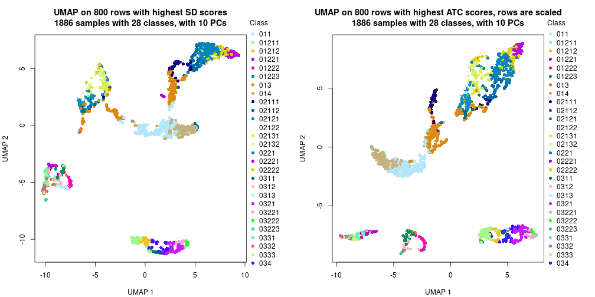</p>

</div>
<div id='tab-dimension-reduction-by-depth-6'>
<pre><code class="r">par(mfrow = c(1, 2))
dimension_reduction(res_rh, merge_node = merge_node_param(min_n_signatures = 237),
    method = &quot;UMAP&quot;, top_value_method = &quot;SD&quot;, top_n = 800, scale_rows = FALSE)
dimension_reduction(res_rh, merge_node = merge_node_param(min_n_signatures = 237),
    method = &quot;UMAP&quot;, top_value_method = &quot;ATC&quot;, top_n = 800, scale_rows = TRUE)
</code></pre>

<p></p>

</div>
<div id='tab-dimension-reduction-by-depth-7'>
<pre><code class="r">par(mfrow = c(1, 2))
dimension_reduction(res_rh, merge_node = merge_node_param(min_n_signatures = 334),
    method = &quot;UMAP&quot;, top_value_method = &quot;SD&quot;, top_n = 800, scale_rows = FALSE)
dimension_reduction(res_rh, merge_node = merge_node_param(min_n_signatures = 334),
    method = &quot;UMAP&quot;, top_value_method = &quot;ATC&quot;, top_n = 800, scale_rows = TRUE)
</code></pre>

<p></p>

</div>
<div id='tab-dimension-reduction-by-depth-8'>
<pre><code class="r">par(mfrow = c(1, 2))
dimension_reduction(res_rh, merge_node = merge_node_param(min_n_signatures = 424),
    method = &quot;UMAP&quot;, top_value_method = &quot;SD&quot;, top_n = 800, scale_rows = FALSE)
dimension_reduction(res_rh, merge_node = merge_node_param(min_n_signatures = 424),
    method = &quot;UMAP&quot;, top_value_method = &quot;ATC&quot;, top_n = 800, scale_rows = TRUE)
</code></pre>

<p></p>

</div>
<div id='tab-dimension-reduction-by-depth-9'>
<pre><code class="r">par(mfrow = c(1, 2))
dimension_reduction(res_rh, merge_node = merge_node_param(min_n_signatures = 433),
    method = &quot;UMAP&quot;, top_value_method = &quot;SD&quot;, top_n = 800, scale_rows = FALSE)
dimension_reduction(res_rh, merge_node = merge_node_param(min_n_signatures = 433),
    method = &quot;UMAP&quot;, top_value_method = &quot;ATC&quot;, top_n = 800, scale_rows = TRUE)
</code></pre>

<p></p>

</div>
<div id='tab-dimension-reduction-by-depth-10'>
<pre><code class="r">par(mfrow = c(1, 2))
dimension_reduction(res_rh, merge_node = merge_node_param(min_n_signatures = 477),
    method = &quot;UMAP&quot;, top_value_method = &quot;SD&quot;, top_n = 800, scale_rows = FALSE)
dimension_reduction(res_rh, merge_node = merge_node_param(min_n_signatures = 477),
    method = &quot;UMAP&quot;, top_value_method = &quot;ATC&quot;, top_n = 800, scale_rows = TRUE)
</code></pre>

<p></p>

</div>
<div id='tab-dimension-reduction-by-depth-11'>
<pre><code class="r">par(mfrow = c(1, 2))
dimension_reduction(res_rh, merge_node = merge_node_param(min_n_signatures = 512),
    method = &quot;UMAP&quot;, top_value_method = &quot;SD&quot;, top_n = 800, scale_rows = FALSE)
dimension_reduction(res_rh, merge_node = merge_node_param(min_n_signatures = 512),
    method = &quot;UMAP&quot;, top_value_method = &quot;ATC&quot;, top_n = 800, scale_rows = TRUE)
</code></pre>

<p></p>

</div>
<div id='tab-dimension-reduction-by-depth-12'>
<pre><code class="r">par(mfrow = c(1, 2))
dimension_reduction(res_rh, merge_node = merge_node_param(min_n_signatures = 714),
    method = &quot;UMAP&quot;, top_value_method = &quot;SD&quot;, top_n = 800, scale_rows = FALSE)
dimension_reduction(res_rh, merge_node = merge_node_param(min_n_signatures = 714),
    method = &quot;UMAP&quot;, top_value_method = &quot;ATC&quot;, top_n = 800, scale_rows = TRUE)
</code></pre>

<p></p>

</div>
<div id='tab-dimension-reduction-by-depth-13'>
<pre><code class="r">par(mfrow = c(1, 2))
dimension_reduction(res_rh, merge_node = merge_node_param(min_n_signatures = 923),
    method = &quot;UMAP&quot;, top_value_method = &quot;SD&quot;, top_n = 800, scale_rows = FALSE)
dimension_reduction(res_rh, merge_node = merge_node_param(min_n_signatures = 923),
    method = &quot;UMAP&quot;, top_value_method = &quot;ATC&quot;, top_n = 800, scale_rows = TRUE)
</code></pre>

<p></p>

</div>
<div id='tab-dimension-reduction-by-depth-14'>
<pre><code class="r">par(mfrow = c(1, 2))
dimension_reduction(res_rh, merge_node = merge_node_param(min_n_signatures = 954),
    method = &quot;UMAP&quot;, top_value_method = &quot;SD&quot;, top_n = 800, scale_rows = FALSE)
dimension_reduction(res_rh, merge_node = merge_node_param(min_n_signatures = 954),
    method = &quot;UMAP&quot;, top_value_method = &quot;ATC&quot;, top_n = 800, scale_rows = TRUE)
</code></pre>

<p></p>

</div>
<div id='tab-dimension-reduction-by-depth-15'>
<pre><code class="r">par(mfrow = c(1, 2))
dimension_reduction(res_rh, merge_node = merge_node_param(min_n_signatures = 976),
    method = &quot;UMAP&quot;, top_value_method = &quot;SD&quot;, top_n = 800, scale_rows = FALSE)
dimension_reduction(res_rh, merge_node = merge_node_param(min_n_signatures = 976),
    method = &quot;UMAP&quot;, top_value_method = &quot;ATC&quot;, top_n = 800, scale_rows = TRUE)
</code></pre>

<p></p>

</div>
<div id='tab-dimension-reduction-by-depth-16'>
<pre><code class="r">par(mfrow = c(1, 2))
dimension_reduction(res_rh, merge_node = merge_node_param(min_n_signatures = 1087),
    method = &quot;UMAP&quot;, top_value_method = &quot;SD&quot;, top_n = 800, scale_rows = FALSE)
dimension_reduction(res_rh, merge_node = merge_node_param(min_n_signatures = 1087),
    method = &quot;UMAP&quot;, top_value_method = &quot;ATC&quot;, top_n = 800, scale_rows = TRUE)
</code></pre>

<p></p>

</div>
<div id='tab-dimension-reduction-by-depth-17'>
<pre><code class="r">par(mfrow = c(1, 2))
dimension_reduction(res_rh, merge_node = merge_node_param(min_n_signatures = 1190),
    method = &quot;UMAP&quot;, top_value_method = &quot;SD&quot;, top_n = 800, scale_rows = FALSE)
dimension_reduction(res_rh, merge_node = merge_node_param(min_n_signatures = 1190),
    method = &quot;UMAP&quot;, top_value_method = &quot;ATC&quot;, top_n = 800, scale_rows = TRUE)
</code></pre>

<p></p>

</div>
<div id='tab-dimension-reduction-by-depth-18'>
<pre><code class="r">par(mfrow = c(1, 2))
dimension_reduction(res_rh, merge_node = merge_node_param(min_n_signatures = 1249),
    method = &quot;UMAP&quot;, top_value_method = &quot;SD&quot;, top_n = 800, scale_rows = FALSE)
dimension_reduction(res_rh, merge_node = merge_node_param(min_n_signatures = 1249),
    method = &quot;UMAP&quot;, top_value_method = &quot;ATC&quot;, top_n = 800, scale_rows = TRUE)
</code></pre>

<p></p>

</div>
<div id='tab-dimension-reduction-by-depth-19'>
<pre><code class="r">par(mfrow = c(1, 2))
dimension_reduction(res_rh, merge_node = merge_node_param(min_n_signatures = 3050),
    method = &quot;UMAP&quot;, top_value_method = &quot;SD&quot;, top_n = 800, scale_rows = FALSE)
dimension_reduction(res_rh, merge_node = merge_node_param(min_n_signatures = 3050),
    method = &quot;UMAP&quot;, top_value_method = &quot;ATC&quot;, top_n = 800, scale_rows = TRUE)
</code></pre>

<p>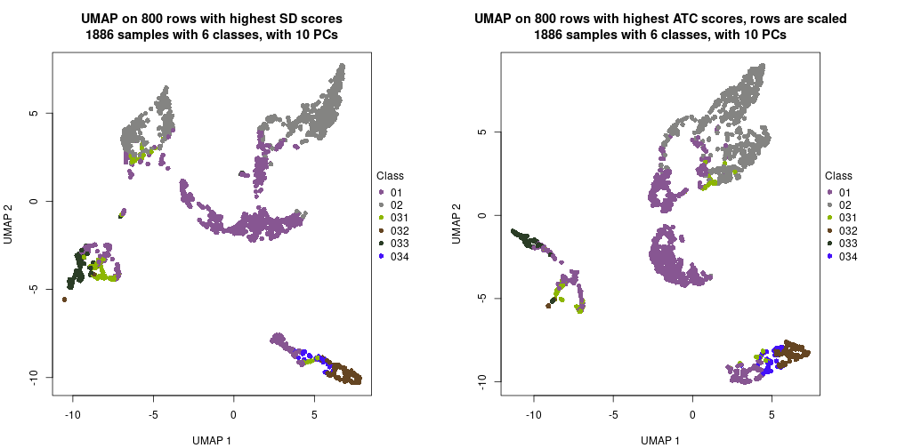</p>

</div>
<div id='tab-dimension-reduction-by-depth-20'>
<pre><code class="r">par(mfrow = c(1, 2))
dimension_reduction(res_rh, merge_node = merge_node_param(min_n_signatures = 3433),
    method = &quot;UMAP&quot;, top_value_method = &quot;SD&quot;, top_n = 800, scale_rows = FALSE)
dimension_reduction(res_rh, merge_node = merge_node_param(min_n_signatures = 3433),
    method = &quot;UMAP&quot;, top_value_method = &quot;ATC&quot;, top_n = 800, scale_rows = TRUE)
</code></pre>

<p></p>

</div>
</div>


### Signature heatmap

Signatures on the heatmap are the union of all signatures found on every node
on the hierarchy. The number of k-means on rows are automatically selected by the function.


<script>
$( function() {
	$( '#tabs-get-signatures-from-hierarchical-partition' ).tabs();
} );
</script>
<div id='tabs-get-signatures-from-hierarchical-partition'>
<ul>
<li><a href='#tab-get-signatures-from-hierarchical-partition-1'>n_signatures ≥ 154</a></li>
<li><a href='#tab-get-signatures-from-hierarchical-partition-2'>n_signatures ≥ 162</a></li>
<li><a href='#tab-get-signatures-from-hierarchical-partition-3'>n_signatures ≥ 168</a></li>
<li><a href='#tab-get-signatures-from-hierarchical-partition-4'>n_signatures ≥ 199</a></li>
<li><a href='#tab-get-signatures-from-hierarchical-partition-5'>n_signatures ≥ 199</a></li>
<li><a href='#tab-get-signatures-from-hierarchical-partition-6'>n_signatures ≥ 237</a></li>
<li><a href='#tab-get-signatures-from-hierarchical-partition-7'>n_signatures ≥ 334</a></li>
<li><a href='#tab-get-signatures-from-hierarchical-partition-8'>n_signatures ≥ 424</a></li>
<li><a href='#tab-get-signatures-from-hierarchical-partition-9'>n_signatures ≥ 433</a></li>
<li><a href='#tab-get-signatures-from-hierarchical-partition-10'>n_signatures ≥ 477</a></li>
<li><a href='#tab-get-signatures-from-hierarchical-partition-11'>n_signatures ≥ 512</a></li>
<li><a href='#tab-get-signatures-from-hierarchical-partition-12'>n_signatures ≥ 714</a></li>
<li><a href='#tab-get-signatures-from-hierarchical-partition-13'>n_signatures ≥ 923</a></li>
<li><a href='#tab-get-signatures-from-hierarchical-partition-14'>n_signatures ≥ 954</a></li>
<li><a href='#tab-get-signatures-from-hierarchical-partition-15'>n_signatures ≥ 976</a></li>
<li><a href='#tab-get-signatures-from-hierarchical-partition-16'>n_signatures ≥ 1087</a></li>
<li><a href='#tab-get-signatures-from-hierarchical-partition-17'>n_signatures ≥ 1190</a></li>
<li><a href='#tab-get-signatures-from-hierarchical-partition-18'>n_signatures ≥ 1249</a></li>
<li><a href='#tab-get-signatures-from-hierarchical-partition-19'>n_signatures ≥ 3050</a></li>
<li><a href='#tab-get-signatures-from-hierarchical-partition-20'>n_signatures ≥ 3433</a></li>
</ul>
<div id='tab-get-signatures-from-hierarchical-partition-1'>
<pre><code class="r">get_signatures(res_rh, merge_node = merge_node_param(min_n_signatures = 154))
</code></pre>

<p></p>

</div>
<div id='tab-get-signatures-from-hierarchical-partition-2'>
<pre><code class="r">get_signatures(res_rh, merge_node = merge_node_param(min_n_signatures = 162))
</code></pre>

<p></p>

</div>
<div id='tab-get-signatures-from-hierarchical-partition-3'>
<pre><code class="r">get_signatures(res_rh, merge_node = merge_node_param(min_n_signatures = 168))
</code></pre>

<p></p>

</div>
<div id='tab-get-signatures-from-hierarchical-partition-4'>
<pre><code class="r">get_signatures(res_rh, merge_node = merge_node_param(min_n_signatures = 199))
</code></pre>

<p></p>

</div>
<div id='tab-get-signatures-from-hierarchical-partition-5'>
<pre><code class="r">get_signatures(res_rh, merge_node = merge_node_param(min_n_signatures = 199))
</code></pre>

<p></p>

</div>
<div id='tab-get-signatures-from-hierarchical-partition-6'>
<pre><code class="r">get_signatures(res_rh, merge_node = merge_node_param(min_n_signatures = 237))
</code></pre>

<p></p>

</div>
<div id='tab-get-signatures-from-hierarchical-partition-7'>
<pre><code class="r">get_signatures(res_rh, merge_node = merge_node_param(min_n_signatures = 334))
</code></pre>

<p></p>

</div>
<div id='tab-get-signatures-from-hierarchical-partition-8'>
<pre><code class="r">get_signatures(res_rh, merge_node = merge_node_param(min_n_signatures = 424))
</code></pre>

<p></p>

</div>
<div id='tab-get-signatures-from-hierarchical-partition-9'>
<pre><code class="r">get_signatures(res_rh, merge_node = merge_node_param(min_n_signatures = 433))
</code></pre>

<p></p>

</div>
<div id='tab-get-signatures-from-hierarchical-partition-10'>
<pre><code class="r">get_signatures(res_rh, merge_node = merge_node_param(min_n_signatures = 477))
</code></pre>

<p></p>

</div>
<div id='tab-get-signatures-from-hierarchical-partition-11'>
<pre><code class="r">get_signatures(res_rh, merge_node = merge_node_param(min_n_signatures = 512))
</code></pre>

<p></p>

</div>
<div id='tab-get-signatures-from-hierarchical-partition-12'>
<pre><code class="r">get_signatures(res_rh, merge_node = merge_node_param(min_n_signatures = 714))
</code></pre>

<p></p>

</div>
<div id='tab-get-signatures-from-hierarchical-partition-13'>
<pre><code class="r">get_signatures(res_rh, merge_node = merge_node_param(min_n_signatures = 923))
</code></pre>

<p></p>

</div>
<div id='tab-get-signatures-from-hierarchical-partition-14'>
<pre><code class="r">get_signatures(res_rh, merge_node = merge_node_param(min_n_signatures = 954))
</code></pre>

<p></p>

</div>
<div id='tab-get-signatures-from-hierarchical-partition-15'>
<pre><code class="r">get_signatures(res_rh, merge_node = merge_node_param(min_n_signatures = 976))
</code></pre>

<p></p>

</div>
<div id='tab-get-signatures-from-hierarchical-partition-16'>
<pre><code class="r">get_signatures(res_rh, merge_node = merge_node_param(min_n_signatures = 1087))
</code></pre>

<p></p>

</div>
<div id='tab-get-signatures-from-hierarchical-partition-17'>
<pre><code class="r">get_signatures(res_rh, merge_node = merge_node_param(min_n_signatures = 1190))
</code></pre>

<p>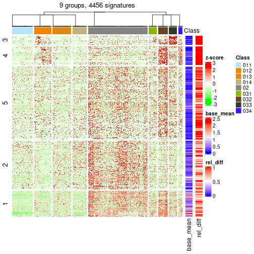</p>

</div>
<div id='tab-get-signatures-from-hierarchical-partition-18'>
<pre><code class="r">get_signatures(res_rh, merge_node = merge_node_param(min_n_signatures = 1249))
</code></pre>

<p></p>

</div>
<div id='tab-get-signatures-from-hierarchical-partition-19'>
<pre><code class="r">get_signatures(res_rh, merge_node = merge_node_param(min_n_signatures = 3050))
</code></pre>

<p></p>

</div>
<div id='tab-get-signatures-from-hierarchical-partition-20'>
<pre><code class="r">get_signatures(res_rh, merge_node = merge_node_param(min_n_signatures = 3433))
</code></pre>

<pre><code>#&gt; Error in names(x) &lt;- value: &#39;names&#39; attribute [1] must be the same length as the vector [0]
</code></pre>

</div>
</div>


Compare signatures from different nodes:


```r
compare_signatures(res_rh, verbose = FALSE)
```


If there are too many signatures, `top_signatures = ...` can be set to only show the 
signatures with the highest FDRs. Note it only works on every node and the final signatures
are the union of all signatures of all nodes.


```r
# code only for demonstration
# e.g. to show the top 500 most significant rows on each node.
tb = get_signature(res_rh, top_signatures = 500)
```


## Results for each node


---------------------------------------------------


### Node0


Child nodes: 
                [Node01](#Node01)
        ,
                [Node02](#Node02)
        ,
                [Node03](#Node03)
        .


The object with results only for a single top-value method and a single partitioning method 
can be extracted as:

```r
res = res_rh["0"]
```

A summary of `res` and all the functions that can be applied to it:

```r
res
```

```
#> A 'DownSamplingConsensusPartition' object with k = 2, 3, 4.
#>   On a matrix with 7364 rows and 500 columns, randomly sampled from 1886 columns.
#>   Top rows (698) are extracted by 'ATC' method.
#>   Subgroups are detected by 'skmeans' method.
#>   Performed in total 150 partitions by row resampling.
#>   Best k for subgroups seems to be 4.
#> 
#> Following methods can be applied to this 'DownSamplingConsensusPartition' object:
#>  [1] "cola_report"             "collect_classes"         "collect_plots"          
#>  [4] "collect_stats"           "colnames"                "compare_partitions"     
#>  [7] "compare_signatures"      "consensus_heatmap"       "dimension_reduction"    
#> [10] "functional_enrichment"   "get_anno_col"            "get_anno"               
#> [13] "get_classes"             "get_consensus"           "get_matrix"             
#> [16] "get_membership"          "get_param"               "get_signatures"         
#> [19] "get_stats"               "is_best_k"               "is_stable_k"            
#> [22] "membership_heatmap"      "ncol"                    "nrow"                   
#> [25] "plot_ecdf"               "predict_classes"         "rownames"               
#> [28] "select_partition_number" "show"                    "suggest_best_k"         
#> [31] "test_to_known_factors"   "top_rows_heatmap"
```

`collect_plots()` function collects all the plots made from `res` for all `k` (number of subgroups)
into one single page to provide an easy and fast comparison between different `k`.

```r
collect_plots(res)
```


The plots are:

- The first row: a plot of the eCDF (empirical cumulative distribution
  function) curves of the consensus matrix for each `k` and the heatmap of
  predicted classes for each `k`.
- The second row: heatmaps of the consensus matrix for each `k`.
- The third row: heatmaps of the membership matrix for each `k`.
- The fouth row: heatmaps of the signatures for each `k`.

All the plots in panels can be made by individual functions and they are
plotted later in this section.

`select_partition_number()` produces several plots showing different
statistics for choosing "optimized" `k`. There are following statistics:

- eCDF curves of the consensus matrix for each `k`;
- 1-PAC. [The PAC score](https://en.wikipedia.org/wiki/Consensus_clustering#Over-interpretation_potential_of_consensus_clustering)
  measures the proportion of the ambiguous subgrouping.
- Mean silhouette score.
- Concordance. The mean probability of fiting the consensus subgroup labels in all
  partitions.
- Area increased. Denote $A_k$ as the area under the eCDF curve for current
  `k`, the area increased is defined as $A_k - A_{k-1}$.
- Rand index. The percent of pairs of samples that are both in a same cluster
  or both are not in a same cluster in the partition of k and k-1.
- Jaccard index. The ratio of pairs of samples are both in a same cluster in
  the partition of k and k-1 and the pairs of samples are both in a same
  cluster in the partition k or k-1.

The detailed explanations of these statistics can be found in [the _cola_
vignette](https://jokergoo.github.io/cola_vignettes/cola.html#toc_13).

Generally speaking, higher 1-PAC score, higher mean silhouette score or higher
concordance corresponds to better partition. Rand index and Jaccard index
measure how similar the current partition is compared to partition with `k-1`.
If they are too similar, we won't accept `k` is better than `k-1`.

```r
select_partition_number(res)
```


The numeric values for all these statistics can be obtained by `get_stats()`.

```r
get_stats(res)
```

```
#>   k 1-PAC mean_silhouette concordance area_increased  Rand Jaccard
#> 2 2 1.000           0.984       0.993         0.5014 0.499   0.499
#> 3 3 1.000           0.977       0.991         0.2789 0.820   0.654
#> 4 4 0.976           0.947       0.975         0.0878 0.930   0.809
```

`suggest_best_k()` suggests the best $k$ based on these statistics. The rules are as follows:

- All $k$ with Jaccard index larger than 0.95 are removed because increasing
  $k$ does not provide enough extra information. If all $k$ are removed, it is
  marked as no subgroup is detected.
- For all $k$ with 1-PAC score larger than 0.9, the maximal $k$ is taken as
  the best $k$, and other $k$ are marked as optional $k$.
- If it does not fit the second rule. The $k$ with the maximal vote of the
  highest 1-PAC score, highest mean silhouette, and highest concordance is
  taken as the best $k$.

```r
suggest_best_k(res)
```

```
#> [1] 4
#> attr(,"optional")
#> [1] 2 3
```

There is also optional best $k$ = 2 3 that is worth to check.

Following is the table of the partitions (You need to click the **show/hide
code output** link to see it). The membership matrix (columns with name `p*`)
is inferred by
[`clue::cl_consensus()`](https://www.rdocumentation.org/link/cl_consensus?package=clue)
function with the `SE` method. Basically the value in the membership matrix
represents the probability to belong to a certain group. The finall subgroup
label for an item is determined with the group with highest probability it
belongs to.

In `get_classes()` function, the entropy is calculated from the membership
matrix and the silhouette score is calculated from the consensus matrix.


<script>
$( function() {
	$( '#tabs-node-0-get-classes' ).tabs();
} );
</script>
<div id='tabs-node-0-get-classes'>
<ul>
<li><a href='#tab-node-0-get-classes-1'>k = 2</a></li>
<li><a href='#tab-node-0-get-classes-2'>k = 3</a></li>
<li><a href='#tab-node-0-get-classes-3'>k = 4</a></li>
</ul>

<div id='tab-node-0-get-classes-1'>
<p><a id='tab-node-0-get-classes-1-a' style='color:#0366d6' href='#'>show/hide code output</a></p>
<pre><code class="r">get_classes(res, k = 2)
</code></pre>

<pre><code>#&gt;                             class     p
#&gt; mouse1_lib1.final_cell_0001     2 0.751
#&gt; mouse1_lib1.final_cell_0002     2 0.000
#&gt; mouse1_lib1.final_cell_0003     2 0.000
#&gt; mouse1_lib1.final_cell_0004     2 0.000
#&gt; mouse1_lib1.final_cell_0005     2 0.000
#&gt; mouse1_lib1.final_cell_0006     2 0.249
#&gt; mouse1_lib1.final_cell_0007     2 0.249
#&gt; mouse1_lib1.final_cell_0008     2 0.000
#&gt; mouse1_lib1.final_cell_0009     2 1.000
#&gt; mouse1_lib1.final_cell_0010     2 0.000
#&gt; mouse1_lib1.final_cell_0011     2 0.000
#&gt; mouse1_lib1.final_cell_0012     2 1.000
#&gt; mouse1_lib1.final_cell_0013     1 0.000
#&gt; mouse1_lib1.final_cell_0014     2 0.000
#&gt; mouse1_lib1.final_cell_0015     2 0.000
#&gt; mouse1_lib1.final_cell_0016     2 0.000
#&gt; mouse1_lib1.final_cell_0017     2 0.000
#&gt; mouse1_lib1.final_cell_0018     2 0.000
#&gt; mouse1_lib1.final_cell_0019     2 0.000
#&gt; mouse1_lib1.final_cell_0020     2 0.000
#&gt; mouse1_lib1.final_cell_0021     2 1.000
#&gt; mouse1_lib1.final_cell_0022     2 1.000
#&gt; mouse1_lib1.final_cell_0023     2 0.000
#&gt; mouse1_lib1.final_cell_0024     2 0.000
#&gt; mouse1_lib1.final_cell_0025     2 0.000
#&gt; mouse1_lib1.final_cell_0026     2 0.249
#&gt; mouse1_lib1.final_cell_0027     2 0.000
#&gt; mouse1_lib1.final_cell_0028     2 0.000
#&gt; mouse1_lib1.final_cell_0029     2 0.000
#&gt; mouse1_lib1.final_cell_0030     2 0.000
#&gt; mouse1_lib1.final_cell_0031     2 0.000
#&gt; mouse1_lib1.final_cell_0032     2 0.000
#&gt; mouse1_lib1.final_cell_0033     2 0.249
#&gt; mouse1_lib1.final_cell_0034     1 0.000
#&gt; mouse1_lib1.final_cell_0035     1 0.000
#&gt; mouse1_lib1.final_cell_0036     2 0.000
#&gt; mouse1_lib1.final_cell_0037     2 0.000
#&gt; mouse1_lib1.final_cell_0038     2 0.000
#&gt; mouse1_lib1.final_cell_0039     2 0.000
#&gt; mouse1_lib1.final_cell_0040     2 0.000
#&gt; mouse1_lib1.final_cell_0041     2 0.000
#&gt; mouse1_lib1.final_cell_0042     2 0.000
#&gt; mouse1_lib1.final_cell_0043     2 0.000
#&gt; mouse1_lib1.final_cell_0044     2 0.249
#&gt; mouse1_lib1.final_cell_0045     2 0.000
#&gt; mouse1_lib1.final_cell_0046     1 0.000
#&gt; mouse1_lib1.final_cell_0047     1 0.000
#&gt; mouse1_lib1.final_cell_0048     2 0.000
#&gt; mouse1_lib1.final_cell_0049     1 0.000
#&gt; mouse1_lib1.final_cell_0050     2 0.000
#&gt; mouse1_lib1.final_cell_0051     1 0.000
#&gt; mouse1_lib1.final_cell_0052     1 0.000
#&gt; mouse1_lib1.final_cell_0053     2 0.000
#&gt; mouse1_lib1.final_cell_0054     2 0.000
#&gt; mouse1_lib1.final_cell_0055     2 0.000
#&gt; mouse1_lib1.final_cell_0056     1 0.000
#&gt; mouse1_lib1.final_cell_0057     2 0.000
#&gt; mouse1_lib1.final_cell_0058     2 0.000
#&gt; mouse1_lib1.final_cell_0059     2 0.000
#&gt; mouse1_lib1.final_cell_0060     1 0.000
#&gt; mouse1_lib1.final_cell_0061     2 1.000
#&gt; mouse1_lib1.final_cell_0062     2 0.000
#&gt; mouse1_lib1.final_cell_0063     2 0.000
#&gt; mouse1_lib1.final_cell_0064     2 0.000
#&gt; mouse1_lib1.final_cell_0065     1 0.000
#&gt; mouse1_lib1.final_cell_0066     1 0.000
#&gt; mouse1_lib1.final_cell_0067     2 0.000
#&gt; mouse1_lib1.final_cell_0068     1 0.000
#&gt; mouse1_lib1.final_cell_0069     2 0.249
#&gt; mouse1_lib1.final_cell_0070     2 0.000
#&gt; mouse1_lib1.final_cell_0071     2 0.000
#&gt; mouse1_lib1.final_cell_0072     2 0.000
#&gt; mouse1_lib1.final_cell_0073     2 0.000
#&gt; mouse1_lib1.final_cell_0074     1 0.000
#&gt; mouse1_lib1.final_cell_0075     1 0.000
#&gt; mouse1_lib1.final_cell_0076     1 0.498
#&gt; mouse1_lib1.final_cell_0077     1 0.000
#&gt; mouse1_lib1.final_cell_0078     2 0.000
#&gt; mouse1_lib1.final_cell_0079     2 0.000
#&gt; mouse1_lib1.final_cell_0080     1 0.000
#&gt; mouse1_lib1.final_cell_0081     2 0.249
#&gt; mouse1_lib1.final_cell_0082     2 0.000
#&gt; mouse1_lib1.final_cell_0083     1 0.000
#&gt; mouse1_lib1.final_cell_0084     2 0.000
#&gt; mouse1_lib1.final_cell_0085     2 0.000
#&gt; mouse1_lib1.final_cell_0086     2 0.249
#&gt; mouse1_lib1.final_cell_0087     2 0.000
#&gt; mouse1_lib1.final_cell_0088     2 0.000
#&gt; mouse1_lib1.final_cell_0089     1 0.000
#&gt; mouse1_lib1.final_cell_0090     2 0.000
#&gt; mouse1_lib1.final_cell_0091     2 0.249
#&gt; mouse1_lib1.final_cell_0092     1 1.000
#&gt; mouse1_lib1.final_cell_0093     1 0.000
#&gt; mouse1_lib1.final_cell_0094     2 0.498
#&gt; mouse1_lib1.final_cell_0095     1 1.000
#&gt; mouse1_lib1.final_cell_0096     1 0.000
#&gt; mouse1_lib1.final_cell_0097     1 0.000
#&gt; mouse1_lib1.final_cell_0098     1 1.000
#&gt; mouse1_lib1.final_cell_0099     2 0.000
#&gt; mouse1_lib1.final_cell_0100     2 0.000
#&gt; mouse1_lib1.final_cell_0101     1 0.000
#&gt; mouse1_lib1.final_cell_0102     1 1.000
#&gt; mouse1_lib1.final_cell_0103     1 0.000
#&gt; mouse1_lib1.final_cell_0104     2 0.000
#&gt; mouse1_lib1.final_cell_0105     2 0.000
#&gt; mouse1_lib1.final_cell_0106     1 0.000
#&gt; mouse1_lib1.final_cell_0107     2 0.000
#&gt; mouse1_lib1.final_cell_0108     1 0.000
#&gt; mouse1_lib1.final_cell_0109     1 0.000
#&gt; mouse1_lib1.final_cell_0110     2 0.000
#&gt; mouse1_lib1.final_cell_0111     2 0.000
#&gt; mouse1_lib1.final_cell_0112     1 1.000
#&gt; mouse1_lib1.final_cell_0113     2 0.253
#&gt; mouse1_lib1.final_cell_0114     1 0.000
#&gt; mouse1_lib1.final_cell_0115     1 1.000
#&gt; mouse1_lib1.final_cell_0116     1 0.747
#&gt; mouse1_lib1.final_cell_0117     1 0.000
#&gt; mouse1_lib1.final_cell_0118     1 0.000
#&gt; mouse1_lib1.final_cell_0119     1 0.000
#&gt; mouse1_lib1.final_cell_0120     2 0.000
#&gt; mouse1_lib1.final_cell_0121     1 1.000
#&gt; mouse1_lib1.final_cell_0122     1 1.000
#&gt; mouse1_lib1.final_cell_0123     1 0.502
#&gt; mouse1_lib1.final_cell_0124     2 0.000
#&gt; mouse1_lib1.final_cell_0125     1 0.000
#&gt; mouse1_lib1.final_cell_0126     1 1.000
#&gt; mouse1_lib1.final_cell_0127     2 0.000
#&gt; mouse1_lib1.final_cell_0128     1 0.000
#&gt; mouse1_lib1.final_cell_0129     1 0.000
#&gt; mouse1_lib1.final_cell_0130     1 0.000
#&gt; mouse1_lib1.final_cell_0131     1 0.000
#&gt; mouse1_lib1.final_cell_0132     1 0.000
#&gt; mouse1_lib1.final_cell_0133     2 0.000
#&gt; mouse1_lib1.final_cell_0134     2 0.249
#&gt; mouse1_lib1.final_cell_0135     2 0.000
#&gt; mouse1_lib1.final_cell_0136     1 0.000
#&gt; mouse1_lib1.final_cell_0137     1 1.000
#&gt; mouse1_lib1.final_cell_0138     1 0.000
#&gt; mouse1_lib1.final_cell_0139     1 0.000
#&gt; mouse1_lib1.final_cell_0140     1 0.000
#&gt; mouse1_lib1.final_cell_0141     1 0.000
#&gt; mouse1_lib1.final_cell_0142     1 0.000
#&gt; mouse1_lib1.final_cell_0143     1 0.000
#&gt; mouse1_lib1.final_cell_0144     2 0.000
#&gt; mouse1_lib1.final_cell_0145     1 0.498
#&gt; mouse1_lib1.final_cell_0146     1 0.000
#&gt; mouse1_lib1.final_cell_0147     1 0.000
#&gt; mouse1_lib1.final_cell_0148     1 0.000
#&gt; mouse1_lib1.final_cell_0149     1 0.000
#&gt; mouse1_lib1.final_cell_0150     1 0.000
#&gt; mouse1_lib1.final_cell_0151     1 0.249
#&gt; mouse1_lib1.final_cell_0152     1 0.747
#&gt; mouse1_lib1.final_cell_0153     1 0.498
#&gt; mouse1_lib1.final_cell_0154     1 0.000
#&gt; mouse1_lib1.final_cell_0155     2 0.000
#&gt; mouse1_lib1.final_cell_0156     1 0.000
#&gt; mouse1_lib1.final_cell_0157     1 0.751
#&gt; mouse1_lib1.final_cell_0158     1 0.000
#&gt; mouse1_lib1.final_cell_0159     1 0.000
#&gt; mouse1_lib1.final_cell_0160     1 1.000
#&gt; mouse1_lib1.final_cell_0161     1 0.000
#&gt; mouse1_lib1.final_cell_0162     1 0.000
#&gt; mouse1_lib1.final_cell_0163     1 0.000
#&gt; mouse1_lib1.final_cell_0164     1 0.000
#&gt; mouse1_lib1.final_cell_0165     1 0.000
#&gt; mouse1_lib1.final_cell_0166     1 1.000
#&gt; mouse1_lib1.final_cell_0167     1 0.000
#&gt; mouse1_lib1.final_cell_0168     1 0.000
#&gt; mouse1_lib1.final_cell_0169     1 0.000
#&gt; mouse1_lib1.final_cell_0170     1 0.000
#&gt; mouse1_lib1.final_cell_0171     1 0.000
#&gt; mouse1_lib1.final_cell_0172     1 0.747
#&gt; mouse1_lib1.final_cell_0173     2 0.249
#&gt; mouse1_lib1.final_cell_0174     1 0.000
#&gt; mouse1_lib1.final_cell_0175     1 1.000
#&gt; mouse1_lib1.final_cell_0176     2 1.000
#&gt; mouse1_lib1.final_cell_0177     1 0.000
#&gt; mouse1_lib1.final_cell_0178     1 0.000
#&gt; mouse1_lib1.final_cell_0179     1 0.000
#&gt; mouse1_lib1.final_cell_0180     1 0.000
#&gt; mouse1_lib1.final_cell_0181     1 0.000
#&gt; mouse1_lib1.final_cell_0182     1 0.249
#&gt; mouse1_lib1.final_cell_0183     1 0.000
#&gt; mouse1_lib1.final_cell_0184     1 0.000
#&gt; mouse1_lib1.final_cell_0185     1 0.000
#&gt; mouse1_lib1.final_cell_0186     1 0.000
#&gt; mouse1_lib1.final_cell_0187     1 1.000
#&gt; mouse1_lib1.final_cell_0188     1 1.000
#&gt; mouse1_lib1.final_cell_0189     1 0.000
#&gt; mouse1_lib1.final_cell_0190     1 0.000
#&gt; mouse1_lib1.final_cell_0191     2 0.000
#&gt; mouse1_lib1.final_cell_0192     1 0.000
#&gt; mouse1_lib1.final_cell_0193     1 0.000
#&gt; mouse1_lib1.final_cell_0194     1 0.000
#&gt; mouse1_lib1.final_cell_0195     1 1.000
#&gt; mouse1_lib1.final_cell_0196     1 0.000
#&gt; mouse1_lib1.final_cell_0197     1 0.000
#&gt; mouse1_lib1.final_cell_0198     1 0.000
#&gt; mouse1_lib1.final_cell_0199     1 0.000
#&gt; mouse1_lib1.final_cell_0200     1 0.000
#&gt; mouse1_lib1.final_cell_0201     1 0.000
#&gt; mouse1_lib1.final_cell_0202     1 0.000
#&gt; mouse1_lib1.final_cell_0203     1 1.000
#&gt; mouse1_lib1.final_cell_0204     1 1.000
#&gt; mouse1_lib1.final_cell_0205     1 0.000
#&gt; mouse1_lib1.final_cell_0206     1 0.000
#&gt; mouse1_lib1.final_cell_0207     1 1.000
#&gt; mouse1_lib1.final_cell_0208     1 0.502
#&gt; mouse1_lib1.final_cell_0209     1 0.000
#&gt; mouse1_lib1.final_cell_0210     1 0.000
#&gt; mouse1_lib1.final_cell_0211     1 0.000
#&gt; mouse1_lib1.final_cell_0212     1 0.000
#&gt; mouse1_lib1.final_cell_0213     1 0.000
#&gt; mouse1_lib1.final_cell_0214     1 0.000
#&gt; mouse1_lib1.final_cell_0215     1 0.249
#&gt; mouse1_lib1.final_cell_0216     1 0.000
#&gt; mouse1_lib1.final_cell_0217     1 0.000
#&gt; mouse1_lib1.final_cell_0218     1 1.000
#&gt; mouse1_lib1.final_cell_0219     1 0.000
#&gt; mouse1_lib1.final_cell_0220     1 0.000
#&gt; mouse1_lib1.final_cell_0221     1 0.000
#&gt; mouse1_lib1.final_cell_0222     1 1.000
#&gt; mouse1_lib1.final_cell_0223     1 0.000
#&gt; mouse1_lib1.final_cell_0224     1 0.000
#&gt; mouse1_lib1.final_cell_0225     1 0.000
#&gt; mouse1_lib1.final_cell_0226     1 0.000
#&gt; mouse1_lib1.final_cell_0227     1 1.000
#&gt; mouse1_lib1.final_cell_0228     1 0.000
#&gt; mouse1_lib1.final_cell_0229     1 1.000
#&gt; mouse1_lib1.final_cell_0230     1 1.000
#&gt; mouse1_lib1.final_cell_0231     1 0.000
#&gt; mouse1_lib1.final_cell_0232     1 1.000
#&gt; mouse1_lib1.final_cell_0233     1 1.000
#&gt; mouse1_lib1.final_cell_0234     1 1.000
#&gt; mouse1_lib1.final_cell_0235     1 0.751
#&gt; mouse1_lib1.final_cell_0236     1 0.000
#&gt; mouse1_lib1.final_cell_0237     1 1.000
#&gt; mouse1_lib1.final_cell_0238     1 1.000
#&gt; mouse1_lib1.final_cell_0239     1 0.000
#&gt; mouse1_lib1.final_cell_0240     1 0.000
#&gt; mouse1_lib1.final_cell_0241     1 0.498
#&gt; mouse1_lib1.final_cell_0242     1 0.000
#&gt; mouse1_lib1.final_cell_0243     1 0.000
#&gt; mouse1_lib1.final_cell_0244     1 0.000
#&gt; mouse1_lib1.final_cell_0245     1 0.000
#&gt; mouse1_lib1.final_cell_0246     1 0.000
#&gt; mouse1_lib1.final_cell_0247     1 0.000
#&gt; mouse1_lib1.final_cell_0248     1 0.000
#&gt; mouse1_lib1.final_cell_0249     1 0.000
#&gt; mouse1_lib1.final_cell_0250     1 0.000
#&gt; mouse1_lib1.final_cell_0251     1 0.751
#&gt; mouse1_lib1.final_cell_0252     1 0.000
#&gt; mouse1_lib1.final_cell_0253     1 0.747
#&gt; mouse1_lib1.final_cell_0254     1 0.000
#&gt; mouse1_lib1.final_cell_0255     1 0.000
#&gt; mouse1_lib1.final_cell_0256     1 0.000
#&gt; mouse1_lib1.final_cell_0257     1 0.000
#&gt; mouse1_lib1.final_cell_0258     1 0.249
#&gt; mouse1_lib1.final_cell_0259     1 0.000
#&gt; mouse1_lib1.final_cell_0260     1 0.000
#&gt; mouse1_lib1.final_cell_0261     1 0.000
#&gt; mouse1_lib1.final_cell_0262     1 0.000
#&gt; mouse1_lib1.final_cell_0263     1 1.000
#&gt; mouse1_lib1.final_cell_0264     1 1.000
#&gt; mouse1_lib1.final_cell_0265     1 1.000
#&gt; mouse1_lib1.final_cell_0266     1 0.000
#&gt; mouse1_lib1.final_cell_0267     1 1.000
#&gt; mouse1_lib1.final_cell_0268     1 0.000
#&gt; mouse1_lib1.final_cell_0269     1 0.000
#&gt; mouse1_lib1.final_cell_0270     1 1.000
#&gt; mouse1_lib1.final_cell_0271     1 1.000
#&gt; mouse1_lib1.final_cell_0272     1 0.000
#&gt; mouse1_lib1.final_cell_0273     1 0.000
#&gt; mouse1_lib1.final_cell_0274     1 0.000
#&gt; mouse1_lib1.final_cell_0275     1 0.000
#&gt; mouse1_lib1.final_cell_0276     1 0.000
#&gt; mouse1_lib1.final_cell_0277     1 0.000
#&gt; mouse1_lib2.final_cell_0001     2 1.000
#&gt; mouse1_lib2.final_cell_0002     2 0.000
#&gt; mouse1_lib2.final_cell_0003     2 0.000
#&gt; mouse1_lib2.final_cell_0004     2 0.000
#&gt; mouse1_lib2.final_cell_0005     2 0.000
#&gt; mouse1_lib2.final_cell_0006     2 1.000
#&gt; mouse1_lib2.final_cell_0007     2 0.000
#&gt; mouse1_lib2.final_cell_0008     2 0.249
#&gt; mouse1_lib2.final_cell_0009     2 0.000
#&gt; mouse1_lib2.final_cell_0010     2 0.000
#&gt; mouse1_lib2.final_cell_0011     2 0.000
#&gt; mouse1_lib2.final_cell_0012     2 0.000
#&gt; mouse1_lib2.final_cell_0013     2 0.000
#&gt; mouse1_lib2.final_cell_0014     2 0.000
#&gt; mouse1_lib2.final_cell_0015     2 0.000
#&gt; mouse1_lib2.final_cell_0016     2 0.000
#&gt; mouse1_lib2.final_cell_0017     2 0.000
#&gt; mouse1_lib2.final_cell_0018     2 0.249
#&gt; mouse1_lib2.final_cell_0019     1 0.000
#&gt; mouse1_lib2.final_cell_0020     2 0.000
#&gt; mouse1_lib2.final_cell_0021     2 0.000
#&gt; mouse1_lib2.final_cell_0022     2 0.000
#&gt; mouse1_lib2.final_cell_0023     2 0.000
#&gt; mouse1_lib2.final_cell_0024     2 0.000
#&gt; mouse1_lib2.final_cell_0025     2 0.751
#&gt; mouse1_lib2.final_cell_0026     2 0.000
#&gt; mouse1_lib2.final_cell_0027     2 0.000
#&gt; mouse1_lib2.final_cell_0028     2 0.000
#&gt; mouse1_lib2.final_cell_0029     2 0.000
#&gt; mouse1_lib2.final_cell_0030     2 0.000
#&gt; mouse1_lib2.final_cell_0031     2 0.000
#&gt; mouse1_lib2.final_cell_0032     2 0.000
#&gt; mouse1_lib2.final_cell_0033     2 0.000
#&gt; mouse1_lib2.final_cell_0034     1 0.000
#&gt; mouse1_lib2.final_cell_0035     2 0.000
#&gt; mouse1_lib2.final_cell_0036     2 0.000
#&gt; mouse1_lib2.final_cell_0037     2 0.249
#&gt; mouse1_lib2.final_cell_0038     2 0.000
#&gt; mouse1_lib2.final_cell_0039     2 0.000
#&gt; mouse1_lib2.final_cell_0040     2 0.000
#&gt; mouse1_lib2.final_cell_0041     2 0.000
#&gt; mouse1_lib2.final_cell_0042     1 0.000
#&gt; mouse1_lib2.final_cell_0043     2 0.000
#&gt; mouse1_lib2.final_cell_0044     2 0.000
#&gt; mouse1_lib2.final_cell_0045     2 0.000
#&gt; mouse1_lib2.final_cell_0046     2 0.000
#&gt; mouse1_lib2.final_cell_0047     2 0.000
#&gt; mouse1_lib2.final_cell_0048     2 0.000
#&gt; mouse1_lib2.final_cell_0049     1 0.000
#&gt; mouse1_lib2.final_cell_0050     2 0.000
#&gt; mouse1_lib2.final_cell_0051     2 0.000
#&gt; mouse1_lib2.final_cell_0052     2 0.000
#&gt; mouse1_lib2.final_cell_0053     1 0.000
#&gt; mouse1_lib2.final_cell_0054     2 0.000
#&gt; mouse1_lib2.final_cell_0055     2 0.000
#&gt; mouse1_lib2.final_cell_0056     2 0.000
#&gt; mouse1_lib2.final_cell_0057     2 0.000
#&gt; mouse1_lib2.final_cell_0058     1 0.000
#&gt; mouse1_lib2.final_cell_0059     2 0.000
#&gt; mouse1_lib2.final_cell_0060     1 0.000
#&gt; mouse1_lib2.final_cell_0061     1 0.000
#&gt; mouse1_lib2.final_cell_0062     2 0.000
#&gt; mouse1_lib2.final_cell_0063     1 0.000
#&gt; mouse1_lib2.final_cell_0064     2 0.000
#&gt; mouse1_lib2.final_cell_0065     1 0.000
#&gt; mouse1_lib2.final_cell_0066     2 0.000
#&gt; mouse1_lib2.final_cell_0067     1 0.000
#&gt; mouse1_lib2.final_cell_0068     2 0.000
#&gt; mouse1_lib2.final_cell_0069     2 0.000
#&gt; mouse1_lib2.final_cell_0070     2 0.000
#&gt; mouse1_lib2.final_cell_0071     1 0.751
#&gt; mouse1_lib2.final_cell_0072     2 0.000
#&gt; mouse1_lib2.final_cell_0073     1 0.000
#&gt; mouse1_lib2.final_cell_0074     1 0.000
#&gt; mouse1_lib2.final_cell_0075     1 0.000
#&gt; mouse1_lib2.final_cell_0076     2 0.000
#&gt; mouse1_lib2.final_cell_0077     2 0.000
#&gt; mouse1_lib2.final_cell_0078     2 0.249
#&gt; mouse1_lib2.final_cell_0079     1 1.000
#&gt; mouse1_lib2.final_cell_0080     1 0.000
#&gt; mouse1_lib2.final_cell_0081     2 0.000
#&gt; mouse1_lib2.final_cell_0082     1 0.000
#&gt; mouse1_lib2.final_cell_0083     2 0.000
#&gt; mouse1_lib2.final_cell_0084     1 0.000
#&gt; mouse1_lib2.final_cell_0085     1 0.000
#&gt; mouse1_lib2.final_cell_0086     2 0.249
#&gt; mouse1_lib2.final_cell_0087     1 0.000
#&gt; mouse1_lib2.final_cell_0088     2 0.000
#&gt; mouse1_lib2.final_cell_0089     1 0.000
#&gt; mouse1_lib2.final_cell_0090     2 0.000
#&gt; mouse1_lib2.final_cell_0091     1 0.000
#&gt; mouse1_lib2.final_cell_0092     1 0.000
#&gt; mouse1_lib2.final_cell_0093     2 0.000
#&gt; mouse1_lib2.final_cell_0094     1 0.000
#&gt; mouse1_lib2.final_cell_0095     2 0.253
#&gt; mouse1_lib2.final_cell_0096     2 0.000
#&gt; mouse1_lib2.final_cell_0097     1 0.000
#&gt; mouse1_lib2.final_cell_0098     2 0.000
#&gt; mouse1_lib2.final_cell_0099     2 0.249
#&gt; mouse1_lib2.final_cell_0100     1 0.000
#&gt; mouse1_lib2.final_cell_0101     1 0.000
#&gt; mouse1_lib2.final_cell_0102     2 0.000
#&gt; mouse1_lib2.final_cell_0103     1 0.000
#&gt; mouse1_lib2.final_cell_0104     1 0.000
#&gt; mouse1_lib2.final_cell_0105     2 0.000
#&gt; mouse1_lib2.final_cell_0106     2 0.000
#&gt; mouse1_lib2.final_cell_0107     1 0.000
#&gt; mouse1_lib2.final_cell_0108     2 0.000
#&gt; mouse1_lib2.final_cell_0109     1 0.000
#&gt; mouse1_lib2.final_cell_0110     1 0.000
#&gt; mouse1_lib2.final_cell_0111     1 0.000
#&gt; mouse1_lib2.final_cell_0112     2 0.000
#&gt; mouse1_lib2.final_cell_0113     2 0.000
#&gt; mouse1_lib2.final_cell_0114     2 0.249
#&gt; mouse1_lib2.final_cell_0115     1 0.000
#&gt; mouse1_lib2.final_cell_0116     1 0.000
#&gt; mouse1_lib2.final_cell_0117     2 0.000
#&gt; mouse1_lib2.final_cell_0118     1 0.000
#&gt; mouse1_lib2.final_cell_0119     2 0.000
#&gt; mouse1_lib2.final_cell_0120     2 0.000
#&gt; mouse1_lib2.final_cell_0121     1 0.000
#&gt; mouse1_lib2.final_cell_0122     1 0.000
#&gt; mouse1_lib2.final_cell_0123     1 0.000
#&gt; mouse1_lib2.final_cell_0124     2 0.000
#&gt; mouse1_lib2.final_cell_0125     1 0.000
#&gt; mouse1_lib2.final_cell_0126     1 0.000
#&gt; mouse1_lib2.final_cell_0127     2 0.000
#&gt; mouse1_lib2.final_cell_0128     1 0.000
#&gt; mouse1_lib2.final_cell_0129     1 0.000
#&gt; mouse1_lib2.final_cell_0130     1 0.000
#&gt; mouse1_lib2.final_cell_0131     1 0.000
#&gt; mouse1_lib2.final_cell_0132     1 0.751
#&gt; mouse1_lib2.final_cell_0133     1 0.000
#&gt; mouse1_lib2.final_cell_0134     1 0.000
#&gt; mouse1_lib2.final_cell_0135     1 0.000
#&gt; mouse1_lib2.final_cell_0136     1 0.000
#&gt; mouse1_lib2.final_cell_0137     1 0.000
#&gt; mouse1_lib2.final_cell_0138     1 0.000
#&gt; mouse1_lib2.final_cell_0139     1 0.751
#&gt; mouse1_lib2.final_cell_0140     1 0.000
#&gt; mouse1_lib2.final_cell_0141     1 0.000
#&gt; mouse1_lib2.final_cell_0142     2 0.000
#&gt; mouse1_lib2.final_cell_0143     2 0.000
#&gt; mouse1_lib2.final_cell_0144     1 0.000
#&gt; mouse1_lib2.final_cell_0145     2 0.000
#&gt; mouse1_lib2.final_cell_0146     1 0.000
#&gt; mouse1_lib2.final_cell_0147     2 0.000
#&gt; mouse1_lib2.final_cell_0148     2 0.000
#&gt; mouse1_lib2.final_cell_0149     1 0.000
#&gt; mouse1_lib2.final_cell_0150     1 0.000
#&gt; mouse1_lib2.final_cell_0151     1 0.000
#&gt; mouse1_lib2.final_cell_0152     1 0.000
#&gt; mouse1_lib2.final_cell_0153     2 0.000
#&gt; mouse1_lib2.final_cell_0154     1 0.000
#&gt; mouse1_lib2.final_cell_0155     1 0.000
#&gt; mouse1_lib2.final_cell_0156     1 0.000
#&gt; mouse1_lib2.final_cell_0157     1 0.000
#&gt; mouse1_lib2.final_cell_0158     2 0.000
#&gt; mouse1_lib2.final_cell_0159     1 0.000
#&gt; mouse1_lib2.final_cell_0160     1 0.000
#&gt; mouse1_lib2.final_cell_0161     1 0.000
#&gt; mouse1_lib2.final_cell_0162     1 0.000
#&gt; mouse1_lib2.final_cell_0163     1 0.000
#&gt; mouse1_lib2.final_cell_0164     1 0.000
#&gt; mouse1_lib2.final_cell_0165     2 1.000
#&gt; mouse1_lib2.final_cell_0166     1 0.000
#&gt; mouse1_lib2.final_cell_0167     2 0.000
#&gt; mouse1_lib2.final_cell_0168     1 0.000
#&gt; mouse1_lib2.final_cell_0169     2 0.000
#&gt; mouse1_lib2.final_cell_0170     1 0.502
#&gt; mouse1_lib2.final_cell_0171     2 0.000
#&gt; mouse1_lib2.final_cell_0172     1 0.000
#&gt; mouse1_lib2.final_cell_0173     1 0.000
#&gt; mouse1_lib2.final_cell_0174     1 0.000
#&gt; mouse1_lib2.final_cell_0175     1 0.000
#&gt; mouse1_lib2.final_cell_0176     1 0.000
#&gt; mouse1_lib2.final_cell_0177     1 0.000
#&gt; mouse1_lib2.final_cell_0178     1 0.000
#&gt; mouse1_lib2.final_cell_0179     1 1.000
#&gt; mouse1_lib2.final_cell_0180     1 0.000
#&gt; mouse1_lib2.final_cell_0181     1 0.000
#&gt; mouse1_lib2.final_cell_0182     1 0.747
#&gt; mouse1_lib2.final_cell_0183     1 0.498
#&gt; mouse1_lib2.final_cell_0184     1 0.000
#&gt; mouse1_lib2.final_cell_0185     1 0.000
#&gt; mouse1_lib2.final_cell_0186     1 1.000
#&gt; mouse1_lib2.final_cell_0187     1 0.000
#&gt; mouse1_lib2.final_cell_0188     1 0.000
#&gt; mouse1_lib2.final_cell_0189     1 0.000
#&gt; mouse1_lib2.final_cell_0190     1 0.000
#&gt; mouse1_lib2.final_cell_0191     1 0.000
#&gt; mouse1_lib2.final_cell_0192     1 0.000
#&gt; mouse1_lib2.final_cell_0193     1 0.000
#&gt; mouse1_lib2.final_cell_0194     1 1.000
#&gt; mouse1_lib2.final_cell_0195     1 0.000
#&gt; mouse1_lib2.final_cell_0196     1 0.000
#&gt; mouse1_lib2.final_cell_0197     1 0.000
#&gt; mouse1_lib2.final_cell_0198     1 0.000
#&gt; mouse1_lib2.final_cell_0199     1 0.000
#&gt; mouse1_lib2.final_cell_0200     1 1.000
#&gt; mouse1_lib2.final_cell_0201     1 0.000
#&gt; mouse1_lib2.final_cell_0202     1 0.000
#&gt; mouse1_lib2.final_cell_0203     1 0.000
#&gt; mouse1_lib2.final_cell_0204     1 0.000
#&gt; mouse1_lib2.final_cell_0205     1 0.000
#&gt; mouse1_lib2.final_cell_0206     1 1.000
#&gt; mouse1_lib2.final_cell_0207     1 0.000
#&gt; mouse1_lib2.final_cell_0208     1 1.000
#&gt; mouse1_lib2.final_cell_0209     1 0.000
#&gt; mouse1_lib2.final_cell_0210     1 0.000
#&gt; mouse1_lib2.final_cell_0211     2 0.249
#&gt; mouse1_lib2.final_cell_0212     1 0.747
#&gt; mouse1_lib2.final_cell_0213     1 0.000
#&gt; mouse1_lib2.final_cell_0214     1 0.000
#&gt; mouse1_lib2.final_cell_0215     1 1.000
#&gt; mouse1_lib2.final_cell_0216     1 0.000
#&gt; mouse1_lib2.final_cell_0217     1 0.000
#&gt; mouse1_lib2.final_cell_0218     1 0.000
#&gt; mouse1_lib2.final_cell_0219     1 0.502
#&gt; mouse1_lib2.final_cell_0220     1 0.000
#&gt; mouse1_lib2.final_cell_0221     1 1.000
#&gt; mouse1_lib2.final_cell_0222     1 0.000
#&gt; mouse1_lib2.final_cell_0223     1 1.000
#&gt; mouse1_lib2.final_cell_0224     1 0.000
#&gt; mouse1_lib2.final_cell_0225     1 0.000
#&gt; mouse1_lib2.final_cell_0226     1 0.000
#&gt; mouse1_lib2.final_cell_0227     1 1.000
#&gt; mouse1_lib2.final_cell_0228     1 0.000
#&gt; mouse1_lib2.final_cell_0229     1 0.000
#&gt; mouse1_lib2.final_cell_0230     1 0.502
#&gt; mouse1_lib2.final_cell_0231     1 0.000
#&gt; mouse1_lib2.final_cell_0232     1 0.000
#&gt; mouse1_lib2.final_cell_0233     1 0.000
#&gt; mouse1_lib2.final_cell_0234     1 0.000
#&gt; mouse1_lib2.final_cell_0235     1 0.000
#&gt; mouse1_lib2.final_cell_0236     1 0.000
#&gt; mouse1_lib2.final_cell_0237     1 0.000
#&gt; mouse1_lib2.final_cell_0238     2 0.000
#&gt; mouse1_lib2.final_cell_0239     1 1.000
#&gt; mouse1_lib2.final_cell_0240     1 0.000
#&gt; mouse1_lib2.final_cell_0241     1 0.000
#&gt; mouse1_lib2.final_cell_0242     1 0.000
#&gt; mouse1_lib2.final_cell_0243     1 0.000
#&gt; mouse1_lib2.final_cell_0244     1 0.000
#&gt; mouse1_lib2.final_cell_0245     1 0.747
#&gt; mouse1_lib2.final_cell_0246     1 0.000
#&gt; mouse1_lib2.final_cell_0247     1 0.000
#&gt; mouse1_lib2.final_cell_0248     1 1.000
#&gt; mouse1_lib2.final_cell_0249     1 0.000
#&gt; mouse1_lib2.final_cell_0250     1 0.000
#&gt; mouse1_lib2.final_cell_0251     1 0.000
#&gt; mouse1_lib2.final_cell_0252     2 0.000
#&gt; mouse1_lib2.final_cell_0253     1 0.000
#&gt; mouse1_lib2.final_cell_0254     1 0.000
#&gt; mouse1_lib2.final_cell_0255     1 0.000
#&gt; mouse1_lib2.final_cell_0256     1 0.000
#&gt; mouse1_lib2.final_cell_0257     1 0.000
#&gt; mouse1_lib2.final_cell_0258     1 0.000
#&gt; mouse1_lib2.final_cell_0259     1 0.498
#&gt; mouse1_lib2.final_cell_0260     1 0.000
#&gt; mouse1_lib2.final_cell_0261     1 0.000
#&gt; mouse1_lib2.final_cell_0262     1 0.000
#&gt; mouse1_lib2.final_cell_0263     1 0.000
#&gt; mouse1_lib2.final_cell_0264     1 0.751
#&gt; mouse1_lib2.final_cell_0265     1 0.000
#&gt; mouse1_lib2.final_cell_0266     1 0.000
#&gt; mouse1_lib2.final_cell_0267     1 0.000
#&gt; mouse1_lib2.final_cell_0268     1 0.000
#&gt; mouse1_lib2.final_cell_0269     1 1.000
#&gt; mouse1_lib2.final_cell_0270     1 0.000
#&gt; mouse1_lib2.final_cell_0271     1 0.000
#&gt; mouse1_lib2.final_cell_0272     1 0.000
#&gt; mouse1_lib2.final_cell_0273     1 0.000
#&gt; mouse1_lib2.final_cell_0274     1 0.000
#&gt; mouse1_lib2.final_cell_0275     1 0.000
#&gt; mouse1_lib2.final_cell_0276     1 0.253
#&gt; mouse1_lib2.final_cell_0277     1 1.000
#&gt; mouse1_lib2.final_cell_0278     1 0.000
#&gt; mouse1_lib2.final_cell_0279     1 0.000
#&gt; mouse1_lib2.final_cell_0280     1 0.000
#&gt; mouse1_lib2.final_cell_0281     1 0.000
#&gt; mouse1_lib2.final_cell_0282     1 0.000
#&gt; mouse1_lib2.final_cell_0283     1 0.000
#&gt; mouse1_lib2.final_cell_0284     1 0.000
#&gt; mouse1_lib2.final_cell_0285     1 0.000
#&gt; mouse1_lib2.final_cell_0286     1 0.000
#&gt; mouse1_lib2.final_cell_0287     1 0.000
#&gt; mouse1_lib2.final_cell_0288     1 0.000
#&gt; mouse1_lib2.final_cell_0289     1 0.249
#&gt; mouse1_lib2.final_cell_0290     1 0.000
#&gt; mouse1_lib2.final_cell_0291     1 0.000
#&gt; mouse1_lib3.final_cell_0001     2 0.502
#&gt; mouse1_lib3.final_cell_0002     2 0.249
#&gt; mouse1_lib3.final_cell_0003     2 0.000
#&gt; mouse1_lib3.final_cell_0004     2 0.000
#&gt; mouse1_lib3.final_cell_0005     2 0.000
#&gt; mouse1_lib3.final_cell_0006     2 0.000
#&gt; mouse1_lib3.final_cell_0007     2 1.000
#&gt; mouse1_lib3.final_cell_0008     2 0.000
#&gt; mouse1_lib3.final_cell_0009     2 0.000
#&gt; mouse1_lib3.final_cell_0010     2 0.000
#&gt; mouse1_lib3.final_cell_0011     2 0.000
#&gt; mouse1_lib3.final_cell_0012     2 0.000
#&gt; mouse1_lib3.final_cell_0013     2 0.000
#&gt; mouse1_lib3.final_cell_0014     2 0.000
#&gt; mouse1_lib3.final_cell_0015     2 0.000
#&gt; mouse1_lib3.final_cell_0016     2 0.000
#&gt; mouse1_lib3.final_cell_0017     2 0.000
#&gt; mouse1_lib3.final_cell_0018     2 0.249
#&gt; mouse1_lib3.final_cell_0019     2 0.000
#&gt; mouse1_lib3.final_cell_0020     2 0.000
#&gt; mouse1_lib3.final_cell_0021     2 0.000
#&gt; mouse1_lib3.final_cell_0022     2 0.000
#&gt; mouse1_lib3.final_cell_0023     1 0.000
#&gt; mouse1_lib3.final_cell_0024     2 0.000
#&gt; mouse1_lib3.final_cell_0025     2 0.000
#&gt; mouse1_lib3.final_cell_0026     2 0.249
#&gt; mouse1_lib3.final_cell_0027     2 0.000
#&gt; mouse1_lib3.final_cell_0028     2 0.000
#&gt; mouse1_lib3.final_cell_0029     2 0.000
#&gt; mouse1_lib3.final_cell_0030     2 0.000
#&gt; mouse1_lib3.final_cell_0031     2 0.000
#&gt; mouse1_lib3.final_cell_0032     2 0.000
#&gt; mouse1_lib3.final_cell_0033     2 0.000
#&gt; mouse1_lib3.final_cell_0034     2 0.000
#&gt; mouse1_lib3.final_cell_0035     2 0.000
#&gt; mouse1_lib3.final_cell_0036     1 0.000
#&gt; mouse1_lib3.final_cell_0037     2 0.000
#&gt; mouse1_lib3.final_cell_0038     2 0.000
#&gt; mouse1_lib3.final_cell_0039     1 0.000
#&gt; mouse1_lib3.final_cell_0040     1 0.000
#&gt; mouse1_lib3.final_cell_0041     2 0.000
#&gt; mouse1_lib3.final_cell_0042     2 0.000
#&gt; mouse1_lib3.final_cell_0043     2 0.000
#&gt; mouse1_lib3.final_cell_0044     2 0.000
#&gt; mouse1_lib3.final_cell_0045     1 0.000
#&gt; mouse1_lib3.final_cell_0046     1 0.751
#&gt; mouse1_lib3.final_cell_0047     2 0.000
#&gt; mouse1_lib3.final_cell_0048     1 0.000
#&gt; mouse1_lib3.final_cell_0049     1 0.000
#&gt; mouse1_lib3.final_cell_0050     2 0.000
#&gt; mouse1_lib3.final_cell_0051     1 0.000
#&gt; mouse1_lib3.final_cell_0052     1 0.000
#&gt; mouse1_lib3.final_cell_0053     1 0.000
#&gt; mouse1_lib3.final_cell_0054     2 0.000
#&gt; mouse1_lib3.final_cell_0055     2 0.000
#&gt; mouse1_lib3.final_cell_0056     2 0.000
#&gt; mouse1_lib3.final_cell_0057     2 0.000
#&gt; mouse1_lib3.final_cell_0058     1 0.000
#&gt; mouse1_lib3.final_cell_0059     1 0.000
#&gt; mouse1_lib3.final_cell_0060     2 0.000
#&gt; mouse1_lib3.final_cell_0061     1 0.000
#&gt; mouse1_lib3.final_cell_0062     1 0.000
#&gt; mouse1_lib3.final_cell_0063     2 0.000
#&gt; mouse1_lib3.final_cell_0064     2 0.000
#&gt; mouse1_lib3.final_cell_0065     1 0.000
#&gt; mouse1_lib3.final_cell_0066     2 0.000
#&gt; mouse1_lib3.final_cell_0067     2 0.000
#&gt; mouse1_lib3.final_cell_0068     1 0.000
#&gt; mouse1_lib3.final_cell_0069     1 0.000
#&gt; mouse1_lib3.final_cell_0070     2 0.000
#&gt; mouse1_lib3.final_cell_0071     2 0.000
#&gt; mouse1_lib3.final_cell_0072     2 0.000
#&gt; mouse1_lib3.final_cell_0073     1 1.000
#&gt; mouse1_lib3.final_cell_0074     1 0.000
#&gt; mouse1_lib3.final_cell_0075     1 0.000
#&gt; mouse1_lib3.final_cell_0076     2 0.000
#&gt; mouse1_lib3.final_cell_0077     1 0.000
#&gt; mouse1_lib3.final_cell_0078     2 0.000
#&gt; mouse1_lib3.final_cell_0079     2 0.000
#&gt; mouse1_lib3.final_cell_0080     1 0.000
#&gt; mouse1_lib3.final_cell_0081     2 0.000
#&gt; mouse1_lib3.final_cell_0082     2 0.000
#&gt; mouse1_lib3.final_cell_0083     2 0.502
#&gt; mouse1_lib3.final_cell_0084     1 0.000
#&gt; mouse1_lib3.final_cell_0085     2 0.000
#&gt; mouse1_lib3.final_cell_0086     2 0.000
#&gt; mouse1_lib3.final_cell_0087     2 0.000
#&gt; mouse1_lib3.final_cell_0088     2 0.000
#&gt; mouse1_lib3.final_cell_0089     2 0.000
#&gt; mouse1_lib3.final_cell_0090     2 0.000
#&gt; mouse1_lib3.final_cell_0091     1 0.751
#&gt; mouse1_lib3.final_cell_0092     1 0.000
#&gt; mouse1_lib3.final_cell_0093     1 0.000
#&gt; mouse1_lib3.final_cell_0094     1 0.000
#&gt; mouse1_lib3.final_cell_0095     1 0.498
#&gt; mouse1_lib3.final_cell_0096     1 0.253
#&gt; mouse1_lib3.final_cell_0097     1 0.249
#&gt; mouse1_lib3.final_cell_0098     1 0.000
#&gt; mouse1_lib3.final_cell_0099     2 0.000
#&gt; mouse1_lib3.final_cell_0100     2 0.000
#&gt; mouse1_lib3.final_cell_0101     1 1.000
#&gt; mouse1_lib3.final_cell_0102     1 0.000
#&gt; mouse1_lib3.final_cell_0103     1 0.000
#&gt; mouse1_lib3.final_cell_0104     1 0.502
#&gt; mouse1_lib3.final_cell_0105     1 0.000
#&gt; mouse1_lib3.final_cell_0106     1 0.000
#&gt; mouse1_lib3.final_cell_0107     2 0.000
#&gt; mouse1_lib3.final_cell_0108     1 0.000
#&gt; mouse1_lib3.final_cell_0109     1 1.000
#&gt; mouse1_lib3.final_cell_0110     1 0.751
#&gt; mouse1_lib3.final_cell_0111     2 0.000
#&gt; mouse1_lib3.final_cell_0112     1 0.000
#&gt; mouse1_lib3.final_cell_0113     1 0.000
#&gt; mouse1_lib3.final_cell_0114     1 0.502
#&gt; mouse1_lib3.final_cell_0115     1 0.000
#&gt; mouse1_lib3.final_cell_0116     1 1.000
#&gt; mouse1_lib3.final_cell_0117     1 0.000
#&gt; mouse1_lib3.final_cell_0118     1 0.000
#&gt; mouse1_lib3.final_cell_0119     2 0.000
#&gt; mouse1_lib3.final_cell_0120     1 0.000
#&gt; mouse1_lib3.final_cell_0121     1 0.000
#&gt; mouse1_lib3.final_cell_0122     1 0.000
#&gt; mouse1_lib3.final_cell_0123     1 1.000
#&gt; mouse1_lib3.final_cell_0124     1 0.000
#&gt; mouse1_lib3.final_cell_0125     2 0.000
#&gt; mouse1_lib3.final_cell_0126     1 0.000
#&gt; mouse1_lib3.final_cell_0127     1 0.000
#&gt; mouse1_lib3.final_cell_0128     1 0.751
#&gt; mouse1_lib3.final_cell_0129     1 0.000
#&gt; mouse1_lib3.final_cell_0130     1 0.000
#&gt; mouse1_lib3.final_cell_0131     1 0.000
#&gt; mouse1_lib3.final_cell_0132     1 0.000
#&gt; mouse1_lib3.final_cell_0133     1 0.000
#&gt; mouse1_lib3.final_cell_0134     1 0.000
#&gt; mouse1_lib3.final_cell_0135     1 0.000
#&gt; mouse1_lib3.final_cell_0136     1 0.000
#&gt; mouse1_lib3.final_cell_0137     1 0.000
#&gt; mouse1_lib3.final_cell_0138     1 0.000
#&gt; mouse1_lib3.final_cell_0139     1 0.000
#&gt; mouse1_lib3.final_cell_0140     1 0.000
#&gt; mouse1_lib3.final_cell_0141     1 0.000
#&gt; mouse1_lib3.final_cell_0142     1 0.000
#&gt; mouse1_lib3.final_cell_0143     1 0.000
#&gt; mouse1_lib3.final_cell_0144     1 0.000
#&gt; mouse1_lib3.final_cell_0145     1 0.000
#&gt; mouse1_lib3.final_cell_0146     1 0.000
#&gt; mouse1_lib3.final_cell_0147     1 0.000
#&gt; mouse1_lib3.final_cell_0148     1 0.249
#&gt; mouse1_lib3.final_cell_0149     1 0.000
#&gt; mouse1_lib3.final_cell_0150     1 0.000
#&gt; mouse1_lib3.final_cell_0151     1 0.000
#&gt; mouse1_lib3.final_cell_0152     1 0.000
#&gt; mouse1_lib3.final_cell_0153     1 1.000
#&gt; mouse1_lib3.final_cell_0154     1 0.000
#&gt; mouse1_lib3.final_cell_0155     1 0.000
#&gt; mouse1_lib3.final_cell_0156     1 1.000
#&gt; mouse1_lib3.final_cell_0157     1 1.000
#&gt; mouse1_lib3.final_cell_0158     1 0.249
#&gt; mouse1_lib3.final_cell_0159     1 0.000
#&gt; mouse1_lib3.final_cell_0160     1 0.000
#&gt; mouse1_lib3.final_cell_0161     1 0.000
#&gt; mouse1_lib3.final_cell_0162     1 1.000
#&gt; mouse1_lib3.final_cell_0163     1 0.000
#&gt; mouse1_lib3.final_cell_0164     1 1.000
#&gt; mouse1_lib3.final_cell_0165     1 0.000
#&gt; mouse1_lib3.final_cell_0166     1 0.000
#&gt; mouse1_lib3.final_cell_0167     2 0.000
#&gt; mouse1_lib3.final_cell_0168     1 0.000
#&gt; mouse1_lib3.final_cell_0169     1 1.000
#&gt; mouse1_lib3.final_cell_0170     1 0.249
#&gt; mouse1_lib3.final_cell_0171     1 0.000
#&gt; mouse1_lib3.final_cell_0172     1 0.000
#&gt; mouse1_lib3.final_cell_0173     1 0.000
#&gt; mouse1_lib3.final_cell_0174     1 1.000
#&gt; mouse1_lib3.final_cell_0175     1 0.000
#&gt; mouse1_lib3.final_cell_0176     1 0.000
#&gt; mouse1_lib3.final_cell_0177     1 0.000
#&gt; mouse1_lib3.final_cell_0178     1 0.000
#&gt; mouse1_lib3.final_cell_0179     1 1.000
#&gt; mouse1_lib3.final_cell_0180     1 0.000
#&gt; mouse1_lib3.final_cell_0181     1 0.000
#&gt; mouse1_lib3.final_cell_0182     1 0.000
#&gt; mouse1_lib3.final_cell_0183     1 0.000
#&gt; mouse1_lib3.final_cell_0184     1 0.000
#&gt; mouse1_lib3.final_cell_0185     1 0.000
#&gt; mouse1_lib3.final_cell_0186     1 0.000
#&gt; mouse1_lib3.final_cell_0187     1 0.000
#&gt; mouse1_lib3.final_cell_0188     1 0.000
#&gt; mouse1_lib3.final_cell_0189     1 0.000
#&gt; mouse1_lib3.final_cell_0190     1 0.000
#&gt; mouse1_lib3.final_cell_0191     1 0.000
#&gt; mouse1_lib3.final_cell_0192     1 0.000
#&gt; mouse1_lib3.final_cell_0193     1 0.000
#&gt; mouse1_lib3.final_cell_0194     1 0.751
#&gt; mouse1_lib3.final_cell_0195     2 0.249
#&gt; mouse1_lib3.final_cell_0196     1 1.000
#&gt; mouse1_lib3.final_cell_0197     1 1.000
#&gt; mouse1_lib3.final_cell_0198     1 0.000
#&gt; mouse1_lib3.final_cell_0199     1 0.000
#&gt; mouse1_lib3.final_cell_0200     1 0.751
#&gt; mouse1_lib3.final_cell_0201     1 0.000
#&gt; mouse1_lib3.final_cell_0202     1 0.000
#&gt; mouse1_lib3.final_cell_0203     1 1.000
#&gt; mouse1_lib3.final_cell_0204     1 1.000
#&gt; mouse1_lib3.final_cell_0205     1 0.000
#&gt; mouse1_lib3.final_cell_0206     1 0.000
#&gt; mouse1_lib3.final_cell_0207     1 1.000
#&gt; mouse1_lib3.final_cell_0208     1 0.000
#&gt; mouse1_lib3.final_cell_0209     1 0.000
#&gt; mouse1_lib3.final_cell_0210     1 1.000
#&gt; mouse1_lib3.final_cell_0211     1 0.000
#&gt; mouse1_lib3.final_cell_0212     1 0.000
#&gt; mouse1_lib3.final_cell_0213     1 0.000
#&gt; mouse1_lib3.final_cell_0214     1 0.000
#&gt; mouse1_lib3.final_cell_0215     1 1.000
#&gt; mouse1_lib3.final_cell_0216     1 1.000
#&gt; mouse1_lib3.final_cell_0217     1 0.000
#&gt; mouse1_lib3.final_cell_0218     1 1.000
#&gt; mouse1_lib3.final_cell_0219     1 0.000
#&gt; mouse1_lib3.final_cell_0220     1 1.000
#&gt; mouse1_lib3.final_cell_0221     1 0.000
#&gt; mouse1_lib3.final_cell_0222     1 0.000
#&gt; mouse1_lib3.final_cell_0223     1 0.000
#&gt; mouse1_lib3.final_cell_0224     1 0.000
#&gt; mouse1_lib3.final_cell_0225     1 0.000
#&gt; mouse1_lib3.final_cell_0226     1 0.000
#&gt; mouse1_lib3.final_cell_0227     1 0.000
#&gt; mouse1_lib3.final_cell_0228     1 1.000
#&gt; mouse1_lib3.final_cell_0229     1 0.000
#&gt; mouse1_lib3.final_cell_0230     1 0.751
#&gt; mouse1_lib3.final_cell_0231     1 1.000
#&gt; mouse1_lib3.final_cell_0232     1 0.000
#&gt; mouse1_lib3.final_cell_0233     1 0.249
#&gt; mouse1_lib3.final_cell_0234     1 0.751
#&gt; mouse1_lib3.final_cell_0235     1 0.000
#&gt; mouse1_lib3.final_cell_0236     1 0.000
#&gt; mouse1_lib3.final_cell_0237     1 0.000
#&gt; mouse1_lib3.final_cell_0238     1 0.000
#&gt; mouse1_lib3.final_cell_0239     1 1.000
#&gt; mouse1_lib3.final_cell_0240     1 1.000
#&gt; mouse1_lib3.final_cell_0241     1 0.000
#&gt; mouse1_lib3.final_cell_0242     1 0.000
#&gt; mouse1_lib3.final_cell_0243     1 1.000
#&gt; mouse1_lib3.final_cell_0244     1 0.000
#&gt; mouse1_lib3.final_cell_0245     1 0.000
#&gt; mouse1_lib3.final_cell_0246     1 0.000
#&gt; mouse1_lib3.final_cell_0247     1 0.000
#&gt; mouse1_lib3.final_cell_0248     1 0.249
#&gt; mouse1_lib3.final_cell_0249     1 0.000
#&gt; mouse1_lib3.final_cell_0250     1 0.000
#&gt; mouse1_lib3.final_cell_0251     1 0.000
#&gt; mouse1_lib3.final_cell_0252     1 0.000
#&gt; mouse1_lib3.final_cell_0253     1 0.000
#&gt; mouse1_lib3.final_cell_0254     1 0.000
#&gt; mouse2_lib1.final_cell_0001     2 1.000
#&gt; mouse2_lib1.final_cell_0002     2 0.000
#&gt; mouse2_lib1.final_cell_0003     2 1.000
#&gt; mouse2_lib1.final_cell_0004     2 0.000
#&gt; mouse2_lib1.final_cell_0005     2 0.000
#&gt; mouse2_lib1.final_cell_0006     2 0.498
#&gt; mouse2_lib1.final_cell_0007     2 0.000
#&gt; mouse2_lib1.final_cell_0008     2 0.502
#&gt; mouse2_lib1.final_cell_0009     2 1.000
#&gt; mouse2_lib1.final_cell_0010     2 1.000
#&gt; mouse2_lib1.final_cell_0011     2 0.498
#&gt; mouse2_lib1.final_cell_0012     2 1.000
#&gt; mouse2_lib1.final_cell_0013     2 0.000
#&gt; mouse2_lib1.final_cell_0014     2 0.502
#&gt; mouse2_lib1.final_cell_0015     2 1.000
#&gt; mouse2_lib1.final_cell_0016     2 1.000
#&gt; mouse2_lib1.final_cell_0017     2 0.751
#&gt; mouse2_lib1.final_cell_0018     2 1.000
#&gt; mouse2_lib1.final_cell_0019     2 1.000
#&gt; mouse2_lib1.final_cell_0020     2 1.000
#&gt; mouse2_lib1.final_cell_0021     2 1.000
#&gt; mouse2_lib1.final_cell_0022     2 0.000
#&gt; mouse2_lib1.final_cell_0023     2 1.000
#&gt; mouse2_lib1.final_cell_0024     2 0.000
#&gt; mouse2_lib1.final_cell_0025     2 1.000
#&gt; mouse2_lib1.final_cell_0026     2 1.000
#&gt; mouse2_lib1.final_cell_0027     2 1.000
#&gt; mouse2_lib1.final_cell_0028     2 0.502
#&gt; mouse2_lib1.final_cell_0029     2 0.000
#&gt; mouse2_lib1.final_cell_0030     2 0.000
#&gt; mouse2_lib1.final_cell_0031     2 1.000
#&gt; mouse2_lib1.final_cell_0032     2 0.502
#&gt; mouse2_lib1.final_cell_0033     2 0.502
#&gt; mouse2_lib1.final_cell_0034     2 0.000
#&gt; mouse2_lib1.final_cell_0035     2 0.000
#&gt; mouse2_lib1.final_cell_0036     2 1.000
#&gt; mouse2_lib1.final_cell_0037     2 0.000
#&gt; mouse2_lib1.final_cell_0038     2 1.000
#&gt; mouse2_lib1.final_cell_0039     2 0.000
#&gt; mouse2_lib1.final_cell_0040     2 0.249
#&gt; mouse2_lib1.final_cell_0041     2 0.249
#&gt; mouse2_lib1.final_cell_0042     2 0.249
#&gt; mouse2_lib1.final_cell_0043     2 1.000
#&gt; mouse2_lib1.final_cell_0044     2 0.000
#&gt; mouse2_lib1.final_cell_0045     2 0.000
#&gt; mouse2_lib1.final_cell_0046     2 0.502
#&gt; mouse2_lib1.final_cell_0047     2 0.498
#&gt; mouse2_lib1.final_cell_0048     2 0.000
#&gt; mouse2_lib1.final_cell_0049     2 1.000
#&gt; mouse2_lib1.final_cell_0050     2 0.249
#&gt; mouse2_lib1.final_cell_0051     2 1.000
#&gt; mouse2_lib1.final_cell_0052     2 1.000
#&gt; mouse2_lib1.final_cell_0053     2 0.000
#&gt; mouse2_lib1.final_cell_0054     2 1.000
#&gt; mouse2_lib1.final_cell_0055     2 1.000
#&gt; mouse2_lib1.final_cell_0056     2 0.498
#&gt; mouse2_lib1.final_cell_0057     2 0.000
#&gt; mouse2_lib1.final_cell_0058     2 0.747
#&gt; mouse2_lib1.final_cell_0059     2 0.751
#&gt; mouse2_lib1.final_cell_0060     2 0.000
#&gt; mouse2_lib1.final_cell_0061     2 0.000
#&gt; mouse2_lib1.final_cell_0062     2 0.000
#&gt; mouse2_lib1.final_cell_0063     2 0.000
#&gt; mouse2_lib1.final_cell_0064     2 0.000
#&gt; mouse2_lib1.final_cell_0065     2 1.000
#&gt; mouse2_lib1.final_cell_0066     2 1.000
#&gt; mouse2_lib1.final_cell_0067     2 0.000
#&gt; mouse2_lib1.final_cell_0068     2 0.000
#&gt; mouse2_lib1.final_cell_0069     2 0.498
#&gt; mouse2_lib1.final_cell_0070     2 0.000
#&gt; mouse2_lib1.final_cell_0071     2 0.000
#&gt; mouse2_lib1.final_cell_0072     2 0.000
#&gt; mouse2_lib1.final_cell_0073     2 1.000
#&gt; mouse2_lib1.final_cell_0074     2 1.000
#&gt; mouse2_lib1.final_cell_0075     2 0.751
#&gt; mouse2_lib1.final_cell_0076     2 0.000
#&gt; mouse2_lib1.final_cell_0077     2 0.502
#&gt; mouse2_lib1.final_cell_0078     2 0.000
#&gt; mouse2_lib1.final_cell_0079     2 0.751
#&gt; mouse2_lib1.final_cell_0080     2 1.000
#&gt; mouse2_lib1.final_cell_0081     2 1.000
#&gt; mouse2_lib1.final_cell_0082     2 1.000
#&gt; mouse2_lib1.final_cell_0083     2 0.000
#&gt; mouse2_lib1.final_cell_0084     2 0.000
#&gt; mouse2_lib1.final_cell_0085     2 0.000
#&gt; mouse2_lib1.final_cell_0086     2 0.000
#&gt; mouse2_lib1.final_cell_0087     2 1.000
#&gt; mouse2_lib1.final_cell_0088     2 1.000
#&gt; mouse2_lib1.final_cell_0089     2 0.502
#&gt; mouse2_lib1.final_cell_0090     2 0.000
#&gt; mouse2_lib1.final_cell_0091     2 0.751
#&gt; mouse2_lib1.final_cell_0092     2 0.000
#&gt; mouse2_lib1.final_cell_0093     2 0.249
#&gt; mouse2_lib1.final_cell_0094     2 1.000
#&gt; mouse2_lib1.final_cell_0095     2 1.000
#&gt; mouse2_lib1.final_cell_0096     2 1.000
#&gt; mouse2_lib1.final_cell_0097     2 0.000
#&gt; mouse2_lib1.final_cell_0098     2 0.000
#&gt; mouse2_lib1.final_cell_0099     2 0.000
#&gt; mouse2_lib1.final_cell_0100     2 0.000
#&gt; mouse2_lib1.final_cell_0101     2 1.000
#&gt; mouse2_lib1.final_cell_0102     2 1.000
#&gt; mouse2_lib1.final_cell_0103     2 0.498
#&gt; mouse2_lib1.final_cell_0104     2 0.000
#&gt; mouse2_lib1.final_cell_0105     2 0.000
#&gt; mouse2_lib1.final_cell_0106     2 1.000
#&gt; mouse2_lib1.final_cell_0107     2 0.000
#&gt; mouse2_lib1.final_cell_0108     2 0.502
#&gt; mouse2_lib1.final_cell_0109     2 1.000
#&gt; mouse2_lib1.final_cell_0110     2 0.000
#&gt; mouse2_lib1.final_cell_0111     2 1.000
#&gt; mouse2_lib1.final_cell_0112     2 0.000
#&gt; mouse2_lib1.final_cell_0113     2 0.000
#&gt; mouse2_lib1.final_cell_0114     2 1.000
#&gt; mouse2_lib1.final_cell_0115     2 1.000
#&gt; mouse2_lib1.final_cell_0116     2 0.000
#&gt; mouse2_lib1.final_cell_0117     2 0.000
#&gt; mouse2_lib1.final_cell_0118     2 0.000
#&gt; mouse2_lib1.final_cell_0119     2 0.000
#&gt; mouse2_lib1.final_cell_0120     2 0.000
#&gt; mouse2_lib1.final_cell_0121     2 0.249
#&gt; mouse2_lib1.final_cell_0122     2 0.000
#&gt; mouse2_lib1.final_cell_0123     2 0.000
#&gt; mouse2_lib1.final_cell_0124     2 1.000
#&gt; mouse2_lib1.final_cell_0125     2 0.751
#&gt; mouse2_lib1.final_cell_0126     2 1.000
#&gt; mouse2_lib1.final_cell_0127     2 0.498
#&gt; mouse2_lib1.final_cell_0128     2 0.000
#&gt; mouse2_lib1.final_cell_0129     2 0.000
#&gt; mouse2_lib1.final_cell_0130     2 1.000
#&gt; mouse2_lib1.final_cell_0131     2 0.498
#&gt; mouse2_lib1.final_cell_0132     2 0.747
#&gt; mouse2_lib1.final_cell_0133     2 1.000
#&gt; mouse2_lib1.final_cell_0134     2 1.000
#&gt; mouse2_lib1.final_cell_0135     2 1.000
#&gt; mouse2_lib1.final_cell_0136     2 1.000
#&gt; mouse2_lib1.final_cell_0137     2 0.000
#&gt; mouse2_lib1.final_cell_0138     2 0.000
#&gt; mouse2_lib1.final_cell_0139     2 0.000
#&gt; mouse2_lib1.final_cell_0140     2 0.249
#&gt; mouse2_lib1.final_cell_0141     2 0.000
#&gt; mouse2_lib1.final_cell_0142     2 0.000
#&gt; mouse2_lib1.final_cell_0143     2 0.000
#&gt; mouse2_lib1.final_cell_0144     2 0.000
#&gt; mouse2_lib1.final_cell_0145     2 0.000
#&gt; mouse2_lib1.final_cell_0146     2 0.498
#&gt; mouse2_lib1.final_cell_0147     2 0.253
#&gt; mouse2_lib1.final_cell_0148     2 0.000
#&gt; mouse2_lib1.final_cell_0149     2 0.000
#&gt; mouse2_lib1.final_cell_0150     2 0.751
#&gt; mouse2_lib1.final_cell_0151     2 0.249
#&gt; mouse2_lib1.final_cell_0152     2 0.000
#&gt; mouse2_lib1.final_cell_0153     2 0.000
#&gt; mouse2_lib1.final_cell_0154     2 1.000
#&gt; mouse2_lib1.final_cell_0155     2 0.000
#&gt; mouse2_lib1.final_cell_0156     2 0.000
#&gt; mouse2_lib1.final_cell_0157     2 0.249
#&gt; mouse2_lib1.final_cell_0158     2 0.000
#&gt; mouse2_lib1.final_cell_0159     1 0.000
#&gt; mouse2_lib1.final_cell_0160     2 0.000
#&gt; mouse2_lib1.final_cell_0161     2 0.000
#&gt; mouse2_lib1.final_cell_0162     2 0.000
#&gt; mouse2_lib1.final_cell_0163     2 0.249
#&gt; mouse2_lib1.final_cell_0164     1 0.000
#&gt; mouse2_lib1.final_cell_0165     2 0.751
#&gt; mouse2_lib1.final_cell_0166     2 0.249
#&gt; mouse2_lib1.final_cell_0167     2 0.000
#&gt; mouse2_lib1.final_cell_0168     2 1.000
#&gt; mouse2_lib1.final_cell_0169     2 0.000
#&gt; mouse2_lib1.final_cell_0170     2 0.000
#&gt; mouse2_lib1.final_cell_0171     2 0.000
#&gt; mouse2_lib1.final_cell_0172     1 0.000
#&gt; mouse2_lib1.final_cell_0173     2 0.000
#&gt; mouse2_lib1.final_cell_0174     2 1.000
#&gt; mouse2_lib1.final_cell_0175     2 0.000
#&gt; mouse2_lib1.final_cell_0176     2 1.000
#&gt; mouse2_lib1.final_cell_0177     2 0.747
#&gt; mouse2_lib1.final_cell_0178     2 0.747
#&gt; mouse2_lib1.final_cell_0179     2 0.000
#&gt; mouse2_lib1.final_cell_0180     2 0.000
#&gt; mouse2_lib1.final_cell_0181     2 0.000
#&gt; mouse2_lib1.final_cell_0182     2 0.000
#&gt; mouse2_lib1.final_cell_0183     1 0.000
#&gt; mouse2_lib1.final_cell_0184     2 0.747
#&gt; mouse2_lib1.final_cell_0185     2 1.000
#&gt; mouse2_lib1.final_cell_0186     2 1.000
#&gt; mouse2_lib1.final_cell_0187     2 0.000
#&gt; mouse2_lib1.final_cell_0188     1 0.000
#&gt; mouse2_lib1.final_cell_0189     2 0.000
#&gt; mouse2_lib1.final_cell_0190     2 0.000
#&gt; mouse2_lib1.final_cell_0191     1 1.000
#&gt; mouse2_lib1.final_cell_0192     1 0.000
#&gt; mouse2_lib1.final_cell_0193     2 0.000
#&gt; mouse2_lib1.final_cell_0194     2 0.000
#&gt; mouse2_lib1.final_cell_0195     2 0.249
#&gt; mouse2_lib1.final_cell_0196     2 0.000
#&gt; mouse2_lib1.final_cell_0197     2 0.253
#&gt; mouse2_lib1.final_cell_0198     1 0.249
#&gt; mouse2_lib1.final_cell_0199     2 0.000
#&gt; mouse2_lib1.final_cell_0200     2 0.249
#&gt; mouse2_lib1.final_cell_0201     2 0.000
#&gt; mouse2_lib1.final_cell_0202     2 1.000
#&gt; mouse2_lib1.final_cell_0203     2 0.249
#&gt; mouse2_lib1.final_cell_0204     2 0.000
#&gt; mouse2_lib1.final_cell_0205     1 0.000
#&gt; mouse2_lib1.final_cell_0206     2 0.000
#&gt; mouse2_lib1.final_cell_0207     2 1.000
#&gt; mouse2_lib1.final_cell_0208     1 0.000
#&gt; mouse2_lib1.final_cell_0209     2 1.000
#&gt; mouse2_lib1.final_cell_0210     2 0.000
#&gt; mouse2_lib1.final_cell_0211     2 1.000
#&gt; mouse2_lib1.final_cell_0212     1 0.000
#&gt; mouse2_lib1.final_cell_0213     2 0.000
#&gt; mouse2_lib1.final_cell_0214     2 1.000
#&gt; mouse2_lib1.final_cell_0215     2 0.000
#&gt; mouse2_lib1.final_cell_0216     2 0.000
#&gt; mouse2_lib1.final_cell_0217     2 0.249
#&gt; mouse2_lib1.final_cell_0218     1 1.000
#&gt; mouse2_lib1.final_cell_0219     1 0.000
#&gt; mouse2_lib1.final_cell_0220     2 0.000
#&gt; mouse2_lib1.final_cell_0221     1 0.000
#&gt; mouse2_lib1.final_cell_0222     2 0.249
#&gt; mouse2_lib1.final_cell_0223     1 0.000
#&gt; mouse2_lib1.final_cell_0224     1 0.502
#&gt; mouse2_lib1.final_cell_0225     1 0.000
#&gt; mouse2_lib1.final_cell_0226     1 0.000
#&gt; mouse2_lib1.final_cell_0227     2 0.249
#&gt; mouse2_lib1.final_cell_0228     2 0.000
#&gt; mouse2_lib1.final_cell_0229     2 1.000
#&gt; mouse2_lib1.final_cell_0230     1 0.498
#&gt; mouse2_lib1.final_cell_0231     1 1.000
#&gt; mouse2_lib1.final_cell_0232     1 0.000
#&gt; mouse2_lib1.final_cell_0233     1 0.249
#&gt; mouse2_lib1.final_cell_0234     1 0.000
#&gt; mouse2_lib1.final_cell_0235     1 1.000
#&gt; mouse2_lib1.final_cell_0236     2 0.000
#&gt; mouse2_lib1.final_cell_0237     1 1.000
#&gt; mouse2_lib1.final_cell_0238     1 0.000
#&gt; mouse2_lib1.final_cell_0239     2 0.498
#&gt; mouse2_lib1.final_cell_0240     2 0.000
#&gt; mouse2_lib1.final_cell_0241     1 0.000
#&gt; mouse2_lib1.final_cell_0242     2 0.751
#&gt; mouse2_lib1.final_cell_0243     2 1.000
#&gt; mouse2_lib1.final_cell_0244     2 0.000
#&gt; mouse2_lib1.final_cell_0245     2 1.000
#&gt; mouse2_lib1.final_cell_0246     1 1.000
#&gt; mouse2_lib1.final_cell_0247     2 0.000
#&gt; mouse2_lib1.final_cell_0248     1 1.000
#&gt; mouse2_lib1.final_cell_0249     2 0.000
#&gt; mouse2_lib1.final_cell_0250     1 0.000
#&gt; mouse2_lib1.final_cell_0251     1 0.000
#&gt; mouse2_lib1.final_cell_0252     1 0.000
#&gt; mouse2_lib1.final_cell_0253     1 0.000
#&gt; mouse2_lib1.final_cell_0254     1 0.751
#&gt; mouse2_lib1.final_cell_0255     1 0.000
#&gt; mouse2_lib1.final_cell_0256     1 1.000
#&gt; mouse2_lib1.final_cell_0257     1 0.000
#&gt; mouse2_lib1.final_cell_0258     1 0.000
#&gt; mouse2_lib1.final_cell_0259     1 1.000
#&gt; mouse2_lib1.final_cell_0260     1 0.000
#&gt; mouse2_lib1.final_cell_0261     1 0.000
#&gt; mouse2_lib1.final_cell_0262     1 0.000
#&gt; mouse2_lib1.final_cell_0263     1 1.000
#&gt; mouse2_lib1.final_cell_0264     1 1.000
#&gt; mouse2_lib1.final_cell_0265     1 0.000
#&gt; mouse2_lib1.final_cell_0266     1 1.000
#&gt; mouse2_lib1.final_cell_0267     2 0.000
#&gt; mouse2_lib1.final_cell_0268     1 0.000
#&gt; mouse2_lib1.final_cell_0269     1 0.000
#&gt; mouse2_lib1.final_cell_0270     1 1.000
#&gt; mouse2_lib1.final_cell_0271     1 0.000
#&gt; mouse2_lib1.final_cell_0272     2 0.000
#&gt; mouse2_lib1.final_cell_0273     1 0.000
#&gt; mouse2_lib1.final_cell_0274     1 0.502
#&gt; mouse2_lib1.final_cell_0275     1 1.000
#&gt; mouse2_lib1.final_cell_0276     1 0.253
#&gt; mouse2_lib1.final_cell_0277     1 0.000
#&gt; mouse2_lib1.final_cell_0278     1 0.000
#&gt; mouse2_lib1.final_cell_0279     1 0.000
#&gt; mouse2_lib1.final_cell_0280     1 1.000
#&gt; mouse2_lib1.final_cell_0281     1 0.000
#&gt; mouse2_lib1.final_cell_0282     1 1.000
#&gt; mouse2_lib1.final_cell_0283     1 0.253
#&gt; mouse2_lib1.final_cell_0284     1 1.000
#&gt; mouse2_lib1.final_cell_0285     1 1.000
#&gt; mouse2_lib1.final_cell_0286     1 0.751
#&gt; mouse2_lib1.final_cell_0287     1 0.000
#&gt; mouse2_lib1.final_cell_0288     1 0.000
#&gt; mouse2_lib1.final_cell_0289     1 1.000
#&gt; mouse2_lib1.final_cell_0290     1 0.751
#&gt; mouse2_lib1.final_cell_0291     1 0.000
#&gt; mouse2_lib1.final_cell_0292     1 1.000
#&gt; mouse2_lib1.final_cell_0293     1 1.000
#&gt; mouse2_lib1.final_cell_0294     1 0.747
#&gt; mouse2_lib1.final_cell_0295     1 0.000
#&gt; mouse2_lib1.final_cell_0296     1 1.000
#&gt; mouse2_lib1.final_cell_0297     1 0.000
#&gt; mouse2_lib1.final_cell_0298     1 0.751
#&gt; mouse2_lib1.final_cell_0299     1 0.000
#&gt; mouse2_lib1.final_cell_0300     1 0.000
#&gt; mouse2_lib1.final_cell_0301     1 1.000
#&gt; mouse2_lib1.final_cell_0302     1 0.751
#&gt; mouse2_lib1.final_cell_0303     1 0.000
#&gt; mouse2_lib1.final_cell_0304     1 0.000
#&gt; mouse2_lib1.final_cell_0305     1 1.000
#&gt; mouse2_lib1.final_cell_0306     1 1.000
#&gt; mouse2_lib1.final_cell_0307     1 0.000
#&gt; mouse2_lib1.final_cell_0308     1 0.000
#&gt; mouse2_lib1.final_cell_0309     1 0.000
#&gt; mouse2_lib1.final_cell_0310     1 1.000
#&gt; mouse2_lib1.final_cell_0311     1 1.000
#&gt; mouse2_lib1.final_cell_0312     1 0.000
#&gt; mouse2_lib1.final_cell_0313     1 0.000
#&gt; mouse2_lib1.final_cell_0314     1 0.751
#&gt; mouse2_lib1.final_cell_0315     1 0.000
#&gt; mouse2_lib1.final_cell_0316     1 0.000
#&gt; mouse2_lib1.final_cell_0317     1 0.000
#&gt; mouse2_lib1.final_cell_0318     1 1.000
#&gt; mouse2_lib1.final_cell_0319     1 1.000
#&gt; mouse2_lib1.final_cell_0320     1 0.000
#&gt; mouse2_lib2.final_cell_0001     2 1.000
#&gt; mouse2_lib2.final_cell_0002     2 1.000
#&gt; mouse2_lib2.final_cell_0003     2 0.502
#&gt; mouse2_lib2.final_cell_0004     2 0.000
#&gt; mouse2_lib2.final_cell_0005     2 0.502
#&gt; mouse2_lib2.final_cell_0006     2 1.000
#&gt; mouse2_lib2.final_cell_0007     2 0.000
#&gt; mouse2_lib2.final_cell_0008     2 1.000
#&gt; mouse2_lib2.final_cell_0009     2 0.249
#&gt; mouse2_lib2.final_cell_0010     2 0.000
#&gt; mouse2_lib2.final_cell_0011     2 1.000
#&gt; mouse2_lib2.final_cell_0012     2 1.000
#&gt; mouse2_lib2.final_cell_0013     2 0.000
#&gt; mouse2_lib2.final_cell_0014     2 0.000
#&gt; mouse2_lib2.final_cell_0015     2 0.000
#&gt; mouse2_lib2.final_cell_0016     2 0.751
#&gt; mouse2_lib2.final_cell_0017     2 0.000
#&gt; mouse2_lib2.final_cell_0018     2 0.249
#&gt; mouse2_lib2.final_cell_0019     2 0.249
#&gt; mouse2_lib2.final_cell_0020     2 0.253
#&gt; mouse2_lib2.final_cell_0021     2 0.000
#&gt; mouse2_lib2.final_cell_0022     2 0.000
#&gt; mouse2_lib2.final_cell_0023     2 0.000
#&gt; mouse2_lib2.final_cell_0024     2 1.000
#&gt; mouse2_lib2.final_cell_0025     2 0.000
#&gt; mouse2_lib2.final_cell_0026     2 0.249
#&gt; mouse2_lib2.final_cell_0027     2 1.000
#&gt; mouse2_lib2.final_cell_0028     2 0.249
#&gt; mouse2_lib2.final_cell_0029     2 0.000
#&gt; mouse2_lib2.final_cell_0030     2 0.000
#&gt; mouse2_lib2.final_cell_0031     2 0.000
#&gt; mouse2_lib2.final_cell_0032     2 0.751
#&gt; mouse2_lib2.final_cell_0033     2 0.747
#&gt; mouse2_lib2.final_cell_0034     2 0.253
#&gt; mouse2_lib2.final_cell_0035     2 1.000
#&gt; mouse2_lib2.final_cell_0036     2 0.000
#&gt; mouse2_lib2.final_cell_0037     2 0.000
#&gt; mouse2_lib2.final_cell_0038     2 0.751
#&gt; mouse2_lib2.final_cell_0039     2 0.253
#&gt; mouse2_lib2.final_cell_0040     2 0.000
#&gt; mouse2_lib2.final_cell_0041     2 0.000
#&gt; mouse2_lib2.final_cell_0042     2 0.498
#&gt; mouse2_lib2.final_cell_0043     2 0.000
#&gt; mouse2_lib2.final_cell_0044     2 1.000
#&gt; mouse2_lib2.final_cell_0045     2 0.253
#&gt; mouse2_lib2.final_cell_0046     2 0.000
#&gt; mouse2_lib2.final_cell_0047     2 0.249
#&gt; mouse2_lib2.final_cell_0048     2 0.000
#&gt; mouse2_lib2.final_cell_0049     2 0.000
#&gt; mouse2_lib2.final_cell_0050     2 0.000
#&gt; mouse2_lib2.final_cell_0051     2 0.000
#&gt; mouse2_lib2.final_cell_0052     2 0.000
#&gt; mouse2_lib2.final_cell_0053     2 1.000
#&gt; mouse2_lib2.final_cell_0054     2 0.000
#&gt; mouse2_lib2.final_cell_0055     2 0.000
#&gt; mouse2_lib2.final_cell_0056     2 1.000
#&gt; mouse2_lib2.final_cell_0057     2 0.249
#&gt; mouse2_lib2.final_cell_0058     2 0.000
#&gt; mouse2_lib2.final_cell_0059     2 1.000
#&gt; mouse2_lib2.final_cell_0060     2 0.751
#&gt; mouse2_lib2.final_cell_0061     2 1.000
#&gt; mouse2_lib2.final_cell_0062     2 1.000
#&gt; mouse2_lib2.final_cell_0063     2 0.000
#&gt; mouse2_lib2.final_cell_0064     2 1.000
#&gt; mouse2_lib2.final_cell_0065     2 0.000
#&gt; mouse2_lib2.final_cell_0066     2 0.249
#&gt; mouse2_lib2.final_cell_0067     2 0.000
#&gt; mouse2_lib2.final_cell_0068     2 0.498
#&gt; mouse2_lib2.final_cell_0069     2 0.751
#&gt; mouse2_lib2.final_cell_0070     2 0.000
#&gt; mouse2_lib2.final_cell_0071     2 1.000
#&gt; mouse2_lib2.final_cell_0072     2 0.502
#&gt; mouse2_lib2.final_cell_0073     2 0.249
#&gt; mouse2_lib2.final_cell_0074     2 0.000
#&gt; mouse2_lib2.final_cell_0075     2 1.000
#&gt; mouse2_lib2.final_cell_0076     2 0.249
#&gt; mouse2_lib2.final_cell_0077     2 0.502
#&gt; mouse2_lib2.final_cell_0078     2 1.000
#&gt; mouse2_lib2.final_cell_0079     2 0.000
#&gt; mouse2_lib2.final_cell_0080     2 0.000
#&gt; mouse2_lib2.final_cell_0081     2 0.000
#&gt; mouse2_lib2.final_cell_0082     2 0.000
#&gt; mouse2_lib2.final_cell_0083     2 0.498
#&gt; mouse2_lib2.final_cell_0084     2 0.000
#&gt; mouse2_lib2.final_cell_0085     2 0.000
#&gt; mouse2_lib2.final_cell_0086     2 0.000
#&gt; mouse2_lib2.final_cell_0087     2 0.751
#&gt; mouse2_lib2.final_cell_0088     2 0.249
#&gt; mouse2_lib2.final_cell_0089     2 0.000
#&gt; mouse2_lib2.final_cell_0090     2 0.751
#&gt; mouse2_lib2.final_cell_0091     2 0.000
#&gt; mouse2_lib2.final_cell_0092     2 1.000
#&gt; mouse2_lib2.final_cell_0093     2 0.000
#&gt; mouse2_lib2.final_cell_0094     2 0.000
#&gt; mouse2_lib2.final_cell_0095     2 1.000
#&gt; mouse2_lib2.final_cell_0096     2 0.000
#&gt; mouse2_lib2.final_cell_0097     2 1.000
#&gt; mouse2_lib2.final_cell_0098     2 0.000
#&gt; mouse2_lib2.final_cell_0099     2 1.000
#&gt; mouse2_lib2.final_cell_0100     2 0.000
#&gt; mouse2_lib2.final_cell_0101     2 1.000
#&gt; mouse2_lib2.final_cell_0102     2 0.000
#&gt; mouse2_lib2.final_cell_0103     2 0.249
#&gt; mouse2_lib2.final_cell_0104     2 1.000
#&gt; mouse2_lib2.final_cell_0105     2 0.751
#&gt; mouse2_lib2.final_cell_0106     2 1.000
#&gt; mouse2_lib2.final_cell_0107     2 0.751
#&gt; mouse2_lib2.final_cell_0108     2 0.000
#&gt; mouse2_lib2.final_cell_0109     2 1.000
#&gt; mouse2_lib2.final_cell_0110     2 0.000
#&gt; mouse2_lib2.final_cell_0111     2 0.000
#&gt; mouse2_lib2.final_cell_0112     2 0.000
#&gt; mouse2_lib2.final_cell_0113     2 0.000
#&gt; mouse2_lib2.final_cell_0114     2 0.253
#&gt; mouse2_lib2.final_cell_0115     2 0.000
#&gt; mouse2_lib2.final_cell_0116     2 0.000
#&gt; mouse2_lib2.final_cell_0117     2 0.502
#&gt; mouse2_lib2.final_cell_0118     2 0.502
#&gt; mouse2_lib2.final_cell_0119     2 0.249
#&gt; mouse2_lib2.final_cell_0120     2 1.000
#&gt; mouse2_lib2.final_cell_0121     2 0.498
#&gt; mouse2_lib2.final_cell_0122     2 0.000
#&gt; mouse2_lib2.final_cell_0123     2 0.000
#&gt; mouse2_lib2.final_cell_0124     2 0.000
#&gt; mouse2_lib2.final_cell_0125     2 0.000
#&gt; mouse2_lib2.final_cell_0126     2 0.249
#&gt; mouse2_lib2.final_cell_0127     2 0.249
#&gt; mouse2_lib2.final_cell_0128     2 1.000
#&gt; mouse2_lib2.final_cell_0129     2 0.000
#&gt; mouse2_lib2.final_cell_0130     2 0.000
#&gt; mouse2_lib2.final_cell_0131     2 0.498
#&gt; mouse2_lib2.final_cell_0132     2 1.000
#&gt; mouse2_lib2.final_cell_0133     2 1.000
#&gt; mouse2_lib2.final_cell_0134     2 0.502
#&gt; mouse2_lib2.final_cell_0135     2 0.000
#&gt; mouse2_lib2.final_cell_0136     2 0.747
#&gt; mouse2_lib2.final_cell_0137     2 1.000
#&gt; mouse2_lib2.final_cell_0138     2 0.000
#&gt; mouse2_lib2.final_cell_0139     2 1.000
#&gt; mouse2_lib2.final_cell_0140     2 0.249
#&gt; mouse2_lib2.final_cell_0141     2 0.249
#&gt; mouse2_lib2.final_cell_0142     2 0.000
#&gt; mouse2_lib2.final_cell_0143     2 0.000
#&gt; mouse2_lib2.final_cell_0144     2 0.253
#&gt; mouse2_lib2.final_cell_0145     2 0.751
#&gt; mouse2_lib2.final_cell_0146     2 0.498
#&gt; mouse2_lib2.final_cell_0147     2 0.000
#&gt; mouse2_lib2.final_cell_0148     2 0.502
#&gt; mouse2_lib2.final_cell_0149     2 0.249
#&gt; mouse2_lib2.final_cell_0150     2 0.000
#&gt; mouse2_lib2.final_cell_0151     2 0.000
#&gt; mouse2_lib2.final_cell_0152     2 0.000
#&gt; mouse2_lib2.final_cell_0153     2 0.249
#&gt; mouse2_lib2.final_cell_0154     2 0.000
#&gt; mouse2_lib2.final_cell_0155     2 0.000
#&gt; mouse2_lib2.final_cell_0156     2 0.000
#&gt; mouse2_lib2.final_cell_0157     1 0.000
#&gt; mouse2_lib2.final_cell_0158     2 0.000
#&gt; mouse2_lib2.final_cell_0159     2 0.000
#&gt; mouse2_lib2.final_cell_0160     2 0.249
#&gt; mouse2_lib2.final_cell_0161     2 1.000
#&gt; mouse2_lib2.final_cell_0162     2 0.000
#&gt; mouse2_lib2.final_cell_0163     2 0.000
#&gt; mouse2_lib2.final_cell_0164     2 0.751
#&gt; mouse2_lib2.final_cell_0165     2 0.747
#&gt; mouse2_lib2.final_cell_0166     2 0.249
#&gt; mouse2_lib2.final_cell_0167     2 0.000
#&gt; mouse2_lib2.final_cell_0168     2 0.000
#&gt; mouse2_lib2.final_cell_0169     2 0.000
#&gt; mouse2_lib2.final_cell_0170     2 0.000
#&gt; mouse2_lib2.final_cell_0171     2 0.751
#&gt; mouse2_lib2.final_cell_0172     2 0.249
#&gt; mouse2_lib2.final_cell_0173     2 0.253
#&gt; mouse2_lib2.final_cell_0174     2 0.249
#&gt; mouse2_lib2.final_cell_0175     2 0.000
#&gt; mouse2_lib2.final_cell_0176     2 0.000
#&gt; mouse2_lib2.final_cell_0177     2 0.751
#&gt; mouse2_lib2.final_cell_0178     2 0.249
#&gt; mouse2_lib2.final_cell_0179     2 0.000
#&gt; mouse2_lib2.final_cell_0180     2 0.000
#&gt; mouse2_lib2.final_cell_0181     2 0.000
#&gt; mouse2_lib2.final_cell_0182     2 0.000
#&gt; mouse2_lib2.final_cell_0183     2 0.249
#&gt; mouse2_lib2.final_cell_0184     2 0.000
#&gt; mouse2_lib2.final_cell_0185     2 1.000
#&gt; mouse2_lib2.final_cell_0186     2 0.000
#&gt; mouse2_lib2.final_cell_0187     2 0.000
#&gt; mouse2_lib2.final_cell_0188     2 0.000
#&gt; mouse2_lib2.final_cell_0189     2 0.498
#&gt; mouse2_lib2.final_cell_0190     2 1.000
#&gt; mouse2_lib2.final_cell_0191     2 1.000
#&gt; mouse2_lib2.final_cell_0192     2 0.000
#&gt; mouse2_lib2.final_cell_0193     1 0.000
#&gt; mouse2_lib2.final_cell_0194     2 0.000
#&gt; mouse2_lib2.final_cell_0195     1 0.000
#&gt; mouse2_lib2.final_cell_0196     2 0.000
#&gt; mouse2_lib2.final_cell_0197     2 0.000
#&gt; mouse2_lib2.final_cell_0198     2 1.000
#&gt; mouse2_lib2.final_cell_0199     2 0.253
#&gt; mouse2_lib2.final_cell_0200     2 1.000
#&gt; mouse2_lib2.final_cell_0201     2 1.000
#&gt; mouse2_lib2.final_cell_0202     2 0.000
#&gt; mouse2_lib2.final_cell_0203     2 0.000
#&gt; mouse2_lib2.final_cell_0204     2 0.000
#&gt; mouse2_lib2.final_cell_0205     2 0.000
#&gt; mouse2_lib2.final_cell_0206     2 0.000
#&gt; mouse2_lib2.final_cell_0207     2 1.000
#&gt; mouse2_lib2.final_cell_0208     2 0.000
#&gt; mouse2_lib2.final_cell_0209     1 0.000
#&gt; mouse2_lib2.final_cell_0210     1 0.000
#&gt; mouse2_lib2.final_cell_0211     2 1.000
#&gt; mouse2_lib2.final_cell_0212     2 0.000
#&gt; mouse2_lib2.final_cell_0213     2 0.000
#&gt; mouse2_lib2.final_cell_0214     2 0.000
#&gt; mouse2_lib2.final_cell_0215     2 0.000
#&gt; mouse2_lib2.final_cell_0216     1 0.000
#&gt; mouse2_lib2.final_cell_0217     2 0.000
#&gt; mouse2_lib2.final_cell_0218     2 0.498
#&gt; mouse2_lib2.final_cell_0219     1 0.747
#&gt; mouse2_lib2.final_cell_0220     2 0.502
#&gt; mouse2_lib2.final_cell_0221     2 0.000
#&gt; mouse2_lib2.final_cell_0222     2 0.000
#&gt; mouse2_lib2.final_cell_0223     2 0.000
#&gt; mouse2_lib2.final_cell_0224     2 0.502
#&gt; mouse2_lib2.final_cell_0225     1 0.751
#&gt; mouse2_lib2.final_cell_0226     2 0.502
#&gt; mouse2_lib2.final_cell_0227     2 0.000
#&gt; mouse2_lib2.final_cell_0228     2 0.000
#&gt; mouse2_lib2.final_cell_0229     2 0.000
#&gt; mouse2_lib2.final_cell_0230     1 0.000
#&gt; mouse2_lib2.final_cell_0231     2 0.000
#&gt; mouse2_lib2.final_cell_0232     1 0.000
#&gt; mouse2_lib2.final_cell_0233     1 0.751
#&gt; mouse2_lib2.final_cell_0234     2 1.000
#&gt; mouse2_lib2.final_cell_0235     2 0.000
#&gt; mouse2_lib2.final_cell_0236     2 1.000
#&gt; mouse2_lib2.final_cell_0237     2 0.253
#&gt; mouse2_lib2.final_cell_0238     2 0.747
#&gt; mouse2_lib2.final_cell_0239     1 1.000
#&gt; mouse2_lib2.final_cell_0240     2 0.000
#&gt; mouse2_lib2.final_cell_0241     2 0.000
#&gt; mouse2_lib2.final_cell_0242     2 0.000
#&gt; mouse2_lib2.final_cell_0243     1 1.000
#&gt; mouse2_lib2.final_cell_0244     2 0.000
#&gt; mouse2_lib2.final_cell_0245     1 0.000
#&gt; mouse2_lib2.final_cell_0246     2 0.000
#&gt; mouse2_lib2.final_cell_0247     1 0.747
#&gt; mouse2_lib2.final_cell_0248     1 0.000
#&gt; mouse2_lib2.final_cell_0249     2 0.751
#&gt; mouse2_lib2.final_cell_0250     1 0.249
#&gt; mouse2_lib2.final_cell_0251     2 0.000
#&gt; mouse2_lib2.final_cell_0252     2 0.000
#&gt; mouse2_lib2.final_cell_0253     1 0.000
#&gt; mouse2_lib2.final_cell_0254     1 1.000
#&gt; mouse2_lib2.final_cell_0255     1 1.000
#&gt; mouse2_lib2.final_cell_0256     2 0.249
#&gt; mouse2_lib2.final_cell_0257     1 0.000
#&gt; mouse2_lib2.final_cell_0258     1 0.747
#&gt; mouse2_lib2.final_cell_0259     1 0.000
#&gt; mouse2_lib2.final_cell_0260     2 0.000
#&gt; mouse2_lib2.final_cell_0261     1 1.000
#&gt; mouse2_lib2.final_cell_0262     1 1.000
#&gt; mouse2_lib2.final_cell_0263     2 0.000
#&gt; mouse2_lib2.final_cell_0264     1 1.000
#&gt; mouse2_lib2.final_cell_0265     1 0.000
#&gt; mouse2_lib2.final_cell_0266     1 0.000
#&gt; mouse2_lib2.final_cell_0267     2 0.000
#&gt; mouse2_lib2.final_cell_0268     1 0.000
#&gt; mouse2_lib2.final_cell_0269     2 0.502
#&gt; mouse2_lib2.final_cell_0270     2 0.249
#&gt; mouse2_lib2.final_cell_0271     2 0.000
#&gt; mouse2_lib2.final_cell_0272     2 0.000
#&gt; mouse2_lib2.final_cell_0273     1 1.000
#&gt; mouse2_lib2.final_cell_0274     2 0.000
#&gt; mouse2_lib2.final_cell_0275     1 0.747
#&gt; mouse2_lib2.final_cell_0276     1 1.000
#&gt; mouse2_lib2.final_cell_0277     1 1.000
#&gt; mouse2_lib2.final_cell_0278     1 0.000
#&gt; mouse2_lib2.final_cell_0279     1 1.000
#&gt; mouse2_lib2.final_cell_0280     1 0.000
#&gt; mouse2_lib2.final_cell_0281     1 1.000
#&gt; mouse2_lib2.final_cell_0282     2 1.000
#&gt; mouse2_lib2.final_cell_0283     1 0.000
#&gt; mouse2_lib2.final_cell_0284     1 1.000
#&gt; mouse2_lib2.final_cell_0285     1 0.000
#&gt; mouse2_lib2.final_cell_0286     2 0.000
#&gt; mouse2_lib2.final_cell_0287     1 0.000
#&gt; mouse2_lib2.final_cell_0288     2 0.000
#&gt; mouse2_lib2.final_cell_0289     1 0.000
#&gt; mouse2_lib2.final_cell_0290     1 0.000
#&gt; mouse2_lib2.final_cell_0291     1 0.000
#&gt; mouse2_lib2.final_cell_0292     1 0.498
#&gt; mouse2_lib2.final_cell_0293     1 1.000
#&gt; mouse2_lib2.final_cell_0294     2 0.000
#&gt; mouse2_lib2.final_cell_0295     2 0.000
#&gt; mouse2_lib2.final_cell_0296     1 0.000
#&gt; mouse2_lib2.final_cell_0297     1 0.000
#&gt; mouse2_lib2.final_cell_0298     1 1.000
#&gt; mouse2_lib2.final_cell_0299     1 1.000
#&gt; mouse2_lib2.final_cell_0300     1 0.000
#&gt; mouse2_lib2.final_cell_0301     2 0.000
#&gt; mouse2_lib2.final_cell_0302     1 0.000
#&gt; mouse2_lib2.final_cell_0303     1 0.000
#&gt; mouse2_lib2.final_cell_0304     2 0.000
#&gt; mouse2_lib2.final_cell_0305     1 0.751
#&gt; mouse2_lib2.final_cell_0306     1 0.000
#&gt; mouse2_lib2.final_cell_0307     1 1.000
#&gt; mouse2_lib2.final_cell_0308     1 0.000
#&gt; mouse2_lib2.final_cell_0309     2 0.000
#&gt; mouse2_lib2.final_cell_0310     1 0.751
#&gt; mouse2_lib2.final_cell_0311     1 0.000
#&gt; mouse2_lib2.final_cell_0312     1 0.000
#&gt; mouse2_lib2.final_cell_0313     1 0.751
#&gt; mouse2_lib2.final_cell_0314     1 0.000
#&gt; mouse2_lib2.final_cell_0315     1 0.000
#&gt; mouse2_lib2.final_cell_0316     1 0.000
#&gt; mouse2_lib2.final_cell_0317     1 0.000
#&gt; mouse2_lib2.final_cell_0318     1 0.000
#&gt; mouse2_lib2.final_cell_0319     1 0.249
#&gt; mouse2_lib2.final_cell_0320     1 1.000
#&gt; mouse2_lib2.final_cell_0321     1 0.000
#&gt; mouse2_lib2.final_cell_0322     1 0.253
#&gt; mouse2_lib2.final_cell_0323     1 0.000
#&gt; mouse2_lib2.final_cell_0324     1 0.502
#&gt; mouse2_lib2.final_cell_0325     1 1.000
#&gt; mouse2_lib2.final_cell_0326     1 0.000
#&gt; mouse2_lib2.final_cell_0327     1 0.751
#&gt; mouse2_lib2.final_cell_0328     1 1.000
#&gt; mouse2_lib2.final_cell_0329     1 0.000
#&gt; mouse2_lib2.final_cell_0330     1 1.000
#&gt; mouse2_lib2.final_cell_0331     1 0.000
#&gt; mouse2_lib2.final_cell_0332     1 0.000
#&gt; mouse2_lib2.final_cell_0333     1 0.000
#&gt; mouse2_lib2.final_cell_0334     1 0.751
#&gt; mouse2_lib2.final_cell_0335     1 0.498
#&gt; mouse2_lib2.final_cell_0336     1 0.000
#&gt; mouse2_lib2.final_cell_0337     1 0.000
#&gt; mouse2_lib2.final_cell_0338     1 0.000
#&gt; mouse2_lib2.final_cell_0339     1 1.000
#&gt; mouse2_lib2.final_cell_0340     1 0.502
#&gt; mouse2_lib2.final_cell_0341     1 0.000
#&gt; mouse2_lib2.final_cell_0342     1 0.249
#&gt; mouse2_lib2.final_cell_0343     1 1.000
#&gt; mouse2_lib2.final_cell_0344     1 0.498
#&gt; mouse2_lib2.final_cell_0345     1 0.000
#&gt; mouse2_lib2.final_cell_0346     1 0.000
#&gt; mouse2_lib2.final_cell_0347     1 0.000
#&gt; mouse2_lib2.final_cell_0348     1 0.000
#&gt; mouse2_lib2.final_cell_0349     1 1.000
#&gt; mouse2_lib3.final_cell_0001     2 1.000
#&gt; mouse2_lib3.final_cell_0002     2 0.000
#&gt; mouse2_lib3.final_cell_0003     2 0.751
#&gt; mouse2_lib3.final_cell_0004     2 0.000
#&gt; mouse2_lib3.final_cell_0005     2 0.249
#&gt; mouse2_lib3.final_cell_0006     2 0.000
#&gt; mouse2_lib3.final_cell_0007     2 0.502
#&gt; mouse2_lib3.final_cell_0008     2 0.000
#&gt; mouse2_lib3.final_cell_0009     2 0.751
#&gt; mouse2_lib3.final_cell_0010     2 0.747
#&gt; mouse2_lib3.final_cell_0011     2 0.000
#&gt; mouse2_lib3.final_cell_0012     2 0.747
#&gt; mouse2_lib3.final_cell_0013     2 0.000
#&gt; mouse2_lib3.final_cell_0014     2 0.000
#&gt; mouse2_lib3.final_cell_0015     2 1.000
#&gt; mouse2_lib3.final_cell_0016     2 0.000
#&gt; mouse2_lib3.final_cell_0017     2 0.747
#&gt; mouse2_lib3.final_cell_0018     2 1.000
#&gt; mouse2_lib3.final_cell_0019     2 1.000
#&gt; mouse2_lib3.final_cell_0020     2 0.000
#&gt; mouse2_lib3.final_cell_0021     2 0.000
#&gt; mouse2_lib3.final_cell_0022     2 1.000
#&gt; mouse2_lib3.final_cell_0023     2 0.498
#&gt; mouse2_lib3.final_cell_0024     2 0.253
#&gt; mouse2_lib3.final_cell_0025     2 0.751
#&gt; mouse2_lib3.final_cell_0026     2 0.000
#&gt; mouse2_lib3.final_cell_0027     2 0.000
#&gt; mouse2_lib3.final_cell_0028     2 0.751
#&gt; mouse2_lib3.final_cell_0029     2 0.502
#&gt; mouse2_lib3.final_cell_0030     2 0.000
#&gt; mouse2_lib3.final_cell_0031     2 1.000
#&gt; mouse2_lib3.final_cell_0032     2 1.000
#&gt; mouse2_lib3.final_cell_0033     2 0.000
#&gt; mouse2_lib3.final_cell_0034     2 0.000
#&gt; mouse2_lib3.final_cell_0035     2 0.000
#&gt; mouse2_lib3.final_cell_0036     2 1.000
#&gt; mouse2_lib3.final_cell_0037     2 1.000
#&gt; mouse2_lib3.final_cell_0038     2 1.000
#&gt; mouse2_lib3.final_cell_0039     2 0.000
#&gt; mouse2_lib3.final_cell_0040     2 0.498
#&gt; mouse2_lib3.final_cell_0041     2 0.000
#&gt; mouse2_lib3.final_cell_0042     2 1.000
#&gt; mouse2_lib3.final_cell_0043     2 1.000
#&gt; mouse2_lib3.final_cell_0044     2 1.000
#&gt; mouse2_lib3.final_cell_0045     1 0.000
#&gt; mouse2_lib3.final_cell_0046     2 1.000
#&gt; mouse2_lib3.final_cell_0047     2 0.249
#&gt; mouse2_lib3.final_cell_0048     2 0.000
#&gt; mouse2_lib3.final_cell_0049     2 1.000
#&gt; mouse2_lib3.final_cell_0050     2 0.000
#&gt; mouse2_lib3.final_cell_0051     2 0.502
#&gt; mouse2_lib3.final_cell_0052     2 0.000
#&gt; mouse2_lib3.final_cell_0053     2 1.000
#&gt; mouse2_lib3.final_cell_0054     2 1.000
#&gt; mouse2_lib3.final_cell_0055     2 0.000
#&gt; mouse2_lib3.final_cell_0056     2 1.000
#&gt; mouse2_lib3.final_cell_0057     2 0.000
#&gt; mouse2_lib3.final_cell_0058     2 0.751
#&gt; mouse2_lib3.final_cell_0059     2 1.000
#&gt; mouse2_lib3.final_cell_0060     2 0.000
#&gt; mouse2_lib3.final_cell_0061     2 0.000
#&gt; mouse2_lib3.final_cell_0062     2 0.000
#&gt; mouse2_lib3.final_cell_0063     2 0.000
#&gt; mouse2_lib3.final_cell_0064     2 0.000
#&gt; mouse2_lib3.final_cell_0065     2 0.000
#&gt; mouse2_lib3.final_cell_0066     2 0.000
#&gt; mouse2_lib3.final_cell_0067     2 1.000
#&gt; mouse2_lib3.final_cell_0068     2 0.249
#&gt; mouse2_lib3.final_cell_0069     2 0.000
#&gt; mouse2_lib3.final_cell_0070     2 0.000
#&gt; mouse2_lib3.final_cell_0071     2 1.000
#&gt; mouse2_lib3.final_cell_0072     2 1.000
#&gt; mouse2_lib3.final_cell_0073     2 0.000
#&gt; mouse2_lib3.final_cell_0074     2 0.000
#&gt; mouse2_lib3.final_cell_0075     2 0.000
#&gt; mouse2_lib3.final_cell_0076     2 0.000
#&gt; mouse2_lib3.final_cell_0077     2 0.000
#&gt; mouse2_lib3.final_cell_0078     2 0.000
#&gt; mouse2_lib3.final_cell_0079     2 0.000
#&gt; mouse2_lib3.final_cell_0080     2 0.249
#&gt; mouse2_lib3.final_cell_0081     2 0.000
#&gt; mouse2_lib3.final_cell_0082     2 0.000
#&gt; mouse2_lib3.final_cell_0083     2 1.000
#&gt; mouse2_lib3.final_cell_0084     2 1.000
#&gt; mouse2_lib3.final_cell_0085     2 1.000
#&gt; mouse2_lib3.final_cell_0086     2 0.000
#&gt; mouse2_lib3.final_cell_0087     2 0.000
#&gt; mouse2_lib3.final_cell_0088     2 0.000
#&gt; mouse2_lib3.final_cell_0089     2 0.751
#&gt; mouse2_lib3.final_cell_0090     2 0.000
#&gt; mouse2_lib3.final_cell_0091     2 0.000
#&gt; mouse2_lib3.final_cell_0092     2 0.751
#&gt; mouse2_lib3.final_cell_0093     2 0.000
#&gt; mouse2_lib3.final_cell_0094     2 0.249
#&gt; mouse2_lib3.final_cell_0095     2 0.000
#&gt; mouse2_lib3.final_cell_0096     2 0.000
#&gt; mouse2_lib3.final_cell_0097     2 0.000
#&gt; mouse2_lib3.final_cell_0098     2 1.000
#&gt; mouse2_lib3.final_cell_0099     2 0.751
#&gt; mouse2_lib3.final_cell_0100     2 0.000
#&gt; mouse2_lib3.final_cell_0101     2 0.000
#&gt; mouse2_lib3.final_cell_0102     2 0.751
#&gt; mouse2_lib3.final_cell_0103     2 1.000
#&gt; mouse2_lib3.final_cell_0104     2 0.000
#&gt; mouse2_lib3.final_cell_0105     2 0.000
#&gt; mouse2_lib3.final_cell_0106     2 0.000
#&gt; mouse2_lib3.final_cell_0107     2 1.000
#&gt; mouse2_lib3.final_cell_0108     2 0.000
#&gt; mouse2_lib3.final_cell_0109     2 0.000
#&gt; mouse2_lib3.final_cell_0110     2 1.000
#&gt; mouse2_lib3.final_cell_0111     2 1.000
#&gt; mouse2_lib3.final_cell_0112     2 0.000
#&gt; mouse2_lib3.final_cell_0113     2 0.000
#&gt; mouse2_lib3.final_cell_0114     2 1.000
#&gt; mouse2_lib3.final_cell_0115     2 0.000
#&gt; mouse2_lib3.final_cell_0116     2 0.249
#&gt; mouse2_lib3.final_cell_0117     2 0.502
#&gt; mouse2_lib3.final_cell_0118     2 0.000
#&gt; mouse2_lib3.final_cell_0119     2 0.000
#&gt; mouse2_lib3.final_cell_0120     2 0.000
#&gt; mouse2_lib3.final_cell_0121     2 1.000
#&gt; mouse2_lib3.final_cell_0122     2 1.000
#&gt; mouse2_lib3.final_cell_0123     2 1.000
#&gt; mouse2_lib3.final_cell_0124     2 1.000
#&gt; mouse2_lib3.final_cell_0125     2 0.000
#&gt; mouse2_lib3.final_cell_0126     2 1.000
#&gt; mouse2_lib3.final_cell_0127     2 0.000
#&gt; mouse2_lib3.final_cell_0128     2 0.253
#&gt; mouse2_lib3.final_cell_0129     2 0.000
#&gt; mouse2_lib3.final_cell_0130     2 0.000
#&gt; mouse2_lib3.final_cell_0131     2 0.000
#&gt; mouse2_lib3.final_cell_0132     2 0.000
#&gt; mouse2_lib3.final_cell_0133     2 0.747
#&gt; mouse2_lib3.final_cell_0134     2 0.502
#&gt; mouse2_lib3.final_cell_0135     2 1.000
#&gt; mouse2_lib3.final_cell_0136     2 1.000
#&gt; mouse2_lib3.final_cell_0137     2 0.502
#&gt; mouse2_lib3.final_cell_0138     2 0.502
#&gt; mouse2_lib3.final_cell_0139     2 1.000
#&gt; mouse2_lib3.final_cell_0140     2 0.000
#&gt; mouse2_lib3.final_cell_0141     2 1.000
#&gt; mouse2_lib3.final_cell_0142     2 0.000
#&gt; mouse2_lib3.final_cell_0143     2 1.000
#&gt; mouse2_lib3.final_cell_0144     2 1.000
#&gt; mouse2_lib3.final_cell_0145     2 0.000
#&gt; mouse2_lib3.final_cell_0146     2 0.000
#&gt; mouse2_lib3.final_cell_0147     2 1.000
#&gt; mouse2_lib3.final_cell_0148     2 0.000
#&gt; mouse2_lib3.final_cell_0149     1 1.000
#&gt; mouse2_lib3.final_cell_0150     2 1.000
#&gt; mouse2_lib3.final_cell_0151     2 0.000
#&gt; mouse2_lib3.final_cell_0152     2 0.000
#&gt; mouse2_lib3.final_cell_0153     2 0.000
#&gt; mouse2_lib3.final_cell_0154     2 0.249
#&gt; mouse2_lib3.final_cell_0155     2 0.000
#&gt; mouse2_lib3.final_cell_0156     2 0.000
#&gt; mouse2_lib3.final_cell_0157     2 0.000
#&gt; mouse2_lib3.final_cell_0158     1 1.000
#&gt; mouse2_lib3.final_cell_0159     2 1.000
#&gt; mouse2_lib3.final_cell_0160     2 0.000
#&gt; mouse2_lib3.final_cell_0161     2 0.000
#&gt; mouse2_lib3.final_cell_0162     2 1.000
#&gt; mouse2_lib3.final_cell_0163     2 0.000
#&gt; mouse2_lib3.final_cell_0164     2 1.000
#&gt; mouse2_lib3.final_cell_0165     1 0.000
#&gt; mouse2_lib3.final_cell_0166     2 0.249
#&gt; mouse2_lib3.final_cell_0167     1 0.000
#&gt; mouse2_lib3.final_cell_0168     2 0.000
#&gt; mouse2_lib3.final_cell_0169     2 0.502
#&gt; mouse2_lib3.final_cell_0170     2 1.000
#&gt; mouse2_lib3.final_cell_0171     2 0.000
#&gt; mouse2_lib3.final_cell_0172     2 0.000
#&gt; mouse2_lib3.final_cell_0173     2 0.249
#&gt; mouse2_lib3.final_cell_0174     2 0.000
#&gt; mouse2_lib3.final_cell_0175     2 1.000
#&gt; mouse2_lib3.final_cell_0176     2 0.498
#&gt; mouse2_lib3.final_cell_0177     2 1.000
#&gt; mouse2_lib3.final_cell_0178     2 0.000
#&gt; mouse2_lib3.final_cell_0179     2 1.000
#&gt; mouse2_lib3.final_cell_0180     2 0.000
#&gt; mouse2_lib3.final_cell_0181     2 0.000
#&gt; mouse2_lib3.final_cell_0182     2 0.000
#&gt; mouse2_lib3.final_cell_0183     1 0.000
#&gt; mouse2_lib3.final_cell_0184     2 0.000
#&gt; mouse2_lib3.final_cell_0185     2 0.249
#&gt; mouse2_lib3.final_cell_0186     2 0.000
#&gt; mouse2_lib3.final_cell_0187     2 0.747
#&gt; mouse2_lib3.final_cell_0188     1 0.000
#&gt; mouse2_lib3.final_cell_0189     1 0.751
#&gt; mouse2_lib3.final_cell_0190     2 0.000
#&gt; mouse2_lib3.final_cell_0191     2 0.498
#&gt; mouse2_lib3.final_cell_0192     2 0.000
#&gt; mouse2_lib3.final_cell_0193     2 0.000
#&gt; mouse2_lib3.final_cell_0194     2 0.249
#&gt; mouse2_lib3.final_cell_0195     1 0.000
#&gt; mouse2_lib3.final_cell_0196     1 0.000
#&gt; mouse2_lib3.final_cell_0197     2 0.000
#&gt; mouse2_lib3.final_cell_0198     2 0.000
#&gt; mouse2_lib3.final_cell_0199     2 0.249
#&gt; mouse2_lib3.final_cell_0200     1 0.000
#&gt; mouse2_lib3.final_cell_0201     1 0.000
#&gt; mouse2_lib3.final_cell_0202     2 1.000
#&gt; mouse2_lib3.final_cell_0203     1 0.000
#&gt; mouse2_lib3.final_cell_0204     2 0.000
#&gt; mouse2_lib3.final_cell_0205     2 0.000
#&gt; mouse2_lib3.final_cell_0206     2 1.000
#&gt; mouse2_lib3.final_cell_0207     2 0.000
#&gt; mouse2_lib3.final_cell_0208     1 0.000
#&gt; mouse2_lib3.final_cell_0209     2 0.000
#&gt; mouse2_lib3.final_cell_0210     2 0.000
#&gt; mouse2_lib3.final_cell_0211     1 0.000
#&gt; mouse2_lib3.final_cell_0212     2 0.000
#&gt; mouse2_lib3.final_cell_0213     2 0.000
#&gt; mouse2_lib3.final_cell_0214     2 0.000
#&gt; mouse2_lib3.final_cell_0215     1 0.751
#&gt; mouse2_lib3.final_cell_0216     1 0.000
#&gt; mouse2_lib3.final_cell_0217     2 0.000
#&gt; mouse2_lib3.final_cell_0218     1 1.000
#&gt; mouse2_lib3.final_cell_0219     1 0.000
#&gt; mouse2_lib3.final_cell_0220     1 1.000
#&gt; mouse2_lib3.final_cell_0221     1 0.000
#&gt; mouse2_lib3.final_cell_0222     2 0.000
#&gt; mouse2_lib3.final_cell_0223     1 0.000
#&gt; mouse2_lib3.final_cell_0224     1 0.751
#&gt; mouse2_lib3.final_cell_0225     2 0.000
#&gt; mouse2_lib3.final_cell_0226     2 0.000
#&gt; mouse2_lib3.final_cell_0227     2 0.000
#&gt; mouse2_lib3.final_cell_0228     1 0.751
#&gt; mouse2_lib3.final_cell_0229     1 1.000
#&gt; mouse2_lib3.final_cell_0230     1 0.000
#&gt; mouse2_lib3.final_cell_0231     1 0.000
#&gt; mouse2_lib3.final_cell_0232     1 0.000
#&gt; mouse2_lib3.final_cell_0233     1 0.000
#&gt; mouse2_lib3.final_cell_0234     1 0.751
#&gt; mouse2_lib3.final_cell_0235     1 0.502
#&gt; mouse2_lib3.final_cell_0236     1 1.000
#&gt; mouse2_lib3.final_cell_0237     1 1.000
#&gt; mouse2_lib3.final_cell_0238     2 0.498
#&gt; mouse2_lib3.final_cell_0239     2 1.000
#&gt; mouse2_lib3.final_cell_0240     1 0.498
#&gt; mouse2_lib3.final_cell_0241     1 0.000
#&gt; mouse2_lib3.final_cell_0242     2 0.502
#&gt; mouse2_lib3.final_cell_0243     2 0.000
#&gt; mouse2_lib3.final_cell_0244     1 0.502
#&gt; mouse2_lib3.final_cell_0245     1 0.498
#&gt; mouse2_lib3.final_cell_0246     1 0.000
#&gt; mouse2_lib3.final_cell_0247     1 0.000
#&gt; mouse2_lib3.final_cell_0248     2 0.751
#&gt; mouse2_lib3.final_cell_0249     2 0.000
#&gt; mouse2_lib3.final_cell_0250     1 1.000
#&gt; mouse2_lib3.final_cell_0251     1 1.000
#&gt; mouse2_lib3.final_cell_0252     1 0.751
#&gt; mouse2_lib3.final_cell_0253     2 0.000
#&gt; mouse2_lib3.final_cell_0254     1 0.000
#&gt; mouse2_lib3.final_cell_0255     1 0.751
#&gt; mouse2_lib3.final_cell_0256     1 0.000
#&gt; mouse2_lib3.final_cell_0257     1 1.000
#&gt; mouse2_lib3.final_cell_0258     1 0.000
#&gt; mouse2_lib3.final_cell_0259     2 0.249
#&gt; mouse2_lib3.final_cell_0260     1 0.000
#&gt; mouse2_lib3.final_cell_0261     1 0.253
#&gt; mouse2_lib3.final_cell_0262     1 1.000
#&gt; mouse2_lib3.final_cell_0263     1 0.000
#&gt; mouse2_lib3.final_cell_0264     2 0.747
#&gt; mouse2_lib3.final_cell_0265     1 0.000
#&gt; mouse2_lib3.final_cell_0266     1 0.751
#&gt; mouse2_lib3.final_cell_0267     1 0.000
#&gt; mouse2_lib3.final_cell_0268     1 0.000
#&gt; mouse2_lib3.final_cell_0269     1 1.000
#&gt; mouse2_lib3.final_cell_0270     1 0.000
#&gt; mouse2_lib3.final_cell_0271     1 0.000
#&gt; mouse2_lib3.final_cell_0272     1 1.000
#&gt; mouse2_lib3.final_cell_0273     2 0.000
#&gt; mouse2_lib3.final_cell_0274     2 0.000
#&gt; mouse2_lib3.final_cell_0275     1 0.249
#&gt; mouse2_lib3.final_cell_0276     1 0.253
#&gt; mouse2_lib3.final_cell_0277     1 0.249
#&gt; mouse2_lib3.final_cell_0278     1 0.000
#&gt; mouse2_lib3.final_cell_0279     1 1.000
#&gt; mouse2_lib3.final_cell_0280     1 1.000
#&gt; mouse2_lib3.final_cell_0281     2 0.000
#&gt; mouse2_lib3.final_cell_0282     1 0.000
#&gt; mouse2_lib3.final_cell_0283     1 1.000
#&gt; mouse2_lib3.final_cell_0284     2 0.000
#&gt; mouse2_lib3.final_cell_0285     1 0.751
#&gt; mouse2_lib3.final_cell_0286     1 0.000
#&gt; mouse2_lib3.final_cell_0287     1 0.000
#&gt; mouse2_lib3.final_cell_0288     1 0.000
#&gt; mouse2_lib3.final_cell_0289     1 0.000
#&gt; mouse2_lib3.final_cell_0290     1 1.000
#&gt; mouse2_lib3.final_cell_0291     1 0.000
#&gt; mouse2_lib3.final_cell_0292     1 0.498
#&gt; mouse2_lib3.final_cell_0293     2 0.000
#&gt; mouse2_lib3.final_cell_0294     1 1.000
#&gt; mouse2_lib3.final_cell_0295     1 0.751
#&gt; mouse2_lib3.final_cell_0296     1 0.502
#&gt; mouse2_lib3.final_cell_0297     1 0.000
#&gt; mouse2_lib3.final_cell_0298     1 0.249
#&gt; mouse2_lib3.final_cell_0299     1 0.000
#&gt; mouse2_lib3.final_cell_0300     1 0.000
#&gt; mouse2_lib3.final_cell_0301     1 0.000
#&gt; mouse2_lib3.final_cell_0302     1 0.000
#&gt; mouse2_lib3.final_cell_0303     1 0.000
#&gt; mouse2_lib3.final_cell_0304     1 0.000
#&gt; mouse2_lib3.final_cell_0305     1 0.502
#&gt; mouse2_lib3.final_cell_0306     1 1.000
#&gt; mouse2_lib3.final_cell_0307     1 0.498
#&gt; mouse2_lib3.final_cell_0308     1 0.498
#&gt; mouse2_lib3.final_cell_0309     1 0.000
#&gt; mouse2_lib3.final_cell_0310     1 0.000
#&gt; mouse2_lib3.final_cell_0311     1 0.747
#&gt; mouse2_lib3.final_cell_0312     1 0.000
#&gt; mouse2_lib3.final_cell_0313     1 0.000
#&gt; mouse2_lib3.final_cell_0314     1 0.249
#&gt; mouse2_lib3.final_cell_0315     1 0.498
#&gt; mouse2_lib3.final_cell_0316     1 0.498
#&gt; mouse2_lib3.final_cell_0317     2 0.000
#&gt; mouse2_lib3.final_cell_0318     1 0.000
#&gt; mouse2_lib3.final_cell_0319     1 0.253
#&gt; mouse2_lib3.final_cell_0320     1 1.000
#&gt; mouse2_lib3.final_cell_0321     1 0.000
#&gt; mouse2_lib3.final_cell_0322     1 0.502
#&gt; mouse2_lib3.final_cell_0323     1 0.000
#&gt; mouse2_lib3.final_cell_0324     1 1.000
#&gt; mouse2_lib3.final_cell_0325     1 0.747
#&gt; mouse2_lib3.final_cell_0326     1 1.000
#&gt; mouse2_lib3.final_cell_0327     1 0.000
#&gt; mouse2_lib3.final_cell_0328     1 0.000
#&gt; mouse2_lib3.final_cell_0329     1 0.000
#&gt; mouse2_lib3.final_cell_0330     1 0.000
#&gt; mouse2_lib3.final_cell_0331     2 0.751
#&gt; mouse2_lib3.final_cell_0332     1 0.000
#&gt; mouse2_lib3.final_cell_0333     1 0.000
#&gt; mouse2_lib3.final_cell_0334     1 0.000
#&gt; mouse2_lib3.final_cell_0335     1 0.249
#&gt; mouse2_lib3.final_cell_0336     1 1.000
#&gt; mouse2_lib3.final_cell_0337     1 0.000
#&gt; mouse2_lib3.final_cell_0338     1 1.000
#&gt; mouse2_lib3.final_cell_0339     1 0.249
#&gt; mouse2_lib3.final_cell_0340     1 0.000
#&gt; mouse2_lib3.final_cell_0341     1 0.000
#&gt; mouse2_lib3.final_cell_0342     1 0.000
#&gt; mouse2_lib3.final_cell_0343     1 0.000
#&gt; mouse2_lib3.final_cell_0344     1 1.000
#&gt; mouse2_lib3.final_cell_0345     1 0.000
#&gt; mouse2_lib3.final_cell_0346     1 0.000
#&gt; mouse2_lib3.final_cell_0347     1 0.000
#&gt; mouse2_lib3.final_cell_0348     1 0.000
#&gt; mouse2_lib3.final_cell_0349     1 0.000
#&gt; mouse2_lib3.final_cell_0350     1 0.000
#&gt; mouse2_lib3.final_cell_0351     1 0.000
#&gt; mouse2_lib3.final_cell_0352     1 0.249
#&gt; mouse2_lib3.final_cell_0353     1 0.498
#&gt; mouse2_lib3.final_cell_0354     1 0.000
#&gt; mouse2_lib3.final_cell_0355     1 0.000
#&gt; mouse2_lib3.final_cell_0356     1 0.000
#&gt; mouse2_lib3.final_cell_0357     1 0.000
#&gt; mouse2_lib3.final_cell_0358     1 1.000
#&gt; mouse2_lib3.final_cell_0359     1 0.000
#&gt; mouse2_lib3.final_cell_0360     1 0.000
#&gt; mouse2_lib3.final_cell_0361     1 0.249
#&gt; mouse2_lib3.final_cell_0362     1 0.000
#&gt; mouse2_lib3.final_cell_0363     1 0.000
#&gt; mouse2_lib3.final_cell_0364     1 0.000
#&gt; mouse2_lib3.final_cell_0365     1 0.000
#&gt; mouse2_lib3.final_cell_0366     1 0.249
#&gt; mouse2_lib3.final_cell_0367     1 0.000
#&gt; mouse2_lib3.final_cell_0368     1 1.000
#&gt; mouse2_lib3.final_cell_0369     1 0.000
#&gt; mouse2_lib3.final_cell_0370     1 0.000
#&gt; mouse2_lib3.final_cell_0371     1 1.000
#&gt; mouse2_lib3.final_cell_0372     1 0.502
#&gt; mouse2_lib3.final_cell_0373     1 0.000
#&gt; mouse2_lib3.final_cell_0374     1 0.000
#&gt; mouse2_lib3.final_cell_0375     1 0.000
#&gt; mouse2_lib3.final_cell_0376     1 0.000
#&gt; mouse2_lib3.final_cell_0377     1 0.000
#&gt; mouse2_lib3.final_cell_0378     1 0.000
#&gt; mouse2_lib3.final_cell_0379     1 1.000
#&gt; mouse2_lib3.final_cell_0380     1 1.000
#&gt; mouse2_lib3.final_cell_0381     1 0.000
#&gt; mouse2_lib3.final_cell_0382     1 0.000
#&gt; mouse2_lib3.final_cell_0383     1 0.000
#&gt; mouse2_lib3.final_cell_0384     1 0.000
#&gt; mouse2_lib3.final_cell_0385     1 0.000
#&gt; mouse2_lib3.final_cell_0386     1 0.000
#&gt; mouse2_lib3.final_cell_0387     1 0.000
#&gt; mouse2_lib3.final_cell_0388     1 0.000
#&gt; mouse2_lib3.final_cell_0389     1 1.000
#&gt; mouse2_lib3.final_cell_0390     1 1.000
#&gt; mouse2_lib3.final_cell_0391     1 0.000
#&gt; mouse2_lib3.final_cell_0392     1 0.000
#&gt; mouse2_lib3.final_cell_0393     1 0.000
#&gt; mouse2_lib3.final_cell_0394     1 0.000
#&gt; mouse2_lib3.final_cell_0395     1 1.000
</code></pre>

<script>
$('#tab-node-0-get-classes-1-a').parent().next().next().hide();
$('#tab-node-0-get-classes-1-a').click(function(){
  $('#tab-node-0-get-classes-1-a').parent().next().next().toggle();
  return(false);
});
</script>
</div>

<div id='tab-node-0-get-classes-2'>
<p><a id='tab-node-0-get-classes-2-a' style='color:#0366d6' href='#'>show/hide code output</a></p>
<pre><code class="r">get_classes(res, k = 3)
</code></pre>

<pre><code>#&gt;                             class     p
#&gt; mouse1_lib1.final_cell_0001     2 0.000
#&gt; mouse1_lib1.final_cell_0002     3 0.000
#&gt; mouse1_lib1.final_cell_0003     2 0.000
#&gt; mouse1_lib1.final_cell_0004     3 0.000
#&gt; mouse1_lib1.final_cell_0005     2 0.000
#&gt; mouse1_lib1.final_cell_0006     2 0.000
#&gt; mouse1_lib1.final_cell_0007     2 0.000
#&gt; mouse1_lib1.final_cell_0008     2 0.000
#&gt; mouse1_lib1.final_cell_0009     2 0.000
#&gt; mouse1_lib1.final_cell_0010     3 0.000
#&gt; mouse1_lib1.final_cell_0011     3 0.000
#&gt; mouse1_lib1.final_cell_0012     2 0.000
#&gt; mouse1_lib1.final_cell_0013     2 0.249
#&gt; mouse1_lib1.final_cell_0014     2 0.000
#&gt; mouse1_lib1.final_cell_0015     2 0.747
#&gt; mouse1_lib1.final_cell_0016     3 0.000
#&gt; mouse1_lib1.final_cell_0017     2 1.000
#&gt; mouse1_lib1.final_cell_0018     3 0.000
#&gt; mouse1_lib1.final_cell_0019     3 0.000
#&gt; mouse1_lib1.final_cell_0020     3 0.000
#&gt; mouse1_lib1.final_cell_0021     2 0.000
#&gt; mouse1_lib1.final_cell_0022     2 0.000
#&gt; mouse1_lib1.final_cell_0023     2 0.498
#&gt; mouse1_lib1.final_cell_0024     2 0.000
#&gt; mouse1_lib1.final_cell_0025     3 0.000
#&gt; mouse1_lib1.final_cell_0026     3 0.000
#&gt; mouse1_lib1.final_cell_0027     3 0.000
#&gt; mouse1_lib1.final_cell_0028     3 0.000
#&gt; mouse1_lib1.final_cell_0029     2 0.249
#&gt; mouse1_lib1.final_cell_0030     3 0.000
#&gt; mouse1_lib1.final_cell_0031     3 0.000
#&gt; mouse1_lib1.final_cell_0032     3 0.000
#&gt; mouse1_lib1.final_cell_0033     2 0.249
#&gt; mouse1_lib1.final_cell_0034     1 0.000
#&gt; mouse1_lib1.final_cell_0035     1 0.000
#&gt; mouse1_lib1.final_cell_0036     3 0.000
#&gt; mouse1_lib1.final_cell_0037     3 0.000
#&gt; mouse1_lib1.final_cell_0038     3 0.000
#&gt; mouse1_lib1.final_cell_0039     2 0.000
#&gt; mouse1_lib1.final_cell_0040     2 0.000
#&gt; mouse1_lib1.final_cell_0041     2 0.000
#&gt; mouse1_lib1.final_cell_0042     3 0.000
#&gt; mouse1_lib1.final_cell_0043     2 0.000
#&gt; mouse1_lib1.final_cell_0044     3 0.000
#&gt; mouse1_lib1.final_cell_0045     2 0.249
#&gt; mouse1_lib1.final_cell_0046     1 0.000
#&gt; mouse1_lib1.final_cell_0047     1 0.000
#&gt; mouse1_lib1.final_cell_0048     3 0.000
#&gt; mouse1_lib1.final_cell_0049     1 0.000
#&gt; mouse1_lib1.final_cell_0050     3 0.000
#&gt; mouse1_lib1.final_cell_0051     1 0.000
#&gt; mouse1_lib1.final_cell_0052     1 0.000
#&gt; mouse1_lib1.final_cell_0053     3 0.000
#&gt; mouse1_lib1.final_cell_0054     3 0.000
#&gt; mouse1_lib1.final_cell_0055     3 0.000
#&gt; mouse1_lib1.final_cell_0056     1 0.000
#&gt; mouse1_lib1.final_cell_0057     3 0.000
#&gt; mouse1_lib1.final_cell_0058     3 0.000
#&gt; mouse1_lib1.final_cell_0059     3 0.000
#&gt; mouse1_lib1.final_cell_0060     1 0.000
#&gt; mouse1_lib1.final_cell_0061     2 0.000
#&gt; mouse1_lib1.final_cell_0062     3 0.000
#&gt; mouse1_lib1.final_cell_0063     3 0.000
#&gt; mouse1_lib1.final_cell_0064     3 0.000
#&gt; mouse1_lib1.final_cell_0065     1 0.000
#&gt; mouse1_lib1.final_cell_0066     1 0.000
#&gt; mouse1_lib1.final_cell_0067     3 0.000
#&gt; mouse1_lib1.final_cell_0068     1 0.000
#&gt; mouse1_lib1.final_cell_0069     3 0.000
#&gt; mouse1_lib1.final_cell_0070     3 0.000
#&gt; mouse1_lib1.final_cell_0071     2 0.000
#&gt; mouse1_lib1.final_cell_0072     2 0.000
#&gt; mouse1_lib1.final_cell_0073     3 0.000
#&gt; mouse1_lib1.final_cell_0074     1 0.000
#&gt; mouse1_lib1.final_cell_0075     1 0.000
#&gt; mouse1_lib1.final_cell_0076     3 0.000
#&gt; mouse1_lib1.final_cell_0077     1 0.000
#&gt; mouse1_lib1.final_cell_0078     3 0.000
#&gt; mouse1_lib1.final_cell_0079     3 0.000
#&gt; mouse1_lib1.final_cell_0080     1 0.000
#&gt; mouse1_lib1.final_cell_0081     3 0.000
#&gt; mouse1_lib1.final_cell_0082     3 0.000
#&gt; mouse1_lib1.final_cell_0083     1 0.000
#&gt; mouse1_lib1.final_cell_0084     2 0.249
#&gt; mouse1_lib1.final_cell_0085     3 0.000
#&gt; mouse1_lib1.final_cell_0086     2 0.747
#&gt; mouse1_lib1.final_cell_0087     3 0.000
#&gt; mouse1_lib1.final_cell_0088     3 0.000
#&gt; mouse1_lib1.final_cell_0089     1 0.000
#&gt; mouse1_lib1.final_cell_0090     3 0.000
#&gt; mouse1_lib1.final_cell_0091     2 0.000
#&gt; mouse1_lib1.final_cell_0092     3 0.000
#&gt; mouse1_lib1.final_cell_0093     1 0.000
#&gt; mouse1_lib1.final_cell_0094     2 1.000
#&gt; mouse1_lib1.final_cell_0095     3 0.000
#&gt; mouse1_lib1.final_cell_0096     1 0.747
#&gt; mouse1_lib1.final_cell_0097     1 0.000
#&gt; mouse1_lib1.final_cell_0098     3 0.000
#&gt; mouse1_lib1.final_cell_0099     3 0.000
#&gt; mouse1_lib1.final_cell_0100     3 0.000
#&gt; mouse1_lib1.final_cell_0101     1 0.000
#&gt; mouse1_lib1.final_cell_0102     3 0.751
#&gt; mouse1_lib1.final_cell_0103     1 0.000
#&gt; mouse1_lib1.final_cell_0104     3 0.000
#&gt; mouse1_lib1.final_cell_0105     3 0.000
#&gt; mouse1_lib1.final_cell_0106     1 0.000
#&gt; mouse1_lib1.final_cell_0107     3 0.000
#&gt; mouse1_lib1.final_cell_0108     1 0.000
#&gt; mouse1_lib1.final_cell_0109     1 0.000
#&gt; mouse1_lib1.final_cell_0110     3 0.000
#&gt; mouse1_lib1.final_cell_0111     3 0.253
#&gt; mouse1_lib1.final_cell_0112     3 0.000
#&gt; mouse1_lib1.final_cell_0113     2 1.000
#&gt; mouse1_lib1.final_cell_0114     1 0.000
#&gt; mouse1_lib1.final_cell_0115     3 0.000
#&gt; mouse1_lib1.final_cell_0116     1 1.000
#&gt; mouse1_lib1.final_cell_0117     1 0.000
#&gt; mouse1_lib1.final_cell_0118     1 0.000
#&gt; mouse1_lib1.final_cell_0119     1 0.000
#&gt; mouse1_lib1.final_cell_0120     3 0.000
#&gt; mouse1_lib1.final_cell_0121     1 1.000
#&gt; mouse1_lib1.final_cell_0122     2 1.000
#&gt; mouse1_lib1.final_cell_0123     1 1.000
#&gt; mouse1_lib1.final_cell_0124     3 0.000
#&gt; mouse1_lib1.final_cell_0125     1 0.000
#&gt; mouse1_lib1.final_cell_0126     3 0.000
#&gt; mouse1_lib1.final_cell_0127     3 0.000
#&gt; mouse1_lib1.final_cell_0128     1 0.000
#&gt; mouse1_lib1.final_cell_0129     1 0.000
#&gt; mouse1_lib1.final_cell_0130     1 0.000
#&gt; mouse1_lib1.final_cell_0131     1 0.000
#&gt; mouse1_lib1.final_cell_0132     1 0.000
#&gt; mouse1_lib1.final_cell_0133     3 0.000
#&gt; mouse1_lib1.final_cell_0134     1 1.000
#&gt; mouse1_lib1.final_cell_0135     3 0.000
#&gt; mouse1_lib1.final_cell_0136     1 0.000
#&gt; mouse1_lib1.final_cell_0137     1 1.000
#&gt; mouse1_lib1.final_cell_0138     1 0.000
#&gt; mouse1_lib1.final_cell_0139     1 0.000
#&gt; mouse1_lib1.final_cell_0140     3 1.000
#&gt; mouse1_lib1.final_cell_0141     1 0.000
#&gt; mouse1_lib1.final_cell_0142     1 0.000
#&gt; mouse1_lib1.final_cell_0143     1 0.000
#&gt; mouse1_lib1.final_cell_0144     2 0.000
#&gt; mouse1_lib1.final_cell_0145     3 0.000
#&gt; mouse1_lib1.final_cell_0146     1 0.000
#&gt; mouse1_lib1.final_cell_0147     1 0.000
#&gt; mouse1_lib1.final_cell_0148     1 0.000
#&gt; mouse1_lib1.final_cell_0149     1 0.000
#&gt; mouse1_lib1.final_cell_0150     1 0.000
#&gt; mouse1_lib1.final_cell_0151     1 1.000
#&gt; mouse1_lib1.final_cell_0152     1 1.000
#&gt; mouse1_lib1.final_cell_0153     3 1.000
#&gt; mouse1_lib1.final_cell_0154     1 0.000
#&gt; mouse1_lib1.final_cell_0155     3 0.000
#&gt; mouse1_lib1.final_cell_0156     1 0.000
#&gt; mouse1_lib1.final_cell_0157     3 0.502
#&gt; mouse1_lib1.final_cell_0158     1 0.000
#&gt; mouse1_lib1.final_cell_0159     1 0.249
#&gt; mouse1_lib1.final_cell_0160     3 1.000
#&gt; mouse1_lib1.final_cell_0161     1 0.000
#&gt; mouse1_lib1.final_cell_0162     1 1.000
#&gt; mouse1_lib1.final_cell_0163     1 0.000
#&gt; mouse1_lib1.final_cell_0164     1 0.000
#&gt; mouse1_lib1.final_cell_0165     1 1.000
#&gt; mouse1_lib1.final_cell_0166     1 1.000
#&gt; mouse1_lib1.final_cell_0167     1 0.000
#&gt; mouse1_lib1.final_cell_0168     1 0.000
#&gt; mouse1_lib1.final_cell_0169     1 0.000
#&gt; mouse1_lib1.final_cell_0170     1 0.000
#&gt; mouse1_lib1.final_cell_0171     1 0.000
#&gt; mouse1_lib1.final_cell_0172     1 1.000
#&gt; mouse1_lib1.final_cell_0173     1 1.000
#&gt; mouse1_lib1.final_cell_0174     1 0.000
#&gt; mouse1_lib1.final_cell_0175     3 0.000
#&gt; mouse1_lib1.final_cell_0176     3 0.000
#&gt; mouse1_lib1.final_cell_0177     1 0.000
#&gt; mouse1_lib1.final_cell_0178     1 0.000
#&gt; mouse1_lib1.final_cell_0179     1 0.000
#&gt; mouse1_lib1.final_cell_0180     1 0.000
#&gt; mouse1_lib1.final_cell_0181     1 0.000
#&gt; mouse1_lib1.final_cell_0182     3 0.751
#&gt; mouse1_lib1.final_cell_0183     1 1.000
#&gt; mouse1_lib1.final_cell_0184     1 1.000
#&gt; mouse1_lib1.final_cell_0185     1 1.000
#&gt; mouse1_lib1.final_cell_0186     1 0.000
#&gt; mouse1_lib1.final_cell_0187     3 0.000
#&gt; mouse1_lib1.final_cell_0188     3 1.000
#&gt; mouse1_lib1.final_cell_0189     1 0.000
#&gt; mouse1_lib1.final_cell_0190     1 0.000
#&gt; mouse1_lib1.final_cell_0191     2 0.751
#&gt; mouse1_lib1.final_cell_0192     1 1.000
#&gt; mouse1_lib1.final_cell_0193     1 0.751
#&gt; mouse1_lib1.final_cell_0194     1 1.000
#&gt; mouse1_lib1.final_cell_0195     3 0.000
#&gt; mouse1_lib1.final_cell_0196     1 0.000
#&gt; mouse1_lib1.final_cell_0197     1 0.000
#&gt; mouse1_lib1.final_cell_0198     1 0.000
#&gt; mouse1_lib1.final_cell_0199     1 0.000
#&gt; mouse1_lib1.final_cell_0200     1 0.751
#&gt; mouse1_lib1.final_cell_0201     1 0.249
#&gt; mouse1_lib1.final_cell_0202     1 1.000
#&gt; mouse1_lib1.final_cell_0203     1 1.000
#&gt; mouse1_lib1.final_cell_0204     3 1.000
#&gt; mouse1_lib1.final_cell_0205     1 0.000
#&gt; mouse1_lib1.final_cell_0206     1 0.000
#&gt; mouse1_lib1.final_cell_0207     3 0.000
#&gt; mouse1_lib1.final_cell_0208     3 1.000
#&gt; mouse1_lib1.final_cell_0209     1 0.000
#&gt; mouse1_lib1.final_cell_0210     1 0.000
#&gt; mouse1_lib1.final_cell_0211     1 0.000
#&gt; mouse1_lib1.final_cell_0212     1 0.000
#&gt; mouse1_lib1.final_cell_0213     1 0.000
#&gt; mouse1_lib1.final_cell_0214     1 0.000
#&gt; mouse1_lib1.final_cell_0215     1 1.000
#&gt; mouse1_lib1.final_cell_0216     1 0.000
#&gt; mouse1_lib1.final_cell_0217     1 0.000
#&gt; mouse1_lib1.final_cell_0218     1 1.000
#&gt; mouse1_lib1.final_cell_0219     1 0.000
#&gt; mouse1_lib1.final_cell_0220     1 0.000
#&gt; mouse1_lib1.final_cell_0221     1 0.502
#&gt; mouse1_lib1.final_cell_0222     1 1.000
#&gt; mouse1_lib1.final_cell_0223     1 0.000
#&gt; mouse1_lib1.final_cell_0224     1 0.000
#&gt; mouse1_lib1.final_cell_0225     1 0.000
#&gt; mouse1_lib1.final_cell_0226     1 0.000
#&gt; mouse1_lib1.final_cell_0227     1 1.000
#&gt; mouse1_lib1.final_cell_0228     1 0.000
#&gt; mouse1_lib1.final_cell_0229     1 1.000
#&gt; mouse1_lib1.final_cell_0230     1 1.000
#&gt; mouse1_lib1.final_cell_0231     1 0.000
#&gt; mouse1_lib1.final_cell_0232     3 1.000
#&gt; mouse1_lib1.final_cell_0233     3 1.000
#&gt; mouse1_lib1.final_cell_0234     3 1.000
#&gt; mouse1_lib1.final_cell_0235     1 1.000
#&gt; mouse1_lib1.final_cell_0236     1 1.000
#&gt; mouse1_lib1.final_cell_0237     1 1.000
#&gt; mouse1_lib1.final_cell_0238     3 1.000
#&gt; mouse1_lib1.final_cell_0239     1 0.000
#&gt; mouse1_lib1.final_cell_0240     1 0.000
#&gt; mouse1_lib1.final_cell_0241     1 1.000
#&gt; mouse1_lib1.final_cell_0242     1 0.000
#&gt; mouse1_lib1.final_cell_0243     1 0.000
#&gt; mouse1_lib1.final_cell_0244     1 0.751
#&gt; mouse1_lib1.final_cell_0245     1 0.000
#&gt; mouse1_lib1.final_cell_0246     1 0.000
#&gt; mouse1_lib1.final_cell_0247     1 0.000
#&gt; mouse1_lib1.final_cell_0248     1 0.000
#&gt; mouse1_lib1.final_cell_0249     1 1.000
#&gt; mouse1_lib1.final_cell_0250     1 1.000
#&gt; mouse1_lib1.final_cell_0251     1 1.000
#&gt; mouse1_lib1.final_cell_0252     1 0.000
#&gt; mouse1_lib1.final_cell_0253     1 1.000
#&gt; mouse1_lib1.final_cell_0254     1 0.000
#&gt; mouse1_lib1.final_cell_0255     1 0.502
#&gt; mouse1_lib1.final_cell_0256     1 0.751
#&gt; mouse1_lib1.final_cell_0257     1 0.000
#&gt; mouse1_lib1.final_cell_0258     1 1.000
#&gt; mouse1_lib1.final_cell_0259     1 0.000
#&gt; mouse1_lib1.final_cell_0260     1 0.000
#&gt; mouse1_lib1.final_cell_0261     1 0.253
#&gt; mouse1_lib1.final_cell_0262     1 0.253
#&gt; mouse1_lib1.final_cell_0263     1 1.000
#&gt; mouse1_lib1.final_cell_0264     1 1.000
#&gt; mouse1_lib1.final_cell_0265     1 1.000
#&gt; mouse1_lib1.final_cell_0266     1 1.000
#&gt; mouse1_lib1.final_cell_0267     3 1.000
#&gt; mouse1_lib1.final_cell_0268     1 0.000
#&gt; mouse1_lib1.final_cell_0269     1 0.751
#&gt; mouse1_lib1.final_cell_0270     1 1.000
#&gt; mouse1_lib1.final_cell_0271     3 1.000
#&gt; mouse1_lib1.final_cell_0272     1 0.502
#&gt; mouse1_lib1.final_cell_0273     1 0.000
#&gt; mouse1_lib1.final_cell_0274     1 0.249
#&gt; mouse1_lib1.final_cell_0275     1 1.000
#&gt; mouse1_lib1.final_cell_0276     1 0.000
#&gt; mouse1_lib1.final_cell_0277     1 0.249
#&gt; mouse1_lib2.final_cell_0001     2 0.000
#&gt; mouse1_lib2.final_cell_0002     3 0.000
#&gt; mouse1_lib2.final_cell_0003     2 0.000
#&gt; mouse1_lib2.final_cell_0004     2 0.000
#&gt; mouse1_lib2.final_cell_0005     2 0.000
#&gt; mouse1_lib2.final_cell_0006     2 0.000
#&gt; mouse1_lib2.final_cell_0007     3 0.000
#&gt; mouse1_lib2.final_cell_0008     2 0.000
#&gt; mouse1_lib2.final_cell_0009     2 0.000
#&gt; mouse1_lib2.final_cell_0010     3 0.000
#&gt; mouse1_lib2.final_cell_0011     3 0.000
#&gt; mouse1_lib2.final_cell_0012     3 0.000
#&gt; mouse1_lib2.final_cell_0013     3 0.000
#&gt; mouse1_lib2.final_cell_0014     2 1.000
#&gt; mouse1_lib2.final_cell_0015     2 0.000
#&gt; mouse1_lib2.final_cell_0016     3 0.000
#&gt; mouse1_lib2.final_cell_0017     3 0.000
#&gt; mouse1_lib2.final_cell_0018     3 0.000
#&gt; mouse1_lib2.final_cell_0019     1 0.000
#&gt; mouse1_lib2.final_cell_0020     3 0.000
#&gt; mouse1_lib2.final_cell_0021     3 0.000
#&gt; mouse1_lib2.final_cell_0022     3 0.000
#&gt; mouse1_lib2.final_cell_0023     3 0.000
#&gt; mouse1_lib2.final_cell_0024     3 0.000
#&gt; mouse1_lib2.final_cell_0025     2 0.000
#&gt; mouse1_lib2.final_cell_0026     3 0.000
#&gt; mouse1_lib2.final_cell_0027     3 0.000
#&gt; mouse1_lib2.final_cell_0028     3 0.000
#&gt; mouse1_lib2.final_cell_0029     3 0.000
#&gt; mouse1_lib2.final_cell_0030     3 0.000
#&gt; mouse1_lib2.final_cell_0031     3 0.000
#&gt; mouse1_lib2.final_cell_0032     2 0.000
#&gt; mouse1_lib2.final_cell_0033     2 0.249
#&gt; mouse1_lib2.final_cell_0034     1 0.000
#&gt; mouse1_lib2.final_cell_0035     3 0.000
#&gt; mouse1_lib2.final_cell_0036     3 0.000
#&gt; mouse1_lib2.final_cell_0037     2 0.000
#&gt; mouse1_lib2.final_cell_0038     2 0.000
#&gt; mouse1_lib2.final_cell_0039     2 0.000
#&gt; mouse1_lib2.final_cell_0040     3 0.000
#&gt; mouse1_lib2.final_cell_0041     2 0.000
#&gt; mouse1_lib2.final_cell_0042     1 0.000
#&gt; mouse1_lib2.final_cell_0043     3 0.000
#&gt; mouse1_lib2.final_cell_0044     2 0.000
#&gt; mouse1_lib2.final_cell_0045     3 0.000
#&gt; mouse1_lib2.final_cell_0046     3 0.000
#&gt; mouse1_lib2.final_cell_0047     3 0.000
#&gt; mouse1_lib2.final_cell_0048     3 0.000
#&gt; mouse1_lib2.final_cell_0049     1 0.000
#&gt; mouse1_lib2.final_cell_0050     3 0.000
#&gt; mouse1_lib2.final_cell_0051     3 0.000
#&gt; mouse1_lib2.final_cell_0052     3 0.000
#&gt; mouse1_lib2.final_cell_0053     1 0.000
#&gt; mouse1_lib2.final_cell_0054     3 0.000
#&gt; mouse1_lib2.final_cell_0055     3 0.000
#&gt; mouse1_lib2.final_cell_0056     3 0.000
#&gt; mouse1_lib2.final_cell_0057     3 0.000
#&gt; mouse1_lib2.final_cell_0058     1 0.000
#&gt; mouse1_lib2.final_cell_0059     3 0.000
#&gt; mouse1_lib2.final_cell_0060     1 0.000
#&gt; mouse1_lib2.final_cell_0061     1 0.751
#&gt; mouse1_lib2.final_cell_0062     2 0.000
#&gt; mouse1_lib2.final_cell_0063     1 0.249
#&gt; mouse1_lib2.final_cell_0064     2 0.000
#&gt; mouse1_lib2.final_cell_0065     1 0.000
#&gt; mouse1_lib2.final_cell_0066     3 0.000
#&gt; mouse1_lib2.final_cell_0067     1 0.000
#&gt; mouse1_lib2.final_cell_0068     3 0.000
#&gt; mouse1_lib2.final_cell_0069     3 0.000
#&gt; mouse1_lib2.final_cell_0070     2 0.000
#&gt; mouse1_lib2.final_cell_0071     3 0.000
#&gt; mouse1_lib2.final_cell_0072     3 0.000
#&gt; mouse1_lib2.final_cell_0073     1 0.000
#&gt; mouse1_lib2.final_cell_0074     1 0.000
#&gt; mouse1_lib2.final_cell_0075     1 0.000
#&gt; mouse1_lib2.final_cell_0076     2 0.000
#&gt; mouse1_lib2.final_cell_0077     3 0.000
#&gt; mouse1_lib2.final_cell_0078     3 0.000
#&gt; mouse1_lib2.final_cell_0079     3 0.000
#&gt; mouse1_lib2.final_cell_0080     1 0.000
#&gt; mouse1_lib2.final_cell_0081     3 0.000
#&gt; mouse1_lib2.final_cell_0082     1 0.000
#&gt; mouse1_lib2.final_cell_0083     3 0.000
#&gt; mouse1_lib2.final_cell_0084     1 0.000
#&gt; mouse1_lib2.final_cell_0085     1 0.000
#&gt; mouse1_lib2.final_cell_0086     2 0.000
#&gt; mouse1_lib2.final_cell_0087     1 0.000
#&gt; mouse1_lib2.final_cell_0088     3 0.000
#&gt; mouse1_lib2.final_cell_0089     1 0.000
#&gt; mouse1_lib2.final_cell_0090     2 0.751
#&gt; mouse1_lib2.final_cell_0091     1 0.000
#&gt; mouse1_lib2.final_cell_0092     1 0.000
#&gt; mouse1_lib2.final_cell_0093     3 0.000
#&gt; mouse1_lib2.final_cell_0094     1 0.000
#&gt; mouse1_lib2.final_cell_0095     3 0.000
#&gt; mouse1_lib2.final_cell_0096     2 0.000
#&gt; mouse1_lib2.final_cell_0097     1 0.000
#&gt; mouse1_lib2.final_cell_0098     2 0.000
#&gt; mouse1_lib2.final_cell_0099     3 0.000
#&gt; mouse1_lib2.final_cell_0100     1 1.000
#&gt; mouse1_lib2.final_cell_0101     1 0.000
#&gt; mouse1_lib2.final_cell_0102     3 0.000
#&gt; mouse1_lib2.final_cell_0103     1 0.000
#&gt; mouse1_lib2.final_cell_0104     1 0.000
#&gt; mouse1_lib2.final_cell_0105     2 0.000
#&gt; mouse1_lib2.final_cell_0106     3 0.000
#&gt; mouse1_lib2.final_cell_0107     1 0.000
#&gt; mouse1_lib2.final_cell_0108     2 0.000
#&gt; mouse1_lib2.final_cell_0109     1 0.000
#&gt; mouse1_lib2.final_cell_0110     1 1.000
#&gt; mouse1_lib2.final_cell_0111     1 0.000
#&gt; mouse1_lib2.final_cell_0112     2 0.000
#&gt; mouse1_lib2.final_cell_0113     2 0.000
#&gt; mouse1_lib2.final_cell_0114     3 0.000
#&gt; mouse1_lib2.final_cell_0115     1 0.000
#&gt; mouse1_lib2.final_cell_0116     1 0.000
#&gt; mouse1_lib2.final_cell_0117     3 0.000
#&gt; mouse1_lib2.final_cell_0118     1 0.000
#&gt; mouse1_lib2.final_cell_0119     3 0.000
#&gt; mouse1_lib2.final_cell_0120     2 0.000
#&gt; mouse1_lib2.final_cell_0121     1 0.000
#&gt; mouse1_lib2.final_cell_0122     1 0.000
#&gt; mouse1_lib2.final_cell_0123     1 0.000
#&gt; mouse1_lib2.final_cell_0124     3 0.000
#&gt; mouse1_lib2.final_cell_0125     1 0.000
#&gt; mouse1_lib2.final_cell_0126     1 0.000
#&gt; mouse1_lib2.final_cell_0127     3 0.000
#&gt; mouse1_lib2.final_cell_0128     1 0.000
#&gt; mouse1_lib2.final_cell_0129     1 0.000
#&gt; mouse1_lib2.final_cell_0130     1 1.000
#&gt; mouse1_lib2.final_cell_0131     1 0.000
#&gt; mouse1_lib2.final_cell_0132     3 0.000
#&gt; mouse1_lib2.final_cell_0133     1 0.000
#&gt; mouse1_lib2.final_cell_0134     1 0.000
#&gt; mouse1_lib2.final_cell_0135     1 0.000
#&gt; mouse1_lib2.final_cell_0136     1 1.000
#&gt; mouse1_lib2.final_cell_0137     1 0.000
#&gt; mouse1_lib2.final_cell_0138     1 0.000
#&gt; mouse1_lib2.final_cell_0139     3 1.000
#&gt; mouse1_lib2.final_cell_0140     1 0.000
#&gt; mouse1_lib2.final_cell_0141     1 0.000
#&gt; mouse1_lib2.final_cell_0142     3 0.000
#&gt; mouse1_lib2.final_cell_0143     3 0.000
#&gt; mouse1_lib2.final_cell_0144     1 1.000
#&gt; mouse1_lib2.final_cell_0145     2 0.000
#&gt; mouse1_lib2.final_cell_0146     1 0.000
#&gt; mouse1_lib2.final_cell_0147     2 0.000
#&gt; mouse1_lib2.final_cell_0148     2 0.000
#&gt; mouse1_lib2.final_cell_0149     1 0.000
#&gt; mouse1_lib2.final_cell_0150     1 0.000
#&gt; mouse1_lib2.final_cell_0151     1 1.000
#&gt; mouse1_lib2.final_cell_0152     1 0.000
#&gt; mouse1_lib2.final_cell_0153     3 0.000
#&gt; mouse1_lib2.final_cell_0154     1 0.000
#&gt; mouse1_lib2.final_cell_0155     1 0.000
#&gt; mouse1_lib2.final_cell_0156     1 0.000
#&gt; mouse1_lib2.final_cell_0157     1 0.000
#&gt; mouse1_lib2.final_cell_0158     3 0.000
#&gt; mouse1_lib2.final_cell_0159     1 0.000
#&gt; mouse1_lib2.final_cell_0160     1 0.000
#&gt; mouse1_lib2.final_cell_0161     1 0.000
#&gt; mouse1_lib2.final_cell_0162     1 0.000
#&gt; mouse1_lib2.final_cell_0163     1 0.000
#&gt; mouse1_lib2.final_cell_0164     1 0.000
#&gt; mouse1_lib2.final_cell_0165     3 0.000
#&gt; mouse1_lib2.final_cell_0166     1 0.000
#&gt; mouse1_lib2.final_cell_0167     3 0.000
#&gt; mouse1_lib2.final_cell_0168     1 1.000
#&gt; mouse1_lib2.final_cell_0169     2 1.000
#&gt; mouse1_lib2.final_cell_0170     3 0.000
#&gt; mouse1_lib2.final_cell_0171     3 0.000
#&gt; mouse1_lib2.final_cell_0172     1 0.000
#&gt; mouse1_lib2.final_cell_0173     1 0.000
#&gt; mouse1_lib2.final_cell_0174     1 0.000
#&gt; mouse1_lib2.final_cell_0175     1 0.000
#&gt; mouse1_lib2.final_cell_0176     1 0.000
#&gt; mouse1_lib2.final_cell_0177     1 0.000
#&gt; mouse1_lib2.final_cell_0178     1 0.000
#&gt; mouse1_lib2.final_cell_0179     3 0.253
#&gt; mouse1_lib2.final_cell_0180     1 0.000
#&gt; mouse1_lib2.final_cell_0181     1 1.000
#&gt; mouse1_lib2.final_cell_0182     1 1.000
#&gt; mouse1_lib2.final_cell_0183     1 1.000
#&gt; mouse1_lib2.final_cell_0184     1 0.000
#&gt; mouse1_lib2.final_cell_0185     1 0.000
#&gt; mouse1_lib2.final_cell_0186     3 0.000
#&gt; mouse1_lib2.final_cell_0187     1 0.000
#&gt; mouse1_lib2.final_cell_0188     1 0.000
#&gt; mouse1_lib2.final_cell_0189     1 0.000
#&gt; mouse1_lib2.final_cell_0190     1 0.000
#&gt; mouse1_lib2.final_cell_0191     1 0.000
#&gt; mouse1_lib2.final_cell_0192     1 0.000
#&gt; mouse1_lib2.final_cell_0193     1 0.000
#&gt; mouse1_lib2.final_cell_0194     1 1.000
#&gt; mouse1_lib2.final_cell_0195     1 0.000
#&gt; mouse1_lib2.final_cell_0196     1 0.000
#&gt; mouse1_lib2.final_cell_0197     1 0.000
#&gt; mouse1_lib2.final_cell_0198     1 0.000
#&gt; mouse1_lib2.final_cell_0199     1 0.000
#&gt; mouse1_lib2.final_cell_0200     3 0.000
#&gt; mouse1_lib2.final_cell_0201     1 1.000
#&gt; mouse1_lib2.final_cell_0202     1 0.502
#&gt; mouse1_lib2.final_cell_0203     1 0.000
#&gt; mouse1_lib2.final_cell_0204     1 0.000
#&gt; mouse1_lib2.final_cell_0205     1 0.751
#&gt; mouse1_lib2.final_cell_0206     3 1.000
#&gt; mouse1_lib2.final_cell_0207     1 0.000
#&gt; mouse1_lib2.final_cell_0208     1 1.000
#&gt; mouse1_lib2.final_cell_0209     1 0.000
#&gt; mouse1_lib2.final_cell_0210     1 0.000
#&gt; mouse1_lib2.final_cell_0211     1 1.000
#&gt; mouse1_lib2.final_cell_0212     3 1.000
#&gt; mouse1_lib2.final_cell_0213     1 0.000
#&gt; mouse1_lib2.final_cell_0214     1 0.000
#&gt; mouse1_lib2.final_cell_0215     1 1.000
#&gt; mouse1_lib2.final_cell_0216     1 0.000
#&gt; mouse1_lib2.final_cell_0217     1 1.000
#&gt; mouse1_lib2.final_cell_0218     1 0.000
#&gt; mouse1_lib2.final_cell_0219     1 1.000
#&gt; mouse1_lib2.final_cell_0220     1 1.000
#&gt; mouse1_lib2.final_cell_0221     1 1.000
#&gt; mouse1_lib2.final_cell_0222     1 0.000
#&gt; mouse1_lib2.final_cell_0223     1 1.000
#&gt; mouse1_lib2.final_cell_0224     1 0.000
#&gt; mouse1_lib2.final_cell_0225     1 0.000
#&gt; mouse1_lib2.final_cell_0226     1 0.000
#&gt; mouse1_lib2.final_cell_0227     3 1.000
#&gt; mouse1_lib2.final_cell_0228     1 0.000
#&gt; mouse1_lib2.final_cell_0229     1 0.000
#&gt; mouse1_lib2.final_cell_0230     1 0.747
#&gt; mouse1_lib2.final_cell_0231     1 0.000
#&gt; mouse1_lib2.final_cell_0232     1 0.000
#&gt; mouse1_lib2.final_cell_0233     1 1.000
#&gt; mouse1_lib2.final_cell_0234     1 0.751
#&gt; mouse1_lib2.final_cell_0235     1 0.000
#&gt; mouse1_lib2.final_cell_0236     1 0.000
#&gt; mouse1_lib2.final_cell_0237     1 0.000
#&gt; mouse1_lib2.final_cell_0238     2 1.000
#&gt; mouse1_lib2.final_cell_0239     1 1.000
#&gt; mouse1_lib2.final_cell_0240     1 0.000
#&gt; mouse1_lib2.final_cell_0241     1 0.000
#&gt; mouse1_lib2.final_cell_0242     1 0.000
#&gt; mouse1_lib2.final_cell_0243     1 0.000
#&gt; mouse1_lib2.final_cell_0244     1 0.000
#&gt; mouse1_lib2.final_cell_0245     3 0.000
#&gt; mouse1_lib2.final_cell_0246     1 0.000
#&gt; mouse1_lib2.final_cell_0247     1 0.000
#&gt; mouse1_lib2.final_cell_0248     1 1.000
#&gt; mouse1_lib2.final_cell_0249     1 0.000
#&gt; mouse1_lib2.final_cell_0250     1 0.502
#&gt; mouse1_lib2.final_cell_0251     1 1.000
#&gt; mouse1_lib2.final_cell_0252     2 0.000
#&gt; mouse1_lib2.final_cell_0253     1 0.000
#&gt; mouse1_lib2.final_cell_0254     1 0.000
#&gt; mouse1_lib2.final_cell_0255     1 0.000
#&gt; mouse1_lib2.final_cell_0256     1 0.000
#&gt; mouse1_lib2.final_cell_0257     1 0.502
#&gt; mouse1_lib2.final_cell_0258     1 1.000
#&gt; mouse1_lib2.final_cell_0259     1 1.000
#&gt; mouse1_lib2.final_cell_0260     1 0.249
#&gt; mouse1_lib2.final_cell_0261     1 0.000
#&gt; mouse1_lib2.final_cell_0262     1 0.000
#&gt; mouse1_lib2.final_cell_0263     1 0.000
#&gt; mouse1_lib2.final_cell_0264     1 0.747
#&gt; mouse1_lib2.final_cell_0265     1 0.253
#&gt; mouse1_lib2.final_cell_0266     1 0.249
#&gt; mouse1_lib2.final_cell_0267     1 0.000
#&gt; mouse1_lib2.final_cell_0268     1 0.000
#&gt; mouse1_lib2.final_cell_0269     1 1.000
#&gt; mouse1_lib2.final_cell_0270     1 0.000
#&gt; mouse1_lib2.final_cell_0271     1 1.000
#&gt; mouse1_lib2.final_cell_0272     1 1.000
#&gt; mouse1_lib2.final_cell_0273     1 0.000
#&gt; mouse1_lib2.final_cell_0274     1 0.000
#&gt; mouse1_lib2.final_cell_0275     1 0.000
#&gt; mouse1_lib2.final_cell_0276     1 0.000
#&gt; mouse1_lib2.final_cell_0277     1 1.000
#&gt; mouse1_lib2.final_cell_0278     1 0.000
#&gt; mouse1_lib2.final_cell_0279     1 0.502
#&gt; mouse1_lib2.final_cell_0280     1 0.000
#&gt; mouse1_lib2.final_cell_0281     1 0.000
#&gt; mouse1_lib2.final_cell_0282     1 0.000
#&gt; mouse1_lib2.final_cell_0283     1 0.000
#&gt; mouse1_lib2.final_cell_0284     1 0.751
#&gt; mouse1_lib2.final_cell_0285     1 0.502
#&gt; mouse1_lib2.final_cell_0286     1 0.751
#&gt; mouse1_lib2.final_cell_0287     1 0.000
#&gt; mouse1_lib2.final_cell_0288     1 0.000
#&gt; mouse1_lib2.final_cell_0289     1 1.000
#&gt; mouse1_lib2.final_cell_0290     1 0.751
#&gt; mouse1_lib2.final_cell_0291     1 0.000
#&gt; mouse1_lib3.final_cell_0001     2 0.000
#&gt; mouse1_lib3.final_cell_0002     2 0.000
#&gt; mouse1_lib3.final_cell_0003     3 0.000
#&gt; mouse1_lib3.final_cell_0004     2 0.000
#&gt; mouse1_lib3.final_cell_0005     2 0.000
#&gt; mouse1_lib3.final_cell_0006     3 0.000
#&gt; mouse1_lib3.final_cell_0007     2 0.000
#&gt; mouse1_lib3.final_cell_0008     3 0.000
#&gt; mouse1_lib3.final_cell_0009     2 0.000
#&gt; mouse1_lib3.final_cell_0010     3 0.000
#&gt; mouse1_lib3.final_cell_0011     3 0.000
#&gt; mouse1_lib3.final_cell_0012     3 0.000
#&gt; mouse1_lib3.final_cell_0013     3 0.000
#&gt; mouse1_lib3.final_cell_0014     3 0.000
#&gt; mouse1_lib3.final_cell_0015     3 0.000
#&gt; mouse1_lib3.final_cell_0016     3 0.000
#&gt; mouse1_lib3.final_cell_0017     3 0.000
#&gt; mouse1_lib3.final_cell_0018     2 0.000
#&gt; mouse1_lib3.final_cell_0019     3 0.000
#&gt; mouse1_lib3.final_cell_0020     2 0.000
#&gt; mouse1_lib3.final_cell_0021     2 1.000
#&gt; mouse1_lib3.final_cell_0022     2 0.000
#&gt; mouse1_lib3.final_cell_0023     1 0.000
#&gt; mouse1_lib3.final_cell_0024     2 0.000
#&gt; mouse1_lib3.final_cell_0025     3 0.000
#&gt; mouse1_lib3.final_cell_0026     2 0.000
#&gt; mouse1_lib3.final_cell_0027     3 0.000
#&gt; mouse1_lib3.final_cell_0028     3 0.000
#&gt; mouse1_lib3.final_cell_0029     3 0.000
#&gt; mouse1_lib3.final_cell_0030     3 0.000
#&gt; mouse1_lib3.final_cell_0031     3 0.000
#&gt; mouse1_lib3.final_cell_0032     2 0.000
#&gt; mouse1_lib3.final_cell_0033     3 0.000
#&gt; mouse1_lib3.final_cell_0034     3 0.000
#&gt; mouse1_lib3.final_cell_0035     3 0.000
#&gt; mouse1_lib3.final_cell_0036     3 1.000
#&gt; mouse1_lib3.final_cell_0037     3 0.000
#&gt; mouse1_lib3.final_cell_0038     2 0.000
#&gt; mouse1_lib3.final_cell_0039     1 0.000
#&gt; mouse1_lib3.final_cell_0040     1 0.000
#&gt; mouse1_lib3.final_cell_0041     3 0.000
#&gt; mouse1_lib3.final_cell_0042     3 0.000
#&gt; mouse1_lib3.final_cell_0043     3 0.000
#&gt; mouse1_lib3.final_cell_0044     2 0.000
#&gt; mouse1_lib3.final_cell_0045     1 0.000
#&gt; mouse1_lib3.final_cell_0046     3 0.000
#&gt; mouse1_lib3.final_cell_0047     2 0.249
#&gt; mouse1_lib3.final_cell_0048     1 0.000
#&gt; mouse1_lib3.final_cell_0049     1 0.000
#&gt; mouse1_lib3.final_cell_0050     2 0.000
#&gt; mouse1_lib3.final_cell_0051     1 0.000
#&gt; mouse1_lib3.final_cell_0052     1 0.000
#&gt; mouse1_lib3.final_cell_0053     1 0.000
#&gt; mouse1_lib3.final_cell_0054     3 0.000
#&gt; mouse1_lib3.final_cell_0055     3 0.000
#&gt; mouse1_lib3.final_cell_0056     3 0.000
#&gt; mouse1_lib3.final_cell_0057     3 0.000
#&gt; mouse1_lib3.final_cell_0058     1 0.000
#&gt; mouse1_lib3.final_cell_0059     1 0.000
#&gt; mouse1_lib3.final_cell_0060     2 0.253
#&gt; mouse1_lib3.final_cell_0061     1 0.000
#&gt; mouse1_lib3.final_cell_0062     1 0.000
#&gt; mouse1_lib3.final_cell_0063     3 0.000
#&gt; mouse1_lib3.final_cell_0064     3 0.000
#&gt; mouse1_lib3.final_cell_0065     1 0.000
#&gt; mouse1_lib3.final_cell_0066     2 0.000
#&gt; mouse1_lib3.final_cell_0067     3 0.000
#&gt; mouse1_lib3.final_cell_0068     1 0.000
#&gt; mouse1_lib3.final_cell_0069     1 0.000
#&gt; mouse1_lib3.final_cell_0070     3 0.000
#&gt; mouse1_lib3.final_cell_0071     3 0.000
#&gt; mouse1_lib3.final_cell_0072     3 0.000
#&gt; mouse1_lib3.final_cell_0073     1 1.000
#&gt; mouse1_lib3.final_cell_0074     1 0.000
#&gt; mouse1_lib3.final_cell_0075     1 0.000
#&gt; mouse1_lib3.final_cell_0076     3 0.000
#&gt; mouse1_lib3.final_cell_0077     1 0.000
#&gt; mouse1_lib3.final_cell_0078     3 0.000
#&gt; mouse1_lib3.final_cell_0079     3 0.000
#&gt; mouse1_lib3.final_cell_0080     1 0.000
#&gt; mouse1_lib3.final_cell_0081     2 0.000
#&gt; mouse1_lib3.final_cell_0082     3 0.000
#&gt; mouse1_lib3.final_cell_0083     2 0.000
#&gt; mouse1_lib3.final_cell_0084     1 0.000
#&gt; mouse1_lib3.final_cell_0085     3 0.000
#&gt; mouse1_lib3.final_cell_0086     3 0.000
#&gt; mouse1_lib3.final_cell_0087     3 0.000
#&gt; mouse1_lib3.final_cell_0088     2 0.000
#&gt; mouse1_lib3.final_cell_0089     3 0.000
#&gt; mouse1_lib3.final_cell_0090     3 0.000
#&gt; mouse1_lib3.final_cell_0091     3 0.000
#&gt; mouse1_lib3.final_cell_0092     1 0.000
#&gt; mouse1_lib3.final_cell_0093     1 0.000
#&gt; mouse1_lib3.final_cell_0094     1 0.000
#&gt; mouse1_lib3.final_cell_0095     3 0.249
#&gt; mouse1_lib3.final_cell_0096     1 1.000
#&gt; mouse1_lib3.final_cell_0097     1 1.000
#&gt; mouse1_lib3.final_cell_0098     1 0.000
#&gt; mouse1_lib3.final_cell_0099     3 0.000
#&gt; mouse1_lib3.final_cell_0100     2 1.000
#&gt; mouse1_lib3.final_cell_0101     3 0.000
#&gt; mouse1_lib3.final_cell_0102     1 0.000
#&gt; mouse1_lib3.final_cell_0103     1 0.000
#&gt; mouse1_lib3.final_cell_0104     1 1.000
#&gt; mouse1_lib3.final_cell_0105     1 0.000
#&gt; mouse1_lib3.final_cell_0106     1 0.000
#&gt; mouse1_lib3.final_cell_0107     2 0.249
#&gt; mouse1_lib3.final_cell_0108     1 0.000
#&gt; mouse1_lib3.final_cell_0109     1 1.000
#&gt; mouse1_lib3.final_cell_0110     1 1.000
#&gt; mouse1_lib3.final_cell_0111     2 0.000
#&gt; mouse1_lib3.final_cell_0112     1 0.000
#&gt; mouse1_lib3.final_cell_0113     1 0.000
#&gt; mouse1_lib3.final_cell_0114     1 0.000
#&gt; mouse1_lib3.final_cell_0115     1 0.000
#&gt; mouse1_lib3.final_cell_0116     3 0.000
#&gt; mouse1_lib3.final_cell_0117     1 0.000
#&gt; mouse1_lib3.final_cell_0118     1 0.000
#&gt; mouse1_lib3.final_cell_0119     3 0.000
#&gt; mouse1_lib3.final_cell_0120     1 0.000
#&gt; mouse1_lib3.final_cell_0121     1 0.000
#&gt; mouse1_lib3.final_cell_0122     1 0.000
#&gt; mouse1_lib3.final_cell_0123     2 1.000
#&gt; mouse1_lib3.final_cell_0124     1 0.000
#&gt; mouse1_lib3.final_cell_0125     3 0.000
#&gt; mouse1_lib3.final_cell_0126     1 0.000
#&gt; mouse1_lib3.final_cell_0127     1 1.000
#&gt; mouse1_lib3.final_cell_0128     1 1.000
#&gt; mouse1_lib3.final_cell_0129     1 0.000
#&gt; mouse1_lib3.final_cell_0130     1 0.000
#&gt; mouse1_lib3.final_cell_0131     1 0.000
#&gt; mouse1_lib3.final_cell_0132     1 0.000
#&gt; mouse1_lib3.final_cell_0133     1 0.000
#&gt; mouse1_lib3.final_cell_0134     1 1.000
#&gt; mouse1_lib3.final_cell_0135     1 0.000
#&gt; mouse1_lib3.final_cell_0136     1 0.000
#&gt; mouse1_lib3.final_cell_0137     1 0.000
#&gt; mouse1_lib3.final_cell_0138     1 0.000
#&gt; mouse1_lib3.final_cell_0139     1 0.000
#&gt; mouse1_lib3.final_cell_0140     1 0.000
#&gt; mouse1_lib3.final_cell_0141     1 0.000
#&gt; mouse1_lib3.final_cell_0142     1 0.000
#&gt; mouse1_lib3.final_cell_0143     1 0.000
#&gt; mouse1_lib3.final_cell_0144     1 0.000
#&gt; mouse1_lib3.final_cell_0145     1 0.751
#&gt; mouse1_lib3.final_cell_0146     1 0.000
#&gt; mouse1_lib3.final_cell_0147     1 0.000
#&gt; mouse1_lib3.final_cell_0148     3 0.000
#&gt; mouse1_lib3.final_cell_0149     1 1.000
#&gt; mouse1_lib3.final_cell_0150     1 0.000
#&gt; mouse1_lib3.final_cell_0151     1 0.000
#&gt; mouse1_lib3.final_cell_0152     1 0.000
#&gt; mouse1_lib3.final_cell_0153     1 1.000
#&gt; mouse1_lib3.final_cell_0154     1 1.000
#&gt; mouse1_lib3.final_cell_0155     1 0.000
#&gt; mouse1_lib3.final_cell_0156     3 0.000
#&gt; mouse1_lib3.final_cell_0157     3 0.000
#&gt; mouse1_lib3.final_cell_0158     1 1.000
#&gt; mouse1_lib3.final_cell_0159     1 0.000
#&gt; mouse1_lib3.final_cell_0160     1 0.000
#&gt; mouse1_lib3.final_cell_0161     1 0.000
#&gt; mouse1_lib3.final_cell_0162     1 1.000
#&gt; mouse1_lib3.final_cell_0163     1 1.000
#&gt; mouse1_lib3.final_cell_0164     3 0.000
#&gt; mouse1_lib3.final_cell_0165     1 0.000
#&gt; mouse1_lib3.final_cell_0166     1 1.000
#&gt; mouse1_lib3.final_cell_0167     3 0.000
#&gt; mouse1_lib3.final_cell_0168     1 0.000
#&gt; mouse1_lib3.final_cell_0169     3 1.000
#&gt; mouse1_lib3.final_cell_0170     1 1.000
#&gt; mouse1_lib3.final_cell_0171     1 0.000
#&gt; mouse1_lib3.final_cell_0172     1 0.000
#&gt; mouse1_lib3.final_cell_0173     1 0.000
#&gt; mouse1_lib3.final_cell_0174     3 1.000
#&gt; mouse1_lib3.final_cell_0175     1 1.000
#&gt; mouse1_lib3.final_cell_0176     1 0.000
#&gt; mouse1_lib3.final_cell_0177     1 0.000
#&gt; mouse1_lib3.final_cell_0178     1 0.000
#&gt; mouse1_lib3.final_cell_0179     3 1.000
#&gt; mouse1_lib3.final_cell_0180     1 1.000
#&gt; mouse1_lib3.final_cell_0181     1 0.000
#&gt; mouse1_lib3.final_cell_0182     1 0.000
#&gt; mouse1_lib3.final_cell_0183     1 0.000
#&gt; mouse1_lib3.final_cell_0184     1 1.000
#&gt; mouse1_lib3.final_cell_0185     1 1.000
#&gt; mouse1_lib3.final_cell_0186     1 0.000
#&gt; mouse1_lib3.final_cell_0187     1 1.000
#&gt; mouse1_lib3.final_cell_0188     1 0.000
#&gt; mouse1_lib3.final_cell_0189     1 0.000
#&gt; mouse1_lib3.final_cell_0190     1 1.000
#&gt; mouse1_lib3.final_cell_0191     1 0.000
#&gt; mouse1_lib3.final_cell_0192     1 0.000
#&gt; mouse1_lib3.final_cell_0193     1 0.000
#&gt; mouse1_lib3.final_cell_0194     1 0.747
#&gt; mouse1_lib3.final_cell_0195     2 1.000
#&gt; mouse1_lib3.final_cell_0196     1 1.000
#&gt; mouse1_lib3.final_cell_0197     3 1.000
#&gt; mouse1_lib3.final_cell_0198     1 0.000
#&gt; mouse1_lib3.final_cell_0199     1 0.000
#&gt; mouse1_lib3.final_cell_0200     1 1.000
#&gt; mouse1_lib3.final_cell_0201     1 0.000
#&gt; mouse1_lib3.final_cell_0202     1 1.000
#&gt; mouse1_lib3.final_cell_0203     3 1.000
#&gt; mouse1_lib3.final_cell_0204     3 0.000
#&gt; mouse1_lib3.final_cell_0205     1 0.000
#&gt; mouse1_lib3.final_cell_0206     1 0.000
#&gt; mouse1_lib3.final_cell_0207     3 1.000
#&gt; mouse1_lib3.final_cell_0208     1 0.000
#&gt; mouse1_lib3.final_cell_0209     1 0.751
#&gt; mouse1_lib3.final_cell_0210     1 0.747
#&gt; mouse1_lib3.final_cell_0211     1 0.000
#&gt; mouse1_lib3.final_cell_0212     1 0.000
#&gt; mouse1_lib3.final_cell_0213     1 0.000
#&gt; mouse1_lib3.final_cell_0214     1 0.502
#&gt; mouse1_lib3.final_cell_0215     3 0.000
#&gt; mouse1_lib3.final_cell_0216     1 1.000
#&gt; mouse1_lib3.final_cell_0217     1 1.000
#&gt; mouse1_lib3.final_cell_0218     1 1.000
#&gt; mouse1_lib3.final_cell_0219     1 0.000
#&gt; mouse1_lib3.final_cell_0220     3 1.000
#&gt; mouse1_lib3.final_cell_0221     1 1.000
#&gt; mouse1_lib3.final_cell_0222     1 1.000
#&gt; mouse1_lib3.final_cell_0223     1 0.000
#&gt; mouse1_lib3.final_cell_0224     1 0.000
#&gt; mouse1_lib3.final_cell_0225     1 1.000
#&gt; mouse1_lib3.final_cell_0226     1 0.000
#&gt; mouse1_lib3.final_cell_0227     1 0.000
#&gt; mouse1_lib3.final_cell_0228     1 1.000
#&gt; mouse1_lib3.final_cell_0229     1 0.751
#&gt; mouse1_lib3.final_cell_0230     1 1.000
#&gt; mouse1_lib3.final_cell_0231     1 1.000
#&gt; mouse1_lib3.final_cell_0232     1 0.751
#&gt; mouse1_lib3.final_cell_0233     1 1.000
#&gt; mouse1_lib3.final_cell_0234     1 1.000
#&gt; mouse1_lib3.final_cell_0235     1 1.000
#&gt; mouse1_lib3.final_cell_0236     1 1.000
#&gt; mouse1_lib3.final_cell_0237     1 0.000
#&gt; mouse1_lib3.final_cell_0238     1 0.000
#&gt; mouse1_lib3.final_cell_0239     1 1.000
#&gt; mouse1_lib3.final_cell_0240     1 1.000
#&gt; mouse1_lib3.final_cell_0241     1 1.000
#&gt; mouse1_lib3.final_cell_0242     1 0.000
#&gt; mouse1_lib3.final_cell_0243     1 1.000
#&gt; mouse1_lib3.final_cell_0244     1 1.000
#&gt; mouse1_lib3.final_cell_0245     1 0.000
#&gt; mouse1_lib3.final_cell_0246     1 0.000
#&gt; mouse1_lib3.final_cell_0247     1 1.000
#&gt; mouse1_lib3.final_cell_0248     1 1.000
#&gt; mouse1_lib3.final_cell_0249     1 0.502
#&gt; mouse1_lib3.final_cell_0250     1 1.000
#&gt; mouse1_lib3.final_cell_0251     1 0.751
#&gt; mouse1_lib3.final_cell_0252     1 0.502
#&gt; mouse1_lib3.final_cell_0253     1 0.000
#&gt; mouse1_lib3.final_cell_0254     1 1.000
#&gt; mouse2_lib1.final_cell_0001     2 0.000
#&gt; mouse2_lib1.final_cell_0002     2 0.000
#&gt; mouse2_lib1.final_cell_0003     2 0.000
#&gt; mouse2_lib1.final_cell_0004     3 0.000
#&gt; mouse2_lib1.final_cell_0005     2 0.000
#&gt; mouse2_lib1.final_cell_0006     2 0.000
#&gt; mouse2_lib1.final_cell_0007     2 0.000
#&gt; mouse2_lib1.final_cell_0008     2 0.000
#&gt; mouse2_lib1.final_cell_0009     2 0.000
#&gt; mouse2_lib1.final_cell_0010     2 0.000
#&gt; mouse2_lib1.final_cell_0011     2 0.000
#&gt; mouse2_lib1.final_cell_0012     2 0.000
#&gt; mouse2_lib1.final_cell_0013     2 0.000
#&gt; mouse2_lib1.final_cell_0014     2 0.000
#&gt; mouse2_lib1.final_cell_0015     2 0.000
#&gt; mouse2_lib1.final_cell_0016     2 0.000
#&gt; mouse2_lib1.final_cell_0017     2 0.000
#&gt; mouse2_lib1.final_cell_0018     2 0.000
#&gt; mouse2_lib1.final_cell_0019     2 0.000
#&gt; mouse2_lib1.final_cell_0020     2 0.000
#&gt; mouse2_lib1.final_cell_0021     2 0.000
#&gt; mouse2_lib1.final_cell_0022     2 0.000
#&gt; mouse2_lib1.final_cell_0023     2 0.000
#&gt; mouse2_lib1.final_cell_0024     2 0.000
#&gt; mouse2_lib1.final_cell_0025     2 0.000
#&gt; mouse2_lib1.final_cell_0026     2 0.000
#&gt; mouse2_lib1.final_cell_0027     2 0.000
#&gt; mouse2_lib1.final_cell_0028     2 0.000
#&gt; mouse2_lib1.final_cell_0029     2 0.000
#&gt; mouse2_lib1.final_cell_0030     3 0.000
#&gt; mouse2_lib1.final_cell_0031     2 0.000
#&gt; mouse2_lib1.final_cell_0032     2 0.000
#&gt; mouse2_lib1.final_cell_0033     2 0.000
#&gt; mouse2_lib1.final_cell_0034     2 0.000
#&gt; mouse2_lib1.final_cell_0035     2 0.000
#&gt; mouse2_lib1.final_cell_0036     2 0.000
#&gt; mouse2_lib1.final_cell_0037     2 0.000
#&gt; mouse2_lib1.final_cell_0038     2 0.000
#&gt; mouse2_lib1.final_cell_0039     2 0.000
#&gt; mouse2_lib1.final_cell_0040     2 0.000
#&gt; mouse2_lib1.final_cell_0041     2 0.000
#&gt; mouse2_lib1.final_cell_0042     2 0.000
#&gt; mouse2_lib1.final_cell_0043     2 0.000
#&gt; mouse2_lib1.final_cell_0044     2 0.000
#&gt; mouse2_lib1.final_cell_0045     2 0.000
#&gt; mouse2_lib1.final_cell_0046     2 0.000
#&gt; mouse2_lib1.final_cell_0047     2 0.000
#&gt; mouse2_lib1.final_cell_0048     2 0.000
#&gt; mouse2_lib1.final_cell_0049     2 0.000
#&gt; mouse2_lib1.final_cell_0050     2 0.000
#&gt; mouse2_lib1.final_cell_0051     2 0.000
#&gt; mouse2_lib1.final_cell_0052     2 0.000
#&gt; mouse2_lib1.final_cell_0053     2 0.000
#&gt; mouse2_lib1.final_cell_0054     2 0.000
#&gt; mouse2_lib1.final_cell_0055     2 0.000
#&gt; mouse2_lib1.final_cell_0056     2 0.000
#&gt; mouse2_lib1.final_cell_0057     2 0.000
#&gt; mouse2_lib1.final_cell_0058     2 0.000
#&gt; mouse2_lib1.final_cell_0059     2 0.000
#&gt; mouse2_lib1.final_cell_0060     2 0.000
#&gt; mouse2_lib1.final_cell_0061     2 0.000
#&gt; mouse2_lib1.final_cell_0062     2 0.000
#&gt; mouse2_lib1.final_cell_0063     3 0.000
#&gt; mouse2_lib1.final_cell_0064     2 0.000
#&gt; mouse2_lib1.final_cell_0065     2 0.000
#&gt; mouse2_lib1.final_cell_0066     2 0.000
#&gt; mouse2_lib1.final_cell_0067     2 0.000
#&gt; mouse2_lib1.final_cell_0068     2 0.000
#&gt; mouse2_lib1.final_cell_0069     2 0.000
#&gt; mouse2_lib1.final_cell_0070     2 0.000
#&gt; mouse2_lib1.final_cell_0071     2 0.000
#&gt; mouse2_lib1.final_cell_0072     2 0.000
#&gt; mouse2_lib1.final_cell_0073     2 0.000
#&gt; mouse2_lib1.final_cell_0074     2 0.000
#&gt; mouse2_lib1.final_cell_0075     2 0.000
#&gt; mouse2_lib1.final_cell_0076     2 0.249
#&gt; mouse2_lib1.final_cell_0077     2 0.000
#&gt; mouse2_lib1.final_cell_0078     3 0.000
#&gt; mouse2_lib1.final_cell_0079     2 0.000
#&gt; mouse2_lib1.final_cell_0080     2 0.000
#&gt; mouse2_lib1.final_cell_0081     2 0.000
#&gt; mouse2_lib1.final_cell_0082     2 0.000
#&gt; mouse2_lib1.final_cell_0083     3 0.751
#&gt; mouse2_lib1.final_cell_0084     2 0.000
#&gt; mouse2_lib1.final_cell_0085     2 0.000
#&gt; mouse2_lib1.final_cell_0086     3 0.000
#&gt; mouse2_lib1.final_cell_0087     2 0.000
#&gt; mouse2_lib1.final_cell_0088     2 0.000
#&gt; mouse2_lib1.final_cell_0089     2 0.000
#&gt; mouse2_lib1.final_cell_0090     2 0.000
#&gt; mouse2_lib1.final_cell_0091     2 0.000
#&gt; mouse2_lib1.final_cell_0092     2 0.502
#&gt; mouse2_lib1.final_cell_0093     2 0.000
#&gt; mouse2_lib1.final_cell_0094     2 0.000
#&gt; mouse2_lib1.final_cell_0095     2 0.000
#&gt; mouse2_lib1.final_cell_0096     2 0.000
#&gt; mouse2_lib1.final_cell_0097     2 0.000
#&gt; mouse2_lib1.final_cell_0098     2 0.000
#&gt; mouse2_lib1.final_cell_0099     2 0.000
#&gt; mouse2_lib1.final_cell_0100     2 0.000
#&gt; mouse2_lib1.final_cell_0101     2 0.000
#&gt; mouse2_lib1.final_cell_0102     2 0.000
#&gt; mouse2_lib1.final_cell_0103     2 0.000
#&gt; mouse2_lib1.final_cell_0104     2 0.000
#&gt; mouse2_lib1.final_cell_0105     2 0.000
#&gt; mouse2_lib1.final_cell_0106     2 0.000
#&gt; mouse2_lib1.final_cell_0107     2 0.000
#&gt; mouse2_lib1.final_cell_0108     2 0.000
#&gt; mouse2_lib1.final_cell_0109     2 0.000
#&gt; mouse2_lib1.final_cell_0110     2 0.000
#&gt; mouse2_lib1.final_cell_0111     2 0.000
#&gt; mouse2_lib1.final_cell_0112     2 0.000
#&gt; mouse2_lib1.final_cell_0113     2 0.000
#&gt; mouse2_lib1.final_cell_0114     2 0.000
#&gt; mouse2_lib1.final_cell_0115     2 0.000
#&gt; mouse2_lib1.final_cell_0116     2 0.000
#&gt; mouse2_lib1.final_cell_0117     2 0.000
#&gt; mouse2_lib1.final_cell_0118     2 0.000
#&gt; mouse2_lib1.final_cell_0119     2 0.000
#&gt; mouse2_lib1.final_cell_0120     3 0.000
#&gt; mouse2_lib1.final_cell_0121     2 0.000
#&gt; mouse2_lib1.final_cell_0122     2 0.000
#&gt; mouse2_lib1.final_cell_0123     2 0.000
#&gt; mouse2_lib1.final_cell_0124     2 0.000
#&gt; mouse2_lib1.final_cell_0125     2 0.000
#&gt; mouse2_lib1.final_cell_0126     2 0.000
#&gt; mouse2_lib1.final_cell_0127     2 0.000
#&gt; mouse2_lib1.final_cell_0128     2 0.498
#&gt; mouse2_lib1.final_cell_0129     3 0.000
#&gt; mouse2_lib1.final_cell_0130     2 0.000
#&gt; mouse2_lib1.final_cell_0131     2 0.000
#&gt; mouse2_lib1.final_cell_0132     2 0.000
#&gt; mouse2_lib1.final_cell_0133     2 0.000
#&gt; mouse2_lib1.final_cell_0134     2 0.000
#&gt; mouse2_lib1.final_cell_0135     2 0.000
#&gt; mouse2_lib1.final_cell_0136     2 0.000
#&gt; mouse2_lib1.final_cell_0137     2 0.000
#&gt; mouse2_lib1.final_cell_0138     2 0.498
#&gt; mouse2_lib1.final_cell_0139     2 0.000
#&gt; mouse2_lib1.final_cell_0140     2 0.000
#&gt; mouse2_lib1.final_cell_0141     3 0.000
#&gt; mouse2_lib1.final_cell_0142     3 0.000
#&gt; mouse2_lib1.final_cell_0143     2 0.000
#&gt; mouse2_lib1.final_cell_0144     2 0.000
#&gt; mouse2_lib1.final_cell_0145     2 0.000
#&gt; mouse2_lib1.final_cell_0146     2 0.000
#&gt; mouse2_lib1.final_cell_0147     2 0.000
#&gt; mouse2_lib1.final_cell_0148     2 0.000
#&gt; mouse2_lib1.final_cell_0149     3 0.000
#&gt; mouse2_lib1.final_cell_0150     2 0.000
#&gt; mouse2_lib1.final_cell_0151     2 0.000
#&gt; mouse2_lib1.final_cell_0152     3 0.000
#&gt; mouse2_lib1.final_cell_0153     2 0.000
#&gt; mouse2_lib1.final_cell_0154     2 0.000
#&gt; mouse2_lib1.final_cell_0155     2 0.000
#&gt; mouse2_lib1.final_cell_0156     2 0.000
#&gt; mouse2_lib1.final_cell_0157     2 0.000
#&gt; mouse2_lib1.final_cell_0158     2 0.502
#&gt; mouse2_lib1.final_cell_0159     1 0.000
#&gt; mouse2_lib1.final_cell_0160     2 0.000
#&gt; mouse2_lib1.final_cell_0161     2 0.000
#&gt; mouse2_lib1.final_cell_0162     2 0.000
#&gt; mouse2_lib1.final_cell_0163     2 0.000
#&gt; mouse2_lib1.final_cell_0164     1 0.253
#&gt; mouse2_lib1.final_cell_0165     3 1.000
#&gt; mouse2_lib1.final_cell_0166     2 0.000
#&gt; mouse2_lib1.final_cell_0167     2 0.000
#&gt; mouse2_lib1.final_cell_0168     2 0.000
#&gt; mouse2_lib1.final_cell_0169     2 0.000
#&gt; mouse2_lib1.final_cell_0170     2 0.000
#&gt; mouse2_lib1.final_cell_0171     2 1.000
#&gt; mouse2_lib1.final_cell_0172     1 1.000
#&gt; mouse2_lib1.final_cell_0173     2 0.000
#&gt; mouse2_lib1.final_cell_0174     2 0.000
#&gt; mouse2_lib1.final_cell_0175     2 0.000
#&gt; mouse2_lib1.final_cell_0176     2 0.000
#&gt; mouse2_lib1.final_cell_0177     2 0.000
#&gt; mouse2_lib1.final_cell_0178     2 0.000
#&gt; mouse2_lib1.final_cell_0179     2 0.000
#&gt; mouse2_lib1.final_cell_0180     2 0.000
#&gt; mouse2_lib1.final_cell_0181     3 1.000
#&gt; mouse2_lib1.final_cell_0182     3 0.000
#&gt; mouse2_lib1.final_cell_0183     1 0.000
#&gt; mouse2_lib1.final_cell_0184     2 0.000
#&gt; mouse2_lib1.final_cell_0185     2 0.000
#&gt; mouse2_lib1.final_cell_0186     3 0.751
#&gt; mouse2_lib1.final_cell_0187     2 1.000
#&gt; mouse2_lib1.final_cell_0188     1 0.000
#&gt; mouse2_lib1.final_cell_0189     2 0.000
#&gt; mouse2_lib1.final_cell_0190     2 0.000
#&gt; mouse2_lib1.final_cell_0191     1 1.000
#&gt; mouse2_lib1.final_cell_0192     1 0.000
#&gt; mouse2_lib1.final_cell_0193     2 0.000
#&gt; mouse2_lib1.final_cell_0194     2 0.000
#&gt; mouse2_lib1.final_cell_0195     2 0.000
#&gt; mouse2_lib1.final_cell_0196     2 0.000
#&gt; mouse2_lib1.final_cell_0197     2 0.000
#&gt; mouse2_lib1.final_cell_0198     3 0.000
#&gt; mouse2_lib1.final_cell_0199     3 1.000
#&gt; mouse2_lib1.final_cell_0200     2 0.000
#&gt; mouse2_lib1.final_cell_0201     2 0.000
#&gt; mouse2_lib1.final_cell_0202     2 0.000
#&gt; mouse2_lib1.final_cell_0203     2 0.000
#&gt; mouse2_lib1.final_cell_0204     3 0.751
#&gt; mouse2_lib1.final_cell_0205     1 1.000
#&gt; mouse2_lib1.final_cell_0206     2 0.000
#&gt; mouse2_lib1.final_cell_0207     2 0.000
#&gt; mouse2_lib1.final_cell_0208     3 1.000
#&gt; mouse2_lib1.final_cell_0209     3 1.000
#&gt; mouse2_lib1.final_cell_0210     2 0.000
#&gt; mouse2_lib1.final_cell_0211     2 0.000
#&gt; mouse2_lib1.final_cell_0212     1 0.000
#&gt; mouse2_lib1.final_cell_0213     3 0.000
#&gt; mouse2_lib1.final_cell_0214     2 0.000
#&gt; mouse2_lib1.final_cell_0215     2 0.000
#&gt; mouse2_lib1.final_cell_0216     2 0.000
#&gt; mouse2_lib1.final_cell_0217     2 0.000
#&gt; mouse2_lib1.final_cell_0218     1 1.000
#&gt; mouse2_lib1.final_cell_0219     1 0.000
#&gt; mouse2_lib1.final_cell_0220     3 0.000
#&gt; mouse2_lib1.final_cell_0221     1 0.000
#&gt; mouse2_lib1.final_cell_0222     2 0.000
#&gt; mouse2_lib1.final_cell_0223     2 0.000
#&gt; mouse2_lib1.final_cell_0224     1 1.000
#&gt; mouse2_lib1.final_cell_0225     1 0.000
#&gt; mouse2_lib1.final_cell_0226     1 0.000
#&gt; mouse2_lib1.final_cell_0227     2 0.000
#&gt; mouse2_lib1.final_cell_0228     2 0.000
#&gt; mouse2_lib1.final_cell_0229     2 0.000
#&gt; mouse2_lib1.final_cell_0230     1 1.000
#&gt; mouse2_lib1.final_cell_0231     1 1.000
#&gt; mouse2_lib1.final_cell_0232     1 1.000
#&gt; mouse2_lib1.final_cell_0233     1 0.249
#&gt; mouse2_lib1.final_cell_0234     1 0.000
#&gt; mouse2_lib1.final_cell_0235     1 1.000
#&gt; mouse2_lib1.final_cell_0236     2 0.000
#&gt; mouse2_lib1.final_cell_0237     3 0.000
#&gt; mouse2_lib1.final_cell_0238     1 1.000
#&gt; mouse2_lib1.final_cell_0239     2 0.000
#&gt; mouse2_lib1.final_cell_0240     3 0.000
#&gt; mouse2_lib1.final_cell_0241     1 0.000
#&gt; mouse2_lib1.final_cell_0242     2 0.000
#&gt; mouse2_lib1.final_cell_0243     2 0.000
#&gt; mouse2_lib1.final_cell_0244     2 0.000
#&gt; mouse2_lib1.final_cell_0245     2 0.000
#&gt; mouse2_lib1.final_cell_0246     3 0.000
#&gt; mouse2_lib1.final_cell_0247     2 0.751
#&gt; mouse2_lib1.final_cell_0248     1 1.000
#&gt; mouse2_lib1.final_cell_0249     3 1.000
#&gt; mouse2_lib1.final_cell_0250     1 1.000
#&gt; mouse2_lib1.final_cell_0251     1 1.000
#&gt; mouse2_lib1.final_cell_0252     3 1.000
#&gt; mouse2_lib1.final_cell_0253     1 0.000
#&gt; mouse2_lib1.final_cell_0254     1 1.000
#&gt; mouse2_lib1.final_cell_0255     1 0.000
#&gt; mouse2_lib1.final_cell_0256     1 1.000
#&gt; mouse2_lib1.final_cell_0257     1 0.000
#&gt; mouse2_lib1.final_cell_0258     1 0.000
#&gt; mouse2_lib1.final_cell_0259     1 1.000
#&gt; mouse2_lib1.final_cell_0260     1 1.000
#&gt; mouse2_lib1.final_cell_0261     1 0.000
#&gt; mouse2_lib1.final_cell_0262     1 0.000
#&gt; mouse2_lib1.final_cell_0263     3 0.000
#&gt; mouse2_lib1.final_cell_0264     1 0.747
#&gt; mouse2_lib1.final_cell_0265     1 0.000
#&gt; mouse2_lib1.final_cell_0266     1 1.000
#&gt; mouse2_lib1.final_cell_0267     3 0.000
#&gt; mouse2_lib1.final_cell_0268     1 0.751
#&gt; mouse2_lib1.final_cell_0269     1 0.000
#&gt; mouse2_lib1.final_cell_0270     3 1.000
#&gt; mouse2_lib1.final_cell_0271     1 0.249
#&gt; mouse2_lib1.final_cell_0272     2 0.000
#&gt; mouse2_lib1.final_cell_0273     1 0.000
#&gt; mouse2_lib1.final_cell_0274     1 1.000
#&gt; mouse2_lib1.final_cell_0275     1 1.000
#&gt; mouse2_lib1.final_cell_0276     1 1.000
#&gt; mouse2_lib1.final_cell_0277     1 0.000
#&gt; mouse2_lib1.final_cell_0278     1 0.000
#&gt; mouse2_lib1.final_cell_0279     1 0.000
#&gt; mouse2_lib1.final_cell_0280     1 1.000
#&gt; mouse2_lib1.final_cell_0281     1 0.000
#&gt; mouse2_lib1.final_cell_0282     1 1.000
#&gt; mouse2_lib1.final_cell_0283     1 0.498
#&gt; mouse2_lib1.final_cell_0284     1 1.000
#&gt; mouse2_lib1.final_cell_0285     3 0.253
#&gt; mouse2_lib1.final_cell_0286     3 1.000
#&gt; mouse2_lib1.final_cell_0287     1 0.000
#&gt; mouse2_lib1.final_cell_0288     1 0.000
#&gt; mouse2_lib1.final_cell_0289     1 1.000
#&gt; mouse2_lib1.final_cell_0290     1 1.000
#&gt; mouse2_lib1.final_cell_0291     1 0.000
#&gt; mouse2_lib1.final_cell_0292     3 0.000
#&gt; mouse2_lib1.final_cell_0293     1 1.000
#&gt; mouse2_lib1.final_cell_0294     1 1.000
#&gt; mouse2_lib1.final_cell_0295     1 0.000
#&gt; mouse2_lib1.final_cell_0296     1 1.000
#&gt; mouse2_lib1.final_cell_0297     1 0.000
#&gt; mouse2_lib1.final_cell_0298     1 1.000
#&gt; mouse2_lib1.final_cell_0299     1 0.000
#&gt; mouse2_lib1.final_cell_0300     1 0.000
#&gt; mouse2_lib1.final_cell_0301     1 1.000
#&gt; mouse2_lib1.final_cell_0302     1 1.000
#&gt; mouse2_lib1.final_cell_0303     1 1.000
#&gt; mouse2_lib1.final_cell_0304     1 0.000
#&gt; mouse2_lib1.final_cell_0305     1 1.000
#&gt; mouse2_lib1.final_cell_0306     1 1.000
#&gt; mouse2_lib1.final_cell_0307     1 0.000
#&gt; mouse2_lib1.final_cell_0308     1 0.000
#&gt; mouse2_lib1.final_cell_0309     1 0.000
#&gt; mouse2_lib1.final_cell_0310     1 0.498
#&gt; mouse2_lib1.final_cell_0311     1 1.000
#&gt; mouse2_lib1.final_cell_0312     1 0.000
#&gt; mouse2_lib1.final_cell_0313     1 0.000
#&gt; mouse2_lib1.final_cell_0314     1 0.000
#&gt; mouse2_lib1.final_cell_0315     1 0.000
#&gt; mouse2_lib1.final_cell_0316     1 0.000
#&gt; mouse2_lib1.final_cell_0317     1 1.000
#&gt; mouse2_lib1.final_cell_0318     1 1.000
#&gt; mouse2_lib1.final_cell_0319     1 1.000
#&gt; mouse2_lib1.final_cell_0320     1 1.000
#&gt; mouse2_lib2.final_cell_0001     2 0.000
#&gt; mouse2_lib2.final_cell_0002     2 0.000
#&gt; mouse2_lib2.final_cell_0003     2 0.000
#&gt; mouse2_lib2.final_cell_0004     2 0.000
#&gt; mouse2_lib2.final_cell_0005     2 0.000
#&gt; mouse2_lib2.final_cell_0006     2 0.000
#&gt; mouse2_lib2.final_cell_0007     3 0.000
#&gt; mouse2_lib2.final_cell_0008     2 0.000
#&gt; mouse2_lib2.final_cell_0009     2 0.000
#&gt; mouse2_lib2.final_cell_0010     2 0.000
#&gt; mouse2_lib2.final_cell_0011     2 0.000
#&gt; mouse2_lib2.final_cell_0012     2 0.000
#&gt; mouse2_lib2.final_cell_0013     2 0.000
#&gt; mouse2_lib2.final_cell_0014     2 0.000
#&gt; mouse2_lib2.final_cell_0015     2 0.000
#&gt; mouse2_lib2.final_cell_0016     2 0.000
#&gt; mouse2_lib2.final_cell_0017     2 0.000
#&gt; mouse2_lib2.final_cell_0018     2 0.000
#&gt; mouse2_lib2.final_cell_0019     2 0.000
#&gt; mouse2_lib2.final_cell_0020     2 0.000
#&gt; mouse2_lib2.final_cell_0021     3 0.000
#&gt; mouse2_lib2.final_cell_0022     2 0.000
#&gt; mouse2_lib2.final_cell_0023     2 0.000
#&gt; mouse2_lib2.final_cell_0024     2 0.000
#&gt; mouse2_lib2.final_cell_0025     2 0.000
#&gt; mouse2_lib2.final_cell_0026     2 0.000
#&gt; mouse2_lib2.final_cell_0027     2 0.000
#&gt; mouse2_lib2.final_cell_0028     2 0.000
#&gt; mouse2_lib2.final_cell_0029     2 0.000
#&gt; mouse2_lib2.final_cell_0030     2 0.000
#&gt; mouse2_lib2.final_cell_0031     2 0.751
#&gt; mouse2_lib2.final_cell_0032     2 0.000
#&gt; mouse2_lib2.final_cell_0033     2 0.000
#&gt; mouse2_lib2.final_cell_0034     2 0.000
#&gt; mouse2_lib2.final_cell_0035     2 0.000
#&gt; mouse2_lib2.final_cell_0036     2 0.000
#&gt; mouse2_lib2.final_cell_0037     2 0.000
#&gt; mouse2_lib2.final_cell_0038     2 0.000
#&gt; mouse2_lib2.final_cell_0039     2 0.000
#&gt; mouse2_lib2.final_cell_0040     2 0.000
#&gt; mouse2_lib2.final_cell_0041     2 0.000
#&gt; mouse2_lib2.final_cell_0042     2 0.000
#&gt; mouse2_lib2.final_cell_0043     2 0.000
#&gt; mouse2_lib2.final_cell_0044     2 0.000
#&gt; mouse2_lib2.final_cell_0045     2 0.000
#&gt; mouse2_lib2.final_cell_0046     2 0.000
#&gt; mouse2_lib2.final_cell_0047     2 0.000
#&gt; mouse2_lib2.final_cell_0048     2 0.000
#&gt; mouse2_lib2.final_cell_0049     2 0.000
#&gt; mouse2_lib2.final_cell_0050     2 0.000
#&gt; mouse2_lib2.final_cell_0051     2 0.498
#&gt; mouse2_lib2.final_cell_0052     2 0.000
#&gt; mouse2_lib2.final_cell_0053     2 0.000
#&gt; mouse2_lib2.final_cell_0054     2 0.000
#&gt; mouse2_lib2.final_cell_0055     2 0.000
#&gt; mouse2_lib2.final_cell_0056     2 0.000
#&gt; mouse2_lib2.final_cell_0057     2 0.000
#&gt; mouse2_lib2.final_cell_0058     2 0.000
#&gt; mouse2_lib2.final_cell_0059     2 0.000
#&gt; mouse2_lib2.final_cell_0060     2 0.000
#&gt; mouse2_lib2.final_cell_0061     2 0.000
#&gt; mouse2_lib2.final_cell_0062     2 0.000
#&gt; mouse2_lib2.final_cell_0063     2 0.000
#&gt; mouse2_lib2.final_cell_0064     2 0.000
#&gt; mouse2_lib2.final_cell_0065     2 0.000
#&gt; mouse2_lib2.final_cell_0066     2 0.000
#&gt; mouse2_lib2.final_cell_0067     2 0.498
#&gt; mouse2_lib2.final_cell_0068     2 0.000
#&gt; mouse2_lib2.final_cell_0069     2 0.000
#&gt; mouse2_lib2.final_cell_0070     2 0.000
#&gt; mouse2_lib2.final_cell_0071     2 0.000
#&gt; mouse2_lib2.final_cell_0072     2 0.000
#&gt; mouse2_lib2.final_cell_0073     2 0.000
#&gt; mouse2_lib2.final_cell_0074     2 0.000
#&gt; mouse2_lib2.final_cell_0075     2 0.000
#&gt; mouse2_lib2.final_cell_0076     2 0.000
#&gt; mouse2_lib2.final_cell_0077     2 0.000
#&gt; mouse2_lib2.final_cell_0078     2 0.000
#&gt; mouse2_lib2.final_cell_0079     2 0.000
#&gt; mouse2_lib2.final_cell_0080     3 0.000
#&gt; mouse2_lib2.final_cell_0081     2 0.000
#&gt; mouse2_lib2.final_cell_0082     2 0.000
#&gt; mouse2_lib2.final_cell_0083     2 0.000
#&gt; mouse2_lib2.final_cell_0084     2 0.000
#&gt; mouse2_lib2.final_cell_0085     2 0.000
#&gt; mouse2_lib2.final_cell_0086     2 0.000
#&gt; mouse2_lib2.final_cell_0087     2 0.000
#&gt; mouse2_lib2.final_cell_0088     2 0.000
#&gt; mouse2_lib2.final_cell_0089     2 0.000
#&gt; mouse2_lib2.final_cell_0090     2 0.000
#&gt; mouse2_lib2.final_cell_0091     3 0.000
#&gt; mouse2_lib2.final_cell_0092     2 0.000
#&gt; mouse2_lib2.final_cell_0093     2 0.000
#&gt; mouse2_lib2.final_cell_0094     3 0.502
#&gt; mouse2_lib2.final_cell_0095     2 0.000
#&gt; mouse2_lib2.final_cell_0096     2 0.000
#&gt; mouse2_lib2.final_cell_0097     2 0.000
#&gt; mouse2_lib2.final_cell_0098     2 0.000
#&gt; mouse2_lib2.final_cell_0099     2 0.000
#&gt; mouse2_lib2.final_cell_0100     2 0.000
#&gt; mouse2_lib2.final_cell_0101     2 0.000
#&gt; mouse2_lib2.final_cell_0102     2 0.000
#&gt; mouse2_lib2.final_cell_0103     2 0.000
#&gt; mouse2_lib2.final_cell_0104     2 0.000
#&gt; mouse2_lib2.final_cell_0105     2 0.000
#&gt; mouse2_lib2.final_cell_0106     2 0.000
#&gt; mouse2_lib2.final_cell_0107     2 0.000
#&gt; mouse2_lib2.final_cell_0108     3 0.000
#&gt; mouse2_lib2.final_cell_0109     2 0.000
#&gt; mouse2_lib2.final_cell_0110     2 0.249
#&gt; mouse2_lib2.final_cell_0111     2 0.000
#&gt; mouse2_lib2.final_cell_0112     2 0.000
#&gt; mouse2_lib2.final_cell_0113     3 0.000
#&gt; mouse2_lib2.final_cell_0114     2 0.000
#&gt; mouse2_lib2.final_cell_0115     3 0.000
#&gt; mouse2_lib2.final_cell_0116     2 0.498
#&gt; mouse2_lib2.final_cell_0117     2 0.000
#&gt; mouse2_lib2.final_cell_0118     2 0.000
#&gt; mouse2_lib2.final_cell_0119     2 0.000
#&gt; mouse2_lib2.final_cell_0120     2 0.000
#&gt; mouse2_lib2.final_cell_0121     2 0.000
#&gt; mouse2_lib2.final_cell_0122     2 0.249
#&gt; mouse2_lib2.final_cell_0123     2 0.000
#&gt; mouse2_lib2.final_cell_0124     2 0.000
#&gt; mouse2_lib2.final_cell_0125     2 0.000
#&gt; mouse2_lib2.final_cell_0126     2 0.000
#&gt; mouse2_lib2.final_cell_0127     2 0.000
#&gt; mouse2_lib2.final_cell_0128     2 0.000
#&gt; mouse2_lib2.final_cell_0129     2 0.000
#&gt; mouse2_lib2.final_cell_0130     2 0.000
#&gt; mouse2_lib2.final_cell_0131     2 0.000
#&gt; mouse2_lib2.final_cell_0132     2 0.000
#&gt; mouse2_lib2.final_cell_0133     2 0.000
#&gt; mouse2_lib2.final_cell_0134     2 0.000
#&gt; mouse2_lib2.final_cell_0135     2 0.000
#&gt; mouse2_lib2.final_cell_0136     2 0.000
#&gt; mouse2_lib2.final_cell_0137     2 0.000
#&gt; mouse2_lib2.final_cell_0138     2 0.000
#&gt; mouse2_lib2.final_cell_0139     2 0.000
#&gt; mouse2_lib2.final_cell_0140     3 0.000
#&gt; mouse2_lib2.final_cell_0141     2 0.000
#&gt; mouse2_lib2.final_cell_0142     2 0.000
#&gt; mouse2_lib2.final_cell_0143     2 0.249
#&gt; mouse2_lib2.final_cell_0144     2 0.000
#&gt; mouse2_lib2.final_cell_0145     2 0.000
#&gt; mouse2_lib2.final_cell_0146     2 0.000
#&gt; mouse2_lib2.final_cell_0147     3 0.000
#&gt; mouse2_lib2.final_cell_0148     3 0.000
#&gt; mouse2_lib2.final_cell_0149     2 0.000
#&gt; mouse2_lib2.final_cell_0150     2 0.000
#&gt; mouse2_lib2.final_cell_0151     2 0.000
#&gt; mouse2_lib2.final_cell_0152     2 0.000
#&gt; mouse2_lib2.final_cell_0153     2 0.000
#&gt; mouse2_lib2.final_cell_0154     2 0.000
#&gt; mouse2_lib2.final_cell_0155     2 0.000
#&gt; mouse2_lib2.final_cell_0156     2 0.000
#&gt; mouse2_lib2.final_cell_0157     1 0.000
#&gt; mouse2_lib2.final_cell_0158     2 0.000
#&gt; mouse2_lib2.final_cell_0159     2 0.000
#&gt; mouse2_lib2.final_cell_0160     2 0.000
#&gt; mouse2_lib2.final_cell_0161     2 0.000
#&gt; mouse2_lib2.final_cell_0162     2 0.000
#&gt; mouse2_lib2.final_cell_0163     2 0.000
#&gt; mouse2_lib2.final_cell_0164     2 0.000
#&gt; mouse2_lib2.final_cell_0165     2 0.000
#&gt; mouse2_lib2.final_cell_0166     2 0.000
#&gt; mouse2_lib2.final_cell_0167     3 0.000
#&gt; mouse2_lib2.final_cell_0168     2 0.249
#&gt; mouse2_lib2.final_cell_0169     2 0.000
#&gt; mouse2_lib2.final_cell_0170     2 0.000
#&gt; mouse2_lib2.final_cell_0171     2 0.000
#&gt; mouse2_lib2.final_cell_0172     2 0.000
#&gt; mouse2_lib2.final_cell_0173     2 0.000
#&gt; mouse2_lib2.final_cell_0174     2 0.000
#&gt; mouse2_lib2.final_cell_0175     2 0.000
#&gt; mouse2_lib2.final_cell_0176     2 0.000
#&gt; mouse2_lib2.final_cell_0177     2 0.000
#&gt; mouse2_lib2.final_cell_0178     2 0.000
#&gt; mouse2_lib2.final_cell_0179     2 0.000
#&gt; mouse2_lib2.final_cell_0180     2 0.000
#&gt; mouse2_lib2.final_cell_0181     2 0.000
#&gt; mouse2_lib2.final_cell_0182     2 0.000
#&gt; mouse2_lib2.final_cell_0183     2 0.000
#&gt; mouse2_lib2.final_cell_0184     2 1.000
#&gt; mouse2_lib2.final_cell_0185     2 0.000
#&gt; mouse2_lib2.final_cell_0186     3 0.000
#&gt; mouse2_lib2.final_cell_0187     2 0.000
#&gt; mouse2_lib2.final_cell_0188     3 0.000
#&gt; mouse2_lib2.final_cell_0189     2 0.000
#&gt; mouse2_lib2.final_cell_0190     2 0.000
#&gt; mouse2_lib2.final_cell_0191     2 0.000
#&gt; mouse2_lib2.final_cell_0192     2 0.000
#&gt; mouse2_lib2.final_cell_0193     1 0.000
#&gt; mouse2_lib2.final_cell_0194     2 0.000
#&gt; mouse2_lib2.final_cell_0195     1 0.751
#&gt; mouse2_lib2.final_cell_0196     3 0.000
#&gt; mouse2_lib2.final_cell_0197     2 0.000
#&gt; mouse2_lib2.final_cell_0198     2 0.000
#&gt; mouse2_lib2.final_cell_0199     3 0.000
#&gt; mouse2_lib2.final_cell_0200     2 0.000
#&gt; mouse2_lib2.final_cell_0201     2 0.000
#&gt; mouse2_lib2.final_cell_0202     3 1.000
#&gt; mouse2_lib2.final_cell_0203     2 1.000
#&gt; mouse2_lib2.final_cell_0204     3 0.000
#&gt; mouse2_lib2.final_cell_0205     2 0.000
#&gt; mouse2_lib2.final_cell_0206     2 0.498
#&gt; mouse2_lib2.final_cell_0207     2 0.000
#&gt; mouse2_lib2.final_cell_0208     3 0.000
#&gt; mouse2_lib2.final_cell_0209     1 0.000
#&gt; mouse2_lib2.final_cell_0210     1 0.000
#&gt; mouse2_lib2.final_cell_0211     2 0.000
#&gt; mouse2_lib2.final_cell_0212     3 0.000
#&gt; mouse2_lib2.final_cell_0213     3 0.000
#&gt; mouse2_lib2.final_cell_0214     2 0.000
#&gt; mouse2_lib2.final_cell_0215     2 0.000
#&gt; mouse2_lib2.final_cell_0216     1 0.000
#&gt; mouse2_lib2.final_cell_0217     3 0.000
#&gt; mouse2_lib2.final_cell_0218     2 0.000
#&gt; mouse2_lib2.final_cell_0219     1 0.751
#&gt; mouse2_lib2.final_cell_0220     2 1.000
#&gt; mouse2_lib2.final_cell_0221     2 0.000
#&gt; mouse2_lib2.final_cell_0222     2 0.000
#&gt; mouse2_lib2.final_cell_0223     3 0.000
#&gt; mouse2_lib2.final_cell_0224     2 0.000
#&gt; mouse2_lib2.final_cell_0225     1 1.000
#&gt; mouse2_lib2.final_cell_0226     2 0.000
#&gt; mouse2_lib2.final_cell_0227     2 0.000
#&gt; mouse2_lib2.final_cell_0228     2 0.000
#&gt; mouse2_lib2.final_cell_0229     2 0.751
#&gt; mouse2_lib2.final_cell_0230     1 0.000
#&gt; mouse2_lib2.final_cell_0231     2 0.000
#&gt; mouse2_lib2.final_cell_0232     1 1.000
#&gt; mouse2_lib2.final_cell_0233     1 1.000
#&gt; mouse2_lib2.final_cell_0234     2 0.000
#&gt; mouse2_lib2.final_cell_0235     3 0.000
#&gt; mouse2_lib2.final_cell_0236     2 0.000
#&gt; mouse2_lib2.final_cell_0237     3 0.000
#&gt; mouse2_lib2.final_cell_0238     2 0.000
#&gt; mouse2_lib2.final_cell_0239     3 0.000
#&gt; mouse2_lib2.final_cell_0240     2 0.000
#&gt; mouse2_lib2.final_cell_0241     2 0.249
#&gt; mouse2_lib2.final_cell_0242     2 0.000
#&gt; mouse2_lib2.final_cell_0243     1 1.000
#&gt; mouse2_lib2.final_cell_0244     2 0.751
#&gt; mouse2_lib2.final_cell_0245     1 0.000
#&gt; mouse2_lib2.final_cell_0246     2 0.000
#&gt; mouse2_lib2.final_cell_0247     3 0.000
#&gt; mouse2_lib2.final_cell_0248     1 0.000
#&gt; mouse2_lib2.final_cell_0249     3 0.000
#&gt; mouse2_lib2.final_cell_0250     1 0.000
#&gt; mouse2_lib2.final_cell_0251     3 0.000
#&gt; mouse2_lib2.final_cell_0252     3 0.000
#&gt; mouse2_lib2.final_cell_0253     1 0.000
#&gt; mouse2_lib2.final_cell_0254     1 1.000
#&gt; mouse2_lib2.final_cell_0255     3 1.000
#&gt; mouse2_lib2.final_cell_0256     2 0.000
#&gt; mouse2_lib2.final_cell_0257     1 0.000
#&gt; mouse2_lib2.final_cell_0258     2 1.000
#&gt; mouse2_lib2.final_cell_0259     1 0.000
#&gt; mouse2_lib2.final_cell_0260     3 0.498
#&gt; mouse2_lib2.final_cell_0261     1 1.000
#&gt; mouse2_lib2.final_cell_0262     1 1.000
#&gt; mouse2_lib2.final_cell_0263     3 0.000
#&gt; mouse2_lib2.final_cell_0264     3 0.000
#&gt; mouse2_lib2.final_cell_0265     1 0.000
#&gt; mouse2_lib2.final_cell_0266     1 1.000
#&gt; mouse2_lib2.final_cell_0267     3 0.000
#&gt; mouse2_lib2.final_cell_0268     1 0.000
#&gt; mouse2_lib2.final_cell_0269     3 0.502
#&gt; mouse2_lib2.final_cell_0270     3 0.000
#&gt; mouse2_lib2.final_cell_0271     3 0.000
#&gt; mouse2_lib2.final_cell_0272     2 0.000
#&gt; mouse2_lib2.final_cell_0273     1 1.000
#&gt; mouse2_lib2.final_cell_0274     2 0.000
#&gt; mouse2_lib2.final_cell_0275     1 0.000
#&gt; mouse2_lib2.final_cell_0276     1 1.000
#&gt; mouse2_lib2.final_cell_0277     3 0.000
#&gt; mouse2_lib2.final_cell_0278     1 0.000
#&gt; mouse2_lib2.final_cell_0279     3 1.000
#&gt; mouse2_lib2.final_cell_0280     1 0.000
#&gt; mouse2_lib2.final_cell_0281     3 0.000
#&gt; mouse2_lib2.final_cell_0282     3 0.000
#&gt; mouse2_lib2.final_cell_0283     1 0.000
#&gt; mouse2_lib2.final_cell_0284     3 0.000
#&gt; mouse2_lib2.final_cell_0285     1 0.000
#&gt; mouse2_lib2.final_cell_0286     2 0.249
#&gt; mouse2_lib2.final_cell_0287     1 0.000
#&gt; mouse2_lib2.final_cell_0288     2 0.502
#&gt; mouse2_lib2.final_cell_0289     1 0.000
#&gt; mouse2_lib2.final_cell_0290     1 0.000
#&gt; mouse2_lib2.final_cell_0291     1 1.000
#&gt; mouse2_lib2.final_cell_0292     1 1.000
#&gt; mouse2_lib2.final_cell_0293     1 1.000
#&gt; mouse2_lib2.final_cell_0294     3 0.000
#&gt; mouse2_lib2.final_cell_0295     3 0.000
#&gt; mouse2_lib2.final_cell_0296     1 0.000
#&gt; mouse2_lib2.final_cell_0297     1 0.000
#&gt; mouse2_lib2.final_cell_0298     3 1.000
#&gt; mouse2_lib2.final_cell_0299     3 0.000
#&gt; mouse2_lib2.final_cell_0300     1 0.000
#&gt; mouse2_lib2.final_cell_0301     3 0.000
#&gt; mouse2_lib2.final_cell_0302     1 1.000
#&gt; mouse2_lib2.final_cell_0303     1 1.000
#&gt; mouse2_lib2.final_cell_0304     3 0.000
#&gt; mouse2_lib2.final_cell_0305     1 0.249
#&gt; mouse2_lib2.final_cell_0306     1 0.000
#&gt; mouse2_lib2.final_cell_0307     1 1.000
#&gt; mouse2_lib2.final_cell_0308     1 0.751
#&gt; mouse2_lib2.final_cell_0309     3 0.000
#&gt; mouse2_lib2.final_cell_0310     1 1.000
#&gt; mouse2_lib2.final_cell_0311     1 0.000
#&gt; mouse2_lib2.final_cell_0312     1 0.000
#&gt; mouse2_lib2.final_cell_0313     1 0.000
#&gt; mouse2_lib2.final_cell_0314     1 0.000
#&gt; mouse2_lib2.final_cell_0315     1 0.000
#&gt; mouse2_lib2.final_cell_0316     1 0.000
#&gt; mouse2_lib2.final_cell_0317     1 0.000
#&gt; mouse2_lib2.final_cell_0318     1 0.000
#&gt; mouse2_lib2.final_cell_0319     1 0.498
#&gt; mouse2_lib2.final_cell_0320     1 1.000
#&gt; mouse2_lib2.final_cell_0321     1 0.000
#&gt; mouse2_lib2.final_cell_0322     1 0.000
#&gt; mouse2_lib2.final_cell_0323     1 1.000
#&gt; mouse2_lib2.final_cell_0324     1 0.249
#&gt; mouse2_lib2.final_cell_0325     1 1.000
#&gt; mouse2_lib2.final_cell_0326     1 0.000
#&gt; mouse2_lib2.final_cell_0327     1 1.000
#&gt; mouse2_lib2.final_cell_0328     1 1.000
#&gt; mouse2_lib2.final_cell_0329     1 1.000
#&gt; mouse2_lib2.final_cell_0330     1 1.000
#&gt; mouse2_lib2.final_cell_0331     1 0.000
#&gt; mouse2_lib2.final_cell_0332     1 0.000
#&gt; mouse2_lib2.final_cell_0333     1 0.000
#&gt; mouse2_lib2.final_cell_0334     1 1.000
#&gt; mouse2_lib2.final_cell_0335     1 0.000
#&gt; mouse2_lib2.final_cell_0336     1 1.000
#&gt; mouse2_lib2.final_cell_0337     1 0.000
#&gt; mouse2_lib2.final_cell_0338     1 0.000
#&gt; mouse2_lib2.final_cell_0339     1 1.000
#&gt; mouse2_lib2.final_cell_0340     1 1.000
#&gt; mouse2_lib2.final_cell_0341     1 0.000
#&gt; mouse2_lib2.final_cell_0342     1 0.253
#&gt; mouse2_lib2.final_cell_0343     1 1.000
#&gt; mouse2_lib2.final_cell_0344     1 0.249
#&gt; mouse2_lib2.final_cell_0345     1 0.249
#&gt; mouse2_lib2.final_cell_0346     1 0.000
#&gt; mouse2_lib2.final_cell_0347     1 0.000
#&gt; mouse2_lib2.final_cell_0348     1 1.000
#&gt; mouse2_lib2.final_cell_0349     1 1.000
#&gt; mouse2_lib3.final_cell_0001     2 0.000
#&gt; mouse2_lib3.final_cell_0002     2 0.000
#&gt; mouse2_lib3.final_cell_0003     2 0.000
#&gt; mouse2_lib3.final_cell_0004     2 0.000
#&gt; mouse2_lib3.final_cell_0005     2 0.000
#&gt; mouse2_lib3.final_cell_0006     2 0.000
#&gt; mouse2_lib3.final_cell_0007     2 0.000
#&gt; mouse2_lib3.final_cell_0008     2 0.000
#&gt; mouse2_lib3.final_cell_0009     2 0.000
#&gt; mouse2_lib3.final_cell_0010     2 0.000
#&gt; mouse2_lib3.final_cell_0011     2 0.000
#&gt; mouse2_lib3.final_cell_0012     2 0.000
#&gt; mouse2_lib3.final_cell_0013     2 0.000
#&gt; mouse2_lib3.final_cell_0014     2 0.000
#&gt; mouse2_lib3.final_cell_0015     2 0.000
#&gt; mouse2_lib3.final_cell_0016     3 0.502
#&gt; mouse2_lib3.final_cell_0017     2 0.000
#&gt; mouse2_lib3.final_cell_0018     2 0.000
#&gt; mouse2_lib3.final_cell_0019     2 0.000
#&gt; mouse2_lib3.final_cell_0020     2 0.000
#&gt; mouse2_lib3.final_cell_0021     2 0.000
#&gt; mouse2_lib3.final_cell_0022     2 0.000
#&gt; mouse2_lib3.final_cell_0023     2 0.000
#&gt; mouse2_lib3.final_cell_0024     2 0.000
#&gt; mouse2_lib3.final_cell_0025     2 0.000
#&gt; mouse2_lib3.final_cell_0026     2 0.000
#&gt; mouse2_lib3.final_cell_0027     2 0.000
#&gt; mouse2_lib3.final_cell_0028     2 0.000
#&gt; mouse2_lib3.final_cell_0029     2 0.000
#&gt; mouse2_lib3.final_cell_0030     2 0.000
#&gt; mouse2_lib3.final_cell_0031     2 0.000
#&gt; mouse2_lib3.final_cell_0032     2 0.000
#&gt; mouse2_lib3.final_cell_0033     2 0.000
#&gt; mouse2_lib3.final_cell_0034     3 0.000
#&gt; mouse2_lib3.final_cell_0035     2 0.000
#&gt; mouse2_lib3.final_cell_0036     2 0.000
#&gt; mouse2_lib3.final_cell_0037     2 0.000
#&gt; mouse2_lib3.final_cell_0038     2 0.000
#&gt; mouse2_lib3.final_cell_0039     2 0.000
#&gt; mouse2_lib3.final_cell_0040     2 0.000
#&gt; mouse2_lib3.final_cell_0041     2 0.000
#&gt; mouse2_lib3.final_cell_0042     2 0.000
#&gt; mouse2_lib3.final_cell_0043     2 0.000
#&gt; mouse2_lib3.final_cell_0044     2 0.000
#&gt; mouse2_lib3.final_cell_0045     2 1.000
#&gt; mouse2_lib3.final_cell_0046     2 0.000
#&gt; mouse2_lib3.final_cell_0047     2 0.000
#&gt; mouse2_lib3.final_cell_0048     2 0.000
#&gt; mouse2_lib3.final_cell_0049     2 0.000
#&gt; mouse2_lib3.final_cell_0050     2 0.000
#&gt; mouse2_lib3.final_cell_0051     2 0.000
#&gt; mouse2_lib3.final_cell_0052     2 0.000
#&gt; mouse2_lib3.final_cell_0053     2 0.000
#&gt; mouse2_lib3.final_cell_0054     2 0.000
#&gt; mouse2_lib3.final_cell_0055     2 0.000
#&gt; mouse2_lib3.final_cell_0056     2 0.000
#&gt; mouse2_lib3.final_cell_0057     2 0.000
#&gt; mouse2_lib3.final_cell_0058     2 0.000
#&gt; mouse2_lib3.final_cell_0059     2 0.000
#&gt; mouse2_lib3.final_cell_0060     2 0.000
#&gt; mouse2_lib3.final_cell_0061     3 0.000
#&gt; mouse2_lib3.final_cell_0062     2 0.000
#&gt; mouse2_lib3.final_cell_0063     2 0.000
#&gt; mouse2_lib3.final_cell_0064     2 0.000
#&gt; mouse2_lib3.final_cell_0065     3 0.000
#&gt; mouse2_lib3.final_cell_0066     2 0.000
#&gt; mouse2_lib3.final_cell_0067     2 0.000
#&gt; mouse2_lib3.final_cell_0068     2 0.000
#&gt; mouse2_lib3.final_cell_0069     3 0.000
#&gt; mouse2_lib3.final_cell_0070     2 0.000
#&gt; mouse2_lib3.final_cell_0071     2 0.000
#&gt; mouse2_lib3.final_cell_0072     2 0.000
#&gt; mouse2_lib3.final_cell_0073     2 0.000
#&gt; mouse2_lib3.final_cell_0074     2 0.000
#&gt; mouse2_lib3.final_cell_0075     2 0.000
#&gt; mouse2_lib3.final_cell_0076     2 0.000
#&gt; mouse2_lib3.final_cell_0077     2 0.000
#&gt; mouse2_lib3.final_cell_0078     2 0.000
#&gt; mouse2_lib3.final_cell_0079     2 0.000
#&gt; mouse2_lib3.final_cell_0080     2 0.000
#&gt; mouse2_lib3.final_cell_0081     2 0.000
#&gt; mouse2_lib3.final_cell_0082     2 0.000
#&gt; mouse2_lib3.final_cell_0083     2 0.000
#&gt; mouse2_lib3.final_cell_0084     2 0.000
#&gt; mouse2_lib3.final_cell_0085     2 0.000
#&gt; mouse2_lib3.final_cell_0086     2 0.000
#&gt; mouse2_lib3.final_cell_0087     2 0.249
#&gt; mouse2_lib3.final_cell_0088     2 0.000
#&gt; mouse2_lib3.final_cell_0089     2 0.000
#&gt; mouse2_lib3.final_cell_0090     2 0.000
#&gt; mouse2_lib3.final_cell_0091     2 0.249
#&gt; mouse2_lib3.final_cell_0092     2 0.000
#&gt; mouse2_lib3.final_cell_0093     2 1.000
#&gt; mouse2_lib3.final_cell_0094     2 0.000
#&gt; mouse2_lib3.final_cell_0095     2 0.000
#&gt; mouse2_lib3.final_cell_0096     2 0.000
#&gt; mouse2_lib3.final_cell_0097     2 0.000
#&gt; mouse2_lib3.final_cell_0098     2 0.000
#&gt; mouse2_lib3.final_cell_0099     2 0.000
#&gt; mouse2_lib3.final_cell_0100     2 0.000
#&gt; mouse2_lib3.final_cell_0101     2 0.000
#&gt; mouse2_lib3.final_cell_0102     2 0.000
#&gt; mouse2_lib3.final_cell_0103     2 0.000
#&gt; mouse2_lib3.final_cell_0104     2 0.000
#&gt; mouse2_lib3.final_cell_0105     2 0.000
#&gt; mouse2_lib3.final_cell_0106     2 0.000
#&gt; mouse2_lib3.final_cell_0107     2 0.000
#&gt; mouse2_lib3.final_cell_0108     2 0.249
#&gt; mouse2_lib3.final_cell_0109     2 0.000
#&gt; mouse2_lib3.final_cell_0110     2 0.000
#&gt; mouse2_lib3.final_cell_0111     2 0.000
#&gt; mouse2_lib3.final_cell_0112     2 0.000
#&gt; mouse2_lib3.final_cell_0113     2 0.000
#&gt; mouse2_lib3.final_cell_0114     2 0.000
#&gt; mouse2_lib3.final_cell_0115     2 1.000
#&gt; mouse2_lib3.final_cell_0116     2 0.000
#&gt; mouse2_lib3.final_cell_0117     2 0.000
#&gt; mouse2_lib3.final_cell_0118     2 0.000
#&gt; mouse2_lib3.final_cell_0119     2 0.000
#&gt; mouse2_lib3.final_cell_0120     2 0.000
#&gt; mouse2_lib3.final_cell_0121     2 0.000
#&gt; mouse2_lib3.final_cell_0122     2 0.000
#&gt; mouse2_lib3.final_cell_0123     2 0.000
#&gt; mouse2_lib3.final_cell_0124     2 0.000
#&gt; mouse2_lib3.final_cell_0125     2 0.000
#&gt; mouse2_lib3.final_cell_0126     2 0.000
#&gt; mouse2_lib3.final_cell_0127     2 0.000
#&gt; mouse2_lib3.final_cell_0128     2 0.000
#&gt; mouse2_lib3.final_cell_0129     2 0.000
#&gt; mouse2_lib3.final_cell_0130     2 0.000
#&gt; mouse2_lib3.final_cell_0131     3 0.000
#&gt; mouse2_lib3.final_cell_0132     2 0.000
#&gt; mouse2_lib3.final_cell_0133     2 0.000
#&gt; mouse2_lib3.final_cell_0134     2 0.000
#&gt; mouse2_lib3.final_cell_0135     2 0.000
#&gt; mouse2_lib3.final_cell_0136     2 0.000
#&gt; mouse2_lib3.final_cell_0137     2 0.000
#&gt; mouse2_lib3.final_cell_0138     2 0.000
#&gt; mouse2_lib3.final_cell_0139     2 0.000
#&gt; mouse2_lib3.final_cell_0140     2 0.000
#&gt; mouse2_lib3.final_cell_0141     2 0.000
#&gt; mouse2_lib3.final_cell_0142     2 0.000
#&gt; mouse2_lib3.final_cell_0143     2 0.000
#&gt; mouse2_lib3.final_cell_0144     2 0.000
#&gt; mouse2_lib3.final_cell_0145     2 0.498
#&gt; mouse2_lib3.final_cell_0146     3 0.751
#&gt; mouse2_lib3.final_cell_0147     2 0.000
#&gt; mouse2_lib3.final_cell_0148     2 0.751
#&gt; mouse2_lib3.final_cell_0149     1 0.751
#&gt; mouse2_lib3.final_cell_0150     2 0.000
#&gt; mouse2_lib3.final_cell_0151     2 0.000
#&gt; mouse2_lib3.final_cell_0152     2 0.000
#&gt; mouse2_lib3.final_cell_0153     2 0.498
#&gt; mouse2_lib3.final_cell_0154     2 0.000
#&gt; mouse2_lib3.final_cell_0155     2 0.000
#&gt; mouse2_lib3.final_cell_0156     2 0.000
#&gt; mouse2_lib3.final_cell_0157     2 0.000
#&gt; mouse2_lib3.final_cell_0158     1 1.000
#&gt; mouse2_lib3.final_cell_0159     2 0.000
#&gt; mouse2_lib3.final_cell_0160     2 0.000
#&gt; mouse2_lib3.final_cell_0161     2 0.000
#&gt; mouse2_lib3.final_cell_0162     2 0.000
#&gt; mouse2_lib3.final_cell_0163     2 0.000
#&gt; mouse2_lib3.final_cell_0164     2 0.000
#&gt; mouse2_lib3.final_cell_0165     3 1.000
#&gt; mouse2_lib3.final_cell_0166     2 0.000
#&gt; mouse2_lib3.final_cell_0167     1 0.000
#&gt; mouse2_lib3.final_cell_0168     2 0.747
#&gt; mouse2_lib3.final_cell_0169     2 0.000
#&gt; mouse2_lib3.final_cell_0170     2 0.000
#&gt; mouse2_lib3.final_cell_0171     3 0.000
#&gt; mouse2_lib3.final_cell_0172     2 0.249
#&gt; mouse2_lib3.final_cell_0173     2 0.000
#&gt; mouse2_lib3.final_cell_0174     3 0.249
#&gt; mouse2_lib3.final_cell_0175     2 0.000
#&gt; mouse2_lib3.final_cell_0176     2 0.000
#&gt; mouse2_lib3.final_cell_0177     2 0.000
#&gt; mouse2_lib3.final_cell_0178     2 0.000
#&gt; mouse2_lib3.final_cell_0179     2 0.000
#&gt; mouse2_lib3.final_cell_0180     2 0.000
#&gt; mouse2_lib3.final_cell_0181     3 0.000
#&gt; mouse2_lib3.final_cell_0182     2 1.000
#&gt; mouse2_lib3.final_cell_0183     1 0.000
#&gt; mouse2_lib3.final_cell_0184     3 0.000
#&gt; mouse2_lib3.final_cell_0185     2 0.000
#&gt; mouse2_lib3.final_cell_0186     2 0.000
#&gt; mouse2_lib3.final_cell_0187     2 0.000
#&gt; mouse2_lib3.final_cell_0188     1 0.000
#&gt; mouse2_lib3.final_cell_0189     1 0.498
#&gt; mouse2_lib3.final_cell_0190     2 0.000
#&gt; mouse2_lib3.final_cell_0191     2 0.000
#&gt; mouse2_lib3.final_cell_0192     3 0.000
#&gt; mouse2_lib3.final_cell_0193     2 0.747
#&gt; mouse2_lib3.final_cell_0194     2 0.751
#&gt; mouse2_lib3.final_cell_0195     1 0.000
#&gt; mouse2_lib3.final_cell_0196     1 0.000
#&gt; mouse2_lib3.final_cell_0197     2 0.498
#&gt; mouse2_lib3.final_cell_0198     2 0.000
#&gt; mouse2_lib3.final_cell_0199     3 0.000
#&gt; mouse2_lib3.final_cell_0200     1 0.000
#&gt; mouse2_lib3.final_cell_0201     1 1.000
#&gt; mouse2_lib3.final_cell_0202     2 0.000
#&gt; mouse2_lib3.final_cell_0203     1 0.000
#&gt; mouse2_lib3.final_cell_0204     3 0.000
#&gt; mouse2_lib3.final_cell_0205     3 1.000
#&gt; mouse2_lib3.final_cell_0206     2 1.000
#&gt; mouse2_lib3.final_cell_0207     2 0.751
#&gt; mouse2_lib3.final_cell_0208     1 0.000
#&gt; mouse2_lib3.final_cell_0209     2 0.000
#&gt; mouse2_lib3.final_cell_0210     2 0.751
#&gt; mouse2_lib3.final_cell_0211     1 0.000
#&gt; mouse2_lib3.final_cell_0212     2 0.000
#&gt; mouse2_lib3.final_cell_0213     2 0.000
#&gt; mouse2_lib3.final_cell_0214     3 0.000
#&gt; mouse2_lib3.final_cell_0215     1 1.000
#&gt; mouse2_lib3.final_cell_0216     1 0.000
#&gt; mouse2_lib3.final_cell_0217     2 0.000
#&gt; mouse2_lib3.final_cell_0218     1 1.000
#&gt; mouse2_lib3.final_cell_0219     2 0.000
#&gt; mouse2_lib3.final_cell_0220     1 1.000
#&gt; mouse2_lib3.final_cell_0221     1 0.000
#&gt; mouse2_lib3.final_cell_0222     2 0.000
#&gt; mouse2_lib3.final_cell_0223     1 1.000
#&gt; mouse2_lib3.final_cell_0224     3 0.000
#&gt; mouse2_lib3.final_cell_0225     3 0.000
#&gt; mouse2_lib3.final_cell_0226     2 0.000
#&gt; mouse2_lib3.final_cell_0227     3 0.249
#&gt; mouse2_lib3.final_cell_0228     1 0.000
#&gt; mouse2_lib3.final_cell_0229     1 1.000
#&gt; mouse2_lib3.final_cell_0230     1 0.000
#&gt; mouse2_lib3.final_cell_0231     1 0.249
#&gt; mouse2_lib3.final_cell_0232     1 1.000
#&gt; mouse2_lib3.final_cell_0233     1 1.000
#&gt; mouse2_lib3.final_cell_0234     1 1.000
#&gt; mouse2_lib3.final_cell_0235     1 1.000
#&gt; mouse2_lib3.final_cell_0236     1 1.000
#&gt; mouse2_lib3.final_cell_0237     3 0.000
#&gt; mouse2_lib3.final_cell_0238     2 0.502
#&gt; mouse2_lib3.final_cell_0239     2 0.000
#&gt; mouse2_lib3.final_cell_0240     1 0.751
#&gt; mouse2_lib3.final_cell_0241     1 0.000
#&gt; mouse2_lib3.final_cell_0242     3 0.000
#&gt; mouse2_lib3.final_cell_0243     2 0.000
#&gt; mouse2_lib3.final_cell_0244     1 1.000
#&gt; mouse2_lib3.final_cell_0245     2 0.000
#&gt; mouse2_lib3.final_cell_0246     1 0.000
#&gt; mouse2_lib3.final_cell_0247     1 0.000
#&gt; mouse2_lib3.final_cell_0248     2 0.000
#&gt; mouse2_lib3.final_cell_0249     2 0.000
#&gt; mouse2_lib3.final_cell_0250     1 1.000
#&gt; mouse2_lib3.final_cell_0251     3 1.000
#&gt; mouse2_lib3.final_cell_0252     1 0.000
#&gt; mouse2_lib3.final_cell_0253     3 0.000
#&gt; mouse2_lib3.final_cell_0254     1 0.000
#&gt; mouse2_lib3.final_cell_0255     1 1.000
#&gt; mouse2_lib3.final_cell_0256     2 1.000
#&gt; mouse2_lib3.final_cell_0257     1 0.751
#&gt; mouse2_lib3.final_cell_0258     1 1.000
#&gt; mouse2_lib3.final_cell_0259     2 0.249
#&gt; mouse2_lib3.final_cell_0260     1 1.000
#&gt; mouse2_lib3.final_cell_0261     1 1.000
#&gt; mouse2_lib3.final_cell_0262     3 0.000
#&gt; mouse2_lib3.final_cell_0263     1 0.000
#&gt; mouse2_lib3.final_cell_0264     3 1.000
#&gt; mouse2_lib3.final_cell_0265     1 1.000
#&gt; mouse2_lib3.final_cell_0266     1 1.000
#&gt; mouse2_lib3.final_cell_0267     1 0.000
#&gt; mouse2_lib3.final_cell_0268     1 1.000
#&gt; mouse2_lib3.final_cell_0269     1 1.000
#&gt; mouse2_lib3.final_cell_0270     1 0.000
#&gt; mouse2_lib3.final_cell_0271     1 0.751
#&gt; mouse2_lib3.final_cell_0272     1 1.000
#&gt; mouse2_lib3.final_cell_0273     3 0.000
#&gt; mouse2_lib3.final_cell_0274     3 0.000
#&gt; mouse2_lib3.final_cell_0275     1 0.000
#&gt; mouse2_lib3.final_cell_0276     1 1.000
#&gt; mouse2_lib3.final_cell_0277     1 0.000
#&gt; mouse2_lib3.final_cell_0278     1 0.000
#&gt; mouse2_lib3.final_cell_0279     1 0.000
#&gt; mouse2_lib3.final_cell_0280     1 1.000
#&gt; mouse2_lib3.final_cell_0281     3 0.000
#&gt; mouse2_lib3.final_cell_0282     1 0.000
#&gt; mouse2_lib3.final_cell_0283     1 0.502
#&gt; mouse2_lib3.final_cell_0284     3 0.000
#&gt; mouse2_lib3.final_cell_0285     1 1.000
#&gt; mouse2_lib3.final_cell_0286     1 0.000
#&gt; mouse2_lib3.final_cell_0287     1 0.000
#&gt; mouse2_lib3.final_cell_0288     1 0.000
#&gt; mouse2_lib3.final_cell_0289     1 0.000
#&gt; mouse2_lib3.final_cell_0290     3 0.249
#&gt; mouse2_lib3.final_cell_0291     1 0.000
#&gt; mouse2_lib3.final_cell_0292     1 0.751
#&gt; mouse2_lib3.final_cell_0293     3 0.000
#&gt; mouse2_lib3.final_cell_0294     1 1.000
#&gt; mouse2_lib3.final_cell_0295     1 0.000
#&gt; mouse2_lib3.final_cell_0296     1 0.751
#&gt; mouse2_lib3.final_cell_0297     3 1.000
#&gt; mouse2_lib3.final_cell_0298     1 1.000
#&gt; mouse2_lib3.final_cell_0299     1 0.000
#&gt; mouse2_lib3.final_cell_0300     1 0.000
#&gt; mouse2_lib3.final_cell_0301     1 1.000
#&gt; mouse2_lib3.final_cell_0302     1 0.249
#&gt; mouse2_lib3.final_cell_0303     1 0.000
#&gt; mouse2_lib3.final_cell_0304     1 0.000
#&gt; mouse2_lib3.final_cell_0305     1 0.000
#&gt; mouse2_lib3.final_cell_0306     1 0.747
#&gt; mouse2_lib3.final_cell_0307     1 1.000
#&gt; mouse2_lib3.final_cell_0308     1 1.000
#&gt; mouse2_lib3.final_cell_0309     1 0.249
#&gt; mouse2_lib3.final_cell_0310     1 1.000
#&gt; mouse2_lib3.final_cell_0311     1 1.000
#&gt; mouse2_lib3.final_cell_0312     1 0.000
#&gt; mouse2_lib3.final_cell_0313     1 0.000
#&gt; mouse2_lib3.final_cell_0314     1 1.000
#&gt; mouse2_lib3.final_cell_0315     1 1.000
#&gt; mouse2_lib3.final_cell_0316     3 1.000
#&gt; mouse2_lib3.final_cell_0317     3 0.000
#&gt; mouse2_lib3.final_cell_0318     1 0.000
#&gt; mouse2_lib3.final_cell_0319     1 0.000
#&gt; mouse2_lib3.final_cell_0320     1 1.000
#&gt; mouse2_lib3.final_cell_0321     1 0.000
#&gt; mouse2_lib3.final_cell_0322     1 0.249
#&gt; mouse2_lib3.final_cell_0323     1 0.000
#&gt; mouse2_lib3.final_cell_0324     1 0.498
#&gt; mouse2_lib3.final_cell_0325     3 0.000
#&gt; mouse2_lib3.final_cell_0326     1 0.498
#&gt; mouse2_lib3.final_cell_0327     1 0.000
#&gt; mouse2_lib3.final_cell_0328     1 0.000
#&gt; mouse2_lib3.final_cell_0329     1 1.000
#&gt; mouse2_lib3.final_cell_0330     1 0.000
#&gt; mouse2_lib3.final_cell_0331     3 0.000
#&gt; mouse2_lib3.final_cell_0332     1 0.000
#&gt; mouse2_lib3.final_cell_0333     1 0.000
#&gt; mouse2_lib3.final_cell_0334     1 0.000
#&gt; mouse2_lib3.final_cell_0335     1 0.502
#&gt; mouse2_lib3.final_cell_0336     3 0.000
#&gt; mouse2_lib3.final_cell_0337     1 0.747
#&gt; mouse2_lib3.final_cell_0338     3 1.000
#&gt; mouse2_lib3.final_cell_0339     1 0.000
#&gt; mouse2_lib3.final_cell_0340     1 1.000
#&gt; mouse2_lib3.final_cell_0341     1 0.000
#&gt; mouse2_lib3.final_cell_0342     1 0.000
#&gt; mouse2_lib3.final_cell_0343     1 0.000
#&gt; mouse2_lib3.final_cell_0344     1 0.751
#&gt; mouse2_lib3.final_cell_0345     1 0.000
#&gt; mouse2_lib3.final_cell_0346     1 0.000
#&gt; mouse2_lib3.final_cell_0347     1 1.000
#&gt; mouse2_lib3.final_cell_0348     1 0.000
#&gt; mouse2_lib3.final_cell_0349     1 0.000
#&gt; mouse2_lib3.final_cell_0350     1 0.000
#&gt; mouse2_lib3.final_cell_0351     1 0.000
#&gt; mouse2_lib3.final_cell_0352     1 0.000
#&gt; mouse2_lib3.final_cell_0353     1 1.000
#&gt; mouse2_lib3.final_cell_0354     1 0.000
#&gt; mouse2_lib3.final_cell_0355     1 0.000
#&gt; mouse2_lib3.final_cell_0356     1 0.000
#&gt; mouse2_lib3.final_cell_0357     1 0.000
#&gt; mouse2_lib3.final_cell_0358     1 1.000
#&gt; mouse2_lib3.final_cell_0359     1 1.000
#&gt; mouse2_lib3.final_cell_0360     1 1.000
#&gt; mouse2_lib3.final_cell_0361     1 0.000
#&gt; mouse2_lib3.final_cell_0362     1 0.000
#&gt; mouse2_lib3.final_cell_0363     1 0.000
#&gt; mouse2_lib3.final_cell_0364     1 0.000
#&gt; mouse2_lib3.final_cell_0365     1 0.000
#&gt; mouse2_lib3.final_cell_0366     1 1.000
#&gt; mouse2_lib3.final_cell_0367     1 0.000
#&gt; mouse2_lib3.final_cell_0368     1 1.000
#&gt; mouse2_lib3.final_cell_0369     1 0.000
#&gt; mouse2_lib3.final_cell_0370     1 0.000
#&gt; mouse2_lib3.final_cell_0371     1 1.000
#&gt; mouse2_lib3.final_cell_0372     1 1.000
#&gt; mouse2_lib3.final_cell_0373     1 1.000
#&gt; mouse2_lib3.final_cell_0374     1 0.000
#&gt; mouse2_lib3.final_cell_0375     1 0.000
#&gt; mouse2_lib3.final_cell_0376     1 0.000
#&gt; mouse2_lib3.final_cell_0377     1 0.000
#&gt; mouse2_lib3.final_cell_0378     1 0.000
#&gt; mouse2_lib3.final_cell_0379     1 1.000
#&gt; mouse2_lib3.final_cell_0380     1 1.000
#&gt; mouse2_lib3.final_cell_0381     1 0.000
#&gt; mouse2_lib3.final_cell_0382     1 0.000
#&gt; mouse2_lib3.final_cell_0383     1 1.000
#&gt; mouse2_lib3.final_cell_0384     1 0.000
#&gt; mouse2_lib3.final_cell_0385     1 0.000
#&gt; mouse2_lib3.final_cell_0386     1 0.000
#&gt; mouse2_lib3.final_cell_0387     1 0.000
#&gt; mouse2_lib3.final_cell_0388     1 0.000
#&gt; mouse2_lib3.final_cell_0389     1 1.000
#&gt; mouse2_lib3.final_cell_0390     1 1.000
#&gt; mouse2_lib3.final_cell_0391     1 0.000
#&gt; mouse2_lib3.final_cell_0392     1 0.000
#&gt; mouse2_lib3.final_cell_0393     1 1.000
#&gt; mouse2_lib3.final_cell_0394     1 1.000
#&gt; mouse2_lib3.final_cell_0395     1 1.000
</code></pre>

<script>
$('#tab-node-0-get-classes-2-a').parent().next().next().hide();
$('#tab-node-0-get-classes-2-a').click(function(){
  $('#tab-node-0-get-classes-2-a').parent().next().next().toggle();
  return(false);
});
</script>
</div>

<div id='tab-node-0-get-classes-3'>
<p><a id='tab-node-0-get-classes-3-a' style='color:#0366d6' href='#'>show/hide code output</a></p>
<pre><code class="r">get_classes(res, k = 4)
</code></pre>

<pre><code>#&gt;                             class     p
#&gt; mouse1_lib1.final_cell_0001     2 0.000
#&gt; mouse1_lib1.final_cell_0002     3 0.000
#&gt; mouse1_lib1.final_cell_0003     2 0.000
#&gt; mouse1_lib1.final_cell_0004     3 0.000
#&gt; mouse1_lib1.final_cell_0005     2 0.000
#&gt; mouse1_lib1.final_cell_0006     2 0.000
#&gt; mouse1_lib1.final_cell_0007     2 0.000
#&gt; mouse1_lib1.final_cell_0008     2 0.000
#&gt; mouse1_lib1.final_cell_0009     2 0.000
#&gt; mouse1_lib1.final_cell_0010     3 0.000
#&gt; mouse1_lib1.final_cell_0011     3 0.000
#&gt; mouse1_lib1.final_cell_0012     2 0.000
#&gt; mouse1_lib1.final_cell_0013     2 0.000
#&gt; mouse1_lib1.final_cell_0014     2 0.000
#&gt; mouse1_lib1.final_cell_0015     4 0.000
#&gt; mouse1_lib1.final_cell_0016     3 0.000
#&gt; mouse1_lib1.final_cell_0017     4 0.000
#&gt; mouse1_lib1.final_cell_0018     3 0.000
#&gt; mouse1_lib1.final_cell_0019     3 0.000
#&gt; mouse1_lib1.final_cell_0020     3 0.000
#&gt; mouse1_lib1.final_cell_0021     2 0.502
#&gt; mouse1_lib1.final_cell_0022     2 0.000
#&gt; mouse1_lib1.final_cell_0023     4 0.000
#&gt; mouse1_lib1.final_cell_0024     4 0.751
#&gt; mouse1_lib1.final_cell_0025     3 0.000
#&gt; mouse1_lib1.final_cell_0026     3 0.000
#&gt; mouse1_lib1.final_cell_0027     3 0.000
#&gt; mouse1_lib1.final_cell_0028     3 0.000
#&gt; mouse1_lib1.final_cell_0029     4 0.000
#&gt; mouse1_lib1.final_cell_0030     3 0.000
#&gt; mouse1_lib1.final_cell_0031     3 0.000
#&gt; mouse1_lib1.final_cell_0032     3 0.000
#&gt; mouse1_lib1.final_cell_0033     2 0.498
#&gt; mouse1_lib1.final_cell_0034     1 0.000
#&gt; mouse1_lib1.final_cell_0035     1 0.000
#&gt; mouse1_lib1.final_cell_0036     3 0.000
#&gt; mouse1_lib1.final_cell_0037     3 0.000
#&gt; mouse1_lib1.final_cell_0038     3 0.000
#&gt; mouse1_lib1.final_cell_0039     2 1.000
#&gt; mouse1_lib1.final_cell_0040     4 0.000
#&gt; mouse1_lib1.final_cell_0041     2 0.000
#&gt; mouse1_lib1.final_cell_0042     3 0.000
#&gt; mouse1_lib1.final_cell_0043     2 0.000
#&gt; mouse1_lib1.final_cell_0044     3 0.000
#&gt; mouse1_lib1.final_cell_0045     2 1.000
#&gt; mouse1_lib1.final_cell_0046     1 0.000
#&gt; mouse1_lib1.final_cell_0047     1 0.000
#&gt; mouse1_lib1.final_cell_0048     3 0.000
#&gt; mouse1_lib1.final_cell_0049     1 0.000
#&gt; mouse1_lib1.final_cell_0050     3 0.000
#&gt; mouse1_lib1.final_cell_0051     1 0.000
#&gt; mouse1_lib1.final_cell_0052     1 0.000
#&gt; mouse1_lib1.final_cell_0053     3 0.000
#&gt; mouse1_lib1.final_cell_0054     3 0.000
#&gt; mouse1_lib1.final_cell_0055     3 0.000
#&gt; mouse1_lib1.final_cell_0056     1 0.000
#&gt; mouse1_lib1.final_cell_0057     3 0.000
#&gt; mouse1_lib1.final_cell_0058     3 0.000
#&gt; mouse1_lib1.final_cell_0059     3 0.000
#&gt; mouse1_lib1.final_cell_0060     1 0.000
#&gt; mouse1_lib1.final_cell_0061     2 1.000
#&gt; mouse1_lib1.final_cell_0062     3 0.000
#&gt; mouse1_lib1.final_cell_0063     3 0.000
#&gt; mouse1_lib1.final_cell_0064     3 0.000
#&gt; mouse1_lib1.final_cell_0065     1 0.000
#&gt; mouse1_lib1.final_cell_0066     1 0.000
#&gt; mouse1_lib1.final_cell_0067     3 0.000
#&gt; mouse1_lib1.final_cell_0068     1 0.000
#&gt; mouse1_lib1.final_cell_0069     3 0.000
#&gt; mouse1_lib1.final_cell_0070     3 0.000
#&gt; mouse1_lib1.final_cell_0071     4 0.000
#&gt; mouse1_lib1.final_cell_0072     4 0.253
#&gt; mouse1_lib1.final_cell_0073     3 0.000
#&gt; mouse1_lib1.final_cell_0074     1 0.000
#&gt; mouse1_lib1.final_cell_0075     1 0.000
#&gt; mouse1_lib1.final_cell_0076     3 0.000
#&gt; mouse1_lib1.final_cell_0077     1 0.000
#&gt; mouse1_lib1.final_cell_0078     3 0.000
#&gt; mouse1_lib1.final_cell_0079     3 0.000
#&gt; mouse1_lib1.final_cell_0080     1 0.000
#&gt; mouse1_lib1.final_cell_0081     3 0.000
#&gt; mouse1_lib1.final_cell_0082     3 0.000
#&gt; mouse1_lib1.final_cell_0083     1 0.000
#&gt; mouse1_lib1.final_cell_0084     4 0.000
#&gt; mouse1_lib1.final_cell_0085     3 0.000
#&gt; mouse1_lib1.final_cell_0086     4 0.000
#&gt; mouse1_lib1.final_cell_0087     3 0.000
#&gt; mouse1_lib1.final_cell_0088     3 0.000
#&gt; mouse1_lib1.final_cell_0089     1 0.000
#&gt; mouse1_lib1.final_cell_0090     3 0.000
#&gt; mouse1_lib1.final_cell_0091     4 1.000
#&gt; mouse1_lib1.final_cell_0092     3 0.000
#&gt; mouse1_lib1.final_cell_0093     1 0.000
#&gt; mouse1_lib1.final_cell_0094     4 0.000
#&gt; mouse1_lib1.final_cell_0095     3 0.000
#&gt; mouse1_lib1.final_cell_0096     1 0.249
#&gt; mouse1_lib1.final_cell_0097     1 0.000
#&gt; mouse1_lib1.final_cell_0098     3 0.000
#&gt; mouse1_lib1.final_cell_0099     3 0.000
#&gt; mouse1_lib1.final_cell_0100     3 0.000
#&gt; mouse1_lib1.final_cell_0101     1 0.000
#&gt; mouse1_lib1.final_cell_0102     3 0.000
#&gt; mouse1_lib1.final_cell_0103     1 0.000
#&gt; mouse1_lib1.final_cell_0104     3 0.000
#&gt; mouse1_lib1.final_cell_0105     3 0.000
#&gt; mouse1_lib1.final_cell_0106     1 0.000
#&gt; mouse1_lib1.final_cell_0107     3 0.249
#&gt; mouse1_lib1.final_cell_0108     1 0.000
#&gt; mouse1_lib1.final_cell_0109     1 0.000
#&gt; mouse1_lib1.final_cell_0110     3 0.000
#&gt; mouse1_lib1.final_cell_0111     4 0.000
#&gt; mouse1_lib1.final_cell_0112     3 0.000
#&gt; mouse1_lib1.final_cell_0113     4 0.000
#&gt; mouse1_lib1.final_cell_0114     1 0.000
#&gt; mouse1_lib1.final_cell_0115     3 0.000
#&gt; mouse1_lib1.final_cell_0116     1 1.000
#&gt; mouse1_lib1.final_cell_0117     1 0.000
#&gt; mouse1_lib1.final_cell_0118     1 0.000
#&gt; mouse1_lib1.final_cell_0119     1 0.000
#&gt; mouse1_lib1.final_cell_0120     3 0.000
#&gt; mouse1_lib1.final_cell_0121     4 0.000
#&gt; mouse1_lib1.final_cell_0122     4 0.000
#&gt; mouse1_lib1.final_cell_0123     4 1.000
#&gt; mouse1_lib1.final_cell_0124     3 0.000
#&gt; mouse1_lib1.final_cell_0125     1 0.000
#&gt; mouse1_lib1.final_cell_0126     3 0.000
#&gt; mouse1_lib1.final_cell_0127     3 0.000
#&gt; mouse1_lib1.final_cell_0128     1 0.000
#&gt; mouse1_lib1.final_cell_0129     1 0.000
#&gt; mouse1_lib1.final_cell_0130     1 0.000
#&gt; mouse1_lib1.final_cell_0131     1 0.000
#&gt; mouse1_lib1.final_cell_0132     1 0.000
#&gt; mouse1_lib1.final_cell_0133     3 0.000
#&gt; mouse1_lib1.final_cell_0134     4 0.000
#&gt; mouse1_lib1.final_cell_0135     3 0.000
#&gt; mouse1_lib1.final_cell_0136     1 0.000
#&gt; mouse1_lib1.final_cell_0137     4 0.000
#&gt; mouse1_lib1.final_cell_0138     1 0.000
#&gt; mouse1_lib1.final_cell_0139     1 0.000
#&gt; mouse1_lib1.final_cell_0140     3 0.000
#&gt; mouse1_lib1.final_cell_0141     1 0.000
#&gt; mouse1_lib1.final_cell_0142     1 0.000
#&gt; mouse1_lib1.final_cell_0143     1 0.000
#&gt; mouse1_lib1.final_cell_0144     4 0.000
#&gt; mouse1_lib1.final_cell_0145     3 0.000
#&gt; mouse1_lib1.final_cell_0146     1 0.000
#&gt; mouse1_lib1.final_cell_0147     1 0.000
#&gt; mouse1_lib1.final_cell_0148     1 0.000
#&gt; mouse1_lib1.final_cell_0149     1 0.000
#&gt; mouse1_lib1.final_cell_0150     1 0.000
#&gt; mouse1_lib1.final_cell_0151     1 1.000
#&gt; mouse1_lib1.final_cell_0152     1 1.000
#&gt; mouse1_lib1.final_cell_0153     3 0.000
#&gt; mouse1_lib1.final_cell_0154     1 0.000
#&gt; mouse1_lib1.final_cell_0155     3 0.000
#&gt; mouse1_lib1.final_cell_0156     1 0.000
#&gt; mouse1_lib1.final_cell_0157     3 0.000
#&gt; mouse1_lib1.final_cell_0158     1 0.000
#&gt; mouse1_lib1.final_cell_0159     1 0.000
#&gt; mouse1_lib1.final_cell_0160     3 0.000
#&gt; mouse1_lib1.final_cell_0161     1 0.000
#&gt; mouse1_lib1.final_cell_0162     1 0.000
#&gt; mouse1_lib1.final_cell_0163     1 0.000
#&gt; mouse1_lib1.final_cell_0164     1 0.000
#&gt; mouse1_lib1.final_cell_0165     1 0.000
#&gt; mouse1_lib1.final_cell_0166     4 0.747
#&gt; mouse1_lib1.final_cell_0167     1 0.000
#&gt; mouse1_lib1.final_cell_0168     1 0.000
#&gt; mouse1_lib1.final_cell_0169     1 0.000
#&gt; mouse1_lib1.final_cell_0170     1 0.000
#&gt; mouse1_lib1.final_cell_0171     1 0.000
#&gt; mouse1_lib1.final_cell_0172     4 1.000
#&gt; mouse1_lib1.final_cell_0173     4 0.000
#&gt; mouse1_lib1.final_cell_0174     1 0.000
#&gt; mouse1_lib1.final_cell_0175     3 0.000
#&gt; mouse1_lib1.final_cell_0176     3 0.000
#&gt; mouse1_lib1.final_cell_0177     1 0.000
#&gt; mouse1_lib1.final_cell_0178     1 0.000
#&gt; mouse1_lib1.final_cell_0179     1 0.000
#&gt; mouse1_lib1.final_cell_0180     1 0.000
#&gt; mouse1_lib1.final_cell_0181     1 0.000
#&gt; mouse1_lib1.final_cell_0182     3 0.000
#&gt; mouse1_lib1.final_cell_0183     1 0.000
#&gt; mouse1_lib1.final_cell_0184     1 0.000
#&gt; mouse1_lib1.final_cell_0185     1 0.000
#&gt; mouse1_lib1.final_cell_0186     1 0.000
#&gt; mouse1_lib1.final_cell_0187     3 0.000
#&gt; mouse1_lib1.final_cell_0188     3 0.751
#&gt; mouse1_lib1.final_cell_0189     1 0.000
#&gt; mouse1_lib1.final_cell_0190     1 0.000
#&gt; mouse1_lib1.final_cell_0191     4 0.000
#&gt; mouse1_lib1.final_cell_0192     1 0.751
#&gt; mouse1_lib1.final_cell_0193     1 0.000
#&gt; mouse1_lib1.final_cell_0194     1 1.000
#&gt; mouse1_lib1.final_cell_0195     3 0.000
#&gt; mouse1_lib1.final_cell_0196     1 0.000
#&gt; mouse1_lib1.final_cell_0197     1 0.000
#&gt; mouse1_lib1.final_cell_0198     1 0.000
#&gt; mouse1_lib1.final_cell_0199     1 0.000
#&gt; mouse1_lib1.final_cell_0200     1 0.000
#&gt; mouse1_lib1.final_cell_0201     1 0.000
#&gt; mouse1_lib1.final_cell_0202     1 0.000
#&gt; mouse1_lib1.final_cell_0203     3 1.000
#&gt; mouse1_lib1.final_cell_0204     3 0.000
#&gt; mouse1_lib1.final_cell_0205     1 0.000
#&gt; mouse1_lib1.final_cell_0206     1 0.000
#&gt; mouse1_lib1.final_cell_0207     3 0.000
#&gt; mouse1_lib1.final_cell_0208     3 0.502
#&gt; mouse1_lib1.final_cell_0209     1 0.000
#&gt; mouse1_lib1.final_cell_0210     1 0.000
#&gt; mouse1_lib1.final_cell_0211     1 0.000
#&gt; mouse1_lib1.final_cell_0212     1 0.000
#&gt; mouse1_lib1.final_cell_0213     1 0.000
#&gt; mouse1_lib1.final_cell_0214     1 0.000
#&gt; mouse1_lib1.final_cell_0215     1 1.000
#&gt; mouse1_lib1.final_cell_0216     1 0.000
#&gt; mouse1_lib1.final_cell_0217     1 0.000
#&gt; mouse1_lib1.final_cell_0218     4 0.498
#&gt; mouse1_lib1.final_cell_0219     1 0.000
#&gt; mouse1_lib1.final_cell_0220     1 0.000
#&gt; mouse1_lib1.final_cell_0221     1 0.000
#&gt; mouse1_lib1.final_cell_0222     1 1.000
#&gt; mouse1_lib1.final_cell_0223     1 0.000
#&gt; mouse1_lib1.final_cell_0224     1 0.000
#&gt; mouse1_lib1.final_cell_0225     1 0.000
#&gt; mouse1_lib1.final_cell_0226     1 0.000
#&gt; mouse1_lib1.final_cell_0227     1 0.747
#&gt; mouse1_lib1.final_cell_0228     1 0.000
#&gt; mouse1_lib1.final_cell_0229     4 0.000
#&gt; mouse1_lib1.final_cell_0230     1 1.000
#&gt; mouse1_lib1.final_cell_0231     1 0.000
#&gt; mouse1_lib1.final_cell_0232     3 0.498
#&gt; mouse1_lib1.final_cell_0233     3 0.751
#&gt; mouse1_lib1.final_cell_0234     3 1.000
#&gt; mouse1_lib1.final_cell_0235     1 0.751
#&gt; mouse1_lib1.final_cell_0236     1 0.000
#&gt; mouse1_lib1.final_cell_0237     1 0.751
#&gt; mouse1_lib1.final_cell_0238     3 0.000
#&gt; mouse1_lib1.final_cell_0239     1 0.000
#&gt; mouse1_lib1.final_cell_0240     1 0.000
#&gt; mouse1_lib1.final_cell_0241     4 0.498
#&gt; mouse1_lib1.final_cell_0242     1 0.000
#&gt; mouse1_lib1.final_cell_0243     1 0.000
#&gt; mouse1_lib1.final_cell_0244     1 0.000
#&gt; mouse1_lib1.final_cell_0245     1 0.000
#&gt; mouse1_lib1.final_cell_0246     1 0.000
#&gt; mouse1_lib1.final_cell_0247     1 0.000
#&gt; mouse1_lib1.final_cell_0248     1 0.000
#&gt; mouse1_lib1.final_cell_0249     1 0.502
#&gt; mouse1_lib1.final_cell_0250     1 0.000
#&gt; mouse1_lib1.final_cell_0251     1 1.000
#&gt; mouse1_lib1.final_cell_0252     1 0.000
#&gt; mouse1_lib1.final_cell_0253     1 0.751
#&gt; mouse1_lib1.final_cell_0254     1 0.000
#&gt; mouse1_lib1.final_cell_0255     1 0.000
#&gt; mouse1_lib1.final_cell_0256     1 0.000
#&gt; mouse1_lib1.final_cell_0257     1 0.000
#&gt; mouse1_lib1.final_cell_0258     1 0.000
#&gt; mouse1_lib1.final_cell_0259     1 0.000
#&gt; mouse1_lib1.final_cell_0260     1 0.000
#&gt; mouse1_lib1.final_cell_0261     1 0.000
#&gt; mouse1_lib1.final_cell_0262     1 0.000
#&gt; mouse1_lib1.final_cell_0263     1 1.000
#&gt; mouse1_lib1.final_cell_0264     1 1.000
#&gt; mouse1_lib1.final_cell_0265     1 1.000
#&gt; mouse1_lib1.final_cell_0266     1 0.000
#&gt; mouse1_lib1.final_cell_0267     3 0.747
#&gt; mouse1_lib1.final_cell_0268     1 0.000
#&gt; mouse1_lib1.final_cell_0269     1 0.000
#&gt; mouse1_lib1.final_cell_0270     1 1.000
#&gt; mouse1_lib1.final_cell_0271     3 1.000
#&gt; mouse1_lib1.final_cell_0272     1 0.000
#&gt; mouse1_lib1.final_cell_0273     1 0.000
#&gt; mouse1_lib1.final_cell_0274     1 0.000
#&gt; mouse1_lib1.final_cell_0275     1 0.000
#&gt; mouse1_lib1.final_cell_0276     1 0.000
#&gt; mouse1_lib1.final_cell_0277     1 0.000
#&gt; mouse1_lib2.final_cell_0001     2 0.000
#&gt; mouse1_lib2.final_cell_0002     3 0.000
#&gt; mouse1_lib2.final_cell_0003     2 0.000
#&gt; mouse1_lib2.final_cell_0004     2 0.751
#&gt; mouse1_lib2.final_cell_0005     2 0.000
#&gt; mouse1_lib2.final_cell_0006     2 0.000
#&gt; mouse1_lib2.final_cell_0007     3 0.000
#&gt; mouse1_lib2.final_cell_0008     2 0.000
#&gt; mouse1_lib2.final_cell_0009     2 1.000
#&gt; mouse1_lib2.final_cell_0010     3 0.000
#&gt; mouse1_lib2.final_cell_0011     3 0.000
#&gt; mouse1_lib2.final_cell_0012     3 0.000
#&gt; mouse1_lib2.final_cell_0013     3 0.000
#&gt; mouse1_lib2.final_cell_0014     2 1.000
#&gt; mouse1_lib2.final_cell_0015     2 1.000
#&gt; mouse1_lib2.final_cell_0016     3 0.000
#&gt; mouse1_lib2.final_cell_0017     3 0.000
#&gt; mouse1_lib2.final_cell_0018     3 0.000
#&gt; mouse1_lib2.final_cell_0019     1 0.000
#&gt; mouse1_lib2.final_cell_0020     3 0.000
#&gt; mouse1_lib2.final_cell_0021     3 0.000
#&gt; mouse1_lib2.final_cell_0022     3 0.000
#&gt; mouse1_lib2.final_cell_0023     3 0.000
#&gt; mouse1_lib2.final_cell_0024     3 0.000
#&gt; mouse1_lib2.final_cell_0025     2 0.000
#&gt; mouse1_lib2.final_cell_0026     3 0.000
#&gt; mouse1_lib2.final_cell_0027     3 0.000
#&gt; mouse1_lib2.final_cell_0028     3 0.000
#&gt; mouse1_lib2.final_cell_0029     3 0.000
#&gt; mouse1_lib2.final_cell_0030     3 0.000
#&gt; mouse1_lib2.final_cell_0031     3 0.000
#&gt; mouse1_lib2.final_cell_0032     4 1.000
#&gt; mouse1_lib2.final_cell_0033     4 0.747
#&gt; mouse1_lib2.final_cell_0034     1 0.000
#&gt; mouse1_lib2.final_cell_0035     3 0.000
#&gt; mouse1_lib2.final_cell_0036     3 0.000
#&gt; mouse1_lib2.final_cell_0037     2 0.000
#&gt; mouse1_lib2.final_cell_0038     4 0.751
#&gt; mouse1_lib2.final_cell_0039     4 0.000
#&gt; mouse1_lib2.final_cell_0040     3 0.000
#&gt; mouse1_lib2.final_cell_0041     2 0.498
#&gt; mouse1_lib2.final_cell_0042     1 0.000
#&gt; mouse1_lib2.final_cell_0043     3 0.000
#&gt; mouse1_lib2.final_cell_0044     4 0.747
#&gt; mouse1_lib2.final_cell_0045     3 0.000
#&gt; mouse1_lib2.final_cell_0046     3 0.000
#&gt; mouse1_lib2.final_cell_0047     3 0.000
#&gt; mouse1_lib2.final_cell_0048     3 0.000
#&gt; mouse1_lib2.final_cell_0049     1 0.000
#&gt; mouse1_lib2.final_cell_0050     3 0.000
#&gt; mouse1_lib2.final_cell_0051     3 0.000
#&gt; mouse1_lib2.final_cell_0052     3 0.000
#&gt; mouse1_lib2.final_cell_0053     1 0.000
#&gt; mouse1_lib2.final_cell_0054     3 0.000
#&gt; mouse1_lib2.final_cell_0055     3 0.000
#&gt; mouse1_lib2.final_cell_0056     3 0.000
#&gt; mouse1_lib2.final_cell_0057     3 0.000
#&gt; mouse1_lib2.final_cell_0058     1 0.000
#&gt; mouse1_lib2.final_cell_0059     3 0.000
#&gt; mouse1_lib2.final_cell_0060     1 0.000
#&gt; mouse1_lib2.final_cell_0061     1 0.751
#&gt; mouse1_lib2.final_cell_0062     2 0.000
#&gt; mouse1_lib2.final_cell_0063     1 0.502
#&gt; mouse1_lib2.final_cell_0064     2 1.000
#&gt; mouse1_lib2.final_cell_0065     1 0.000
#&gt; mouse1_lib2.final_cell_0066     3 0.000
#&gt; mouse1_lib2.final_cell_0067     1 0.000
#&gt; mouse1_lib2.final_cell_0068     3 0.000
#&gt; mouse1_lib2.final_cell_0069     3 0.000
#&gt; mouse1_lib2.final_cell_0070     2 0.000
#&gt; mouse1_lib2.final_cell_0071     3 0.000
#&gt; mouse1_lib2.final_cell_0072     3 0.000
#&gt; mouse1_lib2.final_cell_0073     1 0.000
#&gt; mouse1_lib2.final_cell_0074     1 0.000
#&gt; mouse1_lib2.final_cell_0075     1 0.000
#&gt; mouse1_lib2.final_cell_0076     4 0.000
#&gt; mouse1_lib2.final_cell_0077     3 0.000
#&gt; mouse1_lib2.final_cell_0078     3 0.000
#&gt; mouse1_lib2.final_cell_0079     3 0.000
#&gt; mouse1_lib2.final_cell_0080     1 0.000
#&gt; mouse1_lib2.final_cell_0081     3 0.000
#&gt; mouse1_lib2.final_cell_0082     1 0.000
#&gt; mouse1_lib2.final_cell_0083     3 0.000
#&gt; mouse1_lib2.final_cell_0084     1 0.000
#&gt; mouse1_lib2.final_cell_0085     1 0.000
#&gt; mouse1_lib2.final_cell_0086     2 0.000
#&gt; mouse1_lib2.final_cell_0087     1 0.000
#&gt; mouse1_lib2.final_cell_0088     3 0.000
#&gt; mouse1_lib2.final_cell_0089     1 0.000
#&gt; mouse1_lib2.final_cell_0090     4 0.000
#&gt; mouse1_lib2.final_cell_0091     1 0.000
#&gt; mouse1_lib2.final_cell_0092     1 0.000
#&gt; mouse1_lib2.final_cell_0093     3 0.000
#&gt; mouse1_lib2.final_cell_0094     1 0.000
#&gt; mouse1_lib2.final_cell_0095     3 0.000
#&gt; mouse1_lib2.final_cell_0096     4 0.000
#&gt; mouse1_lib2.final_cell_0097     1 0.000
#&gt; mouse1_lib2.final_cell_0098     4 0.000
#&gt; mouse1_lib2.final_cell_0099     3 0.000
#&gt; mouse1_lib2.final_cell_0100     3 0.751
#&gt; mouse1_lib2.final_cell_0101     1 0.000
#&gt; mouse1_lib2.final_cell_0102     3 0.000
#&gt; mouse1_lib2.final_cell_0103     1 0.000
#&gt; mouse1_lib2.final_cell_0104     1 0.000
#&gt; mouse1_lib2.final_cell_0105     4 0.000
#&gt; mouse1_lib2.final_cell_0106     3 0.000
#&gt; mouse1_lib2.final_cell_0107     1 0.000
#&gt; mouse1_lib2.final_cell_0108     4 0.000
#&gt; mouse1_lib2.final_cell_0109     1 0.000
#&gt; mouse1_lib2.final_cell_0110     1 0.000
#&gt; mouse1_lib2.final_cell_0111     1 0.000
#&gt; mouse1_lib2.final_cell_0112     4 0.498
#&gt; mouse1_lib2.final_cell_0113     4 0.751
#&gt; mouse1_lib2.final_cell_0114     3 0.000
#&gt; mouse1_lib2.final_cell_0115     1 0.000
#&gt; mouse1_lib2.final_cell_0116     1 0.000
#&gt; mouse1_lib2.final_cell_0117     3 0.000
#&gt; mouse1_lib2.final_cell_0118     1 0.000
#&gt; mouse1_lib2.final_cell_0119     3 0.000
#&gt; mouse1_lib2.final_cell_0120     2 0.000
#&gt; mouse1_lib2.final_cell_0121     1 0.000
#&gt; mouse1_lib2.final_cell_0122     1 0.000
#&gt; mouse1_lib2.final_cell_0123     1 0.000
#&gt; mouse1_lib2.final_cell_0124     3 0.000
#&gt; mouse1_lib2.final_cell_0125     1 0.000
#&gt; mouse1_lib2.final_cell_0126     1 0.000
#&gt; mouse1_lib2.final_cell_0127     3 0.000
#&gt; mouse1_lib2.final_cell_0128     1 0.000
#&gt; mouse1_lib2.final_cell_0129     1 0.000
#&gt; mouse1_lib2.final_cell_0130     1 0.249
#&gt; mouse1_lib2.final_cell_0131     1 0.000
#&gt; mouse1_lib2.final_cell_0132     3 0.000
#&gt; mouse1_lib2.final_cell_0133     1 0.000
#&gt; mouse1_lib2.final_cell_0134     1 0.000
#&gt; mouse1_lib2.final_cell_0135     1 0.000
#&gt; mouse1_lib2.final_cell_0136     1 0.000
#&gt; mouse1_lib2.final_cell_0137     1 0.000
#&gt; mouse1_lib2.final_cell_0138     1 0.000
#&gt; mouse1_lib2.final_cell_0139     3 0.000
#&gt; mouse1_lib2.final_cell_0140     1 0.000
#&gt; mouse1_lib2.final_cell_0141     1 0.000
#&gt; mouse1_lib2.final_cell_0142     3 0.000
#&gt; mouse1_lib2.final_cell_0143     3 0.000
#&gt; mouse1_lib2.final_cell_0144     1 0.000
#&gt; mouse1_lib2.final_cell_0145     4 0.502
#&gt; mouse1_lib2.final_cell_0146     1 0.000
#&gt; mouse1_lib2.final_cell_0147     4 0.000
#&gt; mouse1_lib2.final_cell_0148     4 0.000
#&gt; mouse1_lib2.final_cell_0149     1 0.000
#&gt; mouse1_lib2.final_cell_0150     1 0.000
#&gt; mouse1_lib2.final_cell_0151     1 0.000
#&gt; mouse1_lib2.final_cell_0152     1 0.000
#&gt; mouse1_lib2.final_cell_0153     3 0.000
#&gt; mouse1_lib2.final_cell_0154     1 0.000
#&gt; mouse1_lib2.final_cell_0155     1 0.000
#&gt; mouse1_lib2.final_cell_0156     1 0.000
#&gt; mouse1_lib2.final_cell_0157     1 0.000
#&gt; mouse1_lib2.final_cell_0158     3 0.000
#&gt; mouse1_lib2.final_cell_0159     1 0.000
#&gt; mouse1_lib2.final_cell_0160     1 0.000
#&gt; mouse1_lib2.final_cell_0161     1 0.000
#&gt; mouse1_lib2.final_cell_0162     1 0.000
#&gt; mouse1_lib2.final_cell_0163     1 0.000
#&gt; mouse1_lib2.final_cell_0164     1 0.000
#&gt; mouse1_lib2.final_cell_0165     3 0.000
#&gt; mouse1_lib2.final_cell_0166     1 0.000
#&gt; mouse1_lib2.final_cell_0167     3 0.000
#&gt; mouse1_lib2.final_cell_0168     1 0.000
#&gt; mouse1_lib2.final_cell_0169     4 0.000
#&gt; mouse1_lib2.final_cell_0170     3 0.000
#&gt; mouse1_lib2.final_cell_0171     3 0.000
#&gt; mouse1_lib2.final_cell_0172     1 0.000
#&gt; mouse1_lib2.final_cell_0173     1 0.000
#&gt; mouse1_lib2.final_cell_0174     1 0.000
#&gt; mouse1_lib2.final_cell_0175     1 0.000
#&gt; mouse1_lib2.final_cell_0176     1 0.000
#&gt; mouse1_lib2.final_cell_0177     1 0.000
#&gt; mouse1_lib2.final_cell_0178     1 0.000
#&gt; mouse1_lib2.final_cell_0179     3 0.000
#&gt; mouse1_lib2.final_cell_0180     1 0.000
#&gt; mouse1_lib2.final_cell_0181     1 1.000
#&gt; mouse1_lib2.final_cell_0182     1 1.000
#&gt; mouse1_lib2.final_cell_0183     1 1.000
#&gt; mouse1_lib2.final_cell_0184     1 0.000
#&gt; mouse1_lib2.final_cell_0185     1 0.000
#&gt; mouse1_lib2.final_cell_0186     3 0.000
#&gt; mouse1_lib2.final_cell_0187     1 0.000
#&gt; mouse1_lib2.final_cell_0188     1 0.000
#&gt; mouse1_lib2.final_cell_0189     1 0.000
#&gt; mouse1_lib2.final_cell_0190     1 0.000
#&gt; mouse1_lib2.final_cell_0191     1 0.000
#&gt; mouse1_lib2.final_cell_0192     1 0.000
#&gt; mouse1_lib2.final_cell_0193     1 0.000
#&gt; mouse1_lib2.final_cell_0194     3 1.000
#&gt; mouse1_lib2.final_cell_0195     1 0.000
#&gt; mouse1_lib2.final_cell_0196     1 0.000
#&gt; mouse1_lib2.final_cell_0197     1 0.000
#&gt; mouse1_lib2.final_cell_0198     1 0.000
#&gt; mouse1_lib2.final_cell_0199     1 0.000
#&gt; mouse1_lib2.final_cell_0200     3 0.000
#&gt; mouse1_lib2.final_cell_0201     1 0.751
#&gt; mouse1_lib2.final_cell_0202     1 0.000
#&gt; mouse1_lib2.final_cell_0203     1 0.000
#&gt; mouse1_lib2.final_cell_0204     1 0.000
#&gt; mouse1_lib2.final_cell_0205     1 0.000
#&gt; mouse1_lib2.final_cell_0206     3 0.502
#&gt; mouse1_lib2.final_cell_0207     1 0.000
#&gt; mouse1_lib2.final_cell_0208     4 0.000
#&gt; mouse1_lib2.final_cell_0209     1 0.000
#&gt; mouse1_lib2.final_cell_0210     1 0.000
#&gt; mouse1_lib2.final_cell_0211     4 0.000
#&gt; mouse1_lib2.final_cell_0212     3 0.000
#&gt; mouse1_lib2.final_cell_0213     1 0.000
#&gt; mouse1_lib2.final_cell_0214     1 0.000
#&gt; mouse1_lib2.final_cell_0215     4 0.000
#&gt; mouse1_lib2.final_cell_0216     1 0.000
#&gt; mouse1_lib2.final_cell_0217     1 0.000
#&gt; mouse1_lib2.final_cell_0218     1 0.000
#&gt; mouse1_lib2.final_cell_0219     1 0.000
#&gt; mouse1_lib2.final_cell_0220     1 0.000
#&gt; mouse1_lib2.final_cell_0221     1 1.000
#&gt; mouse1_lib2.final_cell_0222     1 0.000
#&gt; mouse1_lib2.final_cell_0223     1 1.000
#&gt; mouse1_lib2.final_cell_0224     1 0.000
#&gt; mouse1_lib2.final_cell_0225     1 0.000
#&gt; mouse1_lib2.final_cell_0226     1 0.000
#&gt; mouse1_lib2.final_cell_0227     3 0.000
#&gt; mouse1_lib2.final_cell_0228     1 0.000
#&gt; mouse1_lib2.final_cell_0229     1 0.000
#&gt; mouse1_lib2.final_cell_0230     1 1.000
#&gt; mouse1_lib2.final_cell_0231     1 0.000
#&gt; mouse1_lib2.final_cell_0232     1 0.000
#&gt; mouse1_lib2.final_cell_0233     1 0.000
#&gt; mouse1_lib2.final_cell_0234     1 0.000
#&gt; mouse1_lib2.final_cell_0235     1 0.000
#&gt; mouse1_lib2.final_cell_0236     1 0.000
#&gt; mouse1_lib2.final_cell_0237     1 0.000
#&gt; mouse1_lib2.final_cell_0238     4 0.000
#&gt; mouse1_lib2.final_cell_0239     1 0.498
#&gt; mouse1_lib2.final_cell_0240     1 0.000
#&gt; mouse1_lib2.final_cell_0241     1 0.000
#&gt; mouse1_lib2.final_cell_0242     1 0.000
#&gt; mouse1_lib2.final_cell_0243     1 0.000
#&gt; mouse1_lib2.final_cell_0244     1 0.751
#&gt; mouse1_lib2.final_cell_0245     3 0.000
#&gt; mouse1_lib2.final_cell_0246     1 0.000
#&gt; mouse1_lib2.final_cell_0247     1 0.000
#&gt; mouse1_lib2.final_cell_0248     1 0.502
#&gt; mouse1_lib2.final_cell_0249     1 0.000
#&gt; mouse1_lib2.final_cell_0250     1 0.000
#&gt; mouse1_lib2.final_cell_0251     1 0.000
#&gt; mouse1_lib2.final_cell_0252     4 0.000
#&gt; mouse1_lib2.final_cell_0253     1 0.000
#&gt; mouse1_lib2.final_cell_0254     1 0.000
#&gt; mouse1_lib2.final_cell_0255     1 0.000
#&gt; mouse1_lib2.final_cell_0256     1 0.000
#&gt; mouse1_lib2.final_cell_0257     1 0.000
#&gt; mouse1_lib2.final_cell_0258     1 0.751
#&gt; mouse1_lib2.final_cell_0259     1 0.751
#&gt; mouse1_lib2.final_cell_0260     1 0.000
#&gt; mouse1_lib2.final_cell_0261     1 0.000
#&gt; mouse1_lib2.final_cell_0262     1 0.000
#&gt; mouse1_lib2.final_cell_0263     1 0.000
#&gt; mouse1_lib2.final_cell_0264     1 1.000
#&gt; mouse1_lib2.final_cell_0265     1 0.249
#&gt; mouse1_lib2.final_cell_0266     1 0.000
#&gt; mouse1_lib2.final_cell_0267     1 0.000
#&gt; mouse1_lib2.final_cell_0268     1 0.000
#&gt; mouse1_lib2.final_cell_0269     1 1.000
#&gt; mouse1_lib2.final_cell_0270     1 0.000
#&gt; mouse1_lib2.final_cell_0271     1 0.498
#&gt; mouse1_lib2.final_cell_0272     1 0.751
#&gt; mouse1_lib2.final_cell_0273     1 0.000
#&gt; mouse1_lib2.final_cell_0274     1 0.000
#&gt; mouse1_lib2.final_cell_0275     1 0.000
#&gt; mouse1_lib2.final_cell_0276     1 0.000
#&gt; mouse1_lib2.final_cell_0277     4 0.249
#&gt; mouse1_lib2.final_cell_0278     1 0.000
#&gt; mouse1_lib2.final_cell_0279     1 0.000
#&gt; mouse1_lib2.final_cell_0280     1 0.000
#&gt; mouse1_lib2.final_cell_0281     1 0.000
#&gt; mouse1_lib2.final_cell_0282     1 0.000
#&gt; mouse1_lib2.final_cell_0283     1 0.000
#&gt; mouse1_lib2.final_cell_0284     1 0.000
#&gt; mouse1_lib2.final_cell_0285     1 0.000
#&gt; mouse1_lib2.final_cell_0286     1 0.000
#&gt; mouse1_lib2.final_cell_0287     1 0.000
#&gt; mouse1_lib2.final_cell_0288     1 0.000
#&gt; mouse1_lib2.final_cell_0289     1 0.000
#&gt; mouse1_lib2.final_cell_0290     1 0.000
#&gt; mouse1_lib2.final_cell_0291     1 0.000
#&gt; mouse1_lib3.final_cell_0001     2 0.000
#&gt; mouse1_lib3.final_cell_0002     2 0.000
#&gt; mouse1_lib3.final_cell_0003     3 0.000
#&gt; mouse1_lib3.final_cell_0004     4 0.000
#&gt; mouse1_lib3.final_cell_0005     4 0.000
#&gt; mouse1_lib3.final_cell_0006     3 0.000
#&gt; mouse1_lib3.final_cell_0007     2 0.000
#&gt; mouse1_lib3.final_cell_0008     3 0.000
#&gt; mouse1_lib3.final_cell_0009     2 0.000
#&gt; mouse1_lib3.final_cell_0010     3 0.000
#&gt; mouse1_lib3.final_cell_0011     3 0.000
#&gt; mouse1_lib3.final_cell_0012     3 0.000
#&gt; mouse1_lib3.final_cell_0013     3 0.000
#&gt; mouse1_lib3.final_cell_0014     3 0.000
#&gt; mouse1_lib3.final_cell_0015     3 0.000
#&gt; mouse1_lib3.final_cell_0016     3 0.000
#&gt; mouse1_lib3.final_cell_0017     3 0.000
#&gt; mouse1_lib3.final_cell_0018     2 0.000
#&gt; mouse1_lib3.final_cell_0019     3 0.000
#&gt; mouse1_lib3.final_cell_0020     2 0.747
#&gt; mouse1_lib3.final_cell_0021     2 1.000
#&gt; mouse1_lib3.final_cell_0022     2 0.249
#&gt; mouse1_lib3.final_cell_0023     1 0.000
#&gt; mouse1_lib3.final_cell_0024     2 0.498
#&gt; mouse1_lib3.final_cell_0025     3 0.000
#&gt; mouse1_lib3.final_cell_0026     4 0.498
#&gt; mouse1_lib3.final_cell_0027     3 0.000
#&gt; mouse1_lib3.final_cell_0028     3 0.000
#&gt; mouse1_lib3.final_cell_0029     3 0.000
#&gt; mouse1_lib3.final_cell_0030     3 0.000
#&gt; mouse1_lib3.final_cell_0031     3 0.000
#&gt; mouse1_lib3.final_cell_0032     2 1.000
#&gt; mouse1_lib3.final_cell_0033     3 0.000
#&gt; mouse1_lib3.final_cell_0034     3 0.000
#&gt; mouse1_lib3.final_cell_0035     3 0.000
#&gt; mouse1_lib3.final_cell_0036     3 0.000
#&gt; mouse1_lib3.final_cell_0037     3 0.000
#&gt; mouse1_lib3.final_cell_0038     4 1.000
#&gt; mouse1_lib3.final_cell_0039     1 0.000
#&gt; mouse1_lib3.final_cell_0040     1 0.000
#&gt; mouse1_lib3.final_cell_0041     3 0.000
#&gt; mouse1_lib3.final_cell_0042     3 0.000
#&gt; mouse1_lib3.final_cell_0043     3 0.000
#&gt; mouse1_lib3.final_cell_0044     4 0.751
#&gt; mouse1_lib3.final_cell_0045     1 0.000
#&gt; mouse1_lib3.final_cell_0046     3 0.000
#&gt; mouse1_lib3.final_cell_0047     4 0.000
#&gt; mouse1_lib3.final_cell_0048     1 0.000
#&gt; mouse1_lib3.final_cell_0049     1 0.000
#&gt; mouse1_lib3.final_cell_0050     2 0.000
#&gt; mouse1_lib3.final_cell_0051     1 0.000
#&gt; mouse1_lib3.final_cell_0052     1 0.000
#&gt; mouse1_lib3.final_cell_0053     1 0.000
#&gt; mouse1_lib3.final_cell_0054     3 0.000
#&gt; mouse1_lib3.final_cell_0055     3 0.000
#&gt; mouse1_lib3.final_cell_0056     3 0.000
#&gt; mouse1_lib3.final_cell_0057     3 0.000
#&gt; mouse1_lib3.final_cell_0058     1 0.000
#&gt; mouse1_lib3.final_cell_0059     1 0.000
#&gt; mouse1_lib3.final_cell_0060     4 0.000
#&gt; mouse1_lib3.final_cell_0061     1 0.000
#&gt; mouse1_lib3.final_cell_0062     1 0.000
#&gt; mouse1_lib3.final_cell_0063     3 0.000
#&gt; mouse1_lib3.final_cell_0064     3 0.000
#&gt; mouse1_lib3.final_cell_0065     1 0.000
#&gt; mouse1_lib3.final_cell_0066     4 0.000
#&gt; mouse1_lib3.final_cell_0067     3 0.000
#&gt; mouse1_lib3.final_cell_0068     1 0.000
#&gt; mouse1_lib3.final_cell_0069     1 0.000
#&gt; mouse1_lib3.final_cell_0070     3 0.000
#&gt; mouse1_lib3.final_cell_0071     3 0.000
#&gt; mouse1_lib3.final_cell_0072     3 0.000
#&gt; mouse1_lib3.final_cell_0073     1 1.000
#&gt; mouse1_lib3.final_cell_0074     1 0.000
#&gt; mouse1_lib3.final_cell_0075     1 0.000
#&gt; mouse1_lib3.final_cell_0076     3 0.000
#&gt; mouse1_lib3.final_cell_0077     1 0.000
#&gt; mouse1_lib3.final_cell_0078     3 0.000
#&gt; mouse1_lib3.final_cell_0079     3 0.000
#&gt; mouse1_lib3.final_cell_0080     1 0.000
#&gt; mouse1_lib3.final_cell_0081     4 0.249
#&gt; mouse1_lib3.final_cell_0082     3 0.000
#&gt; mouse1_lib3.final_cell_0083     4 0.000
#&gt; mouse1_lib3.final_cell_0084     1 0.000
#&gt; mouse1_lib3.final_cell_0085     3 0.000
#&gt; mouse1_lib3.final_cell_0086     3 0.000
#&gt; mouse1_lib3.final_cell_0087     3 0.000
#&gt; mouse1_lib3.final_cell_0088     4 0.000
#&gt; mouse1_lib3.final_cell_0089     3 0.000
#&gt; mouse1_lib3.final_cell_0090     3 0.000
#&gt; mouse1_lib3.final_cell_0091     3 0.000
#&gt; mouse1_lib3.final_cell_0092     1 0.000
#&gt; mouse1_lib3.final_cell_0093     1 0.000
#&gt; mouse1_lib3.final_cell_0094     1 0.000
#&gt; mouse1_lib3.final_cell_0095     3 0.000
#&gt; mouse1_lib3.final_cell_0096     1 0.502
#&gt; mouse1_lib3.final_cell_0097     1 0.502
#&gt; mouse1_lib3.final_cell_0098     1 0.000
#&gt; mouse1_lib3.final_cell_0099     3 0.000
#&gt; mouse1_lib3.final_cell_0100     4 0.000
#&gt; mouse1_lib3.final_cell_0101     3 0.000
#&gt; mouse1_lib3.final_cell_0102     1 0.000
#&gt; mouse1_lib3.final_cell_0103     1 0.000
#&gt; mouse1_lib3.final_cell_0104     1 1.000
#&gt; mouse1_lib3.final_cell_0105     1 0.000
#&gt; mouse1_lib3.final_cell_0106     1 0.000
#&gt; mouse1_lib3.final_cell_0107     4 0.000
#&gt; mouse1_lib3.final_cell_0108     1 0.000
#&gt; mouse1_lib3.final_cell_0109     1 0.751
#&gt; mouse1_lib3.final_cell_0110     1 1.000
#&gt; mouse1_lib3.final_cell_0111     4 0.502
#&gt; mouse1_lib3.final_cell_0112     1 0.000
#&gt; mouse1_lib3.final_cell_0113     1 0.000
#&gt; mouse1_lib3.final_cell_0114     1 0.000
#&gt; mouse1_lib3.final_cell_0115     1 0.000
#&gt; mouse1_lib3.final_cell_0116     3 0.000
#&gt; mouse1_lib3.final_cell_0117     1 0.000
#&gt; mouse1_lib3.final_cell_0118     1 0.000
#&gt; mouse1_lib3.final_cell_0119     3 0.000
#&gt; mouse1_lib3.final_cell_0120     1 0.000
#&gt; mouse1_lib3.final_cell_0121     1 0.000
#&gt; mouse1_lib3.final_cell_0122     1 0.000
#&gt; mouse1_lib3.final_cell_0123     4 0.000
#&gt; mouse1_lib3.final_cell_0124     1 0.000
#&gt; mouse1_lib3.final_cell_0125     3 0.000
#&gt; mouse1_lib3.final_cell_0126     1 0.000
#&gt; mouse1_lib3.final_cell_0127     1 0.000
#&gt; mouse1_lib3.final_cell_0128     1 1.000
#&gt; mouse1_lib3.final_cell_0129     1 0.000
#&gt; mouse1_lib3.final_cell_0130     1 0.000
#&gt; mouse1_lib3.final_cell_0131     1 0.000
#&gt; mouse1_lib3.final_cell_0132     1 0.000
#&gt; mouse1_lib3.final_cell_0133     1 0.000
#&gt; mouse1_lib3.final_cell_0134     1 0.249
#&gt; mouse1_lib3.final_cell_0135     1 0.000
#&gt; mouse1_lib3.final_cell_0136     1 0.000
#&gt; mouse1_lib3.final_cell_0137     1 0.000
#&gt; mouse1_lib3.final_cell_0138     1 0.000
#&gt; mouse1_lib3.final_cell_0139     1 0.000
#&gt; mouse1_lib3.final_cell_0140     1 0.000
#&gt; mouse1_lib3.final_cell_0141     1 0.000
#&gt; mouse1_lib3.final_cell_0142     1 0.000
#&gt; mouse1_lib3.final_cell_0143     1 0.000
#&gt; mouse1_lib3.final_cell_0144     1 0.000
#&gt; mouse1_lib3.final_cell_0145     1 0.000
#&gt; mouse1_lib3.final_cell_0146     1 0.000
#&gt; mouse1_lib3.final_cell_0147     1 0.000
#&gt; mouse1_lib3.final_cell_0148     3 0.000
#&gt; mouse1_lib3.final_cell_0149     1 0.000
#&gt; mouse1_lib3.final_cell_0150     1 0.000
#&gt; mouse1_lib3.final_cell_0151     1 0.000
#&gt; mouse1_lib3.final_cell_0152     1 0.000
#&gt; mouse1_lib3.final_cell_0153     4 0.000
#&gt; mouse1_lib3.final_cell_0154     1 0.000
#&gt; mouse1_lib3.final_cell_0155     1 0.000
#&gt; mouse1_lib3.final_cell_0156     3 0.000
#&gt; mouse1_lib3.final_cell_0157     3 0.000
#&gt; mouse1_lib3.final_cell_0158     1 0.000
#&gt; mouse1_lib3.final_cell_0159     1 0.000
#&gt; mouse1_lib3.final_cell_0160     1 0.000
#&gt; mouse1_lib3.final_cell_0161     1 0.000
#&gt; mouse1_lib3.final_cell_0162     4 0.000
#&gt; mouse1_lib3.final_cell_0163     1 0.502
#&gt; mouse1_lib3.final_cell_0164     3 0.000
#&gt; mouse1_lib3.final_cell_0165     1 0.000
#&gt; mouse1_lib3.final_cell_0166     1 0.000
#&gt; mouse1_lib3.final_cell_0167     3 0.000
#&gt; mouse1_lib3.final_cell_0168     1 0.000
#&gt; mouse1_lib3.final_cell_0169     3 0.000
#&gt; mouse1_lib3.final_cell_0170     1 1.000
#&gt; mouse1_lib3.final_cell_0171     1 0.000
#&gt; mouse1_lib3.final_cell_0172     1 0.000
#&gt; mouse1_lib3.final_cell_0173     1 0.000
#&gt; mouse1_lib3.final_cell_0174     3 0.000
#&gt; mouse1_lib3.final_cell_0175     1 0.502
#&gt; mouse1_lib3.final_cell_0176     1 0.000
#&gt; mouse1_lib3.final_cell_0177     1 0.000
#&gt; mouse1_lib3.final_cell_0178     1 0.000
#&gt; mouse1_lib3.final_cell_0179     3 0.249
#&gt; mouse1_lib3.final_cell_0180     1 0.000
#&gt; mouse1_lib3.final_cell_0181     1 0.000
#&gt; mouse1_lib3.final_cell_0182     1 0.000
#&gt; mouse1_lib3.final_cell_0183     1 0.000
#&gt; mouse1_lib3.final_cell_0184     1 0.000
#&gt; mouse1_lib3.final_cell_0185     1 0.000
#&gt; mouse1_lib3.final_cell_0186     1 0.000
#&gt; mouse1_lib3.final_cell_0187     1 0.000
#&gt; mouse1_lib3.final_cell_0188     1 0.000
#&gt; mouse1_lib3.final_cell_0189     1 0.000
#&gt; mouse1_lib3.final_cell_0190     1 0.000
#&gt; mouse1_lib3.final_cell_0191     1 0.000
#&gt; mouse1_lib3.final_cell_0192     1 0.000
#&gt; mouse1_lib3.final_cell_0193     1 0.000
#&gt; mouse1_lib3.final_cell_0194     1 1.000
#&gt; mouse1_lib3.final_cell_0195     4 0.000
#&gt; mouse1_lib3.final_cell_0196     4 1.000
#&gt; mouse1_lib3.final_cell_0197     3 0.249
#&gt; mouse1_lib3.final_cell_0198     1 0.000
#&gt; mouse1_lib3.final_cell_0199     1 0.000
#&gt; mouse1_lib3.final_cell_0200     1 0.253
#&gt; mouse1_lib3.final_cell_0201     1 0.000
#&gt; mouse1_lib3.final_cell_0202     1 0.000
#&gt; mouse1_lib3.final_cell_0203     3 0.000
#&gt; mouse1_lib3.final_cell_0204     3 0.000
#&gt; mouse1_lib3.final_cell_0205     1 0.000
#&gt; mouse1_lib3.final_cell_0206     1 0.000
#&gt; mouse1_lib3.final_cell_0207     3 1.000
#&gt; mouse1_lib3.final_cell_0208     1 0.000
#&gt; mouse1_lib3.final_cell_0209     1 0.000
#&gt; mouse1_lib3.final_cell_0210     1 1.000
#&gt; mouse1_lib3.final_cell_0211     1 0.000
#&gt; mouse1_lib3.final_cell_0212     1 0.000
#&gt; mouse1_lib3.final_cell_0213     1 0.000
#&gt; mouse1_lib3.final_cell_0214     1 0.000
#&gt; mouse1_lib3.final_cell_0215     3 0.000
#&gt; mouse1_lib3.final_cell_0216     1 1.000
#&gt; mouse1_lib3.final_cell_0217     1 0.000
#&gt; mouse1_lib3.final_cell_0218     1 0.747
#&gt; mouse1_lib3.final_cell_0219     1 0.000
#&gt; mouse1_lib3.final_cell_0220     4 1.000
#&gt; mouse1_lib3.final_cell_0221     1 0.000
#&gt; mouse1_lib3.final_cell_0222     1 0.000
#&gt; mouse1_lib3.final_cell_0223     1 0.000
#&gt; mouse1_lib3.final_cell_0224     1 1.000
#&gt; mouse1_lib3.final_cell_0225     1 0.000
#&gt; mouse1_lib3.final_cell_0226     1 0.000
#&gt; mouse1_lib3.final_cell_0227     1 0.000
#&gt; mouse1_lib3.final_cell_0228     1 1.000
#&gt; mouse1_lib3.final_cell_0229     1 0.000
#&gt; mouse1_lib3.final_cell_0230     1 0.000
#&gt; mouse1_lib3.final_cell_0231     1 0.747
#&gt; mouse1_lib3.final_cell_0232     1 0.000
#&gt; mouse1_lib3.final_cell_0233     1 1.000
#&gt; mouse1_lib3.final_cell_0234     1 0.000
#&gt; mouse1_lib3.final_cell_0235     1 0.000
#&gt; mouse1_lib3.final_cell_0236     1 0.000
#&gt; mouse1_lib3.final_cell_0237     1 0.000
#&gt; mouse1_lib3.final_cell_0238     1 0.000
#&gt; mouse1_lib3.final_cell_0239     1 1.000
#&gt; mouse1_lib3.final_cell_0240     1 1.000
#&gt; mouse1_lib3.final_cell_0241     1 0.000
#&gt; mouse1_lib3.final_cell_0242     1 0.000
#&gt; mouse1_lib3.final_cell_0243     1 0.000
#&gt; mouse1_lib3.final_cell_0244     1 0.000
#&gt; mouse1_lib3.final_cell_0245     1 0.000
#&gt; mouse1_lib3.final_cell_0246     1 0.000
#&gt; mouse1_lib3.final_cell_0247     1 0.000
#&gt; mouse1_lib3.final_cell_0248     1 0.000
#&gt; mouse1_lib3.final_cell_0249     1 0.000
#&gt; mouse1_lib3.final_cell_0250     1 0.000
#&gt; mouse1_lib3.final_cell_0251     1 0.000
#&gt; mouse1_lib3.final_cell_0252     1 0.000
#&gt; mouse1_lib3.final_cell_0253     1 0.000
#&gt; mouse1_lib3.final_cell_0254     1 0.000
#&gt; mouse2_lib1.final_cell_0001     2 0.000
#&gt; mouse2_lib1.final_cell_0002     2 0.000
#&gt; mouse2_lib1.final_cell_0003     2 0.000
#&gt; mouse2_lib1.final_cell_0004     3 0.000
#&gt; mouse2_lib1.final_cell_0005     2 0.000
#&gt; mouse2_lib1.final_cell_0006     2 0.000
#&gt; mouse2_lib1.final_cell_0007     2 0.000
#&gt; mouse2_lib1.final_cell_0008     2 0.000
#&gt; mouse2_lib1.final_cell_0009     2 0.000
#&gt; mouse2_lib1.final_cell_0010     2 0.000
#&gt; mouse2_lib1.final_cell_0011     2 0.000
#&gt; mouse2_lib1.final_cell_0012     2 0.000
#&gt; mouse2_lib1.final_cell_0013     2 0.751
#&gt; mouse2_lib1.final_cell_0014     2 0.000
#&gt; mouse2_lib1.final_cell_0015     2 0.000
#&gt; mouse2_lib1.final_cell_0016     2 0.000
#&gt; mouse2_lib1.final_cell_0017     2 0.000
#&gt; mouse2_lib1.final_cell_0018     2 0.000
#&gt; mouse2_lib1.final_cell_0019     2 0.000
#&gt; mouse2_lib1.final_cell_0020     2 0.000
#&gt; mouse2_lib1.final_cell_0021     2 0.000
#&gt; mouse2_lib1.final_cell_0022     2 0.000
#&gt; mouse2_lib1.final_cell_0023     2 0.000
#&gt; mouse2_lib1.final_cell_0024     2 1.000
#&gt; mouse2_lib1.final_cell_0025     2 0.000
#&gt; mouse2_lib1.final_cell_0026     2 0.000
#&gt; mouse2_lib1.final_cell_0027     2 0.000
#&gt; mouse2_lib1.final_cell_0028     2 0.000
#&gt; mouse2_lib1.final_cell_0029     2 0.000
#&gt; mouse2_lib1.final_cell_0030     3 0.000
#&gt; mouse2_lib1.final_cell_0031     2 0.000
#&gt; mouse2_lib1.final_cell_0032     2 0.000
#&gt; mouse2_lib1.final_cell_0033     2 0.000
#&gt; mouse2_lib1.final_cell_0034     2 0.000
#&gt; mouse2_lib1.final_cell_0035     4 0.502
#&gt; mouse2_lib1.final_cell_0036     2 0.000
#&gt; mouse2_lib1.final_cell_0037     2 0.000
#&gt; mouse2_lib1.final_cell_0038     2 0.000
#&gt; mouse2_lib1.final_cell_0039     2 0.751
#&gt; mouse2_lib1.final_cell_0040     2 0.000
#&gt; mouse2_lib1.final_cell_0041     2 0.000
#&gt; mouse2_lib1.final_cell_0042     2 0.000
#&gt; mouse2_lib1.final_cell_0043     2 0.000
#&gt; mouse2_lib1.final_cell_0044     2 0.000
#&gt; mouse2_lib1.final_cell_0045     2 0.000
#&gt; mouse2_lib1.final_cell_0046     2 0.000
#&gt; mouse2_lib1.final_cell_0047     2 0.000
#&gt; mouse2_lib1.final_cell_0048     4 1.000
#&gt; mouse2_lib1.final_cell_0049     2 0.000
#&gt; mouse2_lib1.final_cell_0050     2 0.000
#&gt; mouse2_lib1.final_cell_0051     2 0.000
#&gt; mouse2_lib1.final_cell_0052     2 0.000
#&gt; mouse2_lib1.final_cell_0053     4 0.498
#&gt; mouse2_lib1.final_cell_0054     2 0.000
#&gt; mouse2_lib1.final_cell_0055     2 0.000
#&gt; mouse2_lib1.final_cell_0056     2 0.747
#&gt; mouse2_lib1.final_cell_0057     2 0.000
#&gt; mouse2_lib1.final_cell_0058     2 0.000
#&gt; mouse2_lib1.final_cell_0059     2 0.751
#&gt; mouse2_lib1.final_cell_0060     2 1.000
#&gt; mouse2_lib1.final_cell_0061     2 0.000
#&gt; mouse2_lib1.final_cell_0062     2 0.498
#&gt; mouse2_lib1.final_cell_0063     3 0.000
#&gt; mouse2_lib1.final_cell_0064     2 0.000
#&gt; mouse2_lib1.final_cell_0065     2 0.000
#&gt; mouse2_lib1.final_cell_0066     2 0.000
#&gt; mouse2_lib1.final_cell_0067     4 1.000
#&gt; mouse2_lib1.final_cell_0068     2 0.249
#&gt; mouse2_lib1.final_cell_0069     2 0.000
#&gt; mouse2_lib1.final_cell_0070     2 1.000
#&gt; mouse2_lib1.final_cell_0071     2 0.249
#&gt; mouse2_lib1.final_cell_0072     2 1.000
#&gt; mouse2_lib1.final_cell_0073     2 0.000
#&gt; mouse2_lib1.final_cell_0074     2 0.000
#&gt; mouse2_lib1.final_cell_0075     2 0.000
#&gt; mouse2_lib1.final_cell_0076     4 1.000
#&gt; mouse2_lib1.final_cell_0077     2 0.000
#&gt; mouse2_lib1.final_cell_0078     3 0.000
#&gt; mouse2_lib1.final_cell_0079     2 0.000
#&gt; mouse2_lib1.final_cell_0080     2 0.000
#&gt; mouse2_lib1.final_cell_0081     2 0.000
#&gt; mouse2_lib1.final_cell_0082     2 0.000
#&gt; mouse2_lib1.final_cell_0083     3 0.000
#&gt; mouse2_lib1.final_cell_0084     2 1.000
#&gt; mouse2_lib1.final_cell_0085     4 0.000
#&gt; mouse2_lib1.final_cell_0086     3 0.000
#&gt; mouse2_lib1.final_cell_0087     2 0.000
#&gt; mouse2_lib1.final_cell_0088     2 0.000
#&gt; mouse2_lib1.final_cell_0089     2 0.000
#&gt; mouse2_lib1.final_cell_0090     2 0.000
#&gt; mouse2_lib1.final_cell_0091     4 1.000
#&gt; mouse2_lib1.final_cell_0092     4 0.000
#&gt; mouse2_lib1.final_cell_0093     2 0.000
#&gt; mouse2_lib1.final_cell_0094     2 0.000
#&gt; mouse2_lib1.final_cell_0095     2 0.000
#&gt; mouse2_lib1.final_cell_0096     2 0.000
#&gt; mouse2_lib1.final_cell_0097     2 0.000
#&gt; mouse2_lib1.final_cell_0098     2 0.751
#&gt; mouse2_lib1.final_cell_0099     2 0.000
#&gt; mouse2_lib1.final_cell_0100     2 0.000
#&gt; mouse2_lib1.final_cell_0101     2 0.000
#&gt; mouse2_lib1.final_cell_0102     2 0.000
#&gt; mouse2_lib1.final_cell_0103     2 0.000
#&gt; mouse2_lib1.final_cell_0104     2 0.000
#&gt; mouse2_lib1.final_cell_0105     4 0.000
#&gt; mouse2_lib1.final_cell_0106     2 0.000
#&gt; mouse2_lib1.final_cell_0107     4 0.000
#&gt; mouse2_lib1.final_cell_0108     2 0.000
#&gt; mouse2_lib1.final_cell_0109     2 0.000
#&gt; mouse2_lib1.final_cell_0110     2 0.751
#&gt; mouse2_lib1.final_cell_0111     2 0.000
#&gt; mouse2_lib1.final_cell_0112     4 0.000
#&gt; mouse2_lib1.final_cell_0113     2 0.000
#&gt; mouse2_lib1.final_cell_0114     2 0.000
#&gt; mouse2_lib1.final_cell_0115     2 0.000
#&gt; mouse2_lib1.final_cell_0116     2 0.000
#&gt; mouse2_lib1.final_cell_0117     2 0.747
#&gt; mouse2_lib1.final_cell_0118     2 0.000
#&gt; mouse2_lib1.final_cell_0119     4 0.249
#&gt; mouse2_lib1.final_cell_0120     3 0.000
#&gt; mouse2_lib1.final_cell_0121     2 0.000
#&gt; mouse2_lib1.final_cell_0122     2 0.000
#&gt; mouse2_lib1.final_cell_0123     4 0.498
#&gt; mouse2_lib1.final_cell_0124     2 0.000
#&gt; mouse2_lib1.final_cell_0125     2 0.000
#&gt; mouse2_lib1.final_cell_0126     2 0.000
#&gt; mouse2_lib1.final_cell_0127     2 0.751
#&gt; mouse2_lib1.final_cell_0128     4 0.502
#&gt; mouse2_lib1.final_cell_0129     3 0.000
#&gt; mouse2_lib1.final_cell_0130     2 0.000
#&gt; mouse2_lib1.final_cell_0131     2 0.000
#&gt; mouse2_lib1.final_cell_0132     2 0.000
#&gt; mouse2_lib1.final_cell_0133     2 0.000
#&gt; mouse2_lib1.final_cell_0134     2 0.000
#&gt; mouse2_lib1.final_cell_0135     2 0.000
#&gt; mouse2_lib1.final_cell_0136     2 0.000
#&gt; mouse2_lib1.final_cell_0137     2 0.498
#&gt; mouse2_lib1.final_cell_0138     4 0.000
#&gt; mouse2_lib1.final_cell_0139     4 0.249
#&gt; mouse2_lib1.final_cell_0140     2 0.000
#&gt; mouse2_lib1.final_cell_0141     3 0.000
#&gt; mouse2_lib1.final_cell_0142     3 0.000
#&gt; mouse2_lib1.final_cell_0143     2 0.000
#&gt; mouse2_lib1.final_cell_0144     4 0.498
#&gt; mouse2_lib1.final_cell_0145     2 0.000
#&gt; mouse2_lib1.final_cell_0146     4 0.000
#&gt; mouse2_lib1.final_cell_0147     2 0.000
#&gt; mouse2_lib1.final_cell_0148     4 0.000
#&gt; mouse2_lib1.final_cell_0149     4 0.000
#&gt; mouse2_lib1.final_cell_0150     2 0.000
#&gt; mouse2_lib1.final_cell_0151     2 0.000
#&gt; mouse2_lib1.final_cell_0152     3 0.000
#&gt; mouse2_lib1.final_cell_0153     4 0.000
#&gt; mouse2_lib1.final_cell_0154     2 0.000
#&gt; mouse2_lib1.final_cell_0155     4 0.000
#&gt; mouse2_lib1.final_cell_0156     4 0.000
#&gt; mouse2_lib1.final_cell_0157     2 0.249
#&gt; mouse2_lib1.final_cell_0158     4 0.000
#&gt; mouse2_lib1.final_cell_0159     1 0.000
#&gt; mouse2_lib1.final_cell_0160     2 0.498
#&gt; mouse2_lib1.final_cell_0161     2 0.000
#&gt; mouse2_lib1.final_cell_0162     4 0.000
#&gt; mouse2_lib1.final_cell_0163     2 0.249
#&gt; mouse2_lib1.final_cell_0164     1 0.000
#&gt; mouse2_lib1.final_cell_0165     4 0.000
#&gt; mouse2_lib1.final_cell_0166     2 0.000
#&gt; mouse2_lib1.final_cell_0167     4 0.000
#&gt; mouse2_lib1.final_cell_0168     2 0.000
#&gt; mouse2_lib1.final_cell_0169     4 0.249
#&gt; mouse2_lib1.final_cell_0170     2 1.000
#&gt; mouse2_lib1.final_cell_0171     4 0.000
#&gt; mouse2_lib1.final_cell_0172     1 0.747
#&gt; mouse2_lib1.final_cell_0173     4 0.751
#&gt; mouse2_lib1.final_cell_0174     2 0.000
#&gt; mouse2_lib1.final_cell_0175     2 0.502
#&gt; mouse2_lib1.final_cell_0176     2 0.000
#&gt; mouse2_lib1.final_cell_0177     2 0.000
#&gt; mouse2_lib1.final_cell_0178     2 0.249
#&gt; mouse2_lib1.final_cell_0179     4 1.000
#&gt; mouse2_lib1.final_cell_0180     2 0.000
#&gt; mouse2_lib1.final_cell_0181     4 0.000
#&gt; mouse2_lib1.final_cell_0182     4 0.000
#&gt; mouse2_lib1.final_cell_0183     1 0.000
#&gt; mouse2_lib1.final_cell_0184     4 0.000
#&gt; mouse2_lib1.final_cell_0185     2 0.000
#&gt; mouse2_lib1.final_cell_0186     4 0.000
#&gt; mouse2_lib1.final_cell_0187     4 0.000
#&gt; mouse2_lib1.final_cell_0188     1 0.000
#&gt; mouse2_lib1.final_cell_0189     4 0.000
#&gt; mouse2_lib1.final_cell_0190     2 0.000
#&gt; mouse2_lib1.final_cell_0191     4 0.000
#&gt; mouse2_lib1.final_cell_0192     1 0.000
#&gt; mouse2_lib1.final_cell_0193     4 0.249
#&gt; mouse2_lib1.final_cell_0194     4 0.249
#&gt; mouse2_lib1.final_cell_0195     2 0.000
#&gt; mouse2_lib1.final_cell_0196     4 0.000
#&gt; mouse2_lib1.final_cell_0197     2 0.000
#&gt; mouse2_lib1.final_cell_0198     3 0.498
#&gt; mouse2_lib1.final_cell_0199     4 0.000
#&gt; mouse2_lib1.final_cell_0200     2 0.000
#&gt; mouse2_lib1.final_cell_0201     4 0.747
#&gt; mouse2_lib1.final_cell_0202     2 0.249
#&gt; mouse2_lib1.final_cell_0203     2 1.000
#&gt; mouse2_lib1.final_cell_0204     4 0.000
#&gt; mouse2_lib1.final_cell_0205     1 0.253
#&gt; mouse2_lib1.final_cell_0206     4 0.000
#&gt; mouse2_lib1.final_cell_0207     2 1.000
#&gt; mouse2_lib1.final_cell_0208     3 0.249
#&gt; mouse2_lib1.final_cell_0209     4 0.000
#&gt; mouse2_lib1.final_cell_0210     4 0.000
#&gt; mouse2_lib1.final_cell_0211     2 0.000
#&gt; mouse2_lib1.final_cell_0212     1 0.000
#&gt; mouse2_lib1.final_cell_0213     3 0.000
#&gt; mouse2_lib1.final_cell_0214     2 0.000
#&gt; mouse2_lib1.final_cell_0215     2 0.000
#&gt; mouse2_lib1.final_cell_0216     4 1.000
#&gt; mouse2_lib1.final_cell_0217     4 0.751
#&gt; mouse2_lib1.final_cell_0218     4 0.000
#&gt; mouse2_lib1.final_cell_0219     1 0.000
#&gt; mouse2_lib1.final_cell_0220     3 0.000
#&gt; mouse2_lib1.final_cell_0221     1 0.000
#&gt; mouse2_lib1.final_cell_0222     4 0.000
#&gt; mouse2_lib1.final_cell_0223     2 0.747
#&gt; mouse2_lib1.final_cell_0224     4 1.000
#&gt; mouse2_lib1.final_cell_0225     1 0.000
#&gt; mouse2_lib1.final_cell_0226     1 0.000
#&gt; mouse2_lib1.final_cell_0227     4 0.498
#&gt; mouse2_lib1.final_cell_0228     4 0.000
#&gt; mouse2_lib1.final_cell_0229     4 0.249
#&gt; mouse2_lib1.final_cell_0230     4 0.000
#&gt; mouse2_lib1.final_cell_0231     4 0.000
#&gt; mouse2_lib1.final_cell_0232     3 0.751
#&gt; mouse2_lib1.final_cell_0233     1 1.000
#&gt; mouse2_lib1.final_cell_0234     1 0.000
#&gt; mouse2_lib1.final_cell_0235     4 0.000
#&gt; mouse2_lib1.final_cell_0236     4 0.000
#&gt; mouse2_lib1.final_cell_0237     3 0.000
#&gt; mouse2_lib1.final_cell_0238     1 0.000
#&gt; mouse2_lib1.final_cell_0239     2 0.751
#&gt; mouse2_lib1.final_cell_0240     3 0.000
#&gt; mouse2_lib1.final_cell_0241     1 0.000
#&gt; mouse2_lib1.final_cell_0242     2 0.000
#&gt; mouse2_lib1.final_cell_0243     2 1.000
#&gt; mouse2_lib1.final_cell_0244     4 0.000
#&gt; mouse2_lib1.final_cell_0245     2 0.000
#&gt; mouse2_lib1.final_cell_0246     3 0.000
#&gt; mouse2_lib1.final_cell_0247     4 0.000
#&gt; mouse2_lib1.final_cell_0248     4 0.000
#&gt; mouse2_lib1.final_cell_0249     4 0.000
#&gt; mouse2_lib1.final_cell_0250     1 0.000
#&gt; mouse2_lib1.final_cell_0251     1 0.000
#&gt; mouse2_lib1.final_cell_0252     3 0.751
#&gt; mouse2_lib1.final_cell_0253     1 0.000
#&gt; mouse2_lib1.final_cell_0254     1 1.000
#&gt; mouse2_lib1.final_cell_0255     1 0.000
#&gt; mouse2_lib1.final_cell_0256     4 0.000
#&gt; mouse2_lib1.final_cell_0257     1 0.000
#&gt; mouse2_lib1.final_cell_0258     1 0.000
#&gt; mouse2_lib1.final_cell_0259     4 0.000
#&gt; mouse2_lib1.final_cell_0260     1 0.000
#&gt; mouse2_lib1.final_cell_0261     1 0.000
#&gt; mouse2_lib1.final_cell_0262     1 0.000
#&gt; mouse2_lib1.final_cell_0263     3 0.000
#&gt; mouse2_lib1.final_cell_0264     4 1.000
#&gt; mouse2_lib1.final_cell_0265     1 0.000
#&gt; mouse2_lib1.final_cell_0266     4 0.000
#&gt; mouse2_lib1.final_cell_0267     3 0.000
#&gt; mouse2_lib1.final_cell_0268     1 0.000
#&gt; mouse2_lib1.final_cell_0269     1 0.000
#&gt; mouse2_lib1.final_cell_0270     3 0.000
#&gt; mouse2_lib1.final_cell_0271     1 0.000
#&gt; mouse2_lib1.final_cell_0272     4 0.000
#&gt; mouse2_lib1.final_cell_0273     1 0.502
#&gt; mouse2_lib1.final_cell_0274     1 1.000
#&gt; mouse2_lib1.final_cell_0275     4 0.751
#&gt; mouse2_lib1.final_cell_0276     1 0.502
#&gt; mouse2_lib1.final_cell_0277     1 0.000
#&gt; mouse2_lib1.final_cell_0278     1 0.000
#&gt; mouse2_lib1.final_cell_0279     1 0.000
#&gt; mouse2_lib1.final_cell_0280     1 1.000
#&gt; mouse2_lib1.final_cell_0281     1 0.253
#&gt; mouse2_lib1.final_cell_0282     3 1.000
#&gt; mouse2_lib1.final_cell_0283     1 1.000
#&gt; mouse2_lib1.final_cell_0284     1 1.000
#&gt; mouse2_lib1.final_cell_0285     3 0.000
#&gt; mouse2_lib1.final_cell_0286     3 0.751
#&gt; mouse2_lib1.final_cell_0287     1 0.000
#&gt; mouse2_lib1.final_cell_0288     1 0.000
#&gt; mouse2_lib1.final_cell_0289     4 0.000
#&gt; mouse2_lib1.final_cell_0290     3 1.000
#&gt; mouse2_lib1.final_cell_0291     1 0.000
#&gt; mouse2_lib1.final_cell_0292     3 0.000
#&gt; mouse2_lib1.final_cell_0293     4 0.000
#&gt; mouse2_lib1.final_cell_0294     1 0.249
#&gt; mouse2_lib1.final_cell_0295     1 0.000
#&gt; mouse2_lib1.final_cell_0296     4 0.000
#&gt; mouse2_lib1.final_cell_0297     1 0.000
#&gt; mouse2_lib1.final_cell_0298     1 0.751
#&gt; mouse2_lib1.final_cell_0299     1 0.000
#&gt; mouse2_lib1.final_cell_0300     1 0.000
#&gt; mouse2_lib1.final_cell_0301     1 1.000
#&gt; mouse2_lib1.final_cell_0302     1 0.751
#&gt; mouse2_lib1.final_cell_0303     1 0.253
#&gt; mouse2_lib1.final_cell_0304     1 1.000
#&gt; mouse2_lib1.final_cell_0305     1 1.000
#&gt; mouse2_lib1.final_cell_0306     1 1.000
#&gt; mouse2_lib1.final_cell_0307     1 0.000
#&gt; mouse2_lib1.final_cell_0308     1 0.000
#&gt; mouse2_lib1.final_cell_0309     1 0.000
#&gt; mouse2_lib1.final_cell_0310     1 1.000
#&gt; mouse2_lib1.final_cell_0311     1 1.000
#&gt; mouse2_lib1.final_cell_0312     1 0.000
#&gt; mouse2_lib1.final_cell_0313     1 0.000
#&gt; mouse2_lib1.final_cell_0314     1 0.751
#&gt; mouse2_lib1.final_cell_0315     1 0.000
#&gt; mouse2_lib1.final_cell_0316     1 0.000
#&gt; mouse2_lib1.final_cell_0317     1 0.000
#&gt; mouse2_lib1.final_cell_0318     4 1.000
#&gt; mouse2_lib1.final_cell_0319     1 0.502
#&gt; mouse2_lib1.final_cell_0320     1 0.000
#&gt; mouse2_lib2.final_cell_0001     2 0.000
#&gt; mouse2_lib2.final_cell_0002     2 0.000
#&gt; mouse2_lib2.final_cell_0003     2 0.000
#&gt; mouse2_lib2.final_cell_0004     2 0.000
#&gt; mouse2_lib2.final_cell_0005     2 0.000
#&gt; mouse2_lib2.final_cell_0006     2 0.000
#&gt; mouse2_lib2.final_cell_0007     3 0.000
#&gt; mouse2_lib2.final_cell_0008     2 0.000
#&gt; mouse2_lib2.final_cell_0009     2 0.000
#&gt; mouse2_lib2.final_cell_0010     2 0.000
#&gt; mouse2_lib2.final_cell_0011     2 0.000
#&gt; mouse2_lib2.final_cell_0012     2 0.000
#&gt; mouse2_lib2.final_cell_0013     2 0.751
#&gt; mouse2_lib2.final_cell_0014     2 0.000
#&gt; mouse2_lib2.final_cell_0015     2 0.000
#&gt; mouse2_lib2.final_cell_0016     2 0.000
#&gt; mouse2_lib2.final_cell_0017     2 0.000
#&gt; mouse2_lib2.final_cell_0018     2 0.000
#&gt; mouse2_lib2.final_cell_0019     2 0.000
#&gt; mouse2_lib2.final_cell_0020     2 0.000
#&gt; mouse2_lib2.final_cell_0021     3 0.000
#&gt; mouse2_lib2.final_cell_0022     4 0.502
#&gt; mouse2_lib2.final_cell_0023     4 0.253
#&gt; mouse2_lib2.final_cell_0024     2 0.000
#&gt; mouse2_lib2.final_cell_0025     2 1.000
#&gt; mouse2_lib2.final_cell_0026     2 0.000
#&gt; mouse2_lib2.final_cell_0027     2 0.000
#&gt; mouse2_lib2.final_cell_0028     2 0.000
#&gt; mouse2_lib2.final_cell_0029     2 0.000
#&gt; mouse2_lib2.final_cell_0030     2 0.000
#&gt; mouse2_lib2.final_cell_0031     4 0.000
#&gt; mouse2_lib2.final_cell_0032     2 0.000
#&gt; mouse2_lib2.final_cell_0033     2 0.000
#&gt; mouse2_lib2.final_cell_0034     2 0.000
#&gt; mouse2_lib2.final_cell_0035     2 1.000
#&gt; mouse2_lib2.final_cell_0036     2 0.502
#&gt; mouse2_lib2.final_cell_0037     2 0.000
#&gt; mouse2_lib2.final_cell_0038     2 0.000
#&gt; mouse2_lib2.final_cell_0039     2 0.000
#&gt; mouse2_lib2.final_cell_0040     2 1.000
#&gt; mouse2_lib2.final_cell_0041     2 1.000
#&gt; mouse2_lib2.final_cell_0042     2 0.000
#&gt; mouse2_lib2.final_cell_0043     2 1.000
#&gt; mouse2_lib2.final_cell_0044     2 0.000
#&gt; mouse2_lib2.final_cell_0045     2 0.000
#&gt; mouse2_lib2.final_cell_0046     2 0.000
#&gt; mouse2_lib2.final_cell_0047     2 0.000
#&gt; mouse2_lib2.final_cell_0048     4 0.000
#&gt; mouse2_lib2.final_cell_0049     2 0.000
#&gt; mouse2_lib2.final_cell_0050     2 0.253
#&gt; mouse2_lib2.final_cell_0051     4 0.000
#&gt; mouse2_lib2.final_cell_0052     4 1.000
#&gt; mouse2_lib2.final_cell_0053     2 0.000
#&gt; mouse2_lib2.final_cell_0054     2 0.747
#&gt; mouse2_lib2.final_cell_0055     2 0.249
#&gt; mouse2_lib2.final_cell_0056     2 0.000
#&gt; mouse2_lib2.final_cell_0057     2 0.000
#&gt; mouse2_lib2.final_cell_0058     2 0.000
#&gt; mouse2_lib2.final_cell_0059     2 0.000
#&gt; mouse2_lib2.final_cell_0060     2 0.000
#&gt; mouse2_lib2.final_cell_0061     2 0.000
#&gt; mouse2_lib2.final_cell_0062     2 0.000
#&gt; mouse2_lib2.final_cell_0063     2 0.000
#&gt; mouse2_lib2.final_cell_0064     2 0.000
#&gt; mouse2_lib2.final_cell_0065     2 0.000
#&gt; mouse2_lib2.final_cell_0066     2 0.000
#&gt; mouse2_lib2.final_cell_0067     4 0.000
#&gt; mouse2_lib2.final_cell_0068     2 0.000
#&gt; mouse2_lib2.final_cell_0069     2 0.000
#&gt; mouse2_lib2.final_cell_0070     2 1.000
#&gt; mouse2_lib2.final_cell_0071     2 0.000
#&gt; mouse2_lib2.final_cell_0072     2 0.000
#&gt; mouse2_lib2.final_cell_0073     2 0.000
#&gt; mouse2_lib2.final_cell_0074     2 0.000
#&gt; mouse2_lib2.final_cell_0075     2 0.000
#&gt; mouse2_lib2.final_cell_0076     2 0.000
#&gt; mouse2_lib2.final_cell_0077     2 0.000
#&gt; mouse2_lib2.final_cell_0078     2 0.000
#&gt; mouse2_lib2.final_cell_0079     2 0.000
#&gt; mouse2_lib2.final_cell_0080     3 0.000
#&gt; mouse2_lib2.final_cell_0081     2 0.502
#&gt; mouse2_lib2.final_cell_0082     2 0.249
#&gt; mouse2_lib2.final_cell_0083     2 0.000
#&gt; mouse2_lib2.final_cell_0084     2 0.000
#&gt; mouse2_lib2.final_cell_0085     2 0.751
#&gt; mouse2_lib2.final_cell_0086     2 0.000
#&gt; mouse2_lib2.final_cell_0087     2 0.000
#&gt; mouse2_lib2.final_cell_0088     2 0.000
#&gt; mouse2_lib2.final_cell_0089     2 0.000
#&gt; mouse2_lib2.final_cell_0090     2 0.000
#&gt; mouse2_lib2.final_cell_0091     4 0.000
#&gt; mouse2_lib2.final_cell_0092     2 0.000
#&gt; mouse2_lib2.final_cell_0093     2 1.000
#&gt; mouse2_lib2.final_cell_0094     4 0.000
#&gt; mouse2_lib2.final_cell_0095     2 0.000
#&gt; mouse2_lib2.final_cell_0096     4 0.000
#&gt; mouse2_lib2.final_cell_0097     2 0.000
#&gt; mouse2_lib2.final_cell_0098     4 0.751
#&gt; mouse2_lib2.final_cell_0099     2 0.000
#&gt; mouse2_lib2.final_cell_0100     2 0.000
#&gt; mouse2_lib2.final_cell_0101     2 0.000
#&gt; mouse2_lib2.final_cell_0102     2 0.000
#&gt; mouse2_lib2.final_cell_0103     2 0.000
#&gt; mouse2_lib2.final_cell_0104     2 0.000
#&gt; mouse2_lib2.final_cell_0105     2 0.000
#&gt; mouse2_lib2.final_cell_0106     2 0.000
#&gt; mouse2_lib2.final_cell_0107     2 0.000
#&gt; mouse2_lib2.final_cell_0108     3 0.000
#&gt; mouse2_lib2.final_cell_0109     2 0.000
#&gt; mouse2_lib2.final_cell_0110     4 0.000
#&gt; mouse2_lib2.final_cell_0111     2 0.498
#&gt; mouse2_lib2.final_cell_0112     2 1.000
#&gt; mouse2_lib2.final_cell_0113     4 0.000
#&gt; mouse2_lib2.final_cell_0114     2 0.000
#&gt; mouse2_lib2.final_cell_0115     3 0.000
#&gt; mouse2_lib2.final_cell_0116     4 0.000
#&gt; mouse2_lib2.final_cell_0117     2 0.000
#&gt; mouse2_lib2.final_cell_0118     2 0.000
#&gt; mouse2_lib2.final_cell_0119     2 0.000
#&gt; mouse2_lib2.final_cell_0120     2 0.000
#&gt; mouse2_lib2.final_cell_0121     2 0.000
#&gt; mouse2_lib2.final_cell_0122     4 0.000
#&gt; mouse2_lib2.final_cell_0123     2 0.000
#&gt; mouse2_lib2.final_cell_0124     2 0.751
#&gt; mouse2_lib2.final_cell_0125     4 0.000
#&gt; mouse2_lib2.final_cell_0126     2 0.000
#&gt; mouse2_lib2.final_cell_0127     2 0.000
#&gt; mouse2_lib2.final_cell_0128     2 0.000
#&gt; mouse2_lib2.final_cell_0129     2 0.000
#&gt; mouse2_lib2.final_cell_0130     2 1.000
#&gt; mouse2_lib2.final_cell_0131     4 0.249
#&gt; mouse2_lib2.final_cell_0132     2 0.000
#&gt; mouse2_lib2.final_cell_0133     2 0.000
#&gt; mouse2_lib2.final_cell_0134     2 0.249
#&gt; mouse2_lib2.final_cell_0135     4 0.000
#&gt; mouse2_lib2.final_cell_0136     2 0.000
#&gt; mouse2_lib2.final_cell_0137     2 0.000
#&gt; mouse2_lib2.final_cell_0138     2 0.751
#&gt; mouse2_lib2.final_cell_0139     2 0.000
#&gt; mouse2_lib2.final_cell_0140     3 0.000
#&gt; mouse2_lib2.final_cell_0141     2 0.000
#&gt; mouse2_lib2.final_cell_0142     4 0.249
#&gt; mouse2_lib2.final_cell_0143     4 0.000
#&gt; mouse2_lib2.final_cell_0144     2 0.000
#&gt; mouse2_lib2.final_cell_0145     2 0.000
#&gt; mouse2_lib2.final_cell_0146     2 0.000
#&gt; mouse2_lib2.final_cell_0147     3 0.000
#&gt; mouse2_lib2.final_cell_0148     3 0.000
#&gt; mouse2_lib2.final_cell_0149     2 0.000
#&gt; mouse2_lib2.final_cell_0150     4 0.000
#&gt; mouse2_lib2.final_cell_0151     2 0.000
#&gt; mouse2_lib2.final_cell_0152     4 0.249
#&gt; mouse2_lib2.final_cell_0153     2 0.000
#&gt; mouse2_lib2.final_cell_0154     2 0.000
#&gt; mouse2_lib2.final_cell_0155     2 0.000
#&gt; mouse2_lib2.final_cell_0156     2 0.000
#&gt; mouse2_lib2.final_cell_0157     1 0.000
#&gt; mouse2_lib2.final_cell_0158     2 0.000
#&gt; mouse2_lib2.final_cell_0159     2 1.000
#&gt; mouse2_lib2.final_cell_0160     2 0.000
#&gt; mouse2_lib2.final_cell_0161     2 0.000
#&gt; mouse2_lib2.final_cell_0162     4 0.000
#&gt; mouse2_lib2.final_cell_0163     2 0.000
#&gt; mouse2_lib2.final_cell_0164     2 0.000
#&gt; mouse2_lib2.final_cell_0165     2 0.000
#&gt; mouse2_lib2.final_cell_0166     2 1.000
#&gt; mouse2_lib2.final_cell_0167     3 0.000
#&gt; mouse2_lib2.final_cell_0168     4 0.498
#&gt; mouse2_lib2.final_cell_0169     4 0.000
#&gt; mouse2_lib2.final_cell_0170     2 0.249
#&gt; mouse2_lib2.final_cell_0171     2 0.000
#&gt; mouse2_lib2.final_cell_0172     2 0.000
#&gt; mouse2_lib2.final_cell_0173     2 0.000
#&gt; mouse2_lib2.final_cell_0174     2 0.000
#&gt; mouse2_lib2.final_cell_0175     4 0.000
#&gt; mouse2_lib2.final_cell_0176     4 0.751
#&gt; mouse2_lib2.final_cell_0177     2 0.502
#&gt; mouse2_lib2.final_cell_0178     2 0.000
#&gt; mouse2_lib2.final_cell_0179     4 1.000
#&gt; mouse2_lib2.final_cell_0180     4 0.000
#&gt; mouse2_lib2.final_cell_0181     4 0.000
#&gt; mouse2_lib2.final_cell_0182     2 0.249
#&gt; mouse2_lib2.final_cell_0183     2 1.000
#&gt; mouse2_lib2.final_cell_0184     4 0.000
#&gt; mouse2_lib2.final_cell_0185     2 0.000
#&gt; mouse2_lib2.final_cell_0186     3 0.000
#&gt; mouse2_lib2.final_cell_0187     2 0.249
#&gt; mouse2_lib2.final_cell_0188     3 0.000
#&gt; mouse2_lib2.final_cell_0189     2 0.000
#&gt; mouse2_lib2.final_cell_0190     2 0.498
#&gt; mouse2_lib2.final_cell_0191     2 0.000
#&gt; mouse2_lib2.final_cell_0192     4 0.000
#&gt; mouse2_lib2.final_cell_0193     1 0.000
#&gt; mouse2_lib2.final_cell_0194     2 0.000
#&gt; mouse2_lib2.final_cell_0195     4 0.249
#&gt; mouse2_lib2.final_cell_0196     3 0.000
#&gt; mouse2_lib2.final_cell_0197     4 0.000
#&gt; mouse2_lib2.final_cell_0198     2 0.000
#&gt; mouse2_lib2.final_cell_0199     3 0.000
#&gt; mouse2_lib2.final_cell_0200     2 0.000
#&gt; mouse2_lib2.final_cell_0201     2 0.000
#&gt; mouse2_lib2.final_cell_0202     4 0.000
#&gt; mouse2_lib2.final_cell_0203     4 0.000
#&gt; mouse2_lib2.final_cell_0204     3 0.000
#&gt; mouse2_lib2.final_cell_0205     4 0.000
#&gt; mouse2_lib2.final_cell_0206     4 0.000
#&gt; mouse2_lib2.final_cell_0207     2 0.000
#&gt; mouse2_lib2.final_cell_0208     3 0.000
#&gt; mouse2_lib2.final_cell_0209     1 0.000
#&gt; mouse2_lib2.final_cell_0210     1 0.000
#&gt; mouse2_lib2.final_cell_0211     2 0.249
#&gt; mouse2_lib2.final_cell_0212     3 0.000
#&gt; mouse2_lib2.final_cell_0213     3 0.000
#&gt; mouse2_lib2.final_cell_0214     4 0.000
#&gt; mouse2_lib2.final_cell_0215     4 0.751
#&gt; mouse2_lib2.final_cell_0216     1 0.000
#&gt; mouse2_lib2.final_cell_0217     3 0.000
#&gt; mouse2_lib2.final_cell_0218     2 1.000
#&gt; mouse2_lib2.final_cell_0219     4 0.751
#&gt; mouse2_lib2.final_cell_0220     4 0.000
#&gt; mouse2_lib2.final_cell_0221     2 1.000
#&gt; mouse2_lib2.final_cell_0222     4 0.000
#&gt; mouse2_lib2.final_cell_0223     3 0.000
#&gt; mouse2_lib2.final_cell_0224     2 1.000
#&gt; mouse2_lib2.final_cell_0225     4 1.000
#&gt; mouse2_lib2.final_cell_0226     4 0.249
#&gt; mouse2_lib2.final_cell_0227     2 0.249
#&gt; mouse2_lib2.final_cell_0228     4 0.000
#&gt; mouse2_lib2.final_cell_0229     4 0.000
#&gt; mouse2_lib2.final_cell_0230     1 0.000
#&gt; mouse2_lib2.final_cell_0231     4 0.000
#&gt; mouse2_lib2.final_cell_0232     1 0.253
#&gt; mouse2_lib2.final_cell_0233     4 0.000
#&gt; mouse2_lib2.final_cell_0234     2 0.000
#&gt; mouse2_lib2.final_cell_0235     3 0.000
#&gt; mouse2_lib2.final_cell_0236     4 0.249
#&gt; mouse2_lib2.final_cell_0237     3 0.000
#&gt; mouse2_lib2.final_cell_0238     2 1.000
#&gt; mouse2_lib2.final_cell_0239     3 0.000
#&gt; mouse2_lib2.final_cell_0240     4 0.000
#&gt; mouse2_lib2.final_cell_0241     4 0.000
#&gt; mouse2_lib2.final_cell_0242     2 0.498
#&gt; mouse2_lib2.final_cell_0243     4 0.000
#&gt; mouse2_lib2.final_cell_0244     4 0.000
#&gt; mouse2_lib2.final_cell_0245     1 0.000
#&gt; mouse2_lib2.final_cell_0246     4 0.000
#&gt; mouse2_lib2.final_cell_0247     3 0.000
#&gt; mouse2_lib2.final_cell_0248     1 0.000
#&gt; mouse2_lib2.final_cell_0249     3 0.000
#&gt; mouse2_lib2.final_cell_0250     1 0.000
#&gt; mouse2_lib2.final_cell_0251     3 0.000
#&gt; mouse2_lib2.final_cell_0252     3 0.000
#&gt; mouse2_lib2.final_cell_0253     1 0.000
#&gt; mouse2_lib2.final_cell_0254     4 1.000
#&gt; mouse2_lib2.final_cell_0255     4 0.000
#&gt; mouse2_lib2.final_cell_0256     4 0.751
#&gt; mouse2_lib2.final_cell_0257     1 0.000
#&gt; mouse2_lib2.final_cell_0258     4 0.000
#&gt; mouse2_lib2.final_cell_0259     1 0.000
#&gt; mouse2_lib2.final_cell_0260     4 0.000
#&gt; mouse2_lib2.final_cell_0261     4 0.000
#&gt; mouse2_lib2.final_cell_0262     4 0.498
#&gt; mouse2_lib2.final_cell_0263     3 0.000
#&gt; mouse2_lib2.final_cell_0264     3 0.000
#&gt; mouse2_lib2.final_cell_0265     1 0.000
#&gt; mouse2_lib2.final_cell_0266     1 0.502
#&gt; mouse2_lib2.final_cell_0267     3 0.000
#&gt; mouse2_lib2.final_cell_0268     1 0.000
#&gt; mouse2_lib2.final_cell_0269     3 0.000
#&gt; mouse2_lib2.final_cell_0270     3 0.000
#&gt; mouse2_lib2.final_cell_0271     3 0.000
#&gt; mouse2_lib2.final_cell_0272     4 0.000
#&gt; mouse2_lib2.final_cell_0273     4 0.000
#&gt; mouse2_lib2.final_cell_0274     4 1.000
#&gt; mouse2_lib2.final_cell_0275     1 1.000
#&gt; mouse2_lib2.final_cell_0276     4 0.747
#&gt; mouse2_lib2.final_cell_0277     3 0.000
#&gt; mouse2_lib2.final_cell_0278     1 0.000
#&gt; mouse2_lib2.final_cell_0279     4 0.000
#&gt; mouse2_lib2.final_cell_0280     1 0.000
#&gt; mouse2_lib2.final_cell_0281     3 0.000
#&gt; mouse2_lib2.final_cell_0282     4 0.000
#&gt; mouse2_lib2.final_cell_0283     1 0.000
#&gt; mouse2_lib2.final_cell_0284     3 0.000
#&gt; mouse2_lib2.final_cell_0285     1 0.000
#&gt; mouse2_lib2.final_cell_0286     4 0.000
#&gt; mouse2_lib2.final_cell_0287     1 0.000
#&gt; mouse2_lib2.final_cell_0288     4 0.000
#&gt; mouse2_lib2.final_cell_0289     1 0.000
#&gt; mouse2_lib2.final_cell_0290     1 0.253
#&gt; mouse2_lib2.final_cell_0291     1 0.000
#&gt; mouse2_lib2.final_cell_0292     4 0.249
#&gt; mouse2_lib2.final_cell_0293     1 1.000
#&gt; mouse2_lib2.final_cell_0294     3 0.000
#&gt; mouse2_lib2.final_cell_0295     3 0.000
#&gt; mouse2_lib2.final_cell_0296     1 0.000
#&gt; mouse2_lib2.final_cell_0297     1 0.000
#&gt; mouse2_lib2.final_cell_0298     3 1.000
#&gt; mouse2_lib2.final_cell_0299     3 0.000
#&gt; mouse2_lib2.final_cell_0300     1 0.000
#&gt; mouse2_lib2.final_cell_0301     3 0.249
#&gt; mouse2_lib2.final_cell_0302     1 0.253
#&gt; mouse2_lib2.final_cell_0303     1 0.000
#&gt; mouse2_lib2.final_cell_0304     3 0.000
#&gt; mouse2_lib2.final_cell_0305     1 1.000
#&gt; mouse2_lib2.final_cell_0306     1 0.000
#&gt; mouse2_lib2.final_cell_0307     4 0.747
#&gt; mouse2_lib2.final_cell_0308     1 0.249
#&gt; mouse2_lib2.final_cell_0309     3 0.000
#&gt; mouse2_lib2.final_cell_0310     1 1.000
#&gt; mouse2_lib2.final_cell_0311     1 0.000
#&gt; mouse2_lib2.final_cell_0312     1 0.000
#&gt; mouse2_lib2.final_cell_0313     1 0.000
#&gt; mouse2_lib2.final_cell_0314     1 0.000
#&gt; mouse2_lib2.final_cell_0315     1 0.000
#&gt; mouse2_lib2.final_cell_0316     1 0.000
#&gt; mouse2_lib2.final_cell_0317     1 0.000
#&gt; mouse2_lib2.final_cell_0318     1 0.000
#&gt; mouse2_lib2.final_cell_0319     1 1.000
#&gt; mouse2_lib2.final_cell_0320     4 0.747
#&gt; mouse2_lib2.final_cell_0321     1 0.000
#&gt; mouse2_lib2.final_cell_0322     1 0.502
#&gt; mouse2_lib2.final_cell_0323     1 0.000
#&gt; mouse2_lib2.final_cell_0324     1 0.498
#&gt; mouse2_lib2.final_cell_0325     1 1.000
#&gt; mouse2_lib2.final_cell_0326     1 0.000
#&gt; mouse2_lib2.final_cell_0327     1 1.000
#&gt; mouse2_lib2.final_cell_0328     1 0.751
#&gt; mouse2_lib2.final_cell_0329     1 0.249
#&gt; mouse2_lib2.final_cell_0330     4 0.498
#&gt; mouse2_lib2.final_cell_0331     1 0.000
#&gt; mouse2_lib2.final_cell_0332     1 0.000
#&gt; mouse2_lib2.final_cell_0333     1 0.000
#&gt; mouse2_lib2.final_cell_0334     1 0.000
#&gt; mouse2_lib2.final_cell_0335     1 0.498
#&gt; mouse2_lib2.final_cell_0336     1 0.249
#&gt; mouse2_lib2.final_cell_0337     1 0.000
#&gt; mouse2_lib2.final_cell_0338     1 0.498
#&gt; mouse2_lib2.final_cell_0339     4 1.000
#&gt; mouse2_lib2.final_cell_0340     1 0.000
#&gt; mouse2_lib2.final_cell_0341     1 0.000
#&gt; mouse2_lib2.final_cell_0342     1 1.000
#&gt; mouse2_lib2.final_cell_0343     1 1.000
#&gt; mouse2_lib2.final_cell_0344     1 0.751
#&gt; mouse2_lib2.final_cell_0345     1 0.249
#&gt; mouse2_lib2.final_cell_0346     1 0.000
#&gt; mouse2_lib2.final_cell_0347     1 0.000
#&gt; mouse2_lib2.final_cell_0348     1 0.000
#&gt; mouse2_lib2.final_cell_0349     1 1.000
#&gt; mouse2_lib3.final_cell_0001     2 0.000
#&gt; mouse2_lib3.final_cell_0002     2 0.000
#&gt; mouse2_lib3.final_cell_0003     2 0.000
#&gt; mouse2_lib3.final_cell_0004     2 0.000
#&gt; mouse2_lib3.final_cell_0005     2 0.000
#&gt; mouse2_lib3.final_cell_0006     2 0.000
#&gt; mouse2_lib3.final_cell_0007     2 0.000
#&gt; mouse2_lib3.final_cell_0008     2 0.000
#&gt; mouse2_lib3.final_cell_0009     2 0.000
#&gt; mouse2_lib3.final_cell_0010     2 0.000
#&gt; mouse2_lib3.final_cell_0011     2 0.000
#&gt; mouse2_lib3.final_cell_0012     2 0.000
#&gt; mouse2_lib3.final_cell_0013     2 0.000
#&gt; mouse2_lib3.final_cell_0014     2 0.000
#&gt; mouse2_lib3.final_cell_0015     2 0.000
#&gt; mouse2_lib3.final_cell_0016     3 0.000
#&gt; mouse2_lib3.final_cell_0017     2 0.000
#&gt; mouse2_lib3.final_cell_0018     2 0.000
#&gt; mouse2_lib3.final_cell_0019     2 0.000
#&gt; mouse2_lib3.final_cell_0020     2 0.751
#&gt; mouse2_lib3.final_cell_0021     2 1.000
#&gt; mouse2_lib3.final_cell_0022     2 0.000
#&gt; mouse2_lib3.final_cell_0023     2 0.000
#&gt; mouse2_lib3.final_cell_0024     2 0.000
#&gt; mouse2_lib3.final_cell_0025     2 0.000
#&gt; mouse2_lib3.final_cell_0026     2 1.000
#&gt; mouse2_lib3.final_cell_0027     2 0.000
#&gt; mouse2_lib3.final_cell_0028     2 0.000
#&gt; mouse2_lib3.final_cell_0029     2 0.000
#&gt; mouse2_lib3.final_cell_0030     2 0.000
#&gt; mouse2_lib3.final_cell_0031     2 0.000
#&gt; mouse2_lib3.final_cell_0032     2 0.000
#&gt; mouse2_lib3.final_cell_0033     2 0.502
#&gt; mouse2_lib3.final_cell_0034     3 0.000
#&gt; mouse2_lib3.final_cell_0035     2 0.000
#&gt; mouse2_lib3.final_cell_0036     2 0.000
#&gt; mouse2_lib3.final_cell_0037     2 0.000
#&gt; mouse2_lib3.final_cell_0038     2 0.000
#&gt; mouse2_lib3.final_cell_0039     2 0.249
#&gt; mouse2_lib3.final_cell_0040     2 0.000
#&gt; mouse2_lib3.final_cell_0041     2 0.000
#&gt; mouse2_lib3.final_cell_0042     2 0.000
#&gt; mouse2_lib3.final_cell_0043     2 0.000
#&gt; mouse2_lib3.final_cell_0044     2 0.000
#&gt; mouse2_lib3.final_cell_0045     2 1.000
#&gt; mouse2_lib3.final_cell_0046     2 0.000
#&gt; mouse2_lib3.final_cell_0047     2 0.000
#&gt; mouse2_lib3.final_cell_0048     2 0.000
#&gt; mouse2_lib3.final_cell_0049     2 0.000
#&gt; mouse2_lib3.final_cell_0050     2 1.000
#&gt; mouse2_lib3.final_cell_0051     2 0.000
#&gt; mouse2_lib3.final_cell_0052     2 0.000
#&gt; mouse2_lib3.final_cell_0053     2 0.000
#&gt; mouse2_lib3.final_cell_0054     2 0.000
#&gt; mouse2_lib3.final_cell_0055     2 0.000
#&gt; mouse2_lib3.final_cell_0056     2 0.000
#&gt; mouse2_lib3.final_cell_0057     2 0.000
#&gt; mouse2_lib3.final_cell_0058     2 0.000
#&gt; mouse2_lib3.final_cell_0059     2 0.000
#&gt; mouse2_lib3.final_cell_0060     2 0.000
#&gt; mouse2_lib3.final_cell_0061     3 0.000
#&gt; mouse2_lib3.final_cell_0062     2 0.747
#&gt; mouse2_lib3.final_cell_0063     4 0.000
#&gt; mouse2_lib3.final_cell_0064     4 1.000
#&gt; mouse2_lib3.final_cell_0065     3 0.000
#&gt; mouse2_lib3.final_cell_0066     4 0.249
#&gt; mouse2_lib3.final_cell_0067     2 0.000
#&gt; mouse2_lib3.final_cell_0068     2 0.000
#&gt; mouse2_lib3.final_cell_0069     3 0.000
#&gt; mouse2_lib3.final_cell_0070     4 0.000
#&gt; mouse2_lib3.final_cell_0071     2 0.000
#&gt; mouse2_lib3.final_cell_0072     2 0.000
#&gt; mouse2_lib3.final_cell_0073     4 0.000
#&gt; mouse2_lib3.final_cell_0074     2 0.000
#&gt; mouse2_lib3.final_cell_0075     2 0.000
#&gt; mouse2_lib3.final_cell_0076     2 0.502
#&gt; mouse2_lib3.final_cell_0077     2 0.000
#&gt; mouse2_lib3.final_cell_0078     4 1.000
#&gt; mouse2_lib3.final_cell_0079     2 0.000
#&gt; mouse2_lib3.final_cell_0080     2 0.000
#&gt; mouse2_lib3.final_cell_0081     4 0.000
#&gt; mouse2_lib3.final_cell_0082     2 0.000
#&gt; mouse2_lib3.final_cell_0083     2 0.000
#&gt; mouse2_lib3.final_cell_0084     2 0.000
#&gt; mouse2_lib3.final_cell_0085     2 0.000
#&gt; mouse2_lib3.final_cell_0086     4 0.000
#&gt; mouse2_lib3.final_cell_0087     4 0.000
#&gt; mouse2_lib3.final_cell_0088     2 0.000
#&gt; mouse2_lib3.final_cell_0089     2 0.000
#&gt; mouse2_lib3.final_cell_0090     2 0.000
#&gt; mouse2_lib3.final_cell_0091     4 0.000
#&gt; mouse2_lib3.final_cell_0092     2 0.000
#&gt; mouse2_lib3.final_cell_0093     4 0.000
#&gt; mouse2_lib3.final_cell_0094     4 1.000
#&gt; mouse2_lib3.final_cell_0095     4 0.000
#&gt; mouse2_lib3.final_cell_0096     2 0.000
#&gt; mouse2_lib3.final_cell_0097     2 0.000
#&gt; mouse2_lib3.final_cell_0098     2 0.000
#&gt; mouse2_lib3.final_cell_0099     2 0.000
#&gt; mouse2_lib3.final_cell_0100     4 0.000
#&gt; mouse2_lib3.final_cell_0101     2 0.000
#&gt; mouse2_lib3.final_cell_0102     2 0.000
#&gt; mouse2_lib3.final_cell_0103     2 0.000
#&gt; mouse2_lib3.final_cell_0104     4 0.000
#&gt; mouse2_lib3.final_cell_0105     2 0.000
#&gt; mouse2_lib3.final_cell_0106     4 0.000
#&gt; mouse2_lib3.final_cell_0107     2 0.000
#&gt; mouse2_lib3.final_cell_0108     4 0.000
#&gt; mouse2_lib3.final_cell_0109     4 0.000
#&gt; mouse2_lib3.final_cell_0110     2 0.000
#&gt; mouse2_lib3.final_cell_0111     2 0.000
#&gt; mouse2_lib3.final_cell_0112     4 0.000
#&gt; mouse2_lib3.final_cell_0113     2 0.000
#&gt; mouse2_lib3.final_cell_0114     2 0.000
#&gt; mouse2_lib3.final_cell_0115     4 0.000
#&gt; mouse2_lib3.final_cell_0116     2 0.000
#&gt; mouse2_lib3.final_cell_0117     2 0.000
#&gt; mouse2_lib3.final_cell_0118     4 0.000
#&gt; mouse2_lib3.final_cell_0119     2 0.000
#&gt; mouse2_lib3.final_cell_0120     2 0.000
#&gt; mouse2_lib3.final_cell_0121     2 0.000
#&gt; mouse2_lib3.final_cell_0122     2 0.000
#&gt; mouse2_lib3.final_cell_0123     2 0.000
#&gt; mouse2_lib3.final_cell_0124     2 0.000
#&gt; mouse2_lib3.final_cell_0125     2 0.000
#&gt; mouse2_lib3.final_cell_0126     2 0.000
#&gt; mouse2_lib3.final_cell_0127     4 0.000
#&gt; mouse2_lib3.final_cell_0128     2 0.000
#&gt; mouse2_lib3.final_cell_0129     2 0.000
#&gt; mouse2_lib3.final_cell_0130     4 0.000
#&gt; mouse2_lib3.final_cell_0131     3 0.000
#&gt; mouse2_lib3.final_cell_0132     4 0.498
#&gt; mouse2_lib3.final_cell_0133     2 0.000
#&gt; mouse2_lib3.final_cell_0134     2 0.000
#&gt; mouse2_lib3.final_cell_0135     2 0.000
#&gt; mouse2_lib3.final_cell_0136     2 0.000
#&gt; mouse2_lib3.final_cell_0137     2 0.000
#&gt; mouse2_lib3.final_cell_0138     2 0.000
#&gt; mouse2_lib3.final_cell_0139     2 0.000
#&gt; mouse2_lib3.final_cell_0140     2 0.253
#&gt; mouse2_lib3.final_cell_0141     2 0.000
#&gt; mouse2_lib3.final_cell_0142     4 0.000
#&gt; mouse2_lib3.final_cell_0143     2 0.000
#&gt; mouse2_lib3.final_cell_0144     2 1.000
#&gt; mouse2_lib3.final_cell_0145     4 0.000
#&gt; mouse2_lib3.final_cell_0146     4 0.498
#&gt; mouse2_lib3.final_cell_0147     2 0.000
#&gt; mouse2_lib3.final_cell_0148     4 0.000
#&gt; mouse2_lib3.final_cell_0149     4 0.249
#&gt; mouse2_lib3.final_cell_0150     2 0.000
#&gt; mouse2_lib3.final_cell_0151     4 0.000
#&gt; mouse2_lib3.final_cell_0152     4 0.502
#&gt; mouse2_lib3.final_cell_0153     4 0.000
#&gt; mouse2_lib3.final_cell_0154     2 0.000
#&gt; mouse2_lib3.final_cell_0155     4 0.000
#&gt; mouse2_lib3.final_cell_0156     2 0.000
#&gt; mouse2_lib3.final_cell_0157     2 0.751
#&gt; mouse2_lib3.final_cell_0158     4 0.000
#&gt; mouse2_lib3.final_cell_0159     2 0.000
#&gt; mouse2_lib3.final_cell_0160     2 1.000
#&gt; mouse2_lib3.final_cell_0161     4 0.000
#&gt; mouse2_lib3.final_cell_0162     2 0.000
#&gt; mouse2_lib3.final_cell_0163     4 0.000
#&gt; mouse2_lib3.final_cell_0164     2 0.000
#&gt; mouse2_lib3.final_cell_0165     3 0.000
#&gt; mouse2_lib3.final_cell_0166     2 0.253
#&gt; mouse2_lib3.final_cell_0167     1 0.000
#&gt; mouse2_lib3.final_cell_0168     4 0.000
#&gt; mouse2_lib3.final_cell_0169     2 1.000
#&gt; mouse2_lib3.final_cell_0170     2 0.000
#&gt; mouse2_lib3.final_cell_0171     3 0.000
#&gt; mouse2_lib3.final_cell_0172     4 0.000
#&gt; mouse2_lib3.final_cell_0173     2 0.000
#&gt; mouse2_lib3.final_cell_0174     4 0.000
#&gt; mouse2_lib3.final_cell_0175     2 0.000
#&gt; mouse2_lib3.final_cell_0176     2 0.000
#&gt; mouse2_lib3.final_cell_0177     2 0.000
#&gt; mouse2_lib3.final_cell_0178     4 0.498
#&gt; mouse2_lib3.final_cell_0179     2 0.000
#&gt; mouse2_lib3.final_cell_0180     4 0.000
#&gt; mouse2_lib3.final_cell_0181     3 0.000
#&gt; mouse2_lib3.final_cell_0182     4 0.000
#&gt; mouse2_lib3.final_cell_0183     1 0.000
#&gt; mouse2_lib3.final_cell_0184     4 0.000
#&gt; mouse2_lib3.final_cell_0185     4 0.249
#&gt; mouse2_lib3.final_cell_0186     2 0.000
#&gt; mouse2_lib3.final_cell_0187     2 0.000
#&gt; mouse2_lib3.final_cell_0188     1 0.000
#&gt; mouse2_lib3.final_cell_0189     1 1.000
#&gt; mouse2_lib3.final_cell_0190     4 0.000
#&gt; mouse2_lib3.final_cell_0191     2 0.000
#&gt; mouse2_lib3.final_cell_0192     3 0.000
#&gt; mouse2_lib3.final_cell_0193     4 0.000
#&gt; mouse2_lib3.final_cell_0194     4 0.000
#&gt; mouse2_lib3.final_cell_0195     1 0.000
#&gt; mouse2_lib3.final_cell_0196     1 0.000
#&gt; mouse2_lib3.final_cell_0197     4 0.000
#&gt; mouse2_lib3.final_cell_0198     2 0.000
#&gt; mouse2_lib3.final_cell_0199     3 0.000
#&gt; mouse2_lib3.final_cell_0200     1 0.000
#&gt; mouse2_lib3.final_cell_0201     1 0.000
#&gt; mouse2_lib3.final_cell_0202     2 0.249
#&gt; mouse2_lib3.final_cell_0203     1 0.000
#&gt; mouse2_lib3.final_cell_0204     3 0.000
#&gt; mouse2_lib3.final_cell_0205     4 0.000
#&gt; mouse2_lib3.final_cell_0206     4 1.000
#&gt; mouse2_lib3.final_cell_0207     4 0.000
#&gt; mouse2_lib3.final_cell_0208     1 0.000
#&gt; mouse2_lib3.final_cell_0209     4 0.000
#&gt; mouse2_lib3.final_cell_0210     4 0.000
#&gt; mouse2_lib3.final_cell_0211     1 0.000
#&gt; mouse2_lib3.final_cell_0212     2 1.000
#&gt; mouse2_lib3.final_cell_0213     2 1.000
#&gt; mouse2_lib3.final_cell_0214     3 0.000
#&gt; mouse2_lib3.final_cell_0215     4 0.000
#&gt; mouse2_lib3.final_cell_0216     1 0.000
#&gt; mouse2_lib3.final_cell_0217     4 0.000
#&gt; mouse2_lib3.final_cell_0218     4 0.000
#&gt; mouse2_lib3.final_cell_0219     2 0.000
#&gt; mouse2_lib3.final_cell_0220     1 1.000
#&gt; mouse2_lib3.final_cell_0221     1 0.000
#&gt; mouse2_lib3.final_cell_0222     4 0.000
#&gt; mouse2_lib3.final_cell_0223     4 0.751
#&gt; mouse2_lib3.final_cell_0224     4 1.000
#&gt; mouse2_lib3.final_cell_0225     3 0.000
#&gt; mouse2_lib3.final_cell_0226     4 0.000
#&gt; mouse2_lib3.final_cell_0227     4 0.000
#&gt; mouse2_lib3.final_cell_0228     1 0.000
#&gt; mouse2_lib3.final_cell_0229     4 0.000
#&gt; mouse2_lib3.final_cell_0230     1 0.000
#&gt; mouse2_lib3.final_cell_0231     1 0.249
#&gt; mouse2_lib3.final_cell_0232     1 0.000
#&gt; mouse2_lib3.final_cell_0233     1 0.751
#&gt; mouse2_lib3.final_cell_0234     1 1.000
#&gt; mouse2_lib3.final_cell_0235     1 0.498
#&gt; mouse2_lib3.final_cell_0236     4 0.000
#&gt; mouse2_lib3.final_cell_0237     3 0.000
#&gt; mouse2_lib3.final_cell_0238     4 0.000
#&gt; mouse2_lib3.final_cell_0239     2 0.000
#&gt; mouse2_lib3.final_cell_0240     1 0.000
#&gt; mouse2_lib3.final_cell_0241     1 0.747
#&gt; mouse2_lib3.final_cell_0242     3 0.000
#&gt; mouse2_lib3.final_cell_0243     4 0.000
#&gt; mouse2_lib3.final_cell_0244     4 0.000
#&gt; mouse2_lib3.final_cell_0245     2 0.498
#&gt; mouse2_lib3.final_cell_0246     1 0.000
#&gt; mouse2_lib3.final_cell_0247     1 0.000
#&gt; mouse2_lib3.final_cell_0248     4 1.000
#&gt; mouse2_lib3.final_cell_0249     4 0.000
#&gt; mouse2_lib3.final_cell_0250     4 0.000
#&gt; mouse2_lib3.final_cell_0251     3 0.000
#&gt; mouse2_lib3.final_cell_0252     1 1.000
#&gt; mouse2_lib3.final_cell_0253     3 0.000
#&gt; mouse2_lib3.final_cell_0254     1 0.000
#&gt; mouse2_lib3.final_cell_0255     1 1.000
#&gt; mouse2_lib3.final_cell_0256     2 0.751
#&gt; mouse2_lib3.final_cell_0257     1 1.000
#&gt; mouse2_lib3.final_cell_0258     1 0.000
#&gt; mouse2_lib3.final_cell_0259     4 0.253
#&gt; mouse2_lib3.final_cell_0260     1 0.000
#&gt; mouse2_lib3.final_cell_0261     4 0.253
#&gt; mouse2_lib3.final_cell_0262     3 0.000
#&gt; mouse2_lib3.final_cell_0263     1 0.000
#&gt; mouse2_lib3.final_cell_0264     4 1.000
#&gt; mouse2_lib3.final_cell_0265     1 0.000
#&gt; mouse2_lib3.final_cell_0266     4 0.000
#&gt; mouse2_lib3.final_cell_0267     1 0.000
#&gt; mouse2_lib3.final_cell_0268     4 0.498
#&gt; mouse2_lib3.final_cell_0269     4 0.000
#&gt; mouse2_lib3.final_cell_0270     1 0.000
#&gt; mouse2_lib3.final_cell_0271     1 0.000
#&gt; mouse2_lib3.final_cell_0272     4 0.000
#&gt; mouse2_lib3.final_cell_0273     3 0.000
#&gt; mouse2_lib3.final_cell_0274     3 0.000
#&gt; mouse2_lib3.final_cell_0275     1 0.253
#&gt; mouse2_lib3.final_cell_0276     1 0.249
#&gt; mouse2_lib3.final_cell_0277     1 0.751
#&gt; mouse2_lib3.final_cell_0278     1 0.000
#&gt; mouse2_lib3.final_cell_0279     1 1.000
#&gt; mouse2_lib3.final_cell_0280     1 1.000
#&gt; mouse2_lib3.final_cell_0281     4 0.000
#&gt; mouse2_lib3.final_cell_0282     1 0.000
#&gt; mouse2_lib3.final_cell_0283     4 0.498
#&gt; mouse2_lib3.final_cell_0284     3 0.000
#&gt; mouse2_lib3.final_cell_0285     4 0.751
#&gt; mouse2_lib3.final_cell_0286     1 0.000
#&gt; mouse2_lib3.final_cell_0287     1 0.000
#&gt; mouse2_lib3.final_cell_0288     1 0.000
#&gt; mouse2_lib3.final_cell_0289     1 0.000
#&gt; mouse2_lib3.final_cell_0290     4 0.000
#&gt; mouse2_lib3.final_cell_0291     1 0.000
#&gt; mouse2_lib3.final_cell_0292     1 0.000
#&gt; mouse2_lib3.final_cell_0293     4 0.000
#&gt; mouse2_lib3.final_cell_0294     4 1.000
#&gt; mouse2_lib3.final_cell_0295     1 1.000
#&gt; mouse2_lib3.final_cell_0296     1 0.253
#&gt; mouse2_lib3.final_cell_0297     3 0.751
#&gt; mouse2_lib3.final_cell_0298     1 0.498
#&gt; mouse2_lib3.final_cell_0299     1 0.000
#&gt; mouse2_lib3.final_cell_0300     1 0.000
#&gt; mouse2_lib3.final_cell_0301     1 0.751
#&gt; mouse2_lib3.final_cell_0302     1 0.751
#&gt; mouse2_lib3.final_cell_0303     1 1.000
#&gt; mouse2_lib3.final_cell_0304     1 0.000
#&gt; mouse2_lib3.final_cell_0305     1 0.000
#&gt; mouse2_lib3.final_cell_0306     4 1.000
#&gt; mouse2_lib3.final_cell_0307     1 1.000
#&gt; mouse2_lib3.final_cell_0308     1 0.000
#&gt; mouse2_lib3.final_cell_0309     1 0.249
#&gt; mouse2_lib3.final_cell_0310     1 0.000
#&gt; mouse2_lib3.final_cell_0311     1 0.751
#&gt; mouse2_lib3.final_cell_0312     1 0.000
#&gt; mouse2_lib3.final_cell_0313     1 0.000
#&gt; mouse2_lib3.final_cell_0314     1 0.000
#&gt; mouse2_lib3.final_cell_0315     3 0.751
#&gt; mouse2_lib3.final_cell_0316     3 0.249
#&gt; mouse2_lib3.final_cell_0317     3 0.000
#&gt; mouse2_lib3.final_cell_0318     1 0.000
#&gt; mouse2_lib3.final_cell_0319     1 0.000
#&gt; mouse2_lib3.final_cell_0320     1 0.751
#&gt; mouse2_lib3.final_cell_0321     1 0.000
#&gt; mouse2_lib3.final_cell_0322     1 0.747
#&gt; mouse2_lib3.final_cell_0323     1 0.000
#&gt; mouse2_lib3.final_cell_0324     1 1.000
#&gt; mouse2_lib3.final_cell_0325     3 0.000
#&gt; mouse2_lib3.final_cell_0326     1 1.000
#&gt; mouse2_lib3.final_cell_0327     1 0.000
#&gt; mouse2_lib3.final_cell_0328     1 0.000
#&gt; mouse2_lib3.final_cell_0329     1 0.000
#&gt; mouse2_lib3.final_cell_0330     1 0.000
#&gt; mouse2_lib3.final_cell_0331     3 0.000
#&gt; mouse2_lib3.final_cell_0332     1 0.000
#&gt; mouse2_lib3.final_cell_0333     1 0.000
#&gt; mouse2_lib3.final_cell_0334     1 0.000
#&gt; mouse2_lib3.final_cell_0335     1 0.747
#&gt; mouse2_lib3.final_cell_0336     3 0.000
#&gt; mouse2_lib3.final_cell_0337     1 0.000
#&gt; mouse2_lib3.final_cell_0338     3 0.249
#&gt; mouse2_lib3.final_cell_0339     1 0.747
#&gt; mouse2_lib3.final_cell_0340     1 0.502
#&gt; mouse2_lib3.final_cell_0341     1 0.000
#&gt; mouse2_lib3.final_cell_0342     1 0.249
#&gt; mouse2_lib3.final_cell_0343     1 0.000
#&gt; mouse2_lib3.final_cell_0344     1 0.747
#&gt; mouse2_lib3.final_cell_0345     1 0.498
#&gt; mouse2_lib3.final_cell_0346     1 0.249
#&gt; mouse2_lib3.final_cell_0347     1 0.000
#&gt; mouse2_lib3.final_cell_0348     1 0.498
#&gt; mouse2_lib3.final_cell_0349     1 0.000
#&gt; mouse2_lib3.final_cell_0350     1 0.000
#&gt; mouse2_lib3.final_cell_0351     1 0.000
#&gt; mouse2_lib3.final_cell_0352     1 0.000
#&gt; mouse2_lib3.final_cell_0353     1 0.000
#&gt; mouse2_lib3.final_cell_0354     1 0.000
#&gt; mouse2_lib3.final_cell_0355     1 0.747
#&gt; mouse2_lib3.final_cell_0356     1 0.747
#&gt; mouse2_lib3.final_cell_0357     1 0.000
#&gt; mouse2_lib3.final_cell_0358     1 1.000
#&gt; mouse2_lib3.final_cell_0359     1 0.000
#&gt; mouse2_lib3.final_cell_0360     1 0.000
#&gt; mouse2_lib3.final_cell_0361     1 0.498
#&gt; mouse2_lib3.final_cell_0362     1 0.000
#&gt; mouse2_lib3.final_cell_0363     1 0.000
#&gt; mouse2_lib3.final_cell_0364     1 0.000
#&gt; mouse2_lib3.final_cell_0365     1 0.000
#&gt; mouse2_lib3.final_cell_0366     1 0.751
#&gt; mouse2_lib3.final_cell_0367     1 0.498
#&gt; mouse2_lib3.final_cell_0368     1 0.000
#&gt; mouse2_lib3.final_cell_0369     1 0.000
#&gt; mouse2_lib3.final_cell_0370     1 0.000
#&gt; mouse2_lib3.final_cell_0371     1 1.000
#&gt; mouse2_lib3.final_cell_0372     1 0.249
#&gt; mouse2_lib3.final_cell_0373     1 0.000
#&gt; mouse2_lib3.final_cell_0374     1 0.249
#&gt; mouse2_lib3.final_cell_0375     1 0.000
#&gt; mouse2_lib3.final_cell_0376     1 0.000
#&gt; mouse2_lib3.final_cell_0377     1 0.000
#&gt; mouse2_lib3.final_cell_0378     1 0.000
#&gt; mouse2_lib3.final_cell_0379     1 0.249
#&gt; mouse2_lib3.final_cell_0380     1 0.000
#&gt; mouse2_lib3.final_cell_0381     1 0.249
#&gt; mouse2_lib3.final_cell_0382     1 0.000
#&gt; mouse2_lib3.final_cell_0383     1 0.000
#&gt; mouse2_lib3.final_cell_0384     1 0.000
#&gt; mouse2_lib3.final_cell_0385     1 0.000
#&gt; mouse2_lib3.final_cell_0386     1 0.000
#&gt; mouse2_lib3.final_cell_0387     1 0.000
#&gt; mouse2_lib3.final_cell_0388     1 0.000
#&gt; mouse2_lib3.final_cell_0389     1 0.000
#&gt; mouse2_lib3.final_cell_0390     1 1.000
#&gt; mouse2_lib3.final_cell_0391     1 0.000
#&gt; mouse2_lib3.final_cell_0392     1 0.000
#&gt; mouse2_lib3.final_cell_0393     1 0.000
#&gt; mouse2_lib3.final_cell_0394     1 0.000
#&gt; mouse2_lib3.final_cell_0395     1 0.751
</code></pre>

<script>
$('#tab-node-0-get-classes-3-a').parent().next().next().hide();
$('#tab-node-0-get-classes-3-a').click(function(){
  $('#tab-node-0-get-classes-3-a').parent().next().next().toggle();
  return(false);
});
</script>
</div>
</div>

Heatmaps for the consensus matrix. It visualizes the probability of two
samples to be in a same group.


<script>
$( function() {
	$( '#tabs-node-0-consensus-heatmap' ).tabs();
} );
</script>
<div id='tabs-node-0-consensus-heatmap'>
<ul>
<li><a href='#tab-node-0-consensus-heatmap-1'>k = 2</a></li>
<li><a href='#tab-node-0-consensus-heatmap-2'>k = 3</a></li>
<li><a href='#tab-node-0-consensus-heatmap-3'>k = 4</a></li>
</ul>
<div id='tab-node-0-consensus-heatmap-1'>
<pre><code class="r">consensus_heatmap(res, k = 2)
</code></pre>

<p></p>

</div>
<div id='tab-node-0-consensus-heatmap-2'>
<pre><code class="r">consensus_heatmap(res, k = 3)
</code></pre>

<p></p>

</div>
<div id='tab-node-0-consensus-heatmap-3'>
<pre><code class="r">consensus_heatmap(res, k = 4)
</code></pre>

<p></p>

</div>
</div>

Heatmaps for the membership of samples in all partitions to see how consistent they are:


<script>
$( function() {
	$( '#tabs-node-0-membership-heatmap' ).tabs();
} );
</script>
<div id='tabs-node-0-membership-heatmap'>
<ul>
<li><a href='#tab-node-0-membership-heatmap-1'>k = 2</a></li>
<li><a href='#tab-node-0-membership-heatmap-2'>k = 3</a></li>
<li><a href='#tab-node-0-membership-heatmap-3'>k = 4</a></li>
</ul>
<div id='tab-node-0-membership-heatmap-1'>
<pre><code class="r">membership_heatmap(res, k = 2)
</code></pre>

<p></p>

</div>
<div id='tab-node-0-membership-heatmap-2'>
<pre><code class="r">membership_heatmap(res, k = 3)
</code></pre>

<p></p>

</div>
<div id='tab-node-0-membership-heatmap-3'>
<pre><code class="r">membership_heatmap(res, k = 4)
</code></pre>

<p></p>

</div>
</div>

As soon as the classes for columns are determined, the signatures
that are significantly different between subgroups can be looked for. 
Following are the heatmaps for signatures.


Signature heatmaps where rows are scaled:


<script>
$( function() {
	$( '#tabs-node-0-get-signatures' ).tabs();
} );
</script>
<div id='tabs-node-0-get-signatures'>
<ul>
<li><a href='#tab-node-0-get-signatures-1'>k = 2</a></li>
<li><a href='#tab-node-0-get-signatures-2'>k = 3</a></li>
<li><a href='#tab-node-0-get-signatures-3'>k = 4</a></li>
</ul>
<div id='tab-node-0-get-signatures-1'>
<pre><code class="r">get_signatures(res, k = 2)
</code></pre>

<p></p>

</div>
<div id='tab-node-0-get-signatures-2'>
<pre><code class="r">get_signatures(res, k = 3)
</code></pre>

<p></p>

</div>
<div id='tab-node-0-get-signatures-3'>
<pre><code class="r">get_signatures(res, k = 4)
</code></pre>

<p></p>

</div>
</div>


Signature heatmaps where rows are not scaled:


<script>
$( function() {
	$( '#tabs-node-0-get-signatures-no-scale' ).tabs();
} );
</script>
<div id='tabs-node-0-get-signatures-no-scale'>
<ul>
<li><a href='#tab-node-0-get-signatures-no-scale-1'>k = 2</a></li>
<li><a href='#tab-node-0-get-signatures-no-scale-2'>k = 3</a></li>
<li><a href='#tab-node-0-get-signatures-no-scale-3'>k = 4</a></li>
</ul>
<div id='tab-node-0-get-signatures-no-scale-1'>
<pre><code class="r">get_signatures(res, k = 2, scale_rows = FALSE)
</code></pre>

<p></p>

</div>
<div id='tab-node-0-get-signatures-no-scale-2'>
<pre><code class="r">get_signatures(res, k = 3, scale_rows = FALSE)
</code></pre>

<p>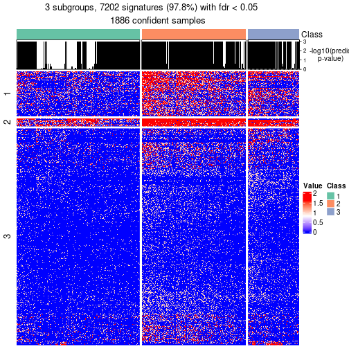</p>

</div>
<div id='tab-node-0-get-signatures-no-scale-3'>
<pre><code class="r">get_signatures(res, k = 4, scale_rows = FALSE)
</code></pre>

<p></p>

</div>
</div>


Compare the overlap of signatures from different k:

```r
compare_signatures(res)
```


`get_signature()` returns a data frame invisibly. To get the list of signatures, the function
call should be assigned to a variable explicitly. In following code, if `plot` argument is set
to `FALSE`, no heatmap is plotted while only the differential analysis is performed.

```r
# code only for demonstration
tb = get_signature(res, k = ..., plot = FALSE)
```

An example of the output of `tb` is:

```
#>   which_row         fdr    mean_1    mean_2 scaled_mean_1 scaled_mean_2 km
#> 1        38 0.042760348  8.373488  9.131774    -0.5533452     0.5164555  1
#> 2        40 0.018707592  7.106213  8.469186    -0.6173731     0.5762149  1
#> 3        55 0.019134737 10.221463 11.207825    -0.6159697     0.5749050  1
#> 4        59 0.006059896  5.921854  7.869574    -0.6899429     0.6439467  1
#> 5        60 0.018055526  8.928898 10.211722    -0.6204761     0.5791110  1
#> 6        98 0.009384629 15.714769 14.887706     0.6635654    -0.6193277  2
...
```

The columns in `tb` are:

1. `which_row`: row indices corresponding to the input matrix.
2. `fdr`: FDR for the differential test. 
3. `mean_x`: The mean value in group x.
4. `scaled_mean_x`: The mean value in group x after rows are scaled.
5. `km`: Row groups if k-means clustering is applied to rows (which is done by automatically selecting number of clusters).

If there are too many signatures, `top_signatures = ...` can be set to only show the 
signatures with the highest FDRs:

```r
# code only for demonstration
# e.g. to show the top 500 most significant rows
tb = get_signature(res, k = ..., top_signatures = 500)
```

If the signatures are defined as these which are uniquely high in current group, `diff_method` argument
can be set to `"uniquely_high_in_one_group"`:

```r
# code only for demonstration
tb = get_signature(res, k = ..., diff_method = "uniquely_high_in_one_group")
```


UMAP plot which shows how samples are separated.


<script>
$( function() {
	$( '#tabs-node-0-dimension-reduction' ).tabs();
} );
</script>
<div id='tabs-node-0-dimension-reduction'>
<ul>
<li><a href='#tab-node-0-dimension-reduction-1'>k = 2</a></li>
<li><a href='#tab-node-0-dimension-reduction-2'>k = 3</a></li>
<li><a href='#tab-node-0-dimension-reduction-3'>k = 4</a></li>
</ul>
<div id='tab-node-0-dimension-reduction-1'>
<pre><code class="r">dimension_reduction(res, k = 2, method = &quot;UMAP&quot;)
</code></pre>

<p></p>

</div>
<div id='tab-node-0-dimension-reduction-2'>
<pre><code class="r">dimension_reduction(res, k = 3, method = &quot;UMAP&quot;)
</code></pre>

<p></p>

</div>
<div id='tab-node-0-dimension-reduction-3'>
<pre><code class="r">dimension_reduction(res, k = 4, method = &quot;UMAP&quot;)
</code></pre>

<p></p>

</div>
</div>


Following heatmap shows how subgroups are split when increasing `k`:

```r
collect_classes(res)
```


If matrix rows can be associated to genes, consider to use `functional_enrichment(res,
...)` to perform function enrichment for the signature genes. See [this vignette](https://jokergoo.github.io/cola_vignettes/functional_enrichment.html) for more detailed explanations.


 

---------------------------------------------------


### Node01


Parent node: [Node0](#Node0).
Child nodes: 
                Node011-leaf
        ,
                [Node012](#Node012)
        ,
                Node013-leaf
        ,
                [Node014](#Node014)
        ,
                [Node021](#Node021)
        ,
                [Node022](#Node022)
        ,
                [Node031](#Node031)
        ,
                [Node032](#Node032)
        ,
                [Node033](#Node033)
        ,
                Node034-leaf
        .


The object with results only for a single top-value method and a single partitioning method 
can be extracted as:

```r
res = res_rh["01"]
```

A summary of `res` and all the functions that can be applied to it:

```r
res
```

```
#> A 'DownSamplingConsensusPartition' object with k = 2, 3, 4.
#>   On a matrix with 7364 rows and 500 columns, randomly sampled from 833 columns.
#>   Top rows (691) are extracted by 'ATC' method.
#>   Subgroups are detected by 'skmeans' method.
#>   Performed in total 150 partitions by row resampling.
#>   Best k for subgroups seems to be 4.
#> 
#> Following methods can be applied to this 'DownSamplingConsensusPartition' object:
#>  [1] "cola_report"             "collect_classes"         "collect_plots"          
#>  [4] "collect_stats"           "colnames"                "compare_partitions"     
#>  [7] "compare_signatures"      "consensus_heatmap"       "dimension_reduction"    
#> [10] "functional_enrichment"   "get_anno_col"            "get_anno"               
#> [13] "get_classes"             "get_consensus"           "get_matrix"             
#> [16] "get_membership"          "get_param"               "get_signatures"         
#> [19] "get_stats"               "is_best_k"               "is_stable_k"            
#> [22] "membership_heatmap"      "ncol"                    "nrow"                   
#> [25] "plot_ecdf"               "predict_classes"         "rownames"               
#> [28] "select_partition_number" "show"                    "suggest_best_k"         
#> [31] "test_to_known_factors"   "top_rows_heatmap"
```

`collect_plots()` function collects all the plots made from `res` for all `k` (number of subgroups)
into one single page to provide an easy and fast comparison between different `k`.

```r
collect_plots(res)
```


The plots are:

- The first row: a plot of the eCDF (empirical cumulative distribution
  function) curves of the consensus matrix for each `k` and the heatmap of
  predicted classes for each `k`.
- The second row: heatmaps of the consensus matrix for each `k`.
- The third row: heatmaps of the membership matrix for each `k`.
- The fouth row: heatmaps of the signatures for each `k`.

All the plots in panels can be made by individual functions and they are
plotted later in this section.

`select_partition_number()` produces several plots showing different
statistics for choosing "optimized" `k`. There are following statistics:

- eCDF curves of the consensus matrix for each `k`;
- 1-PAC. [The PAC score](https://en.wikipedia.org/wiki/Consensus_clustering#Over-interpretation_potential_of_consensus_clustering)
  measures the proportion of the ambiguous subgrouping.
- Mean silhouette score.
- Concordance. The mean probability of fiting the consensus subgroup labels in all
  partitions.
- Area increased. Denote $A_k$ as the area under the eCDF curve for current
  `k`, the area increased is defined as $A_k - A_{k-1}$.
- Rand index. The percent of pairs of samples that are both in a same cluster
  or both are not in a same cluster in the partition of k and k-1.
- Jaccard index. The ratio of pairs of samples are both in a same cluster in
  the partition of k and k-1 and the pairs of samples are both in a same
  cluster in the partition k or k-1.

The detailed explanations of these statistics can be found in [the _cola_
vignette](https://jokergoo.github.io/cola_vignettes/cola.html#toc_13).

Generally speaking, higher 1-PAC score, higher mean silhouette score or higher
concordance corresponds to better partition. Rand index and Jaccard index
measure how similar the current partition is compared to partition with `k-1`.
If they are too similar, we won't accept `k` is better than `k-1`.

```r
select_partition_number(res)
```


The numeric values for all these statistics can be obtained by `get_stats()`.

```r
get_stats(res)
```

```
#>   k 1-PAC mean_silhouette concordance area_increased  Rand Jaccard
#> 2 2 1.000           0.971       0.988          0.501 0.499   0.499
#> 3 3 1.000           0.989       0.995          0.280 0.819   0.652
#> 4 4 0.991           0.955       0.981          0.169 0.880   0.671
```

`suggest_best_k()` suggests the best $k$ based on these statistics. The rules are as follows:

- All $k$ with Jaccard index larger than 0.95 are removed because increasing
  $k$ does not provide enough extra information. If all $k$ are removed, it is
  marked as no subgroup is detected.
- For all $k$ with 1-PAC score larger than 0.9, the maximal $k$ is taken as
  the best $k$, and other $k$ are marked as optional $k$.
- If it does not fit the second rule. The $k$ with the maximal vote of the
  highest 1-PAC score, highest mean silhouette, and highest concordance is
  taken as the best $k$.

```r
suggest_best_k(res)
```

```
#> [1] 4
#> attr(,"optional")
#> [1] 2 3
```

There is also optional best $k$ = 2 3 that is worth to check.

Following is the table of the partitions (You need to click the **show/hide
code output** link to see it). The membership matrix (columns with name `p*`)
is inferred by
[`clue::cl_consensus()`](https://www.rdocumentation.org/link/cl_consensus?package=clue)
function with the `SE` method. Basically the value in the membership matrix
represents the probability to belong to a certain group. The finall subgroup
label for an item is determined with the group with highest probability it
belongs to.

In `get_classes()` function, the entropy is calculated from the membership
matrix and the silhouette score is calculated from the consensus matrix.


<script>
$( function() {
	$( '#tabs-node-01-get-classes' ).tabs();
} );
</script>
<div id='tabs-node-01-get-classes'>
<ul>
<li><a href='#tab-node-01-get-classes-1'>k = 2</a></li>
<li><a href='#tab-node-01-get-classes-2'>k = 3</a></li>
<li><a href='#tab-node-01-get-classes-3'>k = 4</a></li>
</ul>

<div id='tab-node-01-get-classes-1'>
<p><a id='tab-node-01-get-classes-1-a' style='color:#0366d6' href='#'>show/hide code output</a></p>
<pre><code class="r">get_classes(res, k = 2)
</code></pre>

<pre><code>#&gt;                             class     p
#&gt; mouse1_lib1.final_cell_0034     1 0.000
#&gt; mouse1_lib1.final_cell_0035     1 0.000
#&gt; mouse1_lib1.final_cell_0046     1 0.000
#&gt; mouse1_lib1.final_cell_0047     1 0.000
#&gt; mouse1_lib1.final_cell_0049     1 0.000
#&gt; mouse1_lib1.final_cell_0051     1 1.000
#&gt; mouse1_lib1.final_cell_0052     1 0.000
#&gt; mouse1_lib1.final_cell_0056     1 0.000
#&gt; mouse1_lib1.final_cell_0060     1 0.000
#&gt; mouse1_lib1.final_cell_0065     1 0.000
#&gt; mouse1_lib1.final_cell_0066     1 0.000
#&gt; mouse1_lib1.final_cell_0068     1 0.000
#&gt; mouse1_lib1.final_cell_0074     1 0.000
#&gt; mouse1_lib1.final_cell_0075     1 0.000
#&gt; mouse1_lib1.final_cell_0077     1 0.000
#&gt; mouse1_lib1.final_cell_0080     1 0.000
#&gt; mouse1_lib1.final_cell_0083     1 0.000
#&gt; mouse1_lib1.final_cell_0089     1 0.000
#&gt; mouse1_lib1.final_cell_0093     1 0.000
#&gt; mouse1_lib1.final_cell_0096     2 0.502
#&gt; mouse1_lib1.final_cell_0097     1 0.000
#&gt; mouse1_lib1.final_cell_0101     1 0.000
#&gt; mouse1_lib1.final_cell_0103     1 0.000
#&gt; mouse1_lib1.final_cell_0106     1 0.000
#&gt; mouse1_lib1.final_cell_0108     1 0.000
#&gt; mouse1_lib1.final_cell_0109     1 0.000
#&gt; mouse1_lib1.final_cell_0114     1 0.000
#&gt; mouse1_lib1.final_cell_0116     2 0.000
#&gt; mouse1_lib1.final_cell_0117     1 0.000
#&gt; mouse1_lib1.final_cell_0118     1 0.000
#&gt; mouse1_lib1.final_cell_0119     1 0.000
#&gt; mouse1_lib1.final_cell_0121     2 0.000
#&gt; mouse1_lib1.final_cell_0123     2 0.000
#&gt; mouse1_lib1.final_cell_0125     1 0.000
#&gt; mouse1_lib1.final_cell_0128     1 0.000
#&gt; mouse1_lib1.final_cell_0129     1 0.000
#&gt; mouse1_lib1.final_cell_0130     1 0.000
#&gt; mouse1_lib1.final_cell_0131     1 0.000
#&gt; mouse1_lib1.final_cell_0132     1 0.000
#&gt; mouse1_lib1.final_cell_0134     2 0.000
#&gt; mouse1_lib1.final_cell_0136     1 0.000
#&gt; mouse1_lib1.final_cell_0137     2 0.000
#&gt; mouse1_lib1.final_cell_0138     1 0.000
#&gt; mouse1_lib1.final_cell_0139     1 0.000
#&gt; mouse1_lib1.final_cell_0141     1 0.000
#&gt; mouse1_lib1.final_cell_0142     1 0.000
#&gt; mouse1_lib1.final_cell_0143     1 0.000
#&gt; mouse1_lib1.final_cell_0146     1 0.000
#&gt; mouse1_lib1.final_cell_0147     1 0.000
#&gt; mouse1_lib1.final_cell_0148     1 0.000
#&gt; mouse1_lib1.final_cell_0149     1 0.000
#&gt; mouse1_lib1.final_cell_0150     1 0.000
#&gt; mouse1_lib1.final_cell_0151     2 0.000
#&gt; mouse1_lib1.final_cell_0152     2 0.000
#&gt; mouse1_lib1.final_cell_0154     1 0.000
#&gt; mouse1_lib1.final_cell_0156     1 0.000
#&gt; mouse1_lib1.final_cell_0158     1 0.000
#&gt; mouse1_lib1.final_cell_0159     2 0.000
#&gt; mouse1_lib1.final_cell_0161     1 0.000
#&gt; mouse1_lib1.final_cell_0162     2 0.000
#&gt; mouse1_lib1.final_cell_0163     1 0.000
#&gt; mouse1_lib1.final_cell_0164     1 0.000
#&gt; mouse1_lib1.final_cell_0165     2 0.000
#&gt; mouse1_lib1.final_cell_0166     2 0.000
#&gt; mouse1_lib1.final_cell_0167     1 0.000
#&gt; mouse1_lib1.final_cell_0168     1 0.000
#&gt; mouse1_lib1.final_cell_0169     1 0.000
#&gt; mouse1_lib1.final_cell_0170     1 0.000
#&gt; mouse1_lib1.final_cell_0171     1 0.000
#&gt; mouse1_lib1.final_cell_0172     2 0.000
#&gt; mouse1_lib1.final_cell_0173     2 0.000
#&gt; mouse1_lib1.final_cell_0174     1 0.000
#&gt; mouse1_lib1.final_cell_0177     1 0.000
#&gt; mouse1_lib1.final_cell_0178     2 0.249
#&gt; mouse1_lib1.final_cell_0179     1 0.000
#&gt; mouse1_lib1.final_cell_0180     1 0.000
#&gt; mouse1_lib1.final_cell_0181     1 0.000
#&gt; mouse1_lib1.final_cell_0183     2 0.000
#&gt; mouse1_lib1.final_cell_0184     2 0.000
#&gt; mouse1_lib1.final_cell_0185     2 0.000
#&gt; mouse1_lib1.final_cell_0186     1 0.000
#&gt; mouse1_lib1.final_cell_0189     1 0.000
#&gt; mouse1_lib1.final_cell_0190     1 0.000
#&gt; mouse1_lib1.final_cell_0192     2 0.000
#&gt; mouse1_lib1.final_cell_0193     2 0.000
#&gt; mouse1_lib1.final_cell_0194     2 0.000
#&gt; mouse1_lib1.final_cell_0196     1 0.000
#&gt; mouse1_lib1.final_cell_0197     1 0.000
#&gt; mouse1_lib1.final_cell_0198     1 0.000
#&gt; mouse1_lib1.final_cell_0199     1 0.000
#&gt; mouse1_lib1.final_cell_0200     2 0.000
#&gt; mouse1_lib1.final_cell_0201     2 0.000
#&gt; mouse1_lib1.final_cell_0202     2 0.000
#&gt; mouse1_lib1.final_cell_0203     2 0.000
#&gt; mouse1_lib1.final_cell_0205     1 0.000
#&gt; mouse1_lib1.final_cell_0206     1 0.000
#&gt; mouse1_lib1.final_cell_0209     1 0.000
#&gt; mouse1_lib1.final_cell_0210     2 0.000
#&gt; mouse1_lib1.final_cell_0211     1 0.000
#&gt; mouse1_lib1.final_cell_0212     1 0.000
#&gt; mouse1_lib1.final_cell_0213     1 0.000
#&gt; mouse1_lib1.final_cell_0214     1 0.000
#&gt; mouse1_lib1.final_cell_0215     2 0.000
#&gt; mouse1_lib1.final_cell_0216     1 0.000
#&gt; mouse1_lib1.final_cell_0217     1 0.000
#&gt; mouse1_lib1.final_cell_0218     2 0.000
#&gt; mouse1_lib1.final_cell_0219     1 0.000
#&gt; mouse1_lib1.final_cell_0220     1 0.000
#&gt; mouse1_lib1.final_cell_0221     2 0.000
#&gt; mouse1_lib1.final_cell_0222     2 0.000
#&gt; mouse1_lib1.final_cell_0223     1 0.000
#&gt; mouse1_lib1.final_cell_0224     1 0.000
#&gt; mouse1_lib1.final_cell_0225     1 0.000
#&gt; mouse1_lib1.final_cell_0226     1 0.000
#&gt; mouse1_lib1.final_cell_0227     2 0.000
#&gt; mouse1_lib1.final_cell_0228     1 0.000
#&gt; mouse1_lib1.final_cell_0229     2 0.000
#&gt; mouse1_lib1.final_cell_0230     2 0.000
#&gt; mouse1_lib1.final_cell_0231     1 0.751
#&gt; mouse1_lib1.final_cell_0235     2 0.000
#&gt; mouse1_lib1.final_cell_0236     2 0.000
#&gt; mouse1_lib1.final_cell_0237     2 0.000
#&gt; mouse1_lib1.final_cell_0239     2 0.502
#&gt; mouse1_lib1.final_cell_0240     1 0.000
#&gt; mouse1_lib1.final_cell_0241     2 0.000
#&gt; mouse1_lib1.final_cell_0242     1 0.000
#&gt; mouse1_lib1.final_cell_0243     1 0.000
#&gt; mouse1_lib1.final_cell_0244     2 0.000
#&gt; mouse1_lib1.final_cell_0245     1 0.000
#&gt; mouse1_lib1.final_cell_0246     1 0.000
#&gt; mouse1_lib1.final_cell_0247     1 0.000
#&gt; mouse1_lib1.final_cell_0248     1 0.000
#&gt; mouse1_lib1.final_cell_0249     2 0.000
#&gt; mouse1_lib1.final_cell_0250     2 0.000
#&gt; mouse1_lib1.final_cell_0251     2 0.000
#&gt; mouse1_lib1.final_cell_0252     1 0.000
#&gt; mouse1_lib1.final_cell_0253     2 0.000
#&gt; mouse1_lib1.final_cell_0254     1 0.000
#&gt; mouse1_lib1.final_cell_0255     2 0.000
#&gt; mouse1_lib1.final_cell_0256     2 0.000
#&gt; mouse1_lib1.final_cell_0257     1 0.000
#&gt; mouse1_lib1.final_cell_0258     2 0.000
#&gt; mouse1_lib1.final_cell_0259     1 0.000
#&gt; mouse1_lib1.final_cell_0260     2 0.000
#&gt; mouse1_lib1.final_cell_0261     2 0.000
#&gt; mouse1_lib1.final_cell_0262     2 0.000
#&gt; mouse1_lib1.final_cell_0263     2 0.000
#&gt; mouse1_lib1.final_cell_0264     2 0.000
#&gt; mouse1_lib1.final_cell_0265     2 0.000
#&gt; mouse1_lib1.final_cell_0266     2 0.000
#&gt; mouse1_lib1.final_cell_0268     1 0.000
#&gt; mouse1_lib1.final_cell_0269     2 0.000
#&gt; mouse1_lib1.final_cell_0270     2 0.000
#&gt; mouse1_lib1.final_cell_0272     2 0.502
#&gt; mouse1_lib1.final_cell_0273     2 0.000
#&gt; mouse1_lib1.final_cell_0274     2 0.000
#&gt; mouse1_lib1.final_cell_0275     2 0.000
#&gt; mouse1_lib1.final_cell_0276     2 0.249
#&gt; mouse1_lib1.final_cell_0277     2 0.000
#&gt; mouse1_lib2.final_cell_0019     1 0.000
#&gt; mouse1_lib2.final_cell_0034     1 0.000
#&gt; mouse1_lib2.final_cell_0042     1 0.000
#&gt; mouse1_lib2.final_cell_0049     1 0.000
#&gt; mouse1_lib2.final_cell_0053     1 0.000
#&gt; mouse1_lib2.final_cell_0058     1 0.000
#&gt; mouse1_lib2.final_cell_0060     1 0.000
#&gt; mouse1_lib2.final_cell_0061     1 0.000
#&gt; mouse1_lib2.final_cell_0063     1 0.000
#&gt; mouse1_lib2.final_cell_0065     1 0.000
#&gt; mouse1_lib2.final_cell_0067     1 0.000
#&gt; mouse1_lib2.final_cell_0073     1 0.000
#&gt; mouse1_lib2.final_cell_0074     1 0.000
#&gt; mouse1_lib2.final_cell_0075     1 0.000
#&gt; mouse1_lib2.final_cell_0080     1 0.000
#&gt; mouse1_lib2.final_cell_0082     1 0.000
#&gt; mouse1_lib2.final_cell_0084     1 0.000
#&gt; mouse1_lib2.final_cell_0085     1 0.000
#&gt; mouse1_lib2.final_cell_0087     1 0.000
#&gt; mouse1_lib2.final_cell_0089     1 0.000
#&gt; mouse1_lib2.final_cell_0091     1 0.000
#&gt; mouse1_lib2.final_cell_0092     1 0.000
#&gt; mouse1_lib2.final_cell_0094     1 0.000
#&gt; mouse1_lib2.final_cell_0097     1 0.000
#&gt; mouse1_lib2.final_cell_0100     2 0.000
#&gt; mouse1_lib2.final_cell_0101     1 0.000
#&gt; mouse1_lib2.final_cell_0103     1 0.000
#&gt; mouse1_lib2.final_cell_0104     1 0.000
#&gt; mouse1_lib2.final_cell_0107     1 0.000
#&gt; mouse1_lib2.final_cell_0109     1 0.000
#&gt; mouse1_lib2.final_cell_0110     2 0.000
#&gt; mouse1_lib2.final_cell_0111     1 0.000
#&gt; mouse1_lib2.final_cell_0115     1 0.000
#&gt; mouse1_lib2.final_cell_0116     1 0.000
#&gt; mouse1_lib2.final_cell_0118     1 0.000
#&gt; mouse1_lib2.final_cell_0121     1 0.000
#&gt; mouse1_lib2.final_cell_0122     1 0.000
#&gt; mouse1_lib2.final_cell_0123     1 0.000
#&gt; mouse1_lib2.final_cell_0125     1 0.000
#&gt; mouse1_lib2.final_cell_0126     1 0.000
#&gt; mouse1_lib2.final_cell_0128     1 0.000
#&gt; mouse1_lib2.final_cell_0129     1 0.253
#&gt; mouse1_lib2.final_cell_0130     2 0.000
#&gt; mouse1_lib2.final_cell_0131     1 0.000
#&gt; mouse1_lib2.final_cell_0133     1 0.000
#&gt; mouse1_lib2.final_cell_0134     1 0.000
#&gt; mouse1_lib2.final_cell_0135     1 0.000
#&gt; mouse1_lib2.final_cell_0136     2 0.000
#&gt; mouse1_lib2.final_cell_0137     1 0.000
#&gt; mouse1_lib2.final_cell_0138     1 0.000
#&gt; mouse1_lib2.final_cell_0140     1 0.000
#&gt; mouse1_lib2.final_cell_0141     2 0.000
#&gt; mouse1_lib2.final_cell_0144     2 0.000
#&gt; mouse1_lib2.final_cell_0146     1 0.000
#&gt; mouse1_lib2.final_cell_0149     1 0.000
#&gt; mouse1_lib2.final_cell_0150     1 0.000
#&gt; mouse1_lib2.final_cell_0151     2 0.000
#&gt; mouse1_lib2.final_cell_0152     1 0.000
#&gt; mouse1_lib2.final_cell_0154     1 0.000
#&gt; mouse1_lib2.final_cell_0155     1 0.000
#&gt; mouse1_lib2.final_cell_0156     1 0.000
#&gt; mouse1_lib2.final_cell_0157     1 0.000
#&gt; mouse1_lib2.final_cell_0159     1 0.000
#&gt; mouse1_lib2.final_cell_0160     1 0.000
#&gt; mouse1_lib2.final_cell_0161     1 0.000
#&gt; mouse1_lib2.final_cell_0162     1 0.000
#&gt; mouse1_lib2.final_cell_0163     1 0.000
#&gt; mouse1_lib2.final_cell_0164     1 0.000
#&gt; mouse1_lib2.final_cell_0166     1 0.000
#&gt; mouse1_lib2.final_cell_0168     2 0.000
#&gt; mouse1_lib2.final_cell_0172     1 0.000
#&gt; mouse1_lib2.final_cell_0173     1 0.000
#&gt; mouse1_lib2.final_cell_0174     1 0.000
#&gt; mouse1_lib2.final_cell_0175     1 0.000
#&gt; mouse1_lib2.final_cell_0176     1 0.000
#&gt; mouse1_lib2.final_cell_0177     1 0.000
#&gt; mouse1_lib2.final_cell_0178     1 0.000
#&gt; mouse1_lib2.final_cell_0180     1 0.000
#&gt; mouse1_lib2.final_cell_0181     2 0.000
#&gt; mouse1_lib2.final_cell_0182     2 0.000
#&gt; mouse1_lib2.final_cell_0183     2 0.000
#&gt; mouse1_lib2.final_cell_0184     1 0.000
#&gt; mouse1_lib2.final_cell_0185     1 0.000
#&gt; mouse1_lib2.final_cell_0187     1 0.000
#&gt; mouse1_lib2.final_cell_0188     1 0.000
#&gt; mouse1_lib2.final_cell_0189     1 0.000
#&gt; mouse1_lib2.final_cell_0190     1 0.000
#&gt; mouse1_lib2.final_cell_0191     1 0.000
#&gt; mouse1_lib2.final_cell_0192     1 0.000
#&gt; mouse1_lib2.final_cell_0193     1 0.000
#&gt; mouse1_lib2.final_cell_0194     2 0.000
#&gt; mouse1_lib2.final_cell_0195     1 0.000
#&gt; mouse1_lib2.final_cell_0196     1 0.000
#&gt; mouse1_lib2.final_cell_0197     1 0.000
#&gt; mouse1_lib2.final_cell_0198     1 0.000
#&gt; mouse1_lib2.final_cell_0199     1 0.000
#&gt; mouse1_lib2.final_cell_0201     2 0.000
#&gt; mouse1_lib2.final_cell_0202     2 0.000
#&gt; mouse1_lib2.final_cell_0203     1 0.000
#&gt; mouse1_lib2.final_cell_0204     1 0.000
#&gt; mouse1_lib2.final_cell_0205     2 0.000
#&gt; mouse1_lib2.final_cell_0207     1 0.000
#&gt; mouse1_lib2.final_cell_0208     2 0.000
#&gt; mouse1_lib2.final_cell_0209     1 0.000
#&gt; mouse1_lib2.final_cell_0210     1 0.000
#&gt; mouse1_lib2.final_cell_0211     2 0.000
#&gt; mouse1_lib2.final_cell_0213     1 0.000
#&gt; mouse1_lib2.final_cell_0214     1 0.000
#&gt; mouse1_lib2.final_cell_0215     2 0.000
#&gt; mouse1_lib2.final_cell_0216     1 0.000
#&gt; mouse1_lib2.final_cell_0217     2 0.000
#&gt; mouse1_lib2.final_cell_0218     1 0.000
#&gt; mouse1_lib2.final_cell_0219     2 0.000
#&gt; mouse1_lib2.final_cell_0220     2 0.000
#&gt; mouse1_lib2.final_cell_0221     2 0.000
#&gt; mouse1_lib2.final_cell_0222     1 0.000
#&gt; mouse1_lib2.final_cell_0223     2 0.000
#&gt; mouse1_lib2.final_cell_0224     1 0.000
#&gt; mouse1_lib2.final_cell_0225     1 0.000
#&gt; mouse1_lib2.final_cell_0226     1 0.000
#&gt; mouse1_lib2.final_cell_0228     1 0.000
#&gt; mouse1_lib2.final_cell_0229     1 0.000
#&gt; mouse1_lib2.final_cell_0230     2 0.000
#&gt; mouse1_lib2.final_cell_0231     1 0.000
#&gt; mouse1_lib2.final_cell_0232     1 0.000
#&gt; mouse1_lib2.final_cell_0233     2 0.000
#&gt; mouse1_lib2.final_cell_0234     2 0.000
#&gt; mouse1_lib2.final_cell_0235     1 0.000
#&gt; mouse1_lib2.final_cell_0236     1 0.000
#&gt; mouse1_lib2.final_cell_0237     1 0.000
#&gt; mouse1_lib2.final_cell_0239     2 0.000
#&gt; mouse1_lib2.final_cell_0240     1 0.000
#&gt; mouse1_lib2.final_cell_0241     1 0.000
#&gt; mouse1_lib2.final_cell_0242     1 0.000
#&gt; mouse1_lib2.final_cell_0243     1 0.000
#&gt; mouse1_lib2.final_cell_0244     2 0.000
#&gt; mouse1_lib2.final_cell_0246     1 0.000
#&gt; mouse1_lib2.final_cell_0247     1 0.000
#&gt; mouse1_lib2.final_cell_0248     2 0.000
#&gt; mouse1_lib2.final_cell_0249     1 0.000
#&gt; mouse1_lib2.final_cell_0250     2 0.000
#&gt; mouse1_lib2.final_cell_0251     2 0.000
#&gt; mouse1_lib2.final_cell_0253     1 0.000
#&gt; mouse1_lib2.final_cell_0254     1 0.000
#&gt; mouse1_lib2.final_cell_0255     1 0.000
#&gt; mouse1_lib2.final_cell_0256     1 0.000
#&gt; mouse1_lib2.final_cell_0257     2 0.000
#&gt; mouse1_lib2.final_cell_0258     2 0.000
#&gt; mouse1_lib2.final_cell_0259     2 0.000
#&gt; mouse1_lib2.final_cell_0260     2 0.000
#&gt; mouse1_lib2.final_cell_0261     1 0.249
#&gt; mouse1_lib2.final_cell_0262     1 0.000
#&gt; mouse1_lib2.final_cell_0263     1 0.000
#&gt; mouse1_lib2.final_cell_0264     2 0.000
#&gt; mouse1_lib2.final_cell_0265     2 0.000
#&gt; mouse1_lib2.final_cell_0266     2 0.000
#&gt; mouse1_lib2.final_cell_0267     1 0.000
#&gt; mouse1_lib2.final_cell_0268     1 0.000
#&gt; mouse1_lib2.final_cell_0269     2 0.000
#&gt; mouse1_lib2.final_cell_0270     1 0.000
#&gt; mouse1_lib2.final_cell_0271     2 0.000
#&gt; mouse1_lib2.final_cell_0272     2 0.000
#&gt; mouse1_lib2.final_cell_0273     1 0.000
#&gt; mouse1_lib2.final_cell_0274     1 0.000
#&gt; mouse1_lib2.final_cell_0275     1 0.000
#&gt; mouse1_lib2.final_cell_0276     2 0.000
#&gt; mouse1_lib2.final_cell_0277     2 0.000
#&gt; mouse1_lib2.final_cell_0278     1 0.000
#&gt; mouse1_lib2.final_cell_0279     2 0.000
#&gt; mouse1_lib2.final_cell_0280     2 0.502
#&gt; mouse1_lib2.final_cell_0281     2 0.000
#&gt; mouse1_lib2.final_cell_0282     2 0.000
#&gt; mouse1_lib2.final_cell_0283     2 0.000
#&gt; mouse1_lib2.final_cell_0284     2 0.000
#&gt; mouse1_lib2.final_cell_0285     2 0.000
#&gt; mouse1_lib2.final_cell_0286     2 0.000
#&gt; mouse1_lib2.final_cell_0287     1 0.502
#&gt; mouse1_lib2.final_cell_0288     1 0.000
#&gt; mouse1_lib2.final_cell_0289     2 0.000
#&gt; mouse1_lib2.final_cell_0290     2 0.000
#&gt; mouse1_lib2.final_cell_0291     2 1.000
#&gt; mouse1_lib3.final_cell_0023     1 0.000
#&gt; mouse1_lib3.final_cell_0039     1 0.000
#&gt; mouse1_lib3.final_cell_0040     1 0.000
#&gt; mouse1_lib3.final_cell_0045     1 0.249
#&gt; mouse1_lib3.final_cell_0048     1 0.000
#&gt; mouse1_lib3.final_cell_0049     1 0.000
#&gt; mouse1_lib3.final_cell_0051     1 0.000
#&gt; mouse1_lib3.final_cell_0052     1 0.000
#&gt; mouse1_lib3.final_cell_0053     1 0.000
#&gt; mouse1_lib3.final_cell_0058     1 0.000
#&gt; mouse1_lib3.final_cell_0059     1 0.000
#&gt; mouse1_lib3.final_cell_0061     1 0.000
#&gt; mouse1_lib3.final_cell_0062     1 0.000
#&gt; mouse1_lib3.final_cell_0065     1 0.000
#&gt; mouse1_lib3.final_cell_0068     1 0.000
#&gt; mouse1_lib3.final_cell_0069     1 0.000
#&gt; mouse1_lib3.final_cell_0073     2 0.000
#&gt; mouse1_lib3.final_cell_0074     1 0.000
#&gt; mouse1_lib3.final_cell_0075     1 0.000
#&gt; mouse1_lib3.final_cell_0077     1 0.000
#&gt; mouse1_lib3.final_cell_0080     1 0.000
#&gt; mouse1_lib3.final_cell_0084     1 0.000
#&gt; mouse1_lib3.final_cell_0092     1 0.000
#&gt; mouse1_lib3.final_cell_0093     1 0.000
#&gt; mouse1_lib3.final_cell_0094     1 0.000
#&gt; mouse1_lib3.final_cell_0096     2 0.000
#&gt; mouse1_lib3.final_cell_0097     2 0.000
#&gt; mouse1_lib3.final_cell_0098     1 0.000
#&gt; mouse1_lib3.final_cell_0102     1 0.000
#&gt; mouse1_lib3.final_cell_0103     1 0.000
#&gt; mouse1_lib3.final_cell_0104     2 0.000
#&gt; mouse1_lib3.final_cell_0105     1 0.000
#&gt; mouse1_lib3.final_cell_0106     1 0.000
#&gt; mouse1_lib3.final_cell_0108     1 0.000
#&gt; mouse1_lib3.final_cell_0109     2 0.000
#&gt; mouse1_lib3.final_cell_0110     2 0.000
#&gt; mouse1_lib3.final_cell_0112     1 0.000
#&gt; mouse1_lib3.final_cell_0113     1 0.000
#&gt; mouse1_lib3.final_cell_0114     2 0.000
#&gt; mouse1_lib3.final_cell_0115     1 0.000
#&gt; mouse1_lib3.final_cell_0117     1 0.000
#&gt; mouse1_lib3.final_cell_0118     1 0.000
#&gt; mouse1_lib3.final_cell_0120     1 0.000
#&gt; mouse1_lib3.final_cell_0121     1 0.000
#&gt; mouse1_lib3.final_cell_0122     1 0.000
#&gt; mouse1_lib3.final_cell_0124     1 0.000
#&gt; mouse1_lib3.final_cell_0126     1 0.000
#&gt; mouse1_lib3.final_cell_0127     2 0.000
#&gt; mouse1_lib3.final_cell_0128     2 0.000
#&gt; mouse1_lib3.final_cell_0129     1 0.000
#&gt; mouse1_lib3.final_cell_0130     1 0.000
#&gt; mouse1_lib3.final_cell_0131     1 0.000
#&gt; mouse1_lib3.final_cell_0132     1 0.000
#&gt; mouse1_lib3.final_cell_0133     1 0.000
#&gt; mouse1_lib3.final_cell_0134     2 0.000
#&gt; mouse1_lib3.final_cell_0135     1 0.000
#&gt; mouse1_lib3.final_cell_0136     1 0.000
#&gt; mouse1_lib3.final_cell_0137     1 0.000
#&gt; mouse1_lib3.final_cell_0138     1 0.000
#&gt; mouse1_lib3.final_cell_0139     1 0.000
#&gt; mouse1_lib3.final_cell_0140     1 0.000
#&gt; mouse1_lib3.final_cell_0141     1 0.000
#&gt; mouse1_lib3.final_cell_0142     1 0.000
#&gt; mouse1_lib3.final_cell_0143     1 0.000
#&gt; mouse1_lib3.final_cell_0144     1 0.000
#&gt; mouse1_lib3.final_cell_0145     2 0.000
#&gt; mouse1_lib3.final_cell_0146     1 0.000
#&gt; mouse1_lib3.final_cell_0147     1 0.000
#&gt; mouse1_lib3.final_cell_0149     2 0.000
#&gt; mouse1_lib3.final_cell_0150     1 0.000
#&gt; mouse1_lib3.final_cell_0151     1 0.000
#&gt; mouse1_lib3.final_cell_0152     1 0.000
#&gt; mouse1_lib3.final_cell_0153     2 0.000
#&gt; mouse1_lib3.final_cell_0154     2 0.000
#&gt; mouse1_lib3.final_cell_0155     1 0.000
#&gt; mouse1_lib3.final_cell_0158     2 0.000
#&gt; mouse1_lib3.final_cell_0159     1 0.000
#&gt; mouse1_lib3.final_cell_0160     1 0.000
#&gt; mouse1_lib3.final_cell_0161     2 0.000
#&gt; mouse1_lib3.final_cell_0162     2 0.000
#&gt; mouse1_lib3.final_cell_0163     2 0.000
#&gt; mouse1_lib3.final_cell_0165     1 0.000
#&gt; mouse1_lib3.final_cell_0166     2 0.000
#&gt; mouse1_lib3.final_cell_0168     1 0.000
#&gt; mouse1_lib3.final_cell_0170     2 0.000
#&gt; mouse1_lib3.final_cell_0171     1 0.000
#&gt; mouse1_lib3.final_cell_0172     1 0.000
#&gt; mouse1_lib3.final_cell_0173     1 0.000
#&gt; mouse1_lib3.final_cell_0175     2 0.000
#&gt; mouse1_lib3.final_cell_0176     1 0.000
#&gt; mouse1_lib3.final_cell_0177     1 0.000
#&gt; mouse1_lib3.final_cell_0178     1 0.000
#&gt; mouse1_lib3.final_cell_0180     2 0.000
#&gt; mouse1_lib3.final_cell_0181     1 0.000
#&gt; mouse1_lib3.final_cell_0182     1 0.000
#&gt; mouse1_lib3.final_cell_0183     1 0.000
#&gt; mouse1_lib3.final_cell_0184     2 0.000
#&gt; mouse1_lib3.final_cell_0185     2 0.000
#&gt; mouse1_lib3.final_cell_0186     1 0.000
#&gt; mouse1_lib3.final_cell_0187     2 0.000
#&gt; mouse1_lib3.final_cell_0188     1 0.000
#&gt; mouse1_lib3.final_cell_0189     1 0.000
#&gt; mouse1_lib3.final_cell_0190     2 0.000
#&gt; mouse1_lib3.final_cell_0191     1 0.000
#&gt; mouse1_lib3.final_cell_0192     1 0.000
#&gt; mouse1_lib3.final_cell_0193     1 0.000
#&gt; mouse1_lib3.final_cell_0194     2 0.000
#&gt; mouse1_lib3.final_cell_0196     2 0.000
#&gt; mouse1_lib3.final_cell_0198     1 0.000
#&gt; mouse1_lib3.final_cell_0199     1 0.000
#&gt; mouse1_lib3.final_cell_0200     2 0.000
#&gt; mouse1_lib3.final_cell_0201     1 0.000
#&gt; mouse1_lib3.final_cell_0202     2 0.000
#&gt; mouse1_lib3.final_cell_0205     1 0.000
#&gt; mouse1_lib3.final_cell_0206     1 0.000
#&gt; mouse1_lib3.final_cell_0208     1 0.249
#&gt; mouse1_lib3.final_cell_0209     2 0.000
#&gt; mouse1_lib3.final_cell_0210     2 0.000
#&gt; mouse1_lib3.final_cell_0211     1 0.000
#&gt; mouse1_lib3.final_cell_0212     1 0.000
#&gt; mouse1_lib3.final_cell_0213     1 0.000
#&gt; mouse1_lib3.final_cell_0214     2 0.000
#&gt; mouse1_lib3.final_cell_0216     2 0.000
#&gt; mouse1_lib3.final_cell_0217     2 0.000
#&gt; mouse1_lib3.final_cell_0218     2 0.000
#&gt; mouse1_lib3.final_cell_0219     1 0.000
#&gt; mouse1_lib3.final_cell_0221     2 0.000
#&gt; mouse1_lib3.final_cell_0222     2 0.000
#&gt; mouse1_lib3.final_cell_0223     1 0.000
#&gt; mouse1_lib3.final_cell_0224     2 0.000
#&gt; mouse1_lib3.final_cell_0225     2 0.000
#&gt; mouse1_lib3.final_cell_0226     1 0.000
#&gt; mouse1_lib3.final_cell_0227     1 0.000
#&gt; mouse1_lib3.final_cell_0228     2 0.000
#&gt; mouse1_lib3.final_cell_0229     2 0.000
#&gt; mouse1_lib3.final_cell_0230     2 0.000
#&gt; mouse1_lib3.final_cell_0231     2 0.000
#&gt; mouse1_lib3.final_cell_0232     2 0.000
#&gt; mouse1_lib3.final_cell_0233     2 0.000
#&gt; mouse1_lib3.final_cell_0234     2 0.000
#&gt; mouse1_lib3.final_cell_0235     2 0.000
#&gt; mouse1_lib3.final_cell_0236     2 0.000
#&gt; mouse1_lib3.final_cell_0237     2 0.249
#&gt; mouse1_lib3.final_cell_0238     1 0.000
#&gt; mouse1_lib3.final_cell_0239     2 0.000
#&gt; mouse1_lib3.final_cell_0240     2 0.000
#&gt; mouse1_lib3.final_cell_0241     2 0.000
#&gt; mouse1_lib3.final_cell_0242     1 0.000
#&gt; mouse1_lib3.final_cell_0243     2 0.000
#&gt; mouse1_lib3.final_cell_0244     2 0.000
#&gt; mouse1_lib3.final_cell_0245     1 0.000
#&gt; mouse1_lib3.final_cell_0246     1 0.000
#&gt; mouse1_lib3.final_cell_0247     2 0.000
#&gt; mouse1_lib3.final_cell_0248     2 0.000
#&gt; mouse1_lib3.final_cell_0249     2 0.000
#&gt; mouse1_lib3.final_cell_0250     2 0.000
#&gt; mouse1_lib3.final_cell_0251     2 0.000
#&gt; mouse1_lib3.final_cell_0252     2 0.000
#&gt; mouse1_lib3.final_cell_0253     2 0.249
#&gt; mouse1_lib3.final_cell_0254     2 0.000
#&gt; mouse2_lib1.final_cell_0159     1 0.000
#&gt; mouse2_lib1.final_cell_0164     1 0.000
#&gt; mouse2_lib1.final_cell_0172     1 0.000
#&gt; mouse2_lib1.final_cell_0183     1 0.000
#&gt; mouse2_lib1.final_cell_0188     1 0.000
#&gt; mouse2_lib1.final_cell_0191     2 0.000
#&gt; mouse2_lib1.final_cell_0192     1 0.000
#&gt; mouse2_lib1.final_cell_0205     2 0.000
#&gt; mouse2_lib1.final_cell_0212     1 0.000
#&gt; mouse2_lib1.final_cell_0218     2 0.000
#&gt; mouse2_lib1.final_cell_0219     1 0.000
#&gt; mouse2_lib1.final_cell_0221     1 0.000
#&gt; mouse2_lib1.final_cell_0224     2 0.000
#&gt; mouse2_lib1.final_cell_0225     1 0.000
#&gt; mouse2_lib1.final_cell_0226     1 0.000
#&gt; mouse2_lib1.final_cell_0230     2 0.000
#&gt; mouse2_lib1.final_cell_0231     2 0.000
#&gt; mouse2_lib1.final_cell_0232     2 0.000
#&gt; mouse2_lib1.final_cell_0233     2 0.000
#&gt; mouse2_lib1.final_cell_0234     1 0.000
#&gt; mouse2_lib1.final_cell_0235     2 0.000
#&gt; mouse2_lib1.final_cell_0238     1 0.249
#&gt; mouse2_lib1.final_cell_0241     1 0.000
#&gt; mouse2_lib1.final_cell_0248     2 0.000
#&gt; mouse2_lib1.final_cell_0250     1 0.751
#&gt; mouse2_lib1.final_cell_0251     2 0.000
#&gt; mouse2_lib1.final_cell_0253     1 0.253
#&gt; mouse2_lib1.final_cell_0254     2 0.000
#&gt; mouse2_lib1.final_cell_0255     1 0.000
#&gt; mouse2_lib1.final_cell_0256     2 0.000
#&gt; mouse2_lib1.final_cell_0257     1 0.000
#&gt; mouse2_lib1.final_cell_0258     1 0.000
#&gt; mouse2_lib1.final_cell_0259     2 0.000
#&gt; mouse2_lib1.final_cell_0260     2 1.000
#&gt; mouse2_lib1.final_cell_0261     1 0.000
#&gt; mouse2_lib1.final_cell_0262     1 0.000
#&gt; mouse2_lib1.final_cell_0264     2 0.000
#&gt; mouse2_lib1.final_cell_0265     1 0.000
#&gt; mouse2_lib1.final_cell_0266     2 0.000
#&gt; mouse2_lib1.final_cell_0268     2 0.000
#&gt; mouse2_lib1.final_cell_0269     1 0.000
#&gt; mouse2_lib1.final_cell_0271     2 0.000
#&gt; mouse2_lib1.final_cell_0273     2 0.000
#&gt; mouse2_lib1.final_cell_0274     2 0.000
#&gt; mouse2_lib1.final_cell_0275     2 0.000
#&gt; mouse2_lib1.final_cell_0276     2 0.000
#&gt; mouse2_lib1.final_cell_0277     1 0.000
#&gt; mouse2_lib1.final_cell_0278     1 0.000
#&gt; mouse2_lib1.final_cell_0279     1 0.000
#&gt; mouse2_lib1.final_cell_0280     2 0.000
#&gt; mouse2_lib1.final_cell_0281     2 0.000
#&gt; mouse2_lib1.final_cell_0282     2 0.000
#&gt; mouse2_lib1.final_cell_0283     2 0.000
#&gt; mouse2_lib1.final_cell_0284     2 0.000
#&gt; mouse2_lib1.final_cell_0287     2 0.000
#&gt; mouse2_lib1.final_cell_0288     1 0.000
#&gt; mouse2_lib1.final_cell_0289     2 0.000
#&gt; mouse2_lib1.final_cell_0290     2 0.000
#&gt; mouse2_lib1.final_cell_0291     1 0.000
#&gt; mouse2_lib1.final_cell_0293     2 0.000
#&gt; mouse2_lib1.final_cell_0294     2 0.000
#&gt; mouse2_lib1.final_cell_0295     1 0.000
#&gt; mouse2_lib1.final_cell_0296     2 0.000
#&gt; mouse2_lib1.final_cell_0297     1 0.000
#&gt; mouse2_lib1.final_cell_0298     2 0.000
#&gt; mouse2_lib1.final_cell_0299     2 0.498
#&gt; mouse2_lib1.final_cell_0300     1 0.000
#&gt; mouse2_lib1.final_cell_0301     2 0.000
#&gt; mouse2_lib1.final_cell_0302     2 0.000
#&gt; mouse2_lib1.final_cell_0303     2 0.000
#&gt; mouse2_lib1.final_cell_0304     2 0.000
#&gt; mouse2_lib1.final_cell_0305     2 0.000
#&gt; mouse2_lib1.final_cell_0306     2 0.000
#&gt; mouse2_lib1.final_cell_0307     1 0.000
#&gt; mouse2_lib1.final_cell_0308     1 1.000
#&gt; mouse2_lib1.final_cell_0309     1 0.000
#&gt; mouse2_lib1.final_cell_0310     2 0.000
#&gt; mouse2_lib1.final_cell_0311     2 0.000
#&gt; mouse2_lib1.final_cell_0312     2 1.000
#&gt; mouse2_lib1.final_cell_0313     1 0.751
#&gt; mouse2_lib1.final_cell_0314     2 0.000
#&gt; mouse2_lib1.final_cell_0315     1 0.000
#&gt; mouse2_lib1.final_cell_0316     1 0.000
#&gt; mouse2_lib1.final_cell_0317     2 0.000
#&gt; mouse2_lib1.final_cell_0318     2 0.000
#&gt; mouse2_lib1.final_cell_0319     2 0.000
#&gt; mouse2_lib1.final_cell_0320     2 0.000
#&gt; mouse2_lib2.final_cell_0157     1 0.000
#&gt; mouse2_lib2.final_cell_0193     1 0.000
#&gt; mouse2_lib2.final_cell_0195     2 0.000
#&gt; mouse2_lib2.final_cell_0209     1 0.000
#&gt; mouse2_lib2.final_cell_0210     1 0.000
#&gt; mouse2_lib2.final_cell_0216     1 0.000
#&gt; mouse2_lib2.final_cell_0219     2 0.000
#&gt; mouse2_lib2.final_cell_0225     2 0.000
#&gt; mouse2_lib2.final_cell_0230     1 0.000
#&gt; mouse2_lib2.final_cell_0232     2 0.000
#&gt; mouse2_lib2.final_cell_0233     2 0.000
#&gt; mouse2_lib2.final_cell_0243     2 0.000
#&gt; mouse2_lib2.final_cell_0245     1 0.000
#&gt; mouse2_lib2.final_cell_0248     1 0.000
#&gt; mouse2_lib2.final_cell_0250     2 0.000
#&gt; mouse2_lib2.final_cell_0253     2 0.249
#&gt; mouse2_lib2.final_cell_0254     2 0.000
#&gt; mouse2_lib2.final_cell_0257     1 0.000
#&gt; mouse2_lib2.final_cell_0259     1 0.000
#&gt; mouse2_lib2.final_cell_0261     2 0.000
#&gt; mouse2_lib2.final_cell_0262     2 0.000
#&gt; mouse2_lib2.final_cell_0265     1 0.000
#&gt; mouse2_lib2.final_cell_0266     2 0.000
#&gt; mouse2_lib2.final_cell_0268     1 0.000
#&gt; mouse2_lib2.final_cell_0273     2 0.000
#&gt; mouse2_lib2.final_cell_0275     2 0.000
#&gt; mouse2_lib2.final_cell_0276     2 0.000
#&gt; mouse2_lib2.final_cell_0278     1 0.000
#&gt; mouse2_lib2.final_cell_0280     1 0.000
#&gt; mouse2_lib2.final_cell_0283     1 0.000
#&gt; mouse2_lib2.final_cell_0285     1 0.000
#&gt; mouse2_lib2.final_cell_0287     1 0.000
#&gt; mouse2_lib2.final_cell_0289     1 0.000
#&gt; mouse2_lib2.final_cell_0290     2 0.000
#&gt; mouse2_lib2.final_cell_0291     2 0.000
#&gt; mouse2_lib2.final_cell_0292     2 0.000
#&gt; mouse2_lib2.final_cell_0293     2 0.000
#&gt; mouse2_lib2.final_cell_0296     1 0.000
#&gt; mouse2_lib2.final_cell_0297     2 1.000
#&gt; mouse2_lib2.final_cell_0300     1 0.000
#&gt; mouse2_lib2.final_cell_0302     2 0.000
#&gt; mouse2_lib2.final_cell_0303     2 0.000
#&gt; mouse2_lib2.final_cell_0305     2 0.000
#&gt; mouse2_lib2.final_cell_0306     2 0.751
#&gt; mouse2_lib2.final_cell_0307     2 0.000
#&gt; mouse2_lib2.final_cell_0308     2 0.000
#&gt; mouse2_lib2.final_cell_0310     2 0.000
#&gt; mouse2_lib2.final_cell_0311     2 0.000
#&gt; mouse2_lib2.final_cell_0312     1 0.000
#&gt; mouse2_lib2.final_cell_0313     2 0.000
#&gt; mouse2_lib2.final_cell_0314     1 0.000
#&gt; mouse2_lib2.final_cell_0315     1 0.000
#&gt; mouse2_lib2.final_cell_0316     1 0.000
#&gt; mouse2_lib2.final_cell_0317     1 0.000
#&gt; mouse2_lib2.final_cell_0318     2 0.000
#&gt; mouse2_lib2.final_cell_0319     2 0.000
#&gt; mouse2_lib2.final_cell_0320     2 0.000
#&gt; mouse2_lib2.final_cell_0321     2 0.253
#&gt; mouse2_lib2.final_cell_0322     2 0.000
#&gt; mouse2_lib2.final_cell_0323     2 0.000
#&gt; mouse2_lib2.final_cell_0324     2 0.000
#&gt; mouse2_lib2.final_cell_0325     2 0.000
#&gt; mouse2_lib2.final_cell_0326     1 0.000
#&gt; mouse2_lib2.final_cell_0327     2 0.000
#&gt; mouse2_lib2.final_cell_0328     2 0.000
#&gt; mouse2_lib2.final_cell_0329     2 0.000
#&gt; mouse2_lib2.final_cell_0330     2 0.000
#&gt; mouse2_lib2.final_cell_0331     1 0.502
#&gt; mouse2_lib2.final_cell_0332     2 0.249
#&gt; mouse2_lib2.final_cell_0333     2 0.000
#&gt; mouse2_lib2.final_cell_0334     2 0.000
#&gt; mouse2_lib2.final_cell_0335     2 0.000
#&gt; mouse2_lib2.final_cell_0336     2 0.000
#&gt; mouse2_lib2.final_cell_0337     2 0.747
#&gt; mouse2_lib2.final_cell_0338     2 0.000
#&gt; mouse2_lib2.final_cell_0339     2 0.000
#&gt; mouse2_lib2.final_cell_0340     2 0.000
#&gt; mouse2_lib2.final_cell_0341     2 1.000
#&gt; mouse2_lib2.final_cell_0342     2 0.000
#&gt; mouse2_lib2.final_cell_0343     2 0.000
#&gt; mouse2_lib2.final_cell_0344     2 0.000
#&gt; mouse2_lib2.final_cell_0345     2 0.000
#&gt; mouse2_lib2.final_cell_0346     2 1.000
#&gt; mouse2_lib2.final_cell_0347     2 0.498
#&gt; mouse2_lib2.final_cell_0348     2 0.000
#&gt; mouse2_lib2.final_cell_0349     2 0.000
#&gt; mouse2_lib3.final_cell_0149     2 0.000
#&gt; mouse2_lib3.final_cell_0158     2 0.000
#&gt; mouse2_lib3.final_cell_0167     1 0.000
#&gt; mouse2_lib3.final_cell_0183     1 0.000
#&gt; mouse2_lib3.final_cell_0188     1 0.000
#&gt; mouse2_lib3.final_cell_0189     2 0.000
#&gt; mouse2_lib3.final_cell_0195     1 0.000
#&gt; mouse2_lib3.final_cell_0196     1 0.000
#&gt; mouse2_lib3.final_cell_0200     1 0.000
#&gt; mouse2_lib3.final_cell_0201     2 0.502
#&gt; mouse2_lib3.final_cell_0203     1 0.498
#&gt; mouse2_lib3.final_cell_0208     1 0.000
#&gt; mouse2_lib3.final_cell_0211     2 0.751
#&gt; mouse2_lib3.final_cell_0215     2 0.000
#&gt; mouse2_lib3.final_cell_0216     1 0.000
#&gt; mouse2_lib3.final_cell_0218     2 0.000
#&gt; mouse2_lib3.final_cell_0220     2 0.000
#&gt; mouse2_lib3.final_cell_0221     1 0.000
#&gt; mouse2_lib3.final_cell_0223     2 0.249
#&gt; mouse2_lib3.final_cell_0228     2 0.000
#&gt; mouse2_lib3.final_cell_0229     2 0.000
#&gt; mouse2_lib3.final_cell_0230     1 0.000
#&gt; mouse2_lib3.final_cell_0231     1 1.000
#&gt; mouse2_lib3.final_cell_0232     2 0.000
#&gt; mouse2_lib3.final_cell_0233     2 0.000
#&gt; mouse2_lib3.final_cell_0234     2 0.000
#&gt; mouse2_lib3.final_cell_0235     2 0.498
#&gt; mouse2_lib3.final_cell_0236     2 0.000
#&gt; mouse2_lib3.final_cell_0240     2 0.000
#&gt; mouse2_lib3.final_cell_0241     2 0.000
#&gt; mouse2_lib3.final_cell_0244     2 0.000
#&gt; mouse2_lib3.final_cell_0246     1 0.000
#&gt; mouse2_lib3.final_cell_0247     1 0.000
#&gt; mouse2_lib3.final_cell_0250     2 0.000
#&gt; mouse2_lib3.final_cell_0252     2 0.000
#&gt; mouse2_lib3.final_cell_0254     1 0.000
#&gt; mouse2_lib3.final_cell_0255     2 0.000
#&gt; mouse2_lib3.final_cell_0257     2 0.000
#&gt; mouse2_lib3.final_cell_0258     2 0.498
#&gt; mouse2_lib3.final_cell_0260     2 0.000
#&gt; mouse2_lib3.final_cell_0261     2 0.000
#&gt; mouse2_lib3.final_cell_0263     1 0.000
#&gt; mouse2_lib3.final_cell_0265     2 0.249
#&gt; mouse2_lib3.final_cell_0266     2 0.000
#&gt; mouse2_lib3.final_cell_0267     1 0.000
#&gt; mouse2_lib3.final_cell_0268     2 0.000
#&gt; mouse2_lib3.final_cell_0269     2 0.000
#&gt; mouse2_lib3.final_cell_0270     1 0.000
#&gt; mouse2_lib3.final_cell_0271     2 0.000
#&gt; mouse2_lib3.final_cell_0272     2 0.000
#&gt; mouse2_lib3.final_cell_0275     2 0.000
#&gt; mouse2_lib3.final_cell_0276     2 0.502
#&gt; mouse2_lib3.final_cell_0277     2 0.000
#&gt; mouse2_lib3.final_cell_0278     1 0.000
#&gt; mouse2_lib3.final_cell_0279     2 0.000
#&gt; mouse2_lib3.final_cell_0280     2 0.000
#&gt; mouse2_lib3.final_cell_0282     1 0.000
#&gt; mouse2_lib3.final_cell_0283     2 0.000
#&gt; mouse2_lib3.final_cell_0285     2 0.000
#&gt; mouse2_lib3.final_cell_0286     1 0.000
#&gt; mouse2_lib3.final_cell_0287     1 0.000
#&gt; mouse2_lib3.final_cell_0288     1 0.000
#&gt; mouse2_lib3.final_cell_0289     2 0.000
#&gt; mouse2_lib3.final_cell_0291     1 0.000
#&gt; mouse2_lib3.final_cell_0292     2 0.000
#&gt; mouse2_lib3.final_cell_0294     2 0.000
#&gt; mouse2_lib3.final_cell_0295     2 0.000
#&gt; mouse2_lib3.final_cell_0296     2 0.000
#&gt; mouse2_lib3.final_cell_0298     2 0.249
#&gt; mouse2_lib3.final_cell_0299     1 0.000
#&gt; mouse2_lib3.final_cell_0300     2 0.000
#&gt; mouse2_lib3.final_cell_0301     2 0.000
#&gt; mouse2_lib3.final_cell_0302     2 0.000
#&gt; mouse2_lib3.final_cell_0303     2 0.000
#&gt; mouse2_lib3.final_cell_0304     1 0.000
#&gt; mouse2_lib3.final_cell_0305     2 0.000
#&gt; mouse2_lib3.final_cell_0306     2 0.000
#&gt; mouse2_lib3.final_cell_0307     2 0.000
#&gt; mouse2_lib3.final_cell_0308     2 0.000
#&gt; mouse2_lib3.final_cell_0309     2 0.000
#&gt; mouse2_lib3.final_cell_0310     2 0.000
#&gt; mouse2_lib3.final_cell_0311     2 0.000
#&gt; mouse2_lib3.final_cell_0312     2 0.000
#&gt; mouse2_lib3.final_cell_0313     1 0.502
#&gt; mouse2_lib3.final_cell_0314     2 0.000
#&gt; mouse2_lib3.final_cell_0315     2 0.000
#&gt; mouse2_lib3.final_cell_0318     2 0.751
#&gt; mouse2_lib3.final_cell_0319     2 0.000
#&gt; mouse2_lib3.final_cell_0320     2 0.000
#&gt; mouse2_lib3.final_cell_0321     2 0.249
#&gt; mouse2_lib3.final_cell_0322     2 0.000
#&gt; mouse2_lib3.final_cell_0323     2 0.253
#&gt; mouse2_lib3.final_cell_0324     2 0.000
#&gt; mouse2_lib3.final_cell_0326     2 0.000
#&gt; mouse2_lib3.final_cell_0327     2 1.000
#&gt; mouse2_lib3.final_cell_0328     1 1.000
#&gt; mouse2_lib3.final_cell_0329     2 0.000
#&gt; mouse2_lib3.final_cell_0330     1 0.000
#&gt; mouse2_lib3.final_cell_0332     1 0.000
#&gt; mouse2_lib3.final_cell_0333     2 1.000
#&gt; mouse2_lib3.final_cell_0334     2 1.000
#&gt; mouse2_lib3.final_cell_0335     2 0.000
#&gt; mouse2_lib3.final_cell_0337     2 0.000
#&gt; mouse2_lib3.final_cell_0339     2 0.000
#&gt; mouse2_lib3.final_cell_0340     2 0.000
#&gt; mouse2_lib3.final_cell_0341     2 0.000
#&gt; mouse2_lib3.final_cell_0342     2 0.000
#&gt; mouse2_lib3.final_cell_0343     1 0.000
#&gt; mouse2_lib3.final_cell_0344     2 0.000
#&gt; mouse2_lib3.final_cell_0345     2 0.000
#&gt; mouse2_lib3.final_cell_0346     2 0.000
#&gt; mouse2_lib3.final_cell_0347     2 0.000
#&gt; mouse2_lib3.final_cell_0348     2 0.502
#&gt; mouse2_lib3.final_cell_0349     1 0.000
#&gt; mouse2_lib3.final_cell_0350     1 0.249
#&gt; mouse2_lib3.final_cell_0351     2 0.249
#&gt; mouse2_lib3.final_cell_0352     2 0.751
#&gt; mouse2_lib3.final_cell_0353     2 0.000
#&gt; mouse2_lib3.final_cell_0354     2 0.000
#&gt; mouse2_lib3.final_cell_0355     2 0.000
#&gt; mouse2_lib3.final_cell_0356     2 0.000
#&gt; mouse2_lib3.final_cell_0357     2 0.502
#&gt; mouse2_lib3.final_cell_0358     2 0.000
#&gt; mouse2_lib3.final_cell_0359     2 0.000
#&gt; mouse2_lib3.final_cell_0360     2 0.000
#&gt; mouse2_lib3.final_cell_0361     2 0.000
#&gt; mouse2_lib3.final_cell_0362     2 0.502
#&gt; mouse2_lib3.final_cell_0363     2 0.751
#&gt; mouse2_lib3.final_cell_0364     2 0.249
#&gt; mouse2_lib3.final_cell_0365     1 0.253
#&gt; mouse2_lib3.final_cell_0366     2 0.000
#&gt; mouse2_lib3.final_cell_0367     2 0.000
#&gt; mouse2_lib3.final_cell_0368     2 0.000
#&gt; mouse2_lib3.final_cell_0369     2 0.000
#&gt; mouse2_lib3.final_cell_0370     2 0.000
#&gt; mouse2_lib3.final_cell_0371     2 0.000
#&gt; mouse2_lib3.final_cell_0372     2 0.000
#&gt; mouse2_lib3.final_cell_0373     2 0.000
#&gt; mouse2_lib3.final_cell_0374     1 0.000
#&gt; mouse2_lib3.final_cell_0375     2 0.751
#&gt; mouse2_lib3.final_cell_0376     1 0.000
#&gt; mouse2_lib3.final_cell_0377     1 0.249
#&gt; mouse2_lib3.final_cell_0378     2 0.000
#&gt; mouse2_lib3.final_cell_0379     2 0.000
#&gt; mouse2_lib3.final_cell_0380     2 0.000
#&gt; mouse2_lib3.final_cell_0381     2 0.000
#&gt; mouse2_lib3.final_cell_0382     1 0.000
#&gt; mouse2_lib3.final_cell_0383     2 0.000
#&gt; mouse2_lib3.final_cell_0384     2 0.751
#&gt; mouse2_lib3.final_cell_0385     2 0.000
#&gt; mouse2_lib3.final_cell_0386     2 0.249
#&gt; mouse2_lib3.final_cell_0387     1 0.000
#&gt; mouse2_lib3.final_cell_0388     2 0.000
#&gt; mouse2_lib3.final_cell_0389     2 0.000
#&gt; mouse2_lib3.final_cell_0390     2 0.000
#&gt; mouse2_lib3.final_cell_0391     2 0.000
#&gt; mouse2_lib3.final_cell_0392     2 0.747
#&gt; mouse2_lib3.final_cell_0393     2 0.000
#&gt; mouse2_lib3.final_cell_0394     2 0.000
#&gt; mouse2_lib3.final_cell_0395     2 0.000
</code></pre>

<script>
$('#tab-node-01-get-classes-1-a').parent().next().next().hide();
$('#tab-node-01-get-classes-1-a').click(function(){
  $('#tab-node-01-get-classes-1-a').parent().next().next().toggle();
  return(false);
});
</script>
</div>

<div id='tab-node-01-get-classes-2'>
<p><a id='tab-node-01-get-classes-2-a' style='color:#0366d6' href='#'>show/hide code output</a></p>
<pre><code class="r">get_classes(res, k = 3)
</code></pre>

<pre><code>#&gt;                             class     p
#&gt; mouse1_lib1.final_cell_0034     1 0.000
#&gt; mouse1_lib1.final_cell_0035     1 0.498
#&gt; mouse1_lib1.final_cell_0046     1 0.000
#&gt; mouse1_lib1.final_cell_0047     1 0.000
#&gt; mouse1_lib1.final_cell_0049     1 0.000
#&gt; mouse1_lib1.final_cell_0051     3 0.000
#&gt; mouse1_lib1.final_cell_0052     1 0.000
#&gt; mouse1_lib1.final_cell_0056     1 0.000
#&gt; mouse1_lib1.final_cell_0060     1 0.000
#&gt; mouse1_lib1.final_cell_0065     1 0.000
#&gt; mouse1_lib1.final_cell_0066     1 0.000
#&gt; mouse1_lib1.final_cell_0068     1 0.000
#&gt; mouse1_lib1.final_cell_0074     1 0.000
#&gt; mouse1_lib1.final_cell_0075     1 0.000
#&gt; mouse1_lib1.final_cell_0077     1 0.000
#&gt; mouse1_lib1.final_cell_0080     1 0.000
#&gt; mouse1_lib1.final_cell_0083     1 0.000
#&gt; mouse1_lib1.final_cell_0089     1 0.000
#&gt; mouse1_lib1.final_cell_0093     1 0.000
#&gt; mouse1_lib1.final_cell_0096     3 0.000
#&gt; mouse1_lib1.final_cell_0097     1 0.000
#&gt; mouse1_lib1.final_cell_0101     1 0.000
#&gt; mouse1_lib1.final_cell_0103     1 0.000
#&gt; mouse1_lib1.final_cell_0106     1 0.000
#&gt; mouse1_lib1.final_cell_0108     1 0.000
#&gt; mouse1_lib1.final_cell_0109     1 0.000
#&gt; mouse1_lib1.final_cell_0114     1 0.000
#&gt; mouse1_lib1.final_cell_0116     2 0.000
#&gt; mouse1_lib1.final_cell_0117     1 0.000
#&gt; mouse1_lib1.final_cell_0118     1 0.000
#&gt; mouse1_lib1.final_cell_0119     1 0.000
#&gt; mouse1_lib1.final_cell_0121     3 0.000
#&gt; mouse1_lib1.final_cell_0123     3 0.000
#&gt; mouse1_lib1.final_cell_0125     1 0.000
#&gt; mouse1_lib1.final_cell_0128     1 0.000
#&gt; mouse1_lib1.final_cell_0129     1 0.000
#&gt; mouse1_lib1.final_cell_0130     1 0.000
#&gt; mouse1_lib1.final_cell_0131     1 0.000
#&gt; mouse1_lib1.final_cell_0132     1 0.000
#&gt; mouse1_lib1.final_cell_0134     3 0.000
#&gt; mouse1_lib1.final_cell_0136     1 0.000
#&gt; mouse1_lib1.final_cell_0137     3 0.000
#&gt; mouse1_lib1.final_cell_0138     1 0.000
#&gt; mouse1_lib1.final_cell_0139     1 0.000
#&gt; mouse1_lib1.final_cell_0141     1 0.000
#&gt; mouse1_lib1.final_cell_0142     1 0.000
#&gt; mouse1_lib1.final_cell_0143     1 0.000
#&gt; mouse1_lib1.final_cell_0146     1 0.000
#&gt; mouse1_lib1.final_cell_0147     1 0.000
#&gt; mouse1_lib1.final_cell_0148     1 0.000
#&gt; mouse1_lib1.final_cell_0149     1 0.000
#&gt; mouse1_lib1.final_cell_0150     1 0.000
#&gt; mouse1_lib1.final_cell_0151     2 0.000
#&gt; mouse1_lib1.final_cell_0152     3 0.000
#&gt; mouse1_lib1.final_cell_0154     1 0.000
#&gt; mouse1_lib1.final_cell_0156     1 0.000
#&gt; mouse1_lib1.final_cell_0158     1 0.000
#&gt; mouse1_lib1.final_cell_0159     2 0.000
#&gt; mouse1_lib1.final_cell_0161     1 0.000
#&gt; mouse1_lib1.final_cell_0162     2 0.000
#&gt; mouse1_lib1.final_cell_0163     1 0.000
#&gt; mouse1_lib1.final_cell_0164     1 0.000
#&gt; mouse1_lib1.final_cell_0165     2 0.000
#&gt; mouse1_lib1.final_cell_0166     3 0.000
#&gt; mouse1_lib1.final_cell_0167     1 0.000
#&gt; mouse1_lib1.final_cell_0168     1 0.000
#&gt; mouse1_lib1.final_cell_0169     1 0.000
#&gt; mouse1_lib1.final_cell_0170     1 0.000
#&gt; mouse1_lib1.final_cell_0171     1 0.000
#&gt; mouse1_lib1.final_cell_0172     3 0.000
#&gt; mouse1_lib1.final_cell_0173     3 0.000
#&gt; mouse1_lib1.final_cell_0174     1 0.000
#&gt; mouse1_lib1.final_cell_0177     1 0.000
#&gt; mouse1_lib1.final_cell_0178     2 0.000
#&gt; mouse1_lib1.final_cell_0179     1 0.000
#&gt; mouse1_lib1.final_cell_0180     1 0.000
#&gt; mouse1_lib1.final_cell_0181     1 0.000
#&gt; mouse1_lib1.final_cell_0183     2 0.000
#&gt; mouse1_lib1.final_cell_0184     2 0.000
#&gt; mouse1_lib1.final_cell_0185     2 0.000
#&gt; mouse1_lib1.final_cell_0186     1 0.000
#&gt; mouse1_lib1.final_cell_0189     1 0.000
#&gt; mouse1_lib1.final_cell_0190     1 0.000
#&gt; mouse1_lib1.final_cell_0192     2 0.000
#&gt; mouse1_lib1.final_cell_0193     2 0.000
#&gt; mouse1_lib1.final_cell_0194     2 0.000
#&gt; mouse1_lib1.final_cell_0196     1 0.000
#&gt; mouse1_lib1.final_cell_0197     1 0.000
#&gt; mouse1_lib1.final_cell_0198     1 0.000
#&gt; mouse1_lib1.final_cell_0199     1 0.000
#&gt; mouse1_lib1.final_cell_0200     2 0.000
#&gt; mouse1_lib1.final_cell_0201     2 0.000
#&gt; mouse1_lib1.final_cell_0202     2 0.000
#&gt; mouse1_lib1.final_cell_0203     2 0.000
#&gt; mouse1_lib1.final_cell_0205     1 0.000
#&gt; mouse1_lib1.final_cell_0206     1 0.000
#&gt; mouse1_lib1.final_cell_0209     1 0.000
#&gt; mouse1_lib1.final_cell_0210     2 0.000
#&gt; mouse1_lib1.final_cell_0211     1 0.000
#&gt; mouse1_lib1.final_cell_0212     1 0.000
#&gt; mouse1_lib1.final_cell_0213     1 0.000
#&gt; mouse1_lib1.final_cell_0214     1 0.000
#&gt; mouse1_lib1.final_cell_0215     2 0.000
#&gt; mouse1_lib1.final_cell_0216     1 0.000
#&gt; mouse1_lib1.final_cell_0217     1 0.000
#&gt; mouse1_lib1.final_cell_0218     3 0.000
#&gt; mouse1_lib1.final_cell_0219     1 0.000
#&gt; mouse1_lib1.final_cell_0220     1 0.000
#&gt; mouse1_lib1.final_cell_0221     2 0.000
#&gt; mouse1_lib1.final_cell_0222     2 0.000
#&gt; mouse1_lib1.final_cell_0223     1 0.000
#&gt; mouse1_lib1.final_cell_0224     1 0.000
#&gt; mouse1_lib1.final_cell_0225     1 0.000
#&gt; mouse1_lib1.final_cell_0226     1 0.000
#&gt; mouse1_lib1.final_cell_0227     2 0.000
#&gt; mouse1_lib1.final_cell_0228     1 0.000
#&gt; mouse1_lib1.final_cell_0229     3 0.000
#&gt; mouse1_lib1.final_cell_0230     3 0.000
#&gt; mouse1_lib1.final_cell_0231     1 0.502
#&gt; mouse1_lib1.final_cell_0235     2 0.000
#&gt; mouse1_lib1.final_cell_0236     2 0.000
#&gt; mouse1_lib1.final_cell_0237     3 0.253
#&gt; mouse1_lib1.final_cell_0239     2 0.000
#&gt; mouse1_lib1.final_cell_0240     1 0.000
#&gt; mouse1_lib1.final_cell_0241     3 0.000
#&gt; mouse1_lib1.final_cell_0242     1 0.000
#&gt; mouse1_lib1.final_cell_0243     1 0.000
#&gt; mouse1_lib1.final_cell_0244     2 0.000
#&gt; mouse1_lib1.final_cell_0245     1 0.000
#&gt; mouse1_lib1.final_cell_0246     1 0.000
#&gt; mouse1_lib1.final_cell_0247     1 0.000
#&gt; mouse1_lib1.final_cell_0248     1 0.000
#&gt; mouse1_lib1.final_cell_0249     2 0.000
#&gt; mouse1_lib1.final_cell_0250     2 0.000
#&gt; mouse1_lib1.final_cell_0251     2 0.000
#&gt; mouse1_lib1.final_cell_0252     1 0.000
#&gt; mouse1_lib1.final_cell_0253     2 0.000
#&gt; mouse1_lib1.final_cell_0254     1 0.000
#&gt; mouse1_lib1.final_cell_0255     2 0.000
#&gt; mouse1_lib1.final_cell_0256     2 0.000
#&gt; mouse1_lib1.final_cell_0257     1 0.000
#&gt; mouse1_lib1.final_cell_0258     2 0.000
#&gt; mouse1_lib1.final_cell_0259     1 0.000
#&gt; mouse1_lib1.final_cell_0260     2 0.249
#&gt; mouse1_lib1.final_cell_0261     2 0.000
#&gt; mouse1_lib1.final_cell_0262     2 0.000
#&gt; mouse1_lib1.final_cell_0263     3 0.000
#&gt; mouse1_lib1.final_cell_0264     2 0.000
#&gt; mouse1_lib1.final_cell_0265     3 0.502
#&gt; mouse1_lib1.final_cell_0266     2 0.000
#&gt; mouse1_lib1.final_cell_0268     1 0.000
#&gt; mouse1_lib1.final_cell_0269     2 0.000
#&gt; mouse1_lib1.final_cell_0270     3 0.000
#&gt; mouse1_lib1.final_cell_0272     2 0.000
#&gt; mouse1_lib1.final_cell_0273     2 0.000
#&gt; mouse1_lib1.final_cell_0274     2 0.000
#&gt; mouse1_lib1.final_cell_0275     2 0.000
#&gt; mouse1_lib1.final_cell_0276     2 0.000
#&gt; mouse1_lib1.final_cell_0277     2 0.000
#&gt; mouse1_lib2.final_cell_0019     1 0.751
#&gt; mouse1_lib2.final_cell_0034     1 0.000
#&gt; mouse1_lib2.final_cell_0042     1 0.000
#&gt; mouse1_lib2.final_cell_0049     1 0.000
#&gt; mouse1_lib2.final_cell_0053     1 0.000
#&gt; mouse1_lib2.final_cell_0058     1 0.000
#&gt; mouse1_lib2.final_cell_0060     1 0.000
#&gt; mouse1_lib2.final_cell_0061     1 0.498
#&gt; mouse1_lib2.final_cell_0063     1 0.000
#&gt; mouse1_lib2.final_cell_0065     3 0.000
#&gt; mouse1_lib2.final_cell_0067     1 0.000
#&gt; mouse1_lib2.final_cell_0073     1 0.000
#&gt; mouse1_lib2.final_cell_0074     1 0.000
#&gt; mouse1_lib2.final_cell_0075     1 0.000
#&gt; mouse1_lib2.final_cell_0080     1 0.000
#&gt; mouse1_lib2.final_cell_0082     1 0.000
#&gt; mouse1_lib2.final_cell_0084     1 0.000
#&gt; mouse1_lib2.final_cell_0085     1 0.000
#&gt; mouse1_lib2.final_cell_0087     1 0.000
#&gt; mouse1_lib2.final_cell_0089     1 0.000
#&gt; mouse1_lib2.final_cell_0091     1 0.000
#&gt; mouse1_lib2.final_cell_0092     1 0.000
#&gt; mouse1_lib2.final_cell_0094     1 0.000
#&gt; mouse1_lib2.final_cell_0097     1 0.000
#&gt; mouse1_lib2.final_cell_0100     2 0.000
#&gt; mouse1_lib2.final_cell_0101     1 0.000
#&gt; mouse1_lib2.final_cell_0103     1 0.000
#&gt; mouse1_lib2.final_cell_0104     1 0.000
#&gt; mouse1_lib2.final_cell_0107     1 0.000
#&gt; mouse1_lib2.final_cell_0109     1 0.000
#&gt; mouse1_lib2.final_cell_0110     2 0.000
#&gt; mouse1_lib2.final_cell_0111     1 0.000
#&gt; mouse1_lib2.final_cell_0115     1 0.000
#&gt; mouse1_lib2.final_cell_0116     1 0.000
#&gt; mouse1_lib2.final_cell_0118     1 0.000
#&gt; mouse1_lib2.final_cell_0121     1 0.000
#&gt; mouse1_lib2.final_cell_0122     1 0.000
#&gt; mouse1_lib2.final_cell_0123     1 0.000
#&gt; mouse1_lib2.final_cell_0125     1 0.000
#&gt; mouse1_lib2.final_cell_0126     1 0.000
#&gt; mouse1_lib2.final_cell_0128     1 0.000
#&gt; mouse1_lib2.final_cell_0129     1 0.498
#&gt; mouse1_lib2.final_cell_0130     2 0.000
#&gt; mouse1_lib2.final_cell_0131     1 0.000
#&gt; mouse1_lib2.final_cell_0133     1 0.000
#&gt; mouse1_lib2.final_cell_0134     1 0.000
#&gt; mouse1_lib2.final_cell_0135     1 0.000
#&gt; mouse1_lib2.final_cell_0136     2 0.000
#&gt; mouse1_lib2.final_cell_0137     1 0.000
#&gt; mouse1_lib2.final_cell_0138     1 0.000
#&gt; mouse1_lib2.final_cell_0140     1 0.253
#&gt; mouse1_lib2.final_cell_0141     2 0.000
#&gt; mouse1_lib2.final_cell_0144     2 0.000
#&gt; mouse1_lib2.final_cell_0146     1 0.000
#&gt; mouse1_lib2.final_cell_0149     1 0.000
#&gt; mouse1_lib2.final_cell_0150     1 0.000
#&gt; mouse1_lib2.final_cell_0151     2 0.000
#&gt; mouse1_lib2.final_cell_0152     1 0.000
#&gt; mouse1_lib2.final_cell_0154     1 0.000
#&gt; mouse1_lib2.final_cell_0155     1 0.000
#&gt; mouse1_lib2.final_cell_0156     1 0.253
#&gt; mouse1_lib2.final_cell_0157     1 0.000
#&gt; mouse1_lib2.final_cell_0159     1 0.000
#&gt; mouse1_lib2.final_cell_0160     1 0.000
#&gt; mouse1_lib2.final_cell_0161     1 0.000
#&gt; mouse1_lib2.final_cell_0162     1 0.000
#&gt; mouse1_lib2.final_cell_0163     1 0.000
#&gt; mouse1_lib2.final_cell_0164     1 0.000
#&gt; mouse1_lib2.final_cell_0166     1 0.000
#&gt; mouse1_lib2.final_cell_0168     2 0.000
#&gt; mouse1_lib2.final_cell_0172     1 0.000
#&gt; mouse1_lib2.final_cell_0173     1 0.000
#&gt; mouse1_lib2.final_cell_0174     1 0.000
#&gt; mouse1_lib2.final_cell_0175     1 0.000
#&gt; mouse1_lib2.final_cell_0176     3 0.000
#&gt; mouse1_lib2.final_cell_0177     1 0.000
#&gt; mouse1_lib2.final_cell_0178     1 0.000
#&gt; mouse1_lib2.final_cell_0180     1 0.000
#&gt; mouse1_lib2.final_cell_0181     2 0.000
#&gt; mouse1_lib2.final_cell_0182     3 0.000
#&gt; mouse1_lib2.final_cell_0183     2 0.000
#&gt; mouse1_lib2.final_cell_0184     1 0.000
#&gt; mouse1_lib2.final_cell_0185     1 0.000
#&gt; mouse1_lib2.final_cell_0187     1 0.000
#&gt; mouse1_lib2.final_cell_0188     1 0.000
#&gt; mouse1_lib2.final_cell_0189     1 0.000
#&gt; mouse1_lib2.final_cell_0190     1 0.000
#&gt; mouse1_lib2.final_cell_0191     1 0.000
#&gt; mouse1_lib2.final_cell_0192     1 0.000
#&gt; mouse1_lib2.final_cell_0193     1 0.000
#&gt; mouse1_lib2.final_cell_0194     2 0.000
#&gt; mouse1_lib2.final_cell_0195     1 0.000
#&gt; mouse1_lib2.final_cell_0196     1 0.000
#&gt; mouse1_lib2.final_cell_0197     1 0.000
#&gt; mouse1_lib2.final_cell_0198     1 0.000
#&gt; mouse1_lib2.final_cell_0199     1 0.000
#&gt; mouse1_lib2.final_cell_0201     2 0.000
#&gt; mouse1_lib2.final_cell_0202     2 0.000
#&gt; mouse1_lib2.final_cell_0203     1 0.000
#&gt; mouse1_lib2.final_cell_0204     1 0.000
#&gt; mouse1_lib2.final_cell_0205     2 0.000
#&gt; mouse1_lib2.final_cell_0207     1 0.000
#&gt; mouse1_lib2.final_cell_0208     3 0.000
#&gt; mouse1_lib2.final_cell_0209     1 0.000
#&gt; mouse1_lib2.final_cell_0210     1 0.249
#&gt; mouse1_lib2.final_cell_0211     3 0.000
#&gt; mouse1_lib2.final_cell_0213     1 0.751
#&gt; mouse1_lib2.final_cell_0214     1 0.000
#&gt; mouse1_lib2.final_cell_0215     3 0.000
#&gt; mouse1_lib2.final_cell_0216     1 0.000
#&gt; mouse1_lib2.final_cell_0217     2 0.000
#&gt; mouse1_lib2.final_cell_0218     1 0.000
#&gt; mouse1_lib2.final_cell_0219     2 0.000
#&gt; mouse1_lib2.final_cell_0220     2 0.000
#&gt; mouse1_lib2.final_cell_0221     3 0.000
#&gt; mouse1_lib2.final_cell_0222     1 0.000
#&gt; mouse1_lib2.final_cell_0223     2 0.000
#&gt; mouse1_lib2.final_cell_0224     1 0.000
#&gt; mouse1_lib2.final_cell_0225     1 0.000
#&gt; mouse1_lib2.final_cell_0226     1 0.000
#&gt; mouse1_lib2.final_cell_0228     1 0.000
#&gt; mouse1_lib2.final_cell_0229     1 0.000
#&gt; mouse1_lib2.final_cell_0230     3 0.000
#&gt; mouse1_lib2.final_cell_0231     1 0.000
#&gt; mouse1_lib2.final_cell_0232     1 0.000
#&gt; mouse1_lib2.final_cell_0233     2 0.000
#&gt; mouse1_lib2.final_cell_0234     2 0.000
#&gt; mouse1_lib2.final_cell_0235     1 0.000
#&gt; mouse1_lib2.final_cell_0236     1 0.000
#&gt; mouse1_lib2.final_cell_0237     1 0.000
#&gt; mouse1_lib2.final_cell_0239     2 0.000
#&gt; mouse1_lib2.final_cell_0240     1 0.000
#&gt; mouse1_lib2.final_cell_0241     1 0.000
#&gt; mouse1_lib2.final_cell_0242     1 0.000
#&gt; mouse1_lib2.final_cell_0243     1 0.000
#&gt; mouse1_lib2.final_cell_0244     3 0.000
#&gt; mouse1_lib2.final_cell_0246     1 0.000
#&gt; mouse1_lib2.final_cell_0247     1 0.000
#&gt; mouse1_lib2.final_cell_0248     2 0.000
#&gt; mouse1_lib2.final_cell_0249     1 0.000
#&gt; mouse1_lib2.final_cell_0250     2 0.000
#&gt; mouse1_lib2.final_cell_0251     2 0.000
#&gt; mouse1_lib2.final_cell_0253     1 0.000
#&gt; mouse1_lib2.final_cell_0254     1 0.000
#&gt; mouse1_lib2.final_cell_0255     1 0.000
#&gt; mouse1_lib2.final_cell_0256     1 0.000
#&gt; mouse1_lib2.final_cell_0257     2 0.000
#&gt; mouse1_lib2.final_cell_0258     2 0.000
#&gt; mouse1_lib2.final_cell_0259     2 0.000
#&gt; mouse1_lib2.final_cell_0260     2 0.000
#&gt; mouse1_lib2.final_cell_0261     1 0.249
#&gt; mouse1_lib2.final_cell_0262     1 0.000
#&gt; mouse1_lib2.final_cell_0263     1 0.000
#&gt; mouse1_lib2.final_cell_0264     3 0.000
#&gt; mouse1_lib2.final_cell_0265     3 0.000
#&gt; mouse1_lib2.final_cell_0266     2 0.000
#&gt; mouse1_lib2.final_cell_0267     1 0.000
#&gt; mouse1_lib2.final_cell_0268     1 0.000
#&gt; mouse1_lib2.final_cell_0269     2 0.000
#&gt; mouse1_lib2.final_cell_0270     1 0.000
#&gt; mouse1_lib2.final_cell_0271     2 0.000
#&gt; mouse1_lib2.final_cell_0272     2 0.000
#&gt; mouse1_lib2.final_cell_0273     1 0.000
#&gt; mouse1_lib2.final_cell_0274     1 0.000
#&gt; mouse1_lib2.final_cell_0275     1 0.000
#&gt; mouse1_lib2.final_cell_0276     3 0.000
#&gt; mouse1_lib2.final_cell_0277     3 0.000
#&gt; mouse1_lib2.final_cell_0278     1 0.000
#&gt; mouse1_lib2.final_cell_0279     2 0.000
#&gt; mouse1_lib2.final_cell_0280     2 0.000
#&gt; mouse1_lib2.final_cell_0281     2 0.000
#&gt; mouse1_lib2.final_cell_0282     2 0.000
#&gt; mouse1_lib2.final_cell_0283     2 0.000
#&gt; mouse1_lib2.final_cell_0284     2 0.000
#&gt; mouse1_lib2.final_cell_0285     2 0.000
#&gt; mouse1_lib2.final_cell_0286     2 0.000
#&gt; mouse1_lib2.final_cell_0287     2 0.249
#&gt; mouse1_lib2.final_cell_0288     1 0.000
#&gt; mouse1_lib2.final_cell_0289     2 0.000
#&gt; mouse1_lib2.final_cell_0290     2 0.000
#&gt; mouse1_lib2.final_cell_0291     2 0.000
#&gt; mouse1_lib3.final_cell_0023     1 0.000
#&gt; mouse1_lib3.final_cell_0039     1 0.000
#&gt; mouse1_lib3.final_cell_0040     1 0.000
#&gt; mouse1_lib3.final_cell_0045     1 0.502
#&gt; mouse1_lib3.final_cell_0048     1 0.253
#&gt; mouse1_lib3.final_cell_0049     1 0.000
#&gt; mouse1_lib3.final_cell_0051     1 0.000
#&gt; mouse1_lib3.final_cell_0052     1 0.000
#&gt; mouse1_lib3.final_cell_0053     1 0.000
#&gt; mouse1_lib3.final_cell_0058     1 0.000
#&gt; mouse1_lib3.final_cell_0059     1 0.000
#&gt; mouse1_lib3.final_cell_0061     1 0.000
#&gt; mouse1_lib3.final_cell_0062     1 0.000
#&gt; mouse1_lib3.final_cell_0065     1 0.000
#&gt; mouse1_lib3.final_cell_0068     1 0.000
#&gt; mouse1_lib3.final_cell_0069     1 0.000
#&gt; mouse1_lib3.final_cell_0073     2 0.000
#&gt; mouse1_lib3.final_cell_0074     1 0.000
#&gt; mouse1_lib3.final_cell_0075     1 0.000
#&gt; mouse1_lib3.final_cell_0077     1 0.000
#&gt; mouse1_lib3.final_cell_0080     1 0.000
#&gt; mouse1_lib3.final_cell_0084     1 0.000
#&gt; mouse1_lib3.final_cell_0092     1 0.000
#&gt; mouse1_lib3.final_cell_0093     1 0.000
#&gt; mouse1_lib3.final_cell_0094     1 0.000
#&gt; mouse1_lib3.final_cell_0096     2 0.000
#&gt; mouse1_lib3.final_cell_0097     2 0.000
#&gt; mouse1_lib3.final_cell_0098     1 0.000
#&gt; mouse1_lib3.final_cell_0102     1 0.000
#&gt; mouse1_lib3.final_cell_0103     1 0.000
#&gt; mouse1_lib3.final_cell_0104     2 0.000
#&gt; mouse1_lib3.final_cell_0105     1 0.000
#&gt; mouse1_lib3.final_cell_0106     1 0.000
#&gt; mouse1_lib3.final_cell_0108     1 0.000
#&gt; mouse1_lib3.final_cell_0109     3 0.000
#&gt; mouse1_lib3.final_cell_0110     3 0.000
#&gt; mouse1_lib3.final_cell_0112     1 0.000
#&gt; mouse1_lib3.final_cell_0113     1 0.000
#&gt; mouse1_lib3.final_cell_0114     3 0.000
#&gt; mouse1_lib3.final_cell_0115     1 0.000
#&gt; mouse1_lib3.final_cell_0117     1 0.000
#&gt; mouse1_lib3.final_cell_0118     1 0.000
#&gt; mouse1_lib3.final_cell_0120     1 0.000
#&gt; mouse1_lib3.final_cell_0121     1 0.000
#&gt; mouse1_lib3.final_cell_0122     1 0.000
#&gt; mouse1_lib3.final_cell_0124     1 0.000
#&gt; mouse1_lib3.final_cell_0126     1 0.249
#&gt; mouse1_lib3.final_cell_0127     2 0.000
#&gt; mouse1_lib3.final_cell_0128     2 0.000
#&gt; mouse1_lib3.final_cell_0129     1 0.000
#&gt; mouse1_lib3.final_cell_0130     1 0.000
#&gt; mouse1_lib3.final_cell_0131     1 0.000
#&gt; mouse1_lib3.final_cell_0132     1 0.000
#&gt; mouse1_lib3.final_cell_0133     1 0.000
#&gt; mouse1_lib3.final_cell_0134     2 0.000
#&gt; mouse1_lib3.final_cell_0135     1 0.000
#&gt; mouse1_lib3.final_cell_0136     1 0.000
#&gt; mouse1_lib3.final_cell_0137     1 0.000
#&gt; mouse1_lib3.final_cell_0138     1 0.000
#&gt; mouse1_lib3.final_cell_0139     1 0.000
#&gt; mouse1_lib3.final_cell_0140     1 0.000
#&gt; mouse1_lib3.final_cell_0141     1 0.000
#&gt; mouse1_lib3.final_cell_0142     1 0.000
#&gt; mouse1_lib3.final_cell_0143     1 0.000
#&gt; mouse1_lib3.final_cell_0144     1 0.000
#&gt; mouse1_lib3.final_cell_0145     2 0.000
#&gt; mouse1_lib3.final_cell_0146     1 0.000
#&gt; mouse1_lib3.final_cell_0147     1 0.000
#&gt; mouse1_lib3.final_cell_0149     2 0.000
#&gt; mouse1_lib3.final_cell_0150     1 0.000
#&gt; mouse1_lib3.final_cell_0151     1 0.000
#&gt; mouse1_lib3.final_cell_0152     1 0.000
#&gt; mouse1_lib3.final_cell_0153     3 0.000
#&gt; mouse1_lib3.final_cell_0154     2 0.000
#&gt; mouse1_lib3.final_cell_0155     1 0.000
#&gt; mouse1_lib3.final_cell_0158     2 0.000
#&gt; mouse1_lib3.final_cell_0159     1 0.000
#&gt; mouse1_lib3.final_cell_0160     1 0.000
#&gt; mouse1_lib3.final_cell_0161     2 0.000
#&gt; mouse1_lib3.final_cell_0162     3 0.000
#&gt; mouse1_lib3.final_cell_0163     2 0.000
#&gt; mouse1_lib3.final_cell_0165     1 0.000
#&gt; mouse1_lib3.final_cell_0166     2 0.000
#&gt; mouse1_lib3.final_cell_0168     1 0.000
#&gt; mouse1_lib3.final_cell_0170     2 0.000
#&gt; mouse1_lib3.final_cell_0171     1 0.000
#&gt; mouse1_lib3.final_cell_0172     1 0.000
#&gt; mouse1_lib3.final_cell_0173     1 0.000
#&gt; mouse1_lib3.final_cell_0175     2 0.000
#&gt; mouse1_lib3.final_cell_0176     1 0.000
#&gt; mouse1_lib3.final_cell_0177     1 0.000
#&gt; mouse1_lib3.final_cell_0178     1 0.000
#&gt; mouse1_lib3.final_cell_0180     2 0.000
#&gt; mouse1_lib3.final_cell_0181     1 0.000
#&gt; mouse1_lib3.final_cell_0182     1 0.000
#&gt; mouse1_lib3.final_cell_0183     1 0.000
#&gt; mouse1_lib3.final_cell_0184     2 0.000
#&gt; mouse1_lib3.final_cell_0185     2 0.000
#&gt; mouse1_lib3.final_cell_0186     1 0.000
#&gt; mouse1_lib3.final_cell_0187     2 0.000
#&gt; mouse1_lib3.final_cell_0188     1 0.000
#&gt; mouse1_lib3.final_cell_0189     1 0.000
#&gt; mouse1_lib3.final_cell_0190     2 0.000
#&gt; mouse1_lib3.final_cell_0191     1 0.000
#&gt; mouse1_lib3.final_cell_0192     1 0.000
#&gt; mouse1_lib3.final_cell_0193     1 0.000
#&gt; mouse1_lib3.final_cell_0194     3 0.000
#&gt; mouse1_lib3.final_cell_0196     3 0.000
#&gt; mouse1_lib3.final_cell_0198     1 0.000
#&gt; mouse1_lib3.final_cell_0199     1 0.000
#&gt; mouse1_lib3.final_cell_0200     2 0.000
#&gt; mouse1_lib3.final_cell_0201     1 0.000
#&gt; mouse1_lib3.final_cell_0202     2 0.000
#&gt; mouse1_lib3.final_cell_0205     1 0.000
#&gt; mouse1_lib3.final_cell_0206     1 0.000
#&gt; mouse1_lib3.final_cell_0208     1 0.747
#&gt; mouse1_lib3.final_cell_0209     2 0.000
#&gt; mouse1_lib3.final_cell_0210     3 0.000
#&gt; mouse1_lib3.final_cell_0211     1 0.000
#&gt; mouse1_lib3.final_cell_0212     1 0.000
#&gt; mouse1_lib3.final_cell_0213     1 0.000
#&gt; mouse1_lib3.final_cell_0214     2 0.000
#&gt; mouse1_lib3.final_cell_0216     2 0.000
#&gt; mouse1_lib3.final_cell_0217     2 0.000
#&gt; mouse1_lib3.final_cell_0218     2 0.000
#&gt; mouse1_lib3.final_cell_0219     1 0.000
#&gt; mouse1_lib3.final_cell_0221     2 0.000
#&gt; mouse1_lib3.final_cell_0222     2 0.000
#&gt; mouse1_lib3.final_cell_0223     1 0.000
#&gt; mouse1_lib3.final_cell_0224     3 0.000
#&gt; mouse1_lib3.final_cell_0225     2 0.000
#&gt; mouse1_lib3.final_cell_0226     1 0.000
#&gt; mouse1_lib3.final_cell_0227     1 0.000
#&gt; mouse1_lib3.final_cell_0228     2 0.000
#&gt; mouse1_lib3.final_cell_0229     2 0.000
#&gt; mouse1_lib3.final_cell_0230     3 0.751
#&gt; mouse1_lib3.final_cell_0231     2 0.000
#&gt; mouse1_lib3.final_cell_0232     2 0.000
#&gt; mouse1_lib3.final_cell_0233     3 0.000
#&gt; mouse1_lib3.final_cell_0234     2 0.000
#&gt; mouse1_lib3.final_cell_0235     2 0.000
#&gt; mouse1_lib3.final_cell_0236     2 0.000
#&gt; mouse1_lib3.final_cell_0237     2 0.000
#&gt; mouse1_lib3.final_cell_0238     1 0.000
#&gt; mouse1_lib3.final_cell_0239     2 0.000
#&gt; mouse1_lib3.final_cell_0240     2 0.000
#&gt; mouse1_lib3.final_cell_0241     2 0.000
#&gt; mouse1_lib3.final_cell_0242     1 0.000
#&gt; mouse1_lib3.final_cell_0243     2 0.000
#&gt; mouse1_lib3.final_cell_0244     2 0.000
#&gt; mouse1_lib3.final_cell_0245     1 0.000
#&gt; mouse1_lib3.final_cell_0246     1 0.000
#&gt; mouse1_lib3.final_cell_0247     2 0.000
#&gt; mouse1_lib3.final_cell_0248     2 0.000
#&gt; mouse1_lib3.final_cell_0249     2 0.000
#&gt; mouse1_lib3.final_cell_0250     2 1.000
#&gt; mouse1_lib3.final_cell_0251     2 0.000
#&gt; mouse1_lib3.final_cell_0252     2 0.000
#&gt; mouse1_lib3.final_cell_0253     2 0.000
#&gt; mouse1_lib3.final_cell_0254     2 0.000
#&gt; mouse2_lib1.final_cell_0159     1 0.000
#&gt; mouse2_lib1.final_cell_0164     1 0.000
#&gt; mouse2_lib1.final_cell_0172     3 0.000
#&gt; mouse2_lib1.final_cell_0183     1 0.000
#&gt; mouse2_lib1.final_cell_0188     1 0.000
#&gt; mouse2_lib1.final_cell_0191     3 0.000
#&gt; mouse2_lib1.final_cell_0192     1 0.000
#&gt; mouse2_lib1.final_cell_0205     2 0.000
#&gt; mouse2_lib1.final_cell_0212     1 0.000
#&gt; mouse2_lib1.final_cell_0218     3 0.000
#&gt; mouse2_lib1.final_cell_0219     1 0.000
#&gt; mouse2_lib1.final_cell_0221     1 0.000
#&gt; mouse2_lib1.final_cell_0224     3 0.000
#&gt; mouse2_lib1.final_cell_0225     1 0.000
#&gt; mouse2_lib1.final_cell_0226     1 0.000
#&gt; mouse2_lib1.final_cell_0230     3 0.000
#&gt; mouse2_lib1.final_cell_0231     3 0.000
#&gt; mouse2_lib1.final_cell_0232     2 0.000
#&gt; mouse2_lib1.final_cell_0233     3 0.000
#&gt; mouse2_lib1.final_cell_0234     1 0.000
#&gt; mouse2_lib1.final_cell_0235     3 0.000
#&gt; mouse2_lib1.final_cell_0238     3 0.000
#&gt; mouse2_lib1.final_cell_0241     1 0.000
#&gt; mouse2_lib1.final_cell_0248     3 0.000
#&gt; mouse2_lib1.final_cell_0250     3 0.000
#&gt; mouse2_lib1.final_cell_0251     2 0.000
#&gt; mouse2_lib1.final_cell_0253     1 1.000
#&gt; mouse2_lib1.final_cell_0254     3 0.000
#&gt; mouse2_lib1.final_cell_0255     1 0.000
#&gt; mouse2_lib1.final_cell_0256     3 0.000
#&gt; mouse2_lib1.final_cell_0257     1 0.000
#&gt; mouse2_lib1.final_cell_0258     1 0.000
#&gt; mouse2_lib1.final_cell_0259     3 0.000
#&gt; mouse2_lib1.final_cell_0260     3 0.000
#&gt; mouse2_lib1.final_cell_0261     1 0.000
#&gt; mouse2_lib1.final_cell_0262     1 0.000
#&gt; mouse2_lib1.final_cell_0264     3 0.000
#&gt; mouse2_lib1.final_cell_0265     1 0.000
#&gt; mouse2_lib1.final_cell_0266     3 0.000
#&gt; mouse2_lib1.final_cell_0268     2 0.000
#&gt; mouse2_lib1.final_cell_0269     1 0.000
#&gt; mouse2_lib1.final_cell_0271     3 0.253
#&gt; mouse2_lib1.final_cell_0273     3 0.751
#&gt; mouse2_lib1.final_cell_0274     2 0.000
#&gt; mouse2_lib1.final_cell_0275     3 0.000
#&gt; mouse2_lib1.final_cell_0276     3 0.000
#&gt; mouse2_lib1.final_cell_0277     1 0.000
#&gt; mouse2_lib1.final_cell_0278     3 0.751
#&gt; mouse2_lib1.final_cell_0279     1 0.747
#&gt; mouse2_lib1.final_cell_0280     3 0.000
#&gt; mouse2_lib1.final_cell_0281     3 0.000
#&gt; mouse2_lib1.final_cell_0282     2 0.000
#&gt; mouse2_lib1.final_cell_0283     3 0.000
#&gt; mouse2_lib1.final_cell_0284     3 0.000
#&gt; mouse2_lib1.final_cell_0287     3 0.000
#&gt; mouse2_lib1.final_cell_0288     1 0.000
#&gt; mouse2_lib1.final_cell_0289     3 0.000
#&gt; mouse2_lib1.final_cell_0290     2 0.000
#&gt; mouse2_lib1.final_cell_0291     1 0.000
#&gt; mouse2_lib1.final_cell_0293     3 0.000
#&gt; mouse2_lib1.final_cell_0294     2 0.000
#&gt; mouse2_lib1.final_cell_0295     3 1.000
#&gt; mouse2_lib1.final_cell_0296     3 0.000
#&gt; mouse2_lib1.final_cell_0297     3 0.498
#&gt; mouse2_lib1.final_cell_0298     2 0.000
#&gt; mouse2_lib1.final_cell_0299     3 0.000
#&gt; mouse2_lib1.final_cell_0300     1 0.249
#&gt; mouse2_lib1.final_cell_0301     3 0.000
#&gt; mouse2_lib1.final_cell_0302     2 0.000
#&gt; mouse2_lib1.final_cell_0303     2 0.000
#&gt; mouse2_lib1.final_cell_0304     3 0.000
#&gt; mouse2_lib1.final_cell_0305     2 0.000
#&gt; mouse2_lib1.final_cell_0306     2 0.000
#&gt; mouse2_lib1.final_cell_0307     1 1.000
#&gt; mouse2_lib1.final_cell_0308     3 1.000
#&gt; mouse2_lib1.final_cell_0309     1 1.000
#&gt; mouse2_lib1.final_cell_0310     3 0.000
#&gt; mouse2_lib1.final_cell_0311     3 0.000
#&gt; mouse2_lib1.final_cell_0312     3 0.751
#&gt; mouse2_lib1.final_cell_0313     1 1.000
#&gt; mouse2_lib1.final_cell_0314     3 0.000
#&gt; mouse2_lib1.final_cell_0315     1 0.000
#&gt; mouse2_lib1.final_cell_0316     1 1.000
#&gt; mouse2_lib1.final_cell_0317     2 0.000
#&gt; mouse2_lib1.final_cell_0318     3 0.000
#&gt; mouse2_lib1.final_cell_0319     2 0.000
#&gt; mouse2_lib1.final_cell_0320     2 0.000
#&gt; mouse2_lib2.final_cell_0157     1 0.000
#&gt; mouse2_lib2.final_cell_0193     1 0.000
#&gt; mouse2_lib2.final_cell_0195     3 0.000
#&gt; mouse2_lib2.final_cell_0209     1 0.000
#&gt; mouse2_lib2.final_cell_0210     1 0.000
#&gt; mouse2_lib2.final_cell_0216     1 0.000
#&gt; mouse2_lib2.final_cell_0219     3 0.000
#&gt; mouse2_lib2.final_cell_0225     3 0.000
#&gt; mouse2_lib2.final_cell_0230     1 0.000
#&gt; mouse2_lib2.final_cell_0232     2 0.000
#&gt; mouse2_lib2.final_cell_0233     3 0.000
#&gt; mouse2_lib2.final_cell_0243     3 0.000
#&gt; mouse2_lib2.final_cell_0245     1 0.000
#&gt; mouse2_lib2.final_cell_0248     1 0.000
#&gt; mouse2_lib2.final_cell_0250     3 0.000
#&gt; mouse2_lib2.final_cell_0253     3 0.000
#&gt; mouse2_lib2.final_cell_0254     3 0.000
#&gt; mouse2_lib2.final_cell_0257     1 0.000
#&gt; mouse2_lib2.final_cell_0259     1 0.000
#&gt; mouse2_lib2.final_cell_0261     3 0.000
#&gt; mouse2_lib2.final_cell_0262     3 0.000
#&gt; mouse2_lib2.final_cell_0265     1 0.000
#&gt; mouse2_lib2.final_cell_0266     3 0.000
#&gt; mouse2_lib2.final_cell_0268     1 0.000
#&gt; mouse2_lib2.final_cell_0273     3 0.000
#&gt; mouse2_lib2.final_cell_0275     3 0.000
#&gt; mouse2_lib2.final_cell_0276     3 0.000
#&gt; mouse2_lib2.final_cell_0278     1 0.000
#&gt; mouse2_lib2.final_cell_0280     1 0.000
#&gt; mouse2_lib2.final_cell_0283     3 0.747
#&gt; mouse2_lib2.final_cell_0285     1 0.000
#&gt; mouse2_lib2.final_cell_0287     1 0.000
#&gt; mouse2_lib2.final_cell_0289     1 0.000
#&gt; mouse2_lib2.final_cell_0290     3 0.000
#&gt; mouse2_lib2.final_cell_0291     2 0.000
#&gt; mouse2_lib2.final_cell_0292     3 0.000
#&gt; mouse2_lib2.final_cell_0293     3 0.000
#&gt; mouse2_lib2.final_cell_0296     1 1.000
#&gt; mouse2_lib2.final_cell_0297     3 0.000
#&gt; mouse2_lib2.final_cell_0300     1 0.000
#&gt; mouse2_lib2.final_cell_0302     2 0.000
#&gt; mouse2_lib2.final_cell_0303     2 0.000
#&gt; mouse2_lib2.final_cell_0305     3 0.000
#&gt; mouse2_lib2.final_cell_0306     3 0.249
#&gt; mouse2_lib2.final_cell_0307     3 0.000
#&gt; mouse2_lib2.final_cell_0308     3 0.000
#&gt; mouse2_lib2.final_cell_0310     3 0.000
#&gt; mouse2_lib2.final_cell_0311     3 0.000
#&gt; mouse2_lib2.final_cell_0312     3 0.502
#&gt; mouse2_lib2.final_cell_0313     3 0.000
#&gt; mouse2_lib2.final_cell_0314     1 0.000
#&gt; mouse2_lib2.final_cell_0315     1 0.000
#&gt; mouse2_lib2.final_cell_0316     1 0.000
#&gt; mouse2_lib2.final_cell_0317     1 0.000
#&gt; mouse2_lib2.final_cell_0318     3 0.000
#&gt; mouse2_lib2.final_cell_0319     3 0.000
#&gt; mouse2_lib2.final_cell_0320     3 0.000
#&gt; mouse2_lib2.final_cell_0321     3 1.000
#&gt; mouse2_lib2.final_cell_0322     3 0.000
#&gt; mouse2_lib2.final_cell_0323     2 0.000
#&gt; mouse2_lib2.final_cell_0324     3 0.000
#&gt; mouse2_lib2.final_cell_0325     3 0.000
#&gt; mouse2_lib2.final_cell_0326     1 1.000
#&gt; mouse2_lib2.final_cell_0327     3 0.000
#&gt; mouse2_lib2.final_cell_0328     2 0.249
#&gt; mouse2_lib2.final_cell_0329     2 0.000
#&gt; mouse2_lib2.final_cell_0330     3 0.000
#&gt; mouse2_lib2.final_cell_0331     1 1.000
#&gt; mouse2_lib2.final_cell_0332     3 0.502
#&gt; mouse2_lib2.final_cell_0333     3 0.000
#&gt; mouse2_lib2.final_cell_0334     2 0.502
#&gt; mouse2_lib2.final_cell_0335     3 0.000
#&gt; mouse2_lib2.final_cell_0336     2 0.000
#&gt; mouse2_lib2.final_cell_0337     3 0.000
#&gt; mouse2_lib2.final_cell_0338     3 0.000
#&gt; mouse2_lib2.final_cell_0339     3 0.000
#&gt; mouse2_lib2.final_cell_0340     2 0.000
#&gt; mouse2_lib2.final_cell_0341     3 1.000
#&gt; mouse2_lib2.final_cell_0342     3 0.000
#&gt; mouse2_lib2.final_cell_0343     3 0.000
#&gt; mouse2_lib2.final_cell_0344     3 0.000
#&gt; mouse2_lib2.final_cell_0345     3 0.000
#&gt; mouse2_lib2.final_cell_0346     3 0.747
#&gt; mouse2_lib2.final_cell_0347     3 1.000
#&gt; mouse2_lib2.final_cell_0348     2 0.000
#&gt; mouse2_lib2.final_cell_0349     2 0.000
#&gt; mouse2_lib3.final_cell_0149     3 0.000
#&gt; mouse2_lib3.final_cell_0158     3 0.000
#&gt; mouse2_lib3.final_cell_0167     1 0.000
#&gt; mouse2_lib3.final_cell_0183     1 0.000
#&gt; mouse2_lib3.final_cell_0188     1 0.000
#&gt; mouse2_lib3.final_cell_0189     3 0.000
#&gt; mouse2_lib3.final_cell_0195     1 0.000
#&gt; mouse2_lib3.final_cell_0196     1 0.000
#&gt; mouse2_lib3.final_cell_0200     1 0.000
#&gt; mouse2_lib3.final_cell_0201     3 0.000
#&gt; mouse2_lib3.final_cell_0203     3 0.751
#&gt; mouse2_lib3.final_cell_0208     1 0.000
#&gt; mouse2_lib3.final_cell_0211     2 1.000
#&gt; mouse2_lib3.final_cell_0215     3 0.000
#&gt; mouse2_lib3.final_cell_0216     1 1.000
#&gt; mouse2_lib3.final_cell_0218     3 0.000
#&gt; mouse2_lib3.final_cell_0220     3 0.000
#&gt; mouse2_lib3.final_cell_0221     1 0.000
#&gt; mouse2_lib3.final_cell_0223     3 0.000
#&gt; mouse2_lib3.final_cell_0228     3 0.000
#&gt; mouse2_lib3.final_cell_0229     3 0.000
#&gt; mouse2_lib3.final_cell_0230     1 0.000
#&gt; mouse2_lib3.final_cell_0231     3 0.000
#&gt; mouse2_lib3.final_cell_0232     2 0.000
#&gt; mouse2_lib3.final_cell_0233     2 0.000
#&gt; mouse2_lib3.final_cell_0234     3 0.000
#&gt; mouse2_lib3.final_cell_0235     3 0.000
#&gt; mouse2_lib3.final_cell_0236     3 0.000
#&gt; mouse2_lib3.final_cell_0240     2 0.000
#&gt; mouse2_lib3.final_cell_0241     3 0.000
#&gt; mouse2_lib3.final_cell_0244     3 0.000
#&gt; mouse2_lib3.final_cell_0246     1 0.000
#&gt; mouse2_lib3.final_cell_0247     1 0.000
#&gt; mouse2_lib3.final_cell_0250     3 0.000
#&gt; mouse2_lib3.final_cell_0252     3 0.000
#&gt; mouse2_lib3.final_cell_0254     1 0.000
#&gt; mouse2_lib3.final_cell_0255     3 0.000
#&gt; mouse2_lib3.final_cell_0257     3 0.000
#&gt; mouse2_lib3.final_cell_0258     3 0.000
#&gt; mouse2_lib3.final_cell_0260     3 0.000
#&gt; mouse2_lib3.final_cell_0261     3 0.000
#&gt; mouse2_lib3.final_cell_0263     1 0.000
#&gt; mouse2_lib3.final_cell_0265     3 0.000
#&gt; mouse2_lib3.final_cell_0266     3 0.000
#&gt; mouse2_lib3.final_cell_0267     1 0.000
#&gt; mouse2_lib3.final_cell_0268     3 0.000
#&gt; mouse2_lib3.final_cell_0269     3 0.000
#&gt; mouse2_lib3.final_cell_0270     1 0.000
#&gt; mouse2_lib3.final_cell_0271     3 0.000
#&gt; mouse2_lib3.final_cell_0272     3 0.000
#&gt; mouse2_lib3.final_cell_0275     3 0.000
#&gt; mouse2_lib3.final_cell_0276     3 0.000
#&gt; mouse2_lib3.final_cell_0277     3 0.000
#&gt; mouse2_lib3.final_cell_0278     1 0.000
#&gt; mouse2_lib3.final_cell_0279     3 0.000
#&gt; mouse2_lib3.final_cell_0280     3 0.000
#&gt; mouse2_lib3.final_cell_0282     3 0.498
#&gt; mouse2_lib3.final_cell_0283     3 0.000
#&gt; mouse2_lib3.final_cell_0285     3 0.000
#&gt; mouse2_lib3.final_cell_0286     3 0.751
#&gt; mouse2_lib3.final_cell_0287     1 0.000
#&gt; mouse2_lib3.final_cell_0288     1 0.000
#&gt; mouse2_lib3.final_cell_0289     3 0.249
#&gt; mouse2_lib3.final_cell_0291     1 0.000
#&gt; mouse2_lib3.final_cell_0292     2 0.000
#&gt; mouse2_lib3.final_cell_0294     3 0.000
#&gt; mouse2_lib3.final_cell_0295     3 0.000
#&gt; mouse2_lib3.final_cell_0296     2 0.000
#&gt; mouse2_lib3.final_cell_0298     3 0.000
#&gt; mouse2_lib3.final_cell_0299     1 0.000
#&gt; mouse2_lib3.final_cell_0300     3 0.000
#&gt; mouse2_lib3.final_cell_0301     3 0.000
#&gt; mouse2_lib3.final_cell_0302     3 0.000
#&gt; mouse2_lib3.final_cell_0303     3 0.000
#&gt; mouse2_lib3.final_cell_0304     3 0.000
#&gt; mouse2_lib3.final_cell_0305     2 0.000
#&gt; mouse2_lib3.final_cell_0306     3 0.000
#&gt; mouse2_lib3.final_cell_0307     2 0.000
#&gt; mouse2_lib3.final_cell_0308     2 0.000
#&gt; mouse2_lib3.final_cell_0309     3 0.000
#&gt; mouse2_lib3.final_cell_0310     2 0.000
#&gt; mouse2_lib3.final_cell_0311     3 0.000
#&gt; mouse2_lib3.final_cell_0312     3 0.000
#&gt; mouse2_lib3.final_cell_0313     3 1.000
#&gt; mouse2_lib3.final_cell_0314     2 0.000
#&gt; mouse2_lib3.final_cell_0315     2 0.000
#&gt; mouse2_lib3.final_cell_0318     3 0.747
#&gt; mouse2_lib3.final_cell_0319     3 0.000
#&gt; mouse2_lib3.final_cell_0320     2 0.000
#&gt; mouse2_lib3.final_cell_0321     3 0.000
#&gt; mouse2_lib3.final_cell_0322     3 0.000
#&gt; mouse2_lib3.final_cell_0323     3 0.000
#&gt; mouse2_lib3.final_cell_0324     3 0.000
#&gt; mouse2_lib3.final_cell_0326     3 0.000
#&gt; mouse2_lib3.final_cell_0327     3 0.249
#&gt; mouse2_lib3.final_cell_0328     3 1.000
#&gt; mouse2_lib3.final_cell_0329     2 0.000
#&gt; mouse2_lib3.final_cell_0330     1 0.000
#&gt; mouse2_lib3.final_cell_0332     3 0.502
#&gt; mouse2_lib3.final_cell_0333     3 0.502
#&gt; mouse2_lib3.final_cell_0334     3 0.249
#&gt; mouse2_lib3.final_cell_0335     3 0.000
#&gt; mouse2_lib3.final_cell_0337     3 0.000
#&gt; mouse2_lib3.final_cell_0339     3 0.000
#&gt; mouse2_lib3.final_cell_0340     2 0.000
#&gt; mouse2_lib3.final_cell_0341     3 1.000
#&gt; mouse2_lib3.final_cell_0342     3 0.000
#&gt; mouse2_lib3.final_cell_0343     1 0.000
#&gt; mouse2_lib3.final_cell_0344     3 0.000
#&gt; mouse2_lib3.final_cell_0345     3 0.000
#&gt; mouse2_lib3.final_cell_0346     3 0.000
#&gt; mouse2_lib3.final_cell_0347     2 0.000
#&gt; mouse2_lib3.final_cell_0348     3 0.000
#&gt; mouse2_lib3.final_cell_0349     1 0.000
#&gt; mouse2_lib3.final_cell_0350     1 1.000
#&gt; mouse2_lib3.final_cell_0351     3 0.249
#&gt; mouse2_lib3.final_cell_0352     3 0.000
#&gt; mouse2_lib3.final_cell_0353     2 0.000
#&gt; mouse2_lib3.final_cell_0354     2 0.000
#&gt; mouse2_lib3.final_cell_0355     3 0.000
#&gt; mouse2_lib3.final_cell_0356     3 0.000
#&gt; mouse2_lib3.final_cell_0357     3 0.000
#&gt; mouse2_lib3.final_cell_0358     2 0.000
#&gt; mouse2_lib3.final_cell_0359     2 0.000
#&gt; mouse2_lib3.final_cell_0360     2 0.000
#&gt; mouse2_lib3.final_cell_0361     3 0.000
#&gt; mouse2_lib3.final_cell_0362     3 0.502
#&gt; mouse2_lib3.final_cell_0363     3 0.502
#&gt; mouse2_lib3.final_cell_0364     3 0.000
#&gt; mouse2_lib3.final_cell_0365     3 1.000
#&gt; mouse2_lib3.final_cell_0366     2 0.000
#&gt; mouse2_lib3.final_cell_0367     3 0.000
#&gt; mouse2_lib3.final_cell_0368     2 0.000
#&gt; mouse2_lib3.final_cell_0369     2 0.249
#&gt; mouse2_lib3.final_cell_0370     3 0.000
#&gt; mouse2_lib3.final_cell_0371     3 0.000
#&gt; mouse2_lib3.final_cell_0372     2 0.000
#&gt; mouse2_lib3.final_cell_0373     2 0.000
#&gt; mouse2_lib3.final_cell_0374     3 0.249
#&gt; mouse2_lib3.final_cell_0375     3 0.747
#&gt; mouse2_lib3.final_cell_0376     1 0.498
#&gt; mouse2_lib3.final_cell_0377     3 0.751
#&gt; mouse2_lib3.final_cell_0378     3 0.498
#&gt; mouse2_lib3.final_cell_0379     2 0.000
#&gt; mouse2_lib3.final_cell_0380     2 0.000
#&gt; mouse2_lib3.final_cell_0381     3 0.000
#&gt; mouse2_lib3.final_cell_0382     1 0.751
#&gt; mouse2_lib3.final_cell_0383     2 0.000
#&gt; mouse2_lib3.final_cell_0384     3 0.751
#&gt; mouse2_lib3.final_cell_0385     3 0.000
#&gt; mouse2_lib3.final_cell_0386     3 1.000
#&gt; mouse2_lib3.final_cell_0387     1 0.000
#&gt; mouse2_lib3.final_cell_0388     3 0.000
#&gt; mouse2_lib3.final_cell_0389     2 0.000
#&gt; mouse2_lib3.final_cell_0390     2 0.000
#&gt; mouse2_lib3.final_cell_0391     3 0.000
#&gt; mouse2_lib3.final_cell_0392     3 0.249
#&gt; mouse2_lib3.final_cell_0393     2 0.000
#&gt; mouse2_lib3.final_cell_0394     2 0.000
#&gt; mouse2_lib3.final_cell_0395     2 0.000
</code></pre>

<script>
$('#tab-node-01-get-classes-2-a').parent().next().next().hide();
$('#tab-node-01-get-classes-2-a').click(function(){
  $('#tab-node-01-get-classes-2-a').parent().next().next().toggle();
  return(false);
});
</script>
</div>

<div id='tab-node-01-get-classes-3'>
<p><a id='tab-node-01-get-classes-3-a' style='color:#0366d6' href='#'>show/hide code output</a></p>
<pre><code class="r">get_classes(res, k = 4)
</code></pre>

<pre><code>#&gt;                             class     p
#&gt; mouse1_lib1.final_cell_0034     4 0.000
#&gt; mouse1_lib1.final_cell_0035     4 0.000
#&gt; mouse1_lib1.final_cell_0046     4 0.000
#&gt; mouse1_lib1.final_cell_0047     1 0.000
#&gt; mouse1_lib1.final_cell_0049     4 0.000
#&gt; mouse1_lib1.final_cell_0051     3 0.751
#&gt; mouse1_lib1.final_cell_0052     4 0.000
#&gt; mouse1_lib1.final_cell_0056     1 0.751
#&gt; mouse1_lib1.final_cell_0060     4 0.000
#&gt; mouse1_lib1.final_cell_0065     4 0.000
#&gt; mouse1_lib1.final_cell_0066     4 0.000
#&gt; mouse1_lib1.final_cell_0068     4 0.000
#&gt; mouse1_lib1.final_cell_0074     1 1.000
#&gt; mouse1_lib1.final_cell_0075     4 0.000
#&gt; mouse1_lib1.final_cell_0077     4 0.000
#&gt; mouse1_lib1.final_cell_0080     4 0.000
#&gt; mouse1_lib1.final_cell_0083     1 0.000
#&gt; mouse1_lib1.final_cell_0089     4 0.000
#&gt; mouse1_lib1.final_cell_0093     4 0.000
#&gt; mouse1_lib1.final_cell_0096     3 0.000
#&gt; mouse1_lib1.final_cell_0097     4 0.000
#&gt; mouse1_lib1.final_cell_0101     4 0.000
#&gt; mouse1_lib1.final_cell_0103     1 1.000
#&gt; mouse1_lib1.final_cell_0106     4 0.000
#&gt; mouse1_lib1.final_cell_0108     1 1.000
#&gt; mouse1_lib1.final_cell_0109     4 0.000
#&gt; mouse1_lib1.final_cell_0114     1 1.000
#&gt; mouse1_lib1.final_cell_0116     2 0.000
#&gt; mouse1_lib1.final_cell_0117     1 1.000
#&gt; mouse1_lib1.final_cell_0118     4 0.000
#&gt; mouse1_lib1.final_cell_0119     4 0.000
#&gt; mouse1_lib1.final_cell_0121     3 0.000
#&gt; mouse1_lib1.final_cell_0123     3 0.000
#&gt; mouse1_lib1.final_cell_0125     4 0.000
#&gt; mouse1_lib1.final_cell_0128     4 0.000
#&gt; mouse1_lib1.final_cell_0129     1 1.000
#&gt; mouse1_lib1.final_cell_0130     4 0.000
#&gt; mouse1_lib1.final_cell_0131     1 1.000
#&gt; mouse1_lib1.final_cell_0132     4 0.000
#&gt; mouse1_lib1.final_cell_0134     3 0.000
#&gt; mouse1_lib1.final_cell_0136     1 0.000
#&gt; mouse1_lib1.final_cell_0137     3 0.000
#&gt; mouse1_lib1.final_cell_0138     4 0.253
#&gt; mouse1_lib1.final_cell_0139     1 0.000
#&gt; mouse1_lib1.final_cell_0141     1 0.751
#&gt; mouse1_lib1.final_cell_0142     4 0.000
#&gt; mouse1_lib1.final_cell_0143     4 1.000
#&gt; mouse1_lib1.final_cell_0146     1 0.000
#&gt; mouse1_lib1.final_cell_0147     1 0.000
#&gt; mouse1_lib1.final_cell_0148     1 1.000
#&gt; mouse1_lib1.final_cell_0149     1 1.000
#&gt; mouse1_lib1.final_cell_0150     4 1.000
#&gt; mouse1_lib1.final_cell_0151     2 0.000
#&gt; mouse1_lib1.final_cell_0152     3 0.000
#&gt; mouse1_lib1.final_cell_0154     1 1.000
#&gt; mouse1_lib1.final_cell_0156     1 0.000
#&gt; mouse1_lib1.final_cell_0158     1 1.000
#&gt; mouse1_lib1.final_cell_0159     2 0.000
#&gt; mouse1_lib1.final_cell_0161     1 0.751
#&gt; mouse1_lib1.final_cell_0162     2 0.000
#&gt; mouse1_lib1.final_cell_0163     4 0.502
#&gt; mouse1_lib1.final_cell_0164     1 0.751
#&gt; mouse1_lib1.final_cell_0165     2 0.000
#&gt; mouse1_lib1.final_cell_0166     3 0.000
#&gt; mouse1_lib1.final_cell_0167     1 0.000
#&gt; mouse1_lib1.final_cell_0168     1 1.000
#&gt; mouse1_lib1.final_cell_0169     1 0.000
#&gt; mouse1_lib1.final_cell_0170     4 1.000
#&gt; mouse1_lib1.final_cell_0171     4 0.000
#&gt; mouse1_lib1.final_cell_0172     3 0.000
#&gt; mouse1_lib1.final_cell_0173     3 0.000
#&gt; mouse1_lib1.final_cell_0174     1 1.000
#&gt; mouse1_lib1.final_cell_0177     1 1.000
#&gt; mouse1_lib1.final_cell_0178     2 0.000
#&gt; mouse1_lib1.final_cell_0179     4 0.751
#&gt; mouse1_lib1.final_cell_0180     4 1.000
#&gt; mouse1_lib1.final_cell_0181     1 0.000
#&gt; mouse1_lib1.final_cell_0183     2 0.000
#&gt; mouse1_lib1.final_cell_0184     2 0.000
#&gt; mouse1_lib1.final_cell_0185     2 0.000
#&gt; mouse1_lib1.final_cell_0186     1 0.000
#&gt; mouse1_lib1.final_cell_0189     1 0.000
#&gt; mouse1_lib1.final_cell_0190     4 1.000
#&gt; mouse1_lib1.final_cell_0192     2 0.000
#&gt; mouse1_lib1.final_cell_0193     2 0.000
#&gt; mouse1_lib1.final_cell_0194     2 0.000
#&gt; mouse1_lib1.final_cell_0196     1 1.000
#&gt; mouse1_lib1.final_cell_0197     4 0.502
#&gt; mouse1_lib1.final_cell_0198     1 1.000
#&gt; mouse1_lib1.final_cell_0199     4 1.000
#&gt; mouse1_lib1.final_cell_0200     2 0.000
#&gt; mouse1_lib1.final_cell_0201     2 0.000
#&gt; mouse1_lib1.final_cell_0202     2 0.000
#&gt; mouse1_lib1.final_cell_0203     2 0.000
#&gt; mouse1_lib1.final_cell_0205     1 0.000
#&gt; mouse1_lib1.final_cell_0206     1 1.000
#&gt; mouse1_lib1.final_cell_0209     1 1.000
#&gt; mouse1_lib1.final_cell_0210     2 0.498
#&gt; mouse1_lib1.final_cell_0211     1 0.751
#&gt; mouse1_lib1.final_cell_0212     1 0.000
#&gt; mouse1_lib1.final_cell_0213     4 0.502
#&gt; mouse1_lib1.final_cell_0214     1 0.498
#&gt; mouse1_lib1.final_cell_0215     2 0.000
#&gt; mouse1_lib1.final_cell_0216     1 0.502
#&gt; mouse1_lib1.final_cell_0217     1 0.000
#&gt; mouse1_lib1.final_cell_0218     3 0.000
#&gt; mouse1_lib1.final_cell_0219     1 1.000
#&gt; mouse1_lib1.final_cell_0220     1 0.000
#&gt; mouse1_lib1.final_cell_0221     2 0.000
#&gt; mouse1_lib1.final_cell_0222     2 0.000
#&gt; mouse1_lib1.final_cell_0223     1 1.000
#&gt; mouse1_lib1.final_cell_0224     4 0.000
#&gt; mouse1_lib1.final_cell_0225     1 0.000
#&gt; mouse1_lib1.final_cell_0226     1 0.000
#&gt; mouse1_lib1.final_cell_0227     2 0.000
#&gt; mouse1_lib1.final_cell_0228     1 0.000
#&gt; mouse1_lib1.final_cell_0229     3 0.000
#&gt; mouse1_lib1.final_cell_0230     3 0.000
#&gt; mouse1_lib1.final_cell_0231     1 1.000
#&gt; mouse1_lib1.final_cell_0235     2 0.000
#&gt; mouse1_lib1.final_cell_0236     2 0.000
#&gt; mouse1_lib1.final_cell_0237     3 0.000
#&gt; mouse1_lib1.final_cell_0239     2 0.249
#&gt; mouse1_lib1.final_cell_0240     1 0.000
#&gt; mouse1_lib1.final_cell_0241     3 0.000
#&gt; mouse1_lib1.final_cell_0242     1 0.000
#&gt; mouse1_lib1.final_cell_0243     1 1.000
#&gt; mouse1_lib1.final_cell_0244     2 0.000
#&gt; mouse1_lib1.final_cell_0245     1 0.000
#&gt; mouse1_lib1.final_cell_0246     1 0.000
#&gt; mouse1_lib1.final_cell_0247     1 1.000
#&gt; mouse1_lib1.final_cell_0248     1 1.000
#&gt; mouse1_lib1.final_cell_0249     2 0.000
#&gt; mouse1_lib1.final_cell_0250     2 0.000
#&gt; mouse1_lib1.final_cell_0251     2 0.000
#&gt; mouse1_lib1.final_cell_0252     1 0.249
#&gt; mouse1_lib1.final_cell_0253     2 0.000
#&gt; mouse1_lib1.final_cell_0254     1 0.000
#&gt; mouse1_lib1.final_cell_0255     2 0.000
#&gt; mouse1_lib1.final_cell_0256     2 0.000
#&gt; mouse1_lib1.final_cell_0257     1 1.000
#&gt; mouse1_lib1.final_cell_0258     2 0.000
#&gt; mouse1_lib1.final_cell_0259     4 0.751
#&gt; mouse1_lib1.final_cell_0260     2 0.498
#&gt; mouse1_lib1.final_cell_0261     2 0.000
#&gt; mouse1_lib1.final_cell_0262     2 0.000
#&gt; mouse1_lib1.final_cell_0263     3 0.751
#&gt; mouse1_lib1.final_cell_0264     2 0.000
#&gt; mouse1_lib1.final_cell_0265     3 1.000
#&gt; mouse1_lib1.final_cell_0266     2 0.000
#&gt; mouse1_lib1.final_cell_0268     1 0.249
#&gt; mouse1_lib1.final_cell_0269     2 0.000
#&gt; mouse1_lib1.final_cell_0270     3 0.000
#&gt; mouse1_lib1.final_cell_0272     2 1.000
#&gt; mouse1_lib1.final_cell_0273     2 0.000
#&gt; mouse1_lib1.final_cell_0274     2 0.000
#&gt; mouse1_lib1.final_cell_0275     2 0.000
#&gt; mouse1_lib1.final_cell_0276     2 0.000
#&gt; mouse1_lib1.final_cell_0277     2 0.000
#&gt; mouse1_lib2.final_cell_0019     4 0.000
#&gt; mouse1_lib2.final_cell_0034     4 0.000
#&gt; mouse1_lib2.final_cell_0042     4 0.000
#&gt; mouse1_lib2.final_cell_0049     4 0.000
#&gt; mouse1_lib2.final_cell_0053     4 0.000
#&gt; mouse1_lib2.final_cell_0058     4 0.000
#&gt; mouse1_lib2.final_cell_0060     4 0.000
#&gt; mouse1_lib2.final_cell_0061     4 0.000
#&gt; mouse1_lib2.final_cell_0063     4 0.000
#&gt; mouse1_lib2.final_cell_0065     4 0.000
#&gt; mouse1_lib2.final_cell_0067     4 0.000
#&gt; mouse1_lib2.final_cell_0073     4 0.000
#&gt; mouse1_lib2.final_cell_0074     4 0.751
#&gt; mouse1_lib2.final_cell_0075     4 0.249
#&gt; mouse1_lib2.final_cell_0080     4 0.000
#&gt; mouse1_lib2.final_cell_0082     4 0.000
#&gt; mouse1_lib2.final_cell_0084     4 0.000
#&gt; mouse1_lib2.final_cell_0085     1 0.751
#&gt; mouse1_lib2.final_cell_0087     4 0.000
#&gt; mouse1_lib2.final_cell_0089     1 1.000
#&gt; mouse1_lib2.final_cell_0091     1 1.000
#&gt; mouse1_lib2.final_cell_0092     1 1.000
#&gt; mouse1_lib2.final_cell_0094     4 1.000
#&gt; mouse1_lib2.final_cell_0097     4 0.000
#&gt; mouse1_lib2.final_cell_0100     2 0.000
#&gt; mouse1_lib2.final_cell_0101     4 0.000
#&gt; mouse1_lib2.final_cell_0103     4 0.000
#&gt; mouse1_lib2.final_cell_0104     4 0.000
#&gt; mouse1_lib2.final_cell_0107     4 0.000
#&gt; mouse1_lib2.final_cell_0109     4 0.000
#&gt; mouse1_lib2.final_cell_0110     2 0.000
#&gt; mouse1_lib2.final_cell_0111     1 0.000
#&gt; mouse1_lib2.final_cell_0115     4 0.249
#&gt; mouse1_lib2.final_cell_0116     4 0.000
#&gt; mouse1_lib2.final_cell_0118     4 0.498
#&gt; mouse1_lib2.final_cell_0121     1 0.000
#&gt; mouse1_lib2.final_cell_0122     4 0.000
#&gt; mouse1_lib2.final_cell_0123     1 0.747
#&gt; mouse1_lib2.final_cell_0125     4 0.000
#&gt; mouse1_lib2.final_cell_0126     1 0.249
#&gt; mouse1_lib2.final_cell_0128     1 0.000
#&gt; mouse1_lib2.final_cell_0129     1 0.249
#&gt; mouse1_lib2.final_cell_0130     2 0.000
#&gt; mouse1_lib2.final_cell_0131     1 0.249
#&gt; mouse1_lib2.final_cell_0133     4 0.751
#&gt; mouse1_lib2.final_cell_0134     4 0.000
#&gt; mouse1_lib2.final_cell_0135     1 0.000
#&gt; mouse1_lib2.final_cell_0136     2 0.000
#&gt; mouse1_lib2.final_cell_0137     4 0.000
#&gt; mouse1_lib2.final_cell_0138     1 0.502
#&gt; mouse1_lib2.final_cell_0140     1 0.498
#&gt; mouse1_lib2.final_cell_0141     2 0.000
#&gt; mouse1_lib2.final_cell_0144     2 0.000
#&gt; mouse1_lib2.final_cell_0146     4 0.000
#&gt; mouse1_lib2.final_cell_0149     4 1.000
#&gt; mouse1_lib2.final_cell_0150     1 0.000
#&gt; mouse1_lib2.final_cell_0151     2 0.000
#&gt; mouse1_lib2.final_cell_0152     1 1.000
#&gt; mouse1_lib2.final_cell_0154     1 0.249
#&gt; mouse1_lib2.final_cell_0155     1 0.000
#&gt; mouse1_lib2.final_cell_0156     4 0.000
#&gt; mouse1_lib2.final_cell_0157     4 0.000
#&gt; mouse1_lib2.final_cell_0159     4 0.249
#&gt; mouse1_lib2.final_cell_0160     1 0.249
#&gt; mouse1_lib2.final_cell_0161     4 0.000
#&gt; mouse1_lib2.final_cell_0162     1 0.751
#&gt; mouse1_lib2.final_cell_0163     1 1.000
#&gt; mouse1_lib2.final_cell_0164     1 0.000
#&gt; mouse1_lib2.final_cell_0166     4 0.000
#&gt; mouse1_lib2.final_cell_0168     2 0.000
#&gt; mouse1_lib2.final_cell_0172     1 0.249
#&gt; mouse1_lib2.final_cell_0173     4 0.000
#&gt; mouse1_lib2.final_cell_0174     1 0.249
#&gt; mouse1_lib2.final_cell_0175     1 0.751
#&gt; mouse1_lib2.final_cell_0176     3 0.249
#&gt; mouse1_lib2.final_cell_0177     4 0.000
#&gt; mouse1_lib2.final_cell_0178     4 0.000
#&gt; mouse1_lib2.final_cell_0180     4 1.000
#&gt; mouse1_lib2.final_cell_0181     2 0.000
#&gt; mouse1_lib2.final_cell_0182     3 0.000
#&gt; mouse1_lib2.final_cell_0183     2 0.000
#&gt; mouse1_lib2.final_cell_0184     1 0.751
#&gt; mouse1_lib2.final_cell_0185     4 0.000
#&gt; mouse1_lib2.final_cell_0187     4 0.249
#&gt; mouse1_lib2.final_cell_0188     1 0.000
#&gt; mouse1_lib2.final_cell_0189     4 0.751
#&gt; mouse1_lib2.final_cell_0190     1 0.751
#&gt; mouse1_lib2.final_cell_0191     4 1.000
#&gt; mouse1_lib2.final_cell_0192     4 0.000
#&gt; mouse1_lib2.final_cell_0193     1 1.000
#&gt; mouse1_lib2.final_cell_0194     2 0.000
#&gt; mouse1_lib2.final_cell_0195     1 1.000
#&gt; mouse1_lib2.final_cell_0196     1 0.498
#&gt; mouse1_lib2.final_cell_0197     1 1.000
#&gt; mouse1_lib2.final_cell_0198     1 0.000
#&gt; mouse1_lib2.final_cell_0199     1 0.000
#&gt; mouse1_lib2.final_cell_0201     2 0.000
#&gt; mouse1_lib2.final_cell_0202     2 0.000
#&gt; mouse1_lib2.final_cell_0203     4 0.000
#&gt; mouse1_lib2.final_cell_0204     1 1.000
#&gt; mouse1_lib2.final_cell_0205     2 0.000
#&gt; mouse1_lib2.final_cell_0207     1 1.000
#&gt; mouse1_lib2.final_cell_0208     3 0.000
#&gt; mouse1_lib2.final_cell_0209     1 0.000
#&gt; mouse1_lib2.final_cell_0210     1 0.249
#&gt; mouse1_lib2.final_cell_0211     3 0.000
#&gt; mouse1_lib2.final_cell_0213     1 1.000
#&gt; mouse1_lib2.final_cell_0214     1 0.000
#&gt; mouse1_lib2.final_cell_0215     3 0.000
#&gt; mouse1_lib2.final_cell_0216     1 1.000
#&gt; mouse1_lib2.final_cell_0217     2 0.000
#&gt; mouse1_lib2.final_cell_0218     1 0.000
#&gt; mouse1_lib2.final_cell_0219     2 0.000
#&gt; mouse1_lib2.final_cell_0220     2 0.000
#&gt; mouse1_lib2.final_cell_0221     3 0.000
#&gt; mouse1_lib2.final_cell_0222     4 0.000
#&gt; mouse1_lib2.final_cell_0223     2 0.000
#&gt; mouse1_lib2.final_cell_0224     1 1.000
#&gt; mouse1_lib2.final_cell_0225     1 1.000
#&gt; mouse1_lib2.final_cell_0226     1 0.249
#&gt; mouse1_lib2.final_cell_0228     1 0.000
#&gt; mouse1_lib2.final_cell_0229     1 0.498
#&gt; mouse1_lib2.final_cell_0230     3 0.000
#&gt; mouse1_lib2.final_cell_0231     1 0.000
#&gt; mouse1_lib2.final_cell_0232     1 1.000
#&gt; mouse1_lib2.final_cell_0233     2 0.000
#&gt; mouse1_lib2.final_cell_0234     2 0.000
#&gt; mouse1_lib2.final_cell_0235     1 0.502
#&gt; mouse1_lib2.final_cell_0236     1 0.000
#&gt; mouse1_lib2.final_cell_0237     1 0.000
#&gt; mouse1_lib2.final_cell_0239     2 0.000
#&gt; mouse1_lib2.final_cell_0240     1 0.000
#&gt; mouse1_lib2.final_cell_0241     1 0.000
#&gt; mouse1_lib2.final_cell_0242     1 1.000
#&gt; mouse1_lib2.final_cell_0243     1 0.000
#&gt; mouse1_lib2.final_cell_0244     3 0.000
#&gt; mouse1_lib2.final_cell_0246     1 0.249
#&gt; mouse1_lib2.final_cell_0247     1 0.000
#&gt; mouse1_lib2.final_cell_0248     2 0.000
#&gt; mouse1_lib2.final_cell_0249     1 0.000
#&gt; mouse1_lib2.final_cell_0250     2 0.000
#&gt; mouse1_lib2.final_cell_0251     2 0.000
#&gt; mouse1_lib2.final_cell_0253     1 0.000
#&gt; mouse1_lib2.final_cell_0254     1 0.747
#&gt; mouse1_lib2.final_cell_0255     1 0.000
#&gt; mouse1_lib2.final_cell_0256     1 1.000
#&gt; mouse1_lib2.final_cell_0257     2 0.000
#&gt; mouse1_lib2.final_cell_0258     2 0.000
#&gt; mouse1_lib2.final_cell_0259     2 0.000
#&gt; mouse1_lib2.final_cell_0260     2 0.000
#&gt; mouse1_lib2.final_cell_0261     1 0.249
#&gt; mouse1_lib2.final_cell_0262     1 0.000
#&gt; mouse1_lib2.final_cell_0263     1 0.000
#&gt; mouse1_lib2.final_cell_0264     3 0.000
#&gt; mouse1_lib2.final_cell_0265     3 0.000
#&gt; mouse1_lib2.final_cell_0266     2 0.000
#&gt; mouse1_lib2.final_cell_0267     1 1.000
#&gt; mouse1_lib2.final_cell_0268     1 0.498
#&gt; mouse1_lib2.final_cell_0269     2 0.000
#&gt; mouse1_lib2.final_cell_0270     1 0.000
#&gt; mouse1_lib2.final_cell_0271     2 0.000
#&gt; mouse1_lib2.final_cell_0272     2 0.000
#&gt; mouse1_lib2.final_cell_0273     1 1.000
#&gt; mouse1_lib2.final_cell_0274     1 0.000
#&gt; mouse1_lib2.final_cell_0275     1 1.000
#&gt; mouse1_lib2.final_cell_0276     3 0.000
#&gt; mouse1_lib2.final_cell_0277     3 0.000
#&gt; mouse1_lib2.final_cell_0278     1 0.751
#&gt; mouse1_lib2.final_cell_0279     2 0.000
#&gt; mouse1_lib2.final_cell_0280     2 0.000
#&gt; mouse1_lib2.final_cell_0281     2 0.000
#&gt; mouse1_lib2.final_cell_0282     2 1.000
#&gt; mouse1_lib2.final_cell_0283     2 0.000
#&gt; mouse1_lib2.final_cell_0284     2 0.000
#&gt; mouse1_lib2.final_cell_0285     2 0.000
#&gt; mouse1_lib2.final_cell_0286     2 0.000
#&gt; mouse1_lib2.final_cell_0287     2 1.000
#&gt; mouse1_lib2.final_cell_0288     1 0.000
#&gt; mouse1_lib2.final_cell_0289     2 0.000
#&gt; mouse1_lib2.final_cell_0290     2 0.000
#&gt; mouse1_lib2.final_cell_0291     2 1.000
#&gt; mouse1_lib3.final_cell_0023     4 0.000
#&gt; mouse1_lib3.final_cell_0039     4 0.000
#&gt; mouse1_lib3.final_cell_0040     4 0.000
#&gt; mouse1_lib3.final_cell_0045     4 0.502
#&gt; mouse1_lib3.final_cell_0048     4 0.751
#&gt; mouse1_lib3.final_cell_0049     4 0.000
#&gt; mouse1_lib3.final_cell_0051     4 0.000
#&gt; mouse1_lib3.final_cell_0052     4 0.000
#&gt; mouse1_lib3.final_cell_0053     4 0.000
#&gt; mouse1_lib3.final_cell_0058     4 0.000
#&gt; mouse1_lib3.final_cell_0059     4 0.000
#&gt; mouse1_lib3.final_cell_0061     4 0.751
#&gt; mouse1_lib3.final_cell_0062     1 1.000
#&gt; mouse1_lib3.final_cell_0065     4 0.000
#&gt; mouse1_lib3.final_cell_0068     4 0.000
#&gt; mouse1_lib3.final_cell_0069     4 0.000
#&gt; mouse1_lib3.final_cell_0073     2 0.000
#&gt; mouse1_lib3.final_cell_0074     4 0.000
#&gt; mouse1_lib3.final_cell_0075     4 0.000
#&gt; mouse1_lib3.final_cell_0077     1 1.000
#&gt; mouse1_lib3.final_cell_0080     1 0.751
#&gt; mouse1_lib3.final_cell_0084     4 0.498
#&gt; mouse1_lib3.final_cell_0092     4 1.000
#&gt; mouse1_lib3.final_cell_0093     4 0.000
#&gt; mouse1_lib3.final_cell_0094     1 0.751
#&gt; mouse1_lib3.final_cell_0096     2 0.000
#&gt; mouse1_lib3.final_cell_0097     2 0.000
#&gt; mouse1_lib3.final_cell_0098     4 0.000
#&gt; mouse1_lib3.final_cell_0102     1 1.000
#&gt; mouse1_lib3.final_cell_0103     1 0.000
#&gt; mouse1_lib3.final_cell_0104     2 0.000
#&gt; mouse1_lib3.final_cell_0105     4 0.000
#&gt; mouse1_lib3.final_cell_0106     1 0.000
#&gt; mouse1_lib3.final_cell_0108     1 0.253
#&gt; mouse1_lib3.final_cell_0109     3 0.498
#&gt; mouse1_lib3.final_cell_0110     3 0.000
#&gt; mouse1_lib3.final_cell_0112     1 1.000
#&gt; mouse1_lib3.final_cell_0113     4 0.000
#&gt; mouse1_lib3.final_cell_0114     3 0.000
#&gt; mouse1_lib3.final_cell_0115     4 0.000
#&gt; mouse1_lib3.final_cell_0117     4 0.502
#&gt; mouse1_lib3.final_cell_0118     4 0.000
#&gt; mouse1_lib3.final_cell_0120     1 0.000
#&gt; mouse1_lib3.final_cell_0121     1 0.000
#&gt; mouse1_lib3.final_cell_0122     1 0.751
#&gt; mouse1_lib3.final_cell_0124     4 0.000
#&gt; mouse1_lib3.final_cell_0126     1 0.000
#&gt; mouse1_lib3.final_cell_0127     2 0.000
#&gt; mouse1_lib3.final_cell_0128     2 0.000
#&gt; mouse1_lib3.final_cell_0129     4 0.000
#&gt; mouse1_lib3.final_cell_0130     4 1.000
#&gt; mouse1_lib3.final_cell_0131     4 1.000
#&gt; mouse1_lib3.final_cell_0132     4 1.000
#&gt; mouse1_lib3.final_cell_0133     1 0.000
#&gt; mouse1_lib3.final_cell_0134     2 0.000
#&gt; mouse1_lib3.final_cell_0135     4 0.000
#&gt; mouse1_lib3.final_cell_0136     1 0.000
#&gt; mouse1_lib3.final_cell_0137     4 0.000
#&gt; mouse1_lib3.final_cell_0138     1 0.000
#&gt; mouse1_lib3.final_cell_0139     4 0.000
#&gt; mouse1_lib3.final_cell_0140     4 0.000
#&gt; mouse1_lib3.final_cell_0141     1 0.498
#&gt; mouse1_lib3.final_cell_0142     1 1.000
#&gt; mouse1_lib3.final_cell_0143     1 1.000
#&gt; mouse1_lib3.final_cell_0144     1 0.000
#&gt; mouse1_lib3.final_cell_0145     2 0.000
#&gt; mouse1_lib3.final_cell_0146     1 1.000
#&gt; mouse1_lib3.final_cell_0147     4 0.000
#&gt; mouse1_lib3.final_cell_0149     2 0.000
#&gt; mouse1_lib3.final_cell_0150     1 0.000
#&gt; mouse1_lib3.final_cell_0151     4 0.751
#&gt; mouse1_lib3.final_cell_0152     4 1.000
#&gt; mouse1_lib3.final_cell_0153     3 0.000
#&gt; mouse1_lib3.final_cell_0154     2 0.000
#&gt; mouse1_lib3.final_cell_0155     1 1.000
#&gt; mouse1_lib3.final_cell_0158     2 0.000
#&gt; mouse1_lib3.final_cell_0159     1 1.000
#&gt; mouse1_lib3.final_cell_0160     1 1.000
#&gt; mouse1_lib3.final_cell_0161     2 0.000
#&gt; mouse1_lib3.final_cell_0162     3 0.000
#&gt; mouse1_lib3.final_cell_0163     2 0.000
#&gt; mouse1_lib3.final_cell_0165     1 1.000
#&gt; mouse1_lib3.final_cell_0166     2 0.000
#&gt; mouse1_lib3.final_cell_0168     1 0.000
#&gt; mouse1_lib3.final_cell_0170     2 0.000
#&gt; mouse1_lib3.final_cell_0171     1 0.253
#&gt; mouse1_lib3.final_cell_0172     1 1.000
#&gt; mouse1_lib3.final_cell_0173     1 0.000
#&gt; mouse1_lib3.final_cell_0175     2 0.000
#&gt; mouse1_lib3.final_cell_0176     1 1.000
#&gt; mouse1_lib3.final_cell_0177     1 0.000
#&gt; mouse1_lib3.final_cell_0178     4 0.000
#&gt; mouse1_lib3.final_cell_0180     2 0.000
#&gt; mouse1_lib3.final_cell_0181     1 1.000
#&gt; mouse1_lib3.final_cell_0182     4 0.000
#&gt; mouse1_lib3.final_cell_0183     1 0.751
#&gt; mouse1_lib3.final_cell_0184     2 0.000
#&gt; mouse1_lib3.final_cell_0185     2 0.000
#&gt; mouse1_lib3.final_cell_0186     1 0.747
#&gt; mouse1_lib3.final_cell_0187     2 0.000
#&gt; mouse1_lib3.final_cell_0188     1 0.253
#&gt; mouse1_lib3.final_cell_0189     1 0.249
#&gt; mouse1_lib3.final_cell_0190     2 0.000
#&gt; mouse1_lib3.final_cell_0191     4 0.000
#&gt; mouse1_lib3.final_cell_0192     4 0.000
#&gt; mouse1_lib3.final_cell_0193     4 0.502
#&gt; mouse1_lib3.final_cell_0194     3 0.000
#&gt; mouse1_lib3.final_cell_0196     3 0.000
#&gt; mouse1_lib3.final_cell_0198     1 1.000
#&gt; mouse1_lib3.final_cell_0199     1 1.000
#&gt; mouse1_lib3.final_cell_0200     2 0.000
#&gt; mouse1_lib3.final_cell_0201     1 1.000
#&gt; mouse1_lib3.final_cell_0202     2 0.000
#&gt; mouse1_lib3.final_cell_0205     1 0.751
#&gt; mouse1_lib3.final_cell_0206     1 0.502
#&gt; mouse1_lib3.final_cell_0208     1 1.000
#&gt; mouse1_lib3.final_cell_0209     2 0.000
#&gt; mouse1_lib3.final_cell_0210     3 0.000
#&gt; mouse1_lib3.final_cell_0211     1 0.253
#&gt; mouse1_lib3.final_cell_0212     1 1.000
#&gt; mouse1_lib3.final_cell_0213     1 1.000
#&gt; mouse1_lib3.final_cell_0214     2 0.000
#&gt; mouse1_lib3.final_cell_0216     2 0.000
#&gt; mouse1_lib3.final_cell_0217     2 0.000
#&gt; mouse1_lib3.final_cell_0218     2 0.000
#&gt; mouse1_lib3.final_cell_0219     4 0.502
#&gt; mouse1_lib3.final_cell_0221     2 0.000
#&gt; mouse1_lib3.final_cell_0222     2 0.000
#&gt; mouse1_lib3.final_cell_0223     1 0.000
#&gt; mouse1_lib3.final_cell_0224     3 0.000
#&gt; mouse1_lib3.final_cell_0225     2 1.000
#&gt; mouse1_lib3.final_cell_0226     1 0.249
#&gt; mouse1_lib3.final_cell_0227     4 1.000
#&gt; mouse1_lib3.final_cell_0228     2 0.000
#&gt; mouse1_lib3.final_cell_0229     2 0.000
#&gt; mouse1_lib3.final_cell_0230     2 0.751
#&gt; mouse1_lib3.final_cell_0231     2 0.000
#&gt; mouse1_lib3.final_cell_0232     2 0.000
#&gt; mouse1_lib3.final_cell_0233     3 0.000
#&gt; mouse1_lib3.final_cell_0234     2 0.000
#&gt; mouse1_lib3.final_cell_0235     2 0.000
#&gt; mouse1_lib3.final_cell_0236     2 0.000
#&gt; mouse1_lib3.final_cell_0237     2 1.000
#&gt; mouse1_lib3.final_cell_0238     1 1.000
#&gt; mouse1_lib3.final_cell_0239     2 0.000
#&gt; mouse1_lib3.final_cell_0240     2 0.000
#&gt; mouse1_lib3.final_cell_0241     2 0.000
#&gt; mouse1_lib3.final_cell_0242     1 0.249
#&gt; mouse1_lib3.final_cell_0243     2 0.000
#&gt; mouse1_lib3.final_cell_0244     2 0.000
#&gt; mouse1_lib3.final_cell_0245     1 0.000
#&gt; mouse1_lib3.final_cell_0246     1 0.000
#&gt; mouse1_lib3.final_cell_0247     2 0.000
#&gt; mouse1_lib3.final_cell_0248     2 0.000
#&gt; mouse1_lib3.final_cell_0249     2 0.000
#&gt; mouse1_lib3.final_cell_0250     2 1.000
#&gt; mouse1_lib3.final_cell_0251     2 0.000
#&gt; mouse1_lib3.final_cell_0252     2 0.000
#&gt; mouse1_lib3.final_cell_0253     2 1.000
#&gt; mouse1_lib3.final_cell_0254     2 0.000
#&gt; mouse2_lib1.final_cell_0159     4 0.000
#&gt; mouse2_lib1.final_cell_0164     4 0.000
#&gt; mouse2_lib1.final_cell_0172     4 0.000
#&gt; mouse2_lib1.final_cell_0183     4 0.000
#&gt; mouse2_lib1.final_cell_0188     4 0.751
#&gt; mouse2_lib1.final_cell_0191     3 0.000
#&gt; mouse2_lib1.final_cell_0192     4 0.000
#&gt; mouse2_lib1.final_cell_0205     2 0.000
#&gt; mouse2_lib1.final_cell_0212     1 0.498
#&gt; mouse2_lib1.final_cell_0218     3 0.000
#&gt; mouse2_lib1.final_cell_0219     4 0.000
#&gt; mouse2_lib1.final_cell_0221     4 0.249
#&gt; mouse2_lib1.final_cell_0224     3 0.000
#&gt; mouse2_lib1.final_cell_0225     4 0.000
#&gt; mouse2_lib1.final_cell_0226     4 0.000
#&gt; mouse2_lib1.final_cell_0230     3 0.000
#&gt; mouse2_lib1.final_cell_0231     3 0.000
#&gt; mouse2_lib1.final_cell_0232     2 0.000
#&gt; mouse2_lib1.final_cell_0233     3 0.000
#&gt; mouse2_lib1.final_cell_0234     1 0.498
#&gt; mouse2_lib1.final_cell_0235     3 0.000
#&gt; mouse2_lib1.final_cell_0238     3 0.000
#&gt; mouse2_lib1.final_cell_0241     4 0.000
#&gt; mouse2_lib1.final_cell_0248     3 0.000
#&gt; mouse2_lib1.final_cell_0250     3 0.000
#&gt; mouse2_lib1.final_cell_0251     2 0.000
#&gt; mouse2_lib1.final_cell_0253     1 1.000
#&gt; mouse2_lib1.final_cell_0254     3 0.000
#&gt; mouse2_lib1.final_cell_0255     1 1.000
#&gt; mouse2_lib1.final_cell_0256     3 0.000
#&gt; mouse2_lib1.final_cell_0257     4 0.000
#&gt; mouse2_lib1.final_cell_0258     4 0.000
#&gt; mouse2_lib1.final_cell_0259     3 0.000
#&gt; mouse2_lib1.final_cell_0260     3 0.000
#&gt; mouse2_lib1.final_cell_0261     1 0.000
#&gt; mouse2_lib1.final_cell_0262     1 0.000
#&gt; mouse2_lib1.final_cell_0264     3 0.000
#&gt; mouse2_lib1.final_cell_0265     1 0.498
#&gt; mouse2_lib1.final_cell_0266     3 0.000
#&gt; mouse2_lib1.final_cell_0268     2 0.000
#&gt; mouse2_lib1.final_cell_0269     1 0.000
#&gt; mouse2_lib1.final_cell_0271     3 0.249
#&gt; mouse2_lib1.final_cell_0273     3 1.000
#&gt; mouse2_lib1.final_cell_0274     2 0.000
#&gt; mouse2_lib1.final_cell_0275     3 0.000
#&gt; mouse2_lib1.final_cell_0276     3 0.000
#&gt; mouse2_lib1.final_cell_0277     1 0.502
#&gt; mouse2_lib1.final_cell_0278     4 0.502
#&gt; mouse2_lib1.final_cell_0279     1 0.751
#&gt; mouse2_lib1.final_cell_0280     3 0.000
#&gt; mouse2_lib1.final_cell_0281     3 0.000
#&gt; mouse2_lib1.final_cell_0282     2 0.000
#&gt; mouse2_lib1.final_cell_0283     3 0.000
#&gt; mouse2_lib1.final_cell_0284     3 0.000
#&gt; mouse2_lib1.final_cell_0287     3 0.000
#&gt; mouse2_lib1.final_cell_0288     1 0.502
#&gt; mouse2_lib1.final_cell_0289     3 0.000
#&gt; mouse2_lib1.final_cell_0290     2 0.000
#&gt; mouse2_lib1.final_cell_0291     1 0.747
#&gt; mouse2_lib1.final_cell_0293     3 0.000
#&gt; mouse2_lib1.final_cell_0294     2 0.000
#&gt; mouse2_lib1.final_cell_0295     3 1.000
#&gt; mouse2_lib1.final_cell_0296     3 0.000
#&gt; mouse2_lib1.final_cell_0297     3 0.000
#&gt; mouse2_lib1.final_cell_0298     2 0.000
#&gt; mouse2_lib1.final_cell_0299     3 0.000
#&gt; mouse2_lib1.final_cell_0300     1 0.249
#&gt; mouse2_lib1.final_cell_0301     3 0.000
#&gt; mouse2_lib1.final_cell_0302     2 0.000
#&gt; mouse2_lib1.final_cell_0303     2 0.000
#&gt; mouse2_lib1.final_cell_0304     3 0.000
#&gt; mouse2_lib1.final_cell_0305     2 0.000
#&gt; mouse2_lib1.final_cell_0306     2 0.000
#&gt; mouse2_lib1.final_cell_0307     1 1.000
#&gt; mouse2_lib1.final_cell_0308     3 1.000
#&gt; mouse2_lib1.final_cell_0309     1 1.000
#&gt; mouse2_lib1.final_cell_0310     3 0.000
#&gt; mouse2_lib1.final_cell_0311     3 0.000
#&gt; mouse2_lib1.final_cell_0312     3 0.502
#&gt; mouse2_lib1.final_cell_0313     1 1.000
#&gt; mouse2_lib1.final_cell_0314     3 0.000
#&gt; mouse2_lib1.final_cell_0315     1 0.000
#&gt; mouse2_lib1.final_cell_0316     1 1.000
#&gt; mouse2_lib1.final_cell_0317     2 0.000
#&gt; mouse2_lib1.final_cell_0318     3 0.000
#&gt; mouse2_lib1.final_cell_0319     2 0.000
#&gt; mouse2_lib1.final_cell_0320     2 0.000
#&gt; mouse2_lib2.final_cell_0157     4 0.000
#&gt; mouse2_lib2.final_cell_0193     4 0.000
#&gt; mouse2_lib2.final_cell_0195     3 0.000
#&gt; mouse2_lib2.final_cell_0209     4 0.000
#&gt; mouse2_lib2.final_cell_0210     4 0.000
#&gt; mouse2_lib2.final_cell_0216     4 0.000
#&gt; mouse2_lib2.final_cell_0219     3 0.000
#&gt; mouse2_lib2.final_cell_0225     3 0.000
#&gt; mouse2_lib2.final_cell_0230     4 0.000
#&gt; mouse2_lib2.final_cell_0232     2 0.000
#&gt; mouse2_lib2.final_cell_0233     3 0.000
#&gt; mouse2_lib2.final_cell_0243     3 0.000
#&gt; mouse2_lib2.final_cell_0245     1 1.000
#&gt; mouse2_lib2.final_cell_0248     1 0.000
#&gt; mouse2_lib2.final_cell_0250     3 0.000
#&gt; mouse2_lib2.final_cell_0253     3 0.000
#&gt; mouse2_lib2.final_cell_0254     3 0.000
#&gt; mouse2_lib2.final_cell_0257     1 0.000
#&gt; mouse2_lib2.final_cell_0259     1 0.000
#&gt; mouse2_lib2.final_cell_0261     3 0.000
#&gt; mouse2_lib2.final_cell_0262     3 0.000
#&gt; mouse2_lib2.final_cell_0265     4 0.751
#&gt; mouse2_lib2.final_cell_0266     3 0.000
#&gt; mouse2_lib2.final_cell_0268     4 0.000
#&gt; mouse2_lib2.final_cell_0273     3 0.000
#&gt; mouse2_lib2.final_cell_0275     3 0.000
#&gt; mouse2_lib2.final_cell_0276     3 0.000
#&gt; mouse2_lib2.final_cell_0278     4 0.253
#&gt; mouse2_lib2.final_cell_0280     1 0.000
#&gt; mouse2_lib2.final_cell_0283     3 0.249
#&gt; mouse2_lib2.final_cell_0285     1 0.000
#&gt; mouse2_lib2.final_cell_0287     1 0.502
#&gt; mouse2_lib2.final_cell_0289     1 0.751
#&gt; mouse2_lib2.final_cell_0290     3 0.000
#&gt; mouse2_lib2.final_cell_0291     2 0.000
#&gt; mouse2_lib2.final_cell_0292     3 0.000
#&gt; mouse2_lib2.final_cell_0293     3 0.000
#&gt; mouse2_lib2.final_cell_0296     1 1.000
#&gt; mouse2_lib2.final_cell_0297     3 0.000
#&gt; mouse2_lib2.final_cell_0300     1 1.000
#&gt; mouse2_lib2.final_cell_0302     2 0.000
#&gt; mouse2_lib2.final_cell_0303     2 0.000
#&gt; mouse2_lib2.final_cell_0305     3 0.000
#&gt; mouse2_lib2.final_cell_0306     3 0.249
#&gt; mouse2_lib2.final_cell_0307     3 0.000
#&gt; mouse2_lib2.final_cell_0308     3 0.000
#&gt; mouse2_lib2.final_cell_0310     3 0.000
#&gt; mouse2_lib2.final_cell_0311     3 0.000
#&gt; mouse2_lib2.final_cell_0312     3 0.751
#&gt; mouse2_lib2.final_cell_0313     3 0.000
#&gt; mouse2_lib2.final_cell_0314     1 0.000
#&gt; mouse2_lib2.final_cell_0315     1 1.000
#&gt; mouse2_lib2.final_cell_0316     1 0.249
#&gt; mouse2_lib2.final_cell_0317     1 0.000
#&gt; mouse2_lib2.final_cell_0318     3 0.000
#&gt; mouse2_lib2.final_cell_0319     3 0.000
#&gt; mouse2_lib2.final_cell_0320     3 0.000
#&gt; mouse2_lib2.final_cell_0321     3 1.000
#&gt; mouse2_lib2.final_cell_0322     3 0.000
#&gt; mouse2_lib2.final_cell_0323     2 0.000
#&gt; mouse2_lib2.final_cell_0324     3 0.000
#&gt; mouse2_lib2.final_cell_0325     3 0.751
#&gt; mouse2_lib2.final_cell_0326     1 1.000
#&gt; mouse2_lib2.final_cell_0327     3 0.000
#&gt; mouse2_lib2.final_cell_0328     2 0.000
#&gt; mouse2_lib2.final_cell_0329     2 0.000
#&gt; mouse2_lib2.final_cell_0330     3 0.000
#&gt; mouse2_lib2.final_cell_0331     1 1.000
#&gt; mouse2_lib2.final_cell_0332     3 0.502
#&gt; mouse2_lib2.final_cell_0333     3 0.000
#&gt; mouse2_lib2.final_cell_0334     2 0.000
#&gt; mouse2_lib2.final_cell_0335     3 0.249
#&gt; mouse2_lib2.final_cell_0336     2 0.000
#&gt; mouse2_lib2.final_cell_0337     3 0.751
#&gt; mouse2_lib2.final_cell_0338     3 0.000
#&gt; mouse2_lib2.final_cell_0339     3 0.000
#&gt; mouse2_lib2.final_cell_0340     2 0.000
#&gt; mouse2_lib2.final_cell_0341     1 1.000
#&gt; mouse2_lib2.final_cell_0342     3 0.000
#&gt; mouse2_lib2.final_cell_0343     3 0.000
#&gt; mouse2_lib2.final_cell_0344     3 0.000
#&gt; mouse2_lib2.final_cell_0345     3 0.751
#&gt; mouse2_lib2.final_cell_0346     1 1.000
#&gt; mouse2_lib2.final_cell_0347     1 1.000
#&gt; mouse2_lib2.final_cell_0348     2 0.000
#&gt; mouse2_lib2.final_cell_0349     2 0.000
#&gt; mouse2_lib3.final_cell_0149     3 0.000
#&gt; mouse2_lib3.final_cell_0158     3 0.000
#&gt; mouse2_lib3.final_cell_0167     4 0.000
#&gt; mouse2_lib3.final_cell_0183     1 0.000
#&gt; mouse2_lib3.final_cell_0188     1 0.000
#&gt; mouse2_lib3.final_cell_0189     3 0.000
#&gt; mouse2_lib3.final_cell_0195     1 0.751
#&gt; mouse2_lib3.final_cell_0196     4 0.000
#&gt; mouse2_lib3.final_cell_0200     1 0.747
#&gt; mouse2_lib3.final_cell_0201     3 0.000
#&gt; mouse2_lib3.final_cell_0203     3 0.751
#&gt; mouse2_lib3.final_cell_0208     1 1.000
#&gt; mouse2_lib3.final_cell_0211     2 1.000
#&gt; mouse2_lib3.final_cell_0215     3 0.000
#&gt; mouse2_lib3.final_cell_0216     1 0.502
#&gt; mouse2_lib3.final_cell_0218     3 0.000
#&gt; mouse2_lib3.final_cell_0220     3 0.000
#&gt; mouse2_lib3.final_cell_0221     1 0.000
#&gt; mouse2_lib3.final_cell_0223     3 0.000
#&gt; mouse2_lib3.final_cell_0228     3 0.000
#&gt; mouse2_lib3.final_cell_0229     3 0.000
#&gt; mouse2_lib3.final_cell_0230     4 0.000
#&gt; mouse2_lib3.final_cell_0231     3 0.000
#&gt; mouse2_lib3.final_cell_0232     2 0.000
#&gt; mouse2_lib3.final_cell_0233     2 0.000
#&gt; mouse2_lib3.final_cell_0234     3 0.000
#&gt; mouse2_lib3.final_cell_0235     3 0.000
#&gt; mouse2_lib3.final_cell_0236     3 0.000
#&gt; mouse2_lib3.final_cell_0240     2 0.000
#&gt; mouse2_lib3.final_cell_0241     3 0.000
#&gt; mouse2_lib3.final_cell_0244     3 0.000
#&gt; mouse2_lib3.final_cell_0246     1 0.000
#&gt; mouse2_lib3.final_cell_0247     1 0.747
#&gt; mouse2_lib3.final_cell_0250     3 0.000
#&gt; mouse2_lib3.final_cell_0252     3 0.000
#&gt; mouse2_lib3.final_cell_0254     4 1.000
#&gt; mouse2_lib3.final_cell_0255     3 0.000
#&gt; mouse2_lib3.final_cell_0257     3 0.000
#&gt; mouse2_lib3.final_cell_0258     3 0.000
#&gt; mouse2_lib3.final_cell_0260     3 0.000
#&gt; mouse2_lib3.final_cell_0261     3 0.000
#&gt; mouse2_lib3.final_cell_0263     4 0.249
#&gt; mouse2_lib3.final_cell_0265     3 0.000
#&gt; mouse2_lib3.final_cell_0266     3 0.000
#&gt; mouse2_lib3.final_cell_0267     1 0.502
#&gt; mouse2_lib3.final_cell_0268     3 0.000
#&gt; mouse2_lib3.final_cell_0269     3 0.000
#&gt; mouse2_lib3.final_cell_0270     1 0.502
#&gt; mouse2_lib3.final_cell_0271     3 0.000
#&gt; mouse2_lib3.final_cell_0272     3 0.000
#&gt; mouse2_lib3.final_cell_0275     3 0.000
#&gt; mouse2_lib3.final_cell_0276     3 0.000
#&gt; mouse2_lib3.final_cell_0277     3 0.000
#&gt; mouse2_lib3.final_cell_0278     1 0.000
#&gt; mouse2_lib3.final_cell_0279     3 0.000
#&gt; mouse2_lib3.final_cell_0280     3 0.000
#&gt; mouse2_lib3.final_cell_0282     3 1.000
#&gt; mouse2_lib3.final_cell_0283     3 0.000
#&gt; mouse2_lib3.final_cell_0285     3 0.000
#&gt; mouse2_lib3.final_cell_0286     3 0.000
#&gt; mouse2_lib3.final_cell_0287     4 0.000
#&gt; mouse2_lib3.final_cell_0288     4 0.000
#&gt; mouse2_lib3.final_cell_0289     3 0.000
#&gt; mouse2_lib3.final_cell_0291     1 1.000
#&gt; mouse2_lib3.final_cell_0292     2 0.000
#&gt; mouse2_lib3.final_cell_0294     3 0.000
#&gt; mouse2_lib3.final_cell_0295     3 0.000
#&gt; mouse2_lib3.final_cell_0296     2 0.000
#&gt; mouse2_lib3.final_cell_0298     3 0.000
#&gt; mouse2_lib3.final_cell_0299     1 0.751
#&gt; mouse2_lib3.final_cell_0300     3 0.000
#&gt; mouse2_lib3.final_cell_0301     3 0.000
#&gt; mouse2_lib3.final_cell_0302     3 0.000
#&gt; mouse2_lib3.final_cell_0303     3 0.000
#&gt; mouse2_lib3.final_cell_0304     3 0.751
#&gt; mouse2_lib3.final_cell_0305     2 0.000
#&gt; mouse2_lib3.final_cell_0306     3 0.000
#&gt; mouse2_lib3.final_cell_0307     2 0.000
#&gt; mouse2_lib3.final_cell_0308     2 0.000
#&gt; mouse2_lib3.final_cell_0309     3 0.000
#&gt; mouse2_lib3.final_cell_0310     2 0.000
#&gt; mouse2_lib3.final_cell_0311     3 0.000
#&gt; mouse2_lib3.final_cell_0312     3 0.000
#&gt; mouse2_lib3.final_cell_0313     3 0.502
#&gt; mouse2_lib3.final_cell_0314     2 0.000
#&gt; mouse2_lib3.final_cell_0315     2 0.000
#&gt; mouse2_lib3.final_cell_0318     3 1.000
#&gt; mouse2_lib3.final_cell_0319     3 0.000
#&gt; mouse2_lib3.final_cell_0320     2 0.000
#&gt; mouse2_lib3.final_cell_0321     3 0.000
#&gt; mouse2_lib3.final_cell_0322     3 0.000
#&gt; mouse2_lib3.final_cell_0323     3 0.000
#&gt; mouse2_lib3.final_cell_0324     3 0.000
#&gt; mouse2_lib3.final_cell_0326     3 0.000
#&gt; mouse2_lib3.final_cell_0327     3 0.000
#&gt; mouse2_lib3.final_cell_0328     1 0.747
#&gt; mouse2_lib3.final_cell_0329     2 0.000
#&gt; mouse2_lib3.final_cell_0330     1 0.000
#&gt; mouse2_lib3.final_cell_0332     3 0.751
#&gt; mouse2_lib3.final_cell_0333     3 0.747
#&gt; mouse2_lib3.final_cell_0334     3 0.747
#&gt; mouse2_lib3.final_cell_0335     3 0.000
#&gt; mouse2_lib3.final_cell_0337     3 0.000
#&gt; mouse2_lib3.final_cell_0339     3 0.000
#&gt; mouse2_lib3.final_cell_0340     2 0.000
#&gt; mouse2_lib3.final_cell_0341     3 1.000
#&gt; mouse2_lib3.final_cell_0342     3 0.000
#&gt; mouse2_lib3.final_cell_0343     1 1.000
#&gt; mouse2_lib3.final_cell_0344     3 0.000
#&gt; mouse2_lib3.final_cell_0345     3 0.000
#&gt; mouse2_lib3.final_cell_0346     3 0.000
#&gt; mouse2_lib3.final_cell_0347     2 0.000
#&gt; mouse2_lib3.final_cell_0348     3 0.000
#&gt; mouse2_lib3.final_cell_0349     1 0.000
#&gt; mouse2_lib3.final_cell_0350     1 0.498
#&gt; mouse2_lib3.final_cell_0351     3 0.751
#&gt; mouse2_lib3.final_cell_0352     3 0.000
#&gt; mouse2_lib3.final_cell_0353     2 0.000
#&gt; mouse2_lib3.final_cell_0354     2 0.000
#&gt; mouse2_lib3.final_cell_0355     3 0.000
#&gt; mouse2_lib3.final_cell_0356     3 0.000
#&gt; mouse2_lib3.final_cell_0357     3 0.000
#&gt; mouse2_lib3.final_cell_0358     2 0.000
#&gt; mouse2_lib3.final_cell_0359     2 0.000
#&gt; mouse2_lib3.final_cell_0360     2 0.000
#&gt; mouse2_lib3.final_cell_0361     3 0.000
#&gt; mouse2_lib3.final_cell_0362     3 0.000
#&gt; mouse2_lib3.final_cell_0363     3 0.000
#&gt; mouse2_lib3.final_cell_0364     3 0.747
#&gt; mouse2_lib3.final_cell_0365     3 1.000
#&gt; mouse2_lib3.final_cell_0366     2 0.000
#&gt; mouse2_lib3.final_cell_0367     3 0.000
#&gt; mouse2_lib3.final_cell_0368     2 0.000
#&gt; mouse2_lib3.final_cell_0369     2 1.000
#&gt; mouse2_lib3.final_cell_0370     3 0.000
#&gt; mouse2_lib3.final_cell_0371     3 0.000
#&gt; mouse2_lib3.final_cell_0372     2 0.000
#&gt; mouse2_lib3.final_cell_0373     2 0.000
#&gt; mouse2_lib3.final_cell_0374     3 0.000
#&gt; mouse2_lib3.final_cell_0375     3 1.000
#&gt; mouse2_lib3.final_cell_0376     1 1.000
#&gt; mouse2_lib3.final_cell_0377     3 1.000
#&gt; mouse2_lib3.final_cell_0378     3 1.000
#&gt; mouse2_lib3.final_cell_0379     2 0.000
#&gt; mouse2_lib3.final_cell_0380     2 0.000
#&gt; mouse2_lib3.final_cell_0381     3 0.000
#&gt; mouse2_lib3.final_cell_0382     1 1.000
#&gt; mouse2_lib3.final_cell_0383     2 0.000
#&gt; mouse2_lib3.final_cell_0384     3 1.000
#&gt; mouse2_lib3.final_cell_0385     3 0.000
#&gt; mouse2_lib3.final_cell_0386     1 1.000
#&gt; mouse2_lib3.final_cell_0387     1 0.000
#&gt; mouse2_lib3.final_cell_0388     3 1.000
#&gt; mouse2_lib3.final_cell_0389     2 0.000
#&gt; mouse2_lib3.final_cell_0390     2 0.000
#&gt; mouse2_lib3.final_cell_0391     3 0.000
#&gt; mouse2_lib3.final_cell_0392     3 0.000
#&gt; mouse2_lib3.final_cell_0393     2 0.000
#&gt; mouse2_lib3.final_cell_0394     2 0.000
#&gt; mouse2_lib3.final_cell_0395     2 0.000
</code></pre>

<script>
$('#tab-node-01-get-classes-3-a').parent().next().next().hide();
$('#tab-node-01-get-classes-3-a').click(function(){
  $('#tab-node-01-get-classes-3-a').parent().next().next().toggle();
  return(false);
});
</script>
</div>
</div>

Heatmaps for the consensus matrix. It visualizes the probability of two
samples to be in a same group.


<script>
$( function() {
	$( '#tabs-node-01-consensus-heatmap' ).tabs();
} );
</script>
<div id='tabs-node-01-consensus-heatmap'>
<ul>
<li><a href='#tab-node-01-consensus-heatmap-1'>k = 2</a></li>
<li><a href='#tab-node-01-consensus-heatmap-2'>k = 3</a></li>
<li><a href='#tab-node-01-consensus-heatmap-3'>k = 4</a></li>
</ul>
<div id='tab-node-01-consensus-heatmap-1'>
<pre><code class="r">consensus_heatmap(res, k = 2)
</code></pre>

<p></p>

</div>
<div id='tab-node-01-consensus-heatmap-2'>
<pre><code class="r">consensus_heatmap(res, k = 3)
</code></pre>

<p></p>

</div>
<div id='tab-node-01-consensus-heatmap-3'>
<pre><code class="r">consensus_heatmap(res, k = 4)
</code></pre>

<p></p>

</div>
</div>

Heatmaps for the membership of samples in all partitions to see how consistent they are:


<script>
$( function() {
	$( '#tabs-node-01-membership-heatmap' ).tabs();
} );
</script>
<div id='tabs-node-01-membership-heatmap'>
<ul>
<li><a href='#tab-node-01-membership-heatmap-1'>k = 2</a></li>
<li><a href='#tab-node-01-membership-heatmap-2'>k = 3</a></li>
<li><a href='#tab-node-01-membership-heatmap-3'>k = 4</a></li>
</ul>
<div id='tab-node-01-membership-heatmap-1'>
<pre><code class="r">membership_heatmap(res, k = 2)
</code></pre>

<p></p>

</div>
<div id='tab-node-01-membership-heatmap-2'>
<pre><code class="r">membership_heatmap(res, k = 3)
</code></pre>

<p></p>

</div>
<div id='tab-node-01-membership-heatmap-3'>
<pre><code class="r">membership_heatmap(res, k = 4)
</code></pre>

<p></p>

</div>
</div>

As soon as the classes for columns are determined, the signatures
that are significantly different between subgroups can be looked for. 
Following are the heatmaps for signatures.


Signature heatmaps where rows are scaled:


<script>
$( function() {
	$( '#tabs-node-01-get-signatures' ).tabs();
} );
</script>
<div id='tabs-node-01-get-signatures'>
<ul>
<li><a href='#tab-node-01-get-signatures-1'>k = 2</a></li>
<li><a href='#tab-node-01-get-signatures-2'>k = 3</a></li>
<li><a href='#tab-node-01-get-signatures-3'>k = 4</a></li>
</ul>
<div id='tab-node-01-get-signatures-1'>
<pre><code class="r">get_signatures(res, k = 2)
</code></pre>

<p></p>

</div>
<div id='tab-node-01-get-signatures-2'>
<pre><code class="r">get_signatures(res, k = 3)
</code></pre>

<p></p>

</div>
<div id='tab-node-01-get-signatures-3'>
<pre><code class="r">get_signatures(res, k = 4)
</code></pre>

<p></p>

</div>
</div>


Signature heatmaps where rows are not scaled:


<script>
$( function() {
	$( '#tabs-node-01-get-signatures-no-scale' ).tabs();
} );
</script>
<div id='tabs-node-01-get-signatures-no-scale'>
<ul>
<li><a href='#tab-node-01-get-signatures-no-scale-1'>k = 2</a></li>
<li><a href='#tab-node-01-get-signatures-no-scale-2'>k = 3</a></li>
<li><a href='#tab-node-01-get-signatures-no-scale-3'>k = 4</a></li>
</ul>
<div id='tab-node-01-get-signatures-no-scale-1'>
<pre><code class="r">get_signatures(res, k = 2, scale_rows = FALSE)
</code></pre>

<p></p>

</div>
<div id='tab-node-01-get-signatures-no-scale-2'>
<pre><code class="r">get_signatures(res, k = 3, scale_rows = FALSE)
</code></pre>

<p></p>

</div>
<div id='tab-node-01-get-signatures-no-scale-3'>
<pre><code class="r">get_signatures(res, k = 4, scale_rows = FALSE)
</code></pre>

<p></p>

</div>
</div>


Compare the overlap of signatures from different k:

```r
compare_signatures(res)
```


`get_signature()` returns a data frame invisibly. To get the list of signatures, the function
call should be assigned to a variable explicitly. In following code, if `plot` argument is set
to `FALSE`, no heatmap is plotted while only the differential analysis is performed.

```r
# code only for demonstration
tb = get_signature(res, k = ..., plot = FALSE)
```

An example of the output of `tb` is:

```
#>   which_row         fdr    mean_1    mean_2 scaled_mean_1 scaled_mean_2 km
#> 1        38 0.042760348  8.373488  9.131774    -0.5533452     0.5164555  1
#> 2        40 0.018707592  7.106213  8.469186    -0.6173731     0.5762149  1
#> 3        55 0.019134737 10.221463 11.207825    -0.6159697     0.5749050  1
#> 4        59 0.006059896  5.921854  7.869574    -0.6899429     0.6439467  1
#> 5        60 0.018055526  8.928898 10.211722    -0.6204761     0.5791110  1
#> 6        98 0.009384629 15.714769 14.887706     0.6635654    -0.6193277  2
...
```

The columns in `tb` are:

1. `which_row`: row indices corresponding to the input matrix.
2. `fdr`: FDR for the differential test. 
3. `mean_x`: The mean value in group x.
4. `scaled_mean_x`: The mean value in group x after rows are scaled.
5. `km`: Row groups if k-means clustering is applied to rows (which is done by automatically selecting number of clusters).

If there are too many signatures, `top_signatures = ...` can be set to only show the 
signatures with the highest FDRs:

```r
# code only for demonstration
# e.g. to show the top 500 most significant rows
tb = get_signature(res, k = ..., top_signatures = 500)
```

If the signatures are defined as these which are uniquely high in current group, `diff_method` argument
can be set to `"uniquely_high_in_one_group"`:

```r
# code only for demonstration
tb = get_signature(res, k = ..., diff_method = "uniquely_high_in_one_group")
```


UMAP plot which shows how samples are separated.


<script>
$( function() {
	$( '#tabs-node-01-dimension-reduction' ).tabs();
} );
</script>
<div id='tabs-node-01-dimension-reduction'>
<ul>
<li><a href='#tab-node-01-dimension-reduction-1'>k = 2</a></li>
<li><a href='#tab-node-01-dimension-reduction-2'>k = 3</a></li>
<li><a href='#tab-node-01-dimension-reduction-3'>k = 4</a></li>
</ul>
<div id='tab-node-01-dimension-reduction-1'>
<pre><code class="r">dimension_reduction(res, k = 2, method = &quot;UMAP&quot;)
</code></pre>

<p></p>

</div>
<div id='tab-node-01-dimension-reduction-2'>
<pre><code class="r">dimension_reduction(res, k = 3, method = &quot;UMAP&quot;)
</code></pre>

<p></p>

</div>
<div id='tab-node-01-dimension-reduction-3'>
<pre><code class="r">dimension_reduction(res, k = 4, method = &quot;UMAP&quot;)
</code></pre>

<p></p>

</div>
</div>


Following heatmap shows how subgroups are split when increasing `k`:

```r
collect_classes(res)
```


If matrix rows can be associated to genes, consider to use `functional_enrichment(res,
...)` to perform function enrichment for the signature genes. See [this vignette](https://jokergoo.github.io/cola_vignettes/functional_enrichment.html) for more detailed explanations.


 

---------------------------------------------------


### Node012


Parent node: [Node01](#Node01).
Child nodes: 
                [Node0121](#Node0121)
        ,
                [Node0122](#Node0122)
        ,
                Node0141-leaf
        ,
                Node0142-leaf
        ,
                [Node0211](#Node0211)
        ,
                [Node0212](#Node0212)
        ,
                [Node0213](#Node0213)
        ,
                Node0221-leaf
        ,
                [Node0222](#Node0222)
        ,
                Node0311-leaf
        ,
                Node0312-leaf
        ,
                Node0313-leaf
        ,
                Node0321-leaf
        ,
                [Node0322](#Node0322)
        ,
                Node0331-leaf
        ,
                Node0332-leaf
        ,
                Node0333-leaf
        .


The object with results only for a single top-value method and a single partitioning method 
can be extracted as:

```r
res = res_rh["012"]
```

A summary of `res` and all the functions that can be applied to it:

```r
res
```

```
#> A 'ConsensusPartition' object with k = 2, 3, 4.
#>   On a matrix with 5871 rows and 203 columns.
#>   Top rows (587) are extracted by 'ATC' method.
#>   Subgroups are detected by 'skmeans' method.
#>   Performed in total 150 partitions by row resampling.
#>   Best k for subgroups seems to be 3.
#> 
#> Following methods can be applied to this 'ConsensusPartition' object:
#>  [1] "cola_report"             "collect_classes"         "collect_plots"          
#>  [4] "collect_stats"           "colnames"                "compare_partitions"     
#>  [7] "compare_signatures"      "consensus_heatmap"       "dimension_reduction"    
#> [10] "functional_enrichment"   "get_anno_col"            "get_anno"               
#> [13] "get_classes"             "get_consensus"           "get_matrix"             
#> [16] "get_membership"          "get_param"               "get_signatures"         
#> [19] "get_stats"               "is_best_k"               "is_stable_k"            
#> [22] "membership_heatmap"      "ncol"                    "nrow"                   
#> [25] "plot_ecdf"               "predict_classes"         "rownames"               
#> [28] "select_partition_number" "show"                    "suggest_best_k"         
#> [31] "test_to_known_factors"   "top_rows_heatmap"
```

`collect_plots()` function collects all the plots made from `res` for all `k` (number of subgroups)
into one single page to provide an easy and fast comparison between different `k`.

```r
collect_plots(res)
```


The plots are:

- The first row: a plot of the eCDF (empirical cumulative distribution
  function) curves of the consensus matrix for each `k` and the heatmap of
  predicted classes for each `k`.
- The second row: heatmaps of the consensus matrix for each `k`.
- The third row: heatmaps of the membership matrix for each `k`.
- The fouth row: heatmaps of the signatures for each `k`.

All the plots in panels can be made by individual functions and they are
plotted later in this section.

`select_partition_number()` produces several plots showing different
statistics for choosing "optimized" `k`. There are following statistics:

- eCDF curves of the consensus matrix for each `k`;
- 1-PAC. [The PAC score](https://en.wikipedia.org/wiki/Consensus_clustering#Over-interpretation_potential_of_consensus_clustering)
  measures the proportion of the ambiguous subgrouping.
- Mean silhouette score.
- Concordance. The mean probability of fiting the consensus subgroup labels in all
  partitions.
- Area increased. Denote $A_k$ as the area under the eCDF curve for current
  `k`, the area increased is defined as $A_k - A_{k-1}$.
- Rand index. The percent of pairs of samples that are both in a same cluster
  or both are not in a same cluster in the partition of k and k-1.
- Jaccard index. The ratio of pairs of samples are both in a same cluster in
  the partition of k and k-1 and the pairs of samples are both in a same
  cluster in the partition k or k-1.

The detailed explanations of these statistics can be found in [the _cola_
vignette](https://jokergoo.github.io/cola_vignettes/cola.html#toc_13).

Generally speaking, higher 1-PAC score, higher mean silhouette score or higher
concordance corresponds to better partition. Rand index and Jaccard index
measure how similar the current partition is compared to partition with `k-1`.
If they are too similar, we won't accept `k` is better than `k-1`.

```r
select_partition_number(res)
```


The numeric values for all these statistics can be obtained by `get_stats()`.

```r
get_stats(res)
```

```
#>   k 1-PAC mean_silhouette concordance area_increased  Rand Jaccard
#> 2 2 1.000           0.976       0.991          0.501 0.500   0.500
#> 3 3 0.923           0.946       0.961          0.212 0.877   0.757
#> 4 4 0.769           0.883       0.879          0.125 0.936   0.839
```

`suggest_best_k()` suggests the best $k$ based on these statistics. The rules are as follows:

- All $k$ with Jaccard index larger than 0.95 are removed because increasing
  $k$ does not provide enough extra information. If all $k$ are removed, it is
  marked as no subgroup is detected.
- For all $k$ with 1-PAC score larger than 0.9, the maximal $k$ is taken as
  the best $k$, and other $k$ are marked as optional $k$.
- If it does not fit the second rule. The $k$ with the maximal vote of the
  highest 1-PAC score, highest mean silhouette, and highest concordance is
  taken as the best $k$.

```r
suggest_best_k(res)
```

```
#> [1] 3
#> attr(,"optional")
#> [1] 2
```

There is also optional best $k$ = 2 that is worth to check.

Following is the table of the partitions (You need to click the **show/hide
code output** link to see it). The membership matrix (columns with name `p*`)
is inferred by
[`clue::cl_consensus()`](https://www.rdocumentation.org/link/cl_consensus?package=clue)
function with the `SE` method. Basically the value in the membership matrix
represents the probability to belong to a certain group. The finall subgroup
label for an item is determined with the group with highest probability it
belongs to.

In `get_classes()` function, the entropy is calculated from the membership
matrix and the silhouette score is calculated from the consensus matrix.


<script>
$( function() {
	$( '#tabs-node-012-get-classes' ).tabs();
} );
</script>
<div id='tabs-node-012-get-classes'>
<ul>
<li><a href='#tab-node-012-get-classes-1'>k = 2</a></li>
<li><a href='#tab-node-012-get-classes-2'>k = 3</a></li>
<li><a href='#tab-node-012-get-classes-3'>k = 4</a></li>
</ul>

<div id='tab-node-012-get-classes-1'>
<p><a id='tab-node-012-get-classes-1-a' style='color:#0366d6' href='#'>show/hide code output</a></p>
<pre><code class="r">cbind(get_classes(res, k = 2), get_membership(res, k = 2))
</code></pre>

<pre><code>#&gt;                             class entropy silhouette   p1   p2
#&gt; mouse1_lib1.final_cell_0116     2   0.000     0.9903 0.00 1.00
#&gt; mouse1_lib1.final_cell_0151     1   0.000     0.9903 1.00 0.00
#&gt; mouse1_lib1.final_cell_0159     1   0.000     0.9903 1.00 0.00
#&gt; mouse1_lib1.final_cell_0162     2   0.000     0.9903 0.00 1.00
#&gt; mouse1_lib1.final_cell_0165     1   0.000     0.9903 1.00 0.00
#&gt; mouse1_lib1.final_cell_0178     1   0.000     0.9903 1.00 0.00
#&gt; mouse1_lib1.final_cell_0183     1   0.000     0.9903 1.00 0.00
#&gt; mouse1_lib1.final_cell_0184     1   0.000     0.9903 1.00 0.00
#&gt; mouse1_lib1.final_cell_0185     1   0.000     0.9903 1.00 0.00
#&gt; mouse1_lib1.final_cell_0192     1   0.000     0.9903 1.00 0.00
#&gt; mouse1_lib1.final_cell_0193     1   0.000     0.9903 1.00 0.00
#&gt; mouse1_lib1.final_cell_0194     1   0.000     0.9903 1.00 0.00
#&gt; mouse1_lib1.final_cell_0200     1   0.000     0.9903 1.00 0.00
#&gt; mouse1_lib1.final_cell_0201     1   0.000     0.9903 1.00 0.00
#&gt; mouse1_lib1.final_cell_0202     1   0.000     0.9903 1.00 0.00
#&gt; mouse1_lib1.final_cell_0203     2   0.000     0.9903 0.00 1.00
#&gt; mouse1_lib1.final_cell_0210     1   0.000     0.9903 1.00 0.00
#&gt; mouse1_lib1.final_cell_0215     1   0.000     0.9903 1.00 0.00
#&gt; mouse1_lib1.final_cell_0221     1   0.000     0.9903 1.00 0.00
#&gt; mouse1_lib1.final_cell_0222     2   0.000     0.9903 0.00 1.00
#&gt; mouse1_lib1.final_cell_0227     1   0.000     0.9903 1.00 0.00
#&gt; mouse1_lib1.final_cell_0235     2   0.000     0.9903 0.00 1.00
#&gt; mouse1_lib1.final_cell_0236     1   0.000     0.9903 1.00 0.00
#&gt; mouse1_lib1.final_cell_0239     1   0.000     0.9903 1.00 0.00
#&gt; mouse1_lib1.final_cell_0244     1   0.000     0.9903 1.00 0.00
#&gt; mouse1_lib1.final_cell_0249     1   0.000     0.9903 1.00 0.00
#&gt; mouse1_lib1.final_cell_0250     1   0.000     0.9903 1.00 0.00
#&gt; mouse1_lib1.final_cell_0251     2   0.000     0.9903 0.00 1.00
#&gt; mouse1_lib1.final_cell_0253     2   0.000     0.9903 0.00 1.00
#&gt; mouse1_lib1.final_cell_0255     1   0.000     0.9903 1.00 0.00
#&gt; mouse1_lib1.final_cell_0256     1   0.000     0.9903 1.00 0.00
#&gt; mouse1_lib1.final_cell_0258     1   0.000     0.9903 1.00 0.00
#&gt; mouse1_lib1.final_cell_0260     1   0.000     0.9903 1.00 0.00
#&gt; mouse1_lib1.final_cell_0261     1   0.000     0.9903 1.00 0.00
#&gt; mouse1_lib1.final_cell_0262     1   0.000     0.9903 1.00 0.00
#&gt; mouse1_lib1.final_cell_0264     1   0.000     0.9903 1.00 0.00
#&gt; mouse1_lib1.final_cell_0266     1   0.000     0.9903 1.00 0.00
#&gt; mouse1_lib1.final_cell_0269     1   0.000     0.9903 1.00 0.00
#&gt; mouse1_lib1.final_cell_0272     1   0.000     0.9903 1.00 0.00
#&gt; mouse1_lib1.final_cell_0273     1   0.000     0.9903 1.00 0.00
#&gt; mouse1_lib1.final_cell_0274     1   0.000     0.9903 1.00 0.00
#&gt; mouse1_lib1.final_cell_0275     2   0.000     0.9903 0.00 1.00
#&gt; mouse1_lib1.final_cell_0276     2   0.000     0.9903 0.00 1.00
#&gt; mouse1_lib1.final_cell_0277     1   0.000     0.9903 1.00 0.00
#&gt; mouse1_lib2.final_cell_0100     1   0.000     0.9903 1.00 0.00
#&gt; mouse1_lib2.final_cell_0110     1   0.000     0.9903 1.00 0.00
#&gt; mouse1_lib2.final_cell_0130     1   0.000     0.9903 1.00 0.00
#&gt; mouse1_lib2.final_cell_0136     1   0.000     0.9903 1.00 0.00
#&gt; mouse1_lib2.final_cell_0141     1   0.000     0.9903 1.00 0.00
#&gt; mouse1_lib2.final_cell_0144     1   0.000     0.9903 1.00 0.00
#&gt; mouse1_lib2.final_cell_0151     1   0.000     0.9903 1.00 0.00
#&gt; mouse1_lib2.final_cell_0168     1   0.000     0.9903 1.00 0.00
#&gt; mouse1_lib2.final_cell_0181     1   0.000     0.9903 1.00 0.00
#&gt; mouse1_lib2.final_cell_0183     2   0.000     0.9903 0.00 1.00
#&gt; mouse1_lib2.final_cell_0194     1   0.000     0.9903 1.00 0.00
#&gt; mouse1_lib2.final_cell_0201     2   0.000     0.9903 0.00 1.00
#&gt; mouse1_lib2.final_cell_0202     2   0.000     0.9903 0.00 1.00
#&gt; mouse1_lib2.final_cell_0205     1   0.000     0.9903 1.00 0.00
#&gt; mouse1_lib2.final_cell_0217     2   0.000     0.9903 0.00 1.00
#&gt; mouse1_lib2.final_cell_0219     1   0.000     0.9903 1.00 0.00
#&gt; mouse1_lib2.final_cell_0220     1   0.000     0.9903 1.00 0.00
#&gt; mouse1_lib2.final_cell_0223     2   0.000     0.9903 0.00 1.00
#&gt; mouse1_lib2.final_cell_0233     1   0.000     0.9903 1.00 0.00
#&gt; mouse1_lib2.final_cell_0234     1   0.000     0.9903 1.00 0.00
#&gt; mouse1_lib2.final_cell_0239     2   0.000     0.9903 0.00 1.00
#&gt; mouse1_lib2.final_cell_0248     2   0.000     0.9903 0.00 1.00
#&gt; mouse1_lib2.final_cell_0250     1   0.000     0.9903 1.00 0.00
#&gt; mouse1_lib2.final_cell_0251     1   0.000     0.9903 1.00 0.00
#&gt; mouse1_lib2.final_cell_0257     1   0.000     0.9903 1.00 0.00
#&gt; mouse1_lib2.final_cell_0258     2   0.000     0.9903 0.00 1.00
#&gt; mouse1_lib2.final_cell_0259     2   0.000     0.9903 0.00 1.00
#&gt; mouse1_lib2.final_cell_0260     1   0.000     0.9903 1.00 0.00
#&gt; mouse1_lib2.final_cell_0266     2   0.000     0.9903 0.00 1.00
#&gt; mouse1_lib2.final_cell_0269     2   0.000     0.9903 0.00 1.00
#&gt; mouse1_lib2.final_cell_0271     1   0.000     0.9903 1.00 0.00
#&gt; mouse1_lib2.final_cell_0272     2   0.000     0.9903 0.00 1.00
#&gt; mouse1_lib2.final_cell_0279     1   0.000     0.9903 1.00 0.00
#&gt; mouse1_lib2.final_cell_0280     1   0.000     0.9903 1.00 0.00
#&gt; mouse1_lib2.final_cell_0281     1   0.000     0.9903 1.00 0.00
#&gt; mouse1_lib2.final_cell_0282     1   0.000     0.9903 1.00 0.00
#&gt; mouse1_lib2.final_cell_0283     1   0.000     0.9903 1.00 0.00
#&gt; mouse1_lib2.final_cell_0284     1   0.000     0.9903 1.00 0.00
#&gt; mouse1_lib2.final_cell_0285     1   0.000     0.9903 1.00 0.00
#&gt; mouse1_lib2.final_cell_0286     1   0.000     0.9903 1.00 0.00
#&gt; mouse1_lib2.final_cell_0287     2   0.000     0.9903 0.00 1.00
#&gt; mouse1_lib2.final_cell_0289     2   0.000     0.9903 0.00 1.00
#&gt; mouse1_lib2.final_cell_0290     1   0.000     0.9903 1.00 0.00
#&gt; mouse1_lib2.final_cell_0291     2   0.000     0.9903 0.00 1.00
#&gt; mouse1_lib3.final_cell_0073     1   0.000     0.9903 1.00 0.00
#&gt; mouse1_lib3.final_cell_0096     2   0.000     0.9903 0.00 1.00
#&gt; mouse1_lib3.final_cell_0097     2   0.000     0.9903 0.00 1.00
#&gt; mouse1_lib3.final_cell_0104     2   0.000     0.9903 0.00 1.00
#&gt; mouse1_lib3.final_cell_0127     1   0.000     0.9903 1.00 0.00
#&gt; mouse1_lib3.final_cell_0128     2   0.000     0.9903 0.00 1.00
#&gt; mouse1_lib3.final_cell_0134     1   0.000     0.9903 1.00 0.00
#&gt; mouse1_lib3.final_cell_0145     1   0.000     0.9903 1.00 0.00
#&gt; mouse1_lib3.final_cell_0149     1   0.000     0.9903 1.00 0.00
#&gt; mouse1_lib3.final_cell_0154     1   0.000     0.9903 1.00 0.00
#&gt; mouse1_lib3.final_cell_0158     1   0.000     0.9903 1.00 0.00
#&gt; mouse1_lib3.final_cell_0161     1   0.000     0.9903 1.00 0.00
#&gt; mouse1_lib3.final_cell_0163     2   0.000     0.9903 0.00 1.00
#&gt; mouse1_lib3.final_cell_0166     1   0.000     0.9903 1.00 0.00
#&gt; mouse1_lib3.final_cell_0170     2   0.000     0.9903 0.00 1.00
#&gt; mouse1_lib3.final_cell_0175     1   0.000     0.9903 1.00 0.00
#&gt; mouse1_lib3.final_cell_0180     1   0.000     0.9903 1.00 0.00
#&gt; mouse1_lib3.final_cell_0184     2   0.000     0.9903 0.00 1.00
#&gt; mouse1_lib3.final_cell_0185     1   0.000     0.9903 1.00 0.00
#&gt; mouse1_lib3.final_cell_0187     2   0.000     0.9903 0.00 1.00
#&gt; mouse1_lib3.final_cell_0190     1   0.000     0.9903 1.00 0.00
#&gt; mouse1_lib3.final_cell_0200     2   0.000     0.9903 0.00 1.00
#&gt; mouse1_lib3.final_cell_0202     2   0.000     0.9903 0.00 1.00
#&gt; mouse1_lib3.final_cell_0209     1   0.000     0.9903 1.00 0.00
#&gt; mouse1_lib3.final_cell_0214     1   0.000     0.9903 1.00 0.00
#&gt; mouse1_lib3.final_cell_0216     2   0.000     0.9903 0.00 1.00
#&gt; mouse1_lib3.final_cell_0217     1   0.000     0.9903 1.00 0.00
#&gt; mouse1_lib3.final_cell_0218     1   0.000     0.9903 1.00 0.00
#&gt; mouse1_lib3.final_cell_0221     1   0.000     0.9903 1.00 0.00
#&gt; mouse1_lib3.final_cell_0222     2   0.000     0.9903 0.00 1.00
#&gt; mouse1_lib3.final_cell_0225     2   0.000     0.9903 0.00 1.00
#&gt; mouse1_lib3.final_cell_0228     1   0.000     0.9903 1.00 0.00
#&gt; mouse1_lib3.final_cell_0229     1   0.000     0.9903 1.00 0.00
#&gt; mouse1_lib3.final_cell_0230     2   0.000     0.9903 0.00 1.00
#&gt; mouse1_lib3.final_cell_0231     1   0.000     0.9903 1.00 0.00
#&gt; mouse1_lib3.final_cell_0232     1   0.000     0.9903 1.00 0.00
#&gt; mouse1_lib3.final_cell_0234     1   0.000     0.9903 1.00 0.00
#&gt; mouse1_lib3.final_cell_0235     1   0.000     0.9903 1.00 0.00
#&gt; mouse1_lib3.final_cell_0236     1   0.000     0.9903 1.00 0.00
#&gt; mouse1_lib3.final_cell_0237     1   0.000     0.9903 1.00 0.00
#&gt; mouse1_lib3.final_cell_0239     1   0.000     0.9903 1.00 0.00
#&gt; mouse1_lib3.final_cell_0240     1   0.000     0.9903 1.00 0.00
#&gt; mouse1_lib3.final_cell_0241     1   0.000     0.9903 1.00 0.00
#&gt; mouse1_lib3.final_cell_0243     1   0.000     0.9903 1.00 0.00
#&gt; mouse1_lib3.final_cell_0244     1   0.000     0.9903 1.00 0.00
#&gt; mouse1_lib3.final_cell_0247     1   0.000     0.9903 1.00 0.00
#&gt; mouse1_lib3.final_cell_0248     2   0.000     0.9903 0.00 1.00
#&gt; mouse1_lib3.final_cell_0249     1   0.000     0.9903 1.00 0.00
#&gt; mouse1_lib3.final_cell_0250     2   0.000     0.9903 0.00 1.00
#&gt; mouse1_lib3.final_cell_0251     1   0.000     0.9903 1.00 0.00
#&gt; mouse1_lib3.final_cell_0252     1   0.000     0.9903 1.00 0.00
#&gt; mouse1_lib3.final_cell_0253     2   0.634     0.8058 0.16 0.84
#&gt; mouse1_lib3.final_cell_0254     1   0.000     0.9903 1.00 0.00
#&gt; mouse2_lib1.final_cell_0205     2   0.000     0.9903 0.00 1.00
#&gt; mouse2_lib1.final_cell_0232     2   0.000     0.9903 0.00 1.00
#&gt; mouse2_lib1.final_cell_0251     2   0.000     0.9903 0.00 1.00
#&gt; mouse2_lib1.final_cell_0268     1   0.000     0.9903 1.00 0.00
#&gt; mouse2_lib1.final_cell_0274     2   0.000     0.9903 0.00 1.00
#&gt; mouse2_lib1.final_cell_0282     2   0.000     0.9903 0.00 1.00
#&gt; mouse2_lib1.final_cell_0290     2   0.000     0.9903 0.00 1.00
#&gt; mouse2_lib1.final_cell_0294     2   0.000     0.9903 0.00 1.00
#&gt; mouse2_lib1.final_cell_0298     2   0.000     0.9903 0.00 1.00
#&gt; mouse2_lib1.final_cell_0302     2   0.000     0.9903 0.00 1.00
#&gt; mouse2_lib1.final_cell_0303     2   0.000     0.9903 0.00 1.00
#&gt; mouse2_lib1.final_cell_0305     2   0.000     0.9903 0.00 1.00
#&gt; mouse2_lib1.final_cell_0306     2   0.000     0.9903 0.00 1.00
#&gt; mouse2_lib1.final_cell_0317     2   0.000     0.9903 0.00 1.00
#&gt; mouse2_lib1.final_cell_0319     2   0.000     0.9903 0.00 1.00
#&gt; mouse2_lib1.final_cell_0320     2   0.000     0.9903 0.00 1.00
#&gt; mouse2_lib2.final_cell_0232     2   0.000     0.9903 0.00 1.00
#&gt; mouse2_lib2.final_cell_0291     2   0.000     0.9903 0.00 1.00
#&gt; mouse2_lib2.final_cell_0302     2   0.000     0.9903 0.00 1.00
#&gt; mouse2_lib2.final_cell_0303     2   0.000     0.9903 0.00 1.00
#&gt; mouse2_lib2.final_cell_0323     2   0.000     0.9903 0.00 1.00
#&gt; mouse2_lib2.final_cell_0328     2   0.000     0.9903 0.00 1.00
#&gt; mouse2_lib2.final_cell_0329     2   0.000     0.9903 0.00 1.00
#&gt; mouse2_lib2.final_cell_0334     2   0.000     0.9903 0.00 1.00
#&gt; mouse2_lib2.final_cell_0336     2   0.000     0.9903 0.00 1.00
#&gt; mouse2_lib2.final_cell_0340     1   0.000     0.9903 1.00 0.00
#&gt; mouse2_lib2.final_cell_0348     2   0.000     0.9903 0.00 1.00
#&gt; mouse2_lib2.final_cell_0349     2   0.000     0.9903 0.00 1.00
#&gt; mouse2_lib3.final_cell_0211     1   0.469     0.8835 0.90 0.10
#&gt; mouse2_lib3.final_cell_0232     2   0.000     0.9903 0.00 1.00
#&gt; mouse2_lib3.final_cell_0233     2   0.000     0.9903 0.00 1.00
#&gt; mouse2_lib3.final_cell_0240     2   0.000     0.9903 0.00 1.00
#&gt; mouse2_lib3.final_cell_0292     2   0.000     0.9903 0.00 1.00
#&gt; mouse2_lib3.final_cell_0296     2   0.000     0.9903 0.00 1.00
#&gt; mouse2_lib3.final_cell_0305     2   0.000     0.9903 0.00 1.00
#&gt; mouse2_lib3.final_cell_0307     2   0.000     0.9903 0.00 1.00
#&gt; mouse2_lib3.final_cell_0308     2   0.000     0.9903 0.00 1.00
#&gt; mouse2_lib3.final_cell_0310     2   0.000     0.9903 0.00 1.00
#&gt; mouse2_lib3.final_cell_0314     2   0.000     0.9903 0.00 1.00
#&gt; mouse2_lib3.final_cell_0315     2   0.000     0.9903 0.00 1.00
#&gt; mouse2_lib3.final_cell_0320     2   0.000     0.9903 0.00 1.00
#&gt; mouse2_lib3.final_cell_0329     2   0.000     0.9903 0.00 1.00
#&gt; mouse2_lib3.final_cell_0340     2   0.000     0.9903 0.00 1.00
#&gt; mouse2_lib3.final_cell_0347     2   0.000     0.9903 0.00 1.00
#&gt; mouse2_lib3.final_cell_0353     2   0.000     0.9903 0.00 1.00
#&gt; mouse2_lib3.final_cell_0354     2   0.000     0.9903 0.00 1.00
#&gt; mouse2_lib3.final_cell_0358     1   0.760     0.7155 0.78 0.22
#&gt; mouse2_lib3.final_cell_0359     2   0.000     0.9903 0.00 1.00
#&gt; mouse2_lib3.final_cell_0360     1   0.000     0.9903 1.00 0.00
#&gt; mouse2_lib3.final_cell_0366     2   0.000     0.9903 0.00 1.00
#&gt; mouse2_lib3.final_cell_0368     2   0.000     0.9903 0.00 1.00
#&gt; mouse2_lib3.final_cell_0369     2   0.000     0.9903 0.00 1.00
#&gt; mouse2_lib3.final_cell_0372     2   0.000     0.9903 0.00 1.00
#&gt; mouse2_lib3.final_cell_0373     2   0.000     0.9903 0.00 1.00
#&gt; mouse2_lib3.final_cell_0379     1   0.881     0.5704 0.70 0.30
#&gt; mouse2_lib3.final_cell_0380     2   1.000    -0.0135 0.50 0.50
#&gt; mouse2_lib3.final_cell_0383     2   0.000     0.9903 0.00 1.00
#&gt; mouse2_lib3.final_cell_0389     2   0.000     0.9903 0.00 1.00
#&gt; mouse2_lib3.final_cell_0390     2   0.795     0.6797 0.24 0.76
#&gt; mouse2_lib3.final_cell_0393     1   0.000     0.9903 1.00 0.00
#&gt; mouse2_lib3.final_cell_0394     2   0.000     0.9903 0.00 1.00
#&gt; mouse2_lib3.final_cell_0395     1   0.971     0.3323 0.60 0.40
</code></pre>

<script>
$('#tab-node-012-get-classes-1-a').parent().next().next().hide();
$('#tab-node-012-get-classes-1-a').click(function(){
  $('#tab-node-012-get-classes-1-a').parent().next().next().toggle();
  return(false);
});
</script>
</div>

<div id='tab-node-012-get-classes-2'>
<p><a id='tab-node-012-get-classes-2-a' style='color:#0366d6' href='#'>show/hide code output</a></p>
<pre><code class="r">cbind(get_classes(res, k = 3), get_membership(res, k = 3))
</code></pre>

<pre><code>#&gt;                             class entropy silhouette   p1   p2   p3
#&gt; mouse1_lib1.final_cell_0116     3  0.2066      0.943 0.00 0.06 0.94
#&gt; mouse1_lib1.final_cell_0151     1  0.0892      0.989 0.98 0.00 0.02
#&gt; mouse1_lib1.final_cell_0159     1  0.0000      0.992 1.00 0.00 0.00
#&gt; mouse1_lib1.final_cell_0162     3  0.1529      0.934 0.00 0.04 0.96
#&gt; mouse1_lib1.final_cell_0165     1  0.0892      0.989 0.98 0.00 0.02
#&gt; mouse1_lib1.final_cell_0178     1  0.0000      0.992 1.00 0.00 0.00
#&gt; mouse1_lib1.final_cell_0183     1  0.0892      0.989 0.98 0.00 0.02
#&gt; mouse1_lib1.final_cell_0184     1  0.0892      0.989 0.98 0.00 0.02
#&gt; mouse1_lib1.final_cell_0185     1  0.0892      0.989 0.98 0.00 0.02
#&gt; mouse1_lib1.final_cell_0192     1  0.0892      0.989 0.98 0.00 0.02
#&gt; mouse1_lib1.final_cell_0193     1  0.0000      0.992 1.00 0.00 0.00
#&gt; mouse1_lib1.final_cell_0194     1  0.0892      0.989 0.98 0.00 0.02
#&gt; mouse1_lib1.final_cell_0200     1  0.0892      0.989 0.98 0.00 0.02
#&gt; mouse1_lib1.final_cell_0201     1  0.0892      0.989 0.98 0.00 0.02
#&gt; mouse1_lib1.final_cell_0202     1  0.0000      0.992 1.00 0.00 0.00
#&gt; mouse1_lib1.final_cell_0203     2  0.0000      0.932 0.00 1.00 0.00
#&gt; mouse1_lib1.final_cell_0210     1  0.0000      0.992 1.00 0.00 0.00
#&gt; mouse1_lib1.final_cell_0215     1  0.0892      0.989 0.98 0.00 0.02
#&gt; mouse1_lib1.final_cell_0221     1  0.0000      0.992 1.00 0.00 0.00
#&gt; mouse1_lib1.final_cell_0222     2  0.4291      0.851 0.00 0.82 0.18
#&gt; mouse1_lib1.final_cell_0227     1  0.0000      0.992 1.00 0.00 0.00
#&gt; mouse1_lib1.final_cell_0235     2  0.0000      0.932 0.00 1.00 0.00
#&gt; mouse1_lib1.final_cell_0236     1  0.0000      0.992 1.00 0.00 0.00
#&gt; mouse1_lib1.final_cell_0239     1  0.0000      0.992 1.00 0.00 0.00
#&gt; mouse1_lib1.final_cell_0244     1  0.0000      0.992 1.00 0.00 0.00
#&gt; mouse1_lib1.final_cell_0249     1  0.0892      0.989 0.98 0.00 0.02
#&gt; mouse1_lib1.final_cell_0250     1  0.0892      0.989 0.98 0.00 0.02
#&gt; mouse1_lib1.final_cell_0251     2  0.0000      0.932 0.00 1.00 0.00
#&gt; mouse1_lib1.final_cell_0253     2  0.4002      0.860 0.00 0.84 0.16
#&gt; mouse1_lib1.final_cell_0255     1  0.0000      0.992 1.00 0.00 0.00
#&gt; mouse1_lib1.final_cell_0256     1  0.0000      0.992 1.00 0.00 0.00
#&gt; mouse1_lib1.final_cell_0258     1  0.0000      0.992 1.00 0.00 0.00
#&gt; mouse1_lib1.final_cell_0260     1  0.0000      0.992 1.00 0.00 0.00
#&gt; mouse1_lib1.final_cell_0261     1  0.0000      0.992 1.00 0.00 0.00
#&gt; mouse1_lib1.final_cell_0262     1  0.0000      0.992 1.00 0.00 0.00
#&gt; mouse1_lib1.final_cell_0264     1  0.0000      0.992 1.00 0.00 0.00
#&gt; mouse1_lib1.final_cell_0266     1  0.0892      0.989 0.98 0.00 0.02
#&gt; mouse1_lib1.final_cell_0269     1  0.0000      0.992 1.00 0.00 0.00
#&gt; mouse1_lib1.final_cell_0272     1  0.0000      0.992 1.00 0.00 0.00
#&gt; mouse1_lib1.final_cell_0273     1  0.0000      0.992 1.00 0.00 0.00
#&gt; mouse1_lib1.final_cell_0274     1  0.0000      0.992 1.00 0.00 0.00
#&gt; mouse1_lib1.final_cell_0275     2  0.0000      0.932 0.00 1.00 0.00
#&gt; mouse1_lib1.final_cell_0276     2  0.0000      0.932 0.00 1.00 0.00
#&gt; mouse1_lib1.final_cell_0277     1  0.0000      0.992 1.00 0.00 0.00
#&gt; mouse1_lib2.final_cell_0100     1  0.0892      0.989 0.98 0.00 0.02
#&gt; mouse1_lib2.final_cell_0110     1  0.0892      0.989 0.98 0.00 0.02
#&gt; mouse1_lib2.final_cell_0130     1  0.0892      0.989 0.98 0.00 0.02
#&gt; mouse1_lib2.final_cell_0136     1  0.0892      0.989 0.98 0.00 0.02
#&gt; mouse1_lib2.final_cell_0141     1  0.0892      0.989 0.98 0.00 0.02
#&gt; mouse1_lib2.final_cell_0144     1  0.0892      0.989 0.98 0.00 0.02
#&gt; mouse1_lib2.final_cell_0151     1  0.0892      0.989 0.98 0.00 0.02
#&gt; mouse1_lib2.final_cell_0168     1  0.0892      0.989 0.98 0.00 0.02
#&gt; mouse1_lib2.final_cell_0181     1  0.0892      0.989 0.98 0.00 0.02
#&gt; mouse1_lib2.final_cell_0183     2  0.0000      0.932 0.00 1.00 0.00
#&gt; mouse1_lib2.final_cell_0194     1  0.0892      0.989 0.98 0.00 0.02
#&gt; mouse1_lib2.final_cell_0201     3  0.2066      0.943 0.00 0.06 0.94
#&gt; mouse1_lib2.final_cell_0202     2  0.0000      0.932 0.00 1.00 0.00
#&gt; mouse1_lib2.final_cell_0205     1  0.0000      0.992 1.00 0.00 0.00
#&gt; mouse1_lib2.final_cell_0217     2  0.4002      0.860 0.00 0.84 0.16
#&gt; mouse1_lib2.final_cell_0219     1  0.0892      0.989 0.98 0.00 0.02
#&gt; mouse1_lib2.final_cell_0220     1  0.0892      0.989 0.98 0.00 0.02
#&gt; mouse1_lib2.final_cell_0223     2  0.0000      0.932 0.00 1.00 0.00
#&gt; mouse1_lib2.final_cell_0233     1  0.0892      0.989 0.98 0.00 0.02
#&gt; mouse1_lib2.final_cell_0234     1  0.0892      0.989 0.98 0.00 0.02
#&gt; mouse1_lib2.final_cell_0239     2  0.0000      0.932 0.00 1.00 0.00
#&gt; mouse1_lib2.final_cell_0248     2  0.0000      0.932 0.00 1.00 0.00
#&gt; mouse1_lib2.final_cell_0250     1  0.0000      0.992 1.00 0.00 0.00
#&gt; mouse1_lib2.final_cell_0251     1  0.0000      0.992 1.00 0.00 0.00
#&gt; mouse1_lib2.final_cell_0257     1  0.0000      0.992 1.00 0.00 0.00
#&gt; mouse1_lib2.final_cell_0258     2  0.0000      0.932 0.00 1.00 0.00
#&gt; mouse1_lib2.final_cell_0259     2  0.0000      0.932 0.00 1.00 0.00
#&gt; mouse1_lib2.final_cell_0260     1  0.0000      0.992 1.00 0.00 0.00
#&gt; mouse1_lib2.final_cell_0266     2  0.0000      0.932 0.00 1.00 0.00
#&gt; mouse1_lib2.final_cell_0269     2  0.4291      0.851 0.00 0.82 0.18
#&gt; mouse1_lib2.final_cell_0271     1  0.0892      0.989 0.98 0.00 0.02
#&gt; mouse1_lib2.final_cell_0272     3  0.2066      0.943 0.00 0.06 0.94
#&gt; mouse1_lib2.final_cell_0279     1  0.0000      0.992 1.00 0.00 0.00
#&gt; mouse1_lib2.final_cell_0280     1  0.0000      0.992 1.00 0.00 0.00
#&gt; mouse1_lib2.final_cell_0281     1  0.0000      0.992 1.00 0.00 0.00
#&gt; mouse1_lib2.final_cell_0282     1  0.0000      0.992 1.00 0.00 0.00
#&gt; mouse1_lib2.final_cell_0283     1  0.0000      0.992 1.00 0.00 0.00
#&gt; mouse1_lib2.final_cell_0284     1  0.0892      0.989 0.98 0.00 0.02
#&gt; mouse1_lib2.final_cell_0285     1  0.0000      0.992 1.00 0.00 0.00
#&gt; mouse1_lib2.final_cell_0286     1  0.0000      0.992 1.00 0.00 0.00
#&gt; mouse1_lib2.final_cell_0287     2  0.1529      0.914 0.00 0.96 0.04
#&gt; mouse1_lib2.final_cell_0289     2  0.0000      0.932 0.00 1.00 0.00
#&gt; mouse1_lib2.final_cell_0290     1  0.0000      0.992 1.00 0.00 0.00
#&gt; mouse1_lib2.final_cell_0291     2  0.0892      0.922 0.00 0.98 0.02
#&gt; mouse1_lib3.final_cell_0073     1  0.0892      0.989 0.98 0.00 0.02
#&gt; mouse1_lib3.final_cell_0096     2  0.0000      0.932 0.00 1.00 0.00
#&gt; mouse1_lib3.final_cell_0097     3  0.2066      0.943 0.00 0.06 0.94
#&gt; mouse1_lib3.final_cell_0104     2  0.0000      0.932 0.00 1.00 0.00
#&gt; mouse1_lib3.final_cell_0127     1  0.0892      0.989 0.98 0.00 0.02
#&gt; mouse1_lib3.final_cell_0128     2  0.0000      0.932 0.00 1.00 0.00
#&gt; mouse1_lib3.final_cell_0134     1  0.0892      0.989 0.98 0.00 0.02
#&gt; mouse1_lib3.final_cell_0145     1  0.0892      0.989 0.98 0.00 0.02
#&gt; mouse1_lib3.final_cell_0149     1  0.0892      0.989 0.98 0.00 0.02
#&gt; mouse1_lib3.final_cell_0154     1  0.0892      0.989 0.98 0.00 0.02
#&gt; mouse1_lib3.final_cell_0158     1  0.0892      0.989 0.98 0.00 0.02
#&gt; mouse1_lib3.final_cell_0161     1  0.0000      0.992 1.00 0.00 0.00
#&gt; mouse1_lib3.final_cell_0163     2  0.0000      0.932 0.00 1.00 0.00
#&gt; mouse1_lib3.final_cell_0166     1  0.0892      0.989 0.98 0.00 0.02
#&gt; mouse1_lib3.final_cell_0170     2  0.0000      0.932 0.00 1.00 0.00
#&gt; mouse1_lib3.final_cell_0175     1  0.0892      0.989 0.98 0.00 0.02
#&gt; mouse1_lib3.final_cell_0180     1  0.0892      0.989 0.98 0.00 0.02
#&gt; mouse1_lib3.final_cell_0184     2  0.0000      0.932 0.00 1.00 0.00
#&gt; mouse1_lib3.final_cell_0185     1  0.0892      0.989 0.98 0.00 0.02
#&gt; mouse1_lib3.final_cell_0187     3  0.2066      0.943 0.00 0.06 0.94
#&gt; mouse1_lib3.final_cell_0190     1  0.0892      0.989 0.98 0.00 0.02
#&gt; mouse1_lib3.final_cell_0200     3  0.1529      0.934 0.00 0.04 0.96
#&gt; mouse1_lib3.final_cell_0202     3  0.2066      0.943 0.00 0.06 0.94
#&gt; mouse1_lib3.final_cell_0209     1  0.0000      0.992 1.00 0.00 0.00
#&gt; mouse1_lib3.final_cell_0214     1  0.0000      0.992 1.00 0.00 0.00
#&gt; mouse1_lib3.final_cell_0216     2  0.5016      0.779 0.00 0.76 0.24
#&gt; mouse1_lib3.final_cell_0217     1  0.0892      0.989 0.98 0.00 0.02
#&gt; mouse1_lib3.final_cell_0218     1  0.0892      0.989 0.98 0.00 0.02
#&gt; mouse1_lib3.final_cell_0221     1  0.0892      0.989 0.98 0.00 0.02
#&gt; mouse1_lib3.final_cell_0222     3  0.2066      0.943 0.00 0.06 0.94
#&gt; mouse1_lib3.final_cell_0225     3  0.2066      0.943 0.00 0.06 0.94
#&gt; mouse1_lib3.final_cell_0228     1  0.0000      0.992 1.00 0.00 0.00
#&gt; mouse1_lib3.final_cell_0229     1  0.0000      0.992 1.00 0.00 0.00
#&gt; mouse1_lib3.final_cell_0230     3  0.0892      0.923 0.00 0.02 0.98
#&gt; mouse1_lib3.final_cell_0231     1  0.0000      0.992 1.00 0.00 0.00
#&gt; mouse1_lib3.final_cell_0232     1  0.0000      0.992 1.00 0.00 0.00
#&gt; mouse1_lib3.final_cell_0234     1  0.0000      0.992 1.00 0.00 0.00
#&gt; mouse1_lib3.final_cell_0235     1  0.0000      0.992 1.00 0.00 0.00
#&gt; mouse1_lib3.final_cell_0236     1  0.0000      0.992 1.00 0.00 0.00
#&gt; mouse1_lib3.final_cell_0237     1  0.0000      0.992 1.00 0.00 0.00
#&gt; mouse1_lib3.final_cell_0239     1  0.0000      0.992 1.00 0.00 0.00
#&gt; mouse1_lib3.final_cell_0240     1  0.0000      0.992 1.00 0.00 0.00
#&gt; mouse1_lib3.final_cell_0241     1  0.0000      0.992 1.00 0.00 0.00
#&gt; mouse1_lib3.final_cell_0243     1  0.0000      0.992 1.00 0.00 0.00
#&gt; mouse1_lib3.final_cell_0244     1  0.0000      0.992 1.00 0.00 0.00
#&gt; mouse1_lib3.final_cell_0247     1  0.0892      0.989 0.98 0.00 0.02
#&gt; mouse1_lib3.final_cell_0248     2  0.0000      0.932 0.00 1.00 0.00
#&gt; mouse1_lib3.final_cell_0249     1  0.0000      0.992 1.00 0.00 0.00
#&gt; mouse1_lib3.final_cell_0250     3  0.0892      0.923 0.00 0.02 0.98
#&gt; mouse1_lib3.final_cell_0251     1  0.0000      0.992 1.00 0.00 0.00
#&gt; mouse1_lib3.final_cell_0252     1  0.0000      0.992 1.00 0.00 0.00
#&gt; mouse1_lib3.final_cell_0253     2  0.2414      0.900 0.02 0.94 0.04
#&gt; mouse1_lib3.final_cell_0254     1  0.0000      0.992 1.00 0.00 0.00
#&gt; mouse2_lib1.final_cell_0205     3  0.2066      0.943 0.00 0.06 0.94
#&gt; mouse2_lib1.final_cell_0232     3  0.2066      0.943 0.00 0.06 0.94
#&gt; mouse2_lib1.final_cell_0251     3  0.2066      0.943 0.00 0.06 0.94
#&gt; mouse2_lib1.final_cell_0268     1  0.0000      0.992 1.00 0.00 0.00
#&gt; mouse2_lib1.final_cell_0274     2  0.0000      0.932 0.00 1.00 0.00
#&gt; mouse2_lib1.final_cell_0282     2  0.4002      0.860 0.00 0.84 0.16
#&gt; mouse2_lib1.final_cell_0290     2  0.0000      0.932 0.00 1.00 0.00
#&gt; mouse2_lib1.final_cell_0294     2  0.4002      0.860 0.00 0.84 0.16
#&gt; mouse2_lib1.final_cell_0298     2  0.0000      0.932 0.00 1.00 0.00
#&gt; mouse2_lib1.final_cell_0302     2  0.4002      0.860 0.00 0.84 0.16
#&gt; mouse2_lib1.final_cell_0303     3  0.2066      0.943 0.00 0.06 0.94
#&gt; mouse2_lib1.final_cell_0305     2  0.0000      0.932 0.00 1.00 0.00
#&gt; mouse2_lib1.final_cell_0306     3  0.2066      0.943 0.00 0.06 0.94
#&gt; mouse2_lib1.final_cell_0317     2  0.4291      0.851 0.00 0.82 0.18
#&gt; mouse2_lib1.final_cell_0319     2  0.0000      0.932 0.00 1.00 0.00
#&gt; mouse2_lib1.final_cell_0320     2  0.0000      0.932 0.00 1.00 0.00
#&gt; mouse2_lib2.final_cell_0232     3  0.2066      0.943 0.00 0.06 0.94
#&gt; mouse2_lib2.final_cell_0291     2  0.4002      0.860 0.00 0.84 0.16
#&gt; mouse2_lib2.final_cell_0302     3  0.1529      0.934 0.00 0.04 0.96
#&gt; mouse2_lib2.final_cell_0303     3  0.2066      0.943 0.00 0.06 0.94
#&gt; mouse2_lib2.final_cell_0323     3  0.2066      0.943 0.00 0.06 0.94
#&gt; mouse2_lib2.final_cell_0328     2  0.4291      0.851 0.00 0.82 0.18
#&gt; mouse2_lib2.final_cell_0329     2  0.4002      0.860 0.00 0.84 0.16
#&gt; mouse2_lib2.final_cell_0334     2  0.4291      0.851 0.00 0.82 0.18
#&gt; mouse2_lib2.final_cell_0336     2  0.4291      0.851 0.00 0.82 0.18
#&gt; mouse2_lib2.final_cell_0340     1  0.0000      0.992 1.00 0.00 0.00
#&gt; mouse2_lib2.final_cell_0348     2  0.4291      0.851 0.00 0.82 0.18
#&gt; mouse2_lib2.final_cell_0349     2  0.0892      0.922 0.00 0.98 0.02
#&gt; mouse2_lib3.final_cell_0211     2  0.6443      0.578 0.24 0.72 0.04
#&gt; mouse2_lib3.final_cell_0232     3  0.2066      0.943 0.00 0.06 0.94
#&gt; mouse2_lib3.final_cell_0233     3  0.2066      0.943 0.00 0.06 0.94
#&gt; mouse2_lib3.final_cell_0240     2  0.0000      0.932 0.00 1.00 0.00
#&gt; mouse2_lib3.final_cell_0292     2  0.0000      0.932 0.00 1.00 0.00
#&gt; mouse2_lib3.final_cell_0296     2  0.0000      0.932 0.00 1.00 0.00
#&gt; mouse2_lib3.final_cell_0305     2  0.0000      0.932 0.00 1.00 0.00
#&gt; mouse2_lib3.final_cell_0307     2  0.4002      0.860 0.00 0.84 0.16
#&gt; mouse2_lib3.final_cell_0308     2  0.0000      0.932 0.00 1.00 0.00
#&gt; mouse2_lib3.final_cell_0310     3  0.2066      0.943 0.00 0.06 0.94
#&gt; mouse2_lib3.final_cell_0314     2  0.0000      0.932 0.00 1.00 0.00
#&gt; mouse2_lib3.final_cell_0315     2  0.4002      0.860 0.00 0.84 0.16
#&gt; mouse2_lib3.final_cell_0320     3  0.1529      0.934 0.00 0.04 0.96
#&gt; mouse2_lib3.final_cell_0329     3  0.2066      0.943 0.00 0.06 0.94
#&gt; mouse2_lib3.final_cell_0340     2  0.0000      0.932 0.00 1.00 0.00
#&gt; mouse2_lib3.final_cell_0347     2  0.4002      0.860 0.00 0.84 0.16
#&gt; mouse2_lib3.final_cell_0353     2  0.1529      0.914 0.00 0.96 0.04
#&gt; mouse2_lib3.final_cell_0354     2  0.0000      0.932 0.00 1.00 0.00
#&gt; mouse2_lib3.final_cell_0358     3  0.6495      0.699 0.20 0.06 0.74
#&gt; mouse2_lib3.final_cell_0359     2  0.4002      0.860 0.00 0.84 0.16
#&gt; mouse2_lib3.final_cell_0360     1  0.0892      0.989 0.98 0.00 0.02
#&gt; mouse2_lib3.final_cell_0366     2  0.0000      0.932 0.00 1.00 0.00
#&gt; mouse2_lib3.final_cell_0368     3  0.0892      0.923 0.00 0.02 0.98
#&gt; mouse2_lib3.final_cell_0369     2  0.0000      0.932 0.00 1.00 0.00
#&gt; mouse2_lib3.final_cell_0372     2  0.0000      0.932 0.00 1.00 0.00
#&gt; mouse2_lib3.final_cell_0373     2  0.4002      0.860 0.00 0.84 0.16
#&gt; mouse2_lib3.final_cell_0379     3  0.7884      0.584 0.26 0.10 0.64
#&gt; mouse2_lib3.final_cell_0380     3  0.6793      0.715 0.16 0.10 0.74
#&gt; mouse2_lib3.final_cell_0383     3  0.0892      0.923 0.00 0.02 0.98
#&gt; mouse2_lib3.final_cell_0389     2  0.2066      0.907 0.00 0.94 0.06
#&gt; mouse2_lib3.final_cell_0390     3  0.7058      0.680 0.10 0.18 0.72
#&gt; mouse2_lib3.final_cell_0393     1  0.0000      0.992 1.00 0.00 0.00
#&gt; mouse2_lib3.final_cell_0394     2  0.4291      0.851 0.00 0.82 0.18
#&gt; mouse2_lib3.final_cell_0395     3  0.7138      0.695 0.16 0.12 0.72
</code></pre>

<script>
$('#tab-node-012-get-classes-2-a').parent().next().next().hide();
$('#tab-node-012-get-classes-2-a').click(function(){
  $('#tab-node-012-get-classes-2-a').parent().next().next().toggle();
  return(false);
});
</script>
</div>

<div id='tab-node-012-get-classes-3'>
<p><a id='tab-node-012-get-classes-3-a' style='color:#0366d6' href='#'>show/hide code output</a></p>
<pre><code class="r">cbind(get_classes(res, k = 4), get_membership(res, k = 4))
</code></pre>

<pre><code>#&gt;                             class entropy silhouette   p1   p2   p3   p4
#&gt; mouse1_lib1.final_cell_0116     3  0.0000      0.995 0.00 0.00 1.00 0.00
#&gt; mouse1_lib1.final_cell_0151     1  0.4797      0.846 0.72 0.26 0.00 0.02
#&gt; mouse1_lib1.final_cell_0159     1  0.0707      0.866 0.98 0.02 0.00 0.00
#&gt; mouse1_lib1.final_cell_0162     3  0.0000      0.995 0.00 0.00 1.00 0.00
#&gt; mouse1_lib1.final_cell_0165     1  0.4797      0.846 0.72 0.26 0.00 0.02
#&gt; mouse1_lib1.final_cell_0178     1  0.0707      0.874 0.98 0.02 0.00 0.00
#&gt; mouse1_lib1.final_cell_0183     1  0.4642      0.849 0.74 0.24 0.00 0.02
#&gt; mouse1_lib1.final_cell_0184     1  0.3610      0.863 0.80 0.20 0.00 0.00
#&gt; mouse1_lib1.final_cell_0185     1  0.4642      0.849 0.74 0.24 0.00 0.02
#&gt; mouse1_lib1.final_cell_0192     1  0.4642      0.849 0.74 0.24 0.00 0.02
#&gt; mouse1_lib1.final_cell_0193     1  0.0000      0.871 1.00 0.00 0.00 0.00
#&gt; mouse1_lib1.final_cell_0194     1  0.4797      0.846 0.72 0.26 0.00 0.02
#&gt; mouse1_lib1.final_cell_0200     1  0.4797      0.846 0.72 0.26 0.00 0.02
#&gt; mouse1_lib1.final_cell_0201     1  0.4472      0.853 0.76 0.22 0.00 0.02
#&gt; mouse1_lib1.final_cell_0202     1  0.0707      0.874 0.98 0.02 0.00 0.00
#&gt; mouse1_lib1.final_cell_0203     2  0.4406      0.991 0.00 0.70 0.00 0.30
#&gt; mouse1_lib1.final_cell_0210     1  0.0707      0.866 0.98 0.02 0.00 0.00
#&gt; mouse1_lib1.final_cell_0215     1  0.4797      0.846 0.72 0.26 0.00 0.02
#&gt; mouse1_lib1.final_cell_0221     1  0.1211      0.872 0.96 0.04 0.00 0.00
#&gt; mouse1_lib1.final_cell_0222     4  0.1411      0.820 0.00 0.02 0.02 0.96
#&gt; mouse1_lib1.final_cell_0227     1  0.3198      0.839 0.88 0.08 0.00 0.04
#&gt; mouse1_lib1.final_cell_0235     2  0.4406      0.991 0.00 0.70 0.00 0.30
#&gt; mouse1_lib1.final_cell_0236     1  0.1637      0.875 0.94 0.06 0.00 0.00
#&gt; mouse1_lib1.final_cell_0239     1  0.0707      0.866 0.98 0.02 0.00 0.00
#&gt; mouse1_lib1.final_cell_0244     1  0.0707      0.871 0.98 0.02 0.00 0.00
#&gt; mouse1_lib1.final_cell_0249     1  0.4797      0.846 0.72 0.26 0.00 0.02
#&gt; mouse1_lib1.final_cell_0250     1  0.4642      0.852 0.74 0.24 0.00 0.02
#&gt; mouse1_lib1.final_cell_0251     2  0.4406      0.991 0.00 0.70 0.00 0.30
#&gt; mouse1_lib1.final_cell_0253     4  0.1913      0.823 0.00 0.04 0.02 0.94
#&gt; mouse1_lib1.final_cell_0255     1  0.0000      0.871 1.00 0.00 0.00 0.00
#&gt; mouse1_lib1.final_cell_0256     1  0.0000      0.871 1.00 0.00 0.00 0.00
#&gt; mouse1_lib1.final_cell_0258     1  0.0707      0.866 0.98 0.02 0.00 0.00
#&gt; mouse1_lib1.final_cell_0260     1  0.0707      0.866 0.98 0.02 0.00 0.00
#&gt; mouse1_lib1.final_cell_0261     1  0.0000      0.871 1.00 0.00 0.00 0.00
#&gt; mouse1_lib1.final_cell_0262     1  0.0707      0.866 0.98 0.02 0.00 0.00
#&gt; mouse1_lib1.final_cell_0264     1  0.3525      0.834 0.86 0.10 0.00 0.04
#&gt; mouse1_lib1.final_cell_0266     1  0.4472      0.853 0.76 0.22 0.00 0.02
#&gt; mouse1_lib1.final_cell_0269     1  0.2345      0.873 0.90 0.10 0.00 0.00
#&gt; mouse1_lib1.final_cell_0272     1  0.0707      0.866 0.98 0.02 0.00 0.00
#&gt; mouse1_lib1.final_cell_0273     1  0.1211      0.865 0.96 0.04 0.00 0.00
#&gt; mouse1_lib1.final_cell_0274     1  0.0707      0.866 0.98 0.02 0.00 0.00
#&gt; mouse1_lib1.final_cell_0275     2  0.4406      0.991 0.00 0.70 0.00 0.30
#&gt; mouse1_lib1.final_cell_0276     2  0.4406      0.991 0.00 0.70 0.00 0.30
#&gt; mouse1_lib1.final_cell_0277     1  0.0707      0.866 0.98 0.02 0.00 0.00
#&gt; mouse1_lib2.final_cell_0100     1  0.4797      0.846 0.72 0.26 0.00 0.02
#&gt; mouse1_lib2.final_cell_0110     1  0.4642      0.849 0.74 0.24 0.00 0.02
#&gt; mouse1_lib2.final_cell_0130     1  0.4797      0.846 0.72 0.26 0.00 0.02
#&gt; mouse1_lib2.final_cell_0136     1  0.4642      0.849 0.74 0.24 0.00 0.02
#&gt; mouse1_lib2.final_cell_0141     1  0.4472      0.853 0.76 0.22 0.00 0.02
#&gt; mouse1_lib2.final_cell_0144     1  0.4797      0.846 0.72 0.26 0.00 0.02
#&gt; mouse1_lib2.final_cell_0151     1  0.4797      0.846 0.72 0.26 0.00 0.02
#&gt; mouse1_lib2.final_cell_0168     1  0.4642      0.849 0.74 0.24 0.00 0.02
#&gt; mouse1_lib2.final_cell_0181     1  0.4797      0.846 0.72 0.26 0.00 0.02
#&gt; mouse1_lib2.final_cell_0183     2  0.4406      0.991 0.00 0.70 0.00 0.30
#&gt; mouse1_lib2.final_cell_0194     1  0.5883      0.812 0.64 0.30 0.00 0.06
#&gt; mouse1_lib2.final_cell_0201     3  0.0000      0.995 0.00 0.00 1.00 0.00
#&gt; mouse1_lib2.final_cell_0202     2  0.4406      0.991 0.00 0.70 0.00 0.30
#&gt; mouse1_lib2.final_cell_0205     1  0.1211      0.875 0.96 0.04 0.00 0.00
#&gt; mouse1_lib2.final_cell_0217     4  0.1913      0.823 0.00 0.04 0.02 0.94
#&gt; mouse1_lib2.final_cell_0219     1  0.4642      0.849 0.74 0.24 0.00 0.02
#&gt; mouse1_lib2.final_cell_0220     1  0.4472      0.859 0.76 0.22 0.00 0.02
#&gt; mouse1_lib2.final_cell_0223     2  0.4406      0.991 0.00 0.70 0.00 0.30
#&gt; mouse1_lib2.final_cell_0233     1  0.4797      0.846 0.72 0.26 0.00 0.02
#&gt; mouse1_lib2.final_cell_0234     1  0.2345      0.873 0.90 0.10 0.00 0.00
#&gt; mouse1_lib2.final_cell_0239     2  0.4406      0.991 0.00 0.70 0.00 0.30
#&gt; mouse1_lib2.final_cell_0248     2  0.4406      0.991 0.00 0.70 0.00 0.30
#&gt; mouse1_lib2.final_cell_0250     1  0.0000      0.871 1.00 0.00 0.00 0.00
#&gt; mouse1_lib2.final_cell_0251     1  0.1637      0.856 0.94 0.06 0.00 0.00
#&gt; mouse1_lib2.final_cell_0257     1  0.0000      0.871 1.00 0.00 0.00 0.00
#&gt; mouse1_lib2.final_cell_0258     2  0.4406      0.991 0.00 0.70 0.00 0.30
#&gt; mouse1_lib2.final_cell_0259     2  0.4406      0.991 0.00 0.70 0.00 0.30
#&gt; mouse1_lib2.final_cell_0260     1  0.2921      0.869 0.86 0.14 0.00 0.00
#&gt; mouse1_lib2.final_cell_0266     2  0.4406      0.991 0.00 0.70 0.00 0.30
#&gt; mouse1_lib2.final_cell_0269     4  0.0707      0.814 0.00 0.00 0.02 0.98
#&gt; mouse1_lib2.final_cell_0271     1  0.4642      0.849 0.74 0.24 0.00 0.02
#&gt; mouse1_lib2.final_cell_0272     3  0.0000      0.995 0.00 0.00 1.00 0.00
#&gt; mouse1_lib2.final_cell_0279     1  0.0707      0.866 0.98 0.02 0.00 0.00
#&gt; mouse1_lib2.final_cell_0280     1  0.0707      0.866 0.98 0.02 0.00 0.00
#&gt; mouse1_lib2.final_cell_0281     1  0.1211      0.865 0.96 0.04 0.00 0.00
#&gt; mouse1_lib2.final_cell_0282     1  0.0707      0.866 0.98 0.02 0.00 0.00
#&gt; mouse1_lib2.final_cell_0283     1  0.0000      0.871 1.00 0.00 0.00 0.00
#&gt; mouse1_lib2.final_cell_0284     1  0.4284      0.859 0.78 0.20 0.00 0.02
#&gt; mouse1_lib2.final_cell_0285     1  0.2335      0.876 0.92 0.06 0.00 0.02
#&gt; mouse1_lib2.final_cell_0286     1  0.0707      0.866 0.98 0.02 0.00 0.00
#&gt; mouse1_lib2.final_cell_0287     4  0.1211      0.804 0.00 0.04 0.00 0.96
#&gt; mouse1_lib2.final_cell_0289     2  0.4406      0.991 0.00 0.70 0.00 0.30
#&gt; mouse1_lib2.final_cell_0290     1  0.0707      0.866 0.98 0.02 0.00 0.00
#&gt; mouse1_lib2.final_cell_0291     2  0.4277      0.959 0.00 0.72 0.00 0.28
#&gt; mouse1_lib3.final_cell_0073     1  0.4642      0.849 0.74 0.24 0.00 0.02
#&gt; mouse1_lib3.final_cell_0096     2  0.4406      0.991 0.00 0.70 0.00 0.30
#&gt; mouse1_lib3.final_cell_0097     3  0.0000      0.995 0.00 0.00 1.00 0.00
#&gt; mouse1_lib3.final_cell_0104     2  0.4406      0.991 0.00 0.70 0.00 0.30
#&gt; mouse1_lib3.final_cell_0127     1  0.4797      0.846 0.72 0.26 0.00 0.02
#&gt; mouse1_lib3.final_cell_0128     2  0.4406      0.991 0.00 0.70 0.00 0.30
#&gt; mouse1_lib3.final_cell_0134     1  0.4642      0.849 0.74 0.24 0.00 0.02
#&gt; mouse1_lib3.final_cell_0145     1  0.3172      0.867 0.84 0.16 0.00 0.00
#&gt; mouse1_lib3.final_cell_0149     1  0.4284      0.857 0.78 0.20 0.00 0.02
#&gt; mouse1_lib3.final_cell_0154     1  0.4797      0.846 0.72 0.26 0.00 0.02
#&gt; mouse1_lib3.final_cell_0158     1  0.4642      0.849 0.74 0.24 0.00 0.02
#&gt; mouse1_lib3.final_cell_0161     1  0.0707      0.874 0.98 0.02 0.00 0.00
#&gt; mouse1_lib3.final_cell_0163     2  0.4406      0.991 0.00 0.70 0.00 0.30
#&gt; mouse1_lib3.final_cell_0166     1  0.4797      0.846 0.72 0.26 0.00 0.02
#&gt; mouse1_lib3.final_cell_0170     2  0.4406      0.991 0.00 0.70 0.00 0.30
#&gt; mouse1_lib3.final_cell_0175     1  0.4797      0.846 0.72 0.26 0.00 0.02
#&gt; mouse1_lib3.final_cell_0180     1  0.4642      0.849 0.74 0.24 0.00 0.02
#&gt; mouse1_lib3.final_cell_0184     2  0.4406      0.991 0.00 0.70 0.00 0.30
#&gt; mouse1_lib3.final_cell_0185     1  0.4797      0.846 0.72 0.26 0.00 0.02
#&gt; mouse1_lib3.final_cell_0187     3  0.0000      0.995 0.00 0.00 1.00 0.00
#&gt; mouse1_lib3.final_cell_0190     1  0.4642      0.849 0.74 0.24 0.00 0.02
#&gt; mouse1_lib3.final_cell_0200     3  0.0000      0.995 0.00 0.00 1.00 0.00
#&gt; mouse1_lib3.final_cell_0202     3  0.0000      0.995 0.00 0.00 1.00 0.00
#&gt; mouse1_lib3.final_cell_0209     1  0.0707      0.866 0.98 0.02 0.00 0.00
#&gt; mouse1_lib3.final_cell_0214     1  0.0000      0.871 1.00 0.00 0.00 0.00
#&gt; mouse1_lib3.final_cell_0216     4  0.1637      0.791 0.00 0.00 0.06 0.94
#&gt; mouse1_lib3.final_cell_0217     1  0.4642      0.849 0.74 0.24 0.00 0.02
#&gt; mouse1_lib3.final_cell_0218     1  0.5489      0.826 0.70 0.24 0.00 0.06
#&gt; mouse1_lib3.final_cell_0221     1  0.4797      0.846 0.72 0.26 0.00 0.02
#&gt; mouse1_lib3.final_cell_0222     3  0.0000      0.995 0.00 0.00 1.00 0.00
#&gt; mouse1_lib3.final_cell_0225     3  0.0000      0.995 0.00 0.00 1.00 0.00
#&gt; mouse1_lib3.final_cell_0228     1  0.4949      0.831 0.76 0.18 0.00 0.06
#&gt; mouse1_lib3.final_cell_0229     1  0.0000      0.871 1.00 0.00 0.00 0.00
#&gt; mouse1_lib3.final_cell_0230     3  0.3335      0.846 0.00 0.02 0.86 0.12
#&gt; mouse1_lib3.final_cell_0231     1  0.2830      0.838 0.90 0.06 0.00 0.04
#&gt; mouse1_lib3.final_cell_0232     1  0.1637      0.875 0.94 0.06 0.00 0.00
#&gt; mouse1_lib3.final_cell_0234     1  0.2830      0.830 0.90 0.06 0.00 0.04
#&gt; mouse1_lib3.final_cell_0235     1  0.1211      0.865 0.96 0.04 0.00 0.00
#&gt; mouse1_lib3.final_cell_0236     1  0.0000      0.871 1.00 0.00 0.00 0.00
#&gt; mouse1_lib3.final_cell_0237     1  0.0707      0.866 0.98 0.02 0.00 0.00
#&gt; mouse1_lib3.final_cell_0239     1  0.3525      0.834 0.86 0.10 0.00 0.04
#&gt; mouse1_lib3.final_cell_0240     1  0.2830      0.838 0.90 0.06 0.00 0.04
#&gt; mouse1_lib3.final_cell_0241     1  0.2345      0.876 0.90 0.10 0.00 0.00
#&gt; mouse1_lib3.final_cell_0243     1  0.3198      0.832 0.88 0.08 0.00 0.04
#&gt; mouse1_lib3.final_cell_0244     1  0.0000      0.871 1.00 0.00 0.00 0.00
#&gt; mouse1_lib3.final_cell_0247     1  0.4797      0.846 0.72 0.26 0.00 0.02
#&gt; mouse1_lib3.final_cell_0248     2  0.4406      0.991 0.00 0.70 0.00 0.30
#&gt; mouse1_lib3.final_cell_0249     1  0.1211      0.865 0.96 0.04 0.00 0.00
#&gt; mouse1_lib3.final_cell_0250     4  0.5355      0.325 0.00 0.02 0.36 0.62
#&gt; mouse1_lib3.final_cell_0251     1  0.0707      0.866 0.98 0.02 0.00 0.00
#&gt; mouse1_lib3.final_cell_0252     1  0.1637      0.856 0.94 0.06 0.00 0.00
#&gt; mouse1_lib3.final_cell_0253     4  0.7816      0.315 0.26 0.34 0.00 0.40
#&gt; mouse1_lib3.final_cell_0254     1  0.1637      0.856 0.94 0.06 0.00 0.00
#&gt; mouse2_lib1.final_cell_0205     3  0.0000      0.995 0.00 0.00 1.00 0.00
#&gt; mouse2_lib1.final_cell_0232     3  0.0000      0.995 0.00 0.00 1.00 0.00
#&gt; mouse2_lib1.final_cell_0251     3  0.0000      0.995 0.00 0.00 1.00 0.00
#&gt; mouse2_lib1.final_cell_0268     1  0.0000      0.871 1.00 0.00 0.00 0.00
#&gt; mouse2_lib1.final_cell_0274     2  0.4624      0.938 0.00 0.66 0.00 0.34
#&gt; mouse2_lib1.final_cell_0282     4  0.1913      0.823 0.00 0.04 0.02 0.94
#&gt; mouse2_lib1.final_cell_0290     2  0.4406      0.991 0.00 0.70 0.00 0.30
#&gt; mouse2_lib1.final_cell_0294     4  0.1913      0.823 0.00 0.04 0.02 0.94
#&gt; mouse2_lib1.final_cell_0298     2  0.4406      0.991 0.00 0.70 0.00 0.30
#&gt; mouse2_lib1.final_cell_0302     4  0.1913      0.823 0.00 0.04 0.02 0.94
#&gt; mouse2_lib1.final_cell_0303     3  0.0000      0.995 0.00 0.00 1.00 0.00
#&gt; mouse2_lib1.final_cell_0305     2  0.4406      0.991 0.00 0.70 0.00 0.30
#&gt; mouse2_lib1.final_cell_0306     3  0.0000      0.995 0.00 0.00 1.00 0.00
#&gt; mouse2_lib1.final_cell_0317     4  0.1913      0.823 0.00 0.04 0.02 0.94
#&gt; mouse2_lib1.final_cell_0319     2  0.4406      0.991 0.00 0.70 0.00 0.30
#&gt; mouse2_lib1.final_cell_0320     2  0.4406      0.991 0.00 0.70 0.00 0.30
#&gt; mouse2_lib2.final_cell_0232     3  0.0000      0.995 0.00 0.00 1.00 0.00
#&gt; mouse2_lib2.final_cell_0291     4  0.1913      0.823 0.00 0.04 0.02 0.94
#&gt; mouse2_lib2.final_cell_0302     3  0.0000      0.995 0.00 0.00 1.00 0.00
#&gt; mouse2_lib2.final_cell_0303     3  0.0000      0.995 0.00 0.00 1.00 0.00
#&gt; mouse2_lib2.final_cell_0323     3  0.0000      0.995 0.00 0.00 1.00 0.00
#&gt; mouse2_lib2.final_cell_0328     4  0.1913      0.823 0.00 0.04 0.02 0.94
#&gt; mouse2_lib2.final_cell_0329     4  0.1913      0.823 0.00 0.04 0.02 0.94
#&gt; mouse2_lib2.final_cell_0334     4  0.0707      0.814 0.00 0.00 0.02 0.98
#&gt; mouse2_lib2.final_cell_0336     4  0.1913      0.823 0.00 0.04 0.02 0.94
#&gt; mouse2_lib2.final_cell_0340     1  0.2830      0.830 0.90 0.06 0.00 0.04
#&gt; mouse2_lib2.final_cell_0348     4  0.0707      0.814 0.00 0.00 0.02 0.98
#&gt; mouse2_lib2.final_cell_0349     2  0.4406      0.991 0.00 0.70 0.00 0.30
#&gt; mouse2_lib3.final_cell_0211     4  0.5173      0.520 0.32 0.02 0.00 0.66
#&gt; mouse2_lib3.final_cell_0232     3  0.0000      0.995 0.00 0.00 1.00 0.00
#&gt; mouse2_lib3.final_cell_0233     3  0.0000      0.995 0.00 0.00 1.00 0.00
#&gt; mouse2_lib3.final_cell_0240     2  0.4406      0.991 0.00 0.70 0.00 0.30
#&gt; mouse2_lib3.final_cell_0292     2  0.4406      0.991 0.00 0.70 0.00 0.30
#&gt; mouse2_lib3.final_cell_0296     2  0.4406      0.991 0.00 0.70 0.00 0.30
#&gt; mouse2_lib3.final_cell_0305     2  0.4406      0.991 0.00 0.70 0.00 0.30
#&gt; mouse2_lib3.final_cell_0307     4  0.1913      0.823 0.00 0.04 0.02 0.94
#&gt; mouse2_lib3.final_cell_0308     2  0.4406      0.991 0.00 0.70 0.00 0.30
#&gt; mouse2_lib3.final_cell_0310     3  0.0000      0.995 0.00 0.00 1.00 0.00
#&gt; mouse2_lib3.final_cell_0314     2  0.4406      0.991 0.00 0.70 0.00 0.30
#&gt; mouse2_lib3.final_cell_0315     4  0.1913      0.823 0.00 0.04 0.02 0.94
#&gt; mouse2_lib3.final_cell_0320     3  0.0000      0.995 0.00 0.00 1.00 0.00
#&gt; mouse2_lib3.final_cell_0329     3  0.0000      0.995 0.00 0.00 1.00 0.00
#&gt; mouse2_lib3.final_cell_0340     2  0.4406      0.991 0.00 0.70 0.00 0.30
#&gt; mouse2_lib3.final_cell_0347     4  0.1913      0.823 0.00 0.04 0.02 0.94
#&gt; mouse2_lib3.final_cell_0353     2  0.4790      0.887 0.00 0.62 0.00 0.38
#&gt; mouse2_lib3.final_cell_0354     2  0.4406      0.991 0.00 0.70 0.00 0.30
#&gt; mouse2_lib3.final_cell_0358     4  0.7020      0.591 0.12 0.12 0.08 0.68
#&gt; mouse2_lib3.final_cell_0359     4  0.1913      0.823 0.00 0.04 0.02 0.94
#&gt; mouse2_lib3.final_cell_0360     1  0.3172      0.869 0.84 0.16 0.00 0.00
#&gt; mouse2_lib3.final_cell_0366     2  0.4406      0.991 0.00 0.70 0.00 0.30
#&gt; mouse2_lib3.final_cell_0368     3  0.0000      0.995 0.00 0.00 1.00 0.00
#&gt; mouse2_lib3.final_cell_0369     2  0.4406      0.991 0.00 0.70 0.00 0.30
#&gt; mouse2_lib3.final_cell_0372     2  0.4406      0.991 0.00 0.70 0.00 0.30
#&gt; mouse2_lib3.final_cell_0373     4  0.1913      0.823 0.00 0.04 0.02 0.94
#&gt; mouse2_lib3.final_cell_0379     4  0.7020      0.591 0.12 0.12 0.08 0.68
#&gt; mouse2_lib3.final_cell_0380     4  0.6996      0.588 0.14 0.10 0.08 0.68
#&gt; mouse2_lib3.final_cell_0383     3  0.0000      0.995 0.00 0.00 1.00 0.00
#&gt; mouse2_lib3.final_cell_0389     2  0.5535      0.776 0.00 0.56 0.02 0.42
#&gt; mouse2_lib3.final_cell_0390     4  0.6486      0.634 0.10 0.10 0.08 0.72
#&gt; mouse2_lib3.final_cell_0393     1  0.2011      0.874 0.92 0.08 0.00 0.00
#&gt; mouse2_lib3.final_cell_0394     4  0.1913      0.823 0.00 0.04 0.02 0.94
#&gt; mouse2_lib3.final_cell_0395     4  0.6885      0.586 0.16 0.10 0.06 0.68
</code></pre>

<script>
$('#tab-node-012-get-classes-3-a').parent().next().next().hide();
$('#tab-node-012-get-classes-3-a').click(function(){
  $('#tab-node-012-get-classes-3-a').parent().next().next().toggle();
  return(false);
});
</script>
</div>
</div>

Heatmaps for the consensus matrix. It visualizes the probability of two
samples to be in a same group.


<script>
$( function() {
	$( '#tabs-node-012-consensus-heatmap' ).tabs();
} );
</script>
<div id='tabs-node-012-consensus-heatmap'>
<ul>
<li><a href='#tab-node-012-consensus-heatmap-1'>k = 2</a></li>
<li><a href='#tab-node-012-consensus-heatmap-2'>k = 3</a></li>
<li><a href='#tab-node-012-consensus-heatmap-3'>k = 4</a></li>
</ul>
<div id='tab-node-012-consensus-heatmap-1'>
<pre><code class="r">consensus_heatmap(res, k = 2)
</code></pre>

<p></p>

</div>
<div id='tab-node-012-consensus-heatmap-2'>
<pre><code class="r">consensus_heatmap(res, k = 3)
</code></pre>

<p></p>

</div>
<div id='tab-node-012-consensus-heatmap-3'>
<pre><code class="r">consensus_heatmap(res, k = 4)
</code></pre>

<p>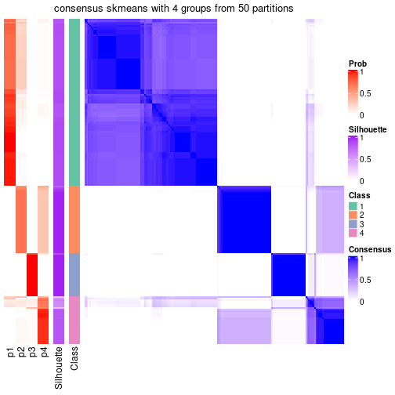</p>

</div>
</div>

Heatmaps for the membership of samples in all partitions to see how consistent they are:


<script>
$( function() {
	$( '#tabs-node-012-membership-heatmap' ).tabs();
} );
</script>
<div id='tabs-node-012-membership-heatmap'>
<ul>
<li><a href='#tab-node-012-membership-heatmap-1'>k = 2</a></li>
<li><a href='#tab-node-012-membership-heatmap-2'>k = 3</a></li>
<li><a href='#tab-node-012-membership-heatmap-3'>k = 4</a></li>
</ul>
<div id='tab-node-012-membership-heatmap-1'>
<pre><code class="r">membership_heatmap(res, k = 2)
</code></pre>

<p></p>

</div>
<div id='tab-node-012-membership-heatmap-2'>
<pre><code class="r">membership_heatmap(res, k = 3)
</code></pre>

<p>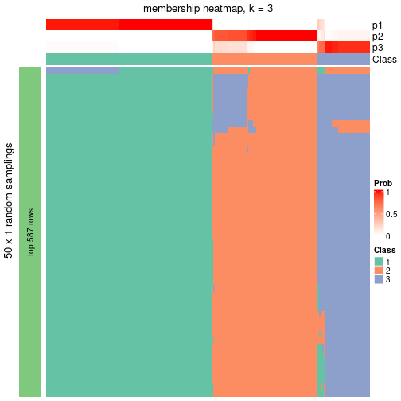</p>

</div>
<div id='tab-node-012-membership-heatmap-3'>
<pre><code class="r">membership_heatmap(res, k = 4)
</code></pre>

<p></p>

</div>
</div>

As soon as the classes for columns are determined, the signatures
that are significantly different between subgroups can be looked for. 
Following are the heatmaps for signatures.


Signature heatmaps where rows are scaled:


<script>
$( function() {
	$( '#tabs-node-012-get-signatures' ).tabs();
} );
</script>
<div id='tabs-node-012-get-signatures'>
<ul>
<li><a href='#tab-node-012-get-signatures-1'>k = 2</a></li>
<li><a href='#tab-node-012-get-signatures-2'>k = 3</a></li>
<li><a href='#tab-node-012-get-signatures-3'>k = 4</a></li>
</ul>
<div id='tab-node-012-get-signatures-1'>
<pre><code class="r">get_signatures(res, k = 2)
</code></pre>

<p></p>

</div>
<div id='tab-node-012-get-signatures-2'>
<pre><code class="r">get_signatures(res, k = 3)
</code></pre>

<p></p>

</div>
<div id='tab-node-012-get-signatures-3'>
<pre><code class="r">get_signatures(res, k = 4)
</code></pre>

<p></p>

</div>
</div>


Signature heatmaps where rows are not scaled:


<script>
$( function() {
	$( '#tabs-node-012-get-signatures-no-scale' ).tabs();
} );
</script>
<div id='tabs-node-012-get-signatures-no-scale'>
<ul>
<li><a href='#tab-node-012-get-signatures-no-scale-1'>k = 2</a></li>
<li><a href='#tab-node-012-get-signatures-no-scale-2'>k = 3</a></li>
<li><a href='#tab-node-012-get-signatures-no-scale-3'>k = 4</a></li>
</ul>
<div id='tab-node-012-get-signatures-no-scale-1'>
<pre><code class="r">get_signatures(res, k = 2, scale_rows = FALSE)
</code></pre>

<p></p>

</div>
<div id='tab-node-012-get-signatures-no-scale-2'>
<pre><code class="r">get_signatures(res, k = 3, scale_rows = FALSE)
</code></pre>

<p>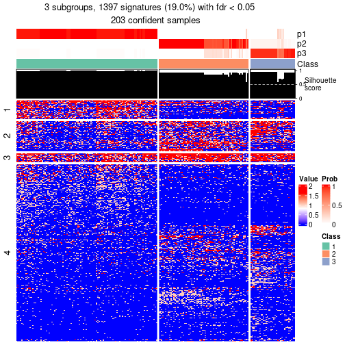</p>

</div>
<div id='tab-node-012-get-signatures-no-scale-3'>
<pre><code class="r">get_signatures(res, k = 4, scale_rows = FALSE)
</code></pre>

<p></p>

</div>
</div>


Compare the overlap of signatures from different k:

```r
compare_signatures(res)
```


`get_signature()` returns a data frame invisibly. To get the list of signatures, the function
call should be assigned to a variable explicitly. In following code, if `plot` argument is set
to `FALSE`, no heatmap is plotted while only the differential analysis is performed.

```r
# code only for demonstration
tb = get_signature(res, k = ..., plot = FALSE)
```

An example of the output of `tb` is:

```
#>   which_row         fdr    mean_1    mean_2 scaled_mean_1 scaled_mean_2 km
#> 1        38 0.042760348  8.373488  9.131774    -0.5533452     0.5164555  1
#> 2        40 0.018707592  7.106213  8.469186    -0.6173731     0.5762149  1
#> 3        55 0.019134737 10.221463 11.207825    -0.6159697     0.5749050  1
#> 4        59 0.006059896  5.921854  7.869574    -0.6899429     0.6439467  1
#> 5        60 0.018055526  8.928898 10.211722    -0.6204761     0.5791110  1
#> 6        98 0.009384629 15.714769 14.887706     0.6635654    -0.6193277  2
...
```

The columns in `tb` are:

1. `which_row`: row indices corresponding to the input matrix.
2. `fdr`: FDR for the differential test. 
3. `mean_x`: The mean value in group x.
4. `scaled_mean_x`: The mean value in group x after rows are scaled.
5. `km`: Row groups if k-means clustering is applied to rows (which is done by automatically selecting number of clusters).

If there are too many signatures, `top_signatures = ...` can be set to only show the 
signatures with the highest FDRs:

```r
# code only for demonstration
# e.g. to show the top 500 most significant rows
tb = get_signature(res, k = ..., top_signatures = 500)
```

If the signatures are defined as these which are uniquely high in current group, `diff_method` argument
can be set to `"uniquely_high_in_one_group"`:

```r
# code only for demonstration
tb = get_signature(res, k = ..., diff_method = "uniquely_high_in_one_group")
```


UMAP plot which shows how samples are separated.


<script>
$( function() {
	$( '#tabs-node-012-dimension-reduction' ).tabs();
} );
</script>
<div id='tabs-node-012-dimension-reduction'>
<ul>
<li><a href='#tab-node-012-dimension-reduction-1'>k = 2</a></li>
<li><a href='#tab-node-012-dimension-reduction-2'>k = 3</a></li>
<li><a href='#tab-node-012-dimension-reduction-3'>k = 4</a></li>
</ul>
<div id='tab-node-012-dimension-reduction-1'>
<pre><code class="r">dimension_reduction(res, k = 2, method = &quot;UMAP&quot;)
</code></pre>

<p></p>

</div>
<div id='tab-node-012-dimension-reduction-2'>
<pre><code class="r">dimension_reduction(res, k = 3, method = &quot;UMAP&quot;)
</code></pre>

<p></p>

</div>
<div id='tab-node-012-dimension-reduction-3'>
<pre><code class="r">dimension_reduction(res, k = 4, method = &quot;UMAP&quot;)
</code></pre>

<p></p>

</div>
</div>


Following heatmap shows how subgroups are split when increasing `k`:

```r
collect_classes(res)
```


If matrix rows can be associated to genes, consider to use `functional_enrichment(res,
...)` to perform function enrichment for the signature genes. See [this vignette](https://jokergoo.github.io/cola_vignettes/functional_enrichment.html) for more detailed explanations.


 

---------------------------------------------------


### Node0121


Parent node: [Node012](#Node012).
Child nodes: 
                Node01211-leaf
        ,
                Node01212-leaf
        ,
                Node01221-leaf
        ,
                Node01222-leaf
        ,
                Node01223-leaf
        ,
                Node02111-leaf
        ,
                [Node02112](#Node02112)
        ,
                Node02121-leaf
        ,
                Node02122-leaf
        ,
                Node02131-leaf
        ,
                Node02132-leaf
        ,
                Node02221-leaf
        ,
                [Node02222](#Node02222)
        ,
                Node03221-leaf
        ,
                Node03222-leaf
        ,
                Node03223-leaf
        .


The object with results only for a single top-value method and a single partitioning method 
can be extracted as:

```r
res = res_rh["0121"]
```

A summary of `res` and all the functions that can be applied to it:

```r
res
```

```
#> A 'ConsensusPartition' object with k = 2, 3, 4.
#>   On a matrix with 5387 rows and 108 columns.
#>   Top rows (531) are extracted by 'ATC' method.
#>   Subgroups are detected by 'skmeans' method.
#>   Performed in total 150 partitions by row resampling.
#>   Best k for subgroups seems to be 2.
#> 
#> Following methods can be applied to this 'ConsensusPartition' object:
#>  [1] "cola_report"             "collect_classes"         "collect_plots"          
#>  [4] "collect_stats"           "colnames"                "compare_partitions"     
#>  [7] "compare_signatures"      "consensus_heatmap"       "dimension_reduction"    
#> [10] "functional_enrichment"   "get_anno_col"            "get_anno"               
#> [13] "get_classes"             "get_consensus"           "get_matrix"             
#> [16] "get_membership"          "get_param"               "get_signatures"         
#> [19] "get_stats"               "is_best_k"               "is_stable_k"            
#> [22] "membership_heatmap"      "ncol"                    "nrow"                   
#> [25] "plot_ecdf"               "predict_classes"         "rownames"               
#> [28] "select_partition_number" "show"                    "suggest_best_k"         
#> [31] "test_to_known_factors"   "top_rows_heatmap"
```

`collect_plots()` function collects all the plots made from `res` for all `k` (number of subgroups)
into one single page to provide an easy and fast comparison between different `k`.

```r
collect_plots(res)
```


The plots are:

- The first row: a plot of the eCDF (empirical cumulative distribution
  function) curves of the consensus matrix for each `k` and the heatmap of
  predicted classes for each `k`.
- The second row: heatmaps of the consensus matrix for each `k`.
- The third row: heatmaps of the membership matrix for each `k`.
- The fouth row: heatmaps of the signatures for each `k`.

All the plots in panels can be made by individual functions and they are
plotted later in this section.

`select_partition_number()` produces several plots showing different
statistics for choosing "optimized" `k`. There are following statistics:

- eCDF curves of the consensus matrix for each `k`;
- 1-PAC. [The PAC score](https://en.wikipedia.org/wiki/Consensus_clustering#Over-interpretation_potential_of_consensus_clustering)
  measures the proportion of the ambiguous subgrouping.
- Mean silhouette score.
- Concordance. The mean probability of fiting the consensus subgroup labels in all
  partitions.
- Area increased. Denote $A_k$ as the area under the eCDF curve for current
  `k`, the area increased is defined as $A_k - A_{k-1}$.
- Rand index. The percent of pairs of samples that are both in a same cluster
  or both are not in a same cluster in the partition of k and k-1.
- Jaccard index. The ratio of pairs of samples are both in a same cluster in
  the partition of k and k-1 and the pairs of samples are both in a same
  cluster in the partition k or k-1.

The detailed explanations of these statistics can be found in [the _cola_
vignette](https://jokergoo.github.io/cola_vignettes/cola.html#toc_13).

Generally speaking, higher 1-PAC score, higher mean silhouette score or higher
concordance corresponds to better partition. Rand index and Jaccard index
measure how similar the current partition is compared to partition with `k-1`.
If they are too similar, we won't accept `k` is better than `k-1`.

```r
select_partition_number(res)
```


The numeric values for all these statistics can be obtained by `get_stats()`.

```r
get_stats(res)
```

```
#>   k 1-PAC mean_silhouette concordance area_increased  Rand Jaccard
#> 2 2 0.904           0.934       0.972          0.471 0.534   0.534
#> 3 3 0.783           0.848       0.931          0.343 0.775   0.606
#> 4 4 0.618           0.656       0.769          0.123 0.851   0.644
```

`suggest_best_k()` suggests the best $k$ based on these statistics. The rules are as follows:

- All $k$ with Jaccard index larger than 0.95 are removed because increasing
  $k$ does not provide enough extra information. If all $k$ are removed, it is
  marked as no subgroup is detected.
- For all $k$ with 1-PAC score larger than 0.9, the maximal $k$ is taken as
  the best $k$, and other $k$ are marked as optional $k$.
- If it does not fit the second rule. The $k$ with the maximal vote of the
  highest 1-PAC score, highest mean silhouette, and highest concordance is
  taken as the best $k$.

```r
suggest_best_k(res)
```

```
#> [1] 2
```


Following is the table of the partitions (You need to click the **show/hide
code output** link to see it). The membership matrix (columns with name `p*`)
is inferred by
[`clue::cl_consensus()`](https://www.rdocumentation.org/link/cl_consensus?package=clue)
function with the `SE` method. Basically the value in the membership matrix
represents the probability to belong to a certain group. The finall subgroup
label for an item is determined with the group with highest probability it
belongs to.

In `get_classes()` function, the entropy is calculated from the membership
matrix and the silhouette score is calculated from the consensus matrix.


<script>
$( function() {
	$( '#tabs-node-0121-get-classes' ).tabs();
} );
</script>
<div id='tabs-node-0121-get-classes'>
<ul>
<li><a href='#tab-node-0121-get-classes-1'>k = 2</a></li>
<li><a href='#tab-node-0121-get-classes-2'>k = 3</a></li>
<li><a href='#tab-node-0121-get-classes-3'>k = 4</a></li>
</ul>

<div id='tab-node-0121-get-classes-1'>
<p><a id='tab-node-0121-get-classes-1-a' style='color:#0366d6' href='#'>show/hide code output</a></p>
<pre><code class="r">cbind(get_classes(res, k = 2), get_membership(res, k = 2))
</code></pre>

<pre><code>#&gt;                             class entropy silhouette   p1   p2
#&gt; mouse1_lib1.final_cell_0151     2   0.000      0.973 0.00 1.00
#&gt; mouse1_lib1.final_cell_0159     1   0.000      0.969 1.00 0.00
#&gt; mouse1_lib1.final_cell_0165     2   0.000      0.973 0.00 1.00
#&gt; mouse1_lib1.final_cell_0178     1   0.722      0.750 0.80 0.20
#&gt; mouse1_lib1.final_cell_0183     2   0.000      0.973 0.00 1.00
#&gt; mouse1_lib1.final_cell_0184     2   0.000      0.973 0.00 1.00
#&gt; mouse1_lib1.final_cell_0185     2   0.000      0.973 0.00 1.00
#&gt; mouse1_lib1.final_cell_0192     2   0.000      0.973 0.00 1.00
#&gt; mouse1_lib1.final_cell_0193     1   0.000      0.969 1.00 0.00
#&gt; mouse1_lib1.final_cell_0194     2   0.000      0.973 0.00 1.00
#&gt; mouse1_lib1.final_cell_0200     1   0.584      0.831 0.86 0.14
#&gt; mouse1_lib1.final_cell_0201     2   0.943      0.440 0.36 0.64
#&gt; mouse1_lib1.final_cell_0202     1   0.000      0.969 1.00 0.00
#&gt; mouse1_lib1.final_cell_0210     1   0.000      0.969 1.00 0.00
#&gt; mouse1_lib1.final_cell_0215     2   0.000      0.973 0.00 1.00
#&gt; mouse1_lib1.final_cell_0221     1   0.000      0.969 1.00 0.00
#&gt; mouse1_lib1.final_cell_0227     1   0.000      0.969 1.00 0.00
#&gt; mouse1_lib1.final_cell_0236     1   0.000      0.969 1.00 0.00
#&gt; mouse1_lib1.final_cell_0239     1   0.000      0.969 1.00 0.00
#&gt; mouse1_lib1.final_cell_0244     1   0.000      0.969 1.00 0.00
#&gt; mouse1_lib1.final_cell_0249     2   0.000      0.973 0.00 1.00
#&gt; mouse1_lib1.final_cell_0250     2   0.000      0.973 0.00 1.00
#&gt; mouse1_lib1.final_cell_0255     1   0.000      0.969 1.00 0.00
#&gt; mouse1_lib1.final_cell_0256     1   0.000      0.969 1.00 0.00
#&gt; mouse1_lib1.final_cell_0258     1   0.000      0.969 1.00 0.00
#&gt; mouse1_lib1.final_cell_0260     1   0.000      0.969 1.00 0.00
#&gt; mouse1_lib1.final_cell_0261     1   0.000      0.969 1.00 0.00
#&gt; mouse1_lib1.final_cell_0262     1   0.000      0.969 1.00 0.00
#&gt; mouse1_lib1.final_cell_0264     1   0.760      0.725 0.78 0.22
#&gt; mouse1_lib1.final_cell_0266     1   0.881      0.579 0.70 0.30
#&gt; mouse1_lib1.final_cell_0269     1   0.000      0.969 1.00 0.00
#&gt; mouse1_lib1.final_cell_0272     1   0.000      0.969 1.00 0.00
#&gt; mouse1_lib1.final_cell_0273     1   0.000      0.969 1.00 0.00
#&gt; mouse1_lib1.final_cell_0274     1   0.000      0.969 1.00 0.00
#&gt; mouse1_lib1.final_cell_0277     1   0.000      0.969 1.00 0.00
#&gt; mouse1_lib2.final_cell_0100     2   0.000      0.973 0.00 1.00
#&gt; mouse1_lib2.final_cell_0110     2   0.000      0.973 0.00 1.00
#&gt; mouse1_lib2.final_cell_0130     2   0.000      0.973 0.00 1.00
#&gt; mouse1_lib2.final_cell_0136     2   0.000      0.973 0.00 1.00
#&gt; mouse1_lib2.final_cell_0141     2   0.000      0.973 0.00 1.00
#&gt; mouse1_lib2.final_cell_0144     2   0.000      0.973 0.00 1.00
#&gt; mouse1_lib2.final_cell_0151     2   0.000      0.973 0.00 1.00
#&gt; mouse1_lib2.final_cell_0168     2   0.000      0.973 0.00 1.00
#&gt; mouse1_lib2.final_cell_0181     2   0.000      0.973 0.00 1.00
#&gt; mouse1_lib2.final_cell_0194     2   0.327      0.917 0.06 0.94
#&gt; mouse1_lib2.final_cell_0205     1   0.000      0.969 1.00 0.00
#&gt; mouse1_lib2.final_cell_0219     2   0.000      0.973 0.00 1.00
#&gt; mouse1_lib2.final_cell_0220     1   0.000      0.969 1.00 0.00
#&gt; mouse1_lib2.final_cell_0233     2   0.000      0.973 0.00 1.00
#&gt; mouse1_lib2.final_cell_0234     2   0.722      0.747 0.20 0.80
#&gt; mouse1_lib2.final_cell_0250     1   0.000      0.969 1.00 0.00
#&gt; mouse1_lib2.final_cell_0251     1   0.000      0.969 1.00 0.00
#&gt; mouse1_lib2.final_cell_0257     1   0.000      0.969 1.00 0.00
#&gt; mouse1_lib2.final_cell_0260     1   0.958      0.402 0.62 0.38
#&gt; mouse1_lib2.final_cell_0271     2   0.000      0.973 0.00 1.00
#&gt; mouse1_lib2.final_cell_0279     1   0.000      0.969 1.00 0.00
#&gt; mouse1_lib2.final_cell_0280     1   0.000      0.969 1.00 0.00
#&gt; mouse1_lib2.final_cell_0281     1   0.000      0.969 1.00 0.00
#&gt; mouse1_lib2.final_cell_0282     1   0.000      0.969 1.00 0.00
#&gt; mouse1_lib2.final_cell_0283     1   0.000      0.969 1.00 0.00
#&gt; mouse1_lib2.final_cell_0284     1   0.000      0.969 1.00 0.00
#&gt; mouse1_lib2.final_cell_0285     1   0.000      0.969 1.00 0.00
#&gt; mouse1_lib2.final_cell_0286     1   0.000      0.969 1.00 0.00
#&gt; mouse1_lib2.final_cell_0290     1   0.000      0.969 1.00 0.00
#&gt; mouse1_lib3.final_cell_0073     2   0.000      0.973 0.00 1.00
#&gt; mouse1_lib3.final_cell_0127     2   0.000      0.973 0.00 1.00
#&gt; mouse1_lib3.final_cell_0134     2   0.000      0.973 0.00 1.00
#&gt; mouse1_lib3.final_cell_0145     1   0.141      0.952 0.98 0.02
#&gt; mouse1_lib3.final_cell_0149     2   0.925      0.488 0.34 0.66
#&gt; mouse1_lib3.final_cell_0154     2   0.000      0.973 0.00 1.00
#&gt; mouse1_lib3.final_cell_0158     2   0.000      0.973 0.00 1.00
#&gt; mouse1_lib3.final_cell_0161     1   0.000      0.969 1.00 0.00
#&gt; mouse1_lib3.final_cell_0166     2   0.000      0.973 0.00 1.00
#&gt; mouse1_lib3.final_cell_0175     2   0.000      0.973 0.00 1.00
#&gt; mouse1_lib3.final_cell_0180     2   0.000      0.973 0.00 1.00
#&gt; mouse1_lib3.final_cell_0185     2   0.000      0.973 0.00 1.00
#&gt; mouse1_lib3.final_cell_0190     2   0.000      0.973 0.00 1.00
#&gt; mouse1_lib3.final_cell_0209     1   0.000      0.969 1.00 0.00
#&gt; mouse1_lib3.final_cell_0214     1   0.000      0.969 1.00 0.00
#&gt; mouse1_lib3.final_cell_0217     1   0.943      0.444 0.64 0.36
#&gt; mouse1_lib3.final_cell_0218     2   0.141      0.956 0.02 0.98
#&gt; mouse1_lib3.final_cell_0221     2   0.000      0.973 0.00 1.00
#&gt; mouse1_lib3.final_cell_0228     1   0.529      0.855 0.88 0.12
#&gt; mouse1_lib3.final_cell_0229     1   0.000      0.969 1.00 0.00
#&gt; mouse1_lib3.final_cell_0231     1   0.000      0.969 1.00 0.00
#&gt; mouse1_lib3.final_cell_0232     1   0.000      0.969 1.00 0.00
#&gt; mouse1_lib3.final_cell_0234     1   0.000      0.969 1.00 0.00
#&gt; mouse1_lib3.final_cell_0235     1   0.000      0.969 1.00 0.00
#&gt; mouse1_lib3.final_cell_0236     1   0.000      0.969 1.00 0.00
#&gt; mouse1_lib3.final_cell_0237     1   0.000      0.969 1.00 0.00
#&gt; mouse1_lib3.final_cell_0239     1   0.000      0.969 1.00 0.00
#&gt; mouse1_lib3.final_cell_0240     1   0.000      0.969 1.00 0.00
#&gt; mouse1_lib3.final_cell_0241     1   0.000      0.969 1.00 0.00
#&gt; mouse1_lib3.final_cell_0243     1   0.000      0.969 1.00 0.00
#&gt; mouse1_lib3.final_cell_0244     1   0.000      0.969 1.00 0.00
#&gt; mouse1_lib3.final_cell_0247     2   0.000      0.973 0.00 1.00
#&gt; mouse1_lib3.final_cell_0249     1   0.000      0.969 1.00 0.00
#&gt; mouse1_lib3.final_cell_0251     1   0.000      0.969 1.00 0.00
#&gt; mouse1_lib3.final_cell_0252     1   0.000      0.969 1.00 0.00
#&gt; mouse1_lib3.final_cell_0254     1   0.000      0.969 1.00 0.00
#&gt; mouse2_lib1.final_cell_0268     1   0.000      0.969 1.00 0.00
#&gt; mouse2_lib2.final_cell_0340     1   0.000      0.969 1.00 0.00
#&gt; mouse2_lib3.final_cell_0211     1   0.000      0.969 1.00 0.00
#&gt; mouse2_lib3.final_cell_0358     1   0.855      0.626 0.72 0.28
#&gt; mouse2_lib3.final_cell_0360     1   0.000      0.969 1.00 0.00
#&gt; mouse2_lib3.final_cell_0379     1   0.242      0.935 0.96 0.04
#&gt; mouse2_lib3.final_cell_0393     1   0.000      0.969 1.00 0.00
#&gt; mouse2_lib3.final_cell_0395     1   0.000      0.969 1.00 0.00
</code></pre>

<script>
$('#tab-node-0121-get-classes-1-a').parent().next().next().hide();
$('#tab-node-0121-get-classes-1-a').click(function(){
  $('#tab-node-0121-get-classes-1-a').parent().next().next().toggle();
  return(false);
});
</script>
</div>

<div id='tab-node-0121-get-classes-2'>
<p><a id='tab-node-0121-get-classes-2-a' style='color:#0366d6' href='#'>show/hide code output</a></p>
<pre><code class="r">cbind(get_classes(res, k = 3), get_membership(res, k = 3))
</code></pre>

<pre><code>#&gt;                             class entropy silhouette   p1   p2   p3
#&gt; mouse1_lib1.final_cell_0151     2  0.0000   0.980762 0.00 1.00 0.00
#&gt; mouse1_lib1.final_cell_0159     1  0.0000   0.897639 1.00 0.00 0.00
#&gt; mouse1_lib1.final_cell_0165     3  0.5397   0.550392 0.00 0.28 0.72
#&gt; mouse1_lib1.final_cell_0178     1  0.1529   0.870258 0.96 0.04 0.00
#&gt; mouse1_lib1.final_cell_0183     2  0.0000   0.980762 0.00 1.00 0.00
#&gt; mouse1_lib1.final_cell_0184     2  0.0000   0.980762 0.00 1.00 0.00
#&gt; mouse1_lib1.final_cell_0185     2  0.0000   0.980762 0.00 1.00 0.00
#&gt; mouse1_lib1.final_cell_0192     2  0.0000   0.980762 0.00 1.00 0.00
#&gt; mouse1_lib1.final_cell_0193     1  0.0000   0.897639 1.00 0.00 0.00
#&gt; mouse1_lib1.final_cell_0194     2  0.0892   0.972169 0.00 0.98 0.02
#&gt; mouse1_lib1.final_cell_0200     3  0.0000   0.894697 0.00 0.00 1.00
#&gt; mouse1_lib1.final_cell_0201     1  0.4555   0.705115 0.80 0.20 0.00
#&gt; mouse1_lib1.final_cell_0202     1  0.6302   0.158474 0.52 0.00 0.48
#&gt; mouse1_lib1.final_cell_0210     1  0.0000   0.897639 1.00 0.00 0.00
#&gt; mouse1_lib1.final_cell_0215     2  0.0892   0.972169 0.00 0.98 0.02
#&gt; mouse1_lib1.final_cell_0221     1  0.2959   0.834616 0.90 0.00 0.10
#&gt; mouse1_lib1.final_cell_0227     3  0.0000   0.894697 0.00 0.00 1.00
#&gt; mouse1_lib1.final_cell_0236     1  0.5835   0.484686 0.66 0.00 0.34
#&gt; mouse1_lib1.final_cell_0239     1  0.0000   0.897639 1.00 0.00 0.00
#&gt; mouse1_lib1.final_cell_0244     1  0.0000   0.897639 1.00 0.00 0.00
#&gt; mouse1_lib1.final_cell_0249     2  0.1529   0.958757 0.00 0.96 0.04
#&gt; mouse1_lib1.final_cell_0250     2  0.3686   0.851462 0.00 0.86 0.14
#&gt; mouse1_lib1.final_cell_0255     1  0.0892   0.887580 0.98 0.00 0.02
#&gt; mouse1_lib1.final_cell_0256     1  0.0000   0.897639 1.00 0.00 0.00
#&gt; mouse1_lib1.final_cell_0258     1  0.4291   0.768326 0.82 0.00 0.18
#&gt; mouse1_lib1.final_cell_0260     1  0.0000   0.897639 1.00 0.00 0.00
#&gt; mouse1_lib1.final_cell_0261     1  0.0000   0.897639 1.00 0.00 0.00
#&gt; mouse1_lib1.final_cell_0262     1  0.0000   0.897639 1.00 0.00 0.00
#&gt; mouse1_lib1.final_cell_0264     3  0.0000   0.894697 0.00 0.00 1.00
#&gt; mouse1_lib1.final_cell_0266     3  0.8683   0.385074 0.34 0.12 0.54
#&gt; mouse1_lib1.final_cell_0269     1  0.0000   0.897639 1.00 0.00 0.00
#&gt; mouse1_lib1.final_cell_0272     1  0.0000   0.897639 1.00 0.00 0.00
#&gt; mouse1_lib1.final_cell_0273     1  0.3340   0.818908 0.88 0.00 0.12
#&gt; mouse1_lib1.final_cell_0274     1  0.0000   0.897639 1.00 0.00 0.00
#&gt; mouse1_lib1.final_cell_0277     1  0.0000   0.897639 1.00 0.00 0.00
#&gt; mouse1_lib2.final_cell_0100     2  0.0000   0.980762 0.00 1.00 0.00
#&gt; mouse1_lib2.final_cell_0110     2  0.0000   0.980762 0.00 1.00 0.00
#&gt; mouse1_lib2.final_cell_0130     2  0.0000   0.980762 0.00 1.00 0.00
#&gt; mouse1_lib2.final_cell_0136     2  0.0000   0.980762 0.00 1.00 0.00
#&gt; mouse1_lib2.final_cell_0141     2  0.0000   0.980762 0.00 1.00 0.00
#&gt; mouse1_lib2.final_cell_0144     2  0.2959   0.903294 0.00 0.90 0.10
#&gt; mouse1_lib2.final_cell_0151     2  0.0000   0.980762 0.00 1.00 0.00
#&gt; mouse1_lib2.final_cell_0168     2  0.0892   0.969562 0.00 0.98 0.02
#&gt; mouse1_lib2.final_cell_0181     2  0.0000   0.980762 0.00 1.00 0.00
#&gt; mouse1_lib2.final_cell_0194     3  0.0000   0.894697 0.00 0.00 1.00
#&gt; mouse1_lib2.final_cell_0205     3  0.6280   0.000887 0.46 0.00 0.54
#&gt; mouse1_lib2.final_cell_0219     2  0.0000   0.980762 0.00 1.00 0.00
#&gt; mouse1_lib2.final_cell_0220     3  0.2959   0.809855 0.10 0.00 0.90
#&gt; mouse1_lib2.final_cell_0233     2  0.0000   0.980762 0.00 1.00 0.00
#&gt; mouse1_lib2.final_cell_0234     1  0.5706   0.523373 0.68 0.32 0.00
#&gt; mouse1_lib2.final_cell_0250     1  0.0892   0.886324 0.98 0.00 0.02
#&gt; mouse1_lib2.final_cell_0251     1  0.5706   0.578286 0.68 0.00 0.32
#&gt; mouse1_lib2.final_cell_0257     1  0.0000   0.897639 1.00 0.00 0.00
#&gt; mouse1_lib2.final_cell_0260     3  0.9883   0.173124 0.36 0.26 0.38
#&gt; mouse1_lib2.final_cell_0271     2  0.0000   0.980762 0.00 1.00 0.00
#&gt; mouse1_lib2.final_cell_0279     1  0.0892   0.887667 0.98 0.00 0.02
#&gt; mouse1_lib2.final_cell_0280     1  0.0000   0.897639 1.00 0.00 0.00
#&gt; mouse1_lib2.final_cell_0281     1  0.5016   0.694008 0.76 0.00 0.24
#&gt; mouse1_lib2.final_cell_0282     1  0.0000   0.897639 1.00 0.00 0.00
#&gt; mouse1_lib2.final_cell_0283     1  0.0000   0.897639 1.00 0.00 0.00
#&gt; mouse1_lib2.final_cell_0284     1  0.0000   0.897639 1.00 0.00 0.00
#&gt; mouse1_lib2.final_cell_0285     1  0.6045   0.461558 0.62 0.00 0.38
#&gt; mouse1_lib2.final_cell_0286     1  0.0000   0.897639 1.00 0.00 0.00
#&gt; mouse1_lib2.final_cell_0290     1  0.2537   0.849845 0.92 0.00 0.08
#&gt; mouse1_lib3.final_cell_0073     2  0.0000   0.980762 0.00 1.00 0.00
#&gt; mouse1_lib3.final_cell_0127     2  0.0000   0.980762 0.00 1.00 0.00
#&gt; mouse1_lib3.final_cell_0134     2  0.0000   0.980762 0.00 1.00 0.00
#&gt; mouse1_lib3.final_cell_0145     1  0.0000   0.897639 1.00 0.00 0.00
#&gt; mouse1_lib3.final_cell_0149     1  0.4796   0.679398 0.78 0.22 0.00
#&gt; mouse1_lib3.final_cell_0154     2  0.1529   0.959008 0.00 0.96 0.04
#&gt; mouse1_lib3.final_cell_0158     2  0.0892   0.969472 0.00 0.98 0.02
#&gt; mouse1_lib3.final_cell_0161     1  0.0000   0.897639 1.00 0.00 0.00
#&gt; mouse1_lib3.final_cell_0166     2  0.0000   0.980762 0.00 1.00 0.00
#&gt; mouse1_lib3.final_cell_0175     2  0.0892   0.972169 0.00 0.98 0.02
#&gt; mouse1_lib3.final_cell_0180     2  0.0000   0.980762 0.00 1.00 0.00
#&gt; mouse1_lib3.final_cell_0185     2  0.2537   0.924014 0.00 0.92 0.08
#&gt; mouse1_lib3.final_cell_0190     2  0.0000   0.980762 0.00 1.00 0.00
#&gt; mouse1_lib3.final_cell_0209     1  0.0000   0.897639 1.00 0.00 0.00
#&gt; mouse1_lib3.final_cell_0214     1  0.0000   0.897639 1.00 0.00 0.00
#&gt; mouse1_lib3.final_cell_0217     1  0.7884   0.496446 0.64 0.26 0.10
#&gt; mouse1_lib3.final_cell_0218     3  0.0000   0.894697 0.00 0.00 1.00
#&gt; mouse1_lib3.final_cell_0221     2  0.2537   0.925007 0.00 0.92 0.08
#&gt; mouse1_lib3.final_cell_0228     3  0.0000   0.894697 0.00 0.00 1.00
#&gt; mouse1_lib3.final_cell_0229     1  0.0000   0.897639 1.00 0.00 0.00
#&gt; mouse1_lib3.final_cell_0231     3  0.0000   0.894697 0.00 0.00 1.00
#&gt; mouse1_lib3.final_cell_0232     1  0.0000   0.897639 1.00 0.00 0.00
#&gt; mouse1_lib3.final_cell_0234     3  0.0000   0.894697 0.00 0.00 1.00
#&gt; mouse1_lib3.final_cell_0235     1  0.5016   0.695180 0.76 0.00 0.24
#&gt; mouse1_lib3.final_cell_0236     1  0.0000   0.897639 1.00 0.00 0.00
#&gt; mouse1_lib3.final_cell_0237     1  0.0000   0.897639 1.00 0.00 0.00
#&gt; mouse1_lib3.final_cell_0239     3  0.0000   0.894697 0.00 0.00 1.00
#&gt; mouse1_lib3.final_cell_0240     3  0.1529   0.869536 0.04 0.00 0.96
#&gt; mouse1_lib3.final_cell_0241     1  0.5216   0.668382 0.74 0.00 0.26
#&gt; mouse1_lib3.final_cell_0243     3  0.0000   0.894697 0.00 0.00 1.00
#&gt; mouse1_lib3.final_cell_0244     1  0.0000   0.897639 1.00 0.00 0.00
#&gt; mouse1_lib3.final_cell_0247     2  0.0892   0.972169 0.00 0.98 0.02
#&gt; mouse1_lib3.final_cell_0249     1  0.5835   0.541259 0.66 0.00 0.34
#&gt; mouse1_lib3.final_cell_0251     1  0.0000   0.897639 1.00 0.00 0.00
#&gt; mouse1_lib3.final_cell_0252     1  0.5397   0.640214 0.72 0.00 0.28
#&gt; mouse1_lib3.final_cell_0254     1  0.5835   0.540481 0.66 0.00 0.34
#&gt; mouse2_lib1.final_cell_0268     1  0.0000   0.897639 1.00 0.00 0.00
#&gt; mouse2_lib2.final_cell_0340     3  0.0000   0.894697 0.00 0.00 1.00
#&gt; mouse2_lib3.final_cell_0211     1  0.0000   0.897639 1.00 0.00 0.00
#&gt; mouse2_lib3.final_cell_0358     3  0.0000   0.894697 0.00 0.00 1.00
#&gt; mouse2_lib3.final_cell_0360     1  0.0000   0.897639 1.00 0.00 0.00
#&gt; mouse2_lib3.final_cell_0379     3  0.0000   0.894697 0.00 0.00 1.00
#&gt; mouse2_lib3.final_cell_0393     1  0.0000   0.897639 1.00 0.00 0.00
#&gt; mouse2_lib3.final_cell_0395     3  0.0000   0.894697 0.00 0.00 1.00
</code></pre>

<script>
$('#tab-node-0121-get-classes-2-a').parent().next().next().hide();
$('#tab-node-0121-get-classes-2-a').click(function(){
  $('#tab-node-0121-get-classes-2-a').parent().next().next().toggle();
  return(false);
});
</script>
</div>

<div id='tab-node-0121-get-classes-3'>
<p><a id='tab-node-0121-get-classes-3-a' style='color:#0366d6' href='#'>show/hide code output</a></p>
<pre><code class="r">cbind(get_classes(res, k = 4), get_membership(res, k = 4))
</code></pre>

<pre><code>#&gt;                             class entropy silhouette   p1   p2   p3   p4
#&gt; mouse1_lib1.final_cell_0151     2  0.1211     0.7959 0.00 0.96 0.00 0.04
#&gt; mouse1_lib1.final_cell_0159     4  0.4994    -0.3561 0.48 0.00 0.00 0.52
#&gt; mouse1_lib1.final_cell_0165     2  0.5860     0.2086 0.00 0.58 0.38 0.04
#&gt; mouse1_lib1.final_cell_0178     4  0.4277     0.2671 0.28 0.00 0.00 0.72
#&gt; mouse1_lib1.final_cell_0183     4  0.4948     0.2500 0.00 0.44 0.00 0.56
#&gt; mouse1_lib1.final_cell_0184     4  0.4277     0.3856 0.00 0.28 0.00 0.72
#&gt; mouse1_lib1.final_cell_0185     4  0.4948     0.2521 0.00 0.44 0.00 0.56
#&gt; mouse1_lib1.final_cell_0192     2  0.1637     0.7942 0.00 0.94 0.00 0.06
#&gt; mouse1_lib1.final_cell_0193     1  0.3400     0.8060 0.82 0.00 0.00 0.18
#&gt; mouse1_lib1.final_cell_0194     2  0.1211     0.7945 0.00 0.96 0.00 0.04
#&gt; mouse1_lib1.final_cell_0200     3  0.5691     0.7288 0.04 0.18 0.74 0.04
#&gt; mouse1_lib1.final_cell_0201     4  0.2345     0.4547 0.10 0.00 0.00 0.90
#&gt; mouse1_lib1.final_cell_0202     1  0.5793     0.4518 0.60 0.00 0.36 0.04
#&gt; mouse1_lib1.final_cell_0210     1  0.1211     0.8410 0.96 0.00 0.00 0.04
#&gt; mouse1_lib1.final_cell_0215     2  0.0707     0.7900 0.00 0.98 0.00 0.02
#&gt; mouse1_lib1.final_cell_0221     1  0.1913     0.8282 0.94 0.00 0.04 0.02
#&gt; mouse1_lib1.final_cell_0227     3  0.0000     0.9312 0.00 0.00 1.00 0.00
#&gt; mouse1_lib1.final_cell_0236     1  0.7544     0.2289 0.46 0.00 0.34 0.20
#&gt; mouse1_lib1.final_cell_0239     1  0.0707     0.8396 0.98 0.00 0.00 0.02
#&gt; mouse1_lib1.final_cell_0244     1  0.1411     0.8324 0.96 0.00 0.02 0.02
#&gt; mouse1_lib1.final_cell_0249     2  0.2335     0.7776 0.00 0.92 0.06 0.02
#&gt; mouse1_lib1.final_cell_0250     2  0.4296     0.6734 0.02 0.84 0.08 0.06
#&gt; mouse1_lib1.final_cell_0255     1  0.1913     0.8298 0.94 0.00 0.02 0.04
#&gt; mouse1_lib1.final_cell_0256     1  0.2706     0.8428 0.90 0.00 0.02 0.08
#&gt; mouse1_lib1.final_cell_0258     1  0.4731     0.7694 0.78 0.00 0.16 0.06
#&gt; mouse1_lib1.final_cell_0260     1  0.2921     0.8233 0.86 0.00 0.00 0.14
#&gt; mouse1_lib1.final_cell_0261     1  0.2647     0.8292 0.88 0.00 0.00 0.12
#&gt; mouse1_lib1.final_cell_0262     1  0.3400     0.8040 0.82 0.00 0.00 0.18
#&gt; mouse1_lib1.final_cell_0264     3  0.0707     0.9198 0.00 0.00 0.98 0.02
#&gt; mouse1_lib1.final_cell_0266     4  0.3801     0.3290 0.00 0.00 0.22 0.78
#&gt; mouse1_lib1.final_cell_0269     1  0.2921     0.8242 0.86 0.00 0.00 0.14
#&gt; mouse1_lib1.final_cell_0272     1  0.0707     0.8360 0.98 0.00 0.00 0.02
#&gt; mouse1_lib1.final_cell_0273     1  0.1913     0.8282 0.94 0.00 0.04 0.02
#&gt; mouse1_lib1.final_cell_0274     1  0.1211     0.8414 0.96 0.00 0.00 0.04
#&gt; mouse1_lib1.final_cell_0277     1  0.1637     0.8410 0.94 0.00 0.00 0.06
#&gt; mouse1_lib2.final_cell_0100     2  0.2647     0.7611 0.00 0.88 0.00 0.12
#&gt; mouse1_lib2.final_cell_0110     4  0.4855     0.3171 0.00 0.40 0.00 0.60
#&gt; mouse1_lib2.final_cell_0130     2  0.2011     0.7873 0.00 0.92 0.00 0.08
#&gt; mouse1_lib2.final_cell_0136     4  0.4907     0.2887 0.00 0.42 0.00 0.58
#&gt; mouse1_lib2.final_cell_0141     4  0.4977     0.2214 0.00 0.46 0.00 0.54
#&gt; mouse1_lib2.final_cell_0144     2  0.1913     0.7735 0.00 0.94 0.04 0.02
#&gt; mouse1_lib2.final_cell_0151     2  0.3400     0.6884 0.00 0.82 0.00 0.18
#&gt; mouse1_lib2.final_cell_0168     2  0.5793     0.2823 0.00 0.60 0.04 0.36
#&gt; mouse1_lib2.final_cell_0181     2  0.2011     0.7844 0.00 0.92 0.00 0.08
#&gt; mouse1_lib2.final_cell_0194     3  0.1637     0.8956 0.00 0.06 0.94 0.00
#&gt; mouse1_lib2.final_cell_0205     1  0.5106     0.6489 0.72 0.00 0.24 0.04
#&gt; mouse1_lib2.final_cell_0219     2  0.4994    -0.0906 0.00 0.52 0.00 0.48
#&gt; mouse1_lib2.final_cell_0220     3  0.8111     0.4035 0.30 0.12 0.52 0.06
#&gt; mouse1_lib2.final_cell_0233     2  0.3400     0.6861 0.00 0.82 0.00 0.18
#&gt; mouse1_lib2.final_cell_0234     4  0.1211     0.4478 0.04 0.00 0.00 0.96
#&gt; mouse1_lib2.final_cell_0250     1  0.3400     0.8041 0.82 0.00 0.00 0.18
#&gt; mouse1_lib2.final_cell_0251     1  0.2706     0.8132 0.90 0.00 0.08 0.02
#&gt; mouse1_lib2.final_cell_0257     1  0.3610     0.7941 0.80 0.00 0.00 0.20
#&gt; mouse1_lib2.final_cell_0260     1  0.9816    -0.0284 0.34 0.26 0.20 0.20
#&gt; mouse1_lib2.final_cell_0271     4  0.4977     0.2203 0.00 0.46 0.00 0.54
#&gt; mouse1_lib2.final_cell_0279     1  0.1411     0.8324 0.96 0.00 0.02 0.02
#&gt; mouse1_lib2.final_cell_0280     1  0.4713     0.6278 0.64 0.00 0.00 0.36
#&gt; mouse1_lib2.final_cell_0281     1  0.1913     0.8282 0.94 0.00 0.04 0.02
#&gt; mouse1_lib2.final_cell_0282     1  0.2345     0.8339 0.90 0.00 0.00 0.10
#&gt; mouse1_lib2.final_cell_0283     1  0.3400     0.8060 0.82 0.00 0.00 0.18
#&gt; mouse1_lib2.final_cell_0284     1  0.1637     0.8431 0.94 0.00 0.00 0.06
#&gt; mouse1_lib2.final_cell_0285     1  0.4332     0.7466 0.80 0.00 0.16 0.04
#&gt; mouse1_lib2.final_cell_0286     1  0.0000     0.8389 1.00 0.00 0.00 0.00
#&gt; mouse1_lib2.final_cell_0290     1  0.1913     0.8282 0.94 0.00 0.04 0.02
#&gt; mouse1_lib3.final_cell_0073     4  0.4855     0.3171 0.00 0.40 0.00 0.60
#&gt; mouse1_lib3.final_cell_0127     2  0.2011     0.7843 0.00 0.92 0.00 0.08
#&gt; mouse1_lib3.final_cell_0134     4  0.4994     0.1425 0.00 0.48 0.00 0.52
#&gt; mouse1_lib3.final_cell_0145     4  0.4277     0.2398 0.28 0.00 0.00 0.72
#&gt; mouse1_lib3.final_cell_0149     4  0.4841     0.4122 0.14 0.08 0.00 0.78
#&gt; mouse1_lib3.final_cell_0154     2  0.1913     0.7735 0.00 0.94 0.04 0.02
#&gt; mouse1_lib3.final_cell_0158     4  0.6586     0.0326 0.00 0.42 0.08 0.50
#&gt; mouse1_lib3.final_cell_0161     1  0.3801     0.7725 0.78 0.00 0.00 0.22
#&gt; mouse1_lib3.final_cell_0166     2  0.1637     0.7915 0.00 0.94 0.00 0.06
#&gt; mouse1_lib3.final_cell_0175     2  0.1411     0.7846 0.00 0.96 0.02 0.02
#&gt; mouse1_lib3.final_cell_0180     4  0.4790     0.3329 0.00 0.38 0.00 0.62
#&gt; mouse1_lib3.final_cell_0185     2  0.2411     0.7589 0.00 0.92 0.04 0.04
#&gt; mouse1_lib3.final_cell_0190     2  0.4977    -0.0085 0.00 0.54 0.00 0.46
#&gt; mouse1_lib3.final_cell_0209     1  0.3801     0.7782 0.78 0.00 0.00 0.22
#&gt; mouse1_lib3.final_cell_0214     1  0.3172     0.8166 0.84 0.00 0.00 0.16
#&gt; mouse1_lib3.final_cell_0217     1  0.8607     0.2524 0.48 0.20 0.06 0.26
#&gt; mouse1_lib3.final_cell_0218     3  0.2345     0.8630 0.00 0.10 0.90 0.00
#&gt; mouse1_lib3.final_cell_0221     2  0.1411     0.7953 0.00 0.96 0.02 0.02
#&gt; mouse1_lib3.final_cell_0228     3  0.0000     0.9312 0.00 0.00 1.00 0.00
#&gt; mouse1_lib3.final_cell_0229     1  0.3400     0.8055 0.82 0.00 0.00 0.18
#&gt; mouse1_lib3.final_cell_0231     3  0.0707     0.9150 0.02 0.00 0.98 0.00
#&gt; mouse1_lib3.final_cell_0232     1  0.4406     0.7066 0.70 0.00 0.00 0.30
#&gt; mouse1_lib3.final_cell_0234     3  0.0000     0.9312 0.00 0.00 1.00 0.00
#&gt; mouse1_lib3.final_cell_0235     1  0.2335     0.8213 0.92 0.00 0.06 0.02
#&gt; mouse1_lib3.final_cell_0236     1  0.3037     0.8372 0.88 0.00 0.02 0.10
#&gt; mouse1_lib3.final_cell_0237     1  0.2011     0.8381 0.92 0.00 0.00 0.08
#&gt; mouse1_lib3.final_cell_0239     3  0.0000     0.9312 0.00 0.00 1.00 0.00
#&gt; mouse1_lib3.final_cell_0240     3  0.1637     0.8720 0.06 0.00 0.94 0.00
#&gt; mouse1_lib3.final_cell_0241     1  0.2411     0.8229 0.92 0.00 0.04 0.04
#&gt; mouse1_lib3.final_cell_0243     3  0.0000     0.9312 0.00 0.00 1.00 0.00
#&gt; mouse1_lib3.final_cell_0244     1  0.5173     0.6644 0.66 0.00 0.02 0.32
#&gt; mouse1_lib3.final_cell_0247     2  0.2921     0.7485 0.00 0.86 0.00 0.14
#&gt; mouse1_lib3.final_cell_0249     1  0.2335     0.8213 0.92 0.00 0.06 0.02
#&gt; mouse1_lib3.final_cell_0251     1  0.1211     0.8400 0.96 0.00 0.00 0.04
#&gt; mouse1_lib3.final_cell_0252     1  0.2335     0.8213 0.92 0.00 0.06 0.02
#&gt; mouse1_lib3.final_cell_0254     1  0.3606     0.7705 0.84 0.00 0.14 0.02
#&gt; mouse2_lib1.final_cell_0268     1  0.2647     0.8324 0.88 0.00 0.00 0.12
#&gt; mouse2_lib2.final_cell_0340     3  0.0000     0.9312 0.00 0.00 1.00 0.00
#&gt; mouse2_lib3.final_cell_0211     1  0.1411     0.8402 0.96 0.00 0.02 0.02
#&gt; mouse2_lib3.final_cell_0358     3  0.0000     0.9312 0.00 0.00 1.00 0.00
#&gt; mouse2_lib3.final_cell_0360     4  0.5000    -0.4024 0.50 0.00 0.00 0.50
#&gt; mouse2_lib3.final_cell_0379     3  0.0000     0.9312 0.00 0.00 1.00 0.00
#&gt; mouse2_lib3.final_cell_0393     1  0.5271     0.6386 0.64 0.00 0.02 0.34
#&gt; mouse2_lib3.final_cell_0395     3  0.0000     0.9312 0.00 0.00 1.00 0.00
</code></pre>

<script>
$('#tab-node-0121-get-classes-3-a').parent().next().next().hide();
$('#tab-node-0121-get-classes-3-a').click(function(){
  $('#tab-node-0121-get-classes-3-a').parent().next().next().toggle();
  return(false);
});
</script>
</div>
</div>

Heatmaps for the consensus matrix. It visualizes the probability of two
samples to be in a same group.


<script>
$( function() {
	$( '#tabs-node-0121-consensus-heatmap' ).tabs();
} );
</script>
<div id='tabs-node-0121-consensus-heatmap'>
<ul>
<li><a href='#tab-node-0121-consensus-heatmap-1'>k = 2</a></li>
<li><a href='#tab-node-0121-consensus-heatmap-2'>k = 3</a></li>
<li><a href='#tab-node-0121-consensus-heatmap-3'>k = 4</a></li>
</ul>
<div id='tab-node-0121-consensus-heatmap-1'>
<pre><code class="r">consensus_heatmap(res, k = 2)
</code></pre>

<p></p>

</div>
<div id='tab-node-0121-consensus-heatmap-2'>
<pre><code class="r">consensus_heatmap(res, k = 3)
</code></pre>

<p></p>

</div>
<div id='tab-node-0121-consensus-heatmap-3'>
<pre><code class="r">consensus_heatmap(res, k = 4)
</code></pre>

<p></p>

</div>
</div>

Heatmaps for the membership of samples in all partitions to see how consistent they are:


<script>
$( function() {
	$( '#tabs-node-0121-membership-heatmap' ).tabs();
} );
</script>
<div id='tabs-node-0121-membership-heatmap'>
<ul>
<li><a href='#tab-node-0121-membership-heatmap-1'>k = 2</a></li>
<li><a href='#tab-node-0121-membership-heatmap-2'>k = 3</a></li>
<li><a href='#tab-node-0121-membership-heatmap-3'>k = 4</a></li>
</ul>
<div id='tab-node-0121-membership-heatmap-1'>
<pre><code class="r">membership_heatmap(res, k = 2)
</code></pre>

<p></p>

</div>
<div id='tab-node-0121-membership-heatmap-2'>
<pre><code class="r">membership_heatmap(res, k = 3)
</code></pre>

<p></p>

</div>
<div id='tab-node-0121-membership-heatmap-3'>
<pre><code class="r">membership_heatmap(res, k = 4)
</code></pre>

<p></p>

</div>
</div>

As soon as the classes for columns are determined, the signatures
that are significantly different between subgroups can be looked for. 
Following are the heatmaps for signatures.


Signature heatmaps where rows are scaled:


<script>
$( function() {
	$( '#tabs-node-0121-get-signatures' ).tabs();
} );
</script>
<div id='tabs-node-0121-get-signatures'>
<ul>
<li><a href='#tab-node-0121-get-signatures-1'>k = 2</a></li>
<li><a href='#tab-node-0121-get-signatures-2'>k = 3</a></li>
<li><a href='#tab-node-0121-get-signatures-3'>k = 4</a></li>
</ul>
<div id='tab-node-0121-get-signatures-1'>
<pre><code class="r">get_signatures(res, k = 2)
</code></pre>

<p></p>

</div>
<div id='tab-node-0121-get-signatures-2'>
<pre><code class="r">get_signatures(res, k = 3)
</code></pre>

<p>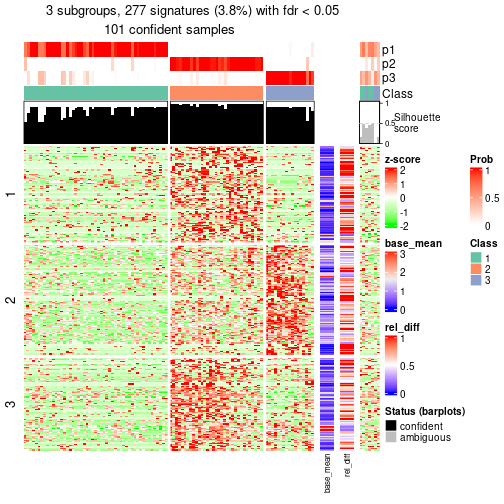</p>

</div>
<div id='tab-node-0121-get-signatures-3'>
<pre><code class="r">get_signatures(res, k = 4)
</code></pre>

<p></p>

</div>
</div>


Signature heatmaps where rows are not scaled:


<script>
$( function() {
	$( '#tabs-node-0121-get-signatures-no-scale' ).tabs();
} );
</script>
<div id='tabs-node-0121-get-signatures-no-scale'>
<ul>
<li><a href='#tab-node-0121-get-signatures-no-scale-1'>k = 2</a></li>
<li><a href='#tab-node-0121-get-signatures-no-scale-2'>k = 3</a></li>
<li><a href='#tab-node-0121-get-signatures-no-scale-3'>k = 4</a></li>
</ul>
<div id='tab-node-0121-get-signatures-no-scale-1'>
<pre><code class="r">get_signatures(res, k = 2, scale_rows = FALSE)
</code></pre>

<p></p>

</div>
<div id='tab-node-0121-get-signatures-no-scale-2'>
<pre><code class="r">get_signatures(res, k = 3, scale_rows = FALSE)
</code></pre>

<p></p>

</div>
<div id='tab-node-0121-get-signatures-no-scale-3'>
<pre><code class="r">get_signatures(res, k = 4, scale_rows = FALSE)
</code></pre>

<p></p>

</div>
</div>


Compare the overlap of signatures from different k:

```r
compare_signatures(res)
```


`get_signature()` returns a data frame invisibly. To get the list of signatures, the function
call should be assigned to a variable explicitly. In following code, if `plot` argument is set
to `FALSE`, no heatmap is plotted while only the differential analysis is performed.

```r
# code only for demonstration
tb = get_signature(res, k = ..., plot = FALSE)
```

An example of the output of `tb` is:

```
#>   which_row         fdr    mean_1    mean_2 scaled_mean_1 scaled_mean_2 km
#> 1        38 0.042760348  8.373488  9.131774    -0.5533452     0.5164555  1
#> 2        40 0.018707592  7.106213  8.469186    -0.6173731     0.5762149  1
#> 3        55 0.019134737 10.221463 11.207825    -0.6159697     0.5749050  1
#> 4        59 0.006059896  5.921854  7.869574    -0.6899429     0.6439467  1
#> 5        60 0.018055526  8.928898 10.211722    -0.6204761     0.5791110  1
#> 6        98 0.009384629 15.714769 14.887706     0.6635654    -0.6193277  2
...
```

The columns in `tb` are:

1. `which_row`: row indices corresponding to the input matrix.
2. `fdr`: FDR for the differential test. 
3. `mean_x`: The mean value in group x.
4. `scaled_mean_x`: The mean value in group x after rows are scaled.
5. `km`: Row groups if k-means clustering is applied to rows (which is done by automatically selecting number of clusters).

If there are too many signatures, `top_signatures = ...` can be set to only show the 
signatures with the highest FDRs:

```r
# code only for demonstration
# e.g. to show the top 500 most significant rows
tb = get_signature(res, k = ..., top_signatures = 500)
```

If the signatures are defined as these which are uniquely high in current group, `diff_method` argument
can be set to `"uniquely_high_in_one_group"`:

```r
# code only for demonstration
tb = get_signature(res, k = ..., diff_method = "uniquely_high_in_one_group")
```


UMAP plot which shows how samples are separated.


<script>
$( function() {
	$( '#tabs-node-0121-dimension-reduction' ).tabs();
} );
</script>
<div id='tabs-node-0121-dimension-reduction'>
<ul>
<li><a href='#tab-node-0121-dimension-reduction-1'>k = 2</a></li>
<li><a href='#tab-node-0121-dimension-reduction-2'>k = 3</a></li>
<li><a href='#tab-node-0121-dimension-reduction-3'>k = 4</a></li>
</ul>
<div id='tab-node-0121-dimension-reduction-1'>
<pre><code class="r">dimension_reduction(res, k = 2, method = &quot;UMAP&quot;)
</code></pre>

<p></p>

</div>
<div id='tab-node-0121-dimension-reduction-2'>
<pre><code class="r">dimension_reduction(res, k = 3, method = &quot;UMAP&quot;)
</code></pre>

<p></p>

</div>
<div id='tab-node-0121-dimension-reduction-3'>
<pre><code class="r">dimension_reduction(res, k = 4, method = &quot;UMAP&quot;)
</code></pre>

<p>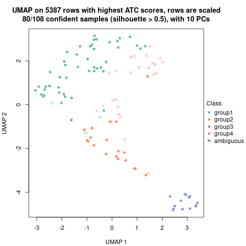</p>

</div>
</div>


Following heatmap shows how subgroups are split when increasing `k`:

```r
collect_classes(res)
```


If matrix rows can be associated to genes, consider to use `functional_enrichment(res,
...)` to perform function enrichment for the signature genes. See [this vignette](https://jokergoo.github.io/cola_vignettes/functional_enrichment.html) for more detailed explanations.


 

---------------------------------------------------


### Node0122


Parent node: [Node012](#Node012).
Child nodes: 
                Node01211-leaf
        ,
                Node01212-leaf
        ,
                Node01221-leaf
        ,
                Node01222-leaf
        ,
                Node01223-leaf
        ,
                Node02111-leaf
        ,
                [Node02112](#Node02112)
        ,
                Node02121-leaf
        ,
                Node02122-leaf
        ,
                Node02131-leaf
        ,
                Node02132-leaf
        ,
                Node02221-leaf
        ,
                [Node02222](#Node02222)
        ,
                Node03221-leaf
        ,
                Node03222-leaf
        ,
                Node03223-leaf
        .


The object with results only for a single top-value method and a single partitioning method 
can be extracted as:

```r
res = res_rh["0122"]
```

A summary of `res` and all the functions that can be applied to it:

```r
res
```

```
#> A 'ConsensusPartition' object with k = 2, 3, 4.
#>   On a matrix with 5001 rows and 95 columns.
#>   Top rows (487) are extracted by 'ATC' method.
#>   Subgroups are detected by 'skmeans' method.
#>   Performed in total 150 partitions by row resampling.
#>   Best k for subgroups seems to be 4.
#> 
#> Following methods can be applied to this 'ConsensusPartition' object:
#>  [1] "cola_report"             "collect_classes"         "collect_plots"          
#>  [4] "collect_stats"           "colnames"                "compare_partitions"     
#>  [7] "compare_signatures"      "consensus_heatmap"       "dimension_reduction"    
#> [10] "functional_enrichment"   "get_anno_col"            "get_anno"               
#> [13] "get_classes"             "get_consensus"           "get_matrix"             
#> [16] "get_membership"          "get_param"               "get_signatures"         
#> [19] "get_stats"               "is_best_k"               "is_stable_k"            
#> [22] "membership_heatmap"      "ncol"                    "nrow"                   
#> [25] "plot_ecdf"               "predict_classes"         "rownames"               
#> [28] "select_partition_number" "show"                    "suggest_best_k"         
#> [31] "test_to_known_factors"   "top_rows_heatmap"
```

`collect_plots()` function collects all the plots made from `res` for all `k` (number of subgroups)
into one single page to provide an easy and fast comparison between different `k`.

```r
collect_plots(res)
```


The plots are:

- The first row: a plot of the eCDF (empirical cumulative distribution
  function) curves of the consensus matrix for each `k` and the heatmap of
  predicted classes for each `k`.
- The second row: heatmaps of the consensus matrix for each `k`.
- The third row: heatmaps of the membership matrix for each `k`.
- The fouth row: heatmaps of the signatures for each `k`.

All the plots in panels can be made by individual functions and they are
plotted later in this section.

`select_partition_number()` produces several plots showing different
statistics for choosing "optimized" `k`. There are following statistics:

- eCDF curves of the consensus matrix for each `k`;
- 1-PAC. [The PAC score](https://en.wikipedia.org/wiki/Consensus_clustering#Over-interpretation_potential_of_consensus_clustering)
  measures the proportion of the ambiguous subgrouping.
- Mean silhouette score.
- Concordance. The mean probability of fiting the consensus subgroup labels in all
  partitions.
- Area increased. Denote $A_k$ as the area under the eCDF curve for current
  `k`, the area increased is defined as $A_k - A_{k-1}$.
- Rand index. The percent of pairs of samples that are both in a same cluster
  or both are not in a same cluster in the partition of k and k-1.
- Jaccard index. The ratio of pairs of samples are both in a same cluster in
  the partition of k and k-1 and the pairs of samples are both in a same
  cluster in the partition k or k-1.

The detailed explanations of these statistics can be found in [the _cola_
vignette](https://jokergoo.github.io/cola_vignettes/cola.html#toc_13).

Generally speaking, higher 1-PAC score, higher mean silhouette score or higher
concordance corresponds to better partition. Rand index and Jaccard index
measure how similar the current partition is compared to partition with `k-1`.
If they are too similar, we won't accept `k` is better than `k-1`.

```r
select_partition_number(res)
```


The numeric values for all these statistics can be obtained by `get_stats()`.

```r
get_stats(res)
```

```
#>   k 1-PAC mean_silhouette concordance area_increased  Rand Jaccard
#> 2 2 0.626           0.875       0.920          0.477 0.497   0.497
#> 3 3 1.000           0.972       0.989          0.386 0.798   0.610
#> 4 4 0.910           0.867       0.939          0.109 0.873   0.653
```

`suggest_best_k()` suggests the best $k$ based on these statistics. The rules are as follows:

- All $k$ with Jaccard index larger than 0.95 are removed because increasing
  $k$ does not provide enough extra information. If all $k$ are removed, it is
  marked as no subgroup is detected.
- For all $k$ with 1-PAC score larger than 0.9, the maximal $k$ is taken as
  the best $k$, and other $k$ are marked as optional $k$.
- If it does not fit the second rule. The $k$ with the maximal vote of the
  highest 1-PAC score, highest mean silhouette, and highest concordance is
  taken as the best $k$.

```r
suggest_best_k(res)
```

```
#> [1] 4
#> attr(,"optional")
#> [1] 3
```

There is also optional best $k$ = 3 that is worth to check.

Following is the table of the partitions (You need to click the **show/hide
code output** link to see it). The membership matrix (columns with name `p*`)
is inferred by
[`clue::cl_consensus()`](https://www.rdocumentation.org/link/cl_consensus?package=clue)
function with the `SE` method. Basically the value in the membership matrix
represents the probability to belong to a certain group. The finall subgroup
label for an item is determined with the group with highest probability it
belongs to.

In `get_classes()` function, the entropy is calculated from the membership
matrix and the silhouette score is calculated from the consensus matrix.


<script>
$( function() {
	$( '#tabs-node-0122-get-classes' ).tabs();
} );
</script>
<div id='tabs-node-0122-get-classes'>
<ul>
<li><a href='#tab-node-0122-get-classes-1'>k = 2</a></li>
<li><a href='#tab-node-0122-get-classes-2'>k = 3</a></li>
<li><a href='#tab-node-0122-get-classes-3'>k = 4</a></li>
</ul>

<div id='tab-node-0122-get-classes-1'>
<p><a id='tab-node-0122-get-classes-1-a' style='color:#0366d6' href='#'>show/hide code output</a></p>
<pre><code class="r">cbind(get_classes(res, k = 2), get_membership(res, k = 2))
</code></pre>

<pre><code>#&gt;                             class entropy silhouette   p1   p2
#&gt; mouse1_lib1.final_cell_0116     2   0.000      0.835 0.00 1.00
#&gt; mouse1_lib1.final_cell_0162     2   0.000      0.835 0.00 1.00
#&gt; mouse1_lib1.final_cell_0203     1   0.000      0.990 1.00 0.00
#&gt; mouse1_lib1.final_cell_0222     2   0.904      0.731 0.32 0.68
#&gt; mouse1_lib1.final_cell_0235     1   0.000      0.990 1.00 0.00
#&gt; mouse1_lib1.final_cell_0251     1   0.000      0.990 1.00 0.00
#&gt; mouse1_lib1.final_cell_0253     2   0.904      0.731 0.32 0.68
#&gt; mouse1_lib1.final_cell_0275     1   0.000      0.990 1.00 0.00
#&gt; mouse1_lib1.final_cell_0276     1   0.000      0.990 1.00 0.00
#&gt; mouse1_lib2.final_cell_0183     1   0.000      0.990 1.00 0.00
#&gt; mouse1_lib2.final_cell_0201     2   0.000      0.835 0.00 1.00
#&gt; mouse1_lib2.final_cell_0202     1   0.000      0.990 1.00 0.00
#&gt; mouse1_lib2.final_cell_0217     2   0.881      0.742 0.30 0.70
#&gt; mouse1_lib2.final_cell_0223     1   0.000      0.990 1.00 0.00
#&gt; mouse1_lib2.final_cell_0239     1   0.000      0.990 1.00 0.00
#&gt; mouse1_lib2.final_cell_0248     1   0.000      0.990 1.00 0.00
#&gt; mouse1_lib2.final_cell_0258     1   0.000      0.990 1.00 0.00
#&gt; mouse1_lib2.final_cell_0259     1   0.000      0.990 1.00 0.00
#&gt; mouse1_lib2.final_cell_0266     1   0.000      0.990 1.00 0.00
#&gt; mouse1_lib2.final_cell_0269     2   0.904      0.731 0.32 0.68
#&gt; mouse1_lib2.final_cell_0272     2   0.000      0.835 0.00 1.00
#&gt; mouse1_lib2.final_cell_0287     1   0.904      0.347 0.68 0.32
#&gt; mouse1_lib2.final_cell_0289     1   0.000      0.990 1.00 0.00
#&gt; mouse1_lib2.final_cell_0291     1   0.000      0.990 1.00 0.00
#&gt; mouse1_lib3.final_cell_0096     1   0.000      0.990 1.00 0.00
#&gt; mouse1_lib3.final_cell_0097     2   0.000      0.835 0.00 1.00
#&gt; mouse1_lib3.final_cell_0104     1   0.000      0.990 1.00 0.00
#&gt; mouse1_lib3.final_cell_0128     1   0.000      0.990 1.00 0.00
#&gt; mouse1_lib3.final_cell_0163     1   0.000      0.990 1.00 0.00
#&gt; mouse1_lib3.final_cell_0170     1   0.000      0.990 1.00 0.00
#&gt; mouse1_lib3.final_cell_0184     1   0.000      0.990 1.00 0.00
#&gt; mouse1_lib3.final_cell_0187     2   0.000      0.835 0.00 1.00
#&gt; mouse1_lib3.final_cell_0200     2   0.000      0.835 0.00 1.00
#&gt; mouse1_lib3.final_cell_0202     2   0.000      0.835 0.00 1.00
#&gt; mouse1_lib3.final_cell_0216     2   0.881      0.742 0.30 0.70
#&gt; mouse1_lib3.final_cell_0222     2   0.000      0.835 0.00 1.00
#&gt; mouse1_lib3.final_cell_0225     2   0.000      0.835 0.00 1.00
#&gt; mouse1_lib3.final_cell_0230     2   0.000      0.835 0.00 1.00
#&gt; mouse1_lib3.final_cell_0248     1   0.000      0.990 1.00 0.00
#&gt; mouse1_lib3.final_cell_0250     2   0.000      0.835 0.00 1.00
#&gt; mouse1_lib3.final_cell_0253     1   0.000      0.990 1.00 0.00
#&gt; mouse2_lib1.final_cell_0205     2   0.000      0.835 0.00 1.00
#&gt; mouse2_lib1.final_cell_0232     2   0.000      0.835 0.00 1.00
#&gt; mouse2_lib1.final_cell_0251     2   0.000      0.835 0.00 1.00
#&gt; mouse2_lib1.final_cell_0274     1   0.000      0.990 1.00 0.00
#&gt; mouse2_lib1.final_cell_0282     2   0.904      0.731 0.32 0.68
#&gt; mouse2_lib1.final_cell_0290     1   0.000      0.990 1.00 0.00
#&gt; mouse2_lib1.final_cell_0294     2   0.904      0.731 0.32 0.68
#&gt; mouse2_lib1.final_cell_0298     1   0.000      0.990 1.00 0.00
#&gt; mouse2_lib1.final_cell_0302     2   0.904      0.731 0.32 0.68
#&gt; mouse2_lib1.final_cell_0303     2   0.000      0.835 0.00 1.00
#&gt; mouse2_lib1.final_cell_0305     1   0.000      0.990 1.00 0.00
#&gt; mouse2_lib1.final_cell_0306     2   0.000      0.835 0.00 1.00
#&gt; mouse2_lib1.final_cell_0317     2   0.904      0.731 0.32 0.68
#&gt; mouse2_lib1.final_cell_0319     1   0.000      0.990 1.00 0.00
#&gt; mouse2_lib1.final_cell_0320     1   0.000      0.990 1.00 0.00
#&gt; mouse2_lib2.final_cell_0232     2   0.000      0.835 0.00 1.00
#&gt; mouse2_lib2.final_cell_0291     2   0.904      0.731 0.32 0.68
#&gt; mouse2_lib2.final_cell_0302     2   0.000      0.835 0.00 1.00
#&gt; mouse2_lib2.final_cell_0303     2   0.000      0.835 0.00 1.00
#&gt; mouse2_lib2.final_cell_0323     2   0.000      0.835 0.00 1.00
#&gt; mouse2_lib2.final_cell_0328     2   0.904      0.731 0.32 0.68
#&gt; mouse2_lib2.final_cell_0329     2   0.904      0.731 0.32 0.68
#&gt; mouse2_lib2.final_cell_0334     2   0.904      0.731 0.32 0.68
#&gt; mouse2_lib2.final_cell_0336     2   0.904      0.731 0.32 0.68
#&gt; mouse2_lib2.final_cell_0348     2   0.904      0.731 0.32 0.68
#&gt; mouse2_lib2.final_cell_0349     1   0.000      0.990 1.00 0.00
#&gt; mouse2_lib3.final_cell_0232     2   0.000      0.835 0.00 1.00
#&gt; mouse2_lib3.final_cell_0233     2   0.000      0.835 0.00 1.00
#&gt; mouse2_lib3.final_cell_0240     1   0.000      0.990 1.00 0.00
#&gt; mouse2_lib3.final_cell_0292     1   0.000      0.990 1.00 0.00
#&gt; mouse2_lib3.final_cell_0296     1   0.000      0.990 1.00 0.00
#&gt; mouse2_lib3.final_cell_0305     1   0.000      0.990 1.00 0.00
#&gt; mouse2_lib3.final_cell_0307     2   0.904      0.731 0.32 0.68
#&gt; mouse2_lib3.final_cell_0308     1   0.000      0.990 1.00 0.00
#&gt; mouse2_lib3.final_cell_0310     2   0.000      0.835 0.00 1.00
#&gt; mouse2_lib3.final_cell_0314     1   0.000      0.990 1.00 0.00
#&gt; mouse2_lib3.final_cell_0315     2   0.904      0.731 0.32 0.68
#&gt; mouse2_lib3.final_cell_0320     2   0.000      0.835 0.00 1.00
#&gt; mouse2_lib3.final_cell_0329     2   0.000      0.835 0.00 1.00
#&gt; mouse2_lib3.final_cell_0340     1   0.000      0.990 1.00 0.00
#&gt; mouse2_lib3.final_cell_0347     2   0.904      0.731 0.32 0.68
#&gt; mouse2_lib3.final_cell_0353     1   0.000      0.990 1.00 0.00
#&gt; mouse2_lib3.final_cell_0354     1   0.000      0.990 1.00 0.00
#&gt; mouse2_lib3.final_cell_0359     2   0.904      0.731 0.32 0.68
#&gt; mouse2_lib3.final_cell_0366     1   0.000      0.990 1.00 0.00
#&gt; mouse2_lib3.final_cell_0368     2   0.000      0.835 0.00 1.00
#&gt; mouse2_lib3.final_cell_0369     1   0.000      0.990 1.00 0.00
#&gt; mouse2_lib3.final_cell_0372     1   0.000      0.990 1.00 0.00
#&gt; mouse2_lib3.final_cell_0373     2   0.904      0.731 0.32 0.68
#&gt; mouse2_lib3.final_cell_0380     2   0.881      0.742 0.30 0.70
#&gt; mouse2_lib3.final_cell_0383     2   0.000      0.835 0.00 1.00
#&gt; mouse2_lib3.final_cell_0389     1   0.141      0.966 0.98 0.02
#&gt; mouse2_lib3.final_cell_0390     2   0.881      0.742 0.30 0.70
#&gt; mouse2_lib3.final_cell_0394     2   0.904      0.731 0.32 0.68
</code></pre>

<script>
$('#tab-node-0122-get-classes-1-a').parent().next().next().hide();
$('#tab-node-0122-get-classes-1-a').click(function(){
  $('#tab-node-0122-get-classes-1-a').parent().next().next().toggle();
  return(false);
});
</script>
</div>

<div id='tab-node-0122-get-classes-2'>
<p><a id='tab-node-0122-get-classes-2-a' style='color:#0366d6' href='#'>show/hide code output</a></p>
<pre><code class="r">cbind(get_classes(res, k = 3), get_membership(res, k = 3))
</code></pre>

<pre><code>#&gt;                             class entropy silhouette   p1   p2   p3
#&gt; mouse1_lib1.final_cell_0116     2  0.0000      0.990 0.00 1.00 0.00
#&gt; mouse1_lib1.final_cell_0162     2  0.0000      0.990 0.00 1.00 0.00
#&gt; mouse1_lib1.final_cell_0203     1  0.0000      0.994 1.00 0.00 0.00
#&gt; mouse1_lib1.final_cell_0222     3  0.0000      0.976 0.00 0.00 1.00
#&gt; mouse1_lib1.final_cell_0235     1  0.0000      0.994 1.00 0.00 0.00
#&gt; mouse1_lib1.final_cell_0251     1  0.0000      0.994 1.00 0.00 0.00
#&gt; mouse1_lib1.final_cell_0253     3  0.0000      0.976 0.00 0.00 1.00
#&gt; mouse1_lib1.final_cell_0275     1  0.0000      0.994 1.00 0.00 0.00
#&gt; mouse1_lib1.final_cell_0276     1  0.0000      0.994 1.00 0.00 0.00
#&gt; mouse1_lib2.final_cell_0183     1  0.0000      0.994 1.00 0.00 0.00
#&gt; mouse1_lib2.final_cell_0201     2  0.0000      0.990 0.00 1.00 0.00
#&gt; mouse1_lib2.final_cell_0202     1  0.0000      0.994 1.00 0.00 0.00
#&gt; mouse1_lib2.final_cell_0217     3  0.0000      0.976 0.00 0.00 1.00
#&gt; mouse1_lib2.final_cell_0223     1  0.0000      0.994 1.00 0.00 0.00
#&gt; mouse1_lib2.final_cell_0239     1  0.0000      0.994 1.00 0.00 0.00
#&gt; mouse1_lib2.final_cell_0248     1  0.0000      0.994 1.00 0.00 0.00
#&gt; mouse1_lib2.final_cell_0258     1  0.0000      0.994 1.00 0.00 0.00
#&gt; mouse1_lib2.final_cell_0259     1  0.0000      0.994 1.00 0.00 0.00
#&gt; mouse1_lib2.final_cell_0266     1  0.0000      0.994 1.00 0.00 0.00
#&gt; mouse1_lib2.final_cell_0269     3  0.0000      0.976 0.00 0.00 1.00
#&gt; mouse1_lib2.final_cell_0272     2  0.0000      0.990 0.00 1.00 0.00
#&gt; mouse1_lib2.final_cell_0287     3  0.0000      0.976 0.00 0.00 1.00
#&gt; mouse1_lib2.final_cell_0289     1  0.0000      0.994 1.00 0.00 0.00
#&gt; mouse1_lib2.final_cell_0291     1  0.3340      0.864 0.88 0.00 0.12
#&gt; mouse1_lib3.final_cell_0096     1  0.0000      0.994 1.00 0.00 0.00
#&gt; mouse1_lib3.final_cell_0097     2  0.0000      0.990 0.00 1.00 0.00
#&gt; mouse1_lib3.final_cell_0104     1  0.0000      0.994 1.00 0.00 0.00
#&gt; mouse1_lib3.final_cell_0128     1  0.0000      0.994 1.00 0.00 0.00
#&gt; mouse1_lib3.final_cell_0163     1  0.0000      0.994 1.00 0.00 0.00
#&gt; mouse1_lib3.final_cell_0170     1  0.0000      0.994 1.00 0.00 0.00
#&gt; mouse1_lib3.final_cell_0184     1  0.0000      0.994 1.00 0.00 0.00
#&gt; mouse1_lib3.final_cell_0187     2  0.0000      0.990 0.00 1.00 0.00
#&gt; mouse1_lib3.final_cell_0200     2  0.0000      0.990 0.00 1.00 0.00
#&gt; mouse1_lib3.final_cell_0202     2  0.0000      0.990 0.00 1.00 0.00
#&gt; mouse1_lib3.final_cell_0216     3  0.0000      0.976 0.00 0.00 1.00
#&gt; mouse1_lib3.final_cell_0222     2  0.0000      0.990 0.00 1.00 0.00
#&gt; mouse1_lib3.final_cell_0225     2  0.0000      0.990 0.00 1.00 0.00
#&gt; mouse1_lib3.final_cell_0230     2  0.5216      0.644 0.00 0.74 0.26
#&gt; mouse1_lib3.final_cell_0248     1  0.0000      0.994 1.00 0.00 0.00
#&gt; mouse1_lib3.final_cell_0250     3  0.0000      0.976 0.00 0.00 1.00
#&gt; mouse1_lib3.final_cell_0253     3  0.0892      0.957 0.02 0.00 0.98
#&gt; mouse2_lib1.final_cell_0205     2  0.0000      0.990 0.00 1.00 0.00
#&gt; mouse2_lib1.final_cell_0232     2  0.0000      0.990 0.00 1.00 0.00
#&gt; mouse2_lib1.final_cell_0251     2  0.0000      0.990 0.00 1.00 0.00
#&gt; mouse2_lib1.final_cell_0274     1  0.0000      0.994 1.00 0.00 0.00
#&gt; mouse2_lib1.final_cell_0282     3  0.0000      0.976 0.00 0.00 1.00
#&gt; mouse2_lib1.final_cell_0290     1  0.0000      0.994 1.00 0.00 0.00
#&gt; mouse2_lib1.final_cell_0294     3  0.0000      0.976 0.00 0.00 1.00
#&gt; mouse2_lib1.final_cell_0298     1  0.0000      0.994 1.00 0.00 0.00
#&gt; mouse2_lib1.final_cell_0302     3  0.0000      0.976 0.00 0.00 1.00
#&gt; mouse2_lib1.final_cell_0303     2  0.0000      0.990 0.00 1.00 0.00
#&gt; mouse2_lib1.final_cell_0305     1  0.0000      0.994 1.00 0.00 0.00
#&gt; mouse2_lib1.final_cell_0306     2  0.0000      0.990 0.00 1.00 0.00
#&gt; mouse2_lib1.final_cell_0317     3  0.0000      0.976 0.00 0.00 1.00
#&gt; mouse2_lib1.final_cell_0319     1  0.0000      0.994 1.00 0.00 0.00
#&gt; mouse2_lib1.final_cell_0320     1  0.0000      0.994 1.00 0.00 0.00
#&gt; mouse2_lib2.final_cell_0232     2  0.0000      0.990 0.00 1.00 0.00
#&gt; mouse2_lib2.final_cell_0291     3  0.0000      0.976 0.00 0.00 1.00
#&gt; mouse2_lib2.final_cell_0302     2  0.0000      0.990 0.00 1.00 0.00
#&gt; mouse2_lib2.final_cell_0303     2  0.0000      0.990 0.00 1.00 0.00
#&gt; mouse2_lib2.final_cell_0323     2  0.0000      0.990 0.00 1.00 0.00
#&gt; mouse2_lib2.final_cell_0328     3  0.0000      0.976 0.00 0.00 1.00
#&gt; mouse2_lib2.final_cell_0329     3  0.0000      0.976 0.00 0.00 1.00
#&gt; mouse2_lib2.final_cell_0334     3  0.0000      0.976 0.00 0.00 1.00
#&gt; mouse2_lib2.final_cell_0336     3  0.0000      0.976 0.00 0.00 1.00
#&gt; mouse2_lib2.final_cell_0348     3  0.0000      0.976 0.00 0.00 1.00
#&gt; mouse2_lib2.final_cell_0349     1  0.0892      0.976 0.98 0.00 0.02
#&gt; mouse2_lib3.final_cell_0232     2  0.0000      0.990 0.00 1.00 0.00
#&gt; mouse2_lib3.final_cell_0233     2  0.0000      0.990 0.00 1.00 0.00
#&gt; mouse2_lib3.final_cell_0240     1  0.0000      0.994 1.00 0.00 0.00
#&gt; mouse2_lib3.final_cell_0292     1  0.1529      0.957 0.96 0.00 0.04
#&gt; mouse2_lib3.final_cell_0296     1  0.0000      0.994 1.00 0.00 0.00
#&gt; mouse2_lib3.final_cell_0305     1  0.0000      0.994 1.00 0.00 0.00
#&gt; mouse2_lib3.final_cell_0307     3  0.0000      0.976 0.00 0.00 1.00
#&gt; mouse2_lib3.final_cell_0308     1  0.0000      0.994 1.00 0.00 0.00
#&gt; mouse2_lib3.final_cell_0310     2  0.0000      0.990 0.00 1.00 0.00
#&gt; mouse2_lib3.final_cell_0314     1  0.0000      0.994 1.00 0.00 0.00
#&gt; mouse2_lib3.final_cell_0315     3  0.0000      0.976 0.00 0.00 1.00
#&gt; mouse2_lib3.final_cell_0320     2  0.0000      0.990 0.00 1.00 0.00
#&gt; mouse2_lib3.final_cell_0329     2  0.0000      0.990 0.00 1.00 0.00
#&gt; mouse2_lib3.final_cell_0340     1  0.0000      0.994 1.00 0.00 0.00
#&gt; mouse2_lib3.final_cell_0347     3  0.0000      0.976 0.00 0.00 1.00
#&gt; mouse2_lib3.final_cell_0353     3  0.4002      0.804 0.16 0.00 0.84
#&gt; mouse2_lib3.final_cell_0354     1  0.0000      0.994 1.00 0.00 0.00
#&gt; mouse2_lib3.final_cell_0359     3  0.0000      0.976 0.00 0.00 1.00
#&gt; mouse2_lib3.final_cell_0366     1  0.0000      0.994 1.00 0.00 0.00
#&gt; mouse2_lib3.final_cell_0368     2  0.0000      0.990 0.00 1.00 0.00
#&gt; mouse2_lib3.final_cell_0369     1  0.2066      0.937 0.94 0.00 0.06
#&gt; mouse2_lib3.final_cell_0372     1  0.0000      0.994 1.00 0.00 0.00
#&gt; mouse2_lib3.final_cell_0373     3  0.0000      0.976 0.00 0.00 1.00
#&gt; mouse2_lib3.final_cell_0380     3  0.0000      0.976 0.00 0.00 1.00
#&gt; mouse2_lib3.final_cell_0383     2  0.0000      0.990 0.00 1.00 0.00
#&gt; mouse2_lib3.final_cell_0389     3  0.6126      0.337 0.40 0.00 0.60
#&gt; mouse2_lib3.final_cell_0390     3  0.0000      0.976 0.00 0.00 1.00
#&gt; mouse2_lib3.final_cell_0394     3  0.0000      0.976 0.00 0.00 1.00
</code></pre>

<script>
$('#tab-node-0122-get-classes-2-a').parent().next().next().hide();
$('#tab-node-0122-get-classes-2-a').click(function(){
  $('#tab-node-0122-get-classes-2-a').parent().next().next().toggle();
  return(false);
});
</script>
</div>

<div id='tab-node-0122-get-classes-3'>
<p><a id='tab-node-0122-get-classes-3-a' style='color:#0366d6' href='#'>show/hide code output</a></p>
<pre><code class="r">cbind(get_classes(res, k = 4), get_membership(res, k = 4))
</code></pre>

<pre><code>#&gt;                             class entropy silhouette   p1   p2   p3   p4
#&gt; mouse1_lib1.final_cell_0116     2  0.0000     1.0000 0.00 1.00 0.00 0.00
#&gt; mouse1_lib1.final_cell_0162     4  0.4277     0.6064 0.00 0.28 0.00 0.72
#&gt; mouse1_lib1.final_cell_0203     1  0.0000     0.9653 1.00 0.00 0.00 0.00
#&gt; mouse1_lib1.final_cell_0222     3  0.4977    -0.0643 0.00 0.00 0.54 0.46
#&gt; mouse1_lib1.final_cell_0235     1  0.0000     0.9653 1.00 0.00 0.00 0.00
#&gt; mouse1_lib1.final_cell_0251     1  0.0000     0.9653 1.00 0.00 0.00 0.00
#&gt; mouse1_lib1.final_cell_0253     3  0.0000     0.9602 0.00 0.00 1.00 0.00
#&gt; mouse1_lib1.final_cell_0275     1  0.0000     0.9653 1.00 0.00 0.00 0.00
#&gt; mouse1_lib1.final_cell_0276     1  0.1211     0.9444 0.96 0.00 0.00 0.04
#&gt; mouse1_lib2.final_cell_0183     1  0.0000     0.9653 1.00 0.00 0.00 0.00
#&gt; mouse1_lib2.final_cell_0201     2  0.0000     1.0000 0.00 1.00 0.00 0.00
#&gt; mouse1_lib2.final_cell_0202     1  0.0000     0.9653 1.00 0.00 0.00 0.00
#&gt; mouse1_lib2.final_cell_0217     3  0.0000     0.9602 0.00 0.00 1.00 0.00
#&gt; mouse1_lib2.final_cell_0223     1  0.0000     0.9653 1.00 0.00 0.00 0.00
#&gt; mouse1_lib2.final_cell_0239     1  0.0000     0.9653 1.00 0.00 0.00 0.00
#&gt; mouse1_lib2.final_cell_0248     1  0.0000     0.9653 1.00 0.00 0.00 0.00
#&gt; mouse1_lib2.final_cell_0258     1  0.0000     0.9653 1.00 0.00 0.00 0.00
#&gt; mouse1_lib2.final_cell_0259     1  0.0000     0.9653 1.00 0.00 0.00 0.00
#&gt; mouse1_lib2.final_cell_0266     1  0.0000     0.9653 1.00 0.00 0.00 0.00
#&gt; mouse1_lib2.final_cell_0269     4  0.4977     0.2396 0.00 0.00 0.46 0.54
#&gt; mouse1_lib2.final_cell_0272     2  0.0000     1.0000 0.00 1.00 0.00 0.00
#&gt; mouse1_lib2.final_cell_0287     4  0.4994     0.1786 0.00 0.00 0.48 0.52
#&gt; mouse1_lib2.final_cell_0289     1  0.0000     0.9653 1.00 0.00 0.00 0.00
#&gt; mouse1_lib2.final_cell_0291     4  0.0707     0.7624 0.02 0.00 0.00 0.98
#&gt; mouse1_lib3.final_cell_0096     1  0.0000     0.9653 1.00 0.00 0.00 0.00
#&gt; mouse1_lib3.final_cell_0097     2  0.0000     1.0000 0.00 1.00 0.00 0.00
#&gt; mouse1_lib3.final_cell_0104     1  0.0000     0.9653 1.00 0.00 0.00 0.00
#&gt; mouse1_lib3.final_cell_0128     1  0.0000     0.9653 1.00 0.00 0.00 0.00
#&gt; mouse1_lib3.final_cell_0163     1  0.0000     0.9653 1.00 0.00 0.00 0.00
#&gt; mouse1_lib3.final_cell_0170     1  0.0000     0.9653 1.00 0.00 0.00 0.00
#&gt; mouse1_lib3.final_cell_0184     1  0.0000     0.9653 1.00 0.00 0.00 0.00
#&gt; mouse1_lib3.final_cell_0187     2  0.0000     1.0000 0.00 1.00 0.00 0.00
#&gt; mouse1_lib3.final_cell_0200     4  0.4277     0.6064 0.00 0.28 0.00 0.72
#&gt; mouse1_lib3.final_cell_0202     2  0.0000     1.0000 0.00 1.00 0.00 0.00
#&gt; mouse1_lib3.final_cell_0216     4  0.4907     0.3352 0.00 0.00 0.42 0.58
#&gt; mouse1_lib3.final_cell_0222     2  0.0000     1.0000 0.00 1.00 0.00 0.00
#&gt; mouse1_lib3.final_cell_0225     2  0.0000     1.0000 0.00 1.00 0.00 0.00
#&gt; mouse1_lib3.final_cell_0230     4  0.1637     0.7672 0.00 0.06 0.00 0.94
#&gt; mouse1_lib3.final_cell_0248     1  0.3400     0.7995 0.82 0.00 0.00 0.18
#&gt; mouse1_lib3.final_cell_0250     4  0.0707     0.7683 0.00 0.00 0.02 0.98
#&gt; mouse1_lib3.final_cell_0253     4  0.0707     0.7683 0.00 0.00 0.02 0.98
#&gt; mouse2_lib1.final_cell_0205     2  0.0000     1.0000 0.00 1.00 0.00 0.00
#&gt; mouse2_lib1.final_cell_0232     2  0.0000     1.0000 0.00 1.00 0.00 0.00
#&gt; mouse2_lib1.final_cell_0251     2  0.0000     1.0000 0.00 1.00 0.00 0.00
#&gt; mouse2_lib1.final_cell_0274     1  0.0000     0.9653 1.00 0.00 0.00 0.00
#&gt; mouse2_lib1.final_cell_0282     3  0.0000     0.9602 0.00 0.00 1.00 0.00
#&gt; mouse2_lib1.final_cell_0290     1  0.0000     0.9653 1.00 0.00 0.00 0.00
#&gt; mouse2_lib1.final_cell_0294     3  0.0000     0.9602 0.00 0.00 1.00 0.00
#&gt; mouse2_lib1.final_cell_0298     1  0.0000     0.9653 1.00 0.00 0.00 0.00
#&gt; mouse2_lib1.final_cell_0302     3  0.1637     0.8947 0.00 0.00 0.94 0.06
#&gt; mouse2_lib1.final_cell_0303     2  0.0000     1.0000 0.00 1.00 0.00 0.00
#&gt; mouse2_lib1.final_cell_0305     1  0.0000     0.9653 1.00 0.00 0.00 0.00
#&gt; mouse2_lib1.final_cell_0306     2  0.0000     1.0000 0.00 1.00 0.00 0.00
#&gt; mouse2_lib1.final_cell_0317     3  0.0000     0.9602 0.00 0.00 1.00 0.00
#&gt; mouse2_lib1.final_cell_0319     1  0.1211     0.9444 0.96 0.00 0.00 0.04
#&gt; mouse2_lib1.final_cell_0320     1  0.0000     0.9653 1.00 0.00 0.00 0.00
#&gt; mouse2_lib2.final_cell_0232     2  0.0000     1.0000 0.00 1.00 0.00 0.00
#&gt; mouse2_lib2.final_cell_0291     3  0.0000     0.9602 0.00 0.00 1.00 0.00
#&gt; mouse2_lib2.final_cell_0302     4  0.4277     0.6064 0.00 0.28 0.00 0.72
#&gt; mouse2_lib2.final_cell_0303     2  0.0000     1.0000 0.00 1.00 0.00 0.00
#&gt; mouse2_lib2.final_cell_0323     2  0.0000     1.0000 0.00 1.00 0.00 0.00
#&gt; mouse2_lib2.final_cell_0328     3  0.0000     0.9602 0.00 0.00 1.00 0.00
#&gt; mouse2_lib2.final_cell_0329     3  0.0000     0.9602 0.00 0.00 1.00 0.00
#&gt; mouse2_lib2.final_cell_0334     4  0.4907     0.3381 0.00 0.00 0.42 0.58
#&gt; mouse2_lib2.final_cell_0336     3  0.0000     0.9602 0.00 0.00 1.00 0.00
#&gt; mouse2_lib2.final_cell_0348     4  0.4948     0.2928 0.00 0.00 0.44 0.56
#&gt; mouse2_lib2.final_cell_0349     4  0.0707     0.7636 0.02 0.00 0.00 0.98
#&gt; mouse2_lib3.final_cell_0232     2  0.0000     1.0000 0.00 1.00 0.00 0.00
#&gt; mouse2_lib3.final_cell_0233     2  0.0000     1.0000 0.00 1.00 0.00 0.00
#&gt; mouse2_lib3.final_cell_0240     1  0.1637     0.9334 0.94 0.00 0.00 0.06
#&gt; mouse2_lib3.final_cell_0292     1  0.4134     0.6949 0.74 0.00 0.00 0.26
#&gt; mouse2_lib3.final_cell_0296     1  0.1637     0.9334 0.94 0.00 0.00 0.06
#&gt; mouse2_lib3.final_cell_0305     1  0.1637     0.9334 0.94 0.00 0.00 0.06
#&gt; mouse2_lib3.final_cell_0307     3  0.0000     0.9602 0.00 0.00 1.00 0.00
#&gt; mouse2_lib3.final_cell_0308     1  0.1637     0.9334 0.94 0.00 0.00 0.06
#&gt; mouse2_lib3.final_cell_0310     2  0.0000     1.0000 0.00 1.00 0.00 0.00
#&gt; mouse2_lib3.final_cell_0314     1  0.1637     0.9334 0.94 0.00 0.00 0.06
#&gt; mouse2_lib3.final_cell_0315     3  0.0000     0.9602 0.00 0.00 1.00 0.00
#&gt; mouse2_lib3.final_cell_0320     4  0.4277     0.6064 0.00 0.28 0.00 0.72
#&gt; mouse2_lib3.final_cell_0329     2  0.0000     1.0000 0.00 1.00 0.00 0.00
#&gt; mouse2_lib3.final_cell_0340     1  0.0000     0.9653 1.00 0.00 0.00 0.00
#&gt; mouse2_lib3.final_cell_0347     3  0.0000     0.9602 0.00 0.00 1.00 0.00
#&gt; mouse2_lib3.final_cell_0353     4  0.0000     0.7667 0.00 0.00 0.00 1.00
#&gt; mouse2_lib3.final_cell_0354     1  0.4994     0.2129 0.52 0.00 0.00 0.48
#&gt; mouse2_lib3.final_cell_0359     3  0.0000     0.9602 0.00 0.00 1.00 0.00
#&gt; mouse2_lib3.final_cell_0366     1  0.0000     0.9653 1.00 0.00 0.00 0.00
#&gt; mouse2_lib3.final_cell_0368     4  0.1637     0.7672 0.00 0.06 0.00 0.94
#&gt; mouse2_lib3.final_cell_0369     4  0.2345     0.7055 0.10 0.00 0.00 0.90
#&gt; mouse2_lib3.final_cell_0372     1  0.0000     0.9653 1.00 0.00 0.00 0.00
#&gt; mouse2_lib3.final_cell_0373     3  0.0000     0.9602 0.00 0.00 1.00 0.00
#&gt; mouse2_lib3.final_cell_0380     4  0.1637     0.7580 0.00 0.00 0.06 0.94
#&gt; mouse2_lib3.final_cell_0383     4  0.3975     0.6511 0.00 0.24 0.00 0.76
#&gt; mouse2_lib3.final_cell_0389     4  0.0000     0.7667 0.00 0.00 0.00 1.00
#&gt; mouse2_lib3.final_cell_0390     4  0.2011     0.7496 0.00 0.00 0.08 0.92
#&gt; mouse2_lib3.final_cell_0394     3  0.0000     0.9602 0.00 0.00 1.00 0.00
</code></pre>

<script>
$('#tab-node-0122-get-classes-3-a').parent().next().next().hide();
$('#tab-node-0122-get-classes-3-a').click(function(){
  $('#tab-node-0122-get-classes-3-a').parent().next().next().toggle();
  return(false);
});
</script>
</div>
</div>

Heatmaps for the consensus matrix. It visualizes the probability of two
samples to be in a same group.


<script>
$( function() {
	$( '#tabs-node-0122-consensus-heatmap' ).tabs();
} );
</script>
<div id='tabs-node-0122-consensus-heatmap'>
<ul>
<li><a href='#tab-node-0122-consensus-heatmap-1'>k = 2</a></li>
<li><a href='#tab-node-0122-consensus-heatmap-2'>k = 3</a></li>
<li><a href='#tab-node-0122-consensus-heatmap-3'>k = 4</a></li>
</ul>
<div id='tab-node-0122-consensus-heatmap-1'>
<pre><code class="r">consensus_heatmap(res, k = 2)
</code></pre>

<p></p>

</div>
<div id='tab-node-0122-consensus-heatmap-2'>
<pre><code class="r">consensus_heatmap(res, k = 3)
</code></pre>

<p></p>

</div>
<div id='tab-node-0122-consensus-heatmap-3'>
<pre><code class="r">consensus_heatmap(res, k = 4)
</code></pre>

<p></p>

</div>
</div>

Heatmaps for the membership of samples in all partitions to see how consistent they are:


<script>
$( function() {
	$( '#tabs-node-0122-membership-heatmap' ).tabs();
} );
</script>
<div id='tabs-node-0122-membership-heatmap'>
<ul>
<li><a href='#tab-node-0122-membership-heatmap-1'>k = 2</a></li>
<li><a href='#tab-node-0122-membership-heatmap-2'>k = 3</a></li>
<li><a href='#tab-node-0122-membership-heatmap-3'>k = 4</a></li>
</ul>
<div id='tab-node-0122-membership-heatmap-1'>
<pre><code class="r">membership_heatmap(res, k = 2)
</code></pre>

<p></p>

</div>
<div id='tab-node-0122-membership-heatmap-2'>
<pre><code class="r">membership_heatmap(res, k = 3)
</code></pre>

<p></p>

</div>
<div id='tab-node-0122-membership-heatmap-3'>
<pre><code class="r">membership_heatmap(res, k = 4)
</code></pre>

<p></p>

</div>
</div>

As soon as the classes for columns are determined, the signatures
that are significantly different between subgroups can be looked for. 
Following are the heatmaps for signatures.


Signature heatmaps where rows are scaled:


<script>
$( function() {
	$( '#tabs-node-0122-get-signatures' ).tabs();
} );
</script>
<div id='tabs-node-0122-get-signatures'>
<ul>
<li><a href='#tab-node-0122-get-signatures-1'>k = 2</a></li>
<li><a href='#tab-node-0122-get-signatures-2'>k = 3</a></li>
<li><a href='#tab-node-0122-get-signatures-3'>k = 4</a></li>
</ul>
<div id='tab-node-0122-get-signatures-1'>
<pre><code class="r">get_signatures(res, k = 2)
</code></pre>

<p>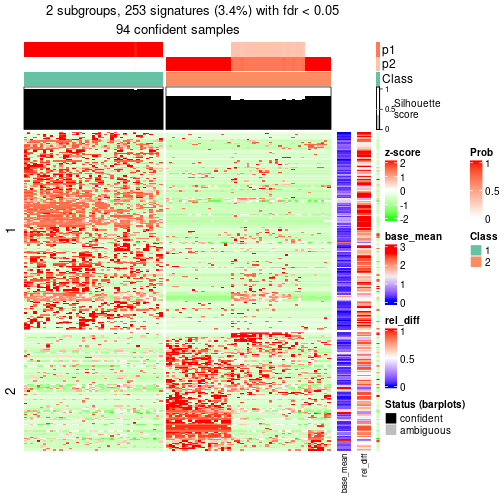</p>

</div>
<div id='tab-node-0122-get-signatures-2'>
<pre><code class="r">get_signatures(res, k = 3)
</code></pre>

<p></p>

</div>
<div id='tab-node-0122-get-signatures-3'>
<pre><code class="r">get_signatures(res, k = 4)
</code></pre>

<p></p>

</div>
</div>


Signature heatmaps where rows are not scaled:


<script>
$( function() {
	$( '#tabs-node-0122-get-signatures-no-scale' ).tabs();
} );
</script>
<div id='tabs-node-0122-get-signatures-no-scale'>
<ul>
<li><a href='#tab-node-0122-get-signatures-no-scale-1'>k = 2</a></li>
<li><a href='#tab-node-0122-get-signatures-no-scale-2'>k = 3</a></li>
<li><a href='#tab-node-0122-get-signatures-no-scale-3'>k = 4</a></li>
</ul>
<div id='tab-node-0122-get-signatures-no-scale-1'>
<pre><code class="r">get_signatures(res, k = 2, scale_rows = FALSE)
</code></pre>

<p></p>

</div>
<div id='tab-node-0122-get-signatures-no-scale-2'>
<pre><code class="r">get_signatures(res, k = 3, scale_rows = FALSE)
</code></pre>

<p></p>

</div>
<div id='tab-node-0122-get-signatures-no-scale-3'>
<pre><code class="r">get_signatures(res, k = 4, scale_rows = FALSE)
</code></pre>

<p></p>

</div>
</div>


Compare the overlap of signatures from different k:

```r
compare_signatures(res)
```


`get_signature()` returns a data frame invisibly. To get the list of signatures, the function
call should be assigned to a variable explicitly. In following code, if `plot` argument is set
to `FALSE`, no heatmap is plotted while only the differential analysis is performed.

```r
# code only for demonstration
tb = get_signature(res, k = ..., plot = FALSE)
```

An example of the output of `tb` is:

```
#>   which_row         fdr    mean_1    mean_2 scaled_mean_1 scaled_mean_2 km
#> 1        38 0.042760348  8.373488  9.131774    -0.5533452     0.5164555  1
#> 2        40 0.018707592  7.106213  8.469186    -0.6173731     0.5762149  1
#> 3        55 0.019134737 10.221463 11.207825    -0.6159697     0.5749050  1
#> 4        59 0.006059896  5.921854  7.869574    -0.6899429     0.6439467  1
#> 5        60 0.018055526  8.928898 10.211722    -0.6204761     0.5791110  1
#> 6        98 0.009384629 15.714769 14.887706     0.6635654    -0.6193277  2
...
```

The columns in `tb` are:

1. `which_row`: row indices corresponding to the input matrix.
2. `fdr`: FDR for the differential test. 
3. `mean_x`: The mean value in group x.
4. `scaled_mean_x`: The mean value in group x after rows are scaled.
5. `km`: Row groups if k-means clustering is applied to rows (which is done by automatically selecting number of clusters).

If there are too many signatures, `top_signatures = ...` can be set to only show the 
signatures with the highest FDRs:

```r
# code only for demonstration
# e.g. to show the top 500 most significant rows
tb = get_signature(res, k = ..., top_signatures = 500)
```

If the signatures are defined as these which are uniquely high in current group, `diff_method` argument
can be set to `"uniquely_high_in_one_group"`:

```r
# code only for demonstration
tb = get_signature(res, k = ..., diff_method = "uniquely_high_in_one_group")
```


UMAP plot which shows how samples are separated.


<script>
$( function() {
	$( '#tabs-node-0122-dimension-reduction' ).tabs();
} );
</script>
<div id='tabs-node-0122-dimension-reduction'>
<ul>
<li><a href='#tab-node-0122-dimension-reduction-1'>k = 2</a></li>
<li><a href='#tab-node-0122-dimension-reduction-2'>k = 3</a></li>
<li><a href='#tab-node-0122-dimension-reduction-3'>k = 4</a></li>
</ul>
<div id='tab-node-0122-dimension-reduction-1'>
<pre><code class="r">dimension_reduction(res, k = 2, method = &quot;UMAP&quot;)
</code></pre>

<p></p>

</div>
<div id='tab-node-0122-dimension-reduction-2'>
<pre><code class="r">dimension_reduction(res, k = 3, method = &quot;UMAP&quot;)
</code></pre>

<p></p>

</div>
<div id='tab-node-0122-dimension-reduction-3'>
<pre><code class="r">dimension_reduction(res, k = 4, method = &quot;UMAP&quot;)
</code></pre>

<p></p>

</div>
</div>


Following heatmap shows how subgroups are split when increasing `k`:

```r
collect_classes(res)
```


If matrix rows can be associated to genes, consider to use `functional_enrichment(res,
...)` to perform function enrichment for the signature genes. See [this vignette](https://jokergoo.github.io/cola_vignettes/functional_enrichment.html) for more detailed explanations.


 

---------------------------------------------------


### Node014


Parent node: [Node01](#Node01).
Child nodes: 
                [Node0121](#Node0121)
        ,
                [Node0122](#Node0122)
        ,
                Node0141-leaf
        ,
                Node0142-leaf
        ,
                [Node0211](#Node0211)
        ,
                [Node0212](#Node0212)
        ,
                [Node0213](#Node0213)
        ,
                Node0221-leaf
        ,
                [Node0222](#Node0222)
        ,
                Node0311-leaf
        ,
                Node0312-leaf
        ,
                Node0313-leaf
        ,
                Node0321-leaf
        ,
                [Node0322](#Node0322)
        ,
                Node0331-leaf
        ,
                Node0332-leaf
        ,
                Node0333-leaf
        .


The object with results only for a single top-value method and a single partitioning method 
can be extracted as:

```r
res = res_rh["014"]
```

A summary of `res` and all the functions that can be applied to it:

```r
res
```

```
#> A 'ConsensusPartition' object with k = 2, 3, 4.
#>   On a matrix with 6270 rows and 165 columns.
#>   Top rows (445) are extracted by 'ATC' method.
#>   Subgroups are detected by 'skmeans' method.
#>   Performed in total 150 partitions by row resampling.
#>   Best k for subgroups seems to be 2.
#> 
#> Following methods can be applied to this 'ConsensusPartition' object:
#>  [1] "cola_report"             "collect_classes"         "collect_plots"          
#>  [4] "collect_stats"           "colnames"                "compare_partitions"     
#>  [7] "compare_signatures"      "consensus_heatmap"       "dimension_reduction"    
#> [10] "functional_enrichment"   "get_anno_col"            "get_anno"               
#> [13] "get_classes"             "get_consensus"           "get_matrix"             
#> [16] "get_membership"          "get_param"               "get_signatures"         
#> [19] "get_stats"               "is_best_k"               "is_stable_k"            
#> [22] "membership_heatmap"      "ncol"                    "nrow"                   
#> [25] "plot_ecdf"               "predict_classes"         "rownames"               
#> [28] "select_partition_number" "show"                    "suggest_best_k"         
#> [31] "test_to_known_factors"   "top_rows_heatmap"
```

`collect_plots()` function collects all the plots made from `res` for all `k` (number of subgroups)
into one single page to provide an easy and fast comparison between different `k`.

```r
collect_plots(res)
```


The plots are:

- The first row: a plot of the eCDF (empirical cumulative distribution
  function) curves of the consensus matrix for each `k` and the heatmap of
  predicted classes for each `k`.
- The second row: heatmaps of the consensus matrix for each `k`.
- The third row: heatmaps of the membership matrix for each `k`.
- The fouth row: heatmaps of the signatures for each `k`.

All the plots in panels can be made by individual functions and they are
plotted later in this section.

`select_partition_number()` produces several plots showing different
statistics for choosing "optimized" `k`. There are following statistics:

- eCDF curves of the consensus matrix for each `k`;
- 1-PAC. [The PAC score](https://en.wikipedia.org/wiki/Consensus_clustering#Over-interpretation_potential_of_consensus_clustering)
  measures the proportion of the ambiguous subgrouping.
- Mean silhouette score.
- Concordance. The mean probability of fiting the consensus subgroup labels in all
  partitions.
- Area increased. Denote $A_k$ as the area under the eCDF curve for current
  `k`, the area increased is defined as $A_k - A_{k-1}$.
- Rand index. The percent of pairs of samples that are both in a same cluster
  or both are not in a same cluster in the partition of k and k-1.
- Jaccard index. The ratio of pairs of samples are both in a same cluster in
  the partition of k and k-1 and the pairs of samples are both in a same
  cluster in the partition k or k-1.

The detailed explanations of these statistics can be found in [the _cola_
vignette](https://jokergoo.github.io/cola_vignettes/cola.html#toc_13).

Generally speaking, higher 1-PAC score, higher mean silhouette score or higher
concordance corresponds to better partition. Rand index and Jaccard index
measure how similar the current partition is compared to partition with `k-1`.
If they are too similar, we won't accept `k` is better than `k-1`.

```r
select_partition_number(res)
```


The numeric values for all these statistics can be obtained by `get_stats()`.

```r
get_stats(res)
```

```
#>   k 1-PAC mean_silhouette concordance area_increased  Rand Jaccard
#> 2 2 0.886           0.922       0.967          0.481 0.515   0.515
#> 3 3 0.686           0.804       0.911          0.360 0.769   0.575
#> 4 4 0.520           0.600       0.781          0.115 0.942   0.831
```

`suggest_best_k()` suggests the best $k$ based on these statistics. The rules are as follows:

- All $k$ with Jaccard index larger than 0.95 are removed because increasing
  $k$ does not provide enough extra information. If all $k$ are removed, it is
  marked as no subgroup is detected.
- For all $k$ with 1-PAC score larger than 0.9, the maximal $k$ is taken as
  the best $k$, and other $k$ are marked as optional $k$.
- If it does not fit the second rule. The $k$ with the maximal vote of the
  highest 1-PAC score, highest mean silhouette, and highest concordance is
  taken as the best $k$.

```r
suggest_best_k(res)
```

```
#> [1] 2
```


Following is the table of the partitions (You need to click the **show/hide
code output** link to see it). The membership matrix (columns with name `p*`)
is inferred by
[`clue::cl_consensus()`](https://www.rdocumentation.org/link/cl_consensus?package=clue)
function with the `SE` method. Basically the value in the membership matrix
represents the probability to belong to a certain group. The finall subgroup
label for an item is determined with the group with highest probability it
belongs to.

In `get_classes()` function, the entropy is calculated from the membership
matrix and the silhouette score is calculated from the consensus matrix.


<script>
$( function() {
	$( '#tabs-node-014-get-classes' ).tabs();
} );
</script>
<div id='tabs-node-014-get-classes'>
<ul>
<li><a href='#tab-node-014-get-classes-1'>k = 2</a></li>
<li><a href='#tab-node-014-get-classes-2'>k = 3</a></li>
<li><a href='#tab-node-014-get-classes-3'>k = 4</a></li>
</ul>

<div id='tab-node-014-get-classes-1'>
<p><a id='tab-node-014-get-classes-1-a' style='color:#0366d6' href='#'>show/hide code output</a></p>
<pre><code class="r">cbind(get_classes(res, k = 2), get_membership(res, k = 2))
</code></pre>

<pre><code>#&gt;                             class entropy silhouette   p1   p2
#&gt; mouse1_lib1.final_cell_0034     2   0.000     0.9438 0.00 1.00
#&gt; mouse1_lib1.final_cell_0035     2   0.000     0.9438 0.00 1.00
#&gt; mouse1_lib1.final_cell_0046     2   0.000     0.9438 0.00 1.00
#&gt; mouse1_lib1.final_cell_0049     2   0.000     0.9438 0.00 1.00
#&gt; mouse1_lib1.final_cell_0052     2   0.141     0.9316 0.02 0.98
#&gt; mouse1_lib1.final_cell_0060     1   0.000     0.9794 1.00 0.00
#&gt; mouse1_lib1.final_cell_0065     2   0.000     0.9438 0.00 1.00
#&gt; mouse1_lib1.final_cell_0066     2   0.000     0.9438 0.00 1.00
#&gt; mouse1_lib1.final_cell_0068     2   0.000     0.9438 0.00 1.00
#&gt; mouse1_lib1.final_cell_0075     2   0.000     0.9438 0.00 1.00
#&gt; mouse1_lib1.final_cell_0077     2   0.000     0.9438 0.00 1.00
#&gt; mouse1_lib1.final_cell_0080     1   0.000     0.9794 1.00 0.00
#&gt; mouse1_lib1.final_cell_0089     2   0.000     0.9438 0.00 1.00
#&gt; mouse1_lib1.final_cell_0093     1   0.000     0.9794 1.00 0.00
#&gt; mouse1_lib1.final_cell_0097     2   0.000     0.9438 0.00 1.00
#&gt; mouse1_lib1.final_cell_0101     1   0.242     0.9421 0.96 0.04
#&gt; mouse1_lib1.final_cell_0106     1   0.402     0.9002 0.92 0.08
#&gt; mouse1_lib1.final_cell_0109     1   0.000     0.9794 1.00 0.00
#&gt; mouse1_lib1.final_cell_0118     1   0.881     0.5593 0.70 0.30
#&gt; mouse1_lib1.final_cell_0119     1   0.827     0.6399 0.74 0.26
#&gt; mouse1_lib1.final_cell_0125     1   0.000     0.9794 1.00 0.00
#&gt; mouse1_lib1.final_cell_0128     1   0.000     0.9794 1.00 0.00
#&gt; mouse1_lib1.final_cell_0130     1   0.000     0.9794 1.00 0.00
#&gt; mouse1_lib1.final_cell_0132     2   0.242     0.9188 0.04 0.96
#&gt; mouse1_lib1.final_cell_0138     1   0.000     0.9794 1.00 0.00
#&gt; mouse1_lib1.final_cell_0142     1   0.000     0.9794 1.00 0.00
#&gt; mouse1_lib1.final_cell_0143     1   0.000     0.9794 1.00 0.00
#&gt; mouse1_lib1.final_cell_0150     1   0.000     0.9794 1.00 0.00
#&gt; mouse1_lib1.final_cell_0163     1   0.000     0.9794 1.00 0.00
#&gt; mouse1_lib1.final_cell_0170     1   0.000     0.9794 1.00 0.00
#&gt; mouse1_lib1.final_cell_0171     1   0.000     0.9794 1.00 0.00
#&gt; mouse1_lib1.final_cell_0179     1   0.000     0.9794 1.00 0.00
#&gt; mouse1_lib1.final_cell_0180     1   0.000     0.9794 1.00 0.00
#&gt; mouse1_lib1.final_cell_0190     1   0.000     0.9794 1.00 0.00
#&gt; mouse1_lib1.final_cell_0197     1   0.000     0.9794 1.00 0.00
#&gt; mouse1_lib1.final_cell_0199     1   0.000     0.9794 1.00 0.00
#&gt; mouse1_lib1.final_cell_0213     1   0.000     0.9794 1.00 0.00
#&gt; mouse1_lib1.final_cell_0224     1   0.000     0.9794 1.00 0.00
#&gt; mouse1_lib1.final_cell_0259     1   0.000     0.9794 1.00 0.00
#&gt; mouse1_lib2.final_cell_0019     2   0.000     0.9438 0.00 1.00
#&gt; mouse1_lib2.final_cell_0034     2   0.000     0.9438 0.00 1.00
#&gt; mouse1_lib2.final_cell_0042     2   0.000     0.9438 0.00 1.00
#&gt; mouse1_lib2.final_cell_0049     2   0.000     0.9438 0.00 1.00
#&gt; mouse1_lib2.final_cell_0053     1   0.000     0.9794 1.00 0.00
#&gt; mouse1_lib2.final_cell_0058     2   0.000     0.9438 0.00 1.00
#&gt; mouse1_lib2.final_cell_0060     2   0.000     0.9438 0.00 1.00
#&gt; mouse1_lib2.final_cell_0061     2   0.000     0.9438 0.00 1.00
#&gt; mouse1_lib2.final_cell_0063     2   0.000     0.9438 0.00 1.00
#&gt; mouse1_lib2.final_cell_0065     2   0.000     0.9438 0.00 1.00
#&gt; mouse1_lib2.final_cell_0067     2   0.141     0.9316 0.02 0.98
#&gt; mouse1_lib2.final_cell_0073     2   0.000     0.9438 0.00 1.00
#&gt; mouse1_lib2.final_cell_0074     1   0.000     0.9794 1.00 0.00
#&gt; mouse1_lib2.final_cell_0075     1   0.000     0.9794 1.00 0.00
#&gt; mouse1_lib2.final_cell_0080     2   0.722     0.7640 0.20 0.80
#&gt; mouse1_lib2.final_cell_0082     2   0.000     0.9438 0.00 1.00
#&gt; mouse1_lib2.final_cell_0084     1   0.000     0.9794 1.00 0.00
#&gt; mouse1_lib2.final_cell_0087     1   0.000     0.9794 1.00 0.00
#&gt; mouse1_lib2.final_cell_0094     1   0.000     0.9794 1.00 0.00
#&gt; mouse1_lib2.final_cell_0097     2   0.000     0.9438 0.00 1.00
#&gt; mouse1_lib2.final_cell_0101     1   0.000     0.9794 1.00 0.00
#&gt; mouse1_lib2.final_cell_0103     2   0.680     0.7868 0.18 0.82
#&gt; mouse1_lib2.final_cell_0104     2   0.000     0.9438 0.00 1.00
#&gt; mouse1_lib2.final_cell_0107     2   0.000     0.9438 0.00 1.00
#&gt; mouse1_lib2.final_cell_0109     2   0.000     0.9438 0.00 1.00
#&gt; mouse1_lib2.final_cell_0115     1   0.000     0.9794 1.00 0.00
#&gt; mouse1_lib2.final_cell_0116     2   0.000     0.9438 0.00 1.00
#&gt; mouse1_lib2.final_cell_0118     1   0.000     0.9794 1.00 0.00
#&gt; mouse1_lib2.final_cell_0122     1   0.000     0.9794 1.00 0.00
#&gt; mouse1_lib2.final_cell_0125     2   0.000     0.9438 0.00 1.00
#&gt; mouse1_lib2.final_cell_0133     1   0.000     0.9794 1.00 0.00
#&gt; mouse1_lib2.final_cell_0134     1   0.000     0.9794 1.00 0.00
#&gt; mouse1_lib2.final_cell_0137     2   0.469     0.8700 0.10 0.90
#&gt; mouse1_lib2.final_cell_0146     1   0.000     0.9794 1.00 0.00
#&gt; mouse1_lib2.final_cell_0149     1   0.000     0.9794 1.00 0.00
#&gt; mouse1_lib2.final_cell_0156     1   0.000     0.9794 1.00 0.00
#&gt; mouse1_lib2.final_cell_0157     2   0.925     0.5312 0.34 0.66
#&gt; mouse1_lib2.final_cell_0159     1   0.000     0.9794 1.00 0.00
#&gt; mouse1_lib2.final_cell_0161     2   0.000     0.9438 0.00 1.00
#&gt; mouse1_lib2.final_cell_0166     2   0.000     0.9438 0.00 1.00
#&gt; mouse1_lib2.final_cell_0173     1   0.000     0.9794 1.00 0.00
#&gt; mouse1_lib2.final_cell_0177     1   0.000     0.9794 1.00 0.00
#&gt; mouse1_lib2.final_cell_0178     1   0.141     0.9612 0.98 0.02
#&gt; mouse1_lib2.final_cell_0180     1   0.000     0.9794 1.00 0.00
#&gt; mouse1_lib2.final_cell_0185     2   0.000     0.9438 0.00 1.00
#&gt; mouse1_lib2.final_cell_0187     1   0.000     0.9794 1.00 0.00
#&gt; mouse1_lib2.final_cell_0189     1   0.000     0.9794 1.00 0.00
#&gt; mouse1_lib2.final_cell_0191     1   0.000     0.9794 1.00 0.00
#&gt; mouse1_lib2.final_cell_0192     2   0.000     0.9438 0.00 1.00
#&gt; mouse1_lib2.final_cell_0203     2   0.971     0.3877 0.40 0.60
#&gt; mouse1_lib2.final_cell_0222     2   0.000     0.9438 0.00 1.00
#&gt; mouse1_lib3.final_cell_0023     2   0.855     0.6367 0.28 0.72
#&gt; mouse1_lib3.final_cell_0039     1   0.000     0.9794 1.00 0.00
#&gt; mouse1_lib3.final_cell_0040     2   0.000     0.9438 0.00 1.00
#&gt; mouse1_lib3.final_cell_0045     2   0.000     0.9438 0.00 1.00
#&gt; mouse1_lib3.final_cell_0048     1   0.000     0.9794 1.00 0.00
#&gt; mouse1_lib3.final_cell_0049     1   0.000     0.9794 1.00 0.00
#&gt; mouse1_lib3.final_cell_0051     1   0.000     0.9794 1.00 0.00
#&gt; mouse1_lib3.final_cell_0052     1   0.000     0.9794 1.00 0.00
#&gt; mouse1_lib3.final_cell_0053     2   0.000     0.9438 0.00 1.00
#&gt; mouse1_lib3.final_cell_0058     1   0.327     0.9223 0.94 0.06
#&gt; mouse1_lib3.final_cell_0059     2   0.760     0.7355 0.22 0.78
#&gt; mouse1_lib3.final_cell_0061     1   0.000     0.9794 1.00 0.00
#&gt; mouse1_lib3.final_cell_0065     2   0.000     0.9438 0.00 1.00
#&gt; mouse1_lib3.final_cell_0068     2   0.999     0.1297 0.48 0.52
#&gt; mouse1_lib3.final_cell_0069     2   0.000     0.9438 0.00 1.00
#&gt; mouse1_lib3.final_cell_0074     1   0.000     0.9794 1.00 0.00
#&gt; mouse1_lib3.final_cell_0075     2   0.000     0.9438 0.00 1.00
#&gt; mouse1_lib3.final_cell_0084     1   0.000     0.9794 1.00 0.00
#&gt; mouse1_lib3.final_cell_0092     1   0.000     0.9794 1.00 0.00
#&gt; mouse1_lib3.final_cell_0093     1   0.000     0.9794 1.00 0.00
#&gt; mouse1_lib3.final_cell_0098     2   0.327     0.9029 0.06 0.94
#&gt; mouse1_lib3.final_cell_0105     1   0.000     0.9794 1.00 0.00
#&gt; mouse1_lib3.final_cell_0113     1   0.000     0.9794 1.00 0.00
#&gt; mouse1_lib3.final_cell_0115     2   0.000     0.9438 0.00 1.00
#&gt; mouse1_lib3.final_cell_0117     1   0.000     0.9794 1.00 0.00
#&gt; mouse1_lib3.final_cell_0118     2   0.529     0.8516 0.12 0.88
#&gt; mouse1_lib3.final_cell_0124     1   0.634     0.8002 0.84 0.16
#&gt; mouse1_lib3.final_cell_0129     1   0.000     0.9794 1.00 0.00
#&gt; mouse1_lib3.final_cell_0130     1   0.000     0.9794 1.00 0.00
#&gt; mouse1_lib3.final_cell_0131     1   0.000     0.9794 1.00 0.00
#&gt; mouse1_lib3.final_cell_0132     1   0.000     0.9794 1.00 0.00
#&gt; mouse1_lib3.final_cell_0135     1   0.000     0.9794 1.00 0.00
#&gt; mouse1_lib3.final_cell_0137     2   0.000     0.9438 0.00 1.00
#&gt; mouse1_lib3.final_cell_0139     1   0.141     0.9612 0.98 0.02
#&gt; mouse1_lib3.final_cell_0140     1   0.000     0.9794 1.00 0.00
#&gt; mouse1_lib3.final_cell_0147     1   0.000     0.9794 1.00 0.00
#&gt; mouse1_lib3.final_cell_0151     1   0.000     0.9794 1.00 0.00
#&gt; mouse1_lib3.final_cell_0152     1   0.000     0.9794 1.00 0.00
#&gt; mouse1_lib3.final_cell_0178     1   0.000     0.9794 1.00 0.00
#&gt; mouse1_lib3.final_cell_0182     2   0.000     0.9438 0.00 1.00
#&gt; mouse1_lib3.final_cell_0191     1   0.000     0.9794 1.00 0.00
#&gt; mouse1_lib3.final_cell_0192     1   0.000     0.9794 1.00 0.00
#&gt; mouse1_lib3.final_cell_0193     1   0.000     0.9794 1.00 0.00
#&gt; mouse1_lib3.final_cell_0219     1   0.000     0.9794 1.00 0.00
#&gt; mouse1_lib3.final_cell_0227     1   0.000     0.9794 1.00 0.00
#&gt; mouse2_lib1.final_cell_0159     2   0.000     0.9438 0.00 1.00
#&gt; mouse2_lib1.final_cell_0164     2   0.000     0.9438 0.00 1.00
#&gt; mouse2_lib1.final_cell_0172     2   0.000     0.9438 0.00 1.00
#&gt; mouse2_lib1.final_cell_0183     2   0.000     0.9438 0.00 1.00
#&gt; mouse2_lib1.final_cell_0188     1   0.000     0.9794 1.00 0.00
#&gt; mouse2_lib1.final_cell_0192     2   0.943     0.4891 0.36 0.64
#&gt; mouse2_lib1.final_cell_0219     1   1.000    -0.0935 0.50 0.50
#&gt; mouse2_lib1.final_cell_0221     1   0.000     0.9794 1.00 0.00
#&gt; mouse2_lib1.final_cell_0225     1   0.529     0.8515 0.88 0.12
#&gt; mouse2_lib1.final_cell_0226     2   0.881     0.6127 0.30 0.70
#&gt; mouse2_lib1.final_cell_0241     1   0.000     0.9794 1.00 0.00
#&gt; mouse2_lib1.final_cell_0257     1   0.000     0.9794 1.00 0.00
#&gt; mouse2_lib1.final_cell_0258     1   0.000     0.9794 1.00 0.00
#&gt; mouse2_lib1.final_cell_0278     1   0.000     0.9794 1.00 0.00
#&gt; mouse2_lib2.final_cell_0157     1   0.881     0.5544 0.70 0.30
#&gt; mouse2_lib2.final_cell_0193     2   0.000     0.9438 0.00 1.00
#&gt; mouse2_lib2.final_cell_0209     1   0.000     0.9794 1.00 0.00
#&gt; mouse2_lib2.final_cell_0210     2   0.971     0.3727 0.40 0.60
#&gt; mouse2_lib2.final_cell_0216     2   0.000     0.9438 0.00 1.00
#&gt; mouse2_lib2.final_cell_0230     2   0.402     0.8875 0.08 0.92
#&gt; mouse2_lib2.final_cell_0265     1   0.000     0.9794 1.00 0.00
#&gt; mouse2_lib2.final_cell_0268     1   0.141     0.9612 0.98 0.02
#&gt; mouse2_lib2.final_cell_0278     1   0.000     0.9794 1.00 0.00
#&gt; mouse2_lib3.final_cell_0167     2   0.000     0.9438 0.00 1.00
#&gt; mouse2_lib3.final_cell_0196     1   0.000     0.9794 1.00 0.00
#&gt; mouse2_lib3.final_cell_0230     2   0.141     0.9316 0.02 0.98
#&gt; mouse2_lib3.final_cell_0254     1   0.000     0.9794 1.00 0.00
#&gt; mouse2_lib3.final_cell_0263     1   0.000     0.9794 1.00 0.00
#&gt; mouse2_lib3.final_cell_0287     1   0.000     0.9794 1.00 0.00
#&gt; mouse2_lib3.final_cell_0288     1   0.000     0.9794 1.00 0.00
</code></pre>

<script>
$('#tab-node-014-get-classes-1-a').parent().next().next().hide();
$('#tab-node-014-get-classes-1-a').click(function(){
  $('#tab-node-014-get-classes-1-a').parent().next().next().toggle();
  return(false);
});
</script>
</div>

<div id='tab-node-014-get-classes-2'>
<p><a id='tab-node-014-get-classes-2-a' style='color:#0366d6' href='#'>show/hide code output</a></p>
<pre><code class="r">cbind(get_classes(res, k = 3), get_membership(res, k = 3))
</code></pre>

<pre><code>#&gt;                             class entropy silhouette   p1   p2   p3
#&gt; mouse1_lib1.final_cell_0034     2  0.0000      0.920 0.00 1.00 0.00
#&gt; mouse1_lib1.final_cell_0035     2  0.0000      0.920 0.00 1.00 0.00
#&gt; mouse1_lib1.final_cell_0046     2  0.0000      0.920 0.00 1.00 0.00
#&gt; mouse1_lib1.final_cell_0049     2  0.0000      0.920 0.00 1.00 0.00
#&gt; mouse1_lib1.final_cell_0052     2  0.4209      0.827 0.02 0.86 0.12
#&gt; mouse1_lib1.final_cell_0060     1  0.5016      0.644 0.76 0.00 0.24
#&gt; mouse1_lib1.final_cell_0065     2  0.0000      0.920 0.00 1.00 0.00
#&gt; mouse1_lib1.final_cell_0066     2  0.0000      0.920 0.00 1.00 0.00
#&gt; mouse1_lib1.final_cell_0068     2  0.0000      0.920 0.00 1.00 0.00
#&gt; mouse1_lib1.final_cell_0075     2  0.0000      0.920 0.00 1.00 0.00
#&gt; mouse1_lib1.final_cell_0077     2  0.0000      0.920 0.00 1.00 0.00
#&gt; mouse1_lib1.final_cell_0080     1  0.0000      0.918 1.00 0.00 0.00
#&gt; mouse1_lib1.final_cell_0089     2  0.0000      0.920 0.00 1.00 0.00
#&gt; mouse1_lib1.final_cell_0093     3  0.0000      0.835 0.00 0.00 1.00
#&gt; mouse1_lib1.final_cell_0097     2  0.0000      0.920 0.00 1.00 0.00
#&gt; mouse1_lib1.final_cell_0101     3  0.5397      0.629 0.28 0.00 0.72
#&gt; mouse1_lib1.final_cell_0106     1  0.1781      0.890 0.96 0.02 0.02
#&gt; mouse1_lib1.final_cell_0109     1  0.0000      0.918 1.00 0.00 0.00
#&gt; mouse1_lib1.final_cell_0118     1  0.6045      0.368 0.62 0.38 0.00
#&gt; mouse1_lib1.final_cell_0119     1  0.2959      0.828 0.90 0.10 0.00
#&gt; mouse1_lib1.final_cell_0125     1  0.0000      0.918 1.00 0.00 0.00
#&gt; mouse1_lib1.final_cell_0128     1  0.0000      0.918 1.00 0.00 0.00
#&gt; mouse1_lib1.final_cell_0130     3  0.0000      0.835 0.00 0.00 1.00
#&gt; mouse1_lib1.final_cell_0132     2  0.7760      0.374 0.06 0.58 0.36
#&gt; mouse1_lib1.final_cell_0138     1  0.2959      0.838 0.90 0.00 0.10
#&gt; mouse1_lib1.final_cell_0142     3  0.0000      0.835 0.00 0.00 1.00
#&gt; mouse1_lib1.final_cell_0143     1  0.0000      0.918 1.00 0.00 0.00
#&gt; mouse1_lib1.final_cell_0150     1  0.0000      0.918 1.00 0.00 0.00
#&gt; mouse1_lib1.final_cell_0163     1  0.0000      0.918 1.00 0.00 0.00
#&gt; mouse1_lib1.final_cell_0170     1  0.0000      0.918 1.00 0.00 0.00
#&gt; mouse1_lib1.final_cell_0171     1  0.0000      0.918 1.00 0.00 0.00
#&gt; mouse1_lib1.final_cell_0179     1  0.0000      0.918 1.00 0.00 0.00
#&gt; mouse1_lib1.final_cell_0180     1  0.0000      0.918 1.00 0.00 0.00
#&gt; mouse1_lib1.final_cell_0190     1  0.0000      0.918 1.00 0.00 0.00
#&gt; mouse1_lib1.final_cell_0197     1  0.0000      0.918 1.00 0.00 0.00
#&gt; mouse1_lib1.final_cell_0199     1  0.0000      0.918 1.00 0.00 0.00
#&gt; mouse1_lib1.final_cell_0213     1  0.0000      0.918 1.00 0.00 0.00
#&gt; mouse1_lib1.final_cell_0224     1  0.0000      0.918 1.00 0.00 0.00
#&gt; mouse1_lib1.final_cell_0259     1  0.0000      0.918 1.00 0.00 0.00
#&gt; mouse1_lib2.final_cell_0019     2  0.0000      0.920 0.00 1.00 0.00
#&gt; mouse1_lib2.final_cell_0034     2  0.0000      0.920 0.00 1.00 0.00
#&gt; mouse1_lib2.final_cell_0042     2  0.3686      0.815 0.00 0.86 0.14
#&gt; mouse1_lib2.final_cell_0049     2  0.5948      0.499 0.00 0.64 0.36
#&gt; mouse1_lib2.final_cell_0053     3  0.6126      0.434 0.40 0.00 0.60
#&gt; mouse1_lib2.final_cell_0058     2  0.0000      0.920 0.00 1.00 0.00
#&gt; mouse1_lib2.final_cell_0060     2  0.5397      0.647 0.00 0.72 0.28
#&gt; mouse1_lib2.final_cell_0061     2  0.0000      0.920 0.00 1.00 0.00
#&gt; mouse1_lib2.final_cell_0063     2  0.0000      0.920 0.00 1.00 0.00
#&gt; mouse1_lib2.final_cell_0065     2  0.0000      0.920 0.00 1.00 0.00
#&gt; mouse1_lib2.final_cell_0067     2  0.2959      0.833 0.10 0.90 0.00
#&gt; mouse1_lib2.final_cell_0073     2  0.0000      0.920 0.00 1.00 0.00
#&gt; mouse1_lib2.final_cell_0074     1  0.0000      0.918 1.00 0.00 0.00
#&gt; mouse1_lib2.final_cell_0075     3  0.4555      0.748 0.20 0.00 0.80
#&gt; mouse1_lib2.final_cell_0080     2  0.8483      0.481 0.14 0.60 0.26
#&gt; mouse1_lib2.final_cell_0082     2  0.0000      0.920 0.00 1.00 0.00
#&gt; mouse1_lib2.final_cell_0084     3  0.5560      0.632 0.30 0.00 0.70
#&gt; mouse1_lib2.final_cell_0087     1  0.5560      0.537 0.70 0.00 0.30
#&gt; mouse1_lib2.final_cell_0094     1  0.0000      0.918 1.00 0.00 0.00
#&gt; mouse1_lib2.final_cell_0097     2  0.0000      0.920 0.00 1.00 0.00
#&gt; mouse1_lib2.final_cell_0101     1  0.0000      0.918 1.00 0.00 0.00
#&gt; mouse1_lib2.final_cell_0103     2  0.7517      0.227 0.42 0.54 0.04
#&gt; mouse1_lib2.final_cell_0104     2  0.0000      0.920 0.00 1.00 0.00
#&gt; mouse1_lib2.final_cell_0107     2  0.0000      0.920 0.00 1.00 0.00
#&gt; mouse1_lib2.final_cell_0109     2  0.0000      0.920 0.00 1.00 0.00
#&gt; mouse1_lib2.final_cell_0115     3  0.2066      0.833 0.06 0.00 0.94
#&gt; mouse1_lib2.final_cell_0116     2  0.2959      0.852 0.00 0.90 0.10
#&gt; mouse1_lib2.final_cell_0118     1  0.0000      0.918 1.00 0.00 0.00
#&gt; mouse1_lib2.final_cell_0122     1  0.0892      0.905 0.98 0.00 0.02
#&gt; mouse1_lib2.final_cell_0125     2  0.3686      0.821 0.00 0.86 0.14
#&gt; mouse1_lib2.final_cell_0133     1  0.5835      0.423 0.66 0.00 0.34
#&gt; mouse1_lib2.final_cell_0134     1  0.0000      0.918 1.00 0.00 0.00
#&gt; mouse1_lib2.final_cell_0137     3  0.0000      0.835 0.00 0.00 1.00
#&gt; mouse1_lib2.final_cell_0146     1  0.0000      0.918 1.00 0.00 0.00
#&gt; mouse1_lib2.final_cell_0149     3  0.5216      0.686 0.26 0.00 0.74
#&gt; mouse1_lib2.final_cell_0156     1  0.0000      0.918 1.00 0.00 0.00
#&gt; mouse1_lib2.final_cell_0157     3  0.2959      0.773 0.00 0.10 0.90
#&gt; mouse1_lib2.final_cell_0159     3  0.1529      0.836 0.04 0.00 0.96
#&gt; mouse1_lib2.final_cell_0161     2  0.0000      0.920 0.00 1.00 0.00
#&gt; mouse1_lib2.final_cell_0166     2  0.0000      0.920 0.00 1.00 0.00
#&gt; mouse1_lib2.final_cell_0173     1  0.2066      0.876 0.94 0.00 0.06
#&gt; mouse1_lib2.final_cell_0177     1  0.0000      0.918 1.00 0.00 0.00
#&gt; mouse1_lib2.final_cell_0178     1  0.6387      0.507 0.68 0.02 0.30
#&gt; mouse1_lib2.final_cell_0180     1  0.0892      0.905 0.98 0.00 0.02
#&gt; mouse1_lib2.final_cell_0185     2  0.0000      0.920 0.00 1.00 0.00
#&gt; mouse1_lib2.final_cell_0187     1  0.0000      0.918 1.00 0.00 0.00
#&gt; mouse1_lib2.final_cell_0189     1  0.0000      0.918 1.00 0.00 0.00
#&gt; mouse1_lib2.final_cell_0191     1  0.5397      0.572 0.72 0.00 0.28
#&gt; mouse1_lib2.final_cell_0192     2  0.0000      0.920 0.00 1.00 0.00
#&gt; mouse1_lib2.final_cell_0203     2  0.7979      0.157 0.44 0.50 0.06
#&gt; mouse1_lib2.final_cell_0222     2  0.0000      0.920 0.00 1.00 0.00
#&gt; mouse1_lib3.final_cell_0023     2  0.6244      0.218 0.44 0.56 0.00
#&gt; mouse1_lib3.final_cell_0039     1  0.0000      0.918 1.00 0.00 0.00
#&gt; mouse1_lib3.final_cell_0040     2  0.0000      0.920 0.00 1.00 0.00
#&gt; mouse1_lib3.final_cell_0045     2  0.0000      0.920 0.00 1.00 0.00
#&gt; mouse1_lib3.final_cell_0048     1  0.0000      0.918 1.00 0.00 0.00
#&gt; mouse1_lib3.final_cell_0049     3  0.4291      0.767 0.18 0.00 0.82
#&gt; mouse1_lib3.final_cell_0051     1  0.0000      0.918 1.00 0.00 0.00
#&gt; mouse1_lib3.final_cell_0052     1  0.0000      0.918 1.00 0.00 0.00
#&gt; mouse1_lib3.final_cell_0053     2  0.0000      0.920 0.00 1.00 0.00
#&gt; mouse1_lib3.final_cell_0058     1  0.4556      0.814 0.86 0.06 0.08
#&gt; mouse1_lib3.final_cell_0059     3  0.8310      0.123 0.08 0.42 0.50
#&gt; mouse1_lib3.final_cell_0061     1  0.4291      0.742 0.82 0.00 0.18
#&gt; mouse1_lib3.final_cell_0065     2  0.0000      0.920 0.00 1.00 0.00
#&gt; mouse1_lib3.final_cell_0068     1  0.5706      0.522 0.68 0.32 0.00
#&gt; mouse1_lib3.final_cell_0069     2  0.0000      0.920 0.00 1.00 0.00
#&gt; mouse1_lib3.final_cell_0074     3  0.0000      0.835 0.00 0.00 1.00
#&gt; mouse1_lib3.final_cell_0075     2  0.0000      0.920 0.00 1.00 0.00
#&gt; mouse1_lib3.final_cell_0084     1  0.1529      0.891 0.96 0.00 0.04
#&gt; mouse1_lib3.final_cell_0092     1  0.0000      0.918 1.00 0.00 0.00
#&gt; mouse1_lib3.final_cell_0093     3  0.2066      0.832 0.06 0.00 0.94
#&gt; mouse1_lib3.final_cell_0098     2  0.5147      0.730 0.18 0.80 0.02
#&gt; mouse1_lib3.final_cell_0105     3  0.3340      0.805 0.12 0.00 0.88
#&gt; mouse1_lib3.final_cell_0113     1  0.2066      0.877 0.94 0.00 0.06
#&gt; mouse1_lib3.final_cell_0115     2  0.0000      0.920 0.00 1.00 0.00
#&gt; mouse1_lib3.final_cell_0117     1  0.0000      0.918 1.00 0.00 0.00
#&gt; mouse1_lib3.final_cell_0118     3  0.2537      0.788 0.00 0.08 0.92
#&gt; mouse1_lib3.final_cell_0124     1  0.5406      0.684 0.78 0.20 0.02
#&gt; mouse1_lib3.final_cell_0129     3  0.3686      0.796 0.14 0.00 0.86
#&gt; mouse1_lib3.final_cell_0130     3  0.4291      0.768 0.18 0.00 0.82
#&gt; mouse1_lib3.final_cell_0131     1  0.5016      0.644 0.76 0.00 0.24
#&gt; mouse1_lib3.final_cell_0132     3  0.6192      0.392 0.42 0.00 0.58
#&gt; mouse1_lib3.final_cell_0135     1  0.0000      0.918 1.00 0.00 0.00
#&gt; mouse1_lib3.final_cell_0137     2  0.0892      0.908 0.00 0.98 0.02
#&gt; mouse1_lib3.final_cell_0139     1  0.0000      0.918 1.00 0.00 0.00
#&gt; mouse1_lib3.final_cell_0140     1  0.0000      0.918 1.00 0.00 0.00
#&gt; mouse1_lib3.final_cell_0147     1  0.0000      0.918 1.00 0.00 0.00
#&gt; mouse1_lib3.final_cell_0151     1  0.0000      0.918 1.00 0.00 0.00
#&gt; mouse1_lib3.final_cell_0152     3  0.2066      0.833 0.06 0.00 0.94
#&gt; mouse1_lib3.final_cell_0178     1  0.4291      0.743 0.82 0.00 0.18
#&gt; mouse1_lib3.final_cell_0182     2  0.1781      0.896 0.02 0.96 0.02
#&gt; mouse1_lib3.final_cell_0191     1  0.0000      0.918 1.00 0.00 0.00
#&gt; mouse1_lib3.final_cell_0192     1  0.0000      0.918 1.00 0.00 0.00
#&gt; mouse1_lib3.final_cell_0193     1  0.0000      0.918 1.00 0.00 0.00
#&gt; mouse1_lib3.final_cell_0219     1  0.0000      0.918 1.00 0.00 0.00
#&gt; mouse1_lib3.final_cell_0227     1  0.0000      0.918 1.00 0.00 0.00
#&gt; mouse2_lib1.final_cell_0159     3  0.5216      0.550 0.00 0.26 0.74
#&gt; mouse2_lib1.final_cell_0164     2  0.0000      0.920 0.00 1.00 0.00
#&gt; mouse2_lib1.final_cell_0172     2  0.0000      0.920 0.00 1.00 0.00
#&gt; mouse2_lib1.final_cell_0183     2  0.0000      0.920 0.00 1.00 0.00
#&gt; mouse2_lib1.final_cell_0188     3  0.5835      0.571 0.34 0.00 0.66
#&gt; mouse2_lib1.final_cell_0192     3  0.0000      0.835 0.00 0.00 1.00
#&gt; mouse2_lib1.final_cell_0219     3  0.0000      0.835 0.00 0.00 1.00
#&gt; mouse2_lib1.final_cell_0221     3  0.5948      0.529 0.36 0.00 0.64
#&gt; mouse2_lib1.final_cell_0225     3  0.0000      0.835 0.00 0.00 1.00
#&gt; mouse2_lib1.final_cell_0226     3  0.0000      0.835 0.00 0.00 1.00
#&gt; mouse2_lib1.final_cell_0241     1  0.6126      0.263 0.60 0.00 0.40
#&gt; mouse2_lib1.final_cell_0257     1  0.3340      0.818 0.88 0.00 0.12
#&gt; mouse2_lib1.final_cell_0258     3  0.0000      0.835 0.00 0.00 1.00
#&gt; mouse2_lib1.final_cell_0278     1  0.0000      0.918 1.00 0.00 0.00
#&gt; mouse2_lib2.final_cell_0157     3  0.0000      0.835 0.00 0.00 1.00
#&gt; mouse2_lib2.final_cell_0193     2  0.0000      0.920 0.00 1.00 0.00
#&gt; mouse2_lib2.final_cell_0209     3  0.0000      0.835 0.00 0.00 1.00
#&gt; mouse2_lib2.final_cell_0210     3  0.0892      0.827 0.00 0.02 0.98
#&gt; mouse2_lib2.final_cell_0216     2  0.4002      0.799 0.00 0.84 0.16
#&gt; mouse2_lib2.final_cell_0230     3  0.2537      0.789 0.00 0.08 0.92
#&gt; mouse2_lib2.final_cell_0265     3  0.6309      0.145 0.50 0.00 0.50
#&gt; mouse2_lib2.final_cell_0268     3  0.2066      0.832 0.06 0.00 0.94
#&gt; mouse2_lib2.final_cell_0278     3  0.0000      0.835 0.00 0.00 1.00
#&gt; mouse2_lib3.final_cell_0167     2  0.4796      0.723 0.00 0.78 0.22
#&gt; mouse2_lib3.final_cell_0196     1  0.6126      0.252 0.60 0.00 0.40
#&gt; mouse2_lib3.final_cell_0230     3  0.3686      0.728 0.00 0.14 0.86
#&gt; mouse2_lib3.final_cell_0254     3  0.3686      0.796 0.14 0.00 0.86
#&gt; mouse2_lib3.final_cell_0263     3  0.5948      0.536 0.36 0.00 0.64
#&gt; mouse2_lib3.final_cell_0287     3  0.6192      0.385 0.42 0.00 0.58
#&gt; mouse2_lib3.final_cell_0288     3  0.1529      0.837 0.04 0.00 0.96
</code></pre>

<script>
$('#tab-node-014-get-classes-2-a').parent().next().next().hide();
$('#tab-node-014-get-classes-2-a').click(function(){
  $('#tab-node-014-get-classes-2-a').parent().next().next().toggle();
  return(false);
});
</script>
</div>

<div id='tab-node-014-get-classes-3'>
<p><a id='tab-node-014-get-classes-3-a' style='color:#0366d6' href='#'>show/hide code output</a></p>
<pre><code class="r">cbind(get_classes(res, k = 4), get_membership(res, k = 4))
</code></pre>

<pre><code>#&gt;                             class entropy silhouette   p1   p2   p3   p4
#&gt; mouse1_lib1.final_cell_0034     2  0.0707    0.84393 0.00 0.98 0.00 0.02
#&gt; mouse1_lib1.final_cell_0035     2  0.0000    0.85171 0.00 1.00 0.00 0.00
#&gt; mouse1_lib1.final_cell_0046     2  0.2345    0.79209 0.00 0.90 0.00 0.10
#&gt; mouse1_lib1.final_cell_0049     2  0.0000    0.85171 0.00 1.00 0.00 0.00
#&gt; mouse1_lib1.final_cell_0052     2  0.6350    0.25091 0.02 0.60 0.04 0.34
#&gt; mouse1_lib1.final_cell_0060     1  0.6686    0.53300 0.62 0.00 0.20 0.18
#&gt; mouse1_lib1.final_cell_0065     2  0.2345    0.80072 0.00 0.90 0.00 0.10
#&gt; mouse1_lib1.final_cell_0066     2  0.0000    0.85171 0.00 1.00 0.00 0.00
#&gt; mouse1_lib1.final_cell_0068     2  0.3172    0.73239 0.00 0.84 0.00 0.16
#&gt; mouse1_lib1.final_cell_0075     2  0.0000    0.85171 0.00 1.00 0.00 0.00
#&gt; mouse1_lib1.final_cell_0077     2  0.0000    0.85171 0.00 1.00 0.00 0.00
#&gt; mouse1_lib1.final_cell_0080     1  0.3172    0.73293 0.84 0.00 0.00 0.16
#&gt; mouse1_lib1.final_cell_0089     2  0.0000    0.85171 0.00 1.00 0.00 0.00
#&gt; mouse1_lib1.final_cell_0093     3  0.2335    0.65061 0.02 0.00 0.92 0.06
#&gt; mouse1_lib1.final_cell_0097     2  0.0707    0.84393 0.00 0.98 0.00 0.02
#&gt; mouse1_lib1.final_cell_0101     3  0.7610    0.06454 0.22 0.00 0.46 0.32
#&gt; mouse1_lib1.final_cell_0106     1  0.5062    0.59615 0.68 0.00 0.02 0.30
#&gt; mouse1_lib1.final_cell_0109     1  0.5327    0.73136 0.72 0.00 0.06 0.22
#&gt; mouse1_lib1.final_cell_0118     1  0.7610   -0.07499 0.46 0.32 0.00 0.22
#&gt; mouse1_lib1.final_cell_0119     1  0.5636    0.59292 0.68 0.06 0.00 0.26
#&gt; mouse1_lib1.final_cell_0125     1  0.5392    0.62421 0.68 0.00 0.04 0.28
#&gt; mouse1_lib1.final_cell_0128     1  0.4227    0.75691 0.82 0.00 0.06 0.12
#&gt; mouse1_lib1.final_cell_0130     3  0.2011    0.63849 0.00 0.00 0.92 0.08
#&gt; mouse1_lib1.final_cell_0132     4  0.7232    0.52917 0.02 0.24 0.14 0.60
#&gt; mouse1_lib1.final_cell_0138     1  0.6808    0.51570 0.56 0.00 0.12 0.32
#&gt; mouse1_lib1.final_cell_0142     3  0.3606    0.60602 0.02 0.00 0.84 0.14
#&gt; mouse1_lib1.final_cell_0143     1  0.5392    0.66934 0.68 0.00 0.04 0.28
#&gt; mouse1_lib1.final_cell_0150     1  0.2335    0.78031 0.92 0.00 0.02 0.06
#&gt; mouse1_lib1.final_cell_0163     1  0.4491    0.73678 0.80 0.00 0.14 0.06
#&gt; mouse1_lib1.final_cell_0170     1  0.3821    0.75884 0.84 0.00 0.04 0.12
#&gt; mouse1_lib1.final_cell_0171     1  0.4406    0.62464 0.70 0.00 0.00 0.30
#&gt; mouse1_lib1.final_cell_0179     1  0.1411    0.77985 0.96 0.00 0.02 0.02
#&gt; mouse1_lib1.final_cell_0180     1  0.3037    0.77813 0.88 0.00 0.02 0.10
#&gt; mouse1_lib1.final_cell_0190     1  0.0707    0.77846 0.98 0.00 0.02 0.00
#&gt; mouse1_lib1.final_cell_0197     1  0.2345    0.76528 0.90 0.00 0.00 0.10
#&gt; mouse1_lib1.final_cell_0199     1  0.1411    0.77822 0.96 0.00 0.02 0.02
#&gt; mouse1_lib1.final_cell_0213     1  0.3611    0.76249 0.86 0.00 0.06 0.08
#&gt; mouse1_lib1.final_cell_0224     1  0.2411    0.78349 0.92 0.00 0.04 0.04
#&gt; mouse1_lib1.final_cell_0259     1  0.3611    0.76225 0.86 0.00 0.06 0.08
#&gt; mouse1_lib2.final_cell_0019     2  0.0707    0.84350 0.00 0.98 0.00 0.02
#&gt; mouse1_lib2.final_cell_0034     2  0.0000    0.85171 0.00 1.00 0.00 0.00
#&gt; mouse1_lib2.final_cell_0042     2  0.5428    0.23275 0.00 0.60 0.02 0.38
#&gt; mouse1_lib2.final_cell_0049     2  0.7550   -0.07101 0.00 0.48 0.30 0.22
#&gt; mouse1_lib2.final_cell_0053     3  0.6714    0.34286 0.36 0.00 0.54 0.10
#&gt; mouse1_lib2.final_cell_0058     2  0.0707    0.84347 0.00 0.98 0.00 0.02
#&gt; mouse1_lib2.final_cell_0060     4  0.7497    0.41578 0.00 0.26 0.24 0.50
#&gt; mouse1_lib2.final_cell_0061     2  0.0000    0.85171 0.00 1.00 0.00 0.00
#&gt; mouse1_lib2.final_cell_0063     2  0.0000    0.85171 0.00 1.00 0.00 0.00
#&gt; mouse1_lib2.final_cell_0065     2  0.0000    0.85171 0.00 1.00 0.00 0.00
#&gt; mouse1_lib2.final_cell_0067     2  0.5291    0.53908 0.08 0.74 0.00 0.18
#&gt; mouse1_lib2.final_cell_0073     2  0.0000    0.85171 0.00 1.00 0.00 0.00
#&gt; mouse1_lib2.final_cell_0074     1  0.0707    0.77846 0.98 0.00 0.02 0.00
#&gt; mouse1_lib2.final_cell_0075     3  0.4332    0.63233 0.16 0.00 0.80 0.04
#&gt; mouse1_lib2.final_cell_0080     4  0.7783    0.52016 0.04 0.26 0.14 0.56
#&gt; mouse1_lib2.final_cell_0082     2  0.1637    0.83003 0.00 0.94 0.00 0.06
#&gt; mouse1_lib2.final_cell_0084     3  0.7198    0.28361 0.18 0.00 0.54 0.28
#&gt; mouse1_lib2.final_cell_0087     4  0.7745   -0.00832 0.24 0.00 0.34 0.42
#&gt; mouse1_lib2.final_cell_0094     1  0.0707    0.77334 0.98 0.00 0.00 0.02
#&gt; mouse1_lib2.final_cell_0097     2  0.2921    0.77429 0.00 0.86 0.00 0.14
#&gt; mouse1_lib2.final_cell_0101     1  0.2921    0.76040 0.86 0.00 0.00 0.14
#&gt; mouse1_lib2.final_cell_0103     4  0.7198    0.45528 0.16 0.32 0.00 0.52
#&gt; mouse1_lib2.final_cell_0104     2  0.2011    0.81072 0.00 0.92 0.00 0.08
#&gt; mouse1_lib2.final_cell_0107     2  0.4642    0.59289 0.00 0.74 0.02 0.24
#&gt; mouse1_lib2.final_cell_0109     2  0.4277    0.53611 0.00 0.72 0.00 0.28
#&gt; mouse1_lib2.final_cell_0115     3  0.2830    0.65223 0.06 0.00 0.90 0.04
#&gt; mouse1_lib2.final_cell_0116     2  0.6286    0.39727 0.00 0.66 0.14 0.20
#&gt; mouse1_lib2.final_cell_0118     1  0.2830    0.78038 0.90 0.00 0.04 0.06
#&gt; mouse1_lib2.final_cell_0122     1  0.6617    0.57882 0.60 0.00 0.12 0.28
#&gt; mouse1_lib2.final_cell_0125     4  0.6299    0.40664 0.00 0.32 0.08 0.60
#&gt; mouse1_lib2.final_cell_0133     1  0.5915    0.19929 0.56 0.00 0.40 0.04
#&gt; mouse1_lib2.final_cell_0134     1  0.2335    0.78218 0.92 0.00 0.02 0.06
#&gt; mouse1_lib2.final_cell_0137     3  0.3801    0.52807 0.00 0.00 0.78 0.22
#&gt; mouse1_lib2.final_cell_0146     1  0.5062    0.63955 0.68 0.00 0.02 0.30
#&gt; mouse1_lib2.final_cell_0149     3  0.5793    0.40227 0.36 0.00 0.60 0.04
#&gt; mouse1_lib2.final_cell_0156     1  0.4284    0.73760 0.78 0.00 0.02 0.20
#&gt; mouse1_lib2.final_cell_0157     4  0.4994   -0.11395 0.00 0.00 0.48 0.52
#&gt; mouse1_lib2.final_cell_0159     3  0.2830    0.65139 0.06 0.00 0.90 0.04
#&gt; mouse1_lib2.final_cell_0161     2  0.0707    0.84424 0.00 0.98 0.00 0.02
#&gt; mouse1_lib2.final_cell_0166     2  0.1637    0.82869 0.00 0.94 0.00 0.06
#&gt; mouse1_lib2.final_cell_0173     1  0.5077    0.72261 0.76 0.00 0.16 0.08
#&gt; mouse1_lib2.final_cell_0177     1  0.2411    0.78248 0.92 0.00 0.04 0.04
#&gt; mouse1_lib2.final_cell_0178     1  0.7674    0.23803 0.46 0.00 0.26 0.28
#&gt; mouse1_lib2.final_cell_0180     1  0.4553    0.68232 0.78 0.00 0.18 0.04
#&gt; mouse1_lib2.final_cell_0185     2  0.2647    0.78666 0.00 0.88 0.00 0.12
#&gt; mouse1_lib2.final_cell_0187     1  0.4277    0.66045 0.72 0.00 0.00 0.28
#&gt; mouse1_lib2.final_cell_0189     1  0.2830    0.77422 0.90 0.00 0.04 0.06
#&gt; mouse1_lib2.final_cell_0191     1  0.7016    0.42621 0.54 0.00 0.32 0.14
#&gt; mouse1_lib2.final_cell_0192     2  0.1211    0.83759 0.00 0.96 0.00 0.04
#&gt; mouse1_lib2.final_cell_0203     4  0.7886    0.50629 0.14 0.28 0.04 0.54
#&gt; mouse1_lib2.final_cell_0222     2  0.4907    0.21570 0.00 0.58 0.00 0.42
#&gt; mouse1_lib3.final_cell_0023     4  0.7206    0.27315 0.14 0.40 0.00 0.46
#&gt; mouse1_lib3.final_cell_0039     1  0.5392    0.66180 0.68 0.00 0.04 0.28
#&gt; mouse1_lib3.final_cell_0040     2  0.0000    0.85171 0.00 1.00 0.00 0.00
#&gt; mouse1_lib3.final_cell_0045     2  0.3037    0.76637 0.00 0.88 0.02 0.10
#&gt; mouse1_lib3.final_cell_0048     1  0.1211    0.77451 0.96 0.00 0.00 0.04
#&gt; mouse1_lib3.final_cell_0049     3  0.4949    0.60372 0.18 0.00 0.76 0.06
#&gt; mouse1_lib3.final_cell_0051     1  0.2011    0.76430 0.92 0.00 0.00 0.08
#&gt; mouse1_lib3.final_cell_0052     1  0.2647    0.76536 0.88 0.00 0.00 0.12
#&gt; mouse1_lib3.final_cell_0053     2  0.0000    0.85171 0.00 1.00 0.00 0.00
#&gt; mouse1_lib3.final_cell_0058     1  0.7359    0.47435 0.56 0.04 0.08 0.32
#&gt; mouse1_lib3.final_cell_0059     4  0.7899    0.47714 0.08 0.16 0.16 0.60
#&gt; mouse1_lib3.final_cell_0061     1  0.6370    0.50263 0.62 0.00 0.28 0.10
#&gt; mouse1_lib3.final_cell_0065     2  0.0000    0.85171 0.00 1.00 0.00 0.00
#&gt; mouse1_lib3.final_cell_0068     4  0.7137    0.32210 0.26 0.12 0.02 0.60
#&gt; mouse1_lib3.final_cell_0069     2  0.2345    0.79690 0.00 0.90 0.00 0.10
#&gt; mouse1_lib3.final_cell_0074     3  0.1637    0.63883 0.00 0.00 0.94 0.06
#&gt; mouse1_lib3.final_cell_0075     2  0.2647    0.78128 0.00 0.88 0.00 0.12
#&gt; mouse1_lib3.final_cell_0084     1  0.4894    0.74548 0.78 0.00 0.10 0.12
#&gt; mouse1_lib3.final_cell_0092     1  0.3037    0.75644 0.88 0.00 0.02 0.10
#&gt; mouse1_lib3.final_cell_0093     3  0.3335    0.64871 0.12 0.00 0.86 0.02
#&gt; mouse1_lib3.final_cell_0098     4  0.7075    0.44622 0.08 0.36 0.02 0.54
#&gt; mouse1_lib3.final_cell_0105     3  0.3821    0.64515 0.12 0.00 0.84 0.04
#&gt; mouse1_lib3.final_cell_0113     1  0.3972    0.75358 0.84 0.00 0.08 0.08
#&gt; mouse1_lib3.final_cell_0115     2  0.0000    0.85171 0.00 1.00 0.00 0.00
#&gt; mouse1_lib3.final_cell_0117     1  0.2830    0.78069 0.90 0.00 0.04 0.06
#&gt; mouse1_lib3.final_cell_0118     3  0.6881    0.14540 0.00 0.12 0.54 0.34
#&gt; mouse1_lib3.final_cell_0124     1  0.8187    0.16926 0.52 0.22 0.04 0.22
#&gt; mouse1_lib3.final_cell_0129     3  0.5077    0.61841 0.16 0.00 0.76 0.08
#&gt; mouse1_lib3.final_cell_0130     3  0.5619    0.49163 0.32 0.00 0.64 0.04
#&gt; mouse1_lib3.final_cell_0131     1  0.6477    0.47596 0.60 0.00 0.30 0.10
#&gt; mouse1_lib3.final_cell_0132     3  0.5860    0.37694 0.38 0.00 0.58 0.04
#&gt; mouse1_lib3.final_cell_0135     1  0.3247    0.76922 0.88 0.00 0.06 0.06
#&gt; mouse1_lib3.final_cell_0137     4  0.4790    0.35554 0.00 0.38 0.00 0.62
#&gt; mouse1_lib3.final_cell_0139     4  0.5570   -0.27193 0.44 0.00 0.02 0.54
#&gt; mouse1_lib3.final_cell_0140     1  0.6248    0.62684 0.64 0.00 0.10 0.26
#&gt; mouse1_lib3.final_cell_0147     1  0.1211    0.78070 0.96 0.00 0.00 0.04
#&gt; mouse1_lib3.final_cell_0151     1  0.2345    0.76528 0.90 0.00 0.00 0.10
#&gt; mouse1_lib3.final_cell_0152     3  0.3821    0.63315 0.12 0.00 0.84 0.04
#&gt; mouse1_lib3.final_cell_0178     1  0.7310    0.38828 0.48 0.00 0.16 0.36
#&gt; mouse1_lib3.final_cell_0182     4  0.6205    0.11983 0.02 0.46 0.02 0.50
#&gt; mouse1_lib3.final_cell_0191     1  0.0000    0.77735 1.00 0.00 0.00 0.00
#&gt; mouse1_lib3.final_cell_0192     1  0.3335    0.76607 0.86 0.00 0.02 0.12
#&gt; mouse1_lib3.final_cell_0193     1  0.0707    0.77334 0.98 0.00 0.00 0.02
#&gt; mouse1_lib3.final_cell_0219     1  0.0000    0.77735 1.00 0.00 0.00 0.00
#&gt; mouse1_lib3.final_cell_0227     1  0.1211    0.77918 0.96 0.00 0.04 0.00
#&gt; mouse2_lib1.final_cell_0159     3  0.7707   -0.12554 0.00 0.24 0.44 0.32
#&gt; mouse2_lib1.final_cell_0164     2  0.0000    0.85171 0.00 1.00 0.00 0.00
#&gt; mouse2_lib1.final_cell_0172     2  0.0000    0.85171 0.00 1.00 0.00 0.00
#&gt; mouse2_lib1.final_cell_0183     2  0.0000    0.85171 0.00 1.00 0.00 0.00
#&gt; mouse2_lib1.final_cell_0188     3  0.5619    0.48920 0.32 0.00 0.64 0.04
#&gt; mouse2_lib1.final_cell_0192     3  0.3400    0.56543 0.00 0.00 0.82 0.18
#&gt; mouse2_lib1.final_cell_0219     3  0.4134    0.49995 0.00 0.00 0.74 0.26
#&gt; mouse2_lib1.final_cell_0221     3  0.5713    0.45602 0.34 0.00 0.62 0.04
#&gt; mouse2_lib1.final_cell_0225     3  0.2921    0.60373 0.00 0.00 0.86 0.14
#&gt; mouse2_lib1.final_cell_0226     3  0.4134    0.49680 0.00 0.00 0.74 0.26
#&gt; mouse2_lib1.final_cell_0241     1  0.6649    0.32523 0.56 0.00 0.34 0.10
#&gt; mouse2_lib1.final_cell_0257     1  0.4581    0.73257 0.80 0.00 0.12 0.08
#&gt; mouse2_lib1.final_cell_0258     3  0.0707    0.64066 0.00 0.00 0.98 0.02
#&gt; mouse2_lib1.final_cell_0278     1  0.1211    0.77676 0.96 0.00 0.00 0.04
#&gt; mouse2_lib2.final_cell_0157     3  0.2345    0.62792 0.00 0.00 0.90 0.10
#&gt; mouse2_lib2.final_cell_0193     2  0.1211    0.83740 0.00 0.96 0.00 0.04
#&gt; mouse2_lib2.final_cell_0209     3  0.1411    0.65076 0.02 0.00 0.96 0.02
#&gt; mouse2_lib2.final_cell_0210     3  0.2921    0.60060 0.00 0.00 0.86 0.14
#&gt; mouse2_lib2.final_cell_0216     2  0.6110    0.42496 0.00 0.66 0.10 0.24
#&gt; mouse2_lib2.final_cell_0230     3  0.6262    0.20341 0.00 0.06 0.54 0.40
#&gt; mouse2_lib2.final_cell_0265     3  0.6831    0.10210 0.42 0.00 0.48 0.10
#&gt; mouse2_lib2.final_cell_0268     3  0.5863    0.52700 0.12 0.00 0.70 0.18
#&gt; mouse2_lib2.final_cell_0278     3  0.1913    0.65295 0.04 0.00 0.94 0.02
#&gt; mouse2_lib3.final_cell_0167     2  0.7474   -0.01278 0.00 0.50 0.22 0.28
#&gt; mouse2_lib3.final_cell_0196     1  0.6150    0.32257 0.58 0.00 0.36 0.06
#&gt; mouse2_lib3.final_cell_0230     3  0.7095    0.19608 0.00 0.18 0.56 0.26
#&gt; mouse2_lib3.final_cell_0254     3  0.5147    0.60451 0.20 0.00 0.74 0.06
#&gt; mouse2_lib3.final_cell_0263     3  0.5883    0.51151 0.30 0.00 0.64 0.06
#&gt; mouse2_lib3.final_cell_0287     3  0.6323    0.19049 0.44 0.00 0.50 0.06
#&gt; mouse2_lib3.final_cell_0288     3  0.2830    0.64851 0.06 0.00 0.90 0.04
</code></pre>

<script>
$('#tab-node-014-get-classes-3-a').parent().next().next().hide();
$('#tab-node-014-get-classes-3-a').click(function(){
  $('#tab-node-014-get-classes-3-a').parent().next().next().toggle();
  return(false);
});
</script>
</div>
</div>

Heatmaps for the consensus matrix. It visualizes the probability of two
samples to be in a same group.


<script>
$( function() {
	$( '#tabs-node-014-consensus-heatmap' ).tabs();
} );
</script>
<div id='tabs-node-014-consensus-heatmap'>
<ul>
<li><a href='#tab-node-014-consensus-heatmap-1'>k = 2</a></li>
<li><a href='#tab-node-014-consensus-heatmap-2'>k = 3</a></li>
<li><a href='#tab-node-014-consensus-heatmap-3'>k = 4</a></li>
</ul>
<div id='tab-node-014-consensus-heatmap-1'>
<pre><code class="r">consensus_heatmap(res, k = 2)
</code></pre>

<p></p>

</div>
<div id='tab-node-014-consensus-heatmap-2'>
<pre><code class="r">consensus_heatmap(res, k = 3)
</code></pre>

<p></p>

</div>
<div id='tab-node-014-consensus-heatmap-3'>
<pre><code class="r">consensus_heatmap(res, k = 4)
</code></pre>

<p></p>

</div>
</div>

Heatmaps for the membership of samples in all partitions to see how consistent they are:


<script>
$( function() {
	$( '#tabs-node-014-membership-heatmap' ).tabs();
} );
</script>
<div id='tabs-node-014-membership-heatmap'>
<ul>
<li><a href='#tab-node-014-membership-heatmap-1'>k = 2</a></li>
<li><a href='#tab-node-014-membership-heatmap-2'>k = 3</a></li>
<li><a href='#tab-node-014-membership-heatmap-3'>k = 4</a></li>
</ul>
<div id='tab-node-014-membership-heatmap-1'>
<pre><code class="r">membership_heatmap(res, k = 2)
</code></pre>

<p></p>

</div>
<div id='tab-node-014-membership-heatmap-2'>
<pre><code class="r">membership_heatmap(res, k = 3)
</code></pre>

<p></p>

</div>
<div id='tab-node-014-membership-heatmap-3'>
<pre><code class="r">membership_heatmap(res, k = 4)
</code></pre>

<p></p>

</div>
</div>

As soon as the classes for columns are determined, the signatures
that are significantly different between subgroups can be looked for. 
Following are the heatmaps for signatures.


Signature heatmaps where rows are scaled:


<script>
$( function() {
	$( '#tabs-node-014-get-signatures' ).tabs();
} );
</script>
<div id='tabs-node-014-get-signatures'>
<ul>
<li><a href='#tab-node-014-get-signatures-1'>k = 2</a></li>
<li><a href='#tab-node-014-get-signatures-2'>k = 3</a></li>
<li><a href='#tab-node-014-get-signatures-3'>k = 4</a></li>
</ul>
<div id='tab-node-014-get-signatures-1'>
<pre><code class="r">get_signatures(res, k = 2)
</code></pre>

<p></p>

</div>
<div id='tab-node-014-get-signatures-2'>
<pre><code class="r">get_signatures(res, k = 3)
</code></pre>

<p></p>

</div>
<div id='tab-node-014-get-signatures-3'>
<pre><code class="r">get_signatures(res, k = 4)
</code></pre>

<p></p>

</div>
</div>


Signature heatmaps where rows are not scaled:


<script>
$( function() {
	$( '#tabs-node-014-get-signatures-no-scale' ).tabs();
} );
</script>
<div id='tabs-node-014-get-signatures-no-scale'>
<ul>
<li><a href='#tab-node-014-get-signatures-no-scale-1'>k = 2</a></li>
<li><a href='#tab-node-014-get-signatures-no-scale-2'>k = 3</a></li>
<li><a href='#tab-node-014-get-signatures-no-scale-3'>k = 4</a></li>
</ul>
<div id='tab-node-014-get-signatures-no-scale-1'>
<pre><code class="r">get_signatures(res, k = 2, scale_rows = FALSE)
</code></pre>

<p></p>

</div>
<div id='tab-node-014-get-signatures-no-scale-2'>
<pre><code class="r">get_signatures(res, k = 3, scale_rows = FALSE)
</code></pre>

<p></p>

</div>
<div id='tab-node-014-get-signatures-no-scale-3'>
<pre><code class="r">get_signatures(res, k = 4, scale_rows = FALSE)
</code></pre>

<p></p>

</div>
</div>


Compare the overlap of signatures from different k:

```r
compare_signatures(res)
```


`get_signature()` returns a data frame invisibly. To get the list of signatures, the function
call should be assigned to a variable explicitly. In following code, if `plot` argument is set
to `FALSE`, no heatmap is plotted while only the differential analysis is performed.

```r
# code only for demonstration
tb = get_signature(res, k = ..., plot = FALSE)
```

An example of the output of `tb` is:

```
#>   which_row         fdr    mean_1    mean_2 scaled_mean_1 scaled_mean_2 km
#> 1        38 0.042760348  8.373488  9.131774    -0.5533452     0.5164555  1
#> 2        40 0.018707592  7.106213  8.469186    -0.6173731     0.5762149  1
#> 3        55 0.019134737 10.221463 11.207825    -0.6159697     0.5749050  1
#> 4        59 0.006059896  5.921854  7.869574    -0.6899429     0.6439467  1
#> 5        60 0.018055526  8.928898 10.211722    -0.6204761     0.5791110  1
#> 6        98 0.009384629 15.714769 14.887706     0.6635654    -0.6193277  2
...
```

The columns in `tb` are:

1. `which_row`: row indices corresponding to the input matrix.
2. `fdr`: FDR for the differential test. 
3. `mean_x`: The mean value in group x.
4. `scaled_mean_x`: The mean value in group x after rows are scaled.
5. `km`: Row groups if k-means clustering is applied to rows (which is done by automatically selecting number of clusters).

If there are too many signatures, `top_signatures = ...` can be set to only show the 
signatures with the highest FDRs:

```r
# code only for demonstration
# e.g. to show the top 500 most significant rows
tb = get_signature(res, k = ..., top_signatures = 500)
```

If the signatures are defined as these which are uniquely high in current group, `diff_method` argument
can be set to `"uniquely_high_in_one_group"`:

```r
# code only for demonstration
tb = get_signature(res, k = ..., diff_method = "uniquely_high_in_one_group")
```


UMAP plot which shows how samples are separated.


<script>
$( function() {
	$( '#tabs-node-014-dimension-reduction' ).tabs();
} );
</script>
<div id='tabs-node-014-dimension-reduction'>
<ul>
<li><a href='#tab-node-014-dimension-reduction-1'>k = 2</a></li>
<li><a href='#tab-node-014-dimension-reduction-2'>k = 3</a></li>
<li><a href='#tab-node-014-dimension-reduction-3'>k = 4</a></li>
</ul>
<div id='tab-node-014-dimension-reduction-1'>
<pre><code class="r">dimension_reduction(res, k = 2, method = &quot;UMAP&quot;)
</code></pre>

<p></p>

</div>
<div id='tab-node-014-dimension-reduction-2'>
<pre><code class="r">dimension_reduction(res, k = 3, method = &quot;UMAP&quot;)
</code></pre>

<p></p>

</div>
<div id='tab-node-014-dimension-reduction-3'>
<pre><code class="r">dimension_reduction(res, k = 4, method = &quot;UMAP&quot;)
</code></pre>

<p></p>

</div>
</div>


Following heatmap shows how subgroups are split when increasing `k`:

```r
collect_classes(res)
```


If matrix rows can be associated to genes, consider to use `functional_enrichment(res,
...)` to perform function enrichment for the signature genes. See [this vignette](https://jokergoo.github.io/cola_vignettes/functional_enrichment.html) for more detailed explanations.


 

---------------------------------------------------


### Node02


Parent node: [Node0](#Node0).
Child nodes: 
                Node011-leaf
        ,
                [Node012](#Node012)
        ,
                Node013-leaf
        ,
                [Node014](#Node014)
        ,
                [Node021](#Node021)
        ,
                [Node022](#Node022)
        ,
                [Node031](#Node031)
        ,
                [Node032](#Node032)
        ,
                [Node033](#Node033)
        ,
                Node034-leaf
        .


The object with results only for a single top-value method and a single partitioning method 
can be extracted as:

```r
res = res_rh["02"]
```

A summary of `res` and all the functions that can be applied to it:

```r
res
```

```
#> A 'DownSamplingConsensusPartition' object with k = 2, 3, 4.
#>   On a matrix with 7364 rows and 500 columns, randomly sampled from 705 columns.
#>   Top rows (707) are extracted by 'ATC' method.
#>   Subgroups are detected by 'skmeans' method.
#>   Performed in total 150 partitions by row resampling.
#>   Best k for subgroups seems to be 4.
#> 
#> Following methods can be applied to this 'DownSamplingConsensusPartition' object:
#>  [1] "cola_report"             "collect_classes"         "collect_plots"          
#>  [4] "collect_stats"           "colnames"                "compare_partitions"     
#>  [7] "compare_signatures"      "consensus_heatmap"       "dimension_reduction"    
#> [10] "functional_enrichment"   "get_anno_col"            "get_anno"               
#> [13] "get_classes"             "get_consensus"           "get_matrix"             
#> [16] "get_membership"          "get_param"               "get_signatures"         
#> [19] "get_stats"               "is_best_k"               "is_stable_k"            
#> [22] "membership_heatmap"      "ncol"                    "nrow"                   
#> [25] "plot_ecdf"               "predict_classes"         "rownames"               
#> [28] "select_partition_number" "show"                    "suggest_best_k"         
#> [31] "test_to_known_factors"   "top_rows_heatmap"
```

`collect_plots()` function collects all the plots made from `res` for all `k` (number of subgroups)
into one single page to provide an easy and fast comparison between different `k`.

```r
collect_plots(res)
```

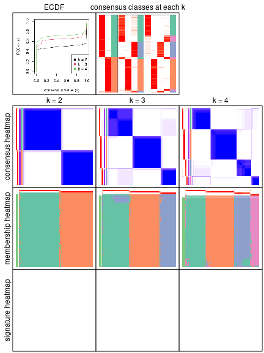

The plots are:

- The first row: a plot of the eCDF (empirical cumulative distribution
  function) curves of the consensus matrix for each `k` and the heatmap of
  predicted classes for each `k`.
- The second row: heatmaps of the consensus matrix for each `k`.
- The third row: heatmaps of the membership matrix for each `k`.
- The fouth row: heatmaps of the signatures for each `k`.

All the plots in panels can be made by individual functions and they are
plotted later in this section.

`select_partition_number()` produces several plots showing different
statistics for choosing "optimized" `k`. There are following statistics:

- eCDF curves of the consensus matrix for each `k`;
- 1-PAC. [The PAC score](https://en.wikipedia.org/wiki/Consensus_clustering#Over-interpretation_potential_of_consensus_clustering)
  measures the proportion of the ambiguous subgrouping.
- Mean silhouette score.
- Concordance. The mean probability of fiting the consensus subgroup labels in all
  partitions.
- Area increased. Denote $A_k$ as the area under the eCDF curve for current
  `k`, the area increased is defined as $A_k - A_{k-1}$.
- Rand index. The percent of pairs of samples that are both in a same cluster
  or both are not in a same cluster in the partition of k and k-1.
- Jaccard index. The ratio of pairs of samples are both in a same cluster in
  the partition of k and k-1 and the pairs of samples are both in a same
  cluster in the partition k or k-1.

The detailed explanations of these statistics can be found in [the _cola_
vignette](https://jokergoo.github.io/cola_vignettes/cola.html#toc_13).

Generally speaking, higher 1-PAC score, higher mean silhouette score or higher
concordance corresponds to better partition. Rand index and Jaccard index
measure how similar the current partition is compared to partition with `k-1`.
If they are too similar, we won't accept `k` is better than `k-1`.

```r
select_partition_number(res)
```


The numeric values for all these statistics can be obtained by `get_stats()`.

```r
get_stats(res)
```

```
#>   k 1-PAC mean_silhouette concordance area_increased  Rand Jaccard
#> 2 2 1.000           0.969       0.987          0.497 0.503   0.503
#> 3 3 0.855           0.944       0.961          0.298 0.808   0.633
#> 4 4 0.919           0.934       0.963          0.103 0.917   0.769
```

`suggest_best_k()` suggests the best $k$ based on these statistics. The rules are as follows:

- All $k$ with Jaccard index larger than 0.95 are removed because increasing
  $k$ does not provide enough extra information. If all $k$ are removed, it is
  marked as no subgroup is detected.
- For all $k$ with 1-PAC score larger than 0.9, the maximal $k$ is taken as
  the best $k$, and other $k$ are marked as optional $k$.
- If it does not fit the second rule. The $k$ with the maximal vote of the
  highest 1-PAC score, highest mean silhouette, and highest concordance is
  taken as the best $k$.

```r
suggest_best_k(res)
```

```
#> [1] 4
#> attr(,"optional")
#> [1] 2
```

There is also optional best $k$ = 2 that is worth to check.

Following is the table of the partitions (You need to click the **show/hide
code output** link to see it). The membership matrix (columns with name `p*`)
is inferred by
[`clue::cl_consensus()`](https://www.rdocumentation.org/link/cl_consensus?package=clue)
function with the `SE` method. Basically the value in the membership matrix
represents the probability to belong to a certain group. The finall subgroup
label for an item is determined with the group with highest probability it
belongs to.

In `get_classes()` function, the entropy is calculated from the membership
matrix and the silhouette score is calculated from the consensus matrix.


<script>
$( function() {
	$( '#tabs-node-02-get-classes' ).tabs();
} );
</script>
<div id='tabs-node-02-get-classes'>
<ul>
<li><a href='#tab-node-02-get-classes-1'>k = 2</a></li>
<li><a href='#tab-node-02-get-classes-2'>k = 3</a></li>
<li><a href='#tab-node-02-get-classes-3'>k = 4</a></li>
</ul>

<div id='tab-node-02-get-classes-1'>
<p><a id='tab-node-02-get-classes-1-a' style='color:#0366d6' href='#'>show/hide code output</a></p>
<pre><code class="r">get_classes(res, k = 2)
</code></pre>

<pre><code>#&gt;                             class     p
#&gt; mouse1_lib1.final_cell_0001     2 0.000
#&gt; mouse1_lib1.final_cell_0003     1 0.000
#&gt; mouse1_lib1.final_cell_0005     1 0.000
#&gt; mouse1_lib1.final_cell_0006     2 0.000
#&gt; mouse1_lib1.final_cell_0007     2 0.000
#&gt; mouse1_lib1.final_cell_0008     2 0.000
#&gt; mouse1_lib1.final_cell_0009     2 0.000
#&gt; mouse1_lib1.final_cell_0012     2 0.000
#&gt; mouse1_lib1.final_cell_0013     2 0.000
#&gt; mouse1_lib1.final_cell_0014     1 0.000
#&gt; mouse1_lib1.final_cell_0015     1 0.000
#&gt; mouse1_lib1.final_cell_0017     1 0.000
#&gt; mouse1_lib1.final_cell_0021     1 0.751
#&gt; mouse1_lib1.final_cell_0022     2 0.000
#&gt; mouse1_lib1.final_cell_0023     1 0.253
#&gt; mouse1_lib1.final_cell_0024     1 0.000
#&gt; mouse1_lib1.final_cell_0029     1 0.253
#&gt; mouse1_lib1.final_cell_0033     1 0.000
#&gt; mouse1_lib1.final_cell_0039     1 0.000
#&gt; mouse1_lib1.final_cell_0040     1 0.502
#&gt; mouse1_lib1.final_cell_0041     1 0.502
#&gt; mouse1_lib1.final_cell_0043     1 0.000
#&gt; mouse1_lib1.final_cell_0045     1 0.253
#&gt; mouse1_lib1.final_cell_0061     1 0.751
#&gt; mouse1_lib1.final_cell_0071     1 0.000
#&gt; mouse1_lib1.final_cell_0072     1 0.249
#&gt; mouse1_lib1.final_cell_0084     1 0.000
#&gt; mouse1_lib1.final_cell_0086     1 0.751
#&gt; mouse1_lib1.final_cell_0091     1 0.000
#&gt; mouse1_lib1.final_cell_0094     1 0.751
#&gt; mouse1_lib1.final_cell_0113     1 0.253
#&gt; mouse1_lib1.final_cell_0122     1 0.000
#&gt; mouse1_lib1.final_cell_0144     1 0.253
#&gt; mouse1_lib1.final_cell_0191     1 0.000
#&gt; mouse1_lib2.final_cell_0001     2 0.000
#&gt; mouse1_lib2.final_cell_0003     2 1.000
#&gt; mouse1_lib2.final_cell_0004     1 0.000
#&gt; mouse1_lib2.final_cell_0005     2 0.000
#&gt; mouse1_lib2.final_cell_0006     2 0.000
#&gt; mouse1_lib2.final_cell_0008     2 0.000
#&gt; mouse1_lib2.final_cell_0009     1 0.000
#&gt; mouse1_lib2.final_cell_0014     1 0.000
#&gt; mouse1_lib2.final_cell_0015     1 1.000
#&gt; mouse1_lib2.final_cell_0025     2 0.000
#&gt; mouse1_lib2.final_cell_0032     1 0.751
#&gt; mouse1_lib2.final_cell_0033     1 0.498
#&gt; mouse1_lib2.final_cell_0037     2 0.000
#&gt; mouse1_lib2.final_cell_0038     1 0.751
#&gt; mouse1_lib2.final_cell_0039     1 0.502
#&gt; mouse1_lib2.final_cell_0041     1 0.502
#&gt; mouse1_lib2.final_cell_0044     1 0.751
#&gt; mouse1_lib2.final_cell_0062     1 1.000
#&gt; mouse1_lib2.final_cell_0064     1 0.000
#&gt; mouse1_lib2.final_cell_0070     1 1.000
#&gt; mouse1_lib2.final_cell_0076     1 1.000
#&gt; mouse1_lib2.final_cell_0086     1 0.000
#&gt; mouse1_lib2.final_cell_0090     1 0.000
#&gt; mouse1_lib2.final_cell_0096     1 0.249
#&gt; mouse1_lib2.final_cell_0098     1 0.502
#&gt; mouse1_lib2.final_cell_0105     1 0.000
#&gt; mouse1_lib2.final_cell_0108     1 0.249
#&gt; mouse1_lib2.final_cell_0112     1 0.249
#&gt; mouse1_lib2.final_cell_0113     1 0.000
#&gt; mouse1_lib2.final_cell_0120     1 0.502
#&gt; mouse1_lib2.final_cell_0145     1 0.249
#&gt; mouse1_lib2.final_cell_0147     1 0.502
#&gt; mouse1_lib2.final_cell_0148     1 0.502
#&gt; mouse1_lib2.final_cell_0169     1 0.000
#&gt; mouse1_lib2.final_cell_0238     1 0.751
#&gt; mouse1_lib2.final_cell_0252     1 0.253
#&gt; mouse1_lib3.final_cell_0001     2 0.000
#&gt; mouse1_lib3.final_cell_0002     2 0.000
#&gt; mouse1_lib3.final_cell_0004     1 0.000
#&gt; mouse1_lib3.final_cell_0005     1 0.000
#&gt; mouse1_lib3.final_cell_0007     2 0.000
#&gt; mouse1_lib3.final_cell_0009     1 1.000
#&gt; mouse1_lib3.final_cell_0018     2 0.000
#&gt; mouse1_lib3.final_cell_0020     1 0.000
#&gt; mouse1_lib3.final_cell_0021     1 0.000
#&gt; mouse1_lib3.final_cell_0022     1 0.751
#&gt; mouse1_lib3.final_cell_0024     1 0.000
#&gt; mouse1_lib3.final_cell_0026     1 0.000
#&gt; mouse1_lib3.final_cell_0032     1 0.502
#&gt; mouse1_lib3.final_cell_0038     1 0.000
#&gt; mouse1_lib3.final_cell_0044     1 0.000
#&gt; mouse1_lib3.final_cell_0047     1 0.000
#&gt; mouse1_lib3.final_cell_0050     1 0.000
#&gt; mouse1_lib3.final_cell_0060     1 0.000
#&gt; mouse1_lib3.final_cell_0066     1 1.000
#&gt; mouse1_lib3.final_cell_0081     1 0.253
#&gt; mouse1_lib3.final_cell_0083     1 0.249
#&gt; mouse1_lib3.final_cell_0088     1 0.000
#&gt; mouse1_lib3.final_cell_0100     1 0.502
#&gt; mouse1_lib3.final_cell_0107     1 0.000
#&gt; mouse1_lib3.final_cell_0111     1 0.751
#&gt; mouse1_lib3.final_cell_0123     1 0.000
#&gt; mouse1_lib3.final_cell_0195     1 0.000
#&gt; mouse2_lib1.final_cell_0001     2 0.000
#&gt; mouse2_lib1.final_cell_0002     2 0.000
#&gt; mouse2_lib1.final_cell_0003     2 0.000
#&gt; mouse2_lib1.final_cell_0005     2 0.000
#&gt; mouse2_lib1.final_cell_0006     2 0.000
#&gt; mouse2_lib1.final_cell_0007     2 0.000
#&gt; mouse2_lib1.final_cell_0008     2 0.000
#&gt; mouse2_lib1.final_cell_0009     2 1.000
#&gt; mouse2_lib1.final_cell_0010     2 0.000
#&gt; mouse2_lib1.final_cell_0011     2 0.000
#&gt; mouse2_lib1.final_cell_0012     2 0.000
#&gt; mouse2_lib1.final_cell_0013     1 0.000
#&gt; mouse2_lib1.final_cell_0014     2 1.000
#&gt; mouse2_lib1.final_cell_0015     2 0.000
#&gt; mouse2_lib1.final_cell_0016     2 0.000
#&gt; mouse2_lib1.final_cell_0017     2 0.000
#&gt; mouse2_lib1.final_cell_0018     2 0.000
#&gt; mouse2_lib1.final_cell_0019     2 0.000
#&gt; mouse2_lib1.final_cell_0020     2 0.000
#&gt; mouse2_lib1.final_cell_0021     2 0.000
#&gt; mouse2_lib1.final_cell_0022     2 0.000
#&gt; mouse2_lib1.final_cell_0023     2 0.000
#&gt; mouse2_lib1.final_cell_0024     1 0.000
#&gt; mouse2_lib1.final_cell_0025     2 0.000
#&gt; mouse2_lib1.final_cell_0026     2 0.000
#&gt; mouse2_lib1.final_cell_0027     2 0.000
#&gt; mouse2_lib1.final_cell_0028     2 0.000
#&gt; mouse2_lib1.final_cell_0029     2 0.000
#&gt; mouse2_lib1.final_cell_0031     2 0.000
#&gt; mouse2_lib1.final_cell_0032     2 0.000
#&gt; mouse2_lib1.final_cell_0033     2 0.751
#&gt; mouse2_lib1.final_cell_0034     2 1.000
#&gt; mouse2_lib1.final_cell_0035     1 0.000
#&gt; mouse2_lib1.final_cell_0036     2 0.000
#&gt; mouse2_lib1.final_cell_0037     1 0.000
#&gt; mouse2_lib1.final_cell_0038     2 0.000
#&gt; mouse2_lib1.final_cell_0039     1 0.000
#&gt; mouse2_lib1.final_cell_0040     1 0.000
#&gt; mouse2_lib1.final_cell_0041     2 0.000
#&gt; mouse2_lib1.final_cell_0042     1 0.000
#&gt; mouse2_lib1.final_cell_0043     2 0.000
#&gt; mouse2_lib1.final_cell_0044     2 1.000
#&gt; mouse2_lib1.final_cell_0045     2 1.000
#&gt; mouse2_lib1.final_cell_0046     2 0.000
#&gt; mouse2_lib1.final_cell_0047     2 0.000
#&gt; mouse2_lib1.final_cell_0048     1 0.000
#&gt; mouse2_lib1.final_cell_0049     2 0.000
#&gt; mouse2_lib1.final_cell_0050     2 0.000
#&gt; mouse2_lib1.final_cell_0051     2 0.000
#&gt; mouse2_lib1.final_cell_0052     2 0.000
#&gt; mouse2_lib1.final_cell_0053     1 0.000
#&gt; mouse2_lib1.final_cell_0054     2 0.000
#&gt; mouse2_lib1.final_cell_0055     2 0.000
#&gt; mouse2_lib1.final_cell_0056     1 0.000
#&gt; mouse2_lib1.final_cell_0057     2 0.000
#&gt; mouse2_lib1.final_cell_0058     2 0.000
#&gt; mouse2_lib1.final_cell_0059     1 0.000
#&gt; mouse2_lib1.final_cell_0060     1 0.000
#&gt; mouse2_lib1.final_cell_0061     1 0.502
#&gt; mouse2_lib1.final_cell_0062     1 0.000
#&gt; mouse2_lib1.final_cell_0064     1 0.502
#&gt; mouse2_lib1.final_cell_0065     2 0.000
#&gt; mouse2_lib1.final_cell_0066     2 0.000
#&gt; mouse2_lib1.final_cell_0067     1 0.000
#&gt; mouse2_lib1.final_cell_0068     1 0.000
#&gt; mouse2_lib1.final_cell_0069     1 1.000
#&gt; mouse2_lib1.final_cell_0070     1 0.000
#&gt; mouse2_lib1.final_cell_0071     1 0.000
#&gt; mouse2_lib1.final_cell_0072     1 0.000
#&gt; mouse2_lib1.final_cell_0073     2 0.000
#&gt; mouse2_lib1.final_cell_0074     2 0.000
#&gt; mouse2_lib1.final_cell_0075     2 0.000
#&gt; mouse2_lib1.final_cell_0076     1 0.000
#&gt; mouse2_lib1.final_cell_0077     2 0.000
#&gt; mouse2_lib1.final_cell_0079     2 0.502
#&gt; mouse2_lib1.final_cell_0080     2 0.000
#&gt; mouse2_lib1.final_cell_0081     2 0.000
#&gt; mouse2_lib1.final_cell_0082     2 1.000
#&gt; mouse2_lib1.final_cell_0084     1 0.000
#&gt; mouse2_lib1.final_cell_0085     1 0.000
#&gt; mouse2_lib1.final_cell_0087     2 0.000
#&gt; mouse2_lib1.final_cell_0088     2 0.000
#&gt; mouse2_lib1.final_cell_0089     2 0.000
#&gt; mouse2_lib1.final_cell_0090     2 0.000
#&gt; mouse2_lib1.final_cell_0091     1 0.249
#&gt; mouse2_lib1.final_cell_0092     1 0.000
#&gt; mouse2_lib1.final_cell_0093     2 0.000
#&gt; mouse2_lib1.final_cell_0094     2 0.000
#&gt; mouse2_lib1.final_cell_0095     2 0.000
#&gt; mouse2_lib1.final_cell_0096     2 0.000
#&gt; mouse2_lib1.final_cell_0097     1 0.000
#&gt; mouse2_lib1.final_cell_0098     1 0.000
#&gt; mouse2_lib1.final_cell_0099     1 0.000
#&gt; mouse2_lib1.final_cell_0100     1 0.000
#&gt; mouse2_lib1.final_cell_0101     1 1.000
#&gt; mouse2_lib1.final_cell_0102     2 0.249
#&gt; mouse2_lib1.final_cell_0103     2 0.000
#&gt; mouse2_lib1.final_cell_0104     1 0.000
#&gt; mouse2_lib1.final_cell_0105     1 0.751
#&gt; mouse2_lib1.final_cell_0106     2 0.000
#&gt; mouse2_lib1.final_cell_0107     1 0.000
#&gt; mouse2_lib1.final_cell_0108     2 0.000
#&gt; mouse2_lib1.final_cell_0109     1 0.000
#&gt; mouse2_lib1.final_cell_0110     1 0.000
#&gt; mouse2_lib1.final_cell_0111     2 0.000
#&gt; mouse2_lib1.final_cell_0112     1 0.000
#&gt; mouse2_lib1.final_cell_0113     2 0.249
#&gt; mouse2_lib1.final_cell_0114     2 0.000
#&gt; mouse2_lib1.final_cell_0115     2 0.000
#&gt; mouse2_lib1.final_cell_0116     1 0.000
#&gt; mouse2_lib1.final_cell_0117     1 1.000
#&gt; mouse2_lib1.final_cell_0118     1 0.000
#&gt; mouse2_lib1.final_cell_0119     1 0.000
#&gt; mouse2_lib1.final_cell_0121     2 0.000
#&gt; mouse2_lib1.final_cell_0122     1 1.000
#&gt; mouse2_lib1.final_cell_0123     1 1.000
#&gt; mouse2_lib1.final_cell_0124     2 0.000
#&gt; mouse2_lib1.final_cell_0125     2 0.000
#&gt; mouse2_lib1.final_cell_0126     2 0.000
#&gt; mouse2_lib1.final_cell_0127     1 0.000
#&gt; mouse2_lib1.final_cell_0128     1 0.000
#&gt; mouse2_lib1.final_cell_0130     2 0.000
#&gt; mouse2_lib1.final_cell_0131     2 0.000
#&gt; mouse2_lib1.final_cell_0132     2 0.000
#&gt; mouse2_lib1.final_cell_0133     2 0.000
#&gt; mouse2_lib1.final_cell_0134     1 1.000
#&gt; mouse2_lib1.final_cell_0135     2 0.000
#&gt; mouse2_lib1.final_cell_0136     2 0.000
#&gt; mouse2_lib1.final_cell_0137     1 1.000
#&gt; mouse2_lib1.final_cell_0138     1 0.000
#&gt; mouse2_lib1.final_cell_0139     1 0.249
#&gt; mouse2_lib1.final_cell_0140     2 0.000
#&gt; mouse2_lib1.final_cell_0143     1 0.000
#&gt; mouse2_lib1.final_cell_0144     1 0.000
#&gt; mouse2_lib1.final_cell_0145     1 0.000
#&gt; mouse2_lib1.final_cell_0146     1 0.000
#&gt; mouse2_lib1.final_cell_0147     2 0.000
#&gt; mouse2_lib1.final_cell_0148     1 0.000
#&gt; mouse2_lib1.final_cell_0150     2 0.000
#&gt; mouse2_lib1.final_cell_0151     2 0.000
#&gt; mouse2_lib1.final_cell_0153     1 0.000
#&gt; mouse2_lib1.final_cell_0154     1 0.249
#&gt; mouse2_lib1.final_cell_0155     1 0.000
#&gt; mouse2_lib1.final_cell_0156     1 0.000
#&gt; mouse2_lib1.final_cell_0157     1 0.000
#&gt; mouse2_lib1.final_cell_0158     1 0.000
#&gt; mouse2_lib1.final_cell_0160     1 1.000
#&gt; mouse2_lib1.final_cell_0161     2 0.000
#&gt; mouse2_lib1.final_cell_0162     1 0.000
#&gt; mouse2_lib1.final_cell_0163     1 0.000
#&gt; mouse2_lib1.final_cell_0166     2 0.253
#&gt; mouse2_lib1.final_cell_0167     1 0.000
#&gt; mouse2_lib1.final_cell_0168     1 1.000
#&gt; mouse2_lib1.final_cell_0169     1 0.000
#&gt; mouse2_lib1.final_cell_0170     1 0.747
#&gt; mouse2_lib1.final_cell_0171     1 0.000
#&gt; mouse2_lib1.final_cell_0173     1 0.000
#&gt; mouse2_lib1.final_cell_0174     1 1.000
#&gt; mouse2_lib1.final_cell_0175     1 0.000
#&gt; mouse2_lib1.final_cell_0176     2 0.000
#&gt; mouse2_lib1.final_cell_0177     1 0.498
#&gt; mouse2_lib1.final_cell_0178     1 0.000
#&gt; mouse2_lib1.final_cell_0179     1 0.249
#&gt; mouse2_lib1.final_cell_0180     1 1.000
#&gt; mouse2_lib1.final_cell_0184     1 0.000
#&gt; mouse2_lib1.final_cell_0185     2 0.000
#&gt; mouse2_lib1.final_cell_0187     1 0.000
#&gt; mouse2_lib1.final_cell_0189     1 0.000
#&gt; mouse2_lib1.final_cell_0190     1 1.000
#&gt; mouse2_lib1.final_cell_0193     1 0.751
#&gt; mouse2_lib1.final_cell_0194     1 0.000
#&gt; mouse2_lib1.final_cell_0195     2 0.000
#&gt; mouse2_lib1.final_cell_0196     1 0.000
#&gt; mouse2_lib1.final_cell_0197     2 0.000
#&gt; mouse2_lib1.final_cell_0200     2 0.000
#&gt; mouse2_lib1.final_cell_0201     1 0.751
#&gt; mouse2_lib1.final_cell_0202     1 0.253
#&gt; mouse2_lib1.final_cell_0203     1 0.000
#&gt; mouse2_lib1.final_cell_0206     1 0.000
#&gt; mouse2_lib1.final_cell_0207     1 1.000
#&gt; mouse2_lib1.final_cell_0210     1 0.000
#&gt; mouse2_lib1.final_cell_0211     1 1.000
#&gt; mouse2_lib1.final_cell_0214     1 1.000
#&gt; mouse2_lib1.final_cell_0215     1 1.000
#&gt; mouse2_lib1.final_cell_0216     1 0.000
#&gt; mouse2_lib1.final_cell_0217     1 0.000
#&gt; mouse2_lib1.final_cell_0222     1 0.253
#&gt; mouse2_lib1.final_cell_0223     1 1.000
#&gt; mouse2_lib1.final_cell_0227     1 1.000
#&gt; mouse2_lib1.final_cell_0228     1 1.000
#&gt; mouse2_lib1.final_cell_0229     1 0.000
#&gt; mouse2_lib1.final_cell_0236     1 0.000
#&gt; mouse2_lib1.final_cell_0239     1 0.502
#&gt; mouse2_lib1.final_cell_0242     1 1.000
#&gt; mouse2_lib1.final_cell_0243     1 1.000
#&gt; mouse2_lib1.final_cell_0244     1 0.000
#&gt; mouse2_lib1.final_cell_0245     2 1.000
#&gt; mouse2_lib1.final_cell_0247     1 0.000
#&gt; mouse2_lib1.final_cell_0272     1 0.000
#&gt; mouse2_lib2.final_cell_0001     2 0.000
#&gt; mouse2_lib2.final_cell_0002     2 0.000
#&gt; mouse2_lib2.final_cell_0003     2 0.000
#&gt; mouse2_lib2.final_cell_0004     2 0.751
#&gt; mouse2_lib2.final_cell_0005     2 0.000
#&gt; mouse2_lib2.final_cell_0006     2 0.000
#&gt; mouse2_lib2.final_cell_0008     2 0.000
#&gt; mouse2_lib2.final_cell_0009     2 0.000
#&gt; mouse2_lib2.final_cell_0010     2 0.000
#&gt; mouse2_lib2.final_cell_0011     2 0.000
#&gt; mouse2_lib2.final_cell_0012     2 0.000
#&gt; mouse2_lib2.final_cell_0013     1 0.000
#&gt; mouse2_lib2.final_cell_0014     2 0.000
#&gt; mouse2_lib2.final_cell_0015     2 1.000
#&gt; mouse2_lib2.final_cell_0016     2 0.249
#&gt; mouse2_lib2.final_cell_0017     2 0.000
#&gt; mouse2_lib2.final_cell_0018     2 0.000
#&gt; mouse2_lib2.final_cell_0019     2 0.000
#&gt; mouse2_lib2.final_cell_0020     2 0.000
#&gt; mouse2_lib2.final_cell_0022     1 0.000
#&gt; mouse2_lib2.final_cell_0023     1 0.000
#&gt; mouse2_lib2.final_cell_0024     2 0.000
#&gt; mouse2_lib2.final_cell_0025     1 0.000
#&gt; mouse2_lib2.final_cell_0026     2 1.000
#&gt; mouse2_lib2.final_cell_0027     2 0.000
#&gt; mouse2_lib2.final_cell_0028     1 0.000
#&gt; mouse2_lib2.final_cell_0029     2 0.000
#&gt; mouse2_lib2.final_cell_0030     2 0.751
#&gt; mouse2_lib2.final_cell_0031     1 0.000
#&gt; mouse2_lib2.final_cell_0032     2 0.000
#&gt; mouse2_lib2.final_cell_0033     2 0.000
#&gt; mouse2_lib2.final_cell_0034     1 0.000
#&gt; mouse2_lib2.final_cell_0035     1 0.000
#&gt; mouse2_lib2.final_cell_0036     1 0.000
#&gt; mouse2_lib2.final_cell_0037     2 0.000
#&gt; mouse2_lib2.final_cell_0038     2 0.000
#&gt; mouse2_lib2.final_cell_0039     2 0.000
#&gt; mouse2_lib2.final_cell_0040     1 0.000
#&gt; mouse2_lib2.final_cell_0041     1 0.000
#&gt; mouse2_lib2.final_cell_0042     2 0.000
#&gt; mouse2_lib2.final_cell_0043     1 1.000
#&gt; mouse2_lib2.final_cell_0044     2 0.000
#&gt; mouse2_lib2.final_cell_0045     2 0.000
#&gt; mouse2_lib2.final_cell_0046     1 0.000
#&gt; mouse2_lib2.final_cell_0047     2 0.000
#&gt; mouse2_lib2.final_cell_0048     1 0.000
#&gt; mouse2_lib2.final_cell_0049     2 0.000
#&gt; mouse2_lib2.final_cell_0050     1 0.000
#&gt; mouse2_lib2.final_cell_0051     1 0.000
#&gt; mouse2_lib2.final_cell_0052     1 0.000
#&gt; mouse2_lib2.final_cell_0053     2 0.000
#&gt; mouse2_lib2.final_cell_0054     1 0.000
#&gt; mouse2_lib2.final_cell_0055     1 0.000
#&gt; mouse2_lib2.final_cell_0056     2 0.000
#&gt; mouse2_lib2.final_cell_0057     2 0.000
#&gt; mouse2_lib2.final_cell_0058     2 0.000
#&gt; mouse2_lib2.final_cell_0059     2 0.000
#&gt; mouse2_lib2.final_cell_0060     2 0.000
#&gt; mouse2_lib2.final_cell_0061     2 0.000
#&gt; mouse2_lib2.final_cell_0062     2 1.000
#&gt; mouse2_lib2.final_cell_0063     2 0.000
#&gt; mouse2_lib2.final_cell_0064     2 0.000
#&gt; mouse2_lib2.final_cell_0065     2 0.000
#&gt; mouse2_lib2.final_cell_0066     2 0.000
#&gt; mouse2_lib2.final_cell_0067     1 0.000
#&gt; mouse2_lib2.final_cell_0068     1 0.000
#&gt; mouse2_lib2.final_cell_0069     2 0.000
#&gt; mouse2_lib2.final_cell_0070     1 0.000
#&gt; mouse2_lib2.final_cell_0071     2 0.000
#&gt; mouse2_lib2.final_cell_0072     2 0.000
#&gt; mouse2_lib2.final_cell_0073     2 0.000
#&gt; mouse2_lib2.final_cell_0074     2 0.000
#&gt; mouse2_lib2.final_cell_0075     2 0.000
#&gt; mouse2_lib2.final_cell_0076     1 0.000
#&gt; mouse2_lib2.final_cell_0077     2 0.000
#&gt; mouse2_lib2.final_cell_0078     2 0.000
#&gt; mouse2_lib2.final_cell_0079     1 0.000
#&gt; mouse2_lib2.final_cell_0081     1 0.000
#&gt; mouse2_lib2.final_cell_0082     1 0.000
#&gt; mouse2_lib2.final_cell_0083     1 0.000
#&gt; mouse2_lib2.final_cell_0084     1 0.751
#&gt; mouse2_lib2.final_cell_0085     1 0.000
#&gt; mouse2_lib2.final_cell_0086     1 0.000
#&gt; mouse2_lib2.final_cell_0087     2 0.000
#&gt; mouse2_lib2.final_cell_0088     2 1.000
#&gt; mouse2_lib2.final_cell_0089     1 0.000
#&gt; mouse2_lib2.final_cell_0090     2 0.000
#&gt; mouse2_lib2.final_cell_0092     2 0.000
#&gt; mouse2_lib2.final_cell_0093     1 0.000
#&gt; mouse2_lib2.final_cell_0095     2 0.000
#&gt; mouse2_lib2.final_cell_0096     1 0.000
#&gt; mouse2_lib2.final_cell_0097     2 0.000
#&gt; mouse2_lib2.final_cell_0098     1 0.000
#&gt; mouse2_lib2.final_cell_0099     2 0.000
#&gt; mouse2_lib2.final_cell_0100     2 0.000
#&gt; mouse2_lib2.final_cell_0101     2 0.000
#&gt; mouse2_lib2.final_cell_0102     1 0.000
#&gt; mouse2_lib2.final_cell_0103     1 1.000
#&gt; mouse2_lib2.final_cell_0104     2 0.000
#&gt; mouse2_lib2.final_cell_0105     2 0.000
#&gt; mouse2_lib2.final_cell_0106     2 0.000
#&gt; mouse2_lib2.final_cell_0107     2 0.000
#&gt; mouse2_lib2.final_cell_0109     2 0.000
#&gt; mouse2_lib2.final_cell_0110     1 0.000
#&gt; mouse2_lib2.final_cell_0111     1 0.000
#&gt; mouse2_lib2.final_cell_0112     1 0.000
#&gt; mouse2_lib2.final_cell_0114     2 0.000
#&gt; mouse2_lib2.final_cell_0116     1 0.000
#&gt; mouse2_lib2.final_cell_0117     1 0.000
#&gt; mouse2_lib2.final_cell_0118     2 0.000
#&gt; mouse2_lib2.final_cell_0119     2 0.000
#&gt; mouse2_lib2.final_cell_0120     2 0.000
#&gt; mouse2_lib2.final_cell_0121     2 0.000
#&gt; mouse2_lib2.final_cell_0122     1 0.000
#&gt; mouse2_lib2.final_cell_0123     2 0.000
#&gt; mouse2_lib2.final_cell_0124     1 0.000
#&gt; mouse2_lib2.final_cell_0125     1 0.249
#&gt; mouse2_lib2.final_cell_0126     2 0.000
#&gt; mouse2_lib2.final_cell_0127     2 0.000
#&gt; mouse2_lib2.final_cell_0128     2 0.000
#&gt; mouse2_lib2.final_cell_0129     1 1.000
#&gt; mouse2_lib2.final_cell_0130     1 0.000
#&gt; mouse2_lib2.final_cell_0131     1 0.000
#&gt; mouse2_lib2.final_cell_0132     2 0.000
#&gt; mouse2_lib2.final_cell_0133     2 0.498
#&gt; mouse2_lib2.final_cell_0134     1 1.000
#&gt; mouse2_lib2.final_cell_0135     1 0.000
#&gt; mouse2_lib2.final_cell_0136     2 0.000
#&gt; mouse2_lib2.final_cell_0137     2 0.000
#&gt; mouse2_lib2.final_cell_0138     1 0.000
#&gt; mouse2_lib2.final_cell_0139     2 0.751
#&gt; mouse2_lib2.final_cell_0141     2 0.000
#&gt; mouse2_lib2.final_cell_0142     1 0.000
#&gt; mouse2_lib2.final_cell_0143     1 0.000
#&gt; mouse2_lib2.final_cell_0144     1 1.000
#&gt; mouse2_lib2.final_cell_0145     1 0.000
#&gt; mouse2_lib2.final_cell_0146     2 0.000
#&gt; mouse2_lib2.final_cell_0149     2 1.000
#&gt; mouse2_lib2.final_cell_0150     1 0.000
#&gt; mouse2_lib2.final_cell_0151     1 1.000
#&gt; mouse2_lib2.final_cell_0152     1 0.249
#&gt; mouse2_lib2.final_cell_0153     2 0.000
#&gt; mouse2_lib2.final_cell_0154     1 1.000
#&gt; mouse2_lib2.final_cell_0155     1 1.000
#&gt; mouse2_lib2.final_cell_0156     1 1.000
#&gt; mouse2_lib2.final_cell_0158     2 0.000
#&gt; mouse2_lib2.final_cell_0159     1 0.000
#&gt; mouse2_lib2.final_cell_0160     2 0.502
#&gt; mouse2_lib2.final_cell_0161     2 0.000
#&gt; mouse2_lib2.final_cell_0162     1 0.000
#&gt; mouse2_lib2.final_cell_0163     1 0.000
#&gt; mouse2_lib2.final_cell_0164     2 0.000
#&gt; mouse2_lib2.final_cell_0165     1 0.000
#&gt; mouse2_lib2.final_cell_0166     1 1.000
#&gt; mouse2_lib2.final_cell_0168     1 0.249
#&gt; mouse2_lib2.final_cell_0169     1 0.000
#&gt; mouse2_lib2.final_cell_0170     1 0.249
#&gt; mouse2_lib2.final_cell_0171     1 0.000
#&gt; mouse2_lib2.final_cell_0172     2 0.000
#&gt; mouse2_lib2.final_cell_0173     2 0.000
#&gt; mouse2_lib2.final_cell_0174     1 0.000
#&gt; mouse2_lib2.final_cell_0175     1 0.000
#&gt; mouse2_lib2.final_cell_0176     1 0.498
#&gt; mouse2_lib2.final_cell_0177     1 0.000
#&gt; mouse2_lib2.final_cell_0178     2 0.000
#&gt; mouse2_lib2.final_cell_0179     1 0.502
#&gt; mouse2_lib2.final_cell_0180     1 0.000
#&gt; mouse2_lib2.final_cell_0181     1 0.249
#&gt; mouse2_lib2.final_cell_0182     1 0.000
#&gt; mouse2_lib2.final_cell_0183     1 0.751
#&gt; mouse2_lib2.final_cell_0184     1 0.000
#&gt; mouse2_lib2.final_cell_0185     1 0.000
#&gt; mouse2_lib2.final_cell_0187     1 0.249
#&gt; mouse2_lib2.final_cell_0189     2 0.000
#&gt; mouse2_lib2.final_cell_0190     1 1.000
#&gt; mouse2_lib2.final_cell_0191     1 0.000
#&gt; mouse2_lib2.final_cell_0192     1 0.000
#&gt; mouse2_lib2.final_cell_0194     2 0.000
#&gt; mouse2_lib2.final_cell_0197     1 0.000
#&gt; mouse2_lib2.final_cell_0198     2 0.000
#&gt; mouse2_lib2.final_cell_0200     2 0.000
#&gt; mouse2_lib2.final_cell_0201     2 0.000
#&gt; mouse2_lib2.final_cell_0203     1 0.000
#&gt; mouse2_lib2.final_cell_0205     1 0.000
#&gt; mouse2_lib2.final_cell_0206     1 0.000
#&gt; mouse2_lib2.final_cell_0207     2 0.000
#&gt; mouse2_lib2.final_cell_0211     1 1.000
#&gt; mouse2_lib2.final_cell_0214     1 1.000
#&gt; mouse2_lib2.final_cell_0215     1 0.000
#&gt; mouse2_lib2.final_cell_0218     1 0.751
#&gt; mouse2_lib2.final_cell_0220     1 0.000
#&gt; mouse2_lib2.final_cell_0221     1 1.000
#&gt; mouse2_lib2.final_cell_0222     1 0.000
#&gt; mouse2_lib2.final_cell_0224     1 0.751
#&gt; mouse2_lib2.final_cell_0226     1 0.000
#&gt; mouse2_lib2.final_cell_0227     1 1.000
#&gt; mouse2_lib2.final_cell_0228     1 0.000
#&gt; mouse2_lib2.final_cell_0229     1 0.000
#&gt; mouse2_lib2.final_cell_0231     1 0.249
#&gt; mouse2_lib2.final_cell_0234     1 1.000
#&gt; mouse2_lib2.final_cell_0236     1 0.000
#&gt; mouse2_lib2.final_cell_0238     1 0.000
#&gt; mouse2_lib2.final_cell_0240     1 0.000
#&gt; mouse2_lib2.final_cell_0241     1 0.000
#&gt; mouse2_lib2.final_cell_0242     1 0.000
#&gt; mouse2_lib2.final_cell_0244     1 0.000
#&gt; mouse2_lib2.final_cell_0246     1 0.000
#&gt; mouse2_lib2.final_cell_0256     1 0.000
#&gt; mouse2_lib2.final_cell_0258     1 0.751
#&gt; mouse2_lib2.final_cell_0272     1 0.000
#&gt; mouse2_lib2.final_cell_0274     1 1.000
#&gt; mouse2_lib2.final_cell_0286     1 0.000
#&gt; mouse2_lib2.final_cell_0288     1 0.751
#&gt; mouse2_lib3.final_cell_0001     2 0.000
#&gt; mouse2_lib3.final_cell_0002     2 0.000
#&gt; mouse2_lib3.final_cell_0003     2 0.000
#&gt; mouse2_lib3.final_cell_0004     2 0.000
#&gt; mouse2_lib3.final_cell_0005     2 0.000
#&gt; mouse2_lib3.final_cell_0006     2 0.000
#&gt; mouse2_lib3.final_cell_0007     2 0.000
#&gt; mouse2_lib3.final_cell_0008     2 0.000
#&gt; mouse2_lib3.final_cell_0009     2 0.000
#&gt; mouse2_lib3.final_cell_0010     2 0.000
#&gt; mouse2_lib3.final_cell_0011     2 0.000
#&gt; mouse2_lib3.final_cell_0012     2 0.000
#&gt; mouse2_lib3.final_cell_0013     2 1.000
#&gt; mouse2_lib3.final_cell_0014     1 0.000
#&gt; mouse2_lib3.final_cell_0015     2 0.000
#&gt; mouse2_lib3.final_cell_0017     2 0.000
#&gt; mouse2_lib3.final_cell_0018     2 0.000
#&gt; mouse2_lib3.final_cell_0019     2 0.000
#&gt; mouse2_lib3.final_cell_0020     1 0.000
#&gt; mouse2_lib3.final_cell_0021     1 0.000
#&gt; mouse2_lib3.final_cell_0022     2 0.000
#&gt; mouse2_lib3.final_cell_0023     2 0.000
#&gt; mouse2_lib3.final_cell_0024     2 0.000
#&gt; mouse2_lib3.final_cell_0025     2 0.000
#&gt; mouse2_lib3.final_cell_0026     1 0.000
#&gt; mouse2_lib3.final_cell_0027     2 0.000
#&gt; mouse2_lib3.final_cell_0028     2 0.000
#&gt; mouse2_lib3.final_cell_0029     2 0.000
#&gt; mouse2_lib3.final_cell_0030     1 0.000
#&gt; mouse2_lib3.final_cell_0031     2 0.000
#&gt; mouse2_lib3.final_cell_0032     2 0.000
#&gt; mouse2_lib3.final_cell_0033     1 0.000
#&gt; mouse2_lib3.final_cell_0035     2 0.000
#&gt; mouse2_lib3.final_cell_0036     2 0.000
#&gt; mouse2_lib3.final_cell_0037     2 0.000
#&gt; mouse2_lib3.final_cell_0038     2 0.000
#&gt; mouse2_lib3.final_cell_0039     1 0.000
#&gt; mouse2_lib3.final_cell_0040     2 0.000
#&gt; mouse2_lib3.final_cell_0041     1 0.000
#&gt; mouse2_lib3.final_cell_0042     2 0.000
#&gt; mouse2_lib3.final_cell_0043     2 0.000
#&gt; mouse2_lib3.final_cell_0044     2 0.000
#&gt; mouse2_lib3.final_cell_0045     1 1.000
#&gt; mouse2_lib3.final_cell_0046     2 0.000
#&gt; mouse2_lib3.final_cell_0047     1 1.000
#&gt; mouse2_lib3.final_cell_0048     1 0.000
#&gt; mouse2_lib3.final_cell_0049     2 0.000
#&gt; mouse2_lib3.final_cell_0050     1 0.000
#&gt; mouse2_lib3.final_cell_0051     1 1.000
#&gt; mouse2_lib3.final_cell_0052     2 0.000
#&gt; mouse2_lib3.final_cell_0053     2 0.000
#&gt; mouse2_lib3.final_cell_0054     2 0.000
#&gt; mouse2_lib3.final_cell_0055     2 0.000
#&gt; mouse2_lib3.final_cell_0056     2 0.000
#&gt; mouse2_lib3.final_cell_0057     1 1.000
#&gt; mouse2_lib3.final_cell_0058     2 0.000
#&gt; mouse2_lib3.final_cell_0059     2 0.000
#&gt; mouse2_lib3.final_cell_0060     2 1.000
#&gt; mouse2_lib3.final_cell_0062     2 0.000
#&gt; mouse2_lib3.final_cell_0063     1 0.000
#&gt; mouse2_lib3.final_cell_0064     1 0.000
#&gt; mouse2_lib3.final_cell_0066     1 0.000
#&gt; mouse2_lib3.final_cell_0067     2 0.000
#&gt; mouse2_lib3.final_cell_0068     2 0.000
#&gt; mouse2_lib3.final_cell_0070     1 0.000
#&gt; mouse2_lib3.final_cell_0071     2 0.000
#&gt; mouse2_lib3.final_cell_0072     1 0.000
#&gt; mouse2_lib3.final_cell_0073     1 0.000
#&gt; mouse2_lib3.final_cell_0074     1 0.000
#&gt; mouse2_lib3.final_cell_0075     1 0.000
#&gt; mouse2_lib3.final_cell_0076     1 0.000
#&gt; mouse2_lib3.final_cell_0077     2 0.000
#&gt; mouse2_lib3.final_cell_0078     1 0.000
#&gt; mouse2_lib3.final_cell_0079     2 0.000
#&gt; mouse2_lib3.final_cell_0080     2 0.000
#&gt; mouse2_lib3.final_cell_0081     1 0.000
#&gt; mouse2_lib3.final_cell_0082     1 0.000
#&gt; mouse2_lib3.final_cell_0083     2 0.000
#&gt; mouse2_lib3.final_cell_0084     2 0.000
#&gt; mouse2_lib3.final_cell_0085     1 0.498
#&gt; mouse2_lib3.final_cell_0086     1 0.000
#&gt; mouse2_lib3.final_cell_0087     1 0.000
#&gt; mouse2_lib3.final_cell_0088     2 0.000
#&gt; mouse2_lib3.final_cell_0089     2 0.000
#&gt; mouse2_lib3.final_cell_0090     2 0.000
#&gt; mouse2_lib3.final_cell_0091     1 0.000
#&gt; mouse2_lib3.final_cell_0092     2 0.000
#&gt; mouse2_lib3.final_cell_0093     1 0.000
#&gt; mouse2_lib3.final_cell_0094     1 0.000
#&gt; mouse2_lib3.final_cell_0095     1 0.000
#&gt; mouse2_lib3.final_cell_0096     1 1.000
#&gt; mouse2_lib3.final_cell_0097     1 0.000
#&gt; mouse2_lib3.final_cell_0098     1 1.000
#&gt; mouse2_lib3.final_cell_0099     2 0.000
#&gt; mouse2_lib3.final_cell_0100     1 0.000
#&gt; mouse2_lib3.final_cell_0101     2 0.000
#&gt; mouse2_lib3.final_cell_0102     2 0.000
#&gt; mouse2_lib3.final_cell_0103     2 0.000
#&gt; mouse2_lib3.final_cell_0104     1 0.249
#&gt; mouse2_lib3.final_cell_0105     1 0.000
#&gt; mouse2_lib3.final_cell_0106     1 0.000
#&gt; mouse2_lib3.final_cell_0107     2 0.000
#&gt; mouse2_lib3.final_cell_0108     1 0.000
#&gt; mouse2_lib3.final_cell_0109     1 0.000
#&gt; mouse2_lib3.final_cell_0110     2 1.000
#&gt; mouse2_lib3.final_cell_0111     2 0.249
#&gt; mouse2_lib3.final_cell_0112     1 0.000
#&gt; mouse2_lib3.final_cell_0113     2 0.000
#&gt; mouse2_lib3.final_cell_0114     2 0.000
#&gt; mouse2_lib3.final_cell_0115     1 0.000
#&gt; mouse2_lib3.final_cell_0116     1 0.000
#&gt; mouse2_lib3.final_cell_0117     2 0.000
#&gt; mouse2_lib3.final_cell_0118     1 0.000
#&gt; mouse2_lib3.final_cell_0119     1 1.000
#&gt; mouse2_lib3.final_cell_0120     2 0.000
#&gt; mouse2_lib3.final_cell_0121     2 0.000
#&gt; mouse2_lib3.final_cell_0122     2 0.000
#&gt; mouse2_lib3.final_cell_0123     2 0.000
#&gt; mouse2_lib3.final_cell_0124     2 0.000
#&gt; mouse2_lib3.final_cell_0125     1 0.000
#&gt; mouse2_lib3.final_cell_0126     2 0.751
#&gt; mouse2_lib3.final_cell_0127     1 0.751
#&gt; mouse2_lib3.final_cell_0128     2 0.000
#&gt; mouse2_lib3.final_cell_0129     2 0.000
#&gt; mouse2_lib3.final_cell_0130     1 0.000
#&gt; mouse2_lib3.final_cell_0132     1 0.000
#&gt; mouse2_lib3.final_cell_0133     2 0.000
#&gt; mouse2_lib3.final_cell_0134     1 1.000
#&gt; mouse2_lib3.final_cell_0135     1 0.751
#&gt; mouse2_lib3.final_cell_0136     2 0.249
#&gt; mouse2_lib3.final_cell_0137     2 0.000
#&gt; mouse2_lib3.final_cell_0138     2 0.249
#&gt; mouse2_lib3.final_cell_0139     2 0.000
#&gt; mouse2_lib3.final_cell_0140     1 0.000
#&gt; mouse2_lib3.final_cell_0141     2 0.000
#&gt; mouse2_lib3.final_cell_0142     1 0.000
#&gt; mouse2_lib3.final_cell_0143     2 0.000
#&gt; mouse2_lib3.final_cell_0144     1 0.000
#&gt; mouse2_lib3.final_cell_0145     1 0.000
#&gt; mouse2_lib3.final_cell_0147     2 0.000
#&gt; mouse2_lib3.final_cell_0148     1 0.000
#&gt; mouse2_lib3.final_cell_0150     2 0.000
#&gt; mouse2_lib3.final_cell_0151     1 0.000
#&gt; mouse2_lib3.final_cell_0152     1 0.000
#&gt; mouse2_lib3.final_cell_0153     1 0.000
#&gt; mouse2_lib3.final_cell_0154     2 0.000
#&gt; mouse2_lib3.final_cell_0155     1 0.000
#&gt; mouse2_lib3.final_cell_0156     2 0.000
#&gt; mouse2_lib3.final_cell_0157     1 0.000
#&gt; mouse2_lib3.final_cell_0159     1 1.000
#&gt; mouse2_lib3.final_cell_0160     1 0.000
#&gt; mouse2_lib3.final_cell_0161     1 0.249
#&gt; mouse2_lib3.final_cell_0162     2 0.000
#&gt; mouse2_lib3.final_cell_0163     1 0.000
#&gt; mouse2_lib3.final_cell_0164     2 1.000
#&gt; mouse2_lib3.final_cell_0166     1 0.747
#&gt; mouse2_lib3.final_cell_0168     1 0.000
#&gt; mouse2_lib3.final_cell_0169     1 1.000
#&gt; mouse2_lib3.final_cell_0170     2 0.000
#&gt; mouse2_lib3.final_cell_0172     1 0.000
#&gt; mouse2_lib3.final_cell_0173     1 0.249
#&gt; mouse2_lib3.final_cell_0175     1 0.751
#&gt; mouse2_lib3.final_cell_0176     2 0.249
#&gt; mouse2_lib3.final_cell_0177     1 1.000
#&gt; mouse2_lib3.final_cell_0178     1 0.000
#&gt; mouse2_lib3.final_cell_0179     2 0.000
#&gt; mouse2_lib3.final_cell_0180     1 0.000
#&gt; mouse2_lib3.final_cell_0182     1 0.000
#&gt; mouse2_lib3.final_cell_0185     1 0.000
#&gt; mouse2_lib3.final_cell_0186     2 0.000
#&gt; mouse2_lib3.final_cell_0187     2 0.000
#&gt; mouse2_lib3.final_cell_0190     1 1.000
#&gt; mouse2_lib3.final_cell_0191     2 0.502
#&gt; mouse2_lib3.final_cell_0193     1 0.000
#&gt; mouse2_lib3.final_cell_0194     1 0.000
#&gt; mouse2_lib3.final_cell_0197     1 0.000
#&gt; mouse2_lib3.final_cell_0198     1 0.000
#&gt; mouse2_lib3.final_cell_0202     1 0.498
#&gt; mouse2_lib3.final_cell_0206     1 1.000
#&gt; mouse2_lib3.final_cell_0207     1 0.000
#&gt; mouse2_lib3.final_cell_0209     1 0.000
#&gt; mouse2_lib3.final_cell_0210     1 0.000
#&gt; mouse2_lib3.final_cell_0212     1 0.000
#&gt; mouse2_lib3.final_cell_0213     1 0.000
#&gt; mouse2_lib3.final_cell_0217     1 1.000
#&gt; mouse2_lib3.final_cell_0219     1 0.751
#&gt; mouse2_lib3.final_cell_0222     1 0.498
#&gt; mouse2_lib3.final_cell_0226     1 0.751
#&gt; mouse2_lib3.final_cell_0238     1 0.000
#&gt; mouse2_lib3.final_cell_0239     1 1.000
#&gt; mouse2_lib3.final_cell_0243     1 0.747
#&gt; mouse2_lib3.final_cell_0245     1 1.000
#&gt; mouse2_lib3.final_cell_0248     1 0.751
#&gt; mouse2_lib3.final_cell_0249     1 0.000
#&gt; mouse2_lib3.final_cell_0256     1 1.000
#&gt; mouse2_lib3.final_cell_0259     1 0.502
</code></pre>

<script>
$('#tab-node-02-get-classes-1-a').parent().next().next().hide();
$('#tab-node-02-get-classes-1-a').click(function(){
  $('#tab-node-02-get-classes-1-a').parent().next().next().toggle();
  return(false);
});
</script>
</div>

<div id='tab-node-02-get-classes-2'>
<p><a id='tab-node-02-get-classes-2-a' style='color:#0366d6' href='#'>show/hide code output</a></p>
<pre><code class="r">get_classes(res, k = 3)
</code></pre>

<pre><code>#&gt;                             class     p
#&gt; mouse1_lib1.final_cell_0001     2 0.000
#&gt; mouse1_lib1.final_cell_0003     1 0.000
#&gt; mouse1_lib1.final_cell_0005     1 0.000
#&gt; mouse1_lib1.final_cell_0006     2 0.000
#&gt; mouse1_lib1.final_cell_0007     2 0.000
#&gt; mouse1_lib1.final_cell_0008     2 0.000
#&gt; mouse1_lib1.final_cell_0009     2 0.000
#&gt; mouse1_lib1.final_cell_0012     2 0.000
#&gt; mouse1_lib1.final_cell_0013     2 0.000
#&gt; mouse1_lib1.final_cell_0014     1 0.000
#&gt; mouse1_lib1.final_cell_0015     3 0.000
#&gt; mouse1_lib1.final_cell_0017     3 0.000
#&gt; mouse1_lib1.final_cell_0021     3 0.000
#&gt; mouse1_lib1.final_cell_0022     2 0.000
#&gt; mouse1_lib1.final_cell_0023     3 0.000
#&gt; mouse1_lib1.final_cell_0024     1 0.000
#&gt; mouse1_lib1.final_cell_0029     3 0.000
#&gt; mouse1_lib1.final_cell_0033     1 0.000
#&gt; mouse1_lib1.final_cell_0039     1 0.000
#&gt; mouse1_lib1.final_cell_0040     3 0.000
#&gt; mouse1_lib1.final_cell_0041     3 0.000
#&gt; mouse1_lib1.final_cell_0043     1 0.000
#&gt; mouse1_lib1.final_cell_0045     3 0.000
#&gt; mouse1_lib1.final_cell_0061     3 0.000
#&gt; mouse1_lib1.final_cell_0071     3 0.000
#&gt; mouse1_lib1.final_cell_0072     3 0.000
#&gt; mouse1_lib1.final_cell_0084     1 0.000
#&gt; mouse1_lib1.final_cell_0086     3 0.000
#&gt; mouse1_lib1.final_cell_0091     1 0.000
#&gt; mouse1_lib1.final_cell_0094     3 0.000
#&gt; mouse1_lib1.final_cell_0113     3 0.000
#&gt; mouse1_lib1.final_cell_0122     1 0.000
#&gt; mouse1_lib1.final_cell_0144     3 0.000
#&gt; mouse1_lib1.final_cell_0191     3 0.000
#&gt; mouse1_lib2.final_cell_0001     2 0.000
#&gt; mouse1_lib2.final_cell_0003     1 1.000
#&gt; mouse1_lib2.final_cell_0004     1 0.000
#&gt; mouse1_lib2.final_cell_0005     2 0.751
#&gt; mouse1_lib2.final_cell_0006     2 0.000
#&gt; mouse1_lib2.final_cell_0008     2 0.000
#&gt; mouse1_lib2.final_cell_0009     1 0.000
#&gt; mouse1_lib2.final_cell_0014     1 0.000
#&gt; mouse1_lib2.final_cell_0015     3 0.000
#&gt; mouse1_lib2.final_cell_0025     2 1.000
#&gt; mouse1_lib2.final_cell_0032     3 0.000
#&gt; mouse1_lib2.final_cell_0033     3 0.000
#&gt; mouse1_lib2.final_cell_0037     3 0.000
#&gt; mouse1_lib2.final_cell_0038     3 0.000
#&gt; mouse1_lib2.final_cell_0039     3 0.000
#&gt; mouse1_lib2.final_cell_0041     3 0.000
#&gt; mouse1_lib2.final_cell_0044     3 0.000
#&gt; mouse1_lib2.final_cell_0062     3 0.000
#&gt; mouse1_lib2.final_cell_0064     1 0.000
#&gt; mouse1_lib2.final_cell_0070     3 0.000
#&gt; mouse1_lib2.final_cell_0076     3 0.000
#&gt; mouse1_lib2.final_cell_0086     1 0.000
#&gt; mouse1_lib2.final_cell_0090     3 0.000
#&gt; mouse1_lib2.final_cell_0096     3 0.000
#&gt; mouse1_lib2.final_cell_0098     3 0.000
#&gt; mouse1_lib2.final_cell_0105     1 0.000
#&gt; mouse1_lib2.final_cell_0108     3 0.000
#&gt; mouse1_lib2.final_cell_0112     3 0.000
#&gt; mouse1_lib2.final_cell_0113     1 0.000
#&gt; mouse1_lib2.final_cell_0120     3 0.000
#&gt; mouse1_lib2.final_cell_0145     3 0.000
#&gt; mouse1_lib2.final_cell_0147     3 0.000
#&gt; mouse1_lib2.final_cell_0148     3 0.000
#&gt; mouse1_lib2.final_cell_0169     3 0.000
#&gt; mouse1_lib2.final_cell_0238     3 0.000
#&gt; mouse1_lib2.final_cell_0252     3 0.000
#&gt; mouse1_lib3.final_cell_0001     2 0.000
#&gt; mouse1_lib3.final_cell_0002     2 0.000
#&gt; mouse1_lib3.final_cell_0004     3 1.000
#&gt; mouse1_lib3.final_cell_0005     1 0.000
#&gt; mouse1_lib3.final_cell_0007     2 0.000
#&gt; mouse1_lib3.final_cell_0009     3 0.000
#&gt; mouse1_lib3.final_cell_0018     2 0.000
#&gt; mouse1_lib3.final_cell_0020     1 0.000
#&gt; mouse1_lib3.final_cell_0021     1 0.000
#&gt; mouse1_lib3.final_cell_0022     3 0.000
#&gt; mouse1_lib3.final_cell_0024     1 0.000
#&gt; mouse1_lib3.final_cell_0026     1 0.000
#&gt; mouse1_lib3.final_cell_0032     3 0.000
#&gt; mouse1_lib3.final_cell_0038     1 0.000
#&gt; mouse1_lib3.final_cell_0044     1 0.000
#&gt; mouse1_lib3.final_cell_0047     3 0.000
#&gt; mouse1_lib3.final_cell_0050     1 0.000
#&gt; mouse1_lib3.final_cell_0060     3 0.000
#&gt; mouse1_lib3.final_cell_0066     3 0.000
#&gt; mouse1_lib3.final_cell_0081     3 0.000
#&gt; mouse1_lib3.final_cell_0083     3 0.000
#&gt; mouse1_lib3.final_cell_0088     1 0.498
#&gt; mouse1_lib3.final_cell_0100     3 0.000
#&gt; mouse1_lib3.final_cell_0107     3 0.000
#&gt; mouse1_lib3.final_cell_0111     3 0.000
#&gt; mouse1_lib3.final_cell_0123     1 0.000
#&gt; mouse1_lib3.final_cell_0195     3 0.000
#&gt; mouse2_lib1.final_cell_0001     2 0.000
#&gt; mouse2_lib1.final_cell_0002     2 0.000
#&gt; mouse2_lib1.final_cell_0003     2 0.000
#&gt; mouse2_lib1.final_cell_0005     2 0.000
#&gt; mouse2_lib1.final_cell_0006     2 0.000
#&gt; mouse2_lib1.final_cell_0007     2 0.000
#&gt; mouse2_lib1.final_cell_0008     2 0.000
#&gt; mouse2_lib1.final_cell_0009     1 1.000
#&gt; mouse2_lib1.final_cell_0010     2 0.000
#&gt; mouse2_lib1.final_cell_0011     2 0.000
#&gt; mouse2_lib1.final_cell_0012     2 0.000
#&gt; mouse2_lib1.final_cell_0013     1 0.000
#&gt; mouse2_lib1.final_cell_0014     2 1.000
#&gt; mouse2_lib1.final_cell_0015     2 0.000
#&gt; mouse2_lib1.final_cell_0016     2 0.000
#&gt; mouse2_lib1.final_cell_0017     2 0.000
#&gt; mouse2_lib1.final_cell_0018     2 0.000
#&gt; mouse2_lib1.final_cell_0019     2 0.000
#&gt; mouse2_lib1.final_cell_0020     2 0.000
#&gt; mouse2_lib1.final_cell_0021     2 0.000
#&gt; mouse2_lib1.final_cell_0022     2 0.000
#&gt; mouse2_lib1.final_cell_0023     2 0.000
#&gt; mouse2_lib1.final_cell_0024     1 0.000
#&gt; mouse2_lib1.final_cell_0025     2 0.000
#&gt; mouse2_lib1.final_cell_0026     2 0.000
#&gt; mouse2_lib1.final_cell_0027     2 0.000
#&gt; mouse2_lib1.final_cell_0028     2 0.000
#&gt; mouse2_lib1.final_cell_0029     2 0.000
#&gt; mouse2_lib1.final_cell_0031     2 0.000
#&gt; mouse2_lib1.final_cell_0032     2 0.000
#&gt; mouse2_lib1.final_cell_0033     2 1.000
#&gt; mouse2_lib1.final_cell_0034     1 0.249
#&gt; mouse2_lib1.final_cell_0035     1 0.000
#&gt; mouse2_lib1.final_cell_0036     2 0.000
#&gt; mouse2_lib1.final_cell_0037     1 0.000
#&gt; mouse2_lib1.final_cell_0038     2 0.000
#&gt; mouse2_lib1.final_cell_0039     1 0.000
#&gt; mouse2_lib1.final_cell_0040     1 0.000
#&gt; mouse2_lib1.final_cell_0041     2 0.000
#&gt; mouse2_lib1.final_cell_0042     1 0.000
#&gt; mouse2_lib1.final_cell_0043     2 0.000
#&gt; mouse2_lib1.final_cell_0044     1 0.751
#&gt; mouse2_lib1.final_cell_0045     1 1.000
#&gt; mouse2_lib1.final_cell_0046     2 0.000
#&gt; mouse2_lib1.final_cell_0047     2 0.000
#&gt; mouse2_lib1.final_cell_0048     1 0.000
#&gt; mouse2_lib1.final_cell_0049     2 0.000
#&gt; mouse2_lib1.final_cell_0050     2 0.000
#&gt; mouse2_lib1.final_cell_0051     2 0.000
#&gt; mouse2_lib1.final_cell_0052     2 0.000
#&gt; mouse2_lib1.final_cell_0053     1 0.000
#&gt; mouse2_lib1.final_cell_0054     2 0.000
#&gt; mouse2_lib1.final_cell_0055     2 0.000
#&gt; mouse2_lib1.final_cell_0056     1 0.000
#&gt; mouse2_lib1.final_cell_0057     2 0.253
#&gt; mouse2_lib1.final_cell_0058     2 0.000
#&gt; mouse2_lib1.final_cell_0059     1 0.000
#&gt; mouse2_lib1.final_cell_0060     1 0.000
#&gt; mouse2_lib1.final_cell_0061     3 0.000
#&gt; mouse2_lib1.final_cell_0062     1 0.000
#&gt; mouse2_lib1.final_cell_0064     1 0.000
#&gt; mouse2_lib1.final_cell_0065     2 0.000
#&gt; mouse2_lib1.final_cell_0066     2 0.000
#&gt; mouse2_lib1.final_cell_0067     1 0.000
#&gt; mouse2_lib1.final_cell_0068     1 0.000
#&gt; mouse2_lib1.final_cell_0069     3 0.000
#&gt; mouse2_lib1.final_cell_0070     1 0.000
#&gt; mouse2_lib1.final_cell_0071     1 0.000
#&gt; mouse2_lib1.final_cell_0072     1 0.000
#&gt; mouse2_lib1.final_cell_0073     2 0.000
#&gt; mouse2_lib1.final_cell_0074     2 0.000
#&gt; mouse2_lib1.final_cell_0075     2 0.000
#&gt; mouse2_lib1.final_cell_0076     1 0.000
#&gt; mouse2_lib1.final_cell_0077     2 0.000
#&gt; mouse2_lib1.final_cell_0079     3 0.751
#&gt; mouse2_lib1.final_cell_0080     2 0.000
#&gt; mouse2_lib1.final_cell_0081     2 0.000
#&gt; mouse2_lib1.final_cell_0082     1 0.502
#&gt; mouse2_lib1.final_cell_0084     1 0.000
#&gt; mouse2_lib1.final_cell_0085     1 0.000
#&gt; mouse2_lib1.final_cell_0087     2 0.000
#&gt; mouse2_lib1.final_cell_0088     2 0.000
#&gt; mouse2_lib1.final_cell_0089     2 0.000
#&gt; mouse2_lib1.final_cell_0090     2 0.000
#&gt; mouse2_lib1.final_cell_0091     1 0.000
#&gt; mouse2_lib1.final_cell_0092     1 0.000
#&gt; mouse2_lib1.final_cell_0093     2 0.000
#&gt; mouse2_lib1.final_cell_0094     2 0.000
#&gt; mouse2_lib1.final_cell_0095     2 0.000
#&gt; mouse2_lib1.final_cell_0096     2 0.000
#&gt; mouse2_lib1.final_cell_0097     1 0.000
#&gt; mouse2_lib1.final_cell_0098     1 0.000
#&gt; mouse2_lib1.final_cell_0099     1 0.000
#&gt; mouse2_lib1.final_cell_0100     1 0.000
#&gt; mouse2_lib1.final_cell_0101     3 0.751
#&gt; mouse2_lib1.final_cell_0102     2 0.000
#&gt; mouse2_lib1.final_cell_0103     2 0.000
#&gt; mouse2_lib1.final_cell_0104     1 0.000
#&gt; mouse2_lib1.final_cell_0105     3 0.000
#&gt; mouse2_lib1.final_cell_0106     2 0.000
#&gt; mouse2_lib1.final_cell_0107     1 0.000
#&gt; mouse2_lib1.final_cell_0108     2 0.000
#&gt; mouse2_lib1.final_cell_0109     1 0.000
#&gt; mouse2_lib1.final_cell_0110     1 0.000
#&gt; mouse2_lib1.final_cell_0111     2 0.000
#&gt; mouse2_lib1.final_cell_0112     1 0.000
#&gt; mouse2_lib1.final_cell_0113     3 0.751
#&gt; mouse2_lib1.final_cell_0114     2 0.000
#&gt; mouse2_lib1.final_cell_0115     2 0.000
#&gt; mouse2_lib1.final_cell_0116     1 0.000
#&gt; mouse2_lib1.final_cell_0117     3 0.000
#&gt; mouse2_lib1.final_cell_0118     1 0.000
#&gt; mouse2_lib1.final_cell_0119     1 0.000
#&gt; mouse2_lib1.final_cell_0121     2 0.000
#&gt; mouse2_lib1.final_cell_0122     3 0.000
#&gt; mouse2_lib1.final_cell_0123     3 0.000
#&gt; mouse2_lib1.final_cell_0124     2 0.000
#&gt; mouse2_lib1.final_cell_0125     2 0.000
#&gt; mouse2_lib1.final_cell_0126     2 0.000
#&gt; mouse2_lib1.final_cell_0127     1 0.000
#&gt; mouse2_lib1.final_cell_0128     1 0.000
#&gt; mouse2_lib1.final_cell_0130     2 0.000
#&gt; mouse2_lib1.final_cell_0131     2 0.000
#&gt; mouse2_lib1.final_cell_0132     2 0.000
#&gt; mouse2_lib1.final_cell_0133     2 0.000
#&gt; mouse2_lib1.final_cell_0134     3 0.000
#&gt; mouse2_lib1.final_cell_0135     2 0.000
#&gt; mouse2_lib1.final_cell_0136     2 0.000
#&gt; mouse2_lib1.final_cell_0137     3 0.000
#&gt; mouse2_lib1.final_cell_0138     1 0.000
#&gt; mouse2_lib1.final_cell_0139     3 0.000
#&gt; mouse2_lib1.final_cell_0140     2 0.249
#&gt; mouse2_lib1.final_cell_0143     1 0.498
#&gt; mouse2_lib1.final_cell_0144     1 0.000
#&gt; mouse2_lib1.final_cell_0145     1 0.000
#&gt; mouse2_lib1.final_cell_0146     1 0.000
#&gt; mouse2_lib1.final_cell_0147     2 0.000
#&gt; mouse2_lib1.final_cell_0148     1 0.000
#&gt; mouse2_lib1.final_cell_0150     3 0.498
#&gt; mouse2_lib1.final_cell_0151     2 0.000
#&gt; mouse2_lib1.final_cell_0153     1 0.000
#&gt; mouse2_lib1.final_cell_0154     1 0.253
#&gt; mouse2_lib1.final_cell_0155     3 0.747
#&gt; mouse2_lib1.final_cell_0156     1 0.000
#&gt; mouse2_lib1.final_cell_0157     1 0.000
#&gt; mouse2_lib1.final_cell_0158     1 0.000
#&gt; mouse2_lib1.final_cell_0160     3 0.000
#&gt; mouse2_lib1.final_cell_0161     2 0.000
#&gt; mouse2_lib1.final_cell_0162     1 0.000
#&gt; mouse2_lib1.final_cell_0163     1 0.000
#&gt; mouse2_lib1.final_cell_0166     2 1.000
#&gt; mouse2_lib1.final_cell_0167     1 0.000
#&gt; mouse2_lib1.final_cell_0168     3 0.249
#&gt; mouse2_lib1.final_cell_0169     1 0.000
#&gt; mouse2_lib1.final_cell_0170     3 0.000
#&gt; mouse2_lib1.final_cell_0171     1 0.751
#&gt; mouse2_lib1.final_cell_0173     1 0.000
#&gt; mouse2_lib1.final_cell_0174     3 0.249
#&gt; mouse2_lib1.final_cell_0175     1 0.000
#&gt; mouse2_lib1.final_cell_0176     2 0.000
#&gt; mouse2_lib1.final_cell_0177     1 0.751
#&gt; mouse2_lib1.final_cell_0178     1 0.000
#&gt; mouse2_lib1.final_cell_0179     3 0.000
#&gt; mouse2_lib1.final_cell_0180     3 0.000
#&gt; mouse2_lib1.final_cell_0184     1 0.000
#&gt; mouse2_lib1.final_cell_0185     2 0.000
#&gt; mouse2_lib1.final_cell_0187     1 0.000
#&gt; mouse2_lib1.final_cell_0189     1 0.000
#&gt; mouse2_lib1.final_cell_0190     3 0.000
#&gt; mouse2_lib1.final_cell_0193     3 0.000
#&gt; mouse2_lib1.final_cell_0194     1 0.000
#&gt; mouse2_lib1.final_cell_0195     2 0.000
#&gt; mouse2_lib1.final_cell_0196     1 0.000
#&gt; mouse2_lib1.final_cell_0197     2 1.000
#&gt; mouse2_lib1.final_cell_0200     3 1.000
#&gt; mouse2_lib1.final_cell_0201     3 0.000
#&gt; mouse2_lib1.final_cell_0202     1 0.000
#&gt; mouse2_lib1.final_cell_0203     1 0.000
#&gt; mouse2_lib1.final_cell_0206     1 0.000
#&gt; mouse2_lib1.final_cell_0207     3 0.000
#&gt; mouse2_lib1.final_cell_0210     1 0.000
#&gt; mouse2_lib1.final_cell_0211     3 0.000
#&gt; mouse2_lib1.final_cell_0214     3 0.000
#&gt; mouse2_lib1.final_cell_0215     3 0.000
#&gt; mouse2_lib1.final_cell_0216     1 0.000
#&gt; mouse2_lib1.final_cell_0217     1 0.000
#&gt; mouse2_lib1.final_cell_0222     1 0.000
#&gt; mouse2_lib1.final_cell_0223     3 0.000
#&gt; mouse2_lib1.final_cell_0227     3 0.000
#&gt; mouse2_lib1.final_cell_0228     3 0.000
#&gt; mouse2_lib1.final_cell_0229     1 0.000
#&gt; mouse2_lib1.final_cell_0236     1 1.000
#&gt; mouse2_lib1.final_cell_0239     3 0.000
#&gt; mouse2_lib1.final_cell_0242     3 0.000
#&gt; mouse2_lib1.final_cell_0243     3 0.000
#&gt; mouse2_lib1.final_cell_0244     3 0.000
#&gt; mouse2_lib1.final_cell_0245     3 0.000
#&gt; mouse2_lib1.final_cell_0247     1 0.000
#&gt; mouse2_lib1.final_cell_0272     1 0.000
#&gt; mouse2_lib2.final_cell_0001     2 0.000
#&gt; mouse2_lib2.final_cell_0002     2 0.000
#&gt; mouse2_lib2.final_cell_0003     2 0.000
#&gt; mouse2_lib2.final_cell_0004     2 1.000
#&gt; mouse2_lib2.final_cell_0005     2 0.000
#&gt; mouse2_lib2.final_cell_0006     2 0.000
#&gt; mouse2_lib2.final_cell_0008     2 0.000
#&gt; mouse2_lib2.final_cell_0009     2 0.000
#&gt; mouse2_lib2.final_cell_0010     2 0.000
#&gt; mouse2_lib2.final_cell_0011     2 0.000
#&gt; mouse2_lib2.final_cell_0012     2 0.000
#&gt; mouse2_lib2.final_cell_0013     1 0.000
#&gt; mouse2_lib2.final_cell_0014     2 0.000
#&gt; mouse2_lib2.final_cell_0015     1 0.000
#&gt; mouse2_lib2.final_cell_0016     2 0.751
#&gt; mouse2_lib2.final_cell_0017     2 0.000
#&gt; mouse2_lib2.final_cell_0018     2 0.000
#&gt; mouse2_lib2.final_cell_0019     2 0.000
#&gt; mouse2_lib2.final_cell_0020     2 0.000
#&gt; mouse2_lib2.final_cell_0022     1 0.000
#&gt; mouse2_lib2.final_cell_0023     1 0.000
#&gt; mouse2_lib2.final_cell_0024     2 0.000
#&gt; mouse2_lib2.final_cell_0025     1 0.000
#&gt; mouse2_lib2.final_cell_0026     1 1.000
#&gt; mouse2_lib2.final_cell_0027     2 0.000
#&gt; mouse2_lib2.final_cell_0028     1 0.000
#&gt; mouse2_lib2.final_cell_0029     3 0.000
#&gt; mouse2_lib2.final_cell_0030     1 1.000
#&gt; mouse2_lib2.final_cell_0031     1 0.000
#&gt; mouse2_lib2.final_cell_0032     2 0.000
#&gt; mouse2_lib2.final_cell_0033     2 0.000
#&gt; mouse2_lib2.final_cell_0034     1 0.000
#&gt; mouse2_lib2.final_cell_0035     1 0.000
#&gt; mouse2_lib2.final_cell_0036     1 0.000
#&gt; mouse2_lib2.final_cell_0037     2 0.000
#&gt; mouse2_lib2.final_cell_0038     2 0.000
#&gt; mouse2_lib2.final_cell_0039     2 0.000
#&gt; mouse2_lib2.final_cell_0040     1 0.000
#&gt; mouse2_lib2.final_cell_0041     1 0.000
#&gt; mouse2_lib2.final_cell_0042     2 0.000
#&gt; mouse2_lib2.final_cell_0043     3 0.000
#&gt; mouse2_lib2.final_cell_0044     2 0.000
#&gt; mouse2_lib2.final_cell_0045     2 0.000
#&gt; mouse2_lib2.final_cell_0046     1 0.000
#&gt; mouse2_lib2.final_cell_0047     2 0.000
#&gt; mouse2_lib2.final_cell_0048     1 0.000
#&gt; mouse2_lib2.final_cell_0049     2 0.000
#&gt; mouse2_lib2.final_cell_0050     1 0.000
#&gt; mouse2_lib2.final_cell_0051     1 0.000
#&gt; mouse2_lib2.final_cell_0052     1 0.000
#&gt; mouse2_lib2.final_cell_0053     2 0.000
#&gt; mouse2_lib2.final_cell_0054     1 0.000
#&gt; mouse2_lib2.final_cell_0055     1 0.000
#&gt; mouse2_lib2.final_cell_0056     2 0.000
#&gt; mouse2_lib2.final_cell_0057     2 0.000
#&gt; mouse2_lib2.final_cell_0058     2 0.000
#&gt; mouse2_lib2.final_cell_0059     2 0.000
#&gt; mouse2_lib2.final_cell_0060     2 0.000
#&gt; mouse2_lib2.final_cell_0061     2 0.000
#&gt; mouse2_lib2.final_cell_0062     1 1.000
#&gt; mouse2_lib2.final_cell_0063     2 0.000
#&gt; mouse2_lib2.final_cell_0064     2 0.000
#&gt; mouse2_lib2.final_cell_0065     2 0.000
#&gt; mouse2_lib2.final_cell_0066     2 0.000
#&gt; mouse2_lib2.final_cell_0067     1 0.000
#&gt; mouse2_lib2.final_cell_0068     1 0.000
#&gt; mouse2_lib2.final_cell_0069     2 0.000
#&gt; mouse2_lib2.final_cell_0070     1 0.000
#&gt; mouse2_lib2.final_cell_0071     2 0.000
#&gt; mouse2_lib2.final_cell_0072     2 0.000
#&gt; mouse2_lib2.final_cell_0073     2 0.000
#&gt; mouse2_lib2.final_cell_0074     2 0.000
#&gt; mouse2_lib2.final_cell_0075     2 0.000
#&gt; mouse2_lib2.final_cell_0076     1 0.000
#&gt; mouse2_lib2.final_cell_0077     2 0.000
#&gt; mouse2_lib2.final_cell_0078     2 0.000
#&gt; mouse2_lib2.final_cell_0079     1 0.000
#&gt; mouse2_lib2.final_cell_0081     1 0.000
#&gt; mouse2_lib2.final_cell_0082     1 0.000
#&gt; mouse2_lib2.final_cell_0083     1 0.000
#&gt; mouse2_lib2.final_cell_0084     3 0.000
#&gt; mouse2_lib2.final_cell_0085     1 0.000
#&gt; mouse2_lib2.final_cell_0086     1 0.000
#&gt; mouse2_lib2.final_cell_0087     2 0.000
#&gt; mouse2_lib2.final_cell_0088     1 1.000
#&gt; mouse2_lib2.final_cell_0089     1 0.000
#&gt; mouse2_lib2.final_cell_0090     2 0.000
#&gt; mouse2_lib2.final_cell_0092     2 0.000
#&gt; mouse2_lib2.final_cell_0093     1 0.000
#&gt; mouse2_lib2.final_cell_0095     2 0.000
#&gt; mouse2_lib2.final_cell_0096     1 0.000
#&gt; mouse2_lib2.final_cell_0097     2 0.000
#&gt; mouse2_lib2.final_cell_0098     1 0.000
#&gt; mouse2_lib2.final_cell_0099     2 0.000
#&gt; mouse2_lib2.final_cell_0100     2 0.000
#&gt; mouse2_lib2.final_cell_0101     2 0.000
#&gt; mouse2_lib2.final_cell_0102     1 0.000
#&gt; mouse2_lib2.final_cell_0103     3 0.000
#&gt; mouse2_lib2.final_cell_0104     2 0.000
#&gt; mouse2_lib2.final_cell_0105     2 0.000
#&gt; mouse2_lib2.final_cell_0106     2 0.000
#&gt; mouse2_lib2.final_cell_0107     2 0.253
#&gt; mouse2_lib2.final_cell_0109     2 0.000
#&gt; mouse2_lib2.final_cell_0110     3 0.000
#&gt; mouse2_lib2.final_cell_0111     1 0.000
#&gt; mouse2_lib2.final_cell_0112     1 0.000
#&gt; mouse2_lib2.final_cell_0114     2 0.000
#&gt; mouse2_lib2.final_cell_0116     1 0.000
#&gt; mouse2_lib2.final_cell_0117     1 0.000
#&gt; mouse2_lib2.final_cell_0118     2 0.249
#&gt; mouse2_lib2.final_cell_0119     2 0.000
#&gt; mouse2_lib2.final_cell_0120     2 0.000
#&gt; mouse2_lib2.final_cell_0121     2 0.000
#&gt; mouse2_lib2.final_cell_0122     1 0.000
#&gt; mouse2_lib2.final_cell_0123     2 0.498
#&gt; mouse2_lib2.final_cell_0124     1 0.000
#&gt; mouse2_lib2.final_cell_0125     3 0.000
#&gt; mouse2_lib2.final_cell_0126     2 0.000
#&gt; mouse2_lib2.final_cell_0127     2 0.000
#&gt; mouse2_lib2.final_cell_0128     2 0.000
#&gt; mouse2_lib2.final_cell_0129     3 0.000
#&gt; mouse2_lib2.final_cell_0130     1 0.000
#&gt; mouse2_lib2.final_cell_0131     1 0.000
#&gt; mouse2_lib2.final_cell_0132     2 0.000
#&gt; mouse2_lib2.final_cell_0133     3 1.000
#&gt; mouse2_lib2.final_cell_0134     3 0.000
#&gt; mouse2_lib2.final_cell_0135     1 0.000
#&gt; mouse2_lib2.final_cell_0136     2 0.000
#&gt; mouse2_lib2.final_cell_0137     2 0.000
#&gt; mouse2_lib2.final_cell_0138     1 0.000
#&gt; mouse2_lib2.final_cell_0139     2 0.000
#&gt; mouse2_lib2.final_cell_0141     3 1.000
#&gt; mouse2_lib2.final_cell_0142     1 0.000
#&gt; mouse2_lib2.final_cell_0143     1 0.000
#&gt; mouse2_lib2.final_cell_0144     3 0.000
#&gt; mouse2_lib2.final_cell_0145     1 0.000
#&gt; mouse2_lib2.final_cell_0146     2 0.000
#&gt; mouse2_lib2.final_cell_0149     3 0.000
#&gt; mouse2_lib2.final_cell_0150     1 0.000
#&gt; mouse2_lib2.final_cell_0151     3 0.000
#&gt; mouse2_lib2.final_cell_0152     3 0.000
#&gt; mouse2_lib2.final_cell_0153     2 0.000
#&gt; mouse2_lib2.final_cell_0154     3 0.000
#&gt; mouse2_lib2.final_cell_0155     3 0.000
#&gt; mouse2_lib2.final_cell_0156     3 0.000
#&gt; mouse2_lib2.final_cell_0158     2 0.000
#&gt; mouse2_lib2.final_cell_0159     1 0.000
#&gt; mouse2_lib2.final_cell_0160     2 1.000
#&gt; mouse2_lib2.final_cell_0161     2 0.000
#&gt; mouse2_lib2.final_cell_0162     1 0.000
#&gt; mouse2_lib2.final_cell_0163     1 0.000
#&gt; mouse2_lib2.final_cell_0164     2 0.000
#&gt; mouse2_lib2.final_cell_0165     1 0.000
#&gt; mouse2_lib2.final_cell_0166     3 0.000
#&gt; mouse2_lib2.final_cell_0168     1 0.751
#&gt; mouse2_lib2.final_cell_0169     1 0.000
#&gt; mouse2_lib2.final_cell_0170     1 0.000
#&gt; mouse2_lib2.final_cell_0171     1 0.000
#&gt; mouse2_lib2.final_cell_0172     2 1.000
#&gt; mouse2_lib2.final_cell_0173     2 0.000
#&gt; mouse2_lib2.final_cell_0174     1 0.000
#&gt; mouse2_lib2.final_cell_0175     1 0.000
#&gt; mouse2_lib2.final_cell_0176     3 0.000
#&gt; mouse2_lib2.final_cell_0177     1 0.000
#&gt; mouse2_lib2.final_cell_0178     2 0.000
#&gt; mouse2_lib2.final_cell_0179     3 0.000
#&gt; mouse2_lib2.final_cell_0180     1 0.000
#&gt; mouse2_lib2.final_cell_0181     3 0.000
#&gt; mouse2_lib2.final_cell_0182     1 0.000
#&gt; mouse2_lib2.final_cell_0183     3 0.751
#&gt; mouse2_lib2.final_cell_0184     1 0.249
#&gt; mouse2_lib2.final_cell_0185     1 0.000
#&gt; mouse2_lib2.final_cell_0187     1 0.253
#&gt; mouse2_lib2.final_cell_0189     2 0.000
#&gt; mouse2_lib2.final_cell_0190     3 0.000
#&gt; mouse2_lib2.final_cell_0191     1 0.000
#&gt; mouse2_lib2.final_cell_0192     1 0.000
#&gt; mouse2_lib2.final_cell_0194     2 0.249
#&gt; mouse2_lib2.final_cell_0197     3 1.000
#&gt; mouse2_lib2.final_cell_0198     2 0.000
#&gt; mouse2_lib2.final_cell_0200     2 0.000
#&gt; mouse2_lib2.final_cell_0201     2 0.000
#&gt; mouse2_lib2.final_cell_0203     1 0.000
#&gt; mouse2_lib2.final_cell_0205     1 1.000
#&gt; mouse2_lib2.final_cell_0206     1 0.000
#&gt; mouse2_lib2.final_cell_0207     2 0.000
#&gt; mouse2_lib2.final_cell_0211     3 0.249
#&gt; mouse2_lib2.final_cell_0214     3 0.000
#&gt; mouse2_lib2.final_cell_0215     1 0.000
#&gt; mouse2_lib2.final_cell_0218     3 0.000
#&gt; mouse2_lib2.final_cell_0220     1 1.000
#&gt; mouse2_lib2.final_cell_0221     3 0.000
#&gt; mouse2_lib2.final_cell_0222     1 0.000
#&gt; mouse2_lib2.final_cell_0224     3 0.000
#&gt; mouse2_lib2.final_cell_0226     1 0.000
#&gt; mouse2_lib2.final_cell_0227     3 0.000
#&gt; mouse2_lib2.final_cell_0228     1 0.000
#&gt; mouse2_lib2.final_cell_0229     1 0.000
#&gt; mouse2_lib2.final_cell_0231     3 0.000
#&gt; mouse2_lib2.final_cell_0234     3 0.000
#&gt; mouse2_lib2.final_cell_0236     1 0.000
#&gt; mouse2_lib2.final_cell_0238     1 0.000
#&gt; mouse2_lib2.final_cell_0240     1 0.000
#&gt; mouse2_lib2.final_cell_0241     1 0.000
#&gt; mouse2_lib2.final_cell_0242     1 0.498
#&gt; mouse2_lib2.final_cell_0244     1 0.000
#&gt; mouse2_lib2.final_cell_0246     1 0.000
#&gt; mouse2_lib2.final_cell_0256     1 0.000
#&gt; mouse2_lib2.final_cell_0258     3 0.000
#&gt; mouse2_lib2.final_cell_0272     1 0.000
#&gt; mouse2_lib2.final_cell_0274     3 0.000
#&gt; mouse2_lib2.final_cell_0286     1 0.751
#&gt; mouse2_lib2.final_cell_0288     3 0.000
#&gt; mouse2_lib3.final_cell_0001     2 0.000
#&gt; mouse2_lib3.final_cell_0002     2 0.000
#&gt; mouse2_lib3.final_cell_0003     2 0.000
#&gt; mouse2_lib3.final_cell_0004     2 1.000
#&gt; mouse2_lib3.final_cell_0005     2 0.000
#&gt; mouse2_lib3.final_cell_0006     2 0.000
#&gt; mouse2_lib3.final_cell_0007     2 0.000
#&gt; mouse2_lib3.final_cell_0008     2 0.000
#&gt; mouse2_lib3.final_cell_0009     2 0.000
#&gt; mouse2_lib3.final_cell_0010     2 0.000
#&gt; mouse2_lib3.final_cell_0011     2 0.000
#&gt; mouse2_lib3.final_cell_0012     2 0.000
#&gt; mouse2_lib3.final_cell_0013     1 1.000
#&gt; mouse2_lib3.final_cell_0014     1 0.000
#&gt; mouse2_lib3.final_cell_0015     2 0.000
#&gt; mouse2_lib3.final_cell_0017     2 0.502
#&gt; mouse2_lib3.final_cell_0018     2 0.000
#&gt; mouse2_lib3.final_cell_0019     2 0.000
#&gt; mouse2_lib3.final_cell_0020     1 0.000
#&gt; mouse2_lib3.final_cell_0021     1 0.000
#&gt; mouse2_lib3.final_cell_0022     2 0.000
#&gt; mouse2_lib3.final_cell_0023     2 0.000
#&gt; mouse2_lib3.final_cell_0024     2 1.000
#&gt; mouse2_lib3.final_cell_0025     2 0.000
#&gt; mouse2_lib3.final_cell_0026     1 0.000
#&gt; mouse2_lib3.final_cell_0027     2 0.000
#&gt; mouse2_lib3.final_cell_0028     2 0.000
#&gt; mouse2_lib3.final_cell_0029     2 0.000
#&gt; mouse2_lib3.final_cell_0030     1 0.000
#&gt; mouse2_lib3.final_cell_0031     2 0.000
#&gt; mouse2_lib3.final_cell_0032     2 0.000
#&gt; mouse2_lib3.final_cell_0033     1 0.000
#&gt; mouse2_lib3.final_cell_0035     2 0.000
#&gt; mouse2_lib3.final_cell_0036     2 0.000
#&gt; mouse2_lib3.final_cell_0037     2 0.000
#&gt; mouse2_lib3.final_cell_0038     2 0.000
#&gt; mouse2_lib3.final_cell_0039     1 0.000
#&gt; mouse2_lib3.final_cell_0040     2 0.000
#&gt; mouse2_lib3.final_cell_0041     1 0.000
#&gt; mouse2_lib3.final_cell_0042     2 0.000
#&gt; mouse2_lib3.final_cell_0043     2 0.000
#&gt; mouse2_lib3.final_cell_0044     2 0.000
#&gt; mouse2_lib3.final_cell_0045     3 0.000
#&gt; mouse2_lib3.final_cell_0046     2 0.000
#&gt; mouse2_lib3.final_cell_0047     1 1.000
#&gt; mouse2_lib3.final_cell_0048     1 0.000
#&gt; mouse2_lib3.final_cell_0049     2 0.000
#&gt; mouse2_lib3.final_cell_0050     1 0.000
#&gt; mouse2_lib3.final_cell_0051     3 0.000
#&gt; mouse2_lib3.final_cell_0052     2 0.000
#&gt; mouse2_lib3.final_cell_0053     2 0.000
#&gt; mouse2_lib3.final_cell_0054     2 0.000
#&gt; mouse2_lib3.final_cell_0055     2 0.000
#&gt; mouse2_lib3.final_cell_0056     2 0.000
#&gt; mouse2_lib3.final_cell_0057     3 0.502
#&gt; mouse2_lib3.final_cell_0058     2 0.000
#&gt; mouse2_lib3.final_cell_0059     2 0.000
#&gt; mouse2_lib3.final_cell_0060     2 1.000
#&gt; mouse2_lib3.final_cell_0062     2 0.751
#&gt; mouse2_lib3.final_cell_0063     1 0.000
#&gt; mouse2_lib3.final_cell_0064     1 0.000
#&gt; mouse2_lib3.final_cell_0066     1 0.000
#&gt; mouse2_lib3.final_cell_0067     2 0.000
#&gt; mouse2_lib3.final_cell_0068     2 0.000
#&gt; mouse2_lib3.final_cell_0070     1 0.000
#&gt; mouse2_lib3.final_cell_0071     2 0.000
#&gt; mouse2_lib3.final_cell_0072     1 0.000
#&gt; mouse2_lib3.final_cell_0073     1 0.000
#&gt; mouse2_lib3.final_cell_0074     1 0.000
#&gt; mouse2_lib3.final_cell_0075     1 0.000
#&gt; mouse2_lib3.final_cell_0076     1 0.000
#&gt; mouse2_lib3.final_cell_0077     2 0.000
#&gt; mouse2_lib3.final_cell_0078     1 0.000
#&gt; mouse2_lib3.final_cell_0079     2 0.000
#&gt; mouse2_lib3.final_cell_0080     2 0.000
#&gt; mouse2_lib3.final_cell_0081     1 0.000
#&gt; mouse2_lib3.final_cell_0082     1 0.000
#&gt; mouse2_lib3.final_cell_0083     2 0.000
#&gt; mouse2_lib3.final_cell_0084     2 0.000
#&gt; mouse2_lib3.final_cell_0085     1 0.000
#&gt; mouse2_lib3.final_cell_0086     1 0.000
#&gt; mouse2_lib3.final_cell_0087     1 0.000
#&gt; mouse2_lib3.final_cell_0088     2 0.751
#&gt; mouse2_lib3.final_cell_0089     2 0.000
#&gt; mouse2_lib3.final_cell_0090     2 0.000
#&gt; mouse2_lib3.final_cell_0091     1 0.000
#&gt; mouse2_lib3.final_cell_0092     2 0.000
#&gt; mouse2_lib3.final_cell_0093     1 0.000
#&gt; mouse2_lib3.final_cell_0094     1 0.000
#&gt; mouse2_lib3.final_cell_0095     1 0.000
#&gt; mouse2_lib3.final_cell_0096     3 0.000
#&gt; mouse2_lib3.final_cell_0097     1 0.000
#&gt; mouse2_lib3.final_cell_0098     1 0.000
#&gt; mouse2_lib3.final_cell_0099     2 0.000
#&gt; mouse2_lib3.final_cell_0100     1 0.000
#&gt; mouse2_lib3.final_cell_0101     3 0.249
#&gt; mouse2_lib3.final_cell_0102     2 0.000
#&gt; mouse2_lib3.final_cell_0103     2 0.000
#&gt; mouse2_lib3.final_cell_0104     3 0.000
#&gt; mouse2_lib3.final_cell_0105     1 0.000
#&gt; mouse2_lib3.final_cell_0106     1 0.000
#&gt; mouse2_lib3.final_cell_0107     2 0.000
#&gt; mouse2_lib3.final_cell_0108     1 0.000
#&gt; mouse2_lib3.final_cell_0109     1 0.000
#&gt; mouse2_lib3.final_cell_0110     3 0.249
#&gt; mouse2_lib3.final_cell_0111     2 0.000
#&gt; mouse2_lib3.final_cell_0112     1 0.000
#&gt; mouse2_lib3.final_cell_0113     2 0.249
#&gt; mouse2_lib3.final_cell_0114     3 0.498
#&gt; mouse2_lib3.final_cell_0115     1 0.000
#&gt; mouse2_lib3.final_cell_0116     1 0.000
#&gt; mouse2_lib3.final_cell_0117     2 0.000
#&gt; mouse2_lib3.final_cell_0118     1 0.000
#&gt; mouse2_lib3.final_cell_0119     3 0.000
#&gt; mouse2_lib3.final_cell_0120     2 0.000
#&gt; mouse2_lib3.final_cell_0121     2 0.000
#&gt; mouse2_lib3.final_cell_0122     2 0.000
#&gt; mouse2_lib3.final_cell_0123     2 0.000
#&gt; mouse2_lib3.final_cell_0124     2 0.000
#&gt; mouse2_lib3.final_cell_0125     1 0.000
#&gt; mouse2_lib3.final_cell_0126     1 1.000
#&gt; mouse2_lib3.final_cell_0127     3 0.000
#&gt; mouse2_lib3.final_cell_0128     2 0.000
#&gt; mouse2_lib3.final_cell_0129     2 0.000
#&gt; mouse2_lib3.final_cell_0130     1 0.000
#&gt; mouse2_lib3.final_cell_0132     3 1.000
#&gt; mouse2_lib3.final_cell_0133     2 0.000
#&gt; mouse2_lib3.final_cell_0134     3 0.000
#&gt; mouse2_lib3.final_cell_0135     3 1.000
#&gt; mouse2_lib3.final_cell_0136     2 0.000
#&gt; mouse2_lib3.final_cell_0137     2 0.000
#&gt; mouse2_lib3.final_cell_0138     2 0.000
#&gt; mouse2_lib3.final_cell_0139     2 0.000
#&gt; mouse2_lib3.final_cell_0140     1 0.000
#&gt; mouse2_lib3.final_cell_0141     2 0.000
#&gt; mouse2_lib3.final_cell_0142     1 0.000
#&gt; mouse2_lib3.final_cell_0143     2 0.000
#&gt; mouse2_lib3.final_cell_0144     1 0.000
#&gt; mouse2_lib3.final_cell_0145     1 0.000
#&gt; mouse2_lib3.final_cell_0147     2 0.000
#&gt; mouse2_lib3.final_cell_0148     1 0.249
#&gt; mouse2_lib3.final_cell_0150     2 0.000
#&gt; mouse2_lib3.final_cell_0151     1 0.000
#&gt; mouse2_lib3.final_cell_0152     1 0.000
#&gt; mouse2_lib3.final_cell_0153     1 0.249
#&gt; mouse2_lib3.final_cell_0154     3 0.751
#&gt; mouse2_lib3.final_cell_0155     1 0.000
#&gt; mouse2_lib3.final_cell_0156     2 0.000
#&gt; mouse2_lib3.final_cell_0157     1 0.000
#&gt; mouse2_lib3.final_cell_0159     3 0.000
#&gt; mouse2_lib3.final_cell_0160     1 0.000
#&gt; mouse2_lib3.final_cell_0161     3 0.000
#&gt; mouse2_lib3.final_cell_0162     2 0.000
#&gt; mouse2_lib3.final_cell_0163     1 0.000
#&gt; mouse2_lib3.final_cell_0164     3 0.249
#&gt; mouse2_lib3.final_cell_0166     1 1.000
#&gt; mouse2_lib3.final_cell_0168     1 0.000
#&gt; mouse2_lib3.final_cell_0169     3 0.000
#&gt; mouse2_lib3.final_cell_0170     2 0.000
#&gt; mouse2_lib3.final_cell_0172     1 0.000
#&gt; mouse2_lib3.final_cell_0173     1 0.751
#&gt; mouse2_lib3.final_cell_0175     1 0.000
#&gt; mouse2_lib3.final_cell_0176     2 0.000
#&gt; mouse2_lib3.final_cell_0177     3 0.000
#&gt; mouse2_lib3.final_cell_0178     1 0.000
#&gt; mouse2_lib3.final_cell_0179     2 0.000
#&gt; mouse2_lib3.final_cell_0180     1 0.000
#&gt; mouse2_lib3.final_cell_0182     1 1.000
#&gt; mouse2_lib3.final_cell_0185     1 0.000
#&gt; mouse2_lib3.final_cell_0186     2 0.751
#&gt; mouse2_lib3.final_cell_0187     2 0.249
#&gt; mouse2_lib3.final_cell_0190     3 0.000
#&gt; mouse2_lib3.final_cell_0191     3 1.000
#&gt; mouse2_lib3.final_cell_0193     1 0.000
#&gt; mouse2_lib3.final_cell_0194     1 0.000
#&gt; mouse2_lib3.final_cell_0197     1 0.000
#&gt; mouse2_lib3.final_cell_0198     1 0.000
#&gt; mouse2_lib3.final_cell_0202     3 1.000
#&gt; mouse2_lib3.final_cell_0206     3 0.000
#&gt; mouse2_lib3.final_cell_0207     1 0.000
#&gt; mouse2_lib3.final_cell_0209     1 0.000
#&gt; mouse2_lib3.final_cell_0210     1 0.000
#&gt; mouse2_lib3.final_cell_0212     1 0.000
#&gt; mouse2_lib3.final_cell_0213     1 0.000
#&gt; mouse2_lib3.final_cell_0217     3 0.000
#&gt; mouse2_lib3.final_cell_0219     3 0.000
#&gt; mouse2_lib3.final_cell_0222     3 0.000
#&gt; mouse2_lib3.final_cell_0226     3 0.000
#&gt; mouse2_lib3.final_cell_0238     1 0.253
#&gt; mouse2_lib3.final_cell_0239     3 0.000
#&gt; mouse2_lib3.final_cell_0243     3 0.000
#&gt; mouse2_lib3.final_cell_0245     3 0.000
#&gt; mouse2_lib3.final_cell_0248     3 0.000
#&gt; mouse2_lib3.final_cell_0249     1 0.000
#&gt; mouse2_lib3.final_cell_0256     3 0.000
#&gt; mouse2_lib3.final_cell_0259     3 0.000
</code></pre>

<script>
$('#tab-node-02-get-classes-2-a').parent().next().next().hide();
$('#tab-node-02-get-classes-2-a').click(function(){
  $('#tab-node-02-get-classes-2-a').parent().next().next().toggle();
  return(false);
});
</script>
</div>

<div id='tab-node-02-get-classes-3'>
<p><a id='tab-node-02-get-classes-3-a' style='color:#0366d6' href='#'>show/hide code output</a></p>
<pre><code class="r">get_classes(res, k = 4)
</code></pre>

<pre><code>#&gt;                             class     p
#&gt; mouse1_lib1.final_cell_0001     2 0.000
#&gt; mouse1_lib1.final_cell_0003     4 0.000
#&gt; mouse1_lib1.final_cell_0005     4 0.000
#&gt; mouse1_lib1.final_cell_0006     2 0.000
#&gt; mouse1_lib1.final_cell_0007     2 0.000
#&gt; mouse1_lib1.final_cell_0008     2 0.000
#&gt; mouse1_lib1.final_cell_0009     2 0.000
#&gt; mouse1_lib1.final_cell_0012     2 0.000
#&gt; mouse1_lib1.final_cell_0013     2 0.000
#&gt; mouse1_lib1.final_cell_0014     4 0.000
#&gt; mouse1_lib1.final_cell_0015     3 0.000
#&gt; mouse1_lib1.final_cell_0017     3 0.000
#&gt; mouse1_lib1.final_cell_0021     3 0.000
#&gt; mouse1_lib1.final_cell_0022     2 0.000
#&gt; mouse1_lib1.final_cell_0023     3 0.000
#&gt; mouse1_lib1.final_cell_0024     1 0.000
#&gt; mouse1_lib1.final_cell_0029     3 0.000
#&gt; mouse1_lib1.final_cell_0033     1 0.751
#&gt; mouse1_lib1.final_cell_0039     4 0.000
#&gt; mouse1_lib1.final_cell_0040     3 0.000
#&gt; mouse1_lib1.final_cell_0041     3 0.000
#&gt; mouse1_lib1.final_cell_0043     4 0.000
#&gt; mouse1_lib1.final_cell_0045     3 0.000
#&gt; mouse1_lib1.final_cell_0061     3 0.000
#&gt; mouse1_lib1.final_cell_0071     3 0.000
#&gt; mouse1_lib1.final_cell_0072     3 0.000
#&gt; mouse1_lib1.final_cell_0084     1 0.000
#&gt; mouse1_lib1.final_cell_0086     3 0.000
#&gt; mouse1_lib1.final_cell_0091     1 0.000
#&gt; mouse1_lib1.final_cell_0094     3 0.000
#&gt; mouse1_lib1.final_cell_0113     3 0.000
#&gt; mouse1_lib1.final_cell_0122     1 0.000
#&gt; mouse1_lib1.final_cell_0144     3 0.000
#&gt; mouse1_lib1.final_cell_0191     3 0.000
#&gt; mouse1_lib2.final_cell_0001     2 0.000
#&gt; mouse1_lib2.final_cell_0003     4 0.000
#&gt; mouse1_lib2.final_cell_0004     4 0.000
#&gt; mouse1_lib2.final_cell_0005     2 0.249
#&gt; mouse1_lib2.final_cell_0006     2 0.000
#&gt; mouse1_lib2.final_cell_0008     2 0.000
#&gt; mouse1_lib2.final_cell_0009     1 0.751
#&gt; mouse1_lib2.final_cell_0014     1 0.249
#&gt; mouse1_lib2.final_cell_0015     3 0.000
#&gt; mouse1_lib2.final_cell_0025     2 1.000
#&gt; mouse1_lib2.final_cell_0032     3 0.000
#&gt; mouse1_lib2.final_cell_0033     3 0.000
#&gt; mouse1_lib2.final_cell_0037     3 0.000
#&gt; mouse1_lib2.final_cell_0038     3 0.000
#&gt; mouse1_lib2.final_cell_0039     3 0.000
#&gt; mouse1_lib2.final_cell_0041     3 0.000
#&gt; mouse1_lib2.final_cell_0044     3 0.000
#&gt; mouse1_lib2.final_cell_0062     3 0.000
#&gt; mouse1_lib2.final_cell_0064     4 0.000
#&gt; mouse1_lib2.final_cell_0070     3 0.000
#&gt; mouse1_lib2.final_cell_0076     3 0.000
#&gt; mouse1_lib2.final_cell_0086     1 0.751
#&gt; mouse1_lib2.final_cell_0090     3 0.000
#&gt; mouse1_lib2.final_cell_0096     3 0.000
#&gt; mouse1_lib2.final_cell_0098     3 0.000
#&gt; mouse1_lib2.final_cell_0105     1 0.000
#&gt; mouse1_lib2.final_cell_0108     3 0.000
#&gt; mouse1_lib2.final_cell_0112     3 0.000
#&gt; mouse1_lib2.final_cell_0113     1 0.751
#&gt; mouse1_lib2.final_cell_0120     3 0.000
#&gt; mouse1_lib2.final_cell_0145     3 0.000
#&gt; mouse1_lib2.final_cell_0147     3 0.000
#&gt; mouse1_lib2.final_cell_0148     3 0.000
#&gt; mouse1_lib2.final_cell_0169     3 0.000
#&gt; mouse1_lib2.final_cell_0238     3 0.000
#&gt; mouse1_lib2.final_cell_0252     3 0.000
#&gt; mouse1_lib3.final_cell_0001     2 0.000
#&gt; mouse1_lib3.final_cell_0002     2 0.000
#&gt; mouse1_lib3.final_cell_0004     1 0.000
#&gt; mouse1_lib3.final_cell_0005     1 0.000
#&gt; mouse1_lib3.final_cell_0007     2 0.000
#&gt; mouse1_lib3.final_cell_0009     3 0.000
#&gt; mouse1_lib3.final_cell_0018     2 0.000
#&gt; mouse1_lib3.final_cell_0020     1 0.502
#&gt; mouse1_lib3.final_cell_0021     4 1.000
#&gt; mouse1_lib3.final_cell_0022     3 0.000
#&gt; mouse1_lib3.final_cell_0024     4 0.000
#&gt; mouse1_lib3.final_cell_0026     4 0.000
#&gt; mouse1_lib3.final_cell_0032     3 0.000
#&gt; mouse1_lib3.final_cell_0038     4 0.502
#&gt; mouse1_lib3.final_cell_0044     1 0.498
#&gt; mouse1_lib3.final_cell_0047     3 0.000
#&gt; mouse1_lib3.final_cell_0050     4 0.000
#&gt; mouse1_lib3.final_cell_0060     3 0.000
#&gt; mouse1_lib3.final_cell_0066     3 0.000
#&gt; mouse1_lib3.final_cell_0081     3 0.000
#&gt; mouse1_lib3.final_cell_0083     3 0.000
#&gt; mouse1_lib3.final_cell_0088     1 0.000
#&gt; mouse1_lib3.final_cell_0100     3 0.000
#&gt; mouse1_lib3.final_cell_0107     3 0.000
#&gt; mouse1_lib3.final_cell_0111     3 0.000
#&gt; mouse1_lib3.final_cell_0123     1 0.000
#&gt; mouse1_lib3.final_cell_0195     3 0.000
#&gt; mouse2_lib1.final_cell_0001     2 0.000
#&gt; mouse2_lib1.final_cell_0002     2 0.000
#&gt; mouse2_lib1.final_cell_0003     2 0.000
#&gt; mouse2_lib1.final_cell_0005     2 0.000
#&gt; mouse2_lib1.final_cell_0006     2 0.000
#&gt; mouse2_lib1.final_cell_0007     2 0.000
#&gt; mouse2_lib1.final_cell_0008     2 0.000
#&gt; mouse2_lib1.final_cell_0009     4 0.000
#&gt; mouse2_lib1.final_cell_0010     2 0.000
#&gt; mouse2_lib1.final_cell_0011     2 0.000
#&gt; mouse2_lib1.final_cell_0012     2 0.000
#&gt; mouse2_lib1.final_cell_0013     1 0.000
#&gt; mouse2_lib1.final_cell_0014     4 0.000
#&gt; mouse2_lib1.final_cell_0015     2 0.000
#&gt; mouse2_lib1.final_cell_0016     2 0.000
#&gt; mouse2_lib1.final_cell_0017     2 0.000
#&gt; mouse2_lib1.final_cell_0018     2 0.000
#&gt; mouse2_lib1.final_cell_0019     2 0.000
#&gt; mouse2_lib1.final_cell_0020     2 0.000
#&gt; mouse2_lib1.final_cell_0021     2 0.000
#&gt; mouse2_lib1.final_cell_0022     2 0.000
#&gt; mouse2_lib1.final_cell_0023     2 0.000
#&gt; mouse2_lib1.final_cell_0024     1 0.000
#&gt; mouse2_lib1.final_cell_0025     2 0.000
#&gt; mouse2_lib1.final_cell_0026     2 0.000
#&gt; mouse2_lib1.final_cell_0027     2 0.000
#&gt; mouse2_lib1.final_cell_0028     2 0.000
#&gt; mouse2_lib1.final_cell_0029     2 0.000
#&gt; mouse2_lib1.final_cell_0031     2 0.000
#&gt; mouse2_lib1.final_cell_0032     2 0.000
#&gt; mouse2_lib1.final_cell_0033     4 0.000
#&gt; mouse2_lib1.final_cell_0034     4 0.000
#&gt; mouse2_lib1.final_cell_0035     1 0.000
#&gt; mouse2_lib1.final_cell_0036     2 0.000
#&gt; mouse2_lib1.final_cell_0037     1 0.000
#&gt; mouse2_lib1.final_cell_0038     2 0.000
#&gt; mouse2_lib1.final_cell_0039     4 0.751
#&gt; mouse2_lib1.final_cell_0040     4 0.000
#&gt; mouse2_lib1.final_cell_0041     2 0.000
#&gt; mouse2_lib1.final_cell_0042     4 0.000
#&gt; mouse2_lib1.final_cell_0043     2 0.000
#&gt; mouse2_lib1.final_cell_0044     4 0.000
#&gt; mouse2_lib1.final_cell_0045     4 0.000
#&gt; mouse2_lib1.final_cell_0046     2 0.000
#&gt; mouse2_lib1.final_cell_0047     2 0.000
#&gt; mouse2_lib1.final_cell_0048     1 0.000
#&gt; mouse2_lib1.final_cell_0049     2 0.000
#&gt; mouse2_lib1.final_cell_0050     2 0.000
#&gt; mouse2_lib1.final_cell_0051     2 0.000
#&gt; mouse2_lib1.final_cell_0052     2 0.000
#&gt; mouse2_lib1.final_cell_0053     1 0.000
#&gt; mouse2_lib1.final_cell_0054     2 0.000
#&gt; mouse2_lib1.final_cell_0055     2 0.000
#&gt; mouse2_lib1.final_cell_0056     1 0.000
#&gt; mouse2_lib1.final_cell_0057     2 0.000
#&gt; mouse2_lib1.final_cell_0058     2 0.000
#&gt; mouse2_lib1.final_cell_0059     4 0.249
#&gt; mouse2_lib1.final_cell_0060     4 0.751
#&gt; mouse2_lib1.final_cell_0061     3 0.000
#&gt; mouse2_lib1.final_cell_0062     1 0.000
#&gt; mouse2_lib1.final_cell_0064     4 0.000
#&gt; mouse2_lib1.final_cell_0065     2 0.000
#&gt; mouse2_lib1.final_cell_0066     2 0.000
#&gt; mouse2_lib1.final_cell_0067     1 0.000
#&gt; mouse2_lib1.final_cell_0068     1 0.000
#&gt; mouse2_lib1.final_cell_0069     3 0.498
#&gt; mouse2_lib1.final_cell_0070     1 0.751
#&gt; mouse2_lib1.final_cell_0071     1 0.000
#&gt; mouse2_lib1.final_cell_0072     1 0.000
#&gt; mouse2_lib1.final_cell_0073     2 0.000
#&gt; mouse2_lib1.final_cell_0074     2 0.000
#&gt; mouse2_lib1.final_cell_0075     2 0.000
#&gt; mouse2_lib1.final_cell_0076     1 0.000
#&gt; mouse2_lib1.final_cell_0077     2 0.000
#&gt; mouse2_lib1.final_cell_0079     3 0.502
#&gt; mouse2_lib1.final_cell_0080     2 0.000
#&gt; mouse2_lib1.final_cell_0081     2 0.000
#&gt; mouse2_lib1.final_cell_0082     4 0.000
#&gt; mouse2_lib1.final_cell_0084     1 0.000
#&gt; mouse2_lib1.final_cell_0085     1 0.000
#&gt; mouse2_lib1.final_cell_0087     2 0.000
#&gt; mouse2_lib1.final_cell_0088     2 0.000
#&gt; mouse2_lib1.final_cell_0089     2 0.000
#&gt; mouse2_lib1.final_cell_0090     2 0.000
#&gt; mouse2_lib1.final_cell_0091     4 0.751
#&gt; mouse2_lib1.final_cell_0092     1 0.000
#&gt; mouse2_lib1.final_cell_0093     2 0.000
#&gt; mouse2_lib1.final_cell_0094     2 0.249
#&gt; mouse2_lib1.final_cell_0095     2 0.000
#&gt; mouse2_lib1.final_cell_0096     2 0.000
#&gt; mouse2_lib1.final_cell_0097     4 0.000
#&gt; mouse2_lib1.final_cell_0098     4 0.000
#&gt; mouse2_lib1.final_cell_0099     4 0.249
#&gt; mouse2_lib1.final_cell_0100     4 0.000
#&gt; mouse2_lib1.final_cell_0101     3 0.747
#&gt; mouse2_lib1.final_cell_0102     2 0.000
#&gt; mouse2_lib1.final_cell_0103     2 0.000
#&gt; mouse2_lib1.final_cell_0104     4 0.000
#&gt; mouse2_lib1.final_cell_0105     3 0.000
#&gt; mouse2_lib1.final_cell_0106     2 0.000
#&gt; mouse2_lib1.final_cell_0107     1 0.000
#&gt; mouse2_lib1.final_cell_0108     2 0.000
#&gt; mouse2_lib1.final_cell_0109     4 0.000
#&gt; mouse2_lib1.final_cell_0110     1 0.000
#&gt; mouse2_lib1.final_cell_0111     2 0.000
#&gt; mouse2_lib1.final_cell_0112     1 0.751
#&gt; mouse2_lib1.final_cell_0113     3 0.502
#&gt; mouse2_lib1.final_cell_0114     2 0.000
#&gt; mouse2_lib1.final_cell_0115     2 0.000
#&gt; mouse2_lib1.final_cell_0116     4 0.000
#&gt; mouse2_lib1.final_cell_0117     3 0.000
#&gt; mouse2_lib1.final_cell_0118     4 1.000
#&gt; mouse2_lib1.final_cell_0119     1 0.000
#&gt; mouse2_lib1.final_cell_0121     2 0.000
#&gt; mouse2_lib1.final_cell_0122     3 0.000
#&gt; mouse2_lib1.final_cell_0123     3 0.000
#&gt; mouse2_lib1.final_cell_0124     2 0.000
#&gt; mouse2_lib1.final_cell_0125     2 0.000
#&gt; mouse2_lib1.final_cell_0126     2 0.000
#&gt; mouse2_lib1.final_cell_0127     1 0.000
#&gt; mouse2_lib1.final_cell_0128     1 0.000
#&gt; mouse2_lib1.final_cell_0130     2 0.000
#&gt; mouse2_lib1.final_cell_0131     2 0.000
#&gt; mouse2_lib1.final_cell_0132     2 0.000
#&gt; mouse2_lib1.final_cell_0133     2 0.000
#&gt; mouse2_lib1.final_cell_0134     3 0.498
#&gt; mouse2_lib1.final_cell_0135     2 0.000
#&gt; mouse2_lib1.final_cell_0136     2 0.253
#&gt; mouse2_lib1.final_cell_0137     3 0.000
#&gt; mouse2_lib1.final_cell_0138     1 0.000
#&gt; mouse2_lib1.final_cell_0139     3 0.000
#&gt; mouse2_lib1.final_cell_0140     2 0.498
#&gt; mouse2_lib1.final_cell_0143     3 1.000
#&gt; mouse2_lib1.final_cell_0144     1 0.000
#&gt; mouse2_lib1.final_cell_0145     4 0.000
#&gt; mouse2_lib1.final_cell_0146     1 0.000
#&gt; mouse2_lib1.final_cell_0147     2 0.000
#&gt; mouse2_lib1.final_cell_0148     1 0.000
#&gt; mouse2_lib1.final_cell_0150     2 1.000
#&gt; mouse2_lib1.final_cell_0151     2 0.000
#&gt; mouse2_lib1.final_cell_0153     1 0.000
#&gt; mouse2_lib1.final_cell_0154     4 0.502
#&gt; mouse2_lib1.final_cell_0155     1 1.000
#&gt; mouse2_lib1.final_cell_0156     1 0.000
#&gt; mouse2_lib1.final_cell_0157     1 0.000
#&gt; mouse2_lib1.final_cell_0158     1 0.000
#&gt; mouse2_lib1.final_cell_0160     3 0.000
#&gt; mouse2_lib1.final_cell_0161     2 0.000
#&gt; mouse2_lib1.final_cell_0162     1 0.000
#&gt; mouse2_lib1.final_cell_0163     4 0.253
#&gt; mouse2_lib1.final_cell_0166     4 0.000
#&gt; mouse2_lib1.final_cell_0167     1 1.000
#&gt; mouse2_lib1.final_cell_0168     3 0.249
#&gt; mouse2_lib1.final_cell_0169     1 1.000
#&gt; mouse2_lib1.final_cell_0170     3 0.000
#&gt; mouse2_lib1.final_cell_0171     1 0.000
#&gt; mouse2_lib1.final_cell_0173     1 0.000
#&gt; mouse2_lib1.final_cell_0174     3 0.498
#&gt; mouse2_lib1.final_cell_0175     1 0.000
#&gt; mouse2_lib1.final_cell_0176     2 0.000
#&gt; mouse2_lib1.final_cell_0177     3 1.000
#&gt; mouse2_lib1.final_cell_0178     1 0.000
#&gt; mouse2_lib1.final_cell_0179     3 0.000
#&gt; mouse2_lib1.final_cell_0180     3 0.000
#&gt; mouse2_lib1.final_cell_0184     1 0.000
#&gt; mouse2_lib1.final_cell_0185     2 0.000
#&gt; mouse2_lib1.final_cell_0187     1 0.000
#&gt; mouse2_lib1.final_cell_0189     1 0.000
#&gt; mouse2_lib1.final_cell_0190     3 0.000
#&gt; mouse2_lib1.final_cell_0193     3 0.000
#&gt; mouse2_lib1.final_cell_0194     1 0.000
#&gt; mouse2_lib1.final_cell_0195     2 0.000
#&gt; mouse2_lib1.final_cell_0196     1 0.000
#&gt; mouse2_lib1.final_cell_0197     2 1.000
#&gt; mouse2_lib1.final_cell_0200     3 0.502
#&gt; mouse2_lib1.final_cell_0201     3 0.000
#&gt; mouse2_lib1.final_cell_0202     1 0.502
#&gt; mouse2_lib1.final_cell_0203     4 0.249
#&gt; mouse2_lib1.final_cell_0206     1 0.000
#&gt; mouse2_lib1.final_cell_0207     3 0.000
#&gt; mouse2_lib1.final_cell_0210     1 0.000
#&gt; mouse2_lib1.final_cell_0211     3 0.000
#&gt; mouse2_lib1.final_cell_0214     3 0.000
#&gt; mouse2_lib1.final_cell_0215     3 0.000
#&gt; mouse2_lib1.final_cell_0216     1 0.249
#&gt; mouse2_lib1.final_cell_0217     1 0.000
#&gt; mouse2_lib1.final_cell_0222     1 0.249
#&gt; mouse2_lib1.final_cell_0223     3 0.000
#&gt; mouse2_lib1.final_cell_0227     3 0.000
#&gt; mouse2_lib1.final_cell_0228     3 0.000
#&gt; mouse2_lib1.final_cell_0229     1 0.000
#&gt; mouse2_lib1.final_cell_0236     1 0.000
#&gt; mouse2_lib1.final_cell_0239     3 0.000
#&gt; mouse2_lib1.final_cell_0242     3 0.000
#&gt; mouse2_lib1.final_cell_0243     3 0.000
#&gt; mouse2_lib1.final_cell_0244     3 0.000
#&gt; mouse2_lib1.final_cell_0245     3 0.249
#&gt; mouse2_lib1.final_cell_0247     1 0.000
#&gt; mouse2_lib1.final_cell_0272     1 0.000
#&gt; mouse2_lib2.final_cell_0001     2 0.000
#&gt; mouse2_lib2.final_cell_0002     2 0.000
#&gt; mouse2_lib2.final_cell_0003     2 0.000
#&gt; mouse2_lib2.final_cell_0004     4 0.000
#&gt; mouse2_lib2.final_cell_0005     2 0.000
#&gt; mouse2_lib2.final_cell_0006     2 0.000
#&gt; mouse2_lib2.final_cell_0008     2 0.000
#&gt; mouse2_lib2.final_cell_0009     2 0.000
#&gt; mouse2_lib2.final_cell_0010     2 0.000
#&gt; mouse2_lib2.final_cell_0011     2 0.000
#&gt; mouse2_lib2.final_cell_0012     2 0.000
#&gt; mouse2_lib2.final_cell_0013     4 0.000
#&gt; mouse2_lib2.final_cell_0014     2 0.000
#&gt; mouse2_lib2.final_cell_0015     4 0.253
#&gt; mouse2_lib2.final_cell_0016     2 0.747
#&gt; mouse2_lib2.final_cell_0017     2 0.000
#&gt; mouse2_lib2.final_cell_0018     2 0.000
#&gt; mouse2_lib2.final_cell_0019     2 0.000
#&gt; mouse2_lib2.final_cell_0020     2 0.000
#&gt; mouse2_lib2.final_cell_0022     1 0.000
#&gt; mouse2_lib2.final_cell_0023     1 0.000
#&gt; mouse2_lib2.final_cell_0024     2 0.000
#&gt; mouse2_lib2.final_cell_0025     1 0.000
#&gt; mouse2_lib2.final_cell_0026     4 0.000
#&gt; mouse2_lib2.final_cell_0027     2 0.000
#&gt; mouse2_lib2.final_cell_0028     4 0.498
#&gt; mouse2_lib2.final_cell_0029     3 0.249
#&gt; mouse2_lib2.final_cell_0030     4 0.000
#&gt; mouse2_lib2.final_cell_0031     1 0.000
#&gt; mouse2_lib2.final_cell_0032     2 0.000
#&gt; mouse2_lib2.final_cell_0033     2 0.000
#&gt; mouse2_lib2.final_cell_0034     1 0.000
#&gt; mouse2_lib2.final_cell_0035     4 1.000
#&gt; mouse2_lib2.final_cell_0036     1 0.000
#&gt; mouse2_lib2.final_cell_0037     2 0.000
#&gt; mouse2_lib2.final_cell_0038     2 0.000
#&gt; mouse2_lib2.final_cell_0039     2 0.000
#&gt; mouse2_lib2.final_cell_0040     1 0.000
#&gt; mouse2_lib2.final_cell_0041     4 0.000
#&gt; mouse2_lib2.final_cell_0042     2 0.000
#&gt; mouse2_lib2.final_cell_0043     3 0.000
#&gt; mouse2_lib2.final_cell_0044     2 0.000
#&gt; mouse2_lib2.final_cell_0045     2 0.000
#&gt; mouse2_lib2.final_cell_0046     4 0.000
#&gt; mouse2_lib2.final_cell_0047     2 0.000
#&gt; mouse2_lib2.final_cell_0048     1 0.000
#&gt; mouse2_lib2.final_cell_0049     2 0.000
#&gt; mouse2_lib2.final_cell_0050     1 0.000
#&gt; mouse2_lib2.final_cell_0051     1 0.000
#&gt; mouse2_lib2.final_cell_0052     1 0.000
#&gt; mouse2_lib2.final_cell_0053     2 0.000
#&gt; mouse2_lib2.final_cell_0054     4 0.000
#&gt; mouse2_lib2.final_cell_0055     4 0.000
#&gt; mouse2_lib2.final_cell_0056     2 0.000
#&gt; mouse2_lib2.final_cell_0057     2 0.000
#&gt; mouse2_lib2.final_cell_0058     2 0.000
#&gt; mouse2_lib2.final_cell_0059     2 0.000
#&gt; mouse2_lib2.final_cell_0060     2 0.000
#&gt; mouse2_lib2.final_cell_0061     2 0.000
#&gt; mouse2_lib2.final_cell_0062     4 0.000
#&gt; mouse2_lib2.final_cell_0063     2 0.000
#&gt; mouse2_lib2.final_cell_0064     2 0.000
#&gt; mouse2_lib2.final_cell_0065     2 0.000
#&gt; mouse2_lib2.final_cell_0066     2 0.000
#&gt; mouse2_lib2.final_cell_0067     1 0.000
#&gt; mouse2_lib2.final_cell_0068     4 0.000
#&gt; mouse2_lib2.final_cell_0069     2 0.000
#&gt; mouse2_lib2.final_cell_0070     4 0.000
#&gt; mouse2_lib2.final_cell_0071     2 0.000
#&gt; mouse2_lib2.final_cell_0072     2 0.000
#&gt; mouse2_lib2.final_cell_0073     2 0.000
#&gt; mouse2_lib2.final_cell_0074     2 0.000
#&gt; mouse2_lib2.final_cell_0075     2 0.000
#&gt; mouse2_lib2.final_cell_0076     4 0.000
#&gt; mouse2_lib2.final_cell_0077     2 0.000
#&gt; mouse2_lib2.final_cell_0078     2 0.000
#&gt; mouse2_lib2.final_cell_0079     4 0.000
#&gt; mouse2_lib2.final_cell_0081     4 0.000
#&gt; mouse2_lib2.final_cell_0082     1 0.000
#&gt; mouse2_lib2.final_cell_0083     4 0.000
#&gt; mouse2_lib2.final_cell_0084     3 0.000
#&gt; mouse2_lib2.final_cell_0085     4 0.000
#&gt; mouse2_lib2.final_cell_0086     4 0.000
#&gt; mouse2_lib2.final_cell_0087     2 0.000
#&gt; mouse2_lib2.final_cell_0088     4 0.000
#&gt; mouse2_lib2.final_cell_0089     4 0.751
#&gt; mouse2_lib2.final_cell_0090     2 0.000
#&gt; mouse2_lib2.final_cell_0092     2 0.000
#&gt; mouse2_lib2.final_cell_0093     1 0.502
#&gt; mouse2_lib2.final_cell_0095     2 0.000
#&gt; mouse2_lib2.final_cell_0096     1 0.000
#&gt; mouse2_lib2.final_cell_0097     2 0.000
#&gt; mouse2_lib2.final_cell_0098     1 0.751
#&gt; mouse2_lib2.final_cell_0099     2 0.000
#&gt; mouse2_lib2.final_cell_0100     2 0.000
#&gt; mouse2_lib2.final_cell_0101     2 0.000
#&gt; mouse2_lib2.final_cell_0102     4 0.751
#&gt; mouse2_lib2.final_cell_0103     3 0.747
#&gt; mouse2_lib2.final_cell_0104     2 0.000
#&gt; mouse2_lib2.final_cell_0105     2 0.000
#&gt; mouse2_lib2.final_cell_0106     2 0.000
#&gt; mouse2_lib2.final_cell_0107     2 0.000
#&gt; mouse2_lib2.final_cell_0109     2 0.000
#&gt; mouse2_lib2.final_cell_0110     3 0.000
#&gt; mouse2_lib2.final_cell_0111     4 0.000
#&gt; mouse2_lib2.final_cell_0112     1 0.000
#&gt; mouse2_lib2.final_cell_0114     2 0.000
#&gt; mouse2_lib2.final_cell_0116     1 0.000
#&gt; mouse2_lib2.final_cell_0117     4 0.000
#&gt; mouse2_lib2.final_cell_0118     2 1.000
#&gt; mouse2_lib2.final_cell_0119     2 0.000
#&gt; mouse2_lib2.final_cell_0120     2 0.000
#&gt; mouse2_lib2.final_cell_0121     2 0.000
#&gt; mouse2_lib2.final_cell_0122     4 0.502
#&gt; mouse2_lib2.final_cell_0123     2 0.249
#&gt; mouse2_lib2.final_cell_0124     1 0.000
#&gt; mouse2_lib2.final_cell_0125     3 0.000
#&gt; mouse2_lib2.final_cell_0126     2 0.000
#&gt; mouse2_lib2.final_cell_0127     2 0.000
#&gt; mouse2_lib2.final_cell_0128     2 0.000
#&gt; mouse2_lib2.final_cell_0129     3 0.000
#&gt; mouse2_lib2.final_cell_0130     4 0.000
#&gt; mouse2_lib2.final_cell_0131     1 0.000
#&gt; mouse2_lib2.final_cell_0132     2 0.000
#&gt; mouse2_lib2.final_cell_0133     3 1.000
#&gt; mouse2_lib2.final_cell_0134     3 0.000
#&gt; mouse2_lib2.final_cell_0135     1 0.000
#&gt; mouse2_lib2.final_cell_0136     2 0.000
#&gt; mouse2_lib2.final_cell_0137     2 0.000
#&gt; mouse2_lib2.final_cell_0138     4 0.000
#&gt; mouse2_lib2.final_cell_0139     2 0.498
#&gt; mouse2_lib2.final_cell_0141     3 0.249
#&gt; mouse2_lib2.final_cell_0142     1 0.000
#&gt; mouse2_lib2.final_cell_0143     1 0.000
#&gt; mouse2_lib2.final_cell_0144     3 0.000
#&gt; mouse2_lib2.final_cell_0145     4 0.000
#&gt; mouse2_lib2.final_cell_0146     2 0.000
#&gt; mouse2_lib2.final_cell_0149     3 0.000
#&gt; mouse2_lib2.final_cell_0150     1 0.000
#&gt; mouse2_lib2.final_cell_0151     3 0.000
#&gt; mouse2_lib2.final_cell_0152     3 0.000
#&gt; mouse2_lib2.final_cell_0153     2 0.000
#&gt; mouse2_lib2.final_cell_0154     3 0.000
#&gt; mouse2_lib2.final_cell_0155     3 0.000
#&gt; mouse2_lib2.final_cell_0156     3 0.000
#&gt; mouse2_lib2.final_cell_0158     2 0.249
#&gt; mouse2_lib2.final_cell_0159     1 0.000
#&gt; mouse2_lib2.final_cell_0160     4 1.000
#&gt; mouse2_lib2.final_cell_0161     2 0.000
#&gt; mouse2_lib2.final_cell_0162     1 0.000
#&gt; mouse2_lib2.final_cell_0163     1 1.000
#&gt; mouse2_lib2.final_cell_0164     2 0.000
#&gt; mouse2_lib2.final_cell_0165     4 0.000
#&gt; mouse2_lib2.final_cell_0166     3 0.000
#&gt; mouse2_lib2.final_cell_0168     1 0.751
#&gt; mouse2_lib2.final_cell_0169     1 0.000
#&gt; mouse2_lib2.final_cell_0170     1 0.502
#&gt; mouse2_lib2.final_cell_0171     4 0.000
#&gt; mouse2_lib2.final_cell_0172     2 0.747
#&gt; mouse2_lib2.final_cell_0173     2 0.000
#&gt; mouse2_lib2.final_cell_0174     4 0.000
#&gt; mouse2_lib2.final_cell_0175     1 0.000
#&gt; mouse2_lib2.final_cell_0176     3 0.000
#&gt; mouse2_lib2.final_cell_0177     1 1.000
#&gt; mouse2_lib2.final_cell_0178     2 0.000
#&gt; mouse2_lib2.final_cell_0179     3 0.253
#&gt; mouse2_lib2.final_cell_0180     1 0.000
#&gt; mouse2_lib2.final_cell_0181     3 0.000
#&gt; mouse2_lib2.final_cell_0182     1 0.000
#&gt; mouse2_lib2.final_cell_0183     3 0.253
#&gt; mouse2_lib2.final_cell_0184     1 0.000
#&gt; mouse2_lib2.final_cell_0185     4 0.000
#&gt; mouse2_lib2.final_cell_0187     1 0.000
#&gt; mouse2_lib2.final_cell_0189     2 0.747
#&gt; mouse2_lib2.final_cell_0190     3 0.000
#&gt; mouse2_lib2.final_cell_0191     4 0.000
#&gt; mouse2_lib2.final_cell_0192     1 0.000
#&gt; mouse2_lib2.final_cell_0194     2 0.000
#&gt; mouse2_lib2.final_cell_0197     1 0.751
#&gt; mouse2_lib2.final_cell_0198     2 0.000
#&gt; mouse2_lib2.final_cell_0200     2 0.000
#&gt; mouse2_lib2.final_cell_0201     2 0.000
#&gt; mouse2_lib2.final_cell_0203     1 0.000
#&gt; mouse2_lib2.final_cell_0205     1 0.000
#&gt; mouse2_lib2.final_cell_0206     1 0.000
#&gt; mouse2_lib2.final_cell_0207     2 0.253
#&gt; mouse2_lib2.final_cell_0211     3 0.000
#&gt; mouse2_lib2.final_cell_0214     3 0.000
#&gt; mouse2_lib2.final_cell_0215     1 0.000
#&gt; mouse2_lib2.final_cell_0218     3 0.000
#&gt; mouse2_lib2.final_cell_0220     1 0.000
#&gt; mouse2_lib2.final_cell_0221     3 0.000
#&gt; mouse2_lib2.final_cell_0222     1 0.000
#&gt; mouse2_lib2.final_cell_0224     3 0.000
#&gt; mouse2_lib2.final_cell_0226     1 0.000
#&gt; mouse2_lib2.final_cell_0227     3 0.000
#&gt; mouse2_lib2.final_cell_0228     1 0.000
#&gt; mouse2_lib2.final_cell_0229     1 0.000
#&gt; mouse2_lib2.final_cell_0231     3 0.000
#&gt; mouse2_lib2.final_cell_0234     3 0.000
#&gt; mouse2_lib2.final_cell_0236     1 0.000
#&gt; mouse2_lib2.final_cell_0238     1 0.502
#&gt; mouse2_lib2.final_cell_0240     1 0.000
#&gt; mouse2_lib2.final_cell_0241     1 0.000
#&gt; mouse2_lib2.final_cell_0242     1 0.751
#&gt; mouse2_lib2.final_cell_0244     1 0.000
#&gt; mouse2_lib2.final_cell_0246     4 0.751
#&gt; mouse2_lib2.final_cell_0256     1 0.000
#&gt; mouse2_lib2.final_cell_0258     3 0.000
#&gt; mouse2_lib2.final_cell_0272     1 0.000
#&gt; mouse2_lib2.final_cell_0274     3 0.000
#&gt; mouse2_lib2.final_cell_0286     1 0.253
#&gt; mouse2_lib2.final_cell_0288     3 0.000
#&gt; mouse2_lib3.final_cell_0001     2 0.000
#&gt; mouse2_lib3.final_cell_0002     2 0.000
#&gt; mouse2_lib3.final_cell_0003     2 0.000
#&gt; mouse2_lib3.final_cell_0004     4 1.000
#&gt; mouse2_lib3.final_cell_0005     2 0.000
#&gt; mouse2_lib3.final_cell_0006     2 0.000
#&gt; mouse2_lib3.final_cell_0007     2 0.000
#&gt; mouse2_lib3.final_cell_0008     2 0.000
#&gt; mouse2_lib3.final_cell_0009     2 0.000
#&gt; mouse2_lib3.final_cell_0010     2 0.000
#&gt; mouse2_lib3.final_cell_0011     2 0.000
#&gt; mouse2_lib3.final_cell_0012     2 0.249
#&gt; mouse2_lib3.final_cell_0013     4 0.000
#&gt; mouse2_lib3.final_cell_0014     4 0.000
#&gt; mouse2_lib3.final_cell_0015     2 0.000
#&gt; mouse2_lib3.final_cell_0017     2 1.000
#&gt; mouse2_lib3.final_cell_0018     2 0.000
#&gt; mouse2_lib3.final_cell_0019     2 0.000
#&gt; mouse2_lib3.final_cell_0020     1 0.000
#&gt; mouse2_lib3.final_cell_0021     1 0.000
#&gt; mouse2_lib3.final_cell_0022     2 0.000
#&gt; mouse2_lib3.final_cell_0023     2 0.000
#&gt; mouse2_lib3.final_cell_0024     4 0.502
#&gt; mouse2_lib3.final_cell_0025     2 0.000
#&gt; mouse2_lib3.final_cell_0026     1 0.498
#&gt; mouse2_lib3.final_cell_0027     2 0.000
#&gt; mouse2_lib3.final_cell_0028     2 0.000
#&gt; mouse2_lib3.final_cell_0029     2 0.000
#&gt; mouse2_lib3.final_cell_0030     1 0.000
#&gt; mouse2_lib3.final_cell_0031     2 0.000
#&gt; mouse2_lib3.final_cell_0032     2 0.000
#&gt; mouse2_lib3.final_cell_0033     4 0.000
#&gt; mouse2_lib3.final_cell_0035     2 0.000
#&gt; mouse2_lib3.final_cell_0036     2 0.000
#&gt; mouse2_lib3.final_cell_0037     2 0.000
#&gt; mouse2_lib3.final_cell_0038     2 0.000
#&gt; mouse2_lib3.final_cell_0039     4 0.000
#&gt; mouse2_lib3.final_cell_0040     2 0.000
#&gt; mouse2_lib3.final_cell_0041     4 0.000
#&gt; mouse2_lib3.final_cell_0042     2 0.000
#&gt; mouse2_lib3.final_cell_0043     2 0.000
#&gt; mouse2_lib3.final_cell_0044     2 0.000
#&gt; mouse2_lib3.final_cell_0045     3 0.000
#&gt; mouse2_lib3.final_cell_0046     2 0.000
#&gt; mouse2_lib3.final_cell_0047     4 0.000
#&gt; mouse2_lib3.final_cell_0048     4 0.000
#&gt; mouse2_lib3.final_cell_0049     2 0.000
#&gt; mouse2_lib3.final_cell_0050     1 0.000
#&gt; mouse2_lib3.final_cell_0051     3 0.000
#&gt; mouse2_lib3.final_cell_0052     2 0.000
#&gt; mouse2_lib3.final_cell_0053     2 0.000
#&gt; mouse2_lib3.final_cell_0054     2 0.000
#&gt; mouse2_lib3.final_cell_0055     2 0.000
#&gt; mouse2_lib3.final_cell_0056     2 0.000
#&gt; mouse2_lib3.final_cell_0057     3 0.498
#&gt; mouse2_lib3.final_cell_0058     2 0.000
#&gt; mouse2_lib3.final_cell_0059     2 0.000
#&gt; mouse2_lib3.final_cell_0060     4 0.000
#&gt; mouse2_lib3.final_cell_0062     2 0.249
#&gt; mouse2_lib3.final_cell_0063     1 0.000
#&gt; mouse2_lib3.final_cell_0064     1 0.000
#&gt; mouse2_lib3.final_cell_0066     1 0.000
#&gt; mouse2_lib3.final_cell_0067     2 0.000
#&gt; mouse2_lib3.final_cell_0068     2 0.000
#&gt; mouse2_lib3.final_cell_0070     1 0.000
#&gt; mouse2_lib3.final_cell_0071     2 0.000
#&gt; mouse2_lib3.final_cell_0072     4 0.000
#&gt; mouse2_lib3.final_cell_0073     1 0.000
#&gt; mouse2_lib3.final_cell_0074     4 0.000
#&gt; mouse2_lib3.final_cell_0075     4 0.000
#&gt; mouse2_lib3.final_cell_0076     4 0.249
#&gt; mouse2_lib3.final_cell_0077     2 0.000
#&gt; mouse2_lib3.final_cell_0078     1 0.000
#&gt; mouse2_lib3.final_cell_0079     2 0.000
#&gt; mouse2_lib3.final_cell_0080     2 0.000
#&gt; mouse2_lib3.final_cell_0081     1 0.000
#&gt; mouse2_lib3.final_cell_0082     1 0.000
#&gt; mouse2_lib3.final_cell_0083     2 0.000
#&gt; mouse2_lib3.final_cell_0084     2 0.000
#&gt; mouse2_lib3.final_cell_0085     4 0.000
#&gt; mouse2_lib3.final_cell_0086     1 0.000
#&gt; mouse2_lib3.final_cell_0087     1 0.000
#&gt; mouse2_lib3.final_cell_0088     2 1.000
#&gt; mouse2_lib3.final_cell_0089     2 0.000
#&gt; mouse2_lib3.final_cell_0090     2 0.000
#&gt; mouse2_lib3.final_cell_0091     1 0.000
#&gt; mouse2_lib3.final_cell_0092     2 0.000
#&gt; mouse2_lib3.final_cell_0093     1 0.000
#&gt; mouse2_lib3.final_cell_0094     1 0.000
#&gt; mouse2_lib3.final_cell_0095     1 0.000
#&gt; mouse2_lib3.final_cell_0096     3 0.000
#&gt; mouse2_lib3.final_cell_0097     4 0.000
#&gt; mouse2_lib3.final_cell_0098     4 1.000
#&gt; mouse2_lib3.final_cell_0099     2 0.000
#&gt; mouse2_lib3.final_cell_0100     1 0.000
#&gt; mouse2_lib3.final_cell_0101     3 0.249
#&gt; mouse2_lib3.final_cell_0102     2 0.000
#&gt; mouse2_lib3.final_cell_0103     2 0.000
#&gt; mouse2_lib3.final_cell_0104     3 0.000
#&gt; mouse2_lib3.final_cell_0105     4 0.000
#&gt; mouse2_lib3.final_cell_0106     1 0.000
#&gt; mouse2_lib3.final_cell_0107     2 0.000
#&gt; mouse2_lib3.final_cell_0108     1 0.000
#&gt; mouse2_lib3.final_cell_0109     1 0.000
#&gt; mouse2_lib3.final_cell_0110     3 0.249
#&gt; mouse2_lib3.final_cell_0111     2 0.000
#&gt; mouse2_lib3.final_cell_0112     1 0.000
#&gt; mouse2_lib3.final_cell_0113     2 0.502
#&gt; mouse2_lib3.final_cell_0114     3 0.000
#&gt; mouse2_lib3.final_cell_0115     1 0.000
#&gt; mouse2_lib3.final_cell_0116     4 0.000
#&gt; mouse2_lib3.final_cell_0117     2 0.000
#&gt; mouse2_lib3.final_cell_0118     1 0.000
#&gt; mouse2_lib3.final_cell_0119     3 0.000
#&gt; mouse2_lib3.final_cell_0120     2 0.502
#&gt; mouse2_lib3.final_cell_0121     2 0.000
#&gt; mouse2_lib3.final_cell_0122     2 0.000
#&gt; mouse2_lib3.final_cell_0123     2 0.000
#&gt; mouse2_lib3.final_cell_0124     2 0.000
#&gt; mouse2_lib3.final_cell_0125     4 0.751
#&gt; mouse2_lib3.final_cell_0126     4 0.000
#&gt; mouse2_lib3.final_cell_0127     3 0.000
#&gt; mouse2_lib3.final_cell_0128     2 0.000
#&gt; mouse2_lib3.final_cell_0129     2 0.000
#&gt; mouse2_lib3.final_cell_0130     1 0.000
#&gt; mouse2_lib3.final_cell_0132     3 1.000
#&gt; mouse2_lib3.final_cell_0133     2 0.000
#&gt; mouse2_lib3.final_cell_0134     3 0.000
#&gt; mouse2_lib3.final_cell_0135     4 1.000
#&gt; mouse2_lib3.final_cell_0136     2 0.249
#&gt; mouse2_lib3.final_cell_0137     2 0.000
#&gt; mouse2_lib3.final_cell_0138     2 0.000
#&gt; mouse2_lib3.final_cell_0139     2 0.000
#&gt; mouse2_lib3.final_cell_0140     4 0.502
#&gt; mouse2_lib3.final_cell_0141     2 0.000
#&gt; mouse2_lib3.final_cell_0142     1 0.000
#&gt; mouse2_lib3.final_cell_0143     2 0.000
#&gt; mouse2_lib3.final_cell_0144     4 0.751
#&gt; mouse2_lib3.final_cell_0145     1 0.000
#&gt; mouse2_lib3.final_cell_0147     2 0.000
#&gt; mouse2_lib3.final_cell_0148     1 0.000
#&gt; mouse2_lib3.final_cell_0150     2 0.000
#&gt; mouse2_lib3.final_cell_0151     1 0.000
#&gt; mouse2_lib3.final_cell_0152     1 0.502
#&gt; mouse2_lib3.final_cell_0153     1 0.000
#&gt; mouse2_lib3.final_cell_0154     3 0.751
#&gt; mouse2_lib3.final_cell_0155     1 0.000
#&gt; mouse2_lib3.final_cell_0156     2 0.000
#&gt; mouse2_lib3.final_cell_0157     1 0.000
#&gt; mouse2_lib3.final_cell_0159     3 0.000
#&gt; mouse2_lib3.final_cell_0160     1 0.000
#&gt; mouse2_lib3.final_cell_0161     3 0.000
#&gt; mouse2_lib3.final_cell_0162     2 0.000
#&gt; mouse2_lib3.final_cell_0163     1 0.000
#&gt; mouse2_lib3.final_cell_0164     3 0.498
#&gt; mouse2_lib3.final_cell_0166     3 0.751
#&gt; mouse2_lib3.final_cell_0168     1 0.000
#&gt; mouse2_lib3.final_cell_0169     3 0.000
#&gt; mouse2_lib3.final_cell_0170     2 0.000
#&gt; mouse2_lib3.final_cell_0172     1 0.000
#&gt; mouse2_lib3.final_cell_0173     1 0.751
#&gt; mouse2_lib3.final_cell_0175     4 0.249
#&gt; mouse2_lib3.final_cell_0176     2 0.253
#&gt; mouse2_lib3.final_cell_0177     3 0.000
#&gt; mouse2_lib3.final_cell_0178     1 0.502
#&gt; mouse2_lib3.final_cell_0179     2 0.000
#&gt; mouse2_lib3.final_cell_0180     1 0.000
#&gt; mouse2_lib3.final_cell_0182     1 0.000
#&gt; mouse2_lib3.final_cell_0185     1 0.000
#&gt; mouse2_lib3.final_cell_0186     3 1.000
#&gt; mouse2_lib3.final_cell_0187     2 0.751
#&gt; mouse2_lib3.final_cell_0190     3 0.000
#&gt; mouse2_lib3.final_cell_0191     3 1.000
#&gt; mouse2_lib3.final_cell_0193     1 0.000
#&gt; mouse2_lib3.final_cell_0194     1 0.000
#&gt; mouse2_lib3.final_cell_0197     1 0.000
#&gt; mouse2_lib3.final_cell_0198     4 0.000
#&gt; mouse2_lib3.final_cell_0202     3 1.000
#&gt; mouse2_lib3.final_cell_0206     3 0.000
#&gt; mouse2_lib3.final_cell_0207     1 0.000
#&gt; mouse2_lib3.final_cell_0209     1 0.000
#&gt; mouse2_lib3.final_cell_0210     1 0.000
#&gt; mouse2_lib3.final_cell_0212     1 0.751
#&gt; mouse2_lib3.final_cell_0213     4 0.253
#&gt; mouse2_lib3.final_cell_0217     3 0.000
#&gt; mouse2_lib3.final_cell_0219     3 1.000
#&gt; mouse2_lib3.final_cell_0222     3 0.000
#&gt; mouse2_lib3.final_cell_0226     3 0.000
#&gt; mouse2_lib3.final_cell_0238     1 0.000
#&gt; mouse2_lib3.final_cell_0239     3 0.249
#&gt; mouse2_lib3.final_cell_0243     3 0.000
#&gt; mouse2_lib3.final_cell_0245     3 0.000
#&gt; mouse2_lib3.final_cell_0248     3 0.000
#&gt; mouse2_lib3.final_cell_0249     1 0.000
#&gt; mouse2_lib3.final_cell_0256     3 0.000
#&gt; mouse2_lib3.final_cell_0259     3 0.000
</code></pre>

<script>
$('#tab-node-02-get-classes-3-a').parent().next().next().hide();
$('#tab-node-02-get-classes-3-a').click(function(){
  $('#tab-node-02-get-classes-3-a').parent().next().next().toggle();
  return(false);
});
</script>
</div>
</div>

Heatmaps for the consensus matrix. It visualizes the probability of two
samples to be in a same group.


<script>
$( function() {
	$( '#tabs-node-02-consensus-heatmap' ).tabs();
} );
</script>
<div id='tabs-node-02-consensus-heatmap'>
<ul>
<li><a href='#tab-node-02-consensus-heatmap-1'>k = 2</a></li>
<li><a href='#tab-node-02-consensus-heatmap-2'>k = 3</a></li>
<li><a href='#tab-node-02-consensus-heatmap-3'>k = 4</a></li>
</ul>
<div id='tab-node-02-consensus-heatmap-1'>
<pre><code class="r">consensus_heatmap(res, k = 2)
</code></pre>

<p></p>

</div>
<div id='tab-node-02-consensus-heatmap-2'>
<pre><code class="r">consensus_heatmap(res, k = 3)
</code></pre>

<p></p>

</div>
<div id='tab-node-02-consensus-heatmap-3'>
<pre><code class="r">consensus_heatmap(res, k = 4)
</code></pre>

<p></p>

</div>
</div>

Heatmaps for the membership of samples in all partitions to see how consistent they are:


<script>
$( function() {
	$( '#tabs-node-02-membership-heatmap' ).tabs();
} );
</script>
<div id='tabs-node-02-membership-heatmap'>
<ul>
<li><a href='#tab-node-02-membership-heatmap-1'>k = 2</a></li>
<li><a href='#tab-node-02-membership-heatmap-2'>k = 3</a></li>
<li><a href='#tab-node-02-membership-heatmap-3'>k = 4</a></li>
</ul>
<div id='tab-node-02-membership-heatmap-1'>
<pre><code class="r">membership_heatmap(res, k = 2)
</code></pre>

<p></p>

</div>
<div id='tab-node-02-membership-heatmap-2'>
<pre><code class="r">membership_heatmap(res, k = 3)
</code></pre>

<p></p>

</div>
<div id='tab-node-02-membership-heatmap-3'>
<pre><code class="r">membership_heatmap(res, k = 4)
</code></pre>

<p></p>

</div>
</div>

As soon as the classes for columns are determined, the signatures
that are significantly different between subgroups can be looked for. 
Following are the heatmaps for signatures.


Signature heatmaps where rows are scaled:


<script>
$( function() {
	$( '#tabs-node-02-get-signatures' ).tabs();
} );
</script>
<div id='tabs-node-02-get-signatures'>
<ul>
<li><a href='#tab-node-02-get-signatures-1'>k = 2</a></li>
<li><a href='#tab-node-02-get-signatures-2'>k = 3</a></li>
<li><a href='#tab-node-02-get-signatures-3'>k = 4</a></li>
</ul>
<div id='tab-node-02-get-signatures-1'>
<pre><code class="r">get_signatures(res, k = 2)
</code></pre>

<p></p>

</div>
<div id='tab-node-02-get-signatures-2'>
<pre><code class="r">get_signatures(res, k = 3)
</code></pre>

<p></p>

</div>
<div id='tab-node-02-get-signatures-3'>
<pre><code class="r">get_signatures(res, k = 4)
</code></pre>

<p></p>

</div>
</div>


Signature heatmaps where rows are not scaled:


<script>
$( function() {
	$( '#tabs-node-02-get-signatures-no-scale' ).tabs();
} );
</script>
<div id='tabs-node-02-get-signatures-no-scale'>
<ul>
<li><a href='#tab-node-02-get-signatures-no-scale-1'>k = 2</a></li>
<li><a href='#tab-node-02-get-signatures-no-scale-2'>k = 3</a></li>
<li><a href='#tab-node-02-get-signatures-no-scale-3'>k = 4</a></li>
</ul>
<div id='tab-node-02-get-signatures-no-scale-1'>
<pre><code class="r">get_signatures(res, k = 2, scale_rows = FALSE)
</code></pre>

<p></p>

</div>
<div id='tab-node-02-get-signatures-no-scale-2'>
<pre><code class="r">get_signatures(res, k = 3, scale_rows = FALSE)
</code></pre>

<p>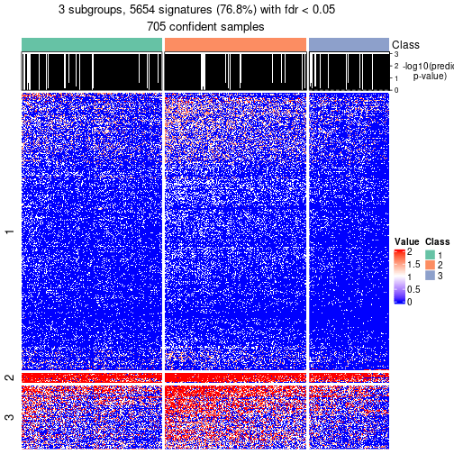</p>

</div>
<div id='tab-node-02-get-signatures-no-scale-3'>
<pre><code class="r">get_signatures(res, k = 4, scale_rows = FALSE)
</code></pre>

<p></p>

</div>
</div>


Compare the overlap of signatures from different k:

```r
compare_signatures(res)
```


`get_signature()` returns a data frame invisibly. To get the list of signatures, the function
call should be assigned to a variable explicitly. In following code, if `plot` argument is set
to `FALSE`, no heatmap is plotted while only the differential analysis is performed.

```r
# code only for demonstration
tb = get_signature(res, k = ..., plot = FALSE)
```

An example of the output of `tb` is:

```
#>   which_row         fdr    mean_1    mean_2 scaled_mean_1 scaled_mean_2 km
#> 1        38 0.042760348  8.373488  9.131774    -0.5533452     0.5164555  1
#> 2        40 0.018707592  7.106213  8.469186    -0.6173731     0.5762149  1
#> 3        55 0.019134737 10.221463 11.207825    -0.6159697     0.5749050  1
#> 4        59 0.006059896  5.921854  7.869574    -0.6899429     0.6439467  1
#> 5        60 0.018055526  8.928898 10.211722    -0.6204761     0.5791110  1
#> 6        98 0.009384629 15.714769 14.887706     0.6635654    -0.6193277  2
...
```

The columns in `tb` are:

1. `which_row`: row indices corresponding to the input matrix.
2. `fdr`: FDR for the differential test. 
3. `mean_x`: The mean value in group x.
4. `scaled_mean_x`: The mean value in group x after rows are scaled.
5. `km`: Row groups if k-means clustering is applied to rows (which is done by automatically selecting number of clusters).

If there are too many signatures, `top_signatures = ...` can be set to only show the 
signatures with the highest FDRs:

```r
# code only for demonstration
# e.g. to show the top 500 most significant rows
tb = get_signature(res, k = ..., top_signatures = 500)
```

If the signatures are defined as these which are uniquely high in current group, `diff_method` argument
can be set to `"uniquely_high_in_one_group"`:

```r
# code only for demonstration
tb = get_signature(res, k = ..., diff_method = "uniquely_high_in_one_group")
```


UMAP plot which shows how samples are separated.


<script>
$( function() {
	$( '#tabs-node-02-dimension-reduction' ).tabs();
} );
</script>
<div id='tabs-node-02-dimension-reduction'>
<ul>
<li><a href='#tab-node-02-dimension-reduction-1'>k = 2</a></li>
<li><a href='#tab-node-02-dimension-reduction-2'>k = 3</a></li>
<li><a href='#tab-node-02-dimension-reduction-3'>k = 4</a></li>
</ul>
<div id='tab-node-02-dimension-reduction-1'>
<pre><code class="r">dimension_reduction(res, k = 2, method = &quot;UMAP&quot;)
</code></pre>

<p></p>

</div>
<div id='tab-node-02-dimension-reduction-2'>
<pre><code class="r">dimension_reduction(res, k = 3, method = &quot;UMAP&quot;)
</code></pre>

<p></p>

</div>
<div id='tab-node-02-dimension-reduction-3'>
<pre><code class="r">dimension_reduction(res, k = 4, method = &quot;UMAP&quot;)
</code></pre>

<p></p>

</div>
</div>


Following heatmap shows how subgroups are split when increasing `k`:

```r
collect_classes(res)
```


If matrix rows can be associated to genes, consider to use `functional_enrichment(res,
...)` to perform function enrichment for the signature genes. See [this vignette](https://jokergoo.github.io/cola_vignettes/functional_enrichment.html) for more detailed explanations.


 

---------------------------------------------------


### Node021


Parent node: [Node02](#Node02).
Child nodes: 
                [Node0121](#Node0121)
        ,
                [Node0122](#Node0122)
        ,
                Node0141-leaf
        ,
                Node0142-leaf
        ,
                [Node0211](#Node0211)
        ,
                [Node0212](#Node0212)
        ,
                [Node0213](#Node0213)
        ,
                Node0221-leaf
        ,
                [Node0222](#Node0222)
        ,
                Node0311-leaf
        ,
                Node0312-leaf
        ,
                Node0313-leaf
        ,
                Node0321-leaf
        ,
                [Node0322](#Node0322)
        ,
                Node0331-leaf
        ,
                Node0332-leaf
        ,
                Node0333-leaf
        .


The object with results only for a single top-value method and a single partitioning method 
can be extracted as:

```r
res = res_rh["021"]
```

A summary of `res` and all the functions that can be applied to it:

```r
res
```

```
#> A 'ConsensusPartition' object with k = 2, 3, 4.
#>   On a matrix with 7031 rows and 400 columns.
#>   Top rows (649) are extracted by 'ATC' method.
#>   Subgroups are detected by 'skmeans' method.
#>   Performed in total 150 partitions by row resampling.
#>   Best k for subgroups seems to be 3.
#> 
#> Following methods can be applied to this 'ConsensusPartition' object:
#>  [1] "cola_report"             "collect_classes"         "collect_plots"          
#>  [4] "collect_stats"           "colnames"                "compare_partitions"     
#>  [7] "compare_signatures"      "consensus_heatmap"       "dimension_reduction"    
#> [10] "functional_enrichment"   "get_anno_col"            "get_anno"               
#> [13] "get_classes"             "get_consensus"           "get_matrix"             
#> [16] "get_membership"          "get_param"               "get_signatures"         
#> [19] "get_stats"               "is_best_k"               "is_stable_k"            
#> [22] "membership_heatmap"      "ncol"                    "nrow"                   
#> [25] "plot_ecdf"               "predict_classes"         "rownames"               
#> [28] "select_partition_number" "show"                    "suggest_best_k"         
#> [31] "test_to_known_factors"   "top_rows_heatmap"
```

`collect_plots()` function collects all the plots made from `res` for all `k` (number of subgroups)
into one single page to provide an easy and fast comparison between different `k`.

```r
collect_plots(res)
```

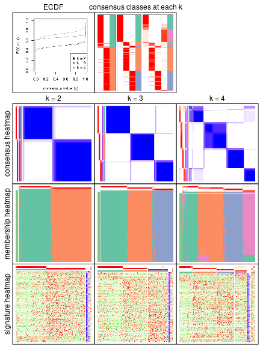

The plots are:

- The first row: a plot of the eCDF (empirical cumulative distribution
  function) curves of the consensus matrix for each `k` and the heatmap of
  predicted classes for each `k`.
- The second row: heatmaps of the consensus matrix for each `k`.
- The third row: heatmaps of the membership matrix for each `k`.
- The fouth row: heatmaps of the signatures for each `k`.

All the plots in panels can be made by individual functions and they are
plotted later in this section.

`select_partition_number()` produces several plots showing different
statistics for choosing "optimized" `k`. There are following statistics:

- eCDF curves of the consensus matrix for each `k`;
- 1-PAC. [The PAC score](https://en.wikipedia.org/wiki/Consensus_clustering#Over-interpretation_potential_of_consensus_clustering)
  measures the proportion of the ambiguous subgrouping.
- Mean silhouette score.
- Concordance. The mean probability of fiting the consensus subgroup labels in all
  partitions.
- Area increased. Denote $A_k$ as the area under the eCDF curve for current
  `k`, the area increased is defined as $A_k - A_{k-1}$.
- Rand index. The percent of pairs of samples that are both in a same cluster
  or both are not in a same cluster in the partition of k and k-1.
- Jaccard index. The ratio of pairs of samples are both in a same cluster in
  the partition of k and k-1 and the pairs of samples are both in a same
  cluster in the partition k or k-1.

The detailed explanations of these statistics can be found in [the _cola_
vignette](https://jokergoo.github.io/cola_vignettes/cola.html#toc_13).

Generally speaking, higher 1-PAC score, higher mean silhouette score or higher
concordance corresponds to better partition. Rand index and Jaccard index
measure how similar the current partition is compared to partition with `k-1`.
If they are too similar, we won't accept `k` is better than `k-1`.

```r
select_partition_number(res)
```


The numeric values for all these statistics can be obtained by `get_stats()`.

```r
get_stats(res)
```

```
#>   k 1-PAC mean_silhouette concordance area_increased  Rand Jaccard
#> 2 2 0.979           0.961       0.984          0.494 0.507   0.507
#> 3 3 0.993           0.961       0.984          0.346 0.741   0.529
#> 4 4 0.838           0.884       0.930          0.107 0.900   0.714
```

`suggest_best_k()` suggests the best $k$ based on these statistics. The rules are as follows:

- All $k$ with Jaccard index larger than 0.95 are removed because increasing
  $k$ does not provide enough extra information. If all $k$ are removed, it is
  marked as no subgroup is detected.
- For all $k$ with 1-PAC score larger than 0.9, the maximal $k$ is taken as
  the best $k$, and other $k$ are marked as optional $k$.
- If it does not fit the second rule. The $k$ with the maximal vote of the
  highest 1-PAC score, highest mean silhouette, and highest concordance is
  taken as the best $k$.

```r
suggest_best_k(res)
```

```
#> [1] 3
#> attr(,"optional")
#> [1] 2
```

There is also optional best $k$ = 2 that is worth to check.

Following is the table of the partitions (You need to click the **show/hide
code output** link to see it). The membership matrix (columns with name `p*`)
is inferred by
[`clue::cl_consensus()`](https://www.rdocumentation.org/link/cl_consensus?package=clue)
function with the `SE` method. Basically the value in the membership matrix
represents the probability to belong to a certain group. The finall subgroup
label for an item is determined with the group with highest probability it
belongs to.

In `get_classes()` function, the entropy is calculated from the membership
matrix and the silhouette score is calculated from the consensus matrix.


<script>
$( function() {
	$( '#tabs-node-021-get-classes' ).tabs();
} );
</script>
<div id='tabs-node-021-get-classes'>
<ul>
<li><a href='#tab-node-021-get-classes-1'>k = 2</a></li>
<li><a href='#tab-node-021-get-classes-2'>k = 3</a></li>
<li><a href='#tab-node-021-get-classes-3'>k = 4</a></li>
</ul>

<div id='tab-node-021-get-classes-1'>
<p><a id='tab-node-021-get-classes-1-a' style='color:#0366d6' href='#'>show/hide code output</a></p>
<pre><code class="r">cbind(get_classes(res, k = 2), get_membership(res, k = 2))
</code></pre>

<pre><code>#&gt;                             class entropy silhouette   p1   p2
#&gt; mouse1_lib1.final_cell_0003     2   0.000     0.9827 0.00 1.00
#&gt; mouse1_lib1.final_cell_0005     2   0.000     0.9827 0.00 1.00
#&gt; mouse1_lib1.final_cell_0014     2   0.000     0.9827 0.00 1.00
#&gt; mouse1_lib1.final_cell_0015     1   0.000     0.9843 1.00 0.00
#&gt; mouse1_lib1.final_cell_0017     1   0.000     0.9843 1.00 0.00
#&gt; mouse1_lib1.final_cell_0021     1   0.000     0.9843 1.00 0.00
#&gt; mouse1_lib1.final_cell_0023     1   0.000     0.9843 1.00 0.00
#&gt; mouse1_lib1.final_cell_0024     1   0.999     0.0718 0.52 0.48
#&gt; mouse1_lib1.final_cell_0029     1   0.000     0.9843 1.00 0.00
#&gt; mouse1_lib1.final_cell_0033     2   0.000     0.9827 0.00 1.00
#&gt; mouse1_lib1.final_cell_0039     2   0.000     0.9827 0.00 1.00
#&gt; mouse1_lib1.final_cell_0040     1   0.000     0.9843 1.00 0.00
#&gt; mouse1_lib1.final_cell_0041     1   0.000     0.9843 1.00 0.00
#&gt; mouse1_lib1.final_cell_0043     2   0.000     0.9827 0.00 1.00
#&gt; mouse1_lib1.final_cell_0045     1   0.000     0.9843 1.00 0.00
#&gt; mouse1_lib1.final_cell_0061     1   0.000     0.9843 1.00 0.00
#&gt; mouse1_lib1.final_cell_0071     1   0.000     0.9843 1.00 0.00
#&gt; mouse1_lib1.final_cell_0072     1   0.000     0.9843 1.00 0.00
#&gt; mouse1_lib1.final_cell_0084     2   0.000     0.9827 0.00 1.00
#&gt; mouse1_lib1.final_cell_0086     1   0.000     0.9843 1.00 0.00
#&gt; mouse1_lib1.final_cell_0091     2   0.000     0.9827 0.00 1.00
#&gt; mouse1_lib1.final_cell_0094     1   0.000     0.9843 1.00 0.00
#&gt; mouse1_lib1.final_cell_0113     1   0.000     0.9843 1.00 0.00
#&gt; mouse1_lib1.final_cell_0122     1   0.000     0.9843 1.00 0.00
#&gt; mouse1_lib1.final_cell_0144     1   0.000     0.9843 1.00 0.00
#&gt; mouse1_lib1.final_cell_0191     1   0.000     0.9843 1.00 0.00
#&gt; mouse1_lib2.final_cell_0004     2   0.000     0.9827 0.00 1.00
#&gt; mouse1_lib2.final_cell_0009     2   0.000     0.9827 0.00 1.00
#&gt; mouse1_lib2.final_cell_0014     2   0.000     0.9827 0.00 1.00
#&gt; mouse1_lib2.final_cell_0015     1   0.000     0.9843 1.00 0.00
#&gt; mouse1_lib2.final_cell_0032     1   0.000     0.9843 1.00 0.00
#&gt; mouse1_lib2.final_cell_0033     1   0.000     0.9843 1.00 0.00
#&gt; mouse1_lib2.final_cell_0038     1   0.000     0.9843 1.00 0.00
#&gt; mouse1_lib2.final_cell_0039     1   0.000     0.9843 1.00 0.00
#&gt; mouse1_lib2.final_cell_0041     1   0.000     0.9843 1.00 0.00
#&gt; mouse1_lib2.final_cell_0044     1   0.000     0.9843 1.00 0.00
#&gt; mouse1_lib2.final_cell_0062     1   0.000     0.9843 1.00 0.00
#&gt; mouse1_lib2.final_cell_0064     2   0.000     0.9827 0.00 1.00
#&gt; mouse1_lib2.final_cell_0070     1   0.000     0.9843 1.00 0.00
#&gt; mouse1_lib2.final_cell_0076     1   0.000     0.9843 1.00 0.00
#&gt; mouse1_lib2.final_cell_0086     2   0.855     0.6156 0.28 0.72
#&gt; mouse1_lib2.final_cell_0090     1   0.000     0.9843 1.00 0.00
#&gt; mouse1_lib2.final_cell_0096     1   0.000     0.9843 1.00 0.00
#&gt; mouse1_lib2.final_cell_0098     1   0.000     0.9843 1.00 0.00
#&gt; mouse1_lib2.final_cell_0105     1   0.000     0.9843 1.00 0.00
#&gt; mouse1_lib2.final_cell_0108     1   0.000     0.9843 1.00 0.00
#&gt; mouse1_lib2.final_cell_0112     1   0.000     0.9843 1.00 0.00
#&gt; mouse1_lib2.final_cell_0113     2   0.000     0.9827 0.00 1.00
#&gt; mouse1_lib2.final_cell_0120     1   0.000     0.9843 1.00 0.00
#&gt; mouse1_lib2.final_cell_0145     1   0.000     0.9843 1.00 0.00
#&gt; mouse1_lib2.final_cell_0147     1   0.000     0.9843 1.00 0.00
#&gt; mouse1_lib2.final_cell_0148     1   0.000     0.9843 1.00 0.00
#&gt; mouse1_lib2.final_cell_0169     1   0.000     0.9843 1.00 0.00
#&gt; mouse1_lib2.final_cell_0238     1   0.000     0.9843 1.00 0.00
#&gt; mouse1_lib2.final_cell_0252     1   0.000     0.9843 1.00 0.00
#&gt; mouse1_lib3.final_cell_0004     1   0.000     0.9843 1.00 0.00
#&gt; mouse1_lib3.final_cell_0005     2   0.242     0.9466 0.04 0.96
#&gt; mouse1_lib3.final_cell_0009     1   0.000     0.9843 1.00 0.00
#&gt; mouse1_lib3.final_cell_0020     2   0.000     0.9827 0.00 1.00
#&gt; mouse1_lib3.final_cell_0021     2   0.000     0.9827 0.00 1.00
#&gt; mouse1_lib3.final_cell_0022     1   0.000     0.9843 1.00 0.00
#&gt; mouse1_lib3.final_cell_0024     2   0.000     0.9827 0.00 1.00
#&gt; mouse1_lib3.final_cell_0026     2   0.000     0.9827 0.00 1.00
#&gt; mouse1_lib3.final_cell_0032     1   0.000     0.9843 1.00 0.00
#&gt; mouse1_lib3.final_cell_0038     1   0.141     0.9659 0.98 0.02
#&gt; mouse1_lib3.final_cell_0044     2   0.141     0.9651 0.02 0.98
#&gt; mouse1_lib3.final_cell_0047     1   0.000     0.9843 1.00 0.00
#&gt; mouse1_lib3.final_cell_0050     2   0.000     0.9827 0.00 1.00
#&gt; mouse1_lib3.final_cell_0060     1   0.000     0.9843 1.00 0.00
#&gt; mouse1_lib3.final_cell_0066     1   0.000     0.9843 1.00 0.00
#&gt; mouse1_lib3.final_cell_0081     1   0.000     0.9843 1.00 0.00
#&gt; mouse1_lib3.final_cell_0083     1   0.000     0.9843 1.00 0.00
#&gt; mouse1_lib3.final_cell_0088     1   0.000     0.9843 1.00 0.00
#&gt; mouse1_lib3.final_cell_0100     1   0.000     0.9843 1.00 0.00
#&gt; mouse1_lib3.final_cell_0107     1   0.000     0.9843 1.00 0.00
#&gt; mouse1_lib3.final_cell_0111     1   0.000     0.9843 1.00 0.00
#&gt; mouse1_lib3.final_cell_0123     1   0.000     0.9843 1.00 0.00
#&gt; mouse1_lib3.final_cell_0195     1   0.000     0.9843 1.00 0.00
#&gt; mouse2_lib1.final_cell_0013     2   0.000     0.9827 0.00 1.00
#&gt; mouse2_lib1.final_cell_0024     2   0.000     0.9827 0.00 1.00
#&gt; mouse2_lib1.final_cell_0035     2   0.000     0.9827 0.00 1.00
#&gt; mouse2_lib1.final_cell_0037     2   0.000     0.9827 0.00 1.00
#&gt; mouse2_lib1.final_cell_0039     2   0.000     0.9827 0.00 1.00
#&gt; mouse2_lib1.final_cell_0040     2   0.000     0.9827 0.00 1.00
#&gt; mouse2_lib1.final_cell_0042     2   0.000     0.9827 0.00 1.00
#&gt; mouse2_lib1.final_cell_0048     2   0.000     0.9827 0.00 1.00
#&gt; mouse2_lib1.final_cell_0053     2   0.000     0.9827 0.00 1.00
#&gt; mouse2_lib1.final_cell_0056     2   0.000     0.9827 0.00 1.00
#&gt; mouse2_lib1.final_cell_0059     2   0.000     0.9827 0.00 1.00
#&gt; mouse2_lib1.final_cell_0060     2   0.000     0.9827 0.00 1.00
#&gt; mouse2_lib1.final_cell_0061     1   0.000     0.9843 1.00 0.00
#&gt; mouse2_lib1.final_cell_0062     2   0.000     0.9827 0.00 1.00
#&gt; mouse2_lib1.final_cell_0064     2   0.000     0.9827 0.00 1.00
#&gt; mouse2_lib1.final_cell_0067     2   0.000     0.9827 0.00 1.00
#&gt; mouse2_lib1.final_cell_0068     2   0.000     0.9827 0.00 1.00
#&gt; mouse2_lib1.final_cell_0069     1   0.000     0.9843 1.00 0.00
#&gt; mouse2_lib1.final_cell_0070     2   0.000     0.9827 0.00 1.00
#&gt; mouse2_lib1.final_cell_0071     2   0.000     0.9827 0.00 1.00
#&gt; mouse2_lib1.final_cell_0072     2   0.000     0.9827 0.00 1.00
#&gt; mouse2_lib1.final_cell_0076     2   0.000     0.9827 0.00 1.00
#&gt; mouse2_lib1.final_cell_0084     2   0.000     0.9827 0.00 1.00
#&gt; mouse2_lib1.final_cell_0085     2   0.000     0.9827 0.00 1.00
#&gt; mouse2_lib1.final_cell_0091     2   0.000     0.9827 0.00 1.00
#&gt; mouse2_lib1.final_cell_0092     2   0.000     0.9827 0.00 1.00
#&gt; mouse2_lib1.final_cell_0097     2   0.000     0.9827 0.00 1.00
#&gt; mouse2_lib1.final_cell_0098     2   0.000     0.9827 0.00 1.00
#&gt; mouse2_lib1.final_cell_0099     2   0.000     0.9827 0.00 1.00
#&gt; mouse2_lib1.final_cell_0100     2   0.000     0.9827 0.00 1.00
#&gt; mouse2_lib1.final_cell_0101     1   0.000     0.9843 1.00 0.00
#&gt; mouse2_lib1.final_cell_0104     2   0.000     0.9827 0.00 1.00
#&gt; mouse2_lib1.final_cell_0105     1   0.000     0.9843 1.00 0.00
#&gt; mouse2_lib1.final_cell_0107     2   0.000     0.9827 0.00 1.00
#&gt; mouse2_lib1.final_cell_0109     2   0.000     0.9827 0.00 1.00
#&gt; mouse2_lib1.final_cell_0110     2   0.000     0.9827 0.00 1.00
#&gt; mouse2_lib1.final_cell_0112     2   0.000     0.9827 0.00 1.00
#&gt; mouse2_lib1.final_cell_0116     2   0.000     0.9827 0.00 1.00
#&gt; mouse2_lib1.final_cell_0117     1   0.000     0.9843 1.00 0.00
#&gt; mouse2_lib1.final_cell_0118     2   0.000     0.9827 0.00 1.00
#&gt; mouse2_lib1.final_cell_0119     2   0.000     0.9827 0.00 1.00
#&gt; mouse2_lib1.final_cell_0122     1   0.000     0.9843 1.00 0.00
#&gt; mouse2_lib1.final_cell_0123     1   0.000     0.9843 1.00 0.00
#&gt; mouse2_lib1.final_cell_0127     2   0.000     0.9827 0.00 1.00
#&gt; mouse2_lib1.final_cell_0128     2   0.000     0.9827 0.00 1.00
#&gt; mouse2_lib1.final_cell_0134     1   0.000     0.9843 1.00 0.00
#&gt; mouse2_lib1.final_cell_0137     1   0.000     0.9843 1.00 0.00
#&gt; mouse2_lib1.final_cell_0138     2   0.000     0.9827 0.00 1.00
#&gt; mouse2_lib1.final_cell_0139     1   0.000     0.9843 1.00 0.00
#&gt; mouse2_lib1.final_cell_0143     1   0.584     0.8348 0.86 0.14
#&gt; mouse2_lib1.final_cell_0144     2   0.000     0.9827 0.00 1.00
#&gt; mouse2_lib1.final_cell_0145     2   0.000     0.9827 0.00 1.00
#&gt; mouse2_lib1.final_cell_0146     2   0.000     0.9827 0.00 1.00
#&gt; mouse2_lib1.final_cell_0148     2   0.000     0.9827 0.00 1.00
#&gt; mouse2_lib1.final_cell_0153     2   0.971     0.3417 0.40 0.60
#&gt; mouse2_lib1.final_cell_0154     2   0.000     0.9827 0.00 1.00
#&gt; mouse2_lib1.final_cell_0155     1   0.000     0.9843 1.00 0.00
#&gt; mouse2_lib1.final_cell_0156     2   0.000     0.9827 0.00 1.00
#&gt; mouse2_lib1.final_cell_0157     2   0.000     0.9827 0.00 1.00
#&gt; mouse2_lib1.final_cell_0158     1   0.760     0.7196 0.78 0.22
#&gt; mouse2_lib1.final_cell_0160     1   0.000     0.9843 1.00 0.00
#&gt; mouse2_lib1.final_cell_0162     2   0.000     0.9827 0.00 1.00
#&gt; mouse2_lib1.final_cell_0163     2   0.000     0.9827 0.00 1.00
#&gt; mouse2_lib1.final_cell_0167     2   0.000     0.9827 0.00 1.00
#&gt; mouse2_lib1.final_cell_0168     1   0.000     0.9843 1.00 0.00
#&gt; mouse2_lib1.final_cell_0169     2   0.000     0.9827 0.00 1.00
#&gt; mouse2_lib1.final_cell_0170     1   0.000     0.9843 1.00 0.00
#&gt; mouse2_lib1.final_cell_0171     1   0.000     0.9843 1.00 0.00
#&gt; mouse2_lib1.final_cell_0173     2   0.000     0.9827 0.00 1.00
#&gt; mouse2_lib1.final_cell_0174     1   0.000     0.9843 1.00 0.00
#&gt; mouse2_lib1.final_cell_0175     2   0.000     0.9827 0.00 1.00
#&gt; mouse2_lib1.final_cell_0177     1   0.634     0.8092 0.84 0.16
#&gt; mouse2_lib1.final_cell_0178     2   0.000     0.9827 0.00 1.00
#&gt; mouse2_lib1.final_cell_0179     1   0.000     0.9843 1.00 0.00
#&gt; mouse2_lib1.final_cell_0180     1   0.000     0.9843 1.00 0.00
#&gt; mouse2_lib1.final_cell_0184     2   0.000     0.9827 0.00 1.00
#&gt; mouse2_lib1.final_cell_0187     1   0.000     0.9843 1.00 0.00
#&gt; mouse2_lib1.final_cell_0189     2   0.000     0.9827 0.00 1.00
#&gt; mouse2_lib1.final_cell_0190     1   0.000     0.9843 1.00 0.00
#&gt; mouse2_lib1.final_cell_0193     1   0.000     0.9843 1.00 0.00
#&gt; mouse2_lib1.final_cell_0194     2   0.000     0.9827 0.00 1.00
#&gt; mouse2_lib1.final_cell_0196     2   0.000     0.9827 0.00 1.00
#&gt; mouse2_lib1.final_cell_0201     1   0.000     0.9843 1.00 0.00
#&gt; mouse2_lib1.final_cell_0202     2   0.634     0.8091 0.16 0.84
#&gt; mouse2_lib1.final_cell_0203     2   0.000     0.9827 0.00 1.00
#&gt; mouse2_lib1.final_cell_0206     2   0.000     0.9827 0.00 1.00
#&gt; mouse2_lib1.final_cell_0207     1   0.000     0.9843 1.00 0.00
#&gt; mouse2_lib1.final_cell_0210     1   0.722     0.7511 0.80 0.20
#&gt; mouse2_lib1.final_cell_0211     1   0.000     0.9843 1.00 0.00
#&gt; mouse2_lib1.final_cell_0214     1   0.000     0.9843 1.00 0.00
#&gt; mouse2_lib1.final_cell_0215     1   0.000     0.9843 1.00 0.00
#&gt; mouse2_lib1.final_cell_0216     1   0.584     0.8348 0.86 0.14
#&gt; mouse2_lib1.final_cell_0217     2   0.000     0.9827 0.00 1.00
#&gt; mouse2_lib1.final_cell_0222     2   0.000     0.9827 0.00 1.00
#&gt; mouse2_lib1.final_cell_0223     1   0.000     0.9843 1.00 0.00
#&gt; mouse2_lib1.final_cell_0227     1   0.000     0.9843 1.00 0.00
#&gt; mouse2_lib1.final_cell_0228     1   0.000     0.9843 1.00 0.00
#&gt; mouse2_lib1.final_cell_0229     1   0.995     0.1414 0.54 0.46
#&gt; mouse2_lib1.final_cell_0236     1   0.000     0.9843 1.00 0.00
#&gt; mouse2_lib1.final_cell_0239     1   0.000     0.9843 1.00 0.00
#&gt; mouse2_lib1.final_cell_0242     1   0.000     0.9843 1.00 0.00
#&gt; mouse2_lib1.final_cell_0243     1   0.000     0.9843 1.00 0.00
#&gt; mouse2_lib1.final_cell_0244     1   0.000     0.9843 1.00 0.00
#&gt; mouse2_lib1.final_cell_0247     1   0.000     0.9843 1.00 0.00
#&gt; mouse2_lib1.final_cell_0272     2   0.634     0.8091 0.16 0.84
#&gt; mouse2_lib2.final_cell_0013     2   0.000     0.9827 0.00 1.00
#&gt; mouse2_lib2.final_cell_0022     2   0.000     0.9827 0.00 1.00
#&gt; mouse2_lib2.final_cell_0023     2   0.000     0.9827 0.00 1.00
#&gt; mouse2_lib2.final_cell_0025     2   0.000     0.9827 0.00 1.00
#&gt; mouse2_lib2.final_cell_0028     2   0.000     0.9827 0.00 1.00
#&gt; mouse2_lib2.final_cell_0031     1   0.000     0.9843 1.00 0.00
#&gt; mouse2_lib2.final_cell_0034     2   0.000     0.9827 0.00 1.00
#&gt; mouse2_lib2.final_cell_0035     2   0.000     0.9827 0.00 1.00
#&gt; mouse2_lib2.final_cell_0036     2   0.000     0.9827 0.00 1.00
#&gt; mouse2_lib2.final_cell_0040     2   0.000     0.9827 0.00 1.00
#&gt; mouse2_lib2.final_cell_0041     2   0.000     0.9827 0.00 1.00
#&gt; mouse2_lib2.final_cell_0043     1   0.000     0.9843 1.00 0.00
#&gt; mouse2_lib2.final_cell_0046     2   0.000     0.9827 0.00 1.00
#&gt; mouse2_lib2.final_cell_0048     2   0.000     0.9827 0.00 1.00
#&gt; mouse2_lib2.final_cell_0050     2   0.000     0.9827 0.00 1.00
#&gt; mouse2_lib2.final_cell_0051     2   0.000     0.9827 0.00 1.00
#&gt; mouse2_lib2.final_cell_0052     2   0.000     0.9827 0.00 1.00
#&gt; mouse2_lib2.final_cell_0054     2   0.000     0.9827 0.00 1.00
#&gt; mouse2_lib2.final_cell_0055     2   0.000     0.9827 0.00 1.00
#&gt; mouse2_lib2.final_cell_0067     2   0.000     0.9827 0.00 1.00
#&gt; mouse2_lib2.final_cell_0068     2   0.000     0.9827 0.00 1.00
#&gt; mouse2_lib2.final_cell_0070     2   0.000     0.9827 0.00 1.00
#&gt; mouse2_lib2.final_cell_0076     2   0.000     0.9827 0.00 1.00
#&gt; mouse2_lib2.final_cell_0079     2   0.000     0.9827 0.00 1.00
#&gt; mouse2_lib2.final_cell_0081     2   0.000     0.9827 0.00 1.00
#&gt; mouse2_lib2.final_cell_0082     2   0.000     0.9827 0.00 1.00
#&gt; mouse2_lib2.final_cell_0083     2   0.000     0.9827 0.00 1.00
#&gt; mouse2_lib2.final_cell_0084     1   0.000     0.9843 1.00 0.00
#&gt; mouse2_lib2.final_cell_0085     2   0.000     0.9827 0.00 1.00
#&gt; mouse2_lib2.final_cell_0086     2   0.000     0.9827 0.00 1.00
#&gt; mouse2_lib2.final_cell_0089     2   0.000     0.9827 0.00 1.00
#&gt; mouse2_lib2.final_cell_0093     2   0.000     0.9827 0.00 1.00
#&gt; mouse2_lib2.final_cell_0096     2   0.000     0.9827 0.00 1.00
#&gt; mouse2_lib2.final_cell_0098     2   0.000     0.9827 0.00 1.00
#&gt; mouse2_lib2.final_cell_0102     2   0.000     0.9827 0.00 1.00
#&gt; mouse2_lib2.final_cell_0103     1   0.000     0.9843 1.00 0.00
#&gt; mouse2_lib2.final_cell_0110     1   0.000     0.9843 1.00 0.00
#&gt; mouse2_lib2.final_cell_0111     2   0.000     0.9827 0.00 1.00
#&gt; mouse2_lib2.final_cell_0112     2   0.000     0.9827 0.00 1.00
#&gt; mouse2_lib2.final_cell_0116     2   0.971     0.3423 0.40 0.60
#&gt; mouse2_lib2.final_cell_0117     2   0.000     0.9827 0.00 1.00
#&gt; mouse2_lib2.final_cell_0122     2   0.000     0.9827 0.00 1.00
#&gt; mouse2_lib2.final_cell_0124     2   0.000     0.9827 0.00 1.00
#&gt; mouse2_lib2.final_cell_0125     1   0.000     0.9843 1.00 0.00
#&gt; mouse2_lib2.final_cell_0129     1   0.000     0.9843 1.00 0.00
#&gt; mouse2_lib2.final_cell_0130     2   0.000     0.9827 0.00 1.00
#&gt; mouse2_lib2.final_cell_0131     2   0.242     0.9464 0.04 0.96
#&gt; mouse2_lib2.final_cell_0134     1   0.000     0.9843 1.00 0.00
#&gt; mouse2_lib2.final_cell_0135     2   0.000     0.9827 0.00 1.00
#&gt; mouse2_lib2.final_cell_0138     2   0.000     0.9827 0.00 1.00
#&gt; mouse2_lib2.final_cell_0142     2   0.000     0.9827 0.00 1.00
#&gt; mouse2_lib2.final_cell_0143     1   0.000     0.9843 1.00 0.00
#&gt; mouse2_lib2.final_cell_0144     1   0.000     0.9843 1.00 0.00
#&gt; mouse2_lib2.final_cell_0145     2   0.000     0.9827 0.00 1.00
#&gt; mouse2_lib2.final_cell_0150     2   0.000     0.9827 0.00 1.00
#&gt; mouse2_lib2.final_cell_0151     1   0.000     0.9843 1.00 0.00
#&gt; mouse2_lib2.final_cell_0152     1   0.000     0.9843 1.00 0.00
#&gt; mouse2_lib2.final_cell_0154     1   0.000     0.9843 1.00 0.00
#&gt; mouse2_lib2.final_cell_0155     1   0.000     0.9843 1.00 0.00
#&gt; mouse2_lib2.final_cell_0156     1   0.000     0.9843 1.00 0.00
#&gt; mouse2_lib2.final_cell_0159     2   0.000     0.9827 0.00 1.00
#&gt; mouse2_lib2.final_cell_0162     2   0.000     0.9827 0.00 1.00
#&gt; mouse2_lib2.final_cell_0163     2   0.000     0.9827 0.00 1.00
#&gt; mouse2_lib2.final_cell_0165     2   0.000     0.9827 0.00 1.00
#&gt; mouse2_lib2.final_cell_0166     1   0.000     0.9843 1.00 0.00
#&gt; mouse2_lib2.final_cell_0168     2   0.000     0.9827 0.00 1.00
#&gt; mouse2_lib2.final_cell_0169     2   0.000     0.9827 0.00 1.00
#&gt; mouse2_lib2.final_cell_0170     2   0.327     0.9267 0.06 0.94
#&gt; mouse2_lib2.final_cell_0171     2   0.000     0.9827 0.00 1.00
#&gt; mouse2_lib2.final_cell_0174     2   0.000     0.9827 0.00 1.00
#&gt; mouse2_lib2.final_cell_0175     1   0.634     0.8088 0.84 0.16
#&gt; mouse2_lib2.final_cell_0176     1   0.000     0.9843 1.00 0.00
#&gt; mouse2_lib2.final_cell_0177     2   0.000     0.9827 0.00 1.00
#&gt; mouse2_lib2.final_cell_0179     1   0.000     0.9843 1.00 0.00
#&gt; mouse2_lib2.final_cell_0180     2   0.000     0.9827 0.00 1.00
#&gt; mouse2_lib2.final_cell_0181     1   0.000     0.9843 1.00 0.00
#&gt; mouse2_lib2.final_cell_0182     2   0.000     0.9827 0.00 1.00
#&gt; mouse2_lib2.final_cell_0183     1   0.000     0.9843 1.00 0.00
#&gt; mouse2_lib2.final_cell_0184     2   0.958     0.3951 0.38 0.62
#&gt; mouse2_lib2.final_cell_0185     2   0.000     0.9827 0.00 1.00
#&gt; mouse2_lib2.final_cell_0187     2   0.584     0.8360 0.14 0.86
#&gt; mouse2_lib2.final_cell_0190     1   0.000     0.9843 1.00 0.00
#&gt; mouse2_lib2.final_cell_0191     2   0.000     0.9827 0.00 1.00
#&gt; mouse2_lib2.final_cell_0192     2   0.000     0.9827 0.00 1.00
#&gt; mouse2_lib2.final_cell_0197     1   0.000     0.9843 1.00 0.00
#&gt; mouse2_lib2.final_cell_0203     1   0.000     0.9843 1.00 0.00
#&gt; mouse2_lib2.final_cell_0205     1   0.000     0.9843 1.00 0.00
#&gt; mouse2_lib2.final_cell_0206     1   0.000     0.9843 1.00 0.00
#&gt; mouse2_lib2.final_cell_0211     1   0.000     0.9843 1.00 0.00
#&gt; mouse2_lib2.final_cell_0214     1   0.000     0.9843 1.00 0.00
#&gt; mouse2_lib2.final_cell_0215     2   0.000     0.9827 0.00 1.00
#&gt; mouse2_lib2.final_cell_0218     1   0.000     0.9843 1.00 0.00
#&gt; mouse2_lib2.final_cell_0220     1   0.000     0.9843 1.00 0.00
#&gt; mouse2_lib2.final_cell_0221     1   0.000     0.9843 1.00 0.00
#&gt; mouse2_lib2.final_cell_0222     2   0.634     0.8088 0.16 0.84
#&gt; mouse2_lib2.final_cell_0224     1   0.000     0.9843 1.00 0.00
#&gt; mouse2_lib2.final_cell_0226     2   0.000     0.9827 0.00 1.00
#&gt; mouse2_lib2.final_cell_0227     1   0.000     0.9843 1.00 0.00
#&gt; mouse2_lib2.final_cell_0228     2   0.000     0.9827 0.00 1.00
#&gt; mouse2_lib2.final_cell_0229     1   0.904     0.5324 0.68 0.32
#&gt; mouse2_lib2.final_cell_0231     1   0.000     0.9843 1.00 0.00
#&gt; mouse2_lib2.final_cell_0234     1   0.000     0.9843 1.00 0.00
#&gt; mouse2_lib2.final_cell_0236     2   0.000     0.9827 0.00 1.00
#&gt; mouse2_lib2.final_cell_0238     2   0.000     0.9827 0.00 1.00
#&gt; mouse2_lib2.final_cell_0240     2   0.141     0.9651 0.02 0.98
#&gt; mouse2_lib2.final_cell_0241     2   0.943     0.4464 0.36 0.64
#&gt; mouse2_lib2.final_cell_0242     1   0.000     0.9843 1.00 0.00
#&gt; mouse2_lib2.final_cell_0244     1   0.141     0.9659 0.98 0.02
#&gt; mouse2_lib2.final_cell_0246     2   0.000     0.9827 0.00 1.00
#&gt; mouse2_lib2.final_cell_0256     2   0.000     0.9827 0.00 1.00
#&gt; mouse2_lib2.final_cell_0258     1   0.000     0.9843 1.00 0.00
#&gt; mouse2_lib2.final_cell_0272     2   0.943     0.4449 0.36 0.64
#&gt; mouse2_lib2.final_cell_0274     1   0.000     0.9843 1.00 0.00
#&gt; mouse2_lib2.final_cell_0286     1   0.000     0.9843 1.00 0.00
#&gt; mouse2_lib2.final_cell_0288     1   0.000     0.9843 1.00 0.00
#&gt; mouse2_lib3.final_cell_0014     2   0.000     0.9827 0.00 1.00
#&gt; mouse2_lib3.final_cell_0020     2   0.000     0.9827 0.00 1.00
#&gt; mouse2_lib3.final_cell_0021     2   0.000     0.9827 0.00 1.00
#&gt; mouse2_lib3.final_cell_0026     2   0.000     0.9827 0.00 1.00
#&gt; mouse2_lib3.final_cell_0030     2   0.000     0.9827 0.00 1.00
#&gt; mouse2_lib3.final_cell_0033     2   0.000     0.9827 0.00 1.00
#&gt; mouse2_lib3.final_cell_0039     2   0.000     0.9827 0.00 1.00
#&gt; mouse2_lib3.final_cell_0041     2   0.000     0.9827 0.00 1.00
#&gt; mouse2_lib3.final_cell_0045     1   0.000     0.9843 1.00 0.00
#&gt; mouse2_lib3.final_cell_0047     2   0.000     0.9827 0.00 1.00
#&gt; mouse2_lib3.final_cell_0048     2   0.000     0.9827 0.00 1.00
#&gt; mouse2_lib3.final_cell_0050     2   0.000     0.9827 0.00 1.00
#&gt; mouse2_lib3.final_cell_0051     1   0.000     0.9843 1.00 0.00
#&gt; mouse2_lib3.final_cell_0057     1   0.000     0.9843 1.00 0.00
#&gt; mouse2_lib3.final_cell_0063     2   0.000     0.9827 0.00 1.00
#&gt; mouse2_lib3.final_cell_0064     2   0.000     0.9827 0.00 1.00
#&gt; mouse2_lib3.final_cell_0066     2   0.000     0.9827 0.00 1.00
#&gt; mouse2_lib3.final_cell_0070     2   0.000     0.9827 0.00 1.00
#&gt; mouse2_lib3.final_cell_0072     2   0.000     0.9827 0.00 1.00
#&gt; mouse2_lib3.final_cell_0073     2   0.000     0.9827 0.00 1.00
#&gt; mouse2_lib3.final_cell_0074     2   0.000     0.9827 0.00 1.00
#&gt; mouse2_lib3.final_cell_0075     2   0.000     0.9827 0.00 1.00
#&gt; mouse2_lib3.final_cell_0076     2   0.000     0.9827 0.00 1.00
#&gt; mouse2_lib3.final_cell_0078     2   0.000     0.9827 0.00 1.00
#&gt; mouse2_lib3.final_cell_0081     1   0.760     0.7189 0.78 0.22
#&gt; mouse2_lib3.final_cell_0082     2   0.000     0.9827 0.00 1.00
#&gt; mouse2_lib3.final_cell_0085     2   0.000     0.9827 0.00 1.00
#&gt; mouse2_lib3.final_cell_0086     2   0.000     0.9827 0.00 1.00
#&gt; mouse2_lib3.final_cell_0087     2   0.000     0.9827 0.00 1.00
#&gt; mouse2_lib3.final_cell_0091     2   0.000     0.9827 0.00 1.00
#&gt; mouse2_lib3.final_cell_0093     2   0.141     0.9651 0.02 0.98
#&gt; mouse2_lib3.final_cell_0094     2   0.000     0.9827 0.00 1.00
#&gt; mouse2_lib3.final_cell_0095     2   0.000     0.9827 0.00 1.00
#&gt; mouse2_lib3.final_cell_0096     1   0.000     0.9843 1.00 0.00
#&gt; mouse2_lib3.final_cell_0097     2   0.000     0.9827 0.00 1.00
#&gt; mouse2_lib3.final_cell_0098     2   0.000     0.9827 0.00 1.00
#&gt; mouse2_lib3.final_cell_0100     2   0.000     0.9827 0.00 1.00
#&gt; mouse2_lib3.final_cell_0104     1   0.000     0.9843 1.00 0.00
#&gt; mouse2_lib3.final_cell_0105     2   0.000     0.9827 0.00 1.00
#&gt; mouse2_lib3.final_cell_0106     2   0.000     0.9827 0.00 1.00
#&gt; mouse2_lib3.final_cell_0108     2   0.000     0.9827 0.00 1.00
#&gt; mouse2_lib3.final_cell_0109     2   0.000     0.9827 0.00 1.00
#&gt; mouse2_lib3.final_cell_0112     2   0.000     0.9827 0.00 1.00
#&gt; mouse2_lib3.final_cell_0115     2   0.584     0.8353 0.14 0.86
#&gt; mouse2_lib3.final_cell_0116     2   0.000     0.9827 0.00 1.00
#&gt; mouse2_lib3.final_cell_0118     2   0.402     0.9059 0.08 0.92
#&gt; mouse2_lib3.final_cell_0119     1   0.000     0.9843 1.00 0.00
#&gt; mouse2_lib3.final_cell_0125     2   0.000     0.9827 0.00 1.00
#&gt; mouse2_lib3.final_cell_0127     1   0.000     0.9843 1.00 0.00
#&gt; mouse2_lib3.final_cell_0130     2   0.141     0.9652 0.02 0.98
#&gt; mouse2_lib3.final_cell_0132     1   0.000     0.9843 1.00 0.00
#&gt; mouse2_lib3.final_cell_0134     1   0.000     0.9843 1.00 0.00
#&gt; mouse2_lib3.final_cell_0135     2   0.000     0.9827 0.00 1.00
#&gt; mouse2_lib3.final_cell_0140     2   0.000     0.9827 0.00 1.00
#&gt; mouse2_lib3.final_cell_0142     2   0.000     0.9827 0.00 1.00
#&gt; mouse2_lib3.final_cell_0144     2   0.000     0.9827 0.00 1.00
#&gt; mouse2_lib3.final_cell_0145     2   0.000     0.9827 0.00 1.00
#&gt; mouse2_lib3.final_cell_0148     1   0.000     0.9843 1.00 0.00
#&gt; mouse2_lib3.final_cell_0151     2   0.000     0.9827 0.00 1.00
#&gt; mouse2_lib3.final_cell_0152     2   0.000     0.9827 0.00 1.00
#&gt; mouse2_lib3.final_cell_0153     1   0.000     0.9843 1.00 0.00
#&gt; mouse2_lib3.final_cell_0155     2   0.000     0.9827 0.00 1.00
#&gt; mouse2_lib3.final_cell_0157     2   0.000     0.9827 0.00 1.00
#&gt; mouse2_lib3.final_cell_0159     1   0.000     0.9843 1.00 0.00
#&gt; mouse2_lib3.final_cell_0160     2   0.000     0.9827 0.00 1.00
#&gt; mouse2_lib3.final_cell_0161     1   0.000     0.9843 1.00 0.00
#&gt; mouse2_lib3.final_cell_0163     2   0.000     0.9827 0.00 1.00
#&gt; mouse2_lib3.final_cell_0166     2   0.469     0.8834 0.10 0.90
#&gt; mouse2_lib3.final_cell_0168     2   0.000     0.9827 0.00 1.00
#&gt; mouse2_lib3.final_cell_0169     1   0.000     0.9843 1.00 0.00
#&gt; mouse2_lib3.final_cell_0172     2   0.000     0.9827 0.00 1.00
#&gt; mouse2_lib3.final_cell_0173     2   0.141     0.9652 0.02 0.98
#&gt; mouse2_lib3.final_cell_0175     2   0.000     0.9827 0.00 1.00
#&gt; mouse2_lib3.final_cell_0177     1   0.000     0.9843 1.00 0.00
#&gt; mouse2_lib3.final_cell_0178     2   0.000     0.9827 0.00 1.00
#&gt; mouse2_lib3.final_cell_0180     2   0.000     0.9827 0.00 1.00
#&gt; mouse2_lib3.final_cell_0182     1   0.242     0.9467 0.96 0.04
#&gt; mouse2_lib3.final_cell_0185     2   0.000     0.9827 0.00 1.00
#&gt; mouse2_lib3.final_cell_0190     1   0.000     0.9843 1.00 0.00
#&gt; mouse2_lib3.final_cell_0193     2   0.925     0.4938 0.34 0.66
#&gt; mouse2_lib3.final_cell_0194     2   0.000     0.9827 0.00 1.00
#&gt; mouse2_lib3.final_cell_0197     2   0.529     0.8601 0.12 0.88
#&gt; mouse2_lib3.final_cell_0198     2   0.000     0.9827 0.00 1.00
#&gt; mouse2_lib3.final_cell_0202     1   0.000     0.9843 1.00 0.00
#&gt; mouse2_lib3.final_cell_0206     1   0.000     0.9843 1.00 0.00
#&gt; mouse2_lib3.final_cell_0207     2   0.000     0.9827 0.00 1.00
#&gt; mouse2_lib3.final_cell_0209     1   0.402     0.9053 0.92 0.08
#&gt; mouse2_lib3.final_cell_0210     1   0.000     0.9843 1.00 0.00
#&gt; mouse2_lib3.final_cell_0212     2   0.000     0.9827 0.00 1.00
#&gt; mouse2_lib3.final_cell_0213     2   0.000     0.9827 0.00 1.00
#&gt; mouse2_lib3.final_cell_0217     1   0.000     0.9843 1.00 0.00
#&gt; mouse2_lib3.final_cell_0219     1   0.000     0.9843 1.00 0.00
#&gt; mouse2_lib3.final_cell_0222     1   0.000     0.9843 1.00 0.00
#&gt; mouse2_lib3.final_cell_0226     1   0.000     0.9843 1.00 0.00
#&gt; mouse2_lib3.final_cell_0238     1   0.000     0.9843 1.00 0.00
#&gt; mouse2_lib3.final_cell_0239     1   0.000     0.9843 1.00 0.00
#&gt; mouse2_lib3.final_cell_0243     1   0.000     0.9843 1.00 0.00
#&gt; mouse2_lib3.final_cell_0245     1   0.000     0.9843 1.00 0.00
#&gt; mouse2_lib3.final_cell_0248     1   0.000     0.9843 1.00 0.00
#&gt; mouse2_lib3.final_cell_0249     1   0.000     0.9843 1.00 0.00
#&gt; mouse2_lib3.final_cell_0256     1   0.000     0.9843 1.00 0.00
#&gt; mouse2_lib3.final_cell_0259     1   0.000     0.9843 1.00 0.00
</code></pre>

<script>
$('#tab-node-021-get-classes-1-a').parent().next().next().hide();
$('#tab-node-021-get-classes-1-a').click(function(){
  $('#tab-node-021-get-classes-1-a').parent().next().next().toggle();
  return(false);
});
</script>
</div>

<div id='tab-node-021-get-classes-2'>
<p><a id='tab-node-021-get-classes-2-a' style='color:#0366d6' href='#'>show/hide code output</a></p>
<pre><code class="r">cbind(get_classes(res, k = 3), get_membership(res, k = 3))
</code></pre>

<pre><code>#&gt;                             class entropy silhouette   p1   p2   p3
#&gt; mouse1_lib1.final_cell_0003     3  0.0000      0.967 0.00 0.00 1.00
#&gt; mouse1_lib1.final_cell_0005     3  0.0000      0.967 0.00 0.00 1.00
#&gt; mouse1_lib1.final_cell_0014     3  0.0000      0.967 0.00 0.00 1.00
#&gt; mouse1_lib1.final_cell_0015     1  0.0000      0.996 1.00 0.00 0.00
#&gt; mouse1_lib1.final_cell_0017     1  0.0000      0.996 1.00 0.00 0.00
#&gt; mouse1_lib1.final_cell_0021     1  0.0000      0.996 1.00 0.00 0.00
#&gt; mouse1_lib1.final_cell_0023     1  0.0000      0.996 1.00 0.00 0.00
#&gt; mouse1_lib1.final_cell_0024     3  0.0000      0.967 0.00 0.00 1.00
#&gt; mouse1_lib1.final_cell_0029     1  0.0000      0.996 1.00 0.00 0.00
#&gt; mouse1_lib1.final_cell_0033     2  0.1529      0.946 0.00 0.96 0.04
#&gt; mouse1_lib1.final_cell_0039     3  0.0000      0.967 0.00 0.00 1.00
#&gt; mouse1_lib1.final_cell_0040     1  0.0000      0.996 1.00 0.00 0.00
#&gt; mouse1_lib1.final_cell_0041     1  0.0000      0.996 1.00 0.00 0.00
#&gt; mouse1_lib1.final_cell_0043     3  0.0000      0.967 0.00 0.00 1.00
#&gt; mouse1_lib1.final_cell_0045     1  0.0000      0.996 1.00 0.00 0.00
#&gt; mouse1_lib1.final_cell_0061     1  0.0000      0.996 1.00 0.00 0.00
#&gt; mouse1_lib1.final_cell_0071     1  0.0000      0.996 1.00 0.00 0.00
#&gt; mouse1_lib1.final_cell_0072     1  0.0000      0.996 1.00 0.00 0.00
#&gt; mouse1_lib1.final_cell_0084     2  0.0000      0.985 0.00 1.00 0.00
#&gt; mouse1_lib1.final_cell_0086     1  0.0000      0.996 1.00 0.00 0.00
#&gt; mouse1_lib1.final_cell_0091     3  0.0000      0.967 0.00 0.00 1.00
#&gt; mouse1_lib1.final_cell_0094     1  0.0000      0.996 1.00 0.00 0.00
#&gt; mouse1_lib1.final_cell_0113     1  0.0000      0.996 1.00 0.00 0.00
#&gt; mouse1_lib1.final_cell_0122     1  0.0000      0.996 1.00 0.00 0.00
#&gt; mouse1_lib1.final_cell_0144     1  0.0000      0.996 1.00 0.00 0.00
#&gt; mouse1_lib1.final_cell_0191     1  0.0000      0.996 1.00 0.00 0.00
#&gt; mouse1_lib2.final_cell_0004     2  0.0000      0.985 0.00 1.00 0.00
#&gt; mouse1_lib2.final_cell_0009     2  0.0000      0.985 0.00 1.00 0.00
#&gt; mouse1_lib2.final_cell_0014     2  0.0000      0.985 0.00 1.00 0.00
#&gt; mouse1_lib2.final_cell_0015     1  0.0000      0.996 1.00 0.00 0.00
#&gt; mouse1_lib2.final_cell_0032     1  0.0000      0.996 1.00 0.00 0.00
#&gt; mouse1_lib2.final_cell_0033     1  0.0000      0.996 1.00 0.00 0.00
#&gt; mouse1_lib2.final_cell_0038     1  0.0000      0.996 1.00 0.00 0.00
#&gt; mouse1_lib2.final_cell_0039     1  0.0000      0.996 1.00 0.00 0.00
#&gt; mouse1_lib2.final_cell_0041     1  0.0000      0.996 1.00 0.00 0.00
#&gt; mouse1_lib2.final_cell_0044     1  0.0000      0.996 1.00 0.00 0.00
#&gt; mouse1_lib2.final_cell_0062     1  0.0000      0.996 1.00 0.00 0.00
#&gt; mouse1_lib2.final_cell_0064     3  0.0000      0.967 0.00 0.00 1.00
#&gt; mouse1_lib2.final_cell_0070     1  0.0000      0.996 1.00 0.00 0.00
#&gt; mouse1_lib2.final_cell_0076     1  0.0000      0.996 1.00 0.00 0.00
#&gt; mouse1_lib2.final_cell_0086     3  0.0000      0.967 0.00 0.00 1.00
#&gt; mouse1_lib2.final_cell_0090     1  0.0000      0.996 1.00 0.00 0.00
#&gt; mouse1_lib2.final_cell_0096     1  0.0000      0.996 1.00 0.00 0.00
#&gt; mouse1_lib2.final_cell_0098     1  0.0000      0.996 1.00 0.00 0.00
#&gt; mouse1_lib2.final_cell_0105     3  0.3686      0.826 0.14 0.00 0.86
#&gt; mouse1_lib2.final_cell_0108     1  0.0000      0.996 1.00 0.00 0.00
#&gt; mouse1_lib2.final_cell_0112     1  0.0000      0.996 1.00 0.00 0.00
#&gt; mouse1_lib2.final_cell_0113     3  0.0000      0.967 0.00 0.00 1.00
#&gt; mouse1_lib2.final_cell_0120     1  0.0000      0.996 1.00 0.00 0.00
#&gt; mouse1_lib2.final_cell_0145     1  0.0000      0.996 1.00 0.00 0.00
#&gt; mouse1_lib2.final_cell_0147     1  0.0000      0.996 1.00 0.00 0.00
#&gt; mouse1_lib2.final_cell_0148     1  0.0000      0.996 1.00 0.00 0.00
#&gt; mouse1_lib2.final_cell_0169     1  0.0000      0.996 1.00 0.00 0.00
#&gt; mouse1_lib2.final_cell_0238     1  0.0000      0.996 1.00 0.00 0.00
#&gt; mouse1_lib2.final_cell_0252     1  0.0000      0.996 1.00 0.00 0.00
#&gt; mouse1_lib3.final_cell_0004     1  0.0000      0.996 1.00 0.00 0.00
#&gt; mouse1_lib3.final_cell_0005     2  0.0000      0.985 0.00 1.00 0.00
#&gt; mouse1_lib3.final_cell_0009     1  0.0000      0.996 1.00 0.00 0.00
#&gt; mouse1_lib3.final_cell_0020     3  0.5216      0.657 0.00 0.26 0.74
#&gt; mouse1_lib3.final_cell_0021     3  0.0000      0.967 0.00 0.00 1.00
#&gt; mouse1_lib3.final_cell_0022     1  0.0000      0.996 1.00 0.00 0.00
#&gt; mouse1_lib3.final_cell_0024     3  0.0000      0.967 0.00 0.00 1.00
#&gt; mouse1_lib3.final_cell_0026     3  0.0000      0.967 0.00 0.00 1.00
#&gt; mouse1_lib3.final_cell_0032     1  0.0000      0.996 1.00 0.00 0.00
#&gt; mouse1_lib3.final_cell_0038     3  0.0892      0.950 0.02 0.00 0.98
#&gt; mouse1_lib3.final_cell_0044     3  0.0000      0.967 0.00 0.00 1.00
#&gt; mouse1_lib3.final_cell_0047     1  0.0000      0.996 1.00 0.00 0.00
#&gt; mouse1_lib3.final_cell_0050     3  0.0000      0.967 0.00 0.00 1.00
#&gt; mouse1_lib3.final_cell_0060     1  0.0000      0.996 1.00 0.00 0.00
#&gt; mouse1_lib3.final_cell_0066     1  0.0000      0.996 1.00 0.00 0.00
#&gt; mouse1_lib3.final_cell_0081     1  0.0000      0.996 1.00 0.00 0.00
#&gt; mouse1_lib3.final_cell_0083     1  0.0000      0.996 1.00 0.00 0.00
#&gt; mouse1_lib3.final_cell_0088     3  0.6126      0.338 0.40 0.00 0.60
#&gt; mouse1_lib3.final_cell_0100     1  0.0000      0.996 1.00 0.00 0.00
#&gt; mouse1_lib3.final_cell_0107     1  0.0000      0.996 1.00 0.00 0.00
#&gt; mouse1_lib3.final_cell_0111     1  0.0000      0.996 1.00 0.00 0.00
#&gt; mouse1_lib3.final_cell_0123     3  0.5016      0.681 0.24 0.00 0.76
#&gt; mouse1_lib3.final_cell_0195     1  0.0000      0.996 1.00 0.00 0.00
#&gt; mouse2_lib1.final_cell_0013     2  0.0000      0.985 0.00 1.00 0.00
#&gt; mouse2_lib1.final_cell_0024     2  0.0000      0.985 0.00 1.00 0.00
#&gt; mouse2_lib1.final_cell_0035     2  0.0000      0.985 0.00 1.00 0.00
#&gt; mouse2_lib1.final_cell_0037     2  0.0000      0.985 0.00 1.00 0.00
#&gt; mouse2_lib1.final_cell_0039     2  0.5560      0.561 0.00 0.70 0.30
#&gt; mouse2_lib1.final_cell_0040     3  0.0000      0.967 0.00 0.00 1.00
#&gt; mouse2_lib1.final_cell_0042     3  0.0000      0.967 0.00 0.00 1.00
#&gt; mouse2_lib1.final_cell_0048     2  0.0000      0.985 0.00 1.00 0.00
#&gt; mouse2_lib1.final_cell_0053     2  0.0000      0.985 0.00 1.00 0.00
#&gt; mouse2_lib1.final_cell_0056     2  0.0000      0.985 0.00 1.00 0.00
#&gt; mouse2_lib1.final_cell_0059     3  0.0000      0.967 0.00 0.00 1.00
#&gt; mouse2_lib1.final_cell_0060     3  0.0000      0.967 0.00 0.00 1.00
#&gt; mouse2_lib1.final_cell_0061     1  0.0000      0.996 1.00 0.00 0.00
#&gt; mouse2_lib1.final_cell_0062     2  0.0000      0.985 0.00 1.00 0.00
#&gt; mouse2_lib1.final_cell_0064     3  0.0000      0.967 0.00 0.00 1.00
#&gt; mouse2_lib1.final_cell_0067     2  0.0000      0.985 0.00 1.00 0.00
#&gt; mouse2_lib1.final_cell_0068     2  0.0000      0.985 0.00 1.00 0.00
#&gt; mouse2_lib1.final_cell_0069     1  0.0000      0.996 1.00 0.00 0.00
#&gt; mouse2_lib1.final_cell_0070     2  0.0000      0.985 0.00 1.00 0.00
#&gt; mouse2_lib1.final_cell_0071     2  0.0000      0.985 0.00 1.00 0.00
#&gt; mouse2_lib1.final_cell_0072     2  0.0000      0.985 0.00 1.00 0.00
#&gt; mouse2_lib1.final_cell_0076     2  0.0000      0.985 0.00 1.00 0.00
#&gt; mouse2_lib1.final_cell_0084     2  0.0000      0.985 0.00 1.00 0.00
#&gt; mouse2_lib1.final_cell_0085     2  0.0000      0.985 0.00 1.00 0.00
#&gt; mouse2_lib1.final_cell_0091     3  0.0000      0.967 0.00 0.00 1.00
#&gt; mouse2_lib1.final_cell_0092     2  0.0000      0.985 0.00 1.00 0.00
#&gt; mouse2_lib1.final_cell_0097     3  0.0000      0.967 0.00 0.00 1.00
#&gt; mouse2_lib1.final_cell_0098     3  0.0000      0.967 0.00 0.00 1.00
#&gt; mouse2_lib1.final_cell_0099     3  0.0000      0.967 0.00 0.00 1.00
#&gt; mouse2_lib1.final_cell_0100     3  0.0000      0.967 0.00 0.00 1.00
#&gt; mouse2_lib1.final_cell_0101     1  0.0000      0.996 1.00 0.00 0.00
#&gt; mouse2_lib1.final_cell_0104     3  0.0000      0.967 0.00 0.00 1.00
#&gt; mouse2_lib1.final_cell_0105     1  0.0000      0.996 1.00 0.00 0.00
#&gt; mouse2_lib1.final_cell_0107     2  0.0000      0.985 0.00 1.00 0.00
#&gt; mouse2_lib1.final_cell_0109     3  0.0000      0.967 0.00 0.00 1.00
#&gt; mouse2_lib1.final_cell_0110     2  0.6192      0.256 0.00 0.58 0.42
#&gt; mouse2_lib1.final_cell_0112     3  0.0000      0.967 0.00 0.00 1.00
#&gt; mouse2_lib1.final_cell_0116     3  0.0000      0.967 0.00 0.00 1.00
#&gt; mouse2_lib1.final_cell_0117     1  0.0000      0.996 1.00 0.00 0.00
#&gt; mouse2_lib1.final_cell_0118     3  0.5016      0.689 0.00 0.24 0.76
#&gt; mouse2_lib1.final_cell_0119     3  0.5216      0.658 0.00 0.26 0.74
#&gt; mouse2_lib1.final_cell_0122     1  0.0000      0.996 1.00 0.00 0.00
#&gt; mouse2_lib1.final_cell_0123     1  0.0000      0.996 1.00 0.00 0.00
#&gt; mouse2_lib1.final_cell_0127     2  0.0000      0.985 0.00 1.00 0.00
#&gt; mouse2_lib1.final_cell_0128     2  0.0000      0.985 0.00 1.00 0.00
#&gt; mouse2_lib1.final_cell_0134     1  0.0000      0.996 1.00 0.00 0.00
#&gt; mouse2_lib1.final_cell_0137     1  0.0000      0.996 1.00 0.00 0.00
#&gt; mouse2_lib1.final_cell_0138     2  0.0000      0.985 0.00 1.00 0.00
#&gt; mouse2_lib1.final_cell_0139     1  0.0000      0.996 1.00 0.00 0.00
#&gt; mouse2_lib1.final_cell_0143     3  0.4555      0.745 0.20 0.00 0.80
#&gt; mouse2_lib1.final_cell_0144     3  0.6244      0.235 0.00 0.44 0.56
#&gt; mouse2_lib1.final_cell_0145     3  0.0000      0.967 0.00 0.00 1.00
#&gt; mouse2_lib1.final_cell_0146     3  0.4555      0.750 0.00 0.20 0.80
#&gt; mouse2_lib1.final_cell_0148     2  0.0000      0.985 0.00 1.00 0.00
#&gt; mouse2_lib1.final_cell_0153     2  0.0000      0.985 0.00 1.00 0.00
#&gt; mouse2_lib1.final_cell_0154     3  0.0000      0.967 0.00 0.00 1.00
#&gt; mouse2_lib1.final_cell_0155     1  0.0000      0.996 1.00 0.00 0.00
#&gt; mouse2_lib1.final_cell_0156     2  0.0000      0.985 0.00 1.00 0.00
#&gt; mouse2_lib1.final_cell_0157     2  0.0000      0.985 0.00 1.00 0.00
#&gt; mouse2_lib1.final_cell_0158     2  0.0000      0.985 0.00 1.00 0.00
#&gt; mouse2_lib1.final_cell_0160     1  0.0000      0.996 1.00 0.00 0.00
#&gt; mouse2_lib1.final_cell_0162     2  0.0892      0.966 0.00 0.98 0.02
#&gt; mouse2_lib1.final_cell_0163     3  0.0000      0.967 0.00 0.00 1.00
#&gt; mouse2_lib1.final_cell_0167     3  0.0000      0.967 0.00 0.00 1.00
#&gt; mouse2_lib1.final_cell_0168     1  0.0000      0.996 1.00 0.00 0.00
#&gt; mouse2_lib1.final_cell_0169     3  0.0000      0.967 0.00 0.00 1.00
#&gt; mouse2_lib1.final_cell_0170     1  0.0000      0.996 1.00 0.00 0.00
#&gt; mouse2_lib1.final_cell_0171     2  0.4002      0.803 0.16 0.84 0.00
#&gt; mouse2_lib1.final_cell_0173     3  0.0000      0.967 0.00 0.00 1.00
#&gt; mouse2_lib1.final_cell_0174     1  0.0000      0.996 1.00 0.00 0.00
#&gt; mouse2_lib1.final_cell_0175     2  0.0000      0.985 0.00 1.00 0.00
#&gt; mouse2_lib1.final_cell_0177     3  0.2537      0.895 0.08 0.00 0.92
#&gt; mouse2_lib1.final_cell_0178     2  0.6280      0.122 0.00 0.54 0.46
#&gt; mouse2_lib1.final_cell_0179     1  0.0000      0.996 1.00 0.00 0.00
#&gt; mouse2_lib1.final_cell_0180     1  0.0000      0.996 1.00 0.00 0.00
#&gt; mouse2_lib1.final_cell_0184     2  0.0000      0.985 0.00 1.00 0.00
#&gt; mouse2_lib1.final_cell_0187     2  0.0000      0.985 0.00 1.00 0.00
#&gt; mouse2_lib1.final_cell_0189     2  0.0000      0.985 0.00 1.00 0.00
#&gt; mouse2_lib1.final_cell_0190     1  0.0000      0.996 1.00 0.00 0.00
#&gt; mouse2_lib1.final_cell_0193     1  0.0000      0.996 1.00 0.00 0.00
#&gt; mouse2_lib1.final_cell_0194     2  0.0000      0.985 0.00 1.00 0.00
#&gt; mouse2_lib1.final_cell_0196     2  0.0000      0.985 0.00 1.00 0.00
#&gt; mouse2_lib1.final_cell_0201     1  0.0000      0.996 1.00 0.00 0.00
#&gt; mouse2_lib1.final_cell_0202     3  0.0000      0.967 0.00 0.00 1.00
#&gt; mouse2_lib1.final_cell_0203     3  0.0000      0.967 0.00 0.00 1.00
#&gt; mouse2_lib1.final_cell_0206     2  0.0000      0.985 0.00 1.00 0.00
#&gt; mouse2_lib1.final_cell_0207     1  0.0000      0.996 1.00 0.00 0.00
#&gt; mouse2_lib1.final_cell_0210     2  0.0000      0.985 0.00 1.00 0.00
#&gt; mouse2_lib1.final_cell_0211     1  0.0000      0.996 1.00 0.00 0.00
#&gt; mouse2_lib1.final_cell_0214     1  0.0000      0.996 1.00 0.00 0.00
#&gt; mouse2_lib1.final_cell_0215     1  0.0000      0.996 1.00 0.00 0.00
#&gt; mouse2_lib1.final_cell_0216     3  0.0000      0.967 0.00 0.00 1.00
#&gt; mouse2_lib1.final_cell_0217     2  0.0000      0.985 0.00 1.00 0.00
#&gt; mouse2_lib1.final_cell_0222     3  0.0000      0.967 0.00 0.00 1.00
#&gt; mouse2_lib1.final_cell_0223     1  0.0000      0.996 1.00 0.00 0.00
#&gt; mouse2_lib1.final_cell_0227     1  0.0000      0.996 1.00 0.00 0.00
#&gt; mouse2_lib1.final_cell_0228     1  0.0000      0.996 1.00 0.00 0.00
#&gt; mouse2_lib1.final_cell_0229     2  0.0000      0.985 0.00 1.00 0.00
#&gt; mouse2_lib1.final_cell_0236     1  0.0000      0.996 1.00 0.00 0.00
#&gt; mouse2_lib1.final_cell_0239     1  0.0000      0.996 1.00 0.00 0.00
#&gt; mouse2_lib1.final_cell_0242     1  0.0000      0.996 1.00 0.00 0.00
#&gt; mouse2_lib1.final_cell_0243     1  0.0000      0.996 1.00 0.00 0.00
#&gt; mouse2_lib1.final_cell_0244     1  0.0000      0.996 1.00 0.00 0.00
#&gt; mouse2_lib1.final_cell_0247     2  0.1529      0.944 0.04 0.96 0.00
#&gt; mouse2_lib1.final_cell_0272     2  0.0000      0.985 0.00 1.00 0.00
#&gt; mouse2_lib2.final_cell_0013     2  0.2066      0.925 0.00 0.94 0.06
#&gt; mouse2_lib2.final_cell_0022     2  0.0000      0.985 0.00 1.00 0.00
#&gt; mouse2_lib2.final_cell_0023     2  0.0000      0.985 0.00 1.00 0.00
#&gt; mouse2_lib2.final_cell_0025     2  0.0000      0.985 0.00 1.00 0.00
#&gt; mouse2_lib2.final_cell_0028     2  0.0000      0.985 0.00 1.00 0.00
#&gt; mouse2_lib2.final_cell_0031     2  0.0000      0.985 0.00 1.00 0.00
#&gt; mouse2_lib2.final_cell_0034     2  0.0000      0.985 0.00 1.00 0.00
#&gt; mouse2_lib2.final_cell_0035     3  0.0000      0.967 0.00 0.00 1.00
#&gt; mouse2_lib2.final_cell_0036     2  0.0000      0.985 0.00 1.00 0.00
#&gt; mouse2_lib2.final_cell_0040     2  0.5948      0.425 0.00 0.64 0.36
#&gt; mouse2_lib2.final_cell_0041     3  0.5706      0.543 0.00 0.32 0.68
#&gt; mouse2_lib2.final_cell_0043     1  0.0000      0.996 1.00 0.00 0.00
#&gt; mouse2_lib2.final_cell_0046     3  0.0000      0.967 0.00 0.00 1.00
#&gt; mouse2_lib2.final_cell_0048     2  0.0000      0.985 0.00 1.00 0.00
#&gt; mouse2_lib2.final_cell_0050     2  0.0000      0.985 0.00 1.00 0.00
#&gt; mouse2_lib2.final_cell_0051     2  0.0000      0.985 0.00 1.00 0.00
#&gt; mouse2_lib2.final_cell_0052     2  0.0000      0.985 0.00 1.00 0.00
#&gt; mouse2_lib2.final_cell_0054     3  0.0000      0.967 0.00 0.00 1.00
#&gt; mouse2_lib2.final_cell_0055     3  0.0000      0.967 0.00 0.00 1.00
#&gt; mouse2_lib2.final_cell_0067     2  0.0000      0.985 0.00 1.00 0.00
#&gt; mouse2_lib2.final_cell_0068     3  0.0000      0.967 0.00 0.00 1.00
#&gt; mouse2_lib2.final_cell_0070     3  0.0000      0.967 0.00 0.00 1.00
#&gt; mouse2_lib2.final_cell_0076     3  0.0000      0.967 0.00 0.00 1.00
#&gt; mouse2_lib2.final_cell_0079     3  0.0000      0.967 0.00 0.00 1.00
#&gt; mouse2_lib2.final_cell_0081     3  0.0000      0.967 0.00 0.00 1.00
#&gt; mouse2_lib2.final_cell_0082     2  0.0000      0.985 0.00 1.00 0.00
#&gt; mouse2_lib2.final_cell_0083     3  0.0000      0.967 0.00 0.00 1.00
#&gt; mouse2_lib2.final_cell_0084     1  0.0000      0.996 1.00 0.00 0.00
#&gt; mouse2_lib2.final_cell_0085     3  0.0000      0.967 0.00 0.00 1.00
#&gt; mouse2_lib2.final_cell_0086     3  0.0000      0.967 0.00 0.00 1.00
#&gt; mouse2_lib2.final_cell_0089     3  0.0000      0.967 0.00 0.00 1.00
#&gt; mouse2_lib2.final_cell_0093     2  0.0000      0.985 0.00 1.00 0.00
#&gt; mouse2_lib2.final_cell_0096     2  0.0000      0.985 0.00 1.00 0.00
#&gt; mouse2_lib2.final_cell_0098     3  0.5016      0.689 0.00 0.24 0.76
#&gt; mouse2_lib2.final_cell_0102     3  0.0000      0.967 0.00 0.00 1.00
#&gt; mouse2_lib2.final_cell_0103     1  0.3340      0.861 0.88 0.00 0.12
#&gt; mouse2_lib2.final_cell_0110     1  0.0000      0.996 1.00 0.00 0.00
#&gt; mouse2_lib2.final_cell_0111     3  0.0000      0.967 0.00 0.00 1.00
#&gt; mouse2_lib2.final_cell_0112     2  0.0000      0.985 0.00 1.00 0.00
#&gt; mouse2_lib2.final_cell_0116     2  0.0000      0.985 0.00 1.00 0.00
#&gt; mouse2_lib2.final_cell_0117     3  0.0000      0.967 0.00 0.00 1.00
#&gt; mouse2_lib2.final_cell_0122     3  0.0000      0.967 0.00 0.00 1.00
#&gt; mouse2_lib2.final_cell_0124     2  0.0000      0.985 0.00 1.00 0.00
#&gt; mouse2_lib2.final_cell_0125     1  0.0000      0.996 1.00 0.00 0.00
#&gt; mouse2_lib2.final_cell_0129     1  0.0000      0.996 1.00 0.00 0.00
#&gt; mouse2_lib2.final_cell_0130     2  0.0000      0.985 0.00 1.00 0.00
#&gt; mouse2_lib2.final_cell_0131     2  0.0000      0.985 0.00 1.00 0.00
#&gt; mouse2_lib2.final_cell_0134     1  0.0000      0.996 1.00 0.00 0.00
#&gt; mouse2_lib2.final_cell_0135     2  0.0000      0.985 0.00 1.00 0.00
#&gt; mouse2_lib2.final_cell_0138     3  0.0000      0.967 0.00 0.00 1.00
#&gt; mouse2_lib2.final_cell_0142     2  0.0000      0.985 0.00 1.00 0.00
#&gt; mouse2_lib2.final_cell_0143     2  0.0000      0.985 0.00 1.00 0.00
#&gt; mouse2_lib2.final_cell_0144     1  0.0000      0.996 1.00 0.00 0.00
#&gt; mouse2_lib2.final_cell_0145     3  0.0000      0.967 0.00 0.00 1.00
#&gt; mouse2_lib2.final_cell_0150     2  0.0000      0.985 0.00 1.00 0.00
#&gt; mouse2_lib2.final_cell_0151     1  0.0000      0.996 1.00 0.00 0.00
#&gt; mouse2_lib2.final_cell_0152     1  0.0000      0.996 1.00 0.00 0.00
#&gt; mouse2_lib2.final_cell_0154     1  0.0000      0.996 1.00 0.00 0.00
#&gt; mouse2_lib2.final_cell_0155     1  0.0000      0.996 1.00 0.00 0.00
#&gt; mouse2_lib2.final_cell_0156     1  0.0000      0.996 1.00 0.00 0.00
#&gt; mouse2_lib2.final_cell_0159     2  0.0000      0.985 0.00 1.00 0.00
#&gt; mouse2_lib2.final_cell_0162     2  0.0000      0.985 0.00 1.00 0.00
#&gt; mouse2_lib2.final_cell_0163     3  0.0000      0.967 0.00 0.00 1.00
#&gt; mouse2_lib2.final_cell_0165     3  0.0000      0.967 0.00 0.00 1.00
#&gt; mouse2_lib2.final_cell_0166     1  0.0000      0.996 1.00 0.00 0.00
#&gt; mouse2_lib2.final_cell_0168     3  0.0000      0.967 0.00 0.00 1.00
#&gt; mouse2_lib2.final_cell_0169     2  0.0892      0.966 0.00 0.98 0.02
#&gt; mouse2_lib2.final_cell_0170     3  0.0000      0.967 0.00 0.00 1.00
#&gt; mouse2_lib2.final_cell_0171     3  0.0000      0.967 0.00 0.00 1.00
#&gt; mouse2_lib2.final_cell_0174     3  0.0000      0.967 0.00 0.00 1.00
#&gt; mouse2_lib2.final_cell_0175     2  0.0000      0.985 0.00 1.00 0.00
#&gt; mouse2_lib2.final_cell_0176     1  0.0000      0.996 1.00 0.00 0.00
#&gt; mouse2_lib2.final_cell_0177     3  0.0000      0.967 0.00 0.00 1.00
#&gt; mouse2_lib2.final_cell_0179     1  0.0000      0.996 1.00 0.00 0.00
#&gt; mouse2_lib2.final_cell_0180     2  0.0000      0.985 0.00 1.00 0.00
#&gt; mouse2_lib2.final_cell_0181     1  0.0000      0.996 1.00 0.00 0.00
#&gt; mouse2_lib2.final_cell_0182     3  0.0000      0.967 0.00 0.00 1.00
#&gt; mouse2_lib2.final_cell_0183     1  0.0000      0.996 1.00 0.00 0.00
#&gt; mouse2_lib2.final_cell_0184     2  0.0000      0.985 0.00 1.00 0.00
#&gt; mouse2_lib2.final_cell_0185     3  0.0000      0.967 0.00 0.00 1.00
#&gt; mouse2_lib2.final_cell_0187     3  0.1529      0.933 0.04 0.00 0.96
#&gt; mouse2_lib2.final_cell_0190     1  0.0000      0.996 1.00 0.00 0.00
#&gt; mouse2_lib2.final_cell_0191     3  0.0000      0.967 0.00 0.00 1.00
#&gt; mouse2_lib2.final_cell_0192     2  0.0000      0.985 0.00 1.00 0.00
#&gt; mouse2_lib2.final_cell_0197     1  0.0000      0.996 1.00 0.00 0.00
#&gt; mouse2_lib2.final_cell_0203     2  0.0000      0.985 0.00 1.00 0.00
#&gt; mouse2_lib2.final_cell_0205     1  0.0000      0.996 1.00 0.00 0.00
#&gt; mouse2_lib2.final_cell_0206     2  0.0000      0.985 0.00 1.00 0.00
#&gt; mouse2_lib2.final_cell_0211     1  0.0000      0.996 1.00 0.00 0.00
#&gt; mouse2_lib2.final_cell_0214     1  0.0000      0.996 1.00 0.00 0.00
#&gt; mouse2_lib2.final_cell_0215     2  0.0000      0.985 0.00 1.00 0.00
#&gt; mouse2_lib2.final_cell_0218     1  0.0000      0.996 1.00 0.00 0.00
#&gt; mouse2_lib2.final_cell_0220     1  0.3340      0.861 0.88 0.12 0.00
#&gt; mouse2_lib2.final_cell_0221     1  0.0000      0.996 1.00 0.00 0.00
#&gt; mouse2_lib2.final_cell_0222     3  0.0000      0.967 0.00 0.00 1.00
#&gt; mouse2_lib2.final_cell_0224     1  0.0000      0.996 1.00 0.00 0.00
#&gt; mouse2_lib2.final_cell_0226     2  0.0000      0.985 0.00 1.00 0.00
#&gt; mouse2_lib2.final_cell_0227     1  0.0000      0.996 1.00 0.00 0.00
#&gt; mouse2_lib2.final_cell_0228     2  0.0000      0.985 0.00 1.00 0.00
#&gt; mouse2_lib2.final_cell_0229     2  0.0000      0.985 0.00 1.00 0.00
#&gt; mouse2_lib2.final_cell_0231     1  0.0000      0.996 1.00 0.00 0.00
#&gt; mouse2_lib2.final_cell_0234     1  0.0000      0.996 1.00 0.00 0.00
#&gt; mouse2_lib2.final_cell_0236     2  0.0000      0.985 0.00 1.00 0.00
#&gt; mouse2_lib2.final_cell_0238     3  0.0000      0.967 0.00 0.00 1.00
#&gt; mouse2_lib2.final_cell_0240     2  0.0000      0.985 0.00 1.00 0.00
#&gt; mouse2_lib2.final_cell_0241     2  0.0000      0.985 0.00 1.00 0.00
#&gt; mouse2_lib2.final_cell_0242     3  0.2066      0.914 0.06 0.00 0.94
#&gt; mouse2_lib2.final_cell_0244     2  0.0000      0.985 0.00 1.00 0.00
#&gt; mouse2_lib2.final_cell_0246     3  0.0000      0.967 0.00 0.00 1.00
#&gt; mouse2_lib2.final_cell_0256     3  0.0000      0.967 0.00 0.00 1.00
#&gt; mouse2_lib2.final_cell_0258     1  0.0000      0.996 1.00 0.00 0.00
#&gt; mouse2_lib2.final_cell_0272     2  0.0000      0.985 0.00 1.00 0.00
#&gt; mouse2_lib2.final_cell_0274     1  0.0000      0.996 1.00 0.00 0.00
#&gt; mouse2_lib2.final_cell_0286     1  0.0000      0.996 1.00 0.00 0.00
#&gt; mouse2_lib2.final_cell_0288     1  0.0000      0.996 1.00 0.00 0.00
#&gt; mouse2_lib3.final_cell_0014     3  0.0000      0.967 0.00 0.00 1.00
#&gt; mouse2_lib3.final_cell_0020     2  0.0000      0.985 0.00 1.00 0.00
#&gt; mouse2_lib3.final_cell_0021     2  0.0000      0.985 0.00 1.00 0.00
#&gt; mouse2_lib3.final_cell_0026     2  0.0000      0.985 0.00 1.00 0.00
#&gt; mouse2_lib3.final_cell_0030     2  0.0000      0.985 0.00 1.00 0.00
#&gt; mouse2_lib3.final_cell_0033     3  0.0000      0.967 0.00 0.00 1.00
#&gt; mouse2_lib3.final_cell_0039     3  0.3686      0.827 0.00 0.14 0.86
#&gt; mouse2_lib3.final_cell_0041     3  0.0000      0.967 0.00 0.00 1.00
#&gt; mouse2_lib3.final_cell_0045     1  0.0000      0.996 1.00 0.00 0.00
#&gt; mouse2_lib3.final_cell_0047     3  0.0000      0.967 0.00 0.00 1.00
#&gt; mouse2_lib3.final_cell_0048     3  0.0000      0.967 0.00 0.00 1.00
#&gt; mouse2_lib3.final_cell_0050     2  0.0000      0.985 0.00 1.00 0.00
#&gt; mouse2_lib3.final_cell_0051     1  0.0000      0.996 1.00 0.00 0.00
#&gt; mouse2_lib3.final_cell_0057     1  0.0000      0.996 1.00 0.00 0.00
#&gt; mouse2_lib3.final_cell_0063     2  0.0000      0.985 0.00 1.00 0.00
#&gt; mouse2_lib3.final_cell_0064     2  0.0000      0.985 0.00 1.00 0.00
#&gt; mouse2_lib3.final_cell_0066     2  0.0000      0.985 0.00 1.00 0.00
#&gt; mouse2_lib3.final_cell_0070     2  0.0000      0.985 0.00 1.00 0.00
#&gt; mouse2_lib3.final_cell_0072     3  0.0000      0.967 0.00 0.00 1.00
#&gt; mouse2_lib3.final_cell_0073     2  0.0000      0.985 0.00 1.00 0.00
#&gt; mouse2_lib3.final_cell_0074     3  0.0000      0.967 0.00 0.00 1.00
#&gt; mouse2_lib3.final_cell_0075     3  0.0000      0.967 0.00 0.00 1.00
#&gt; mouse2_lib3.final_cell_0076     2  0.1529      0.946 0.00 0.96 0.04
#&gt; mouse2_lib3.final_cell_0078     2  0.0000      0.985 0.00 1.00 0.00
#&gt; mouse2_lib3.final_cell_0081     3  0.0000      0.967 0.00 0.00 1.00
#&gt; mouse2_lib3.final_cell_0082     2  0.0000      0.985 0.00 1.00 0.00
#&gt; mouse2_lib3.final_cell_0085     3  0.0000      0.967 0.00 0.00 1.00
#&gt; mouse2_lib3.final_cell_0086     2  0.0000      0.985 0.00 1.00 0.00
#&gt; mouse2_lib3.final_cell_0087     2  0.0000      0.985 0.00 1.00 0.00
#&gt; mouse2_lib3.final_cell_0091     2  0.0000      0.985 0.00 1.00 0.00
#&gt; mouse2_lib3.final_cell_0093     2  0.0000      0.985 0.00 1.00 0.00
#&gt; mouse2_lib3.final_cell_0094     2  0.0000      0.985 0.00 1.00 0.00
#&gt; mouse2_lib3.final_cell_0095     2  0.0000      0.985 0.00 1.00 0.00
#&gt; mouse2_lib3.final_cell_0096     1  0.0000      0.996 1.00 0.00 0.00
#&gt; mouse2_lib3.final_cell_0097     3  0.0000      0.967 0.00 0.00 1.00
#&gt; mouse2_lib3.final_cell_0098     3  0.0000      0.967 0.00 0.00 1.00
#&gt; mouse2_lib3.final_cell_0100     2  0.0000      0.985 0.00 1.00 0.00
#&gt; mouse2_lib3.final_cell_0104     1  0.0000      0.996 1.00 0.00 0.00
#&gt; mouse2_lib3.final_cell_0105     3  0.0000      0.967 0.00 0.00 1.00
#&gt; mouse2_lib3.final_cell_0106     2  0.0000      0.985 0.00 1.00 0.00
#&gt; mouse2_lib3.final_cell_0108     2  0.0000      0.985 0.00 1.00 0.00
#&gt; mouse2_lib3.final_cell_0109     2  0.0000      0.985 0.00 1.00 0.00
#&gt; mouse2_lib3.final_cell_0112     2  0.0000      0.985 0.00 1.00 0.00
#&gt; mouse2_lib3.final_cell_0115     2  0.0000      0.985 0.00 1.00 0.00
#&gt; mouse2_lib3.final_cell_0116     3  0.0000      0.967 0.00 0.00 1.00
#&gt; mouse2_lib3.final_cell_0118     2  0.0000      0.985 0.00 1.00 0.00
#&gt; mouse2_lib3.final_cell_0119     1  0.0000      0.996 1.00 0.00 0.00
#&gt; mouse2_lib3.final_cell_0125     3  0.0000      0.967 0.00 0.00 1.00
#&gt; mouse2_lib3.final_cell_0127     1  0.0000      0.996 1.00 0.00 0.00
#&gt; mouse2_lib3.final_cell_0130     2  0.0000      0.985 0.00 1.00 0.00
#&gt; mouse2_lib3.final_cell_0132     1  0.0000      0.996 1.00 0.00 0.00
#&gt; mouse2_lib3.final_cell_0134     1  0.0000      0.996 1.00 0.00 0.00
#&gt; mouse2_lib3.final_cell_0135     3  0.0000      0.967 0.00 0.00 1.00
#&gt; mouse2_lib3.final_cell_0140     3  0.0000      0.967 0.00 0.00 1.00
#&gt; mouse2_lib3.final_cell_0142     2  0.0000      0.985 0.00 1.00 0.00
#&gt; mouse2_lib3.final_cell_0144     3  0.0000      0.967 0.00 0.00 1.00
#&gt; mouse2_lib3.final_cell_0145     2  0.0000      0.985 0.00 1.00 0.00
#&gt; mouse2_lib3.final_cell_0148     2  0.0000      0.985 0.00 1.00 0.00
#&gt; mouse2_lib3.final_cell_0151     2  0.0000      0.985 0.00 1.00 0.00
#&gt; mouse2_lib3.final_cell_0152     3  0.0000      0.967 0.00 0.00 1.00
#&gt; mouse2_lib3.final_cell_0153     2  0.0000      0.985 0.00 1.00 0.00
#&gt; mouse2_lib3.final_cell_0155     2  0.0000      0.985 0.00 1.00 0.00
#&gt; mouse2_lib3.final_cell_0157     2  0.0000      0.985 0.00 1.00 0.00
#&gt; mouse2_lib3.final_cell_0159     1  0.0000      0.996 1.00 0.00 0.00
#&gt; mouse2_lib3.final_cell_0160     2  0.0000      0.985 0.00 1.00 0.00
#&gt; mouse2_lib3.final_cell_0161     1  0.0000      0.996 1.00 0.00 0.00
#&gt; mouse2_lib3.final_cell_0163     2  0.0000      0.985 0.00 1.00 0.00
#&gt; mouse2_lib3.final_cell_0166     3  0.0000      0.967 0.00 0.00 1.00
#&gt; mouse2_lib3.final_cell_0168     2  0.0000      0.985 0.00 1.00 0.00
#&gt; mouse2_lib3.final_cell_0169     1  0.0000      0.996 1.00 0.00 0.00
#&gt; mouse2_lib3.final_cell_0172     2  0.0000      0.985 0.00 1.00 0.00
#&gt; mouse2_lib3.final_cell_0173     3  0.0000      0.967 0.00 0.00 1.00
#&gt; mouse2_lib3.final_cell_0175     3  0.0000      0.967 0.00 0.00 1.00
#&gt; mouse2_lib3.final_cell_0177     1  0.0000      0.996 1.00 0.00 0.00
#&gt; mouse2_lib3.final_cell_0178     3  0.0000      0.967 0.00 0.00 1.00
#&gt; mouse2_lib3.final_cell_0180     3  0.6192      0.296 0.00 0.42 0.58
#&gt; mouse2_lib3.final_cell_0182     2  0.0000      0.985 0.00 1.00 0.00
#&gt; mouse2_lib3.final_cell_0185     2  0.0000      0.985 0.00 1.00 0.00
#&gt; mouse2_lib3.final_cell_0190     1  0.0000      0.996 1.00 0.00 0.00
#&gt; mouse2_lib3.final_cell_0193     2  0.0000      0.985 0.00 1.00 0.00
#&gt; mouse2_lib3.final_cell_0194     2  0.0000      0.985 0.00 1.00 0.00
#&gt; mouse2_lib3.final_cell_0197     2  0.0000      0.985 0.00 1.00 0.00
#&gt; mouse2_lib3.final_cell_0198     3  0.0000      0.967 0.00 0.00 1.00
#&gt; mouse2_lib3.final_cell_0202     1  0.5948      0.427 0.64 0.00 0.36
#&gt; mouse2_lib3.final_cell_0206     1  0.0000      0.996 1.00 0.00 0.00
#&gt; mouse2_lib3.final_cell_0207     2  0.0000      0.985 0.00 1.00 0.00
#&gt; mouse2_lib3.final_cell_0209     2  0.0000      0.985 0.00 1.00 0.00
#&gt; mouse2_lib3.final_cell_0210     2  0.0000      0.985 0.00 1.00 0.00
#&gt; mouse2_lib3.final_cell_0212     3  0.0000      0.967 0.00 0.00 1.00
#&gt; mouse2_lib3.final_cell_0213     3  0.0000      0.967 0.00 0.00 1.00
#&gt; mouse2_lib3.final_cell_0217     1  0.0000      0.996 1.00 0.00 0.00
#&gt; mouse2_lib3.final_cell_0219     1  0.0000      0.996 1.00 0.00 0.00
#&gt; mouse2_lib3.final_cell_0222     1  0.0000      0.996 1.00 0.00 0.00
#&gt; mouse2_lib3.final_cell_0226     1  0.0000      0.996 1.00 0.00 0.00
#&gt; mouse2_lib3.final_cell_0238     2  0.3686      0.828 0.14 0.86 0.00
#&gt; mouse2_lib3.final_cell_0239     1  0.0000      0.996 1.00 0.00 0.00
#&gt; mouse2_lib3.final_cell_0243     1  0.0000      0.996 1.00 0.00 0.00
#&gt; mouse2_lib3.final_cell_0245     1  0.0000      0.996 1.00 0.00 0.00
#&gt; mouse2_lib3.final_cell_0248     1  0.0000      0.996 1.00 0.00 0.00
#&gt; mouse2_lib3.final_cell_0249     2  0.0000      0.985 0.00 1.00 0.00
#&gt; mouse2_lib3.final_cell_0256     1  0.0000      0.996 1.00 0.00 0.00
#&gt; mouse2_lib3.final_cell_0259     1  0.0000      0.996 1.00 0.00 0.00
</code></pre>

<script>
$('#tab-node-021-get-classes-2-a').parent().next().next().hide();
$('#tab-node-021-get-classes-2-a').click(function(){
  $('#tab-node-021-get-classes-2-a').parent().next().next().toggle();
  return(false);
});
</script>
</div>

<div id='tab-node-021-get-classes-3'>
<p><a id='tab-node-021-get-classes-3-a' style='color:#0366d6' href='#'>show/hide code output</a></p>
<pre><code class="r">cbind(get_classes(res, k = 4), get_membership(res, k = 4))
</code></pre>

<pre><code>#&gt;                             class entropy silhouette   p1   p2   p3   p4
#&gt; mouse1_lib1.final_cell_0003     3  0.0000     0.9598 0.00 0.00 1.00 0.00
#&gt; mouse1_lib1.final_cell_0005     3  0.0000     0.9598 0.00 0.00 1.00 0.00
#&gt; mouse1_lib1.final_cell_0014     3  0.0000     0.9598 0.00 0.00 1.00 0.00
#&gt; mouse1_lib1.final_cell_0015     1  0.0000     0.8911 1.00 0.00 0.00 0.00
#&gt; mouse1_lib1.final_cell_0017     1  0.0000     0.8911 1.00 0.00 0.00 0.00
#&gt; mouse1_lib1.final_cell_0021     1  0.0000     0.8911 1.00 0.00 0.00 0.00
#&gt; mouse1_lib1.final_cell_0023     1  0.0000     0.8911 1.00 0.00 0.00 0.00
#&gt; mouse1_lib1.final_cell_0024     3  0.0707     0.9416 0.02 0.00 0.98 0.00
#&gt; mouse1_lib1.final_cell_0029     1  0.0000     0.8911 1.00 0.00 0.00 0.00
#&gt; mouse1_lib1.final_cell_0033     2  0.1637     0.9031 0.00 0.94 0.06 0.00
#&gt; mouse1_lib1.final_cell_0039     3  0.0000     0.9598 0.00 0.00 1.00 0.00
#&gt; mouse1_lib1.final_cell_0040     1  0.0000     0.8911 1.00 0.00 0.00 0.00
#&gt; mouse1_lib1.final_cell_0041     1  0.0000     0.8911 1.00 0.00 0.00 0.00
#&gt; mouse1_lib1.final_cell_0043     3  0.0000     0.9598 0.00 0.00 1.00 0.00
#&gt; mouse1_lib1.final_cell_0045     1  0.0000     0.8911 1.00 0.00 0.00 0.00
#&gt; mouse1_lib1.final_cell_0061     1  0.0000     0.8911 1.00 0.00 0.00 0.00
#&gt; mouse1_lib1.final_cell_0071     1  0.0000     0.8911 1.00 0.00 0.00 0.00
#&gt; mouse1_lib1.final_cell_0072     1  0.0000     0.8911 1.00 0.00 0.00 0.00
#&gt; mouse1_lib1.final_cell_0084     2  0.0000     0.9466 0.00 1.00 0.00 0.00
#&gt; mouse1_lib1.final_cell_0086     1  0.0000     0.8911 1.00 0.00 0.00 0.00
#&gt; mouse1_lib1.final_cell_0091     3  0.0000     0.9598 0.00 0.00 1.00 0.00
#&gt; mouse1_lib1.final_cell_0094     1  0.0000     0.8911 1.00 0.00 0.00 0.00
#&gt; mouse1_lib1.final_cell_0113     1  0.0000     0.8911 1.00 0.00 0.00 0.00
#&gt; mouse1_lib1.final_cell_0122     1  0.0000     0.8911 1.00 0.00 0.00 0.00
#&gt; mouse1_lib1.final_cell_0144     1  0.0000     0.8911 1.00 0.00 0.00 0.00
#&gt; mouse1_lib1.final_cell_0191     1  0.0000     0.8911 1.00 0.00 0.00 0.00
#&gt; mouse1_lib2.final_cell_0004     2  0.0000     0.9466 0.00 1.00 0.00 0.00
#&gt; mouse1_lib2.final_cell_0009     2  0.0000     0.9466 0.00 1.00 0.00 0.00
#&gt; mouse1_lib2.final_cell_0014     2  0.0000     0.9466 0.00 1.00 0.00 0.00
#&gt; mouse1_lib2.final_cell_0015     1  0.4994    -0.0169 0.52 0.00 0.00 0.48
#&gt; mouse1_lib2.final_cell_0032     1  0.0000     0.8911 1.00 0.00 0.00 0.00
#&gt; mouse1_lib2.final_cell_0033     1  0.0000     0.8911 1.00 0.00 0.00 0.00
#&gt; mouse1_lib2.final_cell_0038     1  0.0000     0.8911 1.00 0.00 0.00 0.00
#&gt; mouse1_lib2.final_cell_0039     1  0.0000     0.8911 1.00 0.00 0.00 0.00
#&gt; mouse1_lib2.final_cell_0041     1  0.0000     0.8911 1.00 0.00 0.00 0.00
#&gt; mouse1_lib2.final_cell_0044     1  0.0000     0.8911 1.00 0.00 0.00 0.00
#&gt; mouse1_lib2.final_cell_0062     4  0.2345     0.9674 0.10 0.00 0.00 0.90
#&gt; mouse1_lib2.final_cell_0064     3  0.0000     0.9598 0.00 0.00 1.00 0.00
#&gt; mouse1_lib2.final_cell_0070     1  0.0000     0.8911 1.00 0.00 0.00 0.00
#&gt; mouse1_lib2.final_cell_0076     1  0.0000     0.8911 1.00 0.00 0.00 0.00
#&gt; mouse1_lib2.final_cell_0086     3  0.0000     0.9598 0.00 0.00 1.00 0.00
#&gt; mouse1_lib2.final_cell_0090     1  0.0000     0.8911 1.00 0.00 0.00 0.00
#&gt; mouse1_lib2.final_cell_0096     1  0.0000     0.8911 1.00 0.00 0.00 0.00
#&gt; mouse1_lib2.final_cell_0098     1  0.0000     0.8911 1.00 0.00 0.00 0.00
#&gt; mouse1_lib2.final_cell_0105     1  0.4713     0.4182 0.64 0.00 0.36 0.00
#&gt; mouse1_lib2.final_cell_0108     1  0.0000     0.8911 1.00 0.00 0.00 0.00
#&gt; mouse1_lib2.final_cell_0112     1  0.0000     0.8911 1.00 0.00 0.00 0.00
#&gt; mouse1_lib2.final_cell_0113     3  0.0000     0.9598 0.00 0.00 1.00 0.00
#&gt; mouse1_lib2.final_cell_0120     1  0.0000     0.8911 1.00 0.00 0.00 0.00
#&gt; mouse1_lib2.final_cell_0145     1  0.0000     0.8911 1.00 0.00 0.00 0.00
#&gt; mouse1_lib2.final_cell_0147     1  0.0000     0.8911 1.00 0.00 0.00 0.00
#&gt; mouse1_lib2.final_cell_0148     1  0.0000     0.8911 1.00 0.00 0.00 0.00
#&gt; mouse1_lib2.final_cell_0169     1  0.0000     0.8911 1.00 0.00 0.00 0.00
#&gt; mouse1_lib2.final_cell_0238     1  0.0000     0.8911 1.00 0.00 0.00 0.00
#&gt; mouse1_lib2.final_cell_0252     1  0.0000     0.8911 1.00 0.00 0.00 0.00
#&gt; mouse1_lib3.final_cell_0004     1  0.0000     0.8911 1.00 0.00 0.00 0.00
#&gt; mouse1_lib3.final_cell_0005     2  0.2345     0.9224 0.00 0.90 0.00 0.10
#&gt; mouse1_lib3.final_cell_0009     4  0.2345     0.9674 0.10 0.00 0.00 0.90
#&gt; mouse1_lib3.final_cell_0020     3  0.4624     0.5116 0.00 0.34 0.66 0.00
#&gt; mouse1_lib3.final_cell_0021     3  0.0000     0.9598 0.00 0.00 1.00 0.00
#&gt; mouse1_lib3.final_cell_0022     4  0.2345     0.9674 0.10 0.00 0.00 0.90
#&gt; mouse1_lib3.final_cell_0024     3  0.0000     0.9598 0.00 0.00 1.00 0.00
#&gt; mouse1_lib3.final_cell_0026     3  0.0000     0.9598 0.00 0.00 1.00 0.00
#&gt; mouse1_lib3.final_cell_0032     1  0.0000     0.8911 1.00 0.00 0.00 0.00
#&gt; mouse1_lib3.final_cell_0038     3  0.2011     0.8809 0.08 0.00 0.92 0.00
#&gt; mouse1_lib3.final_cell_0044     3  0.0000     0.9598 0.00 0.00 1.00 0.00
#&gt; mouse1_lib3.final_cell_0047     1  0.0000     0.8911 1.00 0.00 0.00 0.00
#&gt; mouse1_lib3.final_cell_0050     3  0.0000     0.9598 0.00 0.00 1.00 0.00
#&gt; mouse1_lib3.final_cell_0060     1  0.0000     0.8911 1.00 0.00 0.00 0.00
#&gt; mouse1_lib3.final_cell_0066     1  0.0000     0.8911 1.00 0.00 0.00 0.00
#&gt; mouse1_lib3.final_cell_0081     1  0.0000     0.8911 1.00 0.00 0.00 0.00
#&gt; mouse1_lib3.final_cell_0083     1  0.0000     0.8911 1.00 0.00 0.00 0.00
#&gt; mouse1_lib3.final_cell_0088     1  0.4277     0.5861 0.72 0.00 0.28 0.00
#&gt; mouse1_lib3.final_cell_0100     1  0.0000     0.8911 1.00 0.00 0.00 0.00
#&gt; mouse1_lib3.final_cell_0107     1  0.0000     0.8911 1.00 0.00 0.00 0.00
#&gt; mouse1_lib3.final_cell_0111     1  0.0000     0.8911 1.00 0.00 0.00 0.00
#&gt; mouse1_lib3.final_cell_0123     1  0.4624     0.4647 0.66 0.00 0.34 0.00
#&gt; mouse1_lib3.final_cell_0195     1  0.0000     0.8911 1.00 0.00 0.00 0.00
#&gt; mouse2_lib1.final_cell_0013     2  0.0000     0.9466 0.00 1.00 0.00 0.00
#&gt; mouse2_lib1.final_cell_0024     2  0.0000     0.9466 0.00 1.00 0.00 0.00
#&gt; mouse2_lib1.final_cell_0035     2  0.0000     0.9466 0.00 1.00 0.00 0.00
#&gt; mouse2_lib1.final_cell_0037     2  0.0000     0.9466 0.00 1.00 0.00 0.00
#&gt; mouse2_lib1.final_cell_0039     2  0.2921     0.8156 0.00 0.86 0.14 0.00
#&gt; mouse2_lib1.final_cell_0040     3  0.0000     0.9598 0.00 0.00 1.00 0.00
#&gt; mouse2_lib1.final_cell_0042     3  0.0000     0.9598 0.00 0.00 1.00 0.00
#&gt; mouse2_lib1.final_cell_0048     2  0.0000     0.9466 0.00 1.00 0.00 0.00
#&gt; mouse2_lib1.final_cell_0053     2  0.0000     0.9466 0.00 1.00 0.00 0.00
#&gt; mouse2_lib1.final_cell_0056     2  0.0000     0.9466 0.00 1.00 0.00 0.00
#&gt; mouse2_lib1.final_cell_0059     3  0.0000     0.9598 0.00 0.00 1.00 0.00
#&gt; mouse2_lib1.final_cell_0060     3  0.0000     0.9598 0.00 0.00 1.00 0.00
#&gt; mouse2_lib1.final_cell_0061     4  0.2345     0.9674 0.10 0.00 0.00 0.90
#&gt; mouse2_lib1.final_cell_0062     2  0.0000     0.9466 0.00 1.00 0.00 0.00
#&gt; mouse2_lib1.final_cell_0064     3  0.0000     0.9598 0.00 0.00 1.00 0.00
#&gt; mouse2_lib1.final_cell_0067     2  0.0000     0.9466 0.00 1.00 0.00 0.00
#&gt; mouse2_lib1.final_cell_0068     2  0.0000     0.9466 0.00 1.00 0.00 0.00
#&gt; mouse2_lib1.final_cell_0069     4  0.2345     0.9674 0.10 0.00 0.00 0.90
#&gt; mouse2_lib1.final_cell_0070     2  0.0000     0.9466 0.00 1.00 0.00 0.00
#&gt; mouse2_lib1.final_cell_0071     2  0.0000     0.9466 0.00 1.00 0.00 0.00
#&gt; mouse2_lib1.final_cell_0072     2  0.0000     0.9466 0.00 1.00 0.00 0.00
#&gt; mouse2_lib1.final_cell_0076     2  0.0000     0.9466 0.00 1.00 0.00 0.00
#&gt; mouse2_lib1.final_cell_0084     2  0.0000     0.9466 0.00 1.00 0.00 0.00
#&gt; mouse2_lib1.final_cell_0085     2  0.1637     0.9351 0.00 0.94 0.00 0.06
#&gt; mouse2_lib1.final_cell_0091     3  0.0000     0.9598 0.00 0.00 1.00 0.00
#&gt; mouse2_lib1.final_cell_0092     2  0.2345     0.9224 0.00 0.90 0.00 0.10
#&gt; mouse2_lib1.final_cell_0097     3  0.0000     0.9598 0.00 0.00 1.00 0.00
#&gt; mouse2_lib1.final_cell_0098     3  0.0000     0.9598 0.00 0.00 1.00 0.00
#&gt; mouse2_lib1.final_cell_0099     3  0.0000     0.9598 0.00 0.00 1.00 0.00
#&gt; mouse2_lib1.final_cell_0100     3  0.0000     0.9598 0.00 0.00 1.00 0.00
#&gt; mouse2_lib1.final_cell_0101     4  0.2345     0.9674 0.10 0.00 0.00 0.90
#&gt; mouse2_lib1.final_cell_0104     3  0.0000     0.9598 0.00 0.00 1.00 0.00
#&gt; mouse2_lib1.final_cell_0105     1  0.3975     0.6498 0.76 0.00 0.00 0.24
#&gt; mouse2_lib1.final_cell_0107     2  0.0000     0.9466 0.00 1.00 0.00 0.00
#&gt; mouse2_lib1.final_cell_0109     3  0.0000     0.9598 0.00 0.00 1.00 0.00
#&gt; mouse2_lib1.final_cell_0110     2  0.4134     0.6291 0.00 0.74 0.26 0.00
#&gt; mouse2_lib1.final_cell_0112     3  0.0000     0.9598 0.00 0.00 1.00 0.00
#&gt; mouse2_lib1.final_cell_0116     3  0.0000     0.9598 0.00 0.00 1.00 0.00
#&gt; mouse2_lib1.final_cell_0117     4  0.2345     0.9674 0.10 0.00 0.00 0.90
#&gt; mouse2_lib1.final_cell_0118     3  0.4790     0.4200 0.00 0.38 0.62 0.00
#&gt; mouse2_lib1.final_cell_0119     3  0.4948     0.2570 0.00 0.44 0.56 0.00
#&gt; mouse2_lib1.final_cell_0122     4  0.2345     0.9674 0.10 0.00 0.00 0.90
#&gt; mouse2_lib1.final_cell_0123     4  0.2345     0.9674 0.10 0.00 0.00 0.90
#&gt; mouse2_lib1.final_cell_0127     2  0.0000     0.9466 0.00 1.00 0.00 0.00
#&gt; mouse2_lib1.final_cell_0128     2  0.0000     0.9466 0.00 1.00 0.00 0.00
#&gt; mouse2_lib1.final_cell_0134     4  0.2345     0.9674 0.10 0.00 0.00 0.90
#&gt; mouse2_lib1.final_cell_0137     4  0.2345     0.9674 0.10 0.00 0.00 0.90
#&gt; mouse2_lib1.final_cell_0138     2  0.2345     0.9224 0.00 0.90 0.00 0.10
#&gt; mouse2_lib1.final_cell_0139     1  0.4277     0.5789 0.72 0.00 0.00 0.28
#&gt; mouse2_lib1.final_cell_0143     4  0.3198     0.8673 0.04 0.00 0.08 0.88
#&gt; mouse2_lib1.final_cell_0144     2  0.4855     0.2957 0.00 0.60 0.40 0.00
#&gt; mouse2_lib1.final_cell_0145     3  0.0000     0.9598 0.00 0.00 1.00 0.00
#&gt; mouse2_lib1.final_cell_0146     3  0.4406     0.5914 0.00 0.30 0.70 0.00
#&gt; mouse2_lib1.final_cell_0148     2  0.0000     0.9466 0.00 1.00 0.00 0.00
#&gt; mouse2_lib1.final_cell_0153     2  0.2345     0.9224 0.00 0.90 0.00 0.10
#&gt; mouse2_lib1.final_cell_0154     3  0.0000     0.9598 0.00 0.00 1.00 0.00
#&gt; mouse2_lib1.final_cell_0155     4  0.2345     0.9674 0.10 0.00 0.00 0.90
#&gt; mouse2_lib1.final_cell_0156     2  0.1637     0.9351 0.00 0.94 0.00 0.06
#&gt; mouse2_lib1.final_cell_0157     2  0.0000     0.9466 0.00 1.00 0.00 0.00
#&gt; mouse2_lib1.final_cell_0158     2  0.2345     0.9224 0.00 0.90 0.00 0.10
#&gt; mouse2_lib1.final_cell_0160     4  0.2345     0.9674 0.10 0.00 0.00 0.90
#&gt; mouse2_lib1.final_cell_0162     2  0.0000     0.9466 0.00 1.00 0.00 0.00
#&gt; mouse2_lib1.final_cell_0163     3  0.0000     0.9598 0.00 0.00 1.00 0.00
#&gt; mouse2_lib1.final_cell_0167     3  0.0000     0.9598 0.00 0.00 1.00 0.00
#&gt; mouse2_lib1.final_cell_0168     4  0.2345     0.9674 0.10 0.00 0.00 0.90
#&gt; mouse2_lib1.final_cell_0169     3  0.0000     0.9598 0.00 0.00 1.00 0.00
#&gt; mouse2_lib1.final_cell_0170     4  0.3400     0.8752 0.18 0.00 0.00 0.82
#&gt; mouse2_lib1.final_cell_0171     1  0.2345     0.8033 0.90 0.00 0.00 0.10
#&gt; mouse2_lib1.final_cell_0173     3  0.0000     0.9598 0.00 0.00 1.00 0.00
#&gt; mouse2_lib1.final_cell_0174     4  0.2345     0.9674 0.10 0.00 0.00 0.90
#&gt; mouse2_lib1.final_cell_0175     2  0.0000     0.9466 0.00 1.00 0.00 0.00
#&gt; mouse2_lib1.final_cell_0177     4  0.2706     0.8608 0.02 0.00 0.08 0.90
#&gt; mouse2_lib1.final_cell_0178     2  0.4277     0.5929 0.00 0.72 0.28 0.00
#&gt; mouse2_lib1.final_cell_0179     4  0.2345     0.9674 0.10 0.00 0.00 0.90
#&gt; mouse2_lib1.final_cell_0180     4  0.2345     0.9674 0.10 0.00 0.00 0.90
#&gt; mouse2_lib1.final_cell_0184     2  0.0000     0.9466 0.00 1.00 0.00 0.00
#&gt; mouse2_lib1.final_cell_0187     2  0.3935     0.8765 0.06 0.84 0.00 0.10
#&gt; mouse2_lib1.final_cell_0189     2  0.2345     0.9224 0.00 0.90 0.00 0.10
#&gt; mouse2_lib1.final_cell_0190     4  0.2345     0.9674 0.10 0.00 0.00 0.90
#&gt; mouse2_lib1.final_cell_0193     1  0.3610     0.7074 0.80 0.00 0.00 0.20
#&gt; mouse2_lib1.final_cell_0194     2  0.0000     0.9466 0.00 1.00 0.00 0.00
#&gt; mouse2_lib1.final_cell_0196     2  0.2345     0.9224 0.00 0.90 0.00 0.10
#&gt; mouse2_lib1.final_cell_0201     4  0.2345     0.9674 0.10 0.00 0.00 0.90
#&gt; mouse2_lib1.final_cell_0202     4  0.3400     0.7349 0.00 0.00 0.18 0.82
#&gt; mouse2_lib1.final_cell_0203     3  0.0000     0.9598 0.00 0.00 1.00 0.00
#&gt; mouse2_lib1.final_cell_0206     2  0.2345     0.9224 0.00 0.90 0.00 0.10
#&gt; mouse2_lib1.final_cell_0207     4  0.2345     0.9674 0.10 0.00 0.00 0.90
#&gt; mouse2_lib1.final_cell_0210     2  0.3037     0.9110 0.02 0.88 0.00 0.10
#&gt; mouse2_lib1.final_cell_0211     4  0.2345     0.9674 0.10 0.00 0.00 0.90
#&gt; mouse2_lib1.final_cell_0214     4  0.2345     0.9674 0.10 0.00 0.00 0.90
#&gt; mouse2_lib1.final_cell_0215     4  0.2345     0.9674 0.10 0.00 0.00 0.90
#&gt; mouse2_lib1.final_cell_0216     3  0.0000     0.9598 0.00 0.00 1.00 0.00
#&gt; mouse2_lib1.final_cell_0217     2  0.0000     0.9466 0.00 1.00 0.00 0.00
#&gt; mouse2_lib1.final_cell_0222     3  0.0000     0.9598 0.00 0.00 1.00 0.00
#&gt; mouse2_lib1.final_cell_0223     4  0.2345     0.9674 0.10 0.00 0.00 0.90
#&gt; mouse2_lib1.final_cell_0227     4  0.2345     0.9674 0.10 0.00 0.00 0.90
#&gt; mouse2_lib1.final_cell_0228     4  0.4277     0.7121 0.28 0.00 0.00 0.72
#&gt; mouse2_lib1.final_cell_0229     2  0.2011     0.9292 0.00 0.92 0.00 0.08
#&gt; mouse2_lib1.final_cell_0236     1  0.1211     0.8579 0.96 0.00 0.00 0.04
#&gt; mouse2_lib1.final_cell_0239     4  0.2345     0.9674 0.10 0.00 0.00 0.90
#&gt; mouse2_lib1.final_cell_0242     4  0.2345     0.9674 0.10 0.00 0.00 0.90
#&gt; mouse2_lib1.final_cell_0243     4  0.3610     0.8498 0.20 0.00 0.00 0.80
#&gt; mouse2_lib1.final_cell_0244     1  0.0707     0.8782 0.98 0.00 0.00 0.02
#&gt; mouse2_lib1.final_cell_0247     1  0.4292     0.7388 0.82 0.08 0.00 0.10
#&gt; mouse2_lib1.final_cell_0272     2  0.2345     0.9224 0.00 0.90 0.00 0.10
#&gt; mouse2_lib2.final_cell_0013     2  0.0707     0.9349 0.00 0.98 0.02 0.00
#&gt; mouse2_lib2.final_cell_0022     2  0.0000     0.9466 0.00 1.00 0.00 0.00
#&gt; mouse2_lib2.final_cell_0023     2  0.0000     0.9466 0.00 1.00 0.00 0.00
#&gt; mouse2_lib2.final_cell_0025     2  0.0000     0.9466 0.00 1.00 0.00 0.00
#&gt; mouse2_lib2.final_cell_0028     2  0.0000     0.9466 0.00 1.00 0.00 0.00
#&gt; mouse2_lib2.final_cell_0031     1  0.5151     0.6749 0.76 0.14 0.00 0.10
#&gt; mouse2_lib2.final_cell_0034     2  0.0000     0.9466 0.00 1.00 0.00 0.00
#&gt; mouse2_lib2.final_cell_0035     3  0.0000     0.9598 0.00 0.00 1.00 0.00
#&gt; mouse2_lib2.final_cell_0036     2  0.0000     0.9466 0.00 1.00 0.00 0.00
#&gt; mouse2_lib2.final_cell_0040     2  0.4624     0.4597 0.00 0.66 0.34 0.00
#&gt; mouse2_lib2.final_cell_0041     3  0.4994     0.1213 0.00 0.48 0.52 0.00
#&gt; mouse2_lib2.final_cell_0043     4  0.3172     0.9012 0.16 0.00 0.00 0.84
#&gt; mouse2_lib2.final_cell_0046     3  0.0000     0.9598 0.00 0.00 1.00 0.00
#&gt; mouse2_lib2.final_cell_0048     2  0.0000     0.9466 0.00 1.00 0.00 0.00
#&gt; mouse2_lib2.final_cell_0050     2  0.0000     0.9466 0.00 1.00 0.00 0.00
#&gt; mouse2_lib2.final_cell_0051     2  0.2345     0.9224 0.00 0.90 0.00 0.10
#&gt; mouse2_lib2.final_cell_0052     2  0.0000     0.9466 0.00 1.00 0.00 0.00
#&gt; mouse2_lib2.final_cell_0054     3  0.0000     0.9598 0.00 0.00 1.00 0.00
#&gt; mouse2_lib2.final_cell_0055     3  0.0000     0.9598 0.00 0.00 1.00 0.00
#&gt; mouse2_lib2.final_cell_0067     2  0.0000     0.9466 0.00 1.00 0.00 0.00
#&gt; mouse2_lib2.final_cell_0068     3  0.0000     0.9598 0.00 0.00 1.00 0.00
#&gt; mouse2_lib2.final_cell_0070     3  0.0000     0.9598 0.00 0.00 1.00 0.00
#&gt; mouse2_lib2.final_cell_0076     3  0.0000     0.9598 0.00 0.00 1.00 0.00
#&gt; mouse2_lib2.final_cell_0079     3  0.0000     0.9598 0.00 0.00 1.00 0.00
#&gt; mouse2_lib2.final_cell_0081     3  0.0000     0.9598 0.00 0.00 1.00 0.00
#&gt; mouse2_lib2.final_cell_0082     2  0.0000     0.9466 0.00 1.00 0.00 0.00
#&gt; mouse2_lib2.final_cell_0083     3  0.0000     0.9598 0.00 0.00 1.00 0.00
#&gt; mouse2_lib2.final_cell_0084     4  0.2345     0.9674 0.10 0.00 0.00 0.90
#&gt; mouse2_lib2.final_cell_0085     3  0.0000     0.9598 0.00 0.00 1.00 0.00
#&gt; mouse2_lib2.final_cell_0086     3  0.0000     0.9598 0.00 0.00 1.00 0.00
#&gt; mouse2_lib2.final_cell_0089     3  0.0000     0.9598 0.00 0.00 1.00 0.00
#&gt; mouse2_lib2.final_cell_0093     2  0.0000     0.9466 0.00 1.00 0.00 0.00
#&gt; mouse2_lib2.final_cell_0096     2  0.2011     0.9292 0.00 0.92 0.00 0.08
#&gt; mouse2_lib2.final_cell_0098     3  0.4907     0.3144 0.00 0.42 0.58 0.00
#&gt; mouse2_lib2.final_cell_0102     3  0.0000     0.9598 0.00 0.00 1.00 0.00
#&gt; mouse2_lib2.final_cell_0103     4  0.2345     0.9674 0.10 0.00 0.00 0.90
#&gt; mouse2_lib2.final_cell_0110     1  0.0000     0.8911 1.00 0.00 0.00 0.00
#&gt; mouse2_lib2.final_cell_0111     3  0.0000     0.9598 0.00 0.00 1.00 0.00
#&gt; mouse2_lib2.final_cell_0112     2  0.0000     0.9466 0.00 1.00 0.00 0.00
#&gt; mouse2_lib2.final_cell_0116     2  0.2345     0.9224 0.00 0.90 0.00 0.10
#&gt; mouse2_lib2.final_cell_0117     3  0.0000     0.9598 0.00 0.00 1.00 0.00
#&gt; mouse2_lib2.final_cell_0122     3  0.0000     0.9598 0.00 0.00 1.00 0.00
#&gt; mouse2_lib2.final_cell_0124     2  0.0000     0.9466 0.00 1.00 0.00 0.00
#&gt; mouse2_lib2.final_cell_0125     1  0.0000     0.8911 1.00 0.00 0.00 0.00
#&gt; mouse2_lib2.final_cell_0129     4  0.2345     0.9674 0.10 0.00 0.00 0.90
#&gt; mouse2_lib2.final_cell_0130     2  0.0000     0.9466 0.00 1.00 0.00 0.00
#&gt; mouse2_lib2.final_cell_0131     2  0.2345     0.9224 0.00 0.90 0.00 0.10
#&gt; mouse2_lib2.final_cell_0134     4  0.2345     0.9674 0.10 0.00 0.00 0.90
#&gt; mouse2_lib2.final_cell_0135     2  0.0000     0.9466 0.00 1.00 0.00 0.00
#&gt; mouse2_lib2.final_cell_0138     3  0.0000     0.9598 0.00 0.00 1.00 0.00
#&gt; mouse2_lib2.final_cell_0142     2  0.1211     0.9399 0.00 0.96 0.00 0.04
#&gt; mouse2_lib2.final_cell_0143     2  0.5383     0.7553 0.16 0.74 0.00 0.10
#&gt; mouse2_lib2.final_cell_0144     4  0.2345     0.9674 0.10 0.00 0.00 0.90
#&gt; mouse2_lib2.final_cell_0145     3  0.0000     0.9598 0.00 0.00 1.00 0.00
#&gt; mouse2_lib2.final_cell_0150     2  0.2345     0.9224 0.00 0.90 0.00 0.10
#&gt; mouse2_lib2.final_cell_0151     4  0.2345     0.9674 0.10 0.00 0.00 0.90
#&gt; mouse2_lib2.final_cell_0152     1  0.3801     0.6791 0.78 0.00 0.00 0.22
#&gt; mouse2_lib2.final_cell_0154     4  0.2345     0.9674 0.10 0.00 0.00 0.90
#&gt; mouse2_lib2.final_cell_0155     4  0.2345     0.9674 0.10 0.00 0.00 0.90
#&gt; mouse2_lib2.final_cell_0156     4  0.2345     0.9674 0.10 0.00 0.00 0.90
#&gt; mouse2_lib2.final_cell_0159     2  0.0000     0.9466 0.00 1.00 0.00 0.00
#&gt; mouse2_lib2.final_cell_0162     2  0.1637     0.9351 0.00 0.94 0.00 0.06
#&gt; mouse2_lib2.final_cell_0163     3  0.0000     0.9598 0.00 0.00 1.00 0.00
#&gt; mouse2_lib2.final_cell_0165     3  0.0000     0.9598 0.00 0.00 1.00 0.00
#&gt; mouse2_lib2.final_cell_0166     4  0.2345     0.9674 0.10 0.00 0.00 0.90
#&gt; mouse2_lib2.final_cell_0168     3  0.0000     0.9598 0.00 0.00 1.00 0.00
#&gt; mouse2_lib2.final_cell_0169     2  0.0000     0.9466 0.00 1.00 0.00 0.00
#&gt; mouse2_lib2.final_cell_0170     3  0.0000     0.9598 0.00 0.00 1.00 0.00
#&gt; mouse2_lib2.final_cell_0171     3  0.0000     0.9598 0.00 0.00 1.00 0.00
#&gt; mouse2_lib2.final_cell_0174     3  0.0000     0.9598 0.00 0.00 1.00 0.00
#&gt; mouse2_lib2.final_cell_0175     2  0.2345     0.9224 0.00 0.90 0.00 0.10
#&gt; mouse2_lib2.final_cell_0176     1  0.4855     0.2937 0.60 0.00 0.00 0.40
#&gt; mouse2_lib2.final_cell_0177     3  0.0000     0.9598 0.00 0.00 1.00 0.00
#&gt; mouse2_lib2.final_cell_0179     4  0.2921     0.9256 0.14 0.00 0.00 0.86
#&gt; mouse2_lib2.final_cell_0180     2  0.2011     0.9294 0.00 0.92 0.00 0.08
#&gt; mouse2_lib2.final_cell_0181     4  0.4977     0.2304 0.46 0.00 0.00 0.54
#&gt; mouse2_lib2.final_cell_0182     3  0.0707     0.9425 0.00 0.02 0.98 0.00
#&gt; mouse2_lib2.final_cell_0183     4  0.2345     0.9674 0.10 0.00 0.00 0.90
#&gt; mouse2_lib2.final_cell_0184     2  0.2345     0.9224 0.00 0.90 0.00 0.10
#&gt; mouse2_lib2.final_cell_0185     3  0.0000     0.9598 0.00 0.00 1.00 0.00
#&gt; mouse2_lib2.final_cell_0187     4  0.3400     0.7342 0.00 0.00 0.18 0.82
#&gt; mouse2_lib2.final_cell_0190     4  0.2345     0.9674 0.10 0.00 0.00 0.90
#&gt; mouse2_lib2.final_cell_0191     3  0.0000     0.9598 0.00 0.00 1.00 0.00
#&gt; mouse2_lib2.final_cell_0192     2  0.2345     0.9224 0.00 0.90 0.00 0.10
#&gt; mouse2_lib2.final_cell_0197     1  0.1637     0.8486 0.94 0.00 0.00 0.06
#&gt; mouse2_lib2.final_cell_0203     1  0.4610     0.7181 0.80 0.10 0.00 0.10
#&gt; mouse2_lib2.final_cell_0205     1  0.0000     0.8911 1.00 0.00 0.00 0.00
#&gt; mouse2_lib2.final_cell_0206     2  0.6714     0.3583 0.36 0.54 0.00 0.10
#&gt; mouse2_lib2.final_cell_0211     4  0.2345     0.9674 0.10 0.00 0.00 0.90
#&gt; mouse2_lib2.final_cell_0214     1  0.3801     0.6797 0.78 0.00 0.00 0.22
#&gt; mouse2_lib2.final_cell_0215     2  0.0707     0.9435 0.00 0.98 0.00 0.02
#&gt; mouse2_lib2.final_cell_0218     4  0.2345     0.9674 0.10 0.00 0.00 0.90
#&gt; mouse2_lib2.final_cell_0220     1  0.2345     0.8033 0.90 0.00 0.00 0.10
#&gt; mouse2_lib2.final_cell_0221     4  0.2345     0.9674 0.10 0.00 0.00 0.90
#&gt; mouse2_lib2.final_cell_0222     3  0.0000     0.9598 0.00 0.00 1.00 0.00
#&gt; mouse2_lib2.final_cell_0224     4  0.2345     0.9674 0.10 0.00 0.00 0.90
#&gt; mouse2_lib2.final_cell_0226     2  0.1211     0.9399 0.00 0.96 0.00 0.04
#&gt; mouse2_lib2.final_cell_0227     4  0.2345     0.9674 0.10 0.00 0.00 0.90
#&gt; mouse2_lib2.final_cell_0228     2  0.0707     0.9437 0.00 0.98 0.00 0.02
#&gt; mouse2_lib2.final_cell_0229     2  0.3037     0.9111 0.02 0.88 0.00 0.10
#&gt; mouse2_lib2.final_cell_0231     4  0.4855     0.4299 0.40 0.00 0.00 0.60
#&gt; mouse2_lib2.final_cell_0234     4  0.2345     0.9674 0.10 0.00 0.00 0.90
#&gt; mouse2_lib2.final_cell_0236     2  0.0000     0.9466 0.00 1.00 0.00 0.00
#&gt; mouse2_lib2.final_cell_0238     3  0.0000     0.9598 0.00 0.00 1.00 0.00
#&gt; mouse2_lib2.final_cell_0240     2  0.2345     0.9224 0.00 0.90 0.00 0.10
#&gt; mouse2_lib2.final_cell_0241     2  0.2345     0.9224 0.00 0.90 0.00 0.10
#&gt; mouse2_lib2.final_cell_0242     3  0.3610     0.7340 0.00 0.00 0.80 0.20
#&gt; mouse2_lib2.final_cell_0244     2  0.3037     0.9106 0.02 0.88 0.00 0.10
#&gt; mouse2_lib2.final_cell_0246     3  0.0000     0.9598 0.00 0.00 1.00 0.00
#&gt; mouse2_lib2.final_cell_0256     3  0.0000     0.9598 0.00 0.00 1.00 0.00
#&gt; mouse2_lib2.final_cell_0258     1  0.4134     0.6147 0.74 0.00 0.00 0.26
#&gt; mouse2_lib2.final_cell_0272     2  0.2345     0.9224 0.00 0.90 0.00 0.10
#&gt; mouse2_lib2.final_cell_0274     4  0.2345     0.9674 0.10 0.00 0.00 0.90
#&gt; mouse2_lib2.final_cell_0286     1  0.0000     0.8911 1.00 0.00 0.00 0.00
#&gt; mouse2_lib2.final_cell_0288     1  0.0000     0.8911 1.00 0.00 0.00 0.00
#&gt; mouse2_lib3.final_cell_0014     3  0.0000     0.9598 0.00 0.00 1.00 0.00
#&gt; mouse2_lib3.final_cell_0020     2  0.0000     0.9466 0.00 1.00 0.00 0.00
#&gt; mouse2_lib3.final_cell_0021     2  0.0000     0.9466 0.00 1.00 0.00 0.00
#&gt; mouse2_lib3.final_cell_0026     2  0.0000     0.9466 0.00 1.00 0.00 0.00
#&gt; mouse2_lib3.final_cell_0030     2  0.0000     0.9466 0.00 1.00 0.00 0.00
#&gt; mouse2_lib3.final_cell_0033     3  0.0000     0.9598 0.00 0.00 1.00 0.00
#&gt; mouse2_lib3.final_cell_0039     3  0.4713     0.4674 0.00 0.36 0.64 0.00
#&gt; mouse2_lib3.final_cell_0041     3  0.0000     0.9598 0.00 0.00 1.00 0.00
#&gt; mouse2_lib3.final_cell_0045     4  0.2345     0.9674 0.10 0.00 0.00 0.90
#&gt; mouse2_lib3.final_cell_0047     3  0.0000     0.9598 0.00 0.00 1.00 0.00
#&gt; mouse2_lib3.final_cell_0048     3  0.0000     0.9598 0.00 0.00 1.00 0.00
#&gt; mouse2_lib3.final_cell_0050     2  0.0000     0.9466 0.00 1.00 0.00 0.00
#&gt; mouse2_lib3.final_cell_0051     4  0.2345     0.9674 0.10 0.00 0.00 0.90
#&gt; mouse2_lib3.final_cell_0057     4  0.2345     0.9674 0.10 0.00 0.00 0.90
#&gt; mouse2_lib3.final_cell_0063     2  0.0000     0.9466 0.00 1.00 0.00 0.00
#&gt; mouse2_lib3.final_cell_0064     2  0.0000     0.9466 0.00 1.00 0.00 0.00
#&gt; mouse2_lib3.final_cell_0066     2  0.2345     0.9224 0.00 0.90 0.00 0.10
#&gt; mouse2_lib3.final_cell_0070     2  0.0000     0.9466 0.00 1.00 0.00 0.00
#&gt; mouse2_lib3.final_cell_0072     3  0.0000     0.9598 0.00 0.00 1.00 0.00
#&gt; mouse2_lib3.final_cell_0073     2  0.0000     0.9466 0.00 1.00 0.00 0.00
#&gt; mouse2_lib3.final_cell_0074     3  0.0000     0.9598 0.00 0.00 1.00 0.00
#&gt; mouse2_lib3.final_cell_0075     3  0.0000     0.9598 0.00 0.00 1.00 0.00
#&gt; mouse2_lib3.final_cell_0076     2  0.0707     0.9349 0.00 0.98 0.02 0.00
#&gt; mouse2_lib3.final_cell_0078     2  0.0000     0.9466 0.00 1.00 0.00 0.00
#&gt; mouse2_lib3.final_cell_0081     3  0.0707     0.9419 0.02 0.00 0.98 0.00
#&gt; mouse2_lib3.final_cell_0082     2  0.0000     0.9466 0.00 1.00 0.00 0.00
#&gt; mouse2_lib3.final_cell_0085     3  0.0707     0.9425 0.00 0.02 0.98 0.00
#&gt; mouse2_lib3.final_cell_0086     2  0.0000     0.9466 0.00 1.00 0.00 0.00
#&gt; mouse2_lib3.final_cell_0087     2  0.2345     0.9224 0.00 0.90 0.00 0.10
#&gt; mouse2_lib3.final_cell_0091     2  0.2011     0.9295 0.00 0.92 0.00 0.08
#&gt; mouse2_lib3.final_cell_0093     2  0.2345     0.9224 0.00 0.90 0.00 0.10
#&gt; mouse2_lib3.final_cell_0094     2  0.0000     0.9466 0.00 1.00 0.00 0.00
#&gt; mouse2_lib3.final_cell_0095     2  0.0000     0.9466 0.00 1.00 0.00 0.00
#&gt; mouse2_lib3.final_cell_0096     4  0.2345     0.9674 0.10 0.00 0.00 0.90
#&gt; mouse2_lib3.final_cell_0097     3  0.0000     0.9598 0.00 0.00 1.00 0.00
#&gt; mouse2_lib3.final_cell_0098     3  0.0000     0.9598 0.00 0.00 1.00 0.00
#&gt; mouse2_lib3.final_cell_0100     2  0.0000     0.9466 0.00 1.00 0.00 0.00
#&gt; mouse2_lib3.final_cell_0104     1  0.3801     0.6800 0.78 0.00 0.00 0.22
#&gt; mouse2_lib3.final_cell_0105     3  0.0000     0.9598 0.00 0.00 1.00 0.00
#&gt; mouse2_lib3.final_cell_0106     2  0.0707     0.9438 0.00 0.98 0.00 0.02
#&gt; mouse2_lib3.final_cell_0108     2  0.0000     0.9466 0.00 1.00 0.00 0.00
#&gt; mouse2_lib3.final_cell_0109     2  0.0000     0.9466 0.00 1.00 0.00 0.00
#&gt; mouse2_lib3.final_cell_0112     2  0.0000     0.9466 0.00 1.00 0.00 0.00
#&gt; mouse2_lib3.final_cell_0115     2  0.2345     0.9224 0.00 0.90 0.00 0.10
#&gt; mouse2_lib3.final_cell_0116     3  0.0000     0.9598 0.00 0.00 1.00 0.00
#&gt; mouse2_lib3.final_cell_0118     2  0.2345     0.9224 0.00 0.90 0.00 0.10
#&gt; mouse2_lib3.final_cell_0119     4  0.2647     0.9472 0.12 0.00 0.00 0.88
#&gt; mouse2_lib3.final_cell_0125     3  0.0000     0.9598 0.00 0.00 1.00 0.00
#&gt; mouse2_lib3.final_cell_0127     1  0.4907     0.2302 0.58 0.00 0.00 0.42
#&gt; mouse2_lib3.final_cell_0130     2  0.2345     0.9224 0.00 0.90 0.00 0.10
#&gt; mouse2_lib3.final_cell_0132     1  0.4948     0.1560 0.56 0.00 0.00 0.44
#&gt; mouse2_lib3.final_cell_0134     4  0.2345     0.9674 0.10 0.00 0.00 0.90
#&gt; mouse2_lib3.final_cell_0135     3  0.4624     0.4864 0.00 0.00 0.66 0.34
#&gt; mouse2_lib3.final_cell_0140     3  0.0000     0.9598 0.00 0.00 1.00 0.00
#&gt; mouse2_lib3.final_cell_0142     2  0.1637     0.9351 0.00 0.94 0.00 0.06
#&gt; mouse2_lib3.final_cell_0144     3  0.0000     0.9598 0.00 0.00 1.00 0.00
#&gt; mouse2_lib3.final_cell_0145     2  0.2011     0.9294 0.00 0.92 0.00 0.08
#&gt; mouse2_lib3.final_cell_0148     2  0.3037     0.9098 0.02 0.88 0.00 0.10
#&gt; mouse2_lib3.final_cell_0151     2  0.1211     0.9398 0.00 0.96 0.00 0.04
#&gt; mouse2_lib3.final_cell_0152     3  0.0000     0.9598 0.00 0.00 1.00 0.00
#&gt; mouse2_lib3.final_cell_0153     2  0.2345     0.9224 0.00 0.90 0.00 0.10
#&gt; mouse2_lib3.final_cell_0155     2  0.1211     0.9400 0.00 0.96 0.00 0.04
#&gt; mouse2_lib3.final_cell_0157     2  0.0000     0.9466 0.00 1.00 0.00 0.00
#&gt; mouse2_lib3.final_cell_0159     4  0.2345     0.9674 0.10 0.00 0.00 0.90
#&gt; mouse2_lib3.final_cell_0160     2  0.0000     0.9466 0.00 1.00 0.00 0.00
#&gt; mouse2_lib3.final_cell_0161     1  0.4977     0.0821 0.54 0.00 0.00 0.46
#&gt; mouse2_lib3.final_cell_0163     2  0.0707     0.9437 0.00 0.98 0.00 0.02
#&gt; mouse2_lib3.final_cell_0166     3  0.4522     0.5270 0.00 0.00 0.68 0.32
#&gt; mouse2_lib3.final_cell_0168     2  0.0707     0.9437 0.00 0.98 0.00 0.02
#&gt; mouse2_lib3.final_cell_0169     4  0.2345     0.9674 0.10 0.00 0.00 0.90
#&gt; mouse2_lib3.final_cell_0172     2  0.0000     0.9466 0.00 1.00 0.00 0.00
#&gt; mouse2_lib3.final_cell_0173     3  0.1211     0.9238 0.00 0.00 0.96 0.04
#&gt; mouse2_lib3.final_cell_0175     3  0.0000     0.9598 0.00 0.00 1.00 0.00
#&gt; mouse2_lib3.final_cell_0177     4  0.2345     0.9674 0.10 0.00 0.00 0.90
#&gt; mouse2_lib3.final_cell_0178     3  0.0000     0.9598 0.00 0.00 1.00 0.00
#&gt; mouse2_lib3.final_cell_0180     2  0.4994     0.0186 0.00 0.52 0.48 0.00
#&gt; mouse2_lib3.final_cell_0182     2  0.4894     0.8071 0.12 0.78 0.00 0.10
#&gt; mouse2_lib3.final_cell_0185     2  0.0000     0.9466 0.00 1.00 0.00 0.00
#&gt; mouse2_lib3.final_cell_0190     1  0.2921     0.7753 0.86 0.00 0.00 0.14
#&gt; mouse2_lib3.final_cell_0193     2  0.2345     0.9224 0.00 0.90 0.00 0.10
#&gt; mouse2_lib3.final_cell_0194     2  0.0000     0.9466 0.00 1.00 0.00 0.00
#&gt; mouse2_lib3.final_cell_0197     2  0.2345     0.9224 0.00 0.90 0.00 0.10
#&gt; mouse2_lib3.final_cell_0198     3  0.0000     0.9598 0.00 0.00 1.00 0.00
#&gt; mouse2_lib3.final_cell_0202     4  0.2830     0.9156 0.06 0.00 0.04 0.90
#&gt; mouse2_lib3.final_cell_0206     1  0.3400     0.7319 0.82 0.00 0.00 0.18
#&gt; mouse2_lib3.final_cell_0207     2  0.2345     0.9224 0.00 0.90 0.00 0.10
#&gt; mouse2_lib3.final_cell_0209     2  0.2345     0.9224 0.00 0.90 0.00 0.10
#&gt; mouse2_lib3.final_cell_0210     2  0.6477     0.4990 0.30 0.60 0.00 0.10
#&gt; mouse2_lib3.final_cell_0212     3  0.0000     0.9598 0.00 0.00 1.00 0.00
#&gt; mouse2_lib3.final_cell_0213     3  0.0000     0.9598 0.00 0.00 1.00 0.00
#&gt; mouse2_lib3.final_cell_0217     1  0.4977     0.0821 0.54 0.00 0.00 0.46
#&gt; mouse2_lib3.final_cell_0219     4  0.2345     0.9674 0.10 0.00 0.00 0.90
#&gt; mouse2_lib3.final_cell_0222     1  0.4907     0.2313 0.58 0.00 0.00 0.42
#&gt; mouse2_lib3.final_cell_0226     1  0.4713     0.4043 0.64 0.00 0.00 0.36
#&gt; mouse2_lib3.final_cell_0238     1  0.3037     0.7915 0.88 0.02 0.00 0.10
#&gt; mouse2_lib3.final_cell_0239     4  0.2345     0.9674 0.10 0.00 0.00 0.90
#&gt; mouse2_lib3.final_cell_0243     1  0.3975     0.6495 0.76 0.00 0.00 0.24
#&gt; mouse2_lib3.final_cell_0245     4  0.2345     0.9674 0.10 0.00 0.00 0.90
#&gt; mouse2_lib3.final_cell_0248     1  0.0707     0.8780 0.98 0.00 0.00 0.02
#&gt; mouse2_lib3.final_cell_0249     2  0.2345     0.9224 0.00 0.90 0.00 0.10
#&gt; mouse2_lib3.final_cell_0256     4  0.2345     0.9674 0.10 0.00 0.00 0.90
#&gt; mouse2_lib3.final_cell_0259     1  0.0000     0.8911 1.00 0.00 0.00 0.00
</code></pre>

<script>
$('#tab-node-021-get-classes-3-a').parent().next().next().hide();
$('#tab-node-021-get-classes-3-a').click(function(){
  $('#tab-node-021-get-classes-3-a').parent().next().next().toggle();
  return(false);
});
</script>
</div>
</div>

Heatmaps for the consensus matrix. It visualizes the probability of two
samples to be in a same group.


<script>
$( function() {
	$( '#tabs-node-021-consensus-heatmap' ).tabs();
} );
</script>
<div id='tabs-node-021-consensus-heatmap'>
<ul>
<li><a href='#tab-node-021-consensus-heatmap-1'>k = 2</a></li>
<li><a href='#tab-node-021-consensus-heatmap-2'>k = 3</a></li>
<li><a href='#tab-node-021-consensus-heatmap-3'>k = 4</a></li>
</ul>
<div id='tab-node-021-consensus-heatmap-1'>
<pre><code class="r">consensus_heatmap(res, k = 2)
</code></pre>

<p></p>

</div>
<div id='tab-node-021-consensus-heatmap-2'>
<pre><code class="r">consensus_heatmap(res, k = 3)
</code></pre>

<p></p>

</div>
<div id='tab-node-021-consensus-heatmap-3'>
<pre><code class="r">consensus_heatmap(res, k = 4)
</code></pre>

<p></p>

</div>
</div>

Heatmaps for the membership of samples in all partitions to see how consistent they are:


<script>
$( function() {
	$( '#tabs-node-021-membership-heatmap' ).tabs();
} );
</script>
<div id='tabs-node-021-membership-heatmap'>
<ul>
<li><a href='#tab-node-021-membership-heatmap-1'>k = 2</a></li>
<li><a href='#tab-node-021-membership-heatmap-2'>k = 3</a></li>
<li><a href='#tab-node-021-membership-heatmap-3'>k = 4</a></li>
</ul>
<div id='tab-node-021-membership-heatmap-1'>
<pre><code class="r">membership_heatmap(res, k = 2)
</code></pre>

<p></p>

</div>
<div id='tab-node-021-membership-heatmap-2'>
<pre><code class="r">membership_heatmap(res, k = 3)
</code></pre>

<p></p>

</div>
<div id='tab-node-021-membership-heatmap-3'>
<pre><code class="r">membership_heatmap(res, k = 4)
</code></pre>

<p></p>

</div>
</div>

As soon as the classes for columns are determined, the signatures
that are significantly different between subgroups can be looked for. 
Following are the heatmaps for signatures.


Signature heatmaps where rows are scaled:


<script>
$( function() {
	$( '#tabs-node-021-get-signatures' ).tabs();
} );
</script>
<div id='tabs-node-021-get-signatures'>
<ul>
<li><a href='#tab-node-021-get-signatures-1'>k = 2</a></li>
<li><a href='#tab-node-021-get-signatures-2'>k = 3</a></li>
<li><a href='#tab-node-021-get-signatures-3'>k = 4</a></li>
</ul>
<div id='tab-node-021-get-signatures-1'>
<pre><code class="r">get_signatures(res, k = 2)
</code></pre>

<p></p>

</div>
<div id='tab-node-021-get-signatures-2'>
<pre><code class="r">get_signatures(res, k = 3)
</code></pre>

<p></p>

</div>
<div id='tab-node-021-get-signatures-3'>
<pre><code class="r">get_signatures(res, k = 4)
</code></pre>

<p></p>

</div>
</div>


Signature heatmaps where rows are not scaled:


<script>
$( function() {
	$( '#tabs-node-021-get-signatures-no-scale' ).tabs();
} );
</script>
<div id='tabs-node-021-get-signatures-no-scale'>
<ul>
<li><a href='#tab-node-021-get-signatures-no-scale-1'>k = 2</a></li>
<li><a href='#tab-node-021-get-signatures-no-scale-2'>k = 3</a></li>
<li><a href='#tab-node-021-get-signatures-no-scale-3'>k = 4</a></li>
</ul>
<div id='tab-node-021-get-signatures-no-scale-1'>
<pre><code class="r">get_signatures(res, k = 2, scale_rows = FALSE)
</code></pre>

<p></p>

</div>
<div id='tab-node-021-get-signatures-no-scale-2'>
<pre><code class="r">get_signatures(res, k = 3, scale_rows = FALSE)
</code></pre>

<p></p>

</div>
<div id='tab-node-021-get-signatures-no-scale-3'>
<pre><code class="r">get_signatures(res, k = 4, scale_rows = FALSE)
</code></pre>

<p></p>

</div>
</div>


Compare the overlap of signatures from different k:

```r
compare_signatures(res)
```


`get_signature()` returns a data frame invisibly. To get the list of signatures, the function
call should be assigned to a variable explicitly. In following code, if `plot` argument is set
to `FALSE`, no heatmap is plotted while only the differential analysis is performed.

```r
# code only for demonstration
tb = get_signature(res, k = ..., plot = FALSE)
```

An example of the output of `tb` is:

```
#>   which_row         fdr    mean_1    mean_2 scaled_mean_1 scaled_mean_2 km
#> 1        38 0.042760348  8.373488  9.131774    -0.5533452     0.5164555  1
#> 2        40 0.018707592  7.106213  8.469186    -0.6173731     0.5762149  1
#> 3        55 0.019134737 10.221463 11.207825    -0.6159697     0.5749050  1
#> 4        59 0.006059896  5.921854  7.869574    -0.6899429     0.6439467  1
#> 5        60 0.018055526  8.928898 10.211722    -0.6204761     0.5791110  1
#> 6        98 0.009384629 15.714769 14.887706     0.6635654    -0.6193277  2
...
```

The columns in `tb` are:

1. `which_row`: row indices corresponding to the input matrix.
2. `fdr`: FDR for the differential test. 
3. `mean_x`: The mean value in group x.
4. `scaled_mean_x`: The mean value in group x after rows are scaled.
5. `km`: Row groups if k-means clustering is applied to rows (which is done by automatically selecting number of clusters).

If there are too many signatures, `top_signatures = ...` can be set to only show the 
signatures with the highest FDRs:

```r
# code only for demonstration
# e.g. to show the top 500 most significant rows
tb = get_signature(res, k = ..., top_signatures = 500)
```

If the signatures are defined as these which are uniquely high in current group, `diff_method` argument
can be set to `"uniquely_high_in_one_group"`:

```r
# code only for demonstration
tb = get_signature(res, k = ..., diff_method = "uniquely_high_in_one_group")
```


UMAP plot which shows how samples are separated.


<script>
$( function() {
	$( '#tabs-node-021-dimension-reduction' ).tabs();
} );
</script>
<div id='tabs-node-021-dimension-reduction'>
<ul>
<li><a href='#tab-node-021-dimension-reduction-1'>k = 2</a></li>
<li><a href='#tab-node-021-dimension-reduction-2'>k = 3</a></li>
<li><a href='#tab-node-021-dimension-reduction-3'>k = 4</a></li>
</ul>
<div id='tab-node-021-dimension-reduction-1'>
<pre><code class="r">dimension_reduction(res, k = 2, method = &quot;UMAP&quot;)
</code></pre>

<p></p>

</div>
<div id='tab-node-021-dimension-reduction-2'>
<pre><code class="r">dimension_reduction(res, k = 3, method = &quot;UMAP&quot;)
</code></pre>

<p></p>

</div>
<div id='tab-node-021-dimension-reduction-3'>
<pre><code class="r">dimension_reduction(res, k = 4, method = &quot;UMAP&quot;)
</code></pre>

<p></p>

</div>
</div>


Following heatmap shows how subgroups are split when increasing `k`:

```r
collect_classes(res)
```


If matrix rows can be associated to genes, consider to use `functional_enrichment(res,
...)` to perform function enrichment for the signature genes. See [this vignette](https://jokergoo.github.io/cola_vignettes/functional_enrichment.html) for more detailed explanations.


 

---------------------------------------------------


### Node0211


Parent node: [Node021](#Node021).
Child nodes: 
                Node01211-leaf
        ,
                Node01212-leaf
        ,
                Node01221-leaf
        ,
                Node01222-leaf
        ,
                Node01223-leaf
        ,
                Node02111-leaf
        ,
                [Node02112](#Node02112)
        ,
                Node02121-leaf
        ,
                Node02122-leaf
        ,
                Node02131-leaf
        ,
                Node02132-leaf
        ,
                Node02221-leaf
        ,
                [Node02222](#Node02222)
        ,
                Node03221-leaf
        ,
                Node03222-leaf
        ,
                Node03223-leaf
        .


The object with results only for a single top-value method and a single partitioning method 
can be extracted as:

```r
res = res_rh["0211"]
```

A summary of `res` and all the functions that can be applied to it:

```r
res
```

```
#> A 'ConsensusPartition' object with k = 2, 3, 4.
#>   On a matrix with 6281 rows and 144 columns.
#>   Top rows (509) are extracted by 'ATC' method.
#>   Subgroups are detected by 'skmeans' method.
#>   Performed in total 150 partitions by row resampling.
#>   Best k for subgroups seems to be 4.
#> 
#> Following methods can be applied to this 'ConsensusPartition' object:
#>  [1] "cola_report"             "collect_classes"         "collect_plots"          
#>  [4] "collect_stats"           "colnames"                "compare_partitions"     
#>  [7] "compare_signatures"      "consensus_heatmap"       "dimension_reduction"    
#> [10] "functional_enrichment"   "get_anno_col"            "get_anno"               
#> [13] "get_classes"             "get_consensus"           "get_matrix"             
#> [16] "get_membership"          "get_param"               "get_signatures"         
#> [19] "get_stats"               "is_best_k"               "is_stable_k"            
#> [22] "membership_heatmap"      "ncol"                    "nrow"                   
#> [25] "plot_ecdf"               "predict_classes"         "rownames"               
#> [28] "select_partition_number" "show"                    "suggest_best_k"         
#> [31] "test_to_known_factors"   "top_rows_heatmap"
```

`collect_plots()` function collects all the plots made from `res` for all `k` (number of subgroups)
into one single page to provide an easy and fast comparison between different `k`.

```r
collect_plots(res)
```


The plots are:

- The first row: a plot of the eCDF (empirical cumulative distribution
  function) curves of the consensus matrix for each `k` and the heatmap of
  predicted classes for each `k`.
- The second row: heatmaps of the consensus matrix for each `k`.
- The third row: heatmaps of the membership matrix for each `k`.
- The fouth row: heatmaps of the signatures for each `k`.

All the plots in panels can be made by individual functions and they are
plotted later in this section.

`select_partition_number()` produces several plots showing different
statistics for choosing "optimized" `k`. There are following statistics:

- eCDF curves of the consensus matrix for each `k`;
- 1-PAC. [The PAC score](https://en.wikipedia.org/wiki/Consensus_clustering#Over-interpretation_potential_of_consensus_clustering)
  measures the proportion of the ambiguous subgrouping.
- Mean silhouette score.
- Concordance. The mean probability of fiting the consensus subgroup labels in all
  partitions.
- Area increased. Denote $A_k$ as the area under the eCDF curve for current
  `k`, the area increased is defined as $A_k - A_{k-1}$.
- Rand index. The percent of pairs of samples that are both in a same cluster
  or both are not in a same cluster in the partition of k and k-1.
- Jaccard index. The ratio of pairs of samples are both in a same cluster in
  the partition of k and k-1 and the pairs of samples are both in a same
  cluster in the partition k or k-1.

The detailed explanations of these statistics can be found in [the _cola_
vignette](https://jokergoo.github.io/cola_vignettes/cola.html#toc_13).

Generally speaking, higher 1-PAC score, higher mean silhouette score or higher
concordance corresponds to better partition. Rand index and Jaccard index
measure how similar the current partition is compared to partition with `k-1`.
If they are too similar, we won't accept `k` is better than `k-1`.

```r
select_partition_number(res)
```


The numeric values for all these statistics can be obtained by `get_stats()`.

```r
get_stats(res)
```

```
#>   k 1-PAC mean_silhouette concordance area_increased  Rand Jaccard
#> 2 2 0.969           0.950       0.979          0.499 0.503   0.503
#> 3 3 0.941           0.936       0.972          0.301 0.794   0.611
#> 4 4 0.921           0.916       0.962          0.142 0.866   0.638
```

`suggest_best_k()` suggests the best $k$ based on these statistics. The rules are as follows:

- All $k$ with Jaccard index larger than 0.95 are removed because increasing
  $k$ does not provide enough extra information. If all $k$ are removed, it is
  marked as no subgroup is detected.
- For all $k$ with 1-PAC score larger than 0.9, the maximal $k$ is taken as
  the best $k$, and other $k$ are marked as optional $k$.
- If it does not fit the second rule. The $k$ with the maximal vote of the
  highest 1-PAC score, highest mean silhouette, and highest concordance is
  taken as the best $k$.

```r
suggest_best_k(res)
```

```
#> [1] 4
#> attr(,"optional")
#> [1] 2 3
```

There is also optional best $k$ = 2 3 that is worth to check.

Following is the table of the partitions (You need to click the **show/hide
code output** link to see it). The membership matrix (columns with name `p*`)
is inferred by
[`clue::cl_consensus()`](https://www.rdocumentation.org/link/cl_consensus?package=clue)
function with the `SE` method. Basically the value in the membership matrix
represents the probability to belong to a certain group. The finall subgroup
label for an item is determined with the group with highest probability it
belongs to.

In `get_classes()` function, the entropy is calculated from the membership
matrix and the silhouette score is calculated from the consensus matrix.


<script>
$( function() {
	$( '#tabs-node-0211-get-classes' ).tabs();
} );
</script>
<div id='tabs-node-0211-get-classes'>
<ul>
<li><a href='#tab-node-0211-get-classes-1'>k = 2</a></li>
<li><a href='#tab-node-0211-get-classes-2'>k = 3</a></li>
<li><a href='#tab-node-0211-get-classes-3'>k = 4</a></li>
</ul>

<div id='tab-node-0211-get-classes-1'>
<p><a id='tab-node-0211-get-classes-1-a' style='color:#0366d6' href='#'>show/hide code output</a></p>
<pre><code class="r">cbind(get_classes(res, k = 2), get_membership(res, k = 2))
</code></pre>

<pre><code>#&gt;                             class entropy silhouette   p1   p2
#&gt; mouse1_lib1.final_cell_0015     1   0.000      0.983 1.00 0.00
#&gt; mouse1_lib1.final_cell_0017     1   0.000      0.983 1.00 0.00
#&gt; mouse1_lib1.final_cell_0021     1   0.000      0.983 1.00 0.00
#&gt; mouse1_lib1.final_cell_0023     1   0.000      0.983 1.00 0.00
#&gt; mouse1_lib1.final_cell_0029     1   0.000      0.983 1.00 0.00
#&gt; mouse1_lib1.final_cell_0040     1   0.000      0.983 1.00 0.00
#&gt; mouse1_lib1.final_cell_0041     1   0.000      0.983 1.00 0.00
#&gt; mouse1_lib1.final_cell_0045     1   0.000      0.983 1.00 0.00
#&gt; mouse1_lib1.final_cell_0061     1   0.000      0.983 1.00 0.00
#&gt; mouse1_lib1.final_cell_0071     1   0.000      0.983 1.00 0.00
#&gt; mouse1_lib1.final_cell_0072     1   0.000      0.983 1.00 0.00
#&gt; mouse1_lib1.final_cell_0086     1   0.000      0.983 1.00 0.00
#&gt; mouse1_lib1.final_cell_0094     1   0.000      0.983 1.00 0.00
#&gt; mouse1_lib1.final_cell_0113     1   0.000      0.983 1.00 0.00
#&gt; mouse1_lib1.final_cell_0122     1   0.925      0.477 0.66 0.34
#&gt; mouse1_lib1.final_cell_0144     1   0.000      0.983 1.00 0.00
#&gt; mouse1_lib1.final_cell_0191     1   0.000      0.983 1.00 0.00
#&gt; mouse1_lib2.final_cell_0015     2   0.242      0.942 0.04 0.96
#&gt; mouse1_lib2.final_cell_0032     1   0.000      0.983 1.00 0.00
#&gt; mouse1_lib2.final_cell_0033     1   0.000      0.983 1.00 0.00
#&gt; mouse1_lib2.final_cell_0038     1   0.000      0.983 1.00 0.00
#&gt; mouse1_lib2.final_cell_0039     1   0.000      0.983 1.00 0.00
#&gt; mouse1_lib2.final_cell_0041     1   0.000      0.983 1.00 0.00
#&gt; mouse1_lib2.final_cell_0044     1   0.000      0.983 1.00 0.00
#&gt; mouse1_lib2.final_cell_0062     2   0.000      0.974 0.00 1.00
#&gt; mouse1_lib2.final_cell_0070     1   0.000      0.983 1.00 0.00
#&gt; mouse1_lib2.final_cell_0076     1   0.000      0.983 1.00 0.00
#&gt; mouse1_lib2.final_cell_0090     1   0.000      0.983 1.00 0.00
#&gt; mouse1_lib2.final_cell_0096     1   0.000      0.983 1.00 0.00
#&gt; mouse1_lib2.final_cell_0098     1   0.000      0.983 1.00 0.00
#&gt; mouse1_lib2.final_cell_0108     1   0.000      0.983 1.00 0.00
#&gt; mouse1_lib2.final_cell_0112     1   0.000      0.983 1.00 0.00
#&gt; mouse1_lib2.final_cell_0120     1   0.000      0.983 1.00 0.00
#&gt; mouse1_lib2.final_cell_0145     1   0.000      0.983 1.00 0.00
#&gt; mouse1_lib2.final_cell_0147     1   0.000      0.983 1.00 0.00
#&gt; mouse1_lib2.final_cell_0148     1   0.000      0.983 1.00 0.00
#&gt; mouse1_lib2.final_cell_0169     1   0.000      0.983 1.00 0.00
#&gt; mouse1_lib2.final_cell_0238     1   0.000      0.983 1.00 0.00
#&gt; mouse1_lib2.final_cell_0252     1   0.000      0.983 1.00 0.00
#&gt; mouse1_lib3.final_cell_0004     1   0.000      0.983 1.00 0.00
#&gt; mouse1_lib3.final_cell_0009     2   0.958      0.399 0.38 0.62
#&gt; mouse1_lib3.final_cell_0022     2   0.000      0.974 0.00 1.00
#&gt; mouse1_lib3.final_cell_0032     1   0.000      0.983 1.00 0.00
#&gt; mouse1_lib3.final_cell_0047     1   0.000      0.983 1.00 0.00
#&gt; mouse1_lib3.final_cell_0060     1   0.000      0.983 1.00 0.00
#&gt; mouse1_lib3.final_cell_0066     1   0.000      0.983 1.00 0.00
#&gt; mouse1_lib3.final_cell_0081     1   0.000      0.983 1.00 0.00
#&gt; mouse1_lib3.final_cell_0083     1   0.000      0.983 1.00 0.00
#&gt; mouse1_lib3.final_cell_0100     1   0.000      0.983 1.00 0.00
#&gt; mouse1_lib3.final_cell_0107     1   0.000      0.983 1.00 0.00
#&gt; mouse1_lib3.final_cell_0111     1   0.000      0.983 1.00 0.00
#&gt; mouse1_lib3.final_cell_0195     1   0.000      0.983 1.00 0.00
#&gt; mouse2_lib1.final_cell_0061     2   0.000      0.974 0.00 1.00
#&gt; mouse2_lib1.final_cell_0069     2   0.000      0.974 0.00 1.00
#&gt; mouse2_lib1.final_cell_0101     2   0.000      0.974 0.00 1.00
#&gt; mouse2_lib1.final_cell_0105     1   0.000      0.983 1.00 0.00
#&gt; mouse2_lib1.final_cell_0117     2   0.000      0.974 0.00 1.00
#&gt; mouse2_lib1.final_cell_0122     2   0.000      0.974 0.00 1.00
#&gt; mouse2_lib1.final_cell_0123     2   0.000      0.974 0.00 1.00
#&gt; mouse2_lib1.final_cell_0134     2   0.000      0.974 0.00 1.00
#&gt; mouse2_lib1.final_cell_0137     2   0.000      0.974 0.00 1.00
#&gt; mouse2_lib1.final_cell_0139     2   0.141      0.958 0.02 0.98
#&gt; mouse2_lib1.final_cell_0155     2   0.000      0.974 0.00 1.00
#&gt; mouse2_lib1.final_cell_0160     2   0.000      0.974 0.00 1.00
#&gt; mouse2_lib1.final_cell_0168     2   0.000      0.974 0.00 1.00
#&gt; mouse2_lib1.final_cell_0170     2   0.327      0.922 0.06 0.94
#&gt; mouse2_lib1.final_cell_0174     2   0.000      0.974 0.00 1.00
#&gt; mouse2_lib1.final_cell_0179     2   0.000      0.974 0.00 1.00
#&gt; mouse2_lib1.final_cell_0180     2   0.000      0.974 0.00 1.00
#&gt; mouse2_lib1.final_cell_0190     2   0.000      0.974 0.00 1.00
#&gt; mouse2_lib1.final_cell_0193     2   0.722      0.756 0.20 0.80
#&gt; mouse2_lib1.final_cell_0201     2   0.000      0.974 0.00 1.00
#&gt; mouse2_lib1.final_cell_0207     2   0.000      0.974 0.00 1.00
#&gt; mouse2_lib1.final_cell_0211     2   0.000      0.974 0.00 1.00
#&gt; mouse2_lib1.final_cell_0214     2   0.000      0.974 0.00 1.00
#&gt; mouse2_lib1.final_cell_0215     2   0.000      0.974 0.00 1.00
#&gt; mouse2_lib1.final_cell_0223     2   0.000      0.974 0.00 1.00
#&gt; mouse2_lib1.final_cell_0227     2   0.000      0.974 0.00 1.00
#&gt; mouse2_lib1.final_cell_0228     2   0.000      0.974 0.00 1.00
#&gt; mouse2_lib1.final_cell_0236     1   0.925      0.477 0.66 0.34
#&gt; mouse2_lib1.final_cell_0239     2   0.000      0.974 0.00 1.00
#&gt; mouse2_lib1.final_cell_0242     2   0.000      0.974 0.00 1.00
#&gt; mouse2_lib1.final_cell_0243     2   0.000      0.974 0.00 1.00
#&gt; mouse2_lib1.final_cell_0244     1   0.000      0.983 1.00 0.00
#&gt; mouse2_lib2.final_cell_0043     2   0.000      0.974 0.00 1.00
#&gt; mouse2_lib2.final_cell_0084     2   0.000      0.974 0.00 1.00
#&gt; mouse2_lib2.final_cell_0103     2   0.000      0.974 0.00 1.00
#&gt; mouse2_lib2.final_cell_0110     1   0.000      0.983 1.00 0.00
#&gt; mouse2_lib2.final_cell_0125     1   0.000      0.983 1.00 0.00
#&gt; mouse2_lib2.final_cell_0129     2   0.000      0.974 0.00 1.00
#&gt; mouse2_lib2.final_cell_0134     2   0.000      0.974 0.00 1.00
#&gt; mouse2_lib2.final_cell_0144     2   0.000      0.974 0.00 1.00
#&gt; mouse2_lib2.final_cell_0151     2   0.000      0.974 0.00 1.00
#&gt; mouse2_lib2.final_cell_0152     1   0.000      0.983 1.00 0.00
#&gt; mouse2_lib2.final_cell_0154     2   0.000      0.974 0.00 1.00
#&gt; mouse2_lib2.final_cell_0155     2   0.000      0.974 0.00 1.00
#&gt; mouse2_lib2.final_cell_0156     2   0.000      0.974 0.00 1.00
#&gt; mouse2_lib2.final_cell_0166     2   0.000      0.974 0.00 1.00
#&gt; mouse2_lib2.final_cell_0176     1   0.000      0.983 1.00 0.00
#&gt; mouse2_lib2.final_cell_0179     2   0.000      0.974 0.00 1.00
#&gt; mouse2_lib2.final_cell_0181     2   0.000      0.974 0.00 1.00
#&gt; mouse2_lib2.final_cell_0183     2   0.000      0.974 0.00 1.00
#&gt; mouse2_lib2.final_cell_0190     2   0.000      0.974 0.00 1.00
#&gt; mouse2_lib2.final_cell_0197     2   0.925      0.500 0.34 0.66
#&gt; mouse2_lib2.final_cell_0205     2   0.971      0.349 0.40 0.60
#&gt; mouse2_lib2.final_cell_0211     2   0.000      0.974 0.00 1.00
#&gt; mouse2_lib2.final_cell_0214     1   0.000      0.983 1.00 0.00
#&gt; mouse2_lib2.final_cell_0218     2   0.000      0.974 0.00 1.00
#&gt; mouse2_lib2.final_cell_0220     2   0.529      0.858 0.12 0.88
#&gt; mouse2_lib2.final_cell_0221     2   0.000      0.974 0.00 1.00
#&gt; mouse2_lib2.final_cell_0224     2   0.000      0.974 0.00 1.00
#&gt; mouse2_lib2.final_cell_0227     2   0.000      0.974 0.00 1.00
#&gt; mouse2_lib2.final_cell_0231     2   0.327      0.922 0.06 0.94
#&gt; mouse2_lib2.final_cell_0234     2   0.000      0.974 0.00 1.00
#&gt; mouse2_lib2.final_cell_0258     2   0.000      0.974 0.00 1.00
#&gt; mouse2_lib2.final_cell_0274     2   0.000      0.974 0.00 1.00
#&gt; mouse2_lib2.final_cell_0286     1   0.000      0.983 1.00 0.00
#&gt; mouse2_lib2.final_cell_0288     1   0.000      0.983 1.00 0.00
#&gt; mouse2_lib3.final_cell_0045     2   0.000      0.974 0.00 1.00
#&gt; mouse2_lib3.final_cell_0051     2   0.000      0.974 0.00 1.00
#&gt; mouse2_lib3.final_cell_0057     2   0.000      0.974 0.00 1.00
#&gt; mouse2_lib3.final_cell_0096     2   0.000      0.974 0.00 1.00
#&gt; mouse2_lib3.final_cell_0104     1   0.000      0.983 1.00 0.00
#&gt; mouse2_lib3.final_cell_0119     2   0.000      0.974 0.00 1.00
#&gt; mouse2_lib3.final_cell_0127     2   0.000      0.974 0.00 1.00
#&gt; mouse2_lib3.final_cell_0132     2   0.000      0.974 0.00 1.00
#&gt; mouse2_lib3.final_cell_0134     2   0.000      0.974 0.00 1.00
#&gt; mouse2_lib3.final_cell_0159     2   0.000      0.974 0.00 1.00
#&gt; mouse2_lib3.final_cell_0161     2   0.242      0.941 0.04 0.96
#&gt; mouse2_lib3.final_cell_0169     2   0.000      0.974 0.00 1.00
#&gt; mouse2_lib3.final_cell_0177     2   0.000      0.974 0.00 1.00
#&gt; mouse2_lib3.final_cell_0190     1   0.000      0.983 1.00 0.00
#&gt; mouse2_lib3.final_cell_0202     2   0.000      0.974 0.00 1.00
#&gt; mouse2_lib3.final_cell_0206     2   0.680      0.784 0.18 0.82
#&gt; mouse2_lib3.final_cell_0217     1   0.827      0.643 0.74 0.26
#&gt; mouse2_lib3.final_cell_0219     2   0.000      0.974 0.00 1.00
#&gt; mouse2_lib3.final_cell_0222     1   0.327      0.924 0.94 0.06
#&gt; mouse2_lib3.final_cell_0226     1   0.000      0.983 1.00 0.00
#&gt; mouse2_lib3.final_cell_0239     2   0.000      0.974 0.00 1.00
#&gt; mouse2_lib3.final_cell_0243     2   0.000      0.974 0.00 1.00
#&gt; mouse2_lib3.final_cell_0245     2   0.000      0.974 0.00 1.00
#&gt; mouse2_lib3.final_cell_0248     1   0.242      0.945 0.96 0.04
#&gt; mouse2_lib3.final_cell_0256     2   0.000      0.974 0.00 1.00
#&gt; mouse2_lib3.final_cell_0259     2   0.680      0.781 0.18 0.82
</code></pre>

<script>
$('#tab-node-0211-get-classes-1-a').parent().next().next().hide();
$('#tab-node-0211-get-classes-1-a').click(function(){
  $('#tab-node-0211-get-classes-1-a').parent().next().next().toggle();
  return(false);
});
</script>
</div>

<div id='tab-node-0211-get-classes-2'>
<p><a id='tab-node-0211-get-classes-2-a' style='color:#0366d6' href='#'>show/hide code output</a></p>
<pre><code class="r">cbind(get_classes(res, k = 3), get_membership(res, k = 3))
</code></pre>

<pre><code>#&gt;                             class entropy silhouette   p1   p2   p3
#&gt; mouse1_lib1.final_cell_0015     1   0.000      0.996 1.00 0.00 0.00
#&gt; mouse1_lib1.final_cell_0017     1   0.000      0.996 1.00 0.00 0.00
#&gt; mouse1_lib1.final_cell_0021     1   0.000      0.996 1.00 0.00 0.00
#&gt; mouse1_lib1.final_cell_0023     1   0.000      0.996 1.00 0.00 0.00
#&gt; mouse1_lib1.final_cell_0029     1   0.000      0.996 1.00 0.00 0.00
#&gt; mouse1_lib1.final_cell_0040     1   0.000      0.996 1.00 0.00 0.00
#&gt; mouse1_lib1.final_cell_0041     1   0.000      0.996 1.00 0.00 0.00
#&gt; mouse1_lib1.final_cell_0045     1   0.000      0.996 1.00 0.00 0.00
#&gt; mouse1_lib1.final_cell_0061     1   0.000      0.996 1.00 0.00 0.00
#&gt; mouse1_lib1.final_cell_0071     1   0.000      0.996 1.00 0.00 0.00
#&gt; mouse1_lib1.final_cell_0072     1   0.000      0.996 1.00 0.00 0.00
#&gt; mouse1_lib1.final_cell_0086     1   0.000      0.996 1.00 0.00 0.00
#&gt; mouse1_lib1.final_cell_0094     1   0.000      0.996 1.00 0.00 0.00
#&gt; mouse1_lib1.final_cell_0113     1   0.000      0.996 1.00 0.00 0.00
#&gt; mouse1_lib1.final_cell_0122     3   0.901      0.326 0.36 0.14 0.50
#&gt; mouse1_lib1.final_cell_0144     1   0.000      0.996 1.00 0.00 0.00
#&gt; mouse1_lib1.final_cell_0191     1   0.000      0.996 1.00 0.00 0.00
#&gt; mouse1_lib2.final_cell_0015     3   0.000      0.925 0.00 0.00 1.00
#&gt; mouse1_lib2.final_cell_0032     1   0.000      0.996 1.00 0.00 0.00
#&gt; mouse1_lib2.final_cell_0033     1   0.000      0.996 1.00 0.00 0.00
#&gt; mouse1_lib2.final_cell_0038     1   0.000      0.996 1.00 0.00 0.00
#&gt; mouse1_lib2.final_cell_0039     1   0.000      0.996 1.00 0.00 0.00
#&gt; mouse1_lib2.final_cell_0041     1   0.000      0.996 1.00 0.00 0.00
#&gt; mouse1_lib2.final_cell_0044     1   0.000      0.996 1.00 0.00 0.00
#&gt; mouse1_lib2.final_cell_0062     2   0.000      0.974 0.00 1.00 0.00
#&gt; mouse1_lib2.final_cell_0070     1   0.000      0.996 1.00 0.00 0.00
#&gt; mouse1_lib2.final_cell_0076     1   0.000      0.996 1.00 0.00 0.00
#&gt; mouse1_lib2.final_cell_0090     1   0.000      0.996 1.00 0.00 0.00
#&gt; mouse1_lib2.final_cell_0096     1   0.000      0.996 1.00 0.00 0.00
#&gt; mouse1_lib2.final_cell_0098     1   0.000      0.996 1.00 0.00 0.00
#&gt; mouse1_lib2.final_cell_0108     1   0.000      0.996 1.00 0.00 0.00
#&gt; mouse1_lib2.final_cell_0112     1   0.000      0.996 1.00 0.00 0.00
#&gt; mouse1_lib2.final_cell_0120     1   0.000      0.996 1.00 0.00 0.00
#&gt; mouse1_lib2.final_cell_0145     1   0.000      0.996 1.00 0.00 0.00
#&gt; mouse1_lib2.final_cell_0147     1   0.000      0.996 1.00 0.00 0.00
#&gt; mouse1_lib2.final_cell_0148     1   0.000      0.996 1.00 0.00 0.00
#&gt; mouse1_lib2.final_cell_0169     1   0.000      0.996 1.00 0.00 0.00
#&gt; mouse1_lib2.final_cell_0238     1   0.000      0.996 1.00 0.00 0.00
#&gt; mouse1_lib2.final_cell_0252     1   0.000      0.996 1.00 0.00 0.00
#&gt; mouse1_lib3.final_cell_0004     1   0.000      0.996 1.00 0.00 0.00
#&gt; mouse1_lib3.final_cell_0009     3   0.966      0.356 0.30 0.24 0.46
#&gt; mouse1_lib3.final_cell_0022     3   0.613      0.332 0.00 0.40 0.60
#&gt; mouse1_lib3.final_cell_0032     1   0.000      0.996 1.00 0.00 0.00
#&gt; mouse1_lib3.final_cell_0047     1   0.000      0.996 1.00 0.00 0.00
#&gt; mouse1_lib3.final_cell_0060     1   0.000      0.996 1.00 0.00 0.00
#&gt; mouse1_lib3.final_cell_0066     1   0.000      0.996 1.00 0.00 0.00
#&gt; mouse1_lib3.final_cell_0081     1   0.000      0.996 1.00 0.00 0.00
#&gt; mouse1_lib3.final_cell_0083     1   0.000      0.996 1.00 0.00 0.00
#&gt; mouse1_lib3.final_cell_0100     1   0.000      0.996 1.00 0.00 0.00
#&gt; mouse1_lib3.final_cell_0107     1   0.000      0.996 1.00 0.00 0.00
#&gt; mouse1_lib3.final_cell_0111     1   0.000      0.996 1.00 0.00 0.00
#&gt; mouse1_lib3.final_cell_0195     1   0.000      0.996 1.00 0.00 0.00
#&gt; mouse2_lib1.final_cell_0061     2   0.556      0.572 0.00 0.70 0.30
#&gt; mouse2_lib1.final_cell_0069     2   0.000      0.974 0.00 1.00 0.00
#&gt; mouse2_lib1.final_cell_0101     2   0.000      0.974 0.00 1.00 0.00
#&gt; mouse2_lib1.final_cell_0105     3   0.000      0.925 0.00 0.00 1.00
#&gt; mouse2_lib1.final_cell_0117     3   0.583      0.484 0.00 0.34 0.66
#&gt; mouse2_lib1.final_cell_0122     2   0.000      0.974 0.00 1.00 0.00
#&gt; mouse2_lib1.final_cell_0123     2   0.000      0.974 0.00 1.00 0.00
#&gt; mouse2_lib1.final_cell_0134     2   0.000      0.974 0.00 1.00 0.00
#&gt; mouse2_lib1.final_cell_0137     2   0.000      0.974 0.00 1.00 0.00
#&gt; mouse2_lib1.final_cell_0139     3   0.000      0.925 0.00 0.00 1.00
#&gt; mouse2_lib1.final_cell_0155     2   0.000      0.974 0.00 1.00 0.00
#&gt; mouse2_lib1.final_cell_0160     2   0.000      0.974 0.00 1.00 0.00
#&gt; mouse2_lib1.final_cell_0168     2   0.000      0.974 0.00 1.00 0.00
#&gt; mouse2_lib1.final_cell_0170     3   0.000      0.925 0.00 0.00 1.00
#&gt; mouse2_lib1.final_cell_0174     2   0.000      0.974 0.00 1.00 0.00
#&gt; mouse2_lib1.final_cell_0179     2   0.000      0.974 0.00 1.00 0.00
#&gt; mouse2_lib1.final_cell_0180     2   0.000      0.974 0.00 1.00 0.00
#&gt; mouse2_lib1.final_cell_0190     2   0.000      0.974 0.00 1.00 0.00
#&gt; mouse2_lib1.final_cell_0193     3   0.000      0.925 0.00 0.00 1.00
#&gt; mouse2_lib1.final_cell_0201     2   0.429      0.776 0.00 0.82 0.18
#&gt; mouse2_lib1.final_cell_0207     2   0.000      0.974 0.00 1.00 0.00
#&gt; mouse2_lib1.final_cell_0211     2   0.000      0.974 0.00 1.00 0.00
#&gt; mouse2_lib1.final_cell_0214     2   0.000      0.974 0.00 1.00 0.00
#&gt; mouse2_lib1.final_cell_0215     2   0.000      0.974 0.00 1.00 0.00
#&gt; mouse2_lib1.final_cell_0223     2   0.000      0.974 0.00 1.00 0.00
#&gt; mouse2_lib1.final_cell_0227     2   0.000      0.974 0.00 1.00 0.00
#&gt; mouse2_lib1.final_cell_0228     2   0.000      0.974 0.00 1.00 0.00
#&gt; mouse2_lib1.final_cell_0236     3   0.000      0.925 0.00 0.00 1.00
#&gt; mouse2_lib1.final_cell_0239     2   0.000      0.974 0.00 1.00 0.00
#&gt; mouse2_lib1.final_cell_0242     2   0.000      0.974 0.00 1.00 0.00
#&gt; mouse2_lib1.final_cell_0243     2   0.000      0.974 0.00 1.00 0.00
#&gt; mouse2_lib1.final_cell_0244     3   0.000      0.925 0.00 0.00 1.00
#&gt; mouse2_lib2.final_cell_0043     3   0.000      0.925 0.00 0.00 1.00
#&gt; mouse2_lib2.final_cell_0084     3   0.000      0.925 0.00 0.00 1.00
#&gt; mouse2_lib2.final_cell_0103     2   0.000      0.974 0.00 1.00 0.00
#&gt; mouse2_lib2.final_cell_0110     3   0.153      0.898 0.04 0.00 0.96
#&gt; mouse2_lib2.final_cell_0125     3   0.296      0.845 0.10 0.00 0.90
#&gt; mouse2_lib2.final_cell_0129     2   0.000      0.974 0.00 1.00 0.00
#&gt; mouse2_lib2.final_cell_0134     2   0.000      0.974 0.00 1.00 0.00
#&gt; mouse2_lib2.final_cell_0144     2   0.000      0.974 0.00 1.00 0.00
#&gt; mouse2_lib2.final_cell_0151     2   0.000      0.974 0.00 1.00 0.00
#&gt; mouse2_lib2.final_cell_0152     3   0.000      0.925 0.00 0.00 1.00
#&gt; mouse2_lib2.final_cell_0154     2   0.000      0.974 0.00 1.00 0.00
#&gt; mouse2_lib2.final_cell_0155     2   0.000      0.974 0.00 1.00 0.00
#&gt; mouse2_lib2.final_cell_0156     3   0.000      0.925 0.00 0.00 1.00
#&gt; mouse2_lib2.final_cell_0166     2   0.000      0.974 0.00 1.00 0.00
#&gt; mouse2_lib2.final_cell_0176     3   0.153      0.898 0.04 0.00 0.96
#&gt; mouse2_lib2.final_cell_0179     2   0.556      0.568 0.00 0.70 0.30
#&gt; mouse2_lib2.final_cell_0181     3   0.000      0.925 0.00 0.00 1.00
#&gt; mouse2_lib2.final_cell_0183     2   0.000      0.974 0.00 1.00 0.00
#&gt; mouse2_lib2.final_cell_0190     2   0.000      0.974 0.00 1.00 0.00
#&gt; mouse2_lib2.final_cell_0197     3   0.000      0.925 0.00 0.00 1.00
#&gt; mouse2_lib2.final_cell_0205     3   0.000      0.925 0.00 0.00 1.00
#&gt; mouse2_lib2.final_cell_0211     2   0.000      0.974 0.00 1.00 0.00
#&gt; mouse2_lib2.final_cell_0214     3   0.000      0.925 0.00 0.00 1.00
#&gt; mouse2_lib2.final_cell_0218     2   0.000      0.974 0.00 1.00 0.00
#&gt; mouse2_lib2.final_cell_0220     3   0.000      0.925 0.00 0.00 1.00
#&gt; mouse2_lib2.final_cell_0221     2   0.153      0.940 0.00 0.96 0.04
#&gt; mouse2_lib2.final_cell_0224     2   0.000      0.974 0.00 1.00 0.00
#&gt; mouse2_lib2.final_cell_0227     2   0.000      0.974 0.00 1.00 0.00
#&gt; mouse2_lib2.final_cell_0231     3   0.000      0.925 0.00 0.00 1.00
#&gt; mouse2_lib2.final_cell_0234     2   0.000      0.974 0.00 1.00 0.00
#&gt; mouse2_lib2.final_cell_0258     2   0.207      0.921 0.00 0.94 0.06
#&gt; mouse2_lib2.final_cell_0274     2   0.502      0.680 0.00 0.76 0.24
#&gt; mouse2_lib2.final_cell_0286     3   0.000      0.925 0.00 0.00 1.00
#&gt; mouse2_lib2.final_cell_0288     1   0.000      0.996 1.00 0.00 0.00
#&gt; mouse2_lib3.final_cell_0045     2   0.000      0.974 0.00 1.00 0.00
#&gt; mouse2_lib3.final_cell_0051     2   0.369      0.832 0.00 0.86 0.14
#&gt; mouse2_lib3.final_cell_0057     2   0.000      0.974 0.00 1.00 0.00
#&gt; mouse2_lib3.final_cell_0096     2   0.000      0.974 0.00 1.00 0.00
#&gt; mouse2_lib3.final_cell_0104     3   0.595      0.450 0.36 0.00 0.64
#&gt; mouse2_lib3.final_cell_0119     2   0.000      0.974 0.00 1.00 0.00
#&gt; mouse2_lib3.final_cell_0127     3   0.000      0.925 0.00 0.00 1.00
#&gt; mouse2_lib3.final_cell_0132     3   0.369      0.801 0.00 0.14 0.86
#&gt; mouse2_lib3.final_cell_0134     2   0.000      0.974 0.00 1.00 0.00
#&gt; mouse2_lib3.final_cell_0159     2   0.000      0.974 0.00 1.00 0.00
#&gt; mouse2_lib3.final_cell_0161     3   0.000      0.925 0.00 0.00 1.00
#&gt; mouse2_lib3.final_cell_0169     2   0.000      0.974 0.00 1.00 0.00
#&gt; mouse2_lib3.final_cell_0177     2   0.000      0.974 0.00 1.00 0.00
#&gt; mouse2_lib3.final_cell_0190     3   0.000      0.925 0.00 0.00 1.00
#&gt; mouse2_lib3.final_cell_0202     2   0.000      0.974 0.00 1.00 0.00
#&gt; mouse2_lib3.final_cell_0206     2   0.254      0.892 0.08 0.92 0.00
#&gt; mouse2_lib3.final_cell_0217     3   0.000      0.925 0.00 0.00 1.00
#&gt; mouse2_lib3.final_cell_0219     2   0.000      0.974 0.00 1.00 0.00
#&gt; mouse2_lib3.final_cell_0222     3   0.000      0.925 0.00 0.00 1.00
#&gt; mouse2_lib3.final_cell_0226     3   0.000      0.925 0.00 0.00 1.00
#&gt; mouse2_lib3.final_cell_0239     2   0.000      0.974 0.00 1.00 0.00
#&gt; mouse2_lib3.final_cell_0243     2   0.000      0.974 0.00 1.00 0.00
#&gt; mouse2_lib3.final_cell_0245     2   0.000      0.974 0.00 1.00 0.00
#&gt; mouse2_lib3.final_cell_0248     1   0.455      0.791 0.84 0.14 0.02
#&gt; mouse2_lib3.final_cell_0256     2   0.000      0.974 0.00 1.00 0.00
#&gt; mouse2_lib3.final_cell_0259     2   0.369      0.817 0.14 0.86 0.00
</code></pre>

<script>
$('#tab-node-0211-get-classes-2-a').parent().next().next().hide();
$('#tab-node-0211-get-classes-2-a').click(function(){
  $('#tab-node-0211-get-classes-2-a').parent().next().next().toggle();
  return(false);
});
</script>
</div>

<div id='tab-node-0211-get-classes-3'>
<p><a id='tab-node-0211-get-classes-3-a' style='color:#0366d6' href='#'>show/hide code output</a></p>
<pre><code class="r">cbind(get_classes(res, k = 4), get_membership(res, k = 4))
</code></pre>

<pre><code>#&gt;                             class entropy silhouette   p1   p2   p3   p4
#&gt; mouse1_lib1.final_cell_0015     1  0.0000     0.9897 1.00 0.00 0.00 0.00
#&gt; mouse1_lib1.final_cell_0017     1  0.0000     0.9897 1.00 0.00 0.00 0.00
#&gt; mouse1_lib1.final_cell_0021     1  0.0000     0.9897 1.00 0.00 0.00 0.00
#&gt; mouse1_lib1.final_cell_0023     1  0.0000     0.9897 1.00 0.00 0.00 0.00
#&gt; mouse1_lib1.final_cell_0029     1  0.0000     0.9897 1.00 0.00 0.00 0.00
#&gt; mouse1_lib1.final_cell_0040     1  0.0000     0.9897 1.00 0.00 0.00 0.00
#&gt; mouse1_lib1.final_cell_0041     1  0.0000     0.9897 1.00 0.00 0.00 0.00
#&gt; mouse1_lib1.final_cell_0045     1  0.0000     0.9897 1.00 0.00 0.00 0.00
#&gt; mouse1_lib1.final_cell_0061     1  0.0000     0.9897 1.00 0.00 0.00 0.00
#&gt; mouse1_lib1.final_cell_0071     1  0.0000     0.9897 1.00 0.00 0.00 0.00
#&gt; mouse1_lib1.final_cell_0072     1  0.0000     0.9897 1.00 0.00 0.00 0.00
#&gt; mouse1_lib1.final_cell_0086     1  0.0000     0.9897 1.00 0.00 0.00 0.00
#&gt; mouse1_lib1.final_cell_0094     1  0.0000     0.9897 1.00 0.00 0.00 0.00
#&gt; mouse1_lib1.final_cell_0113     1  0.0000     0.9897 1.00 0.00 0.00 0.00
#&gt; mouse1_lib1.final_cell_0122     4  0.2921     0.8209 0.00 0.00 0.14 0.86
#&gt; mouse1_lib1.final_cell_0144     1  0.0000     0.9897 1.00 0.00 0.00 0.00
#&gt; mouse1_lib1.final_cell_0191     1  0.0000     0.9897 1.00 0.00 0.00 0.00
#&gt; mouse1_lib2.final_cell_0015     3  0.1637     0.8975 0.00 0.06 0.94 0.00
#&gt; mouse1_lib2.final_cell_0032     1  0.0000     0.9897 1.00 0.00 0.00 0.00
#&gt; mouse1_lib2.final_cell_0033     1  0.0000     0.9897 1.00 0.00 0.00 0.00
#&gt; mouse1_lib2.final_cell_0038     1  0.0000     0.9897 1.00 0.00 0.00 0.00
#&gt; mouse1_lib2.final_cell_0039     1  0.0000     0.9897 1.00 0.00 0.00 0.00
#&gt; mouse1_lib2.final_cell_0041     1  0.0000     0.9897 1.00 0.00 0.00 0.00
#&gt; mouse1_lib2.final_cell_0044     1  0.0000     0.9897 1.00 0.00 0.00 0.00
#&gt; mouse1_lib2.final_cell_0062     2  0.0000     0.9437 0.00 1.00 0.00 0.00
#&gt; mouse1_lib2.final_cell_0070     1  0.0000     0.9897 1.00 0.00 0.00 0.00
#&gt; mouse1_lib2.final_cell_0076     1  0.0000     0.9897 1.00 0.00 0.00 0.00
#&gt; mouse1_lib2.final_cell_0090     1  0.0000     0.9897 1.00 0.00 0.00 0.00
#&gt; mouse1_lib2.final_cell_0096     1  0.0000     0.9897 1.00 0.00 0.00 0.00
#&gt; mouse1_lib2.final_cell_0098     1  0.0000     0.9897 1.00 0.00 0.00 0.00
#&gt; mouse1_lib2.final_cell_0108     1  0.0000     0.9897 1.00 0.00 0.00 0.00
#&gt; mouse1_lib2.final_cell_0112     1  0.0000     0.9897 1.00 0.00 0.00 0.00
#&gt; mouse1_lib2.final_cell_0120     1  0.0000     0.9897 1.00 0.00 0.00 0.00
#&gt; mouse1_lib2.final_cell_0145     1  0.0000     0.9897 1.00 0.00 0.00 0.00
#&gt; mouse1_lib2.final_cell_0147     1  0.0000     0.9897 1.00 0.00 0.00 0.00
#&gt; mouse1_lib2.final_cell_0148     1  0.0000     0.9897 1.00 0.00 0.00 0.00
#&gt; mouse1_lib2.final_cell_0169     1  0.0000     0.9897 1.00 0.00 0.00 0.00
#&gt; mouse1_lib2.final_cell_0238     1  0.0000     0.9897 1.00 0.00 0.00 0.00
#&gt; mouse1_lib2.final_cell_0252     1  0.0000     0.9897 1.00 0.00 0.00 0.00
#&gt; mouse1_lib3.final_cell_0004     1  0.0000     0.9897 1.00 0.00 0.00 0.00
#&gt; mouse1_lib3.final_cell_0009     4  0.5151     0.7208 0.10 0.00 0.14 0.76
#&gt; mouse1_lib3.final_cell_0022     2  0.3853     0.7965 0.00 0.82 0.16 0.02
#&gt; mouse1_lib3.final_cell_0032     1  0.0000     0.9897 1.00 0.00 0.00 0.00
#&gt; mouse1_lib3.final_cell_0047     1  0.0000     0.9897 1.00 0.00 0.00 0.00
#&gt; mouse1_lib3.final_cell_0060     1  0.0000     0.9897 1.00 0.00 0.00 0.00
#&gt; mouse1_lib3.final_cell_0066     1  0.0000     0.9897 1.00 0.00 0.00 0.00
#&gt; mouse1_lib3.final_cell_0081     1  0.0000     0.9897 1.00 0.00 0.00 0.00
#&gt; mouse1_lib3.final_cell_0083     1  0.0000     0.9897 1.00 0.00 0.00 0.00
#&gt; mouse1_lib3.final_cell_0100     1  0.0000     0.9897 1.00 0.00 0.00 0.00
#&gt; mouse1_lib3.final_cell_0107     1  0.0000     0.9897 1.00 0.00 0.00 0.00
#&gt; mouse1_lib3.final_cell_0111     1  0.0000     0.9897 1.00 0.00 0.00 0.00
#&gt; mouse1_lib3.final_cell_0195     1  0.0000     0.9897 1.00 0.00 0.00 0.00
#&gt; mouse2_lib1.final_cell_0061     2  0.6320     0.6276 0.00 0.66 0.16 0.18
#&gt; mouse2_lib1.final_cell_0069     4  0.0000     0.9555 0.00 0.00 0.00 1.00
#&gt; mouse2_lib1.final_cell_0101     4  0.0000     0.9555 0.00 0.00 0.00 1.00
#&gt; mouse2_lib1.final_cell_0105     3  0.0000     0.9246 0.00 0.00 1.00 0.00
#&gt; mouse2_lib1.final_cell_0117     2  0.3400     0.7746 0.00 0.82 0.18 0.00
#&gt; mouse2_lib1.final_cell_0122     2  0.0707     0.9352 0.00 0.98 0.00 0.02
#&gt; mouse2_lib1.final_cell_0123     2  0.0000     0.9437 0.00 1.00 0.00 0.00
#&gt; mouse2_lib1.final_cell_0134     4  0.0707     0.9406 0.00 0.02 0.00 0.98
#&gt; mouse2_lib1.final_cell_0137     2  0.0000     0.9437 0.00 1.00 0.00 0.00
#&gt; mouse2_lib1.final_cell_0139     3  0.2011     0.8864 0.00 0.08 0.92 0.00
#&gt; mouse2_lib1.final_cell_0155     2  0.0000     0.9437 0.00 1.00 0.00 0.00
#&gt; mouse2_lib1.final_cell_0160     2  0.0000     0.9437 0.00 1.00 0.00 0.00
#&gt; mouse2_lib1.final_cell_0168     4  0.0000     0.9555 0.00 0.00 0.00 1.00
#&gt; mouse2_lib1.final_cell_0170     3  0.0000     0.9246 0.00 0.00 1.00 0.00
#&gt; mouse2_lib1.final_cell_0174     4  0.0000     0.9555 0.00 0.00 0.00 1.00
#&gt; mouse2_lib1.final_cell_0179     2  0.0000     0.9437 0.00 1.00 0.00 0.00
#&gt; mouse2_lib1.final_cell_0180     2  0.0000     0.9437 0.00 1.00 0.00 0.00
#&gt; mouse2_lib1.final_cell_0190     2  0.0000     0.9437 0.00 1.00 0.00 0.00
#&gt; mouse2_lib1.final_cell_0193     3  0.0000     0.9246 0.00 0.00 1.00 0.00
#&gt; mouse2_lib1.final_cell_0201     2  0.4292     0.8167 0.00 0.82 0.08 0.10
#&gt; mouse2_lib1.final_cell_0207     2  0.2647     0.8640 0.00 0.88 0.00 0.12
#&gt; mouse2_lib1.final_cell_0211     4  0.0000     0.9555 0.00 0.00 0.00 1.00
#&gt; mouse2_lib1.final_cell_0214     4  0.0000     0.9555 0.00 0.00 0.00 1.00
#&gt; mouse2_lib1.final_cell_0215     4  0.0000     0.9555 0.00 0.00 0.00 1.00
#&gt; mouse2_lib1.final_cell_0223     4  0.0707     0.9406 0.00 0.02 0.00 0.98
#&gt; mouse2_lib1.final_cell_0227     2  0.0000     0.9437 0.00 1.00 0.00 0.00
#&gt; mouse2_lib1.final_cell_0228     2  0.0000     0.9437 0.00 1.00 0.00 0.00
#&gt; mouse2_lib1.final_cell_0236     3  0.0000     0.9246 0.00 0.00 1.00 0.00
#&gt; mouse2_lib1.final_cell_0239     2  0.1211     0.9257 0.00 0.96 0.00 0.04
#&gt; mouse2_lib1.final_cell_0242     4  0.0000     0.9555 0.00 0.00 0.00 1.00
#&gt; mouse2_lib1.final_cell_0243     4  0.0000     0.9555 0.00 0.00 0.00 1.00
#&gt; mouse2_lib1.final_cell_0244     3  0.0000     0.9246 0.00 0.00 1.00 0.00
#&gt; mouse2_lib2.final_cell_0043     3  0.4948     0.2469 0.00 0.44 0.56 0.00
#&gt; mouse2_lib2.final_cell_0084     3  0.0000     0.9246 0.00 0.00 1.00 0.00
#&gt; mouse2_lib2.final_cell_0103     2  0.2345     0.8841 0.00 0.90 0.00 0.10
#&gt; mouse2_lib2.final_cell_0110     3  0.2345     0.8531 0.10 0.00 0.90 0.00
#&gt; mouse2_lib2.final_cell_0125     3  0.3975     0.6882 0.24 0.00 0.76 0.00
#&gt; mouse2_lib2.final_cell_0129     2  0.0000     0.9437 0.00 1.00 0.00 0.00
#&gt; mouse2_lib2.final_cell_0134     2  0.0000     0.9437 0.00 1.00 0.00 0.00
#&gt; mouse2_lib2.final_cell_0144     2  0.1637     0.9137 0.00 0.94 0.00 0.06
#&gt; mouse2_lib2.final_cell_0151     2  0.0000     0.9437 0.00 1.00 0.00 0.00
#&gt; mouse2_lib2.final_cell_0152     3  0.0000     0.9246 0.00 0.00 1.00 0.00
#&gt; mouse2_lib2.final_cell_0154     2  0.0000     0.9437 0.00 1.00 0.00 0.00
#&gt; mouse2_lib2.final_cell_0155     2  0.0000     0.9437 0.00 1.00 0.00 0.00
#&gt; mouse2_lib2.final_cell_0156     3  0.3400     0.7765 0.00 0.18 0.82 0.00
#&gt; mouse2_lib2.final_cell_0166     4  0.4790     0.3289 0.00 0.38 0.00 0.62
#&gt; mouse2_lib2.final_cell_0176     3  0.2345     0.8534 0.10 0.00 0.90 0.00
#&gt; mouse2_lib2.final_cell_0179     2  0.3853     0.7842 0.00 0.82 0.16 0.02
#&gt; mouse2_lib2.final_cell_0181     3  0.4277     0.6314 0.00 0.28 0.72 0.00
#&gt; mouse2_lib2.final_cell_0183     4  0.0000     0.9555 0.00 0.00 0.00 1.00
#&gt; mouse2_lib2.final_cell_0190     2  0.0000     0.9437 0.00 1.00 0.00 0.00
#&gt; mouse2_lib2.final_cell_0197     3  0.0707     0.9141 0.00 0.00 0.98 0.02
#&gt; mouse2_lib2.final_cell_0205     3  0.4653     0.8138 0.02 0.08 0.82 0.08
#&gt; mouse2_lib2.final_cell_0211     4  0.0000     0.9555 0.00 0.00 0.00 1.00
#&gt; mouse2_lib2.final_cell_0214     3  0.0707     0.9144 0.02 0.00 0.98 0.00
#&gt; mouse2_lib2.final_cell_0218     2  0.0000     0.9437 0.00 1.00 0.00 0.00
#&gt; mouse2_lib2.final_cell_0220     3  0.2011     0.8827 0.00 0.08 0.92 0.00
#&gt; mouse2_lib2.final_cell_0221     2  0.0000     0.9437 0.00 1.00 0.00 0.00
#&gt; mouse2_lib2.final_cell_0224     4  0.0000     0.9555 0.00 0.00 0.00 1.00
#&gt; mouse2_lib2.final_cell_0227     4  0.0707     0.9400 0.00 0.02 0.00 0.98
#&gt; mouse2_lib2.final_cell_0231     3  0.0000     0.9246 0.00 0.00 1.00 0.00
#&gt; mouse2_lib2.final_cell_0234     2  0.4855     0.3729 0.00 0.60 0.00 0.40
#&gt; mouse2_lib2.final_cell_0258     4  0.0000     0.9555 0.00 0.00 0.00 1.00
#&gt; mouse2_lib2.final_cell_0274     2  0.1211     0.9204 0.00 0.96 0.04 0.00
#&gt; mouse2_lib2.final_cell_0286     3  0.0000     0.9246 0.00 0.00 1.00 0.00
#&gt; mouse2_lib2.final_cell_0288     1  0.0000     0.9897 1.00 0.00 0.00 0.00
#&gt; mouse2_lib3.final_cell_0045     4  0.0000     0.9555 0.00 0.00 0.00 1.00
#&gt; mouse2_lib3.final_cell_0051     2  0.0000     0.9437 0.00 1.00 0.00 0.00
#&gt; mouse2_lib3.final_cell_0057     2  0.0000     0.9437 0.00 1.00 0.00 0.00
#&gt; mouse2_lib3.final_cell_0096     2  0.0000     0.9437 0.00 1.00 0.00 0.00
#&gt; mouse2_lib3.final_cell_0104     1  0.4994     0.0423 0.52 0.00 0.48 0.00
#&gt; mouse2_lib3.final_cell_0119     2  0.0000     0.9437 0.00 1.00 0.00 0.00
#&gt; mouse2_lib3.final_cell_0127     3  0.0707     0.9173 0.00 0.02 0.98 0.00
#&gt; mouse2_lib3.final_cell_0132     4  0.4790     0.4003 0.00 0.00 0.38 0.62
#&gt; mouse2_lib3.final_cell_0134     2  0.1211     0.9253 0.00 0.96 0.00 0.04
#&gt; mouse2_lib3.final_cell_0159     4  0.0000     0.9555 0.00 0.00 0.00 1.00
#&gt; mouse2_lib3.final_cell_0161     3  0.0000     0.9246 0.00 0.00 1.00 0.00
#&gt; mouse2_lib3.final_cell_0169     2  0.0000     0.9437 0.00 1.00 0.00 0.00
#&gt; mouse2_lib3.final_cell_0177     2  0.1637     0.9137 0.00 0.94 0.00 0.06
#&gt; mouse2_lib3.final_cell_0190     3  0.0000     0.9246 0.00 0.00 1.00 0.00
#&gt; mouse2_lib3.final_cell_0202     4  0.0000     0.9555 0.00 0.00 0.00 1.00
#&gt; mouse2_lib3.final_cell_0206     4  0.0000     0.9555 0.00 0.00 0.00 1.00
#&gt; mouse2_lib3.final_cell_0217     3  0.0000     0.9246 0.00 0.00 1.00 0.00
#&gt; mouse2_lib3.final_cell_0219     4  0.0000     0.9555 0.00 0.00 0.00 1.00
#&gt; mouse2_lib3.final_cell_0222     3  0.0000     0.9246 0.00 0.00 1.00 0.00
#&gt; mouse2_lib3.final_cell_0226     3  0.0000     0.9246 0.00 0.00 1.00 0.00
#&gt; mouse2_lib3.final_cell_0239     4  0.0000     0.9555 0.00 0.00 0.00 1.00
#&gt; mouse2_lib3.final_cell_0243     2  0.2011     0.8950 0.00 0.92 0.00 0.08
#&gt; mouse2_lib3.final_cell_0245     4  0.0000     0.9555 0.00 0.00 0.00 1.00
#&gt; mouse2_lib3.final_cell_0248     4  0.0707     0.9364 0.02 0.00 0.00 0.98
#&gt; mouse2_lib3.final_cell_0256     4  0.0000     0.9555 0.00 0.00 0.00 1.00
#&gt; mouse2_lib3.final_cell_0259     4  0.0000     0.9555 0.00 0.00 0.00 1.00
</code></pre>

<script>
$('#tab-node-0211-get-classes-3-a').parent().next().next().hide();
$('#tab-node-0211-get-classes-3-a').click(function(){
  $('#tab-node-0211-get-classes-3-a').parent().next().next().toggle();
  return(false);
});
</script>
</div>
</div>

Heatmaps for the consensus matrix. It visualizes the probability of two
samples to be in a same group.


<script>
$( function() {
	$( '#tabs-node-0211-consensus-heatmap' ).tabs();
} );
</script>
<div id='tabs-node-0211-consensus-heatmap'>
<ul>
<li><a href='#tab-node-0211-consensus-heatmap-1'>k = 2</a></li>
<li><a href='#tab-node-0211-consensus-heatmap-2'>k = 3</a></li>
<li><a href='#tab-node-0211-consensus-heatmap-3'>k = 4</a></li>
</ul>
<div id='tab-node-0211-consensus-heatmap-1'>
<pre><code class="r">consensus_heatmap(res, k = 2)
</code></pre>

<p></p>

</div>
<div id='tab-node-0211-consensus-heatmap-2'>
<pre><code class="r">consensus_heatmap(res, k = 3)
</code></pre>

<p></p>

</div>
<div id='tab-node-0211-consensus-heatmap-3'>
<pre><code class="r">consensus_heatmap(res, k = 4)
</code></pre>

<p></p>

</div>
</div>

Heatmaps for the membership of samples in all partitions to see how consistent they are:


<script>
$( function() {
	$( '#tabs-node-0211-membership-heatmap' ).tabs();
} );
</script>
<div id='tabs-node-0211-membership-heatmap'>
<ul>
<li><a href='#tab-node-0211-membership-heatmap-1'>k = 2</a></li>
<li><a href='#tab-node-0211-membership-heatmap-2'>k = 3</a></li>
<li><a href='#tab-node-0211-membership-heatmap-3'>k = 4</a></li>
</ul>
<div id='tab-node-0211-membership-heatmap-1'>
<pre><code class="r">membership_heatmap(res, k = 2)
</code></pre>

<p></p>

</div>
<div id='tab-node-0211-membership-heatmap-2'>
<pre><code class="r">membership_heatmap(res, k = 3)
</code></pre>

<p></p>

</div>
<div id='tab-node-0211-membership-heatmap-3'>
<pre><code class="r">membership_heatmap(res, k = 4)
</code></pre>

<p></p>

</div>
</div>

As soon as the classes for columns are determined, the signatures
that are significantly different between subgroups can be looked for. 
Following are the heatmaps for signatures.


Signature heatmaps where rows are scaled:


<script>
$( function() {
	$( '#tabs-node-0211-get-signatures' ).tabs();
} );
</script>
<div id='tabs-node-0211-get-signatures'>
<ul>
<li><a href='#tab-node-0211-get-signatures-1'>k = 2</a></li>
<li><a href='#tab-node-0211-get-signatures-2'>k = 3</a></li>
<li><a href='#tab-node-0211-get-signatures-3'>k = 4</a></li>
</ul>
<div id='tab-node-0211-get-signatures-1'>
<pre><code class="r">get_signatures(res, k = 2)
</code></pre>

<p></p>

</div>
<div id='tab-node-0211-get-signatures-2'>
<pre><code class="r">get_signatures(res, k = 3)
</code></pre>

<p></p>

</div>
<div id='tab-node-0211-get-signatures-3'>
<pre><code class="r">get_signatures(res, k = 4)
</code></pre>

<p></p>

</div>
</div>


Signature heatmaps where rows are not scaled:


<script>
$( function() {
	$( '#tabs-node-0211-get-signatures-no-scale' ).tabs();
} );
</script>
<div id='tabs-node-0211-get-signatures-no-scale'>
<ul>
<li><a href='#tab-node-0211-get-signatures-no-scale-1'>k = 2</a></li>
<li><a href='#tab-node-0211-get-signatures-no-scale-2'>k = 3</a></li>
<li><a href='#tab-node-0211-get-signatures-no-scale-3'>k = 4</a></li>
</ul>
<div id='tab-node-0211-get-signatures-no-scale-1'>
<pre><code class="r">get_signatures(res, k = 2, scale_rows = FALSE)
</code></pre>

<p></p>

</div>
<div id='tab-node-0211-get-signatures-no-scale-2'>
<pre><code class="r">get_signatures(res, k = 3, scale_rows = FALSE)
</code></pre>

<p></p>

</div>
<div id='tab-node-0211-get-signatures-no-scale-3'>
<pre><code class="r">get_signatures(res, k = 4, scale_rows = FALSE)
</code></pre>

<p></p>

</div>
</div>


Compare the overlap of signatures from different k:

```r
compare_signatures(res)
```


`get_signature()` returns a data frame invisibly. To get the list of signatures, the function
call should be assigned to a variable explicitly. In following code, if `plot` argument is set
to `FALSE`, no heatmap is plotted while only the differential analysis is performed.

```r
# code only for demonstration
tb = get_signature(res, k = ..., plot = FALSE)
```

An example of the output of `tb` is:

```
#>   which_row         fdr    mean_1    mean_2 scaled_mean_1 scaled_mean_2 km
#> 1        38 0.042760348  8.373488  9.131774    -0.5533452     0.5164555  1
#> 2        40 0.018707592  7.106213  8.469186    -0.6173731     0.5762149  1
#> 3        55 0.019134737 10.221463 11.207825    -0.6159697     0.5749050  1
#> 4        59 0.006059896  5.921854  7.869574    -0.6899429     0.6439467  1
#> 5        60 0.018055526  8.928898 10.211722    -0.6204761     0.5791110  1
#> 6        98 0.009384629 15.714769 14.887706     0.6635654    -0.6193277  2
...
```

The columns in `tb` are:

1. `which_row`: row indices corresponding to the input matrix.
2. `fdr`: FDR for the differential test. 
3. `mean_x`: The mean value in group x.
4. `scaled_mean_x`: The mean value in group x after rows are scaled.
5. `km`: Row groups if k-means clustering is applied to rows (which is done by automatically selecting number of clusters).

If there are too many signatures, `top_signatures = ...` can be set to only show the 
signatures with the highest FDRs:

```r
# code only for demonstration
# e.g. to show the top 500 most significant rows
tb = get_signature(res, k = ..., top_signatures = 500)
```

If the signatures are defined as these which are uniquely high in current group, `diff_method` argument
can be set to `"uniquely_high_in_one_group"`:

```r
# code only for demonstration
tb = get_signature(res, k = ..., diff_method = "uniquely_high_in_one_group")
```


UMAP plot which shows how samples are separated.


<script>
$( function() {
	$( '#tabs-node-0211-dimension-reduction' ).tabs();
} );
</script>
<div id='tabs-node-0211-dimension-reduction'>
<ul>
<li><a href='#tab-node-0211-dimension-reduction-1'>k = 2</a></li>
<li><a href='#tab-node-0211-dimension-reduction-2'>k = 3</a></li>
<li><a href='#tab-node-0211-dimension-reduction-3'>k = 4</a></li>
</ul>
<div id='tab-node-0211-dimension-reduction-1'>
<pre><code class="r">dimension_reduction(res, k = 2, method = &quot;UMAP&quot;)
</code></pre>

<p></p>

</div>
<div id='tab-node-0211-dimension-reduction-2'>
<pre><code class="r">dimension_reduction(res, k = 3, method = &quot;UMAP&quot;)
</code></pre>

<p></p>

</div>
<div id='tab-node-0211-dimension-reduction-3'>
<pre><code class="r">dimension_reduction(res, k = 4, method = &quot;UMAP&quot;)
</code></pre>

<p></p>

</div>
</div>


Following heatmap shows how subgroups are split when increasing `k`:

```r
collect_classes(res)
```


If matrix rows can be associated to genes, consider to use `functional_enrichment(res,
...)` to perform function enrichment for the signature genes. See [this vignette](https://jokergoo.github.io/cola_vignettes/functional_enrichment.html) for more detailed explanations.


 

---------------------------------------------------


### Node02112


Parent node: [Node0211](#Node0211).
Child nodes: 
                Node021121-leaf
        ,
                Node021122-leaf
        ,
                Node021123-leaf
        ,
                Node022221-leaf
        ,
                Node022222-leaf
        .


The object with results only for a single top-value method and a single partitioning method 
can be extracted as:

```r
res = res_rh["02112"]
```

A summary of `res` and all the functions that can be applied to it:

```r
res
```

```
#> A 'ConsensusPartition' object with k = 2, 3, 4.
#>   On a matrix with 4131 rows and 80 columns.
#>   Top rows (413) are extracted by 'ATC' method.
#>   Subgroups are detected by 'skmeans' method.
#>   Performed in total 150 partitions by row resampling.
#>   Best k for subgroups seems to be 3.
#> 
#> Following methods can be applied to this 'ConsensusPartition' object:
#>  [1] "cola_report"             "collect_classes"         "collect_plots"          
#>  [4] "collect_stats"           "colnames"                "compare_partitions"     
#>  [7] "compare_signatures"      "consensus_heatmap"       "dimension_reduction"    
#> [10] "functional_enrichment"   "get_anno_col"            "get_anno"               
#> [13] "get_classes"             "get_consensus"           "get_matrix"             
#> [16] "get_membership"          "get_param"               "get_signatures"         
#> [19] "get_stats"               "is_best_k"               "is_stable_k"            
#> [22] "membership_heatmap"      "ncol"                    "nrow"                   
#> [25] "plot_ecdf"               "predict_classes"         "rownames"               
#> [28] "select_partition_number" "show"                    "suggest_best_k"         
#> [31] "test_to_known_factors"   "top_rows_heatmap"
```

`collect_plots()` function collects all the plots made from `res` for all `k` (number of subgroups)
into one single page to provide an easy and fast comparison between different `k`.

```r
collect_plots(res)
```


The plots are:

- The first row: a plot of the eCDF (empirical cumulative distribution
  function) curves of the consensus matrix for each `k` and the heatmap of
  predicted classes for each `k`.
- The second row: heatmaps of the consensus matrix for each `k`.
- The third row: heatmaps of the membership matrix for each `k`.
- The fouth row: heatmaps of the signatures for each `k`.

All the plots in panels can be made by individual functions and they are
plotted later in this section.

`select_partition_number()` produces several plots showing different
statistics for choosing "optimized" `k`. There are following statistics:

- eCDF curves of the consensus matrix for each `k`;
- 1-PAC. [The PAC score](https://en.wikipedia.org/wiki/Consensus_clustering#Over-interpretation_potential_of_consensus_clustering)
  measures the proportion of the ambiguous subgrouping.
- Mean silhouette score.
- Concordance. The mean probability of fiting the consensus subgroup labels in all
  partitions.
- Area increased. Denote $A_k$ as the area under the eCDF curve for current
  `k`, the area increased is defined as $A_k - A_{k-1}$.
- Rand index. The percent of pairs of samples that are both in a same cluster
  or both are not in a same cluster in the partition of k and k-1.
- Jaccard index. The ratio of pairs of samples are both in a same cluster in
  the partition of k and k-1 and the pairs of samples are both in a same
  cluster in the partition k or k-1.

The detailed explanations of these statistics can be found in [the _cola_
vignette](https://jokergoo.github.io/cola_vignettes/cola.html#toc_13).

Generally speaking, higher 1-PAC score, higher mean silhouette score or higher
concordance corresponds to better partition. Rand index and Jaccard index
measure how similar the current partition is compared to partition with `k-1`.
If they are too similar, we won't accept `k` is better than `k-1`.

```r
select_partition_number(res)
```


The numeric values for all these statistics can be obtained by `get_stats()`.

```r
get_stats(res)
```

```
#>   k 1-PAC mean_silhouette concordance area_increased  Rand Jaccard
#> 2 2 0.848           0.894       0.959          0.498 0.505   0.505
#> 3 3 0.874           0.929       0.961          0.346 0.748   0.537
#> 4 4 0.676           0.672       0.850          0.116 0.870   0.631
```

`suggest_best_k()` suggests the best $k$ based on these statistics. The rules are as follows:

- All $k$ with Jaccard index larger than 0.95 are removed because increasing
  $k$ does not provide enough extra information. If all $k$ are removed, it is
  marked as no subgroup is detected.
- For all $k$ with 1-PAC score larger than 0.9, the maximal $k$ is taken as
  the best $k$, and other $k$ are marked as optional $k$.
- If it does not fit the second rule. The $k$ with the maximal vote of the
  highest 1-PAC score, highest mean silhouette, and highest concordance is
  taken as the best $k$.

```r
suggest_best_k(res)
```

```
#> [1] 3
```


Following is the table of the partitions (You need to click the **show/hide
code output** link to see it). The membership matrix (columns with name `p*`)
is inferred by
[`clue::cl_consensus()`](https://www.rdocumentation.org/link/cl_consensus?package=clue)
function with the `SE` method. Basically the value in the membership matrix
represents the probability to belong to a certain group. The finall subgroup
label for an item is determined with the group with highest probability it
belongs to.

In `get_classes()` function, the entropy is calculated from the membership
matrix and the silhouette score is calculated from the consensus matrix.


<script>
$( function() {
	$( '#tabs-node-02112-get-classes' ).tabs();
} );
</script>
<div id='tabs-node-02112-get-classes'>
<ul>
<li><a href='#tab-node-02112-get-classes-1'>k = 2</a></li>
<li><a href='#tab-node-02112-get-classes-2'>k = 3</a></li>
<li><a href='#tab-node-02112-get-classes-3'>k = 4</a></li>
</ul>

<div id='tab-node-02112-get-classes-1'>
<p><a id='tab-node-02112-get-classes-1-a' style='color:#0366d6' href='#'>show/hide code output</a></p>
<pre><code class="r">cbind(get_classes(res, k = 2), get_membership(res, k = 2))
</code></pre>

<pre><code>#&gt;                             class entropy silhouette   p1   p2
#&gt; mouse1_lib2.final_cell_0015     2   0.000      0.951 0.00 1.00
#&gt; mouse1_lib2.final_cell_0062     2   0.000      0.951 0.00 1.00
#&gt; mouse1_lib3.final_cell_0009     1   0.971      0.296 0.60 0.40
#&gt; mouse1_lib3.final_cell_0022     2   0.000      0.951 0.00 1.00
#&gt; mouse2_lib1.final_cell_0061     2   0.000      0.951 0.00 1.00
#&gt; mouse2_lib1.final_cell_0069     1   0.000      0.963 1.00 0.00
#&gt; mouse2_lib1.final_cell_0101     1   0.000      0.963 1.00 0.00
#&gt; mouse2_lib1.final_cell_0117     2   0.000      0.951 0.00 1.00
#&gt; mouse2_lib1.final_cell_0122     2   0.000      0.951 0.00 1.00
#&gt; mouse2_lib1.final_cell_0123     2   0.000      0.951 0.00 1.00
#&gt; mouse2_lib1.final_cell_0134     1   0.000      0.963 1.00 0.00
#&gt; mouse2_lib1.final_cell_0137     2   0.000      0.951 0.00 1.00
#&gt; mouse2_lib1.final_cell_0139     2   0.000      0.951 0.00 1.00
#&gt; mouse2_lib1.final_cell_0155     2   0.000      0.951 0.00 1.00
#&gt; mouse2_lib1.final_cell_0160     2   0.000      0.951 0.00 1.00
#&gt; mouse2_lib1.final_cell_0168     1   0.000      0.963 1.00 0.00
#&gt; mouse2_lib1.final_cell_0170     2   0.000      0.951 0.00 1.00
#&gt; mouse2_lib1.final_cell_0174     1   0.000      0.963 1.00 0.00
#&gt; mouse2_lib1.final_cell_0179     2   0.000      0.951 0.00 1.00
#&gt; mouse2_lib1.final_cell_0180     2   0.000      0.951 0.00 1.00
#&gt; mouse2_lib1.final_cell_0190     2   0.000      0.951 0.00 1.00
#&gt; mouse2_lib1.final_cell_0193     2   0.000      0.951 0.00 1.00
#&gt; mouse2_lib1.final_cell_0201     2   0.634      0.796 0.16 0.84
#&gt; mouse2_lib1.final_cell_0207     1   0.000      0.963 1.00 0.00
#&gt; mouse2_lib1.final_cell_0211     1   0.000      0.963 1.00 0.00
#&gt; mouse2_lib1.final_cell_0214     1   0.000      0.963 1.00 0.00
#&gt; mouse2_lib1.final_cell_0215     1   0.000      0.963 1.00 0.00
#&gt; mouse2_lib1.final_cell_0223     1   0.000      0.963 1.00 0.00
#&gt; mouse2_lib1.final_cell_0227     2   0.990      0.206 0.44 0.56
#&gt; mouse2_lib1.final_cell_0228     2   0.000      0.951 0.00 1.00
#&gt; mouse2_lib1.final_cell_0239     2   0.795      0.686 0.24 0.76
#&gt; mouse2_lib1.final_cell_0242     1   0.000      0.963 1.00 0.00
#&gt; mouse2_lib1.final_cell_0243     1   0.000      0.963 1.00 0.00
#&gt; mouse2_lib2.final_cell_0043     2   0.000      0.951 0.00 1.00
#&gt; mouse2_lib2.final_cell_0084     2   0.000      0.951 0.00 1.00
#&gt; mouse2_lib2.final_cell_0103     2   0.999      0.093 0.48 0.52
#&gt; mouse2_lib2.final_cell_0129     2   0.000      0.951 0.00 1.00
#&gt; mouse2_lib2.final_cell_0134     2   0.000      0.951 0.00 1.00
#&gt; mouse2_lib2.final_cell_0144     1   0.141      0.945 0.98 0.02
#&gt; mouse2_lib2.final_cell_0151     2   0.000      0.951 0.00 1.00
#&gt; mouse2_lib2.final_cell_0154     2   0.000      0.951 0.00 1.00
#&gt; mouse2_lib2.final_cell_0155     2   0.000      0.951 0.00 1.00
#&gt; mouse2_lib2.final_cell_0156     2   0.000      0.951 0.00 1.00
#&gt; mouse2_lib2.final_cell_0166     1   0.000      0.963 1.00 0.00
#&gt; mouse2_lib2.final_cell_0179     2   0.242      0.920 0.04 0.96
#&gt; mouse2_lib2.final_cell_0181     2   0.000      0.951 0.00 1.00
#&gt; mouse2_lib2.final_cell_0183     1   0.000      0.963 1.00 0.00
#&gt; mouse2_lib2.final_cell_0190     2   0.000      0.951 0.00 1.00
#&gt; mouse2_lib2.final_cell_0197     2   0.995      0.167 0.46 0.54
#&gt; mouse2_lib2.final_cell_0205     1   0.795      0.662 0.76 0.24
#&gt; mouse2_lib2.final_cell_0211     1   0.000      0.963 1.00 0.00
#&gt; mouse2_lib2.final_cell_0218     2   0.000      0.951 0.00 1.00
#&gt; mouse2_lib2.final_cell_0220     2   0.469      0.864 0.10 0.90
#&gt; mouse2_lib2.final_cell_0221     2   0.000      0.951 0.00 1.00
#&gt; mouse2_lib2.final_cell_0224     1   0.000      0.963 1.00 0.00
#&gt; mouse2_lib2.final_cell_0227     1   0.000      0.963 1.00 0.00
#&gt; mouse2_lib2.final_cell_0231     2   0.000      0.951 0.00 1.00
#&gt; mouse2_lib2.final_cell_0234     1   0.000      0.963 1.00 0.00
#&gt; mouse2_lib2.final_cell_0258     1   0.000      0.963 1.00 0.00
#&gt; mouse2_lib2.final_cell_0274     2   0.000      0.951 0.00 1.00
#&gt; mouse2_lib3.final_cell_0045     1   0.000      0.963 1.00 0.00
#&gt; mouse2_lib3.final_cell_0051     2   0.000      0.951 0.00 1.00
#&gt; mouse2_lib3.final_cell_0057     2   0.000      0.951 0.00 1.00
#&gt; mouse2_lib3.final_cell_0096     2   0.000      0.951 0.00 1.00
#&gt; mouse2_lib3.final_cell_0119     2   0.000      0.951 0.00 1.00
#&gt; mouse2_lib3.final_cell_0127     2   0.000      0.951 0.00 1.00
#&gt; mouse2_lib3.final_cell_0132     1   0.141      0.945 0.98 0.02
#&gt; mouse2_lib3.final_cell_0134     2   0.722      0.744 0.20 0.80
#&gt; mouse2_lib3.final_cell_0159     1   0.000      0.963 1.00 0.00
#&gt; mouse2_lib3.final_cell_0161     2   0.000      0.951 0.00 1.00
#&gt; mouse2_lib3.final_cell_0169     2   0.000      0.951 0.00 1.00
#&gt; mouse2_lib3.final_cell_0177     1   0.000      0.963 1.00 0.00
#&gt; mouse2_lib3.final_cell_0202     1   0.000      0.963 1.00 0.00
#&gt; mouse2_lib3.final_cell_0206     1   0.000      0.963 1.00 0.00
#&gt; mouse2_lib3.final_cell_0219     1   0.000      0.963 1.00 0.00
#&gt; mouse2_lib3.final_cell_0239     1   0.000      0.963 1.00 0.00
#&gt; mouse2_lib3.final_cell_0243     1   0.995      0.113 0.54 0.46
#&gt; mouse2_lib3.final_cell_0245     1   0.000      0.963 1.00 0.00
#&gt; mouse2_lib3.final_cell_0256     1   0.000      0.963 1.00 0.00
#&gt; mouse2_lib3.final_cell_0259     1   0.000      0.963 1.00 0.00
</code></pre>

<script>
$('#tab-node-02112-get-classes-1-a').parent().next().next().hide();
$('#tab-node-02112-get-classes-1-a').click(function(){
  $('#tab-node-02112-get-classes-1-a').parent().next().next().toggle();
  return(false);
});
</script>
</div>

<div id='tab-node-02112-get-classes-2'>
<p><a id='tab-node-02112-get-classes-2-a' style='color:#0366d6' href='#'>show/hide code output</a></p>
<pre><code class="r">cbind(get_classes(res, k = 3), get_membership(res, k = 3))
</code></pre>

<pre><code>#&gt;                             class entropy silhouette   p1   p2   p3
#&gt; mouse1_lib2.final_cell_0015     2  0.1529      0.924 0.00 0.96 0.04
#&gt; mouse1_lib2.final_cell_0062     2  0.0892      0.926 0.00 0.98 0.02
#&gt; mouse1_lib3.final_cell_0009     2  0.0000      0.926 0.00 1.00 0.00
#&gt; mouse1_lib3.final_cell_0022     2  0.0000      0.926 0.00 1.00 0.00
#&gt; mouse2_lib1.final_cell_0061     2  0.0000      0.926 0.00 1.00 0.00
#&gt; mouse2_lib1.final_cell_0069     2  0.4555      0.735 0.20 0.80 0.00
#&gt; mouse2_lib1.final_cell_0101     1  0.0000      0.984 1.00 0.00 0.00
#&gt; mouse2_lib1.final_cell_0117     2  0.2066      0.918 0.00 0.94 0.06
#&gt; mouse2_lib1.final_cell_0122     3  0.4002      0.813 0.00 0.16 0.84
#&gt; mouse2_lib1.final_cell_0123     3  0.0000      0.966 0.00 0.00 1.00
#&gt; mouse2_lib1.final_cell_0134     1  0.0000      0.984 1.00 0.00 0.00
#&gt; mouse2_lib1.final_cell_0137     3  0.0000      0.966 0.00 0.00 1.00
#&gt; mouse2_lib1.final_cell_0139     2  0.4796      0.764 0.00 0.78 0.22
#&gt; mouse2_lib1.final_cell_0155     3  0.0892      0.954 0.00 0.02 0.98
#&gt; mouse2_lib1.final_cell_0160     2  0.0892      0.926 0.00 0.98 0.02
#&gt; mouse2_lib1.final_cell_0168     1  0.0000      0.984 1.00 0.00 0.00
#&gt; mouse2_lib1.final_cell_0170     2  0.1529      0.924 0.00 0.96 0.04
#&gt; mouse2_lib1.final_cell_0174     1  0.0000      0.984 1.00 0.00 0.00
#&gt; mouse2_lib1.final_cell_0179     3  0.0000      0.966 0.00 0.00 1.00
#&gt; mouse2_lib1.final_cell_0180     3  0.0000      0.966 0.00 0.00 1.00
#&gt; mouse2_lib1.final_cell_0190     3  0.5016      0.683 0.00 0.24 0.76
#&gt; mouse2_lib1.final_cell_0193     2  0.1529      0.923 0.00 0.96 0.04
#&gt; mouse2_lib1.final_cell_0201     2  0.0000      0.926 0.00 1.00 0.00
#&gt; mouse2_lib1.final_cell_0207     1  0.0892      0.969 0.98 0.00 0.02
#&gt; mouse2_lib1.final_cell_0211     1  0.0892      0.972 0.98 0.02 0.00
#&gt; mouse2_lib1.final_cell_0214     1  0.0000      0.984 1.00 0.00 0.00
#&gt; mouse2_lib1.final_cell_0215     1  0.0000      0.984 1.00 0.00 0.00
#&gt; mouse2_lib1.final_cell_0223     1  0.0000      0.984 1.00 0.00 0.00
#&gt; mouse2_lib1.final_cell_0227     3  0.2066      0.916 0.06 0.00 0.94
#&gt; mouse2_lib1.final_cell_0228     3  0.0000      0.966 0.00 0.00 1.00
#&gt; mouse2_lib1.final_cell_0239     2  0.0892      0.924 0.00 0.98 0.02
#&gt; mouse2_lib1.final_cell_0242     1  0.0000      0.984 1.00 0.00 0.00
#&gt; mouse2_lib1.final_cell_0243     1  0.0000      0.984 1.00 0.00 0.00
#&gt; mouse2_lib2.final_cell_0043     2  0.2066      0.919 0.00 0.94 0.06
#&gt; mouse2_lib2.final_cell_0084     2  0.2959      0.896 0.00 0.90 0.10
#&gt; mouse2_lib2.final_cell_0103     2  0.0000      0.926 0.00 1.00 0.00
#&gt; mouse2_lib2.final_cell_0129     2  0.0000      0.926 0.00 1.00 0.00
#&gt; mouse2_lib2.final_cell_0134     3  0.0000      0.966 0.00 0.00 1.00
#&gt; mouse2_lib2.final_cell_0144     1  0.4555      0.773 0.80 0.20 0.00
#&gt; mouse2_lib2.final_cell_0151     3  0.0000      0.966 0.00 0.00 1.00
#&gt; mouse2_lib2.final_cell_0154     2  0.4796      0.740 0.00 0.78 0.22
#&gt; mouse2_lib2.final_cell_0155     3  0.0000      0.966 0.00 0.00 1.00
#&gt; mouse2_lib2.final_cell_0156     2  0.2066      0.919 0.00 0.94 0.06
#&gt; mouse2_lib2.final_cell_0166     1  0.2066      0.945 0.94 0.06 0.00
#&gt; mouse2_lib2.final_cell_0179     2  0.5948      0.515 0.00 0.64 0.36
#&gt; mouse2_lib2.final_cell_0181     3  0.0000      0.966 0.00 0.00 1.00
#&gt; mouse2_lib2.final_cell_0183     1  0.1529      0.960 0.96 0.04 0.00
#&gt; mouse2_lib2.final_cell_0190     3  0.0000      0.966 0.00 0.00 1.00
#&gt; mouse2_lib2.final_cell_0197     2  0.0000      0.926 0.00 1.00 0.00
#&gt; mouse2_lib2.final_cell_0205     2  0.4821      0.823 0.12 0.84 0.04
#&gt; mouse2_lib2.final_cell_0211     1  0.0000      0.984 1.00 0.00 0.00
#&gt; mouse2_lib2.final_cell_0218     3  0.0000      0.966 0.00 0.00 1.00
#&gt; mouse2_lib2.final_cell_0220     2  0.2959      0.881 0.00 0.90 0.10
#&gt; mouse2_lib2.final_cell_0221     3  0.1529      0.937 0.00 0.04 0.96
#&gt; mouse2_lib2.final_cell_0224     1  0.0000      0.984 1.00 0.00 0.00
#&gt; mouse2_lib2.final_cell_0227     1  0.1529      0.958 0.96 0.04 0.00
#&gt; mouse2_lib2.final_cell_0231     2  0.4291      0.819 0.00 0.82 0.18
#&gt; mouse2_lib2.final_cell_0234     1  0.1529      0.961 0.96 0.04 0.00
#&gt; mouse2_lib2.final_cell_0258     1  0.0000      0.984 1.00 0.00 0.00
#&gt; mouse2_lib2.final_cell_0274     3  0.0892      0.954 0.00 0.02 0.98
#&gt; mouse2_lib3.final_cell_0045     1  0.0000      0.984 1.00 0.00 0.00
#&gt; mouse2_lib3.final_cell_0051     2  0.0000      0.926 0.00 1.00 0.00
#&gt; mouse2_lib3.final_cell_0057     3  0.0000      0.966 0.00 0.00 1.00
#&gt; mouse2_lib3.final_cell_0096     3  0.0000      0.966 0.00 0.00 1.00
#&gt; mouse2_lib3.final_cell_0119     3  0.0000      0.966 0.00 0.00 1.00
#&gt; mouse2_lib3.final_cell_0127     2  0.2066      0.919 0.00 0.94 0.06
#&gt; mouse2_lib3.final_cell_0132     2  0.0892      0.919 0.02 0.98 0.00
#&gt; mouse2_lib3.final_cell_0134     2  0.0000      0.926 0.00 1.00 0.00
#&gt; mouse2_lib3.final_cell_0159     1  0.0000      0.984 1.00 0.00 0.00
#&gt; mouse2_lib3.final_cell_0161     2  0.2066      0.919 0.00 0.94 0.06
#&gt; mouse2_lib3.final_cell_0169     3  0.0000      0.966 0.00 0.00 1.00
#&gt; mouse2_lib3.final_cell_0177     1  0.1529      0.961 0.96 0.04 0.00
#&gt; mouse2_lib3.final_cell_0202     1  0.0000      0.984 1.00 0.00 0.00
#&gt; mouse2_lib3.final_cell_0206     1  0.0000      0.984 1.00 0.00 0.00
#&gt; mouse2_lib3.final_cell_0219     1  0.0000      0.984 1.00 0.00 0.00
#&gt; mouse2_lib3.final_cell_0239     1  0.0000      0.984 1.00 0.00 0.00
#&gt; mouse2_lib3.final_cell_0243     3  0.3340      0.858 0.12 0.00 0.88
#&gt; mouse2_lib3.final_cell_0245     1  0.0000      0.984 1.00 0.00 0.00
#&gt; mouse2_lib3.final_cell_0256     1  0.0000      0.984 1.00 0.00 0.00
#&gt; mouse2_lib3.final_cell_0259     1  0.0000      0.984 1.00 0.00 0.00
</code></pre>

<script>
$('#tab-node-02112-get-classes-2-a').parent().next().next().hide();
$('#tab-node-02112-get-classes-2-a').click(function(){
  $('#tab-node-02112-get-classes-2-a').parent().next().next().toggle();
  return(false);
});
</script>
</div>

<div id='tab-node-02112-get-classes-3'>
<p><a id='tab-node-02112-get-classes-3-a' style='color:#0366d6' href='#'>show/hide code output</a></p>
<pre><code class="r">cbind(get_classes(res, k = 4), get_membership(res, k = 4))
</code></pre>

<pre><code>#&gt;                             class entropy silhouette   p1   p2   p3   p4
#&gt; mouse1_lib2.final_cell_0015     2  0.4277     0.6058 0.00 0.72 0.00 0.28
#&gt; mouse1_lib2.final_cell_0062     4  0.4977    -0.0835 0.00 0.46 0.00 0.54
#&gt; mouse1_lib3.final_cell_0009     4  0.4277     0.3272 0.00 0.28 0.00 0.72
#&gt; mouse1_lib3.final_cell_0022     4  0.4907     0.0268 0.00 0.42 0.00 0.58
#&gt; mouse2_lib1.final_cell_0061     4  0.4406     0.3303 0.00 0.30 0.00 0.70
#&gt; mouse2_lib1.final_cell_0069     4  0.4610     0.5445 0.10 0.10 0.00 0.80
#&gt; mouse2_lib1.final_cell_0101     1  0.0000     0.9468 1.00 0.00 0.00 0.00
#&gt; mouse2_lib1.final_cell_0117     2  0.4522     0.5516 0.00 0.68 0.00 0.32
#&gt; mouse2_lib1.final_cell_0122     4  0.6605     0.0158 0.00 0.08 0.44 0.48
#&gt; mouse2_lib1.final_cell_0123     3  0.0000     0.8663 0.00 0.00 1.00 0.00
#&gt; mouse2_lib1.final_cell_0134     1  0.0000     0.9468 1.00 0.00 0.00 0.00
#&gt; mouse2_lib1.final_cell_0137     3  0.0000     0.8663 0.00 0.00 1.00 0.00
#&gt; mouse2_lib1.final_cell_0139     2  0.2345     0.6621 0.00 0.90 0.10 0.00
#&gt; mouse2_lib1.final_cell_0155     3  0.3975     0.7096 0.00 0.24 0.76 0.00
#&gt; mouse2_lib1.final_cell_0160     2  0.5000     0.1741 0.00 0.50 0.00 0.50
#&gt; mouse2_lib1.final_cell_0168     1  0.0707     0.9313 0.98 0.00 0.00 0.02
#&gt; mouse2_lib1.final_cell_0170     2  0.4406     0.5919 0.00 0.70 0.00 0.30
#&gt; mouse2_lib1.final_cell_0174     1  0.0000     0.9468 1.00 0.00 0.00 0.00
#&gt; mouse2_lib1.final_cell_0179     3  0.2345     0.8229 0.00 0.10 0.90 0.00
#&gt; mouse2_lib1.final_cell_0180     3  0.0000     0.8663 0.00 0.00 1.00 0.00
#&gt; mouse2_lib1.final_cell_0190     4  0.6686     0.3587 0.00 0.18 0.20 0.62
#&gt; mouse2_lib1.final_cell_0193     2  0.0707     0.7063 0.00 0.98 0.00 0.02
#&gt; mouse2_lib1.final_cell_0201     4  0.4977    -0.0714 0.00 0.46 0.00 0.54
#&gt; mouse2_lib1.final_cell_0207     1  0.3400     0.7497 0.82 0.00 0.00 0.18
#&gt; mouse2_lib1.final_cell_0211     1  0.4855     0.3457 0.60 0.00 0.00 0.40
#&gt; mouse2_lib1.final_cell_0214     1  0.0000     0.9468 1.00 0.00 0.00 0.00
#&gt; mouse2_lib1.final_cell_0215     1  0.0000     0.9468 1.00 0.00 0.00 0.00
#&gt; mouse2_lib1.final_cell_0223     1  0.0000     0.9468 1.00 0.00 0.00 0.00
#&gt; mouse2_lib1.final_cell_0227     3  0.0707     0.8609 0.00 0.02 0.98 0.00
#&gt; mouse2_lib1.final_cell_0228     3  0.0000     0.8663 0.00 0.00 1.00 0.00
#&gt; mouse2_lib1.final_cell_0239     4  0.4406     0.4164 0.00 0.30 0.00 0.70
#&gt; mouse2_lib1.final_cell_0242     1  0.0000     0.9468 1.00 0.00 0.00 0.00
#&gt; mouse2_lib1.final_cell_0243     1  0.0000     0.9468 1.00 0.00 0.00 0.00
#&gt; mouse2_lib2.final_cell_0043     2  0.4642     0.6323 0.00 0.74 0.02 0.24
#&gt; mouse2_lib2.final_cell_0084     2  0.1211     0.7210 0.00 0.96 0.00 0.04
#&gt; mouse2_lib2.final_cell_0103     4  0.1211     0.5670 0.00 0.04 0.00 0.96
#&gt; mouse2_lib2.final_cell_0129     4  0.2011     0.5568 0.00 0.08 0.00 0.92
#&gt; mouse2_lib2.final_cell_0134     3  0.0707     0.8617 0.00 0.02 0.98 0.00
#&gt; mouse2_lib2.final_cell_0144     4  0.2830     0.5726 0.06 0.04 0.00 0.90
#&gt; mouse2_lib2.final_cell_0151     3  0.0000     0.8663 0.00 0.00 1.00 0.00
#&gt; mouse2_lib2.final_cell_0154     4  0.4610     0.5002 0.00 0.10 0.10 0.80
#&gt; mouse2_lib2.final_cell_0155     3  0.3606     0.7570 0.00 0.02 0.84 0.14
#&gt; mouse2_lib2.final_cell_0156     2  0.3610     0.6759 0.00 0.80 0.00 0.20
#&gt; mouse2_lib2.final_cell_0166     4  0.4624     0.3511 0.34 0.00 0.00 0.66
#&gt; mouse2_lib2.final_cell_0179     2  0.3335     0.6248 0.00 0.86 0.12 0.02
#&gt; mouse2_lib2.final_cell_0181     3  0.4855     0.4670 0.00 0.40 0.60 0.00
#&gt; mouse2_lib2.final_cell_0183     1  0.4713     0.4466 0.64 0.00 0.00 0.36
#&gt; mouse2_lib2.final_cell_0190     3  0.0000     0.8663 0.00 0.00 1.00 0.00
#&gt; mouse2_lib2.final_cell_0197     2  0.4277     0.5034 0.00 0.72 0.00 0.28
#&gt; mouse2_lib2.final_cell_0205     2  0.5256     0.4519 0.04 0.70 0.00 0.26
#&gt; mouse2_lib2.final_cell_0211     1  0.0000     0.9468 1.00 0.00 0.00 0.00
#&gt; mouse2_lib2.final_cell_0218     3  0.0000     0.8663 0.00 0.00 1.00 0.00
#&gt; mouse2_lib2.final_cell_0220     2  0.3853     0.6064 0.00 0.82 0.02 0.16
#&gt; mouse2_lib2.final_cell_0221     3  0.5820     0.5824 0.00 0.24 0.68 0.08
#&gt; mouse2_lib2.final_cell_0224     1  0.0000     0.9468 1.00 0.00 0.00 0.00
#&gt; mouse2_lib2.final_cell_0227     1  0.4332     0.7412 0.80 0.04 0.00 0.16
#&gt; mouse2_lib2.final_cell_0231     2  0.1637     0.7214 0.00 0.94 0.00 0.06
#&gt; mouse2_lib2.final_cell_0234     4  0.5355     0.3121 0.36 0.00 0.02 0.62
#&gt; mouse2_lib2.final_cell_0258     1  0.0000     0.9468 1.00 0.00 0.00 0.00
#&gt; mouse2_lib2.final_cell_0274     3  0.4977     0.3353 0.00 0.46 0.54 0.00
#&gt; mouse2_lib3.final_cell_0045     1  0.0000     0.9468 1.00 0.00 0.00 0.00
#&gt; mouse2_lib3.final_cell_0051     2  0.3172     0.7006 0.00 0.84 0.00 0.16
#&gt; mouse2_lib3.final_cell_0057     3  0.0707     0.8596 0.00 0.02 0.98 0.00
#&gt; mouse2_lib3.final_cell_0096     3  0.0707     0.8596 0.00 0.02 0.98 0.00
#&gt; mouse2_lib3.final_cell_0119     3  0.5820     0.5986 0.00 0.24 0.68 0.08
#&gt; mouse2_lib3.final_cell_0127     2  0.2011     0.7231 0.00 0.92 0.00 0.08
#&gt; mouse2_lib3.final_cell_0132     2  0.5793     0.2833 0.04 0.60 0.00 0.36
#&gt; mouse2_lib3.final_cell_0134     4  0.0707     0.5694 0.00 0.02 0.00 0.98
#&gt; mouse2_lib3.final_cell_0159     1  0.0000     0.9468 1.00 0.00 0.00 0.00
#&gt; mouse2_lib3.final_cell_0161     2  0.1211     0.7210 0.00 0.96 0.00 0.04
#&gt; mouse2_lib3.final_cell_0169     3  0.0000     0.8663 0.00 0.00 1.00 0.00
#&gt; mouse2_lib3.final_cell_0177     4  0.4713     0.3176 0.36 0.00 0.00 0.64
#&gt; mouse2_lib3.final_cell_0202     1  0.0000     0.9468 1.00 0.00 0.00 0.00
#&gt; mouse2_lib3.final_cell_0206     1  0.0000     0.9468 1.00 0.00 0.00 0.00
#&gt; mouse2_lib3.final_cell_0219     1  0.0000     0.9468 1.00 0.00 0.00 0.00
#&gt; mouse2_lib3.final_cell_0239     1  0.0000     0.9468 1.00 0.00 0.00 0.00
#&gt; mouse2_lib3.final_cell_0243     3  0.5291     0.6563 0.18 0.08 0.74 0.00
#&gt; mouse2_lib3.final_cell_0245     1  0.0000     0.9468 1.00 0.00 0.00 0.00
#&gt; mouse2_lib3.final_cell_0256     1  0.0000     0.9468 1.00 0.00 0.00 0.00
#&gt; mouse2_lib3.final_cell_0259     1  0.0000     0.9468 1.00 0.00 0.00 0.00
</code></pre>

<script>
$('#tab-node-02112-get-classes-3-a').parent().next().next().hide();
$('#tab-node-02112-get-classes-3-a').click(function(){
  $('#tab-node-02112-get-classes-3-a').parent().next().next().toggle();
  return(false);
});
</script>
</div>
</div>

Heatmaps for the consensus matrix. It visualizes the probability of two
samples to be in a same group.


<script>
$( function() {
	$( '#tabs-node-02112-consensus-heatmap' ).tabs();
} );
</script>
<div id='tabs-node-02112-consensus-heatmap'>
<ul>
<li><a href='#tab-node-02112-consensus-heatmap-1'>k = 2</a></li>
<li><a href='#tab-node-02112-consensus-heatmap-2'>k = 3</a></li>
<li><a href='#tab-node-02112-consensus-heatmap-3'>k = 4</a></li>
</ul>
<div id='tab-node-02112-consensus-heatmap-1'>
<pre><code class="r">consensus_heatmap(res, k = 2)
</code></pre>

<p></p>

</div>
<div id='tab-node-02112-consensus-heatmap-2'>
<pre><code class="r">consensus_heatmap(res, k = 3)
</code></pre>

<p></p>

</div>
<div id='tab-node-02112-consensus-heatmap-3'>
<pre><code class="r">consensus_heatmap(res, k = 4)
</code></pre>

<p></p>

</div>
</div>

Heatmaps for the membership of samples in all partitions to see how consistent they are:


<script>
$( function() {
	$( '#tabs-node-02112-membership-heatmap' ).tabs();
} );
</script>
<div id='tabs-node-02112-membership-heatmap'>
<ul>
<li><a href='#tab-node-02112-membership-heatmap-1'>k = 2</a></li>
<li><a href='#tab-node-02112-membership-heatmap-2'>k = 3</a></li>
<li><a href='#tab-node-02112-membership-heatmap-3'>k = 4</a></li>
</ul>
<div id='tab-node-02112-membership-heatmap-1'>
<pre><code class="r">membership_heatmap(res, k = 2)
</code></pre>

<p></p>

</div>
<div id='tab-node-02112-membership-heatmap-2'>
<pre><code class="r">membership_heatmap(res, k = 3)
</code></pre>

<p></p>

</div>
<div id='tab-node-02112-membership-heatmap-3'>
<pre><code class="r">membership_heatmap(res, k = 4)
</code></pre>

<p></p>

</div>
</div>

As soon as the classes for columns are determined, the signatures
that are significantly different between subgroups can be looked for. 
Following are the heatmaps for signatures.


Signature heatmaps where rows are scaled:


<script>
$( function() {
	$( '#tabs-node-02112-get-signatures' ).tabs();
} );
</script>
<div id='tabs-node-02112-get-signatures'>
<ul>
<li><a href='#tab-node-02112-get-signatures-1'>k = 2</a></li>
<li><a href='#tab-node-02112-get-signatures-2'>k = 3</a></li>
<li><a href='#tab-node-02112-get-signatures-3'>k = 4</a></li>
</ul>
<div id='tab-node-02112-get-signatures-1'>
<pre><code class="r">get_signatures(res, k = 2)
</code></pre>

<p></p>

</div>
<div id='tab-node-02112-get-signatures-2'>
<pre><code class="r">get_signatures(res, k = 3)
</code></pre>

<p></p>

</div>
<div id='tab-node-02112-get-signatures-3'>
<pre><code class="r">get_signatures(res, k = 4)
</code></pre>

<p></p>

</div>
</div>


Signature heatmaps where rows are not scaled:


<script>
$( function() {
	$( '#tabs-node-02112-get-signatures-no-scale' ).tabs();
} );
</script>
<div id='tabs-node-02112-get-signatures-no-scale'>
<ul>
<li><a href='#tab-node-02112-get-signatures-no-scale-1'>k = 2</a></li>
<li><a href='#tab-node-02112-get-signatures-no-scale-2'>k = 3</a></li>
<li><a href='#tab-node-02112-get-signatures-no-scale-3'>k = 4</a></li>
</ul>
<div id='tab-node-02112-get-signatures-no-scale-1'>
<pre><code class="r">get_signatures(res, k = 2, scale_rows = FALSE)
</code></pre>

<p></p>

</div>
<div id='tab-node-02112-get-signatures-no-scale-2'>
<pre><code class="r">get_signatures(res, k = 3, scale_rows = FALSE)
</code></pre>

<p></p>

</div>
<div id='tab-node-02112-get-signatures-no-scale-3'>
<pre><code class="r">get_signatures(res, k = 4, scale_rows = FALSE)
</code></pre>

<p></p>

</div>
</div>


Compare the overlap of signatures from different k:

```r
compare_signatures(res)
```


`get_signature()` returns a data frame invisibly. To get the list of signatures, the function
call should be assigned to a variable explicitly. In following code, if `plot` argument is set
to `FALSE`, no heatmap is plotted while only the differential analysis is performed.

```r
# code only for demonstration
tb = get_signature(res, k = ..., plot = FALSE)
```

An example of the output of `tb` is:

```
#>   which_row         fdr    mean_1    mean_2 scaled_mean_1 scaled_mean_2 km
#> 1        38 0.042760348  8.373488  9.131774    -0.5533452     0.5164555  1
#> 2        40 0.018707592  7.106213  8.469186    -0.6173731     0.5762149  1
#> 3        55 0.019134737 10.221463 11.207825    -0.6159697     0.5749050  1
#> 4        59 0.006059896  5.921854  7.869574    -0.6899429     0.6439467  1
#> 5        60 0.018055526  8.928898 10.211722    -0.6204761     0.5791110  1
#> 6        98 0.009384629 15.714769 14.887706     0.6635654    -0.6193277  2
...
```

The columns in `tb` are:

1. `which_row`: row indices corresponding to the input matrix.
2. `fdr`: FDR for the differential test. 
3. `mean_x`: The mean value in group x.
4. `scaled_mean_x`: The mean value in group x after rows are scaled.
5. `km`: Row groups if k-means clustering is applied to rows (which is done by automatically selecting number of clusters).

If there are too many signatures, `top_signatures = ...` can be set to only show the 
signatures with the highest FDRs:

```r
# code only for demonstration
# e.g. to show the top 500 most significant rows
tb = get_signature(res, k = ..., top_signatures = 500)
```

If the signatures are defined as these which are uniquely high in current group, `diff_method` argument
can be set to `"uniquely_high_in_one_group"`:

```r
# code only for demonstration
tb = get_signature(res, k = ..., diff_method = "uniquely_high_in_one_group")
```


UMAP plot which shows how samples are separated.


<script>
$( function() {
	$( '#tabs-node-02112-dimension-reduction' ).tabs();
} );
</script>
<div id='tabs-node-02112-dimension-reduction'>
<ul>
<li><a href='#tab-node-02112-dimension-reduction-1'>k = 2</a></li>
<li><a href='#tab-node-02112-dimension-reduction-2'>k = 3</a></li>
<li><a href='#tab-node-02112-dimension-reduction-3'>k = 4</a></li>
</ul>
<div id='tab-node-02112-dimension-reduction-1'>
<pre><code class="r">dimension_reduction(res, k = 2, method = &quot;UMAP&quot;)
</code></pre>

<p></p>

</div>
<div id='tab-node-02112-dimension-reduction-2'>
<pre><code class="r">dimension_reduction(res, k = 3, method = &quot;UMAP&quot;)
</code></pre>

<p></p>

</div>
<div id='tab-node-02112-dimension-reduction-3'>
<pre><code class="r">dimension_reduction(res, k = 4, method = &quot;UMAP&quot;)
</code></pre>

<p></p>

</div>
</div>


Following heatmap shows how subgroups are split when increasing `k`:

```r
collect_classes(res)
```


If matrix rows can be associated to genes, consider to use `functional_enrichment(res,
...)` to perform function enrichment for the signature genes. See [this vignette](https://jokergoo.github.io/cola_vignettes/functional_enrichment.html) for more detailed explanations.


 

---------------------------------------------------


### Node0212


Parent node: [Node021](#Node021).
Child nodes: 
                Node01211-leaf
        ,
                Node01212-leaf
        ,
                Node01221-leaf
        ,
                Node01222-leaf
        ,
                Node01223-leaf
        ,
                Node02111-leaf
        ,
                [Node02112](#Node02112)
        ,
                Node02121-leaf
        ,
                Node02122-leaf
        ,
                Node02131-leaf
        ,
                Node02132-leaf
        ,
                Node02221-leaf
        ,
                [Node02222](#Node02222)
        ,
                Node03221-leaf
        ,
                Node03222-leaf
        ,
                Node03223-leaf
        .


The object with results only for a single top-value method and a single partitioning method 
can be extracted as:

```r
res = res_rh["0212"]
```

A summary of `res` and all the functions that can be applied to it:

```r
res
```

```
#> A 'ConsensusPartition' object with k = 2, 3, 4.
#>   On a matrix with 6107 rows and 141 columns.
#>   Top rows (493) are extracted by 'ATC' method.
#>   Subgroups are detected by 'skmeans' method.
#>   Performed in total 150 partitions by row resampling.
#>   Best k for subgroups seems to be 2.
#> 
#> Following methods can be applied to this 'ConsensusPartition' object:
#>  [1] "cola_report"             "collect_classes"         "collect_plots"          
#>  [4] "collect_stats"           "colnames"                "compare_partitions"     
#>  [7] "compare_signatures"      "consensus_heatmap"       "dimension_reduction"    
#> [10] "functional_enrichment"   "get_anno_col"            "get_anno"               
#> [13] "get_classes"             "get_consensus"           "get_matrix"             
#> [16] "get_membership"          "get_param"               "get_signatures"         
#> [19] "get_stats"               "is_best_k"               "is_stable_k"            
#> [22] "membership_heatmap"      "ncol"                    "nrow"                   
#> [25] "plot_ecdf"               "predict_classes"         "rownames"               
#> [28] "select_partition_number" "show"                    "suggest_best_k"         
#> [31] "test_to_known_factors"   "top_rows_heatmap"
```

`collect_plots()` function collects all the plots made from `res` for all `k` (number of subgroups)
into one single page to provide an easy and fast comparison between different `k`.

```r
collect_plots(res)
```


The plots are:

- The first row: a plot of the eCDF (empirical cumulative distribution
  function) curves of the consensus matrix for each `k` and the heatmap of
  predicted classes for each `k`.
- The second row: heatmaps of the consensus matrix for each `k`.
- The third row: heatmaps of the membership matrix for each `k`.
- The fouth row: heatmaps of the signatures for each `k`.

All the plots in panels can be made by individual functions and they are
plotted later in this section.

`select_partition_number()` produces several plots showing different
statistics for choosing "optimized" `k`. There are following statistics:

- eCDF curves of the consensus matrix for each `k`;
- 1-PAC. [The PAC score](https://en.wikipedia.org/wiki/Consensus_clustering#Over-interpretation_potential_of_consensus_clustering)
  measures the proportion of the ambiguous subgrouping.
- Mean silhouette score.
- Concordance. The mean probability of fiting the consensus subgroup labels in all
  partitions.
- Area increased. Denote $A_k$ as the area under the eCDF curve for current
  `k`, the area increased is defined as $A_k - A_{k-1}$.
- Rand index. The percent of pairs of samples that are both in a same cluster
  or both are not in a same cluster in the partition of k and k-1.
- Jaccard index. The ratio of pairs of samples are both in a same cluster in
  the partition of k and k-1 and the pairs of samples are both in a same
  cluster in the partition k or k-1.

The detailed explanations of these statistics can be found in [the _cola_
vignette](https://jokergoo.github.io/cola_vignettes/cola.html#toc_13).

Generally speaking, higher 1-PAC score, higher mean silhouette score or higher
concordance corresponds to better partition. Rand index and Jaccard index
measure how similar the current partition is compared to partition with `k-1`.
If they are too similar, we won't accept `k` is better than `k-1`.

```r
select_partition_number(res)
```


The numeric values for all these statistics can be obtained by `get_stats()`.

```r
get_stats(res)
```

```
#>   k 1-PAC mean_silhouette concordance area_increased  Rand Jaccard
#> 2 2 0.912           0.932       0.972          0.503 0.497   0.497
#> 3 3 0.814           0.864       0.942          0.319 0.765   0.560
#> 4 4 0.671           0.644       0.827          0.102 0.903   0.727
```

`suggest_best_k()` suggests the best $k$ based on these statistics. The rules are as follows:

- All $k$ with Jaccard index larger than 0.95 are removed because increasing
  $k$ does not provide enough extra information. If all $k$ are removed, it is
  marked as no subgroup is detected.
- For all $k$ with 1-PAC score larger than 0.9, the maximal $k$ is taken as
  the best $k$, and other $k$ are marked as optional $k$.
- If it does not fit the second rule. The $k$ with the maximal vote of the
  highest 1-PAC score, highest mean silhouette, and highest concordance is
  taken as the best $k$.

```r
suggest_best_k(res)
```

```
#> [1] 2
```


Following is the table of the partitions (You need to click the **show/hide
code output** link to see it). The membership matrix (columns with name `p*`)
is inferred by
[`clue::cl_consensus()`](https://www.rdocumentation.org/link/cl_consensus?package=clue)
function with the `SE` method. Basically the value in the membership matrix
represents the probability to belong to a certain group. The finall subgroup
label for an item is determined with the group with highest probability it
belongs to.

In `get_classes()` function, the entropy is calculated from the membership
matrix and the silhouette score is calculated from the consensus matrix.


<script>
$( function() {
	$( '#tabs-node-0212-get-classes' ).tabs();
} );
</script>
<div id='tabs-node-0212-get-classes'>
<ul>
<li><a href='#tab-node-0212-get-classes-1'>k = 2</a></li>
<li><a href='#tab-node-0212-get-classes-2'>k = 3</a></li>
<li><a href='#tab-node-0212-get-classes-3'>k = 4</a></li>
</ul>

<div id='tab-node-0212-get-classes-1'>
<p><a id='tab-node-0212-get-classes-1-a' style='color:#0366d6' href='#'>show/hide code output</a></p>
<pre><code class="r">cbind(get_classes(res, k = 2), get_membership(res, k = 2))
</code></pre>

<pre><code>#&gt;                             class entropy silhouette   p1   p2
#&gt; mouse1_lib1.final_cell_0033     2   0.000    0.96654 0.00 1.00
#&gt; mouse1_lib1.final_cell_0084     2   0.529    0.85153 0.12 0.88
#&gt; mouse1_lib2.final_cell_0004     2   0.000    0.96654 0.00 1.00
#&gt; mouse1_lib2.final_cell_0009     2   0.000    0.96654 0.00 1.00
#&gt; mouse1_lib2.final_cell_0014     2   0.000    0.96654 0.00 1.00
#&gt; mouse1_lib3.final_cell_0005     1   0.242    0.93959 0.96 0.04
#&gt; mouse2_lib1.final_cell_0013     2   0.000    0.96654 0.00 1.00
#&gt; mouse2_lib1.final_cell_0024     2   0.000    0.96654 0.00 1.00
#&gt; mouse2_lib1.final_cell_0035     2   0.000    0.96654 0.00 1.00
#&gt; mouse2_lib1.final_cell_0037     2   0.000    0.96654 0.00 1.00
#&gt; mouse2_lib1.final_cell_0039     2   0.000    0.96654 0.00 1.00
#&gt; mouse2_lib1.final_cell_0048     2   0.000    0.96654 0.00 1.00
#&gt; mouse2_lib1.final_cell_0053     2   0.000    0.96654 0.00 1.00
#&gt; mouse2_lib1.final_cell_0056     2   0.000    0.96654 0.00 1.00
#&gt; mouse2_lib1.final_cell_0062     2   0.000    0.96654 0.00 1.00
#&gt; mouse2_lib1.final_cell_0067     2   0.242    0.93420 0.04 0.96
#&gt; mouse2_lib1.final_cell_0068     2   0.000    0.96654 0.00 1.00
#&gt; mouse2_lib1.final_cell_0070     2   0.000    0.96654 0.00 1.00
#&gt; mouse2_lib1.final_cell_0071     2   0.000    0.96654 0.00 1.00
#&gt; mouse2_lib1.final_cell_0072     2   0.000    0.96654 0.00 1.00
#&gt; mouse2_lib1.final_cell_0076     1   0.000    0.97398 1.00 0.00
#&gt; mouse2_lib1.final_cell_0084     2   0.000    0.96654 0.00 1.00
#&gt; mouse2_lib1.final_cell_0085     1   0.925    0.48909 0.66 0.34
#&gt; mouse2_lib1.final_cell_0092     1   0.000    0.97398 1.00 0.00
#&gt; mouse2_lib1.final_cell_0107     1   0.904    0.53309 0.68 0.32
#&gt; mouse2_lib1.final_cell_0110     2   0.000    0.96654 0.00 1.00
#&gt; mouse2_lib1.final_cell_0127     2   0.000    0.96654 0.00 1.00
#&gt; mouse2_lib1.final_cell_0128     2   0.000    0.96654 0.00 1.00
#&gt; mouse2_lib1.final_cell_0138     1   0.000    0.97398 1.00 0.00
#&gt; mouse2_lib1.final_cell_0148     1   0.000    0.97398 1.00 0.00
#&gt; mouse2_lib1.final_cell_0153     1   0.000    0.97398 1.00 0.00
#&gt; mouse2_lib1.final_cell_0156     2   0.242    0.93410 0.04 0.96
#&gt; mouse2_lib1.final_cell_0157     2   0.000    0.96654 0.00 1.00
#&gt; mouse2_lib1.final_cell_0158     1   0.000    0.97398 1.00 0.00
#&gt; mouse2_lib1.final_cell_0162     2   0.827    0.65083 0.26 0.74
#&gt; mouse2_lib1.final_cell_0171     1   0.000    0.97398 1.00 0.00
#&gt; mouse2_lib1.final_cell_0175     2   0.000    0.96654 0.00 1.00
#&gt; mouse2_lib1.final_cell_0178     2   0.904    0.53906 0.32 0.68
#&gt; mouse2_lib1.final_cell_0184     2   0.904    0.54127 0.32 0.68
#&gt; mouse2_lib1.final_cell_0187     1   0.000    0.97398 1.00 0.00
#&gt; mouse2_lib1.final_cell_0189     1   0.000    0.97398 1.00 0.00
#&gt; mouse2_lib1.final_cell_0194     2   0.000    0.96654 0.00 1.00
#&gt; mouse2_lib1.final_cell_0196     1   0.000    0.97398 1.00 0.00
#&gt; mouse2_lib1.final_cell_0206     1   0.000    0.97398 1.00 0.00
#&gt; mouse2_lib1.final_cell_0210     1   0.000    0.97398 1.00 0.00
#&gt; mouse2_lib1.final_cell_0217     1   0.141    0.95754 0.98 0.02
#&gt; mouse2_lib1.final_cell_0229     2   0.529    0.85224 0.12 0.88
#&gt; mouse2_lib1.final_cell_0247     1   0.000    0.97398 1.00 0.00
#&gt; mouse2_lib1.final_cell_0272     1   0.000    0.97398 1.00 0.00
#&gt; mouse2_lib2.final_cell_0013     2   0.000    0.96654 0.00 1.00
#&gt; mouse2_lib2.final_cell_0022     1   0.760    0.72042 0.78 0.22
#&gt; mouse2_lib2.final_cell_0023     2   1.000   -0.00962 0.50 0.50
#&gt; mouse2_lib2.final_cell_0025     2   0.000    0.96654 0.00 1.00
#&gt; mouse2_lib2.final_cell_0028     2   0.000    0.96654 0.00 1.00
#&gt; mouse2_lib2.final_cell_0031     1   0.000    0.97398 1.00 0.00
#&gt; mouse2_lib2.final_cell_0034     2   0.000    0.96654 0.00 1.00
#&gt; mouse2_lib2.final_cell_0036     2   0.000    0.96654 0.00 1.00
#&gt; mouse2_lib2.final_cell_0040     1   0.971    0.33128 0.60 0.40
#&gt; mouse2_lib2.final_cell_0048     2   0.971    0.34145 0.40 0.60
#&gt; mouse2_lib2.final_cell_0050     2   0.000    0.96654 0.00 1.00
#&gt; mouse2_lib2.final_cell_0051     1   0.000    0.97398 1.00 0.00
#&gt; mouse2_lib2.final_cell_0052     2   0.000    0.96654 0.00 1.00
#&gt; mouse2_lib2.final_cell_0067     1   0.000    0.97398 1.00 0.00
#&gt; mouse2_lib2.final_cell_0082     2   0.000    0.96654 0.00 1.00
#&gt; mouse2_lib2.final_cell_0093     2   0.000    0.96654 0.00 1.00
#&gt; mouse2_lib2.final_cell_0096     1   0.000    0.97398 1.00 0.00
#&gt; mouse2_lib2.final_cell_0112     2   0.000    0.96654 0.00 1.00
#&gt; mouse2_lib2.final_cell_0116     1   0.000    0.97398 1.00 0.00
#&gt; mouse2_lib2.final_cell_0124     2   0.000    0.96654 0.00 1.00
#&gt; mouse2_lib2.final_cell_0130     2   0.000    0.96654 0.00 1.00
#&gt; mouse2_lib2.final_cell_0131     1   0.000    0.97398 1.00 0.00
#&gt; mouse2_lib2.final_cell_0135     1   0.000    0.97398 1.00 0.00
#&gt; mouse2_lib2.final_cell_0142     1   0.000    0.97398 1.00 0.00
#&gt; mouse2_lib2.final_cell_0143     1   0.000    0.97398 1.00 0.00
#&gt; mouse2_lib2.final_cell_0150     1   0.000    0.97398 1.00 0.00
#&gt; mouse2_lib2.final_cell_0159     2   0.000    0.96654 0.00 1.00
#&gt; mouse2_lib2.final_cell_0162     1   0.242    0.93943 0.96 0.04
#&gt; mouse2_lib2.final_cell_0169     2   0.000    0.96654 0.00 1.00
#&gt; mouse2_lib2.final_cell_0175     1   0.000    0.97398 1.00 0.00
#&gt; mouse2_lib2.final_cell_0180     1   0.000    0.97398 1.00 0.00
#&gt; mouse2_lib2.final_cell_0184     1   0.000    0.97398 1.00 0.00
#&gt; mouse2_lib2.final_cell_0192     1   0.141    0.95756 0.98 0.02
#&gt; mouse2_lib2.final_cell_0203     1   0.000    0.97398 1.00 0.00
#&gt; mouse2_lib2.final_cell_0206     1   0.000    0.97398 1.00 0.00
#&gt; mouse2_lib2.final_cell_0215     1   0.000    0.97398 1.00 0.00
#&gt; mouse2_lib2.final_cell_0226     2   0.242    0.93367 0.04 0.96
#&gt; mouse2_lib2.final_cell_0228     1   0.000    0.97398 1.00 0.00
#&gt; mouse2_lib2.final_cell_0229     1   0.000    0.97398 1.00 0.00
#&gt; mouse2_lib2.final_cell_0236     1   0.242    0.93968 0.96 0.04
#&gt; mouse2_lib2.final_cell_0240     1   0.000    0.97398 1.00 0.00
#&gt; mouse2_lib2.final_cell_0241     1   0.000    0.97398 1.00 0.00
#&gt; mouse2_lib2.final_cell_0244     1   0.000    0.97398 1.00 0.00
#&gt; mouse2_lib2.final_cell_0272     1   0.000    0.97398 1.00 0.00
#&gt; mouse2_lib3.final_cell_0020     2   0.000    0.96654 0.00 1.00
#&gt; mouse2_lib3.final_cell_0021     2   0.000    0.96654 0.00 1.00
#&gt; mouse2_lib3.final_cell_0026     2   0.000    0.96654 0.00 1.00
#&gt; mouse2_lib3.final_cell_0030     2   0.000    0.96654 0.00 1.00
#&gt; mouse2_lib3.final_cell_0050     2   0.000    0.96654 0.00 1.00
#&gt; mouse2_lib3.final_cell_0063     2   0.000    0.96654 0.00 1.00
#&gt; mouse2_lib3.final_cell_0064     2   0.000    0.96654 0.00 1.00
#&gt; mouse2_lib3.final_cell_0066     1   0.000    0.97398 1.00 0.00
#&gt; mouse2_lib3.final_cell_0070     2   0.000    0.96654 0.00 1.00
#&gt; mouse2_lib3.final_cell_0073     2   0.000    0.96654 0.00 1.00
#&gt; mouse2_lib3.final_cell_0076     2   0.000    0.96654 0.00 1.00
#&gt; mouse2_lib3.final_cell_0078     2   0.000    0.96654 0.00 1.00
#&gt; mouse2_lib3.final_cell_0082     2   0.000    0.96654 0.00 1.00
#&gt; mouse2_lib3.final_cell_0086     1   0.000    0.97398 1.00 0.00
#&gt; mouse2_lib3.final_cell_0087     1   0.000    0.97398 1.00 0.00
#&gt; mouse2_lib3.final_cell_0091     1   0.000    0.97398 1.00 0.00
#&gt; mouse2_lib3.final_cell_0093     1   0.000    0.97398 1.00 0.00
#&gt; mouse2_lib3.final_cell_0094     2   0.000    0.96654 0.00 1.00
#&gt; mouse2_lib3.final_cell_0095     1   0.000    0.97398 1.00 0.00
#&gt; mouse2_lib3.final_cell_0100     1   0.000    0.97398 1.00 0.00
#&gt; mouse2_lib3.final_cell_0106     1   0.000    0.97398 1.00 0.00
#&gt; mouse2_lib3.final_cell_0108     2   0.000    0.96654 0.00 1.00
#&gt; mouse2_lib3.final_cell_0109     1   0.584    0.83195 0.86 0.14
#&gt; mouse2_lib3.final_cell_0112     2   0.000    0.96654 0.00 1.00
#&gt; mouse2_lib3.final_cell_0115     1   0.000    0.97398 1.00 0.00
#&gt; mouse2_lib3.final_cell_0118     1   0.000    0.97398 1.00 0.00
#&gt; mouse2_lib3.final_cell_0130     1   0.000    0.97398 1.00 0.00
#&gt; mouse2_lib3.final_cell_0142     1   0.722    0.75020 0.80 0.20
#&gt; mouse2_lib3.final_cell_0145     1   0.000    0.97398 1.00 0.00
#&gt; mouse2_lib3.final_cell_0148     1   0.000    0.97398 1.00 0.00
#&gt; mouse2_lib3.final_cell_0151     2   0.242    0.93368 0.04 0.96
#&gt; mouse2_lib3.final_cell_0153     1   0.000    0.97398 1.00 0.00
#&gt; mouse2_lib3.final_cell_0155     2   0.000    0.96654 0.00 1.00
#&gt; mouse2_lib3.final_cell_0157     2   0.000    0.96654 0.00 1.00
#&gt; mouse2_lib3.final_cell_0160     2   0.000    0.96654 0.00 1.00
#&gt; mouse2_lib3.final_cell_0163     1   0.000    0.97398 1.00 0.00
#&gt; mouse2_lib3.final_cell_0168     1   0.000    0.97398 1.00 0.00
#&gt; mouse2_lib3.final_cell_0172     2   0.000    0.96654 0.00 1.00
#&gt; mouse2_lib3.final_cell_0182     1   0.000    0.97398 1.00 0.00
#&gt; mouse2_lib3.final_cell_0185     2   0.000    0.96654 0.00 1.00
#&gt; mouse2_lib3.final_cell_0193     1   0.000    0.97398 1.00 0.00
#&gt; mouse2_lib3.final_cell_0194     1   0.000    0.97398 1.00 0.00
#&gt; mouse2_lib3.final_cell_0197     1   0.000    0.97398 1.00 0.00
#&gt; mouse2_lib3.final_cell_0207     1   0.000    0.97398 1.00 0.00
#&gt; mouse2_lib3.final_cell_0209     1   0.000    0.97398 1.00 0.00
#&gt; mouse2_lib3.final_cell_0210     1   0.000    0.97398 1.00 0.00
#&gt; mouse2_lib3.final_cell_0238     1   0.000    0.97398 1.00 0.00
#&gt; mouse2_lib3.final_cell_0249     1   0.000    0.97398 1.00 0.00
</code></pre>

<script>
$('#tab-node-0212-get-classes-1-a').parent().next().next().hide();
$('#tab-node-0212-get-classes-1-a').click(function(){
  $('#tab-node-0212-get-classes-1-a').parent().next().next().toggle();
  return(false);
});
</script>
</div>

<div id='tab-node-0212-get-classes-2'>
<p><a id='tab-node-0212-get-classes-2-a' style='color:#0366d6' href='#'>show/hide code output</a></p>
<pre><code class="r">cbind(get_classes(res, k = 3), get_membership(res, k = 3))
</code></pre>

<pre><code>#&gt;                             class entropy silhouette   p1   p2   p3
#&gt; mouse1_lib1.final_cell_0033     2  0.0000     0.9515 0.00 1.00 0.00
#&gt; mouse1_lib1.final_cell_0084     3  0.6758     0.4283 0.02 0.36 0.62
#&gt; mouse1_lib2.final_cell_0004     2  0.0000     0.9515 0.00 1.00 0.00
#&gt; mouse1_lib2.final_cell_0009     2  0.0000     0.9515 0.00 1.00 0.00
#&gt; mouse1_lib2.final_cell_0014     2  0.0000     0.9515 0.00 1.00 0.00
#&gt; mouse1_lib3.final_cell_0005     3  0.1529     0.8845 0.04 0.00 0.96
#&gt; mouse2_lib1.final_cell_0013     2  0.0000     0.9515 0.00 1.00 0.00
#&gt; mouse2_lib1.final_cell_0024     2  0.0000     0.9515 0.00 1.00 0.00
#&gt; mouse2_lib1.final_cell_0035     3  0.5560     0.5733 0.00 0.30 0.70
#&gt; mouse2_lib1.final_cell_0037     2  0.0000     0.9515 0.00 1.00 0.00
#&gt; mouse2_lib1.final_cell_0039     2  0.0000     0.9515 0.00 1.00 0.00
#&gt; mouse2_lib1.final_cell_0048     2  0.0000     0.9515 0.00 1.00 0.00
#&gt; mouse2_lib1.final_cell_0053     2  0.0000     0.9515 0.00 1.00 0.00
#&gt; mouse2_lib1.final_cell_0056     2  0.0000     0.9515 0.00 1.00 0.00
#&gt; mouse2_lib1.final_cell_0062     2  0.0000     0.9515 0.00 1.00 0.00
#&gt; mouse2_lib1.final_cell_0067     3  0.3686     0.8076 0.00 0.14 0.86
#&gt; mouse2_lib1.final_cell_0068     2  0.0000     0.9515 0.00 1.00 0.00
#&gt; mouse2_lib1.final_cell_0070     2  0.0000     0.9515 0.00 1.00 0.00
#&gt; mouse2_lib1.final_cell_0071     2  0.0000     0.9515 0.00 1.00 0.00
#&gt; mouse2_lib1.final_cell_0072     2  0.0000     0.9515 0.00 1.00 0.00
#&gt; mouse2_lib1.final_cell_0076     1  0.0000     0.9486 1.00 0.00 0.00
#&gt; mouse2_lib1.final_cell_0084     2  0.0000     0.9515 0.00 1.00 0.00
#&gt; mouse2_lib1.final_cell_0085     3  0.5780     0.7944 0.08 0.12 0.80
#&gt; mouse2_lib1.final_cell_0092     1  0.0000     0.9486 1.00 0.00 0.00
#&gt; mouse2_lib1.final_cell_0107     3  0.0000     0.9019 0.00 0.00 1.00
#&gt; mouse2_lib1.final_cell_0110     3  0.2537     0.8564 0.00 0.08 0.92
#&gt; mouse2_lib1.final_cell_0127     2  0.3340     0.8422 0.00 0.88 0.12
#&gt; mouse2_lib1.final_cell_0128     2  0.0000     0.9515 0.00 1.00 0.00
#&gt; mouse2_lib1.final_cell_0138     1  0.0000     0.9486 1.00 0.00 0.00
#&gt; mouse2_lib1.final_cell_0148     3  0.0892     0.8946 0.02 0.00 0.98
#&gt; mouse2_lib1.final_cell_0153     3  0.5948     0.4345 0.36 0.00 0.64
#&gt; mouse2_lib1.final_cell_0156     2  0.6192     0.2838 0.00 0.58 0.42
#&gt; mouse2_lib1.final_cell_0157     2  0.3686     0.8225 0.00 0.86 0.14
#&gt; mouse2_lib1.final_cell_0158     1  0.0000     0.9486 1.00 0.00 0.00
#&gt; mouse2_lib1.final_cell_0162     3  0.2066     0.8734 0.00 0.06 0.94
#&gt; mouse2_lib1.final_cell_0171     1  0.0000     0.9486 1.00 0.00 0.00
#&gt; mouse2_lib1.final_cell_0175     3  0.0000     0.9019 0.00 0.00 1.00
#&gt; mouse2_lib1.final_cell_0178     3  0.0000     0.9019 0.00 0.00 1.00
#&gt; mouse2_lib1.final_cell_0184     3  0.0000     0.9019 0.00 0.00 1.00
#&gt; mouse2_lib1.final_cell_0187     1  0.0000     0.9486 1.00 0.00 0.00
#&gt; mouse2_lib1.final_cell_0189     1  0.0000     0.9486 1.00 0.00 0.00
#&gt; mouse2_lib1.final_cell_0194     2  0.0000     0.9515 0.00 1.00 0.00
#&gt; mouse2_lib1.final_cell_0196     1  0.5216     0.6374 0.74 0.00 0.26
#&gt; mouse2_lib1.final_cell_0206     1  0.0000     0.9486 1.00 0.00 0.00
#&gt; mouse2_lib1.final_cell_0210     1  0.0000     0.9486 1.00 0.00 0.00
#&gt; mouse2_lib1.final_cell_0217     3  0.0000     0.9019 0.00 0.00 1.00
#&gt; mouse2_lib1.final_cell_0229     3  0.0000     0.9019 0.00 0.00 1.00
#&gt; mouse2_lib1.final_cell_0247     1  0.0000     0.9486 1.00 0.00 0.00
#&gt; mouse2_lib1.final_cell_0272     3  0.0000     0.9019 0.00 0.00 1.00
#&gt; mouse2_lib2.final_cell_0013     2  0.0000     0.9515 0.00 1.00 0.00
#&gt; mouse2_lib2.final_cell_0022     1  0.8859     0.0404 0.48 0.12 0.40
#&gt; mouse2_lib2.final_cell_0023     3  0.6000     0.7235 0.04 0.20 0.76
#&gt; mouse2_lib2.final_cell_0025     2  0.0000     0.9515 0.00 1.00 0.00
#&gt; mouse2_lib2.final_cell_0028     2  0.0000     0.9515 0.00 1.00 0.00
#&gt; mouse2_lib2.final_cell_0031     1  0.0000     0.9486 1.00 0.00 0.00
#&gt; mouse2_lib2.final_cell_0034     2  0.0000     0.9515 0.00 1.00 0.00
#&gt; mouse2_lib2.final_cell_0036     2  0.0000     0.9515 0.00 1.00 0.00
#&gt; mouse2_lib2.final_cell_0040     1  0.3340     0.8229 0.88 0.12 0.00
#&gt; mouse2_lib2.final_cell_0048     1  0.6126     0.3366 0.60 0.40 0.00
#&gt; mouse2_lib2.final_cell_0050     2  0.0000     0.9515 0.00 1.00 0.00
#&gt; mouse2_lib2.final_cell_0051     1  0.0000     0.9486 1.00 0.00 0.00
#&gt; mouse2_lib2.final_cell_0052     2  0.0000     0.9515 0.00 1.00 0.00
#&gt; mouse2_lib2.final_cell_0067     1  0.0000     0.9486 1.00 0.00 0.00
#&gt; mouse2_lib2.final_cell_0082     2  0.0000     0.9515 0.00 1.00 0.00
#&gt; mouse2_lib2.final_cell_0093     2  0.0000     0.9515 0.00 1.00 0.00
#&gt; mouse2_lib2.final_cell_0096     1  0.0000     0.9486 1.00 0.00 0.00
#&gt; mouse2_lib2.final_cell_0112     2  0.0000     0.9515 0.00 1.00 0.00
#&gt; mouse2_lib2.final_cell_0116     1  0.0000     0.9486 1.00 0.00 0.00
#&gt; mouse2_lib2.final_cell_0124     2  0.0000     0.9515 0.00 1.00 0.00
#&gt; mouse2_lib2.final_cell_0130     2  0.0000     0.9515 0.00 1.00 0.00
#&gt; mouse2_lib2.final_cell_0131     3  0.0000     0.9019 0.00 0.00 1.00
#&gt; mouse2_lib2.final_cell_0135     1  0.0000     0.9486 1.00 0.00 0.00
#&gt; mouse2_lib2.final_cell_0142     1  0.0000     0.9486 1.00 0.00 0.00
#&gt; mouse2_lib2.final_cell_0143     1  0.0000     0.9486 1.00 0.00 0.00
#&gt; mouse2_lib2.final_cell_0150     1  0.0000     0.9486 1.00 0.00 0.00
#&gt; mouse2_lib2.final_cell_0159     2  0.0000     0.9515 0.00 1.00 0.00
#&gt; mouse2_lib2.final_cell_0162     3  0.0000     0.9019 0.00 0.00 1.00
#&gt; mouse2_lib2.final_cell_0169     3  0.5948     0.4222 0.00 0.36 0.64
#&gt; mouse2_lib2.final_cell_0175     3  0.0892     0.8942 0.02 0.00 0.98
#&gt; mouse2_lib2.final_cell_0180     1  0.0000     0.9486 1.00 0.00 0.00
#&gt; mouse2_lib2.final_cell_0184     1  0.0000     0.9486 1.00 0.00 0.00
#&gt; mouse2_lib2.final_cell_0192     1  0.2947     0.8843 0.92 0.02 0.06
#&gt; mouse2_lib2.final_cell_0203     1  0.0000     0.9486 1.00 0.00 0.00
#&gt; mouse2_lib2.final_cell_0206     1  0.0000     0.9486 1.00 0.00 0.00
#&gt; mouse2_lib2.final_cell_0215     1  0.3686     0.8142 0.86 0.00 0.14
#&gt; mouse2_lib2.final_cell_0226     3  0.0000     0.9019 0.00 0.00 1.00
#&gt; mouse2_lib2.final_cell_0228     3  0.3340     0.8194 0.12 0.00 0.88
#&gt; mouse2_lib2.final_cell_0229     1  0.0000     0.9486 1.00 0.00 0.00
#&gt; mouse2_lib2.final_cell_0236     3  0.0000     0.9019 0.00 0.00 1.00
#&gt; mouse2_lib2.final_cell_0240     3  0.0000     0.9019 0.00 0.00 1.00
#&gt; mouse2_lib2.final_cell_0241     1  0.0000     0.9486 1.00 0.00 0.00
#&gt; mouse2_lib2.final_cell_0244     1  0.0000     0.9486 1.00 0.00 0.00
#&gt; mouse2_lib2.final_cell_0272     3  0.0000     0.9019 0.00 0.00 1.00
#&gt; mouse2_lib3.final_cell_0020     2  0.0000     0.9515 0.00 1.00 0.00
#&gt; mouse2_lib3.final_cell_0021     2  0.0000     0.9515 0.00 1.00 0.00
#&gt; mouse2_lib3.final_cell_0026     2  0.0000     0.9515 0.00 1.00 0.00
#&gt; mouse2_lib3.final_cell_0030     2  0.0000     0.9515 0.00 1.00 0.00
#&gt; mouse2_lib3.final_cell_0050     2  0.4002     0.7923 0.00 0.84 0.16
#&gt; mouse2_lib3.final_cell_0063     2  0.4002     0.7939 0.00 0.84 0.16
#&gt; mouse2_lib3.final_cell_0064     2  0.0000     0.9515 0.00 1.00 0.00
#&gt; mouse2_lib3.final_cell_0066     1  0.0000     0.9486 1.00 0.00 0.00
#&gt; mouse2_lib3.final_cell_0070     2  0.0000     0.9515 0.00 1.00 0.00
#&gt; mouse2_lib3.final_cell_0073     2  0.0000     0.9515 0.00 1.00 0.00
#&gt; mouse2_lib3.final_cell_0076     2  0.0000     0.9515 0.00 1.00 0.00
#&gt; mouse2_lib3.final_cell_0078     2  0.0000     0.9515 0.00 1.00 0.00
#&gt; mouse2_lib3.final_cell_0082     2  0.0000     0.9515 0.00 1.00 0.00
#&gt; mouse2_lib3.final_cell_0086     1  0.2959     0.8579 0.90 0.00 0.10
#&gt; mouse2_lib3.final_cell_0087     1  0.0000     0.9486 1.00 0.00 0.00
#&gt; mouse2_lib3.final_cell_0091     1  0.0000     0.9486 1.00 0.00 0.00
#&gt; mouse2_lib3.final_cell_0093     1  0.0000     0.9486 1.00 0.00 0.00
#&gt; mouse2_lib3.final_cell_0094     2  0.0000     0.9515 0.00 1.00 0.00
#&gt; mouse2_lib3.final_cell_0095     3  0.5948     0.4454 0.36 0.00 0.64
#&gt; mouse2_lib3.final_cell_0100     1  0.0000     0.9486 1.00 0.00 0.00
#&gt; mouse2_lib3.final_cell_0106     3  0.3686     0.8036 0.14 0.00 0.86
#&gt; mouse2_lib3.final_cell_0108     2  0.0000     0.9515 0.00 1.00 0.00
#&gt; mouse2_lib3.final_cell_0109     3  0.7948     0.2350 0.42 0.06 0.52
#&gt; mouse2_lib3.final_cell_0112     2  0.6302     0.0730 0.00 0.52 0.48
#&gt; mouse2_lib3.final_cell_0115     1  0.0000     0.9486 1.00 0.00 0.00
#&gt; mouse2_lib3.final_cell_0118     3  0.0000     0.9019 0.00 0.00 1.00
#&gt; mouse2_lib3.final_cell_0130     1  0.6126     0.3196 0.60 0.00 0.40
#&gt; mouse2_lib3.final_cell_0142     3  0.1781     0.8912 0.02 0.02 0.96
#&gt; mouse2_lib3.final_cell_0145     1  0.0000     0.9486 1.00 0.00 0.00
#&gt; mouse2_lib3.final_cell_0148     1  0.0000     0.9486 1.00 0.00 0.00
#&gt; mouse2_lib3.final_cell_0151     3  0.0892     0.8953 0.00 0.02 0.98
#&gt; mouse2_lib3.final_cell_0153     1  0.0000     0.9486 1.00 0.00 0.00
#&gt; mouse2_lib3.final_cell_0155     3  0.0000     0.9019 0.00 0.00 1.00
#&gt; mouse2_lib3.final_cell_0157     2  0.0000     0.9515 0.00 1.00 0.00
#&gt; mouse2_lib3.final_cell_0160     2  0.3340     0.8435 0.00 0.88 0.12
#&gt; mouse2_lib3.final_cell_0163     3  0.2066     0.8731 0.06 0.00 0.94
#&gt; mouse2_lib3.final_cell_0168     1  0.0000     0.9486 1.00 0.00 0.00
#&gt; mouse2_lib3.final_cell_0172     2  0.6302     0.0585 0.00 0.52 0.48
#&gt; mouse2_lib3.final_cell_0182     1  0.0000     0.9486 1.00 0.00 0.00
#&gt; mouse2_lib3.final_cell_0185     2  0.5835     0.4958 0.00 0.66 0.34
#&gt; mouse2_lib3.final_cell_0193     1  0.0000     0.9486 1.00 0.00 0.00
#&gt; mouse2_lib3.final_cell_0194     3  0.0000     0.9019 0.00 0.00 1.00
#&gt; mouse2_lib3.final_cell_0197     1  0.0000     0.9486 1.00 0.00 0.00
#&gt; mouse2_lib3.final_cell_0207     3  0.0000     0.9019 0.00 0.00 1.00
#&gt; mouse2_lib3.final_cell_0209     3  0.0000     0.9019 0.00 0.00 1.00
#&gt; mouse2_lib3.final_cell_0210     1  0.0000     0.9486 1.00 0.00 0.00
#&gt; mouse2_lib3.final_cell_0238     1  0.0000     0.9486 1.00 0.00 0.00
#&gt; mouse2_lib3.final_cell_0249     1  0.5560     0.5516 0.70 0.00 0.30
</code></pre>

<script>
$('#tab-node-0212-get-classes-2-a').parent().next().next().hide();
$('#tab-node-0212-get-classes-2-a').click(function(){
  $('#tab-node-0212-get-classes-2-a').parent().next().next().toggle();
  return(false);
});
</script>
</div>

<div id='tab-node-0212-get-classes-3'>
<p><a id='tab-node-0212-get-classes-3-a' style='color:#0366d6' href='#'>show/hide code output</a></p>
<pre><code class="r">cbind(get_classes(res, k = 4), get_membership(res, k = 4))
</code></pre>

<pre><code>#&gt;                             class entropy silhouette   p1   p2   p3   p4
#&gt; mouse1_lib1.final_cell_0033     2  0.0000    0.80366 0.00 1.00 0.00 0.00
#&gt; mouse1_lib1.final_cell_0084     4  0.4841    0.49300 0.00 0.14 0.08 0.78
#&gt; mouse1_lib2.final_cell_0004     2  0.0000    0.80366 0.00 1.00 0.00 0.00
#&gt; mouse1_lib2.final_cell_0009     2  0.0000    0.80366 0.00 1.00 0.00 0.00
#&gt; mouse1_lib2.final_cell_0014     2  0.0000    0.80366 0.00 1.00 0.00 0.00
#&gt; mouse1_lib3.final_cell_0005     3  0.5327    0.57327 0.06 0.00 0.72 0.22
#&gt; mouse2_lib1.final_cell_0013     2  0.3610    0.73602 0.00 0.80 0.00 0.20
#&gt; mouse2_lib1.final_cell_0024     2  0.1211    0.80022 0.00 0.96 0.00 0.04
#&gt; mouse2_lib1.final_cell_0035     4  0.6686    0.46054 0.00 0.20 0.18 0.62
#&gt; mouse2_lib1.final_cell_0037     2  0.3172    0.75860 0.00 0.84 0.00 0.16
#&gt; mouse2_lib1.final_cell_0039     2  0.0000    0.80366 0.00 1.00 0.00 0.00
#&gt; mouse2_lib1.final_cell_0048     2  0.0707    0.79532 0.00 0.98 0.00 0.02
#&gt; mouse2_lib1.final_cell_0053     2  0.4977    0.32175 0.00 0.54 0.00 0.46
#&gt; mouse2_lib1.final_cell_0056     2  0.5106    0.65230 0.00 0.72 0.04 0.24
#&gt; mouse2_lib1.final_cell_0062     2  0.1211    0.80024 0.00 0.96 0.00 0.04
#&gt; mouse2_lib1.final_cell_0067     4  0.4939    0.34441 0.00 0.04 0.22 0.74
#&gt; mouse2_lib1.final_cell_0068     2  0.4522    0.61014 0.00 0.68 0.00 0.32
#&gt; mouse2_lib1.final_cell_0070     2  0.0000    0.80366 0.00 1.00 0.00 0.00
#&gt; mouse2_lib1.final_cell_0071     2  0.3400    0.74971 0.00 0.82 0.00 0.18
#&gt; mouse2_lib1.final_cell_0072     2  0.4948    0.31467 0.00 0.56 0.00 0.44
#&gt; mouse2_lib1.final_cell_0076     1  0.0000    0.93295 1.00 0.00 0.00 0.00
#&gt; mouse2_lib1.final_cell_0084     2  0.4713    0.52537 0.00 0.64 0.00 0.36
#&gt; mouse2_lib1.final_cell_0085     4  0.5767    0.27629 0.06 0.00 0.28 0.66
#&gt; mouse2_lib1.final_cell_0092     1  0.0000    0.93295 1.00 0.00 0.00 0.00
#&gt; mouse2_lib1.final_cell_0107     4  0.4522    0.24947 0.00 0.00 0.32 0.68
#&gt; mouse2_lib1.final_cell_0110     4  0.6611    0.04440 0.00 0.08 0.46 0.46
#&gt; mouse2_lib1.final_cell_0127     4  0.7610    0.05783 0.00 0.40 0.20 0.40
#&gt; mouse2_lib1.final_cell_0128     2  0.2011    0.76379 0.00 0.92 0.00 0.08
#&gt; mouse2_lib1.final_cell_0138     1  0.0000    0.93295 1.00 0.00 0.00 0.00
#&gt; mouse2_lib1.final_cell_0148     3  0.5570    0.12753 0.02 0.00 0.54 0.44
#&gt; mouse2_lib1.final_cell_0153     3  0.5173    0.37716 0.32 0.00 0.66 0.02
#&gt; mouse2_lib1.final_cell_0156     4  0.7785    0.33824 0.00 0.26 0.32 0.42
#&gt; mouse2_lib1.final_cell_0157     4  0.6510    0.09973 0.00 0.38 0.08 0.54
#&gt; mouse2_lib1.final_cell_0158     1  0.0000    0.93295 1.00 0.00 0.00 0.00
#&gt; mouse2_lib1.final_cell_0162     3  0.6370    0.42073 0.00 0.10 0.62 0.28
#&gt; mouse2_lib1.final_cell_0171     1  0.0000    0.93295 1.00 0.00 0.00 0.00
#&gt; mouse2_lib1.final_cell_0175     3  0.3975    0.59215 0.00 0.00 0.76 0.24
#&gt; mouse2_lib1.final_cell_0178     3  0.2921    0.66128 0.00 0.00 0.86 0.14
#&gt; mouse2_lib1.final_cell_0184     3  0.3172    0.63819 0.00 0.00 0.84 0.16
#&gt; mouse2_lib1.final_cell_0187     1  0.0000    0.93295 1.00 0.00 0.00 0.00
#&gt; mouse2_lib1.final_cell_0189     1  0.2335    0.88187 0.92 0.00 0.06 0.02
#&gt; mouse2_lib1.final_cell_0194     2  0.5392    0.59673 0.00 0.68 0.04 0.28
#&gt; mouse2_lib1.final_cell_0196     1  0.6510    0.21923 0.54 0.00 0.38 0.08
#&gt; mouse2_lib1.final_cell_0206     1  0.0707    0.92218 0.98 0.00 0.02 0.00
#&gt; mouse2_lib1.final_cell_0210     1  0.1211    0.90901 0.96 0.00 0.04 0.00
#&gt; mouse2_lib1.final_cell_0217     3  0.2011    0.68630 0.00 0.00 0.92 0.08
#&gt; mouse2_lib1.final_cell_0229     3  0.3801    0.59771 0.00 0.00 0.78 0.22
#&gt; mouse2_lib1.final_cell_0247     1  0.0000    0.93295 1.00 0.00 0.00 0.00
#&gt; mouse2_lib1.final_cell_0272     3  0.0000    0.69560 0.00 0.00 1.00 0.00
#&gt; mouse2_lib2.final_cell_0013     2  0.0000    0.80366 0.00 1.00 0.00 0.00
#&gt; mouse2_lib2.final_cell_0022     4  0.7146    0.33385 0.12 0.06 0.16 0.66
#&gt; mouse2_lib2.final_cell_0023     4  0.6413    0.31657 0.02 0.06 0.28 0.64
#&gt; mouse2_lib2.final_cell_0025     2  0.0707    0.79863 0.00 0.98 0.00 0.02
#&gt; mouse2_lib2.final_cell_0028     2  0.0000    0.80366 0.00 1.00 0.00 0.00
#&gt; mouse2_lib2.final_cell_0031     1  0.0000    0.93295 1.00 0.00 0.00 0.00
#&gt; mouse2_lib2.final_cell_0034     2  0.2647    0.77638 0.00 0.88 0.00 0.12
#&gt; mouse2_lib2.final_cell_0036     2  0.1637    0.79793 0.00 0.94 0.00 0.06
#&gt; mouse2_lib2.final_cell_0040     1  0.5271    0.41483 0.64 0.34 0.00 0.02
#&gt; mouse2_lib2.final_cell_0048     2  0.7909   -0.03904 0.36 0.46 0.02 0.16
#&gt; mouse2_lib2.final_cell_0050     2  0.4134    0.68017 0.00 0.74 0.00 0.26
#&gt; mouse2_lib2.final_cell_0051     1  0.0707    0.92277 0.98 0.00 0.00 0.02
#&gt; mouse2_lib2.final_cell_0052     2  0.1211    0.78575 0.00 0.96 0.00 0.04
#&gt; mouse2_lib2.final_cell_0067     1  0.1211    0.91029 0.96 0.00 0.00 0.04
#&gt; mouse2_lib2.final_cell_0082     2  0.3975    0.70229 0.00 0.76 0.00 0.24
#&gt; mouse2_lib2.final_cell_0093     2  0.0000    0.80366 0.00 1.00 0.00 0.00
#&gt; mouse2_lib2.final_cell_0096     1  0.2335    0.87903 0.92 0.00 0.02 0.06
#&gt; mouse2_lib2.final_cell_0112     2  0.3975    0.70089 0.00 0.76 0.00 0.24
#&gt; mouse2_lib2.final_cell_0116     1  0.0000    0.93295 1.00 0.00 0.00 0.00
#&gt; mouse2_lib2.final_cell_0124     2  0.1637    0.79761 0.00 0.94 0.00 0.06
#&gt; mouse2_lib2.final_cell_0130     2  0.0000    0.80366 0.00 1.00 0.00 0.00
#&gt; mouse2_lib2.final_cell_0131     3  0.0707    0.69449 0.00 0.00 0.98 0.02
#&gt; mouse2_lib2.final_cell_0135     1  0.0000    0.93295 1.00 0.00 0.00 0.00
#&gt; mouse2_lib2.final_cell_0142     1  0.1411    0.91022 0.96 0.02 0.00 0.02
#&gt; mouse2_lib2.final_cell_0143     1  0.0000    0.93295 1.00 0.00 0.00 0.00
#&gt; mouse2_lib2.final_cell_0150     1  0.0707    0.92332 0.98 0.00 0.00 0.02
#&gt; mouse2_lib2.final_cell_0159     2  0.0000    0.80366 0.00 1.00 0.00 0.00
#&gt; mouse2_lib2.final_cell_0162     3  0.0707    0.69446 0.00 0.00 0.98 0.02
#&gt; mouse2_lib2.final_cell_0169     3  0.6477    0.28902 0.00 0.10 0.60 0.30
#&gt; mouse2_lib2.final_cell_0175     3  0.1411    0.69359 0.02 0.00 0.96 0.02
#&gt; mouse2_lib2.final_cell_0180     1  0.1637    0.89608 0.94 0.00 0.06 0.00
#&gt; mouse2_lib2.final_cell_0184     1  0.0000    0.93295 1.00 0.00 0.00 0.00
#&gt; mouse2_lib2.final_cell_0192     1  0.4949    0.68798 0.76 0.00 0.18 0.06
#&gt; mouse2_lib2.final_cell_0203     1  0.0000    0.93295 1.00 0.00 0.00 0.00
#&gt; mouse2_lib2.final_cell_0206     1  0.0000    0.93295 1.00 0.00 0.00 0.00
#&gt; mouse2_lib2.final_cell_0215     1  0.6537    0.19193 0.54 0.02 0.40 0.04
#&gt; mouse2_lib2.final_cell_0226     3  0.3975    0.57483 0.00 0.00 0.76 0.24
#&gt; mouse2_lib2.final_cell_0228     3  0.5486    0.59652 0.08 0.00 0.72 0.20
#&gt; mouse2_lib2.final_cell_0229     1  0.0000    0.93295 1.00 0.00 0.00 0.00
#&gt; mouse2_lib2.final_cell_0236     3  0.0707    0.69466 0.00 0.00 0.98 0.02
#&gt; mouse2_lib2.final_cell_0240     3  0.2921    0.64000 0.00 0.00 0.86 0.14
#&gt; mouse2_lib2.final_cell_0241     1  0.0000    0.93295 1.00 0.00 0.00 0.00
#&gt; mouse2_lib2.final_cell_0244     1  0.0000    0.93295 1.00 0.00 0.00 0.00
#&gt; mouse2_lib2.final_cell_0272     3  0.0707    0.69449 0.00 0.00 0.98 0.02
#&gt; mouse2_lib3.final_cell_0020     2  0.2345    0.78716 0.00 0.90 0.00 0.10
#&gt; mouse2_lib3.final_cell_0021     2  0.0000    0.80366 0.00 1.00 0.00 0.00
#&gt; mouse2_lib3.final_cell_0026     2  0.0000    0.80366 0.00 1.00 0.00 0.00
#&gt; mouse2_lib3.final_cell_0030     2  0.2647    0.77537 0.00 0.88 0.00 0.12
#&gt; mouse2_lib3.final_cell_0050     4  0.5636    0.45123 0.00 0.26 0.06 0.68
#&gt; mouse2_lib3.final_cell_0063     4  0.6248    0.44155 0.00 0.26 0.10 0.64
#&gt; mouse2_lib3.final_cell_0064     4  0.4907   -0.00299 0.00 0.42 0.00 0.58
#&gt; mouse2_lib3.final_cell_0066     1  0.0707    0.92177 0.98 0.00 0.00 0.02
#&gt; mouse2_lib3.final_cell_0070     2  0.0707    0.79876 0.00 0.98 0.00 0.02
#&gt; mouse2_lib3.final_cell_0073     2  0.4994    0.30531 0.00 0.52 0.00 0.48
#&gt; mouse2_lib3.final_cell_0076     2  0.0707    0.80228 0.00 0.98 0.00 0.02
#&gt; mouse2_lib3.final_cell_0078     2  0.3975    0.67390 0.00 0.76 0.00 0.24
#&gt; mouse2_lib3.final_cell_0082     2  0.4134    0.68276 0.00 0.74 0.00 0.26
#&gt; mouse2_lib3.final_cell_0086     1  0.6518    0.58468 0.68 0.02 0.18 0.12
#&gt; mouse2_lib3.final_cell_0087     1  0.0000    0.93295 1.00 0.00 0.00 0.00
#&gt; mouse2_lib3.final_cell_0091     1  0.0000    0.93295 1.00 0.00 0.00 0.00
#&gt; mouse2_lib3.final_cell_0093     1  0.0000    0.93295 1.00 0.00 0.00 0.00
#&gt; mouse2_lib3.final_cell_0094     2  0.4624    0.58392 0.00 0.66 0.00 0.34
#&gt; mouse2_lib3.final_cell_0095     3  0.7550    0.21713 0.22 0.00 0.48 0.30
#&gt; mouse2_lib3.final_cell_0100     1  0.0000    0.93295 1.00 0.00 0.00 0.00
#&gt; mouse2_lib3.final_cell_0106     4  0.7179   -0.00158 0.14 0.00 0.38 0.48
#&gt; mouse2_lib3.final_cell_0108     2  0.3172    0.67812 0.00 0.84 0.00 0.16
#&gt; mouse2_lib3.final_cell_0109     4  0.7473    0.22092 0.22 0.02 0.18 0.58
#&gt; mouse2_lib3.final_cell_0112     4  0.7346    0.33031 0.00 0.20 0.28 0.52
#&gt; mouse2_lib3.final_cell_0115     1  0.0000    0.93295 1.00 0.00 0.00 0.00
#&gt; mouse2_lib3.final_cell_0118     3  0.0707    0.69431 0.00 0.00 0.98 0.02
#&gt; mouse2_lib3.final_cell_0130     3  0.6586    0.22693 0.42 0.00 0.50 0.08
#&gt; mouse2_lib3.final_cell_0142     3  0.6954    0.22685 0.04 0.04 0.52 0.40
#&gt; mouse2_lib3.final_cell_0145     1  0.3525    0.82622 0.86 0.00 0.04 0.10
#&gt; mouse2_lib3.final_cell_0148     1  0.0000    0.93295 1.00 0.00 0.00 0.00
#&gt; mouse2_lib3.final_cell_0151     3  0.4790    0.28987 0.00 0.00 0.62 0.38
#&gt; mouse2_lib3.final_cell_0153     1  0.0000    0.93295 1.00 0.00 0.00 0.00
#&gt; mouse2_lib3.final_cell_0155     4  0.5000   -0.27055 0.00 0.00 0.50 0.50
#&gt; mouse2_lib3.final_cell_0157     2  0.3172    0.75582 0.00 0.84 0.00 0.16
#&gt; mouse2_lib3.final_cell_0160     2  0.7602   -0.13325 0.00 0.42 0.20 0.38
#&gt; mouse2_lib3.final_cell_0163     3  0.6366    0.37669 0.12 0.00 0.64 0.24
#&gt; mouse2_lib3.final_cell_0168     1  0.1211    0.91048 0.96 0.00 0.00 0.04
#&gt; mouse2_lib3.final_cell_0172     2  0.7674   -0.20693 0.00 0.46 0.26 0.28
#&gt; mouse2_lib3.final_cell_0182     1  0.0000    0.93295 1.00 0.00 0.00 0.00
#&gt; mouse2_lib3.final_cell_0185     4  0.7485    0.11902 0.00 0.38 0.18 0.44
#&gt; mouse2_lib3.final_cell_0193     1  0.0000    0.93295 1.00 0.00 0.00 0.00
#&gt; mouse2_lib3.final_cell_0194     3  0.1211    0.69426 0.00 0.00 0.96 0.04
#&gt; mouse2_lib3.final_cell_0197     1  0.0000    0.93295 1.00 0.00 0.00 0.00
#&gt; mouse2_lib3.final_cell_0207     3  0.5151    0.55832 0.10 0.00 0.76 0.14
#&gt; mouse2_lib3.final_cell_0209     3  0.1637    0.68919 0.00 0.00 0.94 0.06
#&gt; mouse2_lib3.final_cell_0210     1  0.0000    0.93295 1.00 0.00 0.00 0.00
#&gt; mouse2_lib3.final_cell_0238     1  0.0707    0.92218 0.98 0.00 0.02 0.00
#&gt; mouse2_lib3.final_cell_0249     1  0.6212    0.24038 0.56 0.00 0.38 0.06
</code></pre>

<script>
$('#tab-node-0212-get-classes-3-a').parent().next().next().hide();
$('#tab-node-0212-get-classes-3-a').click(function(){
  $('#tab-node-0212-get-classes-3-a').parent().next().next().toggle();
  return(false);
});
</script>
</div>
</div>

Heatmaps for the consensus matrix. It visualizes the probability of two
samples to be in a same group.


<script>
$( function() {
	$( '#tabs-node-0212-consensus-heatmap' ).tabs();
} );
</script>
<div id='tabs-node-0212-consensus-heatmap'>
<ul>
<li><a href='#tab-node-0212-consensus-heatmap-1'>k = 2</a></li>
<li><a href='#tab-node-0212-consensus-heatmap-2'>k = 3</a></li>
<li><a href='#tab-node-0212-consensus-heatmap-3'>k = 4</a></li>
</ul>
<div id='tab-node-0212-consensus-heatmap-1'>
<pre><code class="r">consensus_heatmap(res, k = 2)
</code></pre>

<p></p>

</div>
<div id='tab-node-0212-consensus-heatmap-2'>
<pre><code class="r">consensus_heatmap(res, k = 3)
</code></pre>

<p></p>

</div>
<div id='tab-node-0212-consensus-heatmap-3'>
<pre><code class="r">consensus_heatmap(res, k = 4)
</code></pre>

<p></p>

</div>
</div>

Heatmaps for the membership of samples in all partitions to see how consistent they are:


<script>
$( function() {
	$( '#tabs-node-0212-membership-heatmap' ).tabs();
} );
</script>
<div id='tabs-node-0212-membership-heatmap'>
<ul>
<li><a href='#tab-node-0212-membership-heatmap-1'>k = 2</a></li>
<li><a href='#tab-node-0212-membership-heatmap-2'>k = 3</a></li>
<li><a href='#tab-node-0212-membership-heatmap-3'>k = 4</a></li>
</ul>
<div id='tab-node-0212-membership-heatmap-1'>
<pre><code class="r">membership_heatmap(res, k = 2)
</code></pre>

<p></p>

</div>
<div id='tab-node-0212-membership-heatmap-2'>
<pre><code class="r">membership_heatmap(res, k = 3)
</code></pre>

<p></p>

</div>
<div id='tab-node-0212-membership-heatmap-3'>
<pre><code class="r">membership_heatmap(res, k = 4)
</code></pre>

<p></p>

</div>
</div>

As soon as the classes for columns are determined, the signatures
that are significantly different between subgroups can be looked for. 
Following are the heatmaps for signatures.


Signature heatmaps where rows are scaled:


<script>
$( function() {
	$( '#tabs-node-0212-get-signatures' ).tabs();
} );
</script>
<div id='tabs-node-0212-get-signatures'>
<ul>
<li><a href='#tab-node-0212-get-signatures-1'>k = 2</a></li>
<li><a href='#tab-node-0212-get-signatures-2'>k = 3</a></li>
<li><a href='#tab-node-0212-get-signatures-3'>k = 4</a></li>
</ul>
<div id='tab-node-0212-get-signatures-1'>
<pre><code class="r">get_signatures(res, k = 2)
</code></pre>

<p></p>

</div>
<div id='tab-node-0212-get-signatures-2'>
<pre><code class="r">get_signatures(res, k = 3)
</code></pre>

<p></p>

</div>
<div id='tab-node-0212-get-signatures-3'>
<pre><code class="r">get_signatures(res, k = 4)
</code></pre>

<p></p>

</div>
</div>


Signature heatmaps where rows are not scaled:


<script>
$( function() {
	$( '#tabs-node-0212-get-signatures-no-scale' ).tabs();
} );
</script>
<div id='tabs-node-0212-get-signatures-no-scale'>
<ul>
<li><a href='#tab-node-0212-get-signatures-no-scale-1'>k = 2</a></li>
<li><a href='#tab-node-0212-get-signatures-no-scale-2'>k = 3</a></li>
<li><a href='#tab-node-0212-get-signatures-no-scale-3'>k = 4</a></li>
</ul>
<div id='tab-node-0212-get-signatures-no-scale-1'>
<pre><code class="r">get_signatures(res, k = 2, scale_rows = FALSE)
</code></pre>

<p></p>

</div>
<div id='tab-node-0212-get-signatures-no-scale-2'>
<pre><code class="r">get_signatures(res, k = 3, scale_rows = FALSE)
</code></pre>

<p></p>

</div>
<div id='tab-node-0212-get-signatures-no-scale-3'>
<pre><code class="r">get_signatures(res, k = 4, scale_rows = FALSE)
</code></pre>

<p></p>

</div>
</div>


Compare the overlap of signatures from different k:

```r
compare_signatures(res)
```

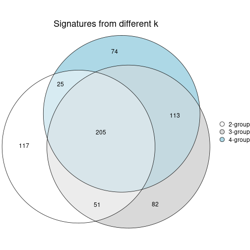

`get_signature()` returns a data frame invisibly. To get the list of signatures, the function
call should be assigned to a variable explicitly. In following code, if `plot` argument is set
to `FALSE`, no heatmap is plotted while only the differential analysis is performed.

```r
# code only for demonstration
tb = get_signature(res, k = ..., plot = FALSE)
```

An example of the output of `tb` is:

```
#>   which_row         fdr    mean_1    mean_2 scaled_mean_1 scaled_mean_2 km
#> 1        38 0.042760348  8.373488  9.131774    -0.5533452     0.5164555  1
#> 2        40 0.018707592  7.106213  8.469186    -0.6173731     0.5762149  1
#> 3        55 0.019134737 10.221463 11.207825    -0.6159697     0.5749050  1
#> 4        59 0.006059896  5.921854  7.869574    -0.6899429     0.6439467  1
#> 5        60 0.018055526  8.928898 10.211722    -0.6204761     0.5791110  1
#> 6        98 0.009384629 15.714769 14.887706     0.6635654    -0.6193277  2
...
```

The columns in `tb` are:

1. `which_row`: row indices corresponding to the input matrix.
2. `fdr`: FDR for the differential test. 
3. `mean_x`: The mean value in group x.
4. `scaled_mean_x`: The mean value in group x after rows are scaled.
5. `km`: Row groups if k-means clustering is applied to rows (which is done by automatically selecting number of clusters).

If there are too many signatures, `top_signatures = ...` can be set to only show the 
signatures with the highest FDRs:

```r
# code only for demonstration
# e.g. to show the top 500 most significant rows
tb = get_signature(res, k = ..., top_signatures = 500)
```

If the signatures are defined as these which are uniquely high in current group, `diff_method` argument
can be set to `"uniquely_high_in_one_group"`:

```r
# code only for demonstration
tb = get_signature(res, k = ..., diff_method = "uniquely_high_in_one_group")
```


UMAP plot which shows how samples are separated.


<script>
$( function() {
	$( '#tabs-node-0212-dimension-reduction' ).tabs();
} );
</script>
<div id='tabs-node-0212-dimension-reduction'>
<ul>
<li><a href='#tab-node-0212-dimension-reduction-1'>k = 2</a></li>
<li><a href='#tab-node-0212-dimension-reduction-2'>k = 3</a></li>
<li><a href='#tab-node-0212-dimension-reduction-3'>k = 4</a></li>
</ul>
<div id='tab-node-0212-dimension-reduction-1'>
<pre><code class="r">dimension_reduction(res, k = 2, method = &quot;UMAP&quot;)
</code></pre>

<p></p>

</div>
<div id='tab-node-0212-dimension-reduction-2'>
<pre><code class="r">dimension_reduction(res, k = 3, method = &quot;UMAP&quot;)
</code></pre>

<p></p>

</div>
<div id='tab-node-0212-dimension-reduction-3'>
<pre><code class="r">dimension_reduction(res, k = 4, method = &quot;UMAP&quot;)
</code></pre>

<p></p>

</div>
</div>


Following heatmap shows how subgroups are split when increasing `k`:

```r
collect_classes(res)
```


If matrix rows can be associated to genes, consider to use `functional_enrichment(res,
...)` to perform function enrichment for the signature genes. See [this vignette](https://jokergoo.github.io/cola_vignettes/functional_enrichment.html) for more detailed explanations.


 

---------------------------------------------------


### Node0213


Parent node: [Node021](#Node021).
Child nodes: 
                Node01211-leaf
        ,
                Node01212-leaf
        ,
                Node01221-leaf
        ,
                Node01222-leaf
        ,
                Node01223-leaf
        ,
                Node02111-leaf
        ,
                [Node02112](#Node02112)
        ,
                Node02121-leaf
        ,
                Node02122-leaf
        ,
                Node02131-leaf
        ,
                Node02132-leaf
        ,
                Node02221-leaf
        ,
                [Node02222](#Node02222)
        ,
                Node03221-leaf
        ,
                Node03222-leaf
        ,
                Node03223-leaf
        .


The object with results only for a single top-value method and a single partitioning method 
can be extracted as:

```r
res = res_rh["0213"]
```

A summary of `res` and all the functions that can be applied to it:

```r
res
```

```
#> A 'ConsensusPartition' object with k = 2, 3, 4.
#>   On a matrix with 6486 rows and 115 columns.
#>   Top rows (649) are extracted by 'ATC' method.
#>   Subgroups are detected by 'skmeans' method.
#>   Performed in total 150 partitions by row resampling.
#>   Best k for subgroups seems to be 2.
#> 
#> Following methods can be applied to this 'ConsensusPartition' object:
#>  [1] "cola_report"             "collect_classes"         "collect_plots"          
#>  [4] "collect_stats"           "colnames"                "compare_partitions"     
#>  [7] "compare_signatures"      "consensus_heatmap"       "dimension_reduction"    
#> [10] "functional_enrichment"   "get_anno_col"            "get_anno"               
#> [13] "get_classes"             "get_consensus"           "get_matrix"             
#> [16] "get_membership"          "get_param"               "get_signatures"         
#> [19] "get_stats"               "is_best_k"               "is_stable_k"            
#> [22] "membership_heatmap"      "ncol"                    "nrow"                   
#> [25] "plot_ecdf"               "predict_classes"         "rownames"               
#> [28] "select_partition_number" "show"                    "suggest_best_k"         
#> [31] "test_to_known_factors"   "top_rows_heatmap"
```

`collect_plots()` function collects all the plots made from `res` for all `k` (number of subgroups)
into one single page to provide an easy and fast comparison between different `k`.

```r
collect_plots(res)
```


The plots are:

- The first row: a plot of the eCDF (empirical cumulative distribution
  function) curves of the consensus matrix for each `k` and the heatmap of
  predicted classes for each `k`.
- The second row: heatmaps of the consensus matrix for each `k`.
- The third row: heatmaps of the membership matrix for each `k`.
- The fouth row: heatmaps of the signatures for each `k`.

All the plots in panels can be made by individual functions and they are
plotted later in this section.

`select_partition_number()` produces several plots showing different
statistics for choosing "optimized" `k`. There are following statistics:

- eCDF curves of the consensus matrix for each `k`;
- 1-PAC. [The PAC score](https://en.wikipedia.org/wiki/Consensus_clustering#Over-interpretation_potential_of_consensus_clustering)
  measures the proportion of the ambiguous subgrouping.
- Mean silhouette score.
- Concordance. The mean probability of fiting the consensus subgroup labels in all
  partitions.
- Area increased. Denote $A_k$ as the area under the eCDF curve for current
  `k`, the area increased is defined as $A_k - A_{k-1}$.
- Rand index. The percent of pairs of samples that are both in a same cluster
  or both are not in a same cluster in the partition of k and k-1.
- Jaccard index. The ratio of pairs of samples are both in a same cluster in
  the partition of k and k-1 and the pairs of samples are both in a same
  cluster in the partition k or k-1.

The detailed explanations of these statistics can be found in [the _cola_
vignette](https://jokergoo.github.io/cola_vignettes/cola.html#toc_13).

Generally speaking, higher 1-PAC score, higher mean silhouette score or higher
concordance corresponds to better partition. Rand index and Jaccard index
measure how similar the current partition is compared to partition with `k-1`.
If they are too similar, we won't accept `k` is better than `k-1`.

```r
select_partition_number(res)
```


The numeric values for all these statistics can be obtained by `get_stats()`.

```r
get_stats(res)
```

```
#>   k 1-PAC mean_silhouette concordance area_increased  Rand Jaccard
#> 2 2 1.000           0.969       0.988          0.503 0.497   0.497
#> 3 3 0.764           0.826       0.910          0.277 0.808   0.633
#> 4 4 0.613           0.673       0.825          0.116 0.914   0.773
```

`suggest_best_k()` suggests the best $k$ based on these statistics. The rules are as follows:

- All $k$ with Jaccard index larger than 0.95 are removed because increasing
  $k$ does not provide enough extra information. If all $k$ are removed, it is
  marked as no subgroup is detected.
- For all $k$ with 1-PAC score larger than 0.9, the maximal $k$ is taken as
  the best $k$, and other $k$ are marked as optional $k$.
- If it does not fit the second rule. The $k$ with the maximal vote of the
  highest 1-PAC score, highest mean silhouette, and highest concordance is
  taken as the best $k$.

```r
suggest_best_k(res)
```

```
#> [1] 2
```


Following is the table of the partitions (You need to click the **show/hide
code output** link to see it). The membership matrix (columns with name `p*`)
is inferred by
[`clue::cl_consensus()`](https://www.rdocumentation.org/link/cl_consensus?package=clue)
function with the `SE` method. Basically the value in the membership matrix
represents the probability to belong to a certain group. The finall subgroup
label for an item is determined with the group with highest probability it
belongs to.

In `get_classes()` function, the entropy is calculated from the membership
matrix and the silhouette score is calculated from the consensus matrix.


<script>
$( function() {
	$( '#tabs-node-0213-get-classes' ).tabs();
} );
</script>
<div id='tabs-node-0213-get-classes'>
<ul>
<li><a href='#tab-node-0213-get-classes-1'>k = 2</a></li>
<li><a href='#tab-node-0213-get-classes-2'>k = 3</a></li>
<li><a href='#tab-node-0213-get-classes-3'>k = 4</a></li>
</ul>

<div id='tab-node-0213-get-classes-1'>
<p><a id='tab-node-0213-get-classes-1-a' style='color:#0366d6' href='#'>show/hide code output</a></p>
<pre><code class="r">cbind(get_classes(res, k = 2), get_membership(res, k = 2))
</code></pre>

<pre><code>#&gt;                             class entropy silhouette   p1   p2
#&gt; mouse1_lib1.final_cell_0003     2   0.000      0.984 0.00 1.00
#&gt; mouse1_lib1.final_cell_0005     2   0.000      0.984 0.00 1.00
#&gt; mouse1_lib1.final_cell_0014     1   0.000      0.990 1.00 0.00
#&gt; mouse1_lib1.final_cell_0024     1   0.000      0.990 1.00 0.00
#&gt; mouse1_lib1.final_cell_0039     2   0.000      0.984 0.00 1.00
#&gt; mouse1_lib1.final_cell_0043     1   0.000      0.990 1.00 0.00
#&gt; mouse1_lib1.final_cell_0091     1   0.000      0.990 1.00 0.00
#&gt; mouse1_lib2.final_cell_0064     2   0.000      0.984 0.00 1.00
#&gt; mouse1_lib2.final_cell_0086     1   0.000      0.990 1.00 0.00
#&gt; mouse1_lib2.final_cell_0105     1   0.000      0.990 1.00 0.00
#&gt; mouse1_lib2.final_cell_0113     1   0.000      0.990 1.00 0.00
#&gt; mouse1_lib3.final_cell_0020     1   0.000      0.990 1.00 0.00
#&gt; mouse1_lib3.final_cell_0021     2   0.000      0.984 0.00 1.00
#&gt; mouse1_lib3.final_cell_0024     1   0.000      0.990 1.00 0.00
#&gt; mouse1_lib3.final_cell_0026     1   0.000      0.990 1.00 0.00
#&gt; mouse1_lib3.final_cell_0038     1   0.000      0.990 1.00 0.00
#&gt; mouse1_lib3.final_cell_0044     1   0.000      0.990 1.00 0.00
#&gt; mouse1_lib3.final_cell_0050     2   0.000      0.984 0.00 1.00
#&gt; mouse1_lib3.final_cell_0088     1   0.000      0.990 1.00 0.00
#&gt; mouse1_lib3.final_cell_0123     1   0.000      0.990 1.00 0.00
#&gt; mouse2_lib1.final_cell_0040     2   0.000      0.984 0.00 1.00
#&gt; mouse2_lib1.final_cell_0042     2   0.000      0.984 0.00 1.00
#&gt; mouse2_lib1.final_cell_0059     1   0.000      0.990 1.00 0.00
#&gt; mouse2_lib1.final_cell_0060     2   0.000      0.984 0.00 1.00
#&gt; mouse2_lib1.final_cell_0064     2   0.000      0.984 0.00 1.00
#&gt; mouse2_lib1.final_cell_0091     1   0.000      0.990 1.00 0.00
#&gt; mouse2_lib1.final_cell_0097     2   0.000      0.984 0.00 1.00
#&gt; mouse2_lib1.final_cell_0098     1   0.995      0.129 0.54 0.46
#&gt; mouse2_lib1.final_cell_0099     2   0.000      0.984 0.00 1.00
#&gt; mouse2_lib1.final_cell_0100     2   0.000      0.984 0.00 1.00
#&gt; mouse2_lib1.final_cell_0104     2   0.000      0.984 0.00 1.00
#&gt; mouse2_lib1.final_cell_0109     1   0.000      0.990 1.00 0.00
#&gt; mouse2_lib1.final_cell_0112     1   0.000      0.990 1.00 0.00
#&gt; mouse2_lib1.final_cell_0116     2   0.242      0.947 0.04 0.96
#&gt; mouse2_lib1.final_cell_0118     2   0.000      0.984 0.00 1.00
#&gt; mouse2_lib1.final_cell_0119     1   0.000      0.990 1.00 0.00
#&gt; mouse2_lib1.final_cell_0143     1   0.000      0.990 1.00 0.00
#&gt; mouse2_lib1.final_cell_0144     1   0.000      0.990 1.00 0.00
#&gt; mouse2_lib1.final_cell_0145     2   0.000      0.984 0.00 1.00
#&gt; mouse2_lib1.final_cell_0146     1   0.000      0.990 1.00 0.00
#&gt; mouse2_lib1.final_cell_0154     1   0.000      0.990 1.00 0.00
#&gt; mouse2_lib1.final_cell_0163     1   0.000      0.990 1.00 0.00
#&gt; mouse2_lib1.final_cell_0167     1   0.141      0.971 0.98 0.02
#&gt; mouse2_lib1.final_cell_0169     1   0.000      0.990 1.00 0.00
#&gt; mouse2_lib1.final_cell_0173     2   0.000      0.984 0.00 1.00
#&gt; mouse2_lib1.final_cell_0177     1   0.000      0.990 1.00 0.00
#&gt; mouse2_lib1.final_cell_0202     1   0.000      0.990 1.00 0.00
#&gt; mouse2_lib1.final_cell_0203     1   0.000      0.990 1.00 0.00
#&gt; mouse2_lib1.final_cell_0216     1   0.000      0.990 1.00 0.00
#&gt; mouse2_lib1.final_cell_0222     1   0.000      0.990 1.00 0.00
#&gt; mouse2_lib2.final_cell_0035     1   0.000      0.990 1.00 0.00
#&gt; mouse2_lib2.final_cell_0041     2   0.000      0.984 0.00 1.00
#&gt; mouse2_lib2.final_cell_0046     2   0.000      0.984 0.00 1.00
#&gt; mouse2_lib2.final_cell_0054     2   0.000      0.984 0.00 1.00
#&gt; mouse2_lib2.final_cell_0055     2   0.000      0.984 0.00 1.00
#&gt; mouse2_lib2.final_cell_0068     2   0.000      0.984 0.00 1.00
#&gt; mouse2_lib2.final_cell_0070     2   0.000      0.984 0.00 1.00
#&gt; mouse2_lib2.final_cell_0076     2   0.000      0.984 0.00 1.00
#&gt; mouse2_lib2.final_cell_0079     2   0.000      0.984 0.00 1.00
#&gt; mouse2_lib2.final_cell_0081     2   0.000      0.984 0.00 1.00
#&gt; mouse2_lib2.final_cell_0083     2   0.000      0.984 0.00 1.00
#&gt; mouse2_lib2.final_cell_0085     2   0.000      0.984 0.00 1.00
#&gt; mouse2_lib2.final_cell_0086     2   0.000      0.984 0.00 1.00
#&gt; mouse2_lib2.final_cell_0089     1   0.000      0.990 1.00 0.00
#&gt; mouse2_lib2.final_cell_0098     2   0.000      0.984 0.00 1.00
#&gt; mouse2_lib2.final_cell_0102     1   0.000      0.990 1.00 0.00
#&gt; mouse2_lib2.final_cell_0111     2   0.000      0.984 0.00 1.00
#&gt; mouse2_lib2.final_cell_0117     1   0.000      0.990 1.00 0.00
#&gt; mouse2_lib2.final_cell_0122     2   0.000      0.984 0.00 1.00
#&gt; mouse2_lib2.final_cell_0138     2   0.000      0.984 0.00 1.00
#&gt; mouse2_lib2.final_cell_0145     2   0.000      0.984 0.00 1.00
#&gt; mouse2_lib2.final_cell_0163     2   0.000      0.984 0.00 1.00
#&gt; mouse2_lib2.final_cell_0165     2   0.000      0.984 0.00 1.00
#&gt; mouse2_lib2.final_cell_0168     1   0.000      0.990 1.00 0.00
#&gt; mouse2_lib2.final_cell_0170     1   0.000      0.990 1.00 0.00
#&gt; mouse2_lib2.final_cell_0171     1   0.000      0.990 1.00 0.00
#&gt; mouse2_lib2.final_cell_0174     2   0.000      0.984 0.00 1.00
#&gt; mouse2_lib2.final_cell_0177     1   0.000      0.990 1.00 0.00
#&gt; mouse2_lib2.final_cell_0182     2   0.000      0.984 0.00 1.00
#&gt; mouse2_lib2.final_cell_0185     2   0.722      0.751 0.20 0.80
#&gt; mouse2_lib2.final_cell_0187     1   0.000      0.990 1.00 0.00
#&gt; mouse2_lib2.final_cell_0191     2   0.000      0.984 0.00 1.00
#&gt; mouse2_lib2.final_cell_0222     1   0.000      0.990 1.00 0.00
#&gt; mouse2_lib2.final_cell_0238     1   0.000      0.990 1.00 0.00
#&gt; mouse2_lib2.final_cell_0242     1   0.000      0.990 1.00 0.00
#&gt; mouse2_lib2.final_cell_0246     1   0.000      0.990 1.00 0.00
#&gt; mouse2_lib2.final_cell_0256     1   0.000      0.990 1.00 0.00
#&gt; mouse2_lib3.final_cell_0014     2   0.000      0.984 0.00 1.00
#&gt; mouse2_lib3.final_cell_0033     2   0.000      0.984 0.00 1.00
#&gt; mouse2_lib3.final_cell_0039     2   0.000      0.984 0.00 1.00
#&gt; mouse2_lib3.final_cell_0041     2   0.000      0.984 0.00 1.00
#&gt; mouse2_lib3.final_cell_0047     2   0.000      0.984 0.00 1.00
#&gt; mouse2_lib3.final_cell_0048     2   0.000      0.984 0.00 1.00
#&gt; mouse2_lib3.final_cell_0072     1   0.000      0.990 1.00 0.00
#&gt; mouse2_lib3.final_cell_0074     2   0.000      0.984 0.00 1.00
#&gt; mouse2_lib3.final_cell_0075     2   0.000      0.984 0.00 1.00
#&gt; mouse2_lib3.final_cell_0081     1   0.000      0.990 1.00 0.00
#&gt; mouse2_lib3.final_cell_0085     1   0.000      0.990 1.00 0.00
#&gt; mouse2_lib3.final_cell_0097     2   0.000      0.984 0.00 1.00
#&gt; mouse2_lib3.final_cell_0098     1   0.000      0.990 1.00 0.00
#&gt; mouse2_lib3.final_cell_0105     2   0.000      0.984 0.00 1.00
#&gt; mouse2_lib3.final_cell_0116     2   0.680      0.783 0.18 0.82
#&gt; mouse2_lib3.final_cell_0125     1   0.000      0.990 1.00 0.00
#&gt; mouse2_lib3.final_cell_0135     2   0.141      0.966 0.02 0.98
#&gt; mouse2_lib3.final_cell_0140     1   0.141      0.971 0.98 0.02
#&gt; mouse2_lib3.final_cell_0144     1   0.000      0.990 1.00 0.00
#&gt; mouse2_lib3.final_cell_0152     1   0.000      0.990 1.00 0.00
#&gt; mouse2_lib3.final_cell_0166     1   0.000      0.990 1.00 0.00
#&gt; mouse2_lib3.final_cell_0173     1   0.402      0.907 0.92 0.08
#&gt; mouse2_lib3.final_cell_0175     1   0.000      0.990 1.00 0.00
#&gt; mouse2_lib3.final_cell_0178     1   0.000      0.990 1.00 0.00
#&gt; mouse2_lib3.final_cell_0180     1   0.000      0.990 1.00 0.00
#&gt; mouse2_lib3.final_cell_0198     1   0.000      0.990 1.00 0.00
#&gt; mouse2_lib3.final_cell_0212     2   0.971      0.334 0.40 0.60
#&gt; mouse2_lib3.final_cell_0213     1   0.000      0.990 1.00 0.00
</code></pre>

<script>
$('#tab-node-0213-get-classes-1-a').parent().next().next().hide();
$('#tab-node-0213-get-classes-1-a').click(function(){
  $('#tab-node-0213-get-classes-1-a').parent().next().next().toggle();
  return(false);
});
</script>
</div>

<div id='tab-node-0213-get-classes-2'>
<p><a id='tab-node-0213-get-classes-2-a' style='color:#0366d6' href='#'>show/hide code output</a></p>
<pre><code class="r">cbind(get_classes(res, k = 3), get_membership(res, k = 3))
</code></pre>

<pre><code>#&gt;                             class entropy silhouette   p1   p2   p3
#&gt; mouse1_lib1.final_cell_0003     2  0.0892     0.9257 0.00 0.98 0.02
#&gt; mouse1_lib1.final_cell_0005     2  0.0892     0.9257 0.00 0.98 0.02
#&gt; mouse1_lib1.final_cell_0014     1  0.0892     0.9100 0.98 0.00 0.02
#&gt; mouse1_lib1.final_cell_0024     1  0.0000     0.9204 1.00 0.00 0.00
#&gt; mouse1_lib1.final_cell_0039     2  0.0000     0.9303 0.00 1.00 0.00
#&gt; mouse1_lib1.final_cell_0043     1  0.0000     0.9204 1.00 0.00 0.00
#&gt; mouse1_lib1.final_cell_0091     1  0.0000     0.9204 1.00 0.00 0.00
#&gt; mouse1_lib2.final_cell_0064     2  0.1529     0.9191 0.00 0.96 0.04
#&gt; mouse1_lib2.final_cell_0086     1  0.0000     0.9204 1.00 0.00 0.00
#&gt; mouse1_lib2.final_cell_0105     1  0.0000     0.9204 1.00 0.00 0.00
#&gt; mouse1_lib2.final_cell_0113     1  0.0000     0.9204 1.00 0.00 0.00
#&gt; mouse1_lib3.final_cell_0020     3  0.4796     0.7586 0.22 0.00 0.78
#&gt; mouse1_lib3.final_cell_0021     2  0.2066     0.9118 0.00 0.94 0.06
#&gt; mouse1_lib3.final_cell_0024     1  0.2959     0.8657 0.90 0.00 0.10
#&gt; mouse1_lib3.final_cell_0026     1  0.0000     0.9204 1.00 0.00 0.00
#&gt; mouse1_lib3.final_cell_0038     1  0.0000     0.9204 1.00 0.00 0.00
#&gt; mouse1_lib3.final_cell_0044     1  0.1529     0.9037 0.96 0.00 0.04
#&gt; mouse1_lib3.final_cell_0050     2  0.0892     0.9257 0.00 0.98 0.02
#&gt; mouse1_lib3.final_cell_0088     1  0.0000     0.9204 1.00 0.00 0.00
#&gt; mouse1_lib3.final_cell_0123     1  0.0000     0.9204 1.00 0.00 0.00
#&gt; mouse2_lib1.final_cell_0040     2  0.0000     0.9303 0.00 1.00 0.00
#&gt; mouse2_lib1.final_cell_0042     2  0.0000     0.9303 0.00 1.00 0.00
#&gt; mouse2_lib1.final_cell_0059     1  0.0000     0.9204 1.00 0.00 0.00
#&gt; mouse2_lib1.final_cell_0060     2  0.1529     0.9210 0.00 0.96 0.04
#&gt; mouse2_lib1.final_cell_0064     2  0.0000     0.9303 0.00 1.00 0.00
#&gt; mouse2_lib1.final_cell_0091     1  0.0892     0.9109 0.98 0.00 0.02
#&gt; mouse2_lib1.final_cell_0097     2  0.2066     0.9113 0.00 0.94 0.06
#&gt; mouse2_lib1.final_cell_0098     2  0.8271     0.2012 0.40 0.52 0.08
#&gt; mouse2_lib1.final_cell_0099     2  0.2959     0.8587 0.00 0.90 0.10
#&gt; mouse2_lib1.final_cell_0100     2  0.0000     0.9303 0.00 1.00 0.00
#&gt; mouse2_lib1.final_cell_0104     2  0.0892     0.9251 0.00 0.98 0.02
#&gt; mouse2_lib1.final_cell_0109     1  0.0000     0.9204 1.00 0.00 0.00
#&gt; mouse2_lib1.final_cell_0112     1  0.2537     0.8839 0.92 0.00 0.08
#&gt; mouse2_lib1.final_cell_0116     2  0.7523     0.5437 0.26 0.66 0.08
#&gt; mouse2_lib1.final_cell_0118     3  0.5397     0.6114 0.00 0.28 0.72
#&gt; mouse2_lib1.final_cell_0119     3  0.5560     0.6102 0.30 0.00 0.70
#&gt; mouse2_lib1.final_cell_0143     3  0.2066     0.8331 0.06 0.00 0.94
#&gt; mouse2_lib1.final_cell_0144     3  0.5016     0.7395 0.24 0.00 0.76
#&gt; mouse2_lib1.final_cell_0145     2  0.1529     0.9210 0.00 0.96 0.04
#&gt; mouse2_lib1.final_cell_0146     3  0.2537     0.8342 0.08 0.00 0.92
#&gt; mouse2_lib1.final_cell_0154     3  0.3340     0.8405 0.12 0.00 0.88
#&gt; mouse2_lib1.final_cell_0163     1  0.6302    -0.0494 0.52 0.00 0.48
#&gt; mouse2_lib1.final_cell_0167     1  0.3340     0.8530 0.88 0.00 0.12
#&gt; mouse2_lib1.final_cell_0169     1  0.0000     0.9204 1.00 0.00 0.00
#&gt; mouse2_lib1.final_cell_0173     2  0.4291     0.7763 0.00 0.82 0.18
#&gt; mouse2_lib1.final_cell_0177     3  0.3340     0.8405 0.12 0.00 0.88
#&gt; mouse2_lib1.final_cell_0202     3  0.3686     0.8327 0.14 0.00 0.86
#&gt; mouse2_lib1.final_cell_0203     1  0.0892     0.9104 0.98 0.00 0.02
#&gt; mouse2_lib1.final_cell_0216     1  0.0000     0.9204 1.00 0.00 0.00
#&gt; mouse2_lib1.final_cell_0222     1  0.5397     0.6452 0.72 0.00 0.28
#&gt; mouse2_lib2.final_cell_0035     1  0.0000     0.9204 1.00 0.00 0.00
#&gt; mouse2_lib2.final_cell_0041     2  0.0000     0.9303 0.00 1.00 0.00
#&gt; mouse2_lib2.final_cell_0046     2  0.0000     0.9303 0.00 1.00 0.00
#&gt; mouse2_lib2.final_cell_0054     2  0.0000     0.9303 0.00 1.00 0.00
#&gt; mouse2_lib2.final_cell_0055     2  0.1529     0.9210 0.00 0.96 0.04
#&gt; mouse2_lib2.final_cell_0068     2  0.0000     0.9303 0.00 1.00 0.00
#&gt; mouse2_lib2.final_cell_0070     2  0.0000     0.9303 0.00 1.00 0.00
#&gt; mouse2_lib2.final_cell_0076     2  0.0000     0.9303 0.00 1.00 0.00
#&gt; mouse2_lib2.final_cell_0079     2  0.0000     0.9303 0.00 1.00 0.00
#&gt; mouse2_lib2.final_cell_0081     2  0.1529     0.9210 0.00 0.96 0.04
#&gt; mouse2_lib2.final_cell_0083     2  0.0000     0.9303 0.00 1.00 0.00
#&gt; mouse2_lib2.final_cell_0085     2  0.0892     0.9251 0.00 0.98 0.02
#&gt; mouse2_lib2.final_cell_0086     2  0.1529     0.9210 0.00 0.96 0.04
#&gt; mouse2_lib2.final_cell_0089     1  0.2066     0.8984 0.94 0.00 0.06
#&gt; mouse2_lib2.final_cell_0098     3  0.6244     0.1495 0.00 0.44 0.56
#&gt; mouse2_lib2.final_cell_0102     1  0.2066     0.8938 0.94 0.00 0.06
#&gt; mouse2_lib2.final_cell_0111     2  0.1529     0.9210 0.00 0.96 0.04
#&gt; mouse2_lib2.final_cell_0117     1  0.5397     0.5563 0.72 0.00 0.28
#&gt; mouse2_lib2.final_cell_0122     2  0.6677     0.6771 0.18 0.74 0.08
#&gt; mouse2_lib2.final_cell_0138     2  0.0000     0.9303 0.00 1.00 0.00
#&gt; mouse2_lib2.final_cell_0145     2  0.0000     0.9303 0.00 1.00 0.00
#&gt; mouse2_lib2.final_cell_0163     2  0.2537     0.8676 0.00 0.92 0.08
#&gt; mouse2_lib2.final_cell_0165     2  0.0000     0.9303 0.00 1.00 0.00
#&gt; mouse2_lib2.final_cell_0168     3  0.2537     0.8326 0.08 0.00 0.92
#&gt; mouse2_lib2.final_cell_0170     3  0.4555     0.7858 0.20 0.00 0.80
#&gt; mouse2_lib2.final_cell_0171     1  0.1529     0.9056 0.96 0.00 0.04
#&gt; mouse2_lib2.final_cell_0174     2  0.0000     0.9303 0.00 1.00 0.00
#&gt; mouse2_lib2.final_cell_0177     1  0.0000     0.9204 1.00 0.00 0.00
#&gt; mouse2_lib2.final_cell_0182     3  0.2537     0.7992 0.00 0.08 0.92
#&gt; mouse2_lib2.final_cell_0185     2  0.9293    -0.1048 0.16 0.44 0.40
#&gt; mouse2_lib2.final_cell_0187     3  0.3340     0.8405 0.12 0.00 0.88
#&gt; mouse2_lib2.final_cell_0191     2  0.0000     0.9303 0.00 1.00 0.00
#&gt; mouse2_lib2.final_cell_0222     1  0.2537     0.8839 0.92 0.00 0.08
#&gt; mouse2_lib2.final_cell_0238     1  0.0000     0.9204 1.00 0.00 0.00
#&gt; mouse2_lib2.final_cell_0242     1  0.2537     0.8839 0.92 0.00 0.08
#&gt; mouse2_lib2.final_cell_0246     1  0.3340     0.8632 0.88 0.00 0.12
#&gt; mouse2_lib2.final_cell_0256     1  0.0892     0.9113 0.98 0.00 0.02
#&gt; mouse2_lib3.final_cell_0014     2  0.0000     0.9303 0.00 1.00 0.00
#&gt; mouse2_lib3.final_cell_0033     2  0.2066     0.9073 0.00 0.94 0.06
#&gt; mouse2_lib3.final_cell_0039     2  0.0892     0.9199 0.00 0.98 0.02
#&gt; mouse2_lib3.final_cell_0041     2  0.0000     0.9303 0.00 1.00 0.00
#&gt; mouse2_lib3.final_cell_0047     3  0.6192     0.2549 0.00 0.42 0.58
#&gt; mouse2_lib3.final_cell_0048     2  0.1529     0.9169 0.00 0.96 0.04
#&gt; mouse2_lib3.final_cell_0072     1  0.2066     0.8830 0.94 0.00 0.06
#&gt; mouse2_lib3.final_cell_0074     2  0.2066     0.9123 0.00 0.94 0.06
#&gt; mouse2_lib3.final_cell_0075     2  0.0000     0.9303 0.00 1.00 0.00
#&gt; mouse2_lib3.final_cell_0081     1  0.0000     0.9204 1.00 0.00 0.00
#&gt; mouse2_lib3.final_cell_0085     3  0.3340     0.8405 0.12 0.00 0.88
#&gt; mouse2_lib3.final_cell_0097     2  0.0000     0.9303 0.00 1.00 0.00
#&gt; mouse2_lib3.final_cell_0098     3  0.3340     0.8405 0.12 0.00 0.88
#&gt; mouse2_lib3.final_cell_0105     2  0.0892     0.9257 0.00 0.98 0.02
#&gt; mouse2_lib3.final_cell_0116     2  0.7901     0.2616 0.40 0.54 0.06
#&gt; mouse2_lib3.final_cell_0125     1  0.0000     0.9204 1.00 0.00 0.00
#&gt; mouse2_lib3.final_cell_0135     3  0.3415     0.8105 0.02 0.08 0.90
#&gt; mouse2_lib3.final_cell_0140     1  0.3832     0.8537 0.88 0.02 0.10
#&gt; mouse2_lib3.final_cell_0144     1  0.3340     0.8222 0.88 0.00 0.12
#&gt; mouse2_lib3.final_cell_0152     1  0.0892     0.9128 0.98 0.00 0.02
#&gt; mouse2_lib3.final_cell_0166     3  0.4291     0.8142 0.18 0.00 0.82
#&gt; mouse2_lib3.final_cell_0173     3  0.3042     0.8272 0.04 0.04 0.92
#&gt; mouse2_lib3.final_cell_0175     3  0.2537     0.8381 0.08 0.00 0.92
#&gt; mouse2_lib3.final_cell_0178     1  0.5948     0.5140 0.64 0.00 0.36
#&gt; mouse2_lib3.final_cell_0180     3  0.6302     0.2832 0.48 0.00 0.52
#&gt; mouse2_lib3.final_cell_0198     1  0.0000     0.9204 1.00 0.00 0.00
#&gt; mouse2_lib3.final_cell_0212     1  0.8817     0.2229 0.50 0.38 0.12
#&gt; mouse2_lib3.final_cell_0213     1  0.0000     0.9204 1.00 0.00 0.00
</code></pre>

<script>
$('#tab-node-0213-get-classes-2-a').parent().next().next().hide();
$('#tab-node-0213-get-classes-2-a').click(function(){
  $('#tab-node-0213-get-classes-2-a').parent().next().next().toggle();
  return(false);
});
</script>
</div>

<div id='tab-node-0213-get-classes-3'>
<p><a id='tab-node-0213-get-classes-3-a' style='color:#0366d6' href='#'>show/hide code output</a></p>
<pre><code class="r">cbind(get_classes(res, k = 4), get_membership(res, k = 4))
</code></pre>

<pre><code>#&gt;                             class entropy silhouette   p1   p2   p3   p4
#&gt; mouse1_lib1.final_cell_0003     2  0.2921     0.8283 0.00 0.86 0.00 0.14
#&gt; mouse1_lib1.final_cell_0005     2  0.3172     0.8066 0.00 0.84 0.00 0.16
#&gt; mouse1_lib1.final_cell_0014     1  0.4284     0.6756 0.78 0.00 0.02 0.20
#&gt; mouse1_lib1.final_cell_0024     1  0.0707     0.8048 0.98 0.00 0.00 0.02
#&gt; mouse1_lib1.final_cell_0039     2  0.1637     0.8472 0.00 0.94 0.00 0.06
#&gt; mouse1_lib1.final_cell_0043     1  0.1211     0.8025 0.96 0.00 0.00 0.04
#&gt; mouse1_lib1.final_cell_0091     1  0.0707     0.8048 0.98 0.00 0.00 0.02
#&gt; mouse1_lib2.final_cell_0064     2  0.4522     0.6396 0.00 0.68 0.00 0.32
#&gt; mouse1_lib2.final_cell_0086     1  0.2706     0.7942 0.90 0.00 0.02 0.08
#&gt; mouse1_lib2.final_cell_0105     1  0.0000     0.8075 1.00 0.00 0.00 0.00
#&gt; mouse1_lib2.final_cell_0113     1  0.0000     0.8075 1.00 0.00 0.00 0.00
#&gt; mouse1_lib3.final_cell_0020     3  0.7004     0.4513 0.20 0.00 0.58 0.22
#&gt; mouse1_lib3.final_cell_0021     2  0.4134     0.7013 0.00 0.74 0.00 0.26
#&gt; mouse1_lib3.final_cell_0024     1  0.6115     0.2999 0.56 0.02 0.02 0.40
#&gt; mouse1_lib3.final_cell_0026     1  0.0000     0.8075 1.00 0.00 0.00 0.00
#&gt; mouse1_lib3.final_cell_0038     1  0.0000     0.8075 1.00 0.00 0.00 0.00
#&gt; mouse1_lib3.final_cell_0044     1  0.3400     0.7318 0.82 0.00 0.00 0.18
#&gt; mouse1_lib3.final_cell_0050     2  0.2647     0.8285 0.00 0.88 0.00 0.12
#&gt; mouse1_lib3.final_cell_0088     1  0.0000     0.8075 1.00 0.00 0.00 0.00
#&gt; mouse1_lib3.final_cell_0123     1  0.0707     0.8048 0.98 0.00 0.00 0.02
#&gt; mouse2_lib1.final_cell_0040     2  0.0000     0.8477 0.00 1.00 0.00 0.00
#&gt; mouse2_lib1.final_cell_0042     2  0.2011     0.8327 0.00 0.92 0.00 0.08
#&gt; mouse2_lib1.final_cell_0059     1  0.0707     0.8062 0.98 0.00 0.00 0.02
#&gt; mouse2_lib1.final_cell_0060     2  0.4624     0.6184 0.00 0.66 0.00 0.34
#&gt; mouse2_lib1.final_cell_0064     2  0.2345     0.8428 0.00 0.90 0.00 0.10
#&gt; mouse2_lib1.final_cell_0091     1  0.1913     0.7954 0.94 0.00 0.04 0.02
#&gt; mouse2_lib1.final_cell_0097     2  0.4907     0.4088 0.00 0.58 0.00 0.42
#&gt; mouse2_lib1.final_cell_0098     4  0.8262     0.5672 0.20 0.20 0.06 0.54
#&gt; mouse2_lib1.final_cell_0099     2  0.5271     0.4993 0.00 0.64 0.02 0.34
#&gt; mouse2_lib1.final_cell_0100     2  0.0707     0.8481 0.00 0.98 0.00 0.02
#&gt; mouse2_lib1.final_cell_0104     2  0.0707     0.8484 0.00 0.98 0.00 0.02
#&gt; mouse2_lib1.final_cell_0109     1  0.2335     0.7927 0.92 0.00 0.02 0.06
#&gt; mouse2_lib1.final_cell_0112     1  0.4713     0.5013 0.64 0.00 0.00 0.36
#&gt; mouse2_lib1.final_cell_0116     4  0.7744     0.4168 0.14 0.36 0.02 0.48
#&gt; mouse2_lib1.final_cell_0118     3  0.6216     0.4599 0.00 0.22 0.66 0.12
#&gt; mouse2_lib1.final_cell_0119     3  0.6941     0.2711 0.36 0.00 0.52 0.12
#&gt; mouse2_lib1.final_cell_0143     3  0.0707     0.7520 0.02 0.00 0.98 0.00
#&gt; mouse2_lib1.final_cell_0144     3  0.7474     0.2728 0.28 0.00 0.50 0.22
#&gt; mouse2_lib1.final_cell_0145     2  0.3400     0.7917 0.00 0.82 0.00 0.18
#&gt; mouse2_lib1.final_cell_0146     3  0.2345     0.7278 0.00 0.00 0.90 0.10
#&gt; mouse2_lib1.final_cell_0154     3  0.1211     0.7479 0.04 0.00 0.96 0.00
#&gt; mouse2_lib1.final_cell_0163     3  0.8335     0.0887 0.28 0.02 0.42 0.28
#&gt; mouse2_lib1.final_cell_0167     4  0.5619     0.2650 0.32 0.00 0.04 0.64
#&gt; mouse2_lib1.final_cell_0169     1  0.3037     0.7705 0.88 0.00 0.02 0.10
#&gt; mouse2_lib1.final_cell_0173     2  0.6150     0.4431 0.00 0.58 0.06 0.36
#&gt; mouse2_lib1.final_cell_0177     3  0.0707     0.7525 0.02 0.00 0.98 0.00
#&gt; mouse2_lib1.final_cell_0202     3  0.1637     0.7380 0.06 0.00 0.94 0.00
#&gt; mouse2_lib1.final_cell_0203     1  0.2647     0.7704 0.88 0.00 0.00 0.12
#&gt; mouse2_lib1.final_cell_0216     1  0.0000     0.8075 1.00 0.00 0.00 0.00
#&gt; mouse2_lib1.final_cell_0222     4  0.7684     0.1067 0.36 0.00 0.22 0.42
#&gt; mouse2_lib2.final_cell_0035     1  0.0707     0.8059 0.98 0.00 0.00 0.02
#&gt; mouse2_lib2.final_cell_0041     2  0.0707     0.8462 0.00 0.98 0.00 0.02
#&gt; mouse2_lib2.final_cell_0046     2  0.0707     0.8462 0.00 0.98 0.00 0.02
#&gt; mouse2_lib2.final_cell_0054     2  0.1211     0.8493 0.00 0.96 0.00 0.04
#&gt; mouse2_lib2.final_cell_0055     2  0.3400     0.8046 0.00 0.82 0.00 0.18
#&gt; mouse2_lib2.final_cell_0068     2  0.1211     0.8431 0.00 0.96 0.00 0.04
#&gt; mouse2_lib2.final_cell_0070     2  0.1637     0.8486 0.00 0.94 0.00 0.06
#&gt; mouse2_lib2.final_cell_0076     2  0.1211     0.8434 0.00 0.96 0.00 0.04
#&gt; mouse2_lib2.final_cell_0079     2  0.0707     0.8463 0.00 0.98 0.00 0.02
#&gt; mouse2_lib2.final_cell_0081     2  0.2647     0.8313 0.00 0.88 0.00 0.12
#&gt; mouse2_lib2.final_cell_0083     2  0.1211     0.8455 0.00 0.96 0.00 0.04
#&gt; mouse2_lib2.final_cell_0085     2  0.1211     0.8458 0.00 0.96 0.00 0.04
#&gt; mouse2_lib2.final_cell_0086     2  0.2345     0.8332 0.00 0.90 0.00 0.10
#&gt; mouse2_lib2.final_cell_0089     1  0.3400     0.7333 0.82 0.00 0.00 0.18
#&gt; mouse2_lib2.final_cell_0098     2  0.7748     0.0309 0.00 0.44 0.28 0.28
#&gt; mouse2_lib2.final_cell_0102     1  0.3801     0.6776 0.78 0.00 0.00 0.22
#&gt; mouse2_lib2.final_cell_0111     2  0.2647     0.8247 0.00 0.88 0.00 0.12
#&gt; mouse2_lib2.final_cell_0117     1  0.7139     0.1463 0.50 0.00 0.36 0.14
#&gt; mouse2_lib2.final_cell_0122     4  0.6570     0.3609 0.10 0.32 0.00 0.58
#&gt; mouse2_lib2.final_cell_0138     2  0.0000     0.8477 0.00 1.00 0.00 0.00
#&gt; mouse2_lib2.final_cell_0145     2  0.1637     0.8418 0.00 0.94 0.00 0.06
#&gt; mouse2_lib2.final_cell_0163     2  0.4292     0.7416 0.00 0.82 0.10 0.08
#&gt; mouse2_lib2.final_cell_0165     2  0.1637     0.8398 0.00 0.94 0.00 0.06
#&gt; mouse2_lib2.final_cell_0168     3  0.4797     0.5849 0.02 0.00 0.72 0.26
#&gt; mouse2_lib2.final_cell_0170     3  0.4949     0.5959 0.18 0.00 0.76 0.06
#&gt; mouse2_lib2.final_cell_0171     1  0.4731     0.6950 0.78 0.00 0.06 0.16
#&gt; mouse2_lib2.final_cell_0174     2  0.1211     0.8432 0.00 0.96 0.00 0.04
#&gt; mouse2_lib2.final_cell_0177     1  0.1637     0.8039 0.94 0.00 0.00 0.06
#&gt; mouse2_lib2.final_cell_0182     3  0.2011     0.7303 0.00 0.00 0.92 0.08
#&gt; mouse2_lib2.final_cell_0185     3  0.9907    -0.2048 0.22 0.24 0.32 0.22
#&gt; mouse2_lib2.final_cell_0187     3  0.0000     0.7503 0.00 0.00 1.00 0.00
#&gt; mouse2_lib2.final_cell_0191     2  0.2011     0.8304 0.00 0.92 0.00 0.08
#&gt; mouse2_lib2.final_cell_0222     1  0.5428     0.4600 0.60 0.00 0.02 0.38
#&gt; mouse2_lib2.final_cell_0238     1  0.0707     0.8059 0.98 0.00 0.00 0.02
#&gt; mouse2_lib2.final_cell_0242     1  0.4713     0.5061 0.64 0.00 0.00 0.36
#&gt; mouse2_lib2.final_cell_0246     1  0.4406     0.5916 0.70 0.00 0.00 0.30
#&gt; mouse2_lib2.final_cell_0256     1  0.2647     0.7463 0.88 0.00 0.12 0.00
#&gt; mouse2_lib3.final_cell_0014     2  0.0707     0.8481 0.00 0.98 0.00 0.02
#&gt; mouse2_lib3.final_cell_0033     2  0.4624     0.5539 0.00 0.66 0.00 0.34
#&gt; mouse2_lib3.final_cell_0039     2  0.2921     0.7939 0.00 0.86 0.00 0.14
#&gt; mouse2_lib3.final_cell_0041     2  0.0707     0.8463 0.00 0.98 0.00 0.02
#&gt; mouse2_lib3.final_cell_0047     3  0.6808     0.1972 0.00 0.32 0.56 0.12
#&gt; mouse2_lib3.final_cell_0048     2  0.4624     0.5794 0.00 0.66 0.00 0.34
#&gt; mouse2_lib3.final_cell_0072     1  0.5657     0.6071 0.72 0.00 0.12 0.16
#&gt; mouse2_lib3.final_cell_0074     2  0.4624     0.5912 0.00 0.66 0.00 0.34
#&gt; mouse2_lib3.final_cell_0075     2  0.0707     0.8463 0.00 0.98 0.00 0.02
#&gt; mouse2_lib3.final_cell_0081     1  0.0000     0.8075 1.00 0.00 0.00 0.00
#&gt; mouse2_lib3.final_cell_0085     3  0.0000     0.7503 0.00 0.00 1.00 0.00
#&gt; mouse2_lib3.final_cell_0097     2  0.0000     0.8477 0.00 1.00 0.00 0.00
#&gt; mouse2_lib3.final_cell_0098     3  0.0707     0.7525 0.02 0.00 0.98 0.00
#&gt; mouse2_lib3.final_cell_0105     2  0.3172     0.8033 0.00 0.84 0.00 0.16
#&gt; mouse2_lib3.final_cell_0116     4  0.7738     0.5483 0.16 0.30 0.02 0.52
#&gt; mouse2_lib3.final_cell_0125     1  0.0707     0.8075 0.98 0.00 0.00 0.02
#&gt; mouse2_lib3.final_cell_0135     3  0.0707     0.7484 0.00 0.00 0.98 0.02
#&gt; mouse2_lib3.final_cell_0140     1  0.4790     0.3835 0.62 0.00 0.00 0.38
#&gt; mouse2_lib3.final_cell_0144     1  0.6840     0.3819 0.60 0.00 0.22 0.18
#&gt; mouse2_lib3.final_cell_0152     1  0.2011     0.7899 0.92 0.00 0.00 0.08
#&gt; mouse2_lib3.final_cell_0166     3  0.3335     0.7018 0.12 0.00 0.86 0.02
#&gt; mouse2_lib3.final_cell_0173     3  0.0707     0.7484 0.00 0.00 0.98 0.02
#&gt; mouse2_lib3.final_cell_0175     3  0.0707     0.7525 0.02 0.00 0.98 0.00
#&gt; mouse2_lib3.final_cell_0178     1  0.7346     0.2493 0.52 0.00 0.20 0.28
#&gt; mouse2_lib3.final_cell_0180     1  0.6074     0.3156 0.60 0.00 0.34 0.06
#&gt; mouse2_lib3.final_cell_0198     1  0.1411     0.8023 0.96 0.00 0.02 0.02
#&gt; mouse2_lib3.final_cell_0212     4  0.7219     0.5923 0.16 0.16 0.04 0.64
#&gt; mouse2_lib3.final_cell_0213     1  0.0707     0.8066 0.98 0.00 0.02 0.00
</code></pre>

<script>
$('#tab-node-0213-get-classes-3-a').parent().next().next().hide();
$('#tab-node-0213-get-classes-3-a').click(function(){
  $('#tab-node-0213-get-classes-3-a').parent().next().next().toggle();
  return(false);
});
</script>
</div>
</div>

Heatmaps for the consensus matrix. It visualizes the probability of two
samples to be in a same group.


<script>
$( function() {
	$( '#tabs-node-0213-consensus-heatmap' ).tabs();
} );
</script>
<div id='tabs-node-0213-consensus-heatmap'>
<ul>
<li><a href='#tab-node-0213-consensus-heatmap-1'>k = 2</a></li>
<li><a href='#tab-node-0213-consensus-heatmap-2'>k = 3</a></li>
<li><a href='#tab-node-0213-consensus-heatmap-3'>k = 4</a></li>
</ul>
<div id='tab-node-0213-consensus-heatmap-1'>
<pre><code class="r">consensus_heatmap(res, k = 2)
</code></pre>

<p></p>

</div>
<div id='tab-node-0213-consensus-heatmap-2'>
<pre><code class="r">consensus_heatmap(res, k = 3)
</code></pre>

<p></p>

</div>
<div id='tab-node-0213-consensus-heatmap-3'>
<pre><code class="r">consensus_heatmap(res, k = 4)
</code></pre>

<p></p>

</div>
</div>

Heatmaps for the membership of samples in all partitions to see how consistent they are:


<script>
$( function() {
	$( '#tabs-node-0213-membership-heatmap' ).tabs();
} );
</script>
<div id='tabs-node-0213-membership-heatmap'>
<ul>
<li><a href='#tab-node-0213-membership-heatmap-1'>k = 2</a></li>
<li><a href='#tab-node-0213-membership-heatmap-2'>k = 3</a></li>
<li><a href='#tab-node-0213-membership-heatmap-3'>k = 4</a></li>
</ul>
<div id='tab-node-0213-membership-heatmap-1'>
<pre><code class="r">membership_heatmap(res, k = 2)
</code></pre>

<p></p>

</div>
<div id='tab-node-0213-membership-heatmap-2'>
<pre><code class="r">membership_heatmap(res, k = 3)
</code></pre>

<p></p>

</div>
<div id='tab-node-0213-membership-heatmap-3'>
<pre><code class="r">membership_heatmap(res, k = 4)
</code></pre>

<p></p>

</div>
</div>

As soon as the classes for columns are determined, the signatures
that are significantly different between subgroups can be looked for. 
Following are the heatmaps for signatures.


Signature heatmaps where rows are scaled:


<script>
$( function() {
	$( '#tabs-node-0213-get-signatures' ).tabs();
} );
</script>
<div id='tabs-node-0213-get-signatures'>
<ul>
<li><a href='#tab-node-0213-get-signatures-1'>k = 2</a></li>
<li><a href='#tab-node-0213-get-signatures-2'>k = 3</a></li>
<li><a href='#tab-node-0213-get-signatures-3'>k = 4</a></li>
</ul>
<div id='tab-node-0213-get-signatures-1'>
<pre><code class="r">get_signatures(res, k = 2)
</code></pre>

<p></p>

</div>
<div id='tab-node-0213-get-signatures-2'>
<pre><code class="r">get_signatures(res, k = 3)
</code></pre>

<p></p>

</div>
<div id='tab-node-0213-get-signatures-3'>
<pre><code class="r">get_signatures(res, k = 4)
</code></pre>

<p></p>

</div>
</div>


Signature heatmaps where rows are not scaled:


<script>
$( function() {
	$( '#tabs-node-0213-get-signatures-no-scale' ).tabs();
} );
</script>
<div id='tabs-node-0213-get-signatures-no-scale'>
<ul>
<li><a href='#tab-node-0213-get-signatures-no-scale-1'>k = 2</a></li>
<li><a href='#tab-node-0213-get-signatures-no-scale-2'>k = 3</a></li>
<li><a href='#tab-node-0213-get-signatures-no-scale-3'>k = 4</a></li>
</ul>
<div id='tab-node-0213-get-signatures-no-scale-1'>
<pre><code class="r">get_signatures(res, k = 2, scale_rows = FALSE)
</code></pre>

<p></p>

</div>
<div id='tab-node-0213-get-signatures-no-scale-2'>
<pre><code class="r">get_signatures(res, k = 3, scale_rows = FALSE)
</code></pre>

<p></p>

</div>
<div id='tab-node-0213-get-signatures-no-scale-3'>
<pre><code class="r">get_signatures(res, k = 4, scale_rows = FALSE)
</code></pre>

<p></p>

</div>
</div>


Compare the overlap of signatures from different k:

```r
compare_signatures(res)
```


`get_signature()` returns a data frame invisibly. To get the list of signatures, the function
call should be assigned to a variable explicitly. In following code, if `plot` argument is set
to `FALSE`, no heatmap is plotted while only the differential analysis is performed.

```r
# code only for demonstration
tb = get_signature(res, k = ..., plot = FALSE)
```

An example of the output of `tb` is:

```
#>   which_row         fdr    mean_1    mean_2 scaled_mean_1 scaled_mean_2 km
#> 1        38 0.042760348  8.373488  9.131774    -0.5533452     0.5164555  1
#> 2        40 0.018707592  7.106213  8.469186    -0.6173731     0.5762149  1
#> 3        55 0.019134737 10.221463 11.207825    -0.6159697     0.5749050  1
#> 4        59 0.006059896  5.921854  7.869574    -0.6899429     0.6439467  1
#> 5        60 0.018055526  8.928898 10.211722    -0.6204761     0.5791110  1
#> 6        98 0.009384629 15.714769 14.887706     0.6635654    -0.6193277  2
...
```

The columns in `tb` are:

1. `which_row`: row indices corresponding to the input matrix.
2. `fdr`: FDR for the differential test. 
3. `mean_x`: The mean value in group x.
4. `scaled_mean_x`: The mean value in group x after rows are scaled.
5. `km`: Row groups if k-means clustering is applied to rows (which is done by automatically selecting number of clusters).

If there are too many signatures, `top_signatures = ...` can be set to only show the 
signatures with the highest FDRs:

```r
# code only for demonstration
# e.g. to show the top 500 most significant rows
tb = get_signature(res, k = ..., top_signatures = 500)
```

If the signatures are defined as these which are uniquely high in current group, `diff_method` argument
can be set to `"uniquely_high_in_one_group"`:

```r
# code only for demonstration
tb = get_signature(res, k = ..., diff_method = "uniquely_high_in_one_group")
```


UMAP plot which shows how samples are separated.


<script>
$( function() {
	$( '#tabs-node-0213-dimension-reduction' ).tabs();
} );
</script>
<div id='tabs-node-0213-dimension-reduction'>
<ul>
<li><a href='#tab-node-0213-dimension-reduction-1'>k = 2</a></li>
<li><a href='#tab-node-0213-dimension-reduction-2'>k = 3</a></li>
<li><a href='#tab-node-0213-dimension-reduction-3'>k = 4</a></li>
</ul>
<div id='tab-node-0213-dimension-reduction-1'>
<pre><code class="r">dimension_reduction(res, k = 2, method = &quot;UMAP&quot;)
</code></pre>

<p></p>

</div>
<div id='tab-node-0213-dimension-reduction-2'>
<pre><code class="r">dimension_reduction(res, k = 3, method = &quot;UMAP&quot;)
</code></pre>

<p></p>

</div>
<div id='tab-node-0213-dimension-reduction-3'>
<pre><code class="r">dimension_reduction(res, k = 4, method = &quot;UMAP&quot;)
</code></pre>

<p></p>

</div>
</div>


Following heatmap shows how subgroups are split when increasing `k`:

```r
collect_classes(res)
```


If matrix rows can be associated to genes, consider to use `functional_enrichment(res,
...)` to perform function enrichment for the signature genes. See [this vignette](https://jokergoo.github.io/cola_vignettes/functional_enrichment.html) for more detailed explanations.


 

---------------------------------------------------


### Node022


Parent node: [Node02](#Node02).
Child nodes: 
                [Node0121](#Node0121)
        ,
                [Node0122](#Node0122)
        ,
                Node0141-leaf
        ,
                Node0142-leaf
        ,
                [Node0211](#Node0211)
        ,
                [Node0212](#Node0212)
        ,
                [Node0213](#Node0213)
        ,
                Node0221-leaf
        ,
                [Node0222](#Node0222)
        ,
                Node0311-leaf
        ,
                Node0312-leaf
        ,
                Node0313-leaf
        ,
                Node0321-leaf
        ,
                [Node0322](#Node0322)
        ,
                Node0331-leaf
        ,
                Node0332-leaf
        ,
                Node0333-leaf
        .


The object with results only for a single top-value method and a single partitioning method 
can be extracted as:

```r
res = res_rh["022"]
```

A summary of `res` and all the functions that can be applied to it:

```r
res
```

```
#> A 'ConsensusPartition' object with k = 2, 3, 4.
#>   On a matrix with 7008 rows and 305 columns.
#>   Top rows (701) are extracted by 'ATC' method.
#>   Subgroups are detected by 'skmeans' method.
#>   Performed in total 150 partitions by row resampling.
#>   Best k for subgroups seems to be 2.
#> 
#> Following methods can be applied to this 'ConsensusPartition' object:
#>  [1] "cola_report"             "collect_classes"         "collect_plots"          
#>  [4] "collect_stats"           "colnames"                "compare_partitions"     
#>  [7] "compare_signatures"      "consensus_heatmap"       "dimension_reduction"    
#> [10] "functional_enrichment"   "get_anno_col"            "get_anno"               
#> [13] "get_classes"             "get_consensus"           "get_matrix"             
#> [16] "get_membership"          "get_param"               "get_signatures"         
#> [19] "get_stats"               "is_best_k"               "is_stable_k"            
#> [22] "membership_heatmap"      "ncol"                    "nrow"                   
#> [25] "plot_ecdf"               "predict_classes"         "rownames"               
#> [28] "select_partition_number" "show"                    "suggest_best_k"         
#> [31] "test_to_known_factors"   "top_rows_heatmap"
```

`collect_plots()` function collects all the plots made from `res` for all `k` (number of subgroups)
into one single page to provide an easy and fast comparison between different `k`.

```r
collect_plots(res)
```


The plots are:

- The first row: a plot of the eCDF (empirical cumulative distribution
  function) curves of the consensus matrix for each `k` and the heatmap of
  predicted classes for each `k`.
- The second row: heatmaps of the consensus matrix for each `k`.
- The third row: heatmaps of the membership matrix for each `k`.
- The fouth row: heatmaps of the signatures for each `k`.

All the plots in panels can be made by individual functions and they are
plotted later in this section.

`select_partition_number()` produces several plots showing different
statistics for choosing "optimized" `k`. There are following statistics:

- eCDF curves of the consensus matrix for each `k`;
- 1-PAC. [The PAC score](https://en.wikipedia.org/wiki/Consensus_clustering#Over-interpretation_potential_of_consensus_clustering)
  measures the proportion of the ambiguous subgrouping.
- Mean silhouette score.
- Concordance. The mean probability of fiting the consensus subgroup labels in all
  partitions.
- Area increased. Denote $A_k$ as the area under the eCDF curve for current
  `k`, the area increased is defined as $A_k - A_{k-1}$.
- Rand index. The percent of pairs of samples that are both in a same cluster
  or both are not in a same cluster in the partition of k and k-1.
- Jaccard index. The ratio of pairs of samples are both in a same cluster in
  the partition of k and k-1 and the pairs of samples are both in a same
  cluster in the partition k or k-1.

The detailed explanations of these statistics can be found in [the _cola_
vignette](https://jokergoo.github.io/cola_vignettes/cola.html#toc_13).

Generally speaking, higher 1-PAC score, higher mean silhouette score or higher
concordance corresponds to better partition. Rand index and Jaccard index
measure how similar the current partition is compared to partition with `k-1`.
If they are too similar, we won't accept `k` is better than `k-1`.

```r
select_partition_number(res)
```


The numeric values for all these statistics can be obtained by `get_stats()`.

```r
get_stats(res)
```

```
#>   k 1-PAC mean_silhouette concordance area_increased  Rand Jaccard
#> 2 2 0.959           0.941       0.977          0.496 0.506   0.506
#> 3 3 0.852           0.879       0.947          0.230 0.853   0.720
#> 4 4 0.705           0.783       0.880          0.138 0.835   0.620
```

`suggest_best_k()` suggests the best $k$ based on these statistics. The rules are as follows:

- All $k$ with Jaccard index larger than 0.95 are removed because increasing
  $k$ does not provide enough extra information. If all $k$ are removed, it is
  marked as no subgroup is detected.
- For all $k$ with 1-PAC score larger than 0.9, the maximal $k$ is taken as
  the best $k$, and other $k$ are marked as optional $k$.
- If it does not fit the second rule. The $k$ with the maximal vote of the
  highest 1-PAC score, highest mean silhouette, and highest concordance is
  taken as the best $k$.

```r
suggest_best_k(res)
```

```
#> [1] 2
```


Following is the table of the partitions (You need to click the **show/hide
code output** link to see it). The membership matrix (columns with name `p*`)
is inferred by
[`clue::cl_consensus()`](https://www.rdocumentation.org/link/cl_consensus?package=clue)
function with the `SE` method. Basically the value in the membership matrix
represents the probability to belong to a certain group. The finall subgroup
label for an item is determined with the group with highest probability it
belongs to.

In `get_classes()` function, the entropy is calculated from the membership
matrix and the silhouette score is calculated from the consensus matrix.


<script>
$( function() {
	$( '#tabs-node-022-get-classes' ).tabs();
} );
</script>
<div id='tabs-node-022-get-classes'>
<ul>
<li><a href='#tab-node-022-get-classes-1'>k = 2</a></li>
<li><a href='#tab-node-022-get-classes-2'>k = 3</a></li>
<li><a href='#tab-node-022-get-classes-3'>k = 4</a></li>
</ul>

<div id='tab-node-022-get-classes-1'>
<p><a id='tab-node-022-get-classes-1-a' style='color:#0366d6' href='#'>show/hide code output</a></p>
<pre><code class="r">cbind(get_classes(res, k = 2), get_membership(res, k = 2))
</code></pre>

<pre><code>#&gt;                             class entropy silhouette   p1   p2
#&gt; mouse1_lib1.final_cell_0001     2   0.000     0.9784 0.00 1.00
#&gt; mouse1_lib1.final_cell_0006     2   0.000     0.9784 0.00 1.00
#&gt; mouse1_lib1.final_cell_0007     2   0.000     0.9784 0.00 1.00
#&gt; mouse1_lib1.final_cell_0008     2   0.000     0.9784 0.00 1.00
#&gt; mouse1_lib1.final_cell_0009     2   0.000     0.9784 0.00 1.00
#&gt; mouse1_lib1.final_cell_0012     1   0.000     0.9739 1.00 0.00
#&gt; mouse1_lib1.final_cell_0013     1   0.000     0.9739 1.00 0.00
#&gt; mouse1_lib1.final_cell_0022     2   0.000     0.9784 0.00 1.00
#&gt; mouse1_lib2.final_cell_0001     2   0.000     0.9784 0.00 1.00
#&gt; mouse1_lib2.final_cell_0003     2   0.000     0.9784 0.00 1.00
#&gt; mouse1_lib2.final_cell_0005     2   0.000     0.9784 0.00 1.00
#&gt; mouse1_lib2.final_cell_0006     2   0.981     0.2727 0.42 0.58
#&gt; mouse1_lib2.final_cell_0008     2   0.000     0.9784 0.00 1.00
#&gt; mouse1_lib2.final_cell_0025     1   0.000     0.9739 1.00 0.00
#&gt; mouse1_lib2.final_cell_0037     2   0.141     0.9602 0.02 0.98
#&gt; mouse1_lib3.final_cell_0001     2   0.000     0.9784 0.00 1.00
#&gt; mouse1_lib3.final_cell_0002     2   0.000     0.9784 0.00 1.00
#&gt; mouse1_lib3.final_cell_0007     1   0.000     0.9739 1.00 0.00
#&gt; mouse1_lib3.final_cell_0018     2   0.000     0.9784 0.00 1.00
#&gt; mouse2_lib1.final_cell_0001     2   0.000     0.9784 0.00 1.00
#&gt; mouse2_lib1.final_cell_0002     2   0.000     0.9784 0.00 1.00
#&gt; mouse2_lib1.final_cell_0003     2   0.000     0.9784 0.00 1.00
#&gt; mouse2_lib1.final_cell_0005     2   0.000     0.9784 0.00 1.00
#&gt; mouse2_lib1.final_cell_0006     2   0.000     0.9784 0.00 1.00
#&gt; mouse2_lib1.final_cell_0007     2   0.000     0.9784 0.00 1.00
#&gt; mouse2_lib1.final_cell_0008     2   0.000     0.9784 0.00 1.00
#&gt; mouse2_lib1.final_cell_0009     2   0.000     0.9784 0.00 1.00
#&gt; mouse2_lib1.final_cell_0010     2   0.000     0.9784 0.00 1.00
#&gt; mouse2_lib1.final_cell_0011     2   0.000     0.9784 0.00 1.00
#&gt; mouse2_lib1.final_cell_0012     2   0.943     0.4360 0.36 0.64
#&gt; mouse2_lib1.final_cell_0014     2   0.000     0.9784 0.00 1.00
#&gt; mouse2_lib1.final_cell_0015     2   0.000     0.9784 0.00 1.00
#&gt; mouse2_lib1.final_cell_0016     2   0.000     0.9784 0.00 1.00
#&gt; mouse2_lib1.final_cell_0017     2   0.000     0.9784 0.00 1.00
#&gt; mouse2_lib1.final_cell_0018     2   0.000     0.9784 0.00 1.00
#&gt; mouse2_lib1.final_cell_0019     2   0.000     0.9784 0.00 1.00
#&gt; mouse2_lib1.final_cell_0020     2   0.000     0.9784 0.00 1.00
#&gt; mouse2_lib1.final_cell_0021     2   0.000     0.9784 0.00 1.00
#&gt; mouse2_lib1.final_cell_0022     1   0.855     0.6135 0.72 0.28
#&gt; mouse2_lib1.final_cell_0023     1   0.000     0.9739 1.00 0.00
#&gt; mouse2_lib1.final_cell_0025     2   0.000     0.9784 0.00 1.00
#&gt; mouse2_lib1.final_cell_0026     2   0.000     0.9784 0.00 1.00
#&gt; mouse2_lib1.final_cell_0027     2   0.000     0.9784 0.00 1.00
#&gt; mouse2_lib1.final_cell_0028     2   0.000     0.9784 0.00 1.00
#&gt; mouse2_lib1.final_cell_0029     2   0.000     0.9784 0.00 1.00
#&gt; mouse2_lib1.final_cell_0031     2   0.000     0.9784 0.00 1.00
#&gt; mouse2_lib1.final_cell_0032     2   0.000     0.9784 0.00 1.00
#&gt; mouse2_lib1.final_cell_0033     2   0.000     0.9784 0.00 1.00
#&gt; mouse2_lib1.final_cell_0034     1   0.990     0.2217 0.56 0.44
#&gt; mouse2_lib1.final_cell_0036     2   0.000     0.9784 0.00 1.00
#&gt; mouse2_lib1.final_cell_0038     2   0.000     0.9784 0.00 1.00
#&gt; mouse2_lib1.final_cell_0041     2   0.000     0.9784 0.00 1.00
#&gt; mouse2_lib1.final_cell_0043     1   0.680     0.7735 0.82 0.18
#&gt; mouse2_lib1.final_cell_0044     2   0.000     0.9784 0.00 1.00
#&gt; mouse2_lib1.final_cell_0045     2   0.634     0.8039 0.16 0.84
#&gt; mouse2_lib1.final_cell_0046     1   0.000     0.9739 1.00 0.00
#&gt; mouse2_lib1.final_cell_0047     2   0.000     0.9784 0.00 1.00
#&gt; mouse2_lib1.final_cell_0049     2   0.000     0.9784 0.00 1.00
#&gt; mouse2_lib1.final_cell_0050     1   0.000     0.9739 1.00 0.00
#&gt; mouse2_lib1.final_cell_0051     1   0.000     0.9739 1.00 0.00
#&gt; mouse2_lib1.final_cell_0052     1   0.000     0.9739 1.00 0.00
#&gt; mouse2_lib1.final_cell_0054     1   0.000     0.9739 1.00 0.00
#&gt; mouse2_lib1.final_cell_0055     1   0.000     0.9739 1.00 0.00
#&gt; mouse2_lib1.final_cell_0057     2   0.000     0.9784 0.00 1.00
#&gt; mouse2_lib1.final_cell_0058     1   0.999     0.0829 0.52 0.48
#&gt; mouse2_lib1.final_cell_0065     1   0.141     0.9552 0.98 0.02
#&gt; mouse2_lib1.final_cell_0066     1   0.925     0.4941 0.66 0.34
#&gt; mouse2_lib1.final_cell_0073     1   0.000     0.9739 1.00 0.00
#&gt; mouse2_lib1.final_cell_0074     1   0.000     0.9739 1.00 0.00
#&gt; mouse2_lib1.final_cell_0075     1   0.000     0.9739 1.00 0.00
#&gt; mouse2_lib1.final_cell_0077     2   0.000     0.9784 0.00 1.00
#&gt; mouse2_lib1.final_cell_0079     1   0.000     0.9739 1.00 0.00
#&gt; mouse2_lib1.final_cell_0080     1   0.000     0.9739 1.00 0.00
#&gt; mouse2_lib1.final_cell_0081     1   0.000     0.9739 1.00 0.00
#&gt; mouse2_lib1.final_cell_0082     1   0.000     0.9739 1.00 0.00
#&gt; mouse2_lib1.final_cell_0087     1   0.000     0.9739 1.00 0.00
#&gt; mouse2_lib1.final_cell_0088     2   0.141     0.9602 0.02 0.98
#&gt; mouse2_lib1.final_cell_0089     2   0.000     0.9784 0.00 1.00
#&gt; mouse2_lib1.final_cell_0090     1   0.000     0.9739 1.00 0.00
#&gt; mouse2_lib1.final_cell_0093     1   0.000     0.9739 1.00 0.00
#&gt; mouse2_lib1.final_cell_0094     1   0.000     0.9739 1.00 0.00
#&gt; mouse2_lib1.final_cell_0095     1   0.000     0.9739 1.00 0.00
#&gt; mouse2_lib1.final_cell_0096     1   0.000     0.9739 1.00 0.00
#&gt; mouse2_lib1.final_cell_0102     1   0.000     0.9739 1.00 0.00
#&gt; mouse2_lib1.final_cell_0103     1   0.000     0.9739 1.00 0.00
#&gt; mouse2_lib1.final_cell_0106     1   0.000     0.9739 1.00 0.00
#&gt; mouse2_lib1.final_cell_0108     1   0.000     0.9739 1.00 0.00
#&gt; mouse2_lib1.final_cell_0111     1   0.971     0.3434 0.60 0.40
#&gt; mouse2_lib1.final_cell_0113     1   0.000     0.9739 1.00 0.00
#&gt; mouse2_lib1.final_cell_0114     1   0.000     0.9739 1.00 0.00
#&gt; mouse2_lib1.final_cell_0115     1   0.000     0.9739 1.00 0.00
#&gt; mouse2_lib1.final_cell_0121     1   0.000     0.9739 1.00 0.00
#&gt; mouse2_lib1.final_cell_0124     1   0.000     0.9739 1.00 0.00
#&gt; mouse2_lib1.final_cell_0125     1   0.000     0.9739 1.00 0.00
#&gt; mouse2_lib1.final_cell_0126     1   0.000     0.9739 1.00 0.00
#&gt; mouse2_lib1.final_cell_0130     1   0.000     0.9739 1.00 0.00
#&gt; mouse2_lib1.final_cell_0131     1   0.000     0.9739 1.00 0.00
#&gt; mouse2_lib1.final_cell_0132     1   0.000     0.9739 1.00 0.00
#&gt; mouse2_lib1.final_cell_0133     1   0.000     0.9739 1.00 0.00
#&gt; mouse2_lib1.final_cell_0135     1   0.000     0.9739 1.00 0.00
#&gt; mouse2_lib1.final_cell_0136     1   0.000     0.9739 1.00 0.00
#&gt; mouse2_lib1.final_cell_0140     1   0.000     0.9739 1.00 0.00
#&gt; mouse2_lib1.final_cell_0147     1   0.000     0.9739 1.00 0.00
#&gt; mouse2_lib1.final_cell_0150     1   0.000     0.9739 1.00 0.00
#&gt; mouse2_lib1.final_cell_0151     1   0.000     0.9739 1.00 0.00
#&gt; mouse2_lib1.final_cell_0161     1   0.000     0.9739 1.00 0.00
#&gt; mouse2_lib1.final_cell_0166     1   0.000     0.9739 1.00 0.00
#&gt; mouse2_lib1.final_cell_0176     1   0.000     0.9739 1.00 0.00
#&gt; mouse2_lib1.final_cell_0185     1   0.000     0.9739 1.00 0.00
#&gt; mouse2_lib1.final_cell_0195     1   0.000     0.9739 1.00 0.00
#&gt; mouse2_lib1.final_cell_0197     1   0.000     0.9739 1.00 0.00
#&gt; mouse2_lib1.final_cell_0200     1   0.000     0.9739 1.00 0.00
#&gt; mouse2_lib1.final_cell_0245     1   0.000     0.9739 1.00 0.00
#&gt; mouse2_lib2.final_cell_0001     2   0.000     0.9784 0.00 1.00
#&gt; mouse2_lib2.final_cell_0002     2   0.000     0.9784 0.00 1.00
#&gt; mouse2_lib2.final_cell_0003     2   0.000     0.9784 0.00 1.00
#&gt; mouse2_lib2.final_cell_0004     2   0.000     0.9784 0.00 1.00
#&gt; mouse2_lib2.final_cell_0005     2   0.000     0.9784 0.00 1.00
#&gt; mouse2_lib2.final_cell_0006     2   0.000     0.9784 0.00 1.00
#&gt; mouse2_lib2.final_cell_0008     2   0.000     0.9784 0.00 1.00
#&gt; mouse2_lib2.final_cell_0009     2   0.000     0.9784 0.00 1.00
#&gt; mouse2_lib2.final_cell_0010     2   0.000     0.9784 0.00 1.00
#&gt; mouse2_lib2.final_cell_0011     2   0.000     0.9784 0.00 1.00
#&gt; mouse2_lib2.final_cell_0012     2   0.000     0.9784 0.00 1.00
#&gt; mouse2_lib2.final_cell_0014     2   0.000     0.9784 0.00 1.00
#&gt; mouse2_lib2.final_cell_0015     2   0.000     0.9784 0.00 1.00
#&gt; mouse2_lib2.final_cell_0016     2   0.000     0.9784 0.00 1.00
#&gt; mouse2_lib2.final_cell_0017     2   0.000     0.9784 0.00 1.00
#&gt; mouse2_lib2.final_cell_0018     2   0.000     0.9784 0.00 1.00
#&gt; mouse2_lib2.final_cell_0019     2   0.000     0.9784 0.00 1.00
#&gt; mouse2_lib2.final_cell_0020     2   0.000     0.9784 0.00 1.00
#&gt; mouse2_lib2.final_cell_0024     1   0.000     0.9739 1.00 0.00
#&gt; mouse2_lib2.final_cell_0026     2   0.469     0.8780 0.10 0.90
#&gt; mouse2_lib2.final_cell_0027     2   0.000     0.9784 0.00 1.00
#&gt; mouse2_lib2.final_cell_0029     1   0.000     0.9739 1.00 0.00
#&gt; mouse2_lib2.final_cell_0030     1   0.000     0.9739 1.00 0.00
#&gt; mouse2_lib2.final_cell_0032     2   0.000     0.9784 0.00 1.00
#&gt; mouse2_lib2.final_cell_0033     2   0.000     0.9784 0.00 1.00
#&gt; mouse2_lib2.final_cell_0037     1   0.000     0.9739 1.00 0.00
#&gt; mouse2_lib2.final_cell_0038     2   0.000     0.9784 0.00 1.00
#&gt; mouse2_lib2.final_cell_0039     2   0.000     0.9784 0.00 1.00
#&gt; mouse2_lib2.final_cell_0042     2   0.000     0.9784 0.00 1.00
#&gt; mouse2_lib2.final_cell_0044     2   0.000     0.9784 0.00 1.00
#&gt; mouse2_lib2.final_cell_0045     1   0.000     0.9739 1.00 0.00
#&gt; mouse2_lib2.final_cell_0047     2   0.000     0.9784 0.00 1.00
#&gt; mouse2_lib2.final_cell_0049     2   0.000     0.9784 0.00 1.00
#&gt; mouse2_lib2.final_cell_0053     2   0.000     0.9784 0.00 1.00
#&gt; mouse2_lib2.final_cell_0056     2   0.000     0.9784 0.00 1.00
#&gt; mouse2_lib2.final_cell_0057     2   0.000     0.9784 0.00 1.00
#&gt; mouse2_lib2.final_cell_0058     1   0.000     0.9739 1.00 0.00
#&gt; mouse2_lib2.final_cell_0059     2   0.722     0.7473 0.20 0.80
#&gt; mouse2_lib2.final_cell_0060     1   0.000     0.9739 1.00 0.00
#&gt; mouse2_lib2.final_cell_0061     2   0.000     0.9784 0.00 1.00
#&gt; mouse2_lib2.final_cell_0062     2   0.000     0.9784 0.00 1.00
#&gt; mouse2_lib2.final_cell_0063     2   0.000     0.9784 0.00 1.00
#&gt; mouse2_lib2.final_cell_0064     1   0.000     0.9739 1.00 0.00
#&gt; mouse2_lib2.final_cell_0065     1   0.000     0.9739 1.00 0.00
#&gt; mouse2_lib2.final_cell_0066     1   0.000     0.9739 1.00 0.00
#&gt; mouse2_lib2.final_cell_0069     1   0.943     0.4478 0.64 0.36
#&gt; mouse2_lib2.final_cell_0071     2   0.000     0.9784 0.00 1.00
#&gt; mouse2_lib2.final_cell_0072     1   0.000     0.9739 1.00 0.00
#&gt; mouse2_lib2.final_cell_0073     1   0.327     0.9160 0.94 0.06
#&gt; mouse2_lib2.final_cell_0074     2   0.000     0.9784 0.00 1.00
#&gt; mouse2_lib2.final_cell_0075     1   0.000     0.9739 1.00 0.00
#&gt; mouse2_lib2.final_cell_0077     1   0.000     0.9739 1.00 0.00
#&gt; mouse2_lib2.final_cell_0078     1   0.000     0.9739 1.00 0.00
#&gt; mouse2_lib2.final_cell_0087     1   0.971     0.3437 0.60 0.40
#&gt; mouse2_lib2.final_cell_0088     1   0.000     0.9739 1.00 0.00
#&gt; mouse2_lib2.final_cell_0090     1   0.000     0.9739 1.00 0.00
#&gt; mouse2_lib2.final_cell_0092     1   0.000     0.9739 1.00 0.00
#&gt; mouse2_lib2.final_cell_0095     1   0.981     0.2862 0.58 0.42
#&gt; mouse2_lib2.final_cell_0097     1   0.000     0.9739 1.00 0.00
#&gt; mouse2_lib2.final_cell_0099     1   0.000     0.9739 1.00 0.00
#&gt; mouse2_lib2.final_cell_0100     2   0.000     0.9784 0.00 1.00
#&gt; mouse2_lib2.final_cell_0101     2   0.000     0.9784 0.00 1.00
#&gt; mouse2_lib2.final_cell_0104     1   0.000     0.9739 1.00 0.00
#&gt; mouse2_lib2.final_cell_0105     2   0.000     0.9784 0.00 1.00
#&gt; mouse2_lib2.final_cell_0106     1   0.000     0.9739 1.00 0.00
#&gt; mouse2_lib2.final_cell_0107     1   0.000     0.9739 1.00 0.00
#&gt; mouse2_lib2.final_cell_0109     1   0.000     0.9739 1.00 0.00
#&gt; mouse2_lib2.final_cell_0114     1   0.000     0.9739 1.00 0.00
#&gt; mouse2_lib2.final_cell_0118     1   0.000     0.9739 1.00 0.00
#&gt; mouse2_lib2.final_cell_0119     1   0.000     0.9739 1.00 0.00
#&gt; mouse2_lib2.final_cell_0120     1   0.000     0.9739 1.00 0.00
#&gt; mouse2_lib2.final_cell_0121     1   0.000     0.9739 1.00 0.00
#&gt; mouse2_lib2.final_cell_0123     1   0.000     0.9739 1.00 0.00
#&gt; mouse2_lib2.final_cell_0126     1   0.000     0.9739 1.00 0.00
#&gt; mouse2_lib2.final_cell_0127     1   0.000     0.9739 1.00 0.00
#&gt; mouse2_lib2.final_cell_0128     1   0.000     0.9739 1.00 0.00
#&gt; mouse2_lib2.final_cell_0132     1   0.000     0.9739 1.00 0.00
#&gt; mouse2_lib2.final_cell_0133     1   0.000     0.9739 1.00 0.00
#&gt; mouse2_lib2.final_cell_0136     2   0.881     0.5709 0.30 0.70
#&gt; mouse2_lib2.final_cell_0137     1   0.000     0.9739 1.00 0.00
#&gt; mouse2_lib2.final_cell_0139     1   0.000     0.9739 1.00 0.00
#&gt; mouse2_lib2.final_cell_0141     1   0.000     0.9739 1.00 0.00
#&gt; mouse2_lib2.final_cell_0146     1   0.000     0.9739 1.00 0.00
#&gt; mouse2_lib2.final_cell_0149     1   0.000     0.9739 1.00 0.00
#&gt; mouse2_lib2.final_cell_0153     1   0.000     0.9739 1.00 0.00
#&gt; mouse2_lib2.final_cell_0158     1   0.000     0.9739 1.00 0.00
#&gt; mouse2_lib2.final_cell_0160     1   0.000     0.9739 1.00 0.00
#&gt; mouse2_lib2.final_cell_0161     1   0.000     0.9739 1.00 0.00
#&gt; mouse2_lib2.final_cell_0164     1   0.000     0.9739 1.00 0.00
#&gt; mouse2_lib2.final_cell_0172     1   0.000     0.9739 1.00 0.00
#&gt; mouse2_lib2.final_cell_0173     1   0.000     0.9739 1.00 0.00
#&gt; mouse2_lib2.final_cell_0178     1   0.000     0.9739 1.00 0.00
#&gt; mouse2_lib2.final_cell_0189     1   0.000     0.9739 1.00 0.00
#&gt; mouse2_lib2.final_cell_0194     1   0.000     0.9739 1.00 0.00
#&gt; mouse2_lib2.final_cell_0198     1   0.000     0.9739 1.00 0.00
#&gt; mouse2_lib2.final_cell_0200     1   0.000     0.9739 1.00 0.00
#&gt; mouse2_lib2.final_cell_0201     1   0.000     0.9739 1.00 0.00
#&gt; mouse2_lib2.final_cell_0207     1   0.000     0.9739 1.00 0.00
#&gt; mouse2_lib3.final_cell_0001     2   0.000     0.9784 0.00 1.00
#&gt; mouse2_lib3.final_cell_0002     2   0.000     0.9784 0.00 1.00
#&gt; mouse2_lib3.final_cell_0003     2   0.000     0.9784 0.00 1.00
#&gt; mouse2_lib3.final_cell_0004     2   0.000     0.9784 0.00 1.00
#&gt; mouse2_lib3.final_cell_0005     2   0.000     0.9784 0.00 1.00
#&gt; mouse2_lib3.final_cell_0006     2   0.000     0.9784 0.00 1.00
#&gt; mouse2_lib3.final_cell_0007     1   0.000     0.9739 1.00 0.00
#&gt; mouse2_lib3.final_cell_0008     2   0.000     0.9784 0.00 1.00
#&gt; mouse2_lib3.final_cell_0009     2   0.000     0.9784 0.00 1.00
#&gt; mouse2_lib3.final_cell_0010     2   0.000     0.9784 0.00 1.00
#&gt; mouse2_lib3.final_cell_0011     2   0.000     0.9784 0.00 1.00
#&gt; mouse2_lib3.final_cell_0012     2   0.000     0.9784 0.00 1.00
#&gt; mouse2_lib3.final_cell_0013     2   0.000     0.9784 0.00 1.00
#&gt; mouse2_lib3.final_cell_0015     2   0.000     0.9784 0.00 1.00
#&gt; mouse2_lib3.final_cell_0017     2   0.000     0.9784 0.00 1.00
#&gt; mouse2_lib3.final_cell_0018     2   0.000     0.9784 0.00 1.00
#&gt; mouse2_lib3.final_cell_0019     2   0.000     0.9784 0.00 1.00
#&gt; mouse2_lib3.final_cell_0022     2   0.000     0.9784 0.00 1.00
#&gt; mouse2_lib3.final_cell_0023     2   0.000     0.9784 0.00 1.00
#&gt; mouse2_lib3.final_cell_0024     2   0.000     0.9784 0.00 1.00
#&gt; mouse2_lib3.final_cell_0025     2   0.000     0.9784 0.00 1.00
#&gt; mouse2_lib3.final_cell_0027     2   0.000     0.9784 0.00 1.00
#&gt; mouse2_lib3.final_cell_0028     2   0.000     0.9784 0.00 1.00
#&gt; mouse2_lib3.final_cell_0029     2   0.000     0.9784 0.00 1.00
#&gt; mouse2_lib3.final_cell_0031     2   0.000     0.9784 0.00 1.00
#&gt; mouse2_lib3.final_cell_0032     2   0.000     0.9784 0.00 1.00
#&gt; mouse2_lib3.final_cell_0035     2   0.000     0.9784 0.00 1.00
#&gt; mouse2_lib3.final_cell_0036     2   0.000     0.9784 0.00 1.00
#&gt; mouse2_lib3.final_cell_0037     1   0.000     0.9739 1.00 0.00
#&gt; mouse2_lib3.final_cell_0038     1   0.995     0.1540 0.54 0.46
#&gt; mouse2_lib3.final_cell_0040     1   0.000     0.9739 1.00 0.00
#&gt; mouse2_lib3.final_cell_0042     1   0.000     0.9739 1.00 0.00
#&gt; mouse2_lib3.final_cell_0043     2   0.141     0.9603 0.02 0.98
#&gt; mouse2_lib3.final_cell_0044     2   0.000     0.9784 0.00 1.00
#&gt; mouse2_lib3.final_cell_0046     1   0.000     0.9739 1.00 0.00
#&gt; mouse2_lib3.final_cell_0049     2   0.680     0.7767 0.18 0.82
#&gt; mouse2_lib3.final_cell_0052     1   0.000     0.9739 1.00 0.00
#&gt; mouse2_lib3.final_cell_0053     2   0.000     0.9784 0.00 1.00
#&gt; mouse2_lib3.final_cell_0054     1   0.000     0.9739 1.00 0.00
#&gt; mouse2_lib3.final_cell_0055     1   0.000     0.9739 1.00 0.00
#&gt; mouse2_lib3.final_cell_0056     1   0.000     0.9739 1.00 0.00
#&gt; mouse2_lib3.final_cell_0058     1   0.000     0.9739 1.00 0.00
#&gt; mouse2_lib3.final_cell_0059     1   0.000     0.9739 1.00 0.00
#&gt; mouse2_lib3.final_cell_0060     2   0.000     0.9784 0.00 1.00
#&gt; mouse2_lib3.final_cell_0062     2   0.000     0.9784 0.00 1.00
#&gt; mouse2_lib3.final_cell_0067     1   0.000     0.9739 1.00 0.00
#&gt; mouse2_lib3.final_cell_0068     2   0.000     0.9784 0.00 1.00
#&gt; mouse2_lib3.final_cell_0071     1   0.000     0.9739 1.00 0.00
#&gt; mouse2_lib3.final_cell_0077     1   0.000     0.9739 1.00 0.00
#&gt; mouse2_lib3.final_cell_0079     2   0.000     0.9784 0.00 1.00
#&gt; mouse2_lib3.final_cell_0080     1   0.000     0.9739 1.00 0.00
#&gt; mouse2_lib3.final_cell_0083     2   0.990     0.2100 0.44 0.56
#&gt; mouse2_lib3.final_cell_0084     2   0.584     0.8308 0.14 0.86
#&gt; mouse2_lib3.final_cell_0088     1   0.827     0.6477 0.74 0.26
#&gt; mouse2_lib3.final_cell_0089     1   0.000     0.9739 1.00 0.00
#&gt; mouse2_lib3.final_cell_0090     1   0.000     0.9739 1.00 0.00
#&gt; mouse2_lib3.final_cell_0092     1   0.760     0.7147 0.78 0.22
#&gt; mouse2_lib3.final_cell_0099     1   0.000     0.9739 1.00 0.00
#&gt; mouse2_lib3.final_cell_0101     1   0.000     0.9739 1.00 0.00
#&gt; mouse2_lib3.final_cell_0102     1   0.000     0.9739 1.00 0.00
#&gt; mouse2_lib3.final_cell_0103     1   0.000     0.9739 1.00 0.00
#&gt; mouse2_lib3.final_cell_0107     1   0.000     0.9739 1.00 0.00
#&gt; mouse2_lib3.final_cell_0110     1   0.000     0.9739 1.00 0.00
#&gt; mouse2_lib3.final_cell_0111     1   0.000     0.9739 1.00 0.00
#&gt; mouse2_lib3.final_cell_0113     1   0.000     0.9739 1.00 0.00
#&gt; mouse2_lib3.final_cell_0114     1   0.000     0.9739 1.00 0.00
#&gt; mouse2_lib3.final_cell_0117     1   0.000     0.9739 1.00 0.00
#&gt; mouse2_lib3.final_cell_0120     1   0.000     0.9739 1.00 0.00
#&gt; mouse2_lib3.final_cell_0121     1   0.000     0.9739 1.00 0.00
#&gt; mouse2_lib3.final_cell_0122     1   0.000     0.9739 1.00 0.00
#&gt; mouse2_lib3.final_cell_0123     1   0.000     0.9739 1.00 0.00
#&gt; mouse2_lib3.final_cell_0124     2   0.000     0.9784 0.00 1.00
#&gt; mouse2_lib3.final_cell_0126     1   0.000     0.9739 1.00 0.00
#&gt; mouse2_lib3.final_cell_0128     2   0.000     0.9784 0.00 1.00
#&gt; mouse2_lib3.final_cell_0129     2   0.981     0.2716 0.42 0.58
#&gt; mouse2_lib3.final_cell_0133     1   0.000     0.9739 1.00 0.00
#&gt; mouse2_lib3.final_cell_0136     1   0.000     0.9739 1.00 0.00
#&gt; mouse2_lib3.final_cell_0137     1   0.000     0.9739 1.00 0.00
#&gt; mouse2_lib3.final_cell_0138     1   0.000     0.9739 1.00 0.00
#&gt; mouse2_lib3.final_cell_0139     1   0.000     0.9739 1.00 0.00
#&gt; mouse2_lib3.final_cell_0141     1   0.000     0.9739 1.00 0.00
#&gt; mouse2_lib3.final_cell_0143     1   0.000     0.9739 1.00 0.00
#&gt; mouse2_lib3.final_cell_0147     1   0.000     0.9739 1.00 0.00
#&gt; mouse2_lib3.final_cell_0150     1   0.000     0.9739 1.00 0.00
#&gt; mouse2_lib3.final_cell_0154     1   0.000     0.9739 1.00 0.00
#&gt; mouse2_lib3.final_cell_0156     1   0.000     0.9739 1.00 0.00
#&gt; mouse2_lib3.final_cell_0162     1   0.000     0.9739 1.00 0.00
#&gt; mouse2_lib3.final_cell_0164     1   0.000     0.9739 1.00 0.00
#&gt; mouse2_lib3.final_cell_0170     1   0.000     0.9739 1.00 0.00
#&gt; mouse2_lib3.final_cell_0176     1   0.000     0.9739 1.00 0.00
#&gt; mouse2_lib3.final_cell_0179     1   0.000     0.9739 1.00 0.00
#&gt; mouse2_lib3.final_cell_0186     1   0.000     0.9739 1.00 0.00
#&gt; mouse2_lib3.final_cell_0187     1   0.000     0.9739 1.00 0.00
#&gt; mouse2_lib3.final_cell_0191     1   0.000     0.9739 1.00 0.00
</code></pre>

<script>
$('#tab-node-022-get-classes-1-a').parent().next().next().hide();
$('#tab-node-022-get-classes-1-a').click(function(){
  $('#tab-node-022-get-classes-1-a').parent().next().next().toggle();
  return(false);
});
</script>
</div>

<div id='tab-node-022-get-classes-2'>
<p><a id='tab-node-022-get-classes-2-a' style='color:#0366d6' href='#'>show/hide code output</a></p>
<pre><code class="r">cbind(get_classes(res, k = 3), get_membership(res, k = 3))
</code></pre>

<pre><code>#&gt;                             class entropy silhouette   p1   p2   p3
#&gt; mouse1_lib1.final_cell_0001     2  0.0000     0.9418 0.00 1.00 0.00
#&gt; mouse1_lib1.final_cell_0006     2  0.0000     0.9418 0.00 1.00 0.00
#&gt; mouse1_lib1.final_cell_0007     2  0.0000     0.9418 0.00 1.00 0.00
#&gt; mouse1_lib1.final_cell_0008     2  0.0000     0.9418 0.00 1.00 0.00
#&gt; mouse1_lib1.final_cell_0009     2  0.0000     0.9418 0.00 1.00 0.00
#&gt; mouse1_lib1.final_cell_0012     1  0.0000     0.9506 1.00 0.00 0.00
#&gt; mouse1_lib1.final_cell_0013     1  0.0000     0.9506 1.00 0.00 0.00
#&gt; mouse1_lib1.final_cell_0022     2  0.0000     0.9418 0.00 1.00 0.00
#&gt; mouse1_lib2.final_cell_0001     2  0.0000     0.9418 0.00 1.00 0.00
#&gt; mouse1_lib2.final_cell_0003     3  0.0892     0.8959 0.00 0.02 0.98
#&gt; mouse1_lib2.final_cell_0005     2  0.0000     0.9418 0.00 1.00 0.00
#&gt; mouse1_lib2.final_cell_0006     2  0.8749     0.3077 0.30 0.56 0.14
#&gt; mouse1_lib2.final_cell_0008     2  0.0000     0.9418 0.00 1.00 0.00
#&gt; mouse1_lib2.final_cell_0025     1  0.1529     0.9361 0.96 0.00 0.04
#&gt; mouse1_lib2.final_cell_0037     3  0.1529     0.8853 0.00 0.04 0.96
#&gt; mouse1_lib3.final_cell_0001     2  0.0000     0.9418 0.00 1.00 0.00
#&gt; mouse1_lib3.final_cell_0002     2  0.0000     0.9418 0.00 1.00 0.00
#&gt; mouse1_lib3.final_cell_0007     1  0.0000     0.9506 1.00 0.00 0.00
#&gt; mouse1_lib3.final_cell_0018     2  0.0000     0.9418 0.00 1.00 0.00
#&gt; mouse2_lib1.final_cell_0001     2  0.0000     0.9418 0.00 1.00 0.00
#&gt; mouse2_lib1.final_cell_0002     2  0.0000     0.9418 0.00 1.00 0.00
#&gt; mouse2_lib1.final_cell_0003     2  0.0000     0.9418 0.00 1.00 0.00
#&gt; mouse2_lib1.final_cell_0005     2  0.0000     0.9418 0.00 1.00 0.00
#&gt; mouse2_lib1.final_cell_0006     2  0.0000     0.9418 0.00 1.00 0.00
#&gt; mouse2_lib1.final_cell_0007     2  0.0000     0.9418 0.00 1.00 0.00
#&gt; mouse2_lib1.final_cell_0008     2  0.0000     0.9418 0.00 1.00 0.00
#&gt; mouse2_lib1.final_cell_0009     3  0.0892     0.8959 0.00 0.02 0.98
#&gt; mouse2_lib1.final_cell_0010     2  0.0000     0.9418 0.00 1.00 0.00
#&gt; mouse2_lib1.final_cell_0011     2  0.0000     0.9418 0.00 1.00 0.00
#&gt; mouse2_lib1.final_cell_0012     2  0.5835     0.4660 0.34 0.66 0.00
#&gt; mouse2_lib1.final_cell_0014     3  0.0892     0.8959 0.00 0.02 0.98
#&gt; mouse2_lib1.final_cell_0015     2  0.0000     0.9418 0.00 1.00 0.00
#&gt; mouse2_lib1.final_cell_0016     2  0.0000     0.9418 0.00 1.00 0.00
#&gt; mouse2_lib1.final_cell_0017     2  0.0000     0.9418 0.00 1.00 0.00
#&gt; mouse2_lib1.final_cell_0018     2  0.0000     0.9418 0.00 1.00 0.00
#&gt; mouse2_lib1.final_cell_0019     2  0.0000     0.9418 0.00 1.00 0.00
#&gt; mouse2_lib1.final_cell_0020     2  0.0000     0.9418 0.00 1.00 0.00
#&gt; mouse2_lib1.final_cell_0021     2  0.0000     0.9418 0.00 1.00 0.00
#&gt; mouse2_lib1.final_cell_0022     3  0.3340     0.8247 0.12 0.00 0.88
#&gt; mouse2_lib1.final_cell_0023     1  0.0000     0.9506 1.00 0.00 0.00
#&gt; mouse2_lib1.final_cell_0025     2  0.0000     0.9418 0.00 1.00 0.00
#&gt; mouse2_lib1.final_cell_0026     2  0.0000     0.9418 0.00 1.00 0.00
#&gt; mouse2_lib1.final_cell_0027     2  0.0000     0.9418 0.00 1.00 0.00
#&gt; mouse2_lib1.final_cell_0028     2  0.5948     0.4213 0.00 0.64 0.36
#&gt; mouse2_lib1.final_cell_0029     2  0.0000     0.9418 0.00 1.00 0.00
#&gt; mouse2_lib1.final_cell_0031     2  0.0000     0.9418 0.00 1.00 0.00
#&gt; mouse2_lib1.final_cell_0032     2  0.0000     0.9418 0.00 1.00 0.00
#&gt; mouse2_lib1.final_cell_0033     3  0.0892     0.8959 0.00 0.02 0.98
#&gt; mouse2_lib1.final_cell_0034     3  0.0000     0.8964 0.00 0.00 1.00
#&gt; mouse2_lib1.final_cell_0036     2  0.0000     0.9418 0.00 1.00 0.00
#&gt; mouse2_lib1.final_cell_0038     2  0.2066     0.8895 0.00 0.94 0.06
#&gt; mouse2_lib1.final_cell_0041     3  0.4002     0.7871 0.00 0.16 0.84
#&gt; mouse2_lib1.final_cell_0043     1  0.5216     0.5926 0.74 0.26 0.00
#&gt; mouse2_lib1.final_cell_0044     3  0.0892     0.8959 0.00 0.02 0.98
#&gt; mouse2_lib1.final_cell_0045     3  0.0000     0.8964 0.00 0.00 1.00
#&gt; mouse2_lib1.final_cell_0046     1  0.0892     0.9480 0.98 0.00 0.02
#&gt; mouse2_lib1.final_cell_0047     2  0.5560     0.5585 0.00 0.70 0.30
#&gt; mouse2_lib1.final_cell_0049     2  0.0000     0.9418 0.00 1.00 0.00
#&gt; mouse2_lib1.final_cell_0050     1  0.5397     0.6305 0.72 0.00 0.28
#&gt; mouse2_lib1.final_cell_0051     1  0.0000     0.9506 1.00 0.00 0.00
#&gt; mouse2_lib1.final_cell_0052     1  0.0000     0.9506 1.00 0.00 0.00
#&gt; mouse2_lib1.final_cell_0054     1  0.0000     0.9506 1.00 0.00 0.00
#&gt; mouse2_lib1.final_cell_0055     1  0.2537     0.8874 0.92 0.00 0.08
#&gt; mouse2_lib1.final_cell_0057     3  0.3686     0.8105 0.00 0.14 0.86
#&gt; mouse2_lib1.final_cell_0058     2  0.5216     0.6055 0.26 0.74 0.00
#&gt; mouse2_lib1.final_cell_0065     1  0.2066     0.8924 0.94 0.06 0.00
#&gt; mouse2_lib1.final_cell_0066     1  0.8626     0.3070 0.58 0.28 0.14
#&gt; mouse2_lib1.final_cell_0073     1  0.0000     0.9506 1.00 0.00 0.00
#&gt; mouse2_lib1.final_cell_0074     1  0.0000     0.9506 1.00 0.00 0.00
#&gt; mouse2_lib1.final_cell_0075     1  0.0892     0.9480 0.98 0.00 0.02
#&gt; mouse2_lib1.final_cell_0077     2  0.0000     0.9418 0.00 1.00 0.00
#&gt; mouse2_lib1.final_cell_0079     1  0.0892     0.9480 0.98 0.00 0.02
#&gt; mouse2_lib1.final_cell_0080     1  0.0000     0.9506 1.00 0.00 0.00
#&gt; mouse2_lib1.final_cell_0081     1  0.5216     0.6682 0.74 0.00 0.26
#&gt; mouse2_lib1.final_cell_0082     3  0.0000     0.8964 0.00 0.00 1.00
#&gt; mouse2_lib1.final_cell_0087     1  0.0000     0.9506 1.00 0.00 0.00
#&gt; mouse2_lib1.final_cell_0088     2  0.3340     0.8107 0.12 0.88 0.00
#&gt; mouse2_lib1.final_cell_0089     2  0.0000     0.9418 0.00 1.00 0.00
#&gt; mouse2_lib1.final_cell_0090     1  0.0892     0.9480 0.98 0.00 0.02
#&gt; mouse2_lib1.final_cell_0093     1  0.0000     0.9506 1.00 0.00 0.00
#&gt; mouse2_lib1.final_cell_0094     3  0.6192     0.2710 0.42 0.00 0.58
#&gt; mouse2_lib1.final_cell_0095     1  0.0000     0.9506 1.00 0.00 0.00
#&gt; mouse2_lib1.final_cell_0096     1  0.0000     0.9506 1.00 0.00 0.00
#&gt; mouse2_lib1.final_cell_0102     1  0.0000     0.9506 1.00 0.00 0.00
#&gt; mouse2_lib1.final_cell_0103     1  0.1529     0.9357 0.96 0.00 0.04
#&gt; mouse2_lib1.final_cell_0106     1  0.0000     0.9506 1.00 0.00 0.00
#&gt; mouse2_lib1.final_cell_0108     1  0.0892     0.9480 0.98 0.00 0.02
#&gt; mouse2_lib1.final_cell_0111     2  0.5706     0.5000 0.32 0.68 0.00
#&gt; mouse2_lib1.final_cell_0113     3  0.2066     0.8697 0.06 0.00 0.94
#&gt; mouse2_lib1.final_cell_0114     1  0.0000     0.9506 1.00 0.00 0.00
#&gt; mouse2_lib1.final_cell_0115     1  0.0000     0.9506 1.00 0.00 0.00
#&gt; mouse2_lib1.final_cell_0121     3  0.5835     0.4845 0.34 0.00 0.66
#&gt; mouse2_lib1.final_cell_0124     1  0.0892     0.9480 0.98 0.00 0.02
#&gt; mouse2_lib1.final_cell_0125     1  0.0000     0.9506 1.00 0.00 0.00
#&gt; mouse2_lib1.final_cell_0126     1  0.0000     0.9506 1.00 0.00 0.00
#&gt; mouse2_lib1.final_cell_0130     1  0.0000     0.9506 1.00 0.00 0.00
#&gt; mouse2_lib1.final_cell_0131     1  0.0892     0.9480 0.98 0.00 0.02
#&gt; mouse2_lib1.final_cell_0132     1  0.0000     0.9506 1.00 0.00 0.00
#&gt; mouse2_lib1.final_cell_0133     1  0.0000     0.9506 1.00 0.00 0.00
#&gt; mouse2_lib1.final_cell_0135     1  0.0000     0.9506 1.00 0.00 0.00
#&gt; mouse2_lib1.final_cell_0136     1  0.0000     0.9506 1.00 0.00 0.00
#&gt; mouse2_lib1.final_cell_0140     1  0.0892     0.9480 0.98 0.00 0.02
#&gt; mouse2_lib1.final_cell_0147     1  0.0892     0.9480 0.98 0.00 0.02
#&gt; mouse2_lib1.final_cell_0150     1  0.0892     0.9480 0.98 0.00 0.02
#&gt; mouse2_lib1.final_cell_0151     1  0.0892     0.9480 0.98 0.00 0.02
#&gt; mouse2_lib1.final_cell_0161     1  0.1529     0.9365 0.96 0.00 0.04
#&gt; mouse2_lib1.final_cell_0166     3  0.0000     0.8964 0.00 0.00 1.00
#&gt; mouse2_lib1.final_cell_0176     1  0.0000     0.9506 1.00 0.00 0.00
#&gt; mouse2_lib1.final_cell_0185     1  0.0000     0.9506 1.00 0.00 0.00
#&gt; mouse2_lib1.final_cell_0195     1  0.0000     0.9506 1.00 0.00 0.00
#&gt; mouse2_lib1.final_cell_0197     1  0.0892     0.9480 0.98 0.00 0.02
#&gt; mouse2_lib1.final_cell_0200     1  0.0892     0.9480 0.98 0.00 0.02
#&gt; mouse2_lib1.final_cell_0245     1  0.0000     0.9506 1.00 0.00 0.00
#&gt; mouse2_lib2.final_cell_0001     2  0.0000     0.9418 0.00 1.00 0.00
#&gt; mouse2_lib2.final_cell_0002     2  0.0000     0.9418 0.00 1.00 0.00
#&gt; mouse2_lib2.final_cell_0003     2  0.0000     0.9418 0.00 1.00 0.00
#&gt; mouse2_lib2.final_cell_0004     3  0.0892     0.8959 0.00 0.02 0.98
#&gt; mouse2_lib2.final_cell_0005     2  0.0000     0.9418 0.00 1.00 0.00
#&gt; mouse2_lib2.final_cell_0006     2  0.0000     0.9418 0.00 1.00 0.00
#&gt; mouse2_lib2.final_cell_0008     2  0.0000     0.9418 0.00 1.00 0.00
#&gt; mouse2_lib2.final_cell_0009     2  0.0000     0.9418 0.00 1.00 0.00
#&gt; mouse2_lib2.final_cell_0010     3  0.5835     0.4855 0.00 0.34 0.66
#&gt; mouse2_lib2.final_cell_0011     2  0.0000     0.9418 0.00 1.00 0.00
#&gt; mouse2_lib2.final_cell_0012     2  0.0000     0.9418 0.00 1.00 0.00
#&gt; mouse2_lib2.final_cell_0014     2  0.0000     0.9418 0.00 1.00 0.00
#&gt; mouse2_lib2.final_cell_0015     3  0.0892     0.8959 0.00 0.02 0.98
#&gt; mouse2_lib2.final_cell_0016     3  0.2066     0.8705 0.00 0.06 0.94
#&gt; mouse2_lib2.final_cell_0017     2  0.0000     0.9418 0.00 1.00 0.00
#&gt; mouse2_lib2.final_cell_0018     2  0.0000     0.9418 0.00 1.00 0.00
#&gt; mouse2_lib2.final_cell_0019     2  0.0000     0.9418 0.00 1.00 0.00
#&gt; mouse2_lib2.final_cell_0020     2  0.0000     0.9418 0.00 1.00 0.00
#&gt; mouse2_lib2.final_cell_0024     1  0.0000     0.9506 1.00 0.00 0.00
#&gt; mouse2_lib2.final_cell_0026     3  0.0000     0.8964 0.00 0.00 1.00
#&gt; mouse2_lib2.final_cell_0027     2  0.5397     0.5988 0.00 0.72 0.28
#&gt; mouse2_lib2.final_cell_0029     1  0.0892     0.9480 0.98 0.00 0.02
#&gt; mouse2_lib2.final_cell_0030     3  0.0000     0.8964 0.00 0.00 1.00
#&gt; mouse2_lib2.final_cell_0032     2  0.0000     0.9418 0.00 1.00 0.00
#&gt; mouse2_lib2.final_cell_0033     2  0.0000     0.9418 0.00 1.00 0.00
#&gt; mouse2_lib2.final_cell_0037     1  0.5016     0.7045 0.76 0.00 0.24
#&gt; mouse2_lib2.final_cell_0038     2  0.0000     0.9418 0.00 1.00 0.00
#&gt; mouse2_lib2.final_cell_0039     2  0.0000     0.9418 0.00 1.00 0.00
#&gt; mouse2_lib2.final_cell_0042     2  0.0000     0.9418 0.00 1.00 0.00
#&gt; mouse2_lib2.final_cell_0044     2  0.0000     0.9418 0.00 1.00 0.00
#&gt; mouse2_lib2.final_cell_0045     1  0.0892     0.9480 0.98 0.00 0.02
#&gt; mouse2_lib2.final_cell_0047     2  0.0000     0.9418 0.00 1.00 0.00
#&gt; mouse2_lib2.final_cell_0049     2  0.0000     0.9418 0.00 1.00 0.00
#&gt; mouse2_lib2.final_cell_0053     2  0.0892     0.9227 0.02 0.98 0.00
#&gt; mouse2_lib2.final_cell_0056     2  0.0000     0.9418 0.00 1.00 0.00
#&gt; mouse2_lib2.final_cell_0057     2  0.0000     0.9418 0.00 1.00 0.00
#&gt; mouse2_lib2.final_cell_0058     1  0.2959     0.8829 0.90 0.00 0.10
#&gt; mouse2_lib2.final_cell_0059     2  0.4291     0.7263 0.18 0.82 0.00
#&gt; mouse2_lib2.final_cell_0060     1  0.0892     0.9480 0.98 0.00 0.02
#&gt; mouse2_lib2.final_cell_0061     2  0.0000     0.9418 0.00 1.00 0.00
#&gt; mouse2_lib2.final_cell_0062     3  0.0892     0.8959 0.00 0.02 0.98
#&gt; mouse2_lib2.final_cell_0063     2  0.0892     0.9251 0.00 0.98 0.02
#&gt; mouse2_lib2.final_cell_0064     1  0.0000     0.9506 1.00 0.00 0.00
#&gt; mouse2_lib2.final_cell_0065     3  0.5216     0.6486 0.26 0.00 0.74
#&gt; mouse2_lib2.final_cell_0066     1  0.0892     0.9480 0.98 0.00 0.02
#&gt; mouse2_lib2.final_cell_0069     1  0.5948     0.4147 0.64 0.36 0.00
#&gt; mouse2_lib2.final_cell_0071     2  0.0000     0.9418 0.00 1.00 0.00
#&gt; mouse2_lib2.final_cell_0072     1  0.0892     0.9480 0.98 0.00 0.02
#&gt; mouse2_lib2.final_cell_0073     3  0.4002     0.7873 0.16 0.00 0.84
#&gt; mouse2_lib2.final_cell_0074     2  0.0000     0.9418 0.00 1.00 0.00
#&gt; mouse2_lib2.final_cell_0075     1  0.0000     0.9506 1.00 0.00 0.00
#&gt; mouse2_lib2.final_cell_0077     1  0.0892     0.9480 0.98 0.00 0.02
#&gt; mouse2_lib2.final_cell_0078     1  0.0000     0.9506 1.00 0.00 0.00
#&gt; mouse2_lib2.final_cell_0087     3  0.0000     0.8964 0.00 0.00 1.00
#&gt; mouse2_lib2.final_cell_0088     3  0.0000     0.8964 0.00 0.00 1.00
#&gt; mouse2_lib2.final_cell_0090     1  0.0892     0.9480 0.98 0.00 0.02
#&gt; mouse2_lib2.final_cell_0092     1  0.4002     0.8178 0.84 0.00 0.16
#&gt; mouse2_lib2.final_cell_0095     2  0.6126     0.3586 0.40 0.60 0.00
#&gt; mouse2_lib2.final_cell_0097     1  0.0892     0.9480 0.98 0.00 0.02
#&gt; mouse2_lib2.final_cell_0099     1  0.0000     0.9506 1.00 0.00 0.00
#&gt; mouse2_lib2.final_cell_0100     2  0.0000     0.9418 0.00 1.00 0.00
#&gt; mouse2_lib2.final_cell_0101     2  0.0000     0.9418 0.00 1.00 0.00
#&gt; mouse2_lib2.final_cell_0104     1  0.0000     0.9506 1.00 0.00 0.00
#&gt; mouse2_lib2.final_cell_0105     2  0.0000     0.9418 0.00 1.00 0.00
#&gt; mouse2_lib2.final_cell_0106     1  0.0000     0.9506 1.00 0.00 0.00
#&gt; mouse2_lib2.final_cell_0107     1  0.0892     0.9480 0.98 0.00 0.02
#&gt; mouse2_lib2.final_cell_0109     1  0.0000     0.9506 1.00 0.00 0.00
#&gt; mouse2_lib2.final_cell_0114     1  0.6280     0.1711 0.54 0.00 0.46
#&gt; mouse2_lib2.final_cell_0118     1  0.6126     0.3594 0.60 0.00 0.40
#&gt; mouse2_lib2.final_cell_0119     1  0.4796     0.7333 0.78 0.00 0.22
#&gt; mouse2_lib2.final_cell_0120     1  0.0000     0.9506 1.00 0.00 0.00
#&gt; mouse2_lib2.final_cell_0121     1  0.3340     0.8410 0.88 0.00 0.12
#&gt; mouse2_lib2.final_cell_0123     3  0.5397     0.6114 0.28 0.00 0.72
#&gt; mouse2_lib2.final_cell_0126     1  0.1529     0.9361 0.96 0.00 0.04
#&gt; mouse2_lib2.final_cell_0127     1  0.0892     0.9480 0.98 0.00 0.02
#&gt; mouse2_lib2.final_cell_0128     1  0.0000     0.9506 1.00 0.00 0.00
#&gt; mouse2_lib2.final_cell_0132     1  0.0000     0.9506 1.00 0.00 0.00
#&gt; mouse2_lib2.final_cell_0133     1  0.0000     0.9506 1.00 0.00 0.00
#&gt; mouse2_lib2.final_cell_0136     3  0.6232     0.6959 0.04 0.22 0.74
#&gt; mouse2_lib2.final_cell_0137     1  0.0000     0.9506 1.00 0.00 0.00
#&gt; mouse2_lib2.final_cell_0139     1  0.0892     0.9480 0.98 0.00 0.02
#&gt; mouse2_lib2.final_cell_0141     1  0.0892     0.9480 0.98 0.00 0.02
#&gt; mouse2_lib2.final_cell_0146     3  0.4796     0.7102 0.22 0.00 0.78
#&gt; mouse2_lib2.final_cell_0149     1  0.2066     0.9200 0.94 0.00 0.06
#&gt; mouse2_lib2.final_cell_0153     1  0.2066     0.9200 0.94 0.00 0.06
#&gt; mouse2_lib2.final_cell_0158     1  0.4555     0.7624 0.80 0.00 0.20
#&gt; mouse2_lib2.final_cell_0160     3  0.0000     0.8964 0.00 0.00 1.00
#&gt; mouse2_lib2.final_cell_0161     1  0.0000     0.9506 1.00 0.00 0.00
#&gt; mouse2_lib2.final_cell_0164     1  0.0892     0.9480 0.98 0.00 0.02
#&gt; mouse2_lib2.final_cell_0172     1  0.0892     0.9480 0.98 0.00 0.02
#&gt; mouse2_lib2.final_cell_0173     1  0.0892     0.9480 0.98 0.00 0.02
#&gt; mouse2_lib2.final_cell_0178     1  0.0000     0.9506 1.00 0.00 0.00
#&gt; mouse2_lib2.final_cell_0189     1  0.0892     0.9480 0.98 0.00 0.02
#&gt; mouse2_lib2.final_cell_0194     1  0.0892     0.9480 0.98 0.00 0.02
#&gt; mouse2_lib2.final_cell_0198     1  0.0000     0.9506 1.00 0.00 0.00
#&gt; mouse2_lib2.final_cell_0200     1  0.0892     0.9480 0.98 0.00 0.02
#&gt; mouse2_lib2.final_cell_0201     1  0.0000     0.9506 1.00 0.00 0.00
#&gt; mouse2_lib2.final_cell_0207     1  0.0000     0.9506 1.00 0.00 0.00
#&gt; mouse2_lib3.final_cell_0001     2  0.0000     0.9418 0.00 1.00 0.00
#&gt; mouse2_lib3.final_cell_0002     2  0.0000     0.9418 0.00 1.00 0.00
#&gt; mouse2_lib3.final_cell_0003     2  0.0000     0.9418 0.00 1.00 0.00
#&gt; mouse2_lib3.final_cell_0004     3  0.4555     0.7262 0.00 0.20 0.80
#&gt; mouse2_lib3.final_cell_0005     2  0.0000     0.9418 0.00 1.00 0.00
#&gt; mouse2_lib3.final_cell_0006     2  0.0000     0.9418 0.00 1.00 0.00
#&gt; mouse2_lib3.final_cell_0007     1  0.2959     0.8823 0.90 0.00 0.10
#&gt; mouse2_lib3.final_cell_0008     2  0.0000     0.9418 0.00 1.00 0.00
#&gt; mouse2_lib3.final_cell_0009     2  0.0000     0.9418 0.00 1.00 0.00
#&gt; mouse2_lib3.final_cell_0010     2  0.0000     0.9418 0.00 1.00 0.00
#&gt; mouse2_lib3.final_cell_0011     2  0.0000     0.9418 0.00 1.00 0.00
#&gt; mouse2_lib3.final_cell_0012     2  0.5397     0.5997 0.00 0.72 0.28
#&gt; mouse2_lib3.final_cell_0013     3  0.0892     0.8959 0.00 0.02 0.98
#&gt; mouse2_lib3.final_cell_0015     2  0.0000     0.9418 0.00 1.00 0.00
#&gt; mouse2_lib3.final_cell_0017     2  0.6309    -0.0046 0.00 0.50 0.50
#&gt; mouse2_lib3.final_cell_0018     2  0.0000     0.9418 0.00 1.00 0.00
#&gt; mouse2_lib3.final_cell_0019     2  0.0000     0.9418 0.00 1.00 0.00
#&gt; mouse2_lib3.final_cell_0022     2  0.0000     0.9418 0.00 1.00 0.00
#&gt; mouse2_lib3.final_cell_0023     2  0.0000     0.9418 0.00 1.00 0.00
#&gt; mouse2_lib3.final_cell_0024     3  0.0892     0.8959 0.00 0.02 0.98
#&gt; mouse2_lib3.final_cell_0025     2  0.0000     0.9418 0.00 1.00 0.00
#&gt; mouse2_lib3.final_cell_0027     2  0.0000     0.9418 0.00 1.00 0.00
#&gt; mouse2_lib3.final_cell_0028     2  0.0000     0.9418 0.00 1.00 0.00
#&gt; mouse2_lib3.final_cell_0029     2  0.0000     0.9418 0.00 1.00 0.00
#&gt; mouse2_lib3.final_cell_0031     2  0.0000     0.9418 0.00 1.00 0.00
#&gt; mouse2_lib3.final_cell_0032     2  0.0000     0.9418 0.00 1.00 0.00
#&gt; mouse2_lib3.final_cell_0035     2  0.0000     0.9418 0.00 1.00 0.00
#&gt; mouse2_lib3.final_cell_0036     2  0.0000     0.9418 0.00 1.00 0.00
#&gt; mouse2_lib3.final_cell_0037     1  0.0892     0.9391 0.98 0.00 0.02
#&gt; mouse2_lib3.final_cell_0038     2  0.6309     0.0425 0.50 0.50 0.00
#&gt; mouse2_lib3.final_cell_0040     1  0.0000     0.9506 1.00 0.00 0.00
#&gt; mouse2_lib3.final_cell_0042     1  0.1529     0.9371 0.96 0.00 0.04
#&gt; mouse2_lib3.final_cell_0043     2  0.5835     0.4771 0.00 0.66 0.34
#&gt; mouse2_lib3.final_cell_0044     2  0.0000     0.9418 0.00 1.00 0.00
#&gt; mouse2_lib3.final_cell_0046     1  0.6244     0.2297 0.56 0.00 0.44
#&gt; mouse2_lib3.final_cell_0049     2  0.3340     0.8010 0.12 0.88 0.00
#&gt; mouse2_lib3.final_cell_0052     1  0.0892     0.9480 0.98 0.00 0.02
#&gt; mouse2_lib3.final_cell_0053     2  0.0000     0.9418 0.00 1.00 0.00
#&gt; mouse2_lib3.final_cell_0054     1  0.0000     0.9506 1.00 0.00 0.00
#&gt; mouse2_lib3.final_cell_0055     1  0.1529     0.9357 0.96 0.00 0.04
#&gt; mouse2_lib3.final_cell_0056     1  0.0000     0.9506 1.00 0.00 0.00
#&gt; mouse2_lib3.final_cell_0058     1  0.0892     0.9480 0.98 0.00 0.02
#&gt; mouse2_lib3.final_cell_0059     1  0.0000     0.9506 1.00 0.00 0.00
#&gt; mouse2_lib3.final_cell_0060     3  0.0892     0.8959 0.00 0.02 0.98
#&gt; mouse2_lib3.final_cell_0062     3  0.0892     0.8959 0.00 0.02 0.98
#&gt; mouse2_lib3.final_cell_0067     1  0.0000     0.9506 1.00 0.00 0.00
#&gt; mouse2_lib3.final_cell_0068     2  0.0000     0.9418 0.00 1.00 0.00
#&gt; mouse2_lib3.final_cell_0071     1  0.0892     0.9480 0.98 0.00 0.02
#&gt; mouse2_lib3.final_cell_0077     1  0.0892     0.9480 0.98 0.00 0.02
#&gt; mouse2_lib3.final_cell_0079     3  0.4555     0.7406 0.00 0.20 0.80
#&gt; mouse2_lib3.final_cell_0080     1  0.0892     0.9480 0.98 0.00 0.02
#&gt; mouse2_lib3.final_cell_0083     2  0.5560     0.5381 0.30 0.70 0.00
#&gt; mouse2_lib3.final_cell_0084     2  0.2537     0.8584 0.08 0.92 0.00
#&gt; mouse2_lib3.final_cell_0088     3  0.0000     0.8964 0.00 0.00 1.00
#&gt; mouse2_lib3.final_cell_0089     1  0.3340     0.8621 0.88 0.00 0.12
#&gt; mouse2_lib3.final_cell_0090     1  0.4555     0.7646 0.80 0.00 0.20
#&gt; mouse2_lib3.final_cell_0092     1  0.8759     0.1173 0.52 0.12 0.36
#&gt; mouse2_lib3.final_cell_0099     1  0.0892     0.9480 0.98 0.00 0.02
#&gt; mouse2_lib3.final_cell_0101     1  0.0892     0.9480 0.98 0.00 0.02
#&gt; mouse2_lib3.final_cell_0102     1  0.0000     0.9506 1.00 0.00 0.00
#&gt; mouse2_lib3.final_cell_0103     1  0.0000     0.9506 1.00 0.00 0.00
#&gt; mouse2_lib3.final_cell_0107     1  0.0000     0.9506 1.00 0.00 0.00
#&gt; mouse2_lib3.final_cell_0110     1  0.0000     0.9506 1.00 0.00 0.00
#&gt; mouse2_lib3.final_cell_0111     1  0.0000     0.9506 1.00 0.00 0.00
#&gt; mouse2_lib3.final_cell_0113     1  0.6126     0.3603 0.60 0.00 0.40
#&gt; mouse2_lib3.final_cell_0114     1  0.0000     0.9506 1.00 0.00 0.00
#&gt; mouse2_lib3.final_cell_0117     3  0.4555     0.7370 0.20 0.00 0.80
#&gt; mouse2_lib3.final_cell_0120     3  0.0000     0.8964 0.00 0.00 1.00
#&gt; mouse2_lib3.final_cell_0121     1  0.0000     0.9506 1.00 0.00 0.00
#&gt; mouse2_lib3.final_cell_0122     1  0.0892     0.9480 0.98 0.00 0.02
#&gt; mouse2_lib3.final_cell_0123     1  0.0000     0.9506 1.00 0.00 0.00
#&gt; mouse2_lib3.final_cell_0124     2  0.0000     0.9418 0.00 1.00 0.00
#&gt; mouse2_lib3.final_cell_0126     3  0.0892     0.8909 0.02 0.00 0.98
#&gt; mouse2_lib3.final_cell_0128     2  0.2066     0.8893 0.00 0.94 0.06
#&gt; mouse2_lib3.final_cell_0129     2  0.5643     0.6326 0.22 0.76 0.02
#&gt; mouse2_lib3.final_cell_0133     1  0.0000     0.9506 1.00 0.00 0.00
#&gt; mouse2_lib3.final_cell_0136     1  0.0000     0.9506 1.00 0.00 0.00
#&gt; mouse2_lib3.final_cell_0137     1  0.0892     0.9480 0.98 0.00 0.02
#&gt; mouse2_lib3.final_cell_0138     1  0.0892     0.9480 0.98 0.00 0.02
#&gt; mouse2_lib3.final_cell_0139     1  0.0892     0.9480 0.98 0.00 0.02
#&gt; mouse2_lib3.final_cell_0141     1  0.0000     0.9506 1.00 0.00 0.00
#&gt; mouse2_lib3.final_cell_0143     1  0.0000     0.9506 1.00 0.00 0.00
#&gt; mouse2_lib3.final_cell_0147     1  0.0000     0.9506 1.00 0.00 0.00
#&gt; mouse2_lib3.final_cell_0150     1  0.0000     0.9506 1.00 0.00 0.00
#&gt; mouse2_lib3.final_cell_0154     1  0.0892     0.9480 0.98 0.00 0.02
#&gt; mouse2_lib3.final_cell_0156     1  0.0892     0.9480 0.98 0.00 0.02
#&gt; mouse2_lib3.final_cell_0162     1  0.0000     0.9506 1.00 0.00 0.00
#&gt; mouse2_lib3.final_cell_0164     1  0.0000     0.9506 1.00 0.00 0.00
#&gt; mouse2_lib3.final_cell_0170     1  0.0000     0.9506 1.00 0.00 0.00
#&gt; mouse2_lib3.final_cell_0176     1  0.3686     0.8413 0.86 0.00 0.14
#&gt; mouse2_lib3.final_cell_0179     1  0.0000     0.9506 1.00 0.00 0.00
#&gt; mouse2_lib3.final_cell_0186     1  0.0892     0.9480 0.98 0.00 0.02
#&gt; mouse2_lib3.final_cell_0187     1  0.0000     0.9506 1.00 0.00 0.00
#&gt; mouse2_lib3.final_cell_0191     1  0.0892     0.9480 0.98 0.00 0.02
</code></pre>

<script>
$('#tab-node-022-get-classes-2-a').parent().next().next().hide();
$('#tab-node-022-get-classes-2-a').click(function(){
  $('#tab-node-022-get-classes-2-a').parent().next().next().toggle();
  return(false);
});
</script>
</div>

<div id='tab-node-022-get-classes-3'>
<p><a id='tab-node-022-get-classes-3-a' style='color:#0366d6' href='#'>show/hide code output</a></p>
<pre><code class="r">cbind(get_classes(res, k = 4), get_membership(res, k = 4))
</code></pre>

<pre><code>#&gt;                             class entropy silhouette   p1   p2   p3   p4
#&gt; mouse1_lib1.final_cell_0001     2  0.0000     0.9511 0.00 1.00 0.00 0.00
#&gt; mouse1_lib1.final_cell_0006     2  0.0000     0.9511 0.00 1.00 0.00 0.00
#&gt; mouse1_lib1.final_cell_0007     2  0.3821     0.8314 0.04 0.84 0.00 0.12
#&gt; mouse1_lib1.final_cell_0008     2  0.0000     0.9511 0.00 1.00 0.00 0.00
#&gt; mouse1_lib1.final_cell_0009     2  0.0000     0.9511 0.00 1.00 0.00 0.00
#&gt; mouse1_lib1.final_cell_0012     1  0.0000     0.8320 1.00 0.00 0.00 0.00
#&gt; mouse1_lib1.final_cell_0013     1  0.0000     0.8320 1.00 0.00 0.00 0.00
#&gt; mouse1_lib1.final_cell_0022     2  0.1637     0.9176 0.00 0.94 0.00 0.06
#&gt; mouse1_lib2.final_cell_0001     2  0.0000     0.9511 0.00 1.00 0.00 0.00
#&gt; mouse1_lib2.final_cell_0003     3  0.0000     0.9036 0.00 0.00 1.00 0.00
#&gt; mouse1_lib2.final_cell_0005     2  0.0000     0.9511 0.00 1.00 0.00 0.00
#&gt; mouse1_lib2.final_cell_0006     4  0.7803     0.3336 0.06 0.24 0.12 0.58
#&gt; mouse1_lib2.final_cell_0008     2  0.0000     0.9511 0.00 1.00 0.00 0.00
#&gt; mouse1_lib2.final_cell_0025     4  0.3610     0.7955 0.20 0.00 0.00 0.80
#&gt; mouse1_lib2.final_cell_0037     4  0.5175     0.5660 0.00 0.12 0.12 0.76
#&gt; mouse1_lib3.final_cell_0001     2  0.0000     0.9511 0.00 1.00 0.00 0.00
#&gt; mouse1_lib3.final_cell_0002     2  0.0000     0.9511 0.00 1.00 0.00 0.00
#&gt; mouse1_lib3.final_cell_0007     1  0.0000     0.8320 1.00 0.00 0.00 0.00
#&gt; mouse1_lib3.final_cell_0018     2  0.0000     0.9511 0.00 1.00 0.00 0.00
#&gt; mouse2_lib1.final_cell_0001     2  0.0000     0.9511 0.00 1.00 0.00 0.00
#&gt; mouse2_lib1.final_cell_0002     2  0.0000     0.9511 0.00 1.00 0.00 0.00
#&gt; mouse2_lib1.final_cell_0003     2  0.0000     0.9511 0.00 1.00 0.00 0.00
#&gt; mouse2_lib1.final_cell_0005     2  0.0000     0.9511 0.00 1.00 0.00 0.00
#&gt; mouse2_lib1.final_cell_0006     2  0.0000     0.9511 0.00 1.00 0.00 0.00
#&gt; mouse2_lib1.final_cell_0007     2  0.0000     0.9511 0.00 1.00 0.00 0.00
#&gt; mouse2_lib1.final_cell_0008     2  0.0000     0.9511 0.00 1.00 0.00 0.00
#&gt; mouse2_lib1.final_cell_0009     3  0.0000     0.9036 0.00 0.00 1.00 0.00
#&gt; mouse2_lib1.final_cell_0010     2  0.0000     0.9511 0.00 1.00 0.00 0.00
#&gt; mouse2_lib1.final_cell_0011     2  0.2011     0.9003 0.00 0.92 0.00 0.08
#&gt; mouse2_lib1.final_cell_0012     1  0.6686     0.4098 0.62 0.20 0.00 0.18
#&gt; mouse2_lib1.final_cell_0014     3  0.0000     0.9036 0.00 0.00 1.00 0.00
#&gt; mouse2_lib1.final_cell_0015     2  0.0000     0.9511 0.00 1.00 0.00 0.00
#&gt; mouse2_lib1.final_cell_0016     2  0.0000     0.9511 0.00 1.00 0.00 0.00
#&gt; mouse2_lib1.final_cell_0017     2  0.0000     0.9511 0.00 1.00 0.00 0.00
#&gt; mouse2_lib1.final_cell_0018     2  0.0000     0.9511 0.00 1.00 0.00 0.00
#&gt; mouse2_lib1.final_cell_0019     2  0.1637     0.9179 0.00 0.94 0.00 0.06
#&gt; mouse2_lib1.final_cell_0020     2  0.3400     0.8160 0.00 0.82 0.00 0.18
#&gt; mouse2_lib1.final_cell_0021     2  0.0000     0.9511 0.00 1.00 0.00 0.00
#&gt; mouse2_lib1.final_cell_0022     4  0.4021     0.6840 0.02 0.02 0.12 0.84
#&gt; mouse2_lib1.final_cell_0023     4  0.4855     0.5739 0.40 0.00 0.00 0.60
#&gt; mouse2_lib1.final_cell_0025     2  0.1637     0.9162 0.00 0.94 0.00 0.06
#&gt; mouse2_lib1.final_cell_0026     2  0.0000     0.9511 0.00 1.00 0.00 0.00
#&gt; mouse2_lib1.final_cell_0027     2  0.1637     0.9176 0.00 0.94 0.00 0.06
#&gt; mouse2_lib1.final_cell_0028     2  0.4894     0.7472 0.00 0.78 0.12 0.10
#&gt; mouse2_lib1.final_cell_0029     2  0.0000     0.9511 0.00 1.00 0.00 0.00
#&gt; mouse2_lib1.final_cell_0031     2  0.4766     0.7940 0.04 0.80 0.02 0.14
#&gt; mouse2_lib1.final_cell_0032     2  0.3610     0.7479 0.00 0.80 0.00 0.20
#&gt; mouse2_lib1.final_cell_0033     3  0.0000     0.9036 0.00 0.00 1.00 0.00
#&gt; mouse2_lib1.final_cell_0034     3  0.0000     0.9036 0.00 0.00 1.00 0.00
#&gt; mouse2_lib1.final_cell_0036     2  0.1211     0.9310 0.00 0.96 0.00 0.04
#&gt; mouse2_lib1.final_cell_0038     2  0.0707     0.9392 0.00 0.98 0.02 0.00
#&gt; mouse2_lib1.final_cell_0041     2  0.6382     0.3085 0.00 0.58 0.34 0.08
#&gt; mouse2_lib1.final_cell_0043     1  0.5327     0.5799 0.72 0.06 0.00 0.22
#&gt; mouse2_lib1.final_cell_0044     3  0.0000     0.9036 0.00 0.00 1.00 0.00
#&gt; mouse2_lib1.final_cell_0045     3  0.0000     0.9036 0.00 0.00 1.00 0.00
#&gt; mouse2_lib1.final_cell_0046     1  0.3610     0.7338 0.80 0.00 0.00 0.20
#&gt; mouse2_lib1.final_cell_0047     2  0.3335     0.8334 0.00 0.86 0.12 0.02
#&gt; mouse2_lib1.final_cell_0049     2  0.0000     0.9511 0.00 1.00 0.00 0.00
#&gt; mouse2_lib1.final_cell_0050     4  0.7028     0.4852 0.28 0.00 0.16 0.56
#&gt; mouse2_lib1.final_cell_0051     1  0.1637     0.8408 0.94 0.00 0.00 0.06
#&gt; mouse2_lib1.final_cell_0052     1  0.0707     0.8220 0.98 0.00 0.00 0.02
#&gt; mouse2_lib1.final_cell_0054     1  0.1211     0.8092 0.96 0.00 0.00 0.04
#&gt; mouse2_lib1.final_cell_0055     1  0.5957     0.2888 0.54 0.00 0.04 0.42
#&gt; mouse2_lib1.final_cell_0057     4  0.5151     0.5619 0.00 0.14 0.10 0.76
#&gt; mouse2_lib1.final_cell_0058     1  0.7499    -0.0179 0.42 0.40 0.00 0.18
#&gt; mouse2_lib1.final_cell_0065     1  0.3853     0.6847 0.82 0.02 0.00 0.16
#&gt; mouse2_lib1.final_cell_0066     1  0.8993     0.0584 0.44 0.08 0.26 0.22
#&gt; mouse2_lib1.final_cell_0073     1  0.0707     0.8220 0.98 0.00 0.00 0.02
#&gt; mouse2_lib1.final_cell_0074     1  0.0707     0.8220 0.98 0.00 0.00 0.02
#&gt; mouse2_lib1.final_cell_0075     1  0.3801     0.7023 0.78 0.00 0.00 0.22
#&gt; mouse2_lib1.final_cell_0077     2  0.0000     0.9511 0.00 1.00 0.00 0.00
#&gt; mouse2_lib1.final_cell_0079     4  0.4522     0.6616 0.32 0.00 0.00 0.68
#&gt; mouse2_lib1.final_cell_0080     1  0.1637     0.8408 0.94 0.00 0.00 0.06
#&gt; mouse2_lib1.final_cell_0081     4  0.4088     0.7911 0.14 0.00 0.04 0.82
#&gt; mouse2_lib1.final_cell_0082     3  0.0000     0.9036 0.00 0.00 1.00 0.00
#&gt; mouse2_lib1.final_cell_0087     1  0.0000     0.8320 1.00 0.00 0.00 0.00
#&gt; mouse2_lib1.final_cell_0088     1  0.8718     0.0724 0.42 0.34 0.06 0.18
#&gt; mouse2_lib1.final_cell_0089     2  0.0000     0.9511 0.00 1.00 0.00 0.00
#&gt; mouse2_lib1.final_cell_0090     1  0.2647     0.8129 0.88 0.00 0.00 0.12
#&gt; mouse2_lib1.final_cell_0093     1  0.2345     0.8064 0.90 0.00 0.00 0.10
#&gt; mouse2_lib1.final_cell_0094     4  0.6122     0.7214 0.16 0.00 0.16 0.68
#&gt; mouse2_lib1.final_cell_0095     1  0.1637     0.8408 0.94 0.00 0.00 0.06
#&gt; mouse2_lib1.final_cell_0096     1  0.1637     0.8408 0.94 0.00 0.00 0.06
#&gt; mouse2_lib1.final_cell_0102     1  0.1637     0.8408 0.94 0.00 0.00 0.06
#&gt; mouse2_lib1.final_cell_0103     4  0.3975     0.7663 0.24 0.00 0.00 0.76
#&gt; mouse2_lib1.final_cell_0106     1  0.3400     0.6800 0.82 0.00 0.00 0.18
#&gt; mouse2_lib1.final_cell_0108     1  0.3610     0.7332 0.80 0.00 0.00 0.20
#&gt; mouse2_lib1.final_cell_0111     1  0.7139     0.1921 0.50 0.36 0.00 0.14
#&gt; mouse2_lib1.final_cell_0113     4  0.4332     0.6768 0.04 0.00 0.16 0.80
#&gt; mouse2_lib1.final_cell_0114     1  0.1211     0.8411 0.96 0.00 0.00 0.04
#&gt; mouse2_lib1.final_cell_0115     1  0.2011     0.7786 0.92 0.00 0.00 0.08
#&gt; mouse2_lib1.final_cell_0121     4  0.3972     0.7498 0.08 0.00 0.08 0.84
#&gt; mouse2_lib1.final_cell_0124     1  0.3975     0.6760 0.76 0.00 0.00 0.24
#&gt; mouse2_lib1.final_cell_0125     1  0.1637     0.8408 0.94 0.00 0.00 0.06
#&gt; mouse2_lib1.final_cell_0126     1  0.2647     0.8095 0.88 0.00 0.00 0.12
#&gt; mouse2_lib1.final_cell_0130     1  0.3400     0.6800 0.82 0.00 0.00 0.18
#&gt; mouse2_lib1.final_cell_0131     1  0.4907     0.2360 0.58 0.00 0.00 0.42
#&gt; mouse2_lib1.final_cell_0132     1  0.2647     0.7619 0.88 0.00 0.00 0.12
#&gt; mouse2_lib1.final_cell_0133     1  0.0000     0.8320 1.00 0.00 0.00 0.00
#&gt; mouse2_lib1.final_cell_0135     1  0.1637     0.8408 0.94 0.00 0.00 0.06
#&gt; mouse2_lib1.final_cell_0136     1  0.1637     0.8408 0.94 0.00 0.00 0.06
#&gt; mouse2_lib1.final_cell_0140     1  0.2345     0.8234 0.90 0.00 0.00 0.10
#&gt; mouse2_lib1.final_cell_0147     1  0.3400     0.7522 0.82 0.00 0.00 0.18
#&gt; mouse2_lib1.final_cell_0150     4  0.4406     0.6901 0.30 0.00 0.00 0.70
#&gt; mouse2_lib1.final_cell_0151     1  0.2647     0.8095 0.88 0.00 0.00 0.12
#&gt; mouse2_lib1.final_cell_0161     4  0.3400     0.8010 0.18 0.00 0.00 0.82
#&gt; mouse2_lib1.final_cell_0166     3  0.3801     0.6642 0.00 0.00 0.78 0.22
#&gt; mouse2_lib1.final_cell_0176     1  0.1637     0.8408 0.94 0.00 0.00 0.06
#&gt; mouse2_lib1.final_cell_0185     1  0.0707     0.8380 0.98 0.00 0.00 0.02
#&gt; mouse2_lib1.final_cell_0195     1  0.1637     0.8408 0.94 0.00 0.00 0.06
#&gt; mouse2_lib1.final_cell_0197     1  0.2647     0.8095 0.88 0.00 0.00 0.12
#&gt; mouse2_lib1.final_cell_0200     4  0.4713     0.5846 0.36 0.00 0.00 0.64
#&gt; mouse2_lib1.final_cell_0245     1  0.1211     0.8411 0.96 0.00 0.00 0.04
#&gt; mouse2_lib2.final_cell_0001     2  0.0000     0.9511 0.00 1.00 0.00 0.00
#&gt; mouse2_lib2.final_cell_0002     2  0.0000     0.9511 0.00 1.00 0.00 0.00
#&gt; mouse2_lib2.final_cell_0003     2  0.0000     0.9511 0.00 1.00 0.00 0.00
#&gt; mouse2_lib2.final_cell_0004     3  0.0000     0.9036 0.00 0.00 1.00 0.00
#&gt; mouse2_lib2.final_cell_0005     2  0.0000     0.9511 0.00 1.00 0.00 0.00
#&gt; mouse2_lib2.final_cell_0006     2  0.0000     0.9511 0.00 1.00 0.00 0.00
#&gt; mouse2_lib2.final_cell_0008     2  0.0000     0.9511 0.00 1.00 0.00 0.00
#&gt; mouse2_lib2.final_cell_0009     2  0.0000     0.9511 0.00 1.00 0.00 0.00
#&gt; mouse2_lib2.final_cell_0010     2  0.4642     0.6552 0.00 0.74 0.24 0.02
#&gt; mouse2_lib2.final_cell_0011     2  0.0000     0.9511 0.00 1.00 0.00 0.00
#&gt; mouse2_lib2.final_cell_0012     2  0.0000     0.9511 0.00 1.00 0.00 0.00
#&gt; mouse2_lib2.final_cell_0014     2  0.0000     0.9511 0.00 1.00 0.00 0.00
#&gt; mouse2_lib2.final_cell_0015     3  0.0000     0.9036 0.00 0.00 1.00 0.00
#&gt; mouse2_lib2.final_cell_0016     3  0.0707     0.8863 0.00 0.02 0.98 0.00
#&gt; mouse2_lib2.final_cell_0017     2  0.0000     0.9511 0.00 1.00 0.00 0.00
#&gt; mouse2_lib2.final_cell_0018     2  0.0000     0.9511 0.00 1.00 0.00 0.00
#&gt; mouse2_lib2.final_cell_0019     2  0.0000     0.9511 0.00 1.00 0.00 0.00
#&gt; mouse2_lib2.final_cell_0020     2  0.0000     0.9511 0.00 1.00 0.00 0.00
#&gt; mouse2_lib2.final_cell_0024     1  0.1211     0.8414 0.96 0.00 0.00 0.04
#&gt; mouse2_lib2.final_cell_0026     3  0.0000     0.9036 0.00 0.00 1.00 0.00
#&gt; mouse2_lib2.final_cell_0027     3  0.5535     0.2401 0.00 0.42 0.56 0.02
#&gt; mouse2_lib2.final_cell_0029     4  0.3400     0.8010 0.18 0.00 0.00 0.82
#&gt; mouse2_lib2.final_cell_0030     3  0.0000     0.9036 0.00 0.00 1.00 0.00
#&gt; mouse2_lib2.final_cell_0032     2  0.0000     0.9511 0.00 1.00 0.00 0.00
#&gt; mouse2_lib2.final_cell_0033     2  0.1211     0.9320 0.00 0.96 0.00 0.04
#&gt; mouse2_lib2.final_cell_0037     4  0.3400     0.8010 0.18 0.00 0.00 0.82
#&gt; mouse2_lib2.final_cell_0038     2  0.3400     0.8160 0.00 0.82 0.00 0.18
#&gt; mouse2_lib2.final_cell_0039     2  0.1637     0.9199 0.00 0.94 0.00 0.06
#&gt; mouse2_lib2.final_cell_0042     2  0.0000     0.9511 0.00 1.00 0.00 0.00
#&gt; mouse2_lib2.final_cell_0044     2  0.0707     0.9412 0.00 0.98 0.00 0.02
#&gt; mouse2_lib2.final_cell_0045     4  0.4713     0.5848 0.36 0.00 0.00 0.64
#&gt; mouse2_lib2.final_cell_0047     2  0.0000     0.9511 0.00 1.00 0.00 0.00
#&gt; mouse2_lib2.final_cell_0049     2  0.0000     0.9511 0.00 1.00 0.00 0.00
#&gt; mouse2_lib2.final_cell_0053     2  0.5291     0.7210 0.08 0.74 0.00 0.18
#&gt; mouse2_lib2.final_cell_0056     2  0.0707     0.9413 0.00 0.98 0.00 0.02
#&gt; mouse2_lib2.final_cell_0057     2  0.0000     0.9511 0.00 1.00 0.00 0.00
#&gt; mouse2_lib2.final_cell_0058     4  0.3400     0.8010 0.18 0.00 0.00 0.82
#&gt; mouse2_lib2.final_cell_0059     1  0.4949     0.6159 0.76 0.06 0.00 0.18
#&gt; mouse2_lib2.final_cell_0060     1  0.5000    -0.1809 0.50 0.00 0.00 0.50
#&gt; mouse2_lib2.final_cell_0061     2  0.4079     0.7941 0.02 0.80 0.00 0.18
#&gt; mouse2_lib2.final_cell_0062     3  0.0000     0.9036 0.00 0.00 1.00 0.00
#&gt; mouse2_lib2.final_cell_0063     2  0.0707     0.9402 0.00 0.98 0.00 0.02
#&gt; mouse2_lib2.final_cell_0064     1  0.0000     0.8320 1.00 0.00 0.00 0.00
#&gt; mouse2_lib2.final_cell_0065     4  0.4491     0.7014 0.06 0.00 0.14 0.80
#&gt; mouse2_lib2.final_cell_0066     1  0.4134     0.6428 0.74 0.00 0.00 0.26
#&gt; mouse2_lib2.final_cell_0069     4  0.6976     0.3200 0.18 0.24 0.00 0.58
#&gt; mouse2_lib2.final_cell_0071     2  0.1211     0.9304 0.00 0.96 0.00 0.04
#&gt; mouse2_lib2.final_cell_0072     4  0.4790     0.5401 0.38 0.00 0.00 0.62
#&gt; mouse2_lib2.final_cell_0073     3  0.6336    -0.0605 0.06 0.00 0.48 0.46
#&gt; mouse2_lib2.final_cell_0074     2  0.0000     0.9511 0.00 1.00 0.00 0.00
#&gt; mouse2_lib2.final_cell_0075     1  0.0000     0.8320 1.00 0.00 0.00 0.00
#&gt; mouse2_lib2.final_cell_0077     1  0.2345     0.8234 0.90 0.00 0.00 0.10
#&gt; mouse2_lib2.final_cell_0078     1  0.2921     0.7218 0.86 0.00 0.00 0.14
#&gt; mouse2_lib2.final_cell_0087     4  0.3975     0.5647 0.00 0.00 0.24 0.76
#&gt; mouse2_lib2.final_cell_0088     3  0.0000     0.9036 0.00 0.00 1.00 0.00
#&gt; mouse2_lib2.final_cell_0090     1  0.2921     0.7966 0.86 0.00 0.00 0.14
#&gt; mouse2_lib2.final_cell_0092     4  0.2921     0.7919 0.14 0.00 0.00 0.86
#&gt; mouse2_lib2.final_cell_0095     1  0.6104     0.5066 0.68 0.14 0.00 0.18
#&gt; mouse2_lib2.final_cell_0097     1  0.2011     0.8359 0.92 0.00 0.00 0.08
#&gt; mouse2_lib2.final_cell_0099     1  0.0000     0.8320 1.00 0.00 0.00 0.00
#&gt; mouse2_lib2.final_cell_0100     2  0.0000     0.9511 0.00 1.00 0.00 0.00
#&gt; mouse2_lib2.final_cell_0101     2  0.1211     0.9314 0.00 0.96 0.00 0.04
#&gt; mouse2_lib2.final_cell_0104     1  0.1637     0.8408 0.94 0.00 0.00 0.06
#&gt; mouse2_lib2.final_cell_0105     2  0.0000     0.9511 0.00 1.00 0.00 0.00
#&gt; mouse2_lib2.final_cell_0106     1  0.0707     0.8221 0.98 0.00 0.00 0.02
#&gt; mouse2_lib2.final_cell_0107     1  0.4277     0.5945 0.72 0.00 0.00 0.28
#&gt; mouse2_lib2.final_cell_0109     1  0.1637     0.8408 0.94 0.00 0.00 0.06
#&gt; mouse2_lib2.final_cell_0114     4  0.4088     0.7911 0.14 0.00 0.04 0.82
#&gt; mouse2_lib2.final_cell_0118     4  0.4332     0.7956 0.16 0.00 0.04 0.80
#&gt; mouse2_lib2.final_cell_0119     4  0.4088     0.7910 0.14 0.00 0.04 0.82
#&gt; mouse2_lib2.final_cell_0120     1  0.0000     0.8320 1.00 0.00 0.00 0.00
#&gt; mouse2_lib2.final_cell_0121     1  0.6122     0.5417 0.68 0.00 0.16 0.16
#&gt; mouse2_lib2.final_cell_0123     4  0.4227     0.7802 0.12 0.00 0.06 0.82
#&gt; mouse2_lib2.final_cell_0126     4  0.4134     0.7446 0.26 0.00 0.00 0.74
#&gt; mouse2_lib2.final_cell_0127     1  0.4790     0.3364 0.62 0.00 0.00 0.38
#&gt; mouse2_lib2.final_cell_0128     1  0.1637     0.8408 0.94 0.00 0.00 0.06
#&gt; mouse2_lib2.final_cell_0132     1  0.1211     0.8414 0.96 0.00 0.00 0.04
#&gt; mouse2_lib2.final_cell_0133     1  0.1637     0.8408 0.94 0.00 0.00 0.06
#&gt; mouse2_lib2.final_cell_0136     4  0.5979     0.6252 0.04 0.08 0.14 0.74
#&gt; mouse2_lib2.final_cell_0137     1  0.0707     0.8384 0.98 0.00 0.00 0.02
#&gt; mouse2_lib2.final_cell_0139     1  0.2345     0.8234 0.90 0.00 0.00 0.10
#&gt; mouse2_lib2.final_cell_0141     4  0.3801     0.7832 0.22 0.00 0.00 0.78
#&gt; mouse2_lib2.final_cell_0146     4  0.4332     0.6849 0.04 0.00 0.16 0.80
#&gt; mouse2_lib2.final_cell_0149     4  0.3400     0.8010 0.18 0.00 0.00 0.82
#&gt; mouse2_lib2.final_cell_0153     4  0.3400     0.8010 0.18 0.00 0.00 0.82
#&gt; mouse2_lib2.final_cell_0158     4  0.3853     0.7981 0.16 0.00 0.02 0.82
#&gt; mouse2_lib2.final_cell_0160     3  0.3172     0.7577 0.00 0.00 0.84 0.16
#&gt; mouse2_lib2.final_cell_0161     1  0.1637     0.8408 0.94 0.00 0.00 0.06
#&gt; mouse2_lib2.final_cell_0164     1  0.2345     0.8238 0.90 0.00 0.00 0.10
#&gt; mouse2_lib2.final_cell_0172     1  0.3247     0.8186 0.88 0.00 0.06 0.06
#&gt; mouse2_lib2.final_cell_0173     1  0.2345     0.8238 0.90 0.00 0.00 0.10
#&gt; mouse2_lib2.final_cell_0178     1  0.1637     0.8408 0.94 0.00 0.00 0.06
#&gt; mouse2_lib2.final_cell_0189     4  0.4790     0.5446 0.38 0.00 0.00 0.62
#&gt; mouse2_lib2.final_cell_0194     4  0.4406     0.6849 0.30 0.00 0.00 0.70
#&gt; mouse2_lib2.final_cell_0198     1  0.1211     0.8411 0.96 0.00 0.00 0.04
#&gt; mouse2_lib2.final_cell_0200     1  0.2011     0.8334 0.92 0.00 0.00 0.08
#&gt; mouse2_lib2.final_cell_0201     1  0.1637     0.8408 0.94 0.00 0.00 0.06
#&gt; mouse2_lib2.final_cell_0207     1  0.1637     0.8408 0.94 0.00 0.00 0.06
#&gt; mouse2_lib3.final_cell_0001     2  0.0000     0.9511 0.00 1.00 0.00 0.00
#&gt; mouse2_lib3.final_cell_0002     2  0.0000     0.9511 0.00 1.00 0.00 0.00
#&gt; mouse2_lib3.final_cell_0003     2  0.0000     0.9511 0.00 1.00 0.00 0.00
#&gt; mouse2_lib3.final_cell_0004     3  0.3610     0.7023 0.00 0.20 0.80 0.00
#&gt; mouse2_lib3.final_cell_0005     2  0.0000     0.9511 0.00 1.00 0.00 0.00
#&gt; mouse2_lib3.final_cell_0006     2  0.0000     0.9511 0.00 1.00 0.00 0.00
#&gt; mouse2_lib3.final_cell_0007     4  0.3975     0.7857 0.24 0.00 0.00 0.76
#&gt; mouse2_lib3.final_cell_0008     2  0.0000     0.9511 0.00 1.00 0.00 0.00
#&gt; mouse2_lib3.final_cell_0009     2  0.0000     0.9511 0.00 1.00 0.00 0.00
#&gt; mouse2_lib3.final_cell_0010     2  0.0000     0.9511 0.00 1.00 0.00 0.00
#&gt; mouse2_lib3.final_cell_0011     2  0.0000     0.9511 0.00 1.00 0.00 0.00
#&gt; mouse2_lib3.final_cell_0012     3  0.4939     0.6515 0.00 0.22 0.74 0.04
#&gt; mouse2_lib3.final_cell_0013     3  0.0000     0.9036 0.00 0.00 1.00 0.00
#&gt; mouse2_lib3.final_cell_0015     2  0.0000     0.9511 0.00 1.00 0.00 0.00
#&gt; mouse2_lib3.final_cell_0017     3  0.3037     0.8222 0.00 0.02 0.88 0.10
#&gt; mouse2_lib3.final_cell_0018     2  0.0000     0.9511 0.00 1.00 0.00 0.00
#&gt; mouse2_lib3.final_cell_0019     2  0.2345     0.8883 0.00 0.90 0.00 0.10
#&gt; mouse2_lib3.final_cell_0022     2  0.1211     0.9304 0.00 0.96 0.00 0.04
#&gt; mouse2_lib3.final_cell_0023     2  0.0000     0.9511 0.00 1.00 0.00 0.00
#&gt; mouse2_lib3.final_cell_0024     3  0.0000     0.9036 0.00 0.00 1.00 0.00
#&gt; mouse2_lib3.final_cell_0025     2  0.0000     0.9511 0.00 1.00 0.00 0.00
#&gt; mouse2_lib3.final_cell_0027     2  0.1211     0.9286 0.00 0.96 0.00 0.04
#&gt; mouse2_lib3.final_cell_0028     2  0.0000     0.9511 0.00 1.00 0.00 0.00
#&gt; mouse2_lib3.final_cell_0029     2  0.0000     0.9511 0.00 1.00 0.00 0.00
#&gt; mouse2_lib3.final_cell_0031     2  0.0000     0.9511 0.00 1.00 0.00 0.00
#&gt; mouse2_lib3.final_cell_0032     2  0.0000     0.9511 0.00 1.00 0.00 0.00
#&gt; mouse2_lib3.final_cell_0035     2  0.0000     0.9511 0.00 1.00 0.00 0.00
#&gt; mouse2_lib3.final_cell_0036     2  0.1211     0.9304 0.00 0.96 0.00 0.04
#&gt; mouse2_lib3.final_cell_0037     1  0.5077     0.7358 0.76 0.00 0.08 0.16
#&gt; mouse2_lib3.final_cell_0038     1  0.6104     0.5073 0.68 0.14 0.00 0.18
#&gt; mouse2_lib3.final_cell_0040     1  0.0000     0.8320 1.00 0.00 0.00 0.00
#&gt; mouse2_lib3.final_cell_0042     1  0.4797     0.6506 0.72 0.00 0.02 0.26
#&gt; mouse2_lib3.final_cell_0043     2  0.8144     0.0620 0.04 0.46 0.36 0.14
#&gt; mouse2_lib3.final_cell_0044     2  0.0707     0.9412 0.00 0.98 0.00 0.02
#&gt; mouse2_lib3.final_cell_0046     4  0.3821     0.7833 0.12 0.00 0.04 0.84
#&gt; mouse2_lib3.final_cell_0049     2  0.7095     0.4096 0.26 0.56 0.00 0.18
#&gt; mouse2_lib3.final_cell_0052     1  0.3400     0.7539 0.82 0.00 0.00 0.18
#&gt; mouse2_lib3.final_cell_0053     2  0.1211     0.9304 0.00 0.96 0.00 0.04
#&gt; mouse2_lib3.final_cell_0054     1  0.1211     0.8410 0.96 0.00 0.00 0.04
#&gt; mouse2_lib3.final_cell_0055     4  0.3400     0.8010 0.18 0.00 0.00 0.82
#&gt; mouse2_lib3.final_cell_0056     1  0.2921     0.7227 0.86 0.00 0.00 0.14
#&gt; mouse2_lib3.final_cell_0058     1  0.4790     0.2226 0.62 0.00 0.00 0.38
#&gt; mouse2_lib3.final_cell_0059     1  0.0707     0.8384 0.98 0.00 0.00 0.02
#&gt; mouse2_lib3.final_cell_0060     3  0.0000     0.9036 0.00 0.00 1.00 0.00
#&gt; mouse2_lib3.final_cell_0062     4  0.5784     0.4851 0.00 0.10 0.20 0.70
#&gt; mouse2_lib3.final_cell_0067     1  0.2345     0.7608 0.90 0.00 0.00 0.10
#&gt; mouse2_lib3.final_cell_0068     2  0.0000     0.9511 0.00 1.00 0.00 0.00
#&gt; mouse2_lib3.final_cell_0071     1  0.2345     0.8234 0.90 0.00 0.00 0.10
#&gt; mouse2_lib3.final_cell_0077     1  0.4948     0.1155 0.56 0.00 0.00 0.44
#&gt; mouse2_lib3.final_cell_0079     4  0.7206     0.1351 0.00 0.40 0.14 0.46
#&gt; mouse2_lib3.final_cell_0080     1  0.4624     0.4784 0.66 0.00 0.00 0.34
#&gt; mouse2_lib3.final_cell_0083     1  0.5594     0.5634 0.72 0.10 0.00 0.18
#&gt; mouse2_lib3.final_cell_0084     2  0.6316     0.6398 0.16 0.70 0.02 0.12
#&gt; mouse2_lib3.final_cell_0088     4  0.3801     0.5756 0.00 0.00 0.22 0.78
#&gt; mouse2_lib3.final_cell_0089     4  0.4406     0.7038 0.30 0.00 0.00 0.70
#&gt; mouse2_lib3.final_cell_0090     4  0.3400     0.8010 0.18 0.00 0.00 0.82
#&gt; mouse2_lib3.final_cell_0092     4  0.6665     0.4482 0.14 0.06 0.10 0.70
#&gt; mouse2_lib3.final_cell_0099     1  0.3610     0.7318 0.80 0.00 0.00 0.20
#&gt; mouse2_lib3.final_cell_0101     4  0.3400     0.8010 0.18 0.00 0.00 0.82
#&gt; mouse2_lib3.final_cell_0102     1  0.2921     0.7947 0.86 0.00 0.00 0.14
#&gt; mouse2_lib3.final_cell_0103     1  0.0707     0.8384 0.98 0.00 0.00 0.02
#&gt; mouse2_lib3.final_cell_0107     1  0.0707     0.8384 0.98 0.00 0.00 0.02
#&gt; mouse2_lib3.final_cell_0110     1  0.1637     0.8408 0.94 0.00 0.00 0.06
#&gt; mouse2_lib3.final_cell_0111     1  0.0707     0.8384 0.98 0.00 0.00 0.02
#&gt; mouse2_lib3.final_cell_0113     4  0.4292     0.7639 0.10 0.00 0.08 0.82
#&gt; mouse2_lib3.final_cell_0114     1  0.1637     0.8408 0.94 0.00 0.00 0.06
#&gt; mouse2_lib3.final_cell_0117     4  0.4292     0.7461 0.08 0.00 0.10 0.82
#&gt; mouse2_lib3.final_cell_0120     3  0.2921     0.7785 0.00 0.00 0.86 0.14
#&gt; mouse2_lib3.final_cell_0121     1  0.1637     0.8408 0.94 0.00 0.00 0.06
#&gt; mouse2_lib3.final_cell_0122     1  0.2345     0.8234 0.90 0.00 0.00 0.10
#&gt; mouse2_lib3.final_cell_0123     1  0.0000     0.8320 1.00 0.00 0.00 0.00
#&gt; mouse2_lib3.final_cell_0124     2  0.5383     0.7249 0.00 0.74 0.10 0.16
#&gt; mouse2_lib3.final_cell_0126     3  0.0000     0.9036 0.00 0.00 1.00 0.00
#&gt; mouse2_lib3.final_cell_0128     2  0.4079     0.7531 0.00 0.80 0.02 0.18
#&gt; mouse2_lib3.final_cell_0129     4  0.6262     0.1450 0.06 0.40 0.00 0.54
#&gt; mouse2_lib3.final_cell_0133     1  0.1637     0.7954 0.94 0.00 0.00 0.06
#&gt; mouse2_lib3.final_cell_0136     1  0.0000     0.8320 1.00 0.00 0.00 0.00
#&gt; mouse2_lib3.final_cell_0137     4  0.3975     0.7665 0.24 0.00 0.00 0.76
#&gt; mouse2_lib3.final_cell_0138     1  0.2011     0.8334 0.92 0.00 0.00 0.08
#&gt; mouse2_lib3.final_cell_0139     1  0.2345     0.8244 0.90 0.00 0.00 0.10
#&gt; mouse2_lib3.final_cell_0141     1  0.1637     0.8408 0.94 0.00 0.00 0.06
#&gt; mouse2_lib3.final_cell_0143     1  0.0000     0.8320 1.00 0.00 0.00 0.00
#&gt; mouse2_lib3.final_cell_0147     1  0.1211     0.8411 0.96 0.00 0.00 0.04
#&gt; mouse2_lib3.final_cell_0150     1  0.0707     0.8384 0.98 0.00 0.00 0.02
#&gt; mouse2_lib3.final_cell_0154     1  0.3610     0.7294 0.80 0.00 0.00 0.20
#&gt; mouse2_lib3.final_cell_0156     1  0.4948     0.1379 0.56 0.00 0.00 0.44
#&gt; mouse2_lib3.final_cell_0162     1  0.0000     0.8320 1.00 0.00 0.00 0.00
#&gt; mouse2_lib3.final_cell_0164     1  0.1637     0.8408 0.94 0.00 0.00 0.06
#&gt; mouse2_lib3.final_cell_0170     1  0.0707     0.8380 0.98 0.00 0.00 0.02
#&gt; mouse2_lib3.final_cell_0176     4  0.3801     0.7836 0.22 0.00 0.00 0.78
#&gt; mouse2_lib3.final_cell_0179     1  0.0000     0.8320 1.00 0.00 0.00 0.00
#&gt; mouse2_lib3.final_cell_0186     1  0.4713     0.4180 0.64 0.00 0.00 0.36
#&gt; mouse2_lib3.final_cell_0187     1  0.2011     0.8340 0.92 0.00 0.00 0.08
#&gt; mouse2_lib3.final_cell_0191     1  0.2647     0.8095 0.88 0.00 0.00 0.12
</code></pre>

<script>
$('#tab-node-022-get-classes-3-a').parent().next().next().hide();
$('#tab-node-022-get-classes-3-a').click(function(){
  $('#tab-node-022-get-classes-3-a').parent().next().next().toggle();
  return(false);
});
</script>
</div>
</div>

Heatmaps for the consensus matrix. It visualizes the probability of two
samples to be in a same group.


<script>
$( function() {
	$( '#tabs-node-022-consensus-heatmap' ).tabs();
} );
</script>
<div id='tabs-node-022-consensus-heatmap'>
<ul>
<li><a href='#tab-node-022-consensus-heatmap-1'>k = 2</a></li>
<li><a href='#tab-node-022-consensus-heatmap-2'>k = 3</a></li>
<li><a href='#tab-node-022-consensus-heatmap-3'>k = 4</a></li>
</ul>
<div id='tab-node-022-consensus-heatmap-1'>
<pre><code class="r">consensus_heatmap(res, k = 2)
</code></pre>

<p></p>

</div>
<div id='tab-node-022-consensus-heatmap-2'>
<pre><code class="r">consensus_heatmap(res, k = 3)
</code></pre>

<p></p>

</div>
<div id='tab-node-022-consensus-heatmap-3'>
<pre><code class="r">consensus_heatmap(res, k = 4)
</code></pre>

<p></p>

</div>
</div>

Heatmaps for the membership of samples in all partitions to see how consistent they are:


<script>
$( function() {
	$( '#tabs-node-022-membership-heatmap' ).tabs();
} );
</script>
<div id='tabs-node-022-membership-heatmap'>
<ul>
<li><a href='#tab-node-022-membership-heatmap-1'>k = 2</a></li>
<li><a href='#tab-node-022-membership-heatmap-2'>k = 3</a></li>
<li><a href='#tab-node-022-membership-heatmap-3'>k = 4</a></li>
</ul>
<div id='tab-node-022-membership-heatmap-1'>
<pre><code class="r">membership_heatmap(res, k = 2)
</code></pre>

<p></p>

</div>
<div id='tab-node-022-membership-heatmap-2'>
<pre><code class="r">membership_heatmap(res, k = 3)
</code></pre>

<p>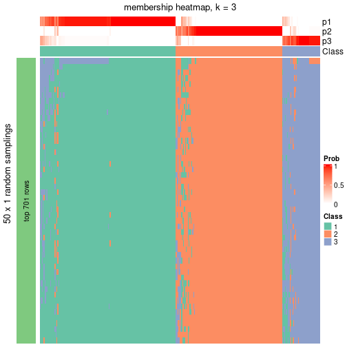</p>

</div>
<div id='tab-node-022-membership-heatmap-3'>
<pre><code class="r">membership_heatmap(res, k = 4)
</code></pre>

<p></p>

</div>
</div>

As soon as the classes for columns are determined, the signatures
that are significantly different between subgroups can be looked for. 
Following are the heatmaps for signatures.


Signature heatmaps where rows are scaled:


<script>
$( function() {
	$( '#tabs-node-022-get-signatures' ).tabs();
} );
</script>
<div id='tabs-node-022-get-signatures'>
<ul>
<li><a href='#tab-node-022-get-signatures-1'>k = 2</a></li>
<li><a href='#tab-node-022-get-signatures-2'>k = 3</a></li>
<li><a href='#tab-node-022-get-signatures-3'>k = 4</a></li>
</ul>
<div id='tab-node-022-get-signatures-1'>
<pre><code class="r">get_signatures(res, k = 2)
</code></pre>

<p></p>

</div>
<div id='tab-node-022-get-signatures-2'>
<pre><code class="r">get_signatures(res, k = 3)
</code></pre>

<p></p>

</div>
<div id='tab-node-022-get-signatures-3'>
<pre><code class="r">get_signatures(res, k = 4)
</code></pre>

<p></p>

</div>
</div>


Signature heatmaps where rows are not scaled:


<script>
$( function() {
	$( '#tabs-node-022-get-signatures-no-scale' ).tabs();
} );
</script>
<div id='tabs-node-022-get-signatures-no-scale'>
<ul>
<li><a href='#tab-node-022-get-signatures-no-scale-1'>k = 2</a></li>
<li><a href='#tab-node-022-get-signatures-no-scale-2'>k = 3</a></li>
<li><a href='#tab-node-022-get-signatures-no-scale-3'>k = 4</a></li>
</ul>
<div id='tab-node-022-get-signatures-no-scale-1'>
<pre><code class="r">get_signatures(res, k = 2, scale_rows = FALSE)
</code></pre>

<p></p>

</div>
<div id='tab-node-022-get-signatures-no-scale-2'>
<pre><code class="r">get_signatures(res, k = 3, scale_rows = FALSE)
</code></pre>

<p></p>

</div>
<div id='tab-node-022-get-signatures-no-scale-3'>
<pre><code class="r">get_signatures(res, k = 4, scale_rows = FALSE)
</code></pre>

<p></p>

</div>
</div>


Compare the overlap of signatures from different k:

```r
compare_signatures(res)
```


`get_signature()` returns a data frame invisibly. To get the list of signatures, the function
call should be assigned to a variable explicitly. In following code, if `plot` argument is set
to `FALSE`, no heatmap is plotted while only the differential analysis is performed.

```r
# code only for demonstration
tb = get_signature(res, k = ..., plot = FALSE)
```

An example of the output of `tb` is:

```
#>   which_row         fdr    mean_1    mean_2 scaled_mean_1 scaled_mean_2 km
#> 1        38 0.042760348  8.373488  9.131774    -0.5533452     0.5164555  1
#> 2        40 0.018707592  7.106213  8.469186    -0.6173731     0.5762149  1
#> 3        55 0.019134737 10.221463 11.207825    -0.6159697     0.5749050  1
#> 4        59 0.006059896  5.921854  7.869574    -0.6899429     0.6439467  1
#> 5        60 0.018055526  8.928898 10.211722    -0.6204761     0.5791110  1
#> 6        98 0.009384629 15.714769 14.887706     0.6635654    -0.6193277  2
...
```

The columns in `tb` are:

1. `which_row`: row indices corresponding to the input matrix.
2. `fdr`: FDR for the differential test. 
3. `mean_x`: The mean value in group x.
4. `scaled_mean_x`: The mean value in group x after rows are scaled.
5. `km`: Row groups if k-means clustering is applied to rows (which is done by automatically selecting number of clusters).

If there are too many signatures, `top_signatures = ...` can be set to only show the 
signatures with the highest FDRs:

```r
# code only for demonstration
# e.g. to show the top 500 most significant rows
tb = get_signature(res, k = ..., top_signatures = 500)
```

If the signatures are defined as these which are uniquely high in current group, `diff_method` argument
can be set to `"uniquely_high_in_one_group"`:

```r
# code only for demonstration
tb = get_signature(res, k = ..., diff_method = "uniquely_high_in_one_group")
```


UMAP plot which shows how samples are separated.


<script>
$( function() {
	$( '#tabs-node-022-dimension-reduction' ).tabs();
} );
</script>
<div id='tabs-node-022-dimension-reduction'>
<ul>
<li><a href='#tab-node-022-dimension-reduction-1'>k = 2</a></li>
<li><a href='#tab-node-022-dimension-reduction-2'>k = 3</a></li>
<li><a href='#tab-node-022-dimension-reduction-3'>k = 4</a></li>
</ul>
<div id='tab-node-022-dimension-reduction-1'>
<pre><code class="r">dimension_reduction(res, k = 2, method = &quot;UMAP&quot;)
</code></pre>

<p></p>

</div>
<div id='tab-node-022-dimension-reduction-2'>
<pre><code class="r">dimension_reduction(res, k = 3, method = &quot;UMAP&quot;)
</code></pre>

<p></p>

</div>
<div id='tab-node-022-dimension-reduction-3'>
<pre><code class="r">dimension_reduction(res, k = 4, method = &quot;UMAP&quot;)
</code></pre>

<p></p>

</div>
</div>


Following heatmap shows how subgroups are split when increasing `k`:

```r
collect_classes(res)
```


If matrix rows can be associated to genes, consider to use `functional_enrichment(res,
...)` to perform function enrichment for the signature genes. See [this vignette](https://jokergoo.github.io/cola_vignettes/functional_enrichment.html) for more detailed explanations.


 

---------------------------------------------------


### Node0222


Parent node: [Node022](#Node022).
Child nodes: 
                Node01211-leaf
        ,
                Node01212-leaf
        ,
                Node01221-leaf
        ,
                Node01222-leaf
        ,
                Node01223-leaf
        ,
                Node02111-leaf
        ,
                [Node02112](#Node02112)
        ,
                Node02121-leaf
        ,
                Node02122-leaf
        ,
                Node02131-leaf
        ,
                Node02132-leaf
        ,
                Node02221-leaf
        ,
                [Node02222](#Node02222)
        ,
                Node03221-leaf
        ,
                Node03222-leaf
        ,
                Node03223-leaf
        .


The object with results only for a single top-value method and a single partitioning method 
can be extracted as:

```r
res = res_rh["0222"]
```

A summary of `res` and all the functions that can be applied to it:

```r
res
```

```
#> A 'ConsensusPartition' object with k = 2, 3, 4.
#>   On a matrix with 6671 rows and 134 columns.
#>   Top rows (656) are extracted by 'ATC' method.
#>   Subgroups are detected by 'skmeans' method.
#>   Performed in total 150 partitions by row resampling.
#>   Best k for subgroups seems to be 2.
#> 
#> Following methods can be applied to this 'ConsensusPartition' object:
#>  [1] "cola_report"             "collect_classes"         "collect_plots"          
#>  [4] "collect_stats"           "colnames"                "compare_partitions"     
#>  [7] "compare_signatures"      "consensus_heatmap"       "dimension_reduction"    
#> [10] "functional_enrichment"   "get_anno_col"            "get_anno"               
#> [13] "get_classes"             "get_consensus"           "get_matrix"             
#> [16] "get_membership"          "get_param"               "get_signatures"         
#> [19] "get_stats"               "is_best_k"               "is_stable_k"            
#> [22] "membership_heatmap"      "ncol"                    "nrow"                   
#> [25] "plot_ecdf"               "predict_classes"         "rownames"               
#> [28] "select_partition_number" "show"                    "suggest_best_k"         
#> [31] "test_to_known_factors"   "top_rows_heatmap"
```

`collect_plots()` function collects all the plots made from `res` for all `k` (number of subgroups)
into one single page to provide an easy and fast comparison between different `k`.

```r
collect_plots(res)
```


The plots are:

- The first row: a plot of the eCDF (empirical cumulative distribution
  function) curves of the consensus matrix for each `k` and the heatmap of
  predicted classes for each `k`.
- The second row: heatmaps of the consensus matrix for each `k`.
- The third row: heatmaps of the membership matrix for each `k`.
- The fouth row: heatmaps of the signatures for each `k`.

All the plots in panels can be made by individual functions and they are
plotted later in this section.

`select_partition_number()` produces several plots showing different
statistics for choosing "optimized" `k`. There are following statistics:

- eCDF curves of the consensus matrix for each `k`;
- 1-PAC. [The PAC score](https://en.wikipedia.org/wiki/Consensus_clustering#Over-interpretation_potential_of_consensus_clustering)
  measures the proportion of the ambiguous subgrouping.
- Mean silhouette score.
- Concordance. The mean probability of fiting the consensus subgroup labels in all
  partitions.
- Area increased. Denote $A_k$ as the area under the eCDF curve for current
  `k`, the area increased is defined as $A_k - A_{k-1}$.
- Rand index. The percent of pairs of samples that are both in a same cluster
  or both are not in a same cluster in the partition of k and k-1.
- Jaccard index. The ratio of pairs of samples are both in a same cluster in
  the partition of k and k-1 and the pairs of samples are both in a same
  cluster in the partition k or k-1.

The detailed explanations of these statistics can be found in [the _cola_
vignette](https://jokergoo.github.io/cola_vignettes/cola.html#toc_13).

Generally speaking, higher 1-PAC score, higher mean silhouette score or higher
concordance corresponds to better partition. Rand index and Jaccard index
measure how similar the current partition is compared to partition with `k-1`.
If they are too similar, we won't accept `k` is better than `k-1`.

```r
select_partition_number(res)
```


The numeric values for all these statistics can be obtained by `get_stats()`.

```r
get_stats(res)
```

```
#>   k 1-PAC mean_silhouette concordance area_increased  Rand Jaccard
#> 2 2 0.953           0.937       0.975          0.502 0.498   0.498
#> 3 3 0.868           0.862       0.944          0.283 0.793   0.609
#> 4 4 0.629           0.594       0.754          0.127 0.899   0.730
```

`suggest_best_k()` suggests the best $k$ based on these statistics. The rules are as follows:

- All $k$ with Jaccard index larger than 0.95 are removed because increasing
  $k$ does not provide enough extra information. If all $k$ are removed, it is
  marked as no subgroup is detected.
- For all $k$ with 1-PAC score larger than 0.9, the maximal $k$ is taken as
  the best $k$, and other $k$ are marked as optional $k$.
- If it does not fit the second rule. The $k$ with the maximal vote of the
  highest 1-PAC score, highest mean silhouette, and highest concordance is
  taken as the best $k$.

```r
suggest_best_k(res)
```

```
#> [1] 2
```


Following is the table of the partitions (You need to click the **show/hide
code output** link to see it). The membership matrix (columns with name `p*`)
is inferred by
[`clue::cl_consensus()`](https://www.rdocumentation.org/link/cl_consensus?package=clue)
function with the `SE` method. Basically the value in the membership matrix
represents the probability to belong to a certain group. The finall subgroup
label for an item is determined with the group with highest probability it
belongs to.

In `get_classes()` function, the entropy is calculated from the membership
matrix and the silhouette score is calculated from the consensus matrix.


<script>
$( function() {
	$( '#tabs-node-0222-get-classes' ).tabs();
} );
</script>
<div id='tabs-node-0222-get-classes'>
<ul>
<li><a href='#tab-node-0222-get-classes-1'>k = 2</a></li>
<li><a href='#tab-node-0222-get-classes-2'>k = 3</a></li>
<li><a href='#tab-node-0222-get-classes-3'>k = 4</a></li>
</ul>

<div id='tab-node-0222-get-classes-1'>
<p><a id='tab-node-0222-get-classes-1-a' style='color:#0366d6' href='#'>show/hide code output</a></p>
<pre><code class="r">cbind(get_classes(res, k = 2), get_membership(res, k = 2))
</code></pre>

<pre><code>#&gt;                             class entropy silhouette   p1   p2
#&gt; mouse1_lib1.final_cell_0001     1   0.000      0.971 1.00 0.00
#&gt; mouse1_lib1.final_cell_0006     1   0.000      0.971 1.00 0.00
#&gt; mouse1_lib1.final_cell_0007     2   0.000      0.976 0.00 1.00
#&gt; mouse1_lib1.final_cell_0008     2   0.327      0.920 0.06 0.94
#&gt; mouse1_lib1.final_cell_0009     1   0.760      0.713 0.78 0.22
#&gt; mouse1_lib1.final_cell_0022     2   0.000      0.976 0.00 1.00
#&gt; mouse1_lib2.final_cell_0001     1   0.000      0.971 1.00 0.00
#&gt; mouse1_lib2.final_cell_0003     2   0.000      0.976 0.00 1.00
#&gt; mouse1_lib2.final_cell_0005     1   0.000      0.971 1.00 0.00
#&gt; mouse1_lib2.final_cell_0006     2   0.000      0.976 0.00 1.00
#&gt; mouse1_lib2.final_cell_0008     1   0.000      0.971 1.00 0.00
#&gt; mouse1_lib2.final_cell_0037     2   0.000      0.976 0.00 1.00
#&gt; mouse1_lib3.final_cell_0001     1   0.000      0.971 1.00 0.00
#&gt; mouse1_lib3.final_cell_0002     1   0.000      0.971 1.00 0.00
#&gt; mouse1_lib3.final_cell_0018     2   0.000      0.976 0.00 1.00
#&gt; mouse2_lib1.final_cell_0001     1   0.000      0.971 1.00 0.00
#&gt; mouse2_lib1.final_cell_0002     1   0.000      0.971 1.00 0.00
#&gt; mouse2_lib1.final_cell_0003     1   0.000      0.971 1.00 0.00
#&gt; mouse2_lib1.final_cell_0005     2   0.000      0.976 0.00 1.00
#&gt; mouse2_lib1.final_cell_0006     1   0.000      0.971 1.00 0.00
#&gt; mouse2_lib1.final_cell_0007     1   0.000      0.971 1.00 0.00
#&gt; mouse2_lib1.final_cell_0008     2   0.000      0.976 0.00 1.00
#&gt; mouse2_lib1.final_cell_0009     2   0.000      0.976 0.00 1.00
#&gt; mouse2_lib1.final_cell_0010     1   0.000      0.971 1.00 0.00
#&gt; mouse2_lib1.final_cell_0011     2   0.000      0.976 0.00 1.00
#&gt; mouse2_lib1.final_cell_0012     2   0.000      0.976 0.00 1.00
#&gt; mouse2_lib1.final_cell_0014     2   0.000      0.976 0.00 1.00
#&gt; mouse2_lib1.final_cell_0015     1   0.000      0.971 1.00 0.00
#&gt; mouse2_lib1.final_cell_0016     1   0.000      0.971 1.00 0.00
#&gt; mouse2_lib1.final_cell_0017     1   0.000      0.971 1.00 0.00
#&gt; mouse2_lib1.final_cell_0018     1   0.000      0.971 1.00 0.00
#&gt; mouse2_lib1.final_cell_0019     1   0.981      0.274 0.58 0.42
#&gt; mouse2_lib1.final_cell_0020     2   0.000      0.976 0.00 1.00
#&gt; mouse2_lib1.final_cell_0021     2   0.925      0.484 0.34 0.66
#&gt; mouse2_lib1.final_cell_0025     2   0.000      0.976 0.00 1.00
#&gt; mouse2_lib1.final_cell_0026     1   0.000      0.971 1.00 0.00
#&gt; mouse2_lib1.final_cell_0027     1   0.000      0.971 1.00 0.00
#&gt; mouse2_lib1.final_cell_0028     2   0.000      0.976 0.00 1.00
#&gt; mouse2_lib1.final_cell_0029     1   0.000      0.971 1.00 0.00
#&gt; mouse2_lib1.final_cell_0031     2   0.000      0.976 0.00 1.00
#&gt; mouse2_lib1.final_cell_0032     2   0.000      0.976 0.00 1.00
#&gt; mouse2_lib1.final_cell_0033     2   0.000      0.976 0.00 1.00
#&gt; mouse2_lib1.final_cell_0036     2   0.000      0.976 0.00 1.00
#&gt; mouse2_lib1.final_cell_0038     2   0.000      0.976 0.00 1.00
#&gt; mouse2_lib1.final_cell_0041     2   0.000      0.976 0.00 1.00
#&gt; mouse2_lib1.final_cell_0044     2   0.000      0.976 0.00 1.00
#&gt; mouse2_lib1.final_cell_0045     2   0.000      0.976 0.00 1.00
#&gt; mouse2_lib1.final_cell_0047     2   0.000      0.976 0.00 1.00
#&gt; mouse2_lib1.final_cell_0049     1   0.000      0.971 1.00 0.00
#&gt; mouse2_lib1.final_cell_0057     2   0.000      0.976 0.00 1.00
#&gt; mouse2_lib1.final_cell_0077     1   0.000      0.971 1.00 0.00
#&gt; mouse2_lib1.final_cell_0088     2   0.000      0.976 0.00 1.00
#&gt; mouse2_lib1.final_cell_0089     2   0.000      0.976 0.00 1.00
#&gt; mouse2_lib2.final_cell_0001     1   0.000      0.971 1.00 0.00
#&gt; mouse2_lib2.final_cell_0002     1   0.000      0.971 1.00 0.00
#&gt; mouse2_lib2.final_cell_0003     1   0.000      0.971 1.00 0.00
#&gt; mouse2_lib2.final_cell_0004     2   0.000      0.976 0.00 1.00
#&gt; mouse2_lib2.final_cell_0005     1   0.000      0.971 1.00 0.00
#&gt; mouse2_lib2.final_cell_0006     1   0.000      0.971 1.00 0.00
#&gt; mouse2_lib2.final_cell_0008     1   0.000      0.971 1.00 0.00
#&gt; mouse2_lib2.final_cell_0009     1   0.000      0.971 1.00 0.00
#&gt; mouse2_lib2.final_cell_0010     2   0.141      0.958 0.02 0.98
#&gt; mouse2_lib2.final_cell_0011     1   0.000      0.971 1.00 0.00
#&gt; mouse2_lib2.final_cell_0012     1   0.000      0.971 1.00 0.00
#&gt; mouse2_lib2.final_cell_0014     1   0.000      0.971 1.00 0.00
#&gt; mouse2_lib2.final_cell_0015     2   0.000      0.976 0.00 1.00
#&gt; mouse2_lib2.final_cell_0016     2   0.000      0.976 0.00 1.00
#&gt; mouse2_lib2.final_cell_0017     1   0.000      0.971 1.00 0.00
#&gt; mouse2_lib2.final_cell_0018     2   0.000      0.976 0.00 1.00
#&gt; mouse2_lib2.final_cell_0019     1   0.000      0.971 1.00 0.00
#&gt; mouse2_lib2.final_cell_0020     1   0.000      0.971 1.00 0.00
#&gt; mouse2_lib2.final_cell_0026     2   0.000      0.976 0.00 1.00
#&gt; mouse2_lib2.final_cell_0027     2   0.000      0.976 0.00 1.00
#&gt; mouse2_lib2.final_cell_0032     1   0.000      0.971 1.00 0.00
#&gt; mouse2_lib2.final_cell_0033     2   0.000      0.976 0.00 1.00
#&gt; mouse2_lib2.final_cell_0038     2   0.000      0.976 0.00 1.00
#&gt; mouse2_lib2.final_cell_0039     2   0.000      0.976 0.00 1.00
#&gt; mouse2_lib2.final_cell_0042     1   0.925      0.485 0.66 0.34
#&gt; mouse2_lib2.final_cell_0044     1   0.000      0.971 1.00 0.00
#&gt; mouse2_lib2.final_cell_0047     1   0.000      0.971 1.00 0.00
#&gt; mouse2_lib2.final_cell_0049     2   0.000      0.976 0.00 1.00
#&gt; mouse2_lib2.final_cell_0053     2   0.000      0.976 0.00 1.00
#&gt; mouse2_lib2.final_cell_0056     1   0.000      0.971 1.00 0.00
#&gt; mouse2_lib2.final_cell_0057     1   0.000      0.971 1.00 0.00
#&gt; mouse2_lib2.final_cell_0059     2   0.000      0.976 0.00 1.00
#&gt; mouse2_lib2.final_cell_0061     2   0.000      0.976 0.00 1.00
#&gt; mouse2_lib2.final_cell_0062     2   0.000      0.976 0.00 1.00
#&gt; mouse2_lib2.final_cell_0063     2   0.000      0.976 0.00 1.00
#&gt; mouse2_lib2.final_cell_0071     2   0.000      0.976 0.00 1.00
#&gt; mouse2_lib2.final_cell_0074     1   0.000      0.971 1.00 0.00
#&gt; mouse2_lib2.final_cell_0100     1   0.995      0.151 0.54 0.46
#&gt; mouse2_lib2.final_cell_0101     2   0.000      0.976 0.00 1.00
#&gt; mouse2_lib2.final_cell_0105     1   0.000      0.971 1.00 0.00
#&gt; mouse2_lib2.final_cell_0136     2   0.000      0.976 0.00 1.00
#&gt; mouse2_lib3.final_cell_0001     1   0.000      0.971 1.00 0.00
#&gt; mouse2_lib3.final_cell_0002     1   0.000      0.971 1.00 0.00
#&gt; mouse2_lib3.final_cell_0003     1   0.000      0.971 1.00 0.00
#&gt; mouse2_lib3.final_cell_0004     1   0.327      0.915 0.94 0.06
#&gt; mouse2_lib3.final_cell_0005     1   0.000      0.971 1.00 0.00
#&gt; mouse2_lib3.final_cell_0006     1   0.000      0.971 1.00 0.00
#&gt; mouse2_lib3.final_cell_0008     1   0.000      0.971 1.00 0.00
#&gt; mouse2_lib3.final_cell_0009     1   0.000      0.971 1.00 0.00
#&gt; mouse2_lib3.final_cell_0010     1   0.000      0.971 1.00 0.00
#&gt; mouse2_lib3.final_cell_0011     1   0.000      0.971 1.00 0.00
#&gt; mouse2_lib3.final_cell_0012     2   0.000      0.976 0.00 1.00
#&gt; mouse2_lib3.final_cell_0013     2   0.000      0.976 0.00 1.00
#&gt; mouse2_lib3.final_cell_0015     1   0.000      0.971 1.00 0.00
#&gt; mouse2_lib3.final_cell_0017     2   0.000      0.976 0.00 1.00
#&gt; mouse2_lib3.final_cell_0018     2   0.242      0.939 0.04 0.96
#&gt; mouse2_lib3.final_cell_0019     2   0.000      0.976 0.00 1.00
#&gt; mouse2_lib3.final_cell_0022     2   0.722      0.746 0.20 0.80
#&gt; mouse2_lib3.final_cell_0023     2   0.000      0.976 0.00 1.00
#&gt; mouse2_lib3.final_cell_0024     2   0.000      0.976 0.00 1.00
#&gt; mouse2_lib3.final_cell_0025     1   0.760      0.714 0.78 0.22
#&gt; mouse2_lib3.final_cell_0027     2   0.000      0.976 0.00 1.00
#&gt; mouse2_lib3.final_cell_0028     2   0.990      0.199 0.44 0.56
#&gt; mouse2_lib3.final_cell_0029     1   0.000      0.971 1.00 0.00
#&gt; mouse2_lib3.final_cell_0031     1   0.000      0.971 1.00 0.00
#&gt; mouse2_lib3.final_cell_0032     1   0.000      0.971 1.00 0.00
#&gt; mouse2_lib3.final_cell_0035     1   0.000      0.971 1.00 0.00
#&gt; mouse2_lib3.final_cell_0036     2   0.925      0.487 0.34 0.66
#&gt; mouse2_lib3.final_cell_0043     2   0.000      0.976 0.00 1.00
#&gt; mouse2_lib3.final_cell_0044     2   0.722      0.748 0.20 0.80
#&gt; mouse2_lib3.final_cell_0049     2   0.000      0.976 0.00 1.00
#&gt; mouse2_lib3.final_cell_0053     2   0.000      0.976 0.00 1.00
#&gt; mouse2_lib3.final_cell_0060     2   0.000      0.976 0.00 1.00
#&gt; mouse2_lib3.final_cell_0062     2   0.000      0.976 0.00 1.00
#&gt; mouse2_lib3.final_cell_0068     1   0.242      0.935 0.96 0.04
#&gt; mouse2_lib3.final_cell_0079     2   0.000      0.976 0.00 1.00
#&gt; mouse2_lib3.final_cell_0083     2   0.000      0.976 0.00 1.00
#&gt; mouse2_lib3.final_cell_0084     2   0.000      0.976 0.00 1.00
#&gt; mouse2_lib3.final_cell_0124     2   0.000      0.976 0.00 1.00
#&gt; mouse2_lib3.final_cell_0128     2   0.000      0.976 0.00 1.00
#&gt; mouse2_lib3.final_cell_0129     2   0.000      0.976 0.00 1.00
</code></pre>

<script>
$('#tab-node-0222-get-classes-1-a').parent().next().next().hide();
$('#tab-node-0222-get-classes-1-a').click(function(){
  $('#tab-node-0222-get-classes-1-a').parent().next().next().toggle();
  return(false);
});
</script>
</div>

<div id='tab-node-0222-get-classes-2'>
<p><a id='tab-node-0222-get-classes-2-a' style='color:#0366d6' href='#'>show/hide code output</a></p>
<pre><code class="r">cbind(get_classes(res, k = 3), get_membership(res, k = 3))
</code></pre>

<pre><code>#&gt;                             class entropy silhouette   p1   p2   p3
#&gt; mouse1_lib1.final_cell_0001     1  0.0000     0.9548 1.00 0.00 0.00
#&gt; mouse1_lib1.final_cell_0006     1  0.2414     0.9075 0.94 0.02 0.04
#&gt; mouse1_lib1.final_cell_0007     2  0.0000     0.9503 0.00 1.00 0.00
#&gt; mouse1_lib1.final_cell_0008     3  0.7948     0.2688 0.06 0.42 0.52
#&gt; mouse1_lib1.final_cell_0009     3  0.9110     0.1193 0.42 0.14 0.44
#&gt; mouse1_lib1.final_cell_0022     2  0.0000     0.9503 0.00 1.00 0.00
#&gt; mouse1_lib2.final_cell_0001     1  0.0000     0.9548 1.00 0.00 0.00
#&gt; mouse1_lib2.final_cell_0003     3  0.0000     0.8807 0.00 0.00 1.00
#&gt; mouse1_lib2.final_cell_0005     1  0.5397     0.6015 0.72 0.00 0.28
#&gt; mouse1_lib2.final_cell_0006     2  0.0892     0.9329 0.00 0.98 0.02
#&gt; mouse1_lib2.final_cell_0008     1  0.0000     0.9548 1.00 0.00 0.00
#&gt; mouse1_lib2.final_cell_0037     3  0.5216     0.6412 0.00 0.26 0.74
#&gt; mouse1_lib3.final_cell_0001     1  0.0000     0.9548 1.00 0.00 0.00
#&gt; mouse1_lib3.final_cell_0002     1  0.0000     0.9548 1.00 0.00 0.00
#&gt; mouse1_lib3.final_cell_0018     2  0.6244     0.1136 0.00 0.56 0.44
#&gt; mouse2_lib1.final_cell_0001     1  0.0000     0.9548 1.00 0.00 0.00
#&gt; mouse2_lib1.final_cell_0002     1  0.0000     0.9548 1.00 0.00 0.00
#&gt; mouse2_lib1.final_cell_0003     1  0.0000     0.9548 1.00 0.00 0.00
#&gt; mouse2_lib1.final_cell_0005     2  0.2537     0.8755 0.00 0.92 0.08
#&gt; mouse2_lib1.final_cell_0006     1  0.2537     0.8794 0.92 0.08 0.00
#&gt; mouse2_lib1.final_cell_0007     1  0.0000     0.9548 1.00 0.00 0.00
#&gt; mouse2_lib1.final_cell_0008     2  0.0000     0.9503 0.00 1.00 0.00
#&gt; mouse2_lib1.final_cell_0009     3  0.0000     0.8807 0.00 0.00 1.00
#&gt; mouse2_lib1.final_cell_0010     1  0.0000     0.9548 1.00 0.00 0.00
#&gt; mouse2_lib1.final_cell_0011     2  0.0000     0.9503 0.00 1.00 0.00
#&gt; mouse2_lib1.final_cell_0012     2  0.0000     0.9503 0.00 1.00 0.00
#&gt; mouse2_lib1.final_cell_0014     3  0.0000     0.8807 0.00 0.00 1.00
#&gt; mouse2_lib1.final_cell_0015     1  0.0000     0.9548 1.00 0.00 0.00
#&gt; mouse2_lib1.final_cell_0016     1  0.0000     0.9548 1.00 0.00 0.00
#&gt; mouse2_lib1.final_cell_0017     1  0.0000     0.9548 1.00 0.00 0.00
#&gt; mouse2_lib1.final_cell_0018     1  0.0000     0.9548 1.00 0.00 0.00
#&gt; mouse2_lib1.final_cell_0019     2  0.0000     0.9503 0.00 1.00 0.00
#&gt; mouse2_lib1.final_cell_0020     2  0.0000     0.9503 0.00 1.00 0.00
#&gt; mouse2_lib1.final_cell_0021     2  0.0000     0.9503 0.00 1.00 0.00
#&gt; mouse2_lib1.final_cell_0025     2  0.0000     0.9503 0.00 1.00 0.00
#&gt; mouse2_lib1.final_cell_0026     1  0.0000     0.9548 1.00 0.00 0.00
#&gt; mouse2_lib1.final_cell_0027     1  0.5016     0.6775 0.76 0.24 0.00
#&gt; mouse2_lib1.final_cell_0028     2  0.0000     0.9503 0.00 1.00 0.00
#&gt; mouse2_lib1.final_cell_0029     1  0.0000     0.9548 1.00 0.00 0.00
#&gt; mouse2_lib1.final_cell_0031     2  0.0000     0.9503 0.00 1.00 0.00
#&gt; mouse2_lib1.final_cell_0032     2  0.0000     0.9503 0.00 1.00 0.00
#&gt; mouse2_lib1.final_cell_0033     3  0.0000     0.8807 0.00 0.00 1.00
#&gt; mouse2_lib1.final_cell_0036     2  0.0000     0.9503 0.00 1.00 0.00
#&gt; mouse2_lib1.final_cell_0038     2  0.0000     0.9503 0.00 1.00 0.00
#&gt; mouse2_lib1.final_cell_0041     3  0.2066     0.8447 0.00 0.06 0.94
#&gt; mouse2_lib1.final_cell_0044     3  0.0000     0.8807 0.00 0.00 1.00
#&gt; mouse2_lib1.final_cell_0045     3  0.0000     0.8807 0.00 0.00 1.00
#&gt; mouse2_lib1.final_cell_0047     2  0.2066     0.8951 0.00 0.94 0.06
#&gt; mouse2_lib1.final_cell_0049     1  0.0000     0.9548 1.00 0.00 0.00
#&gt; mouse2_lib1.final_cell_0057     3  0.6192     0.3308 0.00 0.42 0.58
#&gt; mouse2_lib1.final_cell_0077     1  0.0000     0.9548 1.00 0.00 0.00
#&gt; mouse2_lib1.final_cell_0088     2  0.0000     0.9503 0.00 1.00 0.00
#&gt; mouse2_lib1.final_cell_0089     2  0.0000     0.9503 0.00 1.00 0.00
#&gt; mouse2_lib2.final_cell_0001     1  0.0000     0.9548 1.00 0.00 0.00
#&gt; mouse2_lib2.final_cell_0002     1  0.0000     0.9548 1.00 0.00 0.00
#&gt; mouse2_lib2.final_cell_0003     1  0.0000     0.9548 1.00 0.00 0.00
#&gt; mouse2_lib2.final_cell_0004     3  0.0000     0.8807 0.00 0.00 1.00
#&gt; mouse2_lib2.final_cell_0005     1  0.0000     0.9548 1.00 0.00 0.00
#&gt; mouse2_lib2.final_cell_0006     1  0.0000     0.9548 1.00 0.00 0.00
#&gt; mouse2_lib2.final_cell_0008     1  0.0000     0.9548 1.00 0.00 0.00
#&gt; mouse2_lib2.final_cell_0009     1  0.1781     0.9239 0.96 0.02 0.02
#&gt; mouse2_lib2.final_cell_0010     3  0.0000     0.8807 0.00 0.00 1.00
#&gt; mouse2_lib2.final_cell_0011     1  0.0000     0.9548 1.00 0.00 0.00
#&gt; mouse2_lib2.final_cell_0012     1  0.0000     0.9548 1.00 0.00 0.00
#&gt; mouse2_lib2.final_cell_0014     1  0.0000     0.9548 1.00 0.00 0.00
#&gt; mouse2_lib2.final_cell_0015     3  0.0000     0.8807 0.00 0.00 1.00
#&gt; mouse2_lib2.final_cell_0016     3  0.0000     0.8807 0.00 0.00 1.00
#&gt; mouse2_lib2.final_cell_0017     1  0.0000     0.9548 1.00 0.00 0.00
#&gt; mouse2_lib2.final_cell_0018     3  0.6045     0.4391 0.00 0.38 0.62
#&gt; mouse2_lib2.final_cell_0019     1  0.0000     0.9548 1.00 0.00 0.00
#&gt; mouse2_lib2.final_cell_0020     1  0.0000     0.9548 1.00 0.00 0.00
#&gt; mouse2_lib2.final_cell_0026     3  0.0000     0.8807 0.00 0.00 1.00
#&gt; mouse2_lib2.final_cell_0027     3  0.4291     0.7398 0.00 0.18 0.82
#&gt; mouse2_lib2.final_cell_0032     1  0.0000     0.9548 1.00 0.00 0.00
#&gt; mouse2_lib2.final_cell_0033     2  0.0000     0.9503 0.00 1.00 0.00
#&gt; mouse2_lib2.final_cell_0038     2  0.0000     0.9503 0.00 1.00 0.00
#&gt; mouse2_lib2.final_cell_0039     2  0.0000     0.9503 0.00 1.00 0.00
#&gt; mouse2_lib2.final_cell_0042     2  0.4291     0.7210 0.18 0.82 0.00
#&gt; mouse2_lib2.final_cell_0044     1  0.0000     0.9548 1.00 0.00 0.00
#&gt; mouse2_lib2.final_cell_0047     1  0.2066     0.9044 0.94 0.00 0.06
#&gt; mouse2_lib2.final_cell_0049     3  0.5397     0.6231 0.00 0.28 0.72
#&gt; mouse2_lib2.final_cell_0053     2  0.0000     0.9503 0.00 1.00 0.00
#&gt; mouse2_lib2.final_cell_0056     1  0.5948     0.4510 0.64 0.36 0.00
#&gt; mouse2_lib2.final_cell_0057     1  0.0000     0.9548 1.00 0.00 0.00
#&gt; mouse2_lib2.final_cell_0059     2  0.0000     0.9503 0.00 1.00 0.00
#&gt; mouse2_lib2.final_cell_0061     2  0.0000     0.9503 0.00 1.00 0.00
#&gt; mouse2_lib2.final_cell_0062     3  0.0000     0.8807 0.00 0.00 1.00
#&gt; mouse2_lib2.final_cell_0063     2  0.0000     0.9503 0.00 1.00 0.00
#&gt; mouse2_lib2.final_cell_0071     2  0.0000     0.9503 0.00 1.00 0.00
#&gt; mouse2_lib2.final_cell_0074     1  0.0000     0.9548 1.00 0.00 0.00
#&gt; mouse2_lib2.final_cell_0100     2  0.9764     0.0343 0.30 0.44 0.26
#&gt; mouse2_lib2.final_cell_0101     2  0.0000     0.9503 0.00 1.00 0.00
#&gt; mouse2_lib2.final_cell_0105     1  0.1781     0.9246 0.96 0.02 0.02
#&gt; mouse2_lib2.final_cell_0136     2  0.4291     0.7412 0.00 0.82 0.18
#&gt; mouse2_lib3.final_cell_0001     1  0.0000     0.9548 1.00 0.00 0.00
#&gt; mouse2_lib3.final_cell_0002     1  0.0000     0.9548 1.00 0.00 0.00
#&gt; mouse2_lib3.final_cell_0003     1  0.0000     0.9548 1.00 0.00 0.00
#&gt; mouse2_lib3.final_cell_0004     3  0.0000     0.8807 0.00 0.00 1.00
#&gt; mouse2_lib3.final_cell_0005     1  0.0000     0.9548 1.00 0.00 0.00
#&gt; mouse2_lib3.final_cell_0006     1  0.0000     0.9548 1.00 0.00 0.00
#&gt; mouse2_lib3.final_cell_0008     1  0.0000     0.9548 1.00 0.00 0.00
#&gt; mouse2_lib3.final_cell_0009     1  0.0000     0.9548 1.00 0.00 0.00
#&gt; mouse2_lib3.final_cell_0010     1  0.0000     0.9548 1.00 0.00 0.00
#&gt; mouse2_lib3.final_cell_0011     1  0.0000     0.9548 1.00 0.00 0.00
#&gt; mouse2_lib3.final_cell_0012     3  0.6302     0.1539 0.00 0.48 0.52
#&gt; mouse2_lib3.final_cell_0013     3  0.0000     0.8807 0.00 0.00 1.00
#&gt; mouse2_lib3.final_cell_0015     1  0.3686     0.8102 0.86 0.14 0.00
#&gt; mouse2_lib3.final_cell_0017     3  0.0000     0.8807 0.00 0.00 1.00
#&gt; mouse2_lib3.final_cell_0018     2  0.0000     0.9503 0.00 1.00 0.00
#&gt; mouse2_lib3.final_cell_0019     2  0.0000     0.9503 0.00 1.00 0.00
#&gt; mouse2_lib3.final_cell_0022     2  0.0000     0.9503 0.00 1.00 0.00
#&gt; mouse2_lib3.final_cell_0023     2  0.3686     0.8008 0.00 0.86 0.14
#&gt; mouse2_lib3.final_cell_0024     3  0.0000     0.8807 0.00 0.00 1.00
#&gt; mouse2_lib3.final_cell_0025     1  0.9330     0.2325 0.52 0.24 0.24
#&gt; mouse2_lib3.final_cell_0027     2  0.0000     0.9503 0.00 1.00 0.00
#&gt; mouse2_lib3.final_cell_0028     1  0.9974    -0.2127 0.36 0.30 0.34
#&gt; mouse2_lib3.final_cell_0029     1  0.0000     0.9548 1.00 0.00 0.00
#&gt; mouse2_lib3.final_cell_0031     1  0.0000     0.9548 1.00 0.00 0.00
#&gt; mouse2_lib3.final_cell_0032     1  0.0000     0.9548 1.00 0.00 0.00
#&gt; mouse2_lib3.final_cell_0035     1  0.0000     0.9548 1.00 0.00 0.00
#&gt; mouse2_lib3.final_cell_0036     2  0.0000     0.9503 0.00 1.00 0.00
#&gt; mouse2_lib3.final_cell_0043     2  0.0000     0.9503 0.00 1.00 0.00
#&gt; mouse2_lib3.final_cell_0044     2  0.0000     0.9503 0.00 1.00 0.00
#&gt; mouse2_lib3.final_cell_0049     2  0.0000     0.9503 0.00 1.00 0.00
#&gt; mouse2_lib3.final_cell_0053     2  0.0000     0.9503 0.00 1.00 0.00
#&gt; mouse2_lib3.final_cell_0060     3  0.0000     0.8807 0.00 0.00 1.00
#&gt; mouse2_lib3.final_cell_0062     3  0.0000     0.8807 0.00 0.00 1.00
#&gt; mouse2_lib3.final_cell_0068     2  0.5560     0.5350 0.30 0.70 0.00
#&gt; mouse2_lib3.final_cell_0079     3  0.0892     0.8698 0.00 0.02 0.98
#&gt; mouse2_lib3.final_cell_0083     2  0.0000     0.9503 0.00 1.00 0.00
#&gt; mouse2_lib3.final_cell_0084     2  0.0000     0.9503 0.00 1.00 0.00
#&gt; mouse2_lib3.final_cell_0124     2  0.0000     0.9503 0.00 1.00 0.00
#&gt; mouse2_lib3.final_cell_0128     2  0.0892     0.9328 0.00 0.98 0.02
#&gt; mouse2_lib3.final_cell_0129     2  0.0000     0.9503 0.00 1.00 0.00
</code></pre>

<script>
$('#tab-node-0222-get-classes-2-a').parent().next().next().hide();
$('#tab-node-0222-get-classes-2-a').click(function(){
  $('#tab-node-0222-get-classes-2-a').parent().next().next().toggle();
  return(false);
});
</script>
</div>

<div id='tab-node-0222-get-classes-3'>
<p><a id='tab-node-0222-get-classes-3-a' style='color:#0366d6' href='#'>show/hide code output</a></p>
<pre><code class="r">cbind(get_classes(res, k = 4), get_membership(res, k = 4))
</code></pre>

<pre><code>#&gt;                             class entropy silhouette   p1   p2   p3   p4
#&gt; mouse1_lib1.final_cell_0001     1  0.0000     0.8637 1.00 0.00 0.00 0.00
#&gt; mouse1_lib1.final_cell_0006     1  0.5256     0.6757 0.70 0.00 0.04 0.26
#&gt; mouse1_lib1.final_cell_0007     2  0.0000     0.6485 0.00 1.00 0.00 0.00
#&gt; mouse1_lib1.final_cell_0008     4  0.6600     0.5240 0.08 0.20 0.04 0.68
#&gt; mouse1_lib1.final_cell_0009     4  0.9541    -0.0160 0.12 0.26 0.26 0.36
#&gt; mouse1_lib1.final_cell_0022     2  0.1211     0.6417 0.00 0.96 0.00 0.04
#&gt; mouse1_lib2.final_cell_0001     1  0.1637     0.8489 0.94 0.00 0.00 0.06
#&gt; mouse1_lib2.final_cell_0003     3  0.0000     0.8927 0.00 0.00 1.00 0.00
#&gt; mouse1_lib2.final_cell_0005     1  0.5000     0.0481 0.50 0.00 0.00 0.50
#&gt; mouse1_lib2.final_cell_0006     2  0.3037     0.6121 0.00 0.88 0.02 0.10
#&gt; mouse1_lib2.final_cell_0008     1  0.2345     0.8422 0.90 0.00 0.00 0.10
#&gt; mouse1_lib2.final_cell_0037     4  0.6686     0.5413 0.00 0.20 0.18 0.62
#&gt; mouse1_lib3.final_cell_0001     1  0.0000     0.8637 1.00 0.00 0.00 0.00
#&gt; mouse1_lib3.final_cell_0002     1  0.0707     0.8588 0.98 0.00 0.00 0.02
#&gt; mouse1_lib3.final_cell_0018     4  0.6248     0.4996 0.00 0.26 0.10 0.64
#&gt; mouse2_lib1.final_cell_0001     1  0.0000     0.8637 1.00 0.00 0.00 0.00
#&gt; mouse2_lib1.final_cell_0002     1  0.0707     0.8588 0.98 0.00 0.00 0.02
#&gt; mouse2_lib1.final_cell_0003     1  0.1637     0.8490 0.94 0.00 0.00 0.06
#&gt; mouse2_lib1.final_cell_0005     4  0.5957     0.2607 0.00 0.42 0.04 0.54
#&gt; mouse2_lib1.final_cell_0006     4  0.7869    -0.1457 0.34 0.28 0.00 0.38
#&gt; mouse2_lib1.final_cell_0007     1  0.1637     0.8425 0.94 0.00 0.00 0.06
#&gt; mouse2_lib1.final_cell_0008     2  0.4948     0.0993 0.00 0.56 0.00 0.44
#&gt; mouse2_lib1.final_cell_0009     3  0.0000     0.8927 0.00 0.00 1.00 0.00
#&gt; mouse2_lib1.final_cell_0010     1  0.2011     0.8392 0.92 0.00 0.00 0.08
#&gt; mouse2_lib1.final_cell_0011     2  0.3335     0.5892 0.00 0.86 0.02 0.12
#&gt; mouse2_lib1.final_cell_0012     2  0.0707     0.6464 0.00 0.98 0.00 0.02
#&gt; mouse2_lib1.final_cell_0014     3  0.0000     0.8927 0.00 0.00 1.00 0.00
#&gt; mouse2_lib1.final_cell_0015     1  0.7544     0.3348 0.46 0.20 0.00 0.34
#&gt; mouse2_lib1.final_cell_0016     1  0.2011     0.8431 0.92 0.00 0.00 0.08
#&gt; mouse2_lib1.final_cell_0017     1  0.3037     0.8286 0.88 0.02 0.00 0.10
#&gt; mouse2_lib1.final_cell_0018     1  0.0000     0.8637 1.00 0.00 0.00 0.00
#&gt; mouse2_lib1.final_cell_0019     2  0.4624     0.3997 0.00 0.66 0.00 0.34
#&gt; mouse2_lib1.final_cell_0020     2  0.0000     0.6485 0.00 1.00 0.00 0.00
#&gt; mouse2_lib1.final_cell_0021     2  0.4522     0.4177 0.00 0.68 0.00 0.32
#&gt; mouse2_lib1.final_cell_0025     2  0.4977     0.0404 0.00 0.54 0.00 0.46
#&gt; mouse2_lib1.final_cell_0026     1  0.3975     0.7538 0.76 0.00 0.00 0.24
#&gt; mouse2_lib1.final_cell_0027     2  0.7544     0.1515 0.20 0.46 0.00 0.34
#&gt; mouse2_lib1.final_cell_0028     2  0.4907     0.1495 0.00 0.58 0.00 0.42
#&gt; mouse2_lib1.final_cell_0029     1  0.0000     0.8637 1.00 0.00 0.00 0.00
#&gt; mouse2_lib1.final_cell_0031     2  0.1637     0.6271 0.00 0.94 0.00 0.06
#&gt; mouse2_lib1.final_cell_0032     2  0.4994    -0.0289 0.00 0.52 0.00 0.48
#&gt; mouse2_lib1.final_cell_0033     3  0.0000     0.8927 0.00 0.00 1.00 0.00
#&gt; mouse2_lib1.final_cell_0036     2  0.0707     0.6432 0.00 0.98 0.00 0.02
#&gt; mouse2_lib1.final_cell_0038     2  0.5570     0.0101 0.00 0.54 0.02 0.44
#&gt; mouse2_lib1.final_cell_0041     4  0.6586     0.2535 0.00 0.08 0.42 0.50
#&gt; mouse2_lib1.final_cell_0044     3  0.0000     0.8927 0.00 0.00 1.00 0.00
#&gt; mouse2_lib1.final_cell_0045     3  0.0000     0.8927 0.00 0.00 1.00 0.00
#&gt; mouse2_lib1.final_cell_0047     4  0.4977     0.1548 0.00 0.46 0.00 0.54
#&gt; mouse2_lib1.final_cell_0049     1  0.5619     0.6113 0.64 0.04 0.00 0.32
#&gt; mouse2_lib1.final_cell_0057     4  0.6449     0.5296 0.00 0.22 0.14 0.64
#&gt; mouse2_lib1.final_cell_0077     1  0.7544     0.3351 0.46 0.20 0.00 0.34
#&gt; mouse2_lib1.final_cell_0088     2  0.1913     0.6377 0.00 0.94 0.02 0.04
#&gt; mouse2_lib1.final_cell_0089     2  0.4522     0.4715 0.00 0.68 0.00 0.32
#&gt; mouse2_lib2.final_cell_0001     1  0.0000     0.8637 1.00 0.00 0.00 0.00
#&gt; mouse2_lib2.final_cell_0002     1  0.0000     0.8637 1.00 0.00 0.00 0.00
#&gt; mouse2_lib2.final_cell_0003     1  0.0000     0.8637 1.00 0.00 0.00 0.00
#&gt; mouse2_lib2.final_cell_0004     3  0.0000     0.8927 0.00 0.00 1.00 0.00
#&gt; mouse2_lib2.final_cell_0005     1  0.3610     0.7506 0.80 0.00 0.00 0.20
#&gt; mouse2_lib2.final_cell_0006     1  0.0000     0.8637 1.00 0.00 0.00 0.00
#&gt; mouse2_lib2.final_cell_0008     1  0.5619     0.6133 0.64 0.04 0.00 0.32
#&gt; mouse2_lib2.final_cell_0009     1  0.7139     0.4019 0.50 0.14 0.00 0.36
#&gt; mouse2_lib2.final_cell_0010     3  0.5000    -0.1070 0.00 0.00 0.50 0.50
#&gt; mouse2_lib2.final_cell_0011     1  0.6049     0.6386 0.68 0.12 0.00 0.20
#&gt; mouse2_lib2.final_cell_0012     1  0.4134     0.7119 0.74 0.00 0.00 0.26
#&gt; mouse2_lib2.final_cell_0014     1  0.2011     0.8287 0.92 0.00 0.00 0.08
#&gt; mouse2_lib2.final_cell_0015     3  0.0000     0.8927 0.00 0.00 1.00 0.00
#&gt; mouse2_lib2.final_cell_0016     3  0.0000     0.8927 0.00 0.00 1.00 0.00
#&gt; mouse2_lib2.final_cell_0017     1  0.0707     0.8588 0.98 0.00 0.00 0.02
#&gt; mouse2_lib2.final_cell_0018     3  0.7456    -0.1630 0.00 0.36 0.46 0.18
#&gt; mouse2_lib2.final_cell_0019     1  0.1637     0.8417 0.94 0.00 0.00 0.06
#&gt; mouse2_lib2.final_cell_0020     1  0.0000     0.8637 1.00 0.00 0.00 0.00
#&gt; mouse2_lib2.final_cell_0026     3  0.0000     0.8927 0.00 0.00 1.00 0.00
#&gt; mouse2_lib2.final_cell_0027     3  0.5256     0.4868 0.00 0.26 0.70 0.04
#&gt; mouse2_lib2.final_cell_0032     1  0.0707     0.8602 0.98 0.00 0.00 0.02
#&gt; mouse2_lib2.final_cell_0033     2  0.4134     0.4446 0.00 0.74 0.00 0.26
#&gt; mouse2_lib2.final_cell_0038     2  0.0000     0.6485 0.00 1.00 0.00 0.00
#&gt; mouse2_lib2.final_cell_0039     2  0.5487     0.1555 0.00 0.58 0.02 0.40
#&gt; mouse2_lib2.final_cell_0042     2  0.7785     0.0418 0.26 0.42 0.00 0.32
#&gt; mouse2_lib2.final_cell_0044     1  0.5619     0.6109 0.64 0.04 0.00 0.32
#&gt; mouse2_lib2.final_cell_0047     1  0.5619     0.5964 0.64 0.00 0.04 0.32
#&gt; mouse2_lib2.final_cell_0049     4  0.7004     0.5232 0.00 0.20 0.22 0.58
#&gt; mouse2_lib2.final_cell_0053     2  0.0000     0.6485 0.00 1.00 0.00 0.00
#&gt; mouse2_lib2.final_cell_0056     2  0.7745     0.1023 0.24 0.42 0.00 0.34
#&gt; mouse2_lib2.final_cell_0057     1  0.0000     0.8637 1.00 0.00 0.00 0.00
#&gt; mouse2_lib2.final_cell_0059     2  0.0000     0.6485 0.00 1.00 0.00 0.00
#&gt; mouse2_lib2.final_cell_0061     2  0.1637     0.6353 0.00 0.94 0.00 0.06
#&gt; mouse2_lib2.final_cell_0062     3  0.0000     0.8927 0.00 0.00 1.00 0.00
#&gt; mouse2_lib2.final_cell_0063     2  0.4948     0.0965 0.00 0.56 0.00 0.44
#&gt; mouse2_lib2.final_cell_0071     2  0.1637     0.6254 0.00 0.94 0.00 0.06
#&gt; mouse2_lib2.final_cell_0074     1  0.0707     0.8588 0.98 0.00 0.00 0.02
#&gt; mouse2_lib2.final_cell_0100     4  0.5784     0.4884 0.20 0.10 0.00 0.70
#&gt; mouse2_lib2.final_cell_0101     2  0.2647     0.6207 0.00 0.88 0.00 0.12
#&gt; mouse2_lib2.final_cell_0105     1  0.4713     0.4294 0.64 0.00 0.00 0.36
#&gt; mouse2_lib2.final_cell_0136     4  0.5606     0.0871 0.00 0.48 0.02 0.50
#&gt; mouse2_lib3.final_cell_0001     1  0.0000     0.8637 1.00 0.00 0.00 0.00
#&gt; mouse2_lib3.final_cell_0002     1  0.0000     0.8637 1.00 0.00 0.00 0.00
#&gt; mouse2_lib3.final_cell_0003     1  0.0000     0.8637 1.00 0.00 0.00 0.00
#&gt; mouse2_lib3.final_cell_0004     3  0.0000     0.8927 0.00 0.00 1.00 0.00
#&gt; mouse2_lib3.final_cell_0005     1  0.0000     0.8637 1.00 0.00 0.00 0.00
#&gt; mouse2_lib3.final_cell_0006     1  0.0707     0.8588 0.98 0.00 0.00 0.02
#&gt; mouse2_lib3.final_cell_0008     1  0.3172     0.8098 0.84 0.00 0.00 0.16
#&gt; mouse2_lib3.final_cell_0009     1  0.0000     0.8637 1.00 0.00 0.00 0.00
#&gt; mouse2_lib3.final_cell_0010     1  0.2345     0.8313 0.90 0.00 0.00 0.10
#&gt; mouse2_lib3.final_cell_0011     1  0.0000     0.8637 1.00 0.00 0.00 0.00
#&gt; mouse2_lib3.final_cell_0012     3  0.4642     0.5844 0.00 0.24 0.74 0.02
#&gt; mouse2_lib3.final_cell_0013     3  0.0000     0.8927 0.00 0.00 1.00 0.00
#&gt; mouse2_lib3.final_cell_0015     1  0.7888     0.1596 0.38 0.30 0.00 0.32
#&gt; mouse2_lib3.final_cell_0017     3  0.0000     0.8927 0.00 0.00 1.00 0.00
#&gt; mouse2_lib3.final_cell_0018     2  0.5355     0.2743 0.02 0.62 0.00 0.36
#&gt; mouse2_lib3.final_cell_0019     2  0.1211     0.6431 0.00 0.96 0.00 0.04
#&gt; mouse2_lib3.final_cell_0022     2  0.4522     0.4204 0.00 0.68 0.00 0.32
#&gt; mouse2_lib3.final_cell_0023     4  0.5428     0.3374 0.00 0.38 0.02 0.60
#&gt; mouse2_lib3.final_cell_0024     3  0.0000     0.8927 0.00 0.00 1.00 0.00
#&gt; mouse2_lib3.final_cell_0025     4  0.5955     0.4926 0.18 0.08 0.02 0.72
#&gt; mouse2_lib3.final_cell_0027     2  0.4994    -0.0289 0.00 0.52 0.00 0.48
#&gt; mouse2_lib3.final_cell_0028     4  0.7921     0.4485 0.30 0.08 0.08 0.54
#&gt; mouse2_lib3.final_cell_0029     1  0.0000     0.8637 1.00 0.00 0.00 0.00
#&gt; mouse2_lib3.final_cell_0031     1  0.1637     0.8490 0.94 0.00 0.00 0.06
#&gt; mouse2_lib3.final_cell_0032     1  0.0707     0.8605 0.98 0.00 0.00 0.02
#&gt; mouse2_lib3.final_cell_0035     1  0.1637     0.8555 0.94 0.00 0.00 0.06
#&gt; mouse2_lib3.final_cell_0036     2  0.4522     0.4200 0.00 0.68 0.00 0.32
#&gt; mouse2_lib3.final_cell_0043     2  0.3172     0.5625 0.00 0.84 0.00 0.16
#&gt; mouse2_lib3.final_cell_0044     2  0.4277     0.4693 0.00 0.72 0.00 0.28
#&gt; mouse2_lib3.final_cell_0049     2  0.2647     0.6008 0.00 0.88 0.00 0.12
#&gt; mouse2_lib3.final_cell_0053     2  0.2921     0.5708 0.00 0.86 0.00 0.14
#&gt; mouse2_lib3.final_cell_0060     3  0.0000     0.8927 0.00 0.00 1.00 0.00
#&gt; mouse2_lib3.final_cell_0062     4  0.4790     0.3034 0.00 0.00 0.38 0.62
#&gt; mouse2_lib3.final_cell_0068     4  0.6370     0.3115 0.10 0.28 0.00 0.62
#&gt; mouse2_lib3.final_cell_0079     4  0.6074     0.4028 0.00 0.06 0.34 0.60
#&gt; mouse2_lib3.final_cell_0083     2  0.0000     0.6485 0.00 1.00 0.00 0.00
#&gt; mouse2_lib3.final_cell_0084     2  0.1211     0.6384 0.00 0.96 0.00 0.04
#&gt; mouse2_lib3.final_cell_0124     2  0.0707     0.6464 0.00 0.98 0.00 0.02
#&gt; mouse2_lib3.final_cell_0128     2  0.5271     0.2920 0.00 0.64 0.02 0.34
#&gt; mouse2_lib3.final_cell_0129     2  0.4948     0.0993 0.00 0.56 0.00 0.44
</code></pre>

<script>
$('#tab-node-0222-get-classes-3-a').parent().next().next().hide();
$('#tab-node-0222-get-classes-3-a').click(function(){
  $('#tab-node-0222-get-classes-3-a').parent().next().next().toggle();
  return(false);
});
</script>
</div>
</div>

Heatmaps for the consensus matrix. It visualizes the probability of two
samples to be in a same group.


<script>
$( function() {
	$( '#tabs-node-0222-consensus-heatmap' ).tabs();
} );
</script>
<div id='tabs-node-0222-consensus-heatmap'>
<ul>
<li><a href='#tab-node-0222-consensus-heatmap-1'>k = 2</a></li>
<li><a href='#tab-node-0222-consensus-heatmap-2'>k = 3</a></li>
<li><a href='#tab-node-0222-consensus-heatmap-3'>k = 4</a></li>
</ul>
<div id='tab-node-0222-consensus-heatmap-1'>
<pre><code class="r">consensus_heatmap(res, k = 2)
</code></pre>

<p></p>

</div>
<div id='tab-node-0222-consensus-heatmap-2'>
<pre><code class="r">consensus_heatmap(res, k = 3)
</code></pre>

<p></p>

</div>
<div id='tab-node-0222-consensus-heatmap-3'>
<pre><code class="r">consensus_heatmap(res, k = 4)
</code></pre>

<p></p>

</div>
</div>

Heatmaps for the membership of samples in all partitions to see how consistent they are:


<script>
$( function() {
	$( '#tabs-node-0222-membership-heatmap' ).tabs();
} );
</script>
<div id='tabs-node-0222-membership-heatmap'>
<ul>
<li><a href='#tab-node-0222-membership-heatmap-1'>k = 2</a></li>
<li><a href='#tab-node-0222-membership-heatmap-2'>k = 3</a></li>
<li><a href='#tab-node-0222-membership-heatmap-3'>k = 4</a></li>
</ul>
<div id='tab-node-0222-membership-heatmap-1'>
<pre><code class="r">membership_heatmap(res, k = 2)
</code></pre>

<p></p>

</div>
<div id='tab-node-0222-membership-heatmap-2'>
<pre><code class="r">membership_heatmap(res, k = 3)
</code></pre>

<p></p>

</div>
<div id='tab-node-0222-membership-heatmap-3'>
<pre><code class="r">membership_heatmap(res, k = 4)
</code></pre>

<p></p>

</div>
</div>

As soon as the classes for columns are determined, the signatures
that are significantly different between subgroups can be looked for. 
Following are the heatmaps for signatures.


Signature heatmaps where rows are scaled:


<script>
$( function() {
	$( '#tabs-node-0222-get-signatures' ).tabs();
} );
</script>
<div id='tabs-node-0222-get-signatures'>
<ul>
<li><a href='#tab-node-0222-get-signatures-1'>k = 2</a></li>
<li><a href='#tab-node-0222-get-signatures-2'>k = 3</a></li>
<li><a href='#tab-node-0222-get-signatures-3'>k = 4</a></li>
</ul>
<div id='tab-node-0222-get-signatures-1'>
<pre><code class="r">get_signatures(res, k = 2)
</code></pre>

<p></p>

</div>
<div id='tab-node-0222-get-signatures-2'>
<pre><code class="r">get_signatures(res, k = 3)
</code></pre>

<p></p>

</div>
<div id='tab-node-0222-get-signatures-3'>
<pre><code class="r">get_signatures(res, k = 4)
</code></pre>

<p></p>

</div>
</div>


Signature heatmaps where rows are not scaled:


<script>
$( function() {
	$( '#tabs-node-0222-get-signatures-no-scale' ).tabs();
} );
</script>
<div id='tabs-node-0222-get-signatures-no-scale'>
<ul>
<li><a href='#tab-node-0222-get-signatures-no-scale-1'>k = 2</a></li>
<li><a href='#tab-node-0222-get-signatures-no-scale-2'>k = 3</a></li>
<li><a href='#tab-node-0222-get-signatures-no-scale-3'>k = 4</a></li>
</ul>
<div id='tab-node-0222-get-signatures-no-scale-1'>
<pre><code class="r">get_signatures(res, k = 2, scale_rows = FALSE)
</code></pre>

<p></p>

</div>
<div id='tab-node-0222-get-signatures-no-scale-2'>
<pre><code class="r">get_signatures(res, k = 3, scale_rows = FALSE)
</code></pre>

<p></p>

</div>
<div id='tab-node-0222-get-signatures-no-scale-3'>
<pre><code class="r">get_signatures(res, k = 4, scale_rows = FALSE)
</code></pre>

<p></p>

</div>
</div>


Compare the overlap of signatures from different k:

```r
compare_signatures(res)
```


`get_signature()` returns a data frame invisibly. To get the list of signatures, the function
call should be assigned to a variable explicitly. In following code, if `plot` argument is set
to `FALSE`, no heatmap is plotted while only the differential analysis is performed.

```r
# code only for demonstration
tb = get_signature(res, k = ..., plot = FALSE)
```

An example of the output of `tb` is:

```
#>   which_row         fdr    mean_1    mean_2 scaled_mean_1 scaled_mean_2 km
#> 1        38 0.042760348  8.373488  9.131774    -0.5533452     0.5164555  1
#> 2        40 0.018707592  7.106213  8.469186    -0.6173731     0.5762149  1
#> 3        55 0.019134737 10.221463 11.207825    -0.6159697     0.5749050  1
#> 4        59 0.006059896  5.921854  7.869574    -0.6899429     0.6439467  1
#> 5        60 0.018055526  8.928898 10.211722    -0.6204761     0.5791110  1
#> 6        98 0.009384629 15.714769 14.887706     0.6635654    -0.6193277  2
...
```

The columns in `tb` are:

1. `which_row`: row indices corresponding to the input matrix.
2. `fdr`: FDR for the differential test. 
3. `mean_x`: The mean value in group x.
4. `scaled_mean_x`: The mean value in group x after rows are scaled.
5. `km`: Row groups if k-means clustering is applied to rows (which is done by automatically selecting number of clusters).

If there are too many signatures, `top_signatures = ...` can be set to only show the 
signatures with the highest FDRs:

```r
# code only for demonstration
# e.g. to show the top 500 most significant rows
tb = get_signature(res, k = ..., top_signatures = 500)
```

If the signatures are defined as these which are uniquely high in current group, `diff_method` argument
can be set to `"uniquely_high_in_one_group"`:

```r
# code only for demonstration
tb = get_signature(res, k = ..., diff_method = "uniquely_high_in_one_group")
```


UMAP plot which shows how samples are separated.


<script>
$( function() {
	$( '#tabs-node-0222-dimension-reduction' ).tabs();
} );
</script>
<div id='tabs-node-0222-dimension-reduction'>
<ul>
<li><a href='#tab-node-0222-dimension-reduction-1'>k = 2</a></li>
<li><a href='#tab-node-0222-dimension-reduction-2'>k = 3</a></li>
<li><a href='#tab-node-0222-dimension-reduction-3'>k = 4</a></li>
</ul>
<div id='tab-node-0222-dimension-reduction-1'>
<pre><code class="r">dimension_reduction(res, k = 2, method = &quot;UMAP&quot;)
</code></pre>

<p></p>

</div>
<div id='tab-node-0222-dimension-reduction-2'>
<pre><code class="r">dimension_reduction(res, k = 3, method = &quot;UMAP&quot;)
</code></pre>

<p></p>

</div>
<div id='tab-node-0222-dimension-reduction-3'>
<pre><code class="r">dimension_reduction(res, k = 4, method = &quot;UMAP&quot;)
</code></pre>

<p></p>

</div>
</div>


Following heatmap shows how subgroups are split when increasing `k`:

```r
collect_classes(res)
```


If matrix rows can be associated to genes, consider to use `functional_enrichment(res,
...)` to perform function enrichment for the signature genes. See [this vignette](https://jokergoo.github.io/cola_vignettes/functional_enrichment.html) for more detailed explanations.


 

---------------------------------------------------


### Node02222


Parent node: [Node0222](#Node0222).
Child nodes: 
                Node021121-leaf
        ,
                Node021122-leaf
        ,
                Node021123-leaf
        ,
                Node022221-leaf
        ,
                Node022222-leaf
        .


The object with results only for a single top-value method and a single partitioning method 
can be extracted as:

```r
res = res_rh["02222"]
```

A summary of `res` and all the functions that can be applied to it:

```r
res
```

```
#> A 'ConsensusPartition' object with k = 2, 3, 4.
#>   On a matrix with 5412 rows and 71 columns.
#>   Top rows (402) are extracted by 'ATC' method.
#>   Subgroups are detected by 'skmeans' method.
#>   Performed in total 150 partitions by row resampling.
#>   Best k for subgroups seems to be 3.
#> 
#> Following methods can be applied to this 'ConsensusPartition' object:
#>  [1] "cola_report"             "collect_classes"         "collect_plots"          
#>  [4] "collect_stats"           "colnames"                "compare_partitions"     
#>  [7] "compare_signatures"      "consensus_heatmap"       "dimension_reduction"    
#> [10] "functional_enrichment"   "get_anno_col"            "get_anno"               
#> [13] "get_classes"             "get_consensus"           "get_matrix"             
#> [16] "get_membership"          "get_param"               "get_signatures"         
#> [19] "get_stats"               "is_best_k"               "is_stable_k"            
#> [22] "membership_heatmap"      "ncol"                    "nrow"                   
#> [25] "plot_ecdf"               "predict_classes"         "rownames"               
#> [28] "select_partition_number" "show"                    "suggest_best_k"         
#> [31] "test_to_known_factors"   "top_rows_heatmap"
```

`collect_plots()` function collects all the plots made from `res` for all `k` (number of subgroups)
into one single page to provide an easy and fast comparison between different `k`.

```r
collect_plots(res)
```


The plots are:

- The first row: a plot of the eCDF (empirical cumulative distribution
  function) curves of the consensus matrix for each `k` and the heatmap of
  predicted classes for each `k`.
- The second row: heatmaps of the consensus matrix for each `k`.
- The third row: heatmaps of the membership matrix for each `k`.
- The fouth row: heatmaps of the signatures for each `k`.

All the plots in panels can be made by individual functions and they are
plotted later in this section.

`select_partition_number()` produces several plots showing different
statistics for choosing "optimized" `k`. There are following statistics:

- eCDF curves of the consensus matrix for each `k`;
- 1-PAC. [The PAC score](https://en.wikipedia.org/wiki/Consensus_clustering#Over-interpretation_potential_of_consensus_clustering)
  measures the proportion of the ambiguous subgrouping.
- Mean silhouette score.
- Concordance. The mean probability of fiting the consensus subgroup labels in all
  partitions.
- Area increased. Denote $A_k$ as the area under the eCDF curve for current
  `k`, the area increased is defined as $A_k - A_{k-1}$.
- Rand index. The percent of pairs of samples that are both in a same cluster
  or both are not in a same cluster in the partition of k and k-1.
- Jaccard index. The ratio of pairs of samples are both in a same cluster in
  the partition of k and k-1 and the pairs of samples are both in a same
  cluster in the partition k or k-1.

The detailed explanations of these statistics can be found in [the _cola_
vignette](https://jokergoo.github.io/cola_vignettes/cola.html#toc_13).

Generally speaking, higher 1-PAC score, higher mean silhouette score or higher
concordance corresponds to better partition. Rand index and Jaccard index
measure how similar the current partition is compared to partition with `k-1`.
If they are too similar, we won't accept `k` is better than `k-1`.

```r
select_partition_number(res)
```


The numeric values for all these statistics can be obtained by `get_stats()`.

```r
get_stats(res)
```

```
#>   k 1-PAC mean_silhouette concordance area_increased  Rand Jaccard
#> 2 2 0.970           0.947       0.977          0.437 0.577   0.577
#> 3 3 0.998           0.947       0.975          0.462 0.759   0.594
#> 4 4 0.670           0.755       0.878          0.163 0.841   0.599
```

`suggest_best_k()` suggests the best $k$ based on these statistics. The rules are as follows:

- All $k$ with Jaccard index larger than 0.95 are removed because increasing
  $k$ does not provide enough extra information. If all $k$ are removed, it is
  marked as no subgroup is detected.
- For all $k$ with 1-PAC score larger than 0.9, the maximal $k$ is taken as
  the best $k$, and other $k$ are marked as optional $k$.
- If it does not fit the second rule. The $k$ with the maximal vote of the
  highest 1-PAC score, highest mean silhouette, and highest concordance is
  taken as the best $k$.

```r
suggest_best_k(res)
```

```
#> [1] 3
#> attr(,"optional")
#> [1] 2
```

There is also optional best $k$ = 2 that is worth to check.

Following is the table of the partitions (You need to click the **show/hide
code output** link to see it). The membership matrix (columns with name `p*`)
is inferred by
[`clue::cl_consensus()`](https://www.rdocumentation.org/link/cl_consensus?package=clue)
function with the `SE` method. Basically the value in the membership matrix
represents the probability to belong to a certain group. The finall subgroup
label for an item is determined with the group with highest probability it
belongs to.

In `get_classes()` function, the entropy is calculated from the membership
matrix and the silhouette score is calculated from the consensus matrix.


<script>
$( function() {
	$( '#tabs-node-02222-get-classes' ).tabs();
} );
</script>
<div id='tabs-node-02222-get-classes'>
<ul>
<li><a href='#tab-node-02222-get-classes-1'>k = 2</a></li>
<li><a href='#tab-node-02222-get-classes-2'>k = 3</a></li>
<li><a href='#tab-node-02222-get-classes-3'>k = 4</a></li>
</ul>

<div id='tab-node-02222-get-classes-1'>
<p><a id='tab-node-02222-get-classes-1-a' style='color:#0366d6' href='#'>show/hide code output</a></p>
<pre><code class="r">cbind(get_classes(res, k = 2), get_membership(res, k = 2))
</code></pre>

<pre><code>#&gt;                             class entropy silhouette   p1   p2
#&gt; mouse1_lib1.final_cell_0007     1   0.000      0.970 1.00 0.00
#&gt; mouse1_lib1.final_cell_0008     1   0.000      0.970 1.00 0.00
#&gt; mouse1_lib1.final_cell_0022     1   0.925      0.505 0.66 0.34
#&gt; mouse1_lib2.final_cell_0003     2   0.000      0.992 0.00 1.00
#&gt; mouse1_lib2.final_cell_0006     1   0.760      0.727 0.78 0.22
#&gt; mouse1_lib2.final_cell_0037     1   0.981      0.300 0.58 0.42
#&gt; mouse1_lib3.final_cell_0018     1   0.000      0.970 1.00 0.00
#&gt; mouse2_lib1.final_cell_0005     1   0.000      0.970 1.00 0.00
#&gt; mouse2_lib1.final_cell_0008     1   0.000      0.970 1.00 0.00
#&gt; mouse2_lib1.final_cell_0009     2   0.000      0.992 0.00 1.00
#&gt; mouse2_lib1.final_cell_0011     1   0.000      0.970 1.00 0.00
#&gt; mouse2_lib1.final_cell_0012     1   0.000      0.970 1.00 0.00
#&gt; mouse2_lib1.final_cell_0014     2   0.000      0.992 0.00 1.00
#&gt; mouse2_lib1.final_cell_0020     1   0.000      0.970 1.00 0.00
#&gt; mouse2_lib1.final_cell_0021     1   0.000      0.970 1.00 0.00
#&gt; mouse2_lib1.final_cell_0025     1   0.000      0.970 1.00 0.00
#&gt; mouse2_lib1.final_cell_0028     1   0.000      0.970 1.00 0.00
#&gt; mouse2_lib1.final_cell_0031     1   0.000      0.970 1.00 0.00
#&gt; mouse2_lib1.final_cell_0032     1   0.000      0.970 1.00 0.00
#&gt; mouse2_lib1.final_cell_0033     2   0.000      0.992 0.00 1.00
#&gt; mouse2_lib1.final_cell_0036     1   0.000      0.970 1.00 0.00
#&gt; mouse2_lib1.final_cell_0038     1   0.000      0.970 1.00 0.00
#&gt; mouse2_lib1.final_cell_0041     2   0.000      0.992 0.00 1.00
#&gt; mouse2_lib1.final_cell_0044     2   0.000      0.992 0.00 1.00
#&gt; mouse2_lib1.final_cell_0045     2   0.000      0.992 0.00 1.00
#&gt; mouse2_lib1.final_cell_0047     1   0.000      0.970 1.00 0.00
#&gt; mouse2_lib1.final_cell_0057     1   0.000      0.970 1.00 0.00
#&gt; mouse2_lib1.final_cell_0088     1   0.000      0.970 1.00 0.00
#&gt; mouse2_lib1.final_cell_0089     1   0.000      0.970 1.00 0.00
#&gt; mouse2_lib2.final_cell_0004     2   0.000      0.992 0.00 1.00
#&gt; mouse2_lib2.final_cell_0010     2   0.000      0.992 0.00 1.00
#&gt; mouse2_lib2.final_cell_0015     2   0.000      0.992 0.00 1.00
#&gt; mouse2_lib2.final_cell_0016     2   0.000      0.992 0.00 1.00
#&gt; mouse2_lib2.final_cell_0018     1   0.760      0.719 0.78 0.22
#&gt; mouse2_lib2.final_cell_0026     2   0.000      0.992 0.00 1.00
#&gt; mouse2_lib2.final_cell_0027     2   0.000      0.992 0.00 1.00
#&gt; mouse2_lib2.final_cell_0033     1   0.000      0.970 1.00 0.00
#&gt; mouse2_lib2.final_cell_0038     1   0.000      0.970 1.00 0.00
#&gt; mouse2_lib2.final_cell_0039     1   0.000      0.970 1.00 0.00
#&gt; mouse2_lib2.final_cell_0049     1   0.795      0.697 0.76 0.24
#&gt; mouse2_lib2.final_cell_0053     1   0.000      0.970 1.00 0.00
#&gt; mouse2_lib2.final_cell_0059     1   0.000      0.970 1.00 0.00
#&gt; mouse2_lib2.final_cell_0061     1   0.000      0.970 1.00 0.00
#&gt; mouse2_lib2.final_cell_0062     2   0.000      0.992 0.00 1.00
#&gt; mouse2_lib2.final_cell_0063     1   0.000      0.970 1.00 0.00
#&gt; mouse2_lib2.final_cell_0071     1   0.000      0.970 1.00 0.00
#&gt; mouse2_lib2.final_cell_0101     1   0.000      0.970 1.00 0.00
#&gt; mouse2_lib2.final_cell_0136     1   0.000      0.970 1.00 0.00
#&gt; mouse2_lib3.final_cell_0012     2   0.000      0.992 0.00 1.00
#&gt; mouse2_lib3.final_cell_0013     2   0.000      0.992 0.00 1.00
#&gt; mouse2_lib3.final_cell_0017     2   0.000      0.992 0.00 1.00
#&gt; mouse2_lib3.final_cell_0018     1   0.000      0.970 1.00 0.00
#&gt; mouse2_lib3.final_cell_0019     1   0.000      0.970 1.00 0.00
#&gt; mouse2_lib3.final_cell_0022     1   0.000      0.970 1.00 0.00
#&gt; mouse2_lib3.final_cell_0023     1   0.000      0.970 1.00 0.00
#&gt; mouse2_lib3.final_cell_0024     2   0.000      0.992 0.00 1.00
#&gt; mouse2_lib3.final_cell_0027     1   0.000      0.970 1.00 0.00
#&gt; mouse2_lib3.final_cell_0028     1   0.000      0.970 1.00 0.00
#&gt; mouse2_lib3.final_cell_0036     1   0.000      0.970 1.00 0.00
#&gt; mouse2_lib3.final_cell_0043     1   0.000      0.970 1.00 0.00
#&gt; mouse2_lib3.final_cell_0044     1   0.000      0.970 1.00 0.00
#&gt; mouse2_lib3.final_cell_0049     1   0.000      0.970 1.00 0.00
#&gt; mouse2_lib3.final_cell_0053     1   0.000      0.970 1.00 0.00
#&gt; mouse2_lib3.final_cell_0060     2   0.000      0.992 0.00 1.00
#&gt; mouse2_lib3.final_cell_0062     2   0.402      0.913 0.08 0.92
#&gt; mouse2_lib3.final_cell_0079     2   0.402      0.914 0.08 0.92
#&gt; mouse2_lib3.final_cell_0083     1   0.000      0.970 1.00 0.00
#&gt; mouse2_lib3.final_cell_0084     1   0.000      0.970 1.00 0.00
#&gt; mouse2_lib3.final_cell_0124     1   0.000      0.970 1.00 0.00
#&gt; mouse2_lib3.final_cell_0128     1   0.000      0.970 1.00 0.00
#&gt; mouse2_lib3.final_cell_0129     1   0.000      0.970 1.00 0.00
</code></pre>

<script>
$('#tab-node-02222-get-classes-1-a').parent().next().next().hide();
$('#tab-node-02222-get-classes-1-a').click(function(){
  $('#tab-node-02222-get-classes-1-a').parent().next().next().toggle();
  return(false);
});
</script>
</div>

<div id='tab-node-02222-get-classes-2'>
<p><a id='tab-node-02222-get-classes-2-a' style='color:#0366d6' href='#'>show/hide code output</a></p>
<pre><code class="r">cbind(get_classes(res, k = 3), get_membership(res, k = 3))
</code></pre>

<pre><code>#&gt;                             class entropy silhouette   p1   p2   p3
#&gt; mouse1_lib1.final_cell_0007     3  0.0892      0.975 0.02 0.00 0.98
#&gt; mouse1_lib1.final_cell_0008     3  0.0000      0.987 0.00 0.00 1.00
#&gt; mouse1_lib1.final_cell_0022     3  0.0000      0.987 0.00 0.00 1.00
#&gt; mouse1_lib2.final_cell_0003     2  0.0000      0.991 0.00 1.00 0.00
#&gt; mouse1_lib2.final_cell_0006     3  0.0000      0.987 0.00 0.00 1.00
#&gt; mouse1_lib2.final_cell_0037     3  0.0000      0.987 0.00 0.00 1.00
#&gt; mouse1_lib3.final_cell_0018     3  0.0892      0.972 0.02 0.00 0.98
#&gt; mouse2_lib1.final_cell_0005     3  0.0000      0.987 0.00 0.00 1.00
#&gt; mouse2_lib1.final_cell_0008     1  0.0000      0.959 1.00 0.00 0.00
#&gt; mouse2_lib1.final_cell_0009     2  0.0000      0.991 0.00 1.00 0.00
#&gt; mouse2_lib1.final_cell_0011     1  0.1529      0.935 0.96 0.00 0.04
#&gt; mouse2_lib1.final_cell_0012     1  0.1529      0.936 0.96 0.00 0.04
#&gt; mouse2_lib1.final_cell_0014     2  0.0000      0.991 0.00 1.00 0.00
#&gt; mouse2_lib1.final_cell_0020     1  0.1529      0.936 0.96 0.00 0.04
#&gt; mouse2_lib1.final_cell_0021     3  0.2066      0.938 0.06 0.00 0.94
#&gt; mouse2_lib1.final_cell_0025     1  0.0000      0.959 1.00 0.00 0.00
#&gt; mouse2_lib1.final_cell_0028     1  0.0000      0.959 1.00 0.00 0.00
#&gt; mouse2_lib1.final_cell_0031     1  0.6280      0.168 0.54 0.00 0.46
#&gt; mouse2_lib1.final_cell_0032     1  0.0892      0.949 0.98 0.00 0.02
#&gt; mouse2_lib1.final_cell_0033     2  0.0000      0.991 0.00 1.00 0.00
#&gt; mouse2_lib1.final_cell_0036     1  0.0000      0.959 1.00 0.00 0.00
#&gt; mouse2_lib1.final_cell_0038     1  0.0000      0.959 1.00 0.00 0.00
#&gt; mouse2_lib1.final_cell_0041     3  0.0000      0.987 0.00 0.00 1.00
#&gt; mouse2_lib1.final_cell_0044     2  0.0000      0.991 0.00 1.00 0.00
#&gt; mouse2_lib1.final_cell_0045     2  0.0000      0.991 0.00 1.00 0.00
#&gt; mouse2_lib1.final_cell_0047     1  0.0892      0.949 0.98 0.00 0.02
#&gt; mouse2_lib1.final_cell_0057     3  0.0000      0.987 0.00 0.00 1.00
#&gt; mouse2_lib1.final_cell_0088     1  0.0000      0.959 1.00 0.00 0.00
#&gt; mouse2_lib1.final_cell_0089     1  0.0000      0.959 1.00 0.00 0.00
#&gt; mouse2_lib2.final_cell_0004     2  0.0000      0.991 0.00 1.00 0.00
#&gt; mouse2_lib2.final_cell_0010     2  0.2537      0.903 0.08 0.92 0.00
#&gt; mouse2_lib2.final_cell_0015     2  0.0000      0.991 0.00 1.00 0.00
#&gt; mouse2_lib2.final_cell_0016     2  0.0000      0.991 0.00 1.00 0.00
#&gt; mouse2_lib2.final_cell_0018     1  0.8199      0.554 0.64 0.16 0.20
#&gt; mouse2_lib2.final_cell_0026     2  0.0000      0.991 0.00 1.00 0.00
#&gt; mouse2_lib2.final_cell_0027     2  0.1529      0.950 0.04 0.96 0.00
#&gt; mouse2_lib2.final_cell_0033     1  0.0000      0.959 1.00 0.00 0.00
#&gt; mouse2_lib2.final_cell_0038     1  0.0000      0.959 1.00 0.00 0.00
#&gt; mouse2_lib2.final_cell_0039     1  0.2537      0.901 0.92 0.00 0.08
#&gt; mouse2_lib2.final_cell_0049     3  0.0000      0.987 0.00 0.00 1.00
#&gt; mouse2_lib2.final_cell_0053     1  0.0000      0.959 1.00 0.00 0.00
#&gt; mouse2_lib2.final_cell_0059     1  0.0000      0.959 1.00 0.00 0.00
#&gt; mouse2_lib2.final_cell_0061     1  0.0000      0.959 1.00 0.00 0.00
#&gt; mouse2_lib2.final_cell_0062     2  0.0000      0.991 0.00 1.00 0.00
#&gt; mouse2_lib2.final_cell_0063     1  0.1529      0.937 0.96 0.00 0.04
#&gt; mouse2_lib2.final_cell_0071     1  0.0000      0.959 1.00 0.00 0.00
#&gt; mouse2_lib2.final_cell_0101     1  0.0000      0.959 1.00 0.00 0.00
#&gt; mouse2_lib2.final_cell_0136     3  0.0000      0.987 0.00 0.00 1.00
#&gt; mouse2_lib3.final_cell_0012     2  0.0000      0.991 0.00 1.00 0.00
#&gt; mouse2_lib3.final_cell_0013     2  0.0000      0.991 0.00 1.00 0.00
#&gt; mouse2_lib3.final_cell_0017     2  0.0000      0.991 0.00 1.00 0.00
#&gt; mouse2_lib3.final_cell_0018     1  0.0000      0.959 1.00 0.00 0.00
#&gt; mouse2_lib3.final_cell_0019     1  0.0000      0.959 1.00 0.00 0.00
#&gt; mouse2_lib3.final_cell_0022     1  0.1529      0.937 0.96 0.00 0.04
#&gt; mouse2_lib3.final_cell_0023     1  0.1529      0.937 0.96 0.00 0.04
#&gt; mouse2_lib3.final_cell_0024     2  0.0000      0.991 0.00 1.00 0.00
#&gt; mouse2_lib3.final_cell_0027     1  0.0000      0.959 1.00 0.00 0.00
#&gt; mouse2_lib3.final_cell_0028     1  0.0892      0.949 0.98 0.00 0.02
#&gt; mouse2_lib3.final_cell_0036     3  0.1529      0.959 0.04 0.00 0.96
#&gt; mouse2_lib3.final_cell_0043     1  0.0000      0.959 1.00 0.00 0.00
#&gt; mouse2_lib3.final_cell_0044     1  0.5016      0.696 0.76 0.00 0.24
#&gt; mouse2_lib3.final_cell_0049     1  0.0000      0.959 1.00 0.00 0.00
#&gt; mouse2_lib3.final_cell_0053     1  0.0000      0.959 1.00 0.00 0.00
#&gt; mouse2_lib3.final_cell_0060     2  0.0000      0.991 0.00 1.00 0.00
#&gt; mouse2_lib3.final_cell_0062     3  0.0000      0.987 0.00 0.00 1.00
#&gt; mouse2_lib3.final_cell_0079     3  0.0000      0.987 0.00 0.00 1.00
#&gt; mouse2_lib3.final_cell_0083     1  0.0000      0.959 1.00 0.00 0.00
#&gt; mouse2_lib3.final_cell_0084     3  0.0892      0.975 0.02 0.00 0.98
#&gt; mouse2_lib3.final_cell_0124     1  0.0000      0.959 1.00 0.00 0.00
#&gt; mouse2_lib3.final_cell_0128     3  0.0892      0.975 0.02 0.00 0.98
#&gt; mouse2_lib3.final_cell_0129     1  0.0000      0.959 1.00 0.00 0.00
</code></pre>

<script>
$('#tab-node-02222-get-classes-2-a').parent().next().next().hide();
$('#tab-node-02222-get-classes-2-a').click(function(){
  $('#tab-node-02222-get-classes-2-a').parent().next().next().toggle();
  return(false);
});
</script>
</div>

<div id='tab-node-02222-get-classes-3'>
<p><a id='tab-node-02222-get-classes-3-a' style='color:#0366d6' href='#'>show/hide code output</a></p>
<pre><code class="r">cbind(get_classes(res, k = 4), get_membership(res, k = 4))
</code></pre>

<pre><code>#&gt;                             class entropy silhouette   p1   p2   p3   p4
#&gt; mouse1_lib1.final_cell_0007     4  0.2345     0.7351 0.00 0.00 0.10 0.90
#&gt; mouse1_lib1.final_cell_0008     3  0.0000     0.8989 0.00 0.00 1.00 0.00
#&gt; mouse1_lib1.final_cell_0022     3  0.2647     0.8239 0.00 0.00 0.88 0.12
#&gt; mouse1_lib2.final_cell_0003     2  0.0000     0.9751 0.00 1.00 0.00 0.00
#&gt; mouse1_lib2.final_cell_0006     3  0.4522     0.6003 0.00 0.00 0.68 0.32
#&gt; mouse1_lib2.final_cell_0037     3  0.0000     0.8989 0.00 0.00 1.00 0.00
#&gt; mouse1_lib3.final_cell_0018     3  0.1211     0.8703 0.04 0.00 0.96 0.00
#&gt; mouse2_lib1.final_cell_0005     3  0.4642     0.6799 0.02 0.00 0.74 0.24
#&gt; mouse2_lib1.final_cell_0008     1  0.2011     0.7943 0.92 0.00 0.00 0.08
#&gt; mouse2_lib1.final_cell_0009     2  0.0000     0.9751 0.00 1.00 0.00 0.00
#&gt; mouse2_lib1.final_cell_0011     1  0.6216     0.5801 0.66 0.00 0.12 0.22
#&gt; mouse2_lib1.final_cell_0012     4  0.0000     0.7905 0.00 0.00 0.00 1.00
#&gt; mouse2_lib1.final_cell_0014     2  0.0000     0.9751 0.00 1.00 0.00 0.00
#&gt; mouse2_lib1.final_cell_0020     4  0.0707     0.7836 0.02 0.00 0.00 0.98
#&gt; mouse2_lib1.final_cell_0021     4  0.2345     0.7364 0.00 0.00 0.10 0.90
#&gt; mouse2_lib1.final_cell_0025     1  0.2011     0.7903 0.92 0.00 0.00 0.08
#&gt; mouse2_lib1.final_cell_0028     1  0.0000     0.7903 1.00 0.00 0.00 0.00
#&gt; mouse2_lib1.final_cell_0031     4  0.0000     0.7905 0.00 0.00 0.00 1.00
#&gt; mouse2_lib1.final_cell_0032     1  0.3198     0.7827 0.88 0.00 0.04 0.08
#&gt; mouse2_lib1.final_cell_0033     2  0.0000     0.9751 0.00 1.00 0.00 0.00
#&gt; mouse2_lib1.final_cell_0036     4  0.3172     0.6803 0.16 0.00 0.00 0.84
#&gt; mouse2_lib1.final_cell_0038     1  0.2011     0.7899 0.92 0.00 0.00 0.08
#&gt; mouse2_lib1.final_cell_0041     3  0.0707     0.8885 0.00 0.00 0.98 0.02
#&gt; mouse2_lib1.final_cell_0044     2  0.0000     0.9751 0.00 1.00 0.00 0.00
#&gt; mouse2_lib1.final_cell_0045     2  0.0000     0.9751 0.00 1.00 0.00 0.00
#&gt; mouse2_lib1.final_cell_0047     1  0.0000     0.7903 1.00 0.00 0.00 0.00
#&gt; mouse2_lib1.final_cell_0057     3  0.0000     0.8989 0.00 0.00 1.00 0.00
#&gt; mouse2_lib1.final_cell_0088     1  0.4948     0.2026 0.56 0.00 0.00 0.44
#&gt; mouse2_lib1.final_cell_0089     1  0.1637     0.7957 0.94 0.00 0.00 0.06
#&gt; mouse2_lib2.final_cell_0004     2  0.0000     0.9751 0.00 1.00 0.00 0.00
#&gt; mouse2_lib2.final_cell_0010     1  0.4894     0.6698 0.78 0.12 0.10 0.00
#&gt; mouse2_lib2.final_cell_0015     2  0.0000     0.9751 0.00 1.00 0.00 0.00
#&gt; mouse2_lib2.final_cell_0016     2  0.0000     0.9751 0.00 1.00 0.00 0.00
#&gt; mouse2_lib2.final_cell_0018     1  0.8523     0.2687 0.50 0.06 0.22 0.22
#&gt; mouse2_lib2.final_cell_0026     2  0.0000     0.9751 0.00 1.00 0.00 0.00
#&gt; mouse2_lib2.final_cell_0027     2  0.4971     0.7747 0.08 0.80 0.02 0.10
#&gt; mouse2_lib2.final_cell_0033     1  0.1211     0.7942 0.96 0.00 0.00 0.04
#&gt; mouse2_lib2.final_cell_0038     1  0.2921     0.7623 0.86 0.00 0.00 0.14
#&gt; mouse2_lib2.final_cell_0039     1  0.6714     0.3208 0.54 0.00 0.10 0.36
#&gt; mouse2_lib2.final_cell_0049     3  0.0000     0.8989 0.00 0.00 1.00 0.00
#&gt; mouse2_lib2.final_cell_0053     4  0.4948     0.1313 0.44 0.00 0.00 0.56
#&gt; mouse2_lib2.final_cell_0059     4  0.3975     0.6054 0.24 0.00 0.00 0.76
#&gt; mouse2_lib2.final_cell_0061     1  0.3610     0.7405 0.80 0.00 0.00 0.20
#&gt; mouse2_lib2.final_cell_0062     2  0.0000     0.9751 0.00 1.00 0.00 0.00
#&gt; mouse2_lib2.final_cell_0063     1  0.3247     0.7779 0.88 0.00 0.06 0.06
#&gt; mouse2_lib2.final_cell_0071     4  0.4713     0.3080 0.36 0.00 0.00 0.64
#&gt; mouse2_lib2.final_cell_0101     4  0.4977     0.0233 0.46 0.00 0.00 0.54
#&gt; mouse2_lib2.final_cell_0136     3  0.0000     0.8989 0.00 0.00 1.00 0.00
#&gt; mouse2_lib3.final_cell_0012     2  0.3610     0.7590 0.00 0.80 0.00 0.20
#&gt; mouse2_lib3.final_cell_0013     2  0.0000     0.9751 0.00 1.00 0.00 0.00
#&gt; mouse2_lib3.final_cell_0017     2  0.0000     0.9751 0.00 1.00 0.00 0.00
#&gt; mouse2_lib3.final_cell_0018     1  0.2345     0.7923 0.90 0.00 0.00 0.10
#&gt; mouse2_lib3.final_cell_0019     1  0.4713     0.5507 0.64 0.00 0.00 0.36
#&gt; mouse2_lib3.final_cell_0022     4  0.0000     0.7905 0.00 0.00 0.00 1.00
#&gt; mouse2_lib3.final_cell_0023     1  0.3198     0.7711 0.88 0.00 0.08 0.04
#&gt; mouse2_lib3.final_cell_0024     2  0.0000     0.9751 0.00 1.00 0.00 0.00
#&gt; mouse2_lib3.final_cell_0027     1  0.0000     0.7903 1.00 0.00 0.00 0.00
#&gt; mouse2_lib3.final_cell_0028     1  0.2411     0.7873 0.92 0.00 0.04 0.04
#&gt; mouse2_lib3.final_cell_0036     4  0.2345     0.7415 0.00 0.00 0.10 0.90
#&gt; mouse2_lib3.final_cell_0043     1  0.1637     0.7923 0.94 0.00 0.00 0.06
#&gt; mouse2_lib3.final_cell_0044     4  0.0000     0.7905 0.00 0.00 0.00 1.00
#&gt; mouse2_lib3.final_cell_0049     1  0.4522     0.5763 0.68 0.00 0.00 0.32
#&gt; mouse2_lib3.final_cell_0053     1  0.4790     0.4735 0.62 0.00 0.00 0.38
#&gt; mouse2_lib3.final_cell_0060     2  0.0000     0.9751 0.00 1.00 0.00 0.00
#&gt; mouse2_lib3.final_cell_0062     3  0.0000     0.8989 0.00 0.00 1.00 0.00
#&gt; mouse2_lib3.final_cell_0079     3  0.0000     0.8989 0.00 0.00 1.00 0.00
#&gt; mouse2_lib3.final_cell_0083     1  0.3801     0.6932 0.78 0.00 0.00 0.22
#&gt; mouse2_lib3.final_cell_0084     4  0.3610     0.5993 0.00 0.00 0.20 0.80
#&gt; mouse2_lib3.final_cell_0124     1  0.3801     0.7015 0.78 0.00 0.00 0.22
#&gt; mouse2_lib3.final_cell_0128     3  0.6477     0.4579 0.10 0.00 0.60 0.30
#&gt; mouse2_lib3.final_cell_0129     1  0.3172     0.7699 0.84 0.00 0.00 0.16
</code></pre>

<script>
$('#tab-node-02222-get-classes-3-a').parent().next().next().hide();
$('#tab-node-02222-get-classes-3-a').click(function(){
  $('#tab-node-02222-get-classes-3-a').parent().next().next().toggle();
  return(false);
});
</script>
</div>
</div>

Heatmaps for the consensus matrix. It visualizes the probability of two
samples to be in a same group.


<script>
$( function() {
	$( '#tabs-node-02222-consensus-heatmap' ).tabs();
} );
</script>
<div id='tabs-node-02222-consensus-heatmap'>
<ul>
<li><a href='#tab-node-02222-consensus-heatmap-1'>k = 2</a></li>
<li><a href='#tab-node-02222-consensus-heatmap-2'>k = 3</a></li>
<li><a href='#tab-node-02222-consensus-heatmap-3'>k = 4</a></li>
</ul>
<div id='tab-node-02222-consensus-heatmap-1'>
<pre><code class="r">consensus_heatmap(res, k = 2)
</code></pre>

<p></p>

</div>
<div id='tab-node-02222-consensus-heatmap-2'>
<pre><code class="r">consensus_heatmap(res, k = 3)
</code></pre>

<p></p>

</div>
<div id='tab-node-02222-consensus-heatmap-3'>
<pre><code class="r">consensus_heatmap(res, k = 4)
</code></pre>

<p></p>

</div>
</div>

Heatmaps for the membership of samples in all partitions to see how consistent they are:


<script>
$( function() {
	$( '#tabs-node-02222-membership-heatmap' ).tabs();
} );
</script>
<div id='tabs-node-02222-membership-heatmap'>
<ul>
<li><a href='#tab-node-02222-membership-heatmap-1'>k = 2</a></li>
<li><a href='#tab-node-02222-membership-heatmap-2'>k = 3</a></li>
<li><a href='#tab-node-02222-membership-heatmap-3'>k = 4</a></li>
</ul>
<div id='tab-node-02222-membership-heatmap-1'>
<pre><code class="r">membership_heatmap(res, k = 2)
</code></pre>

<p></p>

</div>
<div id='tab-node-02222-membership-heatmap-2'>
<pre><code class="r">membership_heatmap(res, k = 3)
</code></pre>

<p></p>

</div>
<div id='tab-node-02222-membership-heatmap-3'>
<pre><code class="r">membership_heatmap(res, k = 4)
</code></pre>

<p></p>

</div>
</div>

As soon as the classes for columns are determined, the signatures
that are significantly different between subgroups can be looked for. 
Following are the heatmaps for signatures.


Signature heatmaps where rows are scaled:


<script>
$( function() {
	$( '#tabs-node-02222-get-signatures' ).tabs();
} );
</script>
<div id='tabs-node-02222-get-signatures'>
<ul>
<li><a href='#tab-node-02222-get-signatures-1'>k = 2</a></li>
<li><a href='#tab-node-02222-get-signatures-2'>k = 3</a></li>
<li><a href='#tab-node-02222-get-signatures-3'>k = 4</a></li>
</ul>
<div id='tab-node-02222-get-signatures-1'>
<pre><code class="r">get_signatures(res, k = 2)
</code></pre>

<p></p>

</div>
<div id='tab-node-02222-get-signatures-2'>
<pre><code class="r">get_signatures(res, k = 3)
</code></pre>

<p></p>

</div>
<div id='tab-node-02222-get-signatures-3'>
<pre><code class="r">get_signatures(res, k = 4)
</code></pre>

<p></p>

</div>
</div>


Signature heatmaps where rows are not scaled:


<script>
$( function() {
	$( '#tabs-node-02222-get-signatures-no-scale' ).tabs();
} );
</script>
<div id='tabs-node-02222-get-signatures-no-scale'>
<ul>
<li><a href='#tab-node-02222-get-signatures-no-scale-1'>k = 2</a></li>
<li><a href='#tab-node-02222-get-signatures-no-scale-2'>k = 3</a></li>
<li><a href='#tab-node-02222-get-signatures-no-scale-3'>k = 4</a></li>
</ul>
<div id='tab-node-02222-get-signatures-no-scale-1'>
<pre><code class="r">get_signatures(res, k = 2, scale_rows = FALSE)
</code></pre>

<p></p>

</div>
<div id='tab-node-02222-get-signatures-no-scale-2'>
<pre><code class="r">get_signatures(res, k = 3, scale_rows = FALSE)
</code></pre>

<p></p>

</div>
<div id='tab-node-02222-get-signatures-no-scale-3'>
<pre><code class="r">get_signatures(res, k = 4, scale_rows = FALSE)
</code></pre>

<p></p>

</div>
</div>


Compare the overlap of signatures from different k:

```r
compare_signatures(res)
```


`get_signature()` returns a data frame invisibly. To get the list of signatures, the function
call should be assigned to a variable explicitly. In following code, if `plot` argument is set
to `FALSE`, no heatmap is plotted while only the differential analysis is performed.

```r
# code only for demonstration
tb = get_signature(res, k = ..., plot = FALSE)
```

An example of the output of `tb` is:

```
#>   which_row         fdr    mean_1    mean_2 scaled_mean_1 scaled_mean_2 km
#> 1        38 0.042760348  8.373488  9.131774    -0.5533452     0.5164555  1
#> 2        40 0.018707592  7.106213  8.469186    -0.6173731     0.5762149  1
#> 3        55 0.019134737 10.221463 11.207825    -0.6159697     0.5749050  1
#> 4        59 0.006059896  5.921854  7.869574    -0.6899429     0.6439467  1
#> 5        60 0.018055526  8.928898 10.211722    -0.6204761     0.5791110  1
#> 6        98 0.009384629 15.714769 14.887706     0.6635654    -0.6193277  2
...
```

The columns in `tb` are:

1. `which_row`: row indices corresponding to the input matrix.
2. `fdr`: FDR for the differential test. 
3. `mean_x`: The mean value in group x.
4. `scaled_mean_x`: The mean value in group x after rows are scaled.
5. `km`: Row groups if k-means clustering is applied to rows (which is done by automatically selecting number of clusters).

If there are too many signatures, `top_signatures = ...` can be set to only show the 
signatures with the highest FDRs:

```r
# code only for demonstration
# e.g. to show the top 500 most significant rows
tb = get_signature(res, k = ..., top_signatures = 500)
```

If the signatures are defined as these which are uniquely high in current group, `diff_method` argument
can be set to `"uniquely_high_in_one_group"`:

```r
# code only for demonstration
tb = get_signature(res, k = ..., diff_method = "uniquely_high_in_one_group")
```


UMAP plot which shows how samples are separated.


<script>
$( function() {
	$( '#tabs-node-02222-dimension-reduction' ).tabs();
} );
</script>
<div id='tabs-node-02222-dimension-reduction'>
<ul>
<li><a href='#tab-node-02222-dimension-reduction-1'>k = 2</a></li>
<li><a href='#tab-node-02222-dimension-reduction-2'>k = 3</a></li>
<li><a href='#tab-node-02222-dimension-reduction-3'>k = 4</a></li>
</ul>
<div id='tab-node-02222-dimension-reduction-1'>
<pre><code class="r">dimension_reduction(res, k = 2, method = &quot;UMAP&quot;)
</code></pre>

<p></p>

</div>
<div id='tab-node-02222-dimension-reduction-2'>
<pre><code class="r">dimension_reduction(res, k = 3, method = &quot;UMAP&quot;)
</code></pre>

<p></p>

</div>
<div id='tab-node-02222-dimension-reduction-3'>
<pre><code class="r">dimension_reduction(res, k = 4, method = &quot;UMAP&quot;)
</code></pre>

<p></p>

</div>
</div>


Following heatmap shows how subgroups are split when increasing `k`:

```r
collect_classes(res)
```


If matrix rows can be associated to genes, consider to use `functional_enrichment(res,
...)` to perform function enrichment for the signature genes. See [this vignette](https://jokergoo.github.io/cola_vignettes/functional_enrichment.html) for more detailed explanations.


 

---------------------------------------------------


### Node03


Parent node: [Node0](#Node0).
Child nodes: 
                Node011-leaf
        ,
                [Node012](#Node012)
        ,
                Node013-leaf
        ,
                [Node014](#Node014)
        ,
                [Node021](#Node021)
        ,
                [Node022](#Node022)
        ,
                [Node031](#Node031)
        ,
                [Node032](#Node032)
        ,
                [Node033](#Node033)
        ,
                Node034-leaf
        .


The object with results only for a single top-value method and a single partitioning method 
can be extracted as:

```r
res = res_rh["03"]
```

A summary of `res` and all the functions that can be applied to it:

```r
res
```

```
#> A 'ConsensusPartition' object with k = 2, 3, 4.
#>   On a matrix with 6962 rows and 348 columns.
#>   Top rows (696) are extracted by 'ATC' method.
#>   Subgroups are detected by 'skmeans' method.
#>   Performed in total 150 partitions by row resampling.
#>   Best k for subgroups seems to be 4.
#> 
#> Following methods can be applied to this 'ConsensusPartition' object:
#>  [1] "cola_report"             "collect_classes"         "collect_plots"          
#>  [4] "collect_stats"           "colnames"                "compare_partitions"     
#>  [7] "compare_signatures"      "consensus_heatmap"       "dimension_reduction"    
#> [10] "functional_enrichment"   "get_anno_col"            "get_anno"               
#> [13] "get_classes"             "get_consensus"           "get_matrix"             
#> [16] "get_membership"          "get_param"               "get_signatures"         
#> [19] "get_stats"               "is_best_k"               "is_stable_k"            
#> [22] "membership_heatmap"      "ncol"                    "nrow"                   
#> [25] "plot_ecdf"               "predict_classes"         "rownames"               
#> [28] "select_partition_number" "show"                    "suggest_best_k"         
#> [31] "test_to_known_factors"   "top_rows_heatmap"
```

`collect_plots()` function collects all the plots made from `res` for all `k` (number of subgroups)
into one single page to provide an easy and fast comparison between different `k`.

```r
collect_plots(res)
```


The plots are:

- The first row: a plot of the eCDF (empirical cumulative distribution
  function) curves of the consensus matrix for each `k` and the heatmap of
  predicted classes for each `k`.
- The second row: heatmaps of the consensus matrix for each `k`.
- The third row: heatmaps of the membership matrix for each `k`.
- The fouth row: heatmaps of the signatures for each `k`.

All the plots in panels can be made by individual functions and they are
plotted later in this section.

`select_partition_number()` produces several plots showing different
statistics for choosing "optimized" `k`. There are following statistics:

- eCDF curves of the consensus matrix for each `k`;
- 1-PAC. [The PAC score](https://en.wikipedia.org/wiki/Consensus_clustering#Over-interpretation_potential_of_consensus_clustering)
  measures the proportion of the ambiguous subgrouping.
- Mean silhouette score.
- Concordance. The mean probability of fiting the consensus subgroup labels in all
  partitions.
- Area increased. Denote $A_k$ as the area under the eCDF curve for current
  `k`, the area increased is defined as $A_k - A_{k-1}$.
- Rand index. The percent of pairs of samples that are both in a same cluster
  or both are not in a same cluster in the partition of k and k-1.
- Jaccard index. The ratio of pairs of samples are both in a same cluster in
  the partition of k and k-1 and the pairs of samples are both in a same
  cluster in the partition k or k-1.

The detailed explanations of these statistics can be found in [the _cola_
vignette](https://jokergoo.github.io/cola_vignettes/cola.html#toc_13).

Generally speaking, higher 1-PAC score, higher mean silhouette score or higher
concordance corresponds to better partition. Rand index and Jaccard index
measure how similar the current partition is compared to partition with `k-1`.
If they are too similar, we won't accept `k` is better than `k-1`.

```r
select_partition_number(res)
```


The numeric values for all these statistics can be obtained by `get_stats()`.

```r
get_stats(res)
```

```
#>   k 1-PAC mean_silhouette concordance area_increased  Rand Jaccard
#> 2 2     1           0.978       0.991          0.495 0.505   0.505
#> 3 3     1           0.980       0.992          0.332 0.790   0.602
#> 4 4     1           0.965       0.983          0.112 0.900   0.718
```

`suggest_best_k()` suggests the best $k$ based on these statistics. The rules are as follows:

- All $k$ with Jaccard index larger than 0.95 are removed because increasing
  $k$ does not provide enough extra information. If all $k$ are removed, it is
  marked as no subgroup is detected.
- For all $k$ with 1-PAC score larger than 0.9, the maximal $k$ is taken as
  the best $k$, and other $k$ are marked as optional $k$.
- If it does not fit the second rule. The $k$ with the maximal vote of the
  highest 1-PAC score, highest mean silhouette, and highest concordance is
  taken as the best $k$.

```r
suggest_best_k(res)
```

```
#> [1] 4
#> attr(,"optional")
#> [1] 2 3
```

There is also optional best $k$ = 2 3 that is worth to check.

Following is the table of the partitions (You need to click the **show/hide
code output** link to see it). The membership matrix (columns with name `p*`)
is inferred by
[`clue::cl_consensus()`](https://www.rdocumentation.org/link/cl_consensus?package=clue)
function with the `SE` method. Basically the value in the membership matrix
represents the probability to belong to a certain group. The finall subgroup
label for an item is determined with the group with highest probability it
belongs to.

In `get_classes()` function, the entropy is calculated from the membership
matrix and the silhouette score is calculated from the consensus matrix.


<script>
$( function() {
	$( '#tabs-node-03-get-classes' ).tabs();
} );
</script>
<div id='tabs-node-03-get-classes'>
<ul>
<li><a href='#tab-node-03-get-classes-1'>k = 2</a></li>
<li><a href='#tab-node-03-get-classes-2'>k = 3</a></li>
<li><a href='#tab-node-03-get-classes-3'>k = 4</a></li>
</ul>

<div id='tab-node-03-get-classes-1'>
<p><a id='tab-node-03-get-classes-1-a' style='color:#0366d6' href='#'>show/hide code output</a></p>
<pre><code class="r">cbind(get_classes(res, k = 2), get_membership(res, k = 2))
</code></pre>

<pre><code>#&gt;                             class entropy silhouette   p1   p2
#&gt; mouse1_lib1.final_cell_0002     2   0.000      0.987 0.00 1.00
#&gt; mouse1_lib1.final_cell_0004     2   0.000      0.987 0.00 1.00
#&gt; mouse1_lib1.final_cell_0010     2   0.000      0.987 0.00 1.00
#&gt; mouse1_lib1.final_cell_0011     2   0.000      0.987 0.00 1.00
#&gt; mouse1_lib1.final_cell_0016     2   0.000      0.987 0.00 1.00
#&gt; mouse1_lib1.final_cell_0018     1   0.242      0.954 0.96 0.04
#&gt; mouse1_lib1.final_cell_0019     2   0.000      0.987 0.00 1.00
#&gt; mouse1_lib1.final_cell_0020     2   0.000      0.987 0.00 1.00
#&gt; mouse1_lib1.final_cell_0025     1   0.000      0.994 1.00 0.00
#&gt; mouse1_lib1.final_cell_0026     1   0.000      0.994 1.00 0.00
#&gt; mouse1_lib1.final_cell_0027     2   0.000      0.987 0.00 1.00
#&gt; mouse1_lib1.final_cell_0028     2   0.000      0.987 0.00 1.00
#&gt; mouse1_lib1.final_cell_0030     2   0.000      0.987 0.00 1.00
#&gt; mouse1_lib1.final_cell_0031     2   0.000      0.987 0.00 1.00
#&gt; mouse1_lib1.final_cell_0032     2   0.000      0.987 0.00 1.00
#&gt; mouse1_lib1.final_cell_0036     2   0.000      0.987 0.00 1.00
#&gt; mouse1_lib1.final_cell_0037     2   0.000      0.987 0.00 1.00
#&gt; mouse1_lib1.final_cell_0038     2   0.000      0.987 0.00 1.00
#&gt; mouse1_lib1.final_cell_0042     2   0.000      0.987 0.00 1.00
#&gt; mouse1_lib1.final_cell_0044     1   0.000      0.994 1.00 0.00
#&gt; mouse1_lib1.final_cell_0048     2   0.000      0.987 0.00 1.00
#&gt; mouse1_lib1.final_cell_0050     2   0.000      0.987 0.00 1.00
#&gt; mouse1_lib1.final_cell_0053     2   0.000      0.987 0.00 1.00
#&gt; mouse1_lib1.final_cell_0054     2   0.000      0.987 0.00 1.00
#&gt; mouse1_lib1.final_cell_0055     2   0.000      0.987 0.00 1.00
#&gt; mouse1_lib1.final_cell_0057     2   0.000      0.987 0.00 1.00
#&gt; mouse1_lib1.final_cell_0058     1   0.000      0.994 1.00 0.00
#&gt; mouse1_lib1.final_cell_0059     2   0.000      0.987 0.00 1.00
#&gt; mouse1_lib1.final_cell_0062     2   0.000      0.987 0.00 1.00
#&gt; mouse1_lib1.final_cell_0063     2   0.000      0.987 0.00 1.00
#&gt; mouse1_lib1.final_cell_0064     1   0.000      0.994 1.00 0.00
#&gt; mouse1_lib1.final_cell_0067     2   0.000      0.987 0.00 1.00
#&gt; mouse1_lib1.final_cell_0069     1   0.000      0.994 1.00 0.00
#&gt; mouse1_lib1.final_cell_0070     2   0.000      0.987 0.00 1.00
#&gt; mouse1_lib1.final_cell_0073     1   0.000      0.994 1.00 0.00
#&gt; mouse1_lib1.final_cell_0076     2   0.141      0.969 0.02 0.98
#&gt; mouse1_lib1.final_cell_0078     2   0.000      0.987 0.00 1.00
#&gt; mouse1_lib1.final_cell_0079     1   0.000      0.994 1.00 0.00
#&gt; mouse1_lib1.final_cell_0081     2   0.881      0.576 0.30 0.70
#&gt; mouse1_lib1.final_cell_0082     2   0.634      0.808 0.16 0.84
#&gt; mouse1_lib1.final_cell_0085     2   0.000      0.987 0.00 1.00
#&gt; mouse1_lib1.final_cell_0087     2   0.000      0.987 0.00 1.00
#&gt; mouse1_lib1.final_cell_0088     2   0.000      0.987 0.00 1.00
#&gt; mouse1_lib1.final_cell_0090     2   0.000      0.987 0.00 1.00
#&gt; mouse1_lib1.final_cell_0092     1   0.000      0.994 1.00 0.00
#&gt; mouse1_lib1.final_cell_0095     2   0.000      0.987 0.00 1.00
#&gt; mouse1_lib1.final_cell_0098     1   0.529      0.862 0.88 0.12
#&gt; mouse1_lib1.final_cell_0099     2   0.000      0.987 0.00 1.00
#&gt; mouse1_lib1.final_cell_0100     1   0.000      0.994 1.00 0.00
#&gt; mouse1_lib1.final_cell_0102     1   0.000      0.994 1.00 0.00
#&gt; mouse1_lib1.final_cell_0104     2   0.000      0.987 0.00 1.00
#&gt; mouse1_lib1.final_cell_0105     1   0.000      0.994 1.00 0.00
#&gt; mouse1_lib1.final_cell_0107     1   0.000      0.994 1.00 0.00
#&gt; mouse1_lib1.final_cell_0110     1   0.000      0.994 1.00 0.00
#&gt; mouse1_lib1.final_cell_0111     1   0.760      0.716 0.78 0.22
#&gt; mouse1_lib1.final_cell_0112     1   0.000      0.994 1.00 0.00
#&gt; mouse1_lib1.final_cell_0115     1   0.000      0.994 1.00 0.00
#&gt; mouse1_lib1.final_cell_0120     1   0.000      0.994 1.00 0.00
#&gt; mouse1_lib1.final_cell_0124     1   0.000      0.994 1.00 0.00
#&gt; mouse1_lib1.final_cell_0126     1   0.000      0.994 1.00 0.00
#&gt; mouse1_lib1.final_cell_0127     2   0.242      0.949 0.04 0.96
#&gt; mouse1_lib1.final_cell_0133     2   0.000      0.987 0.00 1.00
#&gt; mouse1_lib1.final_cell_0135     2   0.000      0.987 0.00 1.00
#&gt; mouse1_lib1.final_cell_0140     1   0.529      0.861 0.88 0.12
#&gt; mouse1_lib1.final_cell_0145     1   0.000      0.994 1.00 0.00
#&gt; mouse1_lib1.final_cell_0153     1   0.981      0.265 0.58 0.42
#&gt; mouse1_lib1.final_cell_0155     2   0.000      0.987 0.00 1.00
#&gt; mouse1_lib1.final_cell_0157     1   0.000      0.994 1.00 0.00
#&gt; mouse1_lib1.final_cell_0160     1   0.000      0.994 1.00 0.00
#&gt; mouse1_lib1.final_cell_0175     2   0.981      0.286 0.42 0.58
#&gt; mouse1_lib1.final_cell_0176     2   0.000      0.987 0.00 1.00
#&gt; mouse1_lib1.final_cell_0182     1   0.000      0.994 1.00 0.00
#&gt; mouse1_lib1.final_cell_0187     1   0.000      0.994 1.00 0.00
#&gt; mouse1_lib1.final_cell_0188     1   0.000      0.994 1.00 0.00
#&gt; mouse1_lib1.final_cell_0195     1   0.000      0.994 1.00 0.00
#&gt; mouse1_lib1.final_cell_0204     1   0.000      0.994 1.00 0.00
#&gt; mouse1_lib1.final_cell_0207     1   0.000      0.994 1.00 0.00
#&gt; mouse1_lib1.final_cell_0208     1   0.000      0.994 1.00 0.00
#&gt; mouse1_lib1.final_cell_0232     1   0.000      0.994 1.00 0.00
#&gt; mouse1_lib1.final_cell_0233     1   0.000      0.994 1.00 0.00
#&gt; mouse1_lib1.final_cell_0234     1   0.000      0.994 1.00 0.00
#&gt; mouse1_lib1.final_cell_0238     1   0.000      0.994 1.00 0.00
#&gt; mouse1_lib1.final_cell_0267     1   0.000      0.994 1.00 0.00
#&gt; mouse1_lib1.final_cell_0271     1   0.000      0.994 1.00 0.00
#&gt; mouse1_lib2.final_cell_0002     2   0.000      0.987 0.00 1.00
#&gt; mouse1_lib2.final_cell_0007     2   0.000      0.987 0.00 1.00
#&gt; mouse1_lib2.final_cell_0010     2   0.000      0.987 0.00 1.00
#&gt; mouse1_lib2.final_cell_0011     2   0.000      0.987 0.00 1.00
#&gt; mouse1_lib2.final_cell_0012     2   0.000      0.987 0.00 1.00
#&gt; mouse1_lib2.final_cell_0013     2   0.000      0.987 0.00 1.00
#&gt; mouse1_lib2.final_cell_0016     2   0.000      0.987 0.00 1.00
#&gt; mouse1_lib2.final_cell_0017     2   0.000      0.987 0.00 1.00
#&gt; mouse1_lib2.final_cell_0018     1   0.000      0.994 1.00 0.00
#&gt; mouse1_lib2.final_cell_0020     2   0.000      0.987 0.00 1.00
#&gt; mouse1_lib2.final_cell_0021     2   0.000      0.987 0.00 1.00
#&gt; mouse1_lib2.final_cell_0022     2   0.000      0.987 0.00 1.00
#&gt; mouse1_lib2.final_cell_0023     2   0.000      0.987 0.00 1.00
#&gt; mouse1_lib2.final_cell_0024     2   0.000      0.987 0.00 1.00
#&gt; mouse1_lib2.final_cell_0026     2   0.000      0.987 0.00 1.00
#&gt; mouse1_lib2.final_cell_0027     2   0.000      0.987 0.00 1.00
#&gt; mouse1_lib2.final_cell_0028     2   0.000      0.987 0.00 1.00
#&gt; mouse1_lib2.final_cell_0029     2   0.000      0.987 0.00 1.00
#&gt; mouse1_lib2.final_cell_0030     2   0.000      0.987 0.00 1.00
#&gt; mouse1_lib2.final_cell_0031     2   0.242      0.949 0.04 0.96
#&gt; mouse1_lib2.final_cell_0035     2   0.469      0.883 0.10 0.90
#&gt; mouse1_lib2.final_cell_0036     2   0.000      0.987 0.00 1.00
#&gt; mouse1_lib2.final_cell_0040     2   0.000      0.987 0.00 1.00
#&gt; mouse1_lib2.final_cell_0043     2   0.000      0.987 0.00 1.00
#&gt; mouse1_lib2.final_cell_0045     2   0.000      0.987 0.00 1.00
#&gt; mouse1_lib2.final_cell_0046     1   0.000      0.994 1.00 0.00
#&gt; mouse1_lib2.final_cell_0047     2   0.000      0.987 0.00 1.00
#&gt; mouse1_lib2.final_cell_0048     1   0.000      0.994 1.00 0.00
#&gt; mouse1_lib2.final_cell_0050     1   0.000      0.994 1.00 0.00
#&gt; mouse1_lib2.final_cell_0051     2   0.000      0.987 0.00 1.00
#&gt; mouse1_lib2.final_cell_0052     2   0.000      0.987 0.00 1.00
#&gt; mouse1_lib2.final_cell_0054     2   0.000      0.987 0.00 1.00
#&gt; mouse1_lib2.final_cell_0055     1   0.000      0.994 1.00 0.00
#&gt; mouse1_lib2.final_cell_0056     1   0.000      0.994 1.00 0.00
#&gt; mouse1_lib2.final_cell_0057     1   0.000      0.994 1.00 0.00
#&gt; mouse1_lib2.final_cell_0059     2   0.000      0.987 0.00 1.00
#&gt; mouse1_lib2.final_cell_0066     2   0.000      0.987 0.00 1.00
#&gt; mouse1_lib2.final_cell_0068     2   0.000      0.987 0.00 1.00
#&gt; mouse1_lib2.final_cell_0069     1   0.000      0.994 1.00 0.00
#&gt; mouse1_lib2.final_cell_0071     2   0.000      0.987 0.00 1.00
#&gt; mouse1_lib2.final_cell_0072     2   0.000      0.987 0.00 1.00
#&gt; mouse1_lib2.final_cell_0077     2   0.000      0.987 0.00 1.00
#&gt; mouse1_lib2.final_cell_0078     1   0.000      0.994 1.00 0.00
#&gt; mouse1_lib2.final_cell_0079     1   0.000      0.994 1.00 0.00
#&gt; mouse1_lib2.final_cell_0081     2   0.000      0.987 0.00 1.00
#&gt; mouse1_lib2.final_cell_0083     2   0.000      0.987 0.00 1.00
#&gt; mouse1_lib2.final_cell_0088     1   0.000      0.994 1.00 0.00
#&gt; mouse1_lib2.final_cell_0093     1   0.000      0.994 1.00 0.00
#&gt; mouse1_lib2.final_cell_0095     1   0.000      0.994 1.00 0.00
#&gt; mouse1_lib2.final_cell_0099     1   0.000      0.994 1.00 0.00
#&gt; mouse1_lib2.final_cell_0102     1   0.000      0.994 1.00 0.00
#&gt; mouse1_lib2.final_cell_0106     1   0.000      0.994 1.00 0.00
#&gt; mouse1_lib2.final_cell_0114     1   0.000      0.994 1.00 0.00
#&gt; mouse1_lib2.final_cell_0117     2   0.000      0.987 0.00 1.00
#&gt; mouse1_lib2.final_cell_0119     1   0.000      0.994 1.00 0.00
#&gt; mouse1_lib2.final_cell_0124     1   0.000      0.994 1.00 0.00
#&gt; mouse1_lib2.final_cell_0127     2   0.000      0.987 0.00 1.00
#&gt; mouse1_lib2.final_cell_0132     1   0.000      0.994 1.00 0.00
#&gt; mouse1_lib2.final_cell_0139     1   0.000      0.994 1.00 0.00
#&gt; mouse1_lib2.final_cell_0142     1   0.000      0.994 1.00 0.00
#&gt; mouse1_lib2.final_cell_0143     1   0.000      0.994 1.00 0.00
#&gt; mouse1_lib2.final_cell_0153     2   0.000      0.987 0.00 1.00
#&gt; mouse1_lib2.final_cell_0158     1   0.000      0.994 1.00 0.00
#&gt; mouse1_lib2.final_cell_0165     1   0.000      0.994 1.00 0.00
#&gt; mouse1_lib2.final_cell_0167     1   0.000      0.994 1.00 0.00
#&gt; mouse1_lib2.final_cell_0170     1   0.000      0.994 1.00 0.00
#&gt; mouse1_lib2.final_cell_0171     2   0.000      0.987 0.00 1.00
#&gt; mouse1_lib2.final_cell_0179     1   0.000      0.994 1.00 0.00
#&gt; mouse1_lib2.final_cell_0186     1   0.000      0.994 1.00 0.00
#&gt; mouse1_lib2.final_cell_0200     1   0.000      0.994 1.00 0.00
#&gt; mouse1_lib2.final_cell_0206     1   0.000      0.994 1.00 0.00
#&gt; mouse1_lib2.final_cell_0212     1   0.000      0.994 1.00 0.00
#&gt; mouse1_lib2.final_cell_0227     1   0.000      0.994 1.00 0.00
#&gt; mouse1_lib2.final_cell_0245     1   0.000      0.994 1.00 0.00
#&gt; mouse1_lib3.final_cell_0003     2   0.000      0.987 0.00 1.00
#&gt; mouse1_lib3.final_cell_0006     1   0.680      0.779 0.82 0.18
#&gt; mouse1_lib3.final_cell_0008     2   0.000      0.987 0.00 1.00
#&gt; mouse1_lib3.final_cell_0010     2   0.000      0.987 0.00 1.00
#&gt; mouse1_lib3.final_cell_0011     2   0.000      0.987 0.00 1.00
#&gt; mouse1_lib3.final_cell_0012     2   0.000      0.987 0.00 1.00
#&gt; mouse1_lib3.final_cell_0013     2   0.000      0.987 0.00 1.00
#&gt; mouse1_lib3.final_cell_0014     2   0.000      0.987 0.00 1.00
#&gt; mouse1_lib3.final_cell_0015     2   0.000      0.987 0.00 1.00
#&gt; mouse1_lib3.final_cell_0016     2   0.000      0.987 0.00 1.00
#&gt; mouse1_lib3.final_cell_0017     2   0.000      0.987 0.00 1.00
#&gt; mouse1_lib3.final_cell_0019     2   0.000      0.987 0.00 1.00
#&gt; mouse1_lib3.final_cell_0025     2   0.000      0.987 0.00 1.00
#&gt; mouse1_lib3.final_cell_0027     1   0.000      0.994 1.00 0.00
#&gt; mouse1_lib3.final_cell_0028     2   0.000      0.987 0.00 1.00
#&gt; mouse1_lib3.final_cell_0029     2   0.000      0.987 0.00 1.00
#&gt; mouse1_lib3.final_cell_0030     1   0.000      0.994 1.00 0.00
#&gt; mouse1_lib3.final_cell_0031     2   0.000      0.987 0.00 1.00
#&gt; mouse1_lib3.final_cell_0033     2   0.000      0.987 0.00 1.00
#&gt; mouse1_lib3.final_cell_0034     2   0.000      0.987 0.00 1.00
#&gt; mouse1_lib3.final_cell_0035     2   0.000      0.987 0.00 1.00
#&gt; mouse1_lib3.final_cell_0036     1   0.000      0.994 1.00 0.00
#&gt; mouse1_lib3.final_cell_0037     2   0.000      0.987 0.00 1.00
#&gt; mouse1_lib3.final_cell_0041     2   0.000      0.987 0.00 1.00
#&gt; mouse1_lib3.final_cell_0042     1   0.000      0.994 1.00 0.00
#&gt; mouse1_lib3.final_cell_0043     1   0.000      0.994 1.00 0.00
#&gt; mouse1_lib3.final_cell_0046     2   0.000      0.987 0.00 1.00
#&gt; mouse1_lib3.final_cell_0054     1   0.000      0.994 1.00 0.00
#&gt; mouse1_lib3.final_cell_0055     1   0.000      0.994 1.00 0.00
#&gt; mouse1_lib3.final_cell_0056     2   0.000      0.987 0.00 1.00
#&gt; mouse1_lib3.final_cell_0057     1   0.000      0.994 1.00 0.00
#&gt; mouse1_lib3.final_cell_0063     2   0.000      0.987 0.00 1.00
#&gt; mouse1_lib3.final_cell_0064     2   0.000      0.987 0.00 1.00
#&gt; mouse1_lib3.final_cell_0067     2   0.000      0.987 0.00 1.00
#&gt; mouse1_lib3.final_cell_0070     2   0.000      0.987 0.00 1.00
#&gt; mouse1_lib3.final_cell_0071     2   0.000      0.987 0.00 1.00
#&gt; mouse1_lib3.final_cell_0072     2   0.000      0.987 0.00 1.00
#&gt; mouse1_lib3.final_cell_0076     2   0.000      0.987 0.00 1.00
#&gt; mouse1_lib3.final_cell_0078     1   0.000      0.994 1.00 0.00
#&gt; mouse1_lib3.final_cell_0079     1   0.000      0.994 1.00 0.00
#&gt; mouse1_lib3.final_cell_0082     2   0.000      0.987 0.00 1.00
#&gt; mouse1_lib3.final_cell_0085     1   0.000      0.994 1.00 0.00
#&gt; mouse1_lib3.final_cell_0086     2   0.000      0.987 0.00 1.00
#&gt; mouse1_lib3.final_cell_0087     2   0.000      0.987 0.00 1.00
#&gt; mouse1_lib3.final_cell_0089     2   0.000      0.987 0.00 1.00
#&gt; mouse1_lib3.final_cell_0090     2   0.000      0.987 0.00 1.00
#&gt; mouse1_lib3.final_cell_0091     2   0.958      0.396 0.38 0.62
#&gt; mouse1_lib3.final_cell_0095     1   0.000      0.994 1.00 0.00
#&gt; mouse1_lib3.final_cell_0099     1   0.000      0.994 1.00 0.00
#&gt; mouse1_lib3.final_cell_0101     1   0.000      0.994 1.00 0.00
#&gt; mouse1_lib3.final_cell_0116     1   0.000      0.994 1.00 0.00
#&gt; mouse1_lib3.final_cell_0119     2   0.000      0.987 0.00 1.00
#&gt; mouse1_lib3.final_cell_0125     1   0.000      0.994 1.00 0.00
#&gt; mouse1_lib3.final_cell_0148     1   0.000      0.994 1.00 0.00
#&gt; mouse1_lib3.final_cell_0156     1   0.000      0.994 1.00 0.00
#&gt; mouse1_lib3.final_cell_0157     1   0.000      0.994 1.00 0.00
#&gt; mouse1_lib3.final_cell_0164     2   0.141      0.969 0.02 0.98
#&gt; mouse1_lib3.final_cell_0167     1   0.000      0.994 1.00 0.00
#&gt; mouse1_lib3.final_cell_0169     1   0.000      0.994 1.00 0.00
#&gt; mouse1_lib3.final_cell_0174     2   0.995      0.158 0.46 0.54
#&gt; mouse1_lib3.final_cell_0179     1   0.000      0.994 1.00 0.00
#&gt; mouse1_lib3.final_cell_0197     1   0.000      0.994 1.00 0.00
#&gt; mouse1_lib3.final_cell_0203     1   0.000      0.994 1.00 0.00
#&gt; mouse1_lib3.final_cell_0204     1   0.000      0.994 1.00 0.00
#&gt; mouse1_lib3.final_cell_0207     1   0.000      0.994 1.00 0.00
#&gt; mouse1_lib3.final_cell_0215     1   0.000      0.994 1.00 0.00
#&gt; mouse1_lib3.final_cell_0220     1   0.000      0.994 1.00 0.00
#&gt; mouse2_lib1.final_cell_0004     2   0.000      0.987 0.00 1.00
#&gt; mouse2_lib1.final_cell_0030     2   0.000      0.987 0.00 1.00
#&gt; mouse2_lib1.final_cell_0063     2   0.000      0.987 0.00 1.00
#&gt; mouse2_lib1.final_cell_0078     1   0.000      0.994 1.00 0.00
#&gt; mouse2_lib1.final_cell_0083     1   0.141      0.974 0.98 0.02
#&gt; mouse2_lib1.final_cell_0086     2   0.000      0.987 0.00 1.00
#&gt; mouse2_lib1.final_cell_0120     2   0.000      0.987 0.00 1.00
#&gt; mouse2_lib1.final_cell_0129     1   0.000      0.994 1.00 0.00
#&gt; mouse2_lib1.final_cell_0141     2   0.000      0.987 0.00 1.00
#&gt; mouse2_lib1.final_cell_0142     2   0.000      0.987 0.00 1.00
#&gt; mouse2_lib1.final_cell_0149     1   0.000      0.994 1.00 0.00
#&gt; mouse2_lib1.final_cell_0152     2   0.000      0.987 0.00 1.00
#&gt; mouse2_lib1.final_cell_0165     1   0.000      0.994 1.00 0.00
#&gt; mouse2_lib1.final_cell_0181     1   0.000      0.994 1.00 0.00
#&gt; mouse2_lib1.final_cell_0182     1   0.000      0.994 1.00 0.00
#&gt; mouse2_lib1.final_cell_0186     1   0.000      0.994 1.00 0.00
#&gt; mouse2_lib1.final_cell_0198     1   0.000      0.994 1.00 0.00
#&gt; mouse2_lib1.final_cell_0199     1   0.000      0.994 1.00 0.00
#&gt; mouse2_lib1.final_cell_0204     1   0.000      0.994 1.00 0.00
#&gt; mouse2_lib1.final_cell_0208     1   0.000      0.994 1.00 0.00
#&gt; mouse2_lib1.final_cell_0209     1   0.000      0.994 1.00 0.00
#&gt; mouse2_lib1.final_cell_0213     1   0.000      0.994 1.00 0.00
#&gt; mouse2_lib1.final_cell_0220     1   0.000      0.994 1.00 0.00
#&gt; mouse2_lib1.final_cell_0237     1   0.000      0.994 1.00 0.00
#&gt; mouse2_lib1.final_cell_0240     1   0.000      0.994 1.00 0.00
#&gt; mouse2_lib1.final_cell_0246     1   0.000      0.994 1.00 0.00
#&gt; mouse2_lib1.final_cell_0249     1   0.000      0.994 1.00 0.00
#&gt; mouse2_lib1.final_cell_0252     1   0.000      0.994 1.00 0.00
#&gt; mouse2_lib1.final_cell_0263     1   0.000      0.994 1.00 0.00
#&gt; mouse2_lib1.final_cell_0267     2   0.000      0.987 0.00 1.00
#&gt; mouse2_lib1.final_cell_0270     1   0.000      0.994 1.00 0.00
#&gt; mouse2_lib1.final_cell_0285     1   0.000      0.994 1.00 0.00
#&gt; mouse2_lib1.final_cell_0286     1   0.000      0.994 1.00 0.00
#&gt; mouse2_lib1.final_cell_0292     1   0.000      0.994 1.00 0.00
#&gt; mouse2_lib2.final_cell_0007     2   0.000      0.987 0.00 1.00
#&gt; mouse2_lib2.final_cell_0021     2   0.000      0.987 0.00 1.00
#&gt; mouse2_lib2.final_cell_0080     2   0.000      0.987 0.00 1.00
#&gt; mouse2_lib2.final_cell_0091     1   0.000      0.994 1.00 0.00
#&gt; mouse2_lib2.final_cell_0094     1   0.000      0.994 1.00 0.00
#&gt; mouse2_lib2.final_cell_0108     2   0.000      0.987 0.00 1.00
#&gt; mouse2_lib2.final_cell_0113     1   0.000      0.994 1.00 0.00
#&gt; mouse2_lib2.final_cell_0115     1   0.000      0.994 1.00 0.00
#&gt; mouse2_lib2.final_cell_0140     1   0.000      0.994 1.00 0.00
#&gt; mouse2_lib2.final_cell_0147     1   0.000      0.994 1.00 0.00
#&gt; mouse2_lib2.final_cell_0148     1   0.000      0.994 1.00 0.00
#&gt; mouse2_lib2.final_cell_0167     1   0.000      0.994 1.00 0.00
#&gt; mouse2_lib2.final_cell_0186     1   0.000      0.994 1.00 0.00
#&gt; mouse2_lib2.final_cell_0188     2   0.000      0.987 0.00 1.00
#&gt; mouse2_lib2.final_cell_0196     1   0.000      0.994 1.00 0.00
#&gt; mouse2_lib2.final_cell_0199     1   0.000      0.994 1.00 0.00
#&gt; mouse2_lib2.final_cell_0202     1   0.000      0.994 1.00 0.00
#&gt; mouse2_lib2.final_cell_0204     2   0.000      0.987 0.00 1.00
#&gt; mouse2_lib2.final_cell_0208     2   0.000      0.987 0.00 1.00
#&gt; mouse2_lib2.final_cell_0212     1   0.000      0.994 1.00 0.00
#&gt; mouse2_lib2.final_cell_0213     1   0.000      0.994 1.00 0.00
#&gt; mouse2_lib2.final_cell_0217     1   0.000      0.994 1.00 0.00
#&gt; mouse2_lib2.final_cell_0223     2   0.000      0.987 0.00 1.00
#&gt; mouse2_lib2.final_cell_0235     2   0.000      0.987 0.00 1.00
#&gt; mouse2_lib2.final_cell_0237     1   0.000      0.994 1.00 0.00
#&gt; mouse2_lib2.final_cell_0239     1   0.000      0.994 1.00 0.00
#&gt; mouse2_lib2.final_cell_0247     1   0.000      0.994 1.00 0.00
#&gt; mouse2_lib2.final_cell_0249     1   0.000      0.994 1.00 0.00
#&gt; mouse2_lib2.final_cell_0251     1   0.000      0.994 1.00 0.00
#&gt; mouse2_lib2.final_cell_0252     1   0.000      0.994 1.00 0.00
#&gt; mouse2_lib2.final_cell_0255     1   0.000      0.994 1.00 0.00
#&gt; mouse2_lib2.final_cell_0260     1   0.000      0.994 1.00 0.00
#&gt; mouse2_lib2.final_cell_0263     2   0.000      0.987 0.00 1.00
#&gt; mouse2_lib2.final_cell_0264     1   0.000      0.994 1.00 0.00
#&gt; mouse2_lib2.final_cell_0267     1   0.000      0.994 1.00 0.00
#&gt; mouse2_lib2.final_cell_0269     1   0.000      0.994 1.00 0.00
#&gt; mouse2_lib2.final_cell_0270     1   0.000      0.994 1.00 0.00
#&gt; mouse2_lib2.final_cell_0271     1   0.000      0.994 1.00 0.00
#&gt; mouse2_lib2.final_cell_0277     1   0.000      0.994 1.00 0.00
#&gt; mouse2_lib2.final_cell_0279     1   0.000      0.994 1.00 0.00
#&gt; mouse2_lib2.final_cell_0281     1   0.000      0.994 1.00 0.00
#&gt; mouse2_lib2.final_cell_0282     1   0.000      0.994 1.00 0.00
#&gt; mouse2_lib2.final_cell_0284     1   0.000      0.994 1.00 0.00
#&gt; mouse2_lib2.final_cell_0294     1   0.000      0.994 1.00 0.00
#&gt; mouse2_lib2.final_cell_0295     2   0.000      0.987 0.00 1.00
#&gt; mouse2_lib2.final_cell_0298     1   0.000      0.994 1.00 0.00
#&gt; mouse2_lib2.final_cell_0299     1   0.000      0.994 1.00 0.00
#&gt; mouse2_lib2.final_cell_0301     2   0.242      0.949 0.04 0.96
#&gt; mouse2_lib2.final_cell_0304     1   0.000      0.994 1.00 0.00
#&gt; mouse2_lib2.final_cell_0309     1   0.000      0.994 1.00 0.00
#&gt; mouse2_lib3.final_cell_0016     2   0.000      0.987 0.00 1.00
#&gt; mouse2_lib3.final_cell_0034     2   0.000      0.987 0.00 1.00
#&gt; mouse2_lib3.final_cell_0061     2   0.000      0.987 0.00 1.00
#&gt; mouse2_lib3.final_cell_0065     2   0.000      0.987 0.00 1.00
#&gt; mouse2_lib3.final_cell_0069     2   0.000      0.987 0.00 1.00
#&gt; mouse2_lib3.final_cell_0131     2   0.000      0.987 0.00 1.00
#&gt; mouse2_lib3.final_cell_0146     1   0.000      0.994 1.00 0.00
#&gt; mouse2_lib3.final_cell_0165     1   0.000      0.994 1.00 0.00
#&gt; mouse2_lib3.final_cell_0171     2   0.000      0.987 0.00 1.00
#&gt; mouse2_lib3.final_cell_0174     1   0.000      0.994 1.00 0.00
#&gt; mouse2_lib3.final_cell_0181     1   0.000      0.994 1.00 0.00
#&gt; mouse2_lib3.final_cell_0184     1   0.000      0.994 1.00 0.00
#&gt; mouse2_lib3.final_cell_0192     1   0.000      0.994 1.00 0.00
#&gt; mouse2_lib3.final_cell_0199     2   0.000      0.987 0.00 1.00
#&gt; mouse2_lib3.final_cell_0204     2   0.000      0.987 0.00 1.00
#&gt; mouse2_lib3.final_cell_0205     1   0.000      0.994 1.00 0.00
#&gt; mouse2_lib3.final_cell_0214     2   0.000      0.987 0.00 1.00
#&gt; mouse2_lib3.final_cell_0224     1   0.000      0.994 1.00 0.00
#&gt; mouse2_lib3.final_cell_0225     2   0.000      0.987 0.00 1.00
#&gt; mouse2_lib3.final_cell_0227     1   0.000      0.994 1.00 0.00
#&gt; mouse2_lib3.final_cell_0237     1   0.000      0.994 1.00 0.00
#&gt; mouse2_lib3.final_cell_0242     1   0.000      0.994 1.00 0.00
#&gt; mouse2_lib3.final_cell_0251     1   0.000      0.994 1.00 0.00
#&gt; mouse2_lib3.final_cell_0253     1   0.000      0.994 1.00 0.00
#&gt; mouse2_lib3.final_cell_0262     1   0.000      0.994 1.00 0.00
#&gt; mouse2_lib3.final_cell_0264     1   0.000      0.994 1.00 0.00
#&gt; mouse2_lib3.final_cell_0273     2   0.000      0.987 0.00 1.00
#&gt; mouse2_lib3.final_cell_0274     1   0.000      0.994 1.00 0.00
#&gt; mouse2_lib3.final_cell_0281     1   0.000      0.994 1.00 0.00
#&gt; mouse2_lib3.final_cell_0284     1   0.000      0.994 1.00 0.00
#&gt; mouse2_lib3.final_cell_0290     1   0.000      0.994 1.00 0.00
#&gt; mouse2_lib3.final_cell_0293     1   0.000      0.994 1.00 0.00
#&gt; mouse2_lib3.final_cell_0297     1   0.000      0.994 1.00 0.00
#&gt; mouse2_lib3.final_cell_0316     1   0.000      0.994 1.00 0.00
#&gt; mouse2_lib3.final_cell_0317     1   0.000      0.994 1.00 0.00
#&gt; mouse2_lib3.final_cell_0325     1   0.000      0.994 1.00 0.00
#&gt; mouse2_lib3.final_cell_0331     1   0.000      0.994 1.00 0.00
#&gt; mouse2_lib3.final_cell_0336     1   0.000      0.994 1.00 0.00
#&gt; mouse2_lib3.final_cell_0338     1   0.000      0.994 1.00 0.00
</code></pre>

<script>
$('#tab-node-03-get-classes-1-a').parent().next().next().hide();
$('#tab-node-03-get-classes-1-a').click(function(){
  $('#tab-node-03-get-classes-1-a').parent().next().next().toggle();
  return(false);
});
</script>
</div>

<div id='tab-node-03-get-classes-2'>
<p><a id='tab-node-03-get-classes-2-a' style='color:#0366d6' href='#'>show/hide code output</a></p>
<pre><code class="r">cbind(get_classes(res, k = 3), get_membership(res, k = 3))
</code></pre>

<pre><code>#&gt;                             class entropy silhouette   p1   p2   p3
#&gt; mouse1_lib1.final_cell_0002     2  0.0000      0.995 0.00 1.00 0.00
#&gt; mouse1_lib1.final_cell_0004     2  0.0000      0.995 0.00 1.00 0.00
#&gt; mouse1_lib1.final_cell_0010     2  0.0000      0.995 0.00 1.00 0.00
#&gt; mouse1_lib1.final_cell_0011     2  0.0000      0.995 0.00 1.00 0.00
#&gt; mouse1_lib1.final_cell_0016     2  0.0000      0.995 0.00 1.00 0.00
#&gt; mouse1_lib1.final_cell_0018     3  0.0000      0.998 0.00 0.00 1.00
#&gt; mouse1_lib1.final_cell_0019     2  0.0000      0.995 0.00 1.00 0.00
#&gt; mouse1_lib1.final_cell_0020     2  0.0000      0.995 0.00 1.00 0.00
#&gt; mouse1_lib1.final_cell_0025     3  0.0000      0.998 0.00 0.00 1.00
#&gt; mouse1_lib1.final_cell_0026     3  0.0000      0.998 0.00 0.00 1.00
#&gt; mouse1_lib1.final_cell_0027     2  0.0000      0.995 0.00 1.00 0.00
#&gt; mouse1_lib1.final_cell_0028     2  0.0000      0.995 0.00 1.00 0.00
#&gt; mouse1_lib1.final_cell_0030     2  0.0000      0.995 0.00 1.00 0.00
#&gt; mouse1_lib1.final_cell_0031     2  0.0000      0.995 0.00 1.00 0.00
#&gt; mouse1_lib1.final_cell_0032     2  0.0000      0.995 0.00 1.00 0.00
#&gt; mouse1_lib1.final_cell_0036     2  0.0000      0.995 0.00 1.00 0.00
#&gt; mouse1_lib1.final_cell_0037     2  0.0000      0.995 0.00 1.00 0.00
#&gt; mouse1_lib1.final_cell_0038     2  0.0000      0.995 0.00 1.00 0.00
#&gt; mouse1_lib1.final_cell_0042     2  0.0000      0.995 0.00 1.00 0.00
#&gt; mouse1_lib1.final_cell_0044     3  0.0000      0.998 0.00 0.00 1.00
#&gt; mouse1_lib1.final_cell_0048     2  0.0000      0.995 0.00 1.00 0.00
#&gt; mouse1_lib1.final_cell_0050     2  0.0000      0.995 0.00 1.00 0.00
#&gt; mouse1_lib1.final_cell_0053     2  0.0000      0.995 0.00 1.00 0.00
#&gt; mouse1_lib1.final_cell_0054     2  0.0000      0.995 0.00 1.00 0.00
#&gt; mouse1_lib1.final_cell_0055     2  0.0000      0.995 0.00 1.00 0.00
#&gt; mouse1_lib1.final_cell_0057     2  0.0000      0.995 0.00 1.00 0.00
#&gt; mouse1_lib1.final_cell_0058     3  0.0000      0.998 0.00 0.00 1.00
#&gt; mouse1_lib1.final_cell_0059     2  0.0000      0.995 0.00 1.00 0.00
#&gt; mouse1_lib1.final_cell_0062     2  0.0000      0.995 0.00 1.00 0.00
#&gt; mouse1_lib1.final_cell_0063     2  0.0000      0.995 0.00 1.00 0.00
#&gt; mouse1_lib1.final_cell_0064     3  0.0000      0.998 0.00 0.00 1.00
#&gt; mouse1_lib1.final_cell_0067     2  0.0000      0.995 0.00 1.00 0.00
#&gt; mouse1_lib1.final_cell_0069     3  0.0000      0.998 0.00 0.00 1.00
#&gt; mouse1_lib1.final_cell_0070     2  0.0000      0.995 0.00 1.00 0.00
#&gt; mouse1_lib1.final_cell_0073     3  0.0000      0.998 0.00 0.00 1.00
#&gt; mouse1_lib1.final_cell_0076     1  0.5948      0.451 0.64 0.36 0.00
#&gt; mouse1_lib1.final_cell_0078     2  0.0000      0.995 0.00 1.00 0.00
#&gt; mouse1_lib1.final_cell_0079     3  0.4291      0.778 0.18 0.00 0.82
#&gt; mouse1_lib1.final_cell_0081     1  0.0000      0.979 1.00 0.00 0.00
#&gt; mouse1_lib1.final_cell_0082     1  0.0000      0.979 1.00 0.00 0.00
#&gt; mouse1_lib1.final_cell_0085     2  0.0000      0.995 0.00 1.00 0.00
#&gt; mouse1_lib1.final_cell_0087     2  0.0000      0.995 0.00 1.00 0.00
#&gt; mouse1_lib1.final_cell_0088     2  0.0000      0.995 0.00 1.00 0.00
#&gt; mouse1_lib1.final_cell_0090     2  0.0000      0.995 0.00 1.00 0.00
#&gt; mouse1_lib1.final_cell_0092     3  0.0000      0.998 0.00 0.00 1.00
#&gt; mouse1_lib1.final_cell_0095     2  0.2537      0.910 0.08 0.92 0.00
#&gt; mouse1_lib1.final_cell_0098     1  0.0000      0.979 1.00 0.00 0.00
#&gt; mouse1_lib1.final_cell_0099     2  0.0000      0.995 0.00 1.00 0.00
#&gt; mouse1_lib1.final_cell_0100     3  0.0000      0.998 0.00 0.00 1.00
#&gt; mouse1_lib1.final_cell_0102     3  0.0000      0.998 0.00 0.00 1.00
#&gt; mouse1_lib1.final_cell_0104     2  0.0000      0.995 0.00 1.00 0.00
#&gt; mouse1_lib1.final_cell_0105     1  0.0000      0.979 1.00 0.00 0.00
#&gt; mouse1_lib1.final_cell_0107     1  0.0000      0.979 1.00 0.00 0.00
#&gt; mouse1_lib1.final_cell_0110     3  0.0000      0.998 0.00 0.00 1.00
#&gt; mouse1_lib1.final_cell_0111     1  0.0000      0.979 1.00 0.00 0.00
#&gt; mouse1_lib1.final_cell_0112     1  0.0000      0.979 1.00 0.00 0.00
#&gt; mouse1_lib1.final_cell_0115     3  0.0000      0.998 0.00 0.00 1.00
#&gt; mouse1_lib1.final_cell_0120     3  0.0000      0.998 0.00 0.00 1.00
#&gt; mouse1_lib1.final_cell_0124     1  0.0000      0.979 1.00 0.00 0.00
#&gt; mouse1_lib1.final_cell_0126     1  0.0000      0.979 1.00 0.00 0.00
#&gt; mouse1_lib1.final_cell_0127     1  0.3686      0.834 0.86 0.14 0.00
#&gt; mouse1_lib1.final_cell_0133     2  0.0000      0.995 0.00 1.00 0.00
#&gt; mouse1_lib1.final_cell_0135     2  0.0000      0.995 0.00 1.00 0.00
#&gt; mouse1_lib1.final_cell_0140     1  0.0000      0.979 1.00 0.00 0.00
#&gt; mouse1_lib1.final_cell_0145     3  0.0000      0.998 0.00 0.00 1.00
#&gt; mouse1_lib1.final_cell_0153     1  0.0000      0.979 1.00 0.00 0.00
#&gt; mouse1_lib1.final_cell_0155     2  0.0000      0.995 0.00 1.00 0.00
#&gt; mouse1_lib1.final_cell_0157     3  0.0000      0.998 0.00 0.00 1.00
#&gt; mouse1_lib1.final_cell_0160     1  0.0000      0.979 1.00 0.00 0.00
#&gt; mouse1_lib1.final_cell_0175     1  0.0000      0.979 1.00 0.00 0.00
#&gt; mouse1_lib1.final_cell_0176     1  0.4002      0.810 0.84 0.16 0.00
#&gt; mouse1_lib1.final_cell_0182     3  0.0000      0.998 0.00 0.00 1.00
#&gt; mouse1_lib1.final_cell_0187     3  0.0000      0.998 0.00 0.00 1.00
#&gt; mouse1_lib1.final_cell_0188     3  0.0000      0.998 0.00 0.00 1.00
#&gt; mouse1_lib1.final_cell_0195     1  0.0000      0.979 1.00 0.00 0.00
#&gt; mouse1_lib1.final_cell_0204     3  0.0000      0.998 0.00 0.00 1.00
#&gt; mouse1_lib1.final_cell_0207     1  0.0000      0.979 1.00 0.00 0.00
#&gt; mouse1_lib1.final_cell_0208     3  0.0000      0.998 0.00 0.00 1.00
#&gt; mouse1_lib1.final_cell_0232     1  0.0000      0.979 1.00 0.00 0.00
#&gt; mouse1_lib1.final_cell_0233     3  0.0000      0.998 0.00 0.00 1.00
#&gt; mouse1_lib1.final_cell_0234     1  0.0000      0.979 1.00 0.00 0.00
#&gt; mouse1_lib1.final_cell_0238     1  0.0000      0.979 1.00 0.00 0.00
#&gt; mouse1_lib1.final_cell_0267     1  0.0000      0.979 1.00 0.00 0.00
#&gt; mouse1_lib1.final_cell_0271     1  0.0000      0.979 1.00 0.00 0.00
#&gt; mouse1_lib2.final_cell_0002     2  0.0000      0.995 0.00 1.00 0.00
#&gt; mouse1_lib2.final_cell_0007     2  0.0000      0.995 0.00 1.00 0.00
#&gt; mouse1_lib2.final_cell_0010     2  0.0000      0.995 0.00 1.00 0.00
#&gt; mouse1_lib2.final_cell_0011     2  0.0000      0.995 0.00 1.00 0.00
#&gt; mouse1_lib2.final_cell_0012     2  0.0000      0.995 0.00 1.00 0.00
#&gt; mouse1_lib2.final_cell_0013     2  0.0000      0.995 0.00 1.00 0.00
#&gt; mouse1_lib2.final_cell_0016     2  0.0000      0.995 0.00 1.00 0.00
#&gt; mouse1_lib2.final_cell_0017     2  0.0000      0.995 0.00 1.00 0.00
#&gt; mouse1_lib2.final_cell_0018     3  0.0000      0.998 0.00 0.00 1.00
#&gt; mouse1_lib2.final_cell_0020     2  0.0000      0.995 0.00 1.00 0.00
#&gt; mouse1_lib2.final_cell_0021     2  0.0000      0.995 0.00 1.00 0.00
#&gt; mouse1_lib2.final_cell_0022     2  0.0000      0.995 0.00 1.00 0.00
#&gt; mouse1_lib2.final_cell_0023     2  0.0000      0.995 0.00 1.00 0.00
#&gt; mouse1_lib2.final_cell_0024     2  0.0000      0.995 0.00 1.00 0.00
#&gt; mouse1_lib2.final_cell_0026     2  0.0000      0.995 0.00 1.00 0.00
#&gt; mouse1_lib2.final_cell_0027     2  0.0000      0.995 0.00 1.00 0.00
#&gt; mouse1_lib2.final_cell_0028     2  0.0000      0.995 0.00 1.00 0.00
#&gt; mouse1_lib2.final_cell_0029     2  0.0000      0.995 0.00 1.00 0.00
#&gt; mouse1_lib2.final_cell_0030     2  0.0000      0.995 0.00 1.00 0.00
#&gt; mouse1_lib2.final_cell_0031     3  0.0000      0.998 0.00 0.00 1.00
#&gt; mouse1_lib2.final_cell_0035     3  0.0000      0.998 0.00 0.00 1.00
#&gt; mouse1_lib2.final_cell_0036     2  0.0000      0.995 0.00 1.00 0.00
#&gt; mouse1_lib2.final_cell_0040     2  0.0000      0.995 0.00 1.00 0.00
#&gt; mouse1_lib2.final_cell_0043     2  0.0000      0.995 0.00 1.00 0.00
#&gt; mouse1_lib2.final_cell_0045     2  0.0000      0.995 0.00 1.00 0.00
#&gt; mouse1_lib2.final_cell_0046     3  0.0000      0.998 0.00 0.00 1.00
#&gt; mouse1_lib2.final_cell_0047     2  0.0000      0.995 0.00 1.00 0.00
#&gt; mouse1_lib2.final_cell_0048     3  0.0000      0.998 0.00 0.00 1.00
#&gt; mouse1_lib2.final_cell_0050     3  0.0000      0.998 0.00 0.00 1.00
#&gt; mouse1_lib2.final_cell_0051     2  0.0000      0.995 0.00 1.00 0.00
#&gt; mouse1_lib2.final_cell_0052     2  0.0000      0.995 0.00 1.00 0.00
#&gt; mouse1_lib2.final_cell_0054     2  0.0000      0.995 0.00 1.00 0.00
#&gt; mouse1_lib2.final_cell_0055     3  0.0000      0.998 0.00 0.00 1.00
#&gt; mouse1_lib2.final_cell_0056     3  0.0000      0.998 0.00 0.00 1.00
#&gt; mouse1_lib2.final_cell_0057     1  0.0000      0.979 1.00 0.00 0.00
#&gt; mouse1_lib2.final_cell_0059     2  0.0000      0.995 0.00 1.00 0.00
#&gt; mouse1_lib2.final_cell_0066     2  0.0000      0.995 0.00 1.00 0.00
#&gt; mouse1_lib2.final_cell_0068     2  0.0000      0.995 0.00 1.00 0.00
#&gt; mouse1_lib2.final_cell_0069     3  0.0000      0.998 0.00 0.00 1.00
#&gt; mouse1_lib2.final_cell_0071     1  0.6192      0.290 0.58 0.42 0.00
#&gt; mouse1_lib2.final_cell_0072     2  0.0000      0.995 0.00 1.00 0.00
#&gt; mouse1_lib2.final_cell_0077     2  0.0000      0.995 0.00 1.00 0.00
#&gt; mouse1_lib2.final_cell_0078     3  0.0000      0.998 0.00 0.00 1.00
#&gt; mouse1_lib2.final_cell_0079     1  0.0000      0.979 1.00 0.00 0.00
#&gt; mouse1_lib2.final_cell_0081     2  0.0000      0.995 0.00 1.00 0.00
#&gt; mouse1_lib2.final_cell_0083     2  0.0000      0.995 0.00 1.00 0.00
#&gt; mouse1_lib2.final_cell_0088     1  0.0000      0.979 1.00 0.00 0.00
#&gt; mouse1_lib2.final_cell_0093     1  0.0000      0.979 1.00 0.00 0.00
#&gt; mouse1_lib2.final_cell_0095     3  0.0000      0.998 0.00 0.00 1.00
#&gt; mouse1_lib2.final_cell_0099     1  0.0000      0.979 1.00 0.00 0.00
#&gt; mouse1_lib2.final_cell_0102     3  0.0000      0.998 0.00 0.00 1.00
#&gt; mouse1_lib2.final_cell_0106     1  0.0000      0.979 1.00 0.00 0.00
#&gt; mouse1_lib2.final_cell_0114     1  0.5016      0.684 0.76 0.00 0.24
#&gt; mouse1_lib2.final_cell_0117     2  0.0000      0.995 0.00 1.00 0.00
#&gt; mouse1_lib2.final_cell_0119     3  0.0000      0.998 0.00 0.00 1.00
#&gt; mouse1_lib2.final_cell_0124     3  0.0000      0.998 0.00 0.00 1.00
#&gt; mouse1_lib2.final_cell_0127     2  0.2537      0.910 0.08 0.92 0.00
#&gt; mouse1_lib2.final_cell_0132     3  0.0000      0.998 0.00 0.00 1.00
#&gt; mouse1_lib2.final_cell_0139     3  0.0000      0.998 0.00 0.00 1.00
#&gt; mouse1_lib2.final_cell_0142     1  0.0000      0.979 1.00 0.00 0.00
#&gt; mouse1_lib2.final_cell_0143     1  0.0892      0.962 0.98 0.00 0.02
#&gt; mouse1_lib2.final_cell_0153     2  0.0000      0.995 0.00 1.00 0.00
#&gt; mouse1_lib2.final_cell_0158     3  0.0000      0.998 0.00 0.00 1.00
#&gt; mouse1_lib2.final_cell_0165     1  0.0000      0.979 1.00 0.00 0.00
#&gt; mouse1_lib2.final_cell_0167     1  0.0000      0.979 1.00 0.00 0.00
#&gt; mouse1_lib2.final_cell_0170     3  0.0000      0.998 0.00 0.00 1.00
#&gt; mouse1_lib2.final_cell_0171     2  0.0000      0.995 0.00 1.00 0.00
#&gt; mouse1_lib2.final_cell_0179     3  0.0000      0.998 0.00 0.00 1.00
#&gt; mouse1_lib2.final_cell_0186     1  0.0000      0.979 1.00 0.00 0.00
#&gt; mouse1_lib2.final_cell_0200     3  0.0000      0.998 0.00 0.00 1.00
#&gt; mouse1_lib2.final_cell_0206     3  0.0000      0.998 0.00 0.00 1.00
#&gt; mouse1_lib2.final_cell_0212     1  0.0000      0.979 1.00 0.00 0.00
#&gt; mouse1_lib2.final_cell_0227     1  0.0000      0.979 1.00 0.00 0.00
#&gt; mouse1_lib2.final_cell_0245     1  0.0000      0.979 1.00 0.00 0.00
#&gt; mouse1_lib3.final_cell_0003     2  0.0000      0.995 0.00 1.00 0.00
#&gt; mouse1_lib3.final_cell_0006     3  0.0000      0.998 0.00 0.00 1.00
#&gt; mouse1_lib3.final_cell_0008     2  0.0000      0.995 0.00 1.00 0.00
#&gt; mouse1_lib3.final_cell_0010     2  0.0000      0.995 0.00 1.00 0.00
#&gt; mouse1_lib3.final_cell_0011     2  0.0000      0.995 0.00 1.00 0.00
#&gt; mouse1_lib3.final_cell_0012     2  0.0000      0.995 0.00 1.00 0.00
#&gt; mouse1_lib3.final_cell_0013     2  0.0000      0.995 0.00 1.00 0.00
#&gt; mouse1_lib3.final_cell_0014     2  0.0000      0.995 0.00 1.00 0.00
#&gt; mouse1_lib3.final_cell_0015     2  0.0000      0.995 0.00 1.00 0.00
#&gt; mouse1_lib3.final_cell_0016     2  0.0000      0.995 0.00 1.00 0.00
#&gt; mouse1_lib3.final_cell_0017     2  0.0000      0.995 0.00 1.00 0.00
#&gt; mouse1_lib3.final_cell_0019     2  0.0000      0.995 0.00 1.00 0.00
#&gt; mouse1_lib3.final_cell_0025     2  0.0000      0.995 0.00 1.00 0.00
#&gt; mouse1_lib3.final_cell_0027     1  0.2066      0.925 0.94 0.00 0.06
#&gt; mouse1_lib3.final_cell_0028     2  0.0000      0.995 0.00 1.00 0.00
#&gt; mouse1_lib3.final_cell_0029     2  0.0000      0.995 0.00 1.00 0.00
#&gt; mouse1_lib3.final_cell_0030     3  0.0000      0.998 0.00 0.00 1.00
#&gt; mouse1_lib3.final_cell_0031     2  0.0000      0.995 0.00 1.00 0.00
#&gt; mouse1_lib3.final_cell_0033     2  0.0000      0.995 0.00 1.00 0.00
#&gt; mouse1_lib3.final_cell_0034     2  0.0000      0.995 0.00 1.00 0.00
#&gt; mouse1_lib3.final_cell_0035     2  0.0000      0.995 0.00 1.00 0.00
#&gt; mouse1_lib3.final_cell_0036     1  0.0000      0.979 1.00 0.00 0.00
#&gt; mouse1_lib3.final_cell_0037     2  0.0000      0.995 0.00 1.00 0.00
#&gt; mouse1_lib3.final_cell_0041     2  0.0000      0.995 0.00 1.00 0.00
#&gt; mouse1_lib3.final_cell_0042     3  0.0000      0.998 0.00 0.00 1.00
#&gt; mouse1_lib3.final_cell_0043     3  0.0000      0.998 0.00 0.00 1.00
#&gt; mouse1_lib3.final_cell_0046     2  0.0000      0.995 0.00 1.00 0.00
#&gt; mouse1_lib3.final_cell_0054     3  0.0000      0.998 0.00 0.00 1.00
#&gt; mouse1_lib3.final_cell_0055     3  0.0000      0.998 0.00 0.00 1.00
#&gt; mouse1_lib3.final_cell_0056     2  0.0000      0.995 0.00 1.00 0.00
#&gt; mouse1_lib3.final_cell_0057     1  0.1529      0.944 0.96 0.00 0.04
#&gt; mouse1_lib3.final_cell_0063     2  0.0000      0.995 0.00 1.00 0.00
#&gt; mouse1_lib3.final_cell_0064     2  0.0000      0.995 0.00 1.00 0.00
#&gt; mouse1_lib3.final_cell_0067     2  0.0000      0.995 0.00 1.00 0.00
#&gt; mouse1_lib3.final_cell_0070     2  0.0000      0.995 0.00 1.00 0.00
#&gt; mouse1_lib3.final_cell_0071     2  0.0000      0.995 0.00 1.00 0.00
#&gt; mouse1_lib3.final_cell_0072     2  0.0000      0.995 0.00 1.00 0.00
#&gt; mouse1_lib3.final_cell_0076     2  0.0000      0.995 0.00 1.00 0.00
#&gt; mouse1_lib3.final_cell_0078     1  0.0000      0.979 1.00 0.00 0.00
#&gt; mouse1_lib3.final_cell_0079     1  0.0000      0.979 1.00 0.00 0.00
#&gt; mouse1_lib3.final_cell_0082     2  0.0000      0.995 0.00 1.00 0.00
#&gt; mouse1_lib3.final_cell_0085     1  0.2066      0.924 0.94 0.00 0.06
#&gt; mouse1_lib3.final_cell_0086     2  0.0000      0.995 0.00 1.00 0.00
#&gt; mouse1_lib3.final_cell_0087     2  0.0000      0.995 0.00 1.00 0.00
#&gt; mouse1_lib3.final_cell_0089     2  0.2066      0.933 0.06 0.94 0.00
#&gt; mouse1_lib3.final_cell_0090     2  0.0000      0.995 0.00 1.00 0.00
#&gt; mouse1_lib3.final_cell_0091     1  0.0000      0.979 1.00 0.00 0.00
#&gt; mouse1_lib3.final_cell_0095     1  0.0000      0.979 1.00 0.00 0.00
#&gt; mouse1_lib3.final_cell_0099     1  0.0000      0.979 1.00 0.00 0.00
#&gt; mouse1_lib3.final_cell_0101     3  0.0000      0.998 0.00 0.00 1.00
#&gt; mouse1_lib3.final_cell_0116     3  0.0000      0.998 0.00 0.00 1.00
#&gt; mouse1_lib3.final_cell_0119     2  0.0000      0.995 0.00 1.00 0.00
#&gt; mouse1_lib3.final_cell_0125     3  0.0000      0.998 0.00 0.00 1.00
#&gt; mouse1_lib3.final_cell_0148     1  0.0000      0.979 1.00 0.00 0.00
#&gt; mouse1_lib3.final_cell_0156     1  0.0000      0.979 1.00 0.00 0.00
#&gt; mouse1_lib3.final_cell_0157     1  0.0000      0.979 1.00 0.00 0.00
#&gt; mouse1_lib3.final_cell_0164     1  0.4002      0.810 0.84 0.16 0.00
#&gt; mouse1_lib3.final_cell_0167     1  0.0000      0.979 1.00 0.00 0.00
#&gt; mouse1_lib3.final_cell_0169     1  0.0000      0.979 1.00 0.00 0.00
#&gt; mouse1_lib3.final_cell_0174     1  0.0000      0.979 1.00 0.00 0.00
#&gt; mouse1_lib3.final_cell_0179     1  0.0000      0.979 1.00 0.00 0.00
#&gt; mouse1_lib3.final_cell_0197     1  0.0000      0.979 1.00 0.00 0.00
#&gt; mouse1_lib3.final_cell_0203     1  0.0000      0.979 1.00 0.00 0.00
#&gt; mouse1_lib3.final_cell_0204     1  0.0000      0.979 1.00 0.00 0.00
#&gt; mouse1_lib3.final_cell_0207     1  0.0000      0.979 1.00 0.00 0.00
#&gt; mouse1_lib3.final_cell_0215     1  0.0000      0.979 1.00 0.00 0.00
#&gt; mouse1_lib3.final_cell_0220     1  0.0000      0.979 1.00 0.00 0.00
#&gt; mouse2_lib1.final_cell_0004     2  0.0000      0.995 0.00 1.00 0.00
#&gt; mouse2_lib1.final_cell_0030     2  0.0000      0.995 0.00 1.00 0.00
#&gt; mouse2_lib1.final_cell_0063     2  0.0000      0.995 0.00 1.00 0.00
#&gt; mouse2_lib1.final_cell_0078     3  0.0000      0.998 0.00 0.00 1.00
#&gt; mouse2_lib1.final_cell_0083     1  0.0000      0.979 1.00 0.00 0.00
#&gt; mouse2_lib1.final_cell_0086     2  0.0000      0.995 0.00 1.00 0.00
#&gt; mouse2_lib1.final_cell_0120     2  0.0000      0.995 0.00 1.00 0.00
#&gt; mouse2_lib1.final_cell_0129     3  0.0000      0.998 0.00 0.00 1.00
#&gt; mouse2_lib1.final_cell_0141     2  0.0000      0.995 0.00 1.00 0.00
#&gt; mouse2_lib1.final_cell_0142     2  0.0000      0.995 0.00 1.00 0.00
#&gt; mouse2_lib1.final_cell_0149     1  0.0000      0.979 1.00 0.00 0.00
#&gt; mouse2_lib1.final_cell_0152     2  0.0000      0.995 0.00 1.00 0.00
#&gt; mouse2_lib1.final_cell_0165     1  0.0000      0.979 1.00 0.00 0.00
#&gt; mouse2_lib1.final_cell_0181     1  0.0000      0.979 1.00 0.00 0.00
#&gt; mouse2_lib1.final_cell_0182     1  0.0000      0.979 1.00 0.00 0.00
#&gt; mouse2_lib1.final_cell_0186     1  0.0000      0.979 1.00 0.00 0.00
#&gt; mouse2_lib1.final_cell_0198     1  0.0000      0.979 1.00 0.00 0.00
#&gt; mouse2_lib1.final_cell_0199     1  0.0000      0.979 1.00 0.00 0.00
#&gt; mouse2_lib1.final_cell_0204     1  0.0000      0.979 1.00 0.00 0.00
#&gt; mouse2_lib1.final_cell_0208     1  0.0000      0.979 1.00 0.00 0.00
#&gt; mouse2_lib1.final_cell_0209     1  0.0000      0.979 1.00 0.00 0.00
#&gt; mouse2_lib1.final_cell_0213     3  0.0000      0.998 0.00 0.00 1.00
#&gt; mouse2_lib1.final_cell_0220     1  0.0000      0.979 1.00 0.00 0.00
#&gt; mouse2_lib1.final_cell_0237     1  0.0000      0.979 1.00 0.00 0.00
#&gt; mouse2_lib1.final_cell_0240     3  0.0000      0.998 0.00 0.00 1.00
#&gt; mouse2_lib1.final_cell_0246     3  0.0000      0.998 0.00 0.00 1.00
#&gt; mouse2_lib1.final_cell_0249     1  0.0000      0.979 1.00 0.00 0.00
#&gt; mouse2_lib1.final_cell_0252     1  0.0000      0.979 1.00 0.00 0.00
#&gt; mouse2_lib1.final_cell_0263     3  0.0000      0.998 0.00 0.00 1.00
#&gt; mouse2_lib1.final_cell_0267     2  0.0000      0.995 0.00 1.00 0.00
#&gt; mouse2_lib1.final_cell_0270     3  0.0000      0.998 0.00 0.00 1.00
#&gt; mouse2_lib1.final_cell_0285     1  0.0000      0.979 1.00 0.00 0.00
#&gt; mouse2_lib1.final_cell_0286     3  0.0000      0.998 0.00 0.00 1.00
#&gt; mouse2_lib1.final_cell_0292     1  0.0000      0.979 1.00 0.00 0.00
#&gt; mouse2_lib2.final_cell_0007     2  0.0000      0.995 0.00 1.00 0.00
#&gt; mouse2_lib2.final_cell_0021     2  0.0000      0.995 0.00 1.00 0.00
#&gt; mouse2_lib2.final_cell_0080     2  0.0000      0.995 0.00 1.00 0.00
#&gt; mouse2_lib2.final_cell_0091     1  0.0000      0.979 1.00 0.00 0.00
#&gt; mouse2_lib2.final_cell_0094     1  0.0000      0.979 1.00 0.00 0.00
#&gt; mouse2_lib2.final_cell_0108     2  0.0000      0.995 0.00 1.00 0.00
#&gt; mouse2_lib2.final_cell_0113     1  0.0000      0.979 1.00 0.00 0.00
#&gt; mouse2_lib2.final_cell_0115     3  0.0000      0.998 0.00 0.00 1.00
#&gt; mouse2_lib2.final_cell_0140     1  0.0000      0.979 1.00 0.00 0.00
#&gt; mouse2_lib2.final_cell_0147     3  0.0000      0.998 0.00 0.00 1.00
#&gt; mouse2_lib2.final_cell_0148     3  0.0000      0.998 0.00 0.00 1.00
#&gt; mouse2_lib2.final_cell_0167     3  0.0000      0.998 0.00 0.00 1.00
#&gt; mouse2_lib2.final_cell_0186     3  0.0000      0.998 0.00 0.00 1.00
#&gt; mouse2_lib2.final_cell_0188     2  0.0000      0.995 0.00 1.00 0.00
#&gt; mouse2_lib2.final_cell_0196     3  0.0000      0.998 0.00 0.00 1.00
#&gt; mouse2_lib2.final_cell_0199     3  0.0000      0.998 0.00 0.00 1.00
#&gt; mouse2_lib2.final_cell_0202     1  0.0000      0.979 1.00 0.00 0.00
#&gt; mouse2_lib2.final_cell_0204     2  0.0000      0.995 0.00 1.00 0.00
#&gt; mouse2_lib2.final_cell_0208     2  0.0000      0.995 0.00 1.00 0.00
#&gt; mouse2_lib2.final_cell_0212     3  0.0000      0.998 0.00 0.00 1.00
#&gt; mouse2_lib2.final_cell_0213     3  0.0000      0.998 0.00 0.00 1.00
#&gt; mouse2_lib2.final_cell_0217     3  0.0892      0.978 0.02 0.00 0.98
#&gt; mouse2_lib2.final_cell_0223     2  0.0000      0.995 0.00 1.00 0.00
#&gt; mouse2_lib2.final_cell_0235     2  0.0000      0.995 0.00 1.00 0.00
#&gt; mouse2_lib2.final_cell_0237     1  0.0000      0.979 1.00 0.00 0.00
#&gt; mouse2_lib2.final_cell_0239     3  0.0000      0.998 0.00 0.00 1.00
#&gt; mouse2_lib2.final_cell_0247     3  0.0000      0.998 0.00 0.00 1.00
#&gt; mouse2_lib2.final_cell_0249     1  0.2066      0.924 0.94 0.00 0.06
#&gt; mouse2_lib2.final_cell_0251     3  0.0000      0.998 0.00 0.00 1.00
#&gt; mouse2_lib2.final_cell_0252     1  0.1529      0.944 0.96 0.00 0.04
#&gt; mouse2_lib2.final_cell_0255     1  0.0000      0.979 1.00 0.00 0.00
#&gt; mouse2_lib2.final_cell_0260     1  0.0000      0.979 1.00 0.00 0.00
#&gt; mouse2_lib2.final_cell_0263     2  0.0000      0.995 0.00 1.00 0.00
#&gt; mouse2_lib2.final_cell_0264     1  0.0000      0.979 1.00 0.00 0.00
#&gt; mouse2_lib2.final_cell_0267     1  0.0000      0.979 1.00 0.00 0.00
#&gt; mouse2_lib2.final_cell_0269     3  0.0000      0.998 0.00 0.00 1.00
#&gt; mouse2_lib2.final_cell_0270     3  0.0000      0.998 0.00 0.00 1.00
#&gt; mouse2_lib2.final_cell_0271     3  0.0000      0.998 0.00 0.00 1.00
#&gt; mouse2_lib2.final_cell_0277     3  0.0000      0.998 0.00 0.00 1.00
#&gt; mouse2_lib2.final_cell_0279     1  0.0000      0.979 1.00 0.00 0.00
#&gt; mouse2_lib2.final_cell_0281     3  0.0000      0.998 0.00 0.00 1.00
#&gt; mouse2_lib2.final_cell_0282     1  0.0000      0.979 1.00 0.00 0.00
#&gt; mouse2_lib2.final_cell_0284     3  0.0000      0.998 0.00 0.00 1.00
#&gt; mouse2_lib2.final_cell_0294     3  0.0000      0.998 0.00 0.00 1.00
#&gt; mouse2_lib2.final_cell_0295     2  0.6126      0.318 0.40 0.60 0.00
#&gt; mouse2_lib2.final_cell_0298     1  0.0000      0.979 1.00 0.00 0.00
#&gt; mouse2_lib2.final_cell_0299     3  0.0000      0.998 0.00 0.00 1.00
#&gt; mouse2_lib2.final_cell_0301     1  0.0892      0.961 0.98 0.02 0.00
#&gt; mouse2_lib2.final_cell_0304     1  0.0000      0.979 1.00 0.00 0.00
#&gt; mouse2_lib2.final_cell_0309     3  0.0000      0.998 0.00 0.00 1.00
#&gt; mouse2_lib3.final_cell_0016     2  0.0000      0.995 0.00 1.00 0.00
#&gt; mouse2_lib3.final_cell_0034     2  0.0000      0.995 0.00 1.00 0.00
#&gt; mouse2_lib3.final_cell_0061     2  0.0000      0.995 0.00 1.00 0.00
#&gt; mouse2_lib3.final_cell_0065     2  0.0000      0.995 0.00 1.00 0.00
#&gt; mouse2_lib3.final_cell_0069     2  0.0000      0.995 0.00 1.00 0.00
#&gt; mouse2_lib3.final_cell_0131     2  0.0000      0.995 0.00 1.00 0.00
#&gt; mouse2_lib3.final_cell_0146     1  0.0000      0.979 1.00 0.00 0.00
#&gt; mouse2_lib3.final_cell_0165     1  0.0000      0.979 1.00 0.00 0.00
#&gt; mouse2_lib3.final_cell_0171     2  0.0000      0.995 0.00 1.00 0.00
#&gt; mouse2_lib3.final_cell_0174     1  0.0000      0.979 1.00 0.00 0.00
#&gt; mouse2_lib3.final_cell_0181     3  0.0000      0.998 0.00 0.00 1.00
#&gt; mouse2_lib3.final_cell_0184     1  0.0000      0.979 1.00 0.00 0.00
#&gt; mouse2_lib3.final_cell_0192     3  0.0000      0.998 0.00 0.00 1.00
#&gt; mouse2_lib3.final_cell_0199     2  0.0000      0.995 0.00 1.00 0.00
#&gt; mouse2_lib3.final_cell_0204     2  0.0000      0.995 0.00 1.00 0.00
#&gt; mouse2_lib3.final_cell_0205     1  0.0000      0.979 1.00 0.00 0.00
#&gt; mouse2_lib3.final_cell_0214     2  0.0000      0.995 0.00 1.00 0.00
#&gt; mouse2_lib3.final_cell_0224     3  0.0000      0.998 0.00 0.00 1.00
#&gt; mouse2_lib3.final_cell_0225     2  0.0000      0.995 0.00 1.00 0.00
#&gt; mouse2_lib3.final_cell_0227     1  0.0000      0.979 1.00 0.00 0.00
#&gt; mouse2_lib3.final_cell_0237     1  0.0000      0.979 1.00 0.00 0.00
#&gt; mouse2_lib3.final_cell_0242     3  0.0000      0.998 0.00 0.00 1.00
#&gt; mouse2_lib3.final_cell_0251     3  0.0000      0.998 0.00 0.00 1.00
#&gt; mouse2_lib3.final_cell_0253     3  0.0000      0.998 0.00 0.00 1.00
#&gt; mouse2_lib3.final_cell_0262     3  0.0000      0.998 0.00 0.00 1.00
#&gt; mouse2_lib3.final_cell_0264     3  0.0000      0.998 0.00 0.00 1.00
#&gt; mouse2_lib3.final_cell_0273     1  0.5835      0.497 0.66 0.34 0.00
#&gt; mouse2_lib3.final_cell_0274     1  0.0000      0.979 1.00 0.00 0.00
#&gt; mouse2_lib3.final_cell_0281     1  0.0000      0.979 1.00 0.00 0.00
#&gt; mouse2_lib3.final_cell_0284     3  0.0000      0.998 0.00 0.00 1.00
#&gt; mouse2_lib3.final_cell_0290     1  0.0000      0.979 1.00 0.00 0.00
#&gt; mouse2_lib3.final_cell_0293     1  0.0000      0.979 1.00 0.00 0.00
#&gt; mouse2_lib3.final_cell_0297     3  0.0000      0.998 0.00 0.00 1.00
#&gt; mouse2_lib3.final_cell_0316     3  0.0000      0.998 0.00 0.00 1.00
#&gt; mouse2_lib3.final_cell_0317     3  0.0000      0.998 0.00 0.00 1.00
#&gt; mouse2_lib3.final_cell_0325     3  0.0000      0.998 0.00 0.00 1.00
#&gt; mouse2_lib3.final_cell_0331     1  0.0000      0.979 1.00 0.00 0.00
#&gt; mouse2_lib3.final_cell_0336     1  0.0000      0.979 1.00 0.00 0.00
#&gt; mouse2_lib3.final_cell_0338     1  0.0000      0.979 1.00 0.00 0.00
</code></pre>

<script>
$('#tab-node-03-get-classes-2-a').parent().next().next().hide();
$('#tab-node-03-get-classes-2-a').click(function(){
  $('#tab-node-03-get-classes-2-a').parent().next().next().toggle();
  return(false);
});
</script>
</div>

<div id='tab-node-03-get-classes-3'>
<p><a id='tab-node-03-get-classes-3-a' style='color:#0366d6' href='#'>show/hide code output</a></p>
<pre><code class="r">cbind(get_classes(res, k = 4), get_membership(res, k = 4))
</code></pre>

<pre><code>#&gt;                             class entropy silhouette   p1   p2   p3   p4
#&gt; mouse1_lib1.final_cell_0002     2  0.0000     0.9940 0.00 1.00 0.00 0.00
#&gt; mouse1_lib1.final_cell_0004     2  0.0000     0.9940 0.00 1.00 0.00 0.00
#&gt; mouse1_lib1.final_cell_0010     2  0.0000     0.9940 0.00 1.00 0.00 0.00
#&gt; mouse1_lib1.final_cell_0011     2  0.0000     0.9940 0.00 1.00 0.00 0.00
#&gt; mouse1_lib1.final_cell_0016     2  0.0000     0.9940 0.00 1.00 0.00 0.00
#&gt; mouse1_lib1.final_cell_0018     3  0.0000     0.9968 0.00 0.00 1.00 0.00
#&gt; mouse1_lib1.final_cell_0019     2  0.0000     0.9940 0.00 1.00 0.00 0.00
#&gt; mouse1_lib1.final_cell_0020     2  0.0000     0.9940 0.00 1.00 0.00 0.00
#&gt; mouse1_lib1.final_cell_0025     1  0.4855     0.3333 0.60 0.00 0.40 0.00
#&gt; mouse1_lib1.final_cell_0026     3  0.0000     0.9968 0.00 0.00 1.00 0.00
#&gt; mouse1_lib1.final_cell_0027     2  0.0000     0.9940 0.00 1.00 0.00 0.00
#&gt; mouse1_lib1.final_cell_0028     2  0.0000     0.9940 0.00 1.00 0.00 0.00
#&gt; mouse1_lib1.final_cell_0030     2  0.0000     0.9940 0.00 1.00 0.00 0.00
#&gt; mouse1_lib1.final_cell_0031     2  0.0000     0.9940 0.00 1.00 0.00 0.00
#&gt; mouse1_lib1.final_cell_0032     2  0.0000     0.9940 0.00 1.00 0.00 0.00
#&gt; mouse1_lib1.final_cell_0036     2  0.0000     0.9940 0.00 1.00 0.00 0.00
#&gt; mouse1_lib1.final_cell_0037     2  0.0000     0.9940 0.00 1.00 0.00 0.00
#&gt; mouse1_lib1.final_cell_0038     2  0.0000     0.9940 0.00 1.00 0.00 0.00
#&gt; mouse1_lib1.final_cell_0042     2  0.0000     0.9940 0.00 1.00 0.00 0.00
#&gt; mouse1_lib1.final_cell_0044     3  0.0000     0.9968 0.00 0.00 1.00 0.00
#&gt; mouse1_lib1.final_cell_0048     2  0.0000     0.9940 0.00 1.00 0.00 0.00
#&gt; mouse1_lib1.final_cell_0050     2  0.0000     0.9940 0.00 1.00 0.00 0.00
#&gt; mouse1_lib1.final_cell_0053     2  0.0000     0.9940 0.00 1.00 0.00 0.00
#&gt; mouse1_lib1.final_cell_0054     2  0.0707     0.9752 0.00 0.98 0.00 0.02
#&gt; mouse1_lib1.final_cell_0055     2  0.0000     0.9940 0.00 1.00 0.00 0.00
#&gt; mouse1_lib1.final_cell_0057     2  0.3975     0.6717 0.00 0.76 0.00 0.24
#&gt; mouse1_lib1.final_cell_0058     3  0.0000     0.9968 0.00 0.00 1.00 0.00
#&gt; mouse1_lib1.final_cell_0059     4  0.3610     0.7698 0.00 0.20 0.00 0.80
#&gt; mouse1_lib1.final_cell_0062     2  0.0000     0.9940 0.00 1.00 0.00 0.00
#&gt; mouse1_lib1.final_cell_0063     2  0.0000     0.9940 0.00 1.00 0.00 0.00
#&gt; mouse1_lib1.final_cell_0064     3  0.0000     0.9968 0.00 0.00 1.00 0.00
#&gt; mouse1_lib1.final_cell_0067     4  0.0707     0.9490 0.00 0.02 0.00 0.98
#&gt; mouse1_lib1.final_cell_0069     3  0.0000     0.9968 0.00 0.00 1.00 0.00
#&gt; mouse1_lib1.final_cell_0070     4  0.0707     0.9490 0.00 0.02 0.00 0.98
#&gt; mouse1_lib1.final_cell_0073     3  0.0000     0.9968 0.00 0.00 1.00 0.00
#&gt; mouse1_lib1.final_cell_0076     4  0.0000     0.9487 0.00 0.00 0.00 1.00
#&gt; mouse1_lib1.final_cell_0078     2  0.0000     0.9940 0.00 1.00 0.00 0.00
#&gt; mouse1_lib1.final_cell_0079     1  0.2345     0.8719 0.90 0.00 0.10 0.00
#&gt; mouse1_lib1.final_cell_0081     4  0.0000     0.9487 0.00 0.00 0.00 1.00
#&gt; mouse1_lib1.final_cell_0082     4  0.0707     0.9431 0.02 0.00 0.00 0.98
#&gt; mouse1_lib1.final_cell_0085     4  0.2011     0.9091 0.00 0.08 0.00 0.92
#&gt; mouse1_lib1.final_cell_0087     4  0.4713     0.4835 0.00 0.36 0.00 0.64
#&gt; mouse1_lib1.final_cell_0088     4  0.0707     0.9490 0.00 0.02 0.00 0.98
#&gt; mouse1_lib1.final_cell_0090     4  0.0707     0.9490 0.00 0.02 0.00 0.98
#&gt; mouse1_lib1.final_cell_0092     3  0.0000     0.9968 0.00 0.00 1.00 0.00
#&gt; mouse1_lib1.final_cell_0095     4  0.0000     0.9487 0.00 0.00 0.00 1.00
#&gt; mouse1_lib1.final_cell_0098     4  0.0000     0.9487 0.00 0.00 0.00 1.00
#&gt; mouse1_lib1.final_cell_0099     4  0.1211     0.9384 0.00 0.04 0.00 0.96
#&gt; mouse1_lib1.final_cell_0100     3  0.0000     0.9968 0.00 0.00 1.00 0.00
#&gt; mouse1_lib1.final_cell_0102     3  0.0000     0.9968 0.00 0.00 1.00 0.00
#&gt; mouse1_lib1.final_cell_0104     4  0.1637     0.9251 0.00 0.06 0.00 0.94
#&gt; mouse1_lib1.final_cell_0105     1  0.0707     0.9713 0.98 0.00 0.00 0.02
#&gt; mouse1_lib1.final_cell_0107     1  0.0707     0.9713 0.98 0.00 0.00 0.02
#&gt; mouse1_lib1.final_cell_0110     3  0.0000     0.9968 0.00 0.00 1.00 0.00
#&gt; mouse1_lib1.final_cell_0111     1  0.4994     0.0661 0.52 0.00 0.00 0.48
#&gt; mouse1_lib1.final_cell_0112     1  0.0707     0.9713 0.98 0.00 0.00 0.02
#&gt; mouse1_lib1.final_cell_0115     3  0.0000     0.9968 0.00 0.00 1.00 0.00
#&gt; mouse1_lib1.final_cell_0120     3  0.0000     0.9968 0.00 0.00 1.00 0.00
#&gt; mouse1_lib1.final_cell_0124     1  0.0707     0.9713 0.98 0.00 0.00 0.02
#&gt; mouse1_lib1.final_cell_0126     1  0.0707     0.9713 0.98 0.00 0.00 0.02
#&gt; mouse1_lib1.final_cell_0127     4  0.0000     0.9487 0.00 0.00 0.00 1.00
#&gt; mouse1_lib1.final_cell_0133     4  0.0707     0.9490 0.00 0.02 0.00 0.98
#&gt; mouse1_lib1.final_cell_0135     4  0.0000     0.9487 0.00 0.00 0.00 1.00
#&gt; mouse1_lib1.final_cell_0140     4  0.0000     0.9487 0.00 0.00 0.00 1.00
#&gt; mouse1_lib1.final_cell_0145     3  0.0000     0.9968 0.00 0.00 1.00 0.00
#&gt; mouse1_lib1.final_cell_0153     4  0.0000     0.9487 0.00 0.00 0.00 1.00
#&gt; mouse1_lib1.final_cell_0155     4  0.2011     0.9085 0.00 0.08 0.00 0.92
#&gt; mouse1_lib1.final_cell_0157     3  0.0000     0.9968 0.00 0.00 1.00 0.00
#&gt; mouse1_lib1.final_cell_0160     1  0.0707     0.9713 0.98 0.00 0.00 0.02
#&gt; mouse1_lib1.final_cell_0175     4  0.0000     0.9487 0.00 0.00 0.00 1.00
#&gt; mouse1_lib1.final_cell_0176     4  0.0000     0.9487 0.00 0.00 0.00 1.00
#&gt; mouse1_lib1.final_cell_0182     3  0.0000     0.9968 0.00 0.00 1.00 0.00
#&gt; mouse1_lib1.final_cell_0187     3  0.0000     0.9968 0.00 0.00 1.00 0.00
#&gt; mouse1_lib1.final_cell_0188     3  0.0000     0.9968 0.00 0.00 1.00 0.00
#&gt; mouse1_lib1.final_cell_0195     1  0.0707     0.9713 0.98 0.00 0.00 0.02
#&gt; mouse1_lib1.final_cell_0204     3  0.0000     0.9968 0.00 0.00 1.00 0.00
#&gt; mouse1_lib1.final_cell_0207     1  0.0707     0.9713 0.98 0.00 0.00 0.02
#&gt; mouse1_lib1.final_cell_0208     3  0.0000     0.9968 0.00 0.00 1.00 0.00
#&gt; mouse1_lib1.final_cell_0232     4  0.0000     0.9487 0.00 0.00 0.00 1.00
#&gt; mouse1_lib1.final_cell_0233     3  0.0000     0.9968 0.00 0.00 1.00 0.00
#&gt; mouse1_lib1.final_cell_0234     1  0.0707     0.9713 0.98 0.00 0.00 0.02
#&gt; mouse1_lib1.final_cell_0238     4  0.2011     0.8800 0.08 0.00 0.00 0.92
#&gt; mouse1_lib1.final_cell_0267     1  0.0707     0.9713 0.98 0.00 0.00 0.02
#&gt; mouse1_lib1.final_cell_0271     1  0.0707     0.9713 0.98 0.00 0.00 0.02
#&gt; mouse1_lib2.final_cell_0002     2  0.0000     0.9940 0.00 1.00 0.00 0.00
#&gt; mouse1_lib2.final_cell_0007     2  0.0000     0.9940 0.00 1.00 0.00 0.00
#&gt; mouse1_lib2.final_cell_0010     2  0.0000     0.9940 0.00 1.00 0.00 0.00
#&gt; mouse1_lib2.final_cell_0011     2  0.0000     0.9940 0.00 1.00 0.00 0.00
#&gt; mouse1_lib2.final_cell_0012     2  0.0000     0.9940 0.00 1.00 0.00 0.00
#&gt; mouse1_lib2.final_cell_0013     2  0.0000     0.9940 0.00 1.00 0.00 0.00
#&gt; mouse1_lib2.final_cell_0016     2  0.0000     0.9940 0.00 1.00 0.00 0.00
#&gt; mouse1_lib2.final_cell_0017     2  0.0000     0.9940 0.00 1.00 0.00 0.00
#&gt; mouse1_lib2.final_cell_0018     3  0.0000     0.9968 0.00 0.00 1.00 0.00
#&gt; mouse1_lib2.final_cell_0020     2  0.0000     0.9940 0.00 1.00 0.00 0.00
#&gt; mouse1_lib2.final_cell_0021     2  0.0000     0.9940 0.00 1.00 0.00 0.00
#&gt; mouse1_lib2.final_cell_0022     2  0.0000     0.9940 0.00 1.00 0.00 0.00
#&gt; mouse1_lib2.final_cell_0023     2  0.0000     0.9940 0.00 1.00 0.00 0.00
#&gt; mouse1_lib2.final_cell_0024     2  0.0000     0.9940 0.00 1.00 0.00 0.00
#&gt; mouse1_lib2.final_cell_0026     2  0.0000     0.9940 0.00 1.00 0.00 0.00
#&gt; mouse1_lib2.final_cell_0027     2  0.0000     0.9940 0.00 1.00 0.00 0.00
#&gt; mouse1_lib2.final_cell_0028     2  0.0000     0.9940 0.00 1.00 0.00 0.00
#&gt; mouse1_lib2.final_cell_0029     2  0.0000     0.9940 0.00 1.00 0.00 0.00
#&gt; mouse1_lib2.final_cell_0030     2  0.0000     0.9940 0.00 1.00 0.00 0.00
#&gt; mouse1_lib2.final_cell_0031     3  0.0000     0.9968 0.00 0.00 1.00 0.00
#&gt; mouse1_lib2.final_cell_0035     3  0.1211     0.9477 0.00 0.04 0.96 0.00
#&gt; mouse1_lib2.final_cell_0036     2  0.0000     0.9940 0.00 1.00 0.00 0.00
#&gt; mouse1_lib2.final_cell_0040     2  0.0000     0.9940 0.00 1.00 0.00 0.00
#&gt; mouse1_lib2.final_cell_0043     2  0.0000     0.9940 0.00 1.00 0.00 0.00
#&gt; mouse1_lib2.final_cell_0045     2  0.0000     0.9940 0.00 1.00 0.00 0.00
#&gt; mouse1_lib2.final_cell_0046     3  0.0000     0.9968 0.00 0.00 1.00 0.00
#&gt; mouse1_lib2.final_cell_0047     2  0.0000     0.9940 0.00 1.00 0.00 0.00
#&gt; mouse1_lib2.final_cell_0048     3  0.0000     0.9968 0.00 0.00 1.00 0.00
#&gt; mouse1_lib2.final_cell_0050     3  0.0000     0.9968 0.00 0.00 1.00 0.00
#&gt; mouse1_lib2.final_cell_0051     2  0.0000     0.9940 0.00 1.00 0.00 0.00
#&gt; mouse1_lib2.final_cell_0052     2  0.0000     0.9940 0.00 1.00 0.00 0.00
#&gt; mouse1_lib2.final_cell_0054     2  0.0000     0.9940 0.00 1.00 0.00 0.00
#&gt; mouse1_lib2.final_cell_0055     3  0.0000     0.9968 0.00 0.00 1.00 0.00
#&gt; mouse1_lib2.final_cell_0056     3  0.0000     0.9968 0.00 0.00 1.00 0.00
#&gt; mouse1_lib2.final_cell_0057     1  0.0000     0.9702 1.00 0.00 0.00 0.00
#&gt; mouse1_lib2.final_cell_0059     2  0.0000     0.9940 0.00 1.00 0.00 0.00
#&gt; mouse1_lib2.final_cell_0066     2  0.0000     0.9940 0.00 1.00 0.00 0.00
#&gt; mouse1_lib2.final_cell_0068     2  0.0000     0.9940 0.00 1.00 0.00 0.00
#&gt; mouse1_lib2.final_cell_0069     3  0.0000     0.9968 0.00 0.00 1.00 0.00
#&gt; mouse1_lib2.final_cell_0071     4  0.0000     0.9487 0.00 0.00 0.00 1.00
#&gt; mouse1_lib2.final_cell_0072     2  0.0707     0.9752 0.00 0.98 0.00 0.02
#&gt; mouse1_lib2.final_cell_0077     4  0.0707     0.9490 0.00 0.02 0.00 0.98
#&gt; mouse1_lib2.final_cell_0078     3  0.0000     0.9968 0.00 0.00 1.00 0.00
#&gt; mouse1_lib2.final_cell_0079     1  0.0707     0.9713 0.98 0.00 0.00 0.02
#&gt; mouse1_lib2.final_cell_0081     4  0.0707     0.9490 0.00 0.02 0.00 0.98
#&gt; mouse1_lib2.final_cell_0083     4  0.5000     0.0585 0.00 0.50 0.00 0.50
#&gt; mouse1_lib2.final_cell_0088     1  0.0707     0.9713 0.98 0.00 0.00 0.02
#&gt; mouse1_lib2.final_cell_0093     1  0.0707     0.9713 0.98 0.00 0.00 0.02
#&gt; mouse1_lib2.final_cell_0095     3  0.0000     0.9968 0.00 0.00 1.00 0.00
#&gt; mouse1_lib2.final_cell_0099     1  0.0707     0.9713 0.98 0.00 0.00 0.02
#&gt; mouse1_lib2.final_cell_0102     3  0.0000     0.9968 0.00 0.00 1.00 0.00
#&gt; mouse1_lib2.final_cell_0106     1  0.0707     0.9713 0.98 0.00 0.00 0.02
#&gt; mouse1_lib2.final_cell_0114     1  0.3037     0.8651 0.88 0.00 0.10 0.02
#&gt; mouse1_lib2.final_cell_0117     4  0.0707     0.9490 0.00 0.02 0.00 0.98
#&gt; mouse1_lib2.final_cell_0119     3  0.0000     0.9968 0.00 0.00 1.00 0.00
#&gt; mouse1_lib2.final_cell_0124     3  0.0000     0.9968 0.00 0.00 1.00 0.00
#&gt; mouse1_lib2.final_cell_0127     4  0.0707     0.9431 0.02 0.00 0.00 0.98
#&gt; mouse1_lib2.final_cell_0132     3  0.0000     0.9968 0.00 0.00 1.00 0.00
#&gt; mouse1_lib2.final_cell_0139     3  0.0000     0.9968 0.00 0.00 1.00 0.00
#&gt; mouse1_lib2.final_cell_0142     1  0.0707     0.9713 0.98 0.00 0.00 0.02
#&gt; mouse1_lib2.final_cell_0143     1  0.0707     0.9713 0.98 0.00 0.00 0.02
#&gt; mouse1_lib2.final_cell_0153     2  0.1637     0.9332 0.00 0.94 0.00 0.06
#&gt; mouse1_lib2.final_cell_0158     3  0.0000     0.9968 0.00 0.00 1.00 0.00
#&gt; mouse1_lib2.final_cell_0165     1  0.1637     0.9200 0.94 0.00 0.00 0.06
#&gt; mouse1_lib2.final_cell_0167     1  0.0707     0.9713 0.98 0.00 0.00 0.02
#&gt; mouse1_lib2.final_cell_0170     3  0.0000     0.9968 0.00 0.00 1.00 0.00
#&gt; mouse1_lib2.final_cell_0171     2  0.0000     0.9940 0.00 1.00 0.00 0.00
#&gt; mouse1_lib2.final_cell_0179     3  0.0000     0.9968 0.00 0.00 1.00 0.00
#&gt; mouse1_lib2.final_cell_0186     1  0.0707     0.9713 0.98 0.00 0.00 0.02
#&gt; mouse1_lib2.final_cell_0200     3  0.0000     0.9968 0.00 0.00 1.00 0.00
#&gt; mouse1_lib2.final_cell_0206     3  0.0000     0.9968 0.00 0.00 1.00 0.00
#&gt; mouse1_lib2.final_cell_0212     1  0.0707     0.9713 0.98 0.00 0.00 0.02
#&gt; mouse1_lib2.final_cell_0227     1  0.0707     0.9713 0.98 0.00 0.00 0.02
#&gt; mouse1_lib2.final_cell_0245     1  0.0707     0.9713 0.98 0.00 0.00 0.02
#&gt; mouse1_lib3.final_cell_0003     2  0.0000     0.9940 0.00 1.00 0.00 0.00
#&gt; mouse1_lib3.final_cell_0006     3  0.0000     0.9968 0.00 0.00 1.00 0.00
#&gt; mouse1_lib3.final_cell_0008     2  0.0000     0.9940 0.00 1.00 0.00 0.00
#&gt; mouse1_lib3.final_cell_0010     2  0.0000     0.9940 0.00 1.00 0.00 0.00
#&gt; mouse1_lib3.final_cell_0011     2  0.0000     0.9940 0.00 1.00 0.00 0.00
#&gt; mouse1_lib3.final_cell_0012     2  0.0000     0.9940 0.00 1.00 0.00 0.00
#&gt; mouse1_lib3.final_cell_0013     2  0.0000     0.9940 0.00 1.00 0.00 0.00
#&gt; mouse1_lib3.final_cell_0014     2  0.0000     0.9940 0.00 1.00 0.00 0.00
#&gt; mouse1_lib3.final_cell_0015     2  0.0000     0.9940 0.00 1.00 0.00 0.00
#&gt; mouse1_lib3.final_cell_0016     2  0.0000     0.9940 0.00 1.00 0.00 0.00
#&gt; mouse1_lib3.final_cell_0017     2  0.0000     0.9940 0.00 1.00 0.00 0.00
#&gt; mouse1_lib3.final_cell_0019     2  0.0000     0.9940 0.00 1.00 0.00 0.00
#&gt; mouse1_lib3.final_cell_0025     2  0.0000     0.9940 0.00 1.00 0.00 0.00
#&gt; mouse1_lib3.final_cell_0027     1  0.0707     0.9713 0.98 0.00 0.00 0.02
#&gt; mouse1_lib3.final_cell_0028     2  0.0000     0.9940 0.00 1.00 0.00 0.00
#&gt; mouse1_lib3.final_cell_0029     2  0.0000     0.9940 0.00 1.00 0.00 0.00
#&gt; mouse1_lib3.final_cell_0030     3  0.0000     0.9968 0.00 0.00 1.00 0.00
#&gt; mouse1_lib3.final_cell_0031     2  0.0000     0.9940 0.00 1.00 0.00 0.00
#&gt; mouse1_lib3.final_cell_0033     2  0.0000     0.9940 0.00 1.00 0.00 0.00
#&gt; mouse1_lib3.final_cell_0034     2  0.0000     0.9940 0.00 1.00 0.00 0.00
#&gt; mouse1_lib3.final_cell_0035     2  0.0000     0.9940 0.00 1.00 0.00 0.00
#&gt; mouse1_lib3.final_cell_0036     4  0.0000     0.9487 0.00 0.00 0.00 1.00
#&gt; mouse1_lib3.final_cell_0037     2  0.0000     0.9940 0.00 1.00 0.00 0.00
#&gt; mouse1_lib3.final_cell_0041     2  0.0000     0.9940 0.00 1.00 0.00 0.00
#&gt; mouse1_lib3.final_cell_0042     3  0.0000     0.9968 0.00 0.00 1.00 0.00
#&gt; mouse1_lib3.final_cell_0043     3  0.0000     0.9968 0.00 0.00 1.00 0.00
#&gt; mouse1_lib3.final_cell_0046     4  0.0000     0.9487 0.00 0.00 0.00 1.00
#&gt; mouse1_lib3.final_cell_0054     3  0.0000     0.9968 0.00 0.00 1.00 0.00
#&gt; mouse1_lib3.final_cell_0055     3  0.0000     0.9968 0.00 0.00 1.00 0.00
#&gt; mouse1_lib3.final_cell_0056     2  0.2647     0.8591 0.00 0.88 0.00 0.12
#&gt; mouse1_lib3.final_cell_0057     1  0.0000     0.9702 1.00 0.00 0.00 0.00
#&gt; mouse1_lib3.final_cell_0063     2  0.0000     0.9940 0.00 1.00 0.00 0.00
#&gt; mouse1_lib3.final_cell_0064     2  0.0000     0.9940 0.00 1.00 0.00 0.00
#&gt; mouse1_lib3.final_cell_0067     2  0.0000     0.9940 0.00 1.00 0.00 0.00
#&gt; mouse1_lib3.final_cell_0070     4  0.1637     0.9248 0.00 0.06 0.00 0.94
#&gt; mouse1_lib3.final_cell_0071     4  0.0707     0.9490 0.00 0.02 0.00 0.98
#&gt; mouse1_lib3.final_cell_0072     2  0.0707     0.9752 0.00 0.98 0.00 0.02
#&gt; mouse1_lib3.final_cell_0076     2  0.0000     0.9940 0.00 1.00 0.00 0.00
#&gt; mouse1_lib3.final_cell_0078     1  0.0000     0.9702 1.00 0.00 0.00 0.00
#&gt; mouse1_lib3.final_cell_0079     1  0.0707     0.9713 0.98 0.00 0.00 0.02
#&gt; mouse1_lib3.final_cell_0082     4  0.3172     0.8243 0.00 0.16 0.00 0.84
#&gt; mouse1_lib3.final_cell_0085     1  0.1411     0.9559 0.96 0.00 0.02 0.02
#&gt; mouse1_lib3.final_cell_0086     4  0.0707     0.9490 0.00 0.02 0.00 0.98
#&gt; mouse1_lib3.final_cell_0087     4  0.0707     0.9490 0.00 0.02 0.00 0.98
#&gt; mouse1_lib3.final_cell_0089     4  0.3853     0.8175 0.02 0.16 0.00 0.82
#&gt; mouse1_lib3.final_cell_0090     2  0.0000     0.9940 0.00 1.00 0.00 0.00
#&gt; mouse1_lib3.final_cell_0091     4  0.0000     0.9487 0.00 0.00 0.00 1.00
#&gt; mouse1_lib3.final_cell_0095     1  0.0707     0.9713 0.98 0.00 0.00 0.02
#&gt; mouse1_lib3.final_cell_0099     1  0.0000     0.9702 1.00 0.00 0.00 0.00
#&gt; mouse1_lib3.final_cell_0101     3  0.0000     0.9968 0.00 0.00 1.00 0.00
#&gt; mouse1_lib3.final_cell_0116     3  0.0000     0.9968 0.00 0.00 1.00 0.00
#&gt; mouse1_lib3.final_cell_0119     2  0.0000     0.9940 0.00 1.00 0.00 0.00
#&gt; mouse1_lib3.final_cell_0125     3  0.0000     0.9968 0.00 0.00 1.00 0.00
#&gt; mouse1_lib3.final_cell_0148     1  0.0707     0.9713 0.98 0.00 0.00 0.02
#&gt; mouse1_lib3.final_cell_0156     4  0.0707     0.9369 0.02 0.00 0.00 0.98
#&gt; mouse1_lib3.final_cell_0157     4  0.0000     0.9487 0.00 0.00 0.00 1.00
#&gt; mouse1_lib3.final_cell_0164     4  0.0000     0.9487 0.00 0.00 0.00 1.00
#&gt; mouse1_lib3.final_cell_0167     1  0.0000     0.9702 1.00 0.00 0.00 0.00
#&gt; mouse1_lib3.final_cell_0169     1  0.0707     0.9713 0.98 0.00 0.00 0.02
#&gt; mouse1_lib3.final_cell_0174     4  0.0000     0.9487 0.00 0.00 0.00 1.00
#&gt; mouse1_lib3.final_cell_0179     1  0.4994     0.1234 0.52 0.00 0.00 0.48
#&gt; mouse1_lib3.final_cell_0197     4  0.0707     0.9369 0.02 0.00 0.00 0.98
#&gt; mouse1_lib3.final_cell_0203     1  0.0707     0.9713 0.98 0.00 0.00 0.02
#&gt; mouse1_lib3.final_cell_0204     1  0.0000     0.9702 1.00 0.00 0.00 0.00
#&gt; mouse1_lib3.final_cell_0207     1  0.0000     0.9702 1.00 0.00 0.00 0.00
#&gt; mouse1_lib3.final_cell_0215     4  0.0707     0.9369 0.02 0.00 0.00 0.98
#&gt; mouse1_lib3.final_cell_0220     1  0.0000     0.9702 1.00 0.00 0.00 0.00
#&gt; mouse2_lib1.final_cell_0004     2  0.0000     0.9940 0.00 1.00 0.00 0.00
#&gt; mouse2_lib1.final_cell_0030     2  0.0000     0.9940 0.00 1.00 0.00 0.00
#&gt; mouse2_lib1.final_cell_0063     2  0.0000     0.9940 0.00 1.00 0.00 0.00
#&gt; mouse2_lib1.final_cell_0078     3  0.0000     0.9968 0.00 0.00 1.00 0.00
#&gt; mouse2_lib1.final_cell_0083     1  0.0000     0.9702 1.00 0.00 0.00 0.00
#&gt; mouse2_lib1.final_cell_0086     2  0.0000     0.9940 0.00 1.00 0.00 0.00
#&gt; mouse2_lib1.final_cell_0120     2  0.0000     0.9940 0.00 1.00 0.00 0.00
#&gt; mouse2_lib1.final_cell_0129     3  0.0000     0.9968 0.00 0.00 1.00 0.00
#&gt; mouse2_lib1.final_cell_0141     2  0.0000     0.9940 0.00 1.00 0.00 0.00
#&gt; mouse2_lib1.final_cell_0142     2  0.0000     0.9940 0.00 1.00 0.00 0.00
#&gt; mouse2_lib1.final_cell_0149     1  0.0000     0.9702 1.00 0.00 0.00 0.00
#&gt; mouse2_lib1.final_cell_0152     2  0.0000     0.9940 0.00 1.00 0.00 0.00
#&gt; mouse2_lib1.final_cell_0165     1  0.0000     0.9702 1.00 0.00 0.00 0.00
#&gt; mouse2_lib1.final_cell_0181     1  0.0000     0.9702 1.00 0.00 0.00 0.00
#&gt; mouse2_lib1.final_cell_0182     1  0.0000     0.9702 1.00 0.00 0.00 0.00
#&gt; mouse2_lib1.final_cell_0186     1  0.0000     0.9702 1.00 0.00 0.00 0.00
#&gt; mouse2_lib1.final_cell_0198     1  0.0707     0.9713 0.98 0.00 0.00 0.02
#&gt; mouse2_lib1.final_cell_0199     1  0.0000     0.9702 1.00 0.00 0.00 0.00
#&gt; mouse2_lib1.final_cell_0204     1  0.0000     0.9702 1.00 0.00 0.00 0.00
#&gt; mouse2_lib1.final_cell_0208     1  0.0707     0.9713 0.98 0.00 0.00 0.02
#&gt; mouse2_lib1.final_cell_0209     1  0.0000     0.9702 1.00 0.00 0.00 0.00
#&gt; mouse2_lib1.final_cell_0213     3  0.0000     0.9968 0.00 0.00 1.00 0.00
#&gt; mouse2_lib1.final_cell_0220     1  0.0000     0.9702 1.00 0.00 0.00 0.00
#&gt; mouse2_lib1.final_cell_0237     1  0.0707     0.9713 0.98 0.00 0.00 0.02
#&gt; mouse2_lib1.final_cell_0240     3  0.0000     0.9968 0.00 0.00 1.00 0.00
#&gt; mouse2_lib1.final_cell_0246     3  0.0000     0.9968 0.00 0.00 1.00 0.00
#&gt; mouse2_lib1.final_cell_0249     1  0.0000     0.9702 1.00 0.00 0.00 0.00
#&gt; mouse2_lib1.final_cell_0252     1  0.0707     0.9713 0.98 0.00 0.00 0.02
#&gt; mouse2_lib1.final_cell_0263     3  0.0000     0.9968 0.00 0.00 1.00 0.00
#&gt; mouse2_lib1.final_cell_0267     4  0.1913     0.9315 0.02 0.04 0.00 0.94
#&gt; mouse2_lib1.final_cell_0270     3  0.0000     0.9968 0.00 0.00 1.00 0.00
#&gt; mouse2_lib1.final_cell_0285     1  0.0707     0.9713 0.98 0.00 0.00 0.02
#&gt; mouse2_lib1.final_cell_0286     3  0.0000     0.9968 0.00 0.00 1.00 0.00
#&gt; mouse2_lib1.final_cell_0292     1  0.0707     0.9713 0.98 0.00 0.00 0.02
#&gt; mouse2_lib2.final_cell_0007     2  0.0000     0.9940 0.00 1.00 0.00 0.00
#&gt; mouse2_lib2.final_cell_0021     2  0.0000     0.9940 0.00 1.00 0.00 0.00
#&gt; mouse2_lib2.final_cell_0080     2  0.0000     0.9940 0.00 1.00 0.00 0.00
#&gt; mouse2_lib2.final_cell_0091     1  0.0000     0.9702 1.00 0.00 0.00 0.00
#&gt; mouse2_lib2.final_cell_0094     1  0.0000     0.9702 1.00 0.00 0.00 0.00
#&gt; mouse2_lib2.final_cell_0108     2  0.0000     0.9940 0.00 1.00 0.00 0.00
#&gt; mouse2_lib2.final_cell_0113     1  0.0000     0.9702 1.00 0.00 0.00 0.00
#&gt; mouse2_lib2.final_cell_0115     3  0.0000     0.9968 0.00 0.00 1.00 0.00
#&gt; mouse2_lib2.final_cell_0140     1  0.0707     0.9713 0.98 0.00 0.00 0.02
#&gt; mouse2_lib2.final_cell_0147     3  0.0000     0.9968 0.00 0.00 1.00 0.00
#&gt; mouse2_lib2.final_cell_0148     3  0.0000     0.9968 0.00 0.00 1.00 0.00
#&gt; mouse2_lib2.final_cell_0167     3  0.0000     0.9968 0.00 0.00 1.00 0.00
#&gt; mouse2_lib2.final_cell_0186     3  0.0000     0.9968 0.00 0.00 1.00 0.00
#&gt; mouse2_lib2.final_cell_0188     2  0.0000     0.9940 0.00 1.00 0.00 0.00
#&gt; mouse2_lib2.final_cell_0196     3  0.0000     0.9968 0.00 0.00 1.00 0.00
#&gt; mouse2_lib2.final_cell_0199     3  0.0000     0.9968 0.00 0.00 1.00 0.00
#&gt; mouse2_lib2.final_cell_0202     1  0.0000     0.9702 1.00 0.00 0.00 0.00
#&gt; mouse2_lib2.final_cell_0204     2  0.0000     0.9940 0.00 1.00 0.00 0.00
#&gt; mouse2_lib2.final_cell_0208     2  0.0000     0.9940 0.00 1.00 0.00 0.00
#&gt; mouse2_lib2.final_cell_0212     3  0.0000     0.9968 0.00 0.00 1.00 0.00
#&gt; mouse2_lib2.final_cell_0213     3  0.0000     0.9968 0.00 0.00 1.00 0.00
#&gt; mouse2_lib2.final_cell_0217     3  0.4079     0.7443 0.18 0.00 0.80 0.02
#&gt; mouse2_lib2.final_cell_0223     2  0.2011     0.9102 0.00 0.92 0.00 0.08
#&gt; mouse2_lib2.final_cell_0235     2  0.0000     0.9940 0.00 1.00 0.00 0.00
#&gt; mouse2_lib2.final_cell_0237     1  0.0707     0.9713 0.98 0.00 0.00 0.02
#&gt; mouse2_lib2.final_cell_0239     3  0.0000     0.9968 0.00 0.00 1.00 0.00
#&gt; mouse2_lib2.final_cell_0247     3  0.0000     0.9968 0.00 0.00 1.00 0.00
#&gt; mouse2_lib2.final_cell_0249     1  0.1913     0.9353 0.94 0.00 0.04 0.02
#&gt; mouse2_lib2.final_cell_0251     3  0.0000     0.9968 0.00 0.00 1.00 0.00
#&gt; mouse2_lib2.final_cell_0252     1  0.0707     0.9713 0.98 0.00 0.00 0.02
#&gt; mouse2_lib2.final_cell_0255     1  0.0000     0.9702 1.00 0.00 0.00 0.00
#&gt; mouse2_lib2.final_cell_0260     1  0.0000     0.9702 1.00 0.00 0.00 0.00
#&gt; mouse2_lib2.final_cell_0263     2  0.2011     0.9099 0.00 0.92 0.00 0.08
#&gt; mouse2_lib2.final_cell_0264     1  0.0707     0.9713 0.98 0.00 0.00 0.02
#&gt; mouse2_lib2.final_cell_0267     1  0.0000     0.9702 1.00 0.00 0.00 0.00
#&gt; mouse2_lib2.final_cell_0269     3  0.0000     0.9968 0.00 0.00 1.00 0.00
#&gt; mouse2_lib2.final_cell_0270     3  0.0000     0.9968 0.00 0.00 1.00 0.00
#&gt; mouse2_lib2.final_cell_0271     3  0.0000     0.9968 0.00 0.00 1.00 0.00
#&gt; mouse2_lib2.final_cell_0277     3  0.0000     0.9968 0.00 0.00 1.00 0.00
#&gt; mouse2_lib2.final_cell_0279     1  0.0000     0.9702 1.00 0.00 0.00 0.00
#&gt; mouse2_lib2.final_cell_0281     3  0.0000     0.9968 0.00 0.00 1.00 0.00
#&gt; mouse2_lib2.final_cell_0282     1  0.0000     0.9702 1.00 0.00 0.00 0.00
#&gt; mouse2_lib2.final_cell_0284     3  0.0000     0.9968 0.00 0.00 1.00 0.00
#&gt; mouse2_lib2.final_cell_0294     3  0.0000     0.9968 0.00 0.00 1.00 0.00
#&gt; mouse2_lib2.final_cell_0295     4  0.0707     0.9431 0.02 0.00 0.00 0.98
#&gt; mouse2_lib2.final_cell_0298     1  0.0000     0.9702 1.00 0.00 0.00 0.00
#&gt; mouse2_lib2.final_cell_0299     3  0.0707     0.9743 0.02 0.00 0.98 0.00
#&gt; mouse2_lib2.final_cell_0301     1  0.1211     0.9404 0.96 0.00 0.00 0.04
#&gt; mouse2_lib2.final_cell_0304     1  0.0707     0.9713 0.98 0.00 0.00 0.02
#&gt; mouse2_lib2.final_cell_0309     3  0.0000     0.9968 0.00 0.00 1.00 0.00
#&gt; mouse2_lib3.final_cell_0016     2  0.0000     0.9940 0.00 1.00 0.00 0.00
#&gt; mouse2_lib3.final_cell_0034     2  0.0000     0.9940 0.00 1.00 0.00 0.00
#&gt; mouse2_lib3.final_cell_0061     2  0.0000     0.9940 0.00 1.00 0.00 0.00
#&gt; mouse2_lib3.final_cell_0065     2  0.0000     0.9940 0.00 1.00 0.00 0.00
#&gt; mouse2_lib3.final_cell_0069     2  0.0000     0.9940 0.00 1.00 0.00 0.00
#&gt; mouse2_lib3.final_cell_0131     2  0.0000     0.9940 0.00 1.00 0.00 0.00
#&gt; mouse2_lib3.final_cell_0146     1  0.0000     0.9702 1.00 0.00 0.00 0.00
#&gt; mouse2_lib3.final_cell_0165     1  0.0707     0.9713 0.98 0.00 0.00 0.02
#&gt; mouse2_lib3.final_cell_0171     2  0.0000     0.9940 0.00 1.00 0.00 0.00
#&gt; mouse2_lib3.final_cell_0174     1  0.0000     0.9702 1.00 0.00 0.00 0.00
#&gt; mouse2_lib3.final_cell_0181     3  0.0000     0.9968 0.00 0.00 1.00 0.00
#&gt; mouse2_lib3.final_cell_0184     1  0.0000     0.9702 1.00 0.00 0.00 0.00
#&gt; mouse2_lib3.final_cell_0192     3  0.0000     0.9968 0.00 0.00 1.00 0.00
#&gt; mouse2_lib3.final_cell_0199     4  0.0707     0.9490 0.00 0.02 0.00 0.98
#&gt; mouse2_lib3.final_cell_0204     2  0.0000     0.9940 0.00 1.00 0.00 0.00
#&gt; mouse2_lib3.final_cell_0205     1  0.0000     0.9702 1.00 0.00 0.00 0.00
#&gt; mouse2_lib3.final_cell_0214     2  0.0000     0.9940 0.00 1.00 0.00 0.00
#&gt; mouse2_lib3.final_cell_0224     3  0.0000     0.9968 0.00 0.00 1.00 0.00
#&gt; mouse2_lib3.final_cell_0225     2  0.0000     0.9940 0.00 1.00 0.00 0.00
#&gt; mouse2_lib3.final_cell_0227     1  0.0000     0.9702 1.00 0.00 0.00 0.00
#&gt; mouse2_lib3.final_cell_0237     1  0.0707     0.9713 0.98 0.00 0.00 0.02
#&gt; mouse2_lib3.final_cell_0242     3  0.0000     0.9968 0.00 0.00 1.00 0.00
#&gt; mouse2_lib3.final_cell_0251     3  0.0000     0.9968 0.00 0.00 1.00 0.00
#&gt; mouse2_lib3.final_cell_0253     3  0.0000     0.9968 0.00 0.00 1.00 0.00
#&gt; mouse2_lib3.final_cell_0262     3  0.0000     0.9968 0.00 0.00 1.00 0.00
#&gt; mouse2_lib3.final_cell_0264     3  0.0000     0.9968 0.00 0.00 1.00 0.00
#&gt; mouse2_lib3.final_cell_0273     4  0.0707     0.9490 0.00 0.02 0.00 0.98
#&gt; mouse2_lib3.final_cell_0274     1  0.0000     0.9702 1.00 0.00 0.00 0.00
#&gt; mouse2_lib3.final_cell_0281     1  0.0000     0.9702 1.00 0.00 0.00 0.00
#&gt; mouse2_lib3.final_cell_0284     3  0.0000     0.9968 0.00 0.00 1.00 0.00
#&gt; mouse2_lib3.final_cell_0290     1  0.0000     0.9702 1.00 0.00 0.00 0.00
#&gt; mouse2_lib3.final_cell_0293     1  0.0000     0.9702 1.00 0.00 0.00 0.00
#&gt; mouse2_lib3.final_cell_0297     3  0.0000     0.9968 0.00 0.00 1.00 0.00
#&gt; mouse2_lib3.final_cell_0316     3  0.0000     0.9968 0.00 0.00 1.00 0.00
#&gt; mouse2_lib3.final_cell_0317     3  0.0000     0.9968 0.00 0.00 1.00 0.00
#&gt; mouse2_lib3.final_cell_0325     3  0.0000     0.9968 0.00 0.00 1.00 0.00
#&gt; mouse2_lib3.final_cell_0331     1  0.0707     0.9713 0.98 0.00 0.00 0.02
#&gt; mouse2_lib3.final_cell_0336     1  0.0000     0.9702 1.00 0.00 0.00 0.00
#&gt; mouse2_lib3.final_cell_0338     1  0.0707     0.9713 0.98 0.00 0.00 0.02
</code></pre>

<script>
$('#tab-node-03-get-classes-3-a').parent().next().next().hide();
$('#tab-node-03-get-classes-3-a').click(function(){
  $('#tab-node-03-get-classes-3-a').parent().next().next().toggle();
  return(false);
});
</script>
</div>
</div>

Heatmaps for the consensus matrix. It visualizes the probability of two
samples to be in a same group.


<script>
$( function() {
	$( '#tabs-node-03-consensus-heatmap' ).tabs();
} );
</script>
<div id='tabs-node-03-consensus-heatmap'>
<ul>
<li><a href='#tab-node-03-consensus-heatmap-1'>k = 2</a></li>
<li><a href='#tab-node-03-consensus-heatmap-2'>k = 3</a></li>
<li><a href='#tab-node-03-consensus-heatmap-3'>k = 4</a></li>
</ul>
<div id='tab-node-03-consensus-heatmap-1'>
<pre><code class="r">consensus_heatmap(res, k = 2)
</code></pre>

<p></p>

</div>
<div id='tab-node-03-consensus-heatmap-2'>
<pre><code class="r">consensus_heatmap(res, k = 3)
</code></pre>

<p></p>

</div>
<div id='tab-node-03-consensus-heatmap-3'>
<pre><code class="r">consensus_heatmap(res, k = 4)
</code></pre>

<p></p>

</div>
</div>

Heatmaps for the membership of samples in all partitions to see how consistent they are:


<script>
$( function() {
	$( '#tabs-node-03-membership-heatmap' ).tabs();
} );
</script>
<div id='tabs-node-03-membership-heatmap'>
<ul>
<li><a href='#tab-node-03-membership-heatmap-1'>k = 2</a></li>
<li><a href='#tab-node-03-membership-heatmap-2'>k = 3</a></li>
<li><a href='#tab-node-03-membership-heatmap-3'>k = 4</a></li>
</ul>
<div id='tab-node-03-membership-heatmap-1'>
<pre><code class="r">membership_heatmap(res, k = 2)
</code></pre>

<p></p>

</div>
<div id='tab-node-03-membership-heatmap-2'>
<pre><code class="r">membership_heatmap(res, k = 3)
</code></pre>

<p></p>

</div>
<div id='tab-node-03-membership-heatmap-3'>
<pre><code class="r">membership_heatmap(res, k = 4)
</code></pre>

<p></p>

</div>
</div>

As soon as the classes for columns are determined, the signatures
that are significantly different between subgroups can be looked for. 
Following are the heatmaps for signatures.


Signature heatmaps where rows are scaled:


<script>
$( function() {
	$( '#tabs-node-03-get-signatures' ).tabs();
} );
</script>
<div id='tabs-node-03-get-signatures'>
<ul>
<li><a href='#tab-node-03-get-signatures-1'>k = 2</a></li>
<li><a href='#tab-node-03-get-signatures-2'>k = 3</a></li>
<li><a href='#tab-node-03-get-signatures-3'>k = 4</a></li>
</ul>
<div id='tab-node-03-get-signatures-1'>
<pre><code class="r">get_signatures(res, k = 2)
</code></pre>

<p></p>

</div>
<div id='tab-node-03-get-signatures-2'>
<pre><code class="r">get_signatures(res, k = 3)
</code></pre>

<p></p>

</div>
<div id='tab-node-03-get-signatures-3'>
<pre><code class="r">get_signatures(res, k = 4)
</code></pre>

<p></p>

</div>
</div>


Signature heatmaps where rows are not scaled:


<script>
$( function() {
	$( '#tabs-node-03-get-signatures-no-scale' ).tabs();
} );
</script>
<div id='tabs-node-03-get-signatures-no-scale'>
<ul>
<li><a href='#tab-node-03-get-signatures-no-scale-1'>k = 2</a></li>
<li><a href='#tab-node-03-get-signatures-no-scale-2'>k = 3</a></li>
<li><a href='#tab-node-03-get-signatures-no-scale-3'>k = 4</a></li>
</ul>
<div id='tab-node-03-get-signatures-no-scale-1'>
<pre><code class="r">get_signatures(res, k = 2, scale_rows = FALSE)
</code></pre>

<p></p>

</div>
<div id='tab-node-03-get-signatures-no-scale-2'>
<pre><code class="r">get_signatures(res, k = 3, scale_rows = FALSE)
</code></pre>

<p></p>

</div>
<div id='tab-node-03-get-signatures-no-scale-3'>
<pre><code class="r">get_signatures(res, k = 4, scale_rows = FALSE)
</code></pre>

<p>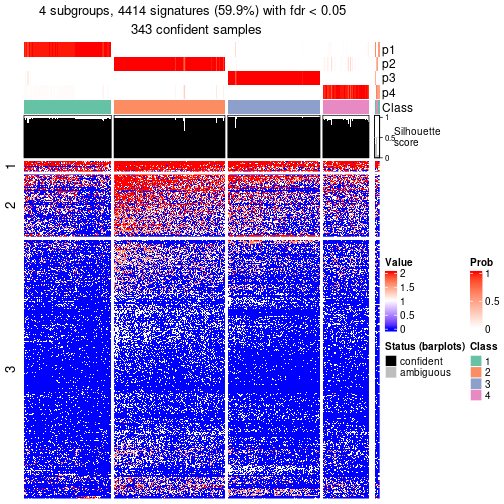</p>

</div>
</div>


Compare the overlap of signatures from different k:

```r
compare_signatures(res)
```


`get_signature()` returns a data frame invisibly. To get the list of signatures, the function
call should be assigned to a variable explicitly. In following code, if `plot` argument is set
to `FALSE`, no heatmap is plotted while only the differential analysis is performed.

```r
# code only for demonstration
tb = get_signature(res, k = ..., plot = FALSE)
```

An example of the output of `tb` is:

```
#>   which_row         fdr    mean_1    mean_2 scaled_mean_1 scaled_mean_2 km
#> 1        38 0.042760348  8.373488  9.131774    -0.5533452     0.5164555  1
#> 2        40 0.018707592  7.106213  8.469186    -0.6173731     0.5762149  1
#> 3        55 0.019134737 10.221463 11.207825    -0.6159697     0.5749050  1
#> 4        59 0.006059896  5.921854  7.869574    -0.6899429     0.6439467  1
#> 5        60 0.018055526  8.928898 10.211722    -0.6204761     0.5791110  1
#> 6        98 0.009384629 15.714769 14.887706     0.6635654    -0.6193277  2
...
```

The columns in `tb` are:

1. `which_row`: row indices corresponding to the input matrix.
2. `fdr`: FDR for the differential test. 
3. `mean_x`: The mean value in group x.
4. `scaled_mean_x`: The mean value in group x after rows are scaled.
5. `km`: Row groups if k-means clustering is applied to rows (which is done by automatically selecting number of clusters).

If there are too many signatures, `top_signatures = ...` can be set to only show the 
signatures with the highest FDRs:

```r
# code only for demonstration
# e.g. to show the top 500 most significant rows
tb = get_signature(res, k = ..., top_signatures = 500)
```

If the signatures are defined as these which are uniquely high in current group, `diff_method` argument
can be set to `"uniquely_high_in_one_group"`:

```r
# code only for demonstration
tb = get_signature(res, k = ..., diff_method = "uniquely_high_in_one_group")
```


UMAP plot which shows how samples are separated.


<script>
$( function() {
	$( '#tabs-node-03-dimension-reduction' ).tabs();
} );
</script>
<div id='tabs-node-03-dimension-reduction'>
<ul>
<li><a href='#tab-node-03-dimension-reduction-1'>k = 2</a></li>
<li><a href='#tab-node-03-dimension-reduction-2'>k = 3</a></li>
<li><a href='#tab-node-03-dimension-reduction-3'>k = 4</a></li>
</ul>
<div id='tab-node-03-dimension-reduction-1'>
<pre><code class="r">dimension_reduction(res, k = 2, method = &quot;UMAP&quot;)
</code></pre>

<p></p>

</div>
<div id='tab-node-03-dimension-reduction-2'>
<pre><code class="r">dimension_reduction(res, k = 3, method = &quot;UMAP&quot;)
</code></pre>

<p></p>

</div>
<div id='tab-node-03-dimension-reduction-3'>
<pre><code class="r">dimension_reduction(res, k = 4, method = &quot;UMAP&quot;)
</code></pre>

<p></p>

</div>
</div>


Following heatmap shows how subgroups are split when increasing `k`:

```r
collect_classes(res)
```


If matrix rows can be associated to genes, consider to use `functional_enrichment(res,
...)` to perform function enrichment for the signature genes. See [this vignette](https://jokergoo.github.io/cola_vignettes/functional_enrichment.html) for more detailed explanations.


 

---------------------------------------------------


### Node031


Parent node: [Node03](#Node03).
Child nodes: 
                [Node0121](#Node0121)
        ,
                [Node0122](#Node0122)
        ,
                Node0141-leaf
        ,
                Node0142-leaf
        ,
                [Node0211](#Node0211)
        ,
                [Node0212](#Node0212)
        ,
                [Node0213](#Node0213)
        ,
                Node0221-leaf
        ,
                [Node0222](#Node0222)
        ,
                Node0311-leaf
        ,
                Node0312-leaf
        ,
                Node0313-leaf
        ,
                Node0321-leaf
        ,
                [Node0322](#Node0322)
        ,
                Node0331-leaf
        ,
                Node0332-leaf
        ,
                Node0333-leaf
        .


The object with results only for a single top-value method and a single partitioning method 
can be extracted as:

```r
res = res_rh["031"]
```

A summary of `res` and all the functions that can be applied to it:

```r
res
```

```
#> A 'ConsensusPartition' object with k = 2, 3, 4.
#>   On a matrix with 5003 rows and 92 columns.
#>   Top rows (500) are extracted by 'ATC' method.
#>   Subgroups are detected by 'skmeans' method.
#>   Performed in total 150 partitions by row resampling.
#>   Best k for subgroups seems to be 4.
#> 
#> Following methods can be applied to this 'ConsensusPartition' object:
#>  [1] "cola_report"             "collect_classes"         "collect_plots"          
#>  [4] "collect_stats"           "colnames"                "compare_partitions"     
#>  [7] "compare_signatures"      "consensus_heatmap"       "dimension_reduction"    
#> [10] "functional_enrichment"   "get_anno_col"            "get_anno"               
#> [13] "get_classes"             "get_consensus"           "get_matrix"             
#> [16] "get_membership"          "get_param"               "get_signatures"         
#> [19] "get_stats"               "is_best_k"               "is_stable_k"            
#> [22] "membership_heatmap"      "ncol"                    "nrow"                   
#> [25] "plot_ecdf"               "predict_classes"         "rownames"               
#> [28] "select_partition_number" "show"                    "suggest_best_k"         
#> [31] "test_to_known_factors"   "top_rows_heatmap"
```

`collect_plots()` function collects all the plots made from `res` for all `k` (number of subgroups)
into one single page to provide an easy and fast comparison between different `k`.

```r
collect_plots(res)
```


The plots are:

- The first row: a plot of the eCDF (empirical cumulative distribution
  function) curves of the consensus matrix for each `k` and the heatmap of
  predicted classes for each `k`.
- The second row: heatmaps of the consensus matrix for each `k`.
- The third row: heatmaps of the membership matrix for each `k`.
- The fouth row: heatmaps of the signatures for each `k`.

All the plots in panels can be made by individual functions and they are
plotted later in this section.

`select_partition_number()` produces several plots showing different
statistics for choosing "optimized" `k`. There are following statistics:

- eCDF curves of the consensus matrix for each `k`;
- 1-PAC. [The PAC score](https://en.wikipedia.org/wiki/Consensus_clustering#Over-interpretation_potential_of_consensus_clustering)
  measures the proportion of the ambiguous subgrouping.
- Mean silhouette score.
- Concordance. The mean probability of fiting the consensus subgroup labels in all
  partitions.
- Area increased. Denote $A_k$ as the area under the eCDF curve for current
  `k`, the area increased is defined as $A_k - A_{k-1}$.
- Rand index. The percent of pairs of samples that are both in a same cluster
  or both are not in a same cluster in the partition of k and k-1.
- Jaccard index. The ratio of pairs of samples are both in a same cluster in
  the partition of k and k-1 and the pairs of samples are both in a same
  cluster in the partition k or k-1.

The detailed explanations of these statistics can be found in [the _cola_
vignette](https://jokergoo.github.io/cola_vignettes/cola.html#toc_13).

Generally speaking, higher 1-PAC score, higher mean silhouette score or higher
concordance corresponds to better partition. Rand index and Jaccard index
measure how similar the current partition is compared to partition with `k-1`.
If they are too similar, we won't accept `k` is better than `k-1`.

```r
select_partition_number(res)
```


The numeric values for all these statistics can be obtained by `get_stats()`.

```r
get_stats(res)
```

```
#>   k 1-PAC mean_silhouette concordance area_increased  Rand Jaccard
#> 2 2     1           0.998       0.999          0.500 0.500   0.500
#> 3 3     1           0.982       0.993          0.317 0.807   0.627
#> 4 4     1           0.974       0.983          0.125 0.912   0.744
```

`suggest_best_k()` suggests the best $k$ based on these statistics. The rules are as follows:

- All $k$ with Jaccard index larger than 0.95 are removed because increasing
  $k$ does not provide enough extra information. If all $k$ are removed, it is
  marked as no subgroup is detected.
- For all $k$ with 1-PAC score larger than 0.9, the maximal $k$ is taken as
  the best $k$, and other $k$ are marked as optional $k$.
- If it does not fit the second rule. The $k$ with the maximal vote of the
  highest 1-PAC score, highest mean silhouette, and highest concordance is
  taken as the best $k$.

```r
suggest_best_k(res)
```

```
#> [1] 4
#> attr(,"optional")
#> [1] 2 3
```

There is also optional best $k$ = 2 3 that is worth to check.

Following is the table of the partitions (You need to click the **show/hide
code output** link to see it). The membership matrix (columns with name `p*`)
is inferred by
[`clue::cl_consensus()`](https://www.rdocumentation.org/link/cl_consensus?package=clue)
function with the `SE` method. Basically the value in the membership matrix
represents the probability to belong to a certain group. The finall subgroup
label for an item is determined with the group with highest probability it
belongs to.

In `get_classes()` function, the entropy is calculated from the membership
matrix and the silhouette score is calculated from the consensus matrix.


<script>
$( function() {
	$( '#tabs-node-031-get-classes' ).tabs();
} );
</script>
<div id='tabs-node-031-get-classes'>
<ul>
<li><a href='#tab-node-031-get-classes-1'>k = 2</a></li>
<li><a href='#tab-node-031-get-classes-2'>k = 3</a></li>
<li><a href='#tab-node-031-get-classes-3'>k = 4</a></li>
</ul>

<div id='tab-node-031-get-classes-1'>
<p><a id='tab-node-031-get-classes-1-a' style='color:#0366d6' href='#'>show/hide code output</a></p>
<pre><code class="r">cbind(get_classes(res, k = 2), get_membership(res, k = 2))
</code></pre>

<pre><code>#&gt;                             class entropy silhouette   p1   p2
#&gt; mouse1_lib1.final_cell_0025     2   0.000      0.999 0.00 1.00
#&gt; mouse1_lib1.final_cell_0079     2   0.000      0.999 0.00 1.00
#&gt; mouse1_lib1.final_cell_0105     2   0.000      0.999 0.00 1.00
#&gt; mouse1_lib1.final_cell_0107     2   0.000      0.999 0.00 1.00
#&gt; mouse1_lib1.final_cell_0111     1   0.000      0.999 1.00 0.00
#&gt; mouse1_lib1.final_cell_0112     2   0.000      0.999 0.00 1.00
#&gt; mouse1_lib1.final_cell_0124     2   0.000      0.999 0.00 1.00
#&gt; mouse1_lib1.final_cell_0126     2   0.000      0.999 0.00 1.00
#&gt; mouse1_lib1.final_cell_0160     2   0.000      0.999 0.00 1.00
#&gt; mouse1_lib1.final_cell_0195     2   0.000      0.999 0.00 1.00
#&gt; mouse1_lib1.final_cell_0207     2   0.000      0.999 0.00 1.00
#&gt; mouse1_lib1.final_cell_0234     2   0.000      0.999 0.00 1.00
#&gt; mouse1_lib1.final_cell_0267     1   0.000      0.999 1.00 0.00
#&gt; mouse1_lib1.final_cell_0271     1   0.000      0.999 1.00 0.00
#&gt; mouse1_lib2.final_cell_0057     2   0.000      0.999 0.00 1.00
#&gt; mouse1_lib2.final_cell_0079     2   0.000      0.999 0.00 1.00
#&gt; mouse1_lib2.final_cell_0088     2   0.000      0.999 0.00 1.00
#&gt; mouse1_lib2.final_cell_0093     2   0.000      0.999 0.00 1.00
#&gt; mouse1_lib2.final_cell_0099     2   0.000      0.999 0.00 1.00
#&gt; mouse1_lib2.final_cell_0106     2   0.000      0.999 0.00 1.00
#&gt; mouse1_lib2.final_cell_0114     2   0.000      0.999 0.00 1.00
#&gt; mouse1_lib2.final_cell_0142     2   0.000      0.999 0.00 1.00
#&gt; mouse1_lib2.final_cell_0143     2   0.000      0.999 0.00 1.00
#&gt; mouse1_lib2.final_cell_0165     1   0.000      0.999 1.00 0.00
#&gt; mouse1_lib2.final_cell_0167     2   0.000      0.999 0.00 1.00
#&gt; mouse1_lib2.final_cell_0186     2   0.000      0.999 0.00 1.00
#&gt; mouse1_lib2.final_cell_0212     2   0.000      0.999 0.00 1.00
#&gt; mouse1_lib2.final_cell_0227     2   0.000      0.999 0.00 1.00
#&gt; mouse1_lib2.final_cell_0245     2   0.000      0.999 0.00 1.00
#&gt; mouse1_lib3.final_cell_0027     2   0.000      0.999 0.00 1.00
#&gt; mouse1_lib3.final_cell_0057     2   0.000      0.999 0.00 1.00
#&gt; mouse1_lib3.final_cell_0078     2   0.000      0.999 0.00 1.00
#&gt; mouse1_lib3.final_cell_0079     2   0.000      0.999 0.00 1.00
#&gt; mouse1_lib3.final_cell_0085     2   0.000      0.999 0.00 1.00
#&gt; mouse1_lib3.final_cell_0095     2   0.000      0.999 0.00 1.00
#&gt; mouse1_lib3.final_cell_0099     1   0.000      0.999 1.00 0.00
#&gt; mouse1_lib3.final_cell_0148     2   0.000      0.999 0.00 1.00
#&gt; mouse1_lib3.final_cell_0167     1   0.000      0.999 1.00 0.00
#&gt; mouse1_lib3.final_cell_0169     2   0.000      0.999 0.00 1.00
#&gt; mouse1_lib3.final_cell_0179     1   0.000      0.999 1.00 0.00
#&gt; mouse1_lib3.final_cell_0203     2   0.000      0.999 0.00 1.00
#&gt; mouse1_lib3.final_cell_0204     1   0.000      0.999 1.00 0.00
#&gt; mouse1_lib3.final_cell_0207     1   0.000      0.999 1.00 0.00
#&gt; mouse1_lib3.final_cell_0220     1   0.000      0.999 1.00 0.00
#&gt; mouse2_lib1.final_cell_0083     2   0.327      0.936 0.06 0.94
#&gt; mouse2_lib1.final_cell_0149     1   0.000      0.999 1.00 0.00
#&gt; mouse2_lib1.final_cell_0165     1   0.000      0.999 1.00 0.00
#&gt; mouse2_lib1.final_cell_0181     1   0.000      0.999 1.00 0.00
#&gt; mouse2_lib1.final_cell_0182     1   0.000      0.999 1.00 0.00
#&gt; mouse2_lib1.final_cell_0186     1   0.000      0.999 1.00 0.00
#&gt; mouse2_lib1.final_cell_0198     2   0.000      0.999 0.00 1.00
#&gt; mouse2_lib1.final_cell_0199     1   0.000      0.999 1.00 0.00
#&gt; mouse2_lib1.final_cell_0204     1   0.000      0.999 1.00 0.00
#&gt; mouse2_lib1.final_cell_0208     2   0.000      0.999 0.00 1.00
#&gt; mouse2_lib1.final_cell_0209     1   0.000      0.999 1.00 0.00
#&gt; mouse2_lib1.final_cell_0220     2   0.000      0.999 0.00 1.00
#&gt; mouse2_lib1.final_cell_0237     2   0.000      0.999 0.00 1.00
#&gt; mouse2_lib1.final_cell_0249     1   0.000      0.999 1.00 0.00
#&gt; mouse2_lib1.final_cell_0252     2   0.000      0.999 0.00 1.00
#&gt; mouse2_lib1.final_cell_0285     2   0.000      0.999 0.00 1.00
#&gt; mouse2_lib1.final_cell_0292     2   0.000      0.999 0.00 1.00
#&gt; mouse2_lib2.final_cell_0091     1   0.000      0.999 1.00 0.00
#&gt; mouse2_lib2.final_cell_0094     1   0.000      0.999 1.00 0.00
#&gt; mouse2_lib2.final_cell_0113     1   0.000      0.999 1.00 0.00
#&gt; mouse2_lib2.final_cell_0140     2   0.000      0.999 0.00 1.00
#&gt; mouse2_lib2.final_cell_0202     1   0.000      0.999 1.00 0.00
#&gt; mouse2_lib2.final_cell_0237     2   0.000      0.999 0.00 1.00
#&gt; mouse2_lib2.final_cell_0249     2   0.000      0.999 0.00 1.00
#&gt; mouse2_lib2.final_cell_0252     2   0.000      0.999 0.00 1.00
#&gt; mouse2_lib2.final_cell_0255     1   0.000      0.999 1.00 0.00
#&gt; mouse2_lib2.final_cell_0260     1   0.000      0.999 1.00 0.00
#&gt; mouse2_lib2.final_cell_0264     2   0.000      0.999 0.00 1.00
#&gt; mouse2_lib2.final_cell_0267     1   0.000      0.999 1.00 0.00
#&gt; mouse2_lib2.final_cell_0279     1   0.000      0.999 1.00 0.00
#&gt; mouse2_lib2.final_cell_0282     1   0.000      0.999 1.00 0.00
#&gt; mouse2_lib2.final_cell_0298     1   0.000      0.999 1.00 0.00
#&gt; mouse2_lib2.final_cell_0301     1   0.000      0.999 1.00 0.00
#&gt; mouse2_lib2.final_cell_0304     2   0.000      0.999 0.00 1.00
#&gt; mouse2_lib3.final_cell_0146     1   0.141      0.980 0.98 0.02
#&gt; mouse2_lib3.final_cell_0165     2   0.000      0.999 0.00 1.00
#&gt; mouse2_lib3.final_cell_0174     1   0.000      0.999 1.00 0.00
#&gt; mouse2_lib3.final_cell_0184     1   0.000      0.999 1.00 0.00
#&gt; mouse2_lib3.final_cell_0205     1   0.000      0.999 1.00 0.00
#&gt; mouse2_lib3.final_cell_0227     1   0.000      0.999 1.00 0.00
#&gt; mouse2_lib3.final_cell_0237     2   0.000      0.999 0.00 1.00
#&gt; mouse2_lib3.final_cell_0274     1   0.000      0.999 1.00 0.00
#&gt; mouse2_lib3.final_cell_0281     1   0.000      0.999 1.00 0.00
#&gt; mouse2_lib3.final_cell_0290     1   0.000      0.999 1.00 0.00
#&gt; mouse2_lib3.final_cell_0293     1   0.000      0.999 1.00 0.00
#&gt; mouse2_lib3.final_cell_0331     1   0.000      0.999 1.00 0.00
#&gt; mouse2_lib3.final_cell_0336     1   0.000      0.999 1.00 0.00
#&gt; mouse2_lib3.final_cell_0338     2   0.000      0.999 0.00 1.00
</code></pre>

<script>
$('#tab-node-031-get-classes-1-a').parent().next().next().hide();
$('#tab-node-031-get-classes-1-a').click(function(){
  $('#tab-node-031-get-classes-1-a').parent().next().next().toggle();
  return(false);
});
</script>
</div>

<div id='tab-node-031-get-classes-2'>
<p><a id='tab-node-031-get-classes-2-a' style='color:#0366d6' href='#'>show/hide code output</a></p>
<pre><code class="r">cbind(get_classes(res, k = 3), get_membership(res, k = 3))
</code></pre>

<pre><code>#&gt;                             class entropy silhouette   p1   p2  p3
#&gt; mouse1_lib1.final_cell_0025     2   0.000      0.978 0.00 1.00 0.0
#&gt; mouse1_lib1.final_cell_0079     2   0.000      0.978 0.00 1.00 0.0
#&gt; mouse1_lib1.final_cell_0105     2   0.455      0.741 0.00 0.80 0.2
#&gt; mouse1_lib1.final_cell_0107     2   0.000      0.978 0.00 1.00 0.0
#&gt; mouse1_lib1.final_cell_0111     1   0.000      1.000 1.00 0.00 0.0
#&gt; mouse1_lib1.final_cell_0112     3   0.000      1.000 0.00 0.00 1.0
#&gt; mouse1_lib1.final_cell_0124     3   0.000      1.000 0.00 0.00 1.0
#&gt; mouse1_lib1.final_cell_0126     2   0.000      0.978 0.00 1.00 0.0
#&gt; mouse1_lib1.final_cell_0160     3   0.000      1.000 0.00 0.00 1.0
#&gt; mouse1_lib1.final_cell_0195     2   0.000      0.978 0.00 1.00 0.0
#&gt; mouse1_lib1.final_cell_0207     2   0.000      0.978 0.00 1.00 0.0
#&gt; mouse1_lib1.final_cell_0234     2   0.000      0.978 0.00 1.00 0.0
#&gt; mouse1_lib1.final_cell_0267     1   0.000      1.000 1.00 0.00 0.0
#&gt; mouse1_lib1.final_cell_0271     1   0.000      1.000 1.00 0.00 0.0
#&gt; mouse1_lib2.final_cell_0057     3   0.000      1.000 0.00 0.00 1.0
#&gt; mouse1_lib2.final_cell_0079     3   0.000      1.000 0.00 0.00 1.0
#&gt; mouse1_lib2.final_cell_0088     3   0.000      1.000 0.00 0.00 1.0
#&gt; mouse1_lib2.final_cell_0093     2   0.000      0.978 0.00 1.00 0.0
#&gt; mouse1_lib2.final_cell_0099     3   0.000      1.000 0.00 0.00 1.0
#&gt; mouse1_lib2.final_cell_0106     3   0.000      1.000 0.00 0.00 1.0
#&gt; mouse1_lib2.final_cell_0114     2   0.000      0.978 0.00 1.00 0.0
#&gt; mouse1_lib2.final_cell_0142     3   0.000      1.000 0.00 0.00 1.0
#&gt; mouse1_lib2.final_cell_0143     2   0.000      0.978 0.00 1.00 0.0
#&gt; mouse1_lib2.final_cell_0165     1   0.000      1.000 1.00 0.00 0.0
#&gt; mouse1_lib2.final_cell_0167     2   0.000      0.978 0.00 1.00 0.0
#&gt; mouse1_lib2.final_cell_0186     3   0.000      1.000 0.00 0.00 1.0
#&gt; mouse1_lib2.final_cell_0212     2   0.000      0.978 0.00 1.00 0.0
#&gt; mouse1_lib2.final_cell_0227     2   0.000      0.978 0.00 1.00 0.0
#&gt; mouse1_lib2.final_cell_0245     2   0.000      0.978 0.00 1.00 0.0
#&gt; mouse1_lib3.final_cell_0027     2   0.000      0.978 0.00 1.00 0.0
#&gt; mouse1_lib3.final_cell_0057     2   0.000      0.978 0.00 1.00 0.0
#&gt; mouse1_lib3.final_cell_0078     2   0.000      0.978 0.00 1.00 0.0
#&gt; mouse1_lib3.final_cell_0079     3   0.000      1.000 0.00 0.00 1.0
#&gt; mouse1_lib3.final_cell_0085     2   0.000      0.978 0.00 1.00 0.0
#&gt; mouse1_lib3.final_cell_0095     2   0.000      0.978 0.00 1.00 0.0
#&gt; mouse1_lib3.final_cell_0099     1   0.000      1.000 1.00 0.00 0.0
#&gt; mouse1_lib3.final_cell_0148     2   0.000      0.978 0.00 1.00 0.0
#&gt; mouse1_lib3.final_cell_0167     1   0.000      1.000 1.00 0.00 0.0
#&gt; mouse1_lib3.final_cell_0169     2   0.000      0.978 0.00 1.00 0.0
#&gt; mouse1_lib3.final_cell_0179     1   0.000      1.000 1.00 0.00 0.0
#&gt; mouse1_lib3.final_cell_0203     2   0.000      0.978 0.00 1.00 0.0
#&gt; mouse1_lib3.final_cell_0204     1   0.000      1.000 1.00 0.00 0.0
#&gt; mouse1_lib3.final_cell_0207     1   0.000      1.000 1.00 0.00 0.0
#&gt; mouse1_lib3.final_cell_0220     1   0.000      1.000 1.00 0.00 0.0
#&gt; mouse2_lib1.final_cell_0083     3   0.000      1.000 0.00 0.00 1.0
#&gt; mouse2_lib1.final_cell_0149     1   0.000      1.000 1.00 0.00 0.0
#&gt; mouse2_lib1.final_cell_0165     1   0.000      1.000 1.00 0.00 0.0
#&gt; mouse2_lib1.final_cell_0181     1   0.000      1.000 1.00 0.00 0.0
#&gt; mouse2_lib1.final_cell_0182     1   0.000      1.000 1.00 0.00 0.0
#&gt; mouse2_lib1.final_cell_0186     1   0.000      1.000 1.00 0.00 0.0
#&gt; mouse2_lib1.final_cell_0198     3   0.000      1.000 0.00 0.00 1.0
#&gt; mouse2_lib1.final_cell_0199     1   0.000      1.000 1.00 0.00 0.0
#&gt; mouse2_lib1.final_cell_0204     1   0.000      1.000 1.00 0.00 0.0
#&gt; mouse2_lib1.final_cell_0208     3   0.000      1.000 0.00 0.00 1.0
#&gt; mouse2_lib1.final_cell_0209     1   0.000      1.000 1.00 0.00 0.0
#&gt; mouse2_lib1.final_cell_0220     3   0.000      1.000 0.00 0.00 1.0
#&gt; mouse2_lib1.final_cell_0237     2   0.000      0.978 0.00 1.00 0.0
#&gt; mouse2_lib1.final_cell_0249     1   0.000      1.000 1.00 0.00 0.0
#&gt; mouse2_lib1.final_cell_0252     3   0.000      1.000 0.00 0.00 1.0
#&gt; mouse2_lib1.final_cell_0285     2   0.000      0.978 0.00 1.00 0.0
#&gt; mouse2_lib1.final_cell_0292     2   0.000      0.978 0.00 1.00 0.0
#&gt; mouse2_lib2.final_cell_0091     1   0.000      1.000 1.00 0.00 0.0
#&gt; mouse2_lib2.final_cell_0094     1   0.000      1.000 1.00 0.00 0.0
#&gt; mouse2_lib2.final_cell_0113     1   0.000      1.000 1.00 0.00 0.0
#&gt; mouse2_lib2.final_cell_0140     3   0.000      1.000 0.00 0.00 1.0
#&gt; mouse2_lib2.final_cell_0202     1   0.000      1.000 1.00 0.00 0.0
#&gt; mouse2_lib2.final_cell_0237     3   0.000      1.000 0.00 0.00 1.0
#&gt; mouse2_lib2.final_cell_0249     2   0.000      0.978 0.00 1.00 0.0
#&gt; mouse2_lib2.final_cell_0252     2   0.000      0.978 0.00 1.00 0.0
#&gt; mouse2_lib2.final_cell_0255     1   0.000      1.000 1.00 0.00 0.0
#&gt; mouse2_lib2.final_cell_0260     1   0.000      1.000 1.00 0.00 0.0
#&gt; mouse2_lib2.final_cell_0264     3   0.000      1.000 0.00 0.00 1.0
#&gt; mouse2_lib2.final_cell_0267     3   0.000      1.000 0.00 0.00 1.0
#&gt; mouse2_lib2.final_cell_0279     1   0.000      1.000 1.00 0.00 0.0
#&gt; mouse2_lib2.final_cell_0282     1   0.000      1.000 1.00 0.00 0.0
#&gt; mouse2_lib2.final_cell_0298     1   0.000      1.000 1.00 0.00 0.0
#&gt; mouse2_lib2.final_cell_0301     1   0.000      1.000 1.00 0.00 0.0
#&gt; mouse2_lib2.final_cell_0304     2   0.000      0.978 0.00 1.00 0.0
#&gt; mouse2_lib3.final_cell_0146     3   0.000      1.000 0.00 0.00 1.0
#&gt; mouse2_lib3.final_cell_0165     3   0.000      1.000 0.00 0.00 1.0
#&gt; mouse2_lib3.final_cell_0174     1   0.000      1.000 1.00 0.00 0.0
#&gt; mouse2_lib3.final_cell_0184     1   0.000      1.000 1.00 0.00 0.0
#&gt; mouse2_lib3.final_cell_0205     1   0.000      1.000 1.00 0.00 0.0
#&gt; mouse2_lib3.final_cell_0227     1   0.000      1.000 1.00 0.00 0.0
#&gt; mouse2_lib3.final_cell_0237     2   0.000      0.978 0.00 1.00 0.0
#&gt; mouse2_lib3.final_cell_0274     2   0.619      0.279 0.42 0.58 0.0
#&gt; mouse2_lib3.final_cell_0281     1   0.000      1.000 1.00 0.00 0.0
#&gt; mouse2_lib3.final_cell_0290     1   0.000      1.000 1.00 0.00 0.0
#&gt; mouse2_lib3.final_cell_0293     1   0.000      1.000 1.00 0.00 0.0
#&gt; mouse2_lib3.final_cell_0331     1   0.000      1.000 1.00 0.00 0.0
#&gt; mouse2_lib3.final_cell_0336     1   0.000      1.000 1.00 0.00 0.0
#&gt; mouse2_lib3.final_cell_0338     2   0.000      0.978 0.00 1.00 0.0
</code></pre>

<script>
$('#tab-node-031-get-classes-2-a').parent().next().next().hide();
$('#tab-node-031-get-classes-2-a').click(function(){
  $('#tab-node-031-get-classes-2-a').parent().next().next().toggle();
  return(false);
});
</script>
</div>

<div id='tab-node-031-get-classes-3'>
<p><a id='tab-node-031-get-classes-3-a' style='color:#0366d6' href='#'>show/hide code output</a></p>
<pre><code class="r">cbind(get_classes(res, k = 4), get_membership(res, k = 4))
</code></pre>

<pre><code>#&gt;                             class entropy silhouette   p1   p2   p3   p4
#&gt; mouse1_lib1.final_cell_0025     2  0.0000      0.981 0.00 1.00 0.00 0.00
#&gt; mouse1_lib1.final_cell_0079     2  0.0000      0.981 0.00 1.00 0.00 0.00
#&gt; mouse1_lib1.final_cell_0105     2  0.3610      0.742 0.00 0.80 0.20 0.00
#&gt; mouse1_lib1.final_cell_0107     2  0.0000      0.981 0.00 1.00 0.00 0.00
#&gt; mouse1_lib1.final_cell_0111     1  0.0000      1.000 1.00 0.00 0.00 0.00
#&gt; mouse1_lib1.final_cell_0112     3  0.0000      0.979 0.00 0.00 1.00 0.00
#&gt; mouse1_lib1.final_cell_0124     3  0.0000      0.979 0.00 0.00 1.00 0.00
#&gt; mouse1_lib1.final_cell_0126     2  0.0000      0.981 0.00 1.00 0.00 0.00
#&gt; mouse1_lib1.final_cell_0160     3  0.0000      0.979 0.00 0.00 1.00 0.00
#&gt; mouse1_lib1.final_cell_0195     2  0.0000      0.981 0.00 1.00 0.00 0.00
#&gt; mouse1_lib1.final_cell_0207     2  0.0000      0.981 0.00 1.00 0.00 0.00
#&gt; mouse1_lib1.final_cell_0234     2  0.0000      0.981 0.00 1.00 0.00 0.00
#&gt; mouse1_lib1.final_cell_0267     4  0.1211      0.992 0.04 0.00 0.00 0.96
#&gt; mouse1_lib1.final_cell_0271     4  0.1211      0.992 0.04 0.00 0.00 0.96
#&gt; mouse1_lib2.final_cell_0057     3  0.1211      0.962 0.00 0.00 0.96 0.04
#&gt; mouse1_lib2.final_cell_0079     3  0.0000      0.979 0.00 0.00 1.00 0.00
#&gt; mouse1_lib2.final_cell_0088     3  0.0000      0.979 0.00 0.00 1.00 0.00
#&gt; mouse1_lib2.final_cell_0093     2  0.0000      0.981 0.00 1.00 0.00 0.00
#&gt; mouse1_lib2.final_cell_0099     3  0.0000      0.979 0.00 0.00 1.00 0.00
#&gt; mouse1_lib2.final_cell_0106     3  0.0000      0.979 0.00 0.00 1.00 0.00
#&gt; mouse1_lib2.final_cell_0114     2  0.0000      0.981 0.00 1.00 0.00 0.00
#&gt; mouse1_lib2.final_cell_0142     3  0.0000      0.979 0.00 0.00 1.00 0.00
#&gt; mouse1_lib2.final_cell_0143     2  0.0000      0.981 0.00 1.00 0.00 0.00
#&gt; mouse1_lib2.final_cell_0165     4  0.1211      0.992 0.04 0.00 0.00 0.96
#&gt; mouse1_lib2.final_cell_0167     2  0.0000      0.981 0.00 1.00 0.00 0.00
#&gt; mouse1_lib2.final_cell_0186     3  0.0000      0.979 0.00 0.00 1.00 0.00
#&gt; mouse1_lib2.final_cell_0212     2  0.0000      0.981 0.00 1.00 0.00 0.00
#&gt; mouse1_lib2.final_cell_0227     2  0.0000      0.981 0.00 1.00 0.00 0.00
#&gt; mouse1_lib2.final_cell_0245     2  0.0000      0.981 0.00 1.00 0.00 0.00
#&gt; mouse1_lib3.final_cell_0027     2  0.0000      0.981 0.00 1.00 0.00 0.00
#&gt; mouse1_lib3.final_cell_0057     2  0.0000      0.981 0.00 1.00 0.00 0.00
#&gt; mouse1_lib3.final_cell_0078     2  0.0000      0.981 0.00 1.00 0.00 0.00
#&gt; mouse1_lib3.final_cell_0079     3  0.1211      0.962 0.00 0.00 0.96 0.04
#&gt; mouse1_lib3.final_cell_0085     2  0.0000      0.981 0.00 1.00 0.00 0.00
#&gt; mouse1_lib3.final_cell_0095     2  0.0000      0.981 0.00 1.00 0.00 0.00
#&gt; mouse1_lib3.final_cell_0099     4  0.0707      0.976 0.02 0.00 0.00 0.98
#&gt; mouse1_lib3.final_cell_0148     2  0.0000      0.981 0.00 1.00 0.00 0.00
#&gt; mouse1_lib3.final_cell_0167     4  0.1211      0.992 0.04 0.00 0.00 0.96
#&gt; mouse1_lib3.final_cell_0169     2  0.0000      0.981 0.00 1.00 0.00 0.00
#&gt; mouse1_lib3.final_cell_0179     4  0.1211      0.992 0.04 0.00 0.00 0.96
#&gt; mouse1_lib3.final_cell_0203     2  0.0000      0.981 0.00 1.00 0.00 0.00
#&gt; mouse1_lib3.final_cell_0204     4  0.1211      0.992 0.04 0.00 0.00 0.96
#&gt; mouse1_lib3.final_cell_0207     4  0.1211      0.992 0.04 0.00 0.00 0.96
#&gt; mouse1_lib3.final_cell_0220     4  0.1211      0.992 0.04 0.00 0.00 0.96
#&gt; mouse2_lib1.final_cell_0083     3  0.1211      0.962 0.00 0.00 0.96 0.04
#&gt; mouse2_lib1.final_cell_0149     1  0.0000      1.000 1.00 0.00 0.00 0.00
#&gt; mouse2_lib1.final_cell_0165     1  0.0000      1.000 1.00 0.00 0.00 0.00
#&gt; mouse2_lib1.final_cell_0181     1  0.0000      1.000 1.00 0.00 0.00 0.00
#&gt; mouse2_lib1.final_cell_0182     1  0.0000      1.000 1.00 0.00 0.00 0.00
#&gt; mouse2_lib1.final_cell_0186     1  0.0000      1.000 1.00 0.00 0.00 0.00
#&gt; mouse2_lib1.final_cell_0198     3  0.0000      0.979 0.00 0.00 1.00 0.00
#&gt; mouse2_lib1.final_cell_0199     1  0.0000      1.000 1.00 0.00 0.00 0.00
#&gt; mouse2_lib1.final_cell_0204     1  0.0000      1.000 1.00 0.00 0.00 0.00
#&gt; mouse2_lib1.final_cell_0208     3  0.0000      0.979 0.00 0.00 1.00 0.00
#&gt; mouse2_lib1.final_cell_0209     1  0.0000      1.000 1.00 0.00 0.00 0.00
#&gt; mouse2_lib1.final_cell_0220     3  0.1211      0.962 0.00 0.00 0.96 0.04
#&gt; mouse2_lib1.final_cell_0237     2  0.0000      0.981 0.00 1.00 0.00 0.00
#&gt; mouse2_lib1.final_cell_0249     1  0.0000      1.000 1.00 0.00 0.00 0.00
#&gt; mouse2_lib1.final_cell_0252     3  0.0000      0.979 0.00 0.00 1.00 0.00
#&gt; mouse2_lib1.final_cell_0285     2  0.0000      0.981 0.00 1.00 0.00 0.00
#&gt; mouse2_lib1.final_cell_0292     2  0.0000      0.981 0.00 1.00 0.00 0.00
#&gt; mouse2_lib2.final_cell_0091     1  0.0000      1.000 1.00 0.00 0.00 0.00
#&gt; mouse2_lib2.final_cell_0094     1  0.0000      1.000 1.00 0.00 0.00 0.00
#&gt; mouse2_lib2.final_cell_0113     1  0.0000      1.000 1.00 0.00 0.00 0.00
#&gt; mouse2_lib2.final_cell_0140     3  0.0000      0.979 0.00 0.00 1.00 0.00
#&gt; mouse2_lib2.final_cell_0202     1  0.0000      1.000 1.00 0.00 0.00 0.00
#&gt; mouse2_lib2.final_cell_0237     3  0.0000      0.979 0.00 0.00 1.00 0.00
#&gt; mouse2_lib2.final_cell_0249     2  0.0000      0.981 0.00 1.00 0.00 0.00
#&gt; mouse2_lib2.final_cell_0252     2  0.0000      0.981 0.00 1.00 0.00 0.00
#&gt; mouse2_lib2.final_cell_0255     1  0.0000      1.000 1.00 0.00 0.00 0.00
#&gt; mouse2_lib2.final_cell_0260     1  0.0000      1.000 1.00 0.00 0.00 0.00
#&gt; mouse2_lib2.final_cell_0264     3  0.0000      0.979 0.00 0.00 1.00 0.00
#&gt; mouse2_lib2.final_cell_0267     3  0.4277      0.660 0.00 0.00 0.72 0.28
#&gt; mouse2_lib2.final_cell_0279     1  0.0000      1.000 1.00 0.00 0.00 0.00
#&gt; mouse2_lib2.final_cell_0282     1  0.0000      1.000 1.00 0.00 0.00 0.00
#&gt; mouse2_lib2.final_cell_0298     4  0.0707      0.976 0.02 0.00 0.00 0.98
#&gt; mouse2_lib2.final_cell_0301     4  0.1211      0.992 0.04 0.00 0.00 0.96
#&gt; mouse2_lib2.final_cell_0304     2  0.0000      0.981 0.00 1.00 0.00 0.00
#&gt; mouse2_lib3.final_cell_0146     3  0.1637      0.948 0.00 0.00 0.94 0.06
#&gt; mouse2_lib3.final_cell_0165     3  0.0000      0.979 0.00 0.00 1.00 0.00
#&gt; mouse2_lib3.final_cell_0174     1  0.0000      1.000 1.00 0.00 0.00 0.00
#&gt; mouse2_lib3.final_cell_0184     1  0.0000      1.000 1.00 0.00 0.00 0.00
#&gt; mouse2_lib3.final_cell_0205     1  0.0000      1.000 1.00 0.00 0.00 0.00
#&gt; mouse2_lib3.final_cell_0227     1  0.0000      1.000 1.00 0.00 0.00 0.00
#&gt; mouse2_lib3.final_cell_0237     2  0.0000      0.981 0.00 1.00 0.00 0.00
#&gt; mouse2_lib3.final_cell_0274     4  0.1211      0.944 0.00 0.04 0.00 0.96
#&gt; mouse2_lib3.final_cell_0281     1  0.0000      1.000 1.00 0.00 0.00 0.00
#&gt; mouse2_lib3.final_cell_0290     1  0.0000      1.000 1.00 0.00 0.00 0.00
#&gt; mouse2_lib3.final_cell_0293     1  0.0000      1.000 1.00 0.00 0.00 0.00
#&gt; mouse2_lib3.final_cell_0331     4  0.1211      0.992 0.04 0.00 0.00 0.96
#&gt; mouse2_lib3.final_cell_0336     4  0.1211      0.992 0.04 0.00 0.00 0.96
#&gt; mouse2_lib3.final_cell_0338     2  0.4624      0.481 0.00 0.66 0.00 0.34
</code></pre>

<script>
$('#tab-node-031-get-classes-3-a').parent().next().next().hide();
$('#tab-node-031-get-classes-3-a').click(function(){
  $('#tab-node-031-get-classes-3-a').parent().next().next().toggle();
  return(false);
});
</script>
</div>
</div>

Heatmaps for the consensus matrix. It visualizes the probability of two
samples to be in a same group.


<script>
$( function() {
	$( '#tabs-node-031-consensus-heatmap' ).tabs();
} );
</script>
<div id='tabs-node-031-consensus-heatmap'>
<ul>
<li><a href='#tab-node-031-consensus-heatmap-1'>k = 2</a></li>
<li><a href='#tab-node-031-consensus-heatmap-2'>k = 3</a></li>
<li><a href='#tab-node-031-consensus-heatmap-3'>k = 4</a></li>
</ul>
<div id='tab-node-031-consensus-heatmap-1'>
<pre><code class="r">consensus_heatmap(res, k = 2)
</code></pre>

<p></p>

</div>
<div id='tab-node-031-consensus-heatmap-2'>
<pre><code class="r">consensus_heatmap(res, k = 3)
</code></pre>

<p></p>

</div>
<div id='tab-node-031-consensus-heatmap-3'>
<pre><code class="r">consensus_heatmap(res, k = 4)
</code></pre>

<p></p>

</div>
</div>

Heatmaps for the membership of samples in all partitions to see how consistent they are:


<script>
$( function() {
	$( '#tabs-node-031-membership-heatmap' ).tabs();
} );
</script>
<div id='tabs-node-031-membership-heatmap'>
<ul>
<li><a href='#tab-node-031-membership-heatmap-1'>k = 2</a></li>
<li><a href='#tab-node-031-membership-heatmap-2'>k = 3</a></li>
<li><a href='#tab-node-031-membership-heatmap-3'>k = 4</a></li>
</ul>
<div id='tab-node-031-membership-heatmap-1'>
<pre><code class="r">membership_heatmap(res, k = 2)
</code></pre>

<p></p>

</div>
<div id='tab-node-031-membership-heatmap-2'>
<pre><code class="r">membership_heatmap(res, k = 3)
</code></pre>

<p></p>

</div>
<div id='tab-node-031-membership-heatmap-3'>
<pre><code class="r">membership_heatmap(res, k = 4)
</code></pre>

<p></p>

</div>
</div>

As soon as the classes for columns are determined, the signatures
that are significantly different between subgroups can be looked for. 
Following are the heatmaps for signatures.


Signature heatmaps where rows are scaled:


<script>
$( function() {
	$( '#tabs-node-031-get-signatures' ).tabs();
} );
</script>
<div id='tabs-node-031-get-signatures'>
<ul>
<li><a href='#tab-node-031-get-signatures-1'>k = 2</a></li>
<li><a href='#tab-node-031-get-signatures-2'>k = 3</a></li>
<li><a href='#tab-node-031-get-signatures-3'>k = 4</a></li>
</ul>
<div id='tab-node-031-get-signatures-1'>
<pre><code class="r">get_signatures(res, k = 2)
</code></pre>

<p></p>

</div>
<div id='tab-node-031-get-signatures-2'>
<pre><code class="r">get_signatures(res, k = 3)
</code></pre>

<p></p>

</div>
<div id='tab-node-031-get-signatures-3'>
<pre><code class="r">get_signatures(res, k = 4)
</code></pre>

<p></p>

</div>
</div>


Signature heatmaps where rows are not scaled:


<script>
$( function() {
	$( '#tabs-node-031-get-signatures-no-scale' ).tabs();
} );
</script>
<div id='tabs-node-031-get-signatures-no-scale'>
<ul>
<li><a href='#tab-node-031-get-signatures-no-scale-1'>k = 2</a></li>
<li><a href='#tab-node-031-get-signatures-no-scale-2'>k = 3</a></li>
<li><a href='#tab-node-031-get-signatures-no-scale-3'>k = 4</a></li>
</ul>
<div id='tab-node-031-get-signatures-no-scale-1'>
<pre><code class="r">get_signatures(res, k = 2, scale_rows = FALSE)
</code></pre>

<p></p>

</div>
<div id='tab-node-031-get-signatures-no-scale-2'>
<pre><code class="r">get_signatures(res, k = 3, scale_rows = FALSE)
</code></pre>

<p></p>

</div>
<div id='tab-node-031-get-signatures-no-scale-3'>
<pre><code class="r">get_signatures(res, k = 4, scale_rows = FALSE)
</code></pre>

<p></p>

</div>
</div>


Compare the overlap of signatures from different k:

```r
compare_signatures(res)
```


`get_signature()` returns a data frame invisibly. To get the list of signatures, the function
call should be assigned to a variable explicitly. In following code, if `plot` argument is set
to `FALSE`, no heatmap is plotted while only the differential analysis is performed.

```r
# code only for demonstration
tb = get_signature(res, k = ..., plot = FALSE)
```

An example of the output of `tb` is:

```
#>   which_row         fdr    mean_1    mean_2 scaled_mean_1 scaled_mean_2 km
#> 1        38 0.042760348  8.373488  9.131774    -0.5533452     0.5164555  1
#> 2        40 0.018707592  7.106213  8.469186    -0.6173731     0.5762149  1
#> 3        55 0.019134737 10.221463 11.207825    -0.6159697     0.5749050  1
#> 4        59 0.006059896  5.921854  7.869574    -0.6899429     0.6439467  1
#> 5        60 0.018055526  8.928898 10.211722    -0.6204761     0.5791110  1
#> 6        98 0.009384629 15.714769 14.887706     0.6635654    -0.6193277  2
...
```

The columns in `tb` are:

1. `which_row`: row indices corresponding to the input matrix.
2. `fdr`: FDR for the differential test. 
3. `mean_x`: The mean value in group x.
4. `scaled_mean_x`: The mean value in group x after rows are scaled.
5. `km`: Row groups if k-means clustering is applied to rows (which is done by automatically selecting number of clusters).

If there are too many signatures, `top_signatures = ...` can be set to only show the 
signatures with the highest FDRs:

```r
# code only for demonstration
# e.g. to show the top 500 most significant rows
tb = get_signature(res, k = ..., top_signatures = 500)
```

If the signatures are defined as these which are uniquely high in current group, `diff_method` argument
can be set to `"uniquely_high_in_one_group"`:

```r
# code only for demonstration
tb = get_signature(res, k = ..., diff_method = "uniquely_high_in_one_group")
```


UMAP plot which shows how samples are separated.


<script>
$( function() {
	$( '#tabs-node-031-dimension-reduction' ).tabs();
} );
</script>
<div id='tabs-node-031-dimension-reduction'>
<ul>
<li><a href='#tab-node-031-dimension-reduction-1'>k = 2</a></li>
<li><a href='#tab-node-031-dimension-reduction-2'>k = 3</a></li>
<li><a href='#tab-node-031-dimension-reduction-3'>k = 4</a></li>
</ul>
<div id='tab-node-031-dimension-reduction-1'>
<pre><code class="r">dimension_reduction(res, k = 2, method = &quot;UMAP&quot;)
</code></pre>

<p></p>

</div>
<div id='tab-node-031-dimension-reduction-2'>
<pre><code class="r">dimension_reduction(res, k = 3, method = &quot;UMAP&quot;)
</code></pre>

<p></p>

</div>
<div id='tab-node-031-dimension-reduction-3'>
<pre><code class="r">dimension_reduction(res, k = 4, method = &quot;UMAP&quot;)
</code></pre>

<p></p>

</div>
</div>


Following heatmap shows how subgroups are split when increasing `k`:

```r
collect_classes(res)
```


If matrix rows can be associated to genes, consider to use `functional_enrichment(res,
...)` to perform function enrichment for the signature genes. See [this vignette](https://jokergoo.github.io/cola_vignettes/functional_enrichment.html) for more detailed explanations.


 

---------------------------------------------------


### Node032


Parent node: [Node03](#Node03).
Child nodes: 
                [Node0121](#Node0121)
        ,
                [Node0122](#Node0122)
        ,
                Node0141-leaf
        ,
                Node0142-leaf
        ,
                [Node0211](#Node0211)
        ,
                [Node0212](#Node0212)
        ,
                [Node0213](#Node0213)
        ,
                Node0221-leaf
        ,
                [Node0222](#Node0222)
        ,
                Node0311-leaf
        ,
                Node0312-leaf
        ,
                Node0313-leaf
        ,
                Node0321-leaf
        ,
                [Node0322](#Node0322)
        ,
                Node0331-leaf
        ,
                Node0332-leaf
        ,
                Node0333-leaf
        .


The object with results only for a single top-value method and a single partitioning method 
can be extracted as:

```r
res = res_rh["032"]
```

A summary of `res` and all the functions that can be applied to it:

```r
res
```

```
#> A 'ConsensusPartition' object with k = 2, 3, 4.
#>   On a matrix with 6503 rows and 113 columns.
#>   Top rows (650) are extracted by 'ATC' method.
#>   Subgroups are detected by 'skmeans' method.
#>   Performed in total 150 partitions by row resampling.
#>   Best k for subgroups seems to be 2.
#> 
#> Following methods can be applied to this 'ConsensusPartition' object:
#>  [1] "cola_report"             "collect_classes"         "collect_plots"          
#>  [4] "collect_stats"           "colnames"                "compare_partitions"     
#>  [7] "compare_signatures"      "consensus_heatmap"       "dimension_reduction"    
#> [10] "functional_enrichment"   "get_anno_col"            "get_anno"               
#> [13] "get_classes"             "get_consensus"           "get_matrix"             
#> [16] "get_membership"          "get_param"               "get_signatures"         
#> [19] "get_stats"               "is_best_k"               "is_stable_k"            
#> [22] "membership_heatmap"      "ncol"                    "nrow"                   
#> [25] "plot_ecdf"               "predict_classes"         "rownames"               
#> [28] "select_partition_number" "show"                    "suggest_best_k"         
#> [31] "test_to_known_factors"   "top_rows_heatmap"
```

`collect_plots()` function collects all the plots made from `res` for all `k` (number of subgroups)
into one single page to provide an easy and fast comparison between different `k`.

```r
collect_plots(res)
```


The plots are:

- The first row: a plot of the eCDF (empirical cumulative distribution
  function) curves of the consensus matrix for each `k` and the heatmap of
  predicted classes for each `k`.
- The second row: heatmaps of the consensus matrix for each `k`.
- The third row: heatmaps of the membership matrix for each `k`.
- The fouth row: heatmaps of the signatures for each `k`.

All the plots in panels can be made by individual functions and they are
plotted later in this section.

`select_partition_number()` produces several plots showing different
statistics for choosing "optimized" `k`. There are following statistics:

- eCDF curves of the consensus matrix for each `k`;
- 1-PAC. [The PAC score](https://en.wikipedia.org/wiki/Consensus_clustering#Over-interpretation_potential_of_consensus_clustering)
  measures the proportion of the ambiguous subgrouping.
- Mean silhouette score.
- Concordance. The mean probability of fiting the consensus subgroup labels in all
  partitions.
- Area increased. Denote $A_k$ as the area under the eCDF curve for current
  `k`, the area increased is defined as $A_k - A_{k-1}$.
- Rand index. The percent of pairs of samples that are both in a same cluster
  or both are not in a same cluster in the partition of k and k-1.
- Jaccard index. The ratio of pairs of samples are both in a same cluster in
  the partition of k and k-1 and the pairs of samples are both in a same
  cluster in the partition k or k-1.

The detailed explanations of these statistics can be found in [the _cola_
vignette](https://jokergoo.github.io/cola_vignettes/cola.html#toc_13).

Generally speaking, higher 1-PAC score, higher mean silhouette score or higher
concordance corresponds to better partition. Rand index and Jaccard index
measure how similar the current partition is compared to partition with `k-1`.
If they are too similar, we won't accept `k` is better than `k-1`.

```r
select_partition_number(res)
```


The numeric values for all these statistics can be obtained by `get_stats()`.

```r
get_stats(res)
```

```
#>   k 1-PAC mean_silhouette concordance area_increased  Rand Jaccard
#> 2 2 1.000           0.986       0.993          0.495 0.507   0.507
#> 3 3 0.894           0.903       0.955          0.270 0.875   0.754
#> 4 4 0.686           0.691       0.859          0.123 0.901   0.751
```

`suggest_best_k()` suggests the best $k$ based on these statistics. The rules are as follows:

- All $k$ with Jaccard index larger than 0.95 are removed because increasing
  $k$ does not provide enough extra information. If all $k$ are removed, it is
  marked as no subgroup is detected.
- For all $k$ with 1-PAC score larger than 0.9, the maximal $k$ is taken as
  the best $k$, and other $k$ are marked as optional $k$.
- If it does not fit the second rule. The $k$ with the maximal vote of the
  highest 1-PAC score, highest mean silhouette, and highest concordance is
  taken as the best $k$.

```r
suggest_best_k(res)
```

```
#> [1] 2
```


Following is the table of the partitions (You need to click the **show/hide
code output** link to see it). The membership matrix (columns with name `p*`)
is inferred by
[`clue::cl_consensus()`](https://www.rdocumentation.org/link/cl_consensus?package=clue)
function with the `SE` method. Basically the value in the membership matrix
represents the probability to belong to a certain group. The finall subgroup
label for an item is determined with the group with highest probability it
belongs to.

In `get_classes()` function, the entropy is calculated from the membership
matrix and the silhouette score is calculated from the consensus matrix.


<script>
$( function() {
	$( '#tabs-node-032-get-classes' ).tabs();
} );
</script>
<div id='tabs-node-032-get-classes'>
<ul>
<li><a href='#tab-node-032-get-classes-1'>k = 2</a></li>
<li><a href='#tab-node-032-get-classes-2'>k = 3</a></li>
<li><a href='#tab-node-032-get-classes-3'>k = 4</a></li>
</ul>

<div id='tab-node-032-get-classes-1'>
<p><a id='tab-node-032-get-classes-1-a' style='color:#0366d6' href='#'>show/hide code output</a></p>
<pre><code class="r">cbind(get_classes(res, k = 2), get_membership(res, k = 2))
</code></pre>

<pre><code>#&gt;                             class entropy silhouette   p1   p2
#&gt; mouse1_lib1.final_cell_0002     2   0.000      0.997 0.00 1.00
#&gt; mouse1_lib1.final_cell_0004     2   0.000      0.997 0.00 1.00
#&gt; mouse1_lib1.final_cell_0010     2   0.000      0.997 0.00 1.00
#&gt; mouse1_lib1.final_cell_0011     2   0.000      0.997 0.00 1.00
#&gt; mouse1_lib1.final_cell_0016     1   0.000      0.991 1.00 0.00
#&gt; mouse1_lib1.final_cell_0019     1   0.000      0.991 1.00 0.00
#&gt; mouse1_lib1.final_cell_0020     2   0.000      0.997 0.00 1.00
#&gt; mouse1_lib1.final_cell_0027     2   0.000      0.997 0.00 1.00
#&gt; mouse1_lib1.final_cell_0028     2   0.000      0.997 0.00 1.00
#&gt; mouse1_lib1.final_cell_0030     1   0.000      0.991 1.00 0.00
#&gt; mouse1_lib1.final_cell_0031     1   0.000      0.991 1.00 0.00
#&gt; mouse1_lib1.final_cell_0032     2   0.000      0.997 0.00 1.00
#&gt; mouse1_lib1.final_cell_0036     2   0.000      0.997 0.00 1.00
#&gt; mouse1_lib1.final_cell_0037     1   0.000      0.991 1.00 0.00
#&gt; mouse1_lib1.final_cell_0038     1   0.000      0.991 1.00 0.00
#&gt; mouse1_lib1.final_cell_0042     1   0.000      0.991 1.00 0.00
#&gt; mouse1_lib1.final_cell_0048     1   0.000      0.991 1.00 0.00
#&gt; mouse1_lib1.final_cell_0050     1   0.000      0.991 1.00 0.00
#&gt; mouse1_lib1.final_cell_0053     1   0.000      0.991 1.00 0.00
#&gt; mouse1_lib1.final_cell_0054     1   0.000      0.991 1.00 0.00
#&gt; mouse1_lib1.final_cell_0055     1   0.000      0.991 1.00 0.00
#&gt; mouse1_lib1.final_cell_0057     1   0.000      0.991 1.00 0.00
#&gt; mouse1_lib1.final_cell_0062     1   0.000      0.991 1.00 0.00
#&gt; mouse1_lib1.final_cell_0063     1   0.000      0.991 1.00 0.00
#&gt; mouse1_lib1.final_cell_0078     1   0.000      0.991 1.00 0.00
#&gt; mouse1_lib2.final_cell_0002     2   0.000      0.997 0.00 1.00
#&gt; mouse1_lib2.final_cell_0007     2   0.000      0.997 0.00 1.00
#&gt; mouse1_lib2.final_cell_0010     2   0.000      0.997 0.00 1.00
#&gt; mouse1_lib2.final_cell_0011     2   0.000      0.997 0.00 1.00
#&gt; mouse1_lib2.final_cell_0012     2   0.000      0.997 0.00 1.00
#&gt; mouse1_lib2.final_cell_0013     2   0.000      0.997 0.00 1.00
#&gt; mouse1_lib2.final_cell_0016     2   0.000      0.997 0.00 1.00
#&gt; mouse1_lib2.final_cell_0017     2   0.000      0.997 0.00 1.00
#&gt; mouse1_lib2.final_cell_0020     2   0.000      0.997 0.00 1.00
#&gt; mouse1_lib2.final_cell_0021     2   0.000      0.997 0.00 1.00
#&gt; mouse1_lib2.final_cell_0022     2   0.000      0.997 0.00 1.00
#&gt; mouse1_lib2.final_cell_0023     1   0.242      0.955 0.96 0.04
#&gt; mouse1_lib2.final_cell_0024     2   0.000      0.997 0.00 1.00
#&gt; mouse1_lib2.final_cell_0026     1   0.000      0.991 1.00 0.00
#&gt; mouse1_lib2.final_cell_0027     2   0.000      0.997 0.00 1.00
#&gt; mouse1_lib2.final_cell_0028     1   0.000      0.991 1.00 0.00
#&gt; mouse1_lib2.final_cell_0029     1   0.881      0.576 0.70 0.30
#&gt; mouse1_lib2.final_cell_0030     1   0.000      0.991 1.00 0.00
#&gt; mouse1_lib2.final_cell_0036     1   0.242      0.956 0.96 0.04
#&gt; mouse1_lib2.final_cell_0040     2   0.000      0.997 0.00 1.00
#&gt; mouse1_lib2.final_cell_0043     1   0.000      0.991 1.00 0.00
#&gt; mouse1_lib2.final_cell_0045     2   0.000      0.997 0.00 1.00
#&gt; mouse1_lib2.final_cell_0047     2   0.000      0.997 0.00 1.00
#&gt; mouse1_lib2.final_cell_0051     1   0.000      0.991 1.00 0.00
#&gt; mouse1_lib2.final_cell_0052     1   0.000      0.991 1.00 0.00
#&gt; mouse1_lib2.final_cell_0054     1   0.529      0.864 0.88 0.12
#&gt; mouse1_lib2.final_cell_0059     1   0.242      0.955 0.96 0.04
#&gt; mouse1_lib2.final_cell_0066     2   0.000      0.997 0.00 1.00
#&gt; mouse1_lib2.final_cell_0068     1   0.000      0.991 1.00 0.00
#&gt; mouse1_lib2.final_cell_0072     1   0.000      0.991 1.00 0.00
#&gt; mouse1_lib2.final_cell_0153     1   0.000      0.991 1.00 0.00
#&gt; mouse1_lib2.final_cell_0171     1   0.000      0.991 1.00 0.00
#&gt; mouse1_lib3.final_cell_0003     2   0.000      0.997 0.00 1.00
#&gt; mouse1_lib3.final_cell_0008     2   0.000      0.997 0.00 1.00
#&gt; mouse1_lib3.final_cell_0010     2   0.584      0.835 0.14 0.86
#&gt; mouse1_lib3.final_cell_0011     2   0.000      0.997 0.00 1.00
#&gt; mouse1_lib3.final_cell_0012     2   0.000      0.997 0.00 1.00
#&gt; mouse1_lib3.final_cell_0013     1   0.000      0.991 1.00 0.00
#&gt; mouse1_lib3.final_cell_0014     2   0.000      0.997 0.00 1.00
#&gt; mouse1_lib3.final_cell_0015     1   0.000      0.991 1.00 0.00
#&gt; mouse1_lib3.final_cell_0016     2   0.000      0.997 0.00 1.00
#&gt; mouse1_lib3.final_cell_0017     1   0.000      0.991 1.00 0.00
#&gt; mouse1_lib3.final_cell_0019     2   0.000      0.997 0.00 1.00
#&gt; mouse1_lib3.final_cell_0025     2   0.000      0.997 0.00 1.00
#&gt; mouse1_lib3.final_cell_0028     1   0.000      0.991 1.00 0.00
#&gt; mouse1_lib3.final_cell_0029     1   0.000      0.991 1.00 0.00
#&gt; mouse1_lib3.final_cell_0031     1   0.000      0.991 1.00 0.00
#&gt; mouse1_lib3.final_cell_0033     2   0.000      0.997 0.00 1.00
#&gt; mouse1_lib3.final_cell_0034     1   0.000      0.991 1.00 0.00
#&gt; mouse1_lib3.final_cell_0035     1   0.000      0.991 1.00 0.00
#&gt; mouse1_lib3.final_cell_0037     1   0.000      0.991 1.00 0.00
#&gt; mouse1_lib3.final_cell_0041     1   0.000      0.991 1.00 0.00
#&gt; mouse1_lib3.final_cell_0056     1   0.000      0.991 1.00 0.00
#&gt; mouse1_lib3.final_cell_0063     1   0.000      0.991 1.00 0.00
#&gt; mouse1_lib3.final_cell_0064     1   0.000      0.991 1.00 0.00
#&gt; mouse1_lib3.final_cell_0067     1   0.000      0.991 1.00 0.00
#&gt; mouse1_lib3.final_cell_0072     1   0.000      0.991 1.00 0.00
#&gt; mouse1_lib3.final_cell_0076     1   0.000      0.991 1.00 0.00
#&gt; mouse1_lib3.final_cell_0090     1   0.000      0.991 1.00 0.00
#&gt; mouse1_lib3.final_cell_0119     1   0.000      0.991 1.00 0.00
#&gt; mouse2_lib1.final_cell_0004     2   0.000      0.997 0.00 1.00
#&gt; mouse2_lib1.final_cell_0030     2   0.000      0.997 0.00 1.00
#&gt; mouse2_lib1.final_cell_0063     1   0.141      0.974 0.98 0.02
#&gt; mouse2_lib1.final_cell_0086     1   0.000      0.991 1.00 0.00
#&gt; mouse2_lib1.final_cell_0120     1   0.000      0.991 1.00 0.00
#&gt; mouse2_lib1.final_cell_0141     1   0.000      0.991 1.00 0.00
#&gt; mouse2_lib1.final_cell_0142     1   0.000      0.991 1.00 0.00
#&gt; mouse2_lib1.final_cell_0152     2   0.000      0.997 0.00 1.00
#&gt; mouse2_lib2.final_cell_0007     2   0.000      0.997 0.00 1.00
#&gt; mouse2_lib2.final_cell_0021     2   0.000      0.997 0.00 1.00
#&gt; mouse2_lib2.final_cell_0080     2   0.000      0.997 0.00 1.00
#&gt; mouse2_lib2.final_cell_0108     2   0.000      0.997 0.00 1.00
#&gt; mouse2_lib2.final_cell_0188     1   0.000      0.991 1.00 0.00
#&gt; mouse2_lib2.final_cell_0204     2   0.000      0.997 0.00 1.00
#&gt; mouse2_lib2.final_cell_0208     1   0.000      0.991 1.00 0.00
#&gt; mouse2_lib2.final_cell_0223     1   0.000      0.991 1.00 0.00
#&gt; mouse2_lib2.final_cell_0235     1   0.000      0.991 1.00 0.00
#&gt; mouse2_lib2.final_cell_0263     1   0.000      0.991 1.00 0.00
#&gt; mouse2_lib3.final_cell_0016     2   0.000      0.997 0.00 1.00
#&gt; mouse2_lib3.final_cell_0034     2   0.000      0.997 0.00 1.00
#&gt; mouse2_lib3.final_cell_0061     2   0.000      0.997 0.00 1.00
#&gt; mouse2_lib3.final_cell_0065     2   0.000      0.997 0.00 1.00
#&gt; mouse2_lib3.final_cell_0069     1   0.000      0.991 1.00 0.00
#&gt; mouse2_lib3.final_cell_0131     1   0.242      0.956 0.96 0.04
#&gt; mouse2_lib3.final_cell_0171     1   0.000      0.991 1.00 0.00
#&gt; mouse2_lib3.final_cell_0204     1   0.000      0.991 1.00 0.00
#&gt; mouse2_lib3.final_cell_0214     1   0.000      0.991 1.00 0.00
#&gt; mouse2_lib3.final_cell_0225     1   0.000      0.991 1.00 0.00
</code></pre>

<script>
$('#tab-node-032-get-classes-1-a').parent().next().next().hide();
$('#tab-node-032-get-classes-1-a').click(function(){
  $('#tab-node-032-get-classes-1-a').parent().next().next().toggle();
  return(false);
});
</script>
</div>

<div id='tab-node-032-get-classes-2'>
<p><a id='tab-node-032-get-classes-2-a' style='color:#0366d6' href='#'>show/hide code output</a></p>
<pre><code class="r">cbind(get_classes(res, k = 3), get_membership(res, k = 3))
</code></pre>

<pre><code>#&gt;                             class entropy silhouette   p1   p2   p3
#&gt; mouse1_lib1.final_cell_0002     2  0.0000      0.977 0.00 1.00 0.00
#&gt; mouse1_lib1.final_cell_0004     2  0.0000      0.977 0.00 1.00 0.00
#&gt; mouse1_lib1.final_cell_0010     2  0.0000      0.977 0.00 1.00 0.00
#&gt; mouse1_lib1.final_cell_0011     2  0.0000      0.977 0.00 1.00 0.00
#&gt; mouse1_lib1.final_cell_0016     1  0.0000      0.928 1.00 0.00 0.00
#&gt; mouse1_lib1.final_cell_0019     1  0.0000      0.928 1.00 0.00 0.00
#&gt; mouse1_lib1.final_cell_0020     2  0.0000      0.977 0.00 1.00 0.00
#&gt; mouse1_lib1.final_cell_0027     2  0.0000      0.977 0.00 1.00 0.00
#&gt; mouse1_lib1.final_cell_0028     2  0.1529      0.946 0.00 0.96 0.04
#&gt; mouse1_lib1.final_cell_0030     1  0.6244      0.261 0.56 0.00 0.44
#&gt; mouse1_lib1.final_cell_0031     1  0.0000      0.928 1.00 0.00 0.00
#&gt; mouse1_lib1.final_cell_0032     2  0.0000      0.977 0.00 1.00 0.00
#&gt; mouse1_lib1.final_cell_0036     2  0.0000      0.977 0.00 1.00 0.00
#&gt; mouse1_lib1.final_cell_0037     1  0.0000      0.928 1.00 0.00 0.00
#&gt; mouse1_lib1.final_cell_0038     1  0.0892      0.924 0.98 0.00 0.02
#&gt; mouse1_lib1.final_cell_0042     3  0.0892      0.952 0.02 0.00 0.98
#&gt; mouse1_lib1.final_cell_0048     1  0.0000      0.928 1.00 0.00 0.00
#&gt; mouse1_lib1.final_cell_0050     1  0.4796      0.738 0.78 0.00 0.22
#&gt; mouse1_lib1.final_cell_0053     1  0.0000      0.928 1.00 0.00 0.00
#&gt; mouse1_lib1.final_cell_0054     1  0.0892      0.924 0.98 0.00 0.02
#&gt; mouse1_lib1.final_cell_0055     1  0.0000      0.928 1.00 0.00 0.00
#&gt; mouse1_lib1.final_cell_0057     1  0.6244      0.291 0.56 0.00 0.44
#&gt; mouse1_lib1.final_cell_0062     1  0.1529      0.914 0.96 0.00 0.04
#&gt; mouse1_lib1.final_cell_0063     3  0.0000      0.959 0.00 0.00 1.00
#&gt; mouse1_lib1.final_cell_0078     1  0.5835      0.546 0.66 0.00 0.34
#&gt; mouse1_lib2.final_cell_0002     2  0.0000      0.977 0.00 1.00 0.00
#&gt; mouse1_lib2.final_cell_0007     2  0.0000      0.977 0.00 1.00 0.00
#&gt; mouse1_lib2.final_cell_0010     2  0.0000      0.977 0.00 1.00 0.00
#&gt; mouse1_lib2.final_cell_0011     2  0.0000      0.977 0.00 1.00 0.00
#&gt; mouse1_lib2.final_cell_0012     2  0.0000      0.977 0.00 1.00 0.00
#&gt; mouse1_lib2.final_cell_0013     2  0.0000      0.977 0.00 1.00 0.00
#&gt; mouse1_lib2.final_cell_0016     2  0.0000      0.977 0.00 1.00 0.00
#&gt; mouse1_lib2.final_cell_0017     2  0.0000      0.977 0.00 1.00 0.00
#&gt; mouse1_lib2.final_cell_0020     2  0.0000      0.977 0.00 1.00 0.00
#&gt; mouse1_lib2.final_cell_0021     3  0.4796      0.712 0.00 0.22 0.78
#&gt; mouse1_lib2.final_cell_0022     2  0.0892      0.961 0.00 0.98 0.02
#&gt; mouse1_lib2.final_cell_0023     1  0.2066      0.876 0.94 0.06 0.00
#&gt; mouse1_lib2.final_cell_0024     2  0.0000      0.977 0.00 1.00 0.00
#&gt; mouse1_lib2.final_cell_0026     3  0.0000      0.959 0.00 0.00 1.00
#&gt; mouse1_lib2.final_cell_0027     2  0.0000      0.977 0.00 1.00 0.00
#&gt; mouse1_lib2.final_cell_0028     1  0.0000      0.928 1.00 0.00 0.00
#&gt; mouse1_lib2.final_cell_0029     3  0.0000      0.959 0.00 0.00 1.00
#&gt; mouse1_lib2.final_cell_0030     1  0.0000      0.928 1.00 0.00 0.00
#&gt; mouse1_lib2.final_cell_0036     3  0.0000      0.959 0.00 0.00 1.00
#&gt; mouse1_lib2.final_cell_0040     2  0.0000      0.977 0.00 1.00 0.00
#&gt; mouse1_lib2.final_cell_0043     1  0.0892      0.924 0.98 0.00 0.02
#&gt; mouse1_lib2.final_cell_0045     2  0.4291      0.793 0.00 0.82 0.18
#&gt; mouse1_lib2.final_cell_0047     2  0.0892      0.962 0.00 0.98 0.02
#&gt; mouse1_lib2.final_cell_0051     1  0.2537      0.877 0.92 0.00 0.08
#&gt; mouse1_lib2.final_cell_0052     1  0.3686      0.819 0.86 0.00 0.14
#&gt; mouse1_lib2.final_cell_0054     3  0.1529      0.941 0.04 0.00 0.96
#&gt; mouse1_lib2.final_cell_0059     3  0.0000      0.959 0.00 0.00 1.00
#&gt; mouse1_lib2.final_cell_0066     2  0.3340      0.867 0.00 0.88 0.12
#&gt; mouse1_lib2.final_cell_0068     1  0.0892      0.924 0.98 0.00 0.02
#&gt; mouse1_lib2.final_cell_0072     3  0.4002      0.791 0.16 0.00 0.84
#&gt; mouse1_lib2.final_cell_0153     3  0.0000      0.959 0.00 0.00 1.00
#&gt; mouse1_lib2.final_cell_0171     1  0.0000      0.928 1.00 0.00 0.00
#&gt; mouse1_lib3.final_cell_0003     2  0.0000      0.977 0.00 1.00 0.00
#&gt; mouse1_lib3.final_cell_0008     2  0.0000      0.977 0.00 1.00 0.00
#&gt; mouse1_lib3.final_cell_0010     2  0.7710      0.518 0.24 0.66 0.10
#&gt; mouse1_lib3.final_cell_0011     2  0.0000      0.977 0.00 1.00 0.00
#&gt; mouse1_lib3.final_cell_0012     2  0.0000      0.977 0.00 1.00 0.00
#&gt; mouse1_lib3.final_cell_0013     1  0.0000      0.928 1.00 0.00 0.00
#&gt; mouse1_lib3.final_cell_0014     2  0.0000      0.977 0.00 1.00 0.00
#&gt; mouse1_lib3.final_cell_0015     1  0.0000      0.928 1.00 0.00 0.00
#&gt; mouse1_lib3.final_cell_0016     3  0.0000      0.959 0.00 0.00 1.00
#&gt; mouse1_lib3.final_cell_0017     1  0.0000      0.928 1.00 0.00 0.00
#&gt; mouse1_lib3.final_cell_0019     2  0.0000      0.977 0.00 1.00 0.00
#&gt; mouse1_lib3.final_cell_0025     2  0.4796      0.735 0.00 0.78 0.22
#&gt; mouse1_lib3.final_cell_0028     3  0.0892      0.952 0.02 0.00 0.98
#&gt; mouse1_lib3.final_cell_0029     1  0.6192      0.342 0.58 0.00 0.42
#&gt; mouse1_lib3.final_cell_0031     1  0.2959      0.861 0.90 0.00 0.10
#&gt; mouse1_lib3.final_cell_0033     2  0.0000      0.977 0.00 1.00 0.00
#&gt; mouse1_lib3.final_cell_0034     1  0.0000      0.928 1.00 0.00 0.00
#&gt; mouse1_lib3.final_cell_0035     1  0.0000      0.928 1.00 0.00 0.00
#&gt; mouse1_lib3.final_cell_0037     1  0.0000      0.928 1.00 0.00 0.00
#&gt; mouse1_lib3.final_cell_0041     1  0.0892      0.924 0.98 0.00 0.02
#&gt; mouse1_lib3.final_cell_0056     1  0.0892      0.924 0.98 0.00 0.02
#&gt; mouse1_lib3.final_cell_0063     1  0.5706      0.576 0.68 0.00 0.32
#&gt; mouse1_lib3.final_cell_0064     1  0.0892      0.924 0.98 0.00 0.02
#&gt; mouse1_lib3.final_cell_0067     1  0.0000      0.928 1.00 0.00 0.00
#&gt; mouse1_lib3.final_cell_0072     1  0.0892      0.924 0.98 0.00 0.02
#&gt; mouse1_lib3.final_cell_0076     1  0.0892      0.924 0.98 0.00 0.02
#&gt; mouse1_lib3.final_cell_0090     1  0.0892      0.924 0.98 0.00 0.02
#&gt; mouse1_lib3.final_cell_0119     1  0.0892      0.924 0.98 0.00 0.02
#&gt; mouse2_lib1.final_cell_0004     2  0.0000      0.977 0.00 1.00 0.00
#&gt; mouse2_lib1.final_cell_0030     2  0.0000      0.977 0.00 1.00 0.00
#&gt; mouse2_lib1.final_cell_0063     1  0.0000      0.928 1.00 0.00 0.00
#&gt; mouse2_lib1.final_cell_0086     1  0.0000      0.928 1.00 0.00 0.00
#&gt; mouse2_lib1.final_cell_0120     1  0.4291      0.778 0.82 0.00 0.18
#&gt; mouse2_lib1.final_cell_0141     3  0.0000      0.959 0.00 0.00 1.00
#&gt; mouse2_lib1.final_cell_0142     1  0.1529      0.915 0.96 0.00 0.04
#&gt; mouse2_lib1.final_cell_0152     2  0.1529      0.947 0.00 0.96 0.04
#&gt; mouse2_lib2.final_cell_0007     2  0.0000      0.977 0.00 1.00 0.00
#&gt; mouse2_lib2.final_cell_0021     2  0.0000      0.977 0.00 1.00 0.00
#&gt; mouse2_lib2.final_cell_0080     2  0.0000      0.977 0.00 1.00 0.00
#&gt; mouse2_lib2.final_cell_0108     2  0.0000      0.977 0.00 1.00 0.00
#&gt; mouse2_lib2.final_cell_0188     1  0.0000      0.928 1.00 0.00 0.00
#&gt; mouse2_lib2.final_cell_0204     2  0.1781      0.944 0.02 0.96 0.02
#&gt; mouse2_lib2.final_cell_0208     3  0.0892      0.951 0.02 0.00 0.98
#&gt; mouse2_lib2.final_cell_0223     3  0.1529      0.936 0.04 0.00 0.96
#&gt; mouse2_lib2.final_cell_0235     1  0.0000      0.928 1.00 0.00 0.00
#&gt; mouse2_lib2.final_cell_0263     1  0.0892      0.924 0.98 0.00 0.02
#&gt; mouse2_lib3.final_cell_0016     2  0.0000      0.977 0.00 1.00 0.00
#&gt; mouse2_lib3.final_cell_0034     2  0.0000      0.977 0.00 1.00 0.00
#&gt; mouse2_lib3.final_cell_0061     2  0.0000      0.977 0.00 1.00 0.00
#&gt; mouse2_lib3.final_cell_0065     2  0.0000      0.977 0.00 1.00 0.00
#&gt; mouse2_lib3.final_cell_0069     1  0.0000      0.928 1.00 0.00 0.00
#&gt; mouse2_lib3.final_cell_0131     1  0.6984      0.269 0.56 0.02 0.42
#&gt; mouse2_lib3.final_cell_0171     1  0.0000      0.928 1.00 0.00 0.00
#&gt; mouse2_lib3.final_cell_0204     1  0.0000      0.928 1.00 0.00 0.00
#&gt; mouse2_lib3.final_cell_0214     1  0.0892      0.920 0.98 0.00 0.02
#&gt; mouse2_lib3.final_cell_0225     1  0.0000      0.928 1.00 0.00 0.00
</code></pre>

<script>
$('#tab-node-032-get-classes-2-a').parent().next().next().hide();
$('#tab-node-032-get-classes-2-a').click(function(){
  $('#tab-node-032-get-classes-2-a').parent().next().next().toggle();
  return(false);
});
</script>
</div>

<div id='tab-node-032-get-classes-3'>
<p><a id='tab-node-032-get-classes-3-a' style='color:#0366d6' href='#'>show/hide code output</a></p>
<pre><code class="r">cbind(get_classes(res, k = 4), get_membership(res, k = 4))
</code></pre>

<pre><code>#&gt;                             class entropy silhouette   p1   p2   p3   p4
#&gt; mouse1_lib1.final_cell_0002     2  0.0000    0.90861 0.00 1.00 0.00 0.00
#&gt; mouse1_lib1.final_cell_0004     2  0.0707    0.90452 0.00 0.98 0.00 0.02
#&gt; mouse1_lib1.final_cell_0010     2  0.0000    0.90861 0.00 1.00 0.00 0.00
#&gt; mouse1_lib1.final_cell_0011     2  0.4624    0.48137 0.00 0.66 0.00 0.34
#&gt; mouse1_lib1.final_cell_0016     1  0.0000    0.83634 1.00 0.00 0.00 0.00
#&gt; mouse1_lib1.final_cell_0019     1  0.2011    0.80286 0.92 0.00 0.00 0.08
#&gt; mouse1_lib1.final_cell_0020     2  0.1637    0.87260 0.00 0.94 0.00 0.06
#&gt; mouse1_lib1.final_cell_0027     2  0.0000    0.90861 0.00 1.00 0.00 0.00
#&gt; mouse1_lib1.final_cell_0028     4  0.2647    0.51518 0.00 0.12 0.00 0.88
#&gt; mouse1_lib1.final_cell_0030     1  0.7456   -0.01435 0.46 0.00 0.36 0.18
#&gt; mouse1_lib1.final_cell_0031     1  0.1211    0.84060 0.96 0.00 0.04 0.00
#&gt; mouse1_lib1.final_cell_0032     2  0.1637    0.87502 0.00 0.94 0.00 0.06
#&gt; mouse1_lib1.final_cell_0036     4  0.4553    0.49195 0.00 0.18 0.04 0.78
#&gt; mouse1_lib1.final_cell_0037     1  0.1211    0.83981 0.96 0.00 0.04 0.00
#&gt; mouse1_lib1.final_cell_0038     1  0.1637    0.83748 0.94 0.00 0.06 0.00
#&gt; mouse1_lib1.final_cell_0042     3  0.2706    0.75822 0.08 0.00 0.90 0.02
#&gt; mouse1_lib1.final_cell_0048     1  0.0000    0.83634 1.00 0.00 0.00 0.00
#&gt; mouse1_lib1.final_cell_0050     1  0.4624    0.54300 0.66 0.00 0.34 0.00
#&gt; mouse1_lib1.final_cell_0053     1  0.0707    0.82910 0.98 0.00 0.00 0.02
#&gt; mouse1_lib1.final_cell_0054     1  0.2011    0.83180 0.92 0.00 0.08 0.00
#&gt; mouse1_lib1.final_cell_0055     1  0.1211    0.83979 0.96 0.00 0.04 0.00
#&gt; mouse1_lib1.final_cell_0057     3  0.4994   -0.07547 0.48 0.00 0.52 0.00
#&gt; mouse1_lib1.final_cell_0062     1  0.2921    0.80289 0.86 0.00 0.14 0.00
#&gt; mouse1_lib1.final_cell_0063     3  0.0707    0.79647 0.02 0.00 0.98 0.00
#&gt; mouse1_lib1.final_cell_0078     1  0.4713    0.50614 0.64 0.00 0.36 0.00
#&gt; mouse1_lib2.final_cell_0002     2  0.0707    0.90452 0.00 0.98 0.00 0.02
#&gt; mouse1_lib2.final_cell_0007     2  0.0000    0.90861 0.00 1.00 0.00 0.00
#&gt; mouse1_lib2.final_cell_0010     2  0.0707    0.90452 0.00 0.98 0.00 0.02
#&gt; mouse1_lib2.final_cell_0011     2  0.0000    0.90861 0.00 1.00 0.00 0.00
#&gt; mouse1_lib2.final_cell_0012     2  0.0000    0.90861 0.00 1.00 0.00 0.00
#&gt; mouse1_lib2.final_cell_0013     2  0.0000    0.90861 0.00 1.00 0.00 0.00
#&gt; mouse1_lib2.final_cell_0016     2  0.0000    0.90861 0.00 1.00 0.00 0.00
#&gt; mouse1_lib2.final_cell_0017     2  0.0000    0.90861 0.00 1.00 0.00 0.00
#&gt; mouse1_lib2.final_cell_0020     2  0.0707    0.90060 0.00 0.98 0.00 0.02
#&gt; mouse1_lib2.final_cell_0021     3  0.7738   -0.03337 0.00 0.26 0.44 0.30
#&gt; mouse1_lib2.final_cell_0022     2  0.6323    0.04363 0.00 0.50 0.06 0.44
#&gt; mouse1_lib2.final_cell_0023     1  0.6011   -0.09761 0.48 0.00 0.04 0.48
#&gt; mouse1_lib2.final_cell_0024     2  0.2647    0.81925 0.00 0.88 0.00 0.12
#&gt; mouse1_lib2.final_cell_0026     3  0.3037    0.73160 0.02 0.00 0.88 0.10
#&gt; mouse1_lib2.final_cell_0027     2  0.0000    0.90861 0.00 1.00 0.00 0.00
#&gt; mouse1_lib2.final_cell_0028     1  0.2647    0.77052 0.88 0.00 0.00 0.12
#&gt; mouse1_lib2.final_cell_0029     3  0.0707    0.79647 0.02 0.00 0.98 0.00
#&gt; mouse1_lib2.final_cell_0030     1  0.3801    0.66497 0.78 0.00 0.00 0.22
#&gt; mouse1_lib2.final_cell_0036     3  0.0707    0.78201 0.00 0.00 0.98 0.02
#&gt; mouse1_lib2.final_cell_0040     2  0.1211    0.89100 0.00 0.96 0.00 0.04
#&gt; mouse1_lib2.final_cell_0043     1  0.0707    0.83942 0.98 0.00 0.02 0.00
#&gt; mouse1_lib2.final_cell_0045     4  0.6831    0.14570 0.00 0.42 0.10 0.48
#&gt; mouse1_lib2.final_cell_0047     2  0.4977    0.20002 0.00 0.54 0.00 0.46
#&gt; mouse1_lib2.final_cell_0051     1  0.7028    0.29063 0.56 0.00 0.16 0.28
#&gt; mouse1_lib2.final_cell_0052     4  0.6089    0.42229 0.28 0.00 0.08 0.64
#&gt; mouse1_lib2.final_cell_0054     4  0.5487   -0.00897 0.02 0.00 0.40 0.58
#&gt; mouse1_lib2.final_cell_0059     3  0.3610    0.64738 0.00 0.00 0.80 0.20
#&gt; mouse1_lib2.final_cell_0066     2  0.6453    0.24596 0.00 0.56 0.08 0.36
#&gt; mouse1_lib2.final_cell_0068     1  0.2011    0.83180 0.92 0.00 0.08 0.00
#&gt; mouse1_lib2.final_cell_0072     3  0.4134    0.53598 0.26 0.00 0.74 0.00
#&gt; mouse1_lib2.final_cell_0153     3  0.0707    0.79647 0.02 0.00 0.98 0.00
#&gt; mouse1_lib2.final_cell_0171     1  0.0000    0.83634 1.00 0.00 0.00 0.00
#&gt; mouse1_lib3.final_cell_0003     2  0.0000    0.90861 0.00 1.00 0.00 0.00
#&gt; mouse1_lib3.final_cell_0008     2  0.3400    0.75972 0.00 0.82 0.00 0.18
#&gt; mouse1_lib3.final_cell_0010     4  0.2113    0.50368 0.02 0.02 0.02 0.94
#&gt; mouse1_lib3.final_cell_0011     2  0.0000    0.90861 0.00 1.00 0.00 0.00
#&gt; mouse1_lib3.final_cell_0012     2  0.2921    0.79786 0.00 0.86 0.00 0.14
#&gt; mouse1_lib3.final_cell_0013     4  0.5570    0.13719 0.44 0.00 0.02 0.54
#&gt; mouse1_lib3.final_cell_0014     2  0.0000    0.90861 0.00 1.00 0.00 0.00
#&gt; mouse1_lib3.final_cell_0015     1  0.2647    0.77111 0.88 0.00 0.00 0.12
#&gt; mouse1_lib3.final_cell_0016     3  0.3611    0.67707 0.00 0.06 0.86 0.08
#&gt; mouse1_lib3.final_cell_0017     1  0.4994    0.05575 0.52 0.00 0.00 0.48
#&gt; mouse1_lib3.final_cell_0019     2  0.0000    0.90861 0.00 1.00 0.00 0.00
#&gt; mouse1_lib3.final_cell_0025     4  0.5713    0.36008 0.00 0.34 0.04 0.62
#&gt; mouse1_lib3.final_cell_0028     3  0.0707    0.79647 0.02 0.00 0.98 0.00
#&gt; mouse1_lib3.final_cell_0029     1  0.4713    0.51620 0.64 0.00 0.36 0.00
#&gt; mouse1_lib3.final_cell_0031     4  0.6843    0.06651 0.44 0.00 0.10 0.46
#&gt; mouse1_lib3.final_cell_0033     2  0.2830    0.84304 0.00 0.90 0.04 0.06
#&gt; mouse1_lib3.final_cell_0034     1  0.1637    0.81283 0.94 0.00 0.00 0.06
#&gt; mouse1_lib3.final_cell_0035     1  0.3801    0.66775 0.78 0.00 0.00 0.22
#&gt; mouse1_lib3.final_cell_0037     1  0.1637    0.81283 0.94 0.00 0.00 0.06
#&gt; mouse1_lib3.final_cell_0041     1  0.1637    0.83748 0.94 0.00 0.06 0.00
#&gt; mouse1_lib3.final_cell_0056     1  0.2011    0.83180 0.92 0.00 0.08 0.00
#&gt; mouse1_lib3.final_cell_0063     1  0.4522    0.57886 0.68 0.00 0.32 0.00
#&gt; mouse1_lib3.final_cell_0064     1  0.2345    0.82353 0.90 0.00 0.10 0.00
#&gt; mouse1_lib3.final_cell_0067     1  0.0000    0.83634 1.00 0.00 0.00 0.00
#&gt; mouse1_lib3.final_cell_0072     1  0.1637    0.83748 0.94 0.00 0.06 0.00
#&gt; mouse1_lib3.final_cell_0076     1  0.2345    0.82514 0.90 0.00 0.10 0.00
#&gt; mouse1_lib3.final_cell_0090     1  0.1637    0.83748 0.94 0.00 0.06 0.00
#&gt; mouse1_lib3.final_cell_0119     1  0.2345    0.82353 0.90 0.00 0.10 0.00
#&gt; mouse2_lib1.final_cell_0004     2  0.0000    0.90861 0.00 1.00 0.00 0.00
#&gt; mouse2_lib1.final_cell_0030     2  0.0000    0.90861 0.00 1.00 0.00 0.00
#&gt; mouse2_lib1.final_cell_0063     4  0.4713    0.34341 0.36 0.00 0.00 0.64
#&gt; mouse2_lib1.final_cell_0086     1  0.2011    0.80187 0.92 0.00 0.00 0.08
#&gt; mouse2_lib1.final_cell_0120     1  0.6497    0.56246 0.64 0.00 0.16 0.20
#&gt; mouse2_lib1.final_cell_0141     3  0.0000    0.78611 0.00 0.00 1.00 0.00
#&gt; mouse2_lib1.final_cell_0142     1  0.3172    0.77742 0.84 0.00 0.16 0.00
#&gt; mouse2_lib1.final_cell_0152     4  0.1211    0.50713 0.00 0.04 0.00 0.96
#&gt; mouse2_lib2.final_cell_0007     2  0.1211    0.89703 0.00 0.96 0.00 0.04
#&gt; mouse2_lib2.final_cell_0021     2  0.1637    0.87341 0.00 0.94 0.00 0.06
#&gt; mouse2_lib2.final_cell_0080     2  0.0707    0.90452 0.00 0.98 0.00 0.02
#&gt; mouse2_lib2.final_cell_0108     2  0.0707    0.90452 0.00 0.98 0.00 0.02
#&gt; mouse2_lib2.final_cell_0188     1  0.1211    0.82275 0.96 0.00 0.00 0.04
#&gt; mouse2_lib2.final_cell_0204     2  0.6089    0.47612 0.00 0.64 0.08 0.28
#&gt; mouse2_lib2.final_cell_0208     3  0.2706    0.75329 0.08 0.00 0.90 0.02
#&gt; mouse2_lib2.final_cell_0223     3  0.1637    0.77871 0.06 0.00 0.94 0.00
#&gt; mouse2_lib2.final_cell_0235     1  0.0000    0.83634 1.00 0.00 0.00 0.00
#&gt; mouse2_lib2.final_cell_0263     1  0.2345    0.82514 0.90 0.00 0.10 0.00
#&gt; mouse2_lib3.final_cell_0016     2  0.0707    0.90452 0.00 0.98 0.00 0.02
#&gt; mouse2_lib3.final_cell_0034     2  0.0707    0.90452 0.00 0.98 0.00 0.02
#&gt; mouse2_lib3.final_cell_0061     4  0.5594    0.05429 0.00 0.46 0.02 0.52
#&gt; mouse2_lib3.final_cell_0065     2  0.0707    0.90452 0.00 0.98 0.00 0.02
#&gt; mouse2_lib3.final_cell_0069     1  0.3172    0.73615 0.84 0.00 0.00 0.16
#&gt; mouse2_lib3.final_cell_0131     4  0.7474    0.26269 0.22 0.00 0.28 0.50
#&gt; mouse2_lib3.final_cell_0171     1  0.0000    0.83634 1.00 0.00 0.00 0.00
#&gt; mouse2_lib3.final_cell_0204     1  0.0000    0.83634 1.00 0.00 0.00 0.00
#&gt; mouse2_lib3.final_cell_0214     1  0.2011    0.83383 0.92 0.00 0.08 0.00
#&gt; mouse2_lib3.final_cell_0225     1  0.0707    0.83951 0.98 0.00 0.02 0.00
</code></pre>

<script>
$('#tab-node-032-get-classes-3-a').parent().next().next().hide();
$('#tab-node-032-get-classes-3-a').click(function(){
  $('#tab-node-032-get-classes-3-a').parent().next().next().toggle();
  return(false);
});
</script>
</div>
</div>

Heatmaps for the consensus matrix. It visualizes the probability of two
samples to be in a same group.


<script>
$( function() {
	$( '#tabs-node-032-consensus-heatmap' ).tabs();
} );
</script>
<div id='tabs-node-032-consensus-heatmap'>
<ul>
<li><a href='#tab-node-032-consensus-heatmap-1'>k = 2</a></li>
<li><a href='#tab-node-032-consensus-heatmap-2'>k = 3</a></li>
<li><a href='#tab-node-032-consensus-heatmap-3'>k = 4</a></li>
</ul>
<div id='tab-node-032-consensus-heatmap-1'>
<pre><code class="r">consensus_heatmap(res, k = 2)
</code></pre>

<p></p>

</div>
<div id='tab-node-032-consensus-heatmap-2'>
<pre><code class="r">consensus_heatmap(res, k = 3)
</code></pre>

<p></p>

</div>
<div id='tab-node-032-consensus-heatmap-3'>
<pre><code class="r">consensus_heatmap(res, k = 4)
</code></pre>

<p></p>

</div>
</div>

Heatmaps for the membership of samples in all partitions to see how consistent they are:


<script>
$( function() {
	$( '#tabs-node-032-membership-heatmap' ).tabs();
} );
</script>
<div id='tabs-node-032-membership-heatmap'>
<ul>
<li><a href='#tab-node-032-membership-heatmap-1'>k = 2</a></li>
<li><a href='#tab-node-032-membership-heatmap-2'>k = 3</a></li>
<li><a href='#tab-node-032-membership-heatmap-3'>k = 4</a></li>
</ul>
<div id='tab-node-032-membership-heatmap-1'>
<pre><code class="r">membership_heatmap(res, k = 2)
</code></pre>

<p>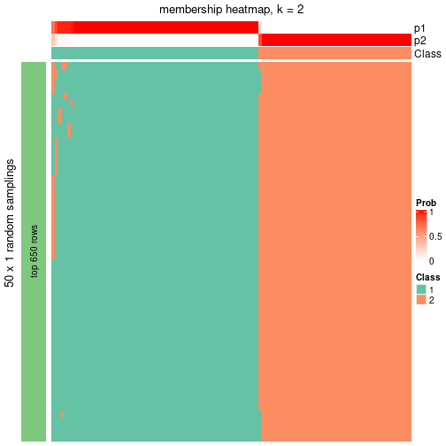</p>

</div>
<div id='tab-node-032-membership-heatmap-2'>
<pre><code class="r">membership_heatmap(res, k = 3)
</code></pre>

<p></p>

</div>
<div id='tab-node-032-membership-heatmap-3'>
<pre><code class="r">membership_heatmap(res, k = 4)
</code></pre>

<p></p>

</div>
</div>

As soon as the classes for columns are determined, the signatures
that are significantly different between subgroups can be looked for. 
Following are the heatmaps for signatures.


Signature heatmaps where rows are scaled:


<script>
$( function() {
	$( '#tabs-node-032-get-signatures' ).tabs();
} );
</script>
<div id='tabs-node-032-get-signatures'>
<ul>
<li><a href='#tab-node-032-get-signatures-1'>k = 2</a></li>
<li><a href='#tab-node-032-get-signatures-2'>k = 3</a></li>
<li><a href='#tab-node-032-get-signatures-3'>k = 4</a></li>
</ul>
<div id='tab-node-032-get-signatures-1'>
<pre><code class="r">get_signatures(res, k = 2)
</code></pre>

<p></p>

</div>
<div id='tab-node-032-get-signatures-2'>
<pre><code class="r">get_signatures(res, k = 3)
</code></pre>

<p></p>

</div>
<div id='tab-node-032-get-signatures-3'>
<pre><code class="r">get_signatures(res, k = 4)
</code></pre>

<p></p>

</div>
</div>


Signature heatmaps where rows are not scaled:


<script>
$( function() {
	$( '#tabs-node-032-get-signatures-no-scale' ).tabs();
} );
</script>
<div id='tabs-node-032-get-signatures-no-scale'>
<ul>
<li><a href='#tab-node-032-get-signatures-no-scale-1'>k = 2</a></li>
<li><a href='#tab-node-032-get-signatures-no-scale-2'>k = 3</a></li>
<li><a href='#tab-node-032-get-signatures-no-scale-3'>k = 4</a></li>
</ul>
<div id='tab-node-032-get-signatures-no-scale-1'>
<pre><code class="r">get_signatures(res, k = 2, scale_rows = FALSE)
</code></pre>

<p></p>

</div>
<div id='tab-node-032-get-signatures-no-scale-2'>
<pre><code class="r">get_signatures(res, k = 3, scale_rows = FALSE)
</code></pre>

<p></p>

</div>
<div id='tab-node-032-get-signatures-no-scale-3'>
<pre><code class="r">get_signatures(res, k = 4, scale_rows = FALSE)
</code></pre>

<p></p>

</div>
</div>


Compare the overlap of signatures from different k:

```r
compare_signatures(res)
```


`get_signature()` returns a data frame invisibly. To get the list of signatures, the function
call should be assigned to a variable explicitly. In following code, if `plot` argument is set
to `FALSE`, no heatmap is plotted while only the differential analysis is performed.

```r
# code only for demonstration
tb = get_signature(res, k = ..., plot = FALSE)
```

An example of the output of `tb` is:

```
#>   which_row         fdr    mean_1    mean_2 scaled_mean_1 scaled_mean_2 km
#> 1        38 0.042760348  8.373488  9.131774    -0.5533452     0.5164555  1
#> 2        40 0.018707592  7.106213  8.469186    -0.6173731     0.5762149  1
#> 3        55 0.019134737 10.221463 11.207825    -0.6159697     0.5749050  1
#> 4        59 0.006059896  5.921854  7.869574    -0.6899429     0.6439467  1
#> 5        60 0.018055526  8.928898 10.211722    -0.6204761     0.5791110  1
#> 6        98 0.009384629 15.714769 14.887706     0.6635654    -0.6193277  2
...
```

The columns in `tb` are:

1. `which_row`: row indices corresponding to the input matrix.
2. `fdr`: FDR for the differential test. 
3. `mean_x`: The mean value in group x.
4. `scaled_mean_x`: The mean value in group x after rows are scaled.
5. `km`: Row groups if k-means clustering is applied to rows (which is done by automatically selecting number of clusters).

If there are too many signatures, `top_signatures = ...` can be set to only show the 
signatures with the highest FDRs:

```r
# code only for demonstration
# e.g. to show the top 500 most significant rows
tb = get_signature(res, k = ..., top_signatures = 500)
```

If the signatures are defined as these which are uniquely high in current group, `diff_method` argument
can be set to `"uniquely_high_in_one_group"`:

```r
# code only for demonstration
tb = get_signature(res, k = ..., diff_method = "uniquely_high_in_one_group")
```


UMAP plot which shows how samples are separated.


<script>
$( function() {
	$( '#tabs-node-032-dimension-reduction' ).tabs();
} );
</script>
<div id='tabs-node-032-dimension-reduction'>
<ul>
<li><a href='#tab-node-032-dimension-reduction-1'>k = 2</a></li>
<li><a href='#tab-node-032-dimension-reduction-2'>k = 3</a></li>
<li><a href='#tab-node-032-dimension-reduction-3'>k = 4</a></li>
</ul>
<div id='tab-node-032-dimension-reduction-1'>
<pre><code class="r">dimension_reduction(res, k = 2, method = &quot;UMAP&quot;)
</code></pre>

<p></p>

</div>
<div id='tab-node-032-dimension-reduction-2'>
<pre><code class="r">dimension_reduction(res, k = 3, method = &quot;UMAP&quot;)
</code></pre>

<p></p>

</div>
<div id='tab-node-032-dimension-reduction-3'>
<pre><code class="r">dimension_reduction(res, k = 4, method = &quot;UMAP&quot;)
</code></pre>

<p></p>

</div>
</div>


Following heatmap shows how subgroups are split when increasing `k`:

```r
collect_classes(res)
```


If matrix rows can be associated to genes, consider to use `functional_enrichment(res,
...)` to perform function enrichment for the signature genes. See [this vignette](https://jokergoo.github.io/cola_vignettes/functional_enrichment.html) for more detailed explanations.


 

---------------------------------------------------


### Node0322


Parent node: [Node032](#Node032).
Child nodes: 
                Node01211-leaf
        ,
                Node01212-leaf
        ,
                Node01221-leaf
        ,
                Node01222-leaf
        ,
                Node01223-leaf
        ,
                Node02111-leaf
        ,
                [Node02112](#Node02112)
        ,
                Node02121-leaf
        ,
                Node02122-leaf
        ,
                Node02131-leaf
        ,
                Node02132-leaf
        ,
                Node02221-leaf
        ,
                [Node02222](#Node02222)
        ,
                Node03221-leaf
        ,
                Node03222-leaf
        ,
                Node03223-leaf
        .


The object with results only for a single top-value method and a single partitioning method 
can be extracted as:

```r
res = res_rh["0322"]
```

A summary of `res` and all the functions that can be applied to it:

```r
res
```

```
#> A 'ConsensusPartition' object with k = 2, 3, 4.
#>   On a matrix with 6110 rows and 48 columns.
#>   Top rows (497) are extracted by 'ATC' method.
#>   Subgroups are detected by 'skmeans' method.
#>   Performed in total 150 partitions by row resampling.
#>   Best k for subgroups seems to be 3.
#> 
#> Following methods can be applied to this 'ConsensusPartition' object:
#>  [1] "cola_report"             "collect_classes"         "collect_plots"          
#>  [4] "collect_stats"           "colnames"                "compare_partitions"     
#>  [7] "compare_signatures"      "consensus_heatmap"       "dimension_reduction"    
#> [10] "functional_enrichment"   "get_anno_col"            "get_anno"               
#> [13] "get_classes"             "get_consensus"           "get_matrix"             
#> [16] "get_membership"          "get_param"               "get_signatures"         
#> [19] "get_stats"               "is_best_k"               "is_stable_k"            
#> [22] "membership_heatmap"      "ncol"                    "nrow"                   
#> [25] "plot_ecdf"               "predict_classes"         "rownames"               
#> [28] "select_partition_number" "show"                    "suggest_best_k"         
#> [31] "test_to_known_factors"   "top_rows_heatmap"
```

`collect_plots()` function collects all the plots made from `res` for all `k` (number of subgroups)
into one single page to provide an easy and fast comparison between different `k`.

```r
collect_plots(res)
```

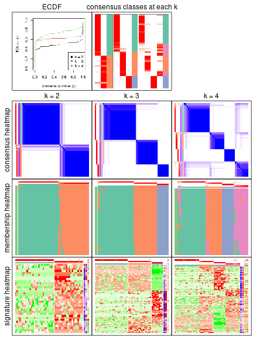

The plots are:

- The first row: a plot of the eCDF (empirical cumulative distribution
  function) curves of the consensus matrix for each `k` and the heatmap of
  predicted classes for each `k`.
- The second row: heatmaps of the consensus matrix for each `k`.
- The third row: heatmaps of the membership matrix for each `k`.
- The fouth row: heatmaps of the signatures for each `k`.

All the plots in panels can be made by individual functions and they are
plotted later in this section.

`select_partition_number()` produces several plots showing different
statistics for choosing "optimized" `k`. There are following statistics:

- eCDF curves of the consensus matrix for each `k`;
- 1-PAC. [The PAC score](https://en.wikipedia.org/wiki/Consensus_clustering#Over-interpretation_potential_of_consensus_clustering)
  measures the proportion of the ambiguous subgrouping.
- Mean silhouette score.
- Concordance. The mean probability of fiting the consensus subgroup labels in all
  partitions.
- Area increased. Denote $A_k$ as the area under the eCDF curve for current
  `k`, the area increased is defined as $A_k - A_{k-1}$.
- Rand index. The percent of pairs of samples that are both in a same cluster
  or both are not in a same cluster in the partition of k and k-1.
- Jaccard index. The ratio of pairs of samples are both in a same cluster in
  the partition of k and k-1 and the pairs of samples are both in a same
  cluster in the partition k or k-1.

The detailed explanations of these statistics can be found in [the _cola_
vignette](https://jokergoo.github.io/cola_vignettes/cola.html#toc_13).

Generally speaking, higher 1-PAC score, higher mean silhouette score or higher
concordance corresponds to better partition. Rand index and Jaccard index
measure how similar the current partition is compared to partition with `k-1`.
If they are too similar, we won't accept `k` is better than `k-1`.

```r
select_partition_number(res)
```


The numeric values for all these statistics can be obtained by `get_stats()`.

```r
get_stats(res)
```

```
#>   k 1-PAC mean_silhouette concordance area_increased  Rand Jaccard
#> 2 2 0.956           0.943       0.977          0.497 0.497   0.497
#> 3 3 1.000           0.966       0.986          0.260 0.809   0.642
#> 4 4 0.840           0.865       0.939          0.174 0.845   0.610
```

`suggest_best_k()` suggests the best $k$ based on these statistics. The rules are as follows:

- All $k$ with Jaccard index larger than 0.95 are removed because increasing
  $k$ does not provide enough extra information. If all $k$ are removed, it is
  marked as no subgroup is detected.
- For all $k$ with 1-PAC score larger than 0.9, the maximal $k$ is taken as
  the best $k$, and other $k$ are marked as optional $k$.
- If it does not fit the second rule. The $k$ with the maximal vote of the
  highest 1-PAC score, highest mean silhouette, and highest concordance is
  taken as the best $k$.

```r
suggest_best_k(res)
```

```
#> [1] 3
#> attr(,"optional")
#> [1] 2
```

There is also optional best $k$ = 2 that is worth to check.

Following is the table of the partitions (You need to click the **show/hide
code output** link to see it). The membership matrix (columns with name `p*`)
is inferred by
[`clue::cl_consensus()`](https://www.rdocumentation.org/link/cl_consensus?package=clue)
function with the `SE` method. Basically the value in the membership matrix
represents the probability to belong to a certain group. The finall subgroup
label for an item is determined with the group with highest probability it
belongs to.

In `get_classes()` function, the entropy is calculated from the membership
matrix and the silhouette score is calculated from the consensus matrix.


<script>
$( function() {
	$( '#tabs-node-0322-get-classes' ).tabs();
} );
</script>
<div id='tabs-node-0322-get-classes'>
<ul>
<li><a href='#tab-node-0322-get-classes-1'>k = 2</a></li>
<li><a href='#tab-node-0322-get-classes-2'>k = 3</a></li>
<li><a href='#tab-node-0322-get-classes-3'>k = 4</a></li>
</ul>

<div id='tab-node-0322-get-classes-1'>
<p><a id='tab-node-0322-get-classes-1-a' style='color:#0366d6' href='#'>show/hide code output</a></p>
<pre><code class="r">cbind(get_classes(res, k = 2), get_membership(res, k = 2))
</code></pre>

<pre><code>#&gt;                             class entropy silhouette   p1   p2
#&gt; mouse1_lib1.final_cell_0002     2   0.000     0.9477 0.00 1.00
#&gt; mouse1_lib1.final_cell_0004     2   0.000     0.9477 0.00 1.00
#&gt; mouse1_lib1.final_cell_0010     1   0.000     0.9967 1.00 0.00
#&gt; mouse1_lib1.final_cell_0011     1   0.000     0.9967 1.00 0.00
#&gt; mouse1_lib1.final_cell_0020     1   0.000     0.9967 1.00 0.00
#&gt; mouse1_lib1.final_cell_0027     1   0.000     0.9967 1.00 0.00
#&gt; mouse1_lib1.final_cell_0028     1   0.000     0.9967 1.00 0.00
#&gt; mouse1_lib1.final_cell_0032     1   0.000     0.9967 1.00 0.00
#&gt; mouse1_lib1.final_cell_0036     1   0.000     0.9967 1.00 0.00
#&gt; mouse1_lib2.final_cell_0002     2   0.000     0.9477 0.00 1.00
#&gt; mouse1_lib2.final_cell_0007     2   0.000     0.9477 0.00 1.00
#&gt; mouse1_lib2.final_cell_0010     2   0.000     0.9477 0.00 1.00
#&gt; mouse1_lib2.final_cell_0011     2   0.000     0.9477 0.00 1.00
#&gt; mouse1_lib2.final_cell_0012     2   0.529     0.8466 0.12 0.88
#&gt; mouse1_lib2.final_cell_0013     2   0.000     0.9477 0.00 1.00
#&gt; mouse1_lib2.final_cell_0016     2   0.000     0.9477 0.00 1.00
#&gt; mouse1_lib2.final_cell_0017     2   0.881     0.5793 0.30 0.70
#&gt; mouse1_lib2.final_cell_0020     1   0.000     0.9967 1.00 0.00
#&gt; mouse1_lib2.final_cell_0021     1   0.000     0.9967 1.00 0.00
#&gt; mouse1_lib2.final_cell_0022     1   0.000     0.9967 1.00 0.00
#&gt; mouse1_lib2.final_cell_0024     1   0.141     0.9771 0.98 0.02
#&gt; mouse1_lib2.final_cell_0027     1   0.000     0.9967 1.00 0.00
#&gt; mouse1_lib2.final_cell_0040     1   0.000     0.9967 1.00 0.00
#&gt; mouse1_lib2.final_cell_0045     1   0.000     0.9967 1.00 0.00
#&gt; mouse1_lib2.final_cell_0047     1   0.000     0.9967 1.00 0.00
#&gt; mouse1_lib2.final_cell_0066     1   0.000     0.9967 1.00 0.00
#&gt; mouse1_lib3.final_cell_0003     2   0.000     0.9477 0.00 1.00
#&gt; mouse1_lib3.final_cell_0008     2   0.469     0.8673 0.10 0.90
#&gt; mouse1_lib3.final_cell_0010     1   0.000     0.9967 1.00 0.00
#&gt; mouse1_lib3.final_cell_0011     1   0.000     0.9967 1.00 0.00
#&gt; mouse1_lib3.final_cell_0012     1   0.000     0.9967 1.00 0.00
#&gt; mouse1_lib3.final_cell_0014     1   0.000     0.9967 1.00 0.00
#&gt; mouse1_lib3.final_cell_0016     1   0.000     0.9967 1.00 0.00
#&gt; mouse1_lib3.final_cell_0019     1   0.327     0.9330 0.94 0.06
#&gt; mouse1_lib3.final_cell_0025     1   0.000     0.9967 1.00 0.00
#&gt; mouse1_lib3.final_cell_0033     1   0.000     0.9967 1.00 0.00
#&gt; mouse2_lib1.final_cell_0004     2   0.000     0.9477 0.00 1.00
#&gt; mouse2_lib1.final_cell_0030     2   0.000     0.9477 0.00 1.00
#&gt; mouse2_lib1.final_cell_0152     1   0.000     0.9967 1.00 0.00
#&gt; mouse2_lib2.final_cell_0007     2   0.000     0.9477 0.00 1.00
#&gt; mouse2_lib2.final_cell_0021     2   0.000     0.9477 0.00 1.00
#&gt; mouse2_lib2.final_cell_0080     2   0.000     0.9477 0.00 1.00
#&gt; mouse2_lib2.final_cell_0108     1   0.000     0.9967 1.00 0.00
#&gt; mouse2_lib2.final_cell_0204     2   1.000     0.0232 0.50 0.50
#&gt; mouse2_lib3.final_cell_0016     2   0.000     0.9477 0.00 1.00
#&gt; mouse2_lib3.final_cell_0034     2   0.000     0.9477 0.00 1.00
#&gt; mouse2_lib3.final_cell_0061     1   0.000     0.9967 1.00 0.00
#&gt; mouse2_lib3.final_cell_0065     2   0.000     0.9477 0.00 1.00
</code></pre>

<script>
$('#tab-node-0322-get-classes-1-a').parent().next().next().hide();
$('#tab-node-0322-get-classes-1-a').click(function(){
  $('#tab-node-0322-get-classes-1-a').parent().next().next().toggle();
  return(false);
});
</script>
</div>

<div id='tab-node-0322-get-classes-2'>
<p><a id='tab-node-0322-get-classes-2-a' style='color:#0366d6' href='#'>show/hide code output</a></p>
<pre><code class="r">cbind(get_classes(res, k = 3), get_membership(res, k = 3))
</code></pre>

<pre><code>#&gt;                             class entropy silhouette   p1   p2   p3
#&gt; mouse1_lib1.final_cell_0002     2  0.0000      0.985 0.00 1.00 0.00
#&gt; mouse1_lib1.final_cell_0004     3  0.0000      1.000 0.00 0.00 1.00
#&gt; mouse1_lib1.final_cell_0010     1  0.0892      0.962 0.98 0.02 0.00
#&gt; mouse1_lib1.final_cell_0011     1  0.0000      0.977 1.00 0.00 0.00
#&gt; mouse1_lib1.final_cell_0020     1  0.1529      0.944 0.96 0.04 0.00
#&gt; mouse1_lib1.final_cell_0027     1  0.0000      0.977 1.00 0.00 0.00
#&gt; mouse1_lib1.final_cell_0028     1  0.0000      0.977 1.00 0.00 0.00
#&gt; mouse1_lib1.final_cell_0032     1  0.0000      0.977 1.00 0.00 0.00
#&gt; mouse1_lib1.final_cell_0036     1  0.0000      0.977 1.00 0.00 0.00
#&gt; mouse1_lib2.final_cell_0002     3  0.0000      1.000 0.00 0.00 1.00
#&gt; mouse1_lib2.final_cell_0007     2  0.0000      0.985 0.00 1.00 0.00
#&gt; mouse1_lib2.final_cell_0010     3  0.0000      1.000 0.00 0.00 1.00
#&gt; mouse1_lib2.final_cell_0011     2  0.0000      0.985 0.00 1.00 0.00
#&gt; mouse1_lib2.final_cell_0012     2  0.0000      0.985 0.00 1.00 0.00
#&gt; mouse1_lib2.final_cell_0013     2  0.0000      0.985 0.00 1.00 0.00
#&gt; mouse1_lib2.final_cell_0016     2  0.0000      0.985 0.00 1.00 0.00
#&gt; mouse1_lib2.final_cell_0017     2  0.0000      0.985 0.00 1.00 0.00
#&gt; mouse1_lib2.final_cell_0020     2  0.0000      0.985 0.00 1.00 0.00
#&gt; mouse1_lib2.final_cell_0021     1  0.0000      0.977 1.00 0.00 0.00
#&gt; mouse1_lib2.final_cell_0022     1  0.1529      0.944 0.96 0.04 0.00
#&gt; mouse1_lib2.final_cell_0024     2  0.0000      0.985 0.00 1.00 0.00
#&gt; mouse1_lib2.final_cell_0027     1  0.0000      0.977 1.00 0.00 0.00
#&gt; mouse1_lib2.final_cell_0040     1  0.0000      0.977 1.00 0.00 0.00
#&gt; mouse1_lib2.final_cell_0045     1  0.0000      0.977 1.00 0.00 0.00
#&gt; mouse1_lib2.final_cell_0047     1  0.0000      0.977 1.00 0.00 0.00
#&gt; mouse1_lib2.final_cell_0066     1  0.0000      0.977 1.00 0.00 0.00
#&gt; mouse1_lib3.final_cell_0003     2  0.0000      0.985 0.00 1.00 0.00
#&gt; mouse1_lib3.final_cell_0008     2  0.0892      0.968 0.00 0.98 0.02
#&gt; mouse1_lib3.final_cell_0010     1  0.0000      0.977 1.00 0.00 0.00
#&gt; mouse1_lib3.final_cell_0011     1  0.5835      0.484 0.66 0.34 0.00
#&gt; mouse1_lib3.final_cell_0012     1  0.0000      0.977 1.00 0.00 0.00
#&gt; mouse1_lib3.final_cell_0014     1  0.0000      0.977 1.00 0.00 0.00
#&gt; mouse1_lib3.final_cell_0016     1  0.0000      0.977 1.00 0.00 0.00
#&gt; mouse1_lib3.final_cell_0019     2  0.4002      0.781 0.16 0.84 0.00
#&gt; mouse1_lib3.final_cell_0025     1  0.0000      0.977 1.00 0.00 0.00
#&gt; mouse1_lib3.final_cell_0033     1  0.0000      0.977 1.00 0.00 0.00
#&gt; mouse2_lib1.final_cell_0004     2  0.0000      0.985 0.00 1.00 0.00
#&gt; mouse2_lib1.final_cell_0030     2  0.0000      0.985 0.00 1.00 0.00
#&gt; mouse2_lib1.final_cell_0152     1  0.0000      0.977 1.00 0.00 0.00
#&gt; mouse2_lib2.final_cell_0007     2  0.0000      0.985 0.00 1.00 0.00
#&gt; mouse2_lib2.final_cell_0021     2  0.0000      0.985 0.00 1.00 0.00
#&gt; mouse2_lib2.final_cell_0080     3  0.0000      1.000 0.00 0.00 1.00
#&gt; mouse2_lib2.final_cell_0108     1  0.1781      0.948 0.96 0.02 0.02
#&gt; mouse2_lib2.final_cell_0204     3  0.0000      1.000 0.00 0.00 1.00
#&gt; mouse2_lib3.final_cell_0016     3  0.0000      1.000 0.00 0.00 1.00
#&gt; mouse2_lib3.final_cell_0034     3  0.0000      1.000 0.00 0.00 1.00
#&gt; mouse2_lib3.final_cell_0061     1  0.0000      0.977 1.00 0.00 0.00
#&gt; mouse2_lib3.final_cell_0065     3  0.0000      1.000 0.00 0.00 1.00
</code></pre>

<script>
$('#tab-node-0322-get-classes-2-a').parent().next().next().hide();
$('#tab-node-0322-get-classes-2-a').click(function(){
  $('#tab-node-0322-get-classes-2-a').parent().next().next().toggle();
  return(false);
});
</script>
</div>

<div id='tab-node-0322-get-classes-3'>
<p><a id='tab-node-0322-get-classes-3-a' style='color:#0366d6' href='#'>show/hide code output</a></p>
<pre><code class="r">cbind(get_classes(res, k = 4), get_membership(res, k = 4))
</code></pre>

<pre><code>#&gt;                             class entropy silhouette   p1   p2   p3   p4
#&gt; mouse1_lib1.final_cell_0002     2  0.0000      0.922 0.00 1.00 0.00 0.00
#&gt; mouse1_lib1.final_cell_0004     3  0.0000      1.000 0.00 0.00 1.00 0.00
#&gt; mouse1_lib1.final_cell_0010     1  0.6005     -0.027 0.50 0.04 0.00 0.46
#&gt; mouse1_lib1.final_cell_0011     4  0.3610      0.762 0.20 0.00 0.00 0.80
#&gt; mouse1_lib1.final_cell_0020     4  0.3335      0.829 0.12 0.02 0.00 0.86
#&gt; mouse1_lib1.final_cell_0027     1  0.0000      0.934 1.00 0.00 0.00 0.00
#&gt; mouse1_lib1.final_cell_0028     1  0.0000      0.934 1.00 0.00 0.00 0.00
#&gt; mouse1_lib1.final_cell_0032     1  0.0000      0.934 1.00 0.00 0.00 0.00
#&gt; mouse1_lib1.final_cell_0036     1  0.0000      0.934 1.00 0.00 0.00 0.00
#&gt; mouse1_lib2.final_cell_0002     3  0.0000      1.000 0.00 0.00 1.00 0.00
#&gt; mouse1_lib2.final_cell_0007     2  0.0000      0.922 0.00 1.00 0.00 0.00
#&gt; mouse1_lib2.final_cell_0010     3  0.0000      1.000 0.00 0.00 1.00 0.00
#&gt; mouse1_lib2.final_cell_0011     2  0.2011      0.878 0.00 0.92 0.00 0.08
#&gt; mouse1_lib2.final_cell_0012     2  0.4855      0.406 0.00 0.60 0.00 0.40
#&gt; mouse1_lib2.final_cell_0013     2  0.0000      0.922 0.00 1.00 0.00 0.00
#&gt; mouse1_lib2.final_cell_0016     2  0.0000      0.922 0.00 1.00 0.00 0.00
#&gt; mouse1_lib2.final_cell_0017     2  0.0000      0.922 0.00 1.00 0.00 0.00
#&gt; mouse1_lib2.final_cell_0020     4  0.0000      0.867 0.00 0.00 0.00 1.00
#&gt; mouse1_lib2.final_cell_0021     1  0.0000      0.934 1.00 0.00 0.00 0.00
#&gt; mouse1_lib2.final_cell_0022     4  0.0707      0.868 0.02 0.00 0.00 0.98
#&gt; mouse1_lib2.final_cell_0024     4  0.0000      0.867 0.00 0.00 0.00 1.00
#&gt; mouse1_lib2.final_cell_0027     1  0.6686      0.455 0.62 0.20 0.00 0.18
#&gt; mouse1_lib2.final_cell_0040     1  0.0000      0.934 1.00 0.00 0.00 0.00
#&gt; mouse1_lib2.final_cell_0045     1  0.0000      0.934 1.00 0.00 0.00 0.00
#&gt; mouse1_lib2.final_cell_0047     1  0.0000      0.934 1.00 0.00 0.00 0.00
#&gt; mouse1_lib2.final_cell_0066     1  0.0000      0.934 1.00 0.00 0.00 0.00
#&gt; mouse1_lib3.final_cell_0003     2  0.0000      0.922 0.00 1.00 0.00 0.00
#&gt; mouse1_lib3.final_cell_0008     4  0.0000      0.867 0.00 0.00 0.00 1.00
#&gt; mouse1_lib3.final_cell_0010     1  0.1637      0.883 0.94 0.00 0.00 0.06
#&gt; mouse1_lib3.final_cell_0011     4  0.7095      0.506 0.26 0.18 0.00 0.56
#&gt; mouse1_lib3.final_cell_0012     1  0.0000      0.934 1.00 0.00 0.00 0.00
#&gt; mouse1_lib3.final_cell_0014     1  0.0000      0.934 1.00 0.00 0.00 0.00
#&gt; mouse1_lib3.final_cell_0016     1  0.0000      0.934 1.00 0.00 0.00 0.00
#&gt; mouse1_lib3.final_cell_0019     2  0.2335      0.862 0.06 0.92 0.00 0.02
#&gt; mouse1_lib3.final_cell_0025     1  0.0000      0.934 1.00 0.00 0.00 0.00
#&gt; mouse1_lib3.final_cell_0033     1  0.0000      0.934 1.00 0.00 0.00 0.00
#&gt; mouse2_lib1.final_cell_0004     2  0.0000      0.922 0.00 1.00 0.00 0.00
#&gt; mouse2_lib1.final_cell_0030     2  0.3610      0.768 0.00 0.80 0.00 0.20
#&gt; mouse2_lib1.final_cell_0152     1  0.0000      0.934 1.00 0.00 0.00 0.00
#&gt; mouse2_lib2.final_cell_0007     4  0.2345      0.794 0.00 0.10 0.00 0.90
#&gt; mouse2_lib2.final_cell_0021     4  0.0707      0.859 0.00 0.02 0.00 0.98
#&gt; mouse2_lib2.final_cell_0080     3  0.0000      1.000 0.00 0.00 1.00 0.00
#&gt; mouse2_lib2.final_cell_0108     1  0.4692      0.770 0.82 0.04 0.04 0.10
#&gt; mouse2_lib2.final_cell_0204     3  0.0000      1.000 0.00 0.00 1.00 0.00
#&gt; mouse2_lib3.final_cell_0016     3  0.0000      1.000 0.00 0.00 1.00 0.00
#&gt; mouse2_lib3.final_cell_0034     3  0.0000      1.000 0.00 0.00 1.00 0.00
#&gt; mouse2_lib3.final_cell_0061     4  0.2647      0.835 0.12 0.00 0.00 0.88
#&gt; mouse2_lib3.final_cell_0065     3  0.0000      1.000 0.00 0.00 1.00 0.00
</code></pre>

<script>
$('#tab-node-0322-get-classes-3-a').parent().next().next().hide();
$('#tab-node-0322-get-classes-3-a').click(function(){
  $('#tab-node-0322-get-classes-3-a').parent().next().next().toggle();
  return(false);
});
</script>
</div>
</div>

Heatmaps for the consensus matrix. It visualizes the probability of two
samples to be in a same group.


<script>
$( function() {
	$( '#tabs-node-0322-consensus-heatmap' ).tabs();
} );
</script>
<div id='tabs-node-0322-consensus-heatmap'>
<ul>
<li><a href='#tab-node-0322-consensus-heatmap-1'>k = 2</a></li>
<li><a href='#tab-node-0322-consensus-heatmap-2'>k = 3</a></li>
<li><a href='#tab-node-0322-consensus-heatmap-3'>k = 4</a></li>
</ul>
<div id='tab-node-0322-consensus-heatmap-1'>
<pre><code class="r">consensus_heatmap(res, k = 2)
</code></pre>

<p></p>

</div>
<div id='tab-node-0322-consensus-heatmap-2'>
<pre><code class="r">consensus_heatmap(res, k = 3)
</code></pre>

<p></p>

</div>
<div id='tab-node-0322-consensus-heatmap-3'>
<pre><code class="r">consensus_heatmap(res, k = 4)
</code></pre>

<p></p>

</div>
</div>

Heatmaps for the membership of samples in all partitions to see how consistent they are:


<script>
$( function() {
	$( '#tabs-node-0322-membership-heatmap' ).tabs();
} );
</script>
<div id='tabs-node-0322-membership-heatmap'>
<ul>
<li><a href='#tab-node-0322-membership-heatmap-1'>k = 2</a></li>
<li><a href='#tab-node-0322-membership-heatmap-2'>k = 3</a></li>
<li><a href='#tab-node-0322-membership-heatmap-3'>k = 4</a></li>
</ul>
<div id='tab-node-0322-membership-heatmap-1'>
<pre><code class="r">membership_heatmap(res, k = 2)
</code></pre>

<p></p>

</div>
<div id='tab-node-0322-membership-heatmap-2'>
<pre><code class="r">membership_heatmap(res, k = 3)
</code></pre>

<p></p>

</div>
<div id='tab-node-0322-membership-heatmap-3'>
<pre><code class="r">membership_heatmap(res, k = 4)
</code></pre>

<p></p>

</div>
</div>

As soon as the classes for columns are determined, the signatures
that are significantly different between subgroups can be looked for. 
Following are the heatmaps for signatures.


Signature heatmaps where rows are scaled:


<script>
$( function() {
	$( '#tabs-node-0322-get-signatures' ).tabs();
} );
</script>
<div id='tabs-node-0322-get-signatures'>
<ul>
<li><a href='#tab-node-0322-get-signatures-1'>k = 2</a></li>
<li><a href='#tab-node-0322-get-signatures-2'>k = 3</a></li>
<li><a href='#tab-node-0322-get-signatures-3'>k = 4</a></li>
</ul>
<div id='tab-node-0322-get-signatures-1'>
<pre><code class="r">get_signatures(res, k = 2)
</code></pre>

<p></p>

</div>
<div id='tab-node-0322-get-signatures-2'>
<pre><code class="r">get_signatures(res, k = 3)
</code></pre>

<p></p>

</div>
<div id='tab-node-0322-get-signatures-3'>
<pre><code class="r">get_signatures(res, k = 4)
</code></pre>

<p></p>

</div>
</div>


Signature heatmaps where rows are not scaled:


<script>
$( function() {
	$( '#tabs-node-0322-get-signatures-no-scale' ).tabs();
} );
</script>
<div id='tabs-node-0322-get-signatures-no-scale'>
<ul>
<li><a href='#tab-node-0322-get-signatures-no-scale-1'>k = 2</a></li>
<li><a href='#tab-node-0322-get-signatures-no-scale-2'>k = 3</a></li>
<li><a href='#tab-node-0322-get-signatures-no-scale-3'>k = 4</a></li>
</ul>
<div id='tab-node-0322-get-signatures-no-scale-1'>
<pre><code class="r">get_signatures(res, k = 2, scale_rows = FALSE)
</code></pre>

<p></p>

</div>
<div id='tab-node-0322-get-signatures-no-scale-2'>
<pre><code class="r">get_signatures(res, k = 3, scale_rows = FALSE)
</code></pre>

<p></p>

</div>
<div id='tab-node-0322-get-signatures-no-scale-3'>
<pre><code class="r">get_signatures(res, k = 4, scale_rows = FALSE)
</code></pre>

<p></p>

</div>
</div>


Compare the overlap of signatures from different k:

```r
compare_signatures(res)
```


`get_signature()` returns a data frame invisibly. To get the list of signatures, the function
call should be assigned to a variable explicitly. In following code, if `plot` argument is set
to `FALSE`, no heatmap is plotted while only the differential analysis is performed.

```r
# code only for demonstration
tb = get_signature(res, k = ..., plot = FALSE)
```

An example of the output of `tb` is:

```
#>   which_row         fdr    mean_1    mean_2 scaled_mean_1 scaled_mean_2 km
#> 1        38 0.042760348  8.373488  9.131774    -0.5533452     0.5164555  1
#> 2        40 0.018707592  7.106213  8.469186    -0.6173731     0.5762149  1
#> 3        55 0.019134737 10.221463 11.207825    -0.6159697     0.5749050  1
#> 4        59 0.006059896  5.921854  7.869574    -0.6899429     0.6439467  1
#> 5        60 0.018055526  8.928898 10.211722    -0.6204761     0.5791110  1
#> 6        98 0.009384629 15.714769 14.887706     0.6635654    -0.6193277  2
...
```

The columns in `tb` are:

1. `which_row`: row indices corresponding to the input matrix.
2. `fdr`: FDR for the differential test. 
3. `mean_x`: The mean value in group x.
4. `scaled_mean_x`: The mean value in group x after rows are scaled.
5. `km`: Row groups if k-means clustering is applied to rows (which is done by automatically selecting number of clusters).

If there are too many signatures, `top_signatures = ...` can be set to only show the 
signatures with the highest FDRs:

```r
# code only for demonstration
# e.g. to show the top 500 most significant rows
tb = get_signature(res, k = ..., top_signatures = 500)
```

If the signatures are defined as these which are uniquely high in current group, `diff_method` argument
can be set to `"uniquely_high_in_one_group"`:

```r
# code only for demonstration
tb = get_signature(res, k = ..., diff_method = "uniquely_high_in_one_group")
```


UMAP plot which shows how samples are separated.


<script>
$( function() {
	$( '#tabs-node-0322-dimension-reduction' ).tabs();
} );
</script>
<div id='tabs-node-0322-dimension-reduction'>
<ul>
<li><a href='#tab-node-0322-dimension-reduction-1'>k = 2</a></li>
<li><a href='#tab-node-0322-dimension-reduction-2'>k = 3</a></li>
<li><a href='#tab-node-0322-dimension-reduction-3'>k = 4</a></li>
</ul>
<div id='tab-node-0322-dimension-reduction-1'>
<pre><code class="r">dimension_reduction(res, k = 2, method = &quot;UMAP&quot;)
</code></pre>

<p></p>

</div>
<div id='tab-node-0322-dimension-reduction-2'>
<pre><code class="r">dimension_reduction(res, k = 3, method = &quot;UMAP&quot;)
</code></pre>

<p></p>

</div>
<div id='tab-node-0322-dimension-reduction-3'>
<pre><code class="r">dimension_reduction(res, k = 4, method = &quot;UMAP&quot;)
</code></pre>

<p></p>

</div>
</div>


Following heatmap shows how subgroups are split when increasing `k`:

```r
collect_classes(res)
```


If matrix rows can be associated to genes, consider to use `functional_enrichment(res,
...)` to perform function enrichment for the signature genes. See [this vignette](https://jokergoo.github.io/cola_vignettes/functional_enrichment.html) for more detailed explanations.


 

---------------------------------------------------


### Node033


Parent node: [Node03](#Node03).
Child nodes: 
                [Node0121](#Node0121)
        ,
                [Node0122](#Node0122)
        ,
                Node0141-leaf
        ,
                Node0142-leaf
        ,
                [Node0211](#Node0211)
        ,
                [Node0212](#Node0212)
        ,
                [Node0213](#Node0213)
        ,
                Node0221-leaf
        ,
                [Node0222](#Node0222)
        ,
                Node0311-leaf
        ,
                Node0312-leaf
        ,
                Node0313-leaf
        ,
                Node0321-leaf
        ,
                [Node0322](#Node0322)
        ,
                Node0331-leaf
        ,
                Node0332-leaf
        ,
                Node0333-leaf
        .


The object with results only for a single top-value method and a single partitioning method 
can be extracted as:

```r
res = res_rh["033"]
```

A summary of `res` and all the functions that can be applied to it:

```r
res
```

```
#> A 'ConsensusPartition' object with k = 2, 3, 4.
#>   On a matrix with 5412 rows and 94 columns.
#>   Top rows (518) are extracted by 'ATC' method.
#>   Subgroups are detected by 'skmeans' method.
#>   Performed in total 150 partitions by row resampling.
#>   Best k for subgroups seems to be 3.
#> 
#> Following methods can be applied to this 'ConsensusPartition' object:
#>  [1] "cola_report"             "collect_classes"         "collect_plots"          
#>  [4] "collect_stats"           "colnames"                "compare_partitions"     
#>  [7] "compare_signatures"      "consensus_heatmap"       "dimension_reduction"    
#> [10] "functional_enrichment"   "get_anno_col"            "get_anno"               
#> [13] "get_classes"             "get_consensus"           "get_matrix"             
#> [16] "get_membership"          "get_param"               "get_signatures"         
#> [19] "get_stats"               "is_best_k"               "is_stable_k"            
#> [22] "membership_heatmap"      "ncol"                    "nrow"                   
#> [25] "plot_ecdf"               "predict_classes"         "rownames"               
#> [28] "select_partition_number" "show"                    "suggest_best_k"         
#> [31] "test_to_known_factors"   "top_rows_heatmap"
```

`collect_plots()` function collects all the plots made from `res` for all `k` (number of subgroups)
into one single page to provide an easy and fast comparison between different `k`.

```r
collect_plots(res)
```


The plots are:

- The first row: a plot of the eCDF (empirical cumulative distribution
  function) curves of the consensus matrix for each `k` and the heatmap of
  predicted classes for each `k`.
- The second row: heatmaps of the consensus matrix for each `k`.
- The third row: heatmaps of the membership matrix for each `k`.
- The fouth row: heatmaps of the signatures for each `k`.

All the plots in panels can be made by individual functions and they are
plotted later in this section.

`select_partition_number()` produces several plots showing different
statistics for choosing "optimized" `k`. There are following statistics:

- eCDF curves of the consensus matrix for each `k`;
- 1-PAC. [The PAC score](https://en.wikipedia.org/wiki/Consensus_clustering#Over-interpretation_potential_of_consensus_clustering)
  measures the proportion of the ambiguous subgrouping.
- Mean silhouette score.
- Concordance. The mean probability of fiting the consensus subgroup labels in all
  partitions.
- Area increased. Denote $A_k$ as the area under the eCDF curve for current
  `k`, the area increased is defined as $A_k - A_{k-1}$.
- Rand index. The percent of pairs of samples that are both in a same cluster
  or both are not in a same cluster in the partition of k and k-1.
- Jaccard index. The ratio of pairs of samples are both in a same cluster in
  the partition of k and k-1 and the pairs of samples are both in a same
  cluster in the partition k or k-1.

The detailed explanations of these statistics can be found in [the _cola_
vignette](https://jokergoo.github.io/cola_vignettes/cola.html#toc_13).

Generally speaking, higher 1-PAC score, higher mean silhouette score or higher
concordance corresponds to better partition. Rand index and Jaccard index
measure how similar the current partition is compared to partition with `k-1`.
If they are too similar, we won't accept `k` is better than `k-1`.

```r
select_partition_number(res)
```


The numeric values for all these statistics can be obtained by `get_stats()`.

```r
get_stats(res)
```

```
#>   k 1-PAC mean_silhouette concordance area_increased  Rand Jaccard
#> 2 2 1.000           0.984       0.992          0.496 0.503   0.503
#> 3 3 0.985           0.967       0.986          0.277 0.831   0.675
#> 4 4 0.782           0.783       0.899          0.117 0.927   0.802
```

`suggest_best_k()` suggests the best $k$ based on these statistics. The rules are as follows:

- All $k$ with Jaccard index larger than 0.95 are removed because increasing
  $k$ does not provide enough extra information. If all $k$ are removed, it is
  marked as no subgroup is detected.
- For all $k$ with 1-PAC score larger than 0.9, the maximal $k$ is taken as
  the best $k$, and other $k$ are marked as optional $k$.
- If it does not fit the second rule. The $k$ with the maximal vote of the
  highest 1-PAC score, highest mean silhouette, and highest concordance is
  taken as the best $k$.

```r
suggest_best_k(res)
```

```
#> [1] 3
#> attr(,"optional")
#> [1] 2
```

There is also optional best $k$ = 2 that is worth to check.

Following is the table of the partitions (You need to click the **show/hide
code output** link to see it). The membership matrix (columns with name `p*`)
is inferred by
[`clue::cl_consensus()`](https://www.rdocumentation.org/link/cl_consensus?package=clue)
function with the `SE` method. Basically the value in the membership matrix
represents the probability to belong to a certain group. The finall subgroup
label for an item is determined with the group with highest probability it
belongs to.

In `get_classes()` function, the entropy is calculated from the membership
matrix and the silhouette score is calculated from the consensus matrix.


<script>
$( function() {
	$( '#tabs-node-033-get-classes' ).tabs();
} );
</script>
<div id='tabs-node-033-get-classes'>
<ul>
<li><a href='#tab-node-033-get-classes-1'>k = 2</a></li>
<li><a href='#tab-node-033-get-classes-2'>k = 3</a></li>
<li><a href='#tab-node-033-get-classes-3'>k = 4</a></li>
</ul>

<div id='tab-node-033-get-classes-1'>
<p><a id='tab-node-033-get-classes-1-a' style='color:#0366d6' href='#'>show/hide code output</a></p>
<pre><code class="r">cbind(get_classes(res, k = 2), get_membership(res, k = 2))
</code></pre>

<pre><code>#&gt;                             class entropy silhouette   p1   p2
#&gt; mouse1_lib1.final_cell_0018     2   0.000      0.984 0.00 1.00
#&gt; mouse1_lib1.final_cell_0026     2   0.000      0.984 0.00 1.00
#&gt; mouse1_lib1.final_cell_0044     2   0.000      0.984 0.00 1.00
#&gt; mouse1_lib1.final_cell_0058     2   0.000      0.984 0.00 1.00
#&gt; mouse1_lib1.final_cell_0064     2   0.000      0.984 0.00 1.00
#&gt; mouse1_lib1.final_cell_0069     1   0.000      0.998 1.00 0.00
#&gt; mouse1_lib1.final_cell_0073     1   0.000      0.998 1.00 0.00
#&gt; mouse1_lib1.final_cell_0092     1   0.000      0.998 1.00 0.00
#&gt; mouse1_lib1.final_cell_0100     1   0.242      0.958 0.96 0.04
#&gt; mouse1_lib1.final_cell_0102     1   0.000      0.998 1.00 0.00
#&gt; mouse1_lib1.final_cell_0110     1   0.000      0.998 1.00 0.00
#&gt; mouse1_lib1.final_cell_0115     1   0.000      0.998 1.00 0.00
#&gt; mouse1_lib1.final_cell_0120     2   0.000      0.984 0.00 1.00
#&gt; mouse1_lib1.final_cell_0145     1   0.000      0.998 1.00 0.00
#&gt; mouse1_lib1.final_cell_0157     1   0.000      0.998 1.00 0.00
#&gt; mouse1_lib1.final_cell_0182     1   0.000      0.998 1.00 0.00
#&gt; mouse1_lib1.final_cell_0187     1   0.000      0.998 1.00 0.00
#&gt; mouse1_lib1.final_cell_0188     1   0.000      0.998 1.00 0.00
#&gt; mouse1_lib1.final_cell_0204     1   0.000      0.998 1.00 0.00
#&gt; mouse1_lib1.final_cell_0208     1   0.000      0.998 1.00 0.00
#&gt; mouse1_lib1.final_cell_0233     1   0.000      0.998 1.00 0.00
#&gt; mouse1_lib2.final_cell_0018     2   0.000      0.984 0.00 1.00
#&gt; mouse1_lib2.final_cell_0031     2   0.000      0.984 0.00 1.00
#&gt; mouse1_lib2.final_cell_0035     2   0.000      0.984 0.00 1.00
#&gt; mouse1_lib2.final_cell_0046     2   0.000      0.984 0.00 1.00
#&gt; mouse1_lib2.final_cell_0048     2   0.000      0.984 0.00 1.00
#&gt; mouse1_lib2.final_cell_0050     2   0.000      0.984 0.00 1.00
#&gt; mouse1_lib2.final_cell_0055     2   0.000      0.984 0.00 1.00
#&gt; mouse1_lib2.final_cell_0056     2   0.000      0.984 0.00 1.00
#&gt; mouse1_lib2.final_cell_0069     2   0.000      0.984 0.00 1.00
#&gt; mouse1_lib2.final_cell_0078     2   0.722      0.760 0.20 0.80
#&gt; mouse1_lib2.final_cell_0095     1   0.000      0.998 1.00 0.00
#&gt; mouse1_lib2.final_cell_0102     2   0.242      0.951 0.04 0.96
#&gt; mouse1_lib2.final_cell_0119     2   0.000      0.984 0.00 1.00
#&gt; mouse1_lib2.final_cell_0124     2   0.402      0.912 0.08 0.92
#&gt; mouse1_lib2.final_cell_0132     1   0.000      0.998 1.00 0.00
#&gt; mouse1_lib2.final_cell_0139     1   0.000      0.998 1.00 0.00
#&gt; mouse1_lib2.final_cell_0158     1   0.000      0.998 1.00 0.00
#&gt; mouse1_lib2.final_cell_0170     1   0.000      0.998 1.00 0.00
#&gt; mouse1_lib2.final_cell_0179     1   0.000      0.998 1.00 0.00
#&gt; mouse1_lib2.final_cell_0200     1   0.000      0.998 1.00 0.00
#&gt; mouse1_lib2.final_cell_0206     1   0.000      0.998 1.00 0.00
#&gt; mouse1_lib3.final_cell_0006     2   0.000      0.984 0.00 1.00
#&gt; mouse1_lib3.final_cell_0030     2   0.000      0.984 0.00 1.00
#&gt; mouse1_lib3.final_cell_0042     2   0.000      0.984 0.00 1.00
#&gt; mouse1_lib3.final_cell_0043     2   0.000      0.984 0.00 1.00
#&gt; mouse1_lib3.final_cell_0054     2   0.000      0.984 0.00 1.00
#&gt; mouse1_lib3.final_cell_0055     2   0.000      0.984 0.00 1.00
#&gt; mouse1_lib3.final_cell_0101     1   0.000      0.998 1.00 0.00
#&gt; mouse1_lib3.final_cell_0116     1   0.000      0.998 1.00 0.00
#&gt; mouse1_lib3.final_cell_0125     1   0.000      0.998 1.00 0.00
#&gt; mouse2_lib1.final_cell_0078     2   0.000      0.984 0.00 1.00
#&gt; mouse2_lib1.final_cell_0129     2   0.000      0.984 0.00 1.00
#&gt; mouse2_lib1.final_cell_0213     1   0.000      0.998 1.00 0.00
#&gt; mouse2_lib1.final_cell_0240     1   0.000      0.998 1.00 0.00
#&gt; mouse2_lib1.final_cell_0246     1   0.000      0.998 1.00 0.00
#&gt; mouse2_lib1.final_cell_0263     1   0.000      0.998 1.00 0.00
#&gt; mouse2_lib1.final_cell_0270     1   0.000      0.998 1.00 0.00
#&gt; mouse2_lib1.final_cell_0286     1   0.000      0.998 1.00 0.00
#&gt; mouse2_lib2.final_cell_0115     2   0.000      0.984 0.00 1.00
#&gt; mouse2_lib2.final_cell_0147     2   0.000      0.984 0.00 1.00
#&gt; mouse2_lib2.final_cell_0148     2   0.000      0.984 0.00 1.00
#&gt; mouse2_lib2.final_cell_0167     2   0.000      0.984 0.00 1.00
#&gt; mouse2_lib2.final_cell_0186     2   0.000      0.984 0.00 1.00
#&gt; mouse2_lib2.final_cell_0196     2   0.000      0.984 0.00 1.00
#&gt; mouse2_lib2.final_cell_0199     1   0.000      0.998 1.00 0.00
#&gt; mouse2_lib2.final_cell_0212     2   0.000      0.984 0.00 1.00
#&gt; mouse2_lib2.final_cell_0213     2   0.402      0.911 0.08 0.92
#&gt; mouse2_lib2.final_cell_0217     2   0.000      0.984 0.00 1.00
#&gt; mouse2_lib2.final_cell_0239     1   0.000      0.998 1.00 0.00
#&gt; mouse2_lib2.final_cell_0247     2   0.795      0.695 0.24 0.76
#&gt; mouse2_lib2.final_cell_0251     2   0.000      0.984 0.00 1.00
#&gt; mouse2_lib2.final_cell_0269     1   0.000      0.998 1.00 0.00
#&gt; mouse2_lib2.final_cell_0270     1   0.000      0.998 1.00 0.00
#&gt; mouse2_lib2.final_cell_0271     1   0.000      0.998 1.00 0.00
#&gt; mouse2_lib2.final_cell_0277     1   0.000      0.998 1.00 0.00
#&gt; mouse2_lib2.final_cell_0281     1   0.000      0.998 1.00 0.00
#&gt; mouse2_lib2.final_cell_0284     1   0.000      0.998 1.00 0.00
#&gt; mouse2_lib2.final_cell_0294     1   0.141      0.979 0.98 0.02
#&gt; mouse2_lib2.final_cell_0299     1   0.000      0.998 1.00 0.00
#&gt; mouse2_lib2.final_cell_0309     1   0.141      0.979 0.98 0.02
#&gt; mouse2_lib3.final_cell_0181     2   0.000      0.984 0.00 1.00
#&gt; mouse2_lib3.final_cell_0192     2   0.000      0.984 0.00 1.00
#&gt; mouse2_lib3.final_cell_0224     1   0.000      0.998 1.00 0.00
#&gt; mouse2_lib3.final_cell_0242     1   0.000      0.998 1.00 0.00
#&gt; mouse2_lib3.final_cell_0251     1   0.000      0.998 1.00 0.00
#&gt; mouse2_lib3.final_cell_0253     2   0.000      0.984 0.00 1.00
#&gt; mouse2_lib3.final_cell_0262     1   0.000      0.998 1.00 0.00
#&gt; mouse2_lib3.final_cell_0264     1   0.000      0.998 1.00 0.00
#&gt; mouse2_lib3.final_cell_0284     1   0.000      0.998 1.00 0.00
#&gt; mouse2_lib3.final_cell_0297     1   0.000      0.998 1.00 0.00
#&gt; mouse2_lib3.final_cell_0316     1   0.000      0.998 1.00 0.00
#&gt; mouse2_lib3.final_cell_0317     1   0.000      0.998 1.00 0.00
#&gt; mouse2_lib3.final_cell_0325     1   0.000      0.998 1.00 0.00
</code></pre>

<script>
$('#tab-node-033-get-classes-1-a').parent().next().next().hide();
$('#tab-node-033-get-classes-1-a').click(function(){
  $('#tab-node-033-get-classes-1-a').parent().next().next().toggle();
  return(false);
});
</script>
</div>

<div id='tab-node-033-get-classes-2'>
<p><a id='tab-node-033-get-classes-2-a' style='color:#0366d6' href='#'>show/hide code output</a></p>
<pre><code class="r">cbind(get_classes(res, k = 3), get_membership(res, k = 3))
</code></pre>

<pre><code>#&gt;                             class entropy silhouette   p1   p2   p3
#&gt; mouse1_lib1.final_cell_0018     2  0.0000      0.977 0.00 1.00 0.00
#&gt; mouse1_lib1.final_cell_0026     2  0.0000      0.977 0.00 1.00 0.00
#&gt; mouse1_lib1.final_cell_0044     2  0.0000      0.977 0.00 1.00 0.00
#&gt; mouse1_lib1.final_cell_0058     2  0.0000      0.977 0.00 1.00 0.00
#&gt; mouse1_lib1.final_cell_0064     2  0.0000      0.977 0.00 1.00 0.00
#&gt; mouse1_lib1.final_cell_0069     1  0.0000      0.992 1.00 0.00 0.00
#&gt; mouse1_lib1.final_cell_0073     1  0.0000      0.992 1.00 0.00 0.00
#&gt; mouse1_lib1.final_cell_0092     1  0.0000      0.992 1.00 0.00 0.00
#&gt; mouse1_lib1.final_cell_0100     3  0.0000      0.977 0.00 0.00 1.00
#&gt; mouse1_lib1.final_cell_0102     1  0.0000      0.992 1.00 0.00 0.00
#&gt; mouse1_lib1.final_cell_0110     3  0.0000      0.977 0.00 0.00 1.00
#&gt; mouse1_lib1.final_cell_0115     1  0.0000      0.992 1.00 0.00 0.00
#&gt; mouse1_lib1.final_cell_0120     2  0.0000      0.977 0.00 1.00 0.00
#&gt; mouse1_lib1.final_cell_0145     1  0.0000      0.992 1.00 0.00 0.00
#&gt; mouse1_lib1.final_cell_0157     1  0.0000      0.992 1.00 0.00 0.00
#&gt; mouse1_lib1.final_cell_0182     1  0.0000      0.992 1.00 0.00 0.00
#&gt; mouse1_lib1.final_cell_0187     1  0.0000      0.992 1.00 0.00 0.00
#&gt; mouse1_lib1.final_cell_0188     1  0.0000      0.992 1.00 0.00 0.00
#&gt; mouse1_lib1.final_cell_0204     1  0.0000      0.992 1.00 0.00 0.00
#&gt; mouse1_lib1.final_cell_0208     1  0.0000      0.992 1.00 0.00 0.00
#&gt; mouse1_lib1.final_cell_0233     1  0.0000      0.992 1.00 0.00 0.00
#&gt; mouse1_lib2.final_cell_0018     2  0.0000      0.977 0.00 1.00 0.00
#&gt; mouse1_lib2.final_cell_0031     2  0.0000      0.977 0.00 1.00 0.00
#&gt; mouse1_lib2.final_cell_0035     2  0.0892      0.960 0.00 0.98 0.02
#&gt; mouse1_lib2.final_cell_0046     2  0.0000      0.977 0.00 1.00 0.00
#&gt; mouse1_lib2.final_cell_0048     2  0.0000      0.977 0.00 1.00 0.00
#&gt; mouse1_lib2.final_cell_0050     2  0.0000      0.977 0.00 1.00 0.00
#&gt; mouse1_lib2.final_cell_0055     2  0.0000      0.977 0.00 1.00 0.00
#&gt; mouse1_lib2.final_cell_0056     2  0.0000      0.977 0.00 1.00 0.00
#&gt; mouse1_lib2.final_cell_0069     2  0.0000      0.977 0.00 1.00 0.00
#&gt; mouse1_lib2.final_cell_0078     2  0.4555      0.734 0.20 0.80 0.00
#&gt; mouse1_lib2.final_cell_0095     1  0.0000      0.992 1.00 0.00 0.00
#&gt; mouse1_lib2.final_cell_0102     3  0.0000      0.977 0.00 0.00 1.00
#&gt; mouse1_lib2.final_cell_0119     2  0.0000      0.977 0.00 1.00 0.00
#&gt; mouse1_lib2.final_cell_0124     2  0.4291      0.761 0.18 0.82 0.00
#&gt; mouse1_lib2.final_cell_0132     1  0.0000      0.992 1.00 0.00 0.00
#&gt; mouse1_lib2.final_cell_0139     1  0.0000      0.992 1.00 0.00 0.00
#&gt; mouse1_lib2.final_cell_0158     1  0.7112      0.556 0.68 0.06 0.26
#&gt; mouse1_lib2.final_cell_0170     1  0.0000      0.992 1.00 0.00 0.00
#&gt; mouse1_lib2.final_cell_0179     1  0.0000      0.992 1.00 0.00 0.00
#&gt; mouse1_lib2.final_cell_0200     1  0.0000      0.992 1.00 0.00 0.00
#&gt; mouse1_lib2.final_cell_0206     1  0.0000      0.992 1.00 0.00 0.00
#&gt; mouse1_lib3.final_cell_0006     2  0.0000      0.977 0.00 1.00 0.00
#&gt; mouse1_lib3.final_cell_0030     2  0.0000      0.977 0.00 1.00 0.00
#&gt; mouse1_lib3.final_cell_0042     2  0.0000      0.977 0.00 1.00 0.00
#&gt; mouse1_lib3.final_cell_0043     2  0.0000      0.977 0.00 1.00 0.00
#&gt; mouse1_lib3.final_cell_0054     3  0.0000      0.977 0.00 0.00 1.00
#&gt; mouse1_lib3.final_cell_0055     2  0.0000      0.977 0.00 1.00 0.00
#&gt; mouse1_lib3.final_cell_0101     3  0.4002      0.805 0.16 0.00 0.84
#&gt; mouse1_lib3.final_cell_0116     1  0.0000      0.992 1.00 0.00 0.00
#&gt; mouse1_lib3.final_cell_0125     3  0.0000      0.977 0.00 0.00 1.00
#&gt; mouse2_lib1.final_cell_0078     2  0.0000      0.977 0.00 1.00 0.00
#&gt; mouse2_lib1.final_cell_0129     3  0.0000      0.977 0.00 0.00 1.00
#&gt; mouse2_lib1.final_cell_0213     1  0.0000      0.992 1.00 0.00 0.00
#&gt; mouse2_lib1.final_cell_0240     3  0.0000      0.977 0.00 0.00 1.00
#&gt; mouse2_lib1.final_cell_0246     1  0.0000      0.992 1.00 0.00 0.00
#&gt; mouse2_lib1.final_cell_0263     1  0.0000      0.992 1.00 0.00 0.00
#&gt; mouse2_lib1.final_cell_0270     1  0.0000      0.992 1.00 0.00 0.00
#&gt; mouse2_lib1.final_cell_0286     1  0.0000      0.992 1.00 0.00 0.00
#&gt; mouse2_lib2.final_cell_0115     2  0.0000      0.977 0.00 1.00 0.00
#&gt; mouse2_lib2.final_cell_0147     3  0.0000      0.977 0.00 0.00 1.00
#&gt; mouse2_lib2.final_cell_0148     2  0.0000      0.977 0.00 1.00 0.00
#&gt; mouse2_lib2.final_cell_0167     2  0.0000      0.977 0.00 1.00 0.00
#&gt; mouse2_lib2.final_cell_0186     2  0.0000      0.977 0.00 1.00 0.00
#&gt; mouse2_lib2.final_cell_0196     2  0.0000      0.977 0.00 1.00 0.00
#&gt; mouse2_lib2.final_cell_0199     1  0.0000      0.992 1.00 0.00 0.00
#&gt; mouse2_lib2.final_cell_0212     2  0.0000      0.977 0.00 1.00 0.00
#&gt; mouse2_lib2.final_cell_0213     3  0.0000      0.977 0.00 0.00 1.00
#&gt; mouse2_lib2.final_cell_0217     2  0.0000      0.977 0.00 1.00 0.00
#&gt; mouse2_lib2.final_cell_0239     1  0.0000      0.992 1.00 0.00 0.00
#&gt; mouse2_lib2.final_cell_0247     2  0.4555      0.732 0.20 0.80 0.00
#&gt; mouse2_lib2.final_cell_0251     3  0.4291      0.773 0.00 0.18 0.82
#&gt; mouse2_lib2.final_cell_0269     1  0.0000      0.992 1.00 0.00 0.00
#&gt; mouse2_lib2.final_cell_0270     1  0.0000      0.992 1.00 0.00 0.00
#&gt; mouse2_lib2.final_cell_0271     3  0.0000      0.977 0.00 0.00 1.00
#&gt; mouse2_lib2.final_cell_0277     1  0.0000      0.992 1.00 0.00 0.00
#&gt; mouse2_lib2.final_cell_0281     1  0.0000      0.992 1.00 0.00 0.00
#&gt; mouse2_lib2.final_cell_0284     1  0.0000      0.992 1.00 0.00 0.00
#&gt; mouse2_lib2.final_cell_0294     3  0.0000      0.977 0.00 0.00 1.00
#&gt; mouse2_lib2.final_cell_0299     1  0.0892      0.972 0.98 0.00 0.02
#&gt; mouse2_lib2.final_cell_0309     3  0.0000      0.977 0.00 0.00 1.00
#&gt; mouse2_lib3.final_cell_0181     2  0.0892      0.960 0.00 0.98 0.02
#&gt; mouse2_lib3.final_cell_0192     2  0.0000      0.977 0.00 1.00 0.00
#&gt; mouse2_lib3.final_cell_0224     1  0.0000      0.992 1.00 0.00 0.00
#&gt; mouse2_lib3.final_cell_0242     1  0.0000      0.992 1.00 0.00 0.00
#&gt; mouse2_lib3.final_cell_0251     1  0.0000      0.992 1.00 0.00 0.00
#&gt; mouse2_lib3.final_cell_0253     3  0.0000      0.977 0.00 0.00 1.00
#&gt; mouse2_lib3.final_cell_0262     1  0.0000      0.992 1.00 0.00 0.00
#&gt; mouse2_lib3.final_cell_0264     1  0.0000      0.992 1.00 0.00 0.00
#&gt; mouse2_lib3.final_cell_0284     3  0.0000      0.977 0.00 0.00 1.00
#&gt; mouse2_lib3.final_cell_0297     1  0.0000      0.992 1.00 0.00 0.00
#&gt; mouse2_lib3.final_cell_0316     1  0.0000      0.992 1.00 0.00 0.00
#&gt; mouse2_lib3.final_cell_0317     3  0.0000      0.977 0.00 0.00 1.00
#&gt; mouse2_lib3.final_cell_0325     1  0.0000      0.992 1.00 0.00 0.00
</code></pre>

<script>
$('#tab-node-033-get-classes-2-a').parent().next().next().hide();
$('#tab-node-033-get-classes-2-a').click(function(){
  $('#tab-node-033-get-classes-2-a').parent().next().next().toggle();
  return(false);
});
</script>
</div>

<div id='tab-node-033-get-classes-3'>
<p><a id='tab-node-033-get-classes-3-a' style='color:#0366d6' href='#'>show/hide code output</a></p>
<pre><code class="r">cbind(get_classes(res, k = 4), get_membership(res, k = 4))
</code></pre>

<pre><code>#&gt;                             class entropy silhouette   p1   p2   p3   p4
#&gt; mouse1_lib1.final_cell_0018     2  0.0000     0.9191 0.00 1.00 0.00 0.00
#&gt; mouse1_lib1.final_cell_0026     2  0.0000     0.9191 0.00 1.00 0.00 0.00
#&gt; mouse1_lib1.final_cell_0044     2  0.2011     0.8817 0.00 0.92 0.00 0.08
#&gt; mouse1_lib1.final_cell_0058     2  0.0000     0.9191 0.00 1.00 0.00 0.00
#&gt; mouse1_lib1.final_cell_0064     2  0.0707     0.9105 0.00 0.98 0.00 0.02
#&gt; mouse1_lib1.final_cell_0069     1  0.4977     0.0359 0.54 0.00 0.00 0.46
#&gt; mouse1_lib1.final_cell_0073     4  0.4977     0.1334 0.46 0.00 0.00 0.54
#&gt; mouse1_lib1.final_cell_0092     4  0.4948     0.1708 0.44 0.00 0.00 0.56
#&gt; mouse1_lib1.final_cell_0100     3  0.0000     0.9083 0.00 0.00 1.00 0.00
#&gt; mouse1_lib1.final_cell_0102     1  0.1637     0.8838 0.94 0.00 0.00 0.06
#&gt; mouse1_lib1.final_cell_0110     3  0.0707     0.8898 0.02 0.00 0.98 0.00
#&gt; mouse1_lib1.final_cell_0115     1  0.3975     0.6602 0.76 0.00 0.00 0.24
#&gt; mouse1_lib1.final_cell_0120     2  0.0000     0.9191 0.00 1.00 0.00 0.00
#&gt; mouse1_lib1.final_cell_0145     1  0.2647     0.8296 0.88 0.00 0.00 0.12
#&gt; mouse1_lib1.final_cell_0157     1  0.0000     0.8982 1.00 0.00 0.00 0.00
#&gt; mouse1_lib1.final_cell_0182     1  0.1637     0.8786 0.94 0.00 0.00 0.06
#&gt; mouse1_lib1.final_cell_0187     1  0.0000     0.8982 1.00 0.00 0.00 0.00
#&gt; mouse1_lib1.final_cell_0188     1  0.0000     0.8982 1.00 0.00 0.00 0.00
#&gt; mouse1_lib1.final_cell_0204     1  0.0000     0.8982 1.00 0.00 0.00 0.00
#&gt; mouse1_lib1.final_cell_0208     1  0.0707     0.8936 0.98 0.00 0.00 0.02
#&gt; mouse1_lib1.final_cell_0233     1  0.0000     0.8982 1.00 0.00 0.00 0.00
#&gt; mouse1_lib2.final_cell_0018     2  0.0000     0.9191 0.00 1.00 0.00 0.00
#&gt; mouse1_lib2.final_cell_0031     2  0.0000     0.9191 0.00 1.00 0.00 0.00
#&gt; mouse1_lib2.final_cell_0035     2  0.0000     0.9191 0.00 1.00 0.00 0.00
#&gt; mouse1_lib2.final_cell_0046     2  0.1637     0.8881 0.00 0.94 0.00 0.06
#&gt; mouse1_lib2.final_cell_0048     2  0.0000     0.9191 0.00 1.00 0.00 0.00
#&gt; mouse1_lib2.final_cell_0050     2  0.0000     0.9191 0.00 1.00 0.00 0.00
#&gt; mouse1_lib2.final_cell_0055     2  0.4713     0.4422 0.00 0.64 0.00 0.36
#&gt; mouse1_lib2.final_cell_0056     2  0.0000     0.9191 0.00 1.00 0.00 0.00
#&gt; mouse1_lib2.final_cell_0069     2  0.2921     0.8225 0.00 0.86 0.00 0.14
#&gt; mouse1_lib2.final_cell_0078     4  0.3606     0.6015 0.02 0.14 0.00 0.84
#&gt; mouse1_lib2.final_cell_0095     4  0.4713     0.3848 0.36 0.00 0.00 0.64
#&gt; mouse1_lib2.final_cell_0102     3  0.6731     0.4513 0.02 0.08 0.62 0.28
#&gt; mouse1_lib2.final_cell_0119     4  0.6115     0.1570 0.02 0.40 0.02 0.56
#&gt; mouse1_lib2.final_cell_0124     4  0.5271     0.3523 0.02 0.34 0.00 0.64
#&gt; mouse1_lib2.final_cell_0132     1  0.2647     0.8450 0.88 0.00 0.00 0.12
#&gt; mouse1_lib2.final_cell_0139     1  0.4134     0.6183 0.74 0.00 0.00 0.26
#&gt; mouse1_lib2.final_cell_0158     4  0.6708     0.5614 0.18 0.04 0.10 0.68
#&gt; mouse1_lib2.final_cell_0170     1  0.1211     0.8875 0.96 0.00 0.00 0.04
#&gt; mouse1_lib2.final_cell_0179     1  0.0000     0.8982 1.00 0.00 0.00 0.00
#&gt; mouse1_lib2.final_cell_0200     1  0.0707     0.8945 0.98 0.00 0.00 0.02
#&gt; mouse1_lib2.final_cell_0206     1  0.1211     0.8853 0.96 0.00 0.00 0.04
#&gt; mouse1_lib3.final_cell_0006     2  0.0000     0.9191 0.00 1.00 0.00 0.00
#&gt; mouse1_lib3.final_cell_0030     4  0.3172     0.5656 0.00 0.16 0.00 0.84
#&gt; mouse1_lib3.final_cell_0042     2  0.0000     0.9191 0.00 1.00 0.00 0.00
#&gt; mouse1_lib3.final_cell_0043     2  0.4134     0.6562 0.00 0.74 0.00 0.26
#&gt; mouse1_lib3.final_cell_0054     3  0.0000     0.9083 0.00 0.00 1.00 0.00
#&gt; mouse1_lib3.final_cell_0055     2  0.4790     0.4161 0.00 0.62 0.00 0.38
#&gt; mouse1_lib3.final_cell_0101     3  0.5173     0.3492 0.32 0.00 0.66 0.02
#&gt; mouse1_lib3.final_cell_0116     1  0.0000     0.8982 1.00 0.00 0.00 0.00
#&gt; mouse1_lib3.final_cell_0125     3  0.1211     0.8799 0.00 0.00 0.96 0.04
#&gt; mouse2_lib1.final_cell_0078     2  0.0000     0.9191 0.00 1.00 0.00 0.00
#&gt; mouse2_lib1.final_cell_0129     3  0.0000     0.9083 0.00 0.00 1.00 0.00
#&gt; mouse2_lib1.final_cell_0213     1  0.2011     0.8780 0.92 0.00 0.00 0.08
#&gt; mouse2_lib1.final_cell_0240     3  0.0000     0.9083 0.00 0.00 1.00 0.00
#&gt; mouse2_lib1.final_cell_0246     1  0.1637     0.8811 0.94 0.00 0.00 0.06
#&gt; mouse2_lib1.final_cell_0263     1  0.1637     0.8811 0.94 0.00 0.00 0.06
#&gt; mouse2_lib1.final_cell_0270     1  0.0000     0.8982 1.00 0.00 0.00 0.00
#&gt; mouse2_lib1.final_cell_0286     1  0.0000     0.8982 1.00 0.00 0.00 0.00
#&gt; mouse2_lib2.final_cell_0115     2  0.0000     0.9191 0.00 1.00 0.00 0.00
#&gt; mouse2_lib2.final_cell_0147     3  0.0000     0.9083 0.00 0.00 1.00 0.00
#&gt; mouse2_lib2.final_cell_0148     2  0.3801     0.7394 0.00 0.78 0.00 0.22
#&gt; mouse2_lib2.final_cell_0167     2  0.0000     0.9191 0.00 1.00 0.00 0.00
#&gt; mouse2_lib2.final_cell_0186     2  0.2647     0.8509 0.00 0.88 0.00 0.12
#&gt; mouse2_lib2.final_cell_0196     2  0.1637     0.8906 0.00 0.94 0.00 0.06
#&gt; mouse2_lib2.final_cell_0199     1  0.4522     0.5375 0.68 0.00 0.00 0.32
#&gt; mouse2_lib2.final_cell_0212     2  0.1211     0.9024 0.00 0.96 0.00 0.04
#&gt; mouse2_lib2.final_cell_0213     3  0.0000     0.9083 0.00 0.00 1.00 0.00
#&gt; mouse2_lib2.final_cell_0217     2  0.0000     0.9191 0.00 1.00 0.00 0.00
#&gt; mouse2_lib2.final_cell_0239     1  0.0000     0.8982 1.00 0.00 0.00 0.00
#&gt; mouse2_lib2.final_cell_0247     4  0.5486     0.5959 0.08 0.20 0.00 0.72
#&gt; mouse2_lib2.final_cell_0251     3  0.4790     0.3276 0.00 0.38 0.62 0.00
#&gt; mouse2_lib2.final_cell_0269     1  0.4134     0.6674 0.74 0.00 0.00 0.26
#&gt; mouse2_lib2.final_cell_0270     1  0.4134     0.5963 0.74 0.00 0.00 0.26
#&gt; mouse2_lib2.final_cell_0271     3  0.0000     0.9083 0.00 0.00 1.00 0.00
#&gt; mouse2_lib2.final_cell_0277     1  0.1211     0.8868 0.96 0.00 0.00 0.04
#&gt; mouse2_lib2.final_cell_0281     1  0.1637     0.8856 0.94 0.00 0.00 0.06
#&gt; mouse2_lib2.final_cell_0284     1  0.4977     0.0574 0.54 0.00 0.00 0.46
#&gt; mouse2_lib2.final_cell_0294     3  0.0000     0.9083 0.00 0.00 1.00 0.00
#&gt; mouse2_lib2.final_cell_0299     1  0.2411     0.8597 0.92 0.00 0.04 0.04
#&gt; mouse2_lib2.final_cell_0309     3  0.0000     0.9083 0.00 0.00 1.00 0.00
#&gt; mouse2_lib3.final_cell_0181     2  0.2921     0.8330 0.00 0.86 0.00 0.14
#&gt; mouse2_lib3.final_cell_0192     2  0.3172     0.8160 0.00 0.84 0.00 0.16
#&gt; mouse2_lib3.final_cell_0224     1  0.1211     0.8868 0.96 0.00 0.00 0.04
#&gt; mouse2_lib3.final_cell_0242     1  0.1211     0.8868 0.96 0.00 0.00 0.04
#&gt; mouse2_lib3.final_cell_0251     1  0.0707     0.8939 0.98 0.00 0.00 0.02
#&gt; mouse2_lib3.final_cell_0253     3  0.0000     0.9083 0.00 0.00 1.00 0.00
#&gt; mouse2_lib3.final_cell_0262     1  0.1637     0.8871 0.94 0.00 0.00 0.06
#&gt; mouse2_lib3.final_cell_0264     1  0.0000     0.8982 1.00 0.00 0.00 0.00
#&gt; mouse2_lib3.final_cell_0284     3  0.0000     0.9083 0.00 0.00 1.00 0.00
#&gt; mouse2_lib3.final_cell_0297     1  0.1211     0.8895 0.96 0.00 0.00 0.04
#&gt; mouse2_lib3.final_cell_0316     1  0.0707     0.8936 0.98 0.00 0.00 0.02
#&gt; mouse2_lib3.final_cell_0317     3  0.0000     0.9083 0.00 0.00 1.00 0.00
#&gt; mouse2_lib3.final_cell_0325     1  0.0000     0.8982 1.00 0.00 0.00 0.00
</code></pre>

<script>
$('#tab-node-033-get-classes-3-a').parent().next().next().hide();
$('#tab-node-033-get-classes-3-a').click(function(){
  $('#tab-node-033-get-classes-3-a').parent().next().next().toggle();
  return(false);
});
</script>
</div>
</div>

Heatmaps for the consensus matrix. It visualizes the probability of two
samples to be in a same group.


<script>
$( function() {
	$( '#tabs-node-033-consensus-heatmap' ).tabs();
} );
</script>
<div id='tabs-node-033-consensus-heatmap'>
<ul>
<li><a href='#tab-node-033-consensus-heatmap-1'>k = 2</a></li>
<li><a href='#tab-node-033-consensus-heatmap-2'>k = 3</a></li>
<li><a href='#tab-node-033-consensus-heatmap-3'>k = 4</a></li>
</ul>
<div id='tab-node-033-consensus-heatmap-1'>
<pre><code class="r">consensus_heatmap(res, k = 2)
</code></pre>

<p></p>

</div>
<div id='tab-node-033-consensus-heatmap-2'>
<pre><code class="r">consensus_heatmap(res, k = 3)
</code></pre>

<p></p>

</div>
<div id='tab-node-033-consensus-heatmap-3'>
<pre><code class="r">consensus_heatmap(res, k = 4)
</code></pre>

<p></p>

</div>
</div>

Heatmaps for the membership of samples in all partitions to see how consistent they are:


<script>
$( function() {
	$( '#tabs-node-033-membership-heatmap' ).tabs();
} );
</script>
<div id='tabs-node-033-membership-heatmap'>
<ul>
<li><a href='#tab-node-033-membership-heatmap-1'>k = 2</a></li>
<li><a href='#tab-node-033-membership-heatmap-2'>k = 3</a></li>
<li><a href='#tab-node-033-membership-heatmap-3'>k = 4</a></li>
</ul>
<div id='tab-node-033-membership-heatmap-1'>
<pre><code class="r">membership_heatmap(res, k = 2)
</code></pre>

<p></p>

</div>
<div id='tab-node-033-membership-heatmap-2'>
<pre><code class="r">membership_heatmap(res, k = 3)
</code></pre>

<p></p>

</div>
<div id='tab-node-033-membership-heatmap-3'>
<pre><code class="r">membership_heatmap(res, k = 4)
</code></pre>

<p></p>

</div>
</div>

As soon as the classes for columns are determined, the signatures
that are significantly different between subgroups can be looked for. 
Following are the heatmaps for signatures.


Signature heatmaps where rows are scaled:


<script>
$( function() {
	$( '#tabs-node-033-get-signatures' ).tabs();
} );
</script>
<div id='tabs-node-033-get-signatures'>
<ul>
<li><a href='#tab-node-033-get-signatures-1'>k = 2</a></li>
<li><a href='#tab-node-033-get-signatures-2'>k = 3</a></li>
<li><a href='#tab-node-033-get-signatures-3'>k = 4</a></li>
</ul>
<div id='tab-node-033-get-signatures-1'>
<pre><code class="r">get_signatures(res, k = 2)
</code></pre>

<p></p>

</div>
<div id='tab-node-033-get-signatures-2'>
<pre><code class="r">get_signatures(res, k = 3)
</code></pre>

<p></p>

</div>
<div id='tab-node-033-get-signatures-3'>
<pre><code class="r">get_signatures(res, k = 4)
</code></pre>

<p></p>

</div>
</div>


Signature heatmaps where rows are not scaled:


<script>
$( function() {
	$( '#tabs-node-033-get-signatures-no-scale' ).tabs();
} );
</script>
<div id='tabs-node-033-get-signatures-no-scale'>
<ul>
<li><a href='#tab-node-033-get-signatures-no-scale-1'>k = 2</a></li>
<li><a href='#tab-node-033-get-signatures-no-scale-2'>k = 3</a></li>
<li><a href='#tab-node-033-get-signatures-no-scale-3'>k = 4</a></li>
</ul>
<div id='tab-node-033-get-signatures-no-scale-1'>
<pre><code class="r">get_signatures(res, k = 2, scale_rows = FALSE)
</code></pre>

<p></p>

</div>
<div id='tab-node-033-get-signatures-no-scale-2'>
<pre><code class="r">get_signatures(res, k = 3, scale_rows = FALSE)
</code></pre>

<p></p>

</div>
<div id='tab-node-033-get-signatures-no-scale-3'>
<pre><code class="r">get_signatures(res, k = 4, scale_rows = FALSE)
</code></pre>

<p></p>

</div>
</div>


Compare the overlap of signatures from different k:

```r
compare_signatures(res)
```


`get_signature()` returns a data frame invisibly. To get the list of signatures, the function
call should be assigned to a variable explicitly. In following code, if `plot` argument is set
to `FALSE`, no heatmap is plotted while only the differential analysis is performed.

```r
# code only for demonstration
tb = get_signature(res, k = ..., plot = FALSE)
```

An example of the output of `tb` is:

```
#>   which_row         fdr    mean_1    mean_2 scaled_mean_1 scaled_mean_2 km
#> 1        38 0.042760348  8.373488  9.131774    -0.5533452     0.5164555  1
#> 2        40 0.018707592  7.106213  8.469186    -0.6173731     0.5762149  1
#> 3        55 0.019134737 10.221463 11.207825    -0.6159697     0.5749050  1
#> 4        59 0.006059896  5.921854  7.869574    -0.6899429     0.6439467  1
#> 5        60 0.018055526  8.928898 10.211722    -0.6204761     0.5791110  1
#> 6        98 0.009384629 15.714769 14.887706     0.6635654    -0.6193277  2
...
```

The columns in `tb` are:

1. `which_row`: row indices corresponding to the input matrix.
2. `fdr`: FDR for the differential test. 
3. `mean_x`: The mean value in group x.
4. `scaled_mean_x`: The mean value in group x after rows are scaled.
5. `km`: Row groups if k-means clustering is applied to rows (which is done by automatically selecting number of clusters).

If there are too many signatures, `top_signatures = ...` can be set to only show the 
signatures with the highest FDRs:

```r
# code only for demonstration
# e.g. to show the top 500 most significant rows
tb = get_signature(res, k = ..., top_signatures = 500)
```

If the signatures are defined as these which are uniquely high in current group, `diff_method` argument
can be set to `"uniquely_high_in_one_group"`:

```r
# code only for demonstration
tb = get_signature(res, k = ..., diff_method = "uniquely_high_in_one_group")
```


UMAP plot which shows how samples are separated.


<script>
$( function() {
	$( '#tabs-node-033-dimension-reduction' ).tabs();
} );
</script>
<div id='tabs-node-033-dimension-reduction'>
<ul>
<li><a href='#tab-node-033-dimension-reduction-1'>k = 2</a></li>
<li><a href='#tab-node-033-dimension-reduction-2'>k = 3</a></li>
<li><a href='#tab-node-033-dimension-reduction-3'>k = 4</a></li>
</ul>
<div id='tab-node-033-dimension-reduction-1'>
<pre><code class="r">dimension_reduction(res, k = 2, method = &quot;UMAP&quot;)
</code></pre>

<p></p>

</div>
<div id='tab-node-033-dimension-reduction-2'>
<pre><code class="r">dimension_reduction(res, k = 3, method = &quot;UMAP&quot;)
</code></pre>

<p></p>

</div>
<div id='tab-node-033-dimension-reduction-3'>
<pre><code class="r">dimension_reduction(res, k = 4, method = &quot;UMAP&quot;)
</code></pre>

<p></p>

</div>
</div>


Following heatmap shows how subgroups are split when increasing `k`:

```r
collect_classes(res)
```


If matrix rows can be associated to genes, consider to use `functional_enrichment(res,
...)` to perform function enrichment for the signature genes. See [this vignette](https://jokergoo.github.io/cola_vignettes/functional_enrichment.html) for more detailed explanations.


 

## Session info


```r
sessionInfo()
```

```
#> R version 4.1.0 (2021-05-18)
#> Platform: x86_64-pc-linux-gnu (64-bit)
#> Running under: CentOS Linux 7 (Core)
#> 
#> Matrix products: default
#> BLAS/LAPACK: /usr/lib64/libopenblas-r0.3.3.so
#> 
#> locale:
#>  [1] LC_CTYPE=en_US.UTF-8       LC_NUMERIC=C               LC_TIME=en_US.UTF-8       
#>  [4] LC_COLLATE=en_US.UTF-8     LC_MONETARY=en_US.UTF-8    LC_MESSAGES=en_US.UTF-8   
#>  [7] LC_PAPER=en_US.UTF-8       LC_NAME=C                  LC_ADDRESS=C              
#> [10] LC_TELEPHONE=C             LC_MEASUREMENT=en_US.UTF-8 LC_IDENTIFICATION=C       
#> 
#> attached base packages:
#>  [1] grid      parallel  stats4    stats     graphics  grDevices utils     datasets  methods  
#> [10] base     
#> 
#> other attached packages:
#>  [1] genefilter_1.74.0           ComplexHeatmap_2.8.0        markdown_1.1               
#>  [4] knitr_1.33                  scRNAseq_2.6.1              SingleCellExperiment_1.14.1
#>  [7] SummarizedExperiment_1.22.0 Biobase_2.52.0              GenomicRanges_1.44.0       
#> [10] GenomeInfoDb_1.28.1         IRanges_2.26.0              S4Vectors_0.30.0           
#> [13] BiocGenerics_0.38.0         MatrixGenerics_1.4.0        matrixStats_0.59.0         
#> [16] cola_1.9.4                 
#> 
#> loaded via a namespace (and not attached):
#>   [1] circlize_0.4.13               AnnotationHub_3.0.1           BiocFileCache_2.0.0          
#>   [4] lazyeval_0.2.2                polylabelr_0.2.0              splines_4.1.0                
#>   [7] Polychrome_1.3.1              BiocParallel_1.26.1           ggplot2_3.3.5                
#>  [10] digest_0.6.27                 foreach_1.5.1                 ensembldb_2.16.3             
#>  [13] htmltools_0.5.1.1             viridis_0.6.1                 fansi_0.5.0                  
#>  [16] magrittr_2.0.1                memoise_2.0.0                 cluster_2.1.2                
#>  [19] doParallel_1.0.16             Biostrings_2.60.1             annotate_1.70.0              
#>  [22] askpass_1.1                   prettyunits_1.1.1             colorspace_2.0-2             
#>  [25] blob_1.2.1                    rappdirs_0.3.3                xfun_0.24                    
#>  [28] dplyr_1.0.7                   crayon_1.4.1                  RCurl_1.98-1.3               
#>  [31] microbenchmark_1.4-7          jsonlite_1.7.2                impute_1.66.0                
#>  [34] brew_1.0-6                    survival_3.2-11               iterators_1.0.13             
#>  [37] glue_1.4.2                    polyclip_1.10-0               gtable_0.3.0                 
#>  [40] zlibbioc_1.38.0               XVector_0.32.0                GetoptLong_1.0.5             
#>  [43] DelayedArray_0.18.0           shape_1.4.6                   scales_1.1.1                 
#>  [46] data.tree_1.0.0               DBI_1.1.1                     Rcpp_1.0.7                   
#>  [49] viridisLite_0.4.0             xtable_1.8-4                  progress_1.2.2               
#>  [52] clue_0.3-59                   reticulate_1.20               bit_4.0.4                    
#>  [55] mclust_5.4.7                  umap_0.2.7.0                  httr_1.4.2                   
#>  [58] RColorBrewer_1.1-2            ellipsis_0.3.2                pkgconfig_2.0.3              
#>  [61] XML_3.99-0.6                  dbplyr_2.1.1                  utf8_1.2.1                   
#>  [64] tidyselect_1.1.1              rlang_0.4.11                  later_1.2.0                  
#>  [67] AnnotationDbi_1.54.1          munsell_0.5.0                 BiocVersion_3.13.1           
#>  [70] tools_4.1.0                   cachem_1.0.5                  generics_0.1.0               
#>  [73] RSQLite_2.2.7                 ExperimentHub_2.0.0           evaluate_0.14                
#>  [76] stringr_1.4.0                 fastmap_1.1.0                 yaml_2.2.1                   
#>  [79] bit64_4.0.5                   purrr_0.3.4                   dendextend_1.15.1            
#>  [82] KEGGREST_1.32.0               AnnotationFilter_1.16.0       mime_0.11                    
#>  [85] slam_0.1-48                   xml2_1.3.2                    biomaRt_2.48.2               
#>  [88] compiler_4.1.0                rstudioapi_0.13               filelock_1.0.2               
#>  [91] curl_4.3.2                    png_0.1-7                     interactiveDisplayBase_1.30.0
#>  [94] tibble_3.1.2                  stringi_1.7.3                 highr_0.9                    
#>  [97] GenomicFeatures_1.44.0        RSpectra_0.16-0               lattice_0.20-44              
#> [100] ProtGenerics_1.24.0           Matrix_1.3-4                  vctrs_0.3.8                  
#> [103] pillar_1.6.1                  lifecycle_1.0.0               BiocManager_1.30.16          
#> [106] eulerr_6.1.0                  GlobalOptions_0.1.2           bitops_1.0-7                 
#> [109] irlba_2.3.3                   httpuv_1.6.1                  rtracklayer_1.52.0           
#> [112] R6_2.5.0                      BiocIO_1.2.0                  promises_1.2.0.1             
#> [115] gridExtra_2.3                 codetools_0.2-18              assertthat_0.2.1             
#> [118] openssl_1.4.4                 rjson_0.2.20                  GenomicAlignments_1.28.0     
#> [121] Rsamtools_2.8.0               GenomeInfoDbData_1.2.6        hms_1.1.0                    
#> [124] skmeans_0.2-13                Cairo_1.5-12.2                scatterplot3d_0.3-41         
#> [127] shiny_1.6.0                   restfulr_0.0.13
```


